# Recognizing Parkinson's Disease Warning Signs Across Stages and Optimizing Daily Life Support After Deep Brain Stimulation: A Practical Guide for Patients and Families
# 1 Overview of Parkinson's Disease and the Logic of Stage-Based Monitoring

Parkinson's disease (PD) is rarely a sudden event in a family's life. More often, it announces itself as a slow accumulation of small, almost dismissible changes — a slightly stiffer arm, a quieter voice, a lost sense of smell, a restless night — that only in retrospect reveal themselves as the leading edge of a long neurodegenerative trajectory. For families trying to decide *when* to worry, *what* to watch for, and *how* to respond, this gradual, multi-system character of PD is precisely what makes guidance difficult: a symptom that is benign in one stage may be a red flag in another, and a sign that looks alarming in isolation may simply be the expected next step on a well-mapped clinical path. This opening chapter therefore does not yet enumerate warning signs; instead, it builds the **conceptual scaffold** that the rest of the report will rest upon. It links what is happening *inside the brain* (dopaminergic loss, α-synuclein pathology, selective neuronal vulnerability, neuroinflammation) to *how clinicians describe progression* (Hoehn & Yahr, MDS-UPDRS, Braak staging, preclinical/prodromal/clinical phases), so that readers can later interpret each stage-specific sign — and each post-DBS adjustment — within a coherent biological and clinical logic rather than as an isolated checklist.

## 1.1 Pathophysiological Basis of Parkinson's Disease

To understand why PD warning signs emerge the way they do, families benefit from a basic mental model of what is being lost in the brain, in what order, and with what consequences. PD is fundamentally a **progressive neurodegenerative disorder** whose clinical signature arises from the loss of specific neurotransmitters — most notably dopamine — and the gradual death of the neurons that produce them, with symptoms worsening over time as more of the affected cells are lost.[^1] Although a small percentage of cases are genetically linked, PD is still considered largely idiopathic, likely reflecting an interaction between host susceptibility and environmental factors.[^1]

### 1.1.1 Dopaminergic Degeneration and the Nigrostriatal Pathway

The defining neuropathological event in PD is the **degeneration of dopaminergic (DA) neurons in the substantia nigra pars compacta (SNpc)**, which disrupts the SNpc's communication with the striatum and, by extension, the wider basal ganglia network responsible for the smooth execution of learned movement.[^2][^3] Dopamine normally crosses the synapse from presynaptic vesicles to bind postsynaptic receptors; unused dopamine is reabsorbed, repackaged, and re-released, while the enzymes monoamine oxidase (MAO) and catechol-O-methyl transferase (COMT) break down excess transmitter — a cycle that pharmacological strategies such as MAO inhibitors deliberately interrupt to prolong dopaminergic signaling.[^1] As PD progresses, less and less dopamine is produced, leaving fewer molecules available to activate postsynaptic receptors.[^1]

Dopamine cell loss cannot be measured directly in living patients, but biochemical and imaging studies converge on the conclusion that **a substantial proportion of dopaminergic neurons is already lost by the time motor symptoms appear**, with PD essentially representing an accelerated version of the slow dopaminergic attrition seen in normal aging.[^1] This trajectory differs across PD subtypes: idiopathic PD shows a gradual decline producing classic motor symptoms in later life; environmentally or genetically driven PD follows a similar but earlier curve; and early-onset PD (e.g., PARKIN mutations) involves a precipitous decline that can produce symptoms decades earlier.[^1]

The clinical consequence of nigrostriatal loss is mechanistic: depletion of dopamine in the pars compacta **increases overall excitatory drive in the basal ganglia, disrupting voluntary motor control** and producing the characteristic motor signature of PD — bradykinesia, rigidity, and tremor.[^1] This is also why levodopa, by replenishing dopamine, normalizes motor function early in the disease.[^1] The basal ganglia themselves orchestrate pre-movement planning, movement initiation, sequencing, timing, and the maintenance of cortically selected movement amplitude; basal ganglia dysfunction therefore manifests as impaired automatic movement, reduced movement amplitude (e.g., shrinking handwriting, shuffling steps), difficulty dual-tasking, slower mental processing, and perseveration in thought and action.[^4] As severity increases, dopamine depletion further disturbs other basal ganglia neurotransmitters, including glutamate, GABA, and serotonin, broadening the symptom profile beyond the dopaminergic axis.[^1]

### 1.1.2 α-Synuclein, Lewy Bodies, and Selective Neuronal Vulnerability

Alongside dopaminergic loss, PD is defined pathologically by **Lewy bodies** — abnormal intraneuronal aggregates of insoluble fibrillary proteins whose principal component is misfolded **α-synuclein**.[^1][^3] Lewy pathology is widespread, and the substantia nigra is *not* necessarily the first site where these inclusions appear; the aggregates likely represent the end stage of a longer cascade, and earlier molecular events may be more directly tied to disease initiation.[^1] Importantly, both neuronal loss and Lewy body formation are required for a current pathological diagnosis of PD, yet neither is absolutely specific to it: Lewy bodies also characterize dementia with Lewy bodies, and protein aggregation is a recurring theme across Alzheimer's disease, frontotemporal degeneration, prion disease, Huntington's disease, and motoneuron disorders.[^1]

A central and clinically consequential insight from contemporary research is that **neurodegeneration in PD is selective, not uniform**. Across murine α-synuclein pathology models, degeneration reliably affects tyrosine hydroxylase-positive (TH+) dopaminergic neurons in the SNpc, with preferential vulnerability of aldehyde dehydrogenase 1A1-negative (ALDH1A1−) neurons in the dorsal SNpc; **noradrenergic neurons (locus coeruleus), cholinergic (ChAT+) neurons, and parvalbuminergic GABAergic interneurons** are also affected, depending on the experimental context.[^3] This selective vulnerability is precisely why PD is not a "pure" movement disorder: noradrenergic loss contributes to mood, arousal, and autonomic symptoms; cholinergic loss contributes to cognitive decline and gait/balance dysfunction; and the spread of α-synuclein pathology beyond the nigra explains why non-motor symptoms can both precede and outlast motor signs.

### 1.1.3 Mitochondrial Dysfunction, Neuroinflammation, and Multifactorial Triggers

The cellular mechanisms driving this selective neurodegeneration are multifactorial. In α-synuclein pathology models, neurodegeneration is accompanied by **mitochondrial and lysosomal dysfunction, calcium dysregulation, presynaptic failure, and neuroinflammatory activation**.[^3] Inflammation and immune responses are increasingly viewed as important mediators of dopaminergic degeneration: large population studies have suggested that individuals taking nonsteroidal anti-inflammatory drugs (NSAIDs) have a lower risk of developing idiopathic PD, raising the possibility that anti-inflammatory strategies could form part of disease-modifying therapy, and ongoing neuroimaging-based trials are working to develop biomarkers that can track inflammatory changes and define a therapeutic window for slowing inflammation-mediated dopaminergic loss.[^1]

For families, the practical message of this pathophysiological picture is threefold:

| Mechanistic feature | Why families should care |
|---|---|
| Dopaminergic loss is **gradual and pre-symptomatic** | Significant cell loss has already occurred when motor symptoms first appear, so early non-motor cues are not "false alarms" but biologically meaningful signals.[^1] |
| Pathology extends **beyond dopamine neurons** | Sleep, smell, mood, autonomic, and cognitive symptoms are part of the disease, not separate problems to be dismissed.[^3] |
| Mechanisms are **multifactorial** (mitochondrial, lysosomal, inflammatory) | Treatment will be multimodal (dopamine replacement, exercise, possibly anti-inflammatory strategies, device therapies such as DBS), and no single intervention addresses everything.[^1][^3] |

It must be noted, however, that PD is distinct from **parkinsonism** — a syndrome that mimics some PD features (tremor, rigidity, bradykinesia, postural instability) but is typically caused by toxins, drugs (e.g., haloperidol, metoclopramide, reserpine), trauma, multiple strokes, or other neurodegenerative diseases such as progressive supranuclear palsy, multiple system atrophy, corticobasal degeneration, or Lewy body dementia; these conditions usually lack Lewy bodies, respond poorly to dopaminergic medication, and progress more rapidly.[^1] This distinction will become central in Chapter 5, which examines red flags for atypical parkinsonism.

## 1.2 Why Parkinson's Disease Progresses in Stages

If the pathophysiology of PD is heterogeneous and multi-system, why does the disease so often look "stage-like" in clinical practice? The answer lies in the observation that **α-synuclein pathology and neuronal vulnerability follow broadly recognizable spatial and temporal patterns**, even though individual trajectories vary widely. Recognizing these patterns is what allows families and clinicians to translate diffuse biology into concrete, stage-specific monitoring.

### 1.2.1 Braak's Caudo-Rostral Hypothesis: A Sequence That Predicts Symptoms

The dominant neuropathological model for staged PD progression is **Braak's hypothesis**, which proposes a caudo-rostral spread of α-synuclein pathology through the brain. According to this model, PD pathology **first affects the dorsal motor nucleus of the vagus nerve and the olfactory bulbs and nucleus, then advances to the locus coeruleus, and eventually to the substantia nigra, with cortical areas affected at a later stage**.[^1] This sequence is more than an academic curiosity: it predicts the clinical timing of warning signs.

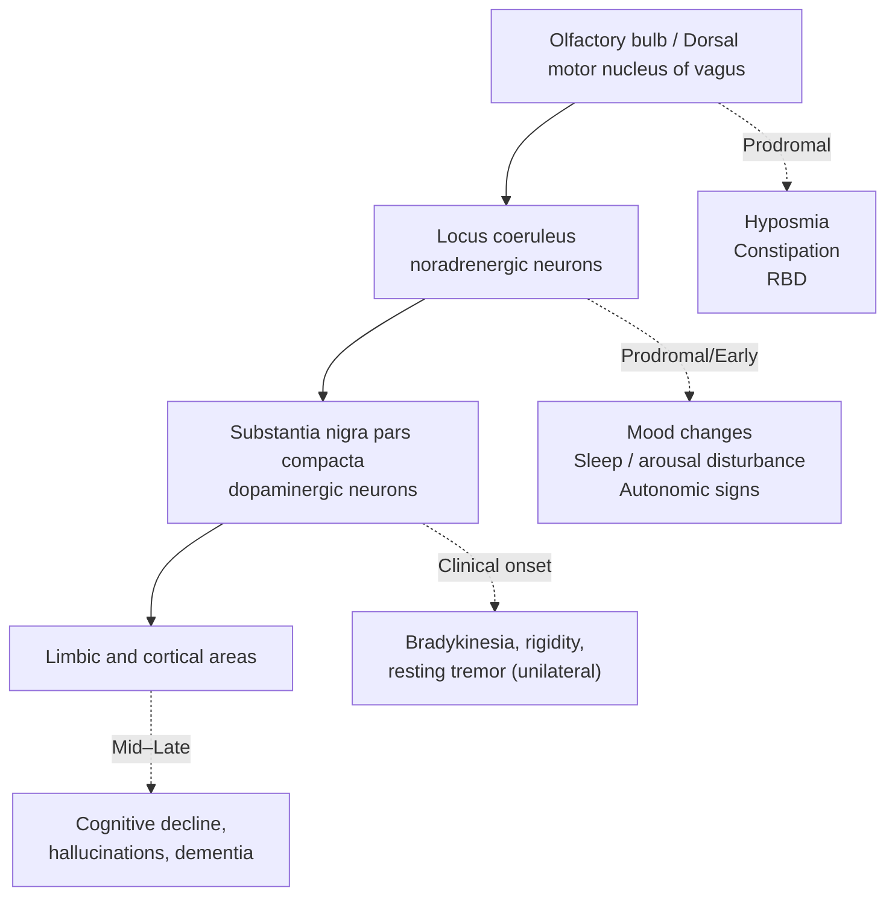

Because the dorsal vagal nucleus and olfactory structures are affected first, **loss of smell (hyposmia), constipation, and REM sleep behavior disorder** can appear long before any movement problem — sometimes 15–20 years before diagnosis.[^4] As the locus coeruleus is involved, **mood disorders such as depression and anxiety, as well as sleep and arousal disturbances**, may emerge.[^4] Only when the substantia nigra is sufficiently depleted do the **classic unilateral motor signs** become apparent. Cortical involvement, occurring later, contributes to the cognitive impairment seen in advanced disease.[^1] This temporal architecture is the biological reason why a stage-based monitoring approach is appropriate: pathology spreads in a roughly predictable way, and warning signs follow.

### 1.2.2 Brain-First vs. Gut-First, and Clinical Subtypes: Heterogeneity Within the Stage Logic

Although Braak's framework provides a useful template, contemporary research recognizes that **PD is not a single disease but a heterogeneous syndrome**, and progression is correspondingly variable. Two complementary axes of heterogeneity matter for stage-based monitoring:

**Brain-first vs. gut-first PD.** A growing literature distinguishes a *gut-first* trajectory — in which pathology begins in the peripheral autonomic nervous system and spreads into the brain, producing prominent gastrointestinal and autonomic symptoms early — from a *brain-first* trajectory, in which pathology begins centrally and spreads outward, producing motor and cognitive symptoms earlier and peripheral autonomic symptoms later.[^4] For families, this means that two patients with the same diagnosis may show very different early warning patterns: one may present with years of constipation and REM sleep behavior disorder before movement changes, while another may show motor signs almost from the start.

**Clinical subtypes.** PD can be subtyped along several dimensions, each with prognostic implications:[^4]

| Subtype dimension | Key features | Implications for monitoring |
|---|---|---|
| Idiopathic PD vs. atypical parkinsonism | Idiopathic PD responds well to dopaminergic medication; atypical forms (PSP, MSA, CBD, DLB) do not | Early poor levodopa response, early falls, or early cognitive decline are red flags (Chapter 5) |
| Age of onset (young/early vs. typical) | Young-onset PD (<50) often has genetic basis, more dystonia/pain, slower progression and slower cognitive decline | Different family/work concerns; medication choices may differ |
| Motor phenotype | Tremor-dominant (better prognosis, slower progression); bradykinetic-rigid (slower, stiffer, worse cognition); postural instability/gait disorder (PIGD; more falls, more autonomic involvement) | Falls and autonomic symptoms appear earlier in PIGD subtype |
| Severity/diffuseness | Mild-motor predominant (resembles brain-first, focal); intermediate; diffuse-malignant (resembles body-first, aggressive course with diffuse motor and non-motor symptoms) | Diffuse-malignant subtype warrants more vigilant non-motor surveillance |
| Gender | Older patients show worse cognitive/autonomic function and quality of life; women report more anxiety, autonomic issues, and depressive symptoms; men often show worse cognitive decline | Caregivers should anticipate gender-specific symptom emphasis |

Not all clinicians fully endorse strict subtyping — some argue that few patients fit neatly into one category, and much of the underlying research has been conducted in predominantly white populations, so global generalizability is limited.[^4] Nevertheless, the central point holds: **staged progression is real but heterogeneous**, and effective monitoring must combine a generic stage map with attention to the patient's individual subtype, age, gender, and presenting pattern.

### 1.2.3 Why "Stages" Are a Useful, Even If Imperfect, Lens

This combination of biologically anchored sequence (Braak) and individual heterogeneity (subtypes, brain-first/gut-first) explains the dual character of PD staging. On the one hand, stages are useful because they correspond to identifiable shifts in pathology and function — from non-motor prodrome, to unilateral motor onset, to bilateral involvement, to balance loss, to severe disability. On the other hand, stages are not deterministic timelines: some patients exhibit very few symptoms as they age, while others progress rapidly.[^1] For families, the practical implication is that staging frameworks should be used as **navigation aids**, not as strict timetables, and warning-sign recognition should always be calibrated against the individual's prior baseline rather than against a population average.

## 1.3 Clinical Staging Frameworks for Identifying Warning Signs

Pathophysiology and Braak's hypothesis explain *why* PD progresses in stages; clinical staging frameworks make those stages **observable, communicable, and actionable** for patients, families, and care teams. Several complementary tools are used in practice, and each contributes a distinct lens through which warning signs can be recognized.

### 1.3.1 The Hoehn & Yahr Scale and Its Modified Version

The **Hoehn & Yahr (H&Y) scale**, originally published in 1967 by Margaret Hoehn and Melvin Yahr, remains the most widely used descriptive map of PD motor progression and is used to stage functional disability and severity over time.[^5][^4] The original five-point scale was later expanded with stages 1.5 and 2.5 to capture the intermediate course of the disease.[^5][^6][^4]

| Stage | Original H&Y | Modified H&Y |
|---|---|---|
| 1 | Unilateral involvement only, usually with minimal or no functional disability | Unilateral involvement only |
| 1.5 | — | Unilateral and axial involvement |
| 2 | Bilateral or midline involvement without impairment of balance | Bilateral involvement without impairment of balance |
| 2.5 | — | Mild bilateral disease with recovery on the pull test |
| 3 | Bilateral disease, mild to moderate disability with impaired postural reflexes; physically independent | Mild to moderate bilateral disease; some postural instability; physically independent |
| 4 | Severely disabling disease; still able to walk or stand unassisted | Severe disability; still able to walk or stand unassisted |
| 5 | Confinement to bed or wheelchair unless aided | Wheelchair-bound or bedridden unless aided |

[^4][^5]

The H&Y scale's strength is its simplicity: a family member can roughly locate a patient on the scale by observing whether tremor or stiffness is on one side or both, whether balance is preserved on the "pull test," and whether the patient can walk independently. Its limitations are equally important: the **Movement Disorder Society Task Force concluded that the modified scale lacks sufficient clinimetric testing and that the broad categories of the original scale are insufficient to detect effects of interventions**, so the scale is now used primarily to define inclusion/exclusion criteria in clinical trials rather than as a sensitive outcome measure.[^4] In other words, H&Y is excellent for *navigation* — telling families and clinicians roughly where they are — but not for fine-grained tracking.

### 1.3.2 The Unified and MDS-Unified Parkinson's Disease Rating Scale (UPDRS / MDS-UPDRS)

To capture the multidimensional reality of PD, the **Unified Parkinson's Disease Rating Scale (UPDRS)** was developed in 1987 as a "gold standard" for monitoring response to medication and tracking severity and progression.[^4] The original UPDRS comprises six segments covering mentation/behavior/mood, activities of daily living, motor sections, complications of therapy, the modified Hoehn and Yahr scale, and the Schwab and England ADL scale, with the first four parts containing 42 items grouped into four subscales scored on 0–4 ratings.[^4] It demonstrates strong internal consistency, adequate inter-rater reliability (with intra-class correlation coefficients of 0.92 for total score, 0.74 for mentation, 0.85 for ADLs, and 0.90 for the motor section), face validity, and sensitivity to clinical change.[^4]

The Movement Disorder Society's revision — the **MDS-UPDRS** — addressed limitations of the original by reorganizing the scale into four parts: Part I (non-motor aspects of experiences of daily living, with 6 items by interview and 7 by self-assessment), Part II (motor aspects of experiences of daily living, 13 self-assessed items), Part III (motor examination, 18 items producing 33 lateralized scores), and Part IV (motor complications, including dyskinesia and fluctuation items).[^4] For warning-sign monitoring, the MDS-UPDRS is particularly valuable because it **explicitly quantifies non-motor symptoms and motor complications alongside motor signs**, giving a family-relevant picture of the patient's lived experience rather than only their bedside neurological exam. A clinically important difference on the UPDRS motor scale is approximately 3 points, and approximately 5 points for the total score, providing a benchmark for whether observed change is meaningful rather than noise.[^4]

### 1.3.3 The Preclinical, Prodromal, and Clinical Phase Model

Where H&Y and MDS-UPDRS describe disease *after* diagnosis, a third framework is essential for the warning-sign question this report addresses: the **preclinical/prodromal/clinical phase model**, derived directly from Braak's pathological sequence. In the prodromal phase — *before* movement is noticeably affected — patients commonly experience **REM sleep behavior disorder, gut changes (especially constipation), olfactory dysfunction (loss of smell), mood disorders (depression, anxiety), and cognitive impairment**, and these can appear 15–20 years before motor symptoms develop.[^4] Tonal changes during this period may also produce shoulder problems such as frozen shoulder or capsulitis many years before diagnosis.[^4] The clinical phase begins when diagnostic motor criteria are met — bradykinesia plus tremor and/or rigidity, with non-motor symptoms increasingly recognized as part of the diagnostic picture.[^4]

This model is what makes pre-diagnostic warning-sign recognition meaningful: it asserts that **the disease is biologically active long before it is clinically diagnosed**, and therefore vigilance for prodromal cues — particularly in individuals with relevant family history or risk factors — is not premature alarmism but appropriate surveillance.

### 1.3.4 Complementary Frameworks and Emerging Tools

Several additional frameworks complement H&Y and MDS-UPDRS by addressing dimensions they do not capture well:

- **MacMahon and Thomas clinical staging model (1998)** organizes PD care into four stages — diagnostic, maintenance, complex, and palliative — each with explicit aims and priorities (e.g., reducing distress at diagnosis; anticipatory care during maintenance; symptom management and consideration of neurosurgical options such as DBS during the complex stage; symptom relief and progressive medication withdrawal during palliative care).[^4] Unlike H&Y, this model **allows fluidity**, accommodating temporary deterioration (e.g., from infection, fall, or hospitalization) followed by recovery — a clinically realistic reflection of how families actually experience the disease.[^4]

- **Biomarkers** — clinical (rating scales themselves), biochemical (α-synuclein in blood, CSF, saliva, urine, gastrointestinal tract; oxidative stress markers; uric acid; genetic markers such as PARK2, LRRK2, glucocerebrosidase), and neuroimaging (radiotracer imaging of the nigrostriatal system, transcranial ultrasound, MRI/DTI changes in the substantia nigra, EEG oscillatory changes) — increasingly support diagnosis, staging, and monitoring of treatment response.[^4] None of these is yet a definitive at-home monitoring tool, but they progressively refine the staging picture available to clinicians.

- **Wearable digital biomarkers** (e.g., inertial sensors used during the Timed Up and Go test) are an emerging area, with potential to provide detailed PD symptom analysis, personalized treatment, and continuous out-of-clinic surveillance, though challenges around cybersecurity, data management, cost-effectiveness, and validation remain.[^4]

### 1.3.5 How These Frameworks Work Together

For families, the practical takeaway is not to master any single scale but to understand how the frameworks complement one another:

| Framework | What it answers | Relevance for family monitoring |
|---|---|---|
| Preclinical/prodromal/clinical phases | "Could symptoms appearing now be PD-related, even before diagnosis?" | Guides recognition of pre-motor warning signs (Chapter 2) |
| Modified Hoehn & Yahr | "Roughly where on the disease trajectory is the patient?" | Provides a navigational reference for stage-specific concerns (Chapters 2–4) |
| MDS-UPDRS | "How are motor and non-motor symptoms changing in detail, and is the change clinically meaningful?" | Underlies clinical visits; family observations feed Parts I and II |
| MacMahon & Thomas | "What are the goals and priorities of care right now?" | Helps frame conversations about treatment intensity, DBS, and palliative care |
| Biomarkers / wearables | "What objective measures support clinical impression?" | Increasingly supplement, but do not replace, clinician judgment |

## 1.4 Bridging Pathophysiology, Staging, and Practical Monitoring

The pathophysiological and clinical materials reviewed above converge on a single, practically useful idea: **PD warning signs are not a random list to be memorized, but a sequence that maps onto an underlying biological progression.** When families understand this mapping, monitoring becomes intelligible rather than overwhelming.

The integrative logic can be summarized as follows. Pathology begins, in many patients, in non-dopaminergic structures — the olfactory bulb, dorsal motor nucleus of the vagus, and (often) the peripheral autonomic nervous system — which is why **the earliest warning signs are typically non-motor**: loss of smell, constipation, REM sleep behavior disorder, and mood changes that can precede diagnosis by many years.[^1][^4] As pathology reaches the locus coeruleus and substantia nigra, **classic motor symptoms emerge unilaterally** (Hoehn & Yahr Stage 1), reflecting the asymmetric onset of nigral dopaminergic loss; subtle signs such as reduced arm swing on one side, micrographia, hypomimia, or a soft voice often appear here.[^1][^4] As nigral loss deepens and the contralateral side becomes involved, **bilateral motor signs** appear (Stage 2), still without balance impairment. Continued degeneration — particularly affecting cholinergic and other non-dopaminergic neurons important for postural control — produces **postural instability** (Stages 2.5–3), the clinical inflection point that brings falls, motor fluctuations, freezing of gait, dyskinesia, and dysphagia into focus. Finally, when cortical and limbic structures are affected, **cognitive decline, hallucinations, severe autonomic failure, and loss of independent ambulation** define advanced stages (Stages 4–5).[^1][^4] This is also the trajectory along which **DBS becomes a relevant consideration** — typically in the "complex" MacMahon and Thomas stage, where motor fluctuations and dyskinesia outpace what oral medication can manage,[^4] a topic developed in Chapters 6–7.

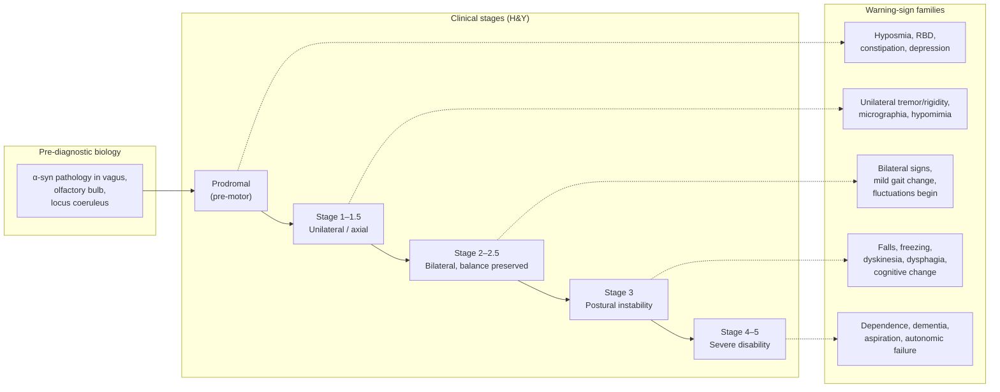

Three implications follow from this integrated framework, and they shape the structure of the remainder of this report:

1. **Stage-appropriate vigilance, not uniform alarm.** What constitutes a "warning sign" depends on stage. A new resting tremor is a major signal in a patient with no prior diagnosis; in a patient already at H&Y Stage 2, it is expected. Conversely, a fall in a Stage 1 patient is *atypical* and a red flag for a possible alternative diagnosis (Chapter 5), whereas in Stage 3 it is the defining feature of the stage and a trigger for therapy adjustment (Chapter 3). Throughout this report, recommendations are calibrated against the patient's *current stage and prior baseline* rather than against absolute symptom severity.

2. **Holistic, not motor-centric, monitoring.** Because PD pathology extends well beyond dopaminergic neurons, **non-motor symptoms can dominate the patient's quality of life and shorten life expectancy**, and they remain difficult to treat despite increasing recognition.[^4] Effective family monitoring must therefore weight cognitive, mood, sleep, autonomic, and psychosocial signs at least as heavily as tremor and gait — a principle that runs through every subsequent chapter.

3. **Decision triggers, not just observation lists.** Stage-based logic is useful only if it translates into action thresholds. Subsequent chapters operationalize this by linking specific observations to specific decisions: continued home observation, scheduled clinic visit, urgent neurology consultation, or emergency care. This staged decision logic, which culminates in the tiered family caregiver framework of Chapter 5 and the post-DBS troubleshooting logic of Chapter 7, rests directly on the pathophysiological-clinical scaffolding established here.

Three caveats must accompany this framework. First, individual variability is substantial — some patients progress slowly with few symptoms, while early-onset or diffuse-malignant subtypes progress quickly[^1][^4] — so the staging map is a guide, not a forecast. Second, much of the underlying research has been conducted in predominantly white populations and in patients who self-select into trials, which limits global generalizability,[^4] and families from underrepresented groups may need to advocate more actively for individualized assessment. Third, **none of the information in this report substitutes for clinical evaluation by a qualified movement disorder specialist**; staging frameworks are tools to support, not replace, professional judgment, and decisions about medication, DBS, or palliative transitions must always involve the care team. With this conceptual scaffold in place, the report now turns to the earliest, most easily missed warning signs: those of the preclinical, prodromal, and early clinical stages.

# 2 Preclinical, Prodromal, and Early-Stage Warning Signs: From Pre-Diagnosis Signals to Hoehn & Yahr Stages 1–2

The pathophysiological scaffold built in Chapter 1 carries a sobering clinical implication: by the time Parkinson's disease (PD) declares itself through the classical motor features that lead to diagnosis, **an extensive loss of dopaminergic neurons in the substantia nigra has already occurred**, and in more than 90% of patients non-motor symptoms have been quietly present, often for years.[^7] The pre-diagnostic window is therefore not a clinically silent period but a long, biologically active phase during which families — usually the first witnesses of subtle changes in a parent or spouse — are uniquely positioned to notice signals that even patients themselves dismiss. This chapter operationalizes the staging logic of Chapter 1 into the earliest portion of the disease trajectory: from prodromal cues that may precede diagnosis by 5–20 years, through the unilateral motor onset of Hoehn & Yahr (H&Y) Stages 1–1.5, into the bilateral but balance-preserved involvement of Stages 2–2.5. For each cluster of warning signs, the discussion stays anchored to two principles inherited from Chapter 1: **calibration against the patient's own baseline rather than against population norms**, and **stage-appropriate action thresholds rather than uniform alarm**.

## 2.1 Prodromal Non-Motor Warning Signs: The Pre-Diagnostic Window

The prodromal phase of PD is defined precisely by what is *not* yet present: cardinal motor symptoms (bradykinesia, rigidity, resting tremor) have not yet developed, so clinical diagnostic criteria for PD are not met, even though neurodegeneration is already ongoing.[^8] What *is* present, when one looks carefully, is a constellation of non-motor and subtle motor markers whose individual likelihood ratios for predicting future PD vary widely but that gain coherence when read against the Braak caudo-rostral sequence introduced in Chapter 1.[^8] The four most thoroughly studied prodromal warning signs — hyposmia, REM sleep behavior disorder (RBD), gastrointestinal/autonomic dysfunction, and prodromal mood disorders — anchor the family-observable side of this window.

### 2.1.1 Hyposmia: The Most Prevalent Pre-Motor Cue

**Hyposmia (reduced sense of smell), and its more severe form anosmia, is one of the most common and best-characterized non-motor features of PD and is often one of the first manifestations of the disease.**[^7] Its biological rationale is direct: olfactory bulb and nucleus involvement is among the earliest stations on the Braak pathological map, well before substantia nigra involvement produces motor signs. Epidemiologically, the predictive weight of hyposmia is now substantial. A 2019 systematic review and meta-analysis of seven prospective cohort studies (3,272 hyposmic individuals, 176 incident PD events, follow-up 3–17 years) found that **hyposmia was associated with a 3.84-fold increased risk of developing PD (pooled relative risk 3.84, 95% CI 2.12–6.95) compared with normosmic peers**, with no evidence of publication bias and the association robust across hyposmia assessment tools (Sniffin' Sticks, BSIT, UPSIT, SDOIT) and follow-up periods.[^7] Earlier prospective work showed that **hyposmia can predate clinical PD by at least four years** in men and that idiopathic olfactory dysfunction is associated with at least a 10% increased risk of developing PD.[^7]

For families, this evidence translates into a low-cost, high-yield observational habit. PD-related hyposmia tends to be **bilateral, persistent across many odorants (not limited to a single class such as floral or food smells), and progressive**, whereas a temporary loss after a viral upper-respiratory infection or sinusitis usually resolves within weeks. Practical home cues include the patient no longer noticing strong familiar smells (coffee brewing, garlic cooking, gas leaks, soured milk, body odor), repeatedly seasoning food more heavily to "find" flavor, or being unaware of household smells obvious to other family members. Two important caveats limit isolated interpretation, however. First, although hyposmia exhibits high sensitivity for PD, it has **relatively low specificity, as it can be present in individuals with neurological diseases other than PD** (Alzheimer's disease, atypical parkinsonisms in some cases) and in healthy older adults; this constrains its diagnostic application as a stand-alone marker.[^7] Second, olfactory testing cannot reliably discriminate PD from progressive supranuclear palsy, multiple system atrophy, corticobasal degeneration, or essential tremor, all of which can preserve or only mildly affect smell.[^7] Hyposmia is therefore best treated by families as a **trigger for documentation and specialist conversation, not for self-diagnosis**.

### 2.1.2 REM Sleep Behavior Disorder: The Most Specific Prodromal Marker

If hyposmia is the most *prevalent* prodromal cue, **REM sleep behavior disorder (RBD) is the most *specific* marker of prodromal alpha-synucleinopathies**.[^9] RBD is characterized neurophysiologically by the loss of muscle atonia during REM sleep (REM sleep without atonia, or RSWA) and clinically by **dream-enactment behaviors** — the patient physically acts out dream content, often vivid and aggressive, with kicking, punching, shouting, leaping out of bed, or unintentionally injuring a bedpartner.[^10][^8] The conversion data are striking and consistent across cohorts. Long-term studies indicate that **more than 80% of people who develop isolated (idiopathic) RBD will go on to develop an alpha-synuclein-related neurodegenerative disorder** — Parkinson's disease, dementia with Lewy bodies (DLB), or multiple system atrophy (MSA) — and the largest pooled study to date, drawing on 1,280 polysomnographically diagnosed RBD subjects from 24 international sleep centers, found an **overall conversion rate from idiopathic RBD to an overt neurodegenerative syndrome of 6.3% per year**.[^11][^10] Prevalence within established disease is correspondingly high: RBD is present in 25–58% of patients with PD and up to 90% of those with DLB or MSA, and in a substantial proportion of patients its onset *precedes* motor symptoms — sometimes by decades, with RBD documented to precede other features of synucleinopathies by up to half a century in extreme cases.[^10]

For family caregivers, the practical recognition task is to distinguish true RBD from the more common, benign sleep phenomena of older adults. A simple comparative summary is useful:

| Sleep behavior | Likely benign explanation | Suggestive of RBD |
|---|---|---|
| Tossing, turning, leg movement | Restless legs syndrome, periodic limb movements (typically non-REM, no dream content) | Vigorous, *purposeful-looking* movements coordinated with dream content |
| Talking, mumbling | Sleep talking; can occur in any stage | Loud shouting, swearing, conversational speech that matches dream narrative |
| Walking out of bed | Sleepwalking (non-REM parasomnia, eyes open, blank, often in children/young adults) | Patient strikes out from bed while still appearing asleep, usually in second half of night |
| Nightmares with awakening | Ordinary nightmares — patient wakes still, frightened, and recalls dream | RBD — patient *enacts* the dream while asleep, often unaware until told or until they hit something |
| Occasional incident | A single episode, usually attributable to fever, alcohol, or medication | **Recurrent** episodes over months, especially with injuries to self or bedpartner, bruising, or falls from bed |

Families should be alerted by **recurring, vivid dream-enactment that injures the patient or bedpartner**, particularly when it occurs in the second half of the night (when REM sleep predominates) and when the patient has no memory of acting out but does remember the dream. Such observations are especially important to capture because the patient sleeping alone is often unaware of them; a bedpartner's account is therefore irreplaceable clinical information. At the same time, the ethical literature urges restraint in interpretation: clinicians and families face a "balancing act" of providing sufficient information and follow-up without overloading at-risk individuals with extensive details about possible neurodegenerative outcomes, since not all RBD individuals will convert in a clinically meaningful timeframe.[^8] Recognition therefore should prompt **polysomnographic confirmation and longitudinal neurological follow-up**, not anxiety-driven over-diagnosis at home.

### 2.1.3 Constipation and Other Gastrointestinal/Autonomic Signs

The third major prodromal cluster reflects the early involvement of the **dorsal motor nucleus of the vagus nerve and the peripheral autonomic nervous system** — Braak's earliest stations — and is the biological substrate of the "gut-first" PD trajectory introduced in Chapter 1. Several clinical studies now consistently suggest that **constipation may precede the first occurrence of classical motor features of PD**,[^12] and case-control evidence shows a greater risk of PD among individuals with a history of constipation as documented in medical records.[^13] Earlier prospective work has linked reduced bowel movement frequency in late life to incidental Lewy bodies at autopsy, supporting a true biological connection rather than a coincidental association.[^7]

PD-pattern constipation differs in several practical respects from age-typical bowel slowing:

- **It is often long-standing, severe, and refractory** to fiber, hydration, and over-the-counter laxatives, rather than intermittent.
- It frequently precedes any motor change by **5–20 years**, whereas constipation arising for the first time in late life from medication side effects, immobility, or dietary change usually has identifiable triggers.
- It is **often accompanied by other autonomic symptoms** — orthostatic lightheadedness on standing, urinary urgency or frequency, erectile dysfunction in men, and excessive sweating or its absence — reflecting more diffuse autonomic involvement.

The clinical importance of this cluster has been further sharpened by recent prospective evidence that **early autonomic dysfunction in prodromal PD is associated with increased risk of cognitive decline**: in a 382-person prodromal cohort from the Parkinson's Progression Markers Initiative, individuals with a SCOPA-AUT score ≥13 documented at least one year before outcome assessment showed significantly faster progression to mild cognitive impairment than those without (43.86% vs. 9.67% at 48 months; 66.67% vs. 16.6% at 72 months), with constipation (HR 7.81), fatigue (HR 9.32), and cardiovascular autonomic burden (HR 5.21) independently predicting earlier conversion.[^14] For families, this means that persistent autonomic complaints in an older adult should not be filed under "just aging" — they may be carrying prognostic information about both motor and cognitive trajectories.

### 2.1.4 Prodromal Depression, Anxiety, and Apathy

Mood and affective changes constitute the fourth major prodromal cluster, biologically tied to involvement of the locus coeruleus (noradrenergic) and raphe nuclei (serotonergic), and to dopaminergic dysregulation of mesolimbic pathways. Multiple lines of epidemiological evidence place depression and anxiety inside, rather than alongside, the PD trajectory: PD patients have more frequent histories of depression, anxiety and nervousness than controls, and these psychological symptoms can develop **3 to 6 years before the onset of motor dysfunction**.[^15] In a population-based case-control study of 371 incident PD cases and 402 population controls in California, **male PD patients were significantly more likely than controls to have received a depression or anxiety diagnosis combined with psychotropic treatment within 5 years of PD diagnosis (OR 2.21, 95% CI 1.21–4.04 at 5-year lag; OR 2.44, 95% CI 1.29–4.61 at 2-year lag)**, while differences faded at 10- and 20-year lags, supporting the interpretation that depression and anxiety in this window are largely **prodromal manifestations rather than independent risk factors**.[^15] No equivalent association was observed for women in that cohort, consistent with broader observations that women have higher baseline rates of depression and anxiety, which may obscure a prodromal signal.[^15]

The anatomic basis of this association has been mapped to the substantia nigra and locus coeruleus/subcoeruleus complex, where dysfunction occurs in **Braak Stage 2** and has been estimated to begin ten years or more prior to motor symptoms.[^15] The implicated neurotransmitter systems are noradrenergic, dopaminergic, and serotonergic — broader than ordinary late-life depression — which is part of why prodromal depression in PD is often described as **less responsive to typical reassurance, accompanied by apathy or reduced curiosity rather than overt sadness, and persistent rather than situational**.[^16] Apathy in particular — described as reduced curiosity or interest in new things, lack of passion or reaction to events that would normally evoke emotion, and difficulty starting activities without prompting — is increasingly recognized as a distinct prodromal feature that families often misread as personality change, laziness, or marital withdrawal.[^16] For caregivers, the practical signal is **a sustained, otherwise-unexplained shift in mood, motivation, or engagement in a previously active middle-aged or older adult**, particularly when accompanied by other prodromal cues.

### 2.1.5 Why Clusters, Not Single Signs, Define the Prodromal Profile

A unifying point across these four clusters is that **predictive weight accumulates with co-occurrence**. A single isolated prodromal sign carries only modest individual risk: hyposmia roughly quadruples PD risk over 5–17 years,[^7] but most hyposmic adults will never develop PD; depression in a 55-year-old is overwhelmingly more likely to reflect ordinary depression than prodromal PD; and constipation alone is too common in older adults to be diagnostic. By contrast, the **combination** — for example, hyposmia + RBD + chronic constipation + new-onset apathy in a person over 50 — substantially raises pre-test probability and, when paired with subtle motor signs (Section 2.3) or with genetic risk (LRRK2 G2019S, GBA mutations, family history),[^8] enters the territory of MDS research criteria for prodromal PD that warrant specialist evaluation.[^8] Families should therefore think in terms of **patterns assembled over time**, not individual alarms — a logic that the differentiation guidance in Section 2.2 makes explicit.

## 2.2 Distinguishing Prodromal Signals from Normal Aging and Benign Mimics

The interpretive challenge for families is not that prodromal signs are hidden — they are usually visible at home — but that **most of them, taken individually, look very much like normal aging or like other non-PD conditions**. Misclassification works in both directions: dismissing a meaningful cluster as "just getting older" delays evaluation, while over-attributing every age-related change to PD generates anxiety and may strain family relationships. A structured comparison clarifies where the meaningful boundaries lie.

| Prodromal cue | Age-typical or benign pattern | PD-suggestive pattern |
|---|---|---|
| **Olfactory change** | Mild gradual decline, especially for faint odors; partial loss after a cold or sinus infection that recovers; unilateral nasal blockage explaining the loss | Persistent, bilateral, broad-spectrum loss of strong familiar odors (coffee, garlic, gas, body odor); progressive over months to years; not explained by nasal pathology[^7] |
| **Sleep behavior** | Restless legs, periodic limb movements, brief sleep talking, occasional nightmare with quiet awakening, age-related sleep fragmentation | Recurrent dream-enactment with vigorous coordinated movement matching dream content; injuries to self or bedpartner; predominates in second half of night; bedpartner accounts of shouting or punching while asleep[^10] |
| **Bowel pattern** | Mild slowing with dietary change, dehydration, or new medications; responsive to fiber, fluids, mild laxatives | Long-standing severe constipation, often years in duration, refractory to standard measures, accompanied by other autonomic features (orthostatic dizziness, urinary urgency)[^13][^12] |
| **Mood / motivation** | Reactive sadness to specific losses (retirement, bereavement); responsive to social engagement and time | Persistent low mood, anxiety, or apathy without proportionate trigger; reduced curiosity and initiative; sustained for months; especially when combined with other prodromal cues[^15] |
| **Cognitive feel** | Occasional "tip-of-tongue" word retrieval; mild slowing | Subtle executive slowing, difficulty dual-tasking, perseveration — particularly when paired with autonomic features, which together predict faster cognitive decline[^14] |

Two additional principles help families avoid both under- and over-interpretation. First, **risk stratification by clustering** is the single most useful interpretive heuristic: the conditional probability that any one prodromal cue indicates PD is low, but conditional probabilities multiply when independent cues co-occur. The MDS research criteria for prodromal PD formalize this by combining likelihood ratios across markers — clinical (hyposmia, RBD, constipation, depression, autonomic dysfunction), demographic (age >50), and where available genetic (LRRK2 G2019S, GBA) and imaging (DAT-SPECT, transcranial sonography) — rather than treating any single feature as diagnostic.[^8] Importantly, asymptomatic individuals carrying the LRRK2 G2019S mutation are at increased risk to develop PD, with **disease penetrance ranging from 25 to 42.5% by the age of 80 years**, providing an example of how genetic context modifies the interpretation of prodromal signs.[^8]

Second, **the limits of self-assessment must be respected**. Olfactory testing kits exist, but informal home tests generate substantial noise; polysomnography is required to definitively establish RBD because subjective reports of "violent dreams" alone overlap with ordinary nightmares;[^10] and depression scales used in epidemiological studies (e.g., the Geriatric Depression Scale) are screening tools, not diagnostic instruments. The appropriate posture for families is therefore **prodromal awareness as a trigger for documentation and conversation**, not for premature self-diagnosis: keeping a dated log of observations, noting medications, and bringing the assembled pattern to a primary care or specialist visit — a process that Section 2.6 operationalizes.

## 2.3 Early Motor Warning Signs (Hoehn & Yahr Stages 1–1.5): Unilateral and Subtle Onset

When prodromal pathology in the substantia nigra finally crosses the threshold at which striatal dopamine is too depleted to compensate, motor signs emerge — and, characteristically, they emerge **unilaterally**, defining H&Y Stage 1 (unilateral involvement only) and Stage 1.5 (unilateral plus axial involvement).[^17][^18] **Asymmetry is the single most distinctive feature of early PD motor onset**: the disease almost always begins on one side of the body and remains predominantly unilateral for months to years before crossing the midline, a pattern that distinguishes idiopathic PD from many of its mimics. Six early motor signatures are particularly relevant for family observation.

**Resting tremor.** The classical PD tremor is a **4–6 Hz rest tremor**, often described as "pill-rolling" because of the rhythmic opposition of thumb and index finger. It is present when the limb is at rest, suppressed (or at least diminished) by voluntary movement, often re-emerges when the limb assumes a sustained posture, and is asymmetric in onset. Two common confusables are essential tremor — typically bilateral, action-predominant rather than rest-predominant, often family-historical, and worse with sustained posture or movement — and physiological tremor, a fine, rapid, bilateral tremor accentuated by anxiety, caffeine, or fatigue. Families can document tremor usefully with a brief smartphone video showing the limb at full rest on the lap, then during finger-to-nose or cup-holding, capturing the suppression pattern that distinguishes PD tremor from action tremor.

**Bradykinesia.** Bradykinesia — slowness of movement and decrement in repetitive movements — is the **cardinal motor feature required for PD diagnosis** and is what dopaminergic medications most reliably reverse early in the disease.[^19] At home, bradykinesia is rarely noticed as "slowness" *per se*; it shows up as **slower buttoning, longer time to cut food, slower chewing, reduced blink rate, fewer spontaneous gestures, and a distinctive decrement** — the patient's first few finger-taps or arm swings are normal, but each subsequent repetition becomes smaller and slower.

**Rigidity.** Rigidity — increased tone with cogwheel or lead-pipe quality on passive movement — is often unappreciated by patients themselves and is more reliably detected by an examiner. Importantly, rigidity in PD frequently presents earlier as **shoulder pain or "frozen shoulder"** that long predates diagnosis, leading patients to consult orthopedists or physiotherapists before any neurologist; capsulitis or unexplained shoulder stiffness in the dominant arm of an older adult, especially when accompanied by other subtle changes, deserves a broader review. Dystonic cramping of a foot or hand on one side can also be an early presentation.

**Micrographia.** Handwriting that becomes **progressively smaller and more cramped within a single line or page** is a hallmark of early PD bradykinesia applied to the small, learned motor program of writing. It is more specific than generic "messy handwriting" and is best detected by **comparing writing samples over months or years** — a birthday card from two years ago against a current shopping list, for instance.

**Hypomimia and hypophonia.** Reduced facial expression (hypomimia, "facial masking") and reduced spontaneous gesture are often the *first* signs noticed by family members — but are usually misread as **depression, disengagement, or "she just doesn't seem interested anymore."** This misattribution can damage relationships before diagnosis, as the patient appears emotionally distant despite intact internal feeling. Similarly, **soft, monotone, breathy voice (hypophonia)** is often noticed as the patient being "asked to repeat themselves" on the phone, or as the family turning up the television volume to accommodate them, rather than as a neurological sign.

**Reduced arm swing and mild stooping.** A **unilaterally reduced arm swing during walking** is one of the earliest and most reliable observable motor signs. Watching a parent or spouse walk down a hallway from behind, with attention to whether one arm swings less than the other, is a remarkably sensitive informal screen. Mild stooping of posture and a slight asymmetric leaning may accompany it.

The interpretive principle uniting these six signatures is **unilateral asymmetry plus progressive accumulation**. A single isolated finding — for example, a fine bilateral postural tremor in a 70-year-old — is more likely essential tremor than PD; but a unilateral rest tremor in the right hand, *plus* reduced right arm swing, *plus* shrinking handwriting, *plus* a softer voice, *plus* a year of constipation and three years of RBD, constitutes a pattern that warrants prompt specialist evaluation. Foreshadowing Chapter 5, **early bilateral symmetric onset, prominent early falls at this stage, severe early autonomic failure, or rapid progression should raise concern for atypical parkinsonism rather than idiopathic PD**.

## 2.4 Early-Stage Non-Motor Symptoms Accompanying Motor Onset (Stages 1–2)

Once motor symptoms appear and PD is clinically diagnosable, the prodromal non-motor cluster does not disappear — it broadens and often becomes more clinically dominant. The "Parkinson's iceberg" metaphor is apt: motor symptoms are the visible tip, while non-motor symptoms (cognitive, emotional, sensory, autonomic, sleep-related, communication-related) constitute the much larger submerged mass and frequently determine quality of life more than tremor or stiffness.[^16] The PRIAMO multicenter study and subsequent work confirmed that non-motor symptoms occur in the great majority of PD patients across the disease course and substantially impact quality of life.[^7]

**Sleep disturbance** at Stages 1–2 is multidimensional. Pre-existing RBD typically continues and may worsen; new insomnia, fragmented sleep, and excessive daytime sleepiness emerge as locus coeruleus and brainstem arousal systems are involved; vivid dreams and nightmares persist; and as patients begin dopaminergic therapy, dopamine agonists can additionally produce excessive daytime sleepiness severe enough that **people with jobs that require driving or operating heavy machinery may face greater impairment from these side effects**.[^19] Restless legs syndrome and nocturia (frequent night-time urination) further fragment the night.

**Mood symptoms** at this stage frequently consist of **depression, anxiety, and apathy**, often overlapping but distinguishable. Depression is common, with prevalence estimates of 17–35% among US and European PD patients (versus a 12-month general-population prevalence of about 7%),[^15] and may be associated with more rapid deterioration in cognitive and motor function.[^15] Anxiety frequently focuses around motor unpredictability, social embarrassment about tremor or mask-like face, and fear of falling. Apathy is conceptually distinct from depression — characterized by reduced motivation and emotional reactivity rather than sadness per se — and is particularly important to identify because it does not respond to the same treatments as depression and is often misread by families as the patient "not trying."[^16]

**Mild cognitive complaints** at Stages 1–2 are typically subtle: executive dysfunction (planning, set-shifting), slowed information processing, reduced ability to dual-task (e.g., walking while talking), and word-finding difficulty, generally without meeting criteria for dementia. The clinical importance of these complaints has been sharpened by recent evidence that **early autonomic burden in prodromal/early PD predicts incident cognitive impairment**: patients with SCOPA-AUT ≥13 documented at least one year before outcome demonstrated more rapid decline in Letter-Number Sequencing, Montreal Cognitive Assessment scores, and semantic fluency than those without early autonomic dysfunction.[^14] This is a strong rationale for families to monitor non-motor symptoms with at least the attention they give to tremor or gait.

**Early autonomic features** that often intensify in Stages 1–2 include worsening constipation, orthostatic lightheadedness on standing (especially in the morning), urinary urgency and frequency, increased sweating, and sexual dysfunction. **Fatigue** — distinct from sleepiness — is among the most disabling early non-motor symptoms and is independently associated with progression to cognitive impairment.[^14] **Pain syndromes**, often underrecognized, include the shoulder pain noted earlier as a frequent prodromal presentation, dystonic cramping (commonly foot or toe dystonia, often early-morning before levodopa), and diffuse sensory discomfort.

The integrating clinical message is that **at H&Y Stages 1–2, non-motor and motor symptoms must be tracked together**. A family that monitors only tremor severity will miss the autonomic-cognitive trajectory that often determines long-term outcome; a family that tracks sleep, mood, autonomic, and cognitive function alongside motor signs builds a far richer picture for the treating clinician and is better positioned to prompt timely intervention.

## 2.5 Bilateral Progression and Stage 2–2.5 Indicators

The transition from H&Y Stage 1.5 (unilateral plus axial) to **Stage 2 (bilateral involvement without impairment of balance)**, and from there to Stage 2.5 (mild bilateral disease with recovery on the pull test), is gradual rather than abrupt and reflects continued dopaminergic loss extending to the contralateral hemisphere.[^17][^18] Families typically notice this transition through several converging observations:

- **The previously "good" side begins to show signs**: the left hand develops a mild rest tremor in a patient whose tremor was previously confined to the right; the previously normal arm swing becomes reduced; bilateral micrographia replaces unilateral micrographia.
- **Generalized slowness becomes evident**: getting dressed in the morning takes longer, mealtimes lengthen, the patient takes more time to rise from a chair (though still able to do so unaided).
- **Voice and facial changes deepen**: hypophonia is now consistent rather than intermittent, facial expression is more reliably reduced, and conversational fluency may slow.
- **Mild gait changes appear**: shorter steps, slight shuffling without freezing, mild stooped posture, but **without postural instability or falls** — a critical defining boundary of Stages 1–2.

The Stage 2.5 designation specifically captures patients who have **mild bilateral disease with recovery on the pull test** — that is, when an examiner pulls the patient backward by the shoulders during clinical examination, the patient takes one or two corrective steps but recovers without falling. Stage 3, by contrast, is defined by postural instability that does *not* fully recover, marking the clinical inflection point that Chapter 3 addresses in detail.[^17][^18]

For patients already initiated on dopaminergic therapy at this stage — typically following AAN, NICE, or Parkinson's Foundation–endorsed early-PD treatment recommendations[^19][^20] — families may begin to observe the **first medication-related phenomena** that will become more prominent in mid-stage disease:

- **End-of-dose wearing-off**: the patient feels and looks better in the first hours after a levodopa dose and notably worse in the half-hour before the next, with returning tremor, stiffness, or slowness;
- **Mild peak-dose dyskinesia**: brief involuntary writhing or rocking movements at the time of peak medication effect, usually mild and not yet bothersome;
- **Impulse control changes** in patients started on dopamine agonists: dopamine agonists are more likely than levodopa to cause **impulse-control disorders such as compulsive gambling, eating, shopping, or sexual activity**, as well as hallucinations.[^19][^20] Families should be alert for unexplained new spending, secret online activity, dietary excess, or behavior changes after a dopamine agonist is started.

The **single most important warning principle for Stages 1–2** carries forward from Chapter 1: **balance is preserved at these stages**. A fall in a patient currently classified as Stage 1 or 2 is therefore *atypical*, not expected, and should prompt re-evaluation rather than reassurance — both to consider whether the patient has actually progressed to Stage 3 (in which case treatment intensity should be reassessed; see Chapter 3) and to consider whether the original diagnosis should be revisited for atypical parkinsonism (see Chapter 5), where early falls are a hallmark red flag.

## 2.6 Family Decision Framework: When to Observe, Review, or Seek Specialist Evaluation

The observations cataloged in Sections 2.1–2.5 are useful only if they translate into action. The following tiered framework operationalizes early-stage warning signs into three response levels, calibrated to the strength and clustering of signals and to the patient's current baseline. It is designed for family members without clinical training and emphasizes **decision triggers rather than symptom checklists**.

### 2.6.1 Tier 1 — Continued Documented Home Observation

Appropriate when signs are **isolated, mild, ambiguous, or potentially explainable by non-PD causes**, such as:

- A single prodromal cue (e.g., mild olfactory change after a recent cold) without other features;
- An occasional vivid dream without enactment behavior or injury;
- New constipation following a medication change, with a plausible alternative explanation;
- A fine bilateral postural hand tremor without rest component or asymmetry;
- Mild handwriting change without other motor or non-motor signs.

The action at this tier is **structured observation, not passive watching**. Families should:

- Maintain a **dated symptom diary** noting which symptoms occurred, frequency, severity (e.g., 0–10), and possible triggers (medication, illness, sleep loss);
- **Save baseline writing samples** (a few sentences written each month on the same line-spaced paper) for later comparison;
- **Record short videos** (10–20 seconds) of the patient walking down a hallway from behind, of hands at full rest on the lap, and of finger-tapping repetition — these are extraordinarily useful at later specialist visits;
- Maintain a **medication and supplement list**, including over-the-counter drugs, since some agents (antipsychotics, antiemetics such as metoclopramide, reserpine-containing antihypertensives) can cause drug-induced parkinsonism that mimics PD;
- Encourage **lifestyle measures with established benefit**, especially regular exercise — the Parkinson's Foundation, drawing on its Parkinson's Outcomes Project, recommends **at least 2.5 hours per week of exercise**, which has been shown to slow decline in quality of life when initiated early, with benefits across aerobic activity, strength training, stretching, and balance.[^21]

### 2.6.2 Tier 2 — Scheduled Primary Care or General Clinic Review

Appropriate when signs are **persistent over weeks to months, clustered, or affecting daily function**, such as:

- A combination of two or more prodromal cues (e.g., hyposmia + chronic constipation; persistent mood change + sleep disturbance);
- Persistent depression, anxiety, or apathy not explained by life circumstances;
- Bedpartner-witnessed recurrent dream-enactment with potential injury risk;
- Subtle motor signs (slight unilateral reduced arm swing, micrographia, soft voice) that have remained stable but consistent over months without progressing rapidly;
- An older adult on multiple medications in whom drug-induced parkinsonism cannot be excluded.

The actions at this tier include:

- **Bringing the dated diary, videos, and writing samples** to the appointment;
- **Requesting a medication review** focused on agents known to cause parkinsonism or worsen non-motor symptoms (antipsychotics, antiemetics, sedating antihistamines, certain antihypertensives);
- **Screening for treatable mimics**: depression, hypothyroidism, vitamin B12 deficiency, normal-pressure hydrocephalus, vascular cognitive impairment, sleep apnea (which can mimic excessive daytime sleepiness);
- **Initiating structured exercise**, ideally with input from a physical therapist familiar with PD, to establish habits before more substantial mobility limits emerge;[^21]
- **Discussing whether neurology referral is warranted** based on the clinical picture.

### 2.6.3 Tier 3 — Neurology or Movement Disorder Specialist Consultation

Appropriate when one or more of the following is present:

- **Confirmed unilateral resting tremor** with a 4–6 Hz pill-rolling quality, particularly when associated with reduced arm swing on the same side;
- **Progressive bradykinesia or rigidity** observed at home over months;
- **Suspected RBD** (recurrent dream-enactment, especially with injury), which warrants polysomnographic confirmation and longitudinal neurological follow-up given the >80% lifetime conversion to a synucleinopathy;[^10][^8]
- Any **combination of motor signs plus multiple prodromal non-motor signs** in a person over 50, or with relevant family history or LRRK2/GBA genetic risk;[^8]
- **Atypical features** that may indicate non-PD parkinsonism — early bilateral symmetric onset, early falls at H&Y Stages 1–2, prominent early autonomic failure, early dementia, poor response to a trial of levodopa — all of which should prompt urgent specialist evaluation rather than primary care management (the substantive discussion of these red flags appears in Chapter 5).

A few specific issues warrant pre-emptive note. **Objective olfactory testing** is now embedded in PD clinical guidance — NICE includes objective smell testing in its diagnostic recommendations alongside imaging (DAT-SPECT, structural MRI) and acute levodopa/apomorphine challenge tests[^20] — so families need not feel that mentioning olfactory loss is "trivial." Similarly, the **AAN early-PD guideline (2021, endorsed by the Parkinson's Foundation)** provides explicit recommendations on initial therapy choice, with **levodopa identified as usually the best first treatment for motor symptoms**, while dopamine agonists carry higher risks of impulse control disorders, hallucinations, and excessive daytime sleepiness, and MAO-B inhibitors are less likely to control symptoms long-term;[^19] **NICE's 2024 guidance similarly emphasizes levodopa-based therapy as the preferred initial therapy**, with adjuvant dopamine agonists, MAO-B inhibitors, COMT inhibitors, or amantadine considered as the disease evolves.[^20][^22]

### 2.6.4 Questions to Bring to the First Specialist Visit

To make the specialist visit maximally productive, families should arrive prepared to discuss:

| Domain | Questions to bring |
|---|---|
| **Diagnosis** | Is this idiopathic PD, atypical parkinsonism, or drug-induced/secondary parkinsonism? What features support or argue against each? |
| **Confirmation** | Are objective tests indicated (DAT-SPECT, smell testing, polysomnography for suspected RBD, levodopa challenge)? |
| **Staging** | What Hoehn & Yahr stage is the patient currently at? What MDS-UPDRS scores, if any, were obtained? |
| **Treatment initiation** | Should dopaminergic therapy be started now? If so, levodopa, dopamine agonist, or MAO-B inhibitor — and why? What are the expected benefits and side-effect profiles?[^19][^20] |
| **Non-motor symptoms** | How will sleep, mood, autonomic, and cognitive symptoms be tracked and managed? |
| **Lifestyle** | What exercise prescription is recommended (frequency, type, intensity)?[^21] Are physical therapy, speech therapy, or occupational therapy referrals indicated? |
| **Monitoring** | What signs should trigger an unscheduled visit before the next routine appointment? When is the next follow-up? |
| **Family role** | What changes should the family specifically watch for? What records (videos, diaries) would be most useful at follow-up? |

### 2.6.5 Why Early Specialist Contact Matters

Delaying specialist evaluation in early PD is not without cost. **Early dopaminergic therapy** materially improves motor symptoms, activities of daily living, and quality of life;[^19][^20] **early structured exercise** has been shown by the Parkinson's Outcomes Project to slow the decline in quality of life when initiated at ≥2.5 hours per week, with potential neuroprotective effects supported by both human and animal evidence;[^21] and **early specialist relationship-building** establishes a longitudinal monitoring foundation that the mid-stage and post-DBS chapters of this report (Chapters 3, 6, 7) will build upon.

Three closing caveats anchor the chapter. First, the predictive evidence cited above — particularly the 3.84-fold pooled relative risk for hyposmia,[^7] the 6.3% annual conversion rate for RBD,[^10] and the 5-year prodromal window for depression/anxiety[^15] — derives largely from cohort studies in predominantly Western, predominantly older, and predominantly male or unbalanced populations, with limited data from younger adults, women in some analyses, and global minority groups; individual prediction therefore carries substantial uncertainty.[^7][^15] Second, **none of the prodromal markers, individually or in combination, is a definitive diagnostic test**; the MDS research criteria for prodromal PD are research instruments, and validation of biomarkers that allow identification of individuals at risk for clinical PD remains an "unmet need."[^8] Third, and most importantly for families, **prodromal awareness is intended to enable timely conversation, not to substitute for it**. The decision framework in this chapter assumes — and the rest of this report assumes — that warning-sign recognition operates *within* a relationship with a movement disorder specialist, primary care clinician, and broader care team, and that the family's role is to bring observations forward, not to make diagnoses. With early-stage signals now operationalized, the report turns in Chapter 3 to the very different decision logic that applies once postural instability and motor fluctuations mark the entry into mid-stage disease.

[^7]: Sui X, Zhou C, Li J, Chen L, Yang X, Li F. Hyposmia as a Predictive Marker of Parkinson's Disease: A Systematic Review and Meta-Analysis. BioMed Research International. 2019;2019:3753786.
[^17]: Clarke CE, Patel S, Ives N, et al. Hoehn and Yahr stages. In: Clinical effectiveness and cost-effectiveness of physiotherapy and occupational therapy versus no therapy in mild to moderate Parkinson's disease (PD REHAB). NIHR Journals Library; 2016.
[^18]: VA Parkinson's Disease Research, Education and Clinical Centers. Modified Hoehn and Yahr Staging.
[^11]: Postuma RB. Rate of conversion of REM sleep behavior disorder (RBD) to a defined neurodegenerative disease.
[^16]: PhotoPharmics. Parkinson's Iceberg: The Non-Motor Symptoms You Don't See. December 2024.
[^9]: Prodromal Parkinsonism and Neurodegenerative Risk Stratification.
[^19]: American Academy of Neurology. AAN Issues Guideline for Treatment of Early Parkinson's Disease. Neurology. November 15, 2021.
[^10]: REM sleep behavior disorder (RBD). PubMed.
[^20]: National Institute for Health and Care Excellence. Parkinson's Disease in Adults (NG71); Medscape NICE 2024 Guideline Summary.
[^22]: Anti-Parkinson's Agents — clinical guidelines summary (levodopa-based therapy preferred initial therapy).
[^8]: Crosiers D, Santens P, Chaudhuri KR. Editorial: Prodromal Parkinson's Disease. Frontiers in Neurology. 2021;11:634490.
[^21]: Parkinson's Foundation. Exercise.
[^13]: Risk of Parkinson's disease following severe constipation (case-control evidence).
[^12]: Constipation: an emerging risk factor for Parkinson's disease?
[^14]: Martinez-Nunez AE, Mills KA, Seemiller J, et al. Early autonomic burden in prodromal Parkinson's disease predicts cognitive impairment. Movement Disorders. 2026.
[^15]: Jacob EL, Gatto NM, Thompson A, Bordelon Y, Ritz B. Occurrence of Depression and Anxiety prior to Parkinson's Disease. 2010.

# 3 Mid-Stage (Hoehn & Yahr Stage 3) Warning Signs and Critical Intervention Points

The transition into Hoehn & Yahr (H&Y) Stage 3 marks a qualitative change in the experience of Parkinson's disease (PD) — for the patient, for the family, and for the care team. Throughout Stages 1–2, the disease, however unsettling, retains a certain biomechanical reassurance: the patient may tremble, move more slowly, or speak more softly, but the body still rights itself when displaced, the legs still recover when stumbled, and the medications still work in a smooth, predictable way. Stage 3 dismantles each of these reassurances. **Postural reflexes fail to fully recover, levodopa responses become fluctuating rather than sustained, involuntary movements appear as a complication of the very treatment that previously restored function, and gait acquires a new and frightening property — the capacity to stop without warning while momentum continues forward.** Meanwhile, the silent extension of α-synuclein pathology into limbic and cortical structures, anticipated in Chapter 1 and foreshadowed by the early autonomic-cognitive signal of Chapter 2, now begins to surface as clinically meaningful cognitive change, mood decompensation, and — for the first time in many patients — visual hallucinations. This is also the stage at which the most impactful therapeutic decisions of the entire disease course are made, including whether to begin formal evaluation for deep brain stimulation (DBS).

This chapter operationalizes Stage 3 into family-observable warning signs and explicit action thresholds. Continuing the tiered logic of Chapter 2, it pays particular attention to the events that should escalate a patient out of routine follow-up — the first fall, the first choking episode, the first formed hallucination, the abrupt OFF that does not respond to rescue medication — and it positions Stage 3 as the natural entry point into the DBS conversation that Chapters 6 and 7 develop in detail.

## 3.1 Defining the Stage 3 Inflection Point: Postural Instability and the Loss of Balance Reserve

Stage 3 is operationally defined by a single clinical finding: **postural instability that does not fully recover on the pull test**. In contrast to Stage 2.5 — in which the examiner pulls the patient backward by the shoulders and the patient takes one or two corrective steps but recovers — at Stage 3 the patient either cannot recover without assistance or would fall if not caught. The clinical importance of this boundary is not arbitrary: it reflects the point at which the postural-control system has lost sufficient *reserve* that perturbations of normal life — turning in a kitchen, stepping over a curb, reaching for a high shelf — exceed the patient's capacity to compensate.

The pathophysiology underlying this transition is one of the most clinically consequential features of mid-stage PD. As anticipated in Chapter 1, postural control is not a purely dopaminergic function: it depends on cholinergic projections from the pedunculopontine nucleus, brainstem postural networks, cerebellar input, vestibular and proprioceptive integration, and on adequate trunk and lower-limb strength. By Stage 3, **degeneration has extended well beyond the substantia nigra to non-dopaminergic systems that no longer respond fully to levodopa**, which is why postural instability, unlike tremor or rigidity, is a relatively levodopa-resistant symptom. Trunk rigidity, slower velocity of center-of-mass displacement, and impaired anticipatory postural adjustments converge to reduce the *limit of stability* — the maximum distance over which the patient can voluntarily shift their center of mass without breaking their base of support.

Quantitative posturography evidence makes this erosion visible long before patients themselves complain of imbalance. In a study of 43 PD patients across H&Y Stages I–IV using a force platform and an eight-direction limit-of-stability protocol, **postural abnormalities were detectable as early as Stage II**, with patients in Stages II–IV showing significantly smaller endpoint excursion (EPE) and slower time to complete the test (TCT) compared to healthy controls; by Stage III, endpoint excursion had declined to approximately 59.5% of maximum (versus 84.2% in controls), and time to complete the test had risen to about 82 seconds (versus 74 seconds in controls).[^23] Critically, the **decline pattern was direction-specific**: balance was lost earliest and most severely in the **forward-backward axis**, with backward stability degrading faster than forward stability, while right-left stability was relatively preserved until Stage III.[^23] The investigators attributed this to the reduced torque-generating capacity of the dorsiflexors compared to plantar flexors, the loss of basal ganglia-mediated compensation, and increased dependence on visual and vestibular feedback to maintain forward posture in the face of impaired proprioception.[^23] This explains a familiar clinical observation: Stage 3 patients tend to fall *backward* more than they fall sideways, particularly when reaching back, sitting down too quickly, or being lightly bumped from the front.

The same body of work also clarifies why **the standard pull test is insufficient as a screening tool for impending balance loss**. The pull test is performed in an artificial, anticipated, backward-only context, and patients with normal pull tests have been shown to have abnormal limit-of-stability measures and to have already experienced near-falls or falls.[^23] In other words, by the time the pull test becomes overtly abnormal — that is, by the time clinical Stage 3 is declared — substantial balance reserve has already been lost. For families, this has a precise practical implication: **the silent erosion of balance reserve usually precedes the first overt fall by months, and several home-observable behaviors flag it well before a clinician's pull test will**. These include:

- **Slowed gait when approaching narrow doorways, hallways, or thresholds** — a behavior interpreted in the H&Y Stage III literature as reflecting fear of falling and reduced confidence in postural recovery rather than physical inability to move.[^24]
- **Increasing reliance on furniture, walls, or another person's arm** when walking across a room or rising from a chair, often presented by the patient as preference rather than need.
- **Reduced step length, shuffling, and en bloc turning** — turning the entire body as a unit rather than pivoting around an axis, frequently with multiple small steps to complete the turn.
- **A new or escalating subjective fear of falling**, sometimes leading to voluntary withdrawal from previously enjoyed activities (gardening, walking outdoors, climbing stairs).
- **Reaching for handrails on stairs that previously did not require them**, or refusing to descend stairs without supervision.
- **Difficulty rising from low or soft seating** (sofas, toilet seats), with multiple attempts or rocking to generate momentum.

The shift required of families at this point is conceptual. Throughout Stages 1–2, monitoring was largely *observational* — recording subtle changes in tremor, handwriting, smell, mood, and sleep, and bringing them to clinical attention. **At Stage 3, monitoring must become actively protective**: the home environment, daily routines, exercise programs, and medication timing are no longer simply a context for the disease but are *part of its management*. Section 3.2 operationalizes this shift with specific reference to the most consequential warning event of mid-stage PD — the fall.

## 3.2 Falls and Near-Falls: Recognition, Documentation, and Urgent Action Thresholds

Falls are the single most consequential warning event of mid-stage PD. They cause injury and hospitalization, accelerate functional decline, precipitate a cascade of fear-driven activity restriction, and — in a substantial minority of patients — initiate the trajectory toward loss of independent ambulation. The Parkinson's Foundation reports that **approximately 38% of people living with Parkinson's fall each year**, with PD-related falls occurring most frequently when turning or changing direction and often related to a freezing episode.[^25]

### 3.2.1 Typical and Atypical Fall Patterns

The circumstances in which Stage 3 patients fall are remarkably stereotyped, and recognizing them is the first step in fall-risk management. Typical PD-related falls cluster around:

- **Turning**, especially turning in the kitchen, bathroom, or bedroom — the highest-frequency context, reflecting the same biomechanical vulnerability that makes turning the most common trigger of freezing of gait;
- **Transitions** between sitting and standing, between bed and standing, and between standing and walking, where anticipatory postural adjustments are required;
- **Approaching narrow passages** (doorways, between furniture), where the slowing of gait described in Section 3.1 reflects underlying instability;[^24]
- **Dual-tasking** — walking while talking, carrying objects, or being asked a question — because PD patients have reduced capacity to allocate attention to gait;
- **OFF periods**, when reduced mobility, increased rigidity, and slowed reactions converge;
- **Orthostatic episodes**, when standing up rapidly produces a transient drop in blood pressure, particularly in patients with autonomic dysfunction (foreshadowed in Chapter 2) or on high-dose levodopa.

**Atypical fall patterns** should raise immediate suspicion of an alternative diagnosis or a non-PD complication. The most important is **early falls relative to motor onset** — that is, falls within the first year or two of motor diagnosis, or falls that dominate the clinical picture before significant tremor, rigidity, or asymmetry have appeared. As Chapter 1 introduced and Chapter 5 will develop, this pattern is a hallmark red flag for **progressive supranuclear palsy (PSP)** and other atypical parkinsonisms, and should prompt urgent specialist re-evaluation rather than fall-prevention measures alone. Similarly, falls accompanied by syncope, near-syncope, palpitations, or chest pain must be evaluated for cardiogenic or orthostatic causes, not simply attributed to PD.

### 3.2.2 Action Hierarchy

For families, the action hierarchy following any fall or near-fall is explicit and graduated:

| Event | Tier | Action |
|---|---|---|
| Single near-fall (loss of balance with self-recovery) | Tier 1 → 2 | Document in fall diary; raise at next scheduled visit; consider physical therapy (PT) referral |
| **First fall, no injury** | Tier 2 | Prompt clinic review (within 1–2 weeks); request PT referral for balance/gait training; review medications, including dopamine agonists and antihypertensives; assess orthostatic blood pressure |
| Recurrent falls (≥2 in 6 months) | Tier 2 → 3 | Urgent neurology contact; reassess medication timing, OFF periods, dyskinesia, freezing; home environment audit; consider whether DBS evaluation discussion is warranted |
| Fall with injury (laceration, suspected fracture, head impact) | Tier 3 | Emergency department evaluation; imaging as indicated; **head CT for any head impact**, especially if on antiplatelet/anticoagulant therapy |
| Fall with loss of consciousness or syncope | Tier 3 | Emergency evaluation; cardiac and orthostatic workup; do not attribute to "just PD" |
| Fall during an OFF period unresponsive to rescue dosing | Tier 3 | Urgent neurology contact; medication regimen review |

A first fall is therefore *never* a Tier 1 event. Even when no injury occurs, it represents a categorical change in disease state and warrants prompt clinical response.

### 3.2.3 Fall Diary and Practical Documentation

A structured **fall and near-fall diary**, maintained by the family, materially improves clinical decision-making. For each event, the diary should record:

- Date, time of day, and time since last levodopa dose;
- Activity at the time of the fall (turning, rising, walking, reaching);
- Whether freezing preceded the fall;
- Location and surface (carpet, tile, stairs, bathroom);
- Whether the patient experienced lightheadedness, palpitations, or visual changes beforehand;
- Whether dyskinesia was present at the time;
- Injury sustained, and whether the patient could rise unaided;
- Whether a witness observed the event.

This information is precisely what the neurologist or movement disorder specialist needs to distinguish a fall driven by OFF-state immobility (medication regimen issue) from one driven by orthostasis (autonomic issue), peak-dose dyskinesia (anti-dyskinetic strategy), freezing of gait (cueing/PT/programming issue), or impulsive movement during a hallucination (neuropsychiatric issue).

### 3.2.4 Environmental and Rehabilitative Measures

Concurrent with diagnostic workup, families should implement environmental and rehabilitative measures:

- **Home environment audit**: remove loose rugs, secure carpet edges, improve lighting (particularly at night and on stairs), install grab bars in bathrooms, raise toilet seats, place a bedside commode if nocturnal mobility is impaired, and clear narrow walking corridors of clutter — recognizing that doorways and narrow spaces are high-risk zones.
- **Physical therapy referral** for PD-specific balance and gait training is appropriate at the first fall, and ideally before. PT can introduce highly challenging balance training, dynamic gait drills, and cueing strategies that have been shown to improve postural stability.
- **Footwear review** — supportive enclosed shoes with non-slip soles, avoidance of socks-on-tile, removal of loose slippers.
- **Orthostatic hypotension assessment** with seated and standing blood pressure measurements at home and in clinic, especially if lightheadedness has occurred or if recent medication changes have included antihypertensives, dopamine agonists, or amantadine.
- **Discussion of walking aids** at the appropriate time — a topic that intersects directly with freezing of gait (Section 3.5) and that benefits from professional assessment, since the wrong walker can paradoxically increase fall risk in a patient who freezes.

The tiered framework consolidated in Section 3.9 integrates fall events with the other Stage 3 warning signs that often accompany them.

## 3.3 Motor Fluctuations and Wearing-Off: From Predictable End-of-Dose Decline to Sudden 'Off' Periods

Throughout early PD, levodopa typically produces a smooth, sustained therapeutic response: a single morning dose carries the patient comfortably across most of the day, and motor symptoms are largely abolished. **In Stage 3, this smooth response gives way to fluctuations** — the patient experiences identifiable periods of good function ("ON") and periods of impaired function ("OFF"), and the boundaries between them sharpen, lengthen, and become less predictable. Two interacting mechanisms drive this transition. First, **progressive loss of presynaptic dopaminergic terminals** reduces the brain's capacity to buffer levodopa: with fewer neurons available to take up, store, and release dopamine in a regulated manner, the patient becomes increasingly dependent on the moment-to-moment plasma concentration of levodopa rather than on the brain's own integrated dopamine pool. Second, levodopa's pharmacokinetics are inherently irregular — gastric emptying varies, intestinal absorption competes with dietary protein, and plasma half-life is short — so as buffering capacity declines, these pharmacokinetic fluctuations are translated directly into clinical fluctuations.

### 3.3.1 The Spectrum of Motor Fluctuations

Families should learn to recognize the clinical spectrum, since each pattern carries different implications:

- **Predictable end-of-dose wearing-off** — the patient feels and looks better in the first one to two hours after a dose and notably worse in the half-hour before the next, with returning tremor, stiffness, slowness, or freezing. This is the most common fluctuation pattern and the easiest to address by adjusting dose intervals.
- **Delayed ON** — a dose takes longer than usual to begin working (sometimes 60–90 minutes instead of 20–40), often after meals high in protein.
- **Dose failure** — a dose produces no clinical benefit at all, leaving the patient in a prolonged OFF.
- **Sudden, unpredictable OFF episodes** — the patient transitions from ON to OFF abruptly, sometimes within minutes, without an obvious relationship to dose timing. These are particularly distressing because they may occur in unsafe contexts (crossing a street, in a public place) and because the unpredictability undermines the patient's confidence in independent activity.
- **Morning akinesia** — severe stiffness and immobility on first waking, before the first dose has taken effect, often associated with painful foot or limb dystonia.
- **Sleep-related and nocturnal OFFs** — waking unable to turn in bed or rise to use the bathroom, with attendant fall risk.

### 3.3.2 Non-Motor OFF Symptoms

A frequently missed dimension of fluctuations is that **OFF states have non-motor counterparts** that may be more distressing than motor slowing itself. During OFF periods, patients may experience:

- **Anxiety**, sometimes rising to panic, with a strong subjective sense of dread that medication is "not working";
- **Pain**, often in the limb or trunk most affected by motor PD, sometimes describable as a deep, cramping ache;
- **Profuse sweating or, conversely, feeling cold**;
- **Cognitive slowing, word-finding difficulty, and mental "fog"**;
- **Depressed mood** that lifts within minutes of the next dose taking effect;
- **Urinary urgency and gastrointestinal discomfort**.

Recognizing the *temporal coupling* of these non-motor symptoms with medication timing is crucial: an anxious, tearful, slowed patient at hour 3.5 of a 4-hour dose interval is not necessarily depressed in a primary psychiatric sense — they may be in non-motor OFF, and the answer may be a medication regimen change rather than an antidepressant.

### 3.3.3 Triggers for Therapy Adjustment

Specific developments warrant clinic contact for therapy adjustment:

- **OFF time exceeding 1–2 hours per day** despite stable dosing;
- **New abrupt OFF episodes** without identifiable trigger;
- **Dose failures** occurring more than occasionally;
- **Painful OFF-period dystonia**, particularly early-morning foot cramping, which is highly amenable to specific adjustments (long-acting evening levodopa, dopamine agonist addition, MAO-B or COMT inhibitor titration);
- **OFF periods that interfere with eating, dressing, or social activity**;
- **OFF-related falls or near-falls** (overlap with Section 3.2);
- **Worsening sleep due to nocturnal immobility**.

### 3.3.4 The ON/OFF Diary

The single most useful instrument families can bring to a fluctuation-focused visit is an **ON/OFF diary** kept across at least 3–7 typical days. In half-hour or hourly blocks, the patient (or family member) records:

- ON without dyskinesia,
- ON with non-troublesome dyskinesia,
- ON with troublesome dyskinesia,
- OFF,
- Asleep.

Time of each medication dose, meals (especially protein content), and notable activities are layered onto the diary. This format mirrors the validated 24-hour PD diary used in clinical trials of advanced anti-dyskinesia and continuous-delivery therapies and gives clinicians the granularity they need to redesign a regimen rather than rely on the patient's general impression at the visit.[^26]

### 3.3.5 Bridging to Advanced Therapy Discussion

Persistent disabling fluctuations despite optimized oral therapy are one of the **canonical indications for considering advanced therapies**, including DBS and continuous infusion approaches such as carbidopa-levodopa intestinal gel or subcutaneous infusion. The pivotal trials of amantadine extended-release and similar agents have specifically targeted this population — patients with troublesome dyskinesia accompanied by OFF time, on chronic levodopa, in whom standard adjustments are inadequate.[^26] When a Stage 3 patient is spending more than 1–2 hours per day in OFF, has unpredictable OFF episodes, or has troublesome dyskinesia (Section 3.4), Stage 3 has reached the threshold at which the DBS conversation introduced in Section 3.8 should be raised.

## 3.4 Levodopa-Induced Dyskinesia: Peak-Dose, Diphasic, and OFF-Period Forms

Levodopa-induced dyskinesia (LID) is, paradoxically, both a treatment success and a treatment complication: it appears only in patients whose disease has been treatable enough by levodopa to develop the underlying neuroplastic changes that produce involuntary movements. **Approximately 40% of patients have a likelihood of developing LID after 4–6 years of levodopa treatment, and more than 90% of patients can develop dyskinesia after 10 years of treatment**, making LID a near-universal feature of long-term PD management.[^26] Dyskinesia can become disabling over time, impairing quality of life, affecting activities of daily living, and increasing caregiver burden.[^26]

### 3.4.1 Pathophysiology in Brief

The pathophysiology of LID is incompletely understood but involves more than simple dopamine excess. The combination of progressive nigrostriatal degeneration with chronic intermittent levodopa exposure produces **maladaptive plasticity at corticostriatal glutamatergic synapses, including changes in NMDA receptor activity**, which biases basal ganglia signaling toward direct-pathway overactivation when levodopa is at high concentration.[^26] This is the rationale for the anti-dyskinetic action of NMDA receptor antagonists, of which **amantadine is the most clinically established**.[^26]

### 3.4.2 The Three Principal Forms

Correct identification of the form of LID matters because each responds to different adjustments:[^26]

| Form | Timing relative to levodopa dose | Typical character | Family-observable cues | Principal management strategies |
|---|---|---|---|---|
| **Peak-dose dyskinesia** | At maximum medication effect (typically 1–2 hours post-dose) | Choreic and/or dystonic movements involving limbs, trunk, neck, and orofacial muscles | Restless rocking, writhing, head bobbing, facial grimacing, often coexisting with the patient feeling at their *best* in terms of mobility | Smaller, more frequent levodopa doses; reduction or discontinuation of MAO-B or COMT inhibitors; addition of **amantadine extended-release**; advanced therapies (DBS, continuous levodopa delivery) in selected cases |
| **Diphasic dyskinesia** | At onset and offset of dose (i.e., as levodopa rises and again as it falls) | Often more dystonic, frequently affecting the legs; can be painful and stereotyped | Movements that appear shortly after a dose, abate during the peak, and reappear before the next dose | Reducing levodopa doses while increasing or adding a dopamine agonist; reducing or discontinuing MAO-B or COMT inhibitors; can be challenging to treat |
| **OFF-period dystonia** | During OFF, often early morning | Painful sustained postures (commonly toe curling, foot inversion, calf cramping) | Patient awakens with foot or hand cramping that resolves within an hour of the first dose | Long-acting bedtime levodopa; daytime addition of a dopamine agonist, MAO-B inhibitor, or COMT inhibitor |

### 3.4.3 Pharmacological Anti-Dyskinetic Therapy

**Amantadine is currently considered the most effective treatment for levodopa-induced dyskinesia**, and amantadine extended-release (ER, Gocovri) is **the first medication to receive US Food and Drug Administration approval specifically for LID**.[^26] In randomized, placebo-controlled trials (EASED, EASE LID, EASE LID-3), amantadine ER 274 mg dosed at bedtime produced clinically meaningful reductions in dyskinesia (UDysRS total score reductions of 7.9–14.4 points versus placebo at 12 weeks), increased ON time without troublesome dyskinesia by approximately 2.7–3.6 hours per day, and modestly reduced OFF time by roughly 0.5–0.9 hours per day.[^26] The bedtime dosing strategy is deliberate: the slow-release formulation produces peak plasma concentrations during daytime hours when dyskinesia is most disabling and lower concentrations at night, reducing sleep-related side effects.[^26]

The most common adverse effects in trial populations included **hallucinations (around 20% of patients in some trials), peripheral edema, dizziness, dry mouth, constipation, and falls**, with hallucinations the leading reason for discontinuation; less common effects included livedo reticularis and impulse control disorder.[^26] These side effects are clinically important for families to recognize because, as Section 3.7 will develop, the appearance of new hallucinations in a Stage 3 patient — particularly after starting or escalating amantadine, a dopamine agonist, or an anticholinergic — is itself a warning sign that warrants prompt medication review rather than continued tolerance. Amantadine is also renally cleared and is contraindicated in end-stage renal disease, with dose reductions required for moderate-to-severe renal impairment.[^26]

Other agents — dextromethorphan, memantine, quetiapine, riluzole — have been studied and are not currently recommended, and several investigational anti-dyskinetic drugs have failed in human trials.[^26] **Clozapine** has demonstrated anti-dyskinetic efficacy but its use is limited by the risk of agranulocytosis, seizures, and myocarditis, and it requires mandatory blood monitoring.[^26]

### 3.4.4 When Dyskinesia Becomes a Warning Sign

Mild, non-troublesome dyskinesia may be acceptable to patients who prefer it to OFF immobility, and recognizing this trade-off is important — patients sometimes minimize dyskinesia when reporting to their clinician because they fear medication reduction. However, dyskinesia becomes a Tier 2 or Tier 3 warning sign when it:

- **Interferes with eating** (involuntary movements disrupting cutting, holding utensils, chewing, swallowing);
- **Interferes with walking** or precipitates falls;
- **Disrupts sleep** through ongoing involuntary movement;
- **Causes pain** (particularly diphasic dyskinesia in the legs);
- Causes **embarrassment, social withdrawal, or distress** sufficient to limit social participation;
- Is associated with **rapid weight loss** from energy expenditure;
- Coexists with substantial OFF time, defining the "fluctuation-and-dyskinesia" phenotype that is the canonical indication for advanced-therapy evaluation.

## 3.5 Freezing of Gait: Triggers, Recognition, and Fall-Prevention Cueing

Freezing of gait (FOG) is one of the most distinctive, frightening, and dangerous phenomena of mid-stage PD. It is defined as **the temporary, involuntary inability to move the feet forward despite the intention to walk**, producing the characteristic appearance of the feet making quick stepping movements in place (or no movement at all) while the torso continues to have forward momentum — a biomechanical mismatch that makes falls during freezing unfortunately common.[^25][^27] Episodes are typically brief, often lasting only 1–2 seconds, though they can last longer.[^27] Not all PD patients develop FOG, but those who do face a substantially increased risk of falling.[^25]

### 3.5.1 Pathophysiology and Phenomenology

The brain circuitry controlling gait is complex and involves multiple connections among basal ganglia, brainstem (notably the pedunculopontine nucleus), cerebellum, and cortex; **freezing appears to be caused by short-lasting episodes of inhibition of these gait circuits**, with the specific abnormalities differing between patients.[^27] Research consistently links FOG to cognitive difficulties, particularly executive dysfunction and attentional control,[^27] which is one reason it tends to emerge in mid-stage rather than early disease.

Freezing episodes occur least often when walking on an unobstructed straight path; **any deviation from that** can induce freezing.[^27]

### 3.5.2 Common Triggers

Empirical work on FOG triggers in people with PD has shown that, in order of frequency:[^28]

- **Turning is the single most effective trigger, accounting for approximately 28% of episodes**;[^28]
- **Walking through a doorway or other narrow space** triggers approximately 14% of episodes;[^28]
- **Dual tasking** — walking while talking, carrying objects, or performing a cognitive task — triggers approximately 10%;[^28]
- **Initiating gait** ("start hesitation"), particularly from a stop, a chair, or a transition;
- **Time pressure and anxiety** — for example, hurrying to board an elevator before the doors close — can make freezing markedly more prominent;[^27]
- **Approaching a destination** ("destination hesitation"), such as a chair, toilet, or doorway.

### 3.5.3 OFF Freezing vs. ON Freezing

A clinically critical distinction is between OFF freezing and ON freezing. **OFF freezing** occurs when a person is under-medicated and typically improves with optimization of dopaminergic therapy, usually carbidopa/levodopa.[^27] **ON freezing**, by contrast, occurs even when other PD symptoms are well-controlled and is much less responsive to additional dopaminergic medication;[^27] it generally requires non-pharmacological strategies and sometimes signals the limit of medication-based management. Recognizing which type the patient experiences is one of the most useful contributions a family can make: a diary noting the time of each freezing episode relative to the most recent levodopa dose helps the clinician distinguish OFF freezing (cluster around end-of-dose) from ON freezing (occurring mid-dose, when other symptoms are well-treated).

### 3.5.4 Cueing and Practical Strategies to Break a Freeze

External sensory stimuli — known as **cueing** — have been clinically validated as a way to "break" a freezing episode.[^27] In compilations from movement-disorder rehabilitation specialists, useful cues include:[^27]

- **Visual cues**: stepping over a line on the floor (real or imagined), a laser line projected from a specialized cane or walker, a target stripe on the ground, or a partner's foot placed in front;
- **Auditory cues**: a counted cadence ("1-2, 1-2"), a metronome app, or rhythmic music — **rhythmic auditory cueing** is a formal physical-therapy technique that uses rhythm and music to improve gait;[^27]
- **Tactile cues**: a gentle tap on the leg or shoulder;
- **Cognitive/imagery cues**: imagining stepping over an object, mentally counting before moving, deliberately shifting weight side-to-side ("weight shifting") to unstick the feet;
- **Reset strategies**: stopping completely, taking a breath, and restarting the gait sequence rather than struggling to push through.

For *families*, the most important ground rule is this: **do not pull a freezing patient forward**. Pulling worsens the postural mismatch (feet stuck, trunk forced further forward) and is a common cause of falls during attempted assistance. Instead, the family member should remain calm, not rush the patient, provide a clear visual or auditory cue (a foot for the patient to step over, a slow count), and allow the freeze to resolve. If freezing occurs during an unavoidable forward transition (e.g., crossing a street), the safest response is usually to halt completely, cue the next step, and proceed slowly.

### 3.5.5 Walking Aids

When freezing cannot be adequately controlled with medication and physical therapy, walking aids may be introduced for safety.[^27] A common concern with conventional walkers is that **either there is no braking system or the brake must be actively engaged to stop the walker** — meaning that when a freeze occurs and the feet stick to the floor, the walker may continue to roll forward, precipitating a fall.[^27] The **U-step walker** was designed specifically for this scenario: it has a **reverse braking system in which the wheels do not turn unless a lever is gripped or pressed**, so that during a freeze the walker remains stable; in addition, wheel resistance is adjustable, and the walker can be ordered with a laser line and rhythmic sound module to provide cueing.[^27] The choice of walking aid should be made in consultation with a physical therapist familiar with PD, since the wrong walker can paradoxically increase fall risk.[^27]

### 3.5.6 Warning Thresholds

The escalation logic for FOG is:

- **New-onset freezing** (Tier 2): warrants neurology contact for medication review and PT referral;
- **Freezing causing a fall** (Tier 2 → 3): immediate clinical re-evaluation; may indicate need for advanced therapy discussion;
- **Freezing in unfamiliar contexts** or progressing rapidly: Tier 2;
- **Freezing unresponsive to optimized medication** (i.e., persistent ON freezing): a strong signal for specialist re-evaluation, formal physical therapy with cueing strategies, and consideration of whether the patient should enter a DBS evaluation pathway, recognizing that **freezing of gait responds variably to standard subthalamic DBS** and, for some patients, to investigational targets such as the pedunculopontine nucleus that remain experimental.[^27]

## 3.6 Emerging Dysphagia and Aspiration Risk: From Subtle Swallowing Changes to Choking Events

Swallowing dysfunction is one of the most under-recognized and most consequential developments of mid-stage PD. **Aspiration pneumonia is among the leading causes of mortality** in advanced PD, and the trajectory toward it usually begins with subtle, family-observable changes in Stage 3 that can be addressed before they become life-threatening. Like postural instability, dysphagia in PD is largely levodopa-resistant, reflecting the involvement of brainstem swallowing centers and the loss of finely coordinated bulbar musculature beyond what dopamine replacement can correct.

### 3.6.1 The Gradient of Swallowing Warning Signs

Families should track a graded set of swallowing-related signs:

- **Throat clearing during or after meals** — often the earliest cue, reflecting penetration of food or liquid into the laryngeal vestibule that is then cleared by reflex;
- **Voice change after swallowing**, especially a **wet, gurgly, or hoarse voice** that improves after a deliberate cough — strongly suggestive of pharyngeal residue or trace aspiration;
- **Prolonged mealtimes** (e.g., taking 45–60 minutes for a meal that previously took 20), often combined with the patient eating less than they used to;
- **Drooling (sialorrhea)**, particularly during the day or during conversation, reflecting reduced spontaneous swallowing rather than excess saliva production;
- **Food residue in the mouth** after swallowing, including pocketing of food in the cheeks;
- **Need to clear food with multiple swallows** for a single bite;
- **Coughing or choking on liquids**, especially thin liquids (water, tea, coffee), which are the most demanding texture for an impaired swallow;
- **Avoidance of specific foods** (meat, bread, pills) the patient previously ate without difficulty;
- **Unexplained weight loss** over weeks to months;
- **Recurrent low-grade fevers, "bronchitis," or pneumonia** without obvious source.

### 3.6.2 Urgent Triggers

Specific events should prompt **immediate medical evaluation rather than scheduled follow-up**:

- **Any choking episode with cyanosis, loss of consciousness, or need for back blows or the Heimlich maneuver** — Tier 3, emergency department;
- **Suspected aspiration event** (sudden cough during a meal followed by fever, breathlessness, or chest discomfort) — Tier 3;
- **Recurrent unexplained fevers or pneumonia**, particularly involving the right lower lobe (the typical aspiration site) — Tier 3;
- **Rapid weight loss** (>5% body weight in 1–3 months) without dietary change — Tier 2 → 3;
- **Inability to swallow oral medications**, which can precipitate severe OFF and a downstream cascade of complications — urgent Tier 2 contact for alternative routes (dispersible levodopa, transdermal rotigotine, sublingual apomorphine).

### 3.6.3 Professional Assessment and Interim Measures

Suspected dysphagia warrants formal **swallow assessment** — most commonly a videofluoroscopic swallow study or fiberoptic endoscopic evaluation of swallowing — and **referral to a speech-language pathologist (SLP)** experienced with PD. The SLP can characterize the specific swallowing physiology (oral, pharyngeal, esophageal phase abnormalities), recommend texture modifications (thickened liquids, soft solids, pureed diets where indicated), train compensatory strategies (chin tuck, effortful swallow, supraglottic swallow, double swallow), and prescribe targeted exercises (e.g., expiratory muscle strength training, Lee Silverman Voice Treatment for swallowing).

Pending professional assessment, the family can implement **interim safety measures**:

- **Upright posture during and for 20–30 minutes after meals** — never eating in a reclined position;
- **Smaller bites and sips**, with one swallow completed before the next;
- **Avoiding meals during OFF periods**, when bulbar coordination is at its worst — timing meals 30–60 minutes after a levodopa dose;
- **Limiting distractions during meals** (no television, no demanding conversation), since dual-tasking impairs swallowing as it impairs gait;
- **Modifying problem textures** in the short term (e.g., avoiding dry crumbly foods, mixing pureed components);
- **Crushing or substituting medications** only on clinician advice — many PD medications (controlled-release levodopa, MAO-B inhibitors) cannot be crushed without altering pharmacokinetics.

These measures are explicitly *interim*. **Dysphagia management requires professional assessment, not home improvisation alone**, because incorrect texture modification, well-intentioned thickening of liquids, or compensatory strategies that are not matched to the patient's specific swallowing impairment can paradoxically worsen aspiration risk.

## 3.7 Early Cognitive Change, Hallucinations, and Mood Decompensation in Mid-Stage Disease

The neuropsychiatric warning signs of Stage 3 reflect two convergent processes: **disease progression to limbic and cortical structures** (anticipated by Braak's caudo-rostral hypothesis in Chapter 1, and foreshadowed by the early autonomic-cognitive coupling discussed in Chapter 2) and the **side-effect profile of dopaminergic and adjuvant medications**. These two processes are often clinically intertwined — a Stage 3 patient who develops new hallucinations may be experiencing disease progression, a medication-induced effect, or both, and disentangling them is a central task of the mid-stage clinical visit.

### 3.7.1 Cognitive Change

The cognitive complaints common in early PD (executive slowing, dual-tasking difficulty, word-finding) often deepen at Stage 3 to clinically meaningful **mild cognitive impairment**: the patient now misses appointments, forgets recent conversations, has difficulty managing finances or medications, and shows reduced flexibility in decision-making. These changes do not yet meet criteria for dementia but materially affect daily life. Importantly:

- Cognitive change in Stage 3 is generally **gradual**, evolving over months to years;
- Sudden or fluctuating cognitive change should not be attributed to disease progression but should prompt urgent evaluation for **delirium** caused by infection (especially urinary tract infection), dehydration, electrolyte disturbance, medication interaction, opioid or anticholinergic exposure, or constipation;
- Particular medications — **anticholinergics, amantadine, dopamine agonists, and high-dose levodopa** — can precipitate or worsen cognitive symptoms, and a medication review is mandatory at the first sign of new cognitive change.

### 3.7.2 Hallucinations and Psychosis

Visual hallucinations are among the most clinically important new symptoms of mid-stage PD. They typically begin as:

- **"Presence" hallucinations** — a sense that someone is in the room or just behind the patient, without a visual percept;
- **"Passage" hallucinations** — fleeting glimpses of a person or animal moving in the peripheral visual field that disappear when looked at directly;
- **Formed visual hallucinations** — clear images of people, animals, or objects, often initially recognized as unreal ("retained insight"), later sometimes without insight;
- **Illusions** — misperceiving an object that is actually present (a coat on a chair seen as a person).

Auditory hallucinations are less common in PD than in primary psychotic disorders but do occur, particularly with amantadine (where rates of approximately 5% have been reported in clinical trials).[^26] **Delusions** — most commonly paranoid (a spouse is unfaithful, family members are stealing, food is poisoned) — are less frequent than hallucinations but more disruptive to family life and more dangerous, as they may lead to refusal of food, medication, or care.

Hallucinations in PD are a recognized warning sign that **mandates prompt review of medications**, in approximately the following order of likelihood as offenders: anticholinergics (first to be reduced or stopped), amantadine, MAO-B inhibitors, COMT inhibitors, dopamine agonists, and finally levodopa (last to be reduced, because doing so worsens motor function). The clinician may also consider whether **infection or metabolic disturbance** is precipitating an acute confusional state. In persistent psychosis, atypical antipsychotics are sometimes used — pimavanserin has been developed for PD psychosis, and quetiapine and clozapine are options — but typical antipsychotics (haloperidol, risperidone) and many antiemetics (metoclopramide, prochlorperazine) **must be avoided** because they block dopamine receptors and can precipitate severe parkinsonism.

### 3.7.3 Depression, Anxiety, Apathy

The depression, anxiety, and apathy described in Chapter 2 often persist or intensify at Stage 3, and depression in particular has been associated with more rapid cognitive and motor deterioration. New or worsening mood symptoms warrant attention to:

- **Temporal coupling with OFF states** (Section 3.3) — non-motor OFF anxiety/depression responds to medication regimen changes rather than antidepressants;
- **Recent medication changes** — both starting and stopping dopaminergic agents can affect mood;
- **Apathy** distinct from depression — important to identify because it does not respond to antidepressants in the same way and is often misread as the patient "not trying";
- **Suicidal ideation** — a Tier 3 emergency always, requiring immediate mental health evaluation and, if active intent or plan, emergency department contact.

### 3.7.4 Impulse Control Disorders

Dopamine agonists — and, less commonly, levodopa or amantadine — can produce **impulse control disorders (ICDs)**: pathological gambling, compulsive shopping, binge eating, hypersexuality, and excessive hobbyism. ICDs were observed in a small proportion of patients in the amantadine ER trials.[^26] These behaviors are frequently hidden by the patient and uncovered by family members through unexplained financial losses, secret online activity, or relationship disruption. ICD recognition is a Tier 2 warning sign; the principal management is **reduction or discontinuation of the offending dopamine agonist**, ideally guided by the prescribing clinician, since abrupt cessation can produce a withdrawal syndrome.

### 3.7.5 Urgent Neuropsychiatric Triggers

The following events should be treated as **Tier 3** in mid-stage disease:

- **New formed hallucinations**, especially with loss of insight or accompanying delusions;
- **Paranoid ideation** affecting family relationships or care acceptance;
- **Suicidal thoughts** of any kind;
- **Acute confusion or delirium** — particularly when symptoms fluctuate over hours, rather than evolving over months — which usually indicates a reversible precipitant rather than disease progression;
- **Aggression** or markedly disinhibited behavior;
- **Refusal of food, fluids, or medications** driven by paranoid beliefs.

The recurring clinical message is that **neuropsychiatric decompensation is often the symptom that most disrupts family life and that most predicts a major care transition**, and that early professional input — neurologist, neuropsychiatrist, or geriatric psychiatrist — prevents crisis.

## 3.8 Stage 3 as the DBS Conversation Threshold: When Mid-Stage Warning Signs Indicate Advanced Therapy Evaluation

The warning-sign clusters surveyed above converge on a question that families increasingly face at Stage 3: **when does optimization of oral therapy reach its limit, and when should the care team formally evaluate device-based therapies?** Drawing on the MacMahon and Thomas "complex stage" framework introduced in Chapter 1 — defined by motor fluctuations, dyskinesia, and management challenges that exceed standard medication strategies — Stage 3 is precisely the clinical territory in which advanced therapies enter the conversation.

### 3.8.1 Canonical Indications for DBS Referral

The recurring clinical pattern that triggers a DBS evaluation, drawn together from the fluctuation, dyskinesia, and tremor literature, is:

- **Disabling motor fluctuations** despite optimized oral medication — typically more than 1–2 hours of OFF time per day, or unpredictable abrupt OFFs that limit daily function, persisting after attempts at dose fractionation, addition of MAO-B inhibitors or COMT inhibitors, and conversion to extended-release formulations (Section 3.3);
- **Troublesome dyskinesia** that interferes with eating, walking, sleep, or social participation, persisting despite levodopa fractionation and amantadine extended-release (Section 3.4);[^26]
- **Medication-refractory tremor** that remains disabling despite optimized levodopa and adjuvant therapy;
- **Significantly impaired quality of life** attributable specifically to motor complications;
- **Preserved levodopa responsiveness** — that is, the patient's best ON state remains substantially better than their OFF state, since DBS broadly mirrors the best ON benefit of levodopa rather than producing an effect levodopa cannot achieve;
- **Absence of major cognitive or psychiatric contraindications** — significant dementia, active untreated depression, active psychosis, and substantial cognitive decline are exclusionary or relative contraindications because DBS can worsen these features.

### 3.8.2 What DBS Evaluation Involves at a High Level

Without yet entering the post-operative material reserved for Chapters 6–7, DBS evaluation typically involves:

- **A movement disorder neurologist's review** of indication, candidacy, and goals, including detailed examination in OFF and ON states;
- **Neuropsychological assessment** to screen for cognitive impairment that would contraindicate surgery;
- **Psychiatric assessment** to identify untreated depression, anxiety, or psychosis;
- **MRI of the brain** to plan surgical targets and exclude structural contraindications;
- **Multidisciplinary discussion** including the neurosurgeon, the DBS programmer, and the patient and family;
- **A clear conversation about realistic expectations**: DBS is not a cure, does not stop disease progression, generally does not improve symptoms that are already poorly responsive to levodopa (such as advanced gait freezing, postural instability, dysphagia, autonomic failure, or cognitive decline), but typically improves tremor, rigidity, fluctuations, and dyskinesia, and often allows significant medication reduction.

### 3.8.3 The Timing Question

The timing of DBS is a **Goldilocks problem**: too early, and the patient incurs unnecessary surgical risk for a symptom burden that may still be manageable medically; too late, and the patient forfeits benefit because age, cognitive decline, or atypical features have made them ineligible. The current consensus in movement disorders is that:

- **Stage 3, with troublesome fluctuations or dyskinesia**, is the typical window for serious consideration;
- **Stage 4–5 patients**, particularly those with significant cognitive decline, severe dysphagia, or wheelchair dependence, are generally not candidates;
- **Patients with red-flag features** suggesting atypical parkinsonism (Chapter 5) should not be offered DBS, as response is typically poor;
- **Younger patients** with relatively isolated motor complications and preserved cognition often derive the most durable benefit.

For Stage 3 families, the practical implication is that **the DBS conversation should be raised in the clinical visit** — not necessarily acted upon, but explicitly discussed — when motor fluctuations and dyskinesia begin to dominate quality of life despite reasonable medication adjustment. This section thus serves as the explicit bridge from stage-based warning-sign recognition to the DBS-centered chapters that follow: **Chapter 6 develops what DBS does and does not improve, candidacy criteria, and post-operative daily life, and Chapter 7 develops post-DBS warning signs and troubleshooting**.

## 3.9 Tiered Family Action Framework for Mid-Stage Warning Signs

Synthesizing the chapter, the following tiered framework recalibrates the Chapter 2 logic for Stage 3 thresholds. The key conceptual shift from Chapter 2 is that **Stage 3 events more readily escalate to Tier 2 and Tier 3**, reflecting the higher consequences of falls, dysphagia, and neuropsychiatric decompensation.

### 3.9.1 Information to Bring to Mid-Stage Visits

A productive Stage 3 clinical visit requires structured information that goes well beyond what early-stage visits demanded. Families should arrive with:

| Domain | What to bring |
|---|---|
| **Falls** | Fall and near-fall diary (date, time, activity, time since last dose, freezing, dyskinesia, injury, witness account) |
| **Fluctuations** | 3–7 day ON/OFF diary in half-hour blocks, with medication times, meals (protein content), and notable activities |
| **Dyskinesia** | Frequency, timing relative to dose (peak vs. diphasic vs. OFF dystonia), body parts affected, functional impact (eating, walking, sleep), patient distress |
| **Freezing** | Frequency, triggers (turning, doorways, dual-tasking), timing relative to dose (suspected OFF vs. ON freezing), associated falls |
| **Swallowing** | Subjective symptoms (throat clearing, wet voice, prolonged meals, choking events), recent weight, food/texture avoidance, time of meals relative to medication |
| **Cognition / mood** | Specific examples of cognitive lapses, hallucinations or illusions (with timing relative to medication and sleep), mood symptoms, suicidal ideation, ICD behaviors |
| **Medications** | Complete list with doses and times; over-the-counter agents; recent changes; adherence pattern; rescue medication use |
| **Sleep** | Insomnia, daytime sleepiness, RBD episodes, nocturnal OFF |
| **Autonomic** | Orthostatic symptoms, constipation, urinary symptoms, sweating |

### 3.9.2 Questions to Raise at Stage 3 Visits

- Has the patient transitioned from Stage 2.5 to Stage 3, and what does this mean for treatment intensity and rehabilitation?
- Should medication regimen be modified to reduce OFF time, address dose failures, or manage dyskinesia? Is amantadine extended-release indicated?[^26]
- Should physical therapy, occupational therapy, and speech-language pathology referrals be initiated or intensified?
- Are there orthostatic, autonomic, or psychiatric issues that should be evaluated independently?
- Are any current medications contributing to hallucinations, ICDs, or cognitive impairment, and can they be reduced?
- **Is the patient an appropriate candidate for DBS evaluation, or for other advanced therapies (continuous levodopa delivery, infusion therapy)? If not now, what would change that assessment?**
- What specific events should prompt unscheduled contact before the next routine visit?

The mid-stage period is, by both clinical and family experience, the most demanding phase of the disease trajectory. It is also the phase at which **structured monitoring, timely escalation, and multidisciplinary management have the largest impact** on long-term quality of life — and the phase at which the report's central question, *what daily life adjustments and support strategies improve comfort and well-being*, intersects most directly with whether patients and families pursue device-based therapies. Chapter 4 turns to advanced disease (Stages 4–5), where the calculus shifts from intensification to balance between aggressive intervention and comfort-focused care; Chapters 6 and 7 develop the DBS pathway that originates at Stage 3.

# 4 Advanced-Stage Warning Signs and Escalation of Care

The trajectory traced through Chapters 2 and 3 has been one of progressive but largely manageable decline: prodromal cues that invited surveillance, early motor signs that responded gracefully to dopaminergic therapy, mid-stage fluctuations and freezing that demanded structured monitoring and triggered the conversation about device-based therapy. **At Hoehn & Yahr (H&Y) Stages 4–5, the underlying logic of the report shifts.** Pathology has now extended well beyond the dopaminergic axis into cholinergic, noradrenergic, serotonergic, and broadly cortical systems — precisely the non-dopaminergic substrates introduced in Chapter 1 that do not respond to levodopa, that mediate postural control, swallowing, autonomic regulation, and cognition, and that therefore underlie the levodopa-resistant signature of advanced disease. The patient who, at Stage 3, was a candidate for therapeutic intensification is now, at Stages 4–5, a patient for whom **further intensification frequently produces more harm than benefit**, and for whom the most clinically meaningful work is no longer prevention of decline but **prevention of crisis, suffering, and undignified care transitions**.

This chapter therefore reframes the family caregiver's task. Where Chapter 2 emphasized observation and Chapter 3 emphasized timely escalation, Chapter 4 emphasizes **threshold recognition coupled with values-based decision making**: identifying the events that demand urgent medical attention, recognizing when hospitalization itself becomes a risk rather than a solution, integrating palliative care as a parallel layer of support rather than a "last resort," and engaging the practical instruments — advance directives, healthcare proxies, goals-of-care discussions — that allow the family to honor the patient's wishes rather than improvise under crisis. Three caveats anchor what follows. First, **PD is highly variable, and many patients never reach the most severe stages of the disease**, so the clinical pictures described here are common but not inevitable. Second, **none of the recommendations in this chapter substitutes for clinical evaluation by a movement-disorder specialist, primary care physician, or palliative team**; the framework is intended to guide family observations and conversations within an established care relationship. Third, much of the advanced-stage evidence base, particularly around feeding tubes, antipsychotic prescribing, and palliative transitions, is observational rather than derived from large randomized trials, and the recommendations therefore reflect best available evidence integrated with clinical experience and ethical consensus rather than definitive certainty.

## 4.1 Defining Advanced Parkinson's Disease: Stage 4–5 Clinical Picture and Care Goals

The clinical boundary into advanced disease is operationally defined by two convergent criteria: the descriptive H&Y stages 4 and 5, and the functional definition adopted by clinicians and patient organizations alike — **the loss of independent activities of daily living**.

Under the modified H&Y scale developed in Chapter 1, **Stage 4 represents severe disability with the patient still able to walk or stand unassisted, while Stage 5 is defined by confinement to a wheelchair or bed unless aided**[^29]. The American Parkinson Disease Association (APDA) operationalizes this functionally, defining advanced PD as the state in which patients **"are no longer independent in their activities of daily living, and require help for their self-care such as eating, bathing, dressing and toileting"**[^30]. The two definitions converge on the same population but emphasize different aspects: H&Y describes the motor floor (the patient can no longer ambulate alone), while the functional definition describes the caregiver reality (the family or care team is now the means by which the patient eats, bathes, and moves). Both emphases matter for warning-sign recognition, because what counts as a "warning sign" at this stage is no longer a subtle change in handwriting or a unilateral tremor, but rather an event that disrupts an already-fragile day-to-day equilibrium of dependent care.

The clinical picture at Stages 4–5 reflects the convergence of three pathophysiological features developed in Chapter 1. First, **levodopa-resistant axial symptoms dominate**: postural instability, freezing of gait, dysphagia, dysarthria, and gait freezing have always been less responsive to dopaminergic therapy, and at this stage they typically anchor the disability picture. The APDA notes that, while in early and mid-stage PD motor symptoms of slowness and stiffness respond well to medications and to deep brain stimulation, **as PD progresses into advanced stages motor symptoms may become less responsive to increasing doses of medication or to adjustments of DBS parameters**, with the result that severe slowness and stiffness may leave the patient unable to walk and, within the confines of the wheelchair, unable to perform much spontaneous movement of arms, legs, or torso[^30]. Second, **non-motor symptoms increasingly determine quality of life and prognosis**: between **50% and 80% of people with Parkinson's** are affected by Parkinson's disease dementia, according to the Alzheimer's Association data summarized in Healthline's overview[^29], and **up to 50% of people at Stages 4 and 5 experience confusion, hallucinations, and delusions**[^29]. Third, **medication side effects begin to outweigh benefits at the late stages**: as Healthline summarizes, "side effects from medications at these later stages can often outweigh the benefits"[^29], a point with direct implications for the comfort-care framework developed in Section 4.7.

This shifting balance — limited responsiveness of motor symptoms to medication, dominance of non-motor and axial features, rising harm from polypharmacy — is the biological reason for the **conceptual reframe** that organizes the rest of this chapter. The MacMahon and Thomas clinical staging model introduced in Chapter 1 captures this reframe explicitly: where the *complex* stage was defined by motor fluctuations and dyskinesia requiring intensified management (the territory of Chapter 3), the **palliative stage** is defined by the priorities of symptom relief, progressive medication withdrawal where appropriate, and explicit attention to comfort and dignity. Importantly, this is a *fluid* model — temporary deterioration from infection, fall, or hospitalization may be reversible, and a patient who appears to have entered the palliative stage may recover function — but the overall trajectory of Stages 4–5 is one in which **goals of care realistically shift toward maintaining comfort, preserving dignity, preventing crises, and avoiding harmful interventions**, rather than toward restoring lost function.

For families, this reframe has three practical consequences that the rest of the chapter operationalizes:

| Earlier-stage logic (Chapters 2–3) | Advanced-stage logic (Chapter 4) |
|---|---|
| Detect change against the patient's prior baseline | **Detect events that disrupt a fragile dependent-care equilibrium** |
| Optimize motor function through medication and rehabilitation | **Balance symptom control against medication harm and patient comfort** |
| Escalate to specialist care to intensify therapy | **Escalate selectively, recognizing that hospitalization itself carries substantial risk** |
| Plan for progressive, predictable decline | **Plan for crisis, infection, and care-transition events** |
| Prepare for advanced therapy decisions (DBS) | **Engage values-based care planning (advance directives, proxy, palliative/hospice integration)** |

The rest of the chapter pairs each cluster of advanced-stage warning signs (motor decline and immobility complications, severe dysphagia, advanced cognitive and psychiatric features, autonomic and systemic emergencies) with explicit escalation thresholds and a comfort-care alternative, before consolidating these into a tiered decision framework (Section 4.6), a values-based care planning section (Section 4.7), and a caregiver-focused closing section (Section 4.8).

## 4.2 Severe Motor Decline: Loss of Independent Ambulation, Extreme Immobility, and Complications of Bed/Wheelchair Confinement

The motor decline of Stages 4–5 is the most visible feature of advanced PD, but its clinical importance derives less from the loss of ambulation itself than from the **cascade of immobility-related complications** that follow if active prevention is not maintained. The APDA's framework, drawn from movement-disorder neurology practice, explicitly identifies four such complications — **limb deformities, contractures, pressure ulcers, and loss of muscle mass** — and these define the warning-sign landscape that families must monitor[^30].

### 4.2.1 The Trajectory from Falls to Wheelchair Confinement

The transition into advanced motor disability typically progresses through a recognizable sequence anchored to the fall logic of Chapter 3. As falls become more frequent, fall-prevention measures may eventually require **wheelchair confinement for the safety of the patient**, a transition that the APDA notes carries the inadvertent consequence of curtailing independent mobility[^30]. Stage 4 patients can typically still stand without assistance but require a walker or other assistive device for ambulation, and **many people are unable to live alone at Stage 4 because of significant decreases in movement and reaction times**[^29]. By Stage 5, **advanced stiffness in the legs can cause freezing upon standing, making it impossible to stand or walk**, and patients require wheelchairs, are often unable to stand on their own without falling, and need around-the-clock assistance to prevent falls[^29].

For families, the warning signs that signal this transition include:

- **Progressive failure of standing transfers** — the patient who could rise from a chair with one assist now requires two, or cannot rise at all without mechanical lift assistance;
- **Inability to weight-bear during transfers**, which is both a fall risk and a marker of severe rigidity, weakness, or both;
- **Persistent freezing on standing** that does not respond to cueing strategies or rescue medication;
- **Increased frequency of falls during transfers** (bed to chair, chair to commode), reflecting the loss of postural reserve developed in Chapter 3;
- **Voluntary withdrawal from ambulation** even when physically possible, often driven by fear of falling and consistent with the heightened anxiety-driven gait constraint that the APDA identifies as itself potentially treatable with effective physical therapy[^30].

A critical clinical decision at this transition is **whether to attempt further dopaminergic optimization or to accept the new functional baseline**. The APDA frames this carefully: it is reasonable to consider whether increased medication may improve mobility, and important to fully optimize medications to determine if their full benefit has been achieved, but **the benefits of increasing medication must be weighed against the potential risks**, which include hallucinations or drops in blood pressure[^30]. When such side effects emerge, **there may in fact be a role for *decreasing* medications**, although this must be done carefully under neurologist supervision because reducing medication could further reduce mobility even when it appears that benefits have been lost[^30]. This bidirectional decision logic — sometimes increase, sometimes decrease, never improvise — is one of the most important conceptual differences between mid-stage and advanced-stage management.

### 4.2.2 Complications of Extreme Immobility

When wheelchair or bed confinement becomes inevitable, **a continuous home or outpatient rehabilitation program is recommended to prevent long-term problems that can occur due to immobility**[^30]. The four cardinal complications and their warning signs are:

**Limb deformities and contractures.** Hand and foot deformities, as well as abnormal body postures such as flexion at the waist or tilting of the torso, are common in advanced PD, with severity varying widely[^30]. The reasons are not fully understood but likely combine **rigidity, dystonia (muscle contractions causing abnormal posturing), and other less-characterized factors**[^30]. As severity increases, it becomes more difficult to maneuver the limb into a normal position. A **contracture** is the more advanced and irreversible end of this spectrum — **a permanent tightening or shortening of a muscle that can result from a persistent limb deformity or abnormal body posture, producing an inability to even passively move or manipulate a body part through the normal range of motion**[^30]. Critically, **once a contracture is present, these deformities do not typically respond to treatment**[^30], which makes early prevention through passive range-of-motion exercises, splinting, and physical therapy the principal intervention point. Family-observable warning signs include: a hand that can no longer be opened flat by the caregiver, a foot fixed in inversion or plantar flexion, a torso that no longer straightens during transfers, and resistance to passive movement that exceeds what was present a month earlier.

**Pressure ulcers (bedsores).** Pressure ulcers — breakdown of skin and underlying tissue resulting from prolonged pressure on a particular site — are among the most consequential and preventable complications of immobility. The APDA identifies **immobility coupled with cognitive decline as the primary risk factors** and notes the high incidence in the frail elderly dependent on caregivers for movement[^30]. The warning sign trajectory is well characterized: pressure ulcers develop most commonly when **bony prominences (heels, wrists, sacrum, elbows, shoulders) are subject to unrelieved pressure from prolonged contact with hard surfaces (wheelchair, chairs, beds), or when skin is damaged by friction caused by dragging against a surface**[^30]. Pressure ulcers can develop quickly, **so prevention is paramount**[^30], and the consequences of failure are severe: if not promptly recognized and treated, pressure ulcers can lead to infections of the underlying tissues and **even result in sepsis (a life-threatening illness caused by your body's response to an infection)**[^30].

For families, a structured skin-check routine is therefore not optional but a core safety task. Daily inspection should focus specifically on bony prominences, with attention to:

- **Persistent redness that does not blanch when pressed** (the earliest stage, often reversible if pressure is immediately relieved);
- **Open skin, blistering, or visible breakdown** (a Tier 2 → 3 escalation);
- **Heat, swelling, or foul-smelling drainage** at any pressure site (Tier 3, possible infection);
- **Fever, lethargy, confusion, or hypotension** in the presence of a known pressure ulcer (Tier 3, possible sepsis — a medical emergency).

Treatment is most successful in the earliest stages when the skin is intact[^30], reinforcing the value of daily skin checks. Specialized wound dressings are used once pressure ulcers have formed, and some evidence suggests that **wound dressings applied to high-risk intact skin may *prevent* development of pressure ulcers**[^30]. A **wound-care professional knowledgeable about risk-factor reduction and dressing selection should be consulted as soon as possible** for any suspected ulcer, with more severe ulcers warranting debridement, surgical repair, antibiotics, and interdisciplinary care involving nurses, nutritionists, wound-care specialists, surgeons, and infectious disease specialists[^30].

**Loss of muscle mass.** Loss of muscle mass is a direct consequence of the combination of immobility and malnutrition[^30]. **Malnutrition can in turn be caused by swallowing difficulties, poor appetite, and motor issues that lead to a decreased ability to buy and prepare food**, and loss of muscle mass and malnutrition together produce **increased susceptibility to infection, increased fatigue, and increased frailty**[^30]. The APDA describes this explicitly as a **spiral, with more fatigue and frailty causing further decreases in activity and function**[^30]. The intervention is straightforward in concept though demanding in practice: **optimizing nutrition and maintaining weight-bearing activities gives the person with advanced PD the best chance of maintaining muscle mass**[^30]. Sarcopenia screening and nutritional assessment are therefore integral to advanced-stage care; cross-sectional Danish rehabilitation data on PD patients in phases 2 and 3 found nutritional risk in 23% and dysphagia risk in 34% of participants, with **90% of participants reporting at least one nutrition-impact symptom and 59% indicating that these symptoms affected their dietary intake**[^31], underscoring how widespread the underlying contributors to muscle loss are even before advanced disease.

### 4.2.3 Active Prevention as the Core Intervention

The unifying clinical principle for Stage 4–5 motor care is that **immobility's complications are largely preventable but largely irreversible once established**. The practical home-care components endorsed by the APDA include:

- **Repositioning every two hours** (or per individualized clinician guidance) for bedridden or chair-bound patients, with attention to relieving pressure on heels, sacrum, and other vulnerable points;
- **Passive range-of-motion exercises** performed by the caregiver to delay contracture formation, ideally taught by a physical therapist;
- **Specialized mattresses and cushions** (pressure-redistributing surfaces) for high-risk patients;
- **Modified exercise and physical therapy** continued into advanced disease — recognizing that **health insurance may limit the number of physical therapy sessions per year, placing the responsibility of a home exercise program on the care partner or other family members**[^30];
- **Skin inspection at every reposition or transfer**, with documentation of any new findings;
- **Nutritional and weight monitoring**, with low threshold for dietitian referral.

Escalation thresholds for severe motor decline therefore include: any new pressure-site redness that does not resolve within 24 hours of pressure relief (Tier 2); open skin or suspected infection of an existing ulcer (Tier 2 → 3); fever, hypotension, or confusion with a known ulcer (Tier 3, possible sepsis); acute loss of mobility that cannot be explained by medication timing or fatigue (Tier 2 → 3, possible infection, dehydration, or other reversible cause); and rapid contracture formation (Tier 2, urgent PT/OT review).

## 4.3 Severe Dysphagia, Aspiration Pneumonia, and Nutritional Failure

The swallowing dysfunction that emerged as a Stage 3 warning sign in Chapter 3 reaches its life-threatening form in advanced PD. The APDA frames this transition starkly: in the advanced stages, **progressive difficulty swallowing can lead to a high risk of aspiration — when saliva or food enter the trachea and lungs instead of the esophagus — and aspiration can lead to pneumonia**[^30]. Healthline's overview reinforces the prognostic weight of this complication, noting that **some people with Parkinson's experience difficulty swallowing, which can lead to aspiration pneumonia**, a condition caused when foods or other foreign objects are inhaled into the lungs, and that injuries from falls and complications associated with dementia can be similarly fatal[^29]. Hospice-eligibility frameworks reinforce the same point: **severe dysphagia can lead to weight loss, malnutrition, dehydration, and aspiration pneumonia**[^32]. This is the constellation that families must learn to recognize early enough to intervene, while also acknowledging the limits of what intervention can achieve.

### 4.3.1 The Spectrum of Severe Dysphagia

Building on the gradient developed in Chapter 3, the warning signs of *severe* dysphagia at Stages 4–5 include:

- **Silent aspiration** — food or liquid entering the airway without producing the protective cough reflex, often manifesting only as recurrent low-grade fever, lethargy, or a wet voice rather than as overt choking;
- **Recurrent pneumonia**, particularly involving the right lower lobe (the typical aspiration site);
- **Persistent wet, gurgly voice** that does not clear with deliberate cough;
- **Inability to manage saliva**, with continuous drooling and pooling that itself becomes an aspiration risk — a development that the APDA explicitly identifies as **potentially the very first sign of swallowing difficulties** in advanced disease, capable of interfering with adequate food and liquid intake even before solid foods become problematic[^30];
- **Refusal of food**, sometimes driven by the patient's experience of choking or coughing, sometimes by reduced appetite or by paranoid delusions about food (Section 4.4);
- **Rapid weight loss**, often defined clinically as more than 5% of body weight within one to three months;
- **Dehydration**, marked by dry mucous membranes, reduced urine output, postural hypotension, and confusion;
- **Inability to take oral medications**, which precipitates severe OFF and a downstream cascade.

The interaction with stooped posture, neck flexion, and dementia further complicates management — the APDA notes that **a stooped posture and neck, very commonly seen in PD, may further complicate drooling, as does the presence of dementia**[^30], because cognitively impaired patients may be unable to perform the compensatory maneuvers (chin-tuck, supraglottic swallow) on which safe oral intake depends.

### 4.3.2 Nutritional and Compensatory Strategies and Their Limits

Speech-language pathology (SLP) assessment remains essential at this stage, and the APDA emphasizes that **an SLP and swallowing evaluation is essential when drooling or difficulty with swallowing food or water is resistant to treatment with PD medications**[^30]. Based on results of the swallowing evaluation, the SLP makes recommendations to **prevent aspiration while maintaining adequate oral nutritional intake**, with common measures including **thickening of fluids, chin-tuck maneuver during swallowing, and soft foods**[^30]. **Multiple medications should be minimized to reduce the burden of swallowing pills**[^30], reinforcing the broader principle of polypharmacy reduction at advanced stages.

For drooling specifically, the management spectrum includes oral drugs and skin patches, but these **should be used cautiously and administered in small doses** because they can inadvertently worsen mental status, blood pressure control, and bladder and bowel function[^30] — an example of the harm-versus-benefit calculus that dominates advanced-stage prescribing. **Botulinum toxin periodically injected in the salivary glands is described as a safe and effective treatment of drooling when administered by an experienced injector**[^30], offering a more targeted alternative to systemic anticholinergic effects.

The limits of compensatory strategies, however, are real. A pilot study of the **effortful swallow maneuver** — a behavioral approach in which patients consciously increase swallowing force — found that responses to this intervention varied widely among Parkinson's patients, with some showing improvements in aspiration scores and time to laryngeal-vestibule-closure, others seeing no change, and some seeing worsening[^33]. Following a four-week intervention of two 30-minute sessions daily, five days per week, **the intervention did not lead to any consistent benefits** in terms of laryngeal-vestibule-closure, aspiration, or pharyngeal residue, though four of five patients showed improvement on at least one parameter[^33]. The investigators cautioned that the small sample size precluded firm conclusions but emphasized that **larger sample sizes are needed to confidently ascertain group-level benefits of the effortful swallow maneuver as a therapeutic resource**[^33]. The broader takeaway for advanced disease is that **behavioral compensatory strategies have intrinsic limits**, and the APDA notes correspondingly that **there may come a time when aspiration is so prevalent that there is no food safe for a person with advanced PD to eat, or no safe maneuvers the person can do in order to eat safely**[^30], particularly when advanced dementia precludes performing the maneuvers reliably.

### 4.3.3 Urgent Escalation Triggers

The following events warrant immediate medical evaluation rather than scheduled follow-up:

- **Aspiration with respiratory distress** (sudden coughing during or after a meal followed by breathlessness, cyanosis, or chest discomfort) — Tier 3, emergency department;
- **New fever with productive cough** in a patient with known dysphagia — Tier 3, evaluation for aspiration pneumonia;
- **Refusal of food and fluids for more than 24 hours**, particularly with signs of dehydration — Tier 2 → 3;
- **Inability to take oral PD medications**, even for a single dose interval, in a patient who is otherwise medication-dependent — Tier 2 urgent contact for parenteral or transdermal alternatives (dispersible levodopa, transdermal rotigotine);
- **Rapid weight loss** (>5% body weight in 1–3 months) without dietary explanation — Tier 2;
- **Recurrent unexplained low-grade fevers** suggesting silent aspiration — Tier 2.

### 4.3.4 The Feeding Tube Decision

Few decisions in advanced PD are as emotionally weighty or as poorly understood as whether to insert a feeding tube. The APDA's explicit guidance on this question is among the most important pieces of advanced-stage information families can have, and it warrants careful presentation:

> *"It must be noted, that although a feeding tube can be used to deliver nutrition, PD medications, and pain medicines, **it does not prevent aspiration pneumonia**. That is because anything inserted into the feeding tube can make its way up the GI tract and down the wrong tube anyway. The feeding tube may also potentially lead to complications associated with inserting and maintaining the tube. Based on observational studies, **feeding tubes in advanced neurologic disease, do not improve overall quality of life**. Therefore, the decision to insert a feeding tube should be made in an informed manner after the pros and cons are fully considered. Many loving families decide not to insert a feeding tube and allow their loved one to continue to enjoy the pleasures of food at the advanced stages of PD despite the high risk of aspiration."*[^30]

Three implications follow. First, **a feeding tube is not a definitive solution to aspiration risk**, because gastrointestinal reflux of tube contents can still produce aspiration pneumonia. Second, **observational evidence does not support that feeding tubes improve overall quality of life in advanced neurologic disease**, even when they succeed in delivering calories and medications. Third, **the decision must be values-based**, not default-based, and informed by anticipatory discussion between the patient (while capable), family, and care team. **In anticipation of this time, an advanced directive — a document that outlines a person's preference for end-of-life care — should be in place** to guide families and doctors regarding the person's wishes, particularly about feeding tubes; if no advance directive has been created, **at the very least a person should appoint a healthcare proxy** to make decisions on their behalf when they can no longer participate, with the result that proxy decision-making becomes the route by which feeding tube questions are resolved when advanced dementia precludes the patient's own input[^30]. Section 4.7 develops these planning instruments in detail.

The framing for families is therefore not "feeding tube versus no feeding tube" as a binary, but rather: *given what we know about prognosis, current quality of life, the patient's previously expressed wishes, and the realistic capacity of a feeding tube to reduce suffering rather than merely prolong dependent existence, what choice best honors the patient's values?* Many loving families decide not to insert a feeding tube[^30], and this decision is not a withdrawal of care but a deliberate, evidence-informed choice to prioritize comfort and the continued pleasure of food over a tube-based intervention with limited demonstrated benefit.

## 4.4 Advanced Cognitive Decline, Refractory Psychosis, and Behavioral Crisis

The neuropsychiatric features of advanced PD are, by both clinical and family report, **the symptoms that most disrupt daily life and most predict major care transitions** — including transition to skilled nursing facilities, hospice referral, and bereavement of relationships even before the patient's death. They reflect the cortical and limbic involvement anticipated by Braak's caudo-rostral hypothesis (Chapter 1) combined with the cumulative pharmacological burden of decades of dopaminergic and adjuvant therapy.

### 4.4.1 Parkinson's Disease Dementia

Parkinson's disease dementia is among the most prevalent advanced-stage features. According to the Alzheimer's Association data summarized in Healthline's clinical overview, dementia is **common in PD, affecting between 50 and 80 percent of people with the disease**[^29]. Unlike the gradual mild cognitive impairment of mid-stage disease, advanced-stage dementia produces persistent disorientation, loss of capacity for medical decision-making, dependence in instrumental and basic activities of daily living, and — frequently — the behavioral and psychiatric symptoms that dominate caregiver burden.

A fundamental clinical task at this stage is to **distinguish gradual cognitive decline from acute delirium**, because the two have very different management implications:

| Feature | Parkinson's disease dementia (gradual) | Acute delirium (often reversible) |
|---|---|---|
| Onset | Months to years | Hours to days |
| Course | Slowly progressive | Fluctuating across the day, often worse at night |
| Attention | Variably impaired | Severely impaired, with reduced ability to focus |
| Common precipitants | Disease progression, age | **UTI, pneumonia, dehydration, constipation, medication change, opioid or anticholinergic exposure** |
| Reversibility | No (though treatable supportively) | **Yes, when precipitant is identified and treated** |
| Family-observable cue | "She has been losing the thread of conversations for months" | "He was fine yesterday, today he doesn't know where he is" |

This distinction matters because **acute confusion in an advanced PD patient should never be attributed by default to disease progression**: it is most often a symptom of a treatable precipitant (often UTI, the importance of which is developed in Section 4.5), and identifying it correctly may reverse what otherwise appears to be terminal decline. The diagnostic posture for families and clinicians alike is: *new or fluctuating confusion is delirium until proven otherwise.*

### 4.4.2 Refractory Psychosis: Hallucinations, Delusions, and Their Treatment

Psychosis is a defining feature of advanced PD. Healthline reports that **up to 50 percent of people at Stages 4 and 5 experience confusion, hallucinations, and delusions**, with hallucinations defined as seeing things that aren't there and delusions defined as believing things that aren't true even when presented with evidence that the belief is wrong[^29]. In broader clinical samples, **Parkinson's disease psychosis (PDP) affects up to 60% of PD patients and worsens the already diminished quality of life**, characterized by illusions, hallucinations, and delusions, with visual hallucinations being particularly common, paranoia, delirium, and anxiety as other psychotic features, and patients usually suffering from more than one symptom simultaneously[^34]. The clinical impact extends well beyond the patient: **PDP has a dramatic effect on quality of life and is a burden to caregivers**, with documented impacts on emotional health, decreased self-care, losses and disruptions in relationships, stigma, and social isolation as facets of stress and burden[^34].

The pathophysiology of PDP combines the cortical/limbic spread of α-synuclein pathology with the consequences of long-term dopaminergic stimulation: PDP is **associated with the overstimulation of a decreasing number of D2-like receptors by dopaminergic drugs such as levodopa and dopamine agonists, as well as intrinsic factors related to PD itself**, which is why PDP can occur in both early and late stages and particularly when medication doses are escalated[^34]. This dual etiology underlies the central management challenge: most antipsychotic medications function as dopamine antagonists, contradicting the dopaminergic stimulation needed to alleviate motor symptoms, **so only a limited number of second-generation antipsychotics are deemed suitable for PDP**[^34].

#### Stepwise Management

The first management step is to **reduce or discontinue medications in approximate order of likelihood of contributing to psychosis**, while preserving motor function:

1. **Anticholinergics** — first to be reduced or stopped;
2. **Amantadine** — known to cause hallucinations in approximately 20% of patients in some clinical trials, and the most common reason for discontinuation in those trials (Chapter 3);
3. **MAO-B inhibitors and COMT inhibitors**;
4. **Dopamine agonists**;
5. **Levodopa** — last to be reduced because reduction worsens motor function.

In a survey of PD specialists, in the case of PDP **most clinical specialists would primarily reduce or discontinue doses of dopamine agonists (54%) or anticholinergics (46%)**[^34], reflecting this prioritization in clinical practice.

Concurrently, the clinician should evaluate for **infection, metabolic disturbance, dehydration, constipation, and recent medication changes** that may be precipitating an acute psychotic episode rather than chronic PDP — a critical step that prevents inappropriate antipsychotic initiation when a treatable precipitant exists.

#### Antipsychotic Choice: Evidence-Based Hierarchy

When persistent psychosis warrants pharmacological treatment, the evidence base is increasingly clear about which agents are appropriate. A 2024 systematic review of reviews combined with a clinical specialist survey concluded that **clozapine and pimavanserin demonstrated the highest efficacy and tolerability** among atypical antipsychotics for PDP, while other antipsychotic medications either failed to alleviate PDP symptoms or resulted in distinct motor complications[^34]. This convergent finding aligns with an earlier 2023 systematic review and network meta-analysis of 19 unique studies covering 1,242 patients with PDP, which found that **pimavanserin (standardized mean differences −4.81; 95% CI −5.39 to −4.24) and clozapine (SMD −4.25; 95% CI −5.24 to −3.26) showed significant ability to improve symptoms relative to placebo**, with pimavanserin having the most favorable effect size based on two major efficacy outcomes[^35].

Critically for advanced-stage PD, the same network meta-analysis examined motor safety using the Unified Parkinson's Disease Rating Scale and found that **clozapine, pimavanserin, and quetiapine did not impair motor function**, with clozapine having the highest probability of being safe in avoiding motor impairment[^35]. The cognitive safety picture, however, differs: **decline in cognitive function (assessed through the Mini-Mental State Examination) was associated with quetiapine treatment**, with a standardized mean difference of 0.60 (95% CI 0.07–1.14) versus placebo, and **quetiapine significantly worsened cognitive function compared with clozapine** (SMD 0.77; 95% CI 0.12–1.42)[^35]. The investigators concluded:

> *"Despite the lack of strong evidence to support the efficacy of quetiapine and its significant risk of clinically meaningful AEs, it is the most used off-label AAP for treating PDP. Based on findings from the current study, quetiapine can induce excessive sleepiness and significantly impair cognition and may need to be avoided in PD patients with sleep problems and severely reduced cognitive ability."*[^35]

A second meta-analysis covering pimavanserin specifically found that the drug **was effective in measures including the Clinical Global Impression-Improvement scale, caregiver burden, nighttime sleep, and daytime wakefulness**, with similar efficacy across studies and tolerability that extends to PDP patients with concomitant dementia in observational follow-up[^34]. Pimavanserin is a **selective serotonin inverse agonist that does not interact with dopamine receptors**, which is the pharmacological basis for its motor neutrality; it has been approved for PDP in the United States but is **not approved in Canada, Europe, Japan, and China**, limiting its global availability[^34].

The practical implications for advanced-stage management can be summarized as a hierarchy:

| Agent | Efficacy in PDP | Motor effect | Cognitive effect | Key safety issue | Practical role |
|---|---|---|---|---|---|
| **Clozapine** | High[^35][^34] | Neutral[^35] | Best probability of avoiding cognitive impairment[^35] | **Agranulocytosis (~1–3%)**, requires mandatory leukocyte monitoring[^34] | Generally first-line in advanced PDP where blood monitoring is feasible |
| **Pimavanserin** | High[^35] | Neutral[^35] | No clear adverse cognitive signal in trials[^34] | Limited long-term data; **not available outside the United States**[^34] | First-line alternative where available; useful when clozapine monitoring is not feasible |
| **Quetiapine** | **Limited or no efficacy in meta-analytic data**[^35][^34] | Neutral or mild impairment | **Significantly worsens cognition vs. clozapine**[^35]; sedating | Sedation, falls, cognitive worsening | Widely prescribed off-label despite weak evidence; should be avoided in patients with sleep problems or severely reduced cognitive ability[^35] |
| **Olanzapine, Risperidone, Ziprasidone** | Variable; often impair motor function[^35] | **Impair motor function**[^34] | Variable | Not recommended for PDP[^35][^34] | Avoid |
| **Typical antipsychotics (haloperidol), most antiemetics (metoclopramide, prochlorperazine)** | — | **Severe motor worsening; can precipitate parkinsonism crisis** | — | **Contraindicated in PD** | **Must be avoided** — a key family advocacy point during hospitalization |

The 2024 multi-methods study captured an important real-world divergence between evidence and practice: while clinicians generally favored clozapine for efficacy and tolerability, **quetiapine was prescribed at comparable rates because of the significant risk of agranulocytosis associated with clozapine and the inconsistent availability of leukocyte monitoring in certain clinical environments, particularly nursing home settings**[^34]. For families navigating these decisions, the practical implication is that **pimavanserin (where available) and clozapine (where blood monitoring is feasible) are the evidence-supported first-line choices**, that quetiapine should not be assumed to be the best option simply because it is most commonly prescribed, and that **typical antipsychotics and most antiemetics must be actively avoided**. This last point — particularly avoidance of haloperidol and metoclopramide — is one of the most important pieces of information families can carry into emergency department or hospital settings, where these drugs are commonly administered without specific PD-aware substitution.

### 4.4.3 Behavioral Crisis Thresholds

Several behavioral developments cross from chronic management into crisis territory and warrant Tier 3 response:

- **Refusal of food, fluids, or medications driven by paranoid delusions** (e.g., belief that food is poisoned, that a spouse is impersonating the actual spouse, that medications are harmful) — Tier 3, urgent specialist contact and possibly inpatient evaluation;
- **Aggression endangering caregivers**, including hitting, biting, or threatening with objects — Tier 3, with attention to caregiver safety as well as patient evaluation;
- **Suicidal ideation** — Tier 3, always, requiring immediate mental health evaluation;
- **Acute confusion or delirium** with behavioral manifestations — Tier 3, with medical workup for precipitating causes (Section 4.5);
- **Severe sustained insomnia driven by hallucinations or delusions**, exhausting both patient and caregiver — Tier 2 → 3.

In advanced disease, **psychosis often signals the limit of further dopaminergic optimization**: the medications that produced the patient's best motor function are now contributing to symptoms that erode quality of life more than the residual motor disability. This realization is one of the most important — and most painful — clinical inflection points in advanced PD, and it directly informs the comfort-care framework of Section 4.7.

### 4.4.4 Caregiver Burden of Advanced Neuropsychiatric Symptoms

The caregiver impact of advanced PDP cannot be separated from its clinical management. The literature on caregiver burden in PDP documents impacts on **emotional health, decreased self-care, losses and disruptions in relationships, stigma, and social isolation**[^34]. From the family's perspective, hallucinations and delusions are often more distressing than motor symptoms because they fundamentally alter the relational fabric of caregiving: a mother who no longer recognizes her daughter, a husband who believes his wife is unfaithful, a parent who refuses food prepared by the very person who is sustaining their daily existence. Section 4.8 develops the caregiver implications further; the immediate point is that **management of advanced neuropsychiatric symptoms is not optional or cosmetic but central to the family's capacity to continue providing care safely and humanely**.

## 4.5 Severe Autonomic Failure and Other Late-Stage Medical Emergencies

The autonomic and systemic complications of advanced PD are the most common precipitants of acute hospital deterioration and the most likely causes of unexpected mortality. Critically for families, **these complications frequently disguise themselves as "sudden worsening of Parkinson's"** — an apparent acute decline in motor function, alertness, or behavior — when in fact they reflect treatable underlying conditions. Recognizing this distinction is one of the most consequential family-caregiver skills in advanced disease.

### 4.5.1 Severe Orthostatic Hypotension and Cardiac Autonomic Dysfunction

Orthostatic hypotension (OH) — a drop in blood pressure on standing — has been a feature of the disease since prodromal autonomic involvement (Chapter 2), but at advanced stages it can produce **syncope, falls with serious injury, and cerebral hypoperfusion**. The APDA notes that neurogenic orthostatic hypotension (NOH) can be managed with **increased fluids and dietary salt, compression stockings, and, when necessary, medications to increase blood pressure**[^30]. In advanced disease, the calculus is complicated by the fact that many patients are simultaneously receiving levodopa (which can lower blood pressure), dopamine agonists (which can lower blood pressure further), and antihypertensives whose original indication has become questionable as autonomic regulation deteriorates. **A medication review focused on blood pressure-lowering agents** is therefore an important family request at every advanced-stage visit.

Warning signs that warrant escalation include:

- **Syncope (loss of consciousness on standing)** — Tier 3 if first episode or if accompanied by injury;
- **Recurrent near-syncope or lightheadedness** preventing safe ambulation — Tier 2;
- **Postprandial hypotension** (lightheadedness after meals) — Tier 2, often responds to meal sizing and timing;
- **Falls associated with positional changes**, particularly first thing in the morning or after sitting — Tier 2 → 3 (cross-reference Section 3.2 logic).

### 4.5.2 Neurogenic Bladder, Urinary Tract Infection, and Delirium

Urinary tract infection (UTI) is among the most common precipitants of acute deterioration in advanced PD, and it is one of the most readily missed because **its presentation in older patients with cognitive impairment is often atypical**: rather than dysuria or fever, the first manifestation may be acute confusion, hallucinations, falls, or "sudden worsening of Parkinson's." For families, the practical rule is that **any acute change in cognition, behavior, or motor function in an advanced PD patient should prompt evaluation for UTI**, ideally with a urinalysis before assuming disease progression.

Neurogenic bladder dysfunction in advanced PD also produces **urinary retention** (which itself precipitates UTI and is often missed in patients who cannot reliably report symptoms), **urinary urgency and incontinence** (which contribute to falls during night-time bathroom transitions), and **chronic indwelling-catheter colonization** when catheters are placed for management of retention. Each of these is a Tier 2 issue when stable but escalates rapidly when accompanied by fever, flank pain, hematuria, or systemic symptoms.

### 4.5.3 Severe Constipation and Bowel Obstruction

Constipation has been a feature of PD since prodromal stages, but at advanced stages it can produce **fecal impaction, bowel obstruction, and pseudo-obstruction**, all of which can present as acute confusion, abdominal distention, vomiting, or refusal of food. **Severe abdominal pain, vomiting, or absence of bowel movement for more than three to four days in an advanced PD patient warrants medical evaluation**, particularly when accompanied by abdominal distention or systemic symptoms. The downstream consequences of unrecognized severe constipation include nutritional failure, medication absorption disruption, and delirium.

### 4.5.4 Sialorrhea, Aspiration, and Respiratory Compromise

The drooling that begins as a quality-of-life issue in mid-stage disease becomes a respiratory hazard in advanced disease, as the inability to manage saliva produces **continuous low-grade aspiration even between meals**. This contributes to recurrent pneumonia and to the right-lower-lobe infiltrates characteristic of aspiration. Botulinum toxin injection into salivary glands, as noted earlier, is a targeted intervention; systemic anticholinergics are generally avoided in advanced disease because of their cognitive and constipation costs[^30].

### 4.5.5 Thermoregulatory and Other Autonomic Failures

Less commonly discussed but clinically important features of severe autonomic failure include:

- **Thermoregulatory dysfunction**: episodes of profuse sweating without clear trigger, or paradoxical inability to sweat in heat (with risk of hyperthermia);
- **Sleep-wake reversal**: profound disruption of circadian rhythm, with wakefulness and agitation at night and sleepiness during the day, exhausting both patient and caregiver;
- **Sexual and reproductive autonomic failure**: typically a quality-of-life issue rather than emergency, but can be source of relational distress;
- **Cardiac autonomic dysfunction**: subclinical until it manifests as syncope, fall-related cardiac events, or perioperative complications during incidental hospitalizations.

### 4.5.6 The "Sudden Worsening" Differential

Perhaps the most important integrative point of Section 4.5 is the **differential diagnosis of sudden worsening of Parkinson's** in advanced disease. A patient who has been functionally stable for weeks and now appears markedly worse over hours to days is much more likely to be experiencing a treatable medical condition than disease progression:

| Apparent presentation | Most common treatable causes |
|---|---|
| **Acute confusion** | UTI, pneumonia, dehydration, electrolyte imbalance, constipation, opioid or anticholinergic exposure, alcohol or sedative side effect |
| **Acute motor worsening** | Missed or delayed levodopa doses, drug-drug interaction, infection-driven catabolic state, dehydration, recent prescription of dopamine-blocking drug |
| **Acute hallucinations** | Infection (especially UTI), medication change, dehydration, sleep deprivation |
| **Acute fall increase** | Orthostatic hypotension from dehydration or medication change, infection, occult fracture from prior fall, vertigo |
| **Refusal of food** | Painful dysphagia, constipation, depression flare, dental pain, oral infection, paranoid delusion |

The family-advocacy implication during hospitalization is substantial. Hospital staff unfamiliar with advanced PD may default to symptomatic management with sedatives or antiemetics, several of which are contraindicated. **Families should explicitly inform admitting physicians of the patient's PD diagnosis, medication regimen with exact timing, contraindicated drug list (particularly haloperidol, metoclopramide, prochlorperazine, and similar dopamine-blocking agents), and any advance directives or healthcare proxy documentation.** Maintaining the patient's home medication schedule during hospitalization — even when this requires bringing the patient's own labeled medications — is one of the most consistent recommendations of movement-disorder neurology and is a direct extension of the broader principle that **hospitalization itself is a high-risk event** in advanced PD.

## 4.6 Tiered Escalation Framework: Immediate Medical Attention, Hospitalization, and Palliative Care Referral

Synthesizing the warning signs surveyed in Sections 4.2–4.5, the following framework recalibrates the tiered logic developed in Chapters 2 and 3 for the higher consequences and reduced reversibility of advanced disease. The key conceptual additions at this stage are: (a) a **Tier 4 referral logic for palliative care and hospice integration**, (b) **explicit recognition that hospitalization carries substantial risk** and is not always the appropriate response to deterioration, and (c) **acceptance that the goal of escalation may be comfort and crisis prevention rather than function restoration**.

```mermaid
flowchart TD
    subgraph T1["Tier 1: Continued Home/Comfort Care"]
        A1["Stable rigidity, fixed posture without new contracture"]
        A2["Chronic stable hallucinations with insight, not distressing"]
        A3["Stable mild dysphagia managed with diet modification"]
        A4["Chronic constipation responding to current regimen"]
        A5["Skin without redness, regular repositioning effective"]
    end
    subgraph T2["Tier 2: Urgent Outpatient Contact (24–72h)"]
        B1["New persistent skin redness over bony prominence"]
        B2["Wet voice, prolonged meals, mild weight loss"]
        B3["New mild hallucinations, new mood worsening"]
        B4["Recurrent near-falls; new orthostatic symptoms"]
        B5["New rapid contracture; loss of transfer ability"]
        B6["Recurrent low-grade fevers (suspected silent aspiration / UTI)"]
        B7["Possible impulse-control or behavioral change"]
    end
    subgraph T3["Tier 3: Emergency Department / Hospitalization"]
        C1["Aspiration with respiratory distress"]
        C2["Suspected sepsis (fever + ulcer / UTI + confusion)"]
        C3["Fall with head injury, fracture, syncope"]
        C4["Severe acute confusion / delirium"]
        C5["Refusal of food, fluids, meds with dehydration"]
        C6["Bowel obstruction signs (vomiting, distention)"]
        C7["Suicidal ideation; aggression endangering others"]
        C8["Inability to take oral medications"]
    end
    subgraph T4["Tier 4: Palliative Care / Hospice Referral"]
        D1["Recurrent aspiration pneumonia / hospitalizations"]
        D2["Refractory psychosis despite optimized treatment"]
        D3["Severe dysphagia with feeding-tube decision pending"]
        D4["Dependence in all ADLs; rapid decline"]
        D5["Severe dementia with bed-bound status"]
        D6["Caregiver exhaustion; goals-of-care reassessment"]
    end
    T1 -->|"Worsens"| T2
    T2 -->|"Acute or severe"| T3
    T2 -.->|"Pattern of recurrent crises"| T4
    T3 -.->|"After acute episode"| T4
```

### 4.6.1 Specific Triggers for Palliative Care Consultation

Palliative care — distinct from hospice — is appropriate **whenever symptoms are uncontrolled, hospitalizations are recurrent, or quality-of-life concerns dominate the clinical picture**, regardless of prognosis. Specific triggers in advanced PD include:

- **Uncontrolled symptoms** — pain, dyspnea, severe psychosis, refractory dyskinesia or OFF-period distress, persistent constipation, intractable insomnia;
- **Recurrent hospitalization** — two or more admissions within six months for related causes (aspiration, UTI, fall, deterioration);
- **Advanced dysphagia with active feeding-tube decision pending**, where palliative input helps frame goals-of-care discussion;
- **Severe psychosis** that has not responded to two or more appropriate antipsychotic trials, or where antipsychotic burden itself is causing harm;
- **Caregiver exhaustion** — recognized by the palliative team as itself a clinical symptom requiring intervention;
- **Family request for goals-of-care discussion**, which palliative teams are specifically trained to facilitate.

Importantly, palliative care **runs in parallel with continuing disease-directed care**: a patient receiving palliative consultation continues to see the movement-disorder neurologist, continues levodopa, and continues other PD-specific therapies that contribute to comfort and quality of life. Palliative care is not a replacement for neurological care but an additional layer.

### 4.6.2 Hospice Eligibility Triggers

Hospice represents a more specific framework for the final phase of disease, typically when prognosis is measured in months and the explicit goal becomes comfort rather than disease modification. Hospice-eligibility criteria for end-stage PD typically include features such as: **severe dysphagia leading to weight loss, malnutrition, dehydration, and aspiration pneumonia**[^32], dependence in all activities of daily living, severe dementia (often with inability to communicate meaningfully), recurrent aspiration pneumonia or other infections, and **unintentional weight loss greater than 10% over six months**. The exact criteria vary by jurisdiction and payer, but the clinical triggers are recognizable: rapid decline, bed-bound status, recurrent hospitalization for the same causes, and a clinical trajectory in which further hospitalization would impose burden without commensurate benefit.

### 4.6.3 The Risk Profile of Hospitalization Itself

Hospitalization in advanced PD is not a neutral event. The risk profile includes:

- **Delirium**, frequently precipitated by environmental change, sleep disruption, sedatives, and unfamiliar staff;
- **Deconditioning**, with each day of bed rest producing measurable muscle and balance loss that may not be fully recoverable;
- **Exposure to contraindicated drugs** — haloperidol for agitation, metoclopramide for nausea, prochlorperazine for vomiting — any of which can precipitate severe parkinsonism crisis;
- **Disruption of home medication regimens**, including missed or mistimed levodopa doses that produce prolonged OFF;
- **Pressure ulcer development** during prolonged bed-bound stays;
- **Hospital-acquired infections**, particularly pneumonia and UTI;
- **Falls** during attempts at ambulation in unfamiliar environments;
- **Distressing transitions** for cognitively impaired patients who may not understand what is happening.

The implication is that **escalation to hospitalization should be evaluated against home- or hospice-based alternatives**: when palliative or hospice teams can manage acute symptoms (e.g., aspiration pneumonia treated with comfort-focused antibiotics at home, severe agitation managed with home palliative support rather than psychiatric admission), this is often better aligned with the patient's goals than emergency department transfer. The decision is values-based and case-specific, and it depends on advance care planning being in place — which is the subject of Section 4.7.

## 4.7 Balancing Aggressive Intervention with Comfort-Focused Care

The question of how to balance aggressive intervention with comfort-focused care is the central clinical and ethical task of advanced PD, and it is the question that families most often face without preparation when crisis arrives. This section addresses three intertwined topics: (a) the **diminishing benefit and rising harm of medications** at advanced stages, (b) the **practical instruments of values-based care planning**, and (c) the **integration of palliative care and hospice** into the trajectory of advanced disease.

### 4.7.1 The Shifting Risk-Benefit Calculus of Medications

The clinical calculus of dopaminergic and adjuvant medication shifts substantially in advanced disease. Healthline summarizes the evidence concisely: **"Side effects from medications at these later stages can often outweigh the benefits"**[^29]. The mechanisms underlying this shift include:

- **Reduced motor responsiveness**: as Section 4.1 discussed, levodopa-resistant axial features (postural instability, freezing, dysphagia) dominate the disability picture, so additional dopaminergic dose produces little motor improvement;
- **Increased neuropsychiatric vulnerability**: with cortical and limbic involvement, the threshold for hallucinations, delusions, and confusion drops, and dopaminergic medications are common precipitants;
- **Increased autonomic vulnerability**: orthostatic hypotension and cardiac autonomic dysfunction make additional dose-related blood-pressure effects clinically significant;
- **Increased pharmacokinetic variability**: gastric emptying, intestinal absorption, and protein interaction become less predictable in frail patients;
- **Increased polypharmacy burden**: each additional medication adds risks of interaction, anticholinergic load, and difficulties with administration in dysphagic patients.

In this context, **the role of careful medication reduction** — explicitly endorsed by movement-disorder specialty guidance — becomes a clinical task in its own right. As the APDA noted in the context of immobility, **"there may in fact be a role for *decreasing* medications if such side-effects are observed"**, although this **must be done carefully under the supervision and advisement of a neurologist** because reduction can further reduce mobility even when the medications appear ineffective[^30]. The principles include: reduce contributors to psychosis first (anticholinergics, then amantadine, then dopamine agonists), preserve levodopa as long as it contributes to comfort and basic mobility, simplify dosing schedules, and review every additional medication (antihypertensives, sedatives, anticholinergics for incontinence, antiemetics) for net benefit.

For interventions beyond medication, the same calculus applies. The APDA guidance on feeding tubes — that they do not prevent aspiration pneumonia, do not improve overall quality of life in advanced neurologic disease, and may add complications[^30] — exemplifies the broader principle that some interventions which are appropriate in earlier stages or in different diseases produce limited benefit and substantial burden at this stage. Similar reasoning applies to ICU-level care, prolonged mechanical ventilation, aggressive cardiopulmonary resuscitation in patients with advanced dementia and bed-bound status, and other high-intensity interventions whose benefit is measured by durations of life rather than quality of life.

### 4.7.2 The Practical Instruments of Values-Based Care Planning

The framework that makes these decisions possible — without leaving them to be improvised at 2 a.m. in an emergency department — is values-based care planning. The APDA's guidance is explicit: **"In anticipation of this time, an advanced directive, or document that outlines a person's preference for end-of-life care ahead of time, should be in place"** to guide families and doctors of the person's wishes regarding interventions such as feeding tubes, and **"if an advanced directive is not created ahead of time, at the very least a person should appoint a healthcare proxy"** — a family member or friend chosen to make healthcare decisions on the patient's behalf when the patient can no longer participate because of advancing dementia[^30].

The principal instruments are:

| Instrument | Function | When to complete |
|---|---|---|
| **Advance directive (living will)** | Document outlining preferences for end-of-life care: CPR, mechanical ventilation, artificial nutrition (feeding tube), hospitalization preferences, organ donation | While the patient retains decision-making capacity — ideally well before advanced disease |
| **Healthcare proxy / durable power of attorney for healthcare** | Designation of a specific individual to make medical decisions when the patient cannot | Same time as advance directive; revisable |
| **Durable power of attorney (financial)** | Designation of an individual to manage financial affairs | Same time, often with attorney input |
| **POLST / MOLST forms** (Physician/Medical Orders for Life-Sustaining Treatment) | Portable medical orders, signed by physician, documenting decisions about CPR, intubation, hospitalization, artificial nutrition; available across care settings | When patient is in advanced disease; reviewed annually |
| **Do-not-resuscitate (DNR) and do-not-hospitalize (DNH) orders** | Specific orders that prevent default escalation in crisis | Per patient's expressed wishes; required documentation in many facilities |
| **Goals-of-care conversations** | Structured discussions with the care team to align treatment with the patient's values and current trajectory | Recurring; ideally at major clinical transitions |

The APDA's framing makes the consequences of failure to plan explicit: **if no advance directive exists and no proxy has been appointed**, then in the case of advanced dementia precluding patient participation, **decisions such as whether to insert a feeding tube fall by default to the healthcare team and whoever happens to be present**, with no clear authority to honor what the patient would have wanted[^30]. This is the avoidable scenario that values-based planning prevents. The decision-making framework also takes the burden off care partners, ensuring that the wishes of the person with PD are carried out and reducing the risk of subsequent guilt or family conflict over choices made without guidance[^30].

For families who have not yet had these conversations, the practical entry points are:

- A **scheduled advance-care-planning visit** with the primary care physician or neurologist, often billable in many healthcare systems and sometimes facilitated by social workers or palliative-care nurses;
- **Workbook-based planning tools** (Five Wishes, The Conversation Project, equivalent national tools) that structure discussions with the patient while capacity permits;
- **Specific anticipatory questions**: Would you want a feeding tube if you could no longer swallow safely? Would you want to be hospitalized for pneumonia, or treated at home with comfort care? Would you want CPR? Who do you trust to make decisions for you? Where would you prefer to die — at home, in a hospice facility, or in a hospital?
- **Documentation and distribution**: ensuring that completed forms are available to the primary care physician, neurologist, hospice team, emergency department, and proxy, and that the proxy understands the documents.

### 4.7.3 Palliative Care and Hospice as Frameworks of Comfort

Two final framings consolidate the comfort-care logic of this section. First, **palliative care is not "giving up" but a parallel layer of support that begins earlier in the disease**. It works alongside neurological care, not in place of it, and addresses symptom burden, caregiver support, and goals-of-care discussions across the disease trajectory. Specialty palliative care for PD has evolved significantly in recent years and is increasingly available in movement-disorder centers; primary palliative principles can also be incorporated by general neurologists and primary care physicians without specialist referral.

Second, **hospice is the appropriate framework when the prognosis is measured in months and the goal is comfort, dignity, and presence**. Hospice does not shorten life — observational evidence in other diseases has often shown the reverse — but it explicitly redirects care toward symptom control and quality of life. For families, hospice often provides the resources (visiting nurses, aides, social work, chaplaincy, bereavement support) that allow the patient to remain at home rather than being repeatedly admitted to hospitals where the risk-benefit calculus has tipped against hospitalization (Section 4.6).

The APDA's closing reflection captures the underlying ethic: **"Many loving families decide not to insert a feeding tube and allow their loved one to continue to enjoy the pleasures of food at the advanced stages of PD despite the high risk of aspiration"**[^30]. This is not abandonment but the expression of a different value framework — one in which presence, comfort, and dignity are themselves treatments, and one in which choosing not to escalate is, when consistent with the patient's wishes, an act of care rather than its withdrawal.

## 4.8 Family Caregiver Role in the Advanced Stage: From Monitor to Decision-Maker and Self-Care

The role of the family caregiver in advanced PD is qualitatively different from earlier stages. Where Chapter 2 cast the family as observer (recognizing prodromal cues) and Chapter 3 cast the family as documenter and escalator (bringing structured information to clinical visits), advanced PD recasts the family as **the primary executor of daily care, the principal medical decision-maker on behalf of an increasingly incapacitated patient, and — frequently — the person whose own well-being most determines whether the patient can remain at home or must transition to higher-level care**.

### 4.8.1 Practical Tasks of Advanced Caregiving

The day-to-day work of advanced caregiving integrates the warning-sign monitoring developed in Sections 4.2–4.5 into a structured routine. Core tasks include:

| Task domain | Specific activities |
|---|---|
| **Medication administration** | Maintaining the home dosing schedule, particularly the precise timing of levodopa; managing dose forms appropriate to swallowing status (dispersible, liquid, transdermal); recognizing missed doses and the OFF that follows; avoiding contraindicated drugs; bringing exact medication lists to every clinical encounter |
| **Feeding** | Adjusting texture and timing to swallowing status; ensuring upright posture during and after meals; recognizing signs of aspiration; making feeding-tube decisions in line with the advance directive when capacity is lost |
| **Mobility and repositioning** | Two-hourly repositioning for bed-bound patients; safe transfers; passive range-of-motion exercises; awareness of fall risk during transfers; appropriate use of mechanical lifts and walking aids |
| **Skin and pressure care** | Daily skin checks at bony prominences; specialized mattresses and cushions; prompt response to redness; coordination with wound-care professionals when needed |
| **Recognizing infection** | Vigilance for UTI, pneumonia, ulcer-related infection — particularly in the form of acute confusion or sudden motor worsening rather than classic fever/dysuria patterns |
| **Coordinating multidisciplinary teams** | Maintaining communication among neurologist, primary care physician, palliative team, home health nursing, social worker, physical/occupational/speech therapists, and (where applicable) DBS programmer |
| **Hospital advocacy** | Bringing medication list, contraindicated drug list, advance directive, and proxy documentation to every emergency department or admission; insisting on home-medication timing; identifying contraindicated antipsychotics and antiemetics if proposed |
| **Decision-making** | Translating advance directives into real-time decisions about hospitalization, feeding tubes, CPR, goals of care; engaging palliative team for support |

### 4.8.2 The Multidisciplinary Care Team

The APDA's framing of advanced PD care emphasizes that **"a team-based comprehensive approach is imperative in both recognizing and addressing disabling motor and nonmotor symptoms,"** with such a team typically including the **neurologist, primary care provider, social worker, nurse, rehabilitation specialist, and clinic staff who are familiar with the clinical course of PD**[^30]. In advanced disease, palliative care, home health agencies, wound-care specialists, and hospice teams progressively join this network. The continuity of this team — particularly continuity of the movement-disorder neurologist who has known the patient through earlier stages — is one of the most consistent predictors of quality of advanced-stage care, both because it preserves trust during decision-making and because it allows medication adjustments to be made by clinicians who understand the patient's individual trajectory rather than by emergency-department physicians applying generic protocols.

### 4.8.3 Caregiver Burden, Burnout, and Self-Care

The literature on caregiver burden in PDP — extending naturally to advanced PD more broadly — documents impacts on **emotional health, decreased self-care, losses and disruptions in relationships, stigma, and social isolation**[^34]. In advanced disease, three symptom domains have been particularly identified as drivers of burden: **psychosis, dysphagia, and immobility**, each of which transforms the caregiving task and the relational experience of caregiving in fundamental ways. Psychosis disrupts the relationship itself; dysphagia transforms eating from shared pleasure to fraught risk; and immobility imposes physical demands (lifting, repositioning, transfers) that age and inevitable caregiver health limitations make increasingly difficult.

Caregiver burnout should itself be recognized as a warning sign requiring intervention. Manifestations include:

- **Sustained sleep deprivation** of the caregiver, particularly when night-time care needs disrupt sleep architecture;
- **New or worsening depression, anxiety, or substance use** in the caregiver;
- **Social withdrawal** and loss of caregiver's own support network;
- **Resentment, guilt, or compassion fatigue** that begins to affect the quality of care;
- **Physical health deterioration** in the caregiver, including back injuries from transfers and unmanaged chronic conditions of their own;
- **Frank inability to continue providing safe care**, particularly during behavioral crises or after severe falls.

Practical responses include:

- **Respite care** — formal short-term substitute care that allows the caregiver to rest, attend to their own health, or simply sleep through the night. Respite may be provided through home health agencies, adult day programs, hospice respite benefits, or short-term institutional stays;
- **Support groups**, both PD-specific and dementia-specific, which provide both practical guidance and the validation of shared experience;
- **Counseling or therapy** for the caregiver, ideally with a clinician familiar with neurodegenerative disease;
- **Geriatric care management** services that coordinate complex multidisciplinary care and reduce the cognitive load on family;
- **Honest reassessment of care location** — when home care has become unsustainable, transition to assisted living, skilled nursing, or institutional hospice may be the more compassionate choice for both patient and caregiver;
- **Engagement with palliative and hospice teams**, who explicitly recognize caregiver well-being as part of their clinical scope.

### 4.8.4 The Decision-Maker Role

When the patient's capacity for medical decision-making is lost — whether gradually through dementia or acutely through delirium — the family caregiver, particularly the designated healthcare proxy, becomes the person who translates advance directives and prior expressed wishes into specific decisions. This role is emotionally demanding and, without preparation, can become a source of long-term guilt and family conflict. The APDA's framing is again helpful: **decision-making in advance, through advance directives and proxy designation, "takes some of the burdensome decision making off of the care partner and ensures that the wishes of the person with PD are carried out"**[^30]. Families that have done this preparatory work generally report that decisions during crisis, while still painful, feel less arbitrary and more like the fulfillment of the patient's own choices.

### 4.8.5 Bridges to the Subsequent Chapters

Two bridges close this chapter. First, **rapid advanced-stage progression — particularly when it occurs early relative to the typical timeline, or when key features (early falls, early dementia, early autonomic failure, poor levodopa response) dominate the picture from the start — should raise the question of whether the original diagnosis was correct**. This is the territory of Chapter 5, which examines the red flags of atypical parkinsonism and consolidates the report's family-decision framework across all stages. Second, for the substantial population of patients who underwent DBS in mid-stage disease and who eventually reach advanced disease despite stimulation, the warning-sign logic of this chapter applies in modified form: device-related issues add to (rather than replace) the disease-related warning signs above, and the post-DBS chapters (6 and 7) develop the device-specific layer that overlays the advanced-disease care framework. **DBS does not stop disease progression** (as Chapter 6 will detail), and the dysphagia, dementia, falls, autonomic failure, and immobility complications of advanced PD may emerge in DBS-treated patients much as they do in medication-treated patients — which means that the comfort-care, advance-directive, and caregiver-self-care logic of this chapter applies fully to the post-DBS population as well.

The advanced phase of Parkinson's disease is, by patient and family report, the most demanding phase of the disease trajectory. It is also the phase in which **structured warning-sign recognition, timely but selective escalation, evidence-informed medication and intervention choices, values-based care planning, and explicit attention to caregiver well-being** together determine whether the disease's final chapter is one of crisis and undignified transitions or one of comfort, dignity, and presence. The next chapter completes the stage-based monitoring map by addressing the diagnostic ambiguity that lurks throughout the trajectory: when what looks like Parkinson's disease may not be Parkinson's disease at all.

[^29]: Healthline. The 5 Stages of Parkinson's Disease. Reviewed by Nancy Hammond.
[^30]: American Parkinson Disease Association (APDA). Planning for the What ifs – Falls, Extreme Immobility and Swallowing Difficulties. Dr. Pravin Khemani.
[^31]: Clinical Nutrition Open Science. Nutritional risk and risk of dysphagia in Parkinson's disease: Insights from a rehabilitation setting. Volume 64, December 2025.
[^32]: Hospice Care for End-Stage Parkinson's overview.
[^33]: Parkinson's News Today. Forceful swallowing not seen to ease dysphagia of Parkinson's. Lindsey Shapiro, PhD. July 7, 2023.
[^35]: NeurologyLive. Pimavanserin and Clozapine Outperform Other Atypical Antipsychotics in Treating Parkinson Disease Psychosis. Marco Meglio. February 14, 2023. (Yunusa et al., J Geriatr Psychiatry Neurol, 2023.)
[^34]: Rose O, Huber S, Trinka E, Pachmayr J, Clemens S. Treatment of Parkinson's Disease Psychosis—A Systematic Review and Multi-Methods Approach. Biomedicines. 2024;12(10):2317.

# 5 Atypical Parkinsonism Red Flags and the Family Caregiver's Decision Framework

The stage-based monitoring map developed in Chapters 2–4 rested, throughout, on a quiet but consequential assumption: that the disease being staged was idiopathic Parkinson's disease (PD). When that assumption holds, the warning-sign clusters, action thresholds, and treatment-intensification logic of the previous chapters provide a reasonably faithful guide to what families should expect and when they should escalate. But the assumption does not always hold. A meaningful minority of patients diagnosed with PD turn out, on longer observation or post-mortem confirmation, to have a different disease entirely — one of several **atypical parkinsonian syndromes** that share PD's outward features (some combination of bradykinesia, rigidity, tremor, and postural instability) but differ fundamentally in pathology, prognosis, treatment response, and care-planning implications. For these patients, the staging logic of Chapters 2–4 is partially miscalibrated: events that would be late-stage warnings in PD become early-stage diagnostic clues in atypical disease, and interventions that are appropriate at mid-stage PD — most consequentially deep brain stimulation (DBS) — become inappropriate or actively harmful.

This chapter therefore completes the stage-based monitoring map by addressing the diagnostic ambiguity that runs beneath it. Building on the pathophysiological scaffold of Chapter 1 (where parkinsonism was defined as a *syndrome* that includes but is not limited to PD) and on the warning-sign clusters of Chapters 2–4, it first explains why distinguishing idiopathic PD from atypical parkinsonisms is one of the highest-leverage clinical tasks for families. It then contrasts classic PD progression with the red-flag features of progressive supranuclear palsy (PSP), multiple system atrophy (MSA), corticobasal degeneration (CBD), and dementia with Lewy bodies (DLB), translating each syndrome's technical signs into family-observable cues. The chapter closes by consolidating the entire report's stage-based and red-flag warning signs into a **single unified tiered family decision framework**, by walking through the most common ambiguous scenarios that families face without clear guidance, and by operationalizing the communication strategies that turn home observations into productive clinical encounters. Within the report's overall arc, this chapter is the diagnostic-vigilance capstone of the stage-based monitoring half of the report and the bridge to the device-specific territory of Chapters 6 and 7.

## 5.1 Why Atypical Parkinsonism Recognition Matters: Diagnostic, Prognostic, and Therapeutic Stakes

The clinical importance of distinguishing PD from atypical parkinsonisms derives not from any single advantage of an early correct label but from the **cascade of downstream decisions** that the label drives. Four interlocking domains are affected.

**Prognostic counseling.** Atypical parkinsonisms progress substantially faster than idiopathic PD. The Patient.info clinical reference page on PSP, drawing on the 2017 advances review and a UK frontotemporal lobar degeneration prevalence study, reports that the typical clinical course is "usually associated with mortality 2.9–9.1 years after diagnosis" and that **loss of independent gait and the inability to stand unassisted occurs less than three years after disease onset** in PSP[^36]. The same reference notes that the **mean age of onset of PSP is 65 years**, with virtually no autopsy-confirmed cases earlier than 40 years[^36], and an estimated annual incidence of 5.3 per 100,000 in Europe[^36]. Where idiopathic PD often allows decades of meaningfully independent life, PSP families typically face a 3–9 year horizon, and MSA, CBD, and DLB sit in broadly similar ranges. Misinforming a family that they are dealing with PD when they are in fact dealing with an atypical syndrome therefore distorts every aspect of long-range planning — financial, residential, occupational, and emotional.

**Treatment expectations.** Idiopathic PD's responsiveness to levodopa is what makes the staging logic of Chapters 2–3 work: medication restores function, dose timing structures the day, and motor fluctuations become a problem precisely because the underlying response is robust. In atypical parkinsonisms this dopaminergic foundation is absent or transient. Patient.info's reference summary states explicitly that **"there is currently no proven effective therapy"** for PSP and that, while patients with PSP-Parkinsonism and a more limited number with PSP-Richardson's syndrome often experience initial symptomatic relief with levodopa, **"responses often are short-lived and incomplete"** and there is currently no effective medication for halting disease progression[^36]. A family that interprets fading levodopa benefit through the Chapter 3 lens of "wearing-off requiring dose optimization" will pursue medication strategies that cannot succeed, while missing the diagnostic message the failed response is sending.

**DBS exclusion and other treatment selection.** As Chapter 3 introduced and Chapter 6 will develop, DBS broadly mirrors the best ON benefit of levodopa rather than producing an effect levodopa cannot achieve; preserved levodopa responsiveness is therefore a candidacy gate, and patients with red-flag features suggesting atypical parkinsonism should not be offered DBS because response is typically poor and stimulation may worsen cognition or gait. A correct atypical-syndrome diagnosis prevents an inappropriate surgical pathway. Conversely, several non-pharmacological interventions become more important earlier: physical therapy is identified as helpful in PSP[^36]; **botulinum toxin A may be useful in the treatment of blepharospasm associated with PSP-Richardson's syndrome**[^36]; and chronic conjunctivitis from reduced blink rate often requires treatment[^36]. Therapeutic priorities reorder when the diagnosis reorders.

**Care planning and family preparedness.** Earlier loss of ambulation, earlier dysphagia, earlier cognitive change, and earlier autonomic failure all push the comfort-care, advance-directive, and palliative-engagement logic of Chapter 4 *forward in time*. The Parkinson Canada caregiver guide explicitly extends its scope from PD to "those who care for people with the less common atypical parkinsonisms"[^37], and notes in the long-distance care-partnering section that families should "learn all you can about Parkinson's disease and/or the atypical parkinsonisms" and "familiarize yourself with the motor and non-motor symptoms, the medications used to treat the specific disease, their side effects and other current treatments"[^37]. The same guide observes that in the later stages of PD "as well as with the atypical parkinsonisms, many people cannot help with their own movements or activities of daily living," meaning more heavy lifting and more challenges for the care partner[^37] — care-burden trajectories that families need to anticipate years earlier than typical PD would suggest.

The chapter's central principle follows from these stakes: **atypical features can appear at any stage, but they are most diagnostically informative when they emerge early or dominate the clinical picture disproportionate to expected PD progression.** A patient with H&Y Stage 4 PD who falls is following an expected trajectory; a patient diagnosed with PD one year ago who has already fallen multiple times is presenting a red flag. A patient at Stage 4 with formed visual hallucinations may be experiencing late cortical involvement or medication side effect; a patient with formed hallucinations *before* motor symptoms is presenting a feature highly suggestive of DLB. The same observation carries different diagnostic weight depending on its temporal position in the disease.

Three caveats accompany this principle. First, **clinical diagnostic criteria for atypical syndromes have improving but imperfect sensitivity and specificity**: the validity studies of the Movement Disorder Society (MDS) clinical diagnostic criteria for PSP have demonstrated **a sensitivity of 83% for possible PSP and a specificity of 100% for probable PSP**[^38], meaning that highly characteristic cases can be confidently identified but earlier or atypical presentations are routinely missed. Second, **definitive diagnosis often requires longitudinal observation or post-mortem confirmation**, so a working diagnosis may evolve over months to years as the clinical picture clarifies. Third, recognition is not the family's task alone: red-flag identification is meant to *trigger* specialist evaluation, not to substitute for it. With these stakes and caveats in place, the chapter turns to the comparative anatomy of the disease entities themselves.

## 5.2 Classic PD Progression vs. Atypical Parkinsonism: A Comparative Framework

The four principal atypical parkinsonian syndromes — PSP, MSA, CBD, and DLB — are united by their syndromic resemblance to PD and divided by the underlying pathologies, dominant clinical signatures, and trajectories that distinguish them from PD and from each other. Patient.info's reference summary captures the key clinical-differential statement directly: **"Atypical Parkinsonian disorders include multiple system atrophy, progressive supranuclear palsy, corticobasal degeneration and dementia with Lewy bodies. Clinical differentiation between these can be difficult in the early stages of the disease but advances in diagnostic techniques may make this process easier"**[^36].

The pathophysiological dichotomy introduced in Chapter 1 — between idiopathic PD with its α-synuclein Lewy body pathology and parkinsonism arising from other neurodegenerative diseases — frames the comparison. PSP and CBD are predominantly **tauopathies**: PSP is "strongly associated with tau pathology (tauopathy)"[^36], in which tau, a protein whose role is to stabilize microtubules in neurons, forms neurofibrillary tangles or neuropil threads in the basal ganglia and brainstem[^36], with the gene for tau itself (microtubule-associated protein tau, MAPT) strongly associated with PSP[^36]. MSA and DLB, like PD, are **α-synucleinopathies**, but the distribution and cellular target of pathology differ, producing very different clinical pictures. CBD overlaps clinically and genetically with PSP, particularly via the PSP-corticobasal syndrome subtype[^36].

The cardinal differentiators that families and primary clinicians can observe — without specialist imaging or tissue pathology — cluster into six domains:

| Differentiator domain | Idiopathic PD pattern | Atypical pattern |
|---|---|---|
| **Symmetry of motor onset** | Unilateral, asymmetric for months to years | Often bilateral and symmetric from onset (PSP, MSA, DLB) or strikingly asymmetric with cortical features (CBD) |
| **Timing of falls relative to motor onset** | Falls typically appear at H&Y Stage 3 (mid-stage), often 5+ years after diagnosis | **Early falls within the first year** of motor symptoms (especially PSP) |
| **Prominence of autonomic failure** | Mild and gradual; severe orthostasis is late | Severe and early; orthostatic syncope, urinary failure, erectile dysfunction may *predate* motor signs (MSA) |
| **Timing of dementia** | Mild cognitive change in early stages; PD dementia typically late | Dementia at or before motor onset (DLB); frontal cognitive/behavioral change early (PSP-F) |
| **Oculomotor abnormalities** | Mild saccadic slowing late in disease | **Vertical supranuclear gaze palsy** (PSP); other oculomotor signs |
| **Levodopa responsiveness** | Robust, sustained early response; fluctuations develop with disease progression | Poor or transient response; a "good levodopa response" is in fact one of the supportive features against atypical diagnosis |

The comparative summary across the four syndromes is best captured in the following table, which integrates the chapter's discussion to follow with the limited but clinically important reference material in the search results:

| Feature | Idiopathic PD | PSP | MSA | CBD | DLB |
|---|---|---|---|---|---|
| **Underlying pathology** | α-synuclein (Lewy bodies) | Tauopathy[^36] | α-synuclein (glial cytoplasmic inclusions) | Tauopathy with cortical involvement | α-synuclein (cortical Lewy bodies) |
| **Mean age of onset** | ~60 years | ~65 years[^36] | 50s–60s | 60s | 50s–80s |
| **Onset symmetry** | Unilateral, asymmetric | Often bilateral, axial-predominant | Often symmetric | Strikingly asymmetric | Often symmetric |
| **Cardinal early features** | Resting tremor, bradykinesia, rigidity (asymmetric) | Postural instability with backward falls; vertical gaze palsy[^36] | Severe early dysautonomia; cerebellar ataxia in MSA-C; parkinsonism in MSA-P | Asymmetric apraxia; alien limb; cortical sensory loss | Fluctuating cognition; early formed visual hallucinations; neuroleptic sensitivity |
| **Falls** | Mid-stage (Stage 3+) | **Early, often within first year**[^36] | Early, related to autonomic syncope and ataxia | Variable, often related to apraxia | Variable, often related to fluctuating cognition |
| **Autonomic failure** | Mild, late | Generally mild | **Severe, early, often dominant** | Mild | Variable |
| **Cognitive picture** | Late dementia | Frontal/executive dysfunction; PSP-F subtype with early personality change[^36] | Generally preserved in early disease | Aphasia (PSP-SL overlap)[^36]; cortical cognitive deficits | Dementia at or before motor onset; fluctuating |
| **Oculomotor signs** | Mild, late | **Vertical supranuclear gaze palsy** is the most distinctive clinical feature[^36] | Variable | Variable | Variable |
| **Levodopa response** | Robust, sustained | Often absent; PSP-P may have moderate initial response[^36] | Poor or transient | Poor | Variable; may worsen psychosis |
| **Distinctive imaging cue** | Reduced striatal DAT uptake | Midbrain atrophy ("hummingbird sign," "morning glory sign")[^36] | Hot-cross-bun sign; putaminal changes | Asymmetric cortical atrophy | Often unremarkable structurally |
| **Median survival from diagnosis** | 10–20+ years | **2.9–9.1 years**[^36] | ~6–10 years | ~6–8 years | ~5–8 years |

The clinical patterning that emerges from this comparison is the basis for the syndrome-specific red-flag discussion of Section 5.3. Three integrative points anchor it. First, **no single feature is pathognomonic**; diagnosis rests on pattern recognition across multiple domains. Second, **the MDS clinical diagnostic criteria for PSP** — introduced in 2017 and stratifying clinical features into four functional domains (ocular motor dysfunction, postural instability, akinesia, and cognitive dysfunction), each with three clinical features at three degrees of diagnostic certainty (probable PSP, possible PSP, suggestive of PSP)[^36] — and the analogous consensus criteria for MSA, CBD, and DLB provide the formal scaffolding that specialist evaluation employs. The criteria are complex and not designed for family use; the family's role is to bring the *pattern of observations* that the criteria operate on. Third, **PSP itself is increasingly recognized as a spectrum of clinical phenotypes** rather than a single entity, with eight main clinical subtypes (PSP-Richardson's syndrome, PSP-Parkinsonism, PSP-progressive gait freezing, PSP-corticobasal syndrome, PSP-speech/language, PSP-frontal, PSP-cerebellar, and PSP with mixed pathology)[^36], and each subtype presents differently — a heterogeneity that mirrors the PD subtype heterogeneity discussed in Chapter 1 and that further explains why diagnostic certainty often requires longitudinal observation.

## 5.3 Red Flags by Syndrome: PSP, MSA, CBD, and DLB

Translating the comparative framework into family-observable red flags requires moving from the disease label down to the level of specific signs that appear at home, in waiting rooms, and at family gatherings before the specialist visit begins.

### 5.3.1 Progressive Supranuclear Palsy (PSP)

PSP is the most common atypical parkinsonian syndrome and the one whose red flags are most strikingly distinct from idiopathic PD's pattern[^36]. Patient.info's reference summary describes PSP as a neurodegenerative syndrome that **"affects cognition, eye movements and posture"**, with characteristics including "supranuclear, primarily vertical, gaze dysfunction accompanied by extrapyramidal symptoms and cognitive dysfunction"[^36]. The **main clinical features of the most common types are supranuclear ophthalmoplegia, pseudobulbar palsy, prominent neck dystonia, parkinsonism, and behavioural, cognitive and gait disturbances that cause imbalance and frequent falls**[^36].

The single most clinically informative feature for differential diagnosis is gaze: **"vertical gaze palsy is the most distinctive single clinical feature"** of PSP[^36]. The classic gaze palsy "usually involves looking down before looking up. It affects horizontal, as well as vertical, eye movements. Complete ophthalmoparesis may develop late in the disease course"[^36]. For families, this translates into an unusually accessible home-observable cue: a person with early PSP often cannot look down at their plate to eat, cannot see their feet on stairs, and may consistently miss objects placed below eye level. Reading becomes effortful because the eyes do not track downward smoothly. The gaze problem is *supranuclear* — meaning the eye muscles themselves are intact and the eyes will move correctly to vestibular maneuvers performed by a clinician — but voluntary downgaze is impaired.

Other PSP red flags that families can observe include:

- **Early postural instability with backward falls in the first year of motor symptoms**, in striking contrast to PD where falls typically appear at H&Y Stage 3. Common symptoms at disease onset include "postural instability and falls, dysarthria, bradykinesia and visual disturbances such as diplopia, blurred vision, burning eyes, and light sensitivity"[^36]. The clinical literature notes that diagnosis of PSP is based on common symptoms such as "slowness of movement, neck stiffness, loss of balance and early falls"[^39].
- **Reduced blink rate with a startled or surprised facial expression**: "bradykinesia with masked facies and a startled expression are frequent findings"[^36]. Where the PD face is masked but neutral, the PSP face often appears wide-eyed and astonished — a result of lid retraction and eyelid signs including blepharospasm and lid lag[^36] alongside the rigidity. **Increased rigidity that is not cogwheel in nature** distinguishes PSP from PD, and **resting tremor is unusual**[^36].
- **Axial rigidity disproportionate to limb rigidity**, particularly **prominent neck dystonia**[^36] — the patient may hold the neck in an extended posture rather than the flexed posture more typical of PD.
- **Early dysarthria and dysphagia**: "dysarthria, dysphagia and visual symptoms develop as the disease progresses"[^36], often appearing within the first one to two years rather than the mid-to-late course typical of PD.
- **Frontal cognitive and behavioral changes early in disease**: "cognitive dysfunction and personality change are common, with apathy, disinhibition, dysphoria and anxiety"[^36]. Patients also develop "subtle personality changes, memory problems and pseudobulbar symptoms" early[^36], including the prolonged phase of vague fatigue, headaches, arthralgias, dizziness, and depression that characterizes the insidious onset[^36].
- **Convergence insufficiency producing episodic diplopia**: "convergent eye movements are often impaired, and convergence insufficiency may produce episodic diplopia at near distances"[^36] — a complaint families may notice when the patient reports double vision while reading or eating.
- **Square-wave eye jerks**: "nearly continuous square wave eye jerks are common. They consist of small horizontal movements that take both eyes off target and then return the eyes to the target after a very brief pause"[^36]. Families may notice that the patient's gaze cannot remain steady on a fixation point during conversation.
- **Late-stage micturition disturbances, including urinary incontinence**[^36].

The eight clinical subtypes of PSP each present differently[^36]:

| Subtype | Defining clinical signature |
|---|---|
| **PSP-Richardson's syndrome (PSP-RS)** | Prominent postural instability, supranuclear vertical gaze palsy, frontal dysfunction[^36] |
| **PSP-Parkinsonism (PSP-P)** | Asymmetrical onset, tremor, **moderate initial therapeutic response to levodopa**[^36] — the subtype most easily mistaken for PD |
| **PSP-progressive gait freezing (PSP-PGF)** | Initially presents with isolated gait disorder years before developing other features of PSP-RS[^36] |
| **PSP-corticobasal syndrome (PSP-CBS)** | Progressive asymmetric limb rigidity, apraxia, cortical sensory loss, alien limb, dystonia, bradykinesia unresponsive to levodopa; clinical and genetic overlap with CBD[^36] |
| **PSP-speech/language (PSP-SL)** | Halting speech or distortions of language; sometimes apraxia of speech[^36] |
| **PSP-frontal (PSP-F)** | Early and progressive deterioration of personality, social comportment, behavior, and cognition[^36] |
| **PSP-cerebellar (PSP-C)** | Cerebellar ataxia as initial symptom, eventually accompanied by cardinal RS features[^36] |
| **PSP-mixed pathology** | A subset develops other pathologies such as Alzheimer's disease, Parkinson's disease, and rarer conditions[^36] |

For families, **the escalation threshold for suspected PSP is Tier 3**: any combination of vertical gaze difficulty, early backward falls, and rapid progression of dysarthria/dysphagia within the first 1–2 years of motor symptoms warrants prompt movement disorder specialist evaluation, even if a working diagnosis of PD has already been made. Because PSP-Parkinsonism can show moderate initial levodopa response[^36], the *fading* of an initial response over months — with concomitant emergence of gaze, balance, or cognitive features — is itself a red flag.

### 5.3.2 Multiple System Atrophy (MSA)

MSA's cardinal red-flag signature is **early severe dysautonomia disproportionate to motor disability**. Where PD's autonomic features (introduced as prodromal cues in Chapter 2 and developed as advanced complications in Chapter 4) are typically mild and gradual until late stages, MSA presents with profound autonomic failure that may *predate* motor signs:

- **Orthostatic hypotension with frequent syncope**, more severe than typical PD orthostasis;
- **Severe urinary incontinence or retention** appearing very early in the disease course, often as one of the first symptoms;
- **Erectile dysfunction predating motor signs** in male patients;
- **Profound thermoregulatory dysfunction** (impaired sweating, heat intolerance);
- **Constipation** that is severe and persistent.

Two clinical subtypes are recognized:

- **MSA-P (parkinsonian subtype)**: parkinsonism dominates, often symmetric and rapidly progressive, with poor levodopa response;
- **MSA-C (cerebellar subtype)**: cerebellar ataxia dominates, with gait ataxia, limb ataxia, dysarthria, and oculomotor abnormalities reflecting cerebellar involvement.

Additional MSA red flags include **pyramidal signs** (extensor plantar responses, hyperreflexia), **inspiratory stridor** (a high-pitched inspiratory sound during sleep or wakefulness, reflecting laryngeal dysfunction and a recognized cause of sudden death in MSA), and **REM sleep behavior disorder** that, as discussed in Chapter 2, is shared with PD and DLB but particularly common in MSA. The combination of severe early autonomic failure plus cerebellar or pyramidal signs in a patient initially diagnosed with PD constitutes a high-suspicion pattern warranting specialist re-evaluation.

For families, MSA red flags translate into specific home-observable concerns: **first syncopal episode within the first year or two of motor symptoms**, **new urinary catheterization required for retention shortly after motor diagnosis**, **profound lightheadedness preventing safe ambulation despite optimization of fluid intake and compression stockings**, and **a partner's report of stridorous breathing during sleep**. Each of these is a Tier 3 escalation, and any combination should prompt specialist referral specifically for atypical parkinsonism evaluation.

### 5.3.3 Corticobasal Degeneration (CBD)

CBD's red-flag signature is **strikingly asymmetric cortical involvement** that produces signs not seen in idiopathic PD. The Patient.info description of PSP-CBS, which clinically and genetically overlaps with CBD, captures the picture: "progressive asymmetric limb rigidity, apraxia, cortical sensory loss, alien limb, dystonia and bradykinesia unresponsive to levodopa"[^36].

Family-observable CBD red flags include:

- **Asymmetric limb rigidity and apraxia**: one limb (usually an arm) becomes progressively stiff and difficult to use, with the patient describing it as "not feeling like mine" or "not doing what I want"; the asymmetry is more marked than typical PD asymmetry;
- **Alien-limb phenomenon**: the affected limb may move involuntarily, perform purposeful-looking actions outside the patient's conscious control (grabbing objects, lifting to the face), or be perceived by the patient as foreign;
- **Cortical sensory loss**: the patient cannot identify objects placed in the affected hand by feel alone (astereognosis), cannot identify numbers traced on the palm (agraphesthesia), or cannot localize touch on the affected side;
- **Myoclonus**: brief, involuntary, jerky movements of the affected limb, often stimulus-sensitive;
- **Dystonic limb posturing**: the affected limb assumes abnormal sustained postures (flexed wrist, fisted hand);
- **Progressive aphasia**: language production becomes effortful, with halting speech, word-finding difficulty, and grammatical errors that exceed what PD produces.

Cognitive features in CBD include executive dysfunction, behavioral change, and the progressive non-fluent aphasia overlap with PSP-SL[^36]. CBD typically responds poorly to levodopa.

For families, the most accessible CBD red flag is **the patient's own description**: "I can't make my hand do what I want," "my arm is doing things on its own," "I can't recognize objects by touch in this hand." When such complaints accompany strikingly asymmetric rigidity and apraxia, the pattern should prompt specialist evaluation for atypical parkinsonism rather than continued pursuit of a PD treatment plan.

### 5.3.4 Dementia with Lewy Bodies (DLB)

DLB's red-flag signature is the **temporal relationship between cognitive and motor symptoms**. In idiopathic PD, motor symptoms appear first and dementia, when it occurs, develops late (Chapter 4 noted that 50–80% of PD patients eventually develop dementia, but typically years after diagnosis). In DLB, by consensus diagnostic convention, **dementia develops at or before motor symptoms, or within one year of motor onset**.

Family-observable DLB red flags include:

- **Fluctuating cognition**: the patient is alert and oriented one hour and confused the next, with dramatic day-to-day or hour-to-hour variability in attention and cognitive performance — distinct from the gradual decline of PD dementia;
- **Recurrent well-formed visual hallucinations occurring early**: vivid, detailed hallucinations of people, animals, or scenes appear before or within the first year of motor symptoms, in contrast to the late-stage hallucinations of PD that often follow years of dopaminergic therapy;
- **Severe neuroleptic sensitivity**: catastrophic motor and cognitive worsening with even small doses of typical antipsychotics, and significant adverse responses to many atypical antipsychotics. This is one of the most clinically dangerous red flags because hospital staff unfamiliar with DLB may administer haloperidol, risperidone, or olanzapine for agitation or hallucinations and precipitate a severe parkinsonism crisis. Chapter 4's emphasis on family advocacy against contraindicated medications during hospitalization applies with even greater force in suspected DLB;
- **Bilateral and symmetric parkinsonism from onset**, in contrast to the unilateral asymmetry typical of PD;
- **REM sleep behavior disorder**, as discussed in Chapter 2, with up to 90% of DLB patients affected.

The escalation threshold for suspected DLB is Tier 3, and the urgency increases further if any antipsychotic or antiemetic exposure is being considered — a scenario in which immediate specialist consultation can prevent serious harm.

## 5.4 Cross-Cutting Red Flags Across All Atypical Syndromes

The syndrome-specific descriptions above can be consolidated into a set of **cross-cutting red flags** that, regardless of which atypical syndrome ultimately proves responsible, should prompt families and clinicians to question an idiopathic PD diagnosis. These are the pattern-level signals that anchor the unified decision framework of Section 5.7.

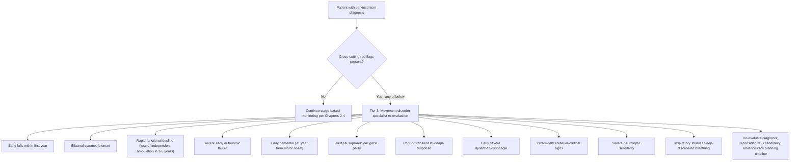

Eleven cross-cutting red flags warrant explicit articulation:

1. **Early falls within the first year of motor symptoms.** This is the single most informative atypical red flag, particularly suggestive of PSP[^36] but also seen in MSA. In idiopathic PD, falls are a Stage 3 phenomenon (Chapter 3); their appearance early recasts the entire trajectory.
2. **Bilateral symmetric motor onset rather than unilateral asymmetry.** PD's defining early signature is asymmetry (Chapter 2); bilateral symmetric onset suggests MSA, DLB, or PSP-Richardson's syndrome.
3. **Rapid functional decline with loss of independent ambulation within 3–5 years.** Patient.info notes that in PSP, "the loss of independent gait and the inability to stand unassisted occurs less than three years after disease onset"[^36], a trajectory that is incompatible with typical PD.
4. **Severe early autonomic failure** disproportionate to motor disability — orthostatic syncope, severe urinary incontinence or retention, profound thermoregulatory failure — particularly characteristic of MSA.
5. **Early dementia, particularly within the first year of motor symptoms** — characteristic of DLB, with frontal cognitive/behavioral change as the corresponding PSP red flag.
6. **Supranuclear gaze palsy or other oculomotor abnormalities**, particularly impaired downgaze and the eye-movement constellation of PSP[^36].
7. **Poor or transient response to adequate levodopa trial.** Specialist evaluation typically employs a structured levodopa challenge (often using doses up to approximately 1000 mg/day for at least one month) before concluding levodopa unresponsiveness. A clearly inadequate response is itself a diagnostic feature against idiopathic PD.
8. **Early severe dysarthria and dysphagia** appearing within 1–2 years of motor onset, characteristic of PSP and PSP-SL[^36].
9. **Pyramidal, cerebellar, or cortical signs** — extensor plantars and hyperreflexia (MSA), cerebellar ataxia (MSA-C, PSP-C), or apraxia, alien limb, and cortical sensory loss (CBD, PSP-CBS)[^36].
10. **Severe neuroleptic sensitivity** with catastrophic worsening on even small doses of antipsychotics — characteristic of DLB and a critical safety flag during hospitalization.
11. **Inspiratory stridor or sleep-disordered breathing** — a recognized MSA feature with implications for sudden mortality.

The mapping of these cross-cutting flags onto the stage-specific warning signs of Chapters 2–4 illuminates the chapter's central principle. A first fall is a Stage 3 trigger in PD (Chapter 3, Section 3.2), but a *first-year* fall is a red flag for atypical parkinsonism. Formed visual hallucinations are an advanced-stage neuropsychiatric event in PD (Chapter 4, Section 4.4), but *pre-motor* or *early-motor* formed hallucinations are a red flag for DLB. Severe orthostatic hypotension is a late-stage autonomic complication in PD (Chapter 4, Section 4.5), but *first-year* syncope is a red flag for MSA. Severe dysphagia is a Stage 3–4 transition in PD (Chapter 3, Section 3.6 and Chapter 4, Section 4.3), but *early dysphagia in the first 1–2 years* is a red flag for PSP. The temporal position of the symptom transforms its diagnostic meaning, and this is why stage-based monitoring (Chapters 2–4) and red-flag recognition (Chapter 5) are not parallel tracks but interlocking lenses.

## 5.5 Diagnostic Confirmation: Specialist Evaluation, Imaging, and Biomarkers

When red flags trigger specialist evaluation, the diagnostic process proceeds through several layers, and families benefit from understanding what to expect. The foundational layer is the **movement disorder neurologist's serial clinical assessment**: detailed history, examination, observation of gait and posture, oculomotor testing (smooth pursuit, saccades, vestibulo-ocular reflex testing to confirm that gaze palsy is supranuclear), neurological examination for pyramidal, cerebellar, and cortical signs, and structured cognitive screening. Patient.info notes that "the diagnostic process, once entirely clinical, has been significantly advanced by the development of the International Parkinson's and Movement Disorder Society (MDS) Criteria, introduced in 2017" and that this is supplemented by genetic testing, laboratory studies, and imaging[^36]. Validity studies of the MDS clinical criteria for PSP demonstrated **a sensitivity of 83% for possible PSP and a specificity of 100% for probable PSP**[^38] — meaning that highly characteristic cases can be confidently identified, but probable diagnosis requires the full clinical pattern to be present.

The second layer is **structured levodopa challenge testing**, in which an adequate trial of levodopa (typically titrated to substantial doses for at least a month) is used to confirm or refute dopaminergic responsiveness. A clearly poor response argues against idiopathic PD; a robust sustained response argues for it.

The third layer is **supportive imaging and laboratory investigations**:

- **MRI** — Patient.info reports that "atrophy of the midbrain and superior cerebellar peduncles (SCPs) is a useful marker in differentiating PSP-RS from other parkinsonian syndromes"[^36]. The classic radiological signs are evocative: "typically a sagittal view demonstrates the **hummingbird sign**: the atrophy of the midbrain results in a profile of the brain stem in which the preserved pons forms the body of the bird, and the atrophic midbrain the head, with beak extending anteriorly towards the optic chiasm. The morphology of the midbrain in patients with vertical supranuclear gaze palsy resembles the **morning glory flower**, thus termed the morning glory sign"[^36]. Crucially, "whilst these signs are oft quoted in the literature, they are of low sensitivity, particularly in early cases"[^36] — meaning that absent imaging signs do not exclude PSP, while present signs are highly suggestive. In MSA, MRI may show the "hot-cross-bun sign" in the pons (cerebellar subtype) and putaminal changes (parkinsonian subtype); in CBD, asymmetric cortical atrophy may be seen.
- **Resting-state functional MRI (fMRI)** can show "disruption in intrinsic connectivity network activity in the midbrain region in PSP"[^36].
- **Positron-emission tomography (PET)** — "tau-specific PET imaging has been used to successfully demonstrate areas of tau pathology in PSP patients. Other tau-specific imaging agents are being developed"[^36].
- **Single-photon emission computed tomography (SPECT)** — "dopamine-transporter SPECT shows reduced tracer uptake in the striatum which helps to differentiate PSP from similar conditions such as cerebrovascular disease and normal pressure hydrocephalus"[^36]. DAT-SPECT also helps differentiate idiopathic PD and atypical degenerative parkinsonisms (which both show reduced striatal uptake) from drug-induced or vascular parkinsonism (which typically do not).
- **Autonomic function testing** (head-up tilt, Valsalva maneuver, sudomotor testing) characterizes the severity and pattern of autonomic failure in suspected MSA.
- **Polysomnography** confirms REM sleep behavior disorder when family observation is insufficient.
- **Neuropsychological assessment** characterizes cognitive profile, distinguishing PD's executive-predominant pattern from PSP's frontal pattern, CBD's cortical-asymmetric pattern, and DLB's fluctuating-attentional pattern.
- **Emerging biomarkers** — Patient.info notes that "ongoing research has identified a number of biomarkers which may be contributory in the diagnosis of early or variant PSP. These include tau protein levels in cerebrospinal fluid and plasma neurofilament light chain (Nfl)"[^36]. CSF and plasma α-synuclein assays are similarly emerging for synucleinopathies. None is yet a routine clinical tool, but they progressively refine specialist evaluation.

The realistic message for families is that **no single test is definitive**, that imaging signs have low sensitivity in early disease, and that **longitudinal follow-up over months to years is often required**. A working diagnosis of PD may be revised to PSP, MSA, CBD, or DLB as the clinical picture evolves; a diagnosis of "atypical parkinsonism, syndrome-specific subtype to be determined" may persist for some time. Families should expect, and tolerate, this diagnostic provisionality. The practical implication is that **a second opinion at a specialized movement disorder center is reasonable when red flags are prominent, when treatment response is unexpectedly poor, or when DBS evaluation is being considered** — second opinions are not an indictment of the original clinician but a recognition that atypical parkinsonism diagnosis benefits from concentrated expertise.

## 5.6 Implications for Treatment Planning and DBS Candidacy

Accurate diagnosis materially affects treatment selection across several dimensions, and the differences are substantial enough that the diagnosis is often the most consequential decision point in the patient's care.

**Pharmacological management.** Atypical parkinsonisms generally respond poorly to levodopa, and this poor response is itself diagnostic. Patient.info's PSP reference states that "there is currently no proven effective therapy" and that levodopa responses, where present (particularly in PSP-Parkinsonism), "often are short-lived and incomplete"[^36]. Therapeutic approaches aimed at disease modification by targeting tau or mitochondrial dysfunction are being studied (the PSP literature mentions riluzole, tideglusib, davunetide), but "to date, none of the trials has demonstrated clinically satisfactory endpoints"[^36]. The clinical task therefore shifts from optimization of dopaminergic therapy to **symptomatic and supportive management**: chronic conjunctivitis from reduced blink rate often requires treatment[^36]; botulinum toxin A may be useful for blepharospasm in PSP-RS[^36]; physical therapy has been found to be helpful[^36]; and speech-language pathology, swallowing assessment, autonomic management (compression stockings, midodrine, fludrocortisone for orthostasis in MSA), and cognitive support assume more central roles. In MSA, vigorous management of orthostatic hypotension and urinary dysfunction often dominates the care plan from early in the disease.

**DBS candidacy.** As Chapter 3 introduced, the canonical indications for DBS include preserved levodopa responsiveness — that the patient's best ON state remains substantially better than their OFF state, since DBS broadly mirrors the best ON benefit of levodopa rather than producing an effect levodopa cannot achieve. Atypical parkinsonisms violate this gate. In PSP, MSA, CBD, and DLB, **DBS is contraindicated or relatively contraindicated** because:

- Levodopa responsiveness is poor, so the symptomatic benefit DBS could mirror is small;
- Cognitive features (frontal dysfunction in PSP-F, cortical involvement in CBD, dementia in DLB) elevate the risk of cognitive worsening with stimulation;
- Gait and postural features that dominate atypical syndromes are largely levodopa-resistant and therefore largely DBS-resistant;
- Surgical risk is therefore disproportionate to expected benefit.

The DBS evaluation pathway introduced in Chapter 3 includes specific screening intended to **exclude atypical features** before surgery — detailed examination in OFF and ON states for atypical signs, neuropsychological assessment to identify cognitive impairment that would contraindicate surgery, MRI to plan surgical targets and exclude structural contraindications, and multidisciplinary discussion of indication and candidacy. When red flags emerge during this evaluation, the appropriate response is to defer or decline DBS rather than to proceed. For families, this is the clinical content of Chapter 5's bridge to Chapter 6: **the diagnostic gate that DBS candidacy must pass before the post-operative material of Chapters 6–7 becomes relevant** is precisely the red-flag screening developed in this chapter.

**Non-pharmacological care and earlier engagement.** Diagnosis shapes the timing and intensity of non-pharmacological interventions. The Parkinson Canada caregiver guidance emphasizes that "in the later stages of Parkinson's — as well as with the atypical parkinsonisms — many people cannot help with their own movements or activities of daily living" and warns that this means more heavy lifting and more challenges for the care partner[^37]. The implication is that **physical therapy, occupational therapy, speech-language pathology, autonomic specialists, and palliative care should be engaged earlier in atypical syndromes than in PD**, given the accelerated trajectory. The Parkinson Canada hospice and palliative care discussion is explicit: "because Parkinson's is a chronic and progressive disease with an individualized disease course, it can be difficult to determine when the end of life is near. However, when symptoms such as dementia, recurrent aspiration pneumonia, weight loss, urinary incontinence, infections and pain are advanced, hospice care may be appropriate"[^37]. In atypical syndromes, these advanced-stage features can appear within 3–5 years of diagnosis, accelerating the entire palliative-engagement timeline developed in Chapter 4.

**Advance-care planning and family preparedness.** The advance-directive logic developed in Chapter 4 — completion while the patient retains decision-making capacity, healthcare proxy designation, POLST/MOLST forms, goals-of-care conversations — applies to atypical syndromes with greater urgency. The Parkinson Canada planning chapter emphasizes that "the best time to plan for these situations is now, before they occur" and that "many people report a sense of relief, optimism and better control of the challenges and decisions they face" once planning is in place[^37]. For atypical syndromes with shorter trajectories and higher risks of early cognitive incapacity, **advance-care planning should typically begin at or shortly after diagnosis** rather than being deferred to a later stage that may arrive sooner than the family anticipates.

**Family education and team building.** Diagnosis directs the educational task. Families of atypical-syndrome patients need to understand their specific syndrome — its cardinal features, its prognosis, its management priorities, and the specific safety considerations (DLB neuroleptic sensitivity, MSA stridor, PSP fall risk, CBD apraxia-related injury risk) that differ from generic PD guidance. Specialist referral pathways to organizations specifically focused on PSP, MSA, CBD, and DLB (which exist alongside the broader PD organizations cited throughout this report) are part of the resource landscape. The multidisciplinary care team's composition shifts: an autonomic specialist becomes essential in MSA, a neuro-ophthalmologist in PSP, a behavioral neurologist in DLB and CBD.

The integrative point is that **diagnosis is not a label; it is a treatment plan**. When the label changes, the plan changes, the timeline changes, the surgical option changes, the educational content changes, and the family's preparation changes.

## 5.7 The Unified Tiered Family Decision Framework Across All Stages

Synthesizing the tiered frameworks developed in Chapter 2 (early-stage), Chapter 3 (mid-stage), Chapter 4 (advanced-stage), and Section 5.4 (atypical red flags), this section presents a single unified family caregiver decision framework that integrates stage-based logic with diagnostic vigilance. The framework defines four response tiers, with examples drawn from each prior chapter mapped onto each tier:

```mermaid
flowchart TB
    subgraph T1["TIER 1<br/>Continued documented home observation"]
        T1a["Isolated mild prodromal cue<br/>(Ch 2): mild olfactory change<br/>after a cold; occasional vivid dream"]
        T1b["Predictable end-of-dose wearing-off<br/>(Ch 3): mild non-disabling dyskinesia"]
        T1c["Stable advanced-stage baseline<br/>(Ch 4): chronic stable hallucinations<br/>with insight; stable mild dysphagia<br/>managed with diet modification"]
    end
    subgraph T2["TIER 2<br/>Scheduled clinical follow-up<br/>(days to weeks)"]
        T2a["Clustered prodromal cues<br/>(Ch 2): hyposmia + chronic constipation;<br/>persistent depression + sleep disturbance"]
        T2b["First fall, no injury<br/>(Ch 3): OFF time >1-2 hr/day; new<br/>freezing of gait; new mild hallucinations"]
        T2c["New persistent skin redness<br/>(Ch 4): wet voice with weight loss;<br/>recurrent low-grade fevers"]
    end
    subgraph T3["TIER 3<br/>Urgent outpatient or specialist<br/>consultation (24-72 hours)"]
        T3a["Confirmed unilateral resting tremor<br/>+ multiple prodromal cues (Ch 2):<br/>suspected RBD with injury"]
        T3b["Recurrent falls; severe OFF<br/>unresponsive to rescue (Ch 3);<br/>formed hallucinations with delusions"]
        T3c["RED FLAGS for atypical<br/>parkinsonism (Ch 5): early falls,<br/>early dementia, severe early<br/>dysautonomia, supranuclear gaze<br/>palsy, poor levodopa response,<br/>severe neuroleptic sensitivity"]
    end
    subgraph T4["TIER 4<br/>Emergency department or<br/>immediate medical attention"]
        T4a["Choking with aspiration / cyanosis<br/>(Ch 3-4); aspiration pneumonia;<br/>fall with head injury, fracture,<br/>syncope; suspected sepsis"]
        T4b["Severe acute confusion / delirium<br/>(Ch 3-4); refusal of food/fluids/meds<br/>with dehydration; bowel obstruction;<br/>suicidal ideation"]
        T4c["Severe acute reaction to a<br/>contraindicated drug (haloperidol,<br/>metoclopramide) particularly in<br/>suspected DLB"]
    end
    T1 -->|"Worsens or clusters"| T2
    T2 -->|"Acute or severe; red flags"| T3
    T3 -->|"Acute deterioration"| T4
    T2 -.->|"Recurrent crises"| T4
```

The framework operationalizes three integrative principles inherited from earlier chapters:

**Calibration against the patient's stage and baseline.** A new resting tremor is a Tier 3 event in a previously asymptomatic patient (Chapter 2) but a routine observation in a patient with known H&Y Stage 2 PD. A first fall is a Tier 2 event in an H&Y Stage 3 PD patient (Chapter 3) but a Tier 3 atypical-syndrome red flag in a patient diagnosed with PD only one year earlier. The same observation carries different urgency at different stages.

**Recognition that pattern and clustering matter more than individual symptoms.** A single isolated prodromal cue carries modest weight; a cluster of hyposmia, RBD, chronic constipation, and apathy in a person over 50 substantially raises pre-test probability for synucleinopathy. A single fall is not a red flag; a fall pattern in the first year of motor symptoms is. A single hallucination after starting a dopamine agonist is a Tier 2 medication-review issue; recurrent formed hallucinations with delusions in an advanced-stage patient on a stable regimen is a Tier 3 escalation.

**Cumulative pattern recognition rather than isolated symptom counting.** The framework is not a checklist in which each symptom is independently scored; it is a pattern-recognition tool in which combinations escalate. The atypical-parkinsonism red flags of Section 5.4 are explicitly a *cluster* — early falls plus bilateral symmetric onset plus poor levodopa response is a much stronger signal than any one feature alone.

The framework also incorporates explicit **atypical-syndrome triggers as Tier 3 escalation events**, on the principle that suspected atypical parkinsonism warrants movement disorder specialist re-evaluation within 24–72 hours rather than at the next routine appointment. This is because (a) the diagnosis materially changes treatment planning (Section 5.6), (b) the trajectory may be substantially faster than PD, making delay more costly, and (c) certain atypical features (DLB neuroleptic sensitivity, MSA stridor) carry specific safety implications that benefit from early specialist input.

For families, the framework's practical use is to ask, at each new observation: *Is this consistent with where the patient currently is on the staging map? If so, what tier does the stage-specific logic of Chapters 2–4 assign to it? Does it cluster with other observations in a way that escalates the tier? Does it raise red flags suggestive of atypical parkinsonism? What action does the resulting tier prescribe?* This question sequence — calibration, clustering, red-flag check, action — is the working algorithm of family decision-making across the disease.

## 5.8 Navigating Common Ambiguous Scenarios

The framework above resolves cleanly when warning signs fit a recognizable pattern. In practice, families more often face ambiguous scenarios that do not map neatly onto a single tier. This section works through the most common such scenarios.

**Sudden confusion or delirium.** A previously oriented patient becomes acutely confused over hours. The differential, as Chapter 4 developed, must distinguish disease progression from infection, dehydration, medication effect, or constipation. The Parkinson Canada hospital and emergency-care discussion notes that "Parkinson's disease is not a disease in which the symptoms change quickly. It is slow progressing. **If sudden changes occur, this may indicate the existence of another medical problem such as an infection. See your primary care physician right away. If you wait, the results may adversely affect their Parkinson's**"[^37]. The decision logic is: any acute confusion is Tier 3 → 4; the family should bring the patient for evaluation rather than wait for the next scheduled visit; a urinalysis to exclude UTI, a basic metabolic panel to exclude electrolyte and renal abnormalities, a medication review (especially recent additions and any anticholinergic exposure), and a constipation check are the first investigations. Disease progression is a *diagnosis of exclusion*, not the default. In suspected DLB, fluctuating cognition is itself a feature — but new acute worsening on a previously fluctuating baseline still warrants medical evaluation.

**Unexplained falls.** A patient at H&Y Stage 2 PD (where balance should be preserved) experiences a fall. The differential includes OFF-state immobility (Chapter 3, Section 3.3), orthostatic hypotension (Chapter 3, Section 3.2; Chapter 4, Section 4.5), freezing (Chapter 3, Section 3.5), dyskinesia-related instability, drug side effects, occult infection (often UTI causing acute deterioration), and **atypical parkinsonism red flags (Chapter 5)** — particularly if the patient is within the first year or two of motor symptoms. Documentation in a fall diary (Chapter 3, Section 3.2.3) — time of day, time since last levodopa dose, activity at the time, presence of freezing or orthostatic symptoms, dyskinesia status, injury — gives the clinician what they need to disentangle these possibilities. A first fall is Tier 2 minimum; recurrent falls in an early-stage patient should be Tier 3 with explicit red-flag screening.

**New or worsening hallucinations.** The medication-review hierarchy developed in Chapter 4 (anticholinergics first, then amantadine, then MAO-B and COMT inhibitors, then dopamine agonists, with levodopa preserved as long as possible) is the starting point. But families must also consider: (a) Is this delirium driven by infection, dehydration, or constipation rather than dopaminergic load? (b) Has the patient previously been considered for an atypical-syndrome diagnosis, and could this represent emerging DLB rather than PD-with-medication-side-effect? (c) Is severe neuroleptic sensitivity a concern that should preempt antipsychotic prescribing? The Parkinson Canada caregiver guidance on hallucinations is explicit: "hallucinations should be reported to the medical team. People with Parkinson's may or may not find these events frightening, but **any changes to the type of hallucination should be tracked and further reported**"[^37], and "don't argue about it" while ensuring "that any medications prescribed to treat the hallucinations are safe"[^37]. The decision logic: new persistent hallucinations are Tier 2 → 3; hallucinations with delusions, paranoia affecting care acceptance, or aggressive behaviors are Tier 3; hallucinations causing refusal of food, fluids, or medications are Tier 4.

**Apparent acute medication side effects.** A patient develops sudden lightheadedness, profound nausea, or marked sedation after a dose change. The decision logic depends on severity and consequences: hold the dose only on clinician instruction (because, as Chapter 4 noted, abrupt discontinuation of dopaminergic medication can produce severe OFF and even neuroleptic-malignant-syndrome-like states); call the neurology office for guidance for moderate side effects; and present to the emergency department for severe symptoms (respiratory depression, syncope with injury, severe confusion, severe psychotic symptoms). The Parkinson Canada hospital chapter underscores the importance of medication continuity: "Three out of four people with Parkinson's do not receive their medications on time when staying in a hospital or visiting an emergency department. **This may result in complications and a longer hospital stay**"[^37].

**Emergency department versus neurology office versus scheduled visit.** This is perhaps the most frequent decision families face. The general logic:

| Trigger | Default response |
|---|---|
| Life-threatening symptom (respiratory distress, choking, severe injury, suicidal ideation, syncope) | Emergency department / 911 |
| Acute medical change suggesting infection, delirium, severe medication reaction, or bowel obstruction | Emergency department, especially if outside office hours |
| Persistent symptom not requiring same-day intervention but needing interpretation | Neurology office (phone or portal) |
| Recurrent atypical features (recurrent falls, fluctuating cognition, suspected red flags) | Urgent neurology contact for re-evaluation |
| Stable change observed over weeks fitting expected stage progression | Next scheduled visit, with documentation |

**Hospitalization risk management.** When admission is unavoidable, families assume an active advocacy role to prevent the hospital-specific harms developed in Chapter 4: contraindicated medications (haloperidol, metoclopramide, prochlorperazine, risperidone in DLB), missed levodopa doses, unfamiliar staff, environmental disorientation, deconditioning, and pressure injury. The Parkinson Canada guidance is direct: "You can be ready for such events by ordering the Parkinson Canada ACT on Time™ resources and having them prepared and ready to go", with the family bringing the **Managing My Parkinson's Disease in Healthcare Settings™ booklet**[^37] and similar tools to admission. The advocacy checklist:

- Bring exact home medication list with times, including over-the-counter agents;
- Bring written contraindicated-drug list, particularly emphasizing haloperidol, metoclopramide, prochlorperazine, and (in suspected DLB) most antipsychotics;
- Insist on home medication timing (not standard hospital "with meals" timing for levodopa, which can be disrupted by dietary protein);
- Bring advance directive, healthcare proxy documentation, and any POLST/MOLST forms;
- Identify the patient's neurologist to the admitting team and request communication;
- Monitor for hospital-acquired delirium (a major risk in advanced PD, as Chapter 4 noted) and request mobilization, sleep protection, and minimization of unnecessary medications;
- Recognize when to escalate concerns to attending physicians or patient advocates if recommendations are not followed.

Each scenario maps onto the unified tier framework (Section 5.7), and each is paired with the documentation that maximizes the value of the subsequent clinical contact (Section 5.9).

## 5.9 Communication Strategies for Engaging the Care Team

The warning-sign monitoring developed across this report is clinically valuable only to the extent that it is *communicated* to the care team in a form the team can act on. This section operationalizes the communication side of family caregiving across four phases: documentation, pre-visit preparation, in-visit communication, and inter-visit team coordination.

**Structured documentation tools.** The documentation instruments introduced across earlier chapters consolidate into a coherent home-monitoring kit:

| Tool | Purpose | Chapters where introduced |
|---|---|---|
| **Symptom diary** with date, time, severity, possible triggers | Capture changes against baseline | Ch 2, Section 2.6.1 |
| **ON/OFF diary** in 30-minute blocks across 3–7 typical days | Characterize motor fluctuations and inform regimen adjustment | Ch 3, Section 3.3.4 |
| **Fall and near-fall log** with time, activity, time since last dose, freezing presence, injury | Distinguish OFF-state, orthostatic, freezing, dyskinesia-related, and atypical patterns | Ch 3, Section 3.2.3 |
| **Video recordings** (10–20 seconds) of gait, hands at rest, and finger-tapping | Capture phenomena that may not be present at the visit | Ch 2, Section 2.6.1 |
| **Medication list** with exact doses, times, recent changes, and adherence | Foundation for every clinical encounter and emergency advocacy | Ch 2, 3, 4, 5 |
| **Skin/pressure-site log** in advanced disease | Track and prevent ulcers | Ch 4, Section 4.2.2 |
| **Hallucination/behavioral log** with timing relative to medication, sleep, and triggers | Distinguish PDP from delirium and DLB-pattern fluctuation | Ch 3, 4, 5 |
| **Advance directive, healthcare proxy documentation, POLST/MOLST** | Translate values into real-time decisions during crisis | Ch 4, Section 4.7.2 |

The Parkinson Canada ACT on Time™ program tools — the **Parkinson's Disease Daily Diary** (a structured tool to track responses to medication that records ON without dyskinesia, ON with non-troublesome dyskinesia, ON with troublesome dyskinesia, OFF, and Asleep across each hour with corresponding medication times[^37]); the **My Parkinson's Disease Navigator™** (used "to track medications, health care visits and other information that first responders can access in an emergency situation"[^37]); and the **Managing My Parkinson's Disease in Healthcare Settings™** booklet — provide a prepared, clinically validated documentation infrastructure that families can adopt rather than building from scratch.

**Pre-visit preparation.** The Parkinson Canada caregiver guidance is explicit: "Open, direct and respectful communication with any healthcare professional is very important. They depend on you and the person living with Parkinson's to provide them with relevant information at each visit in order to provide appropriate support and treatment. **Along with the care recipient, decide in advance of the visit, what needs to be shared with the healthcare team so that nothing is forgotten**"[^37]. Practical preparation includes:

- A **prioritized question list**, ranked by importance, recognizing that visit time is limited;
- Distinction between **specific concerns** (e.g., "OFF time has increased from 1 to 3 hours per day in the last month") and **general updates** (e.g., "overall things are stable");
- Identification of **which clinician to contact for which issue**: the neurologist for medication and disease-trajectory questions, the physical therapist for falls and balance, the speech-language pathologist for swallowing and voice, the social worker for resource navigation, the primary care physician for general medical issues and infection, the DBS programmer for stimulation-specific questions (Chapters 6–7);
- **Bringing the documentation kit** (diaries, videos, medication list, prior records);
- **Anticipating sensitive topics** that the patient may minimize (impulse control disorders, hallucinations, suicidal ideation, falls the patient feels embarrassed about) and deciding in advance whether and how to raise them.

**In-visit communication.** The Parkinson Canada guidance frames the family role specifically: "Open communication is essential. Your ability to communicate with healthcare providers may influence treatment options and health outcomes. In fact, **some health professionals insist that a care partner be in the room at each visit. Those who have Parkinson's will often say they are 'fine' when they are not. The person living with Parkinson's needs you to share the whole truth about their disease, their symptoms and their needs**"[^37]. At the same time, "it is important to make sure the person with Parkinson's feels empowered to speak and advocate on their own behalf. Encourage him or her to be open and express their needs and concerns, if they can. Be there to support their communications and to add your own observations"[^37]. Practical in-visit techniques:

- Begin with the **prioritized concerns** rather than chronologically narrating events;
- Use **specific examples** rather than general impressions ("she fell three times last month, twice when turning in the kitchen, once when standing from the couch" rather than "her balance is worse");
- Show **video evidence** when phenomena are not present at the visit;
- Raise **sensitive topics** explicitly: "I want to ask about a few behaviors I've noticed but haven't mentioned to him directly," allowing the clinician to navigate the conversation appropriately;
- **Request second opinions** when red flags appear or when treatment response is unexpectedly poor — framed as a constructive request rather than a challenge to the current clinician;
- **Confirm the plan** before leaving: what changes have been made, what to watch for, when to follow up, what would prompt earlier contact.

**Inter-visit communication and team-based coordination.** Between visits, families navigate a portfolio of communication channels: patient portals (best for non-urgent updates and prescription requests), phone calls (for moderate concerns), urgent contact lines (for new red flags or significant deterioration), and emergency services (for life-threatening events). Conveying information **concisely** matters: clinicians and triage nurses respond more usefully to "Mr. X, age 72, has H&Y Stage 3 PD, fell yesterday with head impact and is now confused" than to a long narrative. Team-based coordination ensures that the **neurologist, primary care physician, physical therapist, speech-language pathologist, social worker, and where applicable the DBS programmer** share a common picture of the patient's status. The Parkinson Canada guidance emphasizes the value of building a comprehensive, interdisciplinary team[^37] and of ensuring "each member of one's multidisciplinary team is aware of any changes or new needs that have arisen"[^37]. In practical terms, this often means the family becomes the *information broker* among team members who do not directly communicate with each other — a role that is itself a recognized contributor to caregiver burden (Chapter 4, Section 4.8) and that benefits from the documentation kit being maintained in a shared, accessible form.

**Hospital advocacy.** As Section 5.8 detailed and Chapter 4 emphasized, hospitalization is a high-risk event and family advocacy is essential. The Parkinson Canada guidance integrates the practical tools: the ACT on Time™ resources should be "prepared and ready to go", and the family should "review each piece so you can be prepared. Read the **Managing My Parkinson's Disease in Healthcare Settings™** booklet for information on preparing for medical appointments and hospital stays"[^37]. The minimum hospital-advocacy kit is: complete medication list with exact times, contraindicated-drug list, advance directive and proxy documentation, primary neurologist's contact information, and the patient's diagnosis (with subtype if atypical parkinsonism is suspected, given the safety implications particularly for DLB).

**Bridge to Chapters 6 and 7.** For patients who underwent DBS in mid-stage PD (after passing the diagnostic gate that this chapter has now articulated), the communication network expands to include the **DBS programming team** — typically a movement disorder neurologist with DBS expertise, sometimes a specialized DBS nurse or programmer, and the surgical team for hardware-related issues. This adds a new communication channel that families must integrate into the established care network: a stimulation-related complaint may need to be triaged between the movement disorder neurologist (for parkinsonian symptom changes), the DBS programmer (for stimulation parameter adjustments), and the surgeon (for suspected hardware issues). Chapter 6 introduces this expanded team in operational detail, and Chapter 7 develops the post-DBS warning-sign and triage logic that runs in parallel with — and intersects with — the disease-progression warning signs developed in this chapter.

The chapter closes by reinforcing its central message. **The family caregiver's diagnostic role is not to make diagnoses but to bring the pattern of observations that allows clinicians to make accurate diagnoses, and to recognize when patterns suggest that a working diagnosis should be revisited.** The cross-cutting red flags of Section 5.4, the unified tiered framework of Section 5.7, the ambiguous-scenario logic of Section 5.8, and the communication strategies of this section together transform the warning-sign material of Chapters 2–4 into an actionable family-decision system. With diagnostic vigilance now consolidated, the report turns to the post-DBS daily-life and warning-sign material that occupies its second half — material that depends on having passed through the diagnostic gate this chapter has just defined, and that extends the same family-decision logic into device-specific territory.

# 6 Understanding Deep Brain Stimulation and Daily Life Adjustments for Post-DBS Patients

The first half of this report has been concerned with a single integrated question: how families can recognize, calibrate, and act on warning signs that emerge as Parkinson's disease (PD) progresses through its prodromal, early, mid, and advanced stages, and how they can distinguish typical PD from atypical parkinsonisms whose trajectories and treatment options differ fundamentally. Chapter 5 closed by reframing the family's role as a diagnostic-vigilance partnership operating *within* a multidisciplinary care relationship, and by noting that for a substantial subset of patients — those who, in mid-stage disease, develop disabling motor fluctuations or dyskinesia despite optimized medication — that care relationship expands at some point to include a deep brain stimulation (DBS) team. With Chapter 5's diagnostic gate now articulated, the report turns to what life looks like *after* a patient has passed through that gate and into the post-operative phase of DBS therapy.

This chapter is therefore both a clinical primer and a household manual. It is a clinical primer because families of DBS candidates and DBS recipients consistently describe the gap between the surgical consent process and the lived reality of daily life with an implanted neurostimulator as one of the largest information gaps in their PD journey: they understand, in broad strokes, that a "brain pacemaker" has been placed, but they often do not understand precisely *which* symptoms it can be expected to improve, *which* it cannot, *what* the evidence base looks like, *who* on the care team handles which post-operative concern, and *how* the device must be integrated with the everyday contingencies of grocery stores, airports, hospitals, MRI scanners, kitchens, and bathrooms. It is a household manual because, once the clinical foundation is in place, the family's task becomes the operationalization of that foundation into routines — battery checks, programming visits, exercise, fall prevention, swallowing, sleep, and ongoing non-motor symptom management — all calibrated against the specific reality that DBS modifies but does not stop the progressive disease developed in Chapters 1–4.

Throughout the chapter, three principles inherited from earlier chapters anchor the discussion. First, **DBS is a long-term partnership with hardware, programming, and a multidisciplinary team, not a one-time procedure** — a framing that mirrors the staging-as-navigation logic of Chapter 1 and that the device-specific content of Sections 6.1, 6.4, and 6.5 makes concrete. Second, **expectations must be evidence-based and stage-aware**: meta-analytic data on motor improvement, dyskinesia reduction, and quality-of-life change provide the realistic ceiling, while the persistence of non-motor and axial symptoms — and the fact that disease progression continues beneath stimulation — provide the floor, and Section 6.2 makes both explicit. Third, **safety, vigilance, and tiered escalation logic continue from Chapter 5 into the post-DBS context with device-specific additions**, so that the framework families learned for stage-based monitoring extends rather than replaces itself; this principle is developed in Sections 6.6 and 6.10 and operationalized in Chapter 7. The chapter is therefore the conceptual and practical bridge between the diagnostic vigilance capstone of Chapter 5 and the post-DBS warning-sign troubleshooting framework of Chapter 7.

## 6.1 How DBS Works: Mechanism, Targets, and the Logic of Neuromodulation

For families approaching DBS for the first time, the most useful conceptual entry point is the analogy that movement-disorder centers consistently use in their patient education materials: **DBS is "essentially a pacemaker for the brain"**[^40]. The same UPMC patient handbook elaborates the mechanism in language designed for non-clinical readers: DBS is "often described as a brain 'pacemaker' because constant pulses of electrical charge are delivered at settings that are thought to restore normal brain rhythms, allowing the restoration of more normal movements"[^41]. Crucially, and in contrast to ablative procedures, **DBS does not permanently destroy brain tissue. Instead, it reversibly alters the function of the brain tissue in the region of the stimulating electrode**[^41]. This reversibility is one of the most important conceptual features of the therapy: it means that adverse effects of stimulation can be managed by reprogramming rather than by reversing surgical damage, and it underlies the long iterative optimization process that defines the post-operative period.

### 6.1.1 The Three-Component Hardware System

Implanted DBS systems are composed of three surgically placed components that families should be able to identify and locate on the patient's body: **the lead, the extension wire, and the pulse generator**[^40]. As the Boston Medical Center patient guide describes it, "the lead is connected to an extension wire that goes underneath the skin from the head to the neurostimulator, which is located in the chest below the collarbone. The neurostimulator delivers intermittent electrical pulses to targeted areas of the brain that control movement"[^40]. The UPMC handbook reinforces that "all parts of the stimulator system are internal; there are no wires coming out through the skin" and that "a programming computer is used during routine office visits to adjust the settings for optimal symptom control"[^41]. The lead itself is **about the diameter of a piece of spaghetti**[^41] and contains 4–8 electrical contacts that can be individually activated during programming.

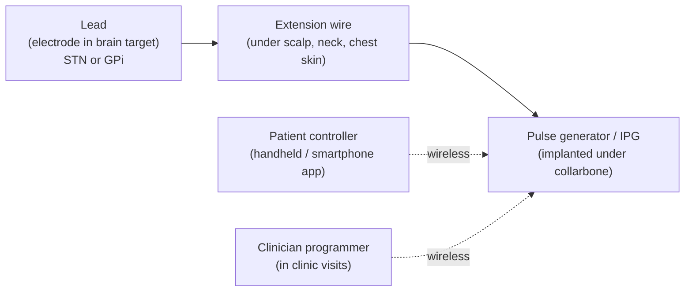

For families, three operational implications follow from this architecture. First, the **pulse generator is a battery-powered device** that will eventually require replacement (Section 6.5). Second, because the **extension wire runs from skull through neck soft tissue to chest**, neck manipulation (cervical chiropractic adjustments, vigorous massage of the neck) and trauma to the neck or chest (whiplash, contact sports) carry specific risks of lead fracture or dislodgement that are not present in a patient without DBS — a precaution the Abbott safety information explicitly addresses[^42]. Third, **the patient retains a hand-held programmer** that allows certain settings to be adjusted at home within physician-set ranges[^40][^41], which makes the family at least a co-operator of the device.

### 6.1.2 Target Selection: STN vs. GPi

Two principal deep brain targets are used for PD: the **subthalamic nucleus (STN)** and the **internal segment of the globus pallidus (GPi)**[^43][^42]. The Abbott device labeling captures the formal indication: "Bilateral stimulation of the subthalamic nucleus (STN) or the internal globus pallidus (GPi) as an adjunctive therapy to reduce some of the symptoms of advanced levodopa-responsive Parkinson's disease that are not adequately controlled by medications"[^42]. The choice between targets is one of the most actively discussed decisions in movement-disorder neurology, and the meta-analytic literature provides the empirical basis for understanding the trade-offs.

The 2021 meta-analysis by Lachenmayer and colleagues, drawing on 39 STN studies (2,035 subjects) and 5 GPi studies (292 subjects) published 1990–2019, observed a **striking numerical predominance of STN over GPi in the published literature**, which the authors interpreted as evidence that "the STN has become the preferred target for the treatment of levodopa-responsive PD"[^43]. At the same time, the same authors noted that **GPi targeting has increased and has been selected for older patients with poorer cognitive and mood indices**, citing the Veterans Administration cooperative trial that catalyzed this shift, although they cautioned that "this new popularity of GPi as a target has not yet translated into publications addressing GPi-DBS and justifying such a gradual shift in patient selection"[^43]. The two clinical considerations that most often drive target choice in current practice are summarized in the table below.

| Consideration | STN | GPi |
|---|---|---|
| **Magnitude of motor improvement** | Larger pooled motor benefit (UPDRS-III ~50.5% reduction)[^43] | More modest motor benefit (UPDRS-III ~29.8% reduction in pooled studies)[^43] |
| **Medication reduction** | Substantial (~50% LEDD reduction)[^43]; **a relevant LEDD reduction is only possible with STN-DBS and also mandatory to reduce dyskinesia**[^43] | Limited; data insufficient for pooled estimate but generally smaller LEDD reductions[^43] |
| **Postoperative management** | Requires fine-tuning between stimulation intensity and medication dosage[^43] | "GPi is an easier target as far as immediate postoperative management is concerned. Unlike STN-DBS, GPi-DBS does not require fine-tuning between stimulation intensity and medication dosage"[^43] |
| **Cognitive and mood considerations** | LEDD reduction can produce apathy or dopamine withdrawal syndrome; concerns about cognition[^43] | Increasingly preferred in older patients with cognitive deficits and more psychiatric comorbidities[^43] |
| **Direct dyskinesia suppression** | Indirect — via medication reduction enabled by motor benefit[^43] | Direct anti-dyskinetic effect through pallidal modulation[^43] |
| **Unilateral surgery option** | Less straightforward | "Unilateral surgery can be easily proposed for GPi, as there is no deterioration of the non-operated side in relation to postoperative medication reduction"[^43] |

Two integrative points are worth emphasizing for families considering target selection. First, although STN produces larger motor improvement and more medication reduction in pooled data, the choice is **highly individualized**: the meta-analysis authors note that "DBS targeting (STN vs GPi) is based on experience of a team, differences in health care systems, and analysis of the full literature, rather than just evidence-based medicine," and that randomized trials have not consistently identified a single superior target[^43]. Second, **three years after surgery, randomized trial data have shown no difference in long-term quality of life between STN and GPi**[^43], which means that the larger short-term motor numbers for STN do not necessarily translate into larger long-term quality-of-life advantages — a clinically important caveat against assuming that "more is better."

### 6.1.3 Device Platforms

Three principal manufacturer platforms are currently available in many movement-disorder centers, with the UPMC handbook providing a useful comparative summary:

| Platform | Distinguishing features (as described in patient education) |
|---|---|
| **Medtronic Activa™** | "Medtronic is the longest-running manufacturer of DBS equipment" with their first product approved in 1997. Offers both non-rechargeable and rechargeable batteries; the rechargeable battery "lasts 15 years." "Patients are given a patient programmer which they can use to adjust their DBS settings within a pre-set range. This DBS system is MRI compatible"[^41]. |
| **Abbott (formerly St. Jude Medical) Infinity™** | "Has segmented electrodes that allow precise steering of current towards desired structural area to maximize therapeutic benefit and reduce potential side effects. Patients are given iPods which they can use to adjust their DBS settings within a pre-set range. The battery is not rechargeable. This DBS system is MRI compatible"[^41]. Some Abbott models are described as MR Conditional and "designed to be upgradeable"[^42]. |
| **Boston Scientific Vercise™** | "Has segmented electrodes that allow precise steering of current towards desired structural area to maximize therapeutic benefit and reduce potential side effects. Multiple Independent Current Control (MICC) provides a dedicated power source for each electrode to precisely control stimulation and refine the size and shape of the electrical field… They offer a rechargeable battery that will last at least 15 years. This battery is the smallest DBS battery available. This DBS system is MRI compatible"[^41]. |

The UPMC handbook frames the choice in language that is also useful for families: **"all 3 systems are more alike than different, and all are expected to improve your symptoms. However, each system has its own advantage that sets it apart from the others, and one might fit your lifestyle better than another"**[^41]. The principal lifestyle-relevant differences are battery type (rechargeable vs. non-rechargeable, with implications for replacement surgery frequency and daily/weekly recharging routines — see Section 6.5), the presence of segmented "directional" leads that allow current to be steered toward the optimal structural area while avoiding side-effect-producing structures, and the platform's MRI conditionality status (Section 6.6).

The unifying conceptual takeaway of Section 6.1 is that DBS is **a long-term partnership with hardware, programming, and a care team, not a single surgical event**[^41]. The lead, extension, and generator together constitute a therapeutic *system* that requires ongoing adjustment (Sections 6.4–6.5), respects specific safety constraints (Section 6.6), and operates against the backdrop of a still-progressive disease (Section 6.10).

## 6.2 What DBS Does and Does Not Improve: Evidence-Based Realistic Expectations

If Section 6.1 establishes the mechanism, Section 6.2 establishes the **realistic ceiling** of what that mechanism can achieve. This section translates the meta-analytic evidence into family-actionable expectations, with explicit attention to the symptoms that DBS reliably improves, those it does not improve, and the temporal limits of the therapy.

### 6.2.1 Quantitative Evidence on STN-DBS Outcomes

The most comprehensive recent synthesis is the 2021 meta-analysis cited in Section 6.1, which pooled outcomes across 39 STN studies (2,035 subjects, follow-up 6–12 months) and reported the following improvements when comparing the postoperative stimulation-ON/medication-OFF state to the preoperative medication-OFF state[^43]:

| Outcome domain | Pooled improvement with STN-DBS | Clinical translation for families |
|---|---|---|
| **UPDRS-III (motor examination)** | **50.5% reduction** (95% CI 45.6–55.5%); mean decrease of 22.1 points (95% CI 19.9–24.3)[^43] | Best ON state with stimulation broadly mirrors best ON state on medication preoperatively |
| **UPDRS-II (motor activities of daily living)** | **47% reduction** (95% CI 37.4–56.7%); mean decrease of 10.4 points[^43] | Improved capacity for dressing, eating, hygiene, mobility |
| **Dyskinesia** | **64.0% reduction** (95% CI 56.4–71.5%) across 14 studies / 950 subjects[^43] | Marked reduction in involuntary movements |
| **Daily OFF time** | **69.1% reduction** (95% CI 46.8–91.4%) across 6 studies / 185 subjects[^43] | Far more predictable day; fewer abrupt OFFs |
| **PDQ-39 quality of life** | **22.2% improvement** (mean 11.0-point improvement in summary index, 95% CI 7.9–14.1) across 11 studies / 627 subjects[^43] | Moderate but clinically meaningful quality-of-life gain |
| **Levodopa equivalent daily dose (LEDD)** | **50.0% reduction** (95% CI 45.1–54.8%) across 31 studies / 1,644 subjects[^43] | Roughly halving of dopaminergic medication burden |

Several interpretive points should accompany these numbers. First, the meta-analysis notes **substantial heterogeneity between studies** for UPDRS-II and UPDRS-III, dyskinesia, OFF time, LEDD, and PDQ-39 (Cochran's Q test P < 0.001 for most outcomes), reflecting real differences across centers, patient selection, and assessment tools[^43]. Second, **the magnitude of the motor benefit shows a dose-response relationship with the patient's preoperative response to a levodopa challenge**: the larger the levodopa response before surgery, the larger the DBS motor benefit, with the Pearson correlation between preoperative levodopa-induced UPDRS-III change and postoperative DBS-induced change reaching 0.69 (P = 0.00001)[^43]. This is the empirical underpinning of the candidacy logic developed in Section 6.3 and previewed in Chapter 5: **preoperative levodopa responsiveness is highly predictive of motor outcome, and patients with poor levodopa response generally derive less DBS benefit**[^43].

Third, the meta-analytic improvements in PDQ-39 quality of life are described by the authors as **"clinically highly relevant when considering that patients with best medical treatment tend to worsen their quality of life over the same period"**[^43]. In other words, the 22% improvement should be read against a control trajectory of continued worsening, not against a stable baseline. Fourth, a comparison of pre-2005 and post-2005 data showed that **STN studies since 2005 have reported a slightly lower response to DBS than earlier studies**, possibly reflecting that subjects enrolled since 2005 had shorter disease duration and were less affected at baseline[^43] — a reminder that absolute numbers depend on who is being treated.

### 6.2.2 GPi-DBS Outcomes

For GPi-DBS, the available meta-analytic data are sparser. Across 5 studies and 291 subjects, GPi-DBS produced **a 29.8% reduction in UPDRS-III motor scores** (mean 13.0-point decrease) and **an 18.5% reduction in UPDRS-II** (mean 3.6-point decrease), with insufficient pooled data on dyskinesia (a weighted-mean improvement of approximately 39.7% across two studies), OFF time, PDQ-39, and LEDD[^43]. The authors caution that the discrepancy in study counts between STN and GPi precludes direct comparison and that "more published data are required for validation" of the increasing GPi targeting trend[^43]. Crucially, however, longer-term randomized trial data have suggested that **STN and GPi produce comparable quality-of-life results at three years and beyond**[^43], reinforcing the point made in Section 6.1 that target selection should be individualized rather than driven by short-term motor numbers alone.

### 6.2.3 Symptoms That DBS Reliably Improves

Patient education materials from major DBS centers consistently identify the same constellation of DBS-responsive symptoms, which closely mirrors the meta-analytic evidence. The UPMC handbook states that **"DBS therapy can benefit motor symptoms of Parkinson's disease including tremor (shakiness), rigidity (stiffness), and bradykinesia (slowness). DBS can provide the best 'on' time that you experience with your medications for PD, and a smoother therapy over time that reduces motor fluctuations between 'off' and 'on' periods throughout the day. DBS therapy can also benefit patients with medication-induced dyskinesia (involuntary movement), as well as medication-refractory tremor, rigidity, and slowness of movements"**[^41]. The Boston Medical Center guide adds that "many symptoms can improve with DBS including: dyskinesia or dystonia, tremor, **levodopa-responsive walking abnormalities (such as shuffling)**, muscle stiffness, and slowness of movement"[^40]. The qualifier "levodopa-responsive" is critical: gait abnormalities that improve with levodopa generally also improve with DBS, while gait abnormalities that do not improve with levodopa generally do not.

### 6.2.4 Symptoms That DBS Does Not Reliably Improve

Symmetrically, both patient guides explicitly enumerate the symptoms DBS does **not** reliably improve, and this list is, for many families, the more important one because it sets the boundary against which post-operative quality of life must be planned. The UPMC handbook states: **"Non-motor symptoms of Parkinson's disease are typically not improved with DBS therapy. Symptoms such as constipation, urinary symptoms, and mood, memory, or sleep difficulties are not predicted to improve"**[^41]. The Boston Medical Center guide makes this still more explicit: symptoms that will NOT improve with DBS include **"non-levodopa responsive symptoms such as urinary dysfunction, constipation, difficulty with swallowing, memory, or mood; balance abnormalities; walking abnormalities that DO NOT respond to levodopa"**[^40]. Mapped onto the warning-sign architecture developed in earlier chapters of this report, these are precisely the symptoms that dominate the advanced-stage clinical picture (Chapter 4) and that reflect the non-dopaminergic, cortical, brainstem, and autonomic pathology described in Chapter 1.

The integrated picture is captured below:

| Symptom domain | Generally responsive to DBS | Generally NOT responsive to DBS |
|---|---|---|
| **Motor: cardinal features** | Resting tremor, rigidity, bradykinesia[^41] | — |
| **Motor: complications** | Dyskinesia, motor fluctuations, OFF time[^43][^41] | — |
| **Motor: gait** | Levodopa-responsive shuffling/gait abnormalities[^40] | Non-levodopa-responsive freezing; postural instability; advanced balance abnormalities[^40] |
| **Bulbar** | Sometimes mild improvement | Dysphagia (swallowing difficulty)[^40]; hypophonia in many patients |
| **Autonomic** | — | Constipation, urinary symptoms, orthostatic hypotension, sexual dysfunction[^41][^40] |
| **Neuropsychiatric** | — | Memory, cognition, mood, sleep[^41][^40] |

### 6.2.5 DBS Does Not Stop Disease Progression

The single most important framing message for families is one that the Boston Medical Center patient guide states unambiguously: **"Long-term studies show that the benefits from DBS are still present at ten-year follow up, but DBS does not appear to prevent disease progression"**[^40]. Similarly, the UPMC handbook notes that "although your disease will progress, and may outpace the ability of the DBS to adequately control symptoms, the device will always provide some measure of therapeutic benefit"[^41]. This framing has direct implications for the broader trajectory of care developed across this report. As the underlying neurodegeneration described in Chapter 1 continues — extending into cortical, cholinergic, and brainstem structures that DBS does not modulate — the **levodopa-resistant axial features, dysphagia, autonomic failure, cognitive decline, and psychosis described in Chapter 4** will gradually emerge or worsen even in well-stimulated patients. The advance-care planning, palliative-engagement, and comfort-care frameworks of Chapter 4 therefore apply fully to the post-DBS population as well. DBS reshapes the middle of the disease trajectory more than it reshapes the end.

A final caveat on the evidence base: the long-term safety and effectiveness of current neurostimulation systems "has not been established beyond 5 years" in formal regulatory documentation, and safety and effectiveness "has not been established for patients with a neurological disease other than Parkinson's disease or essential tremor, previous surgical ablation procedures, dementia, coagulopathies, or moderate to severe depression; patients under 22 years; implantation in targets other than the STN for Parkinson's disease and the VIM for essential tremor; patients with an active implantable device; patients requiring MRI"[^42]. Long-term observational data extending to 10–15 years and beyond do exist and broadly support continued benefit[^43][^40], but families and clinicians should recognize that some clinical decisions still rest on extrapolation from shorter-term data.

## 6.3 Candidacy, Exclusion Criteria, and the Pre-Operative Evaluation Pathway

The candidacy gate for DBS connects directly to the diagnostic vigilance framework consolidated in Chapter 5. Patients who pass through this gate enter the post-operative territory that the rest of this chapter develops; patients who do not, including those whose evaluation reveals atypical parkinsonism, dementia, or other contraindications, continue along the medication-and-rehabilitation pathway with the warning-sign monitoring established in Chapters 2–4. This section consolidates the canonical inclusion criteria, the explicit exclusions, the pre-operative evaluation pathway, the timing question, and the surgical risks, drawing on the meta-analytic evidence base and on multi-center patient education materials.

### 6.3.1 Inclusion Criteria

The Boston Medical Center patient guide articulates the canonical indication concisely: **"Deep Brain Stimulation should be considered by patients with Parkinson's disease who respond to levodopa therapy but have medication side effects or motor fluctuations throughout the day despite being on optimal medical treatment. DBS can improve function and quality of life by reducing dyskinesia, increasing 'on' time, reducing severity of 'off' symptoms, and allowing medications to be reduced"**[^40]. The same guide elaborates that "if you are a DBS candidate, your primary neurologic condition must be idiopathic (or common form) of Parkinson's disease. You should have significant motor fluctuations requiring frequent doses, medication side effects, or a tremor that does not respond to medication"[^40]. The five canonical inclusion criteria can be summarized as:

1. **Idiopathic levodopa-responsive PD** — the diagnostic entity established by the framework of Chapter 5;
2. **Disabling motor fluctuations or dyskinesia despite optimized medical management** — operationalized in Chapter 3 as more than 1–2 hours of daily OFF, troublesome dyskinesia, or unpredictable abrupt OFFs;
3. **Preserved levodopa responsiveness** — a structured ON/OFF examination is the strongest predictor of motor outcome[^43];
4. **Acceptable cognitive and psychiatric status** — without significant dementia or active untreated psychiatric illness;
5. **Acceptable surgical risk profile** — ability to tolerate brain surgery, anticoagulation can be safely held, no active infection, and (where awake surgery is the protocol) ability to participate in intraoperative testing[^41].

A specific subgroup deserves explicit mention: patients whose tremor is medication-refractory but whose other symptoms are mild may also benefit from DBS even before they meet the full motor-fluctuation criterion[^41][^40].

### 6.3.2 Exclusion Criteria

The Boston Medical Center guide enumerates the categorical exclusions: "DBS is not appropriate for patients with the following conditions: **Atypical Parkinsonism (such as multiple systems atrophy and progressive supranuclear palsy); Dementia or severe cognitive impairment; MRI showing extensive loss of brain tissue or white matter disease; Uncontrolled psychiatric illnesses such as anxiety or mood disorders; Brain abnormalities that limit placement of the DBS lead"**[^40]. The Abbott device labeling adds that the system is contraindicated for patients who "are unable to operate the system" or who "have unsuccessful test stimulation"[^42], and that "neurostimulation should not be used on patients who are poor surgical risks or patients with multiple illnesses or active general infections"[^42].

Several clinically important features map these exclusions onto the report's broader framework:

- **Atypical parkinsonism exclusion** is the direct downstream consequence of the red-flag screening in Chapter 5. Patients whose cross-cutting red flags (early falls, bilateral symmetric onset, rapid functional decline, severe early autonomic failure, early dementia, supranuclear gaze palsy, poor levodopa response, severe neuroleptic sensitivity) emerge during pre-operative evaluation should not proceed to surgery, because (as Section 5.6 detailed) DBS broadly mirrors the best ON benefit of levodopa, and patients without that benefit have little to gain.
- **Dementia and significant cognitive impairment exclusion** is supported by evidence cited in the meta-analysis: "a previous study had shown that in PD patients with preoperatively borderline impaired cognition, STN-DBS did not provide any benefit in terms of quality of life"[^43]. The exclusion is therefore not a generic surgical-risk concern but reflects the specific finding that DBS in cognitively impaired patients tends not to translate motor improvement into quality-of-life improvement.
- **Untreated mood and psychiatric illness exclusion** reflects the safety warning that "new onset or worsening depression, which may be temporary or permanent, is a risk that has been reported with DBS therapy. Suicidal ideation, suicide attempts, and suicide are events that have also been reported"[^42]. Pre-operative assessment must include explicit screening for depression and suicide risk, with appropriate treatment before surgery is offered.
- **Extensive white matter disease on MRI** is an exclusion both because the underlying condition (often vascular cognitive impairment) is itself a contraindication and because severe structural changes can preclude accurate lead placement.
- **Coagulopathy and anticoagulant medications** require careful management: "physicians should use extreme care with lead implantation in patients with a heightened risk of intracranial hemorrhage. Physicians should also consider underlying factors, such as previous neurological injury or prescribed medications (anticoagulants), that may predispose a patient to the risk of bleeding"[^42]. Specific medication holds before surgery (warfarin 3–5 days, clopidogrel/prasugrel/ticagrelor 7 days, aspirin 14 days, direct oral anticoagulants 3 days, NSAIDs 14 days) are detailed in standard pre-operative protocols[^41].

### 6.3.3 The Multidisciplinary Pre-Operative Evaluation

Both the UPMC and Boston Medical Center programs describe a structured multidisciplinary evaluation that families should expect to navigate. The UPMC handbook lists the components: "**Meetings with neurology, neurosurgery, and neuropsychology**" for candidacy assessment; pre-operative testing including blood work, EKG, chest X-ray, physical exam, and brain MRI for surgical planning; and the staged surgical and programming process[^41]. The same handbook details the specific components of each evaluation:

- **Movement Disorder Neurologist evaluation**, often including a videotaped examination. **For PD patients, an "ON-OFF evaluation" is performed**: "you are asked to hold the medications that you take for Parkinson's disease 12 hours prior to the evaluation. You are to bring your medications for Parkinson's disease to this visit. You will first be examined using a clinical rating scale during an 'off' medication state. You will then be asked to take your medications. The examination will be repeated during your 'on' medication state"[^41]. This is the structured levodopa challenge that provides the strongest predictor of motor outcome[^43]; the meta-analytic evidence shows that across 32 studies, the change in UPDRS-III with the levodopa challenge was strongly correlated with the change achieved under STN-DBS alone[^43].
- **Neurosurgeon consultation** to "explain the surgical procedure, review potential risks of surgery and benefits, and evaluate your candidacy for surgery"[^41].
- **Neuropsychological evaluation** with "extensive testing of memory, language, and attention" that "may take up to 4 hours"[^41]. This is the principal screening for cognitive contraindications.
- **Brain MRI** for surgical planning and to exclude structural contraindications[^41][^40].
- **Physical therapy and speech evaluations** as needed to establish baselines for gait, motor function, and speech/swallowing[^41].
- **Psychiatric or psychological interview** to screen for mood and behavior[^40].

After these evaluations are complete, "we will discuss your case at our Multidisciplinary Movement Disorders Team Meeting. This information will allow the team to determine the best treatment plan for you"[^41]. The multidisciplinary meeting is a critical safety check: it ensures that target selection, candidacy, and timing reflect a team consensus rather than the judgment of any single clinician.

### 6.3.4 The Timing Question

The timing of DBS is, as Chapter 3 introduced, a Goldilocks problem: too early, and the patient incurs unnecessary surgical risk for a symptom burden that may still be manageable medically; too late, and age, cognitive decline, or atypical features have made them ineligible. The UPMC handbook captures the timing principle simply: **"The time to consider DBS surgery is when the quality of life is no longer acceptable on optimal medical therapy as administered by a movement disorder specialist"**[^41]. The meta-analytic evidence adds a specific finding that informs early-PD timing: in the EARLYSTIM trial, "in the presence of motor complications in early disease stages," DBS provided motor and quality-of-life benefits comparable to those in later-stage patients, and "as there is no loss of efficacy reported for STN-DBS in the very long term, we would recommend STN-DBS in the presence of motor complications in early disease stages"[^43]. This recommendation should not be misread as endorsing DBS for *any* patient with early disease — motor complications must still be present — but it does support not delaying evaluation until the patient is debilitated.

The flip side is also explicit. The same meta-analysis notes that "surgical complications increase with age"[^43], reinforcing the value of completing evaluation before age and comorbidity narrow the surgical window.

### 6.3.5 Surgical Risks

Families consenting to DBS should have realistic numerical expectations of surgical risk. The meta-analytic data, drawn from 47 STN and 4 GPi studies covering 2,818 enrolled subjects, summarize the principal complications:

| Complication | Median proportion across studies |
|---|---|
| **Surgery-related infection** | **5.1%**[^43] |
| **Surgery-related intracranial hemorrhage (any)** | **3.1%** (3.45% STN, 2.2% GPi)[^43] |
| **Symptomatic ICH with permanent neurological deficits** | **1.65%**[^43] |
| **Symptomatic ICH with transient deficits** | 1.0%[^43] |
| **Asymptomatic ICH** | 2.1%[^43] |

The Boston Medical Center patient guide rounds these figures to the patient-facing approximations that families typically receive in consent conversations: "complications may include infection (approximately 5%) or bleeding (less than 2% risk overall, 1–1.5% risk of severe hemorrhage)"[^40]. The Abbott device labeling additionally lists the broader spectrum of possible surgical and stimulation-related adverse effects, including hematoma, cerebrospinal fluid leakage, brain contusion, edema, persistent pain at the surgery or generator site, deep vein thrombosis, and (in worst cases) stroke or death[^42]. These are uncommon but real, and they are why the candidacy logic emphasizes that DBS should be reserved for patients whose anticipated benefit is large enough to justify the risk.

The integrative principle of Section 6.3 is that **the candidacy gate is a careful, multidisciplinary, evidence-driven process designed to maximize benefit and minimize harm**. Families should expect this evaluation to take weeks to months and to involve multiple visits; the duration is not bureaucratic delay but is itself part of the safety architecture of the therapy.

## 6.4 The Surgical and Initial Programming Process: A Family Roadmap

For patients and families who pass the candidacy gate, the period from surgical scheduling through initial programming is the most logistically demanding phase of DBS care. This section walks through the practical sequence as described by major DBS centers, organized as a chronological roadmap.

### 6.4.1 Pre-Operative Preparation

Pre-operative preparation typically begins weeks before surgery and includes:

- **Confirmation of pre-operative testing and medical clearance**: "blood-drawn labs, EKG, and sometimes a chest x-ray," with general physical examination by the primary care physician or pre-op center, and specialist clearance (e.g., cardiology) when indicated[^41].
- **Medication holds** for agents that increase bleeding risk. The UPMC handbook provides a specific schedule: warfarin discontinued 3–5 days before surgery; clopidogrel, prasugrel, ticagrelor 7 days; aspirin 14 days; dabigatran, rivaroxaban, apixaban, edoxaban 3 days; NSAIDs 14 days (with acetaminophen as the safe over-the-counter pain alternative); sildenafil, tadalafil, vardenafil 48 hours; vitamin E and supplements such as fish oil and coenzyme Q10 14 days[^41]. **All medication holds must be coordinated with the prescribing provider**, particularly for anticoagulants where stopping carries cardiovascular or thromboembolic risk.
- **Continuation of PD medications** during the pre-operative period: "Continue your medications for Parkinson's disease during this time. You will continue these medications after surgery. Medications may be adjusted at the first initial programming visit after surgery"[^41].
- **Infection prevention protocols** including chlorhexidine (Hibiclens) showers for several days before surgery and on the morning of surgery, and **MRSA nasal swab screening** with mupirocin treatment if positive[^41]. The UPMC handbook explicitly notes: "Hibiclens is a medicated soap that kills germs that normally live on your skin. Its use has been shown to reduce the risk of surgical infection"[^41].

### 6.4.2 The Two-Stage Surgical Procedure

DBS surgery is most commonly performed as a two-stage procedure, although protocols vary across centers. The UPMC description captures the standard approach[^41]:

**Stage 1: Lead placement.** "The patient is sedated for the beginning of the surgery while we make a small opening in the skin and bone at the surgical site(s). The patient will not feel or remember this part of the surgery, but once these steps are complete, he is awoken for the remainder of the surgery." The center then performs:

- **Brain mapping** using "neurophysiology recordings from very thin electrodes inserted into the brain to map activity in the intended target and confirm the best spot for the DBS electrode. It is important for the patient to be awake during this part of the surgery so we can obtain the best recordings possible, which will aid in the most accurate placement of the DBS electrode. The brain mapping is not painful"[^41].
- **Intra-operative stimulation testing**: "When the best site is identified from the brain mapping, the DBS electrode is inserted and tested. We monitor the patient for improvement in his symptoms, for example tremor, and also ask him to report any new sensations he experiences"[^41].

After Stage 1, "the patient is typically observed in the hospital for 1 night before going home"[^41]. Some centers use asleep, MRI- or CT-guided robotic placement protocols where intraoperative testing is not required; the meta-analysis notes that "asleep robot-assisted surgery for the implantation of subthalamic electrodes provides the same clinical improvement and therapeutic window as awake surgery" in selected programs[^43]. Families should ask the surgical team which protocol is used and what role, if any, the patient must play during the procedure. The UPMC handbook acknowledges that **"the thought of being awake for part of a brain surgery can be overwhelming and scary. We advise you to discuss your concerns with your surgical team. Accommodations can be considered for patients who are unable or unwilling to participate in an awake surgery"**[^41].

**Stage 2: Battery placement.** "The patient will return an average of 2 weeks later for a second procedure to place the battery and connect it to the brain electrodes. This surgery is very short and performed as an outpatient procedure"[^41]. Boston Medical Center describes battery placement as performed under general anesthesia, with a small incision in the chest wall to place the neurostimulator, which is then connected to the brain lead[^40].

### 6.4.3 Post-Operative Recovery

The immediate post-operative period is characterized by several expected phenomena that families should anticipate to avoid alarm:

- **The "honeymoon" or microlesion effect.** "Although your DBS is not turned on, you might feel like your symptoms are improved for a few days after surgery. This effect should wear off before your initial programming"[^41]. This temporary improvement reflects the small inflammatory and edematous response around the lead and is not the device's therapeutic effect, which has not yet been activated.
- **Facial swelling and bruising.** "You will likely experience some facial swelling after surgery. Sometimes this swelling occurs immediately, but sometimes it shows up a few days after surgery. Occasionally, it can be very severe and also cause the skin under your eyes to look bruised. **This is NORMAL.** It will resolve on its own within a few days, but sometimes can take a week or more"[^41]. Mitigation includes upright positioning, ice packs, and acetaminophen if painful[^41].
- **Wound care.** Bandages on the head are typically removed at one day post-surgery, with daily gentle washing using baby shampoo from day 2 onward; chest bandages are removed at 5–7 days[^41]. White flakes around the chest incision are skin glue and "will come off on its own with multiple showers"[^41].
- **Activity restrictions.** "No lifting greater than 10 pounds for 30 days from your first surgery. No vigorous exercise for 30 days from your first surgery… No driving for 2–4 weeks after your first surgery. The exact timing will be discussed at your follow up visit"[^41].
- **Reasons to call the surgical team**: any questions about instructions, fever or wound discharge, or any new symptom of concern[^41].

### 6.4.4 The 4–6 Week Interval Before Initial Programming

A characteristic feature of DBS care is the **deliberate delay between surgery and initial device activation**. The UPMC handbook describes "DBS initial programming: about 4–6 weeks after surgery"[^41]; the Boston Medical Center guide describes "approximately 4–5 weeks after lead placement, you will have your initial programming"[^40]. During this interval, the microlesion effect dissipates, surgical inflammation resolves, and the patient and family adjust to the post-operative routine. This interval can be psychologically challenging because patients see the device but feel no benefit; the framing that initial programming is the *beginning* of therapy, not its activation, is helpful.

### 6.4.5 Initial Programming

Initial programming is described as a **1.5–2 hour OFF-medication visit during which each electrode contact is systematically tested**[^41]. The UPMC handbook details the process: "Please come to the initial programming visit off medications for 12 hours… During the visit the clinician will turn the DBS device therapy 'on'. Each electrode has 4–8 contacts. Each contact will be activated individually and the voltage slowly increased. As the voltage is increased you may experience benefit to symptoms or side effects. The side effects may be quickly reduced when the voltage is decreased. This process provides the clinician with information regarding the placement of the electrode and the settings that will provide the best benefit for your symptoms"[^41]. Common side effects experienced during this visit include "numbness, tingling, slurred speech, balance difficulty, facial pulling, or vision change"[^41]; these are usually transient and resolve when the relevant setting is changed, and they are precisely what allow the programmer to map the therapeutic window of each contact.

Critically, **initial programming is not the end of the optimization process**. The Boston Medical Center guide notes that "some symptoms will respond immediately to the stimulation while others will take weeks for benefit to be seen. **Optimal programming may take weeks to months and is individualized for each patient**"[^40]. The UPMC handbook estimates that "optimizing DBS programming may take up to 6 months. During this period we are also adjusting medications. Medications may be reduced once DBS programming is initiated"[^41].

### 6.4.6 The Iterative Optimization Phase

The 3–6 months following initial programming are characterized by **iterative co-adjustment of stimulation parameters and medication doses**. Boston Medical Center frames this period as one in which the patient may meet "with a physical therapist to help you adjust to your new, improved symptoms. Your movements will improve with DBS and this will need some getting used to. The physical therapist will evaluate your walking and balance and provide a proper exercise program for you"[^40] — a point developed in Section 6.8.

For families, the practical implication is that **the post-operative period is one of active, frequent clinical contact**, not a return to routine. Programming visits initially monthly, then spaced as the patient stabilizes (Section 6.5), require investment of time and travel, and the family's role as observer, documenter, and communicator (drawing on the documentation tools developed in Chapter 5) is at its most intense during this phase. Setting expectations about this commitment before surgery is one of the most important contributions families can make to their own preparation.

## 6.5 Device Management in Daily Life: Battery, Patient Controller, and Programming Visits

Once the optimization phase is complete and the patient has stabilized on a programming regimen, daily life enters its routine post-DBS shape. This section operationalizes the household-level tasks of living with an implanted neurostimulator.

### 6.5.1 The Patient Controller and Daily/Weekly Routines

Each major platform provides a **patient controller** — historically a dedicated handheld device, increasingly a smartphone or tablet application — that allows the patient and trained family members to perform a defined set of tasks within physician-set ranges. The Boston Medical Center guide describes the controller as "a small hand-held patient programmer that allows you to adjust certain settings at home if needed"[^40]; the UPMC handbook describes platform-specific controllers (Medtronic patient programmer, Abbott iPod-based controller, Boston Scientific patient programmer) that "patients can use to adjust their DBS settings within a pre-set range"[^41].

Typical patient-controller functions include:

- **Checking stimulation status (on or off)**;
- **Checking battery level** for non-rechargeable devices, or charge level for rechargeable devices;
- **Adjusting amplitude or selecting among physician-defined programs** within a pre-set range;
- **Activating Surgery Mode or MRI Mode** when these procedures are planned (Section 6.6);
- **Recording and reporting events** to the clinical team in some platforms.

Boston Medical Center emphasizes the patient's ability to turn the device off if needed: "Yes. During your neurology visits you will be taught how do this using your patient programmer"[^40]. This capability is most relevant during certain medical procedures (Section 6.6) and is rarely used in daily life. The UPMC handbook is explicit that **"patients should not make unauthorized changes to physician-established stimulation parameters"**[^42].

A practical recommendation drawn from the manufacturer safety information is that **the patient controller, like other sensitive electronic devices, should be kept dry, handled carefully (not dropped), and kept away from children and pets to avoid potential damage or other hazards**[^42]. Patients should also "advise patients to not use the patient controller when engaging in activities that might cause it to get wet, such as swimming or bathing"[^42]. Training a family member as a backup operator is wise for patients with cognitive impairment, motor impairment that makes controller manipulation difficult, or simply for redundancy in case of patient illness.

### 6.5.2 Battery Management and Replacement

Battery type is one of the most consequential platform-choice decisions because it determines the cadence of the household's involvement with the device. The UPMC handbook captures the two regimens:

- **Non-rechargeable batteries**: replacement "typically every 2–5 years, unless you have a rechargeable battery." Battery replacement is "an outpatient surgery with a short recovery period"[^41].
- **Rechargeable batteries**: "lasts 15 years or longer"[^41]; Boston Scientific Vercise™ and Medtronic Activa™ rechargeable platforms are described as lasting at least 15 years[^41]. These require regular daily or weekly recharging by the patient using a manufacturer-provided charging coil placed externally over the implant site.

The Boston Medical Center guide describes the replacement process: "The neurostimulator will need to be replaced approximately every 3–5 years depending on the settings of the stimulator and the type of battery used. Surgery will be scheduled when the battery is at a certain threshold. This ensures the battery does not become critically low or run out. This procedure is similar to the initial battery placement and will be done under general anesthesia. It takes less than an hour to remove the old battery and place a new one, and you will go home on the same day"[^40].

The same guide also addresses the question many families ask: "What happens if my battery runs out or the DBS stops working?" The answer is a useful warning sign: **"Typically, patients will notice a significant worsening in their symptoms such as difficulty walking, worsening tremor, and stiffness. You should contact your neurologist who will evaluate the functioning of the DBS system. During this time, your medication may be adjusted and battery replacement may need to be scheduled"**[^40]. This phenomenon — and the related "rebound effect" in which "the abrupt cessation of stimulation for any reason will probably cause disease symptoms to return. In some cases, symptoms may return with a greater intensity than what a patient experienced before system implantation. In rare cases, this can create a medical emergency"[^42] — is one of the most important post-DBS warning signs and is developed further in Chapter 7.

### 6.5.3 Programming Visit Cadence

Programming visits follow a predictable pattern that families should expect:

- **Initial programming**: 4–6 weeks after surgery, 1.5–2 hours[^41][^40];
- **Frequent maintenance programming**: monthly initially, often combined with iterative medication adjustment[^41];
- **Spaced maintenance**: "spaced out to every few months" as the patient stabilizes[^41];
- **Long-term follow-up**: regular appointments for symptom assessment, parameter optimization, battery checks, and overall PD care[^40].

For each visit, families should bring the documentation tools introduced in Chapter 5: an updated symptom log, the medication list with exact doses and times, an ON/OFF diary if fluctuations are present, and a fall log if relevant. Specific concerns should be prioritized, particularly any new symptoms emerging since the last visit, any device-related observations (perceived intermittent stimulation, sensations during particular movements, new paresthesias), and any questions about activity restrictions or upcoming medical procedures.

The Boston Medical Center guide also frames a long-term care principle that families should internalize: **"DBS will not change your need for general Parkinson's care. You will be referred to physical therapy and community resources as needed"**[^40]. The DBS team and the general PD care team work in parallel, not in sequence, and ongoing coordination among them is part of the family's communication role developed in Chapter 5, Section 5.9.

### 6.5.4 The Patient ID Card

Both Abbott and Boston Medical Center materials emphasize that patients should **always carry the manufacturer-issued patient ID card**[^40][^42]. This card contains the device model number, lead location information, and contact details for the neurologist and the manufacturer's customer service. It is essential for:

- Airport security and theft-detector encounters (Section 6.6);
- Emergency department visits or any unanticipated medical encounter;
- MRI and surgery planning, where it provides the technical information the radiologist or surgeon needs to verify safe scanning conditions or operating-room precautions[^42];
- Travel, where unfamiliar medical environments may not have the patient's records.

The card should be stored where it is reliably available — wallet or purse, with a digital backup photograph stored on the patient's and a family member's phones. Loss of the card warrants prompt replacement through the manufacturer.

## 6.6 Safety Precautions: EMI, Magnets, MRI, Surgery, and Everyday Environments

Implanted neurostimulators interact in defined ways with electromagnetic fields, magnetic resonance scanning, surgical electrosurgery devices, and certain everyday environments. The Abbott safety information provides the most comprehensive consolidated reference, and the principal precautions can be organized into three tiers: **absolute contraindications, conditional precautions for medical procedures, and everyday environmental considerations**.

### 6.6.1 Absolute Contraindications

Three procedures are absolute contraindications and must never be performed on patients with implanted DBS systems:

- **Diathermy** (short-wave, microwave, or therapeutic ultrasound diathermy). Abbott's safety warning is unambiguous: "Do not use short-wave diathermy, microwave diathermy, or therapeutic ultrasound diathermy (all now referred to as diathermy) on patients implanted with a neurostimulation system. **Energy from diathermy can be transferred through the implanted system and cause tissue damage at the location of the implanted electrodes, resulting in severe injury or death.** Diathermy is further prohibited because it may also damage the neurostimulation system components… Injury or damage can occur during diathermy treatment whether the neurostimulation system is turned on or off"[^42]. The Boston Medical Center guide reinforces this: **"Diathermy (also known as therapeutic ultrasound) must be avoided once you have a DBS"**[^40]. This is particularly relevant because therapeutic ultrasound is sometimes prescribed by physical therapists for unrelated musculoskeletal complaints; families and patients should ensure that any therapist providing care is informed of the DBS and avoids diathermy.
- **Electroshock therapy (ECT) and transcranial magnetic stimulation (TMS)**[^42].
- Patients without an MR Conditional system **must not undergo MRI scanning** because the electromagnetic field may damage the device and induce voltage through the lead that could jolt or shock the patient[^42].

### 6.6.2 Conditional Precautions for Medical Procedures

A second tier of procedures is permitted but requires specific precautions. The Abbott guidance walks through the steps families should expect:

- **MRI.** "Some models of Abbott's DBS system are magnetic resonance (MR) Conditional, meaning all the implanted parts can safely undergo an MRI. If your system is MR Conditional, the MRI is safe for you under certain conditions"[^42]. Each major platform offers MR-conditional variants[^41], but the MR-conditionality of any specific patient's system must be verified by the neurologist before scanning. The patient's controller can be used to activate **MRI Mode**, which "you can help ensure that you and your DBS device stay safe during the scan"[^42]. Boston Medical Center's MRI guidance is consistent: "Neurostimulators are MRI compatible with strict radiology scanning guidelines and certain stimulation settings. When you are planning to have an MRI, the manufacturer of your device can help facilitate a safe scan by instructing you and the radiologist on what criteria are needed for the scan to be completed"[^40]. Practical steps before any MRI:
  1. Contact the neurologist to confirm the MRI is safe and to obtain the patient eligibility form[^42];
  2. Inform the radiology clinic that the patient has a DBS system, providing model numbers and implant locations[^42];
  3. Bring the patient ID card and the controller to the appointment[^42];
  4. Activate MRI Mode as instructed[^42].
- **Surgery and electrosurgery.** **Surgery Mode** must be activated using the patient controller before any procedure where electrosurgery may be used[^42]. Abbott's specific surgical-precaution sequence: "Use bipolar electrosurgery only. Complete any electrosurgery procedures before connecting the leads or extensions to the neurostimulator. Keep the current paths from the electrosurgery device as far from the neurostimulation system as possible. Exit Surgery Mode during intraoperative testing and after the procedure is completed"[^42]. After any surgery, the team should "check the neurostimulator to ensure Surgery Mode has been turned off" and "confirm the neurostimulation system is functioning"[^42].
- **CT and X-ray scans.** "These scans are safe with DBS. Let the provider know that you have an implanted device"[^40].
- **EKG, EEG, and EMG.** "These tests are all safe with DBS but you may need to turn the stimulator off to keep it from interfering with the test readings"[^40]. Specifically for EKG: "Ensure the neurostimulator is off before initiating an electrocardiogram (ECG). If the neurostimulator is on during an ECG, the ECG recording may be adversely affected, resulting in inaccurate ECG results. Inaccurate ECG results may lead to inappropriate treatment of the patient"[^42].
- **Radiofrequency or microwave ablation.** "Careful consideration should be used before using radiofrequency (RF) or microwave ablation in patients who have an implanted neurostimulation system since safety has not been established. Induced electrical currents may cause heating, especially at the lead electrode site, resulting in tissue damage"[^42].
- **External defibrillators, lithotripsy, and therapeutic radiation** require similar caution and pre-procedure consultation[^42].
- **Implanted cardiac systems** (pacemakers, defibrillators) and other active implanted devices may interact with the DBS system, and "physicians need to be aware of the risk and possible interaction"[^42].

For families, the practical pre-procedure checklist for any non-emergency medical or dental procedure is:

| Step | Action |
|---|---|
| 1 | Inform the procedure provider that the patient has a DBS system, and provide the patient ID card |
| 2 | Contact the DBS neurologist to confirm safety and obtain any procedure-specific instructions[^42] |
| 3 | Bring the patient controller and patient ID card to the appointment[^42] |
| 4 | Activate MRI Mode or Surgery Mode if instructed[^42] |
| 5 | After the procedure, confirm that any mode has been deactivated and that the device is functioning normally[^42] |

Boston Medical Center summarizes the broader principle: **"Should I tell my other medical doctors and dentist about my DBS surgery? Yes, all providers should be aware that you have a Deep Brain Stimulator, as certain procedures (such as EKG or surgery) must be done with the stimulator turned off"**[^40].

### 6.6.3 Everyday Environmental Considerations

A third tier of precautions addresses ordinary daily life. Consolidating Abbott's safety information and Boston Medical Center's guidance:

**Airport security and theft detectors.** "If you need to pass through a theft detector or airport security, explain to an employee that you have a DBS device, and ask for help bypassing the system. Before walking through airport security, show your device ID card to security and request a hand search. If a security wand is used, ask the employee to avoid placing the wand over your device. Magnetic fields may interfere with your DBS device, so it's best to avoid these instances. **If you're required to pass through a theft detector or airport security, walk through the detector at a normal pace, and avoid lingering**"[^42].

**Magnets and consumer electronics.** Abbott's specific guidance: "Magnetic interference with consumer goods or electronic devices that contain magnets, such as mobile phones and smart watches, may unintentionally cause the neurostimulation system to turn on or turn off or affect communication between the device and generator however, it will not change the prescribed programmed parameters. **Patients should be advised to keep their mobile phones and smart watches at least 15 cm (6 in.) away from the generator and avoid placing any smart device in a pocket near the generator**"[^42]. Household appliances containing magnets — refrigerators, freezers, inductive cooktops, stereo speakers, AM/FM radios, some power tools — "may unintentionally cause the neurostimulation system to turn on or turn off"[^42], so passing close to them is generally fine but lingering with the chest near them should be avoided.

**Therapeutic magnets.** "Patients should be advised to not use therapeutic magnets. Therapeutic magnets (e.g., magnets used in pillows, mattress pads, back belts, knee braces, wrist bands, and insoles) may unintentionally cause the neurostimulation system to turn on or off"[^42].

**Strong electromagnetic interference (EMI).** "Some equipment in home, work, medical, and public environments can generate EMI that is strong enough to interfere with the operation of a neurostimulation system or damage system components"[^42]. Sources to avoid include arc welders, induction furnaces, microwave transmitters and high-power amateur radio transmitters, high-voltage power lines, RFID devices in some industrial settings, and certain medical procedures. Boston Medical Center adds: "Use caution with hot tubs, tanning beds, and electric blankets so that they do not heat the system and damage it"[^40].

**Lifestyle limits — pressure and acceleration.**
- "Patients should not dive below 30 m (100 ft) of water or enter hyperbaric chambers above 4.0 atmospheres absolute (ATA). Pressures below 30 m (100 ft) of water (or above 4.0 ATA) could damage the neurostimulation system"[^42].
- Boston Medical Center: "Avoiding rollercoasters or other rides with fast acceleration; Avoid bungee jumping, sky diving, or other extreme sports"[^40]. Abbott specifically notes that "during skydiving, the sudden jerking that occurs when the parachute opens may cause lead dislodgement or fractures, which may require surgery to repair or replace the lead"[^42].

**Wearing protective equipment for sports.** Boston Medical Center: "Wearing a seatbelt when in cars; Wearing a helmet when skiing, biking, riding a motorcycle, or horseback riding"[^40]; and avoiding contact sports[^40].

**Wireless function restrictions.** "In some environments, the use of wireless functions (e.g., Bluetooth wireless technology) may be restricted. Such restrictions may apply aboard airplanes, near explosives, or in hazardous locations"[^42].

**Activities requiring sudden bending, twisting, or stretching.** "Patients should avoid activities that may put undue stress on the implanted components of the neurostimulation system. Activities that include sudden, excessive or repetitive bending, twisting, or stretching can cause component fracture or dislodgement. Component fracture or dislodgement may result in loss of stimulation, intermittent stimulation, stimulation at the fracture site, and additional surgery to replace or reposition the component"[^42]. This is one source of the **avoid-cervical-chiropractic-manipulation** recommendation that Boston Medical Center makes explicit: "Use precaution when walking. Avoid contact sports or other activities where you can receive blows to the head or neck. **Avoid cervical 'neck' manipulation**"[^40].

**Bathing and water exposure.** "Patients should exercise reasonable caution when bathing"[^42]; the patient controller is not waterproof and "advise patients to not use the patient controller when engaging in activities that might cause it to get wet, such as swimming or bathing"[^42].

**Manipulation of implanted components.** "Advise your patient to avoid manipulating the implanted system components (e.g., the neurostimulator, the burr hole site). This can result in component damage, lead dislodgement, skin erosion, or stimulation at the implant site. Manipulation may cause device inversion, inhibiting the ability to use the magnet to start or stop stimulation"[^42].

**Cremation.** Both for patient safety and for the safety of the cremation facility, **the implantable pulse generator must be explanted before cremation, because it could explode**, and the explanted IPG should be returned to the manufacturer for safe disposal[^42]. Families should be aware of this consideration in advance care planning, particularly the funeral-arrangement portion of the planning logic developed in Chapter 4.

### 6.6.4 What to Do if a Fall or Accident Occurs

The Boston Medical Center guide addresses a question families frequently ask: **"What if I fall on my DBS? If you fall on the stimulator or get into an accident where your head moves suddenly (such as a whiplash injury), and if you notice symptoms return, we may be able to help you check your device on your own to ensure that it is working properly. For further evaluation, you may need to come to the clinic to have the DBS checked by your neurologist"**[^40]. Section 6.7 develops the fall-prevention logic that minimizes such events; Section 7 develops the post-event triage logic.

Section 6.6 closes with a unifying principle: **with reasonable precautions, daily life with a DBS system is essentially normal**. The list of precautions is long but the cumulative behavioral burden is modest — most precautions involve informing providers, respecting standard distance from strong magnets, avoiding a few high-risk activities, and following pre-procedure mode-activation steps. The Boston Medical Center guide captures this realistic framing: "Once you have healed, you can resume most of your daily activities but there are some restrictions once you have a DBS system implanted"[^40]; and "we have patients who cautiously have returned to exercise, golf, tennis, and various hobbies requiring fine motor skills following DBS"[^41].

## 6.7 Home Environment Modifications and Fall Prevention After DBS

The fall-prevention logic developed in Chapter 3 for mid-stage PD must be recalibrated for the post-DBS functional baseline. This section addresses how DBS changes the fall-risk picture, and how families should adapt the home environment, walking aids, and behavioral strategies to the post-operative reality.

### 6.7.1 The Recalibrated Fall-Risk Picture

DBS substantially improves levodopa-responsive symptoms — tremor, rigidity, bradykinesia, and levodopa-responsive gait abnormalities — but as Section 6.2 emphasized, it does not reliably improve postural instability, non-levodopa-responsive freezing of gait, or balance abnormalities[^41][^40]. This produces a paradoxical fall-risk picture in many post-DBS patients: **mobility improves and confidence rises, but underlying postural and balance reserve has not been restored**, so new fall patterns can emerge as patients attempt activities they previously avoided. The clinical implication is that fall-prevention vigilance must continue, and in some patients must intensify, after successful programming.

Several specific factors shape the post-DBS fall-risk picture:

- **Improved mobility and confidence may produce overconfidence**, with patients attempting activities (climbing ladders, walking on uneven terrain, carrying loads while walking) that exceed their actual postural capacity.
- **Residual axial symptoms** — postural instability and freezing — continue to require environmental safeguards, and the slowed gait at narrow doorways, en bloc turning, and reduced limit-of-stability described in Chapter 3 may persist or worsen as disease progresses.
- **Stimulation-induced gait or balance side effects** can occur and may require reprogramming (Chapter 7), but in the meantime contribute to fall risk.
- **Fall-related trauma carries device-specific risks**: head impact can damage the lead, and the extension wire can be stressed by sudden head or neck movements (whiplash, falling onto the chest)[^40][^42].

### 6.7.2 Home Audit and Modifications

The home environment audit recommended in Chapter 3 remains the foundation. Specific modifications appropriate for the post-DBS patient include:

| Domain | Modifications |
|---|---|
| **Floor surfaces** | Remove loose rugs; secure carpet edges; eliminate clutter from walking paths; mark threshold transitions clearly |
| **Lighting** | Bright, even lighting in all walking corridors; nightlights in hallways and bathrooms; switches accessible from bed and at room entry |
| **Bathroom** | Grab bars beside toilet and in shower/tub; raised toilet seat; non-slip mat; consider walk-in shower; bedside commode if nocturnal mobility is impaired |
| **Stairs** | Handrails on both sides; non-slip strips on each step; adequate lighting at top and bottom; consider ground-floor sleeping arrangement if stair use is unsafe |
| **Bedroom** | Bed at appropriate height for safe transfers; clear path to bathroom; phone within reach; nightlight |
| **Furniture** | Firm seating with arms; avoid low or soft seating that requires effort to rise from |
| **Footwear** | Supportive enclosed shoes with non-slip soles; avoid socks on tile, loose slippers, and high heels |
| **Outdoor environment** | Avoid walking on wet leaves, ice, or uneven ground without assistance; use of trekking poles or walker outdoors when unstable |

### 6.7.3 Walking Aids and Physical Therapy

Walking aids should be selected in consultation with a physical therapist familiar with PD and DBS. As Chapter 3, Section 3.5.5 noted, conventional walkers can paradoxically increase fall risk in patients who freeze, because the walker may continue rolling forward when the feet stick. Walkers with reverse braking systems (such as the U-step) or with integrated visual or auditory cueing modules may be more appropriate for patients with residual freezing. Boston Medical Center's broader principle applies: post-DBS rehabilitation often requires PT input to "evaluate your walking and balance and provide a proper exercise program for you"[^40].

### 6.7.4 Protecting the Implanted Hardware

Specific precautions for protecting the device during normal activity include:

- **Wear a helmet for skiing, biking, motorcycle, or horseback riding**[^40];
- **Wear a seatbelt in all vehicles**[^40];
- **Avoid contact sports** or other activities where blows to the head, neck, or chest are likely[^40][^42];
- **Avoid cervical (neck) manipulation**, including vigorous massage of the neck and chiropractic adjustments[^40];
- **Avoid activities with sudden jerking** (skydiving, bungee jumping, rollercoasters) that can fracture or dislodge the lead[^40][^42].

### 6.7.5 What to Do if a Fall Onto the Device Occurs

A fall onto the chest implant or a head-impact event that may have stressed the lead warrants the following sequence:

1. **Assess for acute injury** — laceration, suspected fracture, head impact with loss of consciousness or persistent confusion warrant emergency department evaluation, applying the Tier 3 logic from Chapter 3 and Chapter 5;
2. **Check device function**: use the patient controller to verify that stimulation is on and that the device reports normal status; family members trained as backup operators can assist if the patient cannot;
3. **Note any return of pre-DBS symptoms** (worsened tremor, rigidity, bradykinesia, freezing) as these would suggest device dysfunction;
4. **Contact the DBS team** for guidance on whether in-clinic device interrogation is needed[^40].

The Boston Medical Center guide captures the principle: "If you fall on the stimulator or get into an accident where your head moves suddenly (such as a whiplash injury), and if you notice symptoms return, we may be able to help you check your device on your own to ensure that it is working properly. For further evaluation, you may need to come to the clinic to have the DBS checked by your neurologist"[^40]. Chapter 7 develops the broader post-event troubleshooting framework.

## 6.8 Personalized Exercise, Rehabilitation, and Physical Therapy Post-DBS

Successful DBS programming often produces a paradoxical clinical situation: motor capacity is restored faster than the patient's neuromuscular and proprioceptive systems can adapt to the restored capacity. Years of bradykinesia, reduced movement amplitude, and compensatory postures have produced learned movement patterns that do not automatically reverse when stimulation removes the underlying motor barriers. **Structured physical therapy is therefore often needed to help the patient recalibrate gait, balance, and movement amplitude after DBS** — a point the Boston Medical Center guide makes explicitly: "After successful DBS adjustments, you may consult with a physical therapist to help you adjust to your new, improved symptoms. **Your movements will improve with DBS and this will need some getting used to.** The physical therapist will evaluate your walking and balance and provide a proper exercise program for you"[^40].

### 6.8.1 The First 30 Days: Activity Restrictions

The immediate post-operative period imposes specific restrictions that families should respect. The UPMC handbook lists them: **no lifting greater than 10 pounds for 30 days from the first surgery; no vigorous exercise for 30 days from the first surgery (defined as anything that significantly increases heart rate or causes heavy breathing, such as running); no driving for 2–4 weeks after the first surgery, with exact timing discussed at follow-up**[^41]. These restrictions protect wound healing, allow lead and extension to settle, and reduce the risk of hardware dislodgement during the most vulnerable period.

### 6.8.2 The Parkinson's Foundation Exercise Recommendation

After the initial restriction period, exercise becomes one of the most important contributions to long-term post-DBS outcomes. As Chapter 2 introduced, the Parkinson's Foundation, drawing on its Parkinson's Outcomes Project, recommends **at least 2.5 hours per week of exercise**, and exercise has been shown to slow the decline in quality of life when initiated early, with benefits across aerobic activity, strength training, stretching, and balance. This recommendation applies with at least equal force to the post-DBS patient, where stimulation has restored motor capacity that will only be retained if it is regularly used.

### 6.8.3 Components of a Post-DBS Exercise Regimen

A balanced post-DBS exercise regimen should include four components:

| Component | Purpose | Example activities |
|---|---|---|
| **Aerobic** | Cardiovascular fitness; possible neuroprotective effect | Walking (with appropriate aid), stationary cycling, swimming (when wound is fully healed and after consultation about water-related considerations), dancing |
| **Resistance / strength** | Counter sarcopenia and immobility-related muscle loss; preserve transfer ability | Light free weights (within post-op restrictions), resistance bands, bodyweight exercises, supervised gym work |
| **Flexibility** | Counter rigidity and contracture risk | Stretching, yoga, tai chi |
| **Balance / postural** | Counter postural instability not improved by DBS | Tai chi, dedicated balance training in PT, standing exercises, dual-task drills |

### 6.8.4 PD-Specific Exercise Programs

Several PD-specific exercise programs have been developed and are widely available through movement-disorder centers and community organizations. Although the search results in this report do not detail specific program protocols, the principle is that programs designed specifically for PD address the disease's characteristic movement features — reduced amplitude, slowed initiation, freezing, and postural decline — more effectively than generic exercise. Examples that families may encounter in their community include amplitude-based programs (such as LSVT BIG), Parkinson's-specific strength and conditioning programs, and boxing-based programs that combine aerobic, balance, and cognitive components. Selection should be guided by the physical therapist familiar with the patient's specific post-DBS profile and any residual or stimulation-related limitations.

### 6.8.5 Occupational Therapy and Speech-Language Pathology

Two additional rehabilitation disciplines are often relevant after DBS:

- **Occupational therapy** for fine-motor and activities-of-daily-living retraining. Improvements in tremor and rigidity may restore capacity for tasks (buttoning, handwriting, kitchen tasks) that the patient had given up; OT helps the patient relearn or recalibrate these tasks within a safe ergonomic envelope.
- **Speech-language pathology**, given that DBS often does not fully address residual hypophonia, dysarthria, or dysphagia[^40]. The Boston Medical Center guide is explicit that walking abnormalities that DO NOT respond to levodopa, balance abnormalities, and "difficulty with swallowing" are not improved by DBS[^40], which means that swallowing and speech/voice therapy continue to be relevant post-operatively. Specific approaches such as the Lee Silverman Voice Treatment (and its swallowing-focused variants) are commonly recommended for residual voice and swallowing issues.

### 6.8.6 The Long-Term Logic of Sustained Exercise

The unifying principle of Section 6.8 is that **sustained exercise is one of the most important defenses against the disease progression that DBS does not stop**. As Section 6.2 emphasized, DBS does not appear to prevent disease progression[^40], and the levodopa-resistant axial features, autonomic decline, and cognitive change of advanced PD will eventually emerge. A patient who has built and maintained an exercise routine throughout the post-DBS period enters those later stages with greater functional reserve, lower risk of immobility-related complications (Chapter 4, Section 4.2), and better preserved quality of life. Conversely, a patient who relies on the device alone — treating DBS as a substitute for, rather than a complement to, active movement — forfeits much of the long-term benefit.

## 6.9 Nutrition, Swallowing, Sleep Hygiene, and Non-Motor Symptom Management

This section addresses the daily-life domains that DBS does not directly improve but that critically determine post-operative quality of life. The unifying conceptual point — developed across Chapters 2–4 and reinforced by the Section 6.2 evidence — is that **DBS shifts the symptom landscape**: motor symptoms improve, but non-motor symptoms become proportionally more visible and require renewed clinical attention.

### 6.9.1 Nutrition and Levodopa Timing

Most post-DBS patients continue some dopaminergic medication, even at substantially reduced doses (the meta-analytic ~50% LEDD reduction noted in Section 6.2[^43] does not eliminate the need for medication). The protein-levodopa interaction therefore remains relevant: dietary protein competes with levodopa for intestinal absorption and blood-brain barrier transport, and timing levodopa doses 30–60 minutes before meals (or 60+ minutes after) optimizes ON time in patients with residual fluctuations. Families who reduced their attention to protein timing during the initial post-operative honeymoon may need to renew it as longer-term needs become apparent.

**Weight monitoring** is a specific concern after STN-DBS, where weight gain is recognized as a common post-operative phenomenon. The reasons are multifactorial — reduced energy expenditure as dyskinesia decreases, restored eating capacity, possible direct effects on appetite regulation — and require active management. Regular weighing, dietitian referral when weight gain is significant or occurs in a patient who was previously underweight, and integration of weight management into the broader exercise plan (Section 6.8) are practical responses.

### 6.9.2 Swallowing After DBS

DBS rarely improves dysphagia and may in some patients worsen it through stimulation-related side effects. The swallowing-warning-sign trajectory developed in Chapter 3, Section 3.6, and the severe-dysphagia framework of Chapter 4, Section 4.3, therefore apply to post-DBS patients with the same logic. Families should:

- Monitor for the gradient of warning signs (throat clearing, wet voice after swallowing, prolonged mealtimes, drooling, choking, weight loss, recurrent fevers);
- Maintain upright posture during and after meals;
- Time meals 30–60 minutes after a levodopa dose if fluctuations remain present, to ensure that bulbar coordination is at its best;
- Seek SLP assessment at any new or worsening swallowing concern;
- Consider whether stimulation parameter adjustment might address stimulation-induced bulbar side effects (Chapter 7);
- Apply the urgent-trigger framework of Chapter 4, Section 4.3.3, for choking events, suspected aspiration, recurrent pneumonia, rapid weight loss, or inability to take oral medications.

### 6.9.3 Sleep Hygiene

Sleep disorders — RBD, insomnia, fragmented sleep, excessive daytime sleepiness, restless legs, nocturia — are not directly improved by DBS, although improvements in nocturnal motor symptoms (rigidity preventing turning in bed, OFF-period dystonia, dyskinesia disrupting sleep) often produce indirect sleep-quality gains. Practical post-DBS sleep hygiene includes:

- Regular sleep-wake schedules;
- Bedroom environment optimization (cool, dark, quiet);
- Minimizing late-evening caffeine, alcohol, and screen time;
- Continued vigilance for RBD, particularly when bedpartner safety is a concern;
- Management of nocturia (often through evening fluid limitation and review of evening dose timing);
- Discussion of overnight stimulation strategies with the DBS team — some platforms allow distinct day and night programs that can be tailored to nocturnal needs.

### 6.9.4 Ongoing Non-Motor Symptom Management

The non-motor symptoms that DBS does not improve — constipation, urinary urgency and incontinence, orthostatic hypotension, mood symptoms, apathy, cognitive change — require ongoing management with the same logic developed for non-DBS patients in Chapters 2–4. Several specific points apply:

- **Constipation** management continues to be foundational because gastrointestinal motility affects medication absorption (and therefore the residual oral-medication contribution to symptom control). Fiber, hydration, and pharmacologic agents as needed should remain routine, with the Chapter 4 escalation thresholds for severe constipation, fecal impaction, or bowel obstruction continuing to apply.
- **Orthostatic hypotension** may emerge or worsen post-DBS, particularly in STN patients on residual dopaminergic medication. The Chapter 4, Section 4.5 management framework — increased fluids and salt, compression stockings, medication review, pharmacologic agents when indicated — applies fully.
- **Mood symptoms** require particular attention because of the documented risk of new or worsening depression with DBS therapy, with reported events of suicidal ideation and suicide[^42]. The Abbott safety guidance is explicit: "Postoperatively, actively monitor patients for new or worsening symptoms of depression, suicidal thoughts or behaviors, or changes in mood or impulse control. If a patient experiences new or worsening depression or suicidal ideation, manage these symptoms appropriately. Educate patients and caregivers about these potential risks prior to implantation, and be sure that they know about the importance of ongoing support and follow-up, including when to contact their health care provider"[^42]. Families should treat new or worsening depression in a post-DBS patient as a Tier 3 issue requiring prompt clinical contact, and suicidal ideation as a Tier 4 emergency, applying the framework consolidated in Chapter 5, Section 5.7. The differential should consider whether the mood change is related to programming changes, medication reduction (with apathy or dopamine withdrawal syndrome being known consequences of LEDD reduction[^43]), disease progression, or independent psychiatric illness — a triage logic developed further in Chapter 7.
- **Apathy** distinct from depression is particularly important to identify because, as Chapter 2 noted, it does not respond to the same treatments as depression. The meta-analytic evidence specifically notes that "this, in turn, can lead to apathy and dopamine withdrawal syndrome on one side, or to an improvement of impulse control disorders on the other side with a major impact on quality of life"[^43], reflecting the bidirectional psychiatric effects of post-DBS LEDD reduction.
- **Cognitive change** continues to be monitored using the framework of Chapters 2–4, with post-DBS patients followed neuropsychologically (the Boston Medical Center program describes repeating neuropsychological testing 6 months after surgery[^41], and many programs continue periodic cognitive assessments).

### 6.9.5 The Shifting Symptom Landscape

The integrative principle of Section 6.9 is that **DBS reshapes the relative weights of motor and non-motor symptoms in the patient's quality-of-life equation**. When tremor, rigidity, bradykinesia, dyskinesia, and fluctuations are substantially better, the constipation, urinary symptoms, sleep disturbance, mood changes, and cognitive complaints that were previously obscured by motor distress become more prominent — both clinically and to the patient and family. This shift is not a failure of DBS but an expected consequence of removing one set of symptoms from the foreground; it does, however, require renewed clinical attention to non-motor symptoms after the post-operative motor improvements have been consolidated.

## 6.10 Managing Residual, Recurrent, and New Symptoms: Setting the Stage for Post-DBS Vigilance

The post-DBS patient lives with a partially modified but still progressive disease. As the device, the medication regimen, and the underlying neurodegeneration each evolve over time, families must remain vigilant for symptoms that fall into three distinct categories, each of which carries different clinical implications and requires different responses from different members of the care team. This concluding section frames these three categories and explicitly bridges to the Chapter 7 troubleshooting framework.

### 6.10.1 Three Categories of Post-DBS Symptoms

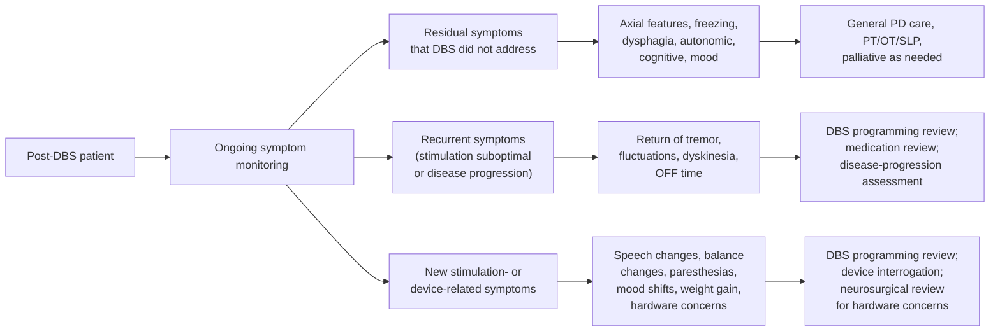

**Residual symptoms that DBS did not address.** These are the symptoms identified in Section 6.2 as not reliably improved by DBS — postural instability, non-levodopa-responsive freezing, dysphagia, autonomic features, mood, cognition, sleep — that persist after optimal programming. They require the **general PD care and rehabilitation framework** developed in Chapters 2–4 and Sections 6.7–6.9. They are managed by the movement-disorder neurologist (often the same clinician who performs DBS programming, or a colleague), physical/occupational/speech therapists, and (as advanced disease emerges) palliative care.

**Recurrent symptoms reflecting suboptimal stimulation or disease progression.** Return of tremor, increased OFF time, recurrent dyskinesia, or progressive bradykinesia in a previously well-controlled patient may reflect (a) device malfunction or battery depletion[^40]; (b) suboptimal current programming relative to evolving needs; (c) medication regimen issues; or (d) disease progression that is outpacing the device's capacity. Distinguishing these requires **DBS programming review, medication review, and disease-progression assessment**, often in coordinated visits with the movement-disorder neurologist and DBS programmer.

**Newly emerging stimulation-related or device-related symptoms.** Speech changes (dysarthria, hypophonia worsened by stimulation), balance changes, persistent paresthesias, mood shifts (including new depression or impulse control changes), weight gain, and hardware concerns (perceived intermittent stimulation, sensations along the extension wire path, skin changes over the implant site) may reflect specific stimulation parameter effects, device migration or fracture, or local tissue changes[^42]. These require **DBS programming review, device interrogation, and (for hardware concerns) neurosurgical review**.

### 6.10.2 The Need for Differential Triage

The central practical message is that **families must learn to distinguish among these categories, because each one engages a different part of the care team**. A new tremor in a post-DBS patient might reflect disease progression (general PD care), suboptimal programming (DBS programmer), medication change (general PD care), or device malfunction (DBS programmer plus possible neurosurgical review). The same observable symptom can have very different management implications depending on the underlying cause.

This differential triage logic is the natural extension of the tiered framework consolidated in Chapter 5, Section 5.7. The tiers (continued home observation, scheduled clinical follow-up, urgent specialist consultation, emergency department) continue to apply, but the post-DBS patient's framework gains a **second axis**: not only "how urgent?" but also "which member of the team?". Chapter 7 develops this two-axis framework explicitly, mapping specific post-DBS warning signs onto their appropriate triage destinations and providing the algorithms that distinguish, for example, a programming-adjustable issue from a medical emergency, a hardware concern from a soft-tissue concern, and a device-related issue from a disease-progression issue.

### 6.10.3 The Continuity Principle

A final principle ties this chapter to the broader report. Although DBS adds a substantial layer of device-specific management to the patient's care, **the underlying disease continues to follow the trajectory developed in Chapters 1–5**. Prodromal cues that were present before diagnosis remain features of the patient's biology; the staging logic of Chapters 2–4 continues to map onto the patient's trajectory; the diagnostic vigilance framework of Chapter 5 continues to apply (a patient diagnosed with PD before DBS who later develops cross-cutting red flags should still prompt diagnostic re-evaluation); and the advance-care planning, palliative-engagement, and caregiver-self-care logic of Chapter 4 applies fully to the post-DBS population, particularly as disease progression beneath stimulation eventually produces the levodopa-resistant axial, autonomic, and cognitive features that DBS does not modulate. The device-specific warning signs of Chapter 7 are an *additional* layer, not a replacement for the disease-specific layers of earlier chapters.

The post-DBS patient and family therefore navigate a more complex care landscape than the non-DBS patient, but the core principles — calibration against the patient's stage and baseline, recognition of patterns rather than isolated symptoms, tiered escalation logic, integration of stage-based monitoring with red-flag vigilance, and active partnership with a multidisciplinary team — remain unchanged. What Chapter 7 develops next is the device-specific layer that overlays this established framework, completing the report's transition from stage-based monitoring to integrated post-DBS care.

[^43]: Lachenmayer ML, Mürset M, Antih N, et al. Subthalamic and pallidal deep brain stimulation for Parkinson's disease — meta-analysis of outcomes. npj Parkinson's Disease. 2021;7:77.
[^41]: UPMC Department of Neurological Surgery. Deep Brain Stimulation (DBS) Therapy: Instructions and Information for Patients and Caregivers. UPMC Movement Disorders Clinic.
[^40]: Boston Medical Center. A Guide to Deep Brain Stimulation for Patients with Parkinson's Disease. Revised June 21, 2022.
[^42]: Abbott. Surgery and MRI Scans with Your Deep Brain Stimulation System; Important Safety Information for Deep Brain Stimulation (DBS) Therapy.

# 7 Post-DBS Warning Signs and Troubleshooting: Recognizing Device-Related and Disease-Related Issues

Chapter 6 closed with a deliberate framing: that the post-DBS patient lives with a partially modified but still progressive disease, and that warning-sign monitoring after surgery requires a **two-axis logic** — not only the urgency tiers inherited from Chapter 5 (continued home observation, scheduled review, urgent consultation, emergency response) but also a *routing* axis that asks which member of an expanded care team is the right destination for any given concern. A new tremor in a previously well-stimulated patient might be an early sign of a fractured lead in a patient who fell two weeks ago, a programming-drift issue best resolved at the next scheduled visit, a medication-adherence lapse that requires a primary care call, or a quiet expression of disease progression that the device was never going to address. The same symptom thus carries very different implications, and the family's task is to recognize the pattern that points toward the correct combination of urgency and destination.

This chapter operationalizes that two-axis logic into a comprehensive system. It catalogs, in turn, the four overlapping categories of post-DBS warning signs introduced in Section 6.10 — **hardware failures, surgical and wound complications, stimulation-induced side effects, and disease progression beneath stimulation** — translating the technical phenomena of each into family-observable cues, linking them to the specific clinical findings the care team will pursue, and assigning explicit escalation tiers and routing destinations. It then consolidates the cataloged material into worked-example triage algorithms for the most common ambiguous scenarios families face, and closes by reconnecting post-DBS vigilance to the advanced-stage and palliative-care frameworks of Chapter 4. The chapter completes the report's integrated practical guide and returns the reader to the central premise that has run through all preceding chapters: that family monitoring, properly framed, is not a substitute for clinical care but the partnership that makes clinical care work across the long trajectory of Parkinson's disease.

## 7.1 The Two-Axis Triage Framework: Urgency and Routing in Post-DBS Care

The unified tiered framework consolidated in Chapter 5, Section 5.7 (Tier 1 home observation, Tier 2 scheduled clinical follow-up, Tier 3 urgent specialist consultation, Tier 4 emergency department) remains the foundation of family decision-making after DBS. What changes is that Tier 2 and Tier 3 contacts now branch among several possible destinations rather than converging on a single neurologist. Mapping urgency onto routing produces the matrix that organizes the rest of this chapter:

| Urgency tier | DBS programmer | Movement disorder neurologist | Neurosurgeon | Primary care physician | Emergency department | Manufacturer support |
|---|---|---|---|---|---|---|
| **Tier 1 — home observation** | Routine home checks of battery and program status | Stable mild residual symptoms | — | Routine general health monitoring | — | Lost patient ID card; controller questions |
| **Tier 2 — scheduled review (days–weeks)** | Mild stimulation-induced side effects; gradual symptom drift; impending battery threshold | Gradual disease-progression symptoms; non-motor decline; mild mood/cognitive change | Stable scar appearance changes | Non-PD chronic disease updates; routine vaccinations; medication reviews | — | Controller malfunction; hardware troubleshooting questions |
| **Tier 3 — urgent contact (24–72 h)** | Abrupt return of pre-DBS symptoms; suspected programming drift; severe stimulation side effects | New formed hallucinations; suspected disease-progression red flag | Skin erosion / hardware visibility; suspected lead-fracture confirmation; persistent painful site | Acute infection workup before specialty contact | — | Suspected device malfunction beyond programming |
| **Tier 4 — emergency** | — | — | Wound dehiscence with hardware exposure; spreading erythema with systemic features | — | Sudden severe symptom return with rebound; choking/aspiration; head injury with possible lead damage; suicidal ideation; sepsis features; severe stimulation-induced effects compromising airway/safety | — |

Several principles make this matrix usable in practice. First, **the routing decision is provisional, not final**: families call the destination that fits the most likely cause, and the destination clinician redirects when the picture changes. A worsening tremor that the family triaged to the DBS programmer might, on impedance check, prove to be normal device function and reflect disease progression — at which point the movement disorder neurologist takes over. The matrix is a pattern-based heuristic, not a definitive diagnostic tool.

Second, **the manufacturer support line is a real but limited resource**. It handles patient-controller troubleshooting, lost ID cards, lost or malfunctioning chargers for rechargeable systems, and questions about MRI-conditional status; it does *not* substitute for clinical judgment, and any concern that has clinical consequences (suspected hardware failure, suspected infection, suspected stimulation problem) should also reach a clinical destination.

Third, the family's task at each post-DBS contact is to bring a structured information packet that allows the destination clinician to act efficiently:

| Documentation tool | Purpose | Source |
|---|---|---|
| **Patient ID card** | Identifies device model, lead targets, and programming center | Section 6.5.4 |
| **Patient controller readout** | Battery/charge status, current program, perceived stimulation status | Section 6.5.1 |
| **Medication list with exact times** | Foundation of triage between device, medication, and disease causes | Chapters 2–6 |
| **Post-DBS event log** | Date, time, observed event, time since last programming change, time since last fall or trauma, suspected trigger | This chapter |
| **Symptom diary / ON-OFF diary / fall log** | Documentation introduced in Chapters 2–3, continued post-DBS | Sections 2.6.1, 3.2.3, 3.3.4 |
| **Advance directive, healthcare proxy, POLST/MOLST** | Values-based decision support | Section 4.7.2 |

Fourth, and most consequentially for the urgency axis, **abrupt loss of stimulation can constitute a medical emergency**. As the Boston Medical Center patient guidance summarized in Chapter 6 made explicit, "the abrupt cessation of stimulation for any reason will probably cause disease symptoms to return. In some cases, symptoms may return with a greater intensity than what a patient experienced before system implantation. In rare cases, this can create a medical emergency." This **rebound principle** anchors several Tier 4 designations in this chapter: severe abrupt symptom return — particularly when accompanied by inability to swallow, severe rigidity preventing safe positioning, severe immobility, or autonomic instability — should not be triaged as routine wearing-off but as an event requiring same-day medical evaluation, both because the symptoms themselves may be dangerous and because the underlying cause (lead fracture, IPG failure, complete battery depletion) requires prompt diagnosis.

The chapter now applies this matrix to each of the four warning-sign categories in turn.

## 7.2 Sudden Symptom Worsening: Recognizing Hardware Failure, Battery Depletion, and Lead Fractures

The single most diagnostically informative warning-sign cluster in post-DBS care is **the abrupt return or worsening of pre-DBS symptoms in a previously stable patient**. Where stimulation-induced side effects (Section 7.4) typically appear shortly after a programming change, where wound complications (Section 7.3) usually evolve over days to weeks with local signs, and where disease progression (Section 7.7) unfolds gradually over months to years, hardware-related issues most often present as a comparatively sudden loss of therapeutic benefit — tremor, rigidity, dystonia, or other previously controlled symptoms returning over hours to days. Recognizing this signature, and distinguishing the three principal hardware causes from one another, is one of the most useful family skills in post-DBS care.

### 7.2.1 Lead Fracture: The Trauma-Linked Cause

A 10-year case series of 325 consecutive bilateral DBS patients at a national neurosurgical center provides the clearest contemporary picture of lead fractures in real-world practice. **Lead fractures occurred in 17 of 325 patients (5.23%), affecting 18 electrodes**, with patients averaging 59.17 ± 8.77 years of age and the majority diagnosed with Parkinson's disease (76.5%) or dystonia (23.5%).[^44] The fracture rate is consistent with the broader literature, in which reported incidences range from 1% to 15.2% across different series.[^44]

For families, the most clinically actionable finding from this case series is the **dominant role of trauma in precipitating fracture**. The investigators found that "almost all patients with lead fractures reported a history of trauma," and that "abruption was significantly more associated with falls than with sports or spontaneous disruption."[^44] This observation maps cleanly onto the fall-prevention logic developed in Chapter 3 and Section 6.7: the same patients whose mid-stage Parkinson's disease places them at H&Y Stages 3–4 with high fall risk are precisely the patients whose DBS hardware is most vulnerable to fracture. The case series specifically noted that lead fractures occurred in patients with Parkinson's disease at stages 3–4, "indicating a higher risk of falling due to postural instability disorders."[^44]

A second, less obvious mechanism deserves family attention: **vigorous overhead movements during sports**. Two of the 17 fractures in the case series were "linked to active participation in sports, specifically involving movements such as pulling up on a horizontal bar."[^44] One illustrative case described a 32-year-old male with a 13-year history of dystonia who had received eight years of significant symptomatic relief from bilateral GPi DBS; the patient "presented to the medical facility with acute involuntary muscle contractions in the neck, a symptom onset that followed physical exertion from pull-ups," and surgical exploration ultimately revealed a lead fracture at the junction between the intracranial electrode and its extension.[^44] This case directly substantiates the Chapter 6, Section 6.6 advisory against activities involving sudden, excessive, or repetitive bending, twisting, or stretching.

Lead fractures distribute anatomically along the entire device path, but with characteristic preferences: **11 of 17 cases presented below the clavicle, four in the neck region, one cranial, and one at the connection point between lead and extension**.[^44] This is consistent with the broader literature reviewed by the case-series authors, who note that "the most common site for electrode cable breakage was typically located between 9 and 13 mm from the junction between the lead and the extension cable" and that "connections between the lead and the extension cable in the cervical region are linked to an increased risk of wire fractures."[^44]

The clinical signature of lead fracture, as described in the case series, is highly characteristic:

- **Abrupt loss of therapeutic benefit** — sudden reappearance of symptoms that had been well-controlled. The investigators noted that "in all cases analyzed in our study, patients exhibited a sudden worsening of their condition," which they described as the primary clinical manifestation, "such as tremors or rigidity, reflecting the loss of DBS efficacy."[^44]
- **Temporal linkage to a specific event** — a fall, vigorous physical activity (particularly involving the neck, shoulders, or arms), or whiplash-type injury, often within days to weeks before symptom return.
- **Sometimes intermittent stimulation effects with body position** — a particularly subtle pattern reflecting *microfractures*. The case series authors note that "in some cases, variations in impedance and current measurements with different body positions, often linked to intermittent stimulation patterns, may be due to microfractures allowing temporary connections between the open circuit's two poles during changes in neck or head positions."[^44] Families may notice that symptoms return when the patient turns the head a certain way or extends the neck, and resolve when the head returns to neutral.

For the care team, the diagnostic workup combines three modalities, none of which is definitive in isolation:

- **Clinical assessment** documenting the abrupt return of previously controlled symptoms;
- **Impedance and current measurements**, with the case series describing diagnostic findings of "high impedances associated with low currents in 2–4 contacts of the same electrode, leading to a precipitous loss of the DBS therapeutic effect," and threshold values of "high impedance levels (>2000) and low currents (<9 A) across all contacts, suggesting internal lead damage";[^44]
- **X-ray imaging**, which "confirmed the presence of complete fractures in three patients and a kinked electrode indicative of 'Twiddler's syndrome' in two patients" but in 11 of 17 patients showed no complete fracture despite high impedance findings.[^44]

Critically for family expectations, **microfractures may evade both impedance and radiographic detection**. The case series authors emphasize that "while complete lead fractures can be identified through X-ray imaging, micro-fractures—another potential cause of DBS system failure—are often undetectable, even with impedance measurements," and that an open fracture of leads can occur with normal electrical impedances.[^44] In one case the investigators describe, "both impedance levels and X-ray results appeared normal without clinical effect on stimulation," yet "structural changes in the lead were observed, although not amounting to a complete fracture."[^44] The implication is that **persistent suspicion of fracture, even when initial diagnostic studies are unrevealing, is sometimes appropriate**, and intraoperative exploration may be required for definitive diagnosis.

A second hardware-related complication study analyzing patients with movement disorders found that **lead fracture was the most common complication (2.5% of patients), followed by infections (1.9%) and electrode misplacement**, providing a complementary frame on relative incidence.[^45]

Management is uniformly surgical: "all electrode fractures required surgical revision," with "100% of patients regaining the clinical benefits of DBS" after extension wire replacement (with intracranial electrode replacement when the fracture was located at the cranial level).[^44] Reprogramming is not a substitute, because the underlying problem is mechanical loss of the conductor.

### 7.2.2 Twiddler's Syndrome: The Pocket-Rotation Cause

A specific subset of hardware failures involves not fracture but **rotation of the IPG within its subcutaneous pocket**, producing coiling and twisting of the extension wires. The case series identified Twiddler's Syndrome in two patients.[^44] Clinically, the syndrome involves "multiple rotations of the IPG within the subcutaneous pocket, often accompanied by coiling of the electrodes," which "can result in system malfunction due to electrode breakage or displacement," with "a hypermobile stimulator and thickened cable strands or pulls" sometimes felt under the skin.[^44]

For families, the family-observable signs are:
- Abrupt symptom worsening (similar to lead fracture);
- A **palpable change at the IPG site** — generator that feels rotated, mobile, or no longer in its original orientation;
- **Thickened or palpable cable** under the skin near the generator, sometimes felt as a ridge or rope-like structure;
- Often, the patient or family member can recall a specific manipulation, vigorous arm movement, or unusual position that may have precipitated the rotation.

One illustrative case from the series described a 55-year-old woman with multifocal dystonia who had received ten years of GPi DBS benefit. She returned with "worsened uncontrolled muscle cramps and spasms, as well as difficulties in speaking and swallowing"; impedance for one electrode was elevated to 10,700–12,400, and chest X-ray "revealed pronounced coiling of the DBS extension leads."[^44] At surgical revision, "twisting of the DBS extension leads was observed, necessitating replacement," and the IPG was "securely repositioned beneath the pectoralis fascia to mitigate future displacement and coiling risks."[^44]

Twiddler's syndrome management is again surgical, with both extension replacement and IPG re-anchoring. Some experts recommend "the 'Dual Anchor Internal Pulse Generator Technique', which involves additional suturing to the overlying subcutaneous tissue, or using an absorbable Antibacterial Envelope" to reduce recurrence risk.[^44]

### 7.2.3 Battery Depletion: The Gradual Cause

In contrast to fractures and Twiddler's syndrome, **battery depletion produces a gradual rather than abrupt decline in symptom control**. As Chapter 6, Section 6.5.2 noted, patients on non-rechargeable batteries face replacement every 2–5 years, while rechargeable systems extend the interval to 15 years or more. The Boston Medical Center patient guide described the warning signature: "Typically, patients will notice a significant worsening in their symptoms such as difficulty walking, worsening tremor, and stiffness."

The pattern that distinguishes battery depletion from fracture is timing and trajectory:
- **Gradual** symptom return over weeks rather than the abrupt return characteristic of fracture;
- **Predictable** based on time since last replacement and battery indicator readings;
- **Patient controller diagnostic display** showing low battery status — a piece of information families should learn to retrieve;
- **No association with recent trauma**.

In modern programs, scheduled replacement before critical depletion is the standard, and families on long-term non-rechargeable systems should establish a routine of checking the patient controller's battery indicator monthly and reporting low-battery readings to the DBS team. Boston Medical Center's framing — "Surgery will be scheduled when the battery is at a certain threshold. This ensures the battery does not become critically low or run out" — describes the desired pattern.

For rechargeable systems, the analogous warning sign is **failure of the recharge cycle to maintain charge**, which can reflect charger malfunction, problems with skin-coil coupling, or end-of-service-life of the battery itself even in a rechargeable system. Patients and families on rechargeable systems should learn to recognize incomplete charging cycles and report them.

### 7.2.4 IPG Malfunction

Less commonly, the IPG itself fails — through circuit failure or battery dysfunction unrelated to depletion. Clinically, IPG malfunction can resemble either lead fracture (abrupt loss of therapy) or battery depletion (gradual decline), depending on the failure mode, and is distinguished primarily through device interrogation by the DBS programmer. The Liv Hospital patient education material lists "issues such as lead fracture or pulse generator problems" together under device malfunction and notes that management may include "monitoring, surgical revision."[^46] When suspected, IPG malfunction generally requires generator replacement.

### 7.2.5 The Triage Logic for Sudden Symptom Worsening

The two-axis triage for sudden symptom worsening is summarized below. The principle that organizes the table is: **the more severe and abrupt the symptom return, and the greater the safety consequence, the higher the urgency tier; the more clearly a hardware cause is suggested by trauma history or imaging, the more clearly the routing involves the surgical team in addition to the DBS programmer**.

| Scenario | Likely cause | Urgency | Routing |
|---|---|---|---|
| Gradual decline over weeks, predictable timing, low battery on controller | Battery depletion | Tier 2 | DBS programmer (schedule replacement) |
| Abrupt symptom return within days of a fall, whiplash, or vigorous overhead activity | Lead fracture | **Tier 3** | DBS programmer for impedance check; **neurosurgeon** for likely revision |
| Abrupt symptom return with palpable IPG rotation or thickened cable | Twiddler's syndrome | **Tier 3** | DBS programmer; neurosurgeon for revision |
| Abrupt symptom return without trauma, no battery warning | Possible IPG malfunction or microfracture | **Tier 3** | DBS programmer; neurosurgeon as indicated |
| Intermittent symptom return that varies with head/neck position | Suspected microfracture | Tier 2–3 | DBS programmer for positional impedance testing |
| Severe abrupt symptom return causing inability to swallow, severe rigidity, immobility, or autonomic instability — the **rebound scenario** | Any hardware cause producing complete loss of stimulation | **Tier 4** | **Emergency department**; concurrent contact with DBS team |

The rebound caveat deserves emphasis. Patients who have received substantial LEDD reduction post-STN-DBS (Chapter 6, Section 6.2 — the meta-analytic ~50% reduction) are particularly vulnerable: their oral medication regimen may no longer be sufficient to control symptoms in the absence of stimulation, and complete sudden stimulation loss may produce a severity of symptom return that exceeds even the patient's pre-DBS state. Restoring stimulation as quickly as possible — through device interrogation, programming reset, or surgical replacement — is the principal intervention, and oral medication "rescue" by reverting to higher doses may be required as a temporary bridge under neurologist guidance. Families confronting this scenario should not improvise medication changes but should reach the DBS team and emergency services in parallel.

## 7.3 Surgical and Wound-Related Complications: Infection, Skin Erosion, and Hardware Exposure

A second category of hardware-adjacent warning signs concerns the interaction between the implanted system and surrounding soft tissue. These complications differ from the failures of Section 7.2 in that the hardware itself may be functioning normally — but the tissue around it is not. Recognition is critical because **untreated infection or skin erosion frequently progresses to a point where partial or complete explantation of the system is required**, with the patient losing the therapeutic benefit that years of optimization had built.

### 7.3.1 Post-Operative Infection

Infection is among the most frequent complications of DBS surgery. The Liv Hospital patient education material summarizes the immediate post-operative concern: "Like any surgery, there's a chance of infection at the incision site or deeper in the brain."[^46] Pooled meta-analytic data summarized in Chapter 6, Section 6.3.5 placed median surgery-related infection at approximately 5.1% across studies, and the hardware-complications case series found infections in 1.9% of patients overall.[^45]

Families need to understand both the **typical time course** and the **anatomic distribution** of infection:

- **Acute post-operative infection** typically presents within the first weeks to months, with local signs at one or more of the three surgical sites (cranial burr-hole site beneath the scalp, postauricular extension path, or chest IPG pocket) — redness, swelling, warmth, tenderness, and sometimes drainage — and systemic signs (fever, malaise, rigors).
- **Late infection** can present months to years later, typically with more indolent local signs (chronic erythema, persistent low-grade tenderness, intermittent drainage) and occasional systemic features. Late infection is particularly important to recognize because it can mimic non-specific musculoskeletal complaints and may be dismissed by patients or non-specialists.
- **Hardware-associated infection** — Liv Hospital's framing — is a particular concern because "the hardware in DBS, like the pulse generator and leads, can also cause infections. Sometimes, removing the device is needed to treat the infection."[^46]

For families, the threshold for evaluating a possibly infected DBS site should be deliberately low. Specific patterns warrant prompt action:

| Finding | Tier | Routing |
|---|---|---|
| Mild redness around an incision in the first 7–10 days, no drainage, no fever | Tier 1–2 | Routine wound check; primary care or DBS team if persistent |
| Persistent redness, swelling, warmth, or new tenderness at any site beyond 10 days | Tier 2 | DBS team contact; primary care for wound assessment if DBS team unavailable |
| Drainage from any incision (especially purulent or bloody) | **Tier 3** | **Neurosurgeon** and DBS team; do not attempt home wound care alone |
| Fever in the first 90 days post-operatively, even without local signs | **Tier 3** | Prompt evaluation specifically for device-related infection |
| Spreading erythema, severe pain, systemic signs of sepsis | **Tier 4** | **Emergency department**; sepsis is a device-explantation-precipitating event |
| Late-onset (months–years) chronic local signs at any site | Tier 2–3 | DBS team and neurosurgeon |

The Liv Hospital material gives the lay-accessible version of the family rule: "look out for redness, swelling, or fever. If you see these, get medical help right away."[^46]

### 7.3.2 Skin Erosion and Hardware Exposure

Skin erosion is a more chronic complication in which the soft tissue overlying an implanted component thins and ultimately breaks down, exposing hardware. Particularly vulnerable sites are the postauricular path of the extension wire (where bony underlying structure provides little cushioning), the IPG pocket in patients who are thin or who have lost weight post-DBS, and any site of repeated mechanical stress (e.g., from clothing rubbing or from patient manipulation of the device).

The Liv Hospital education material captures the underlying concept: "Manipulation may cause device inversion, inhibiting the ability to use the magnet to start or stop stimulation," reinforcing the broader principle that families should advise patients **not to manipulate the implanted system components**. The Abbott safety information cited in Chapter 6, Section 6.6 made the same point explicitly: manipulation "can result in component damage, lead dislodgement, skin erosion, or stimulation at the implant site."

Family-observable warning signs of erosion include:
- **Visible color change of skin over the device path or pocket** — pink, red, or bluish discoloration that persists rather than resolves;
- **Skin that appears stretched, shiny, or thin** over the IPG or extension;
- **A palpable component beneath thinning skin** — the IPG corner that was previously well-padded now feels close to the surface, or the extension that was previously deep now feels superficial;
- **Visible hardware** — the most advanced presentation, in which any portion of the device is no longer covered by intact skin;
- **Pain, itching, or discomfort** localized to the device path that does not resolve.

Any visible hardware or imminent exposure is **Tier 3 routed to the neurosurgeon**, because once skin breaks down over the implant the contamination risk is high and the trajectory toward explantation is short. Earlier signs — visible thinning, persistent discoloration, palpable hardware — warrant Tier 2 neurosurgical review before the situation crosses into frank exposure.

### 7.3.3 Pain or New Sensations Along the Device Path

Transient discomfort during the immediate post-operative weeks is normal, particularly at the IPG pocket and along incision lines. **Persistent or new pain along the implanted path months or years after surgery is a different category of finding**. The Liv Hospital material lists "persistent pain at the surgery or generator site" as a recognized post-operative concern.[^46]

The differential for persistent device-path pain includes:
- **Subclinical infection** (cross-reference Section 7.3.1);
- **Impending skin erosion** (Section 7.3.2);
- **Lead or extension mechanical issues** including stress at the connection points highlighted by the case series;[^44]
- **Hardware migration** with traction on tissue;
- **Unrelated musculoskeletal causes** — shoulder bursitis, cervical spondylosis, chest-wall syndromes that happen to coincide with the device location.

Distinguishing these requires examination by a clinician, sometimes imaging (X-ray to assess hardware position, ultrasound or MRI when MR-conditional and clinically indicated), and impedance testing if a mechanical cause is suspected. The triage default is Tier 2 routed to the DBS team or neurosurgeon, with Tier 3 escalation if pain is associated with any erythema, fever, or visible change at the site.

### 7.3.4 The Family Vigilance Imperative

The unifying message of Section 7.3 is that **family vigilance for wound and tissue changes is the most reliable early-warning mechanism for these complications**, because the typical patient pays only intermittent attention to surgical scars that have long since healed and may not notice gradual changes that an attentive caregiver — examining the sites during dressing, bathing assistance, or routine care — will see. The reward for vigilance is the possibility of preserving the device through earlier intervention; the cost of inattention is often explantation of the entire system, with surgical recovery, device-free interval, and re-implantation each carrying risks that exceed those of the original surgery.

## 7.4 Stimulation-Induced Speech, Gait, and Sensory Side Effects: Recognizing Programming-Adjustable Issues

The third category of post-DBS warning signs is the cluster of symptoms produced not by hardware failure or wound complications but by **the stimulation itself spreading from the intended target into adjacent neural structures**. These side effects are typically reversible with reprogramming — they are, in fact, the principal reason that DBS is described as a reversible therapy whose effects can be managed by adjusting parameters rather than by surgical revision.

### 7.4.1 The Mechanism of Current-Spread Side Effects

The intended target of DBS — STN or GPi — sits in close proximity to several other neural structures, and the electrical field generated by an active contact does not stop precisely at the target boundary. As Chapter 6, Section 6.4.5 noted in describing initial programming, common side effects experienced during the systematic contact testing of initial programming include "numbness, tingling, slurred speech, balance difficulty, facial pulling, or vision change." Each of these reflects current spread to a specific neighboring structure:

| Side effect | Likely structure stimulated | Family-observable manifestation |
|---|---|---|
| **Dysarthria, hypophonia** | Corticobulbar fibers in internal capsule | "Her speech became softer and harder to understand within days of the last programming change" |
| **Dysequilibrium, gait worsening** | Cerebellothalamic or sensorimotor pathways | "He started feeling unsteady on his feet shortly after the new program was activated" |
| **Persistent paresthesias** | Medial lemniscus | "Persistent tingling in the hand that wasn't there before" |
| **Facial pulling, muscle contraction** | Internal capsule motor fibers | Visible pulling at the corner of the mouth, tongue, or eye, often only on one side |
| **Diplopia, visual disturbance** | Oculomotor pathway | Patient reports double vision when stimulation is on, resolving when amplitude is reduced |
| **Stimulation-induced dyskinesia** | Sensorimotor STN | Choreic or dystonic movements appearing or worsening with stimulation increases |

The Liv Hospital patient education material captures the broader picture in lay terms. For speech and language, it notes that "DBS can also affect speech and language. Patients might have trouble speaking clearly or softly. The settings and placement of the electrodes are important in how much speech is affected. Changing these settings can sometimes help. Speech therapy is often suggested to help with these issues."[^46] For motor and sensory effects, it describes that "DBS can lead to motor function issues. Some patients may have dyskinesia, which causes involuntary movements," and that "sensory side effects of DBS include numbness, pain, and tingling in different body parts. These can come from the surgery or the DBS itself."[^46] For dysequilibrium specifically, "muscle stiffness, balance issues, and gait problems" are recognized motor complications.[^46]

### 7.4.2 The Distinguishing Features of Stimulation-Induced Side Effects

Several patterns reliably distinguish current-spread side effects from disease-progression symptoms or hardware failures:

- **Temporal linkage to a programming change** — the side effect appears within hours to days of a parameter adjustment. Families should always note the date of the most recent programming visit and watch for new symptoms in the subsequent days and weeks.
- **Reproducibility with specific programs** — modern devices allow patients to switch among multiple programs, and a side effect that consistently appears when one program is active and resolves when a different program is selected is almost diagnostic of stimulation origin.
- **Response to amplitude reduction** — many side effects resolve when the patient (within physician-set ranges) reduces amplitude, even when the underlying motor benefit also diminishes; this provides a temporary management strategy while awaiting reprogramming.
- **Preservation of overall device benefit** — the patient is otherwise still benefiting from stimulation, in contrast to the abrupt loss of all benefit characteristic of hardware failure.

The Liv Hospital material captures the management response: "Adjusting the device settings and sometimes changing medications can help manage these issues."[^46] In practice, the DBS programmer's approach is to:
1. Confirm that the side effect is reproducible by activating the offending contact at the offending amplitude;
2. **Reduce amplitude** at that contact;
3. **Switch to a different active contact** — most modern leads have multiple contacts, only one or two of which are typically active;
4. **Switch the stimulation polarity** (monopolar to bipolar, which produces a more focal field);
5. In **directional-lead systems** (Boston Scientific, Abbott, and increasingly Medtronic), **steer current away from the side-effect-producing tissue** while maintaining the therapeutic effect at the target.

### 7.4.3 Documentation and Reporting

Families bringing a stimulation-induced side effect to the DBS programmer should bring:

- **The date and details of the most recent programming change**, ideally from the patient's discharge instructions or programming records;
- **The timing of side-effect onset** relative to that change;
- **The reproducibility of the side effect with specific programs** (if multiple programs are in use);
- **The functional severity** — is the patient still able to be understood at home? In public? Is gait affected enough to limit ambulation? Is paresthesia merely annoying or genuinely distressing?
- **Any temporary mitigations attempted** (amplitude adjustments within the patient-controller range) and their effects.

This information allows the programmer to map the side effect to a specific contact and parameter, and to design the next adjustment efficiently rather than relying on a generic re-titration.

### 7.4.4 The Triage Logic

The default triage for stimulation-induced side effects is **Tier 2 routed to the DBS programmer**, with the implicit understanding that the side effect, while affecting quality of life, is not dangerous and can wait for a scheduled or near-term appointment. Several scenarios escalate beyond this default:

- **Severe dysarthria or hypophonia compromising the ability to communicate basic needs** — Tier 2–3, contact the DBS programmer promptly; speech-language pathology referral may also be valuable.
- **Severe gait worsening producing new fall risk** — Tier 3, applying the fall-related logic of Chapter 3; integrated assessment by the DBS programmer (for parameter adjustment) and physical therapist (for safety strategies during the interim) is appropriate.
- **Stimulation-induced swallowing dysfunction** — Tier 3, given the severe dysphagia warning thresholds of Chapter 4, Section 4.3; this is rarer but does occur, particularly with current spread to corticobulbar fibers.
- **Severe vertigo or balance loss preventing safe ambulation** — Tier 3.
- **Diplopia severe enough to compromise driving or walking safely** — Tier 2–3.

The boundary between Tier 2 and Tier 3 reflects the **safety consequences of the side effect**, not its mere presence. A mild paresthesia is an annoyance; a mild dysarthria is a quality-of-life issue; severe dysarthria preventing emergency communication is a safety issue. Families should err toward earlier contact when a side effect crosses into safety-affecting territory, and toward scheduled contact when it remains a quality-of-life matter that can wait until the next routine programming visit.

## 7.5 Stimulation-Induced Neuropsychiatric Effects: Mood, Impulse Control, Cognition, and Suicide Risk

The fourth and most clinically consequential subset of stimulation-related side effects is the neuropsychiatric cluster. The Abbott safety information cited in Chapter 6, Section 6.9.4 was unambiguous: **"new onset or worsening depression, which may be temporary or permanent, is a risk that has been reported with DBS therapy. Suicidal ideation, suicide attempts, and suicide are events that have also been reported."** The Liv Hospital education material echoes this: "Mood disorders like depression and anxiety are common side effects of DBS… Depression is a big worry, with some studies showing it can increase after DBS. It's not clear why, but it might be because the treatment affects mood centers in the brain."[^46] For cognitive change, the same source notes that "cognitive changes are a big worry for DBS patients. These can be from mild memory problems to serious cognitive decline. Research shows that the type of DBS and where it's placed can affect these changes. For example, some studies link DBS in the subthalamic nucleus to a higher risk of cognitive decline."[^46]

Recognition of these effects matters more per individual event than perhaps any other category of post-DBS warning sign, because the consequences of missing depression, suicidal ideation, or new impulse control disorder behaviors can be catastrophic and irreversible.

### 7.5.1 The Spectrum of Post-DBS Neuropsychiatric Changes

Several distinct neuropsychiatric phenomena are recognized in the post-DBS literature, each with its own pattern and management:

**Depression — new or worsening.** Depression may appear within weeks to months of programming changes or of medication reduction post-STN-DBS. The Liv Hospital material describes the management spectrum: "Depression is a big worry, with some studies showing it can increase after DBS. It's not clear why, but it might be because the treatment affects mood centers in the brain."[^46] Family-observable signs include sustained low mood without proportionate trigger, loss of interest in previously enjoyed activities, sleep and appetite changes, tearfulness, hopelessness, social withdrawal, and reduced engagement with the post-operative rehabilitation program.

**Apathy and dopamine withdrawal syndrome.** Particularly after STN-DBS-enabled levodopa reduction, patients may develop apathy that is conceptually distinct from depression. Chapter 6, Section 6.9.4 cited the meta-analytic note that LEDD reduction "in turn, can lead to apathy and dopamine withdrawal syndrome on one side, or to an improvement of impulse control disorders on the other side with a major impact on quality of life." Apathy presents as **reduced motivation and emotional reactivity rather than sadness per se**, and is often misread by families as "the patient just doesn't care anymore" or as personality change. It does not respond to standard antidepressants in the same way depression does, and may require partial restoration of dopaminergic medication under neurologist guidance.

**Anxiety.** Persistent or new-onset anxiety, often focused on uncertainty about the device, fear of stimulation loss, or social embarrassment about residual symptoms.

**Impulse control disorder changes.** This is one of the more nuanced post-DBS phenomena. Pre-existing impulse control disorders sometimes improve after DBS (because dopamine agonists can be reduced), but **new impulse control behaviors can also emerge**, particularly with programming changes affecting limbic-connected portions of the STN. The Liv Hospital material notes that "DBS can also lead to personality changes, though this is less common… Some people might become more impulsive or disinhibited after DBS."[^46] Family-observable cues include unexplained financial activity (new credit-card spending, gambling losses, online purchases), secret online behavior, dietary changes (binge eating, compulsive snacking), sexual changes (new pornography use, hypersexual demands), and excessive new hobbies pursued to the exclusion of other activities. As Chapter 3, Section 3.7.4 noted, ICDs are frequently hidden by the patient and uncovered by family members; this dynamic continues post-DBS.

**Hypomania or mania.** Less common but reported, particularly in the early post-operative period. Family-observable signs include reduced sleep need without fatigue, racing thoughts, pressured speech, grandiose plans, irritability, or impulsive decisions of unusual magnitude.

**Cognitive worsening.** The Liv Hospital material identifies cognitive change "from mild memory problems to serious cognitive decline" as a documented risk, with STN-DBS particularly associated.[^46] Most commonly, cognitive change post-DBS affects **verbal fluency** (the patient generates fewer words on naming tasks) and **executive function** (planning, set-shifting, dual-tasking). Severe cognitive decline is uncommon and may reflect emerging dementia rather than stimulation effect — a differential that the Chapter 5 red-flag framework remains relevant for, particularly when post-DBS cognitive change is rapid or accompanied by hallucinations or fluctuating attention suggestive of DLB.

**Personality changes reported by family.** Sometimes families describe subtle but persistent changes — the patient seems "different," more irritable, less patient, less affectionate, or less engaged emotionally. These reports deserve serious attention even when the patient does not endorse them, because patients are often the last to perceive their own personality shifts.

### 7.5.2 The Critical Differential Triage

A central feature of post-DBS neuropsychiatric monitoring is that **mood, cognitive, and behavioral changes have multiple possible causes that require coordinated triage**:

| Possible cause | Clinical signature | Primary destination |
|---|---|---|
| **Stimulation-related** (current spread to limbic regions, programming-induced) | Temporal linkage to recent programming change; reproducibility with specific program | DBS programmer (program adjustment) |
| **Medication-reduction-related** (apathy, dopamine withdrawal syndrome, depression) | Linkage to recent LEDD reduction; improvement with partial restoration of medication | Movement disorder neurologist (medication adjustment) |
| **Disease progression** (advancing PD-related neuropsychiatric pathology) | Gradual emergence; non-temporal-linked; progressive course | Movement disorder neurologist; consideration of DLB red flags |
| **Independent psychiatric illness** (primary depression, anxiety disorder) | May predate PD or DBS; responds to standard psychiatric treatment | Psychiatrist familiar with DBS |
| **Acute medical precipitant** (UTI, dehydration, medication toxicity) | Acute onset; fluctuating; other systemic features | Emergency department or primary care |

This differential is precisely why **post-DBS depression cannot be treated with antidepressant prescription alone**. Coordinated input from the DBS programmer, the movement disorder neurologist, and (often) a psychiatrist familiar with DBS is the appropriate response, with each contributor addressing the dimension of cause that falls within their expertise.

### 7.5.3 The Suicide Risk Tier

Given the documented association of DBS with suicidal ideation, suicide attempts, and completed suicide, the family triage logic must reserve a specific Tier 4 designation for any expression of suicidal thinking in a post-DBS patient. **Suicidal ideation of any kind in a post-DBS patient warrants immediate mental health evaluation**, with active intent or plan requiring emergency department contact. The Liv Hospital material reinforces the imperative for ongoing monitoring: management of mood disorders requires "a team effort. Doctors, psychiatrists, and other experts must work together. By understanding and addressing these effects, we can make DBS safer and more effective for everyone."[^46]

The pre-operative psychiatric screening described in Chapter 6, Section 6.3.3 — which identifies untreated depression, anxiety, and psychosis as relative or absolute contraindications to surgery — is the foundation against which post-operative changes are interpreted. A patient who entered surgery with no history of depression and now meets criteria for major depressive disorder is a different clinical situation from a patient who entered with treated depression and has experienced a flare; the pre-operative baseline is essential context.

### 7.5.4 The Family Action Framework

| Finding | Tier | Routing |
|---|---|---|
| Mild persistent low mood, apathy, or anxiety; family-noted personality change | Tier 2 | DBS programmer + movement disorder neurologist (joint review of programming and medication); consider psychiatry |
| New impulse control behaviors (financial, sexual, dietary) | Tier 2 | Movement disorder neurologist (medication review, particularly of any residual dopamine agonist); DBS programmer (program review) |
| Moderate to severe depression with functional impairment | **Tier 3** | Movement disorder neurologist + psychiatrist familiar with DBS |
| New formed visual hallucinations, paranoid delusions, or fluctuating cognition | **Tier 3** | Movement disorder neurologist; reconsider DLB red flags (Chapter 5) |
| Hypomania, mania, severe agitation, psychotic features | **Tier 4** | Emergency department or psychiatric urgent care |
| **Suicidal ideation** (any expression) | **Tier 4** | **Immediate mental health evaluation; emergency department for active intent or plan** |
| Acute fluctuating confusion (consider delirium from medical cause) | **Tier 4** | Emergency department; medical workup before assuming psychiatric origin |

The family role in this category is **vigilant, non-judgmental observation paired with low threshold for raising concerns**. Patients with depression, apathy, or impulse control issues frequently minimize their symptoms; partners, adult children, and other close observers typically have a more accurate picture and should bring observations to clinical attention even when the patient denies them.

## 7.6 Weight Gain, Autonomic Changes, and Other Systemic Stimulation-Related Effects

A fifth category of post-DBS warning signs encompasses systemic and autonomic changes that are less acute than the categories above but can substantially affect long-term quality of life, requiring active management rather than passive tolerance.

### 7.6.1 Post-STN-DBS Weight Gain

As Chapter 6, Section 6.9.1 introduced, weight gain is a recognized and often substantial post-STN-DBS phenomenon. Mechanisms are multifactorial:
- **Reduced energy expenditure** as dyskinesia decreases (involuntary movements consume substantial calories);
- **Restored eating capacity** as bradykinesia and dysphagia improve;
- **Possible direct hypothalamic or appetite-regulatory effects** of subthalamic stimulation;
- **Reduced LEDD**, since dopaminergic medications can themselves affect weight.

For families, a structured response includes:
- **Regular weighing** (at least monthly initially, weekly if rapid changes are observed);
- **Dietitian referral** when weight gain exceeds approximately 5–7% of body weight, or when any weight gain occurs in a patient with cardiovascular comorbidity;
- **Integration with the exercise framework** of Chapter 6, Section 6.8 — exercise both addresses the energy-balance side of weight gain and contributes independently to long-term outcomes;
- **Discussion at routine DBS visits** rather than urgent escalation, unless rapid (e.g., >5 pounds in a month).

The default triage is Tier 2 routed to the DBS programmer and movement disorder neurologist for joint review, with dietitian referral as a parallel track.

### 7.6.2 Weight Loss as a Different Concern

Weight *loss* in a post-DBS patient typically does not reflect stimulation effect and instead signals one of the warning-sign clusters developed in earlier chapters:
- **Worsening dysphagia** (Chapter 3, Section 3.6; Chapter 4, Section 4.3);
- **Refusal of food** driven by mood or paranoid delusions (Chapter 4, Section 4.4);
- **Systemic illness** (occult malignancy, hyperthyroidism, infection, malabsorption);
- **Severe depression** affecting appetite (Section 7.5);
- **Advanced disease progression** with the muscle mass loss described in Chapter 4, Section 4.2.2.

Rapid weight loss (>5% body weight in 1–3 months) is a Tier 2–3 finding warranting medical workup, with the routing depending on the apparent cause (movement disorder neurologist for swallowing or dyskinetic energy expenditure, primary care for systemic workup).

### 7.6.3 Orthostatic Hypotension and Cardiac Autonomic Changes

As Chapter 6, Section 6.9.4 noted, orthostatic hypotension may emerge or worsen post-DBS, particularly in STN patients on residual dopaminergic medication. The Chapter 4, Section 4.5 framework — increased fluids and salt, compression stockings, medication review (focusing on antihypertensives whose original indication may have become questionable as autonomic regulation deteriorates), and pharmacologic agents when indicated — applies fully.

The post-DBS-specific consideration is that STN stimulation itself can sometimes affect autonomic tone, and that medication reduction post-DBS can unmask baseline dysautonomia that was previously obscured by motor symptoms. The differential triage is therefore:

| Finding | Tier | Routing |
|---|---|---|
| New mild orthostatic symptoms, manageable with conservative measures | Tier 2 | Movement disorder neurologist; primary care for blood-pressure-medication review |
| Recurrent near-syncope preventing safe ambulation | Tier 2–3 | Movement disorder neurologist; consider autonomic specialist |
| **Syncope (loss of consciousness on standing)** | **Tier 3** | Emergency department for first episode or any with injury |
| Postprandial hypotension affecting nutrition | Tier 2 | Movement disorder neurologist; meal-timing modification |

### 7.6.4 Sleep Architecture and Bladder Function Changes

Post-DBS changes in sleep architecture (insomnia, fragmentation, excessive daytime sleepiness) and bladder function (urgency, frequency, incontinence, retention) may reflect direct stimulation effects, medication-reduction consequences, or unmasked baseline dysfunction. The default triage is Tier 2 routed to the movement disorder neurologist with referrals to sleep medicine or urology as the picture warrants. Bladder retention deserves specific vigilance because, as Chapter 4, Section 4.5.2 emphasized, urinary retention precipitates UTI and urinary tract infection is among the most common precipitants of acute deterioration in advanced PD — a consideration that applies fully to the post-DBS population.

### 7.6.5 Other Systemic Effects

Less common but recognized systemic post-DBS effects include changes in sweating patterns (hyperhidrosis or anhidrosis), altered thermoregulation, and gastrointestinal changes beyond the constipation that pre-dates surgery. These are generally Tier 2 issues handled in routine post-DBS care, with cross-referral to the appropriate specialist when severity warrants.

The integrative principle of Section 7.6 is that **post-DBS care does not replace the broader Parkinson's disease care developed across earlier chapters**: the autonomic, sleep, and systemic warning-sign frameworks of Chapters 2–4 remain operative, and the post-DBS patient's care landscape is cumulative rather than substitutive. The DBS team and the general PD care team, including primary care, must continue to communicate as the family carries observations across both networks.

## 7.7 Recognizing Disease Progression Beneath Stimulation: When DBS Cannot Address the Symptom

The sixth and conceptually most important category of post-DBS warning signs is the one that does not reflect the device at all — the gradual emergence or worsening of the **levodopa-resistant axial, autonomic, and cognitive features described in Chapter 4** that DBS was never expected to modulate. Recognizing this category, and distinguishing it from device or stimulation issues, is critical because misattribution in either direction has consequences. Families who attribute progression to programming pursue futile reprogramming and miss the opportunity to engage the broader disease-management framework; families who attribute everything to progression miss programming-adjustable issues and fail to optimize residual benefit.

### 7.7.1 The Principle: DBS Does Not Stop Disease Progression

The Boston Medical Center patient guidance cited in Chapter 6, Section 6.2.5 captured the principle: "Long-term studies show that the benefits from DBS are still present at ten-year follow up, but DBS does not appear to prevent disease progression." Similarly, the UPMC handbook noted that "although your disease will progress, and may outpace the ability of the DBS to adequately control symptoms, the device will always provide some measure of therapeutic benefit." The Liv Hospital education material framed the same point at the level of clinical mechanism: "DBS is great at controlling symptoms like tremors and rigidity in Parkinson's. But, it doesn't stop the disease from getting worse. Over time, patients might get less help from DBS or start to have new problems like balance issues or brain fog."[^46]

The Liv Hospital comparative table summarizes the distinction:

| Aspect | Symptom management | Disease progression |
|---|---|---|
| Focus | Alleviating specific symptoms like tremors or rigidity | Underlying neurodegenerative process |
| DBS impact | Can significantly improve symptoms | Does not halt or slow progression |
| Long-term outcome | May require adjustments to maintain efficacy | Leads to worsening of overall condition |[^46]

For families, this principle has a direct implication: **the symptoms that DBS does not improve at the time of initial programming (Chapter 6, Section 6.2.4) are precisely the symptoms most likely to worsen over the years post-DBS as the underlying disease progresses**. Postural instability that was present but tolerable at surgery becomes more limiting; non-levodopa-responsive freezing that was an occasional inconvenience becomes a daily hazard; mild cognitive complaints become mild cognitive impairment and then dementia; mild dysphagia becomes severe; mild orthostatic hypotension becomes incapacitating. The Chapter 4 advanced-stage warning-sign clusters apply to the post-DBS patient on the same biological substrate, with the modification that motor symptoms remain partially controlled while non-motor and axial symptoms advance.

### 7.7.2 The Differential Cues That Distinguish Progression from Programming-Adjustable Issues

Several reliable patterns separate disease progression from device or stimulation issues:

| Feature | Disease progression | Stimulation-related issue |
|---|---|---|
| **Time course** | Gradual over months to years | Often abrupt or shortly after a programming change |
| **Temporal linkage to programming** | None | Strong |
| **Response to amplitude or contact adjustments** | None | Often resolves |
| **Symptoms affected** | Typically levodopa-resistant features (postural instability, freezing, dysphagia, autonomic, cognitive) | Often affects symptoms that were previously DBS-responsive, or produces new effects in unexpected territories |
| **Reproducibility with specific programs** | None | Strong if attributable to a specific program |
| **Concurrent emergence of multiple features** | Often (multi-domain progression as pathology spreads) | Usually focal to the specific structures affected by current spread |

### 7.7.3 The Late-Onset Cognitive and Psychotic Picture

A particularly important post-DBS differential concerns **formed visual hallucinations, paranoid delusions, or fluctuating cognition emerging years after DBS**. These features may reflect:

- **Disease progression** with emergence of Parkinson's disease dementia and PD-associated psychosis (Chapter 4, Section 4.4);
- **Acute reversible delirium** precipitated by infection (especially UTI), dehydration, or medication change (Chapter 4, Section 4.5);
- **Dementia with Lewy bodies (DLB)** — this is the scenario in which the Chapter 5 red-flag framework continues to apply post-DBS. A patient diagnosed with PD years before surgery who now develops fluctuating cognition, recurrent well-formed visual hallucinations, and severe neuroleptic sensitivity may have had DLB all along, with the original PD diagnosis being incorrect; or may be evolving toward a clinical picture that overlaps with DLB. The Chapter 5, Section 5.3.4 caution about catastrophic motor and cognitive worsening with even small doses of typical antipsychotics applies fully.

The triage logic is:

| Scenario | Tier | Routing |
|---|---|---|
| New formed hallucinations, gradual onset, retained insight | Tier 2 | Movement disorder neurologist; medication review (particularly amantadine, dopamine agonists, anticholinergics) |
| New formed hallucinations with delusions or loss of insight | **Tier 3** | Movement disorder neurologist; concurrent UTI/delirium workup |
| Acute fluctuating cognition or sudden confusion | **Tier 4** | Emergency department for medical workup before assuming psychiatric or progression cause |
| New severe neuroleptic sensitivity to medications administered for any reason | **Tier 3** | Movement disorder neurologist; consider DLB re-evaluation per Chapter 5 |

The medication-review hierarchy developed in Chapter 4, Section 4.4.2 (anticholinergics first, then amantadine, then MAO-B and COMT inhibitors, then dopamine agonists, with levodopa preserved as long as possible) and the antipsychotic hierarchy developed in the same section (pimavanserin and clozapine as evidence-supported first-line choices; quetiapine commonly used but with weak evidence and cognitive cost; typical antipsychotics and most antiemetics contraindicated) apply fully to the post-DBS population.

### 7.7.4 The Emotional Dimension of Recognizing Progression

A distinctive feature of post-DBS care is the emotional difficulty families face in recognizing progression. The device represented hope, an investment of time and risk, and tangible improvement; the years of motor benefit have built a narrative that DBS is *working*. Acknowledging that new freezing, new dysphagia, new cognitive change, or new falls reflect disease progression rather than a fixable device problem can feel like accepting that the investment is being lost.

Two principles help families navigate this emotional territory. First, **DBS is still working** — the meta-analytic evidence cited in Chapter 6 indicates persistent benefit at 10-year follow-up, and the symptoms DBS controls (tremor, rigidity, bradykinesia, fluctuations, dyskinesia) generally remain controlled even as other symptoms progress. The device has not failed; the disease has continued. Second, **recognizing progression is what enables the appropriate care response** — engagement with physical therapy for residual symptoms, speech-language pathology for dysphagia, palliative care for symptom burden, advance-care planning for the longer trajectory. Misattribution to the device delays these responses; accurate attribution unlocks them.

### 7.7.5 The Triage Default for Disease Progression

Disease progression warning signs are predominantly **Tier 2 issues routed to the movement disorder neurologist and the general PD care team**, with advanced-stage decompensations following the Chapter 4 escalation logic (Tier 3 for new hallucinations with delusions, recurrent falls, severe weight loss, suspected aspiration; Tier 4 for choking with respiratory distress, sepsis features, severe dehydration, suicidal ideation, and the other emergency triggers consolidated in Section 4.6). The DBS programmer remains involved as a member of the care team — sometimes there are residual programming adjustments that can offer marginal benefit even for non-stimulation-responsive symptoms — but the destination for progression-related issues is the disease-management framework, not the device-management framework.

## 7.8 Differential Triage Algorithms for Common Post-DBS Scenarios

This section consolidates the chapter's content into worked-example decision pathways for the seven scenarios that post-DBS families most often face without clear guidance. Each algorithm crosses the urgency axis (Tier 1–4) with the routing axis (DBS programmer, movement disorder neurologist, neurosurgeon, primary care, emergency department) and is presented in flowchart form.

### 7.8.1 Sudden Return of Tremor or Rigidity

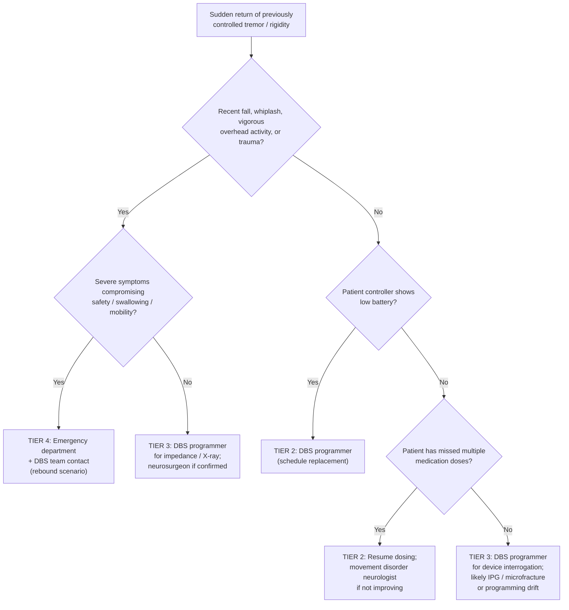

### 7.8.2 New Speech Difficulty

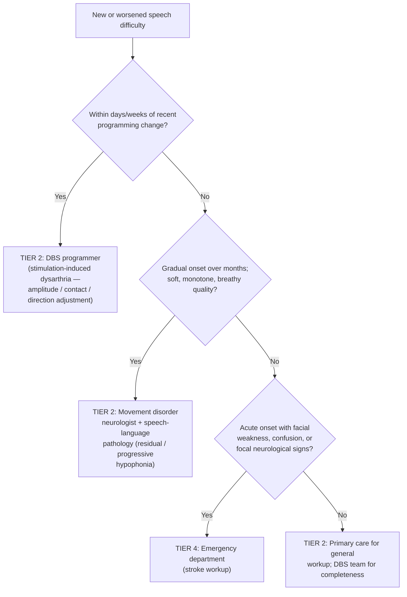

### 7.8.3 New Gait or Balance Worsening

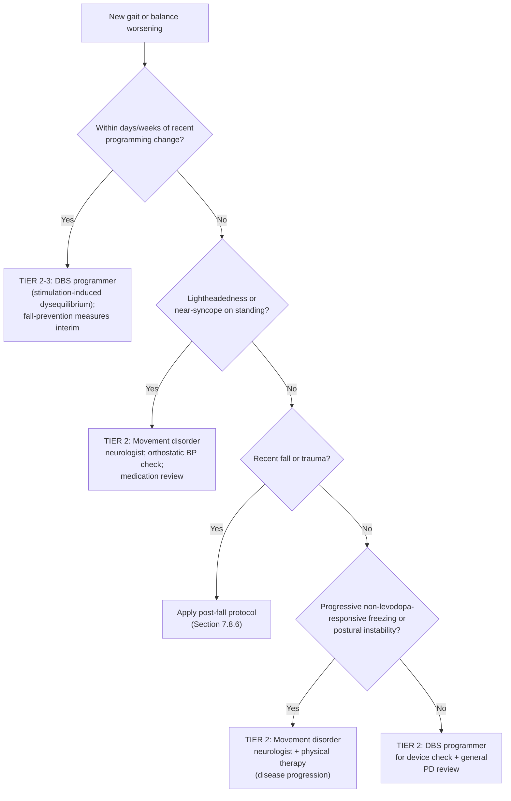

### 7.8.4 New Mood Change

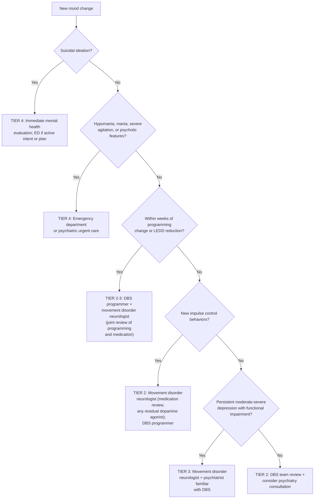

### 7.8.5 New Pain or Sensation Along the Device Path

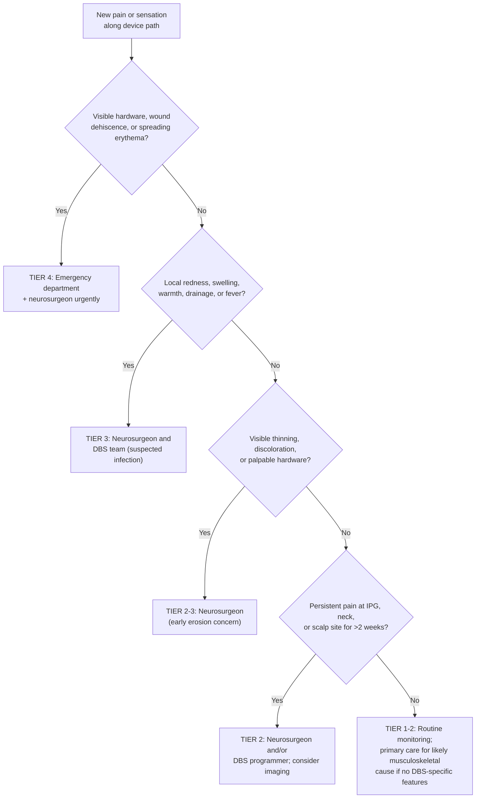

### 7.8.6 Post-Fall or Post-Trauma Assessment

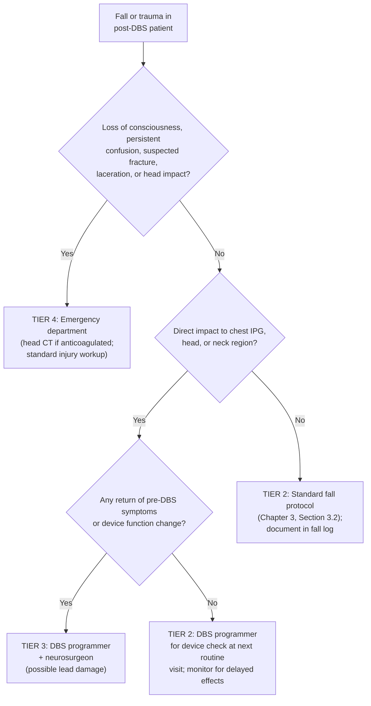

### 7.8.7 Acute Confusion in a Post-DBS Patient

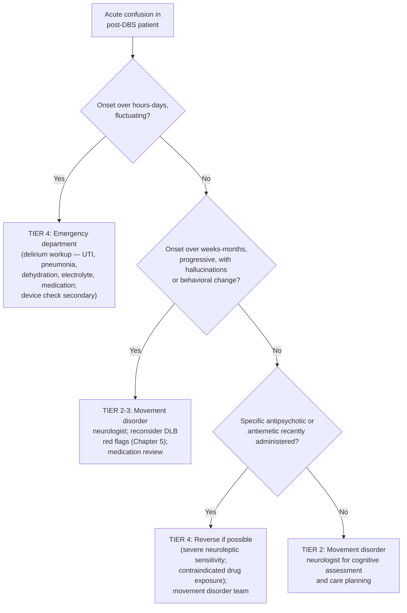

The integrative principle of these algorithms is that **the family's task is recognition of the pattern that points toward the most likely cause, which determines both urgency and routing**. None of the algorithms is definitive — final diagnoses rest with clinicians who can examine the patient, interrogate the device, and order appropriate testing — but each algorithm produces a defensible initial decision that gets the patient to the right destination at the right speed.

## 7.9 Integrating Post-DBS Vigilance with Advanced-Stage Care, Comfort Planning, and Caregiver Well-Being

The arc traced across this report has now nearly closed. Chapters 1–5 developed the framework for recognizing warning signs across the prodromal, early, mid, and advanced stages of Parkinson's disease, calibrated against the patient's individual baseline and supplemented by the diagnostic vigilance of the atypical-parkinsonism red-flag framework. Chapters 6 and 7 added the device-specific layer that overlays this framework for patients who passed through the DBS candidacy gate. What remains, and what this final section addresses, is the integration: how post-DBS vigilance connects back to the advanced-stage and comfort-care logic of Chapter 4, and how the family's role evolves across the long trajectory.

### 7.9.1 The Long Arc of Post-DBS Care

In the years following surgery, the post-DBS patient occupies a distinctive clinical territory: the device continues to provide motor benefit — the Boston Medical Center evidence summarized in Chapter 6 indicated persistent benefit at 10-year follow-up — while the underlying disease progresses through the stations developed in Chapter 4. Postural instability that was present at surgery becomes more limiting; freezing of gait that was an occasional inconvenience becomes a regular hazard; mild dysphagia becomes severe; mild cognitive complaints become Parkinson's disease dementia; mild orthostatic hypotension becomes incapacitating. The Chapter 4 motor decline, severe dysphagia, advanced cognitive and psychiatric, and autonomic-failure clusters all eventually emerge in the post-DBS population on the same biological substrate that produces them in non-DBS patients, modified principally by the persistent suppression of the device-responsive symptoms.

The Liv Hospital education material captures the conceptual point: "Over time, patients might get less help from DBS or start to have new problems like balance issues or brain fog."[^46] This is not a failure of the device but the predictable trajectory of a partially-modified progressive disease. The family's task across this arc is to maintain the device-management routines of Chapters 6 and 7 while progressively engaging the advanced-stage frameworks of Chapter 4 — without forcing a binary choice between the two.

### 7.9.2 Specific Advance-Care-Planning Considerations for DBS Patients

The advance-directive framework developed in Chapter 4, Section 4.7 applies fully to the post-DBS patient and acquires several **device-specific extensions** that families should explicitly address:

**Continued stimulation in late-stage disease.** As the patient enters Hoehn & Yahr Stages 4–5 with bed-bound or chair-bound status, severe dysphagia, advanced cognitive decline, and the levodopa-resistant axial features that DBS does not modulate, the question arises whether continued stimulation contributes meaningfully to comfort. For most patients, the answer is yes — even modest residual benefit on tremor or rigidity supports comfort positioning, reduces caregiver effort during transfers, and avoids the rebound risk of cessation — but the question deserves explicit articulation in advance-care discussions while the patient retains decision-making capacity.

**Battery replacement decisions in late-stage disease.** A non-rechargeable IPG approaching end of life in a patient who has progressed to advanced disease poses a values-based decision: does the family pursue another surgical procedure (with its general-anesthesia risk in a frail patient and the recovery period it imposes) for several more years of stimulation, or does the family accept that this battery's depletion will be the natural endpoint of device therapy? There is no universal answer, and the decision belongs in advance-care planning conversations. Important inputs include the patient's previously expressed wishes, the magnitude of remaining DBS benefit (which in late-stage disease often diminishes as levodopa-resistant features dominate), the specific surgical risks for the individual patient, and the integration with broader goals of care.

**End-of-life device deactivation.** As patients approach the end of life and goals shift fully to comfort, families and care teams sometimes consider deactivating the stimulator to allow natural disease expression. The rebound principle from Section 7.1 modifies this consideration: abrupt cessation can produce severe symptom return that exceeds even the patient's pre-DBS state, which can compromise comfort rather than enhance it. The decision belongs in palliative or hospice team conversations, with neurology input on gradual reduction strategies if deactivation is pursued.

**Cremation and IPG explantation.** Chapter 6, Section 6.6.3 noted that the IPG must be explanted before cremation because it could explode. Families should be aware of this consideration in funeral-arrangement planning and should ensure that the funeral provider is informed of the device. The hospice team or treating neurosurgeon can typically arrange peri-mortem or post-mortem explantation when needed.

**Documentation of device-specific information** in advance directives and POLST/MOLST forms. The patient ID card and the contact information for the DBS programming center should be included in the materials kept with the advance directive, and the documentation kit developed in Chapter 5, Section 5.9 should include the device information explicitly.

### 7.9.3 Integration with Palliative Care and Hospice

Chapter 4, Section 4.7.3 framed palliative care as a parallel layer of support that runs alongside continuing disease-directed care, and hospice as the appropriate framework when prognosis is measured in months and goals shift fully to comfort. Both apply to the post-DBS patient, with the modification that **palliative and hospice teams may need education about device-specific considerations**:

- The implications of continued stimulation for comfort positioning and care;
- The rebound risk of abrupt cessation;
- Avoidance of contraindicated diathermy and certain procedures (Chapter 6, Section 6.6.1);
- Recognition of the same hardware warning signs (Section 7.2) and wound complications (Section 7.3) that would warrant intervention in an earlier-stage patient, calibrated against the goals of care;
- Coordination with the DBS programming team for any parameter adjustments that contribute to comfort;
- Pre-mortem explantation planning if cremation is the disposition choice.

Many palliative and hospice teams have not encountered DBS patients before, and a brief written summary of these considerations — prepared in advance by the family or DBS center — substantially improves coordinated care.

### 7.9.4 Caregiver-Specific Challenges of Long-Term Post-DBS Care

The caregiver burden framework developed in Chapter 4, Section 4.8 acquires post-DBS-specific dimensions that families should anticipate:

**Cognitive load of operating the patient controller** as the patient loses capacity. The patient who initially managed their own controller may, with cognitive decline, no longer be able to do so, transferring this responsibility to the caregiver. Training a family member as a backup operator early — when the patient is still capable and can teach the routine — is one of the most useful preparatory steps.

**Documentation and coordination across an expanded team.** As Section 7.1 emphasized, the post-DBS care team includes the DBS programmer, the movement disorder neurologist, the neurosurgeon (for device-related concerns), the primary care physician, palliative or hospice teams in advanced disease, and various rehabilitation specialists. Each may need access to the same information (medication list, advance directive, recent events, observed warning signs), and families typically become the information broker among team members who do not directly communicate with each other. The documentation kit developed in Chapter 5, Section 5.9 — with the post-DBS additions of the patient ID card, controller readouts, and device event log — is the practical instrument for this brokerage.

**Emotional dimension of recognizing that the device is no longer sufficient.** Section 7.7.4 introduced the emotional difficulty of attributing new symptoms to disease progression in a post-DBS patient. The same difficulty acquires additional weight as the patient enters advanced disease and the family confronts that the device that once restored function is no longer modulating the dominant features of the patient's experience. This is a normal grief response and is addressed by the same supports — counseling, peer support groups, palliative team engagement — that support the broader caregiver experience.

**Importance of caregiver self-care and respite.** The advanced-stage caregiver-self-care framework developed in Chapter 4, Section 4.8.3 — respite care, support groups, counseling, geriatric care management, honest reassessment of care location, and engagement with palliative and hospice teams — applies fully to post-DBS caregivers. There is no caregiver virtue in carrying device management single-handedly, and the long arc of post-DBS care across years of disease progression is sustainable only with active investment in caregiver well-being.

### 7.9.5 The Report's Integrative Principles

The chapter, and the report, close by reaffirming the principles that have organized this entire framework:

1. **Calibration against stage and baseline.** A new symptom carries different meaning depending on where the patient is in the disease trajectory and what their individual baseline is. A first fall is a Tier 2 event in mid-stage PD, a Tier 3 atypical-syndrome red flag in early-stage PD, and a hardware-evaluation trigger in a post-DBS patient who fell two weeks before symptom worsening.

2. **Pattern-based recognition rather than isolated symptom counting.** Single observations are noisy; clusters of observations are diagnostic. A single hyposmic episode is unimportant; hyposmia plus RBD plus chronic constipation plus apathy in a person over 50 is a meaningful prodromal pattern. A single mood low day is unimportant; sustained low mood plus apathy plus insomnia in a post-DBS patient three weeks after a programming change is a meaningful Tier 2–3 signal.

3. **Tiered escalation logic.** The four urgency tiers — continued home observation, scheduled clinical follow-up, urgent specialist consultation, emergency response — provide a stable scaffold across all stages and post-DBS contexts. The corresponding routing destinations expand in the post-DBS phase to include the DBS programmer, the movement disorder neurologist, the neurosurgeon, the primary care physician, and the manufacturer support line, with the emergency department as the universal destination for life-threatening situations.

4. **Integration of stage-based and red-flag vigilance.** The Chapter 5 atypical-parkinsonism red-flag framework continues to apply across the disease trajectory, including the post-DBS phase, because diagnostic re-evaluation can be appropriate at any point if cross-cutting red flags emerge.

5. **Partnership with a multidisciplinary team.** Family monitoring is a partnership with clinical care, not a substitute for it. The family's role is to bring observations forward, to maintain documentation that allows clinicians to act efficiently, and to participate as decision-makers when the patient cannot — not to make diagnoses or to manage the device alone.

6. **Values-based care planning.** The advance-directive, healthcare-proxy, and goals-of-care frameworks developed in Chapter 4 apply across the entire trajectory, with device-specific extensions in the post-DBS phase. Planning conducted while capacity is preserved enables decisions during crisis to honor the patient's values rather than to be improvised.

The family's role across this trajectory evolves substantially. In the prodromal and early phases (Chapters 2–3), the family is a vigilant observer, documenting subtle changes and bringing them to specialist evaluation. In mid-stage disease (Chapter 3), the family becomes a structured documenter and timely escalator, maintaining ON/OFF diaries and fall logs and recognizing the threshold for advanced-therapy consideration. In the diagnostic vigilance role (Chapter 5), the family carries pattern recognition for atypical features that may revise the working diagnosis. In the post-DBS phase (Chapters 6–7), the family becomes a co-operator of an implanted device, a triage agent across an expanded care team, and a translator between device-management and disease-management frameworks. In advanced disease (Chapter 4 and Section 7.9), the family becomes the principal medical decision-maker on behalf of an increasingly incapacitated patient, executing the values-based care plan developed years earlier.

Across all of these phases, the unifying frame is that **Parkinson's disease is a long companionship**, both for the patient and for the family. Warning-sign recognition is the language in which that companionship engages with clinical care. Done well — with calibration, pattern recognition, tiered escalation, partnership, and values-based planning — it produces a trajectory in which decisions are anticipatory rather than improvised, in which suffering is recognized and addressed, in which the device that was placed at mid-stage is integrated into rather than substituted for the broader care relationship, and in which the patient's values are honored across the entire arc, including the final phase that all progressive neurodegenerative diseases eventually reach.

Chapter 8 will turn from this clinical and device-focused framework to the psychosocial dimensions that run alongside it — the emotional and cognitive challenges across PD progression and after DBS, the caregiver burden that long-term care imposes, and the multidisciplinary support network that sustains both patient and family across the trajectory.

# 8 Psychosocial Support and Multidisciplinary Care Network for Patients and Families

The seven chapters that precede this one have built, in successive layers, a framework for recognizing and acting on the warning signs of Parkinson's disease (PD) across its prodromal, early, mid, and advanced stages, for distinguishing typical PD from atypical parkinsonisms, and for integrating the device-specific layer of post-DBS care into that broader picture. Throughout, a recurring observation has been that **the most disabling and most family-disruptive features of PD are often not the motor symptoms themselves but the non-motor and psychosocial dimensions that accompany them** — the depression that erodes a patient's interest in rehabilitation, the apathy that family members misread as personality change, the hallucinations that fundamentally alter the relational fabric of caregiving, the impulse control disorder that drains a retirement account before anyone notices, the social isolation that follows from facial masking and soft voice, the caregiver exhaustion that determines whether home care remains sustainable. These dimensions have appeared in every prior chapter as prodromal cues, therapy-adjustment triggers, advanced-stage decompensations, red flags, post-DBS expectations, and post-DBS triage targets, but they have not yet been treated as a coherent domain in their own right.

This chapter addresses that gap and, in doing so, closes the report's arc. Its central premise — inherited from the holistic biopsychosocial principle that has anchored the entire report — is that **warning-sign recognition is clinically valuable only to the extent that it operates within, and is sustained by, a relational, multidisciplinary support network**. A family that recognizes every warning sign but lacks the team to respond, the financial and legal preparation to navigate decisions, the psychosocial supports to remain emotionally functional, and the communication infrastructure to keep multiple clinicians coordinated will see its vigilance dissipate at the moment of greatest need. A family that builds these scaffolds in advance — engaging mental health support before crisis, coordinating a multidisciplinary team before complexity overwhelms the primary clinician, completing advance directives before capacity is lost, preparing for hospitalization before the first emergency call, and weaving caregiver self-care into the daily routine — converts vigilance into sustained, humane care across the long companionship that PD imposes.

The chapter proceeds in three movements. The first (Sections 8.1–8.4) addresses the patient's and family's emotional and psychosocial experience: the prevalence and clinical character of depression, anxiety, apathy, psychosis, and impulse control disorders; the evidence-based pharmacological and non-pharmacological interventions for each; the parallel caregiver burden and the self-care strategies that make long-term caregiving sustainable; and the social, communicative, and stigma-related challenges that erode patient and family well-being if not addressed. The second movement (Sections 8.5–8.7) addresses the structural infrastructure: the composition and coordination of the multidisciplinary care team; advance care planning and financial-legal preparedness; and hospitalization safeguards and care transitions. The third movement (Sections 8.8–8.9) integrates palliative care and hospice into the care roadmap and synthesizes the entire report into a sustainable family-centered framework.

## 8.1 Emotional and Cognitive Challenges Across the PD and Post-DBS Trajectory

The first task of this chapter is to consolidate, in a single coherent picture, the emotional and cognitive challenges that have appeared piecemeal across Chapters 2–7. Neuropsychiatric symptoms (NPS) are not peripheral to PD; they are intrinsic to it. Cross-sectional studies indicate prevalence rates of NPS as a category between **70% and 89%** among individuals with PD[^47], and an updated literature review found that the most frequent NPS were **depression (47.2%), apathy (45.5%), anxiety (42.9%), psychosis (19.4%), and impulse control disorders (18.5%)**[^47]. These figures reflect the cumulative burden of a multi-system neurodegeneration whose pathology, as Chapter 1 developed, extends beyond dopaminergic neurons to noradrenergic, serotonergic, cholinergic, and broadly cortical systems — the biological substrate of mood, motivation, executive function, perception, and sleep.

### 8.1.1 Depression: The Single Largest Determinant of Quality of Life

Depression is the most extensively studied neuropsychiatric feature of PD. A systematic review and meta-analysis of 129 studies covering 38,304 individuals from 28 countries found an **overall prevalence of depression in PD of approximately 38%**[^48][^47], a figure echoed in narrower clinical surveys at 17–35% in US and European populations versus a 12-month general-population prevalence of about 7%[^47]. The clinical significance extends beyond statistical prevalence: **depression, rather than motor symptoms, is often cited as the primary contributor to reduced quality of life in people living with PD**[^48], and depression in PD has been associated with accelerated worsening of motor symptoms, greater disability, and higher mortality[^47].

Three features are particularly important for families. First, **depression frequently appears within the prodromal window described in Chapter 2** — affective disorders may manifest as part of a prodrome, with neuropsychiatric symptoms preceding motor symptoms by 1 to 2 decades[^48]. Second, **depression in PD overlaps clinically with the disease itself in ways that obscure recognition**: psychomotor retardation, restricted affect, fatigue, muscle tension, gastrointestinal symptoms, reduced appetite, decreased sleep, poor concentration, and impaired memory may all reflect either depression or PD itself[^47]. The clinical recommendation is therefore to use **an inclusive approach**, focusing on emotional symptoms (sadness, hopelessness, guilt, loss of interest) rather than on neurovegetative features that are not specific to depression in this population[^48][^47]. Third, **subsyndromal depressive symptoms — those that fall below traditional diagnostic thresholds — affect quality of life considerably and should be assessed regularly**[^48], rather than being dismissed as not meeting criteria for treatment.

The clinical risk-factor literature identifies several markers that families and clinicians can use to anticipate depression risk: **female sex, lower education, longer disease duration, medication complications, more severe motor symptoms, postural instability, lower cognitive scores, higher behavioral symptom burden, more apathy, more fatigue, more anxiety, daytime somnolence, and orthostatic hypotension** are all associated with depression in PD[^47]. The clustering with autonomic symptoms reinforces a point developed in Chapter 2: early autonomic burden carries information about both motor and cognitive trajectories, and now also about mood.

### 8.1.2 Anxiety: Frequently Comorbid, Often Underrecognized

Anxiety affects approximately **30–40% of people with PD**[^48], with a meta-analysis of 49 studies finding an average point prevalence of anxiety disorders of **31%**, including generalized anxiety disorder (14.1%), social phobia (13.8%), clinically relevant anxiety not meeting any specific diagnosis (13.3%), specific phobia (13.0%), and panic disorder with or without agoraphobia (6.8%); 31.1% of patients met criteria for two or more anxiety disorders simultaneously[^47]. As Chapter 2 noted, depression and anxiety frequently co-occur and share neurodegenerative changes in the dopaminergic, serotonergic, and noradrenergic systems[^48].

A clinically critical observation is that **anxiety is identified in fewer than half of individuals with clinically significant anxiety in PD**[^47], reflecting both diagnostic overlap with disease features and the limitation that currently used anxiety rating scales may not be appropriate for diagnosing anxiety disorders in this population: the weighted average of clinically relevant anxiety symptoms assessed using a rating scale (25.7%) was lower than the weighted average of DSM-defined anxiety disorders (31%)[^47]. For families, the practical implication is that **anxiety should be raised explicitly at clinical visits**, with specific examples (panic before social events, anticipatory anxiety about freezing in public, fear of falling restricting activity, persistent worry about disease progression) rather than relying on general impressions.

Anxiety in PD is often **bidirectionally coupled with motor symptoms**: tremor or freezing during an OFF episode produces anxiety or embarrassment, especially around others, and this anxiety can in turn worsen motor symptoms — a vicious cycle that affects both the lived experience of disease and the willingness of patients to engage in social activities[^49]. Anxiety symptoms can include feelings of unease, jitteriness, worry or panic, difficulty breathing or swallowing, heart fluttering, shaking, and cold sweats[^49]. Risk factors identified in clinical case series include younger age (<62 years), lower activities of daily living scores, greater severity of PD symptoms, dyskinesia and motor fluctuations, earlier age of PD onset, and history of psychiatric illness, with female gender, neuroticism, harm-avoidance personality traits, and history of anxiety also implicated[^47].

### 8.1.3 Apathy: Distinct From, and Often Mistaken For, Depression

Apathy has emerged as a distinct neuropsychiatric feature of PD. Defined as **a syndrome characterized by reduced initiative, decreased interests, and lack of emotional responsiveness**[^47], apathy affects approximately **40% of PD patients**[^47], often co-occurs with depression but is conceptually separate, and **can develop at any stage — even before diagnosis**[^49]. The Parkinson's Foundation guide describes apathy in lay terms as "a lack of interest in things or activities that are normally pleasurable," similar to PD movement symptoms in possibly resulting from a loss of dopamine in the brain[^49].

Apathy matters clinically for several reasons. First, **it does not respond to the same treatments as depression**: a meta-analysis of 19 randomized studies found that pharmacotherapy was effective in improving apathy scores, with dopamine agonists (rotigotine and piribedil), rasagiline, exenatide, amantadine, and atomoxetine all showing modest benefit[^47], whereas the standard antidepressant approach to depression often fails in pure apathy. Second, **apathy reduces responsiveness to treatment for motor symptoms, worsens quality of life for both patient and caregivers, increases cost of care, and increases risk of developing dementia**[^47]. An 18-month longitudinal study demonstrated that PD patients with apathy were at greater risk of developing dementia than those without[^47], and a meta-analysis of cognitive function found that apathetic patients showed lower scores across global cognitive function, long-term verbal memory, executive functioning, processing speed/attention/working memory, and visuospatial ability[^47]. Third, and most consequentially for family experience, **apathy is frequently misread by families as the patient "not trying," as personality change, or as marital withdrawal** — a misattribution that strains relationships at precisely the time when patient and family most need to be aligned.

For post-DBS patients, apathy carries the additional dimension introduced in Chapters 6 and 7. A meta-analysis of 33 studies found that **subthalamic nucleus DBS increases the risk of developing apathy postoperatively** when compared with preoperatively (Hedges g = 0.34) and with using medication only (Hedges g = 0.36)[^47]. Recognition of post-DBS apathy is therefore part of routine surveillance, with the understanding that **partial restoration of dopaminergic medication under neurologist guidance** may be the appropriate intervention, distinct from the antidepressant treatment that depression would receive.

### 8.1.4 Psychosis: Cumulative, Cortically Driven, and Caregiver-Disrupting

Psychotic symptoms — visual hallucinations, illusions, sense of presence, and (less commonly) auditory hallucinations and delusions — are progressive features of PD with a **cumulative prevalence of up to 60%** across the disease course[^48]. As Chapter 4 developed, psychosis is associated with greater cognitive impairment and advanced disease progression, and it is among the most prominent contributors to caregiver burden, decreased self-care, losses and disruptions in relationships, stigma, and social isolation. The temporal pattern is reasonably well characterized: **mild experiences with retention of insight may progress to severe, pervasive experiences with loss of insight**[^48], and visual hallucinations and a sense of presence are the most common forms[^48].

The clinical risk factor profile is consistent across studies: **older individuals, those with longer disease duration, and those with greater cognitive impairment are more likely to experience symptoms of psychosis**[^48]. **Prolonged and high-dose use of dopaminergic medications has been implicated as a risk factor**[^48], complicating clinical management because the same medications that maintain motor function contribute to symptoms that erode quality of life — the dual etiology that Chapter 4 unpacked in detail and that Chapter 7 carried into post-DBS triage.

The most important practical principle is the one introduced in Chapter 4 and reinforced by the Parkinson's Foundation guide: **hallucinations and delusions can stem from PD brain changes, medication, dementia, or delirium**, and addressing these symptoms begins with talking to the healthcare team, who should follow a series of steps to determine the best course of treatment[^49]. The triage hierarchy — assessment first, then medication review and reduction, then antipsychotic initiation only when needed and only with PD-appropriate agents — applies across the trajectory.

### 8.1.5 Impulse Control Disorders: Hidden, Disruptive, and Reversible

Impulse control disorders (ICDs) — pathological gambling, hypersexuality, binge eating, compulsive buying, and related behaviors — are among the most consequential and most frequently missed neuropsychiatric features of PD. Affecting approximately **18.5%** of PD patients in pooled literature[^47], with prevalence in dopamine-replacement-treated populations ranging from 3.5% to 43%[^50] and a five-year cumulative incidence reaching approximately **46%** in one longitudinal study[^50], ICDs cluster with specific risk factors:

- **Dopamine receptor agonist treatment** is the strongest pharmacological risk factor, with dopamine agonist treatment associated with **2–3.5-fold increased odds** of having ICDs compared with patients without dopamine agonist treatment[^50];
- Pramipexole and ropinirole have particular affinity for D3 receptors implicated in reward circuitry[^50];
- **Concurrent levodopa use increases the odds of ICDs by ~50%** in patients taking dopamine agonists[^50];
- **Younger age at PD onset, male gender (overall, with binge eating and compulsive buying more common in women), unmarried status, personal or family history of smoking, gambling, or substance addiction, pre-existing or current depression or anxiety, and personality traits such as impulsiveness and novelty-seeking** are independent risk factors[^50];
- **REM sleep behavior disorder** has been associated with more than a 2-fold increased risk of ICDs in pooled meta-analytic data[^50].

The clinical importance of ICDs derives in part from a feature that makes them uniquely difficult for families: **patients often underestimate the presence and severity of ICD symptoms**, partly through lack of insight and partly as a defense mechanism with denial and minimization driven by feelings of shame or guilt, with some patients showing relative lack of empathy and not perceiving any stress from their aberrant behavior despite marked concerns by family members and friends[^50]. The wide clinical spectrum extends beyond the four canonical behaviors to include reckless driving, impulsive smoking, compulsive singing, tattooing, stealing, pet killing, and zoophilia in case reports[^50]. The Parkinson's Foundation guide captures both the clinical dimension and the family advocacy role: ICDs "may include compulsive gambling, shopping, hoarding or hypersexuality," "usually result from dopamine agonists but have also been linked to many medications for PD movement symptoms," and "**it is important to immediately alert your Parkinson's doctor if behavior changes of this type occur**. Some medications may need to be reduced or replaced with an alternative"[^49].

The first-line management is well established: **decreasing or even withdrawing dopamine agonists is usually the first choice**, with longitudinal data suggesting that ICDs resolve after 1 year in about 50% of patients who stop dopamine agonists and continue to improve subsequently[^50]. Patients can increase levodopa dosage to compensate for motor worsening, although treatment remains challenging because patients may experience **dopamine agonist withdrawal syndrome**[^50]. The Parkinson's Foundation guide reinforces that "the person experiencing the impulse control issue may not be able to see these behaviors in themselves, so **care partners are key to recognizing these behaviors and alerting the doctor**"[^49].

ICDs are *bidirectionally* affected by DBS in ways developed in Chapter 7: STN-DBS may permit dopamine agonist reduction with consequent ICD improvement, but stimulation parameter changes affecting limbic-connected portions of the STN can also produce new impulse control behaviors. Successful management therefore requires coordinated input from the movement disorder neurologist (for medication adjustment) and the DBS programmer (for parameter review), with cognitive behavioral therapy showing benefit in randomized controlled trial evidence as an adjunctive intervention that significantly reduced ICD severity in 75% of an experimental group compared with 29% in a control group[^50].

### 8.1.6 The Trajectory and Its Family Significance

The integrative picture is that **NPS prevalence and severity shift across the trajectory in patterns that map onto the staging logic of Chapters 2–4**. Affective disorders dominate early, often precede motor symptoms, and persist throughout; apathy emerges across all stages and intensifies with cognitive change; psychosis is a feature of advanced disease and is potentiated by cumulative medication exposure; ICDs appear primarily during the medication-active phases of mid-stage disease. As one synthesis puts it, **"affective disorders such as depression and anxiety are more prevalent in the early stages, whereas psychosis tends to develop later in the disease course. The progressive nature of PD makes symptom management complex, and treatments that were effective at one stage may lose their efficacy over time, necessitating adjustments"**[^48].

## 8.2 Evidence-Based Psychosocial Interventions: Pharmacological and Non-Pharmacological

The treatment landscape for PD-related neuropsychiatric symptoms has evolved substantially in the past decade, and the evidence base — though still uneven across symptom domains — now supports several first-line strategies that families can ask about explicitly at clinical visits.

### 8.2.1 The Foundational Principle: Optimize Dopaminergic Therapy First

A consistent message across the neuropsychiatric treatment literature is that **the initial approach to NPS management should start with optimization of dopamine replacement therapy for control of motor symptoms**[^48][^47]. This principle is grounded in two observations. First, as Chapter 3 developed, motor fluctuations have non-motor counterparts: anxiety, depression, pain, and cognitive fog frequently occur during OFF periods and resolve during ON periods, so a regimen that minimizes OFF time often improves the affective experience of disease without any specifically psychiatric intervention. Second, certain dopaminergic agents have demonstrated direct anti-affective effects: the dopamine agonist **pramipexole**, in one of the largest randomized controlled trials of treatment of PD-related depression, was effective in reducing depression scores and motor scores, with the antidepressive effect accounting for 80% of the improvement in motor scores[^48]; the MAO-B inhibitor **selegiline** in combination with levodopa was found to improve cognitive function and mood symptoms more than levodopa or dopamine agonists alone[^48], with a more pronounced effect in akinetic-subtype patients.

This foundation has limits. Prolonged use of high-dose dopamine replacement therapy may predispose to symptoms of psychosis and impulse control disorders[^48][^50], so the optimization process is bidirectional rather than unidirectionally additive: more dopaminergic load can improve mood and motor function up to a threshold, beyond which it generates its own neuropsychiatric burden.

### 8.2.2 Pharmacological Treatment of Depression

When depression is resistant to dopaminergic optimization, the antidepressant evidence base supports several agents with different profiles:

| Agent class | Evidence summary | Practical considerations |
|---|---|---|
| **SNRIs (venlafaxine)** | "The serotonin-norepinephrine reuptake inhibitor venlafaxine was effective and well-tolerated in a high-quality RCT with >100 participants… venlafaxine is clinically useful for treating PD-related depression"[^48] | Generally well-tolerated; reasonable first-line option |
| **SSRIs** | Meta-analytic evidence is mixed: a systematic review of 10 RCTs found "no benefit for SSRIs when compared with placebo"[^47], but "due to their established efficacy in populations without PD, SSRIs may retain some clinical utility"[^48]; the pooled SMD for SSRI/SNRIs was 0.45 (P=0.003) in another meta-analysis[^47] | Watch for hyponatremia and cardiac arrhythmias at higher doses (citalopram); SSRIs may worsen tremor in up to 5% of individuals[^48] |
| **TCAs (nortriptyline, desipramine)** | Demonstrated more consistent efficacy than SSRIs across pooled studies; TCAs more efficacious than SSRIs, pramipexole, pergolide, and SNRIs in network meta-analysis[^47] | Less well-tolerated due to anticholinergic side effects, drug-drug interactions; particular concern in older patients and those with cognitive impairment |
| **Pramipexole / pergolide (dopamine agonists)** | Antidepressive effect in addition to motor benefit[^48] | Risk of ICDs (Section 8.1.5), excessive daytime sleepiness, and hallucinations |

The Parkinson's Foundation framing for families is that **"often the most successful approach to supporting mental health is a personalized one that includes a combination of medication, counseling or psychotherapy, exercise, lifestyle changes and support"**[^49] — a multimodal stance that all evidence-based reviews echo.

### 8.2.3 Pharmacological Treatment of Anxiety

The pharmacological literature on PD-related anxiety is substantially thinner than the depression literature. **One small RCT compared the anxiolytic buspirone with placebo, and found it ineffective, mostly due to side effect intolerability**[^48]. In the absence of trials specifically targeting anxiety, **SSRIs or venlafaxine remain first-line choices for generalized anxiety management in PD, given the overlap in anxiety and depression pathophysiology and lack of evidence to support other agents**[^48]. Specific antidepressants have shown anxiolytic efficacy as secondary outcomes in depression trials: citalopram (Cohen d = 0.95), desipramine (Cohen d = 0.93), nortriptyline (Cohen d = 1.98), and atomoxetine (Cohen d = 1.29)[^47].

A specific cautionary principle: **clinicians should avoid prolonged benzodiazepine use in older individuals**, although a short course of low-dose benzodiazepine may be useful for treatment of severe anxiety attacks, with monitoring for worsening cognition, balance or gait disturbances, and excessive sleepiness[^48]. Families should be alert to the risk that benzodiazepines prescribed for anxiety can precipitate falls, cognitive worsening, or delirium in the same advanced-stage population developed in Chapter 4.

### 8.2.4 Pharmacological Treatment of Apathy

Treatment of apathy specifically has improved substantially with recent meta-analytic synthesis. A Bayesian network meta-analysis of 19 studies found that **pharmacotherapy was better than brain stimulation, exercise-based interventions, nutritional supplements, and placebo in improving apathy scores**, with no significant difference in efficacy among rotigotine, piribedil, rasagiline, exenatide, amantadine, and atomoxetine[^47]. Pooled analysis showed that pharmacotherapy improved apathy scores (SMD −0.38, P<0.001), while brain stimulation, exercise-based interventions, and supplements were not effective for apathy[^47]. The Parkinson's Foundation guide summarizes the practical implication: there are no FDA-approved medications specifically for apathy, but "some people may benefit from cholinesterase inhibitors (medicines that block the breakdown of the enzyme acetylcholine, such as rivastigmine, etc.), stimulants or certain types of antidepressants"[^49], and "maintaining a regular routine, continuing to exercise, taking medications on time every time and avoiding isolation can all help manage apathy"[^49].

### 8.2.5 Pharmacological Treatment of Psychosis: The Evidence Hierarchy

The treatment of psychosis was developed extensively in Chapter 4, and the key conclusions deserve consolidation here. **First-line management of psychosis in PD includes medication review and reduction in dopamine replacement therapy, if possible**[^48], in the approximate order of likelihood of contributing (anticholinergics first, then amantadine, MAO-B and COMT inhibitors, dopamine agonists, and finally levodopa). **The atypical antipsychotic agents clozapine and pimavanserin have demonstrated level I efficacy against symptoms of psychosis in double-blinded placebo-controlled RCTs**[^48], with frequent laboratory monitoring for agranulocytosis necessary with clozapine use[^48].

The Parkinson's Foundation guide reinforces a critical safety principle that families should carry into every clinical and emergency encounter: **"Many antipsychotic medications can worsen movement symptoms and should not be prescribed for people with PD. Some of these medications, such as haloperidol (Haldol), are commonly prescribed in the hospital setting for people who are agitated or anxious. The medications used to treat Parkinson's psychosis (hallucinations and delusions) are clozapine, quetiapine and pimavanserin"**[^49]. Combined with the more granular evidence hierarchy developed in Chapter 4 (pimavanserin and clozapine as evidence-supported first-line; quetiapine as widely prescribed but with weaker evidence and cognitive cost; typical antipsychotics and most antiemetics contraindicated), this guidance anchors family advocacy across hospitalization and care transitions.

### 8.2.6 Non-Pharmacological Interventions: The Evidence-Based Toolkit

Non-pharmacological treatments occupy an increasingly central role in PD neuropsychiatric care, both because they avoid the side-effect burden of medications and because the evidence base for several of them is now robust.

**Physical activity and exercise.** Physical activity is "one of the best-documented management strategies for affective NPS in PD, demonstrating both direct neurologic and indirect psychologic effects"[^48]. The mechanisms are multidimensional: physical activity promotes neuroplasticity by improving cellular metabolism and reducing proinflammatory cytokine levels, preserves muscle mass possibly delaying motor complications, reduces both depression and anxiety severity, and enhances mood and self-perception by boosting self-efficacy, fostering a sense of accomplishment, and promoting social engagement[^48]. **The most beneficial subtypes for reducing affective symptoms include aerobics, mind-body, and resistance training, but many meta-analyses report that consistency supersedes modality**[^48], reinforcing the Parkinson's Foundation recommendation of **at least 2.5 hours per week of exercise** that has anchored the exercise discussion across earlier chapters. The Parkinson's Foundation guide elaborates: "research shows that exercise and physical activity can not only maintain and improve mobility, flexibility and balance but also ease non-movement PD symptoms such as depression or constipation"[^49].

A specific category that families may encounter is the **PD-specific exercise program**, exemplified by the **Lee Silverman Voice Treatment BIG (LSVT BIG)** approach. Developed in the late 1980s, LSVT BIG is "a specialized exercise program for Parkinson's disease patients that focuses on enhancing the size and force of movements to improve mobility and motor function"[^51]. The program is delivered in **16 one-hour one-on-one sessions over four weeks**, with a certified physical or occupational therapist, and is grounded in a "Movement-As-Medicine" philosophy that helps patients recalibrate movement perceptions and recognize the difference between what they feel and how they actually move[^51]. Research has demonstrated that LSVT BIG improves motor skills, with benefits sustained for at least two years post-treatment, and that "LSVT BIG can decrease the mismatch between perceived and actual movement, increasing overall confidence in patients"[^51] — the **psychosocial dimension** of an intervention that on first glance appears purely physical. The companion speech-focused program **LSVT LOUD** addresses the hypophonia developed as an early warning sign in Chapter 2 and as a residual symptom across post-DBS care in Chapters 6 and 7. Complementary programs include Rock Steady Boxing (which combines strength, coordination, balance, and confidence in a non-contact format with documented benefits for motor function), Pedaling for Parkinson's, and Dance for Parkinson's[^51], all of which combine the physical, cognitive, and social dimensions that this chapter consolidates.

**Psychotherapy — particularly cognitive behavioral therapy (CBT).** CBT "leverages neuroplasticity to enhance emotional awareness and develop coping skills through a structured, conditioning-based talk therapy process"[^48]. The evidence is robust: CBT is beneficial for management of symptoms of depression and anxiety with **a small to moderate effect size comparable to pharmacologic interventions without side effects, drug interactions, or requirement for laboratory monitoring**[^48]. A meta-analysis of 6 trials showed that CBT was beneficial in treating anxiety in PD (SMD −0.55, P=0.0007)[^47], and a more recent meta-analysis found that CBT significantly improved anxiety symptoms compared with non-CBT treatments (SMD −0.85, P<0.001)[^47]. For depression, CBT showed the largest effect size in two studies (SMD 1.24 and 1.22) in pooled analysis[^47] and was beneficial in short-term treatment (SMD −1.15)[^47]. CBT also has demonstrated benefit for ICDs, with a randomized controlled trial showing CGI-Improvement reductions in 75% of CBT-augmented patients versus 29% of medical-care-only patients[^50]. **CBT and antidepressants should be considered first-line treatments for depression in PD**, with rTMS as a 2nd-line option followed by ECT for refractory symptoms[^47].

**Mindfulness and yoga.** Mindfulness-based interventions have shown benefit in randomized controlled trials for reduction of symptoms of depression and anxiety and for increases in quality of life in PD[^48]. The Parkinson's Foundation guide describes mindfulness as "a practice of bringing awareness to your thoughts, feelings, senses and environment," with research showing it benefits mental, emotional and physical wellbeing in PD[^49]. A meta-analysis of 4 yoga studies found that yoga improves anxiety symptoms compared with controls (SMD −0.72, P<0.00001)[^47].

**Acupuncture.** Acupuncture has shown promise in randomized controlled trials for reduction of depression and anxiety symptoms and for quality-of-life improvement, though evidence does not support utility against psychosis[^48]. The Parkinson's Foundation framing is realistic: "There is no scientific evidence that acupuncture or massage therapy have any effect on Parkinson's itself. However, people with Parkinson's report these therapies can temporarily provide relief from aching muscles, reduce stress, promote relaxation and lessen some PD symptoms"[^49].

**Repetitive transcranial magnetic stimulation (rTMS).** rTMS is "a promising NIBS technique for managing both motor and nonmotor symptoms in PD, including depression," with application over the prefrontal cortex alleviating depressive symptoms in PD comparable to antidepressant medications[^48]. A meta-analysis of 9 studies found that rTMS improved depressive symptoms in the short term compared with sham (SMD −0.62)[^47]. rTMS is generally well-tolerated and represents a reasonable second-line option for depression resistant to psychotherapy and antidepressants.

**Electroconvulsive therapy (ECT).** ECT "remains the most effective option for severe, treatment-resistant psychosis and depression in PD"[^48]. A meta-analysis of 14 studies found that ECT improved depressive symptoms (SMD 1.33, P<0.001), psychotic symptoms (SMD 1.64, P<0.001), motor symptoms (SMD 1.18, P<0.001), and cognitive function (SMD 0.21, P=0.002) in PD[^47]. ECT is reserved for severe, refractory presentations and requires specialist consultation, but families should know that it remains an evidence-based option when other treatments have failed.

### 8.2.7 The Multimodal Synthesis

The evidence base across these intervention categories supports a coherent multimodal approach that families can advocate for at clinical visits:

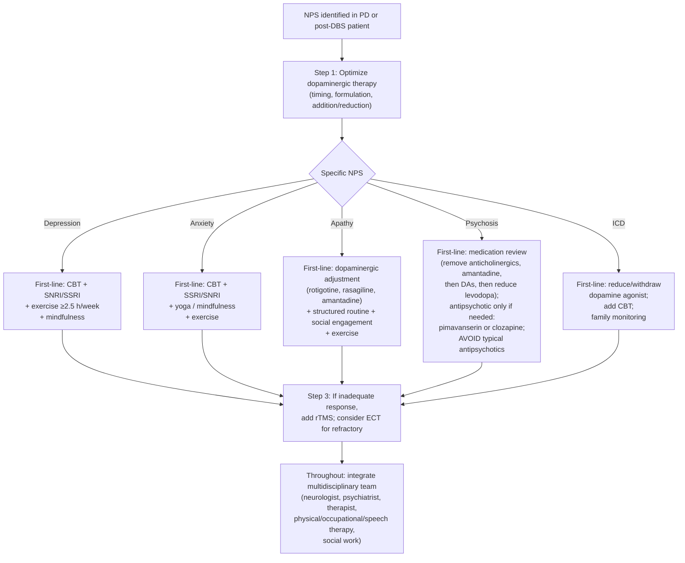

The unifying principle: **treatment as a trial-and-error process, with realistic expectations, in an individual-centered shared decision-making approach**[^48] — a stance that aligns the clinical evidence base with the values-based care framework developed in Chapter 4.

## 8.3 Caregiver Burden, Burnout, and Self-Care Across the Trajectory

The neuropsychiatric burden cataloged in Section 8.1 falls not only on patients but, in distinctive and clinically important ways, on family caregivers. Across this report — most explicitly in Chapter 4's advanced-stage caregiver discussion and in the post-DBS caregiver dimensions of Chapter 7 — caregiver well-being has been identified as both a determinant of patient outcomes and a clinical signal in its own right.

### 8.3.1 The Trajectory of Caregiving

The caregiver role evolves across the disease trajectory in ways the report has progressively developed. In the prodromal and early phases, the family is principally an **observer** — noting changes against baseline and bringing them to specialist evaluation. In mid-stage disease, the family becomes a **structured documenter and timely escalator** — maintaining diaries, recognizing fluctuation patterns, supporting medication adherence, advocating for therapy intensification. In advanced disease, the family becomes the **primary executor of daily care** — administering medications, managing feeding and mobility, performing skin checks, coordinating multidisciplinary teams, advocating during hospitalization, and translating advance directives into real-time decisions. In the post-DBS phase, the family becomes a **co-operator of an implanted device** and a **triage agent** across an expanded care team. Each transition imposes different cognitive, physical, emotional, and time demands.

The Parkinson's Foundation guide captures the cumulative reality: **"Family members and care partners play an important role in PD. They can provide support and feedback, assist with household tasks — such as paying bills or attending doctor appointments — or aid in personal care tasks, such as helping a loved one dress or shower. It is important for family members to recognize the sometimes unpredictable nature of Parkinson's. By staying alert and offering help when it is needed, family members can find the right balance between helping the person with PD and encouraging independence"**[^49]. The phrase "right balance between helping … and encouraging independence" captures one of the central tensions of caregiving across PD: helping too little leaves the patient unsafe; helping too much accelerates dependence and erodes the patient's residual capacity, agency, and self-respect.

### 8.3.2 The Particular Burden of Neuropsychiatric Symptoms

Caregiver burden in PD is amplified disproportionately by neuropsychiatric symptoms relative to motor symptoms. The literature on PD psychosis specifically describes impacts on **emotional health, decreased self-care, losses and disruptions in relationships, stigma, and social isolation** as facets of stress and burden[^48]. The reasons are intuitive:

- **Hallucinations and delusions** disrupt the relational fabric of caregiving, particularly when delusions are paranoid and directed at the caregiver themselves;
- **Apathy** removes the patient's engagement with the caregiver's effort, producing a felt absence of partnership that can outweigh the physical demands of care;
- **Impulse control disorders** produce financial, sexual, and behavioral consequences that may shame the caregiver, threaten the family economically, and require disclosure to clinicians the patient has tried to hide things from;
- **Cognitive decline** progressively removes the patient's capacity to participate in their own care decisions;
- **Depression and anxiety** in the patient often induce depression and anxiety in the caregiver, both directly through emotional contagion and indirectly through the chronic stress of witnessing suffering one cannot relieve.

The result is a documented finding that **greater burden of NPS is associated with poorer quality of life at any time point**[^47], and that **greater severity of motor symptoms at baseline is associated with worsening caregiver distress over time**[^47].

### 8.3.3 Recognizing Caregiver Burnout

Building on the framework developed in Chapter 4, caregiver burnout warrants explicit recognition as a clinical signal requiring intervention rather than a moral failing. Manifestations include:

| Domain | Specific signs |
|---|---|
| **Physical health** | Sustained sleep deprivation; new or worsening chronic conditions of the caregiver; back injuries from transfers; weight loss or gain; immune-mediated illness; deferred medical care for the caregiver's own conditions |
| **Mental health** | New or worsening depression, anxiety, or substance use in the caregiver; intrusive thoughts; tearfulness; emotional numbing; suicidal ideation in extreme cases |
| **Relational** | Social withdrawal; loss of caregiver's own support network; resentment toward the patient or other family members; conflict among adult children about care responsibilities; deferred or abandoned caregiver friendships |
| **Functional** | Inability to maintain employment; financial strain from reduced income and increased expenses; deferred or abandoned caregiver hobbies and interests |
| **Care quality** | Compassion fatigue affecting tone with patient; medication errors; missed appointments; reduced vigilance for warning signs that this report has emphasized; frank inability to continue providing safe care |

The presence of any of these signs is itself a Tier 2 escalation event in the family's overall care framework, with the destination being the social worker, primary care physician, palliative team, or other support resource — not the movement disorder neurologist whose primary focus is the patient's PD management.

### 8.3.4 Practical Caregiver Self-Care and Respite Strategies

The Parkinson's Foundation guide outlines a structured set of resources that families should know about and engage proactively:

- **Caregiver support organizations**: "The Caregiver Action Network, the Family Caregiver Alliance and the Well Spouse Association, support care partners to people living with various diseases, including Parkinson's"[^49];
- **Area Agencies on Aging**, accessible via the Eldercare Locator (1-800-677-1116; eldercare.acl.gov)[^49];
- **Veterans Affairs Caregiver Support Line** (1-855-260-3274) for caregivers of veterans[^49];
- **Parkinson's Foundation Helpline** (1-800-4PD-INFO; Helpline@Parkinson.org), staffed by nurses, social workers, and health educators[^49];
- **Local and virtual support groups**, with the Helpline able to provide referrals to nearby groups[^49];
- **Educational events and materials** specifically for care partners[^49].

Practical respite strategies build on this resource base:

- **Formal respite care** — short-term substitute care that allows the caregiver to rest, attend to their own health, or sleep through the night. Respite may be provided through home health agencies, adult day programs, hospice respite benefits, or short-term institutional stays;
- **Counseling or therapy** for the caregiver, ideally with a clinician familiar with neurodegenerative disease;
- **Geriatric care management** services that coordinate complex multidisciplinary care and reduce the cognitive load on family;
- **Adult day programs** that provide structured stimulation, social engagement, and supervised care for the patient while the caregiver works or rests;
- **Honest reassessment of care location** when home care has become unsustainable;
- **Engagement with palliative and hospice teams**, who explicitly recognize caregiver well-being as part of their clinical scope.

### 8.3.5 The Caregiver as Patient

A reframe that experienced palliative and geriatric care teams frequently endorse is to think of the caregiver not as a peripheral support to the patient but as a **second patient** in the family system, with their own clinical needs. For families, the practical implications are:

- The caregiver should maintain their **own primary care relationship** and not defer their own preventive care to the patient's needs;
- The caregiver should have their **own mental health support** when symptoms warrant, with low threshold for engaging it;
- The caregiver should maintain at least **one social or recreational activity** outside the caregiving role, both for direct well-being and as a marker of capacity that family members can monitor;
- The caregiver should **identify and use available resources** before crisis rather than waiting until burnout has progressed;
- Other family members — adult children, siblings, extended family — should be **explicitly invited into the support structure** rather than allowed to drift into peripheral roles, with frank conversations about respite contribution, financial support, and decision-making participation.

The closing principle: **there is no caregiver virtue in carrying long-term post-PD or post-DBS care single-handedly**, and the disease's trajectory across years requires active investment in caregiver well-being as a precondition for sustained, humane care.

## 8.4 Peer Support, Family Communication, and Combating Social Isolation and Stigma

The neuropsychiatric and caregiver burden discussed in Sections 8.1–8.3 sits within a broader social context that can either amplify or buffer suffering. PD imposes specific social challenges — facial masking misread as disengagement, hypophonia misread as disinterest, tremor misread as substance use or weakness, freezing misread as stubbornness — that combine with the stigma of neurological disease to produce social isolation that is both a symptom and a determinant of further decline.

### 8.4.1 The Communication Challenges Imposed by PD

Several PD features specifically disrupt the social channels through which patients maintain relationships:

- **Hypomimia (facial masking)** removes the spontaneous facial expressions that communicate engagement, interest, agreement, and emotion in conversation. Family members and friends, particularly those unfamiliar with PD, frequently misread the masked face as boredom, anger, or depression, withdrawing emotional warmth in ways the patient does not understand and cannot easily counteract. The Parkinson's Foundation guide notes that "limited facial expression can cause miscommunication"[^49].
- **Hypophonia (soft voice)** forces conversational partners to ask the patient to repeat themselves, producing the social experience of being unheard or burdensome. Phone conversations become especially difficult; group conversations become impossible without amplification or accommodation.
- **Slowed speech and word-finding difficulties** can lead conversational partners — even well-meaning ones — to finish the patient's sentences, redirect topics, or simply turn to other speakers, all of which gradually marginalize the patient from group interaction.
- **Bradykinesia in social settings** delays responses, leading interlocutors to assume disengagement or cognitive impairment when, in fact, the patient is processing normally but expressing slowly.
- **Tremor and dyskinesia** can produce embarrassment in eating, drinking, or signing situations, leading patients to avoid restaurants, social events, and even family meals.
- **Hallucinations and ICDs** carry particular stigma and often go undisclosed even within close family relationships, depriving the patient of the social support that disclosure would enable.

These dimensions, taken together, produce the pattern that the Parkinson's Foundation guide identifies: "Some people with PD experience mood symptoms that can interfere with staying active and engaged"[^49], and apathy contributes to a self-reinforcing withdrawal in which reduced engagement produces fewer opportunities for engagement, deepening the apathy.

### 8.4.2 The Role of Peer Support Groups

Peer support groups occupy a distinctive role in the PD ecosystem because they address several dimensions simultaneously: practical guidance, emotional validation, social engagement, and indirect mental health support. The Parkinson's Foundation guide describes the role:

> *"Support groups can provide a place to share similar experiences and tips for living with Parkinson's. Some groups provide general support, while others focus on special populations, such as those people living with young onset PD or care partners. Support groups may provide educational programs and organize members to raise awareness in local communities"*[^49].

The Parkinson's Foundation Helpline can provide referrals to nearby groups, and where in-person groups are not available or accessible, **virtual support groups** offer an increasingly developed alternative[^49]. Specialized groups exist for **young-onset PD**, **care partners**, and other defined populations, and families benefit from exploring multiple options before settling on the format that fits their needs.

For caregivers specifically, peer groups serve a distinct function: validation of an experience that is poorly understood outside the caregiving community, exchange of practical strategies for the specific challenges the report has cataloged (managing hallucinations, navigating ICDs, advocating during hospitalization, completing advance directives), and the modeling of self-care and respite use as legitimate and necessary rather than selfish.

### 8.4.3 Family Communication Practices

Within the family, several communication practices have emerged from clinical experience as supporting both patient and caregiver well-being:

**Honest, ongoing conversation about the disease.** Shared knowledge of PD's motor and non-motor features allows family members to interpret behavior accurately — recognizing apathy as a symptom rather than indifference, understanding hallucinations as a clinical phenomenon rather than a moral or psychological judgment, distinguishing OFF-state non-motor symptoms from primary depression — and to align around shared expectations.

**Inclusion of the patient as the primary voice.** As Chapter 5 emphasized, the patient's voice should be central in clinical conversations even when the family has the more accurate picture of certain phenomena. The patient should be encouraged to be open and express their needs and concerns when they can, while the family is there to support those communications and add observations.

**Frank discussion of hidden topics.** ICDs, hallucinations, suicidal ideation, sexual changes, and financial decisions are topics that families frequently avoid because they are uncomfortable, embarrassing, or perceived as private. Avoidance of these topics is precisely what allows ICDs to drain finances, suicidal ideation to go unaddressed, and hallucinations to evolve from manageable to dangerous. The Parkinson's Foundation guide on hallucinations is direct: hallucinations should be reported to the medical team, any changes to the type of hallucination should be tracked and further reported, and families should not argue about hallucinations while ensuring that any medications prescribed to treat them are safe[^49].

**Distribution of responsibility across the family system.** A common failure mode is the implicit designation of a single family member — typically a spouse or one adult child — as the sole caregiver, with other family members participating peripherally or not at all. This pattern accelerates burnout, generates resentment, and places excessive cognitive load on the designated caregiver. Family meetings (in person, by phone, or by video) that explicitly allocate responsibilities — financial oversight, medical appointment attendance, respite shifts, emotional support, advance care planning facilitation — distribute the load in ways that the system can sustain.

**Children and grandchildren in the conversation.** PD does not affect only the patient and primary caregiver; younger family members are part of the relational system. Age-appropriate honesty about the disease, including the possibility of cognitive change and the eventual approach of death, prevents the alienation and confusion that secrecy generates.

### 8.4.4 Combating Social Isolation: Practical Strategies

Several practical strategies, drawn from clinical and patient-organization sources, can substantially reduce social isolation:

| Strategy | Practical action |
|---|---|
| **Continued participation in pre-existing social structures** | Religious congregation, club membership, neighborhood groups — with appropriate accommodation for mobility, voice amplification, or transportation as needed |
| **Engagement with PD-specific community programs** | Rock Steady Boxing, Dance for Parkinson's, Pedaling for Parkinson's, LSVT BIG / LOUD group sessions, Parkinson's Foundation chapter events — which combine physical activity with peer engagement[^51] |
| **Voice amplifiers and communication aids** | To compensate for hypophonia and reduce the social cost of soft voice |
| **Strategic timing of social events** | During ON periods, with sufficient buffer for medication onset; avoiding meals during OFF or peak-dyskinesia periods if these are embarrassing for the patient |
| **Disclosure to friends and extended family** | Specifically about facial masking and hypophonia, so that interlocutors do not misread these features as emotional withdrawal |
| **Use of telecommunications to maintain distant relationships** | Video calls (which preserve facial expression more than audio), text messaging (which removes time pressure), online communities and social media |
| **Engagement of mental health support specifically for social isolation** | When isolation has progressed despite efforts, recognizing it as itself a clinical signal warranting intervention |

### 8.4.5 Stigma and the Public Dimension

Beyond individual social relationships, PD carries a public stigma that affects employment, civic participation, and the patient's sense of self. The visible features of the disease — tremor, dyskinesia, freezing, slow movement — are often misinterpreted by strangers as intoxication, anxiety, or cognitive impairment, with social and sometimes legal consequences. Families can mitigate these risks by:

- **Carrying identification cards** that briefly explain PD and provide emergency contacts;
- **Briefing new providers, employers, and key social contacts** about the disease and its visible features;
- **Advocating publicly** when stigma-driven incidents occur, both for the individual patient and as part of the broader awareness mission that organizations like the Parkinson's Foundation conduct;
- **Modeling matter-of-fact integration** of the disease into daily life — using assistive devices openly, speaking about symptoms without shame, and treating the disease as a fact rather than a secret.

The unifying principle of Section 8.4 is that **the social dimension of PD is not a separate concern but a clinical one**, with documented effects on mood, motivation, and disease trajectory.

## 8.5 Building and Coordinating the Multidisciplinary Care Team

The clinical, psychosocial, and caregiver dimensions cataloged in earlier sections converge on a structural requirement that has been implicit throughout this report: **PD care across the trajectory requires a multidisciplinary team, and the family's ability to assemble, coordinate, and sustain that team is itself a determinant of outcome**. The Parkinson's Foundation guide captures the principle directly: **"Treating Parkinson's disease (PD) requires a team approach involving not only the person living with PD, but also family members, the primary care doctor, a neurologist and other healthcare professionals"**[^49]. The optimal care for PD patients involves a team of specialists, including neurologists, physical and occupational therapists, and speech-language pathologists[^52], with additional disciplines engaged as the disease evolves.

### 8.5.1 The Core Disciplines and Their Roles

A comprehensive PD care team typically includes the following disciplines:

| Discipline | Primary role | Stage-appropriate engagement |
|---|---|---|
| **Movement disorder specialist (neurologist)** | Diagnosis, medication management, longitudinal follow-up, advanced therapy referral, coordination of overall care | At or shortly after diagnosis; ongoing every 3–6 months |
| **Primary care physician** | General health, comorbidity management, infection workup, coordination with specialists, advance care planning facilitation | Established before PD diagnosis; ongoing throughout |
| **DBS programmer / Advanced Practice Nurse** | Post-DBS programming optimization, device interrogation, parameter adjustment, patient and caregiver education on device management | After DBS surgery; ongoing every 3–6 months and as needed |
| **Neurosurgeon** | DBS implantation surgery; revision surgery for hardware complications; battery replacement | At DBS evaluation and surgery; as needed for hardware concerns |
| **Physical therapist (PT)** | Mobility, balance, fall prevention, gait training, LSVT BIG and similar PD-specific programs, post-DBS rehabilitation | Encouraged at diagnosis; intensified at H&Y Stage 2–3 transitions |
| **Occupational therapist (OT)** | Activities of daily living, fine motor function, home safety modifications, adaptive equipment, post-DBS fine motor rehabilitation | At functional impairment; intensified across the trajectory |
| **Speech-language pathologist (SLP)** | Voice and speech (LSVT LOUD, SPEAK OUT!), swallowing assessment and management, communication strategies | At first soft voice or swallowing concern |
| **Neuropsychologist** | Cognitive assessment, distinguishing PD cognitive change from Alzheimer's or DLB, pre-DBS screening, longitudinal cognitive monitoring | Pre-DBS evaluation; at first significant cognitive concern |
| **Psychiatrist (ideally familiar with PD)** | Treatment of refractory depression, anxiety, psychosis; ICD management; suicide risk assessment | At inadequate response to neurologist-managed psychiatric treatment |
| **Social worker** | Resource navigation, financial counseling, Area Agency on Aging connection, support group referral, family system facilitation | At diagnosis or at major transitions |
| **Dietitian / Nutritionist** | Nutrition optimization, levodopa-protein timing, weight management, dysphagia diet modification | At weight change; pre-DBS for weight planning; advanced disease |
| **Palliative care specialist** | Symptom management, goals-of-care discussions, advance care planning facilitation | At persistent symptom burden, recurrent hospitalization, advanced disease, or family request |
| **Hospice team** | End-of-life comfort care when prognosis is in months and goals are comfort-focused | At advanced-stage trajectory consistent with months of life |

Specific advanced-practice nursing roles in DBS care illustrate the level of specialization the team can achieve. The clinical role description for an Advanced Practice Nurse in a DBS Movement Disorder Program identifies dual responsibilities: "collaboration with the care team in the post-operative management of the implanted DBS systems, working with Neurologists and Neurophysiologist to adjust the DBS contact configurations and stimulating parameters, to optimize symptom benefit and minimize side effects" alongside "clinical care to patients impacted by movement disorders and neurologic conditions"[^53]. Senior DBS-focused APNs combine clinical practice with patient and family education, multidisciplinary mentorship, and program development, and the specialized "Care of the Movement Disorder Patient with Deep Brain Stimulation" clinical practice guideline that has emerged from this discipline reflects the depth of practice now available[^54].

### 8.5.2 The Family as Information Broker

A recurring theme across this report — most explicitly developed in Chapter 5 — is that families typically become the **information broker** among team members who do not directly communicate with each other. The family's role is to:

- **Maintain a shared documentation kit** (developed across Chapters 2–7) accessible to all team members and updated after each visit;
- **Ensure that each team member knows what the others are doing**, particularly for major decisions (medication changes, programming adjustments, surgical interventions, advance directive completion);
- **Identify gaps in the team** — disciplines that have not yet been engaged but should be — and advocate for referrals;
- **Recognize when a team member is the wrong fit** and seek alternatives;
- **Prepare for and navigate transitions** between team members, particularly during major life changes (relocation, insurance changes, care setting transitions).

### 8.5.3 Stage-Appropriate Engagement Timing

A common pitfall is engaging team members reactively rather than proactively. The integrated stage-engagement framework that emerges from this report is:

**At or shortly after diagnosis (early stage)**: movement disorder specialist (or general neurologist with PD experience), primary care physician, social worker for resource navigation and support group referral, and physical therapist for early exercise programming. Education about the disease, its expected trajectory, and the role of exercise (the Parkinson's Foundation 2.5 hours per week recommendation) should be established at this stage.

**Mid-stage (H&Y 2–3, motor fluctuations developing)**: intensified PT, OT, and SLP engagement; neuropsychological assessment if cognitive concerns; psychiatric consultation if mood symptoms inadequately managed; dietitian if nutrition concerns; consideration of advanced therapy evaluation (DBS, continuous infusion). The DBS programming team becomes part of the network if surgery is pursued.

**Advanced stage (H&Y 4–5)**: palliative care integration; intensified social work for care transitions and resource navigation; ongoing PT/OT/SLP focused on safety, comfort, and dependent-care optimization; consideration of hospice when prognosis is appropriate.

**Throughout**: caregiver support resources should be engaged from diagnosis, not deferred until burnout has developed[^49].

### 8.5.4 Communication Pathways

The Parkinson's Foundation guide captures the coordination principle directly: **"Regular communication across the healthcare team is important — all professionals collaborating in the care of a person with PD should be aware of each other's role and communicate key treatment information"**[^49]. In practice, several mechanisms support this coordination:

- **Patient portals** that allow shared access to records across providers within a single health system;
- **The patient's medication list and care summary**, maintained by the family and brought to every encounter;
- **Direct provider-to-provider communication** for major decisions, often facilitated by the family's explicit request;
- **Multidisciplinary clinic visits** where multiple team members evaluate the patient together — increasingly available at major movement disorder centers;
- **Care management programs** (geriatric care management, palliative care, hospice) that explicitly coordinate across providers;
- **Family meetings** with multiple team members at major decision points.

### 8.5.5 Geographic and Resource Disparities

A realistic acknowledgment is that **not all families have access to the comprehensive multidisciplinary team described above**. Movement disorder specialists are concentrated in academic medical centers and major urban areas; many smaller communities and rural regions lack such expertise. The Parkinson's Foundation guide addresses this directly: **"People who cannot find a movement disorders specialist in their area may benefit from traveling once or twice a year for an appointment. During the rest of the year, a local neurologist with Parkinson's experience can work together with the specialist to coordinate care"**[^49]. Telemedicine has expanded access substantially in recent years and is now offered by many specialists, including in DBS care[^54]. For families in underserved areas, the practical strategy is to:

- **Establish a relationship with the highest-quality specialist available within reasonable travel distance**;
- **Use telemedicine** for follow-up visits when in-person contact is not essential;
- **Build a strong local primary care relationship** with a physician willing to engage with PD complexity;
- **Use the Parkinson's Foundation Helpline** for guidance, referrals, and education;
- **Engage virtual support groups** and online educational resources;
- **Advocate for community programs** (LSVT-trained therapists, Rock Steady Boxing affiliates, dance-for-PD programs) that bring PD-specific care closer to home[^51].

The unifying principle of Section 8.5 is that **the multidisciplinary team is not a luxury but a requirement of competent PD care**.

## 8.6 Advance Care Planning, Financial, and Legal Preparedness

The advance-directive framework introduced in Chapter 4 and extended for post-DBS patients in Chapter 7 is consolidated here as a dimension of the family-centered care roadmap. The clinical and ethical case for advance care planning has been made repeatedly across the report — values-based decisions during crisis depend on preparation that occurred while capacity was preserved — and this section operationalizes that case into the practical instruments families must complete and the timing logic that governs when.

### 8.6.1 The Core Instruments

The legal and clinical instruments of advance care planning, drawn together from Chapters 4 and 7, are:

| Instrument | Function | Optimal completion timing |
|---|---|---|
| **Advance directive (living will)** | Document outlining preferences for end-of-life care: CPR, mechanical ventilation, artificial nutrition (feeding tube), hospitalization preferences, organ donation, dialysis | While the patient retains decision-making capacity — ideally well before advanced disease |
| **Healthcare proxy / durable power of attorney for healthcare** | Designation of a specific individual to make medical decisions when the patient cannot | Same time as advance directive; revisable |
| **Durable power of attorney (financial)** | Designation of an individual to manage financial affairs | Same time as advance directive; ideally with attorney input |
| **Will and trust documents** | Disposition of assets at death; provisions for surviving spouse, children, and charitable beneficiaries | Updated at major life events |
| **POLST / MOLST forms** (Physician/Medical Orders for Life-Sustaining Treatment) | Portable medical orders, signed by physician, documenting decisions about CPR, intubation, hospitalization, artificial nutrition | When patient is in advanced disease; reviewed annually |
| **Do-not-resuscitate (DNR) and do-not-hospitalize (DNH) orders** | Specific orders that prevent default escalation in crisis | Per patient's expressed wishes |
| **Goals-of-care documentation** | Structured summary of the patient's values and preferences | Recurring; ideally at major clinical transitions |
| **Device-specific documentation (post-DBS)** | Battery replacement preferences, late-stage stimulation continuation preferences, cremation/explantation preferences | At post-DBS stable phase; revisited as disease progresses |

### 8.6.2 The PD-Specific Timing Logic

Several features of PD make advance care planning timing distinctive. First, **cognitive change is part of the disease trajectory**, with up to 50–80% of patients eventually developing dementia (Chapter 4). This means that **the window of decisional capacity is finite**, and waiting until "things get worse" to complete planning frequently means waiting until the patient can no longer participate meaningfully. Second, **prodromal cognitive change can be subtle but real**. Third, **atypical parkinsonisms accelerate the timeline substantially**: as Chapter 5 noted, advance care planning in atypical syndromes should typically begin at or shortly after diagnosis. Fourth, **DBS patients face device-specific decisions** that benefit from explicit articulation while the patient is engaged with the device and its trajectory.

The integrated timing recommendation is that **advance care planning should be initiated at or shortly after diagnosis**, with the understanding that initial planning need not be exhaustive — a basic healthcare proxy designation and high-level goals-of-care articulation are far better than nothing — and that **planning should be revisited at major transitions**.

### 8.6.3 The Practical Entry Points

Families who have not yet engaged advance care planning can begin through several practical entry points:

- **A scheduled advance-care-planning visit** with the primary care physician or neurologist;
- **Workbook-based planning tools** such as Five Wishes or The Conversation Project;
- **Estate planning attorney consultation** for the legal documents;
- **Specific anticipatory questions** developed across chapters: Would you want a feeding tube if you could no longer swallow safely? Would you want to be hospitalized for pneumonia, or treated at home with comfort care? Would you want CPR? Who do you trust to make decisions for you? Where would you prefer to die? Would you want continued DBS stimulation in late-stage disease?
- **Documentation and distribution**: ensuring that completed forms are available to the primary care physician, neurologist, DBS team, palliative or hospice team, emergency department, and proxy.

The broader process takes some of the burdensome decision-making off of the care partner and ensures that the wishes of the person with PD are carried out — a stance that reduces the risk of subsequent guilt or family conflict over choices made without guidance.

### 8.6.4 Financial Preparedness

PD care imposes substantial financial burdens that compound over the disease trajectory. Specific financial assistance resources include:

- **Area Agencies on Aging** (1-800-677-1116; eldercare.acl.gov), which "link seniors and adults with disabilities to financial aid and programs designed to support their safety and independence. Local programs might offer case management, caregiver assistance, care coordination, healthcare referrals, food stamp and energy bill savings applications, home-delivered meals, health insurance counseling, low-cost senior housing referrals and more"[^49];
- **Veteran Benefits** (1-800-827-1000; benefits.va.gov/benefits) for veterans, including those with Agent Orange exposure history, which has been added to the list of conditions associated with PD[^49];
- **Small grants for specific needs** (medical equipment, exercise class fees, supplies, medical care) from organizations focused on PD or general disease support[^49];
- **Medication co-pay assistance** programs from pharmaceutical manufacturers, foundations, and patient organizations[^49];
- **Medicare and Medicaid** for eligible populations, with specific coverage rules for PD-related equipment, home health, and skilled nursing;
- **Long-term care insurance** if obtained before diagnosis.

For families, the practical financial planning steps include:

- **Early engagement of a financial advisor familiar with disability and aging**;
- **Review of insurance coverage** for home health, durable medical equipment, hospice, and skilled nursing;
- **Inventory of assets and income sources** for both patient and caregiver;
- **Preparation for major expense events** — DBS surgery and battery replacements, home modifications, transition to higher-level care;
- **Use of patient-organization resources** for grants, co-pay assistance, and resource navigation through Helpline-style services.

### 8.6.5 Legal Preparedness Beyond Healthcare

Several legal dimensions extend beyond healthcare advance directives:

- **Driving evaluation and license decisions** as the disease progresses: the Parkinson's Foundation guide notes that "people with PD must take extra caution as they may have slowed reaction times, difficulty processing visual and spatial information or problems with judgment," and recommends formal evaluation through Driving Rehabilitation Specialists when family or patient concerns arise[^49];
- **Employment and disability documentation** for working-age patients;
- **Guardianship considerations** if cognitive decline progresses without adequate proxy infrastructure;
- **Estate planning** beyond wills, including consideration of trust structures, charitable giving, and tax planning.

The unifying principle of Section 8.6 is that **legal and financial preparedness is not separate from clinical care but integral to it**, because the absence of preparation produces the same kind of crisis-driven improvisation that the warning-sign frameworks of earlier chapters were designed to prevent.

## 8.7 Hospitalization Safeguards and Care Transitions

Hospitalization is, as Chapter 4 emphasized, a high-risk event in advanced PD and warrants specific advocacy. The same logic applies, with particular force, to the post-DBS population developed in Chapters 6 and 7.

### 8.7.1 The Risk Profile of Hospitalization

The Parkinson's Foundation guide captures the foundational concern: **"People with Parkinson's are at a higher risk of hospitalization and face many challenges while in the hospital, including worsening symptoms. This year alone, one in every six people with PD will experience avoidable complications in the hospital. Symptoms, such as confusion or thinking changes, may develop due to stress, infection, fatigue, sleep issues, surgery or new medications. Careful preparation and clear communication can help minimize complications and recovery time"**[^49]. Specific hospitalization risks include:

- **Delirium** precipitated by environmental change, sleep disruption, sedatives, and unfamiliar staff;
- **Deconditioning** from each day of bed rest;
- **Exposure to contraindicated drugs** (haloperidol, metoclopramide, prochlorperazine, risperidone, and similar dopamine-blocking agents);
- **Disruption of home medication regimens**, particularly the precise timing of levodopa;
- **Pressure ulcer development** during prolonged bed-bound stays;
- **Hospital-acquired infections**, particularly pneumonia and UTI;
- **Falls** during attempts at ambulation in unfamiliar environments;
- **Distressing transitions** for cognitively impaired patients;
- **Device-specific complications** in post-DBS patients.

### 8.7.2 The Five Parkinson's Care Needs Framework

The Parkinson's Foundation has consolidated hospitalization advocacy into a structured framework — the **Five Parkinson's Care Needs** — that families can carry into every hospital encounter. These are presented verbatim in the Foundation's guide for families[^49]:

> **Need 1: I need my hospital chart to include my exact medications and match my at-home schedule.**
> **Need 2: I need to take my Parkinson's medications within 15 minutes of my usual schedule.**
> **Need 3: I need to avoid medications that make my Parkinson's worse. These medications include those that block dopamine, sedatives and certain pain medications.**
> **Need 4: I need to move my body as safely and regularly as possible, ideally three times a day.**
> **Need 5: I need to be screened for swallowing changes to safely maintain my medication routine and minimize my risk of aspiration pneumonia and weight loss.**

The Foundation's broader hospital-safety guidance reinforces these needs with concrete actions:

- **Order and download the free Hospital Safety Guide** at Parkinson.org/HospitalSafety[^49];
- **Carry Parkinson's identification** in case of an emergency[^49];
- **Prepare a hospital "go bag"** using the information in the Hospital Safety Guide and keep it by the door[^49];
- **Choose a hospital care partner** to accompany the patient in the hospital[^49];
- **Plan to communicate the urgency of PD needs**, including medications on time, every time[^49].

### 8.7.3 The Family Advocacy Checklist

Operationalized for the family role developed across the report, the hospitalization advocacy checklist is:

| Step | Specific action |
|---|---|
| **Pre-arrival preparation** | Assemble go-bag with medication list (exact doses and times), advance directive and proxy documentation, patient ID card (post-DBS), contraindicated drug list, neurologist contact information, list of other care team contacts |
| **At admission** | Inform admitting physician of PD diagnosis, DBS status, full medication list with timing, contraindicated drugs; request that home medication schedule be honored |
| **During stay — medication** | Verify that each PD medication dose is administered within 15 minutes of usual schedule (Need 2); when hospital schedule conflicts, escalate to attending physician or patient advocate |
| **During stay — contraindicated drugs** | Refuse contraindicated drugs even when offered for plausible indications; request PD-safe alternatives |
| **During stay — mobility** | Advocate for safe mobilization three times daily where clinically feasible (Need 4); request PT consultation |
| **During stay — swallowing** | Request swallowing screening early in admission (Need 5); request SLP consultation if dysphagia concerns arise |
| **During stay — delirium** | Maintain orientation supports; minimize sleep disruption; advocate against unnecessary sedation; recognize delirium early and pursue medical workup |
| **During stay — DBS-specific** | If patient is post-DBS, ensure surgical or procedural team activates Surgery Mode before any electrosurgery; verify MRI conditional status; avoid diathermy entirely; confirm device function on discharge |
| **Discharge planning** | Confirm that discharge medications match home regimen; clarify follow-up appointments; ensure home safety is adequate before discharge |

### 8.7.4 Care Transitions Across Settings

Beyond acute hospitalization, several care transitions in PD warrant explicit family preparation:

- **Outpatient to home health**: as advanced disease produces functional limitations, home health agencies provide nursing visits, home PT/OT, social work, and aide services. Family preparation includes selecting an agency familiar with PD when possible, briefing nursing and aide staff on PD-specific considerations, and integrating home health plans with the broader multidisciplinary care team.
- **Home to assisted living**: when home care becomes unsustainable, assisted living provides supervised living with meals, medication management, and limited nursing. Selection considerations include facilities familiar with PD, ensuring that medication-timing protocols can be honored, and confirming protocols for managing motor fluctuations and freezing.
- **Assisted living to skilled nursing**: when medical complexity exceeds assisted living's capacity, skilled nursing facilities provide higher-level nursing, rehabilitation, and physician oversight.
- **Home to hospice (or hospice in any setting)**: hospice can be provided at home, in assisted living, in skilled nursing, or in inpatient hospice facilities. Selection considerations include the hospice's experience with neurodegenerative disease, its capacity to manage advanced PD-specific symptoms, and its alignment with the family's values and care preferences.

Each transition imposes information loss as the patient moves from one team to another, and family advocacy at each transition is what preserves continuity. The documentation kit, the medication list, the advance directive, and the patient ID card travel with the patient across every transition; the family ensures that they do.

### 8.7.5 Emergency Preparedness

A specific subset of hospital safeguards concerns emergencies. Families should keep emergency materials prepared and accessible, so that an unanticipated 911 call or emergency department visit can be navigated with the same information density as a planned admission. Emergency-specific considerations include:

- **EMS notification of PD and DBS**: at the time of any 911 call, the caller should explicitly inform dispatchers and arriving EMS personnel that the patient has PD (with DBS if applicable);
- **Avoidance of contraindicated emergency medications**: families should be prepared to refuse haloperidol or metoclopramide if offered;
- **Maintenance of medication continuity in the emergency setting**;
- **Communication with the home neurologist or DBS team** early in the emergency course.

The unifying principle of Section 8.7 is that **hospitalization and transitions are predictably high-risk events that warrant specific preparation**, and that the family advocacy infrastructure built in advance transforms these events from improvised crises into navigable challenges.

## 8.8 Integrating Palliative Care and Hospice into the Care Roadmap

Palliative care and hospice were introduced in Chapter 4 as frameworks of comfort that complement disease-directed care, and were extended for post-DBS patients in Chapter 7.

### 8.8.1 Palliative Care: A Parallel Layer, Not a Last Resort

A persistent misunderstanding among families and even some clinicians is that palliative care is synonymous with end-of-life care, to be engaged only when active treatment has failed. The contemporary movement-disorder palliative care literature has decisively rejected this framing in favor of one that positions palliative care as **a parallel layer of support that begins earlier in the disease and runs alongside continuing disease-directed care**. Specialty palliative care for PD has evolved significantly in recent years and is increasingly available in movement-disorder centers; primary palliative principles can also be incorporated by general neurologists and primary care physicians without specialist referral.

The triggers for palliative care consultation, drawn from Chapter 4, apply across the trajectory:

- **Uncontrolled symptoms** — pain, dyspnea, severe psychosis, refractory dyskinesia or OFF-period distress, persistent constipation, intractable insomnia;
- **Recurrent hospitalization** — two or more admissions within six months for related causes;
- **Advanced dysphagia with active feeding-tube decision pending**, where palliative input helps frame goals-of-care discussion;
- **Severe psychosis** that has not responded to two or more appropriate antipsychotic trials;
- **Caregiver exhaustion** — recognized by the palliative team as itself a clinical symptom requiring intervention;
- **Family request for goals-of-care discussion**, which palliative teams are specifically trained to facilitate.

Critically, palliative care **runs in parallel with continuing neurology, primary care, and (where applicable) DBS care**: a patient receiving palliative consultation continues to see the movement disorder neurologist, continues levodopa, continues DBS programming visits, and continues other PD-specific therapies that contribute to comfort and quality of life. Palliative care is not a replacement for these but an additional layer focused specifically on symptom burden, goals of care, advance directive facilitation, and caregiver support.

### 8.8.2 Hospice: The Final-Phase Framework

Hospice represents a more specific framework for the final phase of disease, typically when prognosis is measured in months and the explicit goal becomes comfort. Hospice eligibility criteria for end-stage PD typically include features such as severe dysphagia leading to weight loss, malnutrition, dehydration, and aspiration pneumonia; dependence in all activities of daily living; severe dementia; recurrent aspiration pneumonia or other infections; and unintentional weight loss greater than 10% over six months.

Hospice provides several resources that families consistently identify as transformative:

- **Visiting nurses** who manage symptoms, monitor for complications, and support medication adjustments;
- **Home health aides** who assist with personal care, providing direct caregiver respite;
- **Social workers** for resource navigation, family support, and advance care planning facilitation;
- **Chaplains** for spiritual care across faith traditions;
- **Volunteers** for companionship, errands, and respite;
- **Bereavement support** for the family before and after death;
- **24-hour on-call response** for symptom crises and end-of-life events;
- **Coordination of medications and equipment** under a single plan;
- **Inpatient hospice facilities** for symptom crises that exceed home management capacity.

For post-DBS patients, hospice teams may need education about device-specific considerations as developed in Chapter 7: the implications of continued stimulation for comfort positioning and care, the rebound risk of abrupt cessation, avoidance of contraindicated diathermy, recognition of the same hardware warning signs that would warrant intervention in an earlier-stage patient (calibrated against goals of care), coordination with the DBS programming team for any parameter adjustments that contribute to comfort, and pre-mortem explantation planning if cremation is the disposition choice. A brief written summary of these considerations — prepared in advance by the family or DBS center — substantially improves coordinated care.

### 8.8.3 Bereavement Support

The end of the patient's life is not the end of the family's journey through the disease. **Bereavement support** for spouses, adult children, and other close family members is a recognized component of comprehensive hospice care and is often available through hospice agencies for 12–13 months after the patient's death. Beyond formal hospice bereavement programs, options include:

- **Grief counseling** with mental health professionals familiar with the long arc of caregiving in neurodegenerative disease;
- **Bereavement support groups**, both general and specifically focused on caregivers of people with neurodegenerative disease;
- **Continued connection with PD support groups** for caregivers who have built relationships there over years;
- **Religious and spiritual community supports** appropriate to the family's tradition;
- **Anticipatory grief support** that begins during the patient's life and addresses the cumulative losses of caregiving — loss of the person the patient was, loss of the relationship as it existed, loss of plans for retirement and aging together — that long predate the patient's death.

The recognition that **caregivers grieve across the entire disease trajectory, not only after death**, is one of the most important framings palliative and hospice teams offer.

### 8.8.4 The Integration into the Family-Centered Roadmap

The integration of palliative care and hospice into the family-centered care roadmap follows a consistent logic: **comfort, symptom relief, dignity, and presence are themselves clinical goals**, and they are most effectively pursued when integrated alongside disease-directed care rather than treated as alternatives to it. The earlier-stage patient who engages a palliative consultant for refractory non-motor symptoms benefits from that integration while continuing optimal medication and rehabilitation; the advanced-stage patient who enters hospice receives intensive comfort care while continuing the elements of PD-specific care that support comfort. The family-centered framing rejects the binary choice between "fighting" the disease and "giving up," replacing it with the values-based, multidisciplinary, comfort-attentive trajectory that this chapter has built.

## 8.9 A Sustainable Family-Centered Care Roadmap: Synthesis and Closing

The chapter, and the report's substantive content, close by consolidating the psychosocial and structural infrastructure of Sections 8.1–8.8 into a single sustainable family-centered care roadmap.

### 8.9.1 The Roadmap

The family-centered care roadmap that emerges from this chapter and the report's prior chapters can be summarized in a single integrated framework that maps disease stage, family role, multidisciplinary engagement, psychosocial focus, and planning instruments:

```mermaid
flowchart TB
    subgraph S1["Diagnosis / Early Stage (Ch 2)"]
        S1a["Family role: Observer<br/>Document changes against baseline"]
        S1b["Team: Neurologist, PCP, PT, social worker<br/>Engage exercise (≥2.5 h/week)"]
        S1c["Psychosocial: Screen for depression/anxiety;<br/>begin support group; family education"]
        S1d["Planning: Initiate advance directive,<br/>healthcare proxy; financial review"]
    end
    subgraph S2["Mid-Stage / H&Y 2-3 (Ch 3)"]
        S2a["Family role: Documenter and escalator<br/>Maintain ON/OFF and fall diaries"]
        S2b["Team: Add OT, SLP, neuropsych, psychiatry<br/>as needed; consider DBS evaluation"]
        S2c["Psychosocial: CBT for mood; manage ICDs;<br/>address apathy; support caregiver"]
        S2d["Planning: Revisit directives; complete<br/>POLST/MOLST; financial preparation for<br/>major expenses"]
    end
    subgraph S3["Post-DBS Phase (Ch 6-7)"]
        S3a["Family role: Co-operator of device<br/>and triage agent"]
        S3b["Team: Add DBS programmer, neurosurgeon;<br/>maintain coordinated communication"]
        S3c["Psychosocial: Monitor post-DBS apathy,<br/>ICD changes, mood; suicide vigilance"]
        S3d["Planning: Device-specific advance directives<br/>(battery replacement, late-stage stimulation)"]
    end
    subgraph S4["Advanced Stage / H&Y 4-5 (Ch 4)"]
        S4a["Family role: Primary executor and<br/>medical decision-maker"]
        S4b["Team: Integrate palliative care; intensify<br/>social work; consider hospice"]
        S4c["Psychosocial: Manage psychosis and dementia;<br/>caregiver respite essential; bereavement support<br/>begins as anticipatory grief"]
        S4d["Planning: Goals-of-care reassessment;<br/>hospitalization safeguards; care location<br/>transition decisions"]
    end
    subgraph S5["End of Life and Beyond"]
        S5a["Family role: Honor patient values;<br/>presence and comfort"]
        S5b["Team: Hospice; spiritual care; bereavement<br/>counselor"]
        S5c["Psychosocial: Family bereavement support;<br/>continued peer connection"]
        S5d["Planning: Funeral arrangements; estate<br/>execution; surviving caregiver support"]
    end
    S1 --> S2
    S2 --> S3
    S3 --> S4
    S2 --> S4
    S4 --> S5
```

### 8.9.2 The Report's Integrative Principles

The chapter, and the report, close by reaffirming the principles that have organized this entire framework:

1. **Calibration against stage and baseline.** A new symptom carries different meaning depending on where the patient is in the disease trajectory and what their individual baseline is. A first fall is a Tier 2 event in mid-stage PD, a Tier 3 atypical-syndrome red flag in early-stage PD, and a hardware-evaluation trigger in a post-DBS patient who fell two weeks before symptom worsening.

2. **Pattern-based recognition rather than isolated symptom counting.** Single observations are noisy; clusters of observations are diagnostic. A single hyposmic episode is unimportant; hyposmia plus RBD plus chronic constipation plus apathy in a person over 50 is a meaningful prodromal pattern. A single mood low day is unimportant; sustained low mood plus apathy plus insomnia in a post-DBS patient three weeks after a programming change is a meaningful Tier 2–3 signal.

3. **Tiered escalation logic.** The four urgency tiers — continued home observation, scheduled clinical follow-up, urgent specialist consultation, emergency response — provide a stable scaffold across all stages and post-DBS contexts. The corresponding routing destinations expand in the post-DBS phase to include the DBS programmer, the movement disorder neurologist, the neurosurgeon, the primary care physician, and the manufacturer support line, with the emergency department as the universal destination for life-threatening situations.

4. **Integration of stage-based and red-flag vigilance.** The Chapter 5 atypical-parkinsonism red-flag framework continues to apply across the disease trajectory, including the post-DBS phase, because diagnostic re-evaluation can be appropriate at any point if cross-cutting red flags emerge.

5. **Partnership with a multidisciplinary team.** Family monitoring is a partnership with clinical care, not a substitute for it. The family's role is to bring observations forward, to maintain documentation that allows clinicians to act efficiently, and to participate as decision-makers when the patient cannot — not to make diagnoses or to manage the device alone.

6. **Values-based care planning.** The advance-directive, healthcare-proxy, and goals-of-care frameworks developed in Chapter 4 apply across the entire trajectory, with device-specific extensions in the post-DBS phase. Planning conducted while capacity is preserved enables decisions during crisis to honor the patient's values rather than to be improvised.

7. **Holistic biopsychosocial attention.** Motor symptoms are the visible tip of the iceberg; the larger submerged mass — non-motor symptoms, mood, cognition, autonomic features, social and family relationships, caregiver well-being — frequently determines quality of life more than tremor or stiffness. The Parkinson's Foundation framing that NPS are "often more troublesome than movement symptoms"[^49] is borne out by the data: depression, anxiety, apathy, psychosis, and ICDs each shape the lived experience of disease in ways that outweigh motor severity for many patients and families.

8. **Caregiver well-being as a clinical determinant.** The trajectory of PD across years is sustainable only with active investment in caregiver well-being. Caregiver burnout is a clinical signal warranting intervention; respite, peer support, mental health care, and honest reassessment of care location are not luxuries but essential components of the family-centered framework.

### 8.9.3 The Family's Evolving Role

The family's role across this trajectory evolves substantially. In the prodromal and early phases (Chapters 2–3), the family is a vigilant observer, documenting subtle changes and bringing them to specialist evaluation. In mid-stage disease (Chapter 3), the family becomes a structured documenter and timely escalator, maintaining ON/OFF diaries and fall logs and recognizing the threshold for advanced-therapy consideration. In the diagnostic vigilance role (Chapter 5), the family carries pattern recognition for atypical features that may revise the working diagnosis. In the post-DBS phase (Chapters 6–7), the family becomes a co-operator of an implanted device, a triage agent across an expanded care team, and a translator between device-management and disease-management frameworks. In advanced disease (Chapter 4 and earlier sections of this chapter), the family becomes the principal medical decision-maker on behalf of an increasingly incapacitated patient, executing the values-based care plan developed years earlier. In the final phase and bereavement, the family carries the patient's values to the end and continues their own journey of grief and re-integration afterward.

### 8.9.4 Closing Synthesis

Across all of these phases, the unifying frame is that **Parkinson's disease is a long companionship**, both for the patient and for the family. Warning-sign recognition is the language in which that companionship engages with clinical care, but it is only one dimension of a richer relationship that includes emotional support, social engagement, financial and legal preparation, multidisciplinary coordination, and the ongoing work of caregiver well-being.

The integrated message of this chapter — and of the report as a whole — is that **a family that builds the psychosocial and structural scaffolds in advance** converts the warning-sign vigilance of earlier chapters into sustained, humane care that honors the patient's values across the entire trajectory. **Pharmacological treatment of depression with venlafaxine or SSRIs combined with CBT and exercise**[^48][^47][^49]; **management of apathy through dopaminergic adjustment and structured engagement**[^47][^49]; **prevention of psychosis through medication review and use of pimavanserin or clozapine when antipsychotic treatment is needed, while avoiding haloperidol and metoclopramide**[^48][^49]; **family advocacy for ICD recognition and dopamine agonist reduction**[^50][^49]; **engagement of the multidisciplinary team early and across stages**[^49][^52]; **completion of advance directives, healthcare proxy designations, and POLST/MOLST forms while capacity is preserved**[^49]; **hospitalization preparation through the Five Parkinson's Care Needs framework and the Hospital Safety Guide**[^49]; **integration of palliative care as a parallel layer of support and hospice as the final-phase framework when prognosis warrants** — these are not isolated recommendations but interlocking components of the same family-centered care system.

What unites them is a stance that **PD care is relational, longitudinal, and values-based**. The patient is not a collection of symptoms to be managed; the family is not a peripheral support to be informed; the team is not a sequence of providers to be visited. They are, together, a community of care that navigates the disease's trajectory through the structured vigilance, mutual support, and explicit planning that this report has built. The closing chapter (Chapter 9) will recapitulate the report's specific recommendations — for patients, families, and clinicians — and address the limitations of current knowledge and the directions for future research that remain unresolved. With the psychosocial and care-coordination scaffold now complete, the report has assembled the integrated framework that the user's central question implied: how to recognize warning signs across PD's stages, when to intervene as family members, and how to support patients after DBS surgery — all within a relational, multidisciplinary, values-based, sustainable system of care.

# 9 Conclusions and Practical Recommendations

The eight chapters that precede this one have built, layer by layer, an integrated framework for one of the most demanding journeys a family can undertake: recognizing the shifting warning signs of Parkinson's disease across its prodromal, early, mid, and advanced stages; distinguishing typical PD from the atypical parkinsonisms whose trajectories diverge fundamentally; navigating the evaluation, surgery, and post-operative life of deep brain stimulation when it becomes a relevant option; and sustaining the psychosocial and multidisciplinary infrastructure on which all of this depends. The user's central question — *what warning signs should alert family members across the disease, when to intervene or seek medical advice, and what daily-life adjustments and support strategies improve comfort and well-being for post-DBS patients* — has been addressed in the body of the report through clinical detail, evidence synthesis, and practical decision logic. The task of this final chapter is to draw the threads together: to consolidate the warning-sign architecture into a single quick reference, to recapitulate the family decision framework with its urgency-and-routing logic, to summarize the most impactful post-DBS daily-life strategies, and to translate all of this into specific, prioritized, actionable recommendations for the three audiences this report has implicitly addressed throughout — patients, family caregivers, and clinicians. The chapter then turns honestly to the limitations of the evidence base and the directions in which future research and personalized care must move, and closes by reaffirming the unifying frame that has run through every chapter: that Parkinson's disease is a long companionship, and that warning-sign vigilance, properly framed, is the language in which that companionship engages with clinical care.

## 9.1 Synthesis of Warning Signs Across the PD Trajectory

The warning-sign architecture developed across Chapters 2–5 can be consolidated into a single integrated reference that families and clinicians can use as a quick index against the patient's current stage. Three cross-chapter principles anchor it. First, **calibration against the patient's prior baseline matters more than calibration against population norms**: a new resting tremor in a Stage 1 patient is a Tier 3 event, but in a Stage 2 patient it is the expected next station of disease, and the clinical meaning of the same observation therefore depends on where the patient already is. Second, **pattern-based clustering carries predictive weight that no isolated observation does**: a single hyposmic episode, a single fall, a single hallucination each carries modest individual significance, but coherent clusters — hyposmia plus REM sleep behavior disorder plus chronic constipation plus apathy in a person over fifty, or formed visual hallucinations plus fluctuating cognition plus severe neuroleptic sensitivity at any age — assemble into pre-test probabilities that justify specific clinical action. Third, **the temporal position of a symptom can transform its diagnostic meaning**: a first fall is a Stage 3 trigger in idiopathic PD (Chapter 3), an atypical-parkinsonism red flag if it occurs within the first year of motor symptoms (Chapter 5), a hardware-evaluation trigger in a post-DBS patient who fell two weeks before symptom worsening (Chapter 7), and a comfort-care reframe trigger in advanced disease (Chapter 4) — the same observable event, the same family description, four very different clinical pathways.

The compact reference table below organizes the principal warning-sign clusters by stage and adds the cross-cutting atypical-parkinsonism red-flag column that runs orthogonally to the staging logic.

| Stage | Motor warning signs | Non-motor warning signs | Cross-cutting atypical red flags |
|---|---|---|---|
| **Prodromal (pre-motor, may precede diagnosis 5–20 years)** | None by definition; subtle shoulder pain or frozen shoulder may precede motor signs | Hyposmia (broadly bilateral, persistent); RBD (recurrent dream-enactment with injury risk); chronic refractory constipation; new-onset depression, anxiety, or apathy without proportionate trigger; unexplained autonomic complaints | — |
| **Early / H&Y 1–1.5** | Unilateral 4–6 Hz pill-rolling rest tremor; reduced unilateral arm swing; micrographia (progressively smaller within a line); hypomimia; hypophonia; mild stooping | Persistent prodromal cluster; mild executive slowing; sleep disturbance; mood symptoms; subtle dual-tasking difficulty | Bilateral symmetric onset; absent asymmetry from the start |
| **Early / H&Y 2–2.5** | Bilateral involvement; balance preserved (recovery on pull test at 2.5); generalized slowness; deeper voice and facial changes; mild gait change without freezing | First medication-related phenomena: end-of-dose wearing-off, mild peak-dose dyskinesia; **new ICD behaviors after dopamine agonist start** | Falls at this stage are atypical and warrant red-flag screening |
| **Mid / H&Y 3** | Postural instability not recovering on pull test; **first fall is never Tier 1**; freezing of gait (turning, doorways, dual-tasking); motor fluctuations and unpredictable abrupt OFFs; peak-dose, diphasic, or OFF-period dyskinesia; emerging dysarthria | OFF-state non-motor symptoms (anxiety, pain, sweating, cognitive fog); throat clearing, wet voice, prolonged meals; new mild hallucinations (often medication-related); mild cognitive impairment; impulse control disorders | Early severe dysarthria/dysphagia; vertical supranuclear gaze palsy; prominent neck dystonia; rapidly progressive postural instability; severe neuroleptic sensitivity |
| **Advanced / H&Y 4–5** | Loss of independent ambulation; severe rigidity; contractures; pressure-injury risk; severe levodopa-resistant axial features | Severe dysphagia with aspiration risk; refractory psychosis with delusions; PD dementia (50–80% of patients); severe orthostatic hypotension; recurrent UTI presenting as confusion; weight loss and malnutrition; bowel obstruction; sepsis | Inspiratory stridor (MSA); rapid loss of independent gait within 3 years; alien-limb phenomenon (CBD); fluctuating cognition with formed hallucinations preceding motor decline (DLB); poor levodopa response despite adequate trial |
| **Post-DBS overlay (any stage post-surgery)** | Abrupt return of pre-DBS symptoms (hardware suspicion, especially after trauma); gradual decline (battery depletion); positional symptom return (microfracture); new stimulation-induced dysarthria, gait worsening, paresthesias | New or worsened depression, anxiety, apathy after programming change or LEDD reduction; **new suicidal ideation** (Tier 4 always); new ICD behaviors; weight gain; new orthostatic symptoms | Disease progression beneath stimulation continues to surface levodopa-resistant axial, autonomic, and cognitive features that DBS does not modulate |

The integrative implication of this consolidated reference is that families do not need to memorize every entry but should learn to **scan the table from the row corresponding to the patient's current stage, identify clusters rather than isolated entries, and check the right-hand column for cross-cutting features that would prompt diagnostic reconsideration**. This pattern-recognition habit, applied consistently, is the substantive content of family vigilance across the trajectory.

## 9.2 Recapitulation of the Unified Family Caregiver Decision Framework

The unified four-tier urgency framework consolidated in Chapter 5 and extended for post-DBS care in Chapter 7 organizes the family's response to any warning sign or cluster identified in Section 9.1. The framework is structured around two axes — *how urgent* and *which destination* — with the four urgency tiers providing a stable scaffold and the destinations expanding as the care network expands across the trajectory.

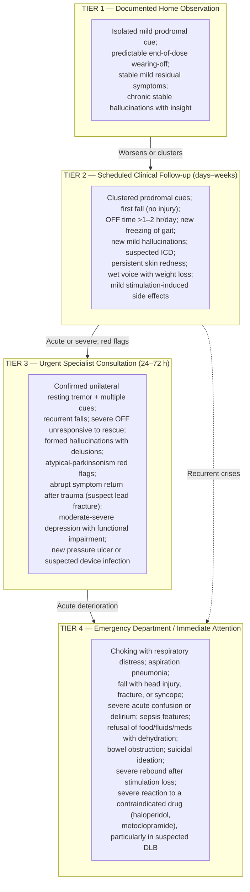

For the post-DBS patient, the urgency tier is paired with a routing decision among an expanded set of destinations. Mild stimulation-induced side effects route to the **DBS programmer**; gradual disease-progression symptoms route to the **movement disorder neurologist**; suspected hardware fracture, wound complications, or skin erosion route to the **DBS programmer in tandem with the neurosurgeon**; non-PD chronic disease updates and infection workup route to the **primary care physician**; controller malfunction or lost ID cards route to the **manufacturer support line**; and life-threatening events route to the **emergency department**, which serves as the universal Tier 4 destination across all stages and DBS status. The two-axis matrix consolidated in Chapter 7, Section 7.1, remains the operational reference.

The framework is operationalized through a **documentation infrastructure** that has been built across the report and that now stands as a coherent home-monitoring kit: a dated symptom diary; an ON/OFF diary in 30-minute or hourly blocks across 3–7 typical days; a fall and near-fall log noting time, activity, time since last dose, freezing presence, dyskinesia status, and injury; short video recordings of gait, hands at rest, and finger-tapping; an exact medication list with doses, times, and recent changes; in advanced disease, a skin and pressure-site log; in post-DBS care, the patient ID card, controller readouts, and a post-DBS event log; and at all stages, the advance directive, healthcare proxy designation, and POLST/MOLST forms as the values translation layer for crisis decisions. The Parkinson Canada ACT on Time™ resources and the Parkinson's Foundation Hospital Safety Guide consolidate much of this infrastructure into prepared, clinically validated tools.

The framework is also operationalized through **communication strategies**: prioritized question lists at each visit; specific examples rather than general impressions; video evidence for phenomena not present at the moment of examination; explicit raising of sensitive topics (impulse control, hallucinations, suicidal ideation, sexual changes) that the patient may minimize; confirmation of the plan and warning thresholds before leaving; and inter-visit team coordination through patient portals, phone, and urgent contact lines, with the family acting as the information broker among team members who do not communicate directly with each other.

## 9.3 Consolidation of Post-DBS Daily Life Adjustment Strategies

The user's question included an explicit focus on daily-life adjustments and support strategies for post-DBS patients, and the substance of that response — developed across Chapters 6 and 7 — can be consolidated here into the most impactful, practically implementable strategies.

**Realistic expectation-setting comes first**. DBS reliably improves the levodopa-responsive symptoms — tremor, rigidity, bradykinesia, motor fluctuations, dyskinesia, and levodopa-responsive gait abnormalities — with pooled meta-analytic evidence showing approximately 50% reduction in motor UPDRS-III, 64% reduction in dyskinesia, 69% reduction in OFF time, and 50% reduction in levodopa equivalent daily dose for STN-DBS, alongside roughly 22% improvement in PDQ-39 quality of life. It does not reliably improve postural instability, non-levodopa-responsive freezing of gait, dysphagia, autonomic dysfunction (constipation, urinary symptoms, orthostatic hypotension), cognitive function, or mood — the precisely identified cluster of symptoms that dominate the advanced-stage trajectory. And critically, **DBS does not stop disease progression**, with long-term studies showing sustained benefit at ten-year follow-up but continued underlying neurodegeneration. Families who internalize this framing avoid both disappointment when residual or new non-motor symptoms emerge and the misattribution of disease progression to device failure.

**Device management routines structure the household's relationship with the implant**. The patient controller — used to verify stimulation status, check battery or charge level, switch among physician-defined programs within preset ranges, and activate Surgery Mode or MRI Mode for procedures — should be operated by both the patient and at least one trained family backup, kept dry and undamaged, and never used to make unauthorized parameter changes. Battery monitoring follows the platform: monthly controller checks for non-rechargeable systems with replacement scheduled before critical depletion (typically every 2–5 years), and reliable daily or weekly recharging routines for rechargeable systems with attention to incomplete charge cycles as themselves a warning sign. Programming visits proceed at a predictable cadence — initial programming at 4–6 weeks post-surgery, followed by frequent monthly visits during the 3–6 month optimization phase, and then visits spaced to every several months once the patient stabilizes — and at every visit the family brings the documentation kit and the post-DBS event log.

**Safety precautions occupy three tiers of vigilance**. Diathermy (short-wave, microwave, or therapeutic ultrasound) is an absolute contraindication, capable of producing severe injury or death even with the device turned off, and families must inform every physical therapist, dental provider, and rehabilitation specialist of this prohibition. Conditional precautions for medical procedures include MRI conditionality verification before any scan with activation of MRI Mode and notification of the radiology team; activation of Surgery Mode and use of bipolar electrosurgery only before any operation; informing all providers and dentists of the implant; turning the device off for EKG and other electrophysiological recordings to avoid signal interference; and bringing the patient ID card to every encounter. Everyday environmental precautions include keeping mobile phones, smart watches, and other consumer magnets at least 15 cm from the generator; bypassing theft detectors and airport security with a hand search request; avoiding therapeutic magnets, strong EMI sources, deep diving below 30 m, hyperbaric chambers above 4 ATA, contact sports, sudden-acceleration rides (rollercoasters, bungee jumping, skydiving), and cervical chiropractic manipulation; wearing helmets and seatbelts; and explanting the IPG before cremation.

**Home modifications and fall prevention recalibrated to the post-DBS baseline** acknowledge that improved mobility may produce overconfidence in patients whose underlying postural reserve has not been restored. The home audit developed in Chapter 6 — clutter and rug removal, lighting upgrades, bathroom grab bars and raised toilet seats, stair handrails, supportive non-slip footwear, firm seating with arms, and bedside commodes when nocturnal mobility is impaired — applies fully, and walking-aid selection (including reverse-braking walkers for residual freezing) should be made with a physical therapist familiar with PD and DBS. Direct trauma to head, neck, or chest IPG warrants device function check via the controller and clinical contact if symptoms return.

**Sustained exercise and PD-specific rehabilitation** are among the most important contributions to long-term post-DBS outcomes. The Parkinson's Foundation recommendation of at least 2.5 hours per week of exercise — combining aerobic, resistance, flexibility, and balance components — applies with at least equal force after DBS, where stimulation has restored motor capacity that will only be retained if regularly used. PD-specific programs such as LSVT BIG, LSVT LOUD, Rock Steady Boxing, Pedaling for Parkinson's, and Dance for Parkinson's combine the physical, cognitive, and social dimensions in formats specifically designed for PD's characteristic features. Occupational therapy supports activities-of-daily-living retraining as motor capacity is restored, and speech-language pathology continues to address residual hypophonia, dysarthria, and dysphagia that DBS does not reliably improve.

**Nutrition, swallowing, sleep, and continued non-motor symptom management** track with the broader frameworks of Chapters 2–4 in their post-DBS forms. Levodopa-protein timing remains relevant for patients with residual fluctuations; weight monitoring is specifically important after STN-DBS where weight gain is common; swallowing vigilance follows the gradient developed in Chapters 3 and 4 with SLP referral at any new concern; sleep hygiene and continued attention to RBD, insomnia, restless legs, and nocturia integrate with platform-specific overnight stimulation strategies where available; and ongoing management of constipation, orthostatic hypotension, urinary symptoms, mood, apathy, ICDs, and cognitive change follows the evidence-based hierarchies developed in Chapter 8, with explicit recognition that **new or worsening depression and any suicidal ideation in a post-DBS patient warrant the highest level of vigilance** given the documented association of DBS with suicide risk.

**Recognition of the three categories of post-DBS symptoms drives triage**. Residual symptoms that DBS did not address (axial features, freezing, dysphagia, autonomic, cognitive, mood) engage the general PD care framework. Recurrent symptoms reflecting suboptimal stimulation or disease progression require coordinated DBS programming review, medication review, and disease-progression assessment. New stimulation- or device-related symptoms (speech changes, gait worsening, paresthesias, mood shifts, weight gain, hardware concerns, wound issues) require DBS programming review, device interrogation, and neurosurgical review for hardware concerns. The same observable symptom can have very different management implications depending on which category it falls into, and the family's task is to bring the pattern of observations that allows the appropriate destination clinician to act.

## 9.4 Actionable Recommendations for Patients

The recommendations below distill the report's framework into a prioritized, practically implementable set for patients themselves. They are written in the second person to underscore that the patient is the central agent of their own care, with the family and team as essential partners but not substitutes.

**Engage a movement disorder specialist early.** When prodromal cues cluster, when initial motor signs appear, or when the diagnostic picture is uncertain, seek evaluation by a neurologist with movement-disorder expertise — even if access requires travel once or twice a year, with telemedicine and a local neurologist coordinating care between specialist visits. Early specialist relationship-building establishes the longitudinal monitoring foundation on which every subsequent decision rests.

**Commit to at least 2.5 hours per week of exercise**, beginning at diagnosis and sustaining across the trajectory. Aerobic activity, resistance training, flexibility, and balance work each contribute distinct benefits, but consistency matters more than modality. Where available, engage PD-specific programs — LSVT BIG and LSVT LOUD for amplitude and voice, Rock Steady Boxing, Pedaling for Parkinson's, Dance for Parkinson's — which combine movement with peer engagement and social participation. Exercise has been shown to slow the decline in quality of life when initiated early, and its benefit applies with equal force after DBS.

**Maintain medication adherence and timing discipline.** The pharmacokinetics of levodopa are unforgiving, particularly as fluctuations develop in mid-stage disease; doses taken late or with high-protein meals translate directly into OFF time. Use timers, pill organizers, and patient applications as needed; bring an exact medication list to every clinical encounter; and recognize that medication continuity in hospitals is a specific advocacy target that you and your family must actively defend.

**Participate actively in advance care planning while capacity is preserved.** Complete an advance directive, designate a healthcare proxy, address financial powers of attorney with an attorney's input, and engage in goals-of-care conversations with your family and clinicians at major transitions. Decisions made now, while you can articulate your values, will guide the family and care team during the crises that progressive disease eventually produces — and they will free your family from the burden of improvising under pressure.

**Disclose hidden symptoms to the care team.** Impulse control behaviors (gambling, compulsive shopping, hypersexuality, binge eating, hoarding), hallucinations, suicidal thoughts, sexual dysfunction, financial decisions made impulsively, and other topics that feel embarrassing or private are precisely the symptoms that most affect long-term outcomes when undisclosed. Patients often underestimate the presence and severity of impulse control symptoms through lack of insight or defensive minimization; bring these up explicitly, and accept that family observations of behaviors you do not perceive carry clinical weight.

**Build and maintain social engagement.** Continue participation in pre-existing social structures with appropriate accommodation; engage PD-specific community programs that pair physical activity with peer connection; use voice amplifiers and communication aids to compensate for hypophonia; brief friends and extended family about facial masking and hypophonia so they do not misread these features as emotional withdrawal; and recognize that social isolation is itself a clinical signal warranting intervention rather than a personal preference to be respected.

**Accept the family caregiver as partner rather than threat to autonomy.** The family member who attends visits, maintains the symptom diary, advocates during hospitalization, and shares observations you may not perceive is enabling you to remain at home longer, to receive better medical care, and to honor your own values across the trajectory. Encourage them to speak honestly with your care team, and resist the urge to minimize symptoms or to dismiss their observations as overreach.

**Understand realistic DBS expectations before consenting.** If DBS is offered, internalize what it will and will not improve, what the surgical risks are (approximately 5% infection, 3% hemorrhage, 1.6% symptomatic hemorrhage with permanent deficits in pooled data), what the post-operative optimization process requires (4–6 weeks before initial programming and 3–6 months of iterative adjustment), and what the long-term commitment to programming visits, battery management, and safety precautions entails. DBS is not a cure; it is a long partnership with hardware, programming, and a multidisciplinary team that reshapes the middle of the trajectory rather than its end.

**Carry your patient ID card and medication list at all times.** In emergencies, in unfamiliar medical settings, at airport security, and at any encounter where staff may not know your history, these documents are the difference between safe care and harm. For DBS patients, the patient ID card identifies your device model and platform; for all patients, the medication list with exact doses and times — and the contraindicated-drug list (haloperidol, metoclopramide, prochlorperazine, similar agents) — anchors safe management.

## 9.5 Actionable Recommendations for Family Caregivers

The recommendations for family caregivers consolidate the role that has emerged across this report from observer in the prodromal phase, to documenter and escalator in mid-stage, to co-operator and triage agent in the post-DBS phase, to primary executor and decision-maker in advanced disease.

**Build the documentation kit and use it consistently.** A dated symptom diary, an ON/OFF diary across 3–7 representative days when fluctuations are present, a fall and near-fall log with the structured details that distinguish OFF-state, orthostatic, freezing, dyskinesia-related, and atypical patterns, brief video recordings of gait and hand function, an exact medication list, and — in advanced or post-DBS care — skin and pressure-site logs and post-DBS event logs constitute the substantive content of family observation. The Parkinson Canada ACT on Time™ resources and the Parkinson's Foundation Hospital Safety Guide provide prepared, clinically validated tools that you can adopt rather than building from scratch.

**Learn to recognize stage-specific warning signs and apply the tiered triage framework.** The compact reference of Section 9.1, the tier framework of Section 9.2, and the post-DBS routing logic developed in Chapter 7 are designed for non-clinical use. At each new observation, ask in sequence: *Is this consistent with where the patient currently is on the staging map? Does it cluster with other observations? Does it raise red flags for atypical parkinsonism or — in post-DBS patients — for hardware, wound, or stimulation issues? What tier and destination does the resulting pattern indicate?* This question sequence is the working algorithm of family decision-making.

**Advocate during hospitalization using the Five Parkinson's Care Needs framework.** Hospitalization is a high-risk event, with one in six PD patients experiencing avoidable complications. Carry the go-bag with medication list, advance directive, patient ID card, and contraindicated-drug list; insist that home medication timing is honored within 15 minutes of usual schedule; refuse contraindicated drugs (haloperidol, metoclopramide, prochlorperazine, and — in suspected DLB — most antipsychotics) even when offered for plausible indications; advocate for safe mobilization three times daily; request swallowing screening early in admission; and recognize delirium early and pursue its medical workup before assuming psychiatric origin or disease progression.

**Engage the multidisciplinary team proactively rather than reactively.** Physical, occupational, and speech-language therapists; neuropsychology; psychiatry familiar with PD; social work; dietitian; and palliative care should be engaged before crisis demands them. The family's role as information broker — ensuring that each team member knows what the others are doing, that documentation is shared across providers, that gaps in the team are filled — is itself a determinant of outcome.

**Complete advance directive and healthcare proxy documentation early**, ideally at or shortly after diagnosis and certainly before substantial cognitive decline. The decision-making framework that this preparation creates takes the burden of crisis improvisation off you and ensures that the patient's wishes are honored when they can no longer participate. POLST/MOLST forms, financial powers of attorney, and updated wills complete the legal and clinical infrastructure. For post-DBS patients, extend the directives to device-specific decisions: continued stimulation in late-stage disease, battery replacement decisions in frail patients, end-of-life deactivation considerations, and pre-mortem explantation if cremation is the disposition choice.

**Recognize caregiver burnout as a clinical signal and use respite, peer support, and mental health resources without guilt.** Sustained sleep deprivation, new or worsening depression or anxiety in yourself, social withdrawal, physical health deterioration, and the felt inability to continue safe care are not moral failures but clinical indicators that the system needs intervention. Engage the Caregiver Action Network, Family Caregiver Alliance, Well Spouse Association, Area Agencies on Aging, the Parkinson's Foundation Helpline, and (for veterans' families) the VA Caregiver Support Line. Use formal respite care, adult day programs, hospice respite benefits, and short-term institutional stays. Honestly reassess care location when home care has become unsustainable; transition to assisted living, skilled nursing, or institutional hospice may be the more compassionate choice for both patient and caregiver.

**For post-DBS patients, learn the patient controller, the platform-specific safety precautions, and the post-DBS triage algorithms.** Train as a backup operator for the controller; understand the absolute prohibition on diathermy and the conditional precautions for MRI, surgery, and electrosurgery; know the everyday environmental considerations (15 cm magnet distance, theft-detector bypass, contact-sport avoidance, no cervical manipulation); recognize the abrupt-symptom-return signature of hardware failure (especially after trauma) and route it to the DBS programmer and neurosurgeon; recognize stimulation-induced side effects by their temporal linkage to programming changes and route them to the DBS programmer; and recognize gradual disease progression as engaging the general PD framework rather than the device-management framework.

**Engage palliative care as a parallel layer rather than a last resort.** Palliative consultation for refractory non-motor symptoms, recurrent hospitalization, advanced dysphagia decisions, refractory psychosis, caregiver exhaustion, or family request for goals-of-care discussion is appropriate well before end-of-life. Palliative teams run alongside the movement disorder neurologist and other team members, addressing symptom burden, family support, and decision facilitation. Hospice becomes appropriate when prognosis is measured in months and goals are comfort-focused; bereavement support extends beyond the patient's life into the family's continued journey.

## 9.6 Actionable Recommendations for Clinicians

The recommendations for clinicians translate the report's framework into the practice patterns that the cumulative evidence base supports. They are written for movement disorder neurologists, general neurologists, primary care physicians, DBS programmers, and the broader multidisciplinary team that participates in PD care.

**Screen actively for prodromal and non-motor symptoms at every visit, not only at initial evaluation.** Olfactory testing, structured questioning about REM sleep behavior disorder (and polysomnographic confirmation when indicated), constipation history, depression and anxiety screening, and explicit assessment of apathy distinct from depression should be routine. Apathy is identified in fewer than half of clinically affected patients and is frequently misread as depression or as personality change; its distinct pharmacological response (dopaminergic adjustment with rotigotine, rasagiline, amantadine, or atomoxetine showing modest meta-analytic benefit, in contrast to the standard antidepressant approach) makes accurate identification clinically meaningful. The MDS research criteria for prodromal PD provide a structured framework that combines likelihood ratios across markers rather than treating any single feature as diagnostic.

**Calibrate warning-sign interpretation against the patient's stage and baseline rather than against population norms.** A first fall warrants different responses depending on whether the patient is at H&Y Stage 2 (red-flag screening for atypical parkinsonism), Stage 3 (Tier 2 fall-prevention escalation and possible advanced-therapy discussion), or post-DBS (hardware-evaluation trigger if temporally linked to trauma). The same observable event can carry different clinical meaning at different points; the clinician's task is to ask not only *what happened* but *where in the trajectory and against what baseline*.

**Maintain explicit vigilance for atypical-parkinsonism red flags throughout follow-up, not only at diagnosis.** A working diagnosis of idiopathic PD is provisional, and the cross-cutting red flags consolidated in Chapter 5 — early falls within the first year, bilateral symmetric onset, rapid loss of independent ambulation within 3–5 years, severe early autonomic failure, early dementia, vertical supranuclear gaze palsy, poor or transient levodopa response, early severe dysarthria/dysphagia, pyramidal/cerebellar/cortical signs, severe neuroleptic sensitivity, and inspiratory stridor — should prompt diagnostic reconsideration whenever they emerge. Validity studies of the MDS clinical diagnostic criteria for PSP show 83% sensitivity for possible PSP and 100% specificity for probable PSP, and analogous criteria exist for MSA, CBD, and DLB; longitudinal observation, structured levodopa challenge, MRI, DAT-SPECT, neuropsychological assessment, and emerging fluid biomarkers refine diagnosis over time. Second opinions at specialized movement disorder centers are reasonable when red flags are prominent or when DBS is being considered.

**Use evidence-based hierarchies for psychiatric prescribing.** For psychosis, follow the medication-reduction sequence (anticholinergics first, then amantadine, MAO-B and COMT inhibitors, dopamine agonists, and finally levodopa), and when antipsychotic treatment is needed, use **pimavanserin or clozapine** as evidence-supported first-line options rather than defaulting to quetiapine, which despite widespread off-label use has limited efficacy in meta-analytic data and significantly worsens cognition compared with clozapine. For depression, combine **CBT with venlafaxine or SSRIs and exercise as first-line treatment**, with rTMS as second-line and ECT for refractory cases. For anxiety, where the trial evidence is sparse, SSRIs or venlafaxine and CBT are reasonable first-line choices, with cautious limited use of low-dose benzodiazepines for severe anxiety attacks in selected patients while avoiding prolonged benzodiazepine exposure in older adults. For apathy, begin with dopaminergic adjustment rather than antidepressants. For ICDs, reduce or withdraw the dopamine agonist as the first step, add CBT as adjunctive treatment, and recognize the dopamine agonist withdrawal syndrome as a possible consequence.

**Avoid contraindicated drugs and educate hospital colleagues to do the same.** Haloperidol, risperidone (especially in suspected DLB), metoclopramide, prochlorperazine, and similar dopamine-blocking agents can precipitate severe parkinsonism crisis; in suspected DLB, severe neuroleptic sensitivity makes even small doses potentially catastrophic. These contraindications apply with full force in emergency departments, surgical recovery, and inpatient psychiatric settings, where unfamiliar staff may default to standard agents. Provide written contraindicated-drug lists to patients and families, communicate proactively with hospital colleagues at admission, and treat reversal of inappropriate exposure as a Tier 4 event when severe symptoms result.

**Integrate palliative care early.** Specialty palliative care for PD has matured substantially; primary palliative principles can be incorporated into routine neurology and primary care practice without specialist referral. Triggers for palliative consultation include uncontrolled symptoms, recurrent hospitalization, advanced dysphagia with feeding-tube decisions pending, severe psychosis refractory to two or more antipsychotic trials, caregiver exhaustion, and family request for goals-of-care discussion. Palliative care runs in parallel with continuing disease-directed care; it is not a withdrawal of treatment but an additional layer of support.

**Coordinate the multidisciplinary team and treat the family as information broker partner.** Communicate proactively with the primary care physician, physical/occupational/speech therapists, neuropsychology, psychiatry, social work, and (where applicable) the DBS programming team and neurosurgeon. Encourage shared documentation; explicitly invite the family to bring observations forward, particularly the sensitive topics that patients minimize; and use the patient portal, multidisciplinary clinic visits, and direct provider-to-provider communication at major decision points to reduce the cognitive load that families would otherwise carry single-handedly.

**Provide clear, evidence-based DBS candidacy counseling.** When DBS is being considered, walk patients and families through the canonical inclusion criteria (idiopathic levodopa-responsive PD with disabling motor fluctuations or dyskinesia despite optimized medical management, preserved levodopa responsiveness, acceptable cognitive and psychiatric status, acceptable surgical risk profile), the categorical exclusions (atypical parkinsonism, dementia or severe cognitive impairment, extensive white matter disease, uncontrolled psychiatric illness, brain abnormalities precluding lead placement), and the realistic outcome data: approximately 50% UPDRS-III improvement, 64% dyskinesia reduction, 69% OFF-time reduction, 50% LEDD reduction, and 22% PDQ-39 quality-of-life improvement for STN-DBS in pooled meta-analytic data, with the magnitude of motor benefit predictable from the pre-operative levodopa challenge. Equally explicit counseling about what DBS does *not* improve — non-levodopa-responsive symptoms, autonomic features, cognition, mood — and that it does not stop disease progression sets realistic expectations that prevent later disappointment and misattribution.

**Engage advance care planning conversations proactively at major transitions.** At diagnosis, at the transition into mid-stage motor complications, at DBS evaluation, at the transition into advanced disease, and at any clinical inflection that signals reduced future capacity, raise the advance directive, healthcare proxy, POLST/MOLST, and goals-of-care conversation. Recognize that many healthcare systems now reimburse advance-care-planning visits, and that brief structured conversations early are far better than exhaustive conversations deferred until capacity has been lost. For atypical parkinsonisms, where the trajectory is faster, begin advance care planning at or shortly after diagnosis rather than waiting.

## 9.7 Limitations of Current Knowledge

Honesty about the limitations of the evidence base on which this report rests is itself part of the report's commitments to clinical accuracy and to families' realistic expectations.

**Population representativeness is uneven.** Much of the underlying research — including the meta-analyses on hyposmia and PD risk, the cohort studies on RBD conversion, the trial evidence on antidepressant and antipsychotic efficacy, and the DBS outcome data — has been conducted in predominantly white, Western, often male-skewed populations recruited through specialized academic centers. Generalizability to underrepresented racial and ethnic groups, to women in some specific analyses (notably the depression-as-prodrome data), to younger adults, and to populations in low- and middle-income countries is correspondingly limited, and families from underrepresented groups may need to advocate more actively for individualized assessment that does not assume the population-average trajectory applies to them.

**The MDS clinical diagnostic criteria for atypical parkinsonisms have improving but imperfect sensitivity, particularly in early presentations.** The 83% sensitivity for possible PSP and 100% specificity for probable PSP demonstrate that highly characteristic cases can be confidently identified, but earlier or atypical phenotypes are routinely missed, and definitive diagnosis often requires longitudinal observation over months to years or post-mortem confirmation. The substantial heterogeneity within syndromes — eight clinical subtypes of PSP alone, the brain-first vs. gut-first dichotomy in idiopathic PD, the spectrum of corticobasal presentations — further limits early diagnostic certainty.

**Long-term DBS safety and efficacy data are limited beyond five years in formal regulatory documentation**, despite supportive observational data extending to 10–15 years. Clinical decisions about battery replacement in frail late-stage patients, about the role of stimulation in advanced disease, and about emerging directional-lead and adaptive-stimulation technologies still rest in part on extrapolation from shorter-term evidence.

**The biomarker landscape is immature.** No single fluid, imaging, or digital biomarker is yet a definitive prodromal identifier or progression tracker. CSF and plasma α-synuclein assays, plasma neurofilament light chain, dopamine transporter SPECT, midbrain MRI signs ("hummingbird," "morning glory"), and emerging tau-PET ligands each contribute information but do not yet enable routine clinical staging or prognostic stratification at the individual level.

**The evidence base for several psychiatric interventions is sparse.** Anxiety-specific trials in PD remain limited, with first-line recommendations often borrowed from depression evidence; apathy-specific pharmacotherapy has improved but remains based on relatively small studies; behavioral interventions for ICDs have promising but limited randomized data; and trials of advance-care-planning interventions, caregiver-outcome measures, and structured family-decision-support tools are sparse despite the central role these dimensions play in lived disease experience.

**Working diagnoses are inherently provisional.** A diagnosis of idiopathic PD made in good faith on the available clinical picture may evolve to PSP-Parkinsonism, MSA, CBD, or DLB as the trajectory unfolds; a diagnosis of atypical parkinsonism may be refined into a specific syndrome only over time. Families and clinicians should expect, and tolerate, this provisionality, recognizing that diagnostic re-evaluation is not a failure of earlier care but a feature of careful longitudinal medicine.

**Care-system disparities are real.** Movement disorder specialists, comprehensive multidisciplinary teams, DBS programs, and PD-specific rehabilitation programs are concentrated in academic medical centers and major urban areas. Many patients and families navigate the disease in geographic and economic contexts where the framework this report describes is partially or substantially out of reach, and the recommendations of Sections 9.4–9.6 should be understood as ideals to approximate rather than universally available baseline.

## 9.8 Directions for Future Research and Personalized Care

The limitations of Section 9.7 map directly onto the research and care-system directions in which the field is moving.

**Maturation of digital biomarkers** — wearable inertial sensors, smartphone-based motor assessments, ambient home sensing, voice and gait analyses derived from continuous out-of-clinic data — promises to convert episodic clinical encounters into longitudinal data streams that detect change earlier and characterize fluctuation patterns more precisely than any clinical visit can. Cybersecurity, data management, validation against clinical outcomes, and equitable access remain challenges, but the trajectory is established.

**Development and validation of fluid biomarkers** — including α-synuclein seed amplification assays in CSF and skin, plasma biomarkers of α-synuclein and neurofilament light chain, and emerging tau-PET ligands — will progressively enable prodromal identification, syndrome differentiation, and progression tracking at the individual level, refining the population-based staging logic this report has used into person-specific prognosis.

**Genetic and subtype-specific stratification** — LRRK2 G2019S, GBA mutations, brain-first vs. gut-first phenotypes, motor subtypes (tremor-dominant, akinetic-rigid, postural instability/gait disorder, diffuse-malignant), and emerging molecular subtypes — will personalize prognosis, guide treatment selection, and inform prevention strategies as disease-modifying therapies emerge.

**Emerging disease-modifying therapies** target α-synuclein aggregation (immunotherapies, small-molecule aggregation inhibitors), neuroinflammation (anti-inflammatory and microglial modulators), mitochondrial dysfunction, and lysosomal pathways. None has yet demonstrated definitive disease-modifying efficacy, but the pipeline is broader than at any prior point, and successful agents would fundamentally reshape the trajectory and the warning-sign architecture this report has built.

**Refinement of DBS technology** continues along several axes: closed-loop adaptive stimulation that titrates stimulation in real time to brain-state biomarkers; directional leads with multiple independent current control; novel surgical targets including the pedunculopontine nucleus for gait and freezing; refinement of asleep MRI- or CT-guided robotic placement protocols; and longer-lived rechargeable batteries with improved patient interfaces.

**Expanded palliative-care integration and PD-specific palliative training** are underway across major movement disorder centers, with evidence accumulating for the benefits of early integrated palliative care in neurodegenerative disease and for the value of specialty-trained palliative providers in PD specifically.

**Equity-focused research and care-delivery models** are needed to address the geographic and socioeconomic disparities that limit access to specialist care, multidisciplinary teams, DBS, and PD-specific rehabilitation. Telemedicine has expanded access substantially; community-based PD programs (LSVT-trained therapists in smaller communities, Rock Steady Boxing affiliates, dance-for-PD programs) bring components of specialty care closer to home; and patient-organization helplines and educational resources democratize information access. Continued investment in these channels, alongside research that explicitly recruits underrepresented populations, is essential.

**Caregiver-outcome research** is a particular gap. The clinical importance of caregiver burden, burnout, and well-being is established, but rigorous trials of respite, peer support, structured family-decision-support tools, and multidisciplinary caregiver interventions remain sparse, and outcome measures that capture caregiver well-being across the long trajectory of PD are not yet standardized.

**Integration of artificial intelligence and telemedicine** into longitudinal monitoring and family decision support — including symptom-tracking applications that interpret family observations, decision-support tools that triage warning signs across the urgency-and-routing matrix this report has built, and remote programming for DBS systems — is accelerating, with promising early evidence and substantial questions about regulation, equity, privacy, and the preservation of the relational care that this report has placed at the center of its framework.

## 9.9 Closing Reflection: PD as a Long Companionship

The report has tried, across its eight prior chapters and the synthesis of this final one, to do justice to a disease whose clinical detail is vast, whose pathophysiology is multi-system, whose trajectory is heterogeneous, whose treatment is multimodal, and whose lived experience is, for the patient and the family, a long and demanding companionship. The user's question — *what warning signs should alert family members across the disease, when to intervene or seek medical advice, and what daily-life adjustments and support strategies improve comfort and well-being for post-DBS patients* — has been the report's compass, and the answer that has emerged is integrated rather than enumerative.

**Calibration against the patient's stage and baseline** transforms warning-sign monitoring from an overwhelming checklist into an intelligible scan against a known trajectory. **Pattern-based recognition** rather than isolated symptom counting separates clinically meaningful clusters from the noise of ordinary aging and ordinary illness. **The tiered escalation logic**, with its four urgency levels and its expanded post-DBS routing, gives families a stable scaffold for decisions that range from continued home observation to immediate emergency response. **Integration of stage-based and red-flag vigilance** ensures that diagnostic provisionality is honored throughout the trajectory and that treatment decisions, including the consequential decision about DBS candidacy, rest on diagnostic accuracy. **Multidisciplinary partnership** distributes the care load across a team whose composition shifts with the patient's stage and needs, with the family as information broker rather than sole decision-maker. **Values-based care planning**, completed while capacity is preserved and revisited at major transitions, translates patient preferences into the real-time decisions that crisis eventually demands. **Holistic biopsychosocial attention** weights mood, cognition, autonomic features, social engagement, and family relationships at least as heavily as tremor and gait, in recognition that quality of life is determined by far more than motor symptoms. **Caregiver well-being** is itself a clinical determinant, and the long arc of PD across years is sustainable only with active investment in respite, peer support, mental health care, and the honest reassessment of care location when home care has become unsustainable.

For the post-DBS patient specifically, these principles extend into device-aware territory: realistic expectations about what stimulation will and will not improve and that it does not stop disease progression; daily routines that integrate the patient controller, battery monitoring, programming visits, and the patient ID card; safety precautions that range from absolute (diathermy, certain MRI conditions) to conditional (surgery, medical procedures with proper mode activation) to everyday (15 cm magnet distance, contact-sport avoidance, no cervical manipulation); home modifications and fall prevention recalibrated to a baseline in which mobility may exceed underlying postural reserve; sustained exercise and PD-specific rehabilitation; continued attention to the non-motor symptoms that DBS does not address; and triage logic that distinguishes hardware failures, wound complications, stimulation-induced effects, and disease progression beneath stimulation, routing each to the right destination at the right urgency.

The final framing the report wishes to leave with families is a simple one: **vigilance is an act of care, and care is a relationship sustained over time**. The mother who notices that her father has stopped smelling the coffee he has brewed every morning for forty years; the wife who realizes that her husband is no longer enacting his dreams quite as often after the new sleep medication and now wonders, retrospectively, whether she should ask the doctor what those years of dream-enactment meant; the adult child who watches a parent's handwriting shrink across the years of birthday cards stored in a drawer; the spouse who recognizes that a fall in the kitchen is not just a fall but an event whose category has shifted; the partner who, years after a successful DBS surgery, notices that the new program installed last month has coincided with a strange, persistent low mood and decides to bring it up at the next visit; the family that completes an advance directive together while everyone is still well enough to mean what they say; the caregiver who admits, finally, that they need help, and accepts it; the daughter who sits with her mother in hospice and recognizes that comfort and presence are themselves the medicine — these are the moments in which the architecture this report has built becomes lived. They are not technical achievements. They are acts of love, structured by knowledge.

A family that builds the scaffolds — the documentation, the team, the advance directives, the psychosocial supports, the post-DBS routines, the values-based decision frameworks — in advance converts the vigilance of recognizing warning signs into sustained, humane care across the entire trajectory, from prodromal cues through advanced disease and into the bereavement that closes the journey. The disease will progress; that is its nature. What the family can shape is *how it is met* — with anticipation rather than improvisation, with team rather than isolation, with values rather than default, with comfort rather than crisis, and with the patient's voice honored throughout, including in the final phase when others must speak on their behalf. That is what this report has tried to provide: not a substitute for the relationship between patient, family, and care team, but the language and structure that allow that relationship to do the work it was always meant to do.

# 参考内容如下：
[^1]:[2. Pathophysiology of Parkinson’s Disease | ATrain Education](https://www.atrainceu.com/content/2-pathophysiology-parkinson%E2%80%99s-disease)
[^2]:[Determinants of alpha-synuclein pathogenesis in Parkinson's disease](https://journals.lww.com/nrronline/fulltext/2026/04000/determinants_of_alpha_synuclein_pathogenesis_in.35.aspx)
[^3]:[Neuronal vulnerability in Parkinson’s disease: insights from murine α-synuclein pathology models - ScienceDirect](https://www.sciencedirect.com/science/article/pii/S0306452226002617)
[^4]:[Hoehn and Yahr Scale - Physiopedia](https://www.physio-pedia.com/Hoehn_and_Yahr_Scale)
[^5]:[Modified Hoehn and Yahr Scale: Modified Hoehn and Yahr Scale](https://emedicine.medscape.com/article/2172546-overview)
[^6]:[Progression of Parkinson's disease as evaluated by Hoehn and ...](https://movementdisorders.onlinelibrary.wiley.com/doi/10.1002/mds.22875)
[^7]:[Hyposmia as a Predictive Marker of Parkinson's Disease: A Systematic Review and Meta-Analysis - PMC](https://pmc.ncbi.nlm.nih.gov/articles/PMC6545790/)
[^8]:[Frontiers | Editorial: Prodromal Parkinson's Disease](https://www.frontiersin.org/journals/neurology/articles/10.3389/fneur.2020.634490/full)
[^9]:[Prodromal Parkinsonism and Neurodegenerative Risk Stratification ...](https://academic.oup.com/sleep/article/40/8/zsx071/3796343)
[^10]:[REM sleep behavior disorder (RBD) - PubMed](https://pubmed.ncbi.nlm.nih.gov/32599063/)
[^11]:[Rate of conversion of REM sleep behavior disorder (RBD) to a...](https://www.researchgate.net/figure/Rate-of-conversion-of-REM-sleep-behavior-disorder-RBD-to-a-neurodegenerative-status_fig2_316633262)
[^12]:[Constipation: an emerging risk factor for Parkinson's disease?](https://onlinelibrary.wiley.com/doi/10.1111/ene.13082)
[^13]:[Risk of Parkinson's disease following severe constipation](https://www.sciencedirect.com/science/article/abs/pii/S1353802014003630)
[^14]:[Autonomic Dysfunction Linked to Cognitive Decline in Prodromal Parkinson Disease - Neurology Advisor](https://www.neurologyadvisor.com/news/autonomic-dysfunction-prodromal-parkinson-cognitive-decline/)
[^15]:[Occurrence of Depression and Anxiety prior to Parkinson’s Disease - PMC](https://pmc.ncbi.nlm.nih.gov/articles/PMC2963655/)
[^16]:[Parkinson’s Iceberg: The Non-Motor Symptoms You Don’t See - PhotoPharmics](https://photopharmics.com/non-motor-symptoms-of-parkinsons/)
[^17]:[Hoehn and Yahr stages - Clinical effectiveness and cost-effectiveness of physiotherapy and occupational therapy versus no therapy in mild to moderate Parkinson’s disease: a large pragmatic randomised controlled trial (PD REHAB) - NCBI Bookshelf](https://www.ncbi.nlm.nih.gov/books/NBK379751/)
[^18]:[Hoehn and Yahr - Parkinson’s Disease Research, Education and Clinical Centers](https://www.parkinsons.va.gov/resources/HY.asp)
[^19]:[AAN Issues Guideline for Treatment of Early Parkinson's Disease](https://www.aan.com/PressRoom/Home/PressRelease/4936)
[^20]:[Parkinson's Disease: NICE 2024 Guideline Summary](https://reference.medscape.com/cc2/p10/parkinson-s-disease-adults-2022a1001c0t)
[^21]:[Exercise | Parkinson's Foundation](https://www.parkinson.org/living-with-parkinsons/treatment/exercise)
[^22]:[[PDF] Anti-Parkinson's Agents](https://www.hhs.texas.gov/sites/default/files/documents/jan-2026-durb-agenda-item03j.pdf)
[^23]:[Quantitative Analysis of Postural Instability in Patients with Parkinson's Disease - PMC](https://pmc.ncbi.nlm.nih.gov/articles/PMC8060093/)
[^24]:[Risk of Falling in Parkinson's Disease at the Hoehn-Yahr Stage III](https://karger.com/ene/article/66/5/298/134417/Risk-of-Falling-in-Parkinson-s-Disease-at-the)
[^25]:[Freezing | Parkinson's Foundation](https://www.parkinson.org/living-with-parkinsons/management/activities-daily-living/freezing)
[^26]:[Amantadine extended-release capsules for levodopa-induced dyskinesia in patients with Parkinson’s disease - PMC](https://pmc.ncbi.nlm.nih.gov/articles/PMC5905495/)
[^27]:[Freezing of Gait & Parkinson's Disease | American Parkinson Disease Association](https://www.apdaparkinson.org/what-is-parkinsons/symptoms/freezing-of-gait/)
[^28]:[Triggers for freezing of gait in individuals with Parkinson's disease](https://www.frontiersin.org/journals/neurology/articles/10.3389/fneur.2023.1326300/full)
[^29]:[5 Stages of Parkinson‘s Disease](https://www.healthline.com/health/parkinsons/stages)
[^30]:[Advanced Parkinson’s: Falls, Extreme Immobility & Secretion Mgmt. | APDA](https://www.apdaparkinson.org/article/falls-extreme-immobility-secretion-management-in-advanced-parkinsons-disease/)
[^31]:[Nutritional risk and risk of dysphagia in Parkinson's disease: Insights from a rehabilitation setting - ScienceDirect](https://www.sciencedirect.com/science/article/pii/S2667268525000944)
[^32]:[Can Hospice Care Help With End-Stage Parkinson's?](https://www.verywellhealth.com/end-stage-parkinson-s-disease-hospice-criteria-5205423)
[^33]:[Forceful swallowing not seen to ease dysphagia of Parkinson's disease | Parkinson's News Today](https://parkinsonsnewstoday.com/news/effortful-swallow-not-seen-ease-dysphagia-parkinsons/)
[^34]:[Treatment of Parkinson’s Disease Psychosis—A Systematic Review and Multi-Methods Approach](https://www.mdpi.com/2227-9059/12/10/2317)
[^35]:[Pimavanserin and Clozapine Outperform Other Atypical Antipsychotics in Treating Parkinson Disease Psychosis | NeurologyLive - Clinical Neurology News and Neurology Expert Insights](https://www.neurologylive.com/view/pimavanserin-clozapine-outperform-other-atypical-antipsychotics-in-treating-parkinson-disease-psychosis)
[^36]:[Progressive Supranuclear Palsy Information Page](https://patient.info/doctor/neurology/progressive-supranuclear-palsy-pro)
[^37]:[Managing Parkinson's Disease Together](https://www.parkinson.ca/wp-content/uploads/Care_Partnering_Managing_Parkinsons_Disease_Together.pdf)
[^38]:[Diagnostic accuracy of progressive supranuclear palsy in the ...](https://movementdisorders.onlinelibrary.wiley.com/doi/10.1002/mds.10488)
[^39]:[Red Flags Against the Diagnosis of PSP - ResearchGate](https://www.researchgate.net/figure/Red-Flags-Against-the-Diagnosis-of-PSP_tbl1_11991515)
[^40]:[[PDF] A Guide to Deep Brain Stimulation for Patients with Parkinson's ...](https://www.bumc.bu.edu/parkinsonsdisease/files/2022/06/DBS-Patient-Manual-PD.pdf)
[^41]:[[PDF] Deep Brain Stimulation (DBS) Therapy - Neurological Surgery](https://www.neurosurgery.pitt.edu/sites/default/files/patient-info/dbs-patient-packet.pdf)
[^42]:[Surgery and MRI Scans with Your Deep Brain Stimulation Device | Abbott](https://www.neuromodulation.abbott/us/en/support-parkinsons-tremor/surgery-mri-with-dbs.html)
[^43]:[Subthalamic and pallidal deep brain stimulation for Parkinson’s disease—meta-analysis of outcomes | npj Parkinson's Disease](https://www.nature.com/articles/s41531-021-00223-5)
[^44]:[Managing Lead Fractures in Deep Brain Stimulation for Movement Disorders: A Decade-Long Case Series from a National Neurosurgical Centre](https://www.mdpi.com/2077-0383/13/24/7509)
[^45]:[Deep Brain Stimulation Hardware Complications in Patients with ...](https://karger.com/sfn/article/90/5/300/293225/Deep-Brain-Stimulation-Hardware-Complications-in)
[^46]:[Crucial Downside of Dbs (Risks and Limitations) - Liv Hospital](https://int.livhospital.com/crucial-downside-of-dbs-risks-and-limitations/)
[^47]:[Depression, Apathy, and Anxiety in Parkinson Disease](https://www.psychiatrictimes.com/view/depression-apathy-and-anxiety-in-parkinson-disease)
[^48]:[Treatment of Depression & Anxiety in Parkinson's Disease](https://practicalneurology.com/archives/aug-2025-issue/spotlight-on-the-management-of-depression-anxiety-and-psychosis-in-people-living-with-parkinson-disease/36691/)
[^49]:[[PDF] Frequently Asked Questions | Parkinson's Foundation](https://www.parkinson.org/sites/default/files/documents/frequently-asked-questions.pdf)
[^50]:[Impulse Control Disorders in Parkinson's Disease: Epidemiology, Pathogenesis and Therapeutic Strategies - PMC](https://pmc.ncbi.nlm.nih.gov/articles/PMC7900512/)
[^51]:[LSVT BIG Exercise: Transforming Movement in Parkinson's Disease](https://www.parkinsonsprograms.org/lsvt-big-exercise-transforming-movement-in-parkinson-s-disease)
[^52]:[(PDF) Multidisciplinary care in Parkinson's disease - ResearchGate](https://www.researchgate.net/publication/382488527_Multidisciplinary_care_in_Parkinson's_disease)
[^53]:[Manager Nurse Practitioner DBS Movement Disorder Program at Hackensack Meridian Health | Apply now! – Vaia – Talents](https://talents.vaia.com/companies/hackensack-meridian-health/manager-nurse-practitioner-dbs-movement-disorder-program-27727706/)
[^54]:[Joan Miravite Harper - Neurology | Mount Sinai - New York](https://profiles.mountsinai.org/joan-m-harper)
