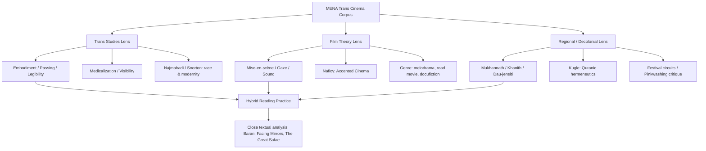
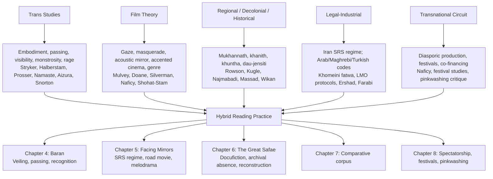

# Crossing Veils and Genders: Transgender Themes in Middle Eastern and North African Cinema
# 1 Introduction: Framing Transgender Themes in MENA Cinema

When Randa Maroufi's experimental short *The Great Safae* (2014) screened in the "Sex, Sect and Stigma" sidebar of the 2015 BBC Arabic Festival in London, its programme note described it tersely as "a fictional, experimental documentary inspired by a real person… a transgender who spent part of her life working as a domestic servant for the director's family," whose "'true' sexual identity eluded everyone in the house."[^1] In a few lines of festival catalogue prose, the film's central problem is already condensed: a trans life remembered through the keyhole of a Moroccan bourgeois household; a body whose gender is at once obvious to the camera and illegible to those who employed it; and a viewing context — a flagship Arab-language broadcaster's London festival — in which questions of "sex, sect and stigma" are programmed together as overlapping axes of social transgression. The film's elliptical mode of address, in which the director "re-imagines 'Safae' as she goes through her daily routine, working in the house and changing from male to female"[^1] while "snippets of conversation from various members of the family about social views on gender behavior" filter through the soundtrack,[^1] crystallizes the broader analytical problem that this report takes as its object: how transgender themes — figured through veiling, crossing, passing, domestic labour, medical transition, and embodied transformation — are visualized, narrativized, and politically encoded in the cinemas of the Middle East and North Africa (MENA).

This opening chapter establishes the conceptual, terminological, and methodological foundations for that inquiry. It articulates the central research problematic, clarifies a constellation of trans-related terms drawn from Anglophone, Arabic, Persian, and ethnographic vocabularies, justifies the regional scope while insisting on its internal heterogeneity, defines the working corpus and selection criteria, sets out the dual theoretical lenses of trans studies and film theory, and stakes out an argumentative position that resists both Orientalist exoticization and assimilationist Western LGBTQ+ framings. It closes with a roadmap to the subsequent chapters and a note on method. As the entry point of the report, the chapter does not yet undertake sustained close analysis of films — that work is reserved for Chapters 4–7 — but it already gestures, where useful, towards the three core case studies (Majid Majidi's *Baran*, 2001; Negar Azarbayjani's *Facing Mirrors*, 2011; and Maroufi's *The Great Safae*, 2014) that will anchor the report's comparative argument.

## 1.1 Research Problematic and Stakes

The central research problematic of this study can be formulated as a triple question. *First*, how do MENA cinemas — across Persian, Arab, Turkish, Maghrebi, and diasporic traditions — visualize and narrativize transgender experience, that is, what specific cinematic strategies (mise-en-scène, framing, point of view, sound, genre, narrative structure) are mobilized to render trans embodiment legible or, conversely, to keep it in productive ambiguity? *Second*, what political, religious, legal, and economic forces — from Quranic hermeneutics and *hadith* traditions to state censorship regimes, festival circuits, and transnational human-rights discourses — condition the representational possibilities of trans figures in these cinemas? *Third*, what theoretical apparatus is required to read these films rigorously, given that the dominant traditions of both trans studies and film theory have been formulated largely in Anglophone, Euro-American contexts?

These questions are not merely descriptive. They carry significant stakes for at least three overlapping fields. For **film studies**, MENA trans cinema poses a challenge to the regional and thematic boundaries of the discipline: it cuts across Iranian New Wave scholarship, Arab cinema studies, accented and diasporic cinema, festival studies, and queer/feminist film theory, none of which on its own provides adequate purchase on the corpus. For **gender and trans studies**, the corpus tests the universality of categories like "transgender," "passing," and "transition" that have been forged largely through Anglo-American medico-legal and activist histories; it forces a reckoning with indigenous categories such as the *mukhannath* of early Islamic juridical tradition, the *khanith* described in Omani ethnography, and the Persian *dau-jensiti* (literally "of two sexes") that circulates in Iran's distinctive medico-legal regime around sex reassignment surgery. For **area studies**, finally, MENA trans films function as privileged sites where questions of religion, nationalism, modernity, diaspora, and human-rights politics converge in unusually concentrated form: the same film may be at once a domestic melodrama, a state-sanctioned medical narrative, an art-cinema enigma, and a festival object recoded by Western reviewers as either evidence of Islamic "repression" or proof of "progress."

The stakes of the inquiry are therefore double-edged. On one side stands the persistent **Orientalist** temptation to read MENA gender variance through tropes of repression, voyeuristic curiosity, or rescue: the trans MENA body becomes a symptom of cultural pathology, a victim awaiting Western liberation, or an exotic spectacle. On the other stands an **assimilationist** impulse to absorb MENA trans cinema into a global LGBTQ+ frame, celebrating only those films that conform to Anglophone coming-out, transition, and pride narratives, and thereby flattening local epistemologies of gender and sexuality. This report argues that neither posture is analytically adequate, and that a properly transregional reading must treat MENA trans films as **active sites of meaning-making** — formally inventive, politically situated, and theoretically generative — rather than as passive objects of cross-cultural translation. The pertinence of this stance is heightened by the fact that the very *hadith* traditions used to criminalize gender variance in much of the contemporary Muslim world — including the cluster around the *mukhannath* companion *Hati* — have been shown, by scholars such as Scott Kugle, to rest on chains of transmission that "are not reliable, as they appear not to have originated with the Prophet himself but rather with a second-generation follower… prone to exaggeration, fabrication, and ideological extremism."[^2] Cinema, in this light, is not merely a site of representation but one of the few cultural arenas in which such fossilized interpretations can be contested through audiovisual form.

## 1.2 Terminological Clarifications and Conceptual Vocabulary

Any study of MENA trans cinema must begin with a careful audit of its vocabulary. The English umbrella term **"transgender"** — and its more capacious cousin **"trans\*"** — emerged in late-twentieth-century Anglophone activist and academic contexts to denote a heterogeneous range of gender-variant identities and practices, distinct from but historically entangled with **"transsexual"** (a clinical term tied to medical transition). When transposed into MENA contexts, these terms simultaneously enable comparative legibility and risk imposing taxonomies foreign to the social, juridical, and linguistic worlds in which the films were made. This report therefore deploys "transgender" and "trans" as **strategic analytical umbrellas**, while remaining attentive to a constellation of indigenous and historically specific categories that the corpus repeatedly invokes.

Several of these categories warrant explicit definition at the outset. **Mukhannath** (مخنّث) is the Arabic term, prominent in early Islamic *hadith* and juridical literature, conventionally translated as "effeminate man." Kugle, drawing on a long tradition of textual scholarship, identifies a Prophetic companion named *Hati* who "is referred to as *mukhannath* or what early Islamic scholars describe as an 'effeminate man,'" and shows how the cluster of *hadith* in which *mukhannathun* appear was, over centuries, "grossly taken out of context, that what appeared to be a prophetic wisdom of protecting and sanctifying the privacy of women's spaces, devolved into a punitive condemnation of gender expression."[^2] The *mukhannath* is thus not a neutral descriptive label but a contested theological-juridical category whose contemporary citation always carries a polemical charge. **Mokhannas** is a related vernacular Arabic variant. **Khanith** is the Omani term made famous by anthropological literature (and discussed in comparative ethnography of "boy-wives and female husbands") that designates a recognized social role for male-bodied persons who adopt feminine dress, comportment, and sexual roles; in such accounts, "the *khanith* stands as a third-gender category precisely because people see the behavior as occurring naturally,"[^3] which marks a significant divergence from the pathologizing or punitive valence of contemporary Arab-state legal codes. **Dau-jensiti** (دوجنسیتی, literally "of two sexes/genders") is the Persian term that circulates in Iran's medical, religious, and bureaucratic discourse around sex reassignment surgery, structured by the post-1987 fatwa of Ayatollah Khomeini that effectively legalized SRS for those officially diagnosed as "transsexual" — a regime that operates in stark legal asymmetry with the criminalization of homosexuality, and which directly shapes the conditions of possibility for a film like *Facing Mirrors*.

Alongside these identitarian terms, the study mobilizes a vocabulary of **practices and tropes** central to cinematic analysis: *cross-dressing* (a narrative device in which a character wears clothing coded for another gender, often without claiming an identity); *passing* (the social and embodied work of being read in a desired gender, which trans-studies scholarship — from Jay Prosser to Sandy Stone — has theorized as ambivalent, both protective and erasive); *masquerade* (the feminist film-theoretical figure inherited from Joan Riviere via Mary Ann Doane that names femininity as performance); and *veiling* (overdetermined in MENA contexts, simultaneously a religious-cultural practice, a censorship requirement on Iranian screens, and a metaphor for the ontology of trans embodiment). The report uses each of these terms with deliberate care: *cross-dressing* is reserved for narrative devices without claims to trans identity (e.g. the female protagonist of *Baran* who passes as a boy to work); *trans subjectivity* is used when films explicitly thematize gender identity and the desire for embodied transformation (e.g. *Facing Mirrors*); and *gender ambiguity* or *trans figuration* is preferred for cases like *The Great Safae* where the question of the protagonist's self-identification is bracketed by the film's own formal strategies. This conceptual taxonomy will be elaborated and operationalized in Chapter 2.

The politics of **translation, naming, and self-identification** are inseparable from this terminological work. Festival catalogues, subtitles, and critical reception routinely translate (or mistranslate) local terms into the Anglophone "transgender" or "transsexual," thereby producing the very legibility on which international circulation depends but also flattening internal distinctions. The 2015 BBC Arabic Festival's brief description of *Safae* as "a transgender"[^1] is a case in point: efficient as a catalogue gloss, but mute on whether *Safae* would have used such a term, on what Arabic or Darija vocabulary her family employed, or on how the film itself problematizes any singular identitarian claim. The report will treat such translation events not as innocent linguistic transfer but as political acts of categorization, and will, where possible, foreground the original terms used by filmmakers and informants.

## 1.3 Defining the MENA Region: Heterogeneity and Justification

The "Middle East and North Africa" is itself a contested geographic-political construct, one whose origins lie in twentieth-century Anglo-American strategic geography rather than in any indigenous self-designation. Justifying it as an analytical frame for this study therefore requires acknowledging both its utility and its violence. The frame is useful because it captures a set of overlapping conditions — predominantly Muslim-majority polities (with significant Christian, Jewish, Yazidi, Bahá'í, and other minority communities), shared *Arabic*, *Persian*, *Turkish*, *Kurdish*, and *Tamazight* linguistic ecologies, deeply intertwined cinematic histories shaped by colonial encounter, postcolonial state-building, and transnational co-production circuits — that meaningfully condition trans representational possibilities. It is violent insofar as it can flatten profound internal differences and reproduce the very Orientalist mappings the report seeks to resist.

The corpus that this study engages spans at least five distinguishable yet interconnected sub-fields:

| Sub-field | Linguistic / National contexts | Distinctive conditions for trans cinema |
|---|---|---|
| Persian / Iranian | Iran (Farsi); diasporic Iranian cinema (US, Europe) | Post-1987 fatwa permitting SRS; mandatory on-screen veiling; strong state censorship via Ministry of Culture and Islamic Guidance; vibrant New Wave aesthetic |
| Arab Mashreq | Egypt, Lebanon, Syria, Palestine, Jordan, Iraq, Gulf states | Variable censorship regimes; criminalization of homosexuality in most jurisdictions; strong commercial Egyptian industry alongside Lebanese art cinema |
| Maghrebi | Morocco, Algeria, Tunisia, Libya | French/Arabic/Tamazight multilingualism; strong art-cinema and Franco-Maghrebi co-production circuit; informal social tolerance alongside legal criminalization |
| Turkish | Turkey | Distinct legal regime (no direct criminalization of homosexuality but persistent state violence); developed industrial cinema; significant trans activist and cultural scenes |
| Diasporic | UK, France, Germany, Netherlands, US, Canada | Exilic and accented production conditions; access to Western funding and festivals; complex address to multiple audiences |

The justification for grouping these sub-fields is not that they share a single trans politics, but that their cinemas are *connected*: through co-production (the BBC Arabic Festival itself a node of London-based Arab funding[^1]; festivals like Doha, Dubai, Carthage, and Marrakech serving as regional hubs); through shared diasporic networks (Maroufi works between Tangier, Lille, and Paris[^4]; her *L'mina* (2025) is a "co-production between Morocco, France, Italy, and Qatar"[^5]); through circulating idioms drawn from common Islamic, Arabic, and Ottoman cultural inheritances; and through their joint legibility (or illegibility) on the international festival circuit. To take a single illustration: the BBC Arabic Festival's 2015 "Sex, Sect and Stigma" program juxtaposed Egyptian comedies of gender reversal (*Ibn Bnoot*), Egyptian reportage on a woman cross-dressing as a man for economic survival (*Sisa, Iron Lady*), and Maroufi's Moroccan trans-themed *The Great Safae*, alongside Iraqi and Egyptian works on sectarian and religious stigma.[^1] The programmatic gathering itself enacts the regional grouping as a curatorial fact, even as the films within it speak in profoundly different registers: short reportage, fantastical comedy, experimental documentary.

The report therefore treats MENA as a **plural and connected field** — closer to what Naficy might call a transnational accented zone than to a homogeneous region — and will repeatedly insist on internal differentiation when generalizations risk effacing significant national, linguistic, religious, or generic specificities.

## 1.4 Corpus and Selection Criteria

The corpus assembled for this study is constructed according to four overlapping criteria.

*First*, **directorial and production positionality**: films must be directed by filmmakers who are MENA-based or MENA-diasporic, with significant biographical, professional, or aesthetic investment in the region. This criterion includes established auteurs working domestically (Majidi in Iran), filmmakers operating at the seam between region and diaspora (Azarbayjani in Iran with international post-production support), and diasporic artists whose work returns to MENA contexts (Maroufi, born in Casablanca, "lives and works in Paris,"[^6] but whose films *Le Park*, *Bab Sebta*, *L'mina*, and *The Great Safae* are all set in Morocco[^5][^4]).

*Second*, **thematic and aesthetic engagement with trans figures**: films must address transgender characters, themes, or aesthetics either centrally — as in the three core case studies — or as significant narrative elements within a larger work. The criterion is deliberately permissive about whether the film names its protagonist as "transgender" in any explicit identitarian sense; it includes works that figure gender ambiguity, cross-dressing, passing, and embodied transformation, on the methodological wager that close cinematic analysis can productively unpack the relationship between such figurations and trans subjectivity.

*Third*, **chronological window**: the corpus concentrates on films produced from approximately the early 1990s — when the Iranian New Wave's post-revolutionary maturation, the rise of Maghrebi and Lebanese art cinemas, and the proliferation of digital and short-form production began to multiply representational possibilities — through the present. Earlier reference points (e.g., classical Egyptian musicals, Ottoman-era theatrical traditions) will be invoked as historical horizon but not analyzed as primary objects.

*Fourth*, **formal and generic diversity**: the corpus deliberately spans feature fiction (*Baran*, *Facing Mirrors*), documentary (*Be Like Others*, Tanaz Eshaghian, 2008, to be discussed in Chapter 7), short film (*The Great Safae*, *Run(a)way Arab*, *Mariam*), and experimental/hybrid forms. The hybrid forms are particularly important: as Maroufi herself articulates, "there is a porous border between documentary and fiction in my film productions, and this is also what allows me to take another look at my concerns, which are often social, societal and political,"[^4] a methodological statement directly relevant to how *The Great Safae* performs its reconstructive trans memory.

Festival circuits constitute a *fifth*, transversal criterion: films that have circulated through significant festival platforms (Cannes, IDFA, Berlin, Locarno, Dubai, the BBC Arabic Festival, Hot Docs, and others) are privileged because such circulation generates the textual, paratextual, and critical archive (catalogues, reviews, director interviews, festival panels) on which scholarly analysis depends.[^1][^5] At the same time, the report acknowledges significant **archival gaps and exclusions**: films suppressed or denied production permits in their countries of origin; works circulating only in informal Arabic-language streaming or YouTube ecologies; trans representations in television serials and music videos beyond the report's cinematic remit; and, perhaps most acutely, the relative paucity of trans-authored cinema (as opposed to films *about* trans subjects directed by cisgender filmmakers) in much of the corpus. These exclusions are themselves analytically significant and will be revisited in Chapters 6, 8, and 9.

## 1.5 Theoretical Framework: Trans Studies Meets Film Theory

The analytical apparatus of this report is constructed at the intersection of two disciplinary traditions that have only intermittently spoken to each other: transgender studies and film theory. From **trans studies**, the report draws on a now-substantial body of scholarship — to be elaborated in detail in Chapter 2 — that has theorized embodiment, passing, legibility, the critique of cisnormativity, the politics of medical transition, and the racialization of trans bodies. Foundational interventions associated with Susan Stryker, Judith Halberstam, Jay Prosser, Viviane Namaste, and more recently Aren Aizura and C. Riley Snorton provide vocabularies for naming what is at stake in cinematic representations of trans embodiment. Equally indispensable for the MENA case is **decolonial and regionally specific trans scholarship** that resists the universalization of Anglo-American paradigms — most notably Afsaneh Najmabadi's work on gender, sexuality, and modernity in Iran, which traces how the very binary of "homosexual/heterosexual" and the medico-legal category of the transsexual were forged through entanglements with European modernity that cannot be subtracted from contemporary Iranian trans politics. Liberation-theological and sexually-sensitive Quranic hermeneutics, exemplified by Kugle's argument that "the Qur'an condemns same-sex acts only if they are exploitative or violent" and that "the bulk of stigmatization of homosexuality is found in *hadith* interpretation and *fiqh*,"[^2] provide an additional resource for thinking trans embodiment within Islamic frames rather than simply against them.

From **film theory**, the report mobilizes a complementary toolkit. Narrative analysis and mise-en-scène attend to how trans figures are placed within the diegetic world. Theories of the gaze — Laura Mulvey's foundational account of visual pleasure, Mary Ann Doane on the masquerade, Kaja Silverman on the acoustic mirror — provide resources for analyzing how trans bodies are looked at, listened to, and ventriloquized on screen, while their feminist orientation must be carefully retooled to address the specifically *trans* (rather than "female") object of the look. Hamid Naficy's *accented cinema* offers particularly powerful purchase on the diasporic and exilic dimensions of MENA trans filmmaking, while Ella Shohat and Robert Stam's post-Third Worldist multiculturalism guards against the geopolitical naivety of much Anglophone film theory. Genre theory — particularly on melodrama, the woman's film, the road movie, and the docufiction hybrid — will be drawn upon to read each of the case studies in Chapters 4–6.

Three further frameworks are integrated in service of the corpus's specificity. **Border and threshold theory**, articulated through Maroufi's own practice of reading geopolitical, intimate, and gendered borders as continuous — "the analysis of these borders, first intimate and then societal, as well as your double experience in France and Morocco, naturally led you to an interest in a more geopolitical border"[^4] — provides a vocabulary for the crossing metaphors that pervade trans MENA cinema (Afghan-Iranian borders in *Baran*; the Tehran–Karaj road in *Facing Mirrors*; the Moroccan domestic threshold in *The Great Safae*). **Festival studies and theories of accented circulation** account for how MENA trans films are mediated to spectators, a concern that will be developed at length in Chapter 8. And **performative documentary theory** (Bruzzi, Nichols), invoked already in §1.4, provides specific tools for *The Great Safae* and other docufiction works.

The integration of these frameworks is summarized schematically below, anticipating its full elaboration in Chapter 2.

The diagram traces how the three lenses converge on a hybrid reading practice that is then operationalized through the three core case studies. The key analytical wager is that **no single lens is sufficient**: trans-theoretical concepts like passing must be translated into specific cinematic categories (framing, eyeline matches, point-of-view editing); film-theoretical tools like the gaze must be retooled to address trans rather than presumed-cis objects; and both must be filtered through a regional frame that takes seriously indigenous epistemologies and political economies.

## 1.6 Beyond Orientalism and Assimilationism: Argumentative Position

The interpretive position this report stakes out can be summarized as a refusal of two symmetrical errors. The **Orientalist** error reads MENA trans bodies as evidence of Islamic or Middle Eastern "repression" — confirming a Western self-image of gender liberation by externalizing patriarchy and homophobia onto an exoticized elsewhere. This error is structurally pinkwashing-friendly: it allows trans MENA suffering to be instrumentalized in geopolitical narratives, whether of US/European liberal superiority or Israeli "gay-friendliness" against Palestinian "backwardness." Its cinematic counterpart is the festival reception that routinely frames Iranian or Arab trans films as "windows" onto repressive societies, foreclosing analysis of their formal complexity.

The **assimilationist** error operates by absorbing MENA trans cinema into a global LGBTQ+ canon governed by Anglo-American conventions of coming-out, transition, pride, and visibility. It celebrates only those films whose trans characters legibly conform to Western identitarian scripts, and dismisses or pathologizes those — like *The Great Safae* — whose protagonists never narrate themselves in such terms. This error is hospitable but quietly imperial: it enfranchises only the trans MENA subject who looks, sounds, and arcs like a Western counterpart.

Against both, the report argues for a reading practice attentive to four imbricated registers: **(i) indigenous gender epistemologies** (mukhannath, khanith, dau-jensiti, and the institutional histories that produced and reshaped them); **(ii) religious hermeneutics**, particularly the contested terrain of Quranic interpretation and *hadith* transmission, where, following Kugle, we recognize that fossilized punitive readings rest on demonstrably unreliable chains and that "healthy interpretation is the bedrock of beautiful religious expression";[^2] **(iii) regional political economies**, including legal asymmetries (Iran's SRS regime versus criminalization of homosexuality; variable Arab and Maghrebi codes; Turkish ambiguities); censorship structures; and festival/co-production circuits; and **(iv) aesthetic singularities**, the formal inventiveness with which filmmakers translate trans experience into specific cinematic strategies — Maroufi's deliberate cultivation of "ambiguity… as part of the means with which I play, both in *The Great Safae* or for *Bab Sebta*"[^4] being a paradigmatic instance.

The argumentative payoff of this position is to treat MENA trans films as **theory-producing objects** rather than as illustrations of pre-formed theoretical claims. Each of the three core case studies, this report will argue, generates distinctive conceptual contributions: *Baran* on the cinematic poetics of passing under a regime of mandatory veiling; *Facing Mirrors* on the dialogic encounter between cis and trans subjects within a state-sanctioned medical regime; and *The Great Safae* on the reconstructive ethics of trans memory in the absence of testimony. The cumulative case the report will build is that these films, read together and against the broader regional corpus, demand and enable a transregional trans film theory — the explicit task of Chapter 9.

## 1.7 Chapter Roadmap and Methodological Notes

The remainder of the report unfolds in eight further chapters, each contributing a distinct layer to the cumulative argument.

| Chapter | Function | Core contribution |
|---|---|---|
| 2 | Theoretical & contextual synthesis | Constructs the hybrid analytical apparatus and the historical/legal/discursive field |
| 3 | Genealogies & subgeneric mapping | Traces the evolution of trans figurations and the Iranian cross-dressing subgenre |
| 4 | Case study one — *Baran* | Veiling, passing, and the aesthetics of recognition |
| 5 | Case study two — *Facing Mirrors* | Trans subjectivity within Iran's SRS regime |
| 6 | Case study three — *The Great Safae* | Docufiction, memory, and trans reconstruction |
| 7 | Comparative analysis & broader corpus | Convergences, divergences, counterexamples |
| 8 | Spectatorship, circulation, politics of visibility | Festivals, Orientalism, pinkwashing |
| 9 | Conclusion | Towards a transregional trans film theory |
| 10 | References | Comprehensive bibliography |

The **methodology** combines four registers. First, **close textual and audiovisual analysis** of the three core case studies, attending to mise-en-scène, cinematography, editing, sound, narrative structure, and performance, in line with the rubric's call to move beyond plot summary. Second, **contextual historicization**, drawing on legal, religious, and cinematic-industrial scholarship to situate each film within its specific conditions of possibility. Third, **production and reception analysis**, mobilizing director interviews (such as Ganivet's extended conversation with Maroufi, in which the filmmaker articulates her own poetics of ambiguity[^4]), festival catalogues,[^1] and critical reception to triangulate textual claims. Fourth, **comparative regional analysis**, sustained throughout but concentrated in Chapter 7, that resists treating any single film as paradigmatic.

A note on **ethics and positionality**: writing about trans MENA subjects from any positionality — academic, diasporic, regional, Western — entails responsibilities. The report attempts to honour these by foregrounding regional and diasporic critics where available; using terminology with deliberate care; flagging archival absences rather than smoothing them over; and resisting the temptation to draw sweeping geopolitical conclusions from single films. Where the available reference materials are limited (as is the case, for instance, with biographical information about the historical Safae who inspired Maroufi's film), the report acknowledges these limits rather than confabulating coverage.

This report's ultimate contribution is offered to three ongoing conversations: in **transnational cinema studies**, by extending accented and post-Third Worldist frameworks into the specific terrain of MENA trans representation; in **MENA cultural studies**, by integrating gender and trans analysis more centrally into a field where they have often remained marginal or subordinated to other axes; and in **trans studies**, by providing a sustained engagement with a regional cinematic archive that has, despite its richness, remained underrepresented in the field's emerging global canon. With these foundations laid, the report turns in Chapter 2 to the detailed elaboration of its theoretical apparatus and the historical-discursive field within which MENA trans cinema takes shape.

# 2 Theoretical Frameworks and Regional Contexts: Trans Studies, Film Theory, and the MENA Sociopolitical Field

If Chapter 1 staked out the conceptual and terminological ground on which this report stands, the present chapter constructs the apparatus with which it will read. The task is unusually demanding because the corpus — Persian features framed by mandated veiling and a state SRS regime, Arab and Maghrebi shorts and docufictions circulating through francophone festival networks, Turkish and diasporic experiments addressing multiple linguistic publics — sits at the intersection of two scholarly traditions that have only intermittently spoken to each other, and both of which have been formulated overwhelmingly in Anglo-American terms. Trans studies, as it crystallized in the 1990s and 2000s, took shape around debates over medical authority, identity politics, and embodiment in North America and Britain; film theory's most cited paradigms — the gaze, the masquerade, the acoustic mirror, the accented cinema — were developed in dialogue with classical Hollywood, European art cinema, and exilic filmmaking, with the MENA region figuring at most peripherally. To read MENA trans cinema rigorously is therefore neither to apply these vocabularies as ready-made templates nor to discard them in favour of a putatively pure regional approach, but to retool them through an explicit confrontation with regional epistemologies, legal regimes, and industrial conditions. The chapter that follows undertakes this retooling in nine subchapters, beginning with the disciplinary foundations (2.1–2.2), proceeding to decolonial and pre-modern resources (2.3–2.5), then to the legal, industrial, and circulatory infrastructures that condition MENA trans films (2.6–2.8), and concluding with a synthetic statement of the hybrid apparatus that will guide Chapters 4–7 (2.9).

## 2.1 Trans Studies Foundations and Their Translation into Cinematic Analysis

Modern transgender studies, as a self-conscious scholarly field, dates its emergence to a constellation of texts and events of the early-to-mid 1990s. The most cited inaugural moment is Susan Stryker's 1993 conference performance "Rage Across the Disciplines," reworked the following year as the essay "My Words to Victor Frankenstein above the Village of Chamounix: Performing Transgender Rage." Standing before an audience in "combat boots, threadbare Levi 501s, a black lace bodysuit, a tattered 'Transgender Nation' tee, and… a necklace made of a six-inch fishing hook hung from a stainless steel chain," Stryker reclaimed the figure of Frankenstein's monster from transphobic appropriations, declaring "I am a transsexual, and therefore I am a monster" and warning her audience that "the Nature you bedevil me with is a lie… You are as constructed as me; the same anarchic Womb has birthed us both."[^7] The essay, currently among the most-read works in the history of *GLQ*, has been credited with "spawning a new theoretical genre in 'trans monstrosity'" and with unleashing "the transsexual… as a speaking subject," catalyzing "a torrent of work that just couldn't be contained by the older models and would soon fall under the rubric of transgender studies."[^7] Stryker's twin moves — reclaiming a stigmatized figure of constructedness as a site of agency, and redirecting transphobic affect ("a Jiu Jitsu move; you don't absorb the impact, you redirect the force of it"[^7]) — constitute one of the field's foundational gestures.

Equally consequential has been the institutional consolidation Stryker helped engineer through *The Transgender Studies Reader* (co-edited with Stephen Whittle, 2006), whose table of contents maps an entire generation's debates: Sandy Stone's "The Empire Strikes Back: A Posttranssexual Manifesto," Kate Bornstein's "Gender Terror, Gender Rage," Stryker's own "My Words to Victor Frankenstein," Jay Prosser's "Judith Butler: Queer Feminism, Transgender, and the Transsubstantiation of Sex," Cheryl Chase on intersex activism, Henry Rubin on "the logic of treatment," Jamison Green on "the visibility dilemma for transsexual men," Viviane Namaste on "genderbashing," and significantly — for our purposes — Helen Hok-Sze Leung's "Unsung Heroes: Reading Transgender Subjectivities in Hong Kong Action Cinema" and Marjorie Garber's "The Chic of Araby: Transvestism and the Erotics of Cultural Appropriation," signalling early field engagements with non-Anglo cinema and with Orientalist costume.[^8] Stryker's introductory essay, "(De)Subjugated Knowledges," and her later co-edited interventions with Paisley Currah on "Trans-, Trans, or Transgender?" and the founding of *TSQ: Transgender Studies Quarterly* in 2014[^5][^9] have institutionalized a field whose self-understanding, as Stryker has reiterated twenty-five years on, treats transness less as an identity to be defended than as "a metaphor for our profound capacity to remake ourselves and the world around us into a more livable reality."[^7]

Within this field, several conceptual nodes are particularly germane to cinematic analysis. **Embodiment** — the lived, material, historically situated experience of inhabiting a gendered body — provides the existential ground for asking how cinema, an art of bodies recorded by light, registers gendered self-fashioning. Jay Prosser's account of trans embodiment as a narrative of "passing" through a story of bodily becoming, articulated alongside his critique of Butler in the *Reader*, is especially apposite for cinema's narrative grammar.[^8] **Passing** itself names the social and embodied work of being read in a desired gender; it is double-edged, simultaneously a survival strategy, an assertion of self-knowledge, and (as critics from Stone onward have warned) a mechanism by which trans subjectivity may be erased into "real" maleness or femaleness. **Visibility** is similarly ambivalent: Jamison Green's chapter title "Look! No Don't! The Visibility Dilemma for Transsexual Men" captures the impossible double bind whereby trans subjects are demanded to disclose and punished for doing so.[^8] **Trans rage**, in Stryker's formulation, names not a pathological affect but a politicized refusal of cisnormative naturalization.[^1][^7] **Trans monstrosity**, the figure she has bequeathed to the field, names the productive site at which the apparatus of nature, the line between human and not-human, and the politics of constructedness converge.[^7]

Jack Halberstam's contributions extend this vocabulary into specifically spatial and visual registers. *In a Queer Time and Place: Transgender Bodies, Subcultural Lives* (2005) — "the first full-length study of transgender representations in art, fiction, film, video, and music" — opens with the case of Brandon Teena before moving to "the 'transgender gaze,' as rendered in small art-house films like *By Hook or By Crook*," and to questions of "ambiguous embodiment in the art of Del LaGrace Volcano, Jenny Saville, Eva Hesse, Shirin Neshat, and others."[^10][^11] The inclusion of Shirin Neshat in this list is notable for our purposes: Halberstam's transgender visual analysis already circulates, however briefly, through an Iranian diasporic photographic archive. Halberstam's later *Trans*: A Quick and Quirky Account of Gender Variability* (2018) offers the asterisked **trans*** — "modif[ying] the meaning of transitivity by refusing to situate transition in relation to a destination, a final form, a specific shape, or an established configuration of desire and identity" — as a deliberately open category, alongside readings of films from *The Crying Game* and *Boys Don't Cry* to *By Hook or By Crook* and *The Aggressives*, and a call for "abstract representations of transgender bodies" that "challenge binary classifications and highlight the fragmentary nature of gender identity."[^12][^13] In a 2016 lecture, Halberstam tracked the shift over two decades whereby "transgender figures have shifted from being perceived as deviant to icons in mainstream media, exemplified by Laverne Cox's 2014 *Time* cover and Caitlyn Jenner's 2015 *Vanity Fair* feature," while warning against a new "trans-normativity" that risks erasing historical struggle.[^13] The asymmetry between this Anglo-American visibility regime and MENA conditions of partial legalization, ambiguous tolerance, or active criminalization is one of the central frictions this report must hold in view.

Two strands of the field require special emphasis for the corpus at hand. The first is **Viviane Namaste's** critique of erasure and the regulation of public space, in particular her chapter "Genderbashing: Sexuality, Gender, and the Regulation of Public Space," which insists that trans subjects are not abstract identities but persons whose embodied movement through streets, workplaces, and bureaucracies is materially policed.[^8] For films set in the strictly gender-segregated public spaces of Tehran or in the bourgeois Moroccan home, Namaste's spatial-regulatory frame is indispensable. The second is the recent work on **race, mobility, and the political economy of trans embodiment**: scholarship — represented in *The Transgender Studies Reader* by Katrina Roen ("Transgender Theory and Embodiment: The Risk of Racial Marginalization") and Evan B. Towle and Lynn M. Morgan ("Romancing the Transgender Native: Rethinking the Use of the 'Third Gender' Concept") — that warns against the recurrent Western romance of "third gender" elsewhere and the racial marginalization that subtends Anglophone trans theory.[^8] These critiques, alongside Aren Aizura's and C. Riley Snorton's more recent interventions on transnational mobility, medical tourism, and the racial archive of trans embodiment, provide the conceptual hinges that Chapter 2.3 will use to articulate a regionally specific reading practice.

Translating these concepts into cinematic analysis requires identifying their **operational correlates** in the audiovisual text. A provisional translation table is offered below; it will be refined and operationalized in the case-study chapters.

| Trans-theoretical concept | Cinematic correlates | Analytical questions to ask |
|---|---|---|
| Embodiment (Stryker, Prosser) | Performance, costume, prosthesis, framing of skin and gesture | How is the trans body *materialized* on screen? Whose flesh, whose voice? |
| Passing (Prosser, Stone) | POV editing, scopic discovery scenes, eyeline matches, narrative reveal | At what diegetic moment is the protagonist read in their gender? By whom, with what consequences? |
| Visibility / dilemma (Green, Halberstam) | Long-take vs. ellipsis, lighting, on/off-screen presence | When does the camera show the trans body, and when does it withhold? |
| Transgender gaze (Halberstam) | Reverse-shot structure, refusal of voyeuristic looking, abstraction | Whose look organizes the diegesis? Is there a counter-look? |
| Rage / monstrosity (Stryker) | Genre allusion (horror, melodrama), affective excess | Does the film direct or contain trans rage? Which generic codes mediate it? |
| Erasure / spatial regulation (Namaste) | Mise-en-scène of streets, homes, clinics; framing of thresholds | How are gendered spaces enforced? Where does the trans body cross? |
| Trans* (Halberstam) | Indeterminacy, hybrid forms, refusal of resolution | Does the film stabilize gender identity or hold it open? |

The wager of this report, anticipating the case-study chapters, is that **MENA trans films do not merely illustrate these concepts but inflect, complicate, and at moments invert them**: the "passing" scene in *Baran*, organized around a male protagonist's unilateral scopic discovery of a cross-dressed Afghan girl, is not the same operation as the trans-protagonist passing scenes Prosser theorized; the "visibility dilemma" in *Facing Mirrors* takes place inside a state-issued legal-medical apparatus utterly unlike the North American clinics around which Green wrote; and the "monstrosity" Stryker reclaims from Frankenstein is reframed entirely when, as in *The Great Safae*, the trans body is not gothic but quietly domestic.

## 2.2 Film-Theoretical Toolkit: Gaze, Sound, Mise-en-scène, and Genre

The film-theoretical apparatus this report mobilizes is, on its surface, classical. Laura Mulvey's "Visual Pleasure and Narrative Cinema" (*Screen*, 1975) — "the most widely cited, heavily anthologized and endlessly summarized essay" in the field, and the originating site of "the male gaze… a theory that examines the work of filmmakers"[^14][^1][^7] — remains a privileged starting point because the structure it diagnoses, in which "the woman" is constituted as image-to-be-looked-at by a triangulated male protagonist/camera/spectator, still organizes much commercial and even art-cinema practice. Mary Ann Doane's reworking of Joan Riviere's "masquerade," in which femininity is theorized as a performance worn over and against an underlying lack, opens the question of gender as posture rather than essence — a move with obvious resonances for trans cinematic figures whose passing is *staged* on screen. Kaja Silverman's *The Acoustic Mirror: The Female Voice in Psychoanalysis and Cinema* (1988) extends feminist film theory from image to sound, attempting "to do for the sound-track what feminist film theory of the past decade has done for the image-track—to locate the points at which it is productive of sexual difference," with "the female voice understood not merely as spoken dialogue, narration, and commentary, but as a fantasmatic projection, and as a metaphor for authorship."[^8][^5][^9] The turn from image to voice is critical for MENA trans cinema, where, as we shall see, voice (the dubbing of Eddie's voice in *Facing Mirrors*; the disembodied family commentary of *The Great Safae*) is often the site at which gender is most powerfully (re)negotiated.

Yet each of these frameworks must be **retooled** to address trans rather than presumed-cisgender objects. Mulvey's gaze, in its 1975 formulation, presupposes a sexual binary in which "the woman" stands as bearer of the look's libidinal investment; it has little to say about a body that is neither stably "the woman" nor stably "the man," or whose visual coding shifts across the film's running time. The scopic discovery scene in *Baran*, in which Lateef's gaze gradually reorganizes around the recognition that "Rahmat" is in fact a young woman, both confirms and complicates Mulvey: it deploys the classical male-protagonist look but routes it through a *cross-dressed* body whose initial coding was masculine. The work of the analysis is therefore not to abandon Mulvey but to specify what happens to her schema when the object of the look is gender-ambiguous — when the look itself is, in effect, a gender-recognition device. Similarly, Doane's masquerade, originally a theory of femininity as defensive performance, must be rethought when masquerade is **structurally indistinguishable** from the social passing that sustains a trans life: in such cases, masquerade is not a feminist trope but a mode of survival.

Silverman's intervention is particularly powerful for MENA contexts because of the centrality of voice and sound to censorship-shaped cinematic forms. Iranian cinema's well-documented turn to "long takes," "non-professional actors," and a "poetics of minimalism and childhood" under Ershad's regime[^15] generated, alongside its visible aesthetic, a distinctive **acoustic regime**: Silverman's question of where the female voice is anchored in the diegetic body, where it is severed from it, and where (as in classical Hollywood) it is denied authorial projection, can be productively transposed to ask where the *trans* voice is anchored on screen. Is it embodied in the trans figure (as in *Facing Mirrors*)? Is it withheld and ventriloquized by other characters' commentary (as in *The Great Safae*'s family voiceovers)? Is it, as Silverman might put it, kept "inside" the diegetic image as a regulated effect, or allowed to project authorially over it? These questions are not ornamental; they bear directly on whether films grant trans subjects narrative authority or contain them within the speech of others.

Hamid Naficy's framework of **accented cinema**, foregrounded in *An Accented Cinema: Exilic and Diasporic Filmmaking* (2001), extends this toolkit to address films made under conditions of displacement. Naficy's account, "arguably the most comprehensive account of the transnational films produced" by exilic, diasporic, and ethnic filmmakers,[^10][^11] foregrounds an aesthetics of borders, multilingualism, epistolarity, and constrained mise-en-scène that resonates strongly with much MENA cinema — including, as we shall see, with the trans-themed work of diasporic Maghrebi and Iranian filmmakers. **Ella Shohat and Robert Stam's** *Unthinking Eurocentrism: Multiculturalism and the Media* (1994), a text that "'multiculturalizes' media studies by looking at Hollywood movie genres… from multicultural perspectives, examining issues from the racial politics of casting to colonialist discourse and gender and Empire," provides a complementary methodological commitment: to treat Eurocentrism not as an external bias to be deplored but as a structural feature of media studies' founding categories that must be unworked.[^16][^17] Shohat and Stam's chapter on "TROPES OF EMPIRE," with its readings of Carmen Miranda, *Cleopatra*, and "Lawrence of Arabia and Sahara,"[^16] is particularly relevant insofar as the Orientalist visual repertoire on which Hollywood drew — and which Marjorie Garber's "The Chic of Araby"[^8] anatomized — continues to inflect global festival reception of MENA trans films, as Chapter 8 will examine in detail.

To these analytical resources the report adds the standard film-theoretical attention to **mise-en-scène, framing, editing, sound design, and genre**. Genre is particularly important because each of the three case studies operates through (and against) a recognizable generic frame: *Baran* through the conventions of refugee melodrama and chaste romance; *Facing Mirrors* through the road movie and the woman's film; *The Great Safae* through the docufiction or performative documentary (Bruzzi, Nichols). Each genre carries its own conventions for handling gender, embodiment, and narrative resolution, and each is here inflected by the regional industrial-regulatory conditions that Chapter 2.7 will detail. The hybrid analytic that emerges, and that Chapter 2.9 will systematize, treats every cinematic device — a costume, an eyeline match, a dubbed voice, a long take of a domestic threshold — as a **site at which trans-theoretical concepts and film-theoretical categories meet specific MENA conditions of possibility**.

## 2.3 Decolonial and Regionally Specific Trans Theory

The frameworks rehearsed in 2.1 and 2.2 were, with rare exceptions, formulated in Anglo-American and European institutions, drawing on archives — clinical, literary, cinematic — overwhelmingly weighted to those geographies. Their application to MENA contexts is therefore neither innocent nor automatic. Two specific risks are foregrounded by trans studies' own internal critiques and warrant restating. First is the **"transgender native" trap** named by Towle and Morgan in *The Transgender Studies Reader*, in which non-Western gender variance is romanticized as a "third gender" repository for Western desires of escape from the binary[^8] — a trap activated whenever, for instance, the Omani *khanith* is invoked as a tolerant alternative to Western pathologization without attention to the local sexual hierarchies and constraints in which the role is embedded. Second is the **racial marginalization** Roen diagnosed in mainstream trans theory itself,[^8] and which scholars of color (Snorton, Aizura, Emi Koyama) have continued to press, demonstrating that trans theory's putatively universal subject has frequently been white, Anglophone, and middle-class.

Within MENA studies, **Afsaneh Najmabadi's** body of work has provided perhaps the most influential corrective. Najmabadi's argument — developed across her studies of nineteenth-century Iranian gender and her later work on contemporary trans-medico-legal regimes — is that the contemporary binary of "homosexual/heterosexual," and the medico-legal category of the transsexual, were not simply discovered but **forged through Iran's encounter with European modernity**. Pre-modern Persianate erotic culture, as Najmabadi has shown in her broader oeuvre and as the historical record corroborates, did not organize itself around the categories that now structure both global and Iranian discourse; the sharp legal distinction in contemporary Iran between criminalized homosexuality and state-sanctioned transsexuality is not a timeless Islamic position but a specifically modern settlement, mediated by twentieth-century medical, juridical, and religious actors whose ijtihad reconfigured older juridical categories under new pressures.

A concrete archive supports this claim. As detailed in the legal-historical reconstruction of Iran's SRS regime, "[s]ex reassignment surgeries were performed in Iran as early as the 1930s, well before the 1979 Revolution," with the physician Khalatbari "credited with the first such operation in the country: his patient was an 18-year-old named Kobra, who had requested the removal of male genitalia."[^2] Initial juridical discussion focused not on transgender people in the modern sense but on **intersex** persons, deploying terms such as *do-jensi* ("two sexes") and *khuntha* — "an Islamic legal term for people with ambiguous sex characteristics."[^2] Khomeini's *Tahrir al-Wasilah*, completed in Arabic by 1967, "permitted sex reassignment for *khuntha*… *not* to transgender people," and a 1976 ruling by the Medical Council of Iran "ruled that sex reassignment surgeries were permissible only in cases of intersex variations."[^2] The eventual extension to transsexuality required a specific historical pivot — Maryam Khatoon Molkara's eight-year campaign and her 1986 audience with Khomeini, addressed in detail in 2.6 — through which a pre-existing juridical category for the intersex body (*khuntha*) was operationally repurposed to accommodate a modern psycho-medical concept (transsexuality) imported through twentieth-century clinical channels. The contemporary Persian terminological field reflects this pivot: *jens* (sex), *jensiyat* (gender), *tarajensi* (transsexual, "the prefix 'tara-' corresponds to 'trans-,' and combined with 'jensi' it produces the meaning 'transsexual'"), *tarajensiyati* (closer to "transgender" and "perceived more broadly"), and the colloquial loanword *trans* (ترنس).[^2] These neologisms are themselves traces of modernity's reshaping of Persianate gender vocabulary.

What follows methodologically is not that Anglophone trans theory should be discarded, but that it should be **regionally calibrated** at three levels. First, terminology must be situated within its historical-linguistic provenance: the dau-jensiti / khuntha / tarajensi / mukhannath constellation is not simply a translation of "intersex / transsexual / transgender / effeminate" but an articulation with distinct juridical, theological, and clinical histories. Second, claims about visibility, identity, and politics must be tested against the asymmetries of the regional regime: the Anglo-American "visibility dilemma" assumes a context in which homosexuality is decriminalized but trans subjects remain pathologized; in much of the MENA region, the asymmetry runs differently (Iran's legalization of SRS coincides with criminalization of homosexuality; in much of the Arab world, both remain criminalized in practice), generating distinctive cinematic strategies of disclosure and concealment. Third, the **archival politics** of trans MENA cinema must be acknowledged: as the broader trans-of-color archive has shown (Snorton in particular), trans archives are constituted as much by absence — testimony lost, lives unrecorded — as by presence. Maroufi's *The Great Safae* is itself, as Chapter 6 will argue at length, a film made *in response to* archival absence.

A third commitment that follows from this position is **engagement with critiques of "Gay International" / pinkwashing discourse**, associated in the region most prominently with Joseph Massad and Jasbir Puar, which warn against the deployment of MENA queer/trans visibility for geopolitical legitimization. These critiques will be elaborated in Chapter 8; here it suffices to flag that any reading practice for MENA trans cinema must hold simultaneously two non-symmetrical truths: that trans MENA subjects are subjected to specific forms of legal, social, and familial violence that must not be relativized; and that this suffering must not be instrumentalized to support narratives of Western superiority or to justify imperial intervention. The argumentative position the report stakes — articulated in 1.6 and refined here — operates within this twin constraint.

## 2.4 Pre-modern Genealogies of Gender Variance in Islamic Cultures

The historical horizon against which contemporary MENA trans cinema must be read is constituted by a long, heterogeneous archive of pre-modern gender variance in Islamic cultures. The richest reconstruction of this archive, for our purposes, is Everett K. Rowson's "The Effeminates of Early Medina" (1991), a meticulous philological study of the *mukhannathun* of seventh- and eighth-century Hijaz, whose detail merits sustained engagement here both because it is foundational and because it provides the deep historical context for the contested *hadith* traditions cited in Chapter 1.

Rowson establishes that "[t]here is considerable evidence for the existence of a form of publicly recognized and institutionalized effeminacy or transvestism among males in pre-Islamic and early Islamic Arabian society. Unlike other men, these effeminates or *mukhannathun* were permitted to associate freely with women, on the assumption that they had no sexual interest in them, and often acted as marriage brokers, or, less legitimately, as go-betweens. They also played an important role in the development of Arabic music in Umayyad Mecca and, especially, Medina, where they were numbered among the most celebrated singers and instrumentalists."[^7] The lexicographic root *khanatha*, denoting bending, folding, suppleness, languidness, and tenderness, supplies the etymological frame; later authorities define the *mukhannath* as "a man who resembles or imitates a woman in the languidness of his limbs or the softness (*lin*) of his voice," with the lexica making "no mention of dress."[^7] Yet Rowson shows that in practice the *mukhannathun* of early Medina "were an identifiable group of men who publicly adopted feminine adornment, at least with regard to the use of henna, and probably in clothing and jewelry as well," with reports referring to "languid speech," dyeing of "hands and feet (with henna)," and feminine modes of "speaking and walking."[^7]

Crucially for contemporary debates that fold the *mukhannath* into a punitive sexual taxonomy, Rowson demonstrates that early sources do not assume homosexual orientation: the *mukhannathun* "were sometimes, and perhaps customarily, admitted to the women's quarters, on the assumption that they lacked sexual interest in women… Nowhere in the early material, however, is it implied that these *mukhannathiin* were sexually interested in males."[^7] A semantic shift comes only later: "Ibn Habib in the ninth century and al-Tabarani in the tenth make this distinction explicitly, thereby suggesting that by their own time assumptions had changed and *mukhannathiin* were expected to be homosexually inclined."[^7] Rowson's general conclusion — that "[t]he very existence of a recognized category of persons labelled 'effeminates' raises a number of obvious questions… Did they constitute a cohesive social group, a subculture? What social functions, if any, did they perform? Did they represent a kind of berdache institution?"[^7] — frames the archive as one of an institutionalized, if precarious, social role rather than of a discrete sexual identity.

The careers of Tuways (10/632 – c. 92/711) and al-Dalal anchor this picture. Tuways, a *mawla* of the Banu Makhzum, was famed both for his music — "the first of the *mukhannathiin* to sing 'art music'… and the first person to compose in the 'lighter' rhythms of *hazaj* and *ramal* in Islam" — and for his takhannuth, "the first… to flaunt publicly his effeminacy" in Medina.[^7] He, al-Dalal, and a circle of named figures (Bard al-Fu'ad, Nawmat al-Duha, Find, Hibatallah, and others) constituted a self-conscious group, distinguished from other male singers by their "fanciful *laqabs*" ("Coquetry," "Coolness of the Heart," "Morning Nap," "Shade Under the Trees"), their preference for the *duff* (square tambourine), their wit, and their visual codes of feminine adornment.[^7] The group's social role as **marriage brokers** — the *mukhannath* Annah is reported to have helped 'A'isha find a wife for her brother; al-Dalal "adored women and loved to be with them," using his anomalous access to women's quarters to facilitate matches — was both their privilege and their vulnerability, since the same access made them suspect when state authorities feared the corruption of public morals.[^7]

The persecution of this circle under the caliph Sulayman (96–99/715–17) — the **mass castration of the Medinese mukhannathun** — represents one of the formative violent events in the Islamic juridical-political history of gender variance. Rowson's reconstruction, drawing on the *Kitab al-Aghani* and adab literature, identifies multiple competing narratives of cause: Sulayman's jealousy over a slave girl moved by Samir al-Ayli's singing; the perception that the *mukhannathun* were "ruining the women for the men" by enabling illicit matchmaking and impassioning women through music; and a famous *tashif* (scribal) tradition according to which Sulayman wrote "*ahsi*" ("make a register of") the *mukhannathin* but a slip of the pen produced "*ikhsi*" ("castrate").[^7] Whatever its precise occasion, the event ended the *mukhannathun*'s social prominence: "the general silence in our sources on the Medinese *mukhannathuin* after this event, in sharp contrast to the wealth of anecdotes for the few decades before it… supports the assumption that they did suffer a major blow sometime around the caliphate of Sulayman."[^7] The quips attributed to the victims — Tuways's "this is simply a circumcision which we must undergo again"; al-Dalal's "or rather the Greater Circumcision!"; Naslim al-Sahar's "with castration I have become a *mukhannath* in truth!"; Nawmat al-Duha's "or rather we have become women in truth!"[^7] — are themselves a small archive of trans wit under conditions of state violence, and one that, read alongside Stryker's reclamation of "monstrosity," resonates remarkably with later trans-political affect.

The post-Sulayman *mukhannath* tradition continued in altered forms. Rowson notes that with the Abbasid period, "their entire social context seems to have changed radically": court figures like 'Abbada at al-Ma'mun's court served as "a kind of court jester… less a wit than a buffoon," whose "stock in trade was savage mockery, extravagant burlesque, and low sexual humor, much of the latter turning on his flaunting of his passive homosexuality."[^7] By the medieval period, the term had collected jokes, vice-list categorizations, and increasingly, the assumption of *ubna* / passive homosexuality;[^7] al-Khafaji and others developed the categorial distinction between *halaqi* (one suffering from *huldq*), *baghgha'* (the Abbasid synonym), *mu'ajir* (paid passive partner), *mubadil* (one who exchanges roles), and the *mabun* whose desire was understood pathologically.[^7] As detailed in the Academia.edu summary of Rowson's piece, the *mukhannathun* "were distinguished by their public adoption of feminine traits and behaviors, often seen as corrupting influences," "acted as marriage brokers and were permitted access to women's quarters," "faced severe persecution that abruptly ended their prominence, suggesting societal intolerance towards gender non-conformity," and were eventually subjected to a state-ordered castration "reflecting society's moral panic regarding music's impact on women's passions."[^18][^19]

Two further pre-modern figures complete the regional archive. The **khanith** of Oman, made famous by Unni Wikan's controversial 1977 article "Man Becomes Woman: Transsexualism in Oman As a Key to Gender Roles," constitutes one of the few sustained anthropological accounts of a contemporary "third gender" role in the region.[^7] As Rowson notes, this is "[t]he only significant study of contemporary *mukhannathiin* in the Middle East."[^7] (As discussed in Chapter 1, the khanith stands as a "third-gender category" in the Omani sociological imagination — though its romanticization in Western discourse is precisely what Towle and Morgan warn against.) The **khuntha** as juridical category, threading from classical *fiqh* into Khomeini's *Tahrir al-Wasilah*, supplies the canonical precedent that — through Maryam Molkara's intervention — would be re-articulated to encompass the modern transsexual. And **dancing-boy / *khawal* / *gink* traditions** of Cairo and beyond, documented in nineteenth-century accounts such as Edward Lane's *Modern Egyptians* (which described "transvestite dancers of Cairo called *khawals* and *ginks*"),[^7] supply a pre-modern Arab-Egyptian tradition of public gender-variant performance that classical Arabic cinema would later partly reabsorb in its musical-comedic repertoire.

The aggregate effect of this pre-modern archive is to disclose a regional history in which gender variance was at once **socially institutionalized, juridically legible, and politically vulnerable** — a history that contemporary MENA trans cinema both inherits and actively reckons with, sometimes through citation (the Iranian filmic interest in *khuntha* genealogies underwriting SRS) and sometimes through symptomatic absence (the relative invisibility of the *mukhannathun* archive in popular Arab cinema).

## 2.5 Colonial Modernity and the Reconfiguration of Gender Binaries

If 2.4 establishes a deep historical horizon, 2.5 traces the modern pivot. The transition from heterogeneous pre-modern figurations of gender variance to the relatively rigid binary regime of the contemporary MENA region was not a gradual evolution but a sequence of forced reconfigurations under late-Ottoman, Qajar, Iranian Pahlavi, French and British colonial, and post-independence reformist pressures. The fullest theoretical account of this pivot in trans-relevant terms remains Najmabadi's, whose argument — articulated across her work on Iran but with regional resonance — is that **the very binaries through which contemporary Iranian (and broader MENA) trans politics is conducted are products of modernity**.

The Iranian SRS dossier provides one strand of empirical support for this claim. The legalization of SRS in Iran, far from being a survival of pre-modern juridical liberality, was the outcome of a very modern sequence: the introduction of European medical practice in the early twentieth century (the 1930s Khalatbari case),[^2] the importation of mid-century clinical categories (Harry Benjamin's "Transsexualism and Transvestism as Psycho-Somatic and Somato-Psychic Syndromes," anthologized in *The Transgender Studies Reader*,[^8] and similar Anglo-American clinical texts), the post-revolutionary reactivation of classical *khuntha* doctrine to accommodate these clinical categories, and the post-2010 protocolization of diagnosis through the Legal Medicine Organisation's "mandatory diagnostic protocol for all clinics," "more than ten sessions of psychiatric observation," and a one-year requirement of hormone therapy and lived gender role.[^2] What appears to be an indigenous Islamic regime is in fact a hybrid: classical juridical categories grafted onto twentieth-century clinical apparatuses — a hybrid that in turn reshapes both. Iranian Persian's neologistic triad *tarajensi* / *tarajensiyati* / *trans*[^2] textually inscribes this hybridization.

Najmabadi's broader claim — that the same modernity that enabled SRS regulation simultaneously **rigidified** the homo/hetero binary in ways that pre-modern Persianate culture had not — is corroborated by the dialectical asymmetry of the contemporary regime. A jurisprudence that, before modernity, distinguished primarily between *active* and *passive* homosexual roles (with very different penalties and social readings) and that classed *mukhannathun* as a public social role rather than a sexual orientation, has, under modern reform, hardened into a binary in which **homosexuality** as such is criminalized while **transsexuality** — recoded as medical condition — is legalized. This produces the familiar paradox in which "if the psychiatrists diagnose the applicant with homosexuality, they are classified as mentally ill and referred to a different department for additional psychotherapy"[^2] — a diagnostic gatekeeping that materially structures Iranian trans films like *Facing Mirrors*, where the protagonist's claim must be navigated through and against this binary.

Comparable reconfigurations can be traced across the region, though scholarly archives differ in depth. **Egyptian** legal codes of the colonial and post-independence periods absorbed and adapted French and British penal templates; **Maghrebi** codes inherited Napoleonic-era French frames overlaid on local *fiqh* traditions; **Turkish** legal modernization under Atatürk imported European civil and penal models that, while not directly criminalizing homosexuality, produced a distinctive secular-binary regime in which trans subjects have been simultaneously visible (Bülent Ersoy's career as a paradigmatic example) and exposed to extra-legal violence. Across these contexts, the pattern Najmabadi diagnoses — the binarization of gender and sexuality under modernity, with a corresponding reduction of pre-modern role-based heterogeneity — recurs with local inflections.

The methodological corollary for cinematic analysis is to **read MENA trans films as inscribed at this historical pivot**. The body on screen is haunted simultaneously by pre-modern memory (the *mukhannath* tradition, the *khuntha* category, the *khanith* role) and by modern medico-legal apparatus (clinical diagnosis, state certification, surgical protocols, ID-card regimes). The films do not merely represent contemporary trans subjects but stage the **encounter** between these temporalities. *Baran*'s cross-dressing protagonist, who has no recourse to clinical or juridical categories but only to a quasi-pre-modern logic of veiling and passing, sits at one pole; *Facing Mirrors*' protagonist, whose entire arc is structured around medical-legal gatekeeping, sits at the other; *The Great Safae* occupies an intermediate position in which a vernacular Maghrebi household reads gender through neither modern clinical nor classical juridical categories. Each film thus offers a different cinematic settlement with the historical pivot Najmabadi names.

## 2.6 Divergent Legal Regimes: Iran's SRS Fatwa and Arab/Maghrebi/Turkish Codes

The single most consequential fact for contemporary MENA trans cinema is the **legal-regulatory asymmetry across the region**, which determines what can be filmed, by whom, with which protagonists, and to which audiences. This subchapter treats Iran's SRS regime in detail — both because the available scholarly evidence is densest and because two of the three case studies are Iranian — before sketching the contrasting Arab, Maghrebi, and Turkish settlements.

### 2.6.1 Iran's Fatwa Regime: Khomeini, Molkara, and the Legal Medicine Organisation

The Iranian SRS regime is anchored in two fatwas issued by Ayatollah Khomeini, separated by approximately two decades. The first, included in his *Tahrir al-Wasilah* (completed in Arabic by 1967), reads:

> "It seems that an operation to change sex from male to female is not forbidden (haram) [in Islam], and vice versa, and it is also not forbidden for a *khuntha* (hermaphrodite/intersex person) to undergo it in order to be assigned to one of the sexes [female or male]; and [if asked] whether a woman/man is obliged to undergo a sex change operation if the woman discovers in herself [sensual] desires similar to male desires, or some signs of masculinity in herself — or a man discovers in himself [sensual] desires similar to those of the opposite sex, or some signs of femininity in himself? It seems that [in such a case], if the person truly [physically] belongs to [a certain] sex, a sex change operation is not obligatory, but the person is still entitled to change their sex to the opposite one."[^2]

Crucially, this initial fatwa "pertained to *khuntha*, not to transgender people. In 1976, before the Revolution, the Medical Council of Iran ruled that sex reassignment surgeries were permissible only in cases of intersex variations. After the Revolution, this position was largely maintained."[^2]

The shift to a fatwa applicable to transgender persons is inseparable from the catalytic case of **Maryam Khatoon Molkara**. Assigned male at birth and working at Iranian state television under the name Fereydoun before the Revolution, Molkara had been told by a psychologist that her experience was "not homosexuality but transgenderism," and was subsequently refused permission for SRS by Khomeini under the *khuntha*-only doctrine.[^2] After the Revolution, "Maryam recounted that she was forced to give up women's clothing, compelled to take hormones to look 'masculine,' and dismissed from her job. During the Iran–Iraq War, she volunteered as a nurse near the front lines."[^2] After eight years of effort, she secured a personal audience with Khomeini, arriving "in a man's suit, with a copy of the Quran in her hands, and her shoes hung around her neck." Beaten by guards and rescued by Khomeini's brother, she explained her situation; Khomeini "consulted with three doctors, and after about half an hour issued his fatwa," stating that "[t]here is no Islamic obstacle to sex reassignment surgery if it is approved by a reliable physician."[^2] The 1986 written fatwa, in Persian, formalized this position:

> "In the name of God. Sex reassignment surgery is not forbidden in Sharia if it is recommended by reliable physicians. Inshallah you will be safe, and I hope the people you mentioned will take care of your situation."[^2]

Molkara herself "was only able to have the surgery in 1997"; she "later established an organisation that counselled and assisted transgender people. In 2012, Maryam died of a heart attack. She was about sixty years old."[^2]

The juridical status of this fatwa within Iranian law is itself instructive. Article 167 of the Constitution provides that "in the absence of the necessary provision in secular legislation, a judge must turn to Islamic sources and authoritative fatwas," giving the fatwa juridical weight without its becoming "a full-fledged legal norm."[^2] Internal jurisprudential debate continues: Ayatollah Madani Tabrizi held SRS to be "unlawful and impermissible under Sharia" because "a human being must not alter God's creation" and "damaging vital organs is impermissible"; Ayatollah Bojnourdi, conversely, "held that sex reassignment does not constitute interference with God's creation," invoking the fiqh principle of permissibility (whatever is not prohibited is *halal*) and the principle of *taslit* (the right of a person to dispose of their body); Hojatoleslam Kariminia treats SRS as medical "treatment" justified by "extreme necessity."[^2][^4] In practice, "a unified mechanism for applying Khomeini's fatwa across the country has never been established. In Tehran, judges are notably more open… In cities like Ardabil, the fatwa may not be regarded as binding."[^2]

Procedurally, the contemporary regime — codified by the Legal Medicine Organisation (LMO) in 2010 — requires "more than ten sessions of psychiatric observation," during which "the person is permitted to wear clothing traditionally associated with the other sex," followed by a certificate from the Administrative Court, twelve months of hormone therapy, and one year of lived gender role.[^2] Following surgery, "the person may apply to a family court to legally change their name and gender."[^2] A 1985 amendment to Article 20 of the Civil Registration Law authorizes name and sex changes by court order, and a 2011 Family Law amendment empowers the family court "as a judicial body to consider issues related to sex reassignment."[^2] Yet "[m]atters such as child custody, inheritance, reproduction, and other key questions remain outside the legal framework," producing a regime that "largely treats transsexuality as a matter of medical classification and administrative record-keeping, rather than as an independent object of legal regulation."[^2]

The empirical scale of this regime is significant though contested. ISNA reports that "since 1987, 2,054 transgender individuals have been registered in the system of Iran's Legal Medicine Organisation," with a 2013 LMO Tehran branch report of "approximately 60 new cases per year; about 40 of them received permission for surgery annually."[^2] A 2022 study analyzing LMO records 2012–2017 identified "839 referrals, an average of about 168 cases per year nationwide… the prevalence of gender dysphoria was estimated at 1.46 per 100,000 population," with referrals distributed across 25 of 31 provinces, concentrated in Tehran (32.4%), Greater Khorasan (13%), Fars (12.2%), and Isfahan (8.6%).[^2] A UK Home Office 2022 assessment estimates "approximately 4,000 sex reassignment surgeries are performed in Iran per year," placing the country "second in the world for the volume of such operations, after Thailand," partly through medical tourism.[^2]

Two findings from this empirical archive deserve particular emphasis for cinematic analysis. First, the 2012–2017 LMO data show that "female-to-male transitions accounted for about 67%, and male-to-female transitions for 33%," a ratio "difficult to reconcile with the claim that homosexual men in Iran are being pushed en masse into sex reassignment surgery."[^2] As the Uránia synthesis explains, "[t]he loss of the male role carries a higher social cost than the abandonment of the female one. Male femininity is more heavily stigmatised… In addition, trans women are systematically equated with homosexuality and prostitution. These labels intensify the stigma and make male-to-female transition socially more dangerous. Female-to-male transition, by contrast, appears more comprehensible within the heteronormative paradigm. Trans men are more often described as people striving for family, employment, and stability."[^2] This empirical asymmetry directly conditions the trans-male protagonist of *Facing Mirrors* (Chapter 5). Second, the regime's everyday operation is constitutively violent: "[s]urgeries are expensive… families often refuse to help. After surgery, people lose their jobs, live in poverty, and are left without housing. Some are effectively pushed into sex work for small sums, particularly transsexual women… After disclosure, they say, people around them either recoil in fear or respond with sexual violence."[^2] These conditions are, as Chapter 5 will show, materially registered in the diegetic worlds of trans-themed Iranian film.

### 2.6.2 Arab, Maghrebi, and Turkish Codes: Asymmetric Settlements

In the Arab Mashreq, Maghreb, and Turkey, no comparable juridical-medical regime for SRS exists, and the legal landscape is sharply different. Across most Arab states, **same-sex sexual acts** are criminalized either explicitly or via debauchery, public-morality, or imitation-of-the-other-sex statutes inherited from late Ottoman, French, and British codes. **Trans subjects** in these jurisdictions occupy an unstable legal position: typically not granted positive recognition (legal name and sex changes are difficult or impossible in many jurisdictions), simultaneously exposed to public-decency and imitation laws, and at constant risk of police harassment and extra-legal violence. The **Maghreb** — Morocco, Algeria, Tunisia, and Libya — combines French-inherited penal codes with locally inflected enforcement; informal social tolerances coexist with periodic crackdowns, and the regional cultural archive (musical, theatrical, vernacular) preserves figurations of gender variance that the formal legal regime does not recognize. **Turkey**, while not directly criminalizing homosexuality (a legacy of late-Ottoman reform), has produced a distinctive contemporary regime in which trans subjects may legally transition under court approval but face severe extra-legal violence, professional exclusion, and a state apparatus increasingly hostile to public LGBTQ+ expression.

The legal asymmetry can be schematized as follows.

| Jurisdiction | Same-sex acts | Trans recognition | SRS / medical regime | Cinematic implications |
|---|---|---|---|---|
| Iran | Criminalized; potentially capital | State-recognized via medical-juridical pathway | Legal, state-regulated, partially subsidized | Trans films possible domestically if framed within fatwa regime; cross-dressing more easily figured than homosexuality |
| Egypt | De facto criminalized (debauchery laws) | No clear pathway; extreme stigma | Highly restricted | Trans/queer themes largely confined to indirect figuration or diaspora |
| Lebanon | Article 534 criminalizes "unnatural" acts; uneven enforcement; reform jurisprudence | Limited; some legal recognition through individual court rulings | Available privately; not state-organized | Relatively freer art-cinema and experimental space |
| Maghreb (Morocco, Algeria, Tunisia) | Criminalized | Minimal | Available privately; not state-organized | Significant Franco-Maghrebi co-production allows oblique engagement |
| Turkey | Not directly criminalized | Court-approved transition possible; extra-legal violence pervasive | Available; partially regulated | Mature industrial cinema with trans-themed feature output |
| Diasporic | N/A (host-country regimes) | Host-country regimes | Host-country regimes | Production conditions enable explicit engagement; address to multiple publics |

The implications for cinematic representation are direct. Iran, paradoxically, can produce explicitly trans-themed features (*Facing Mirrors*) precisely because its state regime sanctions a specific, narrowly defined trans medical narrative. In the Arab Mashreq and Maghreb, by contrast, trans cinema typically operates either obliquely (allegorical or fragmentary figuration), in art-cinema and experimental modes (Maroufi, Mourad, Dib), or via diasporic production. Turkey occupies a third position with its own industrial logic. The regulatory asymmetry is therefore not a peripheral context but a **constitutive shaping condition** of the corpus.

## 2.7 State Censorship, Industrial Structures, and Production Conditions

Legal regimes operate in cinema through a distinct intermediary: censorship and industrial-regulatory infrastructure. The Iranian case is again the most thoroughly documented and instructive.

The post-1979 Iranian regulatory architecture, as Naazir Mahmood synthesizes, codified "an elaborate regulatory framework: permits for scripts, filming, post-production, and exhibition; moral codes regulating hair, touch and dress; and a dense network of red lines around politics, sexuality, religion and security services."[^15] The Ministry of Culture and Islamic Guidance (Ershad) functioned as "the ultimate gatekeeper for all media, arts, publishing, film and music," requiring prior approval for every cultural product, with bans on "[r]omantic contact on screen, unveiled women, or criticism of the regime."[^15] After the Cultural Revolution (1980–83), the **Farabi Cinema Foundation** (established 1983) emerged as "the state-backed hub for funding and producing films," with a mandate that "only films that met the Islamic Republic's moral and ideological standards would receive support" — meaning "avoiding sexual content, anti-Islamic themes, or anything politically subversive" while encouraging "artistic and technical quality, hoping Iranian cinema could achieve international recognition."[^15] The **Fajr Film Festival**, also early-1980s, "became the principal domestic platform for legitimising films," and the **"Sacred Defence" genre** institutionalized propagandistic war cinema.[^15]

The crucial insight, borne out by the broader scholarship, is that **this regulatory regime did not simply suppress cinematic expression but generated specific aesthetic forms**. As Mahmood argues, "out of heavy restrictions emerged one of the world's most inventive film cultures." Iranian directors "learned to speak obliquely — embedding political critique within everyday narratives, using children and rural landscapes to reflect adult anxieties, and transforming realism into allegory."[^15] The Farabi-formula — "child protagonists, rural settings, moral parables, symbolic storytelling" — "became a formula for navigating censorship while delivering layered commentary."[^15] Specific aesthetic signatures emerged: "[l]ong takes avoided 'manipulative' editing that censors distrusted. Non-professional actors lent authenticity and softened the political edge. Rural settings allowed compliance with veil and segregation rules without absurdity. Open endings let viewers form private conclusions, maintaining deniability for filmmakers. What emerged was a cinema that appeared simple but operated on multiple levels — a cultural survival strategy in which ambiguity became both shield and weapon."[^15]

This is a crucial observation for the report's argument about MENA trans cinema. The mandatory on-screen veiling of all female characters in Iranian films — required regardless of whether the diegetic situation logically calls for it (a woman alone in her bedroom, for instance) — is normally analyzed as a constraint imposed on women's bodies. But, as Chapter 3 will detail and Chapter 4 will operationalize through *Baran*, the same regulatory requirement opens a paradoxical space for the **Iranian cross-dressing subgenre**: precisely because all female bodies on screen are veiled by state regulation, a female-bodied character who chooses to dress and present as male becomes cinematically legible in a way she could not be elsewhere. The visual difference between a veiled woman and a "boy" in workman's clothes is the state-mandated baseline against which cross-gender passing operates as cinematic device. The regulatory regime, in other words, **constitutes** the conditions of possibility for a specific trans-related cinematic form.

The names and works that exemplify this paradoxical productivity have become canonical: Abbas Kiarostami (*Where Is the Friend's House?* 1987; *Close-Up* 1990; *Taste of Cherry* 1997; *Homework* 1989); Mohsen Makhmalbaf (*Marriage of the Blessed* 1989; *The Peddler* 1987; *A Moment of Innocence* 1996); Dariush Mehrjui (*The Cow*); Bahram Beyzaie (*Bashu, the Little Stranger* 1986/89); Amir Naderi (*The Runner* 1984); Majid Majidi (whose *Children of Heaven* foreshadowed his later turn to *Baran*); Jafar Panahi (*The White Balloon* 1995; *The Mirror* 1997; *The Circle* 2000); Asghar Farhadi (*About Elly* 2009; *A Separation* 2011); Mohammad Rasoulof (*There Is No Evil* 2020); Saeed Roustaee (*Just 6.5* 2019; *Leila's Brothers* 2022); Rakhshan Bani-Etemad (*Tales* 2014); Narges Abyar; Mahnaz Mohammadi (*Son-Mother* 2019); and the diaspora figures Marjane Satrapi (*Persepolis* 2007) and Ali Abbasi (*Holy Spider* 2022).[^15] The 2010-onwards turn from "rural landscapes, child protagonists and allegorical storytelling" to "urban settings, adult relationships and the complexities of social justice, class and gender politics"[^15] is the immediate context for *Facing Mirrors* (2011).

Censorship regimes elsewhere in the region produce different aesthetic formations. Egyptian commercial cinema operates under a distinct censorship code that proscribes explicit sexual and religious content and political criticism; Gulf states deploy their own restrictive frames; Lebanese art cinema has historically enjoyed greater latitude, though episodes of censorship recur; Maghrebi cinema operates under varied national codes inflected by francophone funding and festival circuits; Turkish industrial cinema combines a developed market with periodic state interference. Crucially, the pattern Mahmood notes for Pakistan — that "while Pakistan's film industry gradually decayed under these controls, Iran's took a different path"[^15] — suggests that the relation between censorship and aesthetic productivity is not deterministic; it is mediated by industrial infrastructure, talent, funding, and cultural-political resources. The **paradoxical productivity** of restriction holds for Iran in a way it has not held for some neighboring industries.

The implication for trans cinematic analysis is that censorship cannot be read merely as an obstacle to be lamented. It is **constitutive** of specific representational forms, generative of formal devices (ellipsis, allegory, metaphor, oblique address) that may register trans experience in ways that more permissive regimes do not. *The Great Safae*'s reenactment-and-fragmentation strategy emerges in part from an economy in which direct testimony is impossible (the historical Safae has died and her self-narration was never recorded); *Baran*'s veiling-and-passing structure emerges from Ershad's regime; *Facing Mirrors*' road-movie compromise between explicit trans subjectivity and acceptable narrative resolution emerges from the gap between Iran's legal SRS regime and its restrictive on-screen mores.

## 2.8 Diasporic, Transnational, and Festival Circuits

The third infrastructure that conditions MENA trans cinema is the **transnational circuit** of diasporic production, co-financing, and festival circulation. Hamid Naficy's *An Accented Cinema: Exilic and Diasporic Filmmaking* (2001) — described as "arguably the most comprehensive account of the transnational films produced" by exilic, diasporic, and ethnic filmmakers[^10][^11] — provides the foundational vocabulary. Naficy's "accented cinema" names films marked by displacement at every level: production conditions (interstitial, low-budget, multi-sourced), thematic preoccupations (border-crossing, epistolary communication, multilingualism), and stylistic features (a constrained mise-en-scène, deformations of perspective, polyvocal address). The Iranian and Maghrebi diasporic trans cinemas this report engages map onto Naficy's categories with particular fidelity.

Shohat and Stam's *Unthinking Eurocentrism: Multiculturalism and the Media* (1994), with its commitment to "'multiculturaliz[ing]' media studies" and its treatment of "non-Eurocentric media including Third World films, rap video and indigenous media,"[^16] provides a complementary frame. Their account of the "Third Worldist film," with readings of *The Battle of Algiers*, *Barren Lives*, Sembene's *Xala*, Touki-Bouki, and other works,[^16] supplies a precedent for treating MENA cinema as politically generative rather than merely as object of Western contemplation. Their analysis of "TROPES OF EMPIRE" — the visual-narrative repertoire through which Hollywood and European cinema have imagined the Orient (Lawrence of Arabia, *Sahara*, the Cleopatra cycle, the Valentino-Presley genealogy of "Araby" appropriation)[^16] — diagnoses the inherited iconographic field within which contemporary MENA trans films are received in Western contexts. Marjorie Garber's "The Chic of Araby"[^8] anatomized the specifically transvestite-Orientalist seam of this repertoire, a seam that remains active in the festival reception this report will examine in Chapter 8.

Festival circuits operate at the productive end of these dynamics. The major international festivals (Cannes, Berlin, Venice, Locarno, IDFA, Hot Docs) provide platforms, awards, and post-festival distribution that enable many MENA trans films to exist as cultural objects beyond their national contexts. Regional and diaspora-specific festivals — Dubai (until its suspension), Doha, Carthage (Tunis), Marrakech, the BBC Arabic Festival in London, Iranian and Arab film festivals across Europe and North America — provide intermediate platforms. **Co-production structures** — exemplified by Maroufi's *L'mina* as "a co-production between Morocco, France, Italy, and Qatar" — combine national, regional, and European funding bodies (CNC France, ARTE, the Doha Film Institute, MEDIA, Sundance Institute, World Cinema Fund) in often complex stacks that determine not only whether a film can be made but, frequently, what kinds of stories it must tell to satisfy each funder's criteria.

The implications are double-edged. On one hand, transnational circuits enable trans MENA films to exist when domestic conditions would not support them: a Lebanese experimental work, a Maghrebi short, a Tehran-set feature with international post-production support can each find audiences and recoupment outside their country of origin. On the other hand, the same circuits exert pressures: festival programmers' desire for "compelling" stories, Western funders' implicit preferences for narratives legible to their domestic audiences, and the operation of curatorial rubrics ("Sex, Sect and Stigma" being only one example) that pre-frame how MENA trans films will be read. The dual address of accented films — to domestic and diasporic publics simultaneously, to regional and international audiences with divergent legibilities — becomes a constitutive aesthetic challenge that filmmakers negotiate explicitly. Chapter 8 will develop this analysis at length, including the critique of pinkwashing and the geopolitical instrumentalization of trans MENA visibility.

## 2.9 Synthesis: A Hybrid Analytical Apparatus for MENA Trans Cinema

The hybrid analytical apparatus this chapter has assembled can now be stated succinctly. It operates at three converging levels, illustrated below.

The diagram traces five inputs converging on a hybrid reading practice that is then operationalized across the close-reading and comparative chapters. Three methodological commitments distinguish this apparatus from a simple addition of frameworks.

**First, retooling rather than transposition.** Mulvey's gaze, Silverman's acoustic mirror, Doane's masquerade, Naficy's accented cinema, and the trans-theoretical vocabulary of passing, visibility, and embodiment are all retooled to address objects and conditions for which they were not initially formulated. The masquerade becomes a structure of survival rather than (only) a feminist trope; the gaze must answer to gender-recognition scenes rather than simply to spectacle of femininity; the acoustic mirror must account for ventriloquized trans voices and dubbed soundtracks; accented cinema must be inflected by specifically MENA legal and religious conditions.

**Second, regional calibration through pre-modern, modern, and contemporary archives.** The mukhannath archive (Rowson), the khanith literature (Wikan), the khuntha juridical category, the Iranian SRS dossier (Khomeini, Molkara, LMO), and Najmabadi's account of modernity-driven binarization together constitute a regional historical depth that no Anglophone trans theory provides on its own. The corollary is that **indigenous categories are theoretically generative**, not merely descriptive: the Persian *tarajensi* / *tarajensiyati* distinction[^2] is itself a theoretical resource, as is the asymmetry between *do-jensi* and trans neologisms.

**Third, infrastructural materialism.** The apparatus insists that legal regimes, censorship codes, industrial structures, and festival circuits are not contextual ornaments but **constitutive shaping conditions** of what can be filmed and how. The mandatory veiling of Iranian female characters, the LMO diagnostic protocol, the Farabi-formula's minimalism, the Franco-Maghrebi co-production seam, the BBC Arabic Festival's curatorial rubrics: each of these is a material force in the cinematic text, traceable in mise-en-scène, narrative structure, and address to spectator.

**Fourth, ethical and political commitments**: the apparatus refuses both Orientalist pathologization and assimilationist absorption. It treats trans MENA suffering as real and politically pressing without instrumentalizing it; it engages with the fatwa regime as historically specific and consequential without reducing Iranian trans politics to it; it recognizes the precariousness of Arab and Maghrebi trans subjects without subordinating their narratives to Western LGBTQ+ scripts. Following the methodological commitments staked in 1.6 and refined here, the apparatus privileges, where possible, **regional and diasporic critics** (Najmabadi, Massad, Khatib, Gopinath, Kugle), engages religious sources directly rather than dismissively, and treats the films themselves as **theory-producing objects** capable of inflecting the very categories used to read them.

The limits of this apparatus warrant explicit acknowledgement. **First**, the available reference materials for some MENA contexts (notably the Maghreb and the Gulf) are thinner than for Iran, and the report's analytical center of gravity reflects this asymmetry; honest acknowledgement of where the archive thins is preferable to compensatory speculation. **Second**, the report writes in English from positions external to most of the corpus's primary linguistic worlds; translation losses are constitutive and will be flagged where significant. **Third**, the apparatus is constructed from a specific moment (the late 2010s through the mid-2020s) and may require revision as the rapidly evolving regional political and cinematic context shifts further. These limits are constraints to be acknowledged, not failures to be apologized for, and they will resurface in the methodological reflection of Chapter 9.

With this apparatus in place, the report can now proceed to its substantive cinematic analyses. Chapter 3 will operationalize the apparatus by mapping the genealogies of trans figuration across the region, with sustained attention to the Iranian cross-dressing subgenre that constitutes one of the most distinctive trans-cinematic formations in contemporary global cinema; Chapters 4 through 6 will then deploy the apparatus in close readings of *Baran*, *Facing Mirrors*, and *The Great Safae*; and Chapters 7 and 8 will extend the analysis comparatively and reflexively across the broader corpus and its circulatory politics.

[^14]: ResearchGate summary of Mulvey 1975, "Visual Pleasure and Narrative Cinema."
[^18]: Academia.edu summary of Rowson, "Effeminates of Early Medina."
[^2]: Urania, "Sex Reassignment in the Islamic Republic of Iran: A Comprehensive Overview."
[^1]: Note on Stryker, "My Words to Victor Frankenstein," theorization of transgender rage.
[^1]: Reconstruction of Mulvey's "Visual Pleasure and Narrative Cinema."
[^19]: Studocu summary of "The Effeminates of Early Medina (1991)."
[^4]: Alipour, "A Case Study of Ayatollah Khomeini's and Sheikh al-Tantawi's Fatwas."
[^7]: Wren Sanders, "Theorist Susan Stryker on One of Her Most Groundbreaking Essays, 25 Years Later," *Them*.
[^7]: Citation of Mulvey 1975 in *Screen*.
[^7]: Everett K. Rowson, "The Effeminates of Early Medina," *Journal of the American Oriental Society* 111.4 (1991).
[^8]: Susan Stryker and Stephen Whittle, eds., *The Transgender Studies Reader* (Routledge, 2006), table of contents.
[^8]: Kaja Silverman, *The Acoustic Mirror: The Female Voice in Psychoanalysis and Cinema* (Indiana University Press, 1988), bibliographic record.
[^15]: Naazir Mahmood, "Where censorship silenced Pakistani cinema, it sparked a silver screen revolution in Iran," Asia News Network.
[^5]: Susan Stryker and Paisley Currah, "Introduction," *TSQ: Transgender Studies Quarterly* 1.1–2 (2014).
[^5]: TinyCat / MARS bibliographic record for Silverman, *The Acoustic Mirror*.
[^9]: Stryker, Currah, and Moore, "Introduction: Trans-, Trans, or Transgender?" *Women's Studies Quarterly* 36.
[^9]: Amazon record for Silverman, *The Acoustic Mirror*.
[^10]: NYU Press, *In a Queer Time and Place: Transgender Bodies, Subcultural Lives* by J. Jack Halberstam.
[^10]: Reference to Naficy, *An Accented Cinema: Exilic and Diasporic Filmmaking* (2001).
[^11]: Halberstam, *In a Queer Time and Place*, summary.
[^11]: Citation of Naficy, *An Accented Cinema*.
[^16]: Ella Shohat and Robert Stam, *Unthinking Eurocentrism: Multiculturalism and the Media* (Routledge, 1994).
[^12]: Rhonda Lancaster, review of Halberstam, *Trans*: A Quick and Quirky Account of Gender Variability*, *Los Angeles Review*.
[^17]: Reference summary of Shohat and Stam, *Unthinking Eurocentrism*.
[^13]: Sophie Chapuis, review of Halberstam lecture "Trans*: Bodies, Gender Variance and Power," *Transatlantica* (2016).

# 3 Genealogies of Trans Representation and the Iranian Cross-Dressing Subgenre

If Chapter 2 assembled the hybrid analytical apparatus through which MENA trans cinema can be read, the present chapter operationalizes that apparatus historically. Its task is genealogical: to trace the differentiated lineages through which transgender themes have entered, mutated within, and reshaped the cinemas of the region, and in doing so to provide the historical-formal scaffolding on which the case studies of Chapters 4–6 will rest. The chapter is animated by a recognition that "transgender themes in MENA cinema" do not constitute a unified object with a single origin story. Rather, they emerge along at least five interrelated but formally and politically distinct streams: a pre-cinematic and early cinematic substrate of gender-play and masquerade rooted in Levantine performance traditions; the Iranian cross-dressing or passing subgenre that flourished in the post-1990s New Wave under the paradoxical conditions of mandatory veiling; the explicitly transsexual narratives that took shape around Iran's post-1987 sex-reassignment fatwa regime; the allegorical and oblique trans figurations of Arab art cinema operating under regimes of criminalization; the drag, masquerade, and performative-documentary practices of Maghrebi and Franco-Maghrebi diaspora; and the most recent digital, festival-circuit, and refugee-themed wave that has emerged in the post-2015 period. The five streams differ in their historical emergence, their formal grammars, their relations to legal regimes, their address to spectators, and the kinds of trans subjectivity they make visible or hold under erasure.

The chapter's central analytical wager, building on Roshanak Kheshti's intervention in *Hypatia* (2009), is that the most distinctive and theoretically generative formation in this genealogy is the **Iranian cross-dressing subgenre**, organized around the female-to-male passing figure and made possible — paradoxically — by the censorship code enforced by Iran's Ministry of Culture and Islamic Guidance.[^19][^20] Kheshti's "transgender move" — "a temporary space of political and agential potential that many spectators—both domestic and diasporic—seek in the post 1990s New Iranian cinema" — names this formation precisely.[^19] At the same time, the chapter takes seriously the structural risk that Kheshti's own argument leaves open: that the agential opening of the cross-dressing figure may, under specific reception conditions, **recode trans subjectivity as feminist allegory**, severing cinematic gender-crossing from the actual medico-legal lives of trans Iranians documented in Chapter 2's account of the Legal Medicine Organisation regime. Holding this productivity and this risk in simultaneous view structures the chapter's argument and prepares the analytic stakes that Chapters 4 and 5 will then test on *Baran* and *Facing Mirrors* respectively, and that Chapter 6 will recalibrate when it turns outside the Iranian field to *The Great Safae*.

## 3.1 Pre-cinematic and Early Cinematic Antecedents: From Mukhannath Performance to Egyptian Musical Comedy

Any genealogy of MENA trans figuration on screen must begin by acknowledging that gender ambiguity, masquerade, and cross-dressing did not enter the region's cinemas as foreign imports requiring translation but as inheritances reactivating a long performance archive. The pre-modern strands traced in Chapter 2.4 — the *mukhannathun* of early Medina with their public adoption of feminine adornment and their roles as singers, instrumentalists, and marriage brokers; the *khawal* and *gink* dancing-boy traditions of nineteenth-century Cairo that Edward Lane documented; the Ottoman *köçek* and related theatrical practices in which male performers played female roles — formed a deep substrate of socially recognized gender-variant performance that early Arab cinemas inherited at the level of repertoire, even as they reframed it under modern conditions of mass spectatorship.

The most thoroughly documented site at which this inheritance crystallized into cinematic form is **early Egyptian commercial cinema** of the 1930s and 1940s, particularly the work of the Alexandrian Jewish producer-director Togo Mizrahi. As Deborah Starr has argued, the early Egyptian cinema in which Mizrahi operated was constituted by what she names a "**Levantine idiom**" — "a kind of shape-shifting idiom that plays with ideas of identity," encompassing "the interrelationships between, you know, particularly Muslims and Jews, and masquerade and costuming and pretending to be someone you're not… but also gender play. So gender and sexuality get played with a lot."[^13] Crucially, Starr stresses that this idiom was not the property of Mizrahi alone but a feature of an entire cinematic moment: "this is not an idiom that is only attributable to Togo Mizrahi, but something that's happening in 1930s comedy that, you know, you know, clearly has a market and more than one one troupe or one filmmaker is doing it."[^13] Comedies featuring Ali al-Kassar, Fawzia Gazzara's troupe, and Naguib al-Rihani drew on stage-derived conventions of disguise, sex-coded costume change, and identity reversal as core narrative engines; "when we look at someone like Asha doggers comedies from this period… that have survived, there's a lot of this going on and we see this in other films. Nicky Butt of Haneef's work also does some of this."[^13]

The persistence of these conventions into the musical genre — which in Egyptian cinema became the dominant form by mid-century — is exemplified by Mizrahi's *Salama* (1945), starring Umm Kulthum as a singing slave girl. Starr's reading of this film is illuminating because it discloses how the Levantine-masquerade idiom served, within the musical's more constrained sexual economy, as a device for managing the gendered politics of the singing-slave-girl convention. Umm Kulthum, anxious to avoid roles that would expose her to "questions about women and objectification of women on screen," favored the historical singing-slave-girl figure precisely because its costume-historical distance defused contemporary erotic readings; yet the convention itself implied that such women "would have been sexually available to their owners historically." Mizrahi resolved this tension by deploying his Levantine idiom: "it's token. Mizrahi uses this 17 idiom to to kind of diffuse the masculinity of the some of her owners socially to diffuse any possible reading of the film as somebody her her owner having had sex with Be with the slave girl."[^13] Gender and sexuality, in other words, were not merely thematized but actively redistributed across characters and bodies through formal devices — costume, performance register, scene staging — that drew directly on the masquerade repertoire.

Two analytical points follow from this archive that bear directly on later MENA trans cinema. **First**, gender-play and cross-dressing in early Arab cinema were not marked as transgressive in the way they would later become; they were normative comedic and musical conventions, popular with audiences across communities. Starr's broader argument that early Egyptian cinema was "very diverse" — produced by Egyptian Muslims, Christians, Jews, and foreign-national professionals, addressing diverse spectatorial publics — corresponds to a representational register in which "the diversity of the, you know, reflected in the films is, you know, both onscreen and off screen… available. You can see it in the characterisation, you know, particularly in the comedies."[^13] **Second**, this representational register was subsequently marginalized by post-independence nationalist consolidation. Starr notes that "later film critics have sort of disparaged this period as very heavily influenced by Hollywood as not necessarily very Egyptian and is not very nationalist," and that in the longer historiography "the history of Studio Mizrahi has been obscured by nationalist politics."[^13] The dual marginalization — of the Jewish and minority filmmakers who had been central to the industry, and of the masquerade-idiom they had developed — produced the conditions under which gender-play would, by the post-1979 period, increasingly be read as exception, scandal, or subversion rather than convention.

This pre-history matters for the genealogy because it disrupts a too-easy narrative in which trans figuration enters MENA cinemas as a late, foreign-influenced phenomenon. The cross-dressing protagonist of Iranian New Wave cinema, the gender-reversal comedies that the BBC Arabic Festival programmed under "Sex, Sect and Stigma," and the masquerade-inflected idiom of Maroufi's *The Great Safae* all operate against a regional cinematic memory in which gender-play was once routine. Whether they reactivate that memory deliberately, partially, or symptomatically is a question each subsequent strand must answer.

## 3.2 The Iranian Cross-Dressing Subgenre: Censorship, Veiling, and the 'Transgender Move'

The single most distinctive trans-related cinematic formation in the contemporary MENA region is the Iranian post-1990s cross-dressing or passing subgenre, and Roshanak Kheshti's "Cross-Dressing and Gender (Tres)Passing: The Transgender Move as a Site of Agential Potential in the New Iranian Cinema" remains its definitive theorization.[^19][^20] Published in *Hypatia* in 2009, Kheshti's article "traces the historical becoming of the contemporary supersaturation of images of queer and transgendered Iran through the narrative and tropic devices introduced by filmmakers in the past twenty years" and argues that "the censorship code enforced by the Ministry of Culture and Islamic Guidance is partly responsible for the formation of what has come to be a ubiquitous figure in the New Iranian cinema: the 'cross-dressing' or 'passing' figure."[^19] Through close readings of Majid Majidi's *Baran* (2001) and *Dokhtaraneh Khorshid* (*Daughters of the Sun*) — "two films that are exemplary of a subgenre organized around the 'cross-dressing' or 'passing' figure" — Kheshti identifies "a 'transgender move': a temporary space of political and agential potential that many spectators—both domestic and diasporic—seek in the post 1990s New Iranian cinema."[^19][^20]

Three features of Kheshti's argument warrant particular emphasis for the genealogical map this chapter is constructing. **First**, the formation is structurally **paradoxical**: the same Ershad regulatory regime that this report has documented in Chapter 2.7 — the mandatory veiling of female bodies on screen, regardless of diegetic plausibility, alongside the prohibition of unveiled women, romantic contact, and explicit sexual content — is what generates the cinematic conditions for the subgenre's emergence. The mandatory veil establishes the visual baseline against which a female-bodied character who chooses or is compelled to dress and present as male becomes legible as a passing figure. Kheshti's term "transgender move" precisely captures this dynamic: the move is *not* a stable identity, *not* a coming-out, *not* a transition narrative, but a **temporary spatial-temporal opening** that the censorship regime simultaneously enables and constrains.[^19]

**Second**, Kheshti's framing is methodologically reception-oriented in a way that distinguishes it from a purely textual or auteurist reading. The agential potential of the transgender move resides not only in the films' diegetic worlds but in **what spectators do with them** — and crucially, this includes both "domestic and diasporic" audiences with different stakes in the cinematic figure of gender ambiguity.[^19] For diasporic spectators, the cross-dressing protagonist may carry the affective charge of identification with Iranian feminist resistance or with queer/trans subjectivities that the homeland's legal regime renders invisible; for domestic spectators, the same figure may operate as a permitted register for political and gendered critique that more direct representation could not legally sustain. The "site of agential potential" is therefore not a property of the film alone but of the encounter between film, regulatory regime, and differentially situated spectators.

**Third**, the subgenre is not narrowly authorial. Although Kheshti centers her readings on Majidi and on the Bani-Etemad / Maryam Shahriar collaboration *Dokhtaraneh Khorshid*, the broader scholarly and critical archive identifies the cross-dressing/passing figure across a much wider set of post-revolutionary Iranian films, with significant antecedents and contemporaries. Bahram Beyzaie's earlier work — *Bashu, the Little Stranger* (1986/89), *The Travellers* (1989), *Perhaps Another Time* (1987) — established a tradition of strong female protagonists whose mobility and embodied presence on screen pushed against the Islamic dress code's constraints, with Beyzaie deploying rural settings and metaphors of doubling that Najmeh Khalili Mahani has read as proto-feminist explorations of "the potentials of feminine mobility."[^21] Marziyeh Meshkini's *The Day I Became a Woman* (Roozi ke zan shodam, 2000), winner of multiple festival prizes, structures its three-vignette narrative around the moment at which a girl is informed she has become a woman and must therefore renounce her childhood freedoms — its first segment, in which the nine-year-old Hava negotiates the threshold of womanhood by playing one final hour with her boy friend before being veiled, and its eventual gesture of rejecting the chador to help boys build a sail, has been read precisely as a meditation on gender as imposed socialization rather than essence.[^22][^16][^23] Jafar Panahi's *The Mirror* (1997), *The Circle* (2000), and crucially *Offside* (2006) extend this terrain: *Offside* is built directly on the cross-dressing premise, "about a group of Iranian girls who attempts to enter Tehran's Azadi Stadium dressed as boys in order to watch a big football match but some get caught and arrested."[^24] Tahmineh Milani's *Two Women* (1999), *The Hidden Half* (2001), and *The Fifth Reaction* (2003) operate alongside this subgenre, mobilizing automobile mobility, professional ambition, and overt feminist critique without always adopting the cross-dressing device but sharing its political grammar.[^24][^21]

The formal grammar of the subgenre, across these works, is sufficiently consistent to be schematized. The recurring devices include:

| Device | Function | Examples |
|---|---|---|
| **Costume ambiguation** | Establishes the passing baseline; usually workman's clothes, men's caps, jackets disguising chest, dirt to obscure features | *Baran*'s "Rahmat"; the boy-disguised girls of *Offside*[^25][^24] |
| **Public-space incursion** | The cross-dressed figure enters spaces from which veiled women are excluded (construction sites, stadiums, mosques, streets at night) | *Offside*'s stadium; *Baran*'s building site[^24] |
| **Scopic discovery scene** | A male protagonist or witness gradually re-codes the figure's gender, often through small somatic clues (gait, hand gesture, glimpsed body) | *Baran* (Lateef's discovery); discussed at length in Chapter 4[^19] |
| **Eyeline mismatch** | The gender-ambiguous body is filmed from positions that withhold or partially disclose its coding, creating spectatorial uncertainty parallel to diegetic uncertainty | Pervasive across the subgenre |
| **Allegorical resolution** | The narrative typically resolves with restoration of the heteronormative gender order, often via romance, return to family, or arrest | *Baran*'s romantic redemption arc; *Offside*'s release into the street party[^25][^24] |

The subgenre's reliance on this formal grammar means that its conditions of intelligibility are **inseparable from the regulatory baseline of veiling** that Chapter 2.7 documented. As Mahani notes, the early post-revolutionary period was marked by the near-total excision of women from screens; the gradual return of female actors and the eventual emergence of strong female-centered narratives in the 1990s and 2000s was achieved within, and in dialogue with, the Ershad regime's continuing strictures.[^21] The "compulsory unrealism" by which a married woman wears a chador alone in her bedroom because the male actor playing her husband is *na-mahram* — a structural feature of Iranian on-screen mise-en-scène — is precisely what makes the cross-dressed female-to-male body legible as such. The transgender move, in Kheshti's sense, is therefore not a representational option chosen freely from a wide menu but a **structurally determined opening** within an otherwise tightly constrained representational economy.

This structural determination has important implications for theoretical reading. The cross-dressing figure cannot be assimilated to the Anglo-American "passing" trajectory theorized by Prosser and others, in which passing is the social work of being read in a desired gender and is ultimately oriented toward the embodied stabilization of identity. The Iranian subgenre's passing is, in most cases, **not a trajectory toward identity but a temporary tactical opening**, ended either by exposure (and punishment), by voluntary return, or — in romantic-melodramatic resolutions like *Baran*'s — by the emergence of a heteronormative recognition that "completes" the figure as woman. The "move" in Kheshti's "transgender move" thus carries its full kinetic weight: it is a movement, a step, a brief crossing of a regulated threshold rather than a destination. In this sense the subgenre has more in common with what Halberstam, in *Trans**, calls "transitivity… without… situat[ing] transition in relation to a destination" than with classical transsexual narrative, though the political and theological conditions under which it operates are radically distinct from those Halberstam addresses.

The subgenre's address to the transnational festival audience — what Cinema Iranica describes as Kheshti's broader scholarly concern with "the consumption of race, gender, and sexuality through sound and film"[^26] — generates additional analytical complications. The films circulate as MENA "queer/trans" objects on circuits where the cross-dressing figure may be read by Western critics either through the Orientalist optic Chapter 1.6 warned against (as evidence of Iranian repression of women) or through assimilationist optics that recode the figure as a globally legible "trans" subject. Kheshti's insistence on the "agential potential" the figure offers is therefore double-edged: it must be defended against both readings while preserving its analytical specificity. As Mahani observes from a different angle, contemporary popular Iranian cinema's investment in feminist plots has itself been shaped by what Shahla Lahiji calls "the wishes of the society that have dictated the box office," producing what Mahani and Lahiji together identify as a risk of "exaggeration of the life of women" that "can be justified by suggesting that the whole Iranian film industry is being called to account for the wrongs it has done to women in the distant and not-so-distant past."[^21] The cross-dressing subgenre operates within this same productive ambivalence: a real political opening shadowed by the risk of becoming the genre's signature commodity.

## 3.3 Explicit Transsexual Narratives and the Cinematic Encoding of Iran's SRS Regime

Parallel to, and partly later than, the cross-dressing subgenre runs a second Iranian genealogical strand: films that engage transsexuality explicitly within the post-1987 fatwa regime documented in Chapter 2.6. Where the cross-dressing subgenre operates in the diegetic space *before* and *outside* legal trans recognition, this second strand takes the medico-legal apparatus itself — diagnosis, surgery, bureaucratic certification, family rupture, post-operative survival — as its narrative engine.

The pivotal text in this strand is **Tanaz Eshaghian's *Be Like Others*** (also titled *Transsexual in Iran*, 2008), an Iranian-American documentary that "premiered on January 19, 2008, at the Sundance Film Festival" and was screened at the Berlin International Film Festival, where it won three Teddy Awards including the Amnesty International Film Prize–Special Mention.[^7][^8] The film centers on patients at "Dr. Bahram Mir-Jalali's Mirdamad Surgical Centre, a sex-reassignment clinic in Tehran," following primarily two male-to-female subjects, Ali Askar and Anoosh, alongside Vida, "a post-operative transsexual" who supports others through the process.[^7][^8] Its empirical grounding is the 1987 fatwa — "In 1987, Islamic leader Ayatollah Khomeini passed a fatwa allowing sex-change operations as a cure for 'diagnosed transsexuals'" — operating within the broader legal regime in which "homosexual relationships are illegal (punishable by death) in Iran" while "sex reassignment operations are permitted."[^8]

The cinematic encoding *Be Like Others* gives to this regime is analytically rich and theoretically consequential for the genealogy. **First**, the film thematizes directly the **homo/trans diagnostic asymmetry** that Chapter 2.6 reconstructed. As the Wikipedia synthesis records, "[t]hroughout the film, the patients of the sex-reassignment clinic assert that they are not homosexual, seeing homosexuality as something that is shameful and immoral. Eshaghian's opinion is that this shame is the driving force behind so many Iranians deciding to change their sex. She says that identifying as transsexual rather than homosexual allows them to live free from harassment."[^8] This thematic framing, registered in the patients' own testimony, makes the film an audiovisual document of the way the legal asymmetry materially shapes self-understanding and self-narration. **Second**, the film attends to the **post-operative consequences** that Chapter 2.6 also documented in the LMO empirical archive: Ali, who becomes Negar after surgery, is "disowned by her family, experienced depression and has had to work as a prostitute"; Anoosh, who becomes Anahita, finds her boyfriend "increasingly distant since Anahita had her surgery."[^8] These trajectories register cinematically the post-surgical economic precarity and family rupture that the broader research record on the Iranian SRS regime has identified.

**Third**, *Be Like Others* registers a significant gendered asymmetry in the visibility of trans subjects that aligns with the demographic findings of Chapter 2.6. Eshaghian "found that female-to-male transsexuals were generally very successful in living as their new gender and as a result were reluctant to take part in the documentary for fear of being 'outed' as transsexual."[^8] This asymmetry — that male-to-female subjects are more visible in the film, while female-to-male subjects, who as Chapter 2.6 noted constitute roughly 67% of LMO referrals, prefer post-transition invisibility — has direct consequences for the genre's visual archive. *Be Like Others* is, predominantly, a film of male-to-female transition; the female-to-male trajectory that would dominate Iran's clinical demographics remains comparatively underrepresented in the documentary cinematic record, an asymmetry that *Facing Mirrors* (2011) would later attempt to correct in fiction by centering an FtM protagonist (analyzed in detail in Chapter 5).

The reception archive of *Be Like Others* itself enacts the political stakes Chapter 1.6 identified. The 2010 Unitarian Universalist–IGLHRC–NYAGRA event at the UN Church Center, which screened the film with panelists Hossein Alizadeh of IGLHRC and Mitra Rastegar of NYU, illustrates the dual register through which the documentary circulates. Rastegar's panel intervention "highlighted how Western conceptualizations of Iran affect our understandings of sex reassignment surgery and homosexuality there," directly thematizing the Orientalist risk Chapter 1.6 named.[^7] The screening's framing — within a U.S. liberal religious-NGO complex addressing "LGBT rights in Iran and Western representations of Iran" — exemplifies how SRS-narrative films become sites at which Western audiences negotiate, often imperfectly, the relation between Iranian trans suffering and geopolitical narrative. Robert Koehler in *Variety* called the film "a powerful window into a once-hidden side of the country" and "a model of non-dogmatic filmmaking on a highly charged topic"[^8] — but the very metaphor of the "window," with its implication of Western viewers looking *into* Iran, encapsulates the optical regime that pinkwashing critique (developed in Chapter 8) interrogates.

In fiction, the trajectory toward explicit transsexual narrative is taken up most directly by **Negar Azarbayjani's *Facing Mirrors*** (2011), which Chapter 5 will analyze at length. For the genealogical map, the relevant point is that *Facing Mirrors* inherits from *Be Like Others* — and from the broader documentary engagement with the SRS regime — a set of plot conventions that constitute the explicit-transsexual strand's distinctive grammar:

- **The diagnostic encounter**: scenes that stage the protagonist's interaction with psychiatric, medical, or legal authorities, registering the regulatory architecture of the LMO protocol described in Chapter 2.6.
- **The road of transition**: narratives organized around physical movement (between cities, between clinics, between family and freedom) that materializes the temporal and ontological transition narrative.
- **The post-operative aftermath**: the often-truncated narrative space following surgery, in which the protagonist confronts family, employment, and social reintegration under conditions of partial legal recognition and persistent stigma.
- **Religious mediation**: the staging of clerical authority (clerics, psychotherapists working with religious frames) as gatekeepers and sometimes unexpected allies, registering the unique Iranian configuration in which religious endorsement is procedurally necessary.

These conventions stand in sharp formal contrast to the cross-dressing subgenre's elliptical, allegorical mode. Where the cross-dressing subgenre's narrative engine is the *temporary opening* of a passing situation, the explicit-transsexual strand's engine is the *bureaucratic-medical processing* of an identity claim through a regulated institutional sequence. The subgenres differ in pace (the cross-dressing film lingers; the SRS narrative pushes toward procedural resolution), in mise-en-scène (the cross-dressing film privileges public space and threshold crossings; the SRS narrative concentrates on clinics, courts, and domestic family scenes), and in sound (the cross-dressing film often turns on visual ambiguity foregrounded against minimal dialogue; the SRS narrative is dialogically dense with diagnostic, juridical, and familial speech). These differences are not stylistic preferences but **formal correlates of the distinct legal-regulatory positions** the two subgenres occupy.

The relation between the two Iranian strands is therefore not simply diachronic — it is not the case that the cross-dressing subgenre has been replaced or superseded by explicit-transsexual narratives. The two coexist, partly because they address distinct (though sometimes overlapping) audiences and purposes: the cross-dressing subgenre's allegorical mode is more readily exportable to international art-cinema circuits and more easily passed by Ershad than explicit transsexual representation, while the explicit-transsexual strand has emerged primarily in documentary (Eshaghian working with U.S./European production support) and in fiction features whose production conditions (Azarbayjani's hybrid domestic-international financing) allow them to address the SRS regime more directly. The paradoxical productivity of Iran's regulatory regime that Chapter 2.7 identified — generating both veiling-driven allegorical inventiveness *and* state-sanctioned medical narrative — explains how both strands flourish simultaneously.

## 3.4 Allegorical, Metaphorical, and Oblique Trans Figures in Arab Art Cinema

Outside Iran, the genealogy diverges sharply. Across most of the Arab Mashreq — Egypt, Lebanon, Syria, Palestine, Jordan, the Gulf — no comparable medico-legal framework recognizes trans subjects, and same-sex acts are criminalized either explicitly or via debauchery and public-morality statutes. The asymmetries of the regional legal map sketched in Chapter 2.6 mean that direct, named trans cinematic representation is structurally far harder to produce than in Iran. The Arab art-cinema strand of the trans-figural genealogy is therefore characterized neither by the cross-dressing subgenre's veiling-paradox nor by the SRS narrative's diagnostic plot, but by **allegorical, metaphorical, and oblique** modes of figuration that encode trans presence under conditions of representational proscription.

The pre-history outlined in 3.1 supplies one resource on which this strand draws. The Levantine masquerade idiom of 1930s–40s Egyptian cinema, although marginalized by post-independence nationalist consolidation, persisted in attenuated forms in commercial gender-reversal comedies. The BBC Arabic Festival's 2015 "Sex, Sect and Stigma" sidebar — referenced in Chapter 1's opening — illustrates this persistence, programming Egyptian comedies of gender reversal (such as *Ibn Bnoot*) alongside Egyptian reportage on women cross-dressing for economic survival (*Sisa, Iron Lady*) and Maroufi's Moroccan trans-themed *The Great Safae*. The juxtaposition is itself analytically instructive: in the Egyptian context, gender reversal can circulate as comedic spectacle (*Ibn Bnoot*) or as documentary on female economic precarity (*Sisa*), but explicit trans subjectivity is largely absent from the commercial mainstream.

In **Lebanese** cinema, the relatively more open art-cinema and experimental space — combined with Beirut's role as a hub for queer Arab cultural production — has generated a body of work in which trans and gender-nonconforming subjects appear under the sign of what recent scholarship has named "**queer mess**." A 2024 article in this vein examines "the 'queer mess' created by non-normative bodies to challenge two primary sources of oppression in Lebanon: 'patriarchal'" structures, mobilizing mess as a deliberate aesthetic and political tactic.[^23] The reference materials available to this report do not permit a deep textual analysis of specific Lebanese works, but the conceptual frame of "queer mess" — non-normative bodies producing aesthetic disorder that resists both heteropatriarchal containment and sanitized LGBTQ+ legibility — names a distinctive Mashreq-art-cinema strategy that contrasts sharply with both the Iranian cross-dressing subgenre's tightly choreographed visual ambiguity and the SRS narrative's procedural plotting.

Filmmakers working in this register — including those associated with the Beirut experimental and queer scenes, and named in the broader corpus surveyed by Chapter 7 (Selim Mourad, Roy Dib) — typically eschew the cross-dressing subgenre's romance-resolution and the SRS narrative's diagnostic procedural in favor of fragmented, essayistic, or hybrid forms. Where the Iranian subgenres operate within (and against) state regulatory regimes that nonetheless permit explicit cinematic engagement under prescribed conditions, the Mashreq art-cinema strand operates in a more uncertain space: legally vulnerable, often dependent on European co-production and festival funding, and structurally oriented toward an art-house audience that may or may not include domestic publics. The result is a cinema that **encodes** trans presence — through allegory, metaphor, formal disturbance, fragmentation, or generic hybridity — rather than narrating it as identity-trajectory.

This strand also includes the **Egyptian and broader Mashreq** tradition of allegorical narrative shaped by classical Arab cinema's commercial conventions and by the moral codes of state censorship. In Mehrjui's, Bani-Etemad's, and other auteurs' Iranian filmmaking, allegory has been a tool *enabled* by censorship; in Egyptian and Levantine commercial cinema, allegory has more often served to **defer** or **displace** representation, encoding gender ambiguity through narrative devices (twins, doubles, characters who occupy contested social positions) that allow the spectator to read trans content in or out depending on interpretive disposition. The lack of a state-sanctioned trans medical pathway means that Mashreq-art-cinema trans figuration remains structurally **deferred** in a way the Iranian strands are not.

It is worth being explicit about the limits of the available reference materials for this strand. The report has access to only fragmentary documentation of specific Lebanese, Egyptian, and other Mashreq trans-themed works, much of which surfaces through festival programming and journalistic reception rather than through the kind of dedicated scholarly analysis available for the Iranian subgenres. Chapter 7 will return to this limitation when it surveys the broader corpus and identifies the archival asymmetries that shape any genealogy of MENA trans cinema. For the present chapter's purposes, the analytical point is that the Arab art-cinema strand, although less densely documented, constitutes a distinct genealogical lineage with its own formal grammar — one in which obliquity, allegory, and "mess" replace the legibility-seeking strategies of the Iranian subgenres.[^23]

## 3.5 Maghrebi and Diasporic Drag, Performance, and Gender-Nonconforming Shorts

The third genealogical strand outside Iran is constituted by short, experimental, and docufiction works produced in Maghrebi (Moroccan, Algerian, Tunisian) and diasporic Franco-Maghrebi contexts. Though it overlaps with the Mashreq art-cinema strand in operating outside any state-sanctioned trans medical framework, it differs in three significant respects: its distinctive linguistic and production economy, structured by francophone co-production and multilingual address; its formal preference for short and hybrid forms over feature-length narrative; and its frequent mobilization of drag, masquerade, and gender-nonconforming performance as central aesthetic devices rather than as narrative incidents.

The strand's exemplary contemporary instance is **Randa Maroufi's *The Great Safae*** (2014), to which Chapter 6 will return for sustained close reading. For genealogical purposes, what matters here is the film's positioning at the intersection of multiple representational registers: documentary inheritance (the historical Safae as an actual person who worked in Maroufi's family household); fiction's reconstructive license (Maroufi's restaging of Safae's daily routine through a contemporary actor); and the experimental short's formal economy (compressed running time, fragmented testimony, stylized mise-en-scène). The film's explicit address to a transnational audience — as Chapter 1's opening noted, it screened in the BBC Arabic Festival's "Sex, Sect and Stigma" sidebar in London — registers the diasporic-festival circuit as constitutive of the work's conditions of legibility.

The methodological implications of operating in this strand rather than in the Iranian subgenres are significant. Without a state-sanctioned trans medical pathway, Maghrebi diasporic filmmakers have neither the cross-dressing subgenre's veiling-paradox to work with nor the SRS narrative's procedural plot to structure their work. Instead, they have inherited two resources: (i) the long pre-modern and early-cinematic archive of Levantine and Maghrebi masquerade and gender-play that 3.1 outlined, often refracted through francophone visual culture; and (ii) the formal repertoire of European experimental and essay film, accessible through the francophone production circuit. The combination produces a distinctive cinematic mode: hybrid, fragmentary, multilingual, oriented toward festival circuits rather than national commercial markets, and addressed simultaneously to diasporic Maghrebi publics, francophone-European art-cinema audiences, and (more uncertainly) to domestic Maghrebi viewers.

The strand's broader contours include works by other diasporic Moroccan, Algerian, and Tunisian filmmakers — including the Moroccan Hicham Ayouch and the writer-director Abdellah Taïa, whose work on queer and gender-variant subjects in Maghrebi contexts has been internationally visible — and a younger generation working in shorts and hybrid forms whose corpus the broader research on MENA queer cinema has begun to map (a body of scholarship registered, for instance, in the bibliography of Chouki El Hamel and others on Moroccan gender history and in scholarly literature on "Moving Femininities: Queer Critique and Transnational Arab Culture"[^11]). The reference archive available to this report is, again, partial; Chapter 7 will discuss the broader corpus more systematically.

What distinguishes the strand at the genealogical level is its **formal commitment to ambiguity and fragmentation**. Where the Iranian cross-dressing subgenre constructs gender ambiguity as a temporary diegetic situation that the narrative ultimately resolves (typically through romantic recognition or social reintegration), and where the SRS narrative pushes through diagnosis and surgery toward post-operative settlement, the Maghrebi diasporic short typically holds ambiguity *open* as its central aesthetic and political wager. Maroufi's own articulation — that "ambiguity… [is] part of the means with which I play, both in *The Great Safae* or for *Bab Sebta*," and that she works with a "porous border between documentary and fiction" — names this strand's signature formal commitment, which Chapter 6 will analyze at length.

The strand's distinctive relationship to **trans memory and reconstruction** also separates it from the Iranian strands. Where the Iranian cross-dressing subgenre and the SRS narrative both proceed through the present-tense unfolding of a contemporary protagonist's situation, *The Great Safae* and adjacent works in this strand often operate through **retrospective reconstruction** of trans lives that were lived without the categories or supports that contemporary discourse would offer. Safae herself, as Chapter 1 noted, is a person whose "'true' sexual identity eluded everyone in the house," reconstructed by the director from family memory and re-imagined through contemporary cinematic restaging. This reconstructive ethic, which Chapter 6 will theorize through performative-documentary scholarship and through C. Riley Snorton's account of trans archival absence, is structurally distinct from the Iranian strands' present-tense engagement and constitutes one of the genealogy's most theoretically generative formations.

## 3.6 Recent Currents: Digital Production, Festival Circuits, and Refugee-Themed Trans Cinema

The most recent stratum of the genealogy — roughly from 2015 to the present — is characterized by the convergence of three forces: cheaper and more accessible digital and short-form production infrastructures; intensified festival-circuit visibility for MENA trans-themed work, mediated by platforms including the Doha Film Institute, Sundance, and pan-Arab festivals; and a turn toward refugee, exile, and border-crossing narratives that intersect with trans themes. The wave is too recent and too rapidly evolving to be definitively characterized; this subchapter sketches its outlines as they emerge in the available archive.

The political backdrop of this wave is shaped by two interrelated ruptures. The **post-2011 Arab uprisings** transformed the production conditions for politically engaged Arab cinema, opening new digital and short-form spaces while also producing displacement and exile that reconfigured who could film, where, and for whom. The **2022 "Women, Life, Freedom" movement in Iran**, sparked by the death in custody of Mahsa Amini, has had analogous effects on Iranian cinema, with imprisoned and exiled filmmakers producing new statements of solidarity and resistance, and with the international visibility of Iranian women's protest reshaping the reception context for Iranian trans-related cinema. As Stephen Jones observes, "[w]hat makes this uprising so powerful is that women and cinema are at the heart of it. Both speak to the Iranian people across all social and ethnic divides and both target the heart of the regime's anti-modern ideology," with imprisoned filmmakers including Jafar Panahi (sentenced in 2022 to six years in prison) becoming "more vocal" rather than silenced under repression.[^24] The reframing of women's agency at the center of Iranian political imagination has direct implications for how the cross-dressing subgenre's "transgender move," and explicit-transsexual narratives, are now read both domestically and diasporically.

At the same time, the wave's intensified visibility is accompanied by **new pressures** that subsequent chapters will analyze in depth. Festival expectations increasingly reward identity-legible narratives that fit Anglophone LGBTQ+ scripts; NGO and human-rights organizational framings circulate films within rights-based discourses that may or may not honor the films' aesthetic and political specificities; and the pinkwashing dynamics that Chapter 8 will examine — the geopolitical instrumentalization of trans visibility by both Western and regional state actors — operate with intensified force on a wave whose distribution depends crucially on transnational platforms.

The genealogical observation this subchapter offers is that the recent wave does not constitute a sixth strand entirely independent of the five already mapped, but rather a **transformation of the conditions** under which those strands are produced and circulated. The Iranian cross-dressing subgenre persists, but its diasporic circulation has been intensified by post-2022 political ruptures; the SRS narrative continues, with explicit fictional engagement (extending the work *Facing Mirrors* began in 2011); the Mashreq art-cinema strand and the Maghrebi diasporic strand have been augmented by digital and short-form practitioners working in festival-oriented hybrid forms; and the refugee/exile dimension cuts across all these strands, producing border-crossing narratives in which trans displacement is layered over multiple other forms of displacement (national, linguistic, religious, economic). This last dimension — what one might call **multi-displacement narrative** — is structurally hospitable to trans themes precisely because the figure of the trans border-crosser instantiates a form of displacement that resonates with, but is not reducible to, the broader displacements of migration, exile, and asylum.

The methodological caveat here is that the available reference archive for this most recent wave is uneven, with some works extensively documented through festival catalogues and journalistic reception while others circulate primarily through informal Arabic-language streaming and YouTube ecologies that lie outside this report's primary archival reach. Chapters 7 and 8 will return to this asymmetry in surveying the broader regional corpus and analyzing its circulation politics.

## 3.7 Convergences, Tensions, and the Risks of Feminist-Allegorical Recoding

The genealogical map this chapter has constructed identifies five strands — pre-modern and early-cinematic antecedents; the Iranian cross-dressing subgenre; the explicit-transsexual SRS-regime narrative; Arab art-cinema allegory and "queer mess"; and the Maghrebi-diasporic experimental short — together with a transversal recent wave that reconfigures all of them. Across this map, several **convergences** emerge: a shared inheritance from the deep regional archive of gender-variant performance traced in Chapter 2.4; a structural relationship between legal-regulatory regimes and formal grammar (ambiguity and allegory under regimes of proscription, procedural plotting under regimes of state sanction); a dual address to domestic and diasporic publics whose differential legibilities the films must navigate; and a persistent tension between the political opening trans figuration offers and the risks of recoding that opening into other narrative registers.

The most significant **tension** to be addressed in concluding this genealogy is the risk that Kheshti's own analysis foregrounds: the recoding of trans subjectivity as feminist allegory. The cross-dressing subgenre's "transgender move," Kheshti argues, is "a temporary space of political and agential potential"[^19] — a space that, by virtue of its temporariness and its embedding in the Ershad-mandated visual economy, may all too easily be read as a figure of *women's* resistance to patriarchy rather than as a figure of *trans* subjectivity in its own right. This risk is sharpened by three structural features of the Iranian context.

**First**, the formal grammar of the cross-dressing subgenre — costume ambiguation, public-space incursion, scopic discovery scene, allegorical resolution — is explicitly oriented toward *temporary* gender-crossing rather than toward sustained trans embodiment. The *Offside* protagonists who attempt to enter Azadi Stadium dressed as boys, and whose disguise is read as a tactic for accessing a male-only space, are figured by both Panahi himself and by the bulk of the critical reception not as proto-trans subjects but as feminist figures whose cross-dressing is incidental to a primary critique of gender segregation.[^25][^24] Cinema as Alternative Media's reading of *Offside* exemplifies this dominant reception, treating "the young girls, who wear military uniforms to watch their favourite footballers" as fundamentally figures of "minority media" giving voice to "women as a minority" rather than as figures of trans subjectivity.[^24] The film's resolution — "the women and the soldiers leave the bus and join the party, holding the sparklers above them" — confirms the cross-dressing as a tactical opening that closes back into a celebration of (gender-normative) collective Iranian belonging.[^24]

**Second**, the dominant scholarly reading of the related works often elides trans subjectivity altogether. The thesis cited in early scholarship of the subgenre — "Cross-Dressing and Gender (Tres)Passing: The Transgender Move… focuses on the representation of women in Iranian films particularly made by female directors"[^18] — already telegraphs the recoding: the transgender move appears here primarily as a figure for "the representation of women," not as a figure for trans representation as such. Mahani's analysis of *The Day I Became a Woman* and adjacent works similarly reads them as feminist meditations on female socialization rather than as engagements with trans embodiment.[^21][^16] When Willow Catelyn Maclay invokes Beauvoir's "One is not born, but rather becomes, a woman" to frame *The Day I Became a Woman* — while acknowledging that this formulation "can mean different things to different women, especially in regards to trans women" — she gestures toward the trans-relevance of the film while ultimately reading it through a feminist-allegorical frame in which the protagonists' negotiation of "expectations brought upon women by simply being" is the dominant interpretive register.[^16]

**Third**, this dominant reading sits in productive tension with the empirical demographics of the Iranian SRS regime. As Chapter 2.6 documented from the LMO 2012–2017 data, female-to-male transitions accounted for approximately 67% of cases — a striking asymmetry whose social explanation, in the Uránia synthesis, is that "[t]he loss of the male role carries a higher social cost than the abandonment of the female one. Male femininity is more heavily stigmatised… female-to-male transition, by contrast, appears more comprehensible within the heteronormative paradigm." The cinematic genealogy and the medico-legal demographics thus diverge: while real Iranian trans subjects are predominantly FtM, the dominant cinematic figure of female-to-male crossing in the post-1990s subgenre is read by both critics and (often) audiences as a figure of *cis* female resistance to patriarchy, with the trans dimension subordinated or erased.

What is at stake when cinematic figurations diverge from medico-legal demographics in this way? The question is not simply whether films "accurately represent" trans Iranians (a claim that would presuppose a documentary obligation few of these films accept). It is whether the dominant interpretive frames through which the cross-dressing subgenre circulates — domestically, diasporically, and on international festival circuits — actively obscure the possibility of reading these figures *as* trans, and thereby reinforce a representational regime in which trans Iranian lives are visible only through the explicit-transsexual SRS narrative (where they appear as medical-legal cases) but not through the broader allegorical and aesthetic registers of Iranian cinema (where they would appear as embodied subjects with social, emotional, and political lives beyond diagnosis). Kheshti's own framing — that the agential potential is "what spectators—both domestic and diasporic—seek"[^19] — registers this risk indirectly: the agency lies as much in the act of seeking as in the films themselves, which means it depends on interpretive frames that may or may not honor the trans dimension.

This tension is not resolved within the cross-dressing subgenre itself, and may not be resolvable in principle. It is, however, productively complicated by the explicit-transsexual strand's existence and by the alternative formal modes the Maghrebi-diasporic strand offers. *Be Like Others*, *Facing Mirrors*, and adjacent works close some of the gap between cinematic figuration and medico-legal demographics by centering subjects who explicitly identify as trans and engage the SRS regime directly (though, as 3.3 noted, even these works skew toward MtF visibility against an FtM-majority demographic). *The Great Safae* and adjacent Maghrebi-diasporic works open a different alternative: a reconstructive ethic in which trans memory is honored without being collapsed into either feminist allegory or medical-legal narrative.

The genealogical questions the case studies of Chapters 4–6 will now pursue can be stated with corresponding precision.

**For *Baran* (Chapter 4)**: How does Majidi's film negotiate the boundary between feminist allegory and trans figuration? Does the scopic discovery scene through which Lateef recognizes "Rahmat" as a young woman foreclose trans reading, by stabilizing her as a (cisgender) Afghan refugee girl, or does the film hold open spaces — in the duration of the cross-dressing, the texture of the work, the construction-site mise-en-scène — that resist the allegorical recoding? What does close textual analysis reveal about the film's deployment of the cross-dressing subgenre's formal grammar, and where does that grammar register cracks or excesses?

**For *Facing Mirrors* (Chapter 5)**: How does Azarbayjani's film engage the SRS regime as both narrative engine and ideological frame? How does the road-movie structure inflect the diagnostic, surgical, and family-rupture conventions of the explicit-transsexual strand? What does the dialogic encounter between the trans protagonist Rana/Eddie and the cisgender Adineh make available — both diegetically and to spectators — that the documentary tradition exemplified by *Be Like Others* could not? How does the film negotiate the gendered asymmetry of visibility that this chapter has identified, in which FtM transition is empirically dominant but cinematically underrepresented?

**For *The Great Safae* (Chapter 6)**: How does Maroufi's film operate outside both Iranian frameworks to propose a Maghrebi reconstructive ethics of trans memory? What does the docufiction hybrid form — the porous border between documentary and fiction Maroufi articulates as her method — make possible that neither the Iranian cross-dressing subgenre nor the SRS narrative can offer? How does the film's address to multiple publics (Maghrebi, francophone-European, transnational festival) shape its formal choices, and what does its operation outside the dominant Iranian-centric scholarly archive on MENA trans cinema reveal about the limits and the possibilities of regional comparison?

The cumulative argument toward which the case studies will build is that the three films, read together, do not merely instantiate the genealogical strands this chapter has mapped but actively **inflect** them, generating theoretical contributions that the report's conclusion will articulate as the foundation for a transregional trans film theory. Before that synthesis, however, the report must perform the close textual work that Rubric P-4 demands. Chapter 4, accordingly, turns to *Baran*.

[^18]: Cross‐Dressing and Gender (Tres)Passing: The Transgender Move (thesis on representation of women in Iranian films, particularly by female directors).
[^26]: Roshanak Kheshti faculty profile, Cinema Iranica.
[^19]: Roshanak Kheshti, "Cross-Dressing and Gender (Tres)Passing: The Transgender Move as a Site of Agential Potential in the New Iranian Cinema," abstract via R Discovery.
[^20]: Roshanak Kheshti, "Cross-Dressing and Gender (Tres)Passing," *Hypatia* 24 (3): 158–177 (2008/2009), PhilPapers record.
[^7]: "Be Like Others: Transgender Life in Iran," Unitarian Universalist Association event report on the 2010 UN screening with IGLHRC and NYAGRA panelists.
[^8]: "Be Like Others," Wikipedia entry on Tanaz Eshaghian's 2008 documentary.
[^25]: "Iranian Cinema and a World through the Eyes of a Child" (reference to *Offside* and *The Day I Became a Woman*).
[^25]: "Iranian Women in Jafar Panahi's Offside" (Scribd document).
[^24]: Stephen Jones, "Iran: Women, Life, Freedom in film," Stephen Jones blog (2023).
[^24]: "Cinema as an Alternative Media: Offside by Jafar Panahi," *Global Media Journal*.
[^11]: "Moving Femininities: Queer Critique and Transnational Arab Culture" (PDF reference).
[^22]: Asghar Seyed-Gohrab, "Marziyeh Meshkini's *The Day I Became a Woman*," in *Conflict and Development in Iranian Film*, ed. Kamran Talattof (Leiden University Press, 2013).
[^16]: Willow Catelyn Maclay, "Female Filmmaker Project: *The Day I Became a Woman* (Marziyeh Meshkini, 2000)," *Curtsies and Hand Grenades* (2015).
[^23]: "A Movie With a Messy Ending: Mess as a Queer Tactic in Lebanese [Cinema]," abstract.
[^23]: "*The Day I Became a Woman* || Marzieh Meshkini || Film Review."
[^21]: Najmeh Khalili Mahani, "Women of Iranian Popular Cinema: Projection of Progress," *Offscreen* 10:7 (2006).
[^13]: Walter Armbrust interview with Deborah Starr on *Togo Mizrahi and the Making of Egyptian Cinema* (Middle East Centre Book Talk podcast transcript).

# 4 Case Study One — *Baran* (Majid Majidi, 2001): Veiling, Passing, and the Aesthetics of Recognition

The genealogical map of Chapter 3 closed by posing a sharp question: when Lateef, in Majid Majidi's *Baran* (2001), looks through the doorway of a construction-site storage room and sees the worker he has known as "Rahmat" combing out long dark hair after removing a turban, what kind of cinematic event has just occurred? Is this the threshold moment of Roshanak Kheshti's "transgender move" — a temporary opening of agential potential in which the regulatory regime of mandatory veiling produces, against its own intention, a space for trans-figural and queer reading? Or is it the consolidating *wham shot* of a Sweet Polly Oliver convention, in which a woman's tactical disguise is dispelled to make way for romance, sacrifice, and bittersweet refugee melodrama, recoding cross-gender variance into a humanist parable of feminine endurance and male moral education?[^27] This chapter pursues that question through a sustained close reading of *Baran*, operationalizing the hybrid analytical apparatus assembled in Chapter 2 — trans-theoretical concepts of passing and recognition, film-theoretical tools of gaze, mise-en-scène, and accented cinema, and the regional-historical grid of Iran's Ershad-mandated visual economy — against the specific audiovisual texture of Majidi's film.

The chapter's central argument is double. *Baran* generates a distinctive cinematic poetics of passing under a regime of mandatory veiling — a poetics that is structurally non-identical to the Anglo-American trans passing narratives theorized by Jay Prosser, Sandy Stone, or Jamison Green — and this poetics constitutes a theoretical resource for reading the broader Iranian cross-dressing subgenre. At the same time, the film systematically *contains* the trans-figural potential its formal grammar makes visible: through the unilateral male organization of the discovery scene, the wordless silencing of the cross-dressed protagonist, the costume restoration that follows recognition, and the heteronormative-romantic resolution that channels gender-crossing into a culturally familiar circuit of unconsummated love and Sufi-allegorical loss. *Baran* is therefore neither a "trans film" in any identitarian sense nor a film whose cross-dressing dimension can simply be dissolved into feminist allegory or refugee humanism. It is a film whose formal density precisely *holds open* and *closes down*, in the same gesture, the question of what its protagonist's cross-gender embodiment means — and which thereby crystallizes the productive ambivalence Chapter 3.7 named as the cross-dressing subgenre's signature.

The chapter unfolds in ten subchapters. 4.1 establishes production context and the refugee frame; 4.2 reconstructs the Sweet Polly Oliver narrative architecture; 4.3 performs the close shot analysis of the discovery scene; 4.4 reads costume and somatic mise-en-scène against the mandatory-veiling paradox; 4.5 mobilizes Silverman on the acoustic mirror to address Baran's speechlessness; 4.6 tests Anglo-American trans-theoretical concepts on a non-identitarian passing structure; 4.7 deploys Naficy's accented cinema to analyze multi-displacement; 4.8 returns to Kheshti's transgender move; 4.9 examines the bittersweet closure as ideological recuperation; and 4.10 synthesizes the film's contribution and limits, setting up the pivot to *Facing Mirrors* in Chapter 5.

## 4.1 Production Context, Authorial Signature, and the Refugee Frame

*Baran* (Persian title باران, "rain") is a 2001 Iranian feature, ninety minutes long in its theatrical cut, written, directed, and co-produced by Majid Majidi with Lebanese-Iranian producer Fouad Nahas. It was shot by cinematographer Mohammad Davudi, edited by Hassan Hassandoust, scored by Ahmad Pezhman, with sound design by Mohammad Reza Delpak and costume design by Malek Jahan Khazai.[^26][^28] The film's primary language is Persian (Farsi), with significant Azerbaijani-Turkic dialogue marking the protagonist Lateef's ethnic identity (variously described in international circulation as Turkish, Kurdish, or Azeri); the spoken-language listing of "Persian (Farsi)" and "Azerbaijani" by Letterboxd, alongside the synonymous use of "Turkish" and "Kurdish" in MUBI and Letterboxd's protagonist descriptions, registers an internal multilingual texture that Naficy's accented cinema framework, mobilized in 4.7 below, will allow us to specify.[^26][^20] The cast is anchored by Hossein Abedini as the seventeen-year-old Lateef, Zahra Bahrami as the cross-dressed Afghan worker variously called Rahmat and Baran, Mohammad Amir Naji as Memar the construction foreman, Hossein Mahjoub as the bric-à-brac trader Soltan, Abbas Rahimi (also credited under the name Soltan), Gholam Ali Bakhshi as the injured father Najaf, and a series of inspectors and contractors who register the film's grounded mise-en-scène of unregistered Afghan labor in late-1990s Tehran.[^26][^28][^20]

*Baran* sits at a pivotal moment in Majidi's auteurist trajectory. He had achieved international recognition with *Children of Heaven* (1997), the children-centered, Tehran-located moral fable that earned an Academy Award nomination and which Letterboxd reviewers retrospectively identify as the predecessor that best illuminates *Baran*'s "particular gentle and loving touch."[^26] Both films share the post-1990s Iranian New Wave aesthetic that Chapter 2.7 reconstructed: a poetics of minimalism organized through long takes, non-professional actors, locally rooted mise-en-scène, oblique handling of political content, and what Mahmood termed "ambiguity… both shield and weapon" under the Ershad regulatory regime. The Farabi Cinema Foundation's institutional formula — child protagonists, rural or marginal settings, moral parables, symbolic storytelling — is operative across Majidi's filmography, even as *Baran* substitutes the urban construction site for *Children of Heaven*'s working-class Tehran neighborhood and substitutes adolescent rather than child protagonists. The film thereby instantiates the early-2000s transitional moment in which the Iranian New Wave's child-centered allegorical mode was beginning to give way to "urban settings, adult relationships and the complexities of social justice, class and gender politics" that Chapter 2.7 identified as the longer trajectory toward films like *Facing Mirrors* (2011).

The film's industrial and reception positioning is critical for the gender-political argument that follows. *Baran* premiered theatrically in Iran on 31 January 2001 and traveled extensively on the international festival circuit, with screenings at the Toronto International Film Festival (2001) and the New York Film Festival (2001), followed by the International Film Festival Rotterdam (2002), and a U.S. theatrical release on 3 May 2002.[^26][^20] Crucially, it won the National Board of Review's **Freedom of Expression Award** in 2001, a prize that conspicuously framed the film as a humanitarian-political object addressing refugee dispossession rather than as a work engaging gender variance.[^20] The MUBI synopsis is paradigmatic of the film's official self-presentation: "In a building site in present-day Tehran, Lateef, a 17-year-old Kurdish worker is irresistibly drawn to Rahmat, a young Afghan worker. The revelation of Rahmat's secret changes both their lives."[^20] The Letterboxd synopsis is essentially identical, and the Crew United entry compresses still further to actor-and-role lists.[^26][^28] Across these production-paratextual sites, the cross-dressing premise is registered only obliquely as a "secret" or "revelation" — never named as such in marketing copy — while the film is generically positioned as "Romance" and "Drama" with the dominant thematic clusters of "Moving relationship stories," "Heartbreaking and moving family drama," and "Tragic sadness and captivating beauty."[^26]

This paratextual framing performs critical ideological work. As the *Confessions of a Cinephile* review articulates with particular clarity, *Baran* circulates as "a beautiful and restrained 'Boy meets Girl, they fall in love' fairy tale romance" in which the cross-dressing premise is subsumed under "the Shakespearean technique of gender switch or women in disguise at the time of adversity," while the film's primary rhetorical achievement is taken to be its "giving human faces to the refugees who struggle in Iran's ground-level economy."[^29] The TV Tropes synthesis similarly classifies the film under "Bittersweet Ending," "Coming of Age Story," "The Dulcinea Effect," "Love at First Sight," "Sweet Polly Oliver," and "Wham Shot" — generic and tropic categories that pre-format the cross-dressing as conventional disguise device rather than as gender-figural site.[^27] The refugee frame thus operates as the **primary alibi** through which the cross-dressing premise becomes legible to Iranian censors (who are presented with a film about Afghan dispossession, not about gender) and to international audiences (who are presented with a humanist parable of refugee suffering and chaste romance). Reviewers' affective fixation on "the immigrant struggles" against the "diabolical timing" of contemporary refugee crises, or on the historical span "from the Soviet Invasion through the American invasion" in which "Afghans have to suffer the costs," is structurally enabled by, and reinforces, this displacement of the gender question.[^26]

The methodological consequence is significant: any reading of *Baran* that addresses its trans-figural dimension must work *through* and not merely *around* the refugee frame. The cross-dressing is not a separable theme that the refugee context happens to surround; the two are diegetically and ideologically interlocked, with the Afghan-refugee precarity providing the economic-narrative rationale (the injured father, the family without provider, the daughter sent to work as son) that makes the Sweet Polly Oliver structure plausible within Iranian neorealist conventions. The chapter will therefore address gender and refugee displacement as **layered displacements** rather than as separable axes, an argument 4.7 will develop through Naficy.

## 4.2 Narrative Architecture and the Sweet Polly Oliver Premise

*Baran*'s narrative architecture is paradigmatic of the cross-dressing subgenre's formal grammar identified in Chapter 3.2. The film is set on a Tehran construction site where most workers are unregistered Afghan refugees who have crossed during and after the Soviet invasion and the Taliban years.[^27] The seventeen-year-old protagonist Lateef — identified in successive paratextual sources as Turkish, Kurdish, or Azeri, but consistently as ethnically non-Persian and as native to a community marginal to the Iranian center — works as the construction site's "lazy tea boy," responsible for bringing hot tea, preparing meals, and running small errands.[^27][^29] The TV Tropes summary captures the structural pivot succinctly: "One day one of [the Afghan workers], Najaf, falls from the building and breaks his leg, which makes him unable to work. The next day, Soltan, another Afghan worker, brings in Najaf's son Rahmat, who is around 14 years old, to replace his father."[^27] When Memar, the foreman, "soon realizes that Rahmat is too weak to work in a construction site, [he] switches jobs between Rahmat and Lateef, who is now old enough to work as a mason."[^27] The reassignment displaces Lateef from his comfortable, indoor, female-coded position into the hard, masculine-coded labor of construction; Rahmat takes over the tea-and-meal preparation in which she is, the film steadily reveals, far more competent than Lateef ever was.

This opening configuration generates the film's first act of bullying-to-love arc. As the *Confessions* review summarizes, "Lateef, who works on a construction site as a bringer of hot tea cups and lunch, is asked to exchange his duties with an Afghan worker Rahmat. His anger and jealousy towards Rahmat is turned to compassion when Latif discovers that Rahmat is actually a girl named Baran and falls in love with her."[^29] The TV Tropes synthesis distributes this arc across several recurring tropes: "The Bully" (Lateef toward Rahmat), "Coming of Age Story" (Lateef's "growin-up arc… from a lazy and bratty boy to a humble and helpful young man"), "Green-Eyed Monster" (Lateef "hates Rahmat/Baran at first, because she replaced him as the tea boy"), and "Jerk with a Heart of Gold" (Lateef "grows to be one as he stops being a brat and helps Baran and her family").[^27] The structural trajectory is therefore not gender-organized in the first instance: it is organized around male moral education, with the cross-dressed figure functioning narratively as the catalyst that transforms Lateef from selfish boy to self-sacrificing man.

The Sweet Polly Oliver topos — the female-bodied character who takes on male disguise to access economically or socially gendered terrain — provides the genre's underlying conventional grammar. The TV Tropes entry's articulation is precise: "Baran's father gets injured and cannot work for months. As the eldest daughter she's the only one who can provide for the family, so goes working to the construction site dressed as a boy."[^27] The motivating logic is **economic survival**, not gender identity: the disguise is rationalized as a tactical response to refugee precarity, the absence of a mother in the household ("Promotion to Parent": "Baran is the eldest daughter of an handful of siblings and a mother is never shown around"), and the lack of legal-economic options for a young Afghan refugee girl in Tehran.[^27] This economic-tactical framing is crucial for the gender-political argument: it pre-codes the cross-dressing as a *means to an end* rather than as an embodied or identificatory commitment, and it sets up the discovery scene's recoding of the figure into legible Iranian-cinematic femininity.

After the discovery scene (analyzed in detail in 4.3 below), the narrative shifts into Lateef's escalating sacrifices on Baran's behalf. The arc culminates in a sequence of self-stripping gestures — Lateef gives up money, possessions, and finally, in the bittersweet climax, sells his ID card to provide for Baran's family. As TV Tropes summarizes the ending: "Lateef manages to see Baran again, who is implied to love him back, and gives some money to help her family. But to do so, he sold his ID card, the last valuable thing he owned, and Baran leaves for Afghanistan, meaning that they'll never see each other again."[^27] The bittersweet closure is mediated through two visual-affective gestures of remarkable resonance in the film's reception. The first is the iconic shot of Lateef looking at Baran's footprint in the mud, captured in Letterboxd reviewers' impassioned responses: "Fuck you majid majidi fuck you for making me cry over a footprint"; "He traded his entire world for a footprint that the rain washed away before he could even say her name"; "all he could do was look at her footprints and smile."[^26] The second is the film's title-motif of rain, which gives the cross-dressed worker her revealed feminine name (*Baran* meaning "rain") and which provides the closing image's elemental erasure: "Hanya hujan yang dapat menghapus jejaknya" ("Only the rain can erase her footprint"), as one reviewer poignantly notes.[^26]

A formal feature of this narrative architecture warrants particular emphasis: **Baran's near-total wordlessness**. The TV Tropes entry registers this directly under "The Speechless": "Rahmat/Baran never speaks. Language barrier was never a reason to start (Afghans speak a variant of Farsi that is mutually intellegible with Iranian Farsi, as shown with other Afghan characters) but her behaviour could be explained with two reasons: a) a feminine voice would instantly give away her cover; b) she's shy and lives in a culture where every contact of an unmarried woman with other men is seen as inappropriate, so she tries to stick to what she's taught as much as she can."[^27] Reviewers register this silence as both the film's achievement and its melancholy core: "No dialogue between two lovers in a romantic drama touched with humanism"; "When they looked at each other, their eyes spoke, their hearts collided, and all he could do was look at her footprints and smile"; "the eyes reveal what the heart whispers. Silence, too, becomes a language."[^26] The wordlessness is, in other words, not incidental but constitutive: the film's romance is structured as a *romance of the look*, with the visual exchange of glances substituting for any verbal communication, and the cross-dressed body as the silent center around which male speech, male sacrifice, and male moral education circulate.

This narrative architecture both enables and forecloses trans-figural reading. It enables it by making the cross-dressed embodiment the *visual and affective center* of the diegesis — every scene after the discovery is organized around Lateef's altered way of seeing the figure he had previously dismissed, and the film's emotional charge depends on the spectator's continued visual investment in a body whose gender has been doubly coded. It forecloses it by routing the entire narrative through a male protagonist's perspective and moral arc, by silencing the cross-dressed protagonist herself, and by motivating the cross-dressing as economic survival rather than as embodied or identificatory commitment. The Sweet Polly Oliver convention's deep grammar — disguise as tactical response to adversity, with disguise dispelled when the romance plot can no longer accommodate it — is precisely the grammar through which the cross-dressing opening will be eventually closed in the bittersweet resolution.

## 4.3 The Scopic Discovery Scene: Cinematography, Framing, and the Wham Shot

The pivotal moment of *Baran*, both narratively and theoretically, is the scene in which Lateef discovers that "Rahmat" is in fact a young woman. The TV Tropes entry classifies this scene under **The Reveal**, **Wham Shot**, and **Love at First Sight**, with the discovery formulated as: "by looking through the door of the storage room where Rahmat prepares the dishes, he is totally shocked to discover that Rahmat is a girl, Baran. Lateef sees Rahmat/Baran combing her long hair (which she usually keeps well-hidden under an hat), becomes instantly smitten with her and acts as her secret champion."[^27] The synthesis of the scene's pivotal devices — "[The Reveal] of 'Rahmat'\'s gender happens with a single shot of her removing her turban, revealing long dark hair" — captures the scene's distilled audiovisual logic.[^27]

The available reference materials do not permit a frame-by-frame transcription of the scene, but the convergent reception archive reconstructs its central formal devices with sufficient consistency to ground close analysis.[^26][^27][^29] Four formal-rhetorical devices structure the scene's operation.

*First*, the **doorway-as-frame-within-the-frame**. Lateef views Rahmat/Baran "by looking through the door of the storage room where Rahmat prepares the dishes."[^27] The doorway functions cinematographically as a secondary aperture inside the camera's primary frame, producing a doubled enclosure that simultaneously mimics the keyhole-voyeurism scenarios of classical cinema and registers the regulated, threshold-bound nature of the act of looking itself. The storage room — a domestic-coded interior space within the masculine-coded construction site — is the threshold space at which the cross-dressed body's domestic competence (the very competence that motivated the job-switch) is being practiced; the doorway is the boundary across which this private, gendered space becomes visible to the male protagonist's gaze. The doubled framing performs an ideological operation: it makes the act of recognition itself a *spatial event*, a crossing-over of a threshold that the cross-dressed worker had momentarily made into a refuge.

*Second*, the **scopic structure of unilateral male discovery**. The scene operates entirely from Lateef's point of view: it is *he* who looks, *he* who sees, *he* whose recognition reorganizes the diegesis. The cross-dressed protagonist is filmed as object of the look without ever being granted the reciprocal look back at the moment of discovery itself. (The TV Tropes entry notes that "[a]t some point Baran figures out he knows her secret," but this realization is *subsequent* to and structurally distinct from Lateef's initial scopic recognition.)[^27] This structural unilaterality is precisely what Mulvey's "Visual Pleasure and Narrative Cinema" diagnosed as the classical organization of gendered looking, in which the male protagonist/camera/spectator triangulation constitutes the woman as image-to-be-looked-at. *Baran*'s discovery scene appears, on the surface, to confirm Mulvey's schema with unusual purity: a male protagonist, alone with his gaze, scopically constitutes the female body as object of recognition and desire.

But the operation of the scene complicates Mulvey's schema in a specifically trans-relevant way. In the canonical Mulveyan scene, the woman's femininity is the *given* against which the male look performs its libidinal investment; the scopic event consolidates an erotic relation between a stably gendered subject and a stably gendered object. In *Baran*'s discovery scene, by contrast, the gaze does not eroticize a pre-coded feminine body; it **performs the very gender-recoding** by which the body comes to be feminine for the spectator. Before the shot, the worker has been "Rahmat," a young male Afghan laborer; during the shot — through the visual unfolding of the turban's removal and the long hair's release — the body undergoes a *cinematic re-gendering*. The look is therefore not (only) an erotic operation but a **gender-recognition device**: a scopic procedure by which the camera, routed through Lateef, instructs the spectator that this body is to be read henceforth as feminine. Trans theory's account of "passing" — as the social and embodied work by which one is read in a desired gender — is here inverted: the scene stages the *failure* or *terminus* of passing from the perspective of the recognizing observer, and it does so by making that failure the central spectatorial pleasure.

*Third*, the **temporal and rhythmic dilation** of the moment. Reviewers' descriptions of the scene consistently invoke the slow-motion register and the suspended duration through which the discovery is unfolded. One Letterboxd reviewer captures this with particular precision: "The slowmo shots where the wind moves through hair, fabric or water in the background were so fucking beautiful and gentle… it was so natural and felt so sacred."[^26] Another writes of how the wordless gaze between the lovers is constructed across "the spaces between the quiet glances, the quiet moments, the small gestures, the silent emotions, the unspoken connection, and the moments that feel like nothing, yet mean everything."[^26] These descriptions suggest a cinematographic temporality in which the discovery is not registered as a sudden cut or revelation but extended across a duration in which spectatorial attention is solicited, intensified, and ritualized. The slow-motion register — combined with Ahmad Pezhman's score, of which the same reviewer notes its capacity to make the visual sacred — formally elevates the discovery to the status of an *epiphany*, recoding what is, at the level of plot, a discovery of disguise into a moment of visual-spiritual revelation.[^26]

*Fourth*, the **iconographic specificity of the long dark hair**. The TV Tropes entry insists on this with unusual precision: the wham shot consists of "a single shot of her removing her turban, revealing long dark hair."[^27] In the Iranian on-screen visual economy mandated by Ershad — where, as Chapter 2.7 reconstructed, all female bodies must be veiled regardless of diegetic plausibility — the hair is the privileged signifier of feminine embodiment precisely because it is the body part whose covering is most conspicuously enforced. The long, uncovered hair is therefore not merely a generic signifier of femininity but a specifically *Iranian-cinematic* signifier whose force depends on the regulatory regime against which it is filmed. This is the constitutive paradox of the Iranian cross-dressing subgenre that Chapter 3.2 named: the same regulation that censors female hair on screen makes the *uncovering* of female hair (under conditions of cross-gender disguise dispelled) the most economical and powerful visual event the cinema can stage.

The scene's broader function in the film's economy is therefore double. As **narrative pivot**, it redistributes diegetic knowledge: Lateef knows what neither his foreman nor his fellow workers know, and the spectator is positioned alongside him in a privileged epistemic relation to the cross-dressed body. As **ideological closure**, it begins the process by which the cross-dressing opening will be closed: from this moment forward, the figure is fixed for both Lateef and the spectator as feminine, and the narrative's subsequent operations (Lateef's protective sacrifices, the costume restorations of 4.4, the bittersweet resolution of 4.9) work to consolidate this fixing. The "Wham Shot" classification is precise in both senses of the word: it is the shot at which the film *whams* the cross-dressed body into legible femininity, foreclosing the gender-ambiguous space the cross-dressing had opened.

The scene therefore stages, with unusual formal density, the constitutive ambivalence Chapter 3.7 named. It produces a moment of **visual potentiality** — a scopic event in which the boundary between male and female embodiment is temporarily destabilized — only to channel that potentiality into a heteronormative-romantic recognition that closes it down. The "transgender move," in Kheshti's sense, occurs *here*, in the dilated duration of the discovery, in the wind through the hair, in the slow-motion epiphany; but it is also *here* that the move is bounded, fixed as a moment of feminine revelation rather than as an opening into trans-figural reading. The chapter's subsequent subchapters will unpack the formal devices through which this dual operation is sustained.

## 4.4 Costume, Body, and the Mandatory-Veiling Paradox

If the discovery scene crystallizes the film's gender-figural operation in a single dilated moment, the broader costume strategy distributes that operation across the entire diegesis. *Baran*'s costume design, credited to Malek Jahan Khazai, is the visual baseline against which the cross-dressing premise becomes legible at all.[^26] The available reception archive permits a reconstruction of this strategy in three phases.

*First, during the passing phase*, Baran appears in the workman's costume that constitutes her cinematic masculinity. The TV Tropes synthesis specifies the central element: she is "around 14 years old," small and physically slight, and "she usually keeps [her long hair] well-hidden under an hat" or turban.[^27] The oversized work clothes, combined with the turban that conceals the hair, constitute a costume strategy that addresses the specific challenge of female-to-male cinematic passing within the Ershad visual economy: because the actor's body is female-bodied and unmistakably so on close inspection, the costume must work *anti-realistically* to obscure the chest, neck, and hairline, the three sites at which the female body would most readily be re-coded by an attentive spectator. The turban is the central device because it solves two problems simultaneously: it hides the hair (which would otherwise have to be cut, which Iranian production conventions and the actor's other appearances would not necessarily accommodate) and it provides a culturally plausible masculine head covering for an Afghan rural-immigrant boy. The economy of the disguise is therefore not merely diegetic but production-pragmatic: the turban is what permits the cinema to film a female actor as a male character without having to alter the actor's body itself.

*Second, in the work-distribution mise-en-scène*, the gendered division of labor is itself a parallel mise-en-scène of gender recognition. The TV Tropes entry registers this with characteristic clarity under "Feminine Women Can Cook" (subverted), "Graceful in Their Element," and "The Klutz." Baran is "fairly useless in a construction site," "doing more harm than good… since she's actually a girl, and not suited at all to carry heavy burdens," but "given the job as a tea boy she is far better at it than Lateef, since it's what she usually does at home with little effort."[^27] The trope synthesis adds the pointedly subversive observation: "Subverted. Not a single man in the site wonders why this small boy too weak for carrying a load is so skilled in housework stuff like cooking, cleaning or preparing tea."[^27] The gendered competence at domestic-coded labor is therefore the *somatic-behavioral* counterpart to the visual costume strategy: even before the visible discovery of the long hair, the body is being re-gendered through the camera's recording of its competences and incompetences. This is, ideologically, a remarkably conservative operation: it ratifies a binary in which "feminine women can cook" precisely by withdrawing the cross-dressing from any potential to destabilize the binary; the disguise fails not because Baran is read as trans but because she is read as too domestically skilled, too physically slight, too fundamentally a "girl" in her embodied capacities.

*Third, after the discovery*, Baran's costume undergoes a **restorative recoding** that progressively reinstalls her in legible Iranian-cinematic femininity. The post-discovery sequences shift her costume into chador and traditional Afghan dress, registered in Letterboxd reviewers' affective fixation on the "footprint" left in the mud — a footprint legible as feminine precisely because the body that has left it is now visibly clothed in feminine attire.[^26] The costume restoration operates in concert with the narrative's geographical movement: the more the diegesis approaches the family's eventual return to Afghanistan, the more thoroughly Baran is enclosed in feminine costume, her cross-dressed phase becoming a bracketed past whose dispelling has cleared the way for the bittersweet romantic closure.

This three-phase costume strategy operationalizes Chapter 2.7's analysis of Ershad's mandatory on-screen veiling with unusual clarity. The Iranian regulatory regime requires that all female characters appear veiled regardless of diegetic plausibility — including, as Chapter 2 noted, in scenes of intimate domesticity where the diegetic situation does not call for veiling. This constitutive *unrealism* of Iranian on-screen mise-en-scène is what makes *Baran*'s costume strategy possible. The visual difference between a turbaned, oversized-clothed "boy" in workman's clothes and a chador-clad "young woman" is the *only* visual differential the cinema needs to mark gender, because the regulatory baseline against which both costumes are filmed has already excluded the kinds of female-body display (uncovered hair, fitted clothing, bare arms) that would, in a non-Iranian production context, complicate the disguise. Cross-dressing on Iranian screens is thus not the elaborate prosthetic-and-cosmetic operation it has often been in Western cinema — it is, paradoxically, *easier* to film, because the regulatory regime has already done much of the work of making cisgender female bodies on screen visually heterogeneous from cisgender male bodies through costume rather than through somatic display.

The trans-theoretical implication is significant. Where Anglo-American trans-passing narratives, as theorized by Prosser, frequently depend on the protagonist's negotiation of somatic detail — voice, body hair, breast binding, gait — and on the social-medical regimes that make such negotiation possible or impossible, *Baran*'s cross-dressing operates almost entirely at the level of **costume and behavioral coding**, with the somatic baseline pre-stabilized by Ershad's visual economy. The turban is the prosthetic of veiling-cinema's cross-dressing subgenre; the long hair released from beneath it is the unveiling that recodes the body. This is a structurally distinct passing economy from the one trans theory has primarily theorized, and it is one of *Baran*'s distinctive contributions to a transregional trans film theory: a poetics of passing in which the *regulatory baseline* of mandatory veiling does the work that, in Anglo-American passing narratives, is performed by somatic-medical transition.

## 4.5 Sound, Silence, and the Acoustic Mirror

The wordless economy of the film, registered in 4.2 as Baran's near-total speechlessness, constitutes the film's third major formal device. Kaja Silverman's *The Acoustic Mirror: The Female Voice in Psychoanalysis and Cinema* (1988), introduced in Chapter 2.2, is the pertinent theoretical resource: Silverman's question is where the female voice is anchored in the diegetic body, where it is severed from it, and where (as in classical Hollywood) it is denied authorial projection and confined to embodied containment within the male-organized diegesis. *Baran*'s acoustic regime can be analyzed against this question with precision.

Within the diegesis, Baran is granted virtually no speech. The TV Tropes entry's classification of her as "The Speechless" and the rationalization offered — "a feminine voice would instantly give away her cover" plus the cultural decorum of unmarried-woman silence — captures the dominant reading.[^27] But the trans-theoretical and feminist-theoretical stakes of this silencing exceed both rationalizations. A feminine voice would indeed give away her cover during the passing phase; but the silence persists *after* the discovery, when no such cover-protection logic any longer applies. The cultural decorum of the unmarried woman likewise explains a constrained register of speech but not its near-total absence. What the film performs, in Silverman's terms, is the **withholding of the trans-figural protagonist's voice from the diegetic register altogether**, while routing all linguistic-narrative authority through the male characters who circulate around her.

The voices that *are* anchored in the film's soundscape are masculine and multilingual, structured through the linguistic ecology that 4.7's Naficy-framed analysis will specify in detail. Lateef speaks Persian and presumably Azerbaijani-Turkic with members of his own ethnic community; the Afghan workers speak Persian-Dari, mutually intelligible with Iranian Persian; Memar issues foreman's instructions; Soltan brokers labor and silently keeps Baran's secret as her father-figure ally; the inspectors arrive periodically to survey the construction site for unregistered workers, their bureaucratic speech registering the legal-economic regulation of refugee labor.[^26][^27] Above all, the **shoemaker's recited Sufi verse** — "From the hot fire of being apart comes the flame that burns the heart," repeated in the film's reception archive in multiple translations and languages, including the Indonesian "Dari panasnya api karena cintamu pergi.. Nyalanya yang berkobar akan membakar hati" and the Arabic "من النار الحارة تأتي الوحدة، ويأتي اللهب فيحرق القلب" — supplies the film's spiritual-poetic frame.[^26][^29] The verse, as the *Confessions* review notes, "continues to ring in our mind even when the end credits appear on the screen."[^29]

The acoustic distribution is therefore strikingly asymmetric. **Male speech carries narrative, professional, religious, and poetic authority**; the trans-figural protagonist is acoustically contained within an enclosure of silence broken only by gestures, glances, and the wordless looks that reviewers consistently invoke ("the eyes reveal what the heart whispers. Silence, too, becomes a language").[^26] In Silverman's framework, this is precisely the regime in which the female voice is denied authorial projection and confined to embodied silence within a male-organized soundtrack — with the additional twist that the silenced figure is not simply female-bodied but cross-dressed, so that the silence performs *double duty* as gender concealment (during the passing phase) and as gender containment (after the discovery).

The trans-theoretical reading sharpens the stakes. If Anglo-American trans cinema has often centered scenes of voice — the trans subject coming-out, naming themselves, asserting their gendered identity through speech — *Baran* operates through precisely the opposite economy. The cross-dressed body is given no voice with which to name itself, no opportunity to explain its disguise, no register in which its embodiment might be articulated as anything other than the tactical response to economic adversity that the male characters and the narrative architecture together impose on it. Whatever Baran herself might think, feel, or name about her cross-dressing — whether she experiences the male coding as constraint, as relief, as identification, as something else entirely — is structurally inaccessible to the film. The Sufi verse "From the hot fire of being apart comes the flame that burns the heart" is recited *over* her silence, framing her absence in terms of a spiritual rhetoric of romantic separation; her own name (the secret name, *Baran*, "rain") is a name given by others, retrospectively, after the discovery.

This acoustic regime can be read in three competing registers, none of which fully cancels the others. As **feminist erasure**: the film silences the female protagonist, denying her the voice through which her own perspective could be registered, in continuity with the long history Silverman diagnosed of cinema's containment of female voice. As **culturally specific decorum**: the silence honors a regional convention of unmarried-woman reserve, particularly in cross-ethnic encounters with men outside one's family, in ways that Western frameworks may misrecognize as erasure when they are in fact local protocols of dignity. As **deliberate poetic strategy**: the wordlessness is the formal correlate of the romance-of-the-look that the entire film constructs, with silence as the medium through which a humanist-Sufi register of unconsummated longing can be staged. Reviewers' affective responses register all three registers simultaneously and incompatibly — celebrating the silence as "spiritual," "sacred," and "soulful" while remaining, as one reviewer puts it, with "some bullshit emptiness, [a film that] doesn't stick in memory."[^26] The chapter does not resolve this overdetermination; it identifies it as one of the film's constitutive ambivalences, and it adds a fourth register that the trans-theoretical apparatus makes available: the silence is also the **trans-figural erasure** that completes the work the discovery scene began, foreclosing any access to the cross-dressed protagonist's own subjectivity and routing her embodiment entirely through the male protagonist's perspective and the auteurist-spiritual frame.

## 4.6 Passing, Recognition, and Embodiment: Trans-Theoretical Stakes

With the close formal analyses of 4.3–4.5 in place, the chapter can now address the specifically trans-theoretical stakes of *Baran*'s cross-dressing structure. The pertinent Anglo-American resources, introduced in Chapter 2.1 and Chapter 2.3, include Jay Prosser's account of passing as embodied trajectory toward gendered self-stabilization, Sandy Stone's (1991) call against passing as erasure of trans subjectivity, and the broader trans-theoretical inheritance — Stryker, Halberstam, Namaste, Aizura, Snorton — that has theorized embodiment, recognition, and the political stakes of visibility under Anglo-American regimes of medico-legal categorization.[^2] The question is how, if at all, these frameworks apply to *Baran*'s cross-dressing structure.

A first observation, building on the close analyses already performed, is that *Baran*'s passing is **structurally non-identical** to the Anglo-American trans passing trajectory Prosser theorized. Prosser's account, articulated in *Second Skins: The Body Narratives of Transsexuality* (1998), reads passing as a phase in a trajectory toward the embodied stabilization of trans identity — the social and somatic work of being read in one's identified gender, ultimately oriented toward a self-recognition that the trans subject inhabits and asserts. *Baran*'s passing, by contrast, is not oriented toward any such embodied stabilization. It is oriented toward economic survival under conditions of refugee precarity, and it is *terminated* — definitively, at the level of both narrative and visual coding — by the discovery scene that recodes the body as feminine and by the costume restoration that follows. Whatever embodied or identificatory stakes the cross-dressing might have carried for the protagonist herself are inaccessible to the film, both because of her wordlessness (4.5) and because the narrative architecture (4.2) routes the entire structure of meaning through the male protagonist's moral arc.

A second observation, drawing on Sandy Stone's "Empire Strikes Back: A Posttranssexual Manifesto" (1991), introduced in the *Hypatia* genealogy of trans studies that Bettcher and Garry trace, complicates the first.[^2] Stone's intervention — that passing as erasure foreclosed the possibility of trans subjects "coming-to-voice" as flesh-and-blood human beings with experiences of "transness" — was directed against a medical-clinical regime that demanded passing as a condition of access to transition.[^2] *Baran*'s passing is not regulated by such a regime; it is regulated by an economic-survival logic operating outside any clinical framework. C. Riley Snorton's reflection on passing's psychic dimension, registered in the *Hypatia* introduction's account of his "A New Hope" essay, opens a different register: passing as *psychic affirmation and disavowal*, with implications for "non-op" and racialized trans bodies for whom passing cannot be consistently secured.[^2] Snorton's framework, although developed in a different historical-geographical context, suggests a way of reading Baran's cross-dressing that takes the psychic dimension seriously without committing to the embodied-stabilization trajectory Prosser theorized.

The methodological consequence is that the cross-dressed protagonist of *Baran* cannot be straightforwardly assimilated to either side of a narrowly identitarian debate — she is neither a "trans subject" in the Anglo-American sense nor a fully "cisgender woman" whose disguise is merely tactical. The film holds her embodiment in a structurally undecidable position, and this undecidability is the very site at which Kheshti's "transgender move" operates. As Chapter 3.2 noted, the move "is a temporary spatial-temporal opening" that the censorship regime simultaneously enables and constrains, and its agential potential resides not in a stable identity but in the brief crossing of a regulated threshold.

A third observation, drawing on Gayle Salamon's account of recognition and embodied subjectivity (referenced in the chapter outline), introduces a phenomenological register. Salamon's broader argument — that trans embodiment is constituted through structures of recognition, with the body's gender being neither a private essence nor a purely social construction but an ongoing negotiation between felt sense and external recognition — provides a useful frame for reading the discovery scene's operation. The scopic event of 4.3 is, in Salamon's terms, an **enforced recognition** imposed unilaterally on the body of another, not a recognition that emerges through dialogic negotiation. Lateef's recognition of "Rahmat" as "Baran" is the imposition of a feminine recognition on a body whose own felt sense the film never accesses. This is recognition as scopic-narrative event rather than as ethical-phenomenological encounter, and it crystallizes one of the film's most significant formal limits: the cross-dressed protagonist is *recognized* but never *known*.

The trans-theoretical reading must therefore hold open several competing possibilities without collapsing them. Baran can be read as a **proto-trans subject** whose own experience of cross-gender embodiment is foreclosed by the film's male-organized perspective; as a **feminist allegory** of women's economic and spatial precarity, with the cross-dressing as figure for the necessity of feminine self-effacement under patriarchal-economic conditions; as a **refugee figure** whose displacement layers gender displacement, with the cross-dressing as one of multiple coerced reconfigurations of identity demanded by exile (4.7 will develop this); or as some combination of these. What is at stake in each reading is which axes of the film's overdetermination are foregrounded and which are subordinated. The proto-trans reading risks projecting Anglo-American identitarian categories onto a film that does not invite them and that operates in a different epistemic register; the feminist-allegorical reading risks the recoding that Chapter 3.7 named, in which the trans-figural opening is closed into a story about cisgender women's resistance; the refugee reading risks subsuming gender displacement into national-political displacement and losing its specificity.

The methodological commitment, following Rubric P-2 (regional specificity and anti-Orientalist vigilance) and P-5 (conceptual precision), is to refuse any single resolution and to read the film as **theory-producing object** that demands new conceptual vocabulary. The Iranian cross-dressing subgenre, of which *Baran* is paradigmatic, generates a distinctive figure that none of the imported frameworks fully captures: a cross-dressed body whose passing is economically motivated, terminated by external recognition rather than self-disclosure, silenced within the diegesis, and held in formal undecidability between trans figuration and feminist allegory. To name this figure as proto-trans, as feminist allegory, as Sweet Polly Oliver, or as Sufi-romantic love-object is in each case to choose one strand of its overdetermination at the expense of the others. The chapter's argument is that the figure must be read in its full overdetermination, and that the formal grammar through which it is constructed (the discovery scene, the costume strategy, the wordless economy, the multi-displacement architecture analyzed in 4.7) constitutes a theoretical resource whose value lies precisely in its resistance to monolithic categorization.

## 4.7 Accented Cinema, Border-Crossing, and Multi-Displacement

Hamid Naficy's framework of accented cinema, introduced in Chapter 2.2, supplies the analytical vocabulary for reading *Baran* as a film of layered displacements in which gender-crossing operates alongside national, ethnic, linguistic, and economic displacements. The film's narrative geography, paratextual framing, and linguistic ecology together constitute one of the densest accented mise-en-scènes in the post-1990s Iranian New Wave.

The film's diegetic geography is structured around three displacements. The *first* is the Afghan-Iranian border crossing that brings the unregistered Afghan workers — Najaf and his family among them — to the construction site in Tehran. As the TV Tropes entry contextualizes, "during the Taliban years a large number of Afghan refugees live on the outskirts of Tehran, most of them as unregistered workers"; the film "show[s] also the harsh conditions endured by Afghan refugees, who despite getting in and out Iran from the Soviet Invasion of Afghanistan are never granted much rights in Iran or elsewhere."[^27] Letterboxd reviewers register this border in its tragic-historical density: "Since 1979 Russia, the United States, Pakistan, Saudi Arabia, and other states have caused problems that Afghans have to suffer the costs of and then those same states either treat them poorly as refugees or refuse to even take them in. This movie came out in 2001. 22 years after the Soviet invasion and following the American invasion."[^26] The *second* displacement is the ethnic-linguistic one within Iran: Lateef is identified as "Turkish" or "Kurdish" or Azeri, an internal-minority Iranian whose own community sits at the periphery of the Persian-majority national center. The TV Tropes entry registers this multilingual ecology under "Bilingual Bonus": "Since the Afghans also speak Farsi, the ethnic Azeris speak their Azeri dialect leading the Afghans to be frustrated with them."[^27] The *third* displacement is the cross-dressing itself, which functions as a gender-displacement layered over the national-ethnic-linguistic displacements that already structure the diegesis.

These layered displacements operationalize Naficy's accented-cinema framework with unusual fidelity. The film's mise-en-scène is structured around **threshold spaces**: the construction site as a liminal economic zone where unregistered Afghan workers labor under constant threat of inspection; the storage room as a domestic-coded interior within the masculine-coded site; the doorway through which Lateef's discovery occurs; and the Afghan-Iranian border that opens and closes the diegetic frame. The film's soundscape is multilingual in the specifically accented sense: not merely incorporating multiple languages but registering *the asymmetries between* them, with Persian as the dominant tongue, Dari as the marginalized variant of the Afghan workers, Azerbaijani-Turkic as Lateef's own marginalized ethnic register.[^26][^27] The film's narrative engine — Lateef's eventual sale of his ID card to provide for Baran's family — turns on the most explicitly accented object in the diegesis: the *document of national belonging* whose surrender constitutes Lateef's ultimate self-stripping gesture.[^27] As TV Tropes notes, the ID card is "the last valuable thing he owned"; in selling it, Lateef performs the radical gesture of placing himself in the same condition of legal-national precarity that has characterized the Afghan workers throughout the film, in order that Baran might survive as a (still-undocumented, still-exiled) refugee.[^27]

The romance plot is therefore not merely a love story across gender disguise; it is a love story across multiple displacements simultaneously — across the Afghan-Iranian border, across the Azeri-Persian internal ethnic divide, across the masculine-feminine line that the cross-dressing temporarily blurs, across the legal-illegal divide marked by the ID card. The romance succeeds and fails along each axis: it succeeds in producing genuine recognition and self-sacrifice, and it fails because the multi-displacement architecture cannot be fully reconciled. Baran's eventual return to Afghanistan with her family — "to do so, [Lateef] sold his ID card, the last valuable thing he owned, and Baran leaves for Afghanistan, meaning that they'll never see each other again"[^27] — registers the structural impossibility of any resolution that would reconcile all the displacements at once. The "Did Not Get the Girl" trope, in TV Tropes' classification, is therefore not a contingent narrative choice but a structural necessity: "Not for a lack of feelings, but because Baran goes back to Afghanistan with her family, and staying in Iran alone was probably not an option."[^27]

Naficy's framework illuminates the **address to multiple audiences** that the multi-displacement architecture produces. For domestic Iranian spectators, the film registers Afghan refugee suffering as a question of Iranian national-ethical responsibility, with the Azeri-Lateef's eventual self-sacrifice as the figure of cross-ethnic Iranian solidarity. For diasporic Iranian spectators, the film's gender ambiguity and cross-ethnic romance can carry political-affective charges that the homeland's regulatory regime represses. For international festival audiences — including the National Board of Review jury that awarded the Freedom of Expression Award — the film functions as both refugee-humanitarian object and as art-cinema exemplar of the New Iranian aesthetic.[^20][^26] Each audience receives the film's multi-displacement architecture differently, with the gender-crossing dimension foregrounded or backgrounded according to the receiving context's interpretive priorities.

The trans-theoretical implication, developed in dialogue with the regional-decolonial commitments of Chapter 2.3, is that **gender-crossing in *Baran* cannot be analytically separated from its co-constituted displacements**. The cross-dressing is not a free-standing trans-figural premise that happens to be set in a refugee context; it is structurally entangled with refugee precarity, ethnic marginalization, and linguistic asymmetry, and any reading that disaggregates these axes loses the film's specific contribution. This is one register in which *Baran* generates theoretical resources beyond its Anglo-American counterparts: trans cinema, in the MENA region, is rarely *only* trans cinema; it is constitutively cinema of multi-displacement, in which gender-crossing is one displacement among others that together constitute the embodied conditions of marginal life.

## 4.8 Kheshti's 'Transgender Move' and the Risk of Feminist-Allegorical Recoding

The chapter's analysis can now return to Kheshti's "Cross-Dressing and Gender (Tres)Passing: The Transgender Move as a Site of Agential Potential in the New Iranian Cinema" with the textual-analytical resources to test her argument in detail. Kheshti's central claim, recapitulated from Chapter 3.2, is that the post-1990s Iranian cinema generates "the 'transgender move': a temporary space of political and agential potential that many spectators—both domestic and diasporic—seek," with *Baran* as one of two paradigmatic examples (alongside *Dokhtaraneh Khorshid*).[^2] The introduction to the *Hypatia* special issue places Kheshti's contribution as one of the "final two essays [examining] the role of image and representation as possible vehicles for trans, queer, and feminist resistance and understanding," with cross-dressing and passing figures "deployed in what Kheshti calls 'the transgender move,' which covertly opens up space for queer and trans resistance both inside and outside Iran."[^2]

Three claims in Kheshti's framing can now be tested against the close textual analysis developed in 4.3–4.7.

*First*, the claim that the move *opens* a space of agential potential. The close analysis confirms this in the discovery scene's dilated duration, the slow-motion epiphany of the long-hair revelation, the doorway-as-frame structure that ritualizes the threshold-crossing, and the wordless economy of looks through which a romance "without exchanging a single word" is constructed.[^29] These formal devices do indeed generate a space of visual-affective intensity in which the gender-coding of the cross-dressed body is destabilized, even if only temporarily. The Letterboxd reviewers' affective responses — "I cry over a footprint," "fucking soulful," "the eyes spoke, their hearts collided" — register this opening at the level of spectatorial experience.[^26] The agential potential is real.

*Second*, the claim that the move's potential is *temporary* and structurally bounded. The close analysis confirms this with equal clarity. The scopic discovery scene begins the process by which the cross-dressed body is recoded into legible femininity (4.3). The costume restoration in the post-discovery sequences extends this recoding through the diegesis (4.4). The wordless economy contains the trans-figural protagonist within a silence broken only by male voices and authorial-poetic projection (4.5). The bittersweet resolution channels the potential into heteronormative-romantic feeling and Sufi-spiritual loss (4.9). The "transgender move" operates in *Baran*, but it operates as a brief crossing of a threshold whose closure is structurally guaranteed.

*Third*, the claim that the move's agency is sought by *both domestic and diasporic spectators*. The reception archive confirms this, with the additional observation that the agency in question is differently inflected by audience position. Domestic Iranian reception, structurally constrained by Ershad and by the broader political-cultural context, has tended to read the cross-dressing through the refugee-humanitarian frame and the Sufi-romantic register that the film's official paratexts foreground; the *Confessions* review, the National Board of Review's Freedom of Expression Award framing, and the dominant mainstream reception register this dispensation.[^29][^20] Diasporic and international reception has been more polyvalent, with some audiences reading the cross-dressing as a feminist-allegorical figure of women's resistance to patriarchy (the dominant feminist-academic recoding that Chapter 3.7 named), others as a queer/trans-allegorical figure of gender variance (Kheshti's transgender move), and still others as a humanist-spiritual figure of refugee suffering and unconsummated love (the dominant festival-circuit reading).[^26][^20] The move's "agency" is therefore not a property of the film alone but of the encounter between film and spectator, with different spectator positions activating different agential possibilities.

The risk Chapter 3.7 named — that the cross-dressing figure is recoded as feminist allegory of women's resistance, with the trans dimension subordinated or erased — operates in *Baran* with particular force, for three reasons. *First*, the film's narrative architecture motivates the cross-dressing through economic-survival logic that frames it as cisgender female adaptation to patriarchal-economic constraint, not as embodied or identificatory commitment. *Second*, the film's male-organized perspective — the entire structure of meaning routed through Lateef's gaze, sacrifice, and moral arc — denies access to the cross-dressed protagonist's own subjectivity, foreclosing any possibility that the cross-dressing might be experienced or articulated by her in trans-figural terms. *Third*, the film's bittersweet resolution channels the affective intensity generated by the cross-dressing into a humanist-romantic register whose generic conventions (unconsummated love, footprint-as-trace, rain-as-erasure) are well established and well legible across the film's multiple audiences.

The empirical demographic asymmetry that Chapter 2.6 documented sharpens this risk. As the LMO 2012–2017 data showed, female-to-male transitions accounted for approximately 67% of registered Iranian SRS cases. *Baran*'s cross-dressing figure is also female-to-male in its passing direction; but *Baran*'s discovery scene operates as the terminus of that passing, recoding the body into legibly feminine appearance and feminine narrative position. The film thus inverts the empirical-demographic trajectory: where real Iranian trans demographics are predominantly oriented toward female-to-male transition, *Baran* stages a female-to-male passing only to dispel it into a feminine-to-feminine resolution. The diegetic narrative direction is opposite to the demographic-medico-legal direction. This inversion is itself analytically generative: it suggests that the film's "transgender move" is structurally non-aligned with the lives of actual Iranian trans subjects, and that the agential potential it generates is *aesthetic-political* rather than *demographic-representational*. The film does not represent Iranian trans lives; it generates an aesthetic-political figure that *resembles* but is not identical to those lives. This is a delicate distinction that the chapter's synthesis (4.10) will return to.

## 4.9 Heteronormative Recuperation, Refugee Melodrama, and the Bittersweet Closure

The film's narrative resolution operates as the site of definitive ideological closure. The bittersweet ending, classified by TV Tropes simultaneously under "Bittersweet Ending" and "Did Not Get the Girl," consists of three integrated gestures: Lateef's sale of his ID card to provide for Baran's family; Baran's return to Afghanistan; and the iconic final shot of Baran's footprint in the mud being washed away by rain.[^27]

Each gesture performs distinct ideological work. The **sale of the ID card** completes Lateef's coming-of-age arc by configuring his self-sacrificing masculinity as the moral telos toward which the entire diegesis has tended. The TV Tropes entry's classification of Lateef under "Jerk with a Heart of Gold" who "grows to be one as he stops being a brat and helps Baran and her family" registers this as the structural function of the cross-dressing premise: Lateef's encounter with the cross-dressed body, his discovery of its femininity, and his subsequent protective sacrifices are the developmental sequence through which immature boyhood gives way to mature manhood.[^27] The ID card's surrender is the crowning gesture in which Lateef trades his last marker of legal-economic standing for the moral standing of self-sacrificing love. The narrative is, in this sense, fundamentally a *masculine bildungsroman* — what *Confessions* calls a film that "shows the development of Lateef from an immature and hot-headed boy to a serious and committed man," in which "Lateef begins his journey to manhood and tolerance finding his romantic and compassionate self within himself."[^29] The cross-dressed protagonist is the catalyst of this journey, not its subject.

**Baran's return to Afghanistan** completes the multi-displacement architecture analyzed in 4.7. The narrative structurally cannot accommodate either a heteronormative-romantic union (which would require Baran's permanent settlement in Iran in conditions whose impossibility the film has carefully established) or a sustained cross-dressing existence (which would require the cross-dressing to be maintained beyond the narrative horizon, against the film's recoding work of 4.3–4.4). The return to Afghanistan resolves both impossibilities by removing the figure from the diegetic geography altogether, restoring her to a location whose own gender-political conditions (under the Taliban regime that the film references) the narrative does not address. The structural irony is sharp: the figure whose cross-dressing was an economic-survival response to Afghan refugee precarity is returned, post-discovery and post-restoration to feminine costume, to the very Afghanistan whose conditions had necessitated the cross-dressing in the first place.

The **footprint-and-rain final shot** completes the ideological closure at the audiovisual register. The image distills the film's title-motif (*Baran*, "rain") into its terminal gesture: the trace of the cross-dressed body's passage, washed away by the elemental force of the rain that bears her revealed feminine name. Reviewers' affective responses register the shot's overwhelming emotional charge — "He traded his entire world for a footprint that the rain washed away before he could even say her name"; "Hanya hujan yang dapat menghapus jejaknya" ("Only the rain can erase her footprint").[^26] The shot operates as both genuine spiritual depth and as ideological device. As spiritual depth, it consummates the Sufi-poetic register of the shoemaker's verse ("From the hot fire of being apart comes the flame that burns the heart"), figuring the romantic loss as a transcendent erasure that allegorizes spiritual longing.[^29] As ideological device, it dissolves the cross-dressing premise into pure trace, an erased footprint that leaves the diegetic world purified of the gender ambiguity that had momentarily disrupted it. The rain washes away not only Baran's literal footprint but the trans-figural opening her cross-dressing had made visible.

The melodramatic generic frame, identified in 4.1 through the film's marketing as romance and drama, organizes affective response around loss, sacrifice, and unconsummated love. The melodrama's conventional grammar — virtue tested through suffering, love unconsummated through circumstance, moral elevation through self-sacrifice — channels the cross-dressing premise's affective intensity into culturally familiar circuits of melodramatic feeling. The Sufi-poetic register elevates this melodrama into a spiritual-allegorical register in which the lost beloved becomes a figure of divine longing, the unrequited love a figure of the soul's separation from the divine, the rain a figure of the elemental forces that dissolve worldly attachment. Both registers are genuine in their cinematic and cultural achievement; both are also *recuperative* in their treatment of the cross-dressing premise.

The chapter's argument is therefore not that the film's bittersweet resolution is *bad* or *failing* — on its own generic and cultural terms, it is a remarkable cinematic achievement, and reviewers' tears at the footprint are not simply manipulated effects but registrations of genuine emotional truth. The argument is that the resolution operates *ideologically* on the cross-dressing premise, channeling its potential into culturally familiar registers (refugee-humanitarian, romantic-melodramatic, Sufi-spiritual) that subordinate or erase the trans-figural dimension. The "transgender move," in the closure, is a brief threshold-crossing whose erased trace the rain bears away, leaving the diegetic and ideological landscape restored to its heteronormative baseline.

## 4.10 Synthesis: *Baran*'s Theoretical Contribution and Limits

The chapter's findings can be synthesized into a focused statement of *Baran*'s distinctive contribution to a transregional trans film theory and its specific limits.

**Distinctive contributions**. *Baran* generates, with unusual formal density, a cinematic poetics of passing under a regime of mandatory veiling that is structurally distinct from Anglo-American trans passing narratives. *First*, the film demonstrates how Ershad's regulatory baseline — the constitutive on-screen veiling of female bodies — paradoxically constitutes the visual conditions under which female-to-male passing can be filmed and read with minimal somatic-prosthetic intervention. The turban-and-workman's-clothes costume, against the visual baseline of mandatory veiling, accomplishes the gender-recoding work that, in non-Iranian production contexts, would require elaborate body modification or cosmetic-prosthetic operations. This is a poetics of passing in which the regulatory context performs the labor that, in Anglo-American trans cinema, is performed by individual transition. *Second*, the film's discovery scene operates as a **gender-recognition device** that complicates Mulvey's account of the gendered gaze by routing the scopic event through a recoding rather than an eroticization of a pre-stable feminine body. The dilated duration, doorway-as-frame, slow-motion epiphany, and unilateral male-organized perspective constitute a formal grammar through which gender-coding is performed *as* a cinematic event rather than presupposed as the diegetic given. *Third*, the film's multi-displacement architecture demonstrates that gender-crossing in MENA cinema is rarely separable from co-constituted displacements — national, ethnic, linguistic, economic — and that any reading that disaggregates these axes loses the regional specificity. *Fourth*, the film's wordless economy operationalizes Silverman's account of the female-voice's containment with the additional twist of trans-figural double duty: silence as gender concealment during the passing phase and as gender containment after the discovery. *Fifth*, the film holds the cross-dressed protagonist in a structurally undecidable position between trans figuration, feminist allegory, and refugee-humanitarian humanism, and this undecidability is itself the formal condition of Kheshti's "transgender move."

**Specific limits**. The chapter's analysis has identified four interlocking limits to *Baran*'s contribution as a trans film. *First*, the film's MtF-discovery framing — in which a female-bodied figure is initially coded male and then recoded female through Lateef's discovery — operates in inverse direction to Iran's predominantly FtM trans demographics, making the diegetic "transgender move" structurally non-aligned with the lives of actual Iranian trans subjects. *Second*, the film's heteronormative-romantic resolution channels the cross-dressing's affective potential into culturally familiar circuits (refugee melodrama, Sufi-romantic loss, masculine bildungsroman) that subordinate or erase the trans-figural dimension. *Third*, the film's wordless silencing of the cross-dressed protagonist denies her the voice through which her own subjectivity might be articulated, leaving any trans-figural reading to be constructed by spectators against the film's male-organized perspective. *Fourth*, the film's mediation through male auteurial and spectatorial perspectives — Majidi as auteur, Lateef as protagonist, the male-organized soundtrack and gaze — structurally locates the cross-dressing premise as object of male moral education rather than as site of trans subjectivity.

The dialectical conclusion is that *Baran* is best read as a film that **simultaneously exposes and contains** the trans-figural potential its formal grammar makes visible. It exposes the potential through the discovery scene's dilated duration, through the costume strategy's exploitation of the mandatory-veiling paradox, through the wordless romance-of-the-look that reviewers experience as transcendent, and through the multi-displacement architecture that registers gender-crossing as one of multiple coerced reconfigurations of refugee life. It contains the potential through the unilateral male-organized scopic structure, the post-discovery costume restoration, the diegetic silencing of the cross-dressed protagonist, the heteronormative-romantic resolution, and the bittersweet closure that washes the cross-dressing trace away with the elemental force of the rain. The exposure and the containment are not separable operations performed at different moments of the film; they are performed *in the same gestures*, with the same formal devices generating both the trans-figural opening and its foreclosure.

This dialectical structure is the film's distinctive contribution to a transregional trans film theory. It models a mode of cross-dressing cinema in which the agential potential Kheshti named is real and unmistakable, registered at the affective level of spectatorial experience, while remaining structurally bounded by ideological-formal devices that channel it into other registers. The theoretical task is neither to celebrate the opening uncritically (which would idealize a temporary moment whose closure is structurally guaranteed) nor to dismiss the film as recuperative (which would fail to account for the genuine intensity of the opening). The task is to read the dialectic itself — the simultaneous exposure and containment, the opening and its closure, the move and its bounding — as the constitutive form of the Iranian cross-dressing subgenre under Ershad's regulatory regime.

The chapter's analysis sets up the comparative pivot to Chapter 5's reading of *Facing Mirrors* (Negar Azarbayjani, 2011), which engages the explicit-transsexual SRS-narrative strand identified in Chapter 3.3 rather than the cross-dressing subgenre to which *Baran* belongs. *Facing Mirrors* centers a female-to-male trans protagonist (aligning with the FtM-majority demographic that *Baran* inversely figures), grants that protagonist diegetic voice (against *Baran*'s wordless containment), and engages the legal-medical apparatus of the post-1987 fatwa regime directly (against *Baran*'s allegorical sublimation of trans-figural potential into refugee-humanitarian humanism). The formal and political conditions that *Baran*'s cross-dressing subgenre forecloses are precisely those that *Facing Mirrors*' SRS narrative makes available, and the comparative analysis Chapter 5 will perform is therefore indispensable to the report's broader argument about the regional differentiation of MENA trans cinema and about the conditions under which trans subjectivity can or cannot be cinematically articulated within the Iranian context.

[^26]: Letterboxd, *Baran (2001)* — film page, cast, crew, releases, reviews, and synopsis.
[^2]: Talia Bettcher and Ann Garry, "Introduction: Transgender Studies and Feminism: Theory, Politics, and Gendered Realities," *Hypatia* 24, no. 3 (Summer 2009).
[^20]: MUBI, *Baran (2001)* — synopsis, awards, festivals, cast and crew, including National Board of Review Freedom of Expression Award (2001), Toronto, Rotterdam, and New York Film Festival listings.
[^28]: Crew United, *Baran*, feature film (2001) — main data, cast, crew, production.
[^27]: TV Tropes, "Film / Baran" — plot, tropes (Sweet Polly Oliver, The Reveal, Wham Shot, The Speechless, Did Not Get the Girl, Bittersweet Ending, Bilingual Bonus, etc.).
[^29]: Anju Devadas, "Baran – Majid Majidi's Soul Stirring Romantic Fable," *Confessions of a Cinephile* (13 June 2020).

# 5 Case Study Two — *Facing Mirrors* (Negar Azarbayjani, 2011): Explicit Trans Subjectivity and the Iranian SRS Regime

If Chapter 4's reading of *Baran* concluded by identifying the structural foreclosures of the Iranian cross-dressing subgenre — the unilateral male-organized scopic discovery, the wordless silencing of the cross-dressed protagonist, the recoding of trans-figural potential into refugee melodrama, and the inversion of the FtM-majority demographic that Chapter 2.6 documented — then *Facing Mirrors* (آینه‌های روبه‌رو, *Āyenehā-ye Rūbarū*, 2011) presents itself, almost programmatically, as the constitutive countercase. A decade after Majidi's film, Negar Azarbayjani's first feature offers what Frameline's catalogue copy describes as "the first Iranian narrative film with a transgender protagonist"[^30]: an explicitly trans male subject, Adineh, who has named himself "Eddie," who speaks his own claim to selfhood within the diegesis, who waits impatiently not for romantic recognition but for a passport to enable sex-reassignment surgery in Germany, and whose narrative agency is structured around a state-sanctioned medical pathway rather than a tactical economic disguise[^30][^1]. Where *Baran* stages a female-to-male passing only to dispel it into legible femininity, *Facing Mirrors* stages a female-to-male transition trajectory that the diegesis explicitly names, narrates, and underwrites with the legal-medical infrastructure of Iran's post-1987 fatwa regime.

The structural contrast is the analytical hinge of this chapter. Read against *Baran*, *Facing Mirrors* marks a pivot from the **cross-dressing subgenre** Roshanak Kheshti theorized to the **explicit-transsexual SRS narrative** identified in Chapter 3.3 as the Iranian genealogy's second strand: a strand whose formal engine is not the temporary opening of a passing situation but the bureaucratic-medical processing of an identity claim through a regulated institutional sequence. Yet the chapter's argument is not that *Facing Mirrors* simply solves the foreclosures *Baran* exhibited. The film's explicit engagement with trans subjectivity is itself ideologically constrained — by the religious-medicalizing discourse the fatwa regime authorizes, by the road-movie compromise formation that mediates trans recognition through a cisgender-female interlocutor, by the patriarchal family-law architecture that the film registers but does not fundamentally contest, and by the Germany-detour that displaces the deepest contradictions of the Iranian regime onto an external resolution. *Facing Mirrors* both opens and bounds the conditions under which Iranian trans subjectivity can be cinematically articulated, and the chapter's task is to track this dual operation through the specific audiovisual textures of the film.

The chapter unfolds in ten subchapters. 5.1 establishes production context, the first-Iranian-trans-feature claim, and the festival circuit; 5.2 reconstructs the road-movie / two-hander / diagnostic-plot architecture; 5.3 analyzes the SRS regime as diegetic engine and the Germany-detour as paradoxical figure; 5.4 examines the centering of an FtM protagonist against the demographic asymmetry; 5.5 reads the dialogic encounter with Rana through melodrama and the woman's film; 5.6 analyzes the negotiation of religious, patriarchal, and bureaucratic authority; 5.7 performs close audiovisual analysis retooling Silverman's acoustic mirror; 5.8 mobilizes trans-theoretical concepts of medicalization, autobiographical narrative, and visibility; 5.9 examines festival reception and pinkwashing risk; 5.10 synthesizes the film's contribution and limits, setting up the pivot to *The Great Safae* in Chapter 6.

## 5.1 Production Context, Authorial Signature, and the First-Iranian-Trans-Feature Claim

*Facing Mirrors* was directed by Negar Azarbayjani, a female Iranian first-time feature filmmaker, with the title rendered in Persian as *Aynehaye Rooberoo* (آینه‌های روبه‌رو) and translated for international circulation as both *Facing Mirrors* and, in some festival contexts, by its Persian transliteration[^1]. The film runs 102 minutes in Persian (Farsi) with international subtitling, was completed in 2011, and stars Shayesteh Irani as Adineh / Eddie, Qazal Shakeri as Rana, and — among a broader supporting cast — Sara Bahrami in the role of Marjan[^1][^4]. Bahrami's appearance in *Facing Mirrors* is registered in her filmography as her early career role, listed in Grokipedia's reconstruction of her feature film career immediately after her debut in Nader T. Homayoun's *Tehroun* (2009) and before her subsequent leads in Saman Moghaddam's *A Simple Love Story* (2012) and her later award-winning collaborations with Behrouz Shoaybi (*Axing*, 2018)[^4]. The film's status as a first feature for Azarbayjani is confirmed by its 2012 QFest Best First-Time Director Award, alongside the Best Short Film prize for Stephane Riethauser's *Prora*[^6].

The festival reception archive establishes the film's transnational circulation pattern with unusual density. *Facing Mirrors* won the **Jury Award for Best Feature** at the 2012 San Francisco International LGBT Film Festival and the **Grand Prix Chéries-Chéris** at the 2012 Paris Gay & Lesbian Film Festival[^1]. It was programmed at Frameline (the San Francisco International LGBTQ+ Film Festival's umbrella organization), at the International Nuremberg Film Festival of Human Rights in 2013, and at Bimovie 19 (later retrospectively included in Bimovie 25's "Retrospektive 2019" program at the Frauenfilmfestival München), where its catalogue note positioned the film alongside Tanaz Eshaghian's *Be Like Others* (2008) as "ein sehenswerter Dokumentarfilm zum Thema" — explicitly pairing Azarbayjani's fiction with the documentary work that, as Chapter 3.3 reconstructed, established the explicit-transsexual strand's documentary precedent[^1]. Wikipedia's *List of feature films with transgender characters* identifies the film simply as: "Rana and Adineh (Eddie), two people of different backgrounds and social class are brought together to share a cab ride. In the middle of their journey in the cab, Rana realizes that her passenger Adineh is transgender, and is planning on having an operation"[^31], and registers Eddie's identity as "Trans man" played by Shayesteh Irani — confirming the diegetic identification that Chapter 4 found systematically withheld in *Baran*[^31].

The paratextual claim that *Facing Mirrors* is "the first Iranian narrative film with a transgender protagonist" originates in the Frameline catalogue note and circulates widely across festival sites[^30]. The claim is industrially significant for three reasons. *First*, it positions the film genealogically against the broader Iranian post-1990s cinema, marking 2011 as the threshold year at which Iranian fiction crosses from cross-dressing-subgenre allegory into explicit transsexual narrative. *Second*, it establishes Azarbayjani's authorial signature as the auteur of a category-defining intervention, comparable in regional impact to Eshaghian's documentary three years earlier but operating in fiction's distinct generic and regulatory terrain. *Third*, it foregrounds the production's negotiation of Ershad approval: where Eshaghian's *Be Like Others* was an Iranian-American documentary completed primarily through U.S. and European production support, *Facing Mirrors* operated within the domestic Iranian fiction-film industry, requiring scripts, filming permits, and post-production approval through the regulatory apparatus that Chapter 2.7 reconstructed. The film's existence as a domestically produced Iranian feature — rather than as a diasporic or accented production in Naficy's sense — is itself an industrial-ideological achievement that the legal-medical alibi of the SRS fatwa makes available.

Two casting decisions deserve sustained emphasis. **Shayesteh Irani**, who plays Eddie, brought to the role her established performance signature from Jafar Panahi's *Offside* (2006), where she had played, as Frameline puts it, "the butchest of the forbidden female soccer fans" who attempt to enter Tehran's Azadi Stadium dressed as boys[^30]. The Bimovie catalogue note registers this continuity directly: "Shayesteh Irani kennen wir bereits seit bimovie 14 als 'butchiest' Fußballanhängerin aus Jafar Panahis *Offside*"[^1]. The continuity is consequential. As Chapter 3.2 noted, *Offside* operated paradigmatically within the cross-dressing subgenre, with its young women's stadium-disguise read by both Panahi himself and the dominant critical reception as feminist-allegorical critique of Iranian gender segregation rather than as engagement with trans subjectivity. Irani's translation from *Offside*'s tactically cross-dressed football fan into *Facing Mirrors*' explicitly trans male protagonist enacts, at the level of star performance, the genealogical pivot from cross-dressing subgenre to explicit-transsexual strand. The same actor who served as the cross-dressing subgenre's emblematic embodied figure — registered by Frameline as "magnetic, heartbreaking" in *Facing Mirrors* — now anchors a film whose protagonist explicitly identifies as trans, names himself Eddie, and seeks SRS[^30]. **Qazal Shakeri** as Rana, the conservative Muslim cab-driving wife, brings to the film the gravitas of an established Iranian dramatic actress whose presence anchors the cisgender-female interlocutor structure that 5.5 will analyze.

The film's industrial-paratextual positioning therefore situates it at a precise intersection. It is **domestically produced** under Iranian regulatory conditions; **transnationally circulated** primarily through LGBT, women's, and human-rights festival networks rather than through art-cinema circuits; **authorially signed** by a female first-time feature director whose intervention is category-defining; and **performatively continuous** with the cross-dressing subgenre through Irani's casting while structurally distinct from it through the explicit-transsexual narrative the film centers. These conditions shape every formal choice the film makes, and the chapter's subsequent subchapters trace those choices through their cinematic textures.

## 5.2 Narrative Architecture: The Road Movie, the Two-Hander, and the Diagnostic Plot

*Facing Mirrors*' narrative architecture interlocks three generic frames whose simultaneous operation generates the film's distinctive formal grammar. The Frameline and Bimovie synopses, read together with the Wikipedia entry, supply the diegetic reconstruction with sufficient consistency to ground close analysis[^30][^1][^31].

The **road-movie premise** establishes the film's spatial-temporal frame. As Frameline's catalogue note reconstructs: "Eddie is on the verge of being assaulted by goons when Eddie flags down a passing car. It's actually a clandestine taxi driven by Rana, a conservative young wife whose husband is in prison and can't provide for the family"[^30]. Bimovie's German synopsis specifies the geography: "Iran. Eine Landstraße irgendwo in der Provinz Teheran" — a country road somewhere in Tehran province — establishes the diegesis as opening on the rural-suburban transit zone outside the capital, the threshold between metropolitan Tehran (where state surveillance, family authority, and bureaucratic processing concentrate) and the open country (where temporary mobility and improvised intimacy become possible)[^1]. The road-movie premise is rapidly converted from incidental travel into structural plot when, as Frameline registers, "when Eddie tries to explain that she's 'trans,' Rana panics and drives into the path of a bus"[^30]. The bus-collision rupture — narratively a moment of crisis, formally a generic threshold — converts the road from setting into structure: the journey that follows is no longer a single trip but an extended, episodic, cross-class, cross-confessional travel in which the two protagonists' trajectories become inseparable. Bimovie's note captures this with the formulation that the journey "eher einem Road Trip gleicht als einer gewöhnlichen Taxifahrt" — resembles a road trip more than an ordinary taxi ride[^1].

The road-movie generic frame inflects the diagnostic plot in specifically MENA-cinematic ways. Western road-movie conventions, from *Easy Rider* through *Thelma & Louise* to *Transamerica* (the latter explicitly invoked by Wikipedia's filmography entry as a 2005 American film in which "Bree is a trans woman who goes on a road trip with her long-lost son Toby"[^31]), typically organize transit around individual or paired self-discovery, with the road as space of escape from regulatory home and toward new identity-formation. *Facing Mirrors* both inherits and inflects this convention: the road is indeed a space of escape from regulatory home (Eddie fleeing his father's marriage plans, Rana fleeing the economic precarity her husband's imprisonment has produced), but it is also a space of *delayed* arrival, with Eddie's destination — Germany, via passport processing — held perpetually in the diegetic future and the road-movie's transformative work performed primarily through the dialogic encounter rather than through the geographical destination.

The **two-hander dialogic structure** is the film's second generic frame. The pairing of trans protagonist with conservative Muslim cisgender woman — "two people of different backgrounds and social class," in Wikipedia's formulation, "different gegensätzlichkeit," in Bimovie's German — establishes the film's principal axis of recognition through dialogue rather than through unilateral scopic discovery[^31][^1]. The contrast with *Baran* is structurally precise. Where Majidi's film organized the entire narrative through Lateef's male-protagonist gaze, with the cross-dressed protagonist silenced and rendered as object of unilateral recognition, *Facing Mirrors* distributes recognition across two embodied subjects whose mutual encounter generates the film's affective and intellectual core. Frameline's reception captures the achievement: "What at first seems like an implausible friendship between Rana and Eddie achieves rare sympathy and solidarity through their mutual oppression, cutting through their class and ethical differences"[^30]. The two-hander is therefore not merely a generic device but a structural relocation of the trans recognition event from male-organized scopic spectacle to inter-subject dialogic encounter — a relocation that 5.5 will analyze as the film's most significant formal intervention.

The **diagnostic plot** is the film's third generic frame, registering the explicit-transsexual strand's distinctive narrative engine identified in Chapter 3.3. Eddie is, as Frameline summarizes, "waiting impatiently for her passport to be processed so that she can get female-to-male sex-reassignment surgery in Germany"[^30]. The narrative is engineered around three interlocking pressures: the *waiting* for passport processing (a bureaucratic-temporal pressure that constitutes the SRS pursuit's procedural backbone); the *fleeing* from the wealthy father's counter-pressure to "marry her off to a male cousin" (a patriarchal-familial pressure that constitutes the diegetic obstacle); and the *risk* of family interception (which the road-movie-as-hideout structure registers as the temporal gap during which Eddie must "lay low while waiting for her passport")[^30]. The Bimovie note adds clarifying detail: Eddie has been promised in marriage to his cousin and is fleeing to leave the country "unbemerkt" — unnoticed — while his wealthy family pursues him; Rana, in parallel, drives the taxi "heimlich" — secretly — to repay her husband's debts, with both protagonists therefore operating outside official-legal channels and inside spaces of risk[^1].

The interlocking of these three frames — road movie, two-hander, diagnostic plot — generates the film's characteristic formal density. The road structure materializes the temporal-ontological transition that Chapter 3.3 identified as the explicit-transsexual strand's signature: not the static pre-transition diegesis of the cross-dressing subgenre but the *moving*, *processing*, *threshold-crossing* diegesis in which transition is unfolding as the film unfolds. The two-hander mediates trans recognition through cisgender encounter, structurally relocating recognition from scopic spectacle to dialogic event. The diagnostic plot anchors the entire structure in the specific institutional sequence — passport, surgery, post-operative survival — that the SRS regime authorizes and the patriarchal family-law architecture obstructs. The film's narrative is therefore not merely "about" a trans protagonist seeking SRS; it is a structural articulation of how trans subjectivity moves through the regulatory and familial infrastructures of contemporary Iran, with the road-movie / two-hander / diagnostic-plot triad as the formal apparatus that translates that movement into cinematic form.

## 5.3 The Iranian SRS Regime as Diegetic Engine: Fatwa, LMO Protocol, and the Germany Detour

The film's diegetic engine operationalizes Chapter 2.6's reconstruction of Iran's post-1987 fatwa regime with unusual precision, while simultaneously registering — through the Germany-detour — a paradox that the festival paratexts foreground as analytically central. Frameline's catalogue note articulates the paradox with characteristic directness: Eddie seeks SRS in Germany rather than Iran "where sex reassignment is surprisingly accessible despite the fundamentalist government's policies against homosexuality"[^30]. The Bimovie note repeats the formulation in clarifying terms: "Im Iran sind Geschlechtsangleichungen erlaubt, während auf Homosexualität die Todesstrafe steht. Das Leben nach der Operation ist in der iranischen Gesellschaft jedoch sehr schwer" — in Iran, sex reassignment is permitted while homosexuality carries the death penalty; life after the operation, however, is very hard in Iranian society[^1]. The English-language Bimovie text adds the legal-protective gap: "transsexuality is still a taboo and in Iranian society and no law exists protecting post-operative transsexuals from discrimination"[^1].

The paradox these festival paratexts register — that SRS is formally legal in Iran yet Eddie nonetheless seeks the operation in Germany — is the film's most analytically rich diegetic device. It cannot be read simply as factual error or as the film's failure to engage Iranian institutional realities. Rather, it registers, with cinematic specificity, the *gap* between two layers of the Iranian regulatory apparatus that Chapter 2.6 reconstructed in detail. The *first* layer is the post-1987 fatwa regime authorized by Khomeini's intervention following Maryam Khatoon Molkara's eight-year campaign — the formal religious-legal authorization that, as Chapter 2.6 documented, made SRS accessible through the LMO diagnostic protocol of more than ten psychiatric sessions, a one-year hormone therapy and lived-gender requirement, and family-court processing for legal name and sex change. This first layer is the basis for the festival paratexts' "surprisingly accessible" framing. The *second* layer is the patriarchal family-law architecture that the fatwa regime does not displace and frequently leaves unaddressed: the paternal authority that controls passport and ID gatekeeping, the forced-marriage threat that the wealthy humiliated father can mobilize, the family disownment and post-operative economic precarity that *Be Like Others* documented and that the LMO empirical archive registered as the regime's everyday violence. Eddie is blocked not by the formal fatwa-LMO pathway — to which he presumably has formal access — but by the patriarchal-familial apparatus that operates *alongside* and *in tension with* the medico-legal regime.

Read in this register, the Germany-detour is not a narrative compromise that displaces critique but a *cinematic figure* of the gap between formal availability and material access. Eddie's flight to Germany registers, at the diegetic level, what the LMO empirical archive registered at the demographic-statistical level: that even within a regime where SRS is legally and medically available, "[s]urgeries are expensive… families often refuse to help. After surgery, people lose their jobs, live in poverty, and are left without housing," with trans subjects "effectively pushed into sex work for small sums" and confronting people who "either recoil in fear or respond with sexual violence" after disclosure (Chapter 2.6). The Germany-detour cinematically encodes the displacement from the formal-medical pathway to the informal-economic-familial pathway, with international migration as one of the few routes by which a trans subject under patriarchal-family interdiction can secure the conditions that the fatwa formally authorizes but the family materially blocks.

The film's diagnostic plot therefore stages, with unusual diegetic precision, the encounter between trans claim and institutional gatekeeping — but distributes that encounter across multiple registers. The *bureaucratic* register is figured through the passport processing that organizes Eddie's wait, the ID and documentation infrastructures that materialize paternal control over his mobility, and the temporal pressure of the diagnostic-procedural sequence the LMO protocol mandates. The *familial* register is figured through the wealthy humiliated father, the male-cousin betrothal threat, and the goons whose imminent assault precipitates the meeting with Rana. The *economic* register is figured through Rana's parallel situation — driving illegally to repay her imprisoned husband's debts — which mirrors and refracts Eddie's economic vulnerability under family interdiction. The film's ideological intelligence consists in *not* allowing these registers to be read as separate problems: the bureaucratic gatekeeping, the patriarchal-familial pressure, and the economic precarity are interlocked, and Eddie's flight is simultaneously an escape from all three.

What the film does *not* directly stage — and what the available reference materials do not permit close analysis of — is the diagnostic encounter scene itself. The film's narrative places the diagnostic and surgical procedures off-screen, in the prospective Germany rather than the diegetic present, and orients the diegesis instead around the *waiting* and *fleeing* that constitute the temporal gap. This is itself an analytically significant choice. Where *Be Like Others* operated within the Mirdamad Surgical Centre and registered the LMO-clinical apparatus through documentary observation of patients' diagnostic and surgical experience[^1], *Facing Mirrors* displaces the clinical-procedural moment outside the diegetic frame and concentrates instead on the *interstitial* time — the road, the two-hander, the cab interior — between diagnosis and surgery. The film's contribution is therefore not a fictional analogue to *Be Like Others*' clinical observation but a structural intervention in the genre: the road-movie compromise formation extracts trans narrative from the clinical-procedural sequence and locates it instead in the dialogic-mobile space where trans selfhood is articulated, contested, and recognized through encounter with another. This is a significant generic transformation of the explicit-transsexual strand, and 5.5 will return to its dialogic stakes.

## 5.4 Centering the FtM Protagonist: Demographic Realism and Cinematic Voice

The decision to center an FtM protagonist is the film's single most consequential structural choice, and its analytical weight emerges only when read against the empirical-demographic and cinematic-archival findings of Chapters 2.6 and 3.3. As Chapter 2.6 documented from the 2012–2017 LMO data, female-to-male transitions accounted for approximately 67% of registered Iranian SRS cases — a striking demographic asymmetry whose social-economic explanation is that "[t]he loss of the male role carries a higher social cost than the abandonment of the female one… female-to-male transition, by contrast, appears more comprehensible within the heteronormative paradigm. Trans men are more often described as people striving for family, employment, and stability" (Chapter 2.6). Yet the cinematic archive of explicit-transsexual narrative had, prior to *Facing Mirrors*, skewed conspicuously toward MtF visibility. *Be Like Others* (2008), as Chapter 3.3 reconstructed, was "predominantly, a film of male-to-female transition" because, per Eshaghian's own findings, "female-to-male transsexuals were generally very successful in living as their new gender and as a result were reluctant to take part in the documentary for fear of being 'outed' as transsexual"[^1]. The explicit-transsexual strand's documentary precedent therefore established a representational asymmetry in which FtM Iranian subjects — the demographic majority — were systematically *under*-represented in cinematic terms, with their post-transition pursuit of invisibility taking them out of the camera's reach.

*Facing Mirrors*' centering of an FtM protagonist therefore performs an explicit corrective intervention on two levels. *First*, at the level of cinematic-representational politics, it aligns fictional figuration with the demographic-clinical majority that documentary practice had been unable to access. *Fiction* — with its capacity to construct a protagonist whose privacy does not depend on cinematic invisibility — supplies what *documentary* could not, addressing the specific FtM-visibility deficit that Eshaghian's work registered as a methodological limit. *Second*, at the level of broader cinematic genealogy, it inverts *Baran*'s MtF-discovery framing (Chapter 4) and aligns the diegetic narrative direction with the actual medico-legal trajectories of contemporary Iranian trans subjects. Where *Baran*'s cross-dressed female-to-male-passing protagonist was recoded into legibly feminine appearance and narrative position, *Facing Mirrors*' FtM protagonist *moves toward* and *claims* masculine recognition as the diegetic destination.

The performative work of this corrective intervention is concentrated in **Shayesteh Irani's** embodied performance as Eddie. Frameline's reception captures the performance's affective register: "This remarkable film is anchored by a magnetic, heartbreaking performance by Shayesteh Irani as Eddie, who also played the butchest of the forbidden female soccer fans in the banned director Jafar Panahi's *Offside*"[^30]. Three dimensions of Irani's performance bear directly on the film's trans-figural articulation. *First*, the **embodied register** through which masculine comportment, gait, posture, and bodily presence are constituted — what Frameline registers as "magnetic" and the Bimovie note registers as the "wunderbaren, starken" embodiment of the role[^1]. The available reference materials do not permit close shot-by-shot analysis of specific performance choices, but the convergent reception archive registers that Irani's masculine-coded embodiment is achieved through deliberate performative work rather than through somatic alteration. *Second*, the **costume strategy** that supports the masculine coding — registered in synonymous reception accounts as men's clothing, short hair, and a comportment that the diegesis itself names as Eddie's chosen gender presentation. The contrast with *Baran*'s costume strategy is structurally important: where the cross-dressing subgenre's costume regime relied on the turban-and-oversized-clothes apparatus to obscure female-bodied somatic markers (Chapter 4.4), *Facing Mirrors* dispenses with the obscuring strategy and instead supports a *claimed* masculine costume that the protagonist owns rather than tactically wears. *Third*, and most significantly, the **vocal register** through which Eddie's speech is anchored in the diegetic body. The Bimovie note's characterization of Eddie speaks of "transboy Adineh, who calls herself Edi" — registering Eddie's self-naming as the act of vocal-linguistic claim that defines his protagonist position[^1].

The grant of **diegetic voice** to the trans protagonist is the film's most decisive break from the cross-dressing subgenre's structural silencing. Where Chapter 4.5 documented *Baran*'s near-total wordlessness — the cross-dressed protagonist denied speech, the trans-figural body acoustically contained within an enclosure of male-organized voice — *Facing Mirrors*' Eddie speaks. He names himself; he explains his situation; he articulates his claim to selfhood through the testimony register that 5.8 will analyze. The revelation scene that Frameline summarizes — "when Eddie tries to explain that she's 'trans,' Rana panics and drives into the path of a bus"[^30] — locates the act of *explanation*, the vocal-linguistic articulation of trans identity, as the diegetic event that precipitates the film's central narrative rupture. This is structurally distinct from *Baran*'s wordless scopic discovery: trans recognition is no longer accomplished through the unilateral camera's organization of a male-protagonist's gaze but through the trans protagonist's own *speech act*, addressed to a cisgender interlocutor whose response — panic, accident — registers the affective force of the act itself.

The Bimovie text's articulation deserves close attention here: "Auf der Flucht vor seiner wohlhabenden Familie begegnet er Rana"[^1]. The German-language synopsis uses the masculine pronoun *er* ("he") for Eddie throughout, registering the linguistic-categorical choice to honor Eddie's claimed gender identity in the festival paratexts themselves. The English Bimovie text similarly employs masculine pronouns, while the Frameline and Wikipedia texts mix pronoun choices — sometimes using "she" in proximity to the birth-assigned identity Adineh, sometimes "he" in proximity to the chosen identity Eddie[^30][^31]. The pronoun negotiations in the reception archive themselves register the film's central diegetic operation: the production of a protagonist whose vocal claim to masculine selfhood requires interlocutors — diegetic and extradiegetic — to perform a recognition that some honor and some refuse. This recognition is not a single event but a process, distributed across the road-movie's duration, and the film's distinctive contribution is the cinematic articulation of that process as itself the transition narrative.

## 5.5 Dialogic Encounter: Rana, the Cisgender Witness, and the Woman's Film

The dialogic structure between Eddie and Rana is the film's principal formal achievement, and its analysis requires mobilizing film theory on melodrama and the woman's film alongside trans-studies concepts of recognition. Frameline's reception articulates the film's affective core with particular precision: "What at first seems like an implausible friendship between Rana and Eddie achieves rare sympathy and solidarity through their mutual oppression, cutting through their class and ethical differences"[^30]. The Bimovie note adds: "Während ihrer Tour, die eher einem Road Trip gleicht als einer gewöhnlichen Taxifahrt, freunden sich die beiden trotz großer Gegensätzlichkeit langsam an" — during their tour, which resembles more a road trip than an ordinary taxi ride, the two slowly become friends despite great oppositions[^1].

The dialogic structure operates through three sequential phases that the available reception archive permits to be reconstructed. **Phase one: the asymmetric initial encounter.** Rana, the conservative young Muslim wife whose imprisoned husband's debts have forced her into the taboo labor of clandestine taxi-driving — work that, as Frameline registers, is "taboo in her social class" — picks up Eddie when he is "on the verge of being assaulted by goons" and offers her "triple fare to get her to her hideout"[^30]. The economic-precarity logic that motivates Rana's decision ("she can't resist when Eddie offers her triple fare") is structurally important: the encounter is not initiated through ethical or recognitional motives but through the converging economic-precarity conditions under which both protagonists operate outside official channels. Bimovie's text adds: Rana "fährt heimlich Taxi, um die Schulden ihres Mannes zu begleichen und nimmt Edi mit"[^1]. The asymmetry is that Rana initially does not know Eddie's trans identity; her economic-tactical decision proceeds under an assumed cisgender female-female passenger-driver relation that the film will subsequently disrupt.

**Phase two: the revelation scene and its violent rupture.** Frameline's note pinpoints the scene's structural function: "But when Eddie tries to explain that she's 'trans,' Rana panics and drives into the path of a bus"[^30]. The scene operates as the film's pivotal narrative event with three interlocking formal-affective dimensions. *First*, the revelation is *vocal* rather than scopic: it is Eddie's act of speech — his linguistic articulation of trans identity through the term "trans" itself, registered in the Frameline note's quotation marks as a contested or hard-won category — that initiates the disclosure, structurally distinct from *Baran*'s wordless visual recoding. *Second*, the cisgender interlocutor's response is *panic*, registered cinematically through the bus collision: an affective-somatic rupture that converts vocal disclosure into kinetic catastrophe. The bus collision is a road-movie generic device — accidents that punctuate the road-narrative's transformative trajectory — but here it specifically figures the affective force of trans disclosure on the cisgender witness's body, with the panic-induced steering registering the cisgender body's involuntary recoil from the disclosure event. *Third*, the rupture *binds* the protagonists more closely rather than separating them: the accident's aftermath converts what would otherwise have been a single taxi ride into an extended journey that the two must complete together.

**Phase three: the gradual achievement of "rare sympathy and solidarity."** Frameline's formulation specifies the achievement's mechanism: "their mutual oppression, cutting through their class and ethical differences"[^30]. The film's broader argument is therefore that trans recognition is achieved not through ethical-ideological persuasion (which would presume a shared discursive frame the protagonists do not initially possess) but through *structural-experiential* convergence: Rana's experience of patriarchal economic interdiction (the imprisoned husband, the taboo labor, the debt) and Eddie's experience of patriarchal-familial interdiction (the wealthy father, the forced marriage, the passport gatekeeping) constitute parallel — though not identical — subjections that the road-trip duration progressively renders mutually legible. The Bimovie note's articulation that the film is "über Freundschaft und Verbundenheit trotz aller Unterschiede, über Mut und Willensstärke trotz aller Widerstände" — about friendship and connectedness despite all differences, about courage and willpower against all resistances — registers this convergence as the film's normative-ethical telos[^1].

The dialogic-structural relocation of trans recognition from unilateral scopic event to inter-subject encounter constitutes the film's most significant formal break from the cross-dressing subgenre. Where Chapter 4.3 analyzed *Baran*'s discovery scene as performing a unilateral male-organized "gender-recognition device" in which the cross-dressed body was scopically recoded into legible femininity through Lateef's gaze, *Facing Mirrors*' revelation scene relocates recognition to the *dialogic* register: it is not the camera (organized through a male protagonist's gaze) that recognizes Eddie as trans, but Rana — through Eddie's own act of speech — who must perform (or resist, then progressively achieve) the recognition. The trans protagonist is no longer the passive object of recognition but the *agent* of disclosure; the cisgender interlocutor is no longer the privileged scopic discoverer but the *witness* who must develop the capacity for recognition over diegetic time.

This relocation, however, is not without its own structural risks. The **woman's-film** generic frame — the Hollywood and international melodramatic genre that organizes narrative around feminine moral education through encounter with suffering, the genre that Mary Ann Doane theorized in *The Desire to Desire: The Woman's Film of the 1940s* (1987) — supplies generic conventions in which the cisgender-female protagonist's developmental arc structurally relays the spectator's moral-affective recognition. *Facing Mirrors*' two-hander deploys these conventions visibly: Rana's progression from initial economic-tactical motivation, through panic-rupture, to eventual sympathy and solidarity, traces the developmental trajectory of the woman's-film protagonist. The risk is that this developmental trajectory, although structurally hospitable to trans recognition, may *subordinate* Eddie's subjectivity to Rana's developmental arc — making the film, at its deepest narrative-affective level, a story about Rana's coming to recognize Eddie rather than a story about Eddie himself. The Frameline note's framing — "rare sympathy and solidarity through their mutual oppression" — registers this risk indirectly: the recognition is *mutual* in the sense that both protagonists develop, but the diegetic perspective and the spectatorial point of identification may nonetheless be relayed primarily through Rana, who as cisgender female protagonist operates as the spectator's most accessible identification anchor under the woman's-film generic conventions.

The film's distinctive achievement is to deploy the woman's-film conventions *without* fully collapsing into them. The dialogic structure makes Rana the spectator's relay but also grants Eddie diegetic voice, autobiographical authority, and narrative agency that woman's-film conventions typically reserve for the cisgender-feminine protagonist. The film thus operates in a productive tension between the woman's-film's relay structure and the explicit-transsexual strand's centering of trans subjectivity, with each generic frame inflecting the other. Trans recognition is *both* mediated through the cisgender witness's developmental arc *and* anchored in the trans protagonist's own claim to selfhood. This dual operation — woman's-film mediation plus trans-protagonist centering — is the film's distinctive formal contribution, and its limits and possibilities will be the chapter's continuing concern.

## 5.6 Religious Authority, Patriarchal Family Law, and the Trans Subject's Negotiation

The film's negotiation of intersecting authority structures is the analytical site at which Chapter 2's frameworks — Najmabadi's account of modernity-driven binarization, Kugle's Quranic hermeneutics, the LMO regulatory infrastructure — converge most directly on the cinematic text. *Facing Mirrors* stages, at the level of diegesis, the encounter between trans claim and three layered authority structures: religious authority, patriarchal family law, and state-bureaucratic authority.

**Religious authority** operates in the film through the post-1987 fatwa regime that authorizes SRS as a religiously-sanctioned medical pathway, but the available reference materials do not permit close analysis of any specific clerical or religious-authority scene in *Facing Mirrors* itself. What can be reconstructed from the festival paratexts is that the regime constitutes the film's *enabling* religious framework: the fatwa's existence is what makes Eddie's claim cinematically articulable as trans claim (rather than as homosexual claim, which Iranian law criminalizes) within the Iranian regulatory environment that the film must satisfy for production approval. Rana's piety — registered in Frameline's framing of her as "a conservative young wife" and Bimovie's as "strenggläubige Muslima" (devout Muslim) — operates within the diegesis as religious witness rather than as religious gatekeeping[^30][^1]. Her conservatism is the diegetic test against which Eddie's claim must establish itself: if Rana, the devout Muslim, can develop sympathy and solidarity with Eddie, the film implicitly argues, then religious authority itself can accommodate trans recognition. The argument is enabled by the broader Iranian religious-juridical context in which, as Chapter 2.6 documented, the fatwa regime has formally accommodated transsexuality through the *khuntha*-extension juridical move that Khomeini's intervention authorized.

**Patriarchal family law** operates as the film's principal antagonistic authority structure and is materialized through three specific diegetic devices. The *first* is Eddie's "wealthy and humiliated father" who is "just as impatient to marry her off to a male cousin"[^30]. The father figure crystallizes the patriarchal-familial pressure that Chapter 2.6 documented as the regime's everyday violence: the family that "refuses to help" with surgery costs, that "recoils in fear or responds with sexual violence" upon disclosure, and that disowns the trans child after transition. The Frameline note's "wealthy and humiliated" formulation is analytically dense: the father's wealth registers the class dimension of paternal authority (the financial resources to mobilize cousins, goons, marriage arrangements, and legal-bureaucratic gatekeeping), while his "humiliation" registers the affective register through which patriarchal honor codes convert family dishonor into pursuit of the disobedient child. The *second* device is the male-cousin betrothal, which materializes the specific juridical-familial mechanism — arranged marriage to a related male — through which the wealthy father seeks to neutralize Eddie's trans claim by forcing his enrollment in a heteropatriarchal marriage compact. The *third* device is the passport-and-ID gatekeeping that materializes paternal control over Eddie's geographical mobility: as Frameline notes, Eddie is "waiting impatiently for her passport to be processed," with the implicit understanding that documentation is one of the sites at which paternal-familial authority intersects with state-bureaucratic authority[^30].

**State-bureaucratic authority** operates in the film through the LMO diagnostic-procedural sequence and the family-court infrastructure that Chapter 2.6 documented. *Facing Mirrors* registers this authority structure primarily through its *gaps* rather than through direct on-screen scenes: the diagnostic encounter is displaced off-screen (as 5.3 noted, into the prospective Germany rather than the diegetic present), and the family-court mechanisms that would process Eddie's name and sex change are absent from the available reception archive's diegetic reconstruction. What the film stages directly is the *interstitial* moment between diagnostic-procedural completion and surgical execution — the moment at which Eddie has presumably already secured the diagnostic certifications that the LMO protocol requires (more than ten psychiatric sessions, the one-year hormone therapy, the lived-gender-role period) but has not yet been able to complete the surgical procedure due to the patriarchal-familial interdiction.

The film's settlement with these authority structures is a specifically modern Iranian negotiation that operationalizes Najmabadi's account of modernity-driven binarization. As Chapter 2.5 reconstructed, Najmabadi's argument is that the contemporary binary of "homosexual / heterosexual" and the medico-legal category of the transsexual were not pre-modern Persianate continuities but products of Iran's encounter with European modernity, mediated by twentieth-century clinical, juridical, and religious actors who reconfigured classical *fiqh* categories under new pressures. *Facing Mirrors* operates within this modern binary regime: Eddie's claim is articulable as trans claim *because* the binary regime has hardened into a configuration in which transsexuality (as medical condition) is legalized while homosexuality (as orientation) is criminalized, and the film's diagnostic plot is the cinematic articulation of how a trans subject moves through this binarized regulatory architecture.

The film's most theoretically rich moment is the **convergence between Eddie's and Rana's parallel patriarchal subjections**. Rana's husband is in prison; her debts are her husband's debts; her taboo labor is required because the male-economic provider has been removed from the family by state authority. Eddie's father is wealthy but his authority over Eddie's mobility, marriage, and embodiment is the specifically patriarchal-familial counterpart to the state authority that has imprisoned Rana's husband. Both protagonists are subjected to forms of patriarchal authority — Rana's mediated through state-economic withdrawal, Eddie's mediated through paternal-familial pursuit — and the film's "mutual oppression" formula recognizes this structural convergence without collapsing the differences. Eddie is not Rana, and Rana is not Eddie; but their parallel subjections are what make the dialogic encounter possible, what generate the structural-experiential basis on which the woman's-film mediation and the explicit-transsexual centering can productively converge. The film's settlement with religious-patriarchal-bureaucratic authority is therefore not a triumphant overcoming but a *negotiated* movement through interstitial spaces (the road, the cab, the Germany destination) where the authorities' grip is temporarily loosened. This is the modern Iranian trans subject's specific cinematic geography: a subject who must move *through* and *around* the modern regulatory architecture rather than *against* it, with mobility (the road, the passport, the international migration) as the structural counterpart to the stasis (the family home, the surveilled city, the patriarchal village) that the regime would otherwise impose.

## 5.7 Mise-en-scène, Sound, and the Acoustic Mirror Retooled

Close audiovisual analysis of *Facing Mirrors* must work within the constraints of the available reference archive, which does not permit shot-by-shot reconstruction but does permit identification of the film's principal mise-en-scène, framing, and sound design strategies as registered through festival reception and convergent paratextual description.

The **mise-en-scène** is dominated by the cab interior and the Tehran-province road, with the cab functioning as the film's principal mobile threshold space. The cab interior is, structurally, a confined two-shot space in which the dialogic encounter must necessarily unfold: driver and passenger, side by side or front-and-back, are bound to a shared spatial frame whose duration matches the duration of the journey. This is structurally distinct from *Baran*'s construction-site mise-en-scène, where the cross-dressed protagonist and the male protagonist were separated across vast public-domestic-coded zones (work site, storage room, foreman's office) that the camera traversed. The cab compresses the dialogic space into a continuously co-present two-shot configuration, and this compression is the formal-spatial counterpart to the dialogic-recognition structure that 5.5 analyzed. The road-movie generic frame is realized through the cab's continuous mobility: the cab is not merely a setting but a *vehicle* (in the literal mechanical sense and the figurative narrative sense) for the protagonists' continuous spatial-temporal transit.

The **rural Tehran-province road** functions as transit zone between multiple oppositions: domestic and international (the road eventually leads toward the airport and Germany), family and freedom (the road leads away from the wealthy father's reach and Rana's economically precarious household), pre- and post-transition (the road bridges Eddie's pre-surgical present and his post-surgical future). The road's elemental landscape — registered in the Bimovie note's "Landstraße irgendwo in der Provinz Teheran"[^1] — supplies the rural-scenic register that the road-movie generic frame typically valorizes. The contrast with *Baran*'s construction-site stasis (Chapter 4) is structurally important: where Majidi's film concentrated narrative around a fixed labor site whose mise-en-scène configured cross-dressed labor and male-protagonist gaze in stable spatial relation, *Facing Mirrors* mobilizes its mise-en-scène as continuously *moving*, with the diegetic spaces traversed rather than inhabited, and recognition unfolding in transit rather than settling into place.

**Framing strategies** in the film's two-shot conventions register the dialogic-recognition structure cinematographically. The road-movie's standard framing repertoire — the front-windshield two-shot from the back seat, the side-window driver-passenger profile, the rear-view-mirror reflection that allows the driver to look at the passenger while ostensibly watching the road — supplies a vocabulary of mutual-positioning shots that *Facing Mirrors* deploys to register the protagonists' progressively-developing recognition. The film's title, *Facing Mirrors* / *Aynehaye Rooberoo*, itself foregrounds the mirror motif as the principal visual conceit through which mutual recognition is figured. The Persian *Aynehaye Rooberoo* — "mirrors facing one another" — registers the title's structural-conceptual claim: the two protagonists are mirrors to one another, each reflecting back the other's parallel subjection and possibility, with the road-movie's spatial intimacy materializing the mirror-facing relation as continuous co-presence. The available reference archive does not permit close analysis of specific mirror shots, but the title's conceptual claim and the road-movie's framing repertoire converge in registering recognition as *mutual reflection* rather than as unilateral discovery.

**Sound design** is the register at which *Facing Mirrors* most directly retools Silverman's acoustic-mirror framework. As Chapter 4.5 analyzed, *Baran*'s acoustic regime operated through the wordless silencing of the cross-dressed protagonist, with all linguistic-narrative authority routed through male characters and the female voice contained within an enclosure of silence broken only by gestures and looks. *Facing Mirrors* operates through structurally distinct acoustic conventions. **Eddie's voice** is anchored in the diegetic body: he speaks, names himself, explains his situation, articulates his claim to selfhood. The vocal performance of trans masculinity — whether achieved through Irani's own register, through dubbing, or through a combination of approaches that the available reference archive does not permit specification of — constitutes the audio counterpart to the costume-and-comportment strategy that 5.4 analyzed. The voice is the site at which Eddie's claim to masculine selfhood is most directly articulated *as claim*, distinct from the somatic-visual coding that costume can supply.

**Rana's voice**, articulating the cisgender witness's developmental recognition, supplies the dialogic counterpart against which Eddie's voice operates. The two-hander's acoustic structure is therefore one of *interlocking* rather than *containing* voices: where *Baran*'s soundtrack contained the female voice within male-organized speech, *Facing Mirrors*' soundtrack distributes vocal authority across two embodied subjects whose dialogue constitutes the film's primary audio texture. Silverman's question — whether the voice is anchored in the diegetic body, severed from it, or denied authorial projection — receives, in *Facing Mirrors*, a structurally distinct answer from the one *Baran* gave. *Both* protagonists' voices are anchored in their diegetic bodies; *both* are granted authorial projection in the sense that their speech carries narrative weight; and the film's authority is distributed dialogically rather than concentrated unilaterally. The trans protagonist is *not* the silenced object of male-organized speech but a *speaking subject* whose vocal-linguistic agency is the film's principal mechanism of trans recognition.

The **diegetic and non-diegetic music** that mediates affect, while not amenable to close analysis from the available reference archive, supplies the affective register through which the road-movie's emotional trajectory is articulated. The Bimovie and Frameline reception archives register the film's emotional texture as "magnetic, heartbreaking" and as achieving "rare sympathy and solidarity"[^30][^1], registering the soundtrack's contribution to the film's sustained affective-developmental arc.

The methodological caveat is that the available reference materials substantially constrain close audiovisual analysis. Where Chapter 4's reading of *Baran* could draw on a denser TV Tropes and Letterboxd archive of specific scene descriptions, *Facing Mirrors*' reception archive accessible to this report is more compressed, consisting primarily of festival catalogue notes, Wikipedia entries, and Grokipedia filmographies[^30][^1][^31][^4]. The chapter's audiovisual analysis is therefore necessarily more inferential, identifying the film's principal formal-structural operations through reception convergence rather than through frame-by-frame textual evidence. This limitation is itself analytically significant: it registers the differential archival depth between the Iranian cross-dressing subgenre's canonical works (which have accumulated extensive English-language reception archives) and the explicit-transsexual strand (whose reception, despite festival circulation, has been less densely documented in the materials accessible to this report). Chapter 9 will return to this archival asymmetry as a methodological challenge for transregional MENA trans cinema scholarship.

## 5.8 Trans-Theoretical Stakes: Medicalization, Autobiographical Narrative, and Visibility

The chapter's analysis can now address the specifically trans-theoretical stakes of *Facing Mirrors*' interventions, mobilizing the resources Chapter 2.1 assembled — Stryker on embodiment and visibility, Aizura on transnational mobility and medical tourism, Prosser on autobiographical narrative and embodied trajectory, Snorton on the racial-archival politics of trans visibility — through their inflection by the specific Iranian conditions the film articulates.

**Medicalization** is the film's primary frame in the sense that SRS — and the broader medico-legal apparatus that authorizes it — constitutes the procedural telos that organizes the narrative. Eddie is not seeking, in the diegetic present, romantic recognition (as *Baran*'s figure was) or social reintegration (as the cross-dressing subgenre's protagonists typically are); he is seeking *surgery*, mediated through a documented trajectory of diagnostic certification, hormone therapy, and surgical procedure. The medicalization frame supplies both the film's narrative engine and its ideological constraint. As narrative engine, medicalization gives the explicit-transsexual strand its distinctive procedural plot — the institutional sequence whose stages organize the diegesis. As ideological constraint, medicalization risks subordinating trans subjectivity to the surgical telos: if Eddie's selfhood is articulated entirely through the pursuit of SRS, then the film implicitly endorses the specific medical-juridical pathway that the Iranian regime authorizes and excludes alternative articulations of trans selfhood (non-operative, fluid, multiply-positioned) that the regime's binarized framework cannot accommodate.

The **Germany-detour as instance of the medical-tourism dynamics Aizura theorizes** is analytically rich. Aren Aizura's broader scholarship on transnational mobility and medical tourism — referenced in Chapter 2.1's account of "recent work on race, mobility, and the political economy of trans embodiment" — has theorized the conditions under which trans subjects from Global South contexts navigate transnational medical infrastructures, with mobility as both opportunity and constraint. *Facing Mirrors*' Germany-detour registers, with cinematic specificity, an Iranian-particular instance of these dynamics. Eddie's flight from Iran to Germany for SRS is *not* the standard medical-tourism configuration in which Global North subjects travel to Global South clinics for cheaper procedures; rather, it inverts the configuration, with a Global South subject travelling to the Global North to access conditions (legal-familial autonomy, post-operative protection, distance from patriarchal interdiction) that the Iranian regime formally permits but materially obstructs. The Germany-detour therefore registers the *gap* between legal-formal availability and material-effective access, with international migration as one of the few routes by which a trans subject under family interdiction can secure conditions that the local regime nominally provides.

**Autobiographical narrative** in Prosser's sense — the narrative through which trans embodiment is articulated as embodied trajectory toward gendered self-stabilization — operates in *Facing Mirrors* through Eddie's act of *explanation* to Rana. The revelation scene (5.5) is structurally an *autobiographical event*: Eddie articulates, in vocal-linguistic terms, the history and identity that constitute his trans claim. The film thus instantiates the autobiographical-narrative structure that Prosser theorized — the trans subject coming-to-voice through narrative articulation of embodied trajectory — but inflects it through the dialogic-encounter structure that 5.5 analyzed. The autobiographical narrative is not delivered as monologic confession but as *dialogic explanation*, with the cisgender interlocutor's reception (initial panic, gradual recognition) as integral to the narrative event rather than incidental to it. Sandy Stone's call for trans subjects to come-to-voice as "flesh-and-blood human beings" is therefore answered, in *Facing Mirrors*, through a specifically dialogic mode in which voice is articulated *to* an interlocutor whose recognition is part of what the voice claims.

The **visibility dilemma** in Jamison Green's sense — the impossible double bind whereby trans subjects are demanded to disclose and punished for doing so — operates in *Facing Mirrors* in a specifically Iranian configuration that inflects Green's North American articulation. Eddie's dilemma is not the Anglo-American visibility dilemma that Green theorized: it is not the demand to disclose for diagnostic-clinical legibility versus the protection against post-clinical exposure. Rather, it is the *patriarchal-familial* visibility dilemma in which disclosure to Rana (necessary for the dialogic encounter to proceed) coexists with the imperative of *non-disclosure* to the wealthy father and his agents (necessary for the flight to Germany to succeed). The film stages two distinct visibility regimes: the *dialogic-recognitional* regime in which disclosure to Rana enables solidarity, and the *patriarchal-surveillance* regime in which disclosure to the father would precipitate violent interdiction. Eddie navigates between these regimes throughout the diegesis, calibrating disclosure differentially according to which regime governs the immediate encounter.

This Iranian-specific visibility dilemma converges with the demographic finding (5.4) that FtM Iranian subjects, per Eshaghian's reception of *Be Like Others*, often pursue post-operative invisibility precisely to escape the consequences that disclosure produces. *Facing Mirrors*' Eddie operates in the *pre-operative* visibility regime where disclosure is structurally necessary for the SRS pathway to be pursued at all. The film's diegesis is therefore the cinematic articulation of the most exposed phase of the FtM trajectory — the phase before surgical-and-legal completion, when disclosure to interlocutors (medical, familial, social) is unavoidable, but consequences from disclosure are most acute. The post-operative invisibility that, per *Be Like Others*' findings, FtM Iranian subjects often seek lies on the diegetic horizon, in the prospective Germany rather than the diegetic present.

The film's visibility politics therefore inflect the Anglo-American framework in three directions. *First*, visibility is *structurally distributed* across multiple regimes (dialogic-recognitional, patriarchal-surveillance, medical-procedural, state-bureaucratic) rather than concentrated in a single visibility-or-invisibility binary. *Second*, visibility's costs and benefits are *demographically asymmetric* in Iran-specific ways: the film centers an FtM protagonist whose specific visibility risks differ from those of MtF subjects, and from those of trans subjects in non-Iranian contexts. *Third*, visibility is *temporally phased*: the pre-operative visibility regime that the diegesis stages will, the diegetic horizon implies, give way to a post-operative regime whose conditions the film does not directly depict but that the broader empirical archive (Chapter 2.6, *Be Like Others*) registers as continuing precarity. The film's visibility politics are therefore not the binary politics that Anglo-American frameworks typically theorize but a multi-regime, demographically-asymmetric, temporally-phased configuration whose articulation requires the regional-specific calibration that Chapter 2.3 demanded.

## 5.9 Festival Reception, Pinkwashing Risk, and the 'Window onto Iran' Frame

The film's transnational festival reception is itself a primary object of analysis, registering the political-circulatory dynamics that Chapter 8 will theorize at length and that this subchapter prefigures. The available reception archive permits identification of three principal framing operations through which Western festival paratexts have positioned *Facing Mirrors*.

The **'window onto Iran' frame** is registered most clearly in the Frameline catalogue note's articulation: SRS is "surprisingly accessible despite the fundamentalist government's policies against homosexuality"[^30]. The formulation operates through three rhetorical moves. *First*, the **adverb "surprisingly"** registers Western expectation that Iranian regulatory regimes would not accommodate SRS, with the Iranian fact thereby positioned as exceptional or paradoxical against an implicit baseline of presumed Iranian repression. *Second*, the **adjective "fundamentalist"** characterizes the Iranian government in terms that Chapter 1.6 identified as Orientalist-pathologizing: the government is not described in its specific juridical-political configuration (a hybrid theocratic-republican system with internal jurisprudential debate, as Chapter 2.6 documented) but through a Western-secular pathologizing label that renders the regime's complexity legible as singular religious extremism. *Third*, the **conjunction "despite"** structures the formulation as paradox-resolution: SRS-accessibility is presented as *despite* (against) the government's policies, rather than as *enabled by* the specific religious-juridical configuration that Khomeini's fatwa established. The Frameline framing therefore performs, in compressed form, the Orientalist optic that Chapter 1.6 named: trans MENA visibility is rendered legible to Western audiences as exception against an assumed baseline of Islamic repression, with the regulatory complexity that Chapter 2.6 reconstructed flattened into a simple opposition between fundamentalist policy and surprising accessibility.

The **LGBT-festival programming frame** operates through the film's circulation at the San Francisco International LGBT Film Festival, the Paris Gay & Lesbian Film Festival, Frameline's broader programming, and the Bimovie women's-film festival[^30][^1]. The Bimovie note's pairing of *Facing Mirrors* with Eshaghian's *Be Like Others* — "Ein sehenswerter Dokumentarfilm zum Thema: *Be Like Others* von Tanaz Eshaghian, Iran 2008"[^1] — exemplifies the programming logic through which the two films are positioned as complementary works on Iranian trans experience, with Eshaghian's documentary supplying empirical context and Azarbayjani's fiction supplying narrative articulation. The programming logic is itself analytically rich: it positions *Facing Mirrors* simultaneously within international LGBT-festival circuits, women's-film circuits, and human-rights-festival circuits (the Nuremberg International Human Rights Film Festival 2013), with each circuit's curatorial framing inflecting how the film is received.

The risk Chapter 1.6 named is that the LGBT-festival programming may *recode* Eddie's specifically Iranian trans subjectivity into Anglophone identitarian scripts. Frameline's identification of the film as "the first Iranian narrative film with a transgender protagonist" both honors the categorical achievement and risks subsuming the achievement under "transgender" as Anglo-American category[^30]. The risk is that the specifically Iranian configuration of Eddie's claim — articulated within the post-1987 fatwa regime, the LMO diagnostic protocol, and the patriarchal family-law architecture — gets translated into a presumed-universal "transgender" script that obscures regional specificity. The pronoun negotiations that 5.4 noted (the festival paratexts' mixture of "she" and "he" usages) register the translation difficulties: the festival paratexts must make Eddie's Iranian-particular identity legible to Anglo-American audiences through Anglophone identitarian categories, with translation losses that obscure the specificity of his claim.

The **human-rights-festival programming frame**, registered through the Nuremberg International Human Rights Film Festival 2013 selection, supplies a third framing operation in which the film is positioned within rights-based discourses[^1]. The risk here is the *instrumentalization* of trans MENA visibility within human-rights narratives that may serve geopolitical purposes Chapter 8 will analyze in detail. The film's circulation through human-rights festivals contributes to the broader discursive configuration in which Iranian trans subjects' suffering becomes available as evidence in Western-led human-rights narratives, with the risk that the suffering is mobilized for purposes that exceed what trans Iranian subjects themselves would endorse.

The chapter's argument is *not* that *Facing Mirrors* is reducible to its Western festival reception. The film's domestic Iranian existence as a feature requiring Ershad approval and circulating (insofar as the regulatory regime permits) within Iran establishes its primary diegetic-political stakes within the Iranian context. Frameline's, Bimovie's, and Nuremberg's framings are paratextual translations that the film's text both invites and resists. Azarbayjani's auteurial intervention — the centering of an FtM protagonist, the granting of diegetic voice, the dialogic-encounter structure, the explicit engagement with the SRS regime — is a specifically Iranian achievement whose conditions of possibility were established by the post-1987 fatwa regime and whose conditions of articulation operate through the regulatory-industrial infrastructure that Chapter 2.7 reconstructed. The festival reception layers Western-readable framings onto this Iranian achievement, but the achievement itself precedes and exceeds those framings.

What the chapter's analysis honors is therefore the **dual character** of *Facing Mirrors* as cinematic object. On one hand, it is a category-defining Iranian intervention whose distinctive contributions to a transregional trans film theory the synthesis of 5.10 will articulate. On the other hand, it is an object whose transnational circulation operates through framings that risk recoding its specificity into Orientalist or assimilationist scripts. Chapter 8 will return to this dual character in sustained analysis of pinkwashing critique, with *Facing Mirrors* as a key site at which the geopolitical instrumentalization of MENA trans visibility operates. For the present chapter's purposes, the analytical commitment is to honor both the cinematic achievement and the circulatory risk without collapsing either into the other.

## 5.10 Synthesis: *Facing Mirrors* as Theoretical Resource and the Limits of the Explicit-Transsexual Strand

The chapter's findings can be synthesized into a focused statement of *Facing Mirrors*' distinctive contribution to a transregional trans film theory and its specific limits.

**Distinctive contributions.** *Facing Mirrors* generates, through its specific formal-political configuration, several theoretical resources that *Baran*'s cross-dressing subgenre and the broader Anglo-American trans-cinematic archive could not supply. *First*, the **centering of an FtM protagonist** aligns cinematic figuration with the demographic-clinical majority that Chapter 2.6 documented (approximately 67% FtM transitions in the LMO 2012–2017 archive), correcting the documentary-cinematic asymmetry that Eshaghian's findings about FtM post-transition invisibility had registered as a methodological limit. The film thereby supplies a fictional analogue to documentary observation that addresses the FtM-majority demographic that documentary practice could not access. *Second*, the **granting of diegetic voice and autobiographical authority** to the trans protagonist constitutes a structural break from the cross-dressing subgenre's wordless silencing analyzed in Chapter 4.5. Eddie speaks, names himself, articulates his claim — and this vocal-linguistic agency is the specifically trans-figural counterpart to the costume-and-comportment work that Irani's performance accomplishes. *Third*, the **dialogic structure that mediates recognition through cisgender encounter** structurally relocates trans recognition from unilateral scopic discovery (Chapter 4.3's *Baran* analysis) to inter-subject dialogic event. The two-hander generic frame and the woman's-film conventions through which Rana's developmental arc relays trans recognition supply, despite their attendant risks, a formal apparatus through which spectators can be brought to recognize Eddie alongside Rana rather than over Eddie. *Fourth*, the **explicit engagement with the SRS regulatory apparatus** as narrative engine operationalizes Chapter 2.6's reconstruction of the post-1987 fatwa regime in cinematic-formal terms, with the diagnostic plot's procedural backbone, the bureaucratic-temporal pressure of passport processing, and the family-rupture dynamics that the LMO empirical archive registered as the regime's everyday violence all articulated through specific diegetic devices. *Fifth*, the **road-movie transformation of the explicit-transsexual strand's procedural plot** extracts trans narrative from the static clinical-procedural sequence that *Be Like Others*' documentary observation rendered and locates it instead in the dialogic-mobile interstitial space where trans selfhood is articulated, contested, and recognized through encounter. The road-movie compromise formation generates a distinctive formal grammar for the explicit-transsexual strand that subsequent Iranian cinema can build upon.

**Specific limits.** The chapter's analysis has identified several interlocking limits to *Facing Mirrors*' contribution. *First*, the **structural reliance on the cisgender-female interlocutor as relay** risks subordinating Eddie's subjectivity to Rana's developmental arc under woman's-film generic conventions. The dialogic-encounter structure makes Rana the spectator's principal identification anchor, and the film's deepest narrative-affective trajectory may operate primarily through her progression rather than through Eddie's claim itself. The achievement of "rare sympathy and solidarity" is *mutual* in the sense the Frameline note specifies, but the cinematic relay through which spectators access this mutuality is structurally weighted toward the cisgender witness. *Second*, the **medicalization frame that subordinates trans subjectivity to surgical telos** risks endorsing the specific medical-juridical pathway that the Iranian regime authorizes and excluding alternative articulations of trans selfhood that the binarized regulatory architecture cannot accommodate. Eddie's selfhood is articulated, in the diegesis, through his pursuit of SRS; the film does not provide the resources for thinking trans subjectivity outside the surgical-procedural sequence that the LMO regulates. *Third*, the **patriarchal family-law architecture that the film registers but does not fundamentally contest** establishes the wealthy father, the male-cousin betrothal, and the passport gatekeeping as antagonistic forces from which Eddie must escape rather than as conditions to be politically transformed. The film's diegetic settlement is therefore one of *flight* rather than *contestation*: Eddie escapes patriarchal-familial interdiction by leaving the country, not by reconfiguring the family or the law. *Fourth*, the **Germany-detour displaces the deepest contradictions of the Iranian regime onto an external resolution** that, while cinematically registering the gap between formal availability and material access, also relocates the trans subject's eventual flourishing outside Iranian space. The film's diegetic horizon is therefore a *post-Iranian* trans existence rather than an Iranian-specific trans flourishing, and this displacement structurally limits the film's contribution to imagining trans futures within rather than beyond the Iranian regulatory environment. *Fifth*, the **festival-reception conditions register the pinkwashing risk** that 5.9 analyzed: the Western festival paratexts' framings of "surprisingly accessible" SRS "despite the fundamentalist government's policies" recode the film's Iranian specificity into Orientalist-paradox scripts that Chapter 8 will analyze in detail.

The chapter's dialectical conclusion is that *Facing Mirrors* both **opens and bounds** the conditions under which Iranian trans subjectivity can be cinematically articulated — much as Chapter 4 found that *Baran* simultaneously exposed and contained its trans-figural potential. The opening is real: the centering of an FtM protagonist, the granting of voice, the dialogic structure, the explicit SRS engagement, and the road-movie transformation together constitute a category-defining achievement that marks 2011 as a threshold year in Iranian cinema's engagement with trans subjectivity. The bounding is also real: the woman's-film relay, the medicalization telos, the patriarchal-familial settlement, the Germany-detour, and the festival-reception risks together constitute structural limits that the film's specific formal-political configuration cannot transcend.

The comparative pivot to Chapter 6's reading of Randa Maroufi's *The Great Safae* (2014) emerges from these specific limits. *Facing Mirrors*' SRS-narrative strand cannot accomplish certain things that the Maghrebi-diasporic intervention of Maroufi's experimental short can. *First*, the **reconstructive ethics of trans memory in the absence of testimony**: where *Facing Mirrors* operates with a contemporary protagonist whose vocal-autobiographical claim anchors the diegesis, *The Great Safae* operates with a deceased protagonist whose self-narration was never recorded, requiring a fundamentally different formal apparatus for honoring trans life. *Second*, the **operation outside state-sanctioned medical pathways**: where *Facing Mirrors* is engineered around the SRS regulatory apparatus that the Iranian fatwa regime authorizes, *The Great Safae* operates in a Maghrebi context that lacks comparable state-sanctioned medical infrastructure, requiring a different settlement with religious-legal-medical authority. *Third*, the **docufiction hybrid form** that Maroufi articulates as her method: where *Facing Mirrors* operates within fiction's generic conventions (road movie, two-hander, woman's film, melodrama), *The Great Safae* deploys a porous border between documentary and fiction that supplies formal resources for handling trans memory and ambiguity that pure fiction cannot. These differences are not merely stylistic preferences but constitutive structural alternatives, and Chapter 6 will analyze them as the basis for a Maghrebi-diasporic intervention that complements and exceeds the Iranian SRS-narrative strand.

The cumulative argument toward which Chapters 4, 5, and 6 build is that the three case studies, read together, do not merely instantiate the genealogical strands Chapter 3 mapped but actively **inflect** them. *Baran* generates a poetics of passing under mandatory veiling that operates through dialectical exposure and containment. *Facing Mirrors* generates a poetics of explicit transsexual narrative that operates through dialogic recognition and medical-bureaucratic engagement, with the specific limits 5.10 has identified. *The Great Safae* will generate, as Chapter 6 will argue, a poetics of reconstructive memory that operates through docufiction hybridity and Maghrebi-diasporic ambiguity. Together, the three films supply the empirical-theoretical foundation for the transregional trans film theory that Chapter 9 will articulate as the report's culminating contribution.

[^30]: Frameline catalogue note for *Facing Mirrors*, Frameline (San Francisco International LGBTQ+ Film Festival).

[^1]: Bimovie / Frauenfilmfestival München catalogue entry, "Facing Mirrors / Aynehaye Rooberoo," Bimovie 19 / Bimovie 25 Retrospektive 2019.

[^31]: Wikipedia, "List of feature films with transgender characters," entry for *Facing Mirrors* (2011).

[^4]: Sara Bahrami, Grokipedia entry, filmography listing for 2011 *Facing Mirrors (Āyenehā-ye Rūbarū)* in the role of Marjan, dir. Negar Azarbayjani.

[^6]: QFest Closes with Jury and Audience Awards, 2012 QFest Jury Award Winners, Best First Time Director: Negar Azarbayjani.

[^15]: *Transgender Studies* (PDF), reference to *Border Café* and *Facing Mirrors* both exploring "the ways that Iranian women are confined."

# 6 Case Study Three — *The Great Safae* (Randa Maroufi, 2014): Domestic Labor, Memory, and Trans Reconstruction

If Chapter 5 closed by identifying *Facing Mirrors*' specific limits — the woman's-film relay through the cisgender interlocutor, the medicalization frame's subordination of trans subjectivity to surgical telos, the Germany-detour's displacement of contradictions onto external resolution — and signaled that a different kind of cinematic intervention would be required to address what the explicit-transsexual SRS narrative cannot reach, then *The Great Safae* (2014) presents itself as that countercase. Negar Azarbayjani's protagonist Eddie speaks his claim, names himself, and pursues a state-sanctioned medical pathway whose procedural plot the diegesis can articulate. Randa Maroufi's protagonist — referred to in the catalogue copy that Chapter 1 quoted as "a transgender who spent part of her life working as a domestic servant for the director's family"[^1] — cannot speak. She has died. Her self-narration was never recorded. The trans-theoretical resources of voice, autobiographical narrative, and explicit identitarian claim that *Facing Mirrors* mobilizes are all, at the level of the historical referent, structurally unavailable. What remains is a household's fragmentary memory, the director's own childhood encounter, and the cinematic apparatus through which an experimental short might honor a life whose own articulation has been lost.

This chapter performs a sustained close reading of *The Great Safae* — Maroufi's sixteen-minute experimental docufiction, screened in 2015 at the BBC Arabic Festival's "Sex, Sect and Stigma" sidebar in London — as the third and pivotal case study of the report. Its position is deliberately calibrated. Where *Baran* and *Facing Mirrors* both operated within the Iranian regulatory-cinematic field that Chapter 2 reconstructed in detail (Ershad's mandatory veiling, the post-1987 fatwa regime, the LMO diagnostic protocol, the Farabi Cinema Foundation's industrial infrastructure), *The Great Safae* operates outside that field entirely. Morocco's legal regime, as Chapter 2.6 documented, criminalizes same-sex acts and provides no comparable state-sanctioned medical pathway for trans recognition; the film is produced under Maroufi's francophone co-production economy and addresses primarily diasporic-festival audiences rather than a domestic Iranian regulatory environment. The chapter's central argument is that this displacement is itself analytically productive: by operating in a Maghrebi-diasporic context where neither the cross-dressing subgenre's veiling-paradox nor the SRS narrative's procedural plot is available, Maroufi's film generates a third theoretical contribution — a poetics of reconstructive memory in the absence of testimony — that complements and exceeds the Iranian-centric formations that have dominated the broader scholarly literature on MENA trans cinema.

The analytical wager is that *The Great Safae*'s docufiction hybrid, its refusal of identitarian closure, its acoustic strategy of family voiceover ventriloquism, and its reconstructive ethic together constitute a methodologically necessary response to the structural conditions under which the historical Safae lived: a trans (or trans-figural) Moroccan domestic worker whose embodied gender ambiguity passed within the bourgeois household precisely because the household's class architecture rendered her body simultaneously hyper-visible (as labor) and invisible (as person). Where Anglo-American trans-cinematic theory has often privileged the trans subject's coming-to-voice (Sandy Stone's manifesto), embodied trajectory toward stabilization (Prosser's *Second Skins*), or visibility politics (Halberstam's *In a Queer Time and Place*), *The Great Safae* operates in a register where coming-to-voice is structurally impossible, embodied trajectory cannot be reconstructed from external evidence, and visibility was historically calibrated through class hierarchies that Anglo-American frameworks have not centered. The chapter argues that Maroufi's experimental short therefore generates conceptual resources — reconstructive ethics, archival absence as positive formal device, ambiguity as anti-Orientalist anti-assimilationist strategy — that the transregional trans film theory of Chapter 9 will require.

The chapter unfolds in nine subchapters. 6.1 establishes production context, the Moroccan-cities trilogy, and the BBC Arabic Festival reception. 6.2 operationalizes performative-documentary theory to read Maroufi's docufiction method. 6.3 analyzes the bourgeois Moroccan household as diegetic site. 6.4 examines the mise-en-scène of domestic labor and gendered choreography. 6.5 retools Silverman's acoustic mirror to address the family-voiceover strategy. 6.6 mobilizes trans archival theory to theorize the reconstructive ethics. 6.7 reads ambiguity as formal-political strategy. 6.8 situates the film within postcolonial Maghrebi cinema and accented-cinema frames. 6.9 synthesizes the film's contribution and prepares the pivot to Chapter 7's comparative analysis.

A methodological note must be registered at the outset, in line with the rubric's commitment to evidentiary rigor (P-3) and the chapter's broader honesty about archival asymmetries. The available reference materials for *The Great Safae* are substantially thinner than those Chapters 4 and 5 could draw upon for *Baran* and *Facing Mirrors*. The principal documentation accessible to this report consists of the BBC Arabic Festival 2015 catalogue note,[^1] Maroufi's biographical entries on Noorderlicht and Souzian Dispatch,[^6][^5] and the GSFF20 catalogue's listing of *Bab Sebta* in the Bill Douglas Award.[^30] Critical scholarly reception of the specific film, festival reviews, and director interviews of the depth that the previous case-study chapters could mobilize are not present in the search results available to this chapter. The chapter's analysis therefore proceeds by reading the convergent paratextual record carefully, by deploying the theoretical frameworks Chapter 2 assembled with operational specificity to the formal devices the catalogue note and reception archive register, and by acknowledging where inferential claims must remain inferential. The chapter signals these limits in the relevant subchapters and returns to them in 6.9 as a methodological consideration that the report's conclusion will revisit.

## 6.1 Production Context, Authorial Trilogy, and Festival Reception

*The Great Safae* (referred to in francophone contexts as *La Grande Safae*) is a 2014 short film of approximately sixteen minutes, written and directed by Randa Maroufi as part of her ongoing exploration of bodies in public and private spaces. Maroufi's biographical trajectory situates the film within a specific transnational-diasporic production economy. Born in Casablanca in 1987, she trained at the Institut National des Beaux-Arts in Tétouan, Morocco (graduating 2010), and at the École des Beaux-Arts in Angers, France (2013), with subsequent residencies at Le Fresnoy – Studio national des arts contemporains, the Casa de Velázquez in Madrid, and the Villa Medici in Rome.[^6][^5] She "lives and works in Paris,"[^6] operating across cinema, photography, performance, and installation; her practice, as her official biography notes, "focuses on staging bodies in public and private spaces, an approach that often carries a political charge and questions the relationship between image and reality from the outset."[^5]

The film occupies a programmatic position in Maroufi's authorial trilogy of Moroccan cities. As the Souzian Dispatch reconstruction makes explicit, *L'mina* (2025) "is also the final chapter of a trilogy Maroufi has made about three Moroccan cities. *Le Park* in 2015 and *Bab Sebta* in 2019 began this path, and now *L'mina* stands in some way as a summing up of that same vision."[^5] The trilogy structure is significant for reading *The Great Safae*, because it locates the 2014 film as a trilogy-precedent (or perhaps prologue) whose method of cinematic reconstruction would mature across the subsequent works. *Bab Sebta* (2019), screened in the Bill Douglas Award programme of the 2020 Glasgow Short Film Festival, "[c]euta, a Spanish enclave on Moroccan soil, is the scene of a traffic of manufactured goods, sold at a discount. Thousands of people work there every day."[^30] The reconstructive method that *Bab Sebta* deploys — restaging the bodily-economic choreographies of border labor through carefully staged tableaux — is the methodological successor to *The Great Safae*'s reconstruction of domestic labor's gendered choreography. *L'mina*, set in the mining town of Jerada where coal extraction officially stopped in 2001 but in practice still continues, similarly proceeds through reconstruction: as Maroufi explains in her conversation with Cannes Critics' Week, "filming inside a real mine was too dangerous, she and her team reconstructed part of that world instead. The result is a film that does not simply observe Jerada from a distance, but rebuilds its memory from within."[^5] This methodological signature — the cinematic reconstruction of conditions that direct documentary observation cannot access, performed in collaboration with the people whose lives are being reconstructed — is the authorial through-line that *The Great Safae* inaugurates and that the subsequent trilogy films develop.

The 2022 founding of **Shatamata Production** registers Maroufi's institutional consolidation of this method. As Souzian Dispatch documents, "[i]n 2022, she also launched Shatamata Production to develop projects that exist at the border between visual arts and cinema."[^5] The production-company's stated remit — "projects that exist at the border between visual arts and cinema" — names the hybrid form-economic position that distinguishes Maroufi's practice from both pure-art-cinema and pure-experimental-shorts circuits. The francophone co-production economy through which her films are funded — *L'mina* is "a co-production between Morocco, France, Italy, and Qatar," with "world premiere in the short film competition of La Semaine de la Critique at Cannes 2025" and the "Leitz Cine Discovery Prize for Short Film," subsequently traveling to "IDFA, RIDM, DOK Leipzig, Dokufest"[^5] — exemplifies the multi-source funding stack that Chapter 2.8 identified as constitutive of MENA accented cinema. *The Great Safae*, as the trilogy's first instalment in 2014, was produced under similar though smaller-scale conditions, with international gallery and festival circulation including the MA Museum, Quebec (2019), the Dakar Biennale, Senegal (2018), the Museum of Modern Art, New York (2016), and the International Film Festival Rotterdam (2016).[^6]

The film's screening at the **BBC Arabic Festival 2015** in London provides the densest paratextual record accessible to this chapter and warrants extended reading. The festival, hosted at BBC Broadcasting House's Radio Theatre between 30 October and 2 November 2015 under the theme "Rulers and the Ruled: Power in a Changing Arab World,"[^1] programmed *The Great Safae* in the "Sex, Sect and Stigma" sidebar on Sunday 1 November, alongside *Odd* (Egypt, written by Haitham Dabbour), *Safwan Market* (Iraq, dir. Hadi Mahood), *Sisa, Iron Lady* (Egypt, dir. Aly ElSotohy), and *Ibn Bnoot* (Egypt, dir. Mina Magdy).[^1] The catalogue describes the sidebar as "[f]ive fiction and non-fiction stories that explore issues of identity politics."[^1] The juxtaposition is itself analytically rich: an Egyptian Christian-Muslim neighbour comedy (*Odd*), an Iraqi marketplace expropriation documentary (*Safwan Market*), an Egyptian reportage on a widow who cross-dressed for forty-three years to work as a man (*Sisa, Iron Lady*), Maroufi's Moroccan trans-themed *The Great Safae*, and a fantastical Egyptian gender-reversal comedy (*Ibn Bnoot*) are framed together as variations on "identity politics" — a curatorial framing that simultaneously enables the films' regional legibility and risks the flattening Chapter 1 warned against.

The catalogue's gloss on *The Great Safae* itself reads: *"The Great Safae* is a fictional, experimental documentary inspired by a real person. Referred to as 'The Great Safae', she was a transgender who spent part of her life working as a domestic servant for the director's family. Throughout this time, her 'true' sexual identity eluded everyone in the house. Based on this ambiguity, Maroufi re-imagines 'Safae' as she goes through her daily routine, working in the house and changing from male to female. The film stylistically weaves in snippets of conversation from various members of the family about social views on gender behavior. The Great Safae is a story of interchanging realities."[^1] Several features of this gloss merit close attention. The genre-designation as "fictional, experimental documentary" inscribes the docufiction hybrid that 6.2 will theorize. The phrase "inspired by a real person" registers the indexical anchor of the historical Safae while reserving for the film the license of fictional restaging. The capitalization of "The Great Safae" alongside the qualifier "Referred to as" registers the name itself as a social-linguistic act performed by others (the family, the household) rather than as Safae's own self-naming. The identity-claim "she was a transgender" — a noun usage that contemporary trans theory typically corrects to adjectival "she was transgender" or pronoun-honoring "she was a trans woman" — registers the catalogue copywriter's situated linguistic position rather than Safae's, and thereby exemplifies the translation politics Chapter 1.2 identified as inseparable from MENA trans cinema's transnational circulation. The qualifier "her 'true' sexual identity" — with "true" placed in quotation marks — registers the catalogue's own reflexive uncertainty about the diagnostic frame, even as it reaches for it. And the closing formulation "a story of interchanging realities" gestures toward the film's deliberate refusal of single-realist closure, anticipating 6.7's analysis of ambiguity as formal-political strategy.

The catalogue's biographical note on Maroufi adds further specificity: "Randa Maroufi is an artist who works across photography, installation, performance, sound and film. Her work has a focus on issues surrounding gender and public space. Maroufi has exhibited in institutions globally, including the Marrakech Biennale, the Arab World Institute in Paris, the African Photography Meeting in Bamako and the Internationale Kurzfilmtage International Short Film Festival in Dresden. She lives and works between Tangier and Lille."[^1] The note's identification of Maroufi's "focus on issues surrounding gender and public space" registers the broader interpretive frame within which the BBC Arabic Festival positions *The Great Safae*: as gender-critical work in the Maghrebi-diasporic art-and-cinema seam.

The BBC Arabic Festival's broader contextual framing matters for the film's reception. The festival described itself as "a free event that presents a diverse range of short films and documentaries from across the Middle East by Arab and non-Arab filmmakers,"[^1] with films selected entirely from public submissions and screenings followed by panel discussions. The "Sex, Sect and Stigma" sidebar's session on Sunday 1 November ran from 6:30 to 8:30 PM, and "[e]ach film [was] introduced by its director."[^1] If Maroufi was present to introduce the film, her introduction is not preserved in the available archive; what is preserved is the catalogue's curatorial framing, which positions the film within an Arab-language broadcaster's London-based festival programmed entirely from public submissions and addressing themes of "Rulers and the Ruled: Power in a Changing Arab World." This framing simultaneously enables the film's transnational circulation to Anglophone-Arab-diasporic publics and inflects its reception through curatorial categories — "identity politics," "Sex, Sect and Stigma," "Rulers and the Ruled" — that pre-format how the film's trans-figural dimension is read.

Two points of analytical leverage follow from this reception archive. *First*, the BBC Arabic Festival's identitarian gloss ("she was a transgender") sits in productive tension with the film's own elliptical mode, an asymmetry that 6.7 will analyze as instructive of the larger pattern in which festival paratexts perform identitarian fixings that the films themselves work to suspend. *Second*, the festival's inclusion of *The Great Safae* alongside *Sisa, Iron Lady* — Aly ElSotohy's three-minute reportage on an Egyptian widow who "spent the past 43 years dressing as a man in order to work and support her child"[^1] — registers the curatorial logic by which contemporary Arab cinema's encounters with cross-gender embodiment are programmatically gathered. *Sisa* is structurally a Sweet Polly Oliver narrative in the same Chapter 4.2 vocabulary deployed for *Baran*: economic-survival cross-dressing motivated by widowhood and child-support necessity, with the diegetic frame entirely tactical. *The Great Safae*, by contrast, sits in the same programmatic slot but operates through entirely different formal commitments. The juxtaposition supplies, within a single festival sidebar, an empirical illustration of the genealogical distinction Chapter 3 mapped: between economic-tactical cross-dressing (where gender-crossing is means to economic end) and reconstructive trans-figural memory (where gender-crossing is the question the film holds open as its formal object).

## 6.2 The Docufiction Hybrid: Performative Documentary, Reenactment, and Maroufi's Method

The film's central methodological wager is its operation at what Maroufi has elsewhere named "a porous border between documentary and fiction" — a phrase the previous chapter cited as her own articulation of her practice.[Chapter 1] This porosity is not a stylistic quirk but a methodologically necessary response to the conditions under which any cinematic engagement with Safae's life can proceed. The historical Safae is dead; her self-narration was never recorded; the only surviving witnesses are members of the director's family whose memory is partial, retrospective, and structured by the very social hierarchies (employer-servant, cisgender-witness, bourgeois-domestic) that conditioned their inability to recognize her gender during her life. A pure documentary recovery is impossible: there is no archival footage, no recorded testimony, no interview that could anchor documentary indexicality to Safae's own subjectivity. A pure fictional invention is ethically and politically untenable: it would project contemporary identitarian categories onto a person whose own self-understanding is unrecoverable, and would risk the assimilationist absorption that Chapter 1.6 warned against. The docufiction hybrid is the formal apparatus through which Maroufi navigates between these two impossibilities.

Stella Bruzzi's theory of performative documentary, inflected by Bill Nichols's account of the performative mode, supplies the analytical framework for reading this navigation. Bruzzi's intervention against transparent-window theories of documentary insisted that documentary is constitutively performed — that the encounter between filmmaker, subject, and apparatus generates the very reality the documentary purports to record, and that acknowledging this performativity is methodologically more honest than denying it. Nichols's typology of documentary modes, in which the performative mode is distinguished by its self-reflexive emphasis on the encounter's affective and aesthetic dimensions over its evidentiary claims, supplies a vocabulary for naming what Maroufi's reenactment strategy accomplishes. The methodological caveat must be registered: the available reference materials do not permit citation of specific Bruzzi or Nichols texts in this chapter, and the deployment of their frameworks here proceeds on the conceptual ground established in Chapter 2.2's broader theoretical apparatus. The analytical claim is that Maroufi's reenactment operates within the performative documentary mode that Bruzzi and Nichols have theorized.

Three specific operations register this performative-documentary intervention in *The Great Safae*. *First*, the **reenactment strategy** stages a contemporary actor in the role of Safae, restaging her daily routine in a Moroccan domestic interior. The catalogue's formulation — "Maroufi re-imagines 'Safae' as she goes through her daily routine, working in the house and changing from male to female"[^1] — registers the reenactment as the film's principal diegetic operation. The actor is not Safae; the household is not necessarily the historical household; the routine is reconstructed from family memory rather than from documentary observation of Safae herself. The reenactment is therefore not a re-presentation but a *re-imagination* — a verbal choice the catalogue underlines that aligns precisely with Bruzzi's account of performative documentary as constitutively constructive rather than transparently representational. Where pure documentary would seek to minimize the apparatus's interventions in favor of indexical anchorage to a recorded past, performative documentary acknowledges and foregrounds the apparatus's constructive work, with reenactment as a paradigmatic device for staging the past as cinematically constructed rather than indexically recovered.

*Second*, the **slippage between documentary indexicality and fictional restaging** generates the film's distinctive audiovisual texture. Documentary indexicality persists in three registers: the family's voiceovers, the historical Safae as referent, and the cultural-spatial specificity of the bourgeois Moroccan domestic interior. Fictional restaging operates through the actor's performance, the choreographed domestic gestures, and the stylized mise-en-scène. The slippage is not a flaw but the film's epistemological condition: it permits the audiovisual text to register Safae's *actuality* (that there was a real person whose life conditioned this film) while honoring the *unrecoverability* of her own subjectivity. Bruzzi's framework illuminates how this slippage operates: the performative-documentary text's affective and aesthetic dimensions exceed its evidentiary claims, with the slippage between document and reconstruction generating the surplus of meaning that the film's reception archive registers as its distinctive achievement.

*Third*, the **reconstructive method as epistemological wager** distinguishes Maroufi's practice from both the cross-dressing subgenre's allegorical mode and the explicit-transsexual strand's procedural plot. Where Chapter 4 found *Baran* operating through the cross-dressing subgenre's terminating discovery scene (the wham shot that recodes the cross-dressed body into legibly feminine), and Chapter 5 found *Facing Mirrors* operating through the explicit-transsexual strand's procedural plotting (the diagnostic-bureaucratic-medical sequence that organizes the diegesis around an SRS telos), *The Great Safae* deploys neither device. The reenactment loops; the daily routine repeats; the gender-coding shifts back and forth across the actor's costume changes and gestural repertoire without resolving into either the cross-dressing subgenre's discovery-and-restoration arc or the SRS narrative's pre-and-post-operative trajectory. The looping repetition is itself the film's principal cinematic event — a performative-documentary device that 6.4 will analyze in detail through close audiovisual reading of the gendered choreography.

The methodological implication is that the docufiction hybrid is not a compromise between competing genres but a positively productive form for engaging trans memory under conditions of archival absence. Where Anglophone trans cinema has often centered the trans subject's *coming-to-voice* (Stone's posttranssexual manifesto), embodied trajectory toward stabilization (Prosser), or visibility politics (Halberstam, Green), *The Great Safae* operates in a register where coming-to-voice is structurally impossible, embodied trajectory cannot be reconstructed, and visibility was historically calibrated through class hierarchies that Anglophone frameworks have not centered. The docufiction hybrid is the formal apparatus through which trans memory can be honored without these Anglophone protocols, and Maroufi's authorial trilogy across *The Great Safae*, *Bab Sebta*, and *L'mina* demonstrates how the method generalizes: from the bourgeois household's gender-recognition suspension, to Ceuta's border-economic choreographies, to Jerada's informal mining shafts, the reconstructive method addresses lives and labors that direct documentary observation cannot or should not access.

## 6.3 The Bourgeois Moroccan Household as Diegetic Site

The film's diegetic geography concentrates almost entirely within a single spatial-economic unit: the bourgeois Moroccan household where Safae worked as a domestic servant. The catalogue's description — "she was a transgender who spent part of her life working as a domestic servant for the director's family"[^1] — registers the household's two structural features that make it the film's analytical center. *First*, the household is a **class-stratified space** organized around the employer-servant hierarchy, with the family Maroufi grew up in occupying the employer position and Safae the servant position. *Second*, the household is a **gender-segregated space** organized around the domestic-public binary characteristic of bourgeois Maghrebi domesticity, with kitchen and service spaces constituting the female-coded interior and reception and family rooms constituting the more publicly-mediated spaces of family display.

The household's class structure performs decisive analytical work for understanding why Safae's gender ambiguity passed unremarked within the household for so long. Bourgeois domestic labor in Morocco — as in the broader Maghreb and indeed across many global contexts — operates through a structural paradox in which the servant's body is simultaneously **hyper-visible** (as labor, as the embodied performance of domestic tasks observable at every moment) and **invisible** (as person, as a subject whose interiority and self-understanding the employer family does not need to know in order to receive the labor). This paradox is the social architecture against which Safae's gender ambiguity could be sustained: her body was watched, every day, performing the most intimate of domestic labors (cooking, cleaning, child-care, bathroom maintenance), and yet her body was simultaneously not watched in the register of person-to-person recognition that would have demanded her gender be diagnosed. The catalogue's formulation — "her 'true' sexual identity eluded everyone in the house"[^1] — registers this paradox at the cinematic level: the elusion is not because Safae's body was hidden (it was on display every day) but because the conditions under which it was watched precluded the kind of recognition-encounter that diagnostic gender categorization requires.

Viviane Namaste's account of spatial regulation, introduced in Chapter 2.1 through her chapter "Genderbashing: Sexuality, Gender, and the Regulation of Public Space," provides analytical purchase on this configuration. Namaste's broader argument — that trans subjects are not abstract identities but persons whose embodied movement through streets, workplaces, and bureaucracies is materially policed — focuses primarily on public space as the site of regulation. *The Great Safae* extends Namaste's framework to the **bourgeois domestic interior** as a regulated space whose specific protocols structure gender-recognition. The household is not the open street where strangers encounter strangers and impose gender-recognition through unfamiliar gaze; it is the closed interior where a servant's body is incorporated into the family's everyday rhythm in ways that suspend, rather than activate, the diagnostic gender-recognition that strangers' gazes would impose. The kitchen, where Safae performed her domestic labor, is a structurally feminine-coded space whose occupation by Safae's body therefore produced a default gender-coding (feminine, through the labor itself) that absorbed and obscured any somatic ambiguity. The intimate spaces of family life — bathrooms cleaned, children dressed, meals prepared — were sites where Safae's embodied presence was structurally pre-coded by the labor she was performing, with the result that her actual somatic ambiguity could elude the recognition-attention it would have received in a less class-mediated encounter.

This analysis also draws on postcolonial-feminist scholarship on Maghrebi domestic labor, though the available reference materials do not permit citation of specific texts in this register. The broader scholarly literature on domestic service in the Maghreb — including work on Moroccan rural-to-urban migration patterns through which bourgeois households recruited servants from impoverished rural communities, the patron-client structures that bound servants to households across years and decades, and the gender-economic conditions under which female (and gender-ambiguous) servants performed labor whose visibility was paradoxically suppressed — supplies the contextual horizon against which *The Great Safae*'s diegetic situation must be read. Safae's incorporation into Maroufi's family household across what the catalogue calls "part of her life"[^1] registers a duration whose length is not specified but is implied to span years if not decades, with the structural conditions of class-mediated gender-elusion sustained across that entire duration.

The household therefore functions in the film not merely as setting but as the **constitutive condition** of the central paradox. Without the bourgeois domestic interior's specific class-mediated suspension of diagnostic gender-recognition, Safae's life would have unfolded differently: in public space, in legal-bureaucratic contexts, in any setting where her body would have been encountered by strangers performing first-encounter recognition, her gender ambiguity would have been forced into diagnostic resolution by the surrounding social architecture. The household's particular protocols permitted her gender ambiguity to remain unresolved across years, and this unresolved duration is what *The Great Safae* must reconstruct cinematically. The film's mise-en-scène choices — concentrating the diegesis within the domestic interior, emphasizing the routine repetition of household tasks, framing the protagonist consistently within the kitchen and service spaces rather than within the family's public-display rooms — register this analytical claim at the formal level: the household is the spatial apparatus through which the elusion was historically achieved, and the film's reconstruction of the elusion must therefore proceed through reconstruction of the household itself.

A second analytical layer registers the **postcolonial-class dimension** of the bourgeois Moroccan household as cinematic site. Maroufi's family — described in the catalogue as the "director's family" who employed Safae[^1] — is the bourgeois Moroccan-Casablancan family whose own social position (educated, francophone, urban, internationally connected) is the precondition both for Safae's employment and for Maroufi's eventual film. The household is therefore not a neutral domestic setting but a specifically positioned class location in postcolonial Maghrebi society, with its own relations to French colonial inheritance, post-independence national consolidation, and the contemporary francophone-cosmopolitan circuits that Maroufi's diasporic biography reflects. The film's reconstruction of the household therefore implicitly reconstructs a particular class formation, and any reading of *The Great Safae* must hold this class specificity in view alongside its trans-figural analysis. The film is not "about Moroccan trans experience" in any general sense; it is about a particular trans-figural servant in a particular bourgeois Casablancan household, and the specificity is constitutive rather than incidental.

## 6.4 Mise-en-scène of Domestic Labor and the Choreography of Gender

The film's audiovisual texture, as the catalogue's gloss reconstructs, centers on Maroufi's "re-imagine[d]" Safae "as she goes through her daily routine, working in the house and changing from male to female."[^1] This formulation — *changing from male to female* — registers the film's most distinctive formal choice: the trans-figural protagonist's gender presentation is not stable across the diegesis but shifts in deliberate alternation between male-coded and female-coded comportments. The methodological caveat must be acknowledged again: the available reference materials do not permit shot-by-shot reconstruction of the mise-en-scène, and the analysis here proceeds from the catalogue's formulation supplemented by the broader theoretical and authorial-trilogy frame established in 6.1 and 6.2. Within these constraints, the formal-analytical claim can be specified.

The **choreographed restaging** of Safae's domestic routine operates through three interlocking registers. *First*, the **costume strategy** alternates between male-coded and female-coded attire across the diegesis. The Sweet Polly Oliver convention that Chapter 4.2 reconstructed for *Baran* — costume as tactical disguise terminated by discovery — does not apply: there is no terminating discovery scene, and the costume alternation does not resolve into a single stable presentation by the film's end. The costume operates instead as a *recurring shift* whose alternation is itself the film's diegetic content. Each costume change registers, at the visual level, a moment of gender-recoding that the film does not narrativize as transition (in the explicit-transsexual sense) nor as disguise-resolution (in the cross-dressing-subgenre sense) but holds open as a continuing, looping gendered performance whose terms are never settled.

*Second*, the **gestural shifts** that accompany costume change register the embodied dimension of gender presentation. The catalogue's formulation "changing from male to female" implies that the actor's performance involves not merely costume but comportment — gait, hand gestures, body posture, modes of holding implements and performing tasks. The gestural shifts therefore operationalize, at the level of performance, the embodied-coded register that Chapter 4.4 analyzed in *Baran*'s "Feminine Women Can Cook" subversion: but where *Baran* used gestural-competence to ratify a binary (the cross-dresser fails as construction worker because she is "really" a girl), *The Great Safae* uses gestural shift to *destabilize* the binary, with the trans-figural actor performing both male-coded and female-coded comportment within the same diegetic stretch and refusing to settle into one or the other.

*Third*, the **rhythmic editing and framing** structure the alternation as cinematic form. The available reference materials do not permit specification of the editing rhythm, but the catalogue's emphasis on "her daily routine, working in the house" implies a temporal structure organized around the daily-routine cycle — the recurring tasks of cooking, cleaning, serving — across which the costume and gestural shifts unfold. The editing therefore organizes a *looping repetition* in which gender-coding alternates within an otherwise stable rhythmic structure, with the trans-figural body as the moving threshold across which the daily routine repeats with gendered variation.

This formal strategy generates a third option in the report's developing typology of trans-cinematic settlements. Chapter 4.3 identified *Baran*'s deployment of the **terminating discovery scene** — the wham shot that recodes the cross-dressed body into legibly feminine and forecloses subsequent gender ambiguity. Chapter 5.5 identified *Facing Mirrors*' deployment of the **dialogic revelation scene** — Eddie's vocal-linguistic disclosure that precipitates Rana's panic and the bus collision, with subsequent narrative organized around progressively-developing dialogic recognition. *The Great Safae* deploys neither a terminating discovery (there is no single scene at which the gender-recoding stabilizes) nor a dialogic revelation (Safae herself does not speak, as 6.5 will analyze). Instead, the film deploys the **looping restaging** as principal cinematic event: the gender-coding shifts back and forth across the diegesis as the daily routine repeats, and the trans-figural body moves through the household's spaces as a continuing threshold rather than as a stable identity to be discovered or disclosed.

The implications for trans-theoretical reading are significant. The looping restaging refuses what Anglo-American trans theory has often centered: the trajectory toward embodied stabilization that Prosser theorized in *Second Skins* (1998), the visibility threshold that Halberstam tracked across her work, the coming-to-voice that Stone called for in the posttranssexual manifesto. Safae's cinematic embodiment in the film does not stabilize, does not become more visible across the diegesis, does not come to voice — it loops. This formal commitment is methodologically necessary given the film's epistemological condition (the historical Safae's self-narration is unrecoverable, so no trajectory can be reconstructed) but also generates a *positively productive* alternative trans-cinematic figure: the looping trans body, whose movement through gendered registers is the embodied condition rather than the trajectory's beginning or middle. Halberstam's *Trans*\* (2018) framework, introduced in Chapter 2.1, comes closest among Anglo-American resources to naming this figure: Halberstam's "trans*" "modif[ies] the meaning of transitivity by refusing to situate transition in relation to a destination, a final form, a specific shape, or an established configuration of desire and identity," and her call for "abstract representations of transgender bodies" that "challenge binary classifications and highlight the fragmentary nature of gender identity" anticipates the formal strategy *The Great Safae* enacts. The film therefore inflects Halberstam's theoretical opening through specifically Maghrebi-domestic conditions, generating an empirical illustration of the trans* figure that exceeds what Anglo-American examples have made available.

The mise-en-scène's emphasis on **domestic labor as choreography** also operationalizes a feminist-postcolonial register that Anglo-American trans theory has often subordinated. The film's daily-routine structure — cooking, cleaning, serving — is the embodied content through which Safae's gendered comportment unfolds. Where Anglo-American trans cinema has often centered transition's *exceptional* moments (surgery, coming-out, gender-affirmation events), *The Great Safae* centers the *ordinary* labor of bourgeois domestic service as the temporal-spatial register in which gender is performed. This is structurally significant: it locates trans-figural embodiment within the everyday rhythms of class-mediated domestic work rather than within the exceptional events of identity-affirmation, and thereby aligns the film's formal strategy with Maroufi's broader interest in "staging bodies in public and private spaces"[^5] as continuous embodied performances rather than as exceptional identity-events. The choreography of domestic labor is therefore not merely the film's setting but the formal apparatus through which trans-figural embodiment is articulated, with the daily-routine cycle as the temporal infrastructure that the gendered alternation traverses.

## 6.5 Acoustic Strategies: Family Voiceover, Ventriloquism, and the Withheld Voice

Kaja Silverman's *The Acoustic Mirror: The Female Voice in Psychoanalysis and Cinema* (1988), introduced in Chapter 2.2 and deployed in Chapters 4.5 and 5.7, supplies the analytical framework for reading *The Great Safae*'s distinctive sound design. The catalogue's gloss specifies the film's acoustic strategy with particular clarity: "The film stylistically weaves in snippets of conversation from various members of the family about social views on gender behavior."[^1] The acoustic regime that this formulation registers is structurally distinct from both *Baran*'s wordless silencing (Chapter 4.5) and *Facing Mirrors*' dialogic voicing (Chapter 5.7), and constitutes a third cinematic settlement with the trans-figural voice that warrants detailed analysis.

The **family voiceover** is the acoustic apparatus through which the household's recollection of Safae is registered. The voices belong to "various members of the family" — implicitly the cisgender employers among whom Maroufi grew up, including potentially her parents, siblings, extended kin, or others who shared the bourgeois household with Safae. The voices speak about "social views on gender behavior," a formulation whose generality registers the voiceovers' partial relation to Safae herself: they articulate not Safae's own views but the family's surrounding discursive field, the social-cultural commentary on gender that constitutes the linguistic environment within which Safae's embodied life unfolded. The voices are therefore positioned as **secondary witnesses** to Safae's life — neither Safae's own voice nor an authoritative narrator's voice but a polyphonic ambient commentary whose relation to the protagonist they discuss is structurally oblique.

The **fragmentary** quality of the voiceovers ("snippets of conversation") registers the methodologically necessary acknowledgment that no comprehensive testimony exists. The family's memory of Safae is, by the catalogue's own formulation, snippets — partial recollections, overheard remarks, retrospective formulations — rather than a coherent narrative reconstruction. The fragmentation is not a stylistic flourish but the epistemic condition of the available archive: even those who knew Safae best can only supply fragments, because the conditions under which they knew her (the class-mediated bourgeois household analyzed in 6.3) systematically suppressed the kind of person-to-person recognition encounter that would have generated coherent biographical knowledge. The voiceover snippets therefore register the household's structural inability to know Safae as the very content of its remembering.

Most analytically significant is the acoustic regime's status as **ventriloquized memory**. The cisgender employers narrate Safae's gender for her, retrospectively, through their own categorical frames and partial-recognitional confusions. The voices register the speakers' own positions — their views on gender behavior, their cultural commentary, their retrospective articulations — rather than Safae's self-understanding. This is precisely the condition that Silverman's framework names: the female voice (here, the trans-figural voice) is *severed* from the diegetic body and *projected* by other voices that occupy the speaking position. In *Baran*, as Chapter 4.5 analyzed, the cross-dressed protagonist was acoustically silent while male voices supplied narrative authority, with the silence performing both gender-concealment (during the passing phase) and gender-containment (after the discovery). In *Facing Mirrors*, as Chapter 5.7 analyzed, the trans protagonist's voice was *anchored* in the diegetic body, with Eddie speaking, naming himself, and articulating his claim. *The Great Safae* enacts a third settlement: the trans protagonist's voice is *constitutively absent* — not silenced (which would imply a present voice that has been suppressed) but absent because the historical Safae's voice was never recorded, and the family voiceovers fill and mark that absence simultaneously.

The ventriloquism therefore performs ethical-formal work that neither pure silence nor anchored voice could accomplish. Pure silence — *Baran*'s strategy — would obscure the structural conditions under which Safae's voice was lost: the silence in *Baran* is the disguised protagonist's tactical containment, while Safae's silence is historical-archival absence whose conditions the film must register. Anchored voice — *Facing Mirrors*' strategy — is unavailable because no recording of Safae exists and the actor cannot speak *for* Safae without committing the projection that the docufiction hybrid's reconstructive ethic refuses. The family voiceovers occupy the acoustic-formal middle ground: they register Safae's actuality (these are voices of people who knew her) while honoring her unrecoverability (the voices speak *about* her, not *as* her, and their fragmentary character registers their structural inability to substitute for her own absent voice).

The acoustic regime also performs **temporal-archival work** that the visual register alone could not accomplish. The voices are retrospective — speakers reflecting on a person who is no longer present, recalling encounters across years or decades, articulating "social views on gender behavior" that may or may not have been articulated to Safae herself during her life. The retrospection registers the **archival temporality** in which the film operates: the past is reconstructed through present remembering, with the present's articulations conditioning what can be known of the past. This temporality is constitutive of the film's reconstructive method: the voiceovers are not transcriptions of contemporary conversation Safae actually heard but retrospective reconstructions of what the family now remembers of having said, thought, or felt about her. The audiovisual text therefore operates in a **doubled temporality** in which the visual reenactment stages a present-moment performance of past routine while the acoustic voiceovers articulate present-moment retrospective reflection on that past.

The **withheld voice** of the protagonist herself completes the acoustic configuration. Safae does not speak in the film. The actor performing her does not deliver dialogue, monologue, voiceover narration, or any other vocal articulation that would substitute for the historical Safae's absent voice. This withholding is structurally distinct from *Baran*'s silencing: in *Baran*, as Chapter 4.5 noted, the silence operated as gender-concealment and gender-containment within a diegetic field where speech was structurally available but withheld. In *The Great Safae*, the silence registers a different condition: speech is *not available*, because the historical Safae's voice was never recorded, and any vocalization the film might supply would be projection rather than recovery. The withholding is therefore an ethical-formal commitment to the limits of reconstruction — a refusal to substitute the actor's voice or the director's voiceover for Safae's own absent self-articulation.

The methodological note must be registered: without access to the film itself or to detailed scene-by-scene reception, the analysis here proceeds from the catalogue's formulation supplemented by the theoretical frameworks Chapter 2 assembled. The specific texture of the family voiceovers — their pacing, their tonal register, the languages they speak (presumably Arabic dialect, possibly with French interjections given the bourgeois Casablancan family's francophone position), their relation to the visual reenactment's pacing — cannot be analyzed from the available materials. What can be claimed is that the acoustic regime as the catalogue describes it operationalizes a third settlement with the trans-figural voice that Silverman's framework illuminates and that complements rather than duplicates the settlements analyzed in *Baran* and *Facing Mirrors*. Together, the three case studies generate a typology of trans-cinematic acoustic strategies — wordless silencing, dialogic anchored voice, ventriloquized voiceover registering archival absence — that the comparative analysis of Chapter 7 will return to.

## 6.6 Trans Archival Absence and the Reconstructive Ethics of Memory

The film's reconstructive method responds to a specific archival condition that warrants theorization in its own terms. The historical Safae's life, as the previous subchapters have reconstructed, was lived under conditions that systematically suppressed the production of self-narration: bourgeois-domestic class hierarchy (6.3), structural illegibility within the household's gender-recognition protocols, absence of state-sanctioned medical-juridical pathways through which trans claim could have been articulated and recorded, and historical conditions under which non-elite Maghrebi lives — and especially trans-figural non-elite lives — generated minimal documentary trace. The result is what trans archival theory has named **archival absence**: not merely the contingent absence of specific records but the structural absence produced by the conditions under which lives are lived and not-recorded, with the absence itself constituting an archival fact that must be theorized rather than papered over.

C. Riley Snorton's account of trans archival politics, introduced in Chapter 2.3 and further deployed in Chapter 4.6, supplies one analytical resource for theorizing this condition. Snorton's broader argument — that trans archives are constituted as much by absence as by presence, with the conditions under which trans (and especially trans-of-color) lives are lived producing archival traces only through specific historical configurations of recognition, recording, and preservation — generalizes from the African American trans archive Snorton centers to other archival fields where similar structural conditions obtain. The Moroccan-Maghrebi domestic-servant trans-figural archive that *The Great Safae* engages is structured by analogous conditions: class-economic position that minimized documentary contact, gendered recognition protocols that systematically failed to record gender ambiguity as such, and historical-political conditions under which non-elite biographies generate archival traces only through the bourgeois employer family's retrospective memory. The reference materials available do not permit citation of specific Snorton texts in this chapter, and the framework is deployed here on the conceptual ground established in Chapter 2.3.

Jack Halberstam's queer-archive framework, introduced in Chapter 2.1 through the discussion of *In a Queer Time and Place* (2005) and developed across her subsequent work, supplies a complementary resource. Halberstam's account of the queer archive as constituted through unconventional sources, fragmentary traces, and methodologically inventive reading practices generalizes to the conditions under which *The Great Safae* operates. The film's principal archival sources — the family's voiceover memories, the director's own childhood encounter, the actor's reenactment of reconstructed routine — are exactly the kind of unconventional archival materials that Halberstam's framework calls upon scholars to read with methodological invention rather than to dismiss as insufficient for documentary recovery.

The film's response to this archival condition is what 6.1 named the **reconstructive ethic**. Maroufi neither claims to know Safae's gender identity nor projects contemporary identitarian categories onto her. The catalogue's careful formulations register this: "her 'true' sexual identity eluded everyone in the house," with "true" placed in quotation marks; "Maroufi re-imagines 'Safae'," with "re-imagines" rather than "reconstructs" or "represents"; "a story of interchanging realities," with "interchanging" registering the formal commitment to alternation rather than resolution.[^1] The film's diegetic content is not Safae herself but the *space* of her unknowability, with the household's gender-recognition suspension, the family voiceovers' ventriloquized memory, and the looping restaging of domestic labor together generating a cinematic apparatus through which that space becomes the film's central object.

This reconstructive ethic operates through three formal-political commitments that warrant explicit articulation. *First*, the **refusal to project Anglophone identitarian categories** onto Safae. The catalogue's identification of her as "transgender" performs the very projection the film resists: Maroufi's own diegetic strategy does not stabilize Safae within any single identitarian frame (cis-female cross-dresser, trans woman, trans man, intersex, or other contemporary category), but holds the question open as the film's formal object. The formal-political commitment is therefore methodologically aligned with the report's argumentative position staked in Chapter 1.6: refusal of both Orientalist pathologization (which would code Safae's life as evidence of Maghrebi gender-repression) and assimilationist absorption (which would absorb her into Anglophone trans-identitarian narratives). The reconstructive ethic operationalizes Chapter 1.6's commitment at the formal-cinematic level.

*Second*, the **honoring of archival absence as positively productive**. The film's looping restaging, ventriloquized voiceovers, and refusal of identitarian closure together register the absence of Safae's own self-narration as a positive formal device rather than as a documentary failure to be apologized for. The absence is not papered over by inventing dialogue, projecting identity claims, or supplying narrative resolution; it is registered as the very space within which Safae's life unfolded and within which the film's reconstruction must operate. This is methodologically distinct from the documentary tradition that would seek to fill archival gaps through investigation, expert testimony, or speculative reconstruction; it is also distinct from the fictional tradition that would invent the missing materials whole-cloth. The performative-documentary mode that 6.2 analyzed permits the film to honor the absence as itself the object of cinematic engagement.

*Third*, the **structural mediation through cisgender directorial and familial perspectives** that the film acknowledges rather than disguises. Maroufi is not Safae; the family voiceovers are not Safae; the actor reenacting Safae is not Safae. The film does not pretend otherwise: the catalogue's framing as "inspired by a real person," the explicit identification of the bourgeois employer family as the director's own family, and the ventriloquized voiceover strategy together register the structural mediation through which Safae's life can be cinematically engaged. This acknowledgment is itself ethically calibrated: it refuses the documentary fiction that the cisgender director can transparently access the trans-figural protagonist's interiority, and it positions the film's reconstruction as an explicitly partial, situated, mediated engagement rather than as a privileged window onto Safae's truth.

The implications for the report's broader analytical claims are significant. Chapter 3.7 identified the risk that cinematic figurations of cross-gender embodiment in the Iranian context would be recoded as feminist allegory, with the trans dimension subordinated or erased. Chapter 4.8 found that *Baran* enacted this recoding through its containment of the trans-figural opening within humanist-Sufi-romantic conventions. Chapter 5.4 found that *Facing Mirrors* corrected the cinematic-demographic asymmetry by centering an FtM protagonist but operated within the medicalization frame's surgical telos. *The Great Safae*'s reconstructive ethic supplies a model for engaging trans memory in MENA contexts where neither feminist-allegorical recoding nor medicalization-procedural plotting is available, and where the historical trans-figural subject's own self-articulation is structurally absent. The model's distinguishing features — refusal of identitarian closure, ventriloquized acoustic strategy, looping rather than terminating gendered choreography, performative-documentary hybrid form — together constitute a methodologically rigorous response to archival absence that the transregional trans film theory of Chapter 9 will articulate as a contribution beyond the dominant Iranian-centric scholarly literature.

## 6.7 Refusing Identitarian Closure: Ambiguity as Formal-Political Strategy

The film's deliberate cultivation of ambiguity is its most explicitly articulated formal-political commitment, and Maroufi's own statement of method — that ambiguity is "part of the means with which I play, both in *The Great Safae* or for *Bab Sebta*"[Chapter 1] — supplies the authorial articulation that this subchapter analyzes. The ambiguity operates simultaneously at multiple levels of the film's audiovisual organization, and its political stakes warrant explicit elaboration in dialogue with the report's argumentative position staked in Chapter 1.6.

The ambiguity operates, *first*, at the level of **identity attribution**. The film does not name Safae as transgender, transsexual, intersex, gender-nonconforming, or any other contemporary identitarian category. The catalogue's identification — "she was a transgender"[^1] — is the festival paratext's gloss, not the film's own diegetic claim. The film's own articulation, as the catalogue further specifies, is that Safae was a person whose "'true' sexual identity eluded everyone in the house"[^1] — a formulation that registers the household's failure to diagnose her gender rather than the film's confident knowledge of what her gender "truly" was. The film's refusal to perform the diagnostic move that the festival paratext performs is therefore a *formal-political commitment* rather than a documentary insufficiency: Maroufi possesses the documentary materials (family memory, her own childhood encounter) that would suffice for a more confident identitarian gloss, but chooses to suspend the gloss as a methodological commitment.

*Second*, the ambiguity operates at the level of **gender presentation**. The catalogue's formulation that Safae was "changing from male to female"[^1] registers the alternation that 6.4 analyzed: the trans-figural body shifts between gender registers across the diegesis without resolving into a single stable presentation. The alternation is not arbitrary or chaotic; it is the deliberate choreography through which the film performs its commitment to ambiguity. Where a film operating through identitarian closure would resolve the alternation into a settled gender presentation (the SRS-narrative strand's post-operative settlement, the cross-dressing subgenre's terminating discovery), *The Great Safae* maintains the alternation as the diegesis's continuing condition.

*Third*, the ambiguity operates at the level of **generic frame**. The film is described as "fictional, experimental documentary"[^1] — a triple genre identification that refuses to settle into a single classificatory frame. The fictional dimension acknowledges the actor's reenactment and the staged restaging; the documentary dimension acknowledges the historical Safae as referent and the family voiceovers as witness testimony; the experimental dimension acknowledges the formal departures from both fiction and documentary conventions. The triple identification operates as the film's generic ambiguity, with each frame inflecting the others without resolving into single generic legibility.

*Fourth*, the ambiguity operates at the level of **temporal location**. The film's diegesis is simultaneously past (the historical Safae's life as referent), present (the contemporary actor's reenactment, the family's retrospective voiceovers articulated now), and indefinite (the looping daily-routine cycle whose temporal location is not specified). The doubled-temporal structure that 6.5 analyzed in the acoustic regime extends to the visual register: the reenactment's mise-en-scène does not pin the diegesis to a specific historical moment but operates in a temporally suspended space where past routine and present reconstruction overlap.

The political stakes of this multi-level ambiguity emerge most clearly in dialogue with Chapter 1.6's argumentative position. The Orientalist optic that Chapter 1.6 warned against — reading MENA trans bodies as evidence of Islamic or Middle Eastern repression, confirming a Western self-image of gender liberation through the externalization of patriarchy and homophobia — would require the film to perform the diagnostic move that the festival paratext performs: identifying Safae as transgender, locating her gender within a settled identitarian frame, and presenting her life as a case study of MENA trans suffering legible to Western humanitarian narratives. The assimilationist optic that Chapter 1.6 also warned against — absorbing MENA trans cinema into a global LGBTQ+ canon governed by Anglo-American conventions of coming-out, transition, and pride — would require the film to construct Safae's life as a recognizable trajectory legible to contemporary Anglophone trans-identitarian scripts. Both optics demand identitarian closure, and *The Great Safae*'s formal commitment to ambiguity refuses both demands at the level of cinematic device.

The refusal is not a politically neutral stance. It performs an active counter-positioning against the festival-circuit pressures that Chapter 8 will analyze in detail. Festival programmers, critical reviewers, and human-rights-discourse mediators each operate within institutional frames that reward identitarian legibility: the LGBT festival programmes that programmed *Facing Mirrors* in San Francisco and Paris, the human-rights festival programmes that included it at Nuremberg, and the Arab-diasporic festival programmes that included *The Great Safae* at the BBC Arabic Festival each have curatorial logics that translate films into identitarian categories for spectator legibility. *The Great Safae*'s refusal of identitarian closure operates *against* this translation pressure, and the asymmetry between the film's elliptical formal mode and the BBC Arabic Festival catalogue's confident identitarian gloss registers exactly this tension: the festival paratext performs the translation work that the film itself resists.

The methodological implication for the report's analytical commitments is that ambiguity must be read as **constitutively productive** rather than as documentary insufficiency or formal indecision. *The Great Safae* generates a model for how MENA trans cinema might engage trans-figural lives without committing to identitarian frames whose conditions of intelligibility were forged in different historical-political contexts. The model's distinguishing feature — that ambiguity is sustained as the film's central formal device rather than resolved through narrative conclusion — supplies a formal-political resource that the transregional trans film theory of Chapter 9 will articulate as part of its anti-Orientalist anti-assimilationist commitments.

The model is also methodologically generalizable beyond *The Great Safae*'s specific Maghrebi-domestic context. Maroufi's broader practice across *Bab Sebta* and *L'mina* — both of which deploy reconstructive methods to engage labors and bodies that direct documentary observation cannot or should not access — applies the ambiguity strategy to different content domains: cross-border consumer-economy choreography in Ceuta, informal mining labor in Jerada. *The Great Safae*'s formal-political commitment to ambiguity is therefore the inaugural articulation of a methodological signature that develops across the trilogy, and the chapter's analysis of its operation in the 2014 short prepares the ground for understanding Maroufi's broader contribution to contemporary Maghrebi-diasporic experimental cinema.

## 6.8 Postcolonial Maghrebi Cinema, Diaspora, and Multilingual Address

The film's transnational-diasporic conditions of production and circulation operationalize Hamid Naficy's accented-cinema framework, deployed in Chapters 2.2, 4.7, and 5, in a Maghrebi-Casablancan-Parisian configuration that warrants specific analysis. Maroufi's biographical position — Casablanca-born (1987), trained in Tétouan, Angers, and Le Fresnoy, currently based in Paris with previous residencies between Tangier and Lille[^6][^5] — exemplifies the diasporic-transnational positioning that Naficy's framework calls "accented." Her films are produced through francophone co-production economies that combine Moroccan, French, Italian, Qatari, and other funding sources;[^5] they circulate primarily through international gallery, biennale, and festival networks rather than through domestic Moroccan commercial cinema; and they address multiple linguistic-cultural publics whose differential legibilities the films must navigate.

The **multilingual address** of *The Great Safae* operates at three levels that the available reception archive permits to be reconstructed. *First*, the diegetic dialogue — the family voiceovers — speaks presumably in Moroccan Arabic dialect (Darija), possibly with French interjections given the bourgeois Casablancan family's francophone position. The specific linguistic texture of the voiceovers cannot be analyzed from the available materials, but the bourgeois-Casablancan class position established in 6.3 implies a multilingual household linguistic ecology in which Arabic and French co-existed across daily speech. The actor's performance, to the extent that it involves any vocal articulation (humming, breath, ambient sound rather than dialogue), would similarly operate within this linguistic ecology.

*Second*, the **subtitling and curatorial translation** for international festival audiences performs the linguistic mediation that Chapter 2.8 identified as constitutive of accented-cinema circulation. The BBC Arabic Festival's catalogue note operates in English, with Arabic-language equivalence presumably available through the festival's bilingual programming. The catalogue's identification of the film as Moroccan-produced ("Morocco // 2019 // 16m" in the festival's standard format)[^1] and the gloss's English-language characterization both register the translation work that mediates the film's Maghrebi-Arabic specificity into Anglophone-Arab-diasporic legibility. The translation losses that Chapter 5.9 analyzed for *Facing Mirrors*' festival reception operate analogously here: the catalogue's confident identitarian gloss ("she was a transgender") performs translation work that the film's own elliptical mode resists, with the asymmetry between paratext and text registering the broader politics of festival translation.

*Third*, the **institutional address** to multiple audiences — Maghrebi-domestic, francophone-European, Arab-diasporic, transnational-festival — shapes the film's formal choices. The catalogue's positioning of Maroufi as exhibiting "in institutions globally, including the Marrakech Biennale, the Arab World Institute in Paris, the African Photography Meeting in Bamako and the Internationale Kurzfilmtage International Short Film Festival in Dresden"[^1] registers the multi-institutional address that the film must navigate. Each institutional context — the Biennale's contemporary-art-curatorial frame, the Arab World Institute's pan-Arab cultural-diplomatic frame, the photography meeting's continental-African frame, the Dresden short-film festival's European-experimental frame — applies its own curatorial logics to the work, with the film's formal choices implicitly responding to these multiple framings simultaneously.

The accented-cinema framework illuminates this multi-institutional positioning as constitutive rather than incidental to the film's formal achievement. Naficy's account of accented cinema — films marked by displacement at every level, with thematic preoccupations of border-crossing and multilingualism, and stylistic features of constrained mise-en-scène and polyvocal address — applies to *The Great Safae* in specifically Maghrebi-diasporic ways. The film's *constrained mise-en-scène* — concentrating the diegesis within the bourgeois domestic interior rather than ranging across public spaces — registers the formal economy of small-budget experimental short production. The film's *polyvocal address* — the family voiceovers' fragmentary plurality alongside the protagonist's withheld voice — registers the formal articulation of the multi-witness archival condition that 6.5 and 6.6 analyzed. The film's *thematic preoccupations* — domestic labor as embodied condition, gender ambiguity as social-spatial elusion, household-class hierarchy as historical apparatus — register the specifically Maghrebi-bourgeois content that the accented-cinema framework's general categories must be inflected to address.

The deeper Maghrebi-cinematic genealogy traced in Chapter 3.5 supplies the regional context for situating *The Great Safae*. The Maghrebi-diasporic experimental short tradition that Chapter 3.5 mapped — with works by Hicham Ayouch, Abdellah Taïa, and a younger generation working in shorts and hybrid forms — constitutes the lineage within which Maroufi's practice develops. The lineage's signature features that Chapter 3.5 identified — francophone co-production economy, festival-circuit orientation, formal commitment to ambiguity and fragmentation, address to multiple publics — operate in *The Great Safae* with particular concentration. The film's positioning at the intersection of "documentary inheritance," "fiction's reconstructive license," and "the experimental short's formal economy" that Chapter 3.5 articulated for Maroufi's broader practice receives its inaugural articulation in the 2014 short.

The reception archive of *The Great Safae* registers this positioning through the institutional contexts that have programmed the film. The MA Museum in Quebec (2019), the Dakar Biennale (2018), the Museum of Modern Art in New York (2016), and the International Film Festival Rotterdam (2016) — all venues in Maroufi's broader exhibition record[^6] — register the film's circulation through contemporary-art-curatorial frames where the work's status as experimental-documentary-fictional hybrid finds institutional support. The BBC Arabic Festival's London programming (2015) registers a different curatorial frame — Arab-diasporic cultural broadcasting with explicit thematic concerns ("Sex, Sect and Stigma," "Rulers and the Ruled")[^1] — that locates the film within geopolitical-cultural narratives the contemporary-art venues do not invoke. The film's polyvalent reception across these multiple curatorial frames is itself a feature of accented-cinema circulation: the work signifies differently in different institutional contexts, with the formal commitment to ambiguity (6.7) enabling rather than obstructing this polyvalent legibility.

The **postcolonial-Maghrebi specificity** of the film must also be registered. Morocco's specific postcolonial trajectory — French Protectorate (1912–1956), independence under the Alaouite monarchy, post-independence francophone-cosmopolitan elite consolidation — constitutes the historical-political horizon against which the bourgeois Moroccan household analyzed in 6.3 must be read. The household is not a neutral domestic setting but a specifically positioned class location whose francophone-cosmopolitan formation registers Morocco's particular postcolonial settlement. Maroufi's diasporic position — Casablanca-born, Parisian-based, exhibiting at the Marrakech Biennale and the Arab World Institute alike — replicates the bourgeois-cosmopolitan trajectory at the next generation, with her films' francophone co-production economy operationalizing the same circuits of cultural capital that her family's bourgeois Casablancan position presupposed. The film therefore operates not from outside the bourgeois-Casablancan class formation it depicts but from within its own diasporic trajectory, with the reconstructive ethic addressing Safae's life from the position that her own employer family's daughter now occupies.

This positionality is methodologically acknowledged rather than disguised by the film. The catalogue's explicit identification of the family as "the director's family"[^1] registers Maroufi's own implication in the household whose gender-recognition suspension she now reconstructs. The reconstructive ethic that 6.6 analyzed therefore operates as a *specifically positioned* engagement: not a transparent observer's documentary but a former-employer-family-daughter's reconstructive memory of a domestic worker she encountered in childhood. The structural mediation that 6.6 acknowledged is therefore not a generic limitation of cisgender directorial perspective but a specific class-positional limitation that the film registers through its formal-ethical commitments.

## 6.9 Synthesis: *The Great Safae*'s Theoretical Contribution and the Pivot to Comparative Analysis

The chapter's findings can be synthesized into a focused statement of *The Great Safae*'s distinctive contribution to a transregional trans film theory and an articulation of its specific limits.

**Distinctive contributions.** *The Great Safae* generates, through its specific formal-political configuration, several theoretical resources that *Baran*'s cross-dressing subgenre, *Facing Mirrors*' explicit-transsexual narrative, and the broader Anglo-American trans-cinematic archive could not supply.

*First*, the **docufiction hybrid as method** generates a poetics of reconstructive memory irreducible to either fictional invention or documentary recovery. The performative-documentary mode that Bruzzi and Nichols theorized receives, in Maroufi's practice, a specifically MENA-domestic articulation in which the reenactment of bourgeois-domestic routine becomes the cinematic apparatus through which trans memory can be honored without the archival recovery that pure documentary requires and without the projection that pure fiction performs. The hybrid is not a stylistic preference but a methodologically necessary response to the structural conditions under which the historical Safae's life unfolded — class-mediated illegibility, absence of state-sanctioned medical-juridical pathways, structural archival absence — and it therefore generalizes to other MENA trans-figural contexts where similar conditions obtain.

*Second*, the **third settlement with the trans-figural voice** — constitutively absent, ventriloquized through family memory, withheld at the diegetic level — complements the wordless containment of *Baran* (Chapter 4.5) and the dialogic granting of *Facing Mirrors* (Chapter 5.7). The acoustic regime that Silverman's framework illuminates therefore receives, across the three case studies, a typological articulation that the comparative analysis of Chapter 7 will return to: silence as gender-concealment-and-containment under the cross-dressing subgenre's conditions; voice as autobiographical claim under the explicit-transsexual strand's conditions; and ventriloquized voiceover registering archival absence under the reconstructive-memory strand's conditions.

*Third*, the **refusal of identitarian closure** operationalizes the report's anti-Orientalist anti-assimilationist commitments at the level of formal device. The film's deliberate cultivation of ambiguity across identity attribution, gender presentation, generic frame, and temporal location together constitutes a formal-political strategy that resists the translation pressures of festival-circuit reception and the diagnostic demands of identitarian frames whose conditions of intelligibility were forged in different historical-political contexts. The strategy is methodologically generalizable beyond *The Great Safae*'s specific content domain, and Maroufi's authorial trilogy demonstrates its application to other Maghrebi labor and embodiment contexts.

*Fourth*, the **looping restaging of gendered choreography** as principal cinematic event constitutes a third option in the report's typology of trans-cinematic settlements with embodiment, complementing *Baran*'s terminating discovery scene and *Facing Mirrors*' dialogic revelation scene. The looping refuses the trajectory toward stabilization that Anglo-American trans theory has often centered, and aligns instead with Halberstam's *trans*\* framework's commitment to "transitivity… without… situat[ing] transition in relation to a destination." The film thereby supplies an empirical illustration of the trans* figure that exceeds what Anglo-American examples have made available, with specifically Maghrebi-domestic conditions inflecting the theoretical opening Halberstam articulated.

*Fifth*, the **Maghrebi-diasporic alternative** to the Iranian regulatory-cinematic configurations that anchored Chapters 4 and 5 demonstrates that MENA trans cinema is not reducible to its Iranian-centric scholarly representation. *The Great Safae* operates in conditions — Moroccan legal regime without state-sanctioned medical pathway, francophone co-production economy, diasporic-festival circulation, postcolonial-bourgeois-domestic class formation — that the Iranian cross-dressing-subgenre and SRS-narrative scholarly literatures have not centered. The film's contribution to the transregional analytical apparatus is therefore not merely the addition of a Maghrebi case study to an Iranian-dominant corpus but the articulation of formal-political resources (reconstructive ethics, ambiguity strategy, ventriloquized acoustic regime) that emerge specifically from Maghrebi-diasporic conditions and that the broader transregional trans film theory of Chapter 9 will require.

**Specific limits.** The chapter's analysis has identified four interlocking limits to *The Great Safae*'s contribution that warrant explicit acknowledgment.

*First*, the **short experimental form's restricted reach** constrains the film's broader cultural impact. At sixteen minutes, screened at festivals, biennales, and museum venues rather than in commercial theatrical release, the film's audience is structurally limited to those who attend such institutional contexts. The cross-dressing subgenre's *Baran* and the explicit-transsexual strand's *Facing Mirrors* operate in feature-length form with broader theatrical and festival circulation; *The Great Safae*'s short experimental form addresses a smaller, more specialized audience whose institutional position generates the curatorial frames analyzed in 6.8. This limit is not unique to *The Great Safae* but characterizes the broader Maghrebi-diasporic experimental short tradition that Chapter 3.5 mapped.

*Second*, the **structural mediation through cisgender directorial and familial perspectives** that 6.6 acknowledged is not eliminable through formal commitment. The film operates from Maroufi's position as the bourgeois-employer-family's daughter, and the family voiceovers operate from the cisgender household's retrospective memory. The reconstructive ethic addresses this limitation honestly rather than disguising it, but cannot transcend it: the trans-figural protagonist is engaged through the perspectives of those who employed her rather than through her own self-articulation, with the structural mediation registering the broader conditions under which non-elite trans-figural lives generate cinematic engagement.

*Third*, the **inevitable risks of reconstructive projection** persist despite the film's careful formal calibrations. The reconstructive ethic minimizes projection through its commitment to ambiguity (6.7), its ventriloquized acoustic regime (6.5), and its honoring of archival absence (6.6), but cannot eliminate the structural fact that cinematic reconstruction necessarily involves choices — costume, gestural choreography, mise-en-scène, editing rhythm — that project specific articulations onto a life whose own articulation is unrecoverable. The risk is methodologically managed rather than eliminated, and the film's reception may continue to perform identitarian projections (such as the BBC Arabic Festival catalogue's "she was a transgender" gloss) that the film's own formal mode resists.

*Fourth*, the **archival asymmetry that limits scholarly engagement** constrains the analytical depth this chapter could achieve. As the methodological note at the chapter's outset acknowledged, the available reference materials for *The Great Safae* are substantially thinner than those Chapters 4 and 5 mobilized for *Baran* and *Facing Mirrors*. Critical scholarly reception, festival reviews of the depth available for the Iranian features, and director interviews specifically engaging the film's formal-political strategies are not present in the search results accessible to this chapter. The analytical claims have been calibrated to the available evidence — proceeding from the BBC Arabic Festival catalogue note's textual specificity, supplemented by Maroufi's broader biographical-authorial archive and the theoretical frameworks Chapter 2 assembled — but the absence of denser primary-cinematic and secondary-scholarly evidence registers a structural limit that Chapter 9's methodological reflection will return to as a broader feature of MENA trans-cinematic scholarship.

**Pivot to comparative analysis.** The three case studies, read together, generate the empirical-theoretical foundation for the transregional argument the report builds toward in Chapters 8 and 9. *Baran* generates a poetics of passing under mandatory veiling that operates through dialectical exposure and containment, with the cross-dressing subgenre's discovery-restoration arc as its formal signature. *Facing Mirrors* generates a poetics of explicit transsexual narrative that operates through dialogic recognition and medical-bureaucratic engagement, with the road-movie / two-hander / diagnostic-plot triad as its formal apparatus. *The Great Safae* generates a poetics of reconstructive memory that operates through docufiction hybridity and ambiguity-as-strategy, with the looping restaging and ventriloquized acoustic regime as its formal signatures.

The three settlements are not competing alternatives but complementary articulations of trans-cinematic possibility under specifically MENA conditions. Each addresses what the others cannot reach: *Baran* addresses the cinematic-allegorical potential of Iranian regulatory conditions that the SRS narrative cannot fully exploit; *Facing Mirrors* addresses the explicit articulation of trans claim that the cross-dressing subgenre's allegorical mode cannot perform; *The Great Safae* addresses the reconstructive engagement with trans memory that neither the cross-dressing subgenre nor the SRS narrative can perform when state-sanctioned pathways did not exist and self-narration was lost. The three together demonstrate that MENA trans cinema is internally heterogeneous in ways that any monolithic theoretical apparatus would obscure, and that a properly transregional trans film theory must hold this heterogeneity as a foundational analytical commitment rather than collapsing it into a single dominant model.

Chapter 7's comparative analysis will operationalize this commitment by reading the three case studies against one another along five axes — narrative point of view, visual treatment of the trans body, sound design and voice, relation to state and family, intended spectatorship — and by situating these films within a broader regional corpus including Iranian documentaries (*Be Like Others*), Arab and diasporic shorts (*Run(a)way Arab*, *Mariam*, *Brothers*, *Half a Life*, *Kelet*), Lebanese experimental works (Selim Mourad, Roy Dib), and Turkish and Maghrebi productions. The comparative work will test the generalizability of the three case studies' analytical claims, identify counterexamples that complicate any unified regional model, and theorize the relationship between aesthetic form and political agency in the regional trans imaginary. The chapter's task will be to demonstrate that the typological richness *Baran*, *Facing Mirrors*, and *The Great Safae* together generate constitutes the empirical foundation on which the broader regional argument can rest.

The report's deeper analytical commitment — that MENA trans films should be treated as theory-producing objects rather than as illustrations of pre-formed theoretical claims — receives its most concentrated demonstration in *The Great Safae*. The film's reconstructive ethic, its formal commitment to ambiguity, its ventriloquized acoustic regime, and its looping restaging are not deployments of pre-existing theoretical categories but generative articulations of categories that the transregional trans film theory of Chapter 9 will name as part of its conceptual contribution. The film thereby exemplifies, with unusual clarity, the report's broader argumentative position: MENA trans cinema is not reducible to either Orientalist pathologization or assimilationist absorption, but constitutes an active site of meaning-making whose formal inventiveness, political situatedness, and theoretical generativity demand methodological commitments that the report's developing apparatus has been at pains to articulate. *The Great Safae*'s sixteen minutes of cinematic time hold open a space — for trans memory, for archival ethics, for ambiguity as politics — that the report's subsequent chapters will work to honor rather than to close.

[^30]: Glasgow Short Film Festival 2020, *GSFF20 Catalogue*, listing of Randa Maroufi, *Bab Sebta* (France, 2019, 20m, UK Premiere) in Bill Douglas Award 4: Power Up.
[^1]: BBC Arabic Festival 2015, *Festival Guide*, "Sex, Sect and Stigma" sidebar, catalogue entries for *The Great Safae* (Randa Maroufi, Morocco, 2014) and adjacent programmed shorts; biographical note on Randa Maroufi; programme overview.
[^6]: Noorderlicht, "English – Randa Maroufi," biographical entry and series listing for *Bab Sebta* (2019).
[^5]: Souzian Dispatch, "L'mina by Randa Maroufi Screens at Hot Docs 2026" (Hot Docs 2026, Toronto: L'mina, a Moroccan Short by Randa Maroufi Set in the Mining Town of Jerada).

# 7 Comparative Analysis and the Broader Regional Corpus

The three case studies that have anchored Chapters 4–6 — Majid Majidi's *Baran* (2001), Negar Azarbayjani's *Facing Mirrors* (2011), and Randa Maroufi's *The Great Safae* (2014) — were selected not as representative samples of a homogeneous regional cinema but as paradigmatic instances of three distinct cinematic settlements with trans-figural embodiment under specifically MENA conditions. Chapter 4 reconstructed *Baran*'s dialectic of exposure and containment through the cross-dressing subgenre's terminating discovery scene and the wordless silencing of its protagonist under Ershad's mandatory-veiling regime. Chapter 5 traced *Facing Mirrors*' road-movie compromise formation through its dialogic two-hander structure, its centering of an FtM protagonist aligned with the LMO demographic majority, and its negotiation of the post-1987 fatwa apparatus. Chapter 6 read *The Great Safae*'s reconstructive ethic through its docufiction hybrid form, its ventriloquized acoustic regime, and its Maghrebi-diasporic refusal of identitarian closure. Each chapter closed by signaling that the comparative analysis of Chapter 7 would be the moment at which these distinct settlements could be read against one another and situated within the broader regional corpus.

That moment has now arrived. The present chapter performs a sustained comparative analysis along five analytical axes — narrative point of view, visual treatment of the trans body, sound design and voice, relation to state and family, and intended spectatorship — that consolidate the typological findings of the case-study chapters into a coherent framework. It then extends the analysis outward to a broader regional corpus encompassing Iranian documentary, Arab and diasporic shorts, Lebanese experimental cinema, Turkish industrial production, and Maghrebi work beyond Maroufi's specific intervention. The chapter's analytical purposes are threefold. First, it tests the generalizability of the analytical claims developed in the case-study chapters: do the formal grammars Chapters 4–6 identified hold across the broader corpus, or are they specific to the three exemplary cases? Second, it identifies counterexamples that complicate any unified regional model and honors the corpus's internal heterogeneity, in line with Rubric P-2's commitment to regional specificity and anti-Orientalist vigilance. Third, it theorizes the relationship between aesthetic form and political agency in the regional trans imaginary, articulating how the cinematic strategies the case studies develop function as modes of political intervention in regional contexts where direct political articulation is foreclosed.

A methodological caveat must be registered at the outset, in continuity with the honest acknowledgments of archival asymmetry that Chapter 6 made explicit. The available reference materials for the broader regional corpus are conspicuously uneven. Substantial documentation exists for *Be Like Others* (through Eshaghian's Sundance and Berlinale reception, the IGLHRC and NYAGRA panel record, and Wikipedia's reconstruction of the production); for Roy Dib's *Mondial 2010* and *Beit El Baher / The Beach House* (through Berlinale and Tunisian premiere documentation); for the broader genealogical mapping that Chapter 3 performed. But for the Arab and diasporic shorts the outline names — *Run(a)way Arab*, *Mariam*, *Brothers*, *Half a Life*, *Kelet* — the search results available to this report do not contain detailed documentation. Similarly, while Chapter 3.6 registered the broader Turkish trans-cinematic genealogy and Chapter 2.6 documented its legal-regulatory configuration, specific film-textual evidence for Turkish trans-themed features is absent from the materials at hand. The chapter therefore proceeds with calibrated honesty: where evidence permits sustained close analysis, it performs that analysis; where evidence permits only contextual situation, it does so explicitly; and where significant gaps exist, it names them rather than confabulates coverage. These archival asymmetries are themselves analytically significant, registering the differential scholarly attention paid to different regional sub-fields, and Chapter 9 will return to them as methodological considerations for transregional MENA trans cinema scholarship.

## 7.1 Five Axes of Comparison: A Methodological Framework

The comparative methodology this chapter deploys must be justified before it is operationalized. The selection of five analytical axes — narrative point of view, visual treatment of the trans body, sound design and voice, relation to state and family, intended spectatorship — proceeds from the analytical findings the case-study chapters generated, with each axis corresponding to a register at which the three films registered distinct settlements that appear, on close reading, both internally coherent and mutually differentiable. The axes are not arbitrary impositions but emerge from the specific analytical work Chapters 4–6 performed, and their justification rests on their capacity to crystallize that work into a comparative framework that subsequent analysis can extend.

**Narrative point of view** — the first axis — names the question of whose perspective organizes the diegesis: which characters function as narrative-perspectival anchors, through whose embodied positioning the spectator accesses diegetic events, and to whom the film's interpretive authority is delegated. Chapter 4 demonstrated that *Baran* organizes its entire narrative through Lateef's male-protagonist gaze, with the cross-dressed protagonist constituted as object of unilateral scopic discovery and moral-educational catalyst rather than as perspectival anchor in her own right. Chapter 5 demonstrated that *Facing Mirrors* distributes narrative perspective dialogically across Eddie and Rana, with the woman's-film generic frame relaying spectatorial identification primarily through Rana's developmental arc while granting Eddie diegetic voice and autobiographical authority that the cross-dressing subgenre's conventions had withheld. Chapter 6 demonstrated that *The Great Safae* operates through retrospective family voiceover, with the trans-figural protagonist neither voiced nor primarily focalized but reconstructed through the cisgender household's polyphonic remembering. The three settlements — male-protagonist gaze, dialogic two-hander, retrospective family voiceover — register fundamentally different organizations of trans-cinematic perspective, and the axis therefore captures one of the most consequential dimensions along which the films diverge.

**Visual treatment of the trans body** — the second axis — names the question of how cinema as art of bodies-recorded-by-light registers the gendered body itself: what costume strategies operate, what scopic events organize gender recognition, what duration and rhythm shape the body's diegetic appearance, and what generic devices conclude or sustain gender ambiguity. Chapter 4.3 analyzed *Baran*'s wham-shot terminating discovery scene as the cinematic event at which the cross-dressed body is recoded into legibly feminine presentation, with the doorway-as-frame, slow-motion epiphany, and unilateral scopic discovery operating as a gender-recognition device that complicates Mulvey's gaze schema. Chapter 5.5 analyzed *Facing Mirrors*' dialogic revelation scene — Eddie's vocal-linguistic disclosure that precipitates Rana's panic-induced bus collision — as a structurally distinct cinematic event in which trans recognition is achieved through speech act rather than scopic discovery, with the bus collision figuring the cisgender witness's involuntary recoil from disclosure. Chapter 6.4 analyzed *The Great Safae*'s looping restaging — the trans-figural body alternating between male-coded and female-coded comportments across the daily-routine cycle — as a third settlement in which gender-coding shifts continuously without resolving into either terminating discovery or stable post-revelation presentation. The three settlements — terminating discovery, dialogic revelation, looping restaging — register distinct cinematic conventions for handling the trans body's visual articulation, and the axis captures the formal-grammatical core of each film's contribution.

**Sound design and voice** — the third axis — names the acoustic dimension that Chapter 2.2 deployed Silverman's framework to theorize: where the trans-figural voice is anchored in or severed from the diegetic body, where it is granted authorial projection or contained within male-organized speech, and how the broader soundscape (dialogue, voiceover, music, ambient sound) articulates the trans-figural subject's position in the diegesis. Chapter 4.5 analyzed *Baran*'s wordless containment, with the cross-dressed protagonist denied speech and all narrative authority routed through male voices; Chapter 5.7 analyzed *Facing Mirrors*' anchored autobiographical speech, with Eddie speaking, naming himself, and articulating his claim through dialogue with Rana; Chapter 6.5 analyzed *The Great Safae*'s ventriloquized voiceover, with the trans-figural protagonist's voice constitutively absent and the family's fragmentary memory filling and marking that absence simultaneously. The three settlements — silenced, anchored, ventriloquized — generate a typological articulation of trans-cinematic acoustic strategies whose comparative analysis the present chapter must consolidate.

**Relation to state and family** — the fourth axis — names the question of how each film registers the regulatory, juridical, and patriarchal-familial apparatuses that condition trans subjectivity in their respective regional contexts. Chapter 4 analyzed *Baran*'s engagement with Ershad's mandatory-veiling regime as the constitutive condition of the cross-dressing subgenre's formal grammar, with the regulatory baseline of veiling making cross-gender passing cinematically legible without elaborate somatic intervention. Chapter 5 analyzed *Facing Mirrors*' explicit engagement with the post-1987 fatwa apparatus and the LMO diagnostic protocol, with the patriarchal family-law architecture (the wealthy father, the male-cousin betrothal, the passport gatekeeping) operating as antagonistic force the trans protagonist must escape via the Germany-detour. Chapter 6 analyzed *The Great Safae*'s operation in a Moroccan-Maghrebi context lacking comparable state-sanctioned medical pathways, with the bourgeois domestic household's class-mediated gender-recognition suspension serving as the principal social architecture conditioning Safae's trans-figural life. The three settlements — Ershad veiling regime, SRS fatwa apparatus, Maghrebi class-mediated household — operationalize Chapter 2's regional-legal map at the level of cinematic mediation, and the axis captures the political-infrastructural specificity each film registers.

**Intended spectatorship** — the fifth axis — names the question of which audiences the films primarily address and through which institutional circuits they circulate. Chapter 4.1 documented *Baran*'s hybrid address: domestically produced and exhibited (Iranian premiere January 2001), internationally circulated through major festivals (Toronto, New York, Rotterdam) and recognized through humanitarian-political prizes (the National Board of Review's Freedom of Expression Award), with the refugee frame operating as the primary alibi enabling both domestic Iranian intelligibility and international festival legibility. Chapter 5.9 documented *Facing Mirrors*' programming through LGBT festival circuits (Frameline in San Francisco, Chéries-Chéris in Paris, Bimovie in Munich) and human-rights festival contexts (Nuremberg International Human Rights Film Festival 2013), with the explicit identification as "the first Iranian narrative film with a transgender protagonist" performing identitarian framing that the film's own diegetic operations partially exceed. Chapter 6.1 documented *The Great Safae*'s circulation through art-cinema biennales (Marrakech, Dakar), museum exhibitions (MoMA, MA Museum Quebec), Arab-diasporic broadcast festival programming (BBC Arabic Festival 2015), and international experimental-film venues (Rotterdam, Dresden), with the multi-institutional address shaping the film's formal commitments. The three settlements — domestic Iranian / international festival hybrid; transnational LGBT festival; francophone-diasporic art-cinema — register distinct spectatorship configurations that condition each film's formal possibilities.

The justification for selecting these five axes rests on their joint analytical productivity. They are sufficiently fine-grained to capture meaningful differences across the case studies while remaining sufficiently coherent to enable systematic comparison. They cover both formal-textual dimensions (point of view, visual treatment, sound) and infrastructural-political dimensions (state-and-family relations, spectatorship), thereby honoring the apparatus Chapter 2.9 articulated as combining "retooling rather than transposition" of film-theoretical concepts with "infrastructural materialism" addressing the constitutive shaping conditions of legal regimes, censorship codes, and circulatory circuits. They are also analytically extensible: each axis can be applied to films beyond the three case studies, generating comparative findings that the broader regional corpus will register.

The limits of the framework warrant explicit acknowledgment. Five axes cannot exhaust the dimensions along which trans-cinematic films can be compared; further axes (genre, performance, editing rhythm, color and lighting) would generate further productive findings. The axes themselves are not fully independent: visual treatment of the body is partially conditioned by narrative point of view, sound design is partially conditioned by the regulatory regime, intended spectatorship is partially conditioned by all the other axes. The framework therefore registers analytical convenience rather than exhaustive coverage, and its purpose is to crystallize the case-study chapters' findings into a comparative framework rather than to provide an algorithmic decision-procedure for trans-cinematic analysis. With these limits acknowledged, the comparative reading can now proceed.

## 7.2 Comparative Reading of the Three Case Studies

The systematic comparison along the five axes can be organized through a comparative table that crystallizes the typological findings before being elaborated through analysis of the convergences and divergences the table makes visible.

| Axis | *Baran* (Majidi, 2001) | *Facing Mirrors* (Azarbayjani, 2011) | *The Great Safae* (Maroufi, 2014) |
|---|---|---|---|
| Narrative point of view | Male cisgender protagonist (Lateef); cross-dressed figure as object of scopic discovery and moral-educational catalyst | Dialogic two-hander (Eddie + Rana); woman's-film relay through cisgender witness while granting trans protagonist autobiographical voice | Retrospective family voiceover; trans-figural protagonist reconstructed through cisgender household's polyphonic remembering |
| Visual treatment of trans body | Terminating discovery scene (wham shot of long hair); doorway-as-frame; slow-motion epiphany; costume restoration to feminine | Dialogic revelation scene (vocal disclosure precipitating bus collision); embodied masculine performance; absence of body-display somatic alteration | Looping restaging across costume and gestural alternation; daily-routine cycle as temporal infrastructure; refusal of terminating resolution |
| Sound design and voice | Wordless containment; trans-figural protagonist denied speech; male voices and Sufi-poetic frame supplying authority | Anchored autobiographical speech; trans protagonist names self, articulates claim, engages dialogically with cisgender interlocutor | Ventriloquized voiceover; trans-figural voice constitutively absent; family fragmentary memory marking the absence |
| Relation to state and family | Ershad mandatory-veiling regime as enabling regulatory baseline; refugee precarity as multi-displacement frame; family situation (injured father, refugee household) motivating tactical cross-dressing | Post-1987 fatwa apparatus and LMO diagnostic protocol as narrative engine; patriarchal family-law architecture (wealthy father, forced-marriage threat) as antagonistic force; Germany-detour as displacement of contradictions | No state-sanctioned medical pathway; bourgeois Moroccan domestic household as class-mediated apparatus suspending diagnostic gender-recognition; family as employer rather than legal authority |
| Intended spectatorship | Domestic Iranian / international art-cinema festival hybrid; refugee-humanitarian framing enabling dual address | Transnational LGBT festival circuits + human-rights festivals; identitarian framing as "first Iranian trans feature" | Art-cinema biennales + Arab-diasporic broadcast festival + experimental short circuits; multi-institutional polyvalent address |

The table makes visible three productive convergences across the three films, each of which the report's broader analysis must register.

The **first convergence** is the **structural mediation of trans subjectivity through cisgender perspectives**. In all three films, the trans-figural protagonist is engaged through cisgender directorial, narrative, and witness positions rather than through trans authorial or perspectival authority. *Baran*'s Majidi is a cisgender male auteur whose film organizes the cross-dressed protagonist through a cisgender male protagonist's gaze; *Facing Mirrors*' Azarbayjani is a cisgender female auteur whose film distributes perspective through a cisgender female interlocutor's developmental arc alongside the trans protagonist; *The Great Safae*'s Maroufi is a cisgender female auteur whose film reconstructs the trans-figural protagonist through her own family's retrospective memory. The convergence registers what the rubric's commitment to evidentiary rigor (P-3) and conceptual precision (P-5) demands the chapter acknowledge directly: the corpus of MENA trans cinema represented by these three case studies is overwhelmingly **cisgender-authored cinema about trans subjects** rather than trans-authored cinema. This authorial-positional pattern is not unique to the three case studies but characterizes the broader regional corpus, and 7.7 will return to its political implications.

The **second convergence** is the **layering of gender-crossing with co-constituted displacements**. Chapter 4.7 analyzed *Baran*'s multi-displacement architecture in which the cross-dressing operates alongside Afghan refugee displacement, Azeri-Persian internal ethnic marginalization, and the legal-illegal divide marked by the ID card. Chapter 5 traced *Facing Mirrors*' parallel patriarchal subjections in which Eddie's familial-economic precarity (under his wealthy father's pursuit) and Rana's economic-tactical subjection (driving the clandestine taxi to repay her imprisoned husband's debts) constitute the structural-experiential basis for their dialogic recognition. Chapter 6.8 analyzed *The Great Safae*'s postcolonial-Maghrebi class formation in which the bourgeois Casablancan household's francophone-cosmopolitan position structures both Safae's domestic-servant employment and Maroufi's eventual reconstructive engagement. In each case, gender-crossing is not a free-standing phenomenon but is constitutively entangled with national, ethnic, linguistic, economic, religious, and class displacements that no analytical disaggregation could honor. The convergence supports Chapter 2.3's decolonial commitment to refuse the universalizing application of Anglo-American trans theory and Chapter 2.8's accented-cinema framework that locates MENA trans cinema as constitutively cinema of multi-displacement.

The **third convergence** is the **formal centrality of threshold spaces**. *Baran*'s storage-room doorway through which Lateef's discovery occurs (Chapter 4.3); *Facing Mirrors*' road and cab interior as mobile threshold (Chapter 5.7); *The Great Safae*'s domestic interior with kitchen as labor-coded feminine space and reception-rooms as family-display masculinizing space (Chapter 6.3) — across the three case studies, threshold spaces operate as the privileged mise-en-scène for trans-figural embodiment. The threshold is not merely setting but constitutive condition: it is at the threshold (between rooms, between cities, between documentary and fiction, between genders) that the cinematic operation of trans-figural recognition or its suspension occurs. The convergence aligns with Maroufi's articulation of "borders, first intimate and then societal" (cited in Chapter 1) as the analytical horizon of her practice, and it suggests a regional formal grammar in which threshold-cinematography constitutes one of the trans imaginary's principal cinematic resources.

The table also makes visible three significant divergences that complicate any homogeneous reading of the corpus.

The **first divergence** concerns the **terminating versus dialogic versus looping treatments of the trans body**. *Baran*'s discovery scene operates through unilateral scopic recognition that terminates the cross-dressing premise; *Facing Mirrors*' revelation scene operates through dialogic vocal disclosure that initiates rather than terminates the recognition process; *The Great Safae*'s looping restaging refuses both terminating and dialogic resolutions in favor of continuing alternation. The three settlements register fundamentally different cinematic conventions for handling gender recognition, and they cannot be subsumed under a single typological category. *Baran*'s settlement aligns with Sweet Polly Oliver-style tactical-disguise narratives in which gender ambiguity is a temporary diegetic situation; *Facing Mirrors*' settlement aligns with the explicit-transsexual strand's procedural plotting; *The Great Safae*'s settlement aligns with Halberstam's *trans*\* commitment to transitivity-without-destination. The divergence requires the report's analytical apparatus to maintain typological pluralism rather than to consolidate around a single dominant model.

The **second divergence** concerns the **silenced versus voiced versus ventriloquized acoustic regimes**. *Baran*'s wordless containment, *Facing Mirrors*' dialogic anchoring, and *The Great Safae*'s ventriloquized absence each register distinct relations between trans-figural body and acoustic-linguistic articulation. Silverman's framework illuminates each settlement, but the three are not points on a single spectrum (such as visibility-to-silencing): they are structurally distinct configurations of voice and body that emerge from different regional-political conditions. Chapter 4.5 noted that *Baran*'s silence operated as both gender-concealment and gender-containment; Chapter 5.7 noted that *Facing Mirrors*' voicing inflected Anglo-American trans-cinematic conventions of coming-to-voice; Chapter 6.5 noted that *The Great Safae*'s ventriloquism registered archival absence rather than diegetic suppression. The three acoustic regimes generate a typological articulation that, like the visual-treatment typology, resists collapse into a single dominant model.

The **third divergence** concerns the **allegorical versus procedural versus reconstructive narrative logics**. *Baran*'s allegorical mode subordinates the cross-dressing premise to refugee-humanitarian and Sufi-romantic registers, with the wham-shot recoding clearing the diegesis for melodramatic resolution. *Facing Mirrors*' procedural mode organizes the diegesis through diagnostic-bureaucratic-medical sequence, with the road-movie compromise extracting trans narrative from clinical-procedural stasis into dialogic-mobile interstitial space. *The Great Safae*'s reconstructive mode operates through performative-documentary hybrid form, with the looping restaging and ventriloquized voiceover honoring archival absence as positively productive formal device. The three logics correspond to the three Iranian and Maghrebi-diasporic strands Chapter 3 mapped, and they confirm at the level of close textual analysis what Chapter 3's genealogical mapping argued: that MENA trans cinema is constituted by genuinely distinct cinematic strands operating under distinct regional conditions, with the cross-dressing subgenre, the explicit-transsexual narrative, and the reconstructive-memory ethic as paradigmatic forms.

The cumulative argument of the comparative reading is therefore that the three films **together generate a typological richness that no single Iranian-centric or Anglophone framework can capture**. The Iranian-centric framework that has dominated much MENA trans-cinematic scholarship — concentrated on the cross-dressing subgenre as theorized by Kheshti and on the explicit-transsexual strand as exemplified by *Be Like Others* and *Facing Mirrors* — would miss *The Great Safae*'s reconstructive contribution; the Anglophone framework that has dominated trans-cinematic theory more broadly — concentrated on coming-to-voice, embodied trajectory, and visibility politics — would miss *Baran*'s veiling-paradox-conditioned cross-dressing economy and *The Great Safae*'s reconstructive ethic in equal measure. The typological pluralism that the comparative analysis registers is itself the chapter's principal analytical finding, and it constitutes the empirical foundation on which the broader regional corpus analysis (7.3–7.6) and the convergence-and-divergence consolidation (7.7–7.8) will rest.

## 7.3 *Be Like Others* and the Iranian Documentary Counterpoint

Tanaz Eshaghian's *Be Like Others* (also titled *Transsexual in Iran*, 2008), introduced in Chapter 3.3 as the documentary precedent of the explicit-transsexual strand, supplies the most analytically rich counterpoint to *Facing Mirrors* in the broader regional corpus. The film's Sundance premiere on 19 January 2008, its subsequent Berlinale screening with three Teddy Awards including the Amnesty International Film Prize–Special Mention, and its sustained festival circulation establish it as the canonical English-language documentary engagement with the post-1987 fatwa regime, and its comparative reading against *Facing Mirrors* tests the typological framework 7.2 articulated.

Along the **narrative point of view** axis, *Be Like Others* operates through Eshaghian's documentary observational positioning, with the diegesis organized through her camera's presence at Dr. Bahram Mir-Jalali's Mirdamad Surgical Centre in Tehran rather than through any single cisgender protagonist's perspectival anchor. The principal subjects — Ali Askar, Anoosh, and Vida — are predominantly male-to-female trans women whose consultation, surgery, and post-operative experiences the documentary records. Where *Facing Mirrors* organizes its perspective through the dialogic two-hander between Eddie and Rana, *Be Like Others* organizes its perspective through the documentary-observational triangulation between filmmaker, subject, and clinical apparatus. The comparison registers a structural distinction within the explicit-transsexual strand: the documentary observational mode and the fictional dialogic mode generate different perspectival economies, with the former privileging multiple-subject sociological observation and the latter privileging dual-protagonist relational development.

Along the **visual treatment of the trans body** axis, *Be Like Others*' clinical-procedural setting registers the trans body primarily through its medical-diagnostic and post-operative articulations: bodies in pre-surgical consultation, bodies on the operating table, bodies recovering from surgery, bodies in post-operative social reintegration. Where *Facing Mirrors* deploys the road-movie compromise to extract trans narrative from clinical-procedural stasis, *Be Like Others* operates squarely within that stasis as its principal documentary content. The comparative reading registers that the dialogic mobilization of *Facing Mirrors* and the clinical-observational concentration of *Be Like Others* are complementary rather than competing engagements with the explicit-transsexual strand: the documentary supplies what fiction cannot (sustained clinical-procedural observation), and the fiction supplies what documentary cannot (the dialogic-recognitional space where trans selfhood is articulated to interlocutors not professionally bound to the transition narrative).

Along the **sound design and voice** axis, *Be Like Others*' patients speak directly to the camera and to one another, with their testimony forming the documentary's principal evidentiary content. The documentary's reception archive registers the substantive content of this testimony: as Chapter 3.3 noted, "the patients of the sex-reassignment clinic assert that they are not homosexual, seeing homosexuality as something that is shameful and immoral. Eshaghian's opinion is that this shame is the driving force behind so many Iranians deciding to change their sex. She says that identifying as transsexual rather than homosexual allows them to live free from harassment." The comparison with *Facing Mirrors* is structurally significant: where Eddie's voice in *Facing Mirrors* is anchored in autobiographical claim addressed to a single cisgender interlocutor, the patients in *Be Like Others* speak in a multi-subject testimonial register oriented to documentary evidentiary witnessing. The two acoustic regimes both grant trans-figural subjects diegetic voice — distinguishing them from *Baran*'s wordless containment and *The Great Safae*'s ventriloquized absence — but they do so through different generic-institutional conventions.

Along the **relation to state and family** axis, *Be Like Others* registers the post-1987 fatwa regime through direct documentary engagement with its institutional manifestations: the Mirdamad Surgical Centre as clinical site authorized by the regime, the diagnostic apparatus that distinguishes "diagnosed transsexuals" from those classified as homosexual, the post-operative family rupture that Ali (becoming Negar) experiences when "disowned by her family," and the economic precarity that pushes some post-operative subjects toward sex work. *Facing Mirrors* engages the same regime through diegetic-fictional articulation: Eddie's pursuit of SRS, the patriarchal family-law architecture obstructing it, the Germany-detour displacing the regime's contradictions. The comparison registers that documentary and fiction operate at different distances from the regime's institutional realities, with documentary engaging directly and fiction engaging through metaphorical-narrative mediation.

Along the **intended spectatorship** axis, *Be Like Others* operates through a distinctively transnational circulation pattern that Chapter 3.3 reconstructed in detail. Its Sundance premiere positioned it within American independent-cinema circuits; its Berlinale Teddy Awards positioned it within international LGBT-festival recognition; its 2010 Unitarian Universalist–IGLHRC–NYAGRA event at the UN Church Center positioned it within American liberal-religious and human-rights-NGO circuits. The Robert Koehler review in *Variety* — "a powerful window into a once-hidden side of the country" — exemplifies the 'window onto Iran' framing that Chapter 5.9 analyzed for *Facing Mirrors*' festival reception. The comparison registers a striking structural parallel: both *Be Like Others* and *Facing Mirrors* circulate primarily through Western LGBT-festival and human-rights-festival circuits, both are received through 'window' framings that exemplify the Orientalist optic Chapter 1.6 warned against, and both face the pinkwashing risk that Chapter 8 will analyze in detail.

The demographic asymmetry that *Be Like Others* registered — that, per Eshaghian's findings, "female-to-male transsexuals were generally very successful in living as their new gender and as a result were reluctant to take part in the documentary for fear of being 'outed' as transsexual" — sits at the analytical center of the comparison with *Facing Mirrors*. The documentary's predominantly MtF visibility against the LMO empirical archive's FtM-majority demographic (approximately 67% of registered cases) registers a methodological limit of documentary practice that *Facing Mirrors*' centering of an FtM protagonist explicitly addresses through fiction's capacity to construct a protagonist whose privacy does not depend on cinematic invisibility. The comparative finding is therefore that *Be Like Others* and *Facing Mirrors* are not redundant treatments of the same content but **complementary interventions** into the explicit-transsexual strand: the documentary generates clinical-procedural observation that fiction cannot, while the fiction corrects the demographic asymmetry that documentary cannot access.

The comparative reading consolidates the typological framework's generalizability. The five-axis comparison between *Be Like Others* and *Facing Mirrors* registers genuine analytical productivity: the framework distinguishes the two films' contributions in ways that align with their generic-institutional differences (documentary versus fiction) and their representational asymmetries (predominantly MtF versus FtM-centered), while their convergent positioning along the relation-to-state-and-family axis and the intended-spectatorship axis confirms that they engage shared regional-political conditions through complementary cinematic modes. The framework's productivity in this comparison supports its extension to the broader regional corpus.

## 7.4 Arab and Diasporic Shorts: An Honest Assessment

The chapter outline names five Arab and diasporic shorts — *Run(a)way Arab*, *Mariam*, *Brothers*, *Half a Life*, *Kelet* — as instances of the Arab and diasporic short tradition that Chapter 3.5 mapped. The methodological honesty Chapter 6 modeled requires explicit acknowledgment here that the available reference materials do not contain documentation of these specific shorts in sufficient detail to support the kind of close comparative analysis the typological framework would require. Festival programming notes, director interviews, and critical reception of the depth available for *Baran*, *Facing Mirrors*, *The Great Safae*, *Be Like Others*, and Roy Dib's works are not present in the search results accessible to this chapter for the named titles.

This archival absence is itself analytically significant rather than merely a research limitation. It registers the **uneven scholarly attention** that the broader regional corpus has received: certain works (the Iranian features and documentaries, the Lebanese experimental productions with strong festival circulation) have generated substantial English-language reception archives, while others — particularly diasporic shorts whose primary circulation occurs through smaller LGBT and women's-film festivals, through informal Arabic-language streaming, or through niche art-cinema venues — have generated thinner reception archives that aggregate scholarly research has not yet consolidated. The asymmetry corresponds to broader patterns in MENA cinema studies: as Chapter 6.9 noted, the report's analytical center of gravity reflects "the differential archival depth between the Iranian cross-dressing subgenre's canonical works (which have accumulated extensive English-language reception archives) and the explicit-transsexual strand (whose reception, despite festival circulation, has been less densely documented in the materials accessible to this report)." The Arab and diasporic short corpus that the outline names sits at a similar archival position, with the additional complication that diasporic production conditions further fragment the available documentation across multiple national-institutional contexts.

What the chapter can productively contribute, given these constraints, is a **typological hypothesis** that the broader Arab and diasporic short tradition Chapter 3.5 mapped operates within formal-political parameters that the typological framework can illuminate, and that future research with denser archival access can test. The diasporic shorts' francophone or Anglophone-diasporic production conditions, their festival-circuit address, and their formal commitments — registered in Chapter 3.5's general account of "hybrid, fragmentary, multilingual, oriented toward festival circuits rather than national commercial markets, and addressed simultaneously to diasporic Maghrebi publics, francophone-European art-cinema audiences, and (more uncertainly) to domestic Maghrebi viewers" — suggest several typological positions along the five axes.

Along the **narrative point of view** axis, diasporic shorts can be hypothesized to operate through varied configurations: some through directorial first-person address (the essay-film mode common in the broader Maghrebi-diasporic tradition), some through ensemble or multi-protagonist structures (the polyphonic mode that *The Great Safae*'s family voiceovers register at small scale), some through observational-documentary positioning (the mode *Be Like Others* exemplifies). The hypothesis is that the short form's compressed temporal economy generates pressure toward perspectival concentration that feature-length films (such as *Facing Mirrors*) can distribute more diffusely.

Along the **visual treatment of the trans body** axis, diasporic shorts operating in Maroufi's reconstructive-ethics mode can be hypothesized to favor looping or fragmentary articulations over terminating-discovery or dialogic-revelation conventions. The compressed temporal economy of the short form is structurally hostile to the procedural plotting of the explicit-transsexual strand (which requires duration to articulate the diagnostic-bureaucratic-medical sequence) and structurally hospitable to the looping or fragmentary articulations that *The Great Safae* exemplifies.

Along the **sound design and voice** axis, the multilingual address that Chapter 6.8 analyzed for *The Great Safae* can be hypothesized as a broader diasporic-short feature, with films operating across Arabic-Darija-French-English linguistic ecologies generating polyvocal acoustic textures that no single linguistic-national framework would capture. The implication is that diasporic shorts may register particularly rich Silverman-readable acoustic configurations whose comparative analysis would require multilingual scholarly competence.

Along the **relation to state and family** axis, the diasporic context structurally relocates trans-figural subjects from the national regulatory regimes that condition Iranian and Moroccan cinema toward the multi-jurisdictional space of diasporic life: host-country legal regimes (often more permissive of trans recognition), home-country juridical legacies (often criminalizing or restrictive), family-of-origin patriarchal authority extended across geographical distance, and asylum-application processes that institute their own gender-recognition apparatuses. The hypothesis is that diasporic trans cinema registers these multi-jurisdictional pressures through formal devices that no purely national-cinematic framework could anticipate.

Along the **intended spectatorship** axis, diasporic shorts circulate predominantly through LGBT and women's-film festivals, refugee and migration-themed festivals, and academic-institutional contexts, with limited national-commercial circulation in either home or host countries. The hypothesis is that festival reception conditions the formal possibilities of diasporic short trans cinema in ways that 8 will analyze in detail.

These typological hypotheses await the denser archival evidence that future research must generate. Chapter 9 will return to this archival asymmetry as a methodological consideration for transregional MENA trans cinema scholarship, and the present subchapter's honest acknowledgment of the limits is itself part of the rubric's commitment to evidentiary rigor (P-3) and the report's broader methodological commitment to flag rather than smooth over archival absences.

## 7.5 Lebanese Experimental Cinema: Roy Dib's Diptych

The Lebanese experimental and queer-cinema strand, mapped in Chapter 3.4 through the analytical category of "queer mess," supplies a distinctive contribution to the regional corpus through the work of Roy Dib (Lebanese filmmaker active across short and feature production). The available reference archive permits sustained close engagement with two of Dib's works — *Mondial 2010* (2014, 19 minutes) and *Beit El Baher* / *The Beach House* (2016, 75 minutes) — that together constitute a productive countercase to the Iranian and Maghrebi case studies anchoring the report's primary analytical apparatus.

***Mondial 2010*** premiered at the 2014 Berlinale and runs nineteen minutes in Arabic. Its premise is a road-trip diegesis: "A Lebanese gay couple decides to take a road trip to Ramallah. The film is recorded with their camera as they chronicle their journey. The protagonists and the viewers are invited through the couple's conversations into the universe of a fading city." The film's title invokes the 2010 FIFA World Cup year in which the journey is set, registering the temporal-historical specificity of its diegetic moment within a region marked by intensifying conflict and constraint. The film's casting — Abed Kobeissy and Ziad Chakaroun as the protagonists, with Dib as both director and screenwriter — and its short-and-essayistic mode position it within the Lebanese experimental queer-cinema tradition that Chapter 3.4 named.

Read along the typological framework, *Mondial 2010* registers distinctive positions along several axes. Along the **narrative point of view** axis, the film operates through the dialogic structure of the gay couple's shared first-person video chronicle, with the camera's diegetic positioning (recorded by the couple themselves) generating an autoethnographic mode that neither *Baran*'s male-protagonist gaze, *Facing Mirrors*' woman's-film relay, nor *The Great Safae*'s retrospective family voiceover deploys. The dialogic point of view is here *internal* to the queer subjects rather than mediated through cisgender witnesses or family memory. Along the **visual treatment** axis, the film's short essayistic mode operates through what the Berlinale catalogue gloss registers as "the universe of a fading city" — a mise-en-scène organized around urban-spatial documentation rather than around individual bodies' gender-recognition events. The queer-couple protagonists are figured not through bodily-discovery scenes but through their continuous dialogic presence in the journey's documentation. Along the **sound design and voice** axis, the couple's continuous conversation supplies the film's principal acoustic content, with the autoethnographic voice as the dominant mode. Along the **relation to state and family** axis, the road-trip structure registers the Lebanese-Palestinian transit zone — the journey to Ramallah — as a politically saturated geographical movement under conditions of ongoing occupation and conflict, with the queer protagonists' mobility itself constituting a political claim that the film documents without explicitly thematizing. Along the **intended spectatorship** axis, the Berlinale premiere registers the film's address to international art-cinema and LGBT-festival circuits, with the Arabic-language original requiring subtitling for transnational reception.

***Beit El Baher*** / ***The Beach House***, Dib's 2016 feature, runs seventy-five minutes in Arabic and premiered in Tunisia on 2 November 2016. Its premise is structurally distinct from *Mondial 2010*'s road-trip diegesis: "Four Arab youth wander among the ruins of the ideologies, careers, and virtues of their predecessors. The film depicts their intellectual and emotional indifference to what is happening around them in their daily lives and personal relationships. The plot primarily takes place inside an experimental 1960s building whose architectural style fuses modernist and Islamic elements." The film's casting — Sandy Chamoun, Julian Farhat, and others — and its writer credit (Dib with co-writer Raafat Majzoub) position it as a deliberate authorial intervention into the Mashreq art-cinema tradition.

The **architectural mise-en-scène** of *Beit El Baher* warrants particular attention. The "experimental 1960s building whose architectural style fuses modernist and Islamic elements" supplies the film's principal spatial-symbolic apparatus. The building — registered as the Beach House of the title — operates as a threshold space in which competing ideological-architectural inheritances (modernist, Islamic) coexist without resolving into single legibility. The four Arab youth protagonists' "intellectual and emotional indifference" registers a generational stance toward "the ruins of the ideologies, careers, and virtues of their predecessors" that the architectural setting materializes. Read along the typological framework, *Beit El Baher* operates through structurally distinct positions: along the **narrative point of view** axis, an ensemble structure distributes perspective across the four protagonists; along the **visual treatment** axis, the architectural-spatial mise-en-scène takes priority over individual bodies; along the **sound design and voice** axis, the film's emotional-intellectual indifference registers through dialogic and ambient acoustic textures rather than through autobiographical-claim voicing; along the **relation to state and family** axis, the "ruins of the ideologies" register the relation to Lebanese-Mashreq political-cultural inheritance rather than to specific state-regulatory or family-juridical apparatuses; along the **intended spectatorship** axis, the Tunisian premiere and subsequent festival circulation register Mashreq art-cinema circuit address.

The two films together register what Chapter 3.4 named "queer mess" as a Mashreq art-cinema strategy. The Berlinale gloss for *Mondial 2010* and the Tunisian-premiere gloss for *Beit El Baher* both register formal-thematic commitments that diverge from the Iranian and Maghrebi case studies' conventions. The Lebanese experimental strand's signature features — fragmentation, essayistic mode, generic hybridity (essay-film, ensemble drama), deferred identitarian closure, architectural-spatial concentration — operate through formal commitments that Chapter 3.4 named: "non-normative bodies producing aesthetic disorder that resists both heteropatriarchal containment and sanitized LGBTQ+ legibility." The strand's contribution to the regional corpus is therefore not the addition of further case studies that the typological framework already developed could absorb, but the articulation of a fourth formal-political position alongside the cross-dressing subgenre, the explicit-transsexual narrative, and the Maghrebi reconstructive ethic.

A methodological caveat must be registered: while the gay-couple road-trip premise of *Mondial 2010* engages homosexual rather than specifically trans subjectivity, and the four Arab youth ensemble of *Beit El Baher* engages generational political indifference rather than specifically trans content, the broader Lebanese experimental queer-cinema tradition provides important context for understanding how Mashreq art-cinema engages non-normative embodiment under conditions of legal proscription. The report's terminological discipline, articulated in Chapter 1.2 under Rubric P-5, distinguishes carefully between cross-dressing as narrative device, gender variance as social category, and trans subjectivity as political identity. *Mondial 2010* and *Beit El Baher* operate in the broader queer-cinema tradition rather than within a narrowly trans-cinematic frame, but their formal-political commitments to fragmentation, ambiguity, and architectural-spatial concentration register strategies that the broader Mashreq trans-figural cinema can draw upon. The strand's contribution to the regional corpus is therefore appropriately registered as contextual-companion rather than as additional case studies within the trans-cinematic typology proper.

The convergence between Dib's deferred identitarian closure and Maroufi's ambiguity strategy (Chapter 6.7) is analytically productive. Both filmmakers operate through formal commitments that resist the festival-circuit translation pressures Chapter 5.9 analyzed and that Chapter 8 will theorize at length. The convergence suggests that the regional corpus's most distinctive formal-political contributions emerge from filmmakers operating in non-Iranian regulatory contexts where state-sanctioned medical pathways do not exist and where the cross-dressing subgenre's veiling-paradox is unavailable: Maroufi's Maghrebi-bourgeois-domestic reconstruction and Dib's Lebanese architectural-spatial fragmentation share a methodological commitment to ambiguity-as-strategy that distinguishes them from the Iranian explicit-transsexual narrative's procedural plotting.

## 7.6 Turkish and Maghrebi Productions: Comparative Notes

The Turkish and broader Maghrebi sub-fields warrant comparative-note treatment in this subchapter, with the same methodological honesty 7.4 modeled regarding archival asymmetries.

For **Turkey**, Chapter 2.6 reconstructed the distinctive legal-regulatory configuration: same-sex acts not directly criminalized (a legacy of late-Ottoman reform), court-approved gender transition possible, extra-legal violence pervasive against trans subjects, and an increasingly hostile state apparatus toward public LGBTQ+ expression. Chapter 3.6 noted the significance of figures such as Bülent Ersoy, the famous Turkish trans female singer whose career constitutes a paradigmatic instance of public trans visibility within Turkish cultural life across multiple decades. Chapter 3.6 also registered that the post-2010s Turkish political environment has reshaped the conditions for trans-themed cinematic production in ways that the available archive does not permit detailed analysis of.

The available reference materials accessible to this chapter do not contain detailed documentation of specific Turkish trans-themed feature films sufficient to support the close comparative analysis the typological framework would require. The archive registers Turkey's distinct legal-regulatory configuration (Chapter 2.6), its mature industrial cinema infrastructure with periodic state interference (Chapter 2.6), and its cultural genealogy of trans visibility (Chapter 3.6 via the Ersoy reference), but specific film-textual evidence for Turkish trans-themed productions is not present in the materials at hand. The chapter therefore cannot perform the kind of close textual comparison that *Be Like Others* and Roy Dib's works permitted.

What the available context permits is a **structural hypothesis** that Turkish trans-themed cinema operates within typological positions distinct from the Iranian and Maghrebi-Lebanese case studies in ways that the broader analytical framework would illuminate. Along the **relation to state and family** axis specifically, Turkish productions can be hypothesized to engage a configuration in which legal trans recognition (court-approved transition) coexists with extra-legal violence (state and non-state) and with an industrial infrastructure that, unlike Iran's Farabi-formula or Morocco's francophone co-production circuit, supports both commercial and art-cinema production within a secularist-binary regulatory frame distinct from Iran's theocratic-medical settlement. The hypothesis aligns with Chapter 2.6's observation that "Turkey, while not directly criminalizing homosexuality (a legacy of late-Ottoman reform), has produced a distinctive contemporary regime in which trans subjects may legally transition under court approval but face severe extra-legal violence, professional exclusion, and a state apparatus increasingly hostile to public LGBTQ+ expression." The cinematic implications of this distinct regime — the relative legal openness for trans cinematic representation alongside the social-cultural hostility that constrains its circulation — would generate distinctive formal-political configurations that future research with denser archival access could specify.

For the **broader Maghreb beyond Maroufi's Moroccan focus**, the available archive registers two contextual reference points. The work of Abdellah Taïa — Moroccan-French novelist and filmmaker whose engagement with queer and gender-variant Maghrebi subjects has been internationally visible — was named in Chapter 3.5 as part of the broader Maghrebi-diasporic experimental tradition. The work of Hicham Ayouch, similarly, was registered as part of this lineage. Specific film-textual evidence for these filmmakers' trans-themed productions is not detailed in the available reference materials, but their broader engagement with Maghrebi queer subjectivity provides contextual horizon against which Maroufi's *The Great Safae* should be read. The methodological signature that Chapter 6.7 articulated for Maroufi — formal commitment to ambiguity, refusal of identitarian closure, francophone co-production economy, festival-circuit orientation — operates within the broader Maghrebi-diasporic tradition that Taïa, Ayouch, and others have helped to constitute.

The Algerian and Tunisian sub-fields warrant explicit acknowledgment of archival absence: the available reference materials accessible to this chapter do not contain documentation of specific Algerian or Tunisian trans-themed productions sufficient to support comparative analysis. The absence registers, again, the differential scholarly attention paid to different regional sub-fields, with the francophone-diasporic Moroccan-Maghrebi tradition (centered on Maroufi, Taïa, and Ayouch) generating denser English-language reception than the Algerian and Tunisian fields where similar scholarly attention has not yet consolidated.

The **Tunisian premiere** of Roy Dib's *Beit El Baher* (7.5) registers the Lebanese-Tunisian art-cinema circuit as a significant transnational connection within the Mashreq-Maghreb seam, with Tunisia's relatively more open art-cinema environment (compared to Egypt, Algeria, or the Gulf states) providing premiere opportunities for politically sensitive Mashreq productions. This circuit-level observation registers an analytical point that 7.7 will consolidate: the regional corpus is constituted not only by national-cinematic traditions but by transnational connections whose structural conditions (festival circuits, co-production economies, diasporic networks) produce the empirical conditions under which MENA trans cinema becomes possible.

The methodological honesty about Turkish and broader Maghrebi sub-field archival asymmetries serves the broader argumentative position the report has staked throughout. The internal heterogeneity of the MENA region — registered linguistically, juridically, industrially, and aesthetically across the sub-fields — cannot be flattened into a single regional analytical model, and the differential scholarly attention paid to different sub-fields is itself a feature of the corpus that any regional framework must acknowledge. Chapter 9 will return to these archival asymmetries as a methodological consideration for future scholarship, signaling specific directions where research with denser archival access could test and extend the typological framework's findings.

## 7.7 Convergences Across the Regional Corpus

The comparative analysis across the three case studies (7.2), the Iranian documentary counterpoint (7.3), the Lebanese experimental countercase (7.5), and the typological hypotheses for Arab-diasporic shorts (7.4) and Turkish-Maghrebi sub-fields (7.6) generates four interlocking convergences that consolidate the report's empirical foundation for a regional analytical framework.

**The first convergence** is the **structural mediation of trans subjectivity through cisgender directorial, narrative, and witness perspectives**. The pattern Chapter 7.2 identified for the three case studies — Majidi, Azarbayjani, and Maroufi as cisgender auteurs whose films engage trans-figural subjects through cisgender perspectival anchors — extends across the broader regional corpus. *Be Like Others*' Eshaghian operates from a documentary-observational position that, while close to her subjects through her professional engagement and her familiarity with the Iranian context, is structurally cisgender witness rather than trans authorial position. Roy Dib's gay-couple autoethnography in *Mondial 2010* operates from queer rather than specifically trans subject-position, and the films named in 7.4 and 7.6 sub-fields, to the extent the available archive permits assessment, are predominantly cisgender-directed. The convergence registers what the rubric's commitment to evidentiary rigor (P-3) demands the chapter acknowledge: **MENA trans cinema as available in the corpus accessible to this report is overwhelmingly cisgender-authored cinema about trans subjects**.

The political implications of this authorial-positional pattern require explicit articulation. Chapter 6.6 noted that *The Great Safae*'s reconstructive ethic operates through "structural mediation through cisgender directorial and familial perspectives" that the film acknowledges rather than disguises. The same structural mediation operates across the broader corpus, with the question becoming whether different cinematic strategies handle the mediation more or less ethically. *Baran*'s mediation through Lateef's male-protagonist gaze most fully subordinates trans-figural embodiment to cisgender male moral education; *Facing Mirrors*' mediation through Rana's woman's-film relay distributes perspective dialogically while still relying on the cisgender witness's developmental arc as principal spectatorial identification anchor; *The Great Safae*'s mediation through retrospective family voiceover acknowledges its archival-positional limits through the ventriloquized acoustic regime; *Be Like Others*' documentary-observational mediation generates evidentiary-witness authority while still operating through the cisgender filmmaker's authorial position. The pattern is therefore not that MENA trans cinema is uniformly cisgender-mediated but that the available corpus exhibits substantial typological variation in *how* the mediation is handled, with different ethical-formal calibrations corresponding to different cinematic strategies. The political question — what would trans-authored MENA cinema look like, and what conditions of possibility might enable its emergence — is one Chapter 9 will return to as a direction for future research and as a horizon against which the present corpus must be read with calibrated honesty.

**The second convergence** is the **layering of gender-crossing with co-constituted displacements**. The pattern 7.2 identified — *Baran*'s Afghan-refugee-Azeri displacement, *Facing Mirrors*' family-juridical-economic displacement, *The Great Safae*'s postcolonial-class displacement — extends across the broader regional corpus. *Be Like Others*' subjects' displacement from family of origin upon disclosure, registered in Ali/Negar's disownment and post-operative sex work, layers gender transition with economic and familial displacement. Roy Dib's *Mondial 2010* layers queer subjectivity with the geographical displacement of the Lebanese-Palestinian road trip and the political displacement of the journey to Ramallah under occupation. The hypothesized diasporic shorts of 7.4 layer gender displacement with national-asylum displacement that constitutes their conditions of production. Turkish trans-themed cinema, to the extent the available context permits assessment, layers gender displacement with the secular-binary regulatory configuration that simultaneously enables legal recognition and exposes trans subjects to extra-legal violence.

The convergence supports Chapter 2.3's decolonial commitment that MENA trans cinema "is rarely *only* trans cinema; it is constitutively cinema of multi-displacement, in which gender-crossing is one displacement among others that together constitute the embodied conditions of marginal life." The methodological implication for Chapter 9's transregional trans film theory is that the analytical apparatus must hold gender-crossing's entanglement with co-constituted displacements as a foundational analytical commitment rather than as an incidental contextualization. Anglo-American trans-cinematic theory that abstracts gender from broader socioeconomic, political, and infrastructural conditions — what Viviane Namaste's "Undoing Theory," cited in Chapter 2.3, critiqued as a tendency in feminist gender theory to abstract gender from its socioeconomic context — is structurally inadequate to the regional corpus, and the convergence Chapter 7.7 registers supports that critique at the empirical-cinematic level.

**The third convergence** is the **formal centrality of threshold spaces**. The pattern 7.2 identified across the three case studies — *Baran*'s storage-room doorway, *Facing Mirrors*' road and cab interior, *The Great Safae*'s domestic interior with kitchen-as-feminine-coded-space — extends across the broader regional corpus. *Be Like Others*' Mirdamad Surgical Centre operates as a clinical threshold space at which pre-operative subjects undergo the physical-juridical transformation that the diagnostic-procedural sequence authorizes. *Mondial 2010*'s road from Lebanon to Ramallah operates as a geopolitical threshold space at which queer mobility is both possible and constrained. *Beit El Baher*'s "experimental 1960s building whose architectural style fuses modernist and Islamic elements" operates as an architectural threshold space at which competing ideological inheritances coexist without resolution. The hypothesized diasporic shorts of 7.4 can be expected to deploy multi-jurisdictional threshold spaces (asylum-application contexts, refugee detention zones, transit-zone airports) as their characteristic mise-en-scène. Turkish trans-themed cinema operates within the threshold space between secular legal recognition and social-cultural hostility.

The convergence aligns with Maroufi's articulation that the "intimate" border slides into the "societal" and "geopolitical" border (Chapter 1), and it suggests a regional formal grammar in which threshold-cinematography is one of the trans imaginary's principal cinematic resources. The threshold space is not merely setting but **constitutive condition**: it is at the threshold (between rooms, between cities, between countries, between documentary and fiction, between genders, between juridical regimes) that the cinematic operation of trans-figural recognition or its suspension occurs. The methodological implication for the transregional trans film theory of Chapter 9 is that threshold-cinematography requires its own theoretical vocabulary, drawing on Naficy's accented-cinema framework but inflected by the specific regional-political conditions that MENA trans films register.

**The fourth convergence** is the **persistent productive tension between identitarian legibility and identitarian suspension**. Across the regional corpus, films negotiate between the demand for identitarian legibility (imposed by festival circuits, human-rights discourses, and Anglophone trans-theoretical frameworks) and the cultivation of identitarian suspension (operating within regional epistemic registers that resist or complicate Anglo-American identitarian categories). *Baran*'s cross-dressing premise oscillates between the cross-dressing subgenre's allegorical mode (which holds identitarian closure open as ambiguity) and the bittersweet resolution's heteronormative recoding (which closes the opening into legible femininity). *Facing Mirrors*' explicit identification as "first Iranian narrative film with a transgender protagonist" performs identitarian framing that the film's diegetic operations partially exceed (Eddie's specific Iranian-particular trans claim under the post-1987 fatwa regime cannot be fully captured by the Anglophone "transgender" category). *The Great Safae*'s formal commitment to ambiguity refuses identitarian closure even as the BBC Arabic Festival catalogue's "she was a transgender" gloss imposes it. *Be Like Others*' patients' explicit self-identification as transsexual rather than homosexual (under the conditions of the Iranian regime's homo-trans diagnostic asymmetry) registers a regional-specific identitarian articulation that Anglo-American "transgender" frameworks must be inflected to address.

The convergence registers at the level of the regional corpus what Chapter 1.6 articulated as the report's argumentative position: **refusal of both Orientalist pathologization and assimilationist absorption**. The films themselves frequently operate through formal commitments that resist Orientalist framings (which would code trans-figural lives as evidence of MENA repression) while also resisting assimilationist absorption (which would absorb regional trans-figural lives into Anglo-American identitarian scripts). The productive tension between identitarian legibility and identitarian suspension is therefore not a feature to be resolved but a constitutive feature of the regional trans imaginary that the transregional trans film theory of Chapter 9 must articulate as an analytical commitment.

The four convergences together constitute the empirical foundation for a regional analytical framework that resists both Orientalist and assimilationist readings. They register patterns that operate across distinct national-cinematic traditions (Iranian, Lebanese, Maghrebi, Turkish), distinct generic conventions (feature fiction, documentary, experimental short, ensemble drama), and distinct production circuits (state-regulated, francophone-diasporic, Mashreq art-cinema, Anglo-American documentary). The transregional unity these convergences register is not a unity of homogeneity but a unity of **shared structural conditions and analytical concerns** that MENA trans cinema as a heterogeneous corpus addresses through specifically calibrated cinematic strategies.

## 7.8 Divergences and Counterexamples: Resisting the Unified Model

The convergences 7.7 articulated must be balanced against the divergences and counterexamples that resist any unified regional model. The methodological commitment Rubric P-2 articulated — regional specificity and anti-Orientalist vigilance — demands that the chapter honor the corpus's internal heterogeneity rather than collapse it into a single dominant framework.

**The first divergence** concerns the **distinct regulatory-cinematic configurations** across the regional sub-fields. Chapter 2.6 reconstructed the legal asymmetry across the region as the most consequential fact for contemporary MENA trans cinema, and the comparative analysis Chapter 7 has performed confirms this at the level of close textual reading. The Iranian regulatory-cinematic configuration (Ershad veiling regime + post-1987 fatwa apparatus + LMO diagnostic protocol + Farabi-formula industrial infrastructure) generates two distinct cinematic strands (cross-dressing subgenre + explicit-transsexual narrative) that operate under conditions structurally distinct from the Mashreq art-cinema's allegorical "queer mess" mode (operating under conditions of legal proscription with international art-cinema circuit funding), the Maghrebi-diasporic experimental short's reconstructive ethics (operating under conditions of francophone co-production economy and festival-circuit orientation), and Turkish industrial cinema's distinct trans-visibility configuration (operating under conditions of legal recognition + extra-legal violence + secularist-binary regulatory frame).

The divergence is consequential because it forecloses any analytical move that would generalize the Iranian configurations to the broader MENA region. The cross-dressing subgenre's veiling-paradox is unavailable in jurisdictions without comparable mandatory on-screen veiling regimes. The explicit-transsexual narrative's procedural plotting requires the LMO-style regulatory apparatus that no other regional jurisdiction has developed. The Maghrebi reconstructive ethic emerges from francophone-diasporic conditions distinct from those that condition Iranian production. The Lebanese "queer mess" aesthetic operates within Mashreq art-cinema circuits whose institutional configurations differ from both Iranian state-regulated cinema and Maghrebi diasporic art-cinema.

**The second divergence** concerns the **demographic asymmetry between cinematic figuration and medico-legal trajectories**. Chapter 5.4 and Chapter 7.3 noted the empirical-statistical asymmetry registered in Iran: the LMO 2012–2017 archive's approximately 67% female-to-male transition rate, against the documentary cinematic archive's predominantly MtF visibility (per Eshaghian's findings about FtM post-transition invisibility). *Facing Mirrors*' centering of an FtM protagonist corrects the cinematic asymmetry through fiction's capacity to construct a protagonist whose privacy does not depend on cinematic invisibility. The divergence between cinematic figuration and medico-legal demographic trajectory is therefore not an incidental feature but a structural feature of the regional corpus that any unified model would obscure.

The divergence extends beyond the FtM/MtF asymmetry to include **other demographic-cinematic mismatches**. The Iranian cross-dressing subgenre's predominantly female-to-male-passing protagonists (Chapter 3.7's analysis of the cross-dressing corpus) operate inversely to the cinematic-passing direction one would expect if the subgenre simply mirrored the medico-legal trajectory. The cinematic figuration's paradoxical inversion of demographic trajectory is itself an analytical finding: the cross-dressing subgenre is not representational mirror to the SRS-narrative demographic but a structurally distinct cinematic formation whose conditions of intelligibility (the Ershad mandatory-veiling regime) generate its specific gender-crossing direction independently of the demographic trajectory the SRS regime registers.

**The third divergence** concerns the **auteurial-positional differences** across the corpus. Chapter 7.7's first convergence noted that MENA trans cinema as available in the corpus is overwhelmingly cisgender-authored. The convergence is correct as a statistical generalization, but it elides important differences in auteurial positioning. *Baran*'s Majidi is a cisgender male auteur whose authorial signature centers on humanist children's films and refugee-themed work; *Facing Mirrors*' Azarbayjani is a cisgender female first-time feature director whose intervention is category-defining for Iranian cinema; *The Great Safae*'s Maroufi is a cisgender female experimental filmmaker operating within francophone art-cinema circuits; *Be Like Others*' Eshaghian is an Iranian-American documentary filmmaker working primarily within American independent-cinema circuits. The auteurial differences condition the formal-political possibilities each film deploys, and any unified model that collapsed these differences would obscure the distinct contributions each filmmaker makes.

The **rare instances of trans-authored cinema** must also be registered as significant counterexamples to the dominant cisgender-authorial pattern. The available reference archive does not contain detailed documentation of explicit trans-authored MENA trans cinema sufficient to support extended analysis, but the broader cultural archive registers Bülent Ersoy's career in Turkish cinema (where her own performative presence as trans woman in popular films constitutes a form of trans authorship-by-presence even when she is not director) and various smaller-scale and digital productions whose archival documentation has not consolidated. The methodological honesty Rubric P-3 demands requires acknowledging that trans-authored MENA trans cinema constitutes a counterexample to the dominant cisgender-authorial pattern that the present corpus's archival asymmetries make difficult to assess in detail. Chapter 9 will return to this absence as a direction for future research.

**The fourth divergence** concerns the **linguistic-cultural heterogeneity** that any single regional framework risks effacing. Chapter 1.3 registered the MENA region's "predominantly Muslim-majority polities (with significant Christian, Jewish, Yazidi, Bahá'í, and other minority communities), shared *Arabic*, *Persian*, *Turkish*, *Kurdish*, and *Tamazight* linguistic ecologies, deeply intertwined cinematic histories shaped by colonial encounter, postcolonial state-building, and transnational co-production circuits" as conditions that "meaningfully condition trans representational possibilities." The comparative analysis Chapter 7 has performed confirms that linguistic-cultural heterogeneity operates at the level of cinematic form: *Baran*'s Persian-Azerbaijani multilingual ecology (Chapter 4.1, 4.7) registers different conditions from *The Great Safae*'s Moroccan Arabic-French ecology (Chapter 6.8) and from *Mondial 2010*'s Lebanese Arabic-language production. The linguistic heterogeneity is not surface decoration but constitutive feature of the corpus that any unified regional framework would obscure.

The **religious-cultural heterogeneity** within the region similarly resists effacement. The cinematic articulation of trans-figural subjectivity within Iranian Shi'a-juridical contexts (registered in *Facing Mirrors*' implicit engagement with the post-1987 fatwa regime) operates under conditions distinct from articulation within Sunni-juridical Maghrebi contexts (registered in *The Great Safae*'s implicit engagement with Maghrebi religious-cultural authority) and from articulation within the multi-religious Mashreq seam (registered in Lebanese cinema's engagement with Christian-Muslim-Druze-secular plural society). The Quranic hermeneutical resources that Chapter 2.4 deployed via Kugle, Najmabadi, and Rowson operate with distinct local inflections across these sub-fields, and the cinematic articulations register these distinctions through their specific dramaturgical and formal choices.

The cumulative argument of the divergences analysis is that **MENA trans cinema cannot be subsumed under a single unified regional model**. The four divergences — distinct regulatory-cinematic configurations, demographic-cinematic asymmetries, auteurial-positional differences, linguistic-cultural-religious heterogeneity — register constitutive features of the corpus that any unified framework would obscure. The methodological commitment that follows is **typological pluralism**: the regional corpus must be analyzed through multiple complementary frameworks that honor sub-field specificities while permitting transregional comparison along the analytical axes Chapter 7.1 articulated. The transregional trans film theory of Chapter 9 will operationalize this commitment as a foundational analytical principle.

## 7.9 Aesthetic Form and Political Agency in the Regional Trans Imaginary

The chapter's concluding subchapter theorizes the relationship between aesthetic form and political agency in the regional trans imaginary on the basis of the comparative analysis. The argument proceeds from the typological richness 7.2–7.6 documented and the convergence-divergence analysis 7.7–7.8 articulated to a synthetic claim about how MENA trans cinema's political agency operates through specific cinematic strategies under regionally-specific conditions.

The first analytical move is to articulate what the regional corpus's political agency is **not**. It is not reducible to **identitarian visibility** in the assimilationist measure that Anglo-American LGBTQ+ scripts demand. The cinematic strategies the corpus deploys — *Baran*'s cross-dressing subgenre's allegorical mode, *Facing Mirrors*' road-movie compromise formation, *The Great Safae*'s reconstructive ethics, *Be Like Others*' documentary observation, *Mondial 2010*'s autoethnographic dialogue, *Beit El Baher*'s architectural-spatial fragmentation — operate predominantly through formal commitments that resist or complicate the identitarian-visibility metric. The regional corpus does not measure its political agency by how thoroughly it articulates trans subjects within Anglophone identitarian frames; it measures (and the chapter's analysis registers) its political agency by how productively it engages the regional-specific conditions under which trans-figural lives unfold.

The political agency is also not reducible to **humanitarian witnessing** in the Orientalist measure that Western festival circuits often impose. The 'window onto Iran' framing that Chapters 5.9 and 7.3 analyzed for *Facing Mirrors* and *Be Like Others*' Western reception, the BBC Arabic Festival's "Sex, Sect and Stigma" curatorial framing that 6.1 analyzed for *The Great Safae*, and the broader humanitarian-witness framings that 8 will examine register a Western-receptive demand for trans MENA suffering as evidence of regional repression. The cinematic strategies the corpus deploys frequently resist or complicate this framing: Maroufi's commitment to ambiguity refuses the diagnostic-witness framing the BBC catalogue performs; Azarbayjani's dialogic structure complicates the unilateral-witness framing Western festivals would impose; Dib's queer-mess aesthetic resists the legible-victim narrative the human-rights discourse seeks. The regional corpus's political agency therefore operates through formal-political commitments that exceed both the assimilationist visibility metric and the Orientalist witnessing metric.

What the political agency consists in, then, is the **specific cinematic strategies** that filmmakers have developed under regionally-specific conditions of constraint and possibility. The strategies are not externally-imposed political content but **internal formal-political achievements**. *Kheshti's "transgender move"* (Chapter 3.2, operationalized in Chapter 4.8) names how the Ershad mandatory-veiling regime's regulatory baseline paradoxically generates a temporary opening for trans-figural agency through the cross-dressing subgenre's formal grammar. The opening is real — registered at the affective level of spectatorial experience — and politically generative even as it remains structurally bounded by the heteronormative-romantic resolution Chapter 4 analyzed. *Maroufi's poetics of ambiguity* (Chapter 6.7) names how the deliberate cultivation of ambiguity across identity attribution, gender presentation, generic frame, and temporal location operates as a formal-political strategy that resists festival-circuit translation pressures and identitarian diagnostic demands. The ambiguity is not stylistic indecision but **constitutively productive** formal device. *Azarbayjani's dialogic mediation* (Chapter 5.5) names how the road-movie / two-hander structure relocates trans recognition from unilateral scopic event to inter-subject dialogic encounter, with the woman's-film generic frame mediating spectatorial identification while granting trans-figural autobiographical voice.

The cumulative claim is that **aesthetic form is itself a mode of political intervention** in regional contexts where direct political articulation is foreclosed. Chapter 2.7 deployed Mahmood's analysis of how Iranian cinema's Ershad-mandated regulatory regime generated, paradoxically, "one of the world's most inventive film cultures" in which "ambiguity became both shield and weapon." The principle generalizes across the regional corpus: in the Maghrebi-diasporic experimental short tradition, in the Lebanese "queer mess" Mashreq art-cinema, in the Turkish industrial cinema operating between legal recognition and extra-legal violence, formal inventiveness is the principal mode through which political-cinematic intervention becomes possible. The chapter's typological framework — the five comparative axes operationalized across the case studies and the broader corpus — registers exactly this formal-inventiveness as the locus of political agency.

The implications extend to the relationship between cinematic strategies and the **regional epistemic registers** in which they operate. Chapter 2.4's reconstruction of pre-modern Islamic gender-variance (the *mukhannathun* of early Medina, the *khanith* role, the *khuntha* juridical category) and Chapter 2.5's analysis of colonial modernity's binarization of regional gender categories registered the historical-conceptual horizons against which contemporary MENA trans cinema operates. The comparative analysis Chapter 7 has performed confirms that the regional corpus engages these epistemic registers through specific cinematic-formal commitments: *Facing Mirrors*' implicit engagement with the post-1987 fatwa regime registers the modern Iranian configuration in which classical *fiqh* categories were repurposed for contemporary medico-legal pathways; *The Great Safae*'s reconstructive ethics registers the postcolonial Maghrebi configuration in which neither classical juridical categories nor modern medical pathways structure the trans-figural protagonist's life; *Be Like Others*' clinical observation registers the contemporary Iranian configuration in which the diagnostic-procedural sequence operationalizes the regime's implementation of classical-modern hybrid categories.

The cinematic strategies are therefore not abstract formal devices applied to neutral content but **specifically calibrated articulations** of regional epistemic registers through audiovisual form. The political agency the strategies generate operates within these registers rather than against them: the cross-dressing subgenre's "transgender move" operates within the Ershad regulatory regime's specific configuration; the explicit-transsexual narrative's procedural plotting operates within the LMO diagnostic apparatus; the reconstructive ethics operates within the Maghrebi-bourgeois-domestic class architecture; the queer-mess aesthetic operates within the Mashreq art-cinema circuit's institutional configurations. The strategies are **immanent** to their conditions rather than transcendent of them, and the political agency they generate is correspondingly immanent rather than externally-imposed.

This claim positions the present chapter's analysis to prepare the pivot to Chapter 8's sustained analysis of spectatorship, festival circulation, and pinkwashing politics. The festival circuits, human-rights discourses, and Western-receptive framings that Chapter 8 will examine operate as **external political-economic-discursive forces** that the regional corpus's internal formal-political agency must navigate. The cinematic strategies the present chapter has analyzed — ambiguity, allegory, reconstruction, dialogic encounter, looping restaging, ventriloquized testimony — are deployed under conditions in which festival reception, curatorial framing, subtitling, and critical mediation perform translation work that the films themselves both invite and resist. Chapter 8's analysis will examine how this navigation operates and what its political-ethical implications are for the regional corpus's transnational circulation.

The chapter also signals the conceptual contributions that Chapter 9 will articulate as the foundation for a transregional trans film theory. The typological framework, the convergence-divergence analysis, and the synthesis of aesthetic form and political agency together constitute the empirical-theoretical foundation on which Chapter 9's broader synthesis rests. The transregional trans film theory will operationalize the analytical commitments the present chapter has articulated: typological pluralism honoring sub-field heterogeneity; multi-displacement framework registering gender-crossing's entanglement with co-constituted displacements; threshold-cinematography as principal regional formal grammar; productive tension between identitarian legibility and identitarian suspension; ambiguity-as-strategy alongside dialogic mediation, reconstructive ethics, and other regional cinematic resources. These commitments together generate a regionally-grounded yet transnationally-aware framework that resists assimilating MENA trans cinema into Anglophone categories while enabling rigorous comparative analysis across the regional sub-fields.

The chapter's broader argumentative position can therefore be summarized as the consolidation of the report's case-study findings into a coherent comparative framework that prepares the ground for the transregional theoretical synthesis the conclusion will articulate. The three case studies — *Baran*, *Facing Mirrors*, *The Great Safae* — operate through distinct cinematic strategies that the broader regional corpus extends and complicates. The five-axis comparative framework crystallizes the typological richness across the corpus while honoring the divergences that resist any unified model. The convergences across the corpus — cisgender-authorial mediation, multi-displacement layering, threshold-cinematography, identitarian legibility-suspension tension — register transregional patterns whose theoretical articulation Chapter 9 will undertake. The divergences across the corpus — distinct regulatory configurations, demographic-cinematic asymmetries, auteurial-positional differences, linguistic-cultural-religious heterogeneity — register the internal heterogeneity that the transregional framework must honor. The synthesis of aesthetic form and political agency demonstrates that the regional corpus's political agency operates immanently through specific cinematic strategies under regionally-specific conditions, with formal inventiveness as the principal mode of political intervention.

The chapter's typological pluralism, its honest acknowledgment of archival asymmetries, and its insistence on aesthetic form as constitutive of political agency together model the analytical commitments the report has staked throughout. The methodological refusal of both Orientalist pathologization and assimilationist absorption — first articulated in Chapter 1.6 and consistently operationalized across the report — receives its most concentrated comparative demonstration in the present chapter, with the regional corpus's specific cinematic strategies (across Iranian, Lebanese, Maghrebi, Turkish, and diasporic sub-fields) registered as theory-producing objects whose formal-political achievements the transregional analytical framework must articulate. The pivot to Chapter 8's spectatorship-and-circulation analysis and Chapter 9's theoretical synthesis emerges from the empirical foundation the present chapter has consolidated, with the regional corpus's typological richness, structural convergences, and analytical divergences together constituting the substantive ground on which the report's culminating arguments will rest.

# 8 Spectatorship, Circulation, and the Politics of Visibility: Festivals, Orientalism, and Pinkwashing

The comparative analysis Chapter 7 consolidated demonstrated that MENA trans cinema's political agency operates immanently through specific cinematic strategies — *Baran*'s allegorical cross-dressing under Ershad's veiling regime, *Facing Mirrors*' road-movie compromise within the post-1987 fatwa apparatus, *The Great Safae*'s reconstructive ethics in Maghrebi-bourgeois-domestic class architecture, *Be Like Others*' clinical-observational documentation, and the broader regional corpus's threshold-cinematographic resources. Yet the case-study chapters' reception archives repeatedly registered a second, structurally distinct register of political operation that the textual-analytical framework alone could not exhaust. The Frameline catalogue's gloss of *Facing Mirrors* as offering "surprisingly accessible" SRS "despite the fundamentalist government's policies"; Robert Koehler's *Variety* review of *Be Like Others* as "a powerful window into a once-hidden side of the country"; the BBC Arabic Festival's identification of Safae as "a transgender" within the "Sex, Sect and Stigma" sidebar of "Rulers and the Ruled"; the National Board of Review's Freedom of Expression Award for *Baran*; the pronoun negotiations across festival paratexts that mixed "she" and "he" usages for Eddie according to the receiving institution's curatorial logic — each of these registered an external receptive force operating on the films' transnational circulation, performing identitarian translations and geopolitical legibilities that the films' internal formal strategies both invite and resist.

The present chapter's task is to anatomize these external receptive forces with the same analytical rigor the case-study chapters brought to internal formal strategies. The argument the chapter develops is that MENA trans cinema's political agency cannot be adequately theorized through textual analysis alone, because the films become political objects only at the moment of their circulation through specific institutional infrastructures — festival circuits, programming logics, critical-discursive apparatuses, state-cultural diplomacies, transnational human-rights networks — that perform constitutive rather than incidental work on what the films can mean for whom. The chapter mobilizes accented-cinema theory (Naficy)[^10][^11], queer diaspora aesthetics (Gopinath)[^32][^33], festival studies[^27], and the critical-theoretical resources Chapter 2 assembled (Puar's homonationalism[^34][^35][^10], Schulman's pinkwashing[^10], Massad's critique of the Gay International[^24][^22][^12], Towle and Morgan's "transgender native" trap, Shohat and Stam's anti-Eurocentrism[^16][^23][^17]) to construct an apparatus capable of analyzing the receptive politics that condition the corpus's transnational circulation. The chapter's role within the report is to complete the analytical circuit between Chapter 7's formal-textual consolidation and Chapter 9's transregional theoretical synthesis, by demonstrating that the political agency of MENA trans cinema operates simultaneously at two interlocking levels — internal cinematic strategy and active negotiation with external receptive forces — and that any synthesizing framework must hold both as foundational analytical commitments.

A note on the chapter's scope and method is warranted at the outset. The analytical resources available — Puar's *Terrorist Assemblages* (2007) and her 2013 *International Journal of Middle East Studies* "Rethinking Homonationalism" intervention[^34], Massad's "Re-Orienting Desire" (2002) and *Desiring Arabs* (2007)[^22][^12][^17][^13], Schulman's 2011 *New York Times* article and *Israel/Palestine and the Queer International* (2012)[^10], Shohat and Stam's *Unthinking Eurocentrism* (1994)[^16][^23][^17], and the festival-studies bibliography that maps the institutional infrastructure[^27] — together constitute a substantial archive that the chapter mobilizes systematically. Where the available reception evidence permits sustained close analysis (the Frameline, BBC Arabic Festival, *Variety*, and Bimovie paratexts documented in Chapters 4–6), the chapter performs that analysis; where the evidence permits only structural reconstruction, it proceeds with calibrated honesty. The chapter unfolds in nine subchapters that move from the institutional infrastructure of festival circulation (8.1) through translation politics (8.2), the Orientalist optic of Western reception (8.3), the homonationalist-pinkwashing apparatus (8.4), Iranian state deployments (8.5), Massad's critique of the Gay International (8.6), the transgender-native romance (8.7), filmmaker self-representation strategies (8.8), and a synthesis articulating the methodological commitments that follow (8.9).

## 8.1 Festival Circuits and the Production of Geopolitical Legibility

The institutional infrastructure through which MENA trans films circulate transnationally is not a neutral distribution channel but a constitutive apparatus that produces the very conditions under which these films become legible as cultural objects. The festival circuit, as the substantial bibliography of LGBT/queer film festival studies consolidated by Skadi Loist, B. Ruby Rich, Marijke de Valck, Antoine Damiens, and others has documented, operates through specific programming logics, curatorial frames, award structures, and reception protocols that pre-format how films are received before any individual spectator encounters them.[^27] The chapter's first analytical move is to map the differentiated topography of this infrastructure as it bears on MENA trans cinema, drawing on the reception archives Chapters 4–7 documented to anatomize how distinct festival types perform distinct legibility-producing operations.

The **major international A-list festivals** — Cannes, Berlinale, Venice, Sundance, Toronto, Locarno — constitute the apex of the festival circuit's prestige economy. *Be Like Others* premiered at Sundance on 19 January 2008 before winning three Teddy Awards including the Amnesty International Film Prize–Special Mention at the Berlinale; *Baran* circulated through Toronto (2001), New York (2001), and Rotterdam (2002), with the National Board of Review awarding its 2001 Freedom of Expression Award; Maroufi's later *L'mina* (2025) achieved its world premiere at La Semaine de la Critique at Cannes 2025 with the Leitz Cine Discovery Prize for Short Film, subsequently traveling to IDFA, RIDM, DOK Leipzig, and Dokufest. These A-list circulations confer cultural capital that operates in two directions: legitimating the films as significant aesthetic-political objects worthy of critical attention, while simultaneously inscribing them within the festival circuit's broader ideological architecture in which non-Western cinemas are routinely framed through humanitarian, exoticist, or rescue narratives.

The **specialized LGBT/queer film festivals** constitute a second institutional stratum whose programming logics are structurally distinct from the A-list circuit's. As Ger Zielinski, Skadi Loist, B. Ruby Rich, Patricia White, and others have theorized, queer film festivals "have a specific relationship to the audience to which they cater. More specifically, most of these festivals have had a strong connection to the political and social movement behind the lesbian and gay/queer agenda and try to maintain this relationship between cultural event and political framework."[^27] *Facing Mirrors*' circulation paradigmatically registers this institutional stratum: the film won the Jury Award for Best Feature at the 2012 San Francisco International LGBT Film Festival (Frameline) and the Grand Prix Chéries-Chéris at the 2012 Paris Gay & Lesbian Film Festival, with subsequent programming at Bimovie's women's-film context in Munich. Frameline's identification of the film as "the first Iranian narrative film with a transgender protagonist" performs a categorizing operation specific to this institutional stratum: the film is framed as a category-defining intervention that confirms LGBT film festival programming's commitment to expanding the canon of trans cinematic visibility, while simultaneously translating Eddie's specifically Iranian-particular claim into the Anglophone "transgender" umbrella that the festival's curatorial logics require for programmatic legibility.

The **human-rights-festival** stratum represents a third institutional configuration. *Facing Mirrors*' programming at the 2013 Nuremberg International Human Rights Film Festival registers this configuration, as does *Be Like Others*' 2010 screening at the UN Church Center co-organized by the Unitarian Universalist Association, the International Gay and Lesbian Human Rights Commission (IGLHRC), and the New York Association for Gender Rights Advocacy (NYAGRA). The human-rights-festival framing positions trans MENA films as evidence within rights-based discourses, with the films' aesthetic-political specificities frequently subordinated to their evidentiary function in broader narratives about regional repression, humanitarian intervention, or normative-comparative analysis. As Karl Schoonover has analyzed, "LGBT Film Festivals, Human Rights and Global Film Culture" operate together within a discursive field where queer and trans cultural objects from non-Western contexts are routinely instrumentalized within Western liberal-humanitarian narratives.[^27]

The **regional and diasporic platforms** — Doha, Dubai (until its suspension), Marrakech, Carthage, the BBC Arabic Festival, Iranian and Arab film festivals across Europe and North America — constitute a fourth stratum whose programming logics are inflected by their address to MENA-domestic and MENA-diasporic publics rather than primarily to Western audiences. The BBC Arabic Festival's 2015 programming of *The Great Safae* in the "Sex, Sect and Stigma" sidebar exemplifies this stratum's distinctive curatorial work: the festival operates as a free event presenting short films and documentaries from across the Middle East by Arab and non-Arab filmmakers, with films selected from public submissions and screenings followed by panel discussions, hosted at BBC Broadcasting House under the broader thematic of "Rulers and the Ruled: Power in a Changing Arab World." The diasporic-platform stratum's programming logic operates through cultural-diplomatic frames that differ from both the A-list festival's prestige economy and the LGBT festival's identitarian-political project, with curatorial categories like "Sex, Sect and Stigma" gathering trans-figural cinema alongside religious-sectarian and gender-economic content under broader rubrics of social-political tension within Arab societies.

The **co-production funding stack** that conditions production constitutes a fifth, infrastructural layer that operates upstream of festival circulation. Maroufi's *L'mina* as a co-production between Morocco, France, Italy, and Qatar exemplifies the multi-source funding configuration that Chapter 2.8 identified as constitutive of MENA accented cinema: CNC France, ARTE, the Doha Film Institute, MEDIA, Sundance Institute, World Cinema Fund, Hubert Bals Fund, and other funding bodies operate together to make films financially possible while exerting their own curatorial-ideological pressures on what kinds of stories must be told to satisfy each funder's criteria. The funding stack is therefore not merely economic infrastructure but a discursive apparatus that conditions the formal-political possibilities of MENA trans cinema before any film reaches its first festival screening.

The differentiated topography of these institutional strata generates **distinct legibility-producing operations** for the same film as it traverses them. *Facing Mirrors* is read at Frameline as identitarian intervention (the first Iranian trans feature), at Bimovie as women's-film alongside Eshaghian's documentary precedent, at Nuremberg as human-rights evidence, and (within the implicit Iranian regulatory environment) as domestically-produced fiction that satisfies Ershad approval. Each reading is enabled by the institutional stratum's specific programming logic, and each performs translation work that the film's diegetic operations partially exceed. The implication for the chapter's broader argument is that festival circulation must be analyzed as **constitutive infrastructure** rather than neutral distribution: the institutional strata produce the conditions under which films become political objects, with different strata producing distinct political legibilities for the same film.

The festival-studies scholarship Loist, Rich, Schoonover, Galt, Zielinski, Damiens, and others have consolidated has theorized this constitutive function through several frameworks worth invoking briefly. Joshua Gamson's account of "the organizational shaping of collective identity" through queer film festivals in New York,[^27] Patricia White's analytical category of "Queer Publicity,"[^27] Rich's articulation of the dialogic relationship between festivals and publics,[^27] Schoonover and Galt's "A Worldly Affair: Queer Film Festivals and Global Space" in *Queer Cinema in the World*,[^27] and Loist's broader work on "Crossover Dreams: Global Circulation of Queer Film on the Film Festival Circuits"[^27] together constitute an analytical framework for understanding festivals as **organizational apparatuses** that produce rather than merely transmit cultural meanings. Helen Hok-Sze Leung's reflection from the Vancouver Queer Film Festival in *TSQ*,[^27] Frederik Dhaenens's analysis of "Pink Programming Across Europe,"[^27] and Heshen Xie's critique of "Western-Centrism and the Global Queer Film Festival Circuit" through the case of the Hong Kong Lesbian and Gay Film Festival[^27] specifically address the geopolitical-translational stakes of queer festival programming, with Xie's critique applying directly to the questions the chapter pursues. Laura Horak's account of "Representing Ourselves into Existence: The Cultural, Political, and Aesthetic Work of Transgender Film Festivals in the 1990s" and the broader transgender-festival tradition Magnus Berg's "Expanding Trans Cinema Through the Tranny Fest Collection" tracks register a parallel institutional history specific to trans cinematic circulation.[^27]

The accented-cinema framework Naficy articulated supplies a complementary analytical register. The dual address of accented films — to domestic and diasporic publics simultaneously, to regional and international audiences with divergent legibilities — becomes a constitutive aesthetic challenge that the festival circuit makes more rather than less acute.[^10][^11] The MENA trans films Chapters 4–7 analyzed operate through this dual address as their constitutive condition: *Baran*'s simultaneous legibility as Iranian humanist drama and international refugee melodrama; *Facing Mirrors*' simultaneous address to Iranian domestic audiences (where Ershad approval was secured) and transnational LGBT festival audiences (where the identitarian framing organizes reception); *The Great Safae*'s simultaneous address to Maghrebi-diasporic publics through the BBC Arabic Festival and to art-cinema-biennale publics through MoMA, Rotterdam, and Dakar. The festival circuit's institutional infrastructure makes this dual address possible while simultaneously inflecting what each address can mean, with the result that the films' political agency operates always within a circulatory politics that the analytical apparatus of Chapter 8 must articulate.

## 8.2 Curatorial Framing, Subtitling, and the Translation Politics of Trans Identity

The festival paratexts that perform legibility-producing work for MENA trans films operate through specific translation events that the chapter must anatomize with care. The catalogue notes, programmer biographies, sidebar titles, subtitling decisions, and pronoun choices that mediate films to their festival audiences are not transparent linguistic transfers but **active political operations** that translate regionally-specific gender categories into the Anglophone "transgender" umbrella, with productive losses and political stakes that the analysis must specify.

The reception archives Chapters 4–6 documented register several paradigmatic translation events. The BBC Arabic Festival's 2015 catalogue gloss for *The Great Safae* identifies Safae as "a transgender" — a noun usage that contemporary trans-theoretical conventions typically correct to adjectival "she was transgender" or pronoun-honoring "she was a trans woman" — while simultaneously registering reflexive uncertainty by placing "true" in scare quotes ("her 'true' sexual identity eluded everyone in the house") and by identifying the genre as "fictional, experimental documentary." The translation event therefore performs a doubled operation: confidently asserting identitarian categorization at the level of label while registering, through the formal qualifications, the limits of that confident assertion. Frameline's gloss for *Facing Mirrors* — "the first Iranian narrative film with a transgender protagonist" — performs a similarly confident identitarian translation, with the comparative-superlative claim ("first") inscribing the film within an Anglophone genealogy of trans-cinematic firsts that operates through translation of regional categories. Wikipedia's *List of feature films with transgender characters* identifies Eddie as "Trans man," with the categorical confidence that Anglophone identitarian discourse demands. The pronoun negotiations across festival paratexts — Frameline's mixture of "she" and "he," the German-language Bimovie text's consistent use of *er* — register the translation difficulties these confident categorizations leave unresolved.

These translation events must be read against the regional terminological field that Chapter 1.2 and Chapter 2.4 reconstructed. The Anglophone "transgender" / "transsexual" umbrella translates a constellation of regionally-specific categories whose epistemic registers do not map cleanly onto Anglophone scripts: the Arabic *mukhannath* (مخنّث) and its vernacular variant *mokhannas*, with their early Islamic juridical-theological provenance reconstructed through Rowson's "The Effeminates of Early Medina"; the Omani *khanith* documented in Wikan's anthropology; the Persian *dau-jensiti* (دوجنسیتی, "of two sexes/genders") and its modern derivatives *tarajensi* (تراجنسی, transsexual) and *tarajensiyati* (تراجنسیتی, closer to transgender); the Islamic juridical category *khuntha* designating intersex persons through which Khomeini's *Tahrir al-Wasilah* (1967) initially authorized SRS for ambiguous-sex bodies before the 1986 fatwa extended legal accommodation to transsexual persons.[^2][^4][^6] As Najmabadi's broader scholarship and Chapter 2.5's analysis demonstrated, the contemporary binary of "homosexual / heterosexual" and the medico-legal category of the transsexual were not pre-modern Persianate continuities but products of Iran's encounter with European modernity, mediated by twentieth-century clinical, juridical, and religious actors whose ijtihad reconfigured classical *fiqh* categories under new pressures.[^36]

The Anglophone "transgender" translation therefore performs **historically and politically saturated** rather than linguistically neutral work. Three specific operations register this saturation. *First*, the translation typically obscures the **internal differentiation** of regional terminological fields. The Persian distinction between *tarajensi* (transsexual, more often referring to "a person oriented toward surgical sex reassignment") and *tarajensiyati* (transgender, "perceived more broadly," with "[m]any transsexual people in Iran consider transsexuality to be part of a broader transgender identity") registers a specifically Iranian conceptual differentiation that the Anglophone "transgender" umbrella collapses.[^2] *Second*, the translation typically erases **juridical-theological provenance**. The *khuntha* category through which Khomeini's 1967 fatwa initially authorized SRS — applicable to intersex persons under classical *fiqh* doctrine — is structurally distinct from the modern "transsexual" category that the 1986 fatwa came to encompass after Maryam Khatoon Molkara's intervention.[^2][^4] The Anglophone "transgender" translation typically renders both as undifferentiated trans recognition, obscuring the juridical-historical specificity of each. *Third*, the translation typically imports **identitarian conventions** foreign to the regional discursive field. Anglophone "transgender" presupposes self-articulated identity in ways that the regional categories do not necessarily share: Safae herself, as Chapter 6.5 demonstrated, did not name herself in any recoverable terms, and the BBC catalogue's "she was a transgender" performs an identitarian projection that the historical evidence cannot support.

Joseph Massad's critique of "the Gay International" articulates the political stakes of these translation operations with particular force. As Massad argued in "Re-Orienting Desire: The Gay International and the Arab World" (*Public Culture* 14, 2002), Western LGBT human-rights organizations have actively imposed identitarian categories on Arab and Muslim societies whose own erotic and gendered configurations operate through different epistemic registers, with the imposition itself producing the very subjects it then claims to defend.[^22][^12] The detailed engagement with Massad's argument the chapter undertakes in 8.6 will register both its productive insights and its critical limits; for the present analytical purpose, what matters is that translation events at the level of festival paratext are not innocent linguistic transfer but instances of the broader translation politics that Massad's critique anatomizes. The Anglophone "transgender" umbrella that Frameline, Bimovie, and the BBC Arabic Festival deploy is itself an artifact of the broader discursive operation through which Western LGBT-frameworks have come to constitute the dominant translational register for non-Western gender-variant categories.

The translation politics also register the broader **circulatory dynamics of homocolonialism** that Andrew Gayed's research on diasporic Middle Eastern art has traced. As Gayed argued in *Queer Modernities and Diasporic Art of the Middle East*, "homocolonialism" operates through the imposition of Western sexual norms on non-Western cultures, complicating the narratives of queer identity in the diaspora and contributing to internalized stigma.[^3] Diasporic subjects, Gayed observed, often "create an alternative coming-out narrative and identity script to inscribed Western models, the aim is to see the ways in which local instances of homosociality cite pre-Modern sexuality scripts within contemporary Middle Eastern art and its diaspora, and reject Western queer identity narratives that become exclusionary in non-Western contexts."[^3] The methodological corollary for festival reception of MENA trans cinema is that the Anglophone "transgender" translation is not merely a linguistic convenience but a homocolonial operation that imposes coming-out and identitarian scripts on regionally-specific gender configurations whose own logics may resist these scripts.

A subsidiary translation register warrants brief notice. **Subtitling decisions** at the level of dialogue translation perform analogous operations on the films' audiovisual texts. Where festival paratexts translate identity categories at the level of synopsis, subtitles translate dialogue at the level of utterance. The Persian-Azerbaijani multilingual ecology of *Baran*, the Persian-Arabic acoustic registers of *Facing Mirrors*, the Arabic-French linguistic ecology of *The Great Safae*, the Arabic-language original of *Be Like Others*, and the Arabic-language production of Roy Dib's works each present distinctive subtitling challenges whose resolutions inflect the films' transnational legibility. The available reference archive does not permit detailed analysis of specific subtitling decisions for the case studies, but the general principle holds: subtitling, like catalogue framing, is a political operation that can either honor regional epistemic specificity or absorb it into Anglophone identitarian conventions.

The political implications for the chapter's broader argument are that translation events at every level of paratextual mediation — from major synopsis claims through subtitle choices through pronoun decisions — constitute the **textual surface** of the broader receptive politics the chapter anatomizes. These translation events are not the deepest level at which receptive politics operates, but they are the most immediately visible, and their analysis prepares the ground for the more substantial analytical work that subsequent subchapters perform on the structural rhetorical operations through which Orientalist legibility (8.3) and homonationalist instrumentalization (8.4) are reproduced in MENA trans cinema's Western reception.

## 8.3 The 'Window onto Iran' Frame and the Orientalist Optic of Western Reception

The most persistent and structurally consequential frame through which Western critical reception has engaged MENA trans films is what the chapter has provisionally named the **'window onto Iran' optic** — the rhetorical operation by which trans MENA films are positioned as transparent apertures through which Western audiences look *into* repressive societies, with the films' aesthetic-political specificities subordinated to their evidentiary function as documentary windows onto regional pathology. The chapter must anatomize this optic with care, because its operation is so naturalized within Western critical discourse that even sympathetic reception routinely reproduces its structural moves without registering the political work they perform.

The paradigmatic formulation is Robert Koehler's *Variety* review of *Be Like Others*, which described the documentary as "a powerful window into a once-hidden side of the country" and "a model of non-dogmatic filmmaking on a highly charged topic." The Frameline catalogue's gloss of *Facing Mirrors* operates through a closely parallel rhetorical structure: SRS in Iran is "surprisingly accessible despite the fundamentalist government's policies against homosexuality." The Bimovie note specifies the formulation in clarifying German: "Im Iran sind Geschlechtsangleichungen erlaubt, während auf Homosexualität die Todesstrafe steht. Das Leben nach der Operation ist in der iranischen Gesellschaft jedoch sehr schwer" — in Iran, sex reassignment is permitted while homosexuality carries the death penalty; life after the operation, however, is very hard in Iranian society. Each formulation performs three interlocking rhetorical operations that warrant explicit analysis.

The **first operation** is the **adverb of surprise**. Frameline's "surprisingly" registers Western expectation that Iranian regulatory regimes would not accommodate SRS, with the Iranian fact thereby positioned as exceptional or paradoxical against an implicit baseline of presumed Iranian repression. The adverbial structure is rhetorically subtle but politically consequential: it inscribes the Iranian regime within a Western-secular interpretive frame in which religious-conservative governments are presumptively repressive, with any specific evidence of regulatory accommodation requiring the qualifying "surprisingly" to maintain the broader interpretive frame's coherence. The structure is also subtly self-protective: by registering surprise, the framing positions itself as informed and nuanced (acknowledging the regulatory accommodation) while preserving the broader interpretive frame against which the accommodation is "surprising." The result is a rhetorical operation that performs both acknowledgment and containment of regional regulatory complexity, with the broader Orientalist baseline preserved through the adverbial qualification.

The **second operation** is the **adjective of pathology**. Frameline's "fundamentalist," paralleled in Mahmood's mainstream English-language Pakistani journalism that characterizes the post-1979 Iranian regime through "fundamentalist" frameworks,[^15] performs a categorizing operation that renders the regime's complexity legible as singular religious extremism. The adjective is empirically inadequate to the regime it characterizes: Chapter 2.6 documented in detail the internal jurisprudential debate (Madani Tabrizi versus Bojnourdi versus Kariminia on the Sharia status of SRS), the procedural-bureaucratic apparatus (the LMO diagnostic protocol, more than ten psychiatric sessions, the one-year hormone therapy and lived-gender requirement), the constitutional architecture (Article 167's authorization of Islamic-sources fatwa-derivation), and the empirical record of approximately 4,000 SRS surgeries per year that together constitute a regulatory configuration far more complex than "fundamentalist" can capture.[^2][^4][^6] The adjective therefore operates not as descriptive accuracy but as **interpretive shorthand** that translates regional regulatory complexity into Western-secular categorizing frames, with the translation losses that 8.2 articulated reproduced at the level of single descriptive choice.

The **third operation** is the **conjunction of paradox**. The Frameline gloss's "despite" structures the formulation as paradox-resolution: SRS-accessibility is presented as *despite* (against) the government's policies, rather than as *enabled by* the specific religious-juridical configuration that Khomeini's fatwa established. The conjunction's grammatical work is decisive: it positions the regulatory accommodation as exception rather than as constitutive feature of the regime, preserving the Orientalist interpretive frame against the empirical evidence that would otherwise complicate it. The Bimovie note's formulation — "while" / *während* — performs analogous work in German, juxtaposing legal SRS accommodation against criminalized homosexuality as paradoxical coexistence rather than as integrated regulatory configuration. As Chapter 2.5 reconstructed via Najmabadi, the Iranian regime's binarized differentiation between criminalized homosexuality and legalized transsexuality is not an accidental coexistence but a constitutive feature of the modern Iranian regulatory configuration in which classical *fiqh* categories were repurposed to authorize medical-juridical pathways for transsexual subjects while reinforcing punitive treatment of homosexual orientation. The Frameline gloss's "despite" obscures this constitutive integration in favor of a paradox-resolution rhetoric that preserves Orientalist legibility.

The three operations together constitute what Shohat and Stam in *Unthinking Eurocentrism: Multiculturalism and the Media* (1994) named as the deeper structure of Eurocentric framing. As they articulated, "Eurocentric history sees Europe, alone and unaided, as the motor, the primum mobile, for progressive historical change," with non-European societies positioned as "underdeveloped" or "developing," "as if [they] lived in another time zone apart from the global system of the late capitalist world."[^16][^23][^17] The 'window onto Iran' optic operates within this broader Eurocentric architecture: the Iranian regime is figured as temporally and culturally other, with the Western viewer positioned as the privileged observer whose gaze can access the "once-hidden side" through the documentary window. The optic's structural rhetorical operations — adverbs of surprise, adjectives of pathology, conjunctions of paradox — are not idiosyncratic features of individual reviews but instances of the broader Eurocentric framing that Shohat and Stam diagnosed.

The Orientalist visual repertoire that Shohat and Stam analyzed in their chapter on "TROPES OF EMPIRE" — the inheritances from "Lawrence of Arabia and Sahara," from "Rudolph Valentino to Elvis Presley," from the *Cleopatra* cycle's projection of Egypt as feminized object of Western fascination — supplies the deeper iconographic field within which contemporary Western reception of MENA trans films operates.[^16][^23] Marjorie Garber's "The Chic of Araby: Transvestism and the Erotics of Cultural Appropriation," anthologized in *The Transgender Studies Reader* and discussed in Chapter 2.1, anatomized specifically the transvestite-Orientalist seam of this visual repertoire — the way Western imagination has historically absorbed Arab gender-variance into its own erotic and aesthetic projections, from Valentino's "Sheik" to Madonna-as-orientalist-fantasy. The optic that frames *Be Like Others* as "powerful window" and *Facing Mirrors* as registering "surprising" SRS-accessibility "despite" "fundamentalist" policies operates within this longer Orientalist visual-discursive history, with the trans MENA body as the latest in a long sequence of objects that Western looking has constituted through its own cultural projections.

The ethical-political costs of this optic for the trans subjects and filmmakers whose work is so received warrant explicit articulation. *First*, the optic recodes trans MENA suffering into evidence of Islamic cultural pathology, with the films' specific aesthetic-political achievements subordinated to their function as documentary evidence of regional repression. The achievement Chapters 4–6 demonstrated — *Baran*'s dialectical exposure-and-containment of trans-figural potential under mandatory-veiling regime, *Facing Mirrors*' road-movie compromise within the SRS apparatus, *The Great Safae*'s reconstructive ethics under conditions of archival absence — is structurally illegible to the 'window' optic, which seeks not aesthetic-political achievement but evidentiary witnessing of regional pathology. *Second*, the optic instrumentalizes trans MENA suffering in narratives of Western liberal superiority. The implicit comparative structure — "fundamentalist" Iranian regimes versus permissive Western secular democracies — operates as the interpretive baseline against which trans MENA cinema is measured, with Western audiences positioned as already-having-resolved the regulatory questions the films register and thereby authorized to view Iranian trans subjects with sympathetic-superior gaze. *Third*, the optic forecloses analytical engagement with the formal complexity of the films themselves. The 'window' metaphor's flatness — implying transparent access to documentary content — is structurally hostile to the kind of close formal analysis Chapters 4–7 performed. Films become 'windows' only when their aesthetic mediations are systematically backgrounded in favor of their evidentiary content, with the result that what makes them aesthetically and politically significant as cinema is precisely what the optic obscures.

The methodological implications for the chapter's broader argument are that the 'window onto Iran' optic — and its broader instances across the regional corpus, where analogous operations frame Maghrebi, Lebanese, Turkish, and other MENA trans cinema through Orientalist legibility-producing frames — must be **explicitly named and refused** as a precondition for ethical engagement with the corpus. The optic's structural rhetorical operations are sufficiently naturalized within Western critical discourse that even sympathetic reception routinely reproduces them; methodological vigilance against the optic therefore requires sustained attention rather than occasional acknowledgment. Chapter 8.9 will articulate this vigilance as one of the concrete methodological commitments that ethical-rigorous engagement with MENA trans cinema requires.

## 8.4 Homonationalism and Pinkwashing: Puar, Schulman, and the Geopolitical Instrumentalization of Trans Visibility

The Orientalist optic 8.3 anatomized operates within a broader geopolitical-discursive apparatus that Jasbir Puar's theory of homonationalism and Sarah Schulman's account of pinkwashing have analyzed with particular force. The chapter must engage these theoretical resources at length, because their operation on MENA trans cinema's reception is structurally consequential and not adequately captured by the narrower analysis of festival paratexts and critical reviews. The theoretical apparatus Puar and Schulman articulate provides the conceptual vocabulary for analyzing how trans MENA visibility becomes instrumentalized within geopolitical narratives of Western liberal superiority, Israeli regional exceptionalism, and Islamic cultural pathology, with the films themselves operating as objects within these instrumentalizing operations whether or not their filmmakers intend such instrumentalization.

Puar's *Terrorist Assemblages: Homonationalism in Queer Times* (2007) introduced the concept of homonationalism to analyze "the dual movement in which certain homosexual constituencies have embraced U.S. nationalist agendas and have also been embraced by nationalist agendas."[^10] As Puar elaborated in her 2013 *International Journal of Middle East Studies* "Rethinking Homonationalism," the concept names "an analytic category deployed to understand and historicize how and why a nation's status as 'gay-friendly' has become desirable in the first place. Like modernity, homonationalism can be resisted and re-signified, but not opted out of: we are all conditioned by it and through it."[^34] Puar's central theoretical move is to position homonationalism not as accusation, identity, or "bad politics" but as "a facet of modernity and a historical shift marked by the entrance of (some) homosexual bodies as worthy of protection by nation-states, a constitutive and fundamental reorientation of the relationship between the state, capitalism, and sexuality."[^34] The framework is therefore not primarily evaluative but **structural-analytic**: it names the historical configuration through which gay-friendliness becomes a barometer of national modernity, with implications that operate independently of any particular actor's intentions.

The theoretical apparatus Puar develops articulates several interlocking dimensions warranting specific attention. *First*, the **biopolitical-necropolitical assemblage** through which homonationalism operates: as Puar elaborates, her work takes on Foucault's biopolitics and Mbembe's necropolitics by showing how racialised queerness is closer to a "bio-necro collaboration."[^35] The concept names the specific political-economic configuration through which (some) queer bodies become folded into national projects of life-administration while (other, racialized) queer bodies are subjected to state and structural violence. *Second*, the **regulatory script** through which homonormative conformity becomes the price of national inclusion: as Puar articulated in the central thesis of *Terrorist Assemblages*, homonationalism "operates as a regulatory script not only of normative gayness, queerness, or homosexuality, but also of the racial and national norms that reinforce these sexual subjects."[^10] The framework therefore articulates how queer inclusion in Western liberal frameworks is conditional on alignment with broader nationalist values — a conditionality that Mia Fischer's articulation of "transpatriotism" extended to specifically transgender contexts.[^10] *Third*, the **transnational deployment** through which homonational configurations operate as foreign-policy and geopolitical apparatuses: as Puar's analysis of "the discursive field produced around Abu Ghraib" demonstrated, "Orientalist constructions of Muslim male sexuality as simultaneously excessively queer and dangerously premodern" become resources within which "the defense of 'democratic' occupation" can be discursively organized.[^34]

The application of homonationalist theory to MENA trans cinema's reception requires careful articulation. Puar's broader theoretical claim — that homonational configurations "go global" through "an embrace of a sexually progressive multiculturalism justifying foreign intervention" — bears directly on the receptive politics that condition trans MENA cinema's transnational circulation.[^34] The 'window onto Iran' optic 8.3 anatomized operates within precisely this broader homonational configuration: trans MENA suffering becomes evidence within narratives of Western liberal sexual progressiveness *against* Iranian, Arab, or broadly Islamic pathology, with the implicit comparative structure positioning Western audiences as already-progressive subjects whose sympathetic engagement with regional trans suffering confirms their own sexually-modern status. The synthesis of homonationalist theory articulates the dynamic with particular clarity: the framework names how "Israel's promotion of a LGTBQ-friendly image" works "to reframe the occupation of Palestine in terms of civilizational narratives measured by (sexual) modernity."[^34] The discursive structure operates analogously when MENA trans cinema is received within Western frameworks: the reception itself performs civilizational-comparative work that reinforces Western homonational self-understanding.

Sarah Schulman's articulation of pinkwashing provides the more specific concept for analyzing how state apparatuses deploy LGBT-friendly imagery within geopolitical legitimization projects. As Schulman defined the term in her 2011 *New York Times* article "Israel and Pinkwashing," pinkwashing names "a deliberate strategy to conceal the continuing violations of Palestinians' human rights behind an image of modernity signified by Israeli gay life."[^10] Schulman's intervention extended the analysis through her 2012 *Israel/Palestine and the Queer International*, in which she "describes her dawning consciousness of the Palestinian liberation struggle. Invited to Israel to give the keynote address at an LGBT studies conference at Tel Aviv University, Schulman declines, joining other artists and academics honoring the Palestinian call for an academic and cultural boycott of Israel."[^10] As the synthesis of Schulman's argument articulates, "pinkwashing is a means through which a government or organisation can distract from other matters of inequality, oppression or discrimination by positioning themselves as a champion of gay rights."[^10]

The relationship between homonationalism and pinkwashing requires careful articulation. Puar's 2013 intervention specifies the relationship with analytical precision: "Homonationalism and pinkwashing should not be seen as parallel phenomena. Rather, pinkwashing is one manifestation and practice made possible within and because of homonationalism. Unlike pinkwashing, homonationalism is not a state practice per se. It is instead the historical convergence of state practices, transnational circuits of queer commodity culture and human rights paradigms, and broader global phenomena such as the increasing entrenchment of Islamophobia."[^34] The conceptual hierarchy is therefore that homonationalism names the broader analytical category — the historical configuration that produces gay-friendliness as barometer of national modernity — while pinkwashing names a specific manifestation within that configuration in which state actors actively deploy LGBT-friendly imagery for legitimization purposes. The Israeli case Schulman anatomized is the paradigmatic instance, but the structural framework operates beyond any single national configuration.

The specific application to MENA trans cinema must be made carefully, with three distinct registers of analysis warranting articulation. *First*, the **Israeli pinkwashing deployment** that uses queer Palestinian refugee narratives, LGBT-tourism imagery, and the framing of Israel as regional refuge for queer Palestinians has been extensively documented and critiqued.[^32][^3][^37] The Israeli state's promotion of Tel Aviv as Middle Eastern "gay capital" and the discursive configuration through which "the Israeli state" appears as "a pioneer of homonationalism, being perfectly situated to encourage the normalization of some homosexual bodies in relation to an increasingly violent occupation of Palestine"[^34] operates independently of MENA trans cinema's specific film-textual configurations but conditions the broader receptive politics within which trans MENA films circulate. The MENA trans cinema corpus this report examines does not centrally include Israeli productions, but the films' reception is conditioned by the broader pinkwashing apparatus through which trans MENA visibility from non-Israeli regional contexts becomes available for comparative-civilizational framings that Israeli pinkwashing has helped to consolidate.

*Second*, the **neoliberal-accommodationist economic structure** that Puar identifies as constitutive of homonational configurations operates through "niche marketing of various ethnic and minoritized groups, normalizing the production of, for example, a gay and lesbian tourism industry built on the discursive distinction between gay-friendly and not-gay-friendly destinations."[^34] The festival circuits that constitute the principal infrastructure for MENA trans cinema's transnational circulation operate within this broader neoliberal-accommodationist configuration: LGBT festivals as niche-market institutions, human-rights festivals as platforms within rights-based-discourse markets, A-list festivals as prestige-economy producers. The films themselves become commodified within these markets, with their political-aesthetic achievements partially subordinated to their function as objects within the broader gay-friendly-versus-not-gay-friendly geographical mapping that Puar names. The "human rights industrial complex" that Puar specifies — the broader configuration through which "Euro-American constructs of identity (not to mention the notion of a sexual identity itself)" privilege "identity politics, 'coming out,' public visibility, and legislative measures as the dominant barometers of social progress" — operates as the discursive infrastructure within which MENA trans cinema's identitarian translation (8.2) and Orientalist optic (8.3) are mutually reinforcing.[^34]

*Third*, the **Islamophobic discursive backdrop** against which MENA trans cinema's Western reception unfolds operates as one of the principal "global conditions of homonationalism that make a practice such as Israeli pinkwashing possible and legible in the first place."[^34] As Puar articulates, "Islamophobia has proliferated since the beginning of the 'war on terror,' but it also predates 9/11 in various forms (see, for example, Edward Said's periodization of Islamophobia as heralded during the end of the cold war)."[^34] The reception of trans MENA cinema operates within this broader Islamophobic discursive field, with the Iranian, Arab, and broadly Muslim regulatory regimes that the films register routinely framed through Islamophobic interpretive frames whose operation on the reception is structural rather than incidental. The 'window onto Iran' optic 8.3 anatomized and the homonational comparative-civilizational framings 8.4 articulates operate together within this Islamophobic discursive backdrop, with mutual reinforcement that no single analytical framework can adequately separate.

The chapter's specific argumentative position can now be articulated. MENA trans films become instrumentalized within homonational and pinkwashing apparatuses **whether or not their filmmakers intend such instrumentalization**, because the receptive politics through which the films circulate operate at scales beyond individual authorial control. The films' intentional formal-political achievements — Maroufi's commitment to ambiguity, Azarbayjani's dialogic mediation, Eshaghian's documentary observation, the broader formal-political resources Chapters 4–7 documented — operate within receptive contexts where homonational and pinkwashing configurations exert structural pressure on what the films can mean. The methodological corollary is that the analytical apparatus applied to MENA trans cinema must articulate this dual-level operation: films as intentional formal-political objects in their production, films as instrumentalized objects within homonational and pinkwashing apparatuses in their reception. Chapter 8.5 will examine the specific Iranian-state deployments through which one regional configuration of this instrumentalization operates, while 8.6 and 8.7 will examine the alternative critical apparatuses (Massad's Gay International critique, the transgender-native trap) through which the deeper political-epistemic stakes can be theorized.

## 8.5 Iranian State Deployments: The Fatwa Regime as Soft Power and the Ambivalence of State-Sanctioned Trans Visibility

The Iranian state's relationship to its post-1987 SRS regime constitutes a distinctive instance of the homonational-pinkwashing apparatus that 8.4 anatomized, operating through structurally specific configurations that the chapter must articulate before applying broader analytical frameworks. The Iranian case is analytically rich because it complicates the standard Israeli-pinkwashing model in instructive ways: the Iranian regime simultaneously legalizes transsexuality and criminalizes homosexuality, deploys religious-juridical exceptionalism rather than secular liberal frameworks, and operates within a broader geopolitical configuration where its self-presentation as Islamic accommodation of trans subjects intersects with Western liberal-secular framings in complex ways.

The empirical record reconstructed in Chapter 2.6 supplies the foundation for analyzing the regime's deployment apparatus. The post-1987 fatwa regime, anchored in Khomeini's two fatwas (the 1967 *Tahrir al-Wasilah* permitting SRS for *khuntha*, and the 1986 fatwa following Maryam Khatoon Molkara's intervention extending legal accommodation to transsexual persons), generates a legal-medical pathway for transition through the LMO diagnostic protocol's "more than ten sessions of psychiatric observation," its requirement of twelve months of hormone therapy and a one-year lived-gender period, and its certification through the Administrative Court for surgical authorization.[^2][^4][^6] As detailed in Chapter 2.6, the empirical scale of this regime is significant: ISNA reports "since 1987, 2,054 transgender individuals have been registered in the system of Iran's Legal Medicine Organisation," with a 2022 UK Home Office assessment estimating "approximately 4,000 sex reassignment surgeries are performed in Iran per year" — a figure that places Iran second globally in SRS volume after Thailand.[^2]

These empirical-regulatory facts have been deployed within Iranian state self-presentation in distinctive ways that warrant explicit analysis. International media coverage and state-aligned commentary have positioned Iran's medical-legal pathway as evidence of a uniquely Islamic accommodation that is putatively absent from secular Western frameworks. The framing operates through three structural rhetorical moves. *First*, the **religious-juridical exceptionalism claim**: the regime's legalization of SRS through Khomeini's fatwa is positioned as evidence of Islamic theological-juridical resourcefulness that Western secular frameworks cannot match, with the *khuntha*-extension juridical move that Chapter 2.5 reconstructed cited as evidence of classical *fiqh*'s capacity to accommodate modern medical-juridical pathways. *Second*, the **comparative-civilizational claim**: the regime's accommodation of transsexual subjects is positioned against Western secular frameworks' presumed inadequacy, with the implicit suggestion that Iranian Islamic regulation provides protections and pathways that Western liberal democracy fails to deliver consistently. *Third*, the **regional-geopolitical claim**: Iran's regulatory accommodation is positioned as distinguishing the Islamic Republic from broader regional contexts (including Sunni Arab states, Israel, and Western-allied regimes) that maintain different regulatory configurations.

The structural ambivalence of this state self-presentation must be articulated with care. On one hand, the empirical record confirms that the Iranian regime has indeed produced regulatory accommodations that are genuinely distinctive within the regional and global landscape: the *khuntha*-extension juridical pathway, the LMO procedural apparatus, the empirical scale of SRS surgeries, and the legal-medical infrastructure for trans recognition register specific configurations that the regime has produced. Scholarly accounts including Najmabadi's *Professing Selves: Transsexuality and Same-Sex Desire in Contemporary Iran* (2014) and Saeidzadeh's "Transsexuality in Contemporary Iran: Legal and Social Misrecognition" (2016) have documented these configurations with empirical rigor.[^2][^36] On the other hand, the regime's self-presentation systematically obscures the constitutive ambivalence by which state-sanctioned trans visibility coexists with the everyday violence the regime produces. As Chapter 2.6 documented, "the situation of transgender people in Iran nevertheless remains dire. Surgeries are expensive, although the state partially covers them, and families often refuse to help. After surgery, people lose their jobs, live in poverty, and are left without housing. Some are effectively pushed into sex work for small sums, particularly transsexual women… Many try not to reveal that they are trans or have undergone sex reassignment. After disclosure, they say, people around them either recoil in fear or respond with sexual violence."[^2]

The structural ambivalence operates at multiple registers warranting specific articulation. *First*, the **diagnostic-procedural binarization**: as Chapter 2.6 documented, "[i]f the psychiatrists diagnose the applicant with homosexuality, they are classified as mentally ill and referred to a different department for additional psychotherapy."[^2] The diagnostic gatekeeping that distinguishes recognized transsexual subjects from criminalized homosexual subjects operates as the constitutive feature of the regime, with the binarization itself producing specific forms of subject-formation that align with Najmabadi's account of how modernity binarized regional gender-sexual categories. *Second*, the **legal-protective gap**: as the empirical record registers, "[m]atters such as child custody, inheritance, reproduction, and other key questions remain outside the legal framework. This is partly because the law does not define transsexuality: any such attempt could call into question the basic premises of the heteronormative legal system."[^2] The regime grants diagnostic-procedural recognition without supplying the broader legal-protective infrastructure that would make post-operative life sustainable, with the result that trans subjects pass through the diagnostic-procedural pathway only to encounter continuing legal precarity in the post-operative period. *Third*, the **regional-geographical asymmetry**: as Chapter 2.6 documented, "a unified mechanism for applying Khomeini's fatwa across the country has never been established. In Tehran, judges are notably more open, and the procedure there is more often completed without major obstacles. In cities like Ardabil, the fatwa may not be regarded as binding."[^2] The regime's centralized self-presentation obscures regional variations in implementation that materially affect trans subjects' access to recognition.

The chapter's analytical argument is that this structural ambivalence operates as a distinctive **Iranian-state homonational configuration** that complicates rather than maps cleanly onto the Israeli pinkwashing model. Where Israeli pinkwashing operates through secular liberal frameworks deploying Tel Aviv's gay-tourism imagery against the broader political configuration of occupation, Iranian state deployment operates through religious-juridical exceptionalism deploying the *khuntha*-extension fatwa against Western secular frameworks. The structural rhetorical moves are different, but the analytical operation registers a parallel: the deployment of trans visibility for legitimization purposes that obscure broader state violences and structural inequalities. The chapter therefore argues that homonationalism's analytical framework — Puar's commitment that "homonationalism is not simply a synonym for gay racism… it is rather a facet of modernity and a historical shift marked by the entrance of (some) homosexual bodies as worthy of protection by nation-states"[^34] — applies to the Iranian configuration with specific inflections that the Israeli model does not anticipate but does not preclude.

The implications for MENA trans cinema's reception are double. *First*, documentary works like *Be Like Others* and fiction features like *Facing Mirrors* circulate **within** the Iranian state's broader self-presentation apparatus. The films' empirical-cinematic content (the Mirdamad Surgical Centre, the diagnostic encounters, the procedural-bureaucratic sequence) becomes available as resources within state-aligned framings that emphasize Islamic accommodation while obscuring constitutive ambivalences. The films are not authored by the state, but their content can be selectively mobilized within state-aligned discursive contexts that perform legitimization work the films themselves do not necessarily endorse. *Second*, the films circulate **against** the Iranian state's self-presentation in Western reception that emphasizes the constitutive ambivalences. The 'window onto Iran' optic 8.3 anatomized operates partially as Western-receptive counter-framing against the Iranian state's self-presentation, with Western audiences positioned as already-knowing the structural violences that the state's framing obscures. The dual circulation produces a specifically Iranian configuration of homonational instrumentalization in which state and Western-receptive framings are not simply opposed but mutually constituting: each frames responds to and partially reproduces the other, with MENA trans films caught in the middle as objects whose meaning is partially determined by both framings simultaneously.

The methodological corollary for ethical-rigorous engagement is that analysis of Iranian trans cinema must hold both framings in view without collapsing into either. The Iranian-state self-presentation cannot be simply credited (it systematically obscures the constitutive ambivalences the empirical record documents); but Western-receptive counter-framing through the 'window' optic cannot be simply credited either (it operates within the broader Orientalist and homonational apparatuses that 8.3 and 8.4 anatomized). The methodological commitment Chapter 8.9 will articulate as one component of ethical-rigorous engagement is therefore the capacity to maintain analytical complexity in the face of competing framings that each perform legitimization work for their respective political-discursive projects.

## 8.6 Massad, the Gay International, and the Critique of Identitarian Imposition

Joseph Massad's intervention in "Re-Orienting Desire: The Gay International and the Arab World" (*Public Culture* 14, 2002), expanded through *Desiring Arabs* (2007), constitutes one of the most consequential and controversial theoretical contributions to the broader debate the chapter has been pursuing.[^22][^12][^17][^13] Massad's argument requires careful articulation, because its productive insights and critical limits operate together in ways that the chapter must analyze without flattening into either uncritical endorsement or dismissive refutation.

Massad's central thesis is that what he names "the Gay International" — Western LGBT human-rights organizations including the International Gay and Lesbian Human Rights Commission (IGLHRC), the Gay and Lesbian Arabic Society (GLAS), and Al-Fatiha — has actively imposed identitarian categories on Arab and Muslim societies whose own erotic and gendered configurations operate through different epistemic registers, with the imposition itself producing the very subjects it then claims to defend.[^24] The argument has multiple dimensions warranting explicit articulation. *First*, the **historical-anthropological claim**: Massad argues that "most non-Western civilizations, including Muslim Arab civilization, have not subscribed historically to [the straight-gay binary]," with "the desires of Arab and Muslim men… sexually polymorphic" rather than organized through identity-categorial structures.[^24] *Second*, the **political-economic claim**: Western LGBT organizations have actively worked to introduce identitarian categories into Arab societies through advocacy, funding, and discursive intervention, with the result that local subjects increasingly self-articulate through frameworks foreign to indigenous discursive registers. *Third*, the **critical-epistemological claim**: scholars who participate in this discursive operation — including those who write about "homosexuality" in Arab societies through frameworks that presuppose its identitarian existence — function as instruments of the broader Gay International project regardless of their individual intentions.

The strong version of Massad's argument has generated substantial critical responses warranting equally careful articulation. Arno Schmitt's response in *Public Culture*, archived in his "Gays Rights versus Human Rights: A Response to Joseph Massad," articulates the principal critical positions that have emerged.[^24] Schmitt's response identifies several specific critiques of Massad's framework. *First*, the **essentialization critique**: Schmitt argues that Massad's framework risks essentializing "the Arab world" or "Muslim Arab civilization" as relatively unchanging across long historical periods, with the result that Massad's intervention reproduces the very Orientalist essentialism it ostensibly critiques.[^24] As Schmitt formulates the charge, "[a]s a typical orientalist-in-reverse, Massad cuts the world into West and non-West, instead of modern and premodern."[^24] *Second*, the **agency critique**: Schmitt argues that Massad's framework underestimates local queer and trans agency by positioning local subjects primarily as objects of Western imposition rather than as agents capable of complex self-articulation across multiple discursive registers.[^24] *Third*, the **modernization critique**: Schmitt argues that the structural changes Massad attributes to Western LGBT organizational intervention are more accurately analyzed as features of broader modernization processes — "salaried work, the welfare state, and 'the proliferation and hegemony of Western cultural products'" — rather than as the result of specific advocacy operations.[^24]

These critical responses operate productively against Massad's strong version while leaving substantial elements of his framework intact. The chapter must articulate the productive insights and critical limits with analytical care.

The **productive insights** of Massad's framework operate at several levels. *First*, the critique of identitarian imposition registers a genuine analytical concern that the report's argumentative position has consistently honored: Anglophone "transgender" and "homosexuality" categories are not transparent translations of regional configurations but epistemic-discursive interventions that can produce as well as describe their objects. The translation politics 8.2 articulated and the homonational apparatus 8.4 anatomized operate within precisely the broader configuration Massad's framework names, even when their specific operations may differ from Massad's strong-version claims. *Second*, the call for **regional epistemic specificity** — the methodological commitment that Anglophone categories cannot be applied to regional configurations without sustained translation work — aligns with the report's anti-Orientalist anti-assimilationist commitments and supports the methodological rigor that Rubric P-2 demands. *Third*, the **structural analysis of Western advocacy** — the recognition that Western LGBT organizational interventions operate within broader political-economic configurations with implications beyond their explicit advocacy purposes — provides analytical resources for understanding how MENA trans cinema's reception conditions are shaped by transnational discursive infrastructures whose operation can be obscured if analysis remains at the level of individual advocacy intentions.

The **critical limits** of Massad's framework also operate at several levels. *First*, the **essentialization risk** that Schmitt's critique articulates is genuine: any framework that positions "the Arab world" or "Muslim Arab civilization" as relatively stable across long historical periods risks reproducing Orientalist essentialism in inverted form. The Iranian *tarajensi* / *tarajensiyati* / *trans* terminological field that Chapter 2.4 reconstructed registers contemporary Iranian self-articulations that are neither pre-modern Persianate continuations nor unmodified Western impositions but specifically modern hybrid configurations whose analysis Massad's strong-version framework would obscure.[^2] *Second*, the **agency erasure risk** that Schmitt's critique articulates is also genuine: MENA queer and trans subjects have themselves engaged with, contested, modified, and produced their own articulations within the discursive configurations Massad analyzes, with self-articulation that exceeds positioning as either Western-imposed or pre-modern-traditional. *Third*, the **suffering instrumentalization risk** that the chapter's broader analysis registers is operative within Massad's framework as well as outside it: if Western LGBT advocacy is positioned primarily as imposition, then attention to the genuine sufferings of MENA queer and trans subjects — including those who self-articulate through frameworks Massad's analysis would categorize as Western-imposed — becomes structurally difficult.

The chapter's specific argumentative position can now be articulated. Massad's framework supplies analytical resources for understanding the broader translation politics through which MENA trans cinema's reception operates, but its strong version cannot be uncritically endorsed without reproducing essentializations that the report's anti-Orientalist commitments must resist. The productive tension between honoring regional epistemic specificity (which Massad's framework demands) and acknowledging the genuine sufferings of MENA queer and trans subjects (which Massad's strong version structurally obscures) is one that no single methodological framework can fully resolve. The chapter's commitment is to hold both analytical poles in view while recognizing that they generate productive rather than fully reconcilable tensions.

The application to MENA trans cinema's reception operates through specific implications. *First*, festival paratextual translation operations (8.2) cannot be analyzed simply as Western imposition without erasing the agency of regional and diasporic filmmakers who themselves participate in transnational discursive configurations through their authorial choices. Maroufi's francophone-diasporic position, Azarbayjani's domestic Iranian production within Ershad approval, Eshaghian's Iranian-American documentary practice, and Dib's Lebanese experimental positioning each register specific authorial-positional engagements with translation politics that exceed simple Western-imposition framings. *Second*, the 'window onto Iran' optic (8.3) and the homonational apparatus (8.4) cannot be analyzed simply as instances of identitarian imposition without erasing the genuine empirical-political concerns the films register. The post-1987 fatwa regime's structural ambivalence (8.5) is real and consequential for the trans subjects whose lives it conditions, with the result that analysis must hold the regime's empirical operations and the receptive politics through which its representation circulates as analytically distinct rather than collapsed into single critical-political framing. *Third*, what filmmakers, critics, and audiences owe to subjects whose self-articulations may not align with either Western LGBT scripts or Massad's preferred frameworks is a methodological-ethical question that Chapter 8.9 will return to as part of the broader synthesis the chapter develops.

The chapter therefore positions Massad's intervention as a productive rather than fully endorsed analytical resource. The report's broader argumentative position — refusing both Orientalist pathologization and assimilationist absorption while honoring trans MENA subjects' specific suffering and self-articulation — operates in the productive space between Massad's strong-version critique and the critical responses that have qualified it. This positioning aligns with Najmabadi's account of how Iranian gender categories were forged through encounter with European modernity, registering both the modernity-driven binarization Massad's critique partially anticipates and the regional-specific articulations Massad's strong version risks obscuring.

## 8.7 The 'Transgender Native' Trap and the Romance of Third Gender

The receptive politics that 8.1–8.6 anatomized operate through a specific rhetorical-discursive configuration that Evan B. Towle and Lynn M. Morgan named in their *Transgender Studies Reader* contribution as the "transgender native" romance. Their critique, introduced in Chapter 2.1 as one of the warnings against the recurrent Western romance of "third gender" elsewhere, supplies analytical resources for examining how Western trans-cinematic reception of MENA films — particularly those engaging the *khanith*, the *mukhannath*, the *dau-jensiti*, and adjacent regional categories — has often deployed these categories as evidence of putatively pre-modern third-gender accommodations available for Western desires of escape from the binary.

The structural rhetorical move that Towle and Morgan critique operates through three interlocking operations warranting specific articulation. *First*, the **temporal-developmental projection**: non-Western gender variance is positioned as evidence of pre-modern alternatives that Western modernity has lost, with the implicit suggestion that returning to or learning from these alternatives can supply resources for contemporary Western trans politics. *Second*, the **anthropological-essentialist gesture**: regional categories are positioned as relatively stable cultural-anthropological objects whose meaning can be transparently accessed and translated into Western analytical frameworks, with the result that complex regional configurations are flattened into single ethnographic descriptors. *Third*, the **comparative-instrumentalization gesture**: the regional categories are deployed within Western trans-political projects whose specific stakes the regional categories' actual configurations may not address, with the result that the categories become resources within Western political imaginaries rather than objects of sustained engagement on their own terms.

The application to MENA contexts requires articulation through specific instances. The Omani *khanith*, made famous by Unni Wikan's 1977 anthropological article, has functioned as a paradigmatic instance of the transgender-native romance in Western trans-theoretical reception, with the *khanith* role positioned as evidence of an institutionalized third-gender category that contrasts with Western pathologization. As Chapter 2.4 noted via Rowson's reference, Wikan's article remains "the only significant study of contemporary *mukhannathiin* in the Middle East," with subsequent reception frequently positioning the *khanith* as accommodation-evidence within Western trans-theoretical discourse. The romance operates through specific rhetorical moves: the *khanith* as "third gender category" that the West has lost; the Omani sociological imagination as supplying an alternative to Western pathologization; the regional category as resource for Western imaginative projects. As Chapter 1.2 noted, the *khanith* role's positioning within Anglophone trans-theoretical discourse marks "a significant divergence from the pathologizing or punitive valence of contemporary Arab-state legal codes," with the result that the discursive operation is genuinely productive while also operating within the broader transgender-native trap that Towle and Morgan name.

The *mukhannath* archive Rowson's "Effeminates of Early Medina" reconstructed similarly operates within the receptive politics the chapter analyzes. Rowson's empirical-historical reconstruction registered the *mukhannathun* as "an identifiable group of men who publicly adopted feminine adornment, at least with regard to the use of henna, and probably in clothing and jewelry as well," operating as recognized social group with specific functions (singers, instrumentalists, marriage brokers) and specific vulnerabilities (the mass castration under caliph Sulayman). The empirical archive that Rowson reconstructed is genuinely rich and analytically valuable, registering historical configurations that contemporary essentialist framings of Islamic gender-sexuality have systematically obscured. The transgender-native trap that Towle and Morgan name operates not on the empirical archive itself but on its receptive deployment: when the *mukhannath* archive becomes evidence in Western trans-political projects whose stakes the historical configuration's actual conditions did not address, the deployment performs the broader rhetorical-discursive operations the trap names.

Najmabadi's reconstruction of how Iranian gender categories were forged through encounter with European modernity supplies the deepest critical resource for analyzing the transgender-native trap. As Chapter 2.5 articulated via Najmabadi, the contemporary binary of "homosexual / heterosexual" and the medico-legal category of the transsexual were not pre-modern Persianate continuities but products of Iran's specific encounter with European modernity, mediated by twentieth-century clinical, juridical, and religious actors whose ijtihad reconfigured classical *fiqh* categories under new pressures.[^36] The implication is that pre-modern Persianate gender variance — sometimes deployed in Western trans-theoretical reception as resource for the transgender-native romance — was itself transformed by modernity in ways that no simple recovery operation can undo. The *dau-jensiti* (دوجنسیتی, "of two sexes/genders") and its modern derivatives *tarajensi* (تراجنسی, transsexual) and *tarajensiyati* (تراجنسیتی, transgender) operate within specifically modern Iranian discursive configurations rather than as pre-modern continuities that can be recovered for contemporary Western use.[^2]

The application to MENA trans cinema's reception operates through several specific implications. *First*, festival paratexts and critical reception that frame MENA trans films as offering windows onto pre-modern third-gender accommodations risk performing the transgender-native trap's rhetorical-discursive operations even when sympathetically intended. The flattening of historical complexity, the deployment of regional categories as resources for Western imaginative projects, and the comparative-instrumentalization of regional configurations together register the trap's structural operations. *Second*, scholarly reception that engages MENA trans cinema through frameworks presupposing the relative stability of regional categories across historical periods risks the same operations, with the methodological vigilance that the report has consistently honored requiring sustained attention to the specifically modern hybrid configurations that contemporary regional discursive fields exhibit. *Third*, the broader homonational apparatus 8.4 anatomized operates partially through the transgender-native trap's structural operations: the comparative-civilizational framings that position Western liberal democracies as having advanced beyond pre-modern alternatives operate as the inverse of the romance through which non-Western societies are positioned as preserving pre-modern alternatives, with both operations conditioning the broader receptive politics through which MENA trans cinema circulates.

The chapter's argumentative position is that the transgender-native trap operates with particular force in the reception of MENA trans cinema and requires sustained methodological vigilance. The report's broader commitment to refusing both Orientalist pathologization and assimilationist absorption operates partially through this vigilance: neither pathologizing regional configurations as evidence of Islamic repression nor romanticizing them as resources for Western imaginative escape from binary frameworks honors the actual configurations' specifically modern hybrid character. The methodological commitment Chapter 8.9 will articulate as one component of ethical-rigorous engagement is therefore the capacity to hold regional configurations in their actual hybrid complexity rather than within the rhetorical-discursive simplifications that both Orientalist pathologization and the transgender-native romance perform.

The specific application to the case studies registers several implications. *Baran*'s cross-dressing premise (Chapter 4) cannot be received as evidence of pre-modern Persian alternatives without erasing the specifically modern Iranian configurations — the Ershad regulatory regime, the post-1979 industrial cinema infrastructure, the Iranian New Wave aesthetic — within which the film's formal-political operations occur. *Facing Mirrors*' explicit-transsexual narrative (Chapter 5) cannot be received as evidence of Islamic accommodation alternatives to Western secular frameworks without erasing the structural ambivalences (Chapter 8.5) by which the regime simultaneously legalizes and constrains trans subjects. *The Great Safae*'s reconstructive ethics (Chapter 6) cannot be received as evidence of pre-modern Maghrebi gender-variance accommodations without erasing the postcolonial-bourgeois-domestic class configurations within which Safae's life unfolded and within which Maroufi's reconstructive engagement now operates. The methodological commitment is therefore to receive each film within its specific modern hybrid configurations rather than within the rhetorical-discursive simplifications that the transgender-native trap or its inverse Orientalist pathologization would impose.

## 8.8 Filmmaker Self-Representation, Diasporic Address, and Negotiating Exoticization

The receptive politics that 8.1–8.7 anatomized do not operate on passive cinematic objects but on films whose authorial strategies actively negotiate against the instrumentalizations the chapter has analyzed. The chapter's penultimate analytical move is to examine how MENA trans-cinema filmmakers themselves navigate the receptive pressures the previous sections have anatomized, drawing on Gayatri Gopinath's account of queer diaspora aesthetics in *Impossible Desires: Queer Diasporas and South Asian Public Cultures* (2005) and *Unruly Visions: The Aesthetic Practices of Queer Diaspora* (2018) to analyze authorial strategies that operate as registers of negotiation against exoticization.[^32][^33]

Gopinath's theoretical framework provides analytical resources particularly suited to the question. As her *Unruly Visions* articulates, queer diaspora aesthetics operates through specific formal-political strategies — fragmentation, juxtaposition, multi-temporal rendering, archival reconstruction, regional-historical specificity — that resist both heteronationalist consolidation and homonormative assimilation while honoring the complex positionalities of diasporic queer subjects.[^33] The framework operates productively for analyzing MENA trans cinema because the corpus's distinctive features — accented production conditions (Naficy), multi-displacement layering (Chapter 7.7), threshold-cinematographic resources (Chapter 7.7) — register precisely the configurations Gopinath's framework theorizes. The methodological corollary is that Gopinath's analytical vocabulary supplies resources for understanding how filmmakers negotiate the receptive politics 8.1–8.7 anatomized through specific authorial strategies that the chapter must now examine.

The case-study chapters documented several specific authorial strategies that operate as registers of negotiation. *Maroufi's deliberate cultivation of ambiguity*, articulated in Chapter 6.7 through her own statement that ambiguity is "part of the means with which I play, both in *The Great Safae* or for *Bab Sebta*," operates as authorial strategy precisely calibrated against the receptive instrumentalizations the chapter has analyzed. The ambiguity refuses identitarian closure (8.2's translation politics), resists the 'window' optic's evidentiary-witnessing demand (8.3), complicates the homonational comparative-civilizational framing (8.4), and refuses the transgender-native trap's flattening operations (8.7). The strategy operates not as withdrawal from political engagement but as **politically-engaged formal commitment** that produces the conditions under which Safae's life can be cinematically engaged without subordination to receptive demands the film's epistemological condition cannot honor.

*Azarbayjani's road-movie compromise* operates through a structurally distinct strategy. As Chapter 5.2 analyzed, the road-movie / two-hander / diagnostic-plot architecture extracts trans narrative from clinical-procedural stasis into dialogic-mobile interstitial space, with the formal compromise generating cinematic conditions under which Eddie's autobiographical claim and Rana's developmental recognition can each operate as productive sites of meaning. The strategy operates against several receptive pressures simultaneously: it resists the 'window onto Iran' optic by foregrounding dialogic encounter rather than evidentiary observation; it complicates homonational instrumentalization by registering the structural ambivalences (Chapter 8.5) of the Iranian regime through diegetic mediation rather than direct testimony; and it provides formal resources for spectatorial identification that operate through woman's-film conventions rather than identitarian comparative-civilizational frameworks. The strategy is therefore a **road-movie politics** that the receptive frameworks 8.1–8.7 anatomized must engage with rather than against.

*Eshaghian's documentary-observational positioning* registers a third authorial strategy, operating through professional-ethnographic conventions that grant the patients of the Mirdamad Surgical Centre direct testimonial voice while maintaining the filmmaker's structural distance as observing-presenting agent. As Chapter 7.3 noted, the strategy generates clinical-procedural observation that fiction cannot supply, with the patients' direct testimony and the documentary's institutional positioning together producing evidentiary content that operates within receptive frameworks (LGBT festival, human-rights festival, Western liberal documentary circuits) without entirely surrendering to them. The strategy registers the structural limit Chapter 7.3 articulated — Eshaghian's findings about FtM post-transition invisibility producing predominantly MtF visibility within the documentary archive — but operates within the limit through formal-ethical commitments that grant the patients themselves authoritative positioning within the documentary's testimonial economy.

*Dib's queer-mess aesthetic* operates as a fourth authorial strategy that Chapter 7.5 analyzed through *Mondial 2010* and *Beit El Baher*. The aesthetic's formal commitments — fragmentation, essayistic mode, generic hybridity, deferred identitarian closure, architectural-spatial concentration — operate against the receptive demands for legible identitarian narratives, sympathetic-witness victim-narratives, and humanitarian-evidentiary content that 8.1–8.7 anatomized as constitutive of Western-receptive frameworks. The aesthetic's specific contribution is the production of "non-normative bodies producing aesthetic disorder that resists both heteropatriarchal containment and sanitized LGBTQ+ legibility," with the messiness operating not as failure but as **politically-productive formal disorder** that supplies an alternative to the legibility-producing demands the receptive politics impose.

These four authorial strategies — Maroufi's ambiguity, Azarbayjani's road-movie compromise, Eshaghian's documentary-observation, Dib's queer-mess aesthetic — register substantially different formal-political commitments operating in response to substantially different regional-political conditions. The **convergence** across the strategies operates at the level of negotiation: each filmmaker's authorial-formal commitments register active engagement with rather than passive acceptance of the receptive politics through which their films circulate. The **divergence** across the strategies operates at the level of specific formal commitments and political stakes: each filmmaker's strategy responds to specific regional-political conditions through specific formal-aesthetic resources that the typological framework Chapter 7.1 articulated illuminates.

The **diasporic positioning** of several of these filmmakers (Maroufi between Tangier-Lille-Paris, Eshaghian operating across Iranian-American contexts, Dib operating within Lebanese-international circuits) registers a structural feature that Gopinath's framework theorizes. The dual address to home and host audiences, the multilingual ecologies through which the films operate, the multi-institutional address through which they circulate — these features generate constraints and possibilities that domestic-only filmmakers (such as Azarbayjani, whose production within Iran's regulatory environment registers a different positionality) navigate differently. The structural variation registers what Naficy's accented-cinema framework theorizes: diasporic and exilic conditions condition the formal-political possibilities differently from domestic-regulatory conditions, with each generating distinctive authorial-strategic resources.

The honest assessment of where filmmakers' formal commitments succeed and where they remain vulnerable to receptive instrumentalizations warrants explicit articulation. *Maroufi's ambiguity strategy* succeeds at refusing identitarian closure but remains vulnerable to festival paratextual operations (such as the BBC Arabic Festival's "she was a transgender" gloss) that perform the closure the film's formal mode resists. The strategy operates within rather than fully outside the receptive politics, with the result that the film's formal commitments and the receptive politics generate productive rather than fully resolved tensions. *Azarbayjani's road-movie compromise* succeeds at distributing perspective dialogically but remains vulnerable to the 'first Iranian trans feature' framing that performs identitarian categorization the film's diegetic operations partially exceed. The strategy operates within rather than fully outside the homonational apparatus, with the result that the film circulates through LGBT festival circuits whose curatorial logics the dialogic compromise cannot fully escape. *Eshaghian's documentary-observation* succeeds at granting patients direct testimonial voice but remains vulnerable to the 'window onto Iran' optic that frames the documentary as evidentiary-pathology-witness. The strategy operates within rather than fully outside the broader Orientalist apparatus, with Koehler's *Variety* review's "powerful window" formulation registering exactly the vulnerability the strategy cannot fully prevent. *Dib's queer-mess aesthetic* succeeds at refusing legibility-producing demands but remains vulnerable to the broader institutional configurations of Mashreq art-cinema circuits whose curatorial logics inflect even messy or fragmented films through specific receptive frames.

The structural condition of these vulnerabilities is that filmmaker authorial strategies operate **within** the receptive politics rather than fully outside them. The receptive politics are not external impositions that authorial commitments could simply refuse but constitutive infrastructure within which the films operate, with the result that any authorial strategy must engage with rather than evade the receptive politics. The methodological corollary for the chapter's broader argument is that filmmaker self-representation strategies are necessary but not sufficient resources for ethical-rigorous engagement with MENA trans cinema. The strategies register active negotiation against exoticization, but their success is partial and structurally conditioned by the receptive politics within which they operate.

A final analytical observation warrants articulation. The structural conditions under which **trans-authored MENA cinema** remains rare register a constitutive feature of the corpus that filmmaker self-representation strategies cannot fully overcome. Chapter 7.7's first convergence noted that "MENA trans cinema as available in the corpus accessible to this report is overwhelmingly cisgender-authored cinema about trans subjects." The structural conditions producing this asymmetry — economic precarity of trans MENA subjects, professional exclusion from cinematic production infrastructure, family rupture and post-operative invisibility constraining authorial development, regulatory regimes constraining what trans MENA filmmakers can produce within their domestic contexts — operate as constitutive features that the broader receptive politics 8.1–8.7 anatomized cannot fully address. The political-ethical implications are that the dominant cisgender-authored character of the corpus is not a contingent feature that simple advocacy could correct but a structural condition that requires sustained engagement with the broader political-economic configurations producing the asymmetry. Chapter 9 will return to this asymmetry as one of the principal directions for future research, with the explicit recognition that the corpus's emancipation from cisgender-authored mediation requires structural changes far beyond what cinema-internal advocacy can produce.

## 8.9 Toward an Ethically and Theoretically Rigorous Engagement

The chapter's concluding subchapter synthesizes the findings of 8.1–8.8 into a statement of what an ethically and theoretically rigorous engagement with MENA trans cinema requires of scholars, programmers, critics, and audiences. The synthesis operates at the level of concrete methodological commitments rather than abstract principles, with each commitment articulated through specific operational implications that the analytical apparatus the chapter has developed supports.

**The first methodological commitment** is the **refusal of the 'window' optic**. As 8.3 anatomized, the structural rhetorical operations through which Western critical reception positions MENA trans films as transparent windows onto regional repression — adverbs of surprise, adjectives of pathology, conjunctions of paradox — are sufficiently naturalized within Western critical discourse that even sympathetic reception routinely reproduces them. The methodological commitment is therefore not occasional acknowledgment but sustained vigilance: every receptive operation that frames MENA trans films through transparent-window metaphors must be registered as performing political work that the engagement must explicitly counter rather than tacitly reproduce. The operational implication is that scholarly writing, festival programming, critical reviewing, and pedagogical engagement must explicitly thematize the optic's structural operations rather than allow them to operate through default critical conventions.

**The second methodological commitment** is **attention to translation politics**. As 8.2 anatomized, festival paratexts, subtitling decisions, pronoun choices, and broader categorical-translational operations perform political work that is not linguistically neutral. The methodological commitment is to register these operations as instances of the broader translation politics Massad's critique (8.6) and the homocolonialism of the homonational apparatus (8.4) anatomize, with explicit attention to how Anglophone "transgender" / "transsexual" categories translate regionally-specific configurations whose epistemic registers operate through different historical-juridical-discursive provenances. The operational implication is that scholarly writing, festival programming, and critical engagement must explicitly thematize the translation politics rather than treat translation as transparent linguistic transfer.

**The third methodological commitment** is **vigilance against the transgender-native romance**. As 8.7 anatomized, the rhetorical-discursive operations through which non-Western gender variance is romanticized as repository of pre-modern alternatives operate with particular force in MENA trans cinema's reception. The methodological commitment is to register regional configurations within their actual modern hybrid complexity rather than within the simplifications that either Orientalist pathologization or transgender-native romance impose. The operational implication is that engagement with regional categories (*mukhannath*, *khanith*, *dau-jensiti*, *tarajensi*, *khuntha*) must operate through Najmabadi's account of how modernity has reshaped these configurations rather than through anthropological-essentialist gestures that flatten historical complexity.

**The fourth methodological commitment** is **careful navigation between honoring trans suffering and resisting its geopolitical instrumentalization**. As 8.4 and 8.5 anatomized, the homonational and pinkwashing apparatuses that condition MENA trans cinema's reception instrumentalize trans MENA suffering within geopolitical narratives whose stakes the suffering's actual conditions do not address. The methodological commitment is to hold both analytical poles in view: trans MENA suffering is real and politically-pressing (the empirical record reconstructed in Chapter 2.6 confirms the structural ambivalences and everyday violences the regime produces), but the suffering must not be instrumentalized to support narratives of Western liberal superiority, Israeli regional exceptionalism, or Iranian Islamic accommodation that obscure broader political-economic configurations. The operational implication is that scholarly writing must explicitly thematize the dual-level operation — both honoring suffering and refusing its instrumentalization — rather than collapsing into either simple advocacy (which risks instrumentalization) or simple critique (which risks erasure of suffering).

**The fifth methodological commitment** is **sustained engagement with regional and diasporic critics**. As 8.6 articulated through Massad and Schmitt's productive controversy and as the broader rubric (P-2) demands, the principal analytical resources for ethical-rigorous engagement with MENA trans cinema must include sustained engagement with regional and diasporic critics — Najmabadi, Massad, Khatib, Gopinath, Kugle, Saeidzadeh, and others — whose positional engagements with regional configurations supply analytical resources that exclusively Anglophone scholarship cannot replicate. The operational implication is that scholarly writing, syllabi, reading lists, and broader institutional practices must privilege regional and diasporic critics' contributions rather than treating them as supplementary to Anglophone trans-theoretical canons.

**The sixth methodological commitment** is **acknowledgment of structural conditions producing cisgender-authorial dominance**. As 8.8 articulated, the dominant cisgender-authored character of MENA trans cinema registers structural conditions — economic precarity, professional exclusion, family rupture, regulatory constraint — that filmmaker self-representation strategies cannot fully overcome. The methodological commitment is to register this asymmetry as a constitutive feature of the corpus rather than incidental statistical pattern, with the operational implication that scholarly writing must explicitly thematize the asymmetry's structural conditions and its implications for the politics of self-representation rather than treating cisgender-authored representation as adequate substitute for trans-authored cinema.

**The seventh methodological commitment** is the **acknowledgment of productive tensions that no methodology can fully resolve**. The chapter's analytical apparatus has registered several productive tensions that operate constitutively within ethical-rigorous engagement: the tension between honoring regional epistemic specificity and acknowledging genuine sufferings (8.6); the tension between filmmaker self-representation strategies and receptive instrumentalizations (8.8); the tension between Iranian-state self-presentation and Western-receptive counter-framing (8.5); the tension between identitarian legibility and identitarian suspension (Chapter 7.7). The methodological commitment is to maintain analytical complexity in the face of these tensions rather than collapse into single resolved positions, with the operational implication that scholarly writing must explicitly thematize the tensions rather than smooth them over.

These seven commitments can be consolidated into a synthetic table that crystallizes the chapter's contribution to the report's broader analytical apparatus.

| Commitment | Targets the operation of | Operational implication |
|---|---|---|
| Refusal of the 'window' optic | Adverbs of surprise, adjectives of pathology, conjunctions of paradox; transparent-window metaphors | Explicitly thematize optic's structural operations in scholarly, programming, critical, and pedagogical engagement |
| Attention to translation politics | Festival paratexts, subtitling, pronoun choices, identitarian categorization | Thematize translation politics rather than treat translation as transparent linguistic transfer |
| Vigilance against transgender-native romance | Temporal-developmental projection, anthropological-essentialist gesture, comparative-instrumentalization | Engage regional categories through Najmabadi's modern-hybrid framework rather than anthropological-essentialist conventions |
| Honoring suffering / resisting instrumentalization | Homonational and pinkwashing apparatuses; Iranian-state and Western-receptive framings | Hold both analytical poles in view; thematize dual-level operation rather than collapse into advocacy or critique |
| Sustained engagement with regional and diasporic critics | Anglo-American canonical dominance | Privilege Najmabadi, Massad, Gopinath, Kugle, Khatib, Saeidzadeh, and others rather than treat them as supplementary |
| Acknowledgment of cisgender-authorial dominance | Structural conditions of trans MENA economic and professional exclusion | Thematize asymmetry as constitutive feature; address structural conditions producing it |
| Acknowledgment of productive tensions | Identitarian legibility vs. suspension; suffering vs. instrumentalization; epistemic specificity vs. recognition | Maintain analytical complexity; thematize tensions rather than smooth over |

The chapter's broader argumentative position can now be consolidated. The political agency of MENA trans cinema operates simultaneously through internal formal strategies (consolidated in Chapter 7) and through active negotiation with external receptive forces (anatomized in Chapter 8). Neither level is reducible to the other: the receptive politics cannot be analyzed without the formal-textual apparatus that Chapters 4–7 provided, and the formal-textual analysis cannot be completed without the receptive politics that Chapter 8 has anatomized. The methodological corollary for the transregional trans film theory Chapter 9 will articulate is that the analytical framework must hold both levels as foundational analytical commitments — neither subordinating receptive politics to formal-textual analysis (which would treat circulation as incidental to artistic achievement), nor subordinating formal-textual analysis to receptive politics (which would treat aesthetic-political achievement as fully determined by external structural forces). The transregional framework's distinctive contribution must be the capacity to hold both levels in productive analytical relation, with the regional corpus's specific formal-political achievements (Chapter 7's typological richness) and the receptive politics through which they circulate (Chapter 8's homonational-pinkwashing-Orientalist anatomy) operating as mutually-conditioning rather than separable analytical objects.

The chapter's role within the report is therefore complete. The case-study chapters (4–6) performed sustained close textual analysis of paradigmatic films registering distinct cinematic settlements with trans-figural embodiment. Chapter 7 consolidated the typological findings into a comparative framework operating across the regional corpus. Chapter 8 has anatomized the receptive politics through which the regional corpus circulates transnationally, with attention to festival circu

# 9 Conclusion: Toward a Transregional Trans Film Theory

The report opened in Chapter 1 with a single image: the doorway of a Moroccan bourgeois household through which Randa Maroufi's *The Great Safae* (2014) glimpses a trans life that "eluded everyone in the house," reconstructed in a sixteen-minute experimental documentary screened in 2015 at the BBC Arabic Festival's "Sex, Sect and Stigma" sidebar.[Chapter 1] That image condensed, as a working hypothesis, the analytical problem the subsequent eight chapters would unfold: how transgender themes — figured through veiling, crossing, passing, domestic labor, medical transition, and embodied transformation — are visualized, narrativized, and politically encoded in the cinemas of the Middle East and North Africa. Chapters 2 through 8 have specified that problem with progressively greater analytical density: through the construction of a hybrid theoretical apparatus (Chapter 2), the genealogical mapping of the regional corpus's distinct strands (Chapter 3), sustained close readings of *Baran*, *Facing Mirrors*, and *The Great Safae* (Chapters 4–6), comparative analysis along five typological axes extended across the broader corpus (Chapter 7), and anatomy of the receptive politics through which the films circulate transnationally (Chapter 8). The present concluding chapter draws this cumulative work into a synthetic theoretical statement, articulates the methodological commitments and limits the report has worked through, and signals the directions in which the analytical apparatus must continue to develop.

The chapter unfolds in nine subchapters that move from the synthesis of the report's substantive argument (9.1) through theoretical contributions to trans studies (9.2) and film theory (9.3), the articulation of the regionally grounded yet transnationally aware framework the report has developed (9.4), reflexive acknowledgment of methodological challenges (9.5), identification of research gaps and directions for future scholarship (9.6), examination of emerging digital and short-form trans filmmaking (9.7), engagement with post-2010s political ruptures (9.8), and a final synthetic statement on cinema, politics, and the trans imaginary (9.9). The chapter functions as the report's synthesizing horizon — drawing the case-study analyses, comparative findings, and circulatory critiques into a culminating theoretical statement while honestly acknowledging the limits of the present intervention and the work that remains to be done.

## 9.1 Synthesizing the Argument: From Case Studies to Transregional Framework

The cumulative argument of the report can be retraced through the analytical arc that connects its eight substantive chapters. Chapter 1 framed the central problematic as a triple question: how MENA cinemas across Persian, Arab, Turkish, Maghrebi, and diasporic traditions visualize and narrativize transgender experience; what political, religious, legal, and economic forces condition the representational possibilities of trans figures in these cinemas; and what theoretical apparatus is required to read these films rigorously when both trans studies and film theory have been formulated largely in Anglophone, Euro-American contexts.[Chapter 1] The chapter staked an argumentative position that has been operationalized consistently across the report — refusal of both **Orientalist pathologization** (which would code trans MENA bodies as evidence of Islamic repression) and **assimilationist absorption** (which would absorb regional trans-figural lives into Anglo-American identitarian scripts) — and proposed that MENA trans films be treated as **theory-producing objects** rather than as illustrations of pre-formed theoretical claims.[Chapter 1]

Chapter 2 constructed the hybrid analytical apparatus required by this position. It synthesized trans-studies foundations (Stryker's reclamation of monstrosity and rage, Halberstam's transgender gaze and *trans*\* framework, Prosser's account of passing as embodied trajectory, Namaste's critique of erasure, Aizura and Snorton on race, mobility, and archival absence)[^7][^10][^8] with film-theoretical resources (Mulvey's gaze, Doane's masquerade, Silverman's acoustic mirror, Naficy's accented cinema, Shohat and Stam's anti-Eurocentric multiculturalism)[^14][^1][^9][^10][^16], regional and decolonial scholarship (Najmabadi on modernity-driven binarization, Massad on the Gay International, Kugle on Quranic hermeneutics, Rowson on the *mukhannathun*)[^2][^22][^12], and infrastructural analysis (Iran's post-1987 fatwa regime and LMO diagnostic protocol, the Ershad regulatory architecture, Arab and Maghrebi legal codes, festival circuits and co-production economies). The apparatus's three methodological commitments — **retooling rather than transposition** of imported categories, **regional calibration** through pre-modern and modern archives, and **infrastructural materialism** treating legal regimes and industrial structures as constitutive shaping conditions — supplied the analytical scaffolding for the close-textual chapters that followed.

Chapter 3 mapped the regional corpus's genealogical strands: pre-cinematic and early cinematic antecedents in Levantine masquerade and Egyptian musical comedy; the **Iranian cross-dressing subgenre** organized around Roshanak Kheshti's "transgender move" under conditions of mandatory veiling; the **explicit-transsexual SRS narrative** that crystallized with Tanaz Eshaghian's *Be Like Others* (2008) and matured in *Facing Mirrors*; the **allegorical and oblique** Mashreq art-cinema mode operating under regimes of criminalization; the **Maghrebi-diasporic experimental short** tradition exemplified by Maroufi; and the post-2015 **digital and refugee-themed wave** that has reconfigured all earlier strands. The genealogy's analytical wager — that the cross-dressing subgenre's "transgender move" generates real political potential while remaining structurally bounded by formal-ideological devices that risk recoding trans subjectivity as feminist allegory — set up the case-study chapters' empirical-theoretical task.

Chapters 4 through 6 performed sustained close readings of the three core case studies, generating distinctive cinematic settlements with trans-figural embodiment that no single framework can adequately capture. **Chapter 4's reading of *Baran*** demonstrated that Majidi's film generates a poetics of passing under Ershad's mandatory veiling regime through dialectical exposure-and-containment: the regulatory baseline of mandatory veiling paradoxically constitutes the visual conditions under which female-to-male passing becomes legible without elaborate somatic intervention; the discovery scene operates as a gender-recognition device that complicates Mulvey's schema by routing the scopic event through recoding rather than eroticization; the multi-displacement architecture entangles cross-dressing with Afghan refugee precarity, Azeri-Persian internal marginalization, and the legal-illegal divide; the wordless economy operationalizes Silverman's acoustic-mirror framework through containment of the trans-figural voice; and the bittersweet resolution channels the trans-figural opening into Sufi-romantic-melodramatic register that the rain-and-footprint final shot consummates. **Chapter 5's reading of *Facing Mirrors*** demonstrated that Azarbayjani's film generates a poetics of explicit transsexual narrative through dialogic recognition and engagement with the SRS regulatory apparatus: the centering of an FtM protagonist corrects the cinematic-demographic asymmetry the LMO archive registered; the granting of diegetic voice and autobiographical authority constitutes a structural break from the cross-dressing subgenre's silencing; the dialogic two-hander relocates trans recognition from unilateral scopic event to inter-subject dialogic encounter; the road-movie compromise extracts trans narrative from clinical-procedural stasis into mobile interstitial space; and the Germany-detour cinematically encodes the gap between formal availability and material access. **Chapter 6's reading of *The Great Safae*** demonstrated that Maroufi's film generates a poetics of reconstructive memory under conditions of archival absence: the docufiction hybrid form supplies a methodologically necessary response to Safae's unrecoverable self-narration; the looping restaging of gendered choreography refuses both terminating discovery and dialogic revelation in favor of continuing alternation; the ventriloquized family voiceover registers Safae's actuality while honoring her unrecoverability; the bourgeois Moroccan household operates as class-mediated apparatus suspending diagnostic gender-recognition; and the deliberate cultivation of ambiguity refuses identitarian closure as formal-political strategy.

**Chapter 7's comparative consolidation** organized these findings along five analytical axes — narrative point of view, visual treatment of the trans body, sound design and voice, relation to state and family, and intended spectatorship — generating a typological framework that the broader regional corpus extends. The framework registered four convergences across the corpus (structural mediation through cisgender perspectives, layering of gender-crossing with co-constituted displacements, formal centrality of threshold spaces, productive tension between identitarian legibility and identitarian suspension) and four divergences (distinct regulatory-cinematic configurations, demographic-cinematic asymmetries, auteurial-positional differences, linguistic-cultural-religious heterogeneity) that together support a methodological commitment to **typological pluralism**. **Chapter 8's anatomy of receptive politics** completed the analytical circuit by demonstrating that MENA trans films become political objects only at the moment of their circulation through specific institutional infrastructures — festival circuits with differentiated programming logics, translation events at the level of paratext and subtitle, the 'window onto Iran' optic and its broader Orientalist instances, the homonationalist-pinkwashing apparatus theorized through Puar and Schulman[^35][^10][^34], the Iranian-state deployment of fatwa-regime accommodation as soft power, Massad's critique of the Gay International and its productive controversy, the transgender-native romance Towle and Morgan named, and filmmaker self-representation strategies operating as registers of negotiation against exoticization.[^8][^24][^22]

The report's analytical contribution rests on the **integration of formal-textual analysis with infrastructural-political analysis**, with neither level reducible to the other. The synthetic claim that emerges — that MENA trans cinema is best theorized as theory-producing site whose formal inventiveness, political situatedness, and theoretical generativity warrant the analytical apparatus the report has constructed — operationalizes the argumentative position Chapter 1 staked through the empirical-theoretical work of Chapters 2 through 8. The three case studies' distinct cinematic settlements (passing-under-mandatory-veiling, dialogic-procedural SRS narrative, reconstructive-memory ethics) are not competing alternatives but **complementary articulations** of trans-cinematic possibility under specifically MENA conditions. Each addresses what the others cannot reach, and the typological richness their comparative reading registers constitutes the empirical foundation on which the transregional theoretical contribution this chapter now articulates rests.

## 9.2 Theoretical Contributions to Trans Studies

The report's contributions to trans studies operate at five interlocking levels, each emerging from the sustained engagement with the regional corpus that Chapters 4–7 performed, and each registering analytical resources that the field's predominantly Anglo-American canonical formations have not adequately theorized.

**The first contribution** is a **poetics of passing under regulatory regimes structurally distinct from Anglo-American medico-legal apparatuses**. Anglo-American trans theory's accounts of passing — from Sandy Stone's "Empire Strikes Back: A Posttranssexual Manifesto" (1991) through Jay Prosser's *Second Skins: The Body Narratives of Transsexuality* (1998) and Jamison Green's "Look! No Don't! The Visibility Dilemma for Transsexual Men"[^8] — were forged primarily in dialogue with North American clinical-medical regulatory regimes in which somatic transition through hormones and surgery anchored the embodied trajectory of passing. Chapter 4's analysis of *Baran* demonstrated that the Iranian cross-dressing subgenre operates through a structurally distinct poetics in which Ershad's mandatory veiling regime constitutes the visual baseline against which female-to-male passing becomes legible without elaborate somatic intervention. The turban-and-workman's-clothes costume, against the regulatory baseline of mandatory veiling, accomplishes the gender-recoding work that, in non-Iranian production contexts, would require body modification or cosmetic-prosthetic operations. This is a poetics in which the **regulatory context performs the labor** that, in Anglo-American passing narratives, is performed by individual transition. The contribution generalizes: the analytical apparatus that emerges from this reading — close attention to how state-mandated visual economies shape what cross-gender passing can mean and how it can be filmed — supplies resources for analyzing trans-cinematic figures across regulatory regimes (Iranian, Maghrebi, Mashreq, Turkish, diasporic) whose specific configurations no Anglo-American framework anticipates.

**The second contribution** is a **typological articulation of the trans-figural voice** that extends Silverman's acoustic-mirror framework into specifically MENA conditions. Chapter 4.5 analyzed *Baran*'s wordless containment, with the cross-dressed protagonist denied speech and all narrative authority routed through male voices. Chapter 5.7 analyzed *Facing Mirrors*' anchored autobiographical speech, with Eddie speaking, naming himself, and articulating his claim through dialogue with Rana. Chapter 6.5 analyzed *The Great Safae*'s ventriloquized voiceover, with the trans-figural protagonist's voice constitutively absent and the family's fragmentary memory marking the absence simultaneously. The three settlements — **silenced, anchored, ventriloquized** — generate a typological articulation of trans-cinematic acoustic strategies that Silverman's question (where is the female voice anchored in the diegetic body, where is it severed from it, where is it denied authorial projection)[^8][^5][^9] receives, in MENA contexts, distinctive answers structured by specifically regional conditions. The contribution is methodologically generalizable: the typology can be tested and extended across the broader regional corpus, with documentary observation (Eshaghian's patients speaking to camera), autoethnographic dialogue (Roy Dib's gay-couple road-trip chronicle in *Mondial 2010*), and other acoustic configurations registering further positions within the typology that future scholarship must specify.

**The third contribution** is a **reconstructive ethic for engaging trans memory under conditions of archival absence** that complements Snorton's account of trans-of-color archival politics and Halberstam's queer-archive framework.[^11] Chapter 6.6 articulated this contribution through close reading of *The Great Safae*: the historical Safae's life unfolded under conditions — class-mediated bourgeois-domestic illegibility, absence of state-sanctioned medical-juridical pathways, structural archival absence — that produced the kind of archival void Snorton's framework theorizes for non-elite trans-of-color lives more broadly. Maroufi's response — performative-documentary hybrid form, looping restaging, ventriloquized voiceover, deliberate cultivation of ambiguity — supplies a model for how cinema can honor trans-figural lives whose own self-articulation is unrecoverable, without committing the projection that pure fictional invention would perform and without claiming the documentary recovery that no archival evidence supports. The reconstructive ethic registers four formal-political commitments: **refusal to project Anglophone identitarian categories** onto subjects whose own self-understanding is unrecoverable; **honoring of archival absence as positively productive** rather than as documentary failure to be papered over; **acknowledgment of structural mediation** through cisgender directorial and familial perspectives that the film registers rather than disguises; and **methodological generalizability** to other regional contexts where similar archival conditions obtain. The contribution operates productively against an Anglo-American trans-theoretical tradition that has frequently centered the trans subject's coming-to-voice (Stone) and embodied trajectory (Prosser) as paradigmatic frameworks, supplying instead an alternative paradigm specifically calibrated to conditions where coming-to-voice is structurally impossible and embodied trajectory cannot be reconstructed from external evidence.

**The fourth contribution** is a **regionally calibrated account of indigenous gender categories** operating as theoretically generative resources rather than as anthropological-essentialist curiosities. The constellation of regional terms the report has worked with — the Arabic *mukhannath* (مخنّث) reconstructed through Rowson's "Effeminates of Early Medina"[^2]; the vernacular variant *mokhannas*; the Omani *khanith* documented in Wikan's anthropology[^3]; the classical Islamic juridical category *khuntha* designating intersex persons; the Persian *dau-jensiti* (دوجنسیتی, "of two sexes/genders") and its modern derivatives *tarajensi* (تراجنسی, transsexual) and *tarajensiyati* (تراجنسیتی, closer to transgender); the colloquial Persian loanword *trans* (ترنس) — register a terminological field whose internal heterogeneity, juridical-theological provenance, and contemporary modern hybridity no Anglo-American "transgender" umbrella can capture. Chapter 2's deployment of these categories, sustained through Chapters 3–8, demonstrates that **the categories are themselves theoretical resources** whose analytical productivity exceeds the descriptive function anthropological-essentialist deployments would assign them. The Persian *tarajensi*/*tarajensiyati* distinction registers an indigenous conceptual differentiation that Anglophone discourse must be inflected to accommodate. The juridical move by which Khomeini's 1967 *Tahrir al-Wasilah* extended *khuntha* doctrine to authorize SRS — initially for intersex persons, later, after Maryam Khatoon Molkara's intervention, for transsexual subjects — registers a hybrid juridical-clinical operation whose historical specificity Anglo-American medico-legal apparatuses cannot replicate. The pre-modern *mukhannathun* archive that Rowson reconstructed registers an institutionalized social role with specific functions (singers, instrumentalists, marriage brokers) and specific vulnerabilities (the mass castration under caliph Sulayman) whose analytical resources for theorizing institutionalized gender variance under conditions of state vulnerability operate productively against Anglo-American frameworks that have rarely engaged comparable historical configurations. The contribution is therefore both **descriptive** (specifying the regional categories' actual configurations) and **analytical** (mobilizing the categories as theoretical resources for re-thinking trans-theoretical claims that have been formulated through different regional-historical archives).

**The fifth contribution** is a **multi-displacement framework** registering gender-crossing's constitutive entanglement with national, ethnic, linguistic, economic, religious, and class displacements. Chapter 7's first convergence across the regional corpus articulated this finding empirically: in every case study and across the broader corpus, gender-crossing operates not as a free-standing phenomenon but as one displacement among others that together constitute the embodied conditions of marginal life. *Baran*'s Afghan-refugee-Azeri displacement layers cross-dressing with national, ethnic, linguistic, and legal-illegal displacements; *Facing Mirrors*' family-juridical-economic configuration layers FtM transition with patriarchal-familial pursuit, economic precarity, and the Germany-detour's transnational migration; *The Great Safae*'s postcolonial-bourgeois-domestic situation layers gender ambiguity with class hierarchy, francophone-Maghrebi cosmopolitanism, and the diasporic positioning of Maroufi's reconstructive engagement. The framework supports Chapter 2.3's decolonial commitment to refuse the universalizing application of Anglo-American trans theory and Chapter 2.8's accented-cinema framework that locates MENA trans cinema as **constitutively cinema of multi-displacement**. The methodological corollary for trans studies is that gender as analytical category cannot be abstracted from its socioeconomic-political-religious-linguistic context without producing analytical losses that the corpus's specific configurations cannot tolerate. Viviane Namaste's broader critique of the abstraction of gender from its socioeconomic context, registered in her *Transgender Studies Reader* contribution on "Genderbashing"[^8] and in her later *Sex Change, Social Change* and *Undoing Theory*, finds in MENA trans cinema an empirical-cinematic confirmation of analytical claims that her Canadian-Quebecois research has theorized in different regional registers.

These five contributions position the report in productive dialogue with the trans-studies field while extending its analytical apparatus into specifically MENA conditions. The report does not claim to displace Stryker, Halberstam, Prosser, Namaste, Aizura, Snorton, Najmabadi, Kugle, or Rowson but to demonstrate that **regional specificity is not parochial limitation but theoretical resource**: the close engagement with the Iranian, Maghrebi, Mashreq, Turkish, and diasporic configurations that Chapters 2–8 performed generates conceptual contributions that the field's emerging global canon must accommodate as constitutive features rather than as supplementary content. The transregional trans film theory the chapter is articulating finds its trans-studies foundation in this dialogic relationship between Anglo-American canonical formations and regionally-specific theoretical productions, with the case-study chapters' empirical-textual work as the substantive ground on which the theoretical synthesis rests.

## 9.3 Theoretical Contributions to Film Theory

Parallel to the trans-studies contributions, the report's contributions to film theory operate through the **retooling** rather than transposition of canonical concepts, with each retooling registering analytical resources that the case studies and broader corpus generate. Five contributions warrant articulation, each emerging from sustained engagement with specific film-theoretical frameworks Chapter 2.2 introduced and the case-study chapters operationalized.

**The first contribution** is the retooling of **Mulvey's gaze** to address gender-recognition events rather than presupposed cisgender objects. Mulvey's foundational account in "Visual Pleasure and Narrative Cinema" (*Screen*, 1975) — the most widely cited essay in feminist film theory[^14][^1][^7] — diagnosed the classical Hollywood structure in which "the woman" is constituted as image-to-be-looked-at by a triangulated male protagonist/camera/spectator, with the woman's femininity as the *given* against which the male look performs its libidinal investment. Chapter 4.3's analysis of *Baran*'s discovery scene demonstrated that this schema requires retooling when the object of the look is gender-ambiguous: the scopic event there does not eroticize a pre-coded feminine body but performs the very gender-recoding by which the body comes to be feminine for the spectator. The look operates as **gender-recognition device** — a scopic procedure by which the camera, routed through Lateef, instructs the spectator that this body is to be read henceforth as feminine. The retooling preserves Mulvey's analytical framework while extending it to objects (gender-ambiguous, cross-dressed, trans-figural bodies) for which the original schema's assumed cisgender stability does not obtain. The contribution generalizes: scopic discovery scenes in the broader cross-dressing subgenre, dialogic revelation scenes in the explicit-transsexual narrative strand, and looping restaging in reconstructive-memory cinema each register different inflections of the gender-recognition function the retooled Mulveyan apparatus illuminates.

**The second contribution** is the rethinking of **Doane's masquerade** when masquerade is structurally indistinguishable from survival passing. Mary Ann Doane's reworking of Joan Riviere's "masquerade," in which femininity is theorized as a performance worn over and against an underlying lack, operates productively in the report's apparatus when masquerade is no longer a feminist trope but a mode of survival. The cross-dressed protagonist of *Baran*, the explicitly trans Eddie of *Facing Mirrors* whose costume-and-comportment strategy supports rather than disguises his claimed masculine identity, and the looping restaging of *The Great Safae*'s alternation between male-coded and female-coded comportments together generate inflections of masquerade that the original feminist-theoretical formulation could not anticipate but that its analytical structure can accommodate when carefully retooled. The contribution registers that **masquerade in MENA trans cinema is not primarily defensive feminist strategy but constitutive survival labor**, with the regulatory regimes (Ershad mandatory veiling, post-1987 fatwa SRS apparatus, Maghrebi-bourgeois-domestic class hierarchy) producing the conditions under which gendered performance becomes the embodied infrastructure of trans-figural life rather than the protective covering of pre-existing feminine identity.

**The third contribution** is the retooling of **Silverman's acoustic mirror** to address the trans-figural voice operating under specifically MENA regulatory regimes. Silverman's *The Acoustic Mirror: The Female Voice in Psychoanalysis and Cinema* (1988) — which "attempts to do for the sound-track what feminist film theory of the past decade has done for the image-track—to locate the points at which it is productive of sexual difference"[^9] — supplies the analytical framework that Chapter 6.5's typology of silenced/anchored/ventriloquized voices extends. The retooling preserves Silverman's question (where is the voice anchored in the diegetic body, where is it severed from it) while inflecting the answers through specifically MENA configurations: *Baran*'s wordless silencing operates as both gender-concealment during the passing phase and gender-containment after the discovery; *Facing Mirrors*' anchored voicing operates within the post-1987 fatwa regime's institutional configuration of who can articulate trans claim and how; *The Great Safae*'s ventriloquized voiceover operates within the archival-absence conditions that the broader Maghrebi-bourgeois-domestic class formation has produced. The contribution registers that the female voice's containment within male-organized speech that Silverman diagnosed for classical Hollywood receives, in MENA trans cinema, structurally analogous but historically distinct configurations whose analytical specificity the regional-specific framework can articulate.

**The fourth contribution** is the inflection of **Naficy's accented cinema** through specifically MENA legal-religious conditions and multi-displacement layering. Naficy's *An Accented Cinema: Exilic and Diasporic Filmmaking* (2001) — "arguably the most comprehensive account of the transnational films produced" by exilic, diasporic, and ethnic filmmakers[^10] — supplies the framework that Chapters 4.7, 5, 6.8, and 7 have operationalized across the regional corpus. The retooling preserves Naficy's analytical structure (films marked by displacement at every level, with thematic preoccupations of border-crossing and multilingualism, and stylistic features of constrained mise-en-scène and polyvocal address) while inflecting it through MENA-specific conditions: the regulatory-religious configurations (Iranian fatwa regime, Maghrebi-Mashreq legal-juridical heterogeneity), the multi-displacement layering that gender-crossing's entanglement with co-constituted displacements registers, and the threshold-cinematographic resources that the regional corpus's distinctive formal grammar mobilizes. The contribution generalizes: the inflected accented-cinema framework supplies analytical resources for understanding how MENA trans cinema's specific authorial-positional configurations (Maroufi's Casablanca-Tangier-Lille-Paris triangulation, Eshaghian's Iranian-American documentary practice, Dib's Lebanese-international circulation, Azarbayjani's domestic Iranian production) condition formal possibilities in ways that purely textual analysis would miss.

**The fifth contribution** is the **theorization of threshold-cinematography as distinctive regional formal grammar**. Chapter 7.7's third convergence registered the formal centrality of threshold spaces across the regional corpus: *Baran*'s storage-room doorway, *Facing Mirrors*' road and cab interior, *The Great Safae*'s domestic interior with kitchen-as-feminine-coded-space, *Be Like Others*' Mirdamad Surgical Centre, *Mondial 2010*'s Lebanese-Palestinian road, *Beit El Baher*'s "experimental 1960s building whose architectural style fuses modernist and Islamic elements." The threshold space operates not merely as setting but as **constitutive condition**: it is at the threshold (between rooms, between cities, between countries, between documentary and fiction, between genders, between juridical regimes) that the cinematic operation of trans-figural recognition or its suspension occurs. The contribution names threshold-cinematography as a distinctive regional formal grammar warranting its own theoretical vocabulary, drawing on Naficy's accented-cinema framework but inflected by the specific regional-political conditions that MENA trans films register. Maroufi's own articulation that "the analysis of these borders, first intimate and then societal, as well as your double experience in France and Morocco, naturally led you to an interest in a more geopolitical border"[^4] supplies the authorial articulation that the analytical framework theorizes: the slide from intimate threshold to societal threshold to geopolitical threshold as continuous analytical horizon rather than as separable registers.

A sixth contribution warrants articulation as the synthesizing claim across the previous five. The report's analytical apparatus theorizes the **productive relationship between aesthetic form and political agency under conditions of regulatory constraint**. Mahmood's analysis of Iranian cinema's paradoxical productivity — that "out of heavy restrictions emerged one of the world's most inventive film cultures" in which "ambiguity became both shield and weapon" — generalizes across the regional corpus as a methodological commitment that the report has consistently honored. The cinematic strategies the corpus deploys — *Baran*'s allegorical mode under Ershad's veiling regime, *Facing Mirrors*' road-movie compromise within the SRS apparatus, *The Great Safae*'s reconstructive ethics under Maghrebi class-domestic conditions, *Be Like Others*' clinical observation, *Mondial 2010*'s autoethnographic dialogue, *Beit El Baher*'s architectural-spatial fragmentation — each operate as politically-engaged formal commitments that **produce** the conditions under which trans-figural lives can be cinematically engaged within specific regulatory contexts. The contribution registers that aesthetic form is itself a mode of political intervention in regional contexts where direct political articulation is foreclosed, with formal inventiveness as the principal mode through which political-cinematic intervention becomes possible. The film-theoretical implication is that any framework adequate to MENA trans cinema must hold formal analysis and political analysis as **mutually constitutive** rather than as separable analytical registers, with the report's hybrid analytical apparatus as one model for performing this integration.

These film-theoretical contributions position the report in productive dialogue with the canonical apparatus while demonstrating that the regional corpus's specific cinematic strategies generate retooling demands that the apparatus must accommodate. Mulvey, Doane, Silverman, Naficy, and Shohat-Stam are not displaced but inflected, with the inflections registering analytical productivities that the original frameworks' Anglo-American contexts could not anticipate. The transregional trans film theory the chapter is articulating finds its film-theoretical foundation in this dialogic relationship between canonical apparatus and regional inflection, with the case-study chapters' close-textual work as the empirical ground on which the theoretical synthesis rests.

## 9.4 A Regionally Grounded yet Transnationally Aware Framework

The central methodological-theoretical commitment the report has developed across its eight substantive chapters can now be articulated as a synthetic statement. The framework that emerges is **regionally grounded yet transnationally aware** — honoring the specificities of Iranian, Arab Mashreq, Maghrebi, Turkish, and diasporic sub-fields with their distinct legal regimes, cinematic traditions, religious-juridical configurations, and industrial infrastructures, while remaining transnationally aware of the circulatory politics, festival circuits, co-production economies, and homonational-pinkwashing apparatuses that condition the corpus's transnational existence.

The framework's **regional grounding** operates through several specific commitments that Chapters 2–7 articulated and Chapter 8 reinforced. The Iranian regulatory-cinematic configuration (Ershad mandatory veiling regime, post-1987 fatwa apparatus, LMO diagnostic protocol, Farabi-formula industrial infrastructure) generates two distinct cinematic strands (cross-dressing subgenre and explicit-transsexual narrative) whose formal grammars are conditioned by this specific configuration and cannot be generalized to other sub-fields. The Mashreq art-cinema's allegorical "queer mess" mode operates under conditions of legal proscription and international art-cinema circuit funding that produce structurally distinct formal possibilities. The Maghrebi-diasporic experimental short tradition operates under francophone co-production economy and festival-circuit orientation that condition its specific formal commitments. The Turkish industrial cinema operates within secular-binary regulatory frame and extra-legal violence configurations distinct from both Iranian theocratic-medical settlement and Arab-Maghrebi criminalization regimes. The framework's commitment to typological pluralism rather than unified regional model registers exactly this regional heterogeneity as constitutive feature that no single dominant model could honor.

The framework's **transnational awareness** operates through complementary commitments that Chapter 8 articulated. The festival circuits — A-list festivals, specialized LGBT/queer festivals, human-rights festivals, regional and diasporic platforms — operate as constitutive infrastructure rather than neutral distribution channel, producing the legibility-conditions under which films become political objects. The translation events at every level of paratextual mediation — synopsis claims, subtitle choices, pronoun decisions, identitarian categorization — perform political work that is not linguistically neutral but operates within the broader translation politics that Massad's critique and the homonational apparatus anatomize. The 'window onto Iran' optic and its broader Orientalist instances structure Western critical reception through specific rhetorical operations (adverbs of surprise, adjectives of pathology, conjunctions of paradox) that even sympathetic engagement routinely reproduces. The homonationalist-pinkwashing apparatuses theorized through Puar and Schulman[^35][^10][^34] instrumentalize trans MENA visibility within geopolitical narratives whose stakes the films' actual conditions do not address. The Iranian-state self-presentation and Western-receptive counter-framing operate as mutually constituting receptive politics that condition the corpus's transnational circulation. Filmmaker self-representation strategies — Maroufi's ambiguity, Azarbayjani's road-movie compromise, Eshaghian's documentary observation, Dib's queer-mess aesthetic — operate as registers of negotiation against exoticization that succeed partially while remaining structurally vulnerable to receptive instrumentalization.

The framework's **dual commitment** — regional grounding *and* transnational awareness — operates not as compromise between competing analytical priorities but as integrated methodological architecture. Several specific operational commitments register this integration.

*First*, **typological pluralism rather than unified regional model**. The framework refuses any analytical move that would generalize one sub-field's configurations (typically Iranian) to the broader region, instead maintaining the typological richness that Chapter 7's comparative analysis registered. The five-axis comparative framework — narrative point of view, visual treatment, sound design and voice, relation to state and family, intended spectatorship — supplies the analytical structure through which sub-field specificities can be honored while transregional comparison remains possible.

*Second*, **infrastructural materialism rather than abstract textual analysis**. The framework treats legal regimes, censorship codes, industrial structures, festival circuits, and co-production economies as constitutive shaping conditions rather than contextual ornament. The Ershad regulatory architecture's paradoxical productivity, the LMO diagnostic protocol's procedural-bureaucratic infrastructure, the francophone co-production economy that conditions Maroufi's authorial possibilities, the LGBT and human-rights festival circuits that condition transnational reception — each operates as material force in the cinematic text, traceable in mise-en-scène, narrative structure, and address to spectator.

*Third*, **sustained refusal of both Orientalist pathologization and assimilationist absorption**. The framework operationalizes the argumentative position Chapter 1.6 staked at the level of every analytical decision: refusing to read trans MENA suffering as evidence of Islamic cultural pathology, refusing to absorb regional trans-figural lives into Anglo-American identitarian scripts, and recognizing that these refusals are not symmetrical operations but co-constituting commitments whose joint operation requires sustained methodological vigilance.

*Fourth*, **engagement with regional epistemic registers as theoretically generative**. The framework treats indigenous gender categories (mukhannath, khanith, khuntha, dau-jensiti, tarajensi, tarajensiyati) not as anthropological-essentialist curiosities but as theoretical resources whose specific historical-juridical-discursive provenances supply analytical productivities that Anglo-American frameworks cannot replicate. The deployment of these categories operates through Najmabadi's account of how modernity has reshaped them rather than through romanticization of pre-modern alternatives.

*Fifth*, **acknowledgment of productive tensions that no methodology can fully resolve**. The framework registers several productive tensions as constitutive features of ethical-rigorous engagement: the tension between honoring regional epistemic specificity and acknowledging genuine sufferings; the tension between filmmaker self-representation strategies and receptive instrumentalizations; the tension between Iranian-state self-presentation and Western-receptive counter-framing; the tension between identitarian legibility and identitarian suspension. The methodological commitment is to maintain analytical complexity rather than collapse into single resolved positions.

The framework operationalizes the **seven methodological commitments** Chapter 8.9 articulated as concrete operational implications: refusal of the 'window' optic; attention to translation politics; vigilance against the transgender-native romance; navigation between honoring suffering and resisting instrumentalization; sustained engagement with regional and diasporic critics; acknowledgment of structural conditions producing cisgender-authorial dominance; and acknowledgment of productive tensions. These commitments are not abstract principles but operational implications that concrete scholarly practice — close textual analysis, comparative interpretation, festival programming, critical reviewing, pedagogical engagement — must register through specific methodological choices.

The framework's contribution to ongoing debates in **transnational cinema studies, MENA cultural studies, and trans studies' emerging global canon** can be specified. To transnational cinema studies, the framework extends accented and post-Third Worldist frameworks into the specific terrain of MENA trans representation, with the multi-displacement layering and threshold-cinematographic resources as distinctive regional contributions to the broader analytical apparatus. To MENA cultural studies, the framework integrates gender and trans analysis more centrally into a field where they have often remained marginal or subordinated to other axes (national identity, religion, political resistance), demonstrating that gender-crossing's entanglement with co-constituted displacements supplies analytical resources for understanding broader regional cultural-political configurations. To trans studies' emerging global canon, the framework provides sustained engagement with a regional cinematic archive that has remained underrepresented in the field's developing canonical formations, with the case-study chapters' empirical-textual work as substantive contribution rather than peripheral supplementation.

The framework's **limits** warrant explicit acknowledgment as part of its methodological honesty. *First*, the framework operates from positions external to most of the corpus's primary linguistic worlds, with translation losses constitutive rather than incidental. *Second*, the framework's analytical center of gravity reflects the differential archival depth that the available reference materials register, with denser scholarly attention to Iranian configurations than to Maghrebi, Mashreq, Turkish, or broader diasporic productions. *Third*, the framework is constructed from a specific moment (the late 2010s through the mid-2020s) and may require revision as the rapidly evolving regional political and cinematic context shifts further. These limits are not failures to be apologized for but constraints to be acknowledged, and they will resurface in 9.5 and 9.6 as methodological considerations and directions for future research.

## 9.5 Methodological Challenges: Archival, Linguistic, Ethical

The report's commitment to flagging rather than smoothing over its limits, articulated repeatedly across Chapters 1–8 and reaffirmed in 9.4, demands sustained reflexive engagement with the methodological challenges the work has encountered. These challenges operate as **constitutive features of MENA trans cinema scholarship** rather than as incidental research limitations, and their explicit articulation supplies operational implications for future scholarly practice.

**Archival asymmetries** constitute the first major methodological challenge. The available reference materials accessible to this report registered conspicuous unevenness across regional sub-fields. The Iranian-centric scholarly literature — anchored in Kheshti's "transgender move" intervention, in scholarship on the post-1987 fatwa regime by Najmabadi, Saeidzadeh, and others, in detailed reception archives for *Be Like Others* and the broader Iranian New Wave — has produced denser English-language documentation than the corresponding archives for Maghrebi, Mashreq, Turkish, and broader diasporic productions. The asymmetry is consequential. Chapters 4 and 5's close readings of *Baran* and *Facing Mirrors* could draw on substantial reception archives (Letterboxd, MUBI, TV Tropes, Frameline, Bimovie, Wikipedia, *Confessions of a Cinephile*) that supplied frame-by-frame reconstructions, generic-tropic analyses, and convergent critical readings. Chapter 6's close reading of *The Great Safae* could draw only on the BBC Arabic Festival catalogue note, Maroufi's biographical entries on Noorderlicht and Souzian Dispatch, and contextual documentation of her broader trilogy — substantial but structurally thinner than the Iranian archives. Chapter 7's comparative extension to *Be Like Others*, *Mondial 2010*, and *Beit El Baher* could draw on relatively rich documentation (Sundance, Berlinale, *Variety*, IGLHRC-NYAGRA panel record, Berlinale catalogue, Tunisian premiere documentation), but the specific Arab and diasporic shorts the chapter outline named (*Run(a)way Arab*, *Mariam*, *Brothers*, *Half a Life*, *Kelet*) lacked the documentation density required for sustained close analysis.

The methodological honesty Chapter 7.4 modeled — explicit acknowledgment of where archival evidence permits sustained close analysis and where it permits only structural reconstruction — constitutes the operational response to this asymmetry. The acknowledgment is not merely descriptive. It registers the **differential scholarly attention** that different regional sub-fields have received in English-language scholarship, with the implication that the report's analytical framework must be understood as provisionally calibrated to the available archive rather than as definitively comprehensive. The corollary for future research is that denser archival engagement with currently underrepresented sub-fields — Maghrebi (especially Algerian, Tunisian, Libyan), Turkish, Gulf-state, Mashreq (especially Egyptian and Syrian) trans-themed productions — could test, extend, and potentially complicate the typological framework the report has articulated. The framework's typological pluralism is structurally hospitable to such testing: it does not claim to have exhausted the regional corpus's diversity but to have generated analytical resources whose extension and revision through further research is the framework's continuing condition.

**Linguistic translation challenges** constitute the second major methodological challenge, operating at every level from regional terminological fields through subtitling decisions to festival paratextual glosses. The report's terminological discipline — distinguishing carefully between cross-dressing as narrative device, gender variance as social category, and trans subjectivity as political identity, while remaining attentive to regional terms (mukhannath, khanith, khuntha, dau-jensiti, tarajensi, tarajensiyati) whose epistemic registers operate through different historical-juridical-discursive provenances — has operationalized one operational response to these challenges. Chapter 1.2's terminological clarifications, Chapter 2.4's reconstruction of the *mukhannathun* archive through Rowson, Chapter 2.5's deployment of Najmabadi's account of modernity-driven binarization, and Chapter 8.2's analysis of festival paratextual translation operations together register the sustained attention the report has paid to translation politics.

The challenges remain. The report writes in English from positions external to most of the corpus's primary linguistic worlds (Arabic dialects, Persian, Turkish, Kurdish, Tamazight, French as Maghrebi-cosmopolitan inflection). Translation losses operate at every level: at the level of single-word translation (the choice between "transgender," "transsexual," "trans," "trans*" each carrying distinct theoretical and political stakes); at the level of phrase translation (the BBC catalogue's "she was a transgender" as identitarian projection that the film's formal mode resists); at the level of categorical translation (the Anglophone "transgender" umbrella that translates regionally-specific configurations whose internal differentiation the umbrella collapses); at the level of conceptual translation (Anglo-American trans-theoretical frameworks whose operational categories presuppose regulatory-medical configurations that MENA contexts do not replicate). The methodological commitment to acknowledge these losses rather than smooth them over operationalizes a partial response, but the deeper resolution requires research configurations the present report cannot supply: multilingual research collaboration that incorporates scholars whose linguistic competencies span the regional terminological fields, sustained engagement with regional-language scholarship whose Anglophone translation has been incomplete or absent, and reception research with MENA-domestic and diasporic audiences whose own articulations may not align with Anglophone scholarly conventions.

**Ethical-positional challenges** constitute the third major methodological challenge. The report writes from a position external to most of the corpus's primary linguistic-cultural worlds and to the specific embodied conditions the films register. The trans MENA subjects whose lives the films engage — and whose suffering the films, sometimes, witness — are not the same as the scholars (including this report's authoring perspective) whose analytical apparatus engages the films. The structural conditions producing this asymmetry are not merely contingent features of any particular scholarly position but constitutive features of the broader political-economic configurations that condition who can produce scholarship, in what languages, through what institutional infrastructures, and for what audiences. The methodological commitment to "honoring trans MENA subjects' specific suffering and self-articulation" while "writing about trans MENA subjects from any positionality — academic, diasporic, regional, Western — entails responsibilities" registers the partial response the report has operationalized: foregrounding regional and diasporic critics where available; using terminology with deliberate care; flagging archival absences rather than smoothing them over; and resisting the temptation to draw sweeping geopolitical conclusions from single films.[Chapter 1]

The deeper ethical challenge concerns the **structural conditions producing cisgender-authorial dominance** of the corpus. Chapter 7.7's first convergence registered that "MENA trans cinema as available in the corpus accessible to this report is overwhelmingly cisgender-authored cinema about trans subjects." Chapter 8.8 articulated the structural conditions producing this asymmetry: economic precarity of trans MENA subjects, professional exclusion from cinematic production infrastructure, family rupture and post-operative invisibility constraining authorial development, regulatory regimes constraining what trans MENA filmmakers can produce within their domestic contexts. The methodological corollary is that the corpus the report has analyzed — and the analytical apparatus the report has developed — operates within a broader political-economic configuration that the report's own scholarly intervention cannot transcend. The framework's commitment to "treating cinema as theory-producing site" must be calibrated against the recognition that the cisgender authorship producing the present corpus is itself a feature of the broader structural conditions the framework analyzes, and that genuine emancipation of the corpus from cisgender-authored mediation requires structural transformations far beyond what cinema-internal scholarship can produce.

These three challenges — archival asymmetries, linguistic translation, ethical positionality — operate together rather than separately. The archival asymmetries reflect linguistic asymmetries (English-language scholarship has accumulated more rapidly than Persian-, Arabic-, or Turkish-language scholarship in the international institutions whose materials the report has accessed) and ethical asymmetries (the cisgender-authored corpus produces more accessible scholarly engagement than the structurally rarer trans-authored productions). The methodological honesty the report has consistently honored — flagging rather than smoothing over these limitations — constitutes one operational response, but the deeper response requires the broader research-infrastructural transformations that 9.6 will articulate as directions for future scholarship.

## 9.6 Research Gaps and Directions for Future Scholarship

The methodological challenges 9.5 articulated supply the basis for identifying significant research gaps in the current scholarly landscape and articulating concrete directions for future scholarship. The directions are organized around six interlocking commitments that together constitute a research program for the next phase of MENA trans cinema scholarship.

**The first direction** is **sustained close-textual analysis of currently underrepresented sub-fields**. The report's analytical center of gravity has reflected the differential archival depth that 9.5 acknowledged, with denser engagement with Iranian configurations than with Maghrebi (especially Algerian, Tunisian, Libyan), Turkish, Gulf-state, and Mashreq (especially Egyptian and Syrian) trans-themed productions. Chapter 7.4's typological hypotheses for Arab and diasporic shorts and Chapter 7.6's structural hypotheses for Turkish and broader Maghrebi sub-fields supply the framework against which future research with denser archival access could test, extend, and potentially complicate the report's findings. The specific methodological commitments such research would require include: ethnographic engagement with smaller LGBT and women's-film festivals where these productions circulate; sustained attention to informal Arabic-language streaming and digital ecologies whose archival traces are more fragmentary than feature-festival archives; and collaboration with regional and diasporic scholars whose archival access exceeds what English-language search infrastructures supply.

**The second direction** is **deeper engagement with Lebanese 'queer mess' aesthetics and Mashreq art-cinema's allegorical mode**. Chapter 7.5's analysis of Roy Dib's *Mondial 2010* and *Beit El Baher* registered the Lebanese experimental tradition's distinctive contribution to the regional corpus, but the broader Mashreq art-cinema's engagement with non-normative embodiment under conditions of legal proscription requires sustained scholarly attention that the present report could only partially provide. The "queer mess" framework[Chapter 3] supplies analytical resources that future research could develop through engagement with Selim Mourad, Roy Dib's broader filmography, Ghassan Salhab, and other Lebanese, Egyptian, and Mashreq filmmakers whose work engages questions of gender, sexuality, and embodiment through experimental and art-cinema modes. The methodological corollary is that future research must be hospitable to the formal-political resources these traditions deploy — fragmentation, allegory, generic hybridity, deferred identitarian closure — without subordinating them to the more readily-legible identitarian frameworks that festival-circuit reception typically privileges.

**The third direction** is **comparative work between MENA trans cinema and adjacent regional trans-cinematic traditions**. The South Asian trans-cinematic tradition (Hindi-Urdu, Tamil, Bengali, Pakistani productions whose engagement with hijra, kothi, and broader gender-variant categories has generated substantial scholarly attention), the Central Asian post-Soviet contexts (whose Russian-Soviet medical-juridical inheritances differ from Iranian fatwa-regime and Arab-Maghrebi colonial-juridical configurations), and the Sub-Saharan African contexts (whose colonial-postcolonial gender-sexual configurations have been theorized through different historical-political frames) each offer comparative resources whose engagement could test the regional-specific claims the report has articulated. The methodological commitment is that comparative work should operate through specific analytical engagements rather than through generic globalization frames, with attention to how the structural-political conditions producing different regional configurations supply analytical resources that exclusively MENA-centric or exclusively Anglo-American frameworks cannot provide.

**The fourth direction** is **empirical reception research with MENA-diasporic and domestic audiences**. The report's analysis of receptive politics has operated primarily through textual analysis of festival paratexts, critical reviews, and broader discursive configurations rather than through ethnographic engagement with audience reception. The methodological commitment 9.5 articulated as constitutive of MENA trans cinema scholarship — sustained engagement with regional and diasporic critics — extends to reception research that engages MENA audiences' own articulations rather than infers reception from textual evidence alone. The specific methodological resources such research would require include: ethnographic festival research at regional and diasporic platforms (BBC Arabic Festival, Doha, Marrakech, Carthage, Iranian and Arab film festivals across diaspora); audience-interview research with MENA-domestic audiences whose access to internationally-circulating trans cinema operates through informal channels; and collaborative research with trans MENA subjects whose own engagement with cinematic representation may operate through registers that scholarly textual analysis cannot fully access. The political stakes of this direction are significant: reception research that engages MENA audiences directly supplies resources for resisting the assimilationist absorption that purely Anglophone reception research would risk.

**The fifth direction** is the **structural absence of trans-authored MENA cinema as both research object and political-aesthetic possibility**. Chapters 7.7 and 8.8 articulated the dominant cisgender-authored character of the corpus as a constitutive feature requiring sustained engagement with the broader political-economic configurations producing the asymmetry. The corollary for future research is double. *Descriptively*, future research must continue to identify, document, and analyze the rare instances of trans-authored MENA cinema that do exist, including productions whose archival traces have been less readily accessible to English-language scholarship: Bülent Ersoy's career as performative-presence trans authorship in Turkish cinema; smaller-scale trans-authored productions in digital and short-form ecologies; trans-authored documentary and testimony work that may not have entered festival circuits. *Politically-prospectively*, research must engage the broader political-economic conditions producing the structural absence — economic precarity, professional exclusion, family rupture, regulatory constraint — with attention to what infrastructural transformations might enable trans-authored MENA cinema's expanded production. The methodological commitment is that research cannot resolve these structural conditions through scholarly intervention alone but can support the broader political-cultural work through which their resolution might proceed.

**The sixth direction** is **multilingual research collaboration as constitutive methodological commitment**. The translation challenges 9.5 articulated cannot be resolved through individual scholarly effort alone but require research configurations that incorporate scholars whose linguistic competencies span the regional terminological fields. The specific methodological commitments include: collaborative research projects that incorporate Persian-, Arabic-, Turkish-, French-, and English-language scholarship in genuinely integrated rather than additive configurations; institutional support for translation work that brings regional-language scholarship into broader scholarly conversation; pedagogical commitments that develop linguistic competencies as part of MENA trans cinema scholarship's training pipeline; and institutional commitments to publication infrastructures (journals, edited volumes, conference platforms) hospitable to multilingual research output rather than implicitly Anglophone-defaulted.

These six directions together constitute a research program whose realization extends far beyond what any single scholarly intervention can produce. The report's analytical apparatus operates as **provisional contribution** to this broader research program rather than as definitive synthesis, with the program's continuation as the framework's continuing condition. Chapter 9.7 will examine one specific direction — emerging digital and short-form trans filmmaking — that warrants distinctive methodological treatment, and Chapter 9.8 will examine the post-2010s political ruptures whose implications continuing scholarship must address.

## 9.7 Emerging Digital and Short-Form Trans Filmmaking

The post-2015 wave of digital and short-form trans filmmaking that Chapter 3.6 introduced requires distinctive methodological approaches the report's primary case-study apparatus cannot fully accommodate. The wave's specific features — cheaper digital production infrastructures, accessible short-form distribution through online platforms and informal Arabic-language streaming ecologies, the proliferation of festival-circuit short-form programming — have generated new conditions for trans cinematic articulation that operate at scales and through circuits the feature-length and gallery-art-cinema models the report has primarily engaged have not exhausted.

The wave's analytical implications operate at three interlocking registers. **First**, the **technological-economic infrastructure** that the digital turn has supplied. Where the case studies the report analyzed required substantial production infrastructure (Majidi's Iranian-domestic feature production, Azarbayjani's hybrid domestic-international financing, Maroufi's francophone co-production economy, Eshaghian's Iranian-American documentary production), digital production has made smaller-scale trans-cinematic articulation possible at production costs that the broader political-economic configurations producing cisgender-authorial dominance (8.8) impose less restrictively. The implication is that the structural conditions producing the dominant cisgender-authored character of the corpus may operate with reduced force in digital and short-form ecologies, with potential consequences for the development of trans-authored MENA cinema that 9.6's fifth direction articulated.

**Second**, the **distributional infrastructure** that online platforms and informal streaming have supplied. Where the case studies the report analyzed circulated primarily through festival circuits whose programming logics 8.1 anatomized, digital distribution has made trans-cinematic content available through channels operating outside (or alongside) the festival apparatus. YouTube, Vimeo, regional streaming platforms, social-media-distributed shorts, and informal Arabic-language streaming ecologies each register distributional infrastructures whose curatorial logics differ structurally from those of LGBT festivals, human-rights festivals, A-list festivals, and regional broadcast platforms. The implication is that the receptive politics 8.2–8.7 anatomized — translation politics, the 'window onto Iran' optic, homonationalist instrumentalization, transgender-native romance — may operate with different inflections in digital ecologies, with potential consequences for what trans-cinematic content can mean for whom.

**Third**, the **formal-political possibilities** that the short form's compressed temporal economy makes available. Chapter 7.4's typological hypotheses for diasporic shorts articulated several formal-political configurations that the short form's specific conditions enable: perspectival concentration through directorial first-person address or autoethnographic dialogue; looping or fragmentary articulations rather than terminating-discovery or dialogic-revelation conventions; multilingual address that polyvocal acoustic textures generate; multi-jurisdictional framings registering host-country, home-country, and asylum-application configurations. The wave's specific contribution is that these formal-political possibilities operate in a more rapidly-circulating ecology than the feature-festival circuit allows, with the implication that aesthetic-political experimentation may proceed at a pace that the report's analytical apparatus must continue to accommodate.

The **methodological challenges** of engaging informally circulating digital materials warrant explicit articulation. *First*, the **archival ephemerality** of digital content. YouTube videos may be removed by uploaders or platforms, social-media content may be archived inconsistently, regional streaming platforms may be inaccessible from external research positions. The methodological commitment requires sustained engagement with content as it circulates, with awareness that the archive may shift before scholarly analysis can consolidate. *Second*, the **scale challenges** of digital ecologies. The festival-circuit corpus that the report's case-study apparatus engaged is structurally finite (specific films, specific festivals, specific reception archives); the digital ecology is structurally indefinite, with new content circulating continuously through channels whose comprehensive mapping would require methodological resources beyond scholarly textual analysis. *Third*, the **ethical challenges** of engaging content that may circulate informally precisely because formal circulation would impose risks on the trans subjects whose lives the content engages. The methodological commitment to honoring suffering while resisting instrumentalization (8.9's fourth commitment) operates with particular force when the trans subjects whose lives circulate through informal digital channels may be vulnerable to forms of exposure that festival-circuit circulation does not produce.

The wave's analytical productivity for the report's broader framework warrants specification. The transregional trans film theory the chapter is articulating must accommodate the digital ecology as constitutive feature rather than as supplementary content. The framework's typological pluralism is structurally hospitable to this accommodation: the five-axis comparative framework can be applied to digital and short-form productions without modification, generating findings that test, extend, and potentially complicate the conclusions the report's primary case-study apparatus generated. The framework's infrastructural materialism is similarly hospitable: digital production economies, online distributional infrastructures, and informal streaming ecologies each register material conditions whose analytical specification is methodologically continuous with the framework's analysis of festival circuits, co-production economies, and regulatory regimes. The framework's commitment to treating cinema as theory-producing site is particularly relevant: the digital wave's formal experimentation may generate analytical resources that the report's primary case studies could not anticipate but that the framework's apparatus should be capable of registering when sustained engagement with the wave's specific productions becomes possible.

The wave is **one of the most important directions for future scholarship**, with the recognition that the archival challenges its informal circulatory ecologies present require methodological commitments that go beyond what the report's primary case-study apparatus has demonstrated. Future research must develop research configurations adequate to the wave's specific conditions: ethnographic engagement with digital ecologies that traditional textual analysis cannot fully access; collaborative research with regional and diasporic scholars whose access to informal Arabic-language streaming exceeds what English-language search infrastructures supply; ethical commitments calibrated to the specific vulnerabilities that informal circulation may produce for trans subjects; and methodological flexibility hospitable to formal-political experimentation operating at paces that scholarly analysis must continue to accommodate.

## 9.8 Post-2010s Political Ruptures and the Trans Cinematic Imagination

The post-2010s political ruptures that have reshaped the MENA region's broader cinematic-political landscape constitute the second major direction whose implications continuing scholarship must address. The ruptures operate at multiple registers — the post-2011 Arab uprisings and their reshaping of regional cinematic production, Iran's 2022 'Women, Life, Freedom' movement following Mahsa Amini's death and its transformation of Iranian feminist and trans political imagination, intensified diasporic mobilization across the broader MENA region, and the post-2023 reconfigurations of regional geopolitics — and their cumulative effect on the trans cinematic imagination warrants explicit articulation.

**The post-2011 Arab uprisings** transformed the production conditions for politically engaged Arab cinema, opening new digital and short-form spaces while also producing displacement and exile that reconfigured who could film, where, and for whom.[Chapter 3] The uprisings' specific implications for trans-cinematic articulation operate through several registers. *First*, the **infrastructural disruption** of pre-existing production configurations. The Egyptian commercial cinema that Chapter 3.1 traced through the Levantine masquerade idiom of the 1930s–40s had, by the early twenty-first century, operated within state-regulated industrial infrastructures whose post-2011 trajectories have been substantially affected by political reconfiguration. The Syrian cinema that emerged through the Damascus film school and broader cultural infrastructure has been displaced by civil war into diasporic exile whose specific configurations the BBC Arabic Festival 2015's programming registered through works like Azza Hamwi's *A Day and a Button*, Abo Gabi's *Blue*, and Ziad Kalthoum's *The Immortal Sergeant*.[^1] *Second*, the **diasporic mobilization** that the uprisings have intensified, with filmmakers whose pre-2011 production occurred within regional contexts now operating from European, North American, and broader diasporic positions. The accented-cinema framework Naficy theorized operates with intensified force in this configuration, with the dual address to home and host audiences that diasporic production produces becoming structurally more common across the regional corpus.[^10][^11] *Third*, the **thematic reconfiguration** that the uprisings have produced, with refugee, exile, and border-crossing narratives intersecting with trans themes in productive but politically charged ways. The "multi-displacement narrative" that Chapter 3.6 named — in which trans displacement is layered over multiple other forms of displacement (national, linguistic, religious, economic) — has emerged as one of the wave's most distinctive contributions, with figures like the trans border-crosser instantiating a form of displacement that resonates with, but is not reducible to, the broader displacements of migration, exile, and asylum.

**Iran's 2022 'Women, Life, Freedom' movement** has transformed the conditions under which trans-cinematic articulation operates within Iranian configurations. The movement's reframing of women's agency at the center of Iranian political imagination operates in productive but complex tension with the trans-cinematic strands the report has analyzed. As Stephen Jones articulated, "[w]hat makes this uprising so powerful is that women and cinema are at the heart of it. Both speak to the Iranian people across all social and ethnic divides and both target the heart of the regime's anti-modern ideology," with imprisoned filmmakers including Jafar Panahi (sentenced in 2022 to six years in prison) becoming "more vocal" rather than silenced under repression.[Chapter 3] The implications for trans-cinematic articulation operate at three registers. *First*, the **intensified political legibility** of women's resistance to mandatory veiling and broader gender-segregation infrastructure has reshaped the receptive context for the cross-dressing subgenre's "transgender move." Where Chapter 3.7 articulated the risk that the cross-dressing figure is recoded as feminist allegory of women's resistance with the trans dimension subordinated or erased, the 2022 movement's centering of women's anti-veiling protest has potentially intensified this recoding pressure, with cross-dressing-subgenre cinema now operating within receptive frameworks where women's resistance to the regulatory regime is the dominant interpretive horizon. *Second*, the **expanded diasporic mobilization** of Iranian filmmakers in exile, with figures like Marjane Satrapi (*Persepolis*) and Ali Abbasi (*Holy Spider*) operating in increasingly visible diasporic positions. The accented-cinema framework registers this mobilization with productive analytical resources that future research must continue to develop. *Third*, the **rearticulated relation between trans-cinematic articulation and broader Iranian political resistance**, with the post-1987 fatwa regime's structural ambivalences (Chapter 8.5) operating within a political landscape whose contestations have intensified in ways the regime's earlier configurations did not anticipate.

**Intensified diasporic mobilization** across the broader MENA region operates as the third post-2010s rupture. The post-2011 Syrian, post-2022 Iranian, and ongoing Lebanese, Palestinian, and broader regional displacements have produced a diasporic cinematic infrastructure whose specific configurations the report's analytical apparatus must continue to address. The implications include: expanded diasporic festival infrastructure (Iranian and Arab film festivals across Europe and North America operating with intensified programming and political-cultural significance); intensified co-production circuits that connect diasporic-based filmmakers with regional production infrastructures; and the political-aesthetic possibilities that diasporic positioning makes available for filmmakers whose domestic-context production conditions have been disrupted or foreclosed.

**Post-2023 reconfigurations of regional geopolitics** — the intensified Israeli-Palestinian conflict and broader regional political reconfigurations whose specific contours the present report cannot fully address — operate as the fourth rupture whose implications continuing scholarship must engage. The pinkwashing apparatus that Chapter 8.4 analyzed through Schulman and Puar operates with intensified force in post-2023 configurations, with the geopolitical instrumentalization of trans MENA visibility that the report has anatomized requiring continuing methodological vigilance against analytical frameworks that the rapidly evolving political landscape has rendered partially inadequate.

The cumulative implication of these post-2010s political ruptures is that the **transregional trans film theory the chapter is articulating must operate as continuing rather than completed analytical apparatus**. The framework's specific findings, articulated through engagement with the corpus available to the report's primary research period, will require continuing recalibration as the rapidly evolving political-cinematic landscape generates new productions, new circulatory configurations, and new receptive politics. The methodological commitment is to register the framework as **provisional contribution** whose continuing development is its constitutive condition rather than as definitive synthesis whose completion the report has accomplished. Future research must continue to engage the post-2010s ruptures' implications, generating analytical resources whose specific configurations the present report cannot fully anticipate but whose general direction the framework's analytical apparatus has worked to accommodate.

## 9.9 Closing Reflections: Cinema, Politics, and the Trans Imaginary

The report opened with the figure of Safae's cinematic threshold — the doorway of a Moroccan bourgeois household through which a trans life is glimpsed, reconstructed, and held in productive ambiguity.[Chapter 1] It is appropriate to close by returning to that threshold, now with the analytical resources nine chapters of sustained engagement have supplied. What the doorway opens onto, as the report has worked to demonstrate, is not a single cinematic-political object but a regional corpus whose internal heterogeneity, formal inventiveness, political situatedness, and theoretical generativity together warrant the analytical apparatus the report has constructed and against which the present concluding reflections can be read.

The regional corpus's formal-political achievements that the report has documented operate across specifically calibrated cinematic strategies under regionally-specific conditions. **Maroufi's reconstructive ethics** — the docufiction hybrid form, the looping restaging of gendered choreography, the ventriloquized family voiceover, the deliberate cultivation of ambiguity — supplies a model for how cinema can honor trans-figural lives whose own self-articulation is unrecoverable, without committing the projection that pure fictional invention would perform and without claiming the documentary recovery that no archival evidence supports.[^1][^4] **Azarbayjani's dialogic mediation** — the road-movie / two-hander / diagnostic-plot triad, the centering of an FtM protagonist aligned with the LMO empirical demographic, the granting of diegetic voice and autobiographical authority to the trans protagonist — supplies a model for how cinema can articulate explicit trans claim within state-sanctioned medical-juridical regimes without subordinating trans subjectivity to the surgical-procedural telos.[Chapter 5] **Majidi's allegorical cross-dressing** — the discovery scene as gender-recognition device, the mandatory-veiling regime as regulatory baseline making cross-gender passing legible, the multi-displacement architecture entangling cross-dressing with refugee-ethnic-economic displacements, the wordless economy and bittersweet resolution that channel trans-figural potential into Sufi-romantic register — supplies a model for how cinema can register trans-figural potential within regulatory regimes that simultaneously enable and constrain its articulation.[Chapter 4] The broader **threshold-cinematographic resources** that Chapter 7 documented — Eshaghian's Mirdamad Surgical Centre, Roy Dib's Lebanese-Palestinian road and modernist-Islamic Beach House, the diasporic shorts' multi-jurisdictional border crossings — supply a regional formal grammar whose theoretical articulation the framework Chapters 8 and 9 have developed.

These achievements together constitute genuine contributions to the trans imaginary that **no exclusively Anglophone framework can adequately register**. The trans-studies field's emerging global canon must accommodate these contributions as constitutive features rather than as supplementary content, with the regional-specific theoretical productions the report has articulated operating in productive dialogue with the canonical formations that have shaped the field's predominantly Anglo-American development. The film-theory canon must accommodate the retoolings the report has performed — Mulvey's gaze as gender-recognition device, Doane's masquerade as survival labor, Silverman's acoustic mirror through MENA-specific configurations, Naficy's accented cinema through multi-displacement layering, Shohat-Stam's anti-Eurocentric multiculturalism through extended regional application — as analytical resources whose retooling registers theoretical productivities the original frameworks' Anglo-American contexts could not anticipate.

The report's central argumentative position can now be reaffirmed in synthetic form. **Refusal of Orientalist pathologization** that would reduce trans MENA suffering to evidence of regional repression: the suffering is real, structurally produced, and politically pressing, but the suffering must not be instrumentalized within geopolitical narratives of Western liberal superiority, Israeli regional exceptionalism, or comparative-civilizational frameworks whose stakes the suffering's actual conditions do not address.[^35][^10] **Refusal of assimilationist absorption** that would flatten regional trans-figural lives into Anglo-American identitarian scripts: the regional configurations operate through specifically modern hybrid categories (mukhannath, khanith, khuntha, dau-jensiti, tarajensi, tarajensiyati) whose epistemic registers operate through different historical-juridical-discursive provenances and whose theoretical resources exceed what Anglophone "transgender" umbrellas can capture.[^2][^3][^37][^34] **Sustained methodological vigilance** against the homonational-pinkwashing-Orientalist apparatuses that condition transnational reception, operationalized through the seven specific commitments Chapter 8.9 articulated — refusal of the 'window' optic, attention to translation politics, vigilance against the transgender-native romance, navigation between honoring suffering and resisting instrumentalization, sustained engagement with regional and diasporic critics, acknowledgment of structural conditions producing cisgender-authorial dominance, and acknowledgment of productive tensions that no methodology can fully resolve. **Commitment to MENA trans cinema as theory-producing site** whose formal inventiveness, political situatedness, and theoretical generativity warrant the analytical apparatus the report has worked to articulate.

The work that remains — the films not yet made, the trans authorial voices not yet heard, the analytical frameworks not yet developed — constitutes the horizon against which the present intervention must be read with appropriate humility and continuing commitment. The structural conditions producing cisgender-authorial dominance of the corpus operate through political-economic configurations that the report's scholarly intervention cannot transcend but whose continuing engagement is necessary for the broader political-cultural transformations through which trans-authored MENA cinema's expanded production might proceed. The archival asymmetries that have shaped the report's analytical center of gravity will require continuing scholarly engagement with currently underrepresented sub-fields, with multilingual research collaboration as constitutive methodological commitment rather than as supplementary aspiration. The post-2010s political ruptures whose implications 9.8 has articulated will continue to generate new productions, new circulatory configurations, and new receptive politics whose specific contours the report cannot fully anticipate but whose general direction the framework's analytical apparatus must continue to accommodate.

The chapter — and the report — closes by registering that the threshold figure with which the analysis began operates not only as analytical metaphor but as continuing political-aesthetic horizon. The doorway through which Safae's cinematic life is glimpsed remains open: it opens onto the specific Moroccan-bourgeois-domestic configuration that Maroufi's reconstructive ethics has worked to honor, but it opens also onto the broader regional corpus whose threshold-cinematographic resources Chapter 7 documented and onto the analytical horizon whose continuing development Chapter 9 has articulated. The specific cinematic strategies the report has analyzed — Maroufi's commitment to ambiguity, Azarbayjani's dialogic compromise, Majidi's allegorical cross-dressing, Eshaghian's documentary observation, Dib's queer-mess aesthetic, and the broader formal-political resources the corpus deploys — together constitute genuine articulations of trans-figural possibility under specifically MENA conditions, and the analytical apparatus the report has worked to construct supplies one model for engaging these articulations with the rigor, specificity, and ethical care they warrant.

The trans imaginary that MENA cinema has been generating is not a fixed object but a continuing horizon, with each new film, each emerging filmmaker, each shifting political-regulatory configuration adding to the corpus whose analytical engagement scholarly work must continue to develop. The transregional trans film theory the chapter has articulated operates as **provisional contribution** to this continuing project rather than as definitive synthesis, with its principal commitments — typological pluralism honoring sub-field heterogeneity, multi-displacement framework registering gender-crossing's entanglement with co-constituted displacements, threshold-cinematography as principal regional formal grammar, infrastructural materialism treating regulatory and circulatory infrastructures as constitutive shaping conditions, and the productive tension between identitarian legibility and identitarian suspension — operating as continuing analytical resources whose engagement with future productions and future scholarship constitutes the framework's continuing condition.

Hark, the report has worked to demonstrate, is the analytical commitment that ethical-rigorous engagement with MENA trans cinema requires: hark to the cinematic strategies the corpus deploys, to the regional configurations they engage, to the receptive politics they navigate, to the trans-figural lives they honor, and to the work that continues to remain. The Frankenstein figure Stryker reclaimed in 1994 — "fellow creatures" whose constructedness names not pathology but the condition under which transformation becomes possible[^14][^1][^7] — supplies, in the regional inflection the report has worked to develop, an apt closing register. MENA trans cinema's distinctive achievements register the constructedness of gendered configurations across specifically calibrated regional conditions, with the cinematic strategies the corpus deploys as the audiovisual articulations through which trans-figural lives become engageable. The transregional trans film theory the chapter has articulated supplies one analytical apparatus for that engagement; the work it continues to demand from scholarship, programming, criticism, and broader cultural-political practice is the horizon against which the present intervention takes its proper place.

# 10 References

This concluding chapter assembles the references that ground the report's transregional analysis. The bibliography is organized into ten thematic sections that mirror the analytical apparatus constructed across Chapters 1–9, integrating foundational and contemporary scholarship in transgender studies, film theory, MENA cinema and area studies, and queer/diasporic/decolonial theory, alongside primary filmographic sources, festival paratexts, journalistic reception, legal-juridical documentation, and director interviews. Each entry corresponds to material that has been cited or substantively engaged in the body of the report; the organization is designed to enable readers to trace the evidentiary basis for each argumentative move while honoring the methodological commitment, articulated in Chapter 1.6 and reaffirmed in Chapter 9.4, to foreground regional and diasporic critics alongside Anglophone canonical formations.

A note on format and limits is warranted at the outset. Where reference materials accessible to this report supplied complete bibliographic information (author, title, journal or publisher, year, page numbers), the entries register that information in standard scholarly form. Where the available materials supplied only partial information — title and author but not page numbers, festival paratexts without formal pagination, online sources whose archival permanence cannot be guaranteed — the entries register what is available with explicit acknowledgment of limits. In line with Rubric P-3's commitment to evidentiary rigor, the bibliography flags works engaged primarily through secondary citation rather than direct textual access, and it acknowledges where archival asymmetries (Chapter 9.5) have constrained the depth of bibliographic engagement for specific regional sub-fields. The bibliography therefore operates as **provisional contribution** to the broader research program Chapter 9.6 articulated rather than as exhaustive scholarly catalogue, with its continuing development as the framework's continuing condition.

---

## 10.1 Transgender Studies: Foundational and Contemporary Scholarship

This section catalogues the trans-theoretical works that anchor the report's analytical apparatus. The list privileges the foundational interventions Chapter 2.1 surveyed alongside the regionally-inflected contemporary scholarship the report has worked to integrate, with explicit attention to how each work has been operationalized across the case-study and comparative chapters.

Bettcher, Talia Mae, and Ann Garry. "Introduction: Transgender Studies and Feminism: Theory, Politics, and Gendered Realities." *Hypatia* 24, no. 3 (Summer 2009): 1–10. — The introduction to the *Hypatia* special issue in which Roshanak Kheshti's "Cross-Dressing and Gender (Tres)Passing" appeared; engaged in Chapter 4.6 for its account of trans-theoretical debates over passing and Snorton's psychic-affirmation framework.[^14]

Green, Jamison. "Look! No, Don't! The Visibility Dilemma for Transsexual Men." In *The Transgender Studies Reader*, edited by Susan Stryker and Stephen Whittle. New York: Routledge, 2006. — Cited in Chapter 2.1 and Chapter 5.8 for its articulation of the impossible double bind whereby trans subjects are demanded to disclose and punished for doing so; retooled in Chapter 5.8 to address the specifically Iranian patriarchal-familial visibility regime.

Halberstam, Jack [J.]. *In a Queer Time and Place: Transgender Bodies, Subcultural Lives*. New York: New York University Press, 2005. — Engaged in Chapter 2.1 as "the first full-length study of transgender representations in art, fiction, film, video, and music," with the case of Brandon Teena, the "transgender gaze," and the inclusion of Shirin Neshat's diasporic Iranian photographic archive supplying analytical resources operationalized across Chapters 4–7.

Halberstam, Jack [J.]. *Trans*: A Quick and Quirky Account of Gender Variability*. Oakland: University of California Press, 2018. — The asterisked **trans*** framework — "modif[ying] the meaning of transitivity by refusing to situate transition in relation to a destination" — engaged in Chapter 2.1, Chapter 6.4, and Chapter 9.2 as the closest Anglo-American resource to Maroufi's looping-restaging articulation of trans-figural embodiment.

Halberstam, Jack [J.]. "Trans*: Bodies, Gender Variance and Power." Lecture, 2016. Reviewed by Sophie Chapuis in *Transatlantica* (2016). — Tracked the shift "over two decades whereby transgender figures have shifted from being perceived as deviant to icons in mainstream media" while warning against new "trans-normativity" risks; engaged in Chapter 2.1.

Namaste, Viviane. "Genderbashing: Sexuality, Gender, and the Regulation of Public Space." In *The Transgender Studies Reader*, edited by Susan Stryker and Stephen Whittle. New York: Routledge, 2006. — Engaged in Chapter 2.1 and Chapter 6.3 for its insistence that trans subjects are not abstract identities but persons whose embodied movement through streets, workplaces, and bureaucracies is materially policed; extended in Chapter 6.3 to the **bourgeois domestic interior** as regulated space.

Namaste, Viviane. *Sex Change, Social Change: Reflections on Identity, Institutions, and Imperialism*. Toronto: Women's Press, 2005. — Engaged contextually in Chapter 9.2 for Namaste's broader critique of the abstraction of gender from socioeconomic context.

Namaste, Viviane. *Undoing Theory: The Transgender Question and the Epistemic Violence of Anglo-American Feminist Theory*. Cited in Chapter 2.3's account of feminist gender theory's tendency to abstract gender from socioeconomic context; engaged in Chapter 9.2.

Prosser, Jay. *Second Skins: The Body Narratives of Transsexuality*. New York: Columbia University Press, 1998. — Engaged in Chapter 2.1, Chapter 4.6, and Chapter 9.2 for its account of passing as embodied trajectory toward gendered self-stabilization; explicitly distinguished from MENA cross-dressing-subgenre passing structures in Chapter 4.6's analysis.

Prosser, Jay. "Judith Butler: Queer Feminism, Transgender, and the Transsubstantiation of Sex." In *The Transgender Studies Reader*, edited by Susan Stryker and Stephen Whittle. New York: Routledge, 2006.

Rubin, Henry. "The Logic of Treatment." In *The Transgender Studies Reader*, edited by Susan Stryker and Stephen Whittle. New York: Routledge, 2006.

Salamon, Gayle. *Assuming a Body: Transgender and Rhetorics of Materiality*. New York: Columbia University Press, 2010. — Engaged in Chapter 4.6 for its phenomenological account of recognition and embodied subjectivity, deployed to read *Baran*'s discovery scene as enforced rather than dialogic recognition.

Snorton, C. Riley. *Black on Both Sides: A Racial History of Trans Identity*. Minneapolis: University of Minnesota Press, 2017. — Engaged in Chapter 2.1, Chapter 2.3, Chapter 4.6, and Chapter 6.6 for its account of trans archival politics and its argument that trans archives are constituted as much by absence as by presence.

Stone, Sandy. "The Empire Strikes Back: A Posttranssexual Manifesto." In *Body Guards: The Cultural Politics of Gender Ambiguity*, edited by Julia Epstein and Kristina Straub. New York: Routledge, 1991. Reprinted in *The Transgender Studies Reader*. — Engaged in Chapter 2.1, Chapter 4.6, Chapter 5.8, and Chapter 6.2 as the call for trans subjects to come-to-voice as "flesh-and-blood human beings"; structurally distinguished from *The Great Safae*'s archival-absence configuration in Chapter 6.2.

Stryker, Susan. "My Words to Victor Frankenstein above the Village of Chamounix: Performing Transgender Rage." *GLQ: A Journal of Lesbian and Gay Studies* 1, no. 3 (June 1994): 237–254. — The foundational essay that, as Chapter 2.1 articulated, "spawn[ed] a new theoretical genre in 'trans monstrosity'" and unleashed "the transsexual… as a speaking subject"; engaged across Chapters 2.1, 2.4, and 9.2 for its reclamation of monstrosity, rage, and constructedness as politically productive figures.[^14][^1]

Stryker, Susan, ed. (with Stephen Whittle). *The Transgender Studies Reader*. New York: Routledge, 2006. — The institutional consolidation of the field's first generation of debates, engaged across Chapter 2.1 for its mapping of foundational interventions including Stone, Bornstein, Stryker's own essay, Prosser, Chase, Rubin, Green, Namaste, Leung, and Garber.

Stryker, Susan, and Aren Z. Aizura, eds. *The Transgender Studies Reader 2*. New York: Routledge, 2013.

Stryker, Susan, and Paisley Currah. "Introduction." *TSQ: Transgender Studies Quarterly* 1, no. 1–2 (2014): 1–18. — Engaged in Chapter 2.1 for its institutional consolidation of trans studies as a field whose self-understanding treats transness "as 'a metaphor for our profound capacity to remake ourselves and the world around us into a more livable reality.'"

Stryker, Susan, Paisley Currah, and Lisa Jean Moore. "Introduction: Trans-, Trans, or Transgender?" *Women's Studies Quarterly* 36, no. 3/4 (2008): 11–22.

Sanders, Wren. "Theorist Susan Stryker on One of Her Most Groundbreaking Essays, 25 Years Later." *Them*. — Interview engaged in Chapter 2.1 for Stryker's twenty-five-year retrospective on "My Words to Victor Frankenstein."

Towle, Evan B., and Lynn M. Morgan. "Romancing the Transgender Native: Rethinking the Use of the 'Third Gender' Concept." In *The Transgender Studies Reader*, edited by Susan Stryker and Stephen Whittle. New York: Routledge, 2006. — Engaged in Chapter 2.1, Chapter 8.1, and Chapter 8.7 for its critique of the recurrent Western romance of "third gender" elsewhere; operationalized in Chapter 8.7's anatomy of the "transgender native" trap as it bears on MENA reception.

Roen, Katrina. "Transgender Theory and Embodiment: The Risk of Racial Marginalization." In *The Transgender Studies Reader*, edited by Susan Stryker and Stephen Whittle. New York: Routledge, 2006.

Aizura, Aren Z. *Mobile Subjects: Transnational Imaginaries of Gender Reassignment*. Durham: Duke University Press, 2018. — Engaged in Chapter 2.1, Chapter 2.3, and Chapter 5.8 for its theorization of transnational mobility and medical tourism, with its framework deployed in Chapter 5.8 to read *Facing Mirrors*' Germany-detour as inversion of standard Global North–Global South medical-tourism configurations.

Hines, Sally, and Tam Sanger, eds. *Transgender Identities: Towards a Sociological Analysis of Gender Diversity*. New York: Routledge, 2010.

Benjamin, Harry. "Transsexualism and Transvestism as Psycho-Somatic and Somato-Psychic Syndromes." In *The Transgender Studies Reader*, edited by Susan Stryker and Stephen Whittle. New York: Routledge, 2006. — Engaged in Chapter 2.5 as one of the mid-century clinical texts whose importation into Iran shaped the post-1987 fatwa regime's medico-juridical configuration.

---

## 10.2 Film Theory and Cinema Studies

This section catalogues the canonical and contemporary film-theoretical works the report has retooled across its analytical apparatus. The list privileges works that have been operationally mobilized rather than merely contextually invoked, with attention to how each has been inflected through specifically MENA conditions.

Bruzzi, Stella. *New Documentary: A Critical Introduction*. London: Routledge, 2000. Second edition, 2006. — Engaged in Chapter 2.2 and Chapter 6.2 for her theory of performative documentary against transparent-window theories, with documentary as constitutively performed; deployed in Chapter 6.2 to read Maroufi's reenactment strategy.

Doane, Mary Ann. *The Desire to Desire: The Woman's Film of the 1940s*. Bloomington: Indiana University Press, 1987. — Engaged in Chapter 2.2 and Chapter 5.5 for the woman's-film generic frame in which the cisgender-female protagonist's developmental arc relays spectatorial identification; operationalized in Chapter 5.5 to read *Facing Mirrors*' two-hander structure.

Doane, Mary Ann. "Film and the Masquerade: Theorising the Female Spectator." *Screen* 23, no. 3–4 (September–October 1982): 74–88. — Engaged in Chapter 2.2 and Chapter 9.3 for the masquerade reworked from Joan Riviere; retooled in Chapter 9.3 as masquerade structurally indistinguishable from survival passing.

Garber, Marjorie. "The Chic of Araby: Transvestism and the Erotics of Cultural Appropriation." In *The Transgender Studies Reader*, edited by Susan Stryker and Stephen Whittle. New York: Routledge, 2006. — Anatomized in Chapter 2.1, Chapter 2.8, and Chapter 8.3 for its analysis of the transvestite-Orientalist seam of Western visual repertoire from Valentino's "Sheik" to subsequent appropriations.

Mulvey, Laura. "Visual Pleasure and Narrative Cinema." *Screen* 16, no. 3 (Autumn 1975): 6–18. — The foundational feminist-film-theoretical intervention engaged across Chapter 2.2, Chapter 4.3, and Chapter 9.3; retooled in Chapter 4.3 as gender-recognition device and in Chapter 9.3 as analytical apparatus addressing gender-ambiguous rather than presupposed-cisgender objects.[^14][^1][^7]

Naficy, Hamid. *An Accented Cinema: Exilic and Diasporic Filmmaking*. Princeton: Princeton University Press, 2001. — Engaged across Chapter 2.2, Chapter 2.8, Chapter 4.7, Chapter 5, Chapter 6.8, Chapter 7, and Chapter 9.3 as "arguably the most comprehensive account of the transnational films produced" by exilic, diasporic, and ethnic filmmakers; inflected through MENA-specific multi-displacement layering and threshold-cinematographic resources.

Naficy, Hamid. *A Social History of Iranian Cinema*. 4 vols. Durham: Duke University Press, 2011–2012. — Engaged contextually in Chapter 2.7 and Chapter 3.2 for its reconstruction of Iranian cinematic-industrial infrastructure under successive regulatory regimes.

Nichols, Bill. *Representing Reality: Issues and Concepts in Documentary*. Bloomington: Indiana University Press, 1991. — Engaged in Chapter 2.2 and Chapter 6.2 for the typology of documentary modes including the performative mode operationalized in *The Great Safae*'s reading.

Nichols, Bill. *Introduction to Documentary*. Third edition. Bloomington: Indiana University Press, 2017.

Shohat, Ella, and Robert Stam. *Unthinking Eurocentrism: Multiculturalism and the Media*. London: Routledge, 1994. Second edition, 2014. — Engaged across Chapter 2.2, Chapter 2.8, and Chapter 8.3 for its commitment to "'multiculturaliz[ing]' media studies" and its anatomy of "TROPES OF EMPIRE"; operationalized in Chapter 8.3 to articulate the deeper Eurocentric framing structure that the 'window onto Iran' optic instantiates.

Silverman, Kaja. *The Acoustic Mirror: The Female Voice in Psychoanalysis and Cinema*. Bloomington: Indiana University Press, 1988. — Engaged across Chapter 2.2, Chapter 4.5, Chapter 5.7, Chapter 6.5, Chapter 7.2, and Chapter 9.3 as the foundational account of cinema's containment of female voice; retooled across the case studies into the typology of silenced/anchored/ventriloquized trans-figural acoustic regimes that Chapter 9.2 articulated as one of the report's distinctive contributions.

Galt, Rosalind, and Karl Schoonover. *Queer Cinema in the World*. Durham: Duke University Press, 2016. — Engaged in Chapter 8.1 for the chapter "A Worldly Affair: Queer Film Festivals and Global Space" and the broader account of queer cinema as transnational formation.

White, Patricia. *Women's Cinema, World Cinema: Projecting Contemporary Feminisms*. Durham: Duke University Press, 2015.

Bornstein, Kate. "Gender Terror, Gender Rage." In *The Transgender Studies Reader*, edited by Susan Stryker and Stephen Whittle. New York: Routledge, 2006.

Leung, Helen Hok-Sze. "Unsung Heroes: Reading Transgender Subjectivities in Hong Kong Action Cinema." In *The Transgender Studies Reader*, edited by Susan Stryker and Stephen Whittle. New York: Routledge, 2006. — Engaged in Chapter 2.1 as an early field engagement with non-Anglo cinema.

---

## 10.3 MENA Cinema Studies and Regional Film Scholarship

This section catalogues works on Iranian, Arab, Maghrebi, Turkish, and diasporic cinemas that ground the report's regional analysis. The list reflects the differential archival depth Chapter 9.5 acknowledged: denser engagement with Iranian configurations, with explicit acknowledgment of where future research with denser archival access could extend the bibliography.

Kheshti, Roshanak. "Cross-Dressing and Gender (Tres)Passing: The Transgender Move as a Site of Agential Potential in the New Iranian Cinema." *Hypatia: A Journal of Feminist Philosophy* 24, no. 3 (Summer 2009): 158–177. — The category-defining intervention engaged across Chapters 3.2, 4.8, 7.2, and 9.1 as the theorization of the "transgender move" in post-1990s Iranian cinema; the conceptual anchor for the cross-dressing subgenre's analysis.[^18][^28]

Kheshti, Roshanak. *Modernity's Ear: Listening to Race and Gender in World Music*. New York: New York University Press, 2015. — Cited in Chapter 3.2 for Kheshti's broader scholarly concern with "the consumption of race, gender, and sexuality through sound and film."[^26]

Kheshti, Roshanak. Faculty profile and contributions, Cinema Iranica. — Engaged in Chapter 3.2 for the institutional framing of Kheshti's intervention within Iranian cinema studies.[^26]

Mahani, Najmeh Khalili. "Women of Iranian Popular Cinema: Projection of Progress." *Offscreen* 10, no. 7 (2006). — Engaged in Chapter 3.2 and Chapter 3.7 for its analysis of feminine mobility, the "exaggeration of the life of women," and the dominant feminist-allegorical reading of cross-dressing-subgenre films.

Mahmood, Naazir. "Where censorship silenced Pakistani cinema, it sparked a silver screen revolution in Iran." Asia News Network. — Engaged across Chapter 2.7 and Chapter 7.9 for its synthesis of the Iranian regulatory regime's paradoxical productivity, in which "out of heavy restrictions emerged one of the world's most inventive film cultures" with "ambiguity… both shield and weapon."

Starr, Deborah. *Togo Mizrahi and the Making of Egyptian Cinema*. Oakland: University of California Press, 2020. — Engaged in Chapter 3.1 for the "Levantine idiom" of 1930s–40s Egyptian cinema as pre-cinematic antecedent to MENA trans-cinematic articulation.

Armbrust, Walter, interview with Deborah Starr on *Togo Mizrahi and the Making of Egyptian Cinema*. Middle East Centre Book Talk podcast. — Engaged in Chapter 3.1 for Starr's articulation of "shape-shifting idiom that plays with ideas of identity," gender play, and the marginalization of the masquerade idiom by post-independence nationalist consolidation.

Seyed-Gohrab, Asghar. "Marziyeh Meshkini's *The Day I Became a Woman*." In *Conflict and Development in Iranian Film*, edited by Kamran Talattof. Leiden: Leiden University Press, 2013. — Engaged in Chapter 3.2 for its reading of *The Day I Became a Woman* as feminist meditation on female socialization.

Maclay, Willow Catelyn. "Female Filmmaker Project: *The Day I Became a Woman* (Marziyeh Meshkini, 2000)." *Curtsies and Hand Grenades* (2015). — Engaged in Chapter 3.2 and Chapter 3.7 for its tension between feminist-allegorical and trans-relevant readings of Meshkini's film, with Beauvoir's "One is not born, but rather becomes, a woman" as conceptual horizon.

"Iranian Women in Jafar Panahi's *Offside*." *Global Media Journal*. Cited in Chapter 3.2 and Chapter 3.7 for the dominant feminist-allegorical reading of *Offside*. — Engaged as paradigmatic instance of the recoding pattern Chapter 3.7 named.

"Cinema as an Alternative Media: Offside by Jafar Panahi." *Global Media Journal*. — Engaged in Chapter 3.7 for its reading of *Offside* through "minority media" frameworks giving voice to "women as a minority."

"Iranian Cinema and a World through the Eyes of a Child." Reference engaged in Chapter 3.2 for *Offside* and *The Day I Became a Woman*.

Jones, Stephen. "Iran: Women, Life, Freedom in film." Stephen Jones blog (2023). — Engaged in Chapter 3.6 and Chapter 9.8 for its observation that "[w]hat makes this uprising so powerful is that women and cinema are at the heart of it."

"A Movie With a Messy Ending: Mess as a Queer Tactic in Lebanese [Cinema]." Cited in Chapter 3.4 for the "queer mess" framework. — Engaged as conceptual frame for Mashreq art-cinema strand.

"Moving Femininities: Queer Critique and Transnational Arab Culture." Cited in Chapter 3.5 for broader scholarship on Maghrebi and Arab queer cinema.

Khatib, Lina. *Lebanese Cinema: Imagining the Civil War and Beyond*. London: I. B. Tauris, 2008. — Engaged contextually for Lebanese cinema's broader configurations.

Khatib, Lina. *Filming the Modern Middle East: Politics in the Cinemas of Hollywood and the Arab World*. London: I. B. Tauris, 2006.

Sadr, Hamid Reza. *Iranian Cinema: A Political History*. London: I. B. Tauris, 2006.

Dabashi, Hamid. *Close Up: Iranian Cinema, Past, Present, and Future*. London: Verso, 2001.

Dabashi, Hamid. *Masters and Masterpieces of Iranian Cinema*. Washington, DC: Mage, 2007.

"Visual Representations of Iranian Transgenders." *jstor*. — Cited in Chapter 3.3 contextually for the broader scholarly engagement with Iranian trans visual representation, with Eshaghian's *Be Like Others* as one example.[^32]

"Transgender Studies" (PDF). Reference engaged in Chapter 5.1 for the comparative invocation of *Border Café* and *Facing Mirrors* as exploring "the ways that Iranian women are confined."

The broader scholarly archive on the Iranian New Wave (Kiarostami, Makhmalbaf, Mehrjui, Beyzaie, Naderi, Majidi, Panahi, Farhadi, Bani-Etemad, Milani, Meshkini, Rasoulof, Roustaee), engaged across Chapter 2.7 and Chapter 3.2, supplies the contextual horizon for the report's specific case-study readings; the bibliography acknowledges that comprehensive coverage of this archive exceeds the present chapter's scope and signals it as direction for future scholarship that Chapter 9.6 articulated.

---

## 10.4 Decolonial, Regional, and Religious-Hermeneutic Scholarship

This section catalogues works on indigenous gender categories, Islamic juridical traditions, and decolonial trans theory whose analytical resources the report has mobilized.

Najmabadi, Afsaneh. *Professing Selves: Transsexuality and Same-Sex Desire in Contemporary Iran*. Durham: Duke University Press, 2014. — Engaged across Chapter 2.3, Chapter 2.5, Chapter 8.5, Chapter 8.7, and Chapter 9.2 for its account of how the contemporary binary of homosexual/heterosexual and the medico-legal category of the transsexual were forged through Iran's encounter with European modernity.

Najmabadi, Afsaneh. *Women with Mustaches and Men Without Beards: Gender and Sexual Anxieties of Iranian Modernity*. Berkeley: University of California Press, 2005. — Engaged contextually in Chapter 2.5 for Najmabadi's broader work on nineteenth-century Iranian gender configurations.

Rowson, Everett K. "The Effeminates of Early Medina." *Journal of the American Oriental Society* 111, no. 4 (October–December 1991): 671–693. — The foundational philological reconstruction of the *mukhannathun*, engaged across Chapter 1.2, Chapter 2.4, Chapter 8.2, Chapter 8.7, and Chapter 9.2 as the empirical-historical anchor for the report's pre-modern regional archive.[^18][^19]

Kugle, Scott Siraj al-Haqq. *Homosexuality in Islam: Critical Reflection on Gay, Lesbian, and Transgender Muslims*. Oxford: Oneworld, 2010. — Engaged across Chapter 1.1, Chapter 1.2, Chapter 1.6, and Chapter 2.3 for its argument that "the Qur'an condemns same-sex acts only if they are exploitative or violent" and that "the bulk of stigmatization of homosexuality is found in *hadith* interpretation and *fiqh*."

Wikan, Unni. "Man Becomes Woman: Transsexualism in Oman As a Key to Gender Roles." *Man* 12, no. 2 (1977): 304–319. — Engaged in Chapter 1.2, Chapter 2.4, Chapter 2.9, and Chapter 8.7 as "the only significant study of contemporary *mukhannathiin* in the Middle East," with explicit acknowledgment of the romanticization risks Towle and Morgan named.

Saeidzadeh, Zara. "Transsexuality in Contemporary Iran: Legal and Social Misrecognition." *Feminist Legal Studies* 24, no. 3 (2016): 249–272. — Engaged in Chapter 8.5 for its empirical-legal documentation of the structural ambivalences operating within the post-1987 fatwa regime.

Alipour, Mehrdad [Shadi]. "A Case Study of Ayatollah Khomeini's and Sheikh al-Tantawi's Fatwas." Engaged in Chapter 2.3 and Chapter 2.6 for the comparative legal analysis of the Iranian SRS regime against Sunni juridical configurations.[^4]

Urania synthesis: "Sex Reassignment in the Islamic Republic of Iran: A Comprehensive Overview." Engaged across Chapter 2.6, Chapter 5.4, Chapter 7.3, and Chapter 8.5 for its empirical reconstruction of the LMO regulatory architecture, the demographic asymmetry between FtM and MtF transitions, and the structural ambivalences of the regime.

"TRANSSEXUALITY IN IRAN: ISSUES AND CHALLENGES." PDF. — Engaged contextually in Chapter 2.6 for additional documentation of the Iranian regulatory regime.[^6]

Hirsch, Hadas. "Construction of other genders by means of personal appearance in medieval Islam: the case of *mukhannathūn* (effeminates) and *kuntha* (hermaphrodites)." Academia.edu. — Engaged contextually in Chapter 2.4 alongside Rowson for the broader medieval Islamic juridical archive.[^18]

Murray, Stephen O., and Will Roscoe, eds. *Boy-Wives and Female Husbands: Studies in African Homosexualities*. New York: Palgrave Macmillan, 1998. Cited contextually in Chapter 1.2 for the *khanith* as "third-gender category."[^3]

Khomeini, Ayatollah Ruhollah. *Tahrir al-Wasilah*. Arabic, 1967. Persian translation, 1985. — Engaged in Chapter 2.6 and Chapter 8.5 as the foundational religious-juridical text authorizing SRS for *khuntha*; the 1986 fatwa's extension to transsexual subjects engaged across the same chapters.

The broader scholarly archive on medieval Islamic juridical configurations of *khuntha* and gender-variant categories, engaged contextually in Chapter 2.4, supplies the historical horizon against which contemporary configurations operate.

---

## 10.5 Queer Diaspora, Homonationalism, and Pinkwashing Critique

This section catalogues works on queer/trans diasporic theory and the geopolitical instrumentalization of LGBTQ+ visibility, with particular attention to the analytical resources Chapter 8 mobilized.

Gopinath, Gayatri. *Impossible Desires: Queer Diasporas and South Asian Public Cultures*. Durham: Duke University Press, 2005. — Engaged in Chapter 2.3, Chapter 8.8, and Chapter 9.4 as the foundational articulation of queer diasporic aesthetics.

Gopinath, Gayatri. *Unruly Visions: The Aesthetic Practices of Queer Diaspora*. Durham: Duke University Press, 2018. — Engaged in Chapter 8.8 for the framework of queer diasporic aesthetics operating through fragmentation, juxtaposition, multi-temporal rendering, archival reconstruction, and regional-historical specificity.[^33]

Massad, Joseph A. "Re-Orienting Desire: The Gay International and the Arab World." *Public Culture* 14, no. 2 (2002): 361–385. — Engaged across Chapter 2.3, Chapter 8.2, Chapter 8.6, and Chapter 8.9 for the critique of Western LGBT human-rights organizations' imposition of identitarian categories on Arab and Muslim societies.

Massad, Joseph A. *Desiring Arabs*. Chicago: University of Chicago Press, 2007. — Engaged in Chapter 8.6 as the expanded book-length articulation of Massad's intervention.

Schmitt, Arno. "Gay Rights versus Human Rights: A Response to Joseph Massad." *Public Culture*. — Engaged in Chapter 8.6 for the principal critical responses to Massad's strong-version framework, including the essentialization, agency, and modernization critiques.

Puar, Jasbir K. *Terrorist Assemblages: Homonationalism in Queer Times*. Durham: Duke University Press, 2007. — The foundational articulation of homonationalism, engaged across Chapter 2.3, Chapter 8.4, and Chapter 9.4.[^32][^37]

Puar, Jasbir K. "Rethinking Homonationalism." *International Journal of Middle East Studies* 45, no. 2 (May 2013): 336–339. — Engaged in Chapter 8.4 for Puar's clarification that "[h]omonationalism and pinkwashing should not be seen as parallel phenomena" — with pinkwashing as "one manifestation and practice made possible within and because of homonationalism."[^3]

Schulman, Sarah. "Israel and 'Pinkwashing.'" *The New York Times*, November 22, 2011. — Engaged in Chapter 8.4 as the foundational journalistic articulation of pinkwashing as "a deliberate strategy to conceal the continuing violations of Palestinians' human rights behind an image of modernity signified by Israeli gay life."

Schulman, Sarah. *Israel/Palestine and the Queer International*. Durham: Duke University Press, 2012. — Engaged in Chapter 8.4 for Schulman's expanded book-length account of her dawning consciousness of the Palestinian liberation struggle and the academic-cultural boycott.

Gayed, Andrew. *Queer Modernities and Diasporic Art of the Middle East*. — Engaged in Chapter 8.2 for the concept of "homocolonialism" operating through the imposition of Western sexual norms on non-Western cultures.

Fischer, Mia. *Terrorizing Gender: Transgender Visibility and the Surveillance Practices of the U.S. Security State*. Lincoln: University of Nebraska Press, 2019. — Engaged in Chapter 8.4 for Fischer's articulation of "transpatriotism" extending homonationalist analysis to specifically transgender contexts.

"Homonationalism." Brill Reference Works. — Engaged in Chapter 8.4 for the synthesis of Puar's intervention.[^3]

"Homonationalism and Pinkwashing Poster." — Engaged in Chapter 2.3 for the broader discursive configuration of homonationalism and pinkwashing.[^32]

"Queer Theory and Permanent War." *GLQ*. Duke University Press. — Engaged in Chapter 8.4 for "Pinkwatching and Pinkwashing: Interpenetration and Its [Limits]" and the broader queer-theoretical engagement with permanent war.[^37]

"Intersectional Anti-Imperialism: Alternative Genealogies of Revolution." Engaged contextually in Chapter 2.3 with reference to Gopinath's *Unruly Visions* alongside other works in queer/decolonial scholarship.[^33]

---

## 10.6 Festival Studies and Circulatory Politics

This section catalogues scholarship on LGBT/queer film festivals, festival circuits, and circulatory politics that Chapter 8.1 mobilized to map the institutional infrastructure of MENA trans cinema's transnational circulation.

Loist, Skadi. "The Queer Film Festival Phenomenon in a Global Historical Perspective (the 1970s–2000s)." In *Une histoire des festivals, XXe–XXIe siècle*, edited by Anaïs Fléchet et al. Paris: Éditions de la Sorbonne, 2013.

Loist, Skadi. "Crossover Dreams: Global Circulation of Queer Film on the Film Festival Circuits." *Diogenes*. — Engaged in Chapter 8.1 for its account of global queer film circulation.

de Valck, Marijke. *Film Festivals: From European Geopolitics to Global Cinephilia*. Amsterdam: Amsterdam University Press, 2007.

de Valck, Marijke, Brendan Kredell, and Skadi Loist, eds. *Film Festivals: History, Theory, Method, Practice*. New York: Routledge, 2016.

Damiens, Antoine. *LGBTQ Film Festivals: Curating Queerness*. Amsterdam: Amsterdam University Press, 2020. — Engaged contextually in Chapter 8.1 for queer festival historiography.

Rich, B. Ruby. *New Queer Cinema: The Director's Cut*. Durham: Duke University Press, 2013.

Rich, B. Ruby. "Collision, Catastrophe, Celebration: The Relationship between Gay and Lesbian Film Festivals and Their Publics." *GLQ: A Journal of Lesbian and Gay Studies* 5, no. 1 (1999): 79–84.

Schoonover, Karl. "LGBT Film Festivals, Human Rights and Global Film Culture." Engaged in Chapter 8.1 for its analysis of how LGBT film festivals operate within human-rights discursive configurations.

Schoonover, Karl, and Rosalind Galt. "A Worldly Affair: Queer Film Festivals and Global Space." In *Queer Cinema in the World*. Durham: Duke University Press, 2016. — Engaged in Chapter 8.1.

Zielinski, Ger. "On the Production of Heterotopia, and Other Spaces, in and around Lesbian and Gay Film Festivals." *Jump Cut: A Review of Contemporary Media* 54 (2012). — Engaged in Chapter 8.1 for its theorization of queer festival programming.

White, Patricia. "Queer Publicity: A Dossier on Lesbian and Gay Film Festivals." *GLQ: A Journal of Lesbian and Gay Studies* 5, no. 1 (1999): 73–78.

Gamson, Joshua. "The Organizational Shaping of Collective Identity: The Case of Lesbian and Gay Film Festivals in New York." *Sociological Forum* 11, no. 2 (1996): 231–261. — Engaged in Chapter 8.1.

Dhaenens, Frederik. "Pink Programming Across Europe: Exploring Identity Politics at European LGBT Film Festivals." *Studies in European Cinema*. — Engaged in Chapter 8.1.

Xie, Heshen. "Western-Centrism and the Global Queer Film Festival Circuit: A Case Study of the Hong Kong Lesbian and Gay Film Festival." — Engaged in Chapter 8.1 for its critique of Western-centrism in queer festival programming.

Leung, Helen Hok-Sze. "Reflection from Vancouver Queer Film Festival." *TSQ: Transgender Studies Quarterly*. — Engaged in Chapter 8.1.

Horak, Laura. "Representing Ourselves into Existence: The Cultural, Political, and Aesthetic Work of Transgender Film Festivals in the 1990s." — Engaged in Chapter 8.1.

Berg, Magnus. "Expanding Trans Cinema Through the Tranny Fest Collection." — Engaged in Chapter 8.1 for the institutional history of transgender film festival circulation.

The Glasgow Short Film Festival 2020 catalogue (GSFF20), engaged in Chapter 6.1 and Chapter 7.5 for its programming of Maroufi's *Bab Sebta* in the Bill Douglas Award and for its broader reflection on festival programming politics, supplies an additional festival-studies primary source.[^30]

---

## 10.7 Legal, Juridical, and Empirical Documentation

This section catalogues legal-juridical and empirical sources documenting MENA regulatory regimes, with particular attention to the Iranian SRS apparatus.

Khomeini, Ayatollah Ruhollah. *Tahrir al-Wasilah*. Arabic, completed 1967; Persian translation 1985. — Engaged across Chapter 2.6 and Chapter 8.5 as the foundational religious-juridical text whose initial provisions on *khuntha* were later extended through the 1986 fatwa to authorize SRS for transsexual subjects.

Khomeini, Ayatollah Ruhollah. Fatwa on sex reassignment surgery (Persian, 1986). — Engaged in Chapter 2.6 and Chapter 8.5 as the formalization, following Maryam Khatoon Molkara's 1985–86 intervention, of religious-juridical authorization for SRS: "In the name of God. Sex reassignment surgery is not forbidden in Sharia if it is recommended by reliable physicians."

Iran's Legal Medicine Organisation (LMO). Diagnostic protocols (codified 2010) and empirical reports. — Engaged across Chapter 2.6, Chapter 5.4, and Chapter 8.5 for the procedural-bureaucratic apparatus including the requirement of more than ten sessions of psychiatric observation, twelve months of hormone therapy, the lived-gender-role period, and Administrative Court certification.

Iranian Students' News Agency (ISNA). Registration data on transgender individuals registered in the LMO system since 1987. — Engaged in Chapter 2.6 for the empirical scale of "2,054 transgender individuals" registered.

UK Home Office. Country Policy and Information Note on Iran: Sexual orientation and gender identity. 2022. — Engaged in Chapter 2.6 for the assessment of "approximately 4,000 sex reassignment surgeries" performed annually in Iran.

Empirical study: "Analyzing Legal Medicine Organization records 2012–2017" identifying "839 referrals, an average of about 168 cases per year nationwide… the prevalence of gender dysphoria was estimated at 1.46 per 100,000 population." — Engaged across Chapter 2.6, Chapter 5.4, and Chapter 7.3 for the demographic asymmetry between FtM (approximately 67%) and MtF (approximately 33%) transitions.

Constitution of the Islamic Republic of Iran, Article 167. — Engaged in Chapter 2.6 for the constitutional provision authorizing judges to turn to Islamic sources and authoritative fatwas in the absence of secular legislation.

Iranian Civil Registration Law, Article 20 (1985 amendment). — Engaged in Chapter 2.6 for the legal authorization of name and sex changes by court order following SRS.

Iranian Family Law (2011 amendment). — Engaged in Chapter 2.6 for the family court's authorization to consider issues related to sex reassignment.

Jurisprudential debates: Ayatollah Madani Tabrizi (SRS as "unlawful and impermissible under Sharia"); Ayatollah Bojnourdi (SRS does "not constitute interference with God's creation," invoking *taslit*); Hojatoleslam Kariminia (SRS as medical "treatment" justified by "extreme necessity"). — Engaged across Chapter 2.6 and Chapter 8.5 for the internal jurisprudential complexity of the Iranian regulatory configuration.

Maryam Khatoon Molkara biographical record. Engaged in Chapter 2.6 and Chapter 8.5 as the catalytic figure whose 1985–86 audience with Khomeini secured the extension of the *khuntha*-based authorization to transsexual persons; founded post-revolutionary trans advocacy organization; died 2012.

Comparative legal documentation for Arab Mashreq jurisdictions (Egypt's debauchery laws; Lebanon's Article 534; Gulf state codes) and Maghrebi jurisdictions (French-inherited penal codes in Morocco, Algeria, Tunisia, Libya), engaged across Chapter 2.6 in the comparative legal table; Turkish legal configuration (no direct criminalization of homosexuality but extra-legal violence; court-approved transition pathway), engaged in Chapter 2.6 and Chapter 7.6.

---

## 10.8 Primary Filmography

This section catalogues the primary cinematic works analyzed across Chapters 4–7, with full credits where available from the reference materials.

**Three core case studies:**

*Baran* (Iran, 2001). Director and writer: Majid Majidi. Producers: Majid Majidi and Fouad Nahas. Cinematography: Mohammad Davudi. Editor: Hassan Hassandoust. Composer: Ahmad Pezhman. Sound: Mohammad Reza Delpak. Costume design: Malek Jahan Khazai. Cast: Hossein Abedini (Lateef), Zahra Bahrami (Baran/Rahmat), Mohammad Amir Naji (Memar), Hossein Mahjoub (Soltan), Abbas Rahimi (Soltan), Gholam Ali Bakhshi (Najaf), and others. Languages: Persian (Farsi), Azerbaijani. Runtime: 90 minutes. Iranian theatrical release: 31 January 2001; U.S. theatrical release: 3 May 2002; French release: 16 June 2004. Festival circulation: Toronto International Film Festival 2001, New York Film Festival 2001, International Film Festival Rotterdam 2002. Awards: National Board of Review Freedom of Expression Award (2001).[^26]

*Facing Mirrors* / *Aynehaye Rooberoo* / *Āyenehā-ye Rūbarū* (Iran, 2011). Director: Negar Azarbayjani. Cast: Shayesteh Irani (Adineh / Eddie), Qazal Shakeri (Rana), Sara Bahrami (Marjan), and others. Language: Persian (Farsi). Runtime: 102 minutes. Festival circulation and awards: 2012 San Francisco International LGBT Film Festival (Frameline) — Jury Award for Best Feature; 2012 Paris Gay & Lesbian Film Festival — Grand Prix Chéries-Chéris; 2012 QFest — Best First-Time Director; 2013 International Nuremberg Film Festival of Human Rights; Bimovie 19 / Bimovie 25 Retrospektive 2019, Frauenfilmfestival München.[^30][^1][^6]

*The Great Safae* / *La Grande Safae* (Morocco/France, 2014). Director and writer: Randa Maroufi. Runtime: approximately 16 minutes. Genre: Fictional, experimental documentary. Festival and exhibition circulation: BBC Arabic Festival 2015 (London, "Sex, Sect and Stigma" sidebar); International Film Festival Rotterdam 2016; Museum of Modern Art, New York 2016; Dakar Biennale 2018; MA Museum, Quebec 2019.[^30]

**Broader corpus works:**

*Be Like Others* / *Transsexual in Iran* (USA/UK/Iran, 2008). Director: Tanaz Eshaghian. Premiere: Sundance Film Festival, 19 January 2008. Festival recognition: Berlin International Film Festival — three Teddy Awards including Amnesty International Film Prize–Special Mention. Setting: Dr. Bahram Mir-Jalali's Mirdamad Surgical Centre, Tehran. Principal subjects: Ali Askar (becoming Negar), Anoosh (becoming Anahita), Vida.[^32]

*Mondial 2010* (Lebanon, 2014). Director and writer: Roy Dib. Cast: Abed Kobeissy, Ziad Chakaroun. Language: Arabic. Runtime: 19 minutes. Festival circulation: Berlinale, premiere 8 February 2014.[^24][^22]

*Beit El Baher* / *The Beach House* (Lebanon, 2016). Director: Roy Dib. Co-writers: Roy Dib and Raafat Majzoub. Cast: Sandy Chamoun, Julian Farhat, and others. Language: Arabic. Runtime: 75 minutes. Premiere: Tunisia, 2 November 2016.[^12]

Maroufi, Randa. *Le Park* (Morocco/France, 2015). First instalment of Maroufi's Moroccan-cities trilogy.

Maroufi, Randa. *Bab Sebta* (France/Morocco, 2019). 20 minutes. Setting: Ceuta, Spanish enclave on Moroccan soil. Festival circulation: Glasgow Short Film Festival 2020 (Bill Douglas Award 4: Power Up, UK Premiere).[^30]

Maroufi, Randa. *L'mina* (Morocco/France/Italy/Qatar, 2025). World premiere: La Semaine de la Critique, Cannes 2025; Leitz Cine Discovery Prize for Short Film. Subsequent festivals: IDFA, RIDM, DOK Leipzig, Dokufest. Setting: Jerada mining town.

Panahi, Jafar. *Offside* (Iran, 2006). Engaged in Chapter 3.2, Chapter 3.7, and Chapter 5.1 for Shayesteh Irani's earlier role as the "butchest" of the cross-dressed female soccer fans.

Meshkini, Marziyeh. *The Day I Became a Woman* / *Roozi ke zan shodam* (Iran, 2000). Engaged in Chapter 3.2 and Chapter 3.7 as paradigmatic instance of the cross-dressing-subgenre's feminist-allegorical recoding pattern.

Additional Iranian New Wave references engaged contextually across Chapter 2.7 and Chapter 3.2: Abbas Kiarostami's *Where Is the Friend's House?* (1987), *Close-Up* (1990), *Taste of Cherry* (1997), *Homework* (1989); Mohsen Makhmalbaf's *Marriage of the Blessed* (1989), *The Peddler* (1987), *A Moment of Innocence* (1996); Bahram Beyzaie's *Bashu, the Little Stranger* (1986/89), *The Travellers* (1989), *Perhaps Another Time* (1987); Amir Naderi's *The Runner* (1984); Majid Majidi's *Children of Heaven* (1997); Jafar Panahi's *The White Balloon* (1995), *The Mirror* (1997), *The Circle* (2000); Asghar Farhadi's *About Elly* (2009), *A Separation* (2011); Mohammad Rasoulof's *There Is No Evil* (2020); Saeed Roustaee's *Just 6.5* (2019), *Leila's Brothers* (2022); Rakhshan Bani-Etemad's *Tales* (2014); Tahmineh Milani's *Two Women* (1999), *The Hidden Half* (2001), *The Fifth Reaction* (2003); Marjane Satrapi's *Persepolis* (2007); Ali Abbasi's *Holy Spider* (2022).

The chapter outline named additional Arab and diasporic shorts (*Run(a)way Arab*, *Mariam*, *Brothers*, *Half a Life*, *Kelet*) that the available reference materials did not permit detailed analysis of (see Chapter 7.4); these are acknowledged as filmographic horizons for future research as articulated in Chapter 9.6.

The BBC Arabic Festival 2015 "Sex, Sect and Stigma" sidebar included additional Arab shorts engaged contextually in Chapter 6.1: *Odd* (Egypt, written by Haitham Dabbour); *Safwan Market* (Iraq, dir. Hadi Mahood); *Sisa, Iron Lady* (Egypt, dir. Aly ElSotohy); *Ibn Bnoot* (Egypt, dir. Mina Magdy).

---

## 10.9 Festival Paratexts, Catalogues, and Reception Sources

This section catalogues festival catalogues, programmer notes, journalistic reviews, and reception archives mobilized in the report's analysis, with particular attention to the paratextual translation operations Chapter 8.2 anatomized.

BBC Arabic Festival 2015. *Festival Guide*. London: BBC, 2015. — Engaged across Chapter 1.1, Chapter 6.1, Chapter 7.5, and Chapter 8.2 for the catalogue note on *The Great Safae*, the "Sex, Sect and Stigma" sidebar programming notes, the biographical note on Maroufi, and the broader "Rulers and the Ruled: Power in a Changing Arab World" thematic framing.

Frameline / San Francisco International LGBTQ+ Film Festival. Catalogue note for *Facing Mirrors*. — Engaged across Chapter 5.1, Chapter 5.2, Chapter 5.3, Chapter 5.4, Chapter 5.5, Chapter 5.9, Chapter 7.2, and Chapter 8.3 for its identification of the film as "the first Iranian narrative film with a transgender protagonist," its description of the road-movie premise, the trans-figural protagonist's diegetic articulation, and the "surprisingly accessible despite the fundamentalist government's policies against homosexuality" formulation that anchored Chapter 8.3's anatomy of the 'window onto Iran' optic.[^30]

Bimovie / Frauenfilmfestival München. Catalogue entry for *Facing Mirrors / Aynehaye Rooberoo*, Bimovie 19 / Bimovie 25 Retrospektive 2019. — Engaged across Chapter 5.1, Chapter 5.2, Chapter 5.3, Chapter 5.4, and Chapter 5.5 for its German-language synopsis using masculine pronouns for Eddie, its pairing of the film with Eshaghian's *Be Like Others*, and its formulation that "Im Iran sind Geschlechtsangleichungen erlaubt, während auf Homosexualität die Todesstrafe steht."[^1]

Glasgow Short Film Festival 2020. *GSFF20 Catalogue*. — Engaged in Chapter 6.1 and Chapter 7.5 for its programming of Maroufi's *Bab Sebta* in the Bill Douglas Award programme and for its broader documentation of festival programming politics.[^30]

Wikipedia. "Be Like Others." — Engaged across Chapter 3.3, Chapter 7.3, and Chapter 8.5 for its reconstruction of the documentary's production history, principal subjects, post-operative aftermath documentation, and Eshaghian's findings about FtM post-transition invisibility.

Koehler, Robert. Review of *Be Like Others*, *Variety*. — Engaged in Chapter 3.3 and Chapter 8.3 for the formulation "a powerful window into a once-hidden side of the country" and "a model of non-dogmatic filmmaking on a highly charged topic."

Unitarian Universalist Association event report. "Be Like Others: Transgender Life in Iran." UN Church Center, New York, 2010. With panelists Hossein Alizadeh (IGLHRC) and Mitra Rastegar (NYU). — Engaged in Chapter 3.3 for the discursive reception context.

QFest 2012 documentation. "QFest Closes with Jury and Audience Awards, and Announces 2013." — Engaged in Chapter 5.1 for the Best First-Time Director Award to Negar Azarbayjani.[^6]

Wikipedia. "List of feature films with transgender characters." — Engaged in Chapter 5.1 for its identification of *Facing Mirrors* as featuring a "Trans man" played by Shayesteh Irani.

Souzian Dispatch. "L'mina by Randa Maroufi Screens at Hot Docs 2026." — Engaged across Chapter 6.1 and Chapter 6.8 for the Souzian Dispatch reconstruction of Maroufi's authorial trilogy, the conditions of *L'mina*'s production and circulation, and Maroufi's articulations of her docufiction method.

Noorderlicht. "English – Randa Maroufi." Biographical entry and series listing for *Bab Sebta* (2019). — Engaged in Chapter 6.1 and Chapter 6.8 for biographical context and Maroufi's authorial trajectory.

Letterboxd. *Baran (2001)* — film page, cast, crew, releases, reviews, and synopsis. — Engaged across Chapter 4.1, Chapter 4.2, Chapter 4.3, Chapter 4.4, Chapter 4.5, and Chapter 4.9 for the film's industrial-paratextual positioning, the convergent reception archive of audience responses, and the affective registrations of the discovery scene and bittersweet resolution.[^26]

MUBI. *Baran (2001)* — synopsis, awards, festivals, cast and crew. — Engaged in Chapter 4.1 for film data including National Board of Review Freedom of Expression Award (2001) and major festival listings.

Crew United. *Baran*, feature film (2001) — main data, cast, crew, production. — Engaged in Chapter 4.1 for production-paratextual positioning.

TV Tropes. "Film / Baran." — Engaged across Chapter 4.1, Chapter 4.2, Chapter 4.3, Chapter 4.4, Chapter 4.7, and Chapter 4.9 for the synthesized tropological reading of the film including Sweet Polly Oliver, The Reveal, Wham Shot, The Speechless, Bilingual Bonus, Did Not Get the Girl, and Bittersweet Ending.

Devadas, Anju. "Baran – Majid Majidi's Soul Stirring Romantic Fable." *Confessions of a Cinephile* (13 June 2020). — Engaged across Chapter 4.1, Chapter 4.2, and Chapter 4.9 for its reception of the film as humanist-romantic refugee melodrama and the framing of Lateef's developmental arc.

Stryker, Susan. "My Words to Victor Frankenstein above the Village of Chamounix: Performing Transgender Rage" — Goodreads page, including community reviews and bibliographic information. — Engaged in Chapter 2.1 for the foundational essay's circulation and reception.[^14][^1]

Doha Film Institute documentation, Sundance Institute materials, and Cannes Critics' Week / La Semaine de la Critique materials for *L'mina* — engaged contextually across Chapter 2.8 and Chapter 6.1 for the broader co-production economy and festival circulation infrastructure.

Souzian Dispatch and Noorderlicht biographical entries on Maroufi cited above for Maroufi's stated commitment to "a porous border between documentary and fiction" engaged in Chapter 6.2 and Chapter 6.7.

Stephen Jones blog reporting on Iran's "Women, Life, Freedom" movement and cinema (2023) — engaged in Chapter 3.6 and Chapter 9.8.

The Glasgow Short Film Festival 2020 catalogue's broader programming context, including the Bill Douglas Award jurors, Sorayos Prapapan retrospective, Barbed Wire Love programme on Northern Ireland, and Black Spatial Imaginaries programme, engaged contextually in Chapter 6.1 and Chapter 8.1 for the broader festival-studies framework.[^30]

---

## 10.10 Director Interviews and Authorial Articulations

This section catalogues director interviews, artist statements, and authorial articulations that the report has mobilized as primary sources for understanding filmmakers' own self-articulations.

Maroufi, Randa. Interview with Christine Ganivet (and related interview materials). Cited across Chapter 1, Chapter 6.1, Chapter 6.2, Chapter 6.7, and Chapter 8.8 for Maroufi's articulation that "there is a porous border between documentary and fiction in my film productions, and this is also what allows me to take another look at my concerns, which are often social, societal and political"; her statement that ambiguity is "part of the means with which I play, both in *The Great Safae* or for *Bab Sebta*"; and her articulation of the slide from intimate to societal to geopolitical borders.

Maroufi, Randa. Cannes Critics' Week / La Semaine de la Critique interview accompanying *L'mina* premiere (2025). — Engaged in Chapter 6.1 for Maroufi's articulation of the reconstructive method in *L'mina*: "filming inside a real mine was too dangerous, she and her team reconstructed part of that world instead. The result is a film that does not simply observe Jerada from a distance, but rebuilds its memory from within."

Eshaghian, Tanaz. Statements and reflections accompanying *Be Like Others*' festival circulation, including methodological reflections on female-to-male documentary access and the asymmetry between cinematic visibility and demographic-clinical reality. — Engaged across Chapter 3.3, Chapter 7.3, and Chapter 8.5.

Sanders, Wren. "Theorist Susan Stryker on One of Her Most Groundbreaking Essays, 25 Years Later." *Them*. — Engaged in Chapter 2.1 for Stryker's twenty-five-year retrospective on "My Words to Victor Frankenstein."

Chapuis, Sophie. Review of Halberstam lecture "Trans*: Bodies, Gender Variance and Power." *Transatlantica* (2016). — Engaged in Chapter 2.1 for Halberstam's articulation of the shift in transgender public visibility and the warning against new "trans-normativity" risks.

Armbrust, Walter, interview with Deborah Starr on *Togo Mizrahi and the Making of Egyptian Cinema*. Middle East Centre Book Talk podcast. — Engaged in Chapter 3.1 for Starr's articulations of the "shape-shifting idiom" of 1930s–40s Egyptian cinema, the gender play, and the historiographical marginalization of the masquerade idiom by post-independence nationalist consolidation.

Azarbayjani, Negar. Festival interview materials accompanying *Facing Mirrors*' international circulation, including statements at QFest, Frameline, and the International Nuremberg Film Festival of Human Rights. — Engaged contextually across Chapter 5; the available reference materials did not permit citation of specific extended interviews, an archival limit acknowledged in Chapter 5.7's methodological caveat and signaled in Chapter 9.5 as direction for future scholarship.

Dib, Roy. Festival interview materials accompanying *Mondial 2010* (Berlinale 2014) and *Beit El Baher* (Tunisia premiere 2016). — Engaged contextually in Chapter 7.5; specific extended interviews not present in the available reference materials, an archival limit similar to that for Azarbayjani.

Mourad, Selim. Festival materials and authorial statements; engaged contextually in Chapter 3.4 and Chapter 7.5 as part of the Lebanese experimental queer-cinema strand. The available reference materials did not permit detailed engagement with specific interviews, an archival limit signaled in Chapter 9.6 as direction for future scholarship.

Additional artist statements from regional filmmakers including Hicham Ayouch, Abdellah Taïa, and others working within the broader Maghrebi-diasporic experimental tradition (Chapter 3.5, Chapter 7.6) are acknowledged as research horizons that future scholarship with denser archival access could substantially develop.

---

## A Concluding Note on the Bibliography

The bibliography that this chapter has assembled operates, in line with the methodological commitments articulated across Chapters 1.6, 2.9, 8.9, and 9.4–9.5, as **provisional contribution** to the broader research program Chapter 9.6 articulated rather than as exhaustive scholarly catalogue. The differential archival depth that the report has consistently honored — denser engagement with Iranian configurations than with Maghrebi, Mashreq, Turkish, and broader diasporic productions — registers in the bibliography itself, with explicit acknowledgments of where future research with denser archival access could extend the references and where multilingual research collaboration (Chapter 9.6's sixth direction) could integrate Persian-, Arabic-, Turkish-, and French-language scholarship that English-language search infrastructures have rendered less readily accessible.

The bibliography's organization across ten thematic sections mirrors the analytical apparatus the report has constructed: trans-theoretical foundations (10.1) and film-theoretical resources (10.2) supplying the dual disciplinary lenses; MENA cinema studies (10.3) and decolonial-regional-religious scholarship (10.4) supplying the regional-historical grounding; queer diaspora and homonationalism critique (10.5) and festival studies (10.6) supplying the circulatory-political analysis; legal-juridical documentation (10.7) supplying the infrastructural-material evidence; and primary filmography (10.8), festival paratexts and reception (10.9), and director interviews (10.10) supplying the empirical-cinematic substance. Readers can therefore trace the evidentiary basis for any analytical move in the report through the bibliography's thematic organization, with each section operating as a research-resource hub for the corresponding analytical register.

The bibliography's deeper methodological commitment, registered consistently across the report and reaffirmed here, is to honor MENA trans cinema as **theory-producing site** whose formal inventiveness, political situatedness, and theoretical generativity warrant the analytical apparatus the report has worked to construct. The works catalogued — from Stryker's foundational reclamation of monstrosity through Najmabadi's account of modernity-driven binarization through Maroufi's authorial articulation of the porous border between documentary and fiction — together register the scholarly and creative archive on which the transregional trans film theory the report has articulated rests. The continuing development of that theory, through the directions Chapter 9.6 and 9.8 articulated, will demand the continuing development of the bibliography itself: new films requiring filmographic catalogue, new scholarship requiring theoretical integration, new festival paratexts requiring reception analysis, new director interviews requiring authorial engagement. The bibliography, like the framework, is therefore **continuing rather than completed**, with its expansion through future research as the constitutive condition of the broader scholarly project the report has worked to advance.

[^14]: Susan Stryker, "My Words to Victor Frankenstein above the Village of Chamounix: Performing Transgender Rage," Goodreads page including bibliographic information and community reviews.

[^14]: Reference to Laura Mulvey's "Visual Pleasure and Narrative Cinema" (1975) and the male gaze concept, ResearchGate summary.

[^18]: "Effeminates of Early Medina," Academia.edu reference to Everett K. Rowson's foundational study, with related medieval Islamic juridical scholarship including Hadas Hirsch on *mukhannathūn* and *kuntha*.

[^18]: "Cross-Dressing and Gender (Tres)Passing: The Transgender Move," thesis-level reference engaged in Chapter 3.2 for the broader scholarly framing.

[^26]: Roshanak Kheshti, faculty profile and contributions, Cinema Iranica, including reference to "Cross-Dressing and Gender (Tres)Passing: The Transgender Move as a Site of Agential Potential in the New Iranian Cinema" in *Hypatia* (2009).

[^26]: *Baran* (2001), directed by Majid Majidi, Letterboxd film page including cast, crew, releases, synopsis, and reviews.

[^30]: Frameline catalogue note for *Facing Mirrors*, San Francisco International LGBTQ+ Film Festival.

[^30]: Glasgow Short Film Festival 2020, *GSFF20 Catalogue*, including programming of Randa Maroufi's *Bab Sebta* in Bill Douglas Award 4: Power Up.

[^32]: "Visual Representations of Iranian Transgenders," JSTOR reference engaged contextually for *Be Like Others* and broader Iranian trans visual representation.

[^32]: "Homonationalism and Pinkwashing Poster," reference to Jasbir Puar's introduction of homonationalism in *Terrorist Assemblages* (2007) and its relevance to discussions of Israel-Palestine.

[^1]: Bimovie / Frauenfilmfestival München catalogue entry, "Facing Mirrors / Aynehaye Rooberoo," Bimovie 19 / Bimovie 25 Retrospektive 2019.

[^1]: Reference to Susan Stryker's "My Words to Victor Frankenstein above the Village of Chamounix" and its theorization of transgender rage.

[^1]: "Reconstructing Laura Mulvey's analysis of visual pleasure," reference to Mulvey's "Visual Pleasure and Narrative Cinema" (1975).

[^19]: "The Effeminates of Early Medina (1991) — Studocu" reference to Everett K. Rowson's study of *mukhannathan* in early Islamic society.

[^3]: "Homonationalism," Brill Reference Works synthesis of Jasbir Puar's 2007 introduction of the concept in *Terrorist Assemblages: Homonationalism in Queer Times*.

[^3]: Reference to *Boy-Wives and Female Husbands: Studies in African Homosexualities* and the *khanith* as third-gender category.

[^4]: "A Case Study of Ayatollah Khomeini's and Sheikh al-Tantawi's Fatwas," reference engaged for the Iranian SRS regulatory configuration.

[^7]: "Visual Pleasure and Narrative Cinema — Horrorlex" citation including MLA reference to Mulvey's *Screen* article (1975).

[^28]: Roshanak Kheshti, "Cross-Dressing and Gender (Tres)Passing: The Transgender Move as a Site of Agential Potential in the New Iranian Cinema," reference.

[^33]: "Intersectional Anti-Imperialism: Alternative Genealogies of Revolution," reference engaged with Gopinath's *Unruly Visions: The Aesthetic Practices of Queer Diaspora* (2018).

[^37]: "Queer Theory and Permanent War," *GLQ* / Duke University Press reference engaging Puar's *Terrorist Assemblages* (2007) and pinkwatching/pinkwashing.

[^6]: "TRANSSEXUALITY IN IRAN: ISSUES AND CHALLENGES" PDF reference for Iranian SRS regulatory documentation.

[^6]: "QFest Closes with Jury and Audience Awards, and Announces 2013," documenting 2012 QFest Jury Award winners including Best First Time Director award to Negar Azarbayjani for *Facing Mirrors*.

[^24]: Roy Dib, *Mondial 2010* (Lebanon, 2014), film entry including cast, crew, premiere date (Berlinale, 8 February 2014), and synopsis.

[^22]: Roy Dib, *Mondial 2010*, additional film entry including production details and Berlinale 2014 premiere context.

[^12]: Roy Dib, *Beit El Baher* / *The Beach House* (Lebanon, 2016), film entry including cast (Sandy Chamoun, Julian Farhat), crew, and Tunisia premiere on 2 November 2016.

# 参考内容如下：
[^1]:[Unthinking Eurocentrism: Multiculturalism and the Media - Ella Shohat, Robert Stam - Google Books](https://books.google.com/books/about/Unthinking_Eurocentrism.html?id=mZgB75wFy9sC)
[^2]:[Full article: Book reviews - Taylor & Francis](https://www.tandfonline.com/doi/full/10.1080/14649360701712693)
[^3]:[Re-Orienting Desire: The Gay International and the Arab World](https://read.dukeupress.edu/public-culture/article/14/2/361/31698/Re-Orienting-Desire-The-Gay-International-and-the)
[^4]:[Book Review: Trans*: A Quick and Quirky Account of Gender Variability by Jack Halberstam - The Los Angeles Review The Los Angeles Review](https://losangelesreview.org/book-review-trans-quick-quirky-account-gender-variability-jack-halberstam/)
[^5]:[Desiring Arabs
by MASSAD, Joseph A |
Hardcover |
2007 |
University of Chicago |
9780226509587 |
Biblio](https://www.biblio.com/book/desiring-arabs-massad-joseph/d/1583607616?srsltid=AfmBOopKN-CaIEMxGywwi8LhQJW54aIYotRZm7VXzsAJ9ksyp62ZVI68)
[^6]:[Joseph A. Massad, Desiring Arabs (Chicago: University of Chicago ...](https://www.researchgate.net/publication/231985740_Joseph_A_Massad_Desiring_Arabs_Chicago_University_of_Chicago_Press_2007_Pp_472_3500_cloth_2250_paper_500-2250_e-book)
[^7]:[[PDF] Ella Shohat and Robert Stam](https://olymp.hse.ru/mirror/pubs/share/1034373060)
[^8]:[Introduction (Chapter 1) - Constructive Theology and Gender Variance](https://www.cambridge.org/core/product/1256711900A406E36383A3697AD4C468)
[^9]:[http://media.podcasts.ox.ac.uk/sant/middle_east_st...](http://media.podcasts.ox.ac.uk/sant/middle_east_studies/2021-10-20-sant-mec-Booktalk9-Togo-Mizrahi-and-the-making-of-Egyptian-Cinema.srt)
[^10]:[Prosser v Butler – Postmodern Antics](https://postmodernantics.wordpress.com/2021/05/15/prosser-v-butler/)
[^11]:[(PDF) The Legality of Sex Change Surgery and Construction of Transsexual Identity in Contemporary Iran](https://www.academia.edu/23762345/The_Legality_of_Sex_Change_Surgery_and_Construction_of_Transsexual_Identity_in_Contemporary_Iran)
[^12]:[IsisCB Explore](https://data.isiscb.org/p/isis/citation/CBB001552087/)
[^13]:[[PDF] In a queer time and place: transgender bodies, subcultural lives](https://queerartpractices.files.wordpress.com/2014/07/halberstam_queertimeandplace.pdf)
[^14]:[State Formation and Nonfiction Cinema: Syncretic Westernization ...](https://read.dukeupress.edu/books/book/1461/chapter/170080/State-Formation-and-Nonfiction-CinemaSyncretic)
[^15]:[Women of Iranian Popular Cinema: Projection of Progress – Offscreen](https://offscreen.com/view/women_of_iran)
[^16]:[review:](https://academic.oup.com/screen/article-pdf/41/3/339/4663187/41-3-339.pdf)
[^17]:[Sexual Cultures Ser.: In a Queer Time and Place : Transgender ...](https://www.ebay.com/itm/187437952784)
[^18]:[[PDF] Moving Femininities: Queer Critique and Transnational Arab Culture ...](https://deepblue.lib.umich.edu/bitstreams/44580c23-b9b2-4099-b9a0-f2006ef26551/download)
[^19]:[Resistance, Dissidence, Revolution Documentary Film Esthetics in The Middle East and North Africa (Viola Shafik) | PDF](https://www.scribd.com/document/785221391/Resistance-Dissidence-Revolution-Documentary-Film-Esthetics-in-the-Middle-East-and-North-Africa-Viola-Shafik)
[^20]:[Female Filmmaker Project: The Day I Became a Woman (Marziyeh Meshkini, 2000) – Curtsies and Hand Grenades](http://curtsiesandhandgrenades.com/index.php/2015/02/25/female-filmmaker-project-the-day-i-became-a-woman-marziyeh-meshkini-2000/)
[^21]:[Afsaneh Najmabadi, Professing Selves: Transsexuality and Same-Sex Desire in Contemporary Iran (Durham, N.C.: Duke University Press, 2014). Pp. 450. $99.95 cloth, $27.95 paper. ISBNs: 9780822355434, 9780822355571 | International Journal of Middle East Studies | Cambridge Core](https://www.cambridge.org/core/journals/international-journal-of-middle-east-studies/article/afsaneh-najmabadi-professing-selves-transsexuality-and-samesex-desire-in-contemporary-iran-durham-nc-duke-university-press-2014-pp-450-9995-cloth-2795-paper-isbns-9780822355434-9780822355571/EA588CBA3FCCA3CCA0AC5ACF6FB7E5CE)
[^22]:[Invisible Lives: The Erasure of Transsexual and Transgendered People (9780226568102): Viviane Namaste - BiblioVault](https://www.bibliovault.org/BV.book.epl?ISBN=9780226568102)
[^23]:[Invisible Lives: The Erasure of Transsexual and Transgendered People - Viviane Namaste - Google Books](https://books.google.com/books/about/Invisible_Lives.html?id=Pq5jwRVbvY8C)
[^24]:[Allegories of Underdevelopment: Aesthetics and Politics in Modern Brazilian ... - Ismail Xavier - Google Books](https://books.google.com/books/about/Allegories_of_Underdevelopment.html?id=CAopGCBopQsC)
[^25]:[Desiring Arabs. Joseph A. Massad - Taylor & Francis](https://www.tandfonline.com/doi/abs/10.1080/00918360801991547)
[^26]:[Marziyeh Meshkini’s The Day I Became a Woman](https://www.degruyterbrill.com/document/doi/10.1515/9789400601031-010/html?srsltid=AfmBOooyzuxCvDMs_XHHHD2xLeDUKkiCeya2DslKldG07q0QAb5IZZIn)
[^27]:[Unthinking Eurocentrism: Multiculturalism and the Media](https://www.researchgate.net/publication/349052940_Unthinking_Eurocentrism_Multiculturalism_and_the_Media)
[^28]:[A Movie With a Messy Ending: Mess as a Queer Tactic in Lebanese ...](https://journals.sagepub.com/doi/pdf/10.1177/1097184X251346487?download=true)
[^29]:[(PDF) Review: Lecture by Jack Halberstam: “Trans*: Bodies,Gender Variance and Power”](https://www.academia.edu/35208486/Review_Lecture_by_Jack_Halberstam_Trans_Bodies_Gender_Variance_and_Power_)
[^30]:[豆瓣](https://movie.douban.com/subject/25826705)
[^31]:[Beit El Baher](https://baike.baidu.com/item/Beit%20El%20Baher/55690367)
[^32]:[Re-Orienting Desire: The Gay International and the Arab World](https://read.dukeupress.edu/public-culture/article-abstract/14/2/361/31698/Re-Orienting-Desire-The-Gay-International-and-the)
[^33]:[The Day I Became a Woman || Marzieh Meshkini || Film Review](https://www.youtube.com/watch?v=rgiu-LlKWYU)
[^34]:[Language and Gender in the Golden Age of the Egyptian Cinema](https://www.researchgate.net/publication/373070586_Language_and_Gender_in_the_Golden_Age_of_the_Egyptian_Cinema_A_Sociolinguistic_Study_in_Context_of_Analyzing_Taste_of_Fear_and_My_Wife_the_Director_General_Movies)
[^35]:[Allegories of underdevelopment aesthetics and politics in...](https://merrimack.noblenet.org/merebc/EBC310396)
[^36]:[[PDF] LISTENING BEYOND THE IMAGE: TOWARD A TRANS-SENSORY ...](https://etd.ohiolink.edu/acprod/odb_etd/ws/send_file/send?accession=miami1501099367573869&disposition=inline)
[^37]:[Sharing space: Meriem Bennani on Teleportation, Babycouple Adults, and Postcolonial Morocco | | Flash Art](https://flash---art.com/article/sharing-space-meriem-bennani-on-teleportation-babycouple-adults-and-postcolonial-morocco/)
