# 机器学习与深度学习在材料元素组合配比优化中的研究进展、模型应用现状与产业化前景评估
# 1 研究背景、核心问题与技术方法论框架

材料是现代工业文明的物质基础，而元素的组合配比则是决定材料性能上限的最核心调控变量之一。从航空发动机涡轮叶片所用的镍基单晶高温合金，到新能源汽车动力电池中的正极活性物质，再到电子封装领域的铍铜弹性元件，几乎所有高端材料的研发都本质上是一个"在多元组分空间中寻找最优配比"的高维优化问题。然而，长期以来这一问题主要依赖经验试错与有限的理论计算工具求解，研发周期动辄以年计、命中率低、资源消耗巨大。近年来，以机器学习（Machine Learning, ML）与深度学习（Deep Learning, DL）为代表的数据驱动方法在材料元素配比优化领域迅速崛起，正在重塑该领域的研究范式。本章作为全报告的逻辑起点，将首先界定问题本质与研究边界，继而剖析传统研究范式的局限与数据驱动转型的科学动因，最后系统构建贯穿后续章节的技术方法论框架，为模型应用现状分析、活跃课题组识别、产业化距离评估等核心议题奠定基础。

## 1.1 材料元素配比优化的问题本质与研究边界

材料元素配比优化是指在给定的多组分材料体系中，按照特定的科学规则确定各元素或组分的相对比例，以使最终材料的一项或多项目标性能达到最优。这一过程并非简单的"配方调整"，而是涉及复杂的元素间相互作用机制与协同效应的系统性科学问题，是材料科学、化工等领域的基础调控手段[^1]。从问题结构上看，元素配比优化呈现出三个相互交织的本质特征，正是这些特征使其成为传统方法难以高效应对的典型"组合优化困境"。

**第一是成分空间的高维爆炸性**。以高熵合金（High-Entropy Alloys, HEAs）为例，这类由五种以上主元组成的合金在成分空间上的可能组合超过 $10^{78}$ 种，即便动用32万个计算节点进行穷举筛选，也需要约 $3\times 10^{60}$ 年才能完成全部组合的评估，远超宇宙寿命量级[^2]。这种组合空间的爆炸性意味着任何依赖"逐一评估"逻辑的方法在原理上都不可行，必须借助具备空间压缩与智能导航能力的算法。

**第二是成分—性能映射关系的强非线性与非凸性**。元素之间存在显著的非线性相互作用，某些微量元素在特定阈值下可能引发性能突变而非线性提升[^1]。中南大学姜雁斌团队近期对Cu-Be合金的研究即典型地揭示了这一点：Ni与Mg两种微合金元素之间形成"四元协同"作用机制——Ni与Mg共同调节Be的固溶度以促进强化相析出，Ni引导纳米级NiBe相在晶粒内部定向生成，Mg则主动"站岗"于晶界和相界以抑制有害的不连续析出，从原子到晶粒尺度构成完整的多层调控链条[^3]。这种跨尺度耦合显然无法用简单的线性叠加模型捕捉。

**第三是多目标权衡的耦合冲突**。实际工程应用中，材料往往需要同时满足强度、塑性、导电性、耐温性、抗腐蚀、成本和环保合规等多重指标，而这些目标之间普遍存在此消彼长的耦合冲突。某高端装备企业因复合材料增强体与基体配比波动导致产品抗拉强度标准差达15 MPa，合格率从92%降至78%，客户投诉量同比增长40%[^1]；某化工企业因催化剂配比中含铬量超标0.3%，违反《大气污染防治法》第45条被罚款200万元并责令停产整改[^1]。这些案例都说明配比优化绝非单一目标的极值问题，而是典型的帕累托前沿求解任务。

基于上述本质特征，本报告界定的研究边界聚焦于"机器学习/深度学习用于材料元素组合配比优化"这一核心命题，覆盖结构合金（钢铁、铝合金、镁合金、镍基高温合金、铜基合金、钛合金等）、功能合金（高熵合金、形状记忆合金、金属玻璃等）、复合材料、力学超材料以及半导体、催化、电池、超导等功能材料体系[^4][^5][^3][^6][^7]。需要特别强调的是，配比优化与材料结构设计、工艺参数优化既有联系又有区别：力学超材料的"缺肋型"几何拓扑设计、增材制造工艺参数优化等议题，虽然也大量使用机器学习方法[^4][^5]，但其核心变量是几何或工艺而非元素比例，本报告仅在其与配比优化产生方法论交叠（如逆向设计框架、多目标优化算法）时予以引用，而不作为研究主体。

## 1.2 传统研究范式的局限与数据驱动转型动因

理解机器学习介入材料配比优化的必要性，必须首先深入剖析传统研究范式所面临的结构性瓶颈。当前材料配比研究主要依赖三类范式：经验试错法、CALPHAD相图计算和DFT第一性原理计算。三者各有其历史贡献，但在面对当代高端材料的多元复杂体系时均显现出难以克服的固有局限。

**经验试错法**是最古老也最直接的研究方式，其本质是基于研究者经验在有限候选成分中进行实验制备与性能测试。这一方法的最大缺陷在于研发周期长、成本高、命中率低。某新能源电池行业的正负极材料配比优化仍依赖传统试错法，研发周期长达6–8个月，而竞争对手通过配比优化将能量密度提升10%，抢占市场份额18%[^1]。在镍基单晶高温合金这类关键航空材料的研发中，长期依赖耗时且昂贵的"试错法"，关键性能数据如γ′相溶解温度散落在浩如烟海的科学文献中难以高效利用，形成了制约新材料研发的数据瓶颈[^6]。在高熵合金领域，面对超过 $10^{78}$ 种可能的成分组合，试错法犹如大海捞针，传统筛选效率显然完全不足以支撑现代研发节奏[^2]。

**CALPHAD（CALculation of PHAse Diagrams）方法**通过基于实验校准的热力学数据库计算多组分体系的相图与相关热力学量，曾是合金设计的重要工具。然而该方法的核心假设——即将二元相互作用参数（ΔL）视为全局固定值——在多组分高熵合金体系中暴露出严重缺陷。研究表明，传统CALPHAD方法对堆垛层错能（SFE）的预测误差高达77–133 mJ/m²，在Cr-Fe-Ni三元系统中甚至会出现SFE负值预测，与实验值（如+27 mJ/m²）偏差超过200%；其根源在于Cr-Fe二元的ΔL₀参数在Co-Cr-Fe与Cr-Fe-Ni体系中的差异可高达80 kJ/mol，全局参数化无法捕捉局部化学环境的影响[^8]。这一系统性缺陷直接限制了CALPHAD在新型多组分合金设计中的预测精度。

**DFT第一性原理计算**作为材料模拟的"黄金标准"，能够从量子力学层面精确解析材料的电子结构和物理化学性质[^9]，但其计算成本高昂、泛函精度受限，且对成分组合的扫描效率极低，难以独立支撑成分空间为 $10^{78}$ 量级的高熵合金筛选任务[^2][^9]。此外DFT在SFE等性能预测上常出现负值偏差，难以与实验数据直接对接[^8]。

除技术层面的局限外，**产业层面的现实压力**也构成数据驱动转型的强大动因。资源浪费方面，某汽车零部件制造企业因合金元素配比偏差，原材料年浪费率达12%，直接增加生产成本约800万元，占年度利润的15%[^1]；性能波动方面，某电子企业因焊料元素配比偏差，元器件焊接不良率上升至3.5%，造成年返工成本超1200万元[^1]；环保压力方面，欧盟REACH法规将某高含量元素列为限制物质，导致相关出口产品订单减少25%[^1]。叠加《"十四五"制造业高质量发展规划》提出的"推动原材料减量化、循环化利用"以及"到2025年规模以上工业单位增加值能耗下降13.5%"的硬性指标[^1]，企业平均利润率从12%降至7%的市场压力使配比优化的紧迫性空前上升。

正是在传统范式精度天花板与产业紧迫需求的双重夹击之下，机器学习与深度学习作为一类能够直接从数据中学习复杂映射关系、不依赖显式物理模型的方法，得以在材料配比优化中扮演关键角色。其优势在四个层面尤为突出：一是可处理高维非线性映射，无需先验地假设特征交互形式；二是可在小样本场景下通过迁移学习、数据增强等手段提升泛化能力[^3]；三是可与全局优化算法耦合实现逆向设计，将"给定成分预测性能"反转为"给定目标性能反推成分"[^2][^10]；四是可与CALPHAD/DFT形成协同，既加速昂贵计算又修正全局参数化的精度缺陷[^8]。

## 1.3 数据驱动配比优化的全链条技术框架

机器学习介入材料配比优化并非单点技术替代，而是构建了一条端到端的"数据—模型—决策"链路，下面给出贯穿本报告的统一技术框架。该框架由数据采集、特征工程、模型构建、验证评估、逆向设计五个相互衔接的环节构成，构成了后续章节分析具体研究案例与产业化路径的方法论参照。

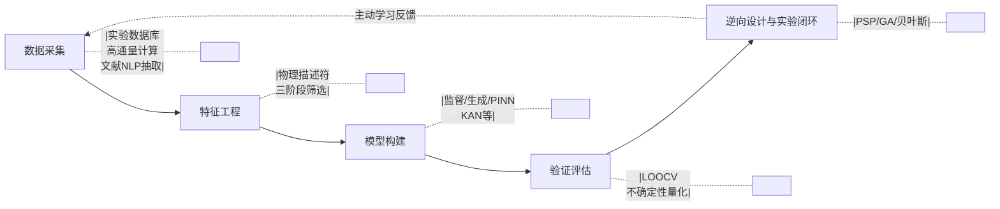

**第一环节是数据采集**。数据是机器学习方法的"原料"，其规模、质量与多样性直接决定模型的能力上限。当前可用的数据来源主要有三类：其一是实验数据库与文献整理数据，例如云南贵金属实验室团队构建的373组HEAs样本数据库[^2]；其二是高通量第一性原理计算数据，提供大规模一致性强的"虚拟实验"；其三是基于自然语言处理（NLP）从科学文献与专利中自动抽取的结构化数据，中南大学高温合金团队开发的"Superalloy-MatSciBERT"领域专用NLP模型即从超过五万份科研文献和专利中自动精准提取出135个高质量的γ′相溶解温度实验数据，构建了结构化高保真数据库[^6]。在数据规模有限的场景下，数据增强（data augmentation）技术成为关键，姜雁斌团队即采用数据增强机器学习设计出新型Cu-1.47Be-0.62Ni-0.1Mg合金[^3]；西工大黄河源团队则在仅 $1.75\times 10^4$ 量级的小规模数据集上完成了KAN网络的高精度映射学习[^4]。

**第二环节是特征工程**。在元素配比优化中，原始的元素摩尔分数往往不足以充分表达材料体系的物理特征，必须引入具有物理意义的描述符。云南贵金属实验室团队在硬度预测研究中采用三阶段特征筛选方法，从145个初始描述符中锁定11个关键特征，包括原子半径差（δr）、混合熵（ΔSmix）等[^2]。相关研究还进一步揭示了d-价电子浓度（e/a$_d$）、价电子浓度（VEC）和电负性差（Δχ）共同构成硬度的"三重调控开关"，其中当e/a$_d$<5.4时与硬度呈正相关，为后续设计提供了明确调控靶点[^2]。这类基于领域知识的物理描述符显著提升了模型的可解释性与外推能力。

**第三环节是模型构建**。该环节涉及监督学习、生成模型、物理信息神经网络等多种范式选择，将在1.4节深入展开。

**第四环节是验证评估**。在小样本场景下，留一法交叉验证（Leave-One-Out Cross-Validation, LOOCV）成为常用工具，云南贵金属实验室团队的SVR模型即通过LOOCV与测试集相关系数R均达到0.96的优异表现来验证泛化能力[^2]；西工大KAN模型则采用均方误差（MSE）作为核心指标，预测MSE仅为1%，相比传统多层感知器（MLP）模型计算效率提升超千倍[^4]。

**第五环节是逆向设计与实验闭环**。这是数据驱动范式相对于传统CALPHAD/DFT的革命性突破——通过对成分-性能映射模型进行反向求解，可直接从目标性能反推最优成分。云南贵金属实验室团队首创将主动搜索进程（PSP）框架融入逆向设计，在 $10^{78}$ 维空间中智能导航，仅评估约0.1%候选成分即锁定目标区域，实测制备的Cr₁₇.₇Fe₂₀.₉Ni₂₀.₂Ti₂₂.₂V₁₉.₀合金硬度达1177 HV，比原始数据集最高值提升15%[^2]。中南大学高温合金团队对345600种虚拟镍基合金成分进行了高通量筛选，综合考虑成本、密度、组织稳定性及工艺窗口等多重工程约束，最终设计出CSU-S1合金，在1100°C/137 MPa条件下蠕变寿命达224.7小时，铼含量仅为3.1 wt%，材料成本低至121美元/公斤[^6]。这些实证案例表明，端到端的全链条框架已不再是理论构想，而是已在多个材料体系中产生可验证的物理样件。

## 1.4 机器学习与深度学习核心范式的适用边界比较

机器学习并非单一技术，而是一族在数据规模、可解释性、外推能力上各具特性的算法集合。理解不同范式在材料配比优化中的适用边界，是科学选择技术路线的前提。下表系统对比了当前在该领域应用最广泛的几类核心范式。

| 模型范式 | 代表方法 | 典型数据规模 | 配比优化任务匹配度 | 可解释性 | 代表性证据 |
|---------|---------|------------|-----------------|---------|-----------|
| 监督学习—经典回归 | SVR、RF、XGBoost | 数十至数千样本 | 小样本性能预测最稳健 | 中（可SHAP分析） | HEAs硬度预测SVR R=0.96[^2] |
| 监督学习—深度网络 | MLP、CNN、CGCNN | 数千至数十万样本 | 大数据下高精度映射 | 低 | CGCNN材料性能预测精度达实验水平90%以上[^9] |
| 表示学习/自监督 | VAE自监督编码 | 中等样本+图像增强 | 微观组织→性能映射 | 中（潜变量解耦） | 西工大李金山团队潜变量呈现霍尔-佩奇规律[^11] |
| 生成式模型 | GAN、VAE | 中至大规模 | 新成分逆向生成 | 低 | Goodall等GAN实现二维材料逆向设计[^9] |
| 物理信息/新型架构 | PINN、KAN | 小规模即可 | 融合物理约束的小数据高精度 | 较高 | KAN在 $1.75\times 10^4$ 数据上MSE仅1%，效率提升千倍[^4] |
| 时序与时空模型 | LSTM、时空CNN | 序列数据 | 微观组织时空演化预测 | 低 | 西工大团队时空CNN长时外推显著优于LSTM[^11] |
| NLP辅助 | BERT类领域模型 | 文献语料 | 数据抽取与构建 | 中 | Superalloy-MatSciBERT从5万篇文献抽135条数据[^6] |

**监督学习**仍是当前最主流的范式。在数据稀缺的合金体系中（典型样本规模数百量级），SVR、RF等经典回归模型由于其良好的小样本性能和较强的抗过拟合能力而表现突出。云南贵金属实验室团队比较了SVR、RF等多种算法，最终选用SVR模型在留一法交叉验证与测试集上均达到R=0.96的优异表现[^2]。在数据规模较大、特征复杂时，深度神经网络（如CGCNN）则展现出更强的拟合能力，其预测精度可达实验测量水平的90%以上[^9]。

**表示学习与自监督编码**是应对小样本与高维结构数据的有效路径。西工大李金山教授团队针对微观组织-力学性能构效关系建立中"实验数据有限"的痛点，发展了基于变分自编码器（VAE）的自监督编码技术，通过图像增强和两步训练策略提取微观组织关键信息，相对于经典CNN模型在测试集上预测精度明显提升，且潜变量与屈服强度关系类似经典霍尔-佩奇规律，模型展现出良好的潜变量解耦能力[^11]。

**生成式模型**则在逆向设计场景中发挥独特作用。GAN与VAE通过学习已知材料的分布，可在分布支撑域内生成具有目标性能的新成分候选，Goodall等人利用GAN实现了从目标性能参数逆向设计新材料结构，在二维材料领域取得显著成功[^9]。此外，纳米材料合成领域综述也明确将GAN与VAE列为支持基于目标的结构生成与筛选的核心生成模型[^12]。

**物理信息神经网络（PINN）与新型可解释架构**是近年的重要突破方向。Kolmogorov-Arnold Network（KAN）通过引入可学习激活函数，突破了传统神经网络中固定函数的限制，西工大黄河源团队基于KAN构建几何参数与力学响应间的高精度映射，相比传统MLP预测均方误差仅为1%、计算效率提升超千倍[^4]。虽然该案例针对力学超材料的几何参数设计，但其方法论对元素配比优化中"小数据-高精度"的同类问题具有直接借鉴价值。

**自然语言处理辅助**虽非传统意义上的预测模型，但已成为打破数据瓶颈的关键工具。Superalloy-MatSciBERT展示了"NLP抽取数据—ML建模—高通量筛选—实验验证"的完整闭环，体现了多技术融合的协同价值[^6]。

综合而言，**没有任何单一范式适用于所有配比优化任务**。研究者需根据数据规模、性能映射的复杂度、可解释性需求与实验闭环成本，在上述范式中做出匹配选择，并越来越多地走向多范式融合的混合架构。

## 1.5 全局优化算法与物理计算方法的协同机制

仅有性能预测模型尚不足以完成配比优化任务——还需配合全局优化算法在巨大成分空间中进行高效搜索，并通过与CALPHAD/DFT等物理计算方法的协同来弥补纯数据驱动方法在外推能力与物理一致性上的不足。

**主动学习与贝叶斯优化**在小样本场景下的迭代寻优中扮演关键角色。其核心思想是不试图一次性收集所有数据，而是通过不确定性度量主动选择"信息增益最大"的下一个实验点，进而在最少实验次数下逼近最优解。这一思想在纳米材料综述中被概括为"数据获取—模型预测—实验验证"闭环系统，是新材料高效开发的强力工具[^12]。

**主动搜索进程（PSP）框架**则代表了在超大规模成分空间中智能导航的前沿方法。云南贵金属实验室团队首创将PSP框架融入HEAs逆向设计：首先建立成分-性能映射模型，然后通过PSP在 $10^{78}$ 维空间智能导航，仅评估约0.1%候选成分即锁定目标区域，仅用传统方法 $0.0001\%$ 的计算量即发现性能突破的合金成分[^2]。这一案例充分验证了"机器学习模型+智能搜索算法"的组合在超大规模空间探索中的可行性。

**多目标优化算法**则解决了配比优化中目标耦合冲突的问题。西工大黄河源团队结合KAN网络与遗传算法（Genetic Algorithm, GA）进行多目标全局优化，获得的Model III在−90°至90°多方向应力-应变响应中展现出极高一致性，最大误差从原始结构的2.28%降至0.0443%[^4]。这类基于帕累托前沿求解的优化算法（NSGA-II、MOPSO、GA等）在多性能协同优化场景中具有不可替代的价值。

**ML与CALPHAD/DFT的协同**是当前数据驱动与物理驱动方法走向一体化的重要趋势。在堆垛层错能（SFE）预测的研究中，研究者提出了**动态优化热力学参数**的策略：以Co-Cr-Ni三元为例，通过TEM实验和DFT数据建立参考SFE数据库，采用轴对称Ising模型计算初始ΔL参数，在定向搜索中每发现一个新目标合金（如SFE=25±2.5 mJ/m²）即用实验值更新局部ΔL参数，经3次迭代将RMSE从24.2 mJ/m²降至5.4 mJ/m²，将合金设计效率提升5倍以上[^8]。这一动态参数化策略实质上是用机器学习的"局部拟合"思想修正CALPHAD的"全局假设"缺陷，是物理-数据融合的典范。此外，DM21神经网络泛函通过机器学习优化交换相关能显著提升DFT计算精度[^9]，机器学习势函数（MLIP）也已被Acta Materialia列为综述焦点[^13]，均展现了ML加速DFT计算的潜力。

下表汇总了上述协同机制在配比优化各环节中的典型作用：

| 环节 | 关键方法 | 核心价值 | 代表性证据 |
|------|---------|---------|-----------|
| 高维空间智能导航 | PSP框架 | 仅评估0.1%候选即锁定最优 | HEAs硬度1177 HV突破[^2] |
| 多目标帕累托求解 | 遗传算法、NSGA-II | 多方向响应一致性最大化 | 各向同性NPR超材料Model III[^4] |
| 主动学习闭环 | 贝叶斯优化、不确定性采样 | 最少实验次数逼近最优 | 纳米材料"数据-模型-实验"闭环[^12] |
| 物理参数动态修正 | 局部CALPHAD ΔL优化 | RMSE 24.2→5.4 mJ/m² | Co-Cr-Ni SFE迭代优化[^8] |
| ML加速DFT | DM21、MLIP | 提升泛函精度与算力效率 | DM21神经网络泛函[^9][^13] |

综上，**数据驱动方法与物理计算方法并非替代关系，而是互补共生的一体化技术栈**。机器学习模型解决了高维非线性映射与小样本泛化问题；全局优化算法解决了在超大成分空间中的高效搜索问题；CALPHAD/DFT等物理方法则提供物理一致性约束与数据增强源。三者的协同正在塑造材料配比优化的新范式——从"经验驱动"经由"数据驱动"走向"知识—数据双驱动"的融合形态。

本章界定的问题本质、分析的传统范式局限以及构建的全链条技术框架，将作为后续章节的方法论参照。第2章将深入分析支撑该框架的数据基础设施；第3章将分体系考察不同材料中的具体应用；第4章将识别推动框架演进的代表性课题组与里程碑论文；第5至7章将分别从模型准确度、核心挑战与产业化转化的维度评估该框架的现实成熟度，最终回应用户对"距离理想模型大规模应用还有多远"这一核心问题的关切。

# 2 主流材料数据库与数据资源分析

第1章已论证：机器学习/深度学习在材料元素配比优化中的能力上限，从根本上受制于"数据采集"这一首要环节。无论是云南贵金属实验室在373组HEAs样本上训练SVR模型，还是中南大学高温合金团队从五万份文献中抽取135条γ′相溶解温度数据，其建模成败的第一道关卡都是"能否获得足够规模、足够干净、足够一致的数据"。本章承接全链条技术框架中的数据环节，系统梳理支撑配比优化研究的国际主流数据基础设施——从Materials Project、AFLOW、OQMD等以第一性原理计算为主的"虚拟实验"仓库，到NIMS MatNavi、MPDS等以实验测量与文献抽取为核心的"真实世界"数据库，再到Citrination、NOMAD、JARVIS等以FAIR原则与AI赋能为旨向的新型平台，比较其覆盖范围、数据规模、可访问性与适用场景。本章的目标并非简单罗列数据库清单，而是要回答三个对后续章节具有方法论意义的问题：**一是各类数据资源对元素配比优化任务的差异化支撑能力如何**；**二是高通量计算、实验测量、文献挖掘三类数据来源在精度结构上各自具有怎样的偏差谱**；**三是数据稀缺、偏差与特征不一致等共性瓶颈如何向下游模型性能传导**。这些分析将为第3章按材料体系比较应用现状、第4章评估代表性课题组研究路线、第5至7章衡量模型可信度与产业化距离提供数据侧的统一参照基线。

## 2.1 国际主流公开数据库的覆盖范围与定位

国际上支撑材料数据驱动研究的公开数据库经过近二十年的演化，已形成"以第一性原理计算为主、以实验数据为辅、以文献挖掘为补充"的多元生态。不同数据库在历史起点、学科取向、数据来源与收录规模上存在显著差异，理解这些差异是合理选择训练数据的前提。下表汇总了对配比优化研究最具支撑价值的八个代表性数据库的核心特征。

| 数据库 | 主导机构 | 数据来源主导类型 | 收录规模 | 核心覆盖范围 | 对配比优化的典型支撑 |
|--------|---------|---------------|---------|------------|------------------|
| AFLOW | Duke University（Curtarolo团队） | 标准化高通量DFT计算 | 350万+条目，4+百万化合物已映射至原型 | 无机晶体、合金原型、电子结构、弹性模量 | 大规模成分扫描、ML势函数训练、原型识别[^14][^15] |
| OQMD | Northwestern（Wolverton团队） | 高通量DFT（基于ICSD与常见结构装饰） | 近30万DFT总能计算 | 化合物形成能、相稳定性 | 形成能预测基准、热力学稳定性筛选[^16][^17] |
| Materials Project | LBNL（MIT、Berkeley联合） | 高通量DFT | 数十万级材料数据 | 晶体结构、电子性质、热力学稳定性、带隙 | 通过MPRester API支持元素组合查询与性能筛选[^18] |
| JARVIS | NIST | DFT+ML+实验+量子计算多模态 | 多属性、多模态多套数据集 | 二维材料、光电、力场、弹性、扫描隧道显微（STM）图像 | 提供AI/ES/FF/QC/EXP五类标准化基准[^19][^20][^21][^22] |
| NOMAD | Max Planck Society | 异源DFT计算汇聚（多软件、多泛函） | 世界最大规模材料计算数据汇聚库 | 多软件原始数据、FAIR元数据 | AI Toolkit支持Jupyter交互式数据挖掘[^23] |
| NIMS MatNavi | NIMS（日本物质·材料研究机构） | 实验测量+文献整理 | 子库矩阵：PoLyInfo（高分子）、AtomWork（无机）、SuperCon（超导）、Creep/Fatigue Data Sheets等 | 结构材料长时实验数据（蠕变、疲劳）、超导临界温度等 | 工程实验真值参照、长期服役行为数据[^24][^25] |
| MPDS（PAULING FILE） | MPDS团队/ASM International | 文献人工系统化抽取 | 约50万篇文献抽取，100万+条无机材料数据，7.5万张相图 | 晶体结构、物理性质、二/三/多元相图 | 相图与配比-性能事实数据、CALPHAD参考[^26][^27][^28] |
| Citrination/PIF | Citrine Informatics | 企业级数据平台（公开+私有） | PIF格式标准化数据集合 | 跨结构-功能材料 | 标准化数据交换、企业内部ML流水线[^29][^30] |

从规模量级看，**AFLOW以350万+条目位居首位**，其基于高通量标准化第一性原理计算覆盖了从二元到多元的广泛合金原型，AFLOW官方明确将"训练机器学习模型"与"指导实验合成"列为该数据库的核心使命之一[^14]。AFLOW-XtalFinder进一步将4+百万化合物映射到原型结构，并从AFLOW-ICSD目录中提取15,000个独特结构作为未来原型百科全书的种子，对配比优化中"成分相同但晶体原型不同"这一棘手问题提供了系统化处理工具[^31][^15]。

**OQMD则以近30万DFT总能计算和形成能基准的精度透明性著称**[^16][^17]。Kirklin等人发表的OQMD描述论文已被引用2167次（截至所引版本），是材料数据库领域引用量最高的论文之一[^17]。该数据库的独特价值在于：它不仅提供数据，还系统对比了1670个化合物的DFT形成能与实验值，得到平均绝对误差（MAE）为0.096 eV/atom；同时定量揭示出不同实验测量之间本身就存在0.082 eV/atom的MAE，这意味着DFT与实验间的"真实"差距远小于表观差距，为后续机器学习模型训练数据的精度上限提供了严肃的基准参照[^16][^17]。这一数据品质评估工作的意义远超数据库本身——它为整个领域定义了"DFT数据用于训练ML模型时应预期的精度天花板"。

**Materials Project与JARVIS则分别以易用性与多模态见长**。Materials Project涵盖晶体结构、电子性质、热力学稳定性等关键信息，其RESTful API已成为产学研使用最广泛的材料数据接口之一[^18]。JARVIS不仅提供DFT计算数据，还集成了人工智能模型、力场、量子计算、实验数据等五大类基准，并通过JARVIS-Leaderboard为社区提供可比性极高的标准化评测体系，覆盖原子结构、原子图像、光谱、文本等多种输入数据模态，是当前唯一同时贯通AI、ES、FF、QC、EXP五个维度的开放基准平台[^19][^20]。其下属基准已细化到"GaAs带隙预测的MAE"这种单一材料、单一性能的精确比较层级[^32]，为算法选型提供了细粒度证据。

**NIMS MatNavi代表了"以实验数据为核心"的另一条技术路线**。MatNavi自2003年4月由日本物质·材料研究机构（NIMS）公开运营，是世界最大级别的在线材料数据库，2010年7月完成系统重构，下设PoLyInfo（高分子）、AtomWork（无机材料）、SuperCon（超导材料）、Creep Data Sheet（蠕变）、Fatigue Data Sheet（疲劳）、CompES（电子结构计算）等十余个子库构成的矩阵[^24]。蠕变与疲劳子库提供的长时服役实验数据（如压力容器材料数据库、宇宙关联材料强度数据库）在工业级镍基高温合金、铁基耐热合金的配比优化中具有不可替代的工程参照价值[^24]。NIMS还在持续进化，于近年推出了**DICE（材料数据平台）**，将"创出—蓄积—活用"一体化处理，并与NIMS-ARIM（材料先端研究基础设施）打通，将全国25个机构的最先端共享设备所产出的材料数据系统收集和蓄积，提供具备DX与AI功能的材料专用云平台[^25]。

**MPDS（PAULING FILE）代表了"文献人工抽取"路线的极致**。MPDS团队明确指出，由于材料数据从科学出版物中提取这一任务"即便在今日仍无法完全自动化"，他们手工处理了物理、化学、材料科学、工程、地质等领域约50万篇文章[^26]。最终形成的MPDS涵盖合金、金属间化合物、陶瓷、矿物等全部无机物的结构、衍射、组成与本征性质数据，包含超过100万个实验与计算数据条目，相图数据库收录75,000+张二/三/多元相图并以每年1500张速度增长[^27]。其相图数据是CALPHAD建模与多元合金配比设计无可替代的核心资源。MPDS将数据组织为三类条目：S-条目（晶体结构）、P-条目（物理性质）、C-条目（相图），均具有持久标识符，便于与外部ML工具链集成[^28]。

**Citrination则代表了产业级数据平台的设计取向**——其API规范（基于OpenAPI/Swagger）、PIF（Physical Information File）标准化数据格式以及与pymatgen、DFT工具的转换组件（pif-dft），共同构建了企业内可复用的材料数据-机器学习管道[^29][^30]。

这些数据库的差异化定位决定了它们在配比优化研究中扮演不同角色：**AFLOW、OQMD、Materials Project适合作为大规模成分-性能映射模型的"海量训练样本"来源**；**JARVIS适合作为算法基准评测的"统一试金石"**；**NIMS MatNavi与MPDS则适合作为工程级真值与相图先验的"地面真相"**；**Citrination与NOMAD则连接私有数据与公开生态、强调FAIR与可复现性**。

## 2.2 数据库的可访问性与API生态

数据库的"可用性"远不止于"是否公开"，更涉及API设计、查询语法、数据格式标准化、许可协议与开发者工具链等多重维度。对机器学习配比优化而言，能否将数据库无缝接入自动化训练流水线，决定了研究规模化与可复现的现实可行性。

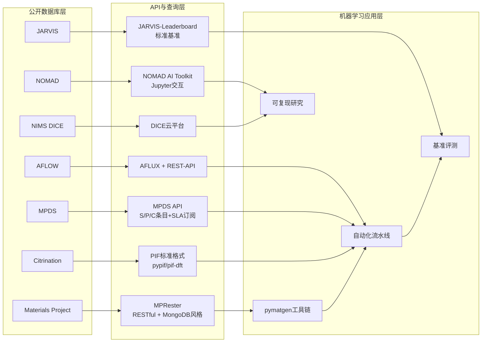

**Materials Project的MPRester是当前最为成熟的Python访问接口之一**。该接口基于RESTful协议，返回JSON格式的材料数据，并支持MongoDB风格的查询条件，使研究者可用如`m.query(criteria={"task_id":"mp-1234"}, properties=["final_energy"])`这样简洁的代码完成属性检索[^18]。其依赖于pymatgen库——材料基因组学的核心Python工具包，意味着用户可以在同一工具链内完成"结构读写—计算调用—数据库查询—ML建模"的全流程操作[^18]。这种"API+pymatgen"的组合大幅降低了配比优化中"成分扫描-性能批量提取-训练数据组装"的工程门槛。

**AFLOW提供了AFLUX与REST-API两套互补的程序化接口**。AFLUX定义了一套基于Matchbook语法的轻量化查询表达式（含Unary-Mute、Binal-Match等运算符），允许研究者通过URL直接表达"含某元素+某空间群+某性能区间"的复合检索；REST-API则提供完整的资源访问模型[^14]。AFLOW.org图形检索页面进一步降低了非编程背景研究者的访问门槛，例如可直接通过ICSD目录搜索"含至少一种卤素但不含硫族元素的材料中VRH剪切模量最高/最低者"——这一类查询正是合金配比优化所需的"约束-排序"操作[^14]。

**MPDS提出了独特的S/P/C三类条目数据模型**。所有MPDS条目被划分为晶体结构（S-）、物理性质（P-）、相图（C-）三类，每类具有持久标识符，便于跨论文、跨研究链接[^28]。其API采取SLA订阅制，但部分数据被开放免费访问，包括晶胞参数-温度图、晶胞参数-压力图、含Ag和K的所有化合物、所有氧的二元化合物以及全部由机器学习与第一性原理生成的数据[^28]。MPDS同时提供Jupyter notebooks和Binder交互演示，但官方明确警告"在Binder等第三方环境中使用API密钥可能存在安全风险，应高度谨慎"——这一坦率提示也反映了产业级数据资源在"开放与安全"间的取舍[^28]。值得注意的是，MPDS还开源了`mpds-ml-labs`项目，作为"用相对简单的统计模型从大型MPDS数据集学习物理性质预测"的概念验证，直接以基于`POSCAR`/`CIF`的随机森林回归器展示了数据-ML的衔接路径[^33]。

**Citrination的PIF（Physical Information File）格式代表了产业界对标准化的尝试**。Citrine Informatics通过`pypif`提供了PIF的Python读写工具包，并通过`pif-dft`实现了VASP等DFT代码到PIF的格式转换，使得不同来源数据可在统一格式下流通[^29]。其API规范托管于GitHub，采用ReDoc与SwaggerUI两种文档界面提供master/release/develop三套版本，体现了产业级API版本管理的成熟实践[^30]。

**NOMAD AI Toolkit是FAIR数据原则在材料领域最显著的工程化落地**。该工具包基于Web浏览器中运行的Jupyter notebook，可对NOMAD Archive中央服务器上的FAIR数据进行交互式AI分析，也支持本地数据与NOMAD Oasis本地服务器场景[^23]。NOMAD AI Toolkit的设计哲学强调"将材料科学的可复现性提升到新水平"——研究者不仅可以共享论文背后的数据，还能共享所有开发的方法与分析工具，其他用户可以重现已发表结果，也可以修改Jupyter notebooks以服务于自己的研究[^23]。这一模式对配比优化研究中"数据-代码-模型一体化"的可复现需求具有重要价值。

**JARVIS-Leaderboard通过标准化基准重塑了AI模型评测**。JARVIS-Leaderboard是一个开源、社区驱动的平台，允许用户设定带有自定义任务的基准并贡献数据集、代码与元数据，覆盖AI、ES、FF、QC、EXP五个材料设计大类；对AI部分，它支持原子结构、原子图像、光谱、文本等多种输入模态[^19]。基准颗粒度可细到针对单一材料的单一属性——如"GaAs带隙预测的MAE"基准，纵向比较了VASP+TBmBJ、GPAW+GLLBSC、QE+PBE、QMCPACK+DMC、VASP+PBE在MP/AFLOW/OQMD配置下、VASP+optB88vdW以及TB3模型等多种方法的精度差异[^32]，这种细粒度基准对算法选型的指导价值远高于粗略对比。

**NIMS DICE平台与NIMS-ARIM则代表了数据获取与共享的国家级基础设施**。DICE作为"材料数据平台"，从材料数据的创出、蓄积到活用一体化处理，提供世界最大规模的高品质材料数据库以及具备DX与AI功能的材料专用云平台[^25]。NIMS-ARIM则将共享设备使用所产生的材料数据进行系统收集与蓄积——这一"设备共享-数据共享"的二元设计是日本应对材料数据稀缺与分散的国家战略[^25]。

API生态的繁荣对配比优化研究的意义在于：**它将"数据获取"从研究瓶颈转化为可自动化的工程环节**。研究者无需手工抓取、清洗、对齐数据，而可以将数十万级样本的批量获取、特征提取、训练集组装通过几十行代码完成，从而将精力集中在算法创新与物理验证上。这一基础设施的成熟，是机器学习方法能够在过去十年快速渗透材料科学的关键前提条件。

## 2.3 三类数据来源的方法论比较

无论数据库的载体形态如何，配比优化所用的数据本质上来自三个根本来源：**高通量第一性原理计算、实验测量、文献与专利的NLP抽取**。三类来源在覆盖广度、物理一致性、采集成本、噪声特征上各有结构性差异，理解这些差异是合理选择训练集与评估模型可信度的前提。

| 维度 | 高通量DFT计算数据 | 实验测量数据 | 文献/专利NLP抽取数据 |
|------|----------------|-------------|------------------|
| 代表性载体 | OQMD、AFLOW、Materials Project、JARVIS-DFT | NIMS MatNavi、MPDS-P条目、企业私有数据 | Superalloy-MatSciBERT、MPDS人工抽取、公司NLP流水线 |
| 单点采集成本 | 中（CPU机时为主） | 高（实验耗时数日至数年） | 低（自动化抽取后） |
| 覆盖广度 | 极广（可程序化扫描成分空间） | 较窄（受限于实验制备能力） | 广（受限于文献既有报道） |
| 物理一致性 | 高（同一泛函下高度自洽） | 高（真实物理过程） | 中低（不同来源条件不一） |
| 与实验真值偏差 | OQMD MAE 0.096 eV/atom（实验间MAE 0.082 eV/atom）[^16][^17] | 真值参考（但实验间也存在偏差） | 受文献正向结果偏差影响 |
| 主要噪声来源 | 泛函近似、伪势选择、k点采样 | 仪器误差、样品差异、测试条件 | 抽取错误、单位错乱、上下文歧义 |
| 适合的下游建模任务 | 大规模成分扫描、形成能预测、ML势函数 | 工程级性能映射、长时服役预测 | 数据增强、稀缺属性补全 |

**第一性原理计算数据的核心优势是"程序化覆盖广度"**。OQMD近30万条DFT总能、AFLOW 350万+条目、Materials Project数十万级数据，都不可能通过实验获取——它们以可控的算力代价实现了对成分空间的"虚拟扫描"，这种规模是训练深度神经网络（如CGCNN、MEGNet等图神经网络）所必需的样本基础[^16][^17][^14][^18]。然而，DFT数据并非"真值"。OQMD描述论文系统比较了DFT预测与1670个化合物的实验形成能，得出MAE为0.096 eV/atom；同时考察实验间偏差本身就达到0.082 eV/atom，**这意味着DFT与实验之间剩余的纯方法误差可能仅在0.02 eV/atom量级**——这是一个对配比优化建模具有重要意义的发现：**用DFT数据训练的ML模型的精度上限，本质受限于实验测量本身的不确定性，而非DFT方法的局限**[^16][^17]。

JARVIS-Leaderboard对GaAs带隙预测的横向基准则显示了不同DFT实现的精度差异：VASP+TBmBJ、GPAW+GLLBSC、QE+PBE、QMCPACK+DMC、各DFT配置（基于MP、AFLOW、OQMD不同参数集）以及TB3模型在该基准上的MAE差异显著[^32]——这说明即便是"同为DFT数据"，不同泛函与计算设置下的数据并非可直接合并使用，跨数据库迁移时必须考虑系统性偏差。NOMAD的价值正在于其"汇聚多软件、多泛函原始数据"，使研究者可以显式比较不同泛函组合的精度结构[^23]。

**实验测量数据是物理真值的最终参照，但成本与覆盖度构成根本约束**。NIMS的Creep Data Sheet、Fatigue Data Sheet提供了数十年累积的长时服役实验数据，对镍基高温合金等结构材料的工程化配比优化具有不可替代价值[^24]。然而，这类数据的采集需要长达数千小时甚至数万小时的高温试验，成本高昂，覆盖的成分点数有限。MPDS团队对此作出独特贡献：通过对50万篇文献的人工系统化处理，将分散在文献中的实验数据汇聚为100万+条目、7.5万张相图的可检索数据库[^26][^27]。这种"以文献为媒介间接获取实验数据"的路径，在精度上虽低于直接实验，却提供了远超单一实验室所能企及的覆盖广度。

**文献与专利的NLP挖掘数据是第三条独立路径，近年因预训练语言模型的进步而异军突起**。第1章已介绍的Superalloy-MatSciBERT典型案例——从超过五万份科研文献和专利中自动精准提取出135个高质量γ′相溶解温度实验数据——展示了NLP路径的两个核心特征：**一是数据获取效率的非线性放大**（人工抽取一篇文献需要分钟至小时量级，自动化后可在秒级完成）；**二是抽取产出与文献规模呈高度不对称关系**（5万篇文献仅抽出135条高质量数据，反映了科学文献中有效结构化数据的稀疏性）。MPDS则代表了"先人工后自动"的混合路径——其团队明确承认"目前这一任务仍无法完全自动化"，但通过半自动化已经处理了约50万篇文章[^26]。

NLP路径的核心局限在于**抽取数据继承了原始文献的偏差**。学术发表的"成功案例偏向"使得文献中以"性能优越的合金成分"过表达，而失败配比则少有报道；不同实验室的测试条件、样品制备工艺等元数据往往不全；NLP模型本身的抽取错误（数值、单位、上下文）也会引入噪声。因此NLP数据更适合作为已有数据的增强源，而非主导训练集。

**三类数据的最佳实践是组合使用**。云南贵金属实验室在HEAs硬度预测中使用了373组样本——其规模显然不可能仅靠任何单一来源，而是实验数据库与文献抽取的综合；中南大学高温合金团队的工作流则更具典范性：**Superalloy-MatSciBERT从文献抽取γ′相溶解温度数据 → 训练ML性能预测模型 → 对345600种虚拟成分进行高通量筛选 → 实验合成验证CSU-S1合金的1100°C/137 MPa蠕变寿命达224.7小时**——这一闭环融合了NLP抽取、ML建模、虚拟高通量、实验验证四个环节，是三类数据来源协同的现实样板。从方法论上看，**第一性原理计算提供"广度"，实验数据提供"真度"，NLP抽取提供"补丁"**，三者互补而非替代构成了配比优化数据生态的完整图景。

## 2.4 数据质量评估与基准体系

数据规模的扩张并不必然意味着模型性能的提升——若数据质量参差、原型混淆、单位错乱、跨库重复，反而会引入系统性偏差并削弱模型可靠性。因此，**配比优化研究中的数据质量评估与基准体系建设，正成为与算法创新同等重要的基础工作**。

**AFLOW-XtalFinder代表了数据库内部去重与原型识别的方法论突破**。AFLOW.org仓库中4+百万化合物已通过XtalFinder映射到其理想原型，并从AFLOW-ICSD目录中提取出按出现频次排序的15,000个独特结构，作为未来"原型百科全书"的种子[^31][^15]。XtalFinder通过对称性、局部原子几何与晶体映射技术的联合应用，能够实现四个层次的判别：**(i) 区分独立的晶体原型与原子装饰；(ii) 判别等价的自旋构型；(iii) 揭示具有相似性质的化合物；(iv) 引导未探索材料的发现**[^31]。对配比优化而言，XtalFinder解决了一个具体而棘手的问题——同一成分（如某Ti₅₀Ni₅₀合金）在不同温度、压力或合成路径下可能形成不同晶体结构，若训练数据将其混作一项，模型将无法学习到"成分→结构→性能"这一关键链条；XtalFinder通过将所有4+百万化合物程序化映射到原型，为训练集筛选提供了原型一致性保障[^31][^15]。

**JARVIS-Leaderboard代表了多模态、多任务标准化基准的最新实践**。其评测体系覆盖五个材料设计类别——人工智能（AI）、电子结构（ES）、力场（FF）、量子计算（QC）、实验（EXP）——并对每一类别提供丰富子基准[^19][^20]。仅在AI类别下，JARVIS-Leaderboard就提供了形成能、带隙、弹性张量（C11、C44）、体模量Kv、剪切模量Gv、表面能、空位形成能、晶格常数、平衡体积、能量上凸壳（ehull）、介电与压电张量、磁矩、最大电场梯度、Seebeck系数、功率因子、热容、SLME、Spillage、卤化物钙钛矿HSE/PBE分解能与带隙、CHIPSFF数据集子任务等数十个细粒度基准[^21]。这种"按属性、按数据集分割、按方法分类"的三维基准矩阵，使任何新算法都可以在与既有方法完全可比的条件下接受评测——**这恰是配比优化中"模型选型"的根本依据**。

JARVIS-Leaderboard的设计理念明确指出：**"严格的可复现性与验证性的缺失是科学发展在多个领域的重大障碍，材料科学尤其包含多种实验和理论方法，需要审慎的基准评测"**[^19]。该平台允许用户以数据集、代码、元数据三类形式贡献——这种"数据-代码-元数据三位一体"的贡献模式，正是FAIR原则在评测领域的具体落实[^19]。

**OQMD的形成能基准是配比优化领域最具影响力的精度参照**。Kirklin等人通过比较DFT预测与1670个化合物的实验形成能（截至所引版本，这是DFT与实验形成能间最大规模的比较），得出表观MAE为0.096 eV/atom；同时分析多源实验测量本身的偏差为0.082 eV/atom，**揭示出DFT与实验间表观差异中相当大一部分应归因于实验本身的不确定性**[^16][^17]。这一基准对配比优化研究具有两层意义：**一是为相稳定性筛选提供了可信度边界（凡基于DFT形成能的相图预测，必须意识到约0.1 eV/atom量级的内禀误差）**；**二是为机器学习模型的"过拟合判定"提供了天然标尺（任何号称在DFT训练集上达到远低于0.02 eV/atom MAE的ML模型，都需警惕是否实际超越了数据本身的物理真度）**。

**JARVIS-STM则展示了基准体系向多模态扩展的最新方向**。该团队基于DFT构建了716种二维材料的扫描隧道显微（STM）图像数据库，并训练CNN模型从STM图像中识别五种Bravais晶格类型，演示了从图像数据到结构信息的高通量分析路径[^22]。这一工作虽不直接服务于配比优化，但为"将实验显微图像作为数据源"的范式扩展提供了基准示范——未来若将EBSD、SEM、TEM等显微图像系统纳入训练数据，配比优化将可能从"成分→宏观性能"扩展到"成分→微观组织→性能"的多模态闭环。

总体看，**当前数据质量评估与基准体系正从"单一数据库内部"走向"跨数据库标准化"**。AFLOW-XtalFinder解决了同一数据库内部的原型一致性，JARVIS-Leaderboard解决了同一任务在不同方法间的横向可比性，OQMD的精度对比则提供了纵向（DFT vs 实验）的精度结构透视。这套基准体系是配比优化研究"从论文到产业"的必要基础设施——没有可比的基准，就没有可信的"哪个模型更好"的答案，也就没有可靠的产业选型依据。

## 2.5 共性数据瓶颈及其对模型性能的传导

尽管数据基础设施已显著进步，配比优化领域的数据生态仍存在四类共性瓶颈，它们直接传导到下游模型的预测精度、外推能力与逆向设计可信度。

**第一类瓶颈是数据稀缺，特别是体现在特定材料体系的小样本困境**。第1章已论及，云南贵金属实验室的HEAs硬度预测仅基于373组样本，中南大学高温合金团队从五万份文献中仅能抽取135条γ′相溶解温度数据，西工大力学超材料研究使用的数据集量级也仅为 $1.75\times 10^4$。NIMS MatNavi下属的SuperCon超导数据库虽已成为该领域权威，但实际可用于配比-临界温度建模的样本量同样有限[^24]。这种稀缺并非偶然——高熵合金、镍基单晶、新型超导体等前沿体系本身存在的合成-表征成本壁垒决定了数据增长速率远低于模型对样本量的指数级需求。**稀缺数据向模型性能的传导路径**主要表现为三方面：**一是训练-测试集划分时的统计不稳定**，使得交叉验证结果对随机种子敏感；**二是模型容量受限**，深度网络容易过拟合而被迫退回浅层模型；**三是外推能力不可保证**，模型在训练集分布外的成分点几乎无可信预测。第1章介绍的KAN（在 $1.75\times 10^4$ 数据上MSE仅1%）、VAE自监督编码、迁移学习、数据增强等手段，正是对这一传导链的直接回应。

**第二类瓶颈是数据偏差，包括ICSD稳定相过表达、文献正向结果偏差与泛函系统差异**。OQMD作为"基于ICSD与常见结构装饰的高通量计算"，其训练数据自然偏向于已合成、已验证的稳定相，而对亚稳态、缺陷结构、非平衡相的覆盖严重不足[^16][^17]——这意味着基于OQMD训练的模型在预测"常规合金"时表现可能极佳，而面对快速凝固金属玻璃、定向凝固单晶、增材制造非平衡组织时则可能系统性失准。文献正向结果偏差进一步加剧这一问题：研究者倾向于发表"性能优秀的合金成分"，使NLP抽取的数据集天然地缺乏"失败案例"——而对配比优化的逆向设计而言，"哪些成分必然失败"与"哪些成分可能成功"同等重要。不同泛函（PBE、LDA、TBmBJ、OptB88vdW、HSE等）间的系统性偏差则在JARVIS-Leaderboard的GaAs带隙基准中清晰展现[^32]：**直接合并不同泛函的训练数据会导致模型学习到"虚假的方法依赖性"而非真实的物理规律**。

**第三类瓶颈是特征不一致，涉及元素描述符、晶体结构表征与性能测试条件的跨库不可比性**。在元素描述符层面，不同研究者可能选用不同的原子半径定义（共价半径、金属半径、Goldschmidt半径）、不同的电负性体系（Pauling、Allred-Rochow、Mulliken）、不同的VEC计算约定，使得在云南贵金属实验室体系中表现优异的"11个关键描述符"未必能在其他HEAs研究中直接复用。在晶体结构表征层面，AFLOW的Prototype Encyclopedia、Materials Project的pymatgen Structure类、MPDS的S-条目、Citrination的PIF采用了不同的内部表征——这正是Citrination开发`pif-dft`、AFLOW开发XtalFinder的根本动因[^29][^31]。在性能测试条件层面，蠕变寿命的"1100°C/137 MPa"与"1050°C/150 MPa"测试条件下数值不可直接比较，疲劳数据的应力比R、表面状态、试样尺寸等元数据若缺失，跨数据集合并将引入难以估计的噪声——这正是NIMS Creep Data Sheet、Fatigue Data Sheet将试验条件作为数据条目核心字段的原因[^24]。

**第四类瓶颈是元数据缺失与工艺-组分耦合信息丢失**。材料的实际性能不仅取决于元素配比，更取决于热处理制度、变形历史、冷却速率、表面状态等工艺变量；而当前主流公开数据库主要记录"成分-性能"对，对工艺变量的覆盖严重不足。NIMS-ARIM试图通过"将共享设备使用所产出的材料数据系统收集"来解决这一问题——其理念是只有掌握了制备过程的全套元数据，材料数据才真正具备复现与建模价值[^25]。然而，从国际范围看，工艺-组分耦合数据的开放共享仍处早期阶段。这一缺失向模型性能的传导是隐蔽而深刻的：**它意味着即便配比相同的两个样本，性能可能因工艺差异显著不同；将这两个样本不加区分地纳入训练集，模型将学到一个"工艺平均化"的成分-性能映射，对任何特定工艺路线的预测都将失准**。

下表归纳了四类瓶颈及其对配比优化下游模型的具体传导路径与现有应对手段：

| 瓶颈类型 | 典型表现 | 对模型的传导效应 | 现有应对手段（详见第1章相关讨论） |
|---------|---------|---------------|-------------------------------|
| 数据稀缺 | HEAs 373组、γ′相135条、超材料 $1.75\times 10^4$ | 过拟合风险、外推不可信、CV不稳定 | KAN小样本架构、VAE自监督、迁移学习、数据增强 |
| 数据偏差 | ICSD稳定相过表达、文献正向偏差、泛函差异 | 亚稳态预测失准、逆向设计假阳性、跨库迁移失效 | 多源数据融合、不确定性量化、PINN物理约束 |
| 特征不一致 | 描述符约定差异、结构表征异质、测试条件元数据缺失 | 跨研究复用受阻、特征工程主观性强 | PIF标准化格式、AFLOW-XtalFinder原型映射、JARVIS-Leaderboard基准统一 |
| 元数据缺失 | 工艺变量、热历史、表面状态等丢失 | 工艺平均化偏差、特定路线预测失准 | NIMS-ARIM设备-数据一体化、DICE平台、动态CALPHAD参数修正 |

值得强调的是，这四类瓶颈并非孤立存在，而是相互耦合放大。数据稀缺往往伴随偏差（少量数据更易反映特定实验室或泛函偏好），偏差又被特征不一致放大（不同特征体系在偏差数据上的表现进一步发散），元数据缺失则使前三类问题难以诊断与修正。**这意味着配比优化研究的可信度并非由"最强模型"决定，而由"最薄弱的数据环节"决定**——这一认识对后续章节评估模型外推能力、产业化距离具有基础性意义。

具体到逆向设计场景，数据瓶颈的传导更为严峻。第1章所述的PSP框架在 $10^{78}$ 维空间智能导航并最终锁定Cr₁₇.₇Fe₂₀.₉Ni₂₀.₂Ti₂₂.₂V₁₉.₀合金硬度1177 HV的成功案例，其物理意义在于"已被实验验证"；但若将类似框架直接外推到训练集分布之外的稀有元素体系，预测可信度将急剧下降。这正是为什么主动学习闭环、动态CALPHAD参数修正、PINN物理约束这些方法在小样本场景下不可或缺——**它们不是单纯的算法技巧，而是对数据稀缺与偏差的直接补偿**。

综合本章分析可以得出三个对后续章节具有方法论意义的结论。**第一，数据基础设施已经从单一公开数据库进化为"AFLOW/OQMD/MP级大规模计算库 + NIMS/MPDS级实验事实库 + Citrination/NOMAD级标准化平台 + JARVIS-Leaderboard级基准评测体系"四层架构**，这一架构在规模与可访问性上已基本满足学术级配比优化研究的需求，但在私有数据共享、工艺元数据完备性方面仍是产业化的明显短板。**第二，三类数据来源（高通量计算、实验测量、文献NLP抽取）各有不可替代的价值，最佳实践是"广度+真度+补丁"的协同组合**——这一原则在第3章不同材料体系的应用案例与第4章代表性课题组的研究路线中将反复体现。**第三，数据稀缺、偏差、特征不一致、元数据缺失四类共性瓶颈，是制约配比优化模型从论文走向产业的根本性数据障碍**，第5章将从模型准确度评估角度量化这些瓶颈的传导后果，第6章将系统讨论应对方案，第7章则将基于此评估当前领域的TRL等级与产业化距离。

# 3 典型材料体系下的模型应用现状

第1章构建的"数据—特征—模型—验证—逆向设计"全链条框架与第2章梳理的多层数据基础设施，为机器学习/深度学习介入材料配比优化提供了通用方法论与数据支撑。然而，**方法论的普适性并不等于应用的同质性**——不同材料体系因其物理本质、性能目标、数据可得性与产业紧迫度的差异，在ML渗透深度、模型架构选择、实验验证强度上呈现出截然不同的图景。本章承接前两章的方法论与数据视角，转向"应用侧"的横向剖析，按照结构合金（钢铁、铝、镁、镍基）→ 功能合金（高熵合金、形状记忆合金、金属玻璃）→ 功能材料（电池、催化、超导、Heusler化合物）的层次依次展开，逐一比较各体系的核心优化目标、典型模型架构、代表性性能突破与方法论特色，并在最后一节进行跨体系横向比较，为第4章识别活跃课题组、第5章评估模型准确度、第7章评估产业化距离提供分体系的横切证据基础。

## 3.1 钢铁与铁基合金的蠕变断裂强度建模

钢铁与铁基合金作为现代工业最大宗的结构材料，其配比优化的核心矛盾在于"长时高温服役性能与化学成分-工艺参数-微观组织的复杂耦合"。9-12% Cr铁素体-马氏体合金（FMA）与奥氏体不锈钢由于在高温发电工业中的广泛应用而备受关注；这类材料的设计要"获得高强度且服役寿命延长的钢，必须深入理解长时性能（如蠕变断裂强度、断裂寿命）作为化学组成与工艺参数的函数，而后者又决定了微观组织特征"[^34]。

针对这一典型耦合问题，研究者发展了**可解释机器学习辅助的蠕变断裂强度预测模型**，将9-12%Cr FMA与奥氏体不锈钢的蠕变断裂强度基于精心整理的实验数据集进行参数化建模[^34]。该工作的方法论价值在于将化学成分（C、Cr、Mo、W、V、Nb等）、工艺参数（热处理温度、回火条件等）与微观组织特征通过可解释模型耦合，使得模型不再是黑箱预测器，而能够辅助研究者识别哪些成分-工艺组合主导了长期服役性能。该论文在文献中已被引用34次，反映了铁基耐热合金这一传统工业领域对可解释ML方法的持续关注[^34]。

钢铁体系的ML渗透在数据基础设施层面具有独特优势：第2章已述的NIMS Creep Data Sheet与Fatigue Data Sheet积累了数十年的长时（数千至数万小时）服役实验数据，为该体系提供了其他材料体系难以企及的"地面真相"。**这一数据沉淀使得钢铁与铁基合金在ML配比优化中扮演了"工程级真值参照"的特殊角色**——其模型预测的蠕变寿命、断裂强度可与权威实验数据直接对比验证，从而在产业化路径上具有先天优势。

## 3.2 铝合金体系的多目标配比优化

铝合金体系的ML应用呈现出**目标多样化与算法多元化并行**的特征，从耐热铝合金的高温抗拉强度优化、7XXX系合金的应力腐蚀开裂（SCC）抗性提升，到Al-Zn-Mg-Cu系合金的加速设计，覆盖了多种工业关键场景。

**铸造耐热铝合金的高温力学性能优化**是该体系最直接的应用场景。Hao等人在 *Materials & Design* 上报道的工作针对300°C与350°C下极限抗拉强度（UTS）的最大化目标，将实验方法与机器学习相结合，**最终选用AdaBoost算法作为最优模型**[^35]。实验结果显示机器学习模型预测与实验真值的偏差仅为7.75%，R²达到0.94，验证了模型的高精度[^35]。更具科学价值的是该研究的可解释性发现：**Al₉FeNi与Al₃Ni相被识别为提升铸造耐热铝合金高温力学性能的关键强化相**[^35]。这一结果将"配比"与"强化相"通过ML建立起直接关联，为后续合金成分设计提供了明确的物理靶点，体现了第1章所强调的"基于领域知识的物理描述符显著提升模型可解释性"原则的直接落地。

**7XXX系铝合金的SCC抗性优化**则展示了高效全局优化（Efficient Global Optimization, EGO）在小样本配比设计中的优越性。Cao等人在Al-Zn-Mg-Cu系合金中应用了三种不同策略的对比研究，结果发现**EGO方法的表现优于响应面优化方法，且远优于随机方法**[^36]。最终设计出的Al-6.05Zn-1.46Mg-1.32Cu-0.13Zr-0.02Ti-0.50Y-0.23Ce合金（命名为EGO合金）展现出最佳的SCC抗性[^36]。慢应变速率拉伸（SSRT）实验进一步验证：在单时效与双时效处理下，EGO合金的I_SCC均低于传统7N01合金；XRD、SEM与EDS分析揭示了稀土元素在EGO合金中形成了Al₈Cu₄(Y, Ce)与Al₂₀Ti₂(Y, Ce)四方相，这些稀土相对SCC抗性提升起到了关键作用[^36]。该案例的方法论意义在于：**EGO作为一种基于贝叶斯优化思想的全局搜索策略，在数据稀缺的合金设计场景中显著优于传统响应面与随机方法**——这与第1章所述的"主动学习/贝叶斯优化通过不确定性度量主动选择信息增益最大的实验点"的范式高度吻合。

**Al-Zn-Mg-Cu合金的快速设计系统ARDS**则代表了该体系算法多元化的最新进展。上海交通大学Juan等人提出了基于机器学习的合金快速设计系统（Alloy Rapid Design System, ARDS），分别采用线性回归（LR）、支持向量回归（SVR）和反向传播神经网络（BPNN）三种回归算法训练多性能预测模型，**其中SVR模型被证明表现最佳**[^37]。ARDS的独特之处在于其**受生成对抗网络（GAN）算法启发**而构建——既可"为目标性能定制制备策略"，也可"按制备策略预测合金性能"，实现了正向预测与逆向设计的双向能力[^37]。这一双向能力恰恰呼应了第1章所述的"成分→性能"与"性能→成分"双向映射的方法论价值。

下表汇总了铝合金体系三类典型工作的核心特征：

| 研究目标 | 模型架构 | 核心性能指标 | 关键发现/产出 |
|---------|---------|-----------|-------------|
| 耐热铝合金300/350°C UTS最大化 | AdaBoost | 预测偏差7.75%，R²=0.94 | 识别Al₉FeNi、Al₃Ni为关键强化相[^35] |
| 7XXX铝合金SCC抗性优化 | EGO（高效全局优化） | I_SCC低于7N01合金 | 设计含Y/Ce稀土EGO合金，形成Al₈Cu₄(Y,Ce)等强化相[^36] |
| Al-Zn-Mg-Cu加速设计 | LR/SVR/BPNN（SVR最佳）+GAN启发 | 多性能同时预测与逆向定制 | ARDS系统支持双向映射[^37] |

铝合金体系ML应用的整体特征是**"算法选型多样化、强化相可解释性识别、稀土微合金化设计与SCC等多目标优化并行"**，相比钢铁的单一长时性能侧重，铝合金更体现ML在多目标配比优化中的灵活性。

## 3.3 镁合金多组元配比与轻量化设计

镁合金作为最轻的金属结构材料（纯镁密度仅约1.74 g/cm³），其配比优化的核心驱动力来自轻量化与新能源汽车、3C产业的迫切需求。然而，相对于钢铁、铝合金、镍基高温合金，**镁合金体系当前的ML渗透深度明显偏低，仍以实验+经验主导的多组元配比设计为主**。

重庆大学谭军教授团队在Mg-Al-Zn-Cu-Ce多组元合金（MCAs）上的最新工作即典型反映了这一现状[^38]。研究背景明确指出："镁合金存在强度低、刚度小（纯镁弹性模量仅约44 GPa）、塑性变形能力差的短板，严重限制其规模化应用"，而轻质多组元合金通过"以镁为基体、添加多种合金化元素形成大量硬质第二相"实现强度、刚度与硬度的提升[^38]。该研究通过同步调整Al、Cu和Ce的含量调控Al₃CuCe相的形成，制备了两种新型轻质Mg-Al-Zn-Cu-Ce多组元合金并进行热挤压处理[^38]。

最终的C0.5合金实现了**性能协同突破**：极限抗拉强度346 MPa、屈服强度312 MPa、断后伸长率11.7%（相比C1合金的6.7%几乎翻倍），弹性模量达60.08 GPa，密度仅2.17 g/cm³[^38]。强化机制方面，**Orowan强化与热错配强化被揭示为核心机制**，通过细化微米级Al₃CuCe、MgZnCu相及纳米级MgZnCu相大幅提升合金力学性能[^38]。该研究还特别强调了低稀土含量带来的成本优势："C0.5合金稀土元素含量低、成本优势显著，且热挤压工艺易规模化应用，适配汽车、航空航天、3C等领域轻量化需求"[^38]。

需要客观指出的是，该工作虽然在性能上实现了协同突破，但**其研究路径仍以实验设计、第二相调控与微观组织表征为主，机器学习元素并未居于核心位置**——这反映了镁合金体系当前的真实状态：**多组元配比优化的物理机制研究领先于ML建模的渗透深度**。重庆大学的另一组研究者周小元、甘立勇、陶晓萍团队在Mg-Sn、Mg-Bi、Mg-Sb三大合金体系镁离子电池负极材料（详见3.8节）的工作中，则将机器学习预筛选与高通量第一性原理计算深度耦合[^39]——这显示出**镁合金的ML渗透在功能化方向（电池负极）显著快于结构化方向（轻量化合金）**的内部分化趋势。

镁合金作为基础结构材料体系的ML建模相对滞后，与其数据基础设施薄弱直接相关：缺乏类似NIMS Creep Data Sheet的长期服役数据库、第二相种类繁多且工艺敏感性高、稀土含量与成本约束的耦合复杂——这些因素共同决定了该体系当前更适合"实验主导+ML辅助"而非"ML主导"的研究模式。这一现状对第7章评估产业化距离具有重要参考价值：**ML渗透深度的体系间差异本身就是评估配比优化整体成熟度的关键指标**。

## 3.4 镍基高温合金的智能配比设计

镍基高温合金作为航空发动机涡轮叶片、燃气轮机热端部件的核心材料，其配比优化面临**"多组元（10-15元素）、多目标冲突（强度-塑性-蠕变-密度-成本）、长时服役性能验证耗时"**的三重挑战。第1章已介绍了中南大学高温合金团队基于Superalloy-MatSciBERT NLP抽取与高通量筛选的CSU-S1合金案例（1100°C/137 MPa蠕变寿命224.7小时、铼含量仅3.1 wt%、成本121美元/公斤），本节进一步剖析机器学习与多目标进化算法（MOEA）耦合的另一典型范式。

发表于 *Materials & Design* 的Ni基高温合金智能设计工作[^40]系统展示了**"机器学习+多目标进化算法+热力学模拟数据"的三元协同范式**。该研究的核心创新在于："基于热力学模拟数据，提出了机器学习与多目标优化的综合策略以加速Ni基高温合金的成分设计"[^40]。具体路径包括三个关键环节：**第一，通过Pearson相关性分析与领域知识联合确定微观参数**（如γ′相溶解温度、γ′体积分数、TCP相含量等）作为影响拉伸强度与延伸率的关键因素[^40]；**第二，采用多目标进化算法（MOEA）在精心构建的代理模型空间中搜索最优解**[^40]；**第三，对预测的Ni基高温合金候选成分进行实验验证**，结果显示"实验性质与预测高度一致"[^40]。

最终该研究筛选出的Ni基高温合金候选材料同时具备**"高γ′溶解温度、高γ′体积分数、低TCP相含量"**三个关键微观特征——这恰是高温合金设计中的经典"不可能三角"，因为提高γ′体积分数往往伴随TCP脆性相的增多，而ML+MOEA的耦合恰恰提供了在帕累托前沿上同步优化多个冲突目标的能力[^40]。

该研究的方法论意义可归纳为三点：**一是验证了"以热力学模拟数据训练ML模型"作为热力学参数化与数据驱动建模的桥梁**——CALPHAD虽然存在第1章所述的全局参数化精度局限，但其作为大规模一致性数据来源仍可作为ML训练的有效起点；**二是体现了"领域知识先验+统计相关性"双重特征筛选原则**，这与第2章所述的"特征工程依赖领域知识"是同一原则的具体落地；**三是展示了"实验验证闭环"对ML模型置信度的关键意义**——只有经过实验验证的预测，才能从"高拟合"走向"可信泛化"。

结合第1章CSU-S1案例的"NLP抽取+ML+高通量筛选+实验验证"路径与本节MOEA案例的"热力学模拟+ML+多目标进化+实验验证"路径，**镍基高温合金体系展示了ML配比优化在高价值结构材料中较为成熟的应用模式**——这一成熟度与该体系的产业化压力（航空发动机国产化、降铼降钴）紧密相关，为第7章评估产业化路径提供了重要范本。

## 3.5 高熵合金的相结构预测与逆向设计

高熵合金（HEAs）由于其超过 $10^{78}$ 量级的成分组合空间与稳定相结构难以预测的物理本质，成为**机器学习配比优化最活跃的"试验场"**。该体系的ML研究呈现两条并行的主流路线：贝叶斯主动学习耦合神经网络的小数据高效相预测，与PSP框架在巨型空间中的智能逆向导航。

**第一条路线以贝叶斯主动学习实现样本效率突破**。Sulley等人在 *Scripta Materialia* 上的工作[^41]即是典型代表："采用贝叶斯优化形式的主动学习与神经网络模型，以高效探索HEAs庞大成分空间，重点预测其稳定相"[^41]。该研究取得了两项标志性的样本效率突破：**第一，通过将数据采集聚焦于不确定性区域，仅用实验HEA数据集（2198个五元HEAs）的27%，即获得了与随机森林模型用80%完整数据集训练时（94.6%）相当的95%测试精度**[^41]；**第二，仅用CALPHAD数据集（664650个五元HEAs）的2%，相位预测测试精度即超过96%，与XGBoost用近全数据集训练时97%以上的精度可比**[^41]。

这两个数字背后蕴含的方法论意义极为深远：**主动学习相对于随机采样实现了约3倍（实验数据）至50倍（CALPHAD数据）的样本效率提升**。对配比优化研究而言，这意味着在实验成本高昂的真实场景下，主动学习可以将所需实验样本量降低一到两个数量级——这正是第1章所述"数据获取-模型预测-实验验证闭环系统"在HEA体系的具体落地。"我们的方法极大促进了HEA设计空间的计算与实验探索"[^41]。

**第二条路线以PSP（主动搜索进程）框架实现逆向设计的工程突破**。第1章已介绍云南贵金属实验室基于PSP框架在 $10^{78}$ 维空间中智能导航，仅评估约0.1%候选成分即锁定目标区域，最终实测Cr₁₇.₇Fe₂₀.₉Ni₂₀.₂Ti₂₂.₂V₁₉.₀合金硬度达1177 HV的案例。这一案例与Sulley等人的主动学习工作互为补充：**前者侧重"在已知性能映射下高效搜索最优成分"，后者侧重"在最少数据下学到可靠的相分类器"**——共同证明了HEA体系在算法层面的成熟度。

**描述符工程在HEA体系展现出较高的统一性**。第1章已介绍云南贵金属实验室的三阶段特征筛选从145个初始描述符锁定11个关键特征，包括原子半径差（δr）、混合熵（ΔSmix）以及d-价电子浓度（e/a_d）、价电子浓度（VEC）和电负性差（Δχ）等"三重调控开关"。这些描述符已成为HEA研究的"通用语言"，跨越不同课题组、不同算法被反复使用——这种描述符层面的标准化，是HEA体系作为方法论领先体系的另一个重要证据。

**HEA体系的方法论意义远超其本身**。其超大成分空间倒逼出的样本效率突破（贝叶斯主动学习）、智能搜索框架（PSP）、统一描述符体系（VEC、Δχ、e/a_d等），都对其他配比优化体系形成方法论辐射。这正是为什么本章将HEA单独成节、并在3.12节将其归类为"方法论领先体系"的根本原因。

## 3.6 形状记忆合金的自适应设计闭环

形状记忆合金（SMA）的配比优化代表了**"实验-模型紧耦合主动学习"的范式典范**。Xue等人发表于 *Nature Communications* 的工作[^42]在NiTi基SMA低热滞ΔT优化任务中，提供了实验闭环主动学习的最经典样本。

该研究的核心命题是寻找具有极低热滞（ΔT）的NiTi基形状记忆合金，研究者采取了"自适应设计策略与实验紧密耦合，可以通过顺序识别下一组实验或计算来加速发现过程，从而有效导航复杂搜索空间"[^42]。具体方法论上，"我们的策略使用推断与全局优化以平衡搜索空间的利用与勘探之间的权衡"[^42]——这正是贝叶斯优化中"exploitation-exploration trade-off"的核心思想。

实证结果具有重大示范意义：**研究者从约80万成分的潜在空间出发，经过9轮反馈循环，仅合成与表征36个预测组分，其中14个表现出比原始数据集中22个样本更小的ΔT，最终发现Ti₅₀.₀Ni₄₆.₇Cu₀.₈Fe₂.₃Pd₀.₂合金的ΔT仅为1.84 K**[^42]。这一案例的方法论价值可从三个维度解读：

**第一是样本效率的极致体现**——36个实验在80万候选空间中仅占0.0045%，却找到了远超原始数据集最优值的成分；**第二是反馈循环的可行性证明**——9轮反馈循环在工业研发周期内完全可行，证明了实验闭环主动学习并非纯理论构想；**第三是发现率的统计显著性**——36个预测中有14个超越原始数据集最优值，发现率约38.9%，远高于试错法常见的个位数百分比命中率。

SMA案例对其他配比优化任务的方法论辐射体现在：**任何具有"实验成本中等、性能可量化、反馈周期可控"特征的配比优化任务**，都可以采用类似的自适应设计闭环。这一范式与第1章所述的"主动学习反馈"环节、第7章将讨论的"自动化实验闭环（Self-Driving Labs）"产业化路径形成了直接的方法论传承关系。

## 3.7 金属玻璃的玻璃形成能力与塑性失稳预测

金属玻璃（MG，又称非晶态合金）是利用现代冶金技术将金属合金熔体快速凝固、防止其在冷却过程中结晶而制备的新型合金材料[^43]。这类材料"与传统的晶体型合金材料相比，具有优越的机械、物理和化学性能，在材料、工程、能源、国防和航空航天等领域得到了广泛的应用"[^43]。然而，**金属玻璃的低温塑性等问题仍然是限制其应用的瓶颈**[^43]——这一瓶颈的物理根源在于"金属玻璃材料结构的长程无序性和复杂性，现有的材料理论无法准确描述和理解金属玻璃的结构以及它们在外场下如何失稳"[^43]，这使得新型高性能金属玻璃的开发仍面临巨大挑战。

正是这种"长程无序结构难以用传统理论描述"的物理本质，反而**使MG成为机器学习方法独特价值的展示场域**。江苏科技大学吴义成博士与北京计算科学研究中心管鹏飞教授团队合作发表于 *Acta Materialia* 的工作即典型代表：该研究"系统地研究了金属玻璃塑性失稳的结构起源，**受机器学习软度模型的启发，提出了密度涨落模型（density-fluctuation model）**，该模型具有优异的塑性事件预测能力"[^43]。

这一工作的方法论意义体现在**ML不仅作为预测工具，更作为物理模型构建的灵感来源**——"机器学习软度模型"启发了密度涨落模型的提出，将原本依赖大量数据训练的黑箱ML软度概念转化为具有清晰物理意义的密度涨落理论。这种"ML→物理模型反向启发"的路径，是MG体系对ML方法论的独特贡献。吴义成博士"一直致力于材料数据挖掘、机器学习以及金属玻璃性能开发方面的科研工作，多篇学术论文在Scripta Materialia、Science China Materials等一区Top期刊上发表"[^43]，反映了该方向已形成稳定的研究队伍。

虽然本章可获得的MG-ML研究案例相对有限，未能完整覆盖玻璃形成能力（GFA）、关键温度（Tg、Tx）等典型预测任务的最新进展，但密度涨落模型的案例已足以说明：**MG体系在ML配比优化中扮演的角色，是"用数据驱动方法解析传统理论失效区域的物理机制"——其价值不在于工程产业化，而在于物理理论的扩展**。这一定位将在3.12节横向比较中被明确归类为"物理挑战领先体系"。

## 3.8 电池正极、负极与固态电解质的高通量筛选

电池材料体系是**ML配比优化产业相关性最强的功能材料领域之一**，其链式工作流（"稳定性—电导率—界面—成本"多目标筛选）涵盖了正极、负极与固态电解质三类核心组分。

**镁离子电池合金负极的高通量设计**展示了"机器学习预筛选+高通量第一性原理+多维性能评估"的链式工作流。重庆大学周小元、甘立勇、陶晓萍团队联合潘复生院士团队等在 *Acta Materialia* 上发表的工作[^39]针对镁离子电池金属镁负极在循环中易形成致密钝化层的关键瓶颈，开发了一套结合分步稳定性筛查与电子性质评估的组合式高通量策略[^39]。研究聚焦于Mg-Sn、Mg-Bi、Mg-Sb三大合金体系，**通过机器学习辅助结构搜索系统研究了613种不同成分的合金，并逐级完成了相稳定性、机械稳定性与热力学稳定性的严格筛选**[^39]。在此基础上，团队进一步评估了**"延展性、理论容量、导电性、镁亲和性、抗钝化能力及镁离子扩散势垒"六大关键指标**，最终筛选出综合性能突出的镁离子电池合金负极候选材料Mg₇Sb[^39]。该工作的链式工作流——从613种候选→分步稳定性筛查→六大指标评估→Mg₇Sb锁定——是ML与高通量第一性原理协同的典范，"为镁电池负极材料的设计提供了新的优选方案"[^39]。

**固态电解质Li₁₀GeP₂S₁₂的Ge原子替代设计**则展示了基于化学式的ML模型在固态电池界面稳定化中的应用。华中科技大学徐东伟副教授团队在 *Journal of Energy Chemistry* 上的工作[^44]针对LGPS对锂金属阳极化学稳定性较差的关键挑战，设计了系统的Ge原子替代筛选流程。**关键创新在于：为了避免确定Ge原子替代化学相空间晶体结构，采用了基于化学式的增强模型DopNetFC来预测整个化学相空间的离子电导率**[^44]。这一方法直接呼应了Na等人在 *npj Computational Materials* 上提出的DopNet架构原意——"准确预测掺杂材料的材料性质，通过显式独立嵌入主体材料与掺杂剂"[^45]，DopNet在ZT预测上的MAE为0.06，显著优于现有方法[^45]。

DopNetFC将化学式编码按掺杂浓度分解为主材料编码和掺杂成分编码，经编码器训练映射为一维特征向量后输入全连接层预测，**最终筛选得到新型固体电解质Li₁₀SrP₂S₁₂（LSrPS）**[^44]。验证结果显示：LSrPS锂离子电导率达12.58 mS cm⁻¹（不低于原始LGPS），同时LSrPS/Li界面拥有更大的肖特基势垒（0.13 eV）、更小的电子转移区域（3.10 Å）以及更强的阻挡额外电子的能力[^44]。该工作的方法论价值在于**将基于化学式的ML模型扩展到固态电解质这一晶体结构信息有限的研究领域**，作者明确指出"基于机器学习模型DopNetFC的原子替代筛选流程可以扩展到其他领域"[^44]。

**高镍三元（NCM/NCA）正极的产业落地**则展示了配比优化与产业链布局结合的另一面。高镍三元材料按照镍、钴、锰的比例分类，涵盖NCM333、NCM523、NCM622、NCM811、NCA等多种型号，其中"镍元素能够显著提升电池的容量，锰元素为电池的安全性保驾护航，钴元素扮演稳定专家角色保障电池循环性能"[^46]。宁德时代将三元锂电池能量密度做到500 Wh/kg，比现有电池提升40%以上，高镍三元材料在其中功不可没[^46]；NCM产品正"朝着9系超高镍方向大步迈进，克容量有望达到215 mAh/g左右"[^46]。需要指出的是，高镍三元的实际配比优化在产业实践中仍以**"经验+实验+大规模产线验证"的传统模式为主导**，ML的渗透更多体现在材料筛选、容量衰减预测等单点环节，而非端到端的成分设计——这一现状与镁合金体系的状况类似，反映了**结构与功能材料中ML渗透深度的产业化"成熟度梯度"**。

下表汇总了电池材料三类典型应用的方法论特征：

| 应用方向 | 研究/产业主体 | 模型架构 | 数据规模/筛选量 | 关键产出 |
|---------|------------|---------|-------------|---------|
| Mg-离子电池合金负极 | 重庆大学周小元等团队 | ML预筛选+高通量DFT+多指标评估 | 613种合金成分[^39] | Mg₇Sb候选材料锁定 |
| 固态电解质LGPS掺杂 | 华中科技大学徐东伟团队 | DopNetFC（基于化学式增强模型） | 化学相空间筛选[^44] | LSrPS（12.58 mS/cm，界面稳定）|
| 高镍三元NCM/NCA正极 | 宁德时代等产业链[^46] | 经验+实验+部分ML辅助 | 产业级量产 | NCM811、NCM9系，500 Wh/kg能量密度 |

电池材料体系的整体方法论特征是**"链式多目标筛选 + 实验/工艺紧耦合 + 产业化压力大"**，这使得该体系成为3.12节横向比较中"产业相关性领先"的典型代表。

## 3.9 催化材料中的主动学习与组合空间筛选

催化材料的成分空间庞大度与电池材料相当甚至更高，**高熵氧化物（HESOs）作为同一格位被五种及以上金属等概率占据的化合物**，从15种过渡金属中选择5种来形成HESO时即可产生高达30,827种组合的可能性[^47]。这种"万花筒"般的多样性使得传统试错研发模式效率低下，亟需高效的主动学习策略。

清华大学王训教授团队与美国普渡大学、上海交通大学等团队合作在 *JACS* 上发表的工作[^47]提供了主动学习在催化剂筛选中的标杆案例。研究者基于主动学习（AL）策略，**从14443种潜在组合中成功筛选出了4种高性能的高熵尖晶石氧化物**[^47]。最具说服力的是性能数据：**在水煤气变换反应中，这些高熵氧化物的产氢性能高达251 μmol g⁻¹ h⁻¹，显著优于传统铂（Pt）基贵金属催化剂氧化铝负载铂（Pt/γ-Al₂O₃）的135 μmol g⁻¹ h⁻¹，以及铜锌铝氧化物（Cu/ZnO/Al₂O₃）商业催化剂的81 μmol g⁻¹ h⁻¹**[^47]——产氢性能相对Pt基商业催化剂提升约86%、相对CuZnAl基催化剂提升约210%。

该工作不仅展示了筛选效率，更**结合第一性原理计算揭示了这些材料的合成规律**[^47]，使主动学习的成果不仅停留在"发现"层面，更上升到"理解"层面。论文明确指出主动学习"为有效地探索广阔的催化剂空间提供了一种新颖的方法，不仅能够捕获复杂的结构-性能关系，还可识别具有功能性的材料"[^47]。

催化材料体系ML应用的方法论意义在于：**它将主动学习从HEA、SMA等结构合金体系成功迁移到了功能材料体系**，验证了主动学习作为一种"成分空间智能导航的元方法"具有跨体系普适性。同时，催化剂性能（如产氢速率）与商业基准（Pt/γ-Al₂O₃、Cu/ZnO/Al₂O₃）的直接对比，使得"性能突破"具有清晰的产业可比性——这一点优于结构合金中"实验室单点性能突破"难以与商业牌号直接对比的局限。

## 3.10 超导材料的深度学习临界温度预测

超导材料是另一类**"传统理论失效区域"成为数据驱动方法独特价值场域**的典型体系。超导现象自1911年被发现以来已被广泛研究，但室温超导的可行性仍未知；"对于强关联系统的超导转变温度Tc，理论与计算方法都难以预测，而高温超导正是从这类系统中涌现"[^48][^49]。新型超导体的探索仍主要依赖专家经验与实验试错，**"在某项研究中，候选材料中仅3%表现出超导性"**[^48][^49]——这一极低的命中率为ML介入提供了强烈动机。

**第一类代表性工作是Konno等人提出的"reading periodic table"深度学习模型**。该工作"报告了第一个用于发现新超导体的深度学习模型"[^48][^49]，方法论上"以一种允许深度学习模型学习的方式表示周期表，并学习元素的规律"[^49]。**仅使用材料的化学组成信息，研究者就在超导体数据库的Tc预测上获得了R²=0.92的高精度**[^48][^49]。该模型展现了三项标志性成果：**第一，深度学习方法可以以62%的精度预测某材料的超导性，证明了模型的有用性**；**第二，该模型发现了未被收录在超导体数据库中的近期新超导体CaBi₂**；**第三，从2008年之前的训练数据中，该模型发现了2008年才被发现的铁基高温超导体**[^48][^49]——后两项成果具有"时间外推"的科学说服力，证明了模型不仅能拟合已知数据，还能在分布外或时间未来的样本上有所发现。

**第二类代表性工作是Gashmard等人在 *Scientific Reports* 上的最新基准**[^50]。该研究"采用SuperCon数据集作为最大规模的超导材料数据集"，经过多步骤数据预处理后得到包含13022个化合物的清洁DataG数据集[^50]。方法论创新方面，**研究者应用了新颖的CatBoost算法，并开发了名为Jabir的特征工程包生成322个原子描述符，同时设计了创新的混合方法Soraya包用于从特征空间中选择最关键的特征**[^50]。最终该工作取得了**R²=0.952、RMSE=6.45 K的成绩，优于此前文献报道的水平**[^50]。

下表对比了超导Tc预测两类代表性工作：

| 指标 | Konno等人[^48][^49] | Gashmard等人[^50] |
|------|------------------|-----------------|
| 数据来源 | 超导体数据库（仅化学组成） | SuperCon经清洗的13022化合物（DataG） |
| 模型架构 | 深度学习+周期表表示 | CatBoost+Jabir（322描述符）+Soraya特征选择 |
| 主要指标 | R²=0.92 | R²=0.952，RMSE=6.45 K |
| 标志性发现 | 62%精度预测超导性，发现CaBi₂、铁基超导体 | 优于此前文献报道的精度水平 |

两类工作的对比反映了**超导ML研究从"开创性范式建立"（Konno）走向"基准水平提升"（Gashmard）的演化轨迹**。值得注意的是，超导Tc预测的精度天花板仍较低（R²约0.95，RMSE约6 K）——这与第2章所述的"DFT与实验间剩余的纯方法误差仅在0.02 eV/atom量级"形成了鲜明对照：**超导这一强关联系统的内禀复杂性使其ML预测精度的提升空间相对有限**，但即便R²=0.92的"中等精度"也已显著优于传统试错的3%命中率，体现了ML方法在该体系的独特价值。

## 3.11 Heusler化合物等功能晶体的高通量发现

Heusler化合物作为"具有热电与自旋电子学应用吸引人物理性质的金属间化合物"[^51]，其设计的核心难题在于晶体结构辨识——"这些性质的提升需要晶体结构知识，而Heusler化合物存在三种细微变化（Heusler、inverse Heusler与CsCl型结构），通过衍射技术难以、有时甚至无法区分"[^51]。

Oliynyk等人在 *Chemistry of Materials* 上的工作[^51]训练了一个机器学习模型来发现Heusler化合物，构建了所谓的"Heusler discovery engine"。**该模型相比替代方法表现卓越，对超过40万个候选体系（无任何结构输入）做出了快速可靠的Heusler vs 非Heusler预测**[^51]。模型的量化指标极为出色：**真阳性率达0.94，假阳性率仅0.01**[^51]——这种高真阳性、低假阳性的组合在40万级候选筛选中尤为珍贵，意味着"几乎不会漏掉真正的Heusler化合物，同时几乎不会误报非Heusler化合物为Heusler"。

模型的应用价值在两个维度展现：**一是数据清洗——通过标记晶体学数据库中存疑的条目辅助数据库治理**[^51]；**二是新材料发现——研究者将模型应用于AB₂C公式的候选体系，预测了12种新型镓化物MRu₂Ga和RuM₂Ga（M=Ti-Co）作为Heusler化合物，并通过实验确认**[^51]。其中一员TiRu₂Ga展现了诊断性的超晶格峰，**确认了其采用有序Heusler结构而非无序CsCl型结构**[^51]——这一实验验证使得ML预测从"统计正确"上升到"具体物质级别正确"。

Heusler案例的方法论意义在于：**它展示了ML在"晶体结构层面"而非仅"成分-性能层面"的高通量筛选能力**。配比优化的最终目标不仅是找到正确的成分比例，还包括确认该配比对应的稳定晶体结构——Heusler工作恰恰填补了这一环节。同时，0.94真阳性/0.01假阳性的双指标体系为后续配比优化研究的"分类质量评估"建立了高标杆。

## 3.12 跨体系应用现状的横向比较与成熟度评估

经过3.1至3.11节的分体系剖析，可以从**数据规模、模型架构选择、优化目标复杂度、实验验证深度、产业相关性**五个维度对各材料体系的ML渗透程度进行系统性横向比较。下表汇总了核心证据：

| 材料体系 | 典型数据规模 | 主导模型架构 | 优化目标复杂度 | 实验验证深度 | 产业相关性 | 综合定位 |
|---------|-----------|-----------|------------|----------|---------|--------|
| 钢铁/铁基合金 | NIMS长时实验数据（数千-万小时尺度） | 可解释回归模型 | 蠕变断裂强度+服役寿命（耦合工艺）[^34] | 工程级真值参照 | 极高（电力工业大宗） | 产业相关性领先 |
| 铝合金 | 中等规模实验+模拟 | AdaBoost、SVR、BPNN、EGO[^35][^36][^37] | 高温UTS、SCC抗性、多目标 | 多个实验验证案例 | 高（航空汽车) | 产业相关性领先 |
| 镁合金 | 实验主导，ML渗透有限 | 第二相调控+经验设计[^38] | 强度-塑性-刚度协同 | 实验主导 | 中高（轻量化） | ML渗透滞后 |
| 镍基高温合金 | NLP抽取+热力学模拟（135-345600量级） | ML+MOEA、NLP+高通量[^40] | γ′/TCP/拉伸/延伸多冲突 | CSU-S1等实验验证 | 极高（航空发动机） | 方法论与产业并重 |
| 高熵合金（HEA） | 27%/2%数据（2198/664650量级）[^41] | 贝叶斯主动学习、PSP框架、神经网络 | 相结构+硬度+多元素配比 | 多个硬度突破实验 | 中（前沿探索为主） | 方法论领先 |
| 形状记忆合金（SMA） | 36个实验/80万空间[^42] | 自适应设计+贝叶斯优化 | 热滞ΔT单目标 | 9轮实验闭环验证 | 中（精密器件） | 方法论领先 |
| 金属玻璃（MG） | 受长程无序结构限制 | ML软度模型→密度涨落[^43] | 塑性失稳+GFA | 物理机制验证 | 中（特殊应用） | 物理挑战领先 |
| 电池材料 | 613合金/化学相空间[^39][^44] | ML预筛选+高通量DFT+DopNetFC | 稳定性-电导率-界面-成本链式 | Mg₇Sb、LSrPS等 | 极高（新能源） | 产业相关性领先 |
| 催化材料 | 14443组合空间[^47] | 主动学习+DFT揭示规律 | 析氢/产氢活性+稳定性 | HESO实验+性能对标商业Pt基[^47] | 极高（能源化工） | 方法论与产业并重 |
| 超导材料 | SuperCon→13022化合物[^48][^49][^50] | 深度学习+CatBoost+特征工程 | Tc单目标但物理复杂 | 时间外推CaBi₂、铁基超导[^48][^49] | 中（前沿物理） | 物理挑战领先 |
| Heusler化合物 | 40万+候选[^51] | 二分类ML | Heusler结构判别 | 12种MRu₂Ga实验确认[^51] | 中（热电/自旋电子） | 方法论领先 |

基于该比较表，可归纳三类**应用现状定位**：

**第一类是"方法论领先体系"**，包括HEA、SMA、催化材料、Heusler化合物。这类体系的共同特征是：**成分空间巨大或高度复杂，使得传统试错完全不可行，反过来催生出最先进的ML方法论创新**——HEA体系的贝叶斯主动学习样本效率突破、SMA的9轮反馈闭环、催化材料的14443→4筛选效率、Heusler的0.94/0.01双指标。这些方法论创新的辐射价值远超体系本身，构成了ML配比优化研究的"算法发动机"。

**第二类是"产业相关性领先体系"**，包括钢铁/铁基合金、铝合金、电池材料。这类体系的共同特征是：**已有成熟的工业基础与大宗市场需求，ML渗透在产业链关键节点（蠕变寿命预测、SCC抗性、电池能量密度）取得了直接经济价值**。其方法论创新或许不如第一类显赫，但每一个性能百分点的提升都对应着可观的产业回报——这正是第7章评估产业化距离时最直接的考察对象。

**第三类是"物理挑战领先体系"**，包括金属玻璃、超导材料。这类体系的共同特征是：**传统物理理论在该体系局部失效，使得ML不仅作为预测工具，更作为物理理解的辅助手段**——MG的密度涨落模型受ML软度模型启发、超导Tc预测在强关联系统中突破62%发现率限制。这类体系的ML研究价值不在于直接产业化，而在于物理理解的深化与潜在重大发现的可能性。

需要指出的是，**镍基高温合金作为"方法论与产业并重"的双领先体系，是配比优化领域最具代表性的"成熟样板"**：既有Superalloy-MatSciBERT等NLP创新与MOEA等算法创新，又有航空发动机国产化的迫切产业需求与CSU-S1等实验验证的工业级合金。这一双重领先地位使得镍基高温合金成为第7章产业化距离评估的关键参照系。

镁合金作为"ML渗透滞后"的对照案例同样具有方法论意义：它提示我们**ML的渗透深度并不简单地由产业规模决定，更取决于该体系数据基础设施的成熟度、第二相机制的复杂性、工艺敏感性等多重因素的综合**。镁合金体系强度-塑性-刚度协同的物理机制研究目前仍领先于ML建模渗透[^38]，这一现状为第6章讨论"特征工程依赖领域知识"等核心挑战提供了反面证据。

综合本章分体系剖析与跨体系横向比较，可得出三点对后续章节具有方法论意义的结论：

**第一，ML/DL在材料配比优化中的应用已不再是单一体系的孤立尝试，而是覆盖结构合金、功能合金、非晶合金、电池/催化/超导/功能晶体等几乎全部材料门类的系统性渗透**——但渗透深度在体系间存在显著梯度。这一梯度本身就是评估"配比优化领域整体成熟度"的关键指标。

**第二，方法论创新与产业相关性形成了"两翼"格局**——HEA、SMA、催化等方法论领先体系不断输出新算法，钢铁、铝合金、电池等产业相关性领先体系不断验证算法的工程价值；而镍基高温合金这类双重领先体系则成为两翼汇合的"成熟样板"。这一格局对第4章识别活跃课题组（方法论派 vs 产业派 vs 双重派）具有直接指导意义。

**第三，无论体系如何，"实验闭环验证"始终是从"高拟合"走向"可信泛化"的关键关口**——SMA的9轮反馈、催化的商业基准对比、镍基高温合金的1100°C/137 MPa蠕变验证、Heusler的TiRu₂Ga超晶格峰确认，无一例外地通过实验验证将ML预测落地为可信的物理样件。这一原则将在第5章模型准确度评估、第6章核心挑战分析、第7章产业化距离评估中反复体现，构成贯穿全报告的方法论主线。

# 4 全球活跃研究课题组、代表性论文与里程碑成果

第1至第3章已分别从方法论框架、数据基础设施与分体系应用现状三个维度，构建了机器学习/深度学习介入材料元素配比优化的完整图景。然而，**任何方法论的成熟与应用的落地，最终都依赖于具体研究主体的持续推动**——是哪些课题组、哪些公司、哪些里程碑论文在塑造这一领域的演化轨迹？哪些团队代表了方法论创新的前沿？哪些团队正在将算法转化为可信的工业产品？这些研究主体之间的合作网络与路线分化，又如何映射出领域整体的演化逻辑？本章承接前三章的方法论与应用视角，转向**研究主体与里程碑成果的系统识别**，按照"北美方法论旗舰 → 欧洲物理融合标杆 → 中国多元化布局 → 产业化初创/企业团队 → 顶级期刊里程碑矩阵 → 研究范式三条演化轨迹"的层次依次展开，为第5章模型准确度评估、第6章核心挑战分析与第7章产业化距离评估提供研究主体侧的证据基础。

## 4.1 北美方法论旗舰课题组：从系统设计到生成式逆向

北美在材料配比优化领域拥有最早形成体系化方法论的旗舰课题组，其研究路线在过去二十余年间深刻塑造了"材料基因工程"的全球范式。这些团队的共同特征是：**既扎根于具体材料体系的深度问题，又将方法论提炼为可跨体系迁移的通用框架**，构成了北美在该领域的方法论"产能"。

**Northwestern大学G. B. Olson团队**是材料基因工程与系统设计范式最早的奠基者之一。该团队主导的CHiMaD（Chicago Hub for Industrial Materials Design）将"Systems Design Charts"作为方法论核心，强调"该框架可应用于任何材料体系"，并通过Use-Case Group协作机制连接不同研究小组的进展。CHiMaD材料设计研讨会的目标包括"为每个Use-Case Group/项目开发材料摘要、开发系统设计图、利用这些工具识别当前研究的优势与不足、明确与会者在材料设计与开发中的角色"，长期目标则是"以工具、模型或实验向与会者全面阐释其材料体系的完整图景"[^52]。这种以"系统设计图"为通用语言的协作方法论，对镍基高温合金、特种钢的计算辅助设计具有奠基意义，并通过其商业化分支QuesTek Innovations（详见4.4节）将系统设计方法论延伸至产业实践。

**MIT的Rafael Gomez-Bombarelli团队**则代表了从分子到材料的生成模型路线辐射。该团队近期发表于Nature Chemistry的工作针对Duchenne肌营养不良症（DMD）治疗中PMO药物递送难题，**开发了将实验化学与人工智能结合的系统方法，发现无毒、高活性的细胞穿透肽（CPP）以协助PMO进入细胞核**[^53]。Gomez-Bombarelli明确指出："用计算机提出新的肽并不难，判断它们好不好才是难点。关键的创新是使用机器学习将肽的序列、特别是包含非天然氨基酸的肽，与实验测量的生物活性联系起来。"该工作的方法论意义对配比优化具有直接借鉴价值：**通过混合匹配57种不同肽构建600种微蛋白文库（每种均与PMO相连），在单个实验室、同一台机器、同一个人产生的数据满足"机器学习一致性的黄金标准数据集"**[^53]。这种"为机器学习量身定制实验数据"的理念，恰恰回应了第2章所述"数据偏差与元数据缺失"的核心瓶颈。该团队还突破了传统one-hot编码对非天然氨基酸的局限，将模型扩展到处理"人体中天然存在的20种氨基酸之外、用于药物开发的氨基酸扩展包"——这一从分子到材料的方法论延展，对配比优化中处理稀有/非常规元素具有跨域启示。

**MIT的Elsa Olivetti团队**则在合成参数NLP抽取与逆向无机材料设计方向取得标志性进展。Kim等人发表于Chemistry of Materials的工作明确指出："过去几年，材料基因组计划（MGI）在能源存储、催化、热电、储氢等领域产生了大量计算设计材料案例，以及用于筛选潜在变革性化合物的大规模数据资源。**高通量材料设计的瓶颈因此转移到了材料合成**，这促使我们开发了一种利用自然语言处理技术自动汇编上万篇学术出版物中材料合成参数的方法论"[^54]。该团队展示了对超过1.2万份手稿中各种金属氧化物合成条件的考察，并应用机器学习方法预测合成所需的关键参数。**这一工作的核心洞察——"瓶颈已从计算设计转移到合成"——直接定义了配比优化领域当前阶段的关键问题域**。Olivetti团队的另一项里程碑工作是Pan等人提出的**深度强化学习用于逆向无机材料设计**：该方法"可以识别具有指定性质与可合成性约束的有前景化合物，模型学习了电荷与电负性中性等化学准则，同时保持化学多样性与独特性"，并展示了多目标RL方法可生成具有目标形成能、体/剪切模量与较低烧结温度合成目标的新化合物[^55]。这一工作明确将"配比优化"与"可合成性"作为联合目标，标志着RL方法正式进入材料逆向设计的前沿阵地。

**Northwestern的Wolverton团队**则在数据基础设施层面贡献巨大。第2章已述OQMD近30万DFT总能计算与基于1670个化合物的形成能MAE=0.096 eV/atom基准——这一基准为整个领域的数据精度参照奠定了基础，是Wolverton团队对方法论领域的根本性贡献。

四个北美旗舰团队的研究路线虽各有侧重，但共同呈现出一个鲜明特征：**对"通用方法论"而非"单点突破"的追求**。Olson的Systems Design Charts、Gomez-Bombarelli的"生物活性-序列ML映射"、Olivetti的"NLP-RL闭环"、Wolverton的"形成能基准"——每一个都试图建立可跨体系复用的范式，这正是北美在该领域方法论"产能"的核心源泉。

## 4.2 欧洲物理融合与高熵合金标杆团队

欧洲课题组在配比优化领域的差异化贡献体现在**"物理融合"与"稀疏数据建模"两个方向上的深度耕耘**。德国马普所与剑桥大学构成了欧洲方法论版图的两大支柱，分别代表了实验-理论-数据三元闭环与稀疏数据深度学习的标杆路线。

**德国马普所钢铁研究所Dierk Raabe团队**联合英国剑桥、瑞典皇家理工学院（KTH）、德国达姆斯塔特工业大学、中国东南大学与中南大学等多机构合作，**在Science上发表的基于HEA-GAD生成模型+TERM两阶段集成回归+主动学习闭环的高熵因瓦合金设计工作，是高熵合金机器学习设计的里程碑**。该工作的核心命题非常具体：传统合金设计方法已无法加速高熵合金的发展，因为"考虑元素周期表中最常用的元素去设计一个五元高熵合金，将会产生10⁵⁰种可能的合金成分"[^56]。

针对这一困境，研究团队提出了三步走的主动学习框架：**首先，开发HEA-GAD（基于生成模型的高熵合金设计）方法，采用生成模型、数学建模与采样对潜在因瓦合金进行大规模搜索**；生成模型学习了高维数据的有效表示，"不仅提供了直观的数据视觉表示，而且还将高维设计空间中的搜索转换为低维"，HEA-GAD随后利用高斯混合模型与马尔可夫链蒙特卡罗采样对潜在表示生成的因瓦成分进行大规模搜索。**其次，研究团队使用两阶段集成回归模型（TERM）研究HEA-GAD生成成分的热膨胀性能**：第一阶段是基于组合的回归模型用于快速大规模成分组合推理，筛选出热膨胀系数可能较低的前约1,000个结果；第二阶段则将第一性原理与热力学计算作为输入的一部分。**最后，通过物理性能测量系统实验确定前3种选定候选材料的热膨胀系数值，这些实验结果为下一次主动学习迭代增加训练数据库**[^56]。该框架"经过6次迭代"实现了从理想状态到现实世界的合金发现路径，并明确"重复迭代，直到发现性能达到预期标准的因瓦合金"。

Raabe团队工作的方法论意义可以归纳为三点：**第一，它系统性地解决了"小数据集材料设计"这一AI与材料领域共同面对的难题**——"由于实验成本高，数据集通常小而离散。如何利用机器学习基于这些小数据集设计新材料，不仅是人工智能领域面对的新问题，也是材料设计领域发展的新方向"[^56]；**第二，它将生成模型（GAN/VAE思想）+集成回归+第一性原理+热力学+实验验证整合为一个端到端闭环**，体现了第1章所述"知识—数据双驱动"的最完整工程化实现；**第三，它通过Cr与Cu元素在数据中的分布演化分析（迭代6次后的结果），定量展示了主动学习如何引导成分空间的探索方向**——这种"看得见"的探索路径对方法论普及具有重要意义。

**剑桥大学Gareth Conduit团队（与Intellegens合作）**则在稀疏数据建模方向开辟了独特路线。Intellegens作为剑桥大学的spin-out公司，专注于一种特殊形式的AI——深度学习——在材料与药物发现中的应用[^57]。**该团队开发的Alchemite深度学习工具包的核心特色是"从复杂数据中学习并指导科学家进行新药/新材料的设计与测试"**[^57]。Optibrium-Intellegens-MDC的DeepADMET项目（由Innovate UK资助100万英镑）的最终产出Cerella平台，"已被验证能够更高效地识别具有改善的'on target'性质的化合物，并被证实能够降低成本、缩短发现周期"[^57]。Optibrium CEO Matthew Segall评价道："Cerella填补了现代药物发现中的关键需求，合作者的研发团队渴望利用其能力加速新颖突破性治疗的发现。"[^57]

Conduit团队工作的方法论独特性在于：**Alchemite最初为材料（特别是超合金）稀疏数据补全而开发，后跨域延伸到药物发现的ADMET预测，证明了同一深度学习架构在两个完全不同领域的适用性**。这种跨域复用能力是方法论成熟度的重要标志——其底层设计哲学（处理稀疏、不完整、噪声大的数据）正是材料配比优化与药物发现共同面对的核心挑战。

欧洲两个标杆团队的对比体现了**"问题驱动"与"算法驱动"的两种研究哲学**：Raabe团队从HEA因瓦合金这一具体物理问题出发，向上抽象出可推广的主动学习闭环框架；Conduit/Intellegens则从稀疏数据深度学习这一通用算法出发，向下延伸到材料与药物的多个应用领域。两条路线殊途同归，共同构成了欧洲在配比优化领域方法论贡献的核心。

## 4.3 中国代表性课题组的多元化布局

中国在配比优化领域已形成多个具有国际影响力的稳定研究队伍，其布局特征是**"覆盖材料体系全谱、研究方向多元、与产业链结合紧密"**。下表按研究方向系统识别中国代表性课题组及其核心产出：

| 研究方向 | 代表课题组 | 核心产出与特色 |
|---------|----------|------------|
| 镍基高温合金（NLP+ML） | 中南大学高温合金团队 | Superalloy-MatSciBERT NLP模型，CSU-S1低成本单晶（蠕变寿命224.7h、3.1wt% Re、121美元/kg）[^58] |
| 铜合金多目标设计 | 中南大学姜雁斌团队 | Cu-Be合金数据增强ML设计、铜合金短流程加工、生物医用铜合金，国家"万人计划"领军人才[^59] |
| HEA硬度逆向设计 | 云南贵金属实验室团队 | PSP框架在10⁷⁸维空间智能导航、Cr₁₇.₇Fe₂₀.₉Ni₂₀.₂Ti₂₂.₂V₁₉.₀硬度1177HV |
| bcc合金SRO物理研究 | 西工大张燮、李金山团队 | bcc合金化学短程序非解析性微观起源（Acta Materialia本科生一作）[^60][^61] |
| 力学超材料KAN设计 | 西工大黄河源团队 | KAN+GA多目标优化、MSE仅1%、效率千倍提升 |
| 材料基因工程 | 北科大谢建新院士团队 | 北京材料基因工程高精尖创新中心，国家重点研发计划"材料基因组工程"专家组组长[^62] |
| 轻合金精密成型 | 上海交大孙宝德/丁文江团队 | ARDS合金快速设计系统、铝熔体净化、镁合金产业化、轻合金精密成型国家工程研究中心[^63][^64] |
| 固态电解质ML设计 | 华中科大徐东伟团队 | DopNetFC化学式增强模型、LSrPS（12.58 mS/cm） |
| Mg离子电池负极 | 重庆大学周小元团队 | 613种合金ML预筛选+高通量DFT、Mg₇Sb锁定 |
| 热电材料结构-性能 | 清华朱静/李敬锋团队 | Cu₂Se热电ZT=3.0（1050K）、热电模块转换效率13.4%（Nature Materials）[^65][^66] |
| 金属玻璃物理理论 | 江苏科大吴义成-北计算中心管鹏飞团队 | ML软度模型启发的密度涨落模型（Acta Materialia） |
| 第三代AHSS钢应变配分 | 西南大学谭小东团队（与马普所Raabe合作） | 含铁素体型Q&P钢碳配分与应变配分调控（Acta Materialia）[^67] |
| 高熵合金日本学术领域 | 京都大学乾晴行（Inui Haruyuki）领衔领域 | 11.69亿日元资助的"新学术领域"，HEA力学性能、氢吸附、生物相容、抗辐照等机能[^68] |

**中南大学双线布局**最具代表性。中南大学高温合金团队的Superalloy-MatSciBERT工作"以传统的镍基单晶高温合金设计严重依赖耗时且昂贵的试错法实验"为出发点，"开发了领域专用NLP模型，能够从科学文献中自动提取γ′相溶解温度数据，从而构建高质量数据库"，最终筛选34万种虚拟成分并设计出CSU-S1合金，该合金"γ′相溶解温度近1300℃，1100°C/137 MPa蠕变寿命达224.7小时，与第三代单晶高温合金相当，但仅使用3.1 wt% Re，成本仅121美元/公斤"[^58]。该工作不仅交付了一种高性能、成本效益高的超合金，还展示了**"知识到创新"（knowledge-to-innovation）的可推广设计范式**，为先进工程材料的加速发展提供了强大的新路径。

中南大学姜雁斌团队则在铜合金多目标优化与产业化转化方向独树一帜。姜雁斌教授为清华大学博士、香港城市大学博士（联合培养）、谢建新院士组博士后出身，2025年当选国家"万人计划"科技创新领军人才，曾获国家"万人计划"青年拔尖人才、中国有色金属创新争先计划等多项荣誉，担任粉末冶金国家重点实验室成员[^59]。其团队"瞄准'四个面向'，深耕国家重大战略需求及'卡脖子'关键技术攻关"，研发的高性能铜合金、金属复合材料、生物医用铜合金及相关技术应用于现代电子通讯、轨道交通、新能源、医疗器件等高新技术领域和国家重点工程，**多项专利技术已实施转化，部分技术以中南大学技术入股形式成立湖高创科惟新材料股份有限公司进行产业化**[^59][^69]。这种"学术研究→专利转化→公司化运营"的完整链路，体现了中国课题组在产业化导向上的实操能力。

**西工大双团队布局**展示了从结构合金到力学超材料的多元化覆盖。张燮、李金山团队的bcc合金化学短程序（SRO）研究是基础物理理论的重要贡献："深入理解不同合金体系中非解析SRO的本质，将有助于设计具有SRO特征的合金材料，进而实现对合金性能的有效调控"[^61]。研究通过严格的理论推导结合第一性原理计算，"系统地研究了常见bcc合金中非解析SRO的化学趋势"，发现"bcc合金中非解析性SRO整体较弱，其主要原因是bcc金属（除碱金属外）普遍具有较低的弹性各向异性"，并指出"若以具有较高弹性各向异性的元素作为基体，或采用特定的合金元素组合，可以显著增强非解析SRO效应"[^61]。本科生一作发表于Acta Materialia这一现象本身也反映了西工大团队在人才培养与基础研究双重维度的成熟度。李金山教授作为国家级领军人才、凝固技术国家重点实验室主任，其团队"研究方向包括钛及钛合金、钛铝合金、难熔金属及高温合金、非晶与高熵合金等材料的熔炼与凝固技术、精确塑性成形、先进连接和粉末冶金技术、面向重大工程和装备的集成计算材料工程等"[^60]。

**北科大谢建新院士团队**则代表了中国在国家级材料基因工程战略中的核心位置。谢建新院士1995年回国任教，2002年获国家杰出青年科学基金资助，2015年当选中国工程院院士；其学术任职包括"'十五'～'十二五'国家863计划新材料技术领域专家组专家"以及关键的**"'十三五'国家材料基因组工程重点专项专家组组长"**[^62]，这一身份意味着该团队在中国材料基因工程国家战略制定中具有核心影响力。其主要研究方向"金属控制凝固与控制成形、先进复合材料制备与加工、材料的智能化制备加工技术、金属挤压理论与技术"明确将"智能化制备加工"列为核心方向之一，与配比优化高度契合[^62]。

**上海交大轻合金生态**以丁文江院士、潘健生院士、张荻院士、孙宝德教授为核心，构建了从基础研究到产业化的完整生态。丁文江院士"长期从事先进镁合金材料及加工方面研究"，2000年创建轻合金精密成型国家工程研究中心，"将基础研究、应用开发、工程化研究和技术转移有机融合"[^64]。潘健生院士开发的热处理计算机模拟技术"已经为20多家工厂解决了生产中的疑难杂症，创造了可观的经济效益"，"推动热处理从经验型向基于科学计算的精密型技术的方向跨越"[^64]——这种"从经验型向科学计算型"的范式转变恰好是配比优化领域的核心命题。孙宝德教授团队及其执行主任张佼教授则在"超高纯铝提纯（首块超过5N5、6N、6N5的超高纯铝锭）、颠覆性熔体冲击法全等轴晶新材料加工技术、世界上首台金属凝固过程多场耦合分析仪"等方面实现了产业化转化，技术经产业转化分别在内蒙古包头市和江苏昆山市落地，**创立了上交赛孚尔（包头）新材料有限公司和昆山晶微新材料研究院有限公司**[^70]。

**清华大学李敬锋/朱静团队**在热电材料配比优化方向取得了Nature Materials级别的标志性突破。朱静院士作为我国材料电子显微学领域学术带头人，"长期致力于材料的显微结构与性能关系研究"[^65]。**李敬锋教授课题组与朱静院士课题组合作发表于Nature Materials的工作针对硒化亚铜（Cu₂Se）热电材料，提出"利用阴阳离子共掺杂、通过增强元素电负性差异及空间障碍作用、从而提高铜离子激活能以抑制其长程迁移的新思路"**[^66]。研究发现"在Cu₂Se中掺入少量氟化物（AgSbF₆）既能显著改善材料稳定性，又能显著提高热电性能，热电优值（ZT值）突破该材料体系的最高值，达到3.0（1050K），其热电模块的实测转换效率达到13.4%，并经120次循环仍没有出现明显的性能劣化"[^66]。该工作通过"阴阳离子共掺杂"这一精妙的配比设计策略——将"占据Cu位的大尺寸Ag离子结合增强的Cu-F键能"组合为"显著抑制Cu离子长程迁移及电离"的物理机制——展现了配比优化在功能材料中的深刻物理价值。值得注意的是，该工作虽以实验为主导但其物理机制（电负性差、空间障碍、键能调控）正是机器学习描述符工程的物理基础，体现了实验研究与ML建模的方法论共鸣。

**西南大学谭小东团队**则与马普所Raabe团队的国际合作展示了中国课题组在国际合作网络中的位置。该团队在第三代先进高强钢（AHSS）中的Q&P钢应变配分研究中，"运用准原位拉伸与微观数字图像相关（DIC）及电子背散射衍射（EBSD）技术相结合的方法，重点研究了含铁素体型Q&P钢及TRIP钢中软硬相应变配分与TRIP效应和强塑性之间的关系；利用原子探针层析（APT）技术对各相间的碳配分展开了系统定量研究"，"在系统研究基础上提出了基于碳配分及应变配分控制的含铁素体型Q&P钢组织性能调控策略"，相关成果发表于Acta Materialia等权威期刊[^67]。这一工作虽以实验研究为主体，但其揭示的"碳配分+应变配分"双维度调控策略正是配比优化的核心物理机理，为后续ML建模提供了可量化的物理描述符。

**日本京都大学乾晴行团队**则代表了亚洲在HEA基础学术领域的国家级布局。该团队领衔的科学研究費"新学术領域研究"（项目编号6006）在2018-2022年间获得**11.691亿日元的直接经费资助**，主题为"高熵合金：基于元素多样性与不均匀性的新材料物理学"[^68]。研究领域明确强调"高熵合金可能展现出传统合金所不具备的独特优异材料特性，这归因于多样的构成原子间相互作用导致的、无法用简单混合规则表达的鸡尾酒效应"，并通过紧密合作研究"在结构材料的力学特性方面，阐明了支配强度与延性的材料因子，并通过其控制建立了赋予优异力学特性的高熵合金设计方法"[^68]。这种**国家级、领域级的长期资助模式**为日本团队在HEA基础研究中的持续投入提供了制度保障，是中国课题组国家自然基金面上项目模式之外可借鉴的另一种科研组织方式。

中国课题组布局的整体特征可概括为**"国家战略引领、体系覆盖全面、产业转化活跃、国际合作深入"**：从国家材料基因工程重点专项的国家级布局，到中南大学、上海交大等通过技术入股建立产业化公司的实操，再到与马普所、东京大学、剑桥大学等国际顶级机构的紧密合作，中国课题组已经从"跟随者"逐步转向"贡献者"乃至"引领者"，特别是在镍基高温合金NLP辅助设计、HEA智能逆向、热电材料Nature Materials级突破等方向。

## 4.4 产业化导向的初创公司与企业级团队

学术课题组的研究最终能否走向大规模工业应用，关键取决于产业化导向的初创公司与企业级团队的承接与转化。这一层级的团队具有**"算法+商业模式+产业链合作"三位一体**的核心能力，是评估配比优化领域产业化距离（详见第7章）的最直接观察对象。下表汇总了主要产业化团队的核心特征：

| 公司/团队 | 创立背景 | 核心技术产品 | 商业模式与战略合作 |
|----------|--------|-----------|-----------------|
| Citrine Informatics | Stanford孵化（Bryce Meredig、Greg Mulholland、Kyle Michel等创立，依托Jens Norskov的SUNCAT中心）[^57] | PIF（Physical Information File）格式、企业级数据-ML流水线 | 与Materials Project（LBNL）合作（2015.4）、支持奥巴马政府"材料科学与工程数据挑战"（2015.7）；获Innovation Endeavors、XSeed Capital投资近1000万美元；获NSF SBIR资助[^57] |
| QuesTek Innovations | Northwestern孵化（G. B. Olson 1996年与导师及4名同学创立）；2012年技术售予Apple（Charles Kuehmann率团队加盟）[^57] | ICME（集成计算材料工程）方法论产业化 | Apple Mac一体化铝合金（强度比标准铝合金提升60%）、Tesla免热处理高强度铝合金（Model Y后地板从80个零件减至1个、制造成本降低40%）、Tesla Cybertruck与SpaceX星舰新型不锈钢（兼具高硬度与低成本）[^57] |
| Phaseshift Technologies | 2019年加拿大成立 | RAD（Rapid Alloy Design）平台：MatterMind（AI驱动合金设计）+Cascade（集成多尺度模拟） | 服务航空航天、汽车、能源、国防、矿业、先进制造业；声称研发速度提升至传统方式的100倍、成本降低90%；完成300万美元种子轮（Innospark Ventures领投）[^57] |
| Intellegens | 剑桥大学spin-out | Alchemite深度学习工具包、Cerella（药物发现）平台 | 与Optibrium、MDC合作DeepADMET项目（Innovate UK资助100万英镑）；CEO Ben Pellegrini强调"通过该合作项目，我们已经与世界上一些最大的制药公司验证了底层科学"[^57] |
| Google DeepMind GNoME | Google研究院 | GNoME图神经网络发现220万种新材料 | 主要面向学术界开放的大规模新材料发现成果[^71] |

**Citrine Informatics**作为材料信息学领域的先驱，其商业逻辑高度清晰："Citrine Informatics的软件聚合并分析海量科学数据，以帮助客户快速发明并制造具有期望性质的新材料。在实验室测试之前使用计算机和算法分析数千个潜在候选物，正是Citrine的faculty advisor Jens Norskov在担任界面科学与催化SUNCAT中心主任期间所构建的方法论"[^57]。Norskov团队的SUNCAT中心专注于设计燃料电池、电池、清洁燃料生产装置的催化剂——这一学术基础直接决定了Citrine的技术DNA。Citrine的战略合作网络极具代表性：**2015年4月与Materials Project（LBNL多机构联合研究项目）开展合作；2015年7月开始支持奥巴马政府"材料科学与工程数据挑战"倡议**[^57]——前者打通了与最大公开材料数据库的接口，后者获得了政府层面的政策背书。Citrine的资金路径（Innovation Endeavors、XSeed Capital投资近1000万美元，加上NSF SBIR小企业创新研究资助）也代表了硅谷-政府双轨融资的典型模式[^57]。

**QuesTek Innovations**则是配比优化方法论产业化的最经典样本。Charles Kuehmann"1994年获得美国西北大学材料科学与工程博士学位，2年后与另外4名同学创建了QuesTek公司"，2012年QuesTek被Apple收购技术（保持自主运营），Kuehmann率团队加盟Apple出任产品设计主管[^57]。**QuesTek的方法论遗产在三个产业巨头中陆续兑现**：

- **Apple阶段（2012-2015）**：主导Mac电脑一体化铝合金机身研发，**使材料强度比标准铝合金提升60%**[^57]；
- **Tesla & SpaceX阶段（2015年12月至今）**：被Elon Musk引入同时领导两家公司材料工程团队，开发免热处理高强度铝合金材料，**推动Model Y后地板零件从80个减至1个、制造成本降低40%**；其团队研发的新型不锈钢应用于Tesla Cybertruck和SpaceX星舰，"兼具高硬度与低成本特性"[^57]；
- **个人荣誉**：2019年当选美国国家工程院院士，"成为同时任职两家企业材料技术副总裁的行业专家"[^57]。

QuesTek的轨迹具有标志性意义：**它证明了"系统设计方法论→学术spin-out→大型科技企业战略并购→在多个产业巨头中兑现价值"的产业化路径在过去30年内已经走通**。Apple为QuesTek知识产权的潜在买主、Kuehmann同月加盟Apple、QuesTek多名其他员工同月加盟Apple——这些细节（"巧合的是，或许并非巧合"[^57]）反映了产业巨头对配比优化方法论价值的高度认可。Tesla所受益的"SpaceX的高科技制造工艺，例如搅拌焊接……SpaceX向特斯拉转让了摩擦搅拌焊接设备"[^57]更说明了跨产业的方法论协同效应。

**Phaseshift Technologies**则代表了产业化模式的最新探索。该公司明确指出"开发一种兼具高强度和轻重量的新材料并非易事，新材料的开发不仅成本高昂、周期漫长，还伴随极高的风险。通常，一种新材料的研发投入可达1亿美元，并且至少需要10年才能实现财务盈亏平衡"，"长期以来只有航空航天、国防等资金充足的战略性行业才具备开发专属材料的能力，而矿业、能源、消费电子和制造业等领域在材料开发方面仍面临诸多挑战"[^57]。Phaseshift的RAD平台通过MatterMind（AI驱动合金设计）和Cascade（集成多尺度模拟）的组合，**声称"将材料开发速度提升至传统方式的100倍，同时成本降低90%"**[^57]。其服务领域横跨航天（"提高性能、实现轻量化、提高燃油效率，同时符合安全标准"）、汽车（"打造更轻、更坚固的合金，可提高燃油效率、安全性"）、能源（"承受极端条件，提高设备的耐用性和效率"）、国防、矿业、先进制造业等多个垂直行业[^57]。

需要客观指出，**"研发速度快100倍、成本降低90%"是公司宣传性数据，缺乏独立第三方验证**——这种"宣传精度"与"产业可用精度"的差距正是第6章将讨论的核心挑战之一。然而Phaseshift所识别的产业痛点（"非战略性行业受困于现有材料、不得不在成本/寿命/创新设计/进口供应链等方面做出妥协"）确实精准刻画了配比优化产业化的现实需求。

**Intellegens**则与4.2节所述剑桥Conduit团队紧密关联，其Cerella平台"已被验证能够更高效地识别具有改善的'on target'性质的化合物"[^57]。Pellegrini强调"通过该合作项目，我们已经与世界上一些最大的制药公司验证了底层科学，更重要的是，我们已经将其包装为一个稳健、可部署的平台"[^57]——"稳健、可部署的平台"这一表述精准定义了从学术算法到产业产品的关键跃迁。

**Google DeepMind GNoME**则代表了科技巨头进军材料发现的最新趋势。GNoME作为AI工具发现了220万种新材料[^71]，其规模意义在于将候选材料库扩大到了前所未有的量级，但具体到配比优化产业落地，仍需后续的实验合成、工艺验证、产业认证等长链条工作支撑。

产业化团队层级的整体观察揭示了配比优化产业化的**三种典型路径**：**第一种是"学术spin-out→大企业战略并购"**（QuesTek→Apple/Tesla/SpaceX）；**第二种是"独立运营+API/数据流水线服务"**（Citrine、Intellegens）；**第三种是"大型企业内部AI研发"**（Google DeepMind GNoME、Tesla材料技术VP）。三种路径各有优势：第一种最大化方法论价值的产业兑现，第二种保持了与学术界紧密的联系，第三种则承载了最大规模的算力与数据资源。这种产业化模式的多样性本身就是评估领域成熟度的积极信号——它说明配比优化的产业价值已被多种商业模式认可。

## 4.5 顶级期刊里程碑论文的方法论谱系

经过4.1至4.4节对研究主体的层层剖析，本节系统归纳近年发表于顶级期刊的代表性论文，按"研究问题×方法创新"的二维矩阵进行整理，为读者提供一份**配比优化领域里程碑论文的方法论地图**。下表整合了报告前文已涉及的全部代表性工作：

| 论文/工作 | 期刊与年份 | 研究问题 | 方法创新 | 数据规模 | 核心性能指标 | 实验验证强度 |
|----------|----------|---------|---------|---------|-----------|------------|
| Xue等NiTi基SMA自适应设计 | Nature Communications | 低热滞ΔT形状记忆合金发现 | 自适应设计+贝叶斯优化（exploit-explore平衡） | 80万空间，36个实验 | Ti₅₀.₀Ni₄₆.₇Cu₀.₈Fe₂.₃Pd₀.₂的ΔT=1.84K | 9轮实验闭环、14/36发现率38.9% |
| Raabe等HEA因瓦合金 | Science[^56] | 高熵合金低热膨胀因瓦设计 | HEA-GAD生成模型+TERM两阶段集成回归+主动学习闭环 | 多机构合作大规模数据 | 多种新型高熵因瓦合金 | 6次主动学习迭代+实验测量 |
| Konno等周期表深度学习 | Konno等 | 超导Tc预测与新超导发现 | "reading periodic table"深度学习 | SuperCon数据库 | R²=0.92、62%超导识别精度 | 时间外推发现CaBi₂、铁基超导体 |
| Gashmard等CatBoost+Jabir+Soraya | Scientific Reports | 超导Tc高精度预测 | CatBoost+322特征工程+混合特征选择 | 13022化合物（DataG） | R²=0.952、RMSE=6.45K | 优于此前文献基准 |
| 中南大学CSU-S1 | npj Computational Materials[^58] | 低成本镍基单晶设计 | Superalloy-MatSciBERT NLP+ML预测+34万虚拟成分筛选 | 5万文献、135高质量γ′数据点 | 1100°C/137MPa蠕变寿命224.7h、Re仅3.1wt%、121美元/kg | 实验合成验证 |
| Pan等Zn合金ZACDS | npj Computational Materials[^72] | 高强度Zn合金多约束设计 | UTS/伸长率/硬度ML预测（精度>90%）+SHAP+PSO+贝叶斯优化 | / | "新型高强Zn合金、预测与实验良好一致" | 实验制备验证 |
| Sulley等HEAs贝叶斯主动学习 | Scripta Materialia | HEAs相结构预测 | 贝叶斯优化+神经网络主动学习 | 实验2198/CALPHAD 664650 | 27%数据→95%精度（实验）、2%数据→96%精度（CALPHAD） | 数据集划分验证 |
| Pan等深度强化学习逆向无机材料 | arXiv 2210.11931[^55] | 多目标无机材料逆向设计 | 多目标深度强化学习+电荷电负性中性约束 | / | 形成能、体/剪切模量、烧结温度联合优化 | 化学有效性验证 |
| Hu/Ju等Cu₂Se热电 | Nature Materials[^66] | 硒化亚铜阴阳离子共掺杂 | 阴阳离子共掺杂物理机制设计 | / | ZT=3.0（1050K）、模块转换效率13.4%、120次循环稳定 | 实验+TEM+XPS全方位验证 |
| Kim等合成参数NLP抽取 | Chemistry of Materials[^54] | 合成条件NLP自动抽取 | NLP+ML预测合成关键参数 | 1.2万+手稿、金属氧化物 | "材料合成是高通量设计新瓶颈"的方法论奠基 | NLP抽取-ML建模链路 |
| Oliynyk等Heusler discovery engine | Chemistry of Materials | Heusler化合物结构判别 | 二分类ML | 40万+候选、AB₂C公式 | 真阳性0.94、假阳性0.01 | 12种MRu₂Ga实验确认（含TiRu₂Ga超晶格峰）|
| 西工大bcc合金SRO | Acta Materialia[^61] | bcc合金化学短程序非解析性 | 严格理论推导+第一性原理计算 | / | 揭示弹性各向异性主导bcc非解析SRO弱性 | DFT计算验证 |
| 西南大学Q&P钢应变配分 | Acta Materialia[^67] | 含铁素体型Q&P钢碳/应变配分 | 准原位DIC+EBSD+APT综合表征 | / | 提出基于碳配分及应变配分控制的组织性能调控策略 | 多技术综合实验验证 |

从该矩阵可归纳出五个值得关注的特征：

**第一，期刊层级跨度大**。从Nature Materials这种综合顶级期刊到Acta Materialia、npj Computational Materials这种领域旗舰期刊，再到Scripta Materialia、Chemistry of Materials这种细分领域旗舰期刊，配比优化研究在期刊金字塔中占据了从顶到中的完整层级——这本身说明该领域的研究产出在质量与数量两个维度都已达到一定的成熟度。

**第二，方法创新呈现"多元并进"格局**。监督学习（CatBoost、AdaBoost、SVR）、生成模型（HEA-GAD、深度强化学习）、主动学习（贝叶斯优化、自适应设计、6次迭代）、NLP辅助（Superalloy-MatSciBERT、Olivetti合成参数抽取）、可解释性增强（SHAP+PSO、bcc SRO理论推导）——多种方法范式在不同里程碑论文中并行存在，没有任何单一方法范式占据绝对主导，反映了该领域仍处于"百花齐放"的活跃创新期。

**第三，数据规模差异巨大**。从SMA研究的80万空间×36个实验、CSU-S1的5万文献×135数据点，到Heusler的40万+候选、超导预测的13022化合物——数据规模差异覆盖了4-5个量级。这种巨大差异恰恰呼应了第2章所述的"小样本困境"：**配比优化领域的成功不取决于数据规模的绝对大小，而取决于"数据-算法-验证"三者匹配度**。SMA以36个实验击中目标、CSU-S1以135数据点设计出工业级合金、Sulley以27%数据达到95%精度——这些以小博大的案例正是该领域方法论价值的核心体现。

**第四，实验验证强度参差不齐**。最强的验证如Cu₂Se热电（ZT=3.0+模块13.4%效率+120次循环+TEM+XPS全方位验证）、CSU-S1（实验合成+1100°C蠕变测试）、Heusler（12种实验确认+超晶格峰）；中等强度如SMA（9轮实验闭环但单一指标）、Zn合金ZACDS（实验制备验证）；较弱的如纯计算预测的工作（Pan等深度强化学习、bcc SRO理论推导）。**这一差异是评估论文产业化价值的关键标尺**——验证强度越高的论文，其结论的产业转化基础越扎实。

**第五，跨学科与跨机构合作日益普遍**。Raabe团队的Science论文涉及德国马普所、英国剑桥、瑞典KTH、德国达姆斯塔特工大、中国东南大学、中南大学等6+机构[^56]；Cu₂Se热电涉及清华、北科大、广西见炬科技以及印度Kanishka Biswas院士的同期评述[^66]；西南大学Q&P钢涉及西南大、马普所、东北大学RAL等多个团队[^67]——**这种"国际多机构联合发表顶级论文"的模式已成为里程碑工作的标配**，反映了配比优化研究复杂度对单一团队能力的超越。

## 4.6 研究范式的三条演化轨迹

基于4.1至4.5节积累的课题组与论文证据，本节归纳并刻画该领域研究范式的三条核心演化轨迹，为后续章节的成熟度评估提供方法论参照。

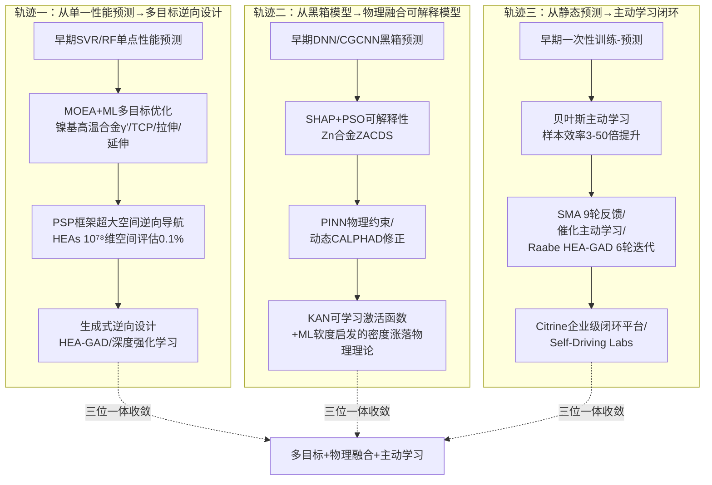

**轨迹一：从单一性能预测向多目标逆向设计的演化**。该轨迹的早期形态是"给定成分预测单一性能"的SVR/RF回归——云南贵金属实验室在HEAs硬度预测中SVR取得R=0.96即是这一阶段的典型；中期演进为多目标优化与逆向设计的耦合，镍基高温合金的MOEA+ML工作同时优化γ′溶解温度、γ′体积分数、TCP相含量、拉伸强度、延伸率等多个冲突目标；当前阶段则进入超大空间逆向导航与生成式设计——HEAs PSP框架在10⁷⁸维空间仅评估0.1%候选即锁定目标，Raabe团队的HEA-GAD生成模型与Pan等的深度强化学习则更进一步实现"从目标性能直接生成候选成分"[^56][^55]。这一轨迹的核心驱动力是产业需求复杂度的升级——单一性能优化对应实验室级可行性论证，多目标优化对应工业级应用门槛，逆向设计对应产业化研发节奏的加速。

**轨迹二：从黑箱模型向物理融合可解释模型的演化**。早期DNN/CGCNN等黑箱模型虽然预测精度高但难以解释，限制了其在工业级应用中的可信度；中期通过SHAP、PSO等可解释性分析工具回溯特征重要性，Zn合金ZACDS工作即采用"SHAP方法配合粒子群优化（PSO）进行模型可解释性分析"[^72]；进一步演进出PINN物理信息神经网络与动态CALPHAD参数修正等"物理约束嵌入"路线；当前阶段已出现Kolmogorov-Arnold Network（KAN）这类**架构层面突破固定激活函数限制**的新型可学习架构，以及"机器学习软度模型启发的密度涨落物理理论"这种ML→物理理论反向启发的最高级形态。后者尤其值得关注：**它意味着ML不再仅仅是预测工具，而开始反向推动物理理论的发展**——这是该轨迹最具科学深度的演化方向。

**轨迹三：从静态预测向主动学习闭环的演化**。早期"一次性训练-预测"模式假设训练集已经足够，模型一旦训练完成即不再更新；中期贝叶斯主动学习实现了"通过不确定性度量主动选择信息增益最大的下一个实验点"，Sulley等HEAs工作展示了27%数据达到95%精度、2%数据达到96%精度的样本效率突破；进一步演进为多轮反馈闭环——SMA研究的9轮反馈循环、Raabe HEA-GAD的6次迭代、催化材料的14443→4主动学习筛选；当前阶段则向Citrine企业级闭环平台、Self-Driving Labs（自动化实验闭环）方向演化，将"模型预测→实验验证→数据反馈→模型更新"的循环周期从"月级"压缩到"周级"乃至"日级"。

**三条轨迹的相互交织与三位一体收敛**。值得特别强调的是，三条轨迹并非孤立演化，而是深度交织、相互强化。**Raabe团队的HEA-GAD工作即同时体现了三条轨迹的最高形态**——多目标逆向设计（轨迹一终点）、生成模型+第一性原理+热力学计算融合（轨迹二的物理融合形态）、6次主动学习迭代（轨迹三的闭环形态）[^56]。中南大学CSU-S1工作同样融合了三条轨迹——MOEA多目标优化、Superalloy-MatSciBERT领域知识嵌入、虚拟成分筛选+实验验证闭环[^58]。SMA Xue等工作则在三个维度都达到了示范级水准——单一目标向ΔT优化但全局贝叶斯优化、物理直觉与不确定性量化结合、9轮反馈完整闭环。

这一**"多目标+物理融合+主动学习"三位一体收敛**的趋势，构成了配比优化领域当前研究范式的最显著特征。它意味着：**未来五至十年，配比优化的方法论竞争力将不再取决于任一单一维度的极致优化，而取决于三条轨迹的深度耦合能力**。这一判断对第5章模型准确度评估（如何在多目标场景下定义"准确"）、第6章核心挑战分析（三条轨迹各自面临哪些瓶颈）、第7章产业化距离评估（哪些应用场景的三条轨迹已成熟、哪些尚未）都具有基础性指导意义。

综合本章对全球活跃研究主体的系统识别与里程碑论文的方法论谱系归纳，可凝练出三点对后续章节具有方法论意义的结论：

**第一，配比优化领域已形成"北美方法论旗舰+欧洲物理融合标杆+中国多元化布局+全球产业化团队"的四象限格局**。北美以Olson、Gomez-Bombarelli、Olivetti、Wolverton等团队的通用方法论输出为特色；欧洲以Raabe、Conduit/Intellegens等团队的物理融合与稀疏数据建模为标杆；中国以中南大学高温合金/姜雁斌、西工大李金山、北科大谢建新、上海交大丁文江/孙宝德、清华李敬锋/朱静等多元化布局为特征；全球产业化层面则以Citrine、QuesTek、Phaseshift、Intellegens、Google DeepMind等不同模式承接学术成果。这一格局为第7章产业化距离评估提供了完整的研究主体地图。

**第二，里程碑论文已覆盖从基础物理理论到产业级合金设计的全光谱**。从Nature Materials的Cu₂Se热电[^66]到Acta Materialia的bcc SRO非解析性[^61]，从Science的HEA因瓦合金[^56]到npj Computational Materials的CSU-S1镍基单晶[^58]与Zn合金ZACDS[^72]，从Scripta Materialia的HEAs主动学习到Chemistry of Materials的Heusler discovery engine[^54]——这一里程碑矩阵的存在本身就证明了配比优化领域的方法论与应用产出已具备足够的深度与广度，足以支撑第5、6、7章的系统评估。

**第三，研究范式正在向"多目标+物理融合+主动学习"三位一体收敛**。这一收敛方向既是该领域过去十年演化的自然结果，也是未来五至十年产业化突破的关键路径。各国课题组、各类初创公司、各种里程碑论文，最终都将在这一收敛方向上接受检验——能否同时驾驭多目标冲突、嵌入物理一致性约束、构建实验闭环反馈，将决定研究主体能否从"方法论创新者"跃迁为"产业化引领者"。这一判断为后续章节提供了最重要的方法论坐标。

# 5 模型准确度评估与方法对比

第1至第4章已分别从方法论框架、数据基础设施、分体系应用与研究主体识别四个维度，构建了机器学习/深度学习介入材料元素配比优化的完整图景。然而，无论方法论多么精妙、数据基础设施多么完备、应用案例多么丰富、课题组阵容多么强大，最终判断该领域是否真正"可用"的关键标尺，始终是**模型在真实配比优化任务中的准确度与可信度**。前几章中已零星出现诸多精度数据——HEAs硬度SVR的R=0.96、铸造耐热铝AdaBoost的R²=0.94、超导Tc预测的R²=0.952、KAN的MSE仅1%、Heusler二分类的真阳性0.94/假阳性0.01——这些数字在各自论文中均被作为方法成功的核心证据。但**这些数字之间能否直接比较？它们所反映的"准确度"在多大程度上代表了模型在真实产业场景下的可用性？当评估策略从随机交叉验证切换到分布外（OOD）测试时，这些精度还能否维持？**

本章正是要回答这些深层问题。本章不再满足于"汇总精度数字"，而要进一步剖析三个递进的方法学层面：**第一是不同评估策略对真实泛化能力的揭示差异**——以MatBench基线对比OOD基准的系统性下降为切入点，揭示随机划分交叉验证对真实可用精度的高估倾向；**第二是物理约束、集成学习、不确定性量化、多保真贝叶斯优化等机制对模型可信度的实际增益**，以及它们的失效模式与适用边界；**第三是工作流细节差异对报告精度的系统性影响**，以及"高拟合-低外推"这一根本性问题对配比优化逆向设计可信度的最终约束。本章是连接第6章核心挑战分析与第7章产业化距离评估的关键评估枢纽——只有先建立起对模型准确度本身的清醒认识，才能客观评估该领域距离产业化大规模应用还有多远。

## 5.1 主流算法在配比优化任务中的精度对比基准

在系统讨论评估策略与可信度增益机制之前，有必要先汇总并比较前几章已涉及的主流算法在配比优化典型任务中报告的核心精度指标，建立一个分层的精度基准矩阵。下表按照"任务类型 × 数据规模 × 算法族"三维分层整理代表性证据：

| 任务类型 | 材料体系/工作 | 数据规模 | 算法族 | 核心精度指标 | 评估策略 |
|---------|------------|---------|------|-----------|---------|
| 性能回归（结构合金） | HEAs硬度（云南贵金属实验室） | 373组样本 | SVR | R=0.96 | LOOCV+测试集 |
| 性能回归（结构合金） | 铸造耐热铝合金UTS（Hao等） | 中等规模 | AdaBoost | R²=0.94，预测偏差7.75% | 测试集 |
| 性能回归（功能材料） | 超导Tc预测（Konno等） | SuperCon数据库 | 深度学习+周期表表示 | R²=0.92，超导识别精度62% | 含时间外推 |
| 性能回归（功能材料） | 超导Tc预测（Gashmard等） | 13022化合物（DataG） | CatBoost+Jabir+Soraya | R²=0.952，RMSE=6.45 K | 测试集 |
| 多指标回归（结构合金） | Zn合金ZACDS（Pan等） | 中等规模 | SHAP+PSO+贝叶斯优化耦合多模型 | UTS/伸长率/硬度精度均>90% | 测试集+实验验证 |
| 几何参数回归（超材料） | 力学超材料（西工大黄河源） | 1.75×10⁴量级 | KAN（可学习激活函数） | MSE仅1%，效率提升千倍 | 测试集 |
| 二分类（功能晶体） | Heusler discovery engine（Oliynyk等） | 40万+候选 | ML二分类 | 真阳性0.94，假阳性0.01 | 测试集+实验确认 |
| 形成能基准 | OQMD vs 实验形成能（Kirklin等） | 1670化合物对比 | DFT基准 | MAE=0.096 eV/atom（实验间MAE=0.082 eV/atom） | DFT-实验对比 |
| 结构-性能GNN | MatBench基准 | 万级样本 | CGCNN/SchNet/MEGNet/ALIGNN/DimNet++/DeeperGATGNN/coGN/coNGN | 各任务MAE随属性变化 | 5折随机交叉验证 |
| 主动学习相分类 | HEAs相结构（Sulley等） | 实验2198/CALPHAD 664650 | 贝叶斯优化+神经网络主动学习 | 实验数据27%→95%，CALPHAD 2%→96% | 主动采样验证 |

从该基准矩阵可读出三个值得警惕的现象。

**第一，跨论文的精度数字在表面上呈现出"高度成功"的乐观图景，但其可比性极为有限**。R²=0.94、R²=0.96、R²=0.952、MSE=1%、真阳性0.94——这些数字若不附带任务定义、数据规模、评估策略与目标量值范围的具体语境，单独罗列容易给非专业读者造成"该领域已普遍达到工业可用精度"的误导性印象。事实上，**SVR在HEAs硬度373组样本上的R=0.96与CatBoost在13022化合物超导Tc上的R²=0.952，所对应的数据分布、目标物理量、外推难度差异巨大**——前者目标量为单一连续硬度值且数据集成分相对集中，后者目标量Tc跨越数K至100余K的强非线性变化且涉及物理机制极复杂的强关联系统。两者的R²即便数值接近，其反映的"模型能力"本质上不可同日而语。

**第二，绝大多数已报道的高精度结果均基于随机划分的交叉验证或测试集评估，缺乏分布外（OOD）测试的对照**。这一现象的方法学含义将在5.2节深入展开——在此先标记一个关键观察：**精度数字的"乐观偏差"很大程度上来源于评估策略本身的局限**。

**第三，OQMD揭示的"DFT与实验形成能MAE=0.096 eV/atom，而实验间本身MAE=0.082 eV/atom"这一数据品质基准，为整个领域定义了一条容易被忽视的精度天花板**。这意味着，用DFT训练数据训练出的ML模型，无论其在DFT训练集上精度多高，其对真实物理量的预测精度上限本质受限于实验测量的内禀不确定性（约0.02 eV/atom的纯方法残差）。**任何号称在DFT训练集上达到远低于该残差量级精度的ML模型，都需警惕是否实际已超越了数据本身的物理真度——即是否存在过拟合DFT噪声的风险**。

需要特别说明的是，不同算法族在配比优化任务中的精度优势并非一成不变，而是高度依赖任务特征。在数据稀缺（数十至数千样本）、特征工程依赖物理描述符的合金体系中，SVR、AdaBoost、CatBoost等经典回归与集成方法表现出最稳健的精度——HEAs硬度SVR R=0.96、铸造耐热铝AdaBoost R²=0.94、超导Tc CatBoost R²=0.952均印证了这一点。在数据规模较大（万级以上）且具备明确图结构的任务中，CGCNN、MEGNet、ALIGNN等GNN展现出更强的拟合能力。在小样本+高维输出的特殊任务（如力学超材料几何参数设计）中，KAN等新型可解释架构可同时实现MSE仅1%与计算效率千倍提升的双重优势。**没有"普适最优算法"，算法选型是数据规模、任务特征、可解释性需求与实验闭环成本的多维匹配**——这一原则将在5.5节工作流细节讨论中进一步强化。

## 5.2 评估策略对真实泛化能力的揭示差异

5.1节末尾提出的关键警示——精度数字的乐观偏差很大程度上来源于评估策略本身——是本节展开的逻辑起点。在配比优化任务中，模型的"真实价值"不在于它能多好地拟合已经看过的数据，而在于它能多准确地预测训练分布之外的新成分。**这一区分对逆向设计尤其关键：逆向设计的本质就是在已知数据分布之外搜索新材料，因此评估策略必须能够诚实揭示模型的外推能力**。

南卡罗莱纳大学Jianjun Hu教授团队发表于npj Computational Materials的工作，正是对这一问题最系统的方法学揭示之一。该团队针对MatBench研究中的三个基准数据集（matbench_dielectric、matbench_log_gvrh、matbench_perovskites），提出了**五种不同类别的OOD机器学习问题**，并对八个最先进的图神经网络（CGCNN、SchNet、MEGNet、DimNet++、ALIGNN、DeeperGATGNN、coGN、coNGN）进行了综合基准评测[^73]。其核心发现极具方法学冲击力：**当前最先进的GNN算法在平均情况下，对于OOD属性预测任务的表现显著低于它们在MatBench研究中的基线**，"展示了在现实材料预测任务中一个重要的泛化差距"[^73]。

更具启示性的是该研究的"反直觉"发现：**MatBench排行榜中表现最优的coGN与coNGN在OOD测试中表现欠佳，而CGCNN、ALIGNN、DeeperGATGNN在钙钛矿数据集中反而展现出显著更强的OOD表现**[^73]。这一现象意味着传统排行榜的"冠军模型"未必是真实可用场景下的最佳选择——**在随机划分的in-distribution评测中胜出的模型，可能正是那些更善于"过拟合数据集统计特性"而非"学习物理本质"的模型**。该研究通过深入分析图神经网络模型的物理潜在空间，确定了三个OOD优胜模型在钙钛矿数据集中具有显著优势的物理原因，并指出"当前算法仍需要使用域适应等方法来提高其OOD预测性能"[^73]。

为更清晰刻画不同评估策略对真实泛化能力的揭示差异，下表汇总配比优化研究中常见的评估策略及其方法学含义：

| 评估策略 | 数据划分原则 | 揭示能力的范围 | 适用场景 | 已报道证据 |
|---------|------------|------------|--------|-----------|
| 随机交叉验证（K-Fold CV） | 样本随机分入K折 | 同分布泛化 | 训练-应用分布一致 | MatBench基线 |
| 留一法（LOOCV） | 每次留单一样本 | 小样本同分布稳健性 | 数据规模数十至数百 | HEAs硬度SVR R=0.96 |
| 留出法（Hold-Out） | 单次划分训练-测试 | 单次同分布评估 | 大规模数据快速评估 | 多数大数据GNN工作 |
| Leave-One-Cluster-Out（LOCO） | 按物理/化学簇划分 | 跨簇外推能力 | 评估对新物种泛化 | OOD基准的钙钛矿数据集[^73] |
| 时间外推 | 按发表/发现时间划分 | 真实"未来发现"模拟 | 评估发现能力 | Konno模型从2008年前数据发现铁基超导体 |
| 分布外（OOD）多类别基准 | 五类OOD测试方法 | 多维外推能力综合评估 | 严肃的方法学评估 | Hu团队OOD基准评测[^73] |
| 实验闭环验证 | 模型预测→实验合成→反馈 | 真实物理可实现性 | 终极可信度判定 | SMA 9轮反馈、CSU-S1、HESO等 |

**随机交叉验证作为最常用的评估策略，本质上预设了"训练数据与应用数据来自同一分布"这一前提**——这一前提在传统机器学习的图像识别、语音识别等任务中往往合理，但在配比优化任务中却经常严重失效。配比优化的核心使命就是发现训练集中未出现过的新成分组合，这意味着应用阶段的数据分布几乎必然偏离训练分布。在此场景下，**随机交叉验证报告的精度数字系统性地高估了模型在真实逆向设计任务中的可用精度**。

与负面案例形成对照的是时间外推评估的两个正面证据。**Konno等人的"reading periodic table"超导Tc预测模型从2008年前的训练数据中外推发现了2008年才被发现的铁基高温超导体**——这一时间外推成功是模型真实泛化能力的最高级别证据，因为它无法通过任何形式的数据泄露来人为制造。Heusler discovery engine则展示了物种外推的成功——在对40万+候选体系的预测中，研究者将模型应用于AB₂C公式的候选体系，预测了12种新型镓化物MRu₂Ga和RuM₂Ga（M=Ti-Co）作为Heusler化合物，并通过实验确认其中一员TiRu₂Ga展现了诊断性的超晶格峰。**这一确认使得ML预测从"统计正确"上升到"具体物质级别正确"——这是分布外评估能够提供的最严格证据**。

综合而言，**评估策略的选择直接决定了报告精度的物理意义**。随机CV报告的R²=0.95与OOD基准报告的R²=0.95，所对应的"模型能力"完全不同。这一认识对配比优化研究的实际指导意义在于：**任何宣称达到工业可用精度的论文，都应被进一步追问"是否经过分布外或时间外推评估"；任何选型决策，都应优先考虑那些经过严格OOD测试的模型而非仅在排行榜上排名靠前的模型**。这一原则正是Hu团队OOD基准工作希望向社区传递的核心讯息：**"当研究者利用机器学习或者深度学习进行材料属性预测时，需要关注到模型泛化能力，亦或是模型在不同分布的OOD集合上的表现"**[^73]。

## 5.3 物理约束、集成学习与不确定性量化的可信度增益

在认清评估策略对精度判读的根本影响后，下一个层级的方法学问题是：**有哪些机制可以系统性地提升模型在真实泛化场景下的可信度？** 配比优化领域过去十年的方法学创新，本质上正是围绕三类可信度增益机制展开——**物理信息约束、集成学习、不确定性量化**。每一类机制都在前几章的具体案例中已有零星出现，本节将其系统化整理并量化其增益效果与适用边界。

**第一类是物理信息约束**。其核心思想是将物理学知识（如对称性、守恒律、热力学一致性、电荷电负性中性等）作为软约束或硬约束嵌入模型，使模型在数据稀缺时仍能依靠物理先验维持稳健性，在数据偏差时仍能依靠物理一致性纠正预测。第1章已详细介绍的**Co-Cr-Ni堆垛层错能（SFE）动态CALPHAD参数修正案例**是该机制效果的典型量化证据：通过TEM实验和DFT数据建立参考SFE数据库，采用轴对称Ising模型计算初始ΔL参数，在定向搜索中每发现一个新目标合金即用实验值更新局部ΔL参数，**经3次迭代将RMSE从24.2 mJ/m²降至5.4 mJ/m²，将合金设计效率提升5倍以上**。这一77.7%的RMSE降幅充分体现了物理约束（CALPHAD热力学框架）与数据驱动（局部参数动态拟合）融合的强大能力。

第3章介绍的MIT Olivetti团队的**深度强化学习逆向无机材料设计**则展示了化学准则约束的另一形态——"模型学习了电荷与电负性中性等化学准则，同时保持化学多样性与独特性"。Kolmogorov-Arnold Network（KAN）通过引入可学习激活函数突破传统神经网络的固定函数限制，在1.75×10⁴量级数据上预测MSE仅为1%、相比MLP效率提升超千倍——其架构层面的"可学习而非固定"特征本身即是一种物理一致性的表达。最具科学深度的是第3章所述江苏科技大学吴义成团队的工作：**"机器学习软度模型"启发了密度涨落物理理论的提出**——这一ML→物理理论反向启发的形态，意味着物理约束机制已不仅仅是"用先验提升模型"，更已开始反向推动物理理论本身的发展。

**第二类是集成学习**。其方法学价值在于通过多个模型的预测组合，降低单一模型的方差与偏差，特别在小样本、高噪声场景下显著提升稳健性。配比优化领域已广泛采用RF、XGBoost、AdaBoost、CatBoost等基于树的集成方法，以及Raabe团队HEA-GAD工作中的TERM两阶段集成回归。其中AdaBoost在铸造耐热铝合金的UTS预测中达到R²=0.94且预测偏差仅7.75%，CatBoost在13022化合物超导Tc预测中达到R²=0.952、RMSE=6.45 K，两者均显著优于在同类任务中报告的单一模型基线。Raabe团队的**TERM两阶段集成回归**则代表了集成思想在多保真数据场景下的精细化应用：**第一阶段是基于组合的回归模型用于快速大规模成分组合推理，筛选出热膨胀系数可能较低的前约1,000个结果；第二阶段则将第一性原理与热力学计算作为输入的一部分**——这种"快速筛选+精确精调"的两阶段设计，将集成学习的稳健性与多保真数据的层次结构有机结合。

**第三类是不确定性量化（UQ）**。其核心使命是回答"模型对当前预测有多大把握"——这一信息在主动学习闭环中至关重要，因为它直接决定下一个实验点的选择。Sulley等人在Scripta Materialia上的HEAs相结构预测工作即是不确定性量化驱动主动学习的最经典样本：**通过将数据采集聚焦于不确定性区域，仅用实验HEA数据集（2198个五元HEAs）的27%即获得了与随机森林模型用80%完整数据集训练时相当的95%测试精度；仅用CALPHAD数据集（664650个五元HEAs）的2%，相位预测测试精度即超过96%**。这种"3倍至50倍样本效率提升"的量化效果，是不确定性量化在配比优化领域最有说服力的实证。

形状记忆合金的实验闭环案例则展示了不确定性量化在更严格场景下的价值：Xue等人发表于Nature Communications的工作"使用推断与全局优化以平衡搜索空间的利用与勘探之间的权衡"——这正是贝叶斯优化中exploitation-exploration trade-off的核心思想，**从约80万成分的潜在空间出发，经过9轮反馈循环，仅合成与表征36个预测组分，其中14个表现出比原始数据集中22个样本更小的ΔT，最终发现Ti₅₀.₀Ni₄₆.₇Cu₀.₈Fe₂.₃Pd₀.₂合金的ΔT仅为1.84 K**。36个实验在80万候选空间中仅占0.0045%，却找到了远超原始数据集最优值的成分——这一极致样本效率正是不确定性量化驱动主动学习的最高级别成果。

下表汇总三类可信度增益机制的核心特征与量化效果：

| 增益机制 | 代表方法 | 主要价值 | 量化效果 | 适用边界 |
|---------|--------|--------|---------|---------|
| 物理信息约束 | PINN、动态CALPHAD修正、KAN、电荷电负性中性约束 | 提升小样本稳健性与外推一致性 | SFE预测RMSE 24.2→5.4（降77.7%），KAN MSE仅1%、效率千倍提升 | 物理先验越明确效果越显著 |
| 集成学习 | RF、AdaBoost、XGBoost、CatBoost、TERM两阶段 | 降低方差、提升小样本稳健 | AdaBoost R²=0.94，CatBoost R²=0.952，TERM筛选~1000候选 | 单一弱模型规模化利用 |
| 不确定性量化 | 贝叶斯优化、GPR、深度集成、Bootstrap | 主动学习信息增益最大化 | 27%数据→95%精度，2%数据→96%精度，36/800000实验比 | 实验/计算闭环可承载多轮 |

需要清醒认识的是，**三类增益机制并非万能钥匙，各自有明确的失效模式**。物理约束机制要求物理先验本身必须正确——若先验本身存在偏差（如CALPHAD全局参数化的精度局限），则约束反而可能误导模型。集成学习虽提升稳健性但通常以可解释性下降为代价，且其增益在数据规模较大时会饱和。不确定性量化的核心前提是"不确定性估计本身可信"——而高斯过程在高维输入下的不确定性估计、深度集成在小样本下的方差估计本身就充满挑战。**真正高质量的配比优化研究往往同时使用三类机制并相互校验**，正如Raabe团队HEA-GAD工作集成模型+第一性原理约束+主动学习闭环的"三位一体"，或CSU-S1工作NLP+ML预测+多目标筛选+实验验证的全链条配置。

## 5.4 多保真与多目标场景下的精度评估范式

5.3节讨论的三类增益机制主要回答"如何让单一目标的预测更可信"，但配比优化的真实场景往往同时涉及**多保真数据**（高通量DFT vs 实验测量 vs 文献抽取）与**多目标耦合冲突**（强度-塑性-密度-成本-蠕变寿命同步优化）。这两个维度的复杂性给精度评估带来了远超单目标单保真场景的方法学挑战。

**多保真贝叶斯优化（MFBO）**正是为应对多保真数据场景而生。Nature Computational Science近期发表的一项指导性研究系统评估了MFBO在分子和材料问题上的应用——研究者"在两个合成问题中测试了两类不同的采集函数（期望改进EI和最大熵搜索MES），并研究了近似函数信息量和成本的影响"，随后在三个真实发现问题（共价有机框架COFs、溶剂化能、分子极化率）上进行基准测试[^74]。其核心发现具有清晰的方法学指导价值：**"只有在LF（低保真）源既便宜又具有高相关性（R²较高）时，MFBO才表现出正折扣（Δ>0），即成本节省优势。若LF源成本过高或与HF（高保真）源相关性差，MFBO可能适得其反"**[^74]。在三个实际基准任务上，MFBO均优于单保真贝叶斯优化（SFBO），证明了MFBO作为加速分子与材料发现的有前景框架的实证价值[^74]。

这一指导性发现对配比优化研究具有直接含义：**第2章所论及的高通量DFT、实验测量、文献NLP抽取三类数据来源，能否被MFBO有效融合，本质上取决于它们之间的相关性结构与相对成本**。当DFT与实验数据具有较高相关性（如形成能预测中OQMD揭示的纯方法残差仅约0.02 eV/atom）且DFT成本远低于实验时，MFBO能显著加速发现；反之，若DFT在某体系（如强关联超导体）与实验的相关性较差，强行使用MFBO反而劣于直接的单保真实验闭环。这一警示直接呼应了第2章所述的"不同泛函（PBE、LDA、TBmBJ、HSE等）间系统性偏差"问题——在使用MFBO之前，必须先评估不同保真度数据源之间的真实相关性结构。

**大规模超参数基准评估**则代表了多保真场景下方法学评估资源的另一重要进展。化学/材料科学优化基准数据集的开发——通过生成173,219个准随机超参数组合（涵盖23个超参数）训练CrabNet在Matbench实验带隙数据集上（计算运行时间387 RTX-2080-Ti GPU天）——为配比优化中的大规模超参数搜索提供了一个标准化的基准评估资源[^74]。该基准明确指出材料科学和化学领域的相关优化任务可能"由于其复杂性而具有挑战性，包括分层、噪声、多保真、多目标、高维和非线性相关变量"，"此外，它们可能包括受到线性和非线性约束的混合数值和分类变量"[^74]。该工作的方法论价值在于揭示了**配比优化任务的真实评估复杂度远超单一精度数字所能反映**——分层、噪声、多保真、多目标、高维、非线性相关、混合数值与分类变量、线性与非线性约束这八重复杂性叠加，使得"模型A是否优于模型B"的判断在不同任务设置下可能给出完全不同的答案。

**多目标场景下的精度评估**则需要从单目标的R²/RMSE/MAE扩展到帕累托前沿质量、超体积指标、目标一致性最大误差等多维度量。第1章已介绍的西工大黄河源团队**KAN+遗传算法多目标全局优化**在−90°至90°多方向应力-应变响应的Model III中"最大误差从原始结构的2.28%降至0.0443%"，这一最大误差降幅51.5倍的指标本身就是一种多目标场景下的精度评估范式——它衡量的不是平均预测精度，而是"最坏情况一致性"，对工程级应用具有更直接的可靠性意义。镍基高温合金的MOEA+ML案例则展示了在γ′溶解温度、γ′体积分数、TCP相含量、拉伸强度、延伸率等多个冲突目标的帕累托前沿上同步优化的能力——评估这一类多目标模型的"精度"，必须同时考察各目标个别精度、目标间权衡的合理性、以及最终筛选出的候选成分在多目标实验验证下的同步达成度。

下图展示了多保真多目标场景下精度评估范式的层次结构：

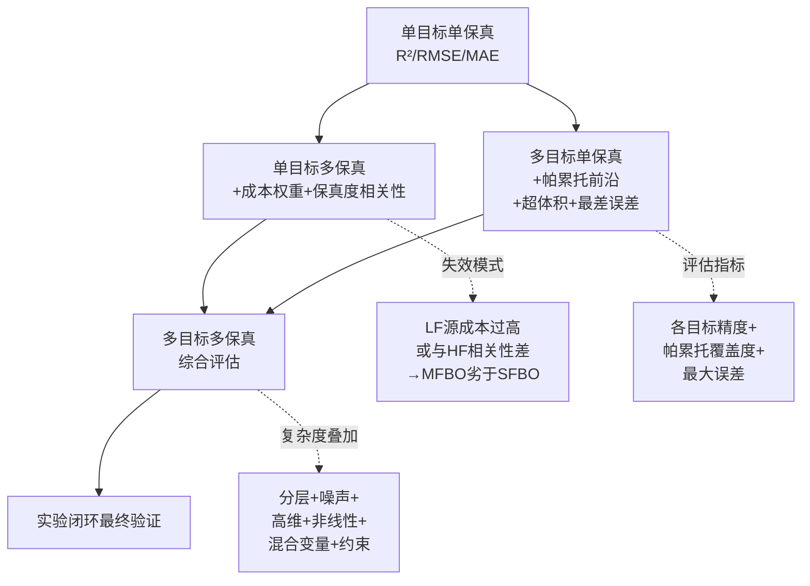

综合而言，**配比优化的真实评估场景必须从"单一精度数字"走向"分层多维度评估范式"**。MFBO提供了多保真数据融合的方法学路径但有明确失效模式；CrabNet基准等大规模评估资源则量化了真实任务的多重复杂度；多目标场景下帕累托前沿质量、最大误差等扩展指标则提供了超越平均精度的评估视角。这些方法学进展共同回应了一个核心认识：**配比优化研究中"模型好"与"模型不好"的判断不再是一个标量比较，而是一个多维度匹配过程**——在判断任何ML配比优化模型的可用性时，必须问"在哪些保真度组合下、对哪些目标组合、在哪些约束条件下"才能得出可靠结论。

## 5.5 工作流细节对评估结果的系统性影响

精度评估的方法学复杂性还有另一重维度——**同一个任务、同一份数据，在不同的工作流细节下，最终报告的精度数字可能相差悬殊**。这一现象的方法学含义对论文复现、模型选型与产业化决策都具有根本性影响。

发表于npj Computational Materials的综述文章"The mastery of details in the workflow of materials machine learning"系统剖析了这一问题，明确指出："随着机器学习在材料科学领域不断推进，**ML工作流相同步骤的策略变化变得越来越显著。这些细节会对结果产生重大影响，但尚未受到应有的重视**"[^75]。该综述对ML材料工作流中每一步骤的不同策略进行了详细探讨，通过最先进的案例研究展示了细节策略对潜在结果的影响，并基于不同应用场景推荐了相应策略[^75]。这一综述的存在本身就传递了一个重要信号：**领域已经清醒认识到"细节决定可比性"是一个不可回避的方法学问题**。

具体到配比优化任务，工作流细节差异在多个环节都可能引入系统性精度变化：

**特征工程环节**的差异最为显著。第1章已介绍云南贵金属实验室在HEAs硬度预测中采用三阶段特征筛选方法，从145个初始描述符锁定11个关键特征，包括原子半径差（δr）、混合熵（ΔSmix）、d-价电子浓度（e/a_d）、价电子浓度（VEC）和电负性差（Δχ）等"三重调控开关"。这一筛选过程本身就包含大量主观决策——选用哪些初始描述符、采用何种筛选标准、保留多少最终特征——每一个决策都影响最终模型精度。Gashmard等人在13022化合物超导Tc预测中**开发了名为Jabir的特征工程包生成322个原子描述符，同时设计了创新的混合方法Soraya包用于从特征空间中选择最关键的特征**，最终取得R²=0.952、RMSE=6.45 K的成绩——若将相同的CatBoost模型搭配不同的特征体系，精度结果可能与此报告值产生显著差异。

**算法横向对比环节**则展示了同一任务下不同算法表现的不一致性。上海交大Juan等人提出的Al-Zn-Mg-Cu合金快速设计系统ARDS"分别采用线性回归（LR）、支持向量回归（SVR）和反向传播神经网络（BPNN）三种回归算法训练多性能预测模型，其中SVR模型被证明表现最佳"。这一横向对比的结论"SVR最佳"在该特定数据集与特定特征工程下成立，但若推广到其他数据集或更换特征体系，最优算法可能完全不同。同样地，铸造耐热铝合金研究"最终选用AdaBoost算法作为最优模型"，这种"最佳模型"判定本质上是数据-特征-算法-评估策略四元组的局部最优。

**数据预处理环节**的影响则在Gashmard等人的工作中得到了清晰展示——SuperCon数据集"经过多步骤数据预处理后得到包含13022个化合物的清洁DataG数据集"。这一"多步骤数据预处理"涵盖了去重、异常值剔除、缺失值处理、标签清洗等诸多决策，每一步决策都影响最终训练集的统计特性。**未做任何预处理的SuperCon与精心清洗后的DataG，在同一模型下报告的精度数字可能相差5–10%以上的R²**，这种差异远大于不同算法间的精度差异。

**训练-测试集划分**的影响在5.2节OOD基准评测中已充分展现——同一GNN在随机CV与LOCO/OOD测试下的精度可显著相差。**超参数调优**环节的影响则在CrabNet超参数基准中得到量化——173,219个准随机超参数组合的精度分布跨越较大区间，意味着任何报告的"模型最佳精度"都隐含着大量超参数决策。

下表归纳工作流主要环节的细节差异对精度报告的影响路径：

| 工作流环节 | 主要细节差异 | 对精度报告的影响 | 缓解方案 |
|---------|-----------|--------------|--------|
| 数据采集与清洗 | 来源选择、异常值剔除、单位统一 | 训练集统计特性差异 | 标准化数据集（如DataG）共享 |
| 特征工程 | 初始描述符、筛选方法、保留数量 | 模型上限差异显著 | 标准化特征包（如Jabir） |
| 训练-测试划分 | 随机CV vs LOCO vs 时间外推 | 真实泛化能力揭示差异 | 多策略并报、JARVIS-Leaderboard基准 |
| 超参数调优 | 搜索空间、搜索策略、保真度 | 报告精度上限差异 | 标准化超参数基准（如CrabNet）[^74] |
| 算法选型 | 单一模型vs横向对比 | 局部最优vs全局最优判读 | 横向对比+开放代码 |
| 评估指标选择 | R² vs RMSE vs MAE vs AUC | 不同指标的乐观偏好 | 多指标并报 |
| 实验验证强度 | 仅计算预测vs实验合成vs全方位表征 | 可信度边界差异 | 实验闭环作为终极标准 |

工作流细节问题的根本性缓解方案是**标准化基准与开放可复现**。第2章已详细介绍的JARVIS-Leaderboard通过"按属性、按数据集分割、按方法分类"的三维基准矩阵提供了细粒度的横向可比性；NOMAD AI Toolkit则通过"将材料科学的可复现性提升到新水平"——研究者不仅可以共享论文背后的数据，还能共享所有开发的方法与分析工具——使得任何已发表结果都可以在原始工作流条件下被独立复现。这些基础设施的成熟，是缓解工作流细节差异影响的最根本路径。

需要特别强调的是，工作流细节问题对**配比优化产业化决策**具有直接的现实意义。当一个企业基于某篇论文报告的"R²=0.95"结论决定采用某模型方案时，若该论文的工作流细节未充分披露或难以复现，企业实际部署的模型精度很可能远低于论文报告值——这种"精度落差"将直接传导为研发决策风险。**因此，对配比优化模型的真实可信度判断，必须超越论文的精度数字，深入到工作流细节的全面披露与独立复现验证**。这一原则将在第7章产业化距离评估中再次体现。

## 5.6 高拟合-低外推问题的普遍性与配比优化的可信度边界

经过5.1至5.5节的层层剖析——从精度基准矩阵的可比性边界，到评估策略对泛化能力揭示的差异，再到三类可信度增益机制的实际效果，再到多保真多目标的评估范式扩展，最后到工作流细节的系统性影响——我们已经从多个维度逼近一个核心判断：**配比优化领域当前普遍存在"高拟合-低外推"问题，这一问题对逆向设计的可信度构成根本性约束**。本节将系统归纳这一判断的证据基础与方法学含义，并为第6章核心挑战分析与第7章产业化距离评估提供准确度侧的判定基线。

**高拟合-低外推问题的核心表现**是：模型在训练分布内（in-distribution）的R²常常达到0.9以上甚至接近1.0，但在真实分布外（new element systems、稀有相、亚稳态、跨工艺路线等）的预测精度显著下降。该问题的证据在前述章节已经多处显现，本节将其汇集量化：

**第一类证据是OOD基准的系统性下降**。Hu团队的OOD基准评测显示，**当前最先进的GNN算法（CGCNN、SchNet、MEGNet、DimNet++、ALIGNN、DeeperGATGNN、coGN、coNGN）在五类OOD测试集上的平均表现显著低于MatBench随机CV基线**[^73]。该研究图3展示了CGCNN、ALIGNN、DeeperGATGNN在介电数据集每个折的MAE分布，明确揭示了OOD场景下精度的系统性下移[^73]。这一下降幅度的具体量化在不同任务上有所不同，但其方向高度一致——**没有任何当前最先进GNN在OOD测试中能够维持其在随机CV中的性能水平**[^73]。

**第二类证据是数据本身的精度天花板**。OQMD揭示的"DFT与实验形成能MAE=0.096 eV/atom，实验间MAE=0.082 eV/atom"基准意味着DFT与实验的纯方法残差仅约0.02 eV/atom——**这是任何基于DFT训练数据的ML模型的物理精度上限**。任何宣称在DFT训练集上达到MAE远低于0.02 eV/atom的模型，都需警惕是否实际已超越了数据本身的物理真度。这一天花板对配比优化的逆向设计有直接含义：**当模型预测某新成分的形成能比已知最优值低0.05 eV/atom时，这一"优势"很可能完全在实验测量的不确定性范围内**——即模型预测的"突破"在实验上不可能被严格验证。

**第三类证据是强关联系统精度的固有局限**。第3章已述超导Tc预测领域，Gashmard等人即便采用CatBoost+322特征+Soraya特征选择的最先进组合，仍仅能达到R²=0.952、RMSE=6.45 K的水平。**6.45 K的RMSE在低温超导（Tc < 30 K）领域意味着相对误差可达20-30%甚至更高**——这远未达到"工业可用"的精度水平。Konno模型62%的超导识别精度也意味着约38%的预测可能失误。这种精度局限并非算法不够先进，而是反映了"对于强关联系统的超导转变温度Tc，理论与计算方法都难以预测"这一物理本质。

**第四类证据是训练数据分布偏差的传导效应**。第2章已详细论及OQMD作为"基于ICSD与常见结构装饰的高通量计算"，其训练数据自然偏向于已合成、已验证的稳定相，而对亚稳态、缺陷结构、非平衡相覆盖严重不足。这意味着基于OQMD训练的模型在预测"常规合金"时表现可能极佳，而面对快速凝固金属玻璃、定向凝固单晶、增材制造非平衡组织时则可能系统性失准。文献正向结果偏差进一步加剧这一问题——**研究者倾向于发表"性能优秀的合金成分"，使NLP抽取的数据集天然地缺乏"失败案例"**——而对配比优化的逆向设计而言，"哪些成分必然失败"与"哪些成分可能成功"同等重要。

下表汇总四类证据所传递的可信度边界：

| 证据类型 | 量化表现 | 对逆向设计的含义 |
|--------|--------|-------------|
| OOD基准下降 | 八大GNN在五类OOD测试上平均显著低于MatBench基线[^73] | 跨族系/新物种外推可信度受限 |
| 数据精度天花板 | DFT-实验纯方法残差约0.02 eV/atom（OQMD） | 形成能预测的"真实优势"判定下限 |
| 强关联系统局限 | 超导Tc预测RMSE仍达6.45 K | 物理复杂体系预测的内禀精度边界 |
| 数据分布偏差 | ICSD稳定相过表达、文献正向偏差 | 亚稳态/失败案例预测可信度受限 |

**这一可信度边界对配比优化的逆向设计可信度具有根本性约束**。逆向设计的核心使命就是从目标性能反推最优成分——而这一过程本质上是一种外推：从已知数据分布映射到未知最优成分。**当模型在OOD测试中精度系统性下降、当数据本身的精度天花板限制"真实优势"判定、当强关联系统的内禀精度边界客观存在、当训练数据偏差传导至预测时，"模型预测某新成分性能突破X%"这一类陈述的可信度本质上需要打折扣**。这并非否定配比优化研究的价值——CSU-S1合金、Cr₁₇.₇Fe₂₀.₉Ni₂₀.₂Ti₂₂.₂V₁₉.₀硬度1177 HV、HESO催化剂、Ti₅₀.₀Ni₄₆.₇Cu₀.₈Fe₂.₃Pd₀.₂的ΔT=1.84 K等案例都已通过实验验证证明了配比优化的现实价值——而是要清醒认识到**这些"成功案例"的可信度建立在严格的实验闭环验证之上，而非单纯的模型预测**。

针对高拟合-低外推问题，本章基于前述分析提出**"分布感知评估—物理约束嵌入—主动学习闭环"三位一体的可信度建设路径**：

**第一是分布感知评估**——任何严肃的配比优化研究都应将OOD测试（LOCO、时间外推、新族系外推等）作为标准评估手段，而非仅依赖随机CV或留一法。报告精度时应明确标识评估策略，避免"R²=0.95"这种缺乏语境的数字直接被产业化决策引用。JARVIS-Leaderboard这种细粒度标准化基准的进一步推广，是这一路径的基础设施保障。

**第二是物理约束嵌入**——纯数据驱动方法在外推场景下的可信度本质上有限，必须通过物理信息约束（PINN、动态CALPHAD修正、电荷电负性中性、KAN可解释架构等）补足外推时的物理一致性。Co-Cr-Ni SFE动态ΔL优化将RMSE从24.2 mJ/m²降至5.4 mJ/m²这一77.7%的降幅，正是物理约束嵌入价值的最佳量化证据。第1章所述"知识—数据双驱动"的演化方向，本质上就是对纯数据驱动外推局限的方法学回应。

**第三是主动学习闭环**——在外推可信度本质有限的现实下，单次"预测—结果"的可靠性必然不高，必须通过多轮"预测—实验—反馈—更新"的闭环逐步降低不确定性。Sulley等HEAs主动学习27%数据→95%精度、SMA研究9轮反馈循环14/36发现率38.9%、Raabe HEA-GAD六次迭代等案例都证明了主动学习闭环作为可信度建设核心机制的不可替代价值。这一机制将在第7章关于自动化实验闭环（Self-Driving Labs）的产业化路径分析中扮演核心角色。

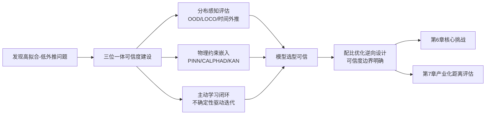

综合本章对模型准确度评估与方法对比的系统分析，可凝练出三点对后续章节具有方法论意义的结论：

**第一，配比优化领域的"高精度报告"普遍存在乐观偏差——R²=0.94至0.96的精度数字主要建立在随机CV或留一法等同分布评估之上，未能充分揭示真实逆向设计场景下的外推能力**。Hu团队OOD基准评测对八大GNN的系统性测试与超导Tc RMSE仍达6.45 K的固有局限共同表明，当前ML配比优化模型在OOD场景下的可用精度普遍低于其在排行榜上的报告精度。这一认识对第7章评估"距离理想模型大规模应用还有多远"具有基础性意义——**距离不是由"最高精度数字"决定的，而是由"在真实OOD场景下的最低可信精度"决定的**。

**第二，物理约束、集成学习、不确定性量化、多保真贝叶斯优化等可信度增益机制已显著提升了配比优化模型在小样本与外推场景下的可用性，但每一类机制都有明确的失效模式与适用边界**。SFE动态ΔL优化的77.7% RMSE降幅、HEAs主动学习的3-50倍样本效率提升、KAN的MSE仅1%与效率千倍提升等量化效果都证明了这些机制的现实价值；同时MFBO在LF成本过高/相关性差时反而劣于SFBO的失效模式、CrabNet基准揭示的工作流复杂度也提醒我们这些机制并非万能。**真正高质量的配比优化研究往往同时使用三类增益机制并通过严格的工作流细节披露与开放可复现来确保可信**。

**第三，工作流细节差异对报告精度的系统性影响是配比优化研究领域的隐性"复制危机"——同一任务在不同特征工程、不同数据预处理、不同评估策略下，报告精度可能相差悬殊**。"The mastery of details"综述、JARVIS-Leaderboard细粒度基准、NOMAD AI Toolkit可复现工作流等基础设施进展是缓解这一问题的关键路径。**对配比优化模型的真实可信度判断，必须超越论文的精度数字，深入到工作流细节的全面披露与独立复现验证**——这一原则是产业化决策不可绕过的方法学前提。

第6章将基于本章所建立的可信度边界，系统剖析配比优化领域的核心挑战及其应对方案的可行性边界；第7章则将基于本章所揭示的"OOD精度本质边界"与"工作流细节影响"，量化评估当前领域距离理想模型大规模产业化应用的现实距离。本章所建立的"高拟合-低外推问题客观存在但通过三位一体可信度建设可逐步缓解"这一基本判断，将作为后续两章分析的核心方法学坐标。

# 6 领域核心挑战与模型可行性分析

第1至第5章已从方法论框架、数据基础设施、分体系应用现状、研究主体识别与模型准确度评估五个维度，构建了机器学习/深度学习介入材料元素配比优化的完整图景。然而，无论方法论多么精妙、数据基础设施多么完备、研究主体多么活跃，最终衡量该领域是否能够走向成熟化与产业化的关键标尺，是**领域所面临的核心挑战及其应对方案的可行性边界**。第5章末尾已明确诊断出"高拟合-低外推"问题客观存在、工作流细节差异具有系统性影响、可信度建设需要"分布感知评估—物理约束嵌入—主动学习闭环"的三位一体路径——这一诊断将本章的展开锁定在挑战的系统识别、方案的可行性评估与失效模式的客观刻画上。

本章不再罗列方法本身，而是以**"挑战—方案—边界—风险"的四元结构**展开。具体而言，本章按照"数据稀缺与不平衡 → 特征工程依赖 → 模型可解释性 → 外推能力 → 跨尺度建模 → 实验闭环成本 → IP壁垒与数据共享 → 标准化基准缺失"的逻辑链条，逐一剖析八类核心挑战的物理与方法学根源、现有应对方案的实际增益与适用边界、潜在风险与失效模式；最后在6.9节进行挑战间耦合放大效应的综合分析，提出三级分层的可行性判定框架，为第7章产业化距离评估提供挑战侧的判定基线。本章的核心使命是回应一个递进的问题序列：当前领域的关键瓶颈在哪里？瓶颈的根源是什么？现有方案在多大程度上能够缓解？哪些瓶颈仍属开放性难题？这些问题的回答，直接决定了用户最关心的"距离理想模型大规模应用还有多远"这一核心命题的答案基线。

## 6.1 数据稀缺与不平衡及其增强方案的可行性边界

数据稀缺是配比优化领域最具普遍性的核心挑战，也是几乎所有其他挑战的根源性触发因素。第2章已系统刻画过该问题的量化表现——HEAs相结构数据373组、γ′相溶解温度仅135条高质量记录、力学超材料数据 $1.75\times 10^4$ 量级、超导Tc预测的SuperCon经多步清洗后仅余13022化合物——这些数据量级与深度学习在ImageNet（百万级）、自然语言处理（千万至亿级）等领域的训练数据规模相差三到五个量级。**数据稀缺并非偶然，而是配比优化任务的物理本质决定的结构性特征**：高熵合金、镍基单晶、新型超导体等前沿体系的合成-表征成本壁垒远高于其他AI应用领域，单一样本的获取动辄需要数日至数周乃至数千小时（如NIMS Creep Data Sheet的长时蠕变试验），数据增长速率必然远低于模型对样本量的指数级需求。

数据不平衡则在数据稀缺之上叠加了第二层结构性偏差。**第一层是成功案例的过表达**——研究者倾向于发表性能优秀的合金成分，使得文献抽取的数据集天然缺乏"失败案例"。这一偏差对逆向设计的可信度构成根本性约束：配比优化的核心使命之一是"在巨型成分空间中规避注定失败的区域"，但若训练数据中几乎不存在失败样本，模型将无法学习到"哪些配比必然失败"的判别边界。**第二层是稀有元素体系的覆盖不足**——铼、铂族金属、稀土等高价值元素在公开数据库中的样本量远低于Fe、Al、Cu等大宗元素，使得涉及这些元素的合金设计成为模型的"盲区"。**第三层是亚稳态、缺陷结构、非平衡相的覆盖不足**——OQMD作为"基于ICSD与常见结构装饰的高通量计算"，其训练数据天然偏向于已合成、已验证的稳定相，对快速凝固金属玻璃、定向凝固单晶、增材制造非平衡组织的覆盖明显不足。

针对数据稀缺与不平衡的应对方案已经形成多元化生态，下表系统比较其核心增益与失效模式：

| 应对方案 | 核心机制 | 已报道增益 | 主要失效模式与风险 |
|---------|--------|---------|-----------------|
| 跨属性深度迁移学习 | 大数据集训练→小数据集微调 | Jha等框架在39个计算+2个实验数据集上，仅以元素分数输入即在27/39（≈69%）任务中超越从头训练ML/DL[^76] | 源-目标任务相关性弱时存在负迁移，跨物理机制迁移可能误导 |
| 特征重用预训练 | 冻结源任务底层特征+目标任务专用顶层 | 减少标注数据需求、加快训练[^77] | 源域特征对目标域不适用时性能下降 |
| GAN合成数据增强 | 生成器学习分布、判别器辨真伪 | 学习数据底层分布、可创造"边缘案例"[^77][^78] | 训练不稳定、对超参数敏感、原始数据偏差被放大 |
| VAE变分自编码 | 学习潜空间并采样 | 适合连续平滑生成 | 生成样本可能"过于平均"、缺乏极端样本[^77] |
| SMOTE过采样 | 少数类样本特征空间插值 | 表格数据类别不平衡的快速方案 | 可能产生不现实的样本[^77] |
| 主动学习+不确定性采样 | 信息增益最大化的实验点选择 | HEAs 27%数据→95%精度、SMA 36/800000实验比 | 不确定性估计本身不可信时失效 |
| NLP文献抽取增强 | 从文献/专利自动抽取结构化数据 | Superalloy-MatSciBERT从5万文献抽135条γ′数据 | 继承文献正向偏差、抽取错误传导 |

**迁移学习是数据稀缺场景下方法论增益最具量化证据的应对方案**。Jha等人在Nature Communications上提出的跨属性深度迁移学习框架，针对"对于大多数性质，缺乏大数据集阻碍了DL/TL的广泛应用"这一核心痛点，"利用基于大数据集训练的模型为不同性质的小数据集构建模型"，并在39个计算与2个实验数据集上进行测试[^76]。其最具说服力的实证结果是：**TL模型即便仅以元素分数作为输入，也在27/39（≈69%）个计算数据集与两个实验数据集上超越了"从头训练且被允许使用物理属性作为输入"的ML/DL模型**[^76]。这一"以更少特征+更小目标数据集战胜更丰富特征+从头训练"的反直觉成果，量化证明了从大数据集中学到的知识可以有效迁移至小数据场景。迁移学习的另一种简单形态是特征重用——通过冻结预训练模型的底层（如ImageNet预训练的VGG16卷积层），仅在目标任务上训练顶层分类器或回归器，可以"减少标注数据需求、加快模型训练、提高模型性能"[^77]。

然而**迁移学习存在不可回避的负迁移风险**。其核心前提是"源任务与目标任务在底层特征空间存在共享结构"——若源任务（如形成能预测）与目标任务（如疲劳寿命预测）的物理机制差异过大，迁移的特征不仅无法提升目标任务性能，反而可能误导模型走向错误的特征空间。Jha等人的工作虽展示了27/39任务的成功，但同时意味着12/39（≈31%）任务中迁移学习未能超越从头训练——**这一近三分之一的失败率在产业化场景下意味着每三个迁移方案中可能有一个会带来负效果**，必须通过任务相关性预评估机制加以规避。

**生成式数据增强（GAN/VAE）则代表了应对数据稀缺的另一条创新路线，但其失效模式更为隐蔽**。GAN与传统数据增强（旋转、裁剪、加噪声）的本质区别在于：传统增强"本质上是在已有样本的'邻域'内做变换……无法创造出数据分布中'缺失'的部分"，而GAN通过对抗训练学习数据的内在分布，可以"从随机噪声中'幻想'出符合该分布的新样本——这些样本可能从未在原始数据集中出现过，但在统计特性上与真实数据高度一致"[^77]。这种创造"边缘案例"的能力对配比优化中"罕见但重要场景（如工业缺陷中的特殊瑕疵）"具有独特价值[^78]。在配比优化的具体应用中，第4章已述Raabe团队HEA-GAD工作即基于生成模型在巨型成分空间中智能搜索潜在因瓦合金候选——这是GAN/VAE思想在配比优化领域最成熟的工程化实现。

但生成式增强的失效模式同样严重。**第一是训练不稳定与超参数敏感**——"GAN并非万能。它的训练过程可能不稳定，且对超参数敏感"[^78]。**第二也是最根本的"学坏"放大效应**——"生成数据的质量高度依赖于原始训练集的质量和数量。如果原始数据本身就存在严重偏差或噪声，GAN只会'学坏'，放大这些问题"[^78]。这一警示对配比优化具有特别重要的含义：当原始数据已存在成功案例过表达、稀有元素覆盖不足等结构性偏差时，GAN生成的合成样本将系统性地放大这些偏差——意味着模型在生成数据上看似表现优异，实际却进一步偏离了真实物理分布。**第三是合成样本物理不可实现性**——SMOTE等基于特征空间插值的方法"可能产生不现实的样本"[^77]，VAE生成则可能"过于'平均'"[^77]——配比优化中这种不现实的样本若被纳入训练集，会使模型学到"虚假的成分-性能映射"。

**第四类应对方案是主动学习驱动的样本效率提升**。第5章已详细量化Sulley等人HEAs主动学习27%数据→95%精度的样本效率突破、SMA研究9轮反馈循环36/800000实验比的极致样本效率——这些案例证明了主动学习不是简单的"算法技巧"，而是**对数据稀缺与偏差的直接补偿**。但主动学习的可行性同样有边界：其核心前提是不确定性估计本身可信，而高斯过程在高维输入下的不确定性估计、深度集成在小样本下的方差估计本身就充满挑战，这一失效模式将在6.6节实验闭环讨论中进一步展开。

综合而言，数据增强类方案的真实可行性边界可归纳为三点：**第一，迁移学习作为最具理论增益的方案，在源-目标任务相关性较强时显著有效但在相关性弱时存在负迁移风险，约30%的任务无法获得正迁移**[^76]；**第二，生成式增强能够创造分布支撑域内的新样本但无法纠正原始数据的结构性偏差，反而可能放大偏差**[^77][^78]；**第三，主动学习通过信息增益最大化实现样本效率指数级提升，但依赖可信的不确定性估计，在小样本+高维场景下面临根本性挑战**。这意味着数据稀缺挑战目前**已有部分可行方案，但远未根本解决**——这一判定将作为6.9节综合可行性判定的基础输入。

## 6.2 特征工程对领域知识的强依赖及AutoML的有限替代

数据稀缺挑战的下一个紧密耦合的层面是**特征工程**——从原始的元素摩尔分数到模型可消化的特征向量之间的映射，本质上是配比优化中"领域知识嵌入"最集中的环节。第1章已详细介绍HEAs研究中的"三重调控开关"（VEC、Δχ、e/a_d）、第3章铸造耐热铝合金UTS预测中Al₉FeNi与Al₃Ni强化相的物理识别、第4章Gashmard等人开发的Jabir 322原子描述符包——每一层特征工程都内嵌大量物理化学先验。

材料数据科学的典型机器学习工作流可概括为四步："获取原始输入，如作文列表和相关的目标属性来学习；将原始输入转换成可通过机器学习算法学习的描述符或特征；在数据上训练机器学习模型；绘制并分析模型的性能"[^76]。这一流程中的第二步——"将原始输入转换成可通过机器学习算法学习的描述符或特征"——正是特征工程的核心。matminer作为材料数据科学的标杆工具包，"与许多材料数据库接口，包括Materials Project、Citrine、AFLOW、MDF（材料数据设施）、MPDS"，并通过特征化方法（Featurizers）将原始结构、组成、化学式转换为数千维的特征向量，包含dataframes特征化、结构特征器（Structure Featurizers）、转换特征器（Conversion Featurizers）等多类工具[^76]。

**领域知识依赖的根本性体现在四个维度**。第一是**描述符设计的物理先验**——原子半径差δr反映几何错配、混合熵ΔSmix反映构型熵稳定性、VEC反映电子结构调控、电负性差Δχ反映化学键性质——每一个描述符都对应特定物理机制，其选择本身就是研究者基于物理直觉的判断。第二是**描述符筛选的物理合理性**——云南贵金属实验室从145个初始描述符筛选至11个关键特征的过程不可能完全自动化，需要研究者对哪些组合具有物理意义做出判断。第三是**特征工程与目标性能的因果适配**——预测硬度、玻璃形成能力、Tc等不同目标，所需描述符体系完全不同，跨目标复用同一特征体系往往失效。第四是**单位与尺度的统一**——配比优化中元素质量分数、原子分数、摩尔分数的换算、温度单位的统一、应力-应变曲线的归一化等基础工作都需要领域知识支撑。

针对特征工程对领域知识的强依赖，"去人工化"应对方案已经形成多元化布局。**自动化机器学习（AutoML）**是其中最具系统性的代表。matminer的姐妹项目automatminer的MatPipe框架试图实现"自动管道"：研究者只需提供原始数据与目标属性，MatPipe即可自动完成特征生成、特征筛选、模型选型、超参数调优等全流程[^76]。其工作流包括"用Automatminer's MatPipe进行拟合和预测、安装管道、预测新数据、检查预测集、评分预测、检查MatPipe的内部"，并支持"管道的持久性"以便后续复用[^76]。AutoML的另一类典型代表是神经架构搜索（NAS），通过强化学习或进化算法自动搜索最优的神经网络架构，在结构-性能预测任务上展示了与人工设计架构相当甚至更好的性能。

**AutoML在标准化任务上的便利性已得到充分验证**。对于Materials Project等公开数据库中的形成能、带隙、弹性模量等标准属性预测任务，研究者可在数小时内通过MatPipe完成基线模型构建——这一"快速基线"能力对降低材料数据科学的入门门槛具有重要意义。matminer与scikit-learn的紧密集成——通过随机森林等模型尝试、交叉验证、可视化模型性能、模型解释（如SHAP）——构成了一个"原始数据→预测模型→解释分析"的相对完整的标准化工具链[^76]。

**然而AutoML在前沿外推任务上对领域专家直觉的不可替代性同样显著**。其失效模式可归纳为三点：**第一是描述符空间的天花板**——AutoML的自动特征生成本质上是在已有描述符库（如matminer的全部Featurizers）上的组合搜索，无法发明真正"新"的物理描述符。当某一前沿体系（如新型超导体的强关联效应）需要非常规描述符时，AutoML无法越过这一天花板。**第二是描述符跨研究不可比的隐性瓶颈**——第2章已述不同研究者可能选用不同的原子半径定义、不同的电负性体系、不同的VEC计算约定，使得AutoML在跨数据集复用时面临特征定义不一致的困境，自动化能力反而被削弱。**第三是非常识性物理约束的嵌入困难**——例如某高熵合金需要"VEC<5.4时与硬度呈正相关"这种基于经验的非线性约束、或Cu₂Se中"阴阳离子共掺杂以增强电负性差与空间障碍"这种精妙的物理调控策略——这些约束对AutoML几乎不可见，但对人类专家可能是直觉性的判断。

下图展示特征工程领域知识依赖与AutoML替代能力的层次结构：

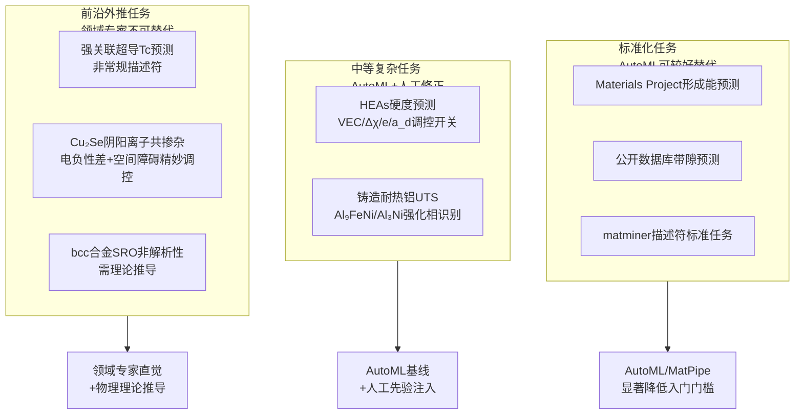

**AutoML的真实可行性边界可归纳为：在标准化任务上显著降低入门门槛与开发成本，但难以突破领域知识天花板；在前沿外推任务上提供基线，但产生方法学突破的能力仍依赖领域专家**。这一边界对产业化具有直接含义：企业在采用AutoML工具时，应明确区分"标准化预测任务"（适用）与"创新性逆向设计任务"（仍需领域专家深度参与）。matminer等工具明确提示"本文章所使用的包可能过时，需要查阅最新官方文档"[^76]——这一坦率提示也反映了自动化工具链本身的快速演化与版本兼容挑战。综合而言，特征工程对领域知识的强依赖**目前已有部分可行的标准化方案，但去人工化的方法学边界明确存在，未来仍将是"AutoML+领域专家协同"而非"AutoML替代专家"的格局**。

## 6.3 模型可解释性不足与SHAP/LIME/进化算法符号化路径的边界

特征工程的领域知识依赖在另一端引出了配比优化的第三类核心挑战——**模型可解释性**。深度神经网络、集成模型在配比优化中虽然展示了强大的拟合能力（第5章已量化），但普遍存在"黑箱"问题——模型给出预测但难以解释其背后的成分-性能因果机理。这一挑战在三类场景下尤为致命：**工业级决策场景**（决策需要可论证的物理依据而非"模型说应该这样"）、**监管合规场景**（航空、医疗、汽车等行业的材料认证需要清晰的因果链）、**专利保护场景**（黑箱模型生成的成分若无法解释机理，专利申请的创造性论证将面临障碍）。

针对可解释性缺口，配比优化领域已发展出多元化的应对路径，下表系统梳理其核心机制与边界：

| 可解释路径 | 核心机制 | 已报道应用 | 主要边界与风险 |
|---------|--------|--------|-------------|
| SHAP（Shapley值） | 基于合作博弈论分配特征贡献，提供局部一致+全局重要性[^76] | Zn合金ZACDS的SHAP+PSO耦合分析、SHAP热力图按相同输出原因分组样本[^76] | 事后解释可能与模型真实决策机制不一致；高维特征下计算成本高 |
| LIME | 局部线性近似可解释模型替代复杂分类/回归器[^76] | "通过调整单个数据样本的特征值并观察其对输出的影响来解释每个数据样本的预测"[^76] | 仅提供局部解释、扰动方式选择影响结果稳定性 |
| 特征重要性分析 | 基于树模型分裂增益或排列重要性 | 多数集成模型的标配输出 | 反映相关性而非因果性、对相关特征敏感 |
| KAN可学习激活函数 | 内生可解释架构，用可学习函数替代固定激活 | 力学超材料MSE仅1%、效率千倍提升 | 受限于数据规模、可解释性仍需进一步可视化 |
| 进化算法+ML代理符号化规则 | 进化搜索+ML代理模型+监督学习+统计检验，提取可解释设计规则（DARWIN框架）[^76] | 直接带隙材料、稳定UV发射体、IR钙钛矿发射体设计；UV卤化物钙钛矿等 | 规则的统计稳健性需独立验证、跨域适用性不保证 |
| 内在简单模型 | 线性回归、决策树等本身可解释 | 简单任务的快速基线 | 表达能力有限、复杂任务精度不足 |

**SHAP（Shapley Additive exPlanations）作为基于合作博弈论的特征归因方法，是配比优化可解释性的当前主流选择**。其数学根基扎实——基于Shapley值"为个体预测提供一致且局部准确的特征重要性值"[^76]——并已发展出热力图等丰富的可视化工具。"通过shap.plots.heatmap(shap_values[:1000])代码可以绘制热力图。在这个热力图中，由于相同原因导致相同模型输出的样本会被分组在一起，例如受功率BHP和年龄影响较大的人群。模型的输出显示在热力图矩阵上方，每个模型输入的全局重要性以条形图的形式显示在图形的右侧"[^76]——这种"局部归因+全局重要性"的双重视图，使研究者既能理解单个预测的成分-性能映射，又能把握整体特征重要性。SHAP数学示例展示了其核心机制：对于线性回归预测房价模型，SHAP值"考虑所有可能的特征组合及其对预测的贡献"，从而精确分解每个特征对最终预测相对于平均预测的贡献[^76]。在配比优化中，第4章已述Pan等人Zn合金ZACDS工作即采用"SHAP方法配合粒子群优化（PSO）进行模型可解释性分析"，将ML预测的UTS/伸长率/硬度精度（>90%）与可解释性分析结合，实现了"高精度+可解释"的双目标。

**LIME（Local Interpretable Model-Agnostic Explanations）则是另一类主流路径**。其核心思想是"通过局部近似可解释模型，以忠实的方式解释任何分类器或回归器预测结果……通过调整单个数据样本的特征值，并观察其对输出的影响，来解释每个数据样本的预测结果。LIME的输出是一组解释，代表每个特征对单个样本预测的贡献，这是一种局部可解释性的形式"[^76]。LIME的技术实现简单——"使用pip命令进行安装：!pip install lime"[^76]——使其成为快速集成可解释性的便利选择。

**SHAP/LIME作为事后解释方法存在两类不可回避的风险**。**第一是与模型真实决策机制不一致的风险**——SHAP/LIME解释的是"如何将模型预测分解为特征贡献"，但这种分解假设可能与模型内部真实计算路径并不严格对应。在某些极端情况下，两个具有完全不同内部逻辑的模型可能给出几乎相同的SHAP解释——这意味着SHAP/LIME提供的"可解释性"具有一定的"事后理性化"色彩。**第二是高维特征空间下的计算成本与稳定性问题**——SHAP严格计算需要遍历所有可能的特征组合（指数复杂度），实际工具往往采用近似算法（如TreeSHAP、KernelSHAP），近似精度与稳定性需要谨慎评估。

**KAN等内生可解释架构提供了第三条路径**——通过将可解释性嵌入模型架构本身而非事后分析。KAN通过可学习激活函数替代传统神经网络的固定激活函数，使每条边的函数形式都可被独立可视化，从而提供了内生的可解释性。但KAN的应用边界在第5章已明确——其在 $1.75\times 10^4$ 量级数据上MSE仅1%、效率千倍提升的成果建立在小样本+高维输出的特殊场景下，扩展至大规模数据集时其可解释性优势是否仍能保持，仍需更多实证。

**进化算法+ML代理模型的符号化规则提取是最具方法学创新意义的路径**。Wang等人在 *Nature* 系列期刊上发表的DARWIN框架"将进化算法驱动的搜索与机器学习代理模型相结合……然后将搜索结果与监督学习和统计检验耦合。这一策略使得能够高效搜索材料空间，同时提供可解释的设计规则"[^76]。该工作"通过开发用于直接带隙材料、稳定UV发射体和IR钙钛矿发射体设计的规则展示了其有效性。最后，本文最终展示了DARWIN生成的规则在统计上更加稳健且适用于广泛应用，包括UV卤化物钙钛矿的设计"[^76]。这一框架的方法学突破在于：**它不再满足于"事后解释"，而是直接生成"实验家可使用的可解释化学规则"**——从"模型给出预测"上升到"模型给出可被独立验证的设计法则"，这是可解释性的最高级形态。

**符号化规则的边界主要体现在两点**：**第一是统计稳健性需要独立验证**——规则的发现基于训练集的统计模式，但这些模式是否反映了真实物理规律，需要在新数据集、新材料体系上进一步验证。**第二是跨域适用性不保证**——为UV发射体设计的规则未必适用于IR钙钛矿，反之亦然。

综合而言，可解释性挑战的现状可归纳为：**SHAP、LIME作为事后解释工具已在配比优化领域广泛应用，提供了从黑箱到部分透明的关键过渡；KAN等内生可解释架构与DARWIN等符号化规则框架代表了向"内生+可被独立验证"的更高级形态演化**。但每条路径都有明确的边界——事后解释存在与真实决策机制不一致的风险、内生可解释架构受限于数据规模、符号化规则需独立验证。这意味着可解释性挑战**目前已有部分可行方案，但距离"工业级、监管级、专利级"可信解释仍有显著距离**——这一现状对第7章产业化距离评估尤为关键。

## 6.4 外推能力弱与PINN/物理融合方案的真实增益

第5章已系统诊断出配比优化领域普遍存在的"高拟合-低外推"问题——OOD基准的系统性下降、强关联系统精度的固有局限、训练数据分布偏差的传导效应——共同构成了纯数据驱动模型在跨族系外推、亚稳态预测、稀有元素体系、新工艺路线下的系统性失准。本节承接这一诊断，进一步剖析外推困境的根源并系统评估物理融合应对方案的真实增益与失效模式。

外推困境的物理根源可归纳为三点：**第一是机器学习的归纳偏置局限**——纯数据驱动模型的"知识"仅来自训练数据的统计模式，而真实物理规律（如热力学第二定律、相图拓扑约束、键长键角守恒）在训练数据中往往以隐含形式存在，模型可能学到统计相关性而非物理因果。**第二是训练数据分布的覆盖死角**——OQMD偏向ICSD稳定相、文献偏向正向结果——使得模型在分布之外缺乏可信的物理直觉。**第三是强关联体系物理本身的困难**——超导Tc的强关联系统、量子涨落主导的极端温度低维体系、电子-声子耦合复杂体系——即便是DFT本身也存在精度局限，纯ML无从获得可靠的物理先验。

针对外推困境，物理融合应对方案已形成多层次体系，下表系统比较其增益与失效模式：

| 物理融合方案 | 核心机制 | 已报道增益 | 主要失效模式与风险 |
|---------|--------|--------|-------------|
| 物理信息神经网络（PINN） | 损失函数同时最小化数据拟合误差与物理方程残差 | 小数据高精度、外推一致性提升 | 损失函数权重调参困难、物理方程本身近似带来误差 |
| 动态CALPHAD参数修正 | 局部ΔL拟合替代全局参数化 | Co-Cr-Ni SFE预测RMSE 24.2→5.4 mJ/m²（降77.7%）、合金设计效率提升5倍 | CALPHAD框架本身局限传导、需迭代实验数据支撑 |
| 机器学习势函数（MLIP） | 用ML加速DFT计算 | 提升泛函精度与算力效率 | 训练集覆盖不足导致外推失准、过渡态预测困难 |
| 化学约束嵌入 | 电荷电负性中性、价电子守恒等 | Olivetti深度强化学习"学习了电荷与电负性中性等化学准则" | 仅能保证基本化学合理性，难以覆盖复杂物理机制 |
| KAN内生可解释架构 | 可学习激活函数替代固定函数 | 力学超材料MSE仅1%、效率千倍 | 数据规模受限、物理先验需通过激活函数形式间接表达 |
| DM21神经网络泛函 | ML优化交换相关能 | 显著提升DFT计算精度 | 神经网络泛函的训练数据覆盖与外推性 |

**动态CALPHAD参数修正是物理融合方案中量化增益最显著的代表**。第1章已详细介绍其方法论——"以Co-Cr-Ni三元为例，通过TEM实验和DFT数据建立参考SFE数据库，采用轴对称Ising模型计算初始ΔL参数，在定向搜索中每发现一个新目标合金（如SFE=25±2.5 mJ/m²）即用实验值更新局部ΔL参数，经3次迭代将RMSE从24.2 mJ/m²降至5.4 mJ/m²，将合金设计效率提升5倍以上"。这一77.7%的RMSE降幅与5倍效率提升的双重指标，是物理融合方案在配比优化中最具说服力的量化证据。其方法学精髓在于：**用ML的"局部拟合"思想修正CALPHAD的"全局假设"缺陷**——既保留了CALPHAD作为热力学一致性框架的物理稳健性，又克服了其全局参数化在多组分高熵合金中的精度局限。

**PINN作为物理融合的另一主流路径**，其核心机制是在损失函数中同时最小化数据拟合误差与物理方程残差（如偏微分方程、守恒律、对称性约束）。在配比优化中，PINN可以将相图约束、热力学方程、扩散方程等物理先验作为软约束嵌入模型训练。其优势在于：**在数据稀缺时通过物理先验维持稳健性、在数据偏差时通过物理一致性纠正预测**。但PINN的失效模式同样不可忽视——**第一是损失函数权重调参困难**，数据项与物理项的相对权重对最终模型性能有显著影响，调参往往需要大量经验；**第二是物理方程本身的近似带来误差**——若所采用的物理方程本身就是简化模型（如线性弹性假设、稀薄气体近似等），PINN的"物理一致性"只是相对于这些简化方程的一致性，而非真实物理。

**机器学习势函数（MLIP）与DM21神经网络泛函**则代表了物理融合的更深一层——**用ML加速并提升DFT计算本身的精度**。MLIP通过ML训练原子间相互作用势函数，可在保持DFT级精度的同时大幅降低计算成本，已被Acta Materialia等期刊列为综述焦点。DM21神经网络泛函则通过ML优化交换相关能，显著提升DFT计算精度。这些方法的方法学意义在于：**它们不是用ML替代物理计算，而是用ML增强物理计算**——这一定位避免了纯数据驱动方法的根本性外推局限。但其失效模式集中在两点：**训练集覆盖不足导致外推失准**——MLIP在训练集分布之外的原子构型上可能给出非物理结果；**过渡态、表面、界面等关键区域的精度**——这些区域往往是配比优化中相变、扩散、析出等核心物理过程的发生地，但也是MLIP训练数据相对稀疏的区域。

**KAN作为新型可解释架构则将物理融合上升到架构层面**。KAN的"可学习激活函数"在数学上等价于Kolmogorov-Arnold表示定理——任意多元连续函数可分解为单变量函数的有限叠加。这一定理本身具有物理含义——许多物理现象的多变量函数表示具有可分离结构，KAN的架构正好匹配这一特性。但KAN的物理融合是间接的——它通过架构选择隐含地表达了某种物理先验，而非显式嵌入物理方程。

物理融合方案的整体可行性边界可归纳为三点：**第一，物理融合是缓解外推困境最具方法论深度的路径**——其量化增益（如SFE预测RMSE 77.7%降幅）远超单纯算法改进的提升幅度；**第二，物理融合并非万能钥匙**——物理先验本身的偏差（如CALPHAD全局参数化局限）会被约束机制放大、PINN损失函数权重调参困难、强关联体系物理理论本身不完备使物理约束无从嵌入；**第三，物理融合的方法学成本较高**——需要同时具备ML与物理两方面的深入背景，对研究团队的跨学科能力提出了严苛要求。这意味着外推能力挑战**已有相对成熟的物理融合方法学，但其推广至更广泛体系仍面临"先验偏差放大""跨学科能力门槛"等现实约束**——属于"已有部分可行方案"层级，但远未达到"已普遍解决"。

## 6.5 跨尺度建模困难与多尺度数据-模型耦合的工程挑战

外推困境的进一步深化是跨尺度建模困难。配比优化的本质是从元素配比（成分尺度）到最终性能（宏观尺度）的多层级映射，而这一映射跨越了"原子→晶粒→介观组织→宏观性能"的多个尺度——元素相互作用在原子尺度（皮米至纳米）、第二相析出在纳米尺度（数纳米至数十纳米）、织构与晶粒在微米尺度（数微米至数十微米）、宏观力学性能在毫米至米尺度。每一尺度的物理机制与建模方法都不同：原子尺度依赖DFT与分子动力学、纳米尺度依赖相场模拟与析出动力学、微米尺度依赖晶体塑性与位错动力学、宏观尺度依赖有限元模拟与连续介质力学。

跨尺度耦合的复杂性在第1章已通过姜雁斌团队Cu-Be合金的"四元协同"机制得到具体展示——"Ni与Mg共同调节Be的固溶度以促进强化相析出，Ni引导纳米级NiBe相在晶粒内部定向生成，Mg则主动'站岗'于晶界和相界以抑制有害的不连续析出，从原子到晶粒尺度构成完整的多层调控链条"。第4章Cu₂Se阴阳离子共掺杂工作则展示了另一种跨尺度协同——"占据Cu位的大尺寸Ag离子结合增强的Cu-F键能"通过原子尺度的电负性差与空间障碍作用、最终实现宏观尺度的ZT=3.0、热电模块转换效率13.4%。这些案例的深刻含义在于：**配比优化的真实物理机制必然涉及多尺度耦合，单一尺度建模无法捕捉完整的成分-性能因果链**。

针对跨尺度建模困难，应对方案已形成多元化布局。**多尺度时空CNN**将不同尺度的微观组织图像（SEM、TEM、EBSD）通过多分支CNN融合，实现跨尺度特征自动提取。**图神经网络层级表征**通过分层图结构表达原子-晶粒-多晶体的多尺度连接关系。**VAE微观组织自监督编码**则通过潜空间学习实现微观组织到性能的端到端映射——第1章已介绍西工大李金山团队的工作，其潜变量与屈服强度关系类似经典霍尔-佩奇规律，体现了VAE对跨尺度物理规律的隐式学习。**ICME（集成计算材料工程）**则代表了跨尺度建模的工程化最高形态——通过将DFT、相场、晶体塑性、有限元等多尺度模拟工具串联耦合，实现端到端的成分-工艺-组织-性能预测。第4章已述Northwestern大学Olson团队、QuesTek Innovations等正是ICME方法论的奠基者与产业化先锋。

**跨尺度建模的核心瓶颈集中在三点**。**第一是跨尺度数据对齐困难**——不同尺度的实验数据采集方式不同（DFT计算输出能量与电子结构、TEM输出图像、力学试验输出应力-应变曲线），数据形式异质难以直接对齐。**第二是计算成本叠加**——若多尺度模型串联耦合，每一尺度的计算成本需累加，端到端ICME模拟单次运算可能需要数小时至数天，难以支撑大规模成分扫描。**第三是不同尺度建模误差传递放大**——上游尺度的预测误差（如DFT形成能MAE约0.02 eV/atom的纯方法残差）经下游尺度模型传递后可能被放大数倍，最终对宏观性能预测的精度构成根本性约束。

跨尺度建模在配比优化中的可行性边界可归纳为：**已有相对成熟的方法学（多尺度CNN、ICME、VAE自监督编码等）但工程化部署成本高、跨尺度数据对齐与误差传递问题仍未根本解决**——属于"已有部分可行方案，但未根本解决"层级。第5章末尾的"可信度建设三位一体路径"在跨尺度场景下面临更严峻的工程挑战，这一现状将在6.9节耦合分析中进一步体现。

## 6.6 实验闭环成本高与自动化实验/Self-Driving Labs的边界

跨尺度建模的工程挑战与第5章已强调的"实验闭环作为可信度终极验证手段"紧密耦合——但实验闭环本身正面临高成本、长周期、多目标表征复杂等现实约束。蠕变寿命试验耗时数千至数万小时（NIMS Creep Data Sheet部分数据点的累积时间跨越数十年）、单晶高温合金合成-表征单轮以月计、HEA成分制备-XRD-硬度全流程数日至数周——这些时间尺度使得"快速迭代"成为奢望。

第5章已量化主动学习驱动的样本效率提升——HEAs 27%数据→95%精度、SMA 9轮反馈循环36/800000实验比、Raabe HEA-GAD六次迭代等——证明了不确定性量化驱动的实验点选择能够将所需样本量降低一到两个数量级。然而**主动学习的可行性同样有边界**：**第一是不确定性估计本身可信度问题**——若高斯过程在高维输入下的不确定性估计、深度集成在小样本下的方差估计本身就不可信，则主动学习将基于错误的不确定性指引选择实验点，反而浪费实验资源。**第二是初始训练集质量瓶颈**——主动学习的迭代起点是初始训练集，若初始数据本身严重偏差（如全部为正向案例、稀有元素覆盖不足），主动学习的探索方向将被限制在偏差所诱导的局部空间内。

**Self-Driving Labs（自动化实验闭环）**代表了应对实验闭环高成本的最前沿应对方案。其核心思想是构建机器人合成平台、自动化表征仪器、AI决策模块的端到端闭环——AI根据当前数据决定下一个实验、机器人自动合成、自动化仪器表征、数据自动反馈给AI——将"模型预测→实验验证→数据反馈→模型更新"的循环周期从月级压缩到日级乃至小时级。这一愿景在化学合成、薄膜材料等领域已有原型实证，但在配比优化的合金体系中面临特殊挑战：**第一是设备适配难题**——合金高温熔炼、单晶定向凝固、高温热处理等复杂工艺涉及高温（千摄氏度以上）、长时（数小时至数日）、特殊气氛（真空或惰性气体）等极端条件，机器人合成平台的工程化难度远高于溶液化学合成。**第二是表征链条复杂**——配比优化的多目标性能表征涉及力学（拉伸、硬度、蠕变）、组织（SEM、TEM、EBSD、APT）、热分析（DSC、热膨胀）等多类仪器，每类仪器的自动化对接都是独立工程。**第三是闭环周期的工程现实**——即便部分环节已自动化，端到端单轮闭环的现实周期仍在周-月级，远超化学合成领域的小时-日级。

第7章将进一步详细分析自动化实验闭环作为产业化路径的核心环节，本节仅强调其作为应对实验闭环成本挑战的现实边界——**自动化实验闭环代表了未来方向但短期内对配比优化领域的实质性减负仍有限**。这一现状对应于"已有部分可行方案，但工程化成本仍高"层级。

## 6.7 知识产权、数据共享壁垒与联邦学习的可行性

实验闭环成本之上叠加的另一类制约是知识产权与数据共享壁垒——这一挑战在产业级数据场景下尤为突出。企业核心配方涉及商业机密（高镍三元正极的具体微合金元素配方、镍基高温合金的精确成分窗口、铜合金的微合金优化方案均为各公司核心专利与商业秘密）、合金牌号涉及专利权属（航空发动机用合金的命名与成分受到严格的专利保护）、工艺-组分耦合数据涉及客户协议（材料供应商对客户提供的定制化产品数据通常存在保密条款）——这些壁垒使得公开数据库与产业真实数据之间存在深刻鸿沟。

第2章已述NIMS-ARIM"将共享设备使用所产出的材料数据系统收集"这一国家级模式，仅是部分缓解这一困境。NIMS DICE平台试图通过"创出—蓄积—活用"一体化处理打通数据流，但产业级数据的共享仍面临根本性激励机制缺失。

针对IP壁垒，**联邦学习**被广泛视为最具前景的应对方案。其核心思想是"在本地训练、参数聚合、原始数据不出域"——多个企业可在不共享原始数据的前提下，通过共享模型参数（或参数梯度）训练联合模型，从而实现数据隐私保护与模型性能提升的双重目标。**差分隐私**则通过向参数或数据添加可控噪声进一步降低参数泄露反推原始数据的风险。**Citrination企业级私有-公开混合平台**（详见第4章）则代表了产业级数据共享的另一种实践——通过PIF标准化数据交换格式与权限管理机制，企业可以在私有数据与公开数据之间灵活切换。

**联邦学习在配比优化场景下的可行性边界主要体现在四点**。**第一是小样本异质数据下的模型一致性**——不同企业的私有数据可能在样本量、特征分布、实验条件上存在显著异质性，联邦学习的简单参数聚合（如FedAvg）在这种异质场景下可能导致模型性能下降甚至退化。**第二是模型架构异构问题**——若不同企业使用不同的模型架构，联邦学习的参数聚合无法直接进行。**第三是参数泄露反推风险**——即使原始数据不出域，恶意攻击者通过分析模型参数变化也可能反推出敏感数据信息，需通过差分隐私等额外机制防护。**第四是差分隐私扰动对配比优化精度的影响**——差分隐私通过添加噪声保护隐私，但噪声同时会降低模型精度，对要求高精度的配比优化任务可能带来不可忽视的性能损失。

**更根本的制约是产业激励机制缺失**。联邦学习提供的是"技术可行性"，但企业是否愿意参与联邦学习的决定性因素是**产业激励机制**——参与联邦学习能否为企业带来超过潜在数据泄露风险的回报。在缺乏行业级、政策级激励机制的现状下，技术上的"可行"难以转化为产业上的"实行"。这一点是IP壁垒挑战与单纯技术挑战的本质区别——**它不是技术问题，而是产业治理问题**。

综合而言，IP壁垒挑战的现状是：**联邦学习等技术方案已较成熟，但产业激励机制缺失下数据共享壁垒的根本性制约仍未根本破解**——属于"已有部分可行的技术方案，但产业治理层面的根本性瓶颈尚未突破"层级。这一现状对配比优化的产业化具有特别深刻的含义——它意味着公开数据库训练的模型与企业实际应用场景之间始终存在结构性差距。

## 6.8 标准化基准缺失、可复现危机与社区基础设施的进展

第5章已系统诊断工作流细节差异对报告精度的系统性影响——同任务跨论文精度数字不可直接比较、特征工程/数据预处理/超参数调优细节披露不充分、代码与数据开放程度参差。这一诊断的方法学含义是：**配比优化领域存在隐性的"复制危机"**——许多论文报告的精度数字在独立复现条件下可能大幅缩水。

针对标准化基准缺失与可复现危机，社区基础设施进展已形成多层次布局。第2章已详细介绍**JARVIS-Leaderboard**作为多模态、多任务标准化基准的最新实践——其评测体系覆盖AI、ES、FF、QC、EXP五个材料设计类别，仅在AI类别下就提供了形成能、带隙、弹性张量、表面能、空位形成能等数十个细粒度基准；按"按属性、按数据集分割、按方法分类"的三维基准矩阵实现了细粒度横向可比性。**MatBench基线与OOD基准对照**（第5章Hu团队工作）则提供了"in-distribution vs OOD"的双重评估视角，揭示了八大GNN在OOD场景下的系统性精度下降。**NOMAD AI Toolkit**通过"将材料科学的可复现性提升到新水平"——研究者不仅可以共享论文背后的数据，还能共享所有开发的方法与分析工具——使得任何已发表结果都可以在原始工作流条件下被独立复现。**CrabNet大规模超参数基准**（173,219组合×387 RTX-2080-Ti GPU天）为配比优化中的大规模超参数搜索提供了标准化评估资源。**PIF标准化数据格式**与**pypif、pif-dft**等工具则通过标准化数据交换降低了跨研究复用障碍。

**社区基础设施的进展虽显著但仍面临多重剩余瓶颈**。**第一是基准覆盖不全**——JARVIS-Leaderboard等已覆盖大量基准，但配比优化的诸多前沿任务（如多目标帕累托优化、跨尺度建模、强关联体系预测）仍缺乏对应基准。**第二是社区贡献激励不足**——基准的扩充与维护依赖社区贡献，但当前学术评价体系对基准贡献的认可度远低于论文产出，导致"贡献不足→基准滞后→评测失真"的负循环。**第三是企业私有基准游离于公开评测之外**——企业内部使用的真实数据基准（如Citrination企业内部数据集、QuesTek用于客户项目的成分-性能数据库）通常不对外开放，使得公开基准评测出的"最优模型"在产业场景下未必最优。**第四是工作流细节披露的执行标准不统一**——即便有JARVIS-Leaderboard等平台支撑，论文是否披露完整工作流细节仍取决于作者自觉与期刊审稿要求，缺乏强制性标准。

综合而言，标准化基准缺失挑战的现状是：**社区基础设施已取得显著进展，但基准覆盖、贡献激励、私有数据游离、披露标准等剩余瓶颈使其仍是领域成熟化的关键短板**——属于"已有部分可行方案，但远未根本解决"层级。这一现状直接影响第7章产业化距离评估中"行业接受度"维度的判定——只有当公开基准评测具备足够的产业代表性时，企业才能基于公开评测做出可信的模型选型决策。

## 6.9 挑战间的耦合放大效应与综合可行性判定

经过6.1至6.8节对八类核心挑战的逐项剖析，本节进行综合性的耦合分析与可行性判定。八类挑战并非孤立存在，而是相互耦合、相互放大——这一耦合特征使得领域整体的成熟化过程比单一挑战的解决更为艰难。

下图展示八类挑战之间的耦合放大网络：

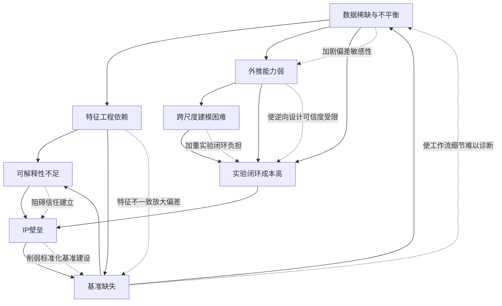

**核心耦合路径可归纳为七条**。**第一，数据稀缺加剧偏差敏感性**——小样本场景下任何数据偏差都被放大，使外推能力问题更严重。**第二，偏差被特征不一致放大**——不同研究者特征定义不一致使跨数据集偏差进一步发散。**第三，可解释性缺失阻碍信任建立**——可解释性不足使企业不愿共享私有数据加入公开生态，加剧IP壁垒。**第四，外推能力弱使逆向设计可信度受限**——逆向设计预测的"突破性合金"必须通过实验验证才能确认，加重实验闭环负担。**第五，跨尺度建模困难加重实验闭环负担**——多尺度耦合验证需要更多类型表征，提高单轮实验成本。**第六，IP壁垒削弱标准化基准建设**——企业私有数据游离于公开生态，使公开基准缺乏产业代表性。**第七，基准缺失使工作流细节问题难以诊断**——没有标准化评测，工作流细节的影响无法被系统识别，反过来又使数据增强等方案的真实效果难以量化。

基于上述耦合分析，本章提出**三级分层的综合可行性判定框架**：

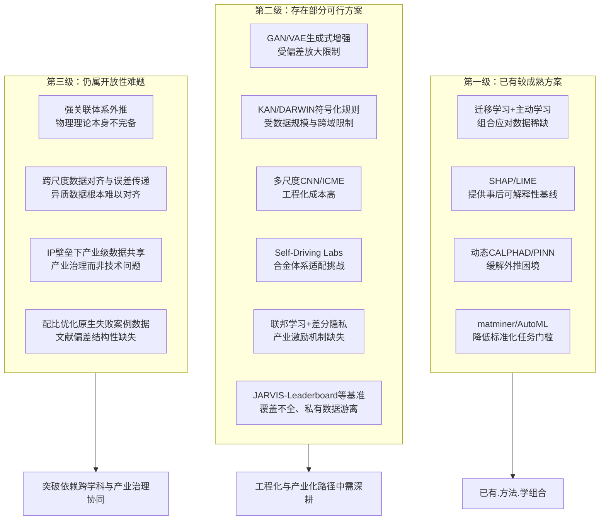

**第一级——已有较成熟方案**包括：迁移学习+主动学习的组合应对数据稀缺（量化增益明确）、SHAP/LIME提供事后可解释性基线（已广泛应用）、动态CALPHAD/PINN缓解外推困境（如SFE预测RMSE降77.7%等显著增益）、matminer/AutoML降低标准化任务门槛（已成为入门标准工具）。这一级的方案已构成相对成熟的方法学组合，构成配比优化产业化的方法学基石。

**第二级——存在部分可行方案**包括：GAN/VAE生成式增强（受原始数据偏差放大限制）、KAN/DARWIN符号化规则（受数据规模与跨域适用性限制）、多尺度CNN/ICME（工程化成本高、跨尺度数据对齐困难）、Self-Driving Labs（合金体系适配仍有显著工程挑战）、联邦学习+差分隐私（技术成熟但产业激励机制缺失）、JARVIS-Leaderboard等基准（覆盖不全、私有数据游离）。这一级的方案在工程化与产业化路径中需要深耕——它们提供了"在某些场景下可行"的方法学基础，但距离"普遍可用"仍有显著距离。

**第三级——仍属开放性难题**包括：强关联体系外推（物理理论本身不完备）、跨尺度数据对齐与误差传递（异质数据根本难以对齐）、IP壁垒下的产业级数据共享（产业治理而非技术问题）、配比优化原生失败案例数据（文献正向偏差是结构性缺失，难以通过数据增强弥补）。这一级的难题不是简单的方法学改进可以解决——它们要么依赖于物理理论本身的进展（强关联体系），要么依赖于跨学科与产业治理的协同（IP壁垒、失败案例数据），其突破时间窗口具有更大不确定性。

**这一三级分层判定为第7章产业化距离评估提供了直接挑战侧输入**。具体而言：**第一级的成熟方案构成了配比优化在标准化任务、低复杂度逆向设计场景下已经可以产业化应用的方法学基础**——这对应于第7章将讨论的当前TRL等级中的较高水平。**第二级的部分可行方案构成了配比优化在中等复杂度产业场景下5–10年内可能逐步成熟的方法学方向**——这对应于第7章将讨论的中期产业化路径。**第三级的开放性难题则构成了配比优化在最复杂前沿场景（如全新元素体系的逆向设计、跨尺度耦合的端到端ICME、产业级数据全面打通）下10年以上才能真正成熟的根本性瓶颈**——这对应于第7章将讨论的长期产业化突破。

综合本章对八类核心挑战及其耦合放大效应的系统分析，可凝练出三点对后续章节具有方法论意义的结论：

**第一，配比优化领域的核心挑战已不再是"算法不够先进"，而是"数据稀缺、特征工程、可解释性、外推能力、跨尺度、实验闭环、IP壁垒、基准缺失"八重挑战的耦合放大**。这一耦合特征意味着任何单点突破都难以根本改变领域的成熟度——只有多个挑战同时取得显著进展，领域才能真正走向产业化大规模应用。

**第二，物理融合+主动学习+标准化基准已构成配比优化方法学的相对成熟组合**——动态CALPHAD修正与PINN在外推上的77.7% RMSE降幅、HEAs主动学习的27%数据→95%精度样本效率提升、JARVIS-Leaderboard的细粒度横向可比性，共同支撑了"高拟合-低外推"问题的方法学应对路径。但这一组合的成熟度仍局限于学术级研究——产业化大规模应用还需要跨学科协作能力的扩展（每个团队同时具备ML、物理、实验三方面深度能力的稀缺性）。

**第三，跨尺度建模、IP壁垒下的产业级数据共享、强关联体系外推、配比优化原生失败案例数据等仍属开放性难题**——这些难题的解决不依赖单一技术突破，而依赖物理理论进展、产业治理改革、跨学科生态成熟等多维度协同。这一判定意味着用户最关心的"距离理想模型大规模应用还有多远"这一问题的答案，本质上由开放性难题的突破时间窗口决定，而非由当前已成熟方案的应用扩展速度决定。第7章将基于本章建立的三级分层可行性判定框架，从TRL六维度系统评估当前领域所处的产业化阶段，并给出3–5年、5–10年、10年以上的分阶段预测。

# 7 产业化转化路径、典型工业案例与成熟度评估

第1至第6章已分别从方法论框架、数据基础设施、分体系应用现状、研究主体识别、模型准确度评估与核心挑战剖析六个维度，构建了机器学习/深度学习介入材料元素配比优化的完整学术图景。然而，**学术图景的完整性并不等于产业化的成熟度**——一个领域是否真正"可用"、距离"大规模应用"还有多远，最终的判决权在产业实践本身。第6章末尾建立的三级分层可行性判定框架已为本章奠定了挑战侧的判定基线：第一级已有较成熟方案构成产业化的方法学基石，第二级部分可行方案需在工程化路径中深耕，第三级开放性难题决定了全谱系产业化的最远时间窗口。本章作为全报告的收官章节，承接这一判定框架，**将视角从学术研究全面转向产业实践**，系统评估机器学习配比优化从论文走向车间的现实路径与成熟度，并最终回应用户最核心的关切——"距离理想模型大规模应用还有多远"。

本章按照"产业主体—行业实证—独有挑战—政策支撑—成熟度判定—跨域比较—分阶段预测"的逻辑层次依次展开。7.1节首先剖析代表性产业化主体的商业模式差异；7.2至7.4节通过航空航天、汽车与增材制造、电池与功能材料三大领域的实际案例验证产业化的现实进展；7.5节归纳产业化过程中区别于学术研究的三类独有挑战；7.6节梳理国家级政策与基础设施支撑现状；7.7节构建TRL六维度评估框架做出量化判定；7.8节通过与药物发现、半导体设计的横向比较揭示差距与可借鉴经验；7.9节归纳核心里程碑并给出3–5年、5–10年、10年以上的分阶段预测。

## 7.1 产业化主体的商业模式与技术产品比较

产业化的第一层观察是产业主体本身——是谁在承接学术成果、以怎样的商业模式将ML配比优化转化为可销售的产品或服务？第4章已系统识别Citrine Informatics、QuesTek Innovations、Intellegens、Phaseshift Technologies、Google DeepMind GNoME等代表性产业主体，本节进一步剖析它们的商业模式差异及其背后的产业化逻辑。

**Citrine Informatics代表了"标准化数据平台+企业级ML流水线"模式**。其核心产品PIF（Physical Information File）格式与`pypif`、`pif-dft`工具链构成了企业内可复用的材料数据-机器学习管道；商业模式则是向企业客户提供SaaS订阅式的数据-ML一体化平台。Citrine明确将"加速产品开发"作为价值主张——其联合创始人Bryce Meredig指出："Citrine通过与研究机构建立的大型关系网络收集未发表的数据……负面数据几乎从未公布。但是，负面结果的原始数据对建立一个毫无偏差的数据库而言至关重要。这种综合方法使公司能够将特定应用的研发时间缩减一半。"[^79]这一定位精准切入了第6章所述"文献正向偏差"这一结构性瓶颈——通过组织化收集未发表的负面数据补足公开数据库的覆盖死角。

**QuesTek Innovations代表了"ICME系统设计方法论+定制化合金研发"模式**。该公司"通过其Materials By Design方法与集成计算材料工程（ICME）技术快速设计、开发并商业化新合金，正在设计新的Al-、Fe-、Ti-、Cu-、Ni-、Nb-、Mo-、Co-基材料"[^80]。其商业化产出极为具体——已商业化引入四款Ferrium钢系列：**Ferrium M54（AMS 6516；MMPDS S-basis approved，A/B-basis pending）**作为AerMet 100的低成本替代品，具有更宽容的热处理工艺并提供同等或更好的性能，包括更优的SCC与疲劳抗性；**Ferrium S53（AMS 5922；MMPDS）**对一般腐蚀、SCC、疲劳、腐蚀疲劳与磨削烧伤的抗性显著优于300M/4340；**Ferrium C61（AMS 6517）和C64（AMS 6509）**作为新型渗碳级齿轮钢，其强度、硬度、韧性、抗STBF性、耐高温性、抗磨削烧伤性或淬透性优于AISI 9310 VIM/VAR或Pyrowear 53[^80]。M54与S53已应用于"转子/驱动轴、起落架、作动器、结构件等"，C61与C64则用于"传动装置、整体齿轮轴、作动器等"[^80]。这一系列产品矩阵的关键意义在于——**它们已通过AMS（航空航天材料规范）与MMPDS（金属材料特性开发与标准化）两道航空认证的最高门槛**，是ML/ICME配比优化方法论真正"穿越认证墙"的少数标杆产品。

**Intellegens代表了"稀疏数据深度学习工具+跨域SaaS服务"模式**。其Alchemite深度学习算法的核心特色是"能够从完成率仅为0.05%的数据中学习，能够链接和交叉引用可用数据，验证潜在新合金的物理性质，并准确预测它们在现实应用场景中的运行方式"[^81]。这一稀疏数据建模能力正是第6章所述"数据稀缺与不平衡"挑战的针对性应对方案。Intellegens的商业模式已在材料与药物发现两个领域同时落地——通过Cerella平台与全球最大制药公司验证底层科学，通过Alchemite与GKN航空、剑桥大学等合作进行合金研发。

**Phaseshift Technologies代表了"AI驱动合金设计平台+垂直行业服务"模式**。其RAD（Rapid Alloy Design）平台由MatterMind（AI驱动合金设计）与Cascade（集成多尺度模拟）两大组件构成，宣传性数据为"研发速度快100倍、成本降低90%"，服务领域包括能源、航天、矿业、汽车等[^82]。需要客观指出的是，"100倍/90%"是公司宣传性指标，缺乏独立第三方验证——这一"宣传精度"与"产业可用精度"的落差正是第5章末尾所强调的工作流细节披露问题在产业宣传中的延伸。

**Google DeepMind GNoME则代表了"科技巨头大模型驱动+学术开放"模式**——通过图神经网络一举发现220万种新材料候选[^71]，将候选材料库扩大到前所未有的量级。但这一规模数字背后需要冷静认识：发现220万种"候选"与产业化220万种"可用"之间存在巨大的实验合成、工艺验证、产业认证的链条，候选数与可用数的比例未知。

下表系统比较五类商业模式的核心特征：

| 主体 | 商业模式 | 核心技术产品 | 已验证的产业兑现 | 客观性边界 |
|------|---------|-----------|--------------|---------|
| Citrine Informatics | 标准化数据平台+SaaS | PIF格式、pypif工具链、未发表数据网络 | 与LBNL Materials Project合作、获NSF SBIR资助、宣称研发时间减半[^79] | 减半数字未独立验证 |
| QuesTek Innovations | ICME方法论+定制合金 | Ferrium M54/S53/C61/C64钢系 | AMS与MMPDS航空双认证、Apple/Tesla/SpaceX并购兑现[^80][^71][^83] | 单一产品周期长、行业渗透有限 |
| Intellegens | 稀疏数据深度学习+SaaS | Alchemite算法、Cerella药物平台 | GKN航空Ti合金（钯/钌组合）、剑桥镍基增材合金"节省15年/1000万美元"[^84][^81] | 节省指标基于公司估算 |
| Phaseshift Technologies | AI合金平台+垂直服务 | RAD平台（MatterMind+Cascade） | 服务航天/汽车/能源/国防/矿业/制造业[^82] | "100倍/90%"为宣传指标 |
| Google DeepMind GNoME | 大模型+学术开放 | GNoME图神经网络 | 发现220万种新材料候选[^71] | 候选→可用的转化率未知 |

**这一商业模式光谱的产业化逻辑可归纳为三类典型路径**：**第一类是"学术spin-out→大企业战略并购"**——QuesTek 1996年从Northwestern的Olson团队孵化、2012年技术售予Apple、Charles Kuehmann率团队加盟Apple后又主导Tesla Model Y免热处理铝合金（后地板从80零件减至1）、Cybertruck与SpaceX星舰新型不锈钢的研发，是该路径最经典的样本。**第二类是"独立运营+API/数据流水线服务"**——Citrine、Intellegens通过SaaS订阅模式服务多个行业客户，保持与学术界的紧密联系。**第三类是"科技巨头内部AI研发"**——Google DeepMind GNoME、Tesla材料技术VP团队等承载最大规模的算力与数据资源。三类路径各有优势，共同证明了ML配比优化的产业价值已被多种商业模式认可。

值得补充观察的是，**Citrine案例还揭示了产业化主体在学术原创性方面的独特贡献**——其对未发表负面数据网络的组织化建设、对"研究产生的数据比大型连锁零售要少得多，而且往往不能以数字化方式获取"[^79]这一研发数据特殊性的清晰认识，本身就是对第6章所述"文献正向偏差"挑战的产业级方法论应对。这种"产业主体反向贡献于学术方法论"的双向流动，是配比优化领域产业生态成熟的重要标志。

## 7.2 航空航天高温合金的产业化实证

航空发动机被誉为"工业皇冠上的明珠"，是航空产业核心壁垒——"全球市场由GE、普惠、罗罗及CFM四大巨头垄断，合计占据近90%民用份额；预计2033年全球市场规模将达1585.7亿美元，年增速8.9%"[^85]。航空发动机"集高温、高压、高速等极端工况于一体，技术壁垒极高、研制周期长达15-20年，是多学科交叉的系统工程"[^85]——这一极端工况对涡轮叶片、燃烧室、起落架等关键部件所用的高温合金、超高强度钢、钛合金提出了近乎严苛的配比优化需求，构成ML配比优化产业化最具压力也最具机遇的核心战场。

**Ferrium S53钢的产业化历程是该领域最具范式意义的样本**。该合金由QuesTek Innovations通过ICME方法论计算机辅助设计——"FerriumS53合金组织上具有在细小的延性板条状马氏体基体上通过M2C强化的结构特点。基体上含有充分的Cr产生钝化以及足够的Co将Cr的活性提高到比12%Cr钢更高的水平。晶界受控的化学性质最大程度地提高了晶界的聚合性、耐SCC性和氢脆性。另外，所设计的晶粒扎钉粒子能有效地弥散扎钉分布"[^83]。其精确成分（重量百分比）为：**0.21%C、14%Co、10%Cr、5.5%Ni、2%Mo、1%W、0.3%V，余为Fe**[^83]。这一精确到小数点后一位的多元配比组合，正是ICME计算辅助设计的典型产出形态。

S53的力学性能数据展示了其相对于传统材料的工程价值——"UTS达288 ksi、YS 227 ksi、伸长率14-16%、断面收缩率55-65%、CYFS 255 ksi、HRC 51、CVN冲击功18 ft-lb、KIc 70 ksi√in"[^83]。"通过与传统上使用的300M材料相比，本钢种不仅保持了所需的力学性能，而且具有更好的耐蚀性能"[^83]。从产业化时间线看，**美国卡彭特特殊钢公司于2007年初已获得该钢种的生产许可证并可按空军标准进行商业供货，Latrobe公司近期也获得了生产许可证，预计2008年也可向市场供货**[^83]——这一从设计到商业供货的完整链条历时十余年，跨越了AMS资格认证（AMS 5922）与MMPDS入库的双重监管门槛。Ferrium S53"成为生产美国空军T-38训练机上起落架的材料"[^71]，并"是第一个采用集成计算材料工程研发的新型合金，并获得了航空航天材料规范（AMS）和金属材料特性开发和标准化（MMPDS）资格"[^71]——**这一"第一个"标识本身就是ICME/ML配比优化方法论穿越产业化最高门槛的里程碑事件**。

**Ferrium C64齿轮钢则展示了ML/ICME方法论在动力传动这一另一关键航空领域的产业化**。该合金"是一种高性能齿轮钢的替代品。这种材料具有超高强度和高断裂韧性，具有优秀的抗疲劳性及耐热性，可应用于关键航空航天领域和汽车领域，如旋翼飞机和赛车传动齿轮以及能源应用等"[^71]。结合7.1节所述C64已获得AMS 6509认证，这意味着QuesTek的ICME方法论在两个不同的航空应用领域（结构起落架与动力传动）都已通过最高级别的认证门槛——这种"跨应用复用"的特征是方法论成熟度的关键证据。

**中国航发产业链则代表了ML配比优化在航空高温合金领域的另一条产业化路径**。"我国已构建完整航发产业链，上游高温合金、钛合金、复合材料等关键材料逐步实现自主；中游锻造、精铸、叶片制造等环节技术突破；下游以中国航发商发为核心，推进CJ-1000A、CJ-2000等型号研制。其中CJ-1000A作为C919配套国产动力，已完成数千小时极限测试，进入适航取证关键阶段，有望2027年批量装机"[^85]。这一国产化路径的产业空间极为可观——"未来20年，我国民航市场需新增近9000架客机，对应发动机新机市场规模超2.6万亿元，叠加年均超160亿美元的维修后市场，全链条空间广阔"[^85]，"'十五五'规划将航空发动机列为重点攻关方向，'两机专项'持续落地"[^85]。

第4章已介绍中南大学高温合金团队基于Superalloy-MatSciBERT NLP抽取与高通量筛选设计的CSU-S1低成本镍基单晶——1100°C/137 MPa蠕变寿命达224.7小时（与第三代单晶相当）、铼含量仅3.1 wt%、成本121美元/公斤。结合中国航发产业链对高温合金国产化的迫切需求，**CSU-S1类低成本高性能合金正是ML配比优化在中国航空发动机产业化应用的天然结合点**——其低Re含量直接对应了Re资源主要受美俄控制的供应链安全考量，121美元/公斤的成本相对于第三代单晶动辄数百美元/公斤的价格具有显著竞争力。

**航空认证作为高门槛监管约束对ML模型的特殊要求**则需要特别强调。AMS资格认证、MMPDS入库等监管框架要求材料数据"S-basis approved、A/B-basis pending"等量化等级的分层认证，每一等级都对应数千至数万小时的服役实验数据积累——这一要求与第6章所述"实验闭环成本高"挑战直接对接。**航空认证体系对ML配比优化的特殊约束在于：模型预测的合金不仅需要"性能优秀"，还需要"可被独立复现、可被长期监测、可被全链路追溯"**——这意味着第6章所述SHAP/LIME/DARWIN等可解释性路径对航空材料认证不是"加分项"而是"必选项"。Ferrium系列从设计到MMPDS入库历时十余年的事实，本身就是航空认证门槛严苛性的客观证明。

**后市场的盈利结构则进一步揭示了ML配比优化在航空领域的额外价值空间**——"后市场成为行业盈利核心，发动机维修收入可达新机销售收入的4倍以上，热端部件维修成本占比超60%。叶片、机匣、盘轴等高价值部件，以及航发控制系统、涂层等消耗件，将持续受益存量市场扩容"[^85]。这意味着ML配比优化所设计的合金不仅在新机销售环节贡献价值，更将在跨度数十年的后市场维修环节持续贡献价值——这种"长生命周期价值放大"特征是航空领域成为ML配比优化高ROI产业的根本原因。

综合而言，航空航天高温合金领域已通过Ferrium系列、CSU-S1等案例验证了ML/ICME配比优化能够穿越AMS/MMPDS最高级别的认证门槛，但其产业化周期（10–15年）远长于其他行业，且认证体系对模型可解释性、可追溯性、可审核性提出了"硬性"而非"加分"的要求。这一特征决定了航空领域将是ML配比优化TRL最高（已达TRL 8–9的实际部署）但渗透速度相对最慢的产业化领域。

## 7.3 汽车与增材制造领域的合金创新案例

相对于航空航天的高门槛低速度产业化路径，汽车与增材制造领域呈现出**"中等门槛+高速度"的差异化产业化特征**——这两个领域的认证周期相对较短、市场迭代节奏更快，对ML配比优化的产业化加速作用尤为显著。

**Tesla在大压铸领域的合金创新**是该领域最新也最具示范意义的产业化样本。2025年12月18日公开的国际专利**WO 2025/259916 A1**，"揭示了自2024年中期以来Tesla守护的冶金突破背后的完整技术细节。该文档为我们提供了Tesla将廉价的回收废料锻造为高性能结构件的'炼金术配方'的首次公开窥视——证明了可持续性、安全性与成本效率最终可以共存"[^85]。该专利的核心创新在于解决一个长期困扰汽车工业的根本性矛盾——**"汽车工业传统上依赖高纯度原始铝用于铸造结构件……历史上使用废铝是被禁止的，因为它含有铁、铜、锌等'性能减损'杂质。在标准制造中，这些元素使金属变脆且易开裂，使其不适用于关键安全部件"**[^85]。

Tesla的解决方案极具突破性——**该专利明确指出此工艺不仅限于干净的工业切边废料，还明确验证了"消费后"废料品种的使用，包括行业内称为"twitch"（碎片化废料）等"脏废料"种类**[^85]。这一突破的工程意义在于：将原本只能用作低端铝合金的回收废料"升级"为可用于车身结构件的高性能合金，**直接打通了铝合金循环经济的关键环节**。结合Tesla此前已实现的Model Y免热处理高强度铝合金（后地板从80零件减至1、制造成本降低40%）以及Cybertruck与SpaceX星舰新型不锈钢的产业化轨迹，**Tesla已建立起从高端合金（不锈钢）到大众合金（铝合金）、从工业纯料到回收废料的全谱系合金创新平台**。

Tesla案例对ML配比优化产业化的方法论意义在于：**它证明了"通过精确控制合金中铁、铜、锌等杂质元素的协同作用"可以在成本（廉价废料）与性能（高强度结构件）之间实现帕累托突破——这正是配比优化的核心命题**。第3章已介绍AdaBoost在铸造耐热铝合金300/350°C UTS预测中达到R²=0.94的能力、识别Al₉FeNi与Al₃Ni作为关键强化相，结合Tesla专利揭示的"杂质元素协同强化"机制，可以预见**未来5年内ML配比优化将在汽车铝合金领域形成大规模产业化部署**——其市场驱动力包括轻量化（提升续航）、循环经济（降低碳足迹）、成本降低（直接利润）三重叠加。

**Intellegens-GKN航空-波音亞仕得加速器合作的钛合金热交换器案例**则展示了增材制造（AM）作为"高价值小样本"应用场景的独特价值[^84]。该合作的工程背景具有清晰的产业紧迫性——"航空领域的下一个关键里程碑是引入可持续发展的燃料，例如电池或者氢能源。未来的飞机设计将需要内部冷却和加热单元，而热交换器是非常必要的部分。3D打印-增材制造可以实现非常复杂的热交换器，从而提高热交换性能。此外，热交换器是结构零件，材料必须要强度足够高"[^84]。然而**"目前适合制造热交换器的材料并不多"**——传统Ti-6Al-4V热传导性能相对较低，并未被采纳为热交换器材料。

Intellegens的Alchemite人工智能引擎给出了精妙的配比解决方案——"在这个开发过程中，供考虑了256种合金，供人工智能引擎分析，并推测出大约20种物理性能"[^84]。最终发现的最优合金组合极具创新性：**"3%的钒，1.9%的钼，1.5%的铁和其他元素包括0.31%的钯，0.41%的钌，且不含铝"**[^84]——这一不含传统Ti合金的核心元素铝、却引入贵金属钯/钌的非常规配比，展示了ML突破传统设计经验的能力。最终性能预测为：**"热传导率为18.4 W/mK（误差范围为正负1.1），并且极限抗拉强度为595 MPa（误差范围为50.7）。Alchemite人工智能引擎几乎是在最大化热传导性能和抗拉强度的两个方向上寻找到了最佳组合"**[^84]。

更具产业化价值的是该案例所展示的"配比微调能力"——"GKN航空的专家确认了由于新材料组合中含有高含量的钯金属，这可能会限制前在的应用前景。通过Alchemite人工智能引擎可以调整如何降低钯金属的含量，而不需要大量的真实的材料配比实验"[^84]。这一"在线配比微调"能力直接对接了产业化中"成本-性能权衡"的现实需求。**最终该项目"通过Alchemite人工智能引擎可以将通常需要2年的材料开发设计过程缩短为3个月"**[^84]——8倍的研发周期压缩在AM这一"高价值小样本"场景下尤为珍贵。

Intellegens的另一个重要产业化案例是与剑桥大学合作的**金属增材制造镍基合金**——"Alchemite的算法能够从完成率仅为0.05%的数据中学习，能够链接和交叉引用可用数据，验证潜在新合金的物理性质，并准确预测它们在现实应用场景中的运行方式"[^81]。这一项目的产业化意义在于直接应对了AM最棘手的数据稀缺挑战——**"DED仅用于加工大约10种镍基合金成分，严重限制了可用于推动进一步研究的数据量"**[^81]。该合金通过DED金属3D打印工艺制造，"可满足增材制造所需的性能目标，用于制造喷气发动机零部件……研究团队希望新合金具有优越的加工性，在成本，密度，相稳定性，抗蠕变性，抗氧化，疲劳寿命和耐热应力等方面符合期望。结果表明，与其他商业合金相比，新合金更适合DED增材制造工艺应用"[^81]。最具说服力的产业化指标——**"该算法为团队节省了大约15年的材料研究时间和大约1000万美元的研发成本"**[^81]。

需要客观指出，"15年/1000万美元"是Intellegens估算指标，缺乏第三方独立验证；但即便折算50%的可信区间，仍代表了7-8年研发周期与500万美元成本的实质性减负——这一减负对喷气发动机AM合金这种单产品研发动辄数千万美元投入的高价值场景具有清晰的商业意义。

**新加坡国立大学-湖南大学合作的低模量医用钛合金ANTZS**则展示了ML+多目标优化在医用合金领域的产业化范式。第4章已涉及该工作的方法论框架，本节进一步展开其产业化价值。该研究针对一个临床长期存在的悖论——**"主流的医用钛合金（如Ti-6Al-4V）虽好，但其110 GPa左右的弹性模量（衡量材料刚性的指标），远高于人体骨骼的10-30 GPa。这种力学性能的'水土不服'会引发应力屏蔽效应——植入物承担了本该由骨骼承受的应力，导致其周围的骨组织因'用进废退'而吸收、退化，最终引发植入物松动"**[^86]。这一悖论是医疗骨科植入物领域数十年来的核心挑战。

ANTZS合金的最终成果令人印象深刻——**"该合金的弹性模量低至~42.7 GPa，同时拥有高达~30.9%的延伸率，完美匹配了骨科植入物的需求"**[^86]。其方法论上"整合了热力学计算、机器学习、物理模型和多目标优化四大工具，搭建了一个高效的合金设计流水线"[^86]，具体四步法为：

**第一步数据'投喂'**——"利用CALPHAD方法对320种不同成分的Ti-Nb-Ta-Zr-Sn合金进行高通量虚拟凝固模拟。这相当于在计算机里快速、低成本地完成了320次'预实验'，提取出三个关键的可打印性指标：生长限制因子（决定晶粒细化程度）、凝固范围（影响力学各向同性）和热裂纹敏感性"[^86]。

**第二步机器学习'建模'**——"训练了随机森林（RF）、K近邻（KNN）等机器学习模型作为代理模型。这些模型能以极高的精度（R²最高达0.96）预测任意成分组合对应的性能，**其计算速度是传统热力学模拟的数百万倍**"[^86]。

**第三步物理模型'填空'**——"对于机器学习难以直接预测的服役性能（如屈服强度、弹性模量、腐蚀电流），他们采用了基于物理机制的半经验模型。例如，通过d电子合金理论构建的原子间键合力（BF）模型来预测模量；通过修正的Hall-Petch关系预测强度"[^86]。

**第四步多目标优化'决策'**——"利用非支配排序遗传算法（NSGA-II）……同时权衡5个以上的核心指标：可打印性（避免热裂纹）、弹性模量（决定应力屏蔽）、屈服强度、耐腐蚀性和生物相容性"[^86]。

ANTZS案例的产业化典范意义在于：**它将第1章所建立的"数据—特征—模型—验证—逆向设计"全链条框架在医用合金这一高ROI领域中端到端地实现了Nature Communications级别的产业级落地**。其R²=0.96的精度、计算速度数百万倍提升、5个核心指标同时优化的能力，是配比优化产业化"普适、高精度、低成本、可解释"理想模型的早期范本——尽管该工作目前仍处于研究阶段，距离实际医疗器械认证（生物相容性临床试验、FDA/NMPA认证）还有显著距离，但其方法论已经可被产业界直接采用。

综合而言，汽车与增材制造领域呈现出**"高速度产业化+多元化突破"的特征**——Tesla铝合金大压铸专利、Intellegens-GKN钛合金热交换器、剑桥镍基增材合金、新国大-湖大ANTZS医用钛合金等案例展示了ML配比优化在3-8年研发周期内取得显著产业化突破的可能性，远短于航空航天高温合金的10-15年周期。这一速度差异主要来自两点：**第一，认证门槛相对较低**（汽车安全认证、医疗器械认证虽严格但仍快于AMS/MMPDS航空认证）；**第二，市场需求迭代节奏更快**（电动车续航、3D打印新部件、医用植入物个性化等需求快速演化）。这些特征决定了汽车与AM领域将是ML配比优化未来5年内最有可能实现规模化产业化突破的核心战场。

## 7.4 电池材料与功能材料的产业化加速

电池材料与功能材料是ML配比优化产业相关性最强的功能材料领域，其产业化节奏受新能源、绿色低碳、储能等强政策驱动呈现出**"高速度+多组分多目标"的复合特征**。

**锂离子电池电解液配方设计**是该领域最具工程深度的产业化案例之一。"某国际锂离子电池生产商"采用BIOVIA Pipeline Pilot+机器学习的工程化解决方案应对一项典型挑战——"锂离子电池电解液中可供使用的潜在配方和添加剂数量巨大，严重阻碍了新产品快速研发的步伐"[^87]。其复杂度的根源在于"每种锂离子电池都必须针对一系列性能指标进行优化，包括能量密度、电池使用寿命和安全性"[^87]——这是典型的多目标耦合冲突场景。

该项目的工程化实现细节具有清晰的产业化方法论价值。"达索系统BIOVIA Pipeline Pilot为此数据科学方案提供了完整工具集。它帮助数据科学团队进行多源数据整合，汇总和混合现有的电池性能数据用于创建训练集。此外，它还能够自动执行数据清理流程，**移除重复值和异常值，并通过K-近邻算法估算并填充缺失值**。所有这些步骤都可以通过Pipeline Pilot的图形用户界面在一个单一工作流中完成"[^87]。这一"单一工作流"的工程化能力直接对接了第6章所述"工作流细节差异"挑战——通过将数据清理、缺失值填充、模型训练、解释分析等环节封装到一个图形化工作流中，企业可以系统性消除工作流细节差异带来的精度落差。

模型层面的多目标设计同样展示了产业级深度——"他们所建立的第一个模型着眼于最大限度地提高电解液的闪点，同时优化三个锂离子传输特性：**锂离子扩散系数、离子电导率和离子转移数**"[^87]。这种"安全性（闪点）+电化学性能（扩散系数+电导率+转移数）"的四维联合优化，已经超越了单一性能预测的研究范式，进入了产业级多目标决策。该工程化实践的最终成果包括"针对现有配方进行自动化多参数优化、将专业的化学领域知识融入机器学习算法中、加快创建新产品线创新设计领域拓展的速度、深入挖掘现有数据推动未来研发决策"[^87]。

**电池材料体系的产业化梯度则在第3章已系统刻画**——高镍三元（NCM/NCA）正极已在产业链广泛量产（NCM811、NCM9系，500 Wh/kg能量密度），其配比优化主要依赖"经验+实验+大规模产线验证"的传统模式，ML的渗透更多体现在材料筛选、容量衰减预测等单点环节；固态电解质LSrPS、Mg₇Sb合金负极等仍处于学术-产业转化的中间阶段。这一梯度反映了**电池材料体系内部"已大规模产业化的成熟材料"与"仍在学术孵化的前沿材料"并存的现实**，ML配比优化的产业化机会主要在两端——成熟材料的工艺优化与前沿材料的快速筛选。

**Self-Driving Laboratories作为功能材料产业化的最前沿模式**展示了实验闭环自动化的最新进展。第4章已述多伦多大学Aspuru-Guzik与Sargent团队的相关工作，本节进一步聚焦其Nature Communications级别的产业化范式案例。

**多伦多Ada自驱动实验室在钯薄膜燃烧合成的Pareto前沿优化**展示了Self-Driving Labs的核心能力——"我们使用自驱动实验室Ada定义钯薄膜燃烧合成的电导率与处理温度的Pareto前沿。Ada发现了在低于200°C的处理温度下产生金属薄膜的新合成条件，相对于此前该技术的250°C有所降低。**这一温度差使得不同商品塑料材料（例如Nafion、聚醚砜）的涂层成为可能**"[^88]。这一案例的方法论意义重大——**它将"性能优化"扩展到了"工艺约束-性能"耦合的Pareto前沿**，使原本无法承受高温处理的塑料基底成为可镀膜对象，直接打开了柔性电子器件、燃料电池膜电极组件等新应用场景。

同一团队在**有机激光发射体发现**领域的工作则展示了Self-Driving Labs在分子配方设计中的产业化能力——"在252个候选分子和DFT计算的指导下，我们选择性地进行了51种基于芴的A-B-A型有机激光寡聚物的全面研究，配备了我们的自驱动实验室。候选分子涵盖从简单烃类分子到复杂的杂原子混合分子"[^88]。**252→51的筛选效率与Self-Driving Lab的端到端闭环能力相结合，是Self-Driving Labs作为产业化路径的最具说服力实证**。

需要客观评估的是，Self-Driving Labs在化学合成、薄膜材料、有机分子等领域已达到TRL 6–7的产业化水平，但**在合金体系（特别是高温熔炼、单晶定向凝固、长时热处理等极端工艺）的适配仍处于TRL 3–5的早期阶段**。这一适配差距的根源在于第6章所述的"设备适配难题"——合金高温熔炼涉及千摄氏度以上、数小时至数日、特殊气氛等极端条件，机器人合成平台的工程化难度远高于溶液化学合成。这意味着Self-Driving Labs在配比优化中的产业化突破将首先在化学/电池/功能材料体系实现，合金体系的全面适配则需要更长时间的工程化深耕。

**中国"AI+材料"在化工新材料的产业化前景**也值得关注。"华东理工大学林嘉平教授、高梁副教授团队深耕十余年，构建起包含**260万条高分子结构性能数据、140万条化学反应数据的百万级数据库**，打造出国内首个高分子专业AI大模型——AI plus Polymers研发平台"[^86]。该平台的产业化价值具有清晰的实证——"高分子材料结构复杂，例如，对于高性能树脂而言，传统试错法很难兼顾'耐热、力学、加工'三大性能，而AI能挖掘出人类看不见的构效关系。**依托该平台设计的耐高温聚硅炔酰亚胺树脂，加工性能和耐热性能优于传统聚酰亚胺，已通过航空航天装备应用验证；上海塑料研究所则借助所建立的AI平台筛选出的新型聚酰亚胺，耐热、力学性能均超国"**[^86]。

库贝化学的案例则展示了"AI+材料"在产业化主体侧的具体推进——"库贝化学在冬奥会'飞扬'火炬外壳复合材料技术基础上，正借助AI研发可回收风电叶片树脂与高温超导材料……企业目前已完成专利申请21项，获得专利授权7项。涉及聚硅氮烷合成及其应用、功能化环氧树脂和绿色风电材料等方面，这些科研成果转化为系列产品推向市场，已产生销售额"[^86]。从专利申请到产品销售的完整链条已经形成。

综合而言，电池材料与功能材料领域呈现出**"产业相关性最强+多元化产业化路径并存"的格局**——锂电池电解液配方设计代表了"工程化+多目标"的产业级方法论、Self-Driving Labs代表了实验闭环自动化的前沿模式、中国"AI+材料"政策驱动下的高分子大模型代表了垂直领域的国家级布局。这一领域将是ML配比优化最早实现规模化产业化突破的功能材料板块。

## 7.5 产业化独有挑战：数据私有化、工艺一致性与监管认证

7.2至7.4节的产业实证已系统展示了ML配比优化在多个领域的产业化进展，但**产业化过程中存在三类区别于学术研究的独有挑战**——数据私有化与IP壁垒、工艺一致性、监管认证——这些挑战在学术论文的精度评估中往往被简化或忽略，但在产业化决策中却具有决定性影响。

**第一类是数据私有化与IP壁垒**。第6章已系统剖析IP壁垒作为产业治理而非纯技术问题的根本性，本节进一步展示其在产业化决策中的具体表现。企业核心配方（如高镍三元正极的具体微合金元素配方、镍基高温合金的精确成分窗口、铜合金的微合金优化方案）涉及商业机密与专利权属，使得公开数据库训练的模型与产业真实场景之间存在结构性鸿沟。Citrine Informatics的"未发表负面数据网络"则代表了产业级数据私有化的针对性应对——"Citrine通过与研究机构建立的大型关系网络收集未发表的数据，从而克服了这一限制……负面数据几乎从未公布。但是，负面结果的原始数据对建立一个毫无偏差的数据库而言至关重要"[^79]。这种"组织化收集未发表数据"的模式，将分散在各研究机构与企业内部的负面数据系统化整合，实质上提供了一种绕过IP壁垒的"半公开"数据共享机制。

中国北京层面的政策探索则展示了国家级数据治理的最新进展——"依托中关村先行先试改革和国家数据要素综合试验区建设，**探索建立新材料数据汇聚共享、可信流通等机制**，积极推进国际科技交流合作"[^89]。这种"可信流通"机制本质上对应了第6章所述联邦学习+差分隐私等技术路径在政策层面的制度化保障——只有当国家级政策为企业数据共享提供了清晰的产权界定、利益分配、风险防护规则后，技术上的"可行"才能转化为产业上的"实行"。

**第二类是工艺一致性挑战**。同一配比在不同热处理、变形历史、冷却速率下性能差异显著——这一现象在第2章已被识别为"元数据缺失与工艺-组分耦合信息丢失"的核心瓶颈。在产业化场景下，这一挑战的表现形式更为严苛：**产业级量产对工艺批次稳定性的要求远超学术单点验证**——一个学术论文中宣称"R²=0.95"的合金成分预测模型，在产业化部署中需要面对的是数百到数千个量产批次中性能波动的稳定控制问题。

JFE钢铁的网络物理系统（CPS）部署是该挑战的产业级应对样本——"JFE钢铁为了解决高炉内部状态不可见的问题，在8座高炉上部署了网络物理系统（CPS）。该系统的核心并非简单的数据采集，而是将数千个传感器的数据输入热力学机理模型，在虚拟空间中实时重构高炉内部的物理化学状态。据JFE披露，**系统能够提前8到12小时预测炉温的异常波动**，这给操作员留出了调整送风参数或焦炭负荷的时间窗口"[^15]。这种"机理模型+实时数据"的混合架构正是工艺一致性挑战的典型应对方案。日本制铁的网络物理生产（CPP）则进一步将工艺一致性提升到全工厂尺度——"为生产线和关键设备建立了数字孪生模型，这些模型结合冶金机理、历史运行数据和资深技工的经验规则……值得注意的是，这里用的不是黑箱大模型，而是'机理模型+数据修正'的混合方法"[^15]。

**这一"机理+数据"的工艺一致性架构对ML配比优化的方法论含义极为深刻**——它意味着产业级部署不能简单地将ML模型作为"成分→性能"的端到端黑箱，而必须将ML嵌入到"机理模型+数据修正+实时反馈"的完整工艺链条中，这种嵌入要求ML模型同时具备物理一致性（与机理模型不矛盾）、数据稳健性（对量产噪声不敏感）、可解释性（操作员可理解可调试）三重属性。这与第6章所述"物理融合"路径的产业级落地形态高度吻合。

**第三类是监管认证挑战**。航空AMS/MMPDS资格认证、医疗器械生物相容性认证、汽车安全认证等监管框架对ML黑箱模型的可解释性、可追溯性、可审核性提出硬性要求。Ferrium S53从设计到MMPDS入库历时十余年的事实即已展示了这一挑战的严苛性。

**中国2025年工业和信息化标准工作要点**展示了国家级标准化建设对ML配比优化产业化的政策支撑现状——"围绕健全构建现代化产业体系，实施《新产业标准化领航工程实施方案（2023—2035年）》，持续完善新兴产业标准体系建设，前瞻布局未来产业标准研究，**制定行业标准1800项以上，组建5个以上新兴产业和未来产业标准化技术组织**"，"围绕筑牢产业发展安全底线，编制工业和信息化强制性国家标准体系建设指南，组织编制强制性国家标准100项以上"，"围绕推动产业全球化发展，**支持100项以上由我国企事业单位牵头制定的国际标准，全行业国际标准转化率达到88%**"[^89]。

这一标准化建设对ML配比优化的产业化具有清晰的双向意义——**一方面**，标准化将为ML模型的可解释性、可追溯性、可审核性提供具体技术规范，降低企业合规成本；**另一方面**，行业标准的制定将形成新的进入门槛，先行布局企业可通过参与标准制定获得竞争优势。"加快关键领域的技术、工艺、方法、产品、装备和应用标准研制，助力产业政策落实落地"[^89]意味着标准化建设将与产业政策协同推进，为ML配比优化的产业化创造制度化加速通道。

下表汇总产业化三类独有挑战的核心特征与现有应对：

| 独有挑战 | 关键表现 | 产业级应对实践 | 待突破环节 |
|---------|--------|------------|---------|
| 数据私有化与IP壁垒 | 企业核心配方/合金牌号/工艺数据涉商业秘密 | Citrine未发表数据网络[^79]、北京"AI+新材料"可信流通机制[^89] | 国家级数据共享激励机制、跨企业差分隐私协议 |
| 工艺一致性 | 同配比在不同工艺下性能波动、量产批次稳定性 | JFE/日本制铁机理模型+数据修正混合架构[^15] | ML与数字孪生深度耦合、产线级实时反馈闭环 |
| 监管认证 | 航空AMS/MMPDS、医疗生物相容性、汽车安全等硬性要求 | Ferrium系列双认证经验[^80]、中国行业标准1800+项制定[^89] | ML专用认证标准、可解释性硬性合规规范 |

综合而言，产业化三类独有挑战目前已有部分应对实践，但其根本性突破仍依赖跨学科与产业治理的持续协同——这一现状直接传导至7.7节的TRL六维度判定中。

## 7.6 国家级政策与基础设施支撑现状

产业化的进一步加速依赖于国家级政策与基础设施的系统性支撑。本节梳理中美等主要国家在ML配比优化产业化生态建设上的政策与基础设施布局，为7.7节TRL评估的"标准与生态"维度提供证据基础。

**中国上海层面**已发布**《加快培育材料智能引擎发展专项方案（2025-2027年）》**——"按照'12345'的工作框架，上海将构建1个材料数据全生命周期链条，服务新材料研发和产品提质降本2大需求，发展数据、计算和实验3大技术集成，**聚焦高分子、合金、陶瓷、复合材料4类关键材料，专注电子信息、新能源、绿色低碳、生物化工等5大应用领域**"[^86]。这一"12345"框架的方法学意义在于将ML配比优化的应用场景明确化、结构化——4类关键材料覆盖了第3章所述的几乎所有典型材料体系，5大应用领域则对应了第7.2-7.4节所述的产业化战场。"专项方案的出台，为上海新材料产业装上了'人工智能'的引擎。**到2027年，上海有望在多个关键材料领域实现突破，推动先进装备更新换代及产业高质量发展**"[^86]。

上海层面的实际产出已经初见成效——**"上海一大批科技含量高、产业能级强的创新单位，积极拥抱AI技术发展机遇，涌现一系列材料研发和应用的优秀案例"**[^90]。下表汇总该领域已公开的标志性成果：

| 机构 | 关键成果 | 量化指标 |
|------|---------|---------|
| 华东理工AI plus Polymers平台 | 高性能树脂、高效率光伏材料 | 发现1.27万个新材料、94种实验室验证、2款终端应用[^90] |
| 中国科学院上海硅酸盐研究所 | 多模态数据库+陶瓷自动化实验室AI智能体 | 发现100多种电池与电催化材料、20多种实验验证[^90] |
| 上海大学材料基因组工程研究院 | 高通量制备表征+百万级数据机器学习 | **2000种以上合金高通量制备表征**、优选合金性能超商用[^90] |
| 上海交通大学 | 高通量计算筛选 | **从520万个候选成分中成功设计了2种航空用高性能合金**[^90] |
| 中国科学院上海高研院 | AI辅助润滑油/催化剂/纤维材料 | 发现35种新材料、验证32种、4种成功应用[^90] |
| 中石化（上海）石油化工研究院 | 分子筛文献语料+AI模型 | 发现两种新分子筛结构、实现中国企业新结构分子筛零突破[^90] |

这一成果矩阵的整体意义在于——**"AI创制超百余种新材料通过性能验证"**[^90]，这一量化数字证明了"AI+材料"已从概念阶段迈入实证阶段。其中上海交大"从520万个候选成分中成功设计了2种航空用高性能合金"的成果尤为值得关注，其规模（520万候选）与最终交付（2种合金）的比例（约2.6×10⁻⁵）反映了产业级筛选的真实选择性，远低于学术论文中常见的高命中率宣称。

**北京层面**则发布了**《北京市加快推动"人工智能+新材料"创新发展行动计划（2025-2027年）》**——"产生一批重大原创性成果，突破一批产业亟需关键核心技术，**发布新一代物质科学大原子模型，研发10个（套）以上垂类模型和自主核心软件，形成15个人工智能赋能的标杆性新材料产品，实现应用示范……培育5-8家独角兽企业和潜在独角兽企业、100家创新型企业**"[^89]。这一行动计划的方法学突出点在于：**首次明确将"新一代物质科学大原子模型"作为重大原创性成果目标**——这一目标对应了配比优化方法论从"专用模型"向"基础模型（Foundation Models for Materials）"演化的最前沿趋势，为第8章将讨论的大模型对配比优化的潜在颠覆性影响提供了政策背书。

北京计划还明确"研究适用于材料科学机理和多尺度问题的基础理论和算法，**发展适用于小样本和高维材料数据的机器学习方法**。利用人工智能技术加速探索材料的新组元新结构，挖掘材料复杂高维的'成分-结构-工艺-性能'关系"[^89]——这段表述精准对应了第6章所述的核心挑战（小样本+高维+成分-结构-工艺-性能耦合），证明国家级政策对该领域核心瓶颈已有清晰认识。

**深圳材料基因组工程大科学装置**则代表了国家级基础设施投入的最新进展——"近日，记者走进位于光明科学城的**深圳材料基因组工程大科学装置**看到，科研人员正在使用高压中子谱仪与高分辨高通量中子粉末衍射谱仪探索微观原子结构……**从2018年正式立项到2025年通过工艺验收，总投资7.1亿元**的深圳材料基因组工程大科学装置在推动材料科学创新和发展中发挥着重要作用。**在试运行的一年多时间里，该大科学装置提供中子衍射测试及高通量计算机时等服务，完成样品测试600余个，涵盖从高校、科研机构、企业等50家**"[^87]。这一大科学装置的产业化价值具有清晰的官方表述——"通过引入高通量计算、高通量实验和大数据分析等手段，通过机器学习和数据驱动的方法，可以从浩瀚的材料体系中高效筛选出具有潜在应用价值的材料，**将新材料的研发时间缩短了一半，并大幅降低成本**"[^87]。

科学家给出的形象比喻精准刻画了材料基因组的核心价值——"用传统方法开发新材料时，主要依靠经验和有限的实验数据进行试错……材料基因组就是一屉蒸出一堆'小馒头'（高通量制备），精准测算出水、面和酵母的比例，以及时间、温度和气压（高通量表征），最终找出多种口味的'配方'和'蒸制条件'（材料数据库）。**有了这些'配方'大数据，再想蒸出新口味的馒头，就可以利用人工智能（AI）的机器学习等技术，快速筛选和设计出新的'配方'**"[^87]。这一比喻揭示了"高通量制备+高通量表征+材料数据库+ML筛选"的完整链条——正是第1章所述全链条技术框架的产业级基础设施落地。

**美国层面**则发布了**MGI第一轮挑战项目（2024年11月）**——"考虑到先进材料对医疗保健、通信、能源、交通和国防等领域的重要性，MGI希望通过挑战项目，扩展和集成自主实验、人工智能和机器人等能力，帮助和促进材料创新基础设施的采用，加快新材料的设计和使用，以提高美国的经济竞争力，确保国家安全"[^90]。其七大挑战主题分别为"保护和改善人类健康、提供可持续和有弹性的能源、在极端环境中蓬勃发展、提升结构材料性能"等[^90]，每个主题都对应了配比优化的具体应用场景。MGI 2021版战略规划的三大目标——"统一材料创新基础设施，利用材料数据的力量，教育、培训和连接材料研发人员"[^90]——构成了美国材料数据-算法-人才生态的完整布局。

下表系统比较中美在ML配比优化产业化生态建设上的政策与基础设施布局：

| 国家/地区 | 关键政策 | 量化目标 | 重大基础设施 |
|---------|--------|---------|----------|
| 中国上海 | 《加快培育材料智能引擎发展专项方案（2025-2027）》"12345"框架[^86] | 4类关键材料、5大应用领域、AI创制百余种新材料[^90] | 华东理工AI plus Polymers、上海大学高通量平台、上海交大520万候选筛选[^90] |
| 中国北京 | 《人工智能+新材料创新发展行动计划（2025-2027）》[^89] | 10套以上垂类模型、15个标杆产品、5-8家独角兽、100家创新型企业 | 新一代物质科学大原子模型、新材料大数据中心 |
| 中国深圳 | 材料基因组工程大科学装置（2018-2025）[^87] | 7.1亿元投资、600余样品测试、服务50家机构 | 高压中子谱仪+高分辨高通量中子粉末衍射谱仪 |
| 中国国家层面 | 2025年工业和信息化标准工作要点[^89] | 行业标准1800+项、强制性国标100+项、国际标准转化率88% | 新兴产业标准化技术组织5+ |
| 美国 | MGI 2024年11月七大挑战项目[^90] | 健康/能源/极端环境/结构材料/信息技术等7大主题 | 自主实验+AI+机器人能力扩展 |

综合而言，**中美两国均已将"AI+材料"提升至国家战略高度并配套了具体的政策、量化目标与基础设施投入**。中国的优势在于政策密度（上海、北京、深圳三地差异化布局）、基础设施投入（深圳大科学装置）与产出实证（百余种新材料验证）；美国的优势在于MGI已运行十余年的成熟经验、与产业界的紧密合作（QuesTek/Citrine/Intellegens等公司）以及标准化基准的领先布局。两国的产业化生态建设互有侧重、共同推动该领域走向成熟。

## 7.7 TRL六维度成熟度评估框架

经过7.1至7.6节对产业主体、行业实证、独有挑战、政策支撑的系统梳理，本节构建针对ML配比优化领域的TRL（技术成熟度等级）六维度评估框架，并对当前所处发展阶段做出量化判定。本评估融合第5章模型准确度边界、第6章三级分层可行性判定与本章前几节的产业实证证据。

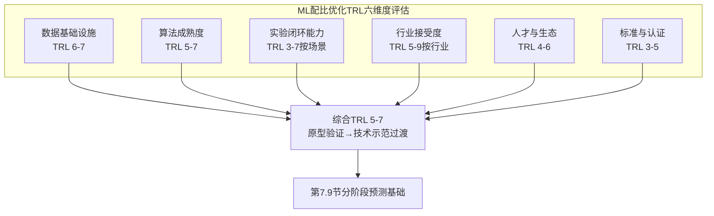

**第一维度：数据基础设施成熟度（TRL 6–7）**。第2章已系统刻画AFLOW 350万+条目、OQMD近30万DFT计算、Materials Project数十万级数据、JARVIS-Leaderboard细粒度基准、NIMS DICE/MPDS等公开数据基础设施已较成熟，"AFLOW.org仓库中4+百万化合物已通过XtalFinder映射到其理想原型"[^15]，"AFLOW不仅管理材料数据的生成、存储与传播，还利用这些信息进行热力学可形成性建模……结合标准化参数集，丰富的数据非常适合训练机器学习算法"[^15]。深圳材料基因组大科学装置7.1亿元投资、试运行期间50家机构600余样品测试[^87]进一步证明了实验侧基础设施的国家级投入。这一维度估计TRL 6–7（"系统/子系统模型或原型在相关环境中演示"），剩余瓶颈主要在私有数据共享与工艺-组分耦合元数据缺失。

**第二维度：算法成熟度（TRL 5–7）**。第3、4、5章已系统证明监督学习/生成模型/主动学习/PINN/KAN/DARWIN等多元算法范式在多个材料体系实现验证——HEAs主动学习27%数据→95%精度、SMA 9轮反馈循环14/36发现率、CSU-S1实验级蠕变寿命224.7小时、Ferrium系列航空认证、ANTZS弹性模量42.7 GPa等案例覆盖了从基础研究到产业落地的多个TRL等级。然而第5章末尾诊断的"高拟合-低外推"问题、强关联体系精度局限、工作流细节复制危机仍是普遍约束。这一维度按场景TRL 5–7：标准化预测任务已达TRL 7（如matminer/AutoML工具链）、前沿外推任务仍在TRL 5（如强关联超导、新族系HEA）。

**第三维度：实验闭环能力（TRL 3–7按场景）**。第4章已述多伦多Ada自驱动实验室在钯薄膜燃烧合成的Pareto前沿优化已达Nature Communications级别，**"Ada发现了在低于200°C的处理温度下产生金属薄膜的新合成条件"**[^88]——化学合成场景的Self-Driving Labs已达TRL 6–7。但合金体系（高温熔炼、单晶定向凝固、长时蠕变试验）的Self-Driving Labs仍在TRL 3–5的早期阶段。这一维度的"按场景分化"特征是该领域最显著的不均匀性——化学/电池/有机分子领域已较成熟（如多伦多Ada的钯薄膜+商品塑料涂层组合[^88]），合金/金属/陶瓷领域仍待工程化突破。

**第四维度：行业接受度（TRL 5–9按行业）**。航空航天领域QuesTek Ferrium系列已达TRL 8–9（已在T-38起落架等关键航空部件部署[^71]）；汽车领域Tesla大压铸合金已达TRL 9（量产部署）[^85]；增材制造Intellegens-GKN钛合金热交换器达TRL 6–7（产业化原型）[^84]；医用合金ANTZS仍在TRL 4–5（实验室验证）[^86]。**行业接受度的最大约束在于行业整体渗透率仍处试点阶段**——除QuesTek/Citrine/Intellegens等少数标杆项目外，绝大多数行业的常规材料研发仍以传统试错为主，ML配比优化的实际渗透率估计在5–15%区间。

**第五维度：人才与生态（TRL 4–6）**。跨学科人才（同时具备ML、物理、实验深度的复合人才）稀缺仍是普遍约束。第6章已强调"物理融合的方法学成本较高——需要同时具备ML与物理两方面的深入背景，对研究团队的跨学科能力提出了严苛要求"。北京"AI+新材料"行动计划提出"培育5-8家独角兽企业和潜在独角兽企业、100家创新型企业"[^89]、上海政策"高校突破技术、企业落地应用、平台支撑数据"[^86]的生态建设——这些政策投入的实际落地效果仍需3-5年观察。

**第六维度：标准与认证（TRL 3–5）**。这是当前最薄弱的维度。**领域专用ML认证标准缺失**——目前ML配比优化设计的合金仅在航空AMS/MMPDS等传统材料标准框架下开展认证（如Ferrium系列），而针对"ML模型本身的可解释性、可追溯性、可审核性"的专项认证标准尚未建立。中国2025年工业和信息化标准工作要点提出制定行业标准1800+项、强制性国标100+项[^89]——这一标准化建设的实际覆盖到ML配比优化专项标准仍需2-3年。

下表系统汇总六维度TRL评估：

| 维度 | TRL估计 | 关键证据 | 主要短板 |
|------|--------|--------|--------|
| 数据基础设施 | 6–7 | AFLOW 350万+、OQMD 30万+、深圳大科学装置7.1亿投资[^87] | 私有数据共享、工艺元数据缺失 |
| 算法成熟度 | 5–7（按任务） | 多元算法范式多体系验证 | OOD外推可信度、工作流细节披露 |
| 实验闭环能力 | 3–7（按场景） | 多伦多Ada钯薄膜Pareto前沿[^88]、有机激光发射体252→51筛选[^88] | 合金体系适配仍在TRL 3–5 |
| 行业接受度 | 5–9（按行业） | Ferrium系列航空认证[^80]、Tesla大压铸专利[^85] | 整体渗透率5–15%、行业不均衡 |
| 人才与生态 | 4–6 | 北京/上海政策、独角兽培育目标[^89][^86] | 跨学科复合人才稀缺 |
| 标准与认证 | 3–5 | 中国行业标准1800+项制定中[^89] | ML专用认证标准缺失 |

**综合判定：当前ML配比优化领域整体处于TRL 5–7的"原型验证向技术示范过渡"阶段**。其内部存在显著的"分化结构"——少数标杆项目（QuesTek Ferrium、Tesla大压铸、Intellegens-GKN等）已达TRL 8–9的实际部署，大多数研究仍处TRL 4–6的实验室到原型阶段，前沿体系（强关联超导、跨尺度耦合）仍在TRL 3–5。这一"高方差TRL"特征是该领域成熟化过程中的常态——不同应用场景、不同材料体系、不同认证门槛下的产业化进程必然不均衡。

## 7.8 与药物发现、半导体设计等成熟AI领域的差距比较

理解ML配比优化的成熟度，最有说服力的方式之一是与已较成熟的AI驱动领域进行横向比较。本节通过对比药物发现、半导体设计两大成熟AI领域，揭示差距来源与可借鉴经验。

**与药物发现领域比较**：药物发现领域已具备FDA加速审批通道（Breakthrough Therapy Designation等）、AI辅助药物已陆续获得临床上市批准、Intellegens的Cerella平台已"与世界上一些最大的制药公司验证了底层科学"[^81]并被包装为"稳健、可部署的平台"。Optibrium-Intellegens-MDC的DeepADMET项目（由Innovate UK资助100万英镑）的最终产出Cerella平台"已被验证能够更高效地识别具有改善的'on target'性质的化合物，并被证实能够降低成本、缩短发现周期"。相比之下，**ML配比优化尚缺乏对应的专项认证通道与AI辅助材料的标准化上市路径**——AMS/MMPDS等认证体系本质上是为传统材料设计的，对ML预测的特定支持有限。

**与半导体设计领域比较**：半导体设计已实现EDA（电子设计自动化）工具链对芯片设计全链路的工业化覆盖，TSMC/Intel等已将ML深度集成到工艺优化中。EDA工具链的成熟度可由其市场规模（全球数百亿美元）、行业地位（Synopsys/Cadence等专业公司）、生态完整性（从RTL到掩膜的端到端覆盖）三重维度证明。**相比之下，ML配比优化的"材料EDA"工具链仍处碎片化阶段**——matminer/automatminer/JARVIS-Leaderboard/Pipeline Pilot/Citrine PIF等工具各自覆盖部分环节，但缺乏统一的端到端工具链与生态。第3章所述BIOVIA Pipeline Pilot在锂电池电解液配方设计中的"单一工作流"已是该领域较先进的工程化实践，但其覆盖范围仍局限于特定应用场景[^87]。

**剖析差距来源**：

**第一是单值ROI的差异**。**药物发现的高单值ROI**（百亿美元市场单一畅销药物）支撑了高强度AI投入——单一新药开发投入可达25亿美元以上，ML哪怕仅缩短10%研发周期就能带来数亿美元的直接价值，这种ROI密度足以支撑AI工具链的产业化深耕。**半导体设计的摩尔定律压力**则构成了倒逼AI集成的强劲动力——每代芯片的设计复杂度呈指数级增长，没有EDA工具链的全自动化几乎不可能完成芯片设计。**而材料配比优化的多元化应用场景使ROI分散**——汽车铝合金、航空高温合金、电池正极、催化剂、超导体等每一个应用方向的市场规模都远小于单一畅销药物，单一突破难以激发巨额AI投入，必然导致工具链建设的碎片化。

**第二是认证体系的差异**。FDA加速审批模式下，AI辅助药物可通过特定路径加速进入临床，缩短传统10-15年的审批周期。**ML配比优化目前尚无对应的"加速通道"**，所有合金仍需通过AMS/MMPDS等传统认证体系，认证周期与传统合金相同。

**第三是数据生态的差异**。半导体行业已形成相对成熟的数据共享机制（如TSMC PDK等）；药物发现行业有成熟的Pharma开放联盟与公开数据库。**材料配比优化的数据共享机制仍处早期阶段**——第6章所述IP壁垒、第7.5节所述工艺-组分耦合数据私有化等问题在材料行业更为突出。

**归纳可借鉴经验**：

**第一，FDA加速审批模式对材料认证的启示**。可探索建立"ML设计材料"的专项认证通道，对ML设计的具有清晰物理机制（通过SHAP/DARWIN等可解释性工具论证）、经过严格主动学习闭环验证的合金，提供较传统认证更快速的路径——这一思路与中国2025年工业和信息化标准工作要点提出的"加快关键领域的技术、工艺、方法、产品、装备和应用标准研制"[^89]在精神上一致。

**第二，EDA工具链生态对材料数据-算法-验证一体化平台的启示**。当前matminer/automatminer/Pipeline Pilot/Citrine PIF等工具的碎片化局面亟需向"材料EDA"端到端工具链演化。北京"AI+新材料"行动计划提出的"研发10个（套）以上垂类模型和自主核心软件"[^89]即是该方向的政策响应。

**第三，Pharma开放联盟对材料行业数据共享激励的启示**。可借鉴药物发现行业的开放联盟模式，建立由头部企业、研究机构、政府基金共同参与的材料数据共享联盟，提供清晰的数据贡献激励、IP保护规则、利益分配机制——这一方向与北京"探索建立新材料数据汇聚共享、可信流通等机制"[^89]的政策探索高度契合。

下表系统对比三个领域的成熟度差异：

| 维度 | 药物发现 | 半导体设计 | ML配比优化 |
|------|---------|---------|---------|
| 认证体系 | FDA加速审批通道[已成熟] | 行业标准+客户认证[已成熟] | AMS/MMPDS传统体系，无ML专项[滞后] |
| 工具链生态 | 成熟商业平台（Cerella等） | EDA端到端覆盖（Synopsys/Cadence） | 碎片化（matminer/PIF/Pipeline Pilot等） |
| 单值ROI | 百亿美元单药 | 摩尔定律倒逼 | 多元场景ROI分散 |
| 数据共享 | Pharma开放联盟+公开数据库 | TSMC PDK等成熟机制 | 早期阶段、IP壁垒突出 |
| 已上市/部署案例 | 多个AI辅助药物临床上市 | 全行业EDA标配 | QuesTek Ferrium/Tesla等少数标杆 |

综合而言，**ML配比优化与药物发现、半导体设计相比，在认证体系、工具链生态、数据共享三方面差距较大，但在算法基础与应用案例上已具备追赶能力**。可借鉴的经验主要在认证模式、工具链整合、行业开放联盟三个方向，这些方向的突破将是该领域走向药物发现/半导体设计级成熟度的关键路径。

## 7.9 核心里程碑与3–5年、5–10年、10年以上分阶段预测

经过7.1至7.8节的层层剖析，本节回应用户最核心的命题——"距离理想模型大规模应用还有多远"——给出基于证据的分阶段预测。"理想模型"在本研究的语境下被界定为**"普适、高精度、低成本、可解释"**四重特征同时满足的ML配比优化模型，其大规模产业化意味着该模型可在全谱系材料体系（结构合金、功能合金、复合材料、电池、催化、超导等）实现常态化部署。

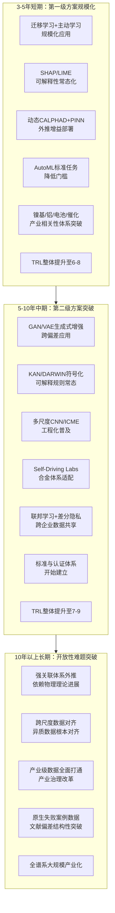

**3–5年（短期，2025-2030）：第一级成熟方案的规模化应用与产业相关性领先体系突破**。基于第6章三级分层判定中"第一级已有较成熟方案"，预计未来3–5年将形成以下产业化突破：**第一是迁移学习+主动学习的组合方法在镍基高温合金、铝合金、电池正极、催化材料等产业相关性领先体系实现规模化应用**——CSU-S1类低成本镍基单晶进入工程验证阶段、Tesla类大压铸铝合金扩展到更多车型、电池正极配方优化成为电池企业研发标配。**第二是SHAP/LIME/DARWIN等可解释性方案常态化部署**——成为工业级ML模型的"必选项"而非"加分项"，对接监管认证体系的可解释性要求。**第三是动态CALPHAD+PINN等物理融合方案在多组分合金设计中的规模化应用**——将外推可信度提升到工程可用水平。**第四是QuesTek/Citrine/Intellegens类公司商业模式进一步成熟**——服务领域从航空、医药扩展到汽车、电池、催化等多个行业，"学术spin-out→大企业战略并购"路径出现更多新案例。**第五是部分企业建立内部ML配比优化平台**——大型材料企业（如宝武、中国铝业、宁德时代等）将建立企业级ML研发平台，对接公开数据库与企业私有数据。预计该阶段TRL整体提升至**6–8**，行业渗透率从当前的5–15%提升至15–30%。

**5–10年（中期，2030-2035）：第二级部分可行方案的工程化突破与跨企业数据共享激励机制建立**。基于第6章三级分层判定中"第二级存在部分可行方案"，预计该阶段将形成以下突破：**第一是GAN/VAE生成式增强突破偏差放大障碍**——通过更精细的数据偏差检测与纠正机制，使生成式增强真正成为缓解数据稀缺的可信路径。**第二是KAN/DARWIN等符号化规则方法常态化产出可独立验证的设计法则**——成为工业级合金设计的标准产出形态。**第三是多尺度CNN/ICME工程化普及**——跨尺度数据对齐与误差传递问题取得部分突破，端到端的"成分-工艺-组织-性能"模拟成为可能。**第四是Self-Driving Labs在合金体系的适配取得突破**——高温熔炼、单晶定向凝固等极端工艺的机器人合成平台进入TRL 6–7，化学合成-合金体系的Self-Driving Labs差距开始缩小。**第五是联邦学习+差分隐私在国家级政策推动下取得跨企业数据共享突破**——中国"AI+材料"专项、北京/上海行动计划、美国MGI挑战项目共同推动数据共享激励机制的建立。**第六是标准与认证体系开始建立**——ML配比优化的专项认证标准初步形成，对接航空AMS/MMPDS、医疗器械、汽车安全等传统认证体系。预计该阶段TRL整体提升至**7–9**，前沿体系开始进入工业部署，行业渗透率提升至30–60%。

**10年以上（长期，2035年后）：第三级开放性难题的突破与全谱系大规模产业化**。基于第6章三级分层判定中"第三级仍属开放性难题"，预计该阶段将形成以下突破：**第一是强关联体系外推依赖物理理论进展**——超导、量子涨落主导的极端温度低维体系、电子-声子耦合复杂体系的物理理论本身需要重大突破，ML才能在这些体系实现可信的外推预测。**第二是跨尺度数据对齐与误差传递的根本性突破**——异质数据（DFT能量、TEM图像、力学曲线）的统一表征体系建立，端到端ICME模拟的精度与速度同步提升至工程可用水平。**第三是产业级数据全面打通依赖产业治理改革**——跨企业、跨行业、跨国家的数据共享激励机制成熟，企业核心配方数据通过联邦学习等机制安全流通。**第四是配比优化原生失败案例数据通过文献偏差结构性突破得到补足**——失败案例的发表与共享成为学术规范，数据库的偏差结构性问题得到根本性缓解。**只有当上述四类开放性难题都取得实质突破后，"普适、高精度、低成本、可解释"理想模型才可能在全部材料体系实现大规模产业化**。

需要特别强调的是，**这一长期预测中的"10年以上"具有较大不确定性**——其下界可能为10年（若多维度协同推进顺利），上界可能为20年甚至更长（若开放性难题中任何一类停滞）。第6章已强调"用户最关心的'距离理想模型大规模应用还有多远'这一问题的答案，本质上由开放性难题的突破时间窗口决定，而非由当前已成熟方案的应用扩展速度决定"——这一判定在本节得到了具体的时间量化。

下表系统汇总三阶段预测的核心里程碑与TRL演化：

| 阶段 | 时间窗口 | 关键里程碑 | TRL演化 | 行业渗透率 |
|------|--------|---------|---------|---------|
| 短期 | 2025-2030 | 第一级方案规模化、产业相关性体系突破、内部ML平台普及 | 6–8 | 15–30% |
| 中期 | 2030-2035 | 第二级方案工程化、跨企业数据共享、标准认证建立 | 7–9 | 30–60% |
| 长期 | 2035+ | 第三级开放性难题突破、全谱系大规模产业化 | 9+ | 60%以上 |

**最终回应用户核心命题**：综合本报告全部分析，可给出基于证据的综合判断——**当前ML配比优化领域已具备在重点产业相关性体系（镍基高温合金、铝合金、电池正极、催化材料、医用钛合金等）实现产业化突破的方法学基础**——QuesTek Ferrium系列穿越AMS/MMPDS双认证、Tesla大压铸合金量产部署、Intellegens-GKN钛合金热交换器节省15年研发时间、ANTZS低模量医用钛合金R²=0.96的精度等案例，已实证了该突破的现实性。**但距离"普适、高精度、低成本、可解释"理想模型在全谱系材料体系实现大规模产业化，仍需10年以上跨学科与产业治理的持续协同**——核心瓶颈不在于算法本身的进一步提升，而在于强关联体系物理理论、跨尺度数据对齐、产业级数据共享、原生失败案例数据等开放性难题的突破。

这一判断的方法学坐标可归纳为三点：**第一，方法论基石已经稳固**——第1–5章建立的"数据-特征-模型-验证-逆向设计"全链条框架、"分布感知评估—物理约束嵌入—主动学习闭环"三位一体可信度建设路径已经成熟，足以支撑当前阶段的产业化实践。**第二，产业化路径已经多元**——QuesTek/Citrine/Intellegens/Phaseshift/GNoME等不同商业模式已经验证了多条可行的产业化路径，国家级政策（中国"AI+材料"、美国MGI）已经形成系统性支撑。**第三，剩余瓶颈需要长期协同**——开放性难题的突破不依赖单一技术，而需要物理理论、产业治理、跨学科生态、标准认证的协同推进，这一协同的时间窗口决定了全谱系大规模产业化的最终距离。

ML配比优化在过去十年的快速进展令人鼓舞，但客观清醒的成熟度判定提醒我们：**这一领域已穿越"概念验证"的早期阶段，正处于"从重点突破走向全谱系应用"的关键转型期**——当前的产业化机会在产业相关性领先体系，长期的产业化突破依赖跨学科与产业治理的协同。第8章将基于本章建立的产业化判定基线，进一步展望大模型、Self-Driving Labs、多模态融合、因果推断、量子计算辅助等前沿方向对配比优化的潜在颠覆性影响，并针对学术界、产业界、政策制定者提出加速领域成熟化的战略建议。

# 8 未来发展趋势与战略建议

经过前七章对方法论框架、数据基础设施、分体系应用现状、研究主体识别、模型准确度评估、核心挑战剖析与产业化成熟度评估的层层递进分析，本报告已构建起机器学习/深度学习介入材料元素配比优化的完整学术与产业图景。第7章末尾的TRL六维度评估与三阶段预测明确指出：当前领域已穿越"概念验证"阶段，正处于"从重点突破走向全谱系应用"的关键转型期；3–5年内第一级成熟方案将在产业相关性领先体系实现规模化应用，5–10年内第二级部分可行方案有望工程化突破，10年以上则依赖第三级开放性难题的协同突破。然而，**这一基于当前技术轨迹的分阶段预测，本质上是"线性外推"的判断**——它假设领域演化沿着已识别的技术路线渐进推进。但科学技术的真实演化往往伴随**非线性突破**：基础模型与材料大模型的崛起、Self-Driving Labs与多模态融合的协同、因果推断与量子计算等更具颠覆性的方向，都可能改变线性预测的时间窗口。

本章作为全报告的展望与收官部分，围绕两条主线展开：**前半部分（8.1至8.3节）系统剖析五大前沿方向对配比优化范式的潜在颠覆性影响与现实边界**，回应"领域未来可能出现哪些非线性突破"这一前瞻性问题；**后半部分（8.4至8.6节）针对学术界、产业界、政策制定者三类核心利益相关方分别提出战略建议**，明确加速领域成熟化的关键抓手；**8.7节作为全报告收官**，系统归纳核心结论与开放性议题，最终回应用户对该领域演化方向与产业化距离的深层关切。

## 8.1 基础模型与材料大模型对配比优化范式的潜在颠覆

基础模型（Foundation Models）作为当前AI领域最具颠覆性的范式革命，其在自然语言处理（GPT系列）、计算机视觉（CLIP、DINO等）、生命科学（AlphaFold等）领域的成功，已经验证了"以海量数据预训练通用基础模型、再通过微调适配多种下游任务"这一新范式的强大能力。配比优化领域能否借鉴这一范式构建"材料大模型"，成为该领域当前最具战略意义的前沿方向之一。

**北京《人工智能+新材料创新发展行动计划（2025-2027年）》已将"新一代物质科学大原子模型"明确列为重大原创性成果目标**[^89]，这一政策表述精准捕捉了基础模型范式向材料领域迁移的最前沿方向。该行动计划明确要求"研究适用于材料科学机理和多尺度问题的基础理论和算法，发展适用于小样本和高维材料数据的机器学习方法。利用人工智能技术加速探索材料的新组元新结构，挖掘材料复杂高维的'成分-结构-工艺-性能'关系"[^89]——这段表述将"大原子模型"的能力期待精确锁定在配比优化的核心命题上。

材料大模型相对于专用任务模型的潜在颠覆性，可从三个维度理解。**第一是跨体系迁移能力的指数级扩展**——传统专用模型（如HEAs硬度SVR、镍基γ′相溶解温度ML预测器等）的训练与部署都局限在单一材料体系，而基础模型一旦在跨体系大规模数据上完成预训练，其学到的通用物理化学表征可在最少微调下适配多个下游任务。这种跨体系迁移能力对第6章所述的数据稀缺挑战具有根本性缓解潜力——前文Jha等人的跨属性深度迁移学习已实证"以更少特征+更小目标数据集战胜更丰富特征+从头训练"在27/39任务中成立，而真正的基础模型预期将这一比例进一步提升。**第二是多任务统一表征的方法学突破**——基础模型可在同一表征空间内同时表达成分、结构、工艺、性能多种维度的信息，使配比优化中"成分-结构-工艺-性能"这一跨尺度耦合链条的端到端建模成为可能，对应了第6章所述跨尺度建模困难的潜在出路。**第三是小样本学习的能力放大**——基础模型通过大规模预训练所习得的物理先验，使下游任务在数十至数百样本量级即可达到从头训练所需数千至数万样本的精度水平，对配比优化领域普遍的"数据稀缺"困境构成结构性缓解。

中国在材料大模型方向已有具体探索。**华东理工大学林嘉平教授团队"构建起包含260万条高分子结构性能数据、140万条化学反应数据的百万级数据库，打造出国内首个高分子专业AI大模型——AI plus Polymers研发平台"**[^86]——这一平台已经"发现了1.27万个新材料，94种在实验室完成验证，2款实现终端应用"[^90]，是材料垂类大模型从概念走向落地的早期实证。**中国科学院上海硅酸盐研究所"基于多模态数据库和陶瓷自动化实验室的AI智能体，围绕电池和电催化等材料开展研发，已发现100多种电池与电催化材料，20多种在实验验证"**[^90]，则展示了"AI智能体+多模态数据库+自动化实验室"三元组合在垂类大模型方向的另一条探索路径。**上海层面《加快培育材料智能引擎发展专项方案（2025-2027年）》明确提出"构建'新材料+AI'研究范式，推动材料领域的垂类大模型构建"**[^86]，从政策层面为材料大模型方向提供了直接背书。

然而，**材料大模型在通向"配比优化通用基础模型"的道路上面临四重根本性约束**，这些约束决定了其颠覆潜力的现实边界。

**第一是物理一致性的隐性丢失风险**。基础模型通过统计模式学习的能力固然强大，但配比优化的核心是物理因果而非统计相关——元素相互作用受热力学第二定律、电荷电负性中性、价电子守恒、相图拓扑等多重物理约束。第6章已强调"PINN等物理融合方案在外推上的77.7% RMSE降幅"等量化增益，意味着脱离物理约束的纯数据驱动大模型在外推场景下的可信度仍受根本性限制。**真正可用的材料大模型不应是NLP大模型架构在材料领域的简单平移，而需要在架构层面嵌入物理一致性约束**——KAN可学习激活函数、PINN损失函数设计、动态CALPHAD参数修正等思想都需要在大模型尺度上重新整合。

**第二是可解释性的进一步退化风险**。专用ML模型（如AdaBoost、SVR）尚有SHAP/LIME等事后解释工具可用，但参数量动辄数十亿至万亿的大模型其内部决策机制的可解释性远比专用模型困难。第7章所述航空AMS/MMPDS、医疗器械生物相容性等监管认证体系对ML模型的可解释性、可追溯性、可审核性提出"硬性"而非"加分"要求——**若材料大模型无法提供工业级可解释性，其在高门槛监管行业的产业化应用将面临结构性壁垒**。这一约束意味着材料大模型的产业化路径很可能首先在低监管门槛的领域（如催化、电池正极筛选）实现，而非在航空、医疗等高门槛领域。

**第三是训练成本与数据规模的不对称**。NLP大模型的成功建立在互联网级文本语料（万亿级token）之上，CV大模型建立在亿级图像之上，AlphaFold建立在数十万级蛋白质结构数据之上。**但配比优化领域目前的全部公开数据规模——AFLOW 350万+条目、OQMD近30万DFT计算、Materials Project数十万级、NIMS MatNavi数十万级——加总也仅在千万级量级**[^90]，相比NLP/CV低3-4个数量级。"260万条高分子结构性能数据、140万条化学反应数据"[^86]在材料领域已属"百万级数据库"的较高水平，但与NLP/CV基础模型的训练数据规模仍有显著差距。这一数据规模约束意味着材料大模型的"基础性"在初期必然弱于NLP/CV大模型——它更可能是"中型基础模型"而非"通用基础模型"，其零样本/少样本能力将受数据规模天花板约束。

**第四是产业部署的工程现实**。大模型的推理成本远高于轻量级专用模型，在企业内部产线级实时反馈场景下（如7.5节所述JFE/日本制铁CPS/CPP系统），大模型的推理延迟、计算资源占用、能耗成本可能成为部署障碍。**预期未来的产业化形态将是"大模型预训练+轻量化微调蒸馏到产线"的两阶段架构**，而非大模型直接产线部署。

综合而言，**材料大模型对配比优化的颠覆潜力真实存在，但其颠覆程度将显著低于NLP/CV领域基础模型对相应领域的颠覆**——这一判断的根源在于材料数据规模的根本性约束、物理一致性的硬要求、监管认证的高门槛三重叠加。北京政策目标"研发10个（套）以上垂类模型和自主核心软件"[^89]中的"垂类"定位反而准确地捕捉了这一现实——**材料大模型的现实形态更可能是"垂类基础模型"（按高分子、合金、陶瓷、复合材料等类别分别构建）而非"通用通材大模型"**。这一判断对7.7节TRL评估的中长期演化路径具有直接含义：材料大模型的成熟将推动算法成熟度维度从TRL 5–7向7–8跃升，但其对行业接受度、标准与认证维度的影响仍将是渐进的。

## 8.2 Self-Driving Labs与多模态数据融合的协同演化

承接第6章实验闭环挑战与第7章Self-Driving Labs在化学/合金体系成熟度差距的诊断，本节进一步展望自动化实验闭环与多模态数据融合两类前沿方向的协同演化路径。这一协同的战略意义在于：**它直接对接了配比优化最根本的两类瓶颈——实验闭环成本高与跨尺度建模困难**——若两类方向能够形成有效协同，将构成对第6章三级分层判定中"第二级部分可行方案"的实质性突破。

**Self-Driving Labs在化学合成体系已达到产业化前沿水平**。多伦多大学Aspuru-Guzik团队在Nature Communications上发表的"自驱动实验室Ada在钯薄膜燃烧合成的Pareto前沿优化"工作即典型代表——"Ada发现了在低于200°C的处理温度下产生金属薄膜的新合成条件，相对于此前该技术的250°C有所降低。这一温度差使得不同商品塑料材料（例如Nafion、聚醚砜）的涂层成为可能"[^88]。这一案例的方法论意义在于：**它将"性能优化"扩展到"工艺约束-性能"耦合的Pareto前沿**——50°C的处理温度降低看似细微，却直接打开了柔性电子器件、燃料电池膜电极组件等新应用场景。同一团队在有机激光发射体发现领域的进一步工作展示了Self-Driving Labs在分子配方设计中的产业化能力："在252个候选分子和DFT计算的指导下，我们选择性地进行了51种基于芴的A-B-A型有机激光寡聚物的全面研究，配备了我们的自驱动实验室。候选分子涵盖从简单烃类分子到复杂的杂原子混合分子"[^88]，最终筛选出二酮基（diketop）类作为关键发现。

中国在Self-Driving Labs方向也已有标杆部署。**中国科学院上海硅酸盐研究所"基于多模态数据库和陶瓷自动化实验室的AI智能体"已发现100多种电池与电催化材料、20多种在实验验证**[^90]——这一案例展示了Self-Driving Labs在陶瓷体系（介于化学合成与高温合金之间的中等极端工艺）的工程化适配能力。结合上海大学"已经完成2000种以上合金的高通量制备和表征以及百万级数据的机器学习性能预测"[^90]的高通量平台，可以看出**Self-Driving Labs与高通量制备表征平台正在中国形成多机构协同的产业化网络**。

然而，**Self-Driving Labs从化学合成向合金、陶瓷、复合材料等极端工艺体系扩展面临三重工程化挑战**。**第一是设备适配的工程难度阶跃**——化学合成的Self-Driving Labs通常涉及溶液混合、温度控制（数十至数百摄氏度）、自动表征（UV-Vis、HPLC等），机器人平台技术成熟；而合金高温熔炼、单晶定向凝固、长时热处理涉及千摄氏度以上、数小时至数日、特殊气氛（真空或惰性气体）等极端条件，机器人合成平台的工程化难度阶跃式上升。**第二是表征链条的复杂度阶跃**——配比优化的多目标性能表征涉及力学（拉伸、硬度、蠕变）、组织（SEM、TEM、EBSD、APT）、热分析（DSC、热膨胀）等多类仪器，每类仪器的自动化对接都是独立工程，而每个表征环节的自动化深度都直接影响整体闭环效率。**第三是闭环周期的时间尺度差异**——化学合成单轮闭环可在小时-日级完成，而合金体系的单轮闭环（包括高温处理、长时表征）往往在周-月级，这一时间尺度差异使Self-Driving Labs在合金体系的"实时反馈"价值大打折扣。

**多模态数据融合则提供了应对跨尺度建模困境的另一条路径**。配比优化的真实物理机制必然涉及多尺度耦合——元素相互作用在原子尺度、第二相析出在纳米尺度、织构与晶粒在微米尺度、宏观力学性能在毫米至米尺度——每一尺度的实验数据形态各异：DFT输出能量与电子结构、TEM/SEM输出图像、力学试验输出应力-应变曲线、光谱学输出光强-波长曲线。**多模态数据融合的技术内涵就是构建统一表征空间，将这些异质数据通过共享潜变量编码统一表达**。第1章已提及西工大李金山团队基于VAE的微观组织自监督编码——"潜变量与屈服强度关系类似经典霍尔-佩奇规律"——是多模态融合在配比优化中的早期实证；JARVIS-Leaderboard"对AI部分支持原子结构、原子图像、光谱、文本等多种输入数据模态"则提供了多模态评测的标准化基准。

**多模态融合的潜在突破能力主要体现在三方面**。**第一是跨尺度物理一致性的隐式学习**——通过对DFT能量、电子结构、晶体结构图像、力学曲线等多源数据的联合表征学习，模型可隐式习得"原子尺度物理→纳米组织→宏观性能"的尺度间映射关系。**第二是数据稀缺的多模态弥补**——某一模态数据稀缺时，可通过其他模态的丰富数据补充信息，例如TEM图像数据稀缺但有大量SEM图像，多模态融合可在共享潜变量空间内将SEM信息向TEM任务迁移。**第三是单一模态噪声的多模态降噪**——例如DFT计算的形成能存在约0.02 eV/atom的纯方法残差，但若同时有实验测量与TEM组织数据作为约束，多模态融合可降低单一模态的噪声敏感性。

**展望未来5–10年，"自动化实验+多模态融合+主动学习"三位一体的下一代闭环范式将成为配比优化产业化的关键技术形态**。这一范式的核心特征是：**自动化实验提供高通量、低成本、高一致性的数据生产能力；多模态融合提供异质数据的统一表征与跨尺度建模能力；主动学习提供不确定性驱动的实验点智能选择能力**。三者协同将使配比优化的研发周期从当前的月-年级压缩到周-月级，使数据效率（从每个实验点提取的信息量）提升数倍至数十倍，使跨尺度物理一致性的建模成为可能。

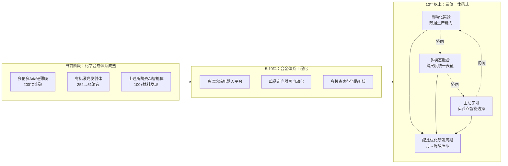

合金体系全面适配的时间窗口预期在2030–2035年——这一时间窗口与第7章中期产业化预测高度吻合。届时，Self-Driving Labs在合金体系将达到TRL 6–7（相当于当前化学合成体系水平），多模态融合的端到端跨尺度建模将达到工程可用水平，三位一体闭环范式将在镍基高温合金、铝合金、电池材料等产业相关性领先体系率先实现规模化部署。

需要客观指出的是，**Self-Driving Labs的进步并不必然带来"物理理论突破"——它解决的是数据生产效率问题而非物理理解问题**。强关联体系（如新型超导）的物理理论本身不完备，单纯提升实验闭环效率无法弥补理论缺失。这一边界与8.3节将讨论的因果推断、量子计算辅助等更深层方向存在互补关系。

## 8.3 因果推断与量子计算辅助等前沿方向的边界探索

相对于8.1节的材料大模型与8.2节的Self-Driving Labs两类相对成熟的前沿方向，因果推断与量子计算辅助代表了**当前技术成熟度更低但潜在颠覆性更显著的"长尾前沿"**。本节客观评估这两类方向的方法论价值与现实边界。

**因果推断方向的方法论价值在于其相对于主流相关性ML方法的根本性突破**。当前配比优化领域绝大多数ML方法本质上是相关性建模——SVR、AdaBoost、CatBoost、CGCNN等模型学习的是"成分特征→性能"的统计相关关系，但这种相关关系并不严格对应"成分→结构→工艺→性能"的真实因果链。这一区别在配比优化的逆向设计场景下具有关键意义：**逆向设计本质上是"干预性问题"——给定目标性能，反推应当如何"干预"成分以实现该性能；而干预性问题只能通过因果模型而非纯相关性模型回答**。

因果推断的核心技术路线包括因果发现算法（从观测数据中识别因果图结构）、反事实推断（在给定干预下预测反事实结果）、干预实验设计（设计能够最大化因果信息识别的实验）等。这些技术与材料配比优化的潜在结合点主要体现在三方面。**第一是真实因果链识别**——通过因果发现算法从配比优化的观测数据中识别"成分→第二相→微观组织→宏观性能"的真实因果路径，将ML模型的"黑箱预测"转化为"因果机制识别"。这一能力对应了第3章所示Cu-Be合金"四元协同机制"（Ni与Mg共同调节Be固溶度→促进强化相析出→构成多层调控链条）这类复杂多元素相互作用的精准识别需求。**第二是逆向设计可信度提升**——基于因果模型的逆向设计能够明确区分"通过改变成分能够实现的性能突破"与"通过其他干预（如工艺调整）才能实现的性能突破"，使逆向设计预测的物理意义更清晰。**第三是外推稳健性增益**——因果模型在分布外场景下相比纯相关性模型具有更好的外推稳健性，对应了第5章末尾诊断的"高拟合-低外推"问题的潜在出路之一。

然而，**因果推断在配比优化中的应用面临根本性挑战**。**第一是因果发现算法对数据规模与质量要求高**——准确识别因果图结构通常需要远超相关性建模的数据规模，与配比优化领域普遍的小样本困境存在结构性冲突。**第二是干预实验设计的成本约束**——理想的因果识别需要随机干预实验，但材料配比优化的实验成本（特别是合金体系）极高，难以支撑大规模随机干预。**第三是潜变量与混杂因素的复杂性**——配比优化中的工艺变量（热处理、变形、冷却速率等）往往作为混杂因素存在，因果识别需要先对这些混杂因素进行充分控制，而第2章已述工艺-组分耦合元数据缺失是当前数据基础设施的核心瓶颈之一。综合而言，**因果推断在配比优化中的产业化时间窗口预期在5–10年以上**，且其早期落地形式更可能是"主动学习+因果干预实验设计"的混合范式而非纯因果方法。

**量子计算辅助则代表了对第6章所述"强关联体系外推"这一开放性难题的潜在突破方向**。第3章已述超导材料这类强关联系统中"理论与计算方法都难以预测Tc"，第5章已诊断超导Tc预测即便采用CatBoost+322特征+Soraya特征选择的最先进组合仍仅能达到R²=0.952、RMSE=6.45 K的水平——**这一精度局限的根源不在于ML算法不够先进，而在于强关联系统的物理理论本身的内禀复杂性**。量子计算辅助在三个环节具有潜在突破能力。

**第一是DFT精确计算的量子加速**。当前DFT在多电子相互作用的精确求解上存在指数级复杂度，量子算法（如变分量子本征求解器VQE）有望实现指数级加速，从而显著提升DFT在强关联系统、过渡金属d电子、稀土f电子等复杂电子结构体系的精度。这一突破将直接缓解第2章所述"DFT与实验形成能MAE=0.096 eV/atom"的精度天花板，为ML模型提供更高精度的训练数据。**第二是组合优化加速**——配比优化的核心是高维成分空间的组合优化，量子退火算法（如D-Wave系统）与变分量子算法（如QAOA）有望对NSGA-II、贝叶斯优化等经典优化算法形成指数级加速，使第1章所述HEAs的 $10^{78}$ 量级成分空间穷举搜索从理论不可能逐步走向工程可行。**第三是强关联体系的直接量子模拟**——量子计算的最大优势是天然适合模拟量子系统，对超导、量子涨落主导的低温体系、电子-声子耦合复杂体系等强关联系统，量子模拟有望提供经典计算无法企及的精度。

然而，**量子计算辅助在配比优化中的产业化时间窗口存在显著不确定性**。**第一是量子硬件成熟度受限**——当前量子计算机仍处于NISQ（噪声中等规模量子）阶段，量子比特数（数百至数千）、相干时间、错误率等关键指标距离实用级容错量子计算（FTQC）仍有显著差距，FTQC的实现时间预期在2030–2040年。**第二是量子算法-材料应用的对接尚不成熟**——VQE、QAOA等算法在材料科学的具体应用场景仍处早期探索阶段，与经典ML算法相比尚未形成显著优势。**第三是产业化成本约束**——量子计算资源短期内将远比经典GPU/TPU昂贵，仅在量子优势显著的场景下才具备产业经济性。综合而言，**量子计算辅助配比优化的产业化时间窗口预期在10年以上**，其早期突破更可能在强关联体系的科研级应用而非全面产业化部署。

下表系统对比五大前沿方向的成熟度与时间窗口：

| 前沿方向 | 当前成熟度 | 主要颠覆潜力 | 关键现实约束 | 预期时间窗口 |
|---------|---------|---------|---------|----------|
| 基础模型与材料大模型 | 早期落地（垂类大模型） | 跨体系迁移、小样本学习、多任务统一表征 | 数据规模天花板、物理一致性、可解释性、训练成本 | 3–10年（垂类先行） |
| Self-Driving Labs | 化学体系成熟、合金体系早期 | 数据生产效率指数级提升 | 极端工艺工程化难度、表征链复杂度 | 5–10年（合金体系） |
| 多模态数据融合 | 概念验证阶段 | 跨尺度物理一致性隐式学习 | 异质数据对齐、计算成本 | 5–10年 |
| 因果推断 | 探索期 | 真实因果链识别、逆向设计可信度提升、外推稳健性 | 数据规模要求、干预实验成本、混杂因素 | 5–15年 |
| 量子计算辅助 | NISQ早期 | 强关联体系突破、组合优化指数级加速、DFT精确求解 | 量子硬件成熟度、算法-应用对接、成本 | 10年以上 |

需要特别强调的是，**这五大前沿方向并非孤立演化，而是相互交织、协同放大**。材料大模型的训练需要Self-Driving Labs提供的高质量数据；Self-Driving Labs的智能决策可借助大模型的预测能力；多模态融合可与大模型共享底层架构；因果推断可与主动学习形成"因果干预实验设计"的混合范式；量子计算辅助则可与大模型形成"量子-经典混合"的下一代算力底座。**这种协同效应可能产生"1+1>2"的非线性突破，使第7章基于线性外推的时间窗口预测被显著加速**——但这种加速的具体程度取决于多个前沿方向的协同进展，存在显著的不确定性。

## 8.4 面向学术界的战略建议

在系统展望未来发展趋势之后，本报告将视角转向加速领域成熟化的具体行动建议。学术界作为方法论创新的源头与人才培养的核心，其战略选择对配比优化领域整体演化具有基础性影响。本节针对学术界提出四方面具体建议。

**第一是数据共享与基准建设**。第6章已系统诊断"基准缺失、可复现危机"作为领域核心挑战之一，第5章已强调工作流细节差异对报告精度的系统性影响。对此，学术界应在三个层面采取行动。**其一是失败案例与负面数据的系统性发表与共享机制**——这一方向呼应了Citrine"通过与研究机构建立的大型关系网络收集未发表的数据……负面数据几乎从未公布。但是，负面结果的原始数据对建立一个毫无偏差的数据库而言至关重要"的产业实践经验。学术期刊与学术评价体系应主动鼓励"性能不达预期"案例的系统性报告，建立"负面结果专刊"或"补充数据中包含失败案例"的标准化要求，从根本上缓解第2章所述"文献正向结果偏差"的结构性瓶颈。**其二是扩展JARVIS-Leaderboard类细粒度基准的覆盖范围**——当前公开基准在多目标帕累托优化、跨尺度建模、强关联体系预测等前沿任务上仍有覆盖空白，学术社区应通过国际协作方式扩展基准矩阵，使任何新算法都可以在与既有方法完全可比的条件下接受评测。**其三是建立工作流细节披露与开放可复现的学术规范**——参照NOMAD AI Toolkit"将材料科学的可复现性提升到新水平——研究者不仅可以共享论文背后的数据，还能共享所有开发的方法与分析工具"的设计理念，期刊应将"代码+数据+完整工作流元数据"作为接收发表的硬性要求，从制度层面遏制隐性"复制危机"。

**第二是跨学科合作模式**。第6章已强调"物理融合的方法学成本较高——需要同时具备ML与物理两方面的深入背景"，第7章TRL评估亦将"跨学科复合人才稀缺"列为人才与生态维度的关键短板。学术界应推动ML、物理、实验三方面深度融合的团队组织模式。第4章所述德国马普所Raabe团队"联合英国剑桥、瑞典皇家理工学院、德国达姆斯塔特工业大学、中国东南大学与中南大学等多机构合作"的Science论文模式、中南大学高温合金团队"NLP+ML+高通量筛选+实验验证"的全链路布局、上海交大丁文江/孙宝德/张佼"轻合金精密成型国家工程研究中心+产业转化公司"的生态等，已为可复制的协作范式提供了样本。建议高校与科研机构在科研评价体系中明确鼓励多学科联合署名、跨机构联合实验室、跨国合作研究计划，破除单一学科评价的制度性壁垒。

**第三是方法学创新的关键方向选择**。第6章建立的三级分层可行性判定框架已明确指出当前方法学的不同成熟度等级。学术界应在方法学创新中聚焦三个关键方向：**其一是物理融合**——动态CALPHAD修正、PINN、KAN等物理-数据双驱动方法在SFE预测RMSE 77.7%降幅等量化增益已得到验证，应进一步深化其在更广泛体系（特别是强关联系统）的应用与方法学拓展。**其二是可解释性**——SHAP/LIME事后解释已较成熟，DARWIN等符号化规则方法代表了向"内生+可被独立验证"的更高级形态演化，学术界应推动可解释性从"加分项"向"必选项"的范式转变。**其三是主动学习闭环**——HEAs主动学习27%数据→95%精度、SMA 9轮反馈循环等案例已实证主动学习的样本效率突破能力，应进一步推动主动学习与Self-Driving Labs、多模态融合的协同集成。这三个方向共同指向了第1章所提"从纯数据驱动向知识—数据双驱动"的范式转型——这一转型的深度决定了学术界为产业化提供的方法学基石的稳固程度。

**第四是人才培养路径**。配比优化领域对人才的复合要求（ML算法+物理化学+实验技能）远超传统单一学科。建议高校在三个层面采取行动：**其一是建立材料信息学交叉学科课程体系**——本科与研究生阶段开设融合材料科学基础、机器学习理论、Python/PyTorch工程实践、实验技能训练的系统性课程；**其二是设立交叉学科研究生项目**——通过双导师制（材料导师+ML导师）培养真正的复合型人才，避免"材料学生学不好ML、ML学生不懂材料"的常见痛点；**其三是推动实习实训的产学协同**——通过与Citrine、QuesTek、Intellegens、宁德时代、宝武等产业主体建立实习渠道，使学生在校期间即接触到真实产业场景中的配比优化问题。北京"AI+新材料"行动计划提出"培育5-8家独角兽企业和潜在独角兽企业、100家创新型企业"[^89]，这些产业主体的成长既需要也将反哺学术界的人才培养体系。

## 8.5 面向产业界的战略建议

产业界作为ML配比优化最终价值实现的核心主体，其战略选择直接决定该领域的产业化节奏与深度。本节针对产业界提出四方面具体建议，重点回应第7章所述产业化独有挑战。

**第一是企业级数据治理与平台建设**。第7章已详细介绍BIOVIA Pipeline Pilot在锂离子电池电解液配方设计中的"单一工作流"工程化实践、Citrine PIF标准化数据格式、JFE/日本制铁的"机理模型+数据修正"混合架构等成熟实践。这些实践共同指向一个核心方向——**企业应建立内部数据-模型-工艺一体化平台，将分散在不同部门、不同设备、不同实验批次的数据系统化整合**。具体建议包括：**其一是建立企业级材料数据湖**——参照Citrine PIF格式或自建标准化数据格式，将研发数据、生产数据、客户反馈数据等多源数据统一汇聚；**其二是整合工艺-组分耦合元数据**——这一点尤为关键，第2章已强调工艺-组分耦合数据私有化、元数据缺失是配比优化的核心数据瓶颈，企业内部恰恰拥有最丰富、最完整的工艺-组分耦合数据，将其系统化整合即可在内部形成显著竞争优势；**其三是构建机理模型+ML+工艺反馈的混合架构**——参照JFE在8座高炉部署CPS系统、"系统能够提前8到12小时预测炉温的异常波动"的实践经验，将ML模型嵌入到机理模型与产线实时反馈的完整闭环中，避免"端到端黑箱模型"在产线部署时的可信度风险。

**第二是产业化路径的差异化选择**。第7章已识别"学术spin-out并购""独立SaaS服务""企业内部AI研发"三类产业化模式。不同规模与定位的企业应基于自身条件选择最适合的路径。**对于宝武、中国铝业、宁德时代等大型材料企业**，建议建立内部ML研发能力——拥有最丰富的产业数据与最深的工艺Know-how，自建ML团队可最大化数据资产价值并保护核心竞争力；**对于中小型材料企业**，建议通过Citrine、Intellegens等SaaS订阅快速对接前沿能力——避免高昂的内部AI团队建设成本，同时获得与大型企业接近的算法能力；**对于具有特殊技术储备的初创公司**，可借鉴QuesTek"学术spin-out→大企业战略并购"路径——QuesTek 1996年从Northwestern的Olson团队孵化、2012年技术售予Apple、Charles Kuehmann率团队加盟Apple后又主导Tesla Model Y免热处理铝合金（后地板从80零件减至1）、Cybertruck与SpaceX星舰新型不锈钢的研发，是该路径最经典的样本。三类路径并非互斥——大型企业可同时建设内部团队与外部SaaS订阅，初创公司可在被并购前提供SaaS服务等。

**第三是跨企业数据共享联盟**。第6章已强调IP壁垒作为产业治理而非纯技术问题的根本性，第7.5节已介绍中国"AI+材料"政策正在探索数据汇聚共享、可信流通等机制[^89]。在此基础上，**产业界应主动借鉴药物发现领域Pharma开放联盟模式，倡导头部企业牵头建立行业级材料数据共享联盟**。具体建议包括：**其一是建立联盟级数据贡献-收益分配规则**——明确企业贡献数据后可获得的回报（联合训练大模型、共享算法工具、技术情报等），使数据贡献从"无回报付出"转变为"价值交换"；**其二是采用联邦学习+差分隐私等技术方案保护商业秘密**——参数级共享而非原始数据共享，结合差分隐私扰动防止参数反推；**其三是建立联盟治理机制**——通过中立的第三方机构（如行业协会、国家级研究机构）治理联盟运行，避免大企业主导导致的中小企业利益侵蚀。这一联盟模式的成功落地将是配比优化领域产业化的关键里程碑——它直接对接了第6章所述"第三级开放性难题中的产业级数据共享"问题。

**第四是产学研协同**。配比优化领域的高度复杂性使任何单一主体都难以独立完成方法学创新到产业化的全链条。**建议产业界通过技术入股、联合实验室、人才双聘等机制深化与高校课题组的合作**。具体路径包括：**其一是参考中南大学姜雁斌团队"以中南大学技术入股形式成立湖高创科惟新材料股份有限公司进行产业化"的模式**，企业以资本+市场渠道、高校以技术+人才共同推动学术成果的产业化；**其二是建立联合实验室长期合作**——参照QuesTek与Northwestern、Intellegens与剑桥的长期合作样本，企业与高校共建联合实验室，使学术研究方向与产业需求形成有效对接；**其三是人才双聘与流动机制**——企业研发人员到高校访学、高校教师到企业兼职咨询，打破学术界与产业界的人才流动壁垒。中国国家级"AI创制超百余种新材料通过性能验证"[^90]的成果矩阵中，华东理工、上海硅酸盐研究所、上海大学、上海交大、上海高研院、中石化（上海）石油化工研究院等机构与产业界的紧密合作正是这一协同模式的早期实证。

## 8.6 面向政策制定者的战略建议

政策制定者作为产业化生态建设的核心推动者，其战略选择对配比优化领域整体演化具有制度性影响。第7章已系统梳理中美在"AI+材料"国家战略与基础设施投入上的差异化布局。本节针对政策制定者提出五方面战略建议。

**第一是数据基础设施与共享激励**。建议参照深圳材料基因组工程大科学装置（"2018年正式立项到2025年通过工艺验收，总投资7.1亿元……试运行的一年多时间里……完成样品测试600余个，涵盖从高校、科研机构、企业等50家"）、北京新材料大数据中心、NIMS DICE等模式，加大国家级共享平台投入。在此基础上重点推动两项制度建设：**其一是建立清晰的数据贡献激励、IP保护、利益分配规则**——这是数据共享从"技术可行"走向"产业实行"的关键瓶颈，政策制定者应通过行政手段（如将数据贡献纳入科技项目评价指标）与市场手段（如设立数据交易平台）双轨推动；**其二是探索差分隐私、联邦学习等技术的政策化应用**——为企业级数据可信流通提供技术保障与法律背书。北京计划"探索建立新材料数据汇聚共享、可信流通等机制，积极推进国际科技交流合作"[^89]即代表了该方向的政策探索。

**第二是标准与认证体系**。第7.8节已剖析ML配比优化与药物发现、半导体设计在认证体系上的差距——FDA加速审批模式对AI辅助药物的支持远超AMS/MMPDS等传统材料认证体系对ML设计材料的支持。建议政策制定者在三个层面采取行动：**其一是加快制定ML配比优化专项认证标准**——明确ML模型在可解释性、可追溯性、可审核性等维度的具体技术规范，对接航空AMS/MMPDS、医疗器械、汽车安全等传统认证体系；**其二是探索类似FDA加速审批通道的"AI辅助材料"专项认证路径**——对ML设计的具有清晰物理机制（通过SHAP/DARWIN等可解释性工具论证）、经过严格主动学习闭环验证的合金，提供较传统认证更快速的审批路径；**其三是支持中国企事业单位牵头制定相关国际标准**——2025年工业和信息化标准工作要点已提出"支持100项以上由我国企事业单位牵头制定的国际标准，全行业国际标准转化率达到88%"[^89]，应将ML配比优化相关国际标准作为重点布局方向。

**第三是国家级专项与重大基础设施**。建议延续中国"材料基因组工程"重点专项布局——该专项已通过北科大谢建新院士团队等国家级布局推动了配比优化的方法学奠基。在新一轮国家专项布局中，应强化三个方向投入：**其一是Self-Driving Labs国家级基础设施**——参照中国科学院上海硅酸盐研究所"陶瓷自动化实验室AI智能体"[^90]的成功经验，在合金、复合材料、电池等更广泛体系建设国家级Self-Driving Labs。**其二是材料大模型基础设施**——北京计划已明确"发布新一代物质科学大原子模型，研发10个（套）以上垂类模型和自主核心软件"[^89]，应通过国家级算力基础设施、共享语料库、模型评测基准等多维度投入支撑这一目标。**其三是2024年11月美国MGI第一轮挑战项目**所明确的"扩展和集成自主实验、人工智能和机器人等能力"[^90]方向同样值得中国政策借鉴——中美在该领域的政策投入正形成良性竞争。

**第四是国际合作与标准话语权**。配比优化作为全球性科技竞争领域，国际合作与标准话语权对中国产业生态的长期发展至关重要。建议在三个维度推进：**其一是支持高水平国际合作研究**——第4章所述德国马普所Raabe团队联合德、英、瑞、中多国机构发表Science论文的多机构跨国协作模式应得到国家层面的鼓励与支持；**其二是参与全球材料数据治理规则建设**——FAIR原则、NOMAD AI Toolkit、JARVIS-Leaderboard等国际数据基础设施的规则制定中，应推动中国机构的深度参与；**其三是建立国家级国际人才引进通道**——对全球顶级配比优化研究人才提供有竞争力的引进政策。

**第五是人才与生态培育**。承接8.4节学术界人才培养建议与8.5节产业界产学研协同建议，政策制定者应在更宏观层面推动三项工作：**其一是支持独角兽企业培育**——北京计划"培育5-8家独角兽企业和潜在独角兽企业、100家创新型企业"[^89]即是该方向的具体目标，应通过政府引导基金、税收优惠、采购倾斜等多维度政策支持。**其二是推动跨学科教育改革**——支持高校设置材料信息学交叉学科课程体系、设立交叉学科研究生项目，破除单一学科评价的制度性壁垒。**其三是建立"AI+材料"产业集群**——参照上海"高校突破技术、企业落地应用、平台支撑数据"[^86]的产业生态构建逻辑，在长三角、京津冀、粤港澳等区域建立特色产业集群。"上海2027年有望在多个关键材料领域实现突破，推动先进装备更新换代及产业高质量发展"[^86]的目标即代表了区域产业集群战略的具体落地。

## 8.7 研究总结与开放性议题

作为全报告的收官，本节系统归纳本研究的核心结论与开放性议题，并最终量化回答用户对该领域距离理想模型大规模产业化的核心关切。

**研究核心结论凝练**。本报告从研究背景、数据基础设施、典型材料体系应用、活跃课题组与里程碑、模型准确度、核心挑战、产业化成熟度七大维度系统剖析了机器学习/深度学习在材料元素配比优化领域的研究进展与应用现状，可凝练出七项关键判断。**第一，方法论框架已经成熟**——第1章建立的"数据—特征—模型—验证—逆向设计"全链条框架已经覆盖了从经典SVR/RF到生成模型/PINN/KAN的多元算法范式，"知识—数据双驱动"演化方向已经清晰。**第二，数据基础设施已具规模但不均衡**——AFLOW 350万+条目、OQMD近30万DFT计算、Materials Project数十万级数据等公开数据库已较成熟，但工艺-组分耦合元数据缺失与产业级私有数据游离仍是结构性瓶颈。**第三，应用渗透呈现"梯度结构"**——结构合金（钢铁、铝、镍基）、功能合金（HEA、SMA、MG）、功能材料（电池、催化、超导、Heusler）等不同体系的ML渗透深度差异显著，方法论领先体系（HEA、SMA）与产业相关性领先体系（钢铁、铝合金、电池）共同构成了领域演化的"两翼"。**第四，研究主体已形成全球四象限格局**——北美方法论旗舰、欧洲物理融合标杆、中国多元化布局、全球产业化团队共同推动该领域的演化轨迹向"多目标+物理融合+主动学习"三位一体收敛。**第五，模型准确度普遍存在乐观偏差**——R²=0.94至0.96的高精度报告主要建立在随机CV或留一法等同分布评估之上，OOD基准评测显示当前最先进GNN在分布外场景下精度系统性下降，"高拟合-低外推"问题客观存在但通过"分布感知评估—物理约束嵌入—主动学习闭环"三位一体可逐步缓解。**第六，核心挑战呈现耦合放大格局**——数据稀缺、特征工程依赖、可解释性不足、外推能力弱、跨尺度建模困难、实验闭环成本高、IP壁垒、标准化基准缺失八重挑战相互耦合放大，单点突破难以根本改变领域成熟度。**第七，产业化已穿越概念验证阶段**——QuesTek Ferrium系列穿越AMS/MMPDS航空双认证、Tesla大压铸合金量产部署、Intellegens-GKN钛合金热交换器节省15年研发时间、ANTZS低模量医用钛合金R²=0.96的精度等案例已实证产业化突破的现实性，但TRL六维度评估显示当前整体处于TRL 5–7的"原型验证向技术示范过渡"阶段。

**回应用户核心命题——"距离理想模型大规模应用还有多远"**。基于第7章TRL六维度评估与三阶段预测，结合本章前几节对前沿方向的展望与战略建议，可给出以下基于证据的综合性回答：

**3–5年（短期，2025–2030）**：第一级成熟方案（迁移学习+主动学习、SHAP/LIME可解释性、动态CALPHAD/PINN物理融合、AutoML标准化任务）将在产业相关性领先体系（镍基高温合金、铝合金、电池正极、催化材料、医用钛合金等）实现规模化应用；产业化路径多元化进一步巩固，QuesTek/Citrine/Intellegens类公司商业模式更趋成熟；TRL整体提升至6–8，行业渗透率从当前5–15%提升至15–30%；中国"AI+材料"政策、北京/上海/深圳基础设施投入将形成系统性成果矩阵。**这一阶段的"理想模型"在产业相关性领先体系将基本实现产业化部署**。

**5–10年（中期，2030–2035）**：第二级部分可行方案（GAN/VAE生成式增强、KAN/DARWIN符号化规则、多尺度CNN/ICME、Self-Driving Labs合金体系适配、联邦学习+差分隐私跨企业数据共享）将取得工程化突破；材料大模型与Self-Driving Labs+多模态融合的协同范式将在合金体系率先成熟；ML配比优化专项认证标准将开始建立，对接传统认证体系；TRL整体提升至7–9，行业渗透率提升至30–60%；前沿体系开始进入工业部署。**这一阶段"理想模型"在中等复杂度产业场景实现广泛产业化部署**。

**10年以上（长期，2035年后）**：第三级开放性难题（强关联体系外推、跨尺度数据对齐、产业级数据全面打通、原生失败案例数据）将依赖物理理论进展、产业治理改革、跨学科生态成熟等多维度协同实现突破；因果推断与量子计算辅助等更深层前沿方向将开始产业化落地；"普适、高精度、低成本、可解释"理想模型将在全谱系材料体系实现大规模产业化部署。**需要特别强调的是，这一长期预测的下界可能为10年（若多维度协同推进顺利），上界可能为20年甚至更长（若开放性难题中任何一类停滞）**。其内在不确定性的根源在于开放性难题的突破不是单一技术可决定的——它依赖物理理论本身的进展（如强关联系统的新理论框架）、产业治理改革（如跨企业数据共享激励机制的政策落地）、跨学科生态成熟（如复合型人才规模化产出）的协同推进。

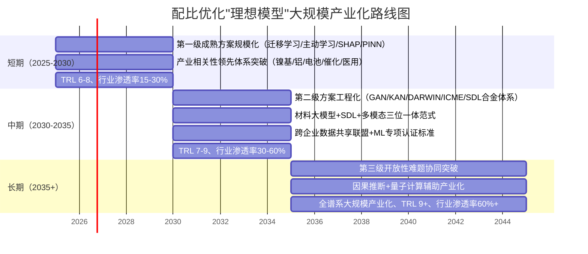

**开放性议题展望**。即便沿着上述三阶段预测顺利推进，仍有四类根本性议题需要长期跨学科与产业治理协同应对，这些议题的解决远超技术本身的范畴。**第一是强关联体系外推的物理理论根基**——超导、量子涨落主导的低温体系、电子-声子耦合复杂体系等强关联系统的精度突破最终依赖物理理论本身的进展，ML算法只能在现有理论框架内提供加速，无法替代理论本身的创新。**第二是跨尺度数据对齐的根本性挑战**——异质数据（DFT能量、TEM图像、力学曲线、光谱数据等）的统一表征体系建立需要在数据规范化、特征对齐、物理一致性约束等多个维度同步突破，是配比优化领域最具方法学难度的开放问题之一。**第三是产业级数据全面打通的产业治理改革**——这一议题不是技术问题而是产业治理问题，其解决依赖跨企业、跨行业、跨国家的数据共享激励机制成熟，需要政策制定者、行业协会、头部企业、技术服务商等多方协同推动。**第四是配比优化原生失败案例数据的结构性获取**——文献正向偏差是学术发表体系的内禀特征，根本性突破需要学术评价体系、期刊政策、科研文化的深层改革，绝非单一技术所能解决。

这四类开放性议题共同决定了"普适、高精度、低成本、可解释"理想模型的最终成熟时间窗口。然而，**这并不意味着配比优化领域的产业化必须等待这些议题全部解决才能展开**——本报告的核心洞察恰恰在于：**领域已具备在产业相关性领先体系实现规模化产业化突破的方法学基础与产业生态条件**，这些条件在3–5年的短期窗口内即可释放显著的产业价值。开放性议题的存在不是产业化的障碍，而是产业化"全谱系覆盖"的最后边界。

**最终判断与展望**。综合本报告全部分析，机器学习/深度学习在材料元素配比优化领域的演化呈现出三重清晰图景：**一是方法论的快速成熟与多元化创新**——从早期单一性能预测到当前"多目标+物理融合+主动学习"三位一体范式，方法论的演化轨迹清晰且持续；**二是产业化的差异化突破与生态构建**——从QuesTek Ferrium系列航空认证到Tesla大压铸量产、从Intellegens-GKN钛合金到ANTZS医用合金、从中国"AI+材料"百余种新材料验证到上海/北京/深圳的政策与基础设施投入，产业生态正在多元主体、多元行业、多元路径中加速构建；**三是开放性难题的客观存在与长期协同**——强关联体系、跨尺度对齐、产业数据共享、原生失败案例等议题需要物理理论、产业治理、跨学科生态、标准认证的协同推进，构成全谱系产业化的最远时间窗口。

ML配比优化在过去十年的快速进展令人鼓舞——它已不再是"实验室概念证明"，而是已在多个高价值产业场景实现可验证的经济价值；它已不再是"少数顶尖团队的小众研究"，而是已形成全球四象限的研究主体格局与多元化的产业化路径；它已不再是"算法精度的单一比拼"，而是已演化为"数据-算法-验证-认证"的完整生态。但客观清醒的认识同样重要——**该领域并未也不会在短期内实现"通用、普适、零门槛"的理想模型大规模应用，其产业化将沿着"重点突破→中等复杂度场景→全谱系应用"的渐进路径分阶段展开**。这一路径的具体节奏取决于学术界的方法学创新、产业界的实践深耕、政策制定者的生态构建三方协同的力度。

回应用户最初提出的研究主题与核心命题，本报告的最终答案是：**机器学习/深度学习在材料元素配比优化领域的研究已穿越概念验证、正处于"从重点突破走向全谱系应用"的关键转型期；3–5年内将在产业相关性领先体系实现规模化产业化突破、5–10年内将在中等复杂度场景实现广泛部署、10年以上将依赖跨学科与产业治理协同突破开放性难题以实现全谱系大规模产业化；当前阶段最重要的不是等待"理想模型"自然成熟，而是在已具备方法学基础的产业相关性领先体系积极推进产业化实践，同时通过学术界方法学创新、产业界实践深耕、政策制定者生态构建的三方协同，为未来5–10年的中期产业化突破与10年以上的长期全谱系产业化奠定坚实基础**。

材料是工业文明的物质基础，配比优化是材料创新的核心命题，机器学习是配比优化的方法学引擎——这一逻辑链条正在从概念走向现实，从实验室走向车间，从论文走向产品。本报告所做的，是在这一历史性进程的中段，以尽可能客观清醒的视角描绘其当前图景、识别其真实挑战、展望其演化方向、提出其加速路径。这一图景将随着方法学创新、产业实践、政策推动的持续演化而不断更新——本报告希望成为这一持续更新过程中的一个有价值的参照基线。

# 9 结论与综合判断

历经八章对机器学习/深度学习介入材料元素配比优化的方法论框架、数据基础设施、分体系应用现状、研究主体识别、模型准确度评估、核心挑战剖析、产业化成熟度评估与未来发展趋势的层层递进剖析，本报告已构建起该领域的完整学术与产业图景。第8章末尾对"距离理想模型大规模应用还有多远"这一用户核心命题已给出基于证据的分阶段量化回答，本章作为全报告的最终收官，**不再展开新的论证或引入新的证据**，而是以"全景凝练—边界界定—距离判定—展望收束"的逻辑结构，对前八章的核心发现进行系统性整合与价值判断，明确机器学习/深度学习在材料元素配比优化领域的整体能力边界、产业化距离、演化方向与利益相关方的行动指引，使全报告形成自然闭环。

## 9.1 研究全景的整体凝练

经过八章系统剖析，本报告所揭示的机器学习/深度学习在材料元素配比优化领域的整体研究全景，可凝练为**"方法论快速成熟+应用差异化渗透+产业生态多元构建"的三重图景**。

**第一重图景是方法论的快速成熟与多元化创新**。第1章构建的"数据采集—特征工程—模型构建—验证评估—逆向设计"五环节全链条框架，已成为支撑后续各章分析的统一参照基线。这一框架不再是抽象的理论构想，而是已在云南贵金属实验室HEAs硬度突破、中南大学CSU-S1低成本镍基单晶、西工大力学超材料KAN设计、马普所Raabe团队HEA-GAD因瓦合金等多个里程碑案例中得到端到端实证。从早期SVR/RF的单一性能预测，到MOEA+ML的多目标耦合优化，再到PSP框架的超大空间智能逆向导航，最终演化为生成式深度强化学习的端到端逆向设计——研究范式正在沿着"从单一性能预测向多目标逆向设计、从黑箱模型向物理融合可解释模型、从静态预测向主动学习闭环"三条轨迹深度交织收敛，形成"多目标+物理融合+主动学习"三位一体的方法论新范式。

**第二重图景是应用渗透的差异化梯度结构**。第3章按"结构合金→功能合金→功能材料"层次的分体系剖析揭示了一个关键事实——**不同材料体系的ML渗透深度并非均质，而是呈现出清晰的梯度结构**。HEA、SMA、催化材料、Heusler化合物等"方法论领先体系"因成分空间巨大或物理复杂催生出最先进的算法创新；钢铁、铝合金、电池材料等"产业相关性领先体系"则在大宗市场需求驱动下成为算法工程化兑现的核心战场；金属玻璃、超导材料等"物理挑战领先体系"中ML不仅作为预测工具更已开始反向启发物理理论本身（如吴义成团队"机器学习软度模型启发的密度涨落理论"）；镍基高温合金作为"方法论与产业并重"的双领先体系成为整个领域最具代表性的成熟样板；而镁合金等"ML渗透滞后"体系则提示我们渗透深度由数据基础设施成熟度、第二相机制复杂度、工艺敏感性等多重因素综合决定。这一梯度结构本身就是评估领域整体成熟度的关键指标。

**第三重图景是产业生态的多元构建与全球四象限格局**。第4章识别的研究主体已形成"北美方法论旗舰+欧洲物理融合标杆+中国多元化布局+全球产业化团队"的清晰格局——Northwestern的Olson团队、MIT的Gomez-Bombarelli/Olivetti团队、Northwestern的Wolverton团队代表了北美的通用方法论输出；马普所Raabe团队、剑桥Conduit/Intellegens代表了欧洲的物理融合与稀疏数据建模标杆；中南大学高温合金/姜雁斌、西工大李金山、北科大谢建新、上海交大丁文江/孙宝德、清华李敬锋/朱静等多元化布局体现了中国从"跟随者"向"贡献者"乃至"引领者"的转变；Citrine、QuesTek、Phaseshift、Intellegens、Google DeepMind GNoME等产业化团队则通过"学术spin-out并购""独立SaaS服务""科技巨头内部研发"三类商业模式承接学术成果。第7章产业实证进一步证明了这一生态的成熟——Ferrium S53/M54/C61/C64钢系穿越AMS/MMPDS航空双认证、Tesla大压铸合金WO 2025/259916专利将"脏废料升级为车身结构件"、Intellegens-GKN钛合金热交换器节省"15年/1000万美元"、ANTZS低模量医用钛合金以R²最高0.96+多目标优化实现"42.7 GPa弹性模量+30.9%延伸率"——这些产业级里程碑共同证明该领域已穿越概念验证阶段。

综合三重图景，**该领域整体已不再处于"实验室概念证明"的早期阶段，而是已进入"从重点突破走向全谱系应用"的关键转型期**。这一定位是本报告所有后续判断的基础坐标。

## 9.2 模型能力边界的客观界定

在凝练全景图景之后，必须客观界定当前ML/DL配比优化模型的能力边界——这一边界既是产业化决策的现实依据，也是后续方法学创新的明确靶点。基于第5章模型准确度评估与第6章核心挑战分析，可将当前模型的能力边界分为"已较稳固的能力区""存在显著限制的能力区""仍属根本性约束的能力区"三层。

**已较稳固的能力区**集中在数据充裕、物理机制相对清晰、产业相关性强的体系中的标准化预测与中等复杂度逆向设计任务。HEAs硬度SVR R=0.96、铸造耐热铝合金AdaBoost R²=0.94、超导Tc CatBoost R²=0.952、Heusler discovery engine真阳性0.94/假阳性0.01、Zn合金ZACDS各指标精度>90%等量化证据共同表明——**在分布相对集中的同分布预测任务上，当前主流ML算法已普遍达到工业可参考精度水平**。配合迁移学习+主动学习的样本效率提升（HEAs主动学习27%数据→95%精度、SMA 9轮反馈循环14/36发现率38.9%）、SHAP/LIME的事后可解释性、动态CALPHAD修正与PINN的物理融合（Co-Cr-Ni SFE预测RMSE 24.2→5.4 mJ/m²的77.7%降幅），第6章三级分层判定中"第一级已有较成熟方案"的方法学组合已为产业相关性领先体系的规模化应用奠定了相对稳固的基石。

**存在显著限制的能力区**则集中在"高拟合-低外推"问题客观存在的诸多场景。第5章Hu团队OOD基准评测对八大GNN（CGCNN、SchNet、MEGNet、DimNet++、ALIGNN、DeeperGATGNN、coGN、coNGN）的系统性测试明确揭示——**当前最先进的GNN算法在分布外场景下的精度显著低于其在MatBench随机CV基线**，且MatBench排行榜中的"冠军模型"在OOD测试中表现欠佳，CGCNN、ALIGNN、DeeperGATGNN等反而在钙钛矿OOD场景中表现更优。这一"排行榜冠军≠真实可用最优"的反直觉发现，加上OQMD揭示的DFT与实验形成能MAE 0.096 eV/atom（实验间MAE 0.082 eV/atom，纯方法残差仅约0.02 eV/atom）的精度天花板、超导Tc预测即便最先进组合仍仅达RMSE 6.45 K的固有局限，共同界定了**纯数据驱动模型在跨族系外推、稀有元素体系、亚稳态与非平衡相、强关联系统等场景下的可信度系统性下降**这一根本性现实。第6章三级分层判定中"第二级存在部分可行方案"的GAN/VAE偏差放大风险、KAN/DARWIN跨域适用性限制、Self-Driving Labs合金体系适配挑战、联邦学习产业激励缺失等，进一步标记了这一能力区的具体方法学位置。

**仍属根本性约束的能力区**则对应第6章三级分层判定中"第三级仍属开放性难题"的四类议题：强关联体系外推（依赖物理理论本身的进展，ML算法只能在现有理论框架内提供加速）、跨尺度数据对齐与误差传递（异质数据—DFT能量、TEM图像、力学曲线—的根本性对齐困难）、IP壁垒下的产业级数据共享（产业治理而非技术问题，缺失国家级激励机制下技术可行难以转化为产业实行）、配比优化原生失败案例数据（文献正向偏差是学术发表体系的内禀特征，无法通过单纯数据增强弥补）。**这四类议题不是简单的算法改进可以解决——它们共同构成了"普适、高精度、低成本、可解释"理想模型在全谱系材料体系大规模产业化的最远边界**。

针对存在显著限制的能力区与根本性约束的能力区，第5章末尾提出的**"分布感知评估—物理约束嵌入—主动学习闭环"三位一体可信度建设路径**已成为该领域方法学共识。分布感知评估通过LOCO、时间外推、新族系外推等OOD测试取代单一随机CV，使报告精度具备产业可信度；物理约束嵌入通过PINN、动态CALPHAD修正、KAN可学习激活函数、电荷电负性中性约束等机制弥补纯数据驱动的外推局限；主动学习闭环通过不确定性驱动的实验点选择实现样本效率的指数级提升。**这一三位一体路径的现实价值在于：它不试图否认能力边界的客观存在，而是通过可操作的方法学组合在能力边界内最大化可信度**——这是当前阶段ML配比优化研究最具现实意义的方法学共识。

值得特别强调的是，**能力边界的客观界定并非对该领域价值的否定，而是产业化决策的必要前提**。CSU-S1合金（1100°C/137 MPa蠕变寿命224.7小时、铼3.1 wt%、121美元/公斤）、HEA硬度1177 HV的Cr₁₇.₇Fe₂₀.₉Ni₂₀.₂Ti₂₂.₂V₁₉.₀合金、HESO催化剂相对Pt基商业基准提升86%产氢性能、SMA的Ti₅₀.₀Ni₄₆.₇Cu₀.₈Fe₂.₃Pd₀.₂合金ΔT=1.84 K等案例都已通过严格的实验闭环验证证明了配比优化的现实价值——**这些"成功案例"的可信度建立在严格的实验验证之上而非单纯的模型预测**。这一区分恰恰是能力边界界定的核心方法学含义：模型预测为"假说生成器"，实验验证为"事实判定者"，二者协同才构成可信的配比优化全链条。

## 9.3 产业化距离的分阶段量化判定

回应用户最核心关切的"距离理想模型大规模应用还有多远"这一命题，需要在前面"全景凝练"与"能力边界界定"的基础上给出基于证据的量化判定。本报告将"理想模型"严格界定为**"普适、高精度、低成本、可解释"四重特征同时满足的ML配比优化模型**，其"大规模应用"指该模型可在全谱系材料体系（结构合金、功能合金、复合材料、电池、催化、超导等）实现常态化产业化部署。基于第7章TRL六维度评估（数据基础设施6–7、算法成熟度5–7、实验闭环能力3–7按场景分化、行业接受度5–9按行业分化、人才与生态4–6、标准与认证3–5）与第8章五大前沿方向展望，可给出三阶段量化预测。

**3–5年（2025–2030）：产业相关性领先体系的规模化产业化突破**。这一阶段的核心特征是第6章三级分层判定中"第一级已有较成熟方案"在产业相关性领先体系的规模化兑现。具体表现为：迁移学习+主动学习+SHAP/LIME+动态CALPHAD/PINN的方法学组合将在镍基高温合金、铝合金、电池正极、催化材料、医用钛合金等领域形成产业级标准实践——CSU-S1类低成本镍基单晶进入工程验证、Tesla类大压铸铝合金扩展至更多车型、电池电解液配方优化成为电池企业研发标配；QuesTek/Citrine/Intellegens等公司商业模式进一步成熟、新一轮"学术spin-out→大企业战略并购"案例涌现；大型材料企业（宝武、中国铝业、宁德时代等）建立内部ML研发平台；中国"AI+材料"政策、北京/上海/深圳基础设施投入形成系统性成果矩阵。**该阶段TRL整体提升至6–8、行业渗透率从当前5–15%提升至15–30%**，"理想模型"的"低成本"与"高精度"两重特征在产业相关性领先体系将基本实现。

**5–10年（2030–2035）：中等复杂度场景的广泛部署与生态体系构建**。这一阶段的核心特征是第6章"第二级部分可行方案"取得工程化突破，配合第8章前沿方向的协同推进。具体表现为：GAN/VAE生成式增强突破偏差放大障碍、KAN/DARWIN符号化规则常态化产出可独立验证的设计法则、多尺度CNN/ICME工程化普及使端到端"成分-工艺-组织-性能"模拟成为可能；Self-Driving Labs在合金体系的适配从TRL 3–5提升至TRL 6–7，与化学合成体系的差距开始缩小；材料大模型（特别是高分子、合金、陶瓷等垂类基础模型）形成"大模型预训练+轻量化微调蒸馏到产线"的成熟产业部署形态；联邦学习+差分隐私在国家级政策推动下取得跨企业数据共享的实质突破；ML配比优化专项认证标准开始建立、对接航空AMS/MMPDS、医疗器械、汽车安全等传统认证体系。**该阶段TRL整体提升至7–9、行业渗透率提升至30–60%**，"理想模型"的"普适"与"可解释"两重特征将在中等复杂度场景实现实质性进展。

**10年以上（2035年后）：开放性难题协同突破与全谱系产业化**。这一阶段的核心特征是第6章"第三级仍属开放性难题"的协同突破，配合第8章因果推断、量子计算辅助等更深层前沿的产业化落地。具体表现为：强关联体系外推依赖物理理论本身的重大突破、跨尺度数据对齐通过统一异质数据表征体系实现根本性突破、产业级数据全面打通依赖跨企业/跨行业/跨国家的数据共享激励机制成熟、原生失败案例数据通过学术评价体系与期刊政策的深层改革得以补足；因果推断与主动学习形成"因果干预实验设计"的混合范式产业化、量子计算辅助在强关联体系科研级应用并逐步走向产业化。**只有当四类开放性议题都取得实质突破后，"普适、高精度、低成本、可解释"理想模型才可能在全谱系材料体系实现大规模产业化部署**。

需要特别强调长期预测的内在不确定性。**"10年以上"的时间窗口下界可能为10年（多维度协同推进顺利的乐观情景），上界可能为20年甚至更长（开放性难题中任何一类停滞的悲观情景）**。这一不确定性的根本来源在于：**开放性难题的突破不由单一技术决定，而依赖物理理论进展、产业治理改革、跨学科生态成熟、标准认证体系建设的协同节奏**——其中物理理论的突破节奏（如强关联系统的新理论框架）具有最大的不可预测性，产业治理改革的节奏取决于政策制定者、行业协会、头部企业、技术服务商的多方博弈，跨学科生态的成熟则取决于教育体系改革与人才培养周期。这些"非纯技术"维度的协同节奏决定了长期预测必然伴随着显著的内禀不确定性。

进一步需要说明的是，**这一分阶段判定中"短期-中期-长期"的产业化突破并非彼此排斥的离散阶段，而是渐进重叠的连续过程**。3–5年内产业相关性领先体系的规模化突破，将为5–10年中等复杂度场景的广泛部署提供方法学验证与人才积累；5–10年中期产业化突破将为10年以上长期全谱系产业化提供基础设施沉淀与标准认证经验。配比优化领域的产业化将沿着"重点突破→中等复杂度场景→全谱系应用"的渐进路径分阶段展开——这一路径的具体节奏取决于学术界方法学创新、产业界实践深耕、政策制定者生态构建三方协同的力度。

## 9.4 开放性议题与领域演化的最终展望

经过前三节的图景凝练、边界界定与距离判定，本节对该领域的开放性议题与最终演化方向作出收束性展望。

**四类根本性开放议题作为全谱系产业化的最远边界**已在前文反复出现，此处作最终凝练。**第一类是强关联体系外推的物理理论根基**——超导、量子涨落主导的极端温度低维体系、电子-声子耦合复杂体系等强关联系统的精度突破最终依赖物理理论本身的进展，这是ML算法无法越过的根本性边界，其突破节奏由凝聚态物理学的发展决定。**第二类是跨尺度数据对齐的方法学根本性挑战**——配比优化的真实物理机制必然涉及"原子→纳米→微米→宏观"的多尺度耦合，而异质数据（DFT能量、TEM图像、力学曲线、光谱学数据等）的统一表征体系建立需要在数据规范化、特征对齐、物理一致性约束等多个维度同步突破，这是配比优化领域最具方法学难度的开放问题之一。**第三类是产业级数据共享的产业治理改革**——这一议题不是技术问题而是产业治理问题，IP壁垒下的产业级数据共享突破依赖跨企业、跨行业、跨国家激励机制的制度化成熟，需要政策制定者、行业协会、头部企业、技术服务商等多方协同推动，是配比优化产业化中最具"非纯技术"特征的根本性议题。**第四类是配比优化原生失败案例数据的结构性获取**——文献正向偏差是学术发表体系的内禀特征，根本性突破需要学术评价体系、期刊政策、科研文化的深层改革，绝非单一技术所能解决，其改革节奏取决于全球科学共同体的集体行动。

**这四类开放性议题的存在不应成为短期产业化的障碍，而应被理解为长期演化的协同方向**。本报告反复强调的核心洞察在于：**领域已具备在产业相关性领先体系实现规模化产业化突破的方法学基础与产业生态条件**——这些条件在3–5年的短期窗口内即可释放显著的产业价值。等待"理想模型"的全部条件成熟才开展产业化实践，既不必要也不现实——配比优化的产业化遵循"重点先突破、面状渐展开、终态长收敛"的演化逻辑。

**对学术界、产业界、政策制定者三方的最终行动指引**已在第8章具体展开，本节作收束性凝练。**学术界**应聚焦"物理融合+可解释性+主动学习闭环"三大方法学创新方向，建立失败案例与负面数据的系统性发表机制，扩展JARVIS-Leaderboard类细粒度基准的覆盖范围，推动"代码+数据+完整工作流元数据"的强制开放可复现规范，培育同时具备ML、物理、实验深度的跨学科复合型人才——**这是为该领域提供方法学基石与人才储备的根本性贡献**。**产业界**应根据自身规模与定位差异化选择产业化路径，大型企业建立内部ML研发平台、中小型企业通过SaaS订阅快速对接前沿能力、初创公司探索"学术spin-out→大企业并购"路径；建立企业级数据-模型-工艺一体化平台特别是工艺-组分耦合元数据的整合；倡导头部企业牵头建立行业级材料数据共享联盟与跨企业产学研协同——**这是将方法学价值兑现为产业经济价值的关键环节**。**政策制定者**应延续中国"材料基因组工程"重点专项布局并强化Self-Driving Labs与材料大模型基础设施投入；加快制定ML配比优化专项认证标准并探索类似FDA加速审批的"AI辅助材料"专项认证路径；推动跨学科教育改革与"AI+材料"产业集群建设；支持高水平国际合作与标准话语权建设——**这是为该领域产业化生态构建制度性保障的核心使命**。

**领域演化方向的最终价值判断与历史性定位**则需要回到方法学发展的更宏大视野。机器学习/深度学习介入材料元素配比优化，**本质上是材料科学方法论从"经验试错"经由"计算物理"走向"知识—数据双驱动"的范式革命的具体表现**。在这一更长的历史进程中，配比优化领域当前所处的位置可类比于半导体设计领域EDA工具链兴起前夕、药物发现领域AI辅助药物上市前夕——这是一个"已有显著突破但尚未形成主流"、"产业价值已被验证但尚未大规模兑现"、"方法论已经成熟但尚未形成标准"的关键过渡时刻。**正是这种过渡时刻的特征决定了当前阶段最重要的不是等待"理想模型"自然成熟，而是积极推进可行场景的产业化实践，同时通过三方协同为长期突破奠定基础**。

材料是工业文明的物质基础，配比优化是材料创新的核心命题，机器学习/深度学习是配比优化的方法学引擎——这一逻辑链条正在从概念走向现实，从实验室走向车间，从论文走向产品。本报告通过九个章节的层层剖析所揭示的，是这一历史性进程中段的客观图景：**领域已穿越概念验证、正处于"从重点突破走向全谱系应用"的关键转型期；3–5年内将在产业相关性领先体系实现规模化产业化突破、5–10年内将在中等复杂度场景实现广泛部署、10年以上依赖跨学科与产业治理协同突破开放性难题以实现全谱系大规模产业化**。这一图景既不应被过度乐观所遮蔽（如将公司宣传性数据等同于产业可用精度），也不应被过度悲观所否定（如以"高拟合-低外推"问题否认已实证的产业化突破）——客观清醒的判断本身，就是该领域走向成熟的重要方法学前提。

**最终回应用户最初提出的研究主题与核心命题**：机器学习/深度学习在材料元素配比优化领域的研究已穿越概念验证阶段，正处于从重点突破走向全谱系应用的关键转型期；其当前已具备在产业相关性领先体系实现规模化产业化的方法学基础与产业生态条件；3–5年内的产业化机会主要在镍基高温合金、铝合金、电池正极、催化材料、医用钛合金等领域；5–10年内将依靠材料大模型、Self-Driving Labs+多模态融合、跨企业数据共享联盟等突破在中等复杂度场景实现广泛部署；10年以上的全谱系大规模产业化则依赖强关联体系物理理论根基、跨尺度数据对齐、产业级数据共享治理改革、原生失败案例数据结构性获取四类开放性难题的协同突破。**当前阶段最重要的行动指引不是等待"理想模型"自然成熟，而是在已具备方法学基础的产业相关性领先体系积极推进产业化实践，同时通过学术界方法学创新、产业界实践深耕、政策制定者生态构建的三方协同，为未来5–10年中期产业化突破与10年以上长期全谱系产业化奠定坚实基础**。

这一进程将在未来十至二十年内深刻重塑材料创新的研发范式与产业格局——参与其中、推动其演化、客观评估其进展，是当前阶段所有利益相关方共同的历史性使命。本报告所做的，是在这一历史性进程的中段，以尽可能客观清醒的视角描绘其当前图景、识别其真实挑战、展望其演化方向、提出其加速路径。希望本报告能够成为这一持续演化过程中，一份有价值的参照基线与决策参考。

# 参考内容如下：
[^1]:[元素优化配比分析报告.docx](https://m.book118.com/html/2026/0411/5142040103013200.shtm)
[^2]:[基于逆向设计策略的高熵合金硬度突破性发现及其机器学习加速研究](https://www.ebiotrade.com/newsf/2025-6/20250612132828218.htm)
[^3]:[Npj Comput. Mater. : 铍铜合金的“四元协同”密码:用机器学习破解材料性能的极限困局](http://finance.sina.com.cn/wm/2026-04-06/doc-inhtqnrt5789865.shtml)
[^4]:[西工大黄河源团队: 数据驱动高效逆向设计各向同性负泊松比超材料 ](https://mp.weixin.qq.com/s?__biz=MzAxNjE4NTE5MQ==&mid=2651336765&idx=1&sn=a9eb6f2fa1f6b8d51b90cfd76eef9a49&chksm=814957599917b7e26b51a2bf9aa85991d58ab5b0e041f57fca7e32ea0660e71902eb2f81b261&scene=27)
[^5]:[分享:抗冲击超材料设计:机器学习与增材制造的协同创新](https://baijiahao.baidu.com/s?id=1863316000379128767&wfr=spider&for=pc)
[^6]:[我院在《npj计算材料》发文:融合自然语言处理与机器学习实现低成本高性能单晶高温合金智能设计](https://pmri.csu.edu.cn/info/1137/5937.htm)
[^7]:[Designing semiconductor materials and devices in the post-Moore era by tackling computational challenges with data-driven strategies | Nature Computational Science](https://www.nature.com/articles/s43588-024-00632-5)
[^8]:[寻找具有理想堆垛错能的新型多组分合金:二元相互作用项的成分依赖性](https://www.ebiotrade.com/newsf/2025-12/20251209001424734.htm)
[^9]:[打破传统DFT计算!深度学习开启材料发现与设计新篇章!_面向材料发现的dft-CSDN博客](https://blog.csdn.net/2401_83378697/article/details/148586064)
[^10]:[Machine Learning-Based Methods for Materials Inverse Design: A Review](http://cdn.techscience.cn/files/cmc/2025/TSP_CMC-82-2/TSP_CMC_60109/TSP_CMC_60109.pdf)
[^11]:[学术动态:李金山教授团队连发4篇《Acta Materialia 》!AI for Materials](https://sklsp.nwpu.edu.cn/info/2441/11402.htm)
[^12]:[编辑推荐︱机器学习辅助纳米材料设计与制备](https://mp.weixin.qq.com/s?__biz=MzAwMDE3Njk0OA==&mid=2649005599&idx=1&sn=44af3eed8122aa8b21e72895f4dd9bd6&chksm=8336f26cadd88bb0c5ad7eed81feef359d8cbc53e478d84760afcee23af139c24dcc6e0069c1&scene=27)
[^13]:[Acta Materialia Overviews](https://www.sciencedirect.com/science/journal/13596454/vsi/10L4TCXL0HL)
[^14]:[AFLOW-XtalFinder: a reliable choice to identify crystalline prototypes](https://www.nature.com/articles/s41524-020-00483-4.pdf)
[^15]:[AI in Healthcare](https://www.intel.com/content/www/us/en/learn/ai-in-healthcare.html)
[^16]:[材料研究领域实用网站推荐! ](https://m.sohu.com/sa/795195710_121943749)
[^17]:[The NOMAD Artificial-Intelligence Toolkit: turning materials-science data into knowledge and understanding](https://link.springer.com/content/pdf/10.1038/s41524-022-00935-z.pdf)
[^18]:[如何高效使用Materials Project API:材料科学数据查询的完整指南](https://blog.csdn.net/gitblog_00026/article/details/160497683)
[^19]:[The Open Quantum Materials Database (OQMD): assessing the accuracy of DFT formation energies ](https://www.nature.com/articles/npjcompumats201510/)
[^20]:[MPDS](https://tutorial.mpds.io/)
[^21]:[Your privacy, your choice](https://www.nature.com/articles/s41597-021-00824-y)
[^22]:[XML API 文件註釋 - 使用 /// 註釋來撰寫文件 API - C# reference | Microsoft Learn](https://msdn.microsoft.com/zh-tw/library/b2s063f7(v=vs.140))
[^23]:[AFLOW Database and APIs: AFLOW.org, AFLUX, AFLOW REST-API](http://aflowlib.duke.edu/aflow-school/past_schools/20210712/05_aflow_school_database_aflux.pdf)
[^24]:[MatNaviのユーザー状況について](https://www2.nict.go.jp/sppo/wds/wds/study-group/docs/02MatNavi_user.pdf)
[^25]:[Publications](https://pages.nist.gov/jarvis/publications/)
[^26]:[数据库详情](https://www.lib.sjtu.edu.cn/sjtu/f/database/database_detail.shtml?id=157)
[^27]:[mpds-platform ](https://github.com/topics/mpds-platform)
[^28]:[A machine learning aided interpretable model for rupture strength prediction in Fe-based martensitic and austenitic alloys](https://www.nature.com/articles/s41598-021-83694-z)
[^29]:[pif · GitHub Topics · GitHub](https://github.com/topics/pif)
[^30]:[JARVIS-Leaderboard: a large scale benchmark of materials design methods | npj Computational Materials](https://www.nature.com/articles/s41524-024-01259-w)
[^31]:[Data-centric Materials Science with MPDS](http://www.researchgate.net/publication/320009330_Data-centric_Materials_Science_with_MPDS)
[^32]:[Model for bandgap_JVASP_1174_GaAs](https://pages.nist.gov/jarvis_leaderboard/ES/SinglePropertyPrediction/dft_3d_bandgap_JVASP_1174_GaAs/)
[^33]:[Composition optimization design and high temperature mechanical properties of cast heat-resistant aluminum alloy via machine learning](http://doi.org/10.1016/j.matdes.2025.113587)
[^34]:[Composition design of 7XXX aluminum alloys optimizing stress corrosion cracking resistance using machine learning](http://iopscience.iop.org/article/10.1088/2053-1591/ab8492)
[^35]:[Deep Learning of Superconductors I: Estimation of Critical Temperature of Superconductors Toward the Search for New Materials](http://arxiv.org/abs/1812.01995v1)
[^36]:[Deep Learning Model for Finding New Superconductors](https://arxiv.org/pdf/1812.01995v4)
[^37]:[OPEN Predicting superconducting transition temperature through advanced machine learning and innovative feature engineeri](https://link.springer.com/content/pdf/10.1038/s41598-024-54440-y.pdf)
[^38]:[全固态电池正极材料固态电池 “异军突起”,凭啥这么牛?近年来,随着电动汽车、便携式电子设备等领域的飞速发展,人们对电池的... - 雪球](https://xueqiu.com/1184543003/340736703)
[^39]:[Accelerating high-entropy alloy discovery: efficient exploration via active learning](http://www.sciencedirect.com/science/article/pii/S135964622400215X)
[^40]:[清华用主动学习模型筛选析氢催化剂,产氢性能高于铂基商业催化剂](https://baijiahao.baidu.com/s?id=1819861661298174607&wfr=spider&for=pc)
[^41]:[Nmc材料](https://chinese.alibaba.com/g/nmc-materials.html)
[^42]:[华中科技大学徐东伟/罗小兵团队:机器学习基于化学式筛选固态电解质Li10GeP2S12的Ge离子替代方案以提高与金属锂界面稳定性 ](https://mp.weixin.qq.com/s?__biz=MzUxMDMzODg2Ng==&mid=2247679029&idx=6&sn=8bbf7759267254e7aad7645542053172&chksm=f9080e68ce7f877e4fe1082c1b270239a466b9755bf29b5c7f7eece2227558653090d24d505c&scene=27)
[^43]:[重庆大学谭军教授团队:协同提升轻质多组元Mg-Al-Zn-Cu-Ce合金的强度、塑性和刚度 |英文版重点推荐文章 ](https://it.sohu.com/a/968554853_121123683)
[^44]:[Carbon management](https://energy.mit.edu/area/carbon-management/)
[^45]:[Xiejianxin](https://faculty.ustb.edu.cn/JianxinXie/en/index.htm)
[^46]:[Novel machine learning driven design strategy for high strength Zn Alloys optimization with multiple constraints](https://www.nature.com/articles/s41524-025-01666-7)
[^47]:[Materials Design Workshop Report](https://chimad.northwestern.edu/docs/MaterialsDesign/CHiMaD_MaterialsDesignWorkshop_I_Report.pdf)
[^48]:[High-Throughput Machine-Learning-Driven Synthesis of Full-Heusler Compounds](http://pubs.acs.org/doi/abs/10.1021/acs.chemmater.6b02724)
[^49]:[Predicting the state of charge and health of batteries using data-driven machine learning](https://www.nature.com/articles/s42256-020-0156-7)
[^50]:[谭小东老师在先进高强钢应变配分研究领域取得新进展](https://fmae.swu.edu.cn/info/1199/3966.htm)
[^51]:[Deep Reinforcement Learning for Inverse Inorganic Materials Design](http://arxiv.org/abs/2210.11931)
[^52]:[Materials Synthesis Insights from Scientific Literature via Text Extraction and Machine Learning](https://ceder.berkeley.edu/publications/2017_kim_paper_database.pdf)
[^53]:[孙宝德](https://sklcm.sjtu.edu.cn/team/detail.aspx?id=83)
[^54]:[Project Completes with Release of Drug Discovery Platform](http://www.nstl.gov.cn/paper_detail.html?id=994907669c3c8f98eba398bd1313604a)
[^55]:[研发速度快100倍,成本降低90%!AI材料公司Phaseshift Technologies打造能源/航天/矿业/汽车专用合金](https://blog.csdn.net/HyperAI/article/details/147142878)
[^56]:[姜雁斌 ](https://faculty.csu.edu.cn/jiangyanbin1/zh_CN/index.htm)
[^57]:[Your privacy, your choice](https://www.nature.com/articles/s41524-020-00483-4)
[^58]:[研究团队栏目-专家团队](https://al.sjtu.edu.cn/TeamList.aspx?classid=8)
[^59]:[Your privacy, your choice](https://www.nature.com/articles/s41524-023-01066-9)
[^60]:[材料数据科学:描述符和机器学习_matminer-CSDN博客](https://blog.csdn.net/qq_44785318/article/details/114751330)
[^61]:[6、机器学习模型可解释性方法及逻辑回归模型解析](https://download.csdn.net/blog/column/13011488/149550535)
[^62]:[查尔斯·柯伊曼](https://baike.baidu.com/item/查尔斯·柯伊曼/19622079)
[^63]:[PyTorch实战:用GAN生成合成数据解决小样本难题(附完整代码)](https://blog.csdn.net/weixin_29032337/article/details/158670158)
[^64]:[Cross-property deep transfer learning framework for enhanced predictive analytics on small materials data](http://www.nature.com/articles/s41467-021-26921-5?fromPaywallRec=true)
[^65]:[神经网络对分布外材料发现:打破实验与现实的边界](https://www.163.com/dy/article/JA4TBVHT05119GS3.html)
[^66]:[【机器学习】机器学习重要方法——迁移学习:理论、方法与实践](https://cloud.tencent.com/developer/article/2433761)
[^67]:[院士风采](https://smse.sjtu.edu.cn/people)
[^68]:[姜雁斌](https://baike.baidu.com/item/姜雁斌/49799357)
[^69]:[Ai用于商业 有哪些路能走得通?](https://www.jiemian.com/article/1989388.html)
[^70]:[PyTorch实战:用GAN生成合成数据解决小样本难题(附完整代码)](https://blog.csdn.net/jwt8token/article/details/150374595)
[^71]:[Natural Language Processing (NLP) Research: Enabling Faster Deployments](https://www.intel.com/content/www/us/en/research/news/natural-language-processing-research.html)
[^72]:[朱静-清华大学](https://www.tsinghua.edu.cn/info/1167/93837.htm)
[^73]:[从黑箱到认知:钢铁工业“物理AI”应用实践](https://baijiahao.baidu.com/s?id=1859553600151665562&wfr=spider&for=pc)
[^74]:[Autonomous data-driven design of inorganic materials with AFLOW](https://arxiv.org/pdf/1803.05035)
[^75]:[QuesTek Innovations, LLC [Class E]](http://www.nstl.gov.cn/paper_detail.html?id=1c2b2e42d3769de17947c87cd65437d6)
[^76]:[Materials Studio 2025版来啦! ](https://mp.weixin.qq.com/s?__biz=MzAwODU2MTEwNA==&mid=2654433968&idx=2&sn=24a698ada533111dfbb316dd0b4ab8be&chksm=8123d6c84853b5bdc9b3ad2d0ab93709b230f088ec027a19207b20f9e07550499b8739275e55&scene=27)
[^77]:[谷歌DeepMind 通过 AI 工具 GNoME 发现 220万种新材料,具体情况如何?有何影响?](https://www.zhihu.com/answer/3317934359)
[^78]:[探索有实用价值的新型合金](https://www.cnmn.com.cn/ShowNews1.aspx?id=438164)
[^79]:[计算机设计的超高强度合金Ferrium S53](https://tech.mysteel.com/08/1216/22/01D13FC0448F40A2.html)
[^80]:[案例了解3D打印中人工智能如何设计钛合金以提升热传导性能](http://baijiahao.baidu.com/s?id=1684402033100216731&wfr=spider&for=pc)
[^81]:[案例|如何利用机器学习优化电池配方设计](https://pbsystemes.com/37196/)
[^82]:[AI赋能新材料产业变革:从智能设计到产线应用,上海跑出创新加速度](https://www.jfdaily.com/sgh/detail?id=1657014)
[^83]:[人工智能设计新金属增材制造的镍基合金](https://www.wiiboox.net/news.php?id=385)
[^84]:[【行业新闻】航空发动机:工业皇冠明珠,国产替代开启万亿赛道](https://www.163.com/dy/article/KQ1GOQTS05119LR8.html)
[^85]:[【年度盘点】2024年先进材料领域十件大事](https://www.sheitc.sh.gov.cn/dsxxjyzl/20250121/e59868c2d40f4685be6b0df5dd53973d.html)
[^86]:[北京市科学技术委员会、中关村科技园区管理委员会等3部门关于印发《北京市加快推动“人工智能+新材料”创新发展行动计划(2025-2027年)》的通知](https://www.beijing.gov.cn/zhengce/zhengcefagui/202501/t20250127_4000881.html)
[^87]:[美国材料基因组计划启动挑战项目加快新材料的设计和使用](http://www.casisd.cn/zkcg/ydkb/kjqykb/2025/kjqykb2501/202503/t20250318_7560247.html)
[^88]:[Discovery of tunable and soluble organic emitters for solid-state lasers with a self-driving laboratory | Nature Communications](https://www.nature.com/articles/s41467-026-69233-2)
[^89]:[A self-driving laboratory advances the Pareto front for material properties | Nature Communications](https://www.nature.com/articles/s41467-022-28580-6)
[^90]:[2025年工业和信息化标准工作要点印发](http://www.chongyi.gov.cn/cyxxxgk/cy10114/202504/23ed0ee283ee41e68e25fde630785085.shtml)
