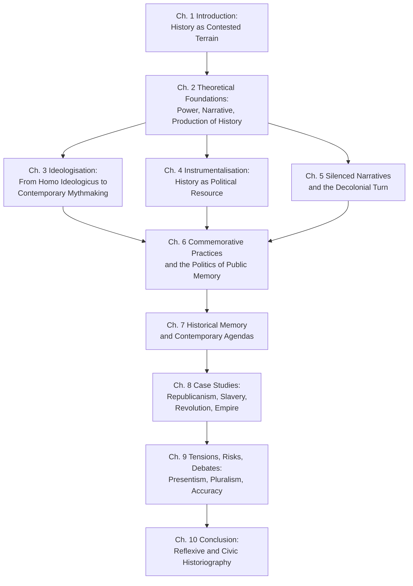
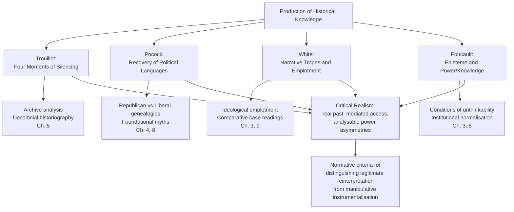
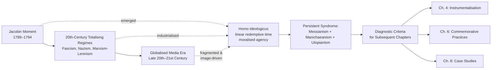

# Contested Pasts: The Reinterpretation of Historical Narratives Through Contemporary Political and Social Lenses
# 1 Introduction: History as a Contested Terrain in the Present

In the early decades of the twenty-first century, scarcely a week passes without a public quarrel over the meaning of the past. Statues of slaveholders are toppled or defended; school curricula are rewritten and then rewritten again; museums repatriate looted objects while governments legislate against "unpatriotic" historical scholarship; the dates of national holidays are reframed as moments of mourning rather than celebration. These disputes are not marginal eruptions in an otherwise stable consensus about what happened and what it meant. They are, rather, symptoms of a deeper condition in which the past has become one of the principal arenas in which contemporary societies negotiate identity, legitimacy, and belonging. To open an analysis of how historical narratives are being reinterpreted under the pressure of present-day politics, one must therefore begin not with a particular controversy but with the underlying recognition that **the past is never simply found in the archive; it is continuously produced, framed, and re-framed by the communities that remember it**.

This recognition has a long intellectual genealogy. The French sociologist Maurice Halbwachs, writing in the wake of the First World War, was the first to argue systematically that memory is not a private possession of the individual mind but a social phenomenon, "acquired within social frameworks" and reflecting "a social process situated in the present rather than the past."[^1] Halbwachs insisted that even the most intimate recollection is constituted through interaction with others and through what he called *cadres sociaux*—the familial, religious, occupational, and class frameworks that supply the reference points for what is remembered and how.[^1] His student Pierre Nora later extended this insight into the historiographical sphere with his celebrated concept of *lieux de mémoire*, the "long-lasting crystallisation points of collective memory and identity that last for generations" through which modern societies, having lost organic ties to their own pasts, deliberately construct sites—monuments, anniversaries, museums, even foodstuffs and personalities—where shared associations can condense.[^2] Jan Assmann subsequently refined the conceptual architecture by distinguishing *communicative memory*, the informal, everyday, generationally limited memory that fades with the disappearance of those who lived through events, from *cultural memory*, the institutionalised, ceremonial, specialist-mediated memory of an "absolute past" preserved in texts, rituals, and monuments and capable of grounding collective identity across centuries.[^3]

Taken together, these foundational insights establish a premise that will animate every subsequent chapter of this report: historical narratives are *socially constructed artifacts whose meaning shifts with the needs of the remembering community*. They are not arbitrary—they remain anchored in evidence, archives, and the disciplined inferential practices of historians—but they are also never inert. They are reshaped each time a community confronts a new political crisis, a new identity claim, or a new generational reckoning. The task of this report is to map how that reshaping unfolds today, with what stakes, and according to what ethical and methodological norms.

## 1.1 Framing the Problem: Why Contested Pasts Matter Now

Why does the reinterpretation of history feel so urgent in the present moment? Part of the answer lies in a structural feature of late-modern temporality that the historian Eric Hobsbawm captured in his diagnosis of a "permanent present"—a world increasingly oriented toward the future and thinking globally, yet lacking "any organic connection to the past of its own lifetime."[^2] When inherited traditions weaken, when the generational chain of communicative memory is disrupted by migration, mass media, and accelerated social change, communities feel compelled to *manufacture* connections to the past through deliberate institutions of remembrance. Nora himself argued that modern societies are "losing the sense of memory" and must "actively set up institutions"—archives, libraries, museums, commemorations, monuments—that will allow them to retain memories that traditional milieux no longer transmit organically.[^1] The proliferation of *lieux de mémoire* is thus not a sign of a society securely in possession of its past, but of one anxious about losing it.

This anxiety is intensified by three converging conditions of the present. First, the unfinished work of decolonisation has placed previously dominant historical narratives—imperial, Eurocentric, settler-colonial—under sustained intellectual and political challenge, while the descendants of the colonised, enslaved, and dispossessed press for the recovery of histories that were systematically silenced. Second, the resurgence of nationalist and populist politics across many democracies has produced a counter-mobilisation of memory in which foundational myths are reasserted as bulwarks against pluralism. Third, digital media have radically expanded the participants in historical argument: the production and circulation of historical claims is no longer confined to academic historians but is shared with journalists, activists, amateur enthusiasts, algorithmic platforms, and state propagandists, all operating within what Schwartz describes as a contemporary intellectual climate where commemoration is "widely conceived as a mask concealing the interests of the powerful."[^1]

In this environment, debates over monuments, school curricula, museum collections, and national holidays are not peripheral skirmishes but the visible surface of a deeper struggle over who belongs to the political community, whose suffering counts, and which inheritances confer legitimacy. **The central thesis that orients this report is that history operates simultaneously in three registers—as scholarship, as commemoration, and as ideology—and that disentangling these registers is essential for understanding contemporary cultural conflicts.** Scholarship aspires to evidentiary rigor and explanatory adequacy; commemoration sanctifies and binds communities through symbolic condensation; ideology subordinates the past to a doctrinal vision of the present and future. The three registers are interdependent—commemoration draws on scholarship, scholarship is shaped by commemorative concerns, ideology recruits both—but they obey different norms, and confusing them is at the root of much of the current public confusion about what reinterpretation is for and what it owes to truth.

## 1.2 Key Concepts and Definitions

A study that ranges across intellectual history, decolonial theory, and memory studies risks terminological drift unless its core concepts are anchored from the outset. Five terms recur throughout this report and require precise analytical content.

**Historical memory** designates the broader social process by which a group remembers its past, shaped continuously by present identity needs. Halbwachs distinguished collective memory from history proper: where the historian seeks "an objective standpoint to assess the sequence, importance, mutual relations, causes, and consequences of past events," operating from a position "external to and above groups," collective memory "remains significant only so long as it remains relevant" and "holds only a part of the past that is still alive in the conscience of the group."[^1] History selects events for didactic ordering; collective memory retains what living groups still feel.[^1] This contrast, however, is more analytical than empirical—Schwartz rightly notes that history and commemoration are "interdependent constituents of collective memory," with history disenchanting the past while commemoration sanctifies it.[^1]

**Commemoration** refers to ritualized public remembrance through objects, sites, ceremonies, and symbolic practices. As Schwartz observes, Halbwachs systematized the analysis of commemoration as "a system of 'condensation symbols' expressing the moral sentiments" that historical events inspire, in contrast to history's "referential symbols" representing factual sequence.[^1] The vocabulary of commemoration is therefore inherently moral and affective; its function is "cognitive and moral orientation, inspiration, consolation, and purpose," and its objects—monuments, shrines, flags, anthems, holidays, rituals, statues, busts, portraits, and ruins—comprise what Nora termed *lieux de mémoire*.[^1] Crucially, places of remembrance are "much more than mere locations"; they include personalities, mythical figures, customs, and symbols—any "conceptual topos" in which common associations condense.[^2]

**Ideologisation** denotes the embedding of historical narratives within political doctrines that prescribe a vision of how society ought to be ordered. It transforms description into prescription: events are selected, weighted, and emplotted not primarily to explain what happened but to authorise a programme. Ideologisation differs from ordinary interpretation by its systematicity, its resistance to falsification, and its subordination of evidentiary discipline to doctrinal coherence.

**Instrumentalisation** is the closely related but analytically distinct strategic deployment of the past for present political ends. As one contemporary scholarly framing puts it, certain memory policies are perceived as "a political instrumentalization of the past, reminiscent of the official history" of authoritarian regimes.[^4] Where ideologisation embeds history within a doctrine, instrumentalisation uses history as a tool—mobilising audiences, legitimating authority, shaming opponents, consolidating identity. The two often co-occur, but they need not: a state can instrumentalise history pragmatically without a coherent ideology, and a thinker can ideologise history without effective political instrumentalisation.

**Silenced narratives** refers to histories suppressed, marginalised, or rendered "unthinkable" by dominant frameworks of historical production. The concept presupposes that archives and historiographies are not neutral repositories but selective mechanisms shaped by the power asymmetries of their moment of production. Recovering silenced narratives—of the enslaved, the colonised, women, the working classes, indigenous peoples—requires both new evidentiary techniques and a critical reckoning with the production of historical knowledge itself.

To these five primary terms, two further conceptual pairings provide additional analytical purchase. Assmann's distinction between **communicative memory** and **cultural memory** captures the difference between informal, lived, generationally limited remembrance and institutionalised, ceremonial, specialist-mediated remembrance of an absolute past, separated by what Jan Vansina called the "floating gap" of approximately three generations.[^3] The two are not opposed but complementary, and many of today's controversies arise precisely at their interface, when communicative memory of recent traumas (slavery's afterlives, colonial violence, dictatorship) demands inscription into cultural memory through monuments, curricula, and law. The following table summarises the principal contrasts that orient the analysis.

| Dimension | Communicative Memory (Halbwachs / informal collective memory) | Cultural Memory (Assmann) | History (analytic historiography) |
|---|---|---|---|
| Content | Recent past within autobiographical reach | Mythical/foundational events in "absolute past" | Reconstructed sequence of events |
| Time depth | ~80–100 years; 3–4 interacting generations | Extends to origins; trans-generational | In principle unlimited |
| Form | Informal, everyday, vernacular | Highly formalised; ritual, monumental | Discursive, evidentiary |
| Carriers | Diffuse, all members of community | Specialists (priests, bards, scholars, curators) | Trained historians |
| Relation to identity | Strong, affective, "communautés affectives" | Constitutive of cultural identity | Aspires to detachment from immediate identity needs |
| Stability | Fades as carriers die | Stable, continually reactivated through institutions | Cumulative, revisable |

*Source: synthesised from Halbwachs's framework as summarised in Ogino[^1] and Schwartz[^1], and from Assmann's typology[^3].*

The crucial insight that emerges from this conceptual mapping is that **contemporary controversies over historical narratives typically take place precisely at the points of friction between these registers**: where communicative memory of living victims demands cultural-memorial inscription; where cultural memory's mythic foundations are challenged by historiographical revision; where ideologisation enlists the affective force of commemoration against the disciplined claims of scholarship.

## 1.3 Guiding Research Question and Analytical Perspectives

The guiding question that organises this report can now be stated precisely: **why and how does the reinterpretation of history matter politically and ethically in the contemporary moment, and what distinguishes legitimate reinterpretation from manipulative instrumentalisation?** This formulation deliberately resists two opposed temptations. It refuses, on one hand, the positivist temptation to treat all reinterpretation as equally suspect, as if the historical record were a stable object that political pressure can only distort. It refuses, on the other, the relativist temptation to treat all reinterpretation as equally valid, as if the historiographical claims of marginalised communities and the propaganda of authoritarian states stood on the same epistemic footing. The question thus presupposes that reinterpretation is *both* unavoidable *and* normatively differentiated: it can illuminate what was suppressed or it can fabricate what serves power, and the difference matters.

Three complementary analytical lenses structure the inquiry that follows.

**Intellectual history** traces how interpretive paradigms emerge, circulate, and shift over time. It is indispensable for understanding why particular historical narratives become dominant in particular moments and how the conceptual frameworks through which we interpret the past are themselves products of past intellectual struggles. As the Annales School recognised—sharing, as Ogino notes, "the same problematic" as Halbwachs in the conviction that "historians should find problems from the interests of the present to write a living past"—historiography is itself an object of historical analysis.[^1] Intellectual history provides the tools for examining how concepts such as republicanism, revolution, or colonialism have been constructed and contested by successive generations of thinkers.

**Decolonial theory** exposes the imperial and Eurocentric assumptions embedded in dominant historical narratives. It draws attention to the structural violence of archives produced under colonial conditions, to the "silences" that operate at multiple moments of historical production, and to the specific epistemic injuries inflicted on enslaved and colonised peoples by the canonical traditions of Western historiography. Decolonial perspectives ground the report's engagement with silenced narratives and methodological innovations developed to recover them.

**Memory studies** supplies the conceptual machinery—Halbwachs's collective memory, Nora's *lieux de mémoire*, Assmann's communicative/cultural distinction, and the substantial subsequent literature on commemoration and the politics of remembrance—for analysing how societies construct, transmit, and contest the past beyond the academy. Memory studies is particularly useful for examining the role of monuments, museums, anniversaries, and digital platforms in shaping the historiographical consciousness of mass publics.

These three lenses are complementary rather than competing. Intellectual history examines paradigms; decolonial theory critiques their power-effects; memory studies investigates their social embedding. Each compensates for blind spots in the others: intellectual history can become detached from material power without decolonial critique; decolonial theory can become indifferent to internal intellectual genealogies without intellectual history; memory studies can become descriptively rich but normatively thin without both. Their combined deployment ensures that the report engages historical reinterpretation simultaneously as a conceptual, political, and social phenomenon.

## 1.4 Scope, Structure, and Argumentative Architecture

The scope of this analysis is delimited by its focus on cases and debates where political and social pressures *visibly* reshape historical narratives. The report does not attempt a comprehensive history of historiography, nor does it claim equal coverage of every world region. It concentrates instead on illustrative episodes—the contested intellectual origins of the American Revolution, the silencing and recovery of the Haitian Revolution, debates over the Jacobin legacy and the French Revolution, post-Soviet memory politics, postcolonial reassessments of European empire, and the recovery of marginalised figures and communities—chosen to span diverse geographical and temporal contexts and to illuminate the operation of the conceptual framework introduced above. Where the available scholarship permits, the report draws on cases beyond the Anglo-American world to mitigate the risk of regional bias inherent in any single-language survey.

The argumentative architecture of the report unfolds in a deliberate sequence, moving from theoretical foundations through ideological and instrumental deployments of the past, to the recovery of silenced narratives, the analysis of commemorative practices, and the examination of contemporary political agendas, before consolidating these threads in case studies and a critical assessment of tensions and risks. The following diagram summarises the logical progression.

The diagram makes visible the report's three structural movements. The first movement (Chapters 1–2) establishes the conceptual and theoretical ground. The second movement (Chapters 3–7) develops parallel analyses of three modes by which history is reshaped under contemporary pressure—ideologisation, instrumentalisation, and the recovery of silenced narratives—and traces how these modes are mediated through commemorative practices and channelled into specific political agendas. The third movement (Chapters 8–10) concretises the analysis through case studies, confronts the methodological and ethical tensions that politicised historiography raises, and concludes by articulating the conditions under which historical reinterpretation can serve rather than corrode democratic deliberation.

A brief word on what this introduction has not done, and what the report cannot do, is in order. The Halbwachsian and Assmannian traditions on which Section 1.2 draws are themselves products of particular intellectual moments—post-1918 French sociology and late-twentieth-century German cultural studies, respectively—and they carry assumptions about the relations between memory, group identity, and modernity that subsequent chapters will need to interrogate, especially in light of decolonial critiques of Eurocentric memory frameworks. Moreover, while the reference materials available for this introduction provide rich foundations in memory studies, the report's later chapters will need to mobilise additional theoretical and empirical resources—on Trouillot's silences, Pocock's republicanism, Hartman's critical fabulation, and contemporary case literature—that are not surveyed here. This introduction therefore offers an opening orientation rather than a comprehensive theoretical apparatus. Its principal function is to establish that historical narratives are always socially situated and politically consequential, that this situatedness is not a defect to be eliminated but a condition to be navigated, and that the work of navigation requires both analytical precision and ethical reflexivity. The chapters that follow take up that work in earnest.

# 2 Theoretical Foundations: Power, Narrative, and the Production of History

The introduction established that historical narratives are socially constructed artifacts whose meaning shifts with the needs of the remembering community. That claim, however, requires theoretical underpinning if it is to bear the analytical weight of the chapters that follow. Memory studies in the Halbwachs–Nora–Assmann tradition tells us *that* the past is socially produced; it does not, on its own, tell us *how* power infiltrates that production at the level of evidence, archive, narrative, and judgement, nor does it equip the analyst to distinguish legitimate reinterpretation from doctrinal manipulation. To meet that need, this chapter assembles a more granular theoretical apparatus drawn from four overlapping traditions: the materialist anthropology of historical production developed by Michel-Rolph Trouillot, the intellectual-historical method of J. G. A. Pocock, the literary-rhetorical analysis of historical discourse pioneered by Hayden White, and the discourse-analytic and genealogical work of Michel Foucault. It then situates these frameworks in relation to the broader epistemological dispute among positivism, constructivism, and critical realism, with the aim of formulating a balanced position adequate to the report's normative project.

The four authors chosen here are not interchangeable, and the chapter is at pains to treat them as complementary rather than convergent. Trouillot is concerned chiefly with how power shapes what enters and what is excluded from the archive. Pocock is concerned with how the very recovery of past languages of political thought constitutes a present-day political act. White is concerned with the rhetorical and tropological structures that distort any narrative reconstruction of the past. Foucault is concerned with the deeper conditions of possibility that determine what can be thought as historical truth at all. Read together, they map the distinct vectors—archival, intellectual-genealogical, narratological, and epistemic—through which the political always already inhabits the historiographical. Read against one another, they expose the tensions that any responsible reflection on contested pasts must navigate.

## 2.1 Trouillot and the Four Moments of Silencing

The most influential single framework for theorising how power produces history is found in Michel-Rolph Trouillot's *Silencing the Past: Power and the Production of History* (1995), a book widely regarded as a "modern classic" that "bridges disciplines such as history, anthropology, Caribbean studies, African-American studies, and post-colonial studies"[^5]. Trouillot's central wager is that the production of historical knowledge is *unevenly* shaped by power, and that this unevenness can be analysed with precision rather than gestured at with generalities. To this end he distinguishes four moments at which silences enter the historical record: "fact creation (the making of sources); fact assembly (the making of archives); fact retrieval (the making of narratives); and retrospective significance (the making of history in the final instance)"[^6][^7][^8].

Each of these moments names a different operation. *Fact creation* concerns the moment at which an occurrence is registered—or fails to be registered—as a source: the colonial scribe's ledger, the missionary's letter, the planter's accounts. As Trouillot argues, since sources transform occurrences into "facts," they inherently involve a selection process: some happenings are recorded and others silenced, and what gets recorded is influenced by existing power inequalities[^6]. *Fact assembly* concerns the institutional aggregation of these sources into archives, where again selection operates, this time through the bureaucratic and curatorial criteria that determine what is preserved, catalogued, and made retrievable. Trouillot's own example, drawn from his archival labour with records of German Sāmoa, is instructive: the names of Chinese labourers were systematically omitted from official documentation, generating an archival silence that no later historian, however scrupulous, can simply read off the documents[^7]. *Fact retrieval* concerns the moment of narrative construction, in which historians select from the archive the elements that will compose their account. *Retrospective significance* concerns the assignment of historical importance, the determination of what counts as a turning point, an "event," or a footnote.

Crucially, these four moments are conceptually distinct but practically intertwined: they "coincide in practice," collectively illustrating "how power shapes what information is available, how it is organized, and how it is ultimately interpreted"[^6]. Trouillot is also explicit that *silencing is an active operation*, not a passive lacuna. Drawing on the analogy of a gun's silencer, he insists that silence is "a deliberate practice that engages with what is omitted in historical narratives"[^7]. Silences are produced and reproduced; they have authors, even if those authors are diffuse institutional networks rather than identifiable individuals.

The analytical force of this scheme becomes clearest in Trouillot's signature application: the Haitian Revolution. His argument, elaborated in the chapter "An Unthinkable History," is that the slave uprising of 1791–1804 was "an 'unthinkable' event: that the idea of enslaved populations rising up and not only resisting slavery but also achieving self-determination and forging entirely new conceptual categories of freedom and equality was beyond the grasp of both observers and participants"[^9]. Plantation owners' "practical precautions aimed at stemming individual actions or, at worst, a sudden riot"; the conceptual frame within which they operated, "by no means monolithic" but "widely shared by whites in Europe and the Americas," "left room for variations" but "none of these variations included the possibility of a revolutionary uprising in the slave plantations, let alone a successful one leading to the creation of an independent state"[^9]. The Revolution thus "challenged the ontological and political assumptions of the most radical writers of the Enlightenment"; the events of 1791–1804 "constituted a sequence for which not even the extreme political left in France or in England had a conceptual frame of reference"[^9]. They were, in Trouillot's celebrated phrase, "'unthinkable' facts in the framework of Western thought"[^9].

This unthinkability is not merely a feature of contemporary perception; it propagates forward into the historiographical record. Resistance, Trouillot observes, "did not exist as a global phenomenon. Rather, each case of unmistakable defiance, each possible instance of resistance was treated separately and drained of its political content"[^9]. The result is a textbook structure in which "we barely find a name of a country like Haiti which once challenged the major power of the world, the French power"[^7]. The four-moment scheme allows Trouillot to track precisely how this happened: at the moment of fact creation, planter ideologies excluded the very possibility of organised slave revolution; at the moment of archive formation, the documents that survived disproportionately represented the colonial gaze; at the moment of narrative construction, European historians fitted what they could not exclude into trivialising frames; and at the moment of retrospective significance, the Revolution was systematically excluded from canonical lists of "modern revolutions" and from the standard "age of revolution"[^7].

What is theoretically important about Trouillot's account is that it preserves the materiality of the past while exposing the power-saturated character of its representation. He explicitly rejects both extreme positions in the philosophy of history. As one careful summary puts it, his stance is "neither that of the positivist nor the constructivist": "Whereas the positivist view hides the tropes of power behind a naive epistemology, the constructivist one denies the autonomy of the sociohistorical process," and Trouillot rejects "both the naive proposition that we are prisoners of our pasts and the pernicious suggestion that history is whatever we make it"[^8]. History, he writes, "is the fruit of power, but power itself is never so transparent that its analysis becomes superfluous"[^8]. This is the methodological credo that distinguishes Trouillot's work from the more sweeping forms of constructivism: he insists on the reality of bodies, fossils, texts, and buildings—the material substrate from which history begins[^8]—even as he refuses any naïve correspondence between archive and event.

Trouillot is, finally, attentive to the political stakes of his own framework. He argues that **historians have a present responsibility to "authentically engage with the present power dynamics that continually reinterpret the past"**[^6], and that "what we know about slavery or about colonialism can—should, indeed—increase our ardour in the struggles against discrimination and oppression across racial and national boundaries"[^8]. The position is not relativist; it is reflexively realist. This combination—materialist commitment plus power-analytic vigilance—will function in the chapters that follow as the primary analytical instrument for examining decolonial historiography (Chapter 5), for distinguishing scholarly recovery from instrumental appropriation (Chapter 4), and for evaluating which silences contemporary commemorative practices reproduce or break (Chapter 6).

## 2.2 Pocock, Republicanism, and Historiography as Political Action

Where Trouillot exposes the operation of power within the production of historical knowledge, J. G. A. Pocock's lifelong project illuminates a different but complementary phenomenon: the way the *intellectual reconstruction* of past political languages constitutes itself a political act in the present. Pocock's *The Machiavellian Moment: Florentine Political Thought and the Atlantic Republican Tradition* (1975) is widely credited with having "profoundly transformed" the field of the history of political thought in the English-speaking world[^10]. The historian Joyce Appleby captured the scale of the intervention when she observed that "the recent discovery of republicanism as the reigning social theory of eighteenth-century America has produced a reaction among historians akin to the response of chemists to a new element"[^10].

Pocock's substantive thesis was that early modern Anglophone political thought, including the political imagination of the American Revolution, was decisively shaped by a republican tradition descending from Florentine civic humanism—a tradition centred on the figure of the citizen whose property and virtue undergird participation in public life[^10]. In Pocock's reconstruction, "the citizen possessed property in order to be autonomous and autonomy was necessary for him to develop virtue or goodness as an actor within the political, social and natural realm or order. He did not possess it in order to engage in trade, exchange or profit"[^10]. This conception of property is, as Zhiyuan Cui notes, "quite different from the conventional definition of 'capitalist' property, which emphasizes unrestricted transfer and accumulation as the crucial feature of property ownership"[^10]. Pocock himself even ventured the striking claim that "Bourgeois ideology," as a matter of historical fact, "may never have fully won" its struggle for existence[^10].

The political consequences of this scholarly reconstruction were immediate and remain contested. By foregrounding civic humanism rather than Lockean liberalism as the formative discourse of American constitutional thought, Pocock displaced a long-dominant historiographical framework that aligned the American founding with the priorities of contemporary liberal-capitalist orthodoxy. The "debates triggered by Pocock's seminal work focused either on the relative importance of liberalism and republicanism or on the difference between humanist and jurist modes of discourse in early modern times"[^10], and these debates were never merely antiquarian. To argue that the American Revolution drew on a republican vocabulary in which property was a basis of *autonomy* rather than of *accumulation*, and in which civic virtue rather than self-interest was the constitutive value, was to contest the genealogy by which contemporary liberalism legitimates itself.

This is the methodological insight that places Pocock alongside Trouillot in the theoretical apparatus of this report: **the recovery of past languages of political thought is itself a political intervention, because it alters the imaginative resources available for present-day argument**. The historian who reconstructs an "Atlantic republican tradition" is not merely cataloguing dead vocabularies; she is rendering them once again audible as alternatives to currently dominant idioms. As Cui puts it, drawing on Pocock's chapter on the "Augustan" debates over land, trade, and public debt, the republican past becomes a resource for "an institutional alternative to both 'capitalism' and 'socialism'"[^10]. Whether or not one endorses Cui's particular appropriation, the structural point holds: Pocock's historiography is "an early form of historicism" that aspires, in his own work, to become "a dynamic version of republicanism for modern and postmodern times"[^10].

The contrast with Leo Strauss—whose insistence on the timeless truth of the great political texts deliberately resists historicising contextualisation—and the methodological dispute with Quentin Skinner, who treats the recovery of authorial intention as analytically primary, sharpen the distinctive Pocockian claim. For Pocock, paradigms of political language are not merely objects of intellectual-historical reconstruction; they constitute the medium in which political thought becomes possible at all, and their recovery makes possible new (or renewed) political imaginaries in the present. This is closer to a *constitutive* than to a merely *instrumental* view of historiography's political function—a distinction that the report will revisit in Chapter 9.

Two cautions are in order. First, Pocock's reconstruction has been vigorously contested. Isaac Kramnick's *Republicanism and Bourgeois Radicalism* offered "a representative critique of Pocock's 'republican' thesis," to which Pocock replied at length in his review[^10]. Richard Tuck devoted "the first chapter of his new book on international law to a critique of Pocock's view of the relationship between humanist and jurist modes of thought"[^10]. The "republican synthesis" remains a paradigm under negotiation, not a settled finding. Second, Pocock himself was alert to the danger that historiographical reconstructions might harden into ideological commitments; his approach to republicanism is exploratory and pluralist rather than doctrinal. **The lesson the report draws from Pocock is therefore not that republicanism is "true" where liberalism is "false," but that the very identification of which past languages count as available resources for present politics is itself a high-stakes historiographical and political act**, an act whose consequences will be examined directly in Chapter 4 (on the instrumentalisation of foundational narratives) and Chapter 8 (on the reinterpretation of revolutionary traditions).

## 2.3 Hayden White and the Narrativist Critique

If Trouillot trains attention on the archival substrate of history and Pocock on the conceptual vocabularies in which political pasts are recovered, Hayden White directs analysis to the *form* in which historical knowledge is finally communicated: the narrative. White's *Metahistory: The Historical Imagination in Nineteenth-Century Europe* (1973) and a series of subsequent essays argued that historical writing is "marked by strategies of explanation, which include explanation by argument, explanation by emplotment, and explanation by ideological implication"[^11]. His central contention is that "historical writing was influenced by literary writing in many ways, sharing the strong reliance on narrative for meaning"; and from this he draws the consequence that "historical writing can [not] be objective or scientific as purely empiric"[^11].

White's argument unfolds at several levels. He observes, following Marx and Nietzsche, that to philosophise about history is to consider a process that "not only makes us know something about the historical process but know how it knows it"[^11]. For Marx, "the problem of history" was "the problem of the mode of explanation"; for Nietzsche, it was "the problem of the mode of emplotment"[^11]. In either case, the historian's choice of mode is not external to the historical reconstruction but constitutive of it: "history is recorded differently depending on which mode the historian chooses. As a result, 'a value-free history' cannot exist"[^11]. Historiography, on this account, "consists of well-constructed narratives" in which philosophies of history are "indispensable elements," not separable preliminaries[^11].

The implication is sharp. Even if the evidentiary record were transparent—an assumption Trouillot has already challenged—the very act of fashioning that record into a coherent story imposes choices that exceed the evidence. Plot structures (romance, tragedy, comedy, satire), modes of argument (formist, mechanistic, organicist, contextualist), and ideological implications (anarchist, conservative, radical, liberal) are not optional decorations on a neutral substrate but the conditions under which a sequence of occurrences becomes a "history" at all. White was therefore led to defend a position that "contradicts the view that historical writing can be objective or scientific as purely empiric"[^11], without—and this is important—denying the value of narrative form itself. On the contrary, he argued that "history is most successful when it uses this 'narrativity', since it is what allows history to be meaningful"[^11].

This dual stance—narrative form as both indispensable and irreducibly distorting—is the source of both the productive power and the principal vulnerabilities of White's framework. Productively, it provides a vocabulary for analysing how the same evidentiary base can yield radically divergent histories depending on the rhetorical scaffolding employed: a tragic emplotment of the French Revolution and a romantic emplotment of the same events differ not in the facts they cite but in the moral and political shape they impart to those facts. This insight is directly relevant to the report's later analyses of how identical historical episodes—the founding of the United States, the Jacobin moment, the Haitian Revolution, European empire—are mobilised in radically different ideological registers (Chapters 3, 7, and 8).

Vulnerably, however, radical narrativism has been charged with risking the dissolution of the distinction between history and fiction. If every historical narrative is structured by tropes that exceed the evidence, what prevents the historian's account of the Holocaust from standing on the same epistemic footing as a denialist fabrication? White himself wrestled with this question—particularly in essays on the representation of the Holocaust—and his framework does provide internal resources for distinguishing better from worse narratives, but the charge has not been fully laid to rest. The point is not lost on Trouillot, who explicitly worries that "narratives are necessarily emplotted in a way that life is not. Thus they necessarily distort life whether or not the evidence upon which they are based could be proved correct," with the result that "history becomes one among many types of narratives with no particular distinction except for its pretense of truth"[^8]—a viewpoint Trouillot describes in order to resist it.

The most defensible reading of White, and the one this report adopts, treats his narrativism as *demystifying* without being *delegitimising*. White exposes the rhetorical and ideological labour that produces every historical text; he does not thereby license any narrative whatever. **Narrativism is most useful when read alongside Trouillot's materialism: White names the rhetorical constraints on what histories say, while Trouillot names the archival and political constraints on what histories can say**. The two analyses converge on a shared rejection of positivist innocence while diverging in the level at which they locate the politics of historical production. This complementarity will be exploited in Chapters 3 and 9, where the report distinguishes between ideologisation operating at the level of emplotment (a Whitean concern) and ideologisation operating through archival and conceptual exclusion (a Trouillotian concern).

## 2.4 Foucault, Discourse, and the Power-Knowledge Nexus

The fourth pillar of the theoretical apparatus is supplied by Michel Foucault, whose archaeological and genealogical work pushes the analysis still deeper, to the level of the conditions of possibility that determine what can count as historical truth in the first place. Foucault's contribution is in some respects the most radical of the four authors discussed here, because it disputes not only the neutrality of the archive (Trouillot), the innocence of intellectual reconstruction (Pocock), or the transparency of narrative (White), but the very framework within which "history" appears as a recognisable form of knowledge.

Foucault's *archaeological method*, formalised in *The Archaeology of Knowledge* (1969), proposes to analyse knowledge by "excavating the historical rules that made particular ideas possible in the first place"[^12]. The key idea is that "systems of thought and knowledge are governed by rules—beyond those of grammar and logic—that operate beneath the consciousness of individual subjects and define the boundaries of thought in a given domain and period"[^12]. These rules are not consciously followed; they "function more like the grammar of a language: invisible, but structuring every statement that can be made"[^12]. Around this insight, Foucault organised the concept of the *episteme*: "the underlying structure of knowledge that defines what it is possible to think, ask, or know in a given historical era"[^12]. During the Renaissance, knowledge was organised around resemblance; in the Classical period, around representation and classification; in the modern period, around history, development, and progress[^12]. Crucially, the shifts between epistemes are not gradual but are characterised by "ruptures and discontinuities"—"sudden breaks where the entire framework of knowledge shifts"[^12]. In later writings, Foucault qualified the model, conceding that "several epistemes may co-exist and interact simultaneously, being parts of various power-knowledge systems"[^12], thus rendering it more dynamic and less monolithic than early critics charged.

The methodological consequence for historiography is significant. If what counts as a legitimate question or a valid answer is governed by rules of which historical actors are largely unaware, then the historian's task is not to recover what an era thought "about" some object but to reconstruct the conditions under which that object could be thought at all. This is Foucault's deepest convergence with Trouillot's notion of the "unthinkable": Trouillot's analysis of how the Haitian Revolution exceeded the conceptual framework of Enlightenment Europe is, in effect, an application of episteme-analysis to a specific case. What was unthinkable to the planter and the philosophe alike was unthinkable not because they failed to attend to evidence but because the framework within which their thought operated did not contain the categorical resources to register what was happening.

By the early 1970s, Foucault had grown dissatisfied with archaeology's exclusive focus on discursive formations and shifted toward what he called *genealogy*, "a term borrowed from Nietzsche," which "placed greater emphasis on how power relations develop and operate through institutions and social practices over time, rather than focusing primarily on the rules governing discourse"[^12]. Where archaeology examined "discursive statements and archives," genealogy "re-centres the production of knowledge around questions of power and is grounded in institutional analysis"[^12]. The shift produced the formulation for which Foucault is now best known: *power/knowledge*, written together "to signal that the two cannot be separated"[^12]. Knowledge "is intricately linked to power, with societal norms and institutions shaping individual identities and truths"[^12]. As Foucault put it, "there is no power relation without the correlative constitution of a field of knowledge, and no knowledge that does not presuppose and constitute power relations at the same time"[^12].

This formulation reframes power itself. Power, on Foucault's account, is not principally repressive but *productive*: "It creates subjects, generates categories of people, and shapes the very desires and identities of individuals—all through the mechanism of knowledge production"[^12]. The taxonomies of medicine, criminology, demography, and pedagogy do not merely describe pre-existing populations; they bring those populations into administrable existence. Applied to historiography, this insight illuminates how categorisations such as "primitive" and "civilised," "developed" and "underdeveloped," "modern" and "traditional," "European" and "Oriental," do not merely classify pre-existing realities but constitute the historical subjects they purport to describe. Foucault also introduced the concept of *subjugated knowledges*—"perspectives and ways of knowing that dominant systems marginalize or disqualify," "forms of understanding that have been excluded because they challenge dominant power arrangements"[^12]—which converges directly with Trouillot's account of silencing while emphasising the institutional rather than archival mechanisms of exclusion.

A common misreading of Foucault treats his analysis as denying agency or resistance, "as if power is everywhere and operates through knowledge itself, then individuals are simply trapped within its systems"[^12]. Foucault explicitly rejected this reading. "Power, in his framework, is not a fixed structure but a dynamic set of relations that are always being contested and renegotiated"[^12]: "power is productive rather than simply repressive—it creates knowledge, shapes identities, and generates possibilities for action, meaning that power relations are never fixed or permanent but constantly being negotiated and contested"[^12]. Where there is power, Foucault insisted, there is also resistance. This makes archaeology and genealogy not merely descriptive exercises but politically significant ones: by revealing that what is treated as natural or inevitable is in fact the product of "specific historical power arrangements," Foucault opens space for "questioning and challenging those arrangements"[^12].

For the purposes of this report, Foucault contributes three things. First, the concept of episteme provides a vocabulary for analysing why certain historical possibilities are unthinkable in a given era—a vocabulary that will be deployed in Chapter 5 on silenced narratives and Chapter 8 on the Haitian Revolution. Second, the power/knowledge nexus exposes the institutional channels (universities, archives, state ministries, school curricula, museums) through which historical narratives become normalised, a perspective foundational for Chapter 6 on commemorative practices. Third, the productive conception of power clarifies how ideologisation operates not merely by repressing alternative pasts but by *constituting* the subjects who experience the official past as natural—a key concern of Chapter 3.

## 2.5 Positivism, Constructivism, and Critical Realism

The four frameworks reviewed above converge in their rejection of historiographical innocence but diverge in the philosophical positions to which they commit their users. The chapter must therefore engage directly with the broader epistemological dispute that frames the philosophy of history: the contest among positivism, constructivism, and what is increasingly called critical realism.

**Positivism**, in its historiographical form, holds that historical truth corresponds to a recoverable past accessible through rigorous evidentiary procedure. The historian, on this view, operates through disciplined attention to sources, careful weighing of evidence, and the suppression of present-day prejudices. The aim is to reveal "the past as it really was"—the celebrated formulation of Leopold von Ranke. As Trouillot summarises and rejects this position, "positivists, focused on 'objective truth,' try to create a clean separation between occurrences and stories, suggesting historians can reveal the past 'as it really was'"[^6]. The strengths of positivism are the strengths of evidentiary discipline itself: respect for sources, vigilance against fabrication, accountability to a community of scholars whose verifications can correct individual error. Its weaknesses, exposed by all four of the theorists discussed above, are its blindness to the power-saturated character of source production, its insensitivity to the constitutive role of narrative form, and its naïveté about the conceptual frameworks within which "evidence" is recognised as such. The Hungarian reviewer's incisive observation—that even where a historian aspires to neutrality, the framing of sources, the choice of what to investigate, and the categories used to organise findings are already shaped by the historiographical tradition into which the historian was trained—captures this limitation.

**Constructivism**, in its strong form, occupies the opposite pole. It holds that historical narratives are primarily products of present-day discursive frameworks, with no privileged access to a stable past. Histories, on this view, are stories told in the present, for the present, about a past that is itself unstable and continually reconstituted in the act of telling. As Trouillot characterises and again rejects this position, the constructivist view "denies the autonomy of the sociohistorical process"[^8]; it captures the insight that history is always interpretation but loses sight of the fact that not every interpretation is equally accountable to the evidentiary record. Strong constructivism, in its most radical forms, can issue in the proposition that "history is whatever we make it"[^8]—a proposition Trouillot calls "pernicious." The worry is concrete: if all historical narratives are equally constructed, then the careful scholarly reconstruction of slavery's archive and the denialist fabrication of an alternative slavery (or an alternative Holocaust) cannot be epistemologically distinguished. Constructivism's strength is its sensitivity to the politics of representation; its weakness is its tendency, when pressed to its logical limit, to undercut the very critical project it aims to authorise.

**Critical realism**—the position implicitly defended by Trouillot and, with different inflections, by White and Foucault—mediates between these poles. It affirms the existence of a real past while recognising that all access to it is mediated by interpretive frameworks shaped by power. As Trouillot articulates this stance, history "is the fruit of power, but power itself is never so transparent that its analysis becomes superfluous"[^8]. This means three things simultaneously. First, there is a past that happened, irreducible to our representations of it: bodies were enslaved, ships sailed, laws were promulgated, revolutions were fought. The materiality of history—"living brains, fossils, texts, buildings"[^8]—is the substrate against which any narrative must finally answer. Second, our access to this past is always mediated by the four moments of silencing, by narrative form, by the conceptual vocabularies of intellectual traditions, and by the epistemic conditions of our era. Third, the asymmetry between what happened and what is said to have happened is itself analysable; it is not a void that swallows critical inquiry but a structure that critical inquiry can map.

The following table summarises the comparative position of the three epistemological stances along dimensions relevant to this report's analytical project.

| Dimension | Positivism | Strong Constructivism | Critical Realism (Trouillot) |
|---|---|---|---|
| Status of past events | Independent, fully recoverable | Constituted by present narrative | Independent and partially recoverable |
| Role of evidence | Decisive arbiter of truth | One discursive resource among many | Necessary but insufficient anchor |
| Source of historiographical bias | Avoidable through method | Constitutive and ineliminable | Analysable, partially correctable |
| Distinction history vs. fiction | Sharp and methodological | Blurred or dissolved | Maintained but reflexively grounded |
| Capacity to adjudicate disputes | High (in principle) | Low | Moderate, normatively grounded |
| Risk | Naïveté about power | Relativism, undercuts critique | Tension between realism and critique |
| Treatment of silences | Gaps in evidence to be filled | Effects of dominant discourse | Productions of power, materially traceable |

*Source: synthesised from the reception of Trouillot's framework[^6][^7][^8] and from the broader summary of Foucauldian and post-structuralist debates[^12].*

The report adopts critical realism as its working epistemological stance. The reasons are normative as well as analytical. The report's guiding question—how to distinguish *legitimate* reinterpretation from *manipulative* instrumentalisation—presupposes that there is something at stake in getting the past right, even while acknowledging that "rightness" is always partial, contested, and politically inflected. Strong constructivism cannot generate this normative differentiation, because it lacks the resources to identify what makes one reinterpretation more accountable than another. Positivism cannot generate it either, because it dismisses as "bias" precisely the politically and ethically significant differences between recovering a silenced narrative and fabricating a flattering one. Critical realism, by contrast, allows the report to argue that the recovery of the Haitian Revolution from its imposed unthinkability is *both* a politically motivated reinterpretation *and* a more truthful one than the Eurocentric narratives it displaces—because it answers more adequately to what materially happened, and because it does so while making explicit the power dynamics that produced earlier silences.

## 2.6 Synthesis: A Conceptual Toolkit for Analysing Contested Pasts

The four theoretical frameworks reviewed in this chapter are not interchangeable, and the report does not propose to reduce them to a single master theory. They function, rather, as complementary lenses that illuminate different dimensions of how political and social pressures reshape historical narratives. The following diagram summarises their relations and the empirical sites at which each is most analytically productive.

Read in combination, the four frameworks generate a layered analytic. Trouillot supplies the *vertical* analysis of how power enters at each successive stage of historical production from event to historiographical canon; his four moments will function in Chapters 5 and 8 as the principal diagnostic tool for tracing the production of silences and their partial recovery. Pocock supplies the *horizontal* analysis of how the conceptual vocabularies recovered by intellectual historians become available as resources for present-day political imagination; his work on republicanism will inform Chapter 4's treatment of foundational myths and Chapter 8's case study of contested American constitutional origins. White supplies the *formal* analysis of how narrative tropes and modes of emplotment shape the moral and political meaning that any historical sequence acquires; his framework will be deployed in Chapter 3's analysis of ideological mythmaking and in Chapter 9's evaluation of presentism. Foucault supplies the *conditional* analysis of the deeper epistemic frameworks within which historical statements become recognisable as such; his concepts of episteme and power/knowledge will inform the report's analysis of how categorical vocabularies (race, modernity, civilisation, development) constitute rather than describe the subjects of historiography, and will be especially important in Chapters 6 and 7.

From this convergence emerge four normative criteria that will guide the report's evaluative judgements in subsequent chapters.

First, **evidentiary discipline**: even after all the constructivist and post-structuralist critiques are absorbed, the obligation to answer to material evidence remains constitutive of historiographical work. Trouillot's insistence that "history begins with bodies and artifacts"[^8] is not a residue of positivism but a refusal to surrender the leverage that material reality provides against fabrication. Reinterpretations that violate this discipline—whether in the service of nationalist mythmaking, denialism, or any other ideological project—forfeit the claim to scholarly legitimacy whatever their political appeal.

Second, **reflexive awareness of narrative form**: every historiographical reinterpretation involves choices of emplotment, argument, and ideological implication, and responsible reinterpretation makes these choices visible rather than concealing them under a rhetoric of neutrality. White's analysis is most useful when it is taken not as a license for unconstrained narrative invention but as a demand for transparency about the rhetorical scaffolding of any historical account.

Third, **attention to silenced voices**: any historical reinterpretation must be assessed in part by its capacity to attend to the silences produced at the four moments Trouillot identifies. Reinterpretations that recover what was rendered unthinkable, that make audible what was systematically excluded from the archive, and that bring into narrative focus the experiences of the dispossessed, do work that no purely positivist historiography can perform—not because the latter is uninterested in evidence, but because it cannot recognise the structural production of evidentiary absence.

Fourth, **recognition of discursive power**: every reinterpretation participates in a present field of power-knowledge relations, and responsible reinterpretation acknowledges its own situatedness within this field rather than projecting a fictive view from nowhere. Foucault's lesson is not that scholarly authority should be abandoned but that it should be exercised with awareness of the institutional channels through which it operates and the categorical vocabularies it inevitably mobilises.

These criteria do not constitute a mechanical decision procedure. They will not, in any particular case, generate an unambiguous verdict on whether a given reinterpretation is legitimate or manipulative. What they do provide is a normatively articulated vocabulary for the evaluative work of the chapters that follow, in which specific cases of ideologisation, instrumentalisation, recovery, and commemoration will be examined. **The argumentative payoff of this theoretical apparatus is that it allows the report to reject both the naïve positivism that treats all reinterpretation as suspect and the radical relativism that treats all reinterpretation as equally valid, while offering substantive criteria for the discriminations that lie between**. In so doing, it bridges the abstract conceptual apparatus assembled here to the empirical and case-based analyses to which the next chapter, on ideologisation and contemporary political mythmaking, now turns.

[^6]: Trouillot, *Silencing the Past* (Shortform book summary), drawing on Trouillot's identification of the four moments of fact creation, fact assembly, fact retrieval, and retrospective significance, and his rejection of both pure positivism and pure constructivism.

[^5]: *Silencing the Past: Power and the Production of History*, 20th anniversary edition description, summarising Trouillot's bridging of history, anthropology, Caribbean studies, African-American studies, and post-colonial studies.

[^9]: Trouillot, "An Unthinkable History: The Haitian Revolution as a Non-Event," in *Silencing the Past*, as discussed in Rojo Robles's course materials, citing Yarimar Bonilla on the "unthinkability" of the Haitian Revolution and Trouillot's analyses of resistance, the West, and Enlightenment thought.

[^7]: "A case for contradiction and abolitionist thinking in memory studies," discussing Trouillot's work on the Haitian Revolution and its exclusion from canonical histories.

[^7]: Davidson, "Silencing the Past: Reflections on Remembering and Forgetting" (Overland Literary Journal, 2020), summarising Trouillot's four moments and discussing the case of unnamed Chinese labourers in German Sāmoa as an illustration of archival silencing.

[^8]: Goodreads reviews of *Silencing the Past*, particularly the synthesising reviews by Paula Koneazny, Malcolm, Barbara K, and Paul, which articulate Trouillot's four-moment scheme, his rejection of positivism and constructivism, and his materialist grounding of historiography in bodies and artefacts.

[^11]: "Hayden White," Wikipedia entry, summarising the central arguments of *Metahistory* concerning explanation by argument, emplotment, and ideological implication, and the impossibility of value-free history.

[^12]: "Foucault's Archaeology of Knowledge: Power and Knowledge Reexamined," Sociology Institute, summarising Foucault's archaeological method, the concept of episteme, the shift to genealogy, the power/knowledge nexus, the panoptic analysis, and the doctrine of subjugated knowledges.

[^10]: Cui Zhiyuan, "In Search of Dynamic Republicanism for the 21st Century," Documenta Platform 1 (2001), discussing Pocock's *The Machiavellian Moment*, the republican conception of property, the debates triggered by Pocock's work, and critiques by Kramnick and Tuck.

# 3 The Ideologisation of History: From Homo Ideologicus to Contemporary Political Mythmaking

The theoretical apparatus assembled in Chapter 2 demonstrated that historical narratives are produced under the pressure of power at every stage—from the inscription of events in sources, through their archival sedimentation, to their narrative emplotment and the institutional channels through which they acquire authority. That demonstration was, however, primarily diagnostic: it showed *how* power inhabits historiographical production without specifying the distinctive forms power assumes when it operates not merely as a constraint on knowledge but as a *programme* for organising society. To bridge that gap, this chapter turns to the phenomenon of ideologisation: the systematic subordination of historical interpretation to doctrinal vision. Whereas the silencing of the Haitian Revolution exemplifies how power evacuates events from the historical record, ideologisation operates through the converse mechanism—saturating the record with prescriptive meaning. It does not merely select what is remembered; it determines in advance what remembrance is *for*.

The chapter's animating claim is that ideologisation, properly understood, is not a residue of pre-modern superstition or a pathology confined to extreme regimes. It is a recurring possibility intrinsic to the modern political imagination, born in the crucible of the late eighteenth century, industrialised in the twentieth, and mutated—rather than eliminated—in the digital twenty-first. Across these radically different historical contexts, the analytical task is to identify what persists structurally beneath what changes phenomenally. The chapter argues that three structural features—messianic temporality, Manichaean moral binarism, and utopian projection—survive the transformation of carriers, media, and vocabularies, and together provide diagnostic criteria for distinguishing ideologisation from the ordinary, contested work of historical reinterpretation that the report defends as compatible with civic deliberation.

A preliminary terminological clarification is necessary. As Chapter 1 distinguished, *ideologisation* embeds historical narratives within doctrines that prescribe a vision of how society ought to be ordered, while *instrumentalisation* (the subject of Chapter 4) deploys the past pragmatically as a tool for present political ends. The two are analytically separable but empirically entangled: ideologised histories supply the narrative substance that instrumentalisation circulates, while instrumental uses of the past tend, over time, to harden into ideological structures. This chapter focuses on the doctrinal architecture; Chapter 4 examines the strategic deployments. The chapter's reference materials are uneven across the topics it must cover—rich on certain twentieth-century concepts such as Griffin's palingenetic ultranationalism and on contemporary commemorative controversies, sparser on the fine-grained intellectual history of Jacobinism. Where evidentiary support is thin, the analysis develops cautiously and signals its limits explicitly.

## 3.1 The Jacobin Moment and the Birth of Homo Ideologicus

The French Revolution, and within it the Jacobin phase of 1792–1794, occupies a singular place in the genealogy of modern ideologisation because it is the moment at which the interpretation of the past, the reading of the present, and the projection of the future were welded together for the first time into a single doctrinal apparatus capable of mobilising mass political action. Earlier revolutions—the English of the seventeenth century, the American of the late eighteenth—had drawn on classical and biblical vocabularies to legitimate constitutional change, but they did not, on the whole, demand of their participants a comprehensive transformation of historical consciousness. The Jacobin moment did. To be a Jacobin was not merely to hold particular political opinions but to inhabit a re-temporalised world in which the past was reclassified into the discarded *ancien régime* and the redemptive *new era*, the present was experienced as a threshold between corruption and regeneration, and the future was projected as a reconstituted polity whose citizens would themselves be morally transformed.

This re-temporalisation is the precondition for what the chapter will call *Homo Ideologicus*: the modern political subject whose self-understanding is organised around a doctrinal narrative in which historical events acquire meaning principally through their location within a redemptive arc. Homo Ideologicus does not merely have political opinions; he or she reads history as a text whose grammar is supplied by the doctrine. This is a striking innovation when measured against the conceptual frameworks that had previously dominated European historiography. As Chapter 2's discussion of Pocock established, the republican tradition descending from Florentine civic humanism conceived of history as the field within which virtue and corruption contended cyclically, in which property functioned as the basis of citizen autonomy rather than as a vehicle of accumulation, and in which the citizen's task was to sustain a polity always vulnerable to decay. The Jacobin imagination broke decisively with this cyclical structure. It substituted a *linear* and *consummatory* time, in which the Revolution was not one moment in a recurrent struggle but the singular threshold between an entire condemned past and an entire regenerated future.

Three structural innovations distinguish this ideologised historical consciousness from earlier modes of historical writing. The first is the *rupture with tradition*: the systematic disqualification of inherited institutions, vocabularies, and chronologies as bearers of legitimate authority. The introduction of the revolutionary calendar, with Year I beginning on 22 September 1792, is the most visible symbol of this rupture, but it is only the most visible. The redesignation of titles, the renaming of streets, the transformation of religious ceremonial, and above all the reclassification of the entire pre-revolutionary past as the "Old Regime"—a name that exists only by retrospective contrast with the new—register a comprehensive refusal of historical continuity. The second innovation is the *politicisation of time itself*, in which historical periodisation becomes a doctrinal commitment rather than an empirical convenience: to accept the Jacobin periodisation is already to accept the Jacobin politics. The third is the *moralisation of historical agency*, in which historical actors cease to be objects of contextual understanding and become instead exemplars of virtue or vice within a moral drama whose outcome the doctrine prescribes in advance.

It is at this third level that the connection to Chapter 2's theoretical apparatus becomes most direct. Hayden White's analysis of emplotment, in which sequences of occurrences are rendered intelligible only through choices of plot structure—romance, tragedy, comedy, satire—finds in the Jacobin moment a paradigmatic instance of ideological emplotment in its most demanding form. The Revolution emplots itself as romance: a narrative of regenerative struggle whose protagonists transcend ordinary historical limitation through the moral force of their commitment, and whose adversaries are not merely opponents but the embodied resistance of a corrupt order. Within this emplotment, ambiguity is structurally inadmissible. The categories of "patriot" and "enemy of the people," elaborated in the Terror's juridical apparatus, are not descriptive labels but doctrinal positions: to be classified as the latter was to be removed from the historical narrative as a positive force and assigned a function only as obstacle to be overcome.

Two cautions are in order before this analysis proceeds. First, the report does not endorse a wholesale demonisation of the Jacobin moment. The Jacobin phase produced not only the Terror but the abolition of slavery in the French colonies in 1794, an achievement whose subsequent ideological reinterpretation by Napoleon and the post-Revolutionary order is itself an instance of the silencing operations Chapter 2 examined. The Revolution's emancipatory and ideologising dimensions are intertwined, and historiographies that flatten this complexity—whether to celebrate or to condemn—reproduce the very Manichaean structure the chapter is analysing. Second, the genealogical claim advanced here is structural rather than directly causal. The argument is not that every subsequent ideologised politics descends in a continuous lineage from 1793, but that the Jacobin moment crystallised a *form* of historical consciousness—linear, redemptive, morally absolutising—whose recurrence in later doctrinal projects can be analysed without positing direct historical filiation.

The Jacobin moment thus furnishes the chapter's analytical baseline. It exemplifies the moment at which historiography becomes, in the most demanding sense, what Pocock called political action: not merely an intellectual reconstruction shaped by present concerns, but a deliberate reorganisation of the past to produce subjects capable of acting on the present. In what follows, the structural features adumbrated here—rupture, politicised time, moralised agency—are sharpened into three recurring features that organise the chapter's subsequent analysis.

## 3.2 Structural Features of Ideologised History: Messianism, Manichaeanism, and Utopia

If the Jacobin moment supplied the historical crucible, what is needed for the analytical work of subsequent sections is a vocabulary precise enough to identify ideologised historiography across its diverse manifestations. The chapter proposes three structural features—messianism, Manichaeanism, and utopianism—as the most economical such vocabulary. Each names a distinct operation, each can be related to a specific theoretical resource from Chapter 2, and the three together form a recognisable syndrome whose presence reliably indicates that historical interpretation has crossed the threshold from disciplined contestation into doctrinal subordination.

**Messianism**, as deployed here, is not a theological category but an analytical one. It designates the imposition of a redemptive temporal arc on historical events, casting them as preparatory stages to a foretold consummation. Messianic historiography reads the past not for what happened but for the announcements it contains of what is to come. Events that fit the redemptive arc are amplified; those that disrupt it are minimised, reinterpreted, or excised. Messianism can be religious, as in providentialist national mythologies; secular, as in revolutionary doctrines that project an end-state of liberation; or hybrid, as in the various forms of political theology that have proliferated in modern nationalisms. Its diagnostic feature is the fusion of *teleological closure* with *moral urgency*: the future is not open but already determined in outline, and present-day action is assessed by its contribution to the announced consummation rather than by its accountability to the constraints of evidence and pluralist deliberation.

The connection to Hayden White's narrativism is precise. Messianism is, in White's vocabulary, a particular emplotment—closest to the *romantic* mode in which the protagonist's struggle culminates in vindication—but inflated into a comprehensive metaphysics. Where the historian who emplots a particular episode as romance can, in principle, justify the choice with reference to the evidentiary configuration of that episode, the messianic historiographer pre-commits the entire historical record to the romantic emplotment, regardless of the events to be incorporated. The result is a narrative whose coherence is purchased at the cost of its accountability: the events that disrupt the redemptive arc are not engaged but disqualified.

**Manichaeanism** designates the organisation of historical actors into morally absolute camps of friend and foe, evacuating the ambiguity that disciplined historiography ordinarily preserves. The term is borrowed from the dualist religion of late antiquity, but it functions here as an analytical descriptor of a structural feature found in many ideologised historiographies regardless of doctrinal content. Manichaean historiography does not deny that individuals exist; it denies that their historical significance can be assessed independently of their alignment with the doctrine's good and evil poles. The plantation slaveholder who privately doubted the institution, the Bolshevik who hesitated, the colonial administrator who wrote sceptical reports—all become illegible within a Manichaean frame because their existence threatens the binarism the doctrine requires.

Manichaeanism connects directly to Trouillot's account of silencing. The four moments of silencing identified in Chapter 2—fact creation, fact assembly, fact retrieval, retrospective significance—operate especially intensively under Manichaean pressure, because each moment now offers an opportunity to expel from the record the figures and episodes that complicate the binary. The result is not merely incomplete history but actively distorted history, in which the evidentiary archive is filtered through a moral schema whose categories admit no remainder. Manichaeanism is, in this respect, an *active* silencing: not the passive omission of the marginalised but the deliberate disqualification of the ambiguous.

**Utopianism**, the third structural feature, designates the subordination of the empirical past to the demands of a projected future order. Utopianism is not the mere holding of ambitious political ideals; it is, specifically, the licensing of selective remembering and forgetting by reference to those ideals. What the past was is determined, in utopian historiography, by what the future requires it to have been. Episodes of solidarity, virtue, or proto-revolutionary consciousness that the projected order needs as ancestors are amplified into traditions; episodes of cruelty, betrayal, or ideological compromise that the projected order needs to have been overcome are amplified into objects of repudiation. Crucially, utopianism does not necessarily fabricate; it more often *reweights*, granting outsized historiographical significance to the episodes that anchor the doctrine and outsized obscurity to those that disturb it.

Utopianism's connection to Foucault's analysis of the productive operation of power is illuminating. Foucault's insight that power produces subjects through the categories knowledge supplies finds in utopian historiography a particularly clear application: the utopian narrative does not simply describe the historical subjects who would inhabit the projected order; it produces those subjects in the present by furnishing them with an ancestry, a trajectory, and a set of ethical demands. The reader of a utopian history is not invited to consider what the past was but is constituted as the inheritor of a vocation whose fulfilment lies ahead. This is what distinguishes utopianism from ordinary historical optimism: it is generative of identity rather than merely evaluative of events.

The three features, the chapter contends, form a syndrome rather than a checklist. Messianism without Manichaeanism is harmless eschatology; Manichaeanism without messianism is mere partisanship; utopianism without either is unfocused aspiration. It is the *combination*—a redemptive arc, a moral binarism, and a future-oriented selection of the past—that constitutes ideologised historiography in the technical sense the chapter requires. The following table summarises the syndrome and its relation to the theoretical resources of Chapter 2.

| Feature | Operation | Theoretical Resonance | Diagnostic Marker |
|---|---|---|---|
| Messianism | Imposes redemptive temporal arc; reads events as preparatory stages | White: romantic emplotment inflated to metaphysics | Teleological closure; events disqualified if they disrupt the arc |
| Manichaeanism | Organises actors into absolute moral camps | Trouillot: active silencing of the ambiguous | No remainder admitted; ambiguity treated as evasion |
| Utopianism | Subordinates empirical past to projected future order | Foucault: productive power constituting subjects through historiography | Selective amplification of "ancestors"; reweighting of canon |

*Source: synthesised from the theoretical frameworks discussed in Chapter 2.*

This vocabulary now equips the chapter to move beyond the Jacobin baseline and examine how ideologisation took industrial form in the twentieth century, before mutating again in the contemporary media environment.

## 3.3 Twentieth-Century Totalising Ideologies and the Industrial Production of Historical Myth

The twentieth century witnessed the institutional industrialisation of ideologised historiography. What the Jacobin moment had attempted in conditions of revolutionary improvisation, twentieth-century totalising regimes accomplished through bureaucratic apparatuses of extraordinary scale: party historiographies, official archives, censored curricula, monumental commemoration, controlled cinema and broadcasting, and a unified network of academic institutions in which heterodox interpretation was not merely discouraged but professionally and often physically prohibited. Fascism, Nazism, and Marxism-Leninism each produced its own variant of this apparatus, and although their substantive doctrines diverged radically, the structural form of their historiographical operation exhibited the messianic-Manichaean-utopian syndrome with striking consistency.

The most influential single concept for analysing the historiographical core of fascist movements is Roger Griffin's notion of *palingenetic ultranationalism*. Griffin argues that fascism uses what he terms the "palingenetic myth" to attract large masses of voters who have lost their faith in traditional politics[^13]. The term *palingenesis*—rebirth—captures with precision the messianic dimension of fascist historiography: the nation is conceived not as an empirical political community but as a metaphysical entity that has fallen into decadence and stands on the threshold of a regenerative transfiguration. Within this frame, the past is reorganised into a trajectory of original greatness, intervening corruption (variously located in liberalism, parliamentarism, racial admixture, or cosmopolitan finance), and impending rebirth that the movement itself will inaugurate. The historiographical operation is total: archaeology, philology, art history, and political history are all enlisted to evidence the original greatness; sociology and economics are enlisted to evidence the corruption; and the present is read as the threshold moment whose protagonist is the movement.

What is analytically important about Griffin's framework is that it identifies the ideologisation of history as *constitutive* of fascism rather than as an instrument added to it. Fascism without palingenetic mythology is not a milder fascism but a different phenomenon altogether—perhaps authoritarian conservatism, perhaps reactionary nationalism, but not fascism in the technical sense. This has direct consequences for the diagnostic vocabulary the chapter is developing. The presence of the messianic-Manichaean-utopian syndrome in a political project does not, of itself, constitute that project as fascist; many non-fascist projects exhibit aspects of the syndrome. But the absence of the syndrome reliably indicates that, whatever else a political project may be, it does not satisfy Griffin's definition of fascism.

The Marxist-Leninist case operates through a different doctrinal substance but exhibits the structural syndrome with equal clarity. Where palingenetic ultranationalism locates redemption in the rebirth of the national community, Marxism-Leninism locates it in the consummation of class struggle in classless society. The historiographical apparatus of the Soviet state systematised this redemptive arc into a comprehensive periodisation of human history—primitive communism, slavery, feudalism, capitalism, socialism, communism—within which every empirical episode acquired meaning through its location on the trajectory. The Manichaean dimension was institutionalised in the categories of "progressive" and "reactionary" forces, applied retrospectively to all historical actors and contemporaneously to all political opponents. The utopian dimension licensed the systematic reweighting of the historiographical canon: peasant revolts, proletarian uprisings, and proto-socialist thinkers were elevated into a tradition culminating in the Revolution, while episodes that complicated the trajectory—including, notably, the 1917 alliances and conflicts among multiple revolutionary factions, many of whose leaders were subsequently airbrushed from the photographic record—were progressively excised.

It is at this point that the chapter's treatment must acknowledge a limitation in its evidentiary base. The reference materials available for this section provide direct support for Griffin's concept of palingenetic ultranationalism through a brief but pointed summary[^13], but they do not supply detailed scholarly material on the comparative historiographical apparatuses of twentieth-century totalising regimes. The analysis of the Soviet and Marxist-Leninist case advanced in the preceding paragraph is therefore developed by analytical extension from the conceptual framework established in Chapter 2 and from the structural syndrome elaborated in Section 3.2, rather than by direct citation of the regime's historiographical machinery. The chapter signals this limitation in keeping with the report's commitment to evidentiary discipline; the analytical claims advanced are structural and comparative rather than archivally specific.

What unites the twentieth-century totalising cases, beyond their shared exhibition of the structural syndrome, is the *industrial* character of their historiographical production. Where the Jacobin moment improvised its ideological historiography in conditions of acute political crisis, twentieth-century regimes constructed durable institutional apparatuses for its continuous reproduction. Three features distinguish this industrialised production. First, *centralised doctrinal control*: the official historiography was determined, often in great detail, by party organs whose decisions were binding on the academic, journalistic, and educational systems. Second, *systematic archival management*: archives were not merely curated but actively reorganised to support the doctrine, with documents sometimes physically destroyed or sequestered, photographs altered, and entire categories of records placed beyond access. Third, *monopoly over commemorative space*: monuments, public ceremonies, school curricula, and the spaces of mass culture were brought into a unified system of commemorative reinforcement, leaving few zones of vernacular historical memory uncolonised by the official narrative.

The long shadow these regimes cast on subsequent memory politics is now itself a major topic of historiographical investigation, much of which the report treats in Chapter 7. What this section emphasises is structural: the twentieth-century totalising regimes demonstrated that the messianic-Manichaean-utopian syndrome, when allied with the resources of the modern state, could produce comprehensive *alternative pasts* of remarkable internal coherence. The collapse of these regimes did not, however, eliminate the syndrome. It transformed the conditions of its operation. The chapter now turns to that transformation.

## 3.4 From Doctrine to Image: The Mutation of Ideologisation in the Globalised Media Era

The closing decades of the twentieth century and the opening decades of the twenty-first have witnessed a transformation of the conditions under which ideologisation operates. The transformation is sometimes characterised as the displacement of ideology by a more pragmatic, post-ideological politics, but the chapter argues that this characterisation is misleading. What has changed is not the prevalence of the messianic-Manichaean-utopian syndrome but its mode of operation. The syndrome persists; its carriers, media, and vocabularies have mutated.

Four such mutations merit identification. First, contemporary political mythmaking is markedly *less doctrinally coherent* than its twentieth-century predecessors. Where Marxism-Leninism or fascism produced systematic doctrines whose elements were articulated in canonical texts and reproduced through party-controlled education, contemporary mythmaking is more fluid, often combining elements that would have been mutually exclusive within an earlier doctrinal frame. A nationalist movement may simultaneously invoke a romanticised pre-modern past, market-liberal economic priorities, and selectively borrowed elements from previously stigmatised traditions, without the resulting combination provoking the doctrinal anxiety that such hybridity would have generated within a classical ideological apparatus.

Second, contemporary mythmaking is *more image-driven than text-centred*. Where classical ideologisation propagated through party newspapers, theoretical journals, programmatic texts, and the ritualised oratory of mass meetings, contemporary mythmaking operates principally through visual artefacts—memes, photographs, short videos, infographics—whose persuasive force lies less in propositional argument than in affective condensation. An image of a toppled statue, a viral photograph of a political confrontation, a meme juxtaposing historical figures with contemporary slogans: each performs in seconds the work that classical ideological texts performed in pages, and each is correspondingly less amenable to the disciplined evidentiary critique that classical ideologisation, for all its distortions, at least made possible.

Third, contemporary mythmaking is *diffusely distributed* rather than centrally produced. The party apparatus that controlled the production and circulation of classical ideological historiography has been replaced by a polycentric ecology of platforms, influencers, partisan media, algorithmic recommendation systems, and decentralised activist networks. This polycentrism is not the absence of power but its redistribution: algorithmic amplification, in particular, performs sorting and weighting functions analogous to those once performed by editorial committees, but without the institutional accountability such committees nominally bore.

Fourth, contemporary mythmaking is *inflected by identity in ways its predecessors generally were not*. Classical ideologisation typically addressed itself to universal categories—the nation, the proletariat, humanity—even when its substantive content privileged particular groups within those categories. Contemporary mythmaking, by contrast, often takes identity itself as its principal organising frame, with historical narratives reconstructed to anchor the moral claims of specific communities defined by ethnicity, religion, gender, sexuality, or political affiliation. This identity-inflection is, importantly, not confined to any one segment of the political spectrum: resurgent nationalist-populist movements and certain identity-driven progressive discourses can, when they exhibit the structural syndrome, both qualify as ideologised in the technical sense the chapter has developed.

This last point requires careful handling. The diagnostic equipment the chapter is constructing must be capable of identifying ideologisation across the political spectrum without conflating ideologisation with ordinary political contestation. The criterion for the distinction is the presence or absence of the messianic-Manichaean-utopian syndrome operating to subordinate evidentiary discipline to doctrinal coherence. A scholarly recovery of marginalised histories—of the kind Chapter 5 will examine in detail—is not ideologised merely because it serves contemporary identity claims, provided it remains accountable to the four normative criteria articulated at the close of Chapter 2: evidentiary discipline, reflexive awareness of narrative form, attention to silenced voices, and recognition of discursive power. By the same token, a nationalist invocation of a romanticised past is not innocent merely because it appeals to collective belonging, if it satisfies the syndrome's diagnostic markers.

Several contemporary controversies discussed elsewhere in the report illuminate the fluidity with which mythmaking now operates and its frequent intersection with commemorative politics. The Reform party's recent pledge to "end political indoctrination in heritage" in Wales[^14] illustrates how the language of de-ideologisation can itself function as a counter-ideological mobilisation, in which an alleged saturation of heritage institutions with progressive politics is opposed not through evidentiary contestation but through a competing mythmaking that figures the institutions themselves as instruments of corruption from which a national heritage must be redeemed. Such formulations exhibit, in compressed form, the palingenetic structure Griffin identified[^13]: an originally pure heritage, an intervening ideological corruption, an impending restorative cleansing. The example does not, of itself, settle the empirical question of whether particular heritage institutions are or are not ideologised; it illustrates how the *structural form* of ideologisation now operates in registers and at scales that its twentieth-century apparatuses could not have anticipated.

The image-driven character of contemporary mythmaking also produces a distinctive temporal compression. Classical ideologisation required years or decades to construct comprehensive alternative pasts; contemporary mythmaking can do analogous work in days or weeks, as a single viral image, repurposed across platforms, sediments into a shared commemorative reference. Conversely, the same compression makes contemporary myths more vulnerable to displacement: the half-life of any particular mythmaking artefact is generally short, and the coherence of the resulting historiographical environment is correspondingly thinner. The persistence of the structural syndrome across such turbulent surface phenomena is, the chapter argues, the most important analytical observation: the carriers mutate, the syndrome endures.

Two qualifications are essential. First, the analysis advanced here should not be misread as equating contemporary mythmaking with twentieth-century totalitarian ideologisation in its consequences. The twentieth-century regimes deployed historiographical apparatuses backed by the coercive power of the state, including imprisonment, exile, and execution of dissenting historians; contemporary mythmaking, even at its most aggressive, generally operates within institutional environments where heterodox historiography retains substantial spaces of professional legitimacy. The structural homology of the syndrome is compatible with vast differences in the political and human stakes of its operation. Second, the analysis is not a counsel of despair. The same digital infrastructure that amplifies ideologised mythmaking also disseminates the scholarly recoveries, archival digitisations, and critical analyses that resist it. The contemporary historiographical environment is more contested than its twentieth-century predecessors, not less.

## 3.5 Continuities, Mutations, and the Persistence of Ideological Structures

The genealogical sweep of this chapter—from the Jacobin moment, through twentieth-century totalising regimes, to contemporary media-saturated mythmaking—has aimed to demonstrate two complementary theses. The first is that ideologisation is not a peripheral pathology of modern politics but a recurring possibility intrinsic to the modern political imagination, traceable to a specific historical inauguration and identifiable across radically different doctrinal contents. The second is that the structural features of ideologisation—the messianic-Manichaean-utopian syndrome—exhibit a remarkable persistence across the transformation of carriers, media, and vocabularies, even as the surface phenomena of ideological politics have changed almost beyond recognition. The following diagram summarises the trajectory and the persistence of the underlying structure.

Three diagnostic criteria emerge from the genealogy and warrant explicit articulation as the chapter's contribution to the report's evaluative apparatus.

The first diagnostic criterion is the *presence of teleological closure*. Historiographical reinterpretation that genuinely contends with evidence preserves a measure of openness about the trajectory of past events: it acknowledges that what happened could have happened otherwise, that historical agents acted under conditions of uncertainty, and that the meaning of particular episodes is not fixed by their location in a predetermined arc. Ideologised historiography, by contrast, treats the trajectory as already known and uses that prior knowledge to discipline the interpretation of every episode within it. The diagnostic question is whether a given reinterpretation can imagine the past having gone otherwise, or whether its narrative architecture forecloses the question.

The second diagnostic criterion is the *evacuation of ambiguity*. Disciplined historiography characteristically multiplies the categories required to render its actors intelligible: it acknowledges the Jacobin who was simultaneously emancipator and terrorist, the colonial administrator who was simultaneously oppressor and reformer, the revolutionary who was simultaneously utopian and pragmatist. Ideologised historiography contracts these categories. The diagnostic question is whether the figures and episodes it treats remain accessible to the kind of contextual understanding that places them in productive tension with the doctrine, or whether they have been fully resolved into the doctrine's moral binary.

The third diagnostic criterion is the *future-directed selection of the past*. Disciplined historiography selects according to what the evidentiary configuration of an episode warrants and what the analytical question requires; the selection is, in principle, defensible by reference to the methodological norms of the historian's craft. Ideologised historiography selects according to what a projected future order requires the past to have been; the selection is defensible only by reference to the doctrine. The diagnostic question is whether the historiographical economy of attention—what is amplified and what is minimised—can be justified on grounds internal to historical inquiry, or whether its justification lies external to it, in the doctrinal commitments the historiography serves.

These criteria, applied with care, allow the report to navigate a position that neither dismisses all politically engaged historiography as ideologised nor accepts all reinterpretation as legitimate. They acknowledge that historiography is unavoidably situated—Chapter 2 has already established this—while insisting that situatedness does not collapse the distinction between disciplined and ideologised reinterpretation. The recovery of silenced histories, examined in Chapter 5, can remain disciplined even when politically motivated, provided it preserves teleological openness, ambiguity, and methodologically defensible selection. Conversely, a nationalist historiography that satisfies the syndrome's diagnostic markers does not become innocent merely because it claims continuity with venerable traditions.

Two final observations consolidate the chapter's contribution to the report's argumentative architecture. First, **the persistence of the structural syndrome across radically different political contexts—from Jacobin radicalism to fascist palingenetic ultranationalism to contemporary digital mythmaking—demonstrates that ideologisation is a *form* rather than a *content***. It cannot be diagnosed by the political alignment of the historiography under examination; it must be diagnosed by structural analysis of how the historiography operates. This is why the diagnostic criteria are content-neutral and why their application requires careful, case-by-case evaluation rather than political pre-judgement.

Second, **ideologisation is the principal mode through which the past becomes available for the operations Chapter 4 will examine under the heading of instrumentalisation**. Without ideologised historiography, instrumental uses of the past would lack the doctrinal substance that gives them political traction; instrumentalisation, in turn, supplies the channels through which ideologised historiography circulates beyond the academic and party institutions in which it is produced. The two phenomena are analytically distinct but practically symbiotic, and the report's separation of them across two chapters is a methodological convenience rather than a claim about their empirical autonomy. With this clarification, the report turns to examine how the past, ideologised or otherwise, is mobilised as a strategic resource by political actors, states, and movements seeking to legitimate authority, mobilise constituencies, and contest the terms of contemporary political life.

# 4 Instrumentalisation of the Past: History as a Political Resource

The preceding chapter traced the doctrinal architecture of ideologisation—the messianic, Manichaean, and utopian syndrome through which historical narratives are subordinated to comprehensive political visions. That analysis, however, captured only one dimension of the political life of the past. Many of the most consequential mobilisations of history in contemporary politics do not require, and often do not exhibit, the systematic doctrinal coherence that ideologisation presupposes. Politicians invoke historical analogies in tweets and stump speeches; states enact memory laws that criminalise particular interpretations of the Second World War; activists topple statues and reframe national holidays; legislatures rewrite curricula; pundits deploy "founders' intent" to settle constitutional disputes. These operations share a structural feature distinct from ideologisation: they treat the past as a *resource*—a stock of narratives, symbols, dates, and figures that can be drawn upon strategically to legitimate authority, mobilise constituencies, justify policy, or discredit opponents. This chapter analyses the mechanisms, cases, and ethical stakes of that strategic deployment, building on Pocock's claim that historiographical reconstruction is itself political action and on Trouillot's analysis of how power shapes which pasts are made available, and applying the diagnostic vocabulary established in Chapter 3 to draw a defensible line between manipulative instrumentalisation and the legitimate civic uses of historical knowledge that responsible historiography can serve.

## 4.1 Conceptualising Instrumentalisation: From Doctrine to Strategic Deployment

The analytical distinction between ideologisation and instrumentalisation, sketched in the introduction and elaborated in Chapter 3, requires sharper articulation here. Ideologisation embeds historical narratives within doctrines that prescribe a comprehensive vision of how society ought to be ordered; it operates at the level of *worldview*, organising historiographical work according to the messianic-Manichaean-utopian syndrome. Instrumentalisation, by contrast, operates at the level of *use*: it deploys historical narratives—whether or not they are themselves ideologically saturated—as means to specific political ends. A state may instrumentalise a particular episode for diplomatic purposes without committing itself to a comprehensive doctrine; a political candidate may invoke a historical analogy to discredit an opponent without subscribing to any systematic philosophy of history; a movement may rally around a foundational anniversary without articulating a coherent programme. Instrumentalisation, in short, is *narrower in doctrinal commitment* but often *broader in political reach* than ideologisation.

The two phenomena are nonetheless practically symbiotic. Ideologised historiography supplies the durable narrative substance that instrumental uses circulate; instrumental uses, in turn, propagate ideologised content beyond the institutions that produced it. The Russian framing of the rehabilitation of Nazism, examined in Section 4.4 below, illustrates this entanglement with particular clarity: the constitutional protection of "the victory of the USSR in the Great Patriotic War" as "an established symbol, so important for previous and subsequent generations of people"[^15] mobilises a doctrinally inflected reading of the Second World War for instrumental purposes—delegitimising domestic opponents, repudiating foreign criticism, and consolidating national identity—without itself constituting a comprehensive ideological doctrine in the sense Chapter 3 reserved for the term.

The political functions that instrumentalised history performs can be organised, for analytical purposes, into a typology of five operations. *Legitimation* anchors present authority in continuity with valorised pasts: states claim sovereignty by invoking ancestral title, regimes claim mandate by appealing to revolutionary or constitutional foundations, and incumbent leaders position themselves as inheritors of celebrated forebears. *Identity construction* uses historical narratives to define the boundaries and substance of the political community, specifying who belongs and on what terms. *Constituency mobilisation* deploys historical reference to activate the affective commitments of particular publics, transforming dispersed populations into actionable political subjects. *Opponent stigmatisation* uses analogical reasoning to associate adversaries with historically reviled figures or movements—the "new Munich," the "new Hitler," the "neo-fascist," the "Stalinist"—and thereby pre-empts substantive engagement with their positions. *Policy justification* recruits historical lessons to authorise present courses of action, often through the structure "as we did then, so we should do now" or "as we failed then, so we must not fail now."

Each of these operations is at least implicitly historiographical: each requires that some interpretation of the past be made available as a usable resource. This is the point at which the theoretical apparatus of Chapter 2 returns with particular force. Pocock's insight that the recovery of past languages of political thought is itself a political act is not, in the contemporary memory-political environment, a remote scholarly observation; it is the structural condition under which all five instrumental operations proceed. The historian who reconstructs an Atlantic republican tradition, the legal scholar who interprets the original meaning of a constitutional clause, the public intellectual who narrates the origins of a national community, the schoolteacher who selects examples for a textbook—each contributes to the stock of usable pasts on which political actors will subsequently draw, whether or not the contributors intend or anticipate such use. As Oscar Yuanbo Fu observes, drawing on Pocock, "political agents tend to be the most active actors in mnemonic politics, aiming to offer their versions of the past to legitimise their power or stigmatise their political opponents… They also tend to exploit the expertise of historians to authenticate their versions of the past."[^16]

Trouillot's analysis of silencing complements this insight from the opposite direction. If Pocock illuminates the active production of usable pasts, Trouillot illuminates the structural unavailability of others. The strategic deployments examined in this chapter do not draw from a neutral repository of historical possibilities; they draw from a repository whose contents have been shaped by the four moments of silencing—fact creation, fact assembly, fact retrieval, retrospective significance—analysed in Chapter 2. Instrumentalisation thus inherits the asymmetries that prior silencings have produced, and it tends, when uncritically practised, to reproduce them. A foundational myth that draws exclusively from the archive of the founders has, by virtue of that selection, already taken a political position on whose voices count.

Two features distinguish instrumentalisation from ideologisation as analytical objects. First, instrumentalisation is *more diffuse*: it operates across a wider range of actors—states, parties, movements, individuals, platforms—and through a wider range of media than ideologisation typically does. Second, instrumentalisation is *more variable in its evidentiary discipline*: a careful historian can engage with the past for political purposes without crossing into ideological subordination, while an undisciplined polemicist can instrumentalise history without articulating any coherent doctrine at all. The diagnostic criteria of Chapter 3—teleological closure, evacuation of ambiguity, future-directed selection—remain useful here, but they identify the points at which instrumentalisation tips into ideologisation rather than the boundary between instrumentalisation and disciplined civic engagement. That latter boundary, which Section 4.8 will articulate in detail, requires criteria of its own.

## 4.2 Mechanisms of Instrumentalisation: Selective Remembrance, Analogy, and Foundationalist Myth

Three mechanisms recur across the diverse cases of instrumentalisation: selective remembrance, historical analogy, and foundationalist mythmaking. Each can operate independently, but the three frequently combine, and their combination is more powerful than the sum of its parts.

**Selective remembrance** designates the strategic amplification of certain historical episodes and the corresponding suppression or minimisation of others, with the resulting asymmetry serving present political purposes. The mechanism is not equivalent to ordinary historiographical selection, which is unavoidable and methodologically defensible: every historical account selects, because no account can include everything. What distinguishes instrumental selection is its *purposive structure*: the criterion of selection is not what the evidentiary configuration warrants or what the analytical question requires, but what the political objective demands. The Russian Federation's Federal Law No. 32-FZ of 1995 "On Days of Military Glory and memorable dates of Russia," which designates 9 May as "the day of military glory of Russia associated with the defense of the Fatherland,"[^15] illustrates the institutional codification of selective remembrance: the legal framework specifies in advance which dates merit official commemoration, and—through the operation of Article 354.1—which forms of public expression about those dates may incur criminal liability. Selective remembrance becomes, in this configuration, less a rhetorical strategy of individual actors than a property of the institutional environment in which historical claims are made.

The rhetorical structure of selective remembrance, when practised by individual actors, characteristically combines three moves: *foregrounding* the episodes that support the political objective, *backgrounding* the episodes that complicate it, and—where complication cannot be avoided—*reframing* complicating episodes so as to neutralise their political force. A nationalist historiography that confronts an inconvenient episode of collaboration or atrocity may, for example, foreground the heroism of resistance, background the scope of complicity, and reframe surviving evidence of complicity as foreign imposition or misrepresentation. The evidentiary record need not be falsified for the cumulative effect to be misleading; the asymmetry of attention does the work that fabrication would do more crudely. Hayden White's analysis of emplotment, deployed in Chapter 2, is directly relevant here: the same evidentiary base will yield radically different historical meanings depending on the rhetorical scaffolding through which it is presented, and selective remembrance is a principal mechanism by which that scaffolding is constructed and reinforced.

**Historical analogy** is the rhetorical mapping of a past situation onto a present decision, with the aim of authorising or discrediting a particular course of action by reference to the perceived lesson of the past case. Analogy is among the most pervasive instrumental uses of history in contemporary politics, partly because it travels easily across communicative environments—it can be compressed into a phrase, embedded in a tweet, expanded into a speech—and partly because its persuasive force often operates beneath the threshold of explicit argumentation. The invocation of "Munich" to discredit diplomatic compromise, of "Vietnam" to caution against military escalation, of "1989" to characterise contemporary uprisings, of "the 1930s" to frame contemporary populism—each performs analogical work whose evidentiary basis is rarely scrutinised in the moment of deployment.

The evidentiary vulnerabilities of analogy are well known to professional historians. Past situations differ from present ones in ways that the compressed form of analogical reasoning typically conceals; the "lesson" attributed to a past case is often the product of subsequent ideological reconstruction rather than disciplined historical analysis; and the very identification of the present situation as analogous to a particular past case is itself a high-stakes interpretive choice that prefigures the conclusion. Yet the political effectiveness of analogy is largely independent of these vulnerabilities. Analogies persuade through *recognition* rather than *demonstration*: the audience is invited to feel that the present case fits the past template, and the affective force of that fit substitutes for evidentiary argument. This is one of the reasons why, as Section 4.7 will argue, the digital media environment has proved so hospitable to analogical instrumentalisation: the compressed temporality of platform discourse rewards rhetorical strategies whose persuasiveness does not depend on extended argumentation.

**Foundationalist mythmaking** constructs origin narratives that authorise contemporary arrangements by anchoring them in a privileged past moment whose meaning the myth fixes. The mechanism is most familiar in its national-political form—stories of founding fathers, constitutional moments, revolutionary inaugurations—but it operates equally in religious, ethnic, ideological, and movement contexts. What distinguishes foundationalist myth from ordinary historical narrative is its *prescriptive* dimension: the foundational moment is not merely something that happened but something that *establishes a continuing claim*, whether of legitimacy, identity, or entitlement. To contest the myth is therefore not merely to revise an interpretation but to challenge the present arrangement the myth authorises.

The political utility of foundationalist mythmaking lies in its capacity to convert what would otherwise be present-tense political disputes into historical disputes, where the parties argue about what the founders intended rather than about what contemporary citizens want. This conversion has both clarifying and obscuring effects. It clarifies because it forces present-day disputants to articulate the principles their positions presuppose; it obscures because the historical idiom often conceals contemporary stakes behind a rhetoric of fidelity to origins. The dispute over the intellectual character of the American founding, examined in detail in the next section, exemplifies both effects. Rendering twentieth-century American constitutional debates as disputes over Lockean versus civic-republican origins clarified what philosophical traditions were in contest; it also obscured the fact that the contest over origins was, in part, a contest over the legitimacy of present-day liberal-capitalist arrangements.

The three mechanisms—selective remembrance, analogy, and foundationalist myth—are mutually reinforcing. Foundationalist myths authorise the analogies that subsequent political actors deploy; analogies activate the selective remembrance through which audiences engage with the foundational past; selective remembrance, in turn, shapes the materials from which subsequent foundationalist myths can be constructed. The cumulative effect, in any given political environment, is a stock of usable pasts whose composition is the joint product of countless individual instrumental operations and which exhibits, on examination, the same kinds of asymmetries that Trouillot's analysis of silencing identified at the level of the archive. The chapter now turns to a sustained case study of how these mechanisms operate in practice.

## 4.3 Foundational Myths Contested: The Lockean–Republican Dispute over the American Founding

The contest between the Lockean-liberal and civic-republican readings of the American founding offers a paradigmatic case study of how foundational mythmaking functions as political instrumentalisation. The case is paradigmatic in two respects. First, it demonstrates with unusual clarity the principle that historiographical reconstruction alters the imaginative resources available for present-day political argument. Second, it shows that this alteration occurs even where the reconstructing historians do not themselves intend instrumental use—indeed, even where they would resist such use—because the political stakes of foundational myths are determined less by the intentions of the historians than by the structural location of the founding in the legitimating apparatus of the political community.

The Lockean reading, dominant in mid-twentieth-century American historiography and political self-understanding, treated the Revolution and Constitution as expressions of a coherent liberal philosophy descending from John Locke: natural rights, limited government, property as the basis of self-ownership, and consent as the foundation of legitimate authority. The reading was not invented in the twentieth century—elements were available throughout the nineteenth—but it was systematised in the twentieth in ways that aligned the founding with the priorities of contemporary liberal-capitalist orthodoxy. Within this frame, the founders' invocations of virtue, corruption, and republican vigilance were treated as residual rhetorical flourishes overlaid on an essentially Lockean substance, and the founding moment was rendered as the inaugural act of a continuous liberal tradition extending into the present.

Pocock's *The Machiavellian Moment*, published in 1975, decisively disturbed this consensus. As Zhiyuan Cui notes, Pocock's "monumental study on 'the Machiavellian Moment and Atlantic Republican Tradition'" so transformed the field that Joyce Appleby could describe "the recent discovery of republicanism as the reigning social theory of eighteenth-century America" as having "produced a reaction among historians akin to the response of chemists to a new element."[^10] Pocock's substantive thesis was that early modern Anglophone political thought, including the political imagination of the American Revolution, was decisively shaped by a republican tradition descending from Florentine civic humanism—a tradition centred on the figure of the citizen whose property and virtue undergird participation in public life. In Pocock's reconstruction, "the citizen possessed property in order to be autonomous and autonomy was necessary for him to develop virtue or goodness as an actor within the political, social and natural realm or order. He did not possess it in order to engage in trade, exchange or profit."[^10] Pocock went further still, observing that "Bourgeois ideology," as a matter of historical fact, "may never have fully won" its struggle for existence.[^10]

The political consequences of this scholarly reconstruction were immediate and remain contested. To argue that the American Revolution drew on a republican vocabulary in which property functioned as the basis of *autonomy* rather than of *accumulation*, and in which civic virtue rather than self-interest was the constitutive value, was to alter the genealogy through which contemporary American liberalism legitimated itself. The dispute that ensued, "focused either on the relative importance of liberalism and republicanism or on the difference between humanist and jurist modes of discourse in early modern times,"[^10] was never merely antiquarian. As Cui observes, the debate took on the character of a contest over the imaginative resources available for thinking about contemporary institutional possibilities: republicanism, in his appropriation, becomes a candidate "institutional alternative to both 'capitalism' and 'socialism'," and Pocock's hint that bourgeois ideology may never have fully prevailed "is quite different from the conventional definition of 'capitalist' property, which emphasizes unrestricted transfer and accumulation as the crucial feature of property ownership."[^10]

The contestation of Pocock's reconstruction has been vigorous and largely productive, exemplifying the kind of pluralised disciplinary debate that the report's evaluative apparatus regards as the proper register of historiographical engagement. Isaac Kramnick's *Republicanism and Bourgeois Radicalism* offered, as Cui notes, "a representative critique of Pocock's 'republican' thesis," to which Pocock replied at length in his review.[^10] Richard Tuck devoted "the first chapter of his new book on international law to a critique of Pocock's view of the relationship between humanist and jurist modes of thought."[^10] The "republican synthesis" remains a paradigm under negotiation rather than a settled finding, and the contestation has, in turn, generated further reconstructions that complicate the original opposition between Lockean liberalism and civic republicanism.

What is analytically important about this case for the chapter's argument is the *structural relation* between scholarly reconstruction and political instrumentalisation. The Lockean reading was already politically consequential before Pocock's intervention, because it served foundational-mythical functions in the legitimation of mid-twentieth-century American liberal capitalism. The republican reading is now politically consequential, in the opposite direction, because it makes available alternative imaginative resources for thinking about property, civic obligation, and the structure of political community. Cui's appropriation of Pocock's framework for contemporary Chinese institutional debates—proposing, by way of James Meade, the "social dividend" as a modern translation of the republican vision of property as the basis of autonomy and security[^10]—illustrates how rapidly such resources can travel beyond their original disciplinary context once they are made available. Cui himself is explicit that his "political justification" for engaging Pocock lies in his "engagement with the current ideological debates in China," which lends "a sense of urgency to the search for institutional alternatives to both 'socialism' and 'capitalism' as these terms are traditionally defined and used in today's global ideological discourse."[^10]

Several observations consolidate this case as a methodological lesson for the chapter's broader argument. First, the political stakes of the contest do not depend on either reading being a fabrication. Both the Lockean and the republican readings can be defended with serious evidentiary scholarship, and the dispute is not analogous to one between a disciplined historiography and an ideologised one. The dispute is between two scholarly reconstructions whose differences carry political consequences because of the foundational position the founding occupies in American political legitimacy. Second, the consequences of historiographical recovery can extend far beyond the political community whose past is being reconstructed: a reading developed primarily for early-modern Anglophone scholarship becomes a resource for late-twentieth-century debates over post-communist institutional design. Third, the case illustrates that the line between disciplined historiography and political instrumentalisation runs not between scholars and politicians but through the work of scholars themselves. Pocock's reconstruction was disciplined historiography that simultaneously functioned as political action, and the recognition of this dual character is precisely what Pocock's own account of "historiography as political action" requires. The case thus demonstrates that responsible engagement with foundational myths cannot proceed by attempting to keep historiography and politics in separate compartments, but must instead develop normative criteria for distinguishing legitimate from manipulative engagement within their unavoidable entanglement.

## 4.4 State-Sponsored Instrumentalisation: Memory Laws, Official Histories, and Post-Soviet Memory Wars

Where Section 4.3 examined the instrumental consequences of scholarly reconstruction, this section turns to a register in which the strategic deployment of history is undertaken not by scholars but by states, and not through interpretation but through legislation. Memory laws—statutes that prescribe particular historical interpretations and criminalise their public contestation—constitute one of the most consequential developments in contemporary memory politics. They translate ideological or interpretive commitments into the binding language of criminal law, and in doing so they make instrumentalisation a property of the legal order itself rather than of particular political actors operating within it. The phenomenon is global, but its most systematically theorised contemporary instance is found in the post-Soviet space, and within that space, the Russian Federation's Article 354.1 of the Criminal Code—the so-called "rehabilitation of Nazism" statute—has attracted the most sustained scholarly analysis.

The conceptual frame within which Russian legal scholars themselves discuss Article 354.1 explicitly invokes the vocabulary of memory politics. Safonov and Andreev, defending the statute, identify two principal motivations for its 2014 enactment. First, "'conflicts of interpretation of the past' began to grow in the world – a phenomenon that is interpreted by researchers as 'memory wars.' This is a refutation of the fact of the USSR's victory in World War II, despite the existing international legal documents, and a reassessment not only of the role of the participants in the war, but also of the reasons for its beginning and its very nature."[^15] Second, the statute responds to "a threat of blurring of… those spiritual ties, the self-consciousness of the people… that make up the core of national unity."[^15] The authors conclude that statutes of this kind are properly designated "memorial laws, that is, 'the legal form of the implementation of the official policy of memory.'"[^15] This formulation is significant for the chapter's argument because it explicitly identifies legislation as a *form* of memory policy, recognising that the criminal law is being deployed not merely to punish socially harmful conduct but to constitute, protect, and propagate a particular interpretation of historical events.

Article 354.1 was introduced into Chapter 34 of the Russian Criminal Code, "Crimes against the Peace and Security of Mankind," by Federal Law No. 128-FZ of 5 May 2014.[^15] The article criminalises six distinct forms of conduct: denial of facts established by the Nuremberg Tribunal; denial of the punishment of the principal European Axis war criminals; approval of the crimes established by the Tribunal; dissemination of "deliberately false information about the activities of the USSR during the Second World War"; dissemination of "deliberately false information about veterans of the Great Patriotic War"; and dissemination of information "expressing obvious disrespect for society about the days of military glory and memorable dates of Russia related to the protection of the Fatherland."[^15] The judicial practice that has accumulated since 2014 includes prosecutions for, *inter alia*, online expressions positively assessing Hitler, comments suggesting that 1 September or 22 June would be more "appropriate" military holidays than 23 February, and posts characterising the Soviet victory of 9 May as "undeserved" and its glorification as "unjustified."[^15] The criterion of "publicity" is given a wide construction: courts treat "the *availability (accessibility)* of an *unlimited (indefinite) circle of persons to view (review, familiarization) information, i.e. finding information in open access for other persons*"[^15] as sufficient. The practical reach of the statute is therefore essentially coextensive with public expression about the Second World War.

The scholarly debate around Article 354.1, as documented by Safonov and Andreev, exhibits the structural divisions that the chapter's broader analysis would predict. Defenders argue that "countering the rehabilitation of Nazism is a complex socio–legal, including ideological problem,"[^15] that "the victory of the USSR in the Great Patriotic War is not just a memory" but "an established symbol, so important for previous and subsequent generations of people,"[^15] and that this symbolic significance warrants "enhanced legal protection."[^15] Critics, most pointedly P. V. Veklenko, characterise legal regulation of historical memory as "unjustified legitimization" and "legal pollution," argue that "opinions about history are not important enough to be regulated by the norms of law," and contend that "attempts to legitimize history discredit the very idea of law in its humanistic, naturalistic interpretation," characterising the regime as "a struggle against 'dissent' and 'dissenters'" comparable to "the ideologization of history and a return to totalitarianism."[^15] Veklenko's most striking formulation is that "the legislative consolidation of the 'only true' version of the historical process is a direct road to paranoscience, to the limitations of the 'isthmus' and outright Lysenkoism."[^15]

The dispute is not academic. It maps directly onto the chapter's distinction between instrumentalisation as a strategic deployment of usable pasts and ideologisation as the comprehensive doctrinal subordination of historiography. Safonov and Andreev's defence of the statute is explicitly framed in terms of the security functions a particular historical interpretation serves for the contemporary state: their core conclusion is that the article should be relocated from Chapter 34 (crimes against peace and security of mankind) to Chapter 29 (crimes against the foundations of the constitutional system and state security), since "the placement of this article in Chapter 29 of the Criminal Code of the Russian Federation will increase the importance of the object protected by criminal law" and "the role of the norm on responsibility for the rehabilitation of Nazism will increase as a factor in protecting the constitutional order and strengthening the security of the state."[^15] The reframing is analytically illuminating: it acknowledges, with disarming clarity, that the statute's protected object is not abstract international peace but the concrete constitutional and ideological order of the Russian state, and that the historical interpretation it enforces serves the security of that order. Veklenko's critique, conversely, identifies precisely the structural feature that Chapter 3's diagnostic apparatus flagged: the legal codification of "the 'only true' version of the historical process" exhibits the teleological closure and evacuation of ambiguity that distinguish ideologised from disciplined historiography.

This case extends and complicates the broader phenomenon of memory laws across Europe. Nikolay Koposov's *Memory Laws, Memory Wars: The Politics of the Past in Europe and Russia*, published by Cambridge University Press in 2017,[^17][^18] situates the post-Soviet developments within a wider European landscape in which various states have enacted statutes protecting particular interpretations of the Holocaust, of communism, of colonialism, and of national histories. The detailed scholarly content of Koposov's argument is not directly available in the reference materials assembled for this chapter; what is available is the analytical framing that designates these statutes as instances of the politics of the past, indicating that the phenomenon is treated, in the major scholarly literature, as a paradigm case of state instrumentalisation of historiographical commitment.

Three observations consolidate the analytical contribution of this case to the chapter's broader argument. First, memory laws illustrate the institutional crystallisation of instrumentalisation in its most consequential form: the conversion of a particular historical interpretation into a binding constraint on public expression, with the coercive resources of the criminal law deployed to enforce it. Whatever one's view of the underlying historical questions, the structural effect of such legislation is to remove certain interpretations from the field of legitimate scholarly and public contestation. Second, the Russian case exhibits the symbiosis of instrumentalisation and ideologisation that Section 4.1 anticipated. The statute is instrumental in its use—mobilising a historical interpretation to delegitimise opponents and consolidate state authority—but the interpretation it mobilises exhibits the messianic-Manichaean-utopian syndrome in compressed form: the Soviet victory as the redemptive moment around which the moral structure of the political community is organised, with denial or qualification of that victory categorically equated with the rehabilitation of evil. Third, the Russian debate itself demonstrates that memory laws are not received passively even within the political communities they bind: scholarly contestation persists, and the categories through which Veklenko critiques the statute—dissent, ideologisation, totalitarianism, Lysenkoism—register the recognition that the legal codification of historical interpretation engages the deepest questions of intellectual and political freedom. This contestation is itself evidence that the boundary between legitimate civic engagement with the past and manipulative state instrumentalisation remains a live question even in environments where the state has staked out its position with the force of law.

## 4.5 Nationalist Invocation, Revisionist Projects, and Identity Mobilisation

State-enacted memory laws represent one extreme of the spectrum of instrumentalisation. At the opposite end stand the more diffuse, less institutionally codified mobilisations of history characteristic of nationalist movements, populist politics, and identity-based projects, in which historical narratives are deployed to consolidate constituencies and contest legitimacy without the backing of formal legal apparatuses. The structural features of these operations recur with striking consistency across politically divergent cases: invocation of golden ages, narratives of victimhood and resistance, revisionist reframings of war, empire, and revolution, and the reorganisation of the historical canon around the experiences and claims of particular groups.

The structural features that recur across nationalist invocations are by now familiar from the analysis of Chapter 3. A *golden age* is identified—often pre-modern, sometimes pre-colonial, sometimes pre-revolutionary—whose imagined coherence and virtue contrast with the corrupted or deformed present. A *fall* is narrated, locating the corruption in identifiable agents: cosmopolitan elites, ethnic or religious minorities, foreign powers, ideological movements. A *restoration* is projected, articulating the political programme as the recovery of what has been lost. The structural form is, as Chapter 3 noted, palingenetic—a rebirth narrative in Roger Griffin's sense—and it is precisely the recurrence of this form across politically divergent contemporary nationalisms that warrants its analysis as instrumental.

The post-Soviet space provides cases of unusual analytical density because the comparatively recent collapse of one official memory regime created conditions in which competing historical narratives were available simultaneously for instrumental redeployment. As Behr has documented, dissident historians during the communist era helped inspire democratisation, and "after the establishment of a democracy… the relatively monolithic interpretation of the past that facilitated the democratisation or regime change tends to remain. Behr has demonstrated this process for the case of Poland, where dissident historians during the communist era helped inspire democratisation, but then also remained influential after the collapse of the Polish People's Republic (1989 AD.). With some reshaping, the previous dissident historiography became the new orthodoxy, and led to the establishment of the Institute of National Remembrance, a state historical research institute with the power to investigate and prosecute historical Nazi and communist crimes."[^16] The Polish case illustrates a general pattern in transitional contexts: a dissident historiography that performed legitimate critical work under one regime is institutionally consolidated under its successor, and in the consolidation acquires properties—official sanction, prosecutorial authority, capacity to determine the boundaries of permissible interpretation—that bring it closer to the structural form of the regime it replaced. Fu observes that "while those narratives rightfully redress an historical injustice, they also render a multiplicity of narratives impossible, as such state-sanctioned orthodoxies dominate the interpretation of the past. Furthermore, with the involvement of state power, these historiographies become the site of power struggles within elections and in policy making."[^16]

The phenomenon is not confined to post-communist Europe. Fu notes that "similar cases can be found elsewhere, for example in Taiwan,"[^16] and that authoritarian environments produce more direct forms of state instrumentalisation: "in authoritarian regimes… censorship may also extend to academia. The states and ruling party tend to construct their own authoritative narratives, and challenges to these may be limited in both academia and wider society. For example, the People's Republic of China attempted to write a state-sanctioned history of the Qing dynasty, by establishing The Qing History Compilation Commission… An initial draft was rejected by state officials, claiming it was under too much 'foreign influence' from the school of 'New Qing History', despite the fact that many of the compilers were active criticisers of the school of 'New Qing History' throughout their careers."[^16] The Chinese case exemplifies the institutional production of an official historiography under conditions in which alternative academic interpretations are subject to state veto, and it does so through a mechanism—the rejection of a draft on grounds of insufficient ideological purity—whose structural form is recognisable from the twentieth-century totalising regimes examined in Chapter 3.

Two methodological points must be stressed before this section turns to questions of political symmetry. First, the chapter's diagnostic apparatus must be applied even-handedly. Nationalist invocations are not the only contemporary instrumentalisations of history that warrant scrutiny; identity-driven historiographies on multiple sides of contemporary political contests can, when they exhibit the structural syndrome diagnosed in Chapter 3, similarly cross from disciplined civic engagement into doctrinal subordination. The diagnostic criterion is content-neutral: the question is whether the historiography preserves teleological openness, ambiguity, and methodologically defensible selection, not whether its political alignment is congenial to the analyst. Second, however, even-handed application does not require false equivalence. Many contemporary identity-inflected historiographies—particularly those engaged in the recovery of histories systematically silenced by prior regimes, which Chapter 5 will examine in detail—remain firmly within the domain of disciplined historiography, even where they serve identifiable political and identity-formative purposes. The fact that a historiography is politically motivated does not, of itself, make it ideologised; what makes it ideologised is the structural form it takes, not the audience it addresses or the cause it serves.

The distinction between disciplined and ideologised instrumentalisation in nationalist contexts can be sharpened by attention to three features that recur across the cases. The first is *capacity for self-revision*: a disciplined nationalist historiography is one that can revise its claims in response to evidence, that can acknowledge episodes of complicity or atrocity within the national past, and that can sustain argument with critical interlocutors without resorting to the categorisation of those interlocutors as enemies of the nation. Ideologised nationalist historiography forecloses these revisions in advance. The second is *treatment of internal others*: a disciplined nationalist historiography includes within the national past the experiences of internal minorities—ethnic, religious, regional, ideological—even where those experiences complicate the dominant narrative; ideologised nationalist historiography excludes them or rewrites them as marginal. The third is *engagement with adjacent national pasts*: a disciplined nationalist historiography acknowledges that neighbouring national histories make claims on the same events that may differ from its own, and treats these differences as occasions for scholarly contestation; ideologised nationalist historiography treats them as hostile incursions to be resisted by political and, where available, legal means.

These three features are operationalisations, in the specific context of nationalist instrumentalisation, of the more general diagnostic criteria articulated at the close of Chapter 3. Their utility lies in their capacity to differentiate within the broad category of nationalist invocation, identifying which mobilisations remain compatible with disciplined civic engagement and which have crossed into the territory in which the chapter's analytical objection becomes a serious normative one. The differentiation is essential because the alternative—a blanket suspicion of all historically inflected appeals to national community, or conversely a blanket indulgence of them—forfeits the analytical purchase that the chapter's framework is designed to provide.

## 4.6 The Historian as Political Actor: Pocock, Liu Yizheng, and the Ethics of Historiographical Engagement

The analyses of preceding sections have repeatedly returned to the position of the professional historian within the field of memory politics. Section 4.3 showed that the scholarly reconstruction of foundational myths is itself political action; Section 4.4 showed that even in environments where state authority has codified particular interpretations into law, scholarly contestation persists; Section 4.5 distinguished disciplined from ideologised nationalist historiographies on grounds internal to the practice of history. Each of these analyses presupposed an account of the historian's normative position that the chapter has not yet articulated explicitly. Oscar Yuanbo Fu's comparative reading of J. G. A. Pocock and Liu Yizheng provides the resources for that articulation, and his framework merits sustained engagement here both because it addresses the chapter's central question—the ethics of historiographical engagement under conditions of memory politics—and because it provides differentiated guidance for historians operating in liberal-democratic and authoritarian environments.

Pocock's contribution, as Fu reconstructs it, begins from the recognition that historians are themselves political actors whose specific contribution to memory politics differs from that of other cultural entrepreneurs. Politicians, activists, and journalists deploy the past instrumentally for present political ends; historians, on Pocock's account, contribute to memory politics through a specifically *epistemic* operation: the recognition and defence of the *multiplicity of narratives* that any complex past sustains. As Fu summarises, "for Pocock, understanding the multiplicity of narratives and discourses is one of the most fundamental skills for a historian, particularly a historian of political thought, because words, texts and utterances always possess multiple meanings. Their meanings, furthermore, are deeply embedded in the social, political and paradigmatic contexts."[^16] Pocock himself wrote: "A complex plural society will speak a complex plural languages; or rather, a plurality of specialised languages, each carrying its own biases as to the definition and distribution of authority… add to all this the presence of a variety of specialised intellectuals, making second-order statements of many different kinds in explanation of languages they find to be in use… and we shall have some image of the richness of texture to be discovered in what we term the history of political thought."[^16]

The political role this confers on historians is, in Fu's reconstruction, that of "defenders of a free and 'esoteric' institution called 'the academy.' Historians are political actors in the sense that, in the academy, they debated and constructed the identity—the narration—of the past."[^16] By rigorously uncovering different contexts and the multiple narratives sustained within them, "anyone who wishes to claim a monolithic 'truth' over an interpretation of a shared past in the political or societal arena will be rendered unconvincing. Instead, a polite dialogue between different narratives of the past can be organised. Thus, historians, through their research methods and expertise, are the defenders of a free market of narratives, and scrutinisers of other political actors who wish to subvert the free market."[^16]

Pocock's account is a powerful articulation of the ethics of historiographical engagement in environments where pluralised contestation is institutionally protected. As Fu observes, however, "while I find Pocock's theory of history writing as political action convincing and can be helpful in memory politics, it may not be universal applicable for all regimes, particularly in authoritarian regimes or even a newly democratised one. In a mature liberal democracy, where competition is domesticated… it would be easier for historians to assume the role of scrutinisers of the misuse of historical discourse, through defending a multiplicity of narratives by being apolitical. However, situations are different in an authoritarian regime or even a newly established democracy."[^16] The Polish, Taiwanese, and Chinese cases discussed in Section 4.5 exemplify the limits of the Pocockian model under conditions where the multiplicity of narratives is itself politically and sometimes legally suppressed.

Liu Yizheng's account, formulated in early-twentieth-century China and recovered for contemporary memory-political analysis by Fu, addresses precisely these conditions. Liu's contribution, as Fu reconstructs it, centres on what Liu termed the *virtue of historians* (*shi de*), and within that broader category on the cultivation of *empathy* as both an epistemic and a political virtue. Empathy, for Liu, "entails not only a recognition of how situations differ between the past and present, similar to Pocock's contextualism, but also direct engagement with different contexts, thereby attempting to understand or even partially accept the rationale for the deeds of historical figures."[^16] The cultivation of this empathy through historical practice serves, in Liu's framework, two purposes simultaneously. Epistemically, it disciplines the historian against "the defects of 'slander' or 'smear,' which he deemed intrinsic to historical studies"[^16]—a tendency that Liu observed in the polemics of his own day, where prominent historians traded "vulgar personal attacks" in academic periodicals.[^16] Politically, the empathy cultivated through historical practice is to be applied beyond the academy to the conduct of political actors, in a manner that "scrutinises the rulers for their misconduct" while putting the historian "in the rulers' position, prior to criticise them."[^16]

The strategic significance of this empathy-centred approach for historians under authoritarianism, as Fu argues, lies in its capacity to "transform conflict into dialogue, invective into valid disagreement."[^16] Where Pocock's pluralist defence of multiple narratives presupposes an institutional environment in which such pluralism is permitted, Liu's empathic scrutiny operates within environments where direct contestation is constrained, by relying on the moral suasion of empathic engagement rather than on the institutional protections of academic freedom. Fu does not present this as a counsel of accommodation: the role of the empathic historian is to scrutinise powerholders, and Fu acknowledges the historical record of scribes who "did have to die to just protect the truthful records they needed to preserve."[^16] What the empathic approach offers is a discipline that "could help ease tension between parties who disagree" without requiring that the disagreement be resolved through the assertion of a single dominant narrative.[^16]

The complementarity of Pocock and Liu, as Fu argues in his concluding synthesis, provides differentiated normative guidance for the historian as political actor. "Pocock offered a role that is suitable for historians living under liberal democracies, where historians are freer to research and publish. They can focus on their own academic commitments while defending the multiplicity of narratives within academia. By doing so, they set an example for the rest of civil society to acknowledge pluralised interpretations of the past, which helps prevent the terrain of the past being dominated by one particular group or state power."[^16] Liu's empathic approach, by contrast, "urged historians to focus on their refinement of moral virtue, namely empathy, through the practice of historical scholarship, and thereby avoid excessive invective towards opponents' interpretations of the past. Applying this empathy beyond academia towards political powerholders, historians can scrutinise political conduct, without offending political rulers."[^16] Crucially, Fu argues that empathy is "not only applicable in authoritarian regimes" but is also "possible to be practiced under a democracy, when combined with Pocock's proposal. As mentioned, empathy towards a multiplicity of narratives is one step further than acknowledgement. It may not lead to a full reconciliation (which is perhaps not even desirable), but it certainly can remove the contentiousness of opposing narratives of the past, if practiced properly. This is much needed in today's memory and identity politics."[^16]

For the chapter's argument, Fu's synthesis specifies the normative position of the historian within the field of instrumentalisation. The historian is not exempt from the political stakes of memory politics; the disciplinary commitment to multiplicity and empathy is itself a political contribution to the memory-political environment. But the historian's contribution differs in kind from the strategic deployments of politicians, activists, and pundits. Where the latter mobilise the past to settle present political disputes, the historian's contribution is to keep the field of usable pasts open, to defend the multiplicity that disciplined historiography sustains, and to model the empathic engagement with disagreement that distinguishes scholarly contestation from polemical confrontation. This specification feeds directly into the chapter's culminating task in Section 4.8: articulating criteria for the legitimate civic uses of historical knowledge that the historian's distinctive role can underwrite.

## 4.7 Ethical Risks: Presentism, "Rapid-Fire" History, and Political Punditry

The instrumental uses of history examined in preceding sections have all involved, in different forms, the pressure of present political concerns on the interpretation of the past. That pressure is unavoidable—Chapter 1 established that all history is, in one sense, written from the present—but it carries identifiable ethical risks that are intensified under contemporary conditions. This section analyses three such risks: presentism, "rapid-fire" history, and the displacement of disciplined historiography by political punditry conducted in historiographical idiom.

**Presentism** is the methodological error of projecting contemporary categories, sensibilities, and political alignments onto past actors in ways that distort their conditions of agency. The error is not the recognition that present concerns shape historical questions—a recognition that, as Chapter 2 argued, is constitutive of disciplined historiography—but the conflation of past actors' situations with present analysts' situations such that the differences are systematically effaced. Presentism converts historical figures into proto-versions of contemporary political identities, judges them against standards they could not have known, and obscures the categorical innovations through which past actors actually navigated their circumstances. It is, in a precise sense, a failure of the empathy that Liu Yizheng identified as constitutive of the historian's virtue: it does not put the historian "in the rulers' position, prior to criticise them"[^16] but rather imports the historian's own position into the past wholesale.

The structural consequence of presentism is the erosion of one of the most valuable services that historiography can render to civic deliberation: the demonstration that past worlds were genuinely different from the present, that contemporary categories are themselves historically produced, and that political possibilities exist beyond the menu of options currently visible. Pocock's recovery of the republican tradition, examined in Section 4.3, illustrates the productive alternative: a disciplined attention to the differences between eighteenth-century and twentieth-century vocabularies of property, virtue, and citizenship made available imaginative resources that a presentist projection of contemporary liberal categories onto the founders had foreclosed. Presentism, in the pejorative sense, evacuates this productive difference by treating the past as a museum of present-day commitments.

**"Rapid-fire" history** designates the compressed, low-evidentiary use of historical reference characteristic of contemporary punditry, social media, and accelerated political communication. The mechanism was anticipated in Chapter 3's analysis of the image-driven mutation of contemporary mythmaking: where classical ideologisation propagated through extended texts, contemporary mythmaking operates through artefacts whose persuasive force "lies less in propositional argument than in affective condensation." Rapid-fire history is the specifically *historical* mode of this propagation. It compresses complex past episodes into single phrases, deploys analogies whose evidentiary basis is rarely if ever scrutinised in the moment of deployment, and circulates historical claims at speeds that exceed the capacity of disciplined scholarly review.

The asymmetric burden imposed by rapid-fire history falls disproportionately on contested histories—precisely those for which the ordinary mechanisms of scholarly review are most necessary. A conventional and uncontroversial historical claim suffers little from rapid-fire dissemination because its accuracy is not at stake; a contested claim suffers severely because the dissemination outpaces the contestation. The result is that the contemporary media environment tends, structurally, to favour the most confident and least qualified historical assertions, and to disadvantage the more careful scholarship whose conclusions are necessarily provisional, hedged, and accompanied by acknowledgments of uncertainty. The mechanism is not invariably damaging—the same infrastructure that propagates rapid-fire claims also propagates scholarly recoveries and critical analyses, and the long-term contestation may correct short-term distortions—but the asymmetry is real, and it is one of the principal conditions under which contemporary instrumentalisation operates.

**Political punditry conducted in historiographical idiom** is the third risk and the most analytically subtle of the three. The phenomenon is not the deployment of historical reference within explicitly political commentary—a practice with a long and often distinguished history—but the production of *quasi-historiographical work* whose internal conventions resemble those of disciplined historiography while its actual organising logic is determined by present political commitment. The pundit-historian writes in the genre of historiography, deploys footnotes and archival reference, observes the surface decorum of scholarly argument, and yet selects evidence, frames questions, and reaches conclusions in a manner organised around present political objectives rather than methodological norms internal to historical inquiry. Fu's critique of approaches that "adopt an instrumental perspective on history as a scholarly discipline, where the entire purpose of the academic practice of history is to serve political ends, be that to legitimise regimes, to enhance democratic culture, or to cultivate citizenship," and that thereby reduce "the academic discipline of history… to memory, which can be easily manipulated,"[^16] identifies the structural form of this displacement. The displacement is particularly damaging because it borrows the authority of disciplined historiography to advance claims that have not, in fact, been disciplined by historiographical norms.

The cumulative effect of these three risks under contemporary conditions is the production of a historiographical environment in which the distinction between disciplined and instrumental engagement with the past becomes increasingly difficult for non-specialist publics to track. A presentist projection circulating through rapid-fire channels and clothed in pundit-historiographical idiom may possess none of the formal markers that would, on disciplined inspection, identify it as ideologised in the strong sense of Chapter 3, while nonetheless contributing to a public historiographical economy whose structural properties reproduce the asymmetries that ideologisation produces. The chapter's diagnostic apparatus must therefore be supplemented by attention to these mechanism-level risks if it is to capture the full range of the contemporary memory-political environment.

The risks identified here are not arguments against political engagement with the past. They are arguments for the kinds of engagement that the historiographical disciplines, as articulated by Pocock and Liu and as elaborated through this chapter's analysis, render normatively defensible. The analytical task that closes the chapter is to specify, with the resources now assembled, the criteria by which such defensible engagement can be distinguished from the manipulative instrumentalisation against which the chapter's diagnostic apparatus has been developed.

## 4.8 Distinguishing Manipulative Instrumentalisation from Legitimate Civic Uses of History

The chapter's analytical work converges, finally, on the question with which it began: under what conditions does the strategic deployment of history serve civic deliberation, and under what conditions does it manipulate or corrode that deliberation? The question is not amenable to a mechanical decision procedure; political stakes, evidentiary configurations, and institutional environments vary too greatly across cases. What the analytical apparatus permits is the articulation of *criteria*—principled, content-neutral, and case-applicable—by which particular instances of instrumentalisation can be evaluated. The criteria assembled below build on the four normative criteria from Chapter 2 (evidentiary discipline, reflexive narrative awareness, attention to silenced voices, recognition of discursive power) and the three diagnostic markers from Chapter 3 (teleological closure, evacuation of ambiguity, future-directed selection), and add three further considerations specific to the strategic register that this chapter has examined.

The first additional criterion is *transparency about purpose*. Legitimate civic uses of history are, characteristically, candid about the political purposes for which the past is being mobilised. A foundational invocation that openly acknowledges its work as foundational—that says, in effect, "this is the past as we need to understand it for the political community we are seeking to constitute"—differs in kind from one that conceals its present-tense political stake behind a rhetoric of neutral fidelity to origins. The Lockean–republican dispute analysed in Section 4.3 illustrates the productive form: both sides articulate, with varying degrees of explicitness, the present political stakes of their reconstructions, and the contestation between them is itself a transparent feature of the public record. Concealment of purpose, by contrast, is a structural feature of much manipulative instrumentalisation: the past is presented as if it spoke for itself, as if the speaker's selection of what counts as the past's voice were not itself a political act.

The second additional criterion is *acceptance of contestation*. Legitimate civic uses of history are responsive to challenge: they treat counter-narratives as occasions for substantive engagement rather than as threats to be silenced. The post-Soviet memory-laws case examined in Section 4.4 illustrates the failure of this criterion in its most explicit form: the conversion of a particular historical interpretation into a binding legal norm, with criminal penalties for public expression that contests it, structurally precludes the substantive engagement that legitimate civic use requires. A milder failure of the criterion is observable in nationalist historiographies that, while not codified into law, operate within institutional environments in which counter-narratives are systematically marginalised through informal mechanisms—editorial decisions, funding allocations, professional sanctions, social pressures. The criterion is satisfied not by the absence of any institutional pressure on historiographical work—every institutional environment exerts such pressures—but by the maintenance of channels through which contestation can be conducted on grounds internal to historical inquiry rather than extrinsic to it.

The third additional criterion is *proportionality between political objective and historiographical claim*. Legitimate civic uses of history adjust the strength of their historiographical claims to the strength of the evidentiary support available; they do not load weak claims with political work that the evidence cannot bear. A nuanced reconstruction of, say, the role of a contested historical figure in shaping subsequent institutional developments may legitimately inform a contemporary political argument; the same reconstruction becomes manipulative when it is asked to authorise sweeping policy programmes that the underlying scholarly claim could not, on disciplined inspection, support. The proportionality criterion is operationally important because it identifies a form of failure—the *over-loading* of legitimate scholarship—that does not require any departure from the norms of disciplined historiography at the level of the underlying scholarly claim, but that still results in manipulative use at the level of political deployment.

The criteria assembled across Chapters 2, 3, and 4 can be summarised in tabular form to consolidate the chapter's analytical contribution. The following table presents them as an evaluative checklist for assessing particular cases of instrumentalisation, with diagnostic markers indicating whether the case tends towards legitimate civic use or towards manipulative deployment.

| Criterion (origin) | Legitimate civic use | Manipulative instrumentalisation |
|---|---|---|
| Evidentiary discipline (Ch. 2) | Claims answerable to material evidence; revisable in light of new findings | Claims insulated from evidentiary correction |
| Reflexive narrative awareness (Ch. 2) | Rhetorical scaffolding of narrative made visible | Narrative form concealed under rhetoric of neutrality |
| Attention to silenced voices (Ch. 2) | Recovery of suppressed perspectives; reckoning with archival asymmetries | Reproduction or extension of prior silencings |
| Recognition of discursive power (Ch. 2) | Self-situation within field of power-knowledge acknowledged | Fictive view from nowhere asserted |
| Teleological openness (Ch. 3) | Past could have gone otherwise; trajectory not pre-determined | Trajectory pre-fixed; events disqualified if disruptive |
| Preservation of ambiguity (Ch. 3) | Multiple categorisations preserved; complicating figures retained | Figures and episodes resolved into moral binary |
| Methodologically defensible selection (Ch. 3) | Selection justified by inquiry-internal norms | Selection justified by external doctrinal commitment |
| Transparency about purpose (Ch. 4) | Political stakes of historiographical engagement openly acknowledged | Present stakes concealed behind rhetoric of fidelity to past |
| Acceptance of contestation (Ch. 4) | Counter-narratives engaged on grounds internal to inquiry | Counter-narratives silenced through institutional or legal pressure |
| Proportionality (Ch. 4) | Strength of claim matched to strength of evidence | Weak claims loaded with political work evidence cannot bear |

*Source: synthesised from the analytical apparatus developed across Chapters 2, 3, and 4.*

The table is, deliberately, a checklist rather than a formula. The criteria do not all carry equal weight in every case; they often operate in tension with one another; and the application of any given criterion to a particular case requires substantive judgement that no checklist can supply. What the checklist provides is a *vocabulary* for the substantive evaluation that responsible engagement with contested histories requires, and a *guard* against both the positivist dismissal of all politically inflected historiography and the relativist indulgence of all reinterpretation that the report has, throughout its analytical architecture, sought to navigate between.

Two synthetic observations close the chapter. First, **the criteria assembled here demonstrate that the legitimate civic uses of historical knowledge are not opposed to but require the engagement of professional historians as political actors in the senses articulated by Pocock and Liu**. The defence of multiplicity, the cultivation of empathy, the maintenance of evidentiary discipline within transparent acknowledgement of present stakes—these are not retreats from political engagement but specifically *historiographical* contributions to the political work that contested histories perform. Second, **the chapter's analysis of state-sponsored, scholarly, and informal instrumentalisations across diverse contexts shows that the boundary between legitimate civic use and manipulative deployment runs through every political configuration and every institutional environment**. It cannot be drawn by reference to the political alignment of the historiography under examination, by reference to the regime type within which it operates, or by reference to the scholarly status of its producers. It must be drawn, case by case, through the application of the substantive criteria the report has developed.

The chapter has shown how the past becomes a political resource through mechanisms—selective remembrance, analogy, foundationalist myth—that operate across actors and institutions, and how these mechanisms acquire institutional crystallisation in foundational disputes, memory laws, nationalist invocations, and contemporary digital propagation. It has identified the ethical risks—presentism, rapid-fire history, pundit-historiography—that contemporary conditions intensify, and it has articulated the criteria by which the strategic deployment of history can be evaluated against the standards of disciplined civic engagement. The next chapter takes up the question that this analysis has repeatedly anticipated: the recovery of histories that prior silencings have rendered unthinkable, and the methodological innovations through which contemporary scholars are working to reclaim them. Where the present chapter has examined how dominant pasts are deployed, the next examines how subordinated pasts are recovered—and what difference the recovery makes for the contemporary political imagination.

[^17]: Koposov, Nikolay. *Memory Laws, Memory Wars*. Cambridge University Press, published online 23 October 2017.
[^18]: Koposov, Nikolay. *Memory Laws, Memory Wars: The Politics of the Past in Europe and Russia*. Cambridge: Cambridge University Press, 2017.
[^15]: Safonov, V. N., and D. V. Andreev. "Responsibility for the Rehabilitation of Nazism (Article 354.1 of the Criminal Code of the Russian Federation): The Composition of the Crime and the Discussion around It." *Security Issues* 3 (2023): 48–62.
[^10]: Cui, Zhiyuan. "In Search of Dynamic Republicanism for the 21st Century." In *Democracy Unrealized: Documenta11_Platform1*, edited by Okwui Enwezor et al., 388–391. Ostfildern-Ruit: Hatje Cantz Verlag, 2002.
[^16]: Fu, Oscar Yuanbo. "How Do We Use History Writing as a Form of Political Action? From J. G. A. Pocock's Multiplicity of Narratives to Liu Yizheng's 'Virtue of Historians' (shi de 史德)." *The Journal of East Asian Philosophy*, 2025.

# 5 Silenced Narratives and the Decolonial Turn: Reclaiming the Unspoken Past

The preceding two chapters traced how dominant pasts are deployed: ideologised into doctrinal architecture (Chapter 3) and instrumentalised as strategic resources (Chapter 4). Both analyses presupposed, but did not directly examine, the converse phenomenon that constitutes one of the most consequential developments in contemporary historiography: the systematic recovery of histories that prior structures of power had rendered absent, marginal, or—in Trouillot's celebrated phrase—"unthinkable." If Chapters 3 and 4 examined how power inscribes its preferred pasts on the public record, this chapter examines how scholarly, communal, and institutional labour now works to make audible what dominant frameworks rendered silent. The shift in focus is not merely thematic. It engages a different set of methodological problems, mobilises a different conceptual vocabulary, and confronts a different array of ethical risks. It also operationalises, in its most demanding form, the critical-realist commitment articulated in Chapter 2: the insistence that there is a real past whose recovery matters, even when that past has been so thoroughly evacuated from the archive that recovery requires methodological innovation pressing the limits of disciplined inquiry.

The chapter pursues three intertwined objectives. First, it extends Trouillot's analysis of the four moments of silencing into a sustained engagement with the colonial archive as a site of epistemic violence, framing the decolonial turn as a methodological, epistemological, and political response to that violence. Second, it examines the principal methodological innovations through which contemporary scholars—most influentially Saidiya Hartman and Marisa Fuentes—have addressed archival silence, and assesses these innovations against the normative criteria the report has developed. Third, it traces the political consequences of decolonial recovery, particularly in settler-colonial contexts where state institutions such as Canada's Truth and Reconciliation Commission have undertaken formal projects of reckoning, and where contestation persists between scholarly recovery and forms of denialist counter-discourse. Throughout, the chapter maintains the diagnostic vigilance the report has insisted upon: decolonial historiography is not exempt from the criteria by which all reinterpretation is to be evaluated, and the chapter argues precisely that its strongest forms satisfy those criteria more demandingly, not less, than the historiographies they displace.

## 5.1 The Structural Violence of the Archive: From Silencing to Decolonial Critique

The colonial archive, as decolonial historiography has come to understand it, is not a neutral repository whose gaps can be remedied by patient further research. It is a structurally violent apparatus whose silences are not absences awaiting recovery but actively produced effects of the regimes that generated the documents. Trouillot's framework, examined in Chapter 2, supplies the foundational analytical vocabulary: silences enter at fact creation, fact assembly, fact retrieval, and retrospective significance, and each of these moments operates with particular intensity in the documentation of slavery, conquest, and empire. The decolonial turn extends this framework by treating the cumulative effect of these silences not as a series of remediable lacunae but as a *condition* of historical knowledge itself—a condition under which any responsible engagement with the colonial past must operate.

The conceptual stakes of this extension are substantial. Trouillot's own credo, that history "is the fruit of power, but power itself is never so transparent that its analysis becomes superfluous," establishes the analytical platform on which decolonial work proceeds.[^6] Trouillot identifies four crucial moments where silences are created: "fact creation (the making of sources), fact assembly (the making of archives), fact retrieval (the making of narratives), and retrospective significance (the making of history)," and notes that these moments "coincide in practice," collectively shaping "what information is available, how it is organized, and how it is ultimately interpreted."[^6] The decolonial intensification of this analysis emphasises a feature Trouillot already implied but did not fully systematise: that the silencing of colonised and enslaved peoples was not a contingent feature of particular archives but a *constitutive* feature of the colonial documentary apparatus as such. To document the enslaved was, characteristically, to document them as property, as offenders, as fugitives, as objects of medical or religious intervention—to document them, in other words, in categories whose very deployment denied the personhood that disciplined historical recovery now seeks to recover.

This recognition produces what scholars working in the German-language decolonial tradition have explicitly named as the violence of the archive itself. As one recent statement of the position puts it, "historical archives are sites of violence, omitting or erasing the voices of the marginalized."[^19] The formulation is deliberate: the archive does not merely *contain* records of violence but is itself an instrument and a sediment of violence, and the historian who approaches it without recognising this risks reproducing the very disqualifications the colonial regime imposed. The decolonial turn thus reconfigures the standard methodological question of "what the sources show" into a more demanding question: what the sources show given that the conditions of their production were designed to ensure that certain things would not be showable at all.

Three implications follow for the conceptual framing of decolonial historiography. The first is that decolonial work is *simultaneously methodological, epistemological, and political*. Methodologically, it requires new techniques of reading capable of registering what the documents were designed not to register. Epistemologically, it challenges inherited hierarchies of evidence that privilege the very documentary forms in which the silencing was inscribed. Politically, it links historiographical recovery to contemporary struggles for justice, recognition, and reparation, on the recognition that the silences of the colonial archive continue to structure the political possibilities of the present. These three dimensions cannot be separated without distorting each: a purely methodological decolonial historiography risks becoming an academic technique abstracted from its stakes; a purely political one risks losing the evidentiary discipline that distinguishes recovery from fabrication; a purely epistemological one risks producing critique without practice.

The second implication is that the decolonial turn places direct pressure on the critical-realist framework articulated in Chapter 2. That framework defended the existence of a real past whose recovery matters while acknowledging that all access to it is mediated by interpretive frameworks shaped by power. Decolonial historiography pushes this framework hard: in the limit cases it confronts—the lives of enslaved women whose existence registers in the archive only through inventories, court records, or the violence inflicted upon them—the asymmetry between what happened and what the archive records is so extreme that the very capacity of disciplined historiography to reconstruct the past appears compromised. The chapter will argue, in Section 5.5, that the methodological innovations developed in response to this challenge do not abandon critical realism but extend it, by developing techniques that answer to the materiality of the past while explicitly acknowledging the partiality of the recovery they can achieve.

The third implication is that decolonial critique forestalls two opposed misreadings of its project. Against positivist dismissal—the charge that recovering silenced narratives sacrifices evidentiary rigour to political commitment—decolonial work insists that *engaging the silences themselves is a form of evidentiary discipline*, since the silences are themselves data points whose structure can be analysed and whose production can be traced. The historian who refuses to acknowledge what the archive was designed not to record is not more rigorous than the historian who confronts the absence; she is *less* rigorous, because she treats the archive's selections as if they were neutral. Against constructivist relativism—the charge that decolonial historiography is one narrative among others with no privileged claim to truth—decolonial work insists, with Trouillot, that the recovery of what materially happened to actual human beings cannot be placed on the same epistemic footing as the colonial narratives that disqualified those beings.[^6] The chapter operates within this dual rejection throughout.

A final framing point concerns the scope of the term "decolonial" as the chapter deploys it. The term carries different valences in different scholarly traditions—some authors distinguish "decolonial" from "postcolonial" theoretically, while others use the terms interchangeably. The chapter uses "decolonial" in a relatively capacious sense to designate scholarly and institutional projects of recovering histories silenced by colonial, settler-colonial, and slavery-based regimes, and of reconfiguring the categories through which those histories can be known. The chapter does not enter the substantive theoretical disputes within decolonial thought, partly because the available reference materials do not provide direct support for adjudicating those disputes, and partly because the analytical purchase the chapter requires can be obtained through the more capacious usage. Where particular theoretical commitments are at stake in specific arguments below, they will be flagged explicitly.

## 5.2 The Haitian Revolution and the Limits of the Thinkable

The Haitian Revolution of 1791–1804 has become, for reasons that are themselves instructive, the paradigmatic case of decolonial recovery. Its centrality is not accidental. Trouillot's analysis, repeatedly cited above and in Chapter 2, established the Revolution as an event "for which not even the extreme political left in France or in England had a conceptual frame of reference"—events that "constituted a sequence" classified as "'unthinkable' facts in the framework of Western thought."[^9] The case thus stages, with unusual clarity, the relation between conceptual frameworks and historical visibility that decolonial work seeks to expose. It also offers a sustained illustration of how the four moments of silencing operate in concert to produce a structurally invisible event whose recovery requires not merely the addition of overlooked sources but the reconstruction of the conceptual apparatus through which sources become readable as sources.

Trouillot's framing of Haitian unthinkability deserves close examination because of the precision with which it specifies the mechanism of silencing. The unthinkability of the Revolution was not, in Trouillot's account, a function of insufficient information. Plantation owners, metropolitan officials, and Enlightenment philosophers had abundant information about slave resistance throughout the Americas; what they lacked was the conceptual frame within which a successful slave revolution culminating in an independent state could be registered as a coherent possibility. As Trouillot writes, planters' "practical precautions aimed at stemming individual actions or, at worst, a sudden riot," and the worldview within which they operated, "by no means monolithic" and "widely shared by whites in Europe and the Americas and by many non-white plantation owners as well," "left room for variations" but "none of these variations included the possibility of a revolutionary uprising in the slave plantations, let alone a successful one leading to the creation of an independent state."[^9] The unthinkable, in this sense, is a positive structure rather than a passive absence: it is the product of categorical commitments that actively excluded certain possibilities from cognitive reach.

The genealogy of this exclusion, as Trouillot reconstructs it, traces a specific consolidation of categories during the early modern period. "The West was created somewhere at the beginning of the sixteenth century in the midst of a global wave of material and symbolic transformations," producing a "new symbolic order" in which the conceptual category of "Man" was constituted as "primarily European and male."[^9] Within this nomenclature, "westernized (or more properly, 'westernizable') humans, natives of Africa or of the Americas, were at the lowest level," and the "lexical opposition Man-versus-Native (or Man-versus-Negro)" came to "tint the European literature on the Americas from 1492 to the Haitian Revolution and beyond."[^9] This categorical structure was not merely descriptive; it was, in Foucault's sense already deployed in Chapter 2, productive: it constituted the historical subjects whose actions the framework could and could not register. The eighteenth-century consolidation of anti-Black racism within planter ideology amplified this effect: "By the middle of the eighteenth century, 'black' was almost universally bad," and the resulting structure secured "the blacks' position at the bottom of the human world," with "anti-black racism" becoming "the central element of planter ideology in the Caribbean."[^9]

The Enlightenment's own ambivalence within this structure is analytically important and forestalls any simple reading of "Western thought" as monolithic. As Trouillot notes, the Enlightenment "brought a change of perspective. The idea of progress, now confirmed, suggested that men were perfectible. Therefore, subhumans could be, theoretically at least, perfectible."[^9] The "perfectibility" of the racially subordinated, however, was framed within a project whose horizon was colonial management rather than emancipation. "Behind the radicalism of Diderot and Raynal stood, ultimately, a project of colonial management. It did indeed include the abolition of slavery, but only in the long term, and as part of a process that aimed at the better control of the colonies. Access to human status did not lead ipso facto to self-determination."[^9] The Friends of the Blacks themselves devoted "their sole sustained campaign" to "guarantee the civil and political rights of free mulatto owners"—a campaign whose horizon stopped well short of the slave revolution that would shortly unfold.[^9] The unthinkability of the Haitian Revolution thus emerges not as the limit of Enlightenment thought from outside but as a structural feature of the most radical Enlightenment positions from within.

The categorical exclusion translated, in Trouillot's analysis, into a specific operation on resistance itself. "Built into any system of domination is the tendency to proclaim its own normalcy. To acknowledge resistance as a mass phenomenon is to acknowledge the possibility that something is wrong with the system. Caribbean planters, much as their counterparts in Brazil and in the United States, systematically rejected that ideological concession," and consequently "resistance did not exist as a global phenomenon. Rather, each case of unmistakable defiance, each possible instance of resistance was treated separately and drained of its political content."[^9] Where slave rebellion was thinkable at all, it appeared as "primarily a rhetorical device. The concrete possibility of such a rebellion flourishing into a revolution and a modern black state was still part of the unthinkable."[^9] The atomisation of resistance—each instance interpreted as a local disturbance rather than as part of a structural process—is the precise mechanism by which the cumulative reality of slave resistance was prevented from registering as the kind of phenomenon that would have made the Haitian Revolution thinkable in advance.

The propagation of this unthinkability into the subsequent historiographical record is perhaps the most consequential aspect of the case for the chapter's argument. As one summary of the secondary literature puts it, the Revolution remains an event whose silencing has persisted in textbook structures in which "we barely find a name of a country like Haiti which once challenged the major power of the world."[^20] The exclusion is not a function of the Revolution's lack of historical importance—on the contrary, its scale, its successful establishment of an independent state, and its impact on subsequent abolitionist movements all argue for substantial historiographical centrality—but a function of the categorical apparatus through which subsequent historians inherited the framework of "modern revolutions" and "the age of revolution" from their Enlightenment predecessors. The exclusion is thus, in Trouillot's sense, an active reproduction across each of the four moments of silencing: the conceptual framework that rendered the Revolution unthinkable in 1791 also shaped the documentary record that subsequent archives preserved, the narrative frames that historians inherited, and the canon of significant events that the discipline subsequently transmitted.

The contemporary scholarly recovery of the Haitian Revolution undertakes the converse work at each of these four levels. At the level of fact creation, scholars have re-examined documents whose interpretation depended on the categorical commitments of their producers, reading them with attention to what they could not say as well as to what they did say. At the level of fact assembly, archives have been reconfigured to make accessible the records of the Revolution that were previously sequestered, dispersed, or untranslated. At the level of fact retrieval, narrative reconstructions have been produced that integrate the Revolution into the genealogy of modern revolutions rather than treating it as an exotic Caribbean episode. At the level of retrospective significance, the discipline of history has been reorganised, however unevenly, to recognise the Revolution as a constitutive event in the modern conception of freedom, human rights, and political community. As one recent assessment puts it, scholars now examine "the evolution of interpretations about Haiti's revolution" precisely as a case of how historical narratives "are not just about the past but are fundamentally shaped by the present context in which they are produced and consumed."[^6]

The implications for the genealogy of modernity are substantial. If the Haitian Revolution is restored to its place as a constitutive event of modern political thought, then the standard narrative in which freedom, equality, and human rights emerged from the French and American Revolutions and were subsequently extended (with delays attributable to historical circumstance) to colonised and enslaved populations becomes untenable. The Haitian Revolution accomplished, in 1791–1804, the abolition of slavery and the establishment of an independent state founded on the principle of universal freedom, and it accomplished this *against* the resistance of metropolitan revolutionary regimes whose own commitments to universal rights had not extended to their colonies. The genealogy of modernity that emerges from this recovery is one in which the universalisation of rights is achieved not by the gradual extension of metropolitan ideals but by the insurgent action of those whom metropolitan ideals had categorically excluded—an action that, in Trouillot's account, was thereby unthinkable to the very thinkers whose commitments it most thoroughly fulfilled.

The political consequences of this reconfigured genealogy are visible in contemporary debates over reparation, the legacies of slavery, and the constitution of political community. If the Haitian Revolution is recognised as a constitutive event of modern freedom, then the debt that subsequent political communities owe to that event—the historical, intellectual, and material debt—becomes a live political question. The recovery of the Revolution is therefore not merely scholarly: it directly informs contemporary claims for reparation, recognition, and reconfigured citizenship that Section 5.6 will examine in detail. Within the chapter's normative framework, this political consequentiality is a feature rather than a defect of the recovery: it satisfies the criterion of *transparency about purpose* articulated in Chapter 4, since the political stakes of the historiographical reconstruction are openly acknowledged rather than concealed behind a rhetoric of disinterested scholarship.

A methodological caution is in order before this section closes. The Haitian Revolution case is paradigmatic, but it is also unusual in one important respect: the Revolution itself was a large-scale, public, and thoroughly documented event, even if the documentation was filtered through hostile categorical commitments. The recovery of less spectacular forms of silenced experience—the lives of individual enslaved persons, the rhythms of resistance below the threshold of insurrection, the experiences of those whose existence registers in the archive only as fragmentary trace—poses methodological challenges of a different order. The next section turns to those challenges and to the methodological innovations that have been developed in response.

## 5.3 Methodological Innovations: Critical Fabulation, Reading Along the Bias Grain, and Beyond

If the Haitian Revolution illustrates the recovery of an event silenced by categorical exclusion, the methodological innovations examined in this section address an even more demanding challenge: the recovery of *individual lives* whose existence registers in the colonial archive only through fragmentary documentation, often produced under conditions of explicit violence. The challenge is acute because the archive's silencing operates here not at the level of categorical exclusion of the event but at the level of the categorical reduction of personhood to property, of life to legal incident, of subjectivity to the trace it leaves in the records of those who controlled it. To respond to this challenge, scholars have developed methodological innovations that explicitly negotiate the tension between evidentiary discipline and the recovery of suppressed voices. This section examines two of the most influential—Saidiya Hartman's critical fabulation and Marisa Fuentes's reading along the bias grain—and assesses each against the normative criteria established in Chapter 4.

### 5.3.1 Saidiya Hartman's Critical Fabulation

Hartman's method of critical fabulation has emerged as one of the most influential methodological innovations of contemporary decolonial historiography. The method's core proposition is that archival silence cannot be remedied by the standard historiographical operations of patient excavation and careful inference, because the archive was not designed to record what the historian now seeks to recover. As one recent statement of the position formulates it, "to counter this archival silence, Saidiya Hartman (2008) has proposed critical fabulation as a method of retelling the past that 'troubles the line between history and imagination'. Rather than attempting to fill the gaps in the archive, critical fabulation takes them as a starting point to re-imagine the past—not as History with a capital H, but as histories with multiple potential storylines."[^19]

Several features of this formulation deserve emphasis. The first is the precision with which the method positions itself relative to the conventional historiographical operation. Critical fabulation does not propose to *fill* archival gaps with imaginative content presented as if it were historical knowledge. It proposes to *take the gaps as starting points* for a different kind of writing, one whose explicit acknowledgement of its imaginative dimension is constitutive of the method rather than incidental to it. The distinction is methodologically essential: a critical fabulation that presented its imaginative reconstructions as if they were equivalent to documented historical claims would forfeit its methodological discipline; a critical fabulation that explicitly identifies what it is doing—producing histories rather than History, multiple potential storylines rather than singular reconstructions—maintains a form of discipline that conventional historiography, working with the same fragmentary materials, could not.

The second feature is the method's explicit engagement with the *afterlife of slavery* and with the lives of enslaved women in particular. Hartman, as MoMA notes in its borrowing of the title for a gallery, is "a cultural historian who has written about the afterlife of slavery."[^21] Her work focuses particularly on subjects whose archival presence is most thoroughly determined by the violence of the records—enslaved women whose names, when they appear at all, appear in inventories of property, in court records of crimes against them, in medical reports of their bodies as objects of intervention. The method's deployment of imagination is responsive to this specific archival condition: it asks what kinds of writing become available when the standard historiographical operations cannot reach the subjects whose lives the historian wishes to engage. As one recent reception notes, "Hartman is most original in her approach to gaps in a story, which she shades in with speculation and sometimes fictional imagining."[^22]

The third feature is the method's acknowledgement of its own limits. Critical fabulation does not propose that the lives it imagines have been *recovered* in the same sense that documented lives can be recovered. Its outputs are not equivalent to documented histories; they are responses to the impossibility of documented histories under conditions of archival violence. The acknowledgement of this asymmetry is what distinguishes the method from fabrication in any pejorative sense. The fabrication of historical claims unsupported by evidence and presented as historical knowledge is a violation of evidentiary discipline; the production of critical fabulation that explicitly identifies its imaginative dimension and offers itself as a response to archival violence is a methodological innovation operating within a transparent framework of acknowledgement.

The reception of Hartman's method beyond the African-Americanist context in which it was originally developed is itself instructive about its analytical reach. Recent decolonial scholarship in Switzerland and Iran, for instance, has explicitly drawn on critical fabulation to engage histories of Black people in Switzerland and of queer women in Iran, asking how "archival silence" can "be addressed through critical modes of storytelling," what "possibilities arise when we analyze sources beyond the traditional archive—such as artifacts, oral histories, or the built environment," and "how do we uncover and shape alternative languages, narratives and stories?"[^19] The method has thus been translated across geographical and thematic contexts: from the lives of the enslaved in the Atlantic world to "anti-black racism and anti-queer violence" in contemporary contexts, from "research" to "activism," and from academic historiography to "public history."[^19] The translation is significant because it indicates that critical fabulation is not a niche technique applicable only to a particular archival situation but a methodological resource with broader purchase wherever archival silencing operates structurally.

The connection of critical fabulation to broader decolonial commitments is articulated explicitly in recent reception of the method. As Santos has parsed Hartman's contribution, the "sense of decoloniality resonates with Fabio Santos's (2023) parsing of Saidiya Hartman's method of critical fabulation,"[^23] indicating that the method has been integrated into a broader decolonial methodological repertoire in which it functions alongside other techniques of reading against archival violence. The integration is consistent with the chapter's framing of decolonial historiography as simultaneously methodological, epistemological, and political: critical fabulation contributes principally at the methodological level, but its operation presupposes the epistemological commitments developed in decolonial critique and produces effects at the political level by rendering audible lives that the colonial archive was designed to silence.

### 5.3.2 Marisa Fuentes's Reading Along the Bias Grain

Where critical fabulation foregrounds imaginative engagement with archival silence, Marisa Fuentes's method of *reading along the bias grain* foregrounds a more textually disciplined approach that operates closer to the conventions of conventional historiography while developing techniques specifically calibrated to the asymmetries of the colonial archive. The metaphor is drawn from tailoring: as one summary explains, the method refers to "a metaphor drawn from tailoring, where 'fabric is cut at an angle to produce' a different kind of pattern."[^24] The choice of metaphor is methodologically suggestive: it indicates that the method operates not by acquiring different sources but by reading existing sources at a different angle, one calibrated to register what the conventional reading angle systematically misses.

Fuentes's substantive object is the lives of enslaved women in eighteenth-century Bridgetown, Barbados, an urban Caribbean setting that she has reconstructed with attention to "both enslaved and free women" who populated the city.[^8] The methodological challenge her work addresses is acute: the documentary record for these women consists overwhelmingly of fragmentary sources—court records, advertisements, official correspondence, runaway notices—produced under conditions in which the women's own perspectives could not be inscribed. As one careful summary characterises her approach, "Fuentes describes her methodology in this project as 'reading along the bias grain' in order to render black women visible and... build the fragments into a rigorous methodical approach that challenges the biases of traditional archival sources."[^25] The phrase "rigorous methodical approach" is significant: it positions the method explicitly within the discipline of historiography, as a methodologically defensible response to the archive rather than as a departure from disciplined inquiry.

The distinctive feature of reading along the bias grain, as it has been received in the secondary literature, is its refusal to "smooth the violence of the documentary record" in the act of recovering Black women's experience.[^25] Conventional historiographical practice, when working with fragmentary sources, characteristically attempts to construct a coherent narrative by integrating fragments into a continuous story. Fuentes's method resists this smoothing on the grounds that the discontinuity of the fragments is itself a form of evidence—evidence of the violence of the archive's production—and that smoothing it would obscure the very condition of impossibility that the recovery seeks to engage. The method thus achieves a delicate balance: it makes Black women visible in the historical record, but it does so without falsifying the archival conditions of that visibility, retaining the discontinuities and silences as visible features of the reconstruction rather than effacing them.

The methodological discipline of this approach is distinguishable from critical fabulation along several dimensions, even as the two methods share the broader project of confronting archival violence. Fuentes's method operates more closely to conventional historiographical norms in its treatment of source material: it works through documented fragments rather than supplementing them with imaginative reconstruction. It registers the archive's violence through the way the historian arranges and discusses the fragments rather than through explicit imaginative writing. And it produces outputs that, while marked by their attention to discontinuity, more readily resemble conventional historiographical writing than do the imaginatively inflected texts of critical fabulation. The two methods are therefore not in competition but complementary: they offer different responses to different aspects of archival violence, and a mature decolonial methodological repertoire draws on both.

Fuentes's contribution has been received as exemplary precisely for its capacity to maintain disciplinary rigour while addressing the structural violence of the archive. As one assessment puts it, her "answer was to build the fragments into a rigorous methodical approach that challenges the biases of traditional archival sources and the" historiographical conventions through which those biases have been transmitted.[^26] The dual orientation—rigorous engagement with sources and methodological challenge to the conventions through which sources are read—captures the distinctive character of decolonial methodological innovation: it is not a departure from disciplined historiography but a redirection of disciplinary energy, calibrated to the specific archival conditions that conventional methods cannot adequately engage.

### 5.3.3 Beyond Two Methods: Counter-Archives and the Wider Methodological Field

The two methods examined above are the most prominent in the available reference materials, but they are not exhaustive of the methodological repertoire that decolonial historiography has developed. The reception literature indicates that contemporary decolonial scholarship is also concerned with sources "beyond the traditional archive—such as artifacts, oral histories, or the built environment,"[^19] suggesting a broader methodological field that includes counter-archival approaches mobilising vernacular and material sources alongside textual ones. The Truth and Reconciliation Commission of Canada, examined in detail in the next section, illustrates one institutional embodiment of this approach: its centring of Survivor testimony, its emphasis on "ways of sharing that ensured people could describe their experience in a safe, respectful and culturally appropriate manner"—through "one-on-one interviews," "written statements," and "public forums"—and its integration of "Indigenous histories and materials for communities" indicate that the methodological repertoire of decolonial recovery now extends to forms of knowledge production that conventional academic historiography would have classified as ethnographic, oral-historical, or curatorial rather than as historiographical proper.[^13]

The chapter does not have sufficient reference material to develop a sustained analysis of additional methodological innovations such as geobiographical reconstruction or the wider counter-archival programme. The available materials gesture toward these developments without providing the depth of engagement that would warrant a dedicated treatment. The chapter therefore confines itself to noting that the methodological field is broader than the two methods examined in detail, that the broader field is animated by a shared commitment to engaging archival violence rather than working around it, and that the integration of vernacular, oral, and material sources into the methodological repertoire is a feature of the decolonial turn whose institutional manifestations Section 5.4 will examine.

### 5.3.4 Assessing the Innovations Against Normative Criteria

The methodological innovations examined here can be assessed against the normative criteria the report has assembled across Chapters 2 and 4. The assessment is summarised in the following table.

| Criterion | Critical Fabulation | Reading Along the Bias Grain |
|---|---|---|
| Evidentiary discipline (Ch. 2) | Maintained at meta-level: explicit acknowledgement of the imaginative dimension and its limits; outputs framed as "histories" rather than History | Maintained at object-level: works through documented fragments; rigorous methodical approach calibrated to archive |
| Reflexive narrative awareness (Ch. 2) | Constitutive of method: the imaginative scaffolding is explicitly visible | Operative in arrangement and discussion of fragments; refusal to smooth discontinuities |
| Attention to silenced voices (Ch. 2) | Central organising commitment; specifically addresses lives of enslaved women | Central organising commitment; renders Black women visible |
| Recognition of discursive power (Ch. 2) | Method premised on analysis of archive as site of violence | Method premised on critique of biases of traditional archival sources |
| Teleological openness (Ch. 3) | Explicitly preserves "multiple potential storylines" rather than singular trajectory | Preserves discontinuity; resists totalising narrative closure |
| Preservation of ambiguity (Ch. 3) | Fundamental to method: historical lives recovered as plural possibilities | Fundamental to method: violence and indeterminacy of archive retained as visible features |
| Methodologically defensible selection (Ch. 4) | Selection structured by archival gaps as starting points | Selection structured by what fragments permit, read at the bias angle |
| Transparency about purpose (Ch. 4) | Political stakes (afterlife of slavery, contemporary anti-Black racism) openly acknowledged | Political stakes (rendering Black women visible against archival violence) openly acknowledged |
| Acceptance of contestation (Ch. 4) | Method explicitly produces multiple storylines available for further engagement | Method models substantive engagement with sources rather than closure |
| Proportionality (Ch. 4) | Strength of imaginative claim explicitly bounded by acknowledgement of imaginative dimension | Strength of historical claim bounded by what fragments permit |

*Source: synthesised from the analytical apparatus developed across Chapters 2, 3, and 4, applied to the methodological positions discussed above.*

The assessment yields an analytically important conclusion. The methodological innovations of decolonial historiography are not departures from the normative criteria the report has developed; they satisfy those criteria, in important respects, more demandingly than do conventional historiographies that work with the same fragmentary archives without explicitly acknowledging the structural violence of the archive's production. The criterion of transparency about purpose, in particular, is satisfied by both methods in ways that conventional historiographies of slavery have often failed to satisfy: where the latter have sometimes presented their conclusions as if they were untroubled by the categorical commitments of the documentary record, the former make those commitments explicit objects of analysis. The criterion of proportionality is also satisfied with unusual care: both methods explicitly bound the strength of the claims they advance, distinguishing what can be said with disciplinary confidence from what must be approached through other modes.

This conclusion is consequential for the chapter's broader argument. It indicates that decolonial historiography, at its strongest, exemplifies rather than departs from the disciplined civic engagement with the past that Chapter 4 articulated as the alternative to manipulative instrumentalisation. It also indicates that the suspicion sometimes directed at decolonial methods—that they sacrifice rigour to political commitment—is not borne out by close analysis of the methods themselves. The suspicion mistakes the methods' explicit engagement with the political stakes of historiography for an abandonment of disciplinary discipline, when the methods are in fact disciplined in registers that conventional historiographies have often failed to occupy. This is not to claim that decolonial methods are immune to misuse—Section 5.7 will address the genuine tensions and risks—but it is to claim that the methods themselves, properly understood, are paradigmatic rather than exceptional within the framework the report has developed.

## 5.4 Decolonial Recovery in Settler-Colonial Contexts: Truth, Reconciliation, and Indigenous Histories

The decolonial methodologies examined in Section 5.3 emerged primarily in scholarly contexts—university departments, academic monographs, peer-reviewed journals—where their reception and contestation operated through the institutional channels of professional historiography. A different and arguably more consequential institutional embodiment of decolonial recovery is found in state-sponsored frameworks that translate the methodological commitments of decolonial historiography into binding institutional practice. Canada's Truth and Reconciliation Commission (TRC) and its 94 Calls to Action constitute the paradigmatic case, and this section examines that case in detail. The TRC offers a particularly demanding test of the chapter's framework because it operates simultaneously as an instrument of historiographical recovery, a mechanism of political and legal redress, and a site of contested public memory in which the diagnostic vigilance the report has insisted upon is most strenuously required.

### 5.4.1 The Mandate, Methods, and Recommendations of the TRC

The Truth and Reconciliation Commission of Canada was established through "a legal settlement between Residential Schools Survivors, the Assembly of First Nations, Inuit representatives and the parties responsible for creation and operation of the schools: the federal government and the church bodies."[^13] The institutional origin is significant for the chapter's argument: the TRC was not imposed unilaterally by the state but emerged from a settlement process in which Indigenous representatives were principal parties, and its mandate—"to inform all Canadians about what happened in residential schools"—was structured by the recognition that the existing historiographical record was inadequate to the experience of those most directly affected.[^13]

The methodological choices through which the TRC pursued its mandate exhibit the broader features of decolonial recovery analysed in earlier sections. The Commission "documented the truth of Survivors, their families, communities and anyone personally affected by the residential school experience," including "First Nations, Inuit and Métis former residential school students, their families, communities, the churches, former school employees, government officials and other Canadians."[^13] The methodological breadth is notable: the Commission integrated testimony from multiple constituencies, including those whose perspectives might have appeared incompatible, in ways that resisted reduction to a single narrative voice. The forms of testimony were similarly plural: "some people shared their experience through one-on-one interviews, some via written statements and others at public forums," reflecting a methodological commitment to "ways of sharing that ensured people could describe their experience in a safe, respectful and culturally appropriate manner."[^13] This commitment to plural and culturally appropriate forms of testimony connects the TRC's methodology to the broader decolonial methodological repertoire identified in Section 5.3, particularly its engagement with sources beyond the conventional textual archive.

The institutional outputs of the Commission included "a comprehensive report on the policies and operations of the schools and their lasting impacts," which articulated "Ten Principles for Reconciliation and 94 Calls to Action that speak to all sectors of Canadian society."[^13] The Calls to Action are particularly important for the chapter's analysis because they translate the historiographical recovery into specific institutional, legal, and commemorative commitments. They organise the political consequences of decolonial recovery into a structured programme directed at multiple sectors: child welfare, education, language and culture, health, justice, the United Nations Declaration on the Rights of Indigenous Peoples, church apologies, museums and archives, missing children and burial information, commemoration, media, sports, business, and the integration of Indigenous histories into citizenship and public life.

Several of the Calls to Action are directly relevant to the chapter's analytical concerns. Calls 67–70 address museums and archives, calling for "a national review of museum policies and best practices to determine the level of compliance with the United Nations Declaration on the Rights of Indigenous Peoples"; for Library and Archives Canada to "fully adopt and implement the United Nations Declaration on the Rights of Indigenous Peoples and the United Nations Joinet-Orentlicher Principles, as related to Aboriginal peoples' inalienable right to know the truth about what happened and why"; and for "a national review of archival policies and best practices."[^14] The framing is methodologically significant: the Calls treat archives not as neutral repositories but as institutional sites whose policies and practices require reform if they are to serve rather than continue to silence the histories of those most affected by residential schooling.

The commemorative recommendations are even more directly engaged with the politics of public memory. Call 79 calls for "a reconciliation framework for Canadian heritage and commemoration," including amending the Historic Sites and Monuments Act, revising "the policies, criteria, and practices of the National Program of Historical Commemoration to integrate Indigenous history, heritage values, and memory practices into Canada's national heritage and history," and developing a "national heritage plan and strategy for commemorating residential school sites, the history and legacy of residential schools, and the contributions of Aboriginal peoples to Canada's history."[^14] Call 80 calls for "a National Day for Truth and Reconciliation" as a statutory holiday "to honour Survivors, their families, and communities, and ensure that public commemoration of the history and legacy of residential schools remains a vital component of the reconciliation process."[^14] Calls 81 and 82 call for "Residential Schools National Monument" in Ottawa and "Residential Schools Monument" in each provincial and territorial capital city.[^14] The commemorative programme is therefore comprehensive: it engages national days, monuments, museums, heritage frameworks, and the policies through which all of these are governed.

The educational recommendations are similarly comprehensive. Call 62 calls on federal, provincial, and territorial governments to "make age-appropriate curriculum on residential schools, Treaties, and Aboriginal peoples' historical and contemporary contributions to Canada a mandatory education requirement for Kindergarten to Grade Twelve students."[^14] Calls 63–66 address curriculum development, intercultural understanding, denominational schools, research funding, and youth programming. Call 65 specifically calls for "a national research program with multi-year funding to advance understanding of reconciliation," indicating a commitment to ongoing scholarly engagement rather than the institutional consolidation of a fixed historiographical position.[^14] The educational programme thus extends decolonial recovery from the moment of testimony and report to the ongoing reproduction of historical understanding across generations.

The judicial and legal recommendations engage another set of mechanisms through which silenced histories acquire institutional purchase. Call 25 addresses police investigations of crimes in which the government is a party; Calls 26 and 29 address statutes of limitations and legal proceedings in cases of historical abuse; Calls 27 and 28 address cultural competency training for lawyers and law students.[^14] The integration of historiographical recovery with legal redress is significant for Section 5.6's analysis of the political consequences of decolonial historiography: it demonstrates that the recovery of silenced histories is not merely commemorative but can be operationalised through legal institutions that translate historical recognition into substantive legal consequences for victims and their descendants.

The National Centre for Truth and Reconciliation (NCTR), which has continued the work of the Commission since the latter "concluded its mandate in 2015 and transferred its records to the safekeeping of National Centre for Truth and Reconciliation," institutionalises the ongoing engagement with the historical record.[^13] The NCTR's invitation to Survivors, their families, and others to "share your truths and experiences in any form you wish" indicates that the methodological commitment to plural and culturally appropriate forms of testimony has been institutionally consolidated in an ongoing rather than terminated form.[^13] The Centre's spirit name—"bezhig miigwan, meaning 'one feather'"—and its location "on the original lands of Anishinaabeg, Cree, Oji-Cree, Dakota, and Dene peoples, and on the homeland of the Métis Nation" register the integration of Indigenous epistemological and protocol commitments into the institutional fabric of the recovery itself.[^13]

### 5.4.2 Contestation and the Diagnostic Question of Denialism

The TRC has not been received uncritically. A significant body of contestation has emerged from authors who challenge the Commission's methodology, findings, and political consequences. The chapter's framework requires that this contestation be engaged seriously rather than dismissed: the criterion of acceptance of contestation, articulated in Chapter 4, is one of the markers by which legitimate civic uses of history are distinguished from manipulative instrumentalisation, and a chapter that endorsed the TRC while refusing to engage its critics would itself fail that criterion. At the same time, the criterion is not symmetric: the question is not simply whether contestation exists but whether the contestation operates within or beyond the diagnostic markers of disciplined historiography that the report has developed. This subsection examines the contestation in those terms.

The most sustained challenge to the TRC's findings in the available reference materials comes from Hymie Rubenstein, identified as "a retired professor of anthropology, The University of Manitoba, and editor of REAL Indigenous Report," writing in *History Reclaimed*.[^27] Rubenstein's critique advances several substantive claims: that "the shaky foundations of the six-volume 2015 final report" are being "undermined by one revelation after another"; that the Commission's "two central failings" were "its blind acceptance of the unverified testimonies of self-selected indigenous witnesses as absolutely true, and its unwillingness to utilize or carefully interrogate historical material that would have painted a different picture"; that "most of the oral content of the final report was based on allegations of mental, physical, and sexual abuse from a non-random sample of 6,500 to 7,000 former students, representing some four percent of those who attended the schools"; and that current "indigenous adversities such as chronic poverty, drug addiction, or criminal behaviour... are no less prevalent among those indigenous peoples in Canada with little or no boarding school experience."[^27]

The chapter must engage these claims with care, distinguishing the substantive disagreements they raise from the diagnostic question of whether they operate within or beyond disciplined historiographical contestation. Several observations are pertinent.

First, the chapter is bound by the report's commitment to evidentiary discipline, and the available reference materials do not provide independent verification of the empirical claims advanced by the critique—neither the claim that the TRC's findings are being "undermined by one revelation after another," nor the comparative epidemiological claim about indigenous adversities among those with and without residential school experience. The chapter therefore cannot adjudicate the substantive empirical disputes on the basis of the available materials. What it can do is examine how the critique positions itself relative to the diagnostic markers the report has developed.

Second, Rubenstein's critique exhibits an analytically significant feature: it is offered explicitly in opposition to what it characterises as a "dominant narrative" in which "anyone challenging the supposed truths of child abuse is now called an Indian Residential School 'denialist' by those eager to shut them up or even criminalize their utterances," and it cites the recommendation of the Canadian Senate Standing Committee that "the Government of Canada take every action necessary to combat the rise of residential school denialism."[^27] The critique therefore positions itself within an explicit memory-political contest, not as a disinterested empirical investigation but as a contestation of what it regards as an enforced orthodoxy. This positioning is itself relevant to the diagnostic question.

Third, the critique's substantive moves include several that align with the mechanisms of selective remembrance and reframing examined in Chapter 4. The argument that "if we accept the estimate that at least one in every five students suffered sexual abuse at the schools during their 113 years of government control and church administration, this is not out of line with the experience of the Canadian population as a whole," for instance, deploys a comparison that requires careful interrogation: it juxtaposes a 1-in-5 figure for residential school students with a Statistics Canada finding that "39 percent of women and 35 percent of men aged 15 years and older in Canada... reported experiencing at least one physical or sexual assault since age 15," but the latter figure includes assaults across the lifespan and explicitly excludes intimate partner incidents, while the former applies to children in institutional care.[^27] The critique itself acknowledges that "in the case of the residential schools, most of those assaulted would have been under the age of 15, making such assaults the more heinous, albeit less common."[^27] The acknowledgement registers, in compressed form, the difficulty of the comparison the critique itself proposes.

Fourth, and most analytically pointedly, the critique advances a structural argument about causation that the chapter's framework can engage. Rubenstein argues that "what needs to be challenged... is the true source of regrettable and disabling indigenous lifestyles. More particularly, were these destructive phenomena created by attendance at Indian Residential Schools, or did students enter such schools having already encountered them on their home aboriginal reserves?"[^27] This question, in the form posed, exhibits the structure of a foundational mythological reframing: it proposes to relocate the source of contemporary indigenous adversity from the residential schools (and, by implication, from the colonial regime that established them) to "their home aboriginal reserves" and to "the maladaptive norms and attitudes that prevail today in indigenous communities regarding such things as family life, self-reliance, personal agency, and community cohesion."[^27] The reframing satisfies several of the diagnostic markers of ideologisation analysed in Chapter 3: it reorganises causal attribution in a manner that exonerates one set of historical agents and burdens another; it operates at a level of generalisation that resists evidentiary correction at the case level; and its conclusion that "in supporting these narratives of victimhood, the Canadian governments and liberal opinion in general fail to support the real long-term interests of Canada's indigenous population" exhibits the future-directed selective structure that Chapter 3 identified as a marker of ideologically saturated historiography.[^27]

The chapter does not, on the basis of the available materials, advance the conclusion that the entirety of the critique is reducible to denialism in the strong sense. The criterion of acceptance of contestation requires that scholarly engagement remain open to substantive challenge, including challenge that may, in its specific empirical claims, identify genuine methodological limitations of the TRC. What the chapter does conclude is that the diagnostic question—where scholarly contestation ends and revisionist denialism begins—is alive in the contestation around the TRC and that the diagnostic markers the report has developed are precisely the resources required to engage that question responsibly.

Two further observations consolidate the chapter's position. First, the question of whether to "criminalize" denialist utterances—a question raised by the Canadian Senate Standing Committee's recommendation—engages directly with the analysis of memory laws in Chapter 4. The chapter's framework would advise caution about the criminalisation of historical interpretation, on grounds elaborated in Chapter 4, while simultaneously recognising that the harms of denialism in cases of grave historical injustice are not equivalent to the harms of conventional historical disagreement and that institutional responses to denialism may legitimately go beyond pure scholarly contestation. The balance is delicate, and the Canadian debate is one of the contemporary sites where it is being negotiated.

Second, the TRC itself has explicitly anticipated and addressed the diagnostic question through its institutional design. Its centring of Survivor testimony, plural forms of evidence, and ongoing institutional engagement through the NCTR position the recovery as a continuing process rather than a closed orthodoxy. The Calls to Action explicitly invite ongoing scholarly engagement (Call 65) and educational integration (Calls 62–63), indicating that the recovery is offered as a contribution to public understanding rather than as a final settlement of historical interpretation. This institutional architecture satisfies the criterion of acceptance of contestation in important respects, even as the political stakes of the contestation remain high.

### 5.4.3 The TRC as Methodological Embodiment

Read against the methodological framework developed in Section 5.3, the TRC's institutional practice can be seen to embody the methodological commitments of decolonial historiography in concrete institutional form. Its centring of Survivor testimony engages the methodological challenge of recovering experiences whose archival presence is structured by the violence of the institutions that produced the records. Its plural forms of evidence (interviews, statements, public forums, community-designed events) extend the methodological commitment to sources beyond the conventional textual archive. Its national events, commemorative recommendations, and educational integration translate methodological recovery into ongoing institutional reproduction of recovered understanding. Its archival, museological, and curricular reforms address each of Trouillot's four moments of silencing—source creation through the testimony process, archive formation through the NCTR and the archival reforms called for, narrative construction through the Final Report, and retrospective significance through the National Day for Truth and Reconciliation and the broader commemorative programme.

The TRC therefore offers, for the chapter's argument, a particularly clear example of how decolonial recovery operates when embedded in state-sanctioned institutional forms. It illustrates both the ambition of such recovery—to address the silencing at all four moments and across multiple sectors of public life—and the contestation that such recovery generates, contestation whose diagnostic engagement is itself a feature of the chapter's framework rather than an external complication. The case thereby anticipates the broader analysis of commemorative practices in Chapter 6, while remaining within the methodological focus of the present chapter.

## 5.5 Epistemic Stakes: Reconfiguring Evidence, Narrative, and Historical Authority

The methodological innovations and institutional embodiments examined in the preceding sections produce, cumulatively, epistemological consequences that exceed the specific cases through which they have been developed. This section consolidates those consequences by examining how decolonial historiography reconfigures three central features of disciplinary historical practice: the hierarchy of evidence, the relationship between narrative and imagination, and the distribution of interpretive authority. The section returns explicitly to the critical-realist framework articulated in Chapter 2, defending the position that decolonial recovery is not a departure from but an extension of evidentiary discipline, while acknowledging the genuine tensions that arise when imaginative reconstruction is mobilised to compensate for archival silence.

The first epistemic stake concerns the **hierarchy of evidence**. Conventional historiographical practice has characteristically privileged certain forms of evidence—written documents over oral testimony, official sources over vernacular ones, scholarly knowledge over communal knowledge—and these privileges are not arbitrary preferences but expressions of a particular epistemology that locates historical authority in textual durability, institutional legitimation, and disciplinary credentialing. Decolonial historiography challenges this hierarchy on grounds that are simultaneously methodological and epistemological. Methodologically, the privileging of written and official sources has the consequence, in colonial and slavery contexts, of privileging precisely the documentary forms in which silencing was most thoroughly inscribed: planters' inventories, court records, missionary reports, official correspondence. Epistemologically, the privilege rests on assumptions about the relation between literacy, authority, and truth that decolonial work has shown to be themselves products of the colonial regime rather than universally valid principles.

The reconfiguration that decolonial historiography proposes is not, however, a simple inversion of the hierarchy. The TRC's methodology, examined in Section 5.4, did not propose to replace written records with oral testimony but to integrate the two, recognising that the inadequacy of the written record was itself a feature of the historical phenomenon under investigation and that oral testimony, communal knowledge, and material sources could contribute evidence that the written record could not provide. Similarly, Hartman's critical fabulation does not propose to replace the documentary archive with imaginative reconstruction but to use the archival gaps as starting points for a different kind of writing whose explicit acknowledgement of its imaginative dimension is constitutive of the method. The reconfiguration is therefore one of *epistemic pluralisation* rather than substitution: it expands the range of forms of evidence that can be brought to bear on historical questions, while preserving the differential standards appropriate to each form.

The pluralisation has implications for the disciplinary norm that Pocock, examined in Chapter 4, identified as the historian's distinctive contribution to memory politics: the defence of the multiplicity of narratives. Decolonial historiography extends this defence by insisting that multiplicity must be operative not only at the level of the narratives that historians construct but at the level of the *forms of evidence* through which historical claims are warranted. A historiographical environment that admits multiple narratives but still confines warranted claims to those supported by conventional evidence will systematically reproduce the silencings that those evidentiary norms inscribe. The Pocockian commitment to multiplicity, on this reading, requires the methodological pluralisation that decolonial historiography practices.

The second epistemic stake concerns the **relationship between narrative and imagination** in disciplined historiography. Conventional historiographical practice has characteristically maintained a clear distinction between historical narrative—understood as the disciplined construction of accounts answerable to evidentiary support—and imaginative writing, which is treated as belonging to genres other than history (historical fiction, speculative reconstruction, imaginative biography). Decolonial methods, particularly critical fabulation, place pressure on this distinction by explicitly mobilising imaginative writing within historiographical practice. The pressure is not, however, an abandonment of the distinction but a *reflexive* engagement with it: critical fabulation does not blur the line between history and imagination by smuggling imaginative content into historical claims; it foregrounds the line, identifies the methodological conditions under which imaginative engagement becomes appropriate, and bounds the strength of its claims accordingly.

This reflexive engagement with narrative and imagination is consistent with—indeed, directly addresses—the concern that Hayden White raised about the inevitable tropological structure of historical narrative. White's argument, examined in Chapter 2, was that even the most disciplined historiographical narrative imposes choices of emplotment, argument, and ideological implication that exceed the evidentiary support those narratives can provide. Trouillot, while resisting White's strong narrativism, acknowledged the underlying concern: "narratives are necessarily emplotted in a way that life is not. Thus they necessarily distort life whether or not the evidence upon which they are based could be proved correct."[^6] Decolonial methods can be read as developing techniques that respond to this concern by *making the narrative's relation to evidence and imagination explicit*, rather than concealing it under the conventional rhetoric of disciplined reconstruction. The reconfiguration is therefore not a departure from the disciplinary norm of evidentiary answerability but an extension of that norm into registers where conventional historiography has often failed to operate.

The third epistemic stake concerns the **distribution of interpretive authority**. Conventional historiographical practice has characteristically located interpretive authority in the figure of the trained academic historian, working within disciplinary institutions whose credentialing processes legitimate certain kinds of historiographical labour. Decolonial historiography redistributes this authority across a wider range of actors: descendant communities whose stake in the historical recovery is ethical and political as well as scholarly; Indigenous knowledge-holders whose expertise is grounded in protocols and traditions that academic credentialing does not recognise; survivors whose testimony, in cases like the TRC, occupies the centre of the recovery rather than its periphery.

The redistribution is institutionally manifest in cases like the TRC, whose Survivor Committee—"a 10-member Indian Residential Schools Survivor Committee, made up of residential school Survivors from across Canada"—was a constitutive element of the Commission's structure rather than an advisory adjunct.[^13] The Calls to Action extend this redistribution across multiple sectors: the recommendation that "the Aboriginal community most affected shall lead the development of such strategies" for residential school cemeteries; the call for Indigenous law institutes "for the development, use, and understanding of Indigenous laws"; the integration of "Indigenous knowledge and teaching methods into classrooms"; the call for "Aboriginal-language speakers" in CBC programming; and many others all operationalise the redistribution of interpretive authority across the sectors of Canadian public life.[^14]

This redistribution raises analytical questions that the chapter's framework can address. The redistribution does not abandon the criterion of evidentiary discipline; it extends the range of those whose evidentiary contributions are recognised as warranted. It does not collapse the distinction between disciplined historiography and partisan narrative; it acknowledges that the production of disciplined historiography requires forms of expertise that academic credentialing alone does not provide. And it does not eliminate the role of the professional historian; it reconfigures that role from sole interpretive authority to one contributor among others to a collective process of recovery and reconstruction. The reconfiguration is consistent with the analysis of the historian's normative position in Chapter 4, particularly the synthesis of Pocock and Liu through which the historian's role was specified as the defender of multiplicity and the cultivator of empathic engagement rather than as the singular adjudicator of historical truth.

The cumulative consequence of these three reconfigurations is that decolonial historiography, at its strongest, exemplifies an extension rather than an abandonment of the critical-realist epistemology articulated in Chapter 2. Critical realism affirmed the existence of a real past whose recovery matters while acknowledging that all access to it is mediated by interpretive frameworks shaped by power. The methodological pluralisation, the reflexive engagement with narrative and imagination, and the redistribution of interpretive authority that decolonial work practises are precisely the techniques required to honour both halves of that affirmation under the demanding conditions of archival violence. They affirm the materiality of the past—the lives of the enslaved, the colonised, the dispossessed are real lives whose recovery is a substantive scholarly undertaking, not a discursive performance—while acknowledging the partiality of the recovery and the political situatedness of the recovering scholar.

The genuine tensions that arise must be acknowledged. The reflexive engagement with imagination, however explicitly bounded, exposes decolonial work to charges of methodological permissiveness that conventional historiographies do not face. The redistribution of interpretive authority risks, in particular institutional configurations, consolidating particular communal narratives as authoritative in ways that may, over time, exhibit the structural features Chapter 4 identified in post-transition memory regimes. The pluralisation of evidentiary forms, while methodologically warranted, can be exploited by less disciplined work that uses it to license claims that conventional and decolonial methods alike would reject. These tensions are real, and Section 5.7 will examine them in detail. The point of the present section is not to deny the tensions but to establish that the strongest forms of decolonial historiography do not generate them as defects: they produce them as costs of an extension of evidentiary discipline that conventional historiography did not undertake.

## 5.6 Political Consequences: Reparation, Citizenship, and Identity in Contemporary Debates

The methodological and epistemological dimensions of decolonial historiography examined in the preceding sections produce political consequences that constitute one of the principal reasons for the contemporary salience of the decolonial turn. The recovery of silenced histories does not merely revise the scholarly record; it grounds substantive political claims, reshapes the boundaries of political community, and contributes to identity formation in ways that engage directly with the ideological and instrumental operations analysed in Chapters 3 and 4. This section examines three interconnected domains in which these political consequences operate: reparation, citizenship, and identity formation. It applies the diagnostic framework developed across the report's preceding chapters to assess the legitimacy of these consequences while remaining attentive to the risks that decolonial recovery itself can encounter.

### 5.6.1 Reparation: Financial, Symbolic, and Institutional

The recovery of silenced histories grounds claims for reparation across multiple registers. Reparative claims are not, in their contemporary form, exclusively or even primarily financial; they extend to symbolic recognition, institutional reform, and the substantive transformation of the conditions under which descendant communities engage with the institutions that participated in the historical injustices. The Canadian case examined in Section 5.4 illustrates the breadth of this reparative landscape. The Indian Residential Schools Settlement Agreement, implementation of which "began in September 2007," structured a Common Experience Payment of $1.6 billion to 103,203 applicants and additional payments of $3.2 billion to 31,103 former students based on documented abuse, indicating the financial dimension of the reparative architecture.[^27] The TRC's 94 Calls to Action extend the reparative architecture far beyond financial compensation to encompass institutional reforms across child welfare, education, language and culture, health, justice, museums and archives, commemoration, media, sports, and business.[^14]

The methodological connection to historiographical recovery is direct. Reparative claims are typically grounded in specific historical findings: that particular institutions caused particular harms, that those harms produced specific intergenerational consequences, and that specific descendant communities continue to bear those consequences in ways that warrant reparative response. The strength and form of the reparative claim depends on the strength and form of the underlying historiographical recovery. This grounding has methodological implications: the same evidentiary standards that govern disciplined historiography also govern the reparative claims it underwrites. A reparative architecture grounded in a fabricated or distorted historiography would, on the framework the report has developed, fail the criteria of evidentiary discipline and proportionality articulated in Chapters 2 and 4. Conversely, a reparative architecture grounded in disciplined historiographical recovery satisfies those criteria and acquires the legitimacy that disciplined recovery confers.

The interaction with the legal, political, and commemorative apparatuses examined in Chapter 4 is illuminating. The reparative architecture in the Canadian case involves explicit legal mechanisms (the Settlement Agreement, the Indian Residential Schools Resolution Health Support Program, the National Residential School Crisis Line), explicit political mechanisms (the apologies issued by federal governments and church bodies, the National Day for Truth and Reconciliation), and explicit commemorative mechanisms (the National Centre for Truth and Reconciliation, the Residential Schools National Monument called for in Call 81, the provincial monuments called for in Call 82). The integration of these mechanisms is significant: reparation operates not as a one-time payment but as a sustained reconfiguration of the legal, political, and commemorative landscape in which descendant communities engage with the institutions of public life.

The diagnostic question that the chapter's framework requires is whether the reparative architecture satisfies the criteria of legitimate civic engagement with the past. The answer, on the analysis advanced in Section 5.4, is generally affirmative: the architecture is grounded in disciplined historiographical recovery, operates with transparency about its purposes, accepts ongoing contestation through the NCTR's continuing work and the explicit invitation to ongoing scholarly engagement, and bounds its claims proportionately to the evidence assembled. The contestation examined in Section 5.4.2, while raising questions that warrant engagement, has not produced an alternative reparative architecture grounded in equally disciplined historiography; it has generally operated as a contestation of the prevailing framework rather than as the substantive ground for an alternative reparative programme.

### 5.6.2 Citizenship: Reshaping the Boundaries of Political Community

Decolonial historiography contributes to a second political consequence: the reshaping of the boundaries of political community by contesting which historical inheritances confer citizenship and which exclusions remain to be redressed. This consequence operates at multiple registers, from the substantive (which historical experiences are constitutive of the political community) to the symbolic (which inheritances are publicly acknowledged) to the procedural (how political community is constituted and reproduced through institutions like education, media, and commemorative practice).

The Canadian Calls to Action illustrate the comprehensive scope of this reconfiguration. Call 93 calls for the federal government to "revise the information kit for newcomers to Canada and its citizenship test to reflect a more inclusive history of the diverse Aboriginal peoples of Canada, including information about the Treaties and the history of residential schools."[^14] Call 94 calls for replacement of the Oath of Citizenship with a formulation explicitly invoking "the laws of Canada including Treaties with Indigenous Peoples."[^14] These two recommendations operate at the very boundary of the political community: they specify the historical knowledge that newcomers must demonstrate to become citizens, and they specify the substantive content of the obligations that citizenship entails. The reconfiguration is therefore not symbolic in any thin sense; it engages the constitutive machinery of citizenship itself.

The reconfiguration extends beyond the formal moment of citizenship acquisition to the ongoing reproduction of the political community through education and public commemoration. The educational programme called for by Calls 62–66 specifies that "age-appropriate curriculum on residential schools, Treaties, and Aboriginal peoples' historical and contemporary contributions to Canada" be a "mandatory education requirement for Kindergarten to Grade Twelve students," indicating that the historical knowledge constitutive of political community membership be reproduced across generations rather than acquired only at the moment of citizenship.[^14] The commemorative programme called for by Calls 79–83 ensures that the public spaces of the political community visibly register the histories that the educational programme transmits. The integration of the two programmes constitutes a sustained transformation of the conditions under which political community is reproduced.

The connection to Pocock's analysis of historiography as political action, examined in Chapter 4, is direct. Pocock argued that the recovery of past languages of political thought alters the imaginative resources available for present-day political argument. The Canadian case illustrates this dynamic at the level of the political community itself: the recovery of Indigenous histories, treaties, and contributions alters the imaginative resources available for thinking about Canadian political community, making available conceptions of citizenship grounded in treaty relationships, Indigenous law, and reconciliation that an exclusively settler-colonial historiography had foreclosed. The reconfiguration is not, on this reading, a departure from disciplined political imagination but an extension of it into registers that the prior historiography had not reached.

The diagnostic vigilance the chapter has insisted upon must be applied here as well. The reconfiguration of citizenship through historiographical recovery is not exempt from the criteria the report has developed. The risk of teleological closure—the determination that political community has been definitively reconstituted in a particular form, with no further contestation legitimate—is real and would constitute a failure of the criteria articulated in Chapter 3. The reconfiguration is most defensible when it preserves the openness that disciplined historiography sustains: when it specifies which historical inheritances are now publicly acknowledged without foreclosing further contestation about their meaning and consequences, and when it reconfigures the substantive content of citizenship through democratic processes rather than through the simple imposition of one historiographical position over its alternatives.

### 5.6.3 Identity Formation: Recovery and Diagnostic Risk

The third domain in which decolonial historiography produces political consequences is contemporary identity formation. The recovery of silenced histories provides ancestral, ethical, and political resources for communities whose identities have been shaped by the experience of historical silencing, and these resources are mobilised in ways that constitute identity rather than merely informing it. The recovery of figures like Joseph Bologne, Chevalier de Saint-George—whose detailed biographical and contextual reconstruction in the available reference materials traces a life that the conventional canon of eighteenth-century European music had marginalised—contributes to identity formation by establishing that the historical record includes figures whose existence the conventional canon had obscured.[^6] The recovery operates as a particular form of historiographical labour: it does not invent figures but recovers documented figures whose archival presence had been minimised, and in doing so it contributes to a historical record in which contemporary identity claims can be grounded in documented historical experience.

The chapter has, throughout, insisted on the diagnostic vigilance the report's framework requires. The recovery of histories for contemporary identity formation is, in itself, a legitimate and indeed paradigmatic civic use of history; it satisfies the criterion of transparency about purpose by openly acknowledging the political stakes of the recovery, and it operates within the disciplinary norms of evidentiary support so long as the recovery is grounded in documented historical experience rather than in fabrication. The risk that the chapter's framework identifies is not the use of recovery for identity formation but the *structural form* the recovery may take when it crosses the diagnostic markers of ideologisation analysed in Chapter 3.

The risks are content-neutral and apply across the political spectrum. A recovered historiography that exhibits teleological closure—that determines in advance the trajectory and meaning of the recovered history and disqualifies events that disrupt the trajectory—has crossed from disciplined recovery into ideologised reconstruction. A recovered historiography that evacuates ambiguity—that resolves the figures and episodes it recovers into a moral binary in which complicating elements cannot be retained—has crossed the same threshold. A recovered historiography whose selection of what to amplify and what to minimise is determined by the requirements of a projected future order rather than by what the evidentiary configuration warrants has crossed it as well.

The application of these criteria to identity-forming recovery requires substantive judgement. The recovery of an enslaved figure for contemporary identity formation can satisfy the criteria when it preserves the complexity of the figure's documented experience, acknowledges the ambiguities of the historical context, and resists determining in advance what the recovery means for contemporary politics. The same recovery can fail the criteria when it converts the figure into a moral exemplar whose complications are minimised, when it determines in advance the political conclusions the recovery underwrites, and when it disqualifies historiographical engagement that complicates the projected meaning. The diagnostic question is not whether the recovery serves contemporary identity formation but whether the historiographical labour through which the recovery is conducted satisfies the disciplinary norms that distinguish disciplined civic engagement from ideologised reconstruction.

The chapter does not, on the basis of the available reference materials, advance specific judgements about particular contemporary identity formations grounded in decolonial recovery. The diagnostic apparatus the report has developed is content-neutral and case-applicable, and its responsible application requires substantive engagement with specific cases that the chapter cannot undertake here. The point is rather that the framework provides the resources for that engagement and that the political consequentiality of decolonial recovery for identity formation is neither delegitimising in itself nor automatically legitimating: it is one of the registers in which the criteria of disciplined historiographical engagement must be applied.

## 5.7 Tensions and Limits of the Decolonial Turn

The chapter has, throughout, acknowledged tensions internal to the decolonial project that warrant explicit examination. This concluding section consolidates that examination by addressing three categories of tension: methodological disputes over the use of imaginative reconstruction, institutional risks that accompany the consolidation of decolonial historiographies into state-sanctioned positions, and the structural risk that legitimate recovery may, in particular configurations, harden into the syndrome diagnosed in Chapter 3. The section argues that the decolonial turn is most defensible when it preserves the disciplinary norms the report has developed, and it positions the chapter's findings as a bridge to Chapter 6's analysis of how recovered histories enter the contested terrain of public commemoration.

The first tension concerns the **methodological status of imaginative reconstruction**. Critical fabulation, in particular, has attracted methodological scrutiny on grounds that the chapter has acknowledged: the explicit mobilisation of imagination within historiographical practice places pressure on the conventional disciplinary distinction between historical narrative and imaginative writing. Section 5.3 argued that the strongest forms of critical fabulation respond to this pressure by foregrounding the distinction rather than blurring it, by bounding the strength of imaginative claims, and by framing outputs as "histories with multiple potential storylines" rather than as singular reconstructions. The argument is defensible, but it does not eliminate the tension: the methodological permission that critical fabulation grants to imaginative engagement can be exploited by less disciplined work that fails to maintain the distinctions the strongest forms of the method preserve.

The tension is structural and cannot be eliminated by methodological refinement alone. It can, however, be managed through the disciplinary norms that the report has developed. Critical fabulation that satisfies the criteria of transparency about purpose, proportionality, evidentiary discipline (at the meta-level of acknowledging what the imaginative dimension can and cannot warrant), and acceptance of contestation operates within the framework of disciplined civic engagement. Critical fabulation that fails these criteria—that conceals its imaginative dimension, that loads imaginative reconstruction with political work the underlying method cannot support, or that resists scholarly contestation—operates outside that framework. The tension is therefore not a defect of the method but a feature of its responsible deployment, and the same diagnostic vigilance the report has applied to other registers of historiographical practice applies here as well.

The second tension concerns the **institutional risks** that accompany the consolidation of decolonial historiographies into state-sanctioned positions. Chapter 4's analysis of post-transition memory regimes, drawing on the Polish and other cases, identified a structural pattern: dissident historiographies that performed legitimate critical work under one regime, when consolidated into the orthodoxy of a successor regime, can acquire properties—official sanction, prosecutorial authority, capacity to determine the boundaries of permissible interpretation—that bring them closer to the structural form of the regime they replaced. The analysis raises a question for decolonial historiography that has acquired institutional embodiment: does the consolidation of decolonial recovery into state-sanctioned commissions, statutory holidays, mandatory curricula, and reparative legislation risk reproducing the structural form it was intended to displace?

The chapter's analysis of the TRC in Section 5.4 indicated several features of the Canadian institutional architecture that mitigate this risk. The TRC's centring of plural Survivor testimony, its institutional architecture for ongoing engagement through the NCTR, the explicit calls for ongoing scholarly research (Call 65), and the openness of the educational programme to evolving scholarly understanding all preserve the contestability of the recovery in ways that distinguish it from regimes of historical orthodoxy. At the same time, the contestation around the TRC's findings examined in Section 5.4.2, including the question of whether to criminalise denialism, indicates that the boundaries between disciplined contestation and revisionist denialism remain a live institutional question, and the chapter has acknowledged the difficulty of negotiating that boundary.

The structural risk is real but is not, on the analysis advanced here, an argument against decolonial recovery in institutional form. It is an argument for the diagnostic vigilance that the report has insisted upon, and for the particular attention to the criterion of acceptance of contestation that institutional consolidations of any historiographical position require. The decolonial turn does not, by virtue of its political alignment, escape the structural pressures that any historiographical consolidation faces; it must, like any other consolidation, be assessed against the disciplinary norms that distinguish disciplined civic engagement from manipulative instrumentalisation. The chapter's insistence that decolonial methods, at their strongest, satisfy these norms more demandingly than do the historiographies they displace is the methodological ground on which the decolonial turn is most defensible; it is also the standard against which institutional embodiments of the turn must continue to be measured.

The third tension concerns the **structural risk that legitimate recovery may harden into the syndrome diagnosed in Chapter 3**. The diagnostic markers of ideologisation—messianic temporality, Manichaean moral binarism, utopian projection—are content-neutral and apply across the political spectrum. They apply, in particular, to historiographies of recovery as much as to historiographies of dominant tradition. A recovery that organises the history of an oppressed community around a redemptive trajectory whose consummation is foretold and whose disrupting events are disqualified has acquired the messianic feature; a recovery that organises historical agents into a moral binary in which the figures and episodes that complicate the binary are excluded has acquired the Manichaean feature; a recovery whose selective amplification and minimisation is governed by the requirements of a projected future order rather than by methodological norms internal to historical inquiry has acquired the utopian feature.

The risk is not hypothetical. The chapter has, throughout, insisted that the diagnostic apparatus must be applied even-handedly and that the criterion is the structural form of the historiography rather than its political alignment. This even-handedness is essential because the decolonial turn, like any other movement of historiographical recovery, can produce work that fails the criteria as well as work that satisfies them. The fact that decolonial historiography responds to genuine archival violence, addresses substantive political claims, and serves descendant communities does not exempt particular instances of the work from the diagnostic markers. The methods examined in Section 5.3—critical fabulation, reading along the bias grain—are most defensible when they preserve teleological openness, ambiguity, and methodologically defensible selection; they cross into ideologised territory when they fail those preservations.

The chapter does not advance specific case-level judgements about which contemporary decolonial work satisfies the criteria and which fails them; the diagnostic apparatus is content-neutral and case-applicable, and its responsible deployment requires substantive engagement with specific cases that the chapter's reference materials do not support. The point is rather that the diagnostic framework remains operative across the decolonial turn, that the framework provides the resources for distinguishing disciplined recovery from ideologised reconstruction, and that the strongest forms of decolonial work satisfy the framework's criteria while less disciplined work may fail them. The acknowledgement of this distinction is not a concession to critics of decolonial historiography; it is the disciplinary commitment that distinguishes responsible engagement with the decolonial turn from uncritical endorsement of it.

The chapter's findings can be summarised as follows. Decolonial historiography responds to the structural violence of the colonial archive through methodological innovations that satisfy, in their strongest forms, the disciplinary norms the report has developed. These innovations contribute to political consequences—reparative architectures, reconfigurations of citizenship, identity formation—that are legitimate civic uses of history when they preserve the criteria of evidentiary discipline, transparency, proportionality, and acceptance of contestation. The decolonial turn is exposed to genuine tensions and risks—the methodological status of imaginative reconstruction, the institutional risks of consolidation, the structural risk of harden into the ideological syndrome—that the disciplinary framework can manage but cannot eliminate. **The cumulative argument is that decolonial recovery exemplifies rather than departs from the disciplined civic engagement with the past that the report has, throughout, articulated as the alternative to manipulative instrumentalisation, while remaining subject to the same diagnostic vigilance that the report has applied to all registers of historiographical practice.**

The chapter's findings position the report for the analysis of commemorative practices that follows. Recovered histories do not remain confined to the scholarly registers in which they are produced; they enter the contested terrain of public commemoration through the institutional channels examined in this chapter (commissions, monuments, statutory holidays, mandatory curricula) and through the broader landscape of museums, anniversaries, and digital memorials that Chapter 6 will examine. The analytical framework the report has developed across Chapters 2 through 5 supplies the resources for that examination: it allows commemorative practices to be assessed not as passive reflections of recovered histories but as active engines of historiographical change, whose operation is governed by the same diagnostic criteria that distinguish disciplined civic engagement from manipulative instrumentalisation across all registers of contemporary memory politics.

[^13]: National Centre for Truth and Reconciliation, "Truth and Reconciliation Commission of Canada," NCTR website.

[^27]: Hymie Rubenstein, "Reclaiming the history of Canada's indigenous population," *History Reclaimed*.

[^14]: Truth and Reconciliation Commission of Canada, *Truth and Reconciliation Commission of Canada: Calls to Action*, 2015.

[^21]: "214: Critical Fabulations," Museum of Modern Art (MoMA) gallery description.

[^6]: Ambre Troizat, "Ouvrages à propos de Saint-George," Wikiversité user page documenting biographical and bibliographical sources on Joseph Bologne, Chevalier de Saint-George.

[^6]: Shortform, "Silencing the Past Book Summary by Michel-Rolph Trouillot," summarising the four moments of silencing and Trouillot's rejection of both positivism and constructivism.

[^23]: "Unsettling Feelings: Colonial Archives, Decolonial Possibilities," parsing of Saidiya Hartman's method of critical fabulation through Fabio Santos.

[^19]: ETH Zürich Roundtable FS25, "Critical Fabulation: Re-narrating History Against the Archival Grain," with Jovita dos Santos Pinto, Niloofar Rasooli and Monique Ligtenberg.

[^9]: Rojo Robles, "An Unthinkable History: The Haitian Revolution as a Non-Event—Trouillot," course materials, Latin America: An Institutional and Cultural Survey, Baruch College, citing Trouillot's *Silencing the Past* and Yarimar Bonilla.

[^20]: "Haitian Revolutionary Studies (review)," *Project MUSE*, citing Trouillot's argument that the Haitian Revolution was a "non-event."

[^22]: "An Exhilarating Work of History About Daring Adventures in Love," reception of Saidiya Hartman's approach to gaps in historical narrative.

[^25]: "Marisa Fuentes, Dispossessed Lives: Enslaved Women, Violence...," summary of Fuentes's methodology of "reading along the bias grain."

[^24]: Margaret Ogborn, "Dispossessed Lives: Enslaved Women, Violence...," QMRO, summarising Fuentes's tailoring metaphor.

[^26]: "Enslaved Women, Violence and the Archive, by Marisa J. Fuentes," characterising her rigorous methodical approach.

[^8]: "Dispossessed Lives: Enslaved Women, Violence, and the Archive," summary of Fuentes's reconstruction of Bridgetown, Barbados.

# 6 Commemorative Practices and the Politics of Public Memory

The preceding chapters have traced three principal modes through which historical narratives are reshaped under contemporary pressure: the ideologisation that subordinates history to doctrinal vision, the instrumentalisation that deploys the past as strategic resource, and the decolonial recovery that reclaims silenced narratives from the structural violence of the archive. Each mode has been analysed primarily in registers proximate to scholarly production—doctrinal architectures, foundational disputes, methodological innovations, and institutional commissions. Yet the political stakes of these modes acquire their fullest public visibility when they converge on a different terrain: the terrain of monuments, museums, anniversaries, holidays, curricula, and digital memorials through which mass publics encounter the past beyond the seminar room and the monograph. It is on this commemorative terrain that ideologised mythmaking confronts vernacular memory, that instrumental deployments meet legal architectures, and that decolonial recovery is translated—or refused translation—into the symbolic geography of public space and shared time.

This chapter takes commemorative practices as the synthetic hinge of the report's middle movement. It argues, building on Halbwachs and Nora and on the diagnostic apparatus of Chapters 2 through 5, that **commemoration is not the passive downstream reflection of scholarly historiography but an active upstream producer of historical consciousness whose operations follow distinctive logics and engage distinctive risks**. The argument unfolds across nine sections. The first specifies the conceptual framework for treating commemoration as active production. Sections 6.2 through 6.6 examine the four principal commemorative registers—monuments, museums and archives, anniversaries and holidays, school curricula, and digital memorials—through detailed engagement with paradigmatic contemporary cases. Section 6.7 examines the reconfigured distribution of interpretive authority that commemorative contestation has produced. Section 6.8 examines the legal architectures that govern commemorative practice. The concluding section consolidates the chapter's findings and positions them as a bridge to the analysis of contemporary political agendas in Chapter 7.

A note on the chapter's evidentiary base is in order. The reference materials available are particularly rich on Confederate monument debates, Rhodes Must Fall in Cape Town and Oxford, the Colston statue toppling in Bristol, the repatriation of the Benin Bronzes, the contested Parthenon Marbles, the federalisation of Juneteenth, and the displacement of Columbus Day by Indigenous Peoples' Day. They are sparser on certain dimensions—the digital infrastructure of memory politics, the comparative international landscape of curricular reform—and the chapter develops these dimensions more cautiously. Throughout, the chapter maintains the diagnostic framework the report has developed and applies it to commemorative practices with the same content-neutral discipline it has applied elsewhere.

## 6.1 Commemoration as Active Historiographical Production

The conceptual platform for this chapter's analysis was assembled in Chapter 1, which introduced Halbwachs's account of memory as a social phenomenon "acquired within social frameworks" and Nora's extension of this insight through the concept of *lieux de mémoire*—the long-lasting crystallisation points of collective memory through which modern societies, having lost organic ties to their pasts, deliberately construct sites where shared associations can condense. Commemorative practices, in this conceptual framework, are not the residue of an already-formed historical consciousness; they are the institutional and material apparatus through which historical consciousness is produced, stabilised, and continually renegotiated.

The active character of commemorative production can be specified through three operations that recur across the cases this chapter examines. The first is **condensation**: commemorative artefacts compress complex historical realities into compact symbolic forms whose persuasive force operates through affective recognition rather than through propositional argument. A statue, a holiday date, a museum vitrine, or a school assembly each performs in seconds the work of meaning-making that scholarly texts perform in pages. As O'Connell and Bratter observe of monuments, commemorative artefacts are "not just hunks of rock" but "symbols of who we — as a society — are," "designed to inspire emotion and recall a shared history."[^28]

The second operation is **anchoring**: commemorative artefacts attach historical narratives to specific sites, dates, objects, and persons in ways that make those narratives durable across generations and resistant to displacement by competing accounts. The "importance of placement" has been documented in the geographical literature on monuments: "no amount of words can alter the signal that is sent by these monuments being positioned in a place of prominence. Leaving them where they stand suggests that they—and the history they represent—are important."[^28] The analysis of Cecil Rhodes's Oriel College statue made this anchoring function explicit: the statue's position "given the highest position on the most prominent side of *The Rhodes Building*" produced "the impression that 'it is Rhodes to whom the viewer should attend most.'"[^29]

The third operation is **reproduction**: commemorative practices are not one-time inscriptions but recurring performances whose repetition constitutes the historical consciousness of successive cohorts. As Crouch articulates, drawing on Halbwachs, "When individuals belong to a particular group, or indeed join that group, they form their memories within that group's framework… This framework shapes the memories which in turn become part of the framework that shapes further memories. **In the same way that notable personal events are remembered and shaped within families, so public monuments serve to 'remember' and shape public memories.**"[^29]

These three operations organise the typology of commemorative forms that subsequent sections examine. The typology distinguishes four principal registers: *material* commemoration (monuments, plaques, statues, sites), *temporal* commemoration (anniversaries, national holidays, days of remembrance), *institutional* commemoration (museums, archives, school curricula, citizenship rituals), and *digital* commemoration (online memorials, viral commemorative artefacts, hashtag campaigns, digital archives). The four registers are not mutually exclusive—a single commemorative event typically operates across several—but they exhibit distinctive logics that warrant separate analysis. The following table summarises the typology.

| Register | Principal medium | Condensation | Anchoring | Reproduction |
|---|---|---|---|---|
| Material | Built environment, sculpture, plaques | Affective recognition through visual prominence | Spatial fixity in places of public passage | Continuous co-presence with daily life |
| Temporal | Calendar, ceremony, ritual | Moral sentiment through ritual repetition | Date-fixity and recurrence | Annual reactivation across generations |
| Institutional | Museums, curricula, citizenship rites | Disciplined narrative through curatorial authority | Embedding in legitimating institutions | Continuous transmission to successive cohorts |
| Digital | Platforms, hashtags, online archives | Image-driven affective compression | Networked dissemination rather than fixity | Algorithmic amplification and recirculation |

*Source: synthesised from the conceptual framework articulated in Chapter 1 and the case literature examined in this chapter.*

The diagnostic criteria assembled across Chapters 2, 3, and 4 apply to commemorative as well as to scholarly registers, with distinctive inflections. The criterion of *evidentiary discipline* requires that commemorative claims answer to the historical record. The criterion of *reflexive narrative awareness* applies to the rhetorical scaffolding through which commemorative artefacts construct their meaning. The criterion of *attention to silenced voices* applies with particular force because the public character of commemoration makes its asymmetries especially visible: a public square populated exclusively by figures from a single community has, by virtue of that exclusivity, taken a position on whose presence in the historical record warrants recognition. The criteria of *transparency about purpose*, *acceptance of contestation*, and *proportionality* apply as well.

Two considerations specific to commemorative as opposed to scholarly registers deserve emphasis. The first is the distinctive *audience structure* of commemorative practice. As Crouch observed of the Oxford Rhodes statue, while professional historians might engage its Latin inscription and chronogram, the audience for the visible monument facing the High Street is the general public who "have no access to the details of how works are developed but judge them on their location within the public realm."[^29] This wider audience structure means that commemorative reinterpretation operates under different communicative constraints than scholarly contestation.

The second consideration is the *materiality* of commemorative practice. Monuments, museum collections, holiday rituals, and curricula are embedded in physical, institutional, and legal arrangements whose modification typically requires resources, authorisations, and procedural steps that scholarly revision does not. The analysis below of legal architectures governing the Colston and Rhodes statues, of the British Museum Act's restrictions on deaccessioning, and of heritage legislation enacted after the 2020 protests illustrates how this materiality crystallises particular memory-political positions in ways subsequent contestation must work through rather than around.

## 6.2 Monuments and the Politics of Public Space: Confederate, Colonial, and Slave-Trader Statues

The contemporary wave of statue contestations constitutes the visible surface of the broader memory-political reconfigurations the report has analysed. Statues compress the operations identified in Section 6.1 with exceptional intensity: they condense affective claims through monumental form, anchor interpretations through prominent placement, and reproduce those interpretations through continuous co-presence with daily life. This section examines three paradigmatic cases—Confederate monuments in the United States, the Rhodes Must Fall campaigns at Cape Town and Oxford, and the toppling of the Edward Colston statue in Bristol—to trace the recurring features and instructive divergences of contemporary monument politics.

### 6.2.1 Confederate Monuments and the Post-Floyd Reckoning

The Confederate monument controversy in the United States illustrates how commemorative artefacts operate as condensed assertions of dominant cultural values and how their contestation forces those assertions into substantive public deliberation. The chronology is itself significant. As O'Connell and Bratter document, the wave of statue removal following George Floyd's death in May 2020 was not the first such moment but a recurrence whose first wave had crested five years earlier, "in the wake of the racially motivated mass shooting in Charleston, South Carolina, that left eight African American parishioners dead." Some places "heeded that call—the Confederate battle flag flying over the SC state capitol came down; monuments in Baltimore were contextualized and later removed—but most ignored it. Worse, others responded by erecting new Confederate monuments."[^28] The recurrence indicates that the controversy is not a transient eruption but a structural feature of the American memory-political landscape.

At the level of evidentiary discipline, the case is analytically clear. As O'Connell and Bratter state directly, "Historians are clear on the fact that the Civil War was not motivated by states' rights. It was motivated by a desire to preserve the status quo and continue enslaving Black Americans. To lavish praise on those who fought for the Confederacy and leave prominent monuments honoring their cause is to deny the brutal reality of the people who were enslaved."[^28] The historical consensus on the Confederate cause is not contested within disciplined historiography; what is contested is whether and how monuments erected to celebrate that cause should continue to occupy public space.

The temporal pattern of Confederate monument construction is instructive. As historian Lionel Kimble observed, "a lot of these statues came, not as a direct result of the Civil War, but really in response to Jim Crow and the civil rights movement. So a lot of these things were designed to terrorize black people."[^30] The dating to periods of intensified racial reaction—rather than to the immediate aftermath of the war they ostensibly commemorate—exposes the structural feature that scholarly analysis has long identified: many Confederate monuments are not principally commemorations of the past but instruments of present-tense intimidation deploying the past as their idiom. This is precisely what the diagnostic criteria of Chapter 4 would identify as a marker of instrumentalisation: the historical reference is not the object of the commemorative act but the resource through which a contemporary political function is performed.

The inscriptions through which monuments articulate their interpretive claims have themselves become objects of analysis. O'Connell and Bratter quote the United Daughters of the Confederacy's inscription in Centreville, Alabama, characterising Confederate soldiers as men "by the simple manhood of their lives, by their strict adherence to the principles of right, by their sublime courage and unspeakable sacrifices, even to the heroism of death" who "have preserved for us through the gloom of defeat, a priceless heritage of Honor."[^28] The inscription performs, in compressed rhetorical form, several operations the diagnostic apparatus has identified: it imposes a romantic emplotment on a defeated cause whose substantive content is excluded from the inscription's frame; it organises historical agents into a moral binary in which Confederate soldiers are exemplars of virtue with no acknowledgement of the human reality they fought to maintain; and it determines the meaning of the past through reference to a "heritage" to be transmitted to "posterity"—a future-directed selection that exhibits the structural form Chapter 3 identified as ideologised.

The empirical scholarship on the contemporary effects of Confederate monuments adds a dimension to the diagnostic analysis that purely interpretive approaches cannot supply. As O'Connell and Bratter document, research has demonstrated that "Confederate monuments are related to higher levels of Black-white inequality" and that experimental studies have shown "people who were primed—or subconsciously saw—a Confederate battle flag reported being less willing to vote for Barack Obama and higher levels of anti-Black attitudes."[^28] These findings indicate that the operations of commemorative artefacts have measurable consequences for political behaviour and intergroup attitudes that exceed the explicit content of the artefacts themselves. **The implication is significant: the diagnostic criteria the report has developed must extend beyond the propositional content of commemorative claims to the behavioural and attitudinal effects that commemorative practices produce in the publics that encounter them.**

The institutional response has unfolded along the spectrum of options the literature has identified. Polling data captured in O'Connell and Bratter's analysis indicate the substantial shift in public opinion: a Quinnipiac University poll found "in August 2017, 39% supported the removal of Confederate statues compared to 52% who wanted to get rid of them in June" 2020, with support varying significantly by demographic—"84% are Black, 58% are Hispanic and 44% are white. Those that opposed their removal are 52% from Southern states and 64% from rural areas."[^30] The geographical and demographic patterning confirms that monument controversies operate within the broader landscape of identity politics, but it does so without simply collapsing into political alignment: the shifts within demographic categories indicate that commemorative reinterpretation is itself a process that reshapes the publics whose opinions it samples.

The options confronting institutional actors can be organised, following the literature, into a five-position spectrum. The first is *preservation in situ* without modification, on grounds of heritage preservation and resistance to "loss of heritage."[^28] The second is *contextualisation through plaques* that explain the monument's origins—a "compromise" that O'Connell and Bratter argue "ignores the importance of placement," because "no amount of words can alter the signal that is sent by these monuments being positioned in a place of prominence."[^28] The third is *relocation to museums*, an option that "recent evidence shows" can allow "the audience to view them as a signal of the work that still needs to be done" and that, drawing on forthcoming research by Christina Simko, David Cunningham and Nicole Fox, suggests "places that accomplish this are in a better position to maintain meaningful conversations about inequality, even after the monument is removed."[^28] The fourth is *outright removal* without museum relocation, an option that risks "forgetting the role they played and why their removal was called for in the first place."[^28] The fifth, *complementary addition* of new monuments that "expand who we honor and how we see our history," can operate in conjunction with any of the others.[^28]

Erin Thompson's analysis adds an important consideration. As Thompson observes, "Statues have always been about power… From the beginning of human art-making, we see statues of rulers of powerful people and they're meant to send messages… to keep reminding people that they're in charge." And, she continues, "because statues are about power… when someone in power fell, their statues were attacked… a way of sort of humiliating someone whose actual body you can't touch."[^30] The analysis returns the contemporary statue controversies to the longue durée of iconoclastic practice: the toppling of monuments is not a recent invention but a recurring feature of political transitions, and its contemporary forms inherit and adapt the symbolic logics of earlier moments.

### 6.2.2 Rhodes Must Fall: Cape Town and Oxford

The Rhodes Must Fall (RMF) campaigns at the University of Cape Town (UCT) and Oriel College, Oxford, beginning in March 2015, offer a particularly illuminating comparative case because the two campaigns centred on "a pair of statues" of "the same subject, set within the same institutional context" with "strong parallels in the commissioning of the work; in particular in the role of Rhodes as a benefactor/patron"—yet produced strikingly divergent institutional responses.[^29] The comparative structure isolates with unusual clarity the role of geographical, political, and institutional context in shaping commemorative outcomes.

The Cape Town campaign began on 9 March 2015 when Chumani Maxwele "threw human waste on the statue" of Cecil John Rhodes that had stood on UCT's upper campus since 1934. The act, as Laurore documents, "symbolically challenged the presence of a figure celebrated for his colonial exploits during a time of heightened racial tensions in South Africa."[^31] The statue was removed on 9 April 2015, "one month after the movement began. Protests continued even after the statue 'fell' the following month, speaking to the broader, 'intangible,' structural injustices represented by the material object."[^31] The protests "spread rapidly to over ten South African universities including the University of the Western Cape and the University of Johannesburg, driven by shared sentiments regarding institutional racism and the glorification of colonial figures."[^31]

The Cape Town campaign exhibits several features that warrant analytical attention. First, its scholarly engagement with the "Rainbow Nation" narrative was substantive: activists "criticized" this narrative "for oversimplifying South Africa's complex past, suggesting it served to mask ongoing inequalities and institutional racism. Activists like Jeremy Cronin argued that this approach prioritized short-term reconciliation over the necessary structural changes required for true transformation."[^31] The campaign was therefore not a simple iconoclastic gesture but an articulated critique of a specific commemorative-political settlement and the historiographical claims it underwrote. Second, the campaign's mobilisation strategies, as Knudsen has analysed, deployed "profane strategies of disgust rather than of anger and revolutionary aims of destruction," using "affective artistic-activist strategies that mobilize around abject and disgust" to "change the heritage status of monumental heroes."[^32]

The Oxford campaign produced a different outcome. As Crouch documents, the statue at Oxford "is given the highest position on the most prominent side of *The Rhodes Building*," with the impression that "it is Rhodes to whom the viewer should attend most. Rhodes is depicted among a collection of kings, former provosts of Oriel College and a sixteenth-century cardinal."[^29] The Oxford statue's prominence is therefore architecturally embedded in a way the Cape Town statue was not, and this embedding became a feature of the institutional response: as Crouch observed, "The college authorities were quick to allude to the possible challenges that the building's listed status would present to any proposal to remove the work."[^29]

The Oriel College response illustrates a configuration of commemorative compromise. As Crouch articulates, the college "assured protestors that it would seek to find a way to contextualize the statue," with a temporary notice that gave "a brief history of the statue" and stated that "Many of Cecil Rhodes's actions and public statements are incompatible with the values of the College and University today. In acknowledging the historical fact of Rhodes's bequest, the College does not in any way condone or glorify his views or actions."[^29] The strategy attempts to balance "'historical fact' and contemporary values," and Crouch reads it as "in many ways a perfect solution for Oriel College for while it may wish to demonstrate that the values of the college reflect the contemporary, inclusive values of the modern world it also gains prestige by projecting images of stability and continuity."[^29] The Rhodes Trust's parallel response involved supporting the Redress Rhodes initiative, whose aim "to attain a more critical, honest, and inclusive reflection of the legacy of Cecil John Rhodes" included "a plan to make a permanent exhibition at Rhodes House that places the influence of Rhodes in the context of colonialism and exploitation."[^32]

The differential outcomes warrant explicit comparative analysis. As Crouch concludes, "The differing responses to the campaigns lay in wider attitudes surrounding the attitude to heritage and memorialisation, and how these attitudes intersected with political and financial interests."[^29] At UCT, "the university authorities were on the whole sympathetic to the call to remove the statue. In doing this UCT positioned themselves as very much in line with the values of the 'new' South Africa." The university also engaged "in discussions regarding the statue's final destination," "demonstrating that it is mindful of the heritage of all groups, seeking to find a site for the work that both acknowledges its history while contextualising it for a new modern audience."[^29] At Oxford, by contrast, retention combined with contextualisation served to "send the message that any legacy will be long-lasting, untouched by the vagaries of public opinion or changing cultural values"—a message Crouch suggests "may be particularly reassuring" for "contemporary funders," "given some recent debates about the controversial backgrounds of some contemporary potential donors."[^29]

**The analytical lesson is significant.** The case illustrates that the same commemorative artefact, encountered in different political and institutional contexts, generates divergent responses whose logics are not reducible to disagreement about the historical record. Both UCT and Oriel agreed that Rhodes's actions and statements were incompatible with contemporary institutional values; their divergence concerned the relation between this acknowledgement and the disposition of the material artefact. The case therefore exposes that commemorative reinterpretation operates not only at the level of historical claim but at the level of *what acknowledgement requires*—whether the historiographical recognition of Rhodes's role suffices, whether contextualisation through additional inscription is adequate, or whether the material reorganisation of public space is necessary. The diagnostic criteria do not, in themselves, mandate any specific point on this spectrum; they require instead that the choice be defended through transparent argument, that it remain open to substantive contestation, and that it be proportionate to the historiographical claims it underwrites.

### 6.2.3 The Toppling of Edward Colston

The Edward Colston statue toppling in Bristol on 7 June 2020 offers a third paradigmatic case whose particular interest lies in its escalation through a sequence of commemorative options to a point of direct iconoclastic action. The case extends the analysis of the preceding two cases by adding a register—the failure of institutional channels and the consequent resort to direct action—that the Confederate and Rhodes cases involved less centrally.

Edward Colston, a "Bristol-born merchant and Royal African Company executive" whose involvement with the RAC saw "the company forcibly transported at least 84,500 enslaved West African people," with "14 per cent of whom were children" and where "one in five did not survive the journey," was commemorated through a statue erected in 1895—"174 years after his death"—by the Society of Merchant Venturers.[^33] The temporal gap parallels the patterning of Confederate monuments: the statue was not erected as a contemporary recognition but as a retrospective construction at a particular moment in Bristol's civic history, when the SMV was "more concerned with charitable work and less involved in trade" and "the Colston name constituted an important part of their branding; he served as a symbol of the philanthropic values of the organisation."[^33] The plaque adorning the statue read: "Erected by: citizens of Bristol as a memorial to one of the most virtuous and wise sons of their city, AD 1895."[^33]

The contestation traces a long arc. Historian Madge Dresser of the University of the West of England was "one of the first individuals to challenge Colston's public legacy and cult-like following."[^33] The first public exhibition on Bristol's role in the slave trade in 1998 was followed by red paint graffiti on the statue's base; "Over the next 20 years, isolated incidents protesting the statue occurred."[^33] In 2018, activist groups Journey to Justice and Countering Colston "succeeded in pressuring the city to reword the plaque beneath Colston's statue."[^33] The "first proposed rewrite included the active role played by Colston in trafficking 84,000 enslaved Africans, including 12,000 children," but a "rewording that primarily focused on Colston's charity work and significantly reduced the plaque's perceived severity" was approved instead. Mayor Marvin Rees subsequently came out against the new plaque on the grounds that "the SMV had been 'extremely naive' to think that they could have the final say over the plaque without consulting him, the first mayor of a major city in Europe of African heritage, or consulting with Bristol's Black community. As such, Rees refused to approve the plaque, and no new plaque was ever installed on the statue's plinth."[^33]

The failure of the institutional contextualisation process is analytically significant. As the case study observes, "in the early 2000s and 2010s, campaigners did not believe city authorities would take such requests seriously, especially because the mayor at the time was a former SMV member. Thus they focused their efforts on potentially easier targets, such as renaming Colston Hall, where they felt that those with the power to make changes were more sympathetic to their appeals."[^33] The case exhibits a pattern in which the institutional channels for commemorative reinterpretation operated with such constrained pace and limited scope that they generated, over time, the conditions for the direct action that ultimately resulted. As the jury at the subsequent Colston Four trial expressed in finding the defendants not guilty of criminal damage, "a charge of unlawful damage would not have been 'proportionate' due to the fact that Bristol City Council had not acted on calls for the statue to be removed legally for several years."[^33]

The aftermath illustrates how commemorative reinterpretation can be conducted under conditions of institutional opening. The Society of Merchant Venturers, in a public statement on 12 June 2020, "expressed a newfound commitment to 'removing statues, portraits and names that memorialise a man who benefited from trading in human lives' despite him having once been a member of their society."[^33] Mayor Rees described the toppling as "a piece of historical poetry."[^33] The Bristol History Commission, established in September 2020, undertook a survey that "garnered almost 14,000 responses, with 55 per cent of respondents from Bristol," and produced findings that distinguished it from less consultative commemorative settlements: "74 per cent of respondents (rising to 80 per cent among Bristol residents) believed that the statue was best housed in a museum, with only 10 per cent stating that Colston should be returned to his plinth," and "among the group in favour of the statue staying permanently in a museum, those who believed that it should be displayed as it was at M Shed, lying down and covered in graffiti, outnumbered those who believed the statue should be displayed cleaned and upright five to one."[^33]

The M Shed exhibition, "The Colston Statue: What's Next?", deserves particular attention as an example of how the methodological innovations examined in Chapter 5 can be operationalised in commemorative practice. As the case study describes, the exhibition "sought to present the changing meaning of the statue within its historical context. Early in the exhibition, visitors were presented with an explanation of Colston's life and why his statue was erected. This explanation remained neutral in tone while describing Colston's connection to the Atlantic slave trade, his generous donations to the city, and how the SMV cultivated his legacy."[^33] Crucially, the exhibition opened "not with Edward Colston but George Floyd and displayed newspaper headlines expressing opposing reactions to the June 7, 2020, protests amid Black Lives Matter placards."[^33] Curators Lisa Graves and Amber Druce articulated the exhibition's intent "to provoke conversations," with "the quiet, contemplative atmosphere of the museum" intended "to encourage visitors to reflect critically on their own views and consider what should be done with the statue in the future."[^33] **The exhibition embodied the criterion of acceptance of contestation in concrete curatorial practice**: it presented the contested artefact within a frame that made the contestation itself the object of public reflection rather than concealing it under either restoration or simple removal.

The case also illustrates the limits of commemorative consensus. The survey found that "56 per cent said they felt either positive or very positive" about the toppling, with the figure rising "to 65 per cent" among Bristol residents, while "36 per cent of all respondents, and 27 per cent of Bristol respondents, responded feeling either negative or very negative."[^33] Among the negative respondents, "most reported being more concerned with the manner in which the statue was removed than the removal itself," with concerns about "the rule of law" and the act being "by an aggravated minority without consulting the majority."[^33] The persistence of this minority view indicates that commemorative reinterpretation does not operate by the production of unanimity but by the structuring of substantive disagreement around a reconfigured set of options.

### 6.2.4 Comparative Synthesis

The three cases together illustrate the principal features of contemporary monument politics. They share a common diagnostic core: monuments to figures whose roles in slavery, conquest, or racial subjugation have been documented through disciplined historiography, which were erected at moments whose timing exceeds simple commemorative logic, and which have come under contestation as the wider memory-political settlements within which they were embedded have come under pressure. They diverge in the institutional, political, and procedural environments through which their contestation has unfolded.

The chapter's normative apparatus can be applied across the cases. The criterion of *evidentiary discipline* is satisfied by the historiographical consensus on the activities of the commemorated figures. The criterion of *transparency about purpose* distinguishes responses that openly acknowledge the political stakes of commemorative choice from those that defend retention through appeals to neutral preservation. The criterion of *acceptance of contestation* distinguishes responses that maintain channels for ongoing engagement (the Bristol History Commission, the M Shed exhibition, the UCT relocation discussions) from those that close such channels. The criterion of *proportionality* distinguishes responses calibrated to the historiographical evidence from those that load weak claims with disproportionate political work or refuse adequate response to substantial harms.

As O'Connell and Bratter conclude, "Ultimately, the issue of monuments and names is a symbolic one. Removing a monument or renaming a building are steps toward using symbols that better reflect shared values of equity and inclusion. However, more is needed to address the systemic racism and institutional discrimination that is at the root of the issue."[^28] The chapter's framework is consistent with this assessment: commemorative reinterpretation is a legitimate and indeed necessary register of the broader work that addressing historical injustice requires, but it is not, in itself, sufficient. The risk of treating commemorative reinterpretation as a substitute for substantive change is itself one of the diagnostic concerns that the criterion of proportionality addresses.

## 6.3 Museums, Archives, and the Repatriation Imperative

The institutional sediment of colonial violence is concentrated, perhaps more densely than anywhere else in the contemporary commemorative landscape, in the museums and archives whose collections were assembled under conditions of conquest, looting, and asymmetric exchange. As Trouillot's analysis identified and Chapter 5 elaborated, the moment of fact assembly is one of the principal sites at which silencing operates, and the same operation extends to the collections of objects through which colonised peoples' material cultures were captured, classified, and displayed. The contemporary repatriation movement has converted this archival and museological inheritance into one of the most visible contemporary registers of commemorative contestation. This section examines the principal cases—the Benin Bronzes, the Parthenon Marbles, and the broader institutional landscape—to trace how museums and archives function as commemorative engines.

### 6.3.1 The Benin Bronzes and the Architecture of Restitution

The Benin Bronzes case illustrates the operation of museums as institutional sediment of colonial violence and the contemporary mechanisms through which that sediment is being addressed. The historical core is documented with substantial precision. In February 1897, "a British naval force of 1,200 men invaded the Kingdom of Benin in what is now southern Nigeria. They called it a punitive expedition, retaliation for the killing of a British diplomatic party weeks earlier. What followed was systematic destruction: the burning of Benin City, the killing of thousands, and the looting of the royal palace. Soldiers carried away approximately 5,000 bronze plaques, ivory carvings, and ceremonial objects that had documented centuries of Benin history and artistic achievement."[^15] The objects produced by the lost-wax casting techniques of the Benin royal workshops were not "decorative art in the Western sense but functional elements of governance, religion, and historical memory"; they constituted the documentary apparatus through which the Kingdom of Benin recorded its own history.[^15]

The looting was "not incidental but deliberate policy. Officers were explicitly authorized to take objects as payment for expedition expenses and personal profit. Soldiers stripped the palace of bronzes, ivories, carved elephant tusks, coral regalia, and countless other objects."[^15] The subsequent dispersal distributed approximately 5,000 objects across at least 165 museums in Europe, North America, and beyond. The British Museum holds "over 900 objects, the world's largest single collection. German museums collectively held over 1,100 before recent repatriations. Major American collections include the Metropolitan Museum of Art, Smithsonian Institution, and numerous university museums."[^15]

The case is paradigmatic because it exhibits all four moments of Trouillot's silencing applied to material rather than textual records. *Fact creation* occurred under conditions of military violence designed to destroy the Kingdom's autonomous capacity for self-documentation. *Fact assembly* was structured by the colonial logics that determined which objects entered which collections under what classifications. *Fact retrieval* was governed by ethnographic and art-historical frames that separated the objects from their functional contexts and integrated them into Western disciplinary apparatuses. *Retrospective significance* was determined by the universal-museum claims that positioned the objects as resources for global humanity rather than as expropriated documents of a specific political community. The contemporary repatriation movement undertakes the converse work at each of these four moments.

The institutional landscape of contemporary repatriation has shifted substantially. As documented, "Nigeria began requesting return of the Benin Bronzes immediately after independence in 1960. These requests were consistently refused. British officials cited legal ownership through purchase, even though those purchases derived from looting. Museums argued that objects were safer in their care and accessible to global audiences. The asymmetry of power that enabled the original theft continued to obstruct redress."[^15] The breakthrough came through the Benin Dialogue Group, formed in 2007, which "brought together Nigerian officials, museum directors, and descendants of the Benin royal family."[^15]

Germany's 2022 transfer of ownership of more than 1,100 Benin bronzes to Nigeria constitutes the most substantial single act of repatriation in the contemporary movement.[^27][^15] As the German federal minister stated at the transfer, "That will not heal all the wounds of the past. But together with the federal states, cities and museums, we are showing that Germany is serious about coming to terms with its dark colonial history."[^27] The formulation registers, with notable precision, the limits of what commemorative reinterpretation through repatriation can accomplish: it does not heal historical wounds but performs a specific institutional acknowledgement whose meaning is constituted by the broader memory-political work of which it is part.

The institutional architecture of repatriation has continued to expand. As the Museums Association reports, "in March 2021, Cambridge University's Jesus College became the first institution in the UK to return a Benin bronze, the bronze statue of a cockerel. A day later, the University of Aberdeen handed back one of its bronzes, the Head of an Oba."[^14] In February 2026, the University of Cambridge transferred legal title of 116 Benin bronzes from its Museum of Archaeology and Anthropology to Nigeria's National Commission for Museums and Monuments, which "is operating under a management agreement with the Benin Royal Palace, whose monarch, Oba Ewuare II, was recognised by the Nigerian government in 2023 as the owner and custodian of all items looted from Benin City."[^14] The Horniman Museum transferred ownership of 72 bronzes in 2022; the Smithsonian Institution repatriated 29; the Museum of Fine Arts, Boston returned two; the Netherlands returned 119 artefacts in 2025.[^14][^15]

The British Museum's position has remained the principal institutional holdout. As documented, "The British Museum's director Nicholas Cullinan has previously ruled out pursuing restitution, which would require legislative change in parliament, during his tenure, saying he favours a policy of mutually beneficial partnerships and long-term loan arrangements."[^14] The legal architecture is the British Museum Act of 1963, which "generally prohibits the museum from deaccessioning collection objects, providing legal cover for refusal." As the contemporary analysis observes, "Critics note that the law could be changed if political will existed, as it was amended in 2009 to allow return of human remains. The universal museum argument struggles against the specific history of violent theft documented for Benin objects."[^15]

The Nigerian institutional response has been substantive. The National Commission for Museums and Monuments director-general Olugbile Holloway, commenting on the Cambridge transfer, stated: "This development marks a pivotal point in our dialogue with the Museum of Archaeology and Anthropology at the University of Cambridge and it is our hope that this will spur other museums to head in a similar direction. The return of cultural items for us is not just the return of the physical object, but also the restoration of the pride and dignity that was lost when these objects were taken in the first place."[^14] The formulation registers the dual character of repatriation as both material transfer and symbolic acknowledgement.

The construction of the Edo Museum of West African Art (EMOWAA) in Benin City represents the institutional embodiment of repatriation's reconstructive dimension. The museum "is being built in Benin City to house returned bronzes and other West African art. Designed by Ghanaian-British architect David Adjaye, the museum will sit on the site of the historic royal palace, reconnecting objects with their original context."[^15] EMOWAA "counters arguments that objects are safer abroad. The museum will provide climate-controlled storage, professional conservation, and security meeting or exceeding Western standards. More importantly, it will contextualize objects within Benin history and living culture in ways that display in foreign ethnographic museums cannot achieve."[^15] The case extends the analysis of Section 6.2: commemorative reinterpretation is most fully accomplished not through the negative act of removal but through the positive act of reconstruction.

The Digital Benin database, launched in 2022, illustrates a complementary dimension of contemporary repatriation work. The database "has documented the locations and histories of over 5,000 objects across collections worldwide. This unprecedented database enables researchers and Nigerian officials to track objects, understand provenance, and coordinate repatriation efforts. The project demonstrates how digital technology can support restitution even when objects are physically scattered."[^15]

### 6.3.2 The Parthenon Marbles and the Universal-Museum Argument

The dispute over the Parthenon Marbles, "probably the most renowned example of a country calling for heritage objects to be returned," presents a different configuration of repatriation politics.[^34] The historical core is well documented: "The Parthenon marbles were removed from the Acropolis in Athens by Lord Elgin between 1801 and 1805. He then shipped them to Britain to join the collections of the British Museum in 1816."[^34] The British Museum holds "17 figures from the pediments… 15 high-relief metopes… and 75 metres of the low-relief frieze which encircled the Parthenon."[^34] The legal architecture surrounding the original removal is itself contested: Turkish officials in 2024 "rejected claims by the British Museum that British diplomat Lord Elgin was given permission from Ottoman authorities to remove the marbles from the Acropolis,"[^34] though the Chernitsky analysis records that "the sale was investigated and determined to be legal by the 1816 Parliamentary Select Committee within the UK and was also approved by the Greek government."[^35]

Greece "has formally sought the return of the marbles" since 1983.[^34] The legal architecture differs from the Benin case. As Chernitsky documents, "There is no international legal standing which requires the repatriation of artifacts stolen by colonisers and if there was, it would not apply to the Elgin Marbles because the sale was deemed legal at the time of purchase by both governments." The 1970 UNESCO Convention regulates "illicitly traded goods after 1970"; the 1995 UNIDROIT Convention extends the statute of limitations under that framework; "but neither provide guidance for similar issues that occurred in the distant past." Section 5 of the 1963 British Museum Act allows trustees to relinquish custody only under three conditions—if the artifact "was made after 1850," "is a duplicate," or "is 'unfit' and no longer valuable to students' educational pursuits." Section 47(2) was amended through "the Holocaust Act of 2009" to permit "Trustees permission to repatriate cultural objects related to events that occurred during the Nazi reign under a moral challenge, indicating that Parliament has the legal power to support repatriation efforts. No similar act has yet to pass related to other cultural objects."[^35]

The substantive arguments have been organised by Chernitsky around two interpretive frameworks: cultural internationalism and cultural nationalism. "Cultural internationalists believe that cultural property should be experienced by the world and held in museums where they can be best accessed, researched and preserved… The British Museum's Trustees fall in this category and state that the Museum's collection has an extensive 'breadth and depth of its collection,' including the Parthenon sculptures, which are 'part of the world's shared heritage [that] transcend political boundaries.'"[^35] The Trustees' formal position is that "there's a positive advantage and public benefit in having the sculptures divided between two great museums, each telling a complementary but different story."[^35]

"This perspective is juxtaposed by that of cultural nationalists who believe that cultural property should remain within its country of origin and understood in relation to the identity, personhood and community from which it originated. Those who support repatriation fall in this category."[^35] Geoffrey Robertson QC, in *Who Owns History? Elgin's Loot and the Case for Returning Plundered Treasure*, has characterised the British Museum as "the world's largest receivers of stolen property."[^35]

The Conversation analysis examines why the Parthenon Marbles "evoke particularly fierce repatriation debates." The Parthenon "is regarded today as one of the most important monuments of the ancient world, an artistic and architectural wonder," and "the whole Acropolis has been inscribed as a world heritage site since 1987."[^34] The sculptures "embody the identity of classical Athens, its myths of origin and its ideologies. They are a physical manifestation of what it meant to be Athenian during the 5th century BC."[^34] Beyond their classical significance, the marbles carry "modern global importance" because "it was because of the legacy of antiquity, the literature, philosophy and arts of Greece, that western Europeans, by the 18th and 19th centuries, viewed Greece as the cradle of western civilisation."[^34]

"Since 2009, a purpose-built Acropolis Museum has been ready to display the marbles together, so they can be viewed within sight of the Acropolis."[^34] The 2014 incident in which the British Museum "loaned the figure of the reclining Greek river god Ilissos (which was originally part of the Parthenon) to the Hermitage Museum in St Petersburg, Russia," illustrated the political dimensions: the museum's director Neil McGregor "suggested it would be the first time that the people of Russia had been able to see this great moment of 'European' art and thought," a framing that "sparked sharp anger in the Greek press" precisely because it embedded the marbles within a "European" cultural identity that contested the Greek national claim.[^34]

The Parthenon case is therefore distinguished from the Benin case by several features. The legal architecture surrounding the original removal is more contested. The contemporary configuration of museum trustee opposition is more explicitly grounded in the universal-museum argument. The cultural-nationalist claim itself operates differently: Greek demands invoke a national cultural inheritance whose temporal scope (classical antiquity) differs from the more recent colonial violence at issue in the Benin case. The chapter's diagnostic apparatus does not require that all repatriation cases be assimilated to a single template. The criteria of evidentiary discipline, transparency about purpose, and proportionality apply to each case on its specific historical record.

### 6.3.3 Curatorial Reframing and the Limits of Universalism

The repatriation movement has been accompanied by a parallel movement of curatorial reframing through which museums reconfigure the interpretive context within which their collections are presented. The Cambridge case study illustrates the integration of repatriation with sustained curatorial engagement. As MAA director Nicholas Thomas stated: "It has been immensely rewarding to engage in dialogue with colleagues from the National Commission of Museums and Monuments, members of the Royal Court, and Nigerian scholars, students and artists over the last ten years. Over the period, support has mounted, nationally and internationally, for the repatriation of artefacts that were appropriated in the context of colonial violence."[^14] The university's transfer was the product of "a lengthy process of research and dialogue between the university, and government and academic stakeholders in Nigeria," and "MAA curators have participated in study and liaison visits to Benin City since 2018."[^14]

The French case illustrates the scale of the broader colonial accumulation: "France alone has at least 90,000 objects from sub-Saharan Africa in its national collections, of which 70,000 are inside the Quai Branly Museum."[^36] The figures indicate that the contemporary repatriation movement, however substantial its individual transfers, addresses only a fraction of the institutional sediment of colonial violence.

The recent scandals at the British Museum, "including theft of collection objects by staff," have, as the analysis observes, "undermined arguments about superior conservation capacity. The museum that claimed African objects were safer in its care proved unable to prevent losses from within. This irony has not been lost on repatriation advocates."[^15]

The chapter's analysis of museums and archives consolidates the report's argument that **commemorative practice operates as active production of historical consciousness rather than as passive reflection of pre-existing scholarly understanding**. The cases illustrate that the institutional sediment of colonial violence is not a static inheritance but an ongoing object of substantive memory-political work, and that the responses—repatriation, contextualisation, co-curation, digital documentation—are themselves constitutive of the contemporary historical consciousness within which decolonial recovery takes its place.

## 6.4 Anniversaries, National Holidays, and the Calendar of Public Memory

If monuments and museums occupy public space as condensations of historical interpretation, anniversaries and national holidays occupy public time. As temporal *lieux de mémoire*, holidays organise mass historical consciousness on recurring schedules whose annual reactivation performs the operation of reproduction identified in Section 6.1. This section examines two contrasting contemporary American cases—the federalisation of Juneteenth in 2021 and the contested displacement of Columbus Day by Indigenous Peoples' Day—to trace how holidays operate as commemorative engines.

### 6.4.1 Juneteenth: From Vernacular Celebration to Federal Recognition

The federalisation of Juneteenth in June 2021 illustrates a distinctive trajectory: the institutional recognition of a vernacular tradition continuously reproduced within Black American communities for over 150 years before acquiring federal status. As Tommie Boudreaux of the Galveston Historical Foundation has observed, Juneteenth observes "the date 'the people of Texas were informed all slaves are free.'"[^34] The substantive history involved the gap between the Emancipation Proclamation, signed by Abraham Lincoln on 22 September 1862 and freeing "all enslaved persons in Confederate territories," and the arrival of Union General Gordon Granger in Galveston on 19 June 1865 to "enforce Lincoln's executive decree" through General Order No. 3, which "advised slaveholders of the law and promised the freed 'absolute equality of personal rights and rights of property.'"[^34]

The reflection that the Tangible Development analysis offers is illuminating about the affective dimensions of the historical moment that Juneteenth commemorates. "Can you imagine what it must have been like to be an enslaved Black person on June 19, 1865, in Galveston, Texas? To find out that two years earlier, the President of the United States had declared your people free via the Emancipation Proclamation, but that this fact was hidden from you until Union soldiers could arrive to enforce it?"[^37] The temporal gap that Juneteenth commemorates is therefore not incidental but constitutive: the holiday marks the moment at which a legal change that had been formally enacted but practically suppressed acquired enforcement, and the suppression had operated specifically because, as the Tangible Development account documents, "Texas was the western-most state at the time, and thus the hardest for Union troops to reach. Knowing they were beyond the reach of the army, slavers continued their cruel business until June 19, 1865."[^37]

The institutional history of Juneteenth before its federalisation traces a long arc of vernacular reproduction. As documented, "The first Juneteenth was celebrated on Galveston Island—combining the words 'June' and 'Nineteenth.' The African American observance spread as former slaves moved across the south."[^34] The Tangible Development analysis dates the celebrations to "the very next year" after 1865, "originally being called 'Jubilee Day.'"[^37] Milwaukee held its first Juneteenth celebration in 1971—an indication of the holiday's continuing diffusion across the United States through the late twentieth century.[^34] Throughout this period, the holiday operated as vernacular temporal commemoration: a continuous communal practice of reproduction whose institutional embedding was provided by Black community organisations, religious institutions, and cultural traditions rather than by formal state recognition.

The federalisation in 2021 represents the institutional capture of a previously vernacular tradition by formal state machinery. As reported, "Juneteenth became a federal holiday in 2021 after decades of lobbying to make it a national holiday."[^34] The Tangible Development account specifies that "as of June 15, 2021, Congress passed a bill that will make Juneteenth a US federal holiday, the first new federal holiday in decades."[^37] The shift in institutional register is significant: a holiday that had been continuously reproduced through vernacular practice acquired the temporal anchoring that federal recognition confers.

The reflexive dimension deserves attention. As the analysis articulates, "While Black Americans have celebrated Juneteenth consistently for over 150 years, it's only been recently that businesses have begun to recognize the holiday in serious ways. The fact that it has been overlooked for so long speaks to the ways in which Black history has often been marginalized from the broader idea of American history."[^37] The recognition therefore performs simultaneously two operations: it institutionalises a particular historical claim within the national calendar, and it acknowledges the prior asymmetry through which that claim had been excluded from federal recognition despite continuous communal observance.

The contemporary practice of Juneteenth, as documented in the FOX6 Milwaukee report, integrates community celebration with civic education. Tony Kearney, Executive Director of the Northcott Neighborhood House, characterises the festival as "a chance to bring everyone together"; the broader institutional architecture acknowledges that "Juneteenth recognizes the struggles of our past and looks with hope to the future."[^34]

The chapter's diagnostic framework can be applied with the following observations. The historical claim the holiday anchors satisfies the criterion of evidentiary discipline. The federalisation operates with transparency about its political stakes. The institutional architecture preserves the contestability of the holiday's meaning through the multiplicity of communal practices through which it is observed and the explicit engagement with ongoing questions about racial justice that the Tangible Development analysis articulates—"how can we commit to continue making positive change for the future?"[^37] The case illustrates the configuration of legitimate civic commemoration that the chapter's framework defends.

### 6.4.2 Columbus Day, Indigenous Peoples' Day, and the Reinterpretation of the Calendar

The contested displacement of Columbus Day by Indigenous Peoples' Day across U.S. states and cities offers a different and analytically illuminating case. Where Juneteenth involves the federal recognition of a previously unmarked date, the Columbus Day controversy involves the reinterpretation of an established date around which competing commemorative claims have organised.

The historical layering of Columbus Day itself warrants careful analysis. As the National Geographic account documents, "Columbus Day arose out of a late 19th century movement to honor Italian American heritage at a time when Italian immigrants faced widespread persecution."[^38] The holiday's establishment was therefore not a neutral commemoration of European exploration but a particular response to a specific configuration of immigration politics. The 1890 New Orleans incident, in which "police chief David Hennessy, reputed for his arrests of Italian Americans, was murdered" and "more than a hundred Sicilian Americans were arrested," led, when "nine were tried and acquitted in March 1891," to one of the largest mass lynchings in American history: "a furious mob rioted and broke into the city prison, where they beat, shot, and hanged at least 11 Italian American prisoners. None of the rioters who lynched the Italian Americans were prosecuted."[^38]

The institutional response was structured by both diplomatic and identity-political dimensions. As documented, "in an attempt to appease Italy and acknowledge the contributions of Italian Americans on the 400th anniversary of Columbus' arrival, President Benjamin Harrison in 1892 proclaimed a nationwide celebration of 'Discovery Day,' recognizing Columbus as 'the pioneer of progress and enlightenment.'"[^38] The subsequent trajectory included Italian American advocacy for nationwide recognition, with President Franklin D. Roosevelt designating it "a national holiday" in 1934, and the 1971 congressional change of "the date from October 12 to the second Monday of October."[^38] Historian Bénédicte Deschamps has observed that the holiday "allowed Italian-Americans to celebrate at the same time their Italian identity, their Italian-American group specificity, and their allegiance to America."[^38]

The contestation that has produced contemporary Indigenous Peoples' Day operates from a different historiographical claim. As documented, "for many with Indigenous ancestry, it was a slap in the face—a celebration of invasion, theft, brutality, and colonization. Columbus and his crew enabled and perpetrated the kidnapping, enslavement, forced assimilation, rape and sexual abuse of Native people, including children; the Native American population shrank by about half after European contact. For Indigenous Americans, the landing celebrated by some as a day of triumphant discovery was the beginning of an incursion onto land that had long been their home."[^38]

The contemporary movement to displace Columbus Day has unfolded through a sequence of institutional moves. The "Pan-Indian and Red Power movements" of the 1960s and 1970s "brought together Native Americans who began to draw attention to the hero's sordid history."[^38] The 1990 South Dakota decision, in which Native American publisher Tim Giago, "ahead of the 100th anniversary of the Wounded Knee Massacre," urged the governor "to declare it a year of reconciliation and change Columbus Day to a holiday called Native American Day," produced the first state-level replacement: Governor George S. Mickelson agreed, and "the holiday has replaced Columbus Day in the state ever since."[^38] The 1992 mobilisation around the 500th anniversary produced "Resistance 500" in the Bay Area, leading to Berkeley's adoption of the "Day of Solidarity with Indigenous People."[^38] The 2010s saw substantial expansion: "Indigenous Peoples' Day—known by some as Native American Day—gained steam as it was adopted by scores of cities and states around the nation. Some states honor both Columbus Day and Indigenous Peoples' Day on the paid holiday, while others have renamed it entirely."[^38]

The 2021 federal recognition extended the institutional landscape. "In 2021, the U.S. celebrated its first national Indigenous Peoples' Day in a commemoration President Joe Biden proclaimed as a day to honor 'our diverse history and the Indigenous peoples who contribute to shaping this Nation.'"[^38] Biden simultaneously "issued a Columbus Day proclamation acknowledging the contributions of Italian Americans as well as 'the painful history of wrongs and atrocities' that resulted from European exploration."[^38] The dual proclamation indicates a configuration in which the two commemorative claims are recognised simultaneously rather than mutually exclusively.

The Columbus, Ohio case illustrates the local register: "Even Columbus, Ohio, the largest city named after the Italian navigator, has changed its tune: In 2018, it stopped celebrating Columbus Day, and in 2020 it declared October 12 Indigenous Peoples' Day. 'It's impossible to think about a more just future without recognizing these original sins of our past,' Columbus City Council president Shannon Hardin reportedly said at the meeting."[^38] The 2019 New Orleans apology adds a further dimension. "In April 2019 New Orleans Mayor LaToya Cantrell apologized for the 1891 lynchings of Italian Americans, more than a century after the incident."[^38] The apology illustrates how the multiple historical claims that the Columbus Day controversy engages—Italian American persecution, Italian American identity formation, Indigenous dispossession, ongoing reckoning with colonial violence—can be substantively addressed without requiring that any one claim be dissolved into another. **The configuration is one of *layered acknowledgement* rather than displacement**, in which distinct historical experiences are recognised simultaneously through distinct commemorative and reparative acts.

The chapter's framework is consistent with this configuration. The criterion of evidentiary discipline supports both the historical claim that Italian Americans faced documented persecution and the historical claim that European exploration produced documented violence against Indigenous peoples. The criterion of attention to silenced voices supports the contemporary recovery of Indigenous historical experiences that the original Columbus Day commemorative architecture had marginalised. The criterion of acceptance of contestation supports configurations in which both Columbus Day and Indigenous Peoples' Day are recognised simultaneously. The criterion of proportionality calibrates response to the historical record: the documented scale and ongoing consequences of Indigenous dispossession warrant substantive commemorative recognition; Italian American persecution, while historically documented, operates at a different scale and produces different ongoing consequences, warranting a distinct commemorative register.

The Northlandz case study offers a contrasting framing that warrants brief analytical attention. The framing characterises the controversy and articulates "three reasons to celebrate Columbus Day": "Recognition of Exploration," "Italian-American Heritage," and "National Holiday Tradition."[^37] The framing exhibits, in compressed form, the kind of selective remembrance examined in Chapter 4: the "exploration" frame minimises the documented violence that contemporary scholarship places at the centre of the historical record, and the "heritage" frame conflates the legitimate recognition of Italian American identity with the specific commemorative form of Columbus Day. The 2019 New Orleans apology and Biden's dual 2021 proclamations indicate institutional configurations in which Italian American identity can be recognised without requiring the maintenance of a Columbus-centred commemorative form whose historiographical claims are difficult to defend.

### 6.4.3 Comparative Synthesis

The two cases together illustrate distinct trajectories of holiday commemoration. Juneteenth's trajectory moves from continuous vernacular reproduction through 150 years of communal practice to federal recognition that institutionalises a previously marginalised tradition. Columbus Day's trajectory moves from late-nineteenth-century institutional construction through twentieth-century federalisation to contemporary contestation and partial displacement by Indigenous Peoples' Day. The contrast indicates that holiday commemoration operates through multiple temporal logics: institutional capture of vernacular tradition, displacement of established commemorations, layered simultaneous recognition, and combinations of these.

## 6.5 School Curricula, Educational Policy, and the Reproduction of Historical Consciousness

If monuments anchor historical interpretation in space and holidays in time, school curricula anchor it in the institutional reproduction of historical consciousness across generations. The distinctive temporal logic of educational commemoration is *generational*: where monuments are encountered continuously and holidays are reactivated annually, curricula shape successive cohorts whose initial historical understanding is constituted, in significant part, by the educational programmes through which they pass. This generational logic makes school curricula a particularly consequential register of commemorative practice.

This section's analysis is framed by an acknowledgement of the chapter's evidentiary base. The reference materials provide substantial evidence on the curricular dimensions of the Canadian Truth and Reconciliation Commission's Calls to Action—examined in detail in Chapter 5—and a brief reference to a Welsh political pledge that illustrates the structure of counter-mobilisation against curricular reform.[^14] The section therefore develops its analysis through these specific cases while acknowledging that the broader landscape of contemporary curricular reform is more extensive than the available materials permit detailed engagement with.

### 6.5.1 The TRC's Educational Programme and the Generational Reproduction of Reconciliation

The Canadian Truth and Reconciliation Commission's Calls to Action, examined in Chapter 5 as an institutional embodiment of decolonial recovery, articulate one of the most comprehensive contemporary programmes for the curricular reproduction of recovered historical consciousness. The substantive curricular requirement is articulated in Call 62, which calls on federal, provincial, and territorial governments to make age-appropriate curriculum on residential schools, Treaties, and Aboriginal peoples' historical and contemporary contributions to Canada a mandatory education requirement for Kindergarten to Grade Twelve students. The institutional architecture extends through subsequent calls: curriculum development, intercultural understanding, denominational schools, research funding, and youth programming. The specific provision for ongoing scholarly engagement through Call 65, which calls for a national research program with multi-year funding to advance understanding of reconciliation, indicates that the curricular programme is not designed to consolidate a fixed historiographical orthodoxy but to sustain ongoing scholarly engagement that feeds into educational practice across generations.

The configuration is significant for the chapter's analytical framework. The criterion of acceptance of contestation, articulated in Chapter 4, requires that legitimate civic uses of history maintain channels through which substantive engagement with the past can continue rather than closing those channels through definitive institutional settlement. The TRC's curricular programme satisfies this criterion through its explicit integration of ongoing research with mandatory educational practice: the curriculum is to evolve with scholarly understanding rather than to fix a particular historical interpretation in perpetuity.

The citizenship-test reform articulated in Calls 93 and 94, examined in Chapter 5 in connection with the reconfiguration of political community, has direct curricular implications. Call 93 calls for federal revision of the information kit for newcomers to Canada and its citizenship test to reflect a more inclusive history of the diverse Aboriginal peoples of Canada. Call 94 calls for replacement of the Oath of Citizenship with a formulation explicitly invoking the laws of Canada including Treaties with Indigenous Peoples. The reforms operate at the boundary between curricular and constitutive functions: they specify the historical knowledge that newcomers must demonstrate to become citizens, and they thereby integrate the educational reproduction of recovered historical consciousness with the very constitution of political community.

The chapter's diagnostic framework can be applied to the TRC's educational programme with the following observations. The criterion of evidentiary discipline is satisfied through the programme's grounding in the substantive historiographical recovery that the Commission's Final Report documented. The criterion of transparency about purpose is satisfied through the explicit acknowledgement of the political stakes—reconciliation is openly named as the objective rather than concealed behind appeals to neutral curricular content. The criterion of attention to silenced voices is satisfied through the centring of Survivor testimony and Indigenous historical experience. The criterion of proportionality is satisfied through the calibration of the educational programme to the documented scale and ongoing consequences of residential school violence. What the diagnostic vigilance identifies are ongoing risks—of teleological closure if the programme were to harden into fixed orthodoxy, of evacuation of ambiguity if the complexities of the historical record were to be flattened in pedagogical simplification—that the institutional architecture of ongoing research and dialogue is designed to manage.

### 6.5.2 Counter-Mobilisations and the Idiom of "Indoctrination"

The contestation of curricular reforms operates through a recurring idiom that warrants particular analytical attention. The Welsh political case provides a brief but pointed example: the Reform party's recent pledge to "end political indoctrination in heritage" in Wales[^14] illustrates, in compressed form, the structure of counter-mobilisation that contemporary curricular and heritage reforms have generated.

The structure of the counter-mobilisation can be specified through three features. The first is the *displacement of substantive historiographical disagreement onto the procedural language of "indoctrination."* The pledge does not articulate substantive disagreement with particular historical interpretations through evidentiary contestation; it characterises the institutional embedding of those interpretations as indoctrination, a term that locates the objection at the procedural level of curricular legitimacy rather than at the substantive level of historical claim. The displacement shifts the terrain of contestation away from the disciplinary norms that govern historiographical disagreement and toward political-procedural norms that operate in different registers.

The second feature is the *implicit configuration of an alleged prior neutrality* against which the contemporary reforms are presented as departures. The implication of "ending" political indoctrination is that an institutional state without political indoctrination is available, and that contemporary reforms have introduced a politicisation that previous arrangements lacked. The framing exhibits the structure that Chapter 1's introductory analysis identified as untenable: the position from which all reinterpretation can be treated as departure from neutral baseline depends on a fictive view from nowhere that the report has rejected.

The third feature is the *future-directed selective structure* through which the counter-mobilisation projects an alternative institutional configuration. The pledge to "end" indoctrination presupposes an alternative configuration that the political project would establish. The structure exhibits the future-directed selection that distinguishes ideologised from disciplined historiographical engagement.

The chapter does not, on the basis of the brief reference available, advance the conclusion that all opposition to curricular reform is reducible to the structure identified here. The criterion of acceptance of contestation requires that scholarly engagement remain open to substantive challenge. What the chapter does conclude is that the diagnostic question—where substantive curricular disagreement ends and ideologised counter-mobilisation begins—is alive in contemporary curricular politics, and that the diagnostic framework the report has developed is precisely the resource required to engage that question responsibly.

### 6.5.3 The Generational Logic of Curricular Commemoration

The distinctive temporal logic of educational commemoration—shaping cohorts rather than punctuating events—warrants explicit articulation. Curricula operate on a temporal scale that exceeds the annual reactivation of holidays and the continuous co-presence of monuments: the generational reproduction of historical consciousness through education shapes the basic interpretive frameworks within which subsequent encounters with monuments and holidays will be constituted. The institutional stakes of curricular reform are correspondingly substantial: a generation educated within one historical framework will encounter the commemorative landscape differently from a generation educated within another, and the cumulative consequences of curricular choices extend across the entire commemorative landscape over time.

This generational logic carries implications for the report's analytical framework. The diagnostic vigilance must extend to curricular registers, but the appropriate timeframe for assessment is correspondingly extended. The criterion of acceptance of contestation operates with particular force because the cumulative weight of curricular decisions accrues over time. The criterion of evidentiary discipline operates with particular force because the educational simplifications that pedagogical practice requires create pressures toward simplifications that may, in particular configurations, fail the disciplinary norms.

## 6.6 Digital Memorials and the Vernacular Production of Public Memory

The four registers of commemorative practice examined in Sections 6.2 through 6.5 operate principally through institutional architectures whose temporal scales range from the continuous to the generational. The digital register operates through a different infrastructure whose distinctive features warrant explicit analysis. Building on Chapter 3's analysis of image-driven mythmaking and the diffuse polycentric character of contemporary mythmaking, this section examines how digital media have transformed the conditions under which public memory is produced, circulated, and contested.

### 6.6.1 Social Media Mobilisation and Commemorative Contestation

The role of social media in the Rhodes Must Fall campaign illustrates how digital infrastructure has transformed the mobilisation of commemorative contestation. As the Laurore analysis documents, "Social media platforms like Facebook and Twitter were pivotal for mobilizing protests and disseminating information, reaching over 15,000 people on their Facebook page alone. It allowed students to organize effectively, share real-time updates about protests, and create counter-narratives to mainstream media portrayals."[^31] The digital infrastructure performed several functions: rapid coordination of distributed protest action, dissemination of documentary evidence of campaign events, construction of counter-narratives in real-time engagement with mainstream media coverage, and the constitution of a public capable of sustained engagement across the temporal arc of the campaign.

The analysis Knudsen develops of the campaign's affective strategies is consistent with this account. The campaign deployed "affective imitation strategies offline and online," with social media serving as a principal vehicle for the dissemination of "subaltern heritage icons and emblematic figures" that "challenge the obsolete authorized heritage discourse."[^32] The integration of online and offline action is significant: the digital register did not operate as a separate domain but as an infrastructure that amplified and coordinated commemorative action whose material expression occurred in physical space.

The Bristol case provides a complementary illustration. As the case study documents, the previously dormant Countering Colston petition, which had received "a little over a hundred signatures" in three years, saw signatures skyrocket "to more than ten thousand" "in the two days after George Floyd's murder."[^33] The temporal compression is analytically significant: a contestation that had operated through institutional channels for years was transformed within forty-eight hours into a mobilisation capable of supporting the direct action that followed. The mechanism is consistent with Chapter 3's analysis of the temporal compression that contemporary mythmaking exhibits and Chapter 4's analysis of the asymmetric burden that rapid-fire history imposes on contested histories.

The aftermath of the Bristol toppling illustrates a further dimension: the rapid global circulation of viral images. The image of the toppling, circulating through digital channels, performed the operation of commemorative recirculation at a global scale within hours of the event. As the case study observes, the debate "spread outside of Bristol after Black Lives Matter protesters toppled Colston's statue into the Bristol Harbour in June 2020."[^33] The substantive consequences extended across the commemorative landscape: institutional responses in other contexts were shaped by the image's circulation, and the broader trajectory of monument contestation through 2020 was substantially structured by the digital amplification of particular iconic moments.

### 6.6.2 Digital Archives and the Reconstruction of Dispersed Heritage

The Digital Benin database illustrates a different register of digital commemorative practice: the construction of distributed archives that document and reconstruct heritage whose physical location has been dispersed by colonial violence. As documented, the database "has documented the locations and histories of over 5,000 objects across collections worldwide. This unprecedented database enables researchers and Nigerian officials to track objects, understand provenance, and coordinate repatriation efforts. The project demonstrates how digital technology can support restitution even when objects are physically scattered."[^15]

The analytical significance extends beyond the specific repatriation work it supports. **The database constitutes a digital *lieu de mémoire* in a precise sense**: it is a constructed site of memory through which a community whose heritage has been physically dispersed can engage that heritage as a coherent, traceable, and contestable inheritance. The infrastructure performs functions that no single physical location could perform: it integrates objects scattered across 131 institutions in 20 countries into a single navigable archive; it documents provenance histories whose institutional records are themselves dispersed; it makes available, to scholars and to descendant communities, evidence whose physical inaccessibility had constituted one of the structural features of the colonial sediment.

The case illustrates a broader pattern. Digital infrastructure can operate not only as the medium of contemporary commemorative contestation but as the substrate for reconstructive work that addresses the material consequences of historical violence. The work is not a substitute for physical repatriation—the database explicitly supports the coordination of physical return—but it operates as a complement that achieves dimensions of commemorative reconstruction that physical return alone would not. The chapter's framework supports this configuration: the criterion of attention to silenced voices is satisfied through the database's documentation of heritage whose visibility had been structurally constrained; the criterion of evidentiary discipline is satisfied through the database's grounding in documented provenance; the criterion of acceptance of contestation is satisfied through the database's openness to ongoing scholarly engagement.

### 6.6.3 The Polycentric Production of Digital Public Memory

Three features distinguish digital commemoration from the registers examined in earlier sections. The first is the *polycentric character* of digital production. Where monuments require institutional authorisation, museums require curatorial decisions, holidays require legislative or executive action, and curricula require educational policy, digital commemorative artefacts can be produced by any agent with access to digital infrastructure. The diffusion of productive capacity is not the elimination of power asymmetries but their redistribution: as Chapter 3 observed, the capacity of platforms, influencers, and algorithmic recommendation systems to perform sorting and weighting functions analogous to those once performed by editorial committees operates without comparable institutional accountability.

The second feature is the *temporal compression* characteristic of digital commemorative circulation. Where monuments persist across decades and curricula reproduce themselves across generations, digital commemorative artefacts characteristically operate on temporal scales of hours to weeks. The Bristol petition's transformation from negligible to substantial mobilisation within forty-eight hours of George Floyd's death exemplifies this compression. The compression is analytically double-edged: it enables rapid commemorative responses to contemporary events that institutional architectures could not match, and it imposes the asymmetric burden on contested histories that Chapter 4 identified as a feature of rapid-fire history.

The third feature is the *integration with material commemorative registers*. The cases examined above show that digital infrastructure does not operate as a separate domain but as an amplification, coordination, and documentation infrastructure for commemorative work that retains substantial material dimensions. The Rhodes Must Fall campaign culminated in the physical removal of a statue; the Colston petition supported the physical toppling of another; the Digital Benin database supports the physical repatriation of objects. The digital register is most consequential when it operates in productive integration with material registers rather than as an isolated domain.

The chapter's diagnostic apparatus applies with the inflections these features require. The criterion of evidentiary discipline applies to digital commemorative claims, but the temporal compression creates conditions under which evidentiary discipline operates under particular pressure. The criterion of transparency about purpose applies, but the polycentric character of production complicates its application. The criterion of acceptance of contestation applies, but the algorithmic infrastructure may amplify particular positions in ways that constrain substantive contestation while maintaining nominal openness. The chapter's analysis of the digital register is necessarily provisional given the limits of the available evidence, but the cases examined indicate that the register operates as an active producer of commemorative consciousness in ways that the report's framework can engage even as the broader theoretical landscape continues to develop.

## 6.7 Professional Historians, Amateur Memory-Makers, and Contested Authority

The four commemorative registers examined in Sections 6.2 through 6.6 operate through reconfigured distributions of interpretive authority that warrant explicit analysis. Where conventional historiographical practice has located interpretive authority principally in the figure of the trained academic historian, the contemporary commemorative landscape distributes that authority across a wider range of actors: descendant communities, activists, amateur enthusiasts, journalists, platform influencers, and institutional commissions integrating multiple forms of expertise. This section analyses this redistribution, drawing together the synthesis articulated in Chapter 5 and Pocock's defence of multiplicity from Chapter 4, and applies the Pocock–Liu framework to specify the historian's distinctive contribution to commemorative deliberation.

The cases examined throughout this chapter illustrate the recurring patterns through which professional historians engage with commemorative deliberation. Madge Dresser's role in the long Bristol contestation exemplifies one pattern: the historian as scholarly catalyst whose research, conducted over decades within the academic register, becomes a resource for activist and institutional engagement when the broader political environment opens to substantive contestation. Dresser was, as the case study documents, "one of the first individuals to challenge Colston's public legacy and cult-like following," and her work involved "raising public awareness" of "how Colston and other well-known names played a major role in the Atlantic slave trade."[^33] The historian's distinctive contribution operated not principally through direct intervention in commemorative dispute but through the production of disciplined scholarship that subsequent activist and institutional engagement could draw upon.

The collective scholarly statements on Confederate monuments exemplify a second pattern: historians as expert witnesses whose collective authority is mobilised in contemporary disputes through co-authored statements, public commentary, and engagement with media. O'Connell and Bratter's analysis itself exemplifies this register: scholarly authors writing for a public-intellectual outlet, drawing on the disciplinary consensus on the Civil War's causes and on empirical research on the contemporary effects of monuments, articulate evaluative judgements grounded in scholarly expertise but addressed to non-specialist publics.[^28] The pattern integrates the disciplinary norms of historiographical practice with the communicative requirements of public deliberation.

The institutional commissions examined throughout the chapter exemplify a third pattern: the integration of professional historical expertise with community knowledge through formal deliberative architectures. The Bristol History Commission illustrates this configuration with particular clarity. As the case study describes, the Commission "work[ed] with citizens and civil society groups to help Bristol better understand its history" and undertook surveys, exhibitions, and recommendations that integrated professional historical expertise with public consultation.[^33] The Commission's recommendations included that the statue "enter into the permanent collection of the Bristol City Council Museums Service while remaining at M Shed as part of an exhibition that offered nuanced contextual information regarding the historical background of Colston's actions."[^33] The architecture exemplifies the integration of multiple forms of authority that contemporary commemorative deliberation increasingly requires.

The Truth and Reconciliation Commission of Canada, examined in Chapter 5, illustrates a fourth pattern: the consolidation of decolonial historiography through institutional architectures that explicitly integrate professional, community, and survivor expertise. The TRC's centring of plural Survivor testimony, its institutional architecture for ongoing engagement through the National Centre for Truth and Reconciliation, the explicit calls for ongoing scholarly research, and the openness of the educational programme to evolving scholarly understanding all preserve the contestability of the recovery in ways that distinguish it from regimes of historical orthodoxy.

The chapter's framework can be applied to these patterns through the synthesis of Pocock and Liu articulated in Chapter 4. Pocock's contribution specifies the historian's role as defender of multiplicity within disciplinary practice: "By rigorously uncovering different contexts and the multiple narratives sustained within them, anyone who wishes to claim a monolithic 'truth' over an interpretation of a shared past in the political or societal arena will be rendered unconvincing." The contemporary commemorative landscape produces structural conditions in which this multiplicity is made publicly visible: the contestation of monuments, the curatorial reframing of museums, the layered acknowledgement of holidays, and the redistributed interpretive authority of digital commemoration all operate by surfacing the multiplicity that Pocock's account of disciplinary practice defends.

Liu's contribution specifies the historian's empathic engagement with disagreement as a discipline that extends beyond the academy. The configurations the chapter has examined illustrate this engagement in concrete commemorative practice: the M Shed exhibition's invitation to visitors "to reflect critically on their own views and consider what should be done with the statue in the future,"[^33] the TRC's invitation to Survivors and others to "share your truths and experiences in any form you wish," the Cambridge institutional architecture for sustained dialogue with Nigerian stakeholders.[^14] The empathic discipline operates not as an alternative to disciplinary expertise but as an extension of it into the institutional and communicative registers that commemorative deliberation requires.

Tensions arise where the redistribution of interpretive authority confronts substantive disagreement about commemorative outcomes. Three configurations recur. The first is the tension between scholarly contextualisation and vernacular demands for symbolic action. Where historians may favour contextualisation as a means of preserving complexity, vernacular publics may favour direct action as a means of achieving substantive change. The Colston case illustrates this tension: contextualisation through plaque revision had operated as a recurring institutional response, but the cumulative failure of that response generated the conditions for the direct action of June 2020. The chapter's framework does not require that scholarly contextualisation always prevail over vernacular action; it requires that the choice be defended through transparent argument, that it remain open to substantive contestation, and that it be proportionate to the historiographical claims it underwrites.

The second tension is the asymmetry between the temporal scales of disciplinary historiography and contemporary memory-political mobilisation. Disciplined scholarship characteristically operates on temporal scales of years or decades; contemporary commemorative contestation often operates on temporal scales of weeks or months. The integration of the two scales, exemplified by Madge Dresser's decades-long scholarship that became a resource for the rapid 2020 mobilisation, illustrates the productive form of the integration; the displacement of disciplined scholarship by accelerated political assertion illustrates the failure form. The chapter's framework supports the productive form through the criteria of evidentiary discipline and proportionality.

The third tension is the institutional consolidation of particular commemorative settlements in ways that constrain ongoing contestation. The chapter's framework supports configurations that maintain channels for substantive engagement (the TRC's ongoing research provisions, the Bristol History Commission's commitment to ongoing public conversation) while engaging the diagnostic concerns of Chapter 4 with configurations that codify particular interpretations through legislative or institutional monopoly. The boundary is not absolute, but it is the resource through which the chapter's framework distinguishes legitimate commemorative reform from the institutional consolidation of particular memory-political positions.

## 6.8 Legal Architectures and the Governance of Public Memory

The legal and regulatory frameworks that govern commemorative practices constitute one of the most consequential dimensions of contemporary memory politics, extending Chapter 4's analysis of memory laws into the specifically commemorative domain. This section examines the principal legal architectures—heritage protection regimes, repatriation legislation, restrictions on deaccessioning, criminalisation of commemorative damage, and international conventions—and assesses how these architectures crystallise particular memory-political positions while engaging the diagnostic criteria the report has developed.

### 6.8.1 Heritage Protection and the Constraint of Removal

Heritage protection legislation operated in both the Colston and Rhodes cases as a constraint on the institutional removal of contested monuments. As Crouch documents in the Oxford case, "The college authorities were quick to allude to the possible challenges that the building's listed status would present to any proposal to remove the work."[^29] The legal architecture functioned, in this configuration, as a resource for institutional retention: the listed status provided a procedural ground on which the college could position its retention decision as constrained rather than chosen. As Crouch observes, "I would suggest that the college was already at this stage manoeuvring in order to present the impression, however true, that the final decision was out of the college's hands."[^29]

The UCT case illustrates a contrasting institutional response. As Crouch documents, "The UCT statue was also protected by heritage legislation, [but] the university's response to this was quite different. The report prepared for the university was at pains to point out how little significance the statue had, both historically and artistically."[^29] The contrast indicates that heritage protection legislation does not, in itself, determine commemorative outcomes; it provides resources that institutional actors can mobilise according to their substantive commemorative orientations. As Crouch concludes, "Both colleges then can be seen to be manipulating the existing legislation covering the works in order to achieve their preferred goal."[^29] The observation is significant for the chapter's analysis: legal architectures do not operate as autonomous determinants of commemorative outcomes but as resources whose interpretation and application is itself a memory-political act.

The 2021 British heritage legislation enacted in response to the 2020 protests illustrates the legal codification of a particular memory-political position. As documented in the Colston case study, Communities Secretary Robert Jenrick "announced new legislation for protecting monuments in the House of Commons on January 17, 2021. This law proposed making removing monuments more difficult by requiring planning permission from the local council that handles proposals for new monuments. Additionally, the legislation included a requirement for the council to notify the Communities Secretary, giving the government the final say on removing historic monuments."[^33] Jenrick's justification was articulated as resistance to "edit or censor our past": "What has stood for generations should be considered thoughtfully, not removed on a whim. Any removal should require planning permission, and local people should have the chance to be properly consulted. Our policy in law will be clear, that we believe in explaining and retaining heritage, not tearing it down."[^33]

The 2021 Police, Crime, Sentencing and Courts Bill extended this architecture into the criminal register. The bill proposed "an increase in the maximum sentence of criminal damage under £5,000 of a public monument or memorial from three months to ten years imprisonment."[^33] The policy paper justifying the bill stated that the new legislation was "necessary due to 'widespread upset about the damage and desecration of monuments following a flood of incidents during the summer of 2020.'"[^33] The legislative architecture therefore translated a specific memory-political response—resistance to the wave of monument removals following George Floyd's death—into the binding language of criminal law, with consequences for the legal status of subsequent commemorative contestation.

The Trump executive order operated through a similar logic in the American context. As documented, "Trump even signed an executive order to protect monuments, memorials and statues, and has tweeted about jailing protesters for up to 10 years."[^30] The president stated: "I have authorized the Federal Government to arrest anyone who vandalizes or destroys any monument, statue or other such Federal property in the U.S. with up to 10 years in prison."[^30] The architecture exemplifies the codification of a particular commemorative position into binding legal restrictions, with consequences that extend beyond the specific period of the order's enforcement to the broader memory-political environment.

### 6.8.2 The Colston Four and the Limits of Legal Crystallisation

The Colston Four trial, in which Sage Willoughby, Rhian Graham, Milo Ponsford, and Jake Skuse were charged with criminal damage for the 2020 toppling, demonstrated the limits of legal crystallisation. As documented, "On January 5, 2022, the group, known as the 'Colston Four' was found not guilty of criminal damage by a jury at the Bristol Crown Court. The jury expressed that a charge of unlawful damage would not have been 'proportionate' due to the fact that Bristol City Council had not acted on calls for the statue to be removed legally for several years."[^33] The verdict registered the jury's substantive engagement with the broader commemorative deliberation: the failure of institutional channels for commemorative reinterpretation, sustained over years of activist effort, was treated as a feature of the legal assessment rather than as external to it.

The verdict's significance for the chapter's analysis is substantial. It illustrates that the legal codification of particular memory-political positions does not operate as a closed system but is itself subject to substantive engagement through judicial deliberation. The jury's exercise of its capacity to assess proportionality registered the limits of the criminal law's capacity to settle commemorative disputes through coercive means alone. The case is consistent with the chapter's framework: legal architectures are themselves objects of memory-political deliberation rather than autonomous determinants of commemorative outcomes.

### 6.8.3 Repatriation and International Convention

The legal architecture of contemporary repatriation operates through a layered system of national legislation, international conventions, and institutional restrictions. The British Museum Act of 1963, examined in Section 6.3, illustrates the national register: as documented, the Act "generally prohibits the museum from deaccessioning collection objects, providing legal cover for refusal" of repatriation requests.[^15] As Chernitsky elaborates, "Section 5 of the 1963 British Museum Act allows the British Museum Trustees to relinquish custody of an object only under 3 conditions": post-1850 manufacture, duplicate status, or unfit/non-valuable status.[^35] The architecture functions as a structural constraint on the museum's capacity to undertake substantive repatriation, even where the substantive case for repatriation is well documented.

The international conventions operate as additional but limited resources. The 1970 UNESCO Convention "regulates illicitly traded goods after 1970"; the 1995 UNIDROIT Convention "increased the statute of limitations for the claimant to file under the 1970 Convention."[^35] As Chernitsky observes, "neither provide guidance for similar issues that occurred in the distant past." The 2009 Holocaust Act amendment to the British Museum Act permitted repatriation of cultural objects related to Nazi-era events under moral challenge, indicating that legislative reform of national restrictions is procedurally possible. The absence of analogous reform for colonial-era artifacts indicates the political stakes of the legal architecture: the Act constrains repatriation not because reform is impossible but because the political will for reform has not coalesced.

The cumulative architecture of repatriation legislation illustrates the recurring feature of legal crystallisation that the chapter's analysis has identified. Legal architectures translate particular memory-political positions into binding restrictions whose modification requires substantial political mobilisation. The architecture is not, however, immune to such mobilisation: the German, Cambridge, Horniman, and Smithsonian repatriations have all proceeded despite the constraints of national legal architectures, indicating that legal crystallisation operates as a resistance to be overcome rather than as an absolute barrier to substantive commemorative reform.

### 6.8.4 Diagnostic Application to Legal Crystallisation

The chapter's diagnostic framework can be applied to legal crystallisation with the following observations. The criterion of acceptance of contestation operates with particular force because legal codification, by its nature, constrains the channels through which substantive engagement with commemorative claims can proceed. Memory laws that criminalise particular interpretations, examined in Chapter 4, represent the strongest form of this constraint; the heritage protection and monument-protection legislation examined in this section represent more moderate forms. The criterion does not require that all legal regulation of commemorative practice be rejected—legitimate civic concerns about, for example, the preservation of artistically significant works or the prevention of indiscriminate destruction may warrant some form of regulation—but it requires that the regulation preserve channels for substantive contestation rather than closing them.

The criterion of evidentiary discipline applies to the historiographical claims that legal architectures embed. Where heritage protection legislation rests on the proposition that particular monuments warrant preservation as documents of the past, the diagnostic question is whether the legal architecture is responsive to the substantive historical record or whether it operates to insulate particular commemorative settlements from the historiographical evidence that would call them into question. The 2021 British monument-protection legislation, framed as resistance to "editing or censoring our past," exhibits the structural form that the chapter's analysis must engage carefully: the framing presents preservation as historical fidelity, but the substantive question—whether the monuments preserved are themselves accurate documents of the past or rather selective constructions whose timing and content reflect the memory-political settlements of their creation—is precisely the question that the framing forecloses.

The criterion of proportionality operates as a particularly demanding constraint on the criminalisation of commemorative damage. The escalation of penalties for monument damage to up to ten years' imprisonment, justified by reference to "widespread upset" rather than to substantive harms, raises questions of proportionality that the Colston Four jury's verdict registered. The chapter's framework supports the proposition that the criminal law's coercive resources should be calibrated to the substantive harms of the conduct it criminalises, and that the criminalisation of commemorative contestation

# 7 Historical Memory and Contemporary Agendas: Identity, Nation, and Globalisation

The preceding three chapters traced, in succession, three modes through which historical narratives are reshaped under the pressure of present-day politics: the doctrinal architecture of ideologisation (Chapter 3), the strategic deployment of instrumentalisation (Chapter 4), the recovery work of decolonial historiography (Chapter 5), and the commemorative apparatus through which scholarly and vernacular memory is sedimented in public life (Chapter 6). Each mode was examined in registers that, while connected to political life, retained substantial analytical autonomy: doctrines could be identified as such, instrumental deployments traced through specific actors and mechanisms, recoveries assessed against methodological norms, and commemorative practices analysed at the level of the artefact, the institution, or the calendar. The chapters of the report's middle movement thus disaggregated phenomena that, in lived political experience, are characteristically encountered together. This chapter consolidates that disaggregation by examining the *agendas* at the level of which the modes converge—the broad political projects through which collective memory is mobilised in the service of identity formation, regime legitimation, redress, and the contestation of pluralist settlements across diverse contemporary contexts.

The synthetic ambition of the chapter requires a particular methodological posture. Where the preceding chapters could often work from theoretical frameworks toward illustrative cases, this chapter must work from the diversity of cases toward provisional generalisations whose claims to comparative reach are themselves carefully bounded by the available evidence. The chapter's reference materials are uneven across the global landscape: rich on American Confederate and founding debates, on European reckonings with the Holocaust and colonialism, on post-Soviet memory laws and on Canadian Indigenous reclamation; sparser on the comparative landscape of Latin American, South Asian, and African memory politics beyond the Benin Bronzes case. The chapter therefore works through cases whose evidentiary base permits sustained engagement, signals where the comparative reach is limited, and resists the temptation to extend particular findings into universal claims that the available evidence cannot bear.

The chapter's central thesis is that **the contemporary memory-political landscape exhibits a small number of recurring agenda-types whose structural features can be identified across politically and geographically divergent cases, and whose normative assessment requires the application of the diagnostic framework the report has developed in a content-neutral and case-applicable manner**. The thesis resists two opposed temptations. Against the temptation to treat contemporary memory politics as an undifferentiated phenomenon whose internal contests can be reduced to a single political axis, the chapter insists on the differentiation of agendas by their structural features rather than by their political alignment. Against the temptation to treat each national or regional case as so distinctive that comparative analysis is impossible, the chapter insists that the recurring features of contemporary memory politics—palingenetic structure, post-transition consolidation, layered acknowledgement, decolonial recovery, culture-war mobilisation—are recognisable across cases and amenable to common analytical engagement.

## 7.1 Memory and the Mobilisation of Political Agendas: A Conceptual Framework

The conceptual platform on which this chapter's comparative work proceeds is assembled from the theoretical resources accumulated across the preceding chapters. Before turning to the substantive case material, the section consolidates these resources into a framework specifically calibrated to the analytical level at which agendas, rather than individual deployments or scholarly reconstructions, become the primary object of analysis.

The first conceptual move is to distinguish *agendas* from the modes of operation through which they are pursued. An agenda, in the sense the chapter requires, is a sustained political project that mobilises memory across multiple registers—doctrinal, instrumental, recoverative, commemorative—and across multiple institutional channels—party, state, movement, civil society, scholarly community, vernacular communication. Agendas are larger than individual deployments and more institutionally embedded than scholarly reconstructions; they are smaller than entire political traditions and more historically specific than abstract ideological orientations. The classification of a particular configuration as an agenda is, in this analytical sense, a judgement about the durability and coherence of the political project that mobilises memory rather than about its political alignment or normative content.

The second move is to specify a typology of agenda-types adequate to the contemporary landscape. The chapter proposes five principal agenda-types, each with characteristic structural features and characteristic risks. *Nationalist-populist* agendas mobilise memory to consolidate political community around foundational myths whose contestation is treated as an attack on the community itself; their characteristic structure is the palingenetic syndrome identified in Chapter 3 through Roger Griffin's framework, exhibiting messianic temporality, Manichaean moral binarism, and utopian projection. *Decolonial* agendas mobilise memory to recover histories silenced by colonial, settler-colonial, and slavery-based regimes; their characteristic structure integrates the methodological innovations examined in Chapter 5 with the commemorative reconfigurations examined in Chapter 6, operating through what Trouillot's framework would identify as the systematic addressing of all four moments of silencing. *Transitional-justice* agendas mobilise memory to underwrite the legal, political, and reparative reckoning with state violence and historical injustice; their characteristic structure integrates institutional commissions, legal architectures, and commemorative reform in projects whose temporal arc extends across decades. *Indigenous-reclamation* agendas, often overlapping with both decolonial and transitional-justice agendas, mobilise memory to reconfigure the relationship between Indigenous communities and the settler-colonial polities within which they have been incorporated, characteristically operating through treaty rights, language revitalisation, curricular reform, and the reconfiguration of citizenship itself. *Culture-war* agendas mobilise memory as a principal axis of contemporary partisan division, characteristically operating through the rapid-fire mechanisms identified in Chapter 4 and through the polycentric, image-driven character of contemporary mythmaking identified in Chapter 3.

The five types are not mutually exclusive; particular contemporary configurations characteristically operate across several. The Canadian Truth and Reconciliation Commission, examined in Chapter 5 and consolidated in Section 7.6 below, operates simultaneously as transitional-justice and Indigenous-reclamation agenda. The Russian Federation's protection of the Great Patriotic War's symbolic status, examined in Chapter 4 and consolidated in Section 7.4 below, operates as a nationalist-populist agenda whose mechanisms include the codification of memory laws characteristic of post-transition memory politics. The American contests over slavery, the founding, and commemorative practice, examined across Chapters 4 and 6 and consolidated in Section 7.7 below, operate at the intersection of nationalist-populist mobilisation, decolonial recovery, and culture-war politics. The typology's analytical purpose is not to assign cases to discrete categories but to identify the recurring features whose presence and combination shape the structural form of particular agendas.

The third move is to specify the relationship between agendas and the diagnostic framework the report has developed. The criteria assembled across Chapters 2, 3, and 4—evidentiary discipline, reflexive narrative awareness, attention to silenced voices, recognition of discursive power, teleological openness, preservation of ambiguity, methodologically defensible selection, transparency about purpose, acceptance of contestation, and proportionality—apply to agendas as they apply to individual deployments and scholarly reconstructions, but with inflections specific to the agenda-level analysis. The criterion of *acceptance of contestation*, in particular, operates with distinctive force at the agenda level: an agenda's institutional consolidation may foreclose channels of substantive engagement that individual deployments within the agenda would not foreclose, and the diagnostic question is whether the agenda, taken as an integrated political project, preserves substantive contestability across its institutional architecture. The criterion of *proportionality* similarly operates at distinctive levels: an agenda may calibrate its commemorative claims proportionately while simultaneously loading those claims with broader political work the underlying historical record cannot support.

The fourth move is to specify the analytical level at which Halbwachs's, Nora's, and Assmann's frameworks become particularly productive. Memory operates, in the agenda-level analysis, at the friction between communicative and cultural memory that Chapter 1 identified as the principal contemporary site of memory-political contestation. Nationalist-populist agendas characteristically work to inscribe particular communicative memories of recent traumas into cultural memory's mythic foundations, transforming generationally limited recollections into trans-generational anchors of political identity. Decolonial and Indigenous-reclamation agendas work in the converse direction, recovering communicative memories that prior cultural memory had excluded and inscribing them into the institutional fabric through which cultural memory is transmitted. Transitional-justice agendas operate at the boundary itself, treating the recent traumas whose communicative memory is still alive in survivor populations as objects of cultural-memorial inscription through monuments, statutory holidays, mandatory curricula, and citizenship reforms. The friction between communicative and cultural memory is therefore the principal terrain on which contemporary agenda-level memory politics unfold.

The following table summarises the typology and its relationship to the diagnostic framework, presenting the structural features and characteristic risks of each agenda-type.

| Agenda-type | Characteristic structure | Principal mechanisms | Characteristic risks | Diagnostic priorities |
|---|---|---|---|---|
| Nationalist-populist | Palingenetic syndrome (messianic, Manichaean, utopian) | Memory laws, official commemoration, foundational myth | Teleological closure, evacuation of ambiguity, criminalisation of dissent | Acceptance of contestation; preservation of ambiguity |
| Decolonial | Trouillot's four-moment recovery; methodological pluralisation | Repatriation, archival reform, curricular integration, monument contestation | Consolidation into orthodoxy; institutional capture | Acceptance of contestation; transparency about purpose |
| Transitional-justice | Layered legal-commemorative-reparative architecture | Truth commissions, statutory holidays, reparative legislation | Procedural closure of substantive engagement; over-extension of claims | Proportionality; acceptance of contestation |
| Indigenous-reclamation | Treaty-based citizenship reconfiguration; cultural revitalisation | Land claims, language policy, citizenship reform, curricular reform | Hardening into denialism contestation; foreclosure of internal pluralism | Evidentiary discipline; acceptance of contestation |
| Culture-war | Polycentric, image-driven, identity-inflected mobilisation | Rapid-fire history, social media circulation, partisan media | Loss of evidentiary discipline; symmetric escalation | Evidentiary discipline; reflexive narrative awareness |

*Source: synthesised from the diagnostic framework developed across Chapters 2, 3, 4, and the case literature examined in subsequent sections of this chapter.*

The fifth and final move is to position the chapter's case work within this conceptual framework. The sections that follow examine paradigmatic cases of each agenda-type—nationalist-populist (Section 7.2), European reckoning configurations that combine decolonial and transitional-justice elements (Section 7.3), post-Soviet memory politics (Section 7.4), postcolonial nation-building (Section 7.5), transitional justice and Indigenous reclamation (Section 7.6), and American culture-war politics (Section 7.7). The concluding Section 7.8 consolidates the comparative findings into recurring patterns through which memory either enriches or distorts civic understanding, positioning the chapter as the synthetic capstone of the report's middle movement before the extended case studies and methodological-ethical analysis of Chapters 8 and 9.

## 7.2 Nationalism, Populism, and the Reassertion of Foundational Myth

The resurgence of nationalist and populist movements across multiple democracies in the past decade has been accompanied, across politically and geographically divergent cases, by sustained mobilisations of historical memory whose structural features warrant comparative analysis. This section examines these mobilisations through the lens of the palingenetic syndrome identified in Chapter 3, drawing on the post-Soviet, Western European, and American cases for which the chapter's reference materials provide evidentiary support, and applies the diagnostic markers to distinguish disciplined civic invocations of national tradition from ideologised mobilisations that exhibit the structural form of palingenetic ultranationalism.

The substantive content of nationalist-populist mobilisations varies considerably across cases. The Russian Federation's defence of the Great Patriotic War's symbolic status, the British Reform party's pledge to "end political indoctrination in heritage" in Wales, the various American invocations of the founding as a redemptive narrative against contemporary contestation—these operate in different doctrinal registers, address different political constituencies, and engage different historical episodes. What recurs across them is the structural form analysed in Chapter 3: an originally pure or virtuous national past, an intervening period of corruption identified with specific agents (foreign influence, ideological infiltration, racial admixture, cosmopolitan elites), and an impending restoration whose principal vehicle is the political movement articulating the narrative.

Roger Griffin's analysis of palingenetic ultranationalism, briefly cited in Chapter 3, captures the structural form with particular precision. As summarised in the available reference material, "Griffin argues that fascism uses the 'palingenetic myth' to attract large masses of voters who have lost their faith in traditional politics."[^13] The analytical force of the framework, as Chapter 3 elaborated, is that it identifies palingenetic mythology as constitutive of certain forms of nationalist mobilisation rather than as instrumental to them: a movement without the palingenetic structure may engage in nationalist politics, but its structural form differs from movements that exhibit the structure. The framework therefore provides a content-neutral analytical resource for distinguishing nationalist mobilisations that exhibit the structural syndrome from those that do not.

The Reform party's Welsh pledge, briefly examined in Chapter 6, illustrates the contemporary operation of the structural form in compressed rhetorical compass. The pledge to "end political indoctrination in heritage" in Wales,[^14] examined in its diagnostic dimensions in Chapter 6, exhibits the three structural features the chapter's framework requires for identification as palingenetic: an originally pure heritage from which contemporary institutions have departed, an intervening corruption identified with progressive politicisation of heritage practice, and a projected restoration in which the political movement would re-establish the alleged original neutrality. The structural form is recognisable independently of the substantive merits of any particular contestation about Welsh heritage policy: the diagnostic question is whether the political mobilisation operates through the palingenetic structure, regardless of whether particular criticisms of heritage practice can be defended on substantive evidentiary grounds.

The Russian configuration, examined in detail in Chapter 4 and consolidated in Section 7.4 below, illustrates the more institutionalised form of nationalist-populist memory mobilisation. The Safonov-Andreev defence of Article 354.1 articulates the substantive claim that "the victory of the USSR in the Great Patriotic War is not just a memory" but "an established symbol, so important for previous and subsequent generations of people."[^15] The articulation positions the historical episode at the centre of a redemptive structure in which the Soviet victory operates as the moral pivot around which subsequent national identity is organised. Veklenko's critique, identified in Chapter 4, characterised the legal codification of this structure as "the legislative consolidation of the 'only true' version of the historical process" and warned that it represents "a direct road to paranoscience, to the limitations of the 'isthmus' and outright Lysenkoism."[^15] The contestation between defenders and critics is itself evidence that the structural form of the agenda is recognisable to participants as well as to analysts: the question of whether the legal architecture exhibits the palingenetic structure is alive within the Russian scholarly community as well as in external assessment.

The friction between communicative and cultural memory that Chapter 1 identified as the principal contemporary terrain of memory politics operates with particular intensity in nationalist-populist agendas. The Russian case exhibits this friction with notable clarity: the Great Patriotic War remains within communicative memory for the dwindling cohort of veterans and immediate survivors, while its inscription into cultural memory through monuments, statutory holidays, school curricula, and now criminal-legal protection is precisely the ongoing institutional work that the contemporary configuration performs. The structural feature of nationalist-populist mobilisation is to inscribe particular communicative memories of recent traumas into cultural memory's mythic foundations, transforming generationally limited recollections into trans-generational anchors of political identity. The risk that the chapter's diagnostic framework identifies is not the inscription itself—communicative memories of substantial historical episodes legitimately become objects of cultural-memorial work—but the *mode* of inscription when it exhibits the palingenetic structure.

The American case extends the analysis into a different institutional configuration. The contestation over the founding's intellectual character, examined in Chapter 4 through the Pocock-Lockean dispute, operates at the level of foundational myth in a register where palingenetic structures can be identified across the political spectrum. Particular configurations of resurgent American nationalism mobilise the founding through structures that exhibit the palingenetic syndrome: an originally pure founding moment, an intervening period of departure from founders' intent, and a projected restoration whose vehicle is the political movement articulating the narrative. The diagnostic framework supports the proposition that such mobilisations cross from disciplined civic invocation of national tradition into ideologised reconstruction when they satisfy the structural criteria—teleological closure (the founding's meaning is fixed in advance), evacuation of ambiguity (the founders are organised into a moral binary in which their contradictions are minimised), and future-directed selection (the recovered founding is calibrated to the requirements of the contemporary political project rather than to what the historiographical record warrants).

The chapter's framework requires the application of the criteria evenhandedly. Disciplined invocation of national tradition is itself a legitimate form of civic engagement with the past: the recognition of historical continuities, the affirmation of inherited institutions, and the articulation of shared political memory are constitutive features of democratic political community. The criteria do not, in themselves, preclude such invocation; they distinguish disciplined invocation from ideologised reconstruction by reference to the structural form of the engagement. A nationalist invocation that preserves the complexity of the historical record, acknowledges the contradictions and complicities within the national past, accepts substantive contestation from competing interpretations, and calibrates its political claims proportionately to the historiographical evidence operates within the framework of legitimate civic engagement. A nationalist mobilisation that satisfies the palingenetic structural criteria has crossed into the territory the framework identifies as ideologised, regardless of the political alignment within which it operates.

The implication for the comparative analysis is significant. The contemporary global landscape exhibits nationalist-populist mobilisations across the political spectrum and across diverse national contexts, and the diagnostic framework's even-handed application is the resource through which the comparative work proceeds without collapsing into political pre-judgement. The Russian, British, and American configurations examined here are illustrative rather than exhaustive: the framework supports analogous analysis of other contemporary configurations—Hungarian, Polish, Brazilian, Indian, Turkish, and others—where the available reference materials permit. The chapter does not advance specific judgements about cases for which the materials are insufficient; it positions the framework as the resource through which such judgements can be responsibly developed.

## 7.3 European Reckonings: Colonialism, the Holocaust, and the Politics of Apology

European societies have, over the past several decades, undertaken sustained reckonings with two historically distinct but politically interconnected episodes: the Holocaust and the colonial empires of the European powers. These reckonings exhibit features of both transitional-justice and decolonial agendas and have produced institutional architectures—commemorative, archival, legal, and reparative—whose comparative analysis illuminates how memory operates as the substrate of contemporary political agendas in mature liberal-democratic contexts. This section examines the Holocaust and colonial reckonings successively, identifies the productive integrations and the persistent tensions, and applies the diagnostic framework to assess when these reckonings exemplify legitimate civic engagement and when they exhibit the structural risks the framework identifies.

### 7.3.1 The Goldhagen Debate and the Continuous Reactivation of Holocaust Memory

The Goldhagen debate, which followed the 1996 publication of Daniel Goldhagen's *Hitler's Willing Executioners: Ordinary Germans and the Holocaust*, operates as a paradigmatic case of how Holocaust historiography became inseparable from contemporary German political identity and how the boundaries between scholarly contestation, public memory, and political agenda became, under the conditions of a still-living communicative memory of the Holocaust, structurally permeable. The available reference materials engage the debate at the level of bibliographic register—identifying Goldhagen's argument concerning "Ordinary Germans and the Holocaust" and the broader context of "Holocaust historiography: the United States, Great Britain and Sweden,"[^39][^40] and noting that "the Goldhagen Debate" altered the conditions under which "the memory of the genocide of the Jews in Germany has lost the protected and distanced security of global interpretations."[^19]

This last formulation is analytically significant. The reference to the "protected and distanced security of global interpretations" registers the recognition that pre-Goldhagen Holocaust historiography had operated within frameworks that treated the genocide as an object of trans-national scholarly engagement whose specifically German dimensions could be subordinated to broader analytical categories. The debate's principal effect, on this characterisation, was to disrupt that distancing: the question of who, specifically, had perpetrated the Holocaust, and the relation between perpetrators and the broader German population from which they were drawn, became inescapably questions of contemporary German political identity rather than questions of historical scholarship operating at distance from political life.

The institutional architecture of contemporary Holocaust memory in Germany exemplifies the integration of scholarly, commemorative, and political registers that the chapter's analysis identifies as a feature of European reckonings. Gunter Demnig's Stolpersteine—small brass plaques inscribed with the names of Holocaust victims and embedded in the pavement outside their last freely chosen residences—constitute one of the most extensive contemporary commemorative projects, with installations across multiple European cities.[^20][^25] The project's operation is distinctive in several respects. It operates at vernacular scale: rather than concentrating commemoration in monumental structures, it distributes it across the streets of the cities where victims lived. It operates through localised specificity: each Stolperstein names an individual victim and connects to a specific address, resisting the generalising tendencies of monumental commemoration. And it operates through encounter rather than ceremony: the plaques are encountered in the course of ordinary urban movement, performing what Section 6.1 identified as the operation of continuous co-presence.

The Berlin Holocaust memorial—the Memorial to the Murdered Jews of Europe designed by Peter Eisenman and opened in 2005—operates in the contrasting monumental register. The memorial's stark abstraction and its prominent location in central Berlin near the Brandenburg Gate inscribe Holocaust memory into the symbolic geography of the German capital in ways that the Stolpersteine cannot. The two configurations are complementary rather than competing: the monumental and vernacular registers perform different commemorative functions, and the institutional landscape of contemporary German Holocaust memory integrates both.

Shahak Shapira's Yolocaust intervention, which juxtaposed photographs of visitors taking selfies at the Berlin Holocaust memorial with images of historical concentration camps, illustrates a third register of contemporary Holocaust memory operation: the satirical and digital intervention.[^20][^25] The intervention operated through the rapid circulation characteristic of digital memory politics analysed in Chapter 6, generating substantial public engagement with the question of whether and how monumental commemoration of catastrophic violence can adequately constrain the affective practices that contemporary publics bring to such sites. The chapter's framework supports the proposition that Shapira's intervention exemplifies the productive form of contemporary commemorative engagement: it operated within the substantive evidentiary record (the photographs were authentic; the historical images were accurate), it acknowledged the political and ethical stakes of its intervention transparently, and it generated substantive public deliberation rather than closing it.

The comparative dimension of Holocaust memory across European societies warrants brief acknowledgement. The German configuration, with its distinctive integration of scholarly engagement, monumental commemoration, vernacular memory, and contemporary intervention, operates within a specifically German institutional and political environment that other European societies engage differently. The chapter's reference materials are sparser on the comparative landscape across Western European societies, and the section therefore confines itself to noting that the German configuration is one paradigmatic case rather than the universal form of contemporary European Holocaust memory.

### 7.3.2 European Reckonings with Colonial Empire: Repatriation as State Acknowledgement

The parallel European reckoning with colonial empire has unfolded along a distinctive trajectory whose institutional architecture differs from Holocaust memory in instructive ways. The principal mechanism examined in Chapter 6—the repatriation of objects looted under colonial conditions—operates as a form of state-level acknowledgement whose political force derives from its material consequences: the physical return of objects to descendant communities, the transfer of legal title, and the institutional reorganisation of museum collections that follow.

Germany's 2022 transfer of ownership of more than 1,100 Benin Bronzes constitutes the most substantial single contemporary act of European colonial reckoning. The German federal minister's statement at the transfer—"That will not heal all the wounds of the past. But together with the federal states, cities and museums, we are showing that Germany is serious about coming to terms with its dark colonial history"[^27]—articulates the structural features that distinguish the colonial reckoning from Holocaust memory. The acknowledgement operates through material transfer rather than through commemorative inscription; it engages the colonial past through specific cases of documented violence rather than through generalised commemoration; and it produces consequences for descendant communities that extend beyond symbolic recognition to the substantive reconstitution of cultural inheritance.

The institutional architecture of contemporary European colonial reckoning is comparatively examined in Chapter 6. The University of Cambridge's 2026 transfer of 116 Benin Bronzes,[^14] following Germany's 2022 transfer, the Horniman Museum's 2022 return of 72 bronzes, and the Netherlands' 2025 return of 119 artefacts to Nigeria, traces an expanding institutional landscape in which European museums and universities have undertaken substantive material acknowledgement. The Cambridge case is particularly illustrative for the chapter's analysis because it operated through a "lengthy process of research and dialogue between the university, and government and academic stakeholders in Nigeria," with MAA director Nicholas Thomas characterising the transfer as the culmination of "engage[ment] in dialogue with colleagues from the National Commission of Museums and Monuments, members of the Royal Court, and Nigerian scholars, students and artists over the last ten years."[^14] The institutional architecture exemplifies the productive integration of scholarly, commemorative, and political registers that the chapter's analysis identifies as a feature of legitimate civic engagement with contested pasts.

The French configuration operates through different mechanisms. The scale of the French institutional inheritance—"France alone has at least 90,000 objects from sub-Saharan Africa in its national collections, of which 70,000 are inside the Quai Branly Museum"[^36]—indicates the magnitude of the institutional sediment that contemporary repatriation work confronts. The French engagement with this inheritance has unfolded through the 2018 Sarr-Savoy report and subsequent legislative authorisations for specific repatriations, though the chapter's reference materials do not provide detailed engagement with the substantive content of the French institutional architecture beyond the indication of scale.

The British configuration, examined in detail in Chapter 6, operates through the institutional resistance of the British Museum to substantive repatriation, the legal architecture of the British Museum Act of 1963, and the contemporary contestation that proceeds despite these constraints. The configuration illustrates the limits of the European reckoning: the institutional architecture of substantive repatriation has not extended uniformly across European societies, and the British case indicates that the boundaries of the contemporary reckoning remain contested.

### 7.3.3 Productive Integrations and Persistent Tensions

The chapter's diagnostic framework can be applied to the European reckonings with the following observations. The criterion of evidentiary discipline is generally satisfied by the historiographical recovery on which both the Holocaust and colonial reckonings rest: the substantive historical records of the genocide and of colonial violence are well documented within disciplined scholarship, and the contemporary reckonings draw on this scholarship rather than departing from it. The criterion of transparency about purpose is generally satisfied: contemporary European reckonings characteristically acknowledge their political stakes openly rather than concealing them behind appeals to neutral preservation or universal patrimony. The criterion of acceptance of contestation is generally satisfied through the maintenance of substantive scholarly and public engagement around the reckonings, though the boundary between legitimate scholarly contestation and denialism—particularly in the Holocaust context where various European societies have enacted criminal-legal restrictions on Holocaust denial—remains contested. The criterion of proportionality is generally satisfied through the calibration of commemorative and reparative claims to the documented historical record.

The persistent tensions warrant explicit articulation. The first concerns the relationship between commemorative duty and instrumental deployment. The integration of Holocaust memory into contemporary German political identity, particularly through its mobilisation in foreign-policy contexts, illustrates the structural risk that the framework's diagnostic apparatus identifies: substantive commemorative engagement can shade into instrumental deployment when the historical reference is recruited to authorise contemporary political positions whose substantive grounds extend beyond the historiographical record. The risk is not specific to Holocaust memory; it operates wherever durable commemorative architectures are mobilised to underwrite contemporary political agendas, and the diagnostic framework requires its case-specific assessment.

The second tension concerns the relationship between national and transnational memory frames. The European reckonings have operated principally through national institutional architectures—German memory laws, Cambridge transfers, French repatriations—even where the substantive historical episodes engaged transnational dimensions. The Holocaust was a transnational European phenomenon; the colonial empires operated across multiple metropolitan-colonial relationships; the contemporary reckonings engage these phenomena through frameworks anchored in particular national institutions. The tension is not a defect of the contemporary configurations but a feature of the institutional architectures available for memory-political work: substantive memory politics requires institutional vehicles, and the principal available vehicles are characteristically national rather than transnational. The risk that the diagnostic framework identifies is that national framings may, in particular configurations, occlude the transnational dimensions of the historical episodes engaged, generating asymmetries that the institutional architectures themselves cannot fully address.

The third tension concerns the relationship between Holocaust and colonial memory as objects of European reckoning. The two reckonings have unfolded along distinct trajectories whose institutional architectures, public visibility, and political consequences differ substantially. Holocaust memory has acquired an institutional density and a political centrality in contemporary German and broader European political life that colonial memory has not, and the asymmetry has itself become an object of contemporary scholarly and political contestation. The chapter does not, on the basis of the available reference materials, advance specific judgements about the appropriate calibration of the two reckonings; it notes that the asymmetry is itself a feature of the contemporary memory-political landscape that warrants substantive engagement and that the diagnostic framework's content-neutral application is the resource through which such engagement can responsibly proceed.

## 7.4 Post-Soviet Memory Politics and the Architecture of State Memory

The post-Soviet space presents a distinctive configuration of contemporary memory politics in which the comparatively recent collapse of the Soviet memory regime produced conditions for sustained contestation between competing historical narratives, often crystallised through state legislation. This section consolidates the analysis developed in Chapter 4 on the Russian Federation's Article 354.1 and situates it within the broader European landscape of memory laws documented by Nikolay Koposov, applying the diagnostic framework to assess when post-Soviet memory consolidation enriches and when it distorts civic deliberation.

The Russian configuration illustrates, in compressed institutional form, the principal features of post-Soviet memory politics. As examined in Chapter 4, Federal Law No. 128-FZ of 5 May 2014 introduced Article 354.1 into the Russian Criminal Code, criminalising six distinct forms of conduct related to the Second World War: denial of facts established by the Nuremberg Tribunal; denial of the punishment of the principal European Axis war criminals; approval of the crimes established by the Tribunal; dissemination of "deliberately false information about the activities of the USSR during the Second World War"; dissemination of "deliberately false information about veterans of the Great Patriotic War"; and dissemination of information "expressing obvious disrespect for society about the days of military glory and memorable dates of Russia related to the protection of the Fatherland."[^15] The judicial practice that has accumulated since 2014 indicates that the criterion of "publicity" is given a wide construction, with courts treating "the *availability (accessibility)* of an *unlimited (indefinite) circle of persons to view (review, familiarization) information, i.e. finding information in open access for other persons*" as sufficient.[^15]

The scholarly debate around Article 354.1, documented in detail in Chapter 4, exhibits the structural divisions characteristic of post-Soviet memory politics. The Safonov-Andreev defence articulates the substantive claim that the article responds to the growth of "memory wars" globally and to "a threat of blurring of… those spiritual ties, the self-consciousness of the people… that make up the core of national unity," concluding that statutes of this kind are properly designated "memorial laws, that is, 'the legal form of the implementation of the official policy of memory.'"[^15] Veklenko's critique characterises the legal regulation of historical memory as "unjustified legitimization" and "legal pollution," argues that "opinions about history are not important enough to be regulated by the norms of law," and contends that "attempts to legitimize history discredit the very idea of law in its humanistic, naturalistic interpretation."[^15]

The structural significance of the configuration extends beyond the specific case to the broader European landscape. Nikolay Koposov's *Memory Laws, Memory Wars: The Politics of the Past in Europe and Russia*, published by Cambridge University Press in 2017,[^17][^18] situates the Russian configuration within a wider European landscape in which various states have enacted statutes protecting particular interpretations of the Holocaust, of communism, of colonialism, and of national histories. The available reference materials engage Koposov's framework at the level of bibliographic register; the substantive content of his comparative analysis is not directly available for this chapter's engagement. What is available is the analytical framing that designates these statutes as instances of the politics of the past, indicating that the phenomenon is treated, in the major scholarly literature, as a paradigm case of state instrumentalisation of historiographical commitment.

The post-Soviet configuration exhibits the structural feature identified by Behr and elaborated in Chapter 4: dissident historiographies that performed legitimate critical work under one regime, when consolidated into the orthodoxy of a successor regime, can acquire properties that bring them closer to the structural form of the regime they replaced. The Polish case, briefly engaged in Chapter 4, illustrates this pattern: dissident historians during the communist era helped inspire democratisation, and "after the establishment of a democracy… the relatively monolithic interpretation of the past that facilitated the democratisation or regime change tends to remain." The Polish Institute of National Remembrance, established as an institutional consolidation of dissident historiography under the post-communist regime, acquired the prosecutorial authority that distinguished its institutional position from the earlier dissident register.

The Russian configuration operates through a different but related logic. The Soviet historiographical apparatus, examined in Chapter 3 as one of the principal twentieth-century totalising regimes, was substantially dismantled in the post-Soviet transition. The contemporary Russian configuration represents not a continuation of that apparatus but a particular reconfiguration in which specific elements of the Soviet historiographical inheritance—the Great Patriotic War's symbolic centrality, the moral binarism of the wartime narrative—have been preserved and codified through institutional architectures that the broader Soviet apparatus did not employ. The codification through criminal law represents a distinctive innovation: the wartime narrative was protected through institutional and ideological means under the Soviet regime, but the criminal-legal protection that Article 354.1 provides operates through mechanisms whose historical analogues lie principally in the post-Soviet rather than the Soviet period.

The diagnostic framework's application to post-Soviet memory politics requires particular attention to the criterion of acceptance of contestation. The codification of historical interpretation through criminal law structurally constrains the channels through which substantive engagement with the past can proceed; the criterion is therefore directly engaged. The Russian scholarly debate documented by Safonov and Andreev, however, indicates that scholarly contestation persists within the Russian academic community despite the legal architecture: the dispute between defenders and critics of the article remains alive in the academic literature, and the categories through which the contestation operates—dissent, ideologisation, totalitarianism, Lysenkoism—register the recognition that the legal codification of historical interpretation engages the deepest questions of intellectual and political freedom. The persistence of this contestation is itself evidence that the boundary between legitimate civic engagement with the past and the ideologised consolidation of particular historical interpretations remains a live question in the post-Soviet space.

The broader European landscape of memory laws raises analogous questions across diverse national contexts. The chapter's reference materials do not provide the substantive evidentiary base for detailed engagement with the comparative landscape beyond the Russian case. What the available materials support is the structural observation that memory laws constitute a recurring feature of post-transition memory politics, that their institutional consolidation generates the diagnostic concerns the framework identifies, and that the boundary between legitimate codification of historical recognition (as in the German criminal-legal architecture around Holocaust denial) and the ideologised consolidation of particular historical interpretations (as the chapter's framework identifies in palingenetic configurations) requires substantive case-specific assessment that no general formula can provide.

## 7.5 Postcolonial Nation-Building and Memory in the Global South

The contemporary engagement of postcolonial states with their cultural heritage held in former metropolitan institutions illustrates a distinctive configuration of memory politics in which the recovery of silenced narratives, examined in Chapter 5, integrates with the projects of nation-building, identity formation, and the contestation of inherited categories that characterise postcolonial state-building. This section examines the Nigerian engagement with the Benin restitution as the paradigmatic case for which the chapter's reference materials provide sustained engagement, signals limits where evidentiary support is sparser, and applies the diagnostic framework to distinguish disciplined civic engagement from the harden patterns Chapter 4 identified in post-transition memory regimes.

The Nigerian institutional architecture engages multiple registers simultaneously. The National Commission for Museums and Monuments (NCMM) operates as the federal government body responsible for managing the country's national cultural properties and as the principal institutional vehicle through which contemporary repatriation requests have been formally articulated. The 2022 NCMM request for return of artefacts taken during the 1897 sacking of Benin City has produced the substantive transfers examined in Chapter 6, including Germany's 2022 transfer of more than 1,100 bronzes and Cambridge University's 2026 transfer of 116 bronzes.[^14]

The institutional configuration extends beyond the federal-bureaucratic register through the engagement of the Royal Court of Benin. The NCMM, as documented, "is operating under a management agreement with the Benin Royal Palace, whose monarch, Oba Ewuare II, was recognised by the Nigerian government in 2023 as the owner and custodian of all items looted from Benin City."[^14] The configuration operates through the integration of federal-state authority with traditional-royal authority in ways that depart from the unitary national-government model characteristic of European institutional architectures. As Chapter 6's analysis observed, "Some returned bronzes have been transferred not to the Nigerian federal government but to the Oba of Benin as representative of the royal institution from which they were stolen. This approach honors traditional ownership while creating complexity in institutional arrangements."[^15] The configuration illustrates a feature of postcolonial nation-building that the chapter's analysis must engage carefully: the recovery of cultural inheritance characteristically operates through institutional architectures that integrate national and sub-national authorities in ways that European institutional models do not anticipate.

The Edo Museum of West African Art (EMOWAA) constitutes the institutional embodiment of the reconstructive dimension of postcolonial recovery. As documented, the museum "is being built in Benin City to house returned bronzes and other West African art. Designed by Ghanaian-British architect David Adjaye, the museum will sit on the site of the historic royal palace, reconnecting objects with their original context."[^15] The institutional ambition is significant. EMOWAA's design "draws on traditional Benin architecture while meeting international museum standards for conservation and display"; expected to open in 2025-2026, it "represents Nigerian capacity to care for its cultural heritage."[^15] The museum's location on the historic palace site, the integration of archaeological excavation with contemporary exhibition, and the integration of educational facilities with spaces for community engagement all operationalise the configuration of postcolonial recovery in concrete institutional form.

The Digital Benin database, examined in Chapter 6, complements the material recovery through digital infrastructure that addresses the dispersed character of the cultural inheritance. The database's documentation of "the locations and histories of over 5,000 objects across collections worldwide"[^15] enables coordinative work that physical recovery alone cannot accomplish. The configuration illustrates the productive integration of multiple commemorative registers—material, institutional, and digital—that contemporary postcolonial recovery characteristically requires.

The political consequences of the Nigerian engagement extend beyond the specific recovery of the Benin Bronzes. As NCMM director-general Olugbile Holloway articulated following the Cambridge transfer, "The return of cultural items for us is not just the return of the physical object, but also the restoration of the pride and dignity that was lost when these objects were taken in the first place."[^14] The articulation registers the dual character of postcolonial recovery as both material transfer and symbolic acknowledgement, integrating the recovery of cultural inheritance with the substantive reconstitution of the political community's relationship to its own past.

Holloway's expectation that the Cambridge transfer "will pile pressure on other institutions with Benin bronze holdings, including the British Museum, to follow suit"—articulating the prospect of a "domino effect"[^14]—indicates the broader political stakes of the recovery. The configuration is not merely the bilateral resolution of a particular institutional inheritance but a contribution to a broader transformation of the international architecture through which colonial cultural heritage is held. The chapter's framework supports this configuration as exemplifying the productive form of postcolonial recovery: it operates through substantive evidentiary work (the documented provenance of the bronzes, the archaeological reconstruction of the palace site), it acknowledges the political stakes transparently, it accepts ongoing contestation through the multiple institutional channels through which it is conducted, and it calibrates its claims proportionately to the historical record.

The chapter's reference materials are sparser on the broader landscape of postcolonial memory politics across the Global South. The materials engage the Nigerian case in detail and provide indications of the broader patterns through references to French institutional inheritances and European repatriations. They do not provide the evidentiary base for sustained engagement with analogous cases in Latin America, South Asia, the broader African continent, or Southeast Asia. The chapter therefore confines itself to noting that the Nigerian configuration is one paradigmatic case rather than the universal form of postcolonial memory politics, that the structural features identified—integration of national and sub-national authorities, reconstructive institutional ambition, integration of material and digital recovery—are likely to recur with variations across other postcolonial contexts, and that detailed comparative analysis of the broader landscape requires evidentiary engagement that the available materials cannot support.

The diagnostic framework's application to postcolonial nation-building requires particular attention to the tensions internal to the project. The first tension is between recovery and consolidation. Postcolonial recovery characteristically operates through state institutions whose consolidation may, in particular configurations, exhibit the structural features of post-transition memory regimes that Chapter 4 identified through Behr's analysis. The Nigerian configuration's integration of federal-bureaucratic and royal-traditional authorities mitigates this risk by maintaining institutional pluralism within the recovery, but the broader risk is real and warrants ongoing diagnostic engagement.

The second tension is between national and sub-national identities. The recovery of cultural inheritance characteristically involves objects whose original contexts engaged specific sub-national communities (the Kingdom of Benin within contemporary Nigeria), and the institutional architectures of recovery must navigate the relationship between national-state interests and the substantive claims of those specific communities. The Nigerian configuration's recognition of Oba Ewuare II as "owner and custodian" of the looted items[^14] addresses this tension institutionally, but the broader question of how postcolonial nation-building should integrate sub-national cultural inheritances within national institutional architectures remains a live political question across diverse postcolonial contexts.

The third tension is between transnational solidarity and particular state interests. Postcolonial recovery characteristically operates within frameworks of transnational solidarity—the recognition that diverse postcolonial states share interests in the recovery of cultural heritage from former metropolitan institutions—while also reflecting particular state interests that may, in specific configurations, conflict with the broader solidarity. The chapter's framework supports configurations that maintain the transnational dimensions of postcolonial recovery while acknowledging the particularity of state interests, and the Nigerian engagement with the Benin restitution exemplifies this configuration through its integration with broader transnational dialogues such as the Benin Dialogue Group examined in Chapter 6.

## 7.6 Transitional Justice and Indigenous Historical Reclamation

Transitional-justice frameworks and Indigenous historical reclamation constitute overlapping but distinct registers through which memory is mobilised in projects of redress and reconfigured citizenship. This section consolidates the analysis developed in Chapters 5 and 6 around the Canadian Truth and Reconciliation Commission (TRC) as the principal case for which the chapter's reference materials provide sustained engagement, examines how Indigenous historical reclamation reconfigures the relationship between communicative and cultural memory, and engages the diagnostic concerns—the contestation around denialism, the risks of consolidating particular narratives as orthodoxy—that the framework requires.

The TRC's institutional architecture, examined in detail in Chapter 5, integrates legal, educational, commemorative, and citizenship registers in ways that exemplify the comprehensive scope of contemporary transitional-justice agendas. The Commission was established through "a legal settlement between Residential Schools Survivors, the Assembly of First Nations, Inuit representatives and the parties responsible for creation and operation of the schools: the federal government and the church bodies."[^13] The institutional origin is significant for the chapter's agenda-level analysis: the TRC was not imposed unilaterally by the state but emerged from a settlement process in which Indigenous representatives were principal parties, indicating that the agenda's institutional architecture integrated multiple sources of authority from its inception rather than consolidating around a unitary state position.

The 94 Calls to Action articulate the comprehensive scope of the agenda. Calls 1–5 address child welfare; Calls 6–12 address education; Calls 13–17 address language and culture; Calls 18–24 address health; Calls 25–42 address justice; Calls 43–94 address reconciliation across multiple sectors including the United Nations Declaration on the Rights of Indigenous Peoples, church apologies, museums and archives, missing children and burial information, commemoration, media, sports, business, and the integration of Indigenous histories into citizenship and public life.[^14] The integration of these multiple sectors within a single institutional architecture exemplifies the agenda-level character of contemporary transitional-justice work: the Commission did not articulate a single recommendation but a comprehensive programme of institutional reform across the principal sectors of public life.

The commemorative recommendations are particularly illustrative for the chapter's analysis. Call 79 calls for "a reconciliation framework for Canadian heritage and commemoration," including amending the Historic Sites and Monuments Act, revising "the policies, criteria, and practices of the National Program of Historical Commemoration to integrate Indigenous history, heritage values, and memory practices into Canada's national heritage and history," and developing a "national heritage plan and strategy for commemorating residential school sites, the history and legacy of residential schools, and the contributions of Aboriginal peoples to Canada's history."[^14] Call 80 calls for "a National Day for Truth and Reconciliation" as a statutory holiday. Calls 81 and 82 call for residential schools monuments in Ottawa and in each provincial and territorial capital city.[^14] The commemorative programme is therefore comprehensive: it engages national days, monuments, museums, heritage frameworks, and the policies through which all of these are governed.

The educational recommendations operate at the generational scale identified in Chapter 6. Call 62 calls for federal, provincial, and territorial governments to "make age-appropriate curriculum on residential schools, Treaties, and Aboriginal peoples' historical and contemporary contributions to Canada a mandatory education requirement for Kindergarten to Grade Twelve students."[^14] Calls 63–66 address curriculum development, intercultural understanding, denominational schools, research funding, and youth programming.[^14] The integration of mandatory curricular reform with ongoing scholarly engagement through Call 65's provision for "a national research program with multi-year funding to advance understanding of reconciliation"[^14] indicates that the educational programme is designed to sustain ongoing scholarly engagement rather than to consolidate a fixed historiographical orthodoxy.

The citizenship-test reform articulated in Calls 93 and 94 operates at the boundary of the political community itself. Call 93 calls for federal revision of "the information kit for newcomers to Canada and its citizenship test to reflect a more inclusive history of the diverse Aboriginal peoples of Canada, including information about the Treaties and the history of residential schools."[^14] Call 94 calls for replacement of the Oath of Citizenship with a formulation explicitly invoking "the laws of Canada including Treaties with Indigenous Peoples."[^14] The reforms operate at the constitutive machinery of citizenship itself: they specify the historical knowledge that newcomers must demonstrate to become citizens and the substantive content of the obligations that citizenship entails.

The reconfiguration of the relationship between communicative and cultural memory that the TRC's architecture performs warrants explicit analytical attention. The communicative memory of residential school violence is alive in the Survivor population whose testimony constituted the principal evidentiary basis for the Commission's work; the cultural-memorial inscription that the Calls to Action operationalise extends that communicative memory into the institutional fabric through which Canadian historical consciousness is reproduced across generations. The configuration exemplifies the productive form of transitional-justice work: the recovery operates through substantive evidentiary engagement with Survivor testimony and documentary records; it accepts ongoing contestation through the institutional architecture for ongoing research and dialogue; it calibrates its claims proportionately to the documented historical record; and it integrates the recovery with the substantive reconfiguration of citizenship rather than confining it to commemorative inscription alone.

The contestation around the TRC, examined in detail in Chapter 5, raises the diagnostic question of where scholarly contestation ends and revisionist denialism begins. The Hymie Rubenstein critique published in *History Reclaimed* characterised the Commission's "two central failings" as "its blind acceptance of the unverified testimonies of self-selected indigenous witnesses as absolutely true, and its unwillingness to utilize or carefully interrogate historical material that would have painted a different picture."[^27] As Chapter 5's analysis observed, the critique exhibits structural features that warrant diagnostic attention: it positions itself within an explicit memory-political contest rather than as disinterested empirical investigation, deploys comparative juxtapositions whose calibration is contested (the comparison between residential school abuse rates and general Canadian population rates), and advances a structural argument that proposes "to relocate the source of contemporary indigenous adversity from the residential schools (and, by implication, from the colonial regime that established them) to 'their home aboriginal reserves.'"[^27]

The diagnostic question raised by such contestation is engaged directly through the criterion of acceptance of contestation. The chapter's framework requires that scholarly engagement remain open to substantive challenge, including challenge that may, in its specific empirical claims, identify genuine methodological limitations of transitional-justice frameworks. What the framework does not require is the symmetric treatment of all contestation: scholarly engagement that operates within the disciplinary norms of evidentiary discipline, transparency about purpose, and proportionate calibration of claims operates within the framework of legitimate civic engagement; contestation that exhibits the structural features of ideologised reconstruction—teleological closure, evacuation of ambiguity, future-directed selection—operates outside that framework regardless of its political alignment.

The Canadian Senate Standing Committee's recommendation that "the Government of Canada take every action necessary to combat the rise of residential school denialism,"[^27] examined in Chapter 5, raises the broader question of whether and how transitional-justice frameworks should respond to denialist contestation through institutional or legal means. The chapter's framework would advise caution about the criminalisation of historical interpretation, on grounds elaborated in Chapter 4's analysis of memory laws, while recognising that the harms of denialism in cases of grave historical injustice are not equivalent to the harms of conventional historical disagreement. The boundary is contested, and the Canadian configuration is one of the contemporary sites where it is being negotiated.

The chapter's reference materials engage Indigenous historical reclamation principally through the Canadian case. The materials provide indications of analogous configurations through references to the Indigenous Peoples' Day movement in the United States, the contemporary Australian and New Zealand engagement with Indigenous historical recovery, and the broader landscape of Indigenous reclamation across diverse settler-colonial contexts. The chapter does not have the evidentiary base for sustained engagement with these comparative dimensions and confines itself to noting that the Canadian configuration is one paradigmatic case whose institutional architecture and structural features are likely to recur with variations across other settler-colonial contexts where Indigenous historical reclamation has acquired institutional embodiment.

## 7.7 American Contests: Slavery, the Founding, and Culture-War Politics

The American case constitutes a particularly dense site at which multiple memory-political agendas converge. This section consolidates the analyses developed across Chapters 4, 5, and 6—the Pocock-Lockean dispute over the founding's intellectual character, the Confederate monument controversy, the federalisation of Juneteenth, the contested displacement of Columbus Day by Indigenous Peoples' Day, and the broader culture-war politics through which historical interpretation has become a principal axis of contemporary partisan division—and applies the diagnostic framework to assess the configurations of legitimate civic engagement and the structural risks the framework identifies.

The contest over the founding's intellectual character, examined in detail in Chapter 4 through the Pocock-Lockean dispute, illustrates the operation of foundational mythmaking at the level of scholarly contestation whose political consequences extend across the broader contemporary American memory-political landscape. As Cui's reception of Pocock articulated, "the recent discovery of republicanism as the reigning social theory of eighteenth-century America has produced a reaction among historians akin to the response of chemists to a new element," and the substantive thesis—that early modern Anglophone political thought, including the political imagination of the American Revolution, was decisively shaped by a republican tradition descending from Florentine civic humanism—altered the genealogy through which contemporary American liberalism legitimated itself. The contestation between Lockean and republican readings is not merely antiquarian; it engages the imaginative resources available for thinking about contemporary institutional possibilities, with consequences that extend across the broader configuration of American memory politics.

The Confederate monument controversy, examined in Chapter 6, illustrates the operation of memory politics at the level of material commemoration. The chronology documented in O'Connell and Bratter's analysis—the 2015 wave following the Charleston mass shooting, the 2017 contestation, the 2020 escalation following George Floyd's death—indicates that the controversy is not a transient eruption but a structural feature of the American memory-political landscape. The empirical research O'Connell and Bratter document, demonstrating that "Confederate monuments are related to higher levels of Black-white inequality" and that experimental priming with Confederate symbols produces measurable behavioural effects, indicates that the operations of commemorative artefacts have consequences that exceed their explicit propositional content.

The federalisation of Juneteenth in 2021 and the contested displacement of Columbus Day by Indigenous Peoples' Day, examined in detail in Chapter 6, illustrate the operation of memory politics at the level of temporal commemoration. As Chapter 6's analysis documented, Juneteenth's federalisation represents the institutional capture of a previously vernacular tradition by formal state machinery, transforming a holiday continuously reproduced through 150 years of communal practice into a federally recognised statutory commemoration.[^34][^37] The Columbus Day controversy operates through a different trajectory: from late-nineteenth-century institutional construction in response to Italian-American persecution, through twentieth-century federalisation, to contemporary contestation and partial displacement by Indigenous Peoples' Day across U.S. states and cities.[^37]

The configuration of *layered acknowledgement* that emerged through President Biden's dual 2021 proclamations—"In 2021, the U.S. celebrated its first national Indigenous Peoples' Day in a commemoration President Joe Biden proclaimed as a day to honor 'our diverse history and the Indigenous peoples who contribute to shaping this Nation'" while simultaneously "issu[ing] a Columbus Day proclamation acknowledging the contributions of Italian Americans as well as 'the painful history of wrongs and atrocities' that resulted from European exploration"—exemplifies a productive form of contemporary memory politics that the chapter's framework supports. The configuration recognises the multiple historical claims that the calendar contests engage: Italian American persecution and identity formation, Indigenous dispossession, and ongoing reckoning with colonial violence are recognised simultaneously through distinct commemorative and reparative acts. The 2019 New Orleans apology by Mayor LaToya Cantrell for the 1891 lynchings of Italian Americans illustrates the same configuration in a distinct register: the substantive acknowledgement of one historical claim does not require the dissolution of competing claims into a single commemorative form.

The M Shed exhibition examined in Chapter 6 in connection with the Bristol Colston case offers an analogous configuration in the institutional-curatorial register. The exhibition's opening "not with Edward Colston but George Floyd," its display of "newspaper headlines expressing opposing reactions to the June 7, 2020, protests amid Black Lives Matter placards," and its curatorial intent to "encourage visitors to reflect critically on their own views and consider what should be done with the statue in the future," exemplify the productive form of commemorative engagement that the chapter's framework supports: substantive, transparent about its political stakes, open to ongoing contestation, and proportionately calibrated to the historical record.

The broader American culture-war politics through which historical interpretation has become a principal axis of contemporary partisan division operates through the polycentric, image-driven, and identity-inflected character of contemporary mythmaking identified in Chapter 3. The structural features identified there—less doctrinal coherence than twentieth-century totalising regimes, image-driven rather than text-centred, diffusely distributed rather than centrally produced, identity-inflected in ways earlier ideologisation generally was not—operate with particular intensity in the contemporary American configuration. The mobilisation of Confederate symbols, the contestation over the founding's meaning, the disputes over critical engagement with American history in school curricula, and the broader partisan division around historical interpretation all operate within this structural form.

The chapter's framework requires the application of the diagnostic criteria evenhandedly across the political spectrum. The framework identifies palingenetic configurations on multiple sides of contemporary American culture-war politics: configurations that mobilise the founding through a redemptive structure in which contemporary contestation is framed as departure from an originally pure intent, and configurations that mobilise the recovery of silenced histories through structures that exhibit the messianic-Manichaean-utopian syndrome regardless of their substantive evidentiary base. The criterion is content-neutral: the question is whether the mobilisation operates through the structural form, not whether its political alignment is congenial to the analyst.

The productive forms of American memory politics, exemplified by the layered acknowledgements of the Biden proclamations, the New Orleans apology, the M Shed exhibition, and the institutional architecture of Confederate monument relocation to museums (when conducted with substantive curatorial engagement rather than as simple removal), share recurring features that the framework supports. They operate through substantive engagement with the historical record. They acknowledge the political stakes of commemorative choice transparently rather than concealing them behind appeals to neutral preservation or unmediated recovery. They maintain channels for ongoing substantive contestation through the multiple institutional channels through which they are conducted. And they calibrate their claims proportionately to the historiographical evidence rather than loading weak claims with disproportionate political work.

The risks that the framework identifies operate across the political spectrum. The configuration of resurgent American nationalism that mobilises the founding through the palingenetic structure exhibits the diagnostic markers of ideologised reconstruction. The configuration of recovery that mobilises silenced histories through structures that evacuate ambiguity, foreclose teleological openness, or select for future-directed political requirements rather than for what the historiographical record warrants exhibits the same diagnostic markers. The chapter's framework does not advance specific case-level judgements about which contemporary American configurations satisfy the criteria and which fail them—the diagnostic apparatus is content-neutral and case-applicable, and its responsible deployment requires substantive engagement with specific cases. What the framework provides is the resource through which such engagement can responsibly proceed.

## 7.8 Comparative Patterns: When Memory Enriches and When It Distorts Civic Understanding

The comparative case work of the preceding sections supports the identification of recurring patterns in how contemporary memory mobilisations either enrich or distort civic understanding. This concluding section consolidates these patterns into an evaluative apparatus, identifies the cross-cutting tensions that recur across cases, and positions the chapter's findings as the synthetic platform for the extended case studies of Chapter 8 and the methodological-ethical analysis of Chapter 9.

Three structural conditions recur across the cases examined in which memory mobilisations have enriched civic understanding. The first is **substantive evidentiary engagement**. The cases that exemplify the productive form—the Cambridge transfer of Benin Bronzes, the TRC's institutional architecture, the M Shed exhibition, the Stolpersteine project, the federalisation of Juneteenth—all proceed through sustained engagement with the historiographical record. The mobilisations rest on substantive scholarship rather than departing from it; they make the scholarship publicly available rather than concealing it under the rhetoric of unmediated recovery or unmediated tradition; and they revise their claims in response to ongoing scholarly engagement rather than codifying particular interpretations beyond contestation. The configuration satisfies the criterion of evidentiary discipline at the agenda level rather than at the level of individual deployment alone.

The second condition is **transparent acknowledgement of political stakes**. The productive cases do not present commemorative or reparative choice as the simple application of self-evident historical truth; they articulate the political stakes of the choice as part of the substantive justification. The German federal minister's acknowledgement that the Benin transfer "will not heal all the wounds of the past" but represents Germany "showing… that it is serious about coming to terms with its dark colonial history,"[^27] the Biden dual proclamation's explicit acknowledgement of "the painful history of wrongs and atrocities" alongside Italian American contributions, the TRC's articulation of reconciliation as a substantive political project rather than as the mere recognition of historical injustice—all exemplify the criterion of transparency at the agenda level. The configuration distinguishes legitimate civic engagement from configurations that conceal their political stakes behind the rhetoric of neutral preservation or unmediated tradition.

The third condition is **maintained channels for substantive contestation**. The productive cases preserve, through their institutional architecture, the capacity for ongoing engagement with the substantive historical and political questions they engage. The TRC's provision for ongoing scholarly research through Call 65, the M Shed exhibition's invitation to visitors to reflect on what should be done with the statue, the Bristol History Commission's commitment to ongoing public consultation, the integration of multiple institutional voices in the Benin restitution dialogue—all exemplify the criterion of acceptance of contestation at the agenda level. The configuration distinguishes legitimate consolidation of historical recognition from configurations that codify particular interpretations beyond substantive engagement.

The structural conditions under which contemporary memory mobilisations distort civic understanding can be specified through the corresponding inversions. **Evidentiary discipline gives way to ideological saturation** when the substantive historiographical record is replaced or supplemented by claims whose justification operates through the requirements of contemporary political project rather than through what the record warrants. The palingenetic configurations identified in Section 7.2, regardless of their political alignment, exhibit this inversion when they organise the historical record through the messianic-Manichaean-utopian syndrome. **Transparent acknowledgement of political stakes gives way to manipulative instrumentalisation** when the political work that historical reference performs is concealed behind appeals to neutral preservation, unmediated recovery, or self-evident historical truth. The 2021 British monument-protection legislation's framing as resistance to "edit or censor our past," examined in Chapter 6, exhibits this inversion by presenting preservation as historical fidelity while concealing the substantive memory-political position the legislation codifies. **Maintained channels for substantive contestation give way to the foreclosure of pluralist deliberation** when the institutional architecture of memory mobilisation closes channels through which substantive engagement could continue. The criminal-legal codification of historical interpretation through memory laws, examined in Chapters 4 and 7.4, exhibits this inversion in its strongest form; more moderate forms operate through institutional consolidation that constrains substantive engagement without formal criminalisation.

Four cross-cutting tensions recur across the cases examined and warrant explicit articulation as features of the contemporary memory-political landscape that the framework must continue to engage. The first is the tension between **recovery and consolidation**. Memory mobilisations characteristically begin as projects of recovery—of silenced narratives, of marginalised voices, of suppressed historical episodes—and are characteristically consolidated through institutional architectures whose institutional consolidation may, in particular configurations, exhibit the structural features that the framework's diagnostic apparatus identifies as risks. The Polish post-communist case examined in Chapter 4, in which dissident historiography was consolidated into the institutional orthodoxy of the post-transition regime, illustrates the structural pattern. The contemporary configurations examined in this chapter—the TRC's institutional architecture, the German Holocaust memorial system, the Russian memory-law architecture—all engage this tension in specific configurations whose case-specific assessment is the principal work that the framework requires.

The second tension is between **national and transnational memory frames**. Memory mobilisations characteristically operate through institutional architectures anchored in particular national contexts, even where the substantive historical episodes engaged exhibit transnational dimensions. The Holocaust as a transnational European phenomenon is engaged through national institutional architectures (German, Polish, French, Israeli, American); the colonial empires as transnational metropolitan-colonial phenomena are engaged through national institutional architectures (German, French, British, Belgian, Dutch); the Soviet inheritance as a transnational phenomenon is engaged through national institutional architectures (Russian, Polish, Baltic, Ukrainian). The tension is not a defect of contemporary configurations but a feature of the institutional architectures available for memory-political work, and the framework must continue to engage the question of when national framings adequately address the transnational dimensions of the substantive historical episodes and when they generate asymmetries that warrant supplementary engagement through transnational architectures.

The third tension is between **communicative and cultural memory**. The contemporary memory-political landscape characteristically operates at the friction between the still-living memories of recent traumas and the cultural-memorial inscription of those memories into trans-generational architectures. The configurations examined—the Holocaust memorial systems, the residential school commemorations, the post-Soviet memory laws, the colonial repatriations—all engage this friction in specific configurations whose institutional architectures determine whether the inscription of communicative memory into cultural memory enriches or distorts civic understanding. The criteria the framework provides—evidentiary discipline, transparency, contestability, proportionality—are the resources through which the case-specific assessment proceeds.

The fourth tension is between **disciplinary and vernacular authority**. The contemporary memory-political landscape integrates professional historians, descendant communities, activists, journalists, amateur enthusiasts, and platform influencers in configurations through which interpretive authority is distributed across multiple actors. The Pocock-Liu synthesis articulated in Chapter 4 specifies the historian's distinctive contribution to this distributed configuration: the defence of multiplicity within disciplinary practice and the cultivation of empathic engagement with disagreement that extends beyond the academy. The contemporary configurations examined in this chapter exhibit varying integrations of disciplinary and vernacular authority: the TRC's centring of Survivor testimony alongside professional historical research exemplifies productive integration; the Bristol Colston case exemplifies the productive integration of decades-long disciplinary scholarship with rapid contemporary mobilisation; the diffuse digital configurations examined in Chapter 6 exhibit the polycentric character that contemporary configurations characteristically acquire. The chapter's framework supports configurations that maintain the integration of multiple forms of authority while preserving the disciplinary norms that distinguish disciplined civic engagement from manipulative mobilisation.

The following summary table consolidates the comparative findings into an evaluative apparatus for the contemporary memory-political landscape, presenting the recurring features of productive and distorting configurations across the agenda-types examined.

| Agenda dimension | Productive configuration | Distorting configuration |
|---|---|---|
| Relation to historiographical record | Substantive engagement; revisable in light of new findings | Departure from record; codification beyond contestation |
| Political stakes of mobilisation | Transparently acknowledged; substantively justified | Concealed behind appeals to neutral preservation or unmediated recovery |
| Institutional architecture of consolidation | Maintains channels for ongoing substantive contestation | Forecloses substantive engagement through legal or institutional monopoly |
| Treatment of communicative/cultural memory friction | Productive integration calibrated to evidentiary record | Inscription proceeds through palingenetic or denialist structures |
| Distribution of interpretive authority | Integration of disciplinary, communal, and vernacular voices | Monopolisation by single institutional or political position |
| Calibration of claims to evidence | Proportionate; bounded by what the record warrants | Disproportionate; loaded with political work the evidence cannot bear |
| Treatment of competing interpretations | Layered acknowledgement; substantive engagement with contestation | Mutual exclusion; symmetric escalation |
| Cross-cutting tensions | Engaged as features of contemporary configurations | Resolved through institutional consolidation that suppresses tensions |

*Source: synthesised from the comparative case work of Sections 7.2 through 7.7 and the diagnostic framework developed across Chapters 2, 3, and 4.*

The chapter's findings position the report for the extended case studies of Chapter 8 and the methodological-ethical analysis of Chapter 9. The diagnostic apparatus the chapter consolidates is not a mechanical decision procedure: the criteria do not, in any particular case, generate an unambiguous verdict on whether a given memory mobilisation enriches or distorts civic understanding. What the apparatus provides is a normatively articulated vocabulary for the substantive evaluative work that responsible engagement with contemporary memory politics requires. **The cumulative argument is that the contemporary memory-political landscape exhibits structural features whose recognition across politically and geographically divergent cases supports content-neutral diagnostic engagement, while the case-specific application of the diagnostic criteria requires substantive judgement that no comparative framework can supplant.**

The chapter's analysis closes with a consolidating observation. The contemporary moment of intensive memory politics is not, on the framework the chapter has developed, an aberration to be transcended through the recovery of a fictive pre-political historiography. It is a feature of mature democratic political life under conditions of unfinished decolonisation, persistent inequality, and accelerated communicative environments. The substantive question is not whether memory will be politically mobilised—it will be, on every available analysis—but whether the mobilisations operate within or beyond the disciplinary norms that distinguish disciplined civic engagement from manipulative instrumentalisation. The chapters that follow take up specific cases (Chapter 8) and the broader methodological-ethical questions (Chapter 9) within the analytical platform this chapter has established.

[^13]: Reddit summary citing Roger Griffin's argument that "fascism uses the 'palingenetic myth' to attract large masses of voters who have lost their faith in traditional politics."

[^13]: National Centre for Truth and Reconciliation, "Truth and Reconciliation Commission of Canada," NCTR website, summarising the institutional origins of the TRC through "a legal settlement between Residential Schools Survivors, the Assembly of First Nations, Inuit representatives and the parties responsible for creation and operation of the schools."

[^17]: *Memory Laws, Memory Wars*, Cambridge University Press book record, indicating publication date and bibliographic register.

[^27]: Sputnik Africa, "'Wounds of the Past': Berlin to Return Looted Benin Bronzes to Nigeria," reporting the German federal minister's statement at the 2022 transfer.

[^27]: Hymie Rubenstein, "Reclaiming the history of Canada's indigenous population," *History Reclaimed*, articulating the critique of the TRC's methodology and findings examined in Chapter 5.

[^18]: Citation of Nikolay Koposov, *Memory Laws, Memory Wars: The Politics of the Past in Europe and Russia* (Cambridge: Cambridge University Press, 2017).

[^14]: Geraldine Kendall Adams, "Cambridge University transfers ownership of 116 Benin bronzes to Nigeria," *Museums Association*, documenting the Cambridge 2026 transfer and quoting MAA director Nicholas Thomas and NCMM director-general Olugbile Holloway. The same source documents the Reform party's pledge in Wales: "Reform pledges to 'end political indoctrination in heritage' in Wales."

[^14]: Truth and Reconciliation Commission of Canada, *Calls to Action* (2015), articulating the 94 Calls to Action across child welfare, education, language and culture, health, justice, and reconciliation registers, including Calls 62, 65, 79, 80, 81, 82, 93, and 94 cited in the text.

[^15]: V. N. Safonov and D. V. Andreev, "Responsibility for the Rehabilitation of Nazism (Article 354.1 of the Criminal Code of the Russian Federation): The Composition of the Crime and the Discussion around It," *Security Issues* 3 (2023): 48–62, documenting the institutional architecture of Article 354.1, the Safonov-Andreev defence, the Veklenko critique, and the judicial practice of the article.

[^15]: Editor MoMAA (Dr. Abigail Adeyemi), "Benin Bronzes: Complete History and Returns," *MoMAA Affordable Art Gallery & Lifestyle*, documenting the institutional landscape of contemporary repatriation, EMOWAA, and the Digital Benin database.

[^36]: "Museums in France Should Return African Treasures, Report Says," documenting the scale of the French institutional inheritance: "France alone has at least 90,000 objects from sub-Saharan Africa in its national collections, of which 70,000 are inside the Quai Branly Museum."

[^34]: FOX6 News Milwaukee, "Understanding history of Juneteenth; federal holiday since 2021," documenting the historical core of Juneteenth, Tommie Boudreaux's characterisation, and the 1971 Milwaukee first celebration.

[^37]: Tangible Development, "Juneteenth 2021: A Brief History & Reflection for Organizational Leaders," documenting the gap between the Emancipation Proclamation and General Order No. 3, the development of Juneteenth as "Jubilee Day" the year after 1865, and the federalisation of Juneteenth in June 2021.

[^37]: Northlandz, "Columbus Day 2025: History, Controversy, and Indigenous Peoples' Day," documenting the institutional history of Columbus Day, its establishment as a federal holiday in 1937 by Roosevelt, and the contemporary contestation through Indigenous Peoples' Day across U.S. states and cities.

[^39]: "GermanMemoryHolocaustHistoriograhy," ResearchGate citation referencing Goldhagen's *Hitler's Willing Executioners: Ordinary Germans and the Holocaust* and the broader context of "Holocaust historiography: the United States, Great Britain and Sweden."

[^19]: JSTOR citation, "the Goldhagen Debate, the memory of the genocide of the Jews in Germany has lost the protected and distanced security of global interpretations."

[^40]: Brill citation referencing Goldhagen's *Hitler's Willing Executioners* and Friedländer's contributions to Holocaust historiography.

[^20]: "Postcards from Auschwitz: Holocaust Tourism and the Meaning of...," referring to Gunter Demnig's Stolpersteine and Shahak Shapira's "Yolocaust" project.

[^25]: Tablet Magazine, "Monuments and Memory," documenting the Israeli-born, Berlin-based artist Shahak Shapira's project and Gunter Demnig's Stolpersteine installations.

# 8 Case Studies in Reinterpretation: Republicanism, Slavery, Revolution, and Empire

The preceding chapters assembled a layered analytical apparatus: the theoretical foundations of Chapter 2, the diagnostic syndrome of Chapter 3, the criteria for evaluating instrumental deployments of Chapter 4, the methodological resources for engaging silenced narratives of Chapter 5, the typology of commemorative practice of Chapter 6, and the comparative agenda-level synthesis of Chapter 7. That apparatus was developed across the report's first seven chapters principally through the abstraction and disaggregation that conceptual work requires. This chapter operationalises the apparatus in the converse mode. It examines five paradigmatic cases of historical reinterpretation in sustained detail, allowing the analytical framework to be tested against, and refined through, the substantive complexities of particular materials. The cases have been selected to span the principal configurations the report has analysed: a contest over foundational intellectual vocabularies (the American Revolution and the Pocockian dispute, Section 8.1); the recovery of an event rendered structurally unthinkable by dominant frameworks (the Haitian Revolution, Section 8.2); the reclamation of an individual figure marginalised by archival silencing (Joseph Bologne, Chevalier de Saint-George, Section 8.3); the contested legacy of a revolutionary moment that crystallised the form of modern ideologisation (the Jacobin moment, Section 8.4); and the contemporary postcolonial reassessment of European empire that integrates the registers of scholarship, commemoration, repatriation, and reparation (Section 8.5). A concluding comparative synthesis (Section 8.6) consolidates the findings and positions the chapter as the empirical capstone of the report's argumentative architecture before the methodological-ethical analysis of Chapter 9.

The chapter's evidentiary base is uneven across the cases, and this unevenness is acknowledged and managed throughout. The materials available for the American Revolution dispute and the contemporary 1619 Project controversy are unusually detailed; the materials for Saint-George are remarkably rich at the level of biographical primary sources reproduced in scholarly compilations; the materials for the Haitian Revolution and the Jacobin moment are dense at the conceptual level but sparser on contemporary historiographical detail; and the materials for the broader postcolonial reassessment integrate the substantial case-by-case engagement of Chapters 5, 6, and 7. The chapter develops each case to the depth its evidentiary base supports, signals the limits where they are reached, and refrains from extending case-specific findings into universal claims that the materials cannot bear.

## 8.1 The American Revolution Reinterpreted: Pocock, the Republican Synthesis, and Contemporary Foundational Disputes

The contested intellectual origins of the American Revolution constitute one of the most analytically illuminating sites at which the report's framework can be operationalised, because the case spans the full vertical range from disciplined scholarly contestation to legislative attempts to enforce particular foundational narratives through state authority. This section traces that range. It begins with the substantive scholarly dispute introduced in Chapter 4—the displacement of the Lockean-liberal consensus by Pocock's republican synthesis and the productive contestation that followed—and follows the dispute as it migrated into the contemporary public sphere through the 1619 Project controversy, the McPherson-Wilentz-Bynum-Oakes-Wood letter of December 2019, the Trump administration's 1776 Commission, and the wave of state-level legislation seeking to constrain how American history is taught in schools. The analytical task is to apply the diagnostic apparatus to a case in which configurations operating across the political spectrum exhibit different structural forms, and to articulate the broader lesson the case yields about foundational mythmaking in mature liberal-democratic political life.

### 8.1.1 The Republican Synthesis as Disciplined Reconstruction

The substantive scholarly dispute, as Chapter 4 documented, was inaugurated by J. G. A. Pocock's *The Machiavellian Moment* (1975), whose impact Joyce Appleby characterised as a reaction "akin to the response of chemists to a new element." Pocock's reconstruction displaced the dominant Lockean-liberal reading of the founding by arguing that early modern Anglophone political thought, including the political imagination of the American Revolution, was decisively shaped by a republican tradition descending from Florentine civic humanism. Within this tradition, "the citizen possessed property in order to be autonomous and autonomy was necessary for him to develop virtue or goodness as an actor within the political, social and natural realm or order. He did not possess it in order to engage in trade, exchange or profit." The distinction is consequential because, as Cui observes, this conception "is quite different from the conventional definition of 'capitalist' property, which emphasizes unrestricted transfer and accumulation as the crucial feature of property ownership," and Pocock himself ventured the striking observation that "Bourgeois ideology" as a matter of historical fact "may never have fully won" its struggle for existence.

The contestation that followed is the model of a disciplined scholarly dispute and warrants explicit articulation as such. Isaac Kramnick's *Republicanism and Bourgeois Radicalism: Political Ideology in Late Eighteenth-Century England and America* (1990) offered "a representative critique of Pocock's 'republican' thesis," to which Pocock replied at length.[^22] Richard Tuck devoted "the first chapter of his new book on international law to a critique of Pocock's view of the relationship between humanist and jurist modes of thought." Joyce Appleby published a series of essays subsequently collected in *Liberalism and Republicanism in the Historical Imagination* that pressed the question of "the relative importance of liberalism and republicanism" in the founding moment.[^19] The "Republican Synthesis" became a paradigm under continuous negotiation rather than a settled finding, with successor scholarship—including Don Herzog's "Some Questions for Republicans" and a long series of contributions in journals such as the *American Historical Review*—producing further contestations and refinements.[^25] The dispute included even older interpretive frameworks, with scholars debating what would later be schematised as combinations of "Scottish common sense philosophy, Adam Smith's laissez-faire creed, John Locke's philosophy, and Puritan" elements as constitutive of the American republican synthesis.[^20]

The chapter's diagnostic apparatus can be applied to this scholarly contestation with the following observations. The criterion of *evidentiary discipline* is exemplarily satisfied: each contributor to the dispute grounds claims in documented primary materials, revises positions in light of new findings, and engages competing positions through substantive textual and interpretive argument rather than through the closure of substantive engagement. The criterion of *reflexive narrative awareness* is satisfied: the principal participants explicitly articulate the rhetorical scaffolding through which their reconstructions proceed, with Pocock's own treatment of paradigms of political language and Skinner's discussion of authorial intention exemplifying the reflexive register. The criterion of *attention to silenced voices* is unevenly satisfied within the dispute itself, which operated principally within the canonical archives of the founding generation; this limitation, as the chapter will argue, has itself been the object of subsequent contestation. The criterion of *transparency about purpose* is satisfied through the explicit articulation of the contemporary political stakes of the historiographical reconstruction. The criterion of *acceptance of contestation* is paradigmatically satisfied by the dispute's continuous self-revision across decades. The criterion of *proportionality* is satisfied through the scholars' calibration of their claims to the evidentiary support available.

The dispute therefore exemplifies the productive form of foundational reinterpretation that the report's framework defends. It is, however, only one register of the broader memory-political environment within which the American founding is contested. The migration of the scholarly dispute into the public sphere has unfolded through configurations that exhibit different structural features and require different diagnostic attention.

### 8.1.2 The 1619 Project, the Letter from Five Historians, and the Productive Configuration of Public Contestation

The 1619 Project, published by *The New York Times* in August 2019, marked the most consequential contemporary public reframing of the American founding's relation to slavery. Edited by journalist Nikole Hannah-Jones, the project synthesised "recent research on slavery in the Americas" through essays by scholars and journalists including Mary Elliot, Jazmin Hughes, Mathew Desmond, and Jamelle Bouie, and articulated through Hannah-Jones the substantive claim that "Our democracy's founding ideals were false when they were written."[^21] The project drew on a substantial body of historical scholarship, with Hannah-Jones explicitly positioning her synthesis on "the shoulders of prominent historians, including Annette Gordon-Reed and Heather Cox Richardson, who have argued that the Founders' understanding of human liberty was heavily constrained by their private desires, as enslavers and oligarchs, to maintain the revenue stream at the foundation of their social status."[^21] The project's substantive contributions traced the Portuguese exploitation of the African slave trade as foundational for the colonial economic order, examined the role of the slave plantation as "a key engine of early American prosperity," and documented how "early American slave states existed primarily to protect the commercial ambitions of plantation owners."[^21]

The contestation that followed exemplifies the productive register of public scholarly engagement. In December 2019, a group of senior historians—James McPherson, Victoria Bynum, James Oakes, Sean Wilentz, and Gordon Wood—published a letter in *The New York Times* contesting specific historical claims advanced by the project, particularly concerning the role of slavery in motivating the American Revolution. As Drake and Cohen document, the letter "pointed to the Founders' earnest attempts at enacting Enlightenment principles of human rights and natural law," with Wilentz expounding on "the context of a 'moral revolution of the 1740s and 1750s' that animated a large cross-section of society, including slaves and servants, to assert their 'English rights and liberties' as 'tests of universal principles and natural rights.'"[^21] The disagreement engaged substantive historical questions: as Drake and Cohen articulate, "When McPherson and his colleagues suggested that the 1619 Project overemphasized the Somerset Decision, they were disputing the claims by a body of historians, including Gerald Horne's *Counter Revolution of 1776: Slave Resistance and the Origins of the United States of America* (2016), which argued that the defense of the institution of slavery played a major role in the rebellion against the Crown."[^21]

Crucially, as Drake and Cohen note, "these historian critics of the 1619 Project do not dispute the importance of slavery in colonial America. They differ about the relative importance of slavery and racial conflict to the story of the American Revolution and the Early Republic. This debate over the urgency of a topic and the relative importance of one historical causality or another is at the heart of most historical debates."[^21] The configuration is significant for the chapter's analysis: the dispute between the 1619 Project and its scholarly critics operates within the disciplinary norms that distinguish substantive contestation from ideologised confrontation. The project advances historical claims grounded in scholarship; the critics advance counter-claims grounded in alternative scholarship; the dispute is conducted through letters in newspapers, follow-up scholarly articles, and ongoing exchange that satisfies the criterion of acceptance of contestation.

A third register of disciplinary engagement, also documented by Drake and Cohen, identifies a distinct critique from the left rather than from the centre or the right: that "the 1619 Project's sharp focus on the legacies of slavery in American history, stirring and complete as it is, underemphasizes the connections between slavery and white settler colonialism."[^21] Robert G. Parkinson's *Thirteen Clocks: How Race United the Colonies and Made the Declaration of Independence* (2021) and Jeffrey Ostler's *Surviving Genocide: Native Nations and the United States from the American Revolution to Bleeding Kansas* (2019) argue, on this view, that "the patriot cause, and by extension white American identity, arose out of a sense of entitlement to Native American land," with the Quebec Act constituting a measure that threatened colonists' "perceived right to Indian lands."[^21] This second-order critique illustrates the productive multiplicity that disciplined contestation generates: rather than collapsing the dispute into a binary, the scholarship surfaces multiple lines of substantive disagreement whose engagement enriches rather than impoverishes the historiographical environment.

The 1619 Project's configuration thus exhibits, at its core, what the chapter's framework supports. It satisfies the criterion of evidentiary discipline through its grounding in the substantial historical scholarship Hannah-Jones cites. It satisfies the criterion of transparency about purpose by articulating openly its contemporary political stakes. It satisfies the criterion of acceptance of contestation through its active engagement with scholarly criticism—Drake and Cohen note that "in the 1619 Project book, Nikole Hannah-Jones modified her phrasing to suggest that slavery was not the only issue motivating the American colonists to rebel against Great Britain," indicating substantive responsiveness to disciplinary critique.[^21] The configuration is in this respect parallel to the Pocock dispute: both exemplify the productive mode of foundational reinterpretation in which contestation operates within disciplinary norms, generates multiple substantive positions, and enriches rather than constrains the historiographical environment.

### 8.1.3 Censorship and the 1776 Commission: Crossing the Diagnostic Threshold

The configuration that crosses the diagnostic threshold the chapter's framework identifies is the legislative and executive response to the 1619 Project that emerged in 2020 and subsequently expanded across multiple states. The structural form of this response differs categorically from the scholarly contestation examined in Section 8.1.2. Where the McPherson-Wilentz-Bynum-Oakes-Wood letter contested specific historical claims through substantive scholarly argument, the legislative response sought to constrain the institutional channels through which the disputed claims could be taught.

As Drake and Cohen document, Senator Tom Cotton (R-Ark.) "charged that the 1619 Project offers a 'revisionist account of history that denies the noble principles of freedom and equality on which our nation was founded.'"[^21] Congressman Rick Allen (R-Colo.) echoed: "The 1619 Project's goal is to indoctrinate the idea in our nation's young people that America is an evil country."[^21] Together with Congressman Ken Buck (R-Colo.), the group "threatened to block funds for the 'left wing garbage'" and "sponsored the Orwellian titled 'Saving American History Act of 2020 (S4292)' to starve schools of federal funding if they use the 1619 Project in their classes."[^21]

The institutional escalation continued through 2020. In September of that year, "then-president Donald Trump publicly sponsored this censorship work by establishing the '1776 Commission' to promote 'patriotic' education, calling the framing of U.S. History around race and racism 'toxic propaganda.'"[^21] Drake and Cohen articulate the structural feature that warrants diagnostic attention: "The commission did not dispute the scholarship in the field of U.S. history in terms of historical truth and accuracy, but rejected as a threat to 'liberal democracy' all scholarship that troubled the 'Enlightenment' mythology of the United States. Put another way, the 1776 Commission publicly confessed that it was more interested in celebrating the theoretical ideals of the United States as a 'liberal democracy' than exploring the extent to which the United States has achieved those ideals."[^21]

The Drake-Cohen analysis identifies, with notable precision, the diagnostic features that the chapter's framework requires. The 1776 Commission's stance was *not* the substantive contestation of historical claims through alternative scholarship—a stance compatible with disciplinary norms—but the rejection of all scholarship "that troubled the 'Enlightenment' mythology." The reframing of substantive historiographical engagement as a "threat to liberal democracy" exhibits the structural form Chapter 3 identified as palingenetic: an originally pure founding (the Enlightenment mythology), an intervening corruption (the scholarship that has "troubled" the mythology), and a projected restoration (the commission's recovery of celebratory narrative). The commission's substantive content thus crosses the diagnostic threshold the framework articulates: it operates not through evidentiary engagement but through the displacement of evidentiary engagement by the requirements of a celebratory political narrative.

The state-level legislative campaign that has followed extends this configuration across institutional terrain. As Drake and Cohen document, "in 27 states, elected officials on school boards and legislatures press to muzzle classroom discussions on slavery, race, and white supremacy under the presumption that an emphasis on the structures of white supremacy stokes conflict over inequality and furthers unfair implications of white students' complicity in American racism."[^21] The structural pattern is a "consistent attempt by conservatives to divorce school history texts and instruction from new and more critical scholarship on the American past," extending from "attempts in the 1980s to ban Howard Zinn's iconoclastic *People's History of the United States*, to defunding the multicultural U.S. history standards championed by New Left social historian Gary Nash in the 1990s, to the barring of LGBTQ history from classrooms in the twenty-first century."[^21]

The contemporary configuration must also be assessed against the broader curricular landscape. Drake and Cohen document the substantial gaps in existing state curricula: "Many state standards in U.S. History downplay or even leave out the histories of slavery and white supremacy in the period before the Civil War. In such states as Missouri and Indiana, only in middle school do students study antebellum U.S. history. These states start high school 'U.S. History' after Reconstruction, a strategy that absolves high school teachers of having to grapple with the prominent role of slavery in American politics, law, and economics from the colonial era though the Civil War."[^21] The 2018 Southern Poverty Law Center report indicated that "only 8 percent of high school seniors surveyed can identify slavery as the root cause of the Civil War and 'only 32 percent of students correctly identified the 13th Amendment as the formal end to slavery.'"[^21]

The diagnostic significance of this empirical context is substantial. The legislative and executive responses to the 1619 Project did not target a curricular environment saturated with critical engagement; they targeted a curricular environment in which substantive engagement with slavery had already been substantially constrained. The configuration therefore satisfies the diagnostic markers of ideologised counter-mobilisation that Chapter 6 identified in the Welsh case: the displacement of substantive historiographical disagreement onto the procedural language of "indoctrination," the implicit configuration of an alleged prior neutrality against which contemporary scholarship is presented as departure, and the future-directed selective structure through which the counter-mobilisation projects an alternative institutional configuration calibrated to political rather than to historiographical requirements.

### 8.1.4 The Broader Lesson: Foundational Disputes and the Imaginative Resources of Civic Life

The American Revolution case taken as a whole yields a broader lesson about the operation of foundational disputes in mature liberal-democratic political life. The case spans the vertical range from substantive scholarly contestation (the Pocock dispute, the 1619 Project's engagement with its scholarly critics, the second-order critique from settler-colonial scholarship) to legislative and executive consolidation of particular foundational mythologies (the Saving American History Act, the 1776 Commission, the wave of state-level curricular restrictions). The diagnostic framework distinguishes the registers not by their political alignment but by their structural form. The 1619 Project's substantive scholarly engagement and the McPherson-Wilentz letter's substantive scholarly response operate within the productive register that Pocock's recovery of republicanism exemplifies. The 1776 Commission's rejection of "all scholarship that troubled the 'Enlightenment' mythology" operates within the register that Chapter 3's palingenetic syndrome diagnoses. The framework's content-neutrality is the resource through which the cross-spectrum diagnostic distinctions become visible.

A second dimension of the broader lesson concerns the productive integration of multiple lines of substantive disagreement. The American case demonstrates that foundational reinterpretation does not generate a single corrected narrative that displaces earlier accounts; it generates productive multiplicity in which republican, liberal, slavery-centred, settler-colonial, religious, and other interpretive lines coexist as resources for ongoing civic deliberation. As historian James M. Banner Jr. articulated in *The Ever-Changing Past* (2021), "all history is revisionist history": "History as a branch of knowledge is always a search for meaning and a constant source of argument… All historians are revisionists while they seek to more fully understand the past… They always bring their distinct minds, dispositions, perspectives, and purposes to bear on the subjects they study."[^21] The Pocockian framework articulated in Chapter 4—the historian's distinctive contribution as the defender of multiplicity against monolithic claims—finds in the American case a paradigmatic application: the productive multiplicity is itself the substantive achievement of the disciplinary work, and its preservation is the substantive task that the framework's normative criteria support.

The third dimension of the lesson concerns the relationship between foundational reinterpretation and contemporary civic life. As Drake and Cohen articulate, the dispute is not antiquarian: "the stories we tell as history teachers in primary and secondary school help shape our students' understandings of which social structures should be revered as timeless and which ought to be reformed. It is never too early to raise questions about the origins of our present social and political institutions, nor about the relationship between American slavery and American freedom."[^21] The framework's commitment to the productive form of foundational reinterpretation rests on this connection: foundational disputes are constitutive of the imaginative resources through which contemporary American political identity is negotiated, and the institutional channels through which substantive contestation can proceed—curricular, scholarly, public-intellectual, journalistic—are themselves substantive features of democratic civic life that the framework's normative criteria are designed to protect. As Eric Hobsbawm articulated in the formulation Drake and Cohen cite, "No serious historian of nations can be a committed political nationalist. Nationalism requires too much belief in what is patently not true."[^21] The disciplinary commitment to multiplicity is not a retreat from civic engagement but a substantive contribution to it.

## 8.2 The Haitian Revolution: From Unthinkable Event to Constitutive Modernity

The Haitian Revolution constitutes the second paradigmatic case the chapter examines, and its analytical centrality to the report's argumentative architecture has been progressively elaborated across Chapters 2 and 5. This section consolidates that elaboration into a sustained case study that traces the recovery from unthinkable event to constitutive modernity, examines the political consequences of the reconfigured genealogy, and applies the diagnostic framework to assess the recovery's structural form.

### 8.2.1 The Categorical Production of Unthinkability

Trouillot's framing of the Haitian Revolution's unthinkability, examined in detail in Chapter 5, deserves explicit consolidation as the case study's conceptual platform. The unthinkability was not, in Trouillot's analysis, a function of insufficient information about slave resistance; it was a positive structure produced by categorical commitments that actively excluded certain possibilities from cognitive reach. As the materials extensively cited in Chapter 5 articulate, planters' "practical precautions aimed at stemming individual actions or, at worst, a sudden riot," and the worldview within which they operated, "by no means monolithic" and "widely shared by whites in Europe and the Americas and by many non-white plantation owners as well," "left room for variations" but "none of these variations included the possibility of a revolutionary uprising in the slave plantations, let alone a successful one leading to the creation of an independent state."[^9]

The categorical apparatus through which this exclusion operated was itself the product of a specific consolidation. As Trouillot reconstructs, "The West was created somewhere at the beginning of the sixteenth century in the midst of a global wave of material and symbolic transformations," producing a "new symbolic order" in which the conceptual category of "Man" was constituted as "primarily European and male." Within this nomenclature, "westernized (or more properly, 'westernizable') humans, natives of Africa or of the Americas, were at the lowest level," and the "lexical opposition Man-versus-Native (or Man-versus-Negro)" came to "tint the European literature on the Americas from 1492 to the Haitian Revolution and beyond."[^9] The eighteenth-century consolidation of anti-Black racism within planter ideology amplified this effect: "By the middle of the eighteenth century, 'black' was almost universally bad," and the resulting structure secured "the blacks' position at the bottom of the human world," with "anti-black racism" becoming "the central element of planter ideology in the Caribbean."[^9]

This categorical consolidation operated, as Foucault's analysis examined in Chapter 2 illuminates, at the level of the conditions of possibility for thought rather than at the level of empirical observation. The episteme within which slave revolution could not be registered as a coherent possibility was not a propositional belief that empirical evidence could correct; it was a structural feature of the categorical apparatus through which empirical evidence was rendered intelligible. This is the precise sense in which Trouillot's notion of the unthinkable converges with Foucault's analysis of the productive operation of power-knowledge: the categorical apparatus did not merely fail to register slave revolution; it actively excluded it from the field of registrable phenomena.

The Enlightenment's ambivalence within this structure, examined in Chapter 5, forestalls any reading of the categorical exclusion as a residue of pre-Enlightenment thought. The most radical Enlightenment positions—the abolitionism of Diderot and Raynal, the activism of the Friends of the Blacks—operated within rather than outside the structure. "Behind the radicalism of Diderot and Raynal stood, ultimately, a project of colonial management. It did indeed include the abolition of slavery, but only in the long term, and as part of a process that aimed at the better control of the colonies. Access to human status did not lead ipso facto to self-determination."[^9] The Friends of the Blacks devoted "their sole sustained campaign" to "guarantee the civil and political rights of free mulatto owners"[^9]—a campaign whose horizon stopped well short of the slave revolution that would shortly unfold. The unthinkability of the Haitian Revolution emerges, on this analysis, not as the limit of Enlightenment thought from outside but as a structural feature of the most radical Enlightenment positions from within.

### 8.2.2 The Four Moments of Silencing as Cumulative Structure

The propagation of categorical unthinkability into the subsequent historiographical record operates through the four moments of silencing that Trouillot's framework articulates. The chapter consolidates the analysis advanced in Chapters 2 and 5 by tracking how each moment operated in the specific case.

At the moment of *fact creation*, the documentary record of the Revolution was produced overwhelmingly by observers operating within the categorical apparatus that excluded the Revolution's coherent registration. Planter correspondence, metropolitan administrative records, and contemporary journalistic accounts characteristically registered events through frames that drained them of their political content: the atomisation of resistance that Trouillot identifies—"resistance did not exist as a global phenomenon. Rather, each case of unmistakable defiance, each possible instance of resistance was treated separately and drained of its political content"[^9]—operated at the level of the documentary record itself, producing sources whose subsequent reading would reproduce the original categorical exclusions.

At the moment of *fact assembly*, the archives in which these documents were preserved were structured by colonial logics that determined which records survived, which were sequestered, which were translated, and which were rendered accessible to subsequent scholars. The institutional architecture of metropolitan and Caribbean archives systematically privileged the documentary record produced by colonial administrators over the testimony of the enslaved themselves, and the cumulative effect was an archival environment in which the documentary basis for understanding the Revolution was overwhelmingly the documentary record of those who could not register it as a coherent phenomenon.[^6]

At the moment of *fact retrieval*, historians constructing narrative reconstructions of the late-eighteenth-century revolutionary moment integrated the Revolution into frames that reflected the categorical commitments of their predecessors. The standard "age of revolution" narrative, which centred the American and French Revolutions as the constitutive moments of modern political emancipation, characteristically treated the Haitian Revolution as a peripheral Caribbean episode rather than as a constitutive event of the same revolutionary sequence.[^20]

At the moment of *retrospective significance*, the discipline of history reproduced the categorical exclusion through canon formation: textbooks, scholarly compendia, undergraduate curricula, and reference works systematically registered the Haitian Revolution as a footnote to the French Revolution rather than as an event of equivalent or greater constitutive significance. The cumulative result, across the four moments operating in concert, was a historiographical record in which the Haitian Revolution was not merely under-documented but actively rendered marginal to the modern revolutionary tradition.[^25]

The contemporary scholarly recovery undertakes the converse work at each of these four moments. At the moment of fact creation, scholars have re-examined documents whose interpretation depended on the categorical commitments of their producers, reading them with attention to what they could not say as well as to what they did say. At the moment of fact assembly, archives have been reconfigured to make accessible the records of the Revolution that were previously sequestered, dispersed, or untranslated; scholarly initiatives in Haiti, France, and the broader Caribbean have integrated previously dispersed documentary holdings. At the moment of fact retrieval, narrative reconstructions have been produced that integrate the Revolution into the genealogy of modern revolutions rather than treating it as an exotic Caribbean episode. At the moment of retrospective significance, the discipline of history has been reorganised, however unevenly, to recognise the Revolution as a constitutive event in the modern conception of freedom, human rights, and political community. As Section 5.2 articulated, contemporary scholars now examine "the evolution of interpretations about Haiti's revolution" precisely as a case of how historical narratives "are not just about the past but are fundamentally shaped by the present context in which they are produced and consumed."[^6]

### 8.2.3 The Reconfigured Genealogy of Modernity

The recovery of the Haitian Revolution carries implications for the genealogy of modernity that extend well beyond the specific historiographical question. If the Revolution is restored to its place as a constitutive event of modern political thought, then the standard narrative in which freedom, equality, and human rights emerged from the French and American Revolutions and were subsequently extended to colonised and enslaved populations becomes untenable. The Haitian Revolution accomplished, in 1791–1804, the abolition of slavery and the establishment of an independent state founded on the principle of universal freedom, and it accomplished this *against* the resistance of metropolitan revolutionary regimes whose own commitments to universal rights had not extended to their colonies.

The genealogy of modernity that emerges from this recovery is one in which the universalisation of rights is achieved not by the gradual extension of metropolitan ideals but by the insurgent action of those whom metropolitan ideals had categorically excluded—an action that, in Trouillot's analysis, was thereby unthinkable to the very thinkers whose commitments it most thoroughly fulfilled. The reconfiguration is therefore not the addition of an underemphasised episode to an otherwise stable narrative; it is the transformation of the constitutive structure of the narrative itself. The freedom whose universal scope was articulated in the Declaration of the Rights of Man and of the Citizen in 1789 was operationalised, against the resistance of the Declaration's metropolitan inheritors, by the formerly enslaved populations of Saint-Domingue. The genealogy of modern freedom is, on this reading, fundamentally Atlantic and insurgent rather than metropolitan and gradualist.

This reconfigured genealogy has political consequences that extend across the contemporary memory-political landscape. Claims for reparation grounded in the Haitian achievement acquire a different valence when the Revolution is recognised as a constitutive event of modern freedom rather than as a peripheral Caribbean episode. Contemporary debates over universal rights and their genealogy engage the Haitian Revolution differently when it is positioned as the event in which universal rights were operationalised against their metropolitan articulators rather than as a footnote to the French Revolution. The contemporary contestation of standard "age of revolution" narratives in scholarship and curricula draws on the Haitian recovery as a paradigmatic instance of how dominant historiographical frames have systematically excluded constitutive events from canonical recognition. As Trouillot articulated, "what we know about slavery or about colonialism can—should, indeed—increase our ardour in the struggles against discrimination and oppression across racial and national boundaries."[^41]

The chapter's framework supports the productive form of this reconfigured genealogy. The recovery satisfies the criterion of evidentiary discipline through its grounding in substantial scholarly work that has reconstituted the documentary basis for understanding the Revolution. It satisfies the criterion of transparency about purpose through the explicit acknowledgement of the political stakes of the reconfiguration—reparation, universal rights, decolonial recovery. It satisfies the criterion of attention to silenced voices paradigmatically: the Revolution constitutes the most consequential single case in which an event silenced through categorical exclusion has been recovered through sustained scholarly and political work. It satisfies the criterion of proportionality through the calibration of contemporary claims to the documented scope of the Revolution's substantive achievement.

### 8.2.4 Risks Internal to the Recovery

The chapter's framework requires the application of the diagnostic vigilance to the recovery itself, in keeping with the content-neutral discipline the report has insisted upon throughout. Three risks warrant explicit articulation.

The first is the risk of *teleological closure* in the reconstructed genealogy. The Haitian Revolution's recovery as constitutive of modernity could, in particular configurations, harden into a narrative in which the Revolution is positioned as the predetermined consummation of an emancipatory trajectory whose alternative outcomes are foreclosed in advance. The diagnostic framework supports configurations that preserve the contingency of the Revolution's outcome, the substantive complexity of its internal dynamics, and the openness of its subsequent reception to ongoing scholarly engagement. Trouillot's own framing exemplifies this preservation: the Revolution is recovered not as inevitable consummation but as an event whose unthinkability was structurally produced and whose actual occurrence exceeded the categorical apparatus of all observers, including its own participants.

The second risk is the *evacuation of ambiguity* in the moral configuration of the Revolution's protagonists. The Revolution included episodes of substantial violence, internal political conflict among the formerly enslaved, the rise of figures whose later trajectories—Toussaint Louverture's complex relationship to French metropolitan authority, Henry Christophe's monarchical reconstitution—complicate any simplifying moral binary. The diagnostic framework supports configurations that preserve these complexities rather than resolving them into the requirements of a contemporary political narrative. Trouillot's recovery is paradigmatic in this respect: the analysis preserves the substantive complexity of the historical record while documenting the structural features of categorical silencing that operated upon it.

The third risk is *future-directed selection* in which contemporary political requirements determine which dimensions of the Revolution are amplified and which are minimised. The recovery's contemporary political consequentiality—for reparation, for universal rights, for decolonial scholarship—creates pressures toward selection structured by these contemporary stakes rather than by what the historiographical record warrants. The diagnostic framework supports configurations that maintain the substantive engagement with the documentary record and that articulate the contemporary political stakes transparently rather than allowing those stakes to determine the historiographical representation without acknowledgement.

These risks are real but are not, on the framework's analysis, defects of the recovery as such. They are conditions of its responsible deployment, and the strongest forms of contemporary Haitian Revolution scholarship satisfy the criteria the framework articulates while engaging the substantive political consequentiality the recovery enables. The chapter's case study of the Revolution thus illustrates, with particular clarity, the productive form of recovery the report has defended throughout: substantive evidentiary engagement with structurally silenced material, transparent acknowledgement of political stakes, maintained channels for ongoing scholarly contestation, proportionate calibration of claims to the documentary record, and the reconfiguration of the imaginative resources available for contemporary civic deliberation.

## 8.3 Recovering Marginalised Figures: Joseph Bologne, Chevalier de Saint-George, and the Politics of Biographical Reclamation

The third paradigmatic case the chapter examines operates at a different scale from the two preceding cases. Where the American Revolution dispute and the Haitian Revolution recovery engage events and intellectual configurations of macro-historical significance, the recovery of Joseph Bologne, Chevalier de Saint-George, engages an individual life whose archival presence has been marginalised by structural silencings whose operation can be tracked with unusual precision. The case is paradigmatic because the documentary record reproduced in scholarly compilations such as Ambre Troizat's substantial Wikiversité collection allows the operation of silencing to be traced through specific eighteenth-, nineteenth-, twentieth-, and twenty-first-century moments, exposing the cumulative process through which a figure of substantial historical importance was progressively minimised before being progressively recovered.[^6]

### 8.3.1 The Documented Life

The substantive biographical record, as preserved in the materials available to the chapter, traces a life of considerable scope. Saint-George was born "in 1745" or "around Christmas 1739" (the date itself is disputed in the sources) in Guadeloupe to "an unknown black mother" and a "French planter-administrator father" whose identity has itself been the object of sustained historiographical contestation, with candidates including Jean de Boulogne, Georges de Bologne Saint-Georges, and Guillaume-Pierre Tavernier de Boullongne.[^6] The young Saint-George was brought to France for education, entered the academy of fencing master Nicolas Texier de la Boëssière "around 1753," and subsequently pursued a multifaceted career integrating military service, fencing virtuosity, musical composition and direction, and revolutionary command.[^6]

The musical record is documented with particular precision. By 1780, La Borde's *Essai sur la musique ancienne et moderne* described Saint-George as "perhaps of all men the one born with the most varied talents," noting that he had "been at the head of the Concert des Amateurs for several years" and that this orchestra was "one of those where music is rendered with the greatest precision and nuances."[^6] His operatic compositions included *Ernestine* (1777), *La Chasse* (1778, premiered at the Comédie-Italienne on 12 October 1778), and *La Fille garçon* (1787). The contemporary critical reception of these works, as preserved in the *Correspondance littéraire* and *L'Esprit des journaux*, was uneven: the August 1787 review in the *Correspondance littéraire* of *La Fille garçon* found the music "better written than any other composition of M. de St-Georges" but "equally devoid of invention," with the various pieces resembling "by the motifs, and even by the accompaniments, pieces too well known."[^6]

The military record traces a parallel trajectory. Saint-George was admitted to the *gendarmes de la garde du Roi* in 1761; on 10 May 1763 his father purchased for him the office of *Conseiller du roi* and *contrôleur ordinaire des guerres*, which he held for eleven years.[^6] During the Revolution, after time spent in England, Saint-George enrolled in the National Guard at Lille with the rank of captain. Following the Revolution of 10 August 1792 and the abolition of the monarchy on 21 September 1792, the Convention by decree of 6 December 1792 organised the *Légion franche des Américains*, of which Saint-George became colonel.[^6] The legion, formed at Laon and integrated into the Army of the North as the 13th Regiment of Mounted Chasseurs, fought against the Austrians in the Belgian campaign. One of the officers under Saint-George's command was Alexandre Dumas, future general of the Revolution and father of the novelist.[^6]

The Adresse à la Convention published by the soldiers of the Légion des Américains on 17 May 1793 constitutes a particularly significant document. Signed by "J. Labuissonniere," "Narcisse, lieutenant des hussards américains," "Hellot," "Saint-George Milscent, maréchal-des-logis," "Lapais," "Ferant, adjudant," and others, the address constituted "a true manifesto in favour of the immediate abolition of slavery in the colonies" that proposed "a project of society."[^6] The document indicates that the legion operated not merely as a military formation but as a substantive political vehicle for abolitionist mobilisation within the revolutionary moment.

The trajectory turned in November 1793. With the Dumouriez affair and the suspicion of royalist sympathies it generated, Saint-George was arrested on 4 November 1793 at Château-Thierry and incarcerated successively at Chantilly and at the château of Hondainville in the Oise. He remained in detention on 11 nivôse of Year II (31 December 1793), when, with 46 other detainees, he signed a petition to the Hondainville municipal council protesting that the costs of guard were too high.[^6] He was released after almost a year of detention, with Fétis recording that "he was arrested as a suspect, and very probably he would have perished on the scaffold, if the reaction of the 9th Thermidor (27 July 1794) had not restored him to liberty."[^6] Subsequently destitute of his command by Bouchotte and definitively revoked under the law purging the army of royalist officers after the insurrection of Vendémiaire (5 October 1795), Saint-George spent his final years in conditions approaching indigence. He died in Paris on 12 June 1799, of an ulcer of the bladder, at the age of fifty-four.[^6]

The documented life is therefore one whose substantive achievements—musical composition and direction, fencing virtuosity, military command, abolitionist political engagement—warrant recognition within multiple disciplinary frameworks. The fact that the recognition has been slow, uneven, and structurally constrained is the substantive object of the chapter's analytical attention.

### 8.3.2 Nineteenth-Century Racialising Minimisation

The principal mechanism through which Saint-George's contemporaneous and subsequent reception minimised his substantive achievements operates through a recurring trope that warrants explicit articulation. The 1787 *Correspondance littéraire* review of *La Fille garçon* constitutes the locus classicus of the trope. After noting that the music was "equally devoid of invention," the reviewer continues: "This recalls an observation that nothing has yet contradicted, which is that if nature has served mulattos in a particular way, by giving them a marvellous aptitude to exercise all the arts of imitation, she nevertheless seems to have refused them that flight of feeling and genius, which alone produces new ideas and original conceptions. Perhaps also this reproach made to nature is due only to the small number of men of this race whom circumstances have allowed to apply themselves to the study of the arts."[^6]

The structural form of the trope is consequential for the chapter's analysis. It does not deny Saint-George's substantive accomplishments; it characterises them as belonging to a category—imitation rather than creation—whose evaluation places them systematically below the works of European composers operating within the same idioms. The trope therefore functions as a pre-emptive discount applied to whatever Saint-George might produce: the discount is not contingent on the substantive merits of the particular work but is structural to the category within which the work is received. The trope is reproduced, with minimal variation, in Louis-Gabriel Michaud's biographical entry: "if nature has favoured mulattos in a particular way, by giving them a singular aptitude for the arts of imitation, she would seem to have refused them that brilliance of imagination, of genius, which alone makes one excel in the creative arts."[^6]

The structural form is recognisable from the chapter's broader analytical apparatus. It exhibits the operation of what Foucault's analysis examined in Chapter 2 identifies as productive power-knowledge: the categorical apparatus does not merely fail to register Saint-George's substantive creativity; it actively constitutes the field within which his creativity becomes registrable as merely imitative. The trope operates, in this sense, in the same register that Trouillot's analysis identifies as producing the unthinkability of the Haitian Revolution: the categorical apparatus pre-determines what can be thought of figures within particular racial categorisations, regardless of the empirical evidence available about specific individuals. The continuity is significant: the same eighteenth- and nineteenth-century categorical apparatus that rendered the Haitian Revolution unthinkable as a coherent revolutionary event rendered Saint-George's compositions unthinkable as substantively creative achievements, and the two operations are structurally connected.

The trope operates in tension with the substantive recognition Saint-George received during his life. Talleyrand's reminiscences, preserved in the *Mémoires*, characterise Saint-George as "a Creole singularly organised for music, dance, fencing, equestrianism and other softer pursuits. Elegant, magnificent, very fashionable, gambler, libertine, he had no equal in everything he studied; he made charming comic operas… at chess he could have struggled with Philidor."[^6] The 1812 reflection by Fortia de Piles articulates the cumulative recognition: "his supremacy in fencing was the first of his talents in the eyes of the multitude; one admired, one revered, almost a man who could kill twenty one after another without receiving a scratch… The quality of first swordsman of the world eclipsed so many advantages much more real."[^6] The substantive achievement was therefore visible to contemporaries even as the categorical apparatus structured its reception.

### 8.3.3 Posthumous Treatment and the Long Trajectory of Marginalisation

The posthumous treatment of Saint-George illustrates the cumulative operation of the four moments of silencing applied to an individual figure. At the moment of *fact creation*, the documentary record produced during his life was structured by the racialising tropes the previous subsection examined; the substantive achievements were registered, but the registration was filtered through categorical commitments that systematically minimised them.

At the moment of *fact assembly*, the archives in which his works were preserved were uneven. As the documentary record collected by Troizat indicates, only fragments of his operatic compositions survived: "Fragments survive including 'Mathurin dessus l'herbette' and 'Soir et matin sous la fougère,' arias published in the *Journal de La Harpe* in 1779; 'L'Autre jour sous l'ombrage,' in the same journal."[^6] The archival preservation of his musical output was therefore structurally constrained, producing a documentary basis for subsequent scholarly engagement that was itself the product of selective preservation operating in part through the racialising frameworks the trope inscribed.

At the moment of *fact retrieval*, nineteenth- and early-twentieth-century narrative reconstructions characteristically followed the racialising tropes the late-eighteenth-century reception had established. Roger de Beauvoir's 1840 novel *Le Chevalier de Saint-Georges*, the 1841 *Gazette musicale de Paris* review, and other principal nineteenth-century treatments preserved the substantive biographical record while reproducing the categorical commitments through which it had originally been received.[^6] The 1844 reference in Pierre Durand's *Le Siècle* characterising the fictional "Saint-Marcelin" as "cut on the model of Saint Georges" indicates that the figure had become available as a literary type whose substantive accomplishments could be cited generically without requiring substantive engagement with the documentary record.[^6]

At the moment of *retrospective significance*, the canonical histories of eighteenth-century French music and of the revolutionary period systematically minimised Saint-George's place. The cumulative effect was a discipline of musicology in which his compositions were seldom performed, recorded, or analysed, and a historiography of the Revolution in which his command of the Légion franche des Américains was rarely engaged as a substantive episode within the broader revolutionary mobilisation.

The contemporary recovery undertakes the converse work at each of these four moments. At the moment of fact creation, scholars have re-examined the documentary record with attention to the categorical apparatus through which it was produced, distinguishing the substantive content of contemporaneous accounts from the racialising frameworks that filtered them. At the moment of fact assembly, archival initiatives have integrated dispersed documentary holdings—the Wikiversité compilation produced by Troizat is itself an example of this integrative work, drawing together primary materials from the *Correspondance littéraire*, *L'Esprit des journaux*, the *Gazette musicale*, the *Journal de Paris*, the *European Magazine*, the *Bulletin des amis de la vérité*, and dozens of other contemporaneous and subsequent sources.[^6] At the moment of fact retrieval, scholarship by Gabriel Banat (whose 2006 biography is registered in the materials), Pierre Bardin (whose 2009 archival discovery concerning Saint-George's death is documented), Sylvie Chalaye (whose 2002 article confirmed the paternity attribution to Guillaume-Pierre Tavernier de Boullongne), Alain Guédé, and others has produced sustained narrative reconstructions that engage the documentary record on its substantive merits rather than through the racialising frameworks its initial reception inscribed.[^6] At the moment of retrospective significance, contemporary commemorative practice—including renamings of streets, sustained performance and recording of his musical compositions, scholarly conferences, and contested popular cultural representations—has begun to reposition Saint-George within the canon of late-eighteenth-century French cultural and revolutionary history.

### 8.3.4 The Disputed Paternity and the Handling of Biographical Ambiguity

A particular dimension of the contemporary recovery warrants explicit articulation because it bears directly on the chapter's diagnostic framework. The disputed paternity of Saint-George—with attributions ranging from Jean de Boulogne (1690–1769), the Controller-General of Finances; Georges de Bologne Saint-Georges (1711–1774), a major in the regiment of Longvilliers; and Guillaume-Pierre Tavernier de Boullongne, the planter and former *munitionnaire*—illustrates how the recovery handles biographical ambiguity in ways that the diagnostic framework can assess.[^6]

The 2001 work by Vincent Podevin-Bauduin and the Archives de la Guadeloupe, drawing on the historian Alfred Chuquet, "refutes Jean de Bologne as the father and proposes Guillaume-Pierre de Boullongne-Tavernier, former *munitionnaire* of the army of the Maréchal de Saxe, who made a long stay in Guadeloupe where he had bought, in 1738, a plantation."[^6] Sylvie Chalaye's June 2002 article confirms this attribution: "Born in slavery, around Christmas 1739, of a mother no doubt seized on the coasts of Senegal, Joseph is the only son of Guillaume-Pierre Tavernier de Boullongne, called Monsieur de Boulogne, an indigent aristocrat who came to redorer his blason in the colonies, as was current at this period."[^6] Alain Guédé's articles of 2005 and 2009 reproduce this attribution.[^6] A 2007 work by Harry P. Mephon, however, refers to "Georges de Bologne Saint-Georges (1711–1774), son of Pierre de Bologne, major of the regiment of Longvilliers, his father a Creole merchant," indicating that the attribution remains contested in the secondary literature.[^6]

The chapter's diagnostic framework can be applied to the handling of this ambiguity with the following observations. The contemporary recovery characteristically articulates the contestation transparently rather than concealing it under a definitive attribution, and it grounds its substantive engagement with Saint-George's life in the documented record rather than in the resolution of the paternity dispute. The configuration satisfies the criterion of evidentiary discipline through its attention to the disputed character of the documentary basis; it satisfies the criterion of preservation of ambiguity through its refusal to resolve the contestation in advance of substantive evidentiary engagement; it satisfies the criterion of acceptance of contestation through its maintenance of channels for ongoing scholarly engagement with the disputed materials.

The handling of the racialising commentary preserved in primary sources—particularly the recurring "imitation versus creative genius" trope examined in Section 8.3.2—constitutes a parallel test of the recovery's diagnostic discipline. The strongest forms of contemporary recovery do not suppress the trope or treat its preservation in primary sources as embarrassment; they engage the trope as itself a substantive object of analysis, illustrating how the categorical apparatus of late-eighteenth-century European thought structured the reception of figures whose substantive accomplishments exceeded the categorical frame. The Troizat compilation's preservation of the 1787 *Correspondance littéraire* review and Michaud's reproduction of the trope—alongside Talleyrand's contrasting characterisation and Fortia de Piles's substantive recognition—exemplifies this configuration: the documentary record is presented in its entirety, and the categorical structure through which it operates becomes available for substantive analysis rather than being concealed or filtered.[^6]

### 8.3.5 Contemporary Commemoration and the Risks of Popular Recovery

The contemporary commemorative engagement with Saint-George operates across multiple registers. The renaming of streets and public spaces in his honour in France and elsewhere; the sustained performance and recording of his compositions; the integration of his life into film, novel, and stage representation operationalise the methodological pluralisation Chapter 5 examined in registers ranging from the institutional-academic to the vernacular-cultural.

The chapter's framework requires diagnostic vigilance applied to the popular configurations of the recovery. Two risks warrant explicit articulation. The first is the risk of *flattening biographical complexity* in the service of contemporary identity formation. Saint-George's life included substantive ambiguities—the disputed paternity, the complex relationship to the *ancien régime* military and aristocratic structures within which he operated, the political trajectory that included both revolutionary command and the suspicion of royalist sympathies that led to his arrest—that popular representations may, in particular configurations, resolve into simplifying narrative architectures. The diagnostic framework supports configurations that preserve the substantive complexity rather than resolving it into the requirements of a contemporary political narrative.

The second risk is the *evacuation of the categorical apparatus* through which his contemporaneous reception operated. Popular representations may, in particular configurations, treat the racialising tropes the eighteenth- and nineteenth-century reception inscribed as if they were aberrations of particular reviewers rather than as structural features of the categorical apparatus that produced them. The diagnostic framework supports configurations that engage the trope as itself a substantive object of analysis, illuminating how the recovery of Saint-George contributes to the broader recovery of figures whose substantive accomplishments were systematically minimised through the operation of the same categorical apparatus that produced the unthinkability of the Haitian Revolution.

The contemporary recovery of Saint-George thus contributes to and complicates the recovery of the larger historical structures the chapter examines. It contributes by providing a sustained case in which the operation of the four moments of silencing on an individual figure can be tracked with unusual precision, illustrating how the categorical apparatus that produced macro-historical exclusions operated also at the level of individual biographical reception. It complicates by indicating that the recovery of individual figures does not automatically reproduce the disciplinary norms that the recovery of larger historical structures requires; popular recovery in particular operates under pressures—commercial, identity-political, narrative—that may, in particular configurations, generate the structural risks the diagnostic framework identifies. The case therefore illustrates, in compressed form, both the productive form of biographical reclamation the report supports and the diagnostic vigilance the report's framework continues to require.

## 8.4 The Jacobin Legacy and the Contested Memory of the French Revolution

The fourth case the chapter examines extends the analytical baseline introduced in Chapter 3 by tracing how the Jacobin moment has been continuously reinterpreted across two centuries of historiography and politics. Chapter 3 established the Jacobin moment as the crucible in which the messianic-Manichaean-utopian syndrome of modern ideologisation acquired its first distinctive form, with the introduction of the revolutionary calendar, the systematic disqualification of the *ancien régime*, and the moralisation of historical agency through the categories of "patriot" and "enemy of the people." This section consolidates that analysis by examining how the Jacobin legacy has subsequently functioned as a contested site at the intersection of national, decolonial, and ideological memory politics.

The chapter's evidentiary base for the Jacobin case is, as the introduction acknowledged, sparser than for the American and Saint-George cases. The available reference materials provide the substantial conceptual platform articulated in Chapter 3 and indications of the broader landscape through references to the documentary record of Saint-George's revolutionary command and the abolition of slavery in 1794, but they do not provide sustained engagement with the principal interpretive paradigms—the nineteenth-century liberal and Marxist readings, the Furet-led revisionist turn, and the contemporary global and decolonial reassessments—at the depth that the preceding cases have permitted. The section therefore develops its analysis through the conceptual platform Chapter 3 articulated and through the indications provided by the broader materials, signalling the limits where they are reached.

### 8.4.1 The Long Trajectory of Interpretive Paradigms

The principal interpretive paradigms through which the Jacobin moment has been received can be identified at the level of structural form even where the evidentiary base does not permit detailed engagement with each. The nineteenth-century liberal reading, most influentially articulated by figures such as Tocqueville and developed by his successors, characteristically treated the Jacobin moment as a departure from the Revolution's authentic constitutional vocation, identifying in the Terror the pathological consummation of revolutionary energies whose moderate channels the Convention's earlier phases had attempted to maintain. The structural form of this reading—the Revolution as inheriting from its early moderate phase a constitutional vocation that the Jacobin radicalisation betrayed—established the principal liberal-democratic framework within which the Jacobin legacy was subsequently received.

The nineteenth- and twentieth-century Marxist readings, developed through Jaurès, Mathiez, Lefebvre, Soboul, and their successors, characteristically treated the Jacobin moment as the principal moment of substantive popular emancipation within the Revolution, identifying in the *sans-culotte* movement and in the social-economic measures of the Year II the proto-socialist content whose subsequent suppression by Thermidor and the Directory constituted the Revolution's central betrayal. The structural form of this reading—the Revolution as containing within its Jacobin phase the substantive emancipatory potential whose subsequent suppression instantiated the broader pattern of bourgeois recuperation—established the principal Marxist-historical framework within which the legacy was received and produced sustained scholarly contestation between liberal and social-historical interpretations through the twentieth century.

The Furet-led revisionist turn, beginning with François Furet's *Penser la Révolution française* (1978) and consolidated through the bicentennial scholarship of 1989, displaced the social interpretation by foregrounding the discursive and ideological dimensions of the Revolution. Furet's structural argument—that the Revolution can be understood not as the unfolding of pre-existing class conflicts but as the introduction of a new political imaginary in which sovereignty was relocated to "the people" through mechanisms of representation and identification that became the substantive object of revolutionary politics—reorganised the historiographical landscape and produced sustained contestation between revisionist and post-revisionist positions. The structural form of the Furet reading—the Revolution as the inauguration of a distinctive political modernity whose discursive structures determined its trajectory—aligns at the level of analytical commitment with the broader linguistic and discursive turns examined in Chapter 2 through Pocock and Foucault.

The contemporary global and decolonial reassessments have integrated dimensions of the Revolution that the principal twentieth-century paradigms—liberal, Marxist, and revisionist alike—largely marginalised. The Convention's abolition of slavery in the French colonies on 16 Pluviôse Year II (4 February 1794) constitutes one of the most consequential of these dimensions. As Chapter 3 noted, "The Jacobin phase produced not only the Terror but the abolition of slavery in the French colonies in 1794, an achievement whose subsequent ideological reinterpretation by Napoleon and the post-Revolutionary order is itself an instance of the silencing operations Chapter 2 examined." The institutional architecture of this engagement included the Convention's reception of Julien Raimond and the deputation of citizens of colour on 7 September 1792, the formation of the Légion franche des Américains under Saint-George's command, the Légion's substantive abolitionist mobilisation through the 17 May 1793 Adresse, and the subsequent decree of February 1794 that abolished slavery in all French territories.[^6]

The decolonial reassessment integrates this institutional architecture with the broader Atlantic configuration that includes the Haitian Revolution. The relationship between the Jacobin moment and the Haitian Revolution operates through complex dynamics that the principal twentieth-century paradigms had largely failed to engage: the Convention's abolition decree was in significant part a recognition of the substantive mobilisation in Saint-Domingue that had already proceeded, the subsequent Napoleonic restoration of slavery represented the post-revolutionary order's repudiation of the Jacobin engagement with abolition, and the Haitian Revolution's substantive achievement of independent statehood was accomplished against the resistance of the metropolitan political configurations that had emerged from the post-Jacobin trajectory.[^9] The contemporary decolonial scholarship that integrates these dimensions reconfigures the Jacobin legacy in ways that the principal twentieth-century paradigms did not anticipate.

### 8.4.2 The Multiple Mobilisations of the Jacobin Legacy

The Jacobin legacy has been mobilised across the political spectrum in configurations that warrant explicit articulation. As inspiration for emancipatory and republican politics, the Jacobin moment has been recovered by socialist, communist, and republican traditions as the principal source of the substantive popular emancipatory content whose subsequent suppression remains to be redressed. As warning against revolutionary excess, the Jacobin moment has been mobilised by liberal, conservative, and counter-revolutionary traditions as the paradigmatic illustration of the dangers of revolutionary radicalism, with the Terror functioning as the principal cautionary trope whose invocation has structured warnings against subsequent revolutionary mobilisations from 1848 through the Russian Revolution to the present. As foundational for European *laïcité*, the Jacobin moment has been mobilised within French national tradition as the source of the substantive separation of religious and civic authority whose institutional consolidation the Third Republic and subsequent regimes operationalised. As object of contemporary nationalist and counter-revolutionary mobilisation, the Jacobin moment has been mobilised by configurations that read in the Convention's centralising and de-Christianising measures the original sin of a French national tradition whose recovery requires the repudiation of the revolutionary inheritance itself.

The chapter's diagnostic framework can be applied across these mobilisations with the following observations. Disciplined contestation of the Jacobin legacy is exemplified by the productive scholarly debates around Furet, Soboul, and their successors, in which substantive disagreement about the Revolution's structure, content, and consequences has been conducted through evidentiary engagement, transparent acknowledgement of political stakes, and maintained channels for ongoing contestation. The configuration satisfies the criteria the framework articulates: scholars across the principal twentieth-century paradigms have engaged each other through substantive argument rather than through the closure of substantive engagement, and the contemporary global and decolonial reassessments have entered the contestation through the same disciplinary norms.

Ideologised reconstructions that exhibit the messianic-Manichaean-utopian syndrome can be identified across configurations of celebration and detraction alike. Configurations that celebrate the Jacobin moment as the predetermined consummation of a redemptive trajectory whose alternative outcomes are foreclosed in advance, that organise its protagonists into moral binaries whose complexity is evacuated, and that select among its episodes by the requirements of contemporary political projects rather than by what the historiographical record warrants exhibit the structural form Chapter 3 identified. Configurations that detract from the Jacobin moment through the same structural form—an originally pure French tradition, an intervening Jacobin corruption, a projected restoration through repudiation of the revolutionary inheritance—exhibit the palingenetic structure Chapter 3 identified through Griffin's framework. The diagnostic criterion is content-neutral: the question is whether the mobilisation operates through the structural form, regardless of its political alignment.

The configuration that warrants particular attention is the relationship between the Jacobin moment and contemporary memory politics. The principal twentieth-century paradigms operated within frameworks that, while substantively divergent, shared a common engagement with the Jacobin moment as a substantive object of historiographical attention. The contemporary configuration includes mobilisations—particularly within resurgent nationalist-populist contexts—that operate not through substantive engagement with the Jacobin record but through the recruitment of "Jacobin" as a generic pejorative whose specific content is determined by contemporary political requirements rather than by what the historical record warrants. The chapter's framework distinguishes such mobilisations from the substantive contestation the principal twentieth-century paradigms exemplified: the substantive contestation operates within disciplinary norms and generates productive multiplicity; the generic pejorative use operates outside disciplinary norms and consolidates particular contemporary political positions through the recruitment of historiographical reference whose substantive content has been progressively evacuated.

### 8.4.3 The Jacobin Moment as Contested Site of Memory Politics

The Jacobin moment continues to function as a contested site at the intersection of national, decolonial, and ideological memory politics in ways that the chapter's framework can articulate. Within French national memory, the Jacobin moment operates as both founding and embarrassment: the constitutive moment of the modern French republican tradition and the moment whose Terror has supplied the principal cautionary content of subsequent French political culture. The institutional architecture of contemporary French commemorative practice—the Bastille Day commemorations, the institutional engagement with the Pantheon, the configuration of revolutionary memorials and museums—engages this dual character through configurations whose specific content varies by political alignment and historical moment.

Within decolonial memory politics, the Jacobin moment occupies an increasingly significant position as the principal site at which the Atlantic configuration of revolution and abolition was contested. The Convention's 1794 abolition decree, the subsequent Napoleonic restoration of slavery, and the relationship between the metropolitan revolutionary trajectory and the Haitian Revolution constitute the principal substantive material through which contemporary decolonial scholarship engages the Jacobin legacy. The configuration produces a reconfigured assessment of the Jacobin moment that integrates dimensions the principal twentieth-century paradigms had largely marginalised, with substantive consequences for how the Revolution is positioned within broader genealogies of modernity.

Within ideological memory politics, the Jacobin moment continues to function as the principal historical reference through which contemporary configurations of resurgent populism, both right and left, articulate their relationship to revolutionary tradition. The recruitment of "Jacobin" as a generic pejorative in some contemporary configurations, and the recruitment of the Jacobin substantive emancipatory content as inspiration in others, both operate within memory-political dynamics whose structural form the chapter's framework can analyse. The diagnostic criterion remains content-neutral: configurations that operate through substantive engagement with the historical record satisfy the framework's criteria; configurations that operate through the recruitment of historiographical reference whose substantive content has been progressively evacuated cross the diagnostic threshold the framework articulates.

The Jacobin moment thus illustrates, in compressed form, the broader patterns the chapter has examined across cases. The substantive historiographical engagement remains alive across multiple disciplinary paradigms; the mobilisation of the legacy across the contemporary memory-political landscape exhibits configurations of both productive contestation and ideologised reconstruction; the diagnostic framework provides the resources through which the configurations can be distinguished without collapsing the distinction into political pre-judgement. The case is in this respect parallel to the American Revolution case examined in Section 8.1: foundational disputes about constitutive revolutionary moments are characteristic features of contemporary memory politics, and the disciplinary norms that distinguish disciplined civic engagement from manipulative instrumentalisation operate at the level of structural form rather than at the level of political alignment.

## 8.5 Postcolonial Reassessments of European Empire: From Scholarship to Public Reckoning

The fifth case the chapter examines consolidates and extends the analyses developed in Chapters 5, 6, and 7 by treating contemporary postcolonial reassessments of European empire as an integrated case study spanning the registers of scholarship, commemoration, legal architecture, and reparative practice. The case is paradigmatic because it integrates dimensions that the preceding cases have engaged separately: the recovery of silenced histories (Chapter 5), the reconfiguration of commemorative practice (Chapter 6), the consolidation of agendas at the agenda-level (Chapter 7), and the substantive engagement with foundational disputes about the constitution of contemporary political community.

### 8.5.1 The Historiographical Displacement of Imperial Apologia

The principal historiographical development that constitutes the substantive platform of the contemporary postcolonial reassessment is the displacement of imperial-apologist frameworks by sustained critical scholarship on conquest, extraction, racialised violence, and the structural reshaping of colonised societies. The displacement operated, across multiple national historiographical contexts, through the integration of perspectives previously marginalised by the disciplinary frameworks dominant during the imperial period itself.

The contemporary scholarly engagement with the 1897 British naval expedition against the Kingdom of Benin, examined in detail in Chapter 6, illustrates the structural form of the displacement. As Chapter 6's analysis documented, the expedition was "not incidental but deliberate policy. Officers were explicitly authorized to take objects as payment for expedition expenses and personal profit. Soldiers stripped the palace of bronzes, ivories, carved elephant tusks, coral regalia, and countless other objects." The substantive content of the expedition—military violence, systematic looting, the destruction of the documentary apparatus through which the Kingdom recorded its own history—was visible in contemporaneous British accounts but was characteristically reframed within imperial-apologist frameworks as "punitive expedition" responding to "the killing of a British diplomatic party weeks earlier." The contemporary scholarly engagement displaces this framing by integrating the substantive historical record with the categorical critique of the imperial-apologist apparatus that produced the original framing.

The structural pattern recurs across multiple imperial contexts. The contemporary scholarly engagement with the Atlantic slave trade, examined in Chapter 5 through the methodological innovations of Saidiya Hartman and Marisa Fuentes, displaces earlier frameworks that minimised the scope and structural significance of the trade.[^21][^9][^25] The contemporary scholarly engagement with French colonial violence in Algeria, the Belgian colonial regime in the Congo, the Dutch colonial regime in the East Indies, and the Italian colonial regime in Libya and Ethiopia displaces, with varying institutional success, the earlier frameworks that minimised the scope of the violence and the structural significance of the colonial regimes. The cumulative displacement constitutes one of the most consequential historiographical developments of the late twentieth and early twenty-first centuries, and it provides the substantive platform on which the contemporary public reckoning has proceeded.

### 8.5.2 The Migration of Scholarship into Public Reckoning

The migration of the scholarly displacement into public reckoning has unfolded through multiple institutional channels that the report has documented across Chapters 5, 6, and 7. The repatriation movement examined in Chapter 6—Germany's 2022 transfer of more than 1,100 Benin Bronzes, Cambridge University's 2026 transfer of 116 Bronzes, the Horniman Museum's 2022 transfer of 72 Bronzes, the Smithsonian Institution's repatriation of 29, the Netherlands' 2025 return of 119 artefacts, the broader French and broader European institutional engagements—operationalises the substantive scholarly displacement through material acts of acknowledgement that engage the colonial inheritance through specific cases of documented violence.

The monument contestation examined in Chapter 6—the Rhodes Must Fall campaigns at Cape Town and Oxford, the toppling of the Edward Colston statue in Bristol, the broader landscape of statue removals and contextualisations across former imperial metropoles and former colonies—operationalises the substantive scholarly displacement through material acts that engage the symbolic geography of public space. The cases differ in their specific configurations and in the institutional responses they have generated, as Chapter 6's analysis documented in detail, but they share the structural feature of integrating scholarly displacement with substantive public engagement at the commemorative register.

The museum reframing examined in Chapter 6 operationalises the displacement through curatorial work that reconfigures the interpretive frameworks within which colonial-era collections are presented. The Cambridge case, in which the substantive transfer of 116 Bronzes was the product of "a lengthy process of research and dialogue between the university, and government and academic stakeholders in Nigeria" extending across "the last ten years," exemplifies the integrative configuration that the report's framework supports. The Bristol M Shed exhibition's curatorial framing of the Colston statue, examined in Chapter 6, illustrates the analogous configuration applied to the contested artefact rather than to the colonial-era collection.

The state-level acknowledgements documented across the chapters constitute a fourth institutional channel of the public reckoning. The German federal minister's statement at the 2022 Benin transfer—"That will not heal all the wounds of the past. But together with the federal states, cities and museums, we are showing that Germany is serious about coming to terms with its dark colonial history"—exemplifies the structural form of the state-level acknowledgement: substantive recognition of the colonial inheritance, calibrated to the specific cases of documented violence, articulated transparently with respect to the political stakes of the acknowledgement, and operationalised through material acts that extend beyond symbolic statement.

The educational reforms examined in Chapter 6, particularly the Canadian TRC Calls to Action's curricular requirements but also analogous reforms in former imperial metropoles, constitute a fifth institutional channel. The structural form integrates the substantive scholarly displacement with the generational reproduction of historical consciousness through educational practice, ensuring that the displacement enters the imaginative resources available for successive cohorts rather than remaining confined to scholarly registers.

### 8.5.3 The Integrated Postcolonial Agenda

The cumulative effect of these institutional channels is the consolidation of what Chapter 7 identified as a distinctive agenda-type: the postcolonial reassessment of European empire as a sustained political project that mobilises memory across multiple registers and through multiple institutional channels. The agenda's structural features can be specified with reference to the substantive cases examined throughout the report.

The agenda integrates *material* commemoration (the repatriation of objects, the reconfiguration of monumental landscapes), *temporal* commemoration (the recognition of memorial days, the contestation of imperial commemorative dates), *institutional* commemoration (museums, archives, educational systems), and *digital* commemoration (databases such as Digital Benin that document and reconstruct dispersed heritage). The integration across registers is itself a substantive feature of the agenda: the Cambridge transfer's integration of material repatriation with sustained scholarly dialogue and institutional curatorial reform exemplifies the productive configuration; the Bristol M Shed exhibition's integration of material exhibition with curatorial framing and ongoing public consultation exemplifies the analogous configuration applied to the contested artefact rather than to the colonial-era collection.

The agenda's institutional architecture differs by national context in ways that Chapter 7 examined comparatively. The German configuration has operated through substantial state-level institutional support extending across federal, state, and municipal levels, with the 2022 Benin transfer constituting the most consequential single act of European colonial reckoning to date. The British configuration has operated through more contested institutional channels, with substantial repatriations from university museums (Cambridge, Aberdeen) and other institutions (the Horniman) proceeding alongside the institutional resistance of the British Museum and the legal architecture of the British Museum Act of 1963. The French configuration has operated through the 2018 Sarr-Savoy report and subsequent legislative authorisations for specific repatriations, against the substantial institutional inheritance the Quai Branly Museum and other French national collections represent. The Belgian, Dutch, Portuguese, Italian, and Spanish configurations have operated through varying institutional architectures whose detailed engagement the chapter's evidentiary base does not support but whose structural inclusion within the integrated agenda is consistent with the broader pattern.

### 8.5.4 The Persistent Asymmetry Between Holocaust and Colonial Memory

The principal tension within the contemporary European postcolonial reassessment, identified in Chapter 7, concerns the asymmetry between Holocaust memory and colonial memory in contemporary European political life. The asymmetry operates at multiple registers: in the institutional density of the commemorative architectures, in the political centrality of the historical references, in the consequences for contemporary political culture, and in the legal-criminal codification of denial.

Holocaust memory has acquired institutional forms—monumental commemorations such as the Berlin Memorial to the Murdered Jews of Europe, vernacular commemorations such as Gunter Demnig's Stolpersteine, criminal-legal architectures protecting against Holocaust denial in multiple European jurisdictions, integration into educational curricula across European societies—whose density exceeds the corresponding architectures of colonial memory.[^6][^20][^25] Colonial memory has acquired substantial institutional forms in the contemporary configuration—the repatriation movement, the monument contestations, the museum reframings, the educational reforms—but the cumulative architecture remains less institutionally consolidated than the Holocaust architecture, and the asymmetry has itself become an object of substantive contemporary scholarly and political contestation.

The chapter's framework does not, on the basis of the available reference materials, advance specific judgements about the appropriate calibration of the two reckonings. What the framework supports is the recognition that the asymmetry is itself a feature of the contemporary memory-political landscape that warrants substantive engagement, and that the diagnostic framework's content-neutral application is the resource through which such engagement can responsibly proceed. The risk that the framework identifies is the *generalisation of either reckoning's institutional forms onto the other without substantive engagement with their specific historical configurations*. The Holocaust and the colonial empires constitute substantively distinct historical phenomena whose specific configurations require specific commemorative responses; the integration of both within a productive contemporary memory-political landscape requires the calibrated engagement of each rather than the projection of either's institutional forms onto the other.

### 8.5.5 The Productive Integration and Persistent Tensions

The chapter's diagnostic framework can be applied to the integrated postcolonial agenda with the following observations. The criterion of evidentiary discipline is generally satisfied through the agenda's grounding in the substantial scholarly displacement that constitutes its substantive platform. The criterion of transparency about purpose is generally satisfied through the explicit articulation of the political stakes of the reckoning—reparation, recognition, the reconfiguration of relationships between former metropoles and former colonies. The criterion of attention to silenced voices is paradigmatically satisfied: the agenda constitutes the principal contemporary configuration through which structurally silenced histories of colonial violence have entered the institutional architectures of public memory. The criterion of acceptance of contestation is generally satisfied through the maintenance of substantive scholarly and public engagement around the principal cases. The criterion of proportionality is generally satisfied through the calibration of contemporary commemorative and reparative claims to the documented historical record.

The persistent tensions identified in Chapter 7 warrant explicit articulation as features of the integrated agenda that the framework continues to require diagnostic vigilance about. The tension between *recovery and consolidation* operates in the postcolonial agenda as in other contemporary memory-political configurations: the consolidation of particular reckoning frameworks through institutional architecture risks, in particular configurations, exhibiting the structural features of post-transition memory regimes. The tension between *national and transnational memory frames* operates with particular intensity in the postcolonial agenda because the substantive historical episodes engaged are constitutively transnational—the colonial empires operated across multiple metropolitan-colonial relationships—while the principal institutional vehicles for reckoning are characteristically national. The tension between *scholarly and political registers* operates through the migration of substantive scholarly displacement into public reckoning: the migration is the principal mechanism through which the agenda has acquired contemporary salience, but it generates the risks of instrumental deployment that Chapter 4 examined.

The configuration that the framework supports is the integration of substantive scholarly engagement with substantive public reckoning through institutional channels that maintain the disciplinary norms the framework articulates. The Cambridge transfer's integration of decade-long scholarly dialogue with material repatriation exemplifies the configuration. The Bristol M Shed exhibition's integration of curatorial scholarship with public consultation exemplifies the configuration applied to the contested artefact. The Canadian TRC's integration of substantive Survivor testimony, professional historical research, and ongoing institutional engagement through the National Centre for Truth and Reconciliation exemplifies the configuration applied to the broader integration of decolonial recovery and transitional justice. The risks the framework identifies—configurations that consolidate particular reckoning frameworks through institutional or legal architecture in ways that close substantive engagement, configurations that operate through national framings without engagement with the transnational dimensions of the substantive historical episodes, configurations that migrate scholarly displacement into political instrumentalisation through the recruitment of historiographical reference whose substantive content is determined by contemporary political requirements—are real and warrant ongoing diagnostic engagement, but they are not defects of the agenda as such.

The postcolonial reassessment thus exemplifies, on the framework's analysis, the productive form of contemporary memory-political agenda that the report defends. It integrates substantive scholarly engagement with substantive public reckoning; it operates through institutional channels that maintain the disciplinary norms the framework articulates; it acknowledges its political stakes transparently; it generates productive multiplicity across the substantive engagement of multiple national and transnational configurations; and it contributes substantially to the imaginative resources available for contemporary civic deliberation about the constitution of political community in the wake of empire. The persistent tensions it engages are features of the contemporary memory-political landscape that the framework's diagnostic vigilance continues to require, but they do not constitute reasons to retreat from the substantive engagement the agenda represents.

## 8.6 Comparative Synthesis: How Reinterpretation Reframes Present Political Identities

The five case studies the chapter has developed share, beneath their substantive divergences, a common analytical structure that the comparative synthesis can articulate. Each case exhibits the operation of the four moments of silencing that Trouillot's framework identifies, the role of intellectual reconstruction as the Pocockian political action that alters the imaginative resources of contemporary civic life, the rhetorical scaffolding through which White's emplotment shapes meaning, and the institutional channels through which Foucault's power-knowledge operates. Each case engages a configuration of the report's central concerns—the contestation of foundational vocabularies, the recovery of structurally silenced events and figures, the reinterpretation of revolutionary legacies, and the reassessment of imperial structures—and each generates substantive consequences for the imaginative resources available for present-day argument.

The structural divergences across the cases are equally instructive. The American Revolution case engages a contest over intellectual origins in which the substantive scholarly contestation operates in a register parallel to the legislative consolidation of foundational mythology, illustrating how different configurations operating on the same substantive material exhibit categorically different structural forms. The Haitian Revolution case engages the recovery of an event whose unthinkability was produced by categorical exclusion at the level of the conditions of possibility for thought, illustrating how the operation of the four moments of silencing accumulates across two centuries of historiography to produce structural marginalisation that scholarly recovery alone cannot fully address without integration into broader institutional and commemorative reconfigurations. The Saint-George case engages the reclamation of an individual figure whose archival presence was preserved but filtered through racialising categorical apparatuses, illustrating how the operation of silencing on individual biographical reception parallels the operation on macro-historical events and how the recovery of individual figures contributes to the broader recovery of structural exclusions. The Jacobin case engages the reinterpretation of a revolutionary legacy whose substantive content has been continuously contested across two centuries through multiple disciplinary paradigms, illustrating how the productive contestation of constitutive revolutionary moments generates multiplicity that enriches contemporary civic deliberation while remaining vulnerable to mobilisations whose structural form crosses the diagnostic threshold the framework articulates. The postcolonial empire case engages the reassessment of imperial structures through integrated scholarly, commemorative, legal, and reparative dimensions, illustrating how contemporary memory-political agendas integrate registers that the preceding cases engage separately and how the integration generates substantive consequences across the institutional architecture of contemporary political community.

The following table consolidates the comparative findings across the five cases, presenting the recurring features that the cases share and the structural divergences that distinguish them.

| Case | Configuration of silencing | Recovery mechanism | Productive register | Diagnostic risk | Reconfiguration of present |
|---|---|---|---|---|---|
| American Revolution | Privileging of one canonical reading; marginalisation of alternatives | Scholarly reconstruction (Pocock) and journalistic synthesis (1619 Project) | Multiplicity of substantive paradigms in productive contestation | Legislative consolidation of celebratory mythology | Imaginative resources for civic-republican alternatives; substantive engagement with slavery as foundational |
| Haitian Revolution | Categorical unthinkability operating through all four moments | Scholarly recovery (Trouillot) and reconfigured genealogy of modernity | Reconfigured Atlantic genealogy of universal rights | Teleological closure of the recovery itself | Reparation claims; reconfiguration of "age of revolution" |
| Saint-George | Racialising categorical apparatus filtering individual reception | Biographical scholarship and archival integration; commemorative recovery | Substantive engagement with documentary record alongside categorical apparatus | Flattening of biographical complexity in popular recovery | Reconfiguration of late-eighteenth-century French cultural canon; identity-political resources |
| Jacobin moment | Multiple paradigmatic frameworks marginalising specific dimensions | Sustained multi-paradigm contestation; integration of decolonial dimensions | Productive multiplicity across liberal, Marxist, revisionist, and decolonial paradigms | Generic-pejorative recruitment in contemporary mobilisations | Substantive engagement with revolutionary tradition; reconfigured Atlantic genealogy |
| European empire | Imperial-apologist frameworks marginalising substantive violence | Scholarly displacement; integrated agenda across multiple institutional channels | Material, institutional, legal, and reparative reckoning | Asymmetry with Holocaust memory; risks of national framing | Reconfigured political community in the wake of empire |

*Source: synthesised from the case-specific analyses developed in Sections 8.1 through 8.5.*

The diagnostic framework's comparative application across the cases yields three consolidating observations. First, **the framework operates content-neutrally across the political spectrum and across substantively divergent historical configurations**. The cases include configurations operating in registers that span the political spectrum, and the framework distinguishes disciplined reinterpretation from manipulative instrumentalisation in each register through structural rather than political criteria. The 1776 Commission's rejection of "all scholarship that troubled the 'Enlightenment' mythology" exhibits the diagnostic markers regardless of its political alignment; configurations of recovery that exhibit the messianic-Manichaean-utopian syndrome exhibit the markers regardless of their political alignment. The framework's content-neutrality is the resource through which cross-spectrum diagnostic distinctions become visible, and the comparative analysis confirms its productive operation.

Second, **the framework supports the productive form of contemporary memory-political work without privileging any particular substantive position**. Each of the five cases includes configurations that satisfy the framework's normative criteria—evidentiary discipline, reflexive narrative awareness, attention to silenced voices, recognition of discursive power, teleological openness, preservation of ambiguity, methodologically defensible selection, transparency about purpose, acceptance of contestation, and proportionality. The Pocock dispute and the 1619 Project's substantive engagement with its scholarly critics exemplify the productive form in the American Revolution case. Trouillot's recovery of the Haitian Revolution exemplifies the productive form in that case. The integrative scholarship on Saint-George exemplifies the productive form in that case. The sustained multi-paradigm scholarly contestation around the Jacobin legacy exemplifies the productive form in that case. The Cambridge transfer's integration of substantive scholarly dialogue with material repatriation exemplifies the productive form in the postcolonial empire case. The framework supports these productive configurations across the cases without privileging any particular substantive position they advance.

Third, **the framework requires the application of diagnostic vigilance even to configurations whose substantive engagement aligns with the framework's commitments**. The criterion is structural rather than political: configurations of recovery that exhibit the diagnostic markers cross the threshold the framework articulates regardless of their political alignment. The risks identified across the cases—teleological closure in Haitian Revolution recovery, flattening of biographical complexity in popular Saint-George representations, generic-pejorative recruitment of "Jacobin," consolidation of postcolonial reckoning frameworks beyond substantive contestation—are real and warrant ongoing diagnostic engagement. The framework's vigilance is not a retreat from the substantive engagement the cases represent but a feature of the disciplinary commitment to distinguishing disciplined civic engagement from manipulative instrumentalisation across all registers.

The cases together demonstrate that historical reinterpretation is neither aberrational nor optional in mature democratic political life under conditions of unfinished decolonisation, persistent inequality, and accelerated communicative environments. The recovery of structurally silenced histories, the contestation of foundational mythologies, the reassessment of imperial structures, and the integration of decolonial dimensions into canonical historiographies constitute substantive contributions to the imaginative resources through which contemporary political identities are negotiated. The substantive question is not whether historical reinterpretation will proceed—it will, on every available analysis—but whether particular reinterpretations operate within or beyond the disciplinary norms that distinguish disciplined civic engagement from manipulative instrumentalisation. **The cases consolidated in this chapter demonstrate that the disciplinary norms can be operationalised across substantively divergent historical materials and across the political spectrum, that the productive form of reinterpretation is achievable through configurations the framework articulates, and that the diagnostic vigilance the framework requires is itself a substantive contribution to the contemporary memory-political landscape rather than an external constraint on it.**

The chapter therefore positions the report for the methodological-ethical analysis of Chapter 9. The case studies have demonstrated, through substantive engagement with diverse historical materials, that the analytical apparatus the report has assembled operates productively in practice. The methodological tensions and ethical risks that the cases have surfaced—the relationship between presentism and contextual engagement, the integration of scholarly and vernacular authority, the proportionate calibration of claims to evidence, the handling of biographical and historiographical ambiguity, the risks of consolidation into orthodoxy, the asymmetric burden imposed by accelerated communicative environments—constitute the substantive material for the methodological-ethical analysis the next chapter undertakes. The empirical work of this chapter and the conceptual work of Chapter 9 together complete the report's principal analytical movement before the synthesis of Chapter 10 articulates the broader implications for historians, public intellectuals, policymakers, and citizens engaged with contested histories in the contemporary moment.

# 9 Tensions, Risks, and Debates: Presentism, Pluralism, and Historical Accuracy

The empirical work of Chapter 8 demonstrated, through sustained engagement with five paradigmatic cases, that the analytical apparatus assembled across the report operates productively against substantively divergent historical materials. The cases also surfaced, with unusual clarity, the methodological and ethical tensions that politicised historiography characteristically generates: the relationship between contemporary stakes and historical distance, the integration of disciplined contestation with productive multiplicity, the proportionate calibration of recovery to evidentiary record, the handling of biographical and historiographical ambiguity, the structural risks of consolidation into orthodoxy, and the asymmetric burden imposed by accelerated communicative environments on the disciplinary norms the report has defended. This chapter functions as the report's normative crystallisation point. It draws together the diagnostic apparatus developed across Chapters 2, 3, 4, and 7; the methodological resources elaborated in Chapter 5; the commemorative analyses of Chapter 6; and the case-based findings of Chapter 8 into a substantive ethical and methodological framework that articulates what responsible reinterpretation requires under contemporary conditions.

The chapter's argumentative architecture proceeds through a deliberate sequence. Section 9.1 examines the contemporary controversy over presentism as the principal site at which the methodological tensions of politicised historiography have crystallised in disciplinary debate, focusing on the 2022 Sweet affair and its reception. Section 9.2 develops the methodological substance of the presentism critique by engaging the contextualist resources of the Cambridge School and the empathic discipline articulated by Liu Yizheng. Section 9.3 articulates the chapter's principal positive thesis: that pluralism, properly understood, is constitutive of legitimate historiographical engagement rather than a regrettable feature to be transcended. Section 9.4 examines the methodological disputes between Strauss and Pocock, and between Skinner and Pocock, applying the diagnostic framework to articulate what responsible reinterpretation requires. Section 9.5 engages the methodological tension between narrativism and materialism as the principal site at which the relationship between narrative form and historical accuracy is contested. Section 9.6 examines the substantive tensions internal to the methodological innovations the report has defended. Section 9.7 addresses the contemporary memory-political environment in which historical interpretation has become a principal axis of partisan division, applying the framework's content-neutral discipline to configurations operating across the political spectrum. Section 9.8 consolidates the chapter's findings into a substantive synthesis of the norms that responsible reinterpretation requires.

A preliminary methodological note. The chapter's argumentative work is normative rather than descriptive: it does not merely catalogue the tensions of contemporary historiographical practice but articulates substantive positions about how those tensions should be navigated. The positions advanced rest on the cumulative analytical work of the preceding chapters, and the chapter's contribution consists principally in the integration of resources already developed rather than in the introduction of new conceptual material. Where new analytical claims are advanced, they are calibrated to the evidentiary base the available reference materials provide, and limits are signalled explicitly where they are reached.

## 9.1 The Presentism Debate: From Lynn Hunt to the Sweet Affair

The contemporary controversy over presentism constitutes the principal site at which the methodological tensions of politicised historiography have crystallised in disciplinary debate. The controversy has unfolded through a sequence of disciplinary interventions whose substantive content and reception illuminate, with unusual clarity, what is genuinely at stake in the methodological commitments the chapter must articulate. The dispute is paradigmatic for the chapter's purposes because it engages, at the level of disciplinary self-understanding, precisely the question the report has pursued throughout: the relationship between contemporary stakes and historical distance, between disciplinary norms and political engagement, between recovery and the risk of distortion.

The lineage of the contemporary controversy traces back at least to Lynn Hunt's "Against Presentism," published in *Perspectives on History*—the magazine of the American Historical Association—in May 2002[^42]. Hunt's intervention articulated, from within the principal professional association of American historians, a substantive critique of the tendency to read past actors through the lens of contemporary political and social commitments. The piece established the disciplinary terms within which subsequent debate has proceeded, including the reframing of presentism not as a marginal methodological vice but as a structural risk that disciplined historiography must continuously manage. That Hunt's intervention has remained a touchstone for subsequent disciplinary debate—repeatedly referenced in the contemporary literature, including the *Perspectives* piece by James Sweet that triggered the 2022 controversy[^43]—indicates the durability of the substantive concern she articulated.

The 2022 controversy itself constitutes the chapter's principal evidentiary anchor. On 17 August 2022, James Sweet, then President of the American Historical Association and Distinguished Professor of History at the University of Wisconsin-Madison, published a column in *Perspectives on History* entitled "Is History History?: Identity Politics and Teleologies of the Present"[^43][^44]. Sweet's substantive argument operated at two registers. The first was a structural concern about the decline of pre-1800 historical scholarship: as Sweet documented, "from 2003 to 2013, the number of PhDs awarded to students working on topics post-1800, across all fields, rose 18 percent, while those going to scholars studying pre-1800 topics declined by four percent"[^43]. The second was a substantive critique of the projection of contemporary political concerns onto the past, articulated through Sweet's professional engagement with African and slave-trade history.

Sweet's substantive critique rested on his account of an experience at the slaving site of Elmina Castle in Ghana. As Jeffrey Herf summarises Sweet's argument, the historian "came across historical errors at a site of historical tourism regarding the slave trade"[^43]. The "tour guide asserted that Africans 'unknowingly' sent fellow Africans into slavery"; Sweet pointed out that "historians have demonstrated that some Africans knowingly participated in and benefited from the trade"[^43]. The exhibit "focused on the North American aspects of the slave trade but did not mention that 'less than one percent' of those who passed through Elmina Castle in Ghana went to North America, while the vast majority went to the Caribbean and Brazil"[^43]. The substantive observation generalises into what the World Socialist Web Site analysis identifies as Sweet's broader concern: that "presentism" risks producing a "predictable sameness of the present in the past," in which the contested heterogeneity of historical experience is flattened into the requirements of contemporary political narratives[^43][^44].

The disciplinary reception of Sweet's column unfolded with unusual rapidity. As the World Socialist Web Site documents, the column "was posted on Twitter at 1:18 p.m. Eastern, on Wednesday, August 17," and "almost immediately, it brought forward deranged ad hominem attacks from race-obsessed Twitter users"[^44]. The attacks, according to that account, "fell into three categories": those that "implied or stated openly that Sweet is racist, or that as a 'white man' he has no right to make critical commentary on black or African history"; those that "speculated about what they imagined to be Sweet's true, unstated and nefarious motives"; and those that "accused him of being reactionary, bound to some earlier period of history writing"[^44]. The intensity of the response was sufficient that the AHA was "forced to take its Twitter account private"[^44].

On 19 August 2022, two days after publication, Sweet issued a public apology[^43][^44]. The apology, as Jeffrey Herf summarises, included that Sweet "take[s] full responsibility," is "deeply sorry," "sincerely regret[s]" the harm caused, expressed that "it wasn't [his] intention," and "hope[s] to redeem [him]self"[^44]. The apology was prefaced as a grey-boxed statement to the original article, which "for the moment at least, is still available"[^44]. The substantive content of the apology, on Herf's reading, consisted not of a reasoned engagement with substantive criticism of the column's specific arguments but of a generalised acknowledgement of "harm" and "damage" without explicit articulation of the substantive errors the column was alleged to have committed[^43].

The chapter's diagnostic framework can be applied to the substantive content of Sweet's original column with the following observations. The column satisfies the criterion of evidentiary discipline through its grounding in the substantial historical scholarship Sweet's professional career engages: his characterisation of the Elmina Castle exhibition's factual asymmetries, his citation of doctoral-degree statistics, and his reference to the broader scholarly literature on the slave trade rest on documented evidentiary materials. The column satisfies the criterion of transparency about purpose through its explicit articulation of the political stakes of the methodological concern: Sweet openly acknowledges the contemporary memory-political environment within which his intervention proceeds and articulates the substantive disagreements his concern engages, including his explicitly noted critical engagement with the 1619 Project[^43][^44]. The column satisfies the criterion of acceptance of contestation through its substantive engagement with competing scholarly positions and through its preparedness for substantive disciplinary debate.

The diagnostic framework applies differently to the institutional configuration that produced Sweet's apology. As Herf articulates, "instead of apologizing for expressing views that drew on a lifetime of scholarship about Africa and the slave trade, James Sweet should have restated the core principles of our profession"[^43]. The apology, on this reading, did not constitute substantive engagement with substantive criticism; it constituted, rather, a generalised retreat from substantive disciplinary debate under the pressure of accelerated digital communication. Herf's broader characterisation of the institutional dynamics is significant: "in history and in life, those who have done nothing wrong are often those most ready to apologize, while actual criminals and miscreants offer only denial and excuses"[^43]. The structural feature warrants explicit articulation: the disciplinary norms that distinguish substantive engagement from generalised retreat operate independently of the political alignment of the substantive positions in dispute, and the institutional configurations that produce generalised retreat under digital pressure threaten the substantive engagement that disciplined civic engagement requires regardless of the political alignment such configurations advantage.

The substantive content of the Sweet affair generalises into a broader question that the chapter's framework can articulate. The legitimate critique of presentism—the analytically defensible concern that contemporary political categories projected onto past actors distort the conditions of agency under which those actors operated—is *compatible with*, and indeed *requires*, substantive engagement with the contemporary stakes that disciplined politicised historiography exemplifies. As Herf articulates, the appropriate disciplinary stance is not the retreat from contemporary engagement but the maintenance of substantive evidentiary discipline within the contemporary engagement: "Seeking truth and evidence about important matters is, inevitably, going to offend someone who has an ideological interest in suppressing the truth and who seeks instead to employ history in the service of their present purposes"[^43]. The structural feature of the contemporary memory-political environment that the Sweet affair illustrates is the institutional pressure toward configurations in which generalised acknowledgements of harm displace substantive engagement with substantive disagreements—a pressure that operates across the political spectrum and that the disciplinary norms the chapter articulates are designed to resist.

The Tom Mackaman analysis adds an important dimension to the case. The institutional response that demanded Sweet's apology, on this reading, came from what Mackaman characterises as "Twitterstorians" engaged in "ritual acts of public censorship"—"a small, intemperate and, as their tweets show, generally crude lot"[^44]. The structural feature is significant: the institutional pressures that produced the apology operated through a channel whose accountability mechanisms differ categorically from the channels through which substantive disciplinary debate proceeds. As Mackaman articulates, "what they fear most is that someone will interfere with their mob," and "there were in fact many historians who replied to the Twitter furor in defense of Sweet, and within a day or two, his defenders appeared to far outnumber the attackers"[^44]. The substantive disciplinary debate continued, in other words, even as the institutional configuration produced the immediate apology; the asymmetry between the channels through which substantive debate proceeds and the channels through which immediate institutional pressure operates is itself a feature of the contemporary memory-political landscape that the framework's diagnostic vigilance must continue to engage.

The Sweet affair thus illustrates, in compressed form, what is genuinely at stake in the contemporary controversy over presentism. The substantive methodological question—how disciplined historiography can engage past actors on their own terms while remaining attentive to the contemporary stakes of historical reconstruction—is alive within disciplinary debate and admits of substantive engagement through the criteria the framework articulates. The institutional question—how the disciplinary norms that distinguish substantive engagement from generalised retreat can be maintained under the pressure of accelerated digital communication—is itself a substantive feature of the contemporary memory-political environment that the chapter's framework must articulate. The two questions are connected: the substantive engagement that the methodological question requires depends upon the institutional configurations that the institutional question implicates, and the chapter's framework must articulate the disciplinary norms that operate at both registers.

## 9.2 Anachronism, Contextualism, and the Discipline of Historical Distance

The substantive methodological core of the presentism critique is the structural risk of anachronism—the projection of contemporary categories, sensibilities, and political alignments onto past actors in ways that distort their conditions of agency. The risk is not avoidable through methodological purity, since the recognition that present concerns shape historical questions is, as Chapter 2 argued, constitutive of disciplined historiography. The risk is, however, *manageable* through methodological resources whose articulation constitutes a substantial portion of the disciplinary inheritance the chapter must engage. This section examines the principal such resources—the contextualist methodologies developed by the Cambridge School and the empathic discipline articulated by Liu Yizheng—and articulates how each contributes to the substantive management of anachronism within disciplined politicised historiography.

The contextualist methodologies developed by Pocock and Skinner share a common structural commitment: that the recovery of past political thought requires the reconstruction of the specific paradigmatic vocabularies and intellectual configurations within which past actors operated, rather than the projection of contemporary categories onto past materials. As Oscar Yuanbo Fu articulates, drawing on Pocock, "understanding the multiplicity of narratives and discourses is one of the most fundamental skills for a historian, particularly a historian of political thought, because words, texts and utterances always possess multiple meanings. Their meanings, furthermore, are deeply embedded in the social, political and paradigmatic contexts"[^16]. Pocock himself articulated the substantive position: "A complex plural society will speak a complex plural languages; or rather, a plurality of specialised languages, each carrying its own biases as to the definition and distribution of authority… add to all this the presence of a variety of specialised intellectuals, making second-order statements of many different kinds in explanation of languages they find to be in use… and we shall have some image of the richness of texture to be discovered in what we term the history of political thought"[^16].

The substantive consequence of this commitment is that the disciplined historian's task is not to identify the present-day positions of past actors but to reconstruct the paradigmatic vocabularies through which those actors articulated positions whose specific content was determined by the conceptual configurations available to them. Pocock's recovery of the Atlantic republican tradition, examined in Chapters 4 and 8, exemplifies the productive operation of this methodology. The recovery does not project contemporary American liberalism onto the founding generation; it reconstructs the specific paradigmatic vocabulary—descended from Florentine civic humanism—through which the founding generation articulated positions whose substantive content differs from the requirements of contemporary American liberal-capitalist orthodoxy[^11][^12][^10]. The political consequences of the recovery, examined in Chapter 8, follow from this substantive methodological achievement: the recovery makes available imaginative resources for present-day argument that the projection of contemporary categories onto the founding had foreclosed.

Skinner's intentionalist contextualism shares the general structural commitment but operates through a distinctive analytical priority. Where Pocock's methodology emphasises paradigms of political language as constitutive of political thought—the substantive position that the conceptual vocabularies available to past actors determine the positions those actors can articulate—Skinner's methodology emphasises the recovery of authorial intention as the principal analytical resource for intellectual history. The dispute between the two methodologies, examined in Chapter 4 and Section 9.4 below, is productive rather than destructive: each methodology contributes distinctively to the disciplinary repertoire, and the substantive management of anachronism benefits from the integration of both registers. The recovery of paradigmatic vocabularies provides the structural framework within which authorial intentions become intelligible; the recovery of authorial intentions provides the specific content through which paradigmatic vocabularies acquire substantive determination.

The chapter's framework supports the substantive integration of these methodologies as resources for the discipline of historical distance. The criterion of evidentiary discipline operates through the substantive engagement with the documentary record that contextualist methodologies require. The criterion of reflexive narrative awareness operates through the explicit articulation of the paradigmatic vocabularies through which past actors operated. The criterion of preservation of ambiguity operates through the recognition that the paradigmatic vocabularies available to past actors permitted multiple substantive positions whose specific content cannot be reduced to contemporary political alignments. The criterion of methodologically defensible selection operates through the contextualist commitment to engaging past actors on their own terms rather than through the requirements of contemporary political projects.

Liu Yizheng's empathic discipline, examined in Chapter 4 through Oscar Yuanbo Fu's reading, supplies a complementary resource that integrates rational contextualism with affective engagement. Liu's notion of empathy, as Fu articulates, "entails not only a recognition of how situations differ between the past and present, similar to Pocock's contextualism, but also direct engagement with different contexts, thereby attempting to understand or even partially accept the rationale for the deeds of historical figures"[^16]. The structural feature warrants explicit articulation: the empathic discipline does not collapse the distinction between past and present that contextualist methodology preserves; it adds an affective register through which the contextualist recovery acquires substantive depth. As Fu summarises, "If Pocock's contextualism is a rational approach to familiarise oneself with one's research subject of the past, then Liu's empathy is an emotional approach to familiarise oneself with one's research subject of the past"[^16].

The Pocock-Liu synthesis articulated in Chapter 4 specifies the substantive integration of these resources within the chapter's framework. The recovery of paradigmatic vocabularies (Pocock), the reconstruction of authorial intentions (Skinner), and the cultivation of empathic engagement (Liu) constitute complementary registers of the substantive discipline that responsible politicised historiography requires. The complementarity is not coincidental: each register addresses a distinct dimension of the structural risk of anachronism, and their integration provides the substantive resources through which disciplined politicised historiography manages the risk without retreating from contemporary engagement. The Saint-George case examined in Chapter 8 illustrates the productive operation of this integrated discipline: the recovery preserves the substantive engagement with the racialising categorical apparatus through which the figure was contemporaneously received (Pocock's contextualism), engages the substantive content of contemporaneous accounts whose particular characterisations require careful reconstruction (Skinner's intentionalism), and cultivates the affective engagement through which the substantive achievement Saint-George represented becomes intelligible across the categorical apparatus that filtered its contemporary reception (Liu's empathic discipline)[^16].

The substantive consequence for the chapter's normative framework is that the legitimate critique of anachronism does not require the retreat from contemporary engagement but the substantive maintenance of contextualist and empathic disciplines within the contemporary engagement. The Sweet affair, examined in Section 9.1, illustrates the institutional configurations under which the maintenance of these disciplines becomes contested; the substantive resources articulated in this section illustrate the methodological inheritance through which the maintenance can be substantively achieved. The contemporary disciplinary task is not to choose between contextualist purity and contemporary relevance but to integrate the two registers through the substantive disciplines the inheritance supplies.

## 9.3 Pluralism and the Productive Multiplicity of Narratives

The chapter's principal positive thesis can now be articulated. *Pluralism—the productive multiplicity of substantively contested narratives operating within disciplinary norms—is constitutive of legitimate historiographical engagement rather than a regrettable feature to be transcended through methodological refinement.* The thesis builds on the Pocockian framework articulated across Chapter 4 and consolidated through the case studies of Chapter 8, and it articulates the substantive position that distinguishes the chapter's normative framework from the principal alternatives it has rejected throughout the report.

The substantive content of the pluralist thesis can be specified through Pocock's account of the historian's distinctive contribution to memory politics. As Fu articulates, drawing on Pocock, the historian's role is "the recognition and defence of the *multiplicity of narratives* that any complex past sustains"[^16]. The defence operates through a specifically epistemic register: "historians, through their research methods and expertise, are the defenders of a free market of narratives, and scrutinisers of other political actors who wish to subvert the free market"[^16]. The substantive consequence is that the disciplined historian's contribution to contemporary civic deliberation is not the production of a corrected master-narrative that displaces earlier accounts but the production of substantive multiplicity that enriches the imaginative resources available for present-day argument. As Fu summarises, "by deploying a multiplicity of narratives in their works (as Pocock did)—i.e., by rigorously uncovering different contexts and narratives—anyone who wishes to claim a monolithic 'truth' over an interpretation of a shared past in the political or societal arena will be rendered unconvincing. Instead, a polite dialogue between different narratives of the past can be organised"[^16].

The case studies of Chapter 8 illustrate the productive operation of this pluralism across substantively divergent historical materials. The American Revolution case examined in Section 8.1 yielded substantive multiplicity: the Lockean reading and Pocock's republican synthesis coexist as substantive interpretive frameworks, complemented by the slavery-centred frameworks the 1619 Project synthesised, the settler-colonial frameworks Parkinson and Ostler developed, and the various religious and intellectual-historical frameworks that contemporary scholarship continues to elaborate. The Jacobin case examined in Section 8.4 yielded the productive multiplicity of liberal, Marxist, revisionist, and decolonial paradigms operating in sustained scholarly contestation. The postcolonial empire case examined in Section 8.5 yielded the integration of substantive scholarly displacement with the multiple institutional channels of public reckoning. In each case, the substantive achievement was not the displacement of earlier frameworks by a corrected account but the production of substantive multiplicity through which contemporary civic deliberation acquires substantive depth.

The pluralist thesis must be carefully distinguished from radical relativism. *Disciplined pluralism* operates through evidentiary engagement, transparent acknowledgement of stakes, and proportionate calibration of claims to evidence; it does not treat all narratives as equally valid regardless of their accountability to evidence. As Trouillot articulates, the substantive position rejects "both the naive proposition that we are prisoners of our pasts and the pernicious suggestion that history is whatever we make it." The chapter's framework follows this articulation: pluralism is constitutive of legitimate historiographical engagement *within* the disciplinary norms the framework articulates, not as an alternative to those norms. The substantive content of the framework's commitment to pluralism is therefore distinguished from the relativist commitment that would dissolve the disciplinary norms in the name of equality among narratives. The disciplinary norms are themselves the substantive condition under which pluralism becomes productive rather than corrosive of contemporary civic deliberation.

The contrast with Strauss's transhistorical reading of canonical political texts illuminates the substantive content of the pluralist commitment. Strauss's methodology, briefly engaged in Section 9.4 below, deliberately resists historicising contextualisation in the name of preserving the substantive philosophical content of canonical texts as resources for contemporary philosophical engagement. The substantive insight that motivates Strauss's resistance—that historicism reduced to genealogical reconstruction risks dissolving the substantive philosophical content of past works into the conditions of their production—warrants serious engagement. The chapter's framework supports Pocock's historicist multiplicity rather than Strauss's transhistorical reading, but the support rests on substantive grounds rather than on the dismissal of the insight that motivates Strauss's position.

The substantive grounds can be articulated as follows. Pocock's historicist multiplicity preserves the substantive philosophical content of past works precisely by recovering the specific paradigmatic vocabularies through which that content was articulated. The recovery does not reduce the philosophical content to the conditions of its production; it reconstructs the substantive intellectual configurations within which the content was substantively determined. The American Revolution case examined in Section 8.1 illustrates the productive operation of this distinction: the recovery of the republican tradition does not reduce the substantive political philosophy of the founding generation to the social conditions of their production but reconstructs the substantive intellectual configurations through which the founding generation articulated positions whose specific content the recovery makes contemporarily intelligible. The substantive philosophical content is preserved, on the historicist reading, through the substantive reconstruction of the paradigmatic vocabularies; the resistance to historicism that Strauss's methodology embodies is therefore not necessary for the preservation of substantive philosophical content.

The substantive consequence for the chapter's framework is that pluralism, properly understood, operates as a resource for contemporary philosophical and political engagement rather than as a retreat from such engagement. The disciplinary norms the framework articulates—evidentiary discipline, transparent acknowledgement of stakes, proportionate calibration—are precisely the conditions under which the substantive multiplicity becomes productive. The historian's distinctive contribution to contemporary civic deliberation, on this reading, is the substantive production of multiplicity within disciplinary norms, the defence of multiplicity against monolithic claims, and the cultivation of the empathic engagement that distinguishes substantive disagreement from polemical confrontation. The Pocock-Liu synthesis articulated in Chapter 4 specifies the integrated character of this contribution: the defence of multiplicity (Pocock) and the cultivation of empathic engagement (Liu) are complementary rather than competing registers of the substantive disciplinary commitment.

## 9.4 Strauss versus Pocock, Skinner versus Pocock: Methodological Disputes Reconsidered

The contemporary historiography of political thought has been organised, across the past several decades, by two principal methodological disputes whose substantive engagement is essential for the chapter's normative articulation. The Strauss-Pocock contrast engages the question of whether canonical political texts should be read for their transhistorical philosophical content (Strauss) or for the specific paradigmatic vocabularies within which they were composed (Pocock). The Skinner-Pocock dispute, internal to the broader Cambridge School, engages the question of whether the recovery of authorial intention (Skinner's view) or the reconstruction of constitutive paradigms (Pocock's view) provides the principal analytical resource for intellectual history. This section engages each dispute in turn and articulates the chapter's substantive position: the disputes are productive rather than destructive, and the framework supports the integration of multiple methodological registers rather than the privileging of any single methodology.

### 9.4.1 Strauss versus Pocock

The Strauss-Pocock contrast, briefly engaged in Section 9.3, can now be developed in greater substantive depth. Leo Strauss's methodology, as it has been received within contemporary political philosophy, treats canonical political texts as substantive philosophical works whose content addresses transhistorical philosophical questions—the nature of the good life, the relationship between philosophy and political authority, the substantive requirements of human flourishing—whose engagement requires the careful reading of canonical texts on their own substantive philosophical terms rather than through the reconstruction of the specific historical conditions of their production. The methodology is animated by the substantive philosophical commitment that the canonical texts contain insights whose substantive content is not exhausted by the historical conditions of their production, and that the reduction of canonical texts to those conditions risks dissolving the substantive philosophical content the texts contain.

Pocock's methodology, by contrast, treats canonical political texts as substantive contributions to specific paradigmatic vocabularies whose recovery requires the careful reconstruction of the historical configurations within which those vocabularies operated. The methodology is animated by the substantive historical commitment that canonical texts cannot be adequately understood apart from the paradigmatic vocabularies through which their content was articulated, and that the projection of contemporary philosophical categories onto canonical texts risks producing readings whose substantive content reflects contemporary commitments rather than the substantive content the canonical texts substantively articulated. The substantive insight that motivates Pocock's position is that paradigmatic vocabularies are not neutral media through which transhistorical philosophical content is communicated but constitutive features of the substantive content the canonical texts express. The recovery of those vocabularies is therefore not a propaedeutic to substantive philosophical engagement but a constitutive feature of such engagement.

The chapter's framework supports the substantive integration of these methodological commitments rather than the privileging of either over the other. The substantive insight that motivates Strauss's resistance to historicism—that the substantive philosophical content of canonical texts is not exhausted by the conditions of their production—is preserved, on the framework's reading, through the substantive operation of Pocock's historicist methodology rather than against it. The recovery of paradigmatic vocabularies does not dissolve the substantive philosophical content into the conditions of production; it reconstructs the substantive intellectual configurations through which the content was substantively determined. The substantive insight that motivates Pocock's commitment to historicism—that the substantive content of canonical texts is determined by the paradigmatic vocabularies through which they were articulated—is preserved through the substantive recognition that those vocabularies have substantive philosophical content whose engagement requires careful reading rather than mere genealogical reconstruction.

The productive integration can be illustrated through the substantive engagement Pocock's recovery of the Atlantic republican tradition makes available[^11][^12][^10]. The recovery does not displace the substantive philosophical engagement with figures such as Machiavelli, Harrington, and the founders by reducing their works to the conditions of their production; it makes available, through the substantive reconstruction of the paradigmatic vocabularies through which those figures wrote, the substantive philosophical resources for contemporary engagement. The resources include, as Cui's reception of Pocock illustrates, "republicanism" as a candidate "institutional alternative to both 'capitalism' and 'socialism,'" with the substantive content of the alternative determined by the substantive recovery of the republican vocabulary[^10]. The substantive philosophical engagement and the substantive historical recovery are, in this configuration, complementary rather than competing.

### 9.4.2 Skinner versus Pocock

The Skinner-Pocock dispute operates within the broader Cambridge School framework that both methodologies share. The dispute is significant for the chapter's normative articulation because it engages, at a more granular level than the Strauss-Pocock contrast, the substantive methodological question of how the historicist recovery of past political thought should proceed. Quentin Skinner's methodology treats the recovery of authorial intention as the principal analytical resource for intellectual history. The methodology is animated by the substantive commitment that past political thinkers articulated specific positions in response to specific situations, and that the recovery of those positions requires the careful reconstruction of the situations to which they responded and the intentions through which they were articulated. The methodology operates through what has been characterised as an "instrumental view" of historiography's political function: past political thought becomes intelligible through the recovery of the specific instrumental purposes through which it was articulated.

Pocock's methodology, while sharing the broader contextualist commitment, operates through what has been characterised as a "constitutive view" of paradigms of political language. As Cui articulates, drawing on Pocock, paradigms of political language "constitute the medium in which political thought becomes possible at all"[^10]. The substantive content of past political thought is, on this reading, not separable from the paradigmatic vocabularies through which it was articulated; the recovery of authorial intention is therefore not the principal analytical resource but one register within the broader recovery of paradigmatic configurations. The methodology operates through the substantive reconstruction of the languages within which past actors articulated positions, with the reconstruction of authorial intentions as one feature of the broader paradigmatic recovery rather than as analytically primary.

The substantive consequence of the dispute, for the chapter's framework, is that each methodology contributes distinctively to the disciplinary repertoire. Skinner's intentionalism provides analytical resources for the recovery of specific authorial positions whose substantive content requires careful reconstruction of the situations to which they responded; the methodology is particularly productive for the engagement of polemical, occasional, and rhetorical works whose substantive content is determined principally by the specific argumentative purposes through which they were articulated. Pocock's constitutive view provides analytical resources for the recovery of broader paradigmatic configurations whose substantive content cannot be reduced to the specific positions of individual authors; the methodology is particularly productive for the engagement of substantive intellectual traditions whose continuities exceed the contributions of any single thinker.

The framework supports the substantive integration of these methodologies. The substantive case for integration is illustrated by the productive scholarly contestation around Pocock's republican synthesis examined in Chapter 8. The substantive engagement with the founding generation has proceeded through methodological resources that include both the recovery of specific authorial intentions (Skinner's register) and the reconstruction of broader paradigmatic configurations (Pocock's register). Isaac Kramnick's *Republicanism and Bourgeois Radicalism*, identified by Cui as "a representative critique of Pocock's 'republican' thesis"[^10], operates substantively through both registers; Pocock's substantive response to Kramnick's critique operates through both registers as well[^10]. The substantive scholarly contestation generates the productive multiplicity that Section 9.3 articulated as constitutive of legitimate historiographical engagement, and the methodological pluralism the contestation embodies is itself a feature of the substantive disciplinary commitment to multiplicity that the framework articulates.

The substantive normative consequence is that the chapter's framework does not require the resolution of the methodological disputes through the privileging of any single methodology. The disputes are productive features of contemporary disciplinary engagement, and the substantive disciplinary commitment to pluralism extends to methodological pluralism within the broader pluralist commitment. The framework's normative criteria—evidentiary discipline, reflexive narrative awareness, attention to silenced voices, recognition of discursive power, teleological openness, preservation of ambiguity, methodologically defensible selection, transparency about purpose, acceptance of contestation, and proportionality—operate across methodological registers rather than privileging any single methodology, and the substantive integration of multiple methodological resources is itself a feature of the disciplined civic engagement the framework articulates.

## 9.5 The Narrativist Challenge and the Materialist Response

The methodological tension between Hayden White's narrativist analysis and Trouillot's materialist commitment, examined respectively in Chapters 2 and 5, constitutes the principal site at which the relationship between narrative form and historical accuracy is contested. The tension warrants sustained engagement because it engages, at the level of disciplinary self-understanding, precisely the question of how disciplined historiography manages the rhetorical labour that narrative reconstruction characteristically requires while preserving the evidentiary discipline that distinguishes substantive recovery from fabrication. This section examines the substantive content of the dispute, articulates the chapter's substantive position, and applies the analysis to the limit case at which the boundary between scholarly contestation and denialism must be substantively maintained.

### 9.5.1 White's Narrativist Analysis

Hayden White's substantive position, as articulated principally in *Metahistory: The Historical Imagination in Nineteenth-Century Europe* (1973) and developed across subsequent essays, can be specified through the substantive material the available reference materials provide. As the Wikipedia summary articulates, White claimed that "the manifest historical text is marked by strategies of explanation, which include explanation by argument, explanation by emplotment, and explanation by ideological implication"[^11]. White "argued that historical writing was influenced by literary writing in many ways, sharing the strong reliance on narrative for meaning"[^11]. From these substantive premises, White drew the consequence that "historical writing [cannot] be objective or scientific as purely empiric"[^11].

The substantive structure of White's argument operates through the analysis of two figures who, on White's reading, "have enabled people to ask questions about history's objectivity": Marx and Nietzsche[^11]. According to White, both thinkers "use their philosophy to consider history which 'not only makes us know something about the historical process but know how it knows it'"[^11]. They "focus on the problem of history. Marx regards the problem of history as the problem of the mode of explanation, while, for Nietzsche, the problem is the problem of the mode of emplotment"[^11]. The substantive consequence: "history is recorded differently depending on which mode the historian chooses. As a result, 'a value-free history' cannot exist"[^11]. Historiography, on White's account, "consists of well-constructed narratives," and "philosophies of history are indispensable elements in historiography, which cannot be separated from historiography"[^11].

The substantive position has consequential implications. As White argued in chapter 7 of *Metahistory*, "history is not simply a list of chronological events"[^11]. Crucially, however, White "argued that history is most successful when it uses this 'narrativity', since it is what allows history to be meaningful"[^11]. The dual stance—narrative form as both indispensable and irreducibly distorting—is the source of both the productive power and the principal vulnerabilities of White's framework. As Herman Paul's careful re-interpretation documents, White himself "explicitly acknowledged that 'I only used the concept of tropes metaphorically. It's not supposed to be taken literally'"[^45]. The substantive consequence is that White's tropology is most productive when read as "metaphors for the modes in which historians prefigure historical reality by means of their moral, aesthetic and ontological presuppositions"[^45] rather than as a comprehensive theory of historical narrative that dissolves the distinction between history and fiction.

### 9.5.2 The Vulnerability and the Materialist Response

The principal vulnerability of White's framework, as Chapter 2 noted, is the charge that radical narrativism risks the dissolution of the distinction between history and fiction. If every historical narrative is structured by tropes that exceed the evidence, what prevents the historian's account of, say, the Holocaust from standing on the same epistemic footing as a denialist fabrication? White himself wrestled with this question—particularly in essays on the representation of the Holocaust—and his framework provides internal resources for distinguishing better from worse narratives, but the charge has not been fully laid to rest. The materialist response articulated by Trouillot is, on this reading, the principal disciplinary resource through which the vulnerability is substantively addressed.

Trouillot's substantive position, as Chapter 2 articulated, rejects "both the naive proposition that we are prisoners of our pasts and the pernicious suggestion that history is whatever we make it." The substantive content of the rejection operates through the materialist commitment that history "begins with bodies and artifacts: living brains, fossils, texts, buildings"—the material substrate against which any narrative must finally answer. The methodological credo articulates the substantive position that distinguishes Trouillot's work from the more sweeping forms of constructivism: the materiality of the past constitutes the substantive condition under which narrative reconstruction operates, and the asymmetry between what happened and what is said to have happened is itself analysable, not a void that swallows critical inquiry but a structure that critical inquiry can map.

The substantive integration of the narrativist analysis and the materialist commitment, as Chapter 2 articulated, treats White's narrativism as *demystifying* without being *delegitimising*. White exposes the rhetorical and ideological labour that produces every historical text; he does not thereby license any narrative whatever. The substantive consequence for the chapter's framework: narrativism is most productive when read alongside materialism, exposing the rhetorical labour of historiographical production while preserving the evidentiary discipline that distinguishes disciplined recovery from fabrication. The two analyses converge on a shared rejection of positivist innocence while diverging in the level at which they locate the politics of historical production.

### 9.5.3 The Holocaust Denial Limit Case

The substantive operation of this integration becomes most visible at the limit case at which the boundary between scholarly contestation and denialism must be substantively maintained. Holocaust denial constitutes the paradigmatic such case because it engages, with unusual clarity, precisely the question of how disciplined historiography can substantively distinguish radically divergent accounts of the same documented historical episode. The substantive question is not whether multiple substantive accounts of the Holocaust are possible—they are, on every available analysis, and contemporary Holocaust historiography exhibits the productive multiplicity that Section 9.3 articulated as constitutive of legitimate historiographical engagement. The substantive question is whether all such accounts stand on the same epistemic footing, and the substantive answer the framework articulates is that they do not.

The framework's articulation of this answer operates through the substantive integration of the narrativist analysis and the materialist commitment. Holocaust denial fails the criterion of evidentiary discipline because it operates through the systematic misrepresentation of the documented record—the documentary, archaeological, and testimonial evidence whose substantive content cannot be reconciled with denialist claims. Holocaust denial fails the criterion of reflexive narrative awareness because it operates through the concealment of its rhetorical scaffolding under appeals to neutral examination of evidence whose substantive content has been progressively misrepresented. Holocaust denial fails the criterion of attention to silenced voices because it operates through the displacement of the substantive testimony of survivors and the documentary record of perpetrators by the requirements of contemporary political projects whose substantive content the denial serves. Holocaust denial fails the criterion of proportionality because it loads weak claims—the documented inconsistencies in particular survivor accounts, the technical questions about specific episodes—with disproportionate political work that the substantive evidentiary record cannot support.

The substantive consequence is that the framework's commitment to pluralism is not equivalent to indulgence of all reinterpretation. The disciplinary norms operate substantively to distinguish disciplined recovery from fabrication, and the substantive content of the distinction is articulated through the criteria the framework specifies. Holocaust denial is not a substantive contribution to the productive multiplicity of Holocaust historiography; it is a configuration whose substantive content fails the disciplinary norms the framework requires for participation in such multiplicity. The framework's content-neutrality—the substantive commitment that the diagnostic criteria operate independently of political alignment—does not entail the symmetric treatment of all configurations regardless of their substantive content; it entails the substantive application of the disciplinary norms across configurations whose political alignments may differ but whose substantive content can be evaluated through the same criteria.

The Holocaust denial case generalises into a broader principle that the chapter's framework articulates. The substantive maintenance of the boundary between scholarly contestation and denialism operates through the substantive disciplinary norms rather than through external political determination. The norms are themselves substantive features of disciplined civic engagement, and their application produces substantive distinctions whose content is determined by the substantive engagement with the historical record rather than by the political alignment of the configurations in dispute. The framework's commitment to pluralism is therefore not vulnerable to the charge that it indulges denialism; it provides the substantive resources through which denialism is substantively distinguished from disciplined contestation across the political spectrum.

## 9.6 Evidentiary Rigor under Pressure: The Limits of Methodological Innovation

The methodological innovations the report has defended in Chapter 5—Saidiya Hartman's critical fabulation, Marisa Fuentes's reading along the bias grain, the broader counter-archival programme—warrant explicit engagement at this point in the chapter's normative articulation. The innovations were defended, in Chapter 5, through the substantive argument that they satisfy the framework's normative criteria more demandingly than do conventional historiographies operating with the same fragmentary archives. The substantive case for the innovations rested on their explicit acknowledgement of the structural violence of the archive, their reflexive engagement with the relationship between evidentiary discipline and imaginative reconstruction, and their integration of multiple forms of evidentiary contribution within transparent disciplinary commitments. This section examines the substantive tensions internal to these innovations, applying the diagnostic framework to assess where productive innovation crosses into the dilution of evidentiary discipline.

The substantive tensions can be specified through three configurations that the chapter's framework must engage. The first concerns the *methodological status of imaginative reconstruction*. Critical fabulation, in particular, has attracted methodological scrutiny on grounds that the chapter must acknowledge: the explicit mobilisation of imagination within historiographical practice places pressure on the conventional disciplinary distinction between historical narrative and imaginative writing. Chapter 5 argued that the strongest forms of critical fabulation respond to this pressure by foregrounding the distinction rather than blurring it, by bounding the strength of imaginative claims, and by framing outputs as "histories with multiple potential storylines" rather than as singular reconstructions. The argument is defensible, but it does not eliminate the tension: the methodological permission that critical fabulation grants to imaginative engagement can be exploited by less disciplined work that fails to maintain the distinctions the strongest forms of the method preserve.

The substantive consequence for the chapter's framework is that the productive defence of methodological innovation requires the maintenance of the disciplinary norms that distinguish disciplined recovery from undisciplined exploitation of methodological permission. The criterion of transparency about purpose operates with particular force here: critical fabulation that satisfies the substantive disciplinary commitment is characteristically explicit about the imaginative dimension of its operation, the bounded strength of its claims, and the substantive disciplinary commitments under which it operates. Critical fabulation that fails this transparency—that conceals its imaginative dimension, that loads imaginative reconstruction with political work the underlying method cannot support, or that resists scholarly contestation—operates outside the framework of disciplined civic engagement regardless of its substantive political alignment. The criterion of proportionality operates with similar force: substantive claims must be calibrated to the substantive content of the methodological resources through which they are advanced, and configurations that exceed this calibration cross the diagnostic threshold the framework articulates.

The second tension concerns the *institutional risks* that accompany the consolidation of methodological innovations into state-sanctioned positions. Chapter 7's analysis of post-transition memory regimes, drawing on the Polish and other cases, identified a structural pattern: dissident historiographies that performed legitimate critical work under one regime, when consolidated into the orthodoxy of a successor regime, can acquire properties that bring them closer to the structural form of the regime they replaced. The pattern raises a substantive question for methodological innovation that has acquired institutional embodiment: does the consolidation of decolonial recovery into state-sanctioned commissions, statutory holidays, mandatory curricula, and reparative legislation risk reproducing the structural form it was intended to displace?

The chapter's analysis of the Canadian Truth and Reconciliation Commission in Chapter 5 indicated several features of the Canadian institutional architecture that mitigate this risk. The TRC's centring of plural Survivor testimony, its institutional architecture for ongoing engagement through the National Centre for Truth and Reconciliation, the explicit calls for ongoing scholarly research, and the openness of the educational programme to evolving scholarly understanding all preserve the contestability of the recovery in ways that distinguish it from regimes of historical orthodoxy. The substantive question for the chapter's normative framework is whether the institutional architecture continues to preserve substantive contestation as the recovery becomes consolidated. The framework's diagnostic vigilance must continue to engage this question as the institutional consolidation proceeds, and the criterion of acceptance of contestation operates with particular force at the institutional register.

The third tension concerns the *structural risk that legitimate recovery may harden into the syndrome diagnosed in Chapter 3*. The diagnostic markers of ideologisation—messianic temporality, Manichaean moral binarism, utopian projection—are content-neutral and apply across the political spectrum. They apply, in particular, to historiographies of recovery as much as to historiographies of dominant tradition. A recovery that organises the history of an oppressed community around a redemptive trajectory whose consummation is foretold and whose disrupting events are disqualified has acquired the messianic feature; a recovery that organises historical agents into a moral binary in which the figures and episodes that complicate the binary are excluded has acquired the Manichaean feature; a recovery whose selective amplification and minimisation is governed by the requirements of a projected future order rather than by methodological norms internal to historical inquiry has acquired the utopian feature.

The substantive consequence for the chapter's normative framework is that the disciplinary norms operate substantively across configurations whose political alignments differ. The fact that decolonial historiography responds to genuine archival violence, addresses substantive political claims, and serves descendant communities does not exempt particular instances of the work from the diagnostic markers. The methodological innovations examined in Chapter 5—critical fabulation, reading along the bias grain—are most defensible when they preserve teleological openness, ambiguity, and methodologically defensible selection; they cross into ideologised territory when they fail those preservations. The framework's content-neutrality is the substantive resource through which the cross-configuration application of the disciplinary norms proceeds, and the substantive maintenance of the norms across configurations is itself a feature of the disciplined civic engagement the framework articulates.

The substantive integration of these tensions into the chapter's normative framework can be specified as follows. Methodological innovation operates productively under the conditions that the framework articulates: explicit acknowledgement of the methodological dimensions whose disciplinary norms differ from conventional historiographical practice, transparent articulation of the substantive disciplinary commitments through which the innovation operates, proportionate calibration of substantive claims to the methodological resources through which they are advanced, and substantive acceptance of contestation across the institutional architecture through which the innovation is embedded. Methodological innovation crosses the diagnostic threshold the framework articulates under the conditions that the framework specifies: concealment of the methodological dimensions, the loading of substantive claims with political work the methodological resources cannot support, the resistance of contestation through institutional or political consolidation, and the consolidation of particular substantive positions through the displacement of substantive disciplinary engagement by the requirements of contemporary political projects. The substantive maintenance of evidentiary rigor under the pressure of methodological innovation operates through the substantive maintenance of the disciplinary norms across the registers of methodological practice, institutional embodiment, and substantive political consequence.

## 9.7 Identity Politics, Civic Engagement, and the Risks of Symmetric Escalation

The contemporary memory-political environment in which historical interpretation has become a principal axis of partisan division warrants explicit engagement at this point in the chapter's normative articulation. The environment has been examined across multiple registers in the preceding chapters: Chapter 3's analysis of the polycentric image-driven mythmaking characteristic of contemporary mediation, Chapter 4's analysis of rapid-fire history and the asymmetric burden it imposes on disciplined historiography, Chapter 6's analysis of curricular contestation, and Chapter 7's analysis of nationalist-populist agendas. This section consolidates these analyses by examining the structural risk of *symmetric escalation*—configurations operating across the political spectrum that exhibit the messianic-Manichaean-utopian syndrome regardless of political alignment—and articulates the chapter's substantive position about the appropriate disciplinary response.

The structural risk can be specified through the diagnostic framework's content-neutrality. The framework articulates substantive criteria for distinguishing disciplined civic engagement from manipulative instrumentalisation, and the criteria operate independently of the political alignment of the configurations in dispute. The substantive consequence is that configurations operating across the political spectrum can, in particular cases, exhibit the structural form the framework identifies as ideologised. Configurations of resurgent nationalism that mobilise the founding through a redemptive structure exhibit the diagnostic markers; configurations of recovery that mobilise silenced histories through structures that evacuate ambiguity, foreclose teleological openness, or select for future-directed political requirements rather than for what the historiographical record warrants exhibit the same diagnostic markers. The framework's content-neutrality is the substantive resource through which the cross-spectrum diagnostic distinctions become visible.

The substantive risk of symmetric escalation operates through configurations in which substantive engagement across the political spectrum is progressively displaced by configurations whose substantive content fails the disciplinary norms the framework articulates. The contemporary American memory-political environment examined in Chapter 8 illustrates the dynamic with unusual clarity. The substantive scholarly engagement examined in Section 8.1—the Pocock dispute, the 1619 Project's substantive response to its scholarly critics, the second-order critique from settler-colonial scholarship—exemplifies the productive register of substantive contestation. The configurations that cross the diagnostic threshold—the 1776 Commission's rejection of "all scholarship that troubled the 'Enlightenment' mythology," the wave of state-level legislation seeking to constrain how American history is taught—exhibit the structural form the framework identifies as ideologised regardless of the political alignment within which they operate[^43][^44]. The risk of symmetric escalation operates when configurations across the political spectrum increasingly approach the diagnostic threshold, with substantive scholarly engagement progressively displaced by configurations whose substantive content fails the disciplinary norms.

The contemporary digital communicative environment intensifies the structural risks the framework identifies. Chapter 3's analysis identified four mutations in the conditions under which ideologisation operates: contemporary political mythmaking is markedly less doctrinally coherent than its twentieth-century predecessors; it is more image-driven than text-centred; it is diffusely distributed rather than centrally produced; and it is inflected by identity in ways its predecessors generally were not. Chapter 4's analysis identified the asymmetric burden that rapid-fire history imposes on contested histories: "A conventional and uncontroversial historical claim suffers little from rapid-fire dissemination because its accuracy is not at stake; a contested claim suffers severely because the dissemination outpaces the contestation." The substantive consequence is that the contemporary environment operates structurally to favour the most confident and least qualified historical assertions, and to disadvantage the more careful scholarship whose conclusions are necessarily provisional, hedged, and accompanied by acknowledgments of uncertainty.

The Sweet affair examined in Section 9.1 illustrates this dynamic in compressed institutional form. The substantive scholarly engagement Sweet's column embodied—the disciplined critique of presentism articulated through professional engagement with African and slave-trade history—was substantively displaced, within forty-eight hours, by a configuration in which generalised acknowledgement of harm displaced substantive engagement with substantive disagreements[^43][^44]. The institutional configuration that produced this displacement is itself a feature of the contemporary memory-political environment that the framework's diagnostic vigilance must continue to engage. The substantive resources for resisting the displacement operate through the substantive disciplinary commitments the framework articulates: the substantive engagement with the disciplinary norms across configurations whose political alignments differ, the cultivation of empathic disciplinary engagement in the Pocock-Liu register, and the institutional architecture that preserves substantive contestation against the asymmetric pressures of accelerated communication.

The chapter's substantive position about the appropriate disciplinary response to symmetric escalation can now be articulated. The appropriate response is *not* the retreat from politically engaged historiography. The substantive case against retreat operates through several considerations. First, retreat would forfeit the substantive disciplinary contribution to contemporary civic deliberation that the framework articulates throughout the report. Second, retreat would leave the field of substantive historical engagement to configurations whose substantive content fails the disciplinary norms, with the consequence that the substantive resources for distinguishing disciplined civic engagement from manipulative instrumentalisation would be progressively eroded. Third, retreat would misrecognise the substantive nature of the contemporary memory-political environment, which is not a transient pathology to be transcended through disciplinary withdrawal but a structural feature of mature democratic political life under conditions of unfinished decolonisation, persistent inequality, and accelerated communicative environments.

The appropriate response is *the substantive maintenance of disciplinary norms across all registers*. The substantive content of this position can be specified through the criteria the framework articulates. The criterion of evidentiary discipline operates substantively across configurations whose political alignments differ; the substantive maintenance of the criterion is the principal disciplinary contribution to civic deliberation that the framework supports. The criterion of reflexive narrative awareness operates substantively across the rhetorical configurations through which contemporary political mobilisation proceeds; the substantive engagement with the rhetorical scaffolding of contemporary configurations is itself a substantive disciplinary contribution. The criterion of acceptance of contestation operates substantively across the institutional configurations through which contemporary memory politics proceeds; the substantive maintenance of channels for substantive engagement is itself a substantive contribution to the productive multiplicity that the framework defends.

The Pocock-Liu synthesis articulated in Chapter 4 specifies the substantive integration of these contributions within the contemporary environment. Pocock's defence of multiplicity operates substantively as the principal disciplinary resource for resisting the foreclosure of substantive engagement that ideologised configurations characteristically produce; Liu's empathic discipline operates substantively as the principal disciplinary resource for transforming substantive disagreement into productive contestation rather than polemical confrontation. The substantive integration of these resources within the contemporary environment is itself a substantive contribution to the disciplined civic engagement the framework articulates, and the substantive maintenance of the integration across the contemporary environment is the appropriate disciplinary response to the structural risks of symmetric escalation that the contemporary environment exhibits.

The substantive consequence for the chapter's normative framework is that the disciplinary norms the framework articulates operate substantively as resources for the maintenance of disciplined civic engagement under the conditions that contemporary memory politics presents rather than as nostalgic appeals to a fictive pre-political historiography. The substantive disciplinary commitment is therefore not a retreat from contemporary engagement but a substantive contribution to it, and the criteria the framework specifies are precisely the resources required for the substantive maintenance the contemporary environment requires.

## 9.8 What Responsible Reinterpretation Requires: A Synthesis of Norms

The chapter's analytical work converges, finally, on the substantive articulation of what responsible reinterpretation requires. The criteria assembled across the report—evidentiary discipline, reflexive narrative awareness, attention to silenced voices, recognition of discursive power, teleological openness, preservation of ambiguity, methodologically defensible selection, transparency about purpose, acceptance of contestation, and proportionality—have been progressively elaborated through the case-based and conceptual work of the preceding chapters. This concluding section consolidates these criteria into an integrated framework calibrated to the methodological and ethical tensions the chapter has examined, and articulates the chapter's principal positive thesis as the substantive platform for the synthesis of Chapter 10.

The chapter's principal positive thesis can now be stated with substantive clarity. **Responsible reinterpretation requires neither the positivist dismissal of all politically engaged historiography nor the relativist indulgence of all reinterpretation, but the substantive maintenance of disciplinary norms within a transparent acknowledgement of the contemporary stakes that politicised historiography legitimately engages.** The thesis rests on the cumulative analytical work of the preceding chapters and articulates the substantive position that distinguishes the chapter's normative framework from the principal alternatives it has rejected throughout the report.

The substantive content of the thesis can be specified through three articulated commitments that the chapter's framework integrates. The first is the substantive commitment to evidentiary discipline within contemporary engagement. The substantive case for this commitment operates through the recognition that the substantive maintenance of evidentiary discipline is the principal disciplinary contribution to contemporary civic deliberation that the framework supports, and that the substantive maintenance of the commitment across configurations whose political alignments differ is itself a substantive feature of the disciplined civic engagement the framework articulates. The Sweet affair examined in Section 9.1 illustrates the institutional configurations under which the maintenance of this commitment becomes contested; the substantive resources for the maintenance—the contextualist and empathic disciplines articulated in Section 9.2, the productive pluralism articulated in Section 9.3, the integrated methodological pluralism articulated in Section 9.4, the substantive integration of narrativism and materialism articulated in Section 9.5, the substantive maintenance of disciplinary norms across methodological innovation articulated in Section 9.6, and the substantive disciplinary response to symmetric escalation articulated in Section 9.7—constitute the cumulative substantive contribution of the chapter to the report's normative framework.

The second articulated commitment is the substantive defence of pluralism as constitutive of legitimate historiographical engagement. The substantive case for this commitment operates through the recognition that the productive multiplicity of substantively contested narratives operating within disciplinary norms is the principal substantive achievement of disciplined civic engagement with the past, and that the substantive maintenance of the multiplicity against monolithic claims operating across the political spectrum is itself the principal disciplinary contribution to mature democratic political life. The Pocockian framework examined throughout the report articulates the substantive content of this commitment, and the case studies of Chapter 8 illustrate its productive operation across substantively divergent historical materials.

The third articulated commitment is the substantive cultivation of empathic engagement that distinguishes substantive disagreement from polemical confrontation. The substantive case for this commitment operates through the Liu Yizheng register articulated in Chapter 4 and Section 9.2: the substantive cultivation of empathic disciplinary engagement is the principal disciplinary resource for transforming substantive disagreement into productive contestation rather than polemical confrontation, and the substantive maintenance of empathic engagement across the contemporary memory-political environment is itself a substantive contribution to the disciplined civic engagement the framework articulates. The Pocock-Liu synthesis articulated in Chapter 4 specifies the integrated character of this commitment with the broader pluralist commitment, and the substantive integration of these resources within the contemporary environment is the substantive disciplinary task the framework articulates.

The integrated framework can be summarised in tabular form. The following table consolidates the criteria assembled across the report, presenting them as the integrated substantive resources for the substantive maintenance of disciplined civic engagement that responsible reinterpretation requires under contemporary conditions.

| Criterion (origin) | Substantive Content | Diagnostic Application |
|---|---|---|
| Evidentiary discipline (Ch. 2, 9.5) | Substantive engagement with material evidence; revisable in light of new findings | Failure: insulation of claims from evidentiary correction; systematic misrepresentation of documented record |
| Reflexive narrative awareness (Ch. 2, 9.5) | Rhetorical scaffolding of narrative made substantively visible | Failure: narrative form concealed under rhetoric of neutrality |
| Attention to silenced voices (Ch. 2, 5, 9.6) | Recovery of suppressed perspectives; reckoning with archival asymmetries | Failure: reproduction or extension of prior silencings |
| Recognition of discursive power (Ch. 2, 9.6) | Self-situation within field of power-knowledge acknowledged | Failure: fictive view from nowhere asserted |
| Teleological openness (Ch. 3, 9.6) | Past could have gone otherwise; trajectory not pre-determined | Failure: trajectory pre-fixed; events disqualified if disruptive |
| Preservation of ambiguity (Ch. 3, 9.2) | Multiple categorisations preserved; complicating figures retained | Failure: figures and episodes resolved into moral binary |
| Methodologically defensible selection (Ch. 3, 9.6) | Selection justified by inquiry-internal norms | Failure: selection justified by external doctrinal commitment |
| Transparency about purpose (Ch. 4, 9.1) | Political stakes of historiographical engagement openly acknowledged | Failure: present stakes concealed behind rhetoric of fidelity to past |
| Acceptance of contestation (Ch. 4, 9.3, 9.7) | Counter-narratives engaged on grounds internal to inquiry | Failure: counter-narratives silenced through institutional or legal pressure |
| Proportionality (Ch. 4, 9.6) | Strength of claim matched to strength of evidence | Failure: weak claims loaded with disproportionate political work |

*Source: synthesised from the analytical apparatus developed across Chapters 2, 3, 4, 5, 6, 7, and 8, consolidated through the chapter's substantive engagement with the methodological and ethical tensions of contemporary politicised historiography.*

The criteria do not constitute a mechanical decision procedure. They will not, in any particular case, generate an unambiguous verdict on whether a given reinterpretation is legitimate or manipulative. What they do provide is a substantively articulated vocabulary for the evaluative work that responsible engagement with contested histories requires. The substantive consequence for the chapter's normative framework is that the disciplined civic engagement the framework articulates is not a position external to contemporary memory politics but a substantive contribution to it, and the substantive maintenance of the disciplinary norms across the contemporary environment is itself the principal substantive task the framework articulates.

The substantive integration of the chapter's findings yields a final consolidating observation. The contemporary moment of intensive memory politics is not, on the framework the report has developed, an aberration to be transcended through the recovery of a fictive pre-political historiography. It is a feature of mature democratic political life under conditions of unfinished decolonisation, persistent inequality, and accelerated communicative environments. The substantive question is not whether memory will be politically mobilised—it will be, on every available analysis—but whether the mobilisations operate within or beyond the disciplinary norms that distinguish disciplined civic engagement from manipulative instrumentalisation. The criteria the chapter has consolidated constitute the substantive resources through which the distinction can be substantively maintained across the configurations the contemporary environment presents.

The chapter's findings position the report for the synthesis of Chapter 10. The methodological-ethical analysis the chapter has undertaken, together with the case-based findings of Chapter 8 and the cumulative analytical work of the preceding chapters, constitutes the substantive material for the synthesis Chapter 10 will articulate. The synthesis will draw on the substantive resources the chapter has consolidated to articulate the implications of the report's findings for historians, public intellectuals, policymakers, and citizens engaged with contested histories in the contemporary moment, and to specify the conditions under which reflexive and civic historiography can contribute to mature democratic political life. The chapter's substantive contribution to that synthesis is the integrated normative framework articulated above, and the synthesis will operationalise the framework as the platform for the report's substantive conclusions.

A final substantive observation closes the chapter. The disciplinary commitments the framework articulates—evidentiary discipline, productive pluralism, empathic engagement—are not detached scholarly virtues whose cultivation is internal to the disciplinary practice of historians. They are substantive contributions to the imaginative resources through which contemporary political community is negotiated, and the substantive maintenance of these commitments across the contemporary environment is itself a substantive contribution to mature democratic political life. As Hobsbawm articulated in the formulation Drake and Cohen cite in connection with the American Revolution case, "No serious historian of nations can be a committed political nationalist. Nationalism requires too much belief in what is patently not true." The substantive disciplinary commitment is not a retreat from civic engagement but a substantive contribution to it, and the substantive maintenance of the commitment across the contemporary memory-political landscape is the substantive task the chapter's framework articulates as the platform for the report's concluding synthesis.

# 10 Conclusion: Toward a Reflexive and Civic Historiography

The analytical journey this report has undertaken—from the foundational recognition that historical narratives are socially produced artifacts whose meaning shifts with the needs of remembering communities, through the diagnostic identification of ideologised configurations and instrumental deployments, the methodological engagement with silenced narratives, the typological analysis of commemorative practice, the comparative examination of memory-political agendas, the sustained case-based work, and the methodological-ethical synthesis of the preceding chapter—now converges on its consolidating task. The contemporary moment of intensive memory politics is, on the cumulative analysis the report has developed, neither aberrational nor transient. It is a structural feature of mature democratic political life under conditions of unfinished decolonisation, persistent inequality, and accelerated communicative environments. The substantive question is not whether the past will be reinterpreted under contemporary pressures—it will be, on every available analysis—but whether such reinterpretation operates within or beyond the disciplinary norms that distinguish disciplined civic engagement from manipulative instrumentalisation. This concluding chapter consolidates the report's findings into a substantive articulation of what those norms require, articulates the implications for the distinct constituencies whose decisions shape the contemporary memory-political landscape, and closes by articulating the substantive vision of reflexive and civic historiography as the appropriate disciplinary response to the conditions the report has analysed throughout.

## 10.1 Synthesising the Report's Argument: From Theory to Norm

The report's argumentative arc can now be retraced as a single integrated movement. Chapter 1 established the foundational recognition that historical narratives are socially constructed artifacts whose meaning shifts with the needs of the remembering community, anchored in the Halbwachsian-Norovian-Assmannian tradition that distinguishes communicative from cultural memory and identifies the friction between these registers as the principal contemporary site of memory-political contestation. Chapter 2 developed the theoretical apparatus through which the operations of power in historiographical production could be analysed with precision: Trouillot's four moments of silencing (fact creation, fact assembly, fact retrieval, retrospective significance), Pocock's view of historiography as constitutive political action, White's narrativist analysis of emplotment and tropology, and Foucault's archaeology of episteme and genealogy of power-knowledge. The chapter consolidated these resources within a critical-realist epistemology that affirms the materiality of the past while acknowledging the power-saturated character of its representation, and articulated four normative criteria—evidentiary discipline, reflexive narrative awareness, attention to silenced voices, and recognition of discursive power—as the substantive resources for the report's evaluative work.

Chapter 3 traced the genealogy of modern ideologisation from the Jacobin moment through twentieth-century totalising regimes to contemporary digital mythmaking, articulating the messianic-Manichaean-utopian syndrome as the diagnostic structural form whose presence reliably indicates that historical interpretation has crossed the threshold from disciplined contestation into doctrinal subordination. The chapter added three further criteria—teleological openness, preservation of ambiguity, and methodologically defensible selection—and emphasised the framework's content-neutrality: the diagnostic markers operate independently of the political alignment of the configurations in dispute. Chapter 4 examined the strategic deployment of history as political resource, analysing the mechanisms of selective remembrance, historical analogy, and foundationalist mythmaking through which political actors mobilise the past, and engaging the paradigmatic cases of the American foundational dispute and the Russian memory-law architecture. The chapter consolidated three additional criteria—transparency about purpose, acceptance of contestation, and proportionality—and articulated the Pocock-Liu synthesis through which the historian's distinctive contribution to memory politics can be specified: the defence of multiplicity within disciplinary practice (Pocock) integrated with the cultivation of empathic engagement with disagreement (Liu).

Chapter 5 examined the recovery of silenced narratives through the methodological innovations of decolonial historiography, particularly Saidiya Hartman's critical fabulation and Marisa Fuentes's reading along the bias grain, and engaged the Canadian Truth and Reconciliation Commission as the paradigmatic institutional embodiment of decolonial recovery. The chapter argued that the strongest forms of decolonial work satisfy the framework's normative criteria more demandingly than do conventional historiographies operating with the same fragmentary archives, while acknowledging the structural risks—methodological permissiveness, institutional consolidation into orthodoxy, hardening into the diagnostic syndrome—that the framework's diagnostic vigilance must continue to engage. Chapter 6 examined commemorative practices as active producers of historical consciousness rather than passive reflections of scholarly historiography, analysing the four registers of commemoration—material, temporal, institutional, and digital—through paradigmatic cases including Confederate monuments, Rhodes Must Fall, the Edward Colston toppling, the Benin Bronzes repatriation, the Parthenon Marbles dispute, the federalisation of Juneteenth, the contested displacement of Columbus Day, and the legal architectures that govern commemorative practice.

Chapter 7 consolidated the case work into a comparative agenda-level synthesis, distinguishing five principal agenda-types—nationalist-populist, decolonial, transitional-justice, Indigenous-reclamation, and culture-war—and articulating their structural features and characteristic risks. The chapter examined the productive integrations and persistent tensions across European reckonings with the Holocaust and colonial empire, post-Soviet memory politics, postcolonial nation-building, transitional justice and Indigenous reclamation, and American culture-war contests. Chapter 8 deepened the comparative work through five paradigmatic case studies—the American Revolution and the Pocockian dispute, the Haitian Revolution and its recovery from unthinkability, Joseph Bologne Chevalier de Saint-George and the politics of biographical reclamation, the Jacobin moment and its contested legacy, and the postcolonial reassessment of European empire—that operationalised the analytical apparatus against substantively divergent historical materials. Chapter 9 consolidated the methodological-ethical implications through engagement with the contemporary presentism debate (the Sweet affair), the contextualist and empathic resources of the Cambridge School and Liu Yizheng, the substantive defence of pluralism, the productive integration of Strauss-Pocock and Skinner-Pocock methodological disputes, the narrativist-materialist tension and the Holocaust denial limit case, the substantive maintenance of evidentiary rigor under methodological innovation, and the structural risks of symmetric escalation in the contemporary memory-political environment.

The cumulative substantive achievement of this argumentative arc is the integration of resources across registers that, in lived political experience, are characteristically encountered together but, in disciplinary analysis, require careful disaggregation before productive integration becomes possible. The theoretical foundations of Chapter 2, the diagnostic apparatus of Chapters 3 and 4, the methodological resources of Chapter 5, the commemorative analyses of Chapter 6, the comparative synthesis of Chapter 7, the case-based findings of Chapter 8, and the methodological-ethical articulation of Chapter 9 do not constitute discrete contributions whose substantive value is independent of one another. They constitute, taken together, an integrated analytical platform whose substantive purchase consists precisely in the integration—the resources of each chapter operate productively only in conjunction with the resources of the others, and the substantive normative position the report articulates is not reducible to any single component but emerges from the cumulative integration. The synthesis that this concluding chapter undertakes operationalises this integrated platform as the substantive resource for the normative articulation that follows.

## 10.2 The Principal Thesis: Contested History as Constitutive of Democratic Deliberation

The report's principal positive thesis can now be stated with substantive clarity. **Contested history, properly engaged through the disciplinary norms the report has articulated, sustains rather than corrodes democratic deliberation**. The thesis rests on the cumulative analytical work of the preceding chapters and articulates the substantive position that distinguishes the report's normative framework from the principal alternatives it has navigated between throughout its analytical architecture.

The substantive content of the thesis can be specified through three articulated commitments that the framework integrates. The first is the substantive commitment to **evidentiary discipline within contemporary engagement**. The commitment articulates the substantive position that the recognition that present concerns shape historical questions—a recognition that is, as Chapter 2 argued, constitutive of disciplined historiography—does not entail the abandonment of evidentiary accountability. Disciplined politicised historiography operates through substantive engagement with the documentary record, revisable in light of new findings, calibrated proportionately to the evidence available, and transparently articulated about the relationship between contemporary stakes and historical reconstruction. The Pocockian recovery of the Atlantic republican tradition (Chapters 4 and 8), the Trouillotian recovery of the Haitian Revolution (Chapters 5 and 8), the Hartman-Fuentes methodological innovations (Chapter 5), the Cambridge transfer's integration of decade-long scholarly dialogue with material repatriation (Chapters 6 and 8), and the 1619 Project's substantive engagement with its scholarly critics (Chapter 8) all exemplify the productive form of this commitment in operation across substantively divergent historical materials.

The second articulated commitment is the substantive defence of **productive pluralism as constitutive of legitimate historiographical engagement**. As Chapter 9 articulated, pluralism—the productive multiplicity of substantively contested narratives operating within disciplinary norms—is not a regrettable feature of contemporary historiography to be transcended through methodological refinement but a constitutive feature of legitimate engagement with complex historical materials. The Pocockian framework articulates this commitment substantively: the historian's distinctive contribution to contemporary civic deliberation is not the production of a corrected master-narrative that displaces earlier accounts but the production of substantive multiplicity that enriches the imaginative resources available for present-day argument. The American Revolution case examined in Chapter 8 illustrates the productive operation of this commitment: the Lockean reading and Pocock's republican synthesis coexist as substantive interpretive frameworks, complemented by the slavery-centred frameworks the 1619 Project synthesised, the settler-colonial frameworks Parkinson and Ostler developed, and the various religious and intellectual-historical frameworks that contemporary scholarship continues to elaborate. The substantive achievement is not the displacement of earlier frameworks by a corrected account but the production of substantive multiplicity through which contemporary civic deliberation acquires substantive depth.

The third articulated commitment is the substantive cultivation of **empathic engagement that distinguishes substantive disagreement from polemical confrontation**. The Liu Yizheng register articulated in Chapters 4 and 9 specifies the substantive content of this commitment: the cultivation of empathic disciplinary engagement is the principal disciplinary resource for transforming substantive disagreement into productive contestation rather than polemical confrontation, and the substantive maintenance of empathic engagement across the contemporary memory-political environment is itself a substantive contribution to the disciplined civic engagement the framework articulates. The commitment is not affective indulgence but disciplined practice: it requires, as Liu's framework specifies, the substantive cultivation through historical scholarship of the capacity to put oneself in the rulers' position prior to criticising them, to recognise how situations differ between past and present, and to engage substantively with the rationale for the deeds of historical figures whose substantive content extends beyond what any single contemporary political project would require.

The thesis must be carefully distinguished from positions the report has rejected throughout its analytical architecture. **Against positivist dismissal of all politically engaged historiography**, the thesis insists that the recognition that present concerns shape historical questions is constitutive of disciplined historiography rather than a defect to be eliminated. The positivist temptation to treat all reinterpretation as suspect, as if the historical record were a stable object that political pressure can only distort, fails to register the substantive operations of power in historiographical production that the theoretical apparatus of Chapter 2 articulated. **Against relativist indulgence of all reinterpretation**, the thesis insists that the disciplinary norms operate substantively across configurations whose political alignments differ, and that not all reinterpretation is equally accountable to the evidentiary record. The relativist temptation to treat the historiographical claims of marginalised communities and the propaganda of authoritarian states as standing on the same epistemic footing fails to register the substantive content of the disciplinary norms whose operation distinguishes disciplined recovery from manipulative instrumentalisation across the political spectrum.

The substantive position the report has navigated between these alternatives is therefore neither neutral nor symmetrical. It is the substantive commitment to disciplined civic engagement whose substantive content is articulated through the integrated criteria the report has developed. The thesis that contested history sustains rather than corrodes democratic deliberation depends substantively on the maintenance of these criteria, and the substantive contribution of contested history to democratic deliberation operates through the substantive disciplinary commitments rather than independently of them. **The disciplinary norms are not external constraints on contested history's contribution to democratic deliberation; they are the substantive conditions under which the contribution becomes productive rather than corrosive.** The substantive case for the thesis therefore rests on the substantive operation of the criteria the framework articulates, and the substantive maintenance of the criteria across the contemporary environment is itself a substantive contribution to mature democratic political life.

## 10.3 Criteria for Distinguishing Legitimate Reinterpretation from Manipulative Instrumentalisation

The integrated normative framework the report has developed across Chapters 2, 3, 4, and 9 can now be consolidated as a substantive evaluative apparatus. The ten criteria—evidentiary discipline, reflexive narrative awareness, attention to silenced voices, recognition of discursive power, teleological openness, preservation of ambiguity, methodologically defensible selection, transparency about purpose, acceptance of contestation, and proportionality—constitute, taken together, the substantive resources for the substantive maintenance of disciplined civic engagement that responsible reinterpretation requires under contemporary conditions. The framework's content-neutrality—its substantive operation across configurations whose political alignments differ—is the principal feature that distinguishes it from frameworks whose application is determined by the political alignment of the configurations in dispute.

The criteria do not constitute a mechanical decision procedure. They will not, in any particular case, generate an unambiguous verdict on whether a given reinterpretation is legitimate or manipulative. The criteria operate, rather, as a substantively articulated vocabulary for the case-applicable judgement that responsible engagement with contested histories requires. The substantive consequence is that the application of the framework is itself a substantive disciplinary practice that requires the integrated resources of the disciplines the report has engaged—intellectual history, decolonial theory, memory studies, philosophy of history—rather than the mechanical application of external standards.

The substantive operation of the framework can be illustrated through its application to the limit cases at which the boundary between scholarly contestation and denialism must be substantively maintained. The Holocaust denial case examined in Chapter 9 illustrates how the criteria operate substantively across configurations whose substantive content can be evaluated through the same standards regardless of political alignment. Holocaust denial fails the criterion of evidentiary discipline because it operates through the systematic misrepresentation of the documented record; it fails the criterion of reflexive narrative awareness because it conceals its rhetorical scaffolding under appeals to neutral examination of evidence whose substantive content has been progressively misrepresented; it fails the criterion of attention to silenced voices because it displaces the substantive testimony of survivors and the documentary record of perpetrators by the requirements of contemporary political projects; it fails the criterion of proportionality because it loads weak claims with disproportionate political work that the substantive evidentiary record cannot support. The substantive content of these failures is determined by the substantive engagement with the historical record rather than by the political alignment of the configuration in dispute, and the substantive operation of the criteria across the case illustrates how the framework's content-neutrality does not entail symmetric treatment of all configurations regardless of substantive content.

The framework operates substantively across registers including scholarly practice, commemorative reform, legal architecture, and digital communication. Within scholarly practice, the criteria specify the substantive disciplinary norms that distinguish disciplined contestation from configurations whose substantive content fails the norms—the Pocock-Kramnick scholarly contestation around the republican synthesis (Chapter 8) exemplifies the productive register; the 1776 Commission's rejection of "all scholarship that troubled the 'Enlightenment' mythology" (Chapter 8) exemplifies the configuration that crosses the diagnostic threshold. Within commemorative reform, the criteria specify the substantive conditions under which institutional consolidation preserves rather than constrains substantive contestability—the Bristol M Shed exhibition's curatorial framing of the Colston statue (Chapter 6) exemplifies the productive register; the 2021 British heritage legislation's framing as resistance to "edit or censor our past" (Chapter 6) exemplifies the configuration that warrants diagnostic attention. Within legal architecture, the criteria specify the substantive boundary between legitimate codification of historical recognition and the foreclosure of substantive contestation through coercive legal means—the German criminal-legal architecture around Holocaust denial operates within the productive register; the Russian Article 354.1 architecture (Chapters 4 and 7) exhibits structural features that the framework's diagnostic vigilance must continue to engage. Within digital communication, the criteria specify the substantive disciplinary norms that resist the asymmetric burden imposed by rapid-fire history on contested histories—the integration of decades-long scholarship with rapid contemporary mobilisation in the Bristol Colston case (Chapter 6) exemplifies the productive register; configurations of Twitter-driven displacement of substantive scholarly engagement, as the Sweet affair illustrates (Chapter 9), exemplify the structural pressures the framework's resources are designed to resist.

The following table consolidates the framework's substantive content as the principal evaluative resource the report's normative architecture supplies. The table is presented not as a mechanical decision procedure but as a substantively articulated vocabulary for the case-applicable judgement responsible engagement requires.

| Criterion | Substantive content | Productive register | Diagnostic threshold |
|---|---|---|---|
| Evidentiary discipline | Substantive engagement with material evidence; revisable | Sustained scholarly engagement with documented record | Insulation of claims from evidentiary correction |
| Reflexive narrative awareness | Rhetorical scaffolding made substantively visible | Explicit articulation of emplotment and ideological implication | Concealment under rhetoric of neutrality |
| Attention to silenced voices | Recovery of suppressed perspectives | Substantive engagement with archival asymmetries | Reproduction or extension of prior silencings |
| Recognition of discursive power | Self-situation acknowledged | Transparent articulation of institutional location | Fictive view from nowhere asserted |
| Teleological openness | Past could have gone otherwise | Substantive contingency preserved | Trajectory pre-fixed; events disqualified if disruptive |
| Preservation of ambiguity | Multiple categorisations preserved | Complicating figures and episodes retained | Resolution into moral binary |
| Methodologically defensible selection | Selection justified by inquiry-internal norms | Calibration to evidentiary configuration | Selection by external doctrinal commitment |
| Transparency about purpose | Political stakes openly acknowledged | Substantive articulation of contemporary engagement | Concealment behind rhetoric of fidelity to past |
| Acceptance of contestation | Counter-narratives engaged on grounds internal to inquiry | Maintained channels for substantive engagement | Silencing through institutional or legal pressure |
| Proportionality | Strength of claim matched to strength of evidence | Substantive calibration | Weak claims loaded with disproportionate political work |

*Source: synthesised from the analytical apparatus developed across Chapters 2, 3, 4, 5, 6, 7, 8, and 9.*

The substantive use of the framework requires the integrated application of multiple criteria rather than the mechanical application of any single criterion. Particular configurations may, in particular cases, satisfy some criteria while failing others; the substantive evaluative judgement requires the case-applicable assessment of how the configuration operates across the integrated criteria. The framework's substantive contribution to the contemporary memory-political environment consists in the substantive articulation of the disciplinary norms whose maintenance is itself a substantive feature of mature democratic political life rather than an external constraint on it.

## 10.4 Implications for Historians: Pluralism, Empathy, and the Discipline of Multiplicity

The substantive implications of the report's findings for the practice of professional historians can now be articulated. The Pocock-Liu synthesis articulated across Chapters 4 and 9 specifies the historian's distinctive contribution to contemporary memory politics: the defence of multiplicity within disciplinary practice (Pocock) integrated with the cultivation of empathic engagement with disagreement (Liu). The synthesis articulates a substantive role that differs from both the detached scholarly virtue of conventional disciplinary self-understanding and the politically committed activism that some contemporary configurations advocate. The historian's substantive contribution operates through specifically disciplinary registers whose substantive content the framework articulates.

The substantive content of this contribution can be specified through four articulated commitments. The first is the substantive **defence of multiplicity within disciplinary practice**. As Fu articulates, drawing on Pocock, "by deploying a multiplicity of narratives in their works (as Pocock did)—i.e., by rigorously uncovering different contexts and narratives—anyone who wishes to claim a monolithic 'truth' over an interpretation of a shared past in the political or societal arena will be rendered unconvincing. Instead, a polite dialogue between different narratives of the past can be organised". The substantive content of this defence operates through the historian's professional engagement with the productive multiplicity that complex historical materials sustain, and through the substantive resistance to monolithic claims operating across the political spectrum. The Pocock-Kramnick contestation around the republican synthesis (Chapter 8), the productive multi-paradigm engagement with the Jacobin legacy (Chapter 8), and the integration of substantive scholarly displacement with multiple institutional channels in the postcolonial reassessment (Chapter 8) all illustrate the productive operation of this commitment.

The second is the substantive **cultivation of empathic engagement with disagreement**. The Liu Yizheng register specifies the substantive content of this commitment: "empathy entails not only a recognition of how situations differ between the past and present, similar to Pocock's contextualism, but also direct engagement with different contexts, thereby attempting to understand or even partially accept the rationale for the deeds of historical figures". The cultivation operates through the historian's professional practice of substantive engagement with past actors on their own terms and through the substantive transformation of disagreement into productive contestation rather than polemical confrontation. The substantive case for this cultivation extends beyond the methodological register to the institutional register: the substantive maintenance of empathic engagement across the contemporary disciplinary environment is itself a substantive contribution to the disciplined civic engagement the framework articulates.

The third is the substantive **maintenance of evidentiary discipline within contemporary engagement**. The substantive content of this commitment, articulated across Chapters 2 and 9, operates through the historian's professional engagement with the documentary record whose substantive content provides the substantive basis for substantive claims. The commitment does not require retreat from contemporary engagement; it requires the substantive maintenance of the disciplinary norms within the contemporary engagement. As Jeffrey Herf articulated in his commentary on the Sweet affair examined in Chapter 9, "Seeking truth and evidence about important matters is, inevitably, going to offend someone who has an ideological interest in suppressing the truth and who seeks instead to employ history in the service of their present purposes"[^43]. The substantive consequence is that the historian's professional contribution operates through the substantive maintenance of evidentiary discipline across the contemporary environment, including under the institutional pressures that accelerated digital communication and partisan mobilisation increasingly impose.

The fourth is the substantive **transparent acknowledgement of the political stakes that politicised historiography legitimately engages**. The commitment integrates the substantive insight that all historiography is, in significant respects, written in the present with the substantive disciplinary commitment that the political stakes of historiographical engagement should be openly articulated rather than concealed under appeals to neutral scholarship. Herf himself exemplifies this commitment in his substantive articulation of the political stakes of his own scholarly work on Israel's establishment: "the 'imperialists' in the British Foreign Office, the US State Department, and the Pentagon sought to frustrate the establishment of Israel while American leftists and liberals, French Socialists and Communists, and the states of the Soviet bloc offered diplomatic and, in the case of Communist Czechoslovakia, military assistance to the Jews in Palestine and then to Israel"[^43]. The substantive transparency operates through the substantive articulation of how the scholarship engages contemporary political configurations, and through the substantive acknowledgement that the substantive content of historical reconstruction has consequences for the imaginative resources available for contemporary argument.

The Sweet affair examined in Chapter 9 illustrates the institutional pressures on disciplinary practice that the contemporary environment exhibits and against which the substantive disciplinary commitment must be substantively maintained. The substantive case against retreat from contemporary engagement, articulated in Chapter 9 and consolidated here, can be specified through several considerations. First, retreat would forfeit the substantive disciplinary contribution to contemporary civic deliberation that the framework articulates throughout the report. Second, retreat would leave the field of substantive historical engagement to configurations whose substantive content fails the disciplinary norms, with the consequence that the substantive resources for distinguishing disciplined civic engagement from manipulative instrumentalisation would be progressively eroded. Third, retreat would misrecognise the substantive nature of the contemporary memory-political environment, which is not a transient pathology to be transcended through disciplinary withdrawal but a structural feature of mature democratic political life that admits of substantive disciplinary engagement through the framework the report has developed.

The substantive consequence is that the appropriate disciplinary response to the contemporary environment is not the retreat from politically engaged historiography but the substantive maintenance of disciplinary norms across all registers of engagement. As Herf articulated in his characterisation of the substantive position the disciplinary inheritance supplies, "Those who repress inconvenient facts or produce fictitious evidence to nourish a politically convenient story are simply not historians—they are activists or propagandists whose desire to produce 'positive political results' takes precedence over the historian's goal of seeking truth based on evidence"[^43]. The substantive disciplinary identity is itself a substantive contribution to the contemporary memory-political environment, and the substantive maintenance of the identity across the configurations the environment presents is itself a substantive feature of mature democratic political life.

## 10.5 Implications for Public Intellectuals, Journalists, and the Mediation of Historical Knowledge

The substantive implications for public intellectuals, journalists, and the broader landscape of actors who mediate historical knowledge between scholarly registers and mass publics warrant explicit articulation. The mediating function operates under structural pressures that the contemporary communicative environment intensifies: the temporal compression characteristic of digital circulation (Chapter 3), the asymmetric burden imposed by rapid-fire history on contested histories (Chapter 4), the polycentric character of digital commemorative practice (Chapter 6), and the institutional configurations under which generalised acknowledgements increasingly displace substantive engagement with substantive disagreements (Chapter 9). The substantive responsibilities that mediators of historical knowledge bear under these conditions can be specified through the integrated framework the report has developed.

The substantive content of these responsibilities can be specified through three articulated commitments. The first is the substantive commitment to **proportionate calibration of communicative claims to substantive scholarly engagement**. The commitment operates substantively against the asymmetric pressures that contemporary communicative environments impose on disciplined historiography. Mediators of historical knowledge whose communicative claims are calibrated proportionately to the substantive scholarly engagement available—who acknowledge the contested character of disputed claims, who articulate the substantive scholarly contestation through which their claims are advanced, who resist the temptation to load weak claims with disproportionate political work—operate within the productive register the framework articulates. Mediators whose communicative claims exceed the substantive scholarly engagement available cross the diagnostic threshold the framework specifies, regardless of the political alignment within which they operate.

The second is the substantive commitment to **transparent acknowledgement of the integration between journalistic synthesis and substantive scholarship**. The 1619 Project examined in Chapter 8 illustrates the substantive operation of this commitment in productive form. The project synthesised substantial historical scholarship through journalistic engagement, with Hannah-Jones explicitly positioning her synthesis on "the shoulders of prominent historians, including Annette Gordon-Reed and Heather Cox Richardson, who have argued that the Founders' understanding of human liberty was heavily constrained by their private desires, as enslavers and oligarchs, to maintain the revenue stream at the foundation of their social status." The substantive transparency about the integration—the journalistic synthesis acknowledging its scholarly basis, the scholarly basis acknowledging the journalistic mediation—operates through the productive register the framework articulates. The project's substantive engagement with its scholarly critics, including the modification of phrasing in response to substantive disciplinary critique, exemplifies the substantive operation of the criterion of acceptance of contestation across the journalistic and scholarly registers.

The third is the substantive commitment to **substantive engagement with the political stakes of mediating historical knowledge**. The commitment operates substantively against configurations in which the political stakes of mediating historical knowledge are concealed under appeals to neutral journalism or detached scholarship. As Drake and Cohen articulate in their analysis of the 1619 Project controversy, "the stories we tell as history teachers in primary and secondary school help shape our students' understandings of which social structures should be revered as timeless and which ought to be reformed". The substantive content of the commitment requires the substantive acknowledgement that mediation operates in registers whose substantive consequences extend beyond the specific historical claims advanced, and that responsible mediation operates through the substantive transparency about these stakes rather than their concealment.

The structural pressures that the contemporary communicative environment imposes on this mediating function warrant explicit articulation. The temporal compression characteristic of digital circulation creates conditions under which substantive scholarly engagement struggles to compete with configurations whose persuasive force operates through affective recognition rather than propositional argument. The asymmetric burden falls particularly on contested histories, whose accuracy is precisely what is at stake in the substantive contestation, and whose substantive scholarly engagement is necessarily provisional, hedged, and accompanied by acknowledgments of uncertainty that contemporary communicative environments tend structurally to disadvantage. The substantive disciplinary response operates through the substantive maintenance of the criteria the framework articulates across the mediating registers, even as the structural pressures intensify.

Configurations such as the 1619 Project that integrate journalistic synthesis with substantive scholarship illustrate the productive operation of the framework's commitments. The project's substantive engagement with the substantial historical scholarship Hannah-Jones cites; its transparent acknowledgement of the political stakes of the synthesis; its substantive engagement with its scholarly critics through letters in newspapers, follow-up scholarly articles, and ongoing exchange that satisfies the criterion of acceptance of contestation; and its proportionate calibration of claims to evidence (with substantive revisions in response to disciplinary critique) all exemplify the productive register the framework articulates. The contrast with configurations such as the 1776 Commission's rejection of "all scholarship that troubled the 'Enlightenment' mythology" illustrates the substantive distinction the framework's content-neutral criteria produce: the substantive disciplinary engagement and the configurations that cross the diagnostic threshold operate through structurally different forms regardless of their respective political alignments.

The substantive consequence for public intellectuals, journalists, and other mediators is that the disciplinary norms operate substantively across the mediating registers, and that the substantive maintenance of the norms across the contemporary environment is itself a substantive contribution to mature democratic political life. The mediating function is not external to the disciplined civic engagement the framework articulates; it is a substantive feature of the contemporary memory-political landscape whose responsible operation requires the substantive disciplinary commitments the framework specifies.

## 10.6 Implications for Policymakers and Institutional Custodians of Memory

The substantive implications for policymakers, legislators, museum directors, archivists, curators, and other institutional custodians whose decisions shape the commemorative landscape examined in Chapter 6 warrant explicit articulation. The institutional custodian function operates at registers whose substantive consequences extend beyond the specific decisions made: heritage legislation crystallises particular memory-political positions in legal architectures whose modification requires substantial subsequent mobilisation; museum acquisition and deaccessioning decisions reconfigure the institutional sediment of historical inheritance; curricular policy shapes the generational reproduction of historical consciousness across cohorts; and statutory holiday designations institutionalise particular commemorative claims within the temporal architecture of public life.

The substantive content of the responsibilities institutional custodians bear can be specified through four articulated commitments. The first is the substantive commitment to the **boundary between legitimate institutional consolidation of historical recognition and the foreclosure of substantive contestation through legal or institutional monopoly**. The boundary operates substantively across diverse institutional registers: between the German criminal-legal architecture around Holocaust denial (whose substantive operation the framework can defend) and the Russian Article 354.1 architecture (whose structural features the framework's diagnostic vigilance must continue to engage); between heritage legislation calibrated to the substantive scholarly record (whose operation can support the productive register) and heritage legislation framed as resistance to "edit or censor our past" (whose framing exhibits the structural form the framework identifies as ideologised); between curricular reforms that integrate substantive scholarly recovery with ongoing scholarly engagement (whose operation exemplifies the productive register, as the Canadian TRC's integration with Call 65's provision for ongoing research illustrates) and curricular restrictions that codify particular interpretations beyond substantive contestation (whose operation crosses the diagnostic threshold, as the wave of state-level legislation seeking to constrain how American history is taught illustrates).

The second is the substantive commitment to the **productive forms of layered acknowledgement**. The configuration was illustrated in Chapter 6 through the Biden dual proclamations of 2021 (recognising both Indigenous Peoples' Day and Columbus Day with their distinct historical claims), the 2019 New Orleans apology for the 1891 lynchings of Italian Americans (substantive acknowledgement of one historical claim that did not require the dissolution of competing claims), and the M Shed exhibition's curatorial framing of the Colston statue (substantive integration of multiple substantive claims within a transparent commemorative architecture). The substantive content of layered acknowledgement operates through the recognition that distinct historical experiences can be substantively recognised simultaneously through distinct commemorative and reparative acts, that commemorative reform does not operate through the production of unanimity but through the structuring of substantive disagreement around reconfigured options, and that the substantive maintenance of multiple substantive claims within transparent commemorative architectures is itself a substantive contribution to disciplined civic engagement.

The third is the substantive commitment to **integrated curatorial engagement that integrates substantive scholarly engagement with substantive public consultation**. The Cambridge transfer of 116 Benin Bronzes examined across Chapters 6, 7, and 8 illustrates the productive operation of this commitment: the transfer was the product of "a lengthy process of research and dialogue between the university, and government and academic stakeholders in Nigeria" extending across "the last ten years," with MAA director Nicholas Thomas characterising the engagement as "engage[ment] in dialogue with colleagues from the National Commission of Museums and Monuments, members of the Royal Court, and Nigerian scholars, students and artists." The Bristol History Commission examined in Chapter 6 illustrates the analogous configuration applied to the contested artefact: "work[ing] with citizens and civil society groups to help Bristol better understand its history" through surveys, exhibitions, and recommendations that integrated professional historical expertise with public consultation. The substantive content of integrated curatorial engagement operates through the recognition that institutional custodians' substantive engagement with multiple constituencies—scholarly, communal, political, and public—is itself a substantive feature of responsible institutional decision-making.

The fourth is the substantive commitment to **institutional architectures that preserve substantive contestability against subsequent consolidation**. The Canadian Truth and Reconciliation Commission's institutional architecture, examined across Chapters 5, 6, and 7, illustrates the productive operation of this commitment: the centring of plural Survivor testimony, the institutional architecture for ongoing engagement through the National Centre for Truth and Reconciliation, the explicit calls for ongoing scholarly research through Call 65, and the openness of the educational programme to evolving scholarly understanding all preserve the contestability of the recovery in ways that distinguish it from regimes of historical orthodoxy. The substantive content of this commitment operates through the recognition that institutional consolidation of historical recognition can, in particular configurations, produce the structural features of post-transition memory regimes that the framework's diagnostic vigilance must continue to engage, and that the substantive maintenance of channels for substantive contestation is itself a substantive feature of responsible institutional design.

The substantive case for these commitments operates against the institutional alternative of the codification of particular memory-political positions through legal or institutional monopoly. The 2021 British monument-protection legislation examined in Chapter 6 illustrates the structural form of this alternative: the codification of a particular commemorative position into criminal-legal restrictions whose modification requires substantial political mobilisation, framed as resistance to "edit or censor our past" in ways that conceal the substantive memory-political position the legislation embeds. The Russian Article 354.1 architecture examined in Chapters 4 and 7 illustrates a more institutionally consolidated form: the criminalisation of particular interpretations of historical episodes whose substantive content is itself contested within the substantive scholarly community.

The substantive consequence for institutional custodians is that the responsibilities they bear extend beyond the specific decisions they make to the substantive maintenance of institutional architectures that preserve rather than constrain the substantive contestability that disciplined civic engagement requires. The substantive content of the institutional custodian function operates through the substantive integration of evidentiary discipline, transparent acknowledgement of stakes, integrated engagement with multiple constituencies, and the substantive maintenance of channels for ongoing substantive contestation. The framework's substantive contribution to institutional decision-making consists in the substantive articulation of these commitments as constitutive features of responsible institutional practice rather than as external constraints upon it.

## 10.7 Implications for Educators and the Generational Reproduction of Historical Consciousness

The substantive implications for educators and curricular policy operate at the distinctive temporal scale that Chapter 6 articulated: where monuments are encountered continuously and holidays are reactivated annually, curricula shape successive cohorts whose initial historical understanding is constituted, in significant part, by the educational programmes through which they pass. The generational logic carries substantive implications that the framework's diagnostic vigilance must continue to engage, and the responsibilities that educational institutions bear in sustaining disciplined civic engagement with contested histories warrant explicit articulation.

The substantive content of these responsibilities can be specified through three articulated commitments. The first is the substantive commitment to **integration of substantive scholarly recovery with ongoing scholarly engagement**. The Canadian TRC's educational programme, examined across Chapters 5, 6, and 7, illustrates the productive operation of this commitment. Call 62's mandate that federal, provincial, and territorial governments "make age-appropriate curriculum on residential schools, Treaties, and Aboriginal peoples' historical and contemporary contributions to Canada a mandatory education requirement for Kindergarten to Grade Twelve students" operates substantively in conjunction with Call 65's provision for "a national research program with multi-year funding to advance understanding of reconciliation." The substantive integration ensures that the educational programme is not designed to consolidate a fixed historiographical orthodoxy but to sustain ongoing scholarly engagement that feeds into educational practice across generations. The substantive content of this commitment operates through the recognition that curricular reform satisfies the criterion of acceptance of contestation through the institutional architecture of ongoing research and dialogue rather than through the codification of particular interpretations beyond substantive engagement.

The second is the substantive commitment to **distinguishing legitimate curricular reform from configurations that codify particular interpretations beyond substantive contestation**. The contrast between the Canadian TRC's educational programme and the wave of state-level legislation in the United States seeking to constrain how American history is taught illustrates the substantive operation of this distinction. As Drake and Cohen document, the structural pattern across "27 states" exhibits a "consistent attempt by conservatives to divorce school history texts and instruction from new and more critical scholarship on the American past," extending from "attempts in the 1980s to ban Howard Zinn's iconoclastic *People's History of the United States*, to defunding the multicultural U.S. history standards championed by New Left social historian Gary Nash in the 1990s, to the barring of LGBTQ history from classrooms in the twenty-first century." The structural form exhibits the diagnostic markers the framework articulates: the displacement of substantive historiographical disagreement onto the procedural language of "indoctrination," the implicit configuration of an alleged prior neutrality against which contemporary scholarship is presented as departure, and the future-directed selective structure through which the counter-mobilisation projects an alternative institutional configuration calibrated to political rather than to historiographical requirements. The substantive disciplinary response operates through the substantive maintenance of curricular configurations that integrate substantive scholarly recovery with ongoing scholarly engagement rather than through the legislative codification of particular interpretations.

The third is the substantive commitment to **the substantive engagement with the political stakes of educational engagement with contested pasts**. The commitment operates substantively against configurations that conceal the political stakes of educational engagement under appeals to neutral curricular content. As Drake and Cohen articulate, "It is never too early to raise questions about the origins of our present social and political institutions, nor about the relationship between American slavery and American freedom." The substantive content of the commitment operates through the recognition that educational engagement with contested pasts has substantive consequences for the imaginative resources through which successive cohorts engage contemporary political questions, and that responsible educational practice operates through the substantive transparency about these stakes rather than their concealment.

The substantive empirical context within which these commitments operate warrants explicit articulation. As Drake and Cohen document the substantial gaps in existing American state curricula: "Many state standards in U.S. History downplay or even leave out the histories of slavery and white supremacy in the period before the Civil War. In such states as Missouri and Indiana, only in middle school do students study antebellum U.S. history. These states start high school 'U.S. History' after Reconstruction, a strategy that absolves high school teachers of having to grapple with the prominent role of slavery in American politics, law, and economics from the colonial era though the Civil War." The 2018 Southern Poverty Law Center report indicated that "only 8 percent of high school seniors surveyed can identify slavery as the root cause of the Civil War and 'only 32 percent of students correctly identified the 13th Amendment as the formal end to slavery.'" The substantive consequence is that the contemporary configuration is not one in which substantive engagement with slavery and its legacies has saturated the curricular environment; it is one in which substantive engagement has been substantially constrained, and the legislative configurations seeking to consolidate this constraint operate against the substantive scholarly displacement that the principal historiographical inheritance has produced.

The substantive consequence for educators is that the responsibilities they bear extend beyond the transmission of established curricular content to the substantive contribution to the productive multiplicity that disciplined civic engagement requires. The substantive content of educational practice operates through the substantive integration of evidentiary discipline, transparent acknowledgement of stakes, productive engagement with multiple substantive interpretive frameworks, and the substantive maintenance of channels for ongoing scholarly engagement that distinguishes legitimate curricular reform from configurations that codify particular interpretations beyond substantive contestation. The framework's substantive contribution to educational practice consists in the substantive articulation of these commitments as constitutive features of responsible educational engagement with contested pasts.

## 10.8 Implications for Citizens: Civic Literacy and the Practice of Empathic Engagement

The substantive implications for citizens engaged with contested histories in everyday political life warrant explicit articulation. The contemporary memory-political environment, as the report has analysed throughout, increasingly engages mass publics in registers that exceed the conventional channels of scholarly mediation: monuments are encountered in daily urban movement, holidays organise mass commemorative practice, museums and exhibitions reach broad publics, digital media circulate historical claims at scales no prior environment supports, and curricular contestations shape the educational experience of every cohort. The substantive resources available to citizens for navigating this environment, and the substantive contribution that disciplined citizen engagement makes to the productive multiplicity that disciplined civic engagement requires, can be specified through the integrated framework the report has developed.

The substantive content of a substantive conception of civic historical literacy can be articulated through three articulated commitments. The first is the substantive commitment to **substantive engagement with the disciplinary norms the framework articulates**. The commitment does not require citizens to acquire the specialised disciplinary expertise of professional historians; it requires the substantive recognition of the disciplinary norms whose maintenance is itself a substantive feature of mature democratic political life. Citizens whose engagement with historical claims is calibrated to the substantive scholarly engagement available—who recognise that contested claims warrant substantive engagement rather than reflexive endorsement or rejection, who acknowledge the political stakes of the configurations they encounter, who resist the asymmetric pressures that contemporary communicative environments impose on disciplined historiography—operate within the productive register the framework articulates.

The second is the substantive commitment to the **practice of empathic engagement with disagreement**. The Liu Yizheng register articulated across Chapters 4 and 9 specifies the substantive content of this commitment at the citizen register: the substantive cultivation of the capacity to engage substantive disagreement through productive contestation rather than polemical confrontation, the substantive recognition of how situations differ between past and present, and the substantive willingness to engage past and contemporary actors on substantive rather than reductively partisan terms. The commitment operates substantively against the structural pressures that contemporary communicative environments impose toward configurations in which substantive engagement is progressively displaced by polemical confrontation, and it operates as a substantive contribution to the productive multiplicity that disciplined civic engagement requires.

The third is the substantive commitment to **resistance to configurations that exhibit the diagnostic markers across the political spectrum**. The substantive content of this commitment operates through the recognition that the disciplinary norms the framework articulates apply substantively across configurations whose political alignments differ, and that the substantive maintenance of the norms is itself a substantive feature of mature democratic political life. The substantive contribution citizens make to the disciplined civic engagement the framework articulates operates through the substantive resistance to configurations that exhibit the messianic-Manichaean-utopian syndrome regardless of political alignment—configurations that organise historical actors into moral binaries whose complexity is evacuated, that determine in advance the trajectory and meaning of the recovered history, and that select among substantive evidence by the requirements of contemporary political projects rather than by what the substantive record warrants.

The substantive case for these commitments operates against configurations that foreclose substantive engagement through institutional or political consolidation. The contemporary environment exhibits configurations operating across the political spectrum that progressively approach the diagnostic threshold the framework articulates: nationalist-populist mobilisations whose substantive content exhibits the palingenetic structure, recovery configurations whose substantive content exhibits the structural features the framework identifies as ideologised regardless of their substantive political alignment, culture-war configurations whose substantive content operates through the rapid-fire mechanisms that contemporary digital environments amplify. The substantive citizen contribution operates through the substantive resistance to such configurations regardless of their political alignment, and through the substantive maintenance of the disciplinary norms across the configurations the contemporary environment presents.

The substantive consequence is that citizens are not external observers of the contemporary memory-political environment but substantive participants in it, and the substantive contributions they make to the productive multiplicity the framework defends operate through the substantive disciplinary commitments the framework articulates. The framework's substantive contribution to citizen engagement consists in the substantive articulation of these commitments as resources for the substantive practice of disciplined civic engagement with contested pasts in mature democratic political life.

## 10.9 The Civic Value of Contested History in an Age of Polarisation

The report's findings can now be consolidated into a substantive articulation of the civic value of contested history. The contemporary moment of intensive memory politics is, on the cumulative analysis the report has developed, neither aberrational nor transient. It is a structural feature of mature democratic political life under conditions of unfinished decolonisation, persistent inequality, and accelerated communicative environments. The substantive question is not whether memory will be politically mobilised—it will be, on every available analysis—but whether the mobilisations operate within or beyond the disciplinary norms that distinguish disciplined civic engagement from manipulative instrumentalisation. The substantive case the report has developed throughout is that contested history, properly engaged through the disciplinary norms the framework articulates, sustains rather than corrodes the imaginative resources through which contemporary political community is negotiated.

The substantive content of this case operates through the integrated resources of the framework. Disciplined contestation of foundational mythologies, examined paradigmatically through the American Revolution case in Chapter 8, generates productive multiplicity that enriches rather than impoverishes the imaginative resources available for contemporary civic deliberation. The Pocockian recovery of the Atlantic republican tradition makes available substantive imaginative resources for thinking about property, civic obligation, and the structure of political community that the projection of contemporary liberal categories onto the founding had foreclosed; the substantive scholarly engagement with the relationship between slavery and American freedom that the 1619 Project synthesised contributes substantively to the contemporary contestation of foundational mythology; the second-order critique from settler-colonial scholarship integrates further substantive interpretive resources. The substantive achievement is not the displacement of earlier frameworks by a corrected account but the production of substantive multiplicity through which contemporary civic deliberation acquires substantive depth.

The recovery of structurally silenced histories, examined paradigmatically through the Haitian Revolution case in Chapters 5 and 8, contributes substantively to the reconfigured genealogies through which contemporary political community is negotiated. The recovery does not constitute the addition of an underemphasised episode to an otherwise stable narrative; it constitutes the substantive transformation of the constitutive structure of the narrative itself, with substantive consequences for the imaginative resources available for contemporary engagement with universal rights, reparation, and the genealogies of modernity. The reconfigured genealogy that emerges from the recovery is one in which the universalisation of rights is achieved not by the gradual extension of metropolitan ideals but by the insurgent action of those whom metropolitan ideals had categorically excluded, and the substantive consequences extend across the contemporary memory-political landscape.

The reassessment of imperial structures, examined paradigmatically through the postcolonial reassessment case in Chapter 8, contributes substantively to the reconfiguration of relationships between former metropoles and former colonies through integrated scholarly, commemorative, legal, and reparative dimensions. The substantive achievement integrates the historiographical displacement of imperial-apologist frameworks with substantive material acts of acknowledgement—repatriations, monument contestations, museum reframings, educational reforms, state-level acknowledgements—whose substantive consequences extend across the institutional architecture of contemporary political community. The German federal minister's acknowledgement at the 2022 Benin transfer—"That will not heal all the wounds of the past. But together with the federal states, cities and museums, we are showing that Germany is serious about coming to terms with its dark colonial history"—articulates the substantive form of integrated reckoning that the framework supports.

The contestation of commemorative practices, examined paradigmatically through the cases of Confederate monuments, Rhodes Must Fall, the Edward Colston toppling, the Benin Bronzes repatriation, the federalisation of Juneteenth, and the contested displacement of Columbus Day in Chapter 6, contributes substantively to the reconfiguration of public memory through which mass publics encounter the past. The substantive achievement integrates substantive scholarly engagement with substantive public consultation through institutional architectures that maintain the disciplinary norms the framework articulates. The Bristol M Shed exhibition's curatorial framing of the Colston statue, the Cambridge transfer's integration of decade-long scholarly dialogue with material repatriation, the Biden dual proclamations of 2021, and the Canadian TRC's institutional architecture for ongoing engagement all illustrate the productive form of contemporary commemorative reform.

The conditions of polarisation, accelerated communication, and global memory politics that contemporary configurations exhibit warrant explicit acknowledgement as features of the contemporary environment that the framework's diagnostic vigilance must continue to engage. The structural risks of symmetric escalation examined in Chapter 9 operate substantively across the contemporary environment: configurations operating across the political spectrum increasingly approach the diagnostic threshold the framework articulates, and the substantive maintenance of disciplined civic engagement requires the substantive operation of the disciplinary norms across configurations whose political alignments differ. The contemporary digital communicative environment intensifies these risks through the temporal compression of circulation, the asymmetric burden imposed on contested histories, the polycentric character of memory production, and the institutional configurations under which generalised acknowledgements increasingly displace substantive engagement with substantive disagreements.

The substantive case the report has developed against the alternative of retreat from contemporary engagement can be consolidated here. Retreat would forfeit the substantive disciplinary contribution to contemporary civic deliberation that the framework articulates throughout. Retreat would leave the field of substantive historical engagement to configurations whose substantive content fails the disciplinary norms, with the consequence that the substantive resources for distinguishing disciplined civic engagement from manipulative instrumentalisation would be progressively eroded. Retreat would misrecognise the substantive nature of the contemporary memory-political environment, which is not a transient pathology to be transcended through disciplinary withdrawal but a structural feature of mature democratic political life under conditions the report has analysed throughout. The substantive disciplinary response is therefore not the retreat from politically engaged historiography but the substantive maintenance of disciplinary norms across the configurations the contemporary environment presents.

The substantive vision of reflexive and civic historiography that the report's findings articulate can now be specified. The vision integrates the substantive theoretical resources of intellectual history, decolonial theory, and memory studies; the substantive diagnostic apparatus through which ideologisation can be distinguished from disciplined engagement and instrumentalisation from legitimate civic use; the substantive methodological resources through which silenced narratives can be substantively recovered without sacrifice of evidentiary discipline; the substantive analytical resources through which commemorative practices can be substantively engaged as active producers of historical consciousness; the substantive comparative resources through which agenda-level configurations can be substantively distinguished across registers; the substantive case-based resources through which the framework's operation can be substantively assessed against substantively divergent historical materials; and the substantive normative resources through which the disciplinary norms can be substantively maintained across the contemporary environment.

The substantive characteristics of reflexive and civic historiography, on this articulation, are integrated rather than disjunctive. *Reflexivity* operates substantively through the recognition that historiographical work is itself situated within fields of power-knowledge whose substantive operation requires the substantive transparency about the political stakes of historiographical engagement; reflexivity is not a retreat from substantive engagement but a substantive disciplinary practice whose substantive maintenance is itself a substantive contribution to disciplined civic engagement. *Civic-mindedness* operates substantively through the recognition that historiographical work makes substantive contributions to the imaginative resources through which contemporary political community is negotiated, and that responsible historiography acknowledges these stakes substantively rather than concealing them under appeals to detached scholarship. The integration of reflexivity and civic-mindedness through the substantive disciplinary commitments the framework articulates—evidentiary discipline, productive pluralism, empathic engagement—is what the substantive vision of reflexive and civic historiography requires, and what the framework's substantive operation across the contemporary environment is designed to support.

The substantive contribution that such historiography makes to mature democratic deliberation under contemporary conditions can now be articulated in closing. Reflexive and civic historiography sustains democratic deliberation by producing the substantive multiplicity through which contemporary political community is negotiated rather than imposing monolithic claims that foreclose substantive engagement; by recovering the substantive complexity of historical experience that the requirements of contemporary political projects characteristically attempt to flatten; by articulating the substantive political stakes of historiographical engagement transparently rather than concealing them under appeals to neutral preservation; by maintaining the substantive disciplinary norms across the contemporary environment regardless of the configurations the environment presents; by integrating substantive scholarly engagement with substantive public consultation through institutional architectures whose substantive operation preserves rather than constrains the contestability that disciplined civic engagement requires; by cultivating the substantive empathic discipline through which substantive disagreement becomes productive contestation rather than polemical confrontation; and by contributing substantively to the substantive resources through which mature democratic political life navigates the conditions of unfinished decolonisation, persistent inequality, and accelerated communicative environments that the contemporary moment exhibits.

The substantive case the report has developed throughout converges, finally, on the substantive recognition that the contested character of the past is not a defect of contemporary political life to be transcended but a substantive feature of mature democratic political community under contemporary conditions. The substantive disciplinary response is not the recovery of a fictive pre-political historiography but the substantive maintenance of disciplinary norms whose substantive operation distinguishes disciplined civic engagement from manipulative instrumentalisation across the configurations the contemporary environment presents. The substantive vision of reflexive and civic historiography is the substantive articulation of these disciplinary commitments as the appropriate disciplinary response to the conditions the report has analysed throughout, and the substantive contribution such historiography makes to mature democratic deliberation operates through the substantive maintenance of these commitments across the contemporary memory-political landscape.

The report closes with a final consolidating observation. The substantive resources that the integrated framework supplies—theoretical, diagnostic, methodological, comparative, case-based, and normative—do not constitute a complete or closed account of the contemporary memory-political environment. The framework operates substantively as a resource for the substantive disciplinary engagement that the contemporary environment continually requires, and its substantive contribution consists in the substantive articulation of disciplinary norms whose substantive operation across the configurations the environment presents is itself an ongoing substantive task rather than a completed analytical achievement. The substantive vision of reflexive and civic historiography that the report articulates is, in this sense, an open commitment whose substantive maintenance requires the substantive integration of disciplinary practice, public engagement, institutional design, educational policy, and citizen contribution across the registers the report has examined. The substantive value of contested history in an age of polarisation operates through the substantive maintenance of these commitments, and the substantive achievement of reflexive and civic historiography consists in the substantive contribution this maintenance makes to mature democratic political life under the substantively challenging conditions the contemporary moment substantively presents.

The past is never simply past. It is continuously produced, framed, and re-framed by the communities that remember it, and the substantive operations of this production are themselves substantive features of contemporary political life. The substantive disciplinary task the report has articulated is not the elimination of these operations through the recovery of a fictive pre-political historiography but the substantive maintenance of the disciplinary norms whose substantive operation distinguishes disciplined civic engagement from manipulative instrumentalisation. The substantive vision of reflexive and civic historiography that this concluding chapter has consolidated is the substantive articulation of these norms as the appropriate disciplinary response to the conditions the report has analysed throughout. The substantive contribution of contested history to mature democratic deliberation operates through the substantive maintenance of these norms across the configurations the contemporary environment presents, and the substantive achievement of reflexive and civic historiography consists in the substantive recognition that contested history, properly engaged, sustains rather than corrodes the imaginative resources through which contemporary political community is substantively negotiated.

[^43]: Jeffrey Herf, "Never Apologize for Trying to Tell the Truth," *Quillette*, December 2024, discussing James Sweet's *Perspectives on History* essay "Is History History?: Identity Politics and Teleologies of the Present" (September 2022) and the subsequent disciplinary controversy.

# 参考内容如下：
[^1]:[Maurice Halbwachs - an overview | ScienceDirect Topics](https://www.sciencedirect.com/topics/social-sciences/maurice-halbwachs)
[^2]:[What is a place of remembrance? // University of Oldenburg](https://uol.de/en/geschichte/studium-und-lehre/lehre/projektlehre/regionale-erinnerungsorte/was-ist-ein-erinnerungsort)
[^3]:[[PDF] Communicative and Cultural Memory](https://archiv.ub.uni-heidelberg.de/propylaeumdok/1774/1/Assmann_Communicative_and_cultural_memory_2008.pdf)
[^4]:[How Historians Got Involved in Memory Politics - Sage Journals](https://journals.sagepub.com/doi/10.1177/08883254211018777)
[^5]:[Enslaved Women, Violence and the Archive, by Marisa J. Fuentes in](https://brill.com/view/journals/nwig/92/3-4/article-p367_41.xml?srsltid=AfmBOoo7LACaidknI5uT3v_lcL_d1e9tLThAy5Sq8dVP6dwfA33grgZW)
[^6]:[[PDF] Decolonizing History and Cultural Memory in Leila Aboulela's River ...](https://www.thecontext.in/index.php/journal/article/download/183/171)
[^7]:[Liberalism and republicanism, or wealth and virtue revisited](https://www.tandfonline.com/doi/full/10.1080/17496977.2022.2146565)
[^8]:[[PDF] Archaeology of Knowledge and the Discourse on Language](https://monoskop.org/images/9/90/Foucault_Michel_Archaeology_of_Knowledge.pdf)
[^9]:[Dispossessed Lives: Enslaved Women, Violence, and the Archive](https://www.jstor.org/stable/j.ctt1c5chbv)
[^10]:[[PDF] How Do We Use History Writing as a Form of Political Action? From ...](https://d-nb.info/1370033400/34)
[^11]:[In Search of Dynamic Republicanism for the 21st Century](https://www.documenta-platform6.de/in-search-of-dynamic-republicanism-for-the-21st-century/)
[^12]:[[PDF] Towards A Re-Interpretation of Tropology in Hayden White1](http://culturahistorica.org/wp-content/uploads/2020/02/paul-metahistorical.pdf)
[^13]:[Anti-Black Structures in the Academic Landscape and the Archive ...](https://www.degruyterbrill.com/document/doi/10.1515/9783111446721-008/pdf?licenseType=open-access&srsltid=AfmBOorRVtiOXA5nQ4Zh-0V2k-zpIl_mFhslc1rxiLgX5_u0FNmmSUNm)
[^14]:[Postcards from Auschwitz: Holocaust Tourism and the Meaning of ...](https://dokumen.pub/postcards-from-auschwitz-holocaust-tourism-and-the-meaning-of-remembrance-9781479819997.html)
[^15]:[Haitian Revolutionary Studies (review) - Project MUSE](https://muse.jhu.edu/article/55076/summary)
[^16]:[[PDF] The History Manifesto.pdf - ppghs/fflch-usp](https://ppghs.fflch.usp.br/sites/ppghs.fflch.usp.br/files/GULDI%2C%20JO%20%20Armitage%2C%20David%20-%20The%20History%20Manifesto.pdf)
[^17]:[Introduction - Brill](https://brill.com/display/book/9783657792665/BP000007.pdf?srsltid=AfmBOoozPgPdcGPeVBm_1ZvUKYBD1_Qkn8RYNRM4DfB-phx4APkQV_nw)
[^18]:[A Book of Necessary, Speculative Narratives for the Anonymous Black Women of History — Bunk History](https://www.bunkhistory.org/resources/a-book-of-necessary-speculative-narratives-for-the-anonymous-black-women-of-history)
[^19]:[(PDF) Silencing the Past: Reflections on Remembering and Forgetting](https://www.academia.edu/45038900/Silencing_the_Past_Reflections_on_Remembering_and_Forgetting)
[^20]:[Silencing the Past: Power and the Production of History by Michel-Rolph Trouillot | Goodreads](https://www.goodreads.com/en/book/show/357199.Silencing_the_Past)
[^21]:[[DOC] Ogborn Dispossessed Lives: Enslaved Women, Violence ... - QMRO](https://qmro.qmul.ac.uk/xmlui/bitstream/handle/123456789/32145/Ogborn%20Dispossessed%20Lives%3A%20Enslaved%20Women%2C%20Violence%2C%20and%20the%20Archive%20Dispossessed%20Lives%3A%20Enslaved%20Women%2C%20Violence%2C%20and%20the%20Archive%2C%20Marisa%20J.%20Fuentes.%20University%20of%20Pennsylvania%20Press%2C%20Philadelphia%20%282016%29.%20217%20pages%2C%20US%2445%20hardcover%202017%20Accepted.docx?sequence=1&isAllowed=y)
[^22]:[Review: Marisa Fuentes, DISPOSSESSED LIVES – Professor Park's Blog](https://professorpark.wordpress.com/2017/09/06/review-marisa-fuentes-dispossessed-lives/)
[^23]:[Full article: Welcome to Vol. 48, No. 2](https://www.tandfonline.com/doi/full/10.1080/03612112.2022.2090109)
[^24]:[Hayden White - Wikipedia](https://en.wikipedia.org/wiki/Hayden_White)
[^25]:[The Montaignian Moment - Project MUSE](https://muse.jhu.edu/pub/1/article/15002/summary)
[^26]:[(PDF) Hayden White's “Theory of the Historical Work” - ResearchGate](https://www.researchgate.net/publication/273598464_Hayden_White's_Theory_of_the_Historical_Work_A_Re-examination)
[^27]:[An Unthinkable History: The Haitian Revolution as a Non-Event- Trouillot – Latin America: An Institutional and Cultural Survey](https://blogs.baruch.cuny.edu/latinoamerica/?p=404)
[^28]:[[PDF] Mapping Anti-CRT Politics CLE Materials - UCLA Law](https://law.ucla.edu/sites/default/files/PDFs/Critical_Race_Studies/20220727_CLE_Materials_Mapping_Anti-CRT_Politics.pdf)
[^29]:[[PDF] Roundtable FS25 - ETH Zürich](https://ethz.ch/content/dam/ethz/special-interest/gess/ifg/geschichte-der-modernen-welt/documents/Veranstaltungen/Fr%C3%BChere%20Veranstaltungen/2024-2025/Invitation_Roundtable_Critical_Fabulation.pdf)
[^30]:[“Lockeian liberalism” and “classical republicanism”: the formation ...](https://www.researchgate.net/publication/367276753_Lockeian_liberalism_and_classical_republicanism_the_formation_function_and_failure_of_the_categories)
[^31]:[Silencing the Past: Power and the Production of History - Michel-Rolph Trouillot - Google Books](https://books.google.com/books/about/Silencing_the_Past.html?id=qNkBDlueIxUC)
[^32]:[(PDF) GermanMemoryHolocaustHistoriograhy - ResearchGate](https://www.researchgate.net/publication/236942138_GermanMemoryHolocaustHistoriograhy)
[^33]:[The Debate on the American Revolution - Manchester Hive](https://www.manchesterhive.com/display/9781526183989/9781526183989.pdf)
[^34]:[Thinking the "Unthinkable": Victor Schoelcher and Haiti - jstor](https://www.jstor.org/stable/pdf/40241725.pdf)
[^35]:[Monuments and Memory - Tablet Magazine](https://www.tabletmag.com/sections/community/articles/monuments-and-memory)
[^36]:[References - Republicanism and the Future of Democracy](https://www.cambridge.org/core/books/republicanism-and-the-future-of-democracy/references/2536756BC5E4CF36F58B8DFEF97D2A27)
[^37]:[Marisa Fuentes, Dispossessed Lives: Enslaved Women, Violence ...](https://muse.jhu.edu/article/663278)
[^38]:[III. Some Questions for Republicans - Don Herzog, 1986](https://journals.sagepub.com/doi/10.1177/0090591786014003006)
[^39]:[A case for contradiction and abolitionist thinking in memory studies](https://journals.sagepub.com/doi/10.1177/17506980231202337)
[^40]:[Historical silences and the enduring power of counter storytelling](https://www.tandfonline.com/doi/full/10.1080/03626784.2019.1633735)
[^41]:[Enslaved Women, Violence, and the Archive: An Interview with ...](https://www.aaihs.org/enslaved-women-violence-and-the-archive-an-interview-with-marisa-fuentes/)
[^42]:[Theory of History, Epistemic Transformations, and Presentism](https://www.cambridge.org/core/services/aop-cambridge-core/content/view/056AC352F7F977569FAD639E2871F5AF/S0018246X23000146a.pdf/theory_of_history_epistemic_transformations_and_presentism.pdf)
[^43]:[Teaching the Present to Learn the Past - jstor](https://www.jstor.org/stable/26834932)
[^44]:[Lynn A. Hunt — Bunk History](https://www.bunkhistory.org/tags/persons/lynn-a-hunt)
[^45]:[Never Apologize for Trying to Tell the Truth](https://quillette.com/2022/09/13/never-apologize-for-trying-to-tell-the-truth/)
