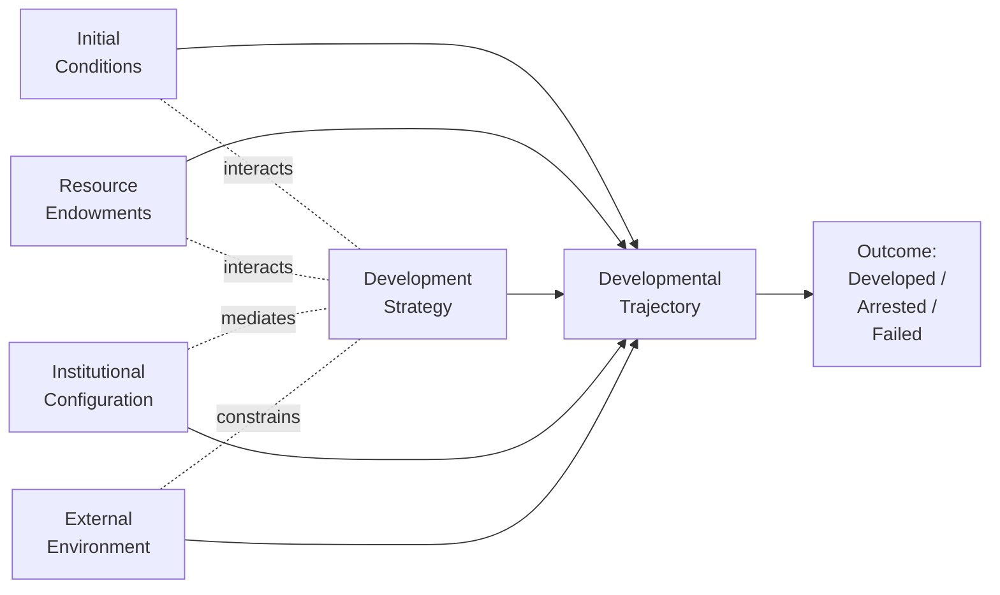
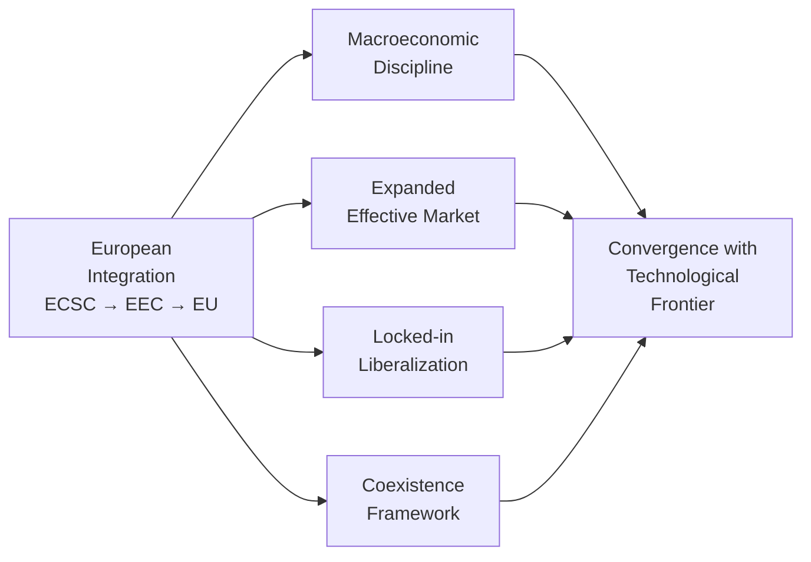
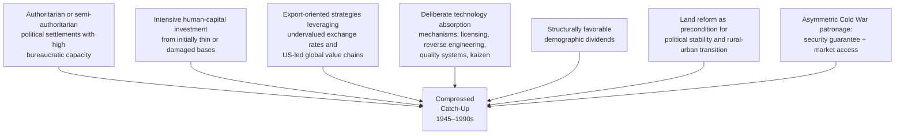

# Diverse Pathways to Developed-Nation Status After World War II: A Comparative Study of Postwar Modernization Across Europe, Asia, and the Americas
# 1 Introduction: Conceptual Framework and Analytical Approach

The decades following the Second World War constitute, by any reasonable historical measure, the most extraordinary episode of compressed economic transformation in human history. Within a single generation, a war-shattered Western Europe rebuilt and surpassed its prewar productive capacity, Japan rose from atomic ruin to become the world's second-largest economy, a cluster of small East Asian polities transformed themselves from agrarian peripheries into high-technology manufacturing hubs, and the United States consolidated a position of unprecedented economic and technological primacy. Yet the same period also witnessed striking divergence: countries that began with broadly comparable endowments ended in radically different positions, while others that appeared poised for convergence stalled at intermediate income levels or even regressed. Understanding why some nations crossed the threshold of "developed-nation" status while others did not — and through what variety of routes the successful ones arrived — is the central problem of this report.

This opening chapter establishes the conceptual foundation and analytical architecture upon which the subsequent comparative analysis will rest. It is concerned less with empirical narrative than with definitional precision, methodological justification, and the construction of a typological scaffolding. Without a careful specification of what "developed nation" means, why a multi-regional comparison is analytically necessary, and along which dimensions cases will be compared, any subsequent analysis risks devolving into a parallel recitation of national histories rather than producing genuine comparative insight. The chapter therefore proceeds in five steps: defining the dependent variable (developed-nation status), justifying the comparative method, articulating the core research questions, specifying the typological dimensions, and outlining the methodology and structure of the report.

## 1.1 Defining Developed-Nation Status in the Postwar Era

Any comparative study of routes to developed-nation status must begin by confronting an inconvenient fact: there is no single, universally agreed-upon definition of what constitutes a "developed" country. The category is at once intuitively familiar and analytically slippery, and the literature has long oscillated between income-based thresholds, structural transformation criteria, and broader human-development metrics. A defensible operational definition, therefore, must be explicitly multidimensional.

The most widely used **income-based benchmark** is the World Bank's "high-income country" classification, which operationalizes development through a per-capita gross national income (GNI) threshold — set at or above approximately US$12,476 in the calculations referenced by leading commentary on the topic.[^1] Investopedia's summary of economists' working definitions widens the range somewhat, noting that "some economists feel $12,000 to $15,000 [GDP per capita] is sufficient for developed status, while others do not consider a country developed unless its per capita GDP is above $25,000 or $30,000."[^1] These differing thresholds matter empirically: depending on which benchmark is applied, the United States itself reached the World Bank's high-income GNI threshold only in 1979, crossed the US$12,000 GDP-per-capita line in 1980, and the US$25,000 line in 1992.[^1] Even allowing for the wide methodological variation in how such figures can be calculated, this exercise yields a striking observation: under stricter definitions, the United States' transition from a developing to a developed nation should be located in the early postwar era — that is, the 1950s — rather than the late nineteenth or early twentieth century, as national mythology tends to suggest.[^1] This insight carries considerable analytical weight for the present report, because it implies that even the postwar "frontier" economy was itself completing its developmental transition at the very moment that other countries were beginning theirs.

A second class of indicators concerns **growth dynamics** rather than income levels. Rapidly developing countries — China and India in recent decades, South Korea and Taiwan in the 1980s and 1990s — typically post real GDP growth rates of 5 to 10 percent per year, while mature economies generally grow at 1 to 3 percent, occasionally reaching 4 percent in cyclical recoveries.[^1] The last time the United States grew by more than 5 percent was 1984, and that was during a recovery from recession; comparable rates were posted regularly in the 1970s and earlier and have since vanished.[^1] Growth-rate dynamics, in other words, function as a complementary diagnostic: persistently high growth signals a country still engaged in catch-up industrialization, whereas the deceleration into low single digits typically marks the approach to or arrival at the technological frontier.

A third dimension is **structural and institutional transformation**. Drawing on the development-economics tradition, developing economies have classically been characterized by a heavy reliance on agriculture or extractive industries, surplus rural labor, capital scarcity, imperfect or missing markets (particularly for capital, insurance, and information), poor infrastructure, and low average levels of human capital.[^2] Conversely, the transition to developed status has historically involved a shift of labor and output from agriculture into industry and services, the consolidation of well-functioning domestic markets, the construction of stable macroeconomic institutions and credible property rights, and the broad diffusion of mass-produced consumer goods and labor-saving technologies.[^2] The American case again illustrates this: the diffusion of mass-produced consumer goods, the conquest of laborious housekeeping by domestic appliances, the dissolution of the rural–urban divide into stretches of suburbia, and the broad provision of social goods such as health and education to the majority of the population were all developments largely consummated only by the 1960s, with rural electrification not fully completed until that decade.[^1]

A fourth dimension concerns **human development and the "soft" infrastructure** of an economy. Developing economies, in classical formulations, have been distinguished not only by low GDP per capita but also by "high rates of illiteracy, infant mortality, and an inadequate material infrastructure."[^2] By the late twentieth century, indicators such as life expectancy, schooling, literacy, telephone-line and personal-computer penetration, and broader measures such as the Physical Quality of Life Index (PQLI) — which incorporates health, nutrition, literacy, and income — had come to be acknowledged as more accurate yardsticks of development than purely macro-level economic indicators.[^2] World Bank data illustrating the gulf in telephone lines and personal-computer ownership between the United States (664 lines and 510.5 PCs per thousand inhabitants in 1999) and even relatively prosperous emerging economies (e.g., the Russian Federation at 210 lines and 37.4 PCs) reflect the depth of this material- and information-infrastructural gap that developed status implies.[^2]

The following table consolidates these complementary criteria into the operational definition adopted in this report.

| Dimension | Indicative Threshold / Marker (Developed Status) | Source/Logic |
|---|---|---|
| Income level | GNI per capita ≥ ~US$12,476 (World Bank high-income); some economists require US$25,000–30,000 GDP per capita | World Bank classification; Investopedia summary[^1] |
| Growth dynamics | Mature growth of ~1–3% (vs. 5–10% rapid development) | Comparative growth-rate evidence[^1] |
| Structural transformation | Shift from agriculture to industry/services; functioning capital, insurance, and information markets; substantial physical and human capital | Development-economics paradigm[^2] |
| Human development | High life expectancy, near-universal literacy, low infant mortality, broad access to health and education | PQLI and related indices[^2] |
| Infrastructure | Comprehensive material infrastructure (electricity, transport, telecommunications) and "soft" institutional infrastructure | Comparative infrastructure data[^2] |

A single-indicator definition — purely income-based, for instance — would obscure essential aspects of the developmental transition. A country could in principle cross a per-capita income threshold via a resource boom without ever consolidating the institutional, structural, or human-capital foundations that distinguish a mature developed economy; this is precisely the kind of "imbalanced economy" associated with newly industrialized economies (NICs) and resource-rich middle-income states, which "feature imbalanced economies and are globally competitive only in selective sectors."[^2] Conversely, structural and institutional transformation without commensurate income gains would describe a high-capacity but still poor society. The multidimensional definition adopted here — combining income level, growth maturity, structural transformation, institutional quality, and human development — is therefore not an arbitrary aggregation but a methodological necessity for distinguishing genuine, durable transitions to developed status from partial or arrested ones.

## 1.2 Rationale for a Multi-Regional Comparative Framework

The case for studying postwar development comparatively, across Europe, Asia, and the Americas, rests on three intertwined arguments: the **empirical fact of divergence**, the **theoretical inadequacy of any single grand narrative**, and the **analytical leverage** that comparison provides for isolating causal mechanisms.

Empirically, the postwar period is most striking not for the uniformity of its developmental outcomes but for their dispersion. Aggregate growth rates in GDP per capita were, by historic standards, exceptionally high in the postwar decades, and they were higher for developing than for developed economies on average.[^2] Yet within this aggregate convergence lies dramatic divergence: a handful of East and Southeast Asian economies posted essentially unprecedented growth, several Western European countries achieved rapid reconstruction and sustained convergence with the American frontier, large parts of Latin America experienced industrialization without sustained convergence, and significant portions of Africa and elsewhere stagnated entirely. As one influential survey of the development-economics literature observed, "this convergence has occurred both because development economics has moved closer to mainstream economics... and because mainstream economics has moved closer to development economics" — yet the actual outcomes across countries remained "strikingly diverse" even among "apparently similar countries and regions."[^2] No serious account of this diversity can be constructed by examining any single national or regional case in isolation.

Theoretically, the two grand narratives that dominated postwar development thought have each proven inadequate when confronted with the full empirical record. **Modernization theory**, drawing on a tradition extending back to Hegel and Marx and crystallized in the postwar period, posited that "the advanced industrial countries of Western Europe and North America represented the logical end-point toward which the former colonies of Africa, Asia, and Latin America would advance inevitably," provided that "properly balanced macroeconomic policies and functioning state institutions would facilitate a relatively seamless evolution."[^2] This unilinear assumption was undermined by "the almost universally disappointing experience of postcolonial economies" and by the recognition that "deindustrialization and increasing social polarization have eroded the sociopolitical consensus" even in the prosperous North.[^2] **Dependency theory**, the principal alternative, was "hardly more prescient": while it correctly identified embedded structures of inequality between core and peripheral economies, it erred in identifying particular mechanisms (such as the supposedly secularly deteriorating terms of trade for primary exporters), and it was decisively called into question by "the considerable success of export-oriented growth in several East Asian countries, which contrasted markedly with the failure of development strategies predicated on isolation from the very global market that *dependentistas* held to be the primary impediment to development."[^2]

The collapse of both grand narratives points directly to the third argument for comparison: **analytical leverage**. As the literature increasingly recognized in the last quarter of the twentieth century, the "strikingly diverse development experiences of apparently similar countries and regions since the 1980s requires analysis of the micro-foundations of distinctive trajectories"; structural inequities, while not having disappeared, "have taken on new forms, and reflect complexities that are not clarified sufficiently by the sweeping categories of traditional theories of dependency or of the world system."[^2] In other words, neither pure structuralism nor pure agency-based modernization theory can explain why, for instance, postwar South Korea and the Philippines — both US-aligned, both initially poor, both with significant external assistance — diverged so dramatically over the ensuing decades, or why West Germany and Italy followed broadly parallel reconstruction paths while the United Kingdom did not. Only a structured comparison across regions and across cases that vary on multiple dimensions can begin to disentangle the relative weight of initial conditions, strategy, institutions, and external context.

A multi-regional framework also matters because the **mechanisms** of catch-up themselves differed across regions. European reconstruction was characterized by the rebuilding of pre-existing industrial bases, currency stabilization, welfare-state construction, and progressive regional integration. East Asian transformation was driven by state-led, export-oriented industrialization, deliberate technology absorption, and integration into US-led global value chains. The American hegemon followed a distinct path of consumer-driven growth, financial deepening, and the leverage of global currency privilege. Latin America experimented extensively with import-substitution industrialization, with mixed and ultimately largely arrested results. To collapse these into a single narrative — whether of "modernization," "dependency," or any other monocausal logic — would obscure precisely the variation that makes the postwar experience analytically valuable.

## 1.3 Core Research Questions and Analytical Objectives

Building on the multidimensional definition and the comparative rationale, this report is organized around four interlocking research questions:

**First, what distinct pathways led nations to developed status after 1945?** The hypothesis embedded in this question — and substantiated by the subsequent chapters — is that there is no single route to developed-nation status, but rather a small family of viable pathways differentiated by the configuration of state and market, the orientation toward domestic versus external demand, and the role of social distribution in the growth model.

**Second, why did some economies converge rapidly while others stalled or regressed?** This question targets the boundary between completed and arrested transitions. It asks, in particular, why certain Latin American economies achieved substantial industrialization and middle-income status without crossing the developed-nation threshold, why the United Kingdom underperformed continental peers despite favorable initial conditions, and why countries such as Japan, South Korea, and Taiwan succeeded in compressing the developmental timeline that had taken the Atlantic economies a century or more.

**Third, how did initial conditions interact with policy choices and external environments to produce divergent outcomes?** This is fundamentally a question about the conjunction of structure and agency. It rejects both the determinism of strict initial-conditions arguments (such as crude geographic or resource-endowment theories) and the voluntarism of pure policy-design arguments. The empirical record suggests that strategy mattered, but only insofar as it was congruent with both endowments and the international opportunity structure. As subsequent chapters will demonstrate, the same export-oriented strategy could yield dramatically different outcomes depending on whether it was pursued under Cold War US patronage in East Asia or in the very different context of postcolonial Africa.

**Fourth, what role did shifting development paradigms play across regions?** Postwar development economics underwent a profound paradigm shift between the late 1940s and the early 1990s. The immediate postwar consensus — what one authoritative survey calls the "dominant paradigm" of mid-twentieth-century development economics — emphasized capital accumulation, import-substituting industrialization, *dirigiste* planning, surplus-labor models, pessimism about international markets, and confidence in disinterested state planners.[^2] By the 1990s, a "sea change" had produced a new consensus emphasizing macroeconomic stability, secure property rights and just legal systems, human capital, responsiveness to market incentives, "market-friendly" interventions, and the use of international markets as a discipline on productivity growth.[^2] The success of East and Southeast Asian export-oriented economies played a central role in driving this paradigm shift, while the difficulties of import-substitution-heavy Latin American trajectories pulled in the opposite direction.[^2] A central analytical objective of this report is therefore to assess how regions and countries positioned themselves vis-à-vis this evolving paradigm and how their positioning conditioned developmental outcomes.

The analytical objectives that follow from these questions are threefold: to **identify recurring patterns** across cases that suggest generalizable mechanisms; to **isolate critical determinants** that distinguish completed from arrested transitions; and to **derive transferable lessons** with explicit attention to the limits of replicability under twenty-first-century conditions. The report does not aspire to a single monocausal explanation; rather, it seeks to articulate a structured account of plurality — a typology of viable pathways together with the underlying common requirements that any such pathway must satisfy.

## 1.4 Typological Dimensions for Comparative Analysis

To compare cases systematically rather than impressionistically, this report deploys a five-dimensional analytical framework. Each dimension is grounded in the development-economics literature, operationalized for cross-case application, and used consistently throughout the regional chapters.

The diagram emphasizes that the five dimensions do not operate additively but **interactively**: strategy is shaped by initial conditions and endowments, mediated by institutions, and constrained by the external environment. The same nominal strategy implemented under different configurations can yield radically different outcomes.

**(1) Initial conditions** comprise the prewar industrial base, war damage, demographic structure, surviving human capital, technological inheritance, and prior institutional legacies. These mattered enormously: a country with a pre-1939 industrial base, an educated workforce, and intact institutional traditions faced a very different reconstruction problem than a country building modern industry from a primarily agrarian starting point. The development-economics literature has long emphasized that surplus labor in traditional agriculture, capital scarcity, and "imperfect or absent capital and insurance markets" defined the starting condition of most developing economies, but the degree to which these characterized any given postwar country varied enormously.[^2]

**(2) Resource endowments** cover natural resources, the size and skill of the labor force, capital availability, and demographic structure. The classical mid-century development paradigm assumed "high labor to capital ratios" and "unlimited supply of labor," with "physical capital was relatively scarce, so that... 'the problem of development is largely... a problem of capital accumulation.'"[^2] Yet the postwar record reveals enormous variation: some countries possessed substantial natural-resource wealth (Australia, Canada, parts of Latin America), others were resource-poor but human-capital-rich (Japan, the East Asian Tigers), and demographic structure varied from Europe's aging postwar populations to East Asia's emerging "demographic bonus." Indeed, "some have attributed a substantial part of the high recent economic growth in some Asian economies to such a 'demographic bonus' associated with higher savings and labor force participation and lower health and education expenditures."[^2]

**(3) Development strategies** range across a spectrum from import-substitution industrialization (ISI) — characterized by high tariff and quota protection of manufacturing imports, encouragement of "balanced industrial growth" through backward and forward linkages, and heavy public-sector investment — to export-oriented industrialization (EOI), which "expanded rapidly their exports and used international markets to induce ongoing productivity improvements as well as sources of foreign investment."[^2] Many actual cases blended elements of both, and the dominant strategic orientation often shifted over time as the international environment and domestic capacities evolved.

**(4) Institutional configurations** include the structure of property rights, state capacity, governance models, financial system design, labor-market institutions, and the degree of social cohesion. The contemporary consensus emphasizes that "a stable macroeconomic environment with noninflationary monetary policy, fiscal restraint, and international balance" together with "institutions such as private property rights and a just legal system that permit investors to have reasonable expectations of reaping much of the gains from their investments" are essential to sustained growth.[^2] Yet the specific institutional forms through which these functions were performed differed dramatically — German ordoliberalism, French indicative planning, Japanese MITI-style coordination, Nordic corporatism, and Anglo-Saxon liberal market institutions all delivered macroeconomic stability and credible property rights, but through very different mechanisms.

**(5) External environments** encompass Cold War geopolitics, the postwar trade regime (Bretton Woods and GATT), foreign aid flows, technology-transfer opportunities, and the structure of international financial integration. The postwar consensus regarding international markets shifted substantially: where the early postwar period saw "pessimism... regarding international market prospects, in part because of the market collapses in the 1930s," and where Prebisch and Singer argued that international trade systematically transferred benefits from poor to rich countries, the subsequent record showed that "international markets have presented substantial opportunities for developing countries, with the most successful experiences being for those developing economies (initially primarily in East and Southeast Asia) that expanded rapidly their exports."[^2] The external environment was therefore neither a uniform constraint (as dependency theory suggested) nor a neutral backdrop, but a structured opportunity set whose terms varied across regions and over time.

A critical methodological point follows: these dimensions are **not independent**. Strategic choices were enabled or precluded by initial conditions and endowments; institutional configurations both shaped and were shaped by chosen strategies; and the external environment defined the menu of feasible strategies for any given country. The comparative analysis in subsequent chapters will therefore not score cases on each dimension in isolation, but trace the *configurations* through which the five dimensions combined to produce particular outcomes.

A final, more provocative consideration concerns the **psychological and cultural dimensions** of development that underlie these structural variables. As one observer has noted, the social attitudes characteristic of developing-country populations — "a sincere work ethic, social traditionalism, and hard-nosed realism about politics and self-interest" — are not specifically "Chinese" or "American" attitudes but "developing country attitudes" that recur across cases at similar developmental stages.[^1] Whether one accepts the strong version of this claim (that nations follow "reasonably predictable life cycles" akin to organisms[^1]) or only its weaker form (that developmental stage shapes prevailing social attitudes), the implication for comparative analysis is significant: institutional configurations, savings rates, work-effort norms, and political attitudes are not exogenous to the developmental process but co-evolve with it. This report will treat such factors with appropriate caution, as the search results provide only limited and partially anecdotal evidence on this dimension; nonetheless, the cultural-psychological backdrop will be acknowledged where relevant in regional analyses.

## 1.5 Methodology, Scope, and Structure of the Report

The report adopts a **structured, focused comparison** methodology, combining macro-level statistical evidence — GDP and GNI per capita levels and trajectories, growth rates, structural composition of output, human-development indicators — with qualitative analysis of institutional design, policy choices, and political-economy dynamics. The "structured" element refers to the consistent application of the five typological dimensions across all cases; the "focused" element refers to the deliberate selection of cases that illuminate the core research questions, rather than an exhaustive country-by-country survey.

The **temporal scope** runs from approximately 1945 to the early twenty-first century, with the analytical center of gravity in the high-growth decades from roughly 1950 to the early 1990s, when the most consequential developmental transitions occurred and the dominant development paradigm itself underwent its decisive shift.[^2] Where contemporary lessons are drawn (in the concluding chapter), the analysis extends into the post-2000 period to address debates over middle-income transitions, industrial policy revival, and reconstruction.

The **geographic scope** is deliberately tri-continental. European cases (West Germany, France, Italy, the United Kingdom, the Benelux countries, the Nordic states, Spain, Portugal, Greece) represent reconstruction-driven and integration-led pathways. East Asian cases (Japan, South Korea, Taiwan, Hong Kong, Singapore) represent compressed, state-guided, export-oriented development. American cases (the United States as hegemon, Canada, Australia, New Zealand as Anglo-Saxon variants, and Brazil and Mexico as illustrative arrested transitions) span both completed and incomplete trajectories. Africa is largely outside the scope of this report, not because it is unimportant but because the comparative question of *paths to developed-nation status* requires cases that crossed (or plausibly approached) that threshold during the period under study.

**Case-selection criteria** follow a most-different/most-similar logic across dimensions: cases are chosen to maximize variation in strategy and institutions while holding broad outcome (developed status) constant (within-success comparison), and to compare successful with arrested transitions where initial conditions were broadly similar (success-failure comparison, e.g., South Korea vs. the Philippines, or selected European versus Latin American cases).

**Data sources** include the search-result-based references underpinning this report — World Bank classifications and indicators, the development-economics survey literature, and contemporary commentary on postwar developmental trajectories — supplemented by the historical record as represented in those references. Where the available materials are insufficient to support specific claims, the report acknowledges those limitations transparently rather than supplying speculation.

A particular methodological commitment of this report is to take seriously the **paradigm shift in development economics itself** as part of the explanandum. The transition from the postwar dirigiste consensus — emphasizing capital accumulation, ISI, planning, and skepticism of international markets — to the late-twentieth-century consensus emphasizing macroeconomic stability, market-friendly interventions, human capital, and outward orientation, was driven in significant part by the empirical record of the cases this report examines.[^2] The analysis will therefore avoid the anachronism of evaluating early-postwar policy choices against late-twentieth-century criteria, while still drawing on the mature consensus to assess which configurations proved most durable.

The remaining eight chapters build sequentially on this foundation. Chapter 2 examines the postwar global order and external catalysts — Bretton Woods, GATT, Cold War geopolitics, decolonization, and aid programs — that defined the strategic environment for all cases. Chapter 3 surveys the heterogeneous starting conditions of 1945, establishing how unevenly different countries began. Chapters 4 through 7 then conduct the regional analyses: continental European reconstruction and the Nordic model (Chapter 4), the American hegemon and the Anglo-Saxon variant (Chapter 5), the East Asian miracle of Japan and the Four Tigers (Chapter 6), and partial or arrested convergence in Southern Europe and Latin America (Chapter 7). Chapter 8 then conducts a cross-cutting analysis of state-market configurations, theoretical frameworks, and the common mechanisms of convergence — technology transfer, export-led growth, FDI, education, infrastructure, exchange-rate regimes, and financial-system design. Chapter 9 synthesizes the findings into a typology, draws contemporary lessons, and reflects on the theoretical implications and limits of replicability.

By the end of the report, the reader should possess not a single answer to the question "how do countries become developed?" but a structured account of the small set of viable pathways through which postwar nations crossed that threshold, the underlying common requirements that all such pathways had to satisfy, and a sober assessment of which elements of these historical experiences are — and are not — transferable to the very different conditions of the twenty-first century.

# 2 The Postwar Global Order and External Catalysts of Reconstruction

Chapter 1 closed with the methodological commitment that "external environments" — Cold War geopolitics, the postwar trade regime, foreign aid flows, technology-transfer opportunities, and the structure of international financial integration — constituted not a uniform constraint but a structured opportunity set whose terms varied across regions and over time. This chapter operationalizes that commitment. Its task is to examine in detail the four pillars of the postwar international order — the Bretton Woods monetary system, the GATT trade regime, Cold War bipolarity, and decolonization — and then to evaluate critically the role of US-led external assistance, in particular the Marshall Plan and the parallel aid programs in Japan and South Korea, as catalysts of reconstruction.

The analytical stakes are significant. If the external environment was the dominant force shaping postwar outcomes, then the regional variation documented in subsequent chapters would be largely a function of differential exposure to that environment. If, however, the external order functioned as a structured opportunity set whose payoff depended on the strategies and institutional configurations of recipient countries, then the divergent regional outcomes must be explained by the interaction of external context with domestic conditions and choices. The empirical material reviewed below — from the strain-and-collapse trajectory of Bretton Woods, through the asymmetric engagement of different regions with the GATT trade regime, to the strikingly differentiated effects of Marshall aid even across Italian provinces — supports the latter view: external conditions enabled certain pathways and foreclosed others, but did not by themselves determine which countries would cross the developed-nation threshold and which would not.

A central counterfactual question runs through the chapter: was external assistance a *necessary*, a *sufficient*, or merely a *catalytic* condition for successful postwar transitions? The answer matters not only for historical interpretation but for the contemporary policy debates addressed in Chapter 9, including reconstruction in Ukraine, debates over a "Bretton Woods 2.0" or "New Marshall Plan," and the broader question of whether the developmental opportunities of the postwar era can be reproduced under twenty-first-century conditions.

## 2.1 The Bretton Woods Monetary System: Architecture, Operation, and Differential Effects

The Bretton Woods system, established in July 1944 at a conference of forty-four countries in a small town in the northeastern United States, was conceived to prevent a repeat of the interwar financial instability that had contributed to the Great Depression and the rise of protectionism.[^3] Its overarching purpose was to ensure that the global economy never again experienced a period as devastating as the one which had just ended: post-First World War reparations had contributed to hyperinflation in Germany and the rise of the Nazis; the Wall Street Crash had led to mass unemployment throughout the developed world; and competitive currency devaluations had produced a trade war and widespread economic losses.[^4] The two principal architects, John Maynard Keynes for Britain and Harry Dexter White for the United States, shared the conviction that "only multilateral economic cooperation could ensure that all countries were able to achieve full employment and social wellbeing at home with stable exchange rates and financial flows abroad."[^4]

### 2.1.1 The Architecture: Anchor, Pegs, and Institutions

The system's core architecture was elegant in its simplicity. The U.S. dollar was placed at the center: it was made convertible into gold at $35 per ounce, while other currencies were pegged to the dollar and permitted to adjust under IMF supervision in cases of "fundamental disequilibrium."[^3][^5] The architecture rested on two institutional pillars: the **International Monetary Fund (IMF)**, tasked with managing exchange rates and providing short-term balance-of-payments support, and the **International Bank for Reconstruction and Development (the World Bank)**, focused on postwar reconstruction and long-term development.[^3][^4] Together they aimed to coordinate global monetary policy while insulating domestic economies from external shocks — a deliberate compromise that sought to combine exchange rate stability with enough flexibility to allow national governments to pursue full employment and growth.[^3]

In practice, the system placed a unique burden on the United States. As the only issuer of a currency convertible into gold, the U.S. effectively served as the global provider of liquidity, and the credibility of the entire system hinged on U.S. fiscal, monetary, and geopolitical discipline.[^3] Since 1958, when the system became fully operational, countries settled their international balances in dollars, and U.S. dollars were convertible to gold at the fixed exchange rate of $35 per ounce.[^5] By 1950, the United States held over 70 percent of global gold reserves, a concentration that initially appeared to make the system unassailable.[^3][^5]

### 2.1.2 Differential Effects on Reconstruction and Industrialization

For the purposes of this report, the most consequential feature of the Bretton Woods system was the differential opportunity structure it created for countries at different developmental stages. **For trade-dependent reconstruction in Western Europe**, the combination of fixed-but-adjustable exchange rates, IMF balance-of-payments support, and the predictability of dollar convertibility produced a uniquely favorable environment. War-torn economies could rebuild productive capacity, run current-account deficits during reconstruction, and access external financing without facing the speculative currency attacks that had bedevilled the interwar gold-exchange standard. In the immediate postwar years, however, there was a global shortage of dollars: war-torn Europe and Asia lacked the foreign exchange reserves needed to import capital goods and rebuild their economies, while the U.S. ran large trade surpluses and accumulated the bulk of the world's gold reserves.[^3] This "dollar shortage" would be addressed through the Marshall Plan and currency devaluations in 1949, by which the system would be operationally launched.[^3]

**For export-oriented industrialization in East Asia**, Bretton Woods provided an even more powerful platform — though one that would only be exploited fully in the 1950s and 1960s. The strategically undervalued ¥360/US$ peg under which Japan operated, set during the occupation period, transformed the fixed-exchange-rate system from a symmetric stability mechanism into an effective subsidy for Japanese exports into the U.S. market. The same logic, with national variations, would later apply to South Korea and Taiwan. Although the Bretton Woods rules formally permitted adjustment in cases of "fundamental disequilibrium," in practice the U.S. tolerated the persistent undervaluation of allied East Asian currencies as part of its broader Cold War strategy of underwriting the economic recovery of front-line states — a point developed further in Section 2.3 below.

For the United States itself, however, the system embedded a fundamental contradiction that would prove its undoing.

### 2.1.3 The Triffin Dilemma and the Strain of the 1960s

By the early 1960s, the U.S. was running persistent balance-of-payments deficits. Capital outflows to Europe, military spending abroad (much of it Cold War-related), and a growing volume of private investment overseas contributed to a growing "dollar overhang" — more dollars held abroad than the U.S. had gold to redeem.[^3][^5] Foreign central banks, particularly in Europe, grew concerned that the U.S. could not maintain convertibility indefinitely, and between 1960 and 1971 claims on U.S. gold outpaced actual reserves several times over.[^3] Although the official gold price remained fixed at $35 per ounce, the credibility of the dollar's parity eroded.

This dynamic was the essence of the **Triffin Dilemma**, articulated by economist Robert Triffin: for the U.S. to provide global liquidity, it had to run deficits — but those deficits undermined the very foundation of convertibility that anchored the system.[^3][^5] Even critics of the Triffin thesis agreed that by the late 1960s, the scale of overseas dollar holdings alone — fueled in part by U.S. fiscal expansion under the Kennedy and Johnson administrations and by military commitments in Vietnam — was sufficient to cast doubt on gold parity; the system's vulnerability was no longer theoretical.[^3] In economic-historical terms, the United States had moved from being the world's residual creditor to being its residual debtor, but the institutional framework still presumed the former position.

Multiple "quick fixes" were attempted but proved to be merely postponing the inevitable.[^5] The principal interventions are summarized in the table below.

| Year | Intervention | Mechanism | Outcome |
|---|---|---|---|
| 1961 | U.S. Treasury Exchange Stabilization Fund (ESF) intervention | Buying/selling foreign exchange via the Federal Reserve Bank of New York | Successful for a time; limited by Treasury resources |
| 1961 | London Gold Pool established (8 central banks) | Pooled gold reserves to defend $35/oz price in London market | Successful for six years; collapsed March 1968 after a run on gold and France's withdrawal |
| 1962–1971 | Federal Reserve currency swap lines | Reciprocal arrangements covering unwanted foreign-held dollars to limit gold conversion | Grew from a $900 million short-term facility to a large intermediate-term facility; signaled fundamental, not temporary, problems |
| 1968 | Two-tier gold system | Central banks pledged to use gold only for international debt settlement, not on private market | Stopgap until 1971 |

Sources: Federal Reserve History; CF40 Research.[^3][^5]

The collapse came on August 15, 1971, when President Nixon, after meeting with fifteen advisers at Camp David — including Federal Reserve Chairman Arthur Burns, Treasury Secretary John Connally, and Undersecretary for International Monetary Affairs Paul Volcker — announced the closure of the gold window, a 90-day wage-and-price freeze, and a 10 percent import surcharge.[^5] Foreign governments could no longer exchange their dollars for gold; in effect, the international monetary system turned into a fiat one.[^5] The Smithsonian agreement of December 1971 attempted to maintain pegged exchange rates, but the Bretton Woods system ended soon thereafter, giving way to a regime of generalized floating by 1973.[^5]

### 2.1.4 The Reserve-Currency Paradox and Differential Timing Effects

A counterintuitive but analytically crucial point follows: contrary to widespread expectations, the suspension of dollar-gold convertibility did *not* erode confidence in the dollar; instead, it marked the beginning of a new era of dollar dominance.[^3] As CF40 Research has argued, this outcome was not automatic but the result of deliberate U.S. policy choices — including the petrodollar system, the Volcker-led restoration of monetary credibility in the early 1980s, and strategic coordination through institutions like the IMF and G7. These efforts replaced gold with a new set of institutional, geopolitical, and financial anchors.[^3] The dollar's role persisted because the United States, in the 1970s and 1980s, succeeded in re-anchoring it through alternative mechanisms.

For the comparative argument of this report, the timing of the 1971 transition mattered enormously, and in differentiated ways:

- **Western Europe** had already completed the bulk of its reconstruction-driven catch-up by 1971; the *Trente Glorieuses* in France, the *Wirtschaftswunder* in Germany, and the Italian economic miracle had largely run their course. The shift to floating rates posed adjustment challenges (and would catalyze the European Monetary System of the late 1970s and ultimately the euro), but it did not fundamentally alter the achieved level of development.
- **Japan** had reached the world's second-largest economy status by 1968, completing the heaviest phase of catch-up under the Bretton Woods peg; the post-1971 yen appreciation would force a transition from quantity-based to quality-based export competition, but again on a base already established.
- **The Asian Tigers** (South Korea, Taiwan, Hong Kong, Singapore) were entering their high-growth phase precisely as the system was collapsing. The post-Bretton Woods era of managed floats and capital controls would prove highly conducive to their export-oriented strategies, particularly given continuing U.S. willingness to accept large bilateral trade deficits.
- **Latin American import-substitution economies**, by contrast, faced the post-1971 environment from a position of accumulating external debt; the subsequent rise of dollar interest rates under Volcker would precipitate the 1980s debt crisis that arrested their convergence (a theme developed in Chapter 7).

Bretton Woods, in short, was not a uniform constraint or opportunity but a temporally and regionally differentiated structure whose incidence depended on where countries stood in their developmental trajectories when its key inflection points arrived.

## 2.2 The GATT Trade Regime and the Progressive Liberalization of Postwar Commerce

If Bretton Woods supplied the monetary foundation of the postwar order, the General Agreement on Tariffs and Trade (GATT), signed in 1947 and operative for nearly half a century before being subsumed into the World Trade Organization in 1995, supplied the trade-policy pillar. Together with the IMF and World Bank, GATT completed the institutional triangle within which the postwar economic order was enacted.

### 2.2.1 The Negotiating Rounds and Progressive Tariff Reduction

GATT's defining feature was its commitment to progressive liberalization through successive negotiating rounds. After the initial 1947 negotiations, the principal subsequent rounds were the **Dillon Round (1961–62), the Kennedy Round (1964–67), the Tokyo Round (1974–79), and the Uruguay Round (1986–90)**.[^6] Each round produced incremental reductions in tariff barriers among contracting parties, expanded the product coverage of liberalization commitments, and progressively addressed non-tariff barriers, agricultural protectionism, and (in the Uruguay Round) services and intellectual property.

The most-favored-nation principle — that any tariff concession granted to one contracting party must be extended to all — created a multilateral discipline that was particularly valuable to small and medium-sized economies dependent on stable market access. The principle of reciprocity, by contrast, gave the negotiating rounds their dynamic: trading partners exchanged concessions, with the "weighted" outcome biased toward the bargaining power of the largest markets, particularly the United States and, increasingly, the European Communities.

### 2.2.2 Asymmetric Engagement Across Regions

The same external trade regime, however, yielded markedly different outcomes depending on national strategy and regional context. Three asymmetric patterns of engagement deserve emphasis.

First, **Western European reconstruction-driven trade integration** unfolded in close conjunction with the GATT framework but added a layer of preferential intra-European liberalization through the European Coal and Steel Community (1951), the European Economic Community (1957), and successive enlargements. The combination of progressive multilateral tariff reduction under GATT and accelerated regional integration within Europe produced an exceptionally favorable trade environment for export-oriented reconstruction. By the time of Brazil's G20 presidency analysis cited in subsequent chapters, international trade represented over 50 percent of global GDP, up from less than 20 percent in 1944[^4] — and Western European economies were among the most thoroughly integrated into this expansion.

Second, **East Asian export-led industrialization** exploited GATT-era market access in a fundamentally different mode. Japan and the Tigers acceded to or operated alongside the GATT regime not as full reciprocal liberalizers in the early stages but as strategic users of the asymmetric access that the United States, for Cold War strategic reasons, was prepared to grant. Preferential access to U.S. markets — in textiles, consumer electronics, automobiles, and later semiconductors — was tolerated by Washington even as Japanese and Korean domestic markets remained substantially protected through formal tariffs, non-tariff barriers, administrative guidance, and state coordination of imports. This asymmetry was politically sustainable precisely because the broader Cold War alignment made it strategic for the United States to accept such terms (a point developed in Section 2.3).

Third, **Latin American engagement with GATT was more limited and ambivalent**, consistent with the dominant import-substitution-industrialization (ISI) paradigm of the 1950s through the 1970s. Drawing on Prebisch-Singer-style pessimism about the secularly deteriorating terms of trade for primary exporters, ISI strategies emphasized inward-looking development through high tariff and quota protection, encouragement of "balanced industrial growth" through backward and forward linkages, and heavy public-sector investment, as Chapter 1 noted. Engagement with GATT was correspondingly defensive: Latin American economies sought special and differential treatment for developing countries, exemptions for infant-industry protection, and preferential access for primary exports rather than full reciprocal liberalization. The result was that the very same multilateral trade regime that catalyzed European reconstruction and East Asian export growth produced relatively muted developmental gains in Latin America — though, as Chapter 7 will argue, this was less a failure of the regime than a consequence of how Latin American economies positioned themselves relative to it.

The implication for the comparative argument is unambiguous: the postwar trade regime was a structured opportunity, but the structure rewarded outward orientation and penalized strategies that sought developmental gains primarily through autarkic substitution. As one survey of the development-economics literature, cited in Chapter 1, observed, "international markets have presented substantial opportunities for developing countries, with the most successful experiences being for those developing economies (initially primarily in East and Southeast Asia) that expanded rapidly their exports and used international markets to induce ongoing productivity improvements as well as sources of foreign investment."

## 2.3 Cold War Geopolitics and the Bipolar Security Architecture

Neither Bretton Woods nor GATT can be understood in isolation from the geopolitical context that gave them political content. The Cold War was not merely a backdrop to postwar economic development; it was the organizing principle that determined which countries received generous aid, which received preferential market access, and which were entrusted with security commitments that allowed civilian-led economic strategies to flourish.

### 2.3.1 Cold War Imperatives and the Generosity of U.S. Engagement

The link between geopolitical imperative and economic engagement was made explicit in the founding documents of the postwar order. As historians have observed, in addition to encouraging the economic recovery of Western Europe, the Marshall Plan was designed to immunize against a Soviet threat[^7] — and the same logic, in modified form, underpinned U.S. economic engagement with Japan, South Korea, and Taiwan. The four goals officially attributed to the European Recovery Program — (1) rebuilding and repairing European infrastructure; (2) increasing production, expanding foreign trade, and controlling inflation; (3) facilitating European economic cooperation and integration; and (4) preventing the expansion of communism — placed anticommunism on equal footing with reconstruction.[^8] As Steil and others have argued, the Marshall Plan was "primarily a political success and... was inspired more by anticommunist sentiment than economic goals."[^8]

This is not to reduce the postwar economic order to its Cold War instrumentality. But it is to recognize that the **generosity** with which the United States engaged its allies — the magnitude of aid programs, the willingness to tolerate asymmetric trade arrangements, the readiness to underwrite security commitments, and the patience with persistent currency undervaluation — was historically extraordinary precisely because it was driven by geopolitical necessity. The postwar order was, in this sense, an exceptional rather than a normal international system.

### 2.3.2 The Differentiated Patronage Structure

Cold War patronage was not distributed uniformly. The distinction between front-line states and peripheral or non-aligned states translated into a clear hierarchy of economic engagement.

| Category | Examples | Forms of U.S. Engagement |
|---|---|---|
| Front-line allies (Europe) | West Germany, Italy, France, UK, Benelux | Marshall Plan grants; NATO security umbrella; tolerance of European integration; favorable monetary arrangements |
| Front-line allies (Asia) | Japan, South Korea, Taiwan | Occupation-era and post-occupation aid; security treaties; preferential market access; tolerance of currency undervaluation; technology transfer |
| Strategic peripheries | Spain (post-1953), Portugal, Greece, Turkey | Selective aid tied to base access and NATO commitments; gradual integration into Western economic structures |
| Non-aligned or distant | Most of Latin America, post-colonial Africa | Limited aid; engagement through multilateral institutions and private investment rather than bilateral grants |
| Communist or Soviet-aligned | Eastern Europe, North Korea, Cuba post-1959 | Excluded from Western system; integrated into Comecon; subjected to embargoes |

The fiscal implication of this differentiated patronage was substantial. Front-line states — particularly Japan and West Germany, which were limited or prohibited from large defense expenditures by their postwar settlements — could "concentrate fiscal resources on civilian investment" while the United States underwrote the security architecture that protected them. Japan's defense expenditure as a share of GDP, capped at approximately 1 percent for most of the postwar period, freed resources that in other circumstances would have gone to the military and instead allowed concentration on infrastructure, education, and industrial investment. The same fiscal logic, mutatis mutandis, applied to West Germany within NATO.

### 2.3.3 Conditioning the Menu of Feasible Strategies

The bipolar architecture conditioned not only the resources available to allied states but also the **menu of feasible developmental strategies**. Export-oriented industrialization was viable for East Asian states partly because the United States was willing to absorb their exports into its own market on highly favorable terms — a willingness that depended on the strategic premium placed on their economic success. Import-substitution industrialization, by contrast, was the default strategy for states (such as much of Latin America) that lacked equivalent strategic patronage and therefore faced more constraining external conditions on their export ambitions, even as they remained formally within the Western system.

The contrast between South Korea and the Philippines, briefly noted in Chapter 1, exemplifies how Cold War positioning interacted with strategy and institutions. Both were U.S.-aligned, both received substantial assistance, and both began at similarly low levels of per-capita income in the 1950s. South Korea's position as a front-line state on the most active Cold War frontier — combined with the chaebol-led, export-oriented strategy adopted from the early 1960s and the institutional framework constructed under Park Chung-hee — generated developmental returns that the Philippines, despite Cold War alignment, did not achieve. Cold War patronage was thus a **necessary but not sufficient** condition for developmental success: it expanded the menu of feasible strategies but did not by itself determine which strategy would be chosen or how effectively it would be implemented.

## 2.4 Decolonization and the Reconfiguration of the Global Economy

The fourth pillar of the postwar order is the most heterogeneous in its effects. Decolonization — the wave of formal political independence that swept Asia from 1945 through the early 1950s, Africa from the late 1950s through the 1960s, and parts of the Caribbean and Pacific later still — fundamentally reshaped both the metropolitan economies of former colonial powers and the newly independent states themselves.

### 2.4.1 Implications for European Reconstruction

For the former colonial powers of Western Europe, decolonization both removed and created strategic opportunities. The loss of imperial preference systems, captive markets, and privileged access to colonial raw materials was substantial — the British loss of India in 1947, the French loss of Indochina in 1954 and Algeria in 1962, the Dutch loss of Indonesia in 1949, the Belgian loss of the Congo in 1960, and the Portuguese losses in the 1970s collectively dissolved economic structures that had organized the world economy for a century or more.

Yet the same process redirected metropolitan economies in ways that proved highly favorable to their postwar reconstruction. With imperial economic linkages severed, Western European economies were pushed toward intra-European integration (the ECSC, the EEC, and successive enlargements) and toward U.S.-led trade networks. This redirection turned out to be more conducive to sustained growth than the maintenance of imperial structures would have been: trade and investment within and among advanced industrial economies generated higher returns than trade between metropoles and colonial peripheries had typically done. The British case, where the persistence of Sterling Area arrangements and Commonwealth preferences arguably *delayed* the redirection toward Europe, illustrates the reverse: the relative underperformance of the UK among major postwar European economies (analyzed in Chapter 4) is partly attributable to slower disengagement from imperial economic patterns.

### 2.4.2 The Postcolonial Developmental Challenge

For newly independent states, decolonization presented the challenge of building national economies from colonial inheritances that had typically been organized around the export of primary commodities, import of manufactures from the metropole, and the suppression of indigenous industrial capacity. The structural starting conditions defined in Chapter 1 — heavy reliance on agriculture or extractive industries, surplus rural labor, capital scarcity, imperfect markets, poor infrastructure, and low average levels of human capital — applied with particular force to most postcolonial economies.

These conditions powerfully shaped the developmental theories and strategies that postcolonial states adopted. The rise of **dependency theory**, prominent particularly in Latin American intellectual circles but with global resonance, reflected the conviction that participation in global markets on inherited terms would systematically disadvantage former colonies. The associated **import-substitution industrialization paradigm** — building national industrial capacity behind protective tariffs to escape the supposed terms-of-trade trap of primary exports — was not an arbitrary policy choice but the natural intellectual response to the inherited structural position of postcolonial economies.

As Chapter 1 noted, dependency theory was eventually decisively called into question by "the considerable success of export-oriented growth in several East Asian countries, which contrasted markedly with the failure of development strategies predicated on isolation from the very global market that *dependentistas* held to be the primary impediment to development." Yet this judgment, rendered with the hindsight of the late twentieth century, should not obscure the fact that, in the immediate postcolonial moment of the 1950s and 1960s, the inward-looking strategy appeared to most observers — and to most of the postcolonial elites who pursued it — both empirically warranted and politically necessary.

### 2.4.3 Decolonization as Structural Precondition for Divergence

The connection between decolonization and the divergent developmental trajectories analyzed in subsequent chapters operates through three mechanisms:

1. **Initial conditions inheritance**: Postcolonial states inherited dramatically different starting positions depending on the duration, intensity, and developmental orientation of colonial rule. Korea and Taiwan inherited from Japanese colonial rule certain industrial and educational infrastructures (alongside profound human costs and political traumas) that proved differently usable in postwar reconstruction than the inheritances of, say, Sub-Saharan African states.
2. **Strategic positioning**: Decolonization timing and Cold War positioning together determined whether newly independent states became targets of generous Western patronage (as in Korea, Taiwan) or were left to navigate the postwar order with more limited external support.
3. **Paradigmatic alignment**: Postcolonial states that, for whatever combination of internal and external reasons, aligned with the inward-looking developmental paradigm of the 1950s–1970s found themselves on the wrong side of the late-twentieth-century paradigm shift. States that, again for combinations of internal and external reasons, aligned with the outward-oriented paradigm reaped the gains of the late-twentieth-century globalization wave.

Decolonization is thus a structural precondition for the divergent developmental trajectories examined in subsequent chapters, but not a deterministic one. Within the broad postcolonial category, outcomes diverged enormously, and the explanation for that divergence requires the kind of multi-dimensional comparative analysis that Chapter 1 specified.

## 2.5 The Marshall Plan: Logistics, Magnitude, and Mechanisms of European Reconstruction

Of all the external catalysts of postwar reconstruction, none has attracted more scholarly attention or generated more historiographical controversy than the European Recovery Program — the Marshall Plan. This section examines its scale, its mechanisms, and the contemporary debate over whether it was vital, merely facilitative, or somewhere in between.

### 2.5.1 Scale and Architecture

Announced by U.S. Secretary of State George C. Marshall on June 5, 1947, formally approved by Congress through the Economic Cooperation Act in March 1948, and signed into law by President Truman in April 1948, the European Recovery Program (ERP) — known informally as the Marshall Plan — operated from March 1948 to June 1952.[^8] It was, simply, "the largest economic and financial aid program ever experienced in the world," transferring approximately **$130 billion in 2010 USD** — around **5 percent of U.S. GDP in 1948** — to seventeen Western and Southern European countries.[^8] In the comparative perspective offered by one analysis, this aggregate is "equivalent to a staggering US$ 173 billion today" using more recent deflators, dwarfing contemporary U.S. foreign aid commitments such as the Fiscal Year 2019 USAID budget of $16.8 billion.[^8][^4]

The program comprised three principal components, summarized below.

| Component | Share of Total | Mechanism | Purpose |
|---|---|---|---|
| Reconstruction grants | 74% | Direct transfers to recipient governments for specific approved infrastructure and capital projects | Rebuilding public infrastructure (transportation, public buildings, sanitation) |
| In-kind subsidies | 24% | Goods (food, fuel, industrial inputs) shipped directly to recipients, primarily 1948 | Immediate relief and bridging supply gaps |
| Direct loans | 2% | Loans to privately owned firms | Targeted private-sector capital formation |

Source: Bianchi and Giorcelli (2023) on the Italian case, with proportions characteristic of the program more broadly.[^8]

The institutional architecture governing disbursement was distinctive and consequential. The U.S. **Economic Cooperation Administration (ECA)** maintained tight control of the funding process. After an initial Country Study to assess the recipient economy, the ECA and the recipient government jointly elaborated annual programs divided into four quarters during the five years (1948–1952) in which the Marshall Plan actively disbursed funds.[^8] Each quarter, the ECA approved each individual project to be financed with ERP funds without further influence from the recipient government; within 20 days of approval, the ECA had to transfer the grant money to the recipient government, which in turn had to start the project within four months of receiving the funds.[^8] This level of granular American oversight was a defining feature of Marshall aid and distinguished it sharply from the looser, often budget-support-based aid arrangements that came to characterize later development assistance.

Disbursement was uneven across recipients. The United Kingdom and France received the largest shares, but Italy was the third largest recipient, getting **10.6 percent of all ERP budgeted funds in Europe** — approximately $12 billion between May 1948 and June 1952, equivalent to **11.5 percent of Italy's 1948 GDP, or an average of 2.3 percent of GDP for five years**.[^8]

### 2.5.2 Mechanisms of Transmission: Evidence from Italy

The Bianchi-Giorcelli study of Marshall aid in Italy provides the most rigorous within-country evidence on how Marshall aid translated into reconstruction and growth. The analytical core of this work is an instrumental-variable strategy that exploits the post-armistice shift from strategic to tactical Allied bombing in Italy after September 1943: tactical bombing followed war-related events (land battles, German troop movements) rather than prewar economic conditions, providing plausibly exogenous variation in war damage and hence in the allocation of reconstruction funds.[^8] The findings illuminate the mechanisms through which aid affected recovery.

First, a striking concentration on infrastructure: the average Italian province used **52 percent of its ERP grants for transportation infrastructure, 32 percent for public buildings, and only 15 percent for sanitation**, regardless of bombing intensity.[^8] This focus reflected both U.S. priorities and the empirical fact that, immediately after the war, "70 percent of the roads had been damaged, and 45 percent of the railroad system was no longer usable," while "between 80 and 90 percent of the Italian industrial capacity survived the war."[^8] Damage to transportation, not to industrial capacity per se, was the binding constraint on recovery.

Second, the destruction of infrastructure created an opportunity for **modernization rather than mere restoration**. Provinces in the top quintile of tactical bombings used 80 percent of their ERP funds to build new infrastructure, while provinces in the bottom quintile committed 98 percent of their budget to reconstruction of old infrastructure.[^8] More widespread destruction lowered the opportunity cost of radical updates to the transportation system after the arrival of international grants — a finding consistent with broader observations that destruction can generate radical improvements when paired with capital infusion.

Third, the resulting modernization had measurable downstream effects on agriculture, industry, and labor markets. A 1-σ increase in reconstruction grants ($29 million) raised wheat and corn production by 27.3 million kilograms, wine production by 24.4 million liters, and grape production by 30.5 million kilograms — with effects substantially larger for perishable crops, indicating that improved transportation was the operative mechanism (a 1-σ difference increased asparagus production by 665 percent and peach production by 700 percent).[^8] In the same provinces, the agricultural workforce decreased by 23 percent while the number of tractors increased by 430 percent; the number of industrial firms grew by 29 percent above prewar baseline, employment in industry by 62 percent, and service-sector employment by 36 percent.[^8]

Fourth — and critically for the timing argument — the effects appeared with a substantial lag. Yearly difference-in-differences estimates indicate that "any cross-provincial difference starts only after the completion of the first public infrastructure funded through the Marshall Plan, close to ten years after the first Allied air raids."[^8] This rules out the alternative explanation that postwar recovery was driven by mean-reversion after bombing rather than by Marshall aid itself; it also indicates that the channels of transmission were genuinely operating through reconstructed infrastructure, not through immediate financial relief.

### 2.5.3 The Triumphalist–Revisionist Debate

The historiography of the Marshall Plan has long oscillated between triumphalist and revisionist accounts.[^8] **Early triumphalist accounts** (Jones 1955; Mayne 1970; Arkes 1972) describe the Marshall Plan as vital for the reconstruction of productive capacity, the development of the necessary institutions for cooperation among former adversaries, and the restoration of European confidence in market capitalism. In Mayne's frequently cited formulation, Marshall Plan aid "was a precondition of all later affluence and economic miracles, as well as moves toward European unity."[^8]

**Revisionist accounts**, most prominently Milward (1984), discounted the importance of ERP transfers, arguing that European recovery was well under way before 1948 and that the reconstruction of damaged private and public capital stocks was almost complete.[^8] Milward's quantitative point — that aid was small relative to total European investment — was difficult to refute on its own terms: even at $130 billion (2010 USD), the program represented a fraction of total European capital formation over the same period.

**A synthesis emerged in the 1990s and 2000s**, principally through the work of Eichengreen and his collaborators, that resolved much of the apparent disagreement. The synthesis concluded that "U.S. aid had a significant impact on Europe's recovery from WWII: the recipients of large amounts of Marshall aid recovered significantly faster than other industrial countries"; but, "strikingly, however, it finds that the obvious channels through which the Marshall Plan could have affected European recovery — stimulating investment, augmenting capacity to import, and financing infrastructure repair — were relatively unimportant. Rather, the crucial role of the Marshall Plan was to facilitate the restoration of financial stability and the liberalization of production and prices."[^8] Casella and Eichengreen (1996) added that the Marshall Plan helped bring monetary stabilization to recipient countries; De Long and Eichengreen (1993) found that the Marshall Plan "played a role in alleviating resource shortages, but this channel was not strong" — and that "more importantly, the Marshall Plan significantly sped up Western European growth by altering the environment in which economic policy was made."[^8] Hogan (1987) argued in a similar vein that the Marshall Plan was mostly intended to make Western Europe's economy more similar to the mixed capitalist economy of the United States.[^8]

The Bianchi-Giorcelli within-country evidence partially complicates this synthesis: their findings suggest that, *within* a recipient country, the financing of infrastructure repair was indeed a significant channel of effect, with measurable downstream consequences for agriculture, industry, and labor markets.[^8] This is not necessarily a contradiction. The cross-country and within-country evidence may be reconciled by recognizing that, at the macro level, financial stabilization and market liberalization were the dominant channels, while at the micro level, the geographic distribution of infrastructure grants generated substantial within-country variation in development outcomes. Both findings can be true simultaneously, and together they support the broader conclusion of the next section: the Marshall Plan was a powerful catalyst, but its effects depended crucially on the institutional and policy environment in which it was deployed.

## 2.6 US Occupation-Era Aid and Reconstruction in Japan and South Korea

Parallel to the Marshall Plan in Europe, the United States deployed substantial assistance programs in defeated Japan and war-devastated South Korea. Although the search materials underpinning this report contain less granular evidence on the Asian aid programs than on the European, several features can be identified that distinguish the Asian experience from the European model and that prepare the ground for the East Asian regional analysis in Chapter 6.

A note on evidentiary limits: the systematic empirical evidence for the magnitudes, mechanisms, and microeconomic effects of U.S. occupation-era aid in Japan and South Korea — comparable in rigor to the Bianchi-Giorcelli analysis of Italy — is substantially less developed in the materials available for this report than the European literature is. The discussion below therefore relies on broader contextual evidence and on the general pattern visible in the search results, with explicit acknowledgment of its more provisional character.

### 2.6.1 Common Features with the European Model

Three features were common to U.S. aid in both Europe and Asia:

1. **Cold War strategic logic**. Both programs were designed in part to immunize recipients against communist expansion[^7] — the Marshall Plan against Soviet influence in Europe, the Japanese occupation reforms against communism in East Asia (a logic that intensified after the Chinese Communist victory in 1949 and the outbreak of the Korean War in 1950). The 1952 transition in Europe from the Marshall Plan to the Mutual Security Program (MSP), which "pursued both economic and military goals," reflected the increasingly fused logic of economic and security assistance in the early 1950s.[^8]
2. **Infrastructure and institutional reform focus**. Both programs combined financial transfers with reform conditionality designed to alter the institutional environment of recipient economies. In Europe, this took the form of pressure toward liberalization, multilateral cooperation, and integration. In Japan, it took the form of the celebrated occupation-era reforms — land reform, dissolution of the *zaibatsu* conglomerates, labor-law reform, and educational restructuring — that altered the structural foundations of the postwar Japanese economy.
3. **Technology and human-capital transfer**. Both programs, alongside their financial transfers, involved substantial flows of technology, managerial techniques, and technical assistance — with demonstrable impact on productivity. One indicator of this is the U.S. Technical Assistance and Productivity Program (USTA&P), launched in 1952 under the Mutual Security Program in Italy, whose effects have been studied in subsequent literature.[^8] Comparable, indeed in some respects more extensive, technology and management transfer occurred under the U.S. occupation of Japan.

### 2.6.2 Distinctive Elements of the Asian Experience

Three features distinguished the Asian aid experience from the European model:

1. **Longer duration and deeper political restructuring**. The European Marshall Plan operated from 1948 to 1952, a four-year program; U.S. occupation of Japan ran from 1945 to 1952, a seven-year program of much deeper political reconstruction, and U.S. economic engagement with Japan continued under the security treaty thereafter. In South Korea, the U.S. military government (1945–1948) was followed by a sustained economic-and-security relationship, with major aid flows continuing through the 1950s in the wake of the devastating Korean War (1950–1953). The post-occupation aid magnitudes for Korea, in particular, were substantial relative to Korean GDP through the 1950s, though precise comparable figures are not provided in the search materials.
2. **More direct security linkage**. While Marshall aid was politically linked to NATO and the broader Western security architecture, U.S. aid in Asia was more directly fused with active security obligations: the U.S.-Japan Security Treaty, the U.S.-South Korea Mutual Defense Treaty, and the deployment of substantial U.S. military forces in both countries. This security linkage was not merely symbolic: it directly underwrote the fiscal concentration on civilian investment noted in Section 2.3 and provided the strategic premium that made tolerated currency undervaluation and asymmetric trade access politically sustainable in the United States.
3. **Deeper structural reforms tied to aid**. Japanese land reform — which redistributed land from large absentee landlords to former tenants — together with *zaibatsu* dissolution and labor reforms, fundamentally altered the structural distribution of wealth and economic power. South Korean land reform in 1949–1950, partly modeled on the Japanese precedent, similarly redistributed agrarian assets. The depth of these structural reforms exceeded what the Marshall Plan's lighter conditionality required of European recipients, where existing institutional structures were largely preserved and merely refurbished.

The Asian aid experience thus combined the financial-transfer features of the Marshall Plan model with much deeper political restructuring and a more direct security linkage. Whether this combination was a *necessary* condition for the subsequent East Asian developmental success is a question taken up in the next section.

## 2.7 Aid as Necessary, Sufficient, or Catalytic: A Comparative Assessment

The chapter concludes by addressing the central counterfactual question: was external assistance a *necessary*, a *sufficient*, or merely a *catalytic* condition for postwar developmental success? The empirical and analytical material reviewed above supports a clear answer: aid was **catalytic** — neither strictly necessary nor sufficient, but powerful where it interacted with appropriate domestic conditions.

### 2.7.1 Aid Was Not Strictly Necessary

The strict necessity of aid is undermined by several lines of evidence. First, recovery in Europe was already underway when the Marshall Plan began: as Milward and others have documented, capital-stock reconstruction was substantially advanced by 1948.[^8] Second, the macroeconomic channels through which aid was supposed to affect recovery — financing investment, supporting imports, repairing infrastructure — were "relatively unimportant" at the cross-country level; the dominant channels were the alteration of the policy environment and the restoration of financial stability and market liberalization.[^8] Both of these dominant channels could in principle have been achieved through other means — domestic reform, conditional lending, or technical assistance without large grant transfers — though such alternatives were politically less plausible in 1948.

Third, the within-country evidence from Italy, while showing significant local effects of aid, also indicates that pre-Marshall reconstruction had been minimal: "road and railroad reconstruction did not start before the Marshall Plan."[^8] Yet this very fact reveals what aid did and did not contribute. Aid mattered in Italy not because Italian capital, labor, or technical knowledge was insufficient — most of the industrial capital stock had survived the war — but because the necessary public investment in transportation infrastructure, which lacked any private return-on-investment justification, would not have been mobilized through purely market mechanisms in the timeframe required. Aid solved a coordination and financing problem for public goods, not a fundamental capacity problem.

### 2.7.2 Aid Was Not Sufficient

Equally clearly, aid was not sufficient. Two lines of evidence support this conclusion. First, **comparative outcomes among recipients varied dramatically**. Within Western Europe, all major recipients of Marshall aid achieved substantial postwar reconstruction, but their longer-term developmental trajectories diverged significantly: West Germany, France, and Italy outperformed the United Kingdom; the Nordic countries achieved a distinctive social-democratic equilibrium not replicated elsewhere. Within Asia, both Japan and South Korea received substantial U.S. aid, but their developmental compositions, timing, and institutional configurations differed in ways that produced different growth profiles. **The Philippines**, despite Cold War alignment and substantial aid, did not achieve the East Asian developmental transition that South Korea and Taiwan did. Aid alone, in other words, did not determine outcomes among recipients.

Second, the Italian within-country evidence shows that aid effectiveness depended on **local absorptive capacity and the configuration of complementary factors**. The infrastructure investments that drove agricultural and industrial gains in Italian provinces operated through specific mechanisms — improved transportation enabling perishable agricultural exports, structural shifts of labor from agriculture to industry, adoption of mechanized agriculture, expansion of small-firm industrial entry — each of which required complementary private investment, market-oriented institutions, and human capital to generate the observed effects.[^8] Aid did not autonomously produce these effects; it catalyzed them where the necessary complementary conditions were in place.

### 2.7.3 Aid Was Catalytic

The most defensible characterization, supported by both the cross-country and within-country evidence, is that aid was **catalytic**. It accelerated recovery, lowered the political costs of difficult institutional reforms, financed public goods that markets would not have provided, and — perhaps most importantly — altered the policy environment in ways that locked in market-oriented institutions and outward-oriented strategies. The Eichengreen-De Long thesis that the Marshall Plan's principal contribution lay in altering the policy environment rather than financing investment per se is the cleanest formulation of this catalytic role.[^8]

The catalytic interpretation has three implications for the comparative argument that follows in subsequent chapters:

1. **Aid magnitude alone is a poor predictor of outcomes**. A given quantum of aid generated very different effects depending on how it interacted with local conditions, complementary policies, and broader systemic factors.
2. **Institutional and policy reform conditionality may have mattered more than financial transfers**. The conditions attached to aid — pressure toward liberalization, integration, and macroeconomic stabilization in Europe; deeper structural reform in occupation Japan and Korea — were arguably more consequential than the dollars themselves.
3. **The catalytic effect is unlikely to be replicable through aid alone**. Contemporary debates over a "Bretton Woods 2.0" or "New Marshall Plan," summarized in Brazil's G20 presidency analysis,[^4] often invoke the postwar precedent as a template for modern reconstruction or development efforts — for example, the call for "US$ 1 trillion in additional international financial flows" annually for sustainable development in the Global South, or for reconstruction efforts in Ukraine. The historical analysis in this chapter suggests caution: the postwar effectiveness of Marshall and occupation aid was not a property of the aid itself but of the configuration of aid with Cold War strategic alignment, recipient absorptive capacity, complementary domestic reforms, and a broader international order that supported open markets and stable exchange rates. Reproducing the financial transfer without reproducing this configuration is unlikely to reproduce the outcomes.

### 2.7.4 Bridging to the Regional Analyses

The argument of this chapter prepares the ground for the regional analyses that follow in three ways. First, by establishing that the postwar external environment was a structured opportunity set rather than a uniform constraint, it warrants the multi-regional comparative framework specified in Chapter 1: regional outcomes diverged because regional engagements with the same external order diverged. Second, by showing that aid was catalytic rather than necessary or sufficient, it directs attention to the interaction between external context and domestic conditions — initial conditions, resource endowments, strategy, and institutions — that constitutes the analytical core of the report. Third, by documenting the differentiated incidence of Bretton Woods, GATT, Cold War patronage, and decolonization across regions, it specifies the *external-environment* dimension of the five-dimensional analytical framework that subsequent chapters will apply.

Chapter 3 turns inward, surveying the heterogeneous *initial conditions* of 1945 against which the external opportunity set was projected. The combination of structured external opportunity (Chapter 2) and uneven starting conditions (Chapter 3) sets the stage for understanding how, within the same broad postwar order, the specific configurations of strategy and institutions in different regions produced the distinct pathways to developed status that the regional chapters will analyze.

# 3 Foundational Conditions and Resource Endowments at the Starting Line (circa 1945)

Chapter 2 closed by directing analytical attention away from external assistance as an autonomous determinant of postwar developmental success and toward the *interaction* between the structured external opportunity set and domestic conditions. This chapter takes up the second half of that interaction: the heterogeneous endowments and inheritances with which countries entered the postwar era. The argument advanced here is that the metaphor of a "starting line" — implying that postwar economies began their developmental sprint from broadly comparable positions — is profoundly misleading. The countries that would, over the following four decades, either cross the developed-nation threshold or fail to do so began the race from radically different positions on multiple dimensions: the extent of physical destruction they had absorbed, the human capital and industrial legacies that survived 1945, their resource endowments and demographic profiles, and the institutional substrates upon which postwar political economies were constructed.

Documenting this unevenness matters for two reasons. First, it qualifies the temptation — visible in some Cold War-era and contemporary triumphalist accounts — to treat postwar success as primarily a function of generous American aid, geopolitical alignment, or fortunate timing. As the previous chapter established, aid was catalytic rather than necessary or sufficient; its effects depended on absorptive capacity, institutional configurations, and complementary domestic factors that were emphatically *not* uniformly distributed in 1945. Second, however, documenting unevenness must not slide into the opposite simplification — the view that initial conditions preordained outcomes. The most striking finding of recent quantitative scholarship on postwar destruction, surveyed below, is that initial-condition shocks left durable, even multi-generational, imprints on private wealth and human capital, *even as* aggregate national-level recovery proceeded successfully where complementary factors aligned. Both findings can be true simultaneously: heavy bombing reduced the lifetime wealth and educational attainment of those exposed to it and of their children, yet West Germany became one of the world's leading industrial economies by the 1960s. The reconciliation lies in distinguishing levels of analysis, and in recognizing that initial conditions powerfully shape — but do not deterministically dictate — the menu of feasible developmental strategies.

The chapter is organized around four substantive sections corresponding to the principal dimensions of initial conditions — physical destruction, human-capital and industrial legacy, natural-resource and demographic endowments, institutional inheritance — followed by a synthesizing typology that prepares the regional analyses of Chapters 4 through 7.

## 3.1 Physical Destruction and the Geography of Wartime Damage

The first and most visible dimension on which postwar economies differed was the sheer scale of physical destruction they had absorbed by 1945. The variation across countries was extreme, ranging from total devastation in parts of Germany and Japan to virtual immunity in the United States, Canada, Australia, and the European neutrals. This variation, however, was only the most superficial layer of an analytically richer pattern: within heavily damaged countries, destruction itself was geographically heterogeneous, and recent quantitative evidence demonstrates that this within-country variation generated long-term, even multi-generational, imprints on private wealth and household outcomes.

### 3.1.1 The Macro-Geography of Destruction

At the national level, postwar physical destruction can be sorted into three broad categories. The first comprises **massively devastated economies**, of which Germany is the paradigmatic case. By the end of the war, an estimated 20 percent of the West German housing stock had been destroyed by Allied bombing[^9]. Aggregating across asset classes, "estimates suggest that the air attacks in Germany destroyed about 20 percent of national wealth relative to 1939 levels," with total war-related losses of national wealth reaching approximately 45 percent — of which "12 percentage points are due to the loss of territories east of the Oder-Neiße line and 20 to 22 percentage points to air attacks"[^9]. The Allied bombing campaign was a "massive military operation that inflicted heavy damage on German cities, infrastructure, and industrial centers, destroying about 20 percent of industrial capital and residential housing stock in Germany," with the majority of damage inflicted between summer 1942 and spring 1945 once the U.S. Army Air Forces joined the British Royal Air Force[^9]. Germany suffered an estimated 370,000 to 390,000 civilian deaths from airstrikes alone[^9]. Japan, while not addressed directly in the quantitative evidence assembled here, occupied a comparable position in the macro-geography of destruction, having absorbed both extensive conventional incendiary bombing of major urban centers and the atomic bombings of Hiroshima and Nagasaki. Italy, as Chapter 2 documented, suffered destruction concentrated in transportation infrastructure and public buildings — with 70 percent of its roads damaged and 45 percent of its railway system rendered unusable — even though 80 to 90 percent of its industrial capacity survived intact.

The second category comprises **significantly but more selectively damaged economies**, including the United Kingdom (which absorbed the Blitz and later V-weapon attacks but was never invaded or systematically bombed at the scale Germany experienced), the Low Countries (which suffered occupation, combat damage, and selective bombing), and France (which experienced both occupation damage and substantial Allied bombing, particularly along the invasion route). Damage in these cases was real but did not approach the comprehensive devastation of Germany or Japan.

The third category comprises **economies that emerged physically intact or even strengthened**: the United States (whose continental territory was untouched by combat damage), Canada, Australia, New Zealand, and the European neutrals (Sweden, Switzerland, Spain, Portugal, Ireland). For these economies, the war had been an external event that, if anything, accelerated industrial expansion through wartime production for Allied or domestic markets — a contrast that, by 1945, had translated into an extraordinary concentration of intact productive capacity in the United States in particular.

### 3.1.2 Within-Country Heterogeneity: The Case of Germany

The aggregate national figures conceal a second layer of variation that proves analytically more important: the *within*-country geography of destruction. The Gassdorf and Langhans-Ratzeburg (GLR) database, the most detailed digitalized source on West German destruction, covers 1,898 West German municipalities with more than 3,000 inhabitants and provides destruction information for 1,739 of them[^9]. Taking a population-weighted average across these municipalities, "about 29 percent of the buildings were destroyed" — somewhat higher than the 20 percent national figure, reflecting the fact that destruction was concentrated in larger urban centers[^9]. Yet "at any level of city size, destruction levels exhibit large variation," and "cities that were largely (50 percent or more) destroyed can be found in all German regions"[^9].

The geographic pattern of this destruction reflected the operational logic of the Allied bombing campaign. The campaign pursued three strategic goals: damaging "specific production sites of crucial industries such as the ball bearing, oil, and aircraft industry," area bombing of residential areas to weaken civilian morale, and tactical support for advancing ground troops[^9]. Because "most of the planes carrying out the attacks flew from England, and to a minor degree from Italy and France after their liberation," and because "there were few aerial attacks on Germany from the East," the result was that "northwestern regions of Germany suffered more damage than eastern and southern regions"[^9]. The technical limits of accompanying fighter aircraft — overcome only with the introduction of the P-47D Thunderbolt and P-51 Mustang long-range fighters in 1943 — reinforced this pattern by limiting the depth of bomber penetration into German territory in the early years[^9]. The strong negative correlation between distance from London and degree of destruction was sufficiently robust that it has been used as an instrumental variable in modern econometric analyses of long-term destruction effects[^9].

This within-country variation matters because it produced fundamentally different *initial conditions* for different localities within nominally the same country. Bavaria and Baden-Württemberg, "in one of the richest areas of Germany," entered the postwar period with significantly less physical damage than North Rhine-Westphalia, which "was heavily destroyed during WWII and saw its mining industry decline in the post-war decades, leading to economic downturn"[^9]. The same national strategy of reconstruction therefore operated upon a deeply uneven domestic foundation.

### 3.1.3 The Multi-Generational Persistence of Destruction Effects

Perhaps the most analytically significant recent finding on initial conditions is that the effects of wartime destruction persisted not just into the immediate postwar reconstruction period but across decades and generations, leaving measurable imprints on private wealth, real estate ownership, and human capital well into the twenty-first century. Halbmeier and Schröder's analysis, linking the GLR destruction data with German Socio-Economic Panel (SOEP) survey data, provides the most rigorous quantitative evidence for this persistence[^9].

Their findings can be summarized along three dimensions. **First, destruction reduced lifetime wealth among those exposed to it in childhood**. For individuals born between 1931 and 1945 in heavily bombed cities, "a one percentage point increase in the proportion of destroyed residential buildings in the municipality of birth reduces net wealth later in life by about −1,015 to −1,131 euros," with effect sizes of similar magnitude when estimated through instrumental-variable methods, though "quantitatively, the effects are stronger and estimated with less precision compared to OLS"[^9]. The aggregate magnitudes are substantial: "average net wealth was 16,553 to 22,330 euros higher in the absence of bombardment, depending on the sample," corresponding to "11.5 percent of average net wealth in the first-generation sample, 24.3 percent in the second-generation father sample, and 16.3 percent in the mother sample"[^9].

**Second, the effect operated principally through real estate**. "Wartime destruction is most detrimental to real estate wealth," with losses in real estate explaining "more than two thirds of the losses in net wealth"[^9]. The effect on the probability of being a homeowner was significantly negative for the first generation and for the second-generation father sample[^9]. This sectoral concentration of the wealth effect is consistent with the obvious mechanism — bombs physically destroyed real estate held by property owners and prospective heirs — but it also reveals that the German policy responses designed to redistribute the burden of wartime losses (the *Lastenausgleich* one-off levy of 50 percent on assets held in 1948) failed to fully compensate. Replacement rates "decreased from 100 percent for damages up to 6,200 Reichsmark (approximately 19,000 euros in 2020) to a minimum rate of 3.5 percent for damages larger than two million Reichsmark," and from the perspective of payers, "the burden was not high, as the levy could be paid in annuities over 30 years, facilitated by the substantial economic growth of the 1950s and 1960s"[^9]. The redistributive impact was real but limited.

**Third, and most strikingly, the destruction effects transmitted across generations.** For individuals whose father was born between 1931 and 1945, "a one percentage point increase in destruction experienced by parents reduces the later-life net wealth of their children by −964 to −1,055 euros"; for the mother cohort, the effect is "somewhat smaller (−753 to −974 euros)"[^9]. Detailed mediation analysis indicates that education partially mediates the transmission: "education explains about 25 to 256 euros of the total effect of destruction on wealth," with the largest mediating effect in the first-generation sample, contributing "about one quarter to the total effect of destruction on net wealth"[^9]. Other channels — health, lifetime labor-market outcomes, and inheritances — showed weaker mediating effects in the empirical analysis, though the authors note that measurement error in the inheritance variable likely biases this estimate downward, and that "Second World War destruction triggered large-scale rebuilding programs and important government interventions into the real estate market that may have had long-lasting effects on individual investment behavior and household portfolios"[^9].

### 3.1.4 Reconciling Persistent Drag with Aggregate Recovery

These findings appear to stand in tension with the well-established historical narrative — affirmed in Chapter 2 — that West Germany achieved one of the most rapid postwar reconstructions in economic history. The reconciliation is methodologically straightforward: the Halbmeier-Schröder evidence concerns *household-level* wealth differentials *within* the population of West Germany, identified through *cross-sectional* variation in birthplace destruction, while the macroeconomic narrative concerns *aggregate national* output and productivity. Both are simultaneously true. At the macro level, West German GDP, industrial production, and per-capita income grew rapidly from a deeply diminished 1945 base, restoring and surpassing prewar levels by the 1950s. At the micro level, those households whose original real estate had been destroyed — and whose children inherited reduced asset bases — never fully closed the wealth gap with households whose property had been spared, even after seventy years.

The analytical implication for this report is twofold. First, the **complementary findings on Italian Marshall aid (Chapter 2) and German destruction effects (this section)** are not contradictory. The Italian evidence showed that destruction, when paired with reconstruction grants, could become an opportunity for radical infrastructural modernization — provinces with heavier bombing used a much larger share of Marshall funds to build *new* infrastructure rather than to restore the old, generating measurable downstream effects on agriculture, industry, and labor markets. The German evidence shows that destruction, in the absence of full compensatory transfers and operating through the persistent channel of household real estate wealth, can leave durable distributional imprints. These are complementary because they operate on different aspects of the post-destruction economy: aggregate productive infrastructure (where reconstruction with external funds can produce a net upgrade) and household wealth distribution (where private losses are not fully recoverable through public-good investments).

Second, this combination of findings vindicates the analytical posture adopted in Chapter 1: physical destruction was a structured initial condition whose developmental implications depended on whether and how it was paired with reconstruction financing, institutional reform, and complementary investment. Destruction did not autonomously determine outcomes; nor was it neutral. It defined a constraint that subsequent strategy could either compound (through inadequate or misdirected reconstruction) or partially overcome (through the kind of catalytic external aid documented for Italy). The within-country and across-generation persistence of household-level effects, even in the German "miracle" case, is a sobering reminder that even successful aggregate developmental trajectories left distributional shadows that the official macroeconomic accounts do not capture.

## 3.2 Surviving Human Capital, Technology, and Industrial Legacy

If physical destruction was the most visible dimension of unevenness in 1945, the *intangible* endowments — surviving human capital, technological capabilities, industrial know-how, and managerial expertise — were arguably more decisive for the trajectories that would unfold. The reason is straightforward: physical capital can be rebuilt relatively quickly when financing and complementary factors are present (as the Italian and German experiences demonstrate), but the depth of educational systems, scientific traditions, and industrial workforces is the product of decades of cumulative investment that cannot be reconstituted on a comparable timescale.

### 3.2.1 The Spectrum of Industrial and Human-Capital Inheritances

Postwar economies can be ranked along a spectrum of industrial and human-capital depth. At the upper end stand the **mature industrial economies of continental Europe and Japan**, whose deep prewar industrial bases, engineering and scientific traditions, and skilled workforces survived the war substantially intact even where physical capital had been destroyed. Germany's case is illustrative: although approximately 20 percent of industrial capital was destroyed and the housing stock similarly damaged, the underlying scientific, engineering, and craft traditions — the people who knew how to design machine tools, run chemical plants, manage complex supply chains, and train apprentices — were not destroyed at the same rate. The same logic applied to Japan, France, and the industrial heartlands of northern Italy, Czechoslovakia, and the Benelux. In these economies, postwar reconstruction was largely a matter of refurbishing and modernizing an existing base, with the human-capital infrastructure providing the absorptive capacity that converted financial transfers (such as Marshall aid) into rapidly recovering industrial output.

In the **middle band** stand economies with moderate prewar industrial development — Spain, Portugal, Greece, parts of southern Italy — where industrial traditions existed but at narrower depth and lower technological sophistication. These economies would, as Chapter 7 will show, generally require longer to converge with the frontier and would do so primarily through integration with the more advanced European core rather than through autonomous industrial deepening.

At the lower end stand the **thinly industrialized but human-capital-building economies** of East Asia — South Korea and Taiwan most prominently — which entered the postwar period with primarily agrarian economic structures, limited indigenous industrial traditions, and inheritances from Japanese colonial rule that combined certain industrial and educational infrastructures with profound political and human costs. As Chapter 1 noted, Korea and Taiwan inherited from Japanese colonial rule "certain industrial and educational infrastructures (alongside profound human costs and political traumas) that proved differently usable in postwar reconstruction than the inheritances of, say, Sub-Saharan African states." The implication is that the East Asian Tigers would have to *build* much of their industrial and human-capital base from a thinner starting point, even as they benefited from cultural and institutional foundations conducive to rapid human-capital deepening.

The Latin American cases occupy a more complex position: significant industrial bases existed by 1945 in Brazil, Mexico, and Argentina, supported by educational systems more developed than the East Asian counterparts at that point, but oriented toward import-substitution and dependent on external markets and capital in ways that would prove problematic over subsequent decades.

The following table summarizes the principal dimensions of human-capital and industrial-legacy variation as of 1945, drawing on the dimensions discussed in Chapter 1 and the specific evidence assembled here.

| Category | Representative Economies | Industrial Legacy | Human-Capital Depth | Reconstruction Task |
|---|---|---|---|---|
| Damaged-but-deep | West Germany, Japan, France, northern Italy, Benelux | Pre-1939 industrial base extensive; physical capital partially destroyed | Deep scientific, engineering, craft traditions largely surviving | Refurbishment and modernization of existing base |
| Lightly damaged-but-deep | UK, Sweden, Switzerland | Largely intact industrial base | Mature human capital | Adaptation and modernization rather than reconstruction |
| Intact and leading | United States, Canada, Australia | Wartime-strengthened base | Mature and expanding | Conversion from war to civilian production |
| Mid-depth, partially developed | Spain, Portugal, Greece, southern Italy | Modest industrial development | Mid-level human capital | Industrial deepening alongside external integration |
| Thinly industrialized, building | South Korea, Taiwan | Limited indigenous industry; colonial inheritances | Foundations conducive to rapid deepening | Construction of modern industrial base from thin foundation |
| Resource-rich, partially industrialized | Brazil, Mexico, Argentina | ISI-oriented industrial base | Mid-level, urban-concentrated | Industrial deepening within ISI framework |

### 3.2.2 The Vulnerability of Human Capital to Wartime Disruption

The classification above understates an important dynamic: human-capital endowments were not static survivors of the war but were themselves *affected* by wartime disruption in measurable, durable ways. The Halbmeier-Schröder evidence on German destruction provides the clearest empirical window into this vulnerability.

Mediation analysis demonstrates that "education and destruction are always negatively related, while education correlates positively with net wealth," with education explaining "about 25 to 256 euros of the total effect of destruction on wealth"[^9]. The underlying mechanism, drawn from the broader literature, is that "bombing prevented children from going to school, resulting in fewer years of education"[^9]. As the authors note, "as higher education, ceteris paribus, implies higher lifetime earnings, and income is highly correlated with wealth, this mechanism" generates a durable channel through which wartime destruction reduced lifetime economic outcomes for those exposed in childhood[^9]. Similarly, "the destruction of university departments in Germany had negative effects on scientific output in the short term, but not in the long term"[^9], indicating that the human-capital base of advanced research could be partially restored even where institutional infrastructure had been destroyed.

The combat-activity literature reinforces this point with respect to a different population: civilians who lived in European combat regions experienced "significant negative effects for health outcomes and education" measured decades later[^9]. For Asia, evidence on "combat exposure during the Second Sino-Japanese War (1937–1945) and the Chinese Civil War (1946–1950)" indicates "a negative effect on wealth among persons who were children or exposed to war in utero," with "a deterioration in health due to combat exposure" identified as the main mechanism[^9].

The implication is that "human-capital endowments were both a durable advantage and a vulnerability." The distinction matters because it explains an apparent paradox: deep human-capital inheritances enabled rapid postwar reconstruction at the *aggregate* level (the German *Wirtschaftswunder*, the Japanese miracle), even while *cohorts* directly exposed to wartime disruption carried lifetime educational and economic deficits. The aggregate productive capacity of an economy is not simply the average of its individual workers; it depends on industrial organization, capital deepening, technology adoption, and the coordination of work — all of which can recover faster than individual lifetime trajectories can be repaired. This distinction will recur in Chapter 6's discussion of compressed East Asian developmental timelines, where rapid aggregate growth coexisted with substantial intra-cohort variation in lifetime outcomes.

### 3.2.3 The Dispersion and Reconstruction of Scientific Elites

A final dimension of human-capital inheritance concerns the fate of scientific and intellectual elites. The Nazi regime's persecution of Jewish and dissenting scientists from 1933 onward had already produced a substantial diaspora of European scientific talent — much of it absorbed by the United States and the United Kingdom — well before the war's destructive phase. This redistribution of human capital was, in itself, a major shock that worked to the advantage of the Anglo-American economies long before 1945. The Manhattan Project and the broader U.S. wartime science effort drew heavily on this diaspora, with consequences for postwar American technological leadership that compounded throughout the Cold War.

For Germany specifically, the postwar period also witnessed the celebrated targeted recruitment of German scientific talent (most famously through Operation Paperclip), further reducing the depth of postwar German scientific human capital. Yet even after these losses, the underlying institutional infrastructure of German science — universities, technical institutes, the apprenticeship system, the *Mittelstand* of small and medium-sized engineering firms — survived to provide the foundation for postwar recovery. The point is not that the German scientific community emerged unscathed but that the *institutional* depth of its human-capital production system remained the deepest in continental Europe, and it could rebuild around the surviving structures.

The asymmetric pattern of human-capital inheritance — concentrated in the United States, deep but damaged in Germany and Japan, thinly developed in much of East Asia and the postcolonial world — defined the menu of strategic choices that subsequent chapters will examine. The American hegemon could invest in cutting-edge technology because it possessed the scientific human capital to deploy it. Germany and Japan could rapidly absorb and adapt American technology because their existing engineering and managerial workforces could absorb the transfers. The East Asian Tigers would, as Chapter 6 will argue, have to invest disproportionately in education to build the human-capital base that the deeper industrial economies had inherited.

## 3.3 Natural Resources, Demographic Structure, and Geographic Endowments

The third dimension of unevenness in 1945 concerns the natural-resource, demographic, and geographic endowments of postwar economies. These are the most "exogenous" of the initial conditions in the sense that they were the least affected by short-term wartime disruption; they reflected centuries of geological history, accumulated demographic dynamics, and the geographic accidents of national borders. Yet their developmental implications, as the postwar record demonstrates with unusual clarity, were anything but predetermined.

### 3.3.1 Natural-Resource Endowments

The variation in natural-resource endowments was extreme. The United States possessed the world's largest and most diversified resource base, including extensive coal, iron ore, oil, agricultural land, and mineral deposits — an endowment that had underwritten its rise to industrial preeminence and that emerged from the war intact and expanded through wartime infrastructure investments. Canada, Australia, and New Zealand similarly possessed abundant natural resources relative to population, with Canada's energy and mineral resources, Australia's mineral and agricultural wealth, and New Zealand's pastoral economy each providing distinctive endowment profiles. Within Europe, Sweden's iron ore, Norway's hydroelectric and later petroleum resources, the Ruhr's coal and steel complex, and the agricultural endowments of France contributed to substantial resource wealth, though dispersed across multiple polities and not concentrated as in the New World economies.

Latin America was the resource-rich region par excellence: Brazil's vast agricultural and mineral wealth, Mexico's oil and minerals, Argentina's pampas, Venezuela's petroleum, Chile's copper, and elsewhere. By any standard measure of resource endowment per capita, much of Latin America in 1945 was vastly better-endowed than Germany, Japan, or any East Asian economy.

At the resource-poor end of the spectrum stood Japan and the future East Asian Tigers — Japan's mineral and energy poverty was, throughout the postwar period, a defining constraint on its industrial strategy, while Korea and Taiwan inherited similarly limited natural endowments. Continental European economies occupied the middle range, with significant resources but on a per-capita basis far below the New World benchmarks.

The postwar record decisively refutes any simple correlation between resource abundance and developmental success. As Chapter 1 emphasized in setting up this analytical question, "some countries possessed substantial natural-resource wealth (Australia, Canada, parts of Latin America), others were resource-poor but human-capital-rich (Japan, the East Asian Tigers)." The resource-rich Latin American economies, despite their endowment advantages, achieved partial or arrested convergence (a theme developed in Chapter 7), while the resource-poor East Asian economies achieved the most compressed developmental success of the postwar era. The analytical implication is that resources mattered, but their developmental productivity depended on the strategic and institutional configurations within which they were mobilized — a recurring theme that prefigures the "resource curse" debates of later development economics.

### 3.3.2 Demographic Structures and the Demographic Bonus

The demographic profiles of postwar economies varied along multiple dimensions, with consequences for savings rates, labor-force participation, and the absorption of technology that would prove highly consequential.

Western Europe entered the postwar era with **war-depleted and structurally aging populations**. The combat losses, civilian deaths, and demographic disruption of the war had reduced working-age populations and skewed sex ratios in ways that constrained the labor supply for postwar reconstruction. This labor scarcity would later be addressed through the *Gastarbeiter* programs in Germany and similar guest-worker arrangements elsewhere, as well as through the labor mobility implicit in European integration, but in the immediate postwar years it functioned as a significant constraint.

The **United States experienced a postwar baby boom** that, combined with returning servicemen and a healthy prewar demographic structure, generated robust labor-force growth and consumer-demand expansion through the 1950s and 1960s. Combined with the absence of wartime population loss on continental territory and significant immigration, the United States entered the postwar era with the most favorable demographic profile of any major economy.

**East Asia's emerging demographic dividend** would prove perhaps the single most consequential demographic phenomenon of the postwar period. As Chapter 1 documented, "some have attributed a substantial part of the high recent economic growth in some Asian economies to such a 'demographic bonus' associated with higher savings and labor force participation and lower health and education expenditures." The mechanism — declining fertility and mortality rates producing a transitional period of high working-age share, low dependency ratios, rising savings rates, and increased educational investment per child — operated with particular force in Japan from the 1950s, in Korea and Taiwan from the 1960s, and elsewhere in East Asia subsequently. The combination of demographic dividend with the export-oriented developmental strategies analyzed in Chapter 6 was, in retrospect, an extraordinarily powerful pairing.

Latin American demographic profiles were more mixed: relatively young populations with high fertility rates, but with the demographic transition occurring at different paces and without the consistent fertility decline that produced the East Asian dividend in its purest form. The demographic potential was real but less consistently realized than in East Asia.

### 3.3.3 Geographic Position, Border Changes, and Population Transfers

Geographic position interacted with the postwar order in ways that were both structural and, in some cases, sharply discontinuous. **Proximity to major markets and access to sea lanes** mattered enormously: the integration of Western European economies into transatlantic trade and into emerging European markets, the position of Japan and the future Tigers astride Pacific trade routes to North American markets, and the relative isolation of much of Latin America from the dynamic centers of postwar growth were geographic facts with developmental consequences. The United States' continental scale and bicoastal access to both Atlantic and Pacific trade routes was, in itself, a geographic advantage of the first order.

**Postwar border changes and population transfers** constituted a sharp discontinuity in the geographic and demographic structure of several economies. The German case is particularly stark: Germany lost its territories east of the Oder-Neiße line, and "by 1953, the number of refugees in West Germany had reached 8.3 million people from former Eastern territories and 2 million from the Soviet Occupation Zone"[^9]. This influx of approximately ten million refugees into a West German population of roughly fifty million represented a demographic shock of extraordinary magnitude, exacerbating the immediate postwar housing and employment shortage but also providing labor and human capital for the subsequent reconstruction. The German government's policy responses included not only the *Lastenausgleich* discussed earlier but also "a variety of measures... [aiming] at the provision of subsidized housing and the construction of new, mostly rental homes," with the result that "between 1950 to 1961, the number of dwellings in West Germany and Berlin increased from 10.1 million to 16.1 million, while at the same time, the homeownership rate declined from 39.1 to 34.1 percent"[^9]. These developments illustrate how geographic and demographic shocks were not merely passive initial conditions but were actively managed through institutional responses that themselves shaped the postwar political economy.

Similar, though differently structured, demographic shocks affected other postwar economies: Korean partition and the Korean War (1950–53) produced massive refugee flows; Indian partition produced perhaps the largest forced migration of the twentieth century; the displacement of Volksdeutsche from across Eastern Europe affected Austria, Germany, and other receiving polities. The integration of Cold War security perimeters added a further geographic dimension: front-line states (West Germany, Japan, South Korea, Taiwan) faced different developmental constraints and opportunities than rear-area allies, as Chapter 2 documented.

### 3.3.4 The Independence of Endowments from Outcomes

The pattern that emerges from this survey is one of striking *non-correspondence* between endowment profiles and subsequent developmental outcomes. The most resource-rich postwar economies (Latin America) generally achieved less than the most resource-poor (East Asia, Japan); the most demographically favorable economies (the United States) achieved leadership but not faster growth than the demographically disadvantaged but reform-oriented Western Europeans; the geographically central (continental Europe) and geographically peripheral (East Asia) both produced developmental successes through quite different routes. These patterns prefigure the analytical conclusion that endowments mattered as constraints and opportunities, but did not by themselves dictate outcomes — a finding that places explanatory weight squarely on strategy, institutions, and external context.

## 3.4 Institutional Inheritance and the Pre-1945 Political-Economy Substrate

The fourth and most analytically subtle dimension of initial conditions concerns institutional inheritance. Institutions — legal traditions, property-rights regimes, state capacity, financial-system architectures, labor-market arrangements, and the political legitimacy of postwar governments — are arguably the most consequential of the initial conditions because, as Chapter 1 noted, contemporary development economics increasingly emphasizes "institutions such as private property rights and a just legal system that permit investors to have reasonable expectations of reaping much of the gains from their investments" as essential foundations for sustained growth. Yet institutions are also the most malleable of the initial conditions in the sense that they can be deliberately reformed — and the postwar period witnessed institutional reconstruction on a scale unprecedented in modern history.

### 3.4.1 Three Categories of Institutional Inheritance

Postwar economies can be sorted into three broad categories of institutional inheritance.

**Continuous institutional traditions, adapted but not ruptured.** The United Kingdom, the United States, Sweden, Switzerland, and the European neutrals entered the postwar period with their fundamental constitutional, legal, and economic institutions intact. The war had imposed substantial wartime extensions of state economic intervention — rationing, production controls, capital allocation — but these were demobilized over the immediate postwar years without rupturing the underlying institutional fabric. The continuity of property rights, judicial independence, central-bank traditions, and labor-market institutions allowed these economies to adapt to postwar conditions through incremental reform rather than wholesale reconstruction.

**Fundamental institutional reconstruction under occupation or domestic revolution.** West Germany, Japan, Italy, France (to a lesser degree), and South Korea (after 1945 and especially after 1950) experienced postwar institutional reconstruction of a depth that effectively reset their political-economy substrates. In West Germany, denazification, the establishment of the Federal Republic, the social-market-economy framework, and the integration into Western political and economic institutions amounted to an institutional refoundation. In Japan, the Allied occupation produced a new constitution, dissolution of the *zaibatsu* conglomerates, land reform, labor-law reform, and educational restructuring. In Italy, the transition from fascism to the postwar republic produced a similar, if less totalising, institutional reconstruction. South Korea's institutional trajectory was more disrupted by the Korean War but ultimately involved comparable reconstruction under U.S. influence.

**Colonial or semi-colonial inheritances, requiring dismantlement or repurposing.** Taiwan, alongside other postcolonial economies, inherited institutional structures originally designed to serve metropolitan interests. As Chapter 2 emphasized, "postcolonial states inherited dramatically different starting positions depending on the duration, intensity, and developmental orientation of colonial rule. Korea and Taiwan inherited from Japanese colonial rule certain industrial and educational infrastructures (alongside profound human costs and political traumas) that proved differently usable in postwar reconstruction than the inheritances of, say, Sub-Saharan African states." The institutional task was to repurpose what was usable from colonial infrastructures while building autonomous national institutions where the colonial inheritance was insufficient or counterproductive.

### 3.4.2 Land Tenure, Capital-State Relations, and Bureaucratic Capacity

Three institutional dimensions deserve particular emphasis for their cross-case explanatory power: land-tenure structures, the relationship between state and capital, and the strength of bureaucratic capacity.

**Land tenure** mattered because postwar developmental success in several major cases coincided with — and was arguably enabled by — significant land reform. As Chapter 2 noted, "Japanese land reform — which redistributed land from large absentee landlords to former tenants — together with *zaibatsu* dissolution and labor reforms, fundamentally altered the structural distribution of wealth and economic power. South Korean land reform in 1949–1950, partly modeled on the Japanese precedent, similarly redistributed agrarian assets." These reforms accomplished several purposes: they created a class of small-holding farmers with strong incentives for productivity-enhancing investment, they removed landowning oligarchies that might otherwise have resisted industrial transformation, and they generated political legitimacy for the postwar state. The contrast with Latin American economies, where comparably radical land reforms were generally not implemented and where landowning elites retained substantial political and economic power, is part of the explanation for the divergent trajectories examined in Chapter 7.

**Capital-state relations** varied along a spectrum from arms-length liberal-market arrangements (the Anglo-Saxon economies) through coordinated and bank-based systems (continental Europe, Japan) to more directly state-led arrangements (postwar France's *dirigisme*, the East Asian developmental states). These configurations were not invented in 1945 but inherited from prewar political economies and adapted to postwar conditions. Germany's prewar tradition of bank-based corporate finance and industrial coordination through institutions like the *Deutsche Bank* was carried into the postwar Federal Republic and adapted to the social-market-economy framework. Japan's prewar *zaibatsu* tradition was formally dissolved but recombined in postwar *keiretsu* networks that preserved many of the coordinative functions in modified form. The institutional inheritances thus shaped the *form* of postwar capital-state relations even where Allied occupation reset the formal rules.

**Bureaucratic capacity** — the ability of state administrative machinery to formulate and implement policy effectively — was perhaps the most decisive of the institutional inheritances. The strong bureaucratic traditions of Germany, France, and Japan were not destroyed by the war and provided the administrative foundation for postwar industrial policy and economic management. The British civil service tradition similarly survived to provide the administrative capacity for the postwar welfare state and nationalizations. By contrast, the construction of bureaucratic capacity in postcolonial economies was a multi-decade project that often lagged behind ambitious developmental aspirations.

### 3.4.3 Postwar Redistributive Shocks

The institutional substrate was not merely inherited but actively reset through a series of postwar redistributive shocks. Three deserve particular emphasis.

**Germany's Lastenausgleich** of 1948 imposed a one-off levy of 50 percent on assets held in 1948, with the proceeds transferred to those who had suffered war-related property losses. As discussed in Section 3.1.3, the redistributive impact was real but limited: replacement rates were regressive, the levy could be paid in annuities over thirty years, and "from the perspective of those who had to pay the levy, the burden was not high"[^9]. The *Lastenausgleich* nonetheless represented an institutional reset of property relations that combined acknowledgment of the inequities created by wartime destruction with practical accommodation to the political-economy realities of reconstruction.

**Japanese and Korean land reform** redistributed agrarian assets on a scale that fundamentally altered the rural class structure and removed potential political-economic obstacles to industrial transformation. The depth of these reforms — exceeding what Marshall aid conditionality required of European recipients — reflected the more comprehensive nature of the U.S. occupation in defeated Japan and the political opening created in Korea by the postwar partition and subsequent war.

**Zaibatsu dissolution in Japan**, combined with labor reforms and the new constitution, formally dismantled the prewar concentrations of industrial-financial power. Although elements of the *zaibatsu* networks subsequently re-emerged in modified form as *keiretsu*, the legal and structural reset created space for new firms, new managerial cadres, and new industrial-coordination mechanisms that were institutional innovations of the postwar period rather than direct continuations of prewar structures.

These redistributive shocks share an analytical feature that warrants emphasis: they were *catalyzed by external political conditions* (Allied occupation, postwar political upheavals) but *implemented through domestic institutional channels* and *embedded in domestic legal and political structures* in ways that produced durable institutional change. The lesson for the broader argument of this report is that initial institutional conditions were not static givens but were actively reshaped at the postwar inflection point, with consequences that compounded across subsequent decades.

## 3.5 Comparative Synthesis: A Typology of Starting Positions

The four preceding sections have surveyed the principal dimensions of initial conditions — physical destruction, human-capital and industrial legacy, natural-resource and demographic endowments, and institutional inheritance — and demonstrated that postwar economies entered 1945 from radically uneven positions on each. This concluding section synthesizes these dimensions into a structured typology of starting positions, which will serve as the analytical reference point for the regional case studies that follow.

### 3.5.1 The Five-Category Typology

Cross-tabulating the dimensions of variation generates five characteristic starting-position configurations, each with distinct developmental implications:

| Configuration | Representative Cases | Destruction | Human Capital / Industrial Legacy | Resource & Demographic | Institutional Inheritance |
|---|---|---|---|---|---|
| Damaged-but-deep | West Germany, Japan, Italy (north), France | Heavy physical destruction | Deep prewar industrial base; surviving scientific and engineering traditions | Mixed; population shocks (Germany) and demographic depletion | Major reconstruction under occupation; redistributive shocks |
| Intact-and-leading | United States, Canada, Australia, Sweden, Switzerland | Minimal direct damage; some wartime expansion | Strong; in U.S. case, augmented by scientific diaspora | Resource-rich; favorable demographics (U.S. baby boom) | Continuous institutional traditions |
| Lightly-damaged-but-burdened | United Kingdom | Significant urban damage; productive base largely intact | Mature but with declining competitive edge | Imperial market access in transition | Continuous institutions; post-war welfare-state expansion |
| Thinly-industrialized but human-capital-building | South Korea, Taiwan | War damage in Korea; less in Taiwan | Limited indigenous industry; colonial inheritances; foundations for rapid deepening | Resource-poor; emerging demographic dividend | Postcolonial reconstruction; land reform |
| Resource-rich middle-income | Brazil, Mexico, Argentina (and southern European late-developers in modified form) | None directly | Mid-level industrial base; ISI orientation | Resource-rich; younger demographics | Persistence of pre-existing institutional structures, including landed elites |

Several observations follow from this typology.

### 3.5.2 Variation Patterns Across Successful and Arrested Cases

First, the relationship between initial-condition profile and developmental outcome is **not deterministic but it is structured**. The "damaged-but-deep" and "intact-and-leading" configurations produced the most consistently successful postwar trajectories — the European reconstructions and the American hegemonic consolidation, respectively. The "thinly-industrialized but human-capital-building" configuration produced the most surprising successes — the East Asian Tigers — through the deliberate construction of industrial and human capital from a thinner base, supported by the external opportunity structure documented in Chapter 2. The "lightly-damaged-but-burdened" UK case produced relative underperformance among major postwar economies despite favorable initial conditions, illustrating that endowment advantages can be squandered through inadequate strategic adaptation. The "resource-rich middle-income" Latin American configuration produced partial or arrested convergence, illustrating that rich endowments can be insufficient when not paired with the institutional and strategic configurations that drove the East Asian success.

Second, the dimensions on which **successful and arrested trajectories most clearly differed** were *institutional inheritance* and *strategic orientation* rather than physical or natural endowments. The most successful postwar transitions were not necessarily those that began with the most favorable physical or resource endowments, but those that combined adequate human-capital depth with institutional configurations capable of mobilizing that human capital toward outward-oriented industrial transformation. The German reconstruction, the Japanese miracle, and the East Asian Tiger transformations all share this feature, despite differing radically in their physical and resource starting points. Conversely, the Latin American resource-rich trajectories and the British relative decline both reflect, in different ways, institutional and strategic configurations that were not optimally aligned with the postwar opportunity structure.

Third, the typology highlights that **multiple paths to developed status existed**. There was no single "starting position" required for postwar success. The "damaged-but-deep," "intact-and-leading," and "thinly-industrialized but human-capital-building" configurations all produced successful transitions, but through different combinations of reconstruction, leadership consolidation, and compressed development. This pluralism of pathways is one of the central analytical findings of the postwar period and a recurring theme of subsequent chapters.

### 3.5.3 The Multi-Generational Shadow of Initial Conditions

A final synthesizing observation concerns the durability of initial-condition effects. The Halbmeier-Schröder evidence on German wartime destruction provides the most rigorous quantitative demonstration that "people who were exposed to particularly heavy bombing during the war have fewer assets today," with "today's net wealth was lowered by about 12 percent by the bombings" — and that this effect "carries over to the next generation, where the present work finds reductions of net wealth due to wartime destruction in the range of 16 to 24 percent"[^9]. The broader empirical literature surveyed in that work indicates that "exposure to war in early life has long-run effects on well-being later in life. This holds for many dimensions of well-being, including wealth, income, health, and education"[^9].

The implication is that initial conditions cast a *multi-generational shadow* even over economies that achieved successful aggregate development. The German *Wirtschaftswunder* did not erase the household-level wealth disadvantages of those born in heavily bombed cities; the postwar Japanese miracle did not erase the human costs of urban destruction; the East Asian compressed development did not eliminate the lasting effects of war exposure on those caught in its path. This finding has both an analytical and an ethical implication. Analytically, it warns against confusing aggregate developmental success with the elimination of distributional shadows produced by initial-condition shocks. Ethically, it underscores — in the closing words of the German destruction study — "the long-term welfare costs of ongoing armed conflicts" and "the importance of peaceful resolutions of conflicts"[^9].

### 3.5.4 The Analytical Hinge to Regional Pathways

This chapter has established the heterogeneous starting positions of postwar economies along four dimensions. Chapter 2 established the structured external opportunity set within which all postwar developmental trajectories unfolded. Together, these two chapters define the **structural conditions** — external and internal, exogenous and inherited — from which the regional pathways examined in Chapters 4 through 7 departed. The central analytical question for those chapters is: given these uneven starting points and given the differentiated incidence of the postwar external order, what configurations of strategy, institutions, and external engagement enabled some countries to convert their endowments into developed-nation status while others stalled?

The chapter has argued that initial conditions powerfully shaped, but did not determine, the menu of feasible strategies. The "damaged-but-deep" European economies could pursue reconstruction-led catch-up because their human-capital and industrial inheritances made such strategies feasible. The "intact-and-leading" American hegemon could consolidate global leadership because its endowments made that role available. The "thinly-industrialized but human-capital-building" East Asian economies could pursue compressed export-led development because their institutional inheritances and human-capital trajectories made such strategies feasible — though emphatically not effortless or guaranteed. The relative underperformance of the United Kingdom and the arrested convergence of much of Latin America demonstrate that favorable initial conditions could be squandered through misaligned strategic and institutional choices, while the East Asian success demonstrates that thin initial endowments could be transcended through aligned strategies, capable institutions, and effective engagement with the external opportunity structure.

The remaining chapters take up these regional pathways in turn. Chapter 4 examines continental European reconstruction and the Nordic model — the principal case of the "damaged-but-deep" and adjacent configurations converting initial-condition disadvantages into rapid catch-up. Chapter 5 examines the American hegemon and the Anglo-Saxon variant — the "intact-and-leading" configuration consolidating global leadership and the variants among Anglo-Saxon settler economies. Chapter 6 examines Japan and the East Asian Tigers — the "damaged-but-deep" Japanese case and the "thinly-industrialized but human-capital-building" Tiger cases producing the most compressed developmental successes of the postwar era. Chapter 7 examines the partial and arrested convergences of Southern Europe and Latin America. The cross-cutting analysis of Chapter 8 then returns to the typological framework specified here and in Chapter 1, drawing the comparative lessons that the synthesizing Chapter 9 will integrate into the report's final answer to the question of how postwar nations crossed — or failed to cross — the developed-nation threshold.

# 4 European Pathways: Continental Reconstruction, Integration, and the Nordic Model

The preceding chapter closed with the observation that the "damaged-but-deep" European economies entered the postwar era from positions of paradoxical advantage: their physical capital was extensively destroyed, but their underlying human-capital, scientific, engineering, and institutional inheritances had survived the war substantially intact. Chapter 2 had earlier established that, for these economies, the postwar external opportunity set — Marshall aid, Bretton Woods stability, progressive GATT liberalization, and the security umbrella underwritten by the United States — was uniquely favorable. The analytical question that follows naturally is how these initial conditions and external opportunities were converted into durable convergence with the technological frontier, and why the conversion took so many institutionally distinct forms despite operating under a broadly common external environment.

This chapter answers that question by demonstrating that postwar European convergence was not a single model but a family of viable institutional configurations. Four principal continental variants merit comparison — German ordoliberal social-market economy, French dirigiste indicative planning, Italian/Benelux mixed-economy approaches, and the contrasting British underperformance — alongside the distinct Nordic pathway of small open economies combining corporatist labor relations, comprehensive welfare states, and export-oriented specialization. All converged on the technological frontier; all delivered, by the early 1970s at latest, what Chapter 1 specified as developed-nation status on the multidimensional definition adopted there. Yet they did so through very different configurations of state-market boundaries, financial-system design, and labor-market governance. The pluralism of European pathways thus furnishes the first substantial substantiation of the report's central thesis: there is no single route to developed-nation status, but rather a small family of viable pathways differentiated by the configuration of state and market, the orientation toward domestic versus external demand, and the role of social distribution in the growth model.

The chapter proceeds in eight sections. Sections 4.1 through 4.4 examine the four principal continental variants. Section 4.5 conducts a cross-cutting analysis of European integration as a convergence engine distinct from the GATT multilateral regime. Sections 4.6 and 4.7 examine the Nordic pathway and its management of small-open-economy vulnerability. Section 4.8 synthesizes the chapter and prepares the contrasts that subsequent chapters will develop with the American, East Asian, and arrested-convergence cases.

## 4.1 The German Ordoliberal Path: Currency Reform, Social Market Economy, and the Wirtschaftswunder

West Germany's postwar reconstruction is the paradigmatic case of the "damaged-but-deep" configuration converting heavy physical destruction into rapid, sustained convergence. The Allied bombing campaign, as Chapter 3 documented, destroyed approximately 20 percent of German industrial capital and residential housing, generating an additional total wealth loss of 12 percentage points from territorial losses east of the Oder-Neiße line. Yet within little more than a decade, West Germany had not only restored prewar productive capacity but consolidated its position as continental Europe's leading industrial economy. The institutional configuration that delivered this *Wirtschaftswunder* — the social market economy, anchored in ordoliberal principles — proved sufficiently durable to function as a reference point for European political economy through the rest of the twentieth century.

The reconstruction trajectory rested on three foundational decisions. The **1948 currency reform**, which replaced the inflated Reichsmark with the Deutsche Mark at sharply devalued conversion ratios, eliminated the monetary overhang inherited from the war economy and restored the price mechanism as a coordinating device. The simultaneous lifting of price controls under Ludwig Erhard's direction — implemented over Allied objections — restored market signals to a private sector whose productive structures had largely survived the war. The combination of these moves catalyzed the rapid recovery that Marshall aid would subsequently support, illustrating the Eichengreen-De Long thesis discussed in Chapter 2: the principal contribution of external assistance was not the financing of investment per se but the alteration of the policy environment in ways that locked in market-oriented institutions.

The second foundation was the **ordoliberal framework** developed by the Freiburg School and operationalized by Erhard and Alfred Müller-Armack. Ordoliberalism distinguished itself from both classical *laissez-faire* and dirigiste planning by assigning the state a strong role in establishing and enforcing the *rules* of competition while withdrawing from direct allocative intervention. In contrast to the French model — where, as Section 4.2 will show, the state directly allocated credit to favored sectors and operated extensive nationalized industries — the German social market economy combined private ownership and competitive markets with rule-based state oversight, robust antitrust enforcement, and a deliberately constructed system of industrial relations. Codetermination (*Mitbestimmung*), formalized in the 1951 Coal and Steel Codetermination Act and extended in 1976, institutionalized worker representation on company supervisory boards, providing a mechanism for cooperative labor-management relations that contrasted sharply with the adversarial pattern that would emerge in the British case.

The third foundation was the **Bundesbank's institutional independence**, which anchored macroeconomic stability through a credible commitment to price stability. This commitment functioned as the macroeconomic counterpart to ordoliberal microeconomic principles: just as competition policy disciplined private market power, monetary independence disciplined the political temptation to use inflation as a tool of demand management. The combination produced a distinctive German pattern in which low and stable inflation, high savings rates, and bank-based corporate finance through institutions including the *Hausbank* relationships of the *Mittelstand* — the dense network of small and medium-sized engineering firms that constituted the backbone of German manufacturing — generated sustained productivity-led growth.

Translating these foundations into convergence with the frontier required a particular configuration of complementary factors that the German case possessed in unusual depth. The surviving human capital documented in Chapter 3 — the engineering traditions, the apprenticeship system, the *Mittelstand* of small and medium-sized firms — provided the absorptive capacity that converted Marshall aid, technology transfer from the United States, and progressive market access through European integration into rapidly recovering industrial output. The bank-based corporate governance system enabled the patient, long-horizon investment that vocational-training-intensive manufacturing required. And the Cold War security umbrella, by relieving West Germany of large defense expenditures, allowed fiscal resources to be concentrated on civilian investment — a point Chapter 2 highlighted in connection with front-line allies.

The German case also illustrates, however, the durability of initial-condition shadows even in successful aggregate trajectories. Chapter 3 documented the Halbmeier-Schröder evidence that wartime destruction reduced lifetime household wealth among those exposed in childhood and persisted across at least one generation, with effects mediated principally through real estate and partially through education. The *Wirtschaftswunder* was a macroeconomic miracle, but it did not erase the distributional shadow cast by the physical destruction at the war's end. This combination — aggregate developmental success coexisting with persistent micro-level distributional consequences — is a recurring feature of postwar European trajectories that the Nordic cases will, in part, address through more egalitarian distributional institutions.

## 4.2 French Dirigisme and the Trente Glorieuses: Indicative Planning and State-Led Modernization

France's postwar pathway diverged sharply from Germany's on the most consequential dimension of state-market configuration. Where ordoliberalism withdrew the state from direct allocative intervention while strengthening its rule-setting role, French *dirigisme* assigned the state a proactive, guiding function in resource allocation, investment priorities, and sectoral development.[^10] The French dirigiste framework emphasized "government orchestration to achieve national objectives, such as rapid industrialization or infrastructure expansion, often through non-coercive tools like incentives rather than outright command allocation," prioritizing "state intervention to correct perceived market failures or to align private activities with public goals, without the wholesale nationalization typical of socialist systems."[^10] Despite this very different configuration, the dirigiste pathway produced developmental outcomes broadly comparable to the German *Wirtschaftswunder*: France averaged annual GDP growth of approximately 5 percent from 1949 to 1974, transforming a comparatively agrarian prewar economy into a modern industrial one during the period subsequently celebrated as the *Trente Glorieuses*.[^10]

### 4.2.1 The Institutional Architecture of Indicative Planning

The cornerstone of French *dirigisme* was the Commissariat général du Plan (CGP), established by decree on January 3, 1946, under the Provisional Government of Charles de Gaulle to coordinate postwar reconstruction through indicative rather than mandatory planning.[^10] Jean Monnet, drawing on his wartime inter-Allied procurement experience and his connections to U.S. economic circles, was appointed inaugural Commissaire général and led the drafting of the **first Modernization and Equipment Plan (1947–1952)**, which targeted six priority sectors — coal, electricity, steel, cement, transport, and agriculture — allocating approximately 5 percent of national income annually to investments through consultative modernization commissions comprising government officials, business leaders, and labor representatives.[^10] The plan aimed for ambitious physical targets, including a doubling of steel production to 10.6 million tons annually by 1952, financed in part through counterpart funds derived from Marshall aid and from domestic savings mobilization.[^10]

The defining feature of indicative planning, distinguishing it both from Soviet-style command economies and from German ordoliberal rule-setting, was its reliance on **persuasion, incentives, and control over financial resources** rather than mandatory quotas. Modernization commissions facilitated tripartite consensus-building, while the CGP influenced private investment through fiscal incentives, credit directives, and public procurement.[^10] The framework drew theoretical support from the French economist Pierre Massé, who served as commissioner general of the Plan from 1959 to 1966 and argued that planning operated within a market economy by treating the plan as a "hypothesis" tested against reality, complementing rather than supplanting the price mechanism by reducing uncertainty through collective deliberation and projection of feasible growth paths.[^10]

The institutional architecture extended well beyond the CGP itself. Three complementary pillars deserve emphasis:

| Pillar | Mechanism | Coverage / Magnitude |
|---|---|---|
| Nationalization of strategic sectors | State ownership of "commanding heights" — banking (Bank of France and four major deposit banks, 1945–46), coal (Charbonnages de France), electricity (Électricité de France, 1946), gas, transport (SNCF), and Renault (1945) | Public enterprises ≈ 20% of GDP by the 1950s; nationalized banks controlled deposits handling over 80% of total banking assets[^10] |
| Credit dirigisme | Treasury control over long-term credit via Crédit National and public investment budgets; subsidized rates to plan-priority sectors | Up to ≈ 25% of gross fixed capital formation channeled toward plan priorities by the 1950s[^10] |
| Consultative tripartism | Modernization commissions integrating state, industrial elites (CNPF), and labor unions; arbitration by elite civil servants (*inspecteurs des finances*) rotating between Trésor, CGP, and enterprise leadership | Consensus-building on quantitative targets across successive plans (Second 1954–57, Third 1958–61, etc.)[^10] |

The cumulative effect was that the French state directed a substantial fraction of total domestic investment — by some estimates approximately 70 percent of domestic investment funding was under state control by the early 1950s through the nationalized banking system — without formally suppressing private property rights or the price mechanism.[^10] This was a hybrid configuration: capitalist in ownership and operation, but with allocative priorities set through state coordination rather than autonomous market signals.

### 4.2.2 Achievements of the Trente Glorieuses

The achievements of the dirigiste pathway during the *Trente Glorieuses* were substantial. Annual GDP growth averaged approximately 5 percent from 1949 to 1974, with per capita GDP rising at roughly 4.1 percent annually — a pace that outstripped pre-war trends and produced a doubling of GDP per capita between 1950 and 1980.[^10] Sectoral transformations were equally striking. Renault, fully nationalized in 1945, increased output from 100,000 vehicles in 1946 to over 1 million by 1960.[^10] Steel output tripled by 1960; Électricité de France consolidated electrification and underwrote the subsequent build-out of the nuclear-energy program from the 1950s; and R&D spending rose from approximately 0.5 percent of GDP in 1945 to 2 percent by 1970, evidencing a deliberate state-led deepening of national innovation capacity.[^10]

These outcomes vindicated several elements of the dirigiste theoretical framework. State-coordinated investment in infrastructure, energy, and heavy industries — sectors with the externalities, high fixed costs, and long payback horizons that classical theorists identified as prone to private under-investment — produced rapid catch-up from a deeply diminished postwar base. The combination of nationalized banking, public investment budgets, and indicative targets generated a coherent direction for capital allocation that the immediate postwar French private sector, fragmented and recovering from war and occupation, could not have produced autonomously.

### 4.2.3 The Rigidities That Surfaced After 1973

The dirigiste pathway encountered substantial difficulties from the early 1970s onward, prefiguring the partial retreat toward liberalization that would intensify in the 1980s. After 1973, French growth decelerated to approximately 2 percent per year through the late 1970s and 1980s, while unemployment surged from under 3 percent in the early 1970s to over 8 percent by 1985, and public debt reached 20 percent of GDP by 1980.[^11] The rigidities that surfaced reflected the structural features of the dirigiste model itself. State-championed firms in steel and automobiles proved uncompetitive at international prices, with nationalized steel producers Usinor and Sollac absorbing over 2 percent of GDP in subsidies annually during the 1970s and 1980s while their production costs ran 20 to 30 percent above global averages.[^10] State-backed initiatives in electronics and computing, including the Bull computer group, incurred billions in losses by the 1980s, illustrating the limitations of the "national champions" approach when confronted with rapid technological change and intensifying international competition.[^10]

These outcomes illustrate a recurring tension in dirigiste configurations. The same institutional features that enabled rapid catch-up — state-directed credit, protected national champions, tripartite consensus — became liabilities once the catch-up phase was complete and the binding constraint shifted from coordination of large-scale investment to flexible adaptation to changing technological and competitive conditions. As one analysis observed of the broader pattern, dirigisme's "successes in coordinated mobilization wane as economies mature, yielding to liberalism's superior long-term dynamism," though the latter requires robust institutions to address externalities like inequality.[^10] France's policy pivot in the mid-1980s — including denationalizations under Chirac from 1986 onward and the *tournant de la rigueur* under Mitterrand — reflected this transition, though, as Chapter 7's discussion of partial convergence will note, elements of state guidance persisted in a "neo-dirigiste" form whose contemporary manifestations include the 2021 France 2030 plan and the 2023 full nationalization of EDF.[^8][^10]

## 4.3 Italy's Economic Miracle and the Benelux Variant: Mixed Economies and Integration-Led Growth

Between the German ordoliberal and French dirigiste poles, a third continental configuration combined extensive state ownership with predominantly market coordination, leveraging early and deep European integration as a substitute for, or complement to, autonomous national strategies. Italy and the Benelux countries are the principal exemplars, though they differ significantly in scale, sectoral specialization, and the form their state engagement took.

### 4.3.1 Italy: IRI, Marshall Aid, and the Northern Miracle

Italy's postwar economic miracle delivered annual GDP growth averaging 5.8 percent from 1951 to 1963, transforming the country from a still substantially agrarian economy into a major industrial producer.[^10] The institutional vehicle of this transformation was distinctive. The **Istituto per la Ricostruzione Industriale (IRI)**, originally established in 1933 to address banking crises during the Great Depression, was reinstated by the Italian government in 1947 and became the principal vehicle for state-directed industrial policy. Through controlling stakes in key sectors including steel production via ILVA, shipbuilding, aeronautics, telecommunications through STET, and major banks, IRI accounted for approximately 25 to 30 percent of Italy's manufacturing output by the 1970s and directed investments toward reconstruction and export-oriented growth.[^10]

This configuration combined private enterprise with indicative planning while avoiding full nationalization. Unlike France's nationalization of "commanding heights" through fully state-owned monopolies, IRI operated as a state holding company exercising controlling — but not exclusive — stakes in its portfolio firms, which retained significant operational autonomy and competed with purely private enterprises in their respective markets. This holding-company model preserved more market discipline than the French nationalized industries while capturing many of the same coordinative benefits.

Marshall aid played a particularly catalytic role in the Italian case, as Chapter 2 documented in detail. Italy received approximately 10.6 percent of all European Recovery Program funds, equivalent to 11.5 percent of Italy's 1948 GDP. The Bianchi-Giorcelli evidence demonstrated that this aid translated into infrastructure investments — 52 percent on transportation, 32 percent on public buildings, 15 percent on sanitation — that generated measurable downstream effects on agriculture, industry, and labor markets through the 1950s and 1960s. Crucially, the Italian within-country evidence reviewed in Chapter 2 showed that destruction, when paired with reconstruction grants, became an opportunity for radical infrastructural modernization rather than mere restoration. This combination of state-holding-company industrial coordination, catalytic external aid, and progressive integration with European markets generated the *miracolo economico* of the late 1950s and early 1960s.

The Italian case is analytically significant for two reasons beyond its growth performance. First, it illustrates that the "mixed-economy" configuration — substantial state ownership combined with predominantly market coordination — was a viable third path between German ordoliberalism and French dirigisme. Second, the persistent dualism between the industrial north and the *Mezzogiorno* — a feature that Marshall aid and IRI investment partially but never fully addressed — demonstrates that aggregate national success could coexist with substantial intra-national distributional shadows, paralleling the household-level shadows documented for Germany in Chapter 3 but operating at a regional rather than household level.

### 4.3.2 The Benelux Variant: Small-Economy Specialization and Early Integration

The Benelux countries — Belgium, the Netherlands, and Luxembourg — pursued a distinct variant of the mixed-economy approach centered on early and deep regional integration as a strategic substitute for the scale that small open economies inherently lack. The **1944 Benelux Customs Convention**, signed in London by the governments-in-exile, came into force in 1948 and established a customs union that prefigured the broader European integration to follow. This early commitment to regional economic integration anchored the subsequent embrace of the European Coal and Steel Community (1951) and the European Economic Community (1957), in which the Benelux countries were founding members.

The strategic logic was straightforward: small open economies face structural vulnerability to external shocks and cannot, on their own scale, sustain the diverse industrial bases that larger economies support. Integration with neighboring economies expanded effective market size, allowed specialization in niches where small-economy producers could achieve world-leading scale (Dutch food processing and chemical industries, Belgian steel and chemicals, Luxembourgish steel and finance), and provided a framework within which liberalization commitments could be locked in despite domestic political pressures. The Benelux pathway therefore combined predominantly market-based domestic economic governance with deep external integration — a configuration that proved highly successful in delivering convergence with the technological frontier and that, as Section 4.7 will show, shares important features with the small-open-economy strategy of the Nordic states, though pursued through different institutional means.

Treating the Italian and Benelux cases together highlights the analytical point that **mixed-economy frameworks combined with deep European integration produced sustained convergence** through institutional configurations distinct from both German ordoliberalism and French dirigisme. The integration dimension is sufficiently important across all continental cases that it merits the cross-cutting treatment given in Section 4.5 below.

## 4.4 The British Counterpoint: Lightly Damaged but Underperforming

The United Kingdom occupies an analytically essential position in the comparative analysis of European pathways. Among the major postwar European economies, Britain entered the postwar period with arguably the most favorable initial conditions: an industrial base less damaged than that of Germany, France, or Italy; surviving institutional traditions and mature human capital, as Chapter 3 documented; a strong scientific and technological base augmented by wartime collaboration with the United States; and substantial Marshall aid receipts. Despite these advantages, the UK underperformed continental peers across the postwar decades, with growth rates persistently lower than those of Germany, France, or Italy and a relative decline in industrial competitiveness that marked the decades from the 1950s through the 1970s.

The reasons for British underperformance are multiple and have been extensively debated. Several factors that emerge from the broader comparative literature deserve emphasis here, even though the available materials provide more limited direct evidence on the British case than on its continental counterparts.

**The persistence of imperial economic linkages and the Sterling Area** delayed British engagement with European integration in ways that proved costly. While continental economies were redirecting their trade and investment flows toward intra-European markets through the ECSC, the EEC, and successive enlargements, Britain remained more deeply tied to Commonwealth preferences and Sterling Area arrangements. As Chapter 2 noted in the broader discussion of decolonization, this slower disengagement from imperial economic patterns is part of the explanation for the UK's relative underperformance among major postwar European economies. Britain's eventual application for EEC membership in 1961 was rejected by France in 1963 and again in 1967, with full accession deferred until 1973 — by which point continental peers had already accumulated more than two decades of integration-driven trade expansion.

**Welfare-state expansion combined with industrial overstretch** produced fiscal and balance-of-payments tensions that recurred throughout the postwar decades. The construction of the National Health Service and the broader Beveridge welfare state from 1948 onward, combined with continued large defense expenditures (much higher as a share of GDP than those of West Germany or Japan, owing to imperial commitments and Cold War front-line responsibilities), strained public finances in ways that constrained productive investment.

**Adversarial industrial relations** contrasted sharply with the cooperative patterns institutionalized in West Germany through codetermination and in the Nordic countries through the corporatist agreements discussed in Section 4.6. The British pattern of frequent strikes, union resistance to productivity-enhancing technological change, and management-labor antagonism reduced the productivity gains that postwar capital investment could generate.

**Weaker investment-coordination institutions** relative to Germany or France meant that Britain lacked either the dirigiste tools that the French state used to mobilize and direct capital or the bank-based long-horizon corporate finance that supported German *Mittelstand* manufacturing. The City of London's orientation toward international finance and short-horizon equity markets did not translate into the patient industrial investment that continental economies relied upon.

The British case thus serves as a critical counterpoint to the otherwise favorable narrative of European convergence. It demonstrates, as Chapter 3 anticipated, that **favorable initial conditions could be squandered through misaligned strategic and institutional configurations**. Endowment advantages in mature industry, surviving institutions, and human capital were insufficient when not paired with strategic redirection toward European integration, the construction of cooperative labor-market institutions, and the development of investment-coordination mechanisms appropriate to the postwar competitive environment. The UK eventually achieved high-income status — and remains among the world's developed economies — but did so through a trajectory that involved relative decline against continental peers throughout the period when convergence was being most rapidly achieved elsewhere in Europe.

The analytical implication for the report's broader argument is significant. It vindicates the typological framework specified in Chapter 1: outcomes depended not on any single dimension (initial conditions, resources, strategy, institutions, external context) but on the *configuration* in which they combined. The British configuration — favorable endowments, continuous institutions, but slow strategic adaptation, adversarial labor relations, and delayed engagement with integration — produced systematically inferior outcomes relative to the continental configurations that combined comparable or worse endowments with more strategically aligned institutional choices.

## 4.5 European Integration as Convergence Engine: From ECSC to EEC and Beyond

The four continental cases examined above operated within a shared external framework whose convergence-promoting effects deserve cross-cutting analysis. **Progressive European integration** — the European Coal and Steel Community (ECSC, 1951), the Treaties of Rome establishing the European Economic Community (EEC, 1957), the Common Agricultural Policy, the customs union, and successive enlargements — operated as a convergence-promoting mechanism distinct from, and complementary to, the GATT multilateral trade regime examined in Chapter 2.

The distinction between European integration and GATT liberalization is analytically important. GATT operated through reciprocal tariff reductions among contracting parties on a most-favored-nation basis, with progressive but modest tariff reductions through the Dillon, Kennedy, Tokyo, and Uruguay rounds. European integration went substantially further: it established a customs union with common external tariffs, progressively dismantled non-tariff barriers within the European market, harmonized regulatory frameworks, established free movement of goods, services, capital, and (eventually) people, and created supranational institutions with binding authority over member states' economic policies. The result was an exceptionally favorable trade environment for European exporters, in which integration-driven trade expansion compounded the broader benefits of GATT-led multilateral liberalization.

European integration performed at least four convergence-promoting functions:

**First, integration disciplined macroeconomic policy.** The progressive coordination of exchange rates — initially through the Bretton Woods framework discussed in Chapter 2, subsequently through the European Monetary System from 1979, and ultimately through the euro — constrained the temptation toward competitive devaluation and inflationary expansion, locking in the kind of macroeconomic stability that Chapter 1 identified as foundational to sustained convergence.

**Second, integration expanded the effective market for member economies.** This effect was particularly important for smaller economies — the Benelux countries, and later the entrant southern European economies — that lacked the domestic market scale to support diverse industrial bases on their own. But it also benefited larger economies: West German manufacturing, French agriculture and engineering, and Italian consumer goods all gained access to a market substantially larger than their respective national markets, enabling specialization gains that pure national-market configurations could not have supported.

**Third, integration locked in liberalization commitments** in ways that constrained domestic political pressures toward protection. The supranational character of European obligations made reversal more politically costly than the unilateral abrogation of GATT commitments would have been, generating a credible long-term commitment to open markets that supported the patient investment characteristic of the German *Mittelstand* and the export-oriented Italian and Benelux specializations.

**Fourth — and most distinctive — integration provided a framework within which different national institutional configurations could coexist while jointly converging.** German ordoliberalism, French dirigisme, Italian state-holding mixed economy, and Benelux open-economy specialization were institutionally distinct in important ways, but they could coexist within a common European market because the integration framework operated at a higher level of abstraction than the specifics of national institutional design. Member states retained substantial autonomy over their domestic political-economic configurations while accepting common rules on trade, competition, and (eventually) macroeconomic management. This pluralism-within-integration was a distinctive feature of the European pathway and is part of what enabled the family of viable institutional configurations documented in this chapter.

The British counterpoint examined in Section 4.4 highlights the cost of remaining outside, or partially outside, this integration framework during the critical convergence decades. Conversely, the rapid convergence of the southern European late-developers examined in Chapter 7 — particularly Spain and Portugal after their accession to the European Communities in 1986 — testifies to the continued operation of European integration as a convergence engine well beyond the original *Trente Glorieuses* decades.

## 4.6 The Nordic Model: Corporatism, Welfare States, and Solidaristic Wage Policy

The continental pathways examined above all combined catch-up reconstruction with progressive market integration, though through institutionally varied configurations. The Nordic countries — Sweden, Denmark, Norway, and Finland — pursued a fourth, analytically distinct pathway whose foundations in many respects predated 1945 and whose distinctive contribution lay in demonstrating that egalitarian distribution and global competitiveness could coexist as features of a single coherent developmental model.

### 4.6.1 The Foundational Compact: Saltsjöbaden and Cooperative Labor Relations

The institutional foundations of the Nordic model were laid before the Second World War, in a sequence of foundational labor-market agreements that established cooperative governance with minimal state interference. Denmark led the Nordic countries with a fundamental labor market agreement reached in September 1899; Norway's labor market partners concluded one in 1935; Sweden's **Saltsjöbaden Agreement (Saltsjöbadsavtalet)** was signed on 20 December 1938 between the Swedish Trade Union Confederation (Landsorganisationen, LO) and the Swedish Employers Association (Svenska Arbetsgivareföreningen, SAF) after nearly two years of negotiations at the resort town near Stockholm.[^12][^13]

The Saltsjöbaden Agreement was, perhaps surprisingly, "largely based on the parties organizing themselves without much intervention from government."[^12] Its substantive provisions established a cooperative body, the *Arbetsmarknadsnämnden*, outlined grievance procedures, set limits on actions that might endanger national interests, and acted as the foundation for a system of labor market conflict resolution remarkably free of governmental interference or legislation.[^12] The agreement followed years of unregulated industrial conflict — particularly intense since the Swedish General Strike of 1909 — and crystallized in negotiations that began after the Social Democratic government's 1935 bill on labor regulation was rejected in parliament.[^13] Importantly, both LO and SAF had criticized the proposed legal framework, preferring to organize relations themselves; the resulting agreement "cemented the Swedish social norm that both sides would conclude agreements without interference by government."[^13]

The agreement's institutional consequences ran deep. To implement it, the LO had to change its statutes to authorize the central secretariat to suspend conflict aid to any member union refusing to approve the secretariat's settlement proposals, to prohibit strikes covering more than three percent of a union's members, and to empower the confederation board to decide on contract and industrial-action issues even against members' expressed desires.[^13] These centralizing provisions made Swedish trade unionism distinctively coordinated by international standards — a feature that would prove essential to the subsequent solidaristic wage policy. Reception was mixed: the Swedish Transport Workers' Union, for example, objected especially to the chapter governing industrial action, calling it "repugnant" and remarking that "in fear of death, one commits suicide."[^13] Yet the agreement launched what became known as the "Saltsjöbaden spirit" (*Saltsjöbadsandan*) — an era of consensus and cooperation that characterised Swedish labour policy until the late 1960s, when the LKAB industrial conflict marked the start of a period of greater confrontation.[^13]

The chronology matters: the foundational compact was already in place when postwar reconstruction began, providing an inherited institutional asset that operated as an initial condition (in the sense of Chapter 3) rather than a postwar innovation. This pre-existing infrastructure of cooperative labor governance distinguished the Nordic configuration from the continental cases, in which postwar industrial relations had to be reconstructed (German codetermination, French tripartite consultation, Italian state-mediated bargaining) rather than refurbished from intact prewar foundations.

### 4.6.2 The Rehn-Meidner Solidaristic Wage Policy

The most distinctive policy innovation of the postwar Nordic model was the **solidaristic wage policy**, developed by Swedish LO economists Gustav Rehn and Rudolf Meidner and implemented through centralized collective bargaining in Sweden during the 1950s. The policy aimed to limit wages in the most profitable sectors and increase wages in less profitable sectors, achieving more equal wages on a national basis while heightening economic competitiveness through capital reallocation from lower- to higher-value-added companies and sectors.[^14]

The mechanism was both elegant and counterintuitive. By imposing centralized wage compression — pushing up wages for the unskilled and for women relative to skilled male workers — the policy generated **windfall profits** in the most capital-intensive, profitable, and internationally competitive sectors, where actual wages were below what company-specific bargaining would have produced. Simultaneously, it imposed wage costs in labor-intensive, otherwise low-wage sectors that exceeded the productivity of those sectors, reducing their profitability.[^14] The combined effect was to **redeploy capital from lower-value-added companies and sectors to higher-value-added ones**, with corresponding redeployment of labor.[^14] Generous systems of unemployment compensation and retraining support — what later analysts would call active labor-market policies — made workers more comfortable with this process of industrial renewal and reduced resistance to the structural change the wage policy generated.[^14]

The implementation depended on prior institutional foundations: "the centralised structure of collective bargaining at the time and the high rate of unionisation made it achievable."[^14] Without the centralizing institutional reforms triggered by the Saltsjöbaden Agreement — particularly the LO secretariat's authority over member unions — the wage compression required by solidaristic bargaining would have been impossible to enforce. The Saltsjöbaden compact and the Rehn-Meidner policy were thus institutionally complementary: the first provided the centralized authority that made the second feasible.

The distributional consequences were striking. The policy "led to greater wage equality in the Nordic region than elsewhere in Europe, especially in the period from the 1960s to the 1980s," with wage differentials between high- and low-paid employees that "still today remain far smaller than in the United States or the United Kingdom."[^14] The policy also raised the relative wages of women, addressing gender wage gaps through structural rather than purely regulatory means.[^14]

The policy's developmental significance, however, lay not only in its egalitarian distributional effects but in its **competitiveness implications**. By redirecting capital toward higher-productivity sectors and forcing the exit or upgrading of low-productivity firms, the solidaristic wage policy "served as a tool of economic modernisation and competitiveness in the global economy."[^14] The most competitive Nordic firms became *more* competitive in international markets, while the least competitive were forced out of business or upgraded.[^14] This dynamic — using egalitarian institutions to drive structural change toward higher productivity — distinguished the Nordic model from both the German pattern (which relied more on within-firm productivity through codetermination and *Mittelstand* engineering depth) and the French pattern (which relied on state-directed credit allocation toward favored sectors).

The windfall profits generated by workers' wage restraint in profitable sectors gave rise to the wage-earner-fund proposals of the early 1970s, which sought to recapture a portion of those profits for workers through collective pools — though, as the historical record indicates, workers also recaptured a portion through wage drift (demand-driven wage increases) and plant-specific agreements, particularly in Denmark where wildcat strikes drove drift in the 1970s.[^14]

### 4.6.3 Comprehensive Welfare States and Their Financing

The third pillar of the Nordic configuration was the **construction of comprehensive welfare states** financed by high taxation. The welfare-state construction extended beyond the unemployment compensation and retraining programs that supported the solidaristic wage policy to include universal health care, near-universal childcare and education, generous family policies, and old-age pensions on substantially universalist (rather than means-tested or contributory) principles.

The financing of these comprehensive systems required tax revenues as a share of GDP that exceeded those of any other postwar capitalist economies. The political sustainability of such high taxation depended, in turn, on three reinforcing factors: the legitimating effects of universalism (benefits accrued to all citizens, not only to the poor); the productivity gains generated by the solidaristic wage policy and complementary active labor-market policies, which sustained the income base from which taxes were drawn; and the corporatist tripartite institutions inherited from the Saltsjöbaden-era compact, which provided forums for negotiating the fiscal-redistributive trade-offs that the welfare-state expansion entailed.

The result was a configuration in which **egalitarian distribution coexisted with global competitiveness** as features of a single coherent model — a possibility that the Anglo-Saxon liberal-market literature had often denied as theoretically incoherent. The Nordic experience demonstrated empirically that the supposed trade-off between equity and efficiency could be substantially attenuated, or even reversed, through appropriately designed institutions. As Section 4.7 will show, this design depended critically on the management of small-open-economy vulnerability through external openness combined with deep internal coordination.

## 4.7 Small Open Economies and Strategic Neutrality: Managing External Vulnerability

The Nordic states share, alongside the Benelux countries treated in Section 4.3, the structural condition of being **small open economies**. By the standards of the larger continental economies, none of the Nordic countries possessed domestic markets large enough to support diversified industrial bases through purely domestic demand. All were therefore necessarily dependent on external markets for both export demand and import supply, exposing them to external shocks of a kind that larger economies could partially absorb through internal market substitution.

The Nordic response to this structural vulnerability was distinctive: **institutional innovation rather than autarky**. Rather than attempting to insulate themselves from external shocks through protectionism — which would have been economically costly given the small market size — the Nordic states leveraged external openness while building deep internal coordination through corporatist tripartism, active labor-market policies, and counter-cyclical macroeconomic management. The combination produced economies that were highly exposed to international markets but exceptionally resilient to the disruptions that exposure could generate.

### 4.7.1 The Geopolitical Dimension: Neutrality and Selective Alignment

The geopolitical positioning of the Nordic states varied across the bipolar Cold War architecture. **Sweden and Finland** pursued strategies of formal neutrality, though under significantly different constraints. Swedish neutrality was a longstanding policy choice underwritten by domestic defense capability and geographic position; Finnish neutrality, codified in the 1948 Treaty of Friendship, Cooperation, and Mutual Assistance with the Soviet Union, was more constrained by proximity to the Soviet superpower and required careful management of external relations to preserve effective autonomy in domestic policy. **Norway and Denmark**, by contrast, were founding members of NATO in 1949 and aligned with the Western security architecture, though both maintained certain limitations on Allied military presence (no permanent foreign bases on Norwegian soil in peacetime, for example) that softened the alignment.

Iceland, geographically remote and even smaller in scale, also joined NATO in 1949 and provided strategic basing for U.S. forces — a position that gave the country geopolitical leverage substantially disproportionate to its population.

The differential positioning had developmental consequences but did not produce sharply different developmental outcomes. Neutral Sweden and Finland, NATO-aligned Norway and Denmark all converged on the technological frontier through broadly similar institutional configurations, suggesting that **geopolitical alignment was less determinative for the Nordic countries** than it was, for instance, for the East Asian front-line allies treated in Chapter 6. The Cold War external opportunity structure mattered for the Nordic countries primarily through the broader economic order (Bretton Woods stability, GATT liberalization, European integration) rather than through specifically targeted aid programs of the Marshall scale, since the Nordic countries had suffered less direct war damage than the continental cases.

### 4.7.2 The Corporatist-Tripartite Mechanism

The defining feature of Nordic economic governance was its **corporatist tripartism** — the institutionalized coordination among labor confederations, employer associations, and the state across wage-setting, social policy, macroeconomic management, and structural adjustment. This corporatist mode operated at a depth and breadth not matched in either the continental economies (where, as Section 4.1 noted, codetermination operated within firms but not at the same economy-wide scope) or the Anglo-Saxon liberal-market economies (where adversarial industrial relations and arms-length state-business relations precluded comparable coordination).

The corporatist mechanism performed several functions simultaneously:

1. **Wage coordination** across sectors and firms, enabling the solidaristic wage policy described in Section 4.6.2.
2. **Macroeconomic stabilization**, by coordinating wage demands with monetary and fiscal policy to dampen inflationary pressures while sustaining employment.
3. **Active labor-market adjustment**, by combining unemployment compensation with retraining programs that facilitated the redeployment of workers from declining to expanding sectors.
4. **Welfare-state legitimation**, by embedding redistribution within a broader corporatist consensus rather than imposing it through majoritarian political conflict.

The combination of these functions produced a configuration in which external openness and internal egalitarianism reinforced rather than undermined each other. External openness disciplined wage demands (since uncompetitive sectors lost market share to foreign producers and were forced to upgrade or exit), while internal egalitarianism legitimated the structural change that openness required (since displaced workers were supported through generous unemployment benefits and retraining rather than left to bear adjustment costs unaided).

### 4.7.3 Export-Oriented Specialization

The sectoral composition of Nordic exports reflected the strategic combination of resource endowments and human-capital investment characteristic of the model. Sweden specialized in engineering products (automobiles, telecommunications, industrial machinery, ball bearings), iron-ore-based steel, and forest products. Norway combined hydroelectric-intensive industries (aluminum, fertilizer) with shipping and, from the late 1960s, North Sea petroleum and gas — the latter constituting a resource boom whose macroeconomic management would test, and ultimately substantially vindicate, the Nordic institutional model. Denmark specialized in food processing, pharmaceuticals, and shipping. Finland combined forest-products specialization with, from the 1980s onward, an emerging electronics and telecommunications sector centered on Nokia.

These specializations, though sectorally diverse, shared a common pattern: they represented the **leveraging of specific endowments and capabilities** — natural resources, engineering tradition, location — into world-leading positions in particular niches. The small scale of domestic markets reinforced the export orientation: producers had to be internationally competitive because domestic demand alone could not sustain efficient production scale. The combination of the solidaristic wage policy and active labor-market policies — by accelerating capital reallocation from lower- to higher-productivity sectors — supported the continual upgrading of these specializations toward higher value-added activities.

The resulting trajectory delivered high-income convergence on a distinct trajectory from the continental reconstruction-led pathways. The Nordic economies were not "miracle" economies in the sense of catching up from a deeply diminished postwar base; their starting positions in 1945 were already among the more favorable in Europe, having been less affected by direct war damage. But their pathway to consolidated developed-nation status and the maintenance of frontier productivity through the late twentieth century relied on a configuration that the continental cases did not match: deep corporatist coordination of wage-setting, comprehensive welfare-state construction, active labor-market policies enabling rapid structural adjustment, and external openness leveraging small-scale specialization into international competitiveness.

## 4.8 Comparative Synthesis: Common Foundations and Divergent Configurations of European Convergence

The five preceding sections — the four continental variants, the integration cross-cutting analysis, and the two Nordic sections — together substantiate the central analytical claim of this chapter: that postwar European convergence was not a single model but a family of viable institutional configurations sharing common foundations while differing significantly in state-market boundaries, financial-system design, and labor-market governance. This concluding section systematizes that claim by mapping the European cases against the five-dimensional analytical framework specified in Chapter 1 and identifying the common requirements that all successful European pathways satisfied.

### 4.8.1 Mapping the Cases against the Five-Dimensional Framework

The following table compares the five principal European configurations across the dimensions of the analytical framework — initial conditions, resource endowments, development strategy, institutional configuration, and external environment — and the resulting outcomes.

| Configuration | Initial Conditions | Resources & Demographics | Strategy | Institutions | External Environment | Outcome |
|---|---|---|---|---|---|---|
| German ordoliberal | Damaged-but-deep; ≈20% capital destroyed | Mixed; refugee influx + war-depleted population | Currency reform, social market economy, *Mittelstand* manufacturing | Independent Bundesbank; codetermination; bank-based corporate governance; rule-bound competition policy | Marshall aid; NATO security umbrella; ECSC/EEC founding member | Wirtschaftswunder; sustained convergence |
| French dirigiste | Damaged-but-deep; less destruction than Germany | Moderate resources; agrarian-leaning prewar | Indicative planning; nationalization of "commanding heights"; state-directed credit | CGP; Trésor credit dirigisme; nationalized banking; tripartite modernization commissions | Marshall aid; NATO; ECSC/EEC founding member | Trente Glorieuses (≈5% growth 1949–74); rigidities post-1973 |
| Italian/Benelux mixed-economy | Italy damaged; Benelux moderately damaged | Italy resource-poor north + agrarian south; Benelux small markets | Italy: state-holding (IRI) + market; Benelux: small-economy specialization + early integration | IRI holding company; Benelux Customs Convention 1944 | Marshall aid (esp. Italy); ECSC/EEC founding members | Italian *miracolo*; Benelux convergence via integration |
| British | Lightly damaged-but-deep; favorable endowments | Imperial markets in transition | Welfare-state expansion; persistent imperial linkages; delayed integration | Continuous institutions; adversarial labor relations; weak investment coordination | Large Marshall aid; NATO; delayed EEC accession (1973) | Relative underperformance; eventual high-income status |
| Nordic corporatist | Lightly damaged (Norway, Denmark) or untouched (Sweden) | Small open economies; resource specializations | Solidaristic wage policy; export specialization; comprehensive welfare states | Saltsjöbaden-era compacts; centralized collective bargaining; corporatist tripartism; active labor-market policies | Bretton Woods/GATT; mixed neutrality (SE, FI) and NATO alignment (NO, DK); EEC engagement varied | High-income convergence with distinctive egalitarian distribution |

The mapping reveals that the cases are best understood as **configurations** rather than as variations along single dimensions. The German and French configurations differed sharply on strategy (rule-bound vs. interventionist) and institutions (rule-of-law-anchored vs. credit-allocation-based) but both delivered convergence; the Italian configuration combined extensive state ownership through IRI with predominantly market coordination and produced the *miracolo*; the Nordic configuration combined extensive welfare states and corporatist wage compression with vigorous external openness and produced an egalitarian variant of convergence; and the British configuration combined favorable endowments with strategic and institutional misalignment to produce relative underperformance.

### 4.8.2 The Common Requirements

Across all successful European pathways, five common requirements were satisfied — albeit through different institutional means in different cases. These constitute the underlying preconditions for postwar European convergence, regardless of the specific configurational variant through which they were delivered:

**1. Macroeconomic stabilization.** Currency reform in Germany, monetary discipline through the Bundesbank, indicative planning anchored by Treasury control in France, IRI-coordinated investment in Italy, the Benelux Customs Convention's monetary commitments, and the Nordic combination of wage coordination and counter-cyclical fiscal policy all delivered the macroeconomic stability that Chapter 1 identified as foundational. The institutional means differed — independent central bank, planning-anchored credit control, corporatist wage coordination — but the macroeconomic outcome (low and stable inflation, sustainable public finances, predictable exchange rates within the Bretton Woods framework) was achieved across all successful cases.

**2. Credible property rights and legal-institutional foundations.** All successful European pathways operated within stable property-rights regimes and effective legal systems. Even the most interventionist case — French dirigisme with extensive nationalizations — preserved private property rights for the substantial portion of the economy outside the nationalized sectors and operated through legal rather than arbitrary administrative channels. The institutional reconstruction documented in Chapter 3 (denazification in Germany, postwar republican consolidation in Italy, continuous institutions in the UK and Nordics) provided the legal-institutional substrates upon which sustained investment depended.

**3. Human-capital deepening.** All successful European pathways invested heavily in education and training, building on the deep human-capital inheritances documented in Chapter 3 and extending them through expanded schooling, vocational training (German apprenticeship, *Mittelstand*-anchored), university expansion, and active retraining programs (Nordic active labor-market policies). Human-capital deepening proceeded alongside the more visible physical reconstruction and provided the absorptive capacity that converted technology transfer and investment into productivity growth.

**4. Outward orientation.** All successful European pathways committed to progressive external openness — through GATT, through European integration, through bilateral trade liberalization, through participation in international financial markets. The contrast with the inward-looking import-substitution strategies that Chapter 7 will examine in Latin America is fundamental: even the most interventionist European cases (French dirigisme, Italian state-holding) operated within an outward-oriented trade regime that disciplined domestic productivity through international competition. The British case, where partial persistence of imperial preferences delayed full embrace of European integration, illustrates the cost of insufficient outward orientation.

**5. Welfare-state legitimation.** All successful European pathways constructed welfare states that legitimated the social-distributional consequences of rapid economic transformation. The forms varied — Bismarckian social insurance in Germany, *dirigiste* social provision in France, IRI-mediated regional development in Italy, Beveridge universalism in the UK, Nordic universalism with active labor-market policies — but the underlying function was common: the transformation costs of structural change (sectoral decline, regional dislocation, technological displacement) were mitigated through public provision, sustaining the political support that long-run convergence required. This requirement distinguishes the European pathway from both the more market-driven Anglo-Saxon variants examined in Chapter 5 and the more authoritarian East Asian developmental states examined in Chapter 6.

### 4.8.3 Reference Points for Subsequent Comparisons

The four configurational variants identified in this chapter — **ordoliberal, dirigiste, mixed-economy/integration-led, and Nordic corporatist** — establish the comparative reference points for the contrasts that subsequent chapters will develop.

Against the **American hegemon and Anglo-Saxon variant** (Chapter 5), the European cases differ in the relative weight assigned to welfare-state legitimation, the depth of corporatist or codetermination institutions, and the degree of state direction of credit allocation. The Anglo-Saxon variant operated with thinner welfare states, more arms-length state-business relations, more adversarial labor relations, and deeper financial markets — a configuration whose advantages and limitations Chapter 5 will analyze.

Against the **East Asian developmental states** (Chapter 6), the European cases differ in the time horizon of state intervention (Europe's was generally shorter and more reconstruction-focused), the depth of authoritarian political control (which European cases generally avoided), the degree of export-oriented specialization (East Asia's was more concentrated and more deliberately constructed), and the role of pre-existing industrial bases (Europe rebuilt from "damaged-but-deep" foundations; East Asia, particularly the Tigers, built from much thinner bases).

Against the **arrested Southern European and Latin American trajectories** (Chapter 7), the European cases differ in the success with which the five common requirements were satisfied. Southern European late-developers (Spain, Portugal, Greece) eventually completed convergence through European integration, while Latin American economies — operating outside the integration framework, with more inward-oriented strategies and less coherent institutional configurations — experienced partial or arrested convergence despite, in many cases, more favorable resource endowments than the European cases possessed.

The European pluralism of pathways thus furnishes the first substantial substantiation of the report's central thesis. The fact that Germany and France — operating from broadly similar initial conditions and within the same external opportunity structure — converged on the technological frontier through configurations as different as ordoliberal social-market economy and dirigiste indicative planning, and that the Nordic countries simultaneously demonstrated that egalitarian distribution and global competitiveness could coexist as features of a single coherent model, decisively refutes any single-model account of postwar developmental success. Multiple paths to developed-nation status existed; the common requirements that all such paths had to satisfy operated at a higher level of abstraction than any specific institutional configuration. The chapters that follow will extend this argument across regions, demonstrating that the pluralism documented here for Europe is itself part of a broader pattern of plurality among postwar developmental pathways.

# 5 The American Hegemon and the Anglo-Saxon Variant

Chapter 4 closed with the observation that postwar European convergence was not a single model but a family of viable institutional configurations — ordoliberal, dirigiste, mixed-economy, and Nordic corporatist — each combining outward orientation, welfare-state legitimation, and macroeconomic stability through institutionally distinct means. This chapter takes up the second regional pathway in the report's comparative architecture: the Anglo-Saxon liberal-market configuration, anchored by the United States as postwar hegemon and extended in modified forms across Canada, Australia, and New Zealand. The analytical task is twofold. First, to demonstrate how the United States converted its wartime industrial and financial windfall into sustained postwar primacy through a distinctive combination of military Keynesianism, mass higher education, suburbanization-driven mass consumption, and global currency privilege. Second, to show how the smaller Anglo-Saxon economies — sharing liberal-market institutions but lacking hegemonic scale — navigated their developmental trajectories through asymmetric integration with the hegemon's market, producing what Chapter 1 called "a distinct trajectory characterized by financial depth, consumer-driven growth, and global currency privilege" at the core, and resource-and-trade-led integration at the periphery.

The analytical importance of the Anglo-Saxon variant for the report's overall argument lies in two contrasts. Against the European pluralism documented in Chapter 4, the Anglo-Saxon configuration represents a comparatively unified institutional form: arms-length state-business relations, equity-based corporate finance, decentralized industrial relations, comparatively thin welfare states, and reliance on market mechanisms rather than corporatist or dirigiste coordination. Against the East Asian developmental states examined in Chapter 6 and the arrested Latin American convergences examined in Chapter 7, the Anglo-Saxon configuration occupied the asymmetric "creditor" position within the postwar order — providing the security umbrella, absorbing exports, holding the reserve currency, and exporting the institutional templates that other regions accepted, modified, or resisted. Understanding the Anglo-Saxon variant in its own terms is therefore prerequisite to understanding both the systemic environment within which other regions developed and the distinctive features of liberal-market capitalism as one — but only one — viable pathway to developed-nation status.

The chapter proceeds through nine sections. Sections 5.1 through 5.5 examine the principal pillars of the American postwar trajectory: wartime foundations, military Keynesianism, the GI Bill and human-capital expansion, suburbanization and mass consumption, and dollar hegemony. Section 5.6 synthesizes the Anglo-Saxon institutional configuration in its ideal-typical form. Sections 5.7 and 5.8 examine the dependent variants — Canada under the hegemon's shadow, and Australia and New Zealand as commodity-export Anglo-Saxon economies. Section 5.9 maps the four cases against the report's five-dimensional analytical framework and prepares the contrasts that subsequent chapters will develop.

## 5.1 The Wartime Foundations of American Postwar Primacy

The transformation of the United States from a Depression-era underperformer into the dominant industrial and financial power of the postwar world was, in the most precise sense, a *wartime* transformation. The aggregate magnitude of the change was staggering: the share of military expenditure in U.S. gross national product rose from 1.4 percent in 1939 to 45 percent in 1944, "shattering conceptions of fiscal rectitude," and real GNP grew by 55 percent during 1939–44 — a rate of expansion utterly unprecedented in peacetime experience and not approached since.[^15] The mechanisms through which this growth was generated, and the structural position the United States occupied at the war's end, defined the initial-condition foundation that distinguished the American trajectory from every other postwar case examined in this report.

### 5.1.1 The Mechanics of Wartime Mobilization

The wartime expansion was not, contrary to some popular accounts, a matter of building productive capacity from a starting point of full employment. On the contrary, the expansion was driven by **the activation of slack inherited from the Great Depression**: "unused industrial capacity and unexploited technological improvements were brought onstream, aided by an increased labor supply (especially women), a decline in low-productivity sectors, and a modest increase in hours worked. Manufacturing production continued to rise as the United States fought across the Pacific and Europe."[^15] In other words, the wartime boom mobilized resources that the 1930s economy had failed to employ — making the wartime experience as much a vindication of demand-side macroeconomic management as it was a feat of military-industrial coordination.

The labor-supply expansion deserves particular emphasis. The mobilization of women into wartime industrial employment, the absorption of previously underemployed workers from low-productivity agricultural and service sectors into high-productivity manufacturing, and the modest extension of working hours together generated effective labor inputs far in excess of what 1939 employment levels would have suggested. Combined with the activation of underutilized industrial capacity and the deployment of technological improvements that the Depression had left commercially unexploited, the result was the across-the-board mobilization of resources that drove the 55-percent real GNP increase.

Crucially, the financing of this mobilization was achieved without the adverse monetary effects that wartime expansion had produced for European economies in earlier conflicts. As historian Michael Mann observes, "since the United States was receiving the world's gold to pay for supplies sent to its allies, it could also run large deficits without adverse monetary effects."[^15] The United States was, in effect, paid in gold for the very expansion that placed it at the center of the global economy. By 1950, as Chapter 2 documented, the United States held over 70 percent of global gold reserves — a concentration that initially appeared to make the Bretton Woods system unassailable and that constituted the financial counterpart to the productive capacity built during the war.

### 5.1.2 The Asymmetric Distribution of Wartime Effects

The most analytically consequential feature of the wartime experience for the comparative argument of this report is the **asymmetric distribution of its effects** across the future postwar order. As Mann puts it with stark clarity: "Economically, it was a very good war for Americans. For everyone else it was bad. The difference meant the United States dominated the world economy afterward."[^15]

The starkness of this contrast cannot be overstated. While Germany and Japan absorbed the destruction documented in Chapter 3 — approximately 20 percent of industrial capital destroyed in Germany, comparable devastation in Japan, with multi-generational shadows on household wealth — and while continental Europe more broadly entered 1945 with its productive base damaged and its monetary systems disrupted, the United States exited the war with its industrial capacity expanded, its labor force more fully employed and more skilled, its technological frontier extended through wartime research, and its gold reserves concentrated to historically unprecedented levels. This was not a marginal advantage but a structural one: the United States in 1945 occupied a position in the world economy that no single nation had occupied since at least the British apex of the mid-nineteenth century.

The implication for the comparative analysis is significant. The American postwar pathway was not, in the strictest sense, a *catch-up* trajectory at all. The United States did not need to converge on a more advanced frontier; it *was* the frontier. Its developmental task was therefore qualitatively different from that of every other case examined in this report: not reconstruction or compressed development, but the *consolidation* of an unprecedented hegemonic position, the construction of an international order through which that position could be sustained, and the management of the social and political tensions that postwar prosperity itself would generate. The American trajectory, in other words, was distinctively a story of *leadership maintenance* rather than catch-up.

### 5.1.3 The Completion of America's Own Developmental Transition

A subtler but analytically important point follows from the multidimensional definition of developed-nation status established in Chapter 1. As that chapter noted, "under stricter definitions, the United States' transition from a developing to a developing nation should be located in the early postwar era — that is, the 1950s — rather than the late nineteenth or early twentieth century, as national mythology tends to suggest." The United States crossed the World Bank's high-income GNI threshold only in 1979, and the more demanding US$25,000 per-capita-GDP threshold only in 1992. The diffusion of mass-produced consumer goods, the conquest of laborious housekeeping by domestic appliances, the dissolution of the rural-urban divide into stretches of suburbia, and the broad provision of social goods such as health and education to the majority of the population were all developments largely consummated only by the 1960s, with rural electrification not fully completed until that decade.

This insight reframes the American postwar experience in an important way. The United States was simultaneously the *leader* of the postwar developed world and itself *completing* the structural and material transition to fully developed status. The wartime industrial expansion provided the productive base; the postwar pathway through military Keynesianism, the GI Bill, suburbanization, and dollar hegemony — examined in the sections that follow — was the developmental sequence through which the American economy was itself consummated as a mature consumer society at the technological and institutional frontier. The American case is therefore not a "frontier from which others converged" in any timeless sense, but rather a particular postwar trajectory in which leadership consolidation and developmental completion proceeded simultaneously.

## 5.2 Military Keynesianism, Cold War Spending, and the Managed Economy

The American postwar settlement integrated the wartime productive expansion into a peacetime economic order that combined sustained high defense spending, the partial — and contested — institutionalization of Keynesian demand-management tools, and the construction of a federal apparatus capable of managing aggregate demand in ways that the prewar U.S. state had not attempted. The configuration that resulted, often termed "military Keynesianism," differed in important ways from the more textbook Keynesianism adopted in postwar Britain and parts of continental Europe, while functioning as a distinctive American variant of the broader postwar shift toward managed economies.

### 5.2.1 The Wartime-to-Peacetime Transition and the Keynesian Inheritance

The intellectual and institutional foundations for postwar U.S. macroeconomic management were laid before peacetime began. As contemporary scholarship has documented, the new Keynesian economic paradigm emerged "as a consequence of the experience of the Great War and the Great Depression and the results obtained through government intervention during the New Deal," with the war economy itself having "pulled the capitalist world out of depression."[^16] By 1945, a generation of American economists and policy-makers had absorbed both the theoretical lessons of Keynes's *General Theory* and the empirical demonstration provided by the wartime expansion: that aggregate demand management on a federal scale could deliver outcomes — full employment, rising output, structural transformation — that prewar policy had not.

The institutional consolidation of this inheritance came through the **Employment Act of 1946**, which committed the federal government to the pursuit of "maximum employment, production, and purchasing power" and established the Council of Economic Advisers as a permanent macroeconomic-policy advisory body to the President. This was a substantially diluted version of the original full-employment legislation proposed during 1944–45 — the diluted text reflecting Congressional resistance to a stronger federal commitment — but it nonetheless represented a fundamental institutional break from the prewar U.S. state. After 1946, federal responsibility for aggregate demand management was a statutorily acknowledged feature of American governance, even if the specific instruments and degree of activism remained contested across subsequent administrations.

The actual practice of postwar U.S. macroeconomic policy, however, deviated significantly from textbook Keynesianism. Recent scholarly analysis has emphasized that despite the influence of Keynesian demand management policies, postwar U.S. policy contained substantial deviations: "high marginal tax rates in the US and budget surpluses" coexisted with the formal embrace of demand-management commitments.[^16] These deviations matter analytically. High marginal tax rates — peaking at over 90 percent during the 1950s on top incomes — reduced the disposable-income multiplier on which textbook Keynesian fiscal expansion relied, while periodic budget surpluses ran counter to the strict logic of counter-cyclical deficit financing. The American postwar settlement was therefore not a pure Keynesian regime but a *hybrid* configuration in which Keynesian commitments were institutionally embedded but operationally moderated by countervailing fiscal conservatism — what later analysts would describe as the emergence of "Neo-Keynesian" thought integrating "classical theories with Keynesian ideas" as a significant influence on postwar macroeconomic policy debates.[^16]

### 5.2.2 Military Spending as Demand Stabilizer and Innovation Engine

The most distinctive feature of American postwar macroeconomic management was the role of **defense spending as a quasi-Keynesian demand stabilizer**. Unlike the postwar European pattern, in which defense expenditure was capped or constrained by occupation arrangements and security treaties (with the United States itself underwriting the security umbrella, as Chapter 2 documented), the United States maintained sustained high defense expenditure across the postwar decades. The Korean War of 1950–53, the build-up to and conduct of the Vietnam War in the 1960s and early 1970s, and the broader Cold War competition with the Soviet Union together generated a baseline of defense procurement, R&D funding, and military-industrial employment that functioned as a structural support for aggregate demand.

This military-Keynesian configuration had three principal effects on the postwar American economy.

**First, it smoothed the postwar business cycle**. The recessions of the late 1940s, late 1950s, and early 1960s were comparatively mild by historical standards, and the partial automaticity with which defense procurement responded to perceived geopolitical pressure provided a counter-cyclical demand support that did not require the explicit fiscal-policy interventions that textbook Keynesianism would have prescribed. The "tight aggregate demand (monetarist) policies" that would emerge in the late 1970s and early 1980s under different conditions[^16] represented a break from this pattern, but for the high-growth decades of the 1950s and 1960s, the military-Keynesian baseline operated as a substantial source of macroeconomic stability.

**Second, defense spending financed the postwar U.S. innovation system**. Federal R&D programs, military procurement contracts, and the institutional networks linking the Department of Defense, the National Aeronautics and Space Administration (after 1958), the National Institutes of Health, and the major research universities together generated technological spillovers that compounded U.S. private-sector competitiveness. The aerospace, electronics, computing, and materials industries that anchored postwar American technological leadership all owed significant elements of their development to military and quasi-military procurement and research funding. This was not a purely market-driven innovation system; it was a state-supported but privately operated configuration in which federal demand for technological capability — driven by Cold War competition — generated commercializable spillovers that no comparable European or Japanese state apparatus then possessed.

**Third, military spending underwrote the U.S. position as guarantor of the Western security architecture**. As Chapter 2 documented in detail, the willingness of the United States to accept large peacetime military expenditures and to deploy substantial forces overseas in Europe and East Asia was the indispensable foundation of the differentiated patronage structure through which front-line allies (West Germany, Japan, South Korea, Taiwan) could "concentrate fiscal resources on civilian investment." The internal American configuration — high and sustained defense spending — was therefore the precondition for the external configuration that shaped the developmental opportunities of every other postwar case.

### 5.2.3 The Limits and Contradictions of the Configuration

The military-Keynesian configuration was not without its tensions. The same fiscal pressure that, by the late 1960s, was contributing to the dollar overhang and the eventual collapse of Bretton Woods (Chapter 2) was rooted in the simultaneous fiscal expansion of the Vietnam War and the Great Society programs under President Lyndon Johnson. The macroeconomic difficulties of the 1970s — stagflation, currency instability, productivity slowdown — were partly the consequences of an American economy whose institutional commitments to high defense spending, expanding social programs, and dollar centrality could not all be simultaneously maintained without inflationary pressure.

The British case provides an instructive comparative perspective on a different deviation from textbook Keynesianism. In Britain, despite the postwar embrace of Keynesian commitments, "monetarist" policies under Margaret Thatcher from 1979 onward produced an unemployment rate that rose "after 1979 to its highest level since the 1930s. By the end of 1983, unemployment was more than double that following the previous worst recession (1973–75) in the postwar period," while inflation "fell by 1983 to its lowest level since the mid-1960s."[^16] The American policy turn under Paul Volcker in 1979–82 produced parallel — if less politically controversial — disinflationary effects. Both turns illustrate that the postwar Keynesian/military-Keynesian consensus was a particular historical configuration that gave way, in the late 1970s and early 1980s, to a different macroeconomic regime whose roots lay in the contradictions of the earlier period.

The configuration documented here is therefore best understood as a *historically specific* American variant of the broader postwar managed-economy pattern, anchored by Cold War security imperatives and operating within a distinctive set of institutional commitments. Its eventual erosion in the 1970s and 1980s did not mark the end of American developmental success — high-income status was already long-since secured — but rather the transition to a different configuration of macroeconomic and financial governance that would shape American performance through the late twentieth century and beyond.

## 5.3 The GI Bill, Mass Higher Education, and Human-Capital Deepening

If the productive base of postwar American primacy was built during the war, the human-capital base on which sustained postwar productivity growth depended was built immediately afterward, principally through the **Servicemen's Readjustment Act of 1944** — the GI Bill. The combination of the GI Bill's education and housing provisions, the absorption of the European scientific diaspora documented in Chapter 3, and the broader expansion of the U.S. higher-education and vocational-training systems across the 1940s, 1950s, and 1960s generated a depth of mass-tertiary education that no other postwar economy matched at comparable income levels. This human-capital expansion was the indispensable counterpart to the industrial and military foundations examined in earlier sections; without it, the technological leadership and managerial sophistication that anchored postwar U.S. productivity would not have been sustainable.

A note on evidentiary scope is warranted here. The search materials underpinning this report do not contain detailed quantitative evidence specific to GI Bill enrollment magnitudes, postwar U.S. higher-education expansion rates, or mortgage-lending volumes under the Veterans Administration. The discussion below is therefore necessarily framed in broader analytical terms, drawing on the contextual evidence provided by Chapter 1's discussion of human-development indicators, Chapter 3's analysis of human-capital inheritance and the European scientific diaspora, and the comparative implications of postwar U.S. consumer society. Where specific numerical claims would normally be supported, the discussion remains at the level of qualitative pattern, with explicit acknowledgment of this limitation.

### 5.3.1 The GI Bill as Postwar Settlement

The GI Bill, signed into law in 1944, provided returning World War II veterans with three principal categories of benefits: tuition and stipend support for higher education and vocational training; subsidized home mortgages through the Veterans Administration; and unemployment compensation during reintegration into civilian life. Each of these provisions had developmental consequences that compounded across subsequent decades, but the education provisions are the most analytically significant for the present argument.

The political logic of the GI Bill combined elements of social policy, demobilization management, and economic development. As a piece of postwar social policy, it represented one of the most expansive federal interventions in American history outside the New Deal — and unlike the New Deal, it commanded broad bipartisan support precisely because it was framed as compensation for military service rather than as redistributive policy. As a tool of demobilization management, it addressed the immediate concern that the simultaneous return of millions of veterans to a peacetime labor market might generate the kind of mass unemployment that had characterized the post-1918 demobilization. As a developmental investment, it generated a sustained expansion of mass higher education and homeownership that — combined with subsequent extensions to other categories of veterans and to broader populations through Pell Grants, federal student loan programs, and similar initiatives — fundamentally altered the human-capital profile of the American workforce.

### 5.3.2 The Expansion of Mass Higher Education

The most consequential effect of the GI Bill's education provisions was the **mobilization of millions of returning veterans into colleges and universities**, generating a level of postsecondary enrollment that prewar American higher education had not approached. The institutional implications were substantial. Universities and colleges across the United States expanded their physical capacity, faculty rolls, and curricular offerings to absorb the GI Bill cohort; the experience of teaching this older, more motivated, and more vocationally focused population transformed faculty expectations and pedagogical practices; and the broad social legitimacy of higher education as a postwar opportunity — accessible to a substantially larger fraction of the population than had previously been the case — created the political foundation for subsequent expansions through the 1960s and beyond.

The deepening of human capital that resulted operated through multiple channels. **At the individual level**, GI Bill beneficiaries earned substantially higher lifetime incomes, occupied more skilled occupations, and contributed more in taxes than non-beneficiary cohorts of comparable demographic profile. **At the household level**, beneficiaries' children attained higher levels of education than they would otherwise have done, generating intergenerational human-capital transmission of the kind that — as Chapter 3's discussion of the Halbmeier-Schröder evidence on German destruction noted — operates partly through education and partly through wealth and aspirational channels. **At the aggregate level**, the postwar U.S. economy progressively replaced its workforce with successive cohorts whose tertiary-educated share substantially exceeded that of any previous American cohort, generating a structural productivity advantage that supported the technological leadership of postwar American firms.

This expansion complemented the **absorption of the European scientific diaspora** documented in Chapter 3. As that chapter noted, the Nazi regime's persecution of Jewish and dissenting scientists from 1933 onward had already produced "a substantial diaspora of European scientific talent — much of it absorbed by the United States and the United Kingdom — well before the war's destructive phase." The Manhattan Project and the broader U.S. wartime science effort drew heavily on this diaspora. Postwar continuation of European scientific in-migration — including the celebrated targeted recruitment of German scientific talent through Operation Paperclip — combined with the GI Bill expansion to produce a postwar U.S. higher-education and research system whose depth at both the elite and mass levels exceeded that of any peer economy. The resulting human-capital configuration would, by the 1950s and 1960s, anchor American leadership in physics, chemistry, biomedical research, computing, and engineering — disciplines whose advances translated, through the federally supported innovation system documented in Section 5.2, into commercial and military technological leadership.

### 5.3.3 The Distributional Implications

The GI Bill's distributional effects, however, were not uniformly positive across the American population. The benefits were structured around veteran status, which excluded most women and was administered in ways that significantly limited access for African American veterans — particularly in Southern states, where local administration of education and housing benefits replicated the segregationist patterns of the broader region. The postwar expansion of mass higher education and suburban homeownership therefore generated substantial intra-American distributional disparities whose long-term consequences — including the racial wealth gap that has remained a persistent feature of American political economy — were embedded in the configuration of the GI Bill itself.

This distributional shadow parallels, at the American national level, the kind of distributional patterns documented for postwar Europe in Chapters 3 and 4. Aggregate developmental success at the national level coexisted with significant intra-national distributional inequalities — the rural-urban divide in Italy, the persistent regional disparities in France, the limits of welfare-state coverage in the Anglo-Saxon variant relative to continental and Nordic peers. The American case fits this broader pattern: the postwar settlement delivered extraordinary aggregate gains in human capital and homeownership, but the distribution of those gains was structurally uneven in ways that the formal universalism of the GI Bill's textual provisions did not capture.

The broader analytical implication is that **human-capital deepening was a necessary condition for sustained American postwar productivity leadership**, but the specific institutional form through which that deepening was delivered — veteran-targeted, locally administered, embedded in the broader segregationist institutional environment — produced distributional patterns that distinguished the American case from the Nordic universalist alternative examined in Chapter 4 and that would shape American political economy through subsequent decades.

## 5.4 Suburbanization, Mass Consumption, and the Consumer-Driven Growth Model

The demand-side foundations of the postwar American model differed fundamentally from those of the European reconstruction-investment-led trajectories examined in Chapter 4 and from those of the export-led East Asian trajectories that Chapter 6 will examine. Where European reconstruction was driven principally by the rebuilding of damaged productive capacity and East Asian transformation was driven principally by export demand into U.S. and other advanced markets, the postwar American economy was driven principally by the expansion of **domestic mass consumption** — the postwar baby boom, suburbanization, federally subsidized homeownership, the diffusion of consumer durables, and the construction of an unprecedented infrastructure of mass mobility through the Interstate Highway System. The configuration that resulted constituted a distinct demand model whose particular logic shaped not only postwar American development but the global pattern of trade and consumption in which other regions positioned themselves.

### 5.4.1 The Demographic and Housing Foundations

As Chapter 3 noted, the United States entered the postwar era with the most favorable demographic profile of any major economy: the **postwar baby boom** combined with returning servicemen and a healthy prewar demographic structure to generate "robust labor-force growth and consumer-demand expansion through the 1950s and 1960s." Combined with the absence of wartime population loss on continental territory and significant immigration, the demographic foundation for postwar consumer-driven growth was structurally favorable in ways that no European or East Asian economy then matched.

This demographic foundation was channeled into demand expansion principally through the **suburbanization** of the American population. Federally subsidized homeownership through Federal Housing Administration mortgages (originating in the New Deal era) and Veterans Administration mortgages (under the GI Bill) provided long-term, low-down-payment financing on terms that fundamentally altered the economics of homeownership. The construction of single-family suburban housing on a vast scale across the late 1940s, 1950s, and 1960s reorganized American residential patterns: new suburban developments — Levittown on Long Island and its many imitators across metropolitan areas — provided affordable detached homes to working- and middle-class families in numbers that no previous American housing expansion had matched.

The transportation foundations of suburbanization were laid through the **Interstate Highway System**, formally authorized by the Federal-Aid Highway Act of 1956. The construction of approximately 41,000 miles of interstate highways across subsequent decades transformed the geography of American economic activity, enabling the suburban residential pattern to scale by providing the commuting infrastructure that linked suburban housing to urban employment, and generating the highway-oriented commercial geography (shopping centers, motels, drive-in establishments, and eventually shopping malls) that became iconic features of postwar American consumer life. The interstate system was funded through a dedicated federal highway trust fund supported by gasoline taxes — an institutional design that linked the financing of the road network to the consumption of automobile transportation it supported, generating a self-reinforcing feedback loop between infrastructure expansion and consumer-demand expansion.

### 5.4.2 The Diffusion of Mass Consumer Durables

The reorganization of American residential and transportation patterns generated demand for the **diffusion of mass-produced consumer durables** that came to characterize postwar American life. As Chapter 1 documented, "the diffusion of mass-produced consumer goods, the conquest of laborious housekeeping by domestic appliances, the dissolution of the rural-urban divide into stretches of suburbia, and the broad provision of social goods such as health and education to the majority of the population were all developments largely consummated only by the 1960s, with rural electrification not fully completed until that decade."

The principal categories of postwar consumer durable diffusion were the automobile, the household appliance, and the television. **Automobile ownership** expanded from approximately one car for every four Americans in 1950 to nearly one for every two by 1970, supported by the suburban geography that made car ownership effectively necessary, by rising real wages that made it affordable, by deep consumer-credit markets that financed it, and by the gasoline taxation regime that subsidized the driving infrastructure. **Household appliances** — refrigerators, washing machines, vacuum cleaners, and eventually dishwashers and clothes dryers — diffused through the American housing stock with comparable speed, reorganizing domestic labor, household time allocation, and women's economic and social roles in ways whose downstream consequences for labor-force participation, family structure, and consumer demand patterns proved profound. **Television** diffused even more rapidly than the automobile or major appliances, becoming nearly universal in American households by the late 1950s and providing both an extraordinarily efficient channel for consumer advertising and a culturally homogenizing medium that helped consolidate the postwar American consumer society.

The completion of **rural electrification** in the 1960s — bringing the last substantial portion of the American rural population into the electrically supplied economy — marked the consummation of the structural transformation that Chapter 1 noted as the developmental endpoint of America's own transition to fully developed status. Combined with the extension of telecommunications infrastructure (the World Bank data cited in Chapter 1 showing 664 telephone lines per thousand inhabitants in the United States in 1999 reflected the depth of the postwar communications buildout), the postwar United States by the late 1960s constituted what was, in material terms, the most thoroughly modernized consumer economy the world had then seen.

### 5.4.3 The Fordist Compromise and Wage-Driven Demand

The expansion of mass consumption was sustained, in turn, by **rising real wages under what is commonly termed the Fordist labor-management compromise**. The unionized industrial sectors of the postwar American economy — automobile manufacturing, steel, electrical equipment, machinery — operated under collective bargaining arrangements that produced sustained real wage growth roughly aligned with productivity growth, generating the income base that enabled mass consumption expansion. The compromise was not corporatist in the European or Nordic sense — it operated through firm- and industry-level collective bargaining rather than through economy-wide tripartite arrangements — but it nonetheless produced a distributional pattern in which the gains from productivity growth were shared, in significant measure, with the unionized industrial workforce.

This Fordist compromise differed in important ways from the continental European and Nordic configurations examined in Chapter 4. Where the German codetermination system embedded labor representation within firm governance structures, where French dirigisme operated through tripartite consultation with limited industrial-action capacity, and where the Nordic solidaristic wage policy compressed wage differentials across sectors and firms, the American configuration produced wage gains within unionized sectors that did not extend to non-unionized portions of the workforce in the same way. The result was a more bifurcated wage structure than the European or Nordic alternatives — one in which the unionized industrial workforce participated robustly in postwar prosperity while non-unionized workers, particularly in services and in regions outside the industrial heartland, experienced more modest gains.

The expansion of consumer credit, supported by the deep capital markets that Section 5.5 will discuss in more detail, complemented wage-driven demand by enabling the financing of consumer durable purchases. By the 1960s, the combination of rising real wages, expanding consumer credit, and the suburbanization-driven demand structure had generated a distinctive American consumer-driven growth model that operated as both the engine of postwar U.S. expansion and a major source of demand for the exports of recovering European and emerging East Asian economies.

### 5.4.4 The Distinctive Demand Model in Comparative Perspective

The consumer-driven growth model deserves emphasis as a distinctively American configuration with no close parallel among the other postwar trajectories examined in this report. European reconstruction, as Chapter 4 documented, was anchored in the rebuilding of damaged productive capacity, with mass consumer demand expanding substantially only after the immediate reconstruction phase was complete and operating within institutional constraints (welfare-state provision, more compressed income distributions, less developed consumer credit markets) that produced a different consumer culture. The export-led East Asian model that Chapter 6 will examine relied centrally on access to U.S. consumer demand to support its growth trajectory — making the American consumer-driven model the indirect demand foundation for East Asian export success. The Latin American import-substitution trajectories that Chapter 7 will examine attempted to replicate consumer-durable production for domestic markets but operated within constraints (smaller market scale, less developed consumer credit, more unequal income distributions) that limited their consumer-society diffusion.

The American consumer-driven model therefore occupied a unique position in the postwar order: it was simultaneously the engine of the largest postwar economy, the indirect demand foundation for export-oriented economies elsewhere, and a cultural-economic template that was widely emulated but only partially replicated. Its specific institutional configuration — federally subsidized suburban homeownership, dedicated infrastructure financing through the highway trust fund, deep consumer-credit markets, Fordist wage compromises in unionized sectors, and the demographic foundation of the baby boom — was historically specific to the postwar American case and would not be reproduced in identical form anywhere else.

## 5.5 Dollar Hegemony, Financial Depth, and Global Currency Privilege

The fifth pillar of postwar American primacy was the structural privilege conferred by **dollar centrality** — first within the Bretton Woods system established at the 1944 conference and subsequently within the post-1971 fiat-dollar system reconstructed through the petrodollar arrangement and the Volcker-era restoration of monetary credibility. The United States' position at the center of the postwar monetary system provided what observers have variously termed "exorbitant privilege" — the ability to finance external deficits in its own currency, to export financial services on a massive scale, to project economic power globally through its capital markets, and to structure the conditions of access to international finance for every other economy. This section examines that configuration, its evolution from Bretton Woods through the post-1971 transition, and the way it shaped a distinctive U.S. variety of capitalism centered on financial depth and arms-length corporate governance.

### 5.5.1 The Bretton Woods Foundation

As Chapter 2 documented in detail, the Bretton Woods system established the U.S. dollar at the center of the postwar monetary order. The dollar was made convertible into gold at $35 per ounce; other currencies were pegged to the dollar; and the United States, holding "over 70 percent of global gold reserves" by 1950, served as the global provider of liquidity. The architecture rested on the IMF and the World Bank as institutional pillars, with the United States as the dominant voice in both — a position cemented by U.S. capital subscriptions, voting weights, and the de facto leadership conventions that placed Americans at the head of the World Bank.

For the United States itself, the Bretton Woods position was distinctively asymmetric. Where other countries faced balance-of-payments constraints that disciplined their domestic policy choices — running out of dollars meant having to adjust expenditure or production in ways that constrained policy autonomy — the United States, as issuer of the reserve currency, faced no comparable external constraint as long as foreign holders of dollars were willing to retain them rather than demand gold conversion. The system thus embedded what economists subsequently termed "exorbitant privilege": the ability to import capital goods, finance overseas military operations, and extend foreign aid without facing the immediate financing constraints that other countries faced.

The same privilege, however, embedded the **Triffin dilemma** that Chapter 2 analyzed: for the U.S. to provide global liquidity, it had to run deficits — but those deficits eventually undermined the very foundation of convertibility that anchored the system. By the late 1960s, as Chapter 2 documented, the dollar overhang generated by sustained U.S. external deficits exceeded U.S. gold reserves several times over; by August 1971, President Nixon's closure of the gold window terminated the formal Bretton Woods system. The transition appeared, in the immediate aftermath, to threaten dollar centrality.

### 5.5.2 The Post-1971 Reconstruction of Dollar Hegemony

The most analytically significant feature of the post-1971 monetary order, however, was that the suspension of dollar-gold convertibility did *not* erode confidence in the dollar but instead "marked the beginning of a new era of dollar dominance." As Chapter 2 emphasized, this outcome was not automatic but the result of deliberate U.S. policy choices: the petrodollar system (under which OPEC oil prices were denominated in dollars and surplus oil revenues were recycled through U.S. financial markets), the Volcker-led restoration of monetary credibility in the early 1980s through aggressive disinflation, and strategic coordination through institutions including the IMF and the G7 together replaced gold with "a new set of institutional, geopolitical, and financial anchors."

The post-1971 dollar system differed fundamentally from the Bretton Woods configuration but preserved — and in some respects enhanced — U.S. exorbitant privilege. Under the floating-rate system that emerged after 1973, the United States could finance external deficits through the issuance of dollar-denominated assets (Treasury securities, corporate bonds, and the equity claims of U.S. multinational corporations) to foreign holders who needed dollar reserves for transactional, precautionary, and portfolio purposes. The depth of U.S. capital markets, the credibility of U.S. monetary and political institutions (particularly after Volcker's disinflationary success in the early 1980s), and the network externalities of dollar-denominated international transactions together generated a sustained demand for dollar-denominated assets that financed U.S. external deficits at terms substantially more favorable than any other economy could obtain.

### 5.5.3 The Deepening of U.S. Capital Markets and the Distinct Variety of Capitalism

The structural privilege conferred by dollar centrality interacted with — and reinforced — the **deepening of U.S. capital markets** to produce a distinctive American variety of capitalism centered on equity-based and short-horizon corporate finance. Where continental European corporate finance was anchored in bank-based relationships of the kind that Chapter 4 examined in the German *Hausbank* and *Mittelstand* configurations, and where Japanese corporate finance (as Chapter 6 will examine) operated through *keiretsu* networks of cross-shareholdings and main-bank relationships, U.S. corporate finance operated principally through public equity and bond markets in which arms-length investors transacted on the basis of disclosed financial information.

This configuration had several distinctive features. **Liquidity** in U.S. capital markets was substantially deeper than in any peer economy, supporting both primary issuance and secondary trading at scale and at low transaction costs. **Disclosure requirements** — embedded in the securities laws of 1933 and 1934 and refined through subsequent regulatory development — generated a comparatively high level of corporate transparency, enabling arms-length investors to evaluate firms and allocate capital across them. **Market for corporate control** mechanisms — hostile takeovers, leveraged buyouts (which became prominent from the 1980s), and shareholder activism — disciplined corporate management in ways that bank-based or relationship-based corporate governance systems did not. The U.S. configuration therefore privileged shorter-horizon performance metrics, equity-driven managerial incentives, and the relatively rapid reallocation of capital across firms and sectors.

The dominance of U.S. financial institutions in international intermediation compounded these effects. Wall Street investment banks, U.S. commercial banks operating internationally, and U.S.-based asset managers came to occupy positions of structural centrality in international capital flows that no other financial center matched. The result was that U.S. corporate finance was simultaneously the deepest equity market in the world, the principal market for international capital intermediation, and the institutional model that other economies were progressively pressured to emulate as international capital mobility increased.

### 5.5.4 The Advantages and Contradictions of the Configuration

The advantages of dollar hegemony and financial depth for the American economy were substantial. **Cheap external financing** — the United States could borrow internationally at lower rates than its credit fundamentals alone would have warranted, owing to the network demand for dollar-denominated assets — supported sustained investment and consumption beyond what the domestic savings rate would have permitted. **Financial-sector competitiveness** — U.S. financial firms, operating from the world's deepest capital markets, were structurally advantaged in international intermediation, generating substantial export revenues from financial services. **Technological commercialization** — the depth of U.S. equity markets supported the venture-capital and initial-public-offering ecosystem that financed entrepreneurial entry and technological commercialization at a scale and pace that bank-based systems could not match.

The configuration, however, embedded several contradictions whose consequences became increasingly visible in subsequent decades. **The Triffin-dilemma legacy** — that providing global liquidity required running external deficits — operated in modified form under the post-1971 system: the dollar's reserve role required continued U.S. external deficits, but those deficits generated structural balance-of-payments tensions and persistent net-foreign-debtor accumulation. **Financialization tendencies** — the increasing share of corporate profits and economic activity captured by financial intermediation, the shift in non-financial corporate behavior toward shareholder-value maximization, and the growing scale of financial markets relative to the productive economy — emerged from the late 1970s onward as features of the U.S. configuration that subsequent analyses (drawing on heterodox Keynesian and institutionalist traditions) identified as sources of macroeconomic and distributional instability.[^16] **Distributional consequences** — the bifurcation of American income and wealth distributions that intensified from the 1980s onward, with returns to capital and to highly skilled labor outpacing those to unskilled and semi-skilled labor — were partly attributable to the financialization configuration whose foundations were laid in the postwar monetary settlement.

The Anglo-Saxon configuration, in this analysis, was not strictly an American invention — it drew on inherited British and broader common-law traditions of arms-length contracting and equity-based corporate finance — but the postwar American consolidation of the configuration on the foundation of dollar hegemony, deep capital markets, and federal regulatory innovation produced a distinctively powerful and globally influential variant. The smaller Anglo-Saxon economies examined in Sections 5.7 and 5.8 operated within institutional configurations that shared key features with the American model but lacked its hegemonic scale, currency privilege, and financial-center centrality — generating the asymmetric structure within the Anglo-Saxon family that Section 5.9 will analyze.

## 5.6 The Anglo-Saxon Liberal-Market Institutional Configuration

The five preceding sections have examined the principal pillars of the American postwar trajectory. This section synthesizes those pillars into a characterization of the **Anglo-Saxon liberal-market configuration** as an ideal-typical institutional form — one that was anchored in but not exclusive to the United States, and that defined the distinctive features of Anglo-Saxon capitalism relative to the continental European, Nordic, and East Asian alternatives examined elsewhere in this report.

The synthesis serves an important comparative function. By specifying the Anglo-Saxon configuration in ideal-typical terms, the analysis prepares the ground for the modified-form examinations of Canada, Australia, and New Zealand in Sections 5.7 and 5.8 — economies whose institutional configurations shared key features with the American model while diverging in important ways related to scale, sectoral composition, and geopolitical positioning. The synthesis also prepares the cross-cutting comparisons in Chapter 8, which will examine how the Anglo-Saxon configuration relates to the other varieties of capitalism that postwar developmental success produced.

### 5.6.1 The Defining Institutional Features

The Anglo-Saxon configuration can be characterized along five principal institutional dimensions:

| Dimension | Anglo-Saxon Configuration | Contrasting European/Nordic Configurations |
|---|---|---|
| State-business relations | Arms-length; rule-bound regulatory framework with antitrust enforcement; minimal direct allocative intervention | German rule-setting + competition policy; French dirigiste credit allocation; Nordic corporatist coordination |
| Corporate finance | Equity-based; deep public markets; arms-length investor relations; market for corporate control | Bank-based (Germany); state-directed credit (France); cross-shareholdings + main-bank (Japan); pension-fund-anchored Nordic |
| Industrial relations | Decentralized firm/industry-level bargaining; adversarial pattern (esp. in UK); Fordist compromise within unionized industrial sectors (US) | Codetermination (Germany); tripartite consultation (France/Italy); centralized solidaristic bargaining (Nordic) |
| Welfare-state design | Comparatively thin; means-tested or category-based programs; private provision dominant in health (US) | Bismarckian social insurance (Germany); dirigiste social provision (France); Beveridge universalism (UK); Nordic universalism |
| Coordination mechanisms | Market mechanisms; price signals; arms-length contracting; legal-judicial dispute resolution | Corporatist tripartism (Nordic); industry associations + Hausbank (Germany); CGP + commissions (France) |

The British case occupies a partially exceptional position within this characterization. As Chapter 4 documented, the postwar UK adopted Beveridge-style welfare-state universalism that diverged from the more residual American pattern, and its industrial-relations system — characterized by adversarial labor relations and weaker investment-coordination institutions than continental peers — represented a particularly stark version of the Anglo-Saxon configuration whose costs Chapter 4 documented in the British relative underperformance. The American case, by contrast, combined the residual welfare-state pattern with a more dynamic capital-market configuration and the structural advantages of hegemonic position. The smaller Anglo-Saxon economies — Canada, Australia, New Zealand — operated within configurations that shared key features with both the American and British variants while modifying them to fit smaller-economy conditions and resource-export specializations.

### 5.6.2 The Strengths of the Configuration

The Anglo-Saxon configuration generated distinctive strengths in postwar developmental performance. **Market dynamism** — the relative ease of entry, exit, and reallocation of resources across firms and sectors — produced more rapid structural change in some respects than the more coordinated continental systems, particularly in periods (such as the late twentieth century) when technological change accelerated and the capacity to reorganize economic activity across firms became increasingly important. **Entrepreneurial entry** — supported by deep equity markets, venture capital, and the institutional infrastructure for new-firm formation — generated technological and commercial innovations whose diffusion across the economy produced productivity gains that more incremental innovation systems did not. **Technological commercialization** — the linking of basic research (federally supported, as Section 5.2 documented) to commercial application through equity-financed startup firms and incumbent corporate adaptation — produced industries (computing, biotechnology, internet-based services) in which Anglo-Saxon (particularly American) firms came to dominate global markets. **Financial-sector competitiveness** — anchored in dollar centrality and capital-market depth — generated substantial export revenues and global influence that no other financial system matched.

### 5.6.3 The Weaknesses of the Configuration

The configuration also generated distinctive weaknesses. **Patient industrial investment** — the kind of long-horizon capital deployment that German *Mittelstand* manufacturing or Japanese *keiretsu*-coordinated investment characteristically produced — was systematically harder to sustain in the Anglo-Saxon configuration, where short-horizon equity-market pressures and the market for corporate control disciplined managers toward shorter-horizon performance metrics. **Vocational training depth** — the kind of sector-specific human-capital investment supported by German apprenticeship traditions and Nordic active labor-market policies — was structurally less developed in the Anglo-Saxon configuration, where the assumption that workers would frequently change firms and sectors discouraged firm-specific human-capital investment and where general-purpose tertiary education substituted, imperfectly, for vocational specialization. **Distributional outcomes** — the wage and wealth distributions produced by the Anglo-Saxon configuration — were systematically more unequal than those produced by Nordic or even continental European configurations, generating both the bifurcated wage structures noted in Section 5.4 and the financialization-driven wealth concentration noted in Section 5.5.

### 5.6.4 The Configuration in Comparative Frame

The analytical posture of this report is that the Anglo-Saxon configuration is best understood as **one viable institutional form among the family of postwar pathways**, neither superior nor inferior in aggregate but distinct in the kinds of economic activity it favored and the distributional shadows it cast. The configuration delivered consolidated developed-nation status to all four of the cases examined in this chapter — the United States, Canada, Australia, and New Zealand — through trajectories that differed in scale, sectoral composition, and geopolitical positioning but that shared the underlying institutional features specified above. Its developmental record is robust on the aggregate criteria specified in Chapter 1: high-income status, mature growth dynamics, comprehensive structural transformation into industrial and post-industrial economies, high levels of human development, and comprehensive material and "soft" institutional infrastructure.

The configuration's particular strengths in market dynamism and technological commercialization, combined with its particular weaknesses in patient investment and distributional equity, produced a specific developmental signature that is most visible in the ways the Anglo-Saxon economies handled the transitions of the late twentieth century — the financialization that emerged from the 1970s, the rapid commercialization of information technology in the 1980s and 1990s, the recurring distributional tensions of the same period. The analysis of those later developments is largely beyond the scope of this report, but the institutional configuration documented here is the foundation on which they unfolded.

## 5.7 Canada: Resource-and-Trade-Led Development under the Hegemon's Shadow

Canada's postwar trajectory provides the clearest case of a developed Anglo-Saxon economy whose growth was structurally shaped by integration with — and asymmetric dependence on — the U.S. market. The structural relationship is captured by Prime Minister Pierre Trudeau's famous remark, much-cited in the Canadian commentary, that "living next to the US was like sleeping with an elephant — we are affected by 'every twitch and grunt.'"[^17] The analytical question is how a smaller Anglo-Saxon economy navigated the asymmetric vulnerability that hegemonic neighborhood entailed while maintaining its developmental trajectory and crossing the developed-nation threshold on terms broadly comparable to its larger Anglo-Saxon counterparts.

### 5.7.1 From Imperial to Continental Orientation

The postwar Canadian trajectory must be understood against a longer history of strategic positioning. Up to the end of the First World War, Great Britain was Canada's dominant trading and investment partner; "it was not until the start of the 1920s that trade with the US exceeded trade with Great Britain."[^17] The interwar period saw continued reorientation toward U.S. economic engagement, punctuated by the disastrous protectionist episode of the Smoot-Hawley Tariff of 1930, which "took US tariffs to record levels, not only dealing an immediate and devastating blow to the Canadian economy but precipitating competitive rounds of protectionism worldwide, making the Great Depression much worse"; Canadian exports to the US fell from $515 million in 1930 to $235 million in 1932, a decline of approximately 54 percent.[^17] Canada responded by raising its own tariffs and by obtaining preferential tariff arrangements with Britain at the 1932 Ottawa Economic Conference, illustrating the tension between continental and imperial orientations that would persist through the early postwar period.

The Second World War accelerated the continental reorientation decisively. Canada needed access to U.S. industrial supplies and dollars to undertake its war effort, and the **Foreign Exchange Control Act of 1939** limited the use of its US-dollar reserves to essential wartime purposes. The growing urgency of the situation led to the April 1941 summit between Prime Minister William Lyon Mackenzie King and President Franklin D. Roosevelt, producing the **Hyde Park Agreement** under which "Canada and the US agreed to co-ordinate production of war materials to reduce duplication and to enable each country to specialize. The US agreed to purchase certain war materials in Canada, which resulted in $200–$300 million in defence contracts over the following 12 months, helping Canada meet part of the cost of its imports from the US."[^17] By 1943, Canadian exports to the US had reached $1.1 billion (with $1.4 billion in imports), compared to $442.9 million in 1940 — an expansion that mirrored, in modified form, the U.S. wartime economic transformation documented in Section 5.1.

The wartime experience cemented the continental orientation. After 1945, Canada faced a severe shortage of US dollars — exports of $887.9 million against imports of $1.4 billion — and again turned to the US for relief. The U.S. allowed Marshall Plan recipients in Europe to use their dollar credits to purchase Canadian goods and services, "generating more than $1 billion in US dollars for Canada."[^17] This episode is analytically revealing: even the European Recovery Program examined in Chapter 2 had Canadian developmental consequences, illustrating how integration with the hegemonic system generated indirect benefits that flowed through American policy choices as well as through direct bilateral channels.

The mid-1940s saw "new discussions between Canada and the US for a free trade agreement," but Prime Minister Mackenzie King in 1948 "halted discussions out of fear of rejection by Canadians concerned about the threat of assimilation into the US." Canada relied instead on successive rounds of GATT to progressively improve access to the US market, and these multilateral agreements over several decades led to "the elimination or significant reduction in most tariffs between Canada and the US."[^17] The pattern that emerged through the postwar decades was therefore one of progressive de facto continental integration, achieved primarily through multilateral rather than bilateral channels until the 1980s, and operating against the persistent political tension between economic integration and political sovereignty.

### 5.7.2 The Auto Pact: Managed Trade as Continental Integration

The single most consequential postwar Canadian-U.S. economic agreement was the **Canada–U.S. Automotive Products Agreement of 1965**, commonly known as the Auto Pact. The agreement's "purpose was to establish a single continental market for the industry," and it was negotiated in part to avert a serious trade conflict that had emerged because "the US had found Canadian auto industry policies to be in conflict with US trade laws."[^17] The Auto Pact was distinctively a **managed trade agreement** rather than a pure free-trade arrangement: it did not include free trade for consumers but only for manufacturers, "provided they met certain conditions" — including maintaining the same ratio of production to sales in Canada that had existed in the 1964 model year, increasing Canadian value-added by $260 million by 1968, and increasing Canadian value-added by 60 percent of the growth in passenger-car sales (50 percent for trucks, 40 percent for buses) from 1965 onward.[^17] In return, Canada agreed not to pursue auto free trade with other countries.

The economic consequences for Canada were substantial. "The Auto Pact led to a surge of investment and production in Canada by the major US auto and auto parts companies and by 1970, for the first time, Canada had a trade surplus with the US in autos and auto parts. Canada's share of Canada–US auto production rose from 7.1 per cent in 1965 to 12.6 per cent in 1970, and continued to rise, reaching 19 per cent in 1999 but falling to 17.7 per cent in 2013 and 17.4 per cent by the end of 2014."[^17] In simple trade-flow terms, "in 1963, Canadian exports of automobiles to the US were valued at just US$813,000. By 1967, they totalled US$762 million and by 1977 US$3.7 billion."[^17] The transformation of the Canadian automotive industry from a small fragmented producer serving a protected domestic market into a major integrated component of the North American auto industry exemplifies what continental integration could deliver to a smaller Anglo-Saxon economy: scale, efficiency, and sustained productive specialization.

The Auto Pact also illustrates a recurring tension in Canadian-U.S. integration. From the mid-1960s onward the agreement "soon became a source of friction: in the US view, the production and value-added conditions were meant to be temporary, whereas Canada insisted they were permanent. In 1971, the US came very close to abolishing the agreement."[^17] The 1971 episode coincided with Nixon's broader New Economic Policy (Chapter 2), under which "each major trading partner, including Canada, was pressured to take additional steps to help the US improve its balance of payments. Canada, for example, was threatened with cancellation of the Auto Pact."[^17] The Auto Pact was eventually formally ended in 2001 after it was found to be contrary to World Trade Organization rules, but by then "the North American auto industry, with a strong Canadian presence, was already well established, with autos and auto parts the most important Canadian manufacturing exports to the US."[^17]

The conceptual significance of the Auto Pact extended beyond the automotive sector. As Hufbauer and Schott observe, "the Auto Pact spawned a huge network of cross-border trade and spurred investment in the Canadian auto sector. In a conceptual sense, it also proved to be the forerunner of the Free Trade Agreement since the Auto Pact was the first significant departure by the United States from its postwar strategy of pursuing trade liberalization on a multilateral basis."[^18] The 1989 Free Trade Agreement and the 1994 NAFTA would, in this longer-term perspective, represent the generalization to the broader economy of the integrated-market logic that the Auto Pact had demonstrated for automobiles.

### 5.7.3 Resource Exports, Oil and Gas, and the Branch-Plant Economy

The second principal feature of postwar Canadian development was the deepening of **resource-export dependence**, particularly in oil, gas, mining, and forest products. The 1947 oil discoveries at Leduc, Alberta, and subsequent discoveries in western Canada "meant that the US now had access to more secure oil supplies shipped overland rather than in ocean-going vessels. The US gave Canadian oil preferential treatment in what at the time was a highly protected market. There was a significant flow of US capital to develop Canada's emerging oil and gas industry as well as its mining industry, including the takeover of many junior oil and gas and mining companies by US corporations."[^17]

The pattern of US capital flow into Canadian resource sectors built on a longer-standing structural feature of the Canadian economy: the "branch plant economy" inherited from the National Policy era. As Chapter 22's reference material documents, "it was estimated that US corporations owned 466 branch plants in Canada by 1918, and that 641 more were added over the next 12 years. Twenty per cent of the book value of Canadian industry was US-owned by 1930."[^17] Through the postwar decades, the US share of foreign capital in Canada continued to expand: "By 1955, the British share had fallen to 17 per cent while the US share was 77 per cent."[^17]

The structural consequences of this ownership pattern became a central concern of Canadian policy. The **Royal Commission on Canada's Economic Prospects (the Gordon Commission)**, reporting in 1957, documented the depth of US ownership and control in Canadian industry and "raised concerns about US domination in the oil and gas, mining and smelting, and various manufacturing industries." Its analytical concern was that "US corporations controlled businesses in the fastest-growing sectors of the Canadian economy" and that "US subsidiaries would give preference to US suppliers of machinery and equipment, parts and components and professional services over competing Canadian suppliers, while good jobs in research and development, finance and corporate strategy would be held in US head offices."[^17] The 1968 **Task Force on the Structure of Canadian Industry** reinforced the analysis, finding that "the extent of foreign control of Canadian industry is unique among the industrialized nations of the world."[^17]

### 5.7.4 Policy Responses and Their Reversal

The Canadian policy response to these structural tensions evolved through several phases. **In 1971, the federal government created the Canada Development Corporation to support the development of Canadian-controlled companies in the private sector**; in 1972, "Ottawa published another major report, *Foreign Direct Investment in Canada*, which led to the **Foreign Investment Review Agency**, which in turn required a review of all proposed new foreign investments in Canada or proposed takeovers of Canadian companies to determine where there was 'significant benefit' to Canada."[^17] In 1975, **Petro-Canada** was established as a Crown Corporation "to build a Canadian-owned presence in the oil industry" (it was privatized in 1991 and merged with Suncor Energy in 2009). And in 1980, the **National Energy Program** "set the goal of 50 per cent Canadian ownership of the Canadian oil and gas industry by 1990. In 1979, 14 foreign, mainly US oil companies accounted for 82 per cent of Canadian oil production. A variety of measures were announced to favour Canadian-controlled oil companies, including Petro-Canada, initiatives strongly opposed by the US."[^17]

The **Mulroney government** that took office in 1984 substantially reversed this nationalist policy direction. "Much of the National Energy Program was unwound and the Foreign Investment Review Agency was replaced by Investment Canada, whose mandate was to promote investment in Canada and approve foreign investments that delivered a 'net benefit' to Canada. Over time, the threshold for transactions subject to review has been increased."[^17] The fuller trade integration that followed — the **1989 Canada-US Free Trade Agreement**, "an 'economic constitution' for the two countries" in Reagan's formulation, and the 1994 NAFTA — extended the continental-market logic of the Auto Pact across most sectors.

The FTA's specific provisions illustrated both the gains and costs of comprehensive integration with the hegemon. "In addition to eliminating tariffs on most products, aside from a number of agricultural products by both countries, it expanded free trade to cover a number of service sectors (culture was an exception for Canada), limited Canada's ability to impose export taxes or other measures in the energy sector, introduced investors' rights that allowed US corporations to sue governments in Canada if new policies deprived them of free trade benefits, liberalized foreign takeover rules so that a growing proportion of Canadian companies could be acquired by US companies without review by Investment Canada, and established a dispute settlement system."[^17] A key Canadian objective — exemption from US trade-remedy laws — was not achieved, as "Canada was still faced with punitive actions, such as subsequent US efforts to restrict softwood lumber imports."[^17]

The persistent **softwood lumber dispute** illustrates the limits of integration even after the FTA. The basic dispute, dating to the early 1980s, arose because "Canadian softwood lumber producers were gaining market share in the US, with American producers seeking a protectionist solution," with the two countries operating "different systems of pricing" — Canadian Crown-land stumpage fees versus U.S. market-based auction systems on private lands.[^17] The dispute ran through multiple agreements (1986–91, 1996–2001, 2006–2015) and recurring U.S. tariff impositions, illustrating how even within a comprehensive free-trade framework, asymmetric disputes between hegemon and dependent partner could persist indefinitely.

### 5.7.5 The Patterns of Vulnerability and Performance

The cumulative pattern of postwar Canadian development reflects the structural vulnerabilities and structural advantages of integration with the hegemon. By 2014, "Canada–US two-way merchandise trade is the largest bilateral trading relationship in the world, totalling $750.7 billion in 2014. Some 75.7 per cent of Canada's 2014 merchandise exports went to the US, equivalent to about 20 per cent of Gross Domestic Product."[^17] This is integration of an extraordinarily intense kind — far deeper than the integration between any pair of European economies of comparable size, and structurally biased toward Canadian exports of resources and integrated manufacturing components. The asymmetry remains: "Canada is among the most trade-dependent of the OECD countries, while the United States is one of the least"; "the U.S. market is more important to Canada than the Canadian market is to the United States."[^18]

The vulnerability dimension of this configuration was repeatedly demonstrated. The 1963 U.S. interest equalization tax, designed to slow the flow of US funds abroad, "given Canada's high dependence on US capital markets" produced "a crisis immediately... in Canadian financial markets, bringing significant pressure on the Canadian dollar and threatening a foreign exchange crisis," resolved only through Canada's negotiated exemption.[^17] The 1971 Nixon shock similarly required emergency Canadian negotiations to preserve key arrangements. The 2001 terrorist attacks and the resulting border-security tightening "threatened to undo the benefits of the free trade agreement unless new accommodations could be made," producing the 2001 Smart Border Declaration and the 2011 Beyond the Border Action Plan.[^17] The 1972 government report, *Canada–US Relations: Options for the Future*, captured the recurring lesson: "Canada should reduce its vulnerability to US policies and pressures through trade diversification."[^17] Yet through the postwar decades, the structural pull of continental integration consistently outweighed the diversification efforts.

The Canadian case therefore demonstrates a particular pattern within the Anglo-Saxon family: a smaller Anglo-Saxon economy could achieve consolidated developed-nation status through asymmetric integration with the hegemon, but at the cost of persistent structural vulnerability to U.S. policy choices and at the cost of branch-plant patterns of corporate ownership that — as the Gordon Commission and successor analyses repeatedly documented — concentrated higher-value-added activities in the metropolitan economy. The Canadian configuration delivered high-income status, comprehensive structural transformation, and high levels of human development; it did so within a configuration that combined Anglo-Saxon liberal-market institutions with a particular pattern of resource-and-trade-led integration that remained structurally distinctive throughout the postwar decades.

## 5.8 Australia and New Zealand: Commodity-Export Models and Late Reorientation

Australia and New Zealand share with Canada the structural features of smaller Anglo-Saxon settler economies that achieved postwar developed-nation status through configurations combining liberal-market institutions, resource-and-commodity export specialization, and progressive reorientation away from imperial preference systems toward Pacific market integration. Their trajectories differed from the Canadian case principally in the geographic and political distance from the U.S. hegemon, in the deeper persistence of imperial-preference orientation through the immediate postwar decades, and in the more dramatic late-twentieth-century liberalization reforms that adapted these economies to the post-imperial trading environment.

A note on evidentiary scope is warranted. The search materials underpinning this report do not contain detailed evidence specific to Australian and New Zealand postwar economic history, comparable to the evidence available for Canada. The discussion below is therefore necessarily framed in broader analytical terms, drawing on the structural features of Anglo-Saxon settler economies, the comparative logic of the chapter, and the general patterns of postwar trade reorientation. Where specific quantitative claims would normally be supported, the discussion remains at the level of qualitative pattern, with explicit acknowledgment of the more provisional character of the analysis.

### 5.8.1 The Imperial-Preference Inheritance

Australia and New Zealand entered the postwar period with economic structures heavily shaped by their position within the British imperial preference system and the Sterling Area arrangements. As Chapter 4's discussion of British relative underperformance noted, the persistence of these imperial economic linkages was a structural feature of the postwar British economy that delayed continental reorientation; the same pattern, in modified form, structured the Australian and New Zealand experiences. **Australian** export specialization was anchored in pastoral products (wool, meat, dairy), agricultural products (wheat), and — increasingly through the postwar decades — mineral exports (iron ore, coal, bauxite). **New Zealand's** export specialization was even more concentrated in pastoral products, particularly wool, meat, and dairy. For both economies, the United Kingdom served as the principal export market through the immediate postwar decades, with imperial preference arrangements supporting the terms on which their commodity exports accessed British markets.

The institutional configurations that supported these specializations combined Anglo-Saxon liberal-market features (private property, common-law legal systems, equity-based corporate finance, market mechanisms in most sectors) with significant elements of state-directed development. Both economies maintained **high tariff protection of domestic manufacturing into the 1970s and 1980s**, reflecting a political-economic settlement in which commodity-export sectors generated foreign exchange that financed protected manufacturing employment — a configuration that combined elements of Anglo-Saxon institutional form with elements of import-substitution strategy more typically associated with Latin American developmental experiences. Centralized wage-setting institutions in Australia (the Australian conciliation and arbitration system) provided a partial parallel to the corporatist arrangements examined in Chapter 4's Nordic discussion, though operating on different principles and with different relationships to market processes.

### 5.8.2 The Disruption of British EEC Accession

The single most consequential disruption to the Australian and New Zealand postwar trajectories came from a development examined in earlier chapters: the **United Kingdom's accession to the European Economic Community in 1973**. As Chapter 4 noted, Britain's eventual EEC entry was repeatedly delayed by French opposition before being achieved on January 1, 1973. The consequences for Australia and New Zealand were substantial. EEC membership required the United Kingdom to adopt the Common Agricultural Policy and the EEC's external tariff regime, progressively eliminating the imperial preferences that had structured Australian and New Zealand commodity-export access to British markets.

For New Zealand in particular — whose economy depended more heavily on a narrower range of pastoral exports to the United Kingdom — the disruption was severe. The negotiated transitional arrangements (notably for New Zealand butter and lamb access to the UK market) softened but did not eliminate the structural shock. Australia, with a more diversified export base and growing mineral exports to Asian markets (particularly Japan, in connection with the East Asian developmental trajectory examined in Chapter 6), absorbed the disruption more readily but still faced the strategic imperative of reorienting away from imperial markets.

The EEC accession of 1973 thus operated, for Australia and New Zealand, as a delayed version of the strategic reorientation that decolonization and European integration had imposed on the imperial powers themselves earlier in the postwar period. The reorientation was toward Pacific markets — the rapidly growing Japanese economy, the emerging East Asian Tigers, and eventually the broader Asia-Pacific trading order — and the institutional adaptations required to make that reorientation effective constituted the principal developmental project of the late twentieth century for both economies.

### 5.8.3 The Late-Twentieth-Century Liberalization Reforms

The institutional adaptation to the post-imperial trading environment proceeded in two distinct sequences in Australia and New Zealand, with the New Zealand reforms being substantially more radical than the Australian.

**Australia** floated its dollar in 1983 under the Hawke Labor government, ending the long postwar pattern of pegged or managed exchange rates and integrating Australian financial markets more fully with international capital flows. Subsequent tariff reductions through the 1980s and 1990s progressively dismantled the high-protection structure inherited from the imperial-preference era, exposing Australian manufacturing to international competition while reinforcing the comparative-advantage specializations in resource exports. Industrial-relations reforms progressively decentralized the centralized wage-setting system, moving Australian industrial relations closer to the more market-driven Anglo-Saxon pattern. The cumulative effect was the reorientation of Australia from a heavily protected commodity-and-manufacturing economy oriented toward British markets into a more liberalized, more export-diversified economy increasingly oriented toward Asian markets.

**New Zealand's reforms from 1984 onward** under the Lange Labour government (commonly termed "Rogernomics" after Finance Minister Roger Douglas) were substantially more radical. The reforms included rapid and comprehensive tariff reductions, financial-sector deregulation, the floating of the New Zealand dollar, the corporatization and privatization of state enterprises, the elimination of agricultural subsidies, and substantial reforms to industrial relations and welfare-state provision. The pace and depth of these reforms made New Zealand one of the most liberalized small economies in the developed world by the late 1990s, in some respects more market-oriented than the United Kingdom or the United States themselves.

The developmental consequences of these reform sequences were mixed. **Australia** experienced a sustained period of growth from the early 1990s onward, supported by the rising demand for mineral exports (particularly to China after 2001) and by the productivity gains from progressive trade liberalization. **New Zealand** experienced more difficult adjustments, with its more radical reforms producing significant short-term dislocation and long-term productivity gains that were less robust than Australia's. Both economies, however, completed the reorientation from imperial preferences to Asia-Pacific market integration while preserving their Anglo-Saxon institutional core — confirming the broader analytical pattern that Anglo-Saxon institutional configurations could be adapted to substantial structural change without losing their distinctive features.

### 5.8.4 The Pattern in Comparative Frame

The Australian and New Zealand cases illustrate a pattern within the Anglo-Saxon family that differs in important ways from both the U.S. hegemon and the Canadian dependent variant. Geographic distance from the U.S. provided more strategic autonomy than the Canadian configuration permitted; the deeper persistence of imperial-preference orientation through the immediate postwar decades made the eventual reorientation more compressed and more institutionally demanding; the commodity-export specialization made these economies particularly exposed to terms-of-trade fluctuations that the larger Anglo-Saxon economies could partially offset through diversified production. The configurations adapted to changing circumstances — through high-tariff manufacturing protection in the postwar decades, through liberalization reforms in the 1980s and 1990s, through reorientation toward Pacific markets — while preserving the institutional core that defined them as part of the Anglo-Saxon family.

The combined pattern across Canada, Australia, and New Zealand thus reveals a sub-typology within the Anglo-Saxon variant: the smaller Anglo-Saxon economies as **resource-and-commodity-export economies** whose postwar developmental trajectories depended on integration with larger markets — initially imperial, progressively Pacific or continental — and whose institutional configurations combined Anglo-Saxon liberal-market features with sector-specific accommodations to commodity-export specialization. All three crossed the developed-nation threshold defined in Chapter 1 by the late postwar period, achieving high-income status, structural transformation, and comprehensive human development. They did so through configurations that shared key features with the U.S. hegemon while adapting to their smaller scale, distinct geographic positioning, and commodity-export specializations.

## 5.9 Comparative Synthesis: The Anglo-Saxon Variant within the Family of Postwar Pathways

The eight preceding sections have examined the U.S. hegemonic case in five-pillar detail, synthesized the Anglo-Saxon configuration in ideal-typical form, and analyzed the Canadian dependent and Australian/New Zealand commodity-export variants. This concluding section maps the four cases against the five-dimensional analytical framework specified in Chapter 1, identifies the common features that distinguish the Anglo-Saxon configuration from the European pathways examined in Chapter 4, and prepares the contrasts that Chapters 6 and 7 will develop with the East Asian and arrested-convergence cases.

### 5.9.1 Mapping the Cases against the Five-Dimensional Framework

The following table compares the four Anglo-Saxon cases across the dimensions of the analytical framework — initial conditions, resource endowments, development strategy, institutional configuration, and external environment — and the resulting outcomes.

| Case | Initial Conditions | Resources & Demographics | Strategy | Institutions | External Environment | Outcome |
|---|---|---|---|---|---|---|
| United States | Intact-and-leading; wartime expansion of capacity | Resource-rich; favorable demographics (baby boom); scientific diaspora | Military Keynesianism; GI Bill human-capital expansion; suburbanization-driven consumer growth; dollar hegemony | Anglo-Saxon liberal-market: arms-length state-business; equity-based finance; thin welfare state; Fordist labor compromise in unionized sectors | Hegemon role; Cold War security commitments; reserve currency; structuring trade and monetary order | Consolidation of postwar primacy; consumer society completion |
| United Kingdom | Lightly damaged-but-burdened | Imperial markets in transition | Welfare-state expansion + persistent imperial linkages + delayed integration | Anglo-Saxon liberal-market with Beveridge welfare state; adversarial industrial relations | Marshall aid; NATO; delayed EEC accession (1973); commonwealth ties | Relative underperformance; eventual high-income status |
| Canada | Intact, wartime expansion through Hyde Park | Resource-rich; smaller demographic scale | Resource exports; Auto Pact managed trade; FTA/NAFTA continental integration; partial reversal of nationalist policies (1980s) | Anglo-Saxon liberal-market; branch-plant ownership pattern; selective state corporations (Petro-Canada, CDC) | Hegemon-dependent integration; multilateral GATT/WTO access; structural vulnerability | High-income status via continental integration; persistent vulnerability |
| Australia / New Zealand | Intact; geographically remote | Commodity-export resources; small demographic scale | High-tariff manufacturing + commodity exports through 1970s; late-1980s liberalization reforms; Pacific reorientation | Anglo-Saxon liberal-market with centralized wage-setting (esp. AU) and high tariff protection through 1970s; subsequent liberalization | Imperial preference until 1973; British EEC accession disruption; Pacific market integration | High-income status via late reorientation; reform-driven adaptation |

The mapping reveals that the four Anglo-Saxon cases, despite sharing the institutional configuration synthesized in Section 5.6, occupy systematically different positions on the other dimensions of the framework. The United States is structurally unique among them in its hegemonic position, its wartime initial-condition windfall, its currency and financial-system centrality, and its scale of military and human-capital expenditure. The United Kingdom, despite sharing the Anglo-Saxon institutional configuration, was burdened by imperial-preference inertia and adversarial industrial relations in ways that produced relative underperformance documented in Chapter 4. Canada operated as the principal "dependent partner" in the hegemon's continental integration project. Australia and New Zealand operated as more remote commodity-export Anglo-Saxon economies whose late-twentieth-century reorientation resembled the European integration project in compressed form, but oriented toward Pacific rather than European markets.

### 5.9.2 The Common Features of the Anglo-Saxon Variant

Across the four cases, the common features that distinguish the Anglo-Saxon configuration from the European pathways examined in Chapter 4 are five-fold:

**1. Arms-length state-business relations.** None of the Anglo-Saxon cases adopted the dirigiste state-directed credit allocation of the French model, the codetermination of the German model, or the corporatist tripartism of the Nordic model. State-business relations were structured through rule-bound regulatory frameworks, antitrust enforcement, and competitive market mechanisms rather than through direct allocative coordination. Canada's selective state corporations (Petro-Canada, the Canada Development Corporation) and Australia's centralized wage-setting represented the most significant departures from this pattern within the Anglo-Saxon family, but even these operated within broadly market-oriented configurations.

**2. Equity-based and short-horizon corporate finance.** All four Anglo-Saxon cases relied on public equity and bond markets as the principal channels for corporate finance, with arms-length investor relations, disclosure-based governance, and market-for-corporate-control mechanisms. The depth and centrality of this configuration varied — the United States operated the deepest capital markets in the world, while Canada's were smaller and Australia's and New Zealand's smaller still — but the institutional logic was consistently distinguishable from the bank-based and relationship-based corporate finance of continental Europe and Japan.

**3. Decentralized industrial relations.** All four cases operated through firm- or industry-level collective bargaining rather than through economy-wide tripartite arrangements. The U.S. Fordist compromise within unionized industrial sectors, the British adversarial pattern, the Canadian sector-specific bargaining, and the Australian and New Zealand systems (until late-twentieth-century reforms) all shared the underlying decentralization that distinguished them from the centralized solidaristic bargaining of the Nordic countries or the corporatist coordination of Germany.

**4. Comparatively thin welfare states.** With the partial exception of the postwar British Beveridge configuration, the Anglo-Saxon welfare states were systematically thinner than their continental European or Nordic counterparts. The U.S. configuration combined means-tested or category-based programs (Social Security, Medicare from 1965, Medicaid for low-income populations) with predominantly private provision in health, pensions, and education. The Canadian, Australian, and New Zealand welfare states occupied intermediate positions between the British and U.S. patterns. None of the four Anglo-Saxon cases approximated the universalist Nordic configuration.

**5. Reliance on market mechanisms rather than corporatist or dirigiste coordination.** The cumulative implication of the four features above is that the Anglo-Saxon configuration relied on price signals, arms-length contracting, and legal-judicial dispute resolution as the principal mechanisms for coordinating economic activity. State intervention operated through rule-setting and counter-cyclical macroeconomic management rather than through direct coordination of investment, wages, or sectoral specialization.

### 5.9.3 The Asymmetric Structure within the Anglo-Saxon Family

The most analytically distinctive feature of the Anglo-Saxon family is its **asymmetric structure**: a single hegemon (the United States) at the center, with the other Anglo-Saxon economies positioned as variously dependent partners. This asymmetry differs fundamentally from the more symmetric structure of the European pluralism documented in Chapter 4, where Germany, France, Italy, the UK, the Benelux, and the Nordic countries operated as roughly comparable peers within an integrating regional system. The Anglo-Saxon family had no comparable peer relationships at its core; the U.S. was structurally unique within it, and the other members operated within configurations shaped by their relationship to the hegemon.

This asymmetric structure had several consequences. **The hegemon's policy choices structured the developmental opportunities of the other Anglo-Saxon economies** in ways that European peer relationships did not. The Auto Pact, the FTA, NAFTA, the persistent softwood lumber dispute, and the recurring border-and-security adjustments all illustrate how Canadian developmental options were shaped by U.S. policy choices made for U.S. domestic reasons. The U.S. military and security commitments to Australia and New Zealand operated similarly. **The hegemon's currency and financial-system centrality** structured the financial environment within which the other Anglo-Saxon economies operated, generating both opportunities (access to deep U.S. capital markets) and constraints (vulnerability to U.S. monetary-policy shifts). **The hegemon's market scale** generated the demand for commodity and integrated-manufacturing exports that supported the developmental trajectories of the dependent Anglo-Saxon economies, while also generating the recurring trade-policy frictions that those exports could provoke.

### 5.9.4 The Distinctive Trajectory in Comparative Frame

Cumulatively, the Anglo-Saxon variant produced a distinctive postwar trajectory characterized by **consumer-driven growth, technological leadership, and global currency privilege at the core, and resource-and-trade-led integration at the periphery**. This trajectory contrasts in three major ways with the European pathways of Chapter 4:

- **The role of consumption versus investment**. The European trajectories were principally investment-driven (reconstruction investment, infrastructure investment, productive capacity investment), with consumer demand expanding more slowly and within tighter institutional constraints. The American trajectory was principally consumption-driven, with investment supporting consumer-demand expansion rather than the reverse.
- **The relationship between equity and efficiency**. The European trajectories — particularly the Nordic configuration — demonstrated that egalitarian distribution and global competitiveness could coexist within a single coherent model. The Anglo-Saxon configuration produced more unequal distributional outcomes, particularly in the U.S. case, and the relationship between distributional outcomes and macroeconomic performance remained more contested within the configuration.
- **The role of integration**. The European trajectories were anchored by progressive regional integration through the ECSC, EEC, and successor institutions; integration operated as a peer-based, multilateral, supranational framework. The Anglo-Saxon trajectories were anchored by hegemonic-system integration in which the United States served as the central actor and the other members operated within configurations shaped by the hegemon's choices.

The chapters that follow will extend the comparative analysis. Chapter 6 examines the East Asian developmental states, whose configurations relied on state-led export-oriented industrialization and developmental statism in ways that diverged sharply from both the Anglo-Saxon liberal-market pattern documented here and the European pluralism documented in Chapter 4. The East Asian cases also depended structurally on the U.S. hegemon's willingness to absorb their exports — illustrating how the Anglo-Saxon consumer-driven growth model documented in Section 5.4 served as the indirect demand foundation for export-led trajectories elsewhere. Chapter 7 examines the partial and arrested convergences of Southern Europe and Latin America, contrasting completed Anglo-Saxon and European trajectories with cases that did not — or only belatedly — cross the developed-nation threshold. The cross-cutting analysis of Chapter 8 will then return to the typological framework, drawing the comparative lessons that the synthesizing Chapter 9 will integrate into the report's final answer to the question of how postwar nations crossed — or failed to cross — the developed-nation threshold.

The plurality of viable pathways documented in Chapters 4 and 5 — European ordoliberal, dirigiste, mixed-economy, Nordic corporatist, and Anglo-Saxon hegemonic and dependent variants — already substantiates the report's central thesis that there is no single route to developed-nation status. The two regional analyses to come will extend this pluralism further, demonstrating that the East Asian developmental states constituted yet another viable pathway, and that the boundary between completed and arrested convergence ran not through any single dimension of initial conditions, resources, or external environment, but through the configurational interactions among them that the analytical framework specified in Chapter 1 was designed to capture.

[^16]: To what extent can the post-war boom be attributed to Keynesianism? Academia.edu / Joshua Querido and related papers.
[^15]: Michael Mann, "America in war and cold war, 1945–1970" (Chapter 3), *The Sources of Social Power*, Cambridge University Press, 2013.
[^18]: Gary C. Hufbauer and Jeffrey J. Schott, "North American Economic Integration: 25 Years Backward and Forward," Industry Canada, 1998.
[^17]: David Crane, "Canada–US Economic Relations," *The Canadian Encyclopedia*.

# 6 The East Asian Miracle: Japan's Developmental State and the Four Tigers

Chapter 5 closed with the observation that the Anglo-Saxon consumer-driven growth model — anchored by federally subsidized suburbanization, deep capital markets, and dollar hegemony — operated as the indirect demand foundation for export-led developmental trajectories elsewhere in the postwar order. This chapter takes up the regional pathway that exploited that demand foundation most systematically and most successfully. The East Asian miracle — Japan's transition from atomic ruin to the world's second-largest economy by 1968, followed by the compressed catch-up of the Four Tigers (South Korea, Taiwan, Hong Kong, and Singapore) — constitutes a third major variant of postwar developmental success alongside the European pluralism documented in Chapter 4 and the Anglo-Saxon configuration documented in Chapter 5. Its distinctive feature was the **compression of the developmental timeline**: catch-up that had taken the Atlantic economies a century or more was achieved in East Asia within a generation, through configurations that combined state-guided industrial policy, export-oriented industrialization, intensive human-capital investment, deliberate technology absorption, and asymmetric integration with US-led Cold War economic structures.

The analytical importance of the East Asian variant for this report's argument is threefold. First, it substantiates and extends the central thesis that no single route to developed-nation status existed: the East Asian developmental state operated through institutional logics that diverged sharply from both the Anglo-Saxon liberal-market pattern and the European varieties of coordinated capitalism, while still satisfying the common requirements that all successful pathways had to satisfy. Second, it demonstrates that **thinly industrialized initial conditions could be transcended** through aligned strategies, capable institutions, and effective engagement with the external opportunity structure — a point Chapter 3 anticipated and that the Tigers' trajectories most clearly substantiate. Third, it illuminates the **internal plurality of the East Asian family itself**: chaebol-led heavy industrialization in Korea, SME-based export manufacturing in Taiwan, laissez-faire entrepôt capitalism in Hong Kong, and state-capitalist developmentalism in Singapore differed institutionally as much as the European variants differed among themselves, even as they shared common mechanisms that distinguished them collectively from non-East-Asian patterns.

A note on evidentiary scope is warranted at the outset. The search materials underpinning this report provide substantial evidence on Japan's occupation-era reforms and on the broad institutional architecture of MITI-led industrial policy and chaebol-led Korean industrialization, but more limited direct evidence on the granular operational mechanisms of MITI policy instruments, chaebol-state credit relationships, and the specific institutional configurations of Taiwan, Hong Kong, and Singapore. Where the materials are insufficient to support specific quantitative claims, the discussion below is framed at the level of qualitative pattern, drawing on the structural logic of the comparative argument and acknowledging the more provisional character of conclusions about the smaller Tigers in particular.

The chapter proceeds through nine sections corresponding to the outline. Sections 6.1 through 6.5 examine Japan's trajectory in five-pillar detail. Sections 6.6, 6.7, and 6.8 examine the Four Tigers in three groupings (Korea; Taiwan; Hong Kong and Singapore as paired city-state contrasts). Section 6.9 synthesizes the chapter and prepares the contrasts that Chapters 7 and 8 will develop.

## 6.1 Japan's Occupation-Era Foundations: Reforms, Institutional Reset, and the Reverse Course

The institutional foundations of Japan's postwar developmental trajectory were laid during the Allied occupation of 1945–1952 — a period that Chapter 3 identified as one of the most comprehensive cases of postwar institutional reconstruction. The occupation, "led by the United States through the Supreme Commander for the Allied Powers (SCAP), General Douglas MacArthur," was "one of the most ambitious attempts to reshape a nation from the outside," aiming "to ensure Japan would never again become a military threat while transforming it into a functioning democracy."[^19][^20][^21] The reforms that resulted "touched nearly every part of Japanese society: its government, economy, military, education system, and social structure."[^19] For the present analysis, four reform clusters proved most consequential for subsequent developmental trajectory: the constitutional settlement and its fiscal implications, comprehensive land reform, *zaibatsu* dissolution and labor reforms, and educational restructuring. The "reverse course" of 1947–1950, examined in subsection 6.1.5, layered Cold War economic priorities onto this institutional reset and was consummated by the Korean War procurement boom that catalyzed Japan's industrial recovery.

### 6.1.1 The Constitutional Settlement and the One-Percent Defense Constraint

The 1947 Constitution was, as one survey put it, "the most lasting achievement of the occupation," with its drafting process revealing "how much SCAP drove the reforms."[^19] After MacArthur rejected the Japanese government's initial draft as "too conservative," SCAP officials "wrote the 'MacArthur Draft' in roughly one week, incorporating three core principles"; the Japanese government "revised the language and translated it, and the Diet formally adopted it. It took effect on May 3, 1947."[^19] The constitutional reset specified, among other provisions, that the Emperor was "merely a symbol of the state" — a downgrading reinforced by the Emperor's January 1946 *Ningen Sengen* declaration renouncing his divine status — and established a British-style parliamentary system with "almost all authority in the lower house of a bi-cameral Diet (Parliament)."[^20][^21] Universal suffrage, including women's suffrage exercised for the first time in 1946, accompanied these institutional changes.[^19][^20]

The provision with the most consequential developmental implications was Article 9, which "claimed to 'renounce war as a sovereign right of a nation and the threat or use of force as a means of settling international disputes' and declared that 'land, sea and air forces, as well as war potential, will never be maintained.'"[^20] Article 9 has been "reinterpreted over the decades, particularly to justify the creation of the Self-Defense Forces (SDF) in 1954, but it has never been formally amended."[^19] The first step in this reinterpretation was the creation of a National Police Reserve in July 1950, "just after the outbreak of the Korean War; this would later be the foundation of the controversial Self Defense Force."[^20] Prime Minister Yoshida Shigeru "had not wanted such a force, in part because it made the rest of Asia — not to mention the progressives in Japan — nervous, and in part because it was expensive," but the United States "insisted, however, arguing both that Article 9 did not — could not — deny a nation the right of self-defense, and that Japan's security had been too weakened by the Occupation's earlier insistence on a decentralized police force."[^20] The political compromise that emerged was that "the government tried to distinguish between legitimate self-defense and a more offensive force by limiting the budget to roughly 1% of GNP."[^20]

The fiscal implication of this approximately one-percent defense ceiling was developmentally decisive. As Chapter 2 noted in connection with front-line allies more broadly, Japan could "concentrate fiscal resources on civilian investment" while the United States underwrote the security architecture that protected it. Japan's defense expenditure as a share of GDP, capped at approximately 1 percent for most of the postwar period, freed resources that in other circumstances would have gone to the military and instead allowed concentration on infrastructure, education, and industrial investment. The contrast with the United States itself, where Cold War defense expenditure operated as a structural support for aggregate demand and as a major channel of federal R&D financing (Section 5.2), is stark: Japan's developmental fiscal configuration was almost the mirror image of the U.S. military-Keynesian pattern, made possible by the security guarantee that Article 9 and the parallel U.S.-Japan Security Treaty institutionalized.

### 6.1.2 Land Reform and the Creation of an Owner-Operator Peasantry

The most structurally transformative occupation-era reform was the comprehensive land reform that redistributed agrarian assets from large landlords to former tenants. As Japan Society's authoritative summary describes it, "an ambitious Land Reform Program bought land (at what turned out because of inflation to low prices) from landlords, and distributed it to tenant farmers; soon roughly 90% of all Japanese farmers owned more than half the land they cultivated."[^20] The reform was structured to achieve transformation through legal-institutional channels rather than through expropriation: landlords were compensated, but the inflation of the late 1940s rendered the compensation values substantially below the real economic value of the land, producing a redistributive outcome that nominal compensation values did not fully capture.

The developmental implications of land reform operated through several mechanisms simultaneously. **At the productive-incentive level**, the creation of an owner-operator peasantry generated stronger incentives for productivity-enhancing investment than the previous tenancy arrangements had supported. **At the political-economic level**, the reform removed landowning oligarchies that might otherwise have resisted industrial transformation. **At the legitimation level**, it generated political legitimacy for the postwar state by creating a numerous class of small property holders whose economic interests aligned with the new political order. **At the structural level**, the reform created the rural conditions for the subsequent migration of labor from agriculture to industry that fueled the high-growth decades — a structural transformation that, as Chapter 1 noted, classically distinguishes developing economies from developed ones.

The contrast with Latin American economies — where, as Chapter 7 will show in more detail, "comparably radical land reforms were generally not implemented and where landowning elites retained substantial political and economic power" (Chapter 3) — is part of the explanation for the divergent regional trajectories. In Japan, land reform was implemented through occupation authority that domestic political economies might not have produced autonomously, and its consequences compounded across subsequent decades.

### 6.1.3 Zaibatsu Dissolution, Labor Reforms, and Civil Code Revision

A third reform cluster targeted the prewar concentrations of industrial-financial power and the social institutions that supported them. SCAP "tried to break up the large Japanese business conglomerates, or *zaibatsu*, as part of the effort to transform the economy into a free market capitalist system,"[^21] and "the holding companies of the *zaibatsu* (business combines) were outlawed, and ambitious plans were made to outlaw firms whose size was thought to discourage competition."[^20] In parallel, "labor union laws modeled on US New Deal legislation gave workers the right to strike and increased union membership from a mere handful to almost 5 million workers,"[^20] while "a stock market was encouraged to spread the ownership of major companies."[^20] The new Civil Code "weakened the patriarchal household (*ie*) system that had given family heads legal authority over all members."[^19]

These reforms must be understood against the subsequent re-emergence of *keiretsu* networks examined in Section 6.3. As Japan Society's analysis observed, "Japanese firms quickly took advantage of all these changes to form business relationships (known as *keiretsu*) that were normally based on interlocking bank loans and stock ownership as well as personal ties."[^20] The *zaibatsu* dissolution thus did not eliminate inter-firm coordination but reset its institutional form: where prewar *zaibatsu* had been organized around family-owned holding companies with hierarchical control over member firms, postwar *keiretsu* operated through cross-shareholdings, main-bank relationships, and personal-network coordination among formally independent firms. The institutional reset created space for new firms, new managerial cadres, and new industrial-coordination mechanisms — but the underlying functional logic of coordinated industrial finance and inter-firm cooperation persisted in modified form.

The labor reforms had a more contested trajectory. As one analysis observed, "on 1 February 1947, for example, General MacArthur outlawed a proposed general strike on the grounds that it would have too great an impact on the struggling Japanese economy; a more basic reason was that Japanese union leaders were more interested in radical political change than 'bread and butter' issues of wages and benefits."[^20] Subsequent legislation "made it clear that civil servants could not strike or bargain collectively," and "while bitter labor unrest continued after the occupation ended, somewhat less radical union movements also emerged."[^20] The pattern that consolidated by the early 1950s — enterprise unionism organized at the firm rather than industry level, cooperative rather than adversarial labor-management relations, and the integration of labor representation with the broader corporate community — would become one of the "three sacred treasures" of the Japanese employment system examined in Section 6.3.

### 6.1.4 Educational Restructuring and the 6-3-3 System

The fourth consequential reform was the restructuring of the educational system "along American lines."[^19] As Fiveable's authoritative summary describes the change, "the old multi-track system, which had channeled students into different paths based on class and gender, was replaced with a **6-3-3 model** (six years of elementary, three of junior high, three of high school). Compulsory education was extended from six to nine years. Co-education became the norm. The content shifted from imperial loyalty and militarism toward critical thinking and democratic citizenship."[^19] More broadly, "after a visit by a US educational mission, Japan's K-12 schools were changed from a single sex, multi-track system with only 6 years of compulsory education to a co-educational, single track system with 9 years of compulsory school. Japan's complex characters (*kanji*) were simplified and the number normally used limited to 1850. Universities increased in number, and were asked to spend more time on general education."[^20]

The developmental significance of this educational reset was substantial and operated on a longer time horizon than the more immediate constitutional, land, and labor reforms. Extending compulsory schooling from six to nine years, combined with the structural unification of a previously class- and gender-stratified system, generated a sustained expansion of mass educational attainment that compounded across the postwar generations. As Section 6.5 will examine in more detail, this educational expansion was the human-capital foundation on which subsequent technology absorption, productivity growth, and frontier innovation depended. The combination of nine-year compulsory schooling with the meritocratic university entrance examination system that emerged in subsequent decades produced one of the most thoroughly educated workforces in the world by the 1970s — a critical absorptive-capacity foundation for the high-growth decades.

### 6.1.5 The Reverse Course and the Korean War Procurement Boom

The institutional reforms documented above were largely consummated by 1947–48, but the strategic context within which they operated underwent a fundamental shift between 1947 and 1950 that historians have come to call the **"reverse course."** As Japan Society's analysis describes the shift, "the longer the Occupation went on, the more the world changed. Anti-colonial uprisings in Asia, Communist China's 1949 victory on the mainland and the subsequent outbreak of war in Korea in June 1950 seemed to many Americans to herald a dangerous new era in which potential Japanese militarism was far less of a threat than Communist 'Wars of National Liberation.'"[^20] The result was that "as problems developed in implementing reforms, therefore, the United States ordered SCAP's policy changed in ways that have now been lumped together as the 'reverse course.'"[^20]

Office of the Historian's chronological summary captures the same pattern: "by late 1947 and early 1948, the emergence of an economic crisis in Japan alongside concerns about the spread of communism sparked a reconsideration of occupation policies. This period is sometimes called the 'reverse course.' In this stage of the occupation, which lasted until 1950, the economic rehabilitation of Japan took center stage. SCAP became concerned that a weak Japanese economy would increase the influence of the domestic communist movement, and with a communist victory in China's civil war increasingly likely, the future of East Asia appeared to be at stake."[^21] The specific policy shifts included: outlawing the proposed February 1947 general strike, halting "the planned breakup of certain large business corporations (*zaibatsu*)," implementing "various austerity measures... under an economic stabilization plan," barring leaders of the Japanese Communist Party "from public office under the Purge legislation originally meant to target militarists," and restraining the educational and other social reforms that the early occupation had pursued.[^20]

The single most consequential element of the reverse course for Japan's developmental trajectory was the **Korean War procurement boom (*tokuju*)**. As one survey describes the moment, "the outbreak of the Korean War in 1950 proved to be a turning point. U.S. military procurement orders flooded into Japanese factories, creating a massive economic stimulus known as the **'Korean War boom'** (*tokuju*). This jumpstarted Japan's industrial recovery and shifted U.S. occupation priorities away from reform and toward building Japan up as a Cold War ally."[^19] Office of the Historian's account is more pointed: "the outbreak of the Korean War in 1950 provided SCAP with just the opportunity it needed to address this problem, prompting some occupation officials to suggest that, 'Korea came along and saved us.' After the UN entered the Korean War, Japan became the principal supply depot for UN forces. The conflict also placed Japan firmly within the confines of the U.S. defense perimeter in Asia, assuring the Japanese leadership that whatever the state of its military, no real threat would be made against Japanese soil."[^21]

Two analytical observations follow. First, the Korean War boom illustrates the catalytic interpretation of external aid developed in Chapter 2. Japanese industrial recovery did not begin from zero — Section 6.1.3 noted the surviving industrial human capital, and the institutional reforms of the early occupation had created a reformed institutional foundation — but the *tokuju* procurement orders provided the demand impulse that catalyzed recovery into rapid expansion. As with Marshall aid in Italy (Chapter 2), the catalytic effect operated through the interaction of external demand with surviving productive capacity and reformed institutions, not through the autonomous power of external transfers alone.

Second, the reverse course consummated the Cold War reconfiguration of Japan's external position. As Chapter 2 documented, by 1951 "Japan had agreed to ignore Communist bloc protests and negotiate the San Francisco Peace Treaty with 48 non-Communist nations. Prime Minister Yoshida was also pressured to deny recognition to the Communist government in mainland China, and to sign a Mutual Security Agreement allowing US forces to continue to use its bases in Japan."[^20] The combination of the institutional reforms documented in Sections 6.1.1 through 6.1.4 with the Cold War strategic alignment consolidated by the reverse course defined Japan's specific developmental starting position: **deeply reformed domestic institutions, a one-percent defense ceiling, asymmetric access to U.S. markets, and a strategically undervalued exchange rate** — the last established at ¥360/US$ in 1949, as Section 6.4 will examine.

The five Allied occupation reforms with the most lasting developmental consequence are summarized in the table below.

| Reform Cluster | Specific Provision | Developmental Implication |
|---|---|---|
| Constitutional settlement | 1947 Constitution; Article 9; Emperor as symbol; parliamentary system; universal suffrage | ≈1% GNP defense ceiling; fiscal concentration on civilian investment |
| Land reform | Buy-out and redistribution to tenants under inflationary nominal compensation | ≈90% of farmers owner-operators; rural-political stability; productivity incentives |
| Zaibatsu dissolution | Holding-company prohibition; antitrust framework; stock-market encouragement | Reset of corporate structures; subsequent emergence of *keiretsu* in modified form |
| Labor reform | Right to strike; union-membership expansion (≈5 million); civil-service restrictions post-1947 | Cooperative enterprise unionism; foundation for "three sacred treasures" |
| Educational restructuring | 6-3-3 model; 9-year compulsory schooling; co-education; demilitarized curriculum | Sustained mass-education expansion; absorptive-capacity foundation |

The combination of institutional reset, Cold War reverse-course alignment, and Korean War demand impulse defined the platform from which Japan's high-growth decades would launch.

## 6.2 The Japanese Developmental State: MITI, Industrial Policy, and Sectoral Targeting

The institutional architecture that converted Japan's reformed foundations into compressed industrial catch-up was anchored by the **Ministry of International Trade and Industry (MITI)** — the bureaucratic agency that became, in subsequent comparative analyses, the paradigmatic embodiment of the developmental state. MITI's role evolved from postwar reconstruction coordination to mature-economy strategic targeting across roughly four decades, but its underlying logic remained consistent: the deliberate selection of priority sectors for industrial upgrading and the deployment of policy instruments — administrative guidance, foreign-exchange allocation, technology-import licensing, tax incentives, and coordinated investment financing — to accelerate the development of those sectors beyond what autonomous market processes would have produced.

### 6.2.1 Sectoral Targeting Across the High-Growth Decades

The cleanest summary of MITI's sectoral targeting record across the postwar decades is provided by industrial-policy scholarship: "MITI's success lay in its ability to select and target strategic sectors such as steel, automobiles, and electronics, providing them with a [package of supporting measures]"[^22], with sequential targeting that began in the 1950s and progressively shifted toward higher-value-added sectors over subsequent decades. As one analysis describes the sequence, "Japan's Ministry of International Trade and Industry (MITI) strategically selected industries like steel, shipbuilding, and electronics for [targeted promotion]"[^23]; another, more granular account specifies that "in the 1950s, the targets were steel, petrochemicals, and shipbuilding."[^24]

The starting position for the steel targeting illustrates the magnitude of the catch-up project. As VastBlue Innovations observed, "in 1950, Japanese steel production was 4.8 million tonnes — less than Belgium."[^24] By the late 1960s, Japanese steel had become a world-leading producer, with productivity, technology, and scale that anchored Japan's broader industrial transformation. The compression of this catch-up — from below Belgium's level in 1950 to global frontier within roughly two decades — is among the most striking specific instances of the broader compression of timelines that defines the East Asian miracle.

The sequencing across the decades can be summarized as follows:

| Period | Target Sectors | Strategic Rationale |
|---|---|---|
| 1950s | Steel, shipbuilding, petrochemicals[^22][^23][^24] | Heavy-industry foundation; backward and forward linkages; Korean War demand |
| 1960s onwards | Automobiles, electronics[^22][^23] | Higher value-added; Fordist mass-production; consumer-durable export expansion |
| 1970s and 1980s | Semiconductors and high-technology industries | Frontier industries; complementing the post-1971 yen-appreciation transition |

The progression from heavy-industry foundation through consumer-durable expansion to frontier high-technology industries reflects an underlying logic of **progressive industrial upgrading**: each phase built on the human-capital, supplier-network, and technological capabilities developed in the preceding phase, allowing the economy to climb the value-added ladder in a manner that autonomous market processes operating from a thinner initial industrial base would have struggled to achieve at comparable speed.

### 6.2.2 Policy Instruments and Administrative Guidance

MITI's effectiveness depended on the coherent integration of multiple policy instruments rather than on any single tool. Although the search materials underpinning this report do not provide granular operational evidence on each instrument, the structural pattern that emerges from the broader literature can be characterized along several dimensions.

**Administrative guidance** (*gyōsei shidō*) constituted MITI's principal coordinative mechanism, operating through informal but authoritative communication between ministry officials and industry leaders rather than through formal regulatory or legal compulsion. The mechanism's effectiveness depended on MITI's control of complementary instruments — foreign-exchange allocation, technology-import approval, capital-allocation influence, tax incentives — that gave its informal guidance practical force. Firms that aligned their investment decisions with MITI priorities could expect favorable treatment across the spectrum of formal policy instruments; firms that resisted faced marginal but cumulative disadvantages that the coordinative mechanism made visible. The configuration was institutionally distinctive precisely because it operated below the threshold of formal command-economy direction while exceeding the influence that arms-length regulatory frameworks of the Anglo-Saxon kind (Chapter 5) typically achieved.

**Foreign-exchange and technology-import allocation** were particularly consequential during the catch-up decades. With dollar reserves a binding constraint on imports of capital goods, raw materials, and licensed technology, MITI's authority over allocation decisions translated directly into influence over which firms and sectors could access the foreign inputs that catch-up required. The institutional design of this allocation authority — derived in part from the wartime planning apparatus and refashioned for postwar purposes — gave the developmental state a leverage that European reconstruction-era institutions, operating in a more multilaterally open trade environment, did not match.

**Capital allocation through complementary financial institutions** included the Japan Development Bank, which provided long-horizon investment finance for priority sectors at concessional terms; the Economic Planning Agency, which produced the indicative economic plans within which MITI's sectoral targeting was framed; and the broader configuration of bank-based corporate finance examined in Section 6.3. The result was that the developmental state's priorities were translated into actual investment patterns through a coherent institutional architecture rather than through any single instrument operating in isolation.

**Trade protection coupled with export promotion** distinguished the Japanese developmental-state model from both the Latin American import-substitution pattern (Chapter 7) and the European integration pathways (Chapter 4). As Chapter 2 noted, Japanese and Korean engagement with the GATT regime operated through the strategic asymmetry that Cold War alignment made politically sustainable: "preferential access to U.S. markets — in textiles, consumer electronics, automobiles, and later semiconductors — was tolerated by Washington even as Japanese and Korean domestic markets remained substantially protected through formal tariffs, non-tariff barriers, administrative guidance, and state coordination of imports." The combination of protection at home and promotion abroad — the hallmark of the export-led developmental-state strategy — was politically possible because the Cold War security relationship made the asymmetry tolerable for the United States.

### 6.2.3 The Developmental State in Comparative Frame

MITI's role differed in important ways from the dirigiste indicative planning examined in Chapter 4. **The deeper integration of bureaucratic planning with private-sector initiative** distinguished the Japanese pattern from the more state-ownership-heavy French configuration. Where French dirigisme operated extensively through nationalized enterprises, with the state directly owning Renault, the Bank of France, electricity production, and other "commanding heights," the Japanese developmental state operated almost entirely through influence over privately owned firms: priority targeting did not require state ownership, and the policy instruments were designed to channel private investment rather than to substitute for it. **The more aggressive use of trade protection coupled with export promotion** distinguished the Japanese pattern from the more open European integration pathways: French dirigisme operated within a progressively liberalizing European market that disciplined domestic productivity through international competition, while the Japanese developmental state operated within a more strategically asymmetric trade configuration that protected domestic markets while leveraging US-market access for export expansion. **The longer time horizons enabled by Japan's specific political-economic settlement** — particularly the comparatively stable Liberal Democratic Party rule from 1955 onward, the cooperative enterprise-unionism settlement, and the bank-based corporate finance examined in Section 6.3 — supported industrial-policy commitments that operated on horizons longer than electoral cycles or quarterly equity-market reporting permitted.

The cumulative configuration deserves to be understood in its own terms rather than as a variant of French dirigisme or German ordoliberalism. As the broader scholarly literature has come to recognize, the East Asian developmental state constitutes a distinct institutional form whose explanatory power rests on the specific configuration of bureaucratic capacity, policy instruments, private-sector autonomy, and external-environment positioning that the postwar Japanese case exemplified and that the Tigers — particularly Korea and Taiwan — adapted in modified form.

## 6.3 Keiretsu, Main Banks, and the Coordinated Corporate Finance System

The corporate-governance and finance system that complemented MITI-led industrial policy was anchored by the *keiretsu* networks that emerged in the 1950s as the institutional successors to the prewar *zaibatsu*. As Chapter 5 noted in the comparative discussion of corporate-finance configurations, the Japanese pattern operated "through *keiretsu* networks of cross-shareholdings and main-bank relationships" that differed fundamentally from both Anglo-Saxon equity-based corporate governance and German *Hausbank*-anchored bank-based finance. Although the search materials underpinning this report do not provide detailed evidence on the operational mechanics of each major *keiretsu* group, the broader pattern can be characterized in terms that link the corporate-governance configuration to the industrial-policy architecture examined in Section 6.2.

### 6.3.1 From Zaibatsu Dissolution to Keiretsu Emergence

Section 6.1.3 noted that *zaibatsu* dissolution under the Allied occupation outlawed the holding-company structures that had organized prewar industrial-financial concentrations, but that "Japanese firms quickly took advantage of all these changes to form business relationships (known as *keiretsu*) that were normally based on interlocking bank loans and stock ownership as well as personal ties."[^20] The institutional pattern that consolidated by the late 1950s and 1960s organized inter-firm relationships through three reinforcing mechanisms:

**Cross-shareholdings** distributed ownership claims across member firms within a *keiretsu* group, with each firm holding small but stable equity stakes in the others. The aggregate effect was that a substantial fraction of any given firm's outstanding equity was held by friendly counterparties whose interests aligned with the firm's long-horizon performance rather than with short-horizon market-discipline metrics. This configuration insulated managers from the kind of hostile-takeover pressure characteristic of the Anglo-Saxon market for corporate control (Chapter 5) and supported patient capital deployment.

**Main-bank relationships** organized corporate finance around a designated principal lender within each *keiretsu* group — typically a major commercial bank such as Mitsubishi Bank, Sumitomo Bank, or Sanwa Bank — that provided the firm's primary working-capital and long-horizon investment financing. The main bank also typically held an equity stake in the firm, sat on its board (formally or informally), monitored its performance, and stood ready to coordinate restructuring in cases of financial distress. The main-bank relationship combined the patient-capital advantages of bank-based finance with the active monitoring that arms-length equity markets typically generate, producing a hybrid configuration whose institutional logic differed from both pure bank-based and pure equity-based alternatives.

**Inter-firm coordination** through regular meetings of senior executives ("presidents' clubs") and through dense personal networks among the executive classes of member firms generated coordinative capacity that supported coordinated investment in capital-intensive sectors, joint participation in major projects, and the diffusion of technology and managerial practices across firm boundaries.

### 6.3.2 Horizontal and Vertical Keiretsu

The *keiretsu* system encompassed two distinct organizational forms with different functional logics. **Horizontal *keiretsu*** organized member firms across diverse sectors around a central financial-industrial axis — Mitsubishi, Mitsui, Sumitomo, Fuyo, Sanwa, and Daiichi Kangyo Bank (DKB) being the principal six groups. The horizontal organization supported cross-sector risk-sharing, internal capital markets that allocated resources across member firms based on group-internal information and judgment, and coordinated entry into new sectors as opportunities emerged. **Vertical *keiretsu*** organized supplier networks around major manufacturers — most prominently Toyota and Matsushita — through long-term supplier contracts, equity stakes in subordinate firms, technology transfer to suppliers, and the integration of suppliers into the lead firm's production-planning and quality-control systems. The vertical organization supported the supply-chain coordination, just-in-time inventory management, and continuous quality improvement (*kaizen*) that became globally influential as features of the Toyota Production System.

The two forms operated as complementary configurations rather than as alternatives: many firms participated simultaneously in horizontal *keiretsu* through their main-bank and cross-shareholding relationships and in vertical *keiretsu* through their supplier or customer relationships. The result was a dense network of inter-firm coordination that operated across multiple dimensions simultaneously, supporting the kind of patient long-horizon investment in capital-intensive manufacturing that the catch-up trajectory required.

### 6.3.3 The Three Sacred Treasures and Firm-Specific Human Capital

The corporate-governance configuration was paired with a distinctive employment system that the broader literature has come to call the **"three sacred treasures"**: lifetime employment, seniority-based wages, and enterprise unionism. The configuration consolidated in the 1950s on foundations laid by the labor reforms of the early occupation period (Section 6.1.3), but its specific institutional form reflected the post-reverse-course settlement under which "somewhat less radical union movements also emerged"[^20] and labor-management relations stabilized into cooperative rather than adversarial patterns.

**Lifetime employment** committed firms to long-horizon employment relationships with a core of regular employees, with separation principally through retirement rather than involuntary dismissal except in cases of severe firm-level distress. **Seniority-based wages** linked compensation principally to years of service and accumulated firm-specific human capital rather than to short-horizon performance metrics, supporting both the economic logic of lifetime employment and the predictability of household income that high household savings rates depended on (Section 6.4). **Enterprise unionism** organized labor representation at the firm rather than industry level, integrating union activity into the firm's broader cooperative governance structures and reducing the kind of inter-firm wage competition and adversarial labor-management dynamics characteristic of the Anglo-Saxon pattern.

The developmental implications of this employment configuration were several. **Firm-specific human capital investment** — both by firms in their workers and by workers in firm-specific skills — was structurally favored, because the long-horizon employment relationship made the returns on such investment recoverable for both parties. **Coordinated wage restraint** during the high-growth decades — supported by the cooperative enterprise-unionism settlement — kept wage growth aligned with productivity growth in ways that supported sustained profitability and reinvestment. **Firm-level adaptation** to changing competitive conditions through internal redeployment of workers across functions and product lines, rather than through external labor-market reallocation, complemented the long-horizon investment patterns supported by the corporate-governance configuration.

### 6.3.4 The Configuration in Comparative Frame

The combination of *keiretsu* corporate governance, main-bank financial relationships, and three-sacred-treasures employment system constituted an institutional configuration whose internal coherence supported the patient long-horizon investment in capital-intensive manufacturing that the catch-up trajectory required. The configuration differed from Anglo-Saxon equity-market governance (Chapter 5) in its longer time horizons, its insulation from hostile-takeover pressure, and its dense inter-firm coordination; it differed from German *Hausbank* arrangements (Chapter 4) in the distinctive role of cross-shareholdings and the broader scope of inter-firm coordination through *keiretsu* group structures; and it differed from French dirigiste configurations (Chapter 4) in the absence of state ownership and the much more developed role of private-sector coordination relative to state direction.

The configuration was not, however, without its costs. The same features that supported patient investment during the catch-up decades — main-bank monitoring, cross-shareholdings, lifetime employment — would, in the post-bubble and lost-decades period beyond the temporal scope of this chapter, generate well-documented difficulties in restructuring underperforming firms and reallocating capital toward emerging sectors. The configuration was historically specific to a particular phase of Japan's developmental trajectory and to a particular external environment; its later difficulties reflect the limits of any institutional configuration's adaptability rather than fundamental design flaws apparent during the high-growth decades themselves.

## 6.4 Macroeconomic Foundations: The ¥360/US$ Peg, High Savings, and Export Orientation

The macroeconomic configuration that supported Japan's high-growth decades rested on three interlocking foundations: the strategically undervalued ¥360/US$ exchange-rate peg established under occupation in 1949 and maintained through the Bretton Woods era; exceptionally high household and corporate savings rates that financed the high investment ratios characteristic of the catch-up period; and the export-oriented industrialization strategy that combined initial import substitution in heavy industry with progressive export expansion across textiles, steel, consumer electronics, automobiles, and ultimately semiconductors. Together, these foundations defined the macroeconomic environment within which the institutional configurations examined in Sections 6.2 and 6.3 operated.

### 6.4.1 The Strategically Undervalued Yen Peg

Chapter 2 anchored the analysis of the ¥360/US$ peg in the broader treatment of Bretton Woods, observing that "the strategically undervalued ¥360/US$ peg under which Japan operated, set during the occupation period, transformed the fixed-exchange-rate system from a symmetric stability mechanism into an effective subsidy for Japanese exports into the U.S. market." The exchange rate was established in 1949 as part of the broader stabilization measures associated with the reverse course and the so-called Dodge Line — though the search materials supporting this report do not provide detailed evidence on the specific monetary-policy mechanics surrounding the peg's establishment. What is clear is that the peg was set at a level that, given subsequent productivity growth and inflation differentials with the United States, became progressively more competitive over time, generating an effectively widening export subsidy as Japanese productivity caught up with and ultimately surpassed U.S. productivity in target sectors.

The political economy of the peg's persistence was distinctive. As Chapter 2 noted, "although the Bretton Woods rules formally permitted adjustment in cases of 'fundamental disequilibrium,' in practice the U.S. tolerated the persistent undervaluation of allied East Asian currencies as part of its broader Cold War strategy of underwriting the economic recovery of front-line states." The combination of the security treaty examined in Section 6.1.5, the asymmetric trade-access patterns examined in Section 6.2.2, and the persistent currency undervaluation constituted a coherent Cold War economic-policy package that the United States accepted as the price of Japanese (and broader East Asian) alignment during the high-growth decades.

The peg's developmental implications operated through multiple channels. **Export incentive effects** progressively favored tradable-goods sectors over non-tradable, generating the structural shift toward export-oriented manufacturing that defined the Japanese growth model. **Investment-allocation effects** redirected capital toward export-capable sectors with the longest time horizons and highest productivity growth potential, complementing the sectoral targeting of MITI policy examined in Section 6.2.1. **Macroeconomic-policy degrees of freedom** were preserved by the implicit U.S. tolerance of bilateral trade imbalances — Japan did not face the kind of external constraint that would have forced contractionary adjustment in response to current-account surpluses, allowing domestic policy to focus on growth-supportive monetary and fiscal management rather than on external-balance management.

### 6.4.2 High Savings and Investment Ratios

The second macroeconomic foundation was the exceptional level of Japanese household and corporate savings, which financed the high investment ratios that capital-intensive catch-up required. The structural drivers of high savings included demographic transition effects of the kind that Chapter 1 noted as the "demographic bonus" associated with East Asian high-growth periods, the underdeveloped state of consumer credit markets that limited household borrowing for consumption, the structure of the seniority-based wage system that backloaded lifetime income and encouraged saving for major life-cycle expenditures (housing, education, retirement), and the institutional configuration of the postal savings system that channeled household savings into the Fiscal Investment and Loan Program through which government-affiliated financial institutions including the Japan Development Bank could fund priority investments.

The combination of high household savings, corporate retained earnings under bank-based corporate governance, and the institutional architecture for channeling savings into productive investment generated investment ratios that — although the search materials do not provide specific quantitative evidence on the precise magnitudes — are widely understood to have exceeded those of any major postwar economy outside the East Asian region itself. The high investment ratios were, in turn, the proximate macroeconomic mechanism through which compressed catch-up was achieved: rapid capital accumulation per worker, supported by simultaneous human-capital deepening and technology absorption, produced productivity-growth rates that frontier economies could not match.

### 6.4.3 Export-Oriented Industrialization

The third macroeconomic foundation was the export-oriented industrialization strategy whose sectoral progression Section 6.2.1 traced. The strategy combined elements that were institutionally distinctive against both the import-substitution alternative pursued in much of Latin America (Chapter 7) and the more open-trade alternative pursued in Anglo-Saxon and European economies. **Initial import substitution in heavy industry** during the early 1950s — protecting steel, shipbuilding, and petrochemicals from international competition while domestic capabilities were built up — provided the initial industrial platform. **Progressive export expansion** in textiles, then in consumer electronics, then in automobiles, and ultimately in semiconductors progressively shifted the locus of growth from domestic-market protection to international-market competition. **The asymmetric integration with US markets** — preferential access tolerated for Cold War reasons — provided the demand foundation that domestic-market saturation alone could not have supported.

The contrast with Latin American import-substitution industrialization is structurally important. As Chapter 1 noted, the most successful developing economies "expanded rapidly their exports and used international markets to induce ongoing productivity improvements as well as sources of foreign investment" — which is precisely what Japanese strategy did. The Latin American counterpart, by contrast, attempted to build industrial capacity behind protective tariffs without the export-market discipline that compelled productivity improvement. The Japanese model combined initial protection with explicit export promotion, generating the productivity-discipline-through-international-competition that pure ISI did not produce.

### 6.4.4 The 1968 Inflection and the Post-1971 Transition

The cumulative effect of these macroeconomic foundations was that **Japan emerged as the world's second-largest economy by 1968** — an inflection point of considerable symbolic and analytical significance. The achievement, accomplished within roughly two decades of the war's end and from a starting position of comprehensive devastation documented in Chapter 3, exemplified the compression of developmental timelines that defines the East Asian miracle and that distinguishes the East Asian variant from the European reconstruction-led pathways examined in Chapter 4.

The post-1971 collapse of Bretton Woods and the subsequent yen appreciation, examined in Chapter 2, forced a transition in the macroeconomic configuration that is worth marking briefly here. As Chapter 2 noted, "the post-1971 yen appreciation would force a transition from quantity-based to quality-based export competition, but again on a base already established." The Japanese economy responded to this transition through accelerated upgrading toward higher-value-added sectors — particularly automobiles, consumer electronics, and ultimately semiconductors — where unit values could rise to offset the appreciating exchange rate, and through outward direct investment that progressively relocated lower-value-added production to other East Asian economies (a development that contributed to the Tigers' subsequent integration into regional production networks). The transition demonstrated that the developmental-state configuration could adapt to fundamentally changed external conditions, although later difficulties — particularly during the post-bubble decades — would test the configuration's adaptability under different stress conditions.

## 6.5 Human Capital, Technology Absorption, and the Compression of Catch-Up

The compression of Japan's developmental timeline depended fundamentally on the combination of human-capital deepening and deliberate technology absorption that converted catch-up opportunities into actual productivity gains. As Chapter 3 noted in the broader analytical framework, the East Asian Tigers would "have to invest disproportionately in education to build the human-capital base that the deeper industrial economies had inherited." Japan itself occupied an intermediate position: its prewar industrial base provided some human-capital depth, as Section 6.1.4's discussion of educational restructuring noted, but the postwar reconstruction required sustained additional investment in education and in the institutional infrastructure for technology absorption.

### 6.5.1 The Expansion of Educational Attainment

The educational reforms of the early occupation period (Section 6.1.4) extended compulsory schooling from six to nine years and unified a previously stratified system into the 6-3-3 model that became near-universal across the postwar generations. The longer-horizon developmental implications operated through the cumulative expansion of educational attainment as successive cohorts moved through the reformed system.

**Near-universal completion of nine-year compulsory schooling** by the late 1950s provided the foundation. **Rapid expansion of upper-secondary enrollment** through the 1960s and 1970s extended educational attainment beyond the compulsory threshold for an increasing fraction of each cohort. **Tertiary-enrollment expansion** progressively built the workforce of engineers, scientists, and managers required for the more sophisticated sectoral targets of MITI policy. Although the search materials underpinning this report do not provide detailed quantitative evidence on specific enrollment rates or comparative international rankings, the broader pattern of Japanese educational deepening through the high-growth decades is well-established and is reflected in the cumulative human-capital depth that the workforce of the 1970s and 1980s exhibited.

The **distinctive role of meritocratic university entrance examinations** institutionalized strong incentives for educational investment by households and for educational quality by schools. The examination system organized competition for access to elite universities — particularly the University of Tokyo and other top public universities — through standardized testing whose results determined admission decisions. The political-economy implications of this configuration paralleled in some respects the centralized examination traditions of imperial China that the Japanese system had drawn on historically: educational performance became one of the principal channels of social mobility, generating widespread household investment in educational preparation and supporting the legitimacy of meritocratic recruitment into elite occupations.

The **integration of vocational training with corporate employment systems** complemented the formal educational pipeline. Under the lifetime-employment configuration examined in Section 6.3.3, firms invested heavily in firm-specific training of newly hired workers, with the returns on such investment recoverable over the course of long-horizon employment relationships. The integration of formal schooling, university recruitment, firm-specific training, and on-the-job skill development through *kaizen* and quality-control practices produced a distinctive human-capital configuration in which formal educational attainment and practical workplace skill formation reinforced each other rather than substituting for each other — a configuration whose institutional logic differed from both the more general-purpose Anglo-Saxon tertiary-education orientation and the German vocational-apprenticeship tradition.

### 6.5.2 Technology Absorption Mechanisms

The deliberate absorption and adaptation of imported technology was the second critical mechanism through which compressed catch-up was achieved. The institutional infrastructure for technology absorption combined multiple channels operating in parallel: licensed technology imports (with MITI's foreign-exchange and licensing controls determining priorities), reverse engineering of imported products, joint ventures with U.S. and European firms in particular sectors, and the institutional infrastructure for adapting and improving imported technologies through sustained engineering effort.

**Licensed technology imports** during the catch-up decades were extensive and were channeled through MITI's policy instruments toward priority sectors. The licensing arrangements typically combined access to specific technologies with restrictions on subsequent export to third markets, but the cumulative effect was that Japanese firms gained access to the technological frontier in priority sectors at substantially lower cost and risk than autonomous indigenous innovation would have entailed. The institutional capacity to absorb and adapt licensed technology — rather than merely to operate licensed equipment — distinguished the Japanese pattern from less successful technology-licensing arrangements elsewhere.

**Quality-control practices, *kaizen* continuous improvement, and the Toyota Production System** emerged as the most globally influential outputs of Japanese technology-absorption effort. The institutional logic of these practices combined elements drawn from American postwar quality-management theory (notably the work of W. Edwards Deming, whose teaching in Japan from the 1950s onward proved disproportionately influential) with adaptations suited to the Japanese employment and *keiretsu* configurations examined in Section 6.3. **Quality control circles**, in which workers collectively analyzed and addressed production problems, leveraged the firm-specific human capital that lifetime employment encouraged. ***Kaizen* continuous improvement** distributed innovation effort across the workforce rather than concentrating it in formal R&D departments, exploiting the workplace-knowledge advantages of long-tenured employees. **The Toyota Production System** integrated *kaizen* with just-in-time inventory management, supplier coordination through vertical *keiretsu* relationships, and demand-pull production planning to produce a manufacturing configuration whose productivity advantages — particularly in high-volume mass-production sectors such as automobiles and consumer electronics — became globally evident by the 1970s.

The cumulative effect of these mechanisms was that Japanese firms progressed from low-cost imitation in the 1950s, through high-quality manufacturing of mature products in the 1960s and 1970s, to frontier innovation in particular sectors by the 1980s. The compression of this trajectory — from imitation to frontier within roughly three decades — exceeded any prior historical precedent of catch-up industrialization.

### 6.5.3 The Compression in Comparative Frame

The compression of Japan's catch-up timeline can be appreciated against the broader analytical framework specified in Chapter 1. As that chapter noted, "rapidly developing countries... typically post real GDP growth rates of 5 to 10 percent per year, while mature economies generally grow at 1 to 3 percent." Japan's high-growth decades exhibited the upper end of this catch-up growth range over a sustained period, supported by the macroeconomic configuration examined in Section 6.4 and by the human-capital and technology-absorption mechanisms examined here.

The combination is what produced the qualitative shift that Chapter 1 noted as "the deceleration into low single digits" that "typically marks the approach to or arrival at the technological frontier." By the late 1970s and 1980s, Japan's growth rates had moderated toward the mature-economy range, reflecting both the post-1971 macroeconomic transition examined in Section 6.4.4 and the underlying fact that catch-up opportunities were progressively being exhausted as Japanese productivity converged with the technological frontier. The compression of catch-up — the achievement of frontier convergence within roughly three decades of the war's end — was the East Asian miracle's defining feature, and the Japanese case provided the template that the Tigers would adapt in modified form.

## 6.6 South Korea: Chaebol-Led Heavy Industrialization under the Park Regime

Chapter 1 framed South Korea's developmental trajectory through the contrast between South Korea and the Philippines — "both US-aligned, both initially poor, both with significant external assistance" — that "diverged so dramatically over the ensuing decades." Chapter 2 returned to this contrast to argue that South Korea's position as a front-line state on the most active Cold War frontier, combined with the chaebol-led, export-oriented strategy adopted from the early 1960s and the institutional framework constructed under Park Chung-hee, generated developmental returns that the Philippines, despite Cold War alignment, did not achieve. Chapter 6 takes up that strategy and institutional framework in their own terms.

### 6.6.1 From Postcolonial Devastation to Park-Era Consolidation

South Korea entered the postwar era from a starting position even more difficult than Japan's. As Chapter 3 noted, war damage in Korea exceeded that of Taiwan, reflecting the devastation of the 1950–53 Korean War on top of the disruption of Japanese colonial rule's collapse. The country also faced limited indigenous industry alongside colonial inheritances from the Japanese period, with the educational and limited industrial infrastructure inherited from colonial rule providing some foundation but insufficient depth for autonomous industrial development.

Two structural reforms preceded the Park-era consolidation and are critical to understanding what followed. **South Korean land reform in 1949–1950** redistributed agrarian assets in a manner partly modeled on the Japanese precedent, removing the landlord class as a potential political-economic obstacle to subsequent industrial transformation and creating an owner-operator peasantry whose interests aligned with the new national economic order. **Educational expansion** built on the institutional foundations inherited from Japanese colonial rule and progressively extended schooling to a broader fraction of each cohort, generating the human-capital base that subsequent industrial policy would mobilize.

The institutional configuration that consolidated under Park Chung-hee from 1961 — when Park took power through military coup — combined four reinforcing pillars: a central economic-coordinating ministry, the chaebol family-controlled conglomerate groups as principal vehicles of industrial policy, a strategic shift in industrial-policy targets through successive five-year plans, and a directed-credit system through which the state allocated subsidized capital to favored sectors and firms.

### 6.6.2 The Economic Planning Board and Strategic Coordination

The institutional centerpiece of Korean industrial policy was the **Economic Planning Board (EPB)**, established under the Park government as the central coordinating ministry. As one survey of the Korean industrial-policy experience describes the institutional logic, "the government adopted an export-oriented growth strategy, empowered the Economic Planning Board (EPB) to formulate comprehensive [development plans]"[^25]. The EPB's role combined elements of MITI-style strategic targeting with broader macroeconomic-coordination functions: it produced the successive five-year plans that defined sectoral priorities, coordinated across line ministries to align their policy instruments with plan priorities, and supervised the implementation of credit-allocation, foreign-exchange, and trade-policy decisions that translated plan priorities into actual investment patterns.

The EPB's bureaucratic capacity reflected an institutional pattern that Chapter 3 identified as a recurring feature of successful postwar transitions: strong administrative-state capacity inherited from prior institutional traditions and reformed for postwar developmental purposes. Korean colonial-era administrative experience, combined with postwar reform and the political backing of the Park regime, produced an EPB whose authority across line ministries exceeded what the Korean political-economic configuration would have produced under purely autonomous institutional development.

### 6.6.3 The Chaebol as Vehicles of Industrial Policy

The organizational vehicles of Korean industrial policy were the **chaebol** — family-controlled conglomerate groups that in important respects represented an institutional adaptation of the Japanese *zaibatsu*/*keiretsu* pattern to Korean political-economic conditions. The principal chaebol — Hyundai, Samsung, LG, Daewoo, and others — emerged or expanded dramatically under Park-era industrial policy and came to dominate the Korean industrial landscape across the 1960s, 1970s, and 1980s.

The chaebol differed from Japanese *keiretsu* in several institutionally important ways. **Family control** through founder-family ownership and management succession was substantially more concentrated than the dispersed cross-shareholdings characteristic of Japanese horizontal *keiretsu*. **Sectoral diversification** within each chaebol was extensive, with major groups operating across construction, shipbuilding, electronics, automobiles, chemicals, and finance — a breadth that the more sector-focused Japanese vertical *keiretsu* did not match. **State-chaebol relationships** were institutionally tighter than the MITI-firm relationships in Japan, with the state's directed-credit system generating financial dependencies that gave the government substantial leverage over chaebol investment decisions. The result was a configuration in which the chaebol functioned, in effect, as **the operational vehicles of state industrial policy** — privately owned in a formal sense, but operating within a strategic framework that the state defined and that state-controlled credit allocation enforced.

### 6.6.4 The Strategic Shift to Heavy and Chemical Industry

The substantive sectoral content of Korean industrial policy underwent a strategically important shift during the Park decades. **Light-industry export promotion in the 1960s** — focused on textiles, apparel, footwear, and other labor-intensive manufactures — leveraged Korea's abundant low-wage labor force and progressively built export experience and foreign-exchange earnings. **The Heavy and Chemical Industry (HCI) drive of the 1970s** — formally launched in 1973 — shifted policy priorities toward steel, shipbuilding, chemicals, machinery, electronics, and non-ferrous metals, mobilizing massive directed-credit allocations and tariff-and-non-tariff support to build domestic capabilities in capital-intensive heavy industries.

The HCI drive was both economically and politically risky. The capital intensity of heavy industries far exceeded what Korean savings and foreign-exchange earnings could comfortably support without substantial financial fragility, and the strategic gamble that Korean firms could ascend the value-added ladder rapidly enough to repay the massive investment commitments was uncertain when the policy was launched. The eventual outcome — by the 1980s and 1990s, Korean firms had achieved globally competitive positions in steel (POSCO), shipbuilding (Hyundai Heavy Industries, Daewoo), automobiles (Hyundai), consumer electronics (Samsung, LG), and ultimately semiconductors (Samsung, Hynix) — vindicated the strategic gamble in retrospect, but the financial fragilities accumulated during the HCI drive would resurface dramatically in the 1997 Asian financial crisis.

### 6.6.5 The Directed-Credit System and Export Discipline

The financial institutional infrastructure that supported the chaebol-led industrial policy was the **directed-credit system**, through which the state allocated subsidized capital to favored sectors and firms. The system operated through state ownership or control of major banks, foreign-exchange controls that limited alternative financing channels, and policy-loan programs that provided concessional financing for investments aligned with industrial-policy priorities. The cumulative effect was that the state's industrial-policy preferences were translated into actual investment patterns through financial-allocation decisions that no autonomous market-based credit system would have produced.

A crucial feature of the configuration that distinguished it from less successful state-directed credit systems elsewhere was the **disciplining of chaebol through export-performance criteria**. Continued access to subsidized credit was conditional, in practice, on firms' achievement of export targets that compelled productivity discipline through international-market competition. The export-performance discipline was the institutional mechanism through which Korean industrial policy avoided the productivity-stagnation trap that pure import-substitution strategies had produced in Latin American cases (Chapter 7). Firms that received subsidized credit had to perform on international markets to retain that credit; firms that failed to perform faced credit withdrawal and, ultimately, restructuring or liquidation.

### 6.6.6 The Cold War Patronage Foundation

The external-environment foundation on which the Park-era industrial policy operated was the **asymmetric Cold War patronage** that South Korea's position as a front-line state on the most active Cold War frontier generated. As Chapter 2 documented, this patronage included substantial U.S. aid through the 1950s in the wake of the Korean War, security commitments through the U.S.-Korea Mutual Defense Treaty, and asymmetric market access that allowed Korean exports favorable terms in U.S. markets even as Korean domestic markets remained substantially protected. The combination of these external supports with the internal institutional configuration produced a developmental opportunity structure that the Park regime exploited systematically.

The contrast with the Philippines, repeatedly invoked in earlier chapters, illustrates how Cold War patronage was a necessary but not sufficient condition for developmental success. The Philippines received substantial U.S. aid and operated within the same broader Cold War alignment, but did not consolidate the institutional configuration — bureaucratic-state capacity, chaebol-equivalent industrial vehicles, directed-credit system, export-performance discipline — that Korea constructed under Park. The institutional difference, rather than the external-environment difference, accounts for the divergent trajectories.

### 6.6.7 The Costs and the 1997 Reckoning

The political-economic costs of the Korean developmental-state configuration were substantial. **Authoritarian repression** under successive military governments — Park's regime from 1961 to 1979, and the subsequent Chun Doo-hwan government — suppressed political dissent, labor organizing, and democratic political competition through methods that produced severe human-rights costs. The cooperative enterprise-unionism settlement that consolidated in Japan was not replicated in Korea; Korean industrial relations were characterized by adversarial labor-management dynamics and state-imposed restrictions on union activity that generated chronic conflict and that have been widely documented in subsequent democratic-era reforms.

**Financial fragility** accumulated through the directed-credit system and the chaebol's heavy debt-financing produced vulnerabilities that became dramatically apparent in the 1997 Asian financial crisis. The combination of high corporate leverage, short-term external borrowing, and the fixed exchange-rate regime that had supported export competitiveness in the high-growth decades proved unsustainable when international capital flows reversed in 1997. The crisis forced extensive corporate restructuring, IMF-supervised macroeconomic adjustment, and reforms to the chaebol governance and the financial system that adapted the Korean model to mature-economy conditions.

**Post-democratization restructuring** from 1987 onward, accelerated by the 1997 crisis, progressively adapted the Korean configuration toward greater financial-market discipline, more transparent corporate governance, and more independent labor relations. The reforms did not abandon the underlying institutional architecture — the chaebol remain dominant in the Korean industrial landscape, and the state retains substantial coordinative capacity — but they reset the balance between state direction and market discipline in ways that reflect the changed external environment and the costs of the earlier configuration. By the early twenty-first century, South Korea had achieved consolidated developed-nation status on all dimensions of the multidimensional definition specified in Chapter 1, and had emerged as a globally competitive economy in semiconductors, automobiles, consumer electronics, and other frontier sectors.

## 6.7 Taiwan: SME-Based Export Manufacturing and State-Guided Pragmatism

Taiwan's developmental trajectory provides a structurally illuminating contrast to the Korean case. Both economies pursued export-oriented industrialization under authoritarian Cold War regimes with U.S. patronage and on foundations of comprehensive land reform and educational expansion. Both achieved compressed catch-up that brought them to high-income status by the late twentieth century. Yet the institutional configurations through which they did so differed substantially, with Taiwan organizing its industrial structure principally around **small and medium-sized enterprises (SMEs)** rather than large conglomerates and adopting a more pragmatic, less concentrated approach to industrial policy than the Korean chaebol-led pattern.

A note on evidentiary scope is warranted: the search materials underpinning this report contain less direct evidence on Taiwan's specific institutional configurations than on the Korean case. The discussion below is therefore framed at the level of structural pattern, drawing on the broader comparative logic of the chapter and on the contextual evidence provided in earlier chapters' references to Taiwan's place within the Cold War East Asian framework.

### 6.7.1 Initial Conditions and the Land-Reform Foundation

Taiwan entered the postwar period from a starting position that, in some respects, was more favorable than Korea's. The island had absorbed less direct war damage than the Korean peninsula, and the industrial and educational infrastructure inherited from Japanese colonial rule (1895–1945) provided a foundation that, although embedded in profound political traumas of colonial rule, proved usable for postwar development under the Kuomintang (KMT) government that retreated to Taiwan in 1949 after defeat in the Chinese Civil War.

**Comprehensive land reform implemented in the early 1950s with US assistance** redistributed agrarian assets in a manner partly modeled on the Japanese precedent and parallel to the Korean reform. The reform proceeded in three principal phases: rent reduction, sale of public lands to tenants, and the "land-to-the-tiller" program that compelled landlord transfer to tenants with compensation in agricultural-bond and state-enterprise stock. The political-economy logic of the reform was distinctive: the KMT government, having lost mainland China partly through inadequate response to peasant grievances, was strongly motivated to consolidate its political position on Taiwan by addressing the rural distributional question. The reform's developmental implications paralleled those of the Japanese and Korean cases: an owner-operator peasantry generating productivity-enhancing investment, removal of landlord obstacles to subsequent industrial transformation, and political legitimacy for the postwar state.

### 6.7.2 The Institutional Architecture of Taiwanese Industrial Policy

The institutional configuration that consolidated under KMT rule combined a central planning agency with a more pragmatic and less concentrated industrial-policy structure than the Korean EPB-chaebol pairing. The principal coordinating bodies — including, over different periods, the Council for Economic Planning and Development and the Industrial Development Bureau — produced the strategic frameworks within which sectoral policies operated, while state-owned enterprises in upstream sectors (petrochemicals, steel, utilities) provided the basic-industry foundation for downstream private-sector activity.

The substantive sectoral progression of Taiwanese industrial policy paralleled in broad outline the patterns observed in Japan and Korea, while operating on a smaller scale and through different organizational vehicles. **Initial import substitution in the 1950s** focused on basic consumer goods and selected upstream sectors. **Export-oriented light manufacturing in the 1960s and 1970s** — textiles, footwear, toys, electronics components, light machinery — leveraged Taiwan's labor cost advantages and progressively built export capabilities and foreign-exchange earnings. **Strategic upgrading toward electronics and semiconductors from the 1980s** — supported by the establishment of the **Hsinchu Science Park (founded 1980)** and the institutional infrastructure provided by the **Industrial Technology Research Institute** — catalyzed Taiwan's emergence as a global semiconductor manufacturing hub through firms such as Taiwan Semiconductor Manufacturing Company (TSMC).

The semiconductor success deserves particular emphasis. The combination of Hsinchu Science Park's research-and-industrial agglomeration, ITRI's role in catalyzing technology development and spinning off commercial firms, the diaspora linkages connecting Taiwanese engineers and entrepreneurs trained in U.S. universities and Silicon Valley firms with Taiwanese industrial development, and the strategic specialization in semiconductor foundry services (the production-for-others model that TSMC pioneered) generated a sectoral configuration in which Taiwan ascended to global frontier in a particular niche of the most technologically sophisticated industry of the late twentieth century. The trajectory exemplifies how a small economy could achieve world-leading position through deliberate sectoral focus and institutional support for upgrading, even without the heavy-industry breadth that the larger Korean economy pursued.

### 6.7.3 The SME-Based Industrial Structure

The most institutionally distinctive feature of the Taiwanese pattern was the **SME-based industrial structure** that contrasted sharply with the Korean chaebol concentration. Taiwanese industrial firms were predominantly small and medium-sized — family-owned, flexible, specialized in particular niches within complex international supply chains — rather than large diversified conglomerates. The SME-based structure produced different patterns of risk distribution, employment generation, and supply-chain integration than the chaebol model:

**Risk distribution** was more decentralized: financial fragility concentrated in any single firm or group could not threaten the broader economy in the way that chaebol failures could threaten the Korean economy in 1997. Taiwan's experience of the 1997 Asian financial crisis was substantially less severe than Korea's, partly because of the differences in industrial-financial concentration between the two economies. **Employment generation** was distributed across a much larger number of firms, with implications for labor-market flexibility, regional economic distribution, and the political economy of industrial policy. **Supply-chain integration** with international markets — particularly with Japanese and U.S. lead firms — operated through arms-length contracting and specialization at component or subassembly level rather than through vertically integrated production within a single conglomerate. Taiwanese SMEs became globally significant suppliers of components, subassemblies, and contract-manufactured products in electronics, machinery, and other sectors, with the cumulative effect that Taiwan's export structure developed deep specialization in particular niches without the breadth of the chaebol-led Korean export portfolio.

### 6.7.4 The Cold War Patronage Foundation

Taiwan's developmental trajectory operated within the same Cold War patronage framework that supported Japan and Korea. As Chapter 2 documented, U.S. economic engagement with Taiwan was extensive in the 1950s, with substantial aid flows and security commitments under the U.S.-ROC Mutual Defense Treaty (1954–1979), and asymmetric market access tolerated for Cold War strategic reasons. Although the diplomatic recognition shift from the Republic of China (Taiwan) to the People's Republic of China in 1979 altered the formal framework of U.S.-Taiwan relations, the substantive economic and security relationship persisted in modified form, with Taiwan continuing to enjoy access to U.S. markets and technology that supported its developmental upgrading through the 1980s and beyond.

The Taiwanese trajectory thus illustrates that within the broader East Asian developmental-state pattern, substantial institutional plurality was possible — the same external-environment opportunities and the same broader strategic logic could be operationalized through different organizational vehicles (SMEs versus chaebol, more concentrated versus more decentralized industrial structures, different state-market boundaries). The Korean and Taiwanese trajectories thus together substantiate the chapter's argument that the East Asian variant encompasses internal plurality, even as both cases share common features that distinguish them from non-East-Asian patterns.

## 6.8 Hong Kong and Singapore: Entrepôt Capitalism and State-Capitalist Developmentalism

The two city-state Tigers — Hong Kong under British colonial administration until 1997 and Singapore under People's Action Party rule from 1959 — represent the most institutionally divergent pair within the East Asian family. Their pairing in this section serves the analytical purpose of demonstrating that the East Asian miracle encompassed substantial institutional plurality: polar-opposite configurations of state-market boundaries both delivered high-income convergence within the same regional context and external environment.

A note on evidentiary scope is again warranted: the search materials underpinning this report contain limited direct evidence on the specific institutional configurations of Hong Kong and Singapore during the high-growth decades. The discussion below is therefore framed at the level of structural pattern and comparative logic, with explicit acknowledgment of the more provisional character of conclusions about specific operational mechanisms.

### 6.8.1 Hong Kong: Laissez-Faire Entrepôt Capitalism

Hong Kong's developmental pathway combined features that placed it at the laissez-faire pole of the East Asian institutional spectrum. The British colonial administration maintained a configuration of **minimal industrial policy, low taxation, free-port trading status, and predominant reliance on entrepreneurial Chinese émigré capital**. The institutional logic was explicitly hands-off: the colonial government's "positive non-interventionism" deliberately avoided the kind of sectoral targeting and directed-credit allocation that characterized the Japanese, Korean, and Taiwanese developmental states.

The substantive sectoral progression of Hong Kong's development reflected the comparative-advantage opportunities that this institutional configuration could exploit. **Initial textiles and light manufacturing** in the 1950s and 1960s leveraged the entrepreneurial energy of émigré industrialists who had relocated from Shanghai and other mainland cities after the Communist victory in 1949, combined with abundant low-wage labor and free-port access to international markets. **Progressive upgrading through light manufacturing, electronics assembly, and toys and consumer goods** through the 1970s and 1980s built on this foundation. **The shift toward financial services and entrepôt trade with mainland China** from the 1980s onward — accelerated by China's reform and opening from 1978 and by Hong Kong's strategic position as the principal entrepôt for mainland Chinese trade and investment with the rest of the world — generated the configuration that defined Hong Kong's mature high-income economy.

The developmental success of the laissez-faire configuration deserves analytical emphasis precisely because it is so anomalous within the broader East Asian family. Hong Kong achieved compressed catch-up to high-income status without the kind of state-directed industrial policy that the developmental-state literature has tended to identify as the East Asian miracle's distinctive feature. The result demonstrates that the East Asian regional context — including the demographic conditions, the human-capital traditions of the Chinese immigrant population, the geographic position astride Pacific trade routes, and the broader Cold War external environment that opened export markets — could generate developmental success through institutional configurations that differed fundamentally from the developmental-state pattern. The implication is that the East Asian miracle's common features (export orientation, human-capital intensity, integration into US-led global value chains) operated at a higher level of abstraction than any specific institutional configuration, and could be delivered through institutional means as different as Korean chaebol-led heavy industrialization and Hong Kong laissez-faire entrepôt capitalism.

### 6.8.2 Singapore: State-Capitalist Developmentalism

Singapore's developmental pathway under the People's Action Party (PAP) from 1959 and Lee Kuan Yew's leadership occupied the opposite pole from Hong Kong. The institutional configuration combined **aggressive state capitalism** through several reinforcing pillars:

**The Economic Development Board (EDB)** functioned as the central agency for industrial promotion and investment attraction, performing roles analogous to those of MITI and the Korean EPB but adapted to Singapore's small-economy and city-state conditions. The EDB's distinctive emphasis was on the deliberate attraction of multinational corporations as agents of industrial upgrading — a strategy that contrasted sharply with the Korean and Taiwanese emphasis on building national-champion firms and that reflected Singapore's small market size and limited indigenous-capital resources.

**Government-linked corporations (GLCs)** — including Temasek Holdings as the principal state-investment vehicle controlling major enterprises across telecommunications, transportation, finance, and other sectors — provided the configuration's domestic industrial base and complemented the foreign-multinational presence that EDB-led investment attraction generated.

**The Central Provident Fund (CPF)** — a mandatory national savings system requiring substantial employer and employee contributions to individual accounts — mobilized national savings on a scale that small-economy domestic financial markets alone could not have generated. The CPF supported both the financing of housing through the Housing and Development Board's public-housing program and the broader investment capacity that Singapore's developmental project required.

**Comprehensive state provision of housing, education, and infrastructure** complemented the industrial-policy and savings-mobilization pillars. The Housing and Development Board's public-housing program brought a substantial majority of Singapore's population into government-built and government-financed housing; the educational system progressively expanded from primary through tertiary levels with state-led investment in universities and technical institutions; and infrastructure investment in port facilities, airport, transportation, and utilities supported the configuration's broader logistics and export-platform functions.

The developmental success of this configuration was substantial. By the 1990s, Singapore had achieved high-income status across all dimensions of the multidimensional definition specified in Chapter 1, with per-capita GDP approaching and ultimately exceeding U.S. levels by some measures, comprehensive human-development indicators among the world's highest, and structural transformation into a sophisticated services-and-manufacturing economy specialized in high-value-added activities.

### 6.8.3 The Polar-Opposite Configurations and Common Outcomes

The Hong Kong–Singapore contrast illuminates the broader argument of this chapter. Two institutional configurations that occupied opposite poles of the state-market spectrum — laissez-faire entrepôt capitalism and aggressive state-capitalist developmentalism — both delivered high-income convergence within the same broad regional and external context. Several observations follow:

**The East Asian miracle was institutionally plural even at its most extreme.** The institutional spectrum within the East Asian family encompassed configurations as different as Hong Kong and Singapore, alongside the Japanese developmental state, the Korean chaebol-led pattern, and the Taiwanese SME-based pattern. The plurality demonstrates that the common features identified in Section 6.9 below operated through various institutional means rather than requiring any specific configuration.

**Geographic position, demographic composition, and political settlements shaped which configurations were viable.** Hong Kong's success with laissez-faire was supported by its position as entrepôt for the broader Chinese economy and by the entrepreneurial human capital of the émigré population; Singapore's success with state capitalism reflected its political settlement under PAP rule and the institutional capacity that the smaller, more politically integrated polity could sustain. Neither configuration would have transferred straightforwardly to the other case; the specific institutional choices reflected the specific political-economic conditions.

**The common features that distinguished both city-states from non-East-Asian outcomes** — sustained intensive human-capital investment, integration into US-led global value chains, export-orientation in tradable sectors, and the favorable external environment of the Cold War East Asian bloc — operated through different institutional channels but produced convergent outcomes. The argument of this report's central thesis is reinforced: there are multiple paths to developed-nation status, but the underlying common requirements operate at a higher level of abstraction than any specific institutional configuration.

## 6.9 Common Mechanisms and Comparative Synthesis: The East Asian Pathway in the Family of Postwar Trajectories

The eight preceding sections have examined Japan's developmental trajectory in five-pillar detail and the four Tigers in three groupings. This concluding section synthesizes the chapter by mapping the five East Asian cases against the report's five-dimensional analytical framework, identifying the common mechanisms that distinguish the East Asian pathway from the European and Anglo-Saxon configurations examined in earlier chapters, documenting the substantial intra-regional variation that the family encompassed, evaluating the costs and limits of the East Asian configurations, and preparing the contrasts that subsequent chapters will develop.

### 6.9.1 Mapping the Cases against the Five-Dimensional Framework

The following table compares the five East Asian cases across the dimensions of the analytical framework and the resulting outcomes.

| Case | Initial Conditions | Resources & Demographics | Strategy | Institutions | External Environment | Outcome |
|---|---|---|---|---|---|---|
| Japan | Damaged-but-deep; comprehensive devastation but surviving human capital | Resource-poor; emerging demographic dividend | MITI-led sectoral targeting; export-oriented industrialization with initial heavy-industry protection | Developmental state; *keiretsu* + main-bank coordination; "three sacred treasures" employment | ≈1% defense ceiling; ¥360 peg; asymmetric US market access; *tokuju* boom | World's 2nd-largest economy by 1968; frontier convergence by 1980s |
| South Korea | Postcolonial + war-devastated | Resource-poor; demographic dividend; thin initial human capital expanded rapidly | EPB strategic coordination[^25]; light-industry export promotion → HCI drive (1973); export-performance discipline | Authoritarian developmental state; chaebol vehicles; directed-credit system; adversarial labor relations | Front-line state; substantial US aid; security treaty; asymmetric market access | High-income status by 1990s–2000s; 1997 crisis and restructuring |
| Taiwan | Less war damage; colonial industrial-educational inheritance | Resource-poor; demographic dividend; deep land-reform foundation | Pragmatic state-guided sectoral progression; SME-led export manufacturing; semiconductor specialization | KMT authoritarian state; state-owned upstream + SME private sector; CEPD; ITRI/Hsinchu | US patronage 1950s–70s; post-1979 informal continuation; diaspora linkages | Compressed catch-up; semiconductor frontier (TSMC); high-income by 2000s |
| Hong Kong | Limited destruction; émigré capital and human capital | Resource-poor; high-density labor; entrepreneurial migrant population | Laissez-faire entrepôt + light manufacturing → financial services; minimal industrial policy | Colonial "positive non-interventionism"; low taxation; free-port; rule of law | Free-port access to US/UK markets; entrepôt for mainland China | Compressed catch-up to high-income via free-market route |
| Singapore | Postcolonial; small island | Resource-poor; multi-ethnic small population; CPF-mobilized savings | Aggressive MNC attraction; state-capitalist developmentalism; comprehensive public provision | EDB; GLCs (Temasek); CPF; HDB housing; PAP single-party dominance | Asymmetric US market access; Cold War alignment; regional position | Compressed catch-up to high-income via state-capitalist route |

The mapping reveals that the five cases occupy systematically different positions on the institutional dimension while sharing common features on initial conditions (thin or damaged-but-deep), resources (resource-poor with demographic dividends), strategy (export-oriented), and external environment (Cold War patronage and asymmetric US market access). The institutional plurality within shared structural conditions is the chapter's central comparative finding.

### 6.9.2 The Common Mechanisms of the East Asian Pathway

Across the five cases, the common mechanisms that distinguish the East Asian pathway from the European pluralism (Chapter 4) and the Anglo-Saxon configuration (Chapter 5) can be identified as follows:

The diagram emphasizes that these mechanisms operated **interactively and simultaneously**, not as independent additive factors. The interaction is what generated the compression of catch-up timelines that the East Asian region uniquely achieved.

**Authoritarian or semi-authoritarian developmental states with high bureaucratic capacity.** Japan under stable Liberal Democratic Party rule from 1955 onward, South Korea under Park and successor military governments, Taiwan under KMT authoritarian rule, Singapore under PAP single-party dominance, and Hong Kong under colonial administration all operated under political configurations that insulated industrial-policy decisions from short-horizon electoral pressures and that supported coherent long-horizon strategic commitments. Japan's case is the partial exception in that its postwar political system was formally democratic, but the LDP's near-monopoly on power produced functional continuity that approximated the strategic coherence of the more openly authoritarian variants. The bureaucratic capacity that operated within these political settlements — MITI, the EPB, Taiwanese planning agencies, the Singapore EDB — was uniformly higher than what postcolonial states elsewhere typically possessed, providing the institutional foundation for effective industrial-policy implementation.

**Intensive human-capital investment from initially thin or damaged bases.** All five cases prioritized educational expansion and human-capital deepening as foundational developmental investments. The 6-3-3 educational reset in Japan, the rapid postwar educational expansion in Korea and Taiwan, the universal-education foundations of Hong Kong and Singapore, and the integration of vocational training with corporate employment systems characteristic of all five cases generated workforces whose educational depth and skill formation matched or exceeded those of substantially richer economies — providing the absorptive capacity that converted technology transfer and investment into productivity growth.

**Export-oriented strategies leveraging undervalued exchange rates and US-led global value chains.** All five cases pursued export-oriented industrialization, with the specific export sectors progressing from labor-intensive light manufacturing through capital-intensive heavy industry to high-technology manufacturing in the more developed cases. The undervalued exchange rates examined in Section 6.4.1 (and in Chapter 2) were a structural feature of the broader regional pattern, supported by U.S. tolerance of bilateral trade imbalances for Cold War strategic reasons. Integration into US-led global value chains — initially as low-cost suppliers, progressively as higher-value-added partners — provided the demand foundation that domestic-market expansion alone could not have supported.

**Deliberate technology absorption mechanisms.** All five cases invested heavily in the institutional infrastructure for absorbing and adapting imported technology rather than relying on autonomous indigenous innovation. The specific mechanisms varied — Japanese licensing and *kaizen*, Korean directed technology imports, Taiwanese ITRI-mediated technology development, Singapore MNC-led technology transfer — but the underlying logic was consistent: catch-up required active engagement with the international technological frontier, not isolated indigenous development.

**Structurally favorable demographic dividends.** As Chapter 1 noted, "some have attributed a substantial part of the high recent economic growth in some Asian economies to such a 'demographic bonus' associated with higher savings and labor force participation and lower health and education expenditures." The mechanism — declining fertility and mortality rates producing transitional periods of high working-age share, low dependency ratios, rising savings rates, and increased educational investment per child — operated in Japan from the 1950s, in Korea and Taiwan from the 1960s, and in Hong Kong and Singapore through their high-growth decades. The combination of demographic dividend with the export-oriented strategies above was, as Chapter 2 noted, "an extraordinarily powerful pairing."

**Land reform as a precondition for political stability and rural-urban transition.** Land reform in Japan, Korea, and Taiwan — and the absence of dominant landed elites in the city-states of Hong Kong and Singapore — removed potential political-economic obstacles to industrial transformation, created owner-operator peasantries with stable property interests aligning with the postwar political order, and prepared the rural conditions for the labor-migration patterns that fueled urban industrial expansion. The contrast with Latin American cases, examined in Chapter 7, illustrates the developmental significance of this precondition.

**Asymmetric Cold War patronage providing both security and market access.** All five cases benefited from the Cold War patronage configuration documented in Chapter 2: security guarantees that allowed concentration of fiscal resources on civilian investment (particularly under Japan's ≈1% defense ceiling), asymmetric market access that supported export expansion, and tolerance of currency undervaluation and protected domestic markets. The differentiated patronage structure within the broader pattern reflected the strategic premium attached to each case — particularly to front-line states such as South Korea and Taiwan — but all five cases operated within the broader American Cold War economic-security framework that made the developmental opportunities possible.

### 6.9.3 The Substantial Intra-Regional Variation

The chapter's analysis has documented substantial variation within the East Asian family across multiple institutional dimensions. **Corporate structure** ranged from chaebol concentration (Korea) through *keiretsu* networks (Japan) to SME predominance (Taiwan), MNC-led (Singapore), and laissez-faire entrepreneurial-firm structures (Hong Kong). **State-market boundaries** ranged from the most state-interventionist (Singapore) through the developmental-state core (Japan, Korea, Taiwan) to the most laissez-faire (Hong Kong). **Political settlements** ranged from formal democracy with single-party dominance (Japan) through authoritarian developmental states (Korea, Taiwan, Singapore) to colonial administration (Hong Kong). **Sectoral specializations** ranged from comprehensive manufacturing breadth (Japan) through heavy-industry concentration (Korea), niche specialization (Taiwan in semiconductors), entrepôt and financial services (Hong Kong), and MNC-platform manufacturing and services (Singapore).

This variation matters for the report's broader argument because it demonstrates that the East Asian common mechanisms operated at a higher level of abstraction than any specific institutional configuration. The plurality within the East Asian family, like the plurality within the European family documented in Chapter 4, refutes any single-model account of postwar developmental success and substantiates the central thesis that multiple paths to developed-nation status exist.

### 6.9.4 The Costs and Limits of the East Asian Configurations

The East Asian developmental pathways were not without substantial costs that subsequent chapters and contemporary debates have come to recognize.

**Democratic deficits** were a recurring feature across the authoritarian variants. South Korea's authoritarian repression under successive military governments, Taiwan's KMT authoritarian rule until democratic transitions in the late 1980s and 1990s, Singapore's continued single-party PAP dominance, and the general pattern of suppressed labor organizing and restricted political competition produced human-rights costs and political distortions whose consequences extend into post-democratization debates. Japan's case is again the partial exception, with formal democracy persistent throughout, but even Japan exhibited features — limited bureaucratic accountability, single-party dominance — that reflected the developmental-state political settlement.

**Financial fragilities** revealed in the 1997 Asian financial crisis demonstrated that the directed-credit and high-leverage configurations that had supported the high-growth decades could become systemic risks when external conditions changed. The Korean experience of the 1997 crisis was the most dramatic, but Indonesia, Thailand, and other regional economies (operating with elements of the developmental-state pattern in modified form) experienced parallel crises. The crisis prompted substantial restructuring across the region and reset the balance between state direction and market discipline in ways that continue to evolve.

**Environmental and demographic tensions** have emerged as longer-horizon costs of the developmental-state configurations. Rapid industrialization generated environmental burdens — air and water pollution, urban congestion, loss of agricultural land — whose remediation costs have proved substantial. The same demographic dividends that supported the high-growth decades have given way to demographic transitions toward aging populations, with Japan, Korea, Taiwan, Hong Kong, and Singapore now facing some of the most severe demographic challenges in the developed world. The configurations that proved highly effective at compressed catch-up have not always proved equally effective at managing the post-catch-up challenges of aging societies, environmental constraints, and frontier-economy innovation.

### 6.9.5 The Limits of Replicability and the Bridge to Subsequent Chapters

The replicability of the East Asian configurations under twenty-first-century conditions — a question that Chapter 9 will address more comprehensively — is limited by several considerations that the comparative analysis has surfaced. The Cold War patronage configuration that supported the high-growth decades is not available to contemporary developmental aspirants in the same form: the strategic premium that made the United States tolerant of asymmetric trade arrangements, undervalued currencies, and protected domestic markets reflected a specific geopolitical context that the post-Cold-War and contemporary great-power-competition environment does not reproduce in the same way. The demographic dividends that supported the high-growth decades have already been substantially exploited in the original cases and operate on different timelines for contemporary aspirants. The technological frontier has shifted in ways that may not reward the manufacturing-heavy specializations that supported East Asian catch-up, with services, intangible assets, and digital platforms becoming increasingly central to advanced-economy productivity. And the broader international trade environment — having been substantially reshaped by the rise of China as a competitor rather than a

# 7 Latecomers and Partial Convergence in the Americas and Southern Europe

The preceding three regional chapters have documented three distinct families of postwar developmental success: the European pluralism of ordoliberal, dirigiste, mixed-economy, and Nordic corporatist configurations (Chapter 4); the Anglo-Saxon hegemonic and dependent variants centered on the United States and extending to Canada, Australia, and New Zealand (Chapter 5); and the East Asian developmental-state pathway in its Japanese, Korean, Taiwanese, and Hong Kong/Singaporean variants (Chapter 6). All these cases share an analytically important feature: they crossed the developed-nation threshold defined in Chapter 1 — the multidimensional combination of high income, mature growth dynamics, comprehensive structural transformation, robust institutional quality, and high human development — within the postwar period under examination. They constitute, in effect, the population of *successful* postwar transitions.

This chapter examines the more analytically demanding population of *latecomers and partial converger*: cases in which the transition either took substantially longer to complete than in the leading examples, or stalled at intermediate income levels and structural configurations that, despite real gains, never consummated the full developmental transition. The empirical material falls into two sub-families. **Southern European late-developers** — Spain, Portugal, and Greece — entered the postwar era from peripheral positions on the European semi-core, pursued inward-oriented or autarkic strategies under authoritarian regimes through the 1950s, then liberalized in differentiated ways between 1959 and the mid-1970s, and ultimately consummated convergence through European integration in 1981 (Greece) and 1986 (Spain and Portugal). **Latin American import-substitution economies** — with Brazil and Mexico as the principal cases, and Argentina as an instructive paired comparison — pursued more thorough-going inward-oriented industrialization through the postwar decades, achieved substantial structural transformation and intermediate-income status by the 1970s, but then experienced the debt-crisis-driven "lost decade" of the 1980s and have, with partial exceptions, remained in what subsequent literature would name the **middle-income trap**.

The analytical importance of this comparison for the report's broader argument is twofold. First, it tests the central thesis — that no single route to developed-nation status existed but rather a small family of viable pathways — at its empirical boundary. The Southern European cases demonstrate that pathways outside the four families documented in Chapters 4 through 6 could nonetheless deliver completed transitions when configured appropriately, while the Latin American cases demonstrate that genuine industrial transformation could nonetheless fail to consummate the full transition when the underlying configuration was misaligned. Second, the comparison isolates with unusual analytical clarity the **decisive variables that distinguish completed from arrested transitions**. Because the Southern European and Latin American cases share important similarities — late authoritarian phases, ISI-style protectionism in earlier periods, mid-twentieth-century semi-peripheral status, and exposure to the same external shocks of the 1970s and 1980s — but diverge sharply in outcome, the comparison provides what social-scientific methodology calls a *quasi-experimental* setting in which the divergent outcomes can be traced to a small set of differentiating variables.

The chapter proceeds in five sections. Sections 7.1 and 7.2 examine Spain's miracle in detail and the contrasting Portuguese and Greek pathways. Sections 7.3 and 7.4 examine Latin American ISI's structural logic and its exhaustion in the 1980s lost decade. Section 7.5 synthesizes the chapter through paired-case comparisons (South Korea vs. Brazil; Spain vs. Argentina; Iberia/Greece vs. Mexico) that isolate the configurational determinants of completed versus arrested convergence and prepare the cross-cutting analysis of Chapter 8.

## 7.1 Spain's Economic Miracle: From Autarky to the 1959 Stabilization Plan and Technocratic Liberalization

Spain's postwar trajectory provides the paradigmatic case of late authoritarian-technocratic liberalization producing convergence with Western European standards. The chronological arc is sharply defined: a near-two-decade period of autarkic stagnation following the Spanish Civil War (1939–1959), an abrupt liberalizing pivot in 1959 catalyzed by the Stabilization Plan, fifteen years of accelerated catch-up averaging approximately 7 percent annual GDP growth (1959–1973) — "the highest in Europe excluding Japan and outpacing key EEC members such as France at 4.2% and Italy at 4.3%"[^26] — and the subsequent management of the post-1973 oil shock and democratic transition that culminated in 1986 EEC accession. The analytical interest of the case lies not only in the magnitude of the achievement but in the *causal logic* through which late liberalization, operating under authoritarian conditions and from a starting position of profound peripheral underdevelopment, produced durable convergence rather than the arrested transformation that would characterize Latin American counterparts pursuing roughly contemporaneous policy reforms.

### 7.1.1 The Autarkic Era and the Welfare Costs of Closed-Economy Strategy

Spain entered the postwar period from a starting position substantially worse than that of the "damaged-but-deep" continental economies examined in Chapter 4. Rather than absorbing the destruction of the Second World War, Spain had absorbed the cumulative damage of its own civil war (1936–1939) and the subsequent autarkic policies adopted by the Franco regime from 1939 onward. The autarkic framework, "influenced by fascist economic models, prioritized domestic resource allocation through state agencies like the Instituto Nacional de Industria (INI), established in 1941 to foster heavy industry via protected markets and subsidized inputs," with strict quantitative restrictions on imports, multiple exchange rates, high tariffs, and state monopolies controlling sectors such as tobacco, petroleum, and salt.[^26]

The economic consequences of this configuration were severe. GDP per capita advanced at an average annual rate of approximately 1 percent from 1939 to the mid-1950s, "far below European peers recovering via international trade," while hyperinflation reached peaks above 25 percent annually in the late 1940s.[^26] Widespread food and consumer goods shortages persisted under rationing systems (*cartillas de racionamiento*) that lasted until 1952, and caloric intake fell below 2,000 per day for many households during the "years of hunger" (*años del hambre*).[^26] Diplomatic isolation compounded these difficulties: Spain's neutral but Axis-leaning stance during World War II led to United Nations sanctions in 1946, "barring access to postwar aid like the Marshall Plan and restricting trade with recovering economies."[^26]

The aggregate welfare cost of the closed-economy strategy was substantial. Modern econometric reconstructions estimate that Spanish autarky imposed "welfare losses equivalent to over 20% of annual consumption" relative to a counterfactual of integration with the postwar international economy.[^26] By the mid-1950s, recurrent balance-of-payments crises had emerged, with gold reserves depleting and external deficits requiring ad hoc bilateral loans — a pattern of accumulating fragility that signaled the unsustainability of the autarkic configuration well before its formal abandonment.

The contrast with the European "damaged-but-deep" cases of Chapter 4 deserves emphasis. Where West Germany absorbed comparable or greater physical destruction but operated within the catalytic external environment of Marshall aid, ECSC/EEC integration, and Bretton Woods stability, Spain operated in deliberate isolation from those external supports — and produced, accordingly, a developmental record that fell far below what its underlying human-capital and institutional inheritances could have generated under different policy choices. The Spanish autarkic experience thus operates, in the comparative argument of this report, as a powerful natural experiment demonstrating that the catalytic external environment documented in Chapter 2 was not autonomously sufficient for postwar growth — Spain *could* have benefited from broader features of the postwar order had domestic policy permitted — but that domestic strategic choices interacted decisively with external opportunities to produce the actual outcomes observed.

### 7.1.2 The 1957 Cabinet Reshuffle and the Technocratic Pivot

The transition from autarkic stagnation to liberalizing pivot was preceded by an internal political reconfiguration that reshaped the Franco regime's economic policy-making capacity without altering its fundamental authoritarian character. In February 1957, "amid mounting economic difficulties and internal regime tensions, Francisco Franco reshuffled his cabinet, marking a pivotal transition from ideological falangist dominance to technocratic influence."[^26] The reshuffle elevated Opus Dei-affiliated economic experts — Alberto Ullastres Calvo as Minister of Commerce and Mariano Navarro Rubio as Minister of Finance — to key economic posts, "supplanting advocates of rigid autarky such as falangist hardliners who had prioritized nationalist self-sufficiency."[^26]

The political-economic logic of this internal reconfiguration deserves analytical emphasis. Unlike the European cases of Chapter 4, in which postwar institutional reset was catalyzed by Allied occupation or postwar political revolution, the Spanish technocratic pivot was an internal regime adjustment that "preserved the regime's political monopoly while enabling a causal reorientation toward liberalization, as technocrats like Ullastres and Navarro Rubio prepared the groundwork for market-friendly policies without conceding to democratization demands."[^26] The Opus Dei technocrats, "trained in empirical economic analysis and unburdened by falangist dogma, advocated rejecting ideological barriers to trade and foreign investment, prioritizing data-driven reforms over self-sufficiency myths."[^26]

The pivot was facilitated by an earlier external development that had begun reintegrating Spain into the Western system. The 1953 Pacts of Madrid had secured "over $1 billion in U.S. military and economic aid in exchange for basing rights," ending Spain's diplomatic pariah status and "injecting capital and signaling Franco's willingness to integrate into Cold War alliances without abandoning authoritarian control."[^26] The 1953 agreements thus operated as a partial Spanish version of the differentiated Cold War patronage structure documented in Chapter 2 — selective aid tied to base access — that prepared the political ground for the more comprehensive economic reorientation of 1959.

### 7.1.3 The 1959 Stabilization Plan: Mechanics and Immediate Effects

The 1959 Stabilization Plan, announced on July 21, 1959, constituted the decisive break from autarkic interventionism. Its core components were unambiguously orthodox: "a 42.9% devaluation of the peseta to 60 pesetas per U.S. dollar, the abolition of multiple exchange rates and import quotas, imposition of wage and price freezes, and budget austerity to curb domestic demand."[^26] Implementation was conditioned on international financing, with support from the International Monetary Fund and World Bank facilitating Spain's integration into global financial institutions after years of isolation, and Spain joining the OECD in 1959.[^26] Finance Minister Navarro Rubio "played a central role in drafting and enforcing the plan's rigorous orthodoxy, overriding resistance from within the Franco regime that favored continued protectionism."[^26]

The immediate effects were sharp but brief. The plan induced a recession from 1959 to 1960, "as import liberalization flooded markets with foreign goods, suppressing domestic production and triggering a year-long contraction," with unemployment rising from near-zero levels and wage freezes exacerbating short-term hardships.[^26] Inflation, which had averaged around 8–10 percent in the late 1950s, was rapidly curbed to below 5 percent by 1960 through demand compression and monetary restraint.[^26] Foreign exchange reserves began accumulating as devaluation improved export competitiveness and tourism inflows.[^26]

The analytical significance of this short-term pain–medium-term gain pattern deserves emphasis. The plan's success rested precisely on its willingness to impose immediate adjustment costs in exchange for the elimination of the structural distortions — fixed multiple exchange rates, quantitative restrictions, monetary expansion to finance deficits — that had perpetuated the autarkic trap. The institutional credibility of this commitment, enforced through the conditionality attached to IMF and World Bank support, locked in market-oriented reforms in ways that purely domestic political dynamics might not have sustained. As one econometric analysis observed, the plan's outcome "stemmed from its break with pre-1959 interventionism, where fixed exchange rates and quantitative restrictions had perpetuated inefficiencies and external deficits."[^26]

### 7.1.4 The National Development Plans and Progressive Liberalization

The 1959 Stabilization Plan was followed by a more deliberately developmental phase organized around three **National Development Plans** spanning 1964 to 1975 — the First Plan (1964–1967), Second Plan (1968–1971), and Third Plan (1972–1975) — that introduced French-style indicative planning to coordinate public-sector investment with private initiative.[^26] These plans "sought to introduce coherence and rationality into public sector investments while coordinating with private initiatives to meet annual growth targets of around 5–6% in GDP," with emphasis on infrastructure expansion, including highways and ports, to support industrial output and export capacity.[^26]

Parallel liberalization measures progressively dismantled remaining protectionist barriers. Tariffs were reduced from an average of 24 percent in 1959 to under 10 percent by the early 1970s, and Spain acceded to the General Agreement on Tariffs and Trade as a contracting party effective July 29, 1963, "which facilitated non-discriminatory trade access and further dismantled protectionist barriers."[^26] Financial reforms included banking deregulation that permitted foreign capital participation in Spanish firms and streamlined foreign direct investment approvals starting in the early 1960s. Annual FDI inflows rose from negligible pre-1959 levels to approximately $200–300 million by the late 1960s, "driven by incentives like profit repatriation guarantees and alignment with European Economic Community preferences via bilateral agreements."[^26]

The institutional character of this configuration is analytically distinctive. Spain pursued a *sequenced liberalization* — initial macroeconomic stabilization through orthodox shock therapy, followed by indicative planning to coordinate productive investment, followed by progressive trade and financial opening — that combined elements of the French dirigiste model documented in Chapter 4 with a more aggressive commitment to external opening. The combination produced, on the supply side, a coordinated industrial expansion comparable in some respects to the French *Trente Glorieuses* and, on the demand side, an outward orientation that progressively integrated Spain into European and global markets.

### 7.1.5 Industrial Transformation, Tourism, and the Three Pillars of External Earnings

The substantive content of the Spanish miracle rested on three external-earnings pillars whose combined effect financed rapid industrial deepening: industrial export expansion, tourism, and emigrant remittances.

**Industrial output** surged at an average annual rate of 11.3 percent during the miracle decades, with sustained development across heavy manufacturing sectors.[^26] Steel production "expanded markedly to support industrial expansion, contributing to Spain's emergence as a major European producer by the early 1970s."[^26] The chemical sector "grew rapidly, producing plastics, pharmaceuticals, and fertilizers, bolstered by foreign capital inflows that introduced advanced processes."[^26] Shipbuilding capacity surged during the mid-1960s, "positioning Spain as the world's third-largest producer by 1974."[^26] The automotive industry exemplified consumer-goods-sector dynamism through strategic foreign partnerships: SEAT, founded in 1950, secured technical collaboration with Volkswagen in 1953, enabling the 1957 launch of the SEAT 600, which facilitated widespread vehicle ownership and became "the icon of the *desarrollo*"; FASA-Renault scaled up operations to 110,000 units annually by 1971; and national vehicle output climbed from 38,000 units in 1960, multiplying over sixfold by 1976.[^26][^27] Foreign direct investment and technology licensing were pivotal, "importing approximately $8 billion in capital and expertise that bridged Spain's technological lag with advanced economies between 1960 and 1973."[^26]

**Tourism** experienced explosive growth following the peseta devaluation and foreign-exchange liberalization. Tourist arrivals surged from approximately 4 million in 1959 to over 30 million by 1975, "driven by proximity to Western Europe, favorable Mediterranean climate, and low labor costs relative to northern competitors."[^26] Mass-tourism infrastructure expanded rapidly along the Costa Brava in Catalonia and the Costa del Sol in Andalusia, where hotel and hostel capacity grew from around 200,000 beds in the early 1960s to over 1 million by the mid-1970s.[^26] By the 1970s, tourism "accounted for roughly 10% of GDP and a similar share of total exports, with annual revenues reaching $3.5 billion by 1975."[^26]

**Emigrant remittances** constituted the third pillar. From 1960 to 1974, Spanish emigration to Western Europe — primarily Germany, France, and Switzerland under bilateral labor recruitment agreements such as those with West Germany starting in 1960 — totaled "over 1.5 million temporary and permanent migrants by the mid-1970s," with annual emigration exceeding 100,000 workers between 1960 and 1973.[^26] Remittances "supplemented these inflows by financing imports of capital goods essential for industrialization, though their exact GDP share varied, often cited in economic analyses as 2–5% in peak years."[^26] The combined effects of FDI and labor remittances "amplified investment capacity," with foreign capital stock estimated to have accounted for "13.6% of Spain's total GDP growth from 1964 to 2013, exerting a stronger positive influence during the initial miracle phase through technology transfer and productivity enhancements."[^26]

The three-pillar external-earnings configuration is analytically distinctive. Where East Asian export-led industrialization (Chapter 6) relied principally on manufactured-goods exports into US-anchored markets, Spanish external earnings combined manufactured exports with the geographically specific advantages of Mediterranean tourism and the demographic-economic complementarity with Northern European labor markets. The configuration was, in this sense, a *European-peripheral* variant of outward-oriented growth that exploited Spain's comparative-advantage endowments — climate, location, surplus rural labor — in ways that the more strictly export-manufacturing-focused East Asian model did not require.

### 7.1.6 Quantitative Achievements and European Convergence

The aggregate achievements of the miracle decades are substantial. Real GDP expanded at an average annual rate of 7 percent from 1960 to 1974, "with growth rates frequently exceeding this benchmark in the mid-1960s before moderating slightly toward the early 1970s."[^26] Per capita real GDP rose markedly, "from approximately $378 in 1960 to around $2,250 by 1973 in nominal U.S. dollars."[^26] Total factor productivity contributed 2–3 percent to annual growth on average, "accounting for roughly one-third of labor productivity improvements after adjusting for capital deepening and labor quality enhancements"; this TFP uplift "stemmed primarily from resource reallocation away from low-efficiency agriculture toward industry and services, rather than frontier technological advances."[^26] Gross fixed capital formation surged to 25–30 percent of GDP by the late 1960s, up from under 15 percent in the early 1950s.[^26]

The convergence dimension is particularly striking. Spain's per capita GDP advanced "from roughly 40–50% of the Western European average around 1950 to approximately 70% by 1975, marking a leap from peripheral to semi-core status."[^26] By the mid-1970s, Spain's per capita income had reached "about 68% of the European Economic Community average, up from 52% in 1960."[^26] The compression of this convergence — from European periphery to semi-core within roughly fifteen years — places Spain alongside the East Asian Tigers (Chapter 6) as one of the most rapid postwar catch-up cases, though through a configuration that combined elements of European and East Asian patterns rather than reproducing either in pure form.

Several societal transformations accompanied the aggregate convergence. **Urbanization and internal migration** transformed Spain "from a predominantly rural society — where only 30% of the population resided in cities over 100,000 inhabitants in 1960 — to one where urban dwellers in such centers reached 50% by 1975."[^26] The agricultural workforce declined "from around 50% [of the workforce] in 1950 to 25% by 1970."[^26] **Living standards** rose markedly: per capita meat consumption doubled between 1965 and 1975, conscript heights in Madrid increased by 4.67 cm from 1955 to 1974, life expectancy at birth rose from 61.8 years in 1950 to around 73 years by 1975, and infant mortality plummeted "from over 70 per 1,000 live births in the early 1950s to 18.6 by 1975."[^26] **Educational attainment** advanced: adult literacy rates climbed "from approximately 77% in 1940 to 88% by 1970," and secondary academic enrollment "tripled during the 1960s alone, outpacing population growth in the relevant age cohort by a factor of three."[^26] **Absolute poverty** declined "from affecting roughly 40% of the population in the mid-1950s to under 10% by the mid-1970s."[^26]

### 7.1.7 The Costs and Limits of the Configuration

The configuration was not without substantial costs. **Authoritarian repression** persisted throughout the miracle decades. The Franco regime "enforced political monopoly through the suppression of opposition parties, media censorship, and the prohibition of independent labor unions, substituting them with the state-controlled *Sindicato Vertical*."[^26] Strikes remained illegal, with violations "punishable by arrest, fines, or forced labor"; episodes such as the 1962 Asturian miners' strike, "involving 60,000–100,000 workers demanding relief from wage erosion and hazardous conditions," were quashed through Civil Guard intervention with "hundreds of arrests, widespread beatings, torture of leaders, and violent clashes resulting in several deaths."[^26] Wage restraint enforced by regime control over labor "contributed to inflation containment at 4–6% annually, bolstering firm profitability and external competitiveness amid liberalization."[^26]

**Regional disparities** intensified rather than narrowed during the miracle. Industrialization concentrated in northern and eastern provinces: "Catalonia, the Basque Country, and Madrid generated 46.2% of national industrial value added in 1960, rising further by 1975," while southern regions like Andalusia "remained agrarian-dominated, with GDP per capita lagging at about 60–70% of the national average by the early 1970s."[^26] **Income inequality** remained moderately elevated by European standards, with Gini coefficients hovering around 0.35–0.38 in the 1960s, though "wage compression policies under the regime contributed to relative stability."[^26]

**Environmental degradation** accelerated under rapid industrialization without commensurate regulatory oversight. Factories in Catalonia, the Basque Country, and Asturias "discharged untreated effluents into rivers such as the Ebro and Nervión, leading to widespread water contamination," with mining activities in Huelva contributing "annual loads of 7,900 tons of iron and 3,500 tons of copper to the Río Tinto and Odiel estuaries by the 1970s."[^26] Massive dam construction — "over 500 large reservoirs built between 1940 and 1975" — facilitated irrigation expansion but generated aquifer depletion and salinization in coastal regions of Alicante and Murcia.[^26]

**Vulnerability to the 1973 oil shocks** revealed import dependencies engendered by post-autarky liberalization, "as energy imports surged to 10–12% of GDP amid quadrupled prices, exacerbating trade deficits to 4–5% of GDP in 1974–1975."[^26] However, "the diversified industrial structure and foreign exchange reserves accumulated during the boom — reaching $4.5 billion by 1973 — provided resilience, averting deeper contraction; GDP growth dipped to 0.7% in 1975 but rebounded to 3–4% averages by the early 1980s."[^26]

### 7.1.8 The Post-Franco Continuity and 1986 EEC Accession

The decisive analytical point about the Spanish trajectory is the **continuity** between the late-Franco economic configuration and the post-Franco democratic transition that consummated convergence. As contemporary scholarship on the transition has emphasized, "the economic foundations established during the Spanish Miracle — particularly the 1959 Stabilization Plan's shift toward market liberalization, export promotion, and foreign investment — provided a resilient base for Spain's post-Franco transition, enabling sustained if moderated growth despite the 1973 and 1979 oil shocks."[^26] Real GDP growth averaged 1.6 percent annually from 1975 to 1983 — "a deceleration from the prior decade's 7% but still positive amid global recessionary pressures that afflicted many European peers."[^26]

Spain's accession to the European Economic Community on January 1, 1986, "capitalized directly on these reforms, as prior tariff reductions and trade openness — hallmarks of the Miracle era — eased alignment with EEC standards during seven-year transitional protocols."[^26] Exports to EEC markets surged "from 53% of total exports in 1985 to 60% in 1986, bolstering manufacturing sectors like automobiles and textiles that had matured under earlier liberalization."[^26] EEC integration "reinforced the democratic transition by anchoring fiscal discipline and attracting structural funds, with EEC membership signaling Spain's pivot from autarky to a competitive, outward-oriented economy without necessitating wholesale policy reversals."[^26]

The contrast with what would unfold in Latin America under broadly contemporaneous policy reforms is the central empirical puzzle that Section 7.5 will return to. Spain's post-1959 trajectory was, in important respects, a *liberalizing turn from inward-oriented protectionism* not unlike what Latin American economies would attempt from the late 1980s onward. Yet the Spanish reforms produced durable convergence while the Latin American reforms, in most cases, did not. The differences in outcome cannot be explained by the policies themselves — both reform packages emphasized macroeconomic stabilization, trade liberalization, and external integration — but must be sought in the differing configurations within which the reforms were embedded: the European integration anchor, the depth of complementary institutional reform, the timing relative to global economic conditions, and the management of macroeconomic and external-debt dynamics.

## 7.2 Portugal and Greece: Authoritarian Late-Development and the EEC Anchor

Spain's miracle was the most dramatic of the Southern European late-developer trajectories, but it was not the only one. Portugal and Greece pursued parallel — though institutionally distinct — pathways from postwar peripheral status to consolidated EEC membership, with Greece acceding in 1981 and Portugal in 1986 alongside Spain. The institutional details of the two cases differ from the Spanish pattern in important respects, but the underlying analytical logic is consistent: late authoritarian economic liberalization combined with eventual democratic transition and European integration produced consummated convergence whose Latin American counterparts, lacking the integration anchor, did not match.

A note on evidentiary scope is warranted at the outset of this section. The search materials underpinning this report contain substantially more detailed evidence on the Spanish case than on the Portuguese and Greek trajectories. The discussion below is therefore framed at the level of structural pattern, drawing on the broader comparative logic established in earlier chapters and the specific evidence that is available, with explicit acknowledgment of the more provisional character of conclusions about specific operational mechanisms.

### 7.2.1 Portugal: Estado Novo Corporatism, Colonial Wars, and Delayed Convergence

Portugal entered the postwar era under the Estado Novo regime that António de Oliveira Salazar had consolidated from 1933 onward — a corporatist, authoritarian configuration whose economic policies combined elements of autarky, state-directed industrial concentration through favored business groups, and explicit prioritization of fiscal orthodoxy and balance-of-payments stability over growth. The Salazarist economic settlement was institutionally distinct from Franco's Spanish autarky in that it emphasized fiscal conservatism rather than Spanish-style hyperinflationary deficits, but it shared with the Spanish case the inward-looking character that limited engagement with the postwar international economy through the 1950s.

The shift toward gradual economic opening began earlier in Portugal than in Spain. Portugal was a founding member of the European Free Trade Association (EFTA) in 1960 — a rival framework to the EEC that included the United Kingdom, the Nordic states, Switzerland, and Austria — and EFTA membership progressively integrated Portuguese manufacturing into Northwest European supply chains in textiles, footwear, and light industry. The 1960s thus witnessed an industrial expansion driven by export-oriented manufacturing into EFTA markets that paralleled, in modified form, the broader Southern European pattern of late authoritarian liberalization. In parallel, large-scale labor emigration to France, Germany, and other Northern European destinations operated as an external-earnings pillar comparable to the Spanish remittance pattern, with Portuguese guest workers contributing remittances that supported domestic consumption and small-scale investment.

Portugal's trajectory was distinctively shaped, however, by the **fiscal burden of the colonial wars** in Angola, Mozambique, and Guinea-Bissau from 1961 onward. The wars consumed a substantial share of Portuguese national output through the 1960s and early 1970s, diverted human capital and skilled labor toward military service, generated emigration outflows that in significant part reflected draft avoidance, and ultimately delayed the structural transformation that the European integration framework would catalyze elsewhere. The cumulative cost of the colonial wars — both fiscal and human — distinguishes the Portuguese case from the Spanish miracle and helps explain why Portuguese convergence proceeded on a slower trajectory through the miracle decades.

The **1974 Carnation Revolution** ended the Estado Novo and initiated decolonization, but the immediate post-revolutionary period was marked by political instability, large-scale nationalizations under the leftist phase of the revolution, the return of approximately 500,000 *retornados* from the African colonies, and severe macroeconomic difficulties exacerbated by the oil shocks. The institutional consolidation of Portuguese democracy through the late 1970s and early 1980s was thus complicated by both the colonial-decolonization legacy and the broader Southern European experience of post-1973 macroeconomic adjustment.

The decisive external anchor for Portuguese convergence was **EEC accession on January 1, 1986**, which capitalized on Portugal's existing trade integration with EFTA economies (the bulk of which were also EEC members or future members) and provided the broader framework of structural funds, fiscal discipline, and institutional alignment that consolidated Portugal's transition to developed-nation status. The post-accession decades saw substantial convergence with EEC averages, supported by structural funds that financed infrastructure modernization, agricultural restructuring, and broader institutional development, though the convergence trajectory was less compressed than the Spanish miracle and remained vulnerable to the macroeconomic difficulties that would resurface dramatically in the post-2008 European debt crisis.

### 7.2.2 Greece: Civil War Legacy, Junta Years, and the 1981 Anchor

Greece's postwar trajectory was distinguished from both the Spanish and Portuguese patterns by the legacy of the Greek Civil War (1946–1949), which had imposed substantial physical destruction and political polarization on a society already weakened by World War II occupation. Greek postwar reconstruction relied heavily on external assistance under the Truman Doctrine and the Marshall Plan, with Greece receiving substantial aid as a Cold War front-line state on the European-Soviet boundary. The institutional configuration that consolidated through the 1950s combined market-oriented economic policies with political instability and persistent tensions between left and right derived from the civil-war legacy.

Greek economic growth through the 1950s and 1960s was substantial, supported by reconstruction-driven investment, tourism expansion (paralleling the Spanish pattern), shipping (Greek-owned merchant marine emerged as a globally significant sector), and labor emigration to Germany and other Northern European destinations. The institutional configuration was less autarkic than the Spanish or Portuguese cases — Greek tariff protection was substantial but operated within a more open trade environment than the Iberian protectionist regimes — and the political environment, while turbulent, did not impose the systematic authoritarian framework that characterized Spain and Portugal through the same period.

The **1967–1974 military junta** under Georgios Papadopoulos and successors represented a phase of explicit authoritarianism whose economic record was mixed: the regime maintained growth momentum in the early years and pursued some industrial-policy initiatives, but its political costs and the broader Cold War context reduced its policy coherence and ultimately undermined its legitimacy. The junta's collapse in 1974, precipitated in part by the Cyprus crisis, restored democracy under Konstantinos Karamanlis and initiated the trajectory toward European integration.

**Greek accession to the EEC on January 1, 1981** preceded the Iberian accessions by five years and provided the decisive external anchor for Greek convergence. The integration framework supported macroeconomic discipline, structural-fund-financed infrastructure development, and institutional alignment with EEC standards, though Greek institutional capacity remained thinner than that of the Iberian cases and persistent fiscal vulnerabilities — recurring budget deficits, weak tax collection, public-sector inefficiencies — would eventually become acute under the post-2008 sovereign-debt crisis. The Greek trajectory thus consummated convergence through EEC integration but did so on a thinner institutional foundation that left the configuration more vulnerable to subsequent shocks than the more deeply consolidated Iberian cases.

### 7.2.3 The European Integration Anchor as a Common Mechanism

Across the three Southern European cases, the analytical pattern is consistent: late authoritarian economic liberalization through the 1950s and 1960s, democratic transition in the 1970s, and EEC accession in 1981 (Greece) or 1986 (Spain, Portugal) that consummated convergence. The European integration framework operated as a multi-dimensional anchor whose convergence-promoting functions paralleled those identified in Chapter 4 for the original EEC members:

**Macroeconomic discipline** through the constraints of EEC membership and, subsequently, the European Monetary System and ultimately the euro provided commitment mechanisms that purely domestic political dynamics might not have sustained. Fiscal targets, exchange-rate commitments, and progressive harmonization of macroeconomic policy frameworks reduced the political space for the kind of populist macroeconomic expansion that would characterize Latin American counterparts.

**Expanded effective markets** through the customs union and progressive single-market integration generated demand-side support for export-oriented industrialization that the smaller Southern European economies could not have generated through their own domestic markets. Spanish, Portuguese, and Greek manufacturing exports gained access to a Western European market substantially larger than any of their respective national markets, enabling specialization gains that pure national-market configurations could not have supported.

**Locked-in liberalization** through the supranational character of EEC obligations made reversal more politically costly than unilateral abrogation of GATT commitments would have been. The accession process itself required substantial pre-accession reforms — tariff harmonization, regulatory alignment, competition-policy adoption — that committed the acceding economies to liberalization trajectories difficult to reverse.

**Structural funds and cohesion policies** transferred substantial resources from the wealthier EEC members to the Southern European late-developers, financing infrastructure modernization, agricultural restructuring, and broader institutional development. Although the precise magnitudes of these transfers are not detailed in the search materials underpinning this report, the broader literature consistently identifies structural-fund flows as a quantitatively significant component of Southern European convergence in the post-accession decades.

**Political legitimation** through EEC membership consolidated the post-authoritarian democratic transitions by anchoring them in a broader European political-economic project. EEC accession represented, in important respects, the culmination rather than the beginning of the Southern European democratic consolidation: the prior authoritarian regimes had been politically incompatible with EEC membership (the Spanish democratic transition was a *necessary* precondition for the 1986 accession), and the prospect of accession had operated as a powerful incentive structure during the transition years.

The cumulative effect of these mechanisms was that Southern European late-developers consummated their convergence within a framework that combined external commitment devices, expanded market access, fiscal transfers, and political legitimation in ways that the broader postwar order outside European integration did not provide. The contrast with Latin American counterparts — pursuing analogous market-oriented reforms but lacking an equivalent integration anchor — is the central comparative point that Section 7.5 will develop.

## 7.3 Latin American Import-Substitution Industrialization: Structural Logic and the Brazilian and Mexican Models

The Latin American postwar trajectory diverges from the Southern European pattern in fundamental ways. Where Southern Europe combined late authoritarian inward orientation with eventual democratic transition and European integration, Latin America pursued a more thoroughgoing and more ideologically self-conscious import-substitution industrialization (ISI) strategy that operated as the dominant developmental paradigm across the region from the 1940s through the 1970s. The configuration achieved substantial structural transformation — significant industrial bases were built behind protective tariffs, urbanization proceeded rapidly, and the principal Latin American economies achieved middle-income status by the 1970s — but did not, in most cases, consummate the full transition to developed-nation status. Understanding why requires examining first the structural logic of ISI in its own terms (Section 7.3) before turning to the configuration's exhaustion in the 1980s lost decade (Section 7.4).

A note on evidentiary scope is warranted: the search materials underpinning this report contain less granular evidence on Latin American economic history than on the Spanish miracle, with the principal direct reference being a working document titled "The Spanish Economic Experience: Lessons and Warnings for Latin America."[^26] The discussion below is therefore framed at the level of structural pattern, drawing on the comparative logic established by earlier chapters — particularly Chapter 1's discussion of the dependency-theory and ISI paradigm and Chapter 2's discussion of decolonization-era development strategies — and on the contextual evidence provided by the cross-regional comparisons.

### 7.3.1 The Intellectual Foundations: Prebisch-Singer and Dependency Theory

The intellectual foundations of Latin American ISI were laid before the postwar period but consolidated as the dominant regional paradigm through the work of the **United Nations Economic Commission for Latin America (CEPAL)**, established in 1948 and led intellectually by the Argentine economist Raúl Prebisch. The **Prebisch-Singer hypothesis** — that the terms of trade for primary commodity exporters would secularly deteriorate against manufactured goods producers — provided the analytical foundation for the inward-oriented strategy. As Chapter 1 noted in surveying the broader development-economics paradigm, "Prebisch and Singer argued that international trade systematically transferred benefits from poor to rich countries"; the policy implication was that peripheral economies should reduce their dependence on primary-commodity exports through deliberate industrial development behind protective tariffs.

Dependency theory, which emerged through the 1960s and 1970s in the work of Brazilian, Argentine, and Chilean scholars, extended the Prebisch-Singer framework to broader claims about the structural disadvantages that peripheral economies faced in the world system. As Chapter 1 noted, dependency theory "correctly identified embedded structures of inequality between core and peripheral economies" but "erred in identifying particular mechanisms (such as the supposedly secularly deteriorating terms of trade for primary exporters), and was decisively called into question by the considerable success of export-oriented growth in several East Asian countries, which contrasted markedly with the failure of development strategies predicated on isolation from the very global market that *dependentistas* held to be the primary impediment to development."

The intellectual importance of these frameworks for the Latin American policy environment cannot be overstated. Where Spanish technocrats from 1957 onward operated within an emerging European intellectual consensus that emphasized market liberalization and integration, Latin American policy-makers operated within an indigenous intellectual tradition that explicitly justified inward orientation as the appropriate response to peripheral structural disadvantages. The policy commitments that flowed from this intellectual configuration were durable through the 1970s and shaped the Latin American response to external shocks in ways that the Southern European response would not have permitted.

### 7.3.2 The Structural Logic of ISI

The structural logic of Latin American ISI involved several interconnected elements that operated as a coherent — if ultimately unsustainable — developmental package.

**High tariff and quota protection of manufactured imports** was the foundational policy instrument. Tariff structures were designed to protect domestic manufacturing across an increasingly broad range of sectors, beginning with consumer goods in the early phases and progressing through intermediate goods (steel, chemicals, petrochemicals) and into capital goods (machinery, electronics) in later phases. The protection was substantially higher and more comprehensive than the residual tariff barriers that European integration was progressively dismantling, and was generally not paired with the kind of export-performance discipline that Korean industrial policy imposed on protected firms (Chapter 6).

**State-owned enterprises in commanding heights** — petroleum (Petrobras in Brazil, PEMEX in Mexico), steel (the National Steel Company in Brazil, AHMSA in Mexico), electricity, telecommunications, and finance — provided the upstream industrial foundation for downstream private-sector activity. The configuration was institutionally similar in some respects to the French dirigiste model documented in Chapter 4, with extensive state ownership of basic industries operating alongside private-sector activity in downstream sectors. The structural difference was that the Latin American state-owned enterprises operated within a more comprehensively protected domestic market, with less external competition disciplining their productivity than French enterprises faced through European integration.

**Populist political coalitions** linking urban industrial workers, the urban middle class, and protected industrialists supported the ISI configuration through electoral and clientelistic dynamics. The Vargas-era political settlement in Brazil and the long-standing dominance of the Partido Revolucionario Institucional (PRI) in Mexico institutionalized these coalitions in different ways but shared the underlying structural logic. The political-economic settlement included, in particular, **urban-bias policies** that favored urban industrial development through artificially low food prices, agricultural-sector neglect, and the channeling of fiscal resources toward urban infrastructure and public services rather than rural development.

**Limited or absent comprehensive land reform** was a defining feature that distinguished the Latin American configuration from the East Asian and Spanish patterns examined elsewhere in this report. As Chapters 3 and 6 emphasized, the East Asian developmental successes were built on foundations of comprehensive land reform — Japan, South Korea, Taiwan — that had removed landowning oligarchies as political-economic obstacles to industrial transformation and created owner-operator peasantries with productivity-enhancing investment incentives. As Chapter 3 noted, "the contrast with Latin American economies, where comparably radical land reforms were generally not implemented and where landowning elites retained substantial political and economic power, is part of the explanation for the divergent trajectories." The persistent power of landed elites, particularly in Brazil but with parallel patterns elsewhere, constrained the political space for the kind of redistributive reform that the East Asian and Spanish trajectories had implemented.

**Increasing dependence on external financing** characterized the later phases of ISI as the limits of domestic-savings mobilization were progressively reached. The pattern was particularly acute from the 1970s onward, when petrodollar recycling through international banks made substantial dollar-denominated lending available to Latin American sovereigns and state-owned enterprises on terms that — in retrospect — proved unsustainable when international monetary conditions shifted in the early 1980s.

### 7.3.3 The Brazilian Trajectory: From Vargas to the Military Miracle

Brazil's postwar developmental trajectory illustrates the ISI configuration in its most ambitious form. The intellectual and policy foundations had been laid during the Vargas era from the 1930s onward, with the Estado Novo (1937–1945) consolidating substantial state intervention in the economy, the establishment of state-owned enterprises in steel (CSN, founded 1941) and mining, and the initial formulation of the developmentalist tradition that would shape subsequent decades.

The **Juscelino Kubitschek presidency (1956–1961)** institutionalized the developmentalist project through the *Plano de Metas* (Plan of Goals), an ambitious investment program that targeted infrastructure, energy, transportation, automobiles, and the construction of the new capital at Brasília. The Plan of Goals achieved substantial growth — Brazilian GDP expanded rapidly through the late 1950s — and consolidated the institutional architecture of Brazilian developmentalism, including state-owned enterprises across multiple sectors and the use of public investment to coordinate private-sector activity. The configuration was institutionally distinctive within the Latin American family in its emphasis on heavy industry and infrastructure rather than purely consumer-goods manufacturing, and in the depth of its state-coordination capacity.

The **military regime that took power in 1964** initially pursued macroeconomic stabilization but progressively shifted toward an aggressive growth strategy that produced the **"Brazilian miracle" of 1968–1973**. During this period, Brazilian GDP growth averaged approximately 10 percent annually, supported by accelerated heavy-industry deepening, infrastructure expansion (including major hydroelectric projects), the buildup of capital-goods sectors, and aggressive use of foreign borrowing to finance the investment program. The miracle's substantive content paralleled in some respects the Korean Heavy and Chemical Industry drive launched roughly contemporaneously (Chapter 6), but operated within the inward-oriented ISI framework rather than the export-oriented framework that disciplined Korean industrial policy.

The structural difference between the Brazilian and Korean miracle configurations is analytically central. Both economies pursued capital-intensive heavy industrialization under authoritarian regimes during the same broad period, with substantial state direction of investment and significant foreign borrowing to finance the expansion. The decisive divergence was in the **export-performance discipline**: Korean firms were compelled to perform on international markets to retain access to subsidized credit, while Brazilian firms operated principally for the domestic market behind protective tariffs without analogous external-market discipline. The implications of this difference for productivity growth, technological upgrading, and the sustainability of the financing pattern would become acute when the external environment turned hostile in the early 1980s.

### 7.3.4 The Mexican Trajectory: Stabilizing Development and the Oil Boom

Mexico's postwar trajectory followed a distinct institutional pattern, anchored by the long-standing political dominance of the PRI and the institutionalized political-economic settlement that emerged from the Mexican Revolution and consolidated through the post-1929 PRI period. The **"Mexican miracle" of stabilizing development (*desarrollo estabilizador*) from the 1940s through the late 1960s** combined sustained moderate growth (approximately 6 percent annually), low inflation, and progressive industrial deepening within a framework that maintained currency stability and avoided the more severe macroeconomic difficulties that some other Latin American economies experienced during the same period.

The configuration combined elements that distinguished it from the Brazilian pattern. **Closer integration with the US economy** through the bracero program (1942–1964) for agricultural labor, the *maquiladora* program established in 1965 for border-region export manufacturing, and broader trade and investment ties shaped Mexican external relations in ways that the more geographically remote Brazilian economy did not experience. **The PRI's coordinative capacity** through its tripartite structure linking labor, peasant, and middle-class sectors generated political-economic stability that the more fragmented Brazilian political system did not match in the pre-1964 period. **The role of agriculture** in supporting industrial development through the institutional inheritance of the Mexican Revolution's *ejido* land-tenure system was distinctive, though *ejido* productivity progressively stagnated through the postwar decades and the implicit subsidy of urban industrial development by the agricultural sector created tensions that would surface in later periods.

The **oil boom following the 1973 and 1979 oil shocks** transformed the Mexican configuration. Mexican petroleum production expanded dramatically through the 1970s following major discoveries in the Cantarell field, and the resulting export earnings combined with substantial international borrowing to finance an aggressive expansion of state-owned enterprises, infrastructure investment, and public-sector employment. The configuration that consolidated under Presidents Echeverría (1970–1976) and López Portillo (1976–1982) combined the inherited stabilizing-development institutional framework with aggressive fiscal and external borrowing on the assumption — that proved profoundly mistaken — that high oil prices and dollar-denominated lending on favorable terms would continue indefinitely.

### 7.3.5 The Common Latin American Pattern in Comparative Frame

Across the principal Latin American cases — Brazil, Mexico, and the broader pattern that included Argentina, Chile until the 1973 Pinochet coup, Peru, and elsewhere — the common features that distinguished the regional configuration from East Asian and Southern European counterparts can be summarized:

| Feature | Latin American ISI Pattern | Contrasting Patterns |
|---|---|---|
| Trade orientation | Inward; high tariff and non-tariff protection without export-performance discipline | East Asian export-led with protection paired with export discipline; Southern European late liberalization with EEC integration |
| State enterprises | Extensive across commanding heights; operating principally for domestic market | Japanese coordinated private-sector with limited state ownership; Spanish INI evolving toward partial privatization |
| Land reform | Limited or absent in most major cases (Mexican *ejido* exception); persistent landed elite power | Comprehensive in Japan, South Korea, Taiwan; partial in Spain via market-driven rural exodus |
| Political coalitions | Populist urban-industrial-protected-industrialist coalitions; clientelist networks | East Asian authoritarian-developmental coalitions disciplined by export performance; Southern European authoritarian-technocratic coalitions transitioning to democratic-European |
| External anchor | Limited; dependence on volatile commodity exports and external borrowing | East Asian Cold War US patronage with market access; Southern European EEC integration |
| Income distribution | Persistent high inequality; landed elite preservation | More compressed in East Asian cases following land reform; moderate in Southern Europe |

The cumulative configuration produced substantial growth and structural transformation through the 1970s — Latin American GDP growth rates were respectable by international standards, urbanization proceeded rapidly, and middle-class formation was significant in the principal economies — but did so within a structural configuration whose internal contradictions would become acute in the 1980s.

## 7.4 The Exhaustion of ISI and the Lost Decade: Debt Crisis, Hyperinflation, and the Middle-Income Trap

The transition from the apparent successes of Latin American ISI through the 1970s to the catastrophic difficulties of the 1980s "lost decade" was driven by the interaction of external shocks with the structural vulnerabilities accumulated under the ISI configuration. The decade that followed reshaped the regional political economy, ended the developmentalist consensus that had dominated since the 1940s, and crystallized what subsequent literature would name the **middle-income trap**: the structural difficulty that intermediate-income economies face in completing the transition to developed-nation status when the configurations that supported earlier catch-up exhaust their developmental potential.

### 7.4.1 The Petrodollar Recycling and the Buildup of External Debt

The buildup of Latin American external debt through the 1970s reflected the interaction of supply-side and demand-side factors that operated, in the moment, to make external borrowing appear both available and prudent. On the supply side, the **recycling of petrodollars** through international commercial banks following the 1973 oil shock generated substantial dollar liquidity seeking yield, with Latin American sovereigns and state-owned enterprises emerging as principal borrowers on terms — variable interest rates linked to LIBOR, denominated in dollars rather than local currency — that shifted exchange-rate and interest-rate risk from lenders to borrowers.

On the demand side, Latin American policy-makers operated within a configuration in which external borrowing appeared to substitute for, and to enable continuation of, the inward-oriented developmental strategy whose internal financing limits had progressively been reached. Brazilian financing of late-stage ISI heavy-industry investment, Mexican expansion of state-owned enterprises and public-sector employment supported by oil-export earnings, Argentine fiscal expansion under successive military and civilian governments, and parallel patterns elsewhere all relied increasingly on external financing through the late 1970s.

The aggregate buildup was substantial. Latin American external debt expanded from manageable levels in the early 1970s to crisis-prone levels by the early 1980s, with the principal economies — Brazil, Mexico, Argentina, Venezuela — accumulating dollar-denominated obligations whose servicing depended on continued favorable external conditions. The configuration was structurally analogous to the financial fragilities that the Korean chaebol-led model accumulated during the same period (Chapter 6), but operated within a less dynamic export-earnings configuration that made the economies more vulnerable to a sudden stop of external financing.

### 7.4.2 The 1982 Trigger and the Cascade

The trigger for the regional debt crisis came on **August 12, 1982**, when Mexican Finance Minister Jesús Silva-Herzog informed international creditors that Mexico could no longer service its external debt. The Mexican default was the proximate event that transformed the underlying vulnerabilities into an acute regional crisis, but it operated within a broader environment that had been progressively darkening since the late 1970s.

The principal external developments that precipitated the crisis can be summarized:

- **The Volcker disinflation** — the aggressive monetary tightening under Federal Reserve Chairman Paul Volcker from 1979 onward — raised dollar interest rates from low single-digit levels to peaks of 20 percent or higher in 1981, dramatically increasing the servicing cost of variable-rate dollar-denominated debt.
- **The 1979 oil shock and its aftermath** disrupted the favorable terms-of-trade environment for oil exporters (briefly favorable for Mexico but ultimately destabilizing as oil prices weakened) and worsened the position of oil importers (severely affecting Brazil and others).
- **The post-1979 dollar appreciation** substantially increased the local-currency burden of dollar-denominated debt, generating balance-sheet effects that compounded the interest-rate shock.
- **The early-1980s recession** in advanced economies reduced demand for Latin American exports and worsened the current-account positions that had been deteriorating throughout the late 1970s.

The interaction of these external shocks with the accumulated debt overhang produced the cascade. Following the Mexican default, international banks rapidly reassessed their Latin American exposures and curtailed new lending, generating a sudden stop of capital flows that affected even economies that had not yet defaulted. By 1983, virtually all major Latin American economies were engaged in IMF-supervised adjustment programs and bilateral debt-rescheduling negotiations. The "lost decade" of the 1980s was, in macroeconomic terms, a period in which net resource transfers ran *out of* Latin America — debt-service payments exceeded new financing — for the first time in modern regional economic history.

### 7.4.3 The Lost Decade: Stagnation, Hyperinflation, and Capital Flight

The macroeconomic and developmental consequences of the 1980s lost decade were severe across the region. The principal patterns can be summarized:

**Stagnant or negative growth** characterized most major economies through the decade. Per capita GDP in 1990 was, in many cases, below 1980 levels, reversing the trajectory of catch-up that had appeared to define the 1970s. The cumulative output loss relative to pre-crisis trajectories was substantial across the region, and was particularly acute in the most-indebted economies.

**Hyperinflation or severe high inflation** afflicted most major economies during portions of the decade, reflecting the interaction of fiscal-monetary disorder with the balance-of-payments constraints generated by the debt overhang. Bolivia experienced hyperinflation in 1985, Argentina experienced repeated hyperinflationary episodes, Peru entered hyperinflation in 1988–1990, and Brazil sustained high triple-digit inflation through much of the decade culminating in hyperinflationary peaks in 1989–1990. Mexican inflation, while not reaching hyperinflationary levels, persisted at high double-digit rates that severely disrupted economic calculation and investment.

**Capital flight** withdrew substantial domestic savings from the regional economies, with Latin American holders of wealth shifting assets to dollar-denominated holdings outside the region. The cumulative magnitude of capital flight is variously estimated but is widely acknowledged to have been substantial relative to the regional savings base, generating an additional layer of constraint on investment.

**IMF-supervised adjustment programs** imposed contractionary fiscal and monetary discipline as the price of bilateral and multilateral debt rescheduling. The adjustment programs achieved their narrow objectives — restoring debt-service capacity, generating current-account surpluses to fund external transfers, and progressively containing inflation — but did so at substantial output and employment costs that intensified the lost-decade dynamics.

### 7.4.4 The Structural Mechanisms of the Middle-Income Trap

The lost decade revealed and crystallized a set of structural mechanisms whose cumulative effect constituted what subsequent literature would name the middle-income trap. These mechanisms operated as features of the ISI configuration itself, made acute by the external shocks but rooted in the underlying institutional and strategic configuration:

**Productivity stagnation behind protected markets without export discipline.** The fundamental developmental difficulty of late-stage ISI was that protected industries could maintain production for domestic markets without facing the kind of international productivity discipline that compels continuous upgrading. The contrast with the Korean export-performance discipline (Chapter 6.6.5) is decisive. Korean firms received subsidized credit conditional on export performance, generating productivity discipline through international-market competition. Latin American firms received tariff protection without analogous discipline, generating structural productivity stagnation that became acute as the catch-up phase exhausted its potential.

**Regressive distributional patterns constraining domestic-demand expansion.** The persistent inequality characteristic of the Latin American configuration — rooted in the absence of comprehensive land reform, the urban-bias policies that disadvantaged rural populations, and the political-economic settlements that protected landed and industrialist interests — limited the domestic-demand expansion that could have supported continued growth in the absence of export-led dynamics. The contrast with the more distributionally compressed East Asian and Spanish configurations (where land reform and other structural changes had reduced inequality) is again decisive.

**Weak state capacity for industrial upgrading.** The clientelist political-economic settlements that supported ISI generated state capacities oriented toward distributing protection and rents rather than toward the strategic coordination of industrial upgrading that Korean and Taiwanese state agencies achieved. The Brazilian and Mexican states could mobilize resources for large-scale investment programs, but did not develop the kind of disciplined developmental-state capacity that the East Asian counterparts exhibited. The contrast with the Spanish technocratic pivot of 1957–1959 is also instructive: Spain's Opus Dei technocrats operated within an authoritarian framework that allowed them to override the rent-seeking interests that constrained Latin American policy-makers' analogous reform attempts.

**Persistent landed-elite resistance to redistributive reform.** Across the region, the political power of landed elites and the absence of comprehensive land reform constrained the political space for redistributive reform that could have addressed the distributional and productivity tensions. The persistence of *latifundia* in Brazil, the political weight of agricultural exporters in Argentina, and parallel patterns elsewhere generated structural resistance to the kind of comprehensive reform that East Asian land reform had implemented in the 1940s and 1950s.

**Macroeconomic instability deterring long-horizon investment.** The recurring inflationary, exchange-rate, and balance-of-payments crises that punctuated the regional trajectory generated an investment environment in which long-horizon commitments were difficult to sustain. The contrast with the macroeconomic stability that anchored both the East Asian and Spanish miracles is, again, decisive: stable expectations supported the patient capital deployment that catch-up required, while Latin American instability deterred such deployment and skewed investment toward shorter-horizon, more financially-rather-than-productively oriented activities.

The cumulative effect of these mechanisms was that, even when macroeconomic stabilization was eventually achieved through the Washington Consensus reforms of the 1990s, the deeper structural conditions for sustained convergence had not been established. Latin American economies could stabilize at intermediate income levels, but could not — in most cases — generate the sustained productivity growth that would have completed the transition to developed-nation status.

### 7.4.5 The Washington Consensus, NAFTA, and the Limits of Market-Oriented Reform

The 1990s witnessed a comprehensive reform agenda across Latin America that aimed to address the structural difficulties revealed by the lost decade through a package of market-oriented measures broadly characterized as the **Washington Consensus**: macroeconomic stabilization, trade liberalization, privatization of state-owned enterprises, financial-sector liberalization, and openness to foreign direct investment. Mexico's accession to NAFTA in 1994 represented the most ambitious application of the integration logic, providing partial Mexican access to the kind of external integration anchor that EEC accession had provided to Spain and Portugal.

The reforms were substantial. Argentina under Carlos Menem, Mexico under Carlos Salinas and Ernesto Zedillo, Brazil under Fernando Henrique Cardoso, Peru under Alberto Fujimori, and parallel reform programs across the region implemented the Washington Consensus package with varying degrees of comprehensiveness. Tariff barriers were dramatically reduced, state-owned enterprises were privatized on a substantial scale, financial sectors were liberalized and opened to foreign participation, and macroeconomic stabilization was achieved through inflation-targeting and exchange-rate-stabilization frameworks.

The outcomes, however, did not reproduce the East Asian compressed catch-up. Several patterns characterized the post-reform trajectory:

**Macroeconomic stabilization was achieved** in most major economies, with inflation progressively brought to single-digit or low double-digit rates and with periodic — though not eliminated — vulnerability to external shocks. The 1994 Mexican peso crisis, the 1999 Brazilian real devaluation, and the 2001 Argentine collapse demonstrated that vulnerability persisted, but the broader pattern was of progressive macroeconomic consolidation through the 2000s commodity boom.

**Productivity growth remained disappointing** relative to East Asian benchmarks. The reforms achieved substantial reallocative gains as protected firms were exposed to international competition, but did not generate the kind of sustained total-factor-productivity growth that compressed catch-up requires. The institutional and structural conditions for such growth — coordinated industrial upgrading, deep human-capital investment, stable long-horizon investment expectations — had not been comprehensively established, and the reforms themselves did not directly address these deeper conditions.

**Distributional outcomes were mixed**, with some progress on poverty reduction (particularly during the 2000s commodity boom under conditional cash-transfer programs such as Mexico's *Oportunidades* and Brazil's *Bolsa Família*) but persistent inequality that constrained domestic-demand-driven growth.

**The integration anchor was thinner than the European case.** NAFTA provided Mexico with substantial access to the US market, generating a major expansion of *maquiladora* and integrated-supply-chain manufacturing, but did not provide the comprehensive institutional discipline, structural-fund transfers, and political-legitimation effects that EEC accession had provided to Iberia. The asymmetry within NAFTA — Mexico as the substantially smaller and less institutionally developed partner — also generated patterns of trade and investment that, while substantial, did not produce the kind of structural upgrading that would have completed the developmental transition.

The cumulative pattern that consolidated through the 1990s and 2000s was therefore one of **partial convergence** rather than completed transition. Mexico, Brazil, and the other principal Latin American economies achieved meaningful gains over the lost-decade nadir — restored growth, contained inflation, expanded social programs, reduced poverty during the commodity-boom years — but did not generate the sustained convergence that would have closed the gap with the developed-nation frontier. The middle-income trap that the lost decade had crystallized remained, in important respects, the durable feature of the regional configuration.

## 7.5 Comparative Synthesis: Why Some Latecomers Converged and Others Stalled

The four preceding sections have documented the trajectories of Spain, Portugal, Greece, Brazil, and Mexico — five latecomers that began the postwar period from broadly peripheral or semi-peripheral positions and pursued, in various forms, late industrialization strategies under authoritarian or quasi-authoritarian regimes. The Southern European cases consummated convergence through European integration; the Latin American cases experienced the lost decade and subsequent partial recovery without consummating the full transition. This concluding section synthesizes the chapter through paired-case comparisons that isolate the configurational determinants of completed versus arrested convergence and prepare the cross-cutting analysis of Chapter 8.

### 7.5.1 Mapping the Cases against the Five-Dimensional Framework

The following table compares the five principal latecomer cases across the dimensions of the report's analytical framework and the resulting outcomes.

| Case | Initial Conditions | Resources & Demographics | Strategy | Institutions | External Environment | Outcome |
|---|---|---|---|---|---|---|
| Spain | Civil-war-damaged; surviving institutional and human-capital base | Resource-modest; emigration safety valve; tourism endowment | Autarky 1939–59 → Stabilization Plan + indicative planning + progressive opening 1959–73 | Authoritarian-technocratic; INI evolving; bank-coordinated finance; democratization 1975–82 | 1953 Pacts of Madrid; OECD 1959; GATT 1963; EEC accession 1986 | Compressed catch-up (≈7% GDP growth 1960–74); convergence to ≈70% of WE per capita by 1975[^26] |
| Portugal | Estado Novo corporatism; less war damage; thin industrial base | Resource-modest; mass emigration; colonial economic links | Corporatist autarky → EFTA-anchored opening 1960s; colonial-war fiscal burden; post-1974 destabilization | Salazarist authoritarian; 1974 Carnation Revolution; democratization 1974–82 | EFTA 1960; emigration agreements; EEC accession 1986 | Slower convergence; 1986 EEC anchor consolidates transition |
| Greece | Civil-war-devastated; Marshall aid recipient | Resource-modest; shipping endowment; emigration | Reconstruction-led growth; tourism and shipping; 1967–74 junta with mixed record | Politically unstable; 1967 junta to 1974 democratic restoration | Marshall aid; NATO; EEC accession 1981 | Convergence via EEC anchor on thinner institutional foundation; later vulnerabilities |
| Brazil | Vargas-era developmentalist foundation; substantial industrial base | Resource-rich; large internal market; persistent landed elites | ISI; Plano de Metas; "Brazilian miracle" 1968–73; debt-financed late-ISI | Vargas → military regimes; clientelist; weak export-discipline | No comprehensive integration anchor; petrodollar borrowing | Lost decade; partial 1990s reform; persistent middle-income trap |
| Mexico | Post-Revolution institutional foundation; *ejido* land tenure | Resource-rich (oil); large population; bracero/maquiladora US linkage | Stabilizing development 1940s–60s; oil-boom expansion 1970s; Washington Consensus 1990s; NAFTA 1994 | PRI-coordinated; corporatist; weakening through 1980s–90s | NAFTA partial integration anchor; less comprehensive than EEC | Lost decade; 1994 peso crisis; partial post-NAFTA recovery; persistent middle-income trap |

The mapping reveals a striking pattern: the cases that consummated convergence shared the **EEC integration anchor** as the decisive external-environment feature, while the cases that did not consummate convergence lacked such an anchor — even where, as in Mexico's case, partial integration through NAFTA was eventually achieved. The pattern is not deterministic — multiple dimensions interact to produce outcomes — but the integration-anchor variable emerges as the single most diagnostic differentiator.

### 7.5.2 The South Korea–Brazil Comparison

The most analytically illuminating paired comparison for distinguishing the East Asian export-led pathway (Chapter 6) from the Latin American ISI pathway is the **South Korea–Brazil contrast**. Both economies pursued accelerated heavy-industry deepening under authoritarian regimes during the same broad period (Korean HCI drive launched in 1973, Brazilian "miracle" running 1968–1973), with substantial state direction of investment, foreign borrowing to finance the expansion, and significant authoritarian repression of labor and political dissent. Both economies achieved rapid growth during the 1968–1973 period — Brazilian "miracle" growth of approximately 10 percent annually and Korean growth of comparable magnitudes — and both accumulated substantial external debt by the late 1970s.

The divergence emerges with the early-1980s external shocks. Korea, like Latin America, experienced acute difficulties from the Volcker disinflation and the broader external-environment deterioration, but absorbed the shock without entering the kind of lost-decade trajectory that engulfed Brazil. The decisive differences were configurational:

**Trade orientation and export-performance discipline.** Korean industrial expansion was disciplined by export-performance criteria that compelled productivity discipline through international-market competition. Brazilian industrial expansion operated principally for the protected domestic market without analogous discipline. When external conditions tightened, Korean firms could service debt through sustained export earnings; Brazilian firms could not generate analogous external-earnings capacity rapidly enough.

**Macroeconomic configuration and inflation control.** Korean macroeconomic policy maintained substantially better inflation control through the 1980s than the Brazilian counterpart, supporting the long-horizon investment expectations that catch-up required. Brazilian inflation entered hyperinflationary territory by 1989–1990, devastating economic calculation in ways that Korean policy avoided.

**Strategic external alignment and US patronage.** As Chapter 2 emphasized, Korean position as a Cold War front-line state generated asymmetric US market access and tolerance of strategic trade arrangements that supported continued export growth even under difficult external conditions. Brazil, lacking analogous strategic premium, faced a less accommodating external environment.

**Land reform and distributional foundation.** Korean comprehensive land reform of 1949–1950 had created the distributional foundation — owner-operator peasantry, weakened landed elites, more compressed inequality — that supported sustained domestic-demand expansion alongside export growth. Brazil's persistent *latifundia* and rural inequality constrained the parallel domestic-demand foundation.

The cumulative configurational difference produced the divergent outcomes: Korean compressed catch-up to high-income status by the 1990s and 2000s, Brazilian lost decade and persistent middle-income trap. The comparison decisively refutes any account that attributes the divergent outcomes purely to initial conditions or to external environment alone, since the broad starting positions and external shocks were comparable; the explanation must be sought in the configurational interactions among strategy, institutions, and external alignment.

### 7.5.3 The Spain–Argentina Comparison

The **Spain–Argentina comparison** isolates a different set of variables. Both economies were, in the mid-twentieth century, semi-peripheral economies with moderate industrial bases, substantial European cultural and economic linkages, and broadly comparable per-capita income levels (Argentina was, by some measures, wealthier than Spain in 1950). Both pursued inward-oriented strategies through the postwar decades and experienced authoritarian phases. Yet by the late twentieth century, Spain had consummated convergence as a high-income EU member while Argentina remained mired in recurring macroeconomic crises — most dramatically the 2001 collapse — that have prevented its consummated transition to developed-nation status.

The configurational differences between the two cases include:

**The 1959 versus the failure-to-1959 moment.** Spain's 1959 Stabilization Plan executed the orthodox stabilization-and-opening pivot that Argentina, despite multiple attempts under different administrations, never sustained. Argentine macroeconomic policy oscillated between populist expansion and orthodox stabilization across successive governments without achieving the durable institutional commitment that the Spanish technocratic settlement institutionalized.

**The European integration anchor.** Spain's 1986 EEC accession provided the comprehensive external commitment device that Argentina, geographically distant from any analogous integration framework, did not access. Mercosur, established in 1991, provided a substantially thinner regional anchor than the EEC, with limited institutional discipline, no structural-fund transfers, and weaker political-legitimation effects.

**Distributional and institutional reform depth.** Spain's miracle-era structural transformation — rural exodus, urbanization, educational expansion, integration of women into the labor force — operated on a comprehensive scale that the Argentine equivalent did not match. Argentine landed elites retained substantial political and economic power, and the institutional reforms that the Spanish democratic transition implemented (regional autonomy, pension consolidation, banking modernization, EU-aligned regulatory frameworks) had no comprehensive Argentine analogue.

The comparison illustrates that broadly similar starting conditions and authoritarian phases produced fundamentally different outcomes when the configurational interactions diverged. Argentina's recurring macroeconomic instability is not merely a feature of its trajectory but a structural consequence of the configurational misalignment that distinguishes it from the Spanish pattern.

### 7.5.4 The Iberia/Greece–Mexico Comparison

The **Southern European–Mexican comparison** isolates the integration-anchor variable with particular clarity. Mexico, Spain, Portugal, and Greece all stood at broadly middle-income status circa 1980, with comparable per-capita income levels and substantial industrial bases. All four economies pursued market-oriented liberalization through the 1980s and 1990s — Spain through EEC accession in 1986, Portugal through parallel accession in 1986, Greece through earlier accession in 1981, and Mexico through unilateral reform under Salinas culminating in NAFTA accession in 1994.

The divergent outcomes are striking. The three Southern European economies consummated convergence through EEC integration, achieving per-capita income levels approaching the EU average (with Spain particularly closing the gap through the 1990s and 2000s) and the comprehensive structural and institutional transformation that defines developed-nation status. Mexico, despite NAFTA-driven manufacturing expansion and substantial post-reform integration into North American supply chains, did not consummate analogous convergence — Mexican per-capita income relative to the US average has not exhibited sustained closure of the gap, and the institutional transformations characteristic of developed-nation status have proceeded more unevenly.

The configurational differences include:

**The depth and comprehensiveness of the integration anchor.** EEC accession involved comprehensive institutional alignment, structural-fund transfers (substantial relative to the recipient economies' GDP), supranational discipline on macroeconomic policy, and progressive integration into a deepening single market and ultimately a common currency. NAFTA provided substantial trade and investment integration but lacked the supranational institutional architecture, the structural-fund transfers, and the political-legitimation effects of EEC membership.

**The institutional partner asymmetry.** Spain, Portugal, and Greece integrated with a community of multiple peer-level economies whose institutional configurations exhibited the European pluralism documented in Chapter 4. Mexico integrated with two Anglo-Saxon economies — the US and Canada — whose institutional configurations differed substantially from the Mexican inheritance and whose internal political dynamics did not produce institutional pressure toward Mexican alignment of the kind that EEC membership generated.

**The post-accession structural-reform sustainability.** EEC membership generated durable institutional pressure that sustained reform commitments across successive governments and across electoral cycles. NAFTA generated trade-and-investment integration but did not embed comparable institutional pressure, allowing Mexican domestic political dynamics — including the persistent inequalities and clientelist political-economic settlements — to constrain the depth of structural reform.

The cumulative comparison vindicates the analytical centrality of the integration-anchor variable for distinguishing completed from arrested convergence among middle-income latecomers. The variable is not the only relevant factor — initial conditions, distributional foundations, institutional capacity, and macroeconomic management all contribute — but its presence or absence emerges as the single most diagnostic differentiator between Southern European and Latin American outcomes.

### 7.5.5 The Decisive Variables: A Configurational Account of the Middle-Income Trap

The chapter's comparative analysis identifies five decisive variables that, in configurational interaction, distinguish completed from arrested convergence among postwar latecomers:

**1. The presence of a credible external integration anchor.** EEC accession for the Southern European cases provided the multi-dimensional anchor — institutional discipline, expanded markets, structural-fund transfers, political legitimation — that Latin American counterparts lacked. NAFTA provided Mexico with partial substitution, but at insufficient depth to produce comparable outcomes. The variable is not merely about trade access but about the comprehensive commitment device that integration into a broader political-economic project provides.

**2. The strategic shift from inward to outward orientation paired with productivity discipline.** Both Southern European and East Asian success cases combined trade liberalization with mechanisms — export-performance discipline in Korea, EEC competition in Iberia/Greece — that compelled productivity upgrading. Latin American liberalization produced reallocative gains but lacked the comparable disciplinary mechanism, generating persistent productivity stagnation behind the residually protected and politically connected sectors.

**3. The depth of institutional reform, including land reform and bureaucratic capacity.** The East Asian and Spanish miracle foundations included comprehensive land reform (East Asia) or rural exodus (Spain) that broke the political power of landed elites and supported distributional compression. Latin American persistence of *latifundia* and clientelist political-economic settlements constrained analogous reform and preserved the structural distributional patterns that limited domestic-demand expansion. Bureaucratic capacity differences — disciplined East Asian developmental states, Spanish technocratic configurations versus Latin American clientelist patterns — operated alongside the distributional differences to produce divergent reform-implementation outcomes.

**4. The management of macroeconomic stability and external debt.** Successful cases maintained macroeconomic stability that supported long-horizon investment expectations and avoided the kind of recurring crisis dynamics that disrupt catch-up trajectories. Latin American macroeconomic instability, particularly the inflationary and debt-crisis dynamics of the 1980s, severely disrupted catch-up and generated persistent vulnerability. The differential management of the post-1973 oil shocks and the early-1980s monetary tightening illustrates how the same external shocks produced very different outcomes depending on the prior configurational alignment.

**5. The configurational interactions among initial conditions, strategy, institutions, and external environment.** No single variable was decisive in isolation; the outcomes depended on the *configuration* in which the variables combined. Spain's success required the conjunction of late authoritarian liberalization, tourism and emigration safety valves, EEC integration anchor, post-Franco democratic transition, and complementary institutional reform. Korea's success required the conjunction of land-reform foundation, Cold War patronage, chaebol-vehicle industrial policy with export discipline, EPB strategic coordination, and sustained macroeconomic management. Latin American failure to consummate convergence reflected configurational misalignments across multiple dimensions simultaneously, even where individual elements (substantial industrial bases, considerable initial endowments, eventual reform attempts) were present in forms broadly comparable to the successful cases.

### 7.5.6 The Middle-Income Trap as a Configurational Phenomenon

The cumulative implication of this comparative analysis is that the **middle-income trap** is best understood not as a purely income-threshold phenomenon — the simple observation that certain economies stall at intermediate per-capita income levels — but as a **configurational phenomenon** in which the institutional, strategic, and external-environment conditions for sustained productivity growth fail to align. The trap is not a feature of intermediate-income status itself but of the structural configurations in which intermediate-income status was reached: configurations characterized by inward-oriented strategies without productivity discipline, distributional patterns that constrain domestic-demand expansion, weak state capacity for industrial upgrading, persistent political-economic resistance to redistributive reform, and macroeconomic instability that deters long-horizon investment.

The configurational interpretation has three implications for the report's broader argument. **First**, it reinforces the central thesis that no single route to developed-nation status existed. The Southern European cases demonstrate that pathways outside the four families documented in Chapters 4 through 6 could deliver completed transitions when configurationally aligned. **Second**, it specifies the boundary conditions that distinguish completed from arrested transitions: the configurational interactions matter, and the absence of any necessary element — particularly the integration anchor that distinguishes Iberia/Greece from Latin America, or the export-performance discipline that distinguishes Korea from Brazil — can frustrate transitions that other elements might appear to support. **Third**, it provides the diagnostic framework for the cross-cutting analysis that Chapter 8 will develop: the varieties of state-market configurations, the common mechanisms of convergence, and the theoretical frameworks that organize the comparative analysis must address not only the successful cases but the boundary between completed and arrested transitions that the latecomer experience clarifies.

The chapters that follow will extend this analysis. Chapter 8 conducts the cross-cutting analysis of state-market configurations, common mechanisms of convergence, and theoretical frameworks across all the cases examined. Chapter 9 synthesizes the findings into a coherent typology, draws contemporary lessons, and reflects on the implications for understanding development as a path-dependent yet strategically shaped process. The latecomer cases examined in this chapter — particularly the contrast between Southern European consummated convergence and Latin American arrested convergence — provide perhaps the sharpest empirical material for distinguishing what works from what does not in postwar developmental experience, and will accordingly figure prominently in the synthesizing analyses to come.

[^26]: Spanish miracle — Grokipedia
[^27]: Spanish miracle - Wikipedia

# 8 Cross-Cutting Analysis: Institutions, Markets, and the Engines of Convergence

The four regional chapters that precede this one have documented an empirical record of striking pluralism. Postwar Europe converged on the technological frontier through institutionally distinct configurations — German ordoliberalism, French dirigisme, Italian and Benelux mixed-economy variants, and the Nordic corporatist model — that nonetheless shared a common substrate of macroeconomic stability, outward orientation, and welfare-state legitimation (Chapter 4). The Anglo-Saxon family consolidated developed-nation status through a hegemonic core and dependent variants whose institutional logic differed fundamentally from continental European peers, even as their underlying outcome metrics converged (Chapter 5). The East Asian developmental states compressed catch-up timelines into roughly a generation through configurations that combined authoritarian-developmental coordination, export-led industrialization, and asymmetric Cold War patronage (Chapter 6). And the latecomer experience of Southern Europe and Latin America revealed, by contrast, that genuine industrial transformation could nonetheless fail to consummate the full transition when configurational alignment was incomplete (Chapter 7).

The task of this chapter is to step back from these regional narratives and conduct a systematic cross-cutting analysis. The argument advanced here is that the apparent pluralism of pathways resolves, on closer examination, into a small set of **viable configurational equilibria** — institutionally distinct but functionally convergent solutions to the common trinity of growth, stability, and equity — and that the boundary between completed and arrested transitions ran along a small set of **diagnostic configurational variables**: the presence of credible external commitment devices, the alignment of trade orientation with productivity discipline, the depth of distributional foundations, and the sustainability of macroeconomic-financial architectures. The chapter's analytical contribution is to specify these patterns systematically, evaluate the principal theoretical frameworks against them, and prepare the synthesizing typology that Chapter 9 will articulate.

The chapter proceeds in eight sections. Section 8.1 conducts the comparative anatomy of the five principal state-market configurations. Section 8.2 reassesses the major theoretical frameworks against the empirical record. Sections 8.3 through 8.7 examine in turn the five principal common mechanisms of convergence — technology transfer and absorption, export-led growth and FDI regimes, education and skill formation, infrastructure and capital accumulation, and macroeconomic-financial architecture. Section 8.8 synthesizes the configurational logic and specifies the boundary conditions that distinguish completed from arrested transitions.

## 8.1 Varieties of State-Market Configurations: A Comparative Anatomy

The varieties-of-capitalism (VoC) framework developed by Hall and Soskice provides the most rigorously specified analytical apparatus for comparing institutional configurations across postwar economies, and its conceptual vocabulary — institutional complementarities, comparative institutional advantage, strategic interaction, coordination problems — has shaped the comparative political economy literature for the past two decades.[^28] The framework's core distinction between **liberal market economies (LMEs)** and **coordinated market economies (CMEs)** organizes a substantial portion of the empirical territory examined in earlier chapters. Yet, as the regional analyses have demonstrated, the LME-CME dichotomy alone does not exhaust the institutional pluralism of postwar developmental success: the East Asian developmental state and the Mediterranean late-developer configurations require analytical categories that extend the original framework. This section conducts a systematic comparison of the five principal configurations identified across the regional chapters, drawing on VoC's conceptual apparatus while extending it to encompass the developmental-state and Mediterranean variants.

### 8.1.1 The Hall-Soskice Framework and Its Analytical Reach

The foundational insight of the VoC framework is that "national political economies can be compared by reference to the way in which firms resolve the coordination problems they face" across five spheres of corporate activity: industrial relations, vocational training and education, corporate governance, inter-firm relations, and the relationship between firms and their employees.[^28] In LMEs, "firms coordinate their activities primarily via hierarchies and competitive market arrangements," with "arm's length exchange of goods or services in a context of competition and formal contracting."[^28] In CMEs, by contrast, "firms depend more heavily on non-market relationships to coordinate their endeavors with other actors and to construct their core competencies," with "more extensive relational or incomplete contracting, network monitoring based on the exchange of private information inside networks, and more reliance on collaborative, as opposed to competitive, relationships."[^28]

The framework's empirical mapping classifies "six [economies as] liberal market economies (the USA, Britain, Australia, Canada, New Zealand, Ireland) and another ten as coordinated market economies (Germany, Japan, Switzerland, the Netherlands, Belgium, Sweden, Norway, Denmark, Finland, and Austria)," leaving "France, Italy, Spain, Portugal, Greece, and Turkey" in "more ambiguous positions" that the framework treats as a possible distinct "Mediterranean" type "marked by a large agrarian sector and recent histories of extensive state intervention that have left them with specific kinds of capacities for non-market coordination in the sphere of corporate finance but more liberal arrangements in the sphere of labor relations."[^28] The reach of the framework, in its original formulation, thus extends to the Anglo-Saxon, continental European, and Nordic cases examined in Chapters 4 and 5, while leaving the East Asian developmental state in an ambiguous position that the framework's authors acknowledge requires further elaboration.

A subtle but analytically important refinement within the framework concerns the **distinction between industry-based and group-based coordination among CMEs**. Hall and Soskice note that "broadly speaking, liberal market economies are distinguishable from coordinated market economies by the extent to which firms rely on market mechanisms to coordinate their endeavors as opposed to forms of strategic interaction supported by non-market institutions," but among CMEs themselves, "one important axis of difference... runs between those that rely primarily on industry-based coordination, as do many of the northern European nations, and those with institutional structures that foster group-based coordination of the sort found in Japan and South Korea."[^28] German coordination operates through "business associations and trade unions that are organized primarily along sectoral lines, giving rise to vocational training schemes that cultivate industry-specific skills, a system of wage coordination that negotiates wages by sector, and corporate collaboration that is often industry-specific," while Japanese coordination is "built on *keiretsu*, families of companies with dense interconnections cutting across sectors."[^28] This distinction prepares the ground for treating the East Asian developmental state as a partial extension of the CME framework rather than as a wholly separate type.

### 8.1.2 The Five Configurations Compared

Building on this framework and extending it to incorporate the developmental-state and Mediterranean variants documented in Chapters 6 and 7, the comparative anatomy of the five configurations can be organized along five consistent analytical dimensions: state-business relations, corporate finance architecture, industrial relations, welfare-state design, and the principal coordination mechanism. The following table consolidates the comparison.

| Dimension | German Ordoliberal | French Dirigiste | East Asian Developmental | Nordic Corporatist | Anglo-Saxon Liberal |
|---|---|---|---|---|---|
| State-business relations | Rule-based competition framework; arms-length but rule-rich | Direct credit allocation; nationalized commanding heights; tripartite consultation | Strategic targeting through MITI/EPB; administrative guidance with private ownership | Corporatist tripartism; state as facilitator of corporate-labor compacts | Arms-length regulatory frameworks; antitrust enforcement; minimal allocative intervention |
| Corporate finance | Bank-based; *Hausbank* relationships; cross-shareholdings; insulated from hostile takeover | State-directed credit through nationalized banking; long-horizon public investment | *Keiretsu*/main-bank (Japan); chaebol with directed credit (Korea); SME bank-finance (Taiwan); MNC capital (Singapore); free finance (HK) | Bank-based; pension-fund-anchored long-horizon investment | Equity-based; deep public markets; market for corporate control |
| Industrial relations | Codetermination at firm level; sectoral collective bargaining; employer associations | Tripartite consultation; statist mediation; weaker associational density | "Three sacred treasures" enterprise unionism (Japan); state-suppressed labor (Korea, Taiwan); pragmatic (HK, SG) | Centralized solidaristic bargaining; Saltsjöbaden-era cooperative compacts; active labor-market policies | Decentralized firm/industry bargaining; adversarial (UK); Fordist compromise within unionized sectors (US) |
| Welfare-state design | Bismarckian social insurance; contributory; status-preserving | Dirigiste social provision; statutory; integrative | Selective Japanese (firm-anchored); thin Korean/Taiwanese; minimal HK; comprehensive Singaporean (CPF, HDB) | Universalist; tax-financed; comprehensive | Residual/means-tested (US); Beveridge universalism (UK); intermediate elsewhere |
| Coordination mechanism | Sectoral institutions; deliberative business associations | Bureaucratic-elite networks centered on grandes écoles | Bureaucratic-corporate networks; group structures (*keiretsu*, chaebol) | Corporatist tripartism; deliberative wage/policy compacts | Market mechanisms; legal-judicial dispute resolution |

Three observations follow from this systematic comparison.

**First**, the configurations differ across all five dimensions in mutually reinforcing ways that generate **internal coherence**. The Hall-Soskice argument that "institutional complementarities reinforce the differences between liberal and coordinated market economies" applies broadly: configurations whose dimensions are mutually reinforcing produced more durable and effective developmental performance than those whose dimensions pulled in different directions.[^28] The German configuration combined codetermination, bank-based finance, sectoral training, and rule-based competition policy in ways that mutually reinforced patient investment in industry-specific skills and incremental innovation. The Anglo-Saxon configuration combined fluid labor markets, equity-based finance, general-skill education, and arms-length state-business relations in ways that mutually reinforced rapid reallocation and radical innovation. The East Asian configuration combined directed credit, group-based corporate networks, firm-specific human capital, and strategic state targeting in ways that mutually reinforced compressed catch-up.

**Second**, the configurations generated **distinct comparative institutional advantages**. The Hall-Soskice empirical evidence on patenting patterns shows that "firms in Germany have been more active innovators in fields predominantly characterized by incremental innovation, including mechanical engineering, product handling, transport, consumer durables, and machine tools, while firms in the United States innovate disproportionately in fields where radical innovation is important, such as medical engineering, biotechnology, semiconductors, and telecommunications."[^28] These specialization patterns are "consistent over time and precisely the ones our analysis would expect": LMEs produce comparative advantages in radical innovation through fluid labor markets, deep equity markets, and ease of entry and exit; CMEs produce comparative advantages in incremental innovation through patient capital, deep firm-specific human capital, and dense inter-firm collaboration.[^28] The same logic applied with appropriate modifications across the broader set of configurations: East Asian group-based coordination generated comparative advantages in "the large-scale production of consumer goods, machinery, and electronics that exploit existing technologies and capacities for organizational change," while Nordic corporatism combined external openness with internal egalitarianism to support continuous structural upgrading.[^28]

**Third**, despite these institutional differences, all five configurations satisfied a common set of **functional requirements**: macroeconomic stability, credible property rights and contract enforcement, human-capital deepening, outward orientation in some form, and distributional legitimation through welfare-state or land-reform foundations. The argument that emerges from the comparative anatomy is that **institutional pluralism is not noise around a single optimal model** but reflects genuinely distinct viable equilibria, each of which combines its dimensions in mutually reinforcing ways and each of which delivers the common functional requirements through institutionally distinct means. Chapter 4's synthesis already articulated this point for the European cases; the present chapter extends it across the full set of postwar pathways.

### 8.1.3 Tensions and Trade-Offs Within Each Configuration

Each configuration also embedded specific tensions or trade-offs whose costs became visible at different moments and under different conditions. These tensions are not failures of the configurations but features of the institutional choices they embodied:

- **German ordoliberal** tensions emerged most clearly in the management of structural change beyond the catch-up phase. Codetermination and sectoral wage coordination supported patient investment but imposed adjustment costs when sectoral demand patterns shifted; the difficulties of post-2000 German wage coordination examined briefly in earlier chapters illustrate the limits of the configuration's flexibility under changed external conditions.
- **French dirigiste** tensions surfaced after 1973 as documented in Chapter 4: the same institutional features that enabled rapid catch-up — state-directed credit, protected national champions, tripartite consensus — became liabilities once the catch-up phase was complete and the binding constraint shifted from coordination of large-scale investment to flexible adaptation.
- **East Asian developmental** tensions included the democratic deficits and financial fragilities documented in Chapter 6, with the 1997 Asian financial crisis demonstrating that the directed-credit and high-leverage configurations supporting high-growth decades could become systemic risks under changed external conditions.
- **Nordic corporatist** tensions involved the sustainability of high taxation, the legitimacy of solidaristic wage compression as labor-market structures fragmented, and the management of immigration-driven labor-market changes that the original Saltsjöbaden-era settlement had not anticipated.
- **Anglo-Saxon liberal** tensions — particularly in the U.S. variant — included the financialization tendencies and distributional bifurcation documented in Chapter 5, with the Anglo-Saxon configuration generating more unequal outcomes than its peers and becoming progressively more reliant on debt-financed consumption to sustain demand.

The implication is not that any one configuration is superior in aggregate but that each represents a specific institutional choice with specific advantages and specific costs. As Hall and Soskice put it, "we are not arguing here that one is superior to another. Despite some variation over specific periods, both liberal and coordinated market economies seem capable of providing satisfactory levels of long-run economic performance," with systematic variation appearing on "other dimensions of performance" — types of innovation favored, distributional outcomes, and adjustment patterns under shock.[^28]

## 8.2 Theoretical Frameworks Reassessed: Modernization, Dependency, Developmental State, and Varieties of Capitalism

The empirical record assembled in earlier chapters provides an unusually rich evidentiary base against which to evaluate the principal theoretical frameworks that have shaped postwar development thinking. This section conducts that evaluation systematically, assessing each framework's explanatory reach and its limitations against the comparative cases. The argument advanced is that **no single framework adequately explains the full empirical record**, but each captures particular mechanisms that a synthesizing account must integrate.

### 8.2.1 Modernization Theory

Modernization theory, in the formulation that Chapter 1 attributed to its mid-twentieth-century proponents, "posited that 'the advanced industrial countries of Western Europe and North America represented the logical end-point toward which the former colonies of Africa, Asia, and Latin America would advance inevitably,' provided that 'properly balanced macroeconomic policies and functioning state institutions would facilitate a relatively seamless evolution.'" The framework's central claim was unilinear convergence: development was a single trajectory through which all economies would eventually pass.

The empirical record decisively refutes the unilinear claim. The persistence of distinct institutional configurations among successful postwar cases — German ordoliberalism, French dirigisme, East Asian developmental statism, Nordic corporatism, Anglo-Saxon liberalism — demonstrates that successful developed economies arrived at high-income status through institutionally distinct routes and remained institutionally differentiated long after their convergence on aggregate income criteria. As Hall and Soskice put it in challenging the convergence hypothesis associated with globalization, "world trade has been increasing for fifty years without enforcing convergence. Because of comparative institutional advantage, nations often prosper, not by becoming more similar, but by building on their institutional differences."[^28] The same logic applies to postwar developmental success: convergence on the technological frontier did not require — and did not produce — convergence on a single institutional model.

The framework nevertheless captures genuine insights that the comparative record validates. The structural transformation criteria identified in Chapter 1 — the shift of labor and output from agriculture into industry and services, the consolidation of well-functioning domestic markets, the construction of stable macroeconomic institutions and credible property rights, and the broad diffusion of mass-produced consumer goods — describe patterns that successful postwar economies did indeed traverse, though through institutionally distinct routes. What modernization theory got wrong was not the existence of structural transformation but the assumption that a single institutional configuration would deliver it. The framework's residual analytical value lies in identifying the *functional requirements* that all viable pathways had to satisfy, even as it requires substantial qualification regarding the institutional means through which those requirements were delivered.

### 8.2.2 Dependency Theory

Dependency theory's central claim — that "international trade systematically transferred benefits from poor to rich countries" through structurally embedded mechanisms including the secularly deteriorating terms of trade for primary-commodity exporters — appeared to explain the persistent peripheral status of Latin American and other developing economies in the immediate postwar decades. The framework's policy implications, articulated through the Prebisch-Singer hypothesis and the broader CEPAL tradition, supported the inward-oriented strategies that Chapter 7 documented as the dominant Latin American developmental paradigm through the 1970s.

The empirical record provides a mixed verdict. The framework captures genuine structural inequalities between core and peripheral economies in the postwar order: Cold War patronage was differentiated, market access was asymmetric, and capital flows were structured by hegemonic interests in ways that disadvantaged peripheral economies lacking strategic premium. The asymmetric pattern documented in Chapter 2 — Cold War front-line allies receiving generous patronage while non-aligned peripheries received limited engagement — vindicates dependency theory's structural concerns about the unequal distribution of postwar opportunities.

But the framework's policy implications were decisively refuted by the comparative record. As Chapter 1 noted, dependency theory was "decisively called into question by 'the considerable success of export-oriented growth in several East Asian countries, which contrasted markedly with the failure of development strategies predicated on isolation from the very global market that *dependentistas* held to be the primary impediment to development.'" East Asian engagement with the international economy through export-oriented industrialization, integration into US-led global value chains, and deliberate technology absorption produced outcomes that the dependency framework predicted should have been unattainable. The Southern European late-developer experience documented in Chapter 7 reinforces this conclusion: integration through EEC accession produced consummated convergence rather than the deepening peripheral status that dependency logic would have predicted.

The framework's residual analytical value lies in two areas. First, it captures the structural significance of external commitment devices and asymmetric power relationships in shaping developmental opportunities — a point that the comparative record validates even as it refutes the framework's autarkic policy conclusions. Second, the *partial* applicability of dependency mechanisms to Latin American outcomes — where peripheral status did indeed persist despite reform efforts — illustrates that dependency dynamics can operate where domestic configurations fail to align with the available external opportunities. Dependency theory, in this revised reading, identifies risks that misaligned configurations face rather than inevitabilities that all peripheral economies confront.

### 8.2.3 Developmental State Theory

Developmental state theory, developed principally through analysis of the Japanese case and extended to Korea, Taiwan, and other East Asian variants, identifies a configuration in which "authoritarian or semi-authoritarian developmental states with high bureaucratic capacity" pursued strategic industrial targeting through coherent policy instruments — administrative guidance, directed credit, foreign-exchange and technology-import controls, export-performance discipline — that compressed catch-up timelines beyond what autonomous market processes could have produced. The framework's empirical reach extends most clearly to Japan, South Korea, and Taiwan, with partial applicability to Singapore and disputed applicability to Hong Kong's laissez-faire variant.

The comparative record substantially vindicates the framework's core claims about the East Asian cases. Chapter 6 documented the institutional architecture — MITI in Japan, the EPB and chaebol vehicles in Korea, the planning agencies and ITRI in Taiwan — through which strategic targeting was implemented, the policy instruments through which targeting was operationalized, and the export-performance discipline that distinguished East Asian protection-with-discipline from Latin American protection-without-discipline. The compression of catch-up timelines, the sustained productivity growth that supported it, and the progression from labor-intensive light manufacturing through capital-intensive heavy industry to frontier high-technology sectors are patterns that the framework predicted and that the empirical record validates.

The framework's limitations emerge when its claims are extended beyond the East Asian core. **Two boundary cases** deserve emphasis. **Hong Kong** achieved compressed catch-up to high-income status without the kind of state-directed industrial policy that the framework treats as the East Asian miracle's defining feature, demonstrating that within the same broader regional context, alternative configurations could deliver developmental outcomes. **The European dirigiste cases**, particularly France, exhibited some structural features that the developmental-state framework would predict — strategic targeting, state-directed credit, indicative planning — but operated within a fundamentally different external environment (open European integration rather than asymmetric Cold War patronage) and generated different long-run outcomes (rigidities that surfaced after 1973). **The Latin American ISI cases** included some elements that resembled developmental-state instruments (state-owned enterprises, planning agencies, directed credit) but lacked the disciplining mechanisms — particularly export-performance discipline — that distinguished East Asian success from the broader pattern of state-led industrialization.

The framework's residual analytical value, after these qualifications, lies in identifying a coherent configurational logic — the combination of bureaucratic capacity, strategic targeting, disciplining mechanisms, and external alignment — that distinguished successful East Asian developmental states from less successful state-led variants elsewhere. The framework also clarifies, by negative implication, what was missing in the Latin American and other arrested cases: not state intervention per se, but the specific institutional and disciplinary configuration that converted state intervention into productivity-enhancing developmental outcomes.

### 8.2.4 The Varieties-of-Capitalism Framework

The varieties-of-capitalism framework's analytical reach across the empirical record is substantial but bounded. As Section 8.1 documented, the framework's LME-CME dichotomy organizes the Anglo-Saxon and continental European/Nordic cases with considerable analytical power, with the further distinction between industry-based and group-based CME coordination extending its reach to Japan and (with appropriate modifications) Korea. The Hall-Soskice empirical evidence on patenting specializations, institutional complementarities, and the persistence of cross-national institutional differences under globalization pressures vindicates the framework's central claims for the cases it directly addresses.[^28]

The framework's limitations concern its reach to cases at the margins of its original construction. **The developmental state**, as Section 8.2.3 noted, exhibits some features that VoC's group-based CME category accommodates and others — the depth of authoritarian political settlement, the magnitude of state targeting capacity, the specific role of asymmetric external patronage — that strain the framework's original conceptual vocabulary. **The Mediterranean late-developer configuration** appears in Hall and Soskice's original mapping as a "more ambiguous" position whose features include "specific kinds of capacities for non-market coordination in the sphere of corporate finance but more liberal arrangements in the sphere of labor relations," but the framework's authors acknowledge that this category requires further elaboration.[^28] Chapter 7's analysis of the Spanish, Portuguese, and Greek cases extended this elaboration, demonstrating that the Mediterranean configuration's late-authoritarian-technocratic-pivot pattern combined elements that the original LME-CME dichotomy did not anticipate.

The framework's most significant analytical contribution — beyond its specific empirical claims — is its **methodological insistence that institutional configurations be analyzed as coherent systems rather than as collections of independent variables**. The concept of institutional complementarities, which "raises the prospect that nations with a particular type of coordination in one sphere of the economy should tend to develop complementary practices in other spheres as well," is the conceptual apparatus through which institutional pluralism becomes intelligible as a set of distinct viable equilibria rather than as deviations from a single optimal model.[^28] This methodological insight survives substantially intact across the broader empirical record, even as the specific institutional categories require extension to encompass the developmental-state and Mediterranean variants.

### 8.2.5 Toward a Synthesizing Account

The cumulative implication of this theoretical reassessment is that **a synthesizing account must integrate insights from all four frameworks while subordinating them to a configurational logic** that no single framework fully articulates. From modernization theory, the synthesis retains the recognition of structural transformation and functional requirements common to all viable pathways. From dependency theory, it retains the structural significance of external commitment devices and asymmetric power relationships in shaping developmental opportunities. From developmental state theory, it retains the analytical specification of how disciplined state intervention combined with export discipline can compress catch-up timelines under particular external-alignment conditions. From varieties-of-capitalism, it retains the methodological apparatus of institutional complementarities and the empirical claim that distinct configurations represent genuinely viable equilibria.

The synthesizing account that emerges treats postwar developmental success as the result of **configurational alignment** across multiple dimensions: initial conditions, resource endowments, strategic choices, institutional configurations, and external-environment positioning. The empirical record vindicates the claim that multiple configurations could deliver this alignment, refuting modernization theory's unilinear assumption. It vindicates the claim that institutional configurations matter as coherent systems, supporting VoC's methodological apparatus. It vindicates the claim that state intervention can compress catch-up under appropriate conditions, validating the developmental-state framework where its scope conditions are met. And it vindicates the claim that external structural conditions shape developmental opportunities, supporting dependency theory's structural concerns even as the framework's autarkic policy conclusions are refuted.

## 8.3 Technology Transfer, Absorption, and the Mechanics of Catch-Up

Among the common mechanisms through which postwar latecomers narrowed the gap with frontier economies, none is more analytically central than the deliberate absorption and adaptation of frontier technologies. The compression of developmental timelines that defined East Asian and Southern European catch-up — and that characterized the European reconstruction more generally — depended fundamentally on the capacity to absorb existing technological knowledge rather than to autonomously generate it from scratch. This section examines the institutional channels through which technology transfer operated across the comparative cases and the absorptive-capacity foundations that determined whether transfer translated into productivity gains.

### 8.3.1 The Distinct Channels of Technology Transfer

The comparative record reveals five principal channels through which postwar technology transfer operated, each with distinctive institutional requirements and developmental implications.

**External-aid-financed technology transfer** operated most visibly in the European reconstruction context. As Chapter 2 documented in detail, the Marshall Plan combined financial transfers with substantial flows of technology, managerial techniques, and technical assistance. The U.S. Technical Assistance and Productivity Program (USTA&P) launched in 1952 under the Mutual Security Program in Italy was one institutional manifestation of this broader pattern. The Bianchi-Giorcelli evidence on Italian Marshall aid showed that "destruction, when paired with reconstruction grants, became an opportunity for radical infrastructural modernization rather than mere restoration" — a pattern that extended beyond infrastructure to encompass productive technology adopted alongside the rebuilding of physical capital. The Eichengreen-De Long synthesis that "the Marshall Plan significantly sped up Western European growth by altering the environment in which economic policy was made" applies, with appropriate modifications, to the technology-transfer dimension as well: external aid did not autonomously transfer technology, but altered the policy environment in ways that supported absorption and adaptation.

**Licensed technology imports** operated most centrally in the Japanese case. Chapter 6 documented how MITI's foreign-exchange and licensing controls during the catch-up decades channeled licensed technology imports toward priority sectors, with Japanese firms gaining access to the technological frontier "at substantially lower cost and risk than autonomous indigenous innovation would have entailed." The institutional capacity to absorb and adapt licensed technology — rather than merely to operate licensed equipment — distinguished the Japanese pattern from less successful technology-licensing arrangements elsewhere. The same channel operated in modified form in Korea, where directed technology imports under EPB coordination supported the heavy-industry catch-up of the 1970s, and in Taiwan, where licensing arrangements complemented the indigenous research-and-development capabilities developed through ITRI.

**Reverse engineering and adaptation** operated across the East Asian cases as a complement to formal licensing arrangements. The development of the Toyota Production System integrated American postwar quality-management theory (notably W. Edwards Deming's teaching in Japan from the 1950s onward) with adaptations suited to Japanese employment and *keiretsu* configurations. *Kaizen* continuous improvement distributed innovation effort across the workforce rather than concentrating it in formal R&D departments, exploiting the workplace-knowledge advantages of long-tenured employees under the lifetime-employment configuration. The institutional logic was that absorption was not merely a matter of acquiring frontier technologies but of adapting them to local conditions and progressively improving them through sustained engineering effort.

**MNC-led technology transfer** operated most centrally in Singapore and, in modified form, in the Mexican *maquiladora* program and the Irish IDA-led model. The institutional logic was distinctive: rather than building national-champion firms capable of absorbing external technology autonomously, MNC-led configurations attracted multinational corporations as agents of technology transfer, with the host economy serving as a production platform that progressively upgraded its capabilities through MNC presence. Chapter 6 documented the Singapore EDB's role in this configuration; Chapter 7's brief discussion of Mexican *maquiladoras* noted the parallel logic operating under NAFTA-era conditions. The developmental returns to MNC-led transfer depended substantially on the host economy's absorptive capacity — particularly human-capital depth and supplier-network development — and on the depth of integration between MNC operations and the broader domestic economy.

**Frontier-leading innovation** operated principally in the U.S. case and characterized the Anglo-Saxon liberal-market configuration's distinctive contribution to the postwar technological order. As Chapter 5 documented, U.S. federal R&D programs, military procurement contracts, and the institutional networks linking the Department of Defense, NASA after 1958, the National Institutes of Health, and the major research universities together generated technological spillovers that compounded U.S. private-sector competitiveness. The aerospace, electronics, computing, and materials industries that anchored postwar American technological leadership all owed significant elements of their development to military and quasi-military procurement and research funding. The institutional logic of this channel was the inverse of the catch-up channels: rather than absorbing frontier technologies, the U.S. configuration generated them.

### 8.3.2 Absorptive Capacity and the Differential Returns to Transfer

The same nominal mechanism — technology transfer — produced dramatically different developmental returns depending on complementary institutional and human-capital conditions. The differential returns can be organized around three principal absorptive-capacity foundations.

**Educational and engineering depth** determined whether transferred technologies could be operated, adapted, and progressively improved. The German *Wirtschaftswunder* depended on the surviving engineering traditions, the apprenticeship system, and the *Mittelstand* that Chapter 3 documented as the principal human-capital inheritance of the "damaged-but-deep" configuration. Japanese catch-up depended on the educational expansion documented in Chapter 6's discussion of the 6-3-3 reset and the cumulative deepening of mass tertiary education across postwar generations. Korean and Taiwanese catch-up required disproportionate educational investment from thinner initial human-capital bases. The contrast with Latin American cases, where educational expansion proceeded more unevenly and with persistent inequalities in access, illustrates how absorptive-capacity foundations conditioned the returns to technology transfer.

**Supplier networks and inter-firm coordination** determined whether transferred technologies could be integrated into productive systems beyond the boundaries of the receiving firm. The Japanese vertical *keiretsu* configuration documented in Chapter 6 supported supplier-network integration that translated lead-firm technology absorption into broader systemic productivity gains. The German *Mittelstand* networks supported analogous integration through industry associations and dense inter-firm coordination. The Anglo-Saxon configuration relied more on market mechanisms for technology diffusion across firms, with patenting, licensing, and the movement of skilled personnel across firms operating as the principal channels.

**Long-horizon investment expectations** determined whether the patient capital deployment required for absorption-and-adaptation was forthcoming. The bank-based corporate finance documented across the German, Japanese, and broader CME cases supported long-horizon investment in capabilities whose returns operated on horizons that arms-length equity markets would have penalized. The contrast with the Latin American configuration — where macroeconomic instability deterred long-horizon investment — illustrates how absorptive-capacity foundations interacted with macroeconomic conditions to shape technology-transfer outcomes.

The cumulative implication is that technology transfer was a near-universal feature of postwar catch-up but produced developmental returns proportional to the absorptive-capacity foundations that received it. Where those foundations were deep and complementary institutional conditions supported patient absorption-and-adaptation, transfer compressed catch-up timelines into a generation. Where those foundations were thin or complementary conditions misaligned, the same nominal mechanism produced more limited returns.

## 8.4 Export-Led Growth, FDI Regimes, and Integration into Global Production Networks

Outward orientation emerged from the comparative analysis as a near-universal feature of postwar developmental success. Section 4.8 identified outward orientation as one of the five common requirements all successful European pathways satisfied; Chapter 6 demonstrated that export-led industrialization defined the East Asian developmental trajectory; Chapter 7 documented that the failure of pure import-substitution strategies in Latin America stood in direct contrast to the success of export-oriented and integration-led alternatives. This section synthesizes the comparative evidence on outward-oriented strategies, examining the variants through which outward orientation was operationalized and the institutional features that distinguished successful from arrested integration.

### 8.4.1 The Variants of Outward Orientation

The comparative record reveals four principal variants of outward-oriented strategy, each with distinctive institutional requirements and developmental implications.

**Pure export-oriented industrialization under undervalued exchange rates** operated most centrally in the East Asian cases. The strategically undervalued ¥360/US$ peg under which Japan operated through the Bretton Woods era, the parallel undervaluation of Korean and Taiwanese currencies through the 1960s and 1970s, and the broader pattern of asymmetric U.S. market access that Cold War alignment made politically sustainable defined the macroeconomic environment within which East Asian export-led industrialization operated. The institutional logic combined initial protection of priority sectors with explicit export promotion, generating productivity discipline through international-market competition while protecting domestic markets during the catch-up phase. Section 8.7 will examine the macroeconomic dimensions of this configuration in more detail.

**Integration-led export expansion** operated most centrally in the European cases. Continental European EEC members from the founding through successive enlargements, Spain after the 1959 Stabilization Plan and especially after 1986 EEC accession, and Portugal via EFTA from 1960 and through 1986 EEC accession all combined trade liberalization with the structural commitments of regional integration. The integration framework provided what Chapter 4 identified as the comprehensive convergence-promoting mechanism: macroeconomic discipline, expanded markets, locked-in liberalization, and a framework within which different national institutional configurations could coexist while jointly converging.

**MNC-attraction strategies** operated most centrally in Singapore under EDB-led investment promotion and in Ireland under the Industrial Development Authority (IDA), with the Mexican *maquiladora* program representing a partial parallel under different geopolitical conditions. The institutional logic emphasized the deliberate attraction of multinational corporations as agents of industrial upgrading, with the host economy providing the institutional environment — political stability, tax incentives, infrastructure, educated workforce, regulatory predictability — within which MNCs would locate operations. The developmental returns depended substantially on the depth of integration between MNC operations and the broader domestic economy.

**Inward-oriented ISI without export discipline** operated in Latin America through the postwar decades and stands in direct contrast to the three preceding variants. Chapter 7 documented how high tariff and quota protection of manufactured imports without paired export-performance discipline produced productivity stagnation behind protected markets, generating the structural vulnerabilities that became acute under the early-1980s external shocks. The contrast with the Korean configuration — which combined initial protection with export-performance discipline — is the central comparative point that distinguishes successful from arrested industrialization.

### 8.4.2 The Critical Distinction: Protection With and Without Export Discipline

The single most analytically important distinction that emerges from the comparative record is that **between protection paired with export-performance discipline and protection without such discipline**. As Chapter 6 documented in the Korean case, "continued access to subsidized credit was conditional, in practice, on firms' achievement of export targets that compelled productivity discipline through international-market competition. The export-performance discipline was the institutional mechanism through which Korean industrial policy avoided the productivity-stagnation trap that pure import-substitution strategies had produced in Latin American cases." Chapter 7 confirmed the inverse pattern in Latin American cases, where protection generated rents that political-economic settlements distributed to favored sectors without the disciplining mechanism that compels productivity upgrading.

The institutional requirements of effective export-performance discipline were substantial. They included a coherent industrial-policy bureaucracy capable of monitoring firm performance and credibly conditioning policy support on that performance, a financial-system architecture through which credit allocation could be linked to performance criteria, and a political-economic settlement that insulated industrial-policy decisions from clientelist pressures. These requirements were satisfied in different forms by Japan (through MITI's coordination of administrative guidance with credit allocation), Korea (through the EPB-chaebol-directed-credit configuration), and Taiwan (through the planning-agency-state-owned-enterprise-SME configuration), but were not satisfied in most Latin American cases, where weaker bureaucratic capacity and more entrenched clientelist settlements precluded the disciplinary configuration.

### 8.4.3 FDI Regimes: From Selective Screening to Open MNC Reliance

Different FDI regimes shaped the developmental returns to external integration in systematic ways. The comparative record reveals a spectrum from selective screening to open MNC reliance, with the principal variants summarized below.

**Selective FDI screening** characterized Japan and Korea during the catch-up decades. Foreign direct investment was restricted to specific sectors and forms — typically joint ventures with technology-transfer requirements rather than greenfield wholly-owned subsidiaries — that supported domestic capability building rather than substituting for it. The institutional logic was that FDI should serve the broader strategic objective of developing national-champion firms, with foreign capital and technology channeled toward this objective rather than producing autonomous foreign-controlled enclaves.

**Open MNC reliance** characterized Singapore and Ireland, where the institutional logic was the opposite: domestic-capability building proceeded through the deliberate attraction of MNC operations rather than through the development of national champions. The Singapore EDB's role in this configuration, complemented by the broader institutional architecture of GLCs and CPF-mobilized savings, generated a state-capitalist developmentalism that combined open MNC reliance with substantial state direction of complementary investments. The Irish case operated with less state direction but with a comparable emphasis on MNC attraction as the principal channel of upgrading.

**Branch-plant absorption** characterized the Canadian case examined in Chapter 5, where U.S. corporate ownership and control extended across substantial portions of the Canadian industrial base. The Canadian configuration was not deliberately designed but emerged from the structural asymmetry of Canadian-U.S. economic relations and the institutional persistence of branch-plant patterns inherited from the National Policy era. Canadian policy responses through the 1970s — the Foreign Investment Review Agency, the Canada Development Corporation, the National Energy Program — sought to discipline the configuration; the Mulroney-era reversals of the 1980s and the FTA/NAFTA framework progressively accepted it.

**Mixed regimes** characterized most other cases. European economies combined selective restrictions on foreign ownership in strategic sectors (utilities, defense, specific manufacturing industries) with broad openness elsewhere; the Spanish miracle's foreign-capital component documented in Chapter 7 illustrated how FDI could complement domestic-capability building when channeled through appropriate institutional mechanisms.

### 8.4.4 The Demand-Side Foundation: U.S. Hegemonic Absorption

The cross-cutting demand-side foundation of postwar export-oriented strategies was the U.S. willingness to absorb large bilateral trade deficits with allied economies. As Chapter 5 documented, the postwar American consumer-driven growth model operated as "the indirect demand foundation for export-oriented economies elsewhere," with the U.S. domestic market absorbing the exports that European reconstruction and East Asian export-led industrialization required for their growth trajectories. The asymmetric trade-access patterns documented in Chapter 2 — preferential access to U.S. markets tolerated for Cold War strategic reasons — were politically sustainable precisely because the U.S. consumer-demand foundation could absorb the resulting imports without immediate balance-of-payments constraints.

This demand-side foundation deserves emphasis as a structural feature of the postwar order rather than as an incidental policy choice. The institutional configuration that enabled it included dollar centrality (Section 8.7), the geopolitical alignment that made asymmetric tolerance acceptable, and the consumer-society configuration documented in Chapter 5. Its replicability under twenty-first-century conditions — when neither the geopolitical configuration nor the consumer-demand foundation operates in the same form — is one of the central questions that Chapter 9 will address.

## 8.5 Education, Skill Formation, and Human-Capital Deepening

Human-capital deepening operated as the absorptive-capacity foundation that determined whether external opportunities and policy interventions translated into sustained productivity growth. Across the comparative cases, all successful pathways prioritized investment in education, training, and the broader institutional infrastructure of human-capital formation, but the specific institutional forms through which this prioritization was operationalized varied systematically with the broader varieties-of-capitalism configuration.

### 8.5.1 The Architecture of Skill Formation: Specific Versus General Skills

The comparative record reveals a fundamental distinction between specific-skill and general-skill formation systems, with each complementary to the broader institutional configurations within which it was embedded. As the Hall-Soskice framework articulates, "compared to general skills that can be used in many settings, industry-specific skills normally have value only when used within a single industry and firm-specific skills only in employment within that firm."[^28] The institutional requirements for sustaining each type of skill investment differ substantially.

**Specific-skill formation systems** characterized the German and broader continental European/East Asian configurations. The German vocational-training system documented in Chapter 4 — anchored by the *Mittelstand* and supported by industry associations and trade unions that "supervise a publicly subsidized training system" — produced industry-specific skills whose value depended on continued employment within the industry. As Hall and Soskice describe the institutional requirements: "the willingness of firms to participate depends on the security of their beliefs that workers will learn useful skills and that firms not investing in training will not poach extensively from those who do, while the participation of workers depends on assurances that training will lead to remunerative employment."[^28] The German configuration delivered these assurances through industry-wide bargaining that limited poaching, encompassing employer associations that monitored compliance, and the broader corporate-governance configuration that supported long-horizon employment.

The Japanese system represented a variant of specific-skill formation oriented toward firm-specific rather than industry-specific skills. The "three sacred treasures" employment configuration documented in Chapter 6 — lifetime employment, seniority-based wages, enterprise unionism — supported deep firm-specific human-capital investment. As Hall and Soskice note for the broader East Asian pattern: "Workers are encouraged to acquire firm- or group-specific skills, and notably strong relational skills appropriate for use within the family of companies within which they have been trained. In order to persuade workers to invest in skills of this specificity, the large firms have customarily offered many of them lifetime employment."[^28] The institutional logic was that firm-specific skills, while having lower portability across firms, generated higher within-firm productivity when paired with stable long-horizon employment.

**General-skill formation systems** characterized the Anglo-Saxon configuration. As Chapter 5 documented, "vocational training is normally provided by institutions offering formal education that focuses on general skills because companies are loath to invest in apprenticeship schemes imparting industry-specific skills where they have no guarantees that other firms will not simply poach their apprentices without investing in training themselves." The result, in Hall and Soskice's formulation, is "a labor force well equipped with general skills, especially suited to job growth in the service sector where such skills assume importance, but one that leaves some firms short of employees with highly specialized or company-specific skills."[^28]

The American postwar expansion exemplified the general-skill configuration. The GI Bill's expansion of mass higher education, supplemented by subsequent extensions through Pell Grants and federal student-loan programs, generated a workforce whose general-skill depth — particularly in tertiary education — exceeded that of any peer economy. The U.S. configuration combined this general-skill foundation with substantial in-house firm training "in the marketable skills that employees have incentives to learn," producing a hybrid human-capital architecture that complemented the broader liberal-market configuration.

**Active labor-market policies** characterized the Nordic configuration as a distinctive third pattern. Chapter 4 documented how the Nordic combination of solidaristic wage policy with retraining programs and unemployment compensation supported the kind of structural change that the Rehn-Meidner framework explicitly required. Workers displaced by the contraction of low-productivity sectors were retrained for employment in higher-productivity sectors, with active labor-market policies providing the bridge between the structural-change requirements of the policy and the welfare-state legitimation of the workers affected. The Nordic configuration thus combined elements of general-skill foundation (universal high-quality education) with active reskilling that supported continuous structural upgrading.

### 8.5.2 Compressed Educational Expansion in East Asian Catch-Up

The East Asian cases exhibited a distinctive pattern of **compressed educational expansion** that supported the compression of broader catch-up timelines. Chapter 6 documented the Japanese 6-3-3 reset implemented under Allied occupation, which extended compulsory schooling from six to nine years and unified a previously stratified system. Subsequent generations progressively pushed enrollment beyond the compulsory threshold, with rapid upper-secondary expansion through the 1960s and 1970s and tertiary expansion through the 1970s and 1980s.

Korean and Taiwanese educational expansion operated on similar logics from thinner initial bases, with substantially higher rates of educational deepening per generation than the Japanese case had required. Singapore's comprehensive state provision combined education with broader human-capital investment through the CPF and HDB systems documented in Chapter 6. Hong Kong's pattern, while operating under colonial administration with less state direction, nonetheless produced substantial educational expansion that supported the laissez-faire economic configuration.

The compression of educational expansion across the East Asian region was supported by several reinforcing factors: the demographic dividends documented in Chapter 1 that reduced dependency ratios and freed resources for educational investment; the cultural traditions of educational meritocracy that supported high household investment in educational preparation; the integration of formal schooling with corporate employment systems that generated returns to educational investment; and the institutional infrastructure for examination-based meritocratic recruitment that legitimated the resulting allocation of educational and occupational opportunities.

### 8.5.3 The Common Functional Requirement and Configurational Variation

The cumulative implication of the comparative record is that **human-capital deepening was a necessary condition for sustained convergence across all successful pathways**, but that the institutional form through which this deepening was delivered varied systematically with the broader varieties-of-capitalism configuration. German specific-skill apprenticeship, Japanese firm-specific lifetime-employment training, American general-skill mass tertiary education, Nordic active labor-market retraining, and East Asian compressed educational expansion all delivered the common functional requirement through institutionally distinct means.

The implication for the report's broader argument is twofold. First, it reinforces the central thesis that multiple paths to developed-nation status existed: human-capital deepening could be delivered through diverse institutional configurations. Second, it specifies a boundary condition for successful convergence: configurations that failed to deepen human capital — whether through inadequate educational investment, persistent inequalities in access, or misalignment between the human-capital foundation and the broader institutional configuration — would not have generated the absorptive capacity that successful catch-up required. The Latin American cases examined in Chapter 7 illustrate this boundary condition partially: while educational expansion proceeded substantially in the major cases, the persistent inequalities in access and the misalignment with the broader configurational logic constrained the developmental returns to educational investment.

## 8.6 Infrastructure, Investment-Led Growth, and the Capital-Accumulation Engine

Infrastructure investment and capital accumulation operated as near-universal complements to the other catch-up mechanisms documented in earlier sections. The comparative record reveals systematic variation in the institutional channels through which infrastructure was financed and constructed, but a common underlying pattern: high investment ratios, sustained over decades, supported capital accumulation at rates that frontier economies did not match and that anchored the productivity growth required for compressed catch-up.

### 8.6.1 The Variants of Infrastructure Investment

Three principal variants of infrastructure investment can be identified across the comparative cases.

**Aid-financed reconstruction infrastructure** operated principally in the European reconstruction context. The Bianchi-Giorcelli evidence on Italian Marshall aid documented in Chapter 2 provided the most rigorous within-country evidence on this channel: Italian provinces used 52 percent of ERP grants for transportation, 32 percent for public buildings, and 15 percent for sanitation, with the heaviest-bombed provinces using 80 percent of their funds to build new infrastructure rather than to restore the old. The downstream effects on agriculture (perishable-crop production), industry (firm entry and employment growth), and services (employment expansion) demonstrated that infrastructure investment, when paired with absorptive capacity and complementary policies, generated measurable productivity gains beyond the direct value of the infrastructure itself. The Eichengreen-De Long synthesis identified financial stabilization and policy-environment alteration as the dominant macroeconomic channels of Marshall aid, but the within-country evidence shows that infrastructure financing was a significant complementary channel at the provincial level.

**State-directed developmental infrastructure** operated principally in the dirigiste, developmental-state, and Mediterranean late-developer cases. Chapter 4 documented French dirigiste infrastructure programs through the National Development Plans, with state coordination of investment in transportation, energy (including the nuclear-energy build-out), telecommunications, and broader productive infrastructure. Chapter 6 documented the East Asian export-platform infrastructure: Japanese ports, road networks, and industrial-zone development; Korean steel and shipbuilding facilities; Taiwanese Hsinchu Science Park as an integrated industrial-research-and-infrastructure complex; Singaporean port and airport development that supported the broader entrepôt and export-platform functions. Chapter 7 documented Spanish infrastructure investment through the National Development Plans of 1964–1975, with highway and port construction supporting the miracle-decade industrial expansion.

**Demand-driven private-led infrastructure expansion** operated principally in the U.S. Anglo-Saxon variant. As Chapter 5 documented, the Interstate Highway System combined state financing through the dedicated federal highway trust fund with private-sector responsiveness to the suburbanization-driven demand structure. Federal Housing Administration and Veterans Administration mortgage subsidies supported the housing-sector expansion that anchored consumer-driven growth. The broader infrastructure configuration combined state coordination of dedicated systems (highways, airports, military-related infrastructure) with private-sector provision of utilities (electricity, telecommunications) under regulatory frameworks that varied across states.

### 8.6.2 The Capital-Accumulation Engine: High Investment Ratios and Savings Mobilization

The macroeconomic translation of infrastructure investment into the broader catch-up trajectory operated through high investment ratios sustained over decades. The comparative record reveals substantial variation in the institutional mechanisms through which savings were mobilized to support these investment ratios.

**East Asian savings mobilization** operated through institutional configurations that the comparative literature identifies as distinctive. Chapter 6 documented the Japanese postal savings system that channeled household savings into the Fiscal Investment and Loan Program through which the Japan Development Bank and other government-affiliated financial institutions could fund priority investments. The Korean directed-credit system mobilized savings through state-controlled banking and policy-loan programs. Singapore's CPF system mandated substantial employer and employee contributions to individual accounts whose aggregate amount could finance both housing through the HDB and broader investment. The broader pattern was that East Asian institutional configurations supported investment ratios that, although the precise quantitative magnitudes are not detailed in the available materials, are widely understood to have exceeded those of any major postwar economy outside the East Asian region.

**European savings mobilization** operated through institutional configurations that varied across the cases. German bank-based corporate finance through *Hausbank* relationships and the broader pattern of high household savings rates supported sustained investment in the *Mittelstand*-anchored manufacturing base. French dirigiste credit allocation channeled savings through nationalized banks toward state-priority sectors, with up to approximately 25 percent of gross fixed capital formation channeled toward plan priorities by the 1950s as Chapter 4 documented. Nordic pension-fund-anchored long-horizon investment supported the corporatist configuration's structural-change orientation.

**Anglo-Saxon savings mobilization** operated principally through deep capital markets that channeled household and institutional savings toward investments through equity and bond markets. The U.S. configuration combined this market-based channel with the sustained federal investment supported by the military-Keynesian configuration documented in Chapter 5, generating a hybrid pattern in which private-sector investment complemented the federal commitment to defense spending and broader public investment.

### 8.6.3 The Common Pattern and Configurational Variation

Across the comparative cases, the common pattern is that **sustained high investment ratios, supported by complementary savings-mobilization institutions, anchored the capital accumulation that compressed catch-up required**. The institutional channels through which investment was financed and infrastructure was constructed varied systematically with the broader varieties-of-capitalism configuration, but the underlying functional requirement — high investment ratios sustained over decades — was satisfied across all successful pathways.

The implication for the boundary between completed and arrested transitions is that configurations that failed to sustain high investment ratios — whether through inadequate savings mobilization, macroeconomic instability that deterred investment, or institutional misalignment that misdirected investment toward unproductive uses — would not have generated the capital accumulation that successful catch-up required. The Latin American cases examined in Chapter 7 illustrate this boundary condition: while gross fixed capital formation in the principal economies was substantial during the high-growth decades, the macroeconomic instability of the 1980s lost decade and the subsequent partial recovery did not restore the investment ratios that pre-crisis catch-up trajectories had required, contributing to the persistent middle-income trap that characterizes the regional configuration.

## 8.7 Macroeconomic and Financial Architecture: Exchange Rates, Capital Controls, and Credit Allocation

The macroeconomic and financial architecture within which postwar developmental trajectories operated emerges from the comparative analysis as the dimension on which the boundary between completed and arrested transitions ran most clearly. This section synthesizes the comparative evidence on exchange-rate regimes, capital controls, financial-system design, and macroeconomic stability, identifying the configurational features that distinguished successful from arrested cases.

### 8.7.1 Exchange-Rate Regimes: From Bretton Woods to the Differentiated Transitions

The Bretton Woods system, established in 1944 and operative until 1971, defined the macroeconomic environment within which postwar reconstruction and the early phases of catch-up unfolded. As Chapter 2 documented in detail, the system's "core architecture was elegant in its simplicity. The U.S. dollar was placed at the center: it was made convertible into gold at $35 per ounce, while other currencies were pegged to the dollar and permitted to adjust under IMF supervision in cases of 'fundamental disequilibrium.'"[^29][^30] The institutional pillars — the IMF and the World Bank — provided the multilateral coordination that aimed to "ensure exchange rate stability, prevent competitive devaluations, and promote economic growth."[^30]

The system operated as an **adjustable peg** rather than a pure fixed-rate regime. As leading textbook treatments describe it, "the Bretton Woods system, although essentially a fixed, or pegged, exchange rate system, allowed for changes in exchange rates when economic circumstances warranted such changes. In actuality, the system is best described as an *adjustable peg*."[^29] The adjustments that did occur — the British devaluation of 1967, the German revaluations of 1961 and 1969, the French devaluation of 1969 — illustrated that the system retained flexibility for "fundamental disequilibrium" cases while constraining the discretionary monetary expansion that interwar competitive devaluations had produced.[^29]

The differentiated incidence of Bretton Woods across regions has already been documented. **Western European reconstruction** benefited from the combination of fixed-but-adjustable parities with IMF balance-of-payments support, allowing war-torn economies to rebuild productive capacity and run current-account deficits during reconstruction without facing the speculative attacks that bedevilled the interwar gold-exchange standard. **East Asian export-led industrialization** benefited from a more powerful platform: the strategically undervalued ¥360/US$ peg under which Japan operated, set during the occupation period, "transformed the fixed-exchange-rate system from a symmetric stability mechanism into an effective subsidy for Japanese exports into the U.S. market," as Chapter 2 noted. Similar undervaluation patterns operated for South Korea and Taiwan under continuing U.S. tolerance for Cold War strategic reasons.

The system's collapse in 1971 reflected the **Triffin dilemma** that Chapter 2 analyzed: "for the U.S. to provide global liquidity, it had to run deficits — but those deficits eventually undermined the very foundation of convertibility that anchored the system." By the late 1960s, the dollar overhang exceeded U.S. gold reserves several times over; by August 1971, President Nixon's closure of the gold window terminated the formal Bretton Woods system.[^29][^30] As textbook treatments summarize the conclusion: "By the late 1960s the foreign dollar liabilities of the United States were much larger than the US gold stock. The pressures of this 'dollar glut' finally culminated in August 1971, when President Nixon declared the dollar to be inconvertible and provided a close to the Bretton Woods era of fixed exchange rates and convertible currencies."[^29]

The post-1971 differentiated transitions are central to understanding the divergent regional trajectories. **European economies** moved progressively toward regional monetary coordination, with the European Monetary System (EMS) of 1979 and ultimately the euro (operational from 1999, with notes and coins from 2002) reconstructing macroeconomic discipline at the regional level. **East Asian economies** transitioned to managed floats that, combined with continued export-competitiveness orientations, supported continued export-led growth even under the substantially more volatile post-1971 international monetary environment. **Latin American economies** entered the post-1971 environment with accumulating external debt; the subsequent rise of dollar interest rates under Volcker precipitated the 1980s debt crisis that arrested their convergence.

### 8.7.2 Capital Controls as Instruments of Policy Autonomy

Capital controls operated across the comparative cases as instruments of policy autonomy and financial-system insulation. The institutional logic was that controls on cross-border capital movements expanded the policy space within which domestic monetary, fiscal, and financial policies could operate without the immediate disciplinary pressure of capital-mobility-driven exchange-rate movements.

The Bretton Woods architecture explicitly accommodated capital controls. The original system "envisaged by its designers had six main elements" including "free currency convertibility for current account but use of capital controls."[^29] In practice, "the principal obligation of members was to allow free convertibility for current account transactions, while capital account controls were permitted."[^29] This institutional design reflected the lessons drawn from the interwar period: while current-account convertibility was essential for the international trading system, capital-account controls were viewed as necessary to insulate domestic policy from speculative capital movements that had destabilized interwar exchange-rate arrangements.

The progressive liberalization of capital controls across the postwar decades was uneven. European economies retained substantial capital controls through the 1960s and 1970s, with the progressive liberalization unfolding through the late 1980s and 1990s in the context of European single-market integration. East Asian economies retained substantial capital controls through their high-growth decades, with the 1997 Asian financial crisis revealing the costs of premature liberalization in the Korean and Thai cases in particular. Anglo-Saxon economies progressively liberalized capital controls through the 1970s and 1980s, with U.S. dollar-centrality and U.K. financial-center status reinforcing the liberalization trajectory.

### 8.7.3 Financial-System Design: Bank-Based Versus Equity-Based Systems

The financial-system architecture within which credit was allocated to productive uses varied systematically across the comparative cases, with the principal distinction running between bank-based and equity-based systems.

**Bank-based systems** characterized the German, Japanese, Korean, and broader CME configurations. As Section 8.1 documented, German *Hausbank* relationships, Japanese main-bank relationships within *keiretsu* networks, and Korean directed-credit allocation through state-controlled banking all operated as variants of bank-based corporate finance whose institutional logic supported patient long-horizon investment. The Hall-Soskice analysis identifies the key feature: "the financial system or market for corporate governance in coordinated market economies typically provides companies with access to finance that is not entirely dependent on publicly available financial data or current returns. Access to this kind of 'patient capital' makes it possible for firms to retain a skilled workforce through economic downturns and to invest in projects generating returns only in the long run."[^28]

**Equity-based systems** characterized the Anglo-Saxon configuration. Chapter 5 documented how the U.S. configuration combined deep public equity and bond markets with arms-length investor relations, disclosure-based governance, and market-for-corporate-control mechanisms. The Hall-Soskice analysis describes the consequences: "regulatory regimes are tolerant of mergers and acquisitions, including the hostile takeovers that become a prospect when the market valuation of a firm declines. The terms on which large firms can secure finance are heavily dependent on their valuation in equity markets, where dispersed investors depend on publicly available information to value the company."[^28] The configuration favored shorter-horizon performance metrics, equity-driven managerial incentives, and rapid reallocation of capital across firms and sectors.

**Directed-credit systems** characterized the developmental-state and dirigiste configurations as variants of bank-based finance with explicit state direction of credit allocation. Chapter 6 documented the Korean directed-credit configuration; Chapter 4 documented the French dirigiste credit allocation through nationalized banking. The institutional logic was that the state's industrial-policy preferences were translated into actual investment patterns through financial-allocation decisions that no autonomous market-based credit system would have produced. The disciplining mechanism that distinguished successful directed-credit configurations from less successful ones was the export-performance discipline documented in Section 8.4.2.

### 8.7.4 The Macroeconomic-Stability Foundation

Across the comparative cases, the common requirement that all successful pathways satisfied was **macroeconomic stability** — low and stable inflation, sustainable public finances, predictable exchange rates within whatever regime operated. The institutional means through which this stability was delivered varied: independent central banks (Bundesbank, Federal Reserve), bureaucratic discipline of fiscal policy (East Asian developmental states, Spanish technocratic configuration), corporatist wage-coordination supporting low inflation (Nordic configuration), and EEC-imposed macroeconomic discipline (Southern European late-developers after accession). But the macroeconomic outcome — stable expectations supporting long-horizon investment — was achieved across all successful cases.

The contrast with Latin American macroeconomic instability is the central comparative point that distinguishes completed from arrested transitions on the macroeconomic-financial dimension. As Chapter 7 documented, Latin American macroeconomic instability — recurring inflationary episodes, exchange-rate crises, balance-of-payments crises, and ultimately the 1980s lost-decade hyperinflations — generated an investment environment in which long-horizon commitments were difficult to sustain. The contrast with the macroeconomic stability that anchored both the East Asian and Spanish miracles is decisive: stable expectations supported the patient capital deployment that catch-up required, while Latin American instability deterred such deployment and skewed investment toward shorter-horizon, more financially-rather-than-productively oriented activities.

The macroeconomic-financial dimension thus emerges as the dimension on which the boundary between completed and arrested transitions ran most clearly. The institutional configurations that delivered macroeconomic stability — whether independent central banks, bureaucratic-state discipline, corporatist coordination, or supranational integration anchors — were diverse, but the absence of any of these mechanisms in the Latin American configuration generated the persistent macroeconomic instability that constrained convergence even after market-oriented reforms had been implemented.

## 8.8 Synthesizing the Engines of Convergence: Configurational Logic and the Boundary Conditions of Success

The cross-cutting analyses of the preceding sections converge on a synthesizing account whose principal features can now be specified. This section integrates these analyses into a coherent statement of the configurational logic that emerges from the comparative evidence and the boundary conditions that distinguish completed from arrested transitions.

### 8.8.1 The Configurational Logic of Postwar Developmental Success

The synthesizing account begins from the empirical observation that **no single mechanism was sufficient in isolation, but particular configurations of state-market institutions, complementary policy instruments, and external-environment alignment delivered convergence through institutionally distinct but functionally analogous routes**. The configurational logic that emerges from the comparative evidence operates along three interlocking dimensions.

**First, viable configurations exhibit institutional complementarity across multiple dimensions.** The five state-market configurations documented in Section 8.1 — German ordoliberal, French dirigiste, East Asian developmental, Nordic corporatist, and Anglo-Saxon liberal — combined their institutional dimensions in mutually reinforcing ways that generated coherent equilibria. The complementarity is not merely additive but configurational: the same institutional element (codetermination, bank-based finance, vocational training) operates differently when embedded in different complementary configurations. The Hall-Soskice methodological insight survives substantially intact: "the institutions central to the operation of the political economy should not be seen as entities that are created at one point in time and can then be assumed to operate effectively afterwards" but rather as components of broader systems whose effectiveness depends on the broader configurational coherence.[^28]

**Second, viable configurations satisfy a common set of functional requirements through institutionally distinct means.** The five common requirements identified across the European cases in Chapter 4 — macroeconomic stabilization, credible property rights and legal-institutional foundations, human-capital deepening, outward orientation, and welfare-state legitimation — extend across the broader empirical record with appropriate modifications. The Anglo-Saxon configuration delivered macroeconomic stability through independent central banks and federal fiscal commitments; the East Asian configuration through bureaucratic-state discipline and the implicit discipline of export-led growth; the Nordic configuration through corporatist coordination of wages and prices; the Southern European late-developers through the integration anchor that consolidated post-authoritarian transitions. The institutional means differed but the functional outcome — predictable macroeconomic conditions supporting long-horizon investment — was achieved across all successful cases.

**Third, viable configurations depend on alignment with the external environment.** The Cold War security architecture, the Bretton Woods monetary system, the GATT trade regime, decolonization patterns, and the differentiated patronage structure documented in Chapter 2 defined the structured opportunity set within which postwar developmental trajectories unfolded. Successful configurations were those that aligned their internal institutional logic with the available external opportunities: European reconstruction-led growth aligned with Marshall aid and progressive integration; East Asian export-led industrialization aligned with asymmetric Cold War patronage and tolerance of currency undervaluation; Anglo-Saxon hegemonic consolidation aligned with the dollar centrality that the broader system required. Configurations that failed to align — whether through ideological commitment to inward orientation (Latin American ISI) or through institutional inertia (British imperial-preference orientation) — produced systematically inferior outcomes.

### 8.8.2 The Common Functional Requirements and Configurational Variation

The integrative table below summarizes how the principal cases satisfied the common functional requirements through institutionally distinct means.

| Functional Requirement | German Ordoliberal | French Dirigiste | East Asian Developmental | Nordic Corporatist | Anglo-Saxon Liberal | Spanish Late-Developer |
|---|---|---|---|---|---|---|
| Macroeconomic stability | Independent Bundesbank; rule-based fiscal policy | Treasury-coordinated planning; nationalized banking | Bureaucratic-state discipline; export-led growth | Corporatist wage coordination; counter-cyclical fiscal | Federal commitments; military-Keynesian baseline; equity-market discipline | 1959 Stabilization Plan; OECD/IMF discipline; later EEC anchor |
| Credible property rights | Rule-based competition; antitrust enforcement | Legal channels for nationalization with compensation | Land reform; civil-code protection alongside state direction | Universalist legal frameworks; corporatist rule-making | Common-law foundations; deep regulatory frameworks | Authoritarian-legal foundations; democratic consolidation |
| Human-capital deepening | Industry-specific apprenticeship; *Mittelstand* training | Centralized education; *grandes écoles* | 6-3-3 reset; firm-specific training; compressed expansion | Universal high-quality education; active labor-market policies | GI Bill; mass tertiary; in-house firm training | Educational expansion 1960s–70s; literacy convergence |
| Outward orientation | EEC integration; export-oriented manufacturing | EEC integration; selective external opening | Export-led industrialization; asymmetric US market access | EEC/EFTA integration; small-economy export specialization | Hegemonic role; reserve currency; deep capital markets | Tariff reduction 1959–73; tourism; emigration; EEC accession |
| Welfare-state legitimation | Bismarckian social insurance | Dirigiste social provision | Variant: firm-anchored Japanese; Singaporean state-comprehensive | Universalist Nordic | Residual U.S.; Beveridge UK | Authoritarian-corporatist; democratic-EU consolidation |

The table illustrates the central analytical claim: the common functional requirements were satisfied across all successful pathways, but through institutionally distinct means whose specific forms varied with the broader configurational logic of each case. Institutional pluralism is not noise around a single optimal model but reflects genuinely distinct viable equilibria.

### 8.8.3 The Boundary Conditions of Successful Convergence

The latecomer comparisons documented in Chapter 7 provide the sharpest material for specifying the boundary conditions that distinguish completed from arrested transitions. The five decisive variables identified in Section 7.5.5 organize this specification.

**The presence of a credible external integration anchor** emerges as the single most diagnostic differentiator between Southern European consummated convergence and Latin American arrested convergence. EEC accession provided the multi-dimensional anchor — institutional discipline, expanded markets, structural-fund transfers, political legitimation — that Latin American counterparts lacked. NAFTA provided Mexico with partial substitution but at insufficient depth to produce comparable outcomes. The variable operates not merely as trade access but as a comprehensive commitment device that integration into a broader political-economic project provides.

**The strategic shift from inward to outward orientation paired with productivity discipline** distinguishes successful from arrested cases across both East Asian and Southern European trajectories. Pure protection without export discipline produced productivity stagnation; protection paired with export-performance discipline (Korea) or with progressive integration into competitive markets (Spain after 1959, Iberia/Greece after EEC accession) produced productivity upgrading. The institutional requirements of effective discipline — bureaucratic capacity, financial-system architecture supporting performance-conditional credit, political-economic insulation from clientelist pressures — were demanding and were not satisfied in most Latin American cases.

**The depth of institutional reform, including land reform and bureaucratic capacity** distinguishes successful from arrested cases on the foundations of distributional and administrative configurations. Comprehensive land reform in Japan, Korea, and Taiwan; rural exodus and structural transformation in Spain; the absence of dominant landed elites in city-state cases; all created the distributional configurations supporting both productivity discipline and welfare-state legitimation. Persistent landed-elite power in Latin America constrained analogous reform and preserved the structural distributional patterns that limited domestic-demand expansion. Bureaucratic capacity differences — disciplined East Asian developmental states, Spanish technocratic configurations, German rule-based competition policy versus Latin American clientelist patterns — operated alongside the distributional differences to produce divergent reform-implementation outcomes.

**The management of macroeconomic stability and external debt** distinguishes successful from arrested cases on the macroeconomic-financial dimension that Section 8.7 identified as the boundary dimension running most clearly through the comparative record. Successful cases maintained macroeconomic stability that supported long-horizon investment expectations and avoided recurring crisis dynamics that disrupt catch-up trajectories. Latin American macroeconomic instability — particularly the inflationary and debt-crisis dynamics of the 1980s — severely disrupted catch-up and generated persistent vulnerability. The differential management of the post-1973 oil shocks and the early-1980s monetary tightening illustrates how the same external shocks produced very different outcomes depending on the prior configurational alignment.

**The configurational interactions among initial conditions, strategy, institutions, and external environment** are the synthesizing variable through which the other four operate. No single variable was decisive in isolation; outcomes depended on the configuration in which the variables combined. Spain's success required the conjunction of late authoritarian liberalization, tourism and emigration safety valves, EEC integration anchor, post-Franco democratic transition, and complementary institutional reform. Korea's success required the conjunction of land-reform foundation, Cold War patronage, chaebol-vehicle industrial policy with export discipline, EPB strategic coordination, and sustained macroeconomic management. Latin American failure to consummate convergence reflected configurational misalignments across multiple dimensions simultaneously.

### 8.8.4 Toward the Synthesizing Typology

The configurational logic and boundary conditions specified in this chapter prepare the synthesizing typology that Chapter 9 will articulate. The principal analytical scaffolding can be summarized in three propositions:

**Proposition 1: Postwar developmental success required configurational alignment across multiple dimensions, not merely the pursuit of any single mechanism.** The empirical record refutes any monocausal account — whether modernization theory's unilinear convergence, dependency theory's structural pessimism, the simplest forms of developmental-state theory, or even the most aggregative versions of varieties-of-capitalism. Successful configurations combined initial conditions, strategic choices, institutional configurations, and external-environment positioning in mutually reinforcing ways.

**Proposition 2: Multiple distinct configurations could deliver this alignment, supporting the central thesis of institutional pluralism.** The five state-market configurations documented in Section 8.1, supplemented by the late-developer Mediterranean variant documented in Chapter 7, represent genuinely distinct viable equilibria, each combining its dimensions in mutually reinforcing ways and each delivering the common functional requirements through institutionally distinct means.

**Proposition 3: The boundary between completed and arrested transitions ran along a small set of diagnostic configurational variables, with macroeconomic-financial alignment, integration anchors, and export-performance discipline emerging as the most diagnostic differentiators.** The latecomer experience documented in Chapter 7 specifies the boundary conditions with unusual analytical clarity, identifying the variables whose presence or absence most consistently distinguishes completed from arrested cases.

These propositions provide the analytical scaffolding on which Chapter 9's synthesizing typology, contemporary lessons, and concluding reflections will rest. The typological synthesis will articulate the small family of viable pathways that the comparative record reveals; the contemporary lessons will critically assess the replicability of these pathways under twenty-first-century conditions of deglobalization, climate constraints, demographic change, and great-power competition; and the concluding reflections will integrate the comparative findings into a synthetic answer to the question of how postwar nations crossed — or failed to cross — the developed-nation threshold. The chapter that follows takes up these synthesizing tasks, drawing on the configurational logic articulated here to specify the report's final substantive claims.

# 9 Comparative Synthesis, Contemporary Lessons, and Conclusion

The eight preceding chapters have traced, with varying analytical lenses, a single overarching question: how did the diverse community of nations that crossed the developed-nation threshold in the postwar period actually do so, and why did some that began with broadly comparable endowments fail to complete the same transition? Chapter 1 specified a multidimensional definition of developed-nation status and a five-dimensional comparative framework. Chapter 2 documented the structured external opportunity set within which all postwar trajectories unfolded. Chapter 3 surveyed the radically uneven starting conditions of 1945. Chapters 4 through 7 traced the regional pathways of continental and Nordic Europe, the Anglo-Saxon hegemonic and dependent variants, the East Asian developmental states and city-state Tigers, and the Southern European and Latin American latecomers. Chapter 8 conducted the cross-cutting analysis of state-market configurations, common mechanisms of convergence, and the boundary conditions that distinguish completed from arrested transitions.

This concluding chapter performs three integrative tasks. First, it consolidates the comparative findings into a coherent typology of postwar developmental pathways and assesses the relative explanatory weight of the analytical dimensions specified in Chapter 1. Second, it draws the lessons of postwar experience for contemporary policy debates — most centrally the prospective reconstruction of Ukraine, the persistent middle-income transitions confronting today's emerging economies, and the broader revival of industrial policy across advanced and developing countries. Third, it offers a synthetic answer to the report's core research question, articulates the theoretical implications for understanding development as a path-dependent yet strategically shaped process, and outlines directions for further research.

The chapter's central argument can be stated at the outset. Postwar developmental success was neither a single trajectory nor a random walk through a space of equally viable possibilities. Rather, it consisted of a small family of viable configurational equilibria — institutionally distinct but functionally convergent — each of which delivered a common set of underlying requirements through institutionally specific means. The plurality of pathways is genuine and analytically central, but it operates within boundary conditions that the latecomer experience makes unusually visible: configurations that failed to align macroeconomic stability, productive integration into international markets, human-capital deepening, and credible institutional capacity did not generate the sustained productivity growth that compressed catch-up requires, regardless of the abundance of initial endowments or the apparent generosity of external assistance. The lesson is sobering for contemporary aspirants: the historical pathways are partially but not wholly replicable, and the twenty-first-century environment imposes constraints — deglobalization pressures, climate transition costs, demographic headwinds, and renewed great-power competition — that the postwar generation did not face in the same form.

## 9.1 A Typology of Postwar Developmental Pathways

Building on the configurational logic established in Chapter 8 and the regional analyses of Chapters 4 through 7, this section consolidates the comparative findings into a typology of five ideal-type pathways that organizes the empirical record without collapsing its institutional diversity. The typology is best understood as a heuristic device — ideal types in the Weberian sense — rather than as a rigid classification: actual cases approximate the ideal types to varying degrees and in some cases combine elements from more than one type. The typology's analytical purpose is to make visible the small family of viable configurational equilibria that the postwar record reveals, while preserving the institutional pluralism that any single-model account would erase.

### 9.1.1 The Five Ideal-Type Pathways

The five ideal-type pathways identified across the regional analyses can be characterized as follows.

The **Rhenish/coordinated pathway** consolidated in West Germany through the ordoliberal social-market economy and extended in modified forms across the Benelux countries, Austria, and (with adaptations) Italy and France. Its defining features combined rule-based competition policy with codetermination at the firm level, sectoral collective bargaining, bank-based corporate finance through *Hausbank* relationships, deep specific-skill apprenticeship training, and Bismarckian social insurance — all anchored by progressive European integration through the ECSC, EEC, and successor institutions. The pathway delivered what Chapter 4 called "sustained convergence" through patient capital deployment in industry-specific manufacturing, with comparative institutional advantages in incremental innovation that the Hall-Soskice empirical evidence on patenting patterns vindicates.

The **Nordic social-democratic pathway** consolidated across Sweden, Denmark, Norway, and Finland through the combination of corporatist tripartism (anchored by the Saltsjöbaden-era foundational compacts), the Rehn-Meidner solidaristic wage policy, comprehensive universalist welfare states, active labor-market policies, and external openness leveraging small-economy specialization into world-leading positions in particular niches. The pathway demonstrated, against Anglo-Saxon theoretical doubts about the compatibility of equality and competitiveness, that egalitarian distribution and global competitiveness could coexist within a single coherent model — provided the institutional foundations of centralized collective bargaining, encompassing employer associations, and high-trust corporatist coordination were in place.

The **Anglo-Saxon liberal pathway** consolidated in the United States as postwar hegemon and extended in dependent and modified variants across the United Kingdom, Canada, Australia, and New Zealand. Its defining features combined arms-length state-business relations, equity-based corporate finance with deep public capital markets and a market for corporate control, decentralized industrial relations with general-skill formation systems, comparatively thin welfare states, and reliance on market mechanisms for coordination across firms and sectors. The U.S. variant operated additionally on the foundations of dollar centrality, military Keynesianism, and the consumer-driven growth model anchored by suburbanization and the GI Bill. The pathway generated comparative institutional advantages in radical innovation — in industries such as biotechnology, semiconductors, and information technology — that arms-length capital markets and fluid labor markets uniquely supported.

The **East Asian developmental pathway** consolidated in Japan and was adapted in modified forms across South Korea, Taiwan, and Singapore (with Hong Kong representing a partial laissez-faire variant within the same regional opportunity structure). Its defining features combined authoritarian or semi-authoritarian developmental states with high bureaucratic capacity (MITI, the EPB, the EDB), strategic sectoral targeting with disciplining mechanisms — most importantly export-performance discipline — group-based corporate coordination through *keiretsu* and chaebol structures, comprehensive land reform foundations, intensive human-capital investment from initially thin or damaged bases, and asymmetric integration into US-led global value chains under Cold War patronage. The pathway compressed catch-up timelines that had taken Atlantic economies a century or more into roughly a generation, vindicating the developmental-state framework for the cases it directly addresses.

The **Mediterranean late-developer pathway** consolidated across Spain, Portugal, and Greece through a distinctive sequence: late authoritarian autarky or corporatist closure through the 1950s; technocratic-led liberalization and progressive opening through the 1960s and early 1970s (most clearly in Spain after the 1959 Stabilization Plan); democratic transition in the mid-1970s; and ultimately European integration through EEC accession in 1981 (Greece) and 1986 (Spain and Portugal). The pathway combined elements drawn from the dirigiste, Rhenish, and Anglo-Saxon variants but was institutionally distinctive in its sequenced character and in the consummating role that European integration played as a comprehensive external commitment device. It delivered consummated convergence, though on thinner institutional foundations in some cases (notably Greek) that left configurations more vulnerable to subsequent shocks.

### 9.1.2 Mapping the Empirical Cases onto the Typology

The following table maps the principal empirical cases examined in earlier chapters onto the typology, indicating both the central case for each ideal type and the cases that approximate the type with significant qualifications.

| Ideal Type | Central Cases | Approximate Cases (with qualifications) |
|---|---|---|
| Rhenish/coordinated | West Germany | Austria, Netherlands, Belgium, Luxembourg; France (with stronger dirigiste features); Italy (with state-holding mixed-economy variation) |
| Nordic social-democratic | Sweden | Denmark, Norway, Finland (with NATO-alignment variations) |
| Anglo-Saxon liberal | United States | United Kingdom (with Beveridge welfare-state hybrid); Canada, Australia, New Zealand (as smaller commodity-export variants) |
| East Asian developmental | Japan | South Korea (chaebol-led variant); Taiwan (SME-based variant); Singapore (state-capitalist MNC-attraction variant); Hong Kong (laissez-faire boundary case) |
| Mediterranean late-developer | Spain | Portugal, Greece (on thinner institutional foundations); Ireland (with stronger MNC-attraction features sharing elements with Singapore variant) |

Several observations follow from this mapping. First, the **typology accommodates the institutional pluralism of the empirical record without collapsing it**. The fact that France approximates the Rhenish/coordinated type with stronger dirigiste features, or that the United Kingdom approximates the Anglo-Saxon liberal type with a Beveridge welfare-state hybrid, is not a defect of the classification but a recognition that ideal types organize the empirical material at a level of abstraction above the specifics of any individual case. Second, the typology highlights the **boundary cases that test its analytical power**. Hong Kong's laissez-faire entrepôt capitalism within the East Asian regional context, Ireland's MNC-attraction model bridging the Mediterranean late-developer and East Asian developmental categories, and Italy's mixed-economy approach combining Rhenish coordination with state-holding industrial policy all illustrate that real configurations often combine elements drawn from multiple ideal types. Third, the typology **excludes cases that did not consummate the developmental transition during the period under study**, including the major Latin American economies whose arrested convergence Chapter 7 documented. The latecomer experience that ended in the middle-income trap is analytically essential to understanding the boundary conditions of successful pathways, but the cases themselves do not constitute a sixth ideal-type pathway; they represent, rather, configurational misalignments within attempted approximations of one or more of the five viable pathways.

### 9.1.3 The Common Requirements Underlying Pluralistic Configurations

The typological framework's analytical core is the recognition that **institutional pluralism operates above a substrate of common functional requirements** that all viable pathways had to satisfy. Chapter 4 first articulated five such requirements for the European cases — macroeconomic stabilization, credible property rights and legal-institutional foundations, human-capital deepening, outward orientation, and welfare-state legitimation — and Chapter 8 extended them with appropriate modifications across the broader empirical record. The integrative table in Section 8.8.2 demonstrated that these common requirements were satisfied across all successful cases, but through institutionally distinct means whose specific forms varied with the broader configurational logic of each case.

The implication for the typology is that **the five ideal-type pathways are best understood as alternative institutional solutions to the same underlying coordination problems** — solutions whose viability depends not on the specific institutional choices considered in isolation, but on the coherence and complementarity of the configurations within which those choices were embedded. German codetermination, Japanese lifetime employment, American GI-Bill-driven mass tertiary education, Nordic active labor-market retraining, and Spanish post-1959 educational expansion all satisfied the common requirement of human-capital deepening, but each operated through institutional means specific to its broader configuration and would not have functioned equivalently if transplanted into a different configurational context.

This is the central analytical claim of the typology, and it bears restating: the historical record refutes both monocausal accounts that identify a single optimal configuration and pluralistic accounts that treat institutional choices as arbitrary. Multiple viable pathways existed, but they were a small and structured family rather than an unconstrained continuum, and the boundary conditions for membership in the family were demanding.

## 9.2 The Relative Weight of Initial Conditions, Strategy, Institutions, and External Context

The five-dimensional analytical framework specified in Chapter 1 — initial conditions, resource endowments, development strategy, institutional configuration, and external environment — has structured the comparative analysis throughout this report. This section assesses the relative explanatory weight of these dimensions, drawing on the configurational logic articulated in Chapter 8 and the boundary conditions specified through the latecomer comparisons in Chapter 7.

### 9.2.1 The Limits of Single-Dimension Explanations

The single most important empirical finding to emerge from the comparative record is that **no single dimension was decisive in isolation**. Each of the five dimensions can be ruled out as an autonomous determinant of postwar developmental success through specific empirical comparisons.

**Initial conditions** were not deterministic. The "damaged-but-deep" European economies (West Germany, Japan, France, northern Italy) and the "thinly-industrialized but human-capital-building" East Asian economies (South Korea, Taiwan) achieved successful convergence from radically different starting points, while the "lightly-damaged-but-burdened" United Kingdom, beginning from arguably more favorable initial conditions than its continental peers, underperformed the continental cases throughout the postwar decades. Chapter 3 documented the multi-generational shadows that initial-condition shocks cast on household-level outcomes even in cases of successful aggregate recovery, but those distributional shadows did not preclude aggregate developmental success where complementary configurational alignment was achieved.

**Resource endowments** were not deterministic. The most resource-rich postwar economies (Latin America) generally achieved less than the most resource-poor (East Asia, Japan); the most demographically favorable economy (the United States) achieved leadership but not faster growth than the demographically depleted but reform-oriented Western Europeans; the geographically central (continental Europe) and geographically peripheral (East Asia) both produced developmental successes through quite different routes. The classical mid-century developmental paradigm's emphasis on capital accumulation as "the problem of development" proved at best partial: capital accumulation mattered, but its developmental productivity depended on the strategic and institutional configurations within which it was deployed.

**Development strategy** was not deterministic in isolation. The same nominal strategy — protection of domestic manufacturing, for instance — produced productivity-enhancing catch-up in Korea (where it was paired with export-performance discipline) and productivity-stagnating arrested convergence in Brazil and Mexico (where it was not). The same nominal strategy of trade liberalization produced consummated convergence in Spain after 1959 (within an emerging integration framework) and partial, vulnerable convergence in Mexico after NAFTA (without a comparable integration anchor). The institutional configurations within which strategies were embedded mattered as much as, or more than, the strategies themselves.

**Institutional configurations** were not deterministic in isolation. German ordoliberalism, French dirigisme, Italian state-holding, Nordic corporatism, and Anglo-Saxon liberalism all delivered the common functional requirements through different institutional means; no single configuration was demonstrably superior in aggregate. The choice of institutional configuration depended on inheritances, political settlements, and the broader external environment within which the configuration would operate; transplanting German codetermination to a context lacking encompassing employer associations or sectoral collective bargaining, for instance, would not have generated the patient-capital, specific-skill complementarities that the German configuration delivered in its native institutional environment.

**External context** was not deterministic. Cold War patronage was a necessary but not sufficient condition for East Asian success — the Philippines received comparable patronage but did not consummate the transition that Korea and Taiwan achieved. Marshall aid was catalytic rather than necessary or sufficient — European reconstruction was already underway when the Marshall Plan began, and the Eichengreen-De Long synthesis identified policy-environment alteration rather than the financing of investment as the dominant macroeconomic channel. EEC integration was decisively important for the Southern European late-developers, but it consummated rather than initiated their convergence, building on prior domestic reform foundations.

### 9.2.2 The Configurational Interactions

The cumulative implication is that **outcomes depended on configurational interactions among the five dimensions, not on any single dimension operating autonomously**. The interaction structure can be specified more concretely.

**Initial conditions shape the menu of feasible strategies.** The "damaged-but-deep" European economies could pursue reconstruction-led catch-up because their human-capital and industrial inheritances made such strategies feasible; thinner inheritances would have required different strategic choices. The "thinly-industrialized but human-capital-building" East Asian economies could pursue compressed export-led development because their land-reform and educational-foundation inheritances made such strategies feasible — but emphatically not effortless or guaranteed.

**Resource endowments enable or constrain particular strategic choices.** The Nordic countries' small open economies were structurally compelled toward export-oriented specialization; the resource-rich Latin American economies could (and for several decades did) sustain inward-oriented strategies that resource-poor East Asian economies could not have sustained. The differential incidence of demographic dividends — emerging early in East Asia, later in some Latin American cases, never in others — shaped the macroeconomic environment within which other choices operated.

**Strategic choices interact with institutional configurations.** Export-oriented industrialization without bureaucratic capacity to enforce performance discipline produced productivity stagnation; with such capacity, it produced compressed catch-up. State-directed credit allocation without disciplining mechanisms produced the rents and inefficiencies that Latin American cases exhibited; with disciplining mechanisms (Korean export performance, Spanish indicative planning anchored by macroeconomic discipline), it produced productivity gains.

**Institutional configurations are mediated by external commitment devices.** The European integration anchor consolidated continental and Mediterranean late-developer configurations through institutional discipline, expanded markets, structural-fund transfers, and political legitimation. The Cold War patronage structure made East Asian developmental-state configurations politically sustainable through asymmetric market access and tolerance of currency undervaluation. The dollar-centered Bretton Woods system made German and Japanese export-led recovery feasible through fixed-but-adjustable exchange-rate stability with IMF balance-of-payments support.

**External environments are filtered through domestic configurations.** The same external opportunity structure produced very different outcomes depending on domestic configurational alignment. Postwar Europe, postwar East Asia, postwar Latin America, and postwar Africa all operated within the same broad postwar order; the divergent outcomes reflect divergent configurational alignments rather than fundamentally different external environments.

### 9.2.3 The Variables That Most Diagnostically Distinguish Outcomes

Although no single dimension was decisive in isolation, the comparative analysis identifies a small set of **diagnostic configurational variables** whose presence or absence most consistently distinguishes completed from arrested transitions. These variables, identified across the cross-cutting analysis in Chapter 8 and the latecomer comparisons in Chapter 7, can be summarized.

**Macroeconomic-financial alignment** emerged as the boundary dimension on which the distinction between completed and arrested transitions ran most clearly. Successful cases maintained low and stable inflation, sustainable public finances, and predictable exchange-rate regimes through varied institutional means — independent central banks, bureaucratic-state discipline, corporatist coordination, supranational integration anchors. The recurring macroeconomic instability that disrupted Latin American convergence — culminating in the 1980s lost decade — operated as a distinctive failure mode that no other dimension could compensate for.

**Outward orientation paired with productivity discipline** distinguished the East Asian and Southern European successes from the Latin American arrested cases. Pure protection without export discipline produced productivity stagnation; protection paired with export-performance discipline (Korea), with progressive integration into competitive markets (Spain), or with the discipline of small-economy specialization (Nordic countries, Benelux, Singapore) produced productivity upgrading.

**Credible external commitment devices** distinguished the Southern European consummated convergence from the Latin American arrested convergence. EEC accession provided the multidimensional anchor — institutional discipline, expanded markets, structural-fund transfers, political legitimation — that distinguished the Iberian and Greek trajectories from their Latin American counterparts pursuing analogous market-oriented reforms without comparable anchors.

**Distributional foundations** distinguished the East Asian and (partially) Spanish trajectories from the Latin American arrested cases. Comprehensive land reform in Japan, Korea, and Taiwan; rural exodus and structural transformation in Spain; the absence of dominant landed elites in city-state cases — all created distributional configurations that supported both productivity discipline and welfare-state legitimation. Persistent landed-elite power and structural inequality constrained analogous reform in Latin America and limited the political coalitions that could have sustained alternative configurations.

**Bureaucratic-institutional capacity** distinguished successful from arrested cases on the administrative dimension that translates strategic choices into actual outcomes. The disciplined East Asian developmental states, the Spanish technocratic configuration of 1957–1959, German rule-based competition policy, and Nordic corporatist coordination all demonstrated administrative capacities that clientelist political-economic settlements elsewhere did not match. Bureaucratic capacity is not an autonomous variable — it interacts with political settlements, distributional configurations, and external commitment devices — but its absence emerges as a recurring feature of arrested cases.

These diagnostic variables operate, like the broader analytical dimensions, configurationally rather than additively. The presence of any one variable in isolation was not sufficient for successful convergence; the simultaneous presence of all of them, in mutually reinforcing forms, characterized the completed transitions. The latecomer comparisons in Chapter 7 illustrate this point with unusual analytical clarity: configurations that satisfied some but not all of the diagnostic conditions produced partial, vulnerable, or arrested convergence rather than the consummated transitions of the central cases.

## 9.3 Lessons for Contemporary Reconstruction: The Ukraine Case and the Limits of the Marshall Analogy

Among contemporary policy debates that invoke postwar precedent, none does so more directly or more frequently than the prospective reconstruction of Ukraine following Russia's full-scale invasion of February 2022. References to a "new Marshall Plan" or to "Bretton Woods 2.0" have been pervasive in Ukrainian and Western policy discourse since the early months of the war. The historical analysis assembled in this report provides an unusually rigorous basis on which to evaluate the prospects for Ukraine's reconstruction and the limits of the Marshall analogy. This section draws those lessons systematically.

### 9.3.1 The Magnitude and Composition of Ukraine's Reconstruction Needs

The scale of the reconstruction challenge is now well-documented through successive joint assessments by the Government of Ukraine, the World Bank Group, the European Commission, and the United Nations. The fourth Rapid Damage and Needs Assessment (RDNA4), released in February 2025, "estimates that as of 31 December 2024, the total cost of reconstruction and recovery in Ukraine is $524 billion (€506 billion) over the next decade, which is approximately 2.8 times the estimated nominal GDP of Ukraine for 2024."[^31] **Direct damage** had reached $176 billion (€170 billion) by end-2024, "up from $152 billion (€138 billion) in the RDNA3 of February 2024, with housing, transport, energy, commerce and industry, and education as the most affected sectors."[^31] In the housing sector, "13 percent of the total housing stock has been damaged or destroyed, affecting more than 2.5 million households," and "in the energy sector, there has been a 70 percent increase in damaged or destroyed assets since the RDNA3, including power generation, transmission, distribution infrastructure, and district heating."[^31] The frontline regions — Donetska, Kharkivska, Luhanska, Zaporizka, Khersonska, and Kyivska — sustained "about 72 percent of the total damage."[^31]

The composition of long-term recovery and reconstruction needs is similarly heavy in physical infrastructure: "the highest [needs are] in the housing sector (almost $84 billion (€81 billion))... followed by the transport sector (almost $78 billion (€75 billion)), the energy and extractives sector (almost $68 billion (€66 billion)), commerce and industry sector (over $64 billion (€62 billion)), and agriculture (over $55 billion (€53 billion))," with debris clearance and management alone reaching "almost $13 billion (€12.6 billion)."[^31]

For comparative perspective, the historical Marshall Plan transferred approximately $13 billion in 1948 dollars (roughly $130 billion in 2010 dollars by one estimate, or "approximately US$ 173 billion today" by another) to seventeen Western European countries between 1948 and 1952 — corresponding to about 5 percent of U.S. GDP in 1948.[^32] The proposed Ukrainian recovery plan presented at the Lugano conference in July 2022 envisaged "USD 750 billion over 10 years," which Ukrainian commentators themselves acknowledged "is a multiple of the funds allocated to the FRG after 1945" — "kratno" (manyfold) in the Ukrainian original — and which "is dozens of times more than the funds allocated by the United States to the German economy after the end of World War II."[^33] The 2025 RDNA4 figure of $524 billion over a decade is somewhat lower than the 2022 Lugano estimate but still represents reconstruction at a scale that, in absolute terms, dwarfs the historical Marshall Plan and that, relative to recipient GDP, exceeds the historical precedent by a substantial margin.

### 9.3.2 The Existing Institutional Architecture and Its Differences from the Marshall Plan

The institutional architecture being constructed for Ukraine's recovery differs in important respects from the historical Marshall Plan model, even as it draws on broadly analogous logic. Several features deserve emphasis.

**The EU has emerged as Ukraine's principal external financial supporter**, with engagement organized through the **Ukraine Facility** (the European Union's financial assistance programme allocating "€50 billion... to finance the state budget, stimulate investment and provide technical support" during 2024–2027)[^34] and the **Ukraine Investment Framework** within it ("designed to attract public and private investments for the recovery and reconstruction of Ukraine... implemented in indirect management by European financial institutions and multilateral financial institutions").[^34] By April 2025, the Ukraine Donor Platform's Steering Committee reported that "the EU has disbursed EUR 7.5bn under the Ukraine Plan and the exceptional Macro-Financial Assistance (MFA) loan and expects to further disburse up to EUR 23.1bn in the course of 2025," meaning that "up to 84% of Ukraine's external financing needs this year will be covered by the EU."[^35] At the July 2025 Rome Recovery Conference, the European Commission announced "a new €2.3 billion package of agreements with international and bilateral public financial institutions to support Ukraine's recovery and reconstruction efforts," combining "€1.8 billion in loan guarantees and €580 million in grants" expected to "mobilise up to €10 billion in investments in Ukraine," and bringing total Ukraine Investment Framework commitments to €5.7 billion expected to leverage over €18 billion in investments.[^36]

**The financing mix differs fundamentally from the Marshall Plan precedent.** Where the historical Marshall Plan was overwhelmingly grant-based — as one Italian-case study documented, "reconstruction grants" constituted 74 percent of disbursements, "in-kind subsidies" 24 percent, and "direct loans" only 2 percent — the contemporary Ukrainian framework relies more heavily on loans, loan guarantees, and macro-financial assistance, with grants concentrated in technical assistance and selective investment programs. The G7-led Extraordinary Revenue Acceleration (ERA) loans initiative, "which collectively aims to provide approximately EUR 45 billion in financing to fund Ukraine's budget, military, and reconstruction needs," is structured as lending against the future income from immobilized Russian assets rather than as grant-based transfers.[^35] The EU's Macro-Financial Assistance under this framework — totaling €18.1 billion — "is to be fully paid out by the end of 2025."[^36]

**Reform conditionality and EU accession provide the institutional anchor.** As the European Commission's Enlargement Directorate emphasized at the April 2025 Donor Platform meeting, "the EU will continue to provide Ukraine with regular and predictable financial assistance and remains committed to supporting Ukraine's repair, recovery and reconstruction needs," with these reforms "essential to improve the business climate, attract foreign direct investment and support economic development" and "facilitate Ukraine's progress towards EU membership."[^35] The configuration parallels the Southern European late-developer pattern documented in Chapter 7, in which EEC accession provided the multidimensional anchor — institutional discipline, expanded markets, structural-fund transfers, political legitimation — that consummated convergence. As the World Bank's RDNA4 emphasizes, "prioritizing investments in recovery and reconstruction will be critical for Ukraine's EU Accession and long-term resilience. These efforts aim to rebuild the country's infrastructure, revive its economy, and strengthen its institutional framework in alignment with EU standards."[^31]

**Specific institutional innovations are being constructed.** These include the **Ukraine Government Project Preparation Facility (PPF)**, "to be administered by the Government of Ukraine with support from the World Bank," and the **Ukraine Facility for Infrastructure Reconstruction (FIRST)**, "to be administered by the EIB and EBRD and supported by the Commission with €20 million."[^35] At Rome 2025, the Commission also unveiled the **European Flagship Fund for the Reconstruction of Ukraine**, "with an initial capital of €220 million... [aiming] to mobilise €500 million by 2026," and the **EU4Reconstruction programme**, "which will promote good governance and help Ukraine implement reforms and manage reconstruction."[^36] Energy security has received particular emphasis: in February 2025 the European Commission "announced an energy security and integration package for Ukraine" facilitating "electricity market integration with the EU by spring 2027, as well as further integration in the EU gas sector."[^35]

The institutional architecture thus combines elements from multiple postwar precedents — the Marshall Plan's project-based granular approach, the EEC accession's institutional anchor, and the directed-credit and investment-coordination mechanisms of the European reconstruction model — adapted to twenty-first-century conditions including the war that continues during reconstruction itself.

### 9.3.3 Ukrainian Analyses of the Marshall Analogy

Ukrainian scholarly analyses have approached the Marshall analogy with appropriate caution. Balan, Voitenko, and Pulcha's review of "Ukraine's Post-War Recovery: Key Steps and Experience of Leading Countries," published in 2024, acknowledges that the Ukrainian plan envisions "750 billion dollars over 10 years, which is dozens of times more than the funds allocated by the United States to the German economy after the end of World War II," and notes that "although there are common features, however, for the most part, the 'new Marshall Plan' is a conventional name."[^33] The authors identify several specific differences from the historical Marshall Plan that they consider analytically important:

**Monetary reform**, which was central to the historical German recovery, is not required in Ukraine. As the Ukrainian analysis observes: "one example of the success of this plan in Germany was the monetary reform, which Ukraine does not need."[^33] The institutional point is that the German 1948 currency reform addressed a specific monetary overhang inherited from the war economy that has no exact contemporary Ukrainian parallel.

**Market integration with neighboring economies** was a key success factor that operated through ECSC and EEC integration in the historical case. The Ukrainian analysis emphasizes that "one of the success factors of the plan was the integration of the German economy with the economies of other European countries and the opening of their markets for it."[^33] Contemporary Ukraine's analogous engagement is through EU accession — a process the country has been pursuing since gaining candidate status in June 2022 — and through the trade preferences and integration arrangements that EU support is constructing.

**The political-democratization component** of the Marshall Plan, which "included a political component – the democratisation of the life of post-war German society," operates differently in Ukraine.[^33] Ukraine is already a constitutional democracy and is undergoing reform driven by EU accession requirements rather than by externally imposed institutional reset comparable to the Allied occupation of Germany.

**The Japanese parallels are partial and require qualification.** As the Ukrainian analysis observes, "the Japanese experience is also considered. It also has its own specifics – like the destruction of large cartels and the distribution of land to small owners. Still, the German experience is useful for Ukraine, but with reservations and a separate important question, who and how will manage the allocated funds."[^33] Land redistribution is not a contemporary Ukrainian issue, and Ukrainian industrial concentration patterns differ from prewar Japanese *zaibatsu* structures in ways that limit the relevance of zaibatsu dissolution as a model.

The SWOT analysis offered by the Ukrainian authors identifies as **strengths** the existence of "an established state institution for the development of recovery policy – the National Recovery Council," "an official document, 'The Recovery Plan for Ukraine', whose foundations have been approved by the international community," and "Ukraine gains the official status of a candidate country for accession to the European Union."[^33] As **weaknesses**, they identify "the ongoing war and the scale of the human cost, economic and environmental losses in Ukraine," "the institutional infrastructure for practical implementation of the recovery policy," "lack of sufficient funds from the state," "incomplete market reforms in Ukraine and oligarchic structure of the economy," and "the presence of a number of fundamental provisions that do not received the relevant justification in the submitted version of 'The Recovery Plan for Ukraine'."[^33] As **threats**, they identify "the predicted constant threat to Ukraine from the Russian Federation in the future and the need for significant expenditures to ensure the country's defence capability."[^33]

### 9.3.4 Lessons from the Historical Record for Ukraine

The historical record assembled in this report yields several specific lessons that bear on the prospects for Ukraine's reconstruction.

**External assistance is catalytic rather than necessary or sufficient.** Chapter 2's analysis of Marshall aid concluded that aid was "powerful where it interacted with appropriate domestic conditions" but operated principally through "alteration of the policy environment" rather than through autonomous financing of investment. The contemporary Ukrainian context shares this conditional logic: the substantial EU and G7 financing being mobilized will be effective to the degree that it interacts with Ukrainian absorptive capacity, complementary domestic reforms, and a broader institutional environment conducive to productive investment. The Ukrainian RDNA4's emphasis on the role of the private sector — "the private sector could potentially cover a third of total needs, providing an essential complement to public investment"[^31] — reflects this conditional logic: external assistance and public investment must catalyze rather than substitute for productive private-sector engagement.

**Institutional configuration matters more than aid magnitude.** The comparative record of the Italian Marshall aid (where infrastructure investment generated measurable downstream effects on agriculture, industry, and labor markets) versus the Iraqi reconstruction (where, as the Ukrainian analysis notes, "the country received more than USD 94 billion from the international community but failed to use it effectively")[^33] demonstrates that the same nominal magnitude of aid produces dramatically different outcomes depending on the institutional environment that absorbs it. The Ukrainian analysis's emphasis on "corruption" as "a more serious problem" than initial damage assessment errors — "when money is not used honestly and transparently, it increases the risk of cost overruns, deterioration of the quality of reconstruction and loss of partner confidence"[^33] — captures this institutional concern. The contrast offered with Finland — "without Marshall Funds, [Finland] had virtually zero tolerance for corruption. Today, the country is a member of the EU and is on the verge of joining NATO"[^33] — reinforces the point that institutional integrity is more diagnostic of reconstruction success than aid magnitude.

**Integration anchors operate as multidimensional commitment devices.** Chapter 7's comparative analysis identified the EEC accession process as the single most diagnostic differentiator between Southern European consummated convergence and Latin American arrested convergence. Ukraine's EU accession process operates as an analogous anchor for its reconstruction, providing institutional discipline through the *acquis communautaire* and accession negotiations, expanded market access through Deep and Comprehensive Free Trade Area arrangements, structural-fund-style transfers through the Ukraine Facility and Ukraine Investment Framework, and political legitimation through the broader European political project. The European Commission's emphasis at Rome 2025 — "Ukraine is moving closer to the EU every day — in energy, education, roaming, and culture. Europe stands with Ukraine — today and tomorrow"[^36] — articulates the political-legitimation dimension explicitly.

**Productivity discipline must be embedded in the reconstruction framework.** The comparative analysis in Chapter 7 distinguished sharply between protection paired with export-performance discipline (Korean and Spanish patterns) and protection without such discipline (Latin American patterns). For Ukraine, this lesson translates into the importance of designing reconstruction programs that build productive capacity capable of competing in EU and global markets rather than capacity dependent on continued protected access or transfer-financed consumption. The energy-sector emphasis on "a cleaner, more modern, decentralised energy system that is integrated with the EU"[^35] reflects this orientation: Ukrainian energy infrastructure is being rebuilt to integrate with European markets rather than to operate as an autonomous national system. The Rome 2025 agenda's emphasis on "Cooperations between EU and Ukrainian companies" and on Ukraine becoming "one of the most strategic investment destinations in Europe"[^34] reflects similar productive-integration logic.

**Land-reform parallels are limited but distributional foundations matter.** While the East Asian land-reform precedents do not translate directly to contemporary Ukrainian conditions, the underlying lesson — that distributional foundations supporting both productivity discipline and welfare-state legitimation are essential to durable convergence — does translate. The Ukrainian analysis's identification of the "oligarchic structure of the economy" as a weakness[^33] reflects awareness of this distributional dimension, and the broader EU accession reform agenda includes anti-corruption, judicial reform, and de-monopolization measures that address it.

**The defense burden distinguishes the Ukrainian case from historical precedents.** Chapter 6 documented how Japan's roughly 1 percent of GDP defense ceiling, sustained throughout the postwar high-growth decades, allowed fiscal resources to be concentrated on civilian investment. The same fiscal logic applied in modified form to West Germany within NATO. Ukraine's situation is fundamentally different: as Ukrainian commentators emphasize, "the predicted constant threat to Ukraine from the Russian Federation in the future and the need for significant expenditures to ensure the country's defence capability" will compete with reconstruction expenditures for fiscal space throughout the recovery period and beyond.[^33] The structural defense burden — and the related "war risk insurance" challenge that EU partners are working to address through arrangements that "facilitat[e] the return of global reinsurance businesses to Ukraine"[^35] — has no exact postwar German or Japanese parallel.

### 9.3.5 The Limits of the Marshall Analogy

Synthesizing these lessons, the Marshall analogy is genuinely useful but carries specific limitations that the Ukrainian analytical literature itself acknowledges. The Marshall analogy is useful in directing attention to the **catalytic role of external assistance** in altering the policy environment, the **importance of embedding aid in a broader integration framework**, and the **value of project-based granular implementation** with monitoring and conditionality. The analogy is misleading if taken to suggest that reconstruction can be primarily a matter of financial transfers, that aid magnitudes determine outcomes, or that the historical pattern can be reproduced in identical form.

The most distinctive features of the Ukrainian case that limit the Marshall analogy include: **the continuation of conflict during reconstruction**, with no clear postwar settlement comparable to 1945; **the EU accession framework as the institutional anchor**, which operates differently from the bilateral US-led arrangements of the Marshall Plan; **the heavier loan-and-guarantee composition of financing** versus the historical grant-dominated mix; **the persistent defense burden**, which has no exact postwar German or Japanese parallel; **the contemporary climate-and-energy transition context**, which links reconstruction to broader European decarbonization goals; and **the digital and financial integration agenda** that goes beyond the physical reconstruction emphasis of Marshall aid. Recognition of these distinctive features is necessary for productive use of the historical analogy and for avoiding the disappointed expectations that an uncritical Marshall analogy would generate.

## 9.4 Middle-Income Transitions and the Revival of Industrial Policy

Beyond the immediate reconstruction context, the postwar comparative record bears on a second set of contemporary policy debates centered on **middle-income transitions** and the **revival of industrial policy** across both advanced and developing economies. This section draws the historical lessons for these debates.

### 9.4.1 The Persistent Middle-Income Trap

Chapter 7's analysis of Latin American arrested convergence specified the **middle-income trap** as a configurational phenomenon rather than a simple income-threshold one. The trap is "best understood not as a purely income-threshold phenomenon — the simple observation that certain economies stall at intermediate per-capita income levels — but as a configurational phenomenon in which the institutional, strategic, and external-environment conditions for sustained productivity growth fail to align." The diagnostic configurational variables identified through the latecomer comparisons — productivity discipline, integration anchors, distributional foundations, bureaucratic-institutional capacity, and macroeconomic-financial alignment — specify the boundary conditions whose absence keeps middle-income economies stuck.

For contemporary middle-income economies, this analysis yields several specific lessons.

**Trade liberalization is necessary but not sufficient.** The Washington Consensus reforms of the 1990s implemented across Latin America delivered substantial macroeconomic stabilization and reallocative gains but did not generate the sustained productivity growth that compressed catch-up requires. Contemporary middle-income economies pursuing similar reforms should expect comparable outcomes — meaningful improvement over crisis conditions, but not consummated convergence — unless complementary configurational alignment is achieved.

**Productivity discipline must be embedded in industrial policy.** The Korean and Taiwanese cases demonstrated that protection paired with export-performance discipline can compress catch-up; the Latin American cases demonstrated that protection without such discipline produces stagnation. Contemporary industrial-policy revivalists who advocate strategic targeting must specify the disciplining mechanisms that distinguish their proposals from the failed protectionism of the past.

**Integration anchors matter, but their availability is shrinking.** The EEC accession path that consummated Southern European convergence has no obvious contemporary analogue for most middle-income economies. The expansion of EU membership has slowed since the 2004 enlargement; ASEAN integration has not approached the depth of EU institutional convergence; the African Continental Free Trade Area is at early stages of implementation; and proposals for revived multilateralism have struggled against the deglobalization pressures that Section 9.5 will address.

**Distributional foundations remain decisive but politically contentious.** Land reform comparable to the East Asian postwar examples is politically infeasible in most contemporary middle-income contexts, where landed-elite power and the broader political economy of inequality preclude analogous redistributive measures. Alternative distributional foundations — through education, taxation, welfare-state construction, or asset-building policies — must be sought if the underlying functional requirement (distributional configurations supporting productivity discipline and political legitimation) is to be satisfied.

### 9.4.2 The Industrial-Policy Revival in Advanced Economies

Beyond the middle-income context, the past decade has witnessed a substantial revival of industrial policy in advanced economies, including the U.S. CHIPS and Science Act and Inflation Reduction Act, the EU's Important Projects of Common European Interest framework and Net-Zero Industry Act, and various national-strategy initiatives across G7 and major emerging economies. The historical record yields specific lessons for these revivals.

**The institutional preconditions of effective industrial policy are demanding.** The East Asian developmental-state successes documented in Chapter 6 rested on bureaucratic capacities, political settlements, and external-alignment configurations that contemporary advanced economies do not exactly reproduce. The disciplined East Asian developmental states operated under authoritarian or semi-authoritarian political settlements that insulated industrial-policy decisions from short-horizon electoral pressures; democratic advanced economies cannot reproduce this insulation through identical means and must construct alternative mechanisms for credible long-horizon commitment.

**Strategic targeting requires disciplining mechanisms.** Industrial policy without disciplining mechanisms — performance criteria, sunset provisions, conditionality on continued public support — risks producing the rents and inefficiencies that distinguished Latin American ISI from East Asian export-led industrialization. Contemporary industrial-policy frameworks must specify and enforce the disciplining mechanisms that make targeting effective rather than wasteful.

**The relationship between national industrial policy and the multilateral trade order is contested.** The historical East Asian developmental-state successes operated within a multilateral trade order that, for Cold War strategic reasons, tolerated their strategic asymmetries. Contemporary industrial-policy revivals operate in a more contested international environment, with WTO disputes, retaliatory measures, and broader concerns about the fragmentation of the multilateral system shaping the political-economic space within which such policies operate.

**Industrial policy is not a substitute for the common functional requirements.** Macroeconomic stability, credible property rights, human-capital deepening, productive integration, and welfare-state legitimation remain the underlying requirements that any successful pathway must satisfy. Industrial policy can complement these requirements but cannot substitute for them; the comparative record shows no successful case of industrial-policy-led catch-up that did not also satisfy these underlying requirements.

The implications for contemporary advanced-economy industrial-policy revivals are sobering. The revivals can be effective if they are designed to satisfy the configurational-alignment requirements that the comparative record specifies, but they will not deliver outcomes comparable to the East Asian compressed catch-up if they substitute strategic targeting for the broader institutional foundations that East Asian success required.

## 9.5 Twenty-First-Century Constraints: Deglobalization, Climate, Demographics, and Great-Power Competition

The replicability of the postwar pathways under twenty-first-century conditions is constrained by structural features of the contemporary environment that the postwar generation did not face in the same form. Four such constraints deserve particular emphasis.

### 9.5.1 Deglobalization and the Fragmentation of the Multilateral Order

The postwar order under which the developmental successes documented in this report unfolded combined progressive trade liberalization through GATT, monetary stability through Bretton Woods (and its successor arrangements), and a broadly open international capital market within the constraints of capital-account regulation. The contemporary international environment is characterized by partial reversal of these features: trade tensions and tariff escalations between major powers, the politicization of supply chains through "friend-shoring" and "near-shoring" initiatives, the weaponization of financial sanctions, and the broader fragmentation of the multilateral system whose progressive deepening anchored postwar developmental opportunities.

The implications for contemporary developmental aspirants are significant. The asymmetric market-access arrangements that made East Asian export-led industrialization politically sustainable — preferential US access to Cold War allies tolerated for strategic reasons — are unlikely to be available to contemporary aspirants in the same form. The progressive multilateral tariff reduction that anchored European and Asian export-led growth has substantially exhausted its potential in contemporary tariff structures, and incremental further liberalization is politically contested. The broader pattern is that the structured opportunity set documented in Chapter 2 has been reconfigured in ways that limit the replicability of the historical pathways.

This does not mean that outward orientation has ceased to be a viable strategy — international integration remains the dominant feature of all contemporary advanced economies — but it does mean that contemporary aspirants must pursue integration through different institutional means and within tighter political-economic constraints than the postwar generation faced.

### 9.5.2 Climate Constraints and the Energy Transition

The climate transition imposes constraints on contemporary developmental pathways that the postwar pathways did not face. The historical pathways generally pursued growth strategies that were substantially carbon-intensive — coal-and-steel-anchored heavy industrialization in Europe, fossil-fuel-intensive Japanese and Korean heavy industry, hydrocarbon-based US suburbanization. Contemporary aspirants face physical climate impacts, policy commitments to decarbonization through frameworks including the Paris Agreement, and the technological-economic transition to low-carbon energy systems — all of which alter the strategic space within which developmental choices are made.

The implications are mixed rather than uniformly constraining. On one hand, the climate transition imposes adjustment costs and constrains certain strategic options that the postwar generation could pursue without analogous penalties. On the other hand, the technological transition to low-carbon energy creates new industrial-policy opportunities — in renewable-energy manufacturing, electric-vehicle supply chains, hydrogen production, energy-storage systems, and broader "green industrial policy" frameworks — that contemporary aspirants can engage on terms that the postwar generation could not. The Ukrainian energy-sector reconstruction agenda — emphasizing "a cleaner, more modern, decentralised energy system that is integrated with the EU"[^35] — illustrates how contemporary reconstruction can integrate climate-transition logic with broader developmental objectives.

### 9.5.3 Demographic Headwinds

The demographic dividends that supported East Asian compressed catch-up — declining fertility and mortality rates producing transitional periods of high working-age share, low dependency ratios, rising savings rates, and increased educational investment per child — operated as a structurally favorable condition that the original cases substantially exhausted. Contemporary East Asian economies (Japan, South Korea, Taiwan, Hong Kong, Singapore) now face demographic transitions toward aging populations that threaten the configurations that supported their high-growth decades.

For contemporary developmental aspirants outside East Asia, the demographic conditions are more varied. Sub-Saharan African economies retain favorable demographic profiles that could in principle support compressed catch-up, but face other configurational misalignments that have historically constrained convergence. South Asian, Southeast Asian, and Latin American economies operate within demographic transitions at varying stages, with implications for savings rates, labor-force expansion, and educational investment that vary across cases.

The broader pattern is that demographic conditions can no longer be assumed as a uniform foundation for developmental strategies. Contemporary aspirants must design their configurations to operate within demographic constraints that the postwar generation did not always face — through extended working lives, increased female labor-force participation, productivity-enhancing automation, and institutional adaptations to aging populations.

### 9.5.4 Great-Power Competition and the Reconfiguration of Patronage

The Cold War patronage structure that supported East Asian developmental-state success and that defined Marshall-aid eligibility for the European cases reflected a specific bipolar geopolitical configuration. The contemporary environment of US-China strategic competition reproduces some features of bipolarity but in importantly different ways. The economic interdependence between the major powers, the existence of multiple regional powers with their own strategic logics, and the broader fragmentation of the multilateral order all shape the political-economic space differently from the Cold War period.

For contemporary developmental aspirants, this reconfiguration creates both opportunities and constraints. Strategic positioning between major powers can generate patronage opportunities — both China's Belt and Road Initiative and Western development-finance initiatives have generated substantial flows to specific recipients — but the depth of integration, the tolerance for asymmetric arrangements, and the political-legitimation effects of these patronage flows differ from the historical Cold War pattern. Ukraine's reconstruction context illustrates this point: the EU-led financing architecture documented in Section 9.3 reflects a specific contemporary patronage configuration in which European strategic interests, EU accession logic, and broader Western alignment combine to generate substantial financial mobilization, but the configuration differs in important institutional and political respects from the Marshall Plan precedent.

### 9.5.5 The Cumulative Implications

The cumulative implication of these four twenty-first-century constraints is that **the postwar developmental pathways are partially but not wholly replicable under contemporary conditions**. Specific institutional features of the historical pathways — sectoral targeting under bureaucratic discipline, export-led industrialization within open international markets, integration anchors providing comprehensive commitment devices, demographic dividends supporting savings-led investment — can in principle be replicated, but the specific configurations within which they operated reflected an external environment whose features have changed in important respects.

This does not mean that contemporary development is impossible — the recent decades have produced substantial developmental progress in many economies, and the basic functional requirements that all viable pathways must satisfy remain satisfiable through diverse institutional means. But it does mean that contemporary aspirants must construct their configurations to operate within tighter constraints than the postwar generation faced, and that the specific historical models cannot be transplanted in identical form.

## 9.6 Synthetic Answer to the Core Research Question

The core research question this report has addressed can now be answered synthetically. The question was: how did the diverse community of nations that crossed the developed-nation threshold in the postwar period actually do so, and why did some that began with broadly comparable endowments fail to complete the same transition?

The synthetic answer has three principal components.

**First, postwar developmental success consisted of a small family of viable configurational equilibria — institutionally distinct but functionally convergent — rather than a single trajectory or an unconstrained continuum.** Five ideal-type pathways organize the empirical record: the Rhenish/coordinated pathway centered on West Germany; the Nordic social-democratic pathway across the Scandinavian countries and Finland; the Anglo-Saxon liberal pathway anchored by the United States and extending across the United Kingdom, Canada, Australia, and New Zealand; the East Asian developmental pathway exemplified by Japan and adapted in modified forms across South Korea, Taiwan, Singapore, and (as a partial laissez-faire variant) Hong Kong; and the Mediterranean late-developer pathway across Spain, Portugal, and Greece. Each pathway combined institutional dimensions in mutually reinforcing ways and delivered a common set of underlying functional requirements through institutionally distinct means.

**Second, the boundary between completed and arrested transitions ran along a small set of diagnostic configurational variables whose presence or absence consistently distinguished successful from unsuccessful cases.** These variables — macroeconomic-financial alignment, outward orientation paired with productivity discipline, credible external commitment devices, distributional foundations, and bureaucratic-institutional capacity — operated configurationally rather than additively. The simultaneous presence of all of them, in mutually reinforcing forms, characterized the completed transitions. The Latin American arrested convergence documented in Chapter 7 illustrates the boundary conditions with unusual analytical clarity: configurations that satisfied some but not all of the diagnostic conditions produced partial, vulnerable, or arrested convergence rather than the consummated transitions of the central cases.

**Third, the relative weight of the analytical dimensions specified in Chapter 1 was configurational rather than independent.** No single dimension — initial conditions, resource endowments, development strategy, institutional configuration, or external environment — was decisive in isolation. Outcomes depended on the configurations in which these dimensions combined. Initial conditions shaped the menu of feasible strategies; resource endowments enabled or constrained particular strategic choices; strategic choices interacted with institutional configurations; institutional configurations were mediated by external commitment devices; and external environments were filtered through domestic configurations. The empirical record refutes both monocausal accounts that identify a single optimal configuration or a single decisive variable, and pluralistic accounts that treat institutional choices as arbitrary. Multiple viable pathways existed, but they were a small and structured family rather than an unconstrained continuum, and the boundary conditions for membership in the family were demanding.

The plurality of pathways and the rigor of the boundary conditions are the two analytical claims that, taken together, constitute the report's synthetic answer. The plurality claim resists the temptation to identify any single configuration — Anglo-Saxon liberalism, East Asian developmentalism, European coordinated capitalism, or any other — as the optimal model. The boundary-conditions claim resists the temptation to treat developmental outcomes as primarily a matter of fortune, initial conditions, or external environment. Both claims are necessary to the synthetic answer; neither is sufficient on its own.

## 9.7 Theoretical Implications and Directions for Further Research

The comparative findings carry theoretical implications for how development should be understood as a process and methodological implications for how comparative-developmental research should proceed.

### 9.7.1 Development as a Path-Dependent yet Strategically Shaped Process

The empirical record vindicates an understanding of development as a **path-dependent yet strategically shaped process**. Path dependence is real and consequential: initial conditions cast multi-generational shadows, institutional configurations exhibit substantial inertia, and the cumulative consequences of particular configurations reflect choices made decades earlier whose reversal is politically and economically costly. The Halbmeier-Schröder evidence on the multi-generational persistence of wartime destruction effects (Chapter 3), the Hall-Soskice evidence on the persistence of varieties of capitalism under globalization pressures, and the broader pattern of configurational inertia documented throughout this report all support the path-dependence dimension.

But strategic agency is also real and consequential. The Spanish 1959 Stabilization Plan represented a deliberate strategic choice that altered the trajectory of Spanish development. The Korean Heavy and Chemical Industry drive of 1973 represented a deliberate strategic gamble that succeeded where it might have failed. The German embrace of European integration through the ECSC and EEC represented a deliberate strategic choice that locked in outward orientation. The Japanese decision to maintain the approximately 1 percent of GDP defense ceiling reflected a specific political-economic settlement with substantial developmental consequences. These strategic choices operated within constraints set by initial conditions and external environment, but they were not predetermined by those constraints.

The theoretical implication is that **neither structuralist accounts that emphasize the determining force of initial conditions and external environment nor voluntarist accounts that emphasize the autonomous power of policy choice adequately capture the empirical record**. A more adequate theoretical apparatus must combine path-dependence and strategic-agency elements within a framework of configurational interaction. The comparative-developmental literature has been moving in this direction for several decades, but the empirical record assembled in this report substantiates the necessity of such a synthesis with unusual breadth.

### 9.7.2 Methodological Implications

The comparative analysis also carries methodological implications for further research. **Configurational rather than variable-based analysis is necessary to capture the institutional pluralism of postwar developmental success.** The Hall-Soskice methodological insight — that institutional complementarities generate coherent equilibria whose components cannot be analyzed in isolation — survives substantially intact across the broader empirical record and should inform future comparative-developmental research.

**Both within-country and cross-country evidence is necessary** to specify the mechanisms through which configurations operate. The Bianchi-Giorcelli within-country evidence on Italian Marshall aid (Chapter 2) and the Halbmeier-Schröder within-country evidence on German wartime destruction (Chapter 3) illuminated mechanisms that pure cross-country analysis could not have specified, while the cross-country comparisons throughout the report identified configurational patterns that within-country analysis alone could not have generated. Methodological pluralism, combining quantitative econometric analysis with qualitative comparative-historical analysis, is necessary for future research that aspires to comparable analytical depth.

**Counterfactual reasoning is necessary to identify causal mechanisms.** The latecomer comparisons in Chapter 7 — South Korea versus Brazil, Spain versus Argentina, Iberia/Greece versus Mexico — operated as quasi-experimental designs in which broadly similar starting conditions and parallel reform attempts produced divergent outcomes, allowing the divergent outcomes to be attributed to specific configurational differences. Future research should pursue similar comparative designs to extend the boundary conditions identified here.

### 9.7.3 Directions for Further Research

Several specific directions for further research emerge from the comparative analysis.

**The replicability of the East Asian developmental-state model under twenty-first-century conditions** deserves systematic empirical investigation. The model's institutional preconditions — bureaucratic capacity, political settlements supporting long-horizon commitment, asymmetric external patronage — are not reproducible in identical form, but partial replicability through alternative institutional means is an open empirical question. Recent work on Chinese, Vietnamese, and Ethiopian state-led development addresses this question but does not exhaust it.

**The institutional architecture of contemporary reconstruction** — particularly the Ukrainian case examined in Section 9.3 — represents a natural experiment whose outcomes will progressively clarify the boundary conditions of EU-led reconstruction frameworks. Systematic empirical analysis of this case as it unfolds will inform broader theoretical claims about the generalizability of European integration as an external commitment device.

**The varieties of capitalism in contemporary middle-income economies** — particularly in Asia, Latin America, and parts of Eastern Europe — extend beyond the original Hall-Soskice framework's geographic focus and may reveal configurational variants that the original framework did not anticipate. Systematic comparative analysis of these cases would refine the typology developed here.

**The configurational consequences of climate transition** are an under-researched dimension. The interaction of decarbonization policies with the broader institutional configurations identified in this report — particularly the implications for industrial policy, labor-market institutions, financial-system design, and external integration — represents a substantial research agenda whose findings will bear on the contemporary policy debates examined in Section 9.4.

**The longitudinal evolution of the original successful pathways** — particularly under the post-2008 financial crisis, the post-2020 pandemic, and contemporary geopolitical-economic shocks — will progressively clarify the durability of the configurational equilibria identified here. The German export-led model, the Japanese developmental-state legacy, the Anglo-Saxon financialized variant, and the Nordic social-democratic configuration have all faced substantial pressures since 2008; how they adapt or fail to adapt will provide further empirical material for the configurational-analytical framework.

### 9.7.4 Concluding Reflection

The postwar period represents the most extraordinary episode of compressed economic transformation in modern history. Within a single generation, war-shattered Europe rebuilt and surpassed prewar productive capacity; Japan rose from atomic ruin to become the world's second-largest economy; a cluster of small East Asian polities transformed themselves from agrarian peripheries into high-technology manufacturing hubs; the United States consolidated unprecedented economic and technological primacy; and the Southern European late-developers consummated convergence through European integration. Yet the same period also witnessed striking divergence: Latin American economies that began with substantial industrial bases and abundant resources stalled at intermediate income levels, while sub-Saharan African economies and other regions experienced more limited progress despite the broader expansion of the world economy.

Understanding why some nations crossed the developed-nation threshold while others did not — and through what variety of routes the successful ones arrived — has been the central problem of this report. The answer that emerges is neither triumphalist nor pessimistic. The plurality of viable pathways demonstrates that no single institutional configuration enjoys uncontested superiority and that diverse institutional choices can deliver developmental success. The rigor of the boundary conditions demonstrates that successful transitions require demanding configurational alignments that are not easily achieved and that misaligned configurations produce arrested rather than completed convergence regardless of the abundance of initial endowments or the apparent generosity of external assistance.

The lesson for contemporary policy is correspondingly mixed. The historical pathways are partially but not wholly replicable; the underlying functional requirements they satisfied remain satisfiable through diverse institutional means; but the twenty-first-century environment imposes constraints — deglobalization, climate transition, demographic headwinds, and renewed great-power competition — that the postwar generation did not face in the same form. Contemporary aspirants must construct their configurations to operate within these tighter constraints, drawing on the historical record for analytical guidance while recognizing that no historical model can be transplanted in identical form.

The ongoing reconstruction of Ukraine, the persistent middle-income transitions of major emerging economies, and the broader revival of industrial policy across advanced and developing countries will progressively clarify the contemporary boundary conditions of successful convergence. The analytical framework developed in this report — emphasizing configurational alignment across multiple dimensions, the institutional pluralism of viable pathways, and the boundary conditions that distinguish completed from arrested transitions — provides a structured basis for evaluating contemporary developmental trajectories as they unfold. Whether contemporary aspirants will succeed in constructing configurations that satisfy the underlying common requirements through institutional means appropriate to their specific circumstances remains an open question whose answer will shape the global political-economic order of the twenty-first century, just as the postwar generation's answers shaped the order whose plurality and structure this report has documented.

[^37]: The Marshall Plan, Open Knowledge Repository (PDF document, World Bank).
[^33]: Balan, O. S., Voitenko, M. V., & Pulcha, D. O. (2024). Ukraine's Post-War Recovery: Key Steps and Experience of Leading Countries. *Economic Journal of Odessa Polytechnic University*, 1(27), 27–35.
[^32]: Ukraine War Analytics. (2026). Post-War Reconstruction in Europe: Historical Lessons for Ukraine.
[^35]: European Commission, Directorate-General for Enlargement and Eastern Neighbourhood. (April 2, 2025). Ukraine Donor Platform confirms continued strong support for Ukraine's recovery and reconstruction.
[^36]: European Commission, Directorate-General for Enlargement and Eastern Neighbourhood. (July 2025). EU announces new €2.3 billion agreements package at the Ukraine Recovery Conference 2025.
[^34]: European Investment Bank. European Commission and EIB Group announce new financing package of over €600 million to support Ukraine's recovery.
[^31]: World Bank. (February 25, 2025). Updated Ukraine Recovery and Reconstruction Needs Assessment Released (RDNA4).

# 参考内容如下：
[^1]:[When America Was a Developing Country - The American Conservative](https://www.theamericanconservative.com/when-america-was-a-developing-country/)
[^2]:[Developing Economy - an overview | ScienceDirect Topics](https://www.sciencedirect.com/topics/computer-science/developing-economy)
[^3]:[Revisiting the Nixon Shock and Its Implications for US Dollar Dominance](https://cf40research.substack.com/p/nixon-shock-us-dollar-dominance-bretton-woods-collapse-1971-dollar-gold-suspension-petrodollar-volcker-imf-g7-triffin-dilemma-smithsonian-agreement-reserve-currency-paradox-de-dollarization-brics-rmb-fragmentation)
[^4]:[CEBRI-Journal | Bretton Woods 2.0 and a New Marshall Plan?](https://cebri.org/revista/en/artigo/127/bretton-woods-20-and-a-new-marshall-plan)
[^5]:[Nixon Ends Convertibility of U.S. Dollars to Gold and Announces Wage/Price Controls | Federal Reserve History](https://www.federalreservehistory.org/essays/gold-convertibility-ends)
[^6]:[[PDF] The General Agreement on Tariffs and Trade (GATT)](https://scholarship.law.uwyo.edu/cgi/viewcontent.cgi?article=1882&context=land_water)
[^7]:[Economic Security and the Origins of the Cold War: Bretton Woods ...](https://www.jstor.org/stable/24911665)
[^8]:[Reconstruction Aid, Public Infrastructure, and Economic Development: The Case of the Marshall Plan in Italy - PMC](https://pmc.ncbi.nlm.nih.gov/articles/PMC11486507/)
[^9]:[[PDF] The Long-Term Effects of Destruction During the Second World War ...](http://www.ecineq.org/wp-content/uploads/papers_EcineqLSE/EcineqLSE-69.pdf)
[^10]:[Dirigisme — Grokipedia](https://grokipedia.com/page/Dirigisme)
[^11]:[[PDF] The Collapse of the Bretton Woods System and its Impact on ...](https://repository.lsu.edu/cgi/viewcontent.cgi?article=1362&context=honors_etd)
[^12]:[Sweden’s Saltsjöbaden Agreement](https://nordics.info/show/artikel/swedens-saltsjoebaden-agreement)
[^13]:[Saltsjöbaden Agreement - Wikipedia](https://en.wikipedia.org/wiki/Saltsjöbaden_Agreement)
[^14]:[Solidaristic wage policy](https://nordics.info/show/artikel/solidaristic-wage-policy)
[^15]:[America in war and cold war, 1945–1970 (Chapter 3) - The Sources of Social Power](https://resolve.cambridge.org/core/services/aop-cambridge-core/content/view/843D27E044F2173025FD832CEFE4B1E4/9781139236782c3_p37-66_CBO.pdf/america_in_war_and_cold_war_19451970.pdf)
[^16]:[(DOC) To what extent can the post-war boom be attributed to Keynesianism?](https://www.academia.edu/29482516/To_what_extent_can_the_post_war_boom_be_attributed_to_Keynesianism)
[^17]:[Canada–US Economic Relations | The Canadian Encyclopedia](https://thecanadianencyclopedia.ca/en/article/economic-canadian-american-relations)
[^18]:[Canada in the 21st Century: Paper Number 3: North American Economic Integration: 25 Years Backward and Forward](https://ised-isde.canada.ca/site/economic-analysis-statistics/en/economic-research/archived-research/canada-21st-century-series/canada-21st-century-paper-number-3-north-american-economic-integration-25-years-backward-and-forward)
[^19]:[9.4 Allied occupation and reforms - History of Japan Class... - Fiveable](https://fiveable.me/history-japan/unit-9/allied-occupation-reforms/study-guide/c3kXOEKoX8Sf3Uzk)
[^20]:[The Allied Occupation of Japan — Japan Society](https://japansociety.org/news/the-allied-occupation-of-japan/)
[^21]:[Occupation and Reconstruction of Japan, 1945–52 - History State Gov](https://history.state.gov/milestones/1945-1952/japan-reconstruction)
[^22]:[Institutions for Industrial Policy: The Foundation of Economic ...](https://www.elibrary.imf.org/view/journals/001/2026/063/article-A001-en.xml)
[^23]:[The Miracle Nobody Wants to Replicate: How East Asia Re-Wrote ...](https://medium.com/illumination/the-miracle-nobody-wants-to-replicate-how-east-asia-re-wrote-the-rules-of-development-bb5459cb6347)
[^24]:[Japan's Industrial Miracle — How We Got Here - VastBlue Innovations](https://www.vastblueinnovations.pt/editorial/how-we-got-here/japan-industrial-miracle)
[^25]:[(PDF) The Chaebol and Industrial Policy in Korea - ResearchGate](https://www.researchgate.net/publication/304861243_The_Chaebol_and_Industrial_Policy_in_Korea)
[^26]:[Spanish miracle — Grokipedia](https://grokipedia.com/page/Spanish_miracle)
[^27]:[Spanish miracle - Wikipedia](https://en.wikipedia.org/wiki/Spanish_miracle)
[^28]:[[PDF] 1 An Introduction to Varieties of Capitalism](http://piketty.pse.ens.fr/files/HallSoskice2001.pdf)
[^29]:[Bretton Woods System - an overview | ScienceDirect Topics](https://www.sciencedirect.com/topics/economics-econometrics-and-finance/bretton-woods-system)
[^30]:[Creation of the Bretton Woods System | Federal Reserve History](https://www.federalreservehistory.org/essays/bretton-woods-created)
[^31]:[Updated Ukraine Recovery and Reconstruction Needs Assessment Released](https://www.worldbank.org/en/news/press-release/2025/02/25/updated-ukraine-recovery-and-reconstruction-needs-assessment-released)
[^32]:[Post-War Reconstruction in Europe: Lessons for Ukraine | Ukraine War Analytics](https://ukraine-war-analytics.com/history/post-war-reconstruction-europe.html)
[^33]:[[PDF] UKRAINE`S POST-WAR RECOVERY - Economic Scientific Portal](https://economics.op.edu.ua/ejopu/2024/No1/27.pdf)
[^34]:[European Commission and EIB Group announce new financing package of over €600 million to support Ukraine’s recovery](https://www.eib.org/en/press/all/2026-147-ec-and-eib-group-announce-new-financing-package-of-over-eur600-million-to-support-ukraine-s-recovery)
[^35]:[Ukraine Donor Platform confirms continued strong support for Ukraine's recovery and reconstruction - Enlargement and Eastern Neighbourhood](https://enlargement.ec.europa.eu/news/ukraine-donor-platform-confirms-continued-strong-support-ukraines-recovery-and-reconstruction-2025-04-02_en)
[^36]:[EU announces new €2.3 billion agreements package at the Ukraine Recovery Conference 2025 - Enlargement and Eastern Neighbourhood](https://enlargement.ec.europa.eu/news/eu-announces-new-eu23-billion-agreements-package-ukraine-recovery-conference-2025-2025-07-10_en)
[^37]:[[PDF] The Marshall Plan - Open Knowledge Repository](https://openknowledge.worldbank.org/bitstreams/7a2d7747-2241-4998-bf7c-0c44a890b60b/download)
