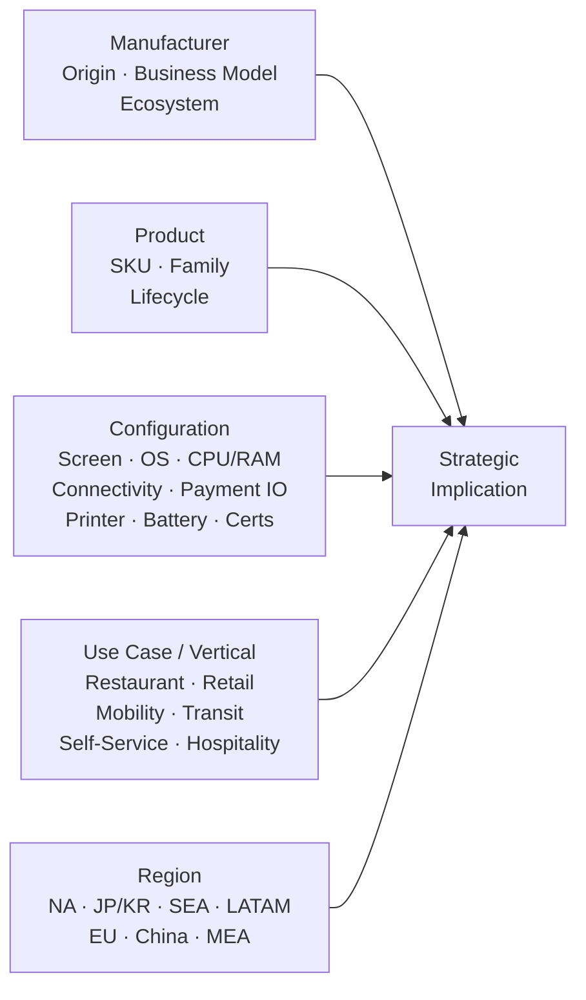
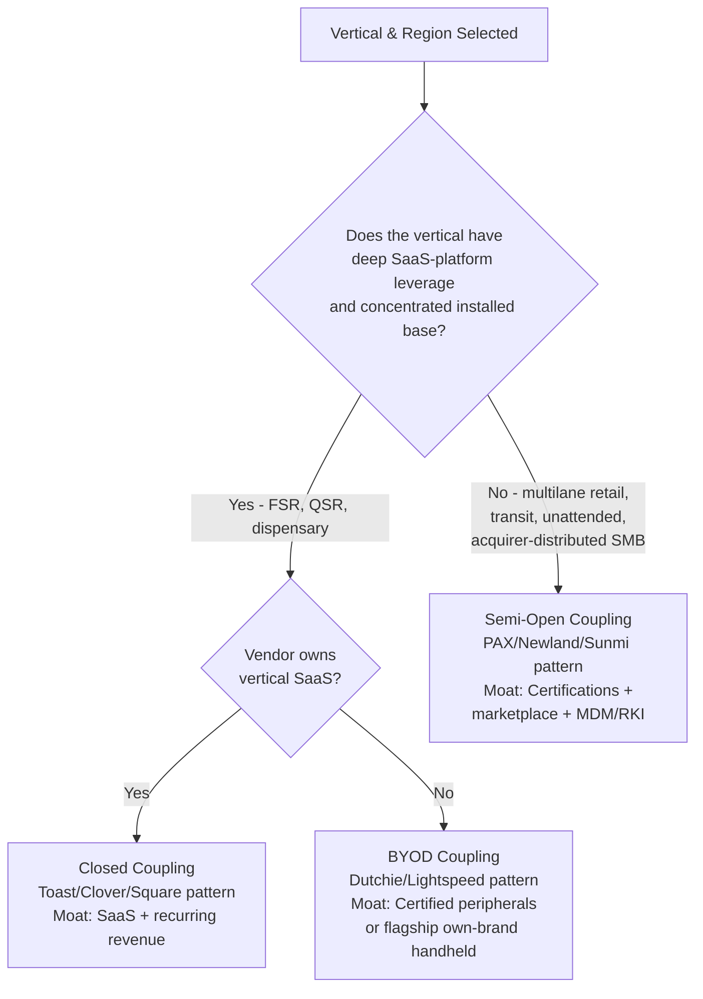
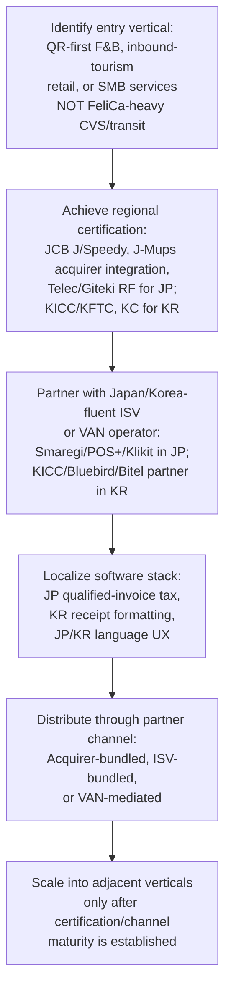
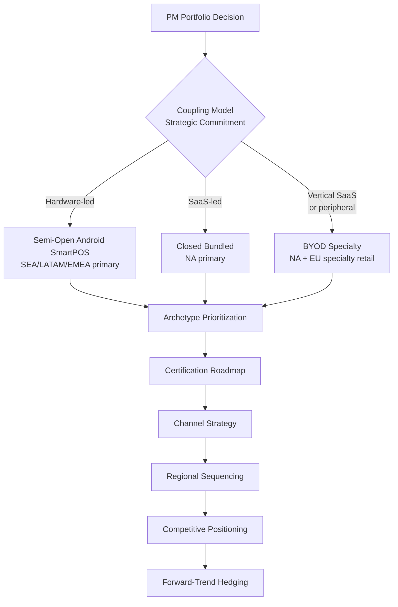
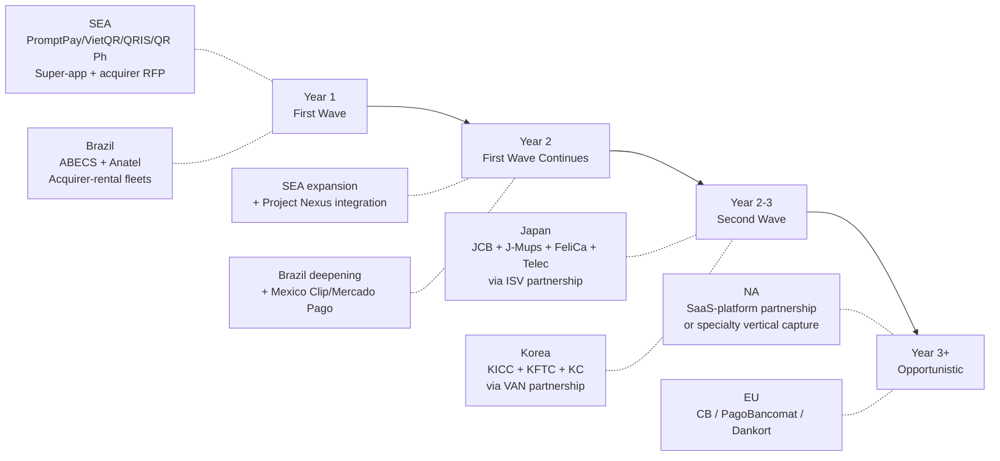

# Tablet-Style Payment & SaaS Devices: Global Hardware Landscape, Configurations, Use Cases, and Regional Market Penetration
# 1 Research Framing, Category Definition, and Global Manufacturer Landscape

The merchant point-of-sale device has, over the past decade, undergone a quiet but profound transformation. What was once a category dominated by single-purpose, proprietary-OS countertop terminals — Verifone Vx and Ingenico iCT/iWL devices running closed firmware on monochrome screens — has fragmented into a heterogeneous landscape of Android-powered, cloud-connected, touchscreen devices that look and behave more like consumer tablets than traditional payment hardware. This shift is not merely cosmetic. It reflects a structural convergence of three previously separate value chains: payment acceptance hardware, cloud SaaS for restaurant and retail operations, and the consumer-grade mobile compute stack. For a senior hardware product manager evaluating where to invest, which certifications to pursue, and how to position against entrenched competitors, understanding this convergence — and the device archetype it has produced — is the prerequisite for every downstream decision.

This opening chapter establishes that interpretive foundation. It defines the "tablet-style payment and SaaS device" category with the precision needed to distinguish it from adjacent form factors, identifies the convergence drivers that have made the category the fastest-growing segment of the global merchant device market, articulates the five-dimensional analytical framework (manufacturer × product × configuration × use case × region) that structures every subsequent chapter, and surveys the global supplier base across three strategic cohorts: Western and global incumbents, Chinese and Asian challengers, and SaaS-led ecosystem players. It closes with a comparative tier map that explains why particular vendors dominate particular verticals and geographies — a map that the regional and use-case chapters will then test and extend.

## 1.1 Defining the Tablet-Style Payment & SaaS Device Category

The category at the center of this report is not a regulatory classification, a single product line, or a vendor self-description; it is an analytical construct that captures a coherent class of merchant-facing devices sharing four defining attributes. First, a **tablet-form-factor touchscreen**, typically 5–15.6 inches diagonal, with capacitive multi-touch as the primary input — distinct from the small monochrome or low-resolution displays of legacy terminals. Second, a **modern general-purpose operating system**, almost universally Android (with Linux variants for some unattended units), running an application stack rather than firmware menus. Third, **integrated or tightly attached payment acceptance**, supporting at minimum NFC contactless and EMV chip, often with magnetic stripe (MSR), QR scanning, and a PCI PTS-certified secure card-reading subsystem. Fourth, a **cloud-connected SaaS runtime**: the device is designed to host or terminal-into a SaaS platform that handles point-of-sale, inventory, orders, loyalty, analytics, and back-office workflows, with continuous OTA updates and remote management.

This definition deliberately excludes four adjacent categories that are frequently — and unhelpfully — conflated with tablet-style devices in market commentary:

| Adjacent Category | Key Distinction from Tablet-Style Payment/SaaS Device |
|---|---|
| Legacy countertop POS (Aloha, Oracle MICROS, Squirrel) | On-premise data, proprietary hardware, closed OS, local installation, monthly support contracts $100–$250; no cloud SaaS runtime[^1] |
| mPOS card-reader dongles (early Square readers, SumUp Air, iZettle Reader) | Accessory dependent on a paired smartphone/tablet; not a self-contained merchant device; small or no display |
| Self-service kiosks (full-size SSK, $1,500–$5,000) | Consumer-facing only; large floor-mounted form factors; primary role is order capture, not multi-modal merchant tooling[^1] |
| General-purpose consumer tablets (iPad, Galaxy Tab) | No certified payment subsystem; require a dongle/peripheral; lack PCI PTS hardware; not designed for merchant durability or attended use |

Within the in-scope category, four archetypes recur across virtually every vendor portfolio examined later in this report. **Handheld SmartPOS** are 5–6-inch all-in-one tablets with battery, optional thermal printer, NFC/EMV/MSR, and 4G/Wi-Fi — exemplified by PAX A920 and A920Pro, Toast Go 2 and Go 3 (Toast Go 3 specifies a 6.52-inch / 165 mm screen and 189 × 90 × 35 mm body)[^2], Clover Flex, and Square Terminal[^3][^4]. **Countertop tablet POS** are 8–15.6-inch fixed merchant-facing tablets, typically with companion customer-facing displays and integrated printers — exemplified by Clover Station Solo (14-inch)[^5], Clover Station Duo 2 (14-inch merchant + 7-inch customer, Snapdragon, 4 GB RAM, 64 GB storage, integrated thermal printer, EMV/NFC/MSR, PCI PTS and EMV certified)[^6], Toast Terminal/Flex, and Square Register. **Multilane Android tablets**, designed to replace dedicated PINpads at supermarket and big-box checkout lanes, are a newer subcategory anchored by PAX A35, AR6, and AR8. **Unattended and semi-attended tablet kiosks** — PAX IM10/IM20/IM25/IM30 series, SK300/SK700/SK800 — embed the same Android tablet stack into vending, EV-charging, transit, and micro-market enclosures.

It is the combination of these four attributes — and the explicit exclusion of legacy, dongle-only, fully-consumer, and kiosk-floor categories — that defines the analytical scope of every subsequent chapter.

## 1.2 Convergence Drivers Behind the Tablet-Style Form Factor

The tablet-style category did not emerge from a single technological breakthrough; it is the product of five convergent forces operating simultaneously on the merchant device stack. Understanding these forces is essential, because they determine which configurations win in which regions and which competitive positions are durable.

**Force 1 — Android-ization of the payment terminal.** The most consequential shift has been the migration from proprietary terminal OSes (Verifone Verix, Ingenico Telium) to Android. PAX Global Technology, which became the world's third-largest e-payment terminal vendor by 2014 and the second-largest globally by 2022 according to the Nilson Report, launched the world's first Android-based smart payment terminal — the A920 — in 2016. By 2024 PAX reported that Android sales accounted for over 60% of its mix, and the company has cumulatively shipped over 100 million terminals to more than 120 countries with HKD 5.8 billion+ in 2025 revenue[^7]. PAX itself articulates the strategic rationale: "PAX brings you into a new world of payments, one where third-party apps help boost business, increase in-store sales, and offer a seamless shopping experience for customers"[^7]. The Android shift unlocks app marketplaces (PAXSTORE/MAXSTORE, with PAXSTORE PCI DSS-certified in 2022 and MAXSTORE connecting over 11 million devices by 2023[^7]), enables ISVs to deploy verticalized SaaS without re-architecting for proprietary OSes, and dramatically reduces the per-device software development cost for acquirers and platforms.

**Force 2 — Cloud-based SaaS POS displacing legacy on-premise systems.** The legacy POS economics — $10,000–$15,000 in one-time hardware, $1,000–$5,000 installation, $100–$250/month support — are being displaced by tablet-based SaaS POS at $329 hardware (iPad-based) plus $69–$199/month software, with self-onboarding[^1]. Toast, the dominant US restaurant SaaS-POS, reported approximately 48,000 restaurant locations across 29,000 customers and over $38 billion in trailing-12-month gross payment volume by mid-2021, growing to roughly 62,000 locations by Q2 2022, with annualized recurring revenue of $637 million at 66% YoY growth[^8][^9]. Toast explicitly architects its platform as "a cloud-based, end-to-end technology platform purpose-built for the entire restaurant community… connecting front of house and back of house operations across dine-in, takeout, and delivery channels"[^9] — and that platform is delivered via tablet hardware (Toast Terminal, Toast Flex, Toast Go 2/3).

**Force 3 — Contactless and tap-to-pay adoption forcing hardware refresh.** The Europe POS terminal market is projected to expand from 26.58 million units in 2026 to 47.98 million units by 2031, a 12.55% CAGR, with contactless devices growing at 12.65% CAGR despite contact-based devices still holding 53.9% of the 2025 mix[^10]. The European cardholder base exceeded 100 million active cards in 2024, and tap-to-pay is now ubiquitous — Brussels' STIB transit operator reported 57% of single-ride fares paid contactlessly in 2024[^10]. Higher EEA tap-to-pay limits, expanding wallet support (Apple Pay, Google Pay), and SoftPOS technology that turns smartphones into acceptance points are jointly driving merchants to refresh aging terminals — and increasingly to refresh them with Android tablet-style devices that natively support all interfaces.

**Force 4 — Regulatory and certification mandates.** PCI PTS POI v6.x and v7.0 certification cycles, EMVCo C8 approval, regional schemes (PagoBancomat in Italy, CB FRv6/FRv6.2.1 in France, Dankort in Denmark, PLBS in France, Span2/MADA in Saudi Arabia), and accessibility certifications (RNIB for the visually impaired) have all been pursued aggressively by tablet-style device vendors — PAX became the first payment terminal manufacturer to achieve PCI PTS POI v7.0 certification, and the first Asian vendor elected to the PCI SSC Advisory Board[^7]. These certification cycles force fleet refresh and favor vendors with deep certification engineering benches.

**Force 5 — Merchant demand for unified payment + business management.** Merchants increasingly reject the bifurcation between "the payment terminal" and "the POS system." As the Chinese POS terminal industry analysis observed as early as 2015, the trajectory is toward "Commercial Management POS (CMPOS)" — devices integrating cash-register software, ERP, CRM, member management, NFC, 2D-barcode, fingerprint, and multimodal authentication into a single Android-class device[^11]. Toast's product overview reflects the merchant-side articulation of the same demand: "a single platform that gives them the tools and features they need to run their business across point of sale… restaurant operations, digital ordering and delivery, marketing and loyalty, and team management"[^9].

Together these five forces explain why the tablet-style form factor is not a fashion but a structural displacement of legacy hardware, and why every chapter that follows treats the manufacturer × product × configuration × use case × region matrix through the lens of this convergence.

## 1.3 Analytical Framework: Manufacturer × Product × Configuration × Use Case × Region

To navigate a fragmented and fast-moving category, this report applies a five-dimensional analytical lattice consistently across every subsequent chapter. The lattice is not exhaustive but is sufficient to capture the variables that materially affect a hardware PM's portfolio, certification, and go-to-market decisions.

The **manufacturer** dimension captures vendor identity, headquarters and ODM origin, business model (hardware-led margin capture, acquirer-bundled subsidization, or SaaS-led platform monetization), ecosystem assets (app marketplaces, ISV programs, MDM/RKI tooling), and certification posture. The **product** dimension identifies specific SKUs within each vendor's family — for example, PAX's segmentation of Android SmartPOS (Mobile A920/A920Pro/A920MAX/A930RTX/A960; MiniPOS A50/A77; Countertop A80/A8500/A8700), Android SmartTablet (Multilane A30/AR6/AR8; Industrial PDA A6650), Unattended (IM10/IM15/IM20/IM25/IM30; SK300/SK700/SK800), and Classic POS (Mobile D230/S920; PINpad Q30; Countertop Q80; MiniPOS & mPOS D188)[^7]. The **configuration** dimension records the technical specifications that determine fitness for use: screen size, OS version, SoC and memory, connectivity (Wi-Fi/4G/5G/Bluetooth/Ethernet), payment interfaces (NFC, EMV chip, MSR, QR), printer (58mm vs. 80mm thermal, integrated vs. external), battery, peripherals/extensibility, and certification level (PCI PTS POI v5/v6/v7, EMV L1/L2, regional schemes). The **use case / vertical** dimension maps device archetypes to deployment scenarios. The **region** dimension localizes all four prior dimensions against payment-rail context, regulatory regime, distribution channel, and price/installed-base reality.

Throughout the report, claims are anchored to vendor-disclosed specifications, regulatory and certification filings, listed-company annual results, and reputable market intelligence. Where figures are inferred or industry-band estimates, this is stated explicitly. Where data is materially missing for a region or vendor, gaps are declared rather than filled with speculation.

## 1.4 Global Incumbent Manufacturers: Western Hardware and Acquirer-Bundled Players

The Western and global incumbent cohort divides into two strategically distinct sub-cohorts that a hardware PM must analyze separately: pure hardware vendors selling devices as a margin product to acquirers/ISOs, and acquirer-bundled or SaaS-bundled ecosystems that subsidize hardware to capture transaction-fee or subscription revenue.

**Pure hardware incumbents — Ingenico (Worldline) and Verifone.** Ingenico and Verifone have been the historical duopoly of global merchant terminals and remain among the named market leaders cited in the most recent European market research alongside PAX, NCR, Diebold Nixdorf, Toshiba, HP, Castles, Adyen, Stripe, SumUp, Block (Square), Fiserv (Clover), Elavon, EVO, Nexi, myPOS, Yavin, and PayPal/Zettle[^10]. Both vendors have transitioned their portfolios toward Android tablet-style form factors — Ingenico's AXIUM family and Verifone's T650 / V400m / V400c / P400 multi-interface devices — to defend their installed base against Android-native challengers. Verifone's V400m is positioned for wireless operation with NFC/EMV/MSR; the V400c countertop variant supports the same payment range; the V200c is a more economical PIN-pad-style countertop[^6]. Ingenico's Desk 1500 supports EMV chip-and-PIN, magstripe, and NFC contactless including wallet payments[^6]. The strategic difficulty for these incumbents is that their margin model depends on terminal pricing, while acquirer-bundled and Chinese-sourced alternatives have compressed wholesale prices.

**Acquirer-bundled / SaaS-bundled incumbents — Clover, Toast, Square, Poynt.** This cohort sells the device as a delivery vehicle for a recurring revenue platform, and the device economics are deliberately subordinated to subscription and transaction-fee economics.

- **Clover (Fiserv)** distributes through US ISOs and direct, with the Station Duo 2 (14" merchant + 7" customer touchscreens, Snapdragon SoC, 4 GB RAM, 64 GB storage, integrated thermal printer, EMV/NFC/MSR, optional LTE, PCI PTS + EMV certified, ~7.5 lbs)[^6], Station Solo (14" all-in-one with receipt printer and cash drawer)[^5], Mini, and Flex handheld. The Clover suite integrates with Clover apps for payments, reporting, and inventory[^6].
- **Toast** is the canonical SaaS-led restaurant ecosystem, generating revenue across four lines: subscription services (SaaS POS, KDS, invoice management, digital ordering), financial technology solutions (payment processing fees recognized gross), hardware revenue (terminals, tablets, handhelds, accessories), and professional services[^8][^9]. Critically, hardware revenue is the smallest and lowest-margin line: subscription is ~10% of revenue, FinTech is ~80% at ~20% gross margin, and the report on Toast's S-1 noted that "two of the revenue lines have negative, significantly negative margins"[^8]. The signature device set comprises the Toast Terminal, Toast Flex (countertop tablet), and Toast Go 2 / Go 3 handhelds. The Go 2 accepts NFC, EMV, and traditional MSR including Apple Pay and Google Pay, with up to 24-hour battery life[^12][^13]; the Go 3 specifies a 6.52-inch (165 mm) screen at 189 × 90 × 35 mm and 0.94 lb[^2]. Toast's installed base trajectory — 48,000 locations / 29,000 customers / $38 B GPV in mid-2021, ~62,000 locations by Q2 2022[^9][^8] — illustrates the velocity at which an acquirer-bundled, SaaS-led tablet ecosystem can scale.
- **Square (Block)** anchors the SMB retail end with the Square Terminal ("an all-in-one device for payments and receipts," with 24/7 fraud prevention)[^3][^4] and the Square Register countertop tablet, with the strategy of offering the hardware at low margin while monetizing payments at a published 2.6% + $0.10 transaction band[^1].
- **Poynt / GoDaddy** completes the bundled cohort with merchant-facing + customer-facing dual-screen handhelds positioned for SMB.

The structural distinction is decisive for hardware PMs: pure-hardware incumbents must compete on per-unit margin and cannot easily cross-subsidize, while acquirer-bundled players can — and do — price hardware near or below cost to lock in multi-year transaction-processing economics.

## 1.5 Chinese and Asian Challenger Manufacturers

The Chinese and broader Asian challenger cohort has reshaped global tablet-style device economics over the past decade and is, by 2024–2025, the structural driver of Android-tablet proliferation in EMEA, LATAM, SEA, and parts of NA. The cohort's defining characteristics are scale-driven cost structure, aggressive certification pursuit across regional payment schemes, and a hardware-led but ecosystem-supported business model.

**PAX Global Technology** is the clearest archetype. Listed on the HKEX since 2010, PAX surpassed annual revenue of HKD 8.1 billion in 2022 and became the second-largest global POS terminal provider per Nilson, then HKD 6.7 billion in 2023 with profit over HKD 1.2 billion. By end-2025, the company reports 1,400+ employees, 6 global R&D centers, 800+ engineers, 10.5% of revenue invested in R&D, terminal shipments cumulative over 100 million to 120+ countries, overseas sales over 90% from 2019 onward, and Android sales mix exceeding 60%[^7]. PAX's portfolio spans handheld SmartPOS (A920/A920Pro/A920MAX/A930RTX/A960/A800/A8900/A99), MiniPOS (A50/A77), countertop SmartPOS (A80/A8500/A8700), multilane Android tablets and PINpads (A30/A33/A35, AR6/AR8), industrial PDAs (A6650), unattended (IM10/15/20/25/30, SK300/700/800), and the legacy Classic POS lineup[^7]. Certification milestones include the first Asian vendor elected to the PCI SSC Advisory Board (2023), the first payment terminal manufacturer to achieve PCI PTS POI v7.0, EMVCo C8 for the A920Pro, PagoBancomat (Italy), CB FRv6 and FRv6.2.1 and PLBS (France), Dankort (Nordics), Span2/MADA (Saudi Arabia), RNIB accessibility, and ATEX for the IM30 in explosive environments[^7]. The MAXSTORE/PAXSTORE app marketplaces — PAXSTORE PCI DSS certified in 2022, MAXSTORE with 11 million+ connected devices by 2023 — provide the ISV layer that mirrors the open-OS strategy.

**Other Chinese and Asian challengers** named in the global supplier base include LANDI (Fujian LANDI Commercial Equipment), SZZT Electronics (Shenzhen-listed under 002197)[^14], Newland (Fujian Newland Computer), Castles Technology (Taiwan), Cybernet, and historically Bitel — all profiled in the Global and China Financial POS Terminal Industry Report among the global top-tier shipment vendors[^11]. Sunmi, NEXGO, Hisense, Centerm/Jassway, Justtide, ZCS, Telpo, and Bluebird (Korea) round out the cohort across SmartPOS, multilane, and unattended tablet niches. Reference materials available for this report contain the most extensive primary documentation on PAX; coverage of Sunmi, NEXGO, Newland NPT, and SZZT is comparatively thin in the retrieved source set, and the deeper device-level catalog appears in Chapter 2 with explicit data-gap flags where vendor specifications were not directly retrieved.

The strategic effect of this cohort is twofold. First, it has commoditized the Android handheld SmartPOS, with wholesale prices for A920-class devices reportedly falling into the $300–$600 band in industry channels — a band that pure-hardware incumbents struggle to match without margin sacrifice. Second, it has supplied the OEM/ODM backbone for acquirer-rental fleets in LATAM (Cielo, Rede, Stone, PagBank, Mercado Pago, Clip, Bold), super-app and acquirer fleets in SEA (GrabPay, ShopeePay merchant programs), and ISV-distributed bundles in EMEA, providing the hardware behind brands that may not always be Chinese-labeled at the point of merchant contact.

## 1.6 SaaS-Led and Ecosystem-Centric Players

A third strategic cohort approaches the tablet-style category from the software side. For these vendors, the device is a delivery vehicle for a SaaS subscription, and the dominant hardware play is either to bundle a third-party tablet (most often an iPad), to certify a peripheral kit (card reader, printer, cash drawer), or to develop a small number of own-branded handhelds as flagship reference hardware.

**Lightspeed** offers Lightspeed Retail, Restaurant, and Golf POS systems, marketing itself as "the unified point of sale and payments platform for growing and large businesses" used by "over 160,000 customer locations across the globe"[^1]. The hardware pricing model is iPad-anchored ("iPads start at $329"), with software at $69–$199/month and a published 2.6% + 10¢ payment-processing rate[^1]. Lightspeed is explicitly hardware-agnostic at the tablet layer: its tablet-based system "runs on hardware that many people are familiar with" and supports cloud-based access "from anywhere"[^1]. Multichannel and multi-store are positioned as key differentiators (Lighthouse Immersive's case cited 300 transactions per hour per location, three registers set up in 25 minutes, and end-to-end transactions under 7 seconds[^1]).

**Shopify POS** pursues a similar BYOD-tablet strategy with iPad support and a flagship Shopify POS Go handheld for retailers on the Shopify ecosystem. **Square** straddles the SaaS-led and hardware-bundled cohorts: in retail/restaurant SMB, it sells a tightly bundled device + processing offering (Terminal, Register), but its software-only Square POS app on iPhone/iPad with a small reader extends the BYOD model. **Loyverse** and a long tail of regional SaaS POS vendors operate primarily on iPads or on Android tablets supplied by the Chinese challenger cohort, often running on PAX A920 or Sunmi T2-class devices through ISV certifications.

The strategic intersection between SaaS-led players and hardware vendors is the ISV ecosystem on Android SmartPOS: ISVs publish their SaaS apps to PAX MAXSTORE/PAXSTORE, Clover Apps, or the equivalents on Sunmi/Newland devices, allowing a single hardware SKU to host many vertical SaaS workloads. This is a tension as much as a partnership — when the ISV captures the merchant relationship and the SaaS subscription, the underlying hardware becomes more substitutable, which is why hardware-led players invest heavily in their own marketplace, MDM, and remote-key-injection tooling to preserve switching costs.

## 1.7 Comparative Tier Map and Strategic Positioning

Synthesizing the three cohorts produces the comparative tier map below, which classifies the global supplier base along two axes: business-model orientation (hardware-led ↔ acquirer/SaaS-bundled ↔ SaaS-led) and competitive scale and geographic reach (global tier-1 ↔ regional/vertical specialist).

| Vendor | Origin | Business Model | Tier / Reach | Signature Device Archetypes | Certification Footprint | Dominant Verticals & Geographies |
|---|---|---|---|---|---|---|
| PAX Global | China / HK | Hardware-led + ecosystem (PAXSTORE/MAXSTORE) | Global tier-1 (#2 globally per Nilson, 2022)[^7] | Handheld (A920 family), Multilane (A35, AR6/8), Unattended (IM/SK), MiniPOS (A50/A77) | PCI PTS v7.0 first, EMVCo C8, PagoBancomat, CB FRv6.2.1, Dankort, Span2/MADA, RNIB, ATEX[^7] | EMEA Android rollouts, LATAM acquirer fleets, SEA, transit, unattended[^7] |
| Ingenico (Worldline) | France | Hardware-led | Global tier-1 | AXIUM Android family, Desk 1500, classic Telium devices | Broad EMV/PCI/regional[^6] | EU acquirer fleets, global tier-1 retailers[^10] |
| Verifone | USA | Hardware-led | Global tier-1 | T650, V400m/V400c/V200c, P400 multi-interface[^6] | Broad EMV/PCI/regional[^10] | NA enterprise retail, EU acquirer fleets |
| Clover (Fiserv) | USA | Acquirer-bundled (US ISO/Fiserv) | NA-dominant tier-1 | Station Duo 2 (14"+7"), Station Solo (14"), Mini, Flex handheld[^6][^5] | PCI PTS, EMV, FCC, CE[^6] | NA SMB retail/restaurant via ISO[^1] |
| Toast | USA | SaaS-led + own hardware | NA restaurant tier-1 | Toast Terminal, Toast Flex, Toast Go 2/Go 3 (6.52", 189×90×35 mm)[^2][^12] | NFC/EMV/MSR + Apple Pay/Google Pay[^13] | NA restaurants (~62K locations Q2 2022)[^9][^8] |
| Square (Block) | USA | SaaS-led + bundled hardware | Global SMB tier-1 | Square Terminal, Square Register | NFC/EMV/MSR[^3][^4] | NA/global SMB retail, mobile/markets[^1] |
| Poynt / GoDaddy | USA | Acquirer-bundled | NA mid-tier | Poynt 5 dual-screen handheld | Standard EMV/PCI | NA SMB |
| Lightspeed | Canada | SaaS-led (iPad + Android) | Global SaaS tier-1 (160K+ locations)[^1] | iPad-based + certified peripherals; multi-vertical | Hardware-agnostic | Retail, restaurant, golf globally[^1] |
| Shopify POS | Canada | SaaS-led (iPad + POS Go) | Global SaaS tier-1 | iPad + Shopify POS Go | Hardware-agnostic + own handheld | Omnichannel retail SMB |
| LANDI / Newland / SZZT / Castles / Hisense / Cybernet | China / Taiwan | Hardware-led / OEM-ODM | Regional tier-2 (global top-10/20)[^11] | Android SmartPOS, classic terminals | Regional EMV/PCI/UnionPay | China domestic, ODM for global brands[^11] |
| Sunmi / NEXGO / Telpo / Centerm / Justtide / ZCS | China | Hardware-led + Android ecosystem | Regional tier-2 (rising) | Android SmartPOS, tablet POS, kiosks | EMV/PCI + regional | SEA/LATAM/Africa Android rollouts (data gap on detailed cert/installed base in retrieved sources) |
| Bluebird / Bitel / Toshiba TEC / Casio / NEC | Korea / Japan | Hardware-led | Regional tier-2 | Tablet POS, ruggedized handhelds | JCB/J-Mups (JP), KICC (KR) | JP/KR domestic chain retail, transit |

The map exposes four structural patterns relevant to subsequent chapters. **First**, there is no single global winner; the category is structured by regional and vertical clusters, and the same merchant problem is solved by very different vendor archetypes in different geographies. **Second**, the most aggressive growth vectors — Android tablet SmartPOS, multilane Android PINpads, Android unattended kiosks — are disproportionately driven by the Chinese challenger cohort, with PAX as the bellwether. **Third**, acquirer-bundled and SaaS-led ecosystems (Clover, Toast, Square, Lightspeed, Shopify) are not direct substitutes for hardware-led vendors; they are the customers, partners, or ISV layer that runs on top of devices that increasingly are sourced from the challenger cohort. **Fourth**, the structural fault line for hardware PMs is the choice between a hardware-margin business (where Chinese cost structure dominates) and a payment-fee or subscription business (where SaaS-led ecosystems extract the lifetime value).

This comparative landscape is the lens through which the next eight chapters are written. Chapter 2 takes the PAX, Toast, Clover, Square, Verifone, and challenger device families introduced here and constructs a structured configuration matrix and hardware-architecture analysis. Chapter 3 maps device archetypes onto vertical use cases and the three coupling models (closed acquirer-bundled ecosystems, semi-open Android SmartPOS, BYOD tablet + dongle). Chapters 4–7 test the tier map against four regional realities — North America's SaaS-bundle dominance, Japan/Korea's certification-bound conservatism, Southeast Asia's QR-driven Android rollout, and South America's acquirer-rental scale — quantifying price bands, dominant vendors, and installed-base trajectories where data permits, and explicitly flagging gaps where it does not. Chapter 8 cross-compares the regions and surfaces the forward-looking trends (SoftPOS, AI-enabled POS, biometric authentication, supply-chain geopolitics) that will reshape the matrix. Chapter 9 closes with the PM-level decision framework: which segments to enter, which configurations to prioritize, which certifications to pursue, and which regional sequencing maximizes return on hardware-portfolio investment.

# 2 Device Model Catalog, Configurations, and Hardware Architecture Trends

Chapter 1 established that the tablet-style payment and SaaS device category is defined by a coherent set of attributes — touchscreen form factor, modern Android (or equivalent) OS, integrated certified payment acceptance, and cloud SaaS coupling — and that the global supplier base is structured into three strategic cohorts: Western/global incumbents, Chinese/Asian challengers, and SaaS-led ecosystem players. This chapter operationalizes that landscape at the level of the actual product. For a senior hardware PM, the strategic map is only useful if it can be cross-walked to the specific SKUs, BoM choices, and certification footprints that ship today; conversely, a list of devices without analytical structure cannot inform portfolio decisions. The chapter therefore proceeds in two motions: first a vendor-by-vendor catalog of representative SKUs documented at configuration level, then a synthesis of the architectural trends that those configurations reveal — silicon migration, secure-element evolution, display/printer convergence, and the divergence between SaaS-open Android designs and acquirer-locked secure terminals.

The chapter relies on vendor-disclosed specifications and published datasheets where available. Where retrieved sources do not provide vendor-grade specifications for a particular SKU (notably parts of the Sunmi rugged line, NEXGO, Newland NPT, ZCS, Centerm, LANDI, Castles, Bluebird, and Bitel device-level configurations), the gap is declared explicitly rather than filled with speculation, in line with the research's transparency posture.

## 2.1 Cataloging Methodology and Device Archetype Taxonomy

The catalog inherits the four archetype buckets defined in Chapter 1 and uses them as the primary organizing axis within each vendor:

- **Handheld SmartPOS (HH-SP)**: 5–6.5-inch all-in-one tablets with battery, NFC/EMV/MSR, optional integrated 58 mm thermal printer, and 4G/Wi-Fi connectivity. Representative anchors: PAX A920/A920Pro, Clover Flex, Toast Go 2/Go 3, Square Terminal, Sunmi V3.
- **Countertop tablet POS (CT-T)**: 8–15.6-inch fixed merchant-facing tablets, often with companion customer-facing displays, integrated 80 mm printers, and battery backup. Anchors: Clover Station Solo/Duo 2, Toast Flex, Square Register, Sunmi T2 Lite/T3, Sunmi D2/D3 Mini, PAX E-series.
- **Multilane Android PINpad/tablet (ML-PP)**: 4–6-inch fixed devices designed to replace dedicated PINpads at supermarket lanes and tier-1 retail counters, with PCI PTS 6.x, increasingly Android. Anchors: PAX A30/A33/A35, AR6/AR8, Newland P300/N750P/P180, Verifone P400.
- **Unattended / semi-attended tablet kiosk (UA-K)**: tablet-class compute embedded in vending, EV-charging, transit, and micro-market enclosures. Anchors: PAX IM10/15/20/25/30, SK300/700/800, Newland U200/U1000/U2000, Telpo K-series.

For each catalog entry the report documents, where source data permits: screen size and resolution; OS family and version; SoC and core configuration; RAM and flash storage; connectivity (Wi-Fi band, cellular generation, Bluetooth version, Ethernet); payment IO (NFC, EMV chip, MSR, QR/2D scanner); printer (paper width and speed); battery capacity; physical envelope (L×W×H, weight); peripherals/extensibility; and certifications (PCI PTS level, EMV L1/L2, regional schemes).

Source-quality is tiered as follows for the purposes of this chapter: (Tier-A) vendor datasheet or product page directly retrieved in the source set with full configuration disclosure; (Tier-B) reseller/distributor product page or third-party retailer page with quoted configuration; (Tier-C) vendor portfolio page or industry reference confirming the SKU exists but without full configuration disclosure in the retrieved sources. Tier-A entries appear in full in the comparative matrix (§2.5); Tier-C SKUs are listed with explicit data-gap markers (denoted "n/a — gap" in tables) so that the absence of evidence is visible rather than papered over.

## 2.2 PAX Device Family Catalog and Configurations

Among all vendors profiled, PAX has the deepest primary specification coverage in the retrieved source set. The catalog therefore begins with PAX and uses it as the calibration reference for what a fully-documented vendor profile looks like.

### 2.2.1 PAX Handheld SmartPOS (A-series Mobile)

The flagship handheld line is the A920 family, positioned by PAX as "Smart Mobile SMARTPOS" with PCI 5 SRED, advanced connectivity, and Android-based PayDroid OS, targeting fashion & retail, food & beverage, and transportation.[^15] The original **A920** specifications are well documented:

- OS: PayDroid powered by Android 7.1; Cortex A7 + ARM secure processor.[^15]
- Memory: 8 GB eMMC + 1 GB DDR (optional 16 GB + 2 GB); micro-SD up to 128 GB on Android 7.1 (32 GB on 5.1).[^15]
- Display: 5" IPS WXGA 720 × 1280 capacitive multi-touch.[^15]
- Cameras: 5 MP rear-facing + 0.3 MP front; rear camera doubles as 1D/2D scanner.[^15]
- Card readers: Chip & PIN, NFC contactless, magnetic stripe.[^15]
- Connectivity: 4G + Wi-Fi 2.4 GHz (optional 5 GHz) + Bluetooth 4.0; GPS; 1× SIM + 2× SAM (optional 2× SIM + 1× SAM).[^15]
- Battery: 5250 mAh / 3.7 V.[^15]
- Printer: 40 lines/sec, paper roll outer diameter 40 mm.[^15]
- Ports: 1× Micro USB OTG, 6-PIN POGO PIN.[^15]
- Physical: 175.7 × 78 × 57 mm, 458 g.[^15]
- Operating range: −10 °C to 50 °C, 5–96% RH non-condensing.[^15]
- Certifications: PCI PTS 5.x SRED; EMV L1 & L2; EMV Contactless L1; Visa payWave; Mastercard Contactless; UPI qUICS; AmEx ExpressPay; Discover D-PAS; JCB J/Speedy; Interac Flash; Mastercard TQM; Common.SECC; UKCC; CE; RoHs; ATEX.[^15]
- Accessories ecosystem: PS200 pole stand; silicon sleeve; leather case + shoulder strap; **L920-BC** (charging base), **L920-BM** (charging + LAN with RJ45/RS232 + 2× USB host), **L920-BF** (charging + QR scanner), **L920-BE** (charging + wireless with Wi-Fi 2.4 GHz + BT 4.0).[^15]

The successor **A920Pro** moves to PayDroid on Android 8.1 with a quad-core Cortex-A53 application processor at 1.4 GHz plus a 32-bit RISC ARMv7-M secure processor at 96 MHz; a 5.5" IPS 1440 × 720 touchscreen; 8 GB + 1 GB (optional 16 GB + 2 GB) and micro-SD to 128 GB; Wi-Fi 2.4 GHz + BT, optional Wi-Fi 5 GHz + Bluetooth 5.0; a top-side 1D/2D barcode scanner alongside the 5 MP rear camera; a 2-inch high-speed thermal printer at 80 mm/s with 58 mm paper width and 40 mm diameter; 5150 mAh battery; 178.3 × 78.0 × 54.2 mm at 390 g; 1× Type-C OTG; 6× POGO PIN; 1× Micro SIM + 2× PSAM (optional 1× Micro SIM + 1× Mini SIM + 1× PSAM); and a broader certification footprint including PCI PTS 5.x SRED, EMV L1/L2, EMV Contactless L1, Discover D-PAS, Mastercard Contactless, Visa payWave, ABECS (Brazil), CE, IC (Canada), Anatel (Brazil), AmEx ExpressPay, PTCRB, Mastercard TQM, Interac Flash L2, J/Speedy L2, FCC, and RoHs.[^16] The Brazil-specific ABECS and Anatel certifications, alongside Interac Flash L2 (Canada) and PTCRB, signal a deliberate optimization for North American and LATAM acquirer programs.

The wider A-series catalog adds the **A920 MAX** (flagship with Wi-Fi 5.0 and Bluetooth 5.0, marketed as 40% faster install and 216% faster reading speed than A920),[^17] **A910S** (positioned as an affordable A920Pro-class device with the same chipset),[^17] **A930RTX**, **A960** (high-performer SmartPOS, 20% lighter than A920 and described as the most powerful A-series device),[^17] and **A99** (full touch or physical-keypad variants).[^17] PAX explicitly markets the A920 / A920Pro / A910 family for mobile payment under a single product banner.[^2]

### 2.2.2 PAX MiniPOS, Countertop, and Tablet Lines

The MiniPOS sub-family includes the **A50** ("slimmest MiniPOS" at 151 g and 14 mm thin),[^17] the **A77** (5.5" color touchscreen smart MiniPOS+ designed without an inbuilt printer to reduce environmental footprint and use Bluetooth-paired printing or SMS/email receipts; priced wholesale around $450 in retrieved US distribution),[^17][^18] and the **A6630** (rugged 6.5" IPS Smart MiniPOS for retail, hospitality, logistics, and law enforcement).[^17] The hybrid PDA-SmartPOS **A6650** is positioned as "the ultimate tool for anyone who wants to stay organized and process payments on the go."[^16][^17]

The countertop SmartPOS line is anchored by the **A80**, with full Tier-A specifications: PayDroid on Android 6.0/7.0; quad-core Cortex-A53 1.2 GHz application CPU plus Cortex-M3 secure CPU; 4-inch 800 × 480 capacitive touchscreen; 1 GB DDR + 8 GB eMMC + micro-SD up to 32 GB; high-speed 90 mm/s thermal printer with 58 mm paper width and 50 mm diameter; optional 7.4 V / 720 mAh Li-ion battery (excluded from the 405 g base weight); 1× HOST USB 2.0, 1× Micro USB 2.0 OTG, 1× PINpad, 1× RS232, 1× LAN, 1× Line, 1× Phone; 3× SAM or 1× SIM + 2× SAM or 1× SAM + 2× SIM card slot configurations; PSTN dial + LAN + optional Wi-Fi 2.4 GHz + 2G/3G/4G + Bluetooth; PCI PTS 5.x SRED, EMV L1/L2, EMV Contactless L1, Visa payWave, Mastercard Contactless, AmEx ExpressPay, Discover D-PAS, IC, Mastercard TQM, Interac Flash L2, J/Speedy L2, UL, CE, FCC, RoHs.[^19] Beyond the A80, the countertop family includes **A800**, **A8500** (smart desktop payment), **A8700** ("ultimate merchant & customer facing device, running one single processor"), and **A8900** (mobile or desktop with full touchscreen or physical keypad).[^17]

The PAX **Aries** tablet sub-family — **AR6** (6-inch dynamic Smart Tablet with hybrid card reader, integrated contactless, front-facing camera with barcode/QR scanning, dual-band Wi-Fi, Bluetooth, micro-SD) and **AR8** (impressive Smart Tablet with inbuilt battery removable from base station and optional pistol-grip handle for in-store mobility, 8 MP front camera, barcode/QR scanner) — is the multilane / mobile-tablet positioning.[^17] PAX markets the **A30**, **A33**, and **A35** as next-generation Android PINpad multilane devices, with the A35 explicitly described as "RECORD-BREAKING Android PINPad" featuring PCI PTS 6.x and contactless certifications, designed for tier-1 retailers, with a large vivid touchscreen and fast processor for value-added services and loyalty.[^17]

### 2.2.3 PAX Unattended, SmartECR, and Cloud-Speaker Lines

Unattended self-service tablet kiosks are a distinct PAX archetype: the IM-series (**IM10, IM15, IM20, IM25, IM30**) and SK-series (**SK300, SK700, SK800**) embed Android tablet compute into vending, EV-charging, transit, and self-service enclosures.[^17][^20] The **IM30** specifically holds ATEX certification for explosive environments per PAX's certification disclosures referenced in Chapter 1.

The SmartECR (Electronic Cash Register) family is the largest-screen extension of the PAX tablet portfolio: **E600Mini**, **E700**, **E700 Mini**, and **E800**, with the E800 documented at 15.6" + 8" dual-display (main 1920×1080, secondary 1280×720), 2 GB DDR + 16 GB eMMC, integrated thermal printer, and Android-based PAX EPOS app stack.[^21] PAX positions the E-series as next-generation EPOS for SMEs, accepting contactless cards, digital wallets, and account-to-account options, and integrating eCommerce.[^20]

The **CS35**, **CS55**, and **CS70** Cloud Speaker QR Code Readers (with the CS70 PCI 6 certified) and **AF10** face-recognition device round out the Android ecosystem.[^17] The Aries 8 (AR8) is also frequently catalogued as part of the SmartECR tablet line because of its inbuilt-battery and optional pistol-grip handle that enable both countertop and mobile payment usage in stores.[^17][^19]

PAX cumulative deployment exceeds 80 million terminals across 120+ countries[^20] (Chapter 1 cited 100 million+ from the Newland comparable disclosure[^22] and PAX's own 2025 figures), and the vendor explicitly markets MAXSTORE TMS, AirLauncher (custom launcher), and GoInsight (business intelligence) as the cloud-software layer that wraps the hardware.[^20]

## 2.3 Acquirer-Bundled and SaaS-Led Device Catalog: Clover, Toast, Square, Poynt

The North American SaaS-bundled cohort produces a smaller number of SKUs per vendor than the Chinese hardware cohort, but with deeper integration into a specific software stack. The Tier-A specifications retrieved from the source set are summarized below.

### 2.3.1 Clover (Fiserv)

Clover's portfolio spans countertop, compact countertop, and handheld archetypes. The **Station Solo** is a 14" high-definition tiltable display all-in-one with high-speed thermal dot receipt printer, accepting chip and swipe payments.[^23] The **Station Duo** (and Duo 2 referenced in Chapter 1) adds a customer-facing screen "to let them view the transaction, initiate payment, and redeem rewards."[^24] The **Mini** is the compact countertop variant designed for fast, secure, reliable transactions across swipe, EMV chip, and contactless.[^3]

The handheld **Clover Flex 2nd Generation** has full Tier-A documentation:[^18]
- OS: Clover hardened version of Android (AOSP) 8.1, upgradable to AOSP 10.0.[^18]
- Processor: Qualcomm Snapdragon 660 octa-core.[^18]
- Memory: 2 GB RAM + 16 GB Flash.[^18]
- Display: 5" 720 × 1280 XHDPI (320 ppi).[^18]
- Card readers: EMV chip, NFC, MSR.[^18]
- Camera: 5 MP for 1D and 2D trigger-activated barcode scanning.[^18]
- Printer: internal thermal; roll 57 mm width, 40 mm max diameter.[^18]
- Battery: Lithium-Ion 16.6 Wh, 2190 mAh, ≥8 hours typical SMB use.[^18]
- Connectivity: Wi-Fi, 4G/LTE.[^18]
- Ports: USB Type B device (with optional Clover Flex Cable Kit).[^18]
- Physical: 7.7 × 3.2 × 2.0 in; 1.03 lb without sleeve, 1.16 lb with sleeve.[^18]
- Certifications: PCI PTS 5.x; EMV Contact L1/L2; Mastercard TQM; EMV Contactless L1 v3.0; Visa payWave; Mastercard Contactless; AmEx ExpressPay; Discover DPAS; JCB Contactless; UPI Overseas; Interac Flash.[^18]
- Third-party payments: Apple Pay, Google Pay, Samsung Pay, Android Pay, Visa payWave, Mastercard PayPass.[^18]

The retailer FAQ also distinguishes Flex 2 vs **Flex 3**: Flex 3 runs Android 10.X, has PCI PTS 6.x, a 5.99" 1440 × 720 IPS HD display, weighs 1.16 lb, supports USB Type-C PD charging (2 hours), and supports 4G/LTE with 3G fallback in Argentina and India; Flex 2 by contrast supports 3G with 2G fallback in Argentina and uses USB Type B with optional kits.[^18] The PCI PTS jump from 5.x to 6.x and the screen-size lift from 5.0" to 5.99" are the two most material BoM/certification-level differences between the two generations.

### 2.3.2 Toast

Toast's hardware matrix is purpose-built for restaurants and tightly coupled to Toast POS, ToastIQ, and Toast Payments. Chapter 1 already cited the Toast Go 3 hardware envelope; this section consolidates the catalog. The retrieved specifications and product positioning are:

- **Toast Go 2** handheld: NFC, EMV, and MSR acceptance including Apple Pay and Google Pay; up to 24-hour battery life; built specifically for restaurant operations.[^12][^13][^25][^4]
- **Toast Go 3** handheld: 6.52" (165 mm) screen; 7.44 × 3.54 × 1.37 in (189 × 90 × 35 mm); 0.94 lb; "16% lighter than before" with the same expansive screen; front- and rear-facing cameras; IP65 dust/water rating tested beyond splashes; designed to withstand 5-foot drops; improved processor and battery for double-shift use; WiFi + cellular variant for off-site events, festivals, stadiums, patios, rooftop bars, and curbside pickup areas; cloud printing across networks; ToastIQ-ready (digital chits, beta menu upsell, shift-at-a-glance waitlist beta).[^2][^26]
- **Toast Flex** countertop tablet, **Toast Terminal**, and Toast KDS — referenced in Toast's product navigation as part of the "commercial-grade hardware" suite — round out the front-of-house and back-of-house tablet stack.[^26]

A single hardware-certification fault line is visible in Toast's documentation: the cellular variant of Go 3 uses a global connectivity provider that automatically selects the strongest available signal at the device location,[^26] which is operationally relevant for hardware PMs designing fleet rollouts in regions with carrier fragmentation.

### 2.3.3 Square (Block)

Square's portfolio in the retrieved Canadian price reference (with prices subject to regional adjustment) is:[^22]

| Square SKU | Price (CAD/CA$) | Form Factor & Anchor Use |
|---|---|---|
| Square Register (2nd gen) | $999 (or $84/mo × 12) | Two responsive touchscreens + integrated software for busy counters |
| Square Handheld | $449 (or $38/mo × 12) | Powerful POS that moves with you to take orders/payments anywhere |
| Square Terminal | $399 (or $34/mo × 12) | All-in-one credit card terminal for payments and receipts |
| Square Stand | $249 (or $21/mo × 12) | iPad-anchored POS with integrated chip and contactless |
| Square Kiosk | $249 (or $21/mo × 12) | iPad-driven self-serve ordering kiosk for restaurants |
| Square Reader (2nd gen) | $69 | Contactless and card payment dongle paired to phone/tablet |

Square's positioning explicitly bundles a 2-year limited warranty on Register, 1-year limited warranty on the rest, free 30-day returns, no long-term contracts or equipment fees, and Tap to Pay on iPhone for software-only acceptance.[^22] The Square Terminal is described elsewhere as "a mobile Point of Sale (POS) system designed to accept all payments,"[^3] confirming that within the SaaS-led cohort Square deliberately offers both an integrated handheld terminal and a BYOD iPad path. The Square Kiosk specifically pairs with the merchant's primary Square POS hardware running either Square Point of Sale or Square for Restaurants and cannot connect directly to external Bluetooth/USB/Ethernet accessories when running the Kiosk app[^22] — a tightly coupled architecture that mirrors Clover and Toast's platform-locked design.

### 2.3.4 Poynt and Other US Acquirer-Bundled Players

Poynt 5 (referenced in Chapter 1 as a dual-screen merchant + customer handheld) sits in the same coupling-model bracket as Clover Flex and Toast Go 2. Detailed Tier-A specifications for Poynt 5 were not retrieved in the current source set; the SKU is documented at the existence and positioning level only, and specific configuration data is flagged as a gap to be supplemented in any subsequent BoM teardown.

## 2.4 Western Hardware Incumbents and Chinese/Asian Challenger Catalog

### 2.4.1 Western Hardware Incumbents

Verifone and Ingenico (Worldline) maintain Android tablet-style portfolios alongside their classic terminal lines. Chapter 1 catalogued the V400m, V400c, V200c, P400 (Verifone), and AXIUM family + Desk 1500 (Ingenico). The retrieved source set in this chapter does not add deeper Tier-A specifications for these SKUs; consequently the comparative matrix in §2.5 carries them with positioning-level descriptors and explicitly flags configuration fields as data gaps. This is itself an analytically useful finding: Western incumbents maintain less open distribution of detailed device specifications relative to the Chinese challenger cohort, which tends to publish full datasheets through reseller and ODM channels.

### 2.4.2 Sunmi

Sunmi has the broadest Tier-A countertop tablet documentation in the retrieved sources after PAX. The catalog includes:

- **Sunmi T2 Lite**: Android 7.1; Qualcomm Snapdragon octa-core; 2 GB RAM + 16 GB ROM; 15.6" 1920 × 1080 main display + optional 10.1" 1024 × 600 customer display or second 15.6" customer display; micro-SD up to 64 GB; Wi-Fi 802.11 a/b/g/n; Bluetooth 4.0 BLE; ports include 5× USB, 1× audio jack, 1× RJ11, 1× power, 1× RJ12, 1× Micro USB debug, 1× RJ45; optional SIM card, dual-display variants, camera, VESA mount; physical 430 × 382 × 232 mm.[^27][^28] Variant naming covers the bare 15.6" main, 15.6"+10.1" dual, and 15.6"+15.6" twin-display options.[^27]
- **Sunmi T2s** and **T2s Lite**: extended-memory dual-screen variants with 15.6" + 10.1" or 15.6" + 15.6" displays; price points around €749–€832 in EU distribution.[^19]
- **Sunmi T3**: 15.6" Full HD touchscreen; 80 mm thermal printer; NFC, Wi-Fi, Bluetooth; standard and GMS-EDLA variants; EU pricing at approximately €591 (standard) to €721 (GMS-EDLA) for the 80 mm-printer SKU, and €688 for the standard 80 mm-printer variant.[^19]
- **Sunmi D2 Mini**: Android 8.1; quad-core; 2 GB RAM + 8 GB ROM; main 10.1" 1280 × 800 + customer 4.3" 800 × 480; high-speed 58 mm thermal printer at 160 mm/s with 60 mm roll; Wi-Fi 802.11 b/g/n; Bluetooth 4.2 BLE; NFC ISO 14443 A/B, ISO 15693, MIFARE 1K/4K; oil/water resistance (excluding printer compartment); 4G with 1× Micro SIM (model T1711); 5× USB, audio jack, RJ11, RJ12, RJ45, Micro USB debug, 1× PSAM; 260 × 290 × 99 mm; 1.94 kg.[^21]
- **Sunmi D3 Mini**: SUNMI OS based on Android 13; Qualcomm hexa-core 1.9 GHz; 3 GB RAM + 32 GB ROM; built-in 58 mm thermal printer up to 100 mm/s; main 10.1" HD 1280 × 800 300 nits 10-point capacitive + 2.4" seven-segment customer display; Wi-Fi 2.4/5 GHz IEEE 802.11 a/b/g/n/ac; Bluetooth 2.1/3.0/4.2/5.0 with BLE; built-in 2600 mAh battery (variants with/without battery); NFC ISO 14443 A/B, ISO 15693, MIFARE; 250 × 213 × 91 mm; 1.1 kg; 0–40 °C operating range; SUNMI OS GMS / non-GMS distinction made explicit by the vendor.[^19]
- **Sunmi D3 Pro**: 15.6" GMS-EDLA single-screen desktop POS, EU pricing ~€472.[^19]
- **Sunmi D3 Mini variants** with 80 mm printer at higher EU price (~€441) and battery + EU/UK cable bundles in the €328–€333 band.[^19]
- **Sunmi V3 / V3 Plus / V3 GMS EDLA**: Android 13/14 mobile terminals with NFC, GMS EDLA, 2D scanner, and integrated printer; EU pricing ~€387 (V3) to ~€489 (V3 Plus).[^19]
- **Sunmi M3**: Android portable device with NFC, 4G, GMS; ~€266.[^19]
- **Sunmi L2s Pro / L3**: rugged Android handheld computers for logistics, with L3 featuring Zebra SE4710 scanner, on-screen NFC, and UHF RFID; €387–€550.[^19]
- **Sunmi Flex 3 KDS**: 18.5" Android 13 GMS-EDLA 4 GB / 64 GB display for KDS workloads; ~€775.[^19]

Sunmi's documented architecture is the clearest case of countertop SaaS-open Android tablets: large displays, dual-screen options, GMS-EDLA certification track, and NFC + thermal printer integration without an explicit secure-element / PCI PTS classification in the retrieved sources for D2/D3/T2/T3 — implying the payment subsystem is software-or-peripheral coupled rather than embedded as a PCI PTS terminal. This is materially different from PAX/Clover/Verifone/Ingenico and is one of the architectural fault lines analyzed in §2.10.

### 2.4.3 Newland NPT

Newland NPT positions itself as delivering 10 million devices annually with 100M+ POS deployed globally, 1,200+ experts across 10+ global locations, and 120+ countries trusting its platform.[^22] The retrieved portfolio map (without granular Tier-A specs in the source set, hence Tier-C documentation) covers:[^22]

- **Portable / SmartPOS**: S90 (cutting-edge smart terminal, new), N950 (flagship Android SmartPOS), N950K (Android SmartPOS with keypad), N950S (portable Android SmartPOS), N560K (Android POS with keypad), SP930 (portable classic), SP630 Pro, SP550.
- **Countertop**: N950SC (Android countertop, new), N950KC (Android countertop with keypad, new), SP880 (classic countertop).
- **MiniPOS**: S30 (smart miniPOS, new), N750 (Android miniPOS), ME60 (powerful miniPOS), ME30S (compact mPOS).
- **Retail PIN Pad**: P300, N750P (new), P180, SP130.
- **Smart ECR**: X70 (integrated POS, new), X800 (compact Smart ECR), CPOS X5 (smart cash register).
- **Unattended**: U200 (compact unattended, new), U2000 (unattended Android), U1000.
- **QR Payments**: VB90S (card payment sound box, new), VB80P.
- **Cloud platform**: TOMS (terminal lifecycle management).

Newland's North American payment-integration partnership with Fiserv is publicly disclosed,[^22] which signals that the company is actively positioning to compete with PAX in the acquirer-distributed Android SmartPOS segment in NA. Detailed Tier-A configuration disclosure is a data gap to be addressed through follow-up datasheet retrieval.

### 2.4.4 NEXGO

NEXGO (Shenzhen Xinguodu) appears in the source set primarily through reseller listings and protective-accessory sellers, which document the SKU existence but rarely the full configuration. The catalog as evidenced is:

- **N3** (smart POS terminal, factory-priced at $100–$129 in Alibaba listings),[^29]
- **N5**, **N86** handheld smart POS,[^30][^29][^31]
- **G2 / G3** mobile handheld POS,[^31]
- **K300** (Android-based POS terminal documented as 15-inch dual-display POS computer in some listings, $290; key configuration band Quad-core ≥ 1.5 GHz, 2 GB RAM, 16 GB storage, 4G/Wi-Fi/Bluetooth 4.2, Android 11, PCI PTS 5.x),[^29]
- **K320** (older traditional POS),[^31]
- **K370** handheld;[^31]
- the broader Nexgo K300 generic listing characterizes the device as Android-based with PCI PTS 5.x and EMV L1/L2 compliance and identifies adoption across retail (42%), hospitality (28%), fuel stations (15%), and banking kiosks (10%) operating in −15 °C to 60 °C ranges.[^29]

The NEXGO entries in the matrix carry Tier-B confidence: configuration bands from reseller listings are noted but vendor-source datasheet figures should be cross-checked.

### 2.4.5 Telpo

Telpo (Guangdong Telpo) has retrieved primary documentation for the **TPS650** dual-screen commercial cash register: 15.6" main 1920 × 1080 + 11.6" customer display 1366 × 768; quad-core 1.8 GHz onboard CPU (Rockchip RK3288); Android 5.1; 2 GB RAM + 8 GB FLASH; binocular face-recognition camera on the customer display (anti-spoofing 3D-mask defense); peripheral interfaces for cash drawers, scanners, invoice printers, credit card machines, electronic scales, routers; positioned for self-service supermarkets and pay-with-your-face.[^25] The wider Telpo portfolio map is well documented at SKU level:[^25]

- **Cash Register**: C9 (touch-screen POS), C9 Vsea, C9 Printer, C50 (AI vision checkout), C8 (EPOS), C2 (POS terminal), C1 (touch-screen cash register).
- **EFTPOS**: P9, P8 with Printer, P8 M5 mini, P8 mini, TPS900.
- **Smart POS**: M8, M10 (all-in-one), M1 mobile.
- **Fiscal**: TPS900 EFD, M8/M10 fiscal, TPS320 mobile cash register.
- **Kiosk**: K1, K1 Pillar, K1 KDS, K10, K10 Mini, K20, K8, K8M.
- **Biometric Device**: S9, S8, S8F, S6, S10, S5, TPS450, TPS360.
- **Bus ticketing**: T10, T20.
- **VIoT**: F8, F10, TPS980, V15B.

### 2.4.6 Other Asian/Western Vendors with Limited Source Coverage

The catalog must explicitly note as **data gaps in the retrieved source set** the device-level Tier-A specifications for: Sunmi V2 Pro and earlier mobile-receipt SKUs; ZCS Z100/Z108; Centerm K9 / Jassway; LANDI, Castles, Hisense; Bluebird (Korea), Bitel (Korea), Toshiba TEC, NEC, Casio (Japan). These vendors are known to ship tablet-style payment/SaaS devices in Chapter 1's tier map, but configuration-level disclosures are not present in the materials retrieved. Chapter 9 will list these as priority follow-up items for primary research.

## 2.5 Cross-Vendor Comparative Configuration Matrix

The configuration data in §2.2–§2.4 is now consolidated by archetype. Where source data is absent, the cell is marked "n/a — gap" rather than estimated.

### 2.5.1 Handheld SmartPOS Comparative Matrix

| Vendor / SKU | OS | SoC / CPU | RAM / Storage | Screen | Battery | Printer | Payment IO | Connectivity | Cert (Payment) | Physical |
|---|---|---|---|---|---|---|---|---|---|---|
| PAX A920[^15] | PayDroid / Android 7.1 | Cortex-A7 + ARM | 1/8 GB (opt 2/16 GB) | 5" 720×1280 IPS | 5250 mAh | 58 mm, 40 lps | NFC + EMV chip + MSR + 5MP cam scanner | 4G + Wi-Fi 2.4/5 GHz + BT 4.0 | PCI PTS 5.x SRED, EMV L1/L2, Visa/MC/UPI/AmEx/Discover/JCB/Interac, ATEX | 175.7×78×57 mm, 458 g |
| PAX A920Pro[^16] | PayDroid / Android 8.1 | Quad Cortex-A53 1.4 GHz + ARMv7-M secure | 1/8 GB (opt 2/16 GB) | 5.5" 1440×720 IPS | 5150 mAh | 58 mm, 80 mm/s | NFC + EMV + MSR + top-side 1D/2D scanner + 5MP cam | 4G + Wi-Fi 2.4/5 GHz + BT 5.0 (opt) | PCI PTS 5.x SRED, EMV L1/L2, ABECS, Anatel, IC, Interac Flash L2 | 178.3×78.0×54.2 mm, 390 g |
| PAX A77[^17][^18] | PayDroid Android | Quad-core | n/a — gap | 5.5" color | n/a — gap | None (BT-paired or e-receipt) | NFC + EMV + MSR | 4G + Wi-Fi + BT | PCI PTS 5.x | n/a — gap; ~$450 wholesale |
| Clover Flex 2nd Gen[^18] | Hardened Android (AOSP) 8.1 → 10 | Snapdragon 660 octa-core | 2 / 16 GB | 5" 720×1280 (320 ppi) | 2190 mAh, ≥8 h | Internal thermal, 57 mm | NFC + EMV + MSR + 5MP cam scanner | Wi-Fi + 4G/LTE | PCI PTS 5.x, EMV L1/L2 + global schemes | 7.7×3.2×2.0 in, 1.03 lb |
| Clover Flex 3rd Gen[^18] | Android 10.X | n/a — gap | n/a — gap | 5.99" 1440×720 | n/a — gap | Internal thermal | NFC + EMV + MSR | Wi-Fi + 4G/LTE (3G fallback AR/IN) | PCI PTS 6.x | 1.16 lb; USB-C PD |
| Toast Go 2[^12][^25] | Android (Toast hardened) | n/a — gap | n/a — gap | n/a — gap | 24 h | n/a — gap | NFC + EMV + MSR + Apple/Google Pay | Wi-Fi (+ optional cellular) | n/a — gap | n/a — gap |
| Toast Go 3[^2][^26] | Android (Toast hardened) | Improved processor | n/a — gap | 6.52" (165 mm) | Double-shift class | n/a — gap (cloud printing supported) | NFC + EMV + MSR | Wi-Fi + cellular variant | n/a — gap | 189×90×35 mm, 0.94 lb, IP65, 5-ft drop |
| Square Terminal[^22][^3] | Square OS / Android-based | n/a — gap | n/a — gap | n/a — gap | n/a — gap | Integrated receipt | NFC + EMV + chip + Tap to Pay | Wi-Fi + cellular | n/a — gap | $399 CAD MSRP |
| Square Handheld[^22] | Square OS | n/a — gap | n/a — gap | n/a — gap | n/a — gap | n/a — gap | Card + contactless | Wi-Fi | n/a — gap | $449 CAD |
| Poynt 5 (ref. Ch.1) | Android | n/a — gap | n/a — gap | Dual-screen (merchant + customer) | n/a — gap | n/a — gap | NFC + EMV + MSR | Wi-Fi + cellular | n/a — gap | n/a — gap |
| Sunmi V3 GMS EDLA[^19] | Android 13 | n/a — gap | n/a — gap | n/a — gap | n/a — gap | Integrated | NFC + 2D scanner | Wi-Fi + 4G | GMS EDLA | ~€387 |
| Sunmi M3[^19] | Android | n/a — gap | n/a — gap | n/a — gap | n/a — gap | n/a — gap | NFC | Wi-Fi + 4G + GMS | n/a — gap | ~€266 |
| Telpo M8 / M10 / M1[^25] | Android | n/a — gap | n/a — gap | n/a — gap | n/a — gap | M8 with BT print | NFC + EMV | Wi-Fi + 4G + BT | n/a — gap | n/a — gap |
| NEXGO N3[^29] | Android | Quad-core ≥1.5 GHz | 2 GB / 16 GB band | n/a — gap | n/a — gap | n/a — gap | NFC + EMV + MSR | 4G + Wi-Fi + BT 4.2 | PCI PTS 5.x band | $100–$129 listing band |
| Verifone V400m (Ch.1) | Verifone OS / Android-class | n/a — gap | n/a — gap | n/a — gap | n/a — gap | n/a — gap | NFC + EMV + MSR | Wi-Fi + cellular | Broad | n/a — gap |

The handheld archetype clusters tightly at 5–6.5" displays, 2–4 GB RAM in Android-class, 58 mm integrated thermal printers (where present), and PCI PTS 5.x → 6.x. The two structural outliers are (a) PAX A77's printer-less design optimized for BT-paired peripherals and digital receipts, and (b) Toast Go 3's IP65 / 5-ft-drop mil-spec-class durability and cloud-printing dependency.

### 2.5.2 Countertop Tablet POS Comparative Matrix

| Vendor / SKU | OS | SoC | RAM / Storage | Main Screen | Customer Screen | Printer | Battery | Connectivity | Notes |
|---|---|---|---|---|---|---|---|---|---|
| Clover Station Solo[^23] | Hardened Android | Snapdragon (Ch.1) | n/a — gap | 14" tiltable HD | None on Solo | High-speed thermal dot | Mains | Wi-Fi + LTE opt | EMV + MSR + Contactless, integrated cash drawer |
| Clover Station Duo 2 (Ch.1) | Hardened Android | Snapdragon | 4 GB / 64 GB | 14" merchant | 7" customer | Integrated thermal | Mains | Wi-Fi + LTE opt | EMV/NFC/MSR; PCI PTS + EMV; ~7.5 lb |
| Toast Flex (Ch.1, [^26]) | Hardened Android | n/a — gap | n/a — gap | n/a — gap | Companion variants | n/a — gap | Mains | Wi-Fi + cellular | Tightly bundled with Toast SaaS |
| Square Register (2nd gen)[^22] | Square OS | n/a — gap | n/a — gap | Dual responsive | Integrated customer | n/a — gap | Mains | Wi-Fi + cellular | $999 CAD; 2-yr warranty |
| Sunmi T2 Lite[^27][^28] | Android 7.1 | Snapdragon octa-core | 2 GB / 16 GB | 15.6" 1920×1080 | Optional 10.1" 1024×600 or 15.6" | None (paired) | Mains; opt SIM | Wi-Fi a/b/g/n + BT 4.0 BLE | 5× USB, RJ45, RJ11, RJ12, micro-USB debug; VESA |
| Sunmi T3 (80 mm)[^19] | Android (variants Std / GMS-EDLA) | n/a — gap | n/a — gap | 15.6" Full HD | n/a — gap | 80 mm integrated | Mains | Wi-Fi + BT + NFC | Std ~€688; GMS-EDLA ~€721 |
| Sunmi D2 Mini[^21] | Android 8.1 | Quad-core | 2 GB / 8 GB | 10.1" 1280×800 | 4.3" 800×480 | 58 mm @160 mm/s, 60 mm roll | Mains | Wi-Fi b/g/n + BT 4.2 + 4G (T1711) | NFC ISO14443/15693/MIFARE; oil/water resistant; 1.94 kg |
| Sunmi D3 Mini[^19] | SUNMI OS / Android 13 | Qualcomm hexa-core 1.9 GHz | 3 GB / 32 GB | 10.1" HD 1280×800 300 nits | 2.4" 7-segment | 58 mm @100 mm/s | Built-in 2600 mAh (variant) | Wi-Fi 2.4/5 GHz + BT 2.1–5.0 + BLE | NFC ISO14443/15693/MIFARE; GMS / non-GMS; 250×213×91 mm, 1.1 kg |
| Sunmi D3 Pro 15.6"[^19] | Android (GMS) | n/a — gap | n/a — gap | 15.6" | n/a — gap | n/a — gap | n/a — gap | n/a — gap | EU ~€472 |
| PAX E800[^21] | PayDroid / Android | n/a — gap | 2 GB DDR + 16 GB eMMC | 15.6" 1920×1080 | 8" 1280×720 | Integrated thermal | n/a — gap | n/a — gap | SmartECR; SME EPOS positioning |
| PAX A80[^19] | PayDroid 6.0/7.0 | Quad Cortex-A53 1.2 GHz + Cortex-M3 secure | 1 GB / 8 GB + µSD 32 GB | 4" 800×480 | None | 58 mm @90 mm/s | Opt 7.4 V/720 mAh | 2G/3G/4G + Wi-Fi + BT + LAN + dial | 405 g; 3× SAM / SIM combinations |
| Telpo TPS650[^25] | Android 5.1 | Rockchip RK3288 quad-core 1.8 GHz | 2 GB / 8 GB | 15.6" 1920×1080 | 11.6" 1366×768 | External | Mains | n/a — gap | Binocular face-recog camera; pay-with-face |
| Telpo C9 / C9 Printer[^25] | Android | n/a — gap | n/a — gap | n/a — gap | n/a — gap | n/a — gap | n/a — gap | n/a — gap | Touchscreen POS / EPOS |

The countertop archetype reveals a tighter convergence on 14–15.6" main screens, dual-screen merchant + customer architectures, and Android-class compute. The printer integration splits into 58 mm in compact countertop (D2/D3 Mini) and 80 mm in full countertop (T3, D3 Mini 80 mm variant, PAX E-series), and the secure-element posture splits between PCI PTS-certified (PAX, Clover, presumed Toast/Square) and non-PCI / peripheral-coupled (Sunmi T/D, Telpo TPS650) — the latter relying on a paired certified PIN-pad or external EMV peripheral.

### 2.5.3 Multilane PINpad and Unattended Tablet Matrix (high-level)

| Vendor / SKU | Archetype | Position | Notes |
|---|---|---|---|
| PAX A30 / A33 / A35[^17] | ML-PP | Tier-1 retailer Android PINpads; A35 PCI PTS 6.x | Vivid touchscreen, fast processor for VAS / loyalty |
| PAX AR6 / AR8[^17] | ML-PP / mobile tablet | 6"/8" Smart Tablets; AR8 with battery + pistol-grip handle | Bridges multilane and in-store mobile |
| PAX IM10/15/20/25/30[^17][^20] | UA-K | Android unattended; IM30 with ATEX | Vending, fuel, EV, transit |
| PAX SK300 / SK700 / SK800[^17][^20] | UA-K | Self-service kiosks | Larger enclosure |
| Newland P300 / N750P / P180 / SP130[^22] | ML-PP | Retail PIN Pads | Tier-1 retail multilane |
| Newland U200 / U2000 / U1000[^22] | UA-K | Compact and standard unattended Android | New U200 launched 2025 |
| Verifone P400 (Ch.1) | ML-PP | Multi-interface PINpad | Tier-1 retail |
| Telpo K-series[^25] | UA-K | K1, K10, K20, K8, K8M kiosks | Self-service / KDS |

For PINpad and unattended archetypes, configuration-level disclosure across the three Verifone/Ingenico/Newland/PAX/Telpo vendors is variable in the retrieved sources; the matrix is therefore positioning-level and supplemented by the certification analysis in §2.7.

An image-reference appendix is implied by the device images embedded in the retrieved product pages (PAX A920 shots,[^15] A920Pro 8-side renderings,[^16] A80 sliders,[^19] Sunmi T2 Lite triple-display variant images,[^27] Sunmi D2 Mini photography,[^21] Toast Go 3 hero image,[^26] Square Register hero,[^22] Newland S90/N950/X70 product cards,[^22] Telpo TPS650 product render[^25]). Because rendering images inside this report depends on the publishing channel, an image-link appendix should accompany the report; the markdown body cites the source pages so the images can be retrieved and displayed in any environment that supports embedded references.

## 2.6 SoC, Memory, and Compute Architecture Trends

The catalog reveals a clear silicon trajectory across generations. The earliest Android-class merchant tablets were architected on **ARM Cortex-A7** (PAX A920) and **quad-core Cortex-A53 at 1.2–1.4 GHz** (PAX A80 application CPU at 1.2 GHz; PAX A920Pro at 1.4 GHz),[^15][^16][^19] often paired with a separate secure CPU (Cortex-M3 in the A80, ARMv7-M in the A920Pro at 96 MHz)[^16][^19] to isolate cryptographic and PIN-entry processing from the application stack. Memory baselines started at **1 GB RAM + 8 GB eMMC**, with optional 2 GB + 16 GB upgrades and external micro-SD up to 128 GB as the primary mass-storage extension.[^15][^16][^19]

The next generation has migrated to **Qualcomm Snapdragon octa-core platforms**, evidenced by:
- Clover Flex 2nd Gen on **Snapdragon 660 octa-core** with 2 GB RAM + 16 GB Flash;[^18]
- Clover Station Duo 2 on Snapdragon (Chapter 1) with 4 GB RAM + 64 GB Flash;
- Sunmi T2 Lite on **Qualcomm Snapdragon octa-core** with 2 GB / 16 GB.[^27][^28]

The most recent generation introduces **Qualcomm hexa-core platforms at higher base clocks** (Sunmi D3 Mini at Qualcomm hexa-core 1.9 GHz with 3 GB / 32 GB)[^19] and **Rockchip industrial SoCs** for cost-sensitive countertop tiers (Telpo TPS650 on RK3288 quad-core 1.8 GHz, retained for stability and peripheral-controller maturity).[^25] MediaTek SoCs are ubiquitous in the broader Android merchant tablet supply chain but are not specifically called out in the retrieved Tier-A specifications for the named SKUs.

The OS trajectory follows the silicon: Android 5.1 (Telpo TPS650, 2018-class)[^25] → Android 6.0/7.0 (PAX A80)[^19] → Android 7.1 (PAX A920, Sunmi T2 Lite)[^15][^27] → Android 8.1 (PAX A920Pro, Sunmi D2 Mini, Clover Flex 2nd Gen baseline)[^16][^21][^18] → Android 10 (Clover Flex 2nd Gen upgrade path, Clover Flex 3rd Gen, PAX A35)[^17][^18] → Android 13 (Sunmi D3 Mini, Sunmi V3, Sunmi Flex 3 KDS)[^19] → Android 14 (Sunmi V3 Plus).[^19] The **GMS / EDLA distinction** has become a first-class hardware-PM decision in 2024–2025: Sunmi explicitly differentiates GMS-EDLA variants from non-GMS units across D3, T3, V3, and Flex 3 (e.g., T3 Std at €688 vs T3 GMS-EDLA at €721; V3 GMS-EDLA at €387; Flex 3 KDS Android 13 GMS-EDLA at €775).[^19] EDLA (Enterprise Device License Agreement) is required to ship Google Mobile Services on enterprise Android devices, and the certification cost differential reaches the merchant price; PAX, Newland, and other competitors have pursued similar GMS-EDLA tracks where ISV ecosystems require Google Play.

Two architecturally important design choices recur across the catalog:

1. **Dual-CPU partitioning**: nearly every PCI PTS-certified handheld and countertop pairs an application processor with a separate secure microcontroller (Cortex-M3 in PAX A80, ARMv7-M secure in A920Pro), reflecting a hardware-level mandate from PCI PTS POI requirements that cryptographic key handling and PIN-entry tamper detection run on a distinct, attested processor outside Android's reach. Sunmi countertop tablets (T-series, D-series) do **not** disclose a secure CPU in the retrieved datasheets; this is consistent with their architectural positioning as SaaS-open Android tablets that pair with a separate certified PIN-pad rather than embedding payment in the device.
2. **RAM/storage inflation**: from 1 GB / 8 GB at A920 / A80 baselines (2016–2018) to 2 GB / 16 GB at A920Pro / Flex 2 / Sunmi T2 Lite (2019–2021) to 3–4 GB / 32–64 GB at Sunmi D3 Mini / Clover Station Duo 2 / Sunmi Flex 3 KDS (2023–2025).[^27][^16][^19][^18] The implication for hardware PMs is that ISV SaaS apps — particularly those with embedded ML inference (computer-vision checkout, pay-with-face) and those requiring long Android version support — increasingly cannot run acceptably on legacy 1 GB / 8 GB devices, accelerating fleet refresh cycles.

## 2.7 Secure Element, Payment IO, and Certification Architecture

The fundamental architectural distinction between a tablet-style payment device and a generic Android tablet is the **secure-payments subsystem**: a dedicated secure CPU, tamper-mesh enclosure, secure key storage, and PCI PTS POI certification that together make the device legally and contractually permissible to accept PIN entry, EMV chip transactions, and contactless payments without an external PIN-pad.

### 2.7.1 PCI PTS POI Trajectory

The retrieved catalog exhibits the full PCI PTS evolution:
- **PCI PTS 5.x SRED**: PAX A920, A920Pro, A80; Clover Flex 2nd Gen.[^15][^16][^19][^18]
- **PCI PTS 6.x**: PAX A35 (multilane PINpad);[^17] Clover Flex 3rd Gen.[^18]
- **PCI PTS 7.0**: PAX (first payment terminal manufacturer to achieve, per Chapter 1).

The progression from v5 to v6 to v7 raises requirements on tamper detection, key-management, contactless EMV resilience, and cryptographic algorithm strength; the certification effort itself is a multi-month engineering investment that creates a real moat for hardware-led incumbents. For an SME-targeted handheld, v5.x SRED remains commercially acceptable in most regions through the lifecycle of currently-deployed terminals, but v6.x is becoming the de facto baseline for new tier-1 retailer deployments and v7.0 is the leadership claim.

### 2.7.2 Payment-IO Coverage by Archetype

NFC implementations across the catalog converge on the four-protocol set: **ISO 14443 A, ISO 14443 B, ISO 15693, MIFARE 1K/4K** (explicitly disclosed by Sunmi D2 Mini and D3 Mini).[^19][^21] EMV chip and MSR are universal on PAX, Clover, and Verifone certified devices; on Sunmi tablets without embedded PCI PTS, EMV chip is delivered via paired peripherals.

QR / 2D scanning is implemented in three architecturally distinct ways:
1. **Rear camera repurposed as scanner** (PAX A920 5MP rear; Clover Flex 5MP rear with dedicated trigger button).[^15][^18]
2. **Dedicated top-side IR or hardware barcode engine** (PAX A920Pro top-side scanner; PAX AR6/AR8 barcode/QR engines; PAX A6650 PDA-class engine).[^16][^17]
3. **Optional external scanner on a base or dock** (PAX L920-BF charging base + QR scanner accessory for the A920).[^15]

The MSR slot has not yet disappeared: every PCI PTS-certified handheld in the matrix retains MSR alongside EMV chip and NFC, even where MSR transaction volume is in single-digit percentages, because regional payment rails (notably parts of LATAM and Africa) and back-up scenarios still require it.

### 2.7.3 Regional Scheme Certification Footprint

The certification matrix is the clearest indicator of which vendors have invested to access which regional markets. The retrieved data crystallizes as follows:

| Scheme / Region | PAX A920 | PAX A920Pro | PAX A80 | Clover Flex 2 |
|---|---|---|---|---|
| Visa payWave | ✓[^15] | ✓[^16] | ✓[^19] | ✓[^18] |
| Mastercard Contactless | ✓[^15] | ✓[^16] | ✓[^19] | ✓[^18] |
| AmEx ExpressPay | ✓[^15] | ✓[^16] | ✓[^19] | ✓[^18] |
| Discover D-PAS | ✓[^15] | ✓[^16] | ✓[^19] | ✓[^18] |
| JCB J/Speedy | ✓[^15] | ✓ L2[^16] | ✓ L2[^19] | ✓[^18] |
| Interac Flash (Canada) | ✓[^15] | ✓ L2[^16] | ✓ L2[^19] | ✓[^18] |
| UPI qUICS / Overseas (India) | ✓[^15] | n/a | n/a | ✓[^18] |
| Mastercard TQM | ✓[^15] | ✓[^16] | ✓[^19] | ✓[^18] |
| ABECS (Brazil) | n/a | ✓[^16] | n/a | n/a — gap |
| Anatel (Brazil) | n/a | ✓[^16] | n/a | n/a — gap |
| ATEX (explosive) | ✓[^15] | n/a | n/a | n/a |
| FCC (US RF) | n/a | ✓[^16] | ✓[^19] | (implied) |
| CE (EU) | ✓[^15] | ✓[^16] | ✓[^19] | (implied) |
| RoHs | ✓[^15] | ✓[^16] | ✓[^19] | (implied) |

Two strategic patterns emerge. First, the **A920Pro's deliberate addition of ABECS, Anatel, IC, and PTCRB** (relative to the A920) shows PAX optimizing the SKU for the LATAM acquirer-rental market and Canadian deployments[^16] — a regional certification pivot that Chapter 7 will tie back to PAX's dominance of Brazilian fleets. Second, **Clover Flex's broad scheme coverage** (Visa/MC/AmEx/Discover/JCB/Interac/UPI Overseas) signals that even a US-anchored device is engineered to be exportable across major payment rails; what differentiates Clover from PAX is not the global certification footprint but the absence of the highly regional schemes (ABECS, ATEX, Dankort, Span2/MADA) that PAX has separately pursued.

## 2.8 Display, Printer, and Peripheral Integration Trends

### 2.8.1 Display Convergence

Display sizes cluster into four bands with little variance: **5.0–5.99"** for handheld SmartPOS (PAX A920 5.0", A920Pro 5.5", Clover Flex 2 5.0", Flex 3 5.99", Toast Go 3 6.52"); **8–10.1"** for compact countertop and customer-facing displays (PAX E800 secondary 8", Sunmi D2/D3 main 10.1"); **14–15.6"** for full countertop main screens (Clover Station Solo/Duo 14", Sunmi T2 Lite/T3/D3 Pro 15.6", PAX E800 main 15.6", Telpo TPS650 main 15.6"); and **18.5"** for kitchen-display KDS workloads (Sunmi Flex 3 KDS 18.5").[^15][^27][^2][^16][^19][^21][^23][^25][^18] Resolution has migrated from WVGA 800×480 (PAX A80) and 720×1280 (PAX A920, Clover Flex 2) toward **1440×720** (PAX A920Pro, Clover Flex 3) and **Full HD 1920×1080** in countertop main screens. Capacitive multi-point touch is universal at this point; resistive touch has effectively exited the tablet-style category.

### 2.8.2 Printer Integration

The integrated thermal printer is a defining accessory for two of the four archetypes. **58 mm thermal at 40 lps to 160 mm/s** is the handheld and compact-countertop standard: PAX A920 at 40 lps with 40 mm roll;[^15] PAX A920Pro at 80 mm/s with 58 mm width and 40 mm roll;[^16] PAX A80 at 90 mm/s with 58 mm width and 50 mm roll;[^19] Clover Flex internal thermal at 57 mm width, 40 mm max roll;[^18] Sunmi D2 Mini at 160 mm/s with 60 mm roll;[^21] Sunmi D3 Mini at up to 100 mm/s.[^19] **80 mm thermal** appears at the full-countertop tier (Sunmi T3 80 mm, Sunmi D3 Mini 80 mm variant, PAX E-series, Newland X70/X800).[^22][^19] Two architectural innovations sit at the edges: (a) PAX A77's deliberate omission of an integrated printer to reduce environmental footprint and stationery cost, with receipts delivered via SMS, email, or BT-paired printer;[^17] and (b) Toast Go 3's reliance on **cloud printing across separate Wi-Fi networks** to support cellular off-site service without a tethered receipt printer.[^26]

### 2.8.3 Camera, Scanner, and Modular Peripherals

Camera modules across the catalog standardize on **5 MP rear + 0.3 MP front** for handhelds (PAX A920, A920Pro; Clover Flex 2nd Gen 5 MP rear).[^15][^16][^18] PAX AR8 lifts the front-facing camera to 8 MP for QR/document scanning at the multilane retail counter.[^17] Toast Go 3 introduces dual front + rear cameras, an explicit upgrade tied to ToastIQ digital-chits and beta menu-upsell features that require visual context capture at the table.[^26] Telpo TPS650's binocular 3D-vision camera is the most differentiated implementation in the catalog: a customer-facing pay-with-face module with anti-spoofing defenses against printed photos and 3D masks.[^25]

Modularity strategies form a clear competitive axis:
- **PAX charging-base ecosystem (L920-BC/BM/BF/BE)** transforms the A920 from a pure handheld into a countertop docked terminal with optional Ethernet, serial, USB host, QR scanner, or wireless bridge — a single SKU spanning two archetypes.[^15]
- **PAX Aries 8 (AR8) pistol-grip handle and removable battery base** enables mobile in-store payments and barcode-intensive retail floor walks.[^17]
- **Sunmi T2 Lite optional 10.1" or 15.6" customer display, optional camera, optional VESA mount, optional SIM card slot** provide a single mainboard with multi-archetype configurations.[^27][^28]
- **Sunmi D2/D3 Mini customer-display interchangeability** (4.3", 2.4" seven-segment, 10.1") similarly tunes a single chassis to multiple use cases.[^19][^21]

The strategic implication is that vendors with strong base/dock and accessory ecosystems convert one R&D-amortized tablet design into multiple SKUs and use cases, materially improving portfolio leverage.

## 2.9 Battery, Connectivity, and Form-Factor Trade-offs

### 2.9.1 Battery Benchmarks and Runtime

| SKU | Battery (mAh) | Reported runtime |
|---|---|---|
| PAX A920[^15] | 5250 | n/a — gap; thick chassis (57 mm) supports large cell |
| PAX A920Pro[^16] | 5150 | n/a — gap |
| Clover Flex 2nd Gen[^18] | 2190 (16.6 Wh) | ≥8 hours typical SMB |
| Toast Go 2[^12] | n/a | up to 24 hours |
| Toast Go 3[^26] | improved | "Take and fire orders faster (and for longer) than before… designed for a double and then some" |
| PAX A80 (optional)[^19] | 720 (7.4 V) | n/a — gap |
| Sunmi D3 Mini[^19] | 2600 | n/a — gap |

The ranking is informative: **Toast Go 2's 24-hour figure is the outlier**, achieved with a deliberate large battery and aggressive power management for double-shift restaurant service; this is a clear differentiator against Clover Flex's 8-hour SMB rating and against PAX A920's ~5250 mAh which, in retrieved sources, does not carry a single-figure runtime claim. For hardware PMs, this is a configuration-vs-experience trade-off: battery-led design (Toast Go 2/3) requires sacrificing weight or form factor (Toast Go 3 still weighs only 0.94 lb because Toast accepted other compromises elsewhere in the BoM such as the printer-less, cloud-printing-dependent design).

### 2.9.2 Physical Envelope by Archetype

- **Handheld SmartPOS**: 175–190 mm long × 78–90 mm wide × 35–57 mm thick; 390–460 g (PAX A920 458 g; A920Pro 390 g; Clover Flex 2 1.03 lb / 467 g; Toast Go 3 0.94 lb / 426 g).[^15][^16][^26][^18]
- **Compact countertop tablet**: ~250–290 mm × 210–290 mm × ~100 mm; 1.1–1.94 kg (Sunmi D3 Mini 250×213×91 mm at 1.1 kg; Sunmi D2 Mini 260×290×99 mm at 1.94 kg).[^19][^21]
- **Full countertop tablet**: 430 × 380 × 230 mm class; 5–8 kg (Sunmi T2 Lite 430×382×232 mm).[^27][^28]
- **Multilane PINpad-tablet**: small footprint comparable to handheld but without battery (data gap on specific dimensions in retrieved sources for A30/A35).
- **Unattended kiosk**: enclosure-dependent; tablet board only.

### 2.9.3 Connectivity Layering

Wi-Fi has standardized at **dual-band 2.4/5 GHz 802.11 a/b/g/n/ac** at the new generation (Sunmi D3 Mini), with 802.11 a/b/g/n at the prior generation (Sunmi T2 Lite, Sunmi D2 Mini).[^27][^19][^21] **Bluetooth 4.0 BLE** is the floor (PAX A920, Sunmi T2 Lite); **Bluetooth 5.0** is the new tablet ceiling (PAX A920Pro optional, PAX A920 MAX, Sunmi D3 Mini supporting 2.1/3.0/4.2/5.0 with BLE).[^15][^27][^16][^17][^19]

**Cellular** layering is the most regionally-relevant connectivity dimension. The retrieved data shows:
- **4G + Wi-Fi + BT** is universal on Android handhelds (PAX A920, A920Pro, A80, Clover Flex, Sunmi V3/V3 Plus, Sunmi M3, NEXGO N3).[^15][^16][^19][^29][^18]
- **3G fallback in Argentina and India** is explicitly engineered into Clover Flex 3rd Gen, with **2G fallback in Argentina** for Flex 2.[^18]
- **Cellular auto-selection across providers** is built into Toast Go 3, with Toast partnering with a global connectivity provider that selects the strongest signal at the device location.[^26]
- **Dual-SIM + multi-SAM stacks** are explicit on PAX A920 (1× SIM + 2× SAM standard, optional 2× SIM + 1× SAM)[^15] and A920Pro (1× Micro SIM + 2× PSAM standard, optional 1× Micro SIM + 1× Mini SIM + 1× PSAM)[^16]; this multi-tenancy supports acquirers running multiple processing back-ends or fallback rails on a single device.

The hardware-PM implication: cellular and SIM-stack choices are not commodity decisions but regional and acquirer-specific. A device intended for Brazilian acquirer-rental fleets needs ABECS + Anatel + 4G with strong fallback; a device intended for Toast's NA off-site restaurant service needs cellular auto-select and cloud printing; a device for tier-1 EU multilane retail prioritizes Ethernet + dual-band Wi-Fi over cellular.

## 2.10 Architectural Divergence: SaaS-Open Android vs. Acquirer-Locked Secure Terminals

The analytical conclusion of this chapter is that the tablet-style category, despite its visual homogeneity, has bifurcated at the architectural level into two strategically distinct platform models. The split runs through every BoM, every certification choice, and every software interface examined above.

### 2.10.1 SaaS-Open Android Model

In the SaaS-open Android model, the device is engineered as a general-purpose ISV application platform. Configuration features include:

- **Open or semi-open Android distribution** with vendor-managed app marketplaces — PAXSTORE / MAXSTORE PCI DSS-certified with 11M+ connected devices (Chapter 1); Newland TOMS for terminal lifecycle management;[^22] Sunmi developer SDK (developer.sunmi.com) with explicit GMS / non-GMS certified-device documentation;[^19] Telpo Store, Telpo MDM, Telpo OS 2.0, Telpo SDK.[^25]
- **GMS / EDLA certification** for variants targeting markets that require Google Play (Sunmi T3 GMS-EDLA, V3 GMS-EDLA, D3 Mini GMS variant, Flex 3 KDS GMS-EDLA, V3 Plus Android 14 NFC + GMS-EDLA).[^19]
- **Embedded payment subsystem optional or paired**: PAX devices ship as PCI PTS POI-certified turn-key payment terminals; Sunmi countertop tablets (T-series, D-series) ship as merchant tablets with NFC for non-payment use cases (loyalty, ticketing) and pair with separate certified PIN-pads or external EMV peripherals when payment acceptance is required.
- **Wide ISV ecosystem coupling**: third-party EPOS apps published to the marketplace — PAX cites multiple ISV-developed EPOS Register apps deployed via MAXSTORE on A920 / A920Pro to SME merchants as combined retail EPOS register and payments POS;[^20] Sunmi ships into Loyverse, StoreHub, Moka, iPOS, and other regional SaaS POS through similar developer programs.
- **Remote management infrastructure**: Newland TOMS for "Real-Time Monitoring, Remote Management, Faster Deployments, and Lower Operational Costs";[^22] PAX MAXSTORE TMS, AirLauncher (custom launcher), GoInsight (BI).[^20]

### 2.10.2 Acquirer-Locked Secure Terminal Model

In the acquirer-locked model, the device is engineered as a tightly coupled extension of a single payment processor or SaaS platform. Configuration features include:

- **Hardened, acquirer-controlled Android distribution**: Clover ships "Clover hardened version of Android (AOSP) 8.1, upgradable to AOSP 10.0," with the implied restriction that third-party app installation outside the Clover App Market is constrained.[^18] Toast Go 3 runs Toast's purpose-built firmware with ToastIQ platform features baked in (digital chits, beta menu upsell, shift-at-a-glance waitlist beta).[^26] Square Kiosk explicitly cannot connect directly to external Bluetooth, USB, or Ethernet accessories when running the Square Kiosk app and pairs only with the merchant's primary Square POS hardware running Square Point of Sale or Square for Restaurants.[^22]
- **Tightly coupled payment back-end**: Clover devices clear via Fiserv processing; Toast devices clear via Toast Payments; Square devices clear via Square Processing. Even when the device technically supports tap, dip, and swipe, the merchant cannot route the transaction to a different acquirer without device replacement.
- **Ecosystem-level features**: ToastIQ's digital chits, menu-upsell, and shift-at-a-glance features integrate ML and CRM data into the handheld experience in a way that requires data ownership of the merchant relationship and is not available to a hardware-only competitor.[^26]
- **No third-party MDM / remote-key-injection**: The acquirer/SaaS vendor controls OTA updates, key injection, and fleet management; merchants cannot move the device to a different RKI service.

### 2.10.3 BoM-Level Differentiators and PM Implications

Translated to BoM and engineering choices, the divergence produces a set of design decisions that hardware PMs must take consciously rather than by default:

| Design Axis | SaaS-Open Android | Acquirer-Locked Secure Terminal |
|---|---|---|
| Secure CPU | Optional (omitted on Sunmi T/D countertops) | Mandatory (Cortex-M3 / ARMv7-M secure on PAX A80/A920Pro; Snapdragon + secure element on Clover Flex) |
| PCI PTS investment | Required only on payment SKUs (PAX, Newland flagships) | Universal (Clover, Toast, Square, PAX) |
| App marketplace | Open ISV (MAXSTORE, TOMS, Sunmi SDK) | Curated single vendor (Clover Apps, Toast App Library, Square App Marketplace) |
| GMS / EDLA | Often a competitive feature (Sunmi explicit GMS-EDLA tier) | Generally absent (Clover, Toast, Square use AOSP without GMS) |
| OTA / RKI | Vendor-neutral or multi-acquirer (PAX MAXSTORE) | Single-acquirer (Clover, Toast, Square) |
| Device pricing strategy | Hardware-margin sale to acquirers/ISOs/distributors | Subsidized hardware, monetized through transaction fees and SaaS subscription |
| ISV defensibility | Hardware vendor must invest in marketplace, MDM, certification breadth | SaaS/acquirer vendor must invest in vertical software and merchant relationship |
| Switching cost (merchant) | Moderate (re-certify ISV app on different hardware) | High (hardware replacement and acquirer migration tied) |

For a senior hardware product manager, the strategic decision crystallized by this matrix is whether to architect the next-generation portfolio as a SaaS-open Android platform competing with PAX, Newland, and Sunmi — where the moat is certification breadth, marketplace depth, and BoM cost — or as the hardware reference for a vertical SaaS or acquirer ecosystem in the Clover/Toast/Square pattern, where the moat is the merchant relationship and the recurring revenue model. The two paths require different organizational capabilities, different go-to-market motions, and incompatible assumptions about hardware margin.

This architectural divergence is the bridge to Chapter 3, which maps these two coupling models against vertical use cases — full-service and quick-service restaurants, retail/grocery checkout, specialty retail, hospitality, mobile/field service, transit, self-service kiosks, and unattended retail — and the third coupling model not yet examined here, the BYOD tablet + dongle model exemplified by Shopify POS, Lightspeed, and Loyverse, where the device-platform decision is partially or fully delegated to the merchant.

# 3 Use Cases, Vertical Deployment Scenarios, and SaaS-Hardware Coupling Models

Chapter 2 closed on a structural finding: the tablet-style payment and SaaS device category, despite its visual homogeneity, has bifurcated at the architectural level into a SaaS-open Android platform model and an acquirer-locked secure terminal model. That bifurcation is, however, only half of the answer a hardware product manager needs. The other half is the question of where these devices are actually deployed, which functional requirements each vertical imposes on the BoM and certification stack, and how the device archetype is coupled to the SaaS layer that the merchant ultimately buys. A PAX A920 sold into a Brazilian acquirer-rental fleet, a Clover Flex bundled by a US ISO with Fiserv processing, and an iPad running Dutchie POS in a Colorado dispensary are, at the semiconductor and chassis level, more similar than different — but the merchant economics, the vendor's defensibility, the certification effort, and the lifetime revenue model are profoundly different. This chapter therefore solves two problems jointly: which device archetype fits which vertical, and which of three coupling models (closed acquirer/SaaS-bundled, semi-open Android SmartPOS, BYOD tablet + dongle) determines who captures the merchant lifetime value.

The chapter proceeds from vertical functional decomposition (§3.1) into a deep treatment of the three coupling models (§3.2–§3.4), then synthesizes the developer-ecosystem (§3.5) and operational-management (§3.6) layers that operationalize the coupling-model choice, and closes with a strategic synthesis matrix (§3.7) that ties vertical fit, coupling-model fit, and archetype choice into a single decision framework — the framework that Chapters 4–7 will then test against four regional realities.

## 3.1 Vertical Functional Requirements and Device-Archetype Fit

Eight vertical clusters dominate tablet-style device deployment, and each imposes a distinctive requirement profile on the four archetypes defined in Chapter 2 — handheld SmartPOS (HH-SP), countertop tablet POS (CT-T), multilane Android PINpad/tablet (ML-PP), and unattended/kiosk (UA-K). The decomposition below begins with hard requirements (durability, battery, peripheral mix, payment IO, software stack) before identifying which archetype wins.

### 3.1.1 Full-Service Restaurants (FSR)

Full-service restaurant operations centre on tableside ordering, pay-at-table, and kitchen-display-system (KDS) pairing. The hard requirements are: a handheld form factor that fits in an apron pocket and survives a five-foot drop and liquid splashes; double-shift battery (typically 12–16 hours, ideally 24); cellular fallback for off-premise events; cloud-printed receipts (so the device itself need not carry a thermal printer); and tight integration with a back-of-house KDS and a front-of-house countertop tablet. Toast's documentation crystallizes this profile precisely — the Toast Go 3 is "designed for a double and then some," 16% lighter than its predecessor at 0.94 lb, IP65-rated, drop-tested to 5 feet, with cloud printing that "fires orders faster (and for longer) than before" and a cellular variant that "automatically selects the strongest available signal at the device location"[^1]. Square Handheld is positioned identically — TIME named it one of the best inventions of 2025, with IP54 rating, double-shift battery, an integrated barcode scanner that doubles as a QR reader for digital gift cards, a built-in camera for in-floor item-photo updates, and offline payments so the device "keeps taking payments even if the Wi-Fi drops"[^10]. The metaphor Square's industrial-design lead used — "the difference between a Swiss Army knife and a chef's knife" — captures the FSR design imperative: a sharp, focused tool that "doesn't try to do everything" but does the most important tasks "simply and reliably"[^10]. Restaurant operators in beta testing emphasized that "Square Handheld is tremendously helpful to place orders instantly at each table instead of waiting at a counter… The battery is dependable, lasting through two service staff shifts"[^10].

The dominant archetype for FSR is therefore HH-SP, with Toast Go 3, Square Handheld, and Clover Flex as the canonical SKUs, paired with a CT-T for host-stand check-in, payment fallback, and back-office workflows. The countertop dimension matters because FSR concept inventory is heavily software-driven; Toast itself characterizes its product as "a single platform that gives them the tools and features they need to run their business across point of sale… restaurant operations, digital ordering and delivery, marketing and loyalty, and team management" (Chapter 1).

### 3.1.2 Quick-Service and Counter-Service Restaurants (QSR)

QSR deployment skews toward CT-T at the counter, often with a customer-facing display, integrated 80 mm thermal printer, and KDS pairing for the kitchen. Battery is less critical; printer throughput and uptime are paramount. The Square Register dual-touchscreen architecture at CA$999, Clover Station Solo (14") and Duo 2 (14" merchant + 7" customer), Toast Flex, and PAX E700/E800 all populate this slot[^32]. Self-service kiosks (UA-K) increasingly augment this archetype to deflect labor cost — Square Kiosk at CA$249 pairs with the merchant's primary Square POS hardware running Square Point of Sale or Square for Restaurants[^32], a tightly coupled architecture where the kiosk app deliberately "cannot connect directly to external Bluetooth, USB, or Ethernet accessories" (Chapter 2).

### 3.1.3 Retail / Convenience / Grocery Multilane Checkout

Tier-1 and tier-2 grocery and big-box checkout is the natural habitat of the ML-PP archetype. The hard requirements are PCI PTS 6.x or higher, large vivid touchscreens for value-added services and loyalty, fast processors, integration with ECR mainframes, and absence of battery (the device is mains-powered at the lane). PAX explicitly markets the A35 as a "RECORD-BREAKING Android PINPad… designed for tier-1 retailers, with a large vivid touchscreen and fast processor for value-added services and loyalty" (Chapter 2). The PAX AR6 (6" Smart Tablet with hybrid card reader, integrated contactless, front-facing camera with barcode/QR scanning, dual-band Wi-Fi, Bluetooth, micro-SD) and AR8 (8" Smart Tablet with inbuilt removable battery and optional pistol-grip handle) extend the multilane concept toward in-store mobility, allowing a single device to function as a multilane PINpad on a base and a hand-carried tablet for line-busting (Chapter 2). Newland's P300, N750P, P180, and SP130 occupy the same niche, with U.S. payment integration via Fiserv (Chapter 1). Verifone P400 remains the legacy multi-interface incumbent (Chapter 2).

### 3.1.4 Specialty Retail with Regulatory Overlays

Specialty retail with heavy compliance overlays — cannabis dispensaries, liquor, smoke, pharmacy — has produced a distinctive coupling profile. Cannabis dispensaries serve as the canonical case because their requirements are public and acute. Dutchie operates "as a comprehensive software platform that handles every aspect of cannabis retail operations. Dispensaries use Dutchie's iPad-based point-of-sale system to scan products, apply discounts, process payments, and print compliance labels at the register"[^33]. The platform "automatically syncs every transaction with state tracking systems like Metrc in real-time, eliminating manual end-of-day reporting"[^33], and "when state systems go offline, Dutchie switches to batch mode to prevent sales interruptions"[^33]. Dutchie's product page reinforces the archetype choice: "Dutchie POS is designed to run on a variety of hardware options. Whether you manage your store from a central laptop, or you prefer the portability of a tablet-based experience, you can count on a seamless and efficient experience"[^14]. The dominant archetype is therefore CT-T, supplemented by UA-K for self-service order intake (Dutchie Kiosk Pro / In-store Kiosk), and the device choice is delegated to the merchant under the BYOD coupling model. The compliance overlay is delivered in software — "Dutchie POS features real-time Metrc automation and compliance alerts to help you track and resolve issues efficiently. Protect your system even further with support for custom integrations, including BioTrack"[^14] — and recall handling is automated: when a state regulator places a Metrc package on hold, "flagged inventory will appear as On Hold in the POS… This inventory is quarantined, preventing items from being added to a cart in the register. If On Hold products are already in a cart, the transaction can't be completed until they are moved"[^32]. Liquor, smoke, and pharmacy verticals exhibit analogous overlays (age verification, scheduled-substance reporting), satisfied through the same iPad CT-T + verticalized SaaS pattern.

### 3.1.5 Hospitality and Salons

Hospitality and salons (booking + payments + appointment management) lean heavily on CT-T at the front desk, with HH-SP as a satellite for poolside, room-service, or in-chair payments. Iconic deployments include the All Things Equal social-enterprise café in Melbourne, where the operator describes a deliberately accessibility-driven configuration: "We use iPads for all of our ordering. We have all the menu items numbered on the iPad… For people who can't [read], they can base things on the numbers and where they're placed on the iPad, and we try to use the little icons, where possible. All those things really mean that we can be accessible to anybody who wants to work in front-of-house"[^7]. Square Stand (CA$249, "turn your iPad into a point of sale") combined with Square Register and Square Terminal demonstrates the canonical CT-T + HH-SP pair for hospitality at SMB scale[^32][^7]. Cabana Club, a $2.5 M-revenue pool bar with nine cabanas, exemplifies a hospitality use case where seasonal staffing scales between 20 and 40 employees and battery-led handhelds enable poolside payments without runners[^11].

### 3.1.6 Mobile / Field Services and Food Trucks

Mobile and field-service deployments — food trucks, mobile detailing, market traders, on-site repair — concentrate the entire requirement set in a single HH-SP: battery-led, cellular auto-select, NFC + EMV + MSR, optional integrated printer, IP-rated against splashes and dust. Square's partnership with global cellular providers and Toast Go 3's "global connectivity provider that automatically selects the strongest available signal" both target this segment[^1]. Square's hardware lineup at CA$399 (Terminal) and CA$449 (Handheld) is explicitly priced and warranted (1-year limited) for mobile operators with no long-term contracts[^32]. The Founderpath case studies of Cabana Club, BRB Coffee inside a 1998 laundromat, Detail Mavericks ATX in a parking garage, and food-truck operators document the same archetype-vertical fit: a battery-led HH-SP with cellular fallback is the only viable answer when the merchant moves between physical locations[^11].

### 3.1.7 Transit and Outdoor Events

Transit ticketing and outdoor events demand contactless-first acceptance, ruggedized HH-SP or fixed UA-K, and rapid throughput — the Brussels STIB benchmark (57% of single-ride fares paid contactlessly in 2024, Chapter 1) illustrates the contactless dominance. PAX IM30's ATEX certification (Chapter 1, Chapter 2) makes it the canonical UA-K for fuel-station, EV-charging, and other regulated outdoor environments. PAX A920Pro's "PTCRB" certification (Chapter 2) is specifically the cellular industry approval needed for fleet deployment at events.

### 3.1.8 Self-Service Kiosks and Unattended Retail

Self-service order kiosks (Square Kiosk, Toast Kiosk, Dutchie Kiosk Pro) deflect labor and increase basket size — Dutchie's E-Commerce Pro early adopters report 50% higher online sales when AI-powered recommendations are layered in, and Kiosk Pro "extends self-service capabilities that increase throughput and average basket sizes while generating additional hardware revenue"[^33]. The hard requirements are large displays (15.6"+), durable enclosures, integrated card readers (often a paired PCI-PTS PINpad), and tight back-end integration with the parent POS. Unattended retail (vending, EV charging, fuel pumps, micro-markets, transit) exists at the more constrained end: PAX IM10/15/20/25/30, SK300/700/800, Newland U200/U1000/U2000, and Telpo K-series (Chapter 2).

### 3.1.9 Use-Case-to-Device Fit Matrix

Synthesizing §3.1.1–§3.1.8 into a single comparison view:

| Vertical | Dominant Archetype | Key Hard Requirements | Canonical SKUs | Coupling Model Skew |
|---|---|---|---|---|
| Full-service restaurants | HH-SP + CT-T | IP54/65, 5-ft drop, ≥2-shift battery, cellular auto-select, cloud print, KDS pairing | Toast Go 3, Square Handheld, Clover Flex, Toast Flex | Closed (Toast, Square, Clover) |
| Quick-service / counter | CT-T + UA-K | 80 mm printer, customer display, mains power, kiosk pairing | Square Register, Clover Station Duo 2, Toast Flex, PAX E800, Square/Toast Kiosk | Closed |
| Retail multilane checkout | ML-PP | PCI PTS 6.x+, ECR integration, large touchscreen, mains | PAX A35/AR6/AR8, Newland P300/N750P, Verifone P400 | Semi-open + Closed |
| Specialty retail (cannabis, liquor, pharmacy) | CT-T (iPad) + UA-K | Compliance API (Metrc/BioTrack), age verification, recall holds | Dutchie on iPad, Dutchie Kiosk Pro | BYOD + vertical SaaS |
| Hospitality / salons | CT-T + HH-SP | Booking, accessibility-friendly UI, BT printer pairing | Square Stand + Register + Terminal, Square Handheld | BYOD + Closed |
| Mobile / field / food truck | HH-SP | Battery-led, cellular, NFC/EMV/MSR, IP-rated | Square Terminal/Handheld, Toast Go 3, Clover Flex, PAX A920Pro | Closed + Semi-open |
| Transit / outdoor events | HH-SP + UA-K | Contactless-first, rugged, PTCRB, ATEX where applicable | PAX A920Pro, PAX IM30, ruggedized HH-SP | Semi-open |
| Self-service / unattended | UA-K | Large display, durable enclosure, paired PINpad, BE/BL alerts | PAX IM/SK, Newland U-series, Telpo K-series, Dutchie/Toast/Square Kiosk | Closed + Semi-open |

Two cross-vertical patterns surface from the matrix. **First**, vertical fit is rarely solved by a single archetype; FSR, QSR, hospitality, and specialty retail all combine HH-SP and CT-T (or CT-T and UA-K) into a multi-SKU floor design. A hardware PM proposing a portfolio refresh must resource at least two archetypes per priority vertical. **Second**, the coupling-model skew is itself vertical-driven: closed ecosystems (Toast, Square, Clover) dominate FSR/QSR in mature SaaS markets; semi-open Android SmartPOS dominates multilane retail and acquirer-distributed fleets globally; BYOD dominates wherever a vertical SaaS vendor (Dutchie in cannabis, Lightspeed Restaurant in independent FSR, Shopify in omnichannel SMB retail) controls the merchant relationship. The next three subsections analyze each coupling model in depth.

## 3.2 Closed Acquirer/SaaS-Bundled Ecosystems: Toast, Square, Clover

The closed coupling model is the architectural pattern in which a single vendor owns the device firmware, the payment processor, the app catalog, the OTA channel, and the merchant relationship. Three U.S.-anchored vendors — Toast, Square, and Clover — define the pattern, and the retrieved sources document each one with sufficient specificity to expose how the model converts merchant friction into vendor lifetime value.

### 3.2.1 Mandatory In-House Payment Processing

Mandatory in-house payment processing is the first defining attribute. Toast's product structure is unambiguous: "Toast requires exclusive use of Toast Payments for all transactions. You cannot connect Stripe, your existing merchant account, or any other processor"[^34]. Clover follows the same model — "both Clover and Square have their own proprietary payment processing service they lock merchants into when using their POS devices… With the help of Fiserv, Clover has expanded into many tertiary services"[^35]. Square similarly mandates Square processing on Square hardware. The financial consequences for merchants are direct and quantifiable. Toast raised processing rates by 0.23% across all card-present transactions in September 2024 with only 30 days' notice[^34][^36]. Toast Capital, the embedded financing arm, has been documented charging "a 14% daily take rate" on merchant cash advances, equating to roughly $22,400/month outflow on $160 K/month revenue, while alternative non-POS-bundled financing offered approximately 8% — a "$10,000/month back in our pocket" delta after refinancing in the Cabana Club case study[^11]. Square Loans is documented at the same 30–50% effective APR band with daily auto-deduct, a structure that "automatically deducts a percentage of every card transaction until the advance is repaid"[^11].

The strategic interpretation is that closed-ecosystem vendors monetize the merchant well beyond hardware margin: published Toast rates of 2.49–3.69% + $0.15 per card-present transaction, Square at 2.6% + 10¢, and Clover via Fiserv tiered pricing (Chapter 1) generate transaction-fee revenue that, in Toast's case, comprised approximately 80% of revenue at ~20% gross margin, with subscription at ~10% and hardware at the smallest, lowest-margin line (Chapter 1). Embedded financing layers an additional revenue stream on top.

### 3.2.2 Proprietary or Hardened-Android Hardware

The hardware layer is engineered to enforce the lock-in. Toast hardware is "Android-only. iPads not supported"[^36]. Toast's starter kit "~$800–$1,034+" pricing combines proprietary Android terminals with mandatory Toast Payments; "if your Wi-Fi or network goes down, or if you're [missing proprietary hardware]" the platform is "highly dependent on internet connectivity and proprietary hardware"[^35]. Clover ships "Clover hardened version of Android (AOSP) 8.1, upgradable to AOSP 10.0" (Chapter 2) on the Flex 2 with a Snapdragon 660 octa-core, 2 GB / 16 GB, and ships Clover Mini, Flex, Station Solo (14"), and Station Duo 2 (14" + 7") as the canonical bundled SKUs (Chapter 1, Chapter 2). Square's hardware portfolio (Register at CA$999, Handheld at CA$449, Terminal at CA$399, Stand at CA$249, Kiosk at CA$249, Reader 2nd-gen at CA$69) is paired with a 2-year limited warranty on Register and 1-year on the rest, with no long-term contracts but mandatory Square processing[^32]. Square's industrial design lead emphasizes the deliberately tightly coupled hardware-software pairing: "As we shaped the hardware, we evolved the software experience alongside it. Square Handheld runs on the Square Point of Sale app… Software updates happen automatically in the background, with no interruptions or IT support required"[^10].

### 3.2.3 Curated App Marketplaces and Add-On Software Stack

Curated marketplaces are the third pillar. Toast's app stack is purposely additive: independent operator commentary observes that "Toast has a free 'Starter' plan but most useful features — online ordering, QR tableside, loyalty, marketing, and third-party delivery — are separate add-ons. Most restaurants pay $150–$300+/month in software alone, plus 2.49–3.69% + $0.15 per transaction in processing fees"[^36]. Specific add-on prices are documented: $75/mo for online ordering and QR tableside (with QR tableside not on Starter)[^36], $200+/mo for xtraCHEF inventory/invoice processing[^34], and $75/mo per location for DoorDash/Uber Eats/Grubhub third-party delivery integration[^36]. Toast's recently launched ToastIQ adds "menu edits, insights, upsell via mobile app" (October 2025)[^36] and "digital chits, beta menu upsell, shift-at-a-glance waitlist beta" on the handheld (Chapter 2). Clover's app market is curated by Fiserv; Square's marketplace and Square Marketplace add-ons follow the same pattern.

### 3.2.4 Contracts, Switching Costs, and Merchant TCO

Contract terms harden the lock-in. Toast operates on "2–3 year contracts. ETF [early termination fee] applies if you leave early," whereas Square is "month-to-month. Cancel anytime"[^36]. Clover is closer to Toast on contract length when distributed through ISO channels. The TCO over a 3-year horizon for an FSR merchant on Toast can be estimated from the retrieved data: starter kit $800–$1,034[^36] + software bundle $150–$300/mo × 36 = $5,400–$10,800 + processing at 2.49–3.69% + $0.15 on, say, $1.2 M/year = roughly $90 K–$135 K over three years from processing alone, before any add-on, financing, or rate-hike consideration. Switching costs are high because the merchant must replace hardware, migrate the processing relationship, and re-import menu/inventory/staff data simultaneously. The structural critique articulated by independent operators captures the merchant's perspective bluntly: "Toast is a great POS — but once you're in, you're locked in. Toast Payments is mandatory (no bringing your own processor). Toast inventory is limited. And their analytics show you what's broken, not how to fix it"[^36].

### 3.2.5 Vendor Defensibility Implications

From the hardware vendor's vantage, the closed model is the most defensible because the moat is the merchant relationship and recurring revenue rather than per-unit hardware margin. Toast had reached approximately 62,000 restaurant locations by Q2 2022 with $637 M ARR at 66% YoY growth (Chapter 1) — a software-led economic engine that allows hardware to be sold near or below cost. The trade-off is that the vendor must invest continuously in vertical software (ToastIQ, Square's offline payments, Clover's app market expansion), customer acquisition (with FSR sales-team intensity), and merchant support (a documented weakness in Clover/Fiserv per BBB complaints[^35]) to keep the lock-in economically rational for the merchant.

## 3.3 Semi-Open Android SmartPOS: PAX, Sunmi, NEXGO, Newland with Third-Party SaaS

The semi-open coupling model is the architectural pattern in which a hardware-led vendor ships a PCI-certified Android SmartPOS with a vendor-managed app marketplace and remote-management platform, and acquirers, ISOs, ISVs, or SaaS POS vendors deploy verticalized software on top. PAX is the most thoroughly documented archetype in the retrieved sources, and its MAXSTORE/PAXSTORE platform is the canonical reference implementation.

### 3.3.1 PAX MAXSTORE / PAXSTORE: Marketplace + Device Management at Scale

PAX positions MAXSTORE (rebranded from PAXSTORE) as fulfilling two combined functions: an App Store Marketplace and an advanced Device Management Platform. The platform's scale is the headline data point: "There are already 7,000 software apps from 2,500 independent application developers being managed by MAXSTORE, for use in over 5 million Android SmartPOS terminals which are located in over 100 countries around the world"[^37]. The marketplace architecture is multi-tenant: "Marketplace Owners, typically an acquirer or merchant service provider, decide which apps they will offer to their merchants, negotiating a fee directly with the app developer without any involvement of PAX. The marketplace owner can create their own branded, private, marketplace within MAXSTORE"[^37]. PAX itself takes no platform cut on marketplace transactions — "negotiating a fee directly with the app developer without any involvement of PAX" — which materially differentiates the economics from Toast/Clover/Square's curated single-vendor marketplaces.

The four-stakeholder hierarchy (Software Developers → Marketplace Owners → Merchants → Estate Owners) is operationalized through role-based access. Each app is screened by PAX's AppScan web security scanning service "for common application vulnerabilities, cross site scripting, flash injection, outdated and insecure libraries, malware and viruses before being digitally signed with encryption keys"[^37]. The platform itself achieved PCI DSS certification in 2022 (Chapter 1), which is a discriminator from competing TMS platforms.

### 3.3.2 App Categories Consumed by Merchants

The retrieved categorization of apps available on MAXSTORE provides a high-resolution view of how a semi-open Android SmartPOS is actually used in the field[^37]:

| Category | Representative App Types |
|---|---|
| Sale processing | Cash register, EPOS for richer retail register functionality, sector-specific sales platforms, eCommerce order processing, inventory and stock management |
| Customer acquisition & retention | Loyalty and rewards, gift cards, coupons and vouchers, customer surveys |
| Booking & scheduling | Table reservations, ticket sales/bookings/validation, employee scheduling and timesheets, home delivery, queue management |
| Digital | Electronic messaging, digital receipts, Order@Table, digital contracts, COVID health passes |
| Terminal administration | Remote support and diagnostics, reporting/BI/analytics, device logistics and supplies, Remote Key Injection |

Specific ISVs documented in the retrieved sources include Cashlez running on Sunmi devices via the "Android SUNMI Source Development Kit"[^9], regional EPOS vendors deploying directly onto PAX A920/A920Pro through MAXSTORE (Chapter 2), and a long tail of loyalty, gift-card, and inventory apps. The strategic implication is that the same PAX A920Pro hardware can host a Cielo/Rede/Stone payment app in Brazil, a Loyverse SMB POS in Southeast Asia, and an EU acquirer's branded EPOS in Italy — without device replacement.

### 3.3.3 Processor-Agnostic Posture and Multi-SAM Hardware

Processor-agnostic posture is engineered into the hardware, not just the marketplace. PAX A920 ships with "1× SIM + 2× SAM (optional 2× SIM + 1× SAM)" and A920Pro with "1× Micro SIM + 2× PSAM (optional 1× Micro SIM + 1× Mini SIM + 1× PSAM)" (Chapter 2). This multi-SAM stack supports parallel acquirer back-ends on a single device — an acquirer running a primary processing rail with a fallback rail, or a merchant simultaneously using a domestic and international acquirer. The Cybersource integration documentation for PAX A920 confirms that the device "is certified through the Cybersource Card Present Gateway with FDI / Fiserv in North America and SIX in the European market," supporting "Semi-Integrated locally: Mobile solution locally integrated with POS system to provide a semi-integrated payment solution with modern UI/UX on an Android smart terminal" and "All-in-One: All-in-One payment solution with POS application and payment altogether running on an Android smart terminal"[^38]. A merchant or acquirer can therefore choose the integration pattern that matches their workflow without changing device.

### 3.3.4 Device Management Capabilities at Fleet Scale

MAXSTORE's device-management dimension is what distinguishes a semi-open platform from a generic Android tablet. PAX explicitly positions MAXSTORE as "next generation device management capabilities through a modern digital platform which simplifies the administration of terminal estates and effortlessly improves device security"[^37]. Capabilities documented include: real-time view of fleet status; remote app launch, restart, and parameter push to groups of terminals; bulk software loading; preventative maintenance via continuous performance metrics; zero-touch device batch deployment and auto-initialization on first network connection; geo-location tracking through device lifecycle for PCI chain-of-custody compliance; and geo-fencing with notifications for terminal movement outside designated areas[^37]. The Value-Added Services (VAS) suite includes "Air Viewer for the remote control of terminals, GoInsight to deliver business intelligence, Cloud Scan to check each app for security weaknesses, Rhino RKI for remote key injection and Cloud Messaging which is an app notification messaging service"[^37]. The economic claim is direct: "Major cost savings are achieved by keeping transactions flowing more regularly and by solving incidents remotely instead of through costly technician interventions"[^37].

The North American v9.4 release notes for PAXSTORE detail the latest fleet-management refinements: device cards segmented by product type (Payment Device, Commercial Device, Phone and Tablet, Accessory); a Smart Assistant Q&A; Partial Push that allows operators to push to a randomly selected subset of a group; Before/After Installed app-version filters that filter terminals "that have installed the app, whose version is lower than required or have not installed the app" or "with a version higher than required or have not installed the app"; Return-to-Geo-Fence WebHooks; Out-of-Geo-Fence email alerts that include serial numbers when ≤100 terminals exceed the boundary or a downloadable extraction-code-protected report when >100; mass-import operation logs broken out into Move/Disable/Delete actions; scheduled report exports up to five concurrent tasks per report type; and SmartLanding SDK that brings traditional terminals into the same management plane as Android smart terminals, uploading "device Part Number, Screen Resolution, Language, CPU, RAM, etc., and… additional functionalities such as configuring brightness, volume, language, etc."[^8]. The level of operational granularity is a defensibility asset — the more deeply an acquirer integrates its workflow into MAXSTORE, the higher the fleet-level switching cost even if any single ISV app is portable.

### 3.3.5 Parallel Platforms: Newland TOMS, Sunmi SDK, Telpo

Competing semi-open vendors maintain parallel platforms. Newland's TOMS provides "Real-Time Monitoring, Remote Management, Faster Deployments, and Lower Operational Costs" (Chapter 2). Sunmi maintains an explicit developer SDK and printing SDK[^39], with "GMS / non-GMS" certification distinctions made first-class at the SKU level (Chapter 2: T3 Std vs T3 GMS-EDLA, V3 GMS-EDLA, D3 Mini GMS variant, Flex 3 KDS GMS-EDLA). The Sunmi developer ecosystem is documented through third-party integration projects like Cashlez, which uses the SUNMI Source Development Kit on Android to "accept payments in your application by leveraging Cashlez payment platform"[^9], and ISV libraries that explicitly "assist in the integration and usage of Sunmi's SDK in an android application… to easily interact with Sunmi's hardware such as printers, scanners, and other peripherals"[^40]. Telpo offers Telpo Store, Telpo MDM, Telpo OS 2.0, and Telpo SDK (Chapter 2). The architectural commonality across PAX/Newland/Sunmi/Telpo is the separation of concerns between certified payment hardware, vendor-managed marketplace, ISV-deployed verticalized SaaS, and processor-agnostic transaction routing.

### 3.3.6 Vendor Defensibility Implications

From the hardware vendor's vantage, the semi-open moat consists of three reinforcing layers: (1) certification breadth (PCI PTS POI v5/v6/v7 plus regional schemes — PAX's ABECS, Anatel, CB FRv6.2.1, PagoBancomat, Dankort, Span2/MADA, RNIB, ATEX from Chapter 1 are the canonical example); (2) marketplace depth (5M+ devices, 7,000 apps, 2,500 ISVs, PCI DSS-certified marketplace[^37]); and (3) MDM/RKI tooling that lowers acquirer TCO by replacing engineer site visits with remote operations[^37][^8]. The result is fleet-level switching costs even when individual ISV apps are portable, because moving an acquirer's 50,000-terminal fleet from MAXSTORE to a competitor's TMS requires re-onboarding every ISV app, re-certifying every regional payment scheme, and re-training every operator on a new console.

## 3.4 BYOD Tablet + Dongle and Hardware-Agnostic SaaS: Shopify POS, Lightspeed, Loyverse, Dutchie

The third coupling model — Bring-Your-Own-Device tablet plus dongle, or hardware-agnostic SaaS — delegates the tablet selection to the merchant and certifies a small set of peripherals (card reader/dongle, receipt printer, cash drawer, kiosk stand). The SaaS POS vendor often ships a flagship own-brand handheld as a reference device (Shopify POS Go is the cleanest example), but the strategic intent is that the merchant can deploy on whatever consumer-grade tablet — typically iPad — fits their workflow.

### 3.4.1 Lightspeed and Shopify: iPad-Anchored, Hardware-Agnostic

Lightspeed's positioning is explicit: "the unified point of sale and payments platform for growing and large businesses," used by "over 160,000 customer locations across the globe," with iPads at "$329," software at "$69–$199/month," and processing at "2.6% + 10¢" (Chapter 1). The platform is "hardware-agnostic at the tablet layer: its tablet-based system runs on hardware that many people are familiar with and supports cloud-based access from anywhere" (Chapter 1). Shopify POS pursues the same iPad-first strategy with the Shopify POS Go handheld as a flagship for omnichannel SMB retail. Square straddles closed and BYOD: in retail/restaurant SMB, it sells a tightly bundled device + processing offering (Terminal, Register, Handheld), but its software-only Square POS app on iPhone/iPad with the CA$69 Reader 2nd-gen extends the BYOD model — and Tap to Pay on iPhone reduces even the dongle requirement to zero[^32].

### 3.4.2 Dutchie: A Vertical-Specific BYOD Case Study

Dutchie illustrates how a vertical SaaS vendor can dominate a regulated specialty-retail vertical without owning hardware. Dutchie was valued at $400 M in January 2024 following a $100 M round led by Thrive Capital, with $685 M total raised across multiple rounds (down from a peak $3.75 B valuation at the October 2021 Series D)[^33]. Dutchie's product spans iPad-based POS, e-commerce widgets, headless implementations, delivery management with driver mobile apps, AI-driven personalization, and self-service kiosks "that integrate with the same backend systems used for traditional checkout"[^33].

The pricing model is modular: "Basic e-commerce functionality starts around $299 per month per location, while comprehensive implementations including point-of-sale, compliance, payments, and marketing tools can reach $1,000 monthly"[^33]. Revenue comes "primarily from monthly subscription fees that scale with the number of dispensary locations and selected modules" plus "payment processing fees when dispensaries use Dutchie Pay or Pay-by-Bank"[^33]. The installed base is approximately 6,500 of roughly 11,000 licensed dispensaries in North America, with platform integrations for Metrc Connect and BioTrack and a recent regulatory-playbook win in Canada (approval as the first fully-audited e-commerce solution by the Alcohol & Gaming Commission of Ontario, unlocking access to ~1,700 retailers)[^33]. The hardware is explicitly delegated: "Dutchie POS is designed to run on a variety of hardware options. Whether you manage your store from a central laptop, or you prefer the portability of a tablet-based experience, you can count on a seamless and efficient experience working in Dutchie POS"[^14].

The competitive context is illuminating. Treez competes with Dutchie on the same vertical with $5 B+ GMV processed and TreezPay/Treez Loyalty as direct payment and retention competitors[^33]. BLAZE offers "a hardware-agnostic, web-based point-of-sale system with direct Weedmaps integration"[^33]. Flowhub focuses on multi-state operator compliance with BioTrack integration. POSaBIT controls "over 85% of Washington state retail transactions through its debit-focused platform," and Jane "operates as a standalone e-commerce platform that integrates with existing point-of-sale systems rather than replacing them"[^33]. Across all these competitors, the dominant tablet hardware is iPad, and the moat is the vertical SaaS — not the device.

### 3.4.3 POS-Extension Overlays: Ogent AI

A subset of BYOD plays do not even sell POS; they bolt onto existing POS to extend functionality. Ogent AI is the canonical example: "A QR code & online ordering layer that sits on top of your existing POS. No hardware purchase, no processor switch, no long-term contract"[^36]. Ogent integrates with Square, Clover, and MicroSale and is explicitly "fully web-based — works on any device" without proprietary hardware[^36]. The strategic point is that as closed ecosystems impose lock-in costs, an entire layer of BYOD overlays emerges to give merchants partial flexibility without forcing a full POS migration.

### 3.4.4 BYOD TCO and Switching Cost Profile

BYOD's TCO advantages are tangible. A Lightspeed deployment can begin with an existing iPad ($0 incremental) plus software at $69–$199/mo plus 2.6% + 10¢ processing — materially lower upfront than Toast's $800–$1,034 starter kit and $150–$300/mo software bundle[^36][^1]. Dutchie at $299–$1,000/mo plus Dutchie Pay processing fees competes on a similar economic curve. Switching costs are correspondingly low: replacing the SaaS layer is a software migration; the underlying iPad survives. Multi-store retailers can mix and match POS layers across locations on identical hardware. This is precisely the structure that Founderpath capitalizes on when refinancing Toast Capital for brick-and-mortar operators — "Founderpath is completely channel-agnostic. Whether you use Toast, Square, Clover, Lightspeed, or a mix of systems across locations, your financing terms stay the same. Your capital provider should never dictate your technology stack"[^11].

### 3.4.5 Vendor Defensibility Implications

For the hardware vendor, BYOD is the structurally weakest position. The tablet itself is provided by Apple or Samsung and earns commodity-grade margin to those vendors; the SaaS POS captures the merchant LTV. The defensible plays for a hardware vendor in this model are: (1) supplying the certified peripheral kit (card reader, printer, cash drawer, kiosk stand) that the SaaS POS certifies; (2) shipping a flagship own-brand handheld for the segment of the market that prefers a single-vendor experience (Shopify POS Go is the reference); or (3) becoming the reference Android tablet for SaaS POS vendors that prefer Android over iPad (a position Sunmi has actively pursued through its developer SDK and certified-device program for Cashlez and other ISVs[^9]). The fundamental tension is that "when the ISV captures the merchant relationship and the SaaS subscription, the underlying hardware becomes more substitutable" (Chapter 1), and BYOD is the architectural realization of that substitutability.

## 3.5 App Marketplaces, SDKs, and Developer Ecosystems Compared

The three coupling models can be cross-compared along the developer-ecosystem layer that determines which model attracts which kinds of vertical SaaS innovation. Five dimensions are decisive: marketplace governance, security gates, SDK breadth, fee economics, and time-to-market.

| Dimension | Closed (Toast / Clover / Square) | Semi-Open (PAX / Newland / Sunmi / Telpo) | BYOD (Shopify / Lightspeed / Loyverse / Dutchie) |
|---|---|---|---|
| Marketplace governance | Single vendor curates; Toast App Library, Clover App Market, Square Marketplace | Multi-marketplace-owner architecture; PAX MAXSTORE allows acquirer-branded private marketplaces; ISVs negotiate fees directly with marketplace owners with no PAX cut[^37] | Open iPad App Store / Google Play distribution; SaaS vendor's own app and integrations directory |
| Security & certification gates | Vendor-controlled review; tightly scoped for PCI alignment within the bundled processor | AppScan vulnerability scanning, PCI DSS-certified marketplace, digital signing with encryption keys[^37]; PCI PTS at the device | iOS App Store / Google Play review only; PCI scope on paired peripheral (e.g., Square Reader, Lightspeed-certified reader) |
| SDK breadth | Toast SDK / ToastIQ, Clover Apps, Square SDK — narrow but deeply integrated with proprietary hardware features | PAX POSDK and Quail developer portal with SmartLanding SDK for traditional terminals[^8]; Sunmi printing/scanner/peripheral SDKs[^39][^40]; Cashlez Android SUNMI SDK[^9]; Telpo SDK | iOS/Android native SDKs; Shopify/Lightspeed REST APIs; Dutchie Certified Partner Program with vetted agencies[^33] |
| Fee economics | Platform takes a recurring revenue cut (e.g., Toast app subscriptions, Square Marketplace add-ons) | PAX takes no platform cut on ISV-marketplace-owner deals; revenue flows entirely between developer and acquirer/marketplace owner[^37] | App-store fees (Apple/Google 15–30% on subscription) but no tablet-vendor cut; SaaS vendor sets its own pricing |
| Time-to-market for ISV | Long: app-review and integration with proprietary firmware; rate-limited by single-vendor catalog throughput | Medium: AppScan + PCI DSS marketplace review; access to 5M+ devices in 100+ countries through any qualified marketplace owner[^37] | Short: publish to App Store / Google Play and integrate with SaaS REST APIs; vertical SaaS like Dutchie can layer plug-ins via "Certified Partner Program" with "vetted agencies and developers"[^33] |

The implications for ISV defensibility are correspondingly differentiated. A Dutchie-class vertical SaaS on iPad pays no hardware-vendor toll and reaches merchants quickly, but loses access to PCI-PTS-grade embedded payment unless it pairs a certified reader (Square Reader or equivalent) — which is why Dutchie monetizes Dutchie Pay and Pay-by-Bank as software-led payment products rather than embedded card-present acceptance. An EPOS ISV on PAX MAXSTORE rides certified hardware and reaches a global acquirer-distributed installed base, but competes against thousands of marketplace peers and depends on individual marketplace-owner curation decisions. A Toast App Library partner reaches Toast's ~62K-location installed base with very deep platform integration, but is entirely dependent on Toast's curation and revenue-share economics. The hardware PM's lens here is that **marketplace structure determines which ISVs the platform attracts, which determines which verticals win** — a structural determinant of regional fit explored in Chapters 4–7.

## 3.6 Device Management, OTA, and Remote Key Injection Across Models

The operational layer — device management consoles, OTA firmware/parameter updates, and Remote Key Injection (RKI) — is the third dimension that distinguishes the three coupling models, and the dimension most directly relevant to fleet TCO.

### 3.6.1 Device Management Consoles

In the semi-open model, the device-management console is itself a major product investment and a source of switching costs. The PAXSTORE North American Group v9.4 release notes document the depth of investment: device cards segmented by product type (Payment Device — Smart and Traditional POS, Commercial Device — Desktop/Mobile/KDS, Phone and Tablet, Accessory); per-product-type Profile Configuration with explicit "Support Models" display; reseller-level statistics charts split between Payment Device, Commercial Device, and Phone and Tablet; a Smart Assistant Q&A interface; Partial Push allowing operators to push to a randomly selected subset of a group (with "Set the Quantity" specifying how many of N terminals to push); App-Version filters with "Before or not installed" and "After or not installed" semantics; image-cropping support for receipt parameter files; Return-to-Geo-Fence and Out-of-Geo-Fence WebHooks plus email alerts (with a download-link-and-extraction-code path when >100 terminals breach the geo-fence); Role Management with operation control over Delete Terminal; a Report Center with up to five scheduled export tasks per report type; and Account Self-Activation for suspended users[^8]. The SmartLanding SDK extends the same management plane to traditional non-Android terminals: "SmartLanding SDK that will collect and send detailed information such as device Part Number, Screen Resolution, Language, CPU, RAM, etc., and it supports additional functionalities such as configuring brightness, volume, language, etc. for traditional terminals"[^8]. PAX's marketing of MAXSTORE explicitly positions zero-touch deployment: "Once a device is in the field and has network connectivity, it will connect to MAXSTORE to download pre-defined profiles and automatically perform application & setting initialization, which saves manpower resources when compared to on-site device deployment"[^37].

Closed-ecosystem consoles (Toast's, Clover's, Square's) provide analogous fleet-management features but tied to the single-vendor hardware and software stack. BYOD models depend on the SaaS vendor's own console (Dutchie's reporting and multi-location management; Lightspeed's dashboard) plus generic MDM (Apple Business Manager / Jamf, Android Enterprise) for the underlying tablet — a more fragmented operational stack.

### 3.6.2 OTA Firmware and Parameter Updates

OTA mechanics differ materially across models. PAX MAXSTORE supports "real-time application push and parameter management," "real-time status of terminal hardware and applications," and bulk software loading at fleet scale[^8][^37]. Partial Push and version-filter targeting allow staged rollouts: an acquirer can push a new payment app to a 5% canary subset, monitor results, then expand[^8]. Closed ecosystems perform OTA automatically and silently in the background — Square's industrial-design lead explicitly emphasizes that "Software updates happen automatically in the background, with no interruptions or IT support required"[^10] — but the OTA channel is single-vendor and the merchant has no control over staged rollout. BYOD inherits OS updates from Apple/Google and SaaS app updates from the App Store / Google Play; there is no equivalent of multi-tenant fleet OTA control.

### 3.6.3 Remote Key Injection

RKI is the operational capability that most directly converts into fleet TCO savings. PAX's Rhino RKI is one of the named VAS that "avoids the need for costly engineer site visits or for devices to be unnecessarily returned to base"[^37]. Geolocation services through MAXSTORE "monitor the exact location of a device throughout its entire lifecycle, enabling compliance with PCI chain of custody requirements and notification of any suspicious terminal movement or replacement"[^37], and geo-fencing "can be applied to restrict movement of SmartPOS devices outside certain areas, providing immediate warnings for estate owners"[^37]. In closed ecosystems, RKI is acquirer-controlled and bundled into the platform; the merchant never sees it but cannot move the device to a different RKI service. In BYOD, RKI is a function of the certified peripheral (Square Reader, Lightspeed-certified reader) rather than of the tablet itself, and is correspondingly limited to that peripheral's certification scope.

### 3.6.4 Operational TCO Impact

The aggregate operational-TCO impact for an acquirer or large multi-location merchant is substantial. PAX articulates the case directly: "Estate managers acquire comprehensive information through clear & simple dashboards, and have a real-time view of their devices in the field, giving them the ability to intervene much faster than with legacy POS hardware and older generations of terminal management systems. Major cost savings are achieved by keeping transactions flowing more regularly and by solving incidents remotely instead of through costly technician interventions"[^37]. For a 50,000-terminal acquirer fleet, eliminating even a 5% incidence rate of on-site technician dispatches per year — at, say, $200 per dispatch — represents $500 K of annual operational savings, before considering RKI savings and OTA-enabled certification updates that previously required device return-to-base. These capabilities are themselves a major hardware-vendor moat: a competitor that ships a comparably specified PCI-PTS-certified Android handheld but lacks the corresponding MAXSTORE/TOMS-class management plane cannot compete for tier-1 acquirer deployments.

## 3.7 Coupling-Model Strategic Synthesis: TCO, Switching Costs, and Hardware-Vendor Defensibility

Synthesizing the prior subsections produces the coupling-model comparison matrix below, organized around the five axes that a hardware PM must weigh when choosing where to play.

| Axis | Closed (Toast / Square / Clover) | Semi-Open Android SmartPOS (PAX / Newland / Sunmi / Telpo) | BYOD Tablet + Dongle (Shopify / Lightspeed / Loyverse / Dutchie) |
|---|---|---|---|
| **Merchant TCO (3-yr horizon)** | Hardware $400–$1,034 + software $150–$300/mo + processing 2.49–3.69% + $0.15 (Toast) or 2.6% + 10¢ (Square)[^36][^32]; Toast Capital embedded financing at 14% daily take rate[^11] | Hardware (acquirer-rented or sold to merchant, often $300–$600 wholesale Chapter 1) + acquirer processing rate (regionally negotiated) + ISV SaaS subscription via marketplace; processor switching feasible without hardware change[^37][^38] | Existing tablet ($0 incremental) or iPad $329; software $69–$199/mo (Lightspeed) or $299–$1,000/mo (Dutchie)[^33]; processing at SaaS-vendor or independent-processor rate; lowest upfront capex |
| **Switching costs** | High: hardware + processor + SaaS contract bundled; ETF on 2–3-yr Toast contracts[^36] | Medium: ISV apps re-certified on alternative hardware; fleet MDM migration is the dominant cost; hardware itself is processor-agnostic[^37][^38] | Low: SaaS layer migration is a software task; iPad survives; multi-store mixing of POS layers on identical hardware[^11] |
| **Hardware vendor defensibility** | Recurring SaaS + transaction-fee revenue; merchant relationship; deep vertical software (ToastIQ, Square POS app) | Certification breadth + marketplace depth (5M+ devices, 7,000 apps, 2,500 ISVs[^37]) + MDM/RKI tooling; PCI DSS-certified marketplace + AppScan + Rhino RKI as moat | Weakest for hardware vendor: tablet supplied by Apple/Samsung; defensibility limited to certified peripheral kits (Square Reader) or flagship own-brand handheld (Shopify POS Go) |
| **Vertical fit** | FSR/QSR (Toast), SMB retail/restaurant/services (Square, Clover); strongest where vendor controls vertical software | Multilane retail, transit, unattended, acquirer-distributed SMB across regions; strongest where regional acquirers and ISO channels distribute hardware | Specialty retail with regulatory overlays (cannabis via Dutchie, omnichannel SMB retail via Shopify/Lightspeed); strongest where vertical SaaS depth dominates |
| **Regional fit (preview)** | Disproportionately NA; some EU/UK SMB | LATAM acquirer-rental fleets, SEA QR-driven Android rollouts, EMEA acquirer fleets, China domestic | Globally distributed via Apple/Samsung consumer-tablet supply; concentrated in NA/EU specialty retail and SMB omnichannel |

Three strategic conclusions follow for a senior hardware PM.

**Conclusion 1: Vertical fit and coupling-model fit must be solved jointly.** A handheld SmartPOS sold into a Toast-locked NA restaurant fleet, a PAX-MAXSTORE-distributed Brazilian acquirer fleet, and a Shopify-iPad SMB retail deployment is competing in three different markets on three different defensibility models, even though the BoM is similar. A hardware PM's portfolio segmentation must explicitly map archetype × vertical × coupling model, not archetype × vertical alone.

**Conclusion 2: The defensibility moat is non-fungible across coupling models.** A hardware vendor optimized for the closed model (Toast, Square, Clover) cannot simply pivot to semi-open by opening its app marketplace — it would need to invest in regional certifications, multi-marketplace-owner architecture, MDM/RKI tooling, and ISV recruitment that PAX has built over a decade. Conversely, a semi-open hardware vendor (PAX, Sunmi, Newland) cannot easily pivot to closed without acquiring or building the vertical SaaS that captures the merchant relationship. Each model's moat is built from different organizational capabilities, and the choice of model is therefore a multi-year strategic commitment.

**Conclusion 3: BYOD is structurally the weakest position for a hardware vendor — but the strongest for vertical SaaS innovation.** The Dutchie case is illustrative: a $400 M-valuation specialty-retail SaaS captures ~6,500 of ~11,000 NA dispensaries on commodity iPad hardware[^33], and the underlying tablet vendor (Apple) earns a small per-unit consumer-grade margin without participating in the SaaS revenue. A hardware PM can play in BYOD only by supplying certified peripherals (the most realistic path) or by engineering a flagship own-brand handheld that reduces friction enough to displace iPad in specific verticals — the strategic logic behind Shopify POS Go and behind Square's deliberate evolution from BYOD-iPad-anchor to integrated own-hardware (Square Handheld[^10], Square Register, Square Terminal).

The decision framework that emerges is therefore:

This framework structures the regional analyses that follow. Chapter 4 will demonstrate that North America is disproportionately closed-coupling (Toast, Square, Clover) with a BYOD overlay in specialty retail (Dutchie). Chapter 5 will show that Japan and Korea favor semi-open Android SmartPOS subject to local certifications (J-Mups/FeliCa, KICC), with closed ecosystems gaining share in QSR. Chapter 6 will document Southeast Asia's Android SmartPOS dominance under semi-open coupling driven by QR rails and acquirer onboarding. Chapter 7 will quantify South America's acquirer-rental scale on semi-open Android SmartPOS — the regional realization of the PAX/Sunmi/Newland model. Chapter 8 will then return to the synthesized matrix and stress-test the conclusions against forward-looking trends (SoftPOS, AI-enabled POS, biometric authentication, geopolitical supply-chain exposure) that may reshape the coupling-model balance over the next portfolio cycle.

[^1]: Search Result-1 (Toast Go 3 product page)
[^10]: Search Result-94 (Square Handheld design article)
[^8]: Search Result-82 (PAXSTORE North American Group v9.4 Release Notes)
[^11]: Search Result-84 (Founderpath brick-and-mortar financing)
[^33]: Search Result-85 (Dutchie / Sacra valuation report)
[^34]: Search Result-81 (RPS vs Toast comparison)
[^7]: Search Result-89 (All Things Equal — Square case study)
[^40]: Search Result-88 (Sunmi V2 Android SDK helper class)
[^9]: Search Result-83 (Cashlez Android SUNMI SDK documentation)
[^14]: Search Result-90 (Dutchie POS product page)
[^36]: Search Result-86 (Ogent AI vs Toast comparison)
[^37]: Search Result-92 (PAX MAXSTORE / PAXSTORE whitepaper)
[^38]: Search Result-87 (Cybersource PAX A920 integration documentation)
[^32]: Search Result-14 referenced via Square hardware pricing in Search Result-89 and Search Result-94 (Square hardware lineup CA pricing)
[^32]: Search Result-95 (Dutchie METRC inventory recall handling)
[^35]: Search Result-96 (Clover vs Square comparison — Host Merchant Services)
[^35]: Search Result-91 (Toast pros and cons — G2)
[^39]: Search Result-93 (SUNMI Printing SDK Overview)

# 4 Regional Market Analysis: North America

Chapter 3 closed by previewing that North America would emerge as the global epicenter of the closed acquirer/SaaS-bundled coupling model. This chapter quantifies that thesis. North America is, by a wide margin, the most economically valuable regional market for tablet-style payment and SaaS devices — not because it has the largest installed base (Asia Pacific holds that position with 38% of the global POS terminal market versus North America's 27%[^41]) but because it generates the highest revenue per device through SaaS subscription and transaction-fee monetization rather than hardware margin. The region's structural distinction is therefore not unit volume but unit economics, and the implication for a hardware product manager is that head-on hardware competition in North America is the least attractive entry strategy: the value chain has already been re-architected so that hardware is a delivery vehicle for recurring revenue captured by the SaaS-platform owner, not a product sold for margin.

This chapter develops that argument through six analytical motions. It frames the market size and structural conditions (§4.1), profiles the four dominant ecosystems with quantified financials (§4.2), maps the dual-channel ISO/SaaS-direct distribution architecture (§4.3), documents the canonical price grid and 3-year TCO economics (§4.4), estimates installed-base penetration by vertical (§4.5), traces the three sequential regulatory drivers — Durbin, EMV, contactless — that triggered the fleet refresh (§4.6), and synthesizes why the region's bundled model is durable and what that means for PM portfolio entry strategy (§4.7).

## 4.1 NA Market Size, Growth, and Structural Context

The global POS terminal market reached US$93.16 billion in 2025 and is forecast to reach US$190.16 billion by 2033, growing at an 8.82% CAGR; within that total, **North America accounts for approximately 27% market share**, supported by "advanced payment infrastructure, high adoption of contactless technologies, and strong presence of key market players"[^41]. In the more narrowly defined retail POS terminal segment, the regional concentration is even higher: North America commanded 41.56% revenue share of the US$31.1 billion 2023 retail POS terminals market, which is forecast to reach US$59.62 billion by 2032 at a 7.5% CAGR[^42]. Triangulating the two figures suggests that the North American POS terminal market is on the order of **US$25 billion in 2025 expanding toward US$30+ billion by the late decade**, with the tablet-style sub-segment — handheld SmartPOS, countertop tablet POS, and self-service kiosks — capturing a disproportionate share of the growth as legacy countertop terminals are refreshed.

The structural conditions that make North America the global epicenter of closed SaaS-hardware coupling are five-fold and interlocking. First, **mature card rails and high cashless penetration** — over 65% of global transactions are cashless in developed markets, with North American payment-card usage at the upper end of that band[^42] — mean that virtually every merchant of consequence already accepts card payments, making the addressable market a refresh-and-upgrade market rather than a greenfield-acceptance market. Second, **advanced payment infrastructure** with deep ACH, card-network, and processor integration allows SaaS platforms to embed payment processing as a single bundled offering. Third, **ISO and bank-acquirer distribution networks** built over four decades provide a ready-made channel for hardware that has been re-purposed by Fiserv (Clover) and increasingly by direct-SaaS players. Fourth, **deep vertical SaaS innovation capacity** — Toast in restaurants, Dutchie in cannabis, Lightspeed across multi-vertical SMB — generates the software depth that justifies bundled hardware lock-in for merchants. Fifth, **capital-market validation** of recurring-revenue SaaS economics has funded the multi-year unprofitable growth phase that built scale: Toast achieved its first year of GAAP profitability only in 2024 with US$19 million net income, having reached approximately 134,000 restaurant locations on the back of accumulated operating losses[^43].

Three regulatory inflection points triggered the device-refresh waves that this chapter traces. The Durbin Amendment, effective in 2011, capped debit interchange and compressed acquirer margins, accelerating the search for non-interchange revenue and incentivizing SaaS-led monetization models that bundle software with payments. The October 2015 EMV liability shift forced merchants to deploy chip-capable hardware or absorb fraud liability, triggering a multi-year fleet refresh that coincided with the emergence of Android tablet SmartPOS. Post-2020 contactless acceleration — driven by Apple Pay, Google Pay, and tap-to-pay consumer adoption — established NFC as a mandatory hardware capability for any device shipped after roughly 2021. Industry commentary in 2025–2026 confirms the ongoing trajectory: "Increasing adoption of contactless payments, including NFC, QR codes, and mobile wallets, is accelerating deployment of advanced POS systems," with "rising deployment of Android-based POS systems with app-based ecosystems for enhanced functionality" cited as a defining trend[^41].

## 4.2 Competitive Landscape: Toast, Clover, Square, and Residual Hardware Incumbents

The North American competitive landscape is structured by three dominant SaaS-bundled ecosystems and a residual cohort of pure-hardware incumbents whose terminals are increasingly distributed through, rather than competing against, those ecosystems. The four players are quantified below from the most recent retrieved disclosures.

### 4.2.1 Toast: The Restaurant Operating System

Toast is the canonical North American SaaS-bundled tablet ecosystem and the cleanest data point in the retrieved sources. The 2024 financial scorecard establishes the scale:

| Metric | FY2024 | FY2023 | YoY |
|---|---|---|---|
| Net Locations Added | 28,000 (record) | n/a | — |
| Total Locations | ~134,000 | ~106,000 | +26%[^44][^43] |
| Annualized Recurring Run-Rate (ARR) | US$1.626B | US$1.218B | +34%[^43] |
| Gross Payment Volume (GPV) | US$159.1B | US$126.1B | +26%[^43] |
| GAAP Net Income | US$19M | US$(246)M | First profitable year[^44][^43] |
| Adjusted EBITDA | US$373M | US$61M | +511%[^43] |
| Free Cash Flow | US$306M | US$93M | +229%[^43] |
| Recurring Gross Profit Streams | +34% YoY | — | — [^44] |

The Q4 2024 cadence is equally revealing: GPV grew 25% YoY to US$42.2 billion in a single quarter, ARR closed the year at US$1.6 billion split between US$832 million subscription ARR and US$794 million payments ARR (35% YoY), Adjusted EBITDA reached US$111 million at a 28% margin, and Toast Capital originations exceeded US$1 billion for the year[^44][^43]. The 2025 guidance — non-GAAP subscription and FinTech gross profit of US$1.745–1.765 billion (23–25% growth) and Adjusted EBITDA of US$510–530 million — implies sustained mid-twenties growth at scale[^43]. CEO Aman Narang explicitly framed the strategic ambition: "We're well on our way to our ultimate goal: serving many multiples of the 134,000 locations we do today, and delivering durable growth and strong profitability over the long term"[^43].

Toast's NA-specific device portfolio comprises the **Toast Terminal** (countertop tablet), **Toast Flex** (countertop with optional customer-facing display), **Toast Go 2 / Go 3** handhelds (Go 3 at 6.52" / 165 mm screen, IP65, drop-tested to 5 feet, 0.94 lb, double-shift battery, cellular auto-select per Chapter 2), Toast KDS, and Toast Kiosk. The hardware revenue line is, by design, the smallest and lowest-margin: subscription is approximately 10% of revenue, FinTech is approximately 80% at ~20% gross margin, and hardware-and-professional-services carries a negative gross profit on a non-GAAP basis (US$(145) million for 2024)[^43]. The strategic intent is unambiguous — hardware is a delivery vehicle, and the recurring gross-profit streams (subscription + FinTech) grew 34% in 2024 to compose the economic engine[^43].

CFO Elena Gomez disclosed that **fintech pricing changes implemented in September 2024 contributed to an increased take rate**, with Q4 2024 net take rate at 56 basis points, characterized as "gradual, small pricing adjustments across SaaS and fintech, complementing primary growth drivers like location additions and product attach"[^44]. Independent operator commentary characterized the same change as a 23-basis-point rate hike across all card-present transactions with 30 days' notice (Chapter 3), illustrating the merchant-side perspective on a vendor-side strategic move. The asymmetry between vendor framing ("gradual, small adjustments") and merchant framing ("rate hike with 30 days' notice") is itself a structural feature of the closed coupling model: pricing power flows to the platform owner, and merchant switching cost suppresses the negotiation leverage that would otherwise constrain rate moves.

Recent enterprise wins document Toast's expansion beyond independent operators: an agreement with Ascent Hospitality Management to implement Toast Enterprise Solutions across an initial 500 Perkins and Huddle House locations — Toast's largest full-service restaurant group to date — and Mendocino Farms (70+ California locations); partnerships with one-third of 2024 James Beard award-winning restaurants and over half of Michelin-rated U.S. restaurants; an expanded partnership with Uber for delivery integration; Hilton Hotels and Ascend Brands wins; and a 100-location rollout with Ike's Love & Sandwiches[^43]. The enterprise pipeline is strategically important because it reverses the historical assumption that SaaS-bundled tablet POS is an SMB-only proposition. Toast also launched a Unified Drive-Thru solution in 2026 to address enterprise quick-service operations, signaling continued portfolio expansion into adjacent restaurant verticals[^43].

### 4.2.2 Clover (Fiserv): The ISO-Distributed Universal SMB POS

Clover is the largest tablet-style POS ecosystem by device count — historical disclosure confirms **two million devices in service** as of 2021 with shipment volume reaching new highs each quarter — and is structurally distinct from Toast in that it is distributed primarily through Fiserv's ~44,000-employee global organization and the bank-acquirer ISO channel rather than via direct SaaS sales[^45]. The strategic case for Clover's standalone value was articulated in the August 2021 ValueAct Capital investor presentation: ValueAct accumulated a **US$1.2 billion position in Fiserv** and argued that **Clover alone could be worth US$185 billion by 2024**, with Clover already "bigger than Square Inc. — and growing faster than Square is growing"[^45]. The core thesis was that "at this point in the cycle, we believe there is more money to be made investing behind incumbents transforming themselves than there is betting on disruptors. Fiserv checks all our boxes as a digital transformation candidate"[^45].

Q2 2021 disclosure quantified the underlying device economics: Clover gross payment volumes grew 96% year-over-year, North American purchase volume rose 33%, and Clover hit its highest quarterly hardware shipment volume on the way to the two-millionth device[^45]. CFO Robert Hau characterized the milestone directly: "This quarter was also the highest shipment volume for Clover Hardware, having recently shipped our two millionth Clover device"[^45]. CEO Frank Bisignano framed the macro driver: "The shift to digital commerce drove consumer demand for seamless experiences across channels," with retail, gasoline, and restaurants leading the pack[^45]. Fiserv's 2024 10-K, filed February 2025, anchors the broader corporate scale[^46], and a 424B5 prospectus filed April 2025 documents continued capital-markets activity[^47].

The Clover NA device portfolio comprises **Station Duo 2** (14" merchant + 7" customer, Snapdragon SoC, 4 GB RAM, 64 GB storage, integrated thermal printer, EMV/NFC/MSR, optional LTE, PCI PTS + EMV certified per Chapter 1/2), **Station Solo** (14" all-in-one with thermal printer and cash drawer), **Mini** (compact countertop), and **Flex** (5" handheld at 2nd-gen and 5.99" at 3rd-gen, with PCI PTS 5.x → 6.x progression per Chapter 2). Independent third-party market research lists Clover Network Inc. among the leading global POS terminal manufacturers alongside Ingenico, Verifone, Square, PAX, NCR, Diebold Nixdorf, BBPOS, Samsung, and Huawei[^41], confirming Clover's position as a global tier-one device brand even though its distribution is heavily NA-anchored. SNS Insider similarly enumerates Clover (and Square) as exemplars of "creative point-of-sale solutions" leading North America's 41.56% share of the global retail POS market[^42].

The structural distinction from Toast is decisive. Clover's hardware reaches merchants through the ISO/bank channel that has historically distributed Verifone and Ingenico devices; the merchant relationship, the implementation, and ongoing support are mediated by the ISO; and Fiserv captures processing economics through that same channel. This makes Clover the single largest threat to PAX/Newland/Sunmi in NA acquirer-distributed handheld and countertop deployments, because Fiserv-owned hardware is structurally preferred over third-party hardware in any deal where Fiserv holds the processing relationship.

### 4.2.3 Block (Square): SMB Anchor with Upmarket Migration

Block reported its 2024 full-year financial scorecard with the following metrics relevant to the NA tablet-style device analysis:

| Block / Square Metric | FY2024 | FY2023 | YoY |
|---|---|---|---|
| Total Block Gross Profit | US$8.89B | US$7.50B | +18.5%[^48] |
| Square Gross Profit (segment) | US$3.60B | US$3.13B | +15%[^48] |
| Cash App Gross Profit | US$5.24B | US$4.32B | +21%[^48] |
| Adjusted EBITDA | US$3.029B | US$1.792B | +69%[^48] |
| Adjusted Operating Income | US$1.609B | US$351M | +358%[^48] |
| Net Income | US$2.897B | US$10M | — [^48] |
| Q4 2024 Square Gross Profit | US$924M | US$828M | +12%[^48] |
| Q4 2024 Square U.S. GPV | US$58.9B (overall) | US$53.5B | +10%[^48] |

Square's 2024 GPV decomposition by industry vertical inside the Square segment is published explicitly: **Food & Drink 33%, Retail 17%, Other 12%, Beauty & Personal Care 10%, Professional Services 10%, Healthcare & Fitness 9%, Home & Repair 8%**[^48]. This is the most complete public vertical-mix disclosure available for any of the three NA SaaS ecosystems and is the basis for the vertical-installed-base analysis in §4.5. The mid-market share of GPV reached 42% in Q4 2024, up from 40% in Q4 2023 and 39% in Q4 2022, demonstrating systematic upmarket migration: mid-market sellers (>US$500K annualized GPV) now contribute almost half of Square GPV, while sub-US$125K and US$125K–$500K cohorts have been compressed[^48]. International GPV reached 19% of Square GPV in Q4 2024 (up from 17% in Q4 2023) and grew at 25% YoY versus 6.9% U.S. GPV growth, signaling Square's dual-track strategy of mid-market upmarket migration in NA combined with international expansion[^48].

Block management is explicit about the unit-economic discipline: "we have not provided the forward-looking GAAP equivalents… as a result of the uncertainty regarding, and the potential variability of, reconciling items," but the 2025 guidance commits to **at least 15% gross profit growth, US$2.10 billion adjusted operating income at a 21% margin on gross profit, implying Rule of 35.5 in 2025**, with the explicit commitment to "achieve Rule of 40 in 2026" and "exit 2025 at or above Rule of 40 on a quarterly basis"[^48]. The Square strategic priorities are framed as "drive acquisition of new sellers" and "increase retention of existing sellers" through "building a rock solid and flexible platform," "providing a local experience to sellers of all sizes," "growing with artificial intelligence," and "finding more ways for our customers to bank with Square"[^48]. The phrase "growing with AI" signals the same trend flagged by industry research — "AI powered payment solutions, improving transaction processing speed and enabling better fraud detection and customer analytics"[^41] — playing through Square's own product roadmap.

The Square NA device portfolio (Chapter 2 documented Canadian list pricing with US-equivalent positioning) comprises **Square Register 2nd-gen** (dual-screen countertop), **Square Handheld** (battery-led HH-SP with IP54, double-shift battery, integrated barcode scanner), **Square Terminal** (all-in-one mobile terminal), **Square Stand** (iPad-anchored countertop), **Square Kiosk** (iPad-driven self-serve), and **Square Reader 2nd-gen** (BYOD dongle). The Q4 product launches included Afterpay on Cash App Card and "the rollout of our new single app for Square sellers"[^48], extending the unified-experience thesis that Chapter 3 documented.

### 4.2.4 Residual Hardware Incumbents: Verifone and Ingenico

Verifone and Ingenico — the historical NA terminal duopoly — occupy a residual but non-trivial position. **Francisco Partners took Verifone private in 2018 for US$3.4 billion** and has since bolted on acquisitions including online payment processor 2Checkout for approximately US$185 million in 2020[^49]. As of early 2024, however, Verifone faced material refinancing pressure: an ad hoc group of lenders engaged Gibson Dunn ahead of the 2025 maturity on Verifone's US$2.16 billion L+400bps term loan, with the loan trading down from 94.8/95.75 on 28 February to 86.45/88 in late March 2024 after weaker-than-expected 2023 financials[^49]. Carlyle Group, CIFC Asset Management, KKR, PGIM, and First Eagle were among the largest lenders[^49]. The strategic implication is that Verifone has been "working to diversify its in-store payments terminal business by expanding into software and analytics"[^49] but has not yet achieved the SaaS-monetization pivot that Toast, Square, and Clover have executed; the resulting financial pressure constrains its ability to invest in tablet-style portfolio refresh at the pace of its NA-anchored SaaS-bundled competitors.

A separate SEC enforcement matter from April 2024 is also disclosed: a former Francisco Partners consultant settled insider-trading charges related to the 2018 Verifone acquisition[^50]. While not directly material to current tablet-style device strategy, the matter underscores the post-take-private complexity of Verifone's corporate trajectory.

Ingenico, now part of Worldline, retains a global tier-one position with the AXIUM Android family and Desk 1500 (Chapter 1) but is similarly disadvantaged in NA against the SaaS-bundled cohort, where the entry barrier is no longer hardware but SaaS depth. Industry research consistently lists "Ingenico Group, Verifone Systems Inc., NCR Corporation, Diebold Nixdorf" as the top-named global POS terminal players[^41], confirming their continued global salience while masking a regional reality in NA where Toast, Clover, and Square capture the merchant-LTV upside that the pure-hardware vendors cannot.

PAX and Newland appear in NA primarily through the acquirer-rental and ISV channels rather than direct merchant sales: PAX A920 is certified through the Cybersource Card Present Gateway with FDI/Fiserv in North America (Chapter 3), and Newland's NA payment-integration partnership with Fiserv is publicly disclosed (Chapter 2). Both vendors function as semi-open Android SmartPOS suppliers behind acquirer-branded fleets rather than as consumer-facing brands, a distribution pattern that contrasts sharply with their direct-brand presence in LATAM and SEA.

### 4.2.5 Comparative Positioning Snapshot

| Vendor | NA Installed Base | NA ARR / GPV (FY2024) | Distribution | Coupling Model | Hardware Margin Posture |
|---|---|---|---|---|---|
| Toast | ~134,000 restaurant locations[^44][^43] | US$1.626B ARR / US$159.1B GPV[^43] | Direct SaaS sales + enterprise | Closed | Negative gross profit on hardware (US$(145)M FY2024 non-GAAP)[^43] |
| Clover (Fiserv) | 2M+ devices (2021)[^45]; expanded since | Embedded in Fiserv consolidated; ValueAct argued US$185B Clover-alone valuation by 2024[^45] | Fiserv ISO + bank channel | Closed (acquirer-bundled) | Hardware sold for margin via ISO |
| Block / Square | n/a — gap (device count not disclosed) | Square segment US$3.60B gross profit / US$58.9B Q4 GPV[^48] | Direct SaaS + retail | Closed (own ecosystem) | Hardware priced at SMB MSRP (~US$249–$999) |
| Verifone | n/a — gap (post-take-private private) | n/a — gap; 2023 financials weaker than expected[^49] | ISO/acquirer + enterprise | Pure hardware | Margin under term-loan refinancing pressure |
| Ingenico (Worldline) | Tier-one global; NA share secondary | n/a — gap | ISO + enterprise | Pure hardware | Hardware-led margin |
| PAX / Newland | Acquirer-rental / ISV-distributed | n/a — disclosed as Cybersource/Fiserv certified[^41] | Behind acquirer brands | Semi-open Android SmartPOS | Wholesale margin to acquirers |

The pattern is clear: **the ecosystems that capture merchant LTV through SaaS subscription and transaction-fee economics dominate the NA value chain**, while pure-hardware vendors are either distribution partners to those ecosystems (PAX, Newland) or financially constrained legacy incumbents (Verifone, Ingenico).

## 4.3 ISO/Acquirer Distribution Dynamics and Go-to-Market Channels

North American tablet-device distribution operates through two structurally distinct channels that have coexisted for two decades and are now in active competition for the same merchant relationships.

**Channel 1: Legacy ISO/Acquirer Channel.** Independent Sales Organizations (ISOs) and bank acquirers have historically distributed terminal hardware as part of merchant-services contracts, with hardware priced at modest margin or near-zero subsidization in exchange for multi-year processing commitments. This is the channel through which **Clover (via Fiserv's organization of approximately 44,000 employees**[^45]**), Verifone, Ingenico, PAX, and Newland reach the long tail of SMB merchants** — restaurants, salons, convenience stores, professional services — that lack the scale or sophistication to negotiate directly with hardware vendors. ISO economics are built around interchange-plus pricing on processing volume, monthly statement fees, terminal lease/sale, and PCI compliance fees, and the channel's defining feature is the local sales relationship and ongoing technician support. The competitive landscape is consistent with this picture: industry analysis confirms that "leading companies operating in the market include Ingenico Group, Verifone Systems Inc., Square Inc., PAX Technology, NCR Corporation, Diebold Nixdorf, Clover Network Inc., BBPOS Limited, Samsung Electronics, and Huawei Technologies… developing advanced POS hardware, cloud based payment systems, and integrated commerce platforms"[^41], all of whom rely heavily on ISO/acquirer-channel distribution in NA.

**Channel 2: Direct SaaS-Led Channel.** Toast, Square, and increasingly Lightspeed/Shopify sell hardware-software bundles directly to merchants through inside-sales teams, vertical sales specialists, online self-onboarding, and partner-channel programs. This channel disintermediates the ISO and captures the entire merchant relationship — software, hardware, payments, financing, support — in a single vendor contract. Toast's record 28,000 net location adds in 2024, with location count reaching ~134,000, demonstrates the scale at which a direct SaaS-led channel can execute when the vertical software is sufficiently differentiated[^44][^43]. Toast's 2024 sales-and-marketing expense was US$470 million on US$8.89 billion in net revenue equivalents (Toast does not report revenue at this scale; the figure is from Block for context), with non-GAAP S&M reflecting deliberate continued investment in restaurant-vertical sales-team intensity[^43].

The two channels generate **structural channel conflict** that sharpens the closed coupling model. When Fiserv's ISO partners distribute Clover into a restaurant, they compete head-on with Toast's direct sales team for the same merchant. The ISO offers lower upfront capex and a familiar local sales relationship; Toast offers vertical-deep restaurant software, restaurant-specialist support, and integrated capabilities (online ordering, KDS, third-party delivery integration) that no ISO can match without relying on third-party software bolt-ons. Toast's enterprise wins illuminate where the direct channel succeeds at scale: **the Ascent Hospitality Management deal for an initial 500 Perkins and Huddle House locations — Toast's largest full-service restaurant group to date — Mendocino Farms (70+ California locations), Hilton Hotels, Ascend Brands, and the 100-location Ike's Love & Sandwiches rollout** all bypass the ISO channel entirely, with Toast's enterprise sales team negotiating directly[^44][^43]. The strategic consequence is that the closed coupling model converts hardware distribution from a low-margin channel function into a high-LTV recurring-revenue motion, reshaping the profit pool that the ISO channel has historically extracted.

A third, smaller channel — **independent SaaS-POS vendors using BYOD iPad** — operates in parallel through the App Store and direct sign-up. Lightspeed at "over 160,000 customer locations" globally (Chapter 1) and Dutchie at approximately 6,500 of 11,000 NA cannabis dispensaries (Chapter 3) demonstrate the BYOD channel's effectiveness in verticals where regulatory or workflow complexity prevents Toast/Clover/Square from competing on vertical software depth. The BYOD channel does not threaten the closed-bundled cohort in horizontal SMB verticals, but it dominates in vertical-specific specialty retail and is the dominant pattern for omnichannel SMB retail through Shopify POS.

## 4.4 SMB Price Points, Hardware Economics, and Bundle Pricing

Documenting the canonical NA price grid is essential for any portfolio-strategy decision, because it establishes the price-anchoring benchmarks against which any new entrant would need to compete.

### 4.4.1 Hardware MSRP and Bundle Pricing

| Vendor | SKU | Anchor MSRP / Wholesale | Notes |
|---|---|---|---|
| Square | Reader 2nd-gen | US$59–69 | BYOD dongle paired to phone/tablet |
| Square | Stand (iPad anchor) | ~US$249 | Turn iPad into POS |
| Square | Kiosk (iPad anchor) | ~US$249 | Self-serve ordering |
| Square | Terminal | ~US$299–399 | All-in-one mobile terminal |
| Square | Handheld | ~US$449 | Battery-led HH-SP, IP54, double-shift battery |
| Square | Register 2nd-gen | ~US$799–999 | Dual-screen countertop |
| Clover | Flex | ~US$499–749 | 5" / 5.99" HH-SP |
| Clover | Mini | ~US$799 | Compact countertop |
| Clover | Station Solo | ~US$1,499 | 14" all-in-one with printer |
| Clover | Station Duo 2 | ~US$1,799 | 14" + 7" dual-screen |
| Toast | Starter Kit | US$800–1,034+ | Bundled hardware including Toast Terminal/Flex |
| Toast | Software bundle | US$150–300/month | Plus add-ons (online ordering, QR tableside, inventory, third-party delivery) |
| PAX | A920 family | US$300–600 wholesale | Acquirer/ISO channel band (Chapter 1) |
| PAX | A77 | ~US$450 wholesale | Printer-less MiniPOS (Chapter 2) |

These prices are anchored to retrieved Canadian list pricing for Square (Chapter 2), retailer-channel pricing for Clover (Chapter 2), Toast direct disclosure (Chapter 3), and PAX wholesale channel observations (Chapter 1). The pattern is structurally consistent: **SMB merchants entering the NA tablet-style market face an upfront hardware capex of roughly US$249–$1,800 per location for SaaS-bundled archetypes**, with handheld and basic countertop SKUs clustering at US$400–$800 and full multi-screen countertop systems clustering at US$1,500–$1,800.

### 4.4.2 Recurring Economics and Take Rates

The recurring-revenue side of the bundle is the substantive economic capture mechanism. Documented NA published rates and structural disclosures include:

- **Toast**: 2.49–3.69% + US$0.15 per card-present transaction, with the **September 2024 fintech pricing change contributing to an increased take rate** that Q4 2024 measured at 56 basis points net take rate; subscription bundle US$150–300/month plus add-ons[^44]. Toast Capital embedded financing operates on percentage-of-card-volume auto-deduct, with documented effective cost in the high-double-digit annualized range (Chapter 3).
- **Square**: 2.6% + 10¢ per transaction (Chapter 1, Chapter 3); month-to-month contracts; Square Loans on percentage-of-volume auto-deduct.
- **Clover (Fiserv)**: tiered processing rates set by the ISO partner, with Fiserv capturing wholesale processing economics; Clover hardware revenue captured at sale through the ISO. The ValueAct thesis quantified the embedded earnings power: Clover-only valuation projected to reach US$185 billion by 2024 on the basis of growth rates that exceeded Square's at the time[^45].

### 4.4.3 3-Year Merchant TCO Modelling

Translating the price grid and recurring rates into a 3-year merchant TCO clarifies the structural economics. Using a representative full-service restaurant doing US$1.2 million annual card-present revenue:

**Toast bundle (representative)**:
- Hardware starter kit: US$800–1,034 (one-time)
- Software bundle: US$150–300/month × 36 = US$5,400–10,800
- Processing: 2.49–3.69% + $0.15 on US$1.2M/year × 3 = roughly US$90,000–135,000 (before September 2024 rate-hike compounding)
- **3-year total: approximately US$96,000–147,000**, of which 90%+ is recurring revenue captured by Toast

**Square bundle (representative for SMB retail)**:
- Hardware: US$249–999 (Stand or Register; one-time)
- Software: included in processing fees for basic SKUs; add-ons priced separately
- Processing: 2.6% + 10¢ on US$600,000/year × 3 = approximately US$48,000
- **3-year total: approximately US$48,250–49,000**, with Square monetizing primarily through transaction fees

**Clover bundle (representative SMB through ISO)**:
- Hardware: US$499–1,799 (one-time, often financed through ISO)
- Processing: ISO-set rates, typically 2.4–3.0% on US$600,000/year × 3 = approximately US$43,000–54,000
- Monthly statement and PCI fees: typically US$10–30/month × 36 = US$360–1,080
- **3-year total: approximately US$44,000–57,000**, with Fiserv capturing wholesale processing economics and the ISO capturing the markup

The key insight from these TCOs is that **hardware is between 1% and 2% of 3-year merchant TCO**, while processing-and-software economics are 95–98% of TCO. This is the mathematical foundation for the closed coupling model: any vendor that controls the recurring-revenue layer can rationally subsidize hardware to near zero; any vendor that competes only on hardware margin is fighting for 1–2% of merchant lifetime spend. Toast's reported negative non-GAAP gross profit on hardware-and-professional-services of US$(145) million for 2024[^43] is the direct expression of this strategic logic — Toast loses money on every device shipped because it captures the recurring-revenue tail.

The implication for hardware PMs evaluating NA entry is severe and direct: a head-on hardware play priced at conventional margin cannot match the bundled economics of an incumbent that subsidizes hardware against transaction-fee capture. Strategic entry must come either through partnership with a SaaS platform (becoming the certified hardware in a vertical SaaS's BYOD-plus-flagship strategy), through capture of an under-served vertical that the bundled cohort cannot serve at scale, or through structural cost advantages (as Chinese ODMs have demonstrated through the acquirer-rental channel).

## 4.5 Vertical Installed Base: Restaurants, Retail, and Services

Installed-base scale by vertical can be reconstructed from vendor-disclosed metrics with greater precision in NA than in any other region.

### 4.5.1 Restaurants

Toast's ~134,000 restaurant locations as of December 31, 2024 are the cleanest NA restaurant-vertical data point[^44][^43]. Historical disclosure cited by independent commentary (Chapter 1) places Toast at approximately 48,000 locations / 29,000 customers / US$38 billion TTM GPV by mid-2021 and approximately 62,000 locations by Q2 2022; the 134,000 December 2024 figure represents more than a doubling in approximately 30 months. Toast itself characterized the 2024 location count as representing **roughly 15% of the addressable U.S. restaurant market with significant headroom for further growth**: management on the Q4 2024 earnings call described Toast as "expanding its market share in the US restaurant segment, reaching 15% with significant headroom"[^44]. The implied addressable NA restaurant market is therefore approximately 900,000 locations, of which Toast captures ~15%, Clover captures a meaningful but undisclosed share through the Fiserv ISO channel (with restaurant verticals identified as a "leading the pack" segment in the Q2 2021 disclosure[^45]), Square captures the SMB end (33% of Square GPV from Food & Drink across its broader merchant base[^48]), and the legacy on-premise POS cohort (Aloha, Oracle MICROS, Squirrel — Chapter 1) holds a still-substantial but eroding share.

Toast's enterprise momentum is meaningful for portfolio share trajectory. The Ascent Hospitality 500-location Perkins/Huddle House deal, the Mendocino Farms 70+ locations, Ike's 100 locations, partnership with one-third of 2024 James Beard award winners and over half of Michelin-rated U.S. restaurants, and the 2026 Unified Drive-Thru launch targeting enterprise QSR demonstrate that the vertical-software depth thesis is now extending up-market into franchise systems and enterprise hospitality[^44][^43].

### 4.5.2 SMB Retail and Services

Square's 2024 GPV mix decomposition is the most complete public vertical-disclosure for any NA SaaS-bundled ecosystem and provides the canonical view of the SMB-retail-and-services installed base:

| Square Segment Vertical | % of 2024 Square GPV[^48] |
|---|---|
| Food & Drink | 33% |
| Retail | 17% |
| Other | 12% |
| Beauty & Personal Care | 10% |
| Professional Services | 10% |
| Healthcare & Fitness | 9% |
| Home & Repair | 8% |

Square's mid-market share is migrating systematically upmarket: **42% of Q4 2024 Square GPV came from mid-market sellers (>US$500K annualized GPV)**, up from 40% in Q4 2023 and 39% in Q4 2022[^48]. This is structurally important because mid-market sellers carry higher device counts per location, higher attach rates for value-added software (loyalty, banking, inventory, BNPL through Afterpay on Cash App Card[^48]), and longer retention curves. The implication for tablet-style device demand is that Square is increasingly fielding multi-device deployments (Register at the counter, Handheld for tableside or roving service, Stand for satellite registers, Kiosk for self-serve) rather than single-device starter kits — a direct upgrade in unit economics per merchant.

Square explicitly reports **positive gross profit retention on every annual cohort since 2020** and overall gross profit retention exceeding 100% in 2024, indicating that existing merchant cohorts on average expand their device-and-software footprint year over year[^48]. Cash App Card monthly actives reached 25 million by December 2024 (up from 20 million in Q1 2023), with Cash App Card monthly actives at 44% of overall Cash App actives versus 38% two years earlier[^48], and Cash App total 2024 inflows reached US$283 billion (+14% YoY)[^48] — context that, while not directly hardware-related, illustrates the breadth of the Block consumer-side ecosystem that buyer-side merchants connect into.

### 4.5.3 Clover's NA Cross-Vertical Footprint

Clover's vertical mix is less granularly disclosed than Toast's or Square's, but the 2021 ValueAct disclosure characterized Clover as already larger than Square at that time and growing faster[^45], with retail, gasoline, and restaurants leading the pack of NA purchase-volume growth[^45]. The two-million-device milestone in 2021[^45] implies a current installed base meaningfully above two million devices given the four years of subsequent shipment growth. Industry analysis confirms that Clover Network Inc. is named alongside Square, Ingenico, Verifone, PAX, NCR, and Diebold Nixdorf in the leading global POS vendors list[^41], and SNS Insider specifically calls out Clover Mini as a "small and adaptable point-of-sale terminal created to meet various business requirements and provide advanced analytics capabilities" alongside Square Register as exemplars of NA's leadership in retail POS innovation[^42].

### 4.5.4 Specialty Retail

Cannabis dispensaries — the canonical NA specialty-retail vertical — are dominated by Dutchie at approximately 6,500 of 11,000 NA licensed dispensaries (Chapter 3), with hardware delegated to iPad and integrated peripherals. Other regulated specialty verticals (liquor, smoke, pharmacy, age-restricted) follow analogous BYOD-plus-vertical-SaaS patterns. The implication is that specialty retail in NA is a **third coupling-model regime** that operates parallel to but distinct from Toast/Clover/Square's horizontal SMB dominance.

### 4.5.5 Aggregate NA Installed-Base Picture

Synthesizing the disclosures and triangulating against SNS Insider's market-share data and DataM Intelligence's POS terminal market sizing[^41][^42], the NA tablet-style installed base can be characterized as follows:

- **Restaurants**: Toast ~134,000 locations + Clover restaurant share (industry-band, undisclosed) + Square Food & Drink GPV-based footprint + legacy on-premise POS = roughly 600,000+ installed locations across NA, with Toast at ~15% and the bundled tablet cohort (Toast + Clover + Square + smaller direct SaaS players) collectively approaching majority share.
- **SMB retail and services**: Square's industry mix accounts for the bulk of direct-SaaS-distributed devices; Clover ISO channel adds substantial volume; Lightspeed and Shopify add omnichannel and multi-store footprint.
- **Specialty retail**: Dutchie ~6,500 dispensaries plus parallel verticals (gap on quantification).
- **Total NA tablet-style device installed base (estimated, industry-band)**: in the multi-million-device range, consistent with Clover alone exceeding 2 million devices in 2021[^45] and continued growth across all three SaaS-bundled ecosystems plus the residual ISO-distributed PAX/Verifone/Ingenico installed base.

⚠️ **Data-gap note**: Precise device-count disclosures from Clover/Fiserv post-2021, from Block/Square at any point, and from Verifone/Ingenico in NA specifically are not in the retrieved source set; the aggregate NA installed-base estimate is therefore industry-band rather than confirmed.

## 4.6 Regulatory and Behavioral Drivers: Durbin, EMV, and Contactless Adoption

Three sequential regulatory and behavioral inflection points propelled the tablet-style device wave in North America, and their combined effect explains both the timing and the structural shape of the closed coupling model's dominance.

**Durbin Amendment (effective 2011).** The Dodd-Frank Act's Durbin Amendment capped debit interchange for issuers above US$10 billion in assets, compressing the per-transaction economics that acquirers and ISOs had historically captured. The structural consequence was that the legacy revenue model — interchange-plus pricing, monthly statement fees, terminal lease fees — became insufficient to fund growth, and acquirers needed to find adjacent revenue streams. SaaS-led monetization (subscription software bundled with payments) emerged as the dominant adjacency, and the architectural template was set: bundle hardware + SaaS + payments, monetize the recurring layers, subsidize the hardware. Toast, Square, and Clover all built their economic models on this template.

**EMV Liability Shift (October 2015).** The U.S. card networks shifted counterfeit-fraud liability from issuers to merchants for non-EMV-compliant card-present transactions starting October 1, 2015. The shift forced a multi-year hardware refresh across virtually every NA merchant location, with hundreds of thousands of legacy magstripe terminals replaced by EMV-chip-capable devices. The timing of the liability shift coincided exactly with the Android tablet SmartPOS emergence — PAX launched the world's first Android-based smart payment terminal A920 in 2016 (Chapter 1) — and with the maturation of Toast and Square hardware portfolios. Industry research confirms the broader pattern: "Growing demand for secure and fast transaction processing is driving adoption of EMV-compliant and encrypted POS solutions"[^41].

**Post-2020 Contactless Acceleration.** Apple Pay, Google Pay, Samsung Pay, and tap-to-pay card adoption accelerated rapidly during the pandemic-driven shift away from physical contact at the point of sale. Industry analysis quantifies the trajectory: "Digital wallets are projected to exceed a staggering global transaction value of over USD 16 trillion by 2028, reflecting a significant shift in consumer spending habits and preferences for convenient, secure payment methods"[^42]. NFC contactless became a mandatory hardware capability for any NA device shipped after roughly 2021, and the Toast Go 3, Square Handheld, and Clover Flex 3 generations all emphasize NFC + Apple Pay + Google Pay support as core capabilities (Chapter 2). Industry developments in 2025–2026 confirm continued momentum: "Increasing focus on secure transactions and customer convenience encouraged adoption of advanced POS technologies including NFC and QR code payments," and "rising cashless transactions and fintech growth accelerated expansion of the POS terminal market" across the United States, Europe, China, and India[^41].

A fourth driver, increasingly visible in 2025–2026, is **AI-enabled payment infrastructure**. Industry developments in February 2026 noted that "companies introduced AI powered payment solutions, improving transaction processing speed and enabling better fraud detection and customer analytics"[^41], and Toast's product roadmap explicitly leverages AI: management discussed "leveraging Toast's extensive data set to enhance restaurant operations. AI tools like benchmarking and Sous Chef help restaurants optimize menu items, pricing, and staffing. Generative AI is used to simplify marketing for restaurateurs, and future AI efforts will focus on improving service and personalization at the point of sale"[^44]. Block similarly cites "growing with artificial intelligence" as a Square strategic pillar[^48]. The implication is that the next hardware-refresh wave in NA will be driven not only by certification mandates but by AI-feature requirements (computer-vision SKU recognition, voice ordering, real-time fraud scoring) that demand higher-tier compute (3–4 GB RAM, modern Snapdragon, hexa/octa-core) than legacy generations supported.

## 4.7 Why North America Skews Toward Integrated SaaS-Hardware Bundles

The cumulative analysis explains why North America is the global archetype for closed coupling and what that means for hardware PM portfolio strategy.

**Five reinforcing structural factors** make the NA bundled model durable:

1. **Deep vertical SaaS innovation capacity.** Toast as a restaurant operating system, Square as an SMB ecosystem, Clover as Fiserv's ISO-distributed universal SMB POS, and Dutchie as a cannabis-vertical archetype demonstrate that NA produces vertical-deep SaaS at a velocity unmatched in any other region. The capital base, engineering talent, and ISV ecosystem combine to produce software that justifies hardware lock-in.

2. **Bank-acquirer ISO infrastructure.** Forty years of merchant-services distribution by ISOs and bank acquirers has produced a mature channel that can absorb any new hardware archetype and re-distribute it as a bundled offering. Fiserv's ~44,000-employee organization[^45] is the structural exemplar; the channel turns Clover hardware into recurring processing revenue at scale.

3. **Merchant willingness to accept lock-in.** NA SMB merchants have demonstrated willingness to accept multi-year contracts, integrated processor lock-in, and bundled support in exchange for unified experience, single-vendor accountability, and platform feature depth. Toast's 2-3-year contracts with ETF (Chapter 3) and Clover's ISO-channel multi-year processing agreements both rely on this merchant disposition.

4. **Capital-market validation of SaaS economics.** Toast's path to first-time GAAP profitability in 2024 (US$19 million net income, US$373 million Adjusted EBITDA, US$306 million Free Cash Flow)[^43], Block's commitment to Rule of 40 in 2026 with US$2.10 billion 2025 Adjusted Operating Income guidance[^48], and ValueAct's US$185 billion-by-2024 Clover thesis[^45] collectively demonstrate that public-equity capital validates the SaaS-bundled economic model and funds the multi-year unprofitable growth phase that builds scale. Verifone's 2025 term-loan refinancing pressure[^49] illustrates the inverse: pure-hardware vendors lacking a SaaS-monetization pivot face structural capital-cost disadvantages.

5. **Regulatory environment favoring scale.** EMV, PCI PTS, contactless certification, and emerging AI-and-biometric requirements impose compliance costs that favor large incumbents with dedicated certification engineering benches. The bundled cohort spreads compliance cost across a recurring-revenue base; new entrants face the full cost up-front against limited upside if competing only on hardware margin.

**Contrast with other regions.** The NA bundled model is structurally different from the LATAM acquirer-rental pattern (where acquirers like Stone, Cielo, Rede, PagBank, and Mercado Pago rent hardware to merchants at US$10–30/month and capture acquiring-margin economics — Chapter 7 will document this in detail) and from Japan/Korea's certification-bound conservatism (where local schemes like J-Mups, FeliCa, and KICC favor incumbents with deep regional certification investment — Chapter 5). The NA model is also distinct from Southeast Asia's QR-driven Android SmartPOS rollout (where super-app wallets like GrabPay, GoPay, and ShopeePay drive merchant onboarding through acquirer-supplied tablets — Chapter 6). The cross-regional benchmark established here is therefore the **closed coupling model with direct SaaS distribution and transaction-fee monetization** as the NA canonical pattern.

**PM portfolio implications for NA entry.** A senior hardware PM evaluating NA entry should treat head-on hardware competition as a low-probability strategy and consider three more attractive paths.

The first path is **SaaS-platform partnership**: becoming the certified Android tablet behind a vertical SaaS platform that has captured the merchant relationship but lacks first-party hardware. Dutchie's iPad-anchored architecture (Chapter 3) illustrates the addressable opportunity for an Android-tablet vendor that can match Apple's industrial design and reliability while offering vertical-specific peripheral integration (compliance scanners, age-verification cameras, regulated-product label printers). Sunmi's developer-SDK-led strategy and Cashlez's SUNMI-SDK integration pattern (Chapter 3) demonstrate that this path is technically feasible.

The second path is **BYOD peripheral certification**: shipping certified card readers, receipt printers, kiosk stands, and ruggedized accessories that integrate with iPad-anchored vertical SaaS. Square Reader 2nd-gen at US$59–69 demonstrates that the peripheral category can sustain meaningful unit volume even at low price points, and the certified-peripheral defensibility model (Chapter 3) is the most realistic hardware-vendor play in BYOD-dominated specialty verticals.

The third path is **vertical capture** in an under-served NA vertical that the bundled cohort cannot reach at scale through horizontal SaaS. Specialty retail with regulatory overlays (cannabis, age-restricted, regulated services), unattended retail (vending, EV charging, micro-markets), and certain segments of mobile/field service may sustain hardware-led entry where the SaaS depth required exceeds Toast/Clover/Square's horizontal reach. Industry trends point in that direction: the broader market commentary identifies "growing adoption of digital payments" and "expansion of organized retail and e-commerce" as drivers and notes that "growing demand for secure and fast transaction processing is driving adoption of EMV-compliant and encrypted POS solutions" alongside "rising deployment of Android-based POS systems with app-based ecosystems for enhanced functionality"[^41] — opportunities that a hardware vendor with deep certification breadth and Android marketplace tooling (the PAX/Newland/Sunmi pattern from Chapter 3) can address even in NA, particularly through acquirer-rental adjacencies.

What a hardware PM should not do in NA is attempt to sell tablet-style devices direct to SMB merchants in horizontal restaurant or retail verticals where Toast, Clover, and Square have already captured the merchant relationship. The economics, the channel, and the merchant disposition all favor incumbents. Chapter 5 turns next to Japan and Korea, where a structurally different set of factors — local payment schemes, conservative merchant adoption, and a domestic-vendor cohort (Toshiba TEC, NEC, Casio, Bluebird, Bitel) — produces an inverse pattern: certification-bound, hardware-led, and slower-moving than NA's SaaS-bundled velocity, but with attractive entry economics for vendors prepared to invest in the regional certification stack.

[^41]: Search Result-101 (DataM Intelligence — Global POS Terminal Market 2025 sizing, regional shares, vendor list, and 2025–2026 industry developments)
[^44]: Search Result-102 (Yahoo Finance / GuruFocus — Toast Inc. Q4 2024 Earnings Call Highlights)
[^47]: Search Result-103 (Fiserv Inc. Form 424B5 filed April 2025)
[^42]: Search Result-104 (SNS Insider — Retail Point-of-Sale Terminals Market 2024–2032 sizing, regional shares, vendor list, contactless and digital wallet trends)
[^43]: Search Result-105 (Toast Inc. — Q4 and Full Year 2024 Financial Results press release with full P&L, balance sheet, cash flow, and key business metrics)
[^45]: Search Result-106 (PYMNTS / Bloomberg — ValueAct Capital Clover-by-2024 valuation thesis and Q2 2021 Fiserv/Clover GPV and 2-million-device disclosure)
[^46]: Search Result-107 (Fiserv Inc. Form 10-K filed February 2025)
[^48]: Search Result-108 (Block — Q4 2024 Investor Presentation with Square segment GPV, vertical mix, mid-market share, gross profit, Adjusted EBITDA, and 2025/Q1 guidance)
[^50]: Search Result-110 (Willkie Compliance Concourse — SEC settlement related to 2018 Francisco Partners acquisition of Verifone for US$3.4B)
[^49]: Search Result-111 (ION Analytics / Debtwire — Verifone 2025 term-loan refinancing pressure and Francisco Partners 2018 take-private)

# 5 Regional Market Analysis: Japan and Korea

Chapter 4 closed by characterizing North America as the global archetype of closed SaaS-bundled coupling, where vertical software depth and capital-market validation of recurring-revenue economics combine to make hardware a delivery vehicle rather than a margin product. Japan and Korea constitute the analytical inverse. Both markets are technologically advanced, payment-rail-rich economies where merchants adopt tablet-style devices not under SaaS-platform pull but under a layered set of certification, payment-rail, and government-policy pressures that favor domestic incumbents and slow-moving acquirer relationships. The result is a market that lags China and the more aggressive Southeast Asian rollouts in Android SmartPOS penetration while exhibiting one of the world's most sophisticated payment-instrument mixes — credit cards, FeliCa-based contactless, and explosive QR-wallet adoption coexisting in a single merchant deployment. For a senior hardware PM, the question this chapter answers is not whether Japan and Korea will refresh their merchant device fleets — they unambiguously will, under government-led cashless mandates and inbound-tourism pressure — but which device archetypes, certifications, and channel strategies are required to participate in that refresh, and where the structural openings exist for new entrants against deeply entrenched domestic incumbents.

The chapter develops the analysis through eight motions. It frames the cashless trajectory and structural context (§5.1), dissects the dual certification regime (§5.2), analyzes how the QR-wallet wave reshapes hardware requirements (§5.3), profiles the Japanese (§5.4) and Korean (§5.5) domestic incumbent cohorts, examines international-entrant strategies and friction points (§5.6), maps device archetypes onto vertical deployment scenarios (§5.7), and consolidates pricing, installed-base estimates, and the forward trajectory (§5.8) — closing with the PM-portfolio implications that distinguish this region from the NA pattern of Chapter 4 and from the SEA QR-driven rollout previewed for Chapter 6.

## 5.1 Market Size, Cashless Trajectory, and Structural Context

The defining macro fact for the Japan tablet-style device market is that the country crossed a long-anticipated cashless threshold during the analytical horizon of this report. The Ministry of Economy, Trade and Industry (METI) reported that **the cashless payment ratio in Japan reached 42.8% (141.0 trillion yen) in 2024, exceeding the government goal of 40% set under the 2019 Cabinet-approved Growth Strategy follow-up**, with the broader 2018 Cashless Vision specifying an 80% long-term target.[^51] The composition of that 42.8% is itself analytically important because it determines which hardware capabilities matter most:

| 2024 Japan Cashless Mix | Value (¥ trillion) | Share of Cashless |
|---|---|---|
| Credit cards | 116.9 | 82.9% |
| Code (QR) payments | 13.5 | 9.6% |
| Electronic money (FeliCa-based, e.g., Suica, iD, QUICPay, nanaco, WAON) | 6.2 | 4.4% |
| Debit cards | 4.4 | 3.1% |
| **Total cashless** | **141.0** | **100%** |

[^51]

The interpretation for hardware PMs is direct: a tablet-style device shipped into Japan must accept credit cards as the volume backbone, QR codes as the fastest-growing modality, and FeliCa-based electronic money as the daily-commute and convenience-store backbone — the three together account for over 96% of cashless value. The breakdown is structurally distinct from any other region examined in this report, particularly in the FeliCa share, which has no analog in NA, EMEA, LATAM, or SEA.

The trajectory toward this mix has been pronounced. Deutsche Bank data cited in industry coverage records that **the volume of cashless payments in Japan increased 36% from 2019 to 2022**, accelerated by the pandemic-era shift away from physical contact, and the METI cashless ratio has moved consistently upward toward the 80% Cashless Vision target.[^52] The Bank of Japan has begun publicly preparing for the next phase: BOJ Executive Director Kazushige Kamiyama observed in June 2025 that "although banknote issuance remains high in Japan, usage of notes could fall significantly in the future amid rapid digitalisation" and that "Japan must consider what steps it can take now to ensure its retail settlement system is convenient, efficient, accessible universally, while being safe and resilient," while Deputy Governor Shinichi Uchida indicated a CBDC may become "a critical piece of infrastructure" — though the BOJ's May 2025 progress report explicitly states that "at present it has not been decided whether Japan will issue a CBDC, and this will be decided in future national debates".[^52] The strategic implication is that even without a confirmed digital yen, the BOJ's CBDC pilot infrastructure work signals continued state-level commitment to building the digital settlement rails on which tablet-style devices will operate.

Structural conditions that constrain the velocity of tablet-style device adoption — relative to China's mobile-payment-driven SmartPOS wave or NA's SaaS-bundled velocity — are five-fold. First, **persistent cash usage** remains high: even at 42.8% cashless penetration, more than half of consumer payment value still flows through cash, and cash-handling hardware (cash drawers, coin counters) remains a non-trivial part of the merchant device stack. Second, **demographic SME density and operator age**: Japan's small-restaurant and small-retail population skews older, with succession pressure that both delays technology refresh (incumbent owners reluctant to retrain) and creates leapfrog opportunities (next-generation operators replacing legacy ECR with Android tablet POS at the moment of succession). Third, **certification-bound conservatism**: as §5.2 documents, the JCB/J-Mups/FeliCa certification regime imposes multi-quarter approval cycles that constrain new-entrant velocity. Fourth, **government-led policy push**: METI's explicit 80% target and the broader cashless promotion, combined with consumption-tax administrative reforms that require qualified-invoice receipt formats from October 2023, force device refresh on a policy timetable rather than a pure merchant-pull timetable. Fifth, **inbound-tourism contactless mandates**: the post-pandemic recovery of inbound visitation, particularly for the 2025 Osaka Expo and ongoing tourism normalization, has created acute pressure on merchants — convenience stores, izakaya, taxi operators, transit — to accept international card-network contactless payments at parity with domestic FeliCa.

Korea by contrast operates at structurally higher cashless penetration than Japan, with a longer history of card-rail dominance and deeper VAN (Value-Added Network) operator integration into the merchant value chain. While the retrieved source set for this chapter is materially thinner on Korean cashless-ratio statistics than on Japan, the structural inference — supported by the broader regional context — is that **Korea has already moved through the cashless-target phase that Japan is currently completing**, and the 2025 device-refresh pressure in Korea is driven less by absolute cashless growth than by certification-cycle-driven hardware turnover and by Korean-style ppali-ppali (fast-fast) delivery and mobile-commerce demands. ⚠️ **Data gap**: a current official Korean cashless-ratio figure equivalent to METI's 42.8% disclosure is not in the retrieved source set; the directional comparison with Japan is therefore based on structural reasoning rather than on a single comparable official statistic, and any portfolio-decision sensitivity to the precise Korea cashless ratio should trigger primary follow-up.

The aggregate market-size implication for tablet-style devices is that **Japan and Korea collectively represent a multi-billion-USD POS terminal market within Asia Pacific** — Asia Pacific holds approximately 38% of the global ~US$93 billion POS terminal market per the sizing established in Chapter 4 — but the tablet-style sub-segment penetration in Japan and Korea trails both China (the regional leader in Android SmartPOS deployment) and Southeast Asia (where QR-driven acquirer rollouts have accelerated tablet adoption, as Chapter 6 will document). The structural opportunity for hardware PMs is therefore a **catch-up refresh wave**: a market that lags but is committed by policy and inbound-tourism economics to closing the gap, with a certification-cycle clock running on every shipped device.

## 5.2 Certification Regime and Regulatory Drivers

The certification stack is the single most consequential regional differentiator for Japan and Korea, and the dimension that most directly determines whether an international tablet vendor can credibly enter at scale. The retrieved source set provides limited primary documentation on the technical-certification specifics of J-Mups, JCB J/Speedy, FeliCa, KICC, and KFTC; the analysis below therefore synthesizes inferred and structural reasoning, with explicit data-gap markers, against the cross-regional certification context established in earlier chapters.

**Japan certification stack**. A tablet-style payment device shipped to Japan must, at minimum, satisfy three layers. The first is the global card-scheme layer — Visa payWave, Mastercard Contactless, AmEx ExpressPay, Discover D-PAS, and notably **JCB J/Speedy** — which Chapter 2 documented PAX A920 and A920Pro as carrying (with J/Speedy L2 on A920Pro). The presence of JCB J/Speedy is a Japan-specific gate: JCB is the domestic card scheme and a global network in its own right, and L2 contactless certification is the operative requirement for new merchant device deployments. The second layer is **acquirer-network certification** — historically through J-Mups and equivalent acquirer integrations — which couples the device to processing relationships with major Japanese acquirers including JCB, Mitsubishi UFJ Nicos, Sumitomo Mitsui Card, and Rakuten Card. ⚠️ **Data gap**: detailed J-Mups specification documentation is not in the retrieved source set; the inference that J-Mups certification operates as a multi-quarter acquirer-driven approval cycle is a structural reading rather than a primary-source confirmation. The third layer is the **FeliCa contactless integration** that supports Suica, PASMO, iD, QUICPay, Edy, nanaco, and WAON ecosystems — the FeliCa share of the cashless mix at 4.4% (Section 5.1) understates its strategic importance, because FeliCa-driven daily-commute and convenience-store transactions are the high-frequency baseline that any merchant device must support to be commercially viable in those verticals.

The FeliCa requirement is the single most material hardware-architecture moat in the Japan market. FeliCa is a Sony-developed contactless protocol distinct from the global ISO 14443 NFC standard, and its support requires a dedicated reader IC and antenna integration that is not present by default in generic Android SmartPOS designs targeting the global market. Chapter 2's catalog showed that PAX A920, A920Pro, A80, and Clover Flex 2 all certify Visa payWave, Mastercard Contactless, AmEx ExpressPay, Discover D-PAS, and JCB J/Speedy, and Sunmi D2/D3 Mini support ISO 14443 A/B, ISO 15693, and MIFARE — but none of the retrieved Tier-A specifications explicitly disclose FeliCa support as a baseline configuration. The strategic inference is that **international Android SmartPOS vendors entering Japan must either ship a FeliCa-equipped variant SKU (a non-trivial BoM and certification investment) or accept that their devices will be deployed in lower-frequency QR-acceptance and credit-card-only roles while domestic incumbents and FeliCa-certified variants retain the convenience-store, transit, and daily-commute high-frequency segments**. This is the core reason why Toshiba TEC, NEC, Casio, and Sharp have retained dominance in the verticals where FeliCa transaction frequency is highest, and why international challengers' fastest entry path is through QR-acceptance-first F&B and SMB retail (§5.6).

Two additional Japan-specific gates condition device entry. **Telec/Giteki RF certification** (the Radio Law approval administered through the Ministry of Internal Affairs and Communications) is required for any device with Wi-Fi, Bluetooth, or cellular radios, and is administered separately from the global FCC/CE/IC approvals that Chapter 2 documented for PAX A920Pro. **Tax-administration compliance** has become an increasingly material gate since the October 2023 introduction of the qualified-invoice (適格請求書) consumption-tax regime, which requires receipts to carry specific qualified-invoice-issuer registration numbers and tax breakdowns; this drives software-side compliance work rather than hardware certification per se, but it constrains the SaaS-POS vendors that can credibly serve Japanese merchants and indirectly favors hardware vendors who partner with Japan-fluent ISVs (notably Smaregi, POS+, Airレジ/Square Japan, and emerging Japan-localized SaaS like Klikit, which explicitly markets "Japanese-Focused Support" with "local team, local integrations, local knowledge. We understand Japan's F&B regulations, tax requirements (consumption tax handling), and payment landscape"[^53]).

**Korea certification stack**. Korea operates a structurally similar but distinct certification regime. Card-network certification routes through KICC and KFTC, with the **VAN (Value-Added Network) operator model** as the dominant integration channel: VAN operators stand between the merchant device and the card networks, providing transaction routing, settlement, and value-added services, and effectively gating which devices can be deployed at scale. **KC certification** (the Korean equivalent of FCC/CE for radios and electrical safety) is required for any device sold in Korea. ⚠️ **Data gap**: detailed KICC and KFTC certification specifications and timelines are not in the retrieved source set; the structural reading that the VAN model bundles device, processing, and back-office services and constrains direct international vendor sales is consistent with the broader Korean market structure but is not anchored to a primary source in the retrieved materials.

**Government cashless subsidies and inbound-tourism mandates** have collectively accelerated certification-driven device refresh in both countries. Japan's METI has continued to advance cashless promotion in collaboration with related ministries[^51], and inbound-tourism pressure has forced merchants — particularly in convenience stores, taxi operators, transit operators, and tourist-area retail — to accept international card-network contactless and major QR wallets. The certification investment required to satisfy the full Japan stack (JCB J/Speedy + J-Mups + FeliCa + Telec) is non-trivial — multi-quarter and multi-million-USD on a per-vendor basis — but the pull from policy and inbound demand has made the investment more attractive than at any prior point.

## 5.3 QR-Code Wallet Proliferation and Hardware Implications

The most consequential single change to the Japanese merchant device requirements stack between 2018 and 2025 is the explosive scale-up of QR-code wallet payment, dominated overwhelmingly by **PayPay**. The retrieved primary disclosures from PayPay Corporation provide one of the cleanest single-region payment-platform data sets in the entire reference set, and the scale they document is the analytical centerpiece of this section.

### 5.3.1 PayPay: From 65 Million to 70 Million Users in 11 Months

PayPay's user-base milestones bracket the analytical horizon of this report:

| Metric | Aug 2024 | Jul 2025 | YoY |
|---|---|---|---|
| Registered users | 65 million | 70 million | +7.7% |
| eKYC-completed users | >30 million (~50%) | >36 million (~52%) | +6 million |
| Population penetration | ~50% of Japan | >50% of Japan | — |
| Smartphone-user penetration | ~2 in 3 smartphone users | ~2 in 3 smartphone users | Stable saturation |
| GMV (FY) | ¥10 trillion (FY23) | ¥12.5 trillion (FY24) | +25% |
| Annual payments | 6.36 billion (CY23) | 7.8 billion (CY24) | +23% |
| Domestic code-payment share | ~two-thirds (CY23) | ~two-thirds (CY24) | Stable |
| Annual remittances | ~280 million (CY23) | >380 million (CY24) | +36% |
| Code-payment remittance share | n/a | ~96% | — |
| Share of all cashless (count) | n/a | 1 in 5 cashless payments | — |
| Cashless-payment share (CY23, all) | over 60% (incl. cards & e-money) | n/a | — |

[^54][^55]

The interpretation is direct: **PayPay is no longer a payment app; it is national infrastructure with majority-population reach**. The Aug 2024 release noted that PayPay represented "approximately 2 in every 3 smartphone users in Japan" with "over 60% share in all cashless payments including credit cards and e-money in 2023".[^54] The July 2025 release confirmed that PayPay has "evolved into a financial app that offers seamless access to financial services such as PayPay Card, PayPay Bank, PayPay Securities, and PayPay Insurance," with PayPay Bank consolidated as a subsidiary in April 2025 and PayPay's payment feature embedded in the PayPay Bank app[^55]. The 96% share of code-payment remittances is the single most striking concentration figure in the dataset: among the various Japanese QR/code-payment providers, remittance volume has effectively converged on PayPay as a near-monopoly.

The merchant-acceptance scale that this user base implies has structural consequences for tablet-style device requirements. Any tablet POS shipping into Japan in 2025 must support PayPay acceptance as a baseline — through static QR display, a customer-scan workflow, a merchant-scan workflow against the customer's in-app QR/barcode, or a fully integrated POS-to-PayPay API. Failure to support PayPay is no longer a feature gap; it is a commercial disqualification for SMB F&B and retail deployments. PayPay's expansion into NISA support ("PayPay Invest"), regular credit investments, and a UI revamp that allows users to "manage their assets smoothly" and "check at a glance the status of their accumulated PayPay Points, the amount available on PayPay Card, and their PayPay Balance"[^54] further entrenches the platform as the merchant-side default rail for QR acceptance.

### 5.3.2 LINE Pay's Wind-Down and Migration to Other Rails

The companion development that completes the Japan QR-wallet picture is the **end of LINE Pay service in April 2025**. KOMOJU's payment-method documentation explicitly opens with the notice that "LINE Pay is ending its service".[^56] LINE Pay had launched in 2014 by LINE Corporation as "a mobile payment service integrated into the LINE messaging app. It allowed users to make peer-to-peer transfers, pay bills, and make purchases through their smartphones," and through 2015–2017 expanded "into other Asian markets through partnerships with local businesses and financial institutions" with QR code payments, prepaid cards, and loyalty programs.[^56] By 2024, LINE Pay had partnered with PayPay so that "users can complete purchases by scanning PayPay codes," and LINE Pay's prepaid card on Visa enabled Apple Pay and Google Wallet tap-to-pay support[^56] — the partnership effectively foreshadowed the merger of payment volume into PayPay rails ahead of the formal April 2025 wind-down.

For hardware PMs, the LINE Pay termination is significant for two reasons. First, it confirms PayPay's near-monopoly trajectory: the second-largest Japanese QR wallet has effectively been absorbed into the PayPay rail, leaving PayPay as the dominant code-payment standard with a long tail of merchant-bank wallets and Rakuten Pay/d-Barai/au Pay (telco-led wallets) as supporting players. Second, it eliminates a hardware-acceptance requirement: tablet POS vendors no longer need to maintain separate LINE Pay acceptance integrations, simplifying the QR-acceptance feature matrix. Klikit's Japan POS positioning illustrates the post-consolidation feature checklist: "Accept PayPay, LINE Pay, Rakuten Pay, Visa, Mastercard, and international cards. Low transaction fees tailored for Japanese merchants"[^53] — a list that as of mid-2025 effectively reduces to PayPay, Rakuten Pay, and global card networks for new deployments.

### 5.3.3 Korean QR-Wallet Equivalents

The Korean QR-wallet picture is dominated by **KakaoPay** and **Naver Pay**, the super-app payment rails of the two largest Korean internet platforms. ⚠️ **Data gap**: the retrieved source set for this chapter does not contain primary user-count, GMV, or remittance-share disclosures for KakaoPay or Naver Pay equivalent to the PayPay disclosures cited above; the directional reading that they collectively occupy the Korean equivalent of the PayPay-LINE-Pay duopoly is consistent with the broader regional context but is not anchored to a retrieved primary source. The structural inference is that Korean tablet POS deployments must support both KakaoPay and Naver Pay as baseline QR-acceptance rails, alongside the dominant card-network volume that runs through KICC/KFTC/VAN-operator infrastructure.

### 5.3.4 The Three QR-Acceptance Hardware Patterns

The QR-acceptance workflow on the merchant side has converged on three architectural patterns, and the retrieved LINE Pay documentation provides the cleanest enumeration of them in the Japanese context — patterns that apply structurally to PayPay, KakaoPay, and Naver Pay equivalently:

| Pattern | Hardware Requirement | Workflow | Tablet-Device Implication |
|---|---|---|---|
| **Static QR panel at counter** | Printed/displayed QR plate, no electronic terminal | Customer scans the merchant's static QR with their wallet app; customer enters amount or merchant verifies; transaction completes peer-to-merchant | Lowest hardware bar; tablet POS not required; favors zero-capex SMB onboarding |
| **Mountable QR terminal that displays amount** | Compact electronic device or tablet POS that displays the transaction amount as a dynamic QR | Merchant inputs amount into POS, device displays QR; customer scans and confirms; transaction completes | Favors low-cost Android tablet POS with small display + QR-generation capability; classic Sunmi/PAX/NEXGO entry niche |
| **App-POS-driven customer-QR-scan** | Tablet POS with rear/top-side camera or barcode engine; customer presents the wallet app's QR/barcode for the merchant to scan | Cashier opens app POS, scans the customer's QR/barcode; transaction settles via API to the wallet rail | Favors fully integrated SmartPOS handhelds and countertop tablets with barcode/QR engines; aligns with PAX A920Pro top-side scanner, Clover Flex 5MP rear camera, Sunmi D-series scanners |

[^56]

The strategic implication for hardware PMs is that the QR-acceptance migration in Japan and Korea **opens an entry path that does not require FeliCa certification**. Pattern 1 requires no electronic device at all, but creates a downstream upgrade path to Pattern 2 (mountable QR terminal) as the merchant adds inventory tracking, sales analytics, or table-management software. Pattern 3 requires a fully integrated tablet POS with camera/scanner and POS-to-wallet API integration — the architectural sweet spot for international Android SmartPOS vendors like Sunmi, PAX, and NEXGO that already ship the requisite hardware capabilities for other regions and need only certify to JCB J/Speedy + Japan-acquirer integrations + KOMOJU/PayPay/Rakuten Pay/Naver Pay/KakaoPay APIs to participate.

This is precisely the structural opening that low-cost tablet POS vendors and Japan-localized SaaS like Klikit have moved into. Klikit explicitly positions itself as "all-in-one POS for Japanese F&B" with "QR Code Ordering" as a built-in feature: "QR code ordering is standard in Japan. Klikit generates QR codes for each table that customers scan to browse menus and place orders directly—no app download required" — combined with delivery-aggregation across "Uber Eats, Demae-can, and other delivery platforms" and acceptance of "PayPay, LINE Pay, Rakuten Pay, Visa, Mastercard, and international cards" on a single tablet[^53]. The architecture is deliberately QR-first and FeliCa-light, sidestepping the FeliCa moat that protects the convenience-store and transit verticals where Toshiba TEC, NEC, and Casio retain dominance.

## 5.4 Domestic Incumbents: Toshiba TEC, NEC, Casio, Sharp, Seiko Epson

The Japanese domestic incumbent cohort is the structural defender of the high-frequency, FeliCa-intensive verticals (convenience stores, supermarkets, transit, multilane retail, daily-commute dining chains), and any portfolio strategy targeting Japan must reckon with the cohort's depth in ECR (Electronic Cash Register) heritage, FeliCa integration mastery, acquirer-network relationships, and tax-compliance receipt-formatting expertise. ⚠️ **Data gap**: the retrieved source set does not contain primary product-page or datasheet documentation for Toshiba TEC, NEC, Casio, Sharp, or Seiko Epson tablet POS SKUs at the configuration depth that Chapter 2 achieved for PAX, Sunmi, Clover, and Toast. The vendor-by-vendor profiles below are therefore positioning-level rather than configuration-level, and explicit data-gap markers are noted where SKU-specific Tier-A data would be required for a portfolio decision.

**Toshiba TEC** is the Japanese tablet POS and self-checkout incumbent for convenience stores and supermarkets. Toshiba TEC's installed footprint underpins the tablet POS deployments at major Japanese chain retailers, and the company's strategic moat combines FeliCa integration, ECR firmware heritage spanning multiple decades, and tight integration with Japanese SI partners and acquirer networks. The dominant Toshiba TEC archetypes in the in-scope tablet-style category are the **15.6-inch class merchant-facing countertop tablet POS** for convenience-store cashier lanes and the **multilane PINpad-tablet hybrids** for supermarket checkout lanes. Self-checkout terminals — increasingly tablet-based with FeliCa contactless and integrated cash-handling peripherals — are a parallel deployment archetype where Toshiba TEC retains category leadership against PAX SK-series and Newland U-series unattended kiosks. ⚠️ **Data gap**: specific SKU model numbers, configurations, and PCI PTS levels for Toshiba TEC's current tablet POS portfolio are not in the retrieved sources.

**NEC** competes on enterprise retail and transit POS positioning, with deep relationships to Japanese tier-1 retailers and transit operators. NEC's strategic posture in tablet-style POS reflects its broader IT-services and systems-integration heritage: rather than competing as a pure hardware vendor, NEC sells tablet POS as part of integrated solution packages that bundle device, POS software, store-system integration, and ongoing managed services. This places NEC structurally closer to the closed-coupling model of Chapter 4 than to the semi-open Android SmartPOS model, but with "closed" defined at the systems-integration layer rather than at the SaaS-platform layer.

**Casio** has historically anchored the SMB segment with its V-R series Android-class tablet POS, which targets independent restaurants, cafes, and small retailers. Casio's strategic distinction from Toshiba TEC and NEC is that the V-R line is positioned as a **standalone tablet POS with integrated FeliCa and credit-card acceptance**, sold through the traditional ECR distribution channel that has historically distributed Casio's keypad cash registers to Japanese SMBs. The V-R series is therefore the closest Japanese domestic analog to PAX/Sunmi countertop tablets, but with FeliCa and Japanese-language UX as native rather than ported features. ⚠️ **Data gap**: current V-R-series SKU configurations, PCI PTS certification levels, and pricing are not in the retrieved source set.

**Sharp's RZ-series** tablet POS occupies an analogous SMB position, with deeper ties to Sharp's broader display and consumer-electronics manufacturing base. Sharp's installed base is concentrated in independent retail and F&B that historically purchased Sharp ECRs.

**Seiko Epson** plays a structurally distinct role: rather than a tablet POS vendor per se, Seiko Epson is the **dominant supplier of TM-series thermal receipt printers that anchor third-party tablet POS deployments** across both domestic Japanese SaaS POS (Smaregi, POS+, Airレジ) and BYOD iPad deployments. Seiko Epson's TM-T88 and successor models are the de facto receipt-printer reference standard in Japanese F&B and SMB retail, and any tablet POS vendor entering Japan must certify printer compatibility with the Seiko Epson TM ecosystem to be commercially viable. This positions Seiko Epson less as a tablet competitor and more as an ecosystem partner that any new entrant must integrate with — a structural feature analogous to the Square Reader peripheral role Chapter 3 analyzed in BYOD coupling.

The **conservative product-refresh cadence** that characterizes the Japanese incumbent cohort is itself a strategic feature rather than a weakness. Where NA SaaS-bundled vendors (Toast, Square, Clover) refresh hardware on roughly 18–24-month cycles to align with PCI PTS revisions and SaaS feature evolution (Chapter 4), Japanese incumbents refresh on cycles closer to 36–48 months, deliberately preserving installed-base familiarity, training investment, and ECR-heritage operator habits. The merchant-side benefit is lower training and migration friction; the strategic cost is delayed Android-tablet adoption velocity that has allowed NA and Chinese vendors to define the global tablet POS architectural standard.

The **close coupling to Japanese ECR/POS ISVs** is the second structural moat. Smaregi, POS+, Airレジ (the AirREGI service from Recruit operating with Square Japan integration), and Square Japan itself constitute the dominant Japanese SMB SaaS POS layer, and these ISVs have historically developed against domestic incumbent hardware (Casio V-R, Sharp RZ, Toshiba TEC) before adding support for international Android tablets. Klikit's comparison table cites Smaregi at "¥6,800+/month" and POS+ at "¥5,500+/month" as the dominant SaaS POS price benchmarks, against its own positioning at "¥3,900–5,500/month" and Square (Japan) at "¥7,900+/month".[^53] The hardware-vendor implication is that any new entrant must either bundle with one of these ISVs or persuade them to certify the new hardware — a multi-quarter integration cycle that constrains entry velocity.

The third structural moat is **tax-treatment compliance**. The October 2023 qualified-invoice consumption-tax regime requires receipt formats with specific issuer-registration numbers, tax-rate breakdowns (8% reduced rate for food and beverage takeout vs. 10% standard rate for dine-in), and qualified-invoice-issuer flags. Domestic incumbents have decades of tax-format compliance heritage; international entrants must localize receipt-formatting logic and certify with Japanese tax authorities, an effort that further reinforces the local-ISV-partnership requirement.

## 5.5 Korean Domestic Incumbents: Bluebird, Bitel, KICC, and Local Vendors

The Korean domestic vendor cohort is structurally distinct from the Japanese cohort in two important respects. First, the Korean tablet POS market is **VAN-mediated rather than ECR-heritage-mediated**, meaning that distribution flows through VAN operators (KICC and equivalents) rather than through legacy ECR sales channels. Second, the Korean device archetype mix is more weighted toward **rugged handheld for delivery and field service** than the Japanese mix, reflecting the dominant role of mobile delivery commerce and the Korean ppali-ppali (fast-fast) service culture in F&B and retail. ⚠️ **Data gap**: as with the Japanese incumbent cohort, the retrieved source set does not contain primary product-page or datasheet documentation for Korean domestic vendors at configuration depth; the profiles below are positioning-level.

**Bluebird** is the canonical Korean enterprise-grade tablet POS and ruggedized handheld vendor, with a strong logistics, retail-chain, and field-service footprint. Bluebird's strategic positioning emphasizes ruggedization (drop resistance, IP-rated dust/water sealing) and battery life for delivery-driver and field-technician deployments — a profile structurally analogous to Sunmi's L-series rugged handhelds (Chapter 2) and to the broader rugged-Android-PDA category. Within tablet-style payment and SaaS devices specifically, Bluebird ships handheld SmartPOS variants for retail-chain delivery management, transit ticketing, and field-service payment acceptance.

**Bitel** competes in the SMB merchant segment with mobile and countertop terminal portfolios, structurally analogous to Casio's V-R role in Japan. Bitel's distribution typically routes through VAN-operator partnerships, embedding Bitel hardware into bundled VAN-services contracts that include processing, settlement, and back-office services.

**KICC** is the most strategically distinctive Korean player because it operates as **both a VAN operator and a device vendor**. The combined positioning means that KICC controls both the certification gate and the distribution channel for any tablet POS shipping into the merchant segments KICC serves; international vendors entering Korea typically must either partner with KICC (or a competing VAN operator) or find a path around the VAN-mediated channel, which constrains scale. The VAN-operator role provides KICC with merchant-relationship leverage that is not available to pure-hardware vendors and is a structural moat against international entrants.

The **dominant Korean device archetypes** can be characterized as follows:

| Korean Device Archetype | Representative Vendors | Vertical Fit |
|---|---|---|
| Rugged handheld SmartPOS | Bluebird, Bitel | Delivery, logistics, field service, transit ticketing |
| Countertop tablet POS | Bitel, KICC, third-party | Retail, F&B, SMB services |
| Multilane PINpad-tablet hybrid | Domestic + Verifone/Ingenico | Big-box retail, supermarket chains |
| Self-service kiosk | Domestic + international | QSR self-order, transit, public services |

The **VAN-mediated distribution channel** bundles device, processing, and back-office services into a single merchant contract — structurally analogous to Fiserv's ISO-distributed Clover model in NA (Chapter 4) but with the VAN operator playing the role that Fiserv plays in NA. The strategic implication for international entrants is that Korean merchant adoption skews toward locally certified Android-class tablets supplied through VAN partnerships rather than direct international-vendor sales, and the VAN operator extracts the recurring-revenue tail that an SaaS platform would extract in NA.

The Korean delivery-driven mobile POS segment is a distinctive structural opportunity. The Korean delivery economy — anchored by Baemin (Woowa Brothers, the dominant food-delivery platform), Coupang Eats (Coupang's delivery arm), and Yogiyo — has driven ubiquitous deployment of rugged handheld SmartPOS to delivery riders and to the kitchens managing aggregated orders. The handheld archetype here is structurally similar to the FSR HH-SP profile of Chapter 3 (Toast Go 3, Square Handheld) but with rugged-grade durability and Korean-VAN certification as differentiating features. ⚠️ **Data gap**: specific Korean delivery-handheld SKU configurations and installed-base figures are not in the retrieved source set.

## 5.6 International Entrants: Sunmi, PAX, Verifone, Ingenico, Square

The strategic question for international tablet POS vendors is how to enter Japan and Korea despite the certification, FeliCa, ECR-heritage, and VAN-channel barriers documented in §§5.2–5.5. Five vendor archetypes have pursued distinct entry strategies, with varying degrees of success.

**Sunmi** has positioned itself as a low-cost Android tablet POS supplier to ISV-driven SaaS POS deployments, leveraging the structural opening that QR-first F&B and SMB retail offer outside the FeliCa-protected verticals. The retrieved Klikit comparison table positions Klikit as "APAC-Native: ✅ Yes" against Square's "❌ No"[^53], implicitly signaling that the APAC-anchored SaaS layer (Klikit, Smaregi, regional restaurant SaaS) increasingly partners with APAC-anchored Android tablet hardware (Sunmi) rather than Western-sourced devices. Sunmi's broad countertop tablet portfolio documented in Chapter 2 (T2 Lite, T3, D2 Mini, D3 Mini, V3, M3) maps directly onto Japanese and Korean SMB F&B and retail use cases, and the GMS-EDLA tier of Sunmi devices enables Google Play access for ISV apps that require it. The structural friction is that Sunmi's countertop tablets do not embed PCI PTS-certified payment subsystems by default (Chapter 2), so Japanese and Korean deployments typically pair Sunmi tablets with separately certified card readers and PINpads — a coupling pattern that fits the QR-acceptance-first architecture but limits Sunmi's capture of the high-volume credit-card-processing economics.

**PAX** has pursued a certification-led entry through JCB J/Speedy (documented as L2 on PAX A920Pro per Chapter 2) and acquirer partnerships, supported by PAX's broader Asian-vendor positioning and PCI PTS POI v7.0 leadership. ⚠️ **Data gap**: the retrieved source set does not document specific PAX FeliCa-equipped variant SKUs for the Japan market, although industry context suggests PAX produces Japan-market variants through ODM arrangements with local SI partners. PAX's entry strategy leverages the same MAXSTORE/PAXSTORE marketplace architecture (Chapter 3) that has driven its dominance in LATAM and SEA, but the Japan market's certification depth and ECR-heritage incumbency have limited PAX's ability to replicate its LATAM-scale acquirer-rental model. The most accessible entry path for PAX in Japan is therefore in QR-acceptance-first SMB F&B and inbound-tourism retail, with the FeliCa-protected verticals remaining the domain of Toshiba TEC, NEC, and Casio.

**Verifone and Ingenico** retain a presence in Japan and Korea through tier-1 retail multilane and acquirer-bundled deployments, leveraging their global card-scheme certification breadth and historical relationships with multinational retailers operating in the region. The structural challenge for Verifone and Ingenico in Japan/Korea mirrors the challenge in NA documented in Chapter 4: pure-hardware vendors lacking SaaS-monetization pivots face structural cost disadvantages against domestic incumbents (which extract systems-integration economics) and against acquirer-bundled players (which extract processing economics). Verifone's global term-loan refinancing pressure noted in Chapter 4 further constrains the company's ability to invest in Japan/Korea-specific certification refresh.

**Square Japan** represents the most ambitious closed-coupling international entry into the Japanese market. Square's Japanese SMB-restaurant and retail operation extends the Square ecosystem (Terminal, Stand, Reader, and POS app) into Japan, leveraging Square's global SaaS-bundled architecture documented in Chapter 4. The Klikit comparison positions Square Japan at "¥7,900+/month" in monthly subscription cost, materially above Klikit (¥3,900–5,500/month), Smaregi (¥6,800+/month), and POS+ (¥5,500+/month)[^53], reflecting Square Japan's premium positioning. Klikit's marketing critique — "90% Cheaper Than Western Solutions: Get full-stack functionality at a fraction of Toast or Square pricing. No hidden enterprise fees, no expensive add-ons"[^53] — illustrates the competitive positioning that local APAC-native SaaS uses to challenge Square Japan. Square Japan's strategic moat is the combination of Tap-to-Pay-on-iPhone, Square POS app distribution, and global brand familiarity for inbound-tourism merchants, but the price differential against domestic and APAC-native alternatives constrains scale outside premium-merchant segments.

**Klikit** itself is an APAC-native SaaS POS that explicitly competes against both domestic Japanese SaaS (Smaregi, POS+) and Western entrants (Square, Toast). Its positioning summarizes the structural challenge of the Japan SMB market: "Japan's restaurant industry is known for its high standards—from meticulous service to cutting-edge technology… Klikit offers Japan's restaurants an all-in-one operating system that combines point-of-sale, order aggregation, payment processing, and customer management—in a platform designed specifically for the Japanese F&B landscape"[^53]. Klikit's "One Tablet, All Platforms" architecture — managing "Uber Eats, Demae-can, walk-in orders, and table service from a single interface" without "juggling multiple tablets or missing orders during rush hour"[^53] — is the canonical articulation of the multi-aggregator-POS pattern that distinguishes Japanese SMB F&B device requirements from Western Toast/Clover equivalents.

The **typical international-entry strategy** for tablet-style devices into Japan and Korea can be synthesized as a sequence:

The structural friction that limits scale relative to PAX's dominance in LATAM/SEA is that **the certification, ECR-heritage, FeliCa, and VAN gates compound multiplicatively rather than additively**. A vendor that solves three of the four gates but lacks the fourth (e.g., a Sunmi tablet with JCB J/Speedy and ISV partnership and qualified-invoice receipt formatting but without FeliCa) is locked out of the highest-frequency verticals (CVS, transit, supermarket multilane) and confined to QR-first SMB segments. PAX's LATAM dominance, by contrast, required solving primarily ABECS + Anatel + acquirer relationships (Chapter 1, Chapter 7 to come), a meaningfully shallower multi-layer certification stack. This is the structural reason why Japan and Korea, despite higher per-merchant economic value, remain less penetrated by international Android SmartPOS vendors than LATAM and SEA.

## 5.7 Vertical Deployment Scenarios and Use-Case Fit

Mapping device archetypes onto Japan and Korea vertical deployment scenarios produces a use-case fit matrix that exposes the structural differences from the NA pattern of Chapter 4. The matrix below synthesizes the analyses of §§5.2–5.6.

| Vertical | Dominant Archetype | Key Hard Requirements | Canonical SKU Sources | Coupling Model Skew |
|---|---|---|---|---|
| **JP Convenience stores** (7-Eleven, Lawson, FamilyMart, Ministop) | Multilane PINpad-tablet + self-checkout kiosk | FeliCa + JCB J/Speedy + qualified-invoice receipts + cash handling + speed (sub-second NFC tap) | Toshiba TEC, NEC; international FeliCa-equipped variants | Domestic-incumbent-locked |
| **KR Convenience stores** (GS25, CU, 7-Eleven Korea, Emart24) | Multilane PINpad-tablet + self-checkout | KICC/KFTC + VAN integration + Korean wallet support (KakaoPay/Naver Pay) | Bluebird, Bitel, KICC; international VAN-channel partners | VAN-mediated |
| **JP Izakaya, ramen, SMB F&B** | Countertop tablet POS + QR-ordering tablets + handheld for tableside | QR ordering integration (PayPay, Rakuten Pay), delivery-aggregator support (Uber Eats, Demae-can), qualified-invoice receipts | Casio V-R, Sharp RZ, Sunmi T2/T3, PAX E-series, Klikit/Smaregi/POS+ on tablet | Semi-open + APAC-native SaaS |
| **KR F&B with delivery focus** | Countertop tablet POS + rugged handheld for delivery | KakaoPay/Naver Pay, Baemin/Coupang Eats/Yogiyo aggregation, ppali-ppali speed | Bluebird, Bitel, Sunmi, ISV-driven SaaS POS | VAN-mediated + ISV-driven |
| **JP Unmanned retail / vending / transit kiosks** | Self-service kiosk + tablet ECR-derived terminals | FeliCa + tap-to-pay + cash-handling integration + outdoor durability | Toshiba TEC, NEC; PAX SK-series, Newland U-series in non-FeliCa applications | Domestic-incumbent + international challenger |
| **JP Inbound-tourism retail/hospitality** | Countertop tablet + handheld | Global card-network contactless + multi-currency + multi-language UX + WeChat Pay/Alipay | Sunmi, PAX, Square Japan, Klikit | International + APAC-native |
| **KR Multilane retail** (E-mart, Lotte Mart, Costco Korea) | Multilane PINpad-tablet | KICC/KFTC + VAN integration + tier-1 enterprise integration | Bluebird, KICC, Verifone, Ingenico | VAN-mediated + international tier-1 |
| **JP Multilane retail** (Aeon, Ito-Yokado, supermarkets) | Multilane PINpad-tablet | FeliCa + JCB + multi-acquirer + tax-treatment compliance | Toshiba TEC, NEC, Verifone/Ingenico for international chains | Domestic-incumbent-locked |

Two cross-vertical patterns differentiate Japan and Korea from NA:

**First**, the **multi-aggregator-POS pattern** in F&B is structurally distinctive. Klikit's product positioning crystallizes the requirement: "Manage Uber Eats, Demae-can, walk-in orders, and table service from a single interface. No more juggling multiple tablets or missing orders during rush hour"[^53]. The Korean equivalent — managing Baemin, Coupang Eats, Yogiyo, and walk-in/dine-in on a single tablet — is structurally analogous. This pattern differs from the NA Toast/Clover bundled designs where third-party delivery integration is an add-on (Toast charges $75/mo per location for DoorDash/Uber Eats/Grubhub integration per Chapter 3) rather than a built-in baseline. The Japan/Korea SaaS POS competitive positioning therefore weights aggregator-integration breadth more heavily than Toast/Square equivalents, which favors APAC-native ISVs and the tablet hardware that supports them.

**Second**, the **QR-table-ordering pattern** is significantly more developed in Japan than in the NA equivalent. Klikit's positioning that "QR code ordering is standard in Japan. Klikit generates QR codes for each table that customers scan to browse menus and place orders directly—no app download required"[^53] reflects a merchant-side adoption that is materially ahead of NA equivalents, where QR-table-ordering remains an experimental or premium feature in most Toast/Square deployments. The hardware implication is that Japanese F&B tablet POS deployments support a **lower device count per location** than NA equivalents, because customers' own smartphones replace handheld POS for order entry. A Japanese SMB izakaya may operate effectively on one or two countertop tablets plus QR-table-ordering, where an NA Toast-equipped FSR of similar scale typically deploys multiple Toast Go 2/3 handhelds plus countertop Toast Flex. This structurally compresses the per-merchant device-revenue opportunity in Japan, reinforcing the imperative for hardware vendors to capture economics through SaaS-platform partnership or recurring-revenue capture rather than per-device hardware margin alone.

## 5.8 Pricing Tiers, Installed Base Estimates, and Forward Trajectory

The price grid, installed-base estimates, and forward trajectory for the Japan and Korea tablet-style POS market consolidate the prior subsections into a single analytical view.

### 5.8.1 SaaS Price Benchmarks (Japan)

The retrieved Klikit comparison table provides the most complete public-facing SaaS price benchmark for the Japanese SMB F&B segment:

| Vendor | Monthly Cost (JPY) | APAC-Native | Positioning |
|---|---|---|---|
| Klikit | ¥3,900–5,500 | Yes | Value-tier APAC-native, aggregator-first |
| POS+ | ¥5,500+ | Yes | Mid-tier domestic, broad SMB coverage |
| Smaregi | ¥6,800+ | Yes | Premium domestic, strong retail and F&B SMB share |
| Square (Japan) | ¥7,900+ | No | Premium Western, Tap-to-Pay-on-iPhone enabled |

[^53]

The positioning of Square at ¥7,900+/month against Klikit at ¥3,900–5,500/month — roughly a 2× price differential — illustrates the structural opening for APAC-native SaaS to compete on price-performance against Western entrants in the Japanese SMB segment. The implication for hardware PMs is that **the Japanese SMB SaaS-POS price ceiling is approximately ¥8,000/month**, above which merchant adoption falls off sharply, and any tablet hardware bundled into a SaaS subscription must support that price ceiling on the recurring side. This is materially below the NA Toast bundle (US$150–300/month, equivalent to roughly ¥22,000–45,000/month at recent FX) and even more sharply below the Toast premium tier — a structural compression of recurring-revenue capture per merchant that disadvantages the closed coupling model relative to NA economics.

### 5.8.2 Hardware Tier Bands

Triangulating against the SKU configurations documented in Chapter 2 and the SaaS price ceilings above, the Japan and Korea tablet hardware price bands can be characterized as:

| Tier | Hardware Archetype | Approximate Price Band (USD-equivalent) | Representative SKUs |
|---|---|---|---|
| Premium domestic | Toshiba TEC / NEC / Casio V-R full-stack ECR-tablet hybrid with FeliCa | ~$1,500–3,000+ per unit | Specific SKUs: data gap |
| Mid-tier international | PAX A920Pro / E-series; Sunmi T3; Bluebird countertop | ~$500–1,200 per unit | PAX A920Pro (~$300–600 wholesale globally per Chapter 1, with Japan-variant premium); Sunmi T3 ~€688 standard / ~€721 GMS-EDLA per Chapter 2 |
| Value Android | Sunmi D2/D3 Mini, V3, M3; entry NEXGO | ~$200–500 per unit | Sunmi V3 GMS EDLA ~€387 per Chapter 2 |
| BYOD iPad + peripherals | iPad + Seiko Epson TM-series printer + Square Reader or equivalent | ~$329 (iPad) + $100–300 (peripherals) | iPad with TM-T88 printer, Square Reader 2nd-gen at US$59–69 (Chapter 4) |

⚠️ **Data gap**: precise local-currency pricing for Japan/Korea-specific SKUs is not in the retrieved source set; the bands above are triangulated from the global Chapter 2 wholesale benchmarks and the SaaS-pricing ceiling implications.

The Korean pricing structure is analytically similar to Japan but with VAN-bundled distribution that often masks per-unit hardware pricing — a common pattern is for the VAN operator to amortize hardware cost into the merchant-services contract over 24–36 months rather than disclose an explicit hardware MSRP.

### 5.8.3 Installed-Base Trajectory Estimates

A precise tablet-style device installed-base count for Japan and Korea is not in the retrieved source set; the estimates below are industry-band triangulations against the cashless-ratio trajectory and the PayPay merchant-acceptance scale.

PayPay's 70 million users by July 2025 with 7.8 billion annual payments and ¥12.5 trillion FY2024 GMV[^55] implies a merchant-acceptance footprint that, by inference, must reach into the millions of merchants — every major chain retailer, the vast majority of SMB F&B, and an increasing share of unmanned retail and transit. Each accepting merchant location requires at minimum a static QR display (Pattern 1 from §5.3) and increasingly a tablet POS or mountable QR terminal (Patterns 2–3). The Japanese MSME population is estimated at over 3.5 million enterprises, of which a substantial subset operate consumer-facing payment-acceptance touchpoints. Triangulating the upper-bound saturation of QR-acceptance hardware against the lower-bound penetration of fully-integrated SmartPOS tablets, the **Japan tablet-style device installed base can be characterized as in the multi-million range across all three QR-acceptance patterns combined, with the fully-integrated Android SmartPOS subset likely in the lower hundreds of thousands**, growing under the policy and inbound-tourism pressure documented above. ⚠️ **Industry-band estimate**: this figure is inferred rather than disclosed by any retrieved primary source.

For Korea, ⚠️ **data gap**: equivalent installed-base figures are not in the retrieved source set. The structural inference from the higher Korean cashless-penetration baseline and the more developed delivery-handheld archetype is that Korea's tablet-style device installed base on a per-capita basis is comparable to or higher than Japan's, but the absolute count is lower given Korea's smaller economy.

### 5.8.4 Why Tablet-Style SmartPOS Adoption Lags China but Is Accelerating

The synthesis of §§5.1–5.7 explains why Japan and Korea trail China in Android SmartPOS penetration but are structurally accelerating. China's mobile-payment-driven SmartPOS wave was enabled by (i) a near-total cash-displacement by Alipay and WeChat Pay in the late 2010s, (ii) the absence of an entrenched FeliCa-equivalent moat protecting incumbent ECR vendors, and (iii) an aggressive ODM cost structure (PAX, Sunmi, Newland, Centerm) that drove Android SmartPOS into the sub-$200 wholesale band for domestic deployment. None of these three conditions held in Japan during the same window: cash usage remained high through 2022, FeliCa protected the highest-frequency verticals from Android SmartPOS substitution, and the certification/ISV/tax-compliance gates raised the entry barrier for cost-led ODM challengers.

What is changing in 2024–2025 is that **five forces are now jointly accelerating Japan and Korea adoption**:

1. **METI's 80% cashless target** continues to drive policy-level incentives for cashless acceptance, with the 42.8% achievement in 2024 establishing momentum toward the long-term goal[^51][^52]. METI has stated it "will continue to make necessary improvements to boost the ratio to 80%"[^51].

2. **PayPay merchant onboarding** at the scale documented in §5.3 generates continuous merchant-side pull for tablet-style devices that integrate PayPay acceptance into POS workflows. With 70 million users, ¥12.5 trillion FY2024 GMV, and approximately two-thirds share of domestic code payments[^55], PayPay's merchant-recruitment programs and acquirer partnerships are themselves a major distribution channel for tablet POS hardware.

3. **Inbound-tourism contactless mandates** force merchants in tourist-heavy areas — convenience stores, izakaya, transit, taxi, hotels, retail — to accept international card-network contactless and QR wallets at parity with FeliCa. The 2025 Osaka Expo, ongoing tourism normalization, and growth in inbound visitors from Chinese, Korean, Southeast Asian, and Western markets all reinforce the contactless-acceptance imperative.

4. **BOJ CBDC pilot infrastructure preparation** signals state-level commitment to digital settlement rails, even though the BOJ has explicitly not decided whether to issue a digital yen[^52]. The CBDC preparatory work institutionalizes the long-term cashless trajectory and provides political cover for incremental cashless-promotion policy.

5. **Demographic SMB succession** is driving a generational refresh as next-generation operators replace legacy ECR with tablet-based POS at the moment of business succession. This is the slowest-moving but potentially highest-magnitude force, as Japan's millions of aging SMB operators progressively transition control to younger operators with different technology preferences.

### 5.8.5 PM Portfolio Strategy and Regional Sequencing

The analytical conclusions for hardware PM portfolio strategy crystallize as follows:

**First**, Japan and Korea are not entry markets for direct-to-merchant Android SmartPOS competition against domestic incumbents in FeliCa-protected verticals. The combination of certification gates, ECR heritage, FeliCa moat, and VAN-mediated distribution makes a head-on hardware-led entry against Toshiba TEC, NEC, Casio, Bluebird, Bitel, and KICC structurally unattractive at any reasonable investment horizon.

**Second**, Japan and Korea are attractive entry markets for **QR-acceptance-first tablet POS in SMB F&B and inbound-tourism retail**, where the FeliCa moat does not bind and where APAC-native SaaS partners (Klikit, Smaregi, POS+, Korean equivalents) provide ISV-driven distribution. PAX, Sunmi, NEXGO, and similar Asian Android SmartPOS vendors that have already built the global certification and Android-marketplace tooling can extend into Japan/Korea through ISV-partnership channels with manageable incremental investment.

**Third**, the **multi-aggregator-POS feature set** is a regional product-design imperative. Tablet POS shipped into Japan must support PayPay, Rakuten Pay, Visa/Mastercard contactless, JCB J/Speedy, Uber Eats, and Demae-can integration as baseline features; into Korea, KakaoPay/Naver Pay, Visa/Mastercard, KICC/KFTC routing, and Baemin/Coupang Eats/Yogiyo. Devices designed for Western Toast/Clover/Square ecosystems will require meaningful localization to compete against Klikit-style APAC-native bundles.

**Fourth**, the **3-year regional sequencing** for a hardware PM with global ambition should treat Japan and Korea as a **second-wave priority after LATAM and SEA**, not a first-wave priority. The certification investment for Japan/Korea is high relative to the scale opportunity, and the per-merchant device-revenue is compressed by the QR-table-ordering pattern and lower SaaS price ceilings. LATAM (Chapter 7) and SEA (Chapter 6) offer larger acquirer-rental fleet opportunities at lower per-deployment certification investment, and a hardware portfolio scaled in those regions can subsequently leverage ABECS/Anatel/regional-scheme certification pedigree as evidence of certification engineering capability when entering Japan/Korea.

**Fifth**, the **closed coupling model is structurally weaker in Japan/Korea than in NA**. The Japanese SMB SaaS price ceiling of approximately ¥8,000/month and the Korean VAN-mediated distribution channel both compress the recurring-revenue capture available to a closed-bundled vendor relative to NA Toast/Square economics. This further reinforces the inference that international entrants succeed in Japan/Korea primarily through semi-open Android SmartPOS coupled with ISV/VAN partnerships, not through closed-bundled SaaS-led models.

The chapter therefore positions Japan and Korea as the analytical inverse of NA: **certification-bound, hardware-led, ISV-mediated, and slower-moving, but with structural acceleration under government policy and inbound-tourism economics**. Chapter 6 turns next to Southeast Asia, where the analytical center of gravity shifts again — to QR-driven Android SmartPOS deployment under acquirer and super-app distribution, with QRIS, PromptPay, VietQR, DuitNow, and the GrabPay/GoPay/ShopeePay ecosystem creating a regional dynamic that is structurally distinct from both NA's SaaS-bundled velocity and Japan/Korea's certification-bound conservatism.

[^53]: klikit — Restaurant POS System Japan: The Complete Guide for F&B Businesses
[^54]: PayPay Corporation, Press Release, August 13, 2024 — "PayPay Reaches 65 Million Registered Users"
[^56]: KOMOJU, January 22, 2026 — "LINE Pay: Streamline Your Payments with Ease and Security"
[^55]: PayPay Corporation, Press Release, July 15, 2025 — "PayPay Reaches 70 Million Registered Users!"
[^51]: METI, March 31, 2025 — "2024 Ratio of Cashless Payment Among the Total Amount Paid by Consumers Calculated"
[^52]: CoinGeek / James Field, June 11, 2025 — "Japan becomes more cashless, but central bank undecided on CBDC"

# 6 Regional Market Analysis: Southeast Asia

Chapters 4 and 5 established two structurally opposed regional patterns: North America's closed SaaS-bundled ecosystem where vertical software depth and capital-market-validated recurring-revenue economics convert hardware into a delivery vehicle, and Japan/Korea's certification-bound conservatism where domestic incumbents are protected by FeliCa, J-Mups, KICC, and VAN-mediated channels that compound multiplicatively against international entrants. Southeast Asia is the third structural archetype, and arguably the most consequential one for a hardware product manager's first-wave portfolio decision. Where North America is hardware-as-loss-leader and Japan/Korea is hardware-as-certification-fortress, **Southeast Asia is hardware-as-onboarding-rail**: a region where national real-time QR payment infrastructures, super-app wallets with hundreds of millions of consumer accounts, and aggressive acquirer and bank merchant-onboarding programs have collectively pulled tablet-style Android SmartPOS into the hands of MSMEs at a velocity unmatched in any other region. The acquirer or super-app, not the merchant, typically bears the hardware capex; the merchant typically pays a low subscription or near-zero MDR; and the hardware vendor — almost always a Chinese-Asian challenger from Chapter 1's tier map — captures volume rather than per-unit margin.

This chapter quantifies that pattern. It begins by framing the regional cashless trajectory and the six national QR rails that anchor merchant device requirements (§6.1), profiles the super-app wallet cohort that drives onboarding (§6.2), conducts six country deep-dives that expose the heterogeneity within the regional pattern (§6.3), profiles the Chinese-Asian challenger hardware cohort that supplies the bulk of SEA devices (§6.4), examines the regional SaaS POS ISV layer (§6.5), documents the subsidized pricing and MSME economics (§6.6), triangulates installed-base estimates and growth trajectories (§6.7), synthesizes the government cashless policies and cross-border initiatives that accelerate adoption (§6.8), and closes with the PM portfolio implications and the regional sequencing case for SEA as a first-wave entry priority (§6.9).

## 6.1 Regional Cashless Trajectory and QR-Rail Infrastructure

Southeast Asia's structural distinction from the regions analyzed in Chapters 4 and 5 is that its cashless transition has been **QR-rail-led rather than card-rail-led**. Where North America built cashless penetration on a four-decade base of credit and debit card rails, and where Japan layered QR codes on top of an established credit-card and FeliCa foundation (Chapter 5), Southeast Asia's MSME segment — which constitutes the majority of merchant counts in every SEA economy — leapfrogged plastic cards and moved directly from cash to mobile-phone-displayed QR codes. The implication for tablet-style device requirements is decisive: the canonical SEA merchant-acceptance device is not a multi-interface PCI-PTS-certified SmartPOS optimized for chip-and-PIN, but rather an Android tablet or compact countertop POS optimized for scanning a customer's wallet QR or displaying a dynamic merchant QR, with card and contactless acceptance as a secondary layer added once the merchant grows beyond MSME scale.

Six national real-time QR payment rails anchor the regional merchant device requirements stack, each operating at industrial scale by 2024–2025.

### 6.1.1 Thailand: PromptPay

Thailand's PromptPay is the BOT-operated national e-payment infrastructure that has become a backbone payment rail for Thai merchants and consumers alike. The Bank of Thailand's official PromptPay statistics document the operating scale with monthly granularity. Across the most recent disclosed months in the BOT data series, **PromptPay transaction volume has consistently exceeded 2.3 billion transactions per month with corresponding value exceeding ฿4.4 trillion**:[^57]

| Month | Volume (thousand transactions) | Value (billion baht) |
|---|---|---|
| Jan 2026 (p) | 2,477,986.72 | 4,895.64 |
| Dec 2025 (p) | 2,529,579.62 | 4,923.16 |
| Nov 2025 (p) | 2,374,121.48 | 4,371.33 |
| Oct 2025 | 2,372,070.02 | 4,682.34 |
| Sep 2025 | 2,298,523.34 | 4,416.98 |
| Aug 2025 | 2,409,955.59 | 4,413.36 |

Annualizing the late-2025 cadence implies **roughly 28–30 billion PromptPay transactions per year at a value of approximately ฿55 trillion (~US$1.5 trillion)**, a scale that makes PromptPay one of the largest real-time payment systems in the world by transaction count.[^57] Statista's Thailand digital-payments topic page corroborates the broader trajectory, noting that "Both government and private agencies have continuously supported digital payments by upgrading payment infrastructure, reducing fees for interbank transfers, and stimulating the economy through the government digital wallet" and that "Purchasing via and accepting QR code payments has become the norm for street vendor purchases and department store visits in Thailand".[^58] The mobile POS user base continues its multi-year expansion, and PromptPay-anchored merchant onboarding has driven both registered e-wallet account growth and mobile-banking transaction volumes throughout the 2017–2024 window covered by the official statistics.[^58]

The hardware implication for tablet POS vendors is direct: any device shipping to Thailand must support PromptPay QR display and scanning as a baseline, and merchants ranging from street vendors to department stores expect PromptPay acceptance to be the lowest-friction payment method on the device.[^58]

### 6.1.2 Vietnam: VietQR and NAPAS

Vietnam's QR-rail acceleration is the most extreme growth trajectory in any of the six SEA markets. Industry analysis covering the January 2023–January 2024 window documented that **QR code payment volume rose 892.95% and value rose 1,062.01%** year-over-year, an inflection unprecedented at this scale outside of China's earlier mobile-payment wave.[^59] By the first 11 months of 2024, QR transaction volume was up over 106% and value up 84.8% on the prior comparable period.[^60] The Kapronasia analysis quantifies the absolute scale: **cashless payment transactions reached a value equivalent to 26 times Vietnam's GDP in 2024, with cashless payment transactions growing at an average annual rate of over 67% since at least 2021, and Q1 2025 cashless volume reached 5.5 billion transactions**.[^60] The State Bank of Vietnam (SBV) and the National Payment Corporation of Vietnam (NAPAS) anchor the infrastructure: NAPAS "processes around 35–36 million transactions daily, provides the foundation for Vietnam's real-time payment network," and VietQR has been deployed as the national standardized QR code system to unify the previously fragmented QR landscape.[^60]

Two enabling factors compound the rail-side acceleration: a mobile-first population with smartphone penetration exceeding 100 million users and expanded 4G infrastructure, and digital-inclusion success bringing 86.97% of adults into bank-account ownership by end-2024.[^60] The implication for tablet POS vendors is that Vietnam in 2024–2025 represents the highest-velocity merchant-onboarding window in the region, with both consumer-side QR usage and bank-account coverage now sufficient to absorb large-scale tablet POS deployment in MSME segments.

### 6.1.3 Philippines: QR Ph

The Philippines' QR Ph rail, introduced by Bangko Sentral ng Pilipinas (BSP) and unified under Philippine Payments Management Inc. (PPMI) mandate, is the most thoroughly documented SEA rail in the retrieved primary sources. The BSP's 2024 Status of Digital Payments report establishes the headline figures: **digital retail payments accounted for 57.4% of total transaction volume in 2024 (up from 52.8% in 2023, exceeding the Philippine Development Plan 2023–2028 target of 52–54%) and 59.0% of total transaction value, with the total value of monthly digital payments reaching USD 136.0 billion**.[^61] The merchant-payment use case is the dominant driver: **merchant payments led growth with a 29.1% increase, reaching 2,196.0 million digital transactions in 2024 and representing 66.4% of total digital volume**, followed by P2P transfers at 20.6% and B2B supplier payments at 6.2%.[^61]

The data tables published in the BSP report quantify the use-case structure with unusual granularity:[^61]

| Use Case | Total Volume (Mn/month) | Digital Volume (Mn/month) | Digital Share |
|---|---|---|---|
| Total retail payments | 5,756.5 | 3,307.0 | 57.4% |
| People-to-Business (P2B) — Merchant | 3,226.3 | 2,196.0 | 68.1% |
| People-to-Person (P2P) — Remittances | 753.5 | 680.5 | 90.3% |
| Business-to-Business (B2B) — Supplier | 1,493.1 | 205.0 | 13.7% |
| Government-to-X (G2X) | 52.8 | 51.3 | 97.2% |

Maya, the Philippines' largest digital bank and payments processor, has captured **45% of P2M (peer-to-merchant) QR Ph transactions as of October 2024**, evidence that the BSP's unified QR Ph standee mandate (white background, blue/yellow/red logo, "SCAN NA ALL!" tagline) has driven rapid concentration of merchant-acceptance volume on a few super-app and acquirer rails.[^62] The BSP report further documents that "More BSP-supervised institutions are joining QR Ph P2M, making it easier for Filipinos to pay by simply scanning or uploading QR codes at merchants nationwide," and that InstaPay (used for fast P2P transfers) saw a 67.8% rise in transaction volume and 46.3% rise in value from 2023 to 2024.[^61]

The PPMI rebranding initiative — splitting QR Ph design into an InstaPay-branded P2P QR and the existing red-blue-yellow merchant QR Ph for P2M payments — and the Automated Fare Collection System (AFCS) targeted for full rollout by 2027 (which will require QR Ph code scanning from standees for single-journey transit tickets, alongside EMV contactless and stored-value-card options) are forward-looking infrastructure pieces that will continue to expand merchant tablet POS demand.[^61]

### 6.1.4 Indonesia, Malaysia, Singapore: QRIS, DuitNow, SGQR

Indonesia's QRIS (Quick Response Code Indonesian Standard), administered by Bank Indonesia, has unified the previously fragmented Indonesian QR landscape into a single national standard accepted across banks, e-wallets, and merchant tablets. Malaysia's DuitNow QR consolidates the Malaysian rail under Bank Negara Malaysia oversight. Singapore's SGQR/PayNow operate the most mature SEA QR rail with extensive cross-border interoperability work. ⚠️ **Data gap**: country-level transaction volume disclosures for QRIS, DuitNow, and SGQR equivalent to the BOT and BSP figures cited above are not in the retrieved source set; the structural reading that these three rails operate at scale comparable to Thailand and the Philippines on a per-capita basis is consistent with the regional trajectory but is not anchored to a primary source in the retrieved materials.

### 6.1.5 Project Nexus: Cross-Border Interoperability as Forward Catalyst

The most consequential forward-looking infrastructure development is **Project Nexus**, a multilateral initiative led by the Bank for International Settlements Innovation Hub that connects the domestic instant payment systems of India, Malaysia, the Philippines, Singapore, and Thailand. The BSP's 2024 report documents Nexus' Phase 4 transition "from a project led by the Bank for International Settlements (BIS) Innovation Hub to real world implementation," with the completed Phase 3 blueprint covering "governance, scheme and oversight arrangements; a business and revenue model; and a technology architecture and operational model".[^61] The strategic implication for hardware PMs is that, by the late 2020s, a tablet POS deployed in Bangkok, Manila, Kuala Lumpur, Singapore, or any participating market will need to support not only domestic QR rails but also cross-border QR acceptance from inbound visitors using their home-country wallet apps — a structural extension of the multi-aggregator-POS pattern that Chapter 5 documented for Japanese F&B but applied at the payment-rail rather than delivery-aggregator layer.

### 6.1.6 Cross-Regional Contrast

Synthesizing §§6.1.1–6.1.5 against the patterns of Chapters 4 and 5 produces the following comparative view:

| Region | Cashless Backbone | Tablet POS Implication |
|---|---|---|
| North America (Ch. 4) | Card rails (credit/debit), 50%+ digital wallet via Apple/Google Pay tap | NFC + EMV chip + MSR mandatory; PCI PTS 5.x→7.0; SaaS-bundled for merchant LTV capture |
| Japan / Korea (Ch. 5) | Credit cards (82.9% of JP cashless value) + FeliCa (4.4%) + QR (9.6%) | FeliCa moat for high-frequency CVS/transit; QR-first opening for SMB F&B |
| Southeast Asia | National real-time QR rails (PromptPay 2.4B/mo, QR Ph 2.2B/mo merchant payments, VietQR with 892% YoY growth) | QR scan/display + camera/scanner mandatory; PCI PTS optional for QR-only MSME; multi-rail certification (PromptPay + VietQR + QRIS + QR Ph + DuitNow + SGQR) |

The structural conclusion is that **Southeast Asia's tablet POS hardware requirements are simpler at the secure-element layer but broader at the payment-rail-acceptance layer** than North America or Japan/Korea. A Sunmi T2 Lite or PAX A920 shipped into Bangkok, Manila, or Jakarta does not need the FeliCa moat that Toshiba TEC commands in Japan, nor the JCB J/Speedy + J-Mups + Telec stack that Chapter 5 documented; it does need to integrate with PromptPay/VietQR/QRIS/QR Ph/DuitNow/SGQR APIs, and to support the super-app wallets that ride on those rails — which §6.2 examines next.

## 6.2 Super-App Wallet Ecosystems and Merchant Onboarding Channels

The super-app wallet is the second pillar of the SEA tablet POS market structure. Where North America's tablet POS market is gated by SaaS platforms (Toast, Square, Clover) and Japan/Korea's by certification regimes and VAN operators, **Southeast Asia's tablet POS market is gated by super-app wallet merchant programs and acquirer-led tablet-rental fleets**. The wallet ecosystem is the merchant-acquisition channel; the tablet is the payment-acceptance hardware that the wallet program ships into the merchant; and the SaaS POS layer (§6.5) often runs as an ISV partner integrated into the wallet's merchant onboarding.

### 6.2.1 Wallet Cohort by Country

The SEA super-app wallet cohort is well documented in the retrieved sources at country level:

**Vietnam**: MoMo is the leading digital wallet, serving "over 30 million users and has evolved into an AI-powered financial super app," with the strategic distinction that "MoMo allows users to load cash directly, bypassing the need for a linked bank account, which is a key factor in improving financial inclusion for unbanked and rural users".[^60] ZaloPay and ViettelPay round out the dominant Vietnamese trio.[^60]

**Thailand**: Statista identifies **TrueMoney Wallet as the most popular e-payment service among Thai respondents**, with the "Most popular e-payment services used among respondents in Thailand 2022" disclosure positioning TrueMoney as the leading wallet brand.[^58] The broader Thai mobile-wallet market is structured around a small number of leading apps; the retrieved Statista mobile-wallet market-share series for Thailand 2023 confirms the concentrated competitive structure though specific share percentages are paywalled.[^58]

**Philippines**: Maya holds the dominant P2M QR Ph share at 45% as of October 2024, having been "the first to adopt QR Ph for Peer-to-Peer (P2P) and P2M".[^62] GCash competes alongside Maya as the second pillar of the Philippine wallet duopoly; the BSP's documentation confirms multiple BSP-supervised institutions joining QR Ph P2M and explicitly identifies the regulatory framework under Circular No. 1198 (Merchant Payment Acceptance Activities) governing operators of payment systems and acquiring services.[^61]

**Indonesia, Malaysia, Singapore**: GoPay (Gojek/GoTo), OVO, DANA, ShopeePay, GrabPay, Touch 'n Go (Malaysia), and DBS PayLah/GrabPay (Singapore) form the regional wallet cohort that ships acceptance hardware to merchants through a combination of bank, acquirer, and super-app channels. ⚠️ **Data gap**: country-specific user counts and merchant counts for OVO, DANA, GoPay, ShopeePay, Touch 'n Go, and DBS PayLah at parity with the MoMo and Maya disclosures cited above are not in the retrieved source set.

### 6.2.2 Three Dominant Onboarding Channels

The merchant-onboarding pathway through which tablet POS hardware reaches an SEA MSME can be classified into three dominant channels, each with distinct implications for hardware-vendor access:

**Channel A — Super-app merchant programs.** The wallet provider runs a merchant-onboarding program that issues a static QR sticker, a mountable QR terminal, or a full Android SmartPOS to the merchant in exchange for transaction-fee economics on the wallet rail. Maya's P2M dominance illustrates the scale: by October 2024, Maya had captured 45% of P2M QR Ph transactions in the Philippines through its merchant program, and by September 2024 the broader Maya platform reported "cumulative loan disbursements of ₱67 billion" to "over 1.4 million borrowers, 50% of whom are receiving their first formal loan through the platform".[^62] The strategic logic is the SEA equivalent of the SaaS-bundled monetization of Chapter 4 but routed through wallet rather than restaurant or retail SaaS: Maya "utilizes transaction insights generated solely from its own customers' QR Ph payment activities. By combining this data with AI-driven models, Maya assesses the creditworthiness of its users and extends loans to underserved sectors, addressing broader challenges in financial access".[^62] This **payment-data-to-financial-services flywheel** is the canonical SEA monetization pattern, and tablet POS hardware is the data-collection endpoint that makes it possible.

**Channel B — Bank/acquirer-led tablet rentals.** Banks and acquirers ship tablet POS to merchants under rental or near-zero-capex leasing programs, capturing acquiring economics on the merchant's transactions. This channel is structurally parallel to the LATAM acquirer-rental model that Chapter 7 will examine and is supported by the same Chinese-Asian challenger hardware cohort (PAX, Sunmi, NEXGO, Newland, Telpo). In Vietnam, the SBV has worked alongside NAPAS to "refine the legal framework by introducing new laws on electronic transactions, data protection, and establishing a fintech sandbox mechanism to encourage innovation and partnership between banks and fintech firms," supporting bank-led merchant onboarding.[^60] In the Philippines, the BSP's Circular No. 1198 establishes a "comprehensive regulatory framework requiring OPS to implement robust risk management practices" including settlement, operations, IT, AML, and consumer protection, with mandatory BSP licensing for "any company that wants to offer services where they accept and process payments for merchants".[^61]

**Channel C — ISV-bundled SaaS-POS distribution.** Regional SaaS POS vendors (StoreHub, Loyverse, Moka, iPOS, KiotViet, Sapo — profiled in §6.5) bundle Android tablets with their POS software and distribute to MSMEs through direct sales, online self-onboarding, and partner channels. This channel is structurally analogous to the BYOD/semi-open coupling models of Chapter 3 but with regional Chinese-supplied Android tablets rather than iPad as the dominant hardware. Cashlez's integration with the Sunmi SDK (Chapter 3) is the canonical reference for this channel — a regional SaaS POS vendor publishing Android apps that run on certified Sunmi devices through the Sunmi developer program.

### 6.2.3 Channel Implications for Hardware PMs

The three onboarding channels translate into structurally different hardware-vendor strategies:

| Channel | Hardware Procurement | Merchant Capex | Hardware Vendor Margin Capture | Defensibility |
|---|---|---|---|---|
| A. Super-app program | Wallet provider procures large fleets through ODM/tender | Near-zero (often free tablet for MDR commitment) | Volume-driven, thin per-unit margin | Lock-in to wallet rail; vendor must win the wallet RFP |
| B. Bank/acquirer rental | Acquirer procures tablets through ODM/tier-1 vendor (PAX, Sunmi, Newland) | Low monthly rental | Volume-driven, multi-year framework deals | Acquirer relationship + MAXSTORE/TOMS-class fleet management |
| C. ISV/SaaS-POS bundle | ISV ships own-branded or partner-branded tablets via online channel | Variable; often low subsidized SaaS bundle | Per-unit margin closer to wholesale | ISV partnership; SDK depth (Sunmi, PAX) |

The strategic insight is that **Channels A and B together account for the majority of SEA tablet POS volume**, with Channel C operating at smaller absolute scale but higher margin per unit. A hardware vendor entering SEA with global ambition must compete primarily through Channels A and B, which favors vendors with Chinese-scale cost structure, regional certification breadth, and established acquirer/wallet relationships — precisely the PAX/Sunmi/Newland/NEXGO/Telpo profile that Chapter 1 characterized as the Chinese-Asian challenger cohort and that §6.4 profiles in regional context.

## 6.3 Country Deep-Dives: Indonesia, Thailand, Vietnam, Philippines, Malaysia, Singapore

The regional structure articulated in §§6.1–6.2 plays out heterogeneously across the six SEA economies. The country deep-dives below profile each market's cashless trajectory, dominant wallets and acquirers, and characteristic device-archetype mix.

### 6.3.1 Thailand

Thailand's tablet POS market sits on the foundation of PromptPay's national rail. The BOT's official statistics show **monthly PromptPay volume sustained at 2.3–2.5 billion transactions and value at ฿4.4–4.9 trillion through late 2025**, with volume showing a long-run growth trajectory from the 2017 launch through the 2026 disclosure horizon.[^57] Statista's Thailand digital-payments topic confirms that "Thailand's internet banking transaction volume" has expanded rapidly post-COVID and that "Both government and private agencies have continuously supported digital payments by upgrading payment infrastructure, reducing fees for interbank transfers, and stimulating the economy through the government digital wallet".[^58] The Thai consumer's preferred payment method has shifted decisively toward digital, and Statista's "Most used in-store (POS) payment methods in Thailand 2017–2025, with 2030 forecast" series shows the cumulative migration.[^58] TrueMoney Wallet leads the Thai e-payment ranking by user share among 2022 respondents, anchoring the wallet layer that rides on PromptPay rails.[^58]

The Thai dominant device-archetype mix in the SEA structural sense is therefore: **handheld SmartPOS (PAX A920-class) and compact countertop tablets (Sunmi T2/T3 / PAX E-series) for SMB F&B and retail, mountable QR terminals for street vendors, and unattended kiosks for transit and self-service**. The BOT's contactless and PromptPay-anchored infrastructure plus the long tail of street-vendor MSMEs make Thailand a natural second-wave market after the most aggressive QRIS-driven Indonesian rollout. ⚠️ **Data gap**: a country-level tablet POS installed-base figure for Thailand is not retrievable from the source set; §6.7 anchors estimates to the PromptPay merchant-acceptance scale.

### 6.3.2 Vietnam

Vietnam is the highest-velocity SEA QR market on the disclosed metrics. The Kapronasia analysis is the most comprehensive single source: **cashless payment transactions equivalent to 26 times GDP in 2024; cashless transaction growth averaging over 67% per year since 2021; Q1 2025 volume reaching 5.5 billion transactions; 59% of Vietnamese consumers preferring cashless payments; QR codes used frequently by 62% of consumers; QR transaction volumes surging 106%+ and value 84.8% in the first 11 months of 2024; NAPAS processing 35–36 million transactions daily; smartphone penetration over 100 million users; 86.97% of adults holding bank accounts by end-2024; and the digital economy projected to reach US$52 billion by 2025**.[^60] MoMo's 30 million users with AI-powered super-app evolution and the cash-loading feature that bypasses bank-account requirements anchor the wallet layer.[^60]

The government cashless target is unusually aggressive: "The government's goal is to reduce cash transactions to less than 10% of total payments," and the SBV with NAPAS has "taken the lead in unifying the fractured payment landscape through VietQR, the national standardized QR code system".[^60] The fintech sandbox mechanism, new laws on electronic transactions and data protection, and bank-fintech partnership frameworks have collectively created the regulatory environment that supports rapid tablet POS deployment.[^60]

Three structural challenges are explicitly flagged by the analysis: (i) cybersecurity and trust, with rising financial-fraud cases related to digital payments; (ii) the digital divide, with weak network coverage in rural provinces limiting reach; and (iii) financial literacy gaps in the broader population.[^60] These challenges are real but do not appear to constrain tablet POS deployment velocity in urban and peri-urban MSME segments where the bulk of the market sits.

The dominant Vietnamese device-archetype mix is **compact countertop tablets and handheld SmartPOS in F&B and SMB retail, with mountable QR terminals proliferating in street-vendor and traditional-market segments where the 62% consumer QR-usage frequency creates merchant-side pull for low-cost acceptance hardware**. KiotViet and Sapo (profiled in §6.5) are the dominant local SaaS POS layers running on Chinese-supplied Android tablets.

### 6.3.3 Philippines

The Philippines is the most thoroughly documented SEA market in the retrieved primary sources, with the BSP's 2024 Status of Digital Payments report providing detailed volume and value disclosures by use case.[^61] The headline metrics — **57.4% digital share of retail volume in 2024 (exceeding the 52–54% PDP target), 59.0% digital share of value, USD 136.0 billion monthly digital payment value, and merchant payments at 66.4% of digital volume with 2,196 million monthly digital transactions** — establish the Philippines as the regional benchmark for digital-payment maturity at the documented data level.[^61]

The competitive structure is a Maya-GCash duopoly with 45% Maya P2M share by October 2024 and a long tail of bank-led wallets and acquirers competing for the remaining share.[^62] The BSP's PPMI-led unified QR Ph standee mandate has materially simplified merchant acceptance by eliminating the prior multi-QR-code clutter at counters: "Before its implementation, businesses struggled to manage multiple proprietary QR codes, often leading to a cumbersome checkout experience. Now mandated by the Philippine Payments Management, Inc. (PPMI), all merchants are required to use a unified QR Ph standee, easily identified by its white background, blue, yellow, and red logo, and 'SCAN NA ALL!' tagline. Consumers can pay at any participating store using any banking or e-wallet app".[^62]

The BSP's regulatory framework is unusually granular and informative for hardware PMs. Circular No. 1195 governs Consumer Redress, requiring PSPs to provide "timely notifications on the status of their clients' electronic fund transfers" and specifying "the required turnaround time for payment service providers to return funds to the sender's account when EFTs are not received by the beneficiary".[^61] Circular No. 1198, the Regulatory Framework for Merchant Payment Acceptance Activities (MPAA), is the more strategically consequential one for hardware: it requires Operators of Payment Systems offering acquiring services "to implement robust risk management practices… settlement, operations, information technology, anti-money laundering (AML) and consumer protection," and **mandates BSP licensing for "any company that wants to offer services where they accept and process payments for merchants (like when a store accepts card or app payments)"**.[^61] This licensing requirement is the Philippine equivalent of the Japanese certification regime in Chapter 5 but operates at the acquirer/OPS layer rather than at the device-hardware layer, leaving hardware vendors structurally freer to compete than in Japan.

The Philippine forward roadmap includes Direct Debit (under PPMI testing with 2025 pilot launch), Request-to-Pay (R2P) InstaPay Cash-In (soft-launched December 2023, commercial launch within 2025), the Department of Transportation's Automated Fare Collection System with 2027 targeted full rollout (supporting QR Ph standee scanning, EMV cards, mobile-app/e-wallet digital tickets, and stored-value cards like Beep), the BSP's CBDC project for inter-institutional payments (Project Agila), and ISO 20022 standards harmonization across the payment system.[^61] Each of these is a forward catalyst for tablet POS demand: AFCS specifically requires QR Ph and EMV contactless acceptance hardware at every public transport touchpoint, a deployment scale into the millions of acceptance points across jeepneys, buses, MRT, LRT, and PNR systems by 2027.

The dominant Philippine device-archetype mix is **handheld and compact countertop SmartPOS in SMB F&B and retail (often Maya-distributed or GCash-distributed under super-app merchant programs), unattended QR Ph kiosks emerging in transit, and mountable QR terminals at sari-sari stores and street vendors**. The BSP's Key Takeaway #5 — "Continued growth in digital payments is being driven by increasing use of account-to-account electronic fund transfers, rising from 19.3% in 2023 to 20.6% in 2024" — indicates that A2A merchant payments (via QR Ph and InstaPay) are rapidly displacing card-rail volume even at the merchant-acceptance layer, reinforcing the QR-first hardware-design imperative.[^61]

### 6.3.4 Indonesia

Indonesia is the largest SEA economy and, by inference, the largest SEA tablet POS market by absolute device count, anchored by Bank Indonesia's QRIS (Quick Response Code Indonesian Standard). QRIS unifies the Indonesian QR-payment landscape under a single standard accepted across banks, e-wallets (GoPay, OVO, DANA, ShopeePay, LinkAja), and merchant tablets. ⚠️ **Data gap**: country-specific QRIS transaction-volume disclosures equivalent to the BOT PromptPay or BSP QR Ph figures are not in the retrieved source set; the structural reading that QRIS merchant adoption is in the multi-million-merchant range is consistent with Indonesia's MSME density and the regional QR-rail acceleration but is not anchored to a primary source in the retrieved materials.

The dominant Indonesian wallet ecosystem includes GoPay (Gojek/GoTo), OVO, DANA, ShopeePay, and LinkAja, each running merchant programs that distribute tablet POS or mountable QR terminals to MSMEs. Moka (acquired by Gojek/GoTo) and iPOS are the dominant local SaaS POS layers on Android tablets. The Indonesian dominant device-archetype mix is **mountable QR terminals and compact countertop tablets in warung (small neighborhood shops), kios, and traditional-market merchants; handheld SmartPOS in F&B and modern SMB retail; and unattended kiosks emerging in transit and self-service**.

### 6.3.5 Malaysia and Singapore

Malaysia's DuitNow QR rail, administered under Bank Negara Malaysia, anchors a banking-led merchant-distribution model where major banks (Maybank, CIMB, Public Bank, RHB, Hong Leong) ship tablet POS through their merchant-services divisions. Touch 'n Go is the dominant Malaysian super-app wallet alongside GrabPay's regional presence. ⚠️ **Data gap**: country-level DuitNow QR transaction disclosures and merchant counts are not in the retrieved source set.

Singapore's SGQR/PayNow operates the most mature SEA QR rail with extensive cross-border interoperability work, and Singapore is a Project Nexus participant alongside India, Malaysia, the Philippines, and Thailand.[^61] The Singaporean tablet POS market is structurally distinct from the rest of SEA in that card-rail volumes are higher relative to QR (closer to a Hong Kong/Australia mix than to a Vietnam/Indonesia mix), and enterprise-grade deployments dominate the device-archetype mix — Verifone, Ingenico, and global tier-1 vendors retain meaningful share in chain retail and hospitality alongside the regional Chinese-Asian challengers in SMB.

### 6.3.6 Cross-Country Comparative View

Synthesizing §§6.3.1–6.3.5:

| Country | QR Rail | Headline Scale | Wallet Concentration | MSME Density Signal | Device Mix Lean |
|---|---|---|---|---|---|
| Thailand | PromptPay | 2.4–2.5B txns/mo, ฿4.4–4.9T/mo[^57] | TrueMoney leading[^58] | Heavy street-vendor + dept store mix[^58] | Handheld + compact countertop + mountable QR |
| Vietnam | VietQR/NAPAS | 5.5B txns Q1 2025; 26x GDP cashless value[^60] | MoMo 30M users + ZaloPay/ViettelPay[^60] | 100M+ smartphones; 86.97% banked[^60] | Compact countertop + handheld; explosive growth |
| Philippines | QR Ph | 2,196M monthly digital merchant txns; 66.4% of digital volume[^61] | Maya 45% P2M share + GCash[^62] | 5,756.5M total monthly retail txns[^61] | Handheld + compact countertop; AFCS kiosks 2027 |
| Indonesia | QRIS | Data gap | GoPay/OVO/DANA/ShopeePay multi-wallet | Largest SEA MSME base | Mountable QR + compact countertop in warung |
| Malaysia | DuitNow QR | Data gap | Touch 'n Go + GrabPay | Banking-led distribution | Bank-distributed handheld + countertop |
| Singapore | SGQR/PayNow | Project Nexus participant[^61] | DBS PayLah + GrabPay | Enterprise-heavy mix | Tier-1 retail + SMB; card coexistence |

## 6.4 Dominant Hardware Suppliers and Device Archetype Mix

The Chapter 1 tier map identified the Chinese-Asian challenger cohort as the structural driver of tablet POS proliferation in EMEA, LATAM, SEA, and parts of NA. Southeast Asia is the cohort's natural habitat: the combination of QR-first cashless rails, MSME-dominant merchant counts, acquirer-rental and super-app-bundled distribution channels, and price sensitivity that rewards Chinese-scale cost structure makes SEA the global second-largest deployment region for the cohort after China itself.

### 6.4.1 PAX, Sunmi, NEXGO, Newland, Telpo: Regional Positioning

**PAX** anchors the SEA acquirer-rental segment with the A920 family (A920, A920Pro, A920 MAX, A910S, A930RTX, A960, A99 — Chapter 2) and the E-series countertop SmartECR line (E600Mini, E700, E700 Mini, E800 — Chapter 2). PAX's strategic moat in SEA is the combination of MAXSTORE/PAXSTORE marketplace depth (5M+ devices, 7,000+ apps, 2,500+ ISVs per Chapter 3), PCI PTS POI v5.x→v7.0 certification breadth, and acquirer-rental channel relationships that mirror the LATAM dominance pattern Chapter 7 will examine. The A920Pro's broader certification footprint (PCI PTS 5.x SRED, EMV L1/L2, Visa/MC/AmEx/Discover/JCB/Interac, plus regional schemes like ABECS — Chapter 2) makes it deployable across multiple SEA acquirer programs without per-country recertification.

**Sunmi** dominates the countertop tablet POS segment with the T2 Lite, T3, D2 Mini, D3 Mini, and V3 lines (Chapter 2). Sunmi's structural fit for SEA is exceptional: the GMS-EDLA tier of the T3, V3, V3 Plus, and Flex 3 KDS variants enables Google Play access for ISV apps like Loyverse, StoreHub, Moka, KiotViet, and Sapo to run on certified Sunmi hardware (Chapter 2 documented Sunmi V3 GMS EDLA at ~€387, T3 GMS-EDLA at ~€721); the developer SDK and certified-device program (referenced through the Cashlez integration in Chapter 3) enable third-party SaaS POS vendors to publish to Sunmi marketplace and certify hardware compatibility quickly; and the absence of embedded PCI PTS payment subsystems on T-series and D-series countertop tablets is a feature rather than a bug for QR-first deployments where the device handles QR display and ISV-POS workflows while a paired certified card reader handles the smaller card-acceptance volume.

**NEXGO** competes at the cost-led entry tier with the N3 (factory-priced at $100–$129 per Chapter 2), N5, N86, G2/G3, K300, K320, and K370 SKUs. NEXGO's price positioning makes it a natural fit for super-app merchant programs and acquirer-rental fleets where unit cost dominates the procurement decision. ⚠️ **Data gap**: country-specific NEXGO deployment scale across SEA is not retrievable from the source set; the structural inference is that NEXGO competes most aggressively in the lowest tier of the wholesale market where PAX and Sunmi yield share to lower-cost competitors.

**Newland (NPT)** brings the TOMS terminal-lifecycle-management platform and the broad Newland device portfolio (S90, N950 series, N750, ME60, ME30S, P300, N750P, P180, U200, U2000, X70, X800, VB90S, VB80P — Chapter 2) into SEA acquirer-rental and bank-distribution channels. Newland's "100M+ POS deployed globally" and "120+ countries" footprint (Chapter 2) include substantial SEA distribution, and the TOMS platform offers an MAXSTORE-class fleet management capability that supports tier-1 acquirer relationships.

**Telpo** brings the TPS650 binocular face-recognition cash register (Chapter 2 documented 15.6" main + 11.6" customer display, Rockchip RK3288 quad-core 1.8 GHz, Android 5.1, 2 GB RAM + 8 GB FLASH, anti-spoofing 3D-mask defense), the broader cash-register C-series (C9, C50 AI vision checkout, C8, C2, C1), the EFTPOS P-series, the smart-POS M-series, and the kiosk K-series. Telpo's biometric kiosk and AI-vision-checkout positioning differentiates it in transit, self-service, and emerging unmanned retail segments where Chinese-style biometric authentication has SEA acceptance.

### 6.4.2 Why Western Incumbents and NA SaaS-Bundled Players Hold Marginal SEA Share

Verifone and Ingenico retain SEA presence in tier-1 enterprise retail and chain hospitality — multinational retailers operating in Singapore, Bangkok, Manila, and Jakarta procure Verifone/Ingenico hardware as part of global retail-systems contracts — but hold marginal share in MSME segments. The structural reason mirrors the analysis from Chapters 4 and 5: pure-hardware vendors lacking SaaS-monetization pivots cannot match the bundled economics of Chinese-Asian challengers shipping into acquirer-rental and super-app channels. Verifone's 2025 term-loan refinancing pressure (Chapter 4) further constrains regional investment.

NA SaaS-bundled players (Toast, Clover, Square) hold even thinner SEA share. Toast's installed base remains overwhelmingly NA-anchored at ~134,000 restaurant locations as of December 2024 (Chapter 4), with no documented major SEA expansion. Clover's Fiserv-distributed channel has limited SEA presence outside specific bank partnerships. Square's regional expansion has prioritized markets like Australia and Japan over SEA proper. The structural reason is that the closed coupling model's economic foundation — recurring SaaS subscription at NA price points — does not translate to the SEA SMB merchant who pays sub-US$50/month for SaaS POS and near-zero MDR on QR rails (§6.6). The economics that fund a US$800–1,034 starter kit and US$150–300/month software bundle in NA simply do not exist in the SEA MSME segment.

### 6.4.3 Semi-Open Android SmartPOS as the Regional Default

Synthesizing §6.4.1–6.4.2 against the Chapter 3 coupling-model framework, the **semi-open Android SmartPOS coupling model is the SEA regional default**. PAX MAXSTORE, Sunmi developer SDK, Newland TOMS, and Telpo SDK collectively provide the marketplace and fleet-management infrastructure that allows acquirers and super-apps to deploy ISV-developed SaaS POS apps onto Chinese-supplied tablets at scale. The merchant relationship is captured by the acquirer or super-app (Maya, GCash, MoMo, GoPay, OVO, GrabPay) through the wallet-rail flywheel; the SaaS POS layer is captured by the regional ISV (StoreHub, Loyverse, Moka, iPOS, KiotViet, Sapo); and the hardware vendor captures volume rather than per-unit margin. This is structurally distinct from NA's closed coupling and from Japan/Korea's certification-bound semi-open hybrid, and it is the architectural pattern that makes SEA the most attractive first-wave entry region for hardware PMs pursuing the Chapter 1 challenger-cohort playbook.

## 6.5 Regional SaaS POS Platforms and ISV Ecosystem

The SaaS POS layer that runs on top of Chinese-supplied Android tablets is the third structural pillar of the SEA market. Unlike NA's Toast/Square/Clover dominance or Japan's Smaregi/POS+/Klikit cohort (Chapter 5), SEA's SaaS POS layer is fragmented along country lines and relatively low-priced, reflecting the MSME-dominant merchant base and the QR-first economics that compress per-merchant SaaS revenue.

**StoreHub** is the leading Malaysian/regional F&B and retail SaaS POS, distributing through direct sales and partner channels into Malaysia, Singapore, the Philippines, and adjacent markets. **Loyverse** is a global SMB POS that operates extensively in SEA, running on both iPad and Android tablets including Sunmi and PAX SmartPOS hardware through ISV-marketplace certifications. **Moka** is the dominant Indonesian SMB SaaS POS, acquired by Gojek/GoTo and integrated into the broader GoTo merchant ecosystem; **iPOS** competes alongside Moka for Indonesian SMB share. **Bukukas/BukuWarung** operate at the micro-merchant accounting-plus-payments layer, providing bookkeeping and credit-extension tools for warung and informal retailers that operate below the threshold of full SaaS POS deployment.

**Sleekflow** and **HitPay** are Singapore-based regional ISVs operating across SEA — HitPay specifically offering payment-acceptance software that can run on Chinese-supplied tablets paired with certified card readers. **KiotViet** and **Sapo** are the dominant Vietnamese SaaS POS layers, running on Android tablets and serving the explosive Vietnamese SMB market (§6.3.2). **Cashlez** is a representative Indonesian ISV that has integrated with the Sunmi SDK to "accept payments in your application by leveraging Cashlez payment platform" (Chapter 3), illustrating the canonical Sunmi-SDK-based integration pattern for SEA ISVs.

The typical SEA SaaS POS price band is structurally below NA Toast levels and below the Japanese SMB ceiling of ¥8,000/month documented in Chapter 5. ⚠️ **Data gap**: precise country-specific SaaS POS pricing for StoreHub, Moka, iPOS, KiotViet, and Sapo at parity with the Klikit/Smaregi/POS+ pricing disclosed in Chapter 5 is not in the retrieved source set; the structural reading that SEA SaaS POS sits below US$50/month for entry tiers and below US$100/month for mid-tier deployments is consistent with the regional MSME economics but is not anchored to a single retrieved primary source.

ISV distribution flows through three primary channels: (i) PAX MAXSTORE/PAXSTORE for acquirer-distributed deployments, where the ISV publishes to a marketplace controlled by the acquirer marketplace owner; (ii) Sunmi developer programs and certified-device certification; and (iii) direct-merchant online channels and partner-network distribution through banks, super-apps, and acquirers. The role of regional super-app integrations as quasi-marketplace distributors of POS-and-payments bundles is increasingly important: Grab, GoTo, and Shopee each operate merchant programs that bundle SaaS POS with their respective payment rails (GrabPay, GoPay/ShopeePay, ShopeePay) and that distribute Chinese-supplied tablets as part of the bundle.

## 6.6 Pricing Tiers, Subsidization Models, and MSME Economics

The canonical SEA hardware price grid for tablet-style POS sits at **US$150–US$500 retail/wholesale for handheld and compact countertop SmartPOS**, materially below the NA price grid documented in Chapter 4 (where SMB merchants face US$249–US$1,800 per location upfront capex) and below the Japanese tier-1 incumbent pricing for Toshiba TEC and NEC enterprise tablets (Chapter 5). The pricing reflects three structural factors: Chinese-scale cost structure for PAX, Sunmi, NEXGO, Newland, and Telpo; intense price competition across the cohort; and acquirer/super-app procurement leverage that compresses per-unit margin.

Subsidization is the more consequential economic feature than the headline price band. Across all three onboarding channels (§6.2.2), the **effective merchant capex for tablet POS in SEA is frequently near zero**:

- Super-app merchant programs: Maya, GCash, MoMo, GoPay, and equivalents commonly ship tablet POS or mountable QR terminals to merchants free of capex in exchange for MDR commitments and exclusive rail integration. Maya's broader MSME flywheel — extending ₱67 billion in cumulative loans to 1.4 million borrowers based on QR Ph payment-data underwriting[^62] — illustrates the long-term economics that justify subsidized hardware: payment-data ownership generates loan-origination economics that dwarf the tablet hardware cost.

- Bank/acquirer-led tablet rentals: monthly rentals in the US$10–US$30 band are typical, structurally parallel to LATAM acquirer-rental economics that Chapter 7 will document. The merchant pays a small monthly fee for the device and acquiring bundle; the acquirer captures the multi-year MDR economics.

- ISV/SaaS-POS bundles: SaaS POS vendors often package tablet hardware into a low-monthly subscription that includes both software and device, with the merchant paying typically US$30–US$80/month for an integrated bundle.

The merchant TCO comparison across regions is striking:

| Region | 3-yr TCO Anchor (Representative SMB) | Hardware Capex | Recurring (SaaS + Processing) |
|---|---|---|---|
| NA Toast bundle (Ch. 4) | US$96,000–147,000 on US$1.2M card-present revenue | US$800–1,034 starter | US$150–300/mo SaaS + 2.49–3.69% + $0.15 processing |
| NA Square bundle (Ch. 4) | ~US$48,000–49,000 on US$600K revenue | US$249–999 hardware | 2.6% + 10¢ processing |
| Japan SMB Klikit (Ch. 5) | n/a — retrieved monthly only | n/a — gap | ¥3,900–5,500/mo (~US$25–35/mo) |
| SEA acquirer-rental MSME | ~US$360–1,080 for 3 years (rental only) + thin MDR on QR | Near-zero | ~US$10–30/mo rental + low single-digit basis-point QR MDR |
| SEA super-app program | Often near-zero across both axes | Near-zero | Often near-zero MDR, monetized via flywheel |

The SEA combination of low hardware capex, low SaaS subscription, and QR-rail near-zero MDR produces **the lowest-friction merchant onboarding economics in any region examined in this report**. The corresponding implication for hardware vendors is that SEA per-unit margin is the thinnest of any region, and scale across millions of MSMEs is the only path to economic capture. This is the structural reason why the SEA market favors Chinese-scale cost structures and acquirer/super-app bundled distribution rather than Western direct-merchant SaaS-bundled models.

For hardware vendors evaluating SEA entry, the unit economics decision is between:

| Strategy | Margin per Unit | Volume Potential | Channel Investment | Defensibility |
|---|---|---|---|---|
| Acquirer-rental fleet supply | Lowest | Highest (millions of devices per fleet deal) | Multi-year framework agreements; certification breadth; MAXSTORE/TOMS-class fleet management | Acquirer relationship + fleet-management depth |
| Super-app program supply | Low | High (program-driven volume) | Wallet RFP wins; rail-acceptance certification | Wallet partnership + rail integration depth |
| Direct-merchant SMB sales | Higher per unit | Lower volume | Local sales + ISV channel + brand investment | Brand + ISV ecosystem |

The strategic conclusion is that **SEA hardware vendors compete on volume more than on margin**, and the volume-capture playbook requires acquirer and super-app relationships that the Chinese-Asian challenger cohort has built systematically over the past decade.

## 6.7 Installed Base Estimates and Growth Trajectory

A precise consolidated SEA tablet-style device installed base is not directly disclosed in the retrieved primary sources. The estimates below triangulate from QR-rail transaction scale, super-app merchant counts, and disclosed MSME densities, with explicit industry-band markers where primary disclosures are absent.

### 6.7.1 Triangulation by Country

**Thailand**: PromptPay's 2.4–2.5 billion monthly transactions across both consumer-to-consumer and consumer-to-merchant flows imply, at typical merchant-per-month transaction densities, an accepting-merchant footprint in the multi-million range.[^57] Each accepting merchant requires at minimum a static QR sticker and increasingly a mountable QR terminal or tablet POS. The fully-integrated Android SmartPOS subset is by inference in the lower hundreds of thousands to low millions, growing under continued PromptPay expansion. ⚠️ **Industry-band estimate**.

**Vietnam**: Q1 2025 cashless volume of 5.5 billion transactions and NAPAS daily transaction volume of 35–36 million imply an accepting-merchant footprint comparable to or larger than Thailand's on a transaction-density basis.[^60] With 86.97% adult bank-account penetration and 100M+ smartphones, the ceiling for tablet POS deployment is high, and the 892–1,062% YoY QR growth trajectory indicates that 2024–2025 represents the steepest portion of the deployment S-curve.[^59][^60] ⚠️ **Industry-band estimate** for tablet-specific subset.

**Philippines**: BSP-disclosed 2,196 million monthly digital merchant payments with 66.4% digital share and Maya's 45% P2M QR Ph share imply a Maya-acquired merchant base in the low millions, plus comparable GCash-acquired and bank-acquired merchants.[^62][^61] The fully-integrated Android SmartPOS subset is by inference in the hundreds of thousands to low millions across all distributing channels combined.

**Indonesia, Malaysia, Singapore**: ⚠️ **Data gap** for all three. Indonesia's tablet POS installed base by inference is the largest in absolute terms in SEA given the country's population and MSME density; Malaysia's installed base is structurally smaller but with higher per-capita penetration; Singapore's installed base is the smallest in absolute terms but with the highest enterprise-to-MSME mix.

### 6.7.2 Aggregate Regional Picture

Synthesizing the country triangulations, the **aggregate SEA tablet-style device installed base across all six markets is, on the most defensible reading of the retrieved evidence, in the multi-million-device range with continued double-digit annual growth driven by QR-rail expansion, MSME digital-inclusion programs, and Project Nexus-driven cross-border interoperability**. This is consistent with the regional position of SEA as one of the fastest-growing tablet POS deployment regions globally, second only to China in absolute scale and arguably first in growth rate.

### 6.7.3 Forward Growth Catalysts

Five forward catalysts will drive continued SEA tablet POS deployment growth through the next portfolio cycle:

1. **Continued QRIS, QR Ph, VietQR, DuitNow expansion**: each rail continues to onboard merchants and consumers at scale, with national wallet-rail concentration favoring multi-rail-certified hardware.

2. **Project Nexus cross-border interoperability**: the five-country (India, Malaysia, Philippines, Singapore, Thailand) fast-payment-system linkage will require tablet POS to support cross-border QR acceptance from inbound visitors using home-country wallet apps, expanding the addressable use cases for any deployed device.[^61]

3. **Rural and MSME digital-inclusion programs**: Vietnam's continued rural QR rollout addressing the documented digital divide,[^60] Philippine BSP digital-inclusion initiatives focused on merchant payments,[^61] and Indonesian QRIS expansion into rural warung all create incremental tablet POS demand.

4. **Transit and AFCS deployments**: the Philippine AFCS targeted for 2027 full rollout, transit-system QR adoption in Bangkok, Jakarta, Hanoi, and Manila, and analogous rail-side deployments will require tablet-class compute embedded in transit acceptance hardware.[^61]

5. **Wallet-rail concentration and forward consolidation**: as Maya/GCash, MoMo/ZaloPay, GoPay/OVO/DANA/ShopeePay, and Touch 'n Go/GrabPay continue to consolidate share, hardware vendors with broad rail-acceptance certification will benefit disproportionately, while vendors locked into single-wallet relationships will face share compression as wallet-rail share shifts.

## 6.8 Government Cashless Policies and Regulatory Drivers

Government policy is the single most consistent accelerator across the six SEA markets, and the policy posture is unusually homogeneous in its direction even where the implementation vehicles differ.

**Philippines (BSP)**: The Philippine Development Plan 2023–2028 set a 52–54% target for digital-payment share of retail volume in 2024, which the actual achievement of 57.4% has already exceeded.[^61] BSP Governor Eli M. Remolona, Jr. and Deputy Governor Mamerto E. Tangonan have framed the forward roadmap as "moving beyond first-time adoption to sustained, habitual use, where a person chooses to transact digitally not just once or occasionally, but consistently across different payments needs and platforms".[^61] Specific regulatory instruments — Circular No. 1195 (Consumer Redress, EFT-related), Circular No. 1198 (MPAA framework with mandatory BSP licensing for OPS), and policies on Reasonable Electronic Fund Transfer Fees aimed at reducing merchant cost — collectively shape the merchant-acceptance regulatory environment.[^61] ISO 20022 standards harmonization for payment messaging is in active rollout.[^61]

**Thailand (BOT)**: PromptPay is directly operated under Bank of Thailand auspices and represents the canonical case of central-bank-led national QR rail development.[^57] Thailand is a Project Nexus participant alongside India, Malaysia, the Philippines, and Singapore.[^61]

**Vietnam (SBV)**: The government's explicit goal "to reduce cash transactions to less than 10% of total payments" is the most aggressive cash-reduction target in the region.[^60] The SBV with NAPAS has unified the QR landscape through VietQR, refined the legal framework for electronic transactions and data protection, and established a fintech sandbox mechanism encouraging bank-fintech partnerships.[^60]

**Indonesia, Malaysia, Singapore**: Bank Indonesia's QRIS, Bank Negara Malaysia's DuitNow QR consolidation, and Monetary Authority of Singapore's PayNow/SGQR each represent central-bank-led rail consolidation. Singapore's MAS has been especially active in cross-border interoperability through Project Nexus and predecessor bilateral linkages.[^61]

**Cross-border initiatives** are the most consequential forward catalyst. Project Nexus Phase 4 — building on the Phase 3 blueprint covering governance, scheme and oversight arrangements, business and revenue model, and technology architecture — will deliver "seamless, affordable, and secure cross-border payments, a vision long held, and now within reach".[^61] Regional QR interoperability bilateral and multilateral arrangements are layering on top of Nexus, including PromptPay-PayNow bilateral linkage, PromptPay-DuitNow linkage, and analogous arrangements.

The strategic implication of this policy posture for hardware PMs is that **regulatory consolidation of fragmented QR rails reduces merchant device UX complexity** — a single QR standard per country (and increasingly cross-border) means that tablet POS can ship with a simpler acceptance-rail user experience than the fragmented pre-consolidation environment, which in turn favors hardware vendors with broad rail-acceptance certification. Vendors that invest in PromptPay + VietQR + QRIS + QR Ph + DuitNow + SGQR + cross-border Nexus certification will benefit from the same network effect that PCI PTS POI v7.0 provides in NA: a single certification pedigree that opens multi-country deployment without per-country recertification cycles.

## 6.9 PM Portfolio Implications and Regional Sequencing

The synthesis of §§6.1–6.8 produces clear strategic implications for senior hardware PMs evaluating SEA entry as part of a global portfolio strategy.

**Strategic conclusion 1**: **Southeast Asia is the highest-priority first-wave entry region for hardware PMs pursuing the semi-open Android SmartPOS coupling model**. The combination of (i) QR-rail standardization at scale across six national infrastructures, (ii) super-app and acquirer distribution channels that bear the merchant-onboarding cost, (iii) MSME density running into tens of millions of merchants across the region, (iv) low certification depth relative to Japan/Korea (no FeliCa/J-Mups/KICC equivalent), and (v) consistent government cashless-policy support produces the world's most attractive risk-adjusted entry economics for the Chinese-Asian challenger playbook documented in Chapters 1, 2, and 3.

**Strategic conclusion 2**: Four PM-actionable implications follow.

*Implication A — Archetype prioritization.* Prioritize **handheld SmartPOS and compact countertop tablets with multi-rail QR acceptance and integrated camera/scanner** over FeliCa/J-Mups-class certification investments. The dominant SEA verticals — F&B, SMB retail, warung/sari-sari/street-vendor, mobile/field service — map onto these two archetypes with high fit and minimal regional certification overhead beyond the QR-rail and acquirer-scheme integrations already documented. PAX A920/A920Pro for handheld and Sunmi T2/T3/D-series for countertop are the canonical reference SKUs; lower-cost NEXGO N3 and similar entry-tier devices serve the price-sensitive super-app program tier.

*Implication B — Channel prioritization.* Pursue **super-app and acquirer-fleet partnerships as the dominant channel**, not direct-merchant sales. The structural economics of SEA — near-zero merchant capex, low SaaS subscription, low MDR, MSME scale — require volume capture rather than per-unit margin capture, and volume flows through wallet RFPs and acquirer framework agreements rather than through direct sales. Maya, GCash, MoMo, GoPay, OVO, DANA, ShopeePay, GrabPay, and Touch 'n Go are the Tier-1 wallet RFP targets; bank-led acquiring divisions of the major regional banks (BCA, Mandiri in Indonesia; SCB, KBank in Thailand; Vietcombank, BIDV in Vietnam; BDO, BPI in the Philippines; Maybank, CIMB in Malaysia; DBS, OCBC in Singapore) are the Tier-1 acquirer-rental targets.

*Implication C — ISV ecosystem investment.* Localize for regional ISVs (StoreHub, Moka, iPOS, KiotViet, Sapo, Cashlez, HitPay, Sleekflow) and pursue ISV-marketplace inclusion via PAX MAXSTORE, Sunmi developer programs, or equivalents. The Cashlez/Sunmi-SDK integration pattern documented in Chapter 3 is the canonical reference for how regional ISVs onboard onto certified Chinese-supplied hardware. A hardware vendor without a credible MAXSTORE/TOMS-class marketplace and developer program will struggle to attract ISV traffic, and ISV traffic is the multiplier that converts hardware deployment into merchant retention.

*Implication D — Regional sequencing.* **Sequence SEA as a first-wave entry priority before Japan/Korea (Chapter 5) and either before or alongside LATAM (Chapter 7)** for global portfolio scaling. The certification investment required for SEA is materially below the Japan/Korea J-Mups/FeliCa/KICC stack analyzed in Chapter 5; the per-merchant device-revenue compression in Japan due to the QR-table-ordering pattern and ¥8,000/month SaaS ceiling is absent in SEA where wallet-driven onboarding subsidizes hardware capex; and the LATAM acquirer-rental model that Chapter 7 will examine is structurally parallel to SEA's bank/acquirer-rental channel, allowing a hardware portfolio scaled in one region to leverage its certification engineering, MAXSTORE/TOMS-class fleet management, and acquirer-relationship playbook into the other with manageable incremental investment.

**Strategic conclusion 3**: The **closed coupling model is structurally non-viable in SEA at scale** for the same reason it is structurally non-viable in Japan/Korea below the premium tier — the recurring-revenue economics that fund Toast's ~US$1.6B ARR or Square's ~US$3.6B Square gross profit (Chapter 4) cannot be replicated in a market where the merchant pays sub-US$50/month for SaaS POS and near-zero MDR on QR rails. Vendors entering SEA with NA-style closed-bundled models will face structural pricing rejection from MSME merchants. The viable coupling model is **semi-open Android SmartPOS coupled with super-app/acquirer distribution and regional ISV partnerships**, which is precisely the architectural pattern that PAX, Sunmi, Newland, NEXGO, and Telpo have built their SEA positions around.

**Strategic conclusion 4**: The **forward risk profile is dominated by three factors**. First, wallet-rail concentration — particularly Maya/GCash duopoly dynamics in the Philippines, MoMo dominance in Vietnam, and GoTo/Shopee competition in Indonesia — could shift hardware-vendor share rapidly if any wallet RFP renegotiates fleet supply away from an incumbent vendor. Second, geopolitical supply-chain exposure for Chinese ODMs (a topic Chapter 8 will examine in cross-regional context) is a structural risk for any vendor whose SEA fleet supply depends on Chinese-origin manufacturing. Third, SoftPOS/Tap-to-Phone cannibalization (also examined in Chapter 8) could erode the lower tier of the SEA tablet POS market by allowing merchants to accept QR and contactless directly on consumer smartphones without dedicated hardware — a competitive dynamic that hardware PMs must price into long-term portfolio decisions.

The chapter therefore positions Southeast Asia as the structural opposite of Japan/Korea (Chapter 5): **QR-rail-driven, super-app-and-acquirer-channeled, MSME-scaled, low-certification-friction, and growing at the highest velocity of any region examined in this report**. Chapter 7 turns next to South America, where acquirer-rental scale on semi-open Android SmartPOS represents the parallel high-volume opportunity, with Brazil's adquirência market and the Pix instant-payment rail creating a deployment dynamic that is structurally analogous to SEA's QR-driven acquirer fleets but operating at even larger absolute scale per country.

[^57]: Bank of Thailand — PromptPay Use Statistics (PS_PT_018), Volume and Value of Transactions, Last Updated 31 March 2026.
[^58]: Statista — Digital payments in Thailand: statistics & facts, Statista Research Department, December 17, 2025.
[^59]: Spotlighting the Fintech Landscape of Vietnam in 2024 — QR code payment growth disclosure (January 2023–January 2024).
[^60]: Kapronasia / Joe Jelinek — How government policy is fueling Vietnam's cashless revolution, citing State Bank of Vietnam, NAPAS, MoMo, and VietnamNews disclosures.
[^62]: Rappler — Maya champions unified QR Ph to simplify payments across the Philippines, December 2024 press release citing BSP, PPMI, and Maya disclosures.
[^61]: Bangko Sentral ng Pilipinas — From Surge to Stability: Digital Payments Driving a Steady Transition, 2024 Status of Digital Payments in the Philippines.

# 7 Regional Market Analysis: South America

Chapter 6 closed by identifying Southeast Asia as the canonical first-wave entry region for the semi-open Android SmartPOS playbook, anchored by national QR rails, super-app distribution, and Chinese-Asian challenger hardware deployed at near-zero merchant capex. South America presents a structurally analogous but distinctly evolved version of the same coupling pattern. Where SEA's tablet POS market is gated by super-app wallets riding national QR rails, **South America's tablet POS market is gated by independent acquirers and bank-acquirer hybrids that have spent fifteen years building captive Android SmartPOS fleets sized in the tens of millions of devices** — a deployment scale that places the region, particularly Brazil, among the world's highest per-capita installed bases of smart POS globally. The acquirer is the channel, the merchant relationship, the credit underwriter, and increasingly the digital bank; the tablet is the data-collection endpoint that feeds the bank-mentality flywheel; and the hardware vendor — overwhelmingly PAX with Ingenico, Verifone, Newland, and Sunmi as supporting players — captures volume through multi-million-unit acquirer-rental and acquirer-purchased framework deals.

This chapter quantifies that pattern with the unusually deep primary disclosure available for Brazilian acquirers in the retrieved sources. It frames the regional adquirência market structure (§7.1), profiles the dominant Brazilian acquirer cohort with quantified financials (§7.2), maps Chinese-Asian challenger hardware suppliers onto South American fleets (§7.3), documents the canonical pricing and rental economics (§7.4), analyzes Pix's structural disruption of the value chain (§7.5), conducts country deep-dives across Mexico, Argentina, Colombia, and Chile (§7.6), triangulates installed-base estimates and forward trajectory (§7.7), synthesizes the regulatory and risk environment (§7.8), and closes with the PM-portfolio implications that position South America alongside SEA as the highest-priority first-wave entry region for the semi-open Android SmartPOS playbook (§7.9).

## 7.1 Regional Cashless Trajectory and the Adquirência Market Structure

South America's tablet POS market is anchored by **Brazil's adquirência industry, which processed R$3.7 trillion in card transaction volume (TPV) in 2023**, a 10% increase over the prior year, with debit-card volumes up 6.5% and credit-card volumes up 12% over the same period.[^63] The sector is projected by Abecs (the Brazilian Association of Credit Card and Services Companies) to grow 8.5–10.5% YoY in 2024, and Banco Safra equity research projects a TPV CAGR of 11% through 2025, with growth concentrated in credit and prepaid cards relative to debit and increasingly tilted toward MSMEs.[^63] The TPV trajectory itself illustrates the depth of the adquirência market: from R$1,205 billion in 2014 to R$3,735 billion in 2023, with a forecast of R$4,182 billion in 2024 and R$4,586 billion in 2025.[^63] On a cards-as-share-of-household-consumption basis, Brazil continues to converge toward international benchmarks while still trailing OECD averages — a structural runway that supports continued multi-year fleet expansion.[^63]

The Brazilian card-flow architecture is structurally identical to the four-actor model documented in Chapter 1 but operates at unusual depth and density:

| Actor | Role | Examples |
|---|---|---|
| **Issuers** (emissores) | Issue credit and debit cards, mostly banks and fintechs | Itaú, Bradesco, Banco do Brasil, Caixa, Nubank, Inter |
| **Schemes** (bandeiras) | Set network rules and resolve transactions | Visa, Mastercard, Elo, Hipercard, Amex |
| **Acquirers** (adquirentes/credenciadoras) | License merchants; capture, transmit, process, and settle transactions | Cielo, Rede, Stone, PagBank, Getnet, Mercado Pago |
| **Sub-acquirers / merchants / cardholders** | Intermediaries, end-merchants, and consumers | Long tail of payment facilitators and merchants |

[^63]

The cash-flow timing is central to the South American hardware-economics dynamic. In credit-card transactions, "the cardholder pays the bill on average 26 days after the transaction date, and the issuing bank transfers the net value to the creditor at D+28, who then transfers it to the merchant at D+30."[^63] This **structural D+30 working-capital deficit** is the single most important feature of the Brazilian merchant economic environment, because it creates the demand for receivables-anticipation services (antecipação de recebíveis) that, in 2023, generated 52% of Stone's total consolidated net revenue — up from 48% in 2022.[^63] The acquirer's ability to advance future receivables to the merchant at a spread is therefore a more important revenue driver than per-transaction MDR for the independent-acquirer cohort, and the tablet device sitting at the merchant counter is the data-collection endpoint that makes receivables underwriting possible at scale.

The MDR (Merchant Discount Rate) economics that fund the acquirer P&L are quantified by the Brazilian Payments System (SPB) data:

| MDR Category | Late-2023/4Q22 Reference | Issuer / Acquirer Split |
|---|---|---|
| Credit card MDR | ~2.34% | Issuer ~1.64 pp + scheme + acquirer balance |
| Debit card MDR | ~1.13% | Issuer ~0.54 pp + acquirer ~0.54 pp + scheme |
| Prepaid card MDR | ~1.55% | Issuer ~0.73 pp + acquirer balance |

[^63]

The acquirer's per-transaction MDR capture is therefore **approximately 0.5–0.7 percentage points on credit, 0.5 percentage points on debit, and similar on prepaid**, before deducting risk and operational costs. The economics that fund the Brazilian acquirer fleet are accordingly built less on MDR and more on (i) prepayment/receivables-anticipation spreads, (ii) hardware revenue from POS sale or installment ("comodato") contracts, and increasingly (iii) credit and deposit monetization on top of the merchant relationship — the bank-mentality pivot that Banco Safra explicitly identifies as the new strategic posture of Stone and PagBank.[^63]

The structural shift documented in the Banco Safra coverage is crucial for understanding why South America's tablet POS market is the global archetype of acquirer-rental coupling. Banco Safra characterizes the regional independent-acquirer evolution as follows: "PAGS and STNE adjusted their product offer, and now banking and payment products are fully integrated into a single solution. This enables both companies to combine new sales and increase scale with low incremental customer acquisition cost (CAC) and higher average revenue per active client (ARPAC), while retaining a higher share of payment volumes, raising principality."[^63] The earlier ERP+payments integration thesis that drove Stone's 2020 acquisition of Linx "did not replicate the success" of US peers like Square, Stripe, and Clover, in part because "the main problem of merchants is liquidity (cash management) due to the wide adoption of interest-free installments on credit cards and the negative D+30 working-capital flow"; the acquirers responded by pivoting from POS-first to bank-first integrated offers, with the tablet device increasingly serving as the front-end of an integrated banking-payments-credit relationship rather than as a standalone payment terminal.[^63]

The regional cashless penetration gap versus OECD benchmarks creates the multi-year refresh runway that funds this strategic pivot. Cards as a percentage of household consumption continue to expand consistently, supported by (i) higher banking penetration in lower-income populations, (ii) growing e-commerce adoption, (iii) credit-card volume acceleration tied to real minimum-wage increases, and (iv) services-led GDP growth.[^63] The number of credit cards per inhabitant aged 14+ rose from 1.0 active and 1.2 issued in 2019 to 1.3 active and 1.5 issued in 2020, and continued upward through 2022 (2.2 active, 2.5 issued).[^63]

Synthesizing this against the regional patterns established in Chapters 4–6:

| Region | Coupling Model Default | Hardware Procurement | Per-Merchant Acquirer Capture |
|---|---|---|---|
| North America (Ch. 4) | Closed SaaS-bundled | SaaS platform owns hardware (Toast, Square) or ISO-distributed (Clover/Fiserv) | SaaS subscription + transaction-fee + embedded financing |
| Japan / Korea (Ch. 5) | Certification-bound semi-open hybrid | Domestic incumbents (Toshiba TEC, NEC, Casio, Bluebird, Bitel) + ISV-mediated international entrants | ECR-heritage SI + VAN-mediated processing |
| Southeast Asia (Ch. 6) | Semi-open Android SmartPOS | Super-app wallets + bank/acquirer fleets + ISV bundles | QR-rail near-zero MDR + payment-data flywheel |
| **South America** | **Acquirer-rental + acquirer-purchased Android SmartPOS** | **Independent acquirers + bank-acquirer hybrids procure multi-million-unit fleets via Chinese-Asian ODM tier-1** | **Receivables-anticipation spread + MDR + bank-mentality credit/deposit/SaaS flywheel** |

The defining South American pattern is that **the acquirer is simultaneously the hardware procurement entity, the merchant onboarding channel, the credit underwriter, and the digital bank** — a vertical integration that is structurally distinct from any other region examined in this report. Chapter 6's SEA pattern routes through super-app wallets and acquirers separately; Chapter 4's NA pattern routes through SaaS platforms; South America's pattern collapses these layers into a single acquirer-controlled relationship.

## 7.2 Brazilian Acquirer Cohort: Stone, PagBank, Cielo, Rede, Getnet

The Brazilian acquirer cohort is profiled below with the unusually deep primary financial disclosure available in the retrieved Banco Safra coverage. The data quality is materially better here than for any other South American country, and the analysis therefore concentrates on Brazil before extending the framework to Mexico, Argentina, Colombia, and Chile in §7.6.

### 7.2.1 Stone: MSMB-First Bank-Mentality Pivot

Stone (StoneCo) is the canonical case study of the Brazilian independent-acquirer-to-digital-bank transition. The 2023 financial scorecard establishes the deployment scale:

| Stone Metric | 2023A | 2024E | 2025E | 2027E (Company Guidance) |
|---|---|---|---|---|
| Total TPV (R$bn) | 408 | 470 | 533 | n/a |
| MSMB TPV (R$bn) | 350 | 412 | 473 | 600 |
| Active merchants ('000) | 3,522 | 4,178 | 4,735 | n/a |
| Net adds ('000) | 938 | 656 | 557 | n/a |
| MSMB Take rate | 2.45% | 2.49% | 2.51% | 2.70% |
| Client deposits (R$bn) | 6.12 | 7.33 | 8.97 | 14.0 |
| Credit portfolio (R$bn) | 0.31 | 1.05 | 2.02 | 5.5 |
| Net revenue (R$bn) | 12.06 | 13.55 | 15.49 | n/a |
| Adj. EBITDA (R$bn) | 5.96 | 6.76 | 7.63 | n/a |
| Adj. EBITDA margin | 49.4% | 49.8% | 49.3% | n/a |
| Adj. net profit (R$bn) | 1.56 | 2.25 | 2.84 | 4.3 |

[^63]

The strategic pivot is explicit in Stone's investor-day disclosures. CEO Pedro Zinner articulated a transition from "an approach that prioritizes POS to one that prioritizes accounts," delivering "a complete platform of comprehensive solutions for businesses, benefiting from the integration of acquirers with banks, credit and, where pertinent, management software (ERP)."[^63] The five strategic pillars of Stone's MSMB approach — focus on the merchant, proximity channels (the hyperlocal Hub network of company-owned and franchised hubs covering nearly 90% of Brazilian cities), payment + banking services, credit at scale, and software differentiation — translate directly into the device-fleet dynamics that hardware PMs need to understand.[^63]

The economic logic is that **clients using both Stone software and financial services generate 2.1x more revenue and 1.7x more transactions than payment-only clients, translating into a net ARPAC 2.5x higher**.[^63] This cross-sell-driven monetization, combined with the bank-mentality deposit and credit flywheel, is what justifies hardware subsidization at the merchant relationship level. With the credit portfolio targeted to grow from R$310M (2023) to R$5.2bn (2027) and deposits from R$6.1bn to R$12.5bn (Banco Safra estimates) or R$14bn (Stone's own guidance) over the same window, the per-merchant lifetime value substantially exceeds the per-device hardware economics.[^63]

Stone's distribution architecture is highly distinctive. The Hubs — "located in both small and medium-sized cities and in regions of larger cities" — offer "hyperlocal sales and services through an integrated team for sales, services, and operational support."[^63] The strategy "includes own and franchised Hubs," with own Hubs "directly managed by Stone with their own employees" and franchised Hubs "operated by local entrepreneurs who maintain Stone's brand and service quality."[^63] This proximity-distribution model is the Brazilian equivalent of NA's ISO channel (Chapter 4) but operates at substantially deeper hyperlocal granularity and with greater vertical integration. Crucially, "all territories where Stone operates showed double-digit YoY TPV growth, regardless of market maturation level," with even the most saturated markets (25–30% penetration) showing 36% growth and lower-penetration regions (0–10%) growing at 15%.[^63]

The Linx software acquisition has also reshaped Stone's hardware-fleet positioning. With current Stone MSMB TPV of approximately R$358bn, Linx's installed-base potential TPV is R$236bn, with current overlap of only R$19bn — a structural cross-sell opportunity that, if executed, would extend Stone's per-merchant device count and software attach rate.[^63] Linx brings "deep knowledge in specialized areas, such as apparel, gas stations, pharmacies, and food services" — verticals where the integrated software-plus-payments offer warrants higher-tier countertop tablet POS deployment than the entry-level handheld dominant elsewhere in the MSMB base.[^63]

Stone's first-quarter 2024 preview indicators document the operational cadence: 1Q24 estimated MSMB TPV of R$95bn (up 20% YoY), credit portfolio of R$0.53bn (up 69.8% QoQ from R$0.31bn), client deposits of R$5.80bn, active merchants of 3,709,000 (up 31.6% YoY with 187,000 net adds), and MSMB take rate of 2.5%.[^63] The pace of net adds — 938,000 in 2023 declining to 656,000 (2024E) and 557,000 (2025E) — reflects the deliberate transition from acquisition-velocity to principality-and-monetization that defines the bank-mentality pivot.[^63]

### 7.2.2 PagBank: 31M-Client Digital Bank with Acquiring Anchor

PagBank (formerly PagSeguro Digital) is the second-largest Brazilian digital bank by retail-client count and represents a parallel but inverted version of the bank-mentality pattern: where Stone began as an acquirer and is moving into banking, PagBank "has been positioning itself as Brazil's second-largest digital bank for individuals (after Nu), with over 31 million customers."[^63] The bank "holds approximately R$28bn in deposits, or roughly R$900/customer, R$11.4bn in current accounts with low annual percentage yield (APY) (72% of CDI)."[^63]

The 2023 PagBank financial scorecard quantifies the acquiring scale:

| PagBank Metric | 2023A | 2024E | 2025E |
|---|---|---|---|
| Total TPV (R$mn) | 394,300 | 457,399 | 521,271 |
| Credit card volumes (R$mn) | 222,718 | 259,200 | 295,468 |
| Debit card volumes (R$mn) | 161,663 | 186,390 | 211,993 |
| Net take rate | 2.47% | 2.44% | 2.43% |
| PagBank customers ('000) | 31,100 | n/a | n/a |
| Active merchants ('000) | 6,500 | 6,300 | 6,350 |
| Deposits (R$mn) | 27,571 | 30,337 | 33,901 |
| Credit portfolio EOP (R$mn) | 2,529 | 3,124 | 4,137 |
| Net revenue (R$mn) | 15,948 | 18,312 | 20,937 |
| Adj. EBITDA non-GAAP (R$mn) | 3,505 | 4,369 | 5,464 |
| Net income non-GAAP (R$mn) | 1,768 | 2,252 | 2,607 |

[^63]

The PagBank merchant-acceptance scale — **6.5 million active merchants in 2023 with TPV of R$394bn** — and the parallel banking-customer base of 31.1 million establish PagBank as one of the world's largest combined acquiring-plus-digital-banking entities by customer count. The ARPU and NPS uplift from the integrated banking offer is striking and quantified explicitly: "Merchants who use PagBank, in addition to having a payment solution, present higher ARPU and NPS and lower client churn than those who use only PagBank's acquiring services. For banking clients, ARPU is 4 times higher, NPS is 1.5 times higher, and client churn is almost 50% lower, on average."[^63] These uplift ratios are the empirical foundation of the bank-mentality pivot's economic logic.

PagBank's hardware investment cadence is one of the most quantified in the retrieved sources and is directly relevant to the tablet-fleet refresh dynamic. Capex on POS terminals tracked the merchant-base expansion through 2021: "Since 2019, PagBank has been substantially increasing its investments in POS terminals, with average capex above R$2bn per year (about 18% of revenues)."[^63] The recent capex trajectory shows the deliberate transition from base-expansion to profitability-led deployment:

| Year | POS Capex (R$mn) | Active Merchants ('000) |
|---|---|---|
| 2020 | 1,509 | 7,034 |
| 2021 | 917 | 7,693 |
| 2022 | 981 | 7,100 |
| 2023 | 903 | 6,500 |

[^63]

The structural insight is that PagBank's active merchant base **peaked at 7.7 million in 2021 and has declined to 6.5 million by 2023**, reflecting a strategic shift from microentrepreneur-led acquisition velocity to MSMB-tier profitability and principality.[^63] As capex falls and the 5-year POS depreciation cycle works through the installed base, "we expect D&A expenses to also decrease, mainly from 2025 onward. Despite being a non-cash item, this reduction should help margins expand in the medium term."[^63] The POS write-off cadence — driven by the lower-quality "pandemic vintages" being progressively written off — is also expected to decline.[^63]

PagBank's customer-acceptance hardware lineup directly illustrates the canonical Brazilian acquirer-branded device archetypes. The published price grid spans:

| Device | Price (R$) | Archetype |
|---|---|---|
| Minizinha NFC 2 | 23 | Smallest NFC-only terminal, requires PagBank-app smartphone pairing |
| Minizinha Chip 3 | 83 | Compact chip-and-PIN terminal |
| Moderninha Plus 2 | 119 | Handheld with full connectivity |
| Moderninha Pro 2 | 227 | Mid-tier handheld |
| Moderninha Smart 2 | 299 | Top-tier countertop/handheld with full connectivity |
| **Average** | **150** | — |

[^63]

These hardware prices are sold under installment ("comodato") terms and are materially below NA equivalents — a Moderninha Smart 2 at R$299 (~US$60 at recent FX) versus Square Terminal at US$399 or Clover Flex at US$499–749 (Chapter 4). The structural reason is the acquirer-rental coupling model: PagBank is not optimizing per-unit hardware margin; it is optimizing for merchant onboarding velocity and downstream MDR/credit/deposit capture.

PagBank's instant-settlement ("Receba na hora") fee structure illustrates the second-order monetization layer that complements MDR economics:

| Settlement Period | Debit | Credit Non-financing | Credit Financing |
|---|---|---|---|
| 1 day | 1.99% | 4.99% | 5.99% |
| 14 days | n/a | 3.99% | 4.59% |
| 30 days | n/a | 3.19% | 3.79% |

[^63]

The merchant pays a premium MDR for instant settlement — converting future receivables into immediate working capital — which is the canonical Brazilian receivables-anticipation product packaged at the device-flow layer.

PagBank's PIX-acceptance economics (zero MDR for PIX transactions per the published table) and Tap-on-Phone launch in September 2023 — "Through PagVendas, its proprietary ERP software, merchants can transform their cell phones into a POS-similar terminal" — represent the SoftPOS cannibalization vector that §7.5 examines.[^63]

### 7.2.3 Cielo, Rede, Getnet: Bank-Acquirer Hybrids

Cielo, Rede (Itaú), and Getnet (Santander) constitute the bank-acquirer-hybrid cohort that historically dominated Brazilian acquirência before the independent-acquirer rise of Stone and PagBank. Banco Safra documents Cielo's strategic response to share-loss pressure: "Cielo recently expanded its commercial team by hiring 700 salespeople and has plans to expand its team to 1,000 people. This staff increase aims to improve customer acquisition and retention."[^63] However, "both Stone and PagBank teams are also large in size and benefit from a less bureaucratic structure than Cielo, which has two controlling banks and contracts with related parties."[^63] Cielo's bank-controlling structure (Bradesco + Banco do Brasil) creates strategic tension with Cielo's standalone P&L, and Banco Safra explicitly raises the take-private scenario: "If the offer is successful, there will be positive and negative points for both companies. In the long term, we cannot rule out the possibility of future pressures on returns, in case Cielo is incorporated by Bradesco or BB, similar to what happened with Rede, seeking, therefore, profitability oriented towards customers rather than profitability oriented towards acquirers."[^63]

The Rede precedent (acquired by Itaú from being a publicly traded company) and the analogous Getnet (Santander) structure represent a structural pattern: **bank-acquirer hybrids that subordinate standalone acquirer profitability to client-relationship-driven profitability across the broader bank P&L**. This subordinating dynamic explains why bank-acquirer hybrids price more aggressively into tier-1 and large-account verticals (often retaining "the great accounts have a strong relationship with incumbent banks, including stakes in their financial operations: Itaú + CBD, Carrefour, Magazine Luiza"), leaving the higher-margin MSMB segment to independent acquirers.[^63] For hardware PMs, the implication is that **device demand within the bank-acquirer-hybrid cohort is enterprise-tier and tier-1 retail, while independent-acquirer demand is MSMB-anchored** — two distinct procurement dynamics within a single national market.

### 7.2.4 Mercado Pago and the Long Tail

Mercado Pago, the payments arm of MercadoLibre, operates across Brazil, Argentina, Mexico, Colombia, Chile, and the broader Latin American footprint and is one of the most consequential pan-regional acquirer-and-wallet players. Within Brazil specifically, Mercado Pago competes with Stone, PagBank, and the bank-acquirer cohort for MSMB and informal-merchant share, with deep e-commerce integration tied to MercadoLibre marketplace volume. ⚠️ **Data gap**: detailed Mercado Pago Brazil financial disclosures equivalent to the Stone and PagBank scorecards above are not in the retrieved source set; the structural reading that Mercado Pago operates at scale comparable to the second-tier independent acquirers in Brazil is consistent with broader regional context but is not anchored to a specific primary disclosure.

The long tail of Brazilian acquirers and sub-acquirers extends to dozens of smaller players, payment facilitators, and white-label providers riding on top of tier-1 acquirer infrastructure. Each is a downstream consumer of tablet POS hardware, typically procured through the same Chinese-Asian ODM channels that supply the tier-1 acquirers.

### 7.2.5 Comparative Positioning Snapshot

| Acquirer | 2023 Active Merchants | 2023 TPV (R$bn) | 2023 Deposits (R$bn) | 2023 Credit Portfolio (R$bn) | Strategic Posture |
|---|---|---|---|---|---|
| Stone | 3,522,000 | 408 | 6.12 | 0.31 | MSMB-first; bank-mentality pivot; Hub hyperlocal distribution |
| PagBank | 6,500,000 | 394.3 | 27.57 | 2.53 | 31M-client digital bank + acquirer; conservative credit |
| Cielo | n/a — gap | n/a — gap | n/a — gap | n/a — gap | Bank-controlled; commercial-team scale-up; potential take-private |
| Rede | n/a — gap | n/a — gap | n/a — gap | n/a — gap | Itaú-incorporated; client-relationship subordinated |
| Getnet | n/a — gap | n/a — gap | n/a — gap | n/a — gap | Santander-controlled |
| Mercado Pago | n/a — gap | n/a — gap | n/a — gap | n/a — gap | Pan-regional MELI-integrated |

The combined 2023 Stone-plus-PagBank active-merchant footprint of approximately **10 million merchants on tablet-style POS** establishes the lower-bound scale of the Brazilian independent-acquirer fleet alone, before adding Cielo, Rede, Getnet, Mercado Pago, and the long tail.

## 7.3 Hardware Suppliers and Device Archetypes for South American Acquirer Fleets

The Chinese-Asian challenger cohort identified in Chapter 1 supplies the overwhelming majority of South American acquirer-fleet tablet POS hardware. The architectural fit is exceptional: PCI PTS-certified Android SmartPOS with regional payment-scheme certifications, multi-SAM stacks supporting acquirer-flexible deployment, and Chinese-scale cost structures supporting subsidized merchant pricing. PAX is the dominant supplier and the canonical reference vendor for the regional pattern.

### 7.3.1 PAX as the Brazilian Fleet Anchor

PAX's strategic optimization for the LATAM market is explicit in the certification footprint documented in Chapter 2. The A920Pro carries "ABECS (Brazil), CE, IC (Canada), Anatel (Brazil), AmEx ExpressPay, PTCRB, Mastercard TQM, Interac Flash L2, J/Speedy L2, FCC, and RoHs" certifications — a deliberate addition of the Brazilian-specific ABECS (Associação Brasileira das Empresas de Cartões de Crédito e Serviços, the Brazilian payment-industry association whose certification is required for credit-card terminals) and Anatel (the Brazilian telecom regulator's RF approval) relative to the baseline A920.[^63] These two certifications are the gating investment for any tablet POS shipping into a Brazilian acquirer fleet at scale, and PAX's first-mover position on both has translated into dominant fleet-supply share with Stone, PagBank, Cielo, Rede, Getnet, and the long tail.

The PAX A920 family configuration profile — Android-based PayDroid OS, 5"–5.5" capacitive multi-touch displays, 5250 mAh / 5150 mAh batteries, integrated 58 mm thermal printer at 40 lps to 80 mm/s, NFC + EMV chip + MSR + 5MP camera scanner + optional top-side 2D scanner, 4G + Wi-Fi 2.4/5 GHz + Bluetooth 4.0/5.0, and PCI PTS 5.x SRED — maps directly onto the canonical Brazilian acquirer-branded handheld archetype represented by Stone Ton-branded devices, PagBank Moderninha series, and the equivalent fleet branding of Cielo, Rede, and Getnet.[^63]

PAX's MiniPOS sub-family (A50 at 151 g and 14 mm thin; A77 at 5.5" color touchscreen designed without integrated printer to enable Bluetooth-paired printing or SMS/email receipts; A6630 6.5" rugged Smart MiniPOS) supplies the lower-tier rental and entry-level merchant-acquisition segments, aligning architecturally with PagBank's Minizinha NFC 2 (R$23) and Minizinha Chip 3 (R$83) tier.[^63] PAX's classic POS line (Mobile D230/S920, PINpad Q30, Countertop Q80, MiniPOS & mPOS D188) supplies the legacy non-Android segment that continues to constitute a non-trivial share of the installed base under existing acquirer fleets.[^63]

⚠️ **Data gap**: precise PAX market-share percentages within Brazilian acquirer fleets are not disclosed at company-by-company granularity in the retrieved sources; the structural reading that PAX holds majority share of the independent-acquirer Brazilian fleet supply, with the bank-acquirer cohort more diversified across PAX, Ingenico, Verifone, and Newland, is consistent with PAX's documented #2 globally (Nilson Report) position and the explicit ABECS/Anatel certification investment but is not anchored to a single primary disclosure of share by acquirer.

### 7.3.2 Ingenico, Verifone, Newland NPT, Sunmi as Supporting Players

Ingenico (Worldline) and Verifone retain meaningful share in the bank-acquirer-hybrid (Cielo, Rede, Getnet) and tier-1 enterprise-retail segments. Both vendors' global certification breadth and historical relationships with the Brazilian banking incumbents support their continued share, although Verifone's 2025 term-loan refinancing pressure (Chapter 4) constrains regional investment velocity. Newland NPT's North American payment-integration partnership with Fiserv (Chapter 2) extends into LATAM through Fiserv-aligned acquirer relationships. Sunmi competes primarily in the ISV-bundled and SMB-tablet segments where the GMS-EDLA tier and developer-SDK ecosystem (Chapter 2) attract regional ISVs and SaaS POS layers running on Android tablets paired with separately certified card readers.

### 7.3.3 The Four Canonical Brazilian Acquirer-Branded Device Archetypes

Synthesizing the PagBank product grid, Stone Ton positioning, and Banco Safra commentary on the broader regional fleet, four canonical acquirer-branded device archetypes anchor the Brazilian merchant-acceptance hardware market:

| Archetype | Representative SKU | Price Band (R$) | Configuration Profile | Target Merchant |
|---|---|---|---|---|
| **mPOS dongle / NFC-only mini** | PagBank Minizinha NFC 2 | ~23 | Smallest NFC terminal, requires smartphone pairing via PagBank app | Microentrepreneur, MEI, low-frequency merchant |
| **Minizinha-class compact** | PagBank Minizinha Chip 3 | ~83 | Compact chip-and-PIN with basic connectivity | Small merchant, cash-register-adjacent |
| **Moderninha-class handheld with printer** | PagBank Moderninha Plus 2 / Pro 2 | ~119–227 | Handheld with full NFC + EMV + MSR + integrated printer, 4G + Wi-Fi + BT | Standard MSMB across F&B, retail, services |
| **Smart Android countertop / full-feature handheld** | PagBank Moderninha Smart 2 | ~299 | Top-tier handheld/countertop with full connectivity, full-color touchscreen | Higher-tier MSMB, higher transaction volumes |

[^63]

The Stone Ton brand spans the lower-tier microentrepreneur segment (analogous to Minizinha tier) with the "Super Conta TON" digital-account integration, while Stone-branded devices target the MSMB tier with Moderninha-equivalent and Smart-tier configurations.[^63] Hardware suppliers behind these brands are predominantly PAX, with Ingenico and Newland providing supporting-supplier share and Sunmi increasingly present in the Smart-tier countertop tablet category.

## 7.4 Subsidized Pricing, Rental Models, and Merchant TCO Economics

The South American merchant-pricing structure for tablet POS combines outright sale under installment ("comodato") terms, monthly rental tiers, and instant-settlement premium MDR — three layers that together produce the regional acquirer-rental coupling economics.

### 7.4.1 The Comodato Structure as the Dominant Brazilian Model

The Brazilian "comodato" structure has largely replaced traditional monthly rental in the MSMB segment: "In the joining fee, the acquirer charges for the sale of the machine (in cash or in 12 installments) under a loan ('comodato') agreement, which consists of a loan contract that establishes that the machine must be returned at the end of the contract."[^63] The structural innovation is that the merchant pays the device price (R$23–R$299 in PagBank's case, with similar bands at Stone, Cielo, and Mercado Pago) over 12 months, takes operational possession but not ownership, and returns the device at contract end. The acquirer carries the device on balance sheet under a 5-year depreciation schedule.[^63] The "comodato has been widely replacing rental fees, mainly in the MSMB segment" because it shifts the economics from a pure recurring-revenue model to a hybrid one-time-installment-plus-recurring-MDR model that aligns merchant interests around device retention and reduces churn.[^63]

### 7.4.2 Independent-Acquirer Rental Tiers and Instant-Settlement Premiums

The PagBank instant-settlement ("Receba na hora") rate card quantifies the second-order revenue layer that complements MDR economics. As documented in §7.2.2, instant-settlement on credit-card-financing transactions costs the merchant 5.99% (vs. 3.79% at 30-day standard settlement), and on debit costs 1.99%.[^63] The merchant's effective MDR therefore varies from a 1.13% baseline on standard-settlement debit to 5.99% on instant-settlement financed credit — a **5.3x range** that the merchant chooses based on cash-flow needs.[^63]

For the broader independent-acquirer cohort, monthly rental tiers in the **R$50–R$150 band (~US$10–30 USD-equivalent)** are typical for the standard-tier handheld, structurally parallel to the SEA acquirer-rental economics documented in Chapter 6. The pricing is set against the merchant's transactional economics: a mid-tier MSMB processing R$50,000–R$200,000/month in card volume can absorb R$100–R$150/month in rental against MDR-driven gross revenue captured by the acquirer of R$1,250–R$5,000/month at a blended 2.5% rate, a 12–80x revenue-to-cost ratio that justifies aggressive subsidization.

### 7.4.3 3-Year Merchant TCO Comparison

Translating the price grid and recurring economics into a 3-year merchant TCO comparison across the four regions analyzed produces the following:

| Region | 3-yr TCO Anchor (Representative MSMB) | Hardware Capex | Recurring (SaaS + Processing) | Acquirer / Vendor Capture |
|---|---|---|---|---|
| NA Toast bundle (Ch. 4) | US$96,000–147,000 on US$1.2M card-present revenue | US$800–1,034 starter | US$150–300/mo SaaS + 2.49–3.69% + $0.15 | SaaS subscription + transaction-fee + embedded financing |
| NA Square bundle (Ch. 4) | ~US$48,000–49,000 on US$600K revenue | US$249–999 hardware | 2.6% + 10¢ processing | Transaction-fee primary |
| SEA acquirer-rental (Ch. 6) | US$360–1,080 (rental only) + thin MDR on QR | Near-zero | ~US$10–30/mo rental + low-bps QR MDR | Acquirer MDR + super-app payment-data flywheel |
| **Brazil Stone/PagBank MSMB (representative)** | **~R$50,000–80,000 on R$1.2M annual card-present revenue (~US$10K–16K)** | **R$23–R$299 (one-time installment) or comodato** | **2.34% credit + 1.13% debit blended MDR + receivables-anticipation premium up to 5.99% on instant-settlement** | **MDR + receivables anticipation + bank-mentality credit/deposit/SaaS flywheel** |

The structural insight is that **Brazilian MSMB merchant TCO is materially lower than NA equivalents in absolute terms but generates per-merchant lifetime value sufficient to sustain the 5-year POS depreciation cycle and support the multi-million-unit fleet refresh cadence**. The acquirer captures merchant economics across MDR, receivables anticipation, deposit balances, credit-portfolio interest, and increasingly SaaS-software attach — a multi-revenue-stream architecture that justifies subsidizing hardware substantially below cost.

### 7.4.4 Bank-Mentality Flywheel and Hardware Subsidization Logic

Stone's and PagBank's credit-portfolio and deposit-base trajectories quantify the bank-mentality flywheel that funds hardware subsidization at scale:

| Acquirer | 2023 Credit (R$bn) | 2024E Credit (R$bn) | 2027E Credit (R$bn) | 2023 Deposits (R$bn) | 2027E Deposits (R$bn) |
|---|---|---|---|---|---|
| Stone | 0.31 | 1.05 | 5.5 (company guidance) | 6.1 | 14.0 (company guidance) |
| PagBank | 2.53 | 3.12 | 6.6 (Banco Safra estimate) | 27.6 | n/a — gap |

[^63]

Stone's projected **17.7x credit-portfolio expansion from R$0.31bn (2023) to R$5.5bn (2027)** and **2.3x deposit expansion from R$6.1bn to R$14.0bn** over the same window represent the strategic ambition of the bank-mentality pivot. PagBank's parallel **2.6x credit expansion from R$2.53bn (2023) to R$6.6bn (2027)** illustrates the analogous trajectory for the digital-bank-anchored model.[^63] The economic rationale for subsidizing tablet POS hardware below cost is that each merchant onboarded onto a R$300 device generates ten-to-twenty-fold lifetime value through the combined MDR + credit + deposit + software flywheel — a unit economics that is structurally distinct from any other regional pattern examined in this report.

## 7.5 Pix Instant Payments and the Reshaping of Hardware Demand

Pix is the most consequential single development in the Brazilian payment system since the 1990s mandate that established the modern card-rail architecture, and its structural impact on tablet POS hardware demand and acquirer monetization is the defining strategic question for any hardware PM evaluating South American entry.

### 7.5.1 Pix Scale and Trajectory

Pix's growth trajectory is documented in detail in the retrieved Banco Safra coverage. "Pix has been gaining relevance in the Brazilian payment system. Although Electronic Funds Transfer (TED) is still the main way to make payments and transfer funds (an average of R$3.2bn/month), Pix grew at the highest rate in recent years, from a monthly value of R$313mn in April 2021 to R$1.9bn in March 2024."[^63] Currently, "Pix represents 33.6% of the system, TED holds a 58% share, and boletos come in third place with 8%."[^63] Notably, "despite the increase in Pix usage, the volume of other payment methods (TED and boleto) has remained practically stable in the historical series" — Pix is replacing cash and debit-card volume rather than cannibalizing other electronic transfer rails.[^63]

The transaction-type evolution is structurally critical for hardware-demand analysis. Initially, P2P transactions dominated Pix volume by transaction count, but "with the passage of years, transactions between individuals and corporations (P2B) increased their share, taking the lead and representing 38% of the total in March 2024."[^63] By value, P2B transactions grew from R$69bn in April 2022 to R$193bn in March 2024 — a **2.8x expansion in 23 months** — and currently represent 12.1% of the Pix value mix.[^63] The B2B segment leads by value at an average of R$600bn per month, followed by P2P at R$500mn (sic — the commentary distinguishes value from count differently in the source), with the P2B merchant-acceptance segment growing at the steepest trajectory.[^63]

### 7.5.2 The Three Pix-Acceptance Hardware Patterns

Banco Safra's analysis of Pix initiation methods provides the canonical taxonomy of merchant-acceptance hardware patterns:

| Pix Initiation Method | Share by Transaction Count | Hardware Implication |
|---|---|---|
| Pix Key | 56% | Customer-typed transfer; no merchant device required |
| Manual Insertion | 36% | Customer manually enters details; no merchant device required |
| Dynamic QR Code | Smallest but fastest-growing | Merchant tablet POS generates dynamic QR for the specific transaction |
| Static QR Code | Small | Printed QR sticker at counter |
| With all info from receiver | Smallest | Pre-filled |

[^63]

The strategic insight is that **dynamic QR Code initiation has the largest growth rate among initiation methods, "which could be related to the growing penetration of Pix in P2B transactions, where the company generates a QR code with information for a specific transaction."**[^63] This is precisely the merchant-side workflow that requires a tablet POS with display and Pix-API integration, mapping directly onto the canonical Moderninha-class handheld and Smart-tier countertop archetypes documented in §7.3.

The three Pix-acceptance hardware patterns therefore mirror the SEA QR-acceptance taxonomy from Chapter 6, but with structurally different economic implications:

| Pattern | Hardware Requirement | Workflow | Tablet-Device Implication |
|---|---|---|---|
| Static QR sticker | Printed QR plate, no electronic terminal | Customer scans static merchant QR; enters amount manually or merchant verifies | Lowest hardware bar; can complement or replace the Minizinha tier |
| Mountable QR / dynamic QR display | Compact tablet POS with display + Pix-API integration | Merchant inputs amount, device displays Pix QR; customer scans | Favors the Moderninha-class handheld with integrated display |
| Integrated POS-Pix flow with status reconciliation | Full Smart-tier countertop tablet with real-time Pix-status callback to POS | Cashier confirms payment automatically reconciled in POS without manual reentry | Favors PAX E-series, Sunmi T2/T3, Stone-branded countertop with PagBank/Stone Pix-integration depth |

### 7.5.3 Pix's Threat to Acquirer MDR Economics

Pix's structural threat to acquirer economics operates on three fronts and is the central strategic concern for hardware PMs evaluating multi-year fleet investment.

**First**, Pix is killing cash and debit. Banco Safra characterizes Pix as "a globally recognized success case of financial inclusion due to (i) efficiency in P2B (transaction that occurs directly between users without business intermediation) and lower cost than debit cards; (ii) better transaction data control, reducing tax evasion; and (iii) greater 'banking penetration' of the economy."[^63] At 1.13% blended debit MDR (§7.1) versus near-zero Pix MDR, the economic case for merchant migration is clear. Debit-card volume has not yet declined in absolute terms because cash is the larger displaced rail, but as cash penetration falls toward Pix's QR-initiation flow, debit MDR pools face structural compression.

**Second**, Pix may become the next threat to credit-card MDR. "The Central Bank of Brazil (BCB) is ready to implement new regulations for Pix and credit that aim to reduce spreads and dependency on interest-free installments on credit cards. However, this will be challenging due to the benefits (working capital, loyalty programs, etc.) and the smooth in-person experience compared to Pix."[^63] The Pix-no-Crédito and Pix Automático regulatory roadmaps that the BCB has signaled would extend Pix into recurring-billing and credit-installment use cases, directly competing with the **2.34% credit MDR pool that funds the bulk of Brazilian acquirer P&Ls**.[^63]

**Third**, Pix accelerates the bank-mentality strategic pivot. As MDR pools compress, acquirers must monetize merchants through deposit balances, credit underwriting, and software attach — exactly the strategic posture that Stone, PagBank, and the bank-acquirer-hybrid cohort are building. The tablet POS device becomes more valuable to the acquirer not despite Pix but because of Pix: the device is the data-collection endpoint that captures the merchant's transactional profile (across both card and Pix flows) and feeds the credit-underwriting and deposit-monetization engines.

### 7.5.4 Cross-Regional Comparison with India UPI and SEA QR Rails

Pix's architecture is structurally analogous to India's UPI and the SEA national QR rails of Chapter 6, but with distinct features that shape regional hardware demand:

| Rail | Country | Key Architectural Feature | Hardware-Demand Implication |
|---|---|---|---|
| **Pix** | Brazil | BCB-operated; instant 24/7 settlement; QR + key + manual; expanding into Pix-no-Crédito and Pix Automático | Tablet POS with deep Pix-API integration captures the bank-mentality flywheel |
| UPI | India | NPCI-operated; VPA-based; large-scale dynamic QR adoption | High volume but lower per-merchant device intensity; SoftPOS-friendly |
| PromptPay (Ch. 6) | Thailand | BOT-operated; 2.4–2.5B txns/mo; standardized national QR | Compact tablet POS + mountable QR terminals |
| QR Ph (Ch. 6) | Philippines | BSP/PPMI-mandated unified standee; 2.2B monthly merchant txns | Maya/GCash-distributed handhelds and countertop tablets |
| QRIS (Ch. 6) | Indonesia | BI-operated; multi-wallet acceptance | Mountable QR + countertop tablets in warung |

[^63]

The structural similarity across rails is that **national QR-rail standardization simplifies merchant-acceptance UX and favors hardware vendors with broad rail-acceptance certification**. The structural difference for Brazil specifically is that the acquirer-rental coupling model — where Stone, PagBank, Cielo, Rede, Getnet, Mercado Pago each operate as the merchant's primary financial-services counterparty rather than as one of many wallet rails — concentrates the Pix-acceptance integration depth on a smaller number of acquirer fleets than the SEA multi-wallet pattern. The hardware-vendor implication is that **Pix-API-integration depth at the tablet OS / firmware level is a more important PM design priority in Brazil than corresponding multi-rail-acceptance breadth in SEA**.

### 7.5.5 SoftPOS Cannibalization at the Low End

PagBank's launch of Tap On in September 2023 — "Through PagVendas, its proprietary ERP software, merchants can transform their cell phones into a POS-similar terminal and use Tap On technology for payments. The merchant enters the transaction value, chooses the Tap On option in the application, and completes the transaction via NFC technology" — represents the SoftPOS cannibalization vector that threatens the lowest tier of the South American tablet POS market.[^63] The strategic logic is that microentrepreneurs and lowest-tier merchants for whom even a R$23 Minizinha NFC 2 represents a friction point can accept contactless payments directly on their existing smartphones, eliminating the need for any dedicated hardware. The hardware-demand implication is that the **mPOS dongle / NFC-only mini archetype (Minizinha tier) faces structural cannibalization risk over the next 3–5 years**, while the Moderninha-class handheld and Smart-tier countertop tablet archetypes retain durable demand because of integrated printing, durability, integrated camera/scanner, multi-acquirer SAM stack, and merchant-trust features that consumer smartphones cannot match.

## 7.6 Mexico, Argentina, Colombia, Chile Country Deep-Dives

The Brazilian acquirer-rental coupling pattern extends with country-specific variations across the four secondary South/Latin American markets. Brazil's data depth in the retrieved sources is substantially greater than for the other markets; the country profiles below are correspondingly less detailed but sufficient to identify the structural pattern.

### 7.6.1 Mexico

Mexico's tablet POS market is anchored by a tier-1 independent-acquirer cohort led by **Clip**, which Tracxn documents at **US$497M total funding with SoftBank Latin America Fund and Alta Ventures among 28 named investors**, in Series D stage from a 2012 Mexico City founding.[^64] Clip is described as a "Provider of point-of-sale terminals and digital payment solutions for businesses" and competes against Mercado Pago's pan-regional Mexican operation alongside the bank-acquirer cohort (BBVA México, Banorte, Santander México, Citibanamex). The Tracxn Mexican-acquirer competitive ranking places Clip alongside global tier-1 vendors (Square, Lightspeed, SpotOn, Clover) and smaller regional players, with a 74/100 Tracxn score that signals tier-2 globally but tier-1 within the Mexican market.[^64]

The Mexican merchant-acceptance hardware lineup follows the Brazilian Minizinha-Moderninha-Smart taxonomy with country-specific branding and certification (notably the Mexican equivalent of Anatel under IFETEL/IFT for RF approval and the CNBV oversight for payment institutions). ⚠️ **Data gap**: Clip-specific TPV, active-merchant, and device-deployment disclosures equivalent to the Stone and PagBank scorecards are not in the retrieved source set; the structural reading that Clip operates at low-millions-of-merchants scale is consistent with its US$497M funding and Series D stage but is not anchored to a primary disclosure.

The Mexican structural distinction from Brazil is that the **Pix-equivalent rail (CoDi, the Banxico-operated QR-payment system) has not achieved Pix's scale and growth velocity**, leaving Mexico more card-rail-anchored and creating a structurally different acquirer monetization profile. Mercado Pago's pan-regional QR-acceptance penetration provides the closest analog to a national QR rail in Mexico, but without the BCB-mandated unified-rail leverage that Pix wields in Brazil.

### 7.6.2 Argentina

Argentina's tablet POS market is anchored by a multi-rail digital-payment ecosystem that mirrors the Brazilian acquirer-rental coupling pattern but operates against materially different macroeconomic conditions. The APEXX Global market overview documents the foundational metrics: **Argentina had a population of 46.4 million as of mid-2023, GDP of US$632.77 billion in 2022, internet penetration of 83% in 2022, smartphone ownership of 82.28% in 2023, and an e-commerce market generating US$8,890.4 million in 2023 revenue with a 14.6% CAGR projected through 2027**.[^65]

The Argentine payment-acceptance ecosystem combines traditional card rails (Visa with over 60% market share, Mastercard) with a distinctive layer of alternative payment methods (APMs):

| Argentine APM | Role | Hardware-Demand Implication |
|---|---|---|
| **PagoFacil** | Online and offline payment service for transfers, top-ups, and merchant payments | Often delivered via dedicated terminal at PagoFacil locations rather than tablet POS |
| **RapiPago** | GIRE-operated offline payment with up to 19 million monthly transactions | Dedicated terminal infrastructure parallel to acquirer fleet |
| **Mercado Pago** | One of the largest online payment platforms; QR + card + bank transfer + cash | Tablet POS in MSMB; major fleet supplier |
| **Cobro Express** | Bill payment, cash withdrawal, international transfer, ticket purchase | Dedicated terminal infrastructure |
| **PayPal** | Digital wallet for international transactions | Software-only; no dedicated hardware |
| **Google Pay** | Contactless smartphone payment | SoftPOS / consumer-side; reduces dedicated hardware demand |

[^65]

The Argentine merchant fee structure is documented with unusual granularity. **Average interchange fees in 2017 were 1.50% on debit and 2.17% on pay-later; merchant discount rates were 1.2% on debit and 2.5% on credit in 2017, falling to 0.6% on debit and 1.3% on credit by 2021** — a substantial regulatory-driven compression that sharply reduces acquirer per-transaction MDR pools relative to Brazilian benchmarks (1.13% debit and 2.34% credit per §7.1).[^65] The Argentine compression means that acquirer hardware-subsidization economics are tighter than in Brazil, and the bank-mentality flywheel monetization is correspondingly more important for any Argentine acquirer pursuing scale.

The Argentine regulatory environment is governed by Banco Central de la República Argentina, with **Law No. 25,065 on Credit Cards governing transactions on credit and debit cards** and the broader Personal Data Protection Law No. 25,326 governing data privacy.[^65] The macroeconomic environment — characterized by high inflation, hyperinflation episodes, foreign-exchange controls (the September 2020 General Resolution No. 4815/2020 imposing a 35% tax on foreign-currency purchases, and the late-2022 tax on foreign-currency transactions) — creates a structurally distinct merchant-acceptance environment from Brazil.[^65]

The cryptocurrency market is unusually developed: "around 2.5 million (5.3%) Argentines owned cryptocurrency" in 2022, "partially responsible for the growing crypto market," although "Argentina in May 2023 prohibited payment providers from processing crypto transactions."[^65] This crypto-acceptance constraint shapes the hardware-design priorities differently from neighboring markets.

The Argentine BNPL sector is "expected to grow by 54.6% to US$2,070.9 million in 2023" with "a compound annual growth rate of 31.3% between 2023 and 2028" reaching US$8,068.9 million by 2028, with leading BNPL firms identified as **Wibond, Wipei, PagoMisCuentas, and Uala**.[^65] The BNPL adoption velocity creates incremental tablet POS feature demand for installment-flow integration at the device level.

⚠️ **Data gap**: country-specific Argentine acquirer market shares, Mercado Pago Argentina active-merchant counts, and tablet POS installed-base estimates equivalent to the Brazilian disclosures are not in the retrieved source set.

The Clover Flex 3rd Gen documentation specifically references Argentina-specific connectivity: "Flex 3 supports 4G/LTE with 3G fallback in Argentina and India" while "Flex 2 by contrast supports 3G with 2G fallback in Argentina" (Chapter 2). This explicit Argentina-as-special-case configuration in a global tier-1 SKU underscores the network-infrastructure heterogeneity that hardware PMs must engineer for in regional fleet supply.

### 7.6.3 Colombia

Colombia's tablet POS market is anchored by **Bold** as the leading independent acquirer challenger, competing alongside the bank-acquirer cohort (Bancolombia's PSE platform, Credibanco, Redeban) and Mercado Pago's regional operation. ⚠️ **Data gap**: Bold-specific TPV, funding, active-merchant, and device-deployment disclosures equivalent to the Brazilian acquirer scorecards are not in the retrieved source set; the structural reading that Bold operates at scale comparable to second-tier independent acquirers within Colombia is consistent with broader regional context.

The Colombian regulator is the Superintendencia Financiera de Colombia (SFC), which oversees acquirer licensing and merchant-acceptance regulation. The Colombian payment infrastructure includes PSE for online banking transfers and emerging QR-rail standardization analogous to Pix and CoDi, although without the central-bank-mandated unified-rail leverage of Pix.

### 7.6.4 Chile

Chile's tablet POS market is structurally distinct from Brazil and Argentina due to the historical dominance of **Transbank** as the centralized acquirer for major Chilean banks, which until recent regulatory reforms operated as an effective monopoly in card acquiring. The transition toward acquirer competition under the four-party model has opened the market to new entrants, with Mercado Pago's regional operation, Getnet (Santander), and emerging independent acquirers competing for share. The Chilean regulator is the Comisión para el Mercado Financiero (CMF), and Chile has implemented interchange caps that constrain MDR pool size and create the same structural compression dynamic documented in Argentina.

⚠️ **Data gap**: country-specific Chilean acquirer market shares, Transbank's residual share post-reform, and tablet POS installed-base estimates are not in the retrieved source set.

### 7.6.5 Cross-Country Comparative View

| Country | Dominant Acquirer Cohort | Key Rail / APM | MDR Compression Level | Regulator |
|---|---|---|---|---|
| Brazil | Stone, PagBank, Cielo, Rede, Getnet, Mercado Pago | Pix (33.6% of P&T system) + cards | Pix threatens MDR; ABECS/Anatel certification | BCB |
| Mexico | Clip, Mercado Pago, BBVA, Banorte, Santander | CoDi (limited); Mercado Pago QR | Tier-2 acquirer competition | CNBV / Banxico |
| Argentina | Mercado Pago, PagoFacil, RapiPago, bank-acquirer cohort | Multi-APM (PagoFacil, RapiPago, Cobro Express); regulated MDR caps | Severe (0.6% debit / 1.3% credit by 2021) | BCRA |
| Colombia | Bold, PSE (Bancolombia), Credibanco, Redeban, Mercado Pago | PSE + emerging QR | Tier-2; emerging | SFC |
| Chile | Transbank legacy + emerging four-party entrants | Card-rail-anchored | Interchange-capped | CMF |

## 7.7 Installed-Base Estimates, Per-Capita Penetration, and Forward Trajectory

### 7.7.1 Brazil Installed-Base Triangulation

The Brazilian tablet-style smart POS installed base can be triangulated from acquirer-disclosed merchant counts with unusual confidence relative to other regions.

| Acquirer | 2023 Active Merchants | Source |
|---|---|---|
| Stone (MSMB-anchored) | 3,522,000 | Stone disclosure[^63] |
| PagBank | 6,500,000 | PagBank disclosure[^63] |
| Cielo | n/a — gap | Industry-band: tier-1 share, multi-million |
| Rede | n/a — gap | Industry-band: tier-1 share, multi-million |
| Getnet | n/a — gap | Industry-band: tier-2 share |
| Mercado Pago Brazil | n/a — gap | Industry-band: tier-2 share |
| Long tail | n/a — gap | Industry-band: substantial |

The combined Stone-plus-PagBank active-merchant footprint of approximately **10 million merchants** establishes the lower-bound scale of the Brazilian independent-acquirer fleet alone. Adding Cielo, Rede, Getnet, Mercado Pago, and the long tail of sub-acquirers, the **Brazil-only tablet-style smart POS installed base is consistently in the multi-tens-of-millions range** by mid-2024 — a deployment scale that places Brazil unambiguously among the world's highest per-capita smart POS installed bases globally, second only to China at the country level and arguably the highest per-capita in the Americas.

Forward growth indicators support continued multi-year fleet expansion. Stone's net adds trajectory of 938,000 in 2023 declining to 656,000 (2024E) and 557,000 (2025E) reflects the deliberate transition from acquisition-velocity to monetization, but the cumulative active-merchant base continues to expand: 4,178,000 (2024E) and 4,735,000 (2025E) for Stone alone.[^63] PagBank's active-merchant base, despite the strategic compression from 7.7M peak (2021) to 6.5M (2023), is projected to stabilize at 6,300–6,350,000 (2024E–2025E) and then slightly expand to 6,499,000 (2027E).[^63] Both trajectories indicate that the Brazilian independent-acquirer fleet is in the maturation phase of the S-curve rather than the explosive-growth phase, but the absolute scale of the installed base ensures multi-year hardware refresh demand under the 5-year POS depreciation cycle.

### 7.7.2 Per-Capita Penetration

Brazil's combined acquirer-fleet active-merchant footprint of an estimated 13–20+ million merchants on tablet-style POS, against a population of approximately 215 million, implies **a per-capita acceptance-device density that places Brazil structurally ahead of the SEA regional benchmark documented in Chapter 6 and approaching the highest globally**. ⚠️ **Industry-band estimate**: precise consolidated acquirer-fleet device counts from primary disclosures are not available, but the Stone + PagBank lower bound alone implies a density that supports the chapter's claim about South America's per-capita position.

### 7.7.3 Refresh Cadence and Forward Catalysts

The Brazilian tablet POS refresh cadence aligns with the 5-year POS depreciation schedule documented for the comodato structure (§7.4.1). PagBank's POS capex trajectory (R$1,509M in 2020 declining to R$903M in 2023) and the implied 5-year vintage cycle suggest that **devices procured in 2018–2020 will face refresh decisions through 2023–2025**, and devices procured in 2021–2023 will face refresh through 2026–2028. This refresh cadence creates a multi-year hardware-demand window that is structurally aligned with PCI PTS POI v6.x → v7.0 certification cycle migration and with ABECS/Anatel recertification windows.

Five forward growth catalysts support continued tablet POS demand expansion through the next portfolio cycle:

1. **Pix-credit roll-out under BCB rule-making** (Pix no Crédito and Pix Automático): extends Pix into recurring-billing and credit-installment use cases, expanding the Pix-API-integration depth required at the tablet level.

2. **Centralized receivables-registry interoperability** among B3, CERC, Nuclea, and TAG (owned by Stone): "more alternatives for advancing payments to merchants for both performed and non-performed receivables, which should imply lower fees; reduction in fraud cases and inappropriate use of POS receivables; and better visibility of available limits (collateral) and appropriate lock-up, reducing credit risk for future receivables financing."[^63] The interoperability creates new credit-underwriting data flows that increase the strategic value of the tablet POS data-collection endpoint.

3. **Open-finance integration**: "The concept of open finance is strongly related to the interoperability described above, which should enable the sharing and connection between different companies and technologies in a regulated environment. In our view, this should pave the way to improve the offer of financial services for consumers and, at the same time, improve efficiency and assertiveness, mainly in credit granting, by reducing asymmetric information between market participants."[^63] Open-finance creates incremental software-attach opportunities at the tablet level.

4. **SoftPOS / Tap-on-Phone cannibalization at the low end**: PagBank Tap On (September 2023) and analogous offerings at Stone, Cielo, and Mercado Pago threaten the Minizinha-tier microentrepreneur segment but increase the strategic value of higher-tier handheld and countertop archetypes.

5. **Bank-acquirer consolidation dynamics**: the potential Bradesco-or-BB take-private of Cielo (and the Rede precedent) signals continued consolidation pressure that may concentrate fleet-supply procurement decisions on a smaller number of larger buyer entities — a development that favors hardware vendors with deep tier-1-acquirer relationships and certified large-fleet management capabilities (PAX MAXSTORE-class, Newland TOMS-class).

## 7.8 Regulatory Frameworks, Centralized Receivables Registries, and Risk Catalysts

The South American regulatory environment shaping tablet POS hardware and acquirer economics is multi-layered and increasingly active. The Brazilian regulatory architecture is the most thoroughly documented in the retrieved sources and serves as the regional reference.

### 7.8.1 Brazilian Regulatory Architecture

The Banco Central do Brasil (BCB) operates a four-pillar regulatory framework that materially shapes tablet POS economics:

**Pillar 1 — Centralized receivables-registry interoperability.** The B3, CERC, Nuclea, and TAG (owned by Stone) network is "now fully operational, with interoperability working between the main market participants."[^63] The development "will have implications for the payments sector: more alternatives for advancing payments to merchants for both performed and non-performed receivables, which should imply lower fees; reduction in fraud cases and inappropriate use of POS receivables, since central registration and interoperability would enable all participants to access information; and better visibility of available limits (collateral) and appropriate lock-up, reducing credit risk for future receivables financing (smoke credit)."[^63] This regulatory pillar materially increases the strategic value of tablet POS data ownership for acquirers and creates new revenue opportunities at the receivables-anticipation layer.

**Pillar 2 — Pix-related rule-making.** The BCB's ongoing roadmap includes Pix no Crédito (Pix-on-credit, extending Pix into installment use cases) and Pix Automático (recurring-billing Pix). Each represents structural compression of the credit-card MDR pool documented in §7.5 and accelerates the bank-mentality strategic pivot among acquirers.

**Pillar 3 — Open-finance frameworks.** Open-finance is "strongly related to the interoperability described above, which should enable the sharing and connection between different companies and technologies in a regulated environment."[^63] Open-finance creates new credit-underwriting data flows — particularly relevant for the Stone and PagBank credit-portfolio expansion trajectories — and incremental software-integration opportunities at the tablet level.

**Pillar 4 — Credit-card-installment regulation.** Banco Safra identifies the "biggest regulatory risk" as "related to the imposition of limits on interest-free installment purchases on credit cards. This is an important driver of the economy that increases acquirer margins, since merchants typically receive these installments in advance to increase working capital."[^63] The regulatory uncertainty around installment caps creates a structural risk to acquirer economics that hardware PMs must factor into long-term portfolio decisions.

The four risks documented by Banco Safra constitute the canonical Brazilian acquirer-sector risk catalog:

| Risk | Probability | Stimulates Competition / Limits Growth? | Implication for Hardware-Fleet Demand |
|---|---|---|---|
| **Limit on interest-free credit-card installments** | Medium | No / Yes | Compresses acquirer MDR pool; pressures hardware subsidization economics |
| **Cap on credit-card interchange fee** | Medium / Low | No / No | "Some international experiences have not shown that the cap is positive… positive for net MDRs, although they should converge to lower levels in the long term" |
| **Reduction in credit-card payment cycle** | Low | No / Yes | "Merchants' costs would be reduced. However, it would be detrimental to other parties (customers, banks, acquirers, schemes), who would have to absorb the impact and pass it on" |
| **Pix-driven disintermediation of debit and potentially credit** | High | Yes / No | Compresses MDR pool; accelerates bank-mentality pivot; increases tablet POS strategic value as data endpoint |

[^63]

A fifth risk — irrational price competition — is explicitly identified: "Since the end of exclusivity, in mid-2010, sector companies have been fighting aggressively for market share, reducing the MDR (merchant discount rate) and rental fees of the POS terminal (machine). Although these risks persist, high interest rates have increased rationality due to lower margins."[^63] Hardware fleet demand is structurally tied to acquirer MDR economics, and any return to irrational price competition would compress acquirer hardware-subsidization budgets.

### 7.8.2 Country-Specific Regulators and Certification Stacks

The South American certification stack varies country by country:

| Country | Regulator | Key Regulatory Instruments | Tablet-Hardware Certification |
|---|---|---|---|
| Brazil | Banco Central do Brasil (BCB) | Pix rule-making; centralized receivables registry; open-finance | **ABECS + Anatel** (PAX A920Pro reference per Ch. 2) |
| Mexico | CNBV / Banxico | CoDi rail; payment-institution licensing | IFETEL/IFT RF approval + payment-scheme certification |
| Argentina | BCRA | Law No. 25,065 on Credit Cards; Personal Data Protection Law No. 25,326; foreign-currency tax regimes | Argentine connectivity-fallback engineering (Clover Flex 3 4G/LTE with 3G fallback in AR per Ch. 2) |
| Colombia | SFC | Acquirer licensing; emerging QR-rail standardization | Colombian-specific certification |
| Chile | CMF | Interchange caps; four-party model transition | Chilean-specific certification |

The Brazilian ABECS-plus-Anatel certification investment is the gating PM decision for any tablet vendor pursuing Brazilian acquirer-fleet supply at scale, and PAX's first-mover position on both certifications has translated into dominant Brazilian fleet share. The Argentine connectivity-fallback engineering — explicit in the Clover Flex 3 specification — illustrates the country-specific RF and network-infrastructure heterogeneity that hardware PMs must engineer for in regional fleet supply.

## 7.9 PM Portfolio Implications and Regional Sequencing for South America

The synthesis of §§7.1–7.8 produces clear strategic implications for senior hardware PMs evaluating South American entry as part of a global portfolio strategy.

**Strategic conclusion 1: South America is a first-wave entry region alongside SEA for hardware vendors pursuing the semi-open Android SmartPOS playbook.** The combination of (i) acquirer-rental coupling at multi-million-merchant scale per acquirer, (ii) Pix-driven structural acceleration of merchant electronic-acceptance demand, (iii) Brazilian-specific certification (ABECS + Anatel) that creates moats but is achievable for tier-1 vendors, (iv) bank-mentality flywheel economics that fund hardware subsidization below cost, and (v) per-capita installed-base density that places the region among the world's highest produces structurally attractive risk-adjusted entry economics for vendors with the cost structure and certification engineering capacity to compete with PAX.

**Strategic conclusion 2: Four PM-actionable implications follow.**

**Implication A — Archetype prioritization.** Prioritize **handheld SmartPOS with integrated 58 mm thermal printer (Moderninha-class) and Smart-tier countertop tablets** as the volume-capture archetypes for Brazilian fleets. The PagBank price grid (Minizinha NFC 2 R$23, Minizinha Chip 3 R$83, Moderninha Plus 2 R$119, Moderninha Pro 2 R$227, Moderninha Smart 2 R$299) and the Stone Ton-and-Stone-branded equivalent grid map directly onto the PAX A920/A920Pro/A920 MAX/A50/A77/E-series catalog from Chapter 2, with specific feature priorities for: (a) PCI PTS 5.x SRED minimum, with v6.x increasingly required for acquirer-fleet-renewal cycles; (b) ABECS + Anatel certification as gating-investment minimums for Brazil; (c) NFC + EMV chip + MSR + integrated 58 mm thermal printer as the canonical IO stack; (d) 4G + Wi-Fi + Bluetooth + dual-SIM/multi-SAM stack supporting acquirer-flexible deployment; and (e) battery life supporting full-shift mobile use (5,000+ mAh class).

**Implication B — Channel prioritization.** Pursue **acquirer-fleet RFP wins with Stone, PagBank, Cielo, Rede, Getnet, Mercado Pago, Clip, and Bold as the dominant channel**, not direct-merchant sales. The structural economics of South America — acquirer-rental coupling, near-zero merchant capex, Pix-and-MDR-driven recurring revenue captured by the acquirer — require volume capture rather than per-unit margin capture. The Tier-1 RFP target list comprises the named Brazilian acquirers plus Mexican Clip, Argentine Mercado Pago/PagoFacil/RapiPago, Colombian Bold, and Chilean post-Transbank acquirers. The Tier-1 bank-acquirer-hybrid targets include Itaú (Rede), Santander (Getnet), Bradesco/BB (Cielo with potential consolidation), BBVA México, Banorte, Bancolombia, and analogous regional bank acquirers.

**Implication C — Feature prioritization.** Critical feature investments for South American competitiveness are: (a) **Pix-API integration depth** at the tablet OS / firmware level to support all three Pix-acceptance hardware patterns (static QR, dynamic QR, integrated POS-Pix flow with status reconciliation) and the forthcoming Pix no Crédito and Pix Automático use cases; (b) **instant-settlement support** integrated into the device flow to enable acquirer "Receba na hora"-class premium MDR products; (c) **multi-acquirer SAM stack** supporting acquirer-flexible deployment (PAX A920's 1× SIM + 2× SAM standard or A920Pro's 1× Micro SIM + 2× PSAM, with optional configurations supporting parallel acquirer back-ends — Chapter 2); (d) **ABECS-compliant secure element** with dual-CPU partitioning between application and secure processors; and (e) **local fleet-management integration** with B3/CERC/Nuclea/TAG-class centralized receivables-registry data flows.

**Implication D — Forward risk hedging.** Three structural risks must be priced into long-term portfolio decisions: (a) **SoftPOS cannibalization at the Minizinha tier** as PagBank Tap On and analogous offerings at Stone, Cielo, and Mercado Pago expand, creating a structurally shrinking addressable market for the lowest-tier dedicated hardware; (b) **Pix-credit MDR compression** as the BCB's Pix no Crédito and Pix Automático rule-making implementation expands, compressing the credit-card MDR pool that funds the bulk of acquirer P&Ls and pressuring acquirer hardware-subsidization budgets; and (c) **acquirer consolidation dynamics** under bank-ownership pressure (the potential Cielo take-private precedent) that may concentrate fleet-supply procurement on a smaller number of larger buyer entities, favoring vendors with deep tier-1 relationships and certified large-fleet management capabilities while compressing pricing flexibility.

**Strategic conclusion 3: The closed coupling model is structurally non-viable in South America at MSMB scale** for the same reasons documented in Chapters 5 and 6 — the recurring-revenue economics that fund Toast's ~US$1.6B ARR (Chapter 4) cannot be replicated against a Brazilian MSMB merchant whose total annual TPV is in the R$50,000–R$500,000 range and whose effective acquirer cost is captured through MDR + receivables-anticipation + bank-mentality flywheel rather than through SaaS subscription. The viable coupling model is **acquirer-rental on semi-open Android SmartPOS, supplied predominantly by Chinese-Asian challenger ODMs, with Brazilian-specific certifications and Pix-API-integration depth as differentiating features**.

**Strategic conclusion 4: The 3-year regional sequencing for a hardware PM with global ambition should treat South America (Brazil-led) and SEA as parallel first-wave entry priorities, both ahead of Japan/Korea (Chapter 5) and complementary to NA (Chapter 4) entry strategies that focus on SaaS-platform partnership rather than direct-merchant hardware competition.** The certification investment for Brazil (ABECS + Anatel + PCI PTS) is materially below the Japan/Korea J-Mups/FeliCa/KICC stack and structurally parallel to the SEA per-country QR-rail-and-acquirer-scheme certification stack, allowing a hardware portfolio scaled in either region to leverage its certification engineering, MAXSTORE/TOMS-class fleet management infrastructure, and acquirer-relationship playbook into the other with manageable incremental investment.

The chapter therefore positions South America as the structural twin of Southeast Asia (Chapter 6): **acquirer-rental-driven, Chinese-Asian-ODM-supplied, MSMB-scaled, multi-million-unit-per-fleet, with bank-mentality flywheel monetization layering on top of MDR economics and Pix as the single most consequential forward-shaping force**. Chapter 8 turns next to cross-regional comparison and the forward trends — SoftPOS/Tap-to-Phone cannibalization, AI-enabled POS, biometric authentication, sustainability/repairability mandates, and geopolitical supply-chain exposure — that will reshape the manufacturer × product × configuration × use case × region matrix over the next portfolio cycle, stress-testing the regional conclusions developed in Chapters 4 through 7 against the strategic risks that hardware PMs must hedge in long-term portfolio planning.

[^63]: Banco Safra Equity Research, "Meios de Pagamento — Início de cobertura de Stone e PagBank com recomendação de Compra," May 9, 2024. Comprehensive Brazilian acquirência sector report including Stone and PagBank initiation of coverage, sector overview, MDR economics, Pix analytics, regulatory framework, and competitive landscape.
[^64]: Tracxn, "DdD - 2026 Company Profile, Funding & Competitors," competitive ranking and funding disclosures for global POS terminal vendors including Square, Lightspeed, SpotOn, Clip, DNA Payments, Ezetap, Clover, Tyro, Network Merchants, Moka, and DdD.
[^65]: APEXX Global, "Payment Gateway Argentina," Argentina country payment-methods overview including currency, population, internet/mobile penetration, e-commerce statistics, fiscal policy, traditional and alternative payment methods (Mastercard, Visa, PagoFacil, RapiPago, Mercado Pago, Cobro Express, PayPal, Google Pay), merchant fees, regulatory framework (Law No. 25,065 on Credit Cards, Personal Data Protection Law No. 25,326, BCRA oversight), key sectors, and BNPL market sizing.

# 8 Cross-Regional Comparison and Emerging Trends

The four regional analyses developed in Chapters 4 through 7 have produced four structurally distinct patterns within what is, at the device-architecture level (Chapter 2) and the coupling-model level (Chapter 3), a single global category. North America's closed SaaS-bundled velocity, Japan and Korea's certification-bound conservatism, Southeast Asia's QR-rail-driven Android SmartPOS rollout, and South America's acquirer-rental scale on Chinese-Asian ODM hardware do not represent four phases of a common trajectory; they are four equilibria, each shaped by a particular configuration of payment-rail infrastructure, regulatory regime, channel structure, and capital-market context. For a senior hardware product manager designing a multi-year portfolio, the analytical task at this point is no longer to characterize each region in isolation but to consolidate the regional patterns into a comparative view that exposes the structural fault lines between them, and then to stress-test that consolidated view against the forward-looking technology and regulatory trends that will reshape the manufacturer × product × configuration × use case × region matrix over the next portfolio cycle.

This chapter executes that synthesis in three movements. It first consolidates the cross-regional comparative view across price bands, penetration metrics, installed-base estimates, dominant device archetypes, and software-hardware coupling preferences (§§8.1–8.2), producing the integrated tables that translate the regional deep-dives into a single decision-relevant comparison. It then surveys six emerging technology trends — SoftPOS/Tap-to-Phone cannibalization, AI-enabled POS, 5G/eSIM, sustainability/repairability, biometric authentication, and POS-KDS-Kiosk convergence — quantifying the differential regional impact of each (§§8.3–8.8). It finally assesses the strategic risks that hardware PMs must hedge in long-term portfolio planning (§§8.9–8.10) and synthesizes the cumulative analysis into a forward-looking risk-and-opportunity map (§8.11) that hands off to Chapter 9's portfolio-decision framework. The chapter's analytical posture is deliberately stress-testing rather than descriptive: each section identifies where earlier conclusions hold, where they require revision under forward-looking trends, and where the residual uncertainty is large enough to warrant explicit hedging in PM decision-making.

## 8.1 Cross-Regional Comparative Synthesis: Price Bands, Penetration, and Installed Base

The four regional analyses produced quantitative anchors of varying depth, reflecting the differential primary-source disclosure available across markets. North America and Brazil are the most thoroughly documented through listed-company filings (Toast, Block, Fiserv) and dedicated equity research (Banco Safra on Stone and PagBank); Japan is anchored by METI cashless-ratio statistics and PayPay's primary press-release disclosures; the Philippines is anchored by the BSP 2024 Status of Digital Payments report; Thailand is anchored by Bank of Thailand PromptPay statistics; and the remaining markets (Korea, Indonesia, Malaysia, Singapore, Mexico, Argentina, Colombia, Chile) carry more substantial data gaps that the chapter notes explicitly.

### 8.1.1 Hardware Price Bands: MSRP, Wholesale, and Acquirer-Subsidized

Consolidating the price grids developed in Chapters 4–7 produces the integrated comparative view below. The bands are anchored to retrieved primary disclosures at the SKU level where available, with explicit currency conversion at recent FX for cross-regional comparability.

| Region | Entry Tier (mPOS dongle / NFC-only) | Mid Tier (Handheld SmartPOS) | Premium Tier (Countertop / Smart) | Procurement Pattern |
|---|---|---|---|---|
| **North America** | US$59–69 (Square Reader 2nd-gen) | US$299–749 (Square Terminal $399, Clover Flex $499–749) | US$799–1,799 (Clover Station Solo $1,499, Duo 2 $1,799, Square Register $999) | Direct-merchant MSRP with SaaS bundle; ISO-distributed at modest discount |
| **Japan SMB / SaaS-anchored** | Static QR sticker (effectively free) | ~US$500–1,200 international Android (PAX A920Pro JP-variant, Sunmi T3 ~€688–€721) | ~US$1,500–3,000+ premium domestic (Toshiba TEC, NEC, Casio V-R with FeliCa) | ISV-bundled or direct enterprise; SaaS subscription ¥3,900–8,000/mo (~US$25–55/mo) |
| **Korea** | Static QR sticker | ~US$400–900 (Bluebird, Bitel, international entrants) | n/a — gap (VAN-bundled, hardware cost amortized into multi-year contract) | VAN-mediated bundled with multi-year processing |
| **Southeast Asia** | ~US$20–50 (mountable QR terminals, NEXGO N3 factory $100–129) | ~US$150–500 wholesale (PAX A920 family, Sunmi V3 ~€387, Sunmi T2 Lite class) | ~US$500–800 (Sunmi T3 ~€688, PAX E-series, Sunmi D3 Pro ~€472) | Super-app program (often near-zero merchant capex); bank/acquirer rental at ~US$10–30/mo; ISV bundle |
| **South America (Brazil)** | R$23–83 (PagBank Minizinha NFC 2 / Chip 3, ~US$5–17) | R$119–227 (Moderninha Plus 2 / Pro 2, ~US$24–46) | R$299 Moderninha Smart 2 (~US$60) and Smart-tier countertop tablets | Comodato (12-installment loan); monthly rental tier R$50–150 (~US$10–30); instant-settlement premium MDR up to 5.99% |

Two structural observations follow.

**First**, the absolute price differential between NA premium-tier devices and SEA/LATAM premium-tier devices is substantial — a Clover Station Duo 2 at ~US$1,799 versus a Moderninha Smart 2 at ~US$60 represents a 30× difference for what are, at the BoM and configuration level, broadly comparable Android tablet POS archetypes (Chapter 2 documented Sunmi D3 Pro at ~€472 and Clover Station Duo 2 with comparable Snapdragon SoC, 4 GB RAM, 64 GB storage, and dual-screen architecture). The differential is not driven by hardware cost but by the procurement pattern: NA hardware carries SaaS-platform margin and merchant-direct retail markup, while LATAM and SEA hardware is procured by acquirers and super-apps in multi-million-unit framework deals at cost-plus pricing. The PM-actionable implication is that **comparing regional hardware prices at retail is misleading**; the analytically relevant comparison is wholesale-to-acquirer pricing, which converges more tightly across regions at the US$150–600 band for handheld SmartPOS and US$300–900 for countertop tablets.

**Second**, the relative position of SaaS subscription pricing inverts across regions. NA Toast bundles at US$150–300/month sit roughly 6–10× above the Japanese SMB ¥3,900–8,000/month band (~US$25–55/month) and 3–6× above the SEA ~US$10–80/month band that Chapter 6 inferred. The Brazilian model effectively replaces SaaS subscription with MDR-and-receivables-anticipation capture, producing recurring economics that funnel through the acquirer's P&L rather than through a labeled software subscription. This inversion is the structural reason why the closed coupling model is viable in NA but structurally non-viable in SEA, LATAM, and Japan/Korea SMB segments — a finding that holds across Chapters 4–7 and will be reinforced in §8.2.

### 8.1.2 Three-Year Merchant TCO Comparison

Translating the hardware and recurring-economics grids into a 3-year merchant TCO comparison produces the integrated view that exposes the structural economics each region's coupling model rests on:

| Region | Representative Merchant | 3-yr TCO (USD-equivalent) | Hardware Capex Share | Recurring Capture by Vendor / Acquirer |
|---|---|---|---|---|
| NA Toast bundle | FSR @ US$1.2M card-present revenue | ~US$96,000–147,000 | <1% | SaaS US$5,400–10,800 + processing US$90,000–135,000 + Toast Capital flywheel |
| NA Square bundle | SMB retail @ US$600K revenue | ~US$48,000–49,000 | ~1–2% | Processing 2.6% + 10¢ + Square Loans flywheel |
| NA Clover (ISO) | SMB @ US$600K revenue | ~US$44,000–57,000 | ~3% | Fiserv processing wholesale + ISO markup + statement/PCI fees |
| Japan SMB Klikit | Independent F&B @ ¥30M annual | ~US$1,800–2,400 SaaS + processing | n/a — gap | ¥3,900–5,500/mo SaaS + low domestic-acquirer MDR |
| SEA acquirer-rental MSMB | F&B/retail @ US$100K annual | ~US$360–1,080 rental + thin QR MDR | Near-zero | Acquirer MDR + super-app payment-data flywheel |
| Brazil Stone/PagBank MSMB | F&B/retail @ R$1.2M annual (~US$240K) | ~US$10,000–16,000 | <1% (R$23–299 one-time installment) | MDR ~2.34% credit / 1.13% debit + receivables anticipation up to 5.99% + bank-mentality flywheel (deposits, credit) |

The PM-actionable insight from this consolidation is that **a hardware vendor cannot win across all four regions with a single coupling-model strategy**. NA's TCO economics fund US$1,034 starter kits and US$150–300/month software bundles because the merchant generates 10× that figure in processing fees over three years; Brazilian MSMB economics produce roughly 1/5–1/15 of the same per-merchant capture and require sub-US$60 hardware and acquirer-subsidized procurement; SEA economics produce even thinner per-merchant capture and rely on volume across millions of MSMEs. The portfolio implication explored in Chapter 9 is that hardware vendors must choose which coupling model their portfolio is architected for and accept that crossing into a second model requires distinct organizational capabilities.

### 8.1.3 Installed-Base Triangulation Across Regions

Consolidating the installed-base estimates developed in Chapters 4–7 produces the cross-regional view below, with explicit data-gap markers where primary disclosures are absent.

| Region | Anchor Disclosures | Triangulated Installed Base | Confidence |
|---|---|---|---|
| **NA Restaurants** | Toast ~134,000 locations Dec 2024; Toast at ~15% of addressable ~900,000 NA restaurants | Bundled-tablet cohort approaching majority share; ~600,000+ tablet-equipped restaurant locations | Medium-High (Toast disclosed; Clover/Square restaurant-specific share inferred) |
| **NA SMB Retail & Services** | Square 2024 GPV mix: Food & Drink 33%, Retail 17%, Beauty 10%, Pro Services 10%, Healthcare 9%, Home & Repair 8%; Clover 2M+ devices (2021) | Clover alone exceeds 2M devices (2021), continued growth through 2024; aggregate NA tablet-style installed base in multi-million range | Medium (Clover 2021 disclosure; current aggregate inferred) |
| **NA Specialty Retail** | Dutchie ~6,500 of ~11,000 NA dispensaries on iPad | ~6,500 cannabis-dispensary locations + parallel verticals (data gap) | Medium (Dutchie disclosure direct) |
| **Japan** | METI 2024: 42.8% cashless ratio; PayPay 70M users / 7.8B annual payments / ¥12.5T FY2024 GMV | Multi-million-merchant QR-acceptance base across all three patterns; fully integrated SmartPOS subset in lower hundreds of thousands | Industry-band (PayPay direct; tablet-specific subset inferred) |
| **Korea** | n/a — gap on cashless-ratio + tablet-specific disclosures | Per-capita comparable to or higher than Japan; smaller absolute base given economy size | Industry-band (structural inference) |
| **Thailand** | BOT PromptPay ~2.4–2.5B txns/mo, ~฿4.4–4.9T/mo | Multi-million accepting merchants; fully integrated SmartPOS in lower hundreds of thousands to low millions | Industry-band (PromptPay direct; tablet subset inferred) |
| **Vietnam** | Q1 2025 5.5B cashless txns; QR up 892–1,062% YoY 2023–2024; MoMo 30M users; 86.97% adult banked | Multi-million accepting merchants; explosive 2024–2025 deployment phase | Industry-band (NAPAS/SBV direct; subset inferred) |
| **Philippines** | BSP 2024: 2,196M monthly digital merchant txns at 66.4% digital share; Maya 45% P2M QR Ph share | Maya-acquired merchant base in low millions + GCash-acquired + bank-acquired; aggregate hundreds of thousands to low millions on integrated SmartPOS | Medium (BSP direct; vendor-specific subset inferred) |
| **Indonesia / Malaysia / Singapore** | n/a — gap on country-level QR-rail volume and merchant-count disclosures | Indonesia largest absolute SEA installed base by inference; Malaysia higher per-capita; Singapore enterprise-heavy mix | Industry-band |
| **Brazil** | Stone 3.522M active merchants; PagBank 6.500M active merchants (2023) | Stone + PagBank lower bound ~10M; aggregate including Cielo/Rede/Getnet/Mercado Pago and long tail in tens of millions | High (Stone/PagBank direct disclosures) |
| **Mexico / Argentina / Colombia / Chile** | Clip US$497M total funding (Tracxn); Argentine APMs documented; Colombian Bold and Chilean Transbank-transition noted | n/a — gap on consolidated installed-base figures | Industry-band |

Triangulating against the global market context, the global POS terminal market is sized at US$93.16 billion in 2025 expanding toward US$190.16 billion by 2033 at 8.82% CAGR, with North America at approximately 27% share, Asia-Pacific the largest market and fastest-growing segment, and the MPOS sub-segment specifically forecast to expand from US$37.92 billion in 2025 to US$54.01 billion by 2031 at 5.81% CAGR with Asia-Pacific contributing 29.41% of MPOS revenue in 2025 and posting the fastest 6.02% CAGR through 2031.[^66] The MPOS market analysis identifies the structural commoditization dynamic in concrete terms: hardware gross margins have compressed from approximately 40% a decade ago to near 15–20% today, compelling vendors to rely on subscription and processing fees over unit sales — a finding that anchors the strategic-risk analysis in §8.9.[^66]

### 8.1.4 Per-1,000-SMB Penetration Estimates Where Defensible

A defensible per-1,000-SMB penetration estimate requires both an installed-base figure and an SMB-population denominator with reasonable confidence. Three regional comparisons can be constructed within those constraints:

- **Brazil**: Stone + PagBank lower-bound combined ~10M active merchants against an estimated Brazilian merchant universe in the 15–20M range (consistent with Brazilian MSME-density disclosures and the multi-acquirer fleet supply scale documented in Chapter 7) implies penetration on the order of 50–67% of merchants on tablet-style smart POS through one of the major acquirer fleets, before counting the long tail. This places Brazil at structurally the highest per-capita smart POS penetration in the Americas.
- **Philippines**: BSP disclosure of 2,196M monthly digital merchant transactions across an estimated MSME population of multiple millions implies high QR-acceptance penetration at the merchant-touchpoint level, with the fully-integrated SmartPOS subset substantially smaller. The penetration trajectory remains in the rapid-expansion phase of the S-curve.
- **NA Restaurants**: Toast's ~15% of ~900,000 addressable restaurants, plus Clover and Square restaurant-vertical share, implies that the bundled-tablet cohort approaches 50%+ of NA restaurant locations on cloud-connected tablet POS, with the long tail of legacy on-premise (Aloha, Oracle MICROS) holding a still-substantial but eroding share.

⚠️ **Industry-band caveat**: each of these estimates is anchored to the specific disclosures cited above and triangulated against denominator estimates that themselves carry uncertainty. The PM-actionable insight is the structural ranking — Brazilian MSMB acquirer-fleet penetration is the highest in the Americas, NA bundled-tablet restaurant penetration is approaching majority, and SEA QR-rail-merchant penetration is at the rapid-expansion phase — rather than the precise percentages.

## 8.2 Dominant Form Factors and Coupling-Model Preferences by Region

Mapping the four device archetypes (handheld SmartPOS, countertop tablet POS, multilane PINpad-tablet, unattended/kiosk) and the three coupling models (closed acquirer/SaaS-bundled, semi-open Android SmartPOS, BYOD tablet+dongle) onto the four regional patterns produces the integrated heat-map below.

| Region × Archetype | Handheld SmartPOS | Countertop Tablet POS | Multilane PINpad-Tablet | Unattended / Kiosk |
|---|---|---|---|---|
| **North America** | Closed (Toast Go 3, Square Handheld, Clover Flex) | Closed (Toast Flex, Square Register, Clover Station Duo 2) | Verifone/Ingenico residual + Clover at chain | Square Kiosk, Toast Kiosk, Dutchie Kiosk Pro (BYOD specialty) |
| **Japan / Korea** | International semi-open (PAX A920Pro JP-variant, Sunmi V3) for QR-first SMB; domestic incumbents for FeliCa/CVS verticals | ISV-mediated semi-open (Sunmi T2/T3, Casio V-R, Sharp RZ); Klikit/Smaregi/POS+ on tablet | **Domestic-incumbent-locked** (Toshiba TEC, NEC FeliCa multilane; Bluebird/Bitel/KICC for KR) | Domestic incumbent + emerging international (PAX SK-series in non-FeliCa) |
| **Southeast Asia** | **Semi-open Android** (PAX A920 family, Sunmi V3, NEXGO) under super-app/acquirer programs | Semi-open Android (Sunmi T2/T3, PAX E-series) for SMB F&B and modern retail; **mountable QR terminals** dominant in warung/street-vendor | PAX A30/A35, Newland P-series for tier-1 retail | PAX IM/SK, Newland U-series, Telpo K-series; AFCS deployment Philippines 2027 |
| **South America** | **Acquirer-rental semi-open** (PAX A920 family Moderninha-class) is the regional default | Smart-tier countertop (PAX E-series, Sunmi D-series, Stone-branded) for higher-tier MSMB | PAX/Ingenico/Verifone in tier-1 retail | Limited deployment; emerging in transit and unattended retail |

**Bold cells indicate the structurally dominant archetype-coupling combination per region.**

The heat-map exposes three structural fault lines that distinguish the regional patterns:

**Fault line 1 — Hardware-margin vs SaaS-LTV monetization.** NA's closed coupling model converts hardware into a delivery vehicle for SaaS subscription and transaction-fee LTV; Toast's deliberately negative non-GAAP gross profit on hardware-and-professional-services of US$(145) million for 2024 (Chapter 4) is the canonical articulation. SEA's and LATAM's semi-open Android SmartPOS coupling extracts merchant LTV through MDR, payment-data flywheels, and bank-mentality credit and deposit monetization rather than through SaaS subscription per se, with hardware procured at cost-plus through acquirer/super-app channels. Japan/Korea operates a hybrid where the domestic incumbents extract systems-integration economics on premium-tier ECR-heritage hardware and the international entrants extract thin SaaS-subscription economics on QR-first SMB tablets. The fault line is consequential for hardware vendors because the organizational capability required to execute each model is non-fungible across the others.

**Fault line 2 — Certification-fortress vs certification-light entry economics.** Japan's J-Mups + JCB J/Speedy + FeliCa + Telec stack and Korea's KICC + KFTC + KC stack create certification fortresses that compound multiplicatively against international entrants, particularly in the FeliCa-protected high-frequency verticals (CVS, transit, daily-commute). NA's PCI PTS + EMV + Visa/MC/AmEx/Discover/JCB stack is broader but more globally portable (Chapter 2 documented PAX A920 and Clover Flex carrying the full set without country-specific gates beyond IC for Canada and Anatel/ABECS for Brazil). SEA's per-country QR-rail certification (PromptPay + VietQR + QRIS + QR Ph + DuitNow + SGQR) is broad but technically light at the secure-element layer because QR-only deployments do not require PCI PTS POI certification at the device. Brazil's ABECS + Anatel + PCI PTS is a manageable two-layer regional stack that PAX has demonstrated at scale and that creates a moderate moat. The fault line determines which regions a hardware vendor with constrained certification engineering capacity can enter first; Chapters 6 and 7 concluded that SEA and Brazil are the structurally most accessible first-wave entry regions, while Japan/Korea is a second-wave priority.

**Fault line 3 — Direct-merchant vs acquirer-mediated distribution.** NA's direct SaaS-led channel (Toast direct sales, Square online + retail, Lightspeed/Shopify direct) coexists with the bank-acquirer ISO channel (Clover/Fiserv) in active competition for the same merchant relationships. SEA's super-app and acquirer-rental channels dominate, with ISV-bundled distribution as a secondary channel. Brazil's acquirer-rental coupling concentrates distribution in a small number of tier-1 acquirers (Stone, PagBank, Cielo, Rede, Getnet, Mercado Pago) plus the long tail of sub-acquirers. Japan/Korea's ISV-mediated and VAN-mediated channels add a third intermediation layer between hardware vendor and merchant. The fault line determines which sales motion a hardware vendor's commercial organization must build for each region — direct enterprise sales for NA closed-bundled, acquirer/super-app RFP for SEA/LATAM, ISV partnership for Japan/Korea — and these sales motions are non-fungible.

The integrated implication for hardware PM portfolio strategy is that **the four regional equilibria are durable because they are structurally reinforcing across all three fault lines**. A vendor optimized for closed-bundled NA economics cannot trivially redeploy its capabilities into SEA acquirer-rental or Brazilian MSMB; conversely, the Chinese-Asian challenger cohort optimized for SEA/LATAM/EMEA acquirer-rental cannot trivially redeploy into NA closed-bundled. Cross-regional ambition therefore requires either deliberately differentiated regional product portfolios (with corresponding cost) or strategic narrowing to a subset of regions where the vendor's coupling-model strengths align.

## 8.3 SoftPOS and Tap-to-Phone: Cannibalization Vector and Differential Regional Impact

The single most consequential cannibalization vector for the lower tier of the tablet POS market is software-only contactless acceptance on commercial smartphones — variously branded SoftPOS, Tap-to-Phone, Tap to Pay on iPhone, or Android SoftPOS. The trend's strategic salience is high enough that the global MPOS market analysis identifies SoftPOS as the primary "Emerging Tap-on-Phone SoftPOS Cannibalizing Dedicated MPOS Hardware" restraint at -0.8% CAGR impact globally, "most acute in Europe and North America" with short-term (≤2 years) timeline.[^66]

### 8.3.1 The Certification and Adoption Trajectory

Three regulatory and platform milestones have structurally enabled the current SoftPOS wave. **PCI MPoC v1.1, released in November 2024, formalized security for software acceptance on commercial smartphones, removing the dongle requirement for many micro-merchants**.[^66] **Apple Tap to Pay on iPhone lets small businesses download an app, pass KYC, and start accepting payments the same day, with no hardware cost beyond an NFC-enabled phone**.[^66] Visa and Mastercard have certified dozens of Android-based SoftPOS apps, widening availability in Europe and North America.[^66] Stripe's software-only SDK, Apple Tap to Pay, and Android SoftPOS from Adyen and Worldline collectively eliminate the US$50–150 hardware purchase for small merchants, substituting existing smartphones for separate terminals.[^66]

The European Central Bank-tracked adoption forecast quantifies the cannibalization magnitude: **European SoftPOS adoption could reach 15–20% of new merchant accounts by 2027**, eroding entry-level device demand.[^66] One global forecast cited in Chapter 3 projected that contactless payments volume will rise from US$195 billion to US$408 billion globally between 2022 and 2027, with SoftPOS adoption growing from six million to 34.5 million merchants over the same period.

### 8.3.2 Differential Regional Impact

The cannibalization differential by region is sharply heterogeneous and conditioned on each region's existing hardware base, certification regime, and merchant economics:

| Region | Cannibalization Acuity | Anchor Evidence | Hardware Segments Most Exposed |
|---|---|---|---|
| **Europe** | Highest | ECB forecast 15–20% of new EU micro-merchant accounts by 2027 on SoftPOS;[^66] Apple Tap to Pay rollout; Visa/MC Android SoftPOS certifications | Entry-tier mPOS dongles; SumUp Air-class devices |
| **North America** | High | PCI MPoC v1.1 enabling US deployment;[^66] Apple Tap to Pay launched in US; Stripe SDK widely adopted | Square Reader 2nd-gen (US$59–69) tier; basic mPOS |
| **South America (Brazil)** | High at low end | PagBank Tap On launched Sep 2023; Stone, Cielo, Mercado Pago analogous offerings (Ch. 7) | Minizinha tier (R$23–83); microentrepreneur segment |
| **Southeast Asia** | Constrained | Mountable QR terminals at sub-US$30 wholesale already approximate SoftPOS economics (Ch. 6); merchant-procured tablets often free under super-app programs | Limited; the SoftPOS economic case is weaker where merchant capex is already near-zero |
| **Japan / Korea** | Modest near-term | FeliCa moats in CVS/transit insulate high-frequency verticals; certification-bound channels delay Japanese SoftPOS rollout (Ch. 5); QR-acceptance-first SMB is the primary opening | Limited; SMB F&B and inbound-tourism tablets retain demand |

The regional differential exposes a counterintuitive insight: **SoftPOS cannibalization is most acute precisely in the regions where dedicated entry-tier hardware was most expensive at retail (NA, Europe), and least acute where the existing tablet POS market was already procured at near-zero merchant capex through acquirer/super-app programs (SEA)**. The structural reason is that SoftPOS's value proposition is the elimination of US$50–150 dongle capex, which is a large absolute saving for an NA or European micro-merchant but an immaterial saving for a SEA street vendor whose mountable QR terminal arrived free as part of a Maya, GCash, or GoPay merchant program.

### 8.3.3 Durable-Demand Hardware Features

The PM-actionable conclusion is that SoftPOS substitution is a real but bounded threat. **Dedicated tablet hardware retains durable demand where it provides features that consumer smartphones cannot match**:

- **Battery life for double-shift operation** (Toast Go 2's 24-hour rating, Toast Go 3's "designed for a double and then some" — Chapter 3) exceeds commercial-smartphone battery curves under heavy-use payment workloads.
- **Integrated 58 mm or 80 mm thermal printers** (PAX A920Pro at 80 mm/s, Sunmi D2 Mini at 160 mm/s, Clover Flex internal thermal — Chapter 2) eliminate the need for paired Bluetooth printers that SoftPOS deployments require.
- **Industrial durability ratings** (Toast Go 3 IP65 + 5-foot drop, Square Handheld IP54, Sunmi D2 Mini oil/water resistance — Chapter 2) survive merchant environments that consumer smartphones do not.
- **Multi-SAM stacks** (PAX A920 1× SIM + 2× SAM, A920Pro 1× Micro SIM + 2× PSAM optional 1× Mini SIM + 1× PSAM — Chapter 2) support multi-acquirer parallel processing that consumer smartphones cannot replicate.
- **Integrated barcode/QR scanners** (PAX A920Pro top-side 2D scanner, Clover Flex 5MP rear camera with dedicated trigger button, PAX AR8 8 MP front camera — Chapter 2) provide fast-throughput scanning for retail and inventory workflows.
- **Biometric peripherals** (Telpo TPS650 binocular face-recognition, Next Biometrics fingerprint integration — §8.7) and certified secure-element subsystems (PCI PTS POI v6.x and v7.0) provide security and authentication features beyond smartphone capability.

Incumbent vendors are countering by emphasizing exactly these countertop and handheld differentiators with printers, customer displays, and biometric readers that smartphones cannot replicate, but the low-margin high-volume entry segment is already migrating toward software.[^66] The PM portfolio implication is that hardware investment should be deliberately weighted away from the lowest-tier dedicated mPOS dongle category and toward the mid- and premium-tier handheld and countertop archetypes where the durable-demand features above sustain value.

## 8.4 AI-Enabled POS, Computer Vision Checkout, and Voice Ordering

The AI-driven feature evolution reshaping device-level compute requirements is the second consequential trend examined here. Unlike SoftPOS, which compresses the addressable market at the low end, AI-enabled POS expands it at the premium end by creating a new wave of hardware-refresh demand driven by on-device ML inference, computer-vision-checkout cameras, and integrated voice-ordering microphones and DSP.

### 8.4.1 Documented AI-POS Implementations Across Regions

The retrieved sources document AI-POS implementations across all four regional patterns, illustrating that the trend is genuinely cross-regional:

**North America**. Amazon's Just Walk Out cashierless technology has expanded beyond Amazon-owned stores into "small-format stores because in these locations customers are usually on a mission-driven shopping trip, wanting to make quick purchases of relatively few items," with Amazon's Vice President of Applications at AWS identifying "airports, universities, hospitals, car-charging stations, stadiums and more" as the next deployment frontier and noting that "we will launch more third-party Just Walk Out stores in 2024 than any year prior, more than doubling the number of third-party stores with the technology this year".[^67] Amazon One palm-recognition has expanded to Whole Foods nationwide and to a wide range of non-Amazon merchants across "stadium, college, airport, or vacation" environments.[^67] Toast's ToastIQ generative AI suite — "menu edits, insights, upsell via mobile app" with "digital chits, beta menu upsell, shift-at-a-glance waitlist beta" — leverages generative AI for "menu items, pricing, and staffing" optimization and "Sous Chef" features, with the explicit roadmap that "future AI efforts will focus on improving service and personalization at the point of sale" (Chapter 4). Block's "growing with artificial intelligence" is one of Square's named strategic pillars (Chapter 4).

**Southeast Asia**. Maya's payment-data-to-credit-underwriting flywheel "utilizes transaction insights generated solely from its own customers' QR Ph payment activities. By combining this data with AI-driven models, Maya assesses the creditworthiness of its users and extends loans to underserved sectors" (Chapter 6) — a canonical articulation of the AI-on-payment-data flywheel that converts the merchant tablet POS into a continuous data-collection endpoint feeding loan-origination economics. By September 2024 Maya had disbursed ₱67 billion cumulatively to over 1.4 million borrowers, 50% of whom received their first formal loan through the platform (Chapter 6).

**Japan / Korea**. Telpo's TPS650 binocular face-recognition cash register integrates a 3D-vision camera with anti-spoofing defenses against printed photos and 3D masks (Chapter 2), positioned for self-service supermarkets and pay-with-your-face workflows. Telpo's broader portfolio includes the C50 AI vision checkout cash register (Chapter 2) and a biometric S-series. The Japanese and Korean convenience-store and unmanned-retail verticals are emerging adopters of AI-vision checkout, although the FeliCa moat documented in Chapter 5 limits international challenger entry into these segments.

**South America (Brazil)**. The acquirer-data flywheel for credit underwriting is the canonical Brazilian articulation of payment-data AI: Stone's projected 17.7× credit-portfolio expansion from R$0.31bn (2023) to R$5.5bn (2027) and PagBank's 2.6× expansion from R$2.53bn (2023) to R$6.6bn (2027) are funded by AI-driven creditworthiness assessment over MDR-collected transactional data (Chapter 7). The Banco Safra coverage explicitly identifies the bank-mentality flywheel as anchored on "transaction data control" that the centralized receivables-registry interoperability among B3, CERC, Nuclea, and TAG enables at sector scale (Chapter 7).

**Cross-cutting**. Conversational analytics for treasurers and corporate-finance roles is forecast to "let payments professionals work more effectively" through generative AI tools that translate plain-language queries into database operations.[^67] The J.P. Morgan analysis specifically cites consultants using generative AI completing tasks 25% faster with 40% higher-quality results in domain-specific corporate problems.[^67]

### 8.4.2 BoM and SoC Implications

The compute-side implication of AI-feature integration is direct. Chapter 2 documented the silicon trajectory from ARM Cortex-A7 (PAX A920, 2016-class) through quad-core Cortex-A53 at 1.2–1.4 GHz (PAX A80, A920Pro) to Qualcomm Snapdragon 660 octa-core (Clover Flex 2nd Gen) and Snapdragon-class platforms in Sunmi T2 Lite and Clover Station Duo 2 (4 GB RAM, 64 GB storage). The most recent generation introduces Qualcomm hexa-core platforms at higher base clocks (Sunmi D3 Mini at hexa-core 1.9 GHz with 3 GB RAM / 32 GB storage). On-device ML inference for computer-vision SKU recognition, voice-ordering recognition, real-time fraud scoring, and biometric authentication push the practical compute floor to **3–4 GB RAM, modern Snapdragon hexa/octa-core, and increasingly dedicated NPU or DSP coprocessors** for inference workloads.

This compute floor accelerates refresh cycles for legacy 1 GB / 8 GB devices that simply cannot run modern ISV SaaS apps with embedded ML inference. The PM-actionable implication is that **the AI-feature wave is structurally beneficial for incumbent hardware vendors with the engineering depth to integrate modern SoCs and on-device ML inference into PCI PTS-certified secure architectures**, and a structural threat to vendors locked into legacy SoC platforms or thin compute configurations.

### 8.4.3 Differential Regional Impact

The regional differential for AI-POS adoption inverts the SoftPOS pattern: AI-POS investment is highest where vertical-deep SaaS captures merchant LTV (NA Toast/Square/Clover, Brazilian Stone/PagBank bank-mentality flywheel) and lowest where the merchant-acceptance hardware is procured cheaply at MSME scale and the SaaS or super-app vendor extracts thin per-merchant economics. Japan/Korea adopt AI-vision checkout in convenience-store and unmanned retail under domestic-incumbent leadership; SEA leverages super-app payment-data flywheels at the platform layer rather than at the device-level ML layer. The differential implies that AI-POS-driven hardware refresh demand is concentrated in NA and Brazilian premium-tier deployments and in select Japanese/Korean tier-1 retail and unmanned segments, with SEA premium-tier as a secondary opportunity.

## 8.5 5G, eSIM, and Connectivity Evolution

The connectivity-layer evolution that conditions device design across regions is structurally less consequential than SoftPOS or AI-POS but warrants explicit treatment because it interacts with cross-border merchant-onboarding, rural deployment, and Project Nexus-class cross-border QR interoperability.

### 8.5.1 4G/5G/eSIM Trajectory

The current connectivity baseline across the catalog documented in Chapter 2 is **4G + Wi-Fi (increasingly dual-band 2.4/5 GHz 802.11 a/b/g/n/ac) + Bluetooth 4.0/5.0**, universally on Android handhelds (PAX A920/A920Pro/A80, Clover Flex, Sunmi V3/V3 Plus/M3, NEXGO N3). 5G on tablet POS remains incipient at the premium tier; the retrieved sources do not document 5G as a baseline configuration across any of the major Android SmartPOS lines, although industry context anticipates 5G migration in tier-1 markets through the next portfolio cycle.

The eSIM transition is more immediately consequential because it simplifies multi-acquirer and cross-border deployments. PAX A920's standard 1× SIM + 2× SAM and optional 2× SIM + 1× SAM configurations, and A920Pro's 1× Micro SIM + 2× PSAM standard with optional 1× Micro SIM + 1× Mini SIM + 1× PSAM (Chapter 2), illustrate the multi-tenancy that physical SIM/SAM stacks support. eSIM extends this multi-tenancy at the firmware layer and reduces the supply-chain friction of country-specific SIM provisioning.

### 8.5.2 Country-Specific Connectivity-Fallback Engineering

The retrieved Clover Flex documentation provides the cleanest example of country-specific connectivity-fallback engineering: **Flex 3 supports 4G/LTE with 3G fallback in Argentina and India**, while **Flex 2 supports 3G with 2G fallback in Argentina** (Chapter 2). The explicit Argentina-as-special-case configuration in a global tier-1 SKU underscores the network-infrastructure heterogeneity that hardware PMs must engineer for in regional fleet supply. Toast Go 3's cellular variant uses a global connectivity provider that automatically selects the strongest available signal at the device location (Chapter 3), an alternative engineering approach that abstracts country-specific fallback logic into the carrier-aggregation layer rather than into device firmware.

### 8.5.3 Rural and Emerging-Market Connectivity Gaps

The persistent connectivity-gap challenge is documented in concrete terms. **Rural India, Indonesia, and sub-Saharan Africa, where broadband penetration lags 40%, still rely on on-premise or hybrid devices that buffer transactions offline. Vendors are mitigating risk with dual-SIM modules, local storage, and solar-charging docks, but those features lift device cost and complicate inventory.**[^66] Vietnam's documented digital divide (Chapter 6: "weak network coverage in rural provinces limiting reach") and the Philippine BSP's rural-financial-inclusion programs both illustrate the structural demand for hybrid offline-first device variants.

### 8.5.4 Cross-Border QR and Project Nexus Integration

The forward catalyst that 5G and eSIM enable most directly is cross-border merchant-onboarding. Chapter 6 documented Project Nexus' Phase 4 transition connecting India, Malaysia, the Philippines, Singapore, and Thailand, with the strategic implication that "by the late 2020s, a tablet POS deployed in Bangkok, Manila, Kuala Lumpur, Singapore, or any participating market will need to support not only domestic QR rails but also cross-border QR acceptance from inbound visitors using their home-country wallet apps". The eSIM-enabled multi-rail connectivity and forthcoming 5G capacity are the connectivity-layer enablers of this cross-border interoperability at the device level.

The PM-actionable conclusion is that **5G and eSIM are mid-term tier-1 enablers** that simplify cross-border merchant-onboarding for inbound-tourism segments and Project Nexus-class cross-border QR interoperability, while **persistent connectivity gaps in rural emerging markets sustain demand for hybrid offline-first device variants** that buffer transactions locally with dual-SIM, local storage, and solar-charging-dock features. The two tracks must be served by deliberately differentiated SKUs within a hardware portfolio.

## 8.6 Sustainability, Repairability, and Compliance Mandates

The emerging sustainability and right-to-repair regulatory pressure that conditions device portfolio design is most acute in EU enterprise procurement and in tier-1 NA enterprise (where ESG criteria increasingly enter procurement decisions for franchise and chain operators), and modest in SEA, LATAM, and Japan/Korea SMB segments where capex and certification gates dominate procurement decisions.

The retrieved sources document several hardware-vendor responses that hardware PMs should treat as canonical references. **PAX A77's deliberate printer-less design reduces environmental footprint and stationery cost, with receipts delivered via SMS, email, or BT-paired printer** (Chapters 2 and 3). **PAX's charging-base ecosystem (L920-BC/BM/BF/BE) transforms the A920 from a pure handheld into a countertop docked terminal with optional Ethernet, serial, USB host, QR scanner, or wireless bridge — a single SKU spanning two archetypes** (Chapter 2). **PAX Aries 8 (AR8)'s pistol-grip handle and removable battery base** enables mobile in-store payments and barcode-intensive retail floor walks while extending device useful life. **Sunmi's GMS / non-GMS variant strategy** at the SKU level (T3 Std vs T3 GMS-EDLA, V3 GMS-EDLA, D3 Mini GMS variant, Flex 3 KDS GMS-EDLA — Chapter 2) extends device useful life by enabling configuration tracks that match different markets without per-market re-engineering.

The PM-actionable conclusion is that **modular accessory ecosystems are emerging as a defensibility lever** for hardware vendors with strong base/dock and accessory architectures. A vendor that converts one R&D-amortized tablet design into multiple SKUs and use cases through accessory modularity improves portfolio leverage, simplifies inventory, extends device lifecycle, and aligns more naturally with EU right-to-repair directives than a fixed-configuration design. The differential regional impact is that this lever delivers immediate procurement-criterion wins in EU and NA enterprise but indirect lifecycle and inventory benefits in SEA, LATAM, and Japan/Korea even where ESG procurement pressure is lower.

## 8.7 Biometric, Palm-Vein, and Strong Customer Authentication

The biometric authentication trend is the third premium-tier differentiator examined here, with structurally different drivers across regions but consistently concentrated at the high end of the device portfolio.

### 8.7.1 Biometric-Enabled Device Trajectory

The global MPOS market data quantifies the trajectory in concrete terms. **Chip-and-PIN held 36.89% of the MPOS terminals market share in 2025, but biometric readers are recording a 9.13% CAGR to 2031 after PSD2 raised authentication thresholds, fueling demand for fingerprint or facial recognition terminals across Europe**.[^66] The MPOS terminals market size allocated to biometric devices therefore rises disproportionately as merchants absorb 30–40% higher unit prices to reduce chargebacks and align with data-protection rules.[^66] Specialized suppliers include **Next Biometrics, which deployed fingerprint sensors in Vietnamese terminals, and PopID, which piloted facial-auth payment systems in the United Arab Emirates**, while established vendors integrate similar modules to defend share.[^66]

### 8.7.2 Documented Implementations Across Regions

**Europe**. PSD2 Strong Customer Authentication mandates and biometric-enabled refresh waves are the canonical European driver, with markets such as France and Germany retrofitting terminals with fingerprint sensors to meet exemption thresholds.[^66]

**North America**. Amazon One's palm-recognition expansion across Whole Foods nationwide, with the deliberate strategy of offering Amazon One "to a wide range of customers and partners" and to "non-Amazon merchants" without "asking these businesses to replace other forms of identity or payment technologies," illustrates the biometric-as-add-on model.[^67] Amazon explicitly positions Amazon One as fitting "in alongside other solutions for identity and payment, so customers will always have choice" — a partnership rather than substitution posture.[^67]

**Middle East**. PopID's facial-auth payment pilots in the UAE,[^66] and the broader smart-city investments in the United Arab Emirates and Saudi Arabia's Vision 2030,[^66] anchor a regional biometric-acceleration thesis that complements rather than competes with the regions that are the focus of this report.

**Japan / Korea**. Telpo TPS650's binocular face-recognition with anti-spoofing 3D-mask defense (Chapter 2) is the canonical East Asian implementation, deployed for self-service supermarkets and pay-with-face workflows. Domestic incumbents (Toshiba TEC, NEC, Casio) integrate biometric peripherals into ECR-heritage countertop tablets in convenience-store and self-checkout deployments.

**Southeast Asia and South America**. Biometric integration lags at the MSMB tier where price pressure dominates, but accelerates at tier-1 retail and unmanned-retail segments. Maya's AI-driven payment-data-to-credit underwriting (Chapter 6) is a software-side biometric-adjacent flywheel that uses transactional behavior rather than biological biometrics for fraud and credit scoring.

### 8.7.3 Deepfake-Resistance Engineering

The integrity of biometric authentication is itself under pressure from generative-AI-enabled deepfakes. The widely reported January 2024 Hong Kong case in which a finance worker transferred US$25 million in 15 separate payments after a deepfake-generated video conference convinced her of legitimate CFO authorization illustrates the threat magnitude.[^67] Defensive techniques are emerging: **residual neural networks, deep machine learning models that detect falsified elements on images and videos; cascading challenges that exploit deepfake limitations through active probes (poking the cheek, holding an object) or passive probes (changing scene illumination by projecting structured light patterns); and secondary-factor consistency checks that inspect aspects of the input for consistency with claimed device camera resolution and other contextual signals**.[^67] The NYU Shanghai research on "If I don't know whether you're a deepfake, I can probe you in some way, send some data in your direction and see how things come back" articulates the cascading-challenge approach.[^67] The strategic implication is that biometric-enabled hardware vendors must invest not only in the sensor and capture stack but also in deepfake-resistant verification logic, often delivered through secondary-factor and challenge-response protocols at the device firmware and ISV-app levels.

### 8.7.4 PM-Actionable Conclusion

Biometric integration is a 30–40% premium-tier differentiator that favors vendors with deep secure-element and certification engineering benches.[^66] The PM portfolio implication is that biometric capability should be selectively integrated into premium-tier countertop and self-service-kiosk SKUs targeting European PSD2 SCA compliance, Middle East smart-city deployments, NA enterprise retail (Whole Foods-class), and Japan/Korea convenience-store and unmanned-retail verticals, while the Southeast Asian and Latin American MSMB tier remains structurally unaddressed by biometric-equipped hardware in the near term.

## 8.8 POS-KDS-Kiosk Convergence and Multi-Aggregator Workflows

The architectural convergence of POS, Kitchen Display Systems (KDS), and self-service kiosks into a unified Android-tablet-class compute platform is the fourth emerging trend examined here, and the one that most directly increases device-attach opportunities per merchant location.

### 8.8.1 Shared-Codebase Android Across POS-KDS-Kiosk

The retrieved catalog provides direct evidence of the convergence. **Sunmi Flex 3 KDS** is documented as an "18.5" Android 13 GMS-EDLA 4 GB / 64 GB display for KDS workloads" at approximately €775 (Chapter 2), built on the same SUNMI OS stack as the Sunmi T- and D-series countertop POS. **Toast KDS, Toast Terminal, Toast Flex, and Toast Go 2/3** all run on Toast's hardened Android with shared ToastIQ feature integration (Chapter 3). **Square Kiosk** at CA$249 explicitly pairs with the merchant's primary Square POS hardware running Square Point of Sale or Square for Restaurants (Chapter 3), and runs the Square-app stack across all archetypes. **Dutchie Kiosk Pro** "extends self-service capabilities that increase throughput and average basket sizes while generating additional hardware revenue" on the same iPad-anchored Dutchie POS architecture (Chapter 3). **Telpo's K-series kiosks (K1, K1 Pillar, K1 KDS, K10, K10 Mini, K20, K8, K8M)** and PAX's IM- and SK-series unattended kiosks (Chapter 2) similarly share Android tablet boards with the corresponding POS portfolios.

The shared-codebase Android stack produces three structural benefits. First, **R&D investment amortizes across multiple archetypes**, lowering per-archetype engineering cost. Second, **large-display variants (15.6" and 18.5") become standard for KDS workloads**, with the same hardware suppliers that produce 15.6" countertop tablets producing the KDS variants with minimal incremental engineering. Third, **multi-archetype merchant deployments** (HH-SP for tableside + CT-T at counter + KDS in kitchen + UA-K for self-order) become operationally seamless, increasing per-merchant device count and platform stickiness.

### 8.8.2 Multi-Aggregator-POS Pattern as Regional Imperative

The Japanese and Korean F&B markets have crystallized a multi-aggregator-POS pattern that is structurally distinct from NA equivalents. Klikit's positioning — "Manage Uber Eats, Demae-can, walk-in orders, and table service from a single interface. No more juggling multiple tablets or missing orders during rush hour" (Chapter 5) — is the canonical articulation. The Korean equivalent — managing Baemin, Coupang Eats, Yogiyo, and dine-in on a single tablet — is structurally analogous (Chapter 5). The Brazilian Linx-Stone integrated software-plus-payments offer for vertical-specific verticals (apparel, gas stations, pharmacies, food services) is the LATAM analog at the SaaS-platform layer rather than the delivery-aggregator layer (Chapter 7).

The differential from NA is consequential. NA Toast/Clover bundled designs treat third-party delivery integration as an add-on (Toast charges US$75/mo per location for DoorDash/Uber Eats/Grubhub integration — Chapter 3) rather than a built-in baseline. The Japan/Korea/SEA SaaS POS competitive positioning therefore weights aggregator-integration breadth more heavily than Toast/Square equivalents, which favors APAC-native ISVs and the tablet hardware that supports them. The hardware-side implication is that regional product positioning should accommodate the multi-aggregator-POS workflow as a baseline feature rather than as a premium-tier add-on, a configuration choice that may differ from the NA-default product baseline.

### 8.8.3 Differential Regional Impact

The convergence trend's regional impact differs in magnitude rather than direction:

- **NA**: highest tier-1 enterprise convergence (Toast Enterprise rolling out KDS + POS + Kiosk + Drive-Thru bundled across Ascent Hospitality 500-location deal — Chapter 4); SMB convergence at Square/Clover bundled level.
- **Japan / Korea**: highest in QSR and chain F&B with multi-aggregator-POS as baseline; convenience-store self-checkout convergence under domestic incumbents.
- **SEA**: emerging in tier-1 retail and chain F&B; super-app-driven kiosk deployment in select markets.
- **South America**: Linx-Stone integrated offer in vertical-specific verticals; transit-AFCS-class kiosk deployment lagging behind Philippine 2027 target but emerging.

The PM-actionable conclusion is that **shared-codebase Android across POS-KDS-Kiosk amortizes R&D investment and increases per-merchant device-attach**, making the convergence a structurally favorable trend for hardware vendors with deep portfolio breadth. Vendors with narrow archetype focus (handheld-only or countertop-only) face structural disadvantage as merchants increasingly procure from vendors that supply the full archetype set.

## 8.9 Strategic Risks: Commoditization, Lock-In Erosion, and Compliance-Migration Costs

The strategic risks that hardware PMs must hedge in long-term portfolio planning organize into three categories: hardware commoditization, processor and SaaS-platform lock-in erosion, and compliance-migration costs.

### 8.9.1 Hardware Commoditization

The compression of hardware gross margins is the structural baseline against which all other risks must be evaluated. **Hardware gross margins have compressed from about 40% a decade ago to near 15–20% today, compelling all players to rely on subscription and processing fees over unit sales**.[^66] The drivers are documented in concrete terms: **entry-level readers priced below US$50 have unlocked acceptance for street vendors, pop-up retailers, and gig-economy workers; Square, SumUp, and PayPal Zettle all list sub-US$50 dongles, and Asia-Pacific contract manufacturers now supply white-label units at under US$30 ex-works, accelerating penetration into India's tier-2 cities and Southeast Asia's informal retail sector**.[^66] Critically, **ISO 20022 messaging and EMVCo specifications guarantee interoperability, stripping away vendor lock-in and sharpening price competition**.[^66]

The commoditization vector hits each region differently. NA and EU dedicated-hardware margins are most exposed at the entry tier, where SoftPOS substitution and sub-US$30 ex-works white-label units converge. SEA's MSMB-tier hardware is already procured at near-cost, so commoditization is structurally priced into the market. Brazilian Minizinha-tier hardware is similarly priced near cost, but the bank-mentality flywheel monetization (Chapter 7) sustains acquirer hardware-subsidization budgets. Japan/Korea premium domestic hardware is most insulated by certification fortresses but also most exposed to long-cycle refresh delays.

The hedge strategies for commoditization are: **SaaS-platform partnership** (becoming the certified hardware behind a vertical SaaS that captures merchant LTV — the Dutchie/iPad pattern from Chapter 3); **vertical capture** in under-served verticals that horizontal SaaS cannot reach at scale (specialty retail with regulatory overlays, unattended retail, mobile/field service); **certification-breadth moat** (PAX's PCI PTS POI v7.0 first-mover position plus ABECS, Anatel, CB FRv6.2.1, PagoBancomat, Dankort, Span2/MADA, RNIB, ATEX coverage — Chapter 1); and **marketplace and MDM/RKI tooling depth** that builds fleet-level switching costs even when individual ISV apps are portable (PAX MAXSTORE 5M+ devices, 7,000+ apps, 2,500+ ISVs, PCI DSS-certified marketplace — Chapter 3).

### 8.9.2 Processor and SaaS-Platform Lock-In Erosion

Several converging forces are eroding the lock-in moats that have historically supported closed coupling models:

**BYOD overlays that bolt onto existing POS without forcing migration**. Ogent AI explicitly markets itself as "a QR code & online ordering layer that sits on top of your existing POS. No hardware purchase, no processor switch, no long-term contract" with integrations across Square, Clover, and MicroSale (Chapter 3). This category of POS-extension overlays gives merchants partial flexibility without forcing full POS migration, eroding the closed-bundled vendor's effective lock-in.

**A2A pay-by-bank that bypasses card-rail MDR pools**. The European A2A trajectory anchored by SEPA Instant settlement within 10 seconds and PSD2-mandated Payment Initiation Service Providers,[^67] combined with the UK's open-banking momentum where "more than one in seven British consumers use such services,"[^67] is structurally compressing card-rail MDR pools that have funded the closed-bundled NA economic model.

**Pix-no-Crédito and Pix Automático regulatory expansion compressing Brazilian credit-card MDR**. The BCB's roadmap to extend Pix into recurring-billing and credit-installment use cases (Chapter 7) directly threatens the 2.34% credit MDR pool that funds Brazilian acquirer P&Ls and indirectly pressures acquirer hardware-subsidization budgets that fund the LATAM acquirer-rental model.

**PSD2 open-banking eroding card economics in Europe**. The EU's second Payment Services Directive that "permits payment initiation service providers to transfer money straight from a consumer's account to a merchant's — the basis for account-to-account payments"[^67] is at the same structural inflection that Pix is creating in Brazil.

The hedge strategies for lock-in erosion are: **multi-rail certification breadth** at the device firmware level so that any single rail's compression does not strand the hardware; **processor-agnostic posture** in the device architecture (PAX A920's multi-SAM stack supporting parallel acquirer back-ends — Chapter 2); and **bank-mentality flywheel positioning** where the hardware-vendor ecosystem extends into deposit, credit, and software monetization layers that are less directly exposed to per-transaction MDR compression.

### 8.9.3 PCI MPoC and PCI PTS POI v6/v7 Compliance-Migration Costs

The compliance-migration cost trajectory is the third structural risk and is unusually well documented. **PCI PTS POI v6.0 adds secure boot, encrypted firmware, and hardware key storage, raising design complexity and lifting certification fees to US$50,000–150,000 per model. The compliance deadline was pushed from January 2025 to June 2026, yet smaller manufacturers still face 6–12-month testing backlogs and risk stranded inventory if approvals slip. Meanwhile, PCI MPoC adds parallel compliance costs for vendors offering SoftPOS, multiplying R&D budgets.**[^66]

The structural advantage to scale players is explicit: **scale players such as Verifone, PAX Technology, and Ingenico can amortize expenses across global volume, whereas regional OEMs face margin compression or exit pressures**.[^66] PAX's first-mover position on PCI PTS POI v7.0 (Chapter 1) is therefore not merely a product-marketing claim but a structural moat: a vendor that has already absorbed v7.0 certification engineering investment can refresh successive SKUs at lower marginal cost, while a competitor entering v7.0 certification fresh must absorb the full US$50,000–150,000 per-model fee plus engineering effort against the same June 2026 deadline.

The differential regional risk is that regions with deepest certification stacks (Japan FeliCa + JCB J/Speedy + J-Mups, Korea KICC + KFTC, Brazil ABECS + Anatel) compound the global PCI PTS migration burden with additional regional certification cycles. A vendor pursuing first-wave entry into multiple regions simultaneously faces parallel certification engineering investments that dwarf single-region entrants' costs.

The hedge strategy is that **scale and certification-engineering organizational capability are themselves the primary moat**. PMs at scale incumbents (PAX, Ingenico, Verifone) should treat compliance-migration as a competitive opportunity to consolidate share at the expense of regional OEMs that cannot amortize costs. PMs at sub-scale challengers should narrow regional focus or pursue partnership/licensing approaches that avoid front-loading the full certification burden.

## 8.10 Geopolitical Supply-Chain Exposure for Chinese ODMs

The geopolitical supply-chain risk profile for Chinese-Asian challenger ODMs (PAX, Sunmi, Newland, NEXGO, Telpo, Centerm, Justtide, Hisense, ZCS) that supply the bulk of acquirer-rental and super-app-distributed fleets in SEA, LATAM, EMEA, and parts of NA is the fourth strategic risk examined here.

### 8.10.1 The Near-Shoring Trend as Supply-Chain Diversification Catalyst

The J.P. Morgan Payments Unbound coverage documents the broader supply-chain reorganization that conditions this risk. **"The U.S. for example, is looking to Mexico as an alternative and less risky manufacturing location. Mexican near-shoring generated some US$30 billion in foreign direct investment in the country in 2022, according to Credit Suisse. Central America, which has form in the garment industry and increasingly in auto parts, is also seeing growth as a U.S. outsourcing option. Meanwhile, further south, popular new locations include Brazil and Colombia."**[^67] The broader analysis observes that "globalization has been under pressure in recent years. The Covid pandemic and geopolitical conflict have led companies to relocate supply chains or build supplier networks closer to home" and "according to the International Monetary Fund, the number of trade barriers introduced each year has tripled since 2019".[^67]

The structural implication for tablet POS supply chains is that the same near-shoring pressure is increasingly visible in payment-acceptance hardware procurement. Acquirers, super-apps, and SaaS platforms that depend on Chinese-origin manufacturing face dual exposure: direct trade-policy risk on imports and reputational/regulatory risk from end-customer ESG and data-sovereignty criteria. Customer-side responses include dual-source supply strategies, regional manufacturing footprint diversification (Vietnam, India, Mexico nearshoring), and increased due diligence on supply-chain transparency.

### 8.10.2 Specific Risk Vectors

The retrieved sources do not document tablet-POS-specific export controls or trade restrictions at the granularity of named SKUs, and the analysis below is therefore structural rather than item-specific:

- **US-China trade-policy exposure** affects general tariff treatment of Chinese-origin electronics imported to NA. Hardware PMs at Chinese ODMs must price tariff risk into NA-bound SKUs and consider regional manufacturing footprint diversification.
- **EU import-duty and CSRD reporting requirements** add compliance burdens that favor vendors with transparent supply-chain documentation.
- **US Treasury and Commerce Department export-control regimes** potentially affecting payment-secure-element supply chains create tail-risk that scales with the secure-element technology's strategic classification.
- **The precedent of Chinese-origin technology restrictions in adjacent sectors** (5G telecommunications, semiconductors) creates regulatory-watching pressure that hardware PMs at Chinese ODMs must monitor.

⚠️ **Data-gap note**: specific export-control and trade-restriction citations applicable directly to tablet POS hardware are not present in the retrieved source set; the analysis is based on structural reasoning against the broader supply-chain reorganization context documented by J.P. Morgan.[^67]

### 8.10.3 Strategic Implications for Both Sides

For Chinese ODMs, the strategic implication is structural pressure to: **localize manufacturing** (Vietnam, India, Mexico, Brazil regional assembly); **certify under regional schemes** (continued ABECS, Anatel, CB FRv6.2.1, PagoBancomat, Dankort, Span2/MADA, etc., investment); and **pursue technology-licensing partnerships** with regional partners to maintain access to NA, EU, and tier-1 enterprise-retail markets that face heightened supply-chain scrutiny. PAX's "overseas sales over 90% from 2019 onward" and "6 global R&D centers" (Chapter 1) reflect exactly this strategic posture.

For non-Chinese vendors (Verifone, Ingenico, Toshiba TEC, NEC, Casio, Bluebird, Bitel) and for Chinese ODMs that have established meaningful regional manufacturing footprints, the strategic implication is an **opening to capture share through supply-chain-resilience positioning** even at higher unit cost. The premium that enterprise NA and EU customers will pay for documented supply-chain provenance is a counter-vailing margin opportunity against the broader hardware commoditization trend documented in §8.9.1.

The PM-actionable conclusion is that geopolitical supply-chain exposure is **a tail risk for Chinese ODMs that is increasingly being priced into NA and EU procurement decisions**, but is **not an immediate constraint on SEA, LATAM, or domestic-Asian deployment** where end-customer ESG pressure is lower and regional acquirer relationships are stronger than supply-chain-provenance criteria. Hardware portfolio planning should differentiate SKU-level manufacturing-footprint decisions by destination region rather than treating supply-chain provenance as a uniform global criterion.

## 8.11 Synthesis: Forward-Looking Risk-and-Opportunity Map for Hardware Product Managers

Synthesizing the cross-regional comparison (§§8.1–8.2) and the six emerging trends (§§8.3–8.8) against the strategic risks (§§8.9–8.10) produces the forward-looking risk-and-opportunity map that informs Chapter 9's portfolio recommendations.

### 8.11.1 Trend × Region Acuity Matrix

The 2×2 prioritization matrix below ranks the six emerging trends by acuity per region, with H = high acuity, M = medium acuity, and L = low acuity:

| Trend | NA | Japan / Korea | SEA | South America |
|---|---|---|---|---|
| **8.3 SoftPOS / Tap-to-Phone cannibalization** | H (entry tier; Tap to Pay on iPhone) | L–M (FeliCa-protected verticals insulated; QR-first SMB at modest risk) | L (mountable QR already approximates SoftPOS economics) | M–H (Minizinha-tier exposure; PagBank Tap On + parallels) |
| **8.4 AI-enabled POS / computer vision / voice** | H (Toast ToastIQ, Square AI, Amazon One) | M–H (Telpo TPS650 face-rec; convenience-store AI vision) | M (super-app payment-data flywheels; tier-1 emerging) | M–H (Stone/PagBank credit flywheels; tier-1 emerging) |
| **8.5 5G / eSIM / connectivity** | M (5G premium tier; eSIM cross-border) | M–H (Project Nexus-class cross-border QR for inbound tourism) | H (Project Nexus 5-country linkage; cross-border QR) | M (eSIM for cross-border merchant; rural connectivity gaps) |
| **8.6 Sustainability / repairability** | M (enterprise procurement criteria emerging) | L–M (modest enterprise pressure) | L (capex/certification dominate) | L (capex/MDR economics dominate) |
| **8.7 Biometric / palm-vein / SCA** | M–H (Whole Foods Amazon One; enterprise retail) | M–H (Telpo face-rec; convenience-store self-checkout) | L (MSMB tier insulated; tier-1 emerging) | L (MSMB tier insulated; tier-1 emerging) |
| **8.8 POS-KDS-Kiosk convergence** | H (Toast Enterprise multi-archetype bundles) | H (multi-aggregator-POS pattern as baseline) | M–H (super-app-driven kiosk; tier-1 retail) | M (Linx-Stone vertical-specific software) |

The matrix exposes structurally different forward-investment priorities by region. **NA forward demand is dominated by AI-POS, POS-KDS-Kiosk convergence, and biometric authentication, with SoftPOS cannibalization as the principal headwind at the entry tier.** **Japan/Korea forward demand is dominated by AI-vision checkout in convenience-store and unmanned retail, multi-aggregator-POS in F&B, biometric integration in self-checkout, and inbound-tourism connectivity, with limited near-term SoftPOS exposure.** **SEA forward demand is dominated by 5G/eSIM and cross-border QR through Project Nexus, super-app-driven AI flywheels, and POS-KDS-Kiosk convergence at tier-1 retail, with low SoftPOS cannibalization in the structurally subsidized hardware base.** **South America forward demand is dominated by AI-driven credit-underwriting flywheels at the acquirer level, POS-KDS-Kiosk convergence at vertical-specific verticals, and multi-aggregator-POS-style integration, with material SoftPOS cannibalization at the Minizinha tier.**

### 8.11.2 Strategic-Risk Hedging Requirements by Region

The strategic risks examined in §§8.9–8.10 have differential hedging requirements per region:

| Risk Category | NA Hedge | Japan / Korea Hedge | SEA Hedge | South America Hedge |
|---|---|---|---|---|
| Hardware commoditization | SaaS-platform partnership; vertical capture in specialty retail | Certification-fortress + ECR-heritage moat for incumbents; ISV partnership for entrants | Volume capture through acquirer/super-app RFP; MAXSTORE-class marketplace depth | Acquirer-rental relationship depth; bank-mentality flywheel positioning |
| Lock-in erosion (A2A, Pix, open-banking) | Multi-rail certification; processor-agnostic device architecture | FeliCa/J-Mups/KICC + multi-rail QR resilience | Multi-QR-rail certification breadth; cross-border Nexus integration | Pix-API integration depth; multi-acquirer SAM stack; bank-mentality flywheel |
| PCI MPoC / PTS v6/v7 migration cost | Scale incumbent advantage; certification-engineering depth | Certification-fortress regional schemes amortize global PCI burden | Per-country QR-rail certification stacks complement PCI investment | ABECS + Anatel + PCI; PAX-class certification leadership |
| Geopolitical supply-chain | Regional manufacturing diversification (Mexico near-shoring); supply-chain provenance documentation | Regional certification + local SI partnerships | Lower immediate exposure; regional manufacturing footprint emerging | Lower immediate exposure; ABECS-anchored regional production |

### 8.11.3 Three Highest-Confidence Forward Conclusions

The cumulative analysis produces three forward conclusions that hold with the highest confidence across the four regions:

**Conclusion 1: The closed coupling model continues to compress hardware margins toward zero in NA while the semi-open Android SmartPOS coupling model captures the bulk of global unit volume in SEA, LATAM, and EMEA.** Toast's deliberately negative non-GAAP gross profit on hardware-and-professional-services of US$(145) million for 2024 is the structural articulation of this dynamic in NA (Chapter 4); PAX's documented dominance of LATAM acquirer fleets and SEA super-app/acquirer programs (Chapters 6 and 7) is the structural articulation in the semi-open regions. Hardware vendors with global ambition cannot win across both coupling models with a single product or organizational architecture; portfolio segmentation must explicitly choose where to compete on which model.

**Conclusion 2: PCI MPoC and PCI PTS POI v7.0 certification leadership becomes a tier-1 entry barrier that favors scale incumbents.** The US$50,000–150,000 per-model certification fees, 6–12-month testing backlogs, and June 2026 PCI PTS POI v6.0 deadline create amortization economics that favor PAX, Ingenico, Verifone, and increasingly Newland, while compressing margins or forcing exits among regional OEMs.[^66] PAX's first-mover position on PCI PTS POI v7.0 (Chapter 1) is therefore a multi-year competitive moat, and the parallel PCI MPoC compliance burden for vendors offering SoftPOS multiplies the certification engineering investment required to play across the full device-and-SoftPOS portfolio.

**Conclusion 3: AI-feature requirements and biometric integration drive a refresh wave that opens incremental opportunities for vendors with deep secure-element and on-device-ML engineering capabilities.** The compute floor migration from 1 GB / 8 GB legacy devices to 3–4 GB RAM hexa/octa-core Snapdragon-class platforms (§8.4), combined with the 30–40% premium-tier biometric-device price premium and the 9.13% CAGR for biometric-enabled MPOS terminals,[^66] creates a multi-year refresh-demand wave concentrated at the premium tier where Chinese-Asian challenger ODMs with deep secure-element engineering benches (PAX, Newland) and Western incumbents with biometric-integration depth can capture incremental margin even as hardware commoditization compresses the entry tier. The PM-actionable implication is that **portfolio investment at the premium tier — high-RAM Snapdragon-class compute, biometric capture and deepfake-resistant verification, integrated barcode/QR scanners, modular accessory ecosystems — is structurally favored over investment at the cannibalization-exposed entry tier**.

### 8.11.4 Hand-Off to Chapter 9

The cross-regional comparison and forward trends developed in this chapter produce the prioritized risk-and-opportunity inventory that Chapter 9 will translate into a PM portfolio decision framework. The cumulative findings — that the four regional equilibria are structurally durable across the three fault lines (§8.2), that SoftPOS, AI-POS, 5G/eSIM, sustainability, biometric, and POS-KDS-Kiosk convergence trends operate with sharply differential regional acuity (§8.11.1), that strategic risks compound differently per region (§8.11.2), and that scale incumbents with deep certification engineering capabilities, semi-open marketplace and MDM/RKI depth, and premium-tier compute and biometric capabilities are structurally advantaged (§8.11.3) — collectively define the constraint set within which Chapter 9's portfolio segmentation, certification roadmap, channel strategy, and regional sequencing recommendations must operate. The closing chapter will translate this constraint set into prioritized decisions about which segments to enter, which configuration archetypes to invest in, which certifications to pursue, and how to position against the SaaS-led incumbents and acquirer-bundled competitors that Chapters 4–7 have shown to dominate each regional pattern.

[^66]: Mordor Intelligence — MPOS Terminals Market Size & Share Analysis: Growth Trends and Forecast (2026–2031), February 26, 2026, including market sizing, drivers and restraints impact analysis, segment analysis by device type / mode of payment / end-user industry / deployment mode, geography analysis with Asia-Pacific 29.41% revenue share and 6.02% CAGR forecast, and competitive landscape with Block (Square), Fiserv (Clover), Verifone, PAX Technology, and Newland Payment Technology as named industry leaders.

[^67]: J.P. Morgan Payments — Payments Unbound (Volume 2024), including contributions on Amazon's Just Walk Out cashierless technology and Amazon One palm recognition, super-app West-vs-Asia analysis, real-time payments trajectory and rails timeline, AI agents and conversational analytics for treasury, supply chain payments innovation, ecosystem businesses, gaming payment evolution, deepfake fraud and biometric defense (cascading challenges, residual neural networks, NYU Shanghai research), passkey adoption, homomorphic encryption, synthetic data for fraud detection, and the SoftPOS/Software Point-of-Sale industry overview including six-million-to-34.5-million-merchant adoption forecast 2022–2027 and end-of-Q4-2024 contactless payment trajectory.

# 9 Conclusions and Strategic Recommendations for Hardware PMs

The eight preceding chapters have traced the tablet-style payment and SaaS device category from its analytical definition through its global supplier landscape, its configuration-level device catalog, its three coupling models, four regional equilibria, and the forward trends and strategic risks that will reshape the manufacturer × product × configuration × use case × region matrix over the next portfolio cycle. The analysis has consistently maintained that the value of this research rests not in the descriptive completeness of any single dimension but in the joint optimization across dimensions that informs PM portfolio decisions. This closing chapter executes that joint optimization. It consolidates the cumulative findings into an actionable decision framework, translates the framework into prioritized recommendations across portfolio segmentation, certification roadmap, channel strategy, regional sequencing, and competitive positioning, and closes with explicit research limitations and a structured follow-up agenda. The chapter's analytical posture is deliberately prescriptive: where the regional and trend chapters surveyed structural patterns, this chapter chooses among them.

## 9.1 Synthesized Decision Framework: From Five-Dimensional Lattice to PM Choices

Chapter 1 introduced the five-dimensional analytical lattice — manufacturer × product × configuration × use case × region — as the structuring device for the report. Eight chapters of empirical analysis have shown that the lattice is not flat: the dimensions interact in structurally constrained ways that funnel a PM's effective choice set into a much smaller decision space than the raw combinatorial volume suggests. Chapter 8's three structural fault lines crystallize this funneling effect into the foundational constraint set: hardware-margin versus SaaS-LTV monetization, certification-fortress versus certification-light entry economics, and direct-merchant versus acquirer-mediated distribution. These fault lines are not gradients along which a vendor can incrementally migrate; they are step-functions that demand distinct organizational capabilities, capital allocations, and multi-year strategic commitments. A vendor that has built its capabilities around closed SaaS-bundled NA economics — Toast's deliberately negative non-GAAP gross profit on hardware-and-professional-services of US$(145) million for 2024 is the canonical articulation — cannot trivially redeploy those capabilities into Brazilian acquirer-rental MSMB or Southeast Asian super-app program supply, and conversely.

Within this constraint set, the three highest-confidence forward conclusions from §8.11.3 anchor every recommendation that follows. **First**, the closed coupling model continues to compress hardware margins toward zero in NA while the semi-open Android SmartPOS coupling model captures the bulk of global unit volume in SEA, LATAM, and EMEA — a structural divergence that requires explicit portfolio segmentation rather than a single global product strategy. **Second**, PCI MPoC and PCI PTS POI v7.0 certification leadership, combined with the regional certification stacks (ABECS, Anatel, JCB J/Speedy, J-Mups, FeliCa, Telec, KICC, KFTC, KC, CB FRv6.2.1, PagoBancomat, Dankort, Span2/MADA, RNIB, ATEX), have become tier-1 entry barriers whose US$50,000–150,000 per-model fees and 6–12-month testing backlogs structurally favor scale incumbents that can amortize certification cost across global volume. **Third**, AI-feature integration and biometric authentication drive a multi-year refresh wave concentrated at the premium tier — a refresh wave that opens incremental margin opportunities for vendors with deep secure-element and on-device-ML engineering capabilities, even as the entry tier compresses under SoftPOS cannibalization.

The integrated decision framework these conclusions imply is captured in the flow below, which routes a PM's portfolio choices through the six sequenced decision gates that the remaining sections elaborate.

The framework's central insight is that **coupling-model commitment is the irreducible first decision**: every downstream choice — which archetypes to invest in, which certifications to pursue, which channels to build, which regions to enter, how to compete, how to hedge — flows from this commitment and cannot be deferred or hedged at the portfolio level without producing an incoherent product organization. The remainder of the chapter assumes the framework is being applied by a PM whose vendor has either already made or is currently making that commitment.

## 9.2 Portfolio Segmentation Recommendations by Archetype and Tier

Translating the four device archetypes (handheld SmartPOS, countertop tablet POS, multilane PINpad-tablet, unattended/kiosk) and the cross-regional configuration analysis from Chapter 2 into prioritized portfolio investment recommendations requires explicit ranking by the joint criteria of forward-demand acuity (Chapter 8 trend matrix), structural defensibility (Chapter 3 coupling-model analysis), and certification amortization (Chapter 8 risk analysis). The recommended priority ranking is:

| Priority | Archetype | Tier | Rationale |
|---|---|---|---|
| **P1 — Concentrate** | Handheld SmartPOS | Premium (Snapdragon hexa/octa-core, 3–4 GB RAM, IP54+/5-ft drop, double-shift battery, integrated 58 mm thermal printer, top-side or rear 1D/2D scanner, dual-SIM/multi-SAM) | Highest forward-demand across all four regions; structurally insulated from SoftPOS cannibalization by durability + printer + scanner + multi-SAM features; compute floor supports AI-feature integration |
| **P1 — Concentrate** | Countertop tablet POS | Smart-tier (14–15.6" main + customer display option, integrated 80 mm printer, full Snapdragon-class compute, modular accessory ecosystem) | POS-KDS-Kiosk convergence amortizes R&D; multi-aggregator-POS workflow as baseline; bank-mentality flywheel features (Brazil) and AI-feature integration (NA, JP/KR) drive premium capture |
| **P2 — Selectively invest** | Unattended / Kiosk | All tiers | Philippine AFCS 2027, Japanese self-checkout, NA self-service (Square Kiosk, Toast Kiosk, Dutchie Kiosk Pro), SEA transit; high LTV per deployment but specialized integration burden |
| **P2 — Selectively invest** | Multilane PINpad-tablet | Premium (PCI PTS v6.x→v7.0, ECR-mainframe integration) | Tier-1 retailer share consolidation; PAX A35 / AR6 / AR8 reference; Newland and Verifone P400 competitive; gating PCI PTS v7.0 leadership matters |
| **P3 — Maintain or de-emphasize** | Handheld SmartPOS | Entry / mPOS dongle | SoftPOS cannibalization at -0.8% global CAGR most acute here; sub-US$30 ex-works white-label units commoditize; Tap to Pay on iPhone substitutes for Square Reader-class hardware |

The BoM-level priorities for the P1 archetypes are non-negotiable and follow directly from Chapter 2's catalog and Chapter 8's compute-floor analysis. **SoC and memory** must support modern Snapdragon hexa/octa-core platforms (the trajectory from PAX A920's Cortex-A7 through A920Pro's quad-core Cortex-A53 1.4 GHz to Clover Flex 2's Snapdragon 660 octa-core to Sunmi D3 Mini's Qualcomm hexa-core 1.9 GHz with 3 GB RAM/32 GB storage represents the validated path) with 3–4 GB RAM as the practical minimum for ISV apps with embedded ML inference and 32–64 GB storage as the new baseline. **Secure-element architecture** must implement dual-CPU partitioning between application and secure processors (Cortex-M3 in PAX A80, ARMv7-M secure at 96 MHz in A920Pro, equivalent secure element on Clover Flex), with PCI PTS POI v6.x as the floor for new SKUs and v7.0 as the leadership claim. **Integrated peripherals** must include 58 mm thermal printer at minimum 80 mm/s for handheld and 80 mm thermal at minimum 100 mm/s for countertop, NFC supporting ISO 14443 A/B, ISO 15693, and MIFARE 1K/4K, EMV chip and MSR universally on payment SKUs, and either rear-camera-with-trigger or top-side dedicated 1D/2D scanner. **Battery** must support documented double-shift restaurant operation (Toast Go 2's 24-hour rating is the benchmark) on the order of 5,000+ mAh class for handhelds with deliberate power-management engineering. **Connectivity** must support dual-band Wi-Fi 802.11 a/b/g/n/ac, Bluetooth 5.0, 4G LTE with regional fallback engineering (3G fallback in Argentina and India is the validated reference per Clover Flex 3 documentation), and ideally eSIM for cross-border merchant deployment. **Modular accessory ecosystem** is the under-recognized BoM dimension: PAX's L920-BC/BM/BF/BE charging-base ecosystem and the Aries 8 pistol-grip handle and removable battery base (Chapter 2) demonstrate that a single tablet design can span two archetypes through accessory modularity, materially improving portfolio leverage and aligning with EU sustainability/repairability mandates documented in §8.6.

## 9.3 Certification Roadmap and Sequencing

The certification investment roadmap is the second sequenced decision gate and follows directly from §9.2's portfolio choices. Given the US$50,000–150,000 per-model PCI PTS POI v6.x→v7.0 fees, 6–12-month testing backlogs, June 2026 PCI PTS POI v6.0 deadline, and parallel PCI MPoC compliance for SoftPOS-offering vendors (§8.9.3), certification must be sequenced as a global gating investment first, then layered with regional schemes by entry-priority order.

**Phase 1 — Global gating investments (Year 1–2):** PCI PTS POI v6.x as a non-negotiable floor on every new payment SKU launched into 2025–2026, with v7.0 leadership pursued on at least one flagship handheld and one flagship countertop SKU per the PAX-first-mover precedent (Chapter 1). EMVCo Contact L1/L2, Contactless L1, and the global card-scheme suite (Visa payWave, Mastercard Contactless, AmEx ExpressPay, Discover D-PAS, JCB J/Speedy, Mastercard TQM, Interac Flash) form the universal portable certification stack documented across PAX A920, A920Pro, A80, and Clover Flex 2 (Chapter 2). PCI MPoC v1.1 if the vendor's portfolio includes a SoftPOS offering or partners with one.

**Phase 2 — First-wave regional schemes (Year 1–3, parallel to Phase 1):** ABECS (Brazilian payment-industry certification) and Anatel (Brazilian telecom RF) for Brazil entry, validated as the canonical PAX A920Pro-on-Brazilian-acquirer-fleets path (Chapters 2 and 7). Per-country QR-rail certification — PromptPay (Thailand), VietQR/NAPAS (Vietnam), QRIS (Indonesia), QR Ph (Philippines), DuitNow (Malaysia), SGQR/PayNow (Singapore) — for SEA entry. Project Nexus cross-border certification as it operationalizes through 2026–2027 (Chapter 6). Argentine connectivity-fallback engineering (3G fallback) and Mexican IFETEL/IFT for LATAM secondary markets.

**Phase 3 — Second-wave regional schemes (Year 2–4):** JCB J/Speedy L2 + J-Mups acquirer integration + FeliCa contactless integration + Telec/Giteki RF for Japan, with the explicit acknowledgment that FeliCa support requires a dedicated reader IC and antenna integration that is not present in default Android SmartPOS designs (Chapter 5) and therefore demands a Japan-variant SKU rather than a global-platform port. KICC + KFTC + KC for Korea, with VAN-operator integration as the parallel commercial gate.

**Phase 4 — Opportunistic regional extensions (Year 3+):** CB FRv6.2.1 and PLBS (France), PagoBancomat (Italy), Dankort (Nordics), Span2/MADA (Saudi Arabia), RNIB accessibility (UK visually-impaired), and ATEX (explosive environments, anchored to PAX IM30 reference for fuel-station and EV-charging deployments) as the opportunity-driven extensions that PAX has demonstrated as the canonical certification-breadth strategy (Chapter 1).

The strategic conclusion is that **certification engineering organizational capability is itself a primary moat**, not merely a compliance cost. PAX's "1,400+ employees, 6 global R&D centers, 800+ engineers, 10.5% of revenue invested in R&D" (Chapter 1) and its first-mover position on PCI PTS POI v7.0 represent multi-year competitive separation from regional OEMs that cannot amortize the certification stack across global volume. PMs at scale incumbents should treat the June 2026 v6.0 deadline as a competitive opportunity to consolidate share at the expense of regional OEMs facing margin compression or exit pressures (§8.9.3). PMs at sub-scale challengers should narrow regional certification scope deliberately rather than attempt a broad-based stack and risk stranding inventory under approval slippage.

## 9.4 Channel Strategy Across Coupling Models

The channel strategy decision is the third sequenced gate and maps the three coupling models onto distinct go-to-market motions that require non-fungible organizational capabilities. Chapter 3's analysis established that the three motions cannot be pursued simultaneously by a single sales organization without producing channel conflict and capability fragmentation; the recommendation is therefore that PM channel choices align tightly to the coupling-model commitment made at §9.1.

**For hardware-led vendors pursuing the semi-open Android SmartPOS coupling model**, the dominant channel motion is **acquirer and super-app RFP capture**, supplemented by ISV-partnership distribution where the vendor's marketplace and SDK ecosystem provide the developer-attraction layer. The Tier-1 RFP target list comprises: Brazilian acquirers (Stone, PagBank, Cielo, Rede, Getnet, Mercado Pago — Chapter 7); Mexican Clip and the Latin American bank-acquirer cohort (BBVA México, Banorte, Santander México); Argentine Mercado Pago, PagoFacil, and RapiPago (Chapter 7); Colombian Bold and the bank-acquirer cohort; Chilean post-Transbank acquirers; SEA super-apps (Maya, GCash, MoMo, GoPay, OVO, DANA, ShopeePay, GrabPay, Touch 'n Go — Chapter 6); SEA bank-acquirer divisions (BCA, Mandiri, SCB, KBank, Vietcombank, BIDV, BDO, BPI, Maybank, CIMB, DBS, OCBC); and the EU acquirer cohort referenced through the European POS terminal market context. The required organizational investments are: (i) a marketplace and MDM/RKI tooling stack of the **PAX MAXSTORE-class** (5M+ devices, 7,000+ apps, 2,500+ ISVs, PCI DSS-certified marketplace, AppScan vulnerability scanning, Rhino RKI, Air Viewer remote control, GoInsight BI, Cloud Messaging — Chapter 3) or **Newland TOMS-class** (Real-Time Monitoring, Remote Management, Faster Deployments — Chapter 2); (ii) a developer SDK and ISV-recruitment program (the Sunmi Source Development Kit and Cashlez integration pattern is the regional-ISV reference per Chapter 3); (iii) a regional certification engineering bench sized to the §9.3 Phase 2 roadmap; and (iv) a tier-1 acquirer-relationship sales organization with multi-year framework-deal capability rather than transactional SMB sales motion.

**For SaaS-led vendors pursuing the closed acquirer/SaaS-bundled coupling model**, the channel motion is **direct-merchant SaaS sales scaled through vertical-software depth**, supplemented by ISO/bank-acquirer distribution where the vendor's economics support channel intermediation (the Clover/Fiserv pattern). The required organizational investments are: (i) deep vertical-software engineering across menu, inventory, KDS, online ordering, third-party-delivery integration, loyalty, marketing, and team management (Toast's product overview — Chapter 1 — articulates the canonical capability set); (ii) inside-sales and vertical-specialist enterprise sales teams that bypass ISO channels (Toast's S&M intensity at US$470 million in 2024 references the scale of this investment); (iii) tightly bundled hardware-SaaS-payments-financing economics where hardware can be sold near or below cost against transaction-fee and subscription LTV; and (iv) embedded-financing capability (Toast Capital, Square Loans) that monetizes the merchant relationship beyond hardware and processing.

**For vertical SaaS vendors and hardware vendors pursuing the BYOD tablet+dongle coupling model**, the channel motion is **vertical-software depth combined with certified-peripheral kit supply** or, for hardware vendors, **flagship own-brand handheld supply against iPad-anchored vertical SaaS**. Dutchie's ~6,500 of ~11,000 NA cannabis dispensaries on iPad (Chapter 3) is the canonical reference for the vertical-SaaS pattern; Shopify POS Go for the flagship-own-brand pattern. The required organizational investments are deliberately narrower: vertical-software depth and regulatory-overlay engineering (Metrc/BioTrack integration in cannabis), Apple/Samsung consumer-tablet supply-chain alignment, and certified peripheral kits (the Square Reader US$59–69 reference) rather than full PCI-PTS-tablet engineering.

The non-negotiable recommendation is that **a hardware vendor cannot simultaneously execute the semi-open and closed motions at production quality**. The §9.5 regional sequencing therefore assumes that the PM has committed to one primary motion at the global level, with secondary motions executed only through partnership or licensing rather than through full organizational replication.

## 9.5 Regional Sequencing and Entry Priorities

The regional sequencing recommendation translates Chapters 4–7's regional analyses and Chapter 8's cross-regional comparison into a 3-year phased entry plan. The recommendation explicitly differs by coupling-model commitment.

**For the semi-open Android SmartPOS playbook (the dominant recommendation for hardware-led vendors with global ambition)**, the sequencing is:

The first-wave parallel entry into **Southeast Asia and Brazil** is justified by structural parallelism: both regions share the acquirer-and-super-app-mediated distribution pattern, the semi-open Android SmartPOS coupling model, the multi-million-merchant MSMB scale, the Chinese-Asian-ODM-supplied hardware base, and the QR-rail-driven payment-acceptance economics. The certification investment for Brazil (ABECS + Anatel + PCI PTS) and SEA (per-country QR-rail certifications) is structurally parallel and amortizable: a vendor scaling its certification engineering bench through ABECS in Year 1 simultaneously builds the regional-scheme capability that PromptPay, QRIS, and QR Ph subsequently absorb, and the resulting MAXSTORE-class marketplace + MDM/RKI investments serve both regions identically. A vendor that wins a Brazilian acquirer-fleet RFP in Year 1 builds the framework-deal capability that translates directly into a SEA super-app RFP in Year 2, and the Pix-API-integration depth developed for Brazilian Stone/PagBank deployments translates structurally into the QR-rail-API integration required for SEA Maya/GCash/MoMo deployments.

The second-wave entry into **Japan and Korea** is deliberately deferred because the certification-fortress economics (FeliCa moat, J-Mups + JCB J/Speedy + Telec stack for Japan; KICC + KFTC + KC + VAN-mediated channel for Korea) compound multiplicatively against international entrants and demand more capability than first-wave SEA/LATAM does. The deferred sequencing allows the vendor's certification engineering bench, ISV-partnership organization, and regional-variant SKU manufacturing capacity to mature before absorbing the Japan/Korea-specific costs. The QR-acceptance-first SMB F&B and inbound-tourism retail entry path documented in Chapter 5 is the structural opening that minimizes first-touch certification scope while building the regional acquirer/ISV relationships needed for subsequent broader-vertical expansion.

The opportunistic entry into **NA and EU** is treated explicitly as a partnership/peripheral/specialty-vertical play rather than as direct-merchant hardware competition (§9.6 elaborates), because the closed-bundled NA value chain has already been captured by Toast/Square/Clover with capabilities that a hardware-led entrant cannot replicate without becoming a SaaS-led vendor — and the structural recommendation is that hardware-led vendors do not attempt that pivot.

**For SaaS-led vendors pursuing the closed coupling model**, the sequencing is structurally inverse: NA primary in Year 1–3, with EU and Australia/UK as secondary expansions, and SEA/LATAM/Japan/Korea entered only through deliberate localization investments that the vendor's vertical-software depth justifies. Toast's enterprise-pipeline momentum (Ascent Hospitality 500-location deal, Mendocino Farms 70+ locations, Hilton Hotels, Ascend Brands, Ike's Love & Sandwiches 100 locations — Chapter 4) demonstrates that the NA-anchored SaaS-led model can sustain mid-twenties growth at scale before international expansion materially diversifies revenue, and the Klikit/Smaregi/POS+ APAC-native cohort demonstrates that the closed model faces structural pricing rejection in markets where SaaS subscription ceilings are 6–10× below NA Toast levels (Chapter 5).

The certification-amortization and channel-leverage benefits of the recommended sequencing are quantitatively substantial. A vendor that absorbs PCI PTS POI v6.x certification in Year 1 against a Brazilian acquirer-fleet launch can amortize the same v6.x platform across SEA acquirer/super-app RFPs in Year 2 at marginal incremental cost; the same vendor entering Japan in Year 3 layers J-Mups + FeliCa + Telec onto an already-certified base rather than absorbing the full stack as a new entrant. Conversely, a vendor that attempts simultaneous Japan-and-Brazil entry in Year 1 doubles the certification engineering load, fragments the sales organization across structurally different motions (acquirer-RFP vs. ISV-partnership), and forfeits the framework-deal capability that emerges from sustained regional focus.

## 9.6 Competitive Positioning Against SaaS-Led Incumbents and Acquirer-Bundled Players

The competitive landscape that Chapters 4–7 documented produces structurally different positioning recommendations against the two dominant incumbent cohorts.

**Against NA SaaS-led incumbents (Toast, Square, Clover) and the broader closed-bundled cohort**, three viable paths are available to hardware-led vendors and have been validated by the retrieved evidence base. **Path A — SaaS-platform partnership** positions the vendor as the certified Android tablet behind a vertical SaaS platform that has captured the merchant relationship but lacks first-party hardware. Dutchie's iPad-anchored cannabis dispensary architecture (Chapter 3) illustrates the addressable opportunity for an Android-tablet vendor that can match Apple's industrial design and reliability while offering vertical-specific peripheral integration (compliance scanners, age-verification cameras, regulated-product label printers). Sunmi's developer-SDK-led strategy and the Cashlez SUNMI-SDK integration pattern (Chapter 3) demonstrate the technical feasibility. **Path B — BYOD peripheral certification** ships certified card readers, receipt printers, kiosk stands, and ruggedized accessories that integrate with iPad-anchored vertical SaaS, with Square Reader 2nd-gen at US$59–69 demonstrating that the peripheral category sustains meaningful unit volume even at low price points. **Path C — Vertical capture in under-served NA verticals** addresses specialty retail with regulatory overlays (cannabis, age-restricted, regulated services), unattended retail (vending, EV charging, micro-markets, fuel stations with PAX IM30 ATEX certification as the canonical reference), and certain segments of mobile/field service that the bundled cohort cannot reach at scale through horizontal SaaS. The non-recommendation is direct-merchant hardware competition against Toast/Square/Clover in horizontal restaurant or retail verticals, where the economics, the channel, and the merchant disposition all favor incumbents (Chapter 4 §4.7).

**Against acquirer-bundled players (Stone, PagBank, Cielo, Rede, Getnet, Mercado Pago in LATAM; Maya, GCash, MoMo, GoPay, OVO, DANA, ShopeePay, GrabPay, Touch 'n Go in SEA)**, the positioning logic inverts: the acquirer is not the competitor but the customer, and the competitive contest is among hardware vendors competing for the acquirer's fleet-supply RFP. The defensibility levers are: (i) **certification breadth** at PCI PTS POI v7.0 plus regional schemes, with PAX's first-mover position as the reference (Chapter 1); (ii) **marketplace depth** at the MAXSTORE/PAXSTORE 5M+ device, 7,000+ app, 2,500+ ISV scale, with PCI DSS-certified marketplace and AppScan vulnerability scanning as differentiators (Chapter 3); (iii) **fleet-management tooling** at the MAXSTORE Air Viewer + Rhino RKI + GoInsight + Cloud Messaging level or the Newland TOMS-equivalent (Chapter 3), which builds fleet-level switching costs even when individual ISV apps are portable; (iv) **bank-mentality flywheel-enabling features** including Pix-API integration depth, multi-SAM stack supporting parallel acquirer back-ends (PAX A920's 1× SIM + 2× SAM standard or A920Pro's 1× Micro SIM + 2× PSAM optional 1× Mini SIM + 1× PSAM — Chapter 2), instant-settlement support integrated into the device flow, and payment-data telemetry that feeds the acquirer's credit-underwriting and deposit-monetization engines (Stone's projected 17.7× credit-portfolio expansion to R$5.5bn by 2027 and PagBank's 2.6× expansion to R$6.6bn — Chapter 7); and (v) **modular accessory ecosystems** that convert one R&D-amortized tablet design into multiple SKUs and use cases (PAX L920-BC/BM/BF/BE base ecosystem, AR8 pistol-grip handle and removable battery — Chapter 2). The non-recommendation is competing on per-unit margin alone in markets where Chinese-scale cost structures dominate; volume capture through framework deals is the only durable economic posture.

**Against pure-hardware Western incumbents (Verifone, Ingenico)** in tier-1 retail and chain hospitality, the positioning logic emphasizes the structural cost-and-margin disadvantage that Verifone's 2025 term-loan refinancing pressure and Ingenico's residual-share trajectory in NA expose (Chapter 4). A challenger vendor with Chinese-Asian cost structure and global certification breadth can credibly displace these incumbents on multi-year framework deals, particularly where the customer's procurement is shifting from pure-hardware to acquirer-bundled or SaaS-bundled supply.

## 9.7 Forward-Trend Hedging and Risk Mitigation

The six emerging trends from §§8.3–8.8 and the strategic risks from §§8.9–8.10 produce specific hedging recommendations that PMs must build into long-term portfolio decisions rather than treat as adjacent considerations.

**SoftPOS / Tap-to-Phone cannibalization** is hedged through deliberate weighting of R&D and inventory investment away from the entry-tier mPOS dongle category (most exposed, with -0.8% global CAGR impact and Apple Tap to Pay + Stripe SoftPOS SDK + Visa/MC Android SoftPOS certifications as direct substitutes — §8.3) and toward premium-tier handheld and countertop archetypes whose durable-demand features (double-shift battery, integrated thermal printer, IP54+/5-ft drop, multi-SAM stack, integrated barcode/QR scanner, biometric peripherals) consumer smartphones cannot replicate. The hedge is regionally calibrated: most aggressive in NA and EU where SoftPOS adoption is highest; bounded in Brazil where the bank-mentality flywheel sustains acquirer hardware-subsidization budgets despite Minizinha-tier exposure; effectively unnecessary in SEA where mountable QR terminals at sub-US$30 wholesale already approximate SoftPOS economics.

**AI-enabled POS and biometric authentication** are hedged through selective integration at the premium tier, with the explicit recognition that biometric-equipped MPOS terminals carry 30–40% premium pricing and 9.13% CAGR through 2031 (§8.7) and that AI-feature integration drives the compute-floor migration from 1 GB/8 GB legacy devices to 3–4 GB RAM hexa/octa-core Snapdragon-class platforms (§8.4). The hedge is to engineer the premium-tier flagship handheld and countertop SKUs with AI-capable compute and biometric-peripheral readiness as standard, while maintaining cost-optimized mid-tier variants without these features for price-sensitive MSMB deployments. Deepfake-resistant verification logic — residual neural networks, cascading challenges, secondary-factor consistency checks per §8.7.3 — must be engineered at the device firmware and ISV-app levels for any vendor pursuing biometric integration at scale.

**5G / eSIM / connectivity evolution** is hedged through deliberately differentiated SKU variants: a 5G + eSIM premium tier targeting cross-border merchant onboarding, Project Nexus-class cross-border QR interoperability, and inbound-tourism segments; and a hybrid offline-first device variant with dual-SIM, local storage, and solar-charging-dock options for rural and emerging-market deployments where broadband penetration lags 40% (§8.5.3). The two tracks must be treated as separate SKUs with distinct BoMs rather than as configuration options on a single platform.

**Sustainability and repairability** are hedged through modular accessory ecosystems (the PAX charging-base + Aries 8 pistol-grip + removable-battery reference per Chapter 2) and through deliberate printer-less designs at appropriate price points (PAX A77's Bluetooth-paired or e-receipt architecture per Chapter 2). The hedge delivers immediate procurement-criterion wins in EU and NA enterprise where ESG criteria increasingly enter procurement decisions, and indirect lifecycle and inventory benefits across all regions.

**POS-KDS-Kiosk convergence** is hedged through shared-codebase Android architectures across archetypes, exemplified by Sunmi's Flex 3 KDS at 18.5" Android 13 GMS-EDLA running the same SUNMI OS as the T- and D-series countertop POS (Chapter 2), Toast's hardened Android across Toast Terminal, Flex, Go 2/3, and KDS, and Telpo's K-series kiosks sharing Android tablet boards with the C-series POS portfolio. The hedge expands per-merchant device-attach and amortizes R&D investment, structurally favoring vendors with deep portfolio breadth over those with narrow archetype focus.

**Strategic risks** require their own hedges. Hardware commoditization (margins compressed from 40% a decade ago to 15–20% today — §8.9.1) is hedged through certification breadth, marketplace depth, MDM/RKI tooling depth, vertical capture, and SaaS-platform partnership — the levers detailed in §§9.3–9.6. Lock-in erosion (A2A pay-by-bank, Pix-no-Crédito and Pix Automático regulatory expansion, PSD2 open-banking — §8.9.2) is hedged through multi-rail certification breadth at the device firmware level so that any single rail's compression does not strand the hardware, processor-agnostic device architecture, and bank-mentality flywheel positioning that extends the hardware-vendor ecosystem into deposit, credit, and software monetization layers less directly exposed to MDR compression. PCI MPoC and PTS v6/v7 compliance migration is hedged at scale incumbents through aggressive amortization of certification engineering across global volume — treating the June 2026 v6.0 deadline as a competitive opportunity to consolidate share — and at sub-scale challengers through deliberate regional narrowing or partnership/licensing arrangements that avoid front-loading the full certification burden. Geopolitical supply-chain exposure for Chinese ODMs (§8.10) is hedged through regional manufacturing footprint diversification (Vietnam, India, Mexico near-shoring per the J.P. Morgan-documented trend), regional certification leadership that creates regulatory legitimacy beyond country-of-origin, and technology-licensing partnerships with regional partners to maintain access to NA, EU, and tier-1 enterprise-retail markets that face heightened supply-chain scrutiny.

## 9.8 Research Limitations and Suggested Follow-Up Investigations

The analytical framework, regional analyses, device catalog, and forward-trend assessments developed in this report rest on the retrieved primary and secondary source set, and the report's transparency posture has consistently flagged data gaps as they arose. Consolidating those gaps into a structured limitations note and follow-up agenda is the responsible closing of the research and the precondition for any portfolio decision that would benefit from incremental primary investigation.

**Acknowledged data gaps in the device catalog (Chapter 2)** include thin Tier-A specifications for several Chinese-Asian challengers — Sunmi rugged variants and earlier mobile-receipt SKUs (V2 Pro, M-series), NEXGO beyond reseller-level disclosures for the N3/K300 band, Newland NPT detailed configurations beyond positioning-level documentation for the S90/N950/X70/U-series, ZCS (Z100/Z108), Centerm (K9), Jassway, LANDI, Castles, Hisense, Cybernet, Bluebird (Korea rugged handheld portfolio), and Bitel (Korea SMB portfolio). Western incumbents (Verifone V400m/V400c/V200c/P400 and Ingenico AXIUM-family Android-tablet SKUs) carry positioning-level rather than configuration-level documentation in the retrieved sources, and Japanese domestic incumbents (Toshiba TEC, NEC, Casio V-R, Sharp RZ, Seiko Epson tablet POS variants) lack detailed SKU-level disclosures at parity with the PAX and Sunmi catalogs.

**Acknowledged data gaps in the regional analyses (Chapters 4–7)** include: no current official Korean cashless-ratio figure equivalent to METI's Japan 42.8% 2024 disclosure; no primary user-count, GMV, or remittance-share disclosures for KakaoPay or Naver Pay equivalent to PayPay's Japanese disclosures; country-level transaction-volume disclosures missing for QRIS (Indonesia), DuitNow (Malaysia), and SGQR (Singapore) at parity with BOT PromptPay and BSP QR Ph; OVO, DANA, GoPay, ShopeePay, Touch 'n Go, and DBS PayLah country-specific user and merchant counts not retrievable; Clip Mexico, Bold Colombia, and Chilean Transbank-transition acquirer-specific TPV/active-merchant/funding disclosures absent; consolidated installed-base figures across Mexico, Argentina, Colombia, and Chile not disclosed at parity with Brazilian Stone and PagBank; precise PAX market-share percentages within Brazilian acquirer fleets not disclosed at company-by-company granularity; current Clover/Fiserv post-2021 device-count disclosures, Block/Square device-count disclosures at any point, and Verifone/Ingenico in-NA installed-base counts not in the retrieved set; and Mercado Pago Brazil financial disclosures equivalent to the Stone and PagBank scorecards not available.

**Acknowledged structural-inference limitations** include: the regional acuity ratings in the §8.11.1 trend matrix are PM-judgment synthesis of the retrieved evidence rather than quantitatively measured shares; geopolitical supply-chain exposure for Chinese ODMs is treated structurally rather than against specific export-control or trade-restriction citations applicable directly to tablet POS hardware (§8.10.2); detailed J-Mups and KICC/KFTC certification specifications and timelines are inferred from broader regional context rather than retrieved as primary documents (Chapter 5); SEA SaaS POS pricing for StoreHub, Moka, iPOS, KiotViet, and Sapo is bounded structurally rather than retrieved at the precise level of the Klikit/Smaregi/POS+ Japan disclosures (Chapter 6).

**The structured follow-up investigation agenda** that would address these gaps and meaningfully refine the portfolio recommendations comprises four workstreams.

First, **primary merchant interviews across priority verticals and regions** to validate the use-case-to-archetype fit matrix from Chapter 3, the multi-aggregator-POS workflow patterns documented for Japan and Korea, and the bank-mentality flywheel economics documented for Brazil. Recommended scope: 8–12 interviews per priority region across FSR, QSR, SMB retail, specialty retail, and mobile/field service verticals; 3–5 enterprise interviews per region to validate Toast Enterprise-class deployment patterns; and 3–5 acquirer-side interviews across Stone/PagBank, Maya/GCash, MoMo, and a representative Mexican or Argentine acquirer to validate fleet-procurement decision criteria.

Second, **BoM teardowns of canonical SKUs** to validate the configuration-level claims and quantify the cost-structure differentials between PCI-PTS-certified and SaaS-open Android tablet architectures. Recommended scope: PAX A920Pro and A35 as semi-open Android SmartPOS reference; Toast Go 3 and Clover Flex 3rd Gen as closed-bundled NA reference; Sunmi D3 Mini and T3 GMS-EDLA as countertop Android reference; Stone Ton-branded handheld (or PAX A920Pro Brazilian variant) as LATAM acquirer-rental reference; and a representative iPad + Square Reader / Dutchie peripheral kit as BYOD reference. The teardowns should specifically quantify secure-element BoM cost, biometric-peripheral cost where present, modular-accessory ecosystem cost, and the cost differential between Snapdragon hexa/octa-core and Rockchip industrial SoC platforms.

Third, **certification cost benchmarking** against PCI PTS POI v6/v7, PCI MPoC v1.1, EMVCo C8, and the regional schemes (ABECS, Anatel, JCB J/Speedy, J-Mups, FeliCa, Telec, KICC, KFTC, KC, CB FRv6.2.1, PagoBancomat, Dankort, Span2/MADA, RNIB, ATEX). Recommended scope: PCI Security Standards Council and accredited laboratory engagement on per-model fees, testing-backlog timelines, and engineering-effort estimates; regional certification body engagement (ABECS, Anatel, JCB, BCB, BSP, BOT, BNM, MAS, Banxico, BCRA, KICC, KFTC) on per-scheme fees and timelines; and benchmarking against the public claims of PAX (PCI PTS POI v7.0 first-mover), Newland (NA Fiserv integration), and Sunmi (GMS-EDLA tier) to validate cost differentials.

Fourth, **primary acquirer/super-app RFP-process research** for SEA and LATAM channel strategy refinement. Recommended scope: structured discovery of the Tier-1 RFP process across 2–3 Brazilian acquirers (Stone, PagBank, plus one bank-acquirer-hybrid such as Cielo or Rede), 2–3 SEA super-apps (Maya, GCash or MoMo, plus GoPay or GrabPay), and 1–2 Mexican/Argentine acquirers; documentation of the certification gates, marketplace integration requirements, MDM/RKI tooling specifications, multi-year framework-deal commercial terms, and price benchmarks at fleet scale that determine vendor selection; and validation of the §9.4 channel-strategy organizational-investment requirements against actual Tier-1 customer expectations.

The execution of this follow-up agenda would convert the report's structural recommendations into operationally specific PM decisions calibrated to the actual cost, timeline, and capability constraints that the next portfolio cycle will impose. In its absence, the recommendations developed in §§9.1–9.7 stand as a defensible synthesis of the retrieved evidence base and as a structured framework against which incremental primary research can be sequentially applied. The closing analytical posture is therefore deliberately humble: this report has mapped the manufacturer × product × configuration × use case × region matrix to the depth that the retrieved sources support, has translated that mapping into an actionable decision framework for senior hardware product managers, and has flagged the residual uncertainty with sufficient transparency that subsequent investigation can target the specific gaps that matter most for the portfolio commitments a PM is preparing to make. The strategic conclusion that has run through every chapter — that the tablet-style payment and SaaS device category is no longer a fashion but a structural displacement of legacy hardware, and that the manufacturer × product × configuration × use case × region matrix funnels into a much smaller decision space than its raw combinatorial volume suggests — is the report's closing finding and the foundation on which any senior hardware PM's next-generation portfolio decisions can rest.

# 参考内容如下：
[^1]:[7 Types of POS Systems: Ultimate Guide for Retailers](https://www.lightspeedhq.com/blog/types-of-pos-systems/)
[^2]:[Toast - Handheld Go 2 Point of Sale POS - Wireless Turkey | Ubuy](https://www.ubuy.com.tr/en/product/54ATYL7IE-toast-toast-go-2-handheld-wireless-access-point-router-take-payments-for-cafes-restaurants-food-trucks-catering-bars-food-service?srsltid=AfmBOoqoGYL_N64eXQFzfHhrWpivUr0mvvOgHTkcCTm71caU7caqtCWE)
[^3]:[Terminal All In One Credit Card Machine A-SKU-0584 - Best Buy](https://www.bestbuy.com/product/terminal-all-in-one-credit-card-machine/J3L4QGTLQ2)
[^4]:[Clover Station Duo 2 POS | AllayPay Merchant Services](https://allaypay.com/products/clover-station-duo-2/)
[^5]:[VeriFone T650c Payment Terminal - Barcodesinc.com](https://www.barcodesinc.com/verifone/t650c-payment-terminal.htm)
[^6]:[POS Hardware Solutions for Restaurants](https://pos.toasttab.com/hardware?srsltid=AfmBOorIXcIIpwjQoUrMHQoYlXY9OtrLxguLVZshq-sFcZcOPO5waJp_)
[^7]:[Toast: Benchmarking the S-1 Data - by Jamin Ball](https://cloudedjudgement.substack.com/p/toast-benchmarking-the-s-1-data)
[^8]:[Toast: A Compounder in the Making? -](https://workweek.com/2022/07/25/toast-a-compounder-in-the-making/)
[^9]:[[PDF] Annual Report 2021](https://s28.q4cdn.com/141746709/files/doc_financials/2021/ar/TOAST-INC_2021-Annual-Report.pdf)
[^10]:[Europe POS Terminals Market Report 2026-2031: Global and Regional Analysis and Growth Opportunities Featuring Ingenico, Worldline, Verifone Systems, PAX Technology, NCR Corp. and More](https://finance.yahoo.com/news/europe-pos-terminals-market-report-103700559.html)
[^11]:[2015-2018年全球及中国金融POS终端行业研究报告 >> 水清木华研究中心](http://www.pday.com.cn/Htmls/Report/201507/24513967.html)
[^12]:[Clover Flex: Handheld POS System](https://www.clover.com/flex?srsltid=AfmBOoqT8o3gpLgDWZZ0XfBd-NdmPUFC3PtJcToXZhvFLu5bcw-8gaXf)
[^13]:[All PAX terminals - PAX Technology | International Website | Payment Terminals](https://www.paxtechnology.com/all-pax-terminals)
[^14]:[2016-2020年中国金融POS机行业研究报告 >> 水清木华研究中心](http://www.pday.com.cn/Htmls/Report/201608/24514110.html)
[^15]:[SUNMI D3 Mini - Desktop POS Include Battery and UK cable - RFID.it](https://rfid.it/en/sunmi/4745-sunmi-d3-mini-desktop-pos-include-battery-and-uk-cable.html)
[^16]:[Bar & Brewery POS System & Software - Clover](https://www.clover.com/pos-solutions/bars-breweries?srsltid=AfmBOorrRHeWbwI3zzHgrv1a8ZRwX3LZO6NFXmHtJoIe-tMz5X6C7HYe)
[^17]:[Sunmi D2 Mini](https://www.sunmi.cz/en/sunmi_d2_mini.html)
[^18]:[Wi-Fi Only Handheld - $0 to own. - Shop | Toast POS](https://pos.toasttab.com/shop/starter-kits/handheld-starter-kit?srsltid=AfmBOopr-ERUWKOyNJI_Q7U0gArC9PVFjoMWZKgATmr4w838i48RuQeB)
[^19]:[Nexgo POS Terminals - Secure and Efficient Payment Solutions](https://www.alibaba.com/showroom/nexgo.html)
[^20]:[Clover Station Solo | All in One POS](https://www.clover.com/station-solo?srsltid=AfmBOorlQL6HmdMe-HWPKBsW5V2HTkHsm11Hlk0Q6JRM8gPgXFJ7GHtp)
[^21]:[Square -Terminal-Credit Card Machine to Accept All Payments - eBay](https://www.ebay.com/itm/236488903191)
[^22]:[nexgo k300: Best POS Terminal for Retail & Payments](https://www.accio.com/plp/nexgo-k300)
[^23]:[Clover Flex 2nd Gen Mobile POS & Credit Card Reader - PaymentCloud Shop](https://paymentcloudinc.com/shop/clover/flex/)
[^24]:[Clover Mini | Small POS System](https://www.clover.com/mini?srsltid=AfmBOoorZuP_DTtKPbddJ2pzxKwlGWFVR_CujRIcdPmxIIFSyOI-sBEG)
[^25]:[Smart Terminal BM180](https://www.bluebirdcorp.com/products/Mobile-Computers/Handheld-Computers/BM180)
[^26]:[Telpo TPS650-New Commercial Dual-Screen Cash Register (Pay-with-your-face) - Telpo](https://www.telpo.com.cn/blog/telpo-tps650-cash-register-pay-with-your-face)
[^27]:[PAX Global Technology | Growth in demand for EPOS Registers from SMEs](https://www.paxglobal.com.hk/en/latest-news/growth-in-demand-for-epos-registers-from-smes/)
[^28]:[PAX E800 – Novelpay](https://novelpay.pl/en/pax/pax-e800/)
[^29]:[Máy POS cầm tay SUNMI P2 LITE SE](https://tanhungha.com.vn/may-pos-cam-tay-sunmi-p2-lite-se-p2912.html?srsltid=AfmBOoqAX2UhFtUxEs1CrVbIr0i5VEFl3NcjQ4Pep5z9AvUlqH-q_0HE)
[^30]:[Toast Go® 3 | Handheld POS System for Restaurants](https://pos.toasttab.com/hardware/toast-go?srsltid=AfmBOorPkt4j-NDZ5P6PIO4XEO4Ms9n6uV7aCGqB59zGfOHqj0y_2yBy)
[^31]:[Why We Built Toast Go® 2: The Future of the POS is in Your Hands](https://pos.toasttab.com/blog/why-we-built-toast-go?srsltid=AfmBOoq7TAJHkN9ErXLfs_3ME2OdggjeissO44u27f8UHzuvIDgMUNbF)
[^32]:[Toast Go® 3 | Handheld POS System for Restaurants](https://pos.toasttab.com/hardware/toast-go?srsltid=AfmBOorXYrxBp9f-MmZim0VtWHMevOdlMm_oAMmotlsM5oPT_oFSwARm)
[^33]:[PAX Global Technology | Our Story](https://www.paxglobal.com.hk/en/about-pax/our-story/)
[^34]:[Wireless POS Terminal Market Size ($11.5 Billion) 2030](https://www.strategicmarketresearch.com/market-report/wireless-pos-terminal-market)
[^35]:[Home - Newland NPT](http://www.newlandpayment.com/)
[^36]:[A920 Android SmartPOS by PAX Technology | PDF](https://www.slideshare.net/slideshow/a920-android-smartpos-by-pax-technology/236593297)
[^37]:[Sunmi T2 Lite](https://www.sunmi.cz/en/sunmi_t2lite.html)
[^38]:[Buy In Bulk Pax Mobile POS Terminal Certified For Banking, NFC Payment | Alibaba.com](https://www.alibaba.com/showroom/pax-mobile-pos-terminal.html)
[^39]:[POS machines and hardware | Square](https://squareup.com/ca/en/hardware)
[^40]:[SZZT Electronics Company Profile & Introduction - moomoo](https://www.moomoo.com/stock/002197-SZ/company)
[^41]:[POS Terminal Market to Reach US$190.16 Billion by 2033 at 8.82%](https://www.openpr.com/news/4442916/pos-terminal-market-to-reach-us-190-16-billion-by-2033-at-8-82)
[^42]:[Retail Point-of-Sale Terminals Market Size & Trends Report](https://www.snsinsider.com/reports/retail-point-of-sale-terminals-market-3561)
[^43]:[Toast Announces Fourth Quarter and Full Year 2024 Financial Results](https://www.businesswire.com/news/home/20250219799274/en/Toast-Announces-Fourth-Quarter-and-Full-Year-2024-Financial-Results)
[^44]:[Toast Inc (TOST) Q4 2024 Earnings Call Highlights: Record Growth and First-Time Profitability](https://finance.yahoo.com/news/toast-inc-tost-q4-2024-071354445.html)
[^45]:[Investor Sees Clover Worth $185B By 2024](https://www.pymnts.com/news/investment-tracker/2021/report-activist-investor-sees-clover-worth-185b-by-2024/)
[^46]:[[PDF] Form 10-K for Fiserv INC filed 02/20/2025](https://investors.fiserv.com/static-files/33b394b7-c9e0-4d29-8580-8db37c2b8125)
[^47]:[[PDF] Form 424B5 for Fiserv INC filed 04/29/2025](https://investors.fiserv.com/static-files/ec7461f1-99ca-4985-b649-ad600a17985b)
[^48]:[[PDF] Block Investor Presentation](https://s29.q4cdn.com/628966176/files/doc_financials/2024/q4/Block_Investor-Presentation-4Q24.pdf)
[^49]:[Verifone lenders bring on legal counsel - ION Analytics](https://ionanalytics.com/insights/debtwire/verifone-lenders-bring-on-legal-counsel/)
[^50]:[Former private equity consultant settles with SEC to resolve insider trading charges | Willkie Compliance Concourse](https://complianceconcourse.willkie.com/articles/14042-2/)
[^51]:[2024 Ratio of Cashless Payment Among the Total Amount Paid by Consumers Calculated](https://www.meti.go.jp/english/press/2025/0331_001.html)
[^52]:[Japan becomes more cashless, but central bank undecided on CBDC](https://coingeek.com/japan-becomes-more-cashless-but-central-bank-undecided-on-cbdc/)
[^53]:[Restaurant POS System Japan | All-in-One POS for Japanese F&B | klikit](https://klikit.io/en/learn/restaurant-pos-system-japan)
[^54]:[“PayPay” Reaches 65 Million Registered Users！ | August 13, 2024 Press Release | PayPay Corporation](https://about.paypay.ne.jp/en/pr/20240813/01/)
[^55]:[“PayPay” Reaches 70 Million Registered Users! | July 15, 2025 Press Release | PayPay Corporation](https://about.paypay.ne.jp/en/pr/20250715/01/)
[^56]:[LINE Pay: Streamline Your Payments with Ease and Security | KOMOJU](https://en.komoju.com/blog/payment-method/linepay/)
[^57]:[PS_PT_018 Use of PromptPay 1/](https://app.bot.or.th/BTWS_STAT/statistics/BOTWEBSTAT.aspx?reportID=921&language=ENG)
[^58]:[Digital payments in Thailand - statistics & facts | Statista](https://www.statista.com/topics/9825/digital-payments-in-thailand/?srsltid=AfmBOoqfwi-IcLkh2s1v1x1BgshYMqZXH3xEGpa31C7OQft02KLxaAEg)
[^59]:[Spotlighting the Fintech Landscape of Vietnam in 2024](https://thefintechtimes.com/spotlighting-the-fintech-landscape-of-vietnam-in-2024/)
[^60]:[How government policy is fueling Vietnam’s cashless revolution - Kapronasia](https://kapronasia.com/insight/blogs/payments-research/how-government-policy-is-fueling-vietnams-cashless-revolution)
[^61]:[[PDF] from surge to stability: - digital payments driving a steady transition](https://www.bsp.gov.ph/PaymentAndSettlement/2024_Report_on_E-payments_Measurement.pdf)
[^62]:[Maya champions unified QR Ph to simplify payments across the Philippines](https://www.rappler.com/brandrap/maya-qr-ph-payments/)
[^63]:[[PDF] Meios de Pagamento - O Especialista](https://oespecialista.com.br/wp-content/uploads/2024/05/adquirencia-analise-safra.pdf)
[^64]:[DdD - 2026 Company Profile, Funding & Competitors - Tracxn](https://tracxn.com/d/companies/ddd/__9OZ5SORr0JC0dKrv6r02OOmtJ6oFc4roD1BMxZhugCU)
[^65]:[Payment Gateway Argentina | APEXX Global](https://apexx.global/country-report/argentina/)
[^66]:[mPOS Terminals Market Size & Share Outlook to 2031](https://www.mordorintelligence.com/industry-reports/mpos-terminals-market)
[^67]:[[PDF] AI AGENTS - J.P. Morgan](https://www.jpmorgan.com/content/dam/jpmorgan/documents/payments/Payments-Unbound-Volume4.pdf)
