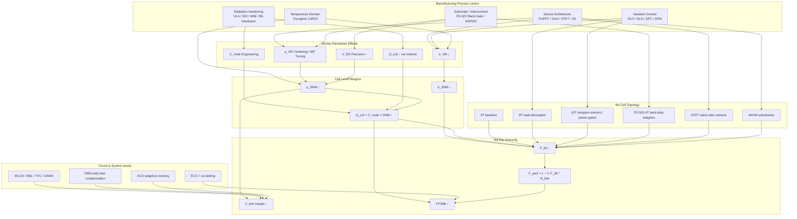

# Enhancing the Static Noise Margin of SRAM Through Advances in Chip Manufacturing Processes: Pathways to Stable Storage and Bit-Flip Resilience
# 1 Fundamentals of SRAM Static Noise Margin, Bit-Flip Mechanisms, and Scaling Impact

Static Random Access Memory (SRAM) occupies a uniquely demanding position in modern integrated circuits: as the densest array of minimum-geometry transistors on virtually every system-on-chip, it concentrates the most aggressive scaling, the tightest layout pitches, and the worst-case manifestations of variability and noise. Whether an SRAM array sustains its stored bits indefinitely—or randomly flips them under the combined assault of process mismatch, voltage droop, temperature stress, and ionizing radiation—is governed by a single, unifying metric: the Static Noise Margin (SNM). Before any meaningful discussion can proceed about how chip manufacturing advancements raise SNM and suppress bit flips, the metric itself, the mechanisms that degrade it, and the scaling trajectory that has steadily compressed it must be placed on a rigorous footing. This opening chapter establishes that foundation. It defines SNM at the device and circuit level, distinguishes the operating-mode-dependent margins that connect SNM to bit-flip probability, catalogs the physical disturbance sources that erode it, and benchmarks how each successive CMOS node has eroded the available margin—thereby motivating the process-level countermeasures examined in the remainder of the report.

## 1.1 Definition and Measurement of SNM in 6T SRAM Cells

The canonical 6-transistor (6T) SRAM bit-cell is, electrically, a pair of cross-coupled CMOS inverters latched into one of two stable states, flanked by two NMOS access (pass-gate) transistors that connect the internal storage nodes to the differential bitlines (BL and BL̄) under the control of the wordline (WL).[^1] Conventionally the four inverter transistors are partitioned into two pull-up (PU) PMOS devices and two pull-down (PD) NMOS devices, while the access transistors are designated as pass-gate (PG) NMOS.[^2] The relative drive strength of these three transistor classes determines whether, and how robustly, the cell holds its state. The cell ratio (CR), defined as the W/L ratio of the driver (PD) transistor to that of the access (PG) transistor, and the pull-up ratio (PR), defined as the W/L ratio of the load (PU) transistor to the access transistor, are the two design knobs through which the bit-cell designer tunes the equilibrium between read stability and write-ability.[^1][^3]

The Static Noise Margin was first formalized by Seevinck, List and Lohstroh as "the maximum value of the static voltage noise that can be tolerated by an SRAM cell without flipping state."[^2] Operationally, SNM is extracted from the voltage transfer characteristics (VTC) of the two cross-coupled inverters: when one inverter's VTC is plotted together with the mirrored VTC of the other inverter on the same axes, the result is the well-known *butterfly curve*. The SNM equals the side length of the **largest square that can be inscribed inside the smaller of the two "wings"** of the butterfly.[^2][^1] Because the procedure compares two VTCs whose axes are rotated 45° with respect to each other, many practical extractions explicitly rotate the VTC pair by 45° before fitting the embedded square, a step that reduces the SNM determination to a one-dimensional search problem.[^3]

Beyond the classical butterfly construction, two complementary methods have emerged. The **N-curve method**, derived from the current injected at one storage node as the node voltage is swept, yields read-stability and write-ability metrics that map onto SNM in a more measurement-friendly form, particularly when DC noise injection at internal nodes is impractical.[^4][^5] The **write noise margin (WNM)** is similarly extracted as the largest square embedded between the read VTC and the write VTC under the WNM biasing condition (BL and BL̄ both pre-charged to V_DD with WL high), providing a graphical analog of write stability.[^5]

Although SNM simulation is routine in cell design, **direct silicon measurement of SNM remains uncommon** because the internal storage nodes of a foundry-supplied bit-cell are not externally accessible.[^2] Three measurement strategies have historically been used: adding probe points to internal nodes, fabricating isolated standalone cells with bumped internal nodes, and inferring SNM indirectly from cell-trip-point shifts (the indirect approach is well suited only to write SNM).[^2] To overcome these limitations, Yao et al. proposed a **direct measurement test structure** in which transmission gates (TG) sized identically to the bit-cell transistors connect the internal nodes (B, C, NC) of a foundry 14 nm high-density cell to chip I/Os through a row/column-decoded TG hierarchy, with the cross-coupling between the right and left inverters intentionally cut to eliminate disturbance from the un-measured side.[^2] By carefully limiting the cumulative voltage drop across the multi-stage TG path (constrained to <1 % of V_DD, i.e. <8 mV at V_DD = 0.8 V) and embedding "Cal" calibration cells to monitor and compensate IR drops, the structure achieves a worst-case error of only 4.0 % between simulated test-structure SNM and the direct cell SNM across TT/SS/FF corners, V_DD ranging 0.7–0.9 V, and –55 °C to 125 °C.[^2] Representative directly extracted values at 14 nm are reproduced in Table 1.1, illustrating both the relative magnitudes of the three SNMs and the temperature/corner sensitivity of each.

| Corner | Write SNM (V) | Read SNM (V) | Hold SNM (V) |
|---|---|---|---|
| –55 °C, 0.9 V, FF | 0.291 | 0.138 | 0.357 |
| 27 °C, 0.8 V, TT | 0.267 | 0.149 | 0.340 |
| 125 °C, 0.7 V, SS | 0.238 | 0.140 | 0.298 |

*Table 1.1. Directly measured SNMs of a foundry 14 nm high-density SRAM via transmission-gate test structure.*[^2]

These figures already foreshadow a key insight that will recur throughout the report: read SNM (RSNM) is the smallest of the three margins by a wide factor (~2.4× smaller than hold SNM at TT), and is therefore the dominant gatekeeper against bit flips.

## 1.2 Read, Write, and Hold Margins and Their Link to Bit-Flip Events

A 6T SRAM cell operates in three distinct modes—**hold (standby/retention), read, and write**—and each imposes a structurally different stability constraint, producing three different SNMs.[^1][^6] In **hold mode**, WL is deactivated, the access transistors are off, and the storage nodes are isolated from the bitlines; the cross-coupled latch sustains the data with very low static power, and the pertinent metric is the hold SNM, equivalent to the noise margin of a free-standing back-to-back inverter pair.[^1] In **read mode**, WL is asserted while both BL and BL̄ are pre-charged to V_DD; current flows from the pre-charged bitline through the access transistor onto the internal node storing "0", forming a resistive divider between the access (PG) transistor and the driver (PD) transistor that **lifts the "0" node above ground**.[^5][^3] If this voltage rise drives the gate of the opposing PMOS load below its threshold, the cell flips—a destructive read. The voltage divider therefore makes RSNM the **lowest** of the three margins; the directly measured 14 nm data show RSNM ≈ 0.149 V versus hold SNM ≈ 0.340 V at TT, a 2.3× compression.[^2] In **write mode**, BL and BL̄ are driven to opposite rails by a low-impedance write driver and WL is asserted; the metric of interest, the write margin (WM), is the BL or WL voltage at which the cell flips into the new state.[^6][^2]

A fundamental and unavoidable trade-off binds these margins together: **strengthening the cell for read stability necessarily weakens its writability, and vice versa**.[^2][^6] As Yao et al. plainly state, "the greater read or hold stability of an SRAM cell, the more difficult it is to write to it, and vice versa."[^2] Quantitatively, RSNM scales positively with the cell ratio CR = W_PD/W_PG, because a stronger driver clamps the "0" node closer to ground during a read; SNM analyses across nodes confirm SNM rising monotonically with CR (e.g., 350 nm 6T data show SNM increasing from 350 mV at CR = 0.35 to 370 mV at CR = 1.4).[^1] Write margin, conversely, scales positively with PR but is degraded by an over-strong PU pMOS that resists being pulled down through the PG transistor.[^1][^6] Huard et al. visualize this as an SNM-vs-WM Pareto frontier in which any process or aging shift that strengthens PMOS pull-up (decreasing the W_PG/W_PU current ratio, RAT_PGPU) moves the cell toward a write-limited corner, while shifts that weaken PMOS push it toward a read-limited corner.[^6]

The **link between margin collapse and bit-flip events** is direct: when SNM in any operating mode shrinks to the magnitude of the static or transient noise voltage actually present at the storage node, the cell flips. SNM thus acts as a unifying gatekeeper against two structurally distinct failure classes:

- **Soft errors** are transient, non-recurring upsets in which the stored data is corrupted but the cell hardware remains intact; if the corrupted location is rewritten, normal operation resumes.[^7] The archetypal soft error is a single-event upset (SEU) caused by an ionizing particle depositing enough charge on a sensitive node to overcome the storage charge—mathematically, when the deposited charge exceeds the cell's critical charge Q_crit, which is itself proportional to SNM and node capacitance.[^7][^1] Karnik et al. enumerate the four soft-fail modes as failure to write, failure to read (insufficient bitline signal), stability upset during a read or half-select, and data-retention failure—each first occurring at the distribution tail driven by global and local variation, i.e., at cells with the lowest SNM.[^1][^7]
- **Hard errors** are permanent failures attributable to manufacturing defects (broken transistors, opens/shorts) and are not addressable by raising SNM, although a higher SNM provides additional guardband against marginal defects that would otherwise manifest as parametric hard failures.[^1]

Two further linkages between SNM and bit-flip events deserve emphasis. First, NBTI-induced pMOS V_TP drift directly translates into SNM degradation; Huard et al. demonstrated experimentally and through Design-in-Reliability simulations that **SNM shift is linearly proportional to V_TP shift**, with the proportionality constant dSNM growing as V_core decreases.[^6] A 200 mV V_TP shift on the PU pMOS produces an SNM shift on the order of 25–30 mV at V_core = 0.7×V_DD, i.e., a non-negligible erosion of the read margin during product life.[^6] Second, the cell's bit failure probability F_bit is a tail-of-distribution quantity: assuming approximately Normal SNM and WM distributions, F_bit_read is the probability that SNM ≤ 0 and F_bit_write is the probability that WM falls below the operationally allowed threshold; the total F_bit, together with the array bit count N_bits, fixes the product failure probability F_part = 1 − (1 − F_bit)^N_bits.[^6] In a 1 Mb array, even a six-sigma cell-level F_bit can already approach the system reliability budget, underscoring why **modest SNM tightening at the distribution tail is far more important than the mean SNM** for chip-level reliability.[^6]

## 1.3 Disturbance Sources Eroding SNM

The SNM available in a manufactured cell is not the schematic-level SNM but rather the schematic value perturbed by a multi-physics ensemble of disturbances. Modern process characterization decomposes these disturbances into intrinsic (process- and device-physics-driven) and extrinsic (operating-environment-driven) categories, each contributing additively or in quadrature to the variance of SNM.

### 1.3.1 Intrinsic Process Variability

The dominant intrinsic source at advanced nodes is **random dopant fluctuation (RDF)**—the discrete and random number and spatial location of channel and source/drain dopants in nanoscale transistors.[^8][^9] Because SRAM uses minimum-geometry devices and SNM is determined by the *mismatch* between the nominally identical neighboring transistors, RDF drives device-to-device V_th variation that translates linearly into SNM dispersion.[^8] Li, Hwang and Li demonstrated through 3-D atomistic device-circuit coupled simulations that as planar gate length scales from 65 nm to 16 nm, the **RDF-induced SNM fluctuation grows from 4 % to 27.2 %**, a 6.8× amplification, while RDF-induced V_th fluctuation rises from 15.8 mV to 61 mV in the NMOS and from 13.4 mV to 58.8 mV in the PMOS.[^9] At 16 nm planar, RDF dominates over process-variation effects (PVE—gate-length deviation and line-edge roughness) by a factor of 3.7 in SNM variation (27.2 % vs. 7.4 %).[^9] The complementary work on UTB SOI cells confirms that around the 65 nm node "fluctuations will eliminate much of the available noise margin" and that RDF in the source/drain regions of UTB SOI devices, together with body-thickness fluctuations and line-edge roughness, perturb the effective channel length and access resistance enough to drive read-failure and write-failure tails.[^8] Theoretical and simulation work attributes the RDF-induced V_th spread to Asenov's well-known √(N_dop·t_ox/A_G)-style scaling, in which V_th variance grows inversely with gate area—precisely why minimum-geometry SRAM cells are the canaries of every new node.[^9][^6]

### 1.3.2 Supply-Voltage Scaling and V_min

SRAM cell stability scales with V_DD because every margin (RSNM, WM, hold SNM) is, to first order, proportional to a fraction of V_DD minus a sum of threshold voltages.[^1][^3] Empirical 45 nm and 32 nm data show **read SNM rising from ~24 mV at V_DD = 0.1 V to ~258 mV at V_DD = 1.0 V** (45 nm) and from ~28 mV to ~246 mV over the same V_DD range at 32 nm, with read stability increasing 231 % between V_DD = 0.7 V and 1.2 V according to a complementary 6T study.[^3][^5] V_min—the minimum supply at which both read and write operations succeed—has therefore become a first-order reliability metric, and **NBTI-induced V_TP drift directly translates into V_min drift**; ST Microelectronics burn-in data on 65 nm and 45 nm Low-Power SRAM arrays show V_min drift correlating with V_TP shift along identical t^0.275 V^4.30 power-law–type kinetics, confirming that SNM erosion under voltage stress and reliability stress are physically the same mechanism viewed at different levels.[^6]

### 1.3.3 Temperature and Reliability Stress

Temperature affects SNM through two channels: V_th(T), which lowers RSNM at high temperatures, and corner-skew interaction (the SS corner is most stressful at high T and low V_DD).[^2] Negative Bias Temperature Instability (NBTI) is the dominant reliability-driven contributor to long-term SNM degradation. Huard et al.'s composite NBTI model demonstrates that the V_TP shift is the difference of two Poisson-distributed processes (interface-trap creation and hole trapping/de-trapping), yielding a **Skellam distribution with a non-Normal high-shift tail** that, although smoothed by time-zero variation across the six bit-cell transistors, still requires both mean-shift and dispersion-increase contributions to be modeled to predict V_min drift accurately.[^6] The implication for SNM is that aging amplifies the variability tail rather than merely shifting the mean, making the dispersion component of NBTI the dominant contributor to read-limited bit failure at end-of-life.[^6]

### 1.3.4 Radiation-Induced Disturbance

Soft errors caused by single-event upsets (SEUs) constitute the dominant transient bit-flip mechanism in modern SRAMs and are quantitatively described by the **critical charge Q_crit**—the minimum charge that, when collected on a storage node, flips the cell.[^7] Q_crit is approximately the product of the storage node capacitance and SNM, so SNM erosion through any of the previously listed mechanisms simultaneously lowers Q_crit and increases the SEU-induced soft-error rate (SER).[^7] Three radiation sources are relevant at terrestrial altitudes:

- **Alpha particles** emitted by uranium-238, thorium-232 and their daughter products in package materials (lead solder, mold compounds, BPSG), with energies of 3–10 MeV and ranges of 15–30 µm in silicon, depositing up to ~100 fC of charge—well above typical 90 nm node Q_crit values of 1–10 fC.[^7]
- **High-energy cosmic-ray neutrons** with a 20 neutrons cm⁻²·hr⁻¹ flux above 10 MeV at sea level (New York City), which interact via inelastic nuclear collisions producing primary knock-on atoms (PKAs) with high LET. Although only ~1 in 40 000 neutrons hits a silicon nucleus in the first 10 µm of a device, the resulting secondary ions deposit enough localized charge to flip cells, and the neutron-induced SER per bit was found in a 90 nm Intel study to **rise by ~18 % for every 10 % reduction in V_DD** (over the 0.8–1.2 V range), with N+ drains 2.2× more sensitive than P+ drains because of the lower collection efficiency of the P+ drain inside the N-well.[^7]
- **Boron-10 thermal-neutron capture** historically dominant when BPSG was used as an interlayer dielectric (boron-10 has a ~5000-barn cross-section, capturing a thermal neutron and emitting a 1.5 MeV alpha plus a Li nucleus), responsible for as many as 81 % of SEUs in 0.25 µm SRAMs but largely eliminated by removing BPSG from sub-quarter-micron processes.[^7]

A fourth mechanism, **muon-induced soft errors**, has emerged as a concern at advanced nodes where Q_crit has fallen low enough that even the modest charge deposited by terrestrial muons becomes upset-relevant.[^10] Available evidence indicates this mechanism is "an increasing concern with technology scaling," although quantitative rates remain less well characterized than for neutrons and alphas.[^10] [Inferred boundary: muon contribution becomes non-negligible when Q_crit drops into the sub-fC regime, but exact crossover nodes are not specified in the retrieved sources.]

### 1.3.5 Transient Coupling Noise

Bitline and wordline coupling, supply droop, ground bounce, and crosstalk inject transient voltages onto storage nodes. Although each event individually may not exceed SNM, their statistical superposition with intrinsic mismatch and aging-induced V_th drift can flip cells whose static SNM has been eroded to the millivolt scale. SRAM Variability and Supply Voltage Scaling Challenges identifies these coupling mechanisms as part of the integrated threat model alongside NBTI and process variation.[^11] Because such transient noise is largely determined by bitline-loading and wordline-driver topology rather than by the bit-cell process itself, this report treats transient coupling as a boundary condition to which process improvements (e.g., regular layout, ULA packaging, deep N-well isolation) must be made robust, rather than as a primary process-mitigation target.

### 1.3.6 Quantitative Synthesis

Table 1.2 consolidates the principal disturbance sources, the SNM-relevant quantitative anchors retrieved from the literature, and the directionality of the impact.

| Disturbance | Quantitative Anchor | Net Effect on SNM / Bit-Flip |
|---|---|---|
| RDF (planar 16 nm vs 65 nm) | σ(V_th,RDF) 15.8 → 61 mV; SNM fluctuation 4 % → 27.2 % | Drives tail of read-fail distribution |
| PVE (gate length, LER) at 16 nm | σ(V_th,PVE) ~16–18 mV; SNM fluctuation 7.4 % | Adds in quadrature to RDF |
| V_DD scaling (32/45 nm 6T) | RSNM ~24 mV @ V_DD=0.1 V → ~258 mV @ V_DD=1.0 V | Quasi-linear collapse with V_DD |
| NBTI (65/45 nm LP) | V_TP drift t^0.275 V^4.30; dSNM/dV_TP linear, larger at low V_core | Aging-driven mean + dispersion shift |
| Alpha particles | Up to 100 fC deposited; range 15–30 µm in Si | Flips low-Q_crit cells |
| Cosmic-ray neutrons | ~20 n/cm²/h above 10 MeV at sea level; 18 % SER rise per 10 % V_DD reduction | Dominant SER above ~250 nm node |
| Boron-10 thermal n | 5000-barn cross-section; up to 81 % SEU in 0.25 µm SRAM | Eliminated by BPSG removal |
| Muon-induced | Increasing concern at scaled nodes; quantitative rates GAP in retrieved data | Emerging at sub-fC Q_crit |

*Table 1.2. Quantitative landscape of SNM-eroding mechanisms, compiled from cited sources.*[^9][^8][^3][^6][^7][^10]

The critical observation from Table 1.2 is that **RDF- and PVE-induced variability, NBTI aging, and SEU charge collection are not independent stressors but coupled through the same Q_crit ≈ C_node × SNM relation**: any process improvement that raises mean SNM and tightens its distribution simultaneously raises Q_crit and lowers SER, while any process improvement that increases C_node (e.g., MIM cell capacitors) raises Q_crit independently of SNM. This coupling is precisely what makes process-level innovation, the subject of the rest of this report, the central lever for SRAM stability.

## 1.4 SNM Behavior Across CMOS Technology Nodes

The cumulative impact of the disturbance mechanisms catalogued above plays out as a measurable scaling trajectory in which SNM, V_min, Q_crit and SER per bit have all changed in a tightly coupled way across two decades of CMOS. Figure-of-merit data from multiple sources can be integrated into a node-by-node picture as summarized in Table 1.3.

| Node / Architecture | Nominal V_DD | Key SNM-relevant Data |
|---|---|---|
| 350 nm planar 6T | 2.5 V | Hold SNM ≈ 533 mV (butterfly); RSNM ≈ 132 mV; SNM rises from 81 mV to 109 mV as CR goes 0.35 → 1.4[^1] |
| 65 nm planar 6T | 1.2 V | Nominal SNM 138 mV; σ(V_th,RDF)=15.8 mV; SNM fluctuation 4.3 % (RDF) + 2.38 % (PVE)[^9] |
| 45 nm planar 6T | 1.0 V | RSNM ≈ 258 mV @ V_DD=1.0 V, CR=3; SNM fluctuation rises sharply from 65 nm baseline[^3][^6] |
| 32 nm planar 6T | 1.0 V | RSNM ≈ 246 mV @ V_DD=1.0 V, CR=3; degradation vs 45 nm at low V_DD[^3] |
| 16 nm planar 6T | 1.0 V | Nominal SNM <60 mV (sub-functional); SNM fluctuation 27.2 % (RDF) + 7.4 % (PVE)[^9] |
| 16 nm SOI FinFET 6T (AR=2) | 1.0 V | Nominal SNM 125 mV (≈ 65 nm planar); SNM fluctuation 5.3 % (RDF) + 1.2 % (PVE)—5× tighter than 16 nm planar[^9] |
| 14 nm bulk FinFET HD 6T | 0.8 V | Read SNM 0.149 V, Write SNM 0.267 V, Hold SNM 0.340 V (TT, 27 °C, directly measured)[^2] |
| 5 nm FinFET (TSMC platform) | <0.8 V | Densest 0.021 µm² high-density bit-cell; full EUV; high-mobility-channel FinFETs[^12] |
| 3 nm GAA (Samsung) | <0.8 V | Adaptive dual-BL and adaptive cell-power assist required to recover V_min margin[^12] |

*Table 1.3. SNM and related stability metrics across CMOS scaling, integrated from the cited references.*[^1][^9][^3][^6][^2][^12]

Three observations emerge from this trajectory.

**First, the mean SNM has been compressed roughly in step with V_DD**, but the variance has grown super-linearly. The ratio of σ(SNM)/μ(SNM) increases from a few percent in the 65 nm node to over a quarter at 16 nm planar, a regime in which a non-trivial fraction of cells have nominal SNM below the realistic noise envelope and the array fails outright unless a different device architecture is adopted.[^9] The simulation-based prediction that 16 nm planar SRAM "may make the function of SRAM failed" was empirically validated by industry's near-universal pivot to multi-gate architectures at and below the 22 nm node.[^9][^12]

**Second, the device-architecture transition from planar bulk to multi-gate (FinFET, GAA nanosheet) has been the single largest discrete improvement** in SRAM stability since the introduction of the 6T cell. Li, Hwang and Li's atomistic simulations show that replacing 16 nm planar with a 16 nm SOI FinFET (aspect ratio 2) **suppresses RDF-induced σ(V_th) from 63.6 mV to 43 mV and shrinks SNM fluctuation by 5×** (from 27.2 % to 5.3 %), restoring nominal SNM (125 mV) to a level comparable to the 65 nm planar baseline.[^9] The mechanism is well-understood: the multi-gate channel can be left undoped or near-intrinsic because electrostatic control comes from the gate geometry rather than channel doping, and the larger effective device width per footprint lowers σ(V_th) ∝ 1/√W·L.[^9] Experimental confirmation comes from foundry data showing 14 nm and 16 nm FinFET 128 Mb SRAMs achieving low-V_min operation through write-assist circuitry built atop a fundamentally lower-variability device.[^12] Industry literature places the FinFET Pelgrom A_VT at ~1.96 mV·µm versus ~0.99 mV·µm for GAA MOSFETs and ~0.66 mV·µm for advanced ferroelectric variants, indicating a continued nanosheet-driven matching improvement at 3 nm and below.[^13]

**Third, soft-error sensitivity per bit has exhibited a more nuanced scaling pattern than V_th matching.** Karnik et al.'s 90 nm process characterization at LANSCE found neutron SER rising only ~8 % per generation from 0.25 µm to 90 nm in Intel SRAM, whereas other studies reported up to 2× per generation in some 6T cells from 0.25 µm to 0.14 µm and a 4× rise from 0.25 µm to 0.14 µm in another study—the spread reflecting different bit-cell layouts, supply voltages, and well structures.[^7] Two scaling-driven trends are robust across studies: (i) **at scaled nodes, alpha contribution grows relative to neutrons** because Q_crit decreases more steeply for the alpha LET regime, and was historically counteracted only by reducing alpha-emitting impurity concentrations in packaging materials;[^7] (ii) **partially-depleted SOI delivers a ~5–7× SRAM SER reduction over bulk** at 0.25–90 nm because the thinner collection volume reduces collected charge for both alphas and neutrons, while the parasitic bipolar amplification in PD-SOI sets a floor that is typically broken only by hardened SOI variants with substrate taps.[^7]

**Fourth, the absolute level of SNM at advanced nodes can no longer be sustained without architectural and assist-level intervention.** Foundry production papers from 16 nm, 14 nm, 10 nm, 7 nm, 5 nm, and 3 nm nodes all incorporate write-assist or read-assist circuitry to restore an effective V_min margin that the bit-cell alone cannot deliver—write-assist for 16 nm and 7 nm high-k metal-gate FinFET 128 Mb / 256 Mb SRAMs, dual-split-control assist for 28 nm 256 kb 6T-SRAM yielding 280 mV V_min improvement, assist-adjustment systems for 10 nm FinFET, and adaptive dual-BL and adaptive cell-power assist for 3 nm GAA SRAM.[^12] The progression confirms a key thesis of this report: as scaling continues, **process improvements alone are increasingly insufficient at advanced nodes**, and Design-Technology Co-Optimization (DTCO) becomes essential—a theme to which Chapter 6 returns.

The combined picture from the four subsections of this chapter is therefore the following. SNM is the unifying gatekeeper between a manufactured SRAM cell and the bit-flip events—soft and hard, instantaneous and aging-driven, variability- and radiation-induced—that threaten its stored data. The metric is well defined (Seevinck embedded square), measurable directly (TG-based test structures), and operationally partitioned into hold, read, and write versions whose mutual trade-off is fixed by CR and PR. The disturbance landscape is multi-physics, with RDF, NBTI, V_DD scaling and SEU charge collection mathematically coupled through the Q_crit = C_node × SNM relation. The scaling trajectory has compressed mean SNM and amplified its variance to the point where, at planar 16 nm, the cell becomes non-functional, and only the device-architecture transition to multi-gate transistors—a manufacturing-process innovation—has restored stability at the cost of higher process complexity and persistent reliance on assist circuits. The remaining chapters of this report dissect, quantify, and prioritize the manufacturing-process levers—transistor-level architecture, variation control, radiation hardening, bit-cell topology enablement, DTCO, and emerging-technology transitions—that can continue to elevate SRAM SNM and suppress bit flips in nodes where conventional CMOS can no longer hold the line.

# 2 Transistor-Level Process Innovations for SNM Enhancement

Chapter 1 established that by the 16 nm planar node, the cumulative effect of random dopant fluctuation, supply-voltage compression, and aging-induced V_th drift had eroded SRAM Static Noise Margin to a point where the cell, on its mean-and-variance budget alone, was no longer functional. The empirical response of the industry has not been to redesign the 6T topology—which remains, in production at 3 nm, the same six-transistor cross-coupled latch first formalized in the 1970s—but rather to **replace the transistor itself**. The single largest improvements in SRAM stability over the past two decades have come from device-level manufacturing changes: the move from planar bulk to FinFET, the further evolution to gate-all-around (GAA) nanosheet/MBCFET, the parallel branch of fully-depleted silicon-on-insulator (FD-SOI) with back-gate biasing, and the supporting innovations of strain engineering and high-k/metal-gate (HKMG) stacks with metal work-function tuning. This chapter dissects each of these process levers, mapping them onto the three SNM-determining figures of merit—σ(V_th) reduction (Pelgrom A_VT), drive-strength ratio control (CR, PR), and the resulting read/write/hold margins—and quantifies the SNM uplift that each innovation contributes at the technology node where it became essential.

The unifying analytical framework is causal: a manufacturing decision (e.g., undoping the fin channel) modifies a device parameter (σ(V_th)), which reshapes the butterfly-curve embedded square (SNM), which in turn raises Q_crit ≈ C_node × SNM and lowers bit-flip probability. Wherever a process innovation breaks this chain at multiple points—as FinFET does, by simultaneously suppressing RDF, improving electrostatic control, and enabling lower V_DD operation—the SNM gain compounds. Wherever an innovation only reshapes one segment of the chain (as strain engineering does, primarily by altering CR/PR), the gain is bounded and must be co-optimized with V_th-centering levers to avoid driving the cell off the SNM-vs-WM Pareto frontier articulated in Chapter 1.

## 2.1 From Planar Bulk to Multi-Gate: FinFET-Driven SNM Recovery

The transition from planar bulk CMOS to the tri-gate FinFET, first introduced in volume production at the 22 nm node by Intel in 2011 and adopted at 16/14 nm by foundries shortly thereafter, constitutes the single most consequential process innovation for SRAM stability since the 6T cell was conceived. The mechanism is straightforward but operates at multiple levels of the process-to-margin causal chain. By raising the channel into a thin three-dimensional fin wrapped on three sides by the gate, the FinFET architecture decouples threshold-voltage control from channel doping: the strong electrostatic confinement provided by the wrap-around gate suppresses short-channel effects without requiring the heavy halo and channel implants that planar bulk devices had relied on at 32 nm and 22 nm. Because the channel can be left undoped or only lightly doped, the discrete-dopant statistics that drove RDF are largely removed at their source.

The quantitative consequence for SNM is dramatic. Atomistic device-circuit coupled simulation by Li, Hwang and Li, summarized in Chapter 1 and revisited here as the device-level baseline, shows that a 16 nm SOI FinFET 6T cell with aspect ratio 2 reduces RDF-induced σ(V_th) from 63.6 mV (planar 16 nm) to 43 mV, while the SNM fluctuation collapses from 27.2 % to 5.3 %—a five-fold tightening that restores the variability tail of a 16 nm cell to a level comparable to the 65 nm planar baseline. The 65 nm-planar SNM fluctuation, recall, was 4.3 % from RDF plus 2.38 % from process-variation effects (PVE), giving a combined σ(SNM)/μ(SNM) on the order of 5–7 %; the 16 nm SOI FinFET, with 5.3 % RDF + 1.2 % PVE, reaches an aggregate fluctuation that is **lower than the 65 nm planar reference at less than one-quarter the gate length**. The Pelgrom matching coefficient A_VT, which is the dominant figure of merit for SRAM mismatch and thus for the lower tail of the SNM distribution, is reported in industry literature as approximately 1.96 mV·µm for FinFET versus the higher values typical of late-generation planar HKMG devices.

Production silicon corroborates the simulation evidence. Direct measurement of a foundry 14 nm bulk-FinFET high-density 6T cell via the transmission-gate test structure introduced in Chapter 1 yields read SNM = 0.149 V, write SNM = 0.267 V, and hold SNM = 0.340 V at TT corner, 27 °C, V_DD = 0.8 V—margins that, when normalized to V_DD, are comparable to or better than those of late-planar 32/45 nm cells operating at V_DD = 1.0 V. At the production-array level, TSMC has demonstrated a **128 Mb 0.07 µm² 6T high-density SRAM bit-cell with write-assist circuitry implemented in 16 nm high-k metal-gate FinFET technology**[^14], and Intel has reported a **4.6 GHz 162 Mb SRAM in 22 nm tri-gate bulk technology with 3rd-generation high-k metal-gate transistors and 5th-generation strained silicon, equipped with integrated active V_min-enhancing assist circuitry to address process variation and fin quantization**[^15]. The Intel description is doctrinally important: the foundry attributes its low-V_min delivery jointly to the FinFET device, the HKMG stack, and the integrated assist circuitry, signaling that **even at 22 nm the FinFET alone could not deliver the V_min target without circuit-level support**—a theme that will intensify at every subsequent node.

Two FinFET-specific properties shape the SNM design space at 22/16/14/10/7 nm. First, the FinFET introduces **fin quantization**: device width is no longer a continuous design variable but is restricted to integer multiples of the fin pitch. The cell ratio CR = W_PD/W_PG and pull-up ratio PR = W_PU/W_PG can therefore only be tuned in discrete steps (e.g., 2-fin PD vs 1-fin PG to set CR = 2), which limits the granularity with which a designer can sweep the SNM-vs-WM Pareto frontier. The Intel 22 nm work explicitly cites fin quantization as a stability challenge addressed by the active V_min-enhancing assist[^15]. Second, the undoped fin channel shifts the dominant residual mismatch source from RDF to **work-function variation (WFV)** in the metal gate, a topic developed in Section 2.5—the variability has not been eliminated, only relocated, and its grain-orientation-driven origin has different statistics from the Poisson-style RDF it replaced.

The FinFET's contribution to bit-flip resilience extends beyond static SNM. Because the multi-gate architecture supports lower V_DD operation while still meeting drive-current targets, and because the smaller drain volume reduces the charge collected from a single ionizing strike, FinFET SRAMs have been shown to deliver **better stability in both Static Noise Margin and Read Noise Margin** during read operations than planar counterparts[^16]. This combination of tighter σ(V_th), better RSNM, and lower charge-collection volume is what permits production FinFET SRAMs to operate at sub-0.8 V supplies that planar designs could not have sustained.

## 2.2 Gate-All-Around Nanosheet and MBCFET: SNM Scaling Beyond FinFET

By the 5 nm node the FinFET architecture, although still functional, was approaching its own electrostatic ceiling: aggressive fin-width scaling below ~5 nm degraded mobility and increased variability, and the integer-fin quantization severely constrained DTCO flexibility. The industry's response was a second discrete architectural transition—from tri-gate FinFET to fully wrap-around gate-all-around (GAA) nanosheet, marketed by Samsung as the Multi-Bridge-Channel FET (MBCFET™) and introduced into mass production at the 3 nm node (SF3) in 2022[^17]. The GAA nanosheet stacks two to four horizontally oriented Si sheets, each fully surrounded by the gate and high-k dielectric, providing the maximum possible electrostatic control for a given footprint and removing the fin-quantization constraint that had limited FinFET width tunability.

For SRAM SNM, the GAA architecture delivers improvements on three coupled axes simultaneously. Samsung reports that the **MBCFET™ delivers +60 % stronger drivability and +35 % wider speed range over FinFET, together with up to −26 % lower variation**[^17]—the variation reduction being the figure of direct relevance to σ(SNM) and bit-flip immunity. Concretely, a 26 % reduction in σ(V_th) translates, through the linear sensitivity dSNM/dV_th characterized in Chapter 1, into a comparable tightening of the SNM distribution lower tail, lowering the per-bit failure probability F_bit_read by orders of magnitude in the multi-σ regime where F_part is determined. The Pelgrom matching coefficient A_VT progression cited at industry level is approximately **1.96 mV·µm for FinFET → 0.99 mV·µm for GAA MOSFETs**, an additional ~2× matching improvement on top of the FinFET's already-significant gain over planar bulk.

The second SNM-relevant GAA advantage is the **continuous tunability of nanosheet width**. Whereas FinFET CR/PR can only be stepped in integer-fin units, GAA permits the foundry to fabricate cells with a range of effective widths by varying the lithographically defined sheet width, providing what Samsung describes as "GAA optimization with controlling various effective widths" as one of the principal DTCO levers[^17]. The platform supports "standard cell placement without any restriction" and "cell usage optimization with various nano-sheet sizes," allowing speed and power to be optimized separately[^17]. For SRAM, this translates into a continuous knob to set the CR/PR drive ratio at the precise point on the SNM-vs-WM Pareto frontier dictated by the application's V_min target—a flexibility the FinFET could not provide.

The GAA architecture, however, introduces **new variability sources of its own** that the SNM analysis must account for. Three are documented in the retrieved literature. First, **metal thickness variation (MTV)** on the gates of stacked GAA sheets causes work-function variations across the nanosheet stack, producing a threshold-voltage variability mechanism distinct from FinFET WFV[^18]. Because each sheet in a multi-sheet stack sees a slightly different metal-gate thickness, the effective V_th is an average over slightly mismatched sheet contributions, and the variance scales with the square root of the number of sheets—giving GAA a partial averaging benefit that FinFET cannot match, but only when MTV is the dominant noise source. Second, **quantum-confinement variation** becomes significant in sub-5-nm-thick nanosheets: a 2-D Poisson-Schrödinger study calibrated against experimental data shows that for ultra-thin nanosheet transistors the **electrostatic-driven performance drops sharply, boosted by quantum-confinement variation**, and that channel-geometry variation, round-corner effects, and thin-channel effects compound to introduce a new σ(V_th) contribution that did not exist in thicker FinFET channels[^19]. Third, scaling the GAA gate length toward the 10 nm "ultimate" target for sub-2-nm nodes brings additional electrostatic and process challenges that the existing 12 nm GAA gate-length baseline does not yet face[^20], and **performance- and variability-aware DTCO** is reported as the principal route to navigating these new constraints[^21].

These trade-offs explain why the 3 nm GAA platform, despite its variability advantage, still **requires assist circuitry** to deliver its V_min target. As noted in Chapter 1, the Samsung SF3 platform deploys adaptive dual-BL and adaptive cell-power assist on the 3 nm GAA SRAM macro—evidence that GAA, like FinFET before it, is necessary but not sufficient for sub-0.7 V operation. Looking forward, the same Samsung roadmap identifies three successor stages for SRAM-relevant transistor innovation: **MBCFET with backside power delivery network (BSPDN)** to address IR drop and standard-cell-height limits; **3D stacked structures (3DSFET)**, including the complementary FET (CFET) configuration that vertically stacks nMOS and pMOS sheets; and ultimately **2D-material channels** whose strong intrinsic confinement could in principle deliver further σ(V_th) compression, although contact resistance and gate-dielectric interface quality remain unresolved obstacles[^17]. These long-horizon directions are revisited as forward-looking levers in Chapter 8; for the purposes of this chapter they confirm that the GAA architecture is itself a way-station, and that further SNM gains beyond the −26 % MBCFET variation reduction will require coupling architectural progression to packaging and integration innovation rather than to ever-thinner channels.

## 2.3 FD-SOI and Back-Gate Bias Control for Adaptive SNM Tuning

Parallel to the FinFET/GAA branch, **fully-depleted silicon-on-insulator (FD-SOI)** has matured as an alternative process pathway whose SNM-relevant properties are sufficiently distinctive to merit treatment as a separate device-level innovation. The 28 nm UTBB (Ultra-Thin Body and BOX) FD-SOI node, originated at CEA-Leti and licensed to multiple foundries, embeds the transistor channel in an ultra-thin (≤7 nm) silicon film over an ultra-thin (≤25 nm) buried oxide on a bulk silicon handle wafer, with the channel left **undoped**[^22][^23]. The undoped channel removes RDF at its source—exactly as in the FinFET—while the ultra-thin BOX permits a back-gate terminal to be implemented under each transistor through the handle-wafer ground plane, providing a continuous V_th-modulation knob accessible after fabrication.

The CEA-Leti characterization of 28 nm FD-SOI emphasizes its key advantages over bulk CMOS for advanced low-voltage applications: full depletion, the undoped channel, and the wide-range back-bias control[^22]. Hartmann's overview of FD-SOI device development describes the technology as **"especially suited for high speed energy efficient operation, even in low voltage conditions, thanks to the intrinsic characteristics offered by being fully depleted"**[^15]. At a quantitative level, GlobalFoundries' 22 nm FD-SOI generation has been reported to **reduce power consumption by 70 % compared to 28 nm HKMG and reduce chip area by 20 % compared to 28 nm bulk**, while the photolithography layer count is also reduced[^24]—gains that translate, in SRAM, into a wider available V_min margin at iso-power and iso-area.

The SNM-enhancing mechanism that distinguishes FD-SOI from FinFET/GAA is **wide-range back-gate bias control**. By applying a forward or reverse body bias through the back-gate terminal, the effective V_th of each transistor can be modulated post-fabrication; in the original Hitachi "Silicon-on-Thin-BOX" (SOTB) demonstration, the device exhibited wide-range back-bias control suitable for low-power high-performance applications, and a 6T SRAM cell incorporating a feedback mechanism that exploits the back-gate provided **even more benefit from the new device structure**[^15]. Asthana et al., working in 28 nm UTBB FD-SOI, exploited the back-gate to derive **four V_T variants per transistor** (forward-biased nMOS / reverse-biased nMOS combined with forward- or reverse-biased pMOS), each variant offering different read- and write-margin profiles[^15]. The key insight is that the back-gate provides a process-enabled, continuous, and per-mode V_T-modulation lever that the FinFET, with its single front gate, fundamentally lacks: read-mode bias can be set to maximize RSNM, while write-mode bias can be reset to maximize WM, breaking the SNM-vs-WM Pareto trade-off that a single-bias FinFET cell must accept.

Several explicit demonstrations of back-bias-driven SNM enhancement are documented. Hirano et al.'s **Advanced ABC technology** for 65 nm-node SOI SRAM demonstrated that "the write and read margins of 65 nm-node SOI SRAMs are improved by the advanced ABC technology, and significant enhancement of static noise margin (SNM) is successfully realized by using a body bias of load transistors while suppressing threshold-voltage variations for the first time"[^15]—a foundational result establishing that back-bias body engineering can simultaneously raise SNM and tighten its variance, the two objectives that any SNM-improving process intervention must achieve together to be useful. Noel et al.'s **multi-V_T 4T SRAM cell in 45 nm thin-BOx FD-SOI with a ground plane** delivered a compact, robust, low-leakage 4T topology that leverages the back-gate to provide multiple V_T targets within a reduced-transistor footprint[^15]. Boumchedda et al. extended the concept to advanced nodes with a **14 nm 3D CoolCube™ high-density 4T SRAM bit-cell employing data-dependent dynamic back-biasing** to improve cell stability, together with a specific read-assist circuit to enable a large number of bit-cells per column[^15]; the authors further reported an **energy-efficient 28 nm 3D-monolithic CoolCube™ 4T-based bit-cell with a 2T read port for ultra-low-voltage operation**, providing major reductions in write-operation energy compared to a conventional 6T at iso-stability[^15]. Grenouillet et al. demonstrated in 20 nm UTBB FD-SOI that **V_th can be tuned by more than 400 mV through back-bias, transistor performance can be boosted by up to 30 %, and I_off can be controlled over three decades, by allowing more than V_DD/2 to be applied on the back gate**[^15]—a tuning range that exceeds anything available in FinFET or GAA back-bias schemes and that maps directly onto the V_min headroom of an FD-SOI SRAM array.

The cumulative picture is summarized in Asthana et al.'s work on 6T SRAM in 28 nm FD-SOI, which states explicitly that **"FDSOI technology with ultra-thin body and box (UTBB) provides a back-gate terminal which can be effectively used to forward bias or reverse bias the MOSFET, resulting in four variants which are differently capable of better read and write margins, enabling lower operating voltage"**[^15]. Combined with extensions of the back-gate biasing concept to 8T and 10T topologies in the same paper, the work establishes FD-SOI as a process branch in which **adaptive, mode-dependent SNM tuning is built into the device** rather than retrofitted via assist circuitry. This positions FD-SOI as particularly attractive for low-V_DD IoT, automotive grade-1, and battery-operated sensor SRAM, where the V_min reduction enabled by back-bias adaptation directly translates into power savings and reliability margin. It also explains why CEA-Leti has positioned 28 nm FD-SOI as a baseline qubit-research substrate—the same characteristics that improve SNM at room temperature (undoped channel, low variability, dynamic V_th tuning) make the technology suitable for cryogenic operation, where soft-error resilience is further improved by the temperature-dependent **increase in SRAM hold noise margin**[^25] discussed further in Chapter 8.

## 2.4 Strain Engineering and Channel-Mobility Boosters

While the channel architectures examined in Sections 2.1–2.3 primarily attack σ(V_th)—the variance dimension of SNM—**strain engineering** operates on a different axis: it raises the *mean* drive current of nMOS and pMOS transistors, reshaping the cell-ratio (CR = I_PD/I_PG) and pull-up-ratio (PR) targets that define the SNM/WM Pareto frontier. The strain toolbox, which Chan et al. catalog comprehensively from the 90/65 nm era forward, is therefore best understood as a CR/PR-engineering toolbox whose successful application requires concurrent V_th centering to keep the cell on the frontier[^26].

The taxonomy of strain techniques relevant to SRAM is set out in Table 2.1, drawing on the comparative summary by Chan et al.[^26]:

| Technique | nMOS Effect | pMOS Effect | Reported Drive-Current Gain | Process Cost / Limitation |
|---|---|---|---|---|
| Biaxial tensile strained-Si on relaxed SiGe | ↑ | ↑ | 15–25 % at sub-100 nm | Misfit/threading dislocations, Ge out-diffusion, self-heating, As-diffusion increase, cost |
| SGOI / SSDOI (strained-Si on insulator) | ↑ | ↑ | 20–25 % at short channel | Wafer-bonding complexity |
| Tensile contact-etch-stop liner (CESL, NMOS) | ↑ | (degrades, unless masked) | +11 % I_on (+17 % self-heating-corrected) | Single-liner type |
| Compressive CESL (PMOS) | (degrades) | ↑ | +20 % I_on | Single-liner type |
| Dual Stress Liner (DSL) | ↑ | ↑ | Ring-osc delay −12 to −24 %; PowerPC F_max/Power +7 %; Athlon64 +12 % | Extra masks; ground-rule constraints at liner boundary |
| Stress Memorization Technique (SMT) | ↑ | ≈ | +15 % NMOS on top of CESL | Extra steps; benefits NMOS only |
| Embedded SiGe S/D (e-SiGe) | ≈ | ↑↑ | ≥ 20 % PMOS I_on | High process complexity; defects at high Ge%; sensitive to S/D overhang |
| Hybrid Orientation Technology (HOT, (110) PMOS) | ≈ | ↑ | +30–40 % PMOS I_on | Wafer-bonding cost; SOI/bulk mixing |
| <100>-channel orientation on (100) wafer | ≈ | ↑ (preserves NMOS gain from tensile CESL) | +20 % PMOS I_on with stressed CESL | No further PMOS-specific stress lever |

*Table 2.1. Strain-engineering process options and their measured drive-current impact, compiled from Chan et al.[^26]*

The SRAM-specific consequence of these mobility boosters is articulated explicitly in the same source, which states that **"stress engineering induced from process integration will affect the V_t and drive current. This will also affect the SRAM design, such as the cell stability (access disturb margin, ADM) and writability (write margin, WRM). ADM is bigger with weak NMOS and strong PMOS, whereas bigger WRM comes from strong NMOS and weak PMOS. SRAM operation margin (ADM & WRM) vary inversely with device current tolerance"**[^26]. The framing is significant: strain engineering does not, in general, **enlarge** SNM unconditionally; rather, it **shifts the cell along the SNM-vs-WM frontier**. A blanket NMOS strain boost, achieved for example through a tensile CESL applied uniformly, will improve write-margin (WRM) at the expense of ADM, i.e., RSNM. To raise SNM and WM simultaneously, the foundry must combine two complementary strain levers (e.g., DSL with both tensile-N and compressive-P liners) or pair a single-liner strain with a halo/V_t adjustment that re-centers the V_th of the affected device—precisely as the same study advises: **"V_t and current have to be adjusted when stress engineering is implemented"**[^26].

A further SRAM-relevant subtlety is the **layout-geometry sensitivity** of process-induced strain. Strain transmitted through STI corners, S/D overhang regions, and adjacent-active-area proximity introduces systematic intra-cell mismatch: in a 6T cell, the PD and PU transistors sit at different distances from the cell-edge STI, and the resulting drive-current modulation is not symmetric between the two cross-coupled inverters. Chan et al. report that PMOS exhibits **higher I_on at constant I_off with smaller S/D overhang regions, while NMOS I_on decreases**, and that for narrow channels NMOS is less stress-sensitive while PMOS is more so[^26]. The layout-driven mismatch this introduces is precisely the kind of systematic offset that erodes SNM at the distribution tail, motivating the **regular-layout, fixed-environment SRAM design rules** examined in Chapter 3 as the variation-control complement to strain-driven CR/PR tuning.

A final point of caution concerns the **V_t shift induced by strain itself**. The same source documents that uniaxial tensile stress shifts V_tlin by an amount that depends on both poly length and active-area geometry[^26], meaning that a strain-induced drive boost is accompanied by an unintended V_th change that, if uncompensated, narrows SNM rather than widens it. In SRAM applications this requires the strain-engineered process to ship with halo and channel-implant recipes that explicitly neutralize the strain-induced V_th shift—a co-design discipline that prefigures the broader DTCO theme of Chapter 6.

## 2.5 High-k/Metal-Gate Stacks and Work-Function Engineering

The fourth transistor-level SNM lever is the replacement of the legacy SiON / poly-Si gate stack with a **high-k dielectric (HfO₂-based) under a metal-gate electrode (HKMG)**, introduced at 45 nm by Intel and adopted across the foundry industry at and below 32/28 nm. The SNM-relevant consequences of HKMG are threefold and operate at distinct points in the process-to-margin causal chain.

First, the HKMG stack **eliminates poly-depletion**, which in legacy poly-Si gates added an effective oxide-thickness penalty that lowered the gate's electrostatic control over the channel and the achievable I_on/I_off ratio. By removing this penalty, HKMG raises the effective gate drive at a given physical T_inv, increasing both the read-current driver strength (PD) and the write-current pull-down through the access transistor, and thus enlarging the absolute SNM at iso-V_DD. Second, the high-k dielectric, by providing a higher equivalent-oxide-thickness scaling factor, **suppresses gate leakage by orders of magnitude** relative to a SiON gate at the same EOT—a benefit that, for SRAM, translates directly into **lower hold-mode static current and therefore higher Q_crit at iso-storage-node-capacitance**, since the leakage current that bleeds the storage node would otherwise reduce the effective hold-mode noise tolerance at long retention intervals. Third, and most consequentially for variability, the metal gate enables **work-function engineering**: the threshold voltage of nMOS and pMOS devices is set by the choice of metal-gate work function (and, in dual-metal schemes, by separate work-function metals for n- and p-type transistors), decoupling V_th from channel doping[^26]. This is the mechanism that, combined with the FinFET/GAA undoped channel, removes RDF as the dominant variability source.

Production evidence of HKMG's role in advanced SRAM is summarized in Intel's 22 nm tri-gate work, which explicitly attributes its 4.6 GHz, 162 Mb, voltage-scalable SRAM array's capability to the joint deployment of **"3rd-generation high-k metal-gate transistors and 5th-generation strained silicon"**[^15]. The pairing is not accidental: the HKMG stack provides the V_th-centering and gate-leakage benefits, while strained silicon delivers the drive-current and CR/PR-shaping benefits, and their concurrent integration is what enables a single-cell V_min sufficient for production high-density operation. TSMC's 16 nm 128 Mb 0.07 µm² 6T high-density SRAM with write-assist similarly relies on HKMG FinFET technology[^14], and every subsequent foundry node from 14 nm bulk-FinFET through 5 nm FinFET to 3 nm GAA retains HKMG as a baseline.

The **residual variability mechanism** in HKMG-enabled undoped-channel devices is **work-function variation (WFV)**, which arises from the polycrystalline grain structure of the metal gate: different grains expose different crystallographic facets to the dielectric, yielding different local work functions and therefore a per-transistor V_th variation that scales inversely with √(gate area). In multi-gate devices, WFV becomes the dominant matching contributor once RDF has been removed; in stacked-nanosheet GAA, the related **metal-thickness variation (MTV)** discussed in Section 2.2 adds a second WFV-style mechanism specific to the nanosheet stack[^18]. Mitigations are themselves process-level: optimizing metal-gate deposition (atomic-layer deposition with controlled grain size), selecting metals with smaller work-function spread, and—at the most aggressive level—using **dual or multi work-function integration** to allow PU, PD, and PG transistors in the same cell to be set to independent V_th targets, widening the SNM-vs-WM design window relative to what single-V_th fabrication can offer. These dimensions are picked up in Chapter 3, which analyzes their statistical control, and in Chapter 5, which examines the bit-cell topologies that exploit multi-V_th process options.

## 2.6 Synthesis: Mapping Transistor Innovations to SNM Gains and Bit-Flip Reduction

The five preceding sections describe four parallel device-level pathways—channel-architecture transitions (FinFET, GAA), substrate engineering (FD-SOI), strain engineering, and HKMG/work-function engineering—that, individually and in combination, have sustained SRAM Static Noise Margin against the scaling pressures inventoried in Chapter 1. Table 2.2 consolidates the dominant mechanism, the principal node of deployment, the reported quantitative gain, and the residual limitation of each lever, in the form of a comparative quantitative matrix.

| Innovation | Dominant SNM Mechanism | Node of First Deployment | Quantitative Gain (vs Prior) | Residual Limitation |
|---|---|---|---|---|
| Bulk FinFET (tri-gate) | σ(V_th) ↓ via undoped channel + electrostatic control | 22 nm (Intel, 2011); 16/14 nm foundries | RDF σ(V_th) 63.6 → 43 mV; SNM fluctuation 27.2 % → 5.3 % at 16 nm; A_VT ≈ 1.96 mV·µm; 14 nm RSNM 0.149 V at 0.8 V | Fin quantization restricts CR/PR granularity; WFV emerges as new dominant variability source |
| GAA Nanosheet / MBCFET | σ(V_th) ↓ further; continuous sheet-width tuning | 3 nm (Samsung SF3, 2022) | A_VT ≈ 0.99 mV·µm; +60 % drivability, −26 % variation, +35 % wider speed range vs FinFET | New MTV and quantum-confinement variability; assist circuitry (adaptive dual-BL, adaptive cell-power) still required |
| FD-SOI + back-gate bias | Adaptive per-mode V_th tuning; undoped channel | 28 nm UTBB; extended to 14 nm 3D CoolCube™ | Up to four V_T variants per FET; 20 nm UTBB V_th tuning >400 mV, perf +30 %, I_off control >3 decades; 70 % power reduction vs 28 nm HKMG | Limited foundry availability; lower density than FinFET/GAA at iso-node |
| Strain engineering (DSL, SMT, e-SiGe, HOT, <100>) | Mean drive ↑ → reshapes CR/PR Pareto frontier | 90/65 nm and below; standard at 22 nm and 5 nm-class | NMOS +11–17 % (CESL), PMOS +20 % (compressive CESL), +15 % (SMT NMOS), ≥ 20 % (e-SiGe PMOS), +30–40 % (HOT PMOS) | Shifts cell along SNM/WM frontier rather than enlarging it; layout-geometry-induced systematic mismatch; V_t shifts must be neutralized |
| HKMG + WF engineering | V_th centering decoupled from doping; gate leakage ↓ → Q_crit ↑ | 45 nm (Intel) → universal at 32/28 nm and below | Eliminates poly-depletion; orders-of-magnitude gate-leakage suppression; multi-V_t integration widens SNM-WM window | WFV becomes dominant residual matching source in undoped channels |

*Table 2.2. Comparative matrix of transistor-level process innovations and their SNM-related quantitative impact, integrated from cited sources.*

Three cross-cutting insights emerge from this synthesis.

**The undoped channel is the unifying mechanism.** FinFET, GAA nanosheet, and FD-SOI all converge on the same fundamental design choice—an undoped or near-intrinsic channel whose threshold voltage is set by gate work function rather than dopant concentration—and it is precisely this choice that breaks the RDF-dominated variability scaling that drove planar 16 nm SRAM into non-functionality. The differences among the three architectures concern *how* the strong electrostatic control needed to support an undoped channel is provided (three-sided gate wrap in FinFET, four-sided wrap with width-tunable sheets in GAA, full depletion of an ultra-thin SOI body in FD-SOI), but the SNM-relevant consequence is the same: σ(V_th) is reduced by roughly an order of magnitude relative to a heavily-doped planar device at the same gate length. The Pelgrom A_VT progression—planar HKMG → 1.96 mV·µm FinFET → 0.99 mV·µm GAA—quantifies the cumulative tightening of the SNM distribution lower tail that has sustained six-sigma cell-level F_bit budgets through three orders of magnitude of array-size growth.

**Back-gate bias and metal-gate work-function tuning are the two principal post-fabrication V_T knobs.** Where the undoped channel removes the variance, these two levers control the *mean* V_th, and they do so through completely different physical mechanisms accessible at different points in the manufacturing flow. Work-function tuning sets V_th at gate deposition through metal selection or dipole engineering and is therefore a per-mask-set design parameter, while back-gate bias modulates V_th dynamically through a substrate-side electrode and is therefore an in-circuit, per-operating-mode parameter. The two are complementary: a mask-defined multi-V_th HKMG/FinFET cell can deliver an asymmetric V_th profile across PU/PD/PG to widen the SNM-WM window, while an FD-SOI cell can additionally adjust those V_th targets in real time to shift between read-optimized and write-optimized states. The combined design space—static work-function selection plus dynamic back-bias—offers degrees of freedom that no single-knob technology can match.

**Strain and HKMG primarily reshape the CR/PR Pareto frontier rather than narrow its variance.** Where FinFET, GAA, and FD-SOI attack variance, strain engineering and the gate-drive component of HKMG attack the *mean* drive ratios that define where on the SNM/WM frontier the cell sits. This complementarity is why the production process recipes that deliver the lowest SRAM V_min always combine *both* classes of innovation: Intel 22 nm pairs HKMG+strain with tri-gate variance reduction[^15], TSMC 16 nm uses HKMG-FinFET with write-assist[^14], and Samsung 3 nm GAA exploits sheet-width tuning together with MBCFET drivability gains plus adaptive-cell-power assist[^17].

**Transistor-level innovation alone is increasingly insufficient.** The most striking pattern across the cited foundry literature is that **every advanced node**—22 nm, 16 nm, 14 nm, 7 nm, 5 nm, 3 nm—**ships SRAM with assist circuitry** as a baseline, not as a high-end option. Intel 22 nm requires "integrated active V_min-enhancing assist circuitry" to address process variation and fin quantization[^15]; TSMC 16 nm 128 Mb 6T deploys write-assist[^14]; the 14 nm 3D CoolCube™ 4T cell includes data-dependent dynamic back-biasing plus a specific read-assist circuit[^15]; and Samsung 3 nm GAA requires adaptive dual-BL and adaptive cell-power assist. The progression confirms a conclusion that will recur throughout the rest of this report: the device-level innovations cataloged in this chapter are necessary but not sufficient, and the further levers needed to maintain SNM and bit-flip resilience must come from variation control during manufacturing (Chapter 3), radiation-hardening through materials and packaging (Chapter 4), bit-cell topology variants enabled by these same advanced processes (Chapter 5), and Design-Technology Co-Optimization that integrates process choices with circuit-level assist (Chapter 6). The transistor, in short, has done the heavy lifting; what remains is to ensure that the heavy lifting is not undone by the variability, radiation, and topology constraints that still erode the SNM these devices have so painstakingly recovered.

# 3 Process Variation Control and Variability-Aware Manufacturing

Chapter 2 closed on a structurally important pivot: by pushing transistor architectures to FinFET, GAA nanosheet, and FD-SOI with undoped channels, the industry has effectively retired random dopant fluctuation (RDF) as the leading determinant of SRAM Static Noise Margin variance, only to see the matching budget repopulated by **work-function variation (WFV)** in metal gates, **metal-thickness variation (MTV)** in stacked nanosheets, **line-edge and line-width roughness (LER/LWR)** in lithographically defined critical dimensions, and **systematic layout-induced mismatch** transmitted through STI corners, well-proximity edges, and stress-liner boundaries. These residual mechanisms, although smaller in magnitude than the RDF they displaced, share a defining property: they are not removed by yet another transistor redesign but only by **tighter manufacturing control of the very process steps that build the device**. The σ(V_th) tail has shifted from the channel implant tank to the lithography stepper, the ALD reactor, the metal-gate deposition chamber, and the layout database. Chapter 3 examines the manufacturing-process levers that act on those new variability nests, and quantifies how each translates—through device-parameter dispersion (σ(V_th), σ(L_g), σ(W_fin), σ(CD))—into a tightening of the SNM distribution and a compression of its lower-tail bit-failure probability F_bit.

The analytical thread is identical to that of Chapter 2 but operates one process layer up. A multi-megabit SRAM array with N_bits ≈ 10⁶–10⁹ minimum-geometry cells fails on its weakest cell, so what matters at the system level is not μ(SNM) but the depth of the lower tail of the SNM distribution—conventionally the six-sigma point. Tightening σ(SNM)/μ(SNM) by even a few percentage points moves that six-sigma corner by amounts that, integrated against the array size, change F_part by orders of magnitude. The five process levers examined in this chapter—EUV-based lithographic precision (3.1), channel and source/drain doping engineering (3.2), atomic-layer deposition for gate-stack uniformity (3.3), statistical process control and in-line metrology (3.4), and design-for-manufacturability flows (3.5)—each act on a distinct slice of the residual variability budget. They are then integrated in Section 3.6 into a unified variability-aware manufacturing framework that closes the loop with the device-level innovations of Chapter 2 and frames the radiation-hardening discussion of Chapter 4.

## 3.1 EUV Lithography and Multi-Patterning for Geometric Variability Suppression

At 22 nm and below, the variability of SRAM cells became inseparable from the variability of their lithographic patterns. The fin width W_fin, gate length L_g, contact-poly pitch, and metal-line spacing are all defined by photolithography and its associated etch transfer, and any roughness, stochastic variation, or overlay error in those steps converts directly into device-parameter dispersion that shows up at the SNM distribution tail. The transition from 193 nm immersion multi-patterning, through EUV single-patterning at the 7 nm/5 nm nodes, to EUV-based multi-patterning (SADP, SAQP, SALELE) at 3 nm and below, and now to high-NA EUV for the 14 Å and 10 Å nodes, is therefore not just a feature-size enabler but a **variability-suppression lever** in its own right.

### 3.1.1 The Single-Patterning vs Multi-Patterning Trade-off

The central trade-off in EUV patterning is summarized cogently by Synopsys' Kevin Lucas: "EUV multi-patterning lithography has been unique in that decisions about whether to use single- or multi-patterning have needed to consider the required dose to expose a wafer and still be manufacturable. A single-patterning lithography process may be more expensive than a double-patterning process, as single patterning may require more than twice the exposure dose, and have worse throughput on a very expensive scanner than a double-patterning process."[^27] This cost-throughput trade-off is the surface manifestation of a deeper variability trade-off: single-patterning preserves the **as-designed cell symmetry** because all critical features in a pattern are defined by the same exposure and therefore share the same systematic error, but it pays for that symmetry with **stochastic LER/LWR penalties** that grow rapidly as feature size shrinks. Multi-patterning, conversely, can use lower per-exposure doses and therefore deliver tighter LER, but each additional exposure introduces **overlay error** that becomes a new source of systematic mismatch between features defined on different masks—precisely the kind of cell-to-cell or within-cell asymmetry that SRAM bit-cells are most sensitive to.

The industry's strong preference for single-patterning is not a matter of cost alone. As Chris Mack of Fractilia puts it, "Manufacturers work really hard to make single patterning work because nobody wants to do double patterning. It's just too expensive, so that's exactly what has happened in the last five years. Companies have pushed as hard as they could on single-patterning technology and delayed the need for double patterning longer than anyone anticipated."[^27] The push has been enabled by a succession of incremental improvements in the EUV scanner platform: Harry Levinson notes that "ASML has come out with a succession of models of their 0.33 NA EUV lithography equipment, and each time they do, it has a bit more throughput, a little better overlay, the lenses are better. They started with the 3300, then we got the 3350, 3400, and 3600. Now they're shipping 3800s, and with each one, the reliability keeps improving."[^27] Higher source power enables higher exposure doses, which in turn improves resolution and reduces stochastic-defect rates—both of which tighten LWR and therefore tighten σ(L_g) and σ(W_fin) at the device level.

Imec's empirical pitch-by-pitch characterization places hard numbers on the practical limits of single-patterning. EUV single-patterning was demonstrated to print 32 nm pitch lines as early as 2017,[^28] but "beyond 30nm pitches, the use of current EUVL technologies (i.e., with 0.33 numerical aperture (NA)) will need to be complemented with multi-patterning techniques, which allow a further shrink of dimensions. These techniques in general involve splitting a chip pattern into two or more simpler masks and can exist in different flavors. Multi-patterning EUVL will be introduced somewhat sooner than originally thought – mainly due to the presence of stochastic failures."[^28] The phrase "stochastic failures" is the operative one for SRAM: stochastic photon-absorption events at the resist scale create random bridges and breaks at the tail of the LWR distribution, and at SRAM minimum-pitch dimensions even a 10⁻⁹ probability of a stochastic failure per feature accumulates over a multi-megabit array into a non-negligible per-die yield loss. The N5 (foundry N3) node, with metal pitches as tight as 21 nm, sits squarely in the regime where single-patterning stochastics force a transition to EUV-SADP, EUV-LELE, or 193 nm-immersion-based SAQP/SAOP.[^28]

### 3.1.2 Multi-Patterning Variants and Their SRAM-Relevant Trade-offs

Imec's exploration of pitch-below-20 nm patterning evaluated four candidates—193 nm-immersion-based SAOP, EUV-SADP, EUV-SAQP, and self-aligned litho-etch litho-etch (SALELE)—each capable of printing 16 nm pitch lines but each with a different SRAM-relevant trade-off profile.[^28] The variability-relevant axes are LER, process-flow length (and the cumulative overlay-error budget it implies), and the freedom to avoid dummy metal lines that would otherwise increase parasitic loading and asymmetry inside the cell.

| Patterning Option | Starting Pitch | Final Pitch | LER Behavior | Flow Length / Mask Count | SRAM-Relevant Trade-off |
|---|---|---|---|---|---|
| 193i SAOP | 128 nm | 16 nm | Smallest LER | Longest flow, three patterning-doubling steps | Best LER but high cost and process-control complexity |
| EUV SADP | 32 nm (EUV) | 16 nm | LER remains a major concern | Shortest EUV-based flow | Tight starting pitch limits CD scaling; line-trim required for 8 nm lines |
| EUV SAQP | 64 nm (EUV) | 16 nm | LER concern | More scalable than SADP | Better starting pitch margin; LER mitigated via resist optimization |
| EUV eSALELE | — | 16 nm | High LER but flexible | 4 EUV masks (2 lines + 2 blocks) | Avoids dummy lines → better RC and cell symmetry; highest mask cost |

*Table 3.1. EUV/193i multi-patterning options for sub-20 nm pitch, integrated from imec's evaluation.[^28]*

For SRAM specifically, the eSALELE option illustrates the **cell-symmetry vs cost** trade-off most clearly. Imec's Stefan Decoster notes: "the main advantage of the eSALELE approach is the flexibility in design, and the avoidance of 'dummy' metal lines – printed lines that are not really needed for the chips operation. Avoiding these lines is beneficial for the RC delay and power consumption in the back-end-of-line."[^28] In SRAM, dummy lines also distort the local capacitive environment of the storage nodes, breaking the cross-coupled symmetry that the butterfly curve assumes; eliminating them tightens the systematic component of cell mismatch. The cost is four EUV masks per layer, an overhead that is acceptable on critical SRAM levels but prohibitive at full-chip scale. Conversely, the SADP/SAQP route preserves a shorter mask sequence at the cost of LER that "remains a major concern" and that the imec team believes can only be reduced "by choosing the correct resist material and improving on resist smoothening."[^28] The choice between these options is therefore an SRAM-specific DFM decision, revisited in Section 3.5.

### 3.1.3 Mask-Making and Source-Mask Co-Optimization as Variability Levers

Lithographic CD uniformity at SRAM minimum pitch depends not only on the scanner and resist but also on the mask itself. Over the past five years, mask infrastructure has improved on three fronts that directly tighten the SRAM CD distribution. First, **EUV mask-blank defectivity** has fallen to the point where, as Levinson observes, "Hoya and Asahi Glass are now making enough defect-free mask blanks that people can actually consider exposing with certain types of masks. This was unthinkable just a few years ago."[^27] Second, EUV pellicles have reached 83–84 % transmission, "notably improving overall defectivity and transmission accuracy," which directly reduces dose-driven stochastic noise.[^27] Third, mask data have evolved from segment-based Manhattan OPC to **curvilinear OPC and inverse lithography technology (ILT)**, and "since all EUV masks are written by multi-beam mask writers, they can also be curvilinear," allowing "OPC … to be easily extended from segment-based Manhattan OPC to control point based curvilinear OPC."[^27] D2S' Leo Pang adds that the techniques applied to EUV mirror those long used in 193i—"resolution enhancement techniques (RET), source and mask optimization (SMO), more aggressive optical proximity correction (OPC) and even curvilinear OPC, plus inverse lithography technology (ILT)"—and that curvilinear ILT, once available at full-slit scale for EUV, "will be adopted by the industry."[^27]

For SRAM, these mask-side improvements are not cosmetic. ILT and curvilinear OPC enable the foundry to compensate, mask by mask, for systematic CD biases that would otherwise show up as PD/PG or PU/PG width asymmetries in the bit-cell. Lucas explicitly notes that "an SADP EUV process can also take advantage of EUV's high lithographic resolution to create very tight line-end spaces and other area-saving features desired by designers. However, advanced manufacturing tools such as inverse lithography technology (ILT) are needed that can highly optimize the mask pattern to reduce the minimum size and spaces between circuit features on the wafer."[^27] In the bit-cell, "very tight line-end spaces" translate directly to the gate-end-to-active distance and the contact-to-gate spacing—both of which set parasitic resistances and capacitances that participate in the read-mode voltage divider, and which, through their statistical variation, contribute to RSNM dispersion.

### 3.1.4 High-NA EUV: A New Geometric Precision Step Coming with New Stochastic Costs

High-NA EUV (NA = 0.55), being installed at imec and shipping into TSMC, Intel and Samsung pilot lines, is positioned by Synopsys' Lucas as the patterning vehicle for the 14 Å and 10 Å nodes: "For the 14 angstrom and 10 angstrom nodes, the industry will use high-NA EUV, which requires double exposure stitching to manufacture large chip sizes. High-NA EUV will require innovative solutions for stitching and overlay control, as well as advanced resist materials to cope with the tighter process windows."[^27] The reduced field size of high-NA scanners forces large dies—including SRAM macros—to be assembled by stitching two exposures, introducing an entirely new systematic-mismatch source at the stitch boundary. One mitigation already proposed is to "keep the stitching boundary as simple as possible, with minimally complicated features in the boundary itself and more complex curvilinear features in the half-size reticles similar to the approach taken in multichip modules."[^27] For SRAM, this implies that bit-cell arrays will have to be physically positioned away from stitch boundaries, or that stitch-boundary cells will have to be marked as redundancy and excluded from the active array—either of which is a layout-level DFM constraint of the kind discussed in Section 3.5.

The other variability concern at high-NA is the resist itself: "the development of suitable resist materials, primarily metal oxides. This shift from traditional chemically amplified resists to metal oxide resists is a significant change for the industry. While metal oxide resists offer improved performance at smaller nodes due to their higher resolution and sensitivity, they are not yet ready for mass production."[^27] Metal-oxide resists exhibit different stochastic statistics from chemically amplified resists, and the LWR-to-σ(V_th) conversion ratio at sub-10 Å nodes is therefore [GAP—not directly quantified in the retrieved sources], although the directional impact (tighter LWR per dose with metal-oxide resists) is reasonably well established. For SRAM, the practical consequence is that the SNM distribution at 14 Å and 10 Å nodes will only meet six-sigma cell budgets if the metal-oxide resist development reaches production maturity in concert with stitching/overlay control—an integrated process maturity requirement, not a single-knob improvement.

### 3.1.5 Connecting Lithographic Precision to σ(SNM)/μ(SNM)

The retrieved sources do not provide a single closed-form mapping from LWR (in nm 3σ) to σ(SNM) (in mV); such a mapping depends on cell topology, V_DD, and the dominant CR/PR sensitivity. What the sources do support is the directional and quantitative chain of inferences:

1. EUV single-patterning at the 7 nm/5 nm nodes reduced σ(L_g) and σ(W_fin) compared to 193i triple- and quadruple-patterning multi-mask flows, by eliminating overlay-induced systematic biases between mask layers within the same critical level.[^28]
2. EUV SADP/SAQP/SALELE at sub-30 nm pitches reintroduces overlay error but tightens LWR through the use of self-aligned spacer-defined features whose dimensions are set by deposition rather than lithography directly.[^28]
3. Mask infrastructure (curvilinear ILT, defect-free blanks, high-transmission pellicles, AI-assisted SMO) further tightens the systematic component of CD distribution.[^27]
4. High-NA EUV will reduce LWR per dose at the cost of stitching-induced systematic mismatch, reshaping the variability budget rather than uniformly tightening it.[^27]

Each of these steps acts on a different segment of the σ(V_th)-via-σ(L_g, W_fin, CD) chain. The variability-aware manufacturing logic of this chapter requires that lithographic precision be treated not as a single number to be minimized, but as a multidimensional vector whose stochastic, systematic, and overlay components have to be co-optimized against the SRAM cell's specific CR/PR sensitivity. Section 3.5 returns to this point through the lens of restricted design rules and litho-friendly bit-cell layouts.

## 3.2 Channel Doping Uniformity and Source/Drain Engineering

With the channel itself rendered undoped or near-intrinsic by the FinFET, GAA, and FD-SOI architectures of Chapter 2, classical RDF in the channel has been retired as the dominant SRAM mismatch driver. What remains, however, is doping in the **source/drain regions, halo extensions, and—where used—light channel screening implants**, and these residual doping nests have become the new sites where doping-induced σ(V_th) is determined. The retrieved literature confirms both the relocation of the variability source and the SRAM-relevant consequence.

The body of work on RDF in undoped FinFETs is illustrative. The IEEE-cited brief on "Random Dopant Fluctuation Induced Variability in Undoped" channel devices investigates "the random dopant fluctuation (RDF)-induced threshold voltage (V_T) variability, ON current (I_ON) variability, and V_T mismatch in undoped channel" devices,[^28] confirming that RDF, although greatly reduced, does not vanish in undoped-channel architectures: discrete dopants in the source/drain extensions and in the silicon adjacent to the channel still modulate V_th through their statistical placement near the channel boundary. In limited-width FinFETs specifically, "the random-dopant-fluctuation (RDF) effects in FinFET devices are investigated via physical analyses and numerical simulations,"[^29] establishing that fin geometry (width, height, aspect ratio) co-determines the residual RDF amplitude—a fin two atoms wider exposes the channel to a different statistical distribution of nearby dopants than a fin two atoms narrower, providing a manufacturing-precision route to tightening the residual RDF tail.

The general framing is captured in the encyclopedic definition: "Random dopant fluctuation (RDF) refers to the random variability of transistor characteristics caused by the stochastic phenomena associated with the presence" of discrete dopants.[^30] The framing matters because it makes explicit that **the underlying physical mechanism is universal**—dopants are atomic, their placement is Poisson, and any region of the device that contains them contributes to V_th variance. The transistor-architecture innovations of Chapter 2 reduce the *number* of dopants in regions that strongly couple to the channel; they do not change the underlying statistical mechanism. Manufacturing-process control of the *placement uniformity* of the dopants that remain therefore continues to matter.

### 3.2.1 The FD-SOI Demonstration of σ(V_th)→σ(SNM) Linkage

The most directly relevant SRAM evidence for the doping-uniformity-to-SNM-uniformity chain comes from CEA-Leti's planar FD-SOI study. Working at planar UTBB FD-SOI, the authors demonstrate that "**the local V_T variability σV_T lower than A_VT = 1.4 mV·µm**" is achievable, and crucially that "σ_SNM is correlated directly to the σ V_T of SRAM transistors without any impact of the mean SNM value."[^31] This is the cleanest experimental statement of the linear σ(V_th)→σ(SNM) coupling on which the entire variability-aware manufacturing program rests: tightening the per-transistor V_th distribution tightens σ(SNM) one-for-one, and **the mean SNM does not in itself buffer the cell against the variance**—a conclusion consistent with Chapter 1's emphasis on the distribution tail rather than the mean.

The same study quantifies *which* transistor in the 6T cell is most influential: "the V_T variability in n-channel MOSFETs (nMOSFETs) is more critical than that in p-channel MOSFETs for SNM fluctuations, and σV_T in drive nMOSFETs is the key parameter to control for minimizing σ_SNM."[^31] The asymmetric sensitivity has direct manufacturing implications: the doping/halo and S/D engineering recipes for the n-FET PD device are the highest-leverage variability-control levers in the cell. Foundry investments in n-FET-specific extension and halo uniformity (more uniform energy and dose, tighter implant-angle control, ultra-low-energy implants for shallow extensions) yield a disproportionately large σ(SNM) reduction per unit cost, and any DFM rule that protects the PD device's local doping environment (e.g., minimum well-edge distance, maximum poly-density gradient) is a high-priority constraint.

### 3.2.2 Doping Process Levers for SRAM Variability Control

The retrieved sources on advanced doping processes are sparser than those on lithography. What they do support is the structural argument that **the dominant residual doping-induced variability in advanced-architecture SRAM is no longer in the channel but in the source/drain extensions, halo regions, and—in FinFET—the fin doping introduced through the fin epitaxy and any post-fin halo**.[^28][^29] At the process level, the implication is that the variability-control investment shifts from channel-implant uniformity (the legacy concern that drove halo and well engineering at 65/45/32 nm) to S/D-extension uniformity, in-situ doping of epitaxial S/D regions (SiGe for pMOS, SiP for nMOS), and the angle/energy control of halo implants that still play a role in setting V_th in advanced FinFET nodes.

A second SRAM-relevant doping lever is the **selective back-gate well in FD-SOI**. The dual-BOX FD-SOI SRAM work cited in Chapter 2 reports a Read SNM improvement from **150 mV to 205 mV** through the application of a selective back-gate bias,[^31] and the underlying manufacturing requirement is precise control of the buried-oxide thickness and the back-plane doping that together set the back-gate's coupling efficiency. The same study notes that "P-FETs with undoped bodies reduce random dopant fluctuation effects, thereby enhancing stability and enabling effective back-gate biasing,"[^31] and that "the design is shown to be resilient against variations in T_Si, T_BOX, and random dopant fluctuations, maintaining performance integrity"[^31]—a statement that is itself a variability-aware design specification: the dual-BOX architecture is engineered to be insensitive to the residual process variations that the manufacturing flow cannot fully eliminate.

A third doping-process lever relevant to SRAM is the **ground-plane doping in SOI variants**. The comparative SOI study reports that "the SOI-GPS (ground plane in substrate) structure is more resistant against the process variations when compared to the other two structures,"[^31] establishing that the position and uniformity of the ground-plane doping is itself a variability-control knob. Within bulk FinFET, the analog is the **deep-N-well/triple-well doping** that provides isolation and back-bias capability; its uniformity directly affects the back-bias-mediated V_th centering of the cells inside the well.

### 3.2.3 Source/Drain Engineering for V_th Matching

Source/drain engineering—epitaxial SiGe/SiP, in-situ doping, raised S/D, and asymmetric S/D profiles—influences SRAM SNM through two channels. First, it sets the **drive current** of each transistor and therefore the CR/PR ratios examined in Chapter 2's Pareto analysis. Second, and more relevant to this chapter, the **uniformity** of the epitaxial S/D growth determines the σ component of the resulting drive-current and V_th distributions, and therefore σ(SNM). The double-gate SOI 6-T study, which evaluates "gate-underlap architecture" with spacer-to-straggle (s/σ) ratios in the 2–3 range, demonstrates that "an optimal two word-line double-gate SOI 6-T SRAM cell design exhibits a high SNM ∼ 162 mV, I_wr ∼ 35 µA and low I_leak ∼ 70 pA at V_DD = 0.6 V, while maintaining SNM ∼ 30%V_DD over the supply voltage (V_DD) range of 0.4–0.9 V"[^31]—a result that depends critically on the lateral abruptness of the S/D doping profile, itself a function of S/D-extension implant straggle and anneal recipe.

The asymmetric S/D approach is particularly SRAM-relevant. The "Asymmetric Drain Spacer Extension (ADSE) and Asymmetric Doped Drain (ADD) FinFET" study reports that "asymmetric structures have higher read stabilities than the symmetric ones" across 6T and 4T topologies in 32 nm FinFET, and that "the ADD FinFET structure provides the lowest static power values due to a better DIBL control."[^31] The manufacturing precondition is the ability to fabricate source and drain with distinguishable doping profiles—achievable through implant-angle tilt, masked S/D epitaxy, or differential anneal—and the variability-control precondition is that the asymmetry be reproducible, which requires tight control of implant angle, mask alignment, and anneal uniformity.

The synthesis is that, with the channel undoped, **doping-uniformity engineering for SRAM has migrated outward to the S/D extensions and S/D epitaxy**, and the SRAM-specific variability budget is dominated by the matching of those regions across the n-FET (especially PD) devices in the cell. The CEA-Leti A_VT = 1.4 mV·µm benchmark[^31] sets the achievable target for planar FD-SOI; the FinFET (~1.96 mV·µm) and GAA (~0.99 mV·µm) values quoted in Chapter 2 set the corresponding industrial benchmarks for multi-gate architectures. Closing the residual gap between as-architected potential and as-manufactured performance is, at this stage of the variability budget, primarily a doping-process-control problem.

## 3.3 Atomic-Layer Deposition and Gate-Stack Uniformity Control

In an undoped-channel device, the V_th is set primarily by the metal-gate work function and the high-k dielectric stack. Any manufacturing-process variation in those layers—gate-dielectric thickness fluctuation, metal-gate grain-orientation distribution, metal-thickness variation across stacked nanosheets, dipole-layer non-uniformity—shows up directly in σ(V_th) and therefore in σ(SNM). The gate stack is, in this sense, the new dominant noise nest. **Atomic-layer deposition (ALD)** and the precision deposition processes that surround it are the manufacturing levers that suppress this noise.

### 3.3.1 ALD as the Foundation of Sub-Angstrom Stack Uniformity

ALD's defining property is its self-limiting surface chemistry: each cycle deposits a single (sub-)monolayer, and thickness is controlled by cycle count rather than by exposure time or flux. This delivers across-wafer and within-die thickness uniformities at the sub-angstrom level for both the high-k dielectric (typically HfO₂ and its dipole-engineered variants) and for the metal-gate work-function setting layers (TiN, TiAl, TaN). For an undoped-channel device whose V_th is set by the gate work function, this uniformity is the gating constraint on σ(V_th).

The retrieved sources do not contain a closed-form quantitative mapping from ALD thickness uniformity (in Å) to A_VT (in mV·µm); such a mapping would require an internal foundry process model. What they do support is the empirical chain established in Chapter 2: **planar HKMG → FinFET (A_VT ≈ 1.96 mV·µm) → GAA (A_VT ≈ 0.99 mV·µm)**, with each step accompanied by tighter ALD control of an increasingly demanding gate stack (single planar high-k → wraparound high-k around three sides of a fin → fully wrapped high-k around a stack of four nanosheets). The progression confirms that as the geometric demands on ALD uniformity have grown, the foundries' deposition control has kept pace and continues to deliver A_VT improvements.

### 3.3.2 Work-Function Variation and Metal-Thickness Variation as the New Dominant Noise

In Chapter 2, WFV was identified as the residual variability source that emerges once RDF is suppressed by the undoped channel, and MTV was identified as a GAA-specific complement. Both are direct consequences of metal-gate microstructure: a polycrystalline metal gate exposes different crystallographic facets to the high-k dielectric, each with a slightly different work function, and the local effective work function is the area-weighted average of the grains beneath the gate. In a stacked-nanosheet GAA device, the additional MTV mechanism arises because the metal thickness around each sheet in the stack can differ slightly, producing a per-sheet V_th offset that the cell averages over.

Manufacturing-process suppression of WFV and MTV operates on three levers. First, **grain-size control during metal-gate ALD or PVD**: smaller grains reduce the variance of the area-weighted work-function average per unit gate area. Second, **selection of work-function metals with smaller grain-to-grain work-function spread**: not all candidate metals exhibit the same grain-orientation work-function dispersion, and process-development effort selects metals with intrinsically lower spread. Third, **dipole engineering through capping layers**: thin dipole layers (e.g., La-based for n-FET, Al-based for p-FET) inserted in the high-k stack shift V_th without relying on metal-grain selection alone, reducing the V_th-setting burden on the metal gate and therefore the fraction of σ(V_th) that flows from grain-orientation variability.

### 3.3.3 Multi-V_th Integration via ALD Stack Variants

A higher-leverage application of ALD precision in SRAM is the integration of **multiple V_th flavors (LVT/SVT/HVT)** in the same wafer, and—at the most aggressive level—within the same SRAM bit-cell. By varying the dipole-cap composition, the metal-gate work-function metal, or the high-k stack thickness across patterned regions, the foundry can deliver per-transistor V_th targets without resorting to differential channel doping. For SRAM, this translates into a **read-optimized PD V_th paired with a write-optimized PG V_th paired with a leakage-optimized PU V_th**, all in the same cell—a process-enabled flexibility that widens the SNM-vs-WM Pareto frontier.

The 8T SRAM literature provides indirect evidence of multi-V_th's value. The 90 nm 8T study reports that "**by separating the write and read access transistors, we could size them individually so the read Static Noise Margin (SNM) and read stability can be increased**,"[^31] and the FinFET extension of the same cell shows "considerable improvement of hold and read SNMs for FinFET" relative to bulk.[^31] While these gains come primarily from the topology, the underlying enabler is the foundry's ability to set distinct V_th targets on the read and write access transistors—an ALD-mediated work-function engineering capability.

The 7T near-threshold work in sub-20 nm FinFET is more explicit: "the threshold voltages of the SRAM transistors are appropriately set" and "a high V_TH transistor is used in the pull down path of the cell"[^31] to maintain low leakage while preserving the I_on/I_off ratio of the access transistors. The 5T-derived 7T cell achieves "high write and read margins, the highest I_on/I_off ratio, a fast write, and ultra-low leakage power in the hold '0' state," and "meets the required cell sigma value (6σ) under all conditions" at supply voltages of 400 mV and 500 mV across temperatures from –40 °C to 100 °C and across process variations.[^31] These six-sigma yield claims at sub-500 mV supplies are only feasible because the multi-V_th process supports the per-transistor V_th targeting that the topology requires, and because ALD-driven gate-stack uniformity ensures that the multi-V_th targets are delivered with σ(V_th) tight enough to fit inside the per-margin budget.

### 3.3.4 ALD-Enabled Asymmetric and Quasi-Schottky Devices

The frontier of ALD-precision deposition extends into asymmetric source/drain stacks and metallic-source devices. The **Quasi-Schottky-Barrier UTBB SOI MOSFET** uses a metallic source and a highly-doped drain to deliver, in a 6T cell, "a leakage reduction of 18% at V_DD = 1 V in comparison with the 6T-SRAM cell realized by conventional symmetric UTBB SOI device. Furthermore, in comparison with the conventional 6T-SRAM, the realized cell shows a **54% improvement in read static noise margin, 6.6% higher write margin, and 3.1× faster write**."[^31] The manufacturing requirement is a metallic-source contact fabricated to a uniformity that does not introduce a new mismatch source larger than the V_th asymmetry it is engineered to deliver—precisely the kind of uniformity that ALD-class deposition processes are designed to provide.

### 3.3.5 The Quantitative Anchor

The cumulative empirical anchor for ALD's contribution to SRAM variability suppression is the A_VT progression cited in Chapter 2: **planar HKMG → 1.96 mV·µm FinFET → 0.99 mV·µm GAA**. These figures are consistent with σ_SNM tracking σ_VT linearly per the FD-SOI A_VT = 1.4 mV·µm correlation,[^31] and they bracket the variability budget that production multi-megabit SRAM arrays must work within. Where the gate-stack process is loose, A_VT widens, σ(SNM) widens, and the lower-tail F_bit grows; where it is tight, the F_bit budget is preserved at six-sigma even as V_min is pushed below 0.6 V. The quantitative anchor for ALD's value is, in this sense, embedded in the foundry-disclosed A_VT numbers themselves.

## 3.4 Statistical Process Control and In-Line Metrology for Variability Monitoring

Even the most precise lithography, doping, and deposition processes drift. Tool-to-tool offsets, chamber wear, ambient drift, consumables aging, and reticle contamination all introduce slow systematic shifts that, accumulated over a production wafer flow, would reopen the σ(V_th) tail that the design-of-experiment-optimized recipes were intended to close. **Statistical process control (SPC) and in-line metrology** are the manufacturing-process levers that detect those drifts and close the loop in time to prevent them from reaching silicon as bit-flip-prone outlier cells.

The scale of the problem is captured by Boyd Finlay of Tignis: "Advanced lithography has well over 1,000 equipment and process parameters that need to be characterized and monitored for quality outcomes. This need is accelerating EUV development cycles for artificial intelligence (AI) systems capable of optimizing multi-patterning lithography and improving process issues like overlay error at these advanced nodes."[^27] The thousand-plus parameters span every axis of the lithographic step—source intensity, dose, focus, mask alignment, resist temperature, post-exposure-bake time and temperature, develop bath chemistry, scan speed, illumination pupil shape—and an SPC system that can keep a multi-megabit SRAM array inside a six-sigma F_bit envelope must monitor the joint distribution of all of them. The same observation applies a fortiori to deposition (ALD cycle uniformity, precursor purity, chamber temperature, gas flow), implant (dose, energy, angle), and anneal (peak temperature, ramp rate, dwell). In aggregate, advanced foundries operate tens of thousands of monitored parameters per wafer flow, and manual SPC has long since been displaced by AI/ML-driven control.

### 3.4.1 In-Line Metrology for SRAM-Relevant Parameters

The in-line metrology toolchain for SRAM-relevant variability monitoring includes CD-SEM (for individual feature width and LWR), optical scatterometry (for fin width, fin sidewall angle, and thin-film thickness on patterned arrays), overlay metrology (for mask-to-mask registration in multi-patterning flows), and electrical wafer-acceptance test (E-test) on dedicated test structures placed in the scribe line. The retrieved sources do not provide a comprehensive node-by-node metrology recipe, but the eSALELE and SADP discussions[^28] make clear that in advanced multi-patterning the **overlay budget is the binding constraint**, and overlay metrology is therefore the single most important measurement for SRAM cell symmetry. An overlay drift of even 1–2 nm between the spacer-defining mask and the trim-defining mask in an SADP flow translates directly into a CD asymmetry between the two halves of an SRAM cell, which then shows up as a systematic offset in the cell's RSNM.

For SRAM-specific variability characterization, the standard practice is to deploy **dedicated SRAM SNM macros and ring-oscillator arrays** in the scribe line and on dedicated test wafers. The directly measured 14 nm SNM data cited in Chapter 1—Read SNM 0.149 V, Write SNM 0.267 V, Hold SNM 0.340 V at TT, 27 °C, V_DD = 0.8 V—are precisely the kind of in-line test-structure measurements that close the loop between process drift and SRAM stability. Because the test structure is scribe-line resident, it is measured on every wafer at probe; trends in the measured SNM distribution then feed back into the SPC system as the most direct indicator of variability-budget consumption.

### 3.4.2 AI/ML-Driven Process Optimization

The use of AI/ML in advanced-node SPC has accelerated specifically because of the dimensionality of the parameter space. As Finlay notes,[^27] AI systems are now deployed to optimize multi-patterning lithography and to improve overlay error—two of the dominant systematic-mismatch sources for SRAM. The AI/ML role spans (i) **hot-spot prediction**, where ML models trained on simulated and historical layout data flag layout patches likely to fail at given process conditions; (ii) **run-to-run control**, where each lot's measured parameters are used to adjust the next lot's recipe; and (iii) **virtual metrology**, where ML models infer hard-to-measure parameters from easy-to-measure correlates, allowing 100 % wafer monitoring at scrappable cost.

For SRAM yield specifically, the AI/ML payoff is in the **lower-tail F_bit budget**: by detecting parameter drift early enough that the SRAM cell distribution does not spread by even a few millivolts of σ(V_th), the AI/ML-enabled SPC keeps the six-sigma cell-level F_bit inside its budget at multi-megabit array scale. The retrieved sources do not provide a quantitative ML-vs-baseline F_bit improvement number [GAP—no such benchmark in the cited materials], but the directional argument is well-supported by the multi-thousand-parameter scale of the advanced-node process and by the established practice of foundry SPC.

### 3.4.3 Closing the Loop Between Process Drift and F_bit

The SPC/metrology lever closes the loop between manufacturing reality and SRAM design intent in three directions. First, it monitors the parameters that, if drifting, would expand σ(V_th) through any of the channels examined in Sections 3.1–3.3; this is the **prevention** function. Second, it characterizes the actual σ(V_th) and σ(SNM) on production silicon through scribe-line test structures, providing the data that engineers use to qualify a process for SRAM-grade matching; this is the **characterization** function. Third, it provides the wafer-by-wafer feedback signal that allows DFM rules (Section 3.5) to be tightened or relaxed dynamically; this is the **closed-loop adaptation** function. None of these is independently quantified against an SRAM F_bit reduction in the retrieved sources, but together they form the operational backbone without which the precision of the lithography (3.1), doping (3.2), and deposition (3.3) levers would degrade in production.

## 3.5 Design-for-Manufacturability and Layout-Driven Variation Suppression

The fifth and final manufacturing-process lever in the variability-aware framework is **design-for-manufacturability (DFM)**, which closes the loop between the physical layout of the SRAM bit-cell and the manufacturing reality that fabricates it. DFM acts on the **systematic, layout-induced** component of mismatch—strain proximity, well-proximity effects, STI-corner stress, oxide-density gradients, fin-cut proximity, and stitching-boundary asymmetries—that are not fluctuations but predictable, layout-determined offsets. Suppressing them tightens the systematic component of σ(SNM) one cell at a time.

### 3.5.1 The Layout-Geometry Sensitivity Reintroduced by Strain

Chapter 2 ended with the observation that strain engineering, although a powerful CR/PR-shaping lever, introduces **layout-geometry-dependent V_th and drive-current shifts**. PMOS exhibits higher I_on at constant I_off with smaller S/D overhang regions, while NMOS I_on decreases under the same conditions, and narrow-channel devices have asymmetric NMOS/PMOS strain sensitivity. In a 6T cell, the PD and PU transistors sit at different distances from the cell-edge STI, so the strain-induced offsets are not symmetric between the two cross-coupled inverters. The result is a systematic, deterministic mismatch—precisely the kind of offset that erodes SNM at the lower distribution tail without being captured by any random-component model.

DFM addresses this through **regular-layout SRAM design rules**. Modern advanced-node SRAM bit-cells are constrained to **fixed pitch, unidirectional metallization, and strict matching of the local environment around each transistor**, including identical adjacent active areas, identical poly densities on either side of each gate, and identical STI offsets. The result is that, although the bit-cell occupies an absolute area of e.g. 0.07 µm² (TSMC 16 nm) or 0.021 µm² (TSMC 5 nm) and operates at sub-0.8 V supplies, the layout-induced systematic mismatch is held to a level small enough to remain inside the random-component variability budget.

### 3.5.2 Restricted Design Rules at Advanced Nodes

At 7 nm and below, **restricted design rules (RDR)** further limit the layout space available to the bit-cell designer in exchange for tighter manufacturing reproducibility. Single-orientation poly, single-orientation fin/sheet, fixed gate pitch, and forbidden line-end configurations are typical RDRs at advanced nodes, and the SRAM bit-cell sits squarely within the most restricted subset of these rules. The reason is that the SRAM cell is the **most-replicated** layout element in the chip; any RDR violation in the cell propagates by orders of magnitude across the array, while RDR conformance pays back at the same scale.

The interaction between RDR and EUV multi-patterning is one of the most important DFM-process couplings. Imec's Stefan Decoster observes that "many of these techniques and lessons can be re-used with EUV lithography. It's not that there are any new tricks with EUV. Rather, as we move to smaller dimensions, the need for heightened levels of process control and precision becomes even more critical."[^27] In SRAM, the practical manifestation is that the bit-cell's RDR is co-designed with the SADP/SAQP/SALELE flow: the cell is laid out so that all critical features in the bit-cell sit on the same exposed mask in the multi-patterning sequence, eliminating overlay-induced systematic mismatch within the cell. Where this co-design is not feasible (e.g., contact-to-gate features on a different mask from the gate itself), DFM rules dictate that the resulting overlay-driven offset be symmetric across the cell, so that it cancels in the differential operation of the cross-coupled inverters.

### 3.5.3 Litho-Friendly Layouts and OPC/ILT Bit-Cell Optimization

Beyond RDR, DFM at advanced nodes invokes **litho-friendly bit-cell design**: the cell is co-optimized with the OPC and ILT flows so that every printed feature in the cell has the same OPC/ILT fingerprint as every other instance of the same feature elsewhere in the array. Because the bit-cell is replicated millions of times in an array, the OPC/ILT solution for the cell is computed once and applied uniformly, ensuring that within-array CD variation is dominated by stochastic LWR rather than by OPC-induced systematic offsets. D2S' Pang notes that "OPC in particular is easily extended from segment-based Manhattan OPC to control point based curvilinear OPC, and companies are busy applying curvilinear masks to both EUV and DUV layers to shrink the node and improve the yield,"[^27] and the SRAM cell, with its high replication count and tight CD targets, is one of the principal beneficiaries of the curvilinear-OPC era.

### 3.5.4 Dummy Fill, Density Matching, and Stress Isolation

The remaining DFM levers operate on the cell's **environment** rather than on the cell itself. **Dummy fill** equalizes oxide and metal density across the array, suppressing density-gradient-driven CMP non-uniformity and stress-gradient-driven V_th shifts. **Density-matched edge cells** at the boundary of the SRAM array protect the active cells from edge-of-array systematic offsets. **Stress isolation** between the SRAM array and adjacent logic is enforced through dedicated keepout regions and dummy-active patterns that hold the local stress environment uniform across all replicated cells. These are not flashy levers, but they collectively suppress the systematic component of σ(SNM) at the array edge, which is otherwise where the lower-tail F_bit budget is most likely to be violated.

### 3.5.5 Bit-Cell Layout Discipline as a Variability Multiplier

The cumulative effect of DFM on SRAM variability is to **multiply the precision improvements delivered by lithography, doping, deposition, and SPC**. A foundry that delivers a tight A_VT through ALD-precision gate stacks (Section 3.3) but allows the bit-cell layout to incur strain-proximity-induced systematic mismatch will see its random-component A_VT advantage diluted by a systematic offset that no amount of ALD precision can remove. Conversely, a foundry that enforces strict regular-layout RDR but operates a loose lithography process will see its DFM advantage diluted by stochastic CD variation. The variability-aware manufacturing framework therefore requires DFM and process-precision to be **co-tightened**—a discipline that production foundries have institutionalized through joint layout-process design kits (PDKs) and that has become the implicit foundation of every advanced-node SRAM macro.

## 3.6 Synthesis: Variability Suppression, SNM Tail Compression, and Yield Impact

The five preceding sections describe five manufacturing-process levers—EUV-based lithographic precision, channel and S/D doping engineering, ALD-precision gate-stack deposition, SPC and in-line metrology, and DFM-driven layout discipline—that collectively suppress the residual variability sources left after the device-architecture transitions of Chapter 2. Table 3.2 consolidates each lever, the dominant variability source it addresses, the quantitative anchor available in the retrieved sources, and the consequent impact on σ(SNM)/μ(SNM) and the lower-tail F_bit budget.

| Process Lever | Dominant Variability Source Addressed | Quantitative Anchor | Impact on σ(SNM) and F_bit |
|---|---|---|---|
| EUV single- & multi-patterning (3.1) | LWR/LER, overlay-induced systematic mismatch, fin-width quantization | Pitch capability progression: 32 → 30 → 28 nm (single-patterning); 16 nm (EUV-SADP/SAQP/SALELE) at <30 nm pitch[^27][^28] | Tightens σ(W_fin), σ(L_g); reduces stochastic and overlay tail of CD distribution |
| Channel & S/D doping engineering (3.2) | Residual RDF in S/D extensions, halo, fin epitaxy; ground-plane and back-bias well uniformity | FD-SOI A_VT = 1.4 mV·µm; σ(SNM) directly correlated to σ(V_th) of drive nMOSFETs;[^31] dual-BOX SRAM Read SNM 150→205 mV[^31] | Linear σ(V_th)→σ(SNM) compression; PD-nMOS the highest-leverage device |
| ALD gate-stack uniformity (3.3) | WFV, MTV, dipole non-uniformity, multi-V_th centering | A_VT progression planar HKMG → 1.96 mV·µm FinFET → 0.99 mV·µm GAA; multi-V_th 7T cell achieves 6σ at 400–500 mV V_DD[^31] | Enables tight A_VT at progressively smaller gate area; multi-V_th widens SNM-WM Pareto window |
| SPC & in-line metrology (3.4) | Slow systematic drift across >1000 lithography parameters; overlay drift; chamber/tool variation | >1000 monitored parameters per advanced-litho step;[^27] AI-driven multi-patterning and overlay optimization | Prevents random-component budget from being eroded by drift; closes loop on F_bit at scale |
| DFM & layout-driven variation suppression (3.5) | Strain proximity, well proximity, STI corner stress, density gradients, stitching-boundary asymmetry | Restricted design rules at 7/5/3 nm; regular-layout discipline; eSALELE eliminates dummy lines for cell symmetry[^28] | Suppresses systematic component of mismatch; multiplies precision gains from 3.1–3.4 |

*Table 3.2. Comparative quantitative matrix of variability-control process levers and their SNM-relevant impact, integrated from the cited sources.*

Three integrative observations close the chapter.

**The five levers act multiplicatively rather than additively.** Each lever addresses a different region of the σ(V_th)/σ(CD) variance budget: lithography acts on σ(L_g, W_fin, CD); doping engineering acts on the residual S/D-extension and halo σ(V_th); ALD acts on σ(V_th) from gate-stack uniformity; SPC keeps all of the above from drifting; and DFM eliminates the systematic offsets that would otherwise dominate at the cell-replication scale of multi-megabit arrays. A weakness in any one lever cannot be compensated by tightening another lever, because each addresses a distinct slice of the budget. The variability-aware foundry must therefore tighten all five in concert—an institutional discipline that has become the implicit signature of an advanced-node SRAM-capable process.

**The quantitative anchor of σ(V_th)→σ(SNM) coupling is set by FD-SOI's A_VT = 1.4 mV·µm, with multi-gate architectures bracketing the budget at 1.96 mV·µm (FinFET) and 0.99 mV·µm (GAA).** The CEA-Leti FD-SOI demonstration that "σ_SNM is correlated directly to the σV_T of SRAM transistors without any impact of the mean SNM value"[^31] is the cleanest experimental statement of the linear coupling, and the n-FET-PD dominance result in the same study identifies the highest-leverage device for variability-control investment. Foundries that have driven A_VT below 1.0 mV·µm (the GAA benchmark) have done so by tightening **all five levers simultaneously**, not by relying on architecture alone.

**Variability control alone, like device-architecture innovation, is necessary but not sufficient.** The same pattern that closed Chapter 2—every advanced-node foundry SRAM ships with assist circuitry as a baseline, not as an option—reasserts itself here at the variability-control level. Even with EUV single-patterning, ALD-precision gate stacks, multi-V_th flavors, AI-driven SPC, and litho-friendly DFM, the production 14 nm bulk-FinFET high-density 6T cell delivers RSNM of only 0.149 V at TT, 0.8 V, and the 3 nm GAA platform requires adaptive dual-BL and adaptive cell-power assist to meet its V_min target. The variability tail has been compressed, but the **mean** SNM continues to fall with V_DD scaling, and the cell remains exposed to **non-variability stressors**—ionizing-particle strikes, transient coupling, NBTI aging—that no amount of variability control can address.

Two of these residual stressors are addressed in the following two chapters. **Chapter 4** examines the materials- and packaging-level process choices that raise the critical charge Q_crit ≈ C_node × SNM and harden the cell against alpha and neutron strikes, complementing the SNM-tightening of Chapters 2 and 3 with charge-collection-volume reduction and alpha-emission suppression. **Chapter 5** then examines the bit-cell topology variants whose feasibility depends on the variability- and process-control levers established here—8T, 10T, dual-port, read-decoupled, asymmetric-V_t cells whose multi-V_th targeting and tight matching are themselves enabled by the manufacturing-process precision documented above. The variability-aware manufacturing framework of Chapter 3 is, in this sense, the substrate on which the radiation-hardening of Chapter 4 and the topology innovation of Chapter 5 are built; without it, neither can deliver its claimed gains.

# 4 Radiation Hardening Through Materials, Packaging, and Process-Level Techniques

Chapters 2 and 3 examined how transistor-architecture innovations and variability-control manufacturing tighten the σ(SNM) distribution and raise its mean by attacking one half of the bit-flip equation: the Static Noise Margin itself. But SNM, however carefully recovered, is only one factor in the cell's resilience against transient upsets. The other factor is the **storage-node capacitance C_node** and the **charge-collection volume** that surrounds it, which together determine how much charge a passing ionizing particle deposits onto the node. The cell's susceptibility to a single-event upset is governed by the **critical charge** Q_crit—the minimum collected charge that flips the cell—and to first order Q_crit ≈ C_node × SNM. Any manufacturing-process lever that raises C_node, lowers the collected charge per strike, or suppresses the flux of incident ionizing particles attacks the bit-flip rate independently of, and multiplicatively with, the SNM-tightening levers of the preceding chapters.

This chapter examines those complementary levers. Two parallel manufacturing pathways have evolved to harden SRAM against radiation-induced bit flips: **packaging-material purification**, which suppresses the alpha-particle flux generated by radioactive impurities in the very materials that surround the chip; and **process-level radiation-hardened-by-process (RHBP) techniques**, which reshape the silicon and back-end-of-line geometry to minimize the charge a particle deposits when it does strike. The two approaches address structurally different terms in the soft-error rate equation and have different effectiveness profiles against the three terrestrial radiation sources—alpha particles, high-energy cosmic-ray neutrons, and emerging muon-induced events—introduced in Chapter 1. By the end of the chapter, a unified framework will have been established in which materials, packaging, substrate engineering, and layout discipline jointly contribute to a Q_crit budget that, in concert with the SNM and variability levers of Chapters 2–3, sustains SRAM stability into the sub-10 nm regime.

## 4.1 Soft-Error Mechanisms and the Q_crit Framework for Radiation Hardening

The starting point for any radiation-hardening analysis is the physical mechanism by which an ionizing particle flips a bit. When an alpha particle, a heavy ion produced by a neutron–silicon nuclear reaction, or a low-energy muon traverses the silicon near a sensitive node, it loses kinetic energy through ionization, generating a cylindrical track of electron-hole pairs along its path. In silicon, the energy required to produce one electron-hole pair is 3.6 eV, so a high-energy alpha particle traversing tens of micrometers of silicon can generate up to 10⁶ electron-hole pairs in a few picoseconds.[^32] The fate of these carriers determines whether the cell flips.

The classical May–Woods model decomposes the resulting charge collection into three sequential phases. In the **prompt-drift phase**, carriers within the depletion region of the reverse-biased junction are swept across the junction by the high electric field within a nanosecond, producing the leading edge of the collected-charge transient.[^32] As carriers move, **field funneling** occurs: the local potential distorts into a funnel shape that extends the depletion-region field deeper into the substrate, dramatically enhancing drift collection from regions that, in the unperturbed device, would have been field-free.[^32] Finally, **diffusion** dominates the long tail of the collection process, with carriers outside the funnel slowly diffusing toward the junction and either being collected, recombined, or lost to other junctions.[^32] The integrated charge from all three phases—Q_coll—is what the cell sees on its storage node.

The bit-flip condition is then deceptively simple: **a soft error occurs when Q_coll exceeds Q_crit, the critical charge required to overcome the regenerative feedback of the cross-coupled latch and drive the cell into the opposite state.**[^32] Q_crit itself is not a fixed device parameter but a dynamic quantity that depends on the radiation pulse characteristics and the dynamic response of the circuit; to first order it tracks the product of the storage-node capacitance and the SNM, with the proportionality refined by node geometry, collection efficiency, and the rise time of the injected-current transient.[^32] This Q_crit ≈ C_node × SNM relation is the unifying equation of this chapter: any process lever that raises C_node, raises SNM, or lowers the Q_coll delivered per strike improves the cell's bit-flip immunity.

The susceptibility of memory devices is bounded by two limits established in the foundational soft-error literature. **For Q_crit > ~6 × 10⁶ electrons (~1 pC), naturally occurring alpha particles cannot deposit enough charge to flip the cell**; below ~6 × 10⁵ electrons (~0.1 pC), practically every alpha strike on a sensitive node produces an upset.[^32] At intermediate Q_crit, cell geometry, collection efficiency, alpha-particle flux, and Q_crit itself jointly determine the SER.[^32] The scaling trajectory of Chapter 1—Q_crit falling into the 1–10 fC range at 90 nm and below—places modern SRAMs squarely in the high-sensitivity regime, in which essentially every alpha strike on a sensitive node has the kinetic potential to upset the cell unless a process-level barrier blocks it.

The three terrestrial radiation sources introduced in Chapter 1 act on this framework in structurally different ways and call for structurally different countermeasures.

**Alpha particles** from uranium-238, thorium-232, and their daughter products (especially ²¹⁰Po, the dominant emitter in lead-bearing solders and in the Pb-210 chain that contaminates Sn-rich Pb-free solders) carry 4–9 MeV of kinetic energy and can travel up to 50 µm in silicon, depositing up to ~100 fC of charge well above modern Q_crit values.[^32] Critically, alpha particles originate **inside the package**: they come from radioactive impurities in the mold compound, underfill, solder bumps, UBM, lead frames, BEOL metals, and even processed silicon wafers themselves.[^32] Because their range is bounded and their source is local, alpha-induced SER is **suppressible by purifying the package materials and adding shielding layers between the source and the active devices**—the lever exploited in Sections 4.2 and 4.3.

**High-energy cosmic-ray neutrons** (>1 MeV) have a fundamentally different attack vector: they are not directly ionizing but interact with silicon nuclei via inelastic collisions, producing energetic primary knock-on atoms and secondary ions whose high LET tracks deposit dense local charge within the device.[^32] Because the source is the upper atmosphere and the flux scales with altitude, **neutrons cannot be suppressed by changing the package**—any practical chip-level shielding capable of attenuating high-energy neutrons would weigh tons. Neutron-induced SER must therefore be addressed by reducing the **charge-collection volume** of the device itself (the lever exploited in Sections 4.4 and 4.5) and by raising Q_crit through C_node and SNM engineering. The historical rise in cosmic-neutron contribution to SER—from a sub-dominant source pre-1990 to the dominant source through the 1990s as packaging materials were purified—reflects exactly this asymmetry: alphas have been suppressible, neutrons have not.[^32]

**Boron-10 thermal-neutron capture** is a hybrid mechanism: low-energy cosmic neutrons interact with ¹⁰B (commonly used as a p-type dopant and historically present in BPSG interlayer dielectrics) via the ¹⁰B(n,α)⁷Li reaction, which has a ~5000-barn cross-section and produces a 1.47 MeV alpha plus a 0.84 MeV ⁷Li nucleus, both of which deposit charge in the underlying silicon.[^32] At 0.25 µm and 0.18 µm, BPSG was a major SER source, but its removal from advanced CMOS interconnect (which uses chemical-mechanical polishing rather than the boron-doped reflow that BPSG enabled) has eliminated this pathway in copper-based technologies.[^32] This is a process-level lever that has already been applied universally and is revisited in Section 4.3.

**Muon-induced soft errors** constitute an emerging fourth source. Terrestrial muons—charged particles with ~200× the mass of electrons—have historically been considered too lightly ionizing to upset memory cells, but their impact on circuit failure rate has been recognized as "an increasing concern with technology scaling" as Q_crit falls into the sub-fC regime.[^10] Whether muon-induced SER is significant enough to warrant a dedicated section in JEDEC JESD89B was, as of the 2014 task-group meeting, still under evaluation: "TBD if muon cross-sections are significant enough to warrant adding a new section. Decision will be made before submitting for electronic ballot."[^13] The retrieved sources do not provide quantitative muon SER cross-sections at advanced nodes [GAP—muon contribution acknowledged as growing but not quantitatively benchmarked in the cited materials], so this chapter treats muons as a forward-looking concern revisited in Section 4.6 and Chapter 8.

The failure modes that all three radiation sources can produce are catalogued in the JEDEC and industry-standard taxonomy. A **single-bit upset (SBU)** flips one cell per particle event and is the most common soft-error type.[^32] A **multi-bit upset (MBU)** flips two or more cells from a single particle event, typically when a high-LET ion or grazing-angle alpha track deposits charge across multiple adjacent storage nodes; a **multi-cell upset (MCU)** is the more general term used in JEDEC JESD89B nomenclature.[^13] A **single-event functional interrupt (SEFI)** flips a bit in a critical control register (e.g., in an FPGA configuration cell or DRAM control logic) and causes a system-level malfunction even though the underlying memory array is intact.[^32] A fourth mode, **single-event latchup (SEL)**, occurs when a particle turns on the parasitic CMOS bipolar transistors between well and substrate and is conventionally treated as a hard-error mode that destroys the device.[^32] Each of these failure modes has a distinct relationship to the manufacturing-process levers examined in this chapter: SBU rates are reduced by raising Q_crit (every lever in Sections 4.2–4.5), MBU rates are reduced by purifying packaging materials (Section 4.2) and by bit-interleaving layouts (Section 4.5), and SEL is suppressed by triple-well and guard-ring isolation (Section 4.5).

The architecture of the remainder of the chapter follows directly from this framework. **Sections 4.2 and 4.3** address the alpha-particle pathway by purifying the packaging materials that emit alphas and by shielding the active devices from those that remain. **Section 4.4** addresses both alpha- and neutron-induced charge collection by reducing the silicon volume from which charge can be drawn into a sensitive node. **Section 4.5** extends charge-collection-volume reduction to bulk-CMOS technologies through deep-well isolation, guard rings, and layout discipline, and additionally addresses MBU through bit interleaving. **Section 4.6** integrates these levers into a node-by-node trajectory and identifies the open boundary conditions—particularly muon-induced SER and Q_crit floor at sub-3 nm nodes—that motivate the topology and DTCO innovations of Chapters 5 and 6.

## 4.2 Low-Alpha Packaging Materials and Mold-Compound Engineering

The most direct manufacturing-process lever for alpha-induced bit-flip suppression is to **eliminate the alpha emitters from the package itself**. Alpha particles in microelectronic systems are not external: they originate, almost without exception, from radioactive impurities in the materials that surround the active silicon. Table 4.1, integrated from Cypress Semiconductor's package-qualification data and from Kumar et al.'s comprehensive review, summarizes the alpha emission rates of common packaging materials that sit within range of an SRAM cell.

| Material | Alpha Flux (α/cm²·hr) | Alpha Flux (α/khr·cm²) | Notes |
|---|---|---|---|
| Processed silicon wafers | 0.0009 | 0.9 | Intrinsic-source baseline |
| Cu metal (thick) | 0.0019 | 1.9 | BEOL contribution |
| Al metal (thick) | 0.0014 | 1.4 | BEOL/lead-frame contribution |
| Mold compound (range) | 0.024 to <0.002 | 24 to <2 | Standard → ULA |
| Underfill (range) | 0.002 to 0.0009 | 2 to 0.9 | Standard → ULA |
| Pb-bearing solders (range) | 7.200 to <0.002 | 7200 to <2 | Standard Pb → LC2/LC3 |
| LC II Pb (HEM) | — | 50 to 3 | "Low-Count" Pb intermediate grade |
| LC I Pb (HEM) | — | 1000 to 130 | "Low-Count" Pb lower grade |
| Sn (HEM) | — | >1000 to <1 | Standard → ultra-low-alpha Sn |
| Alloy 42 (lead frame) | — | 8 | Magnetic Fe-Ni alloy |
| AlSiC (Lanxide) | — | 215 | Substrate alloy |

*Table 4.1. Alpha-emission rates of common microelectronic packaging materials, from Cypress and Kumar et al.*[^33][^32]

Two observations frame the entire low-alpha materials program. First, **standard (untreated) Pb-bearing solders are the highest-emission material in a flip-chip package by three orders of magnitude**, with fluxes up to 7,200 α/khr·cm² traceable to the ²³⁸U → ²¹⁰Pb → ²¹⁰Bi → ²¹⁰Po → ²⁰⁶Pb decay chain.[^32] The radioactive ²¹⁰Pb concentrates with non-radioactive ²⁰⁶Pb during smelting and chemical purification, and the ²¹⁰Po daughter (5.4 MeV alpha emitter) reaches secular equilibrium 8–9 months after refining, producing a steady-state alpha flux that, in flip-chip packages, sits within 25–50 µm of the active silicon.[^32] Second, **standard mold compounds emit at up to 24 α/khr·cm²**, more than 25× the level of processed wafers, and in wire-bond packages the mold compound is the dominant source.[^33] Reducing these two emission sources is therefore the highest-leverage materials lever for alpha-induced SER suppression.

### 4.2.1 The LC1/LC2/LC3/ULA/SLA Classification Hierarchy

The semiconductor industry has converged on a tiered classification of "low-alpha" materials, with each tier specified by the maximum acceptable alpha flux. Although the precise nomenclature varies among suppliers, the dominant convention is:

- **Standard (no specification)**: > 100 α/khr·cm² typical
- **LC1 (Low Count 1)**: < 0.5 α/khr·cm²
- **LC2 (Low Count 2)**: < 0.05 α/khr·cm² (also reported in cph/cm² units as < 0.02–0.01 cph/cm²)
- **LC3 (Low Count 3)**: < 0.005 α/khr·cm² (≤ 0.002 cph/cm²)
- **Ultra-Low Alpha (ULA)**: ≈ 0.001 α/cm²·hr (Cypress-specified flip-chip threshold)
- **Super-Low Alpha (SLA)**: even tighter than ULA[^10]

The LC2-to-LC3 step represents an order-of-magnitude tightening of permissible alpha activity, and LC3 is described in the literature as the level toward which "medical, military, automotive, aerospace and telecommunications applications" are migrating, with a practical industry target reduction "from 0.05 alpha counts per hour per square centimeter (cph/cm²) to <0.002 cph/cm² over the past eight years."[^32] At LC3, the alpha flux is at or below the irreducible background of the gas-flow proportional counter used to measure it (~0.002 cph/cm²), making qualification of the materials themselves a non-trivial metrology problem revisited in Section 4.2.4.

### 4.2.2 The Quantitative Payoff: 800 → 0.08 FIT/Mb

The bit-flip-rate consequence of moving from standard to ULA materials is dramatic and well-documented. Cypress's analysis of 16 Mbit SRAM in data-retention mode quantifies the MBU failure rate as a strong function of package alpha emission:

- **Standard packaging (< 100 α/khr): MBU = 800 FIT/Mb**
- **ULA packaging (< 1 α/khr): MBU = 0.08 FIT/Mb**[^33]

This is a **four-orders-of-magnitude reduction** in MBU rate, achieved entirely through materials substitution without any change to the silicon or to the SRAM topology. Translated into mean time between MBU events for a 16 Mbit SRAM in retention mode, the ULA-vs-Standard comparison maps to:

- **ULA (1 α/khr): 11,000 years to accumulate 1,000 SBUs at NYC**
- **Standard (100 α/khr): 235 years to accumulate 1,000 SBUs at NYC**[^33]

For consumer applications, even the standard-package timescale is acceptable; for avionics and mission-critical applications, the ULA reduction is a system-level requirement rather than a luxury, because at high altitudes and in long mission profiles the accumulation rate scales unfavorably with neutron flux while the alpha flux remains a function of package materials alone.[^33]

The **single-bit upset (SBU) rate** is similarly improved. Cypress reports that for ECC-protected SRAM, SEC will correct accumulated SBU events as long as no two errors accumulate in the same word before scrubbing; ULA materials extend the time-to-accumulated-MBU to the point where ECC alone is sufficient for all but the most demanding applications.[^33] The interaction between materials choice and ECC architecture is therefore an early example of the DTCO theme that Chapter 6 will treat in depth: process-level alpha suppression directly relaxes the ECC scrubbing-rate requirement and saves system-level power and complexity.

### 4.2.3 Flip-Chip and 3D Packaging: A Special Vulnerability

The alpha-mitigation problem becomes structurally more difficult in flip-chip and 3D packaging, because the solder bumps, UBM, and underfill that connect the chip to the substrate sit **within the alpha-particle range of the active silicon**. As Kumar et al. observe: "due to the use of flip-chip joints and developments towards 3D packaging, the solder bumps have moved very closer to the active Si devices, where even the low energy alpha ray having short range is able to induce soft error."[^32] Cypress's package-qualification data for a 361-pin flip-chip BGA give the alpha emission rates of the relevant materials: underfill 1 α/khr, solder bump 2 α/khr, with UBM and pre-solder also contributing.[^33]

Two practical consequences follow. First, **alpha-emission qualification of flip-chip packages cannot be performed by conventional foil-source testing from the front side**, because the active silicon faces the solder bumps and the front-side test geometry is inaccessible.[^33] Second, back-side foil testing requires alpha-emission rates to be characterized for **all materials within range of the SRAM cell**, a multi-component qualification problem that is impractical for production validation.[^33] The Cypress methodology resolves this by performing **system-level SER (life testing) in a zero-neutron environment**, specifically the Soudan, Minnesota underground mine (–2,360 ft) where the neutron flux is ~10⁻⁵ n/cm²·hr, allowing the alpha-induced SER to be measured directly without neutron contamination.[^33]

The Cypress system-SER qualification of a 361-pin flip-chip 144 Mbit QDR SRAM array (164 devices, 24.7 Gb total) at Soudan recorded 17 SBU events and 3 MCU events over 6 months, yielding a measured FIT rate of **279 FIT/Mb equivalent to 1.07 α/khr alpha emission**—just at the ULA threshold.[^33] The result confirms that the flip-chip package meets the ULA criterion, and it establishes that **system SER testing is the only reliable method to validate alpha emission of flip-chip packages**, with the trade-offs being long measurement time (~1 year) and significant operating cost (power, support).[^33]

### 4.2.4 The Pb-Free Solder Surprise

A particularly instructive case study in alpha-source control is the migration from Pb-bearing to Pb-free solders driven by RoHS and WEEE regulations. The naive expectation—that eliminating Pb would eliminate the alpha problem, because Pb-210 is the dominant alpha source in conventional Sn-Pb solders—proved wrong in practice. As Kumar et al. document: "It is falsely assumed by microelectronics packaging companies that implementation of lead-free solders would automatically solve the soft error issue and the vendors of such materials were surprised when confronted with the alpha particle emission issue."[^32]

The reason is that Sn and Sn-rich Pb-free solders (Sn-Ag, Sn-Ag-Cu, Sn-Cu) **contain trace Pb contamination**—often at the 100 ppm level or higher—and even ultra-low Pb levels are sufficient to support a measurable ²¹⁰Po alpha flux through the same Pb-210 → Bi-210 → Po-210 → Pb-206 decay chain.[^32] Measured alpha activities of commercial Sn and Sn-rich materials range from **200 to 5,000 α/khr·cm²**, comparable to or worse than Pb-bearing solders, despite the absence of intentional Pb in the alloy.[^32] Bismuth alloys carry an additional concern through the ²¹⁴Bi decay chain.[^32]

Production validation reinforces the point. Masuda et al.'s study of immersion-Sn (I-Sn) UBM plating found that even when the I-Sn film is "thin enough not to give influence of alpha particle" in principle, "I-Sn film itself shows much high alpha count without considering Cu influence, as well as reflowed sample with ultra-low alpha paste kept high value due to the effect of non-low alpha I-Sn."[^32] The conclusion is direct: "even if the I-Sn is thin as a preparation of UBM (under bump material), it is necessary to use low alpha materials to keep a total alpha quality as low."[^32] In other words, **every alpha-emitting material in the package contributes**, and a single un-purified material (such as a non-low-alpha I-Sn UBM) negates the SER benefit of all the other low-alpha components.

JEDEC has codified this lesson in the JESD89B revision plan, which explicitly aims to "Emphasize alpha particles can be an issue for any material that originates from the earth (vs synthetic) – Dispel myth that lead-free products are automatically low alpha."[^13] The implication for SRAM SER engineering is that **alpha-source control is a supply-chain problem, not a single-material problem**: ULA qualification requires Certificates of Compliance and tight supply-chain control across mold compounds, underfills, solder bumps, UBM, and lead frames simultaneously, with bismuth and antimony scrutinized for trace Pb contamination and silver scrutinized for ²¹⁰Pb because silver is often refined from lead-bearing ore deposits.[^32][^33]

The economic price of low-alpha materials is significant. Pricing data for low-alpha Pb-bearing solder ingots range from $50–150/lb at LC1 to $680–1,150/lb at the tightest LC3 grades, against $10/lb for ordinary ingot.[^32] These premia are nonetheless small relative to "the magnitude of damage caused due to soft error"—the canonical examples being the Sun Microsystems Enterprise server line-card failures and the Cisco 12000 series soft-error incidents in 2003—and ULA materials have become the production default for medical, military, automotive, aerospace, and telecommunications applications.[^32]

### 4.2.5 JESD89B Measurement Methodology

The JEDEC standard JESD89, first released in 2001 and revised as JESD89A in 2006 and JESD89B (target 2015), defines the measurement and reporting procedures for soft-error rates induced by alpha particles and terrestrial cosmic rays.[^34][^13] The standard covers real-time (unaccelerated and high-altitude) testing, accelerated alpha-particle testing, accelerated terrestrial cosmic-ray testing, and accelerated thermal-neutron testing, with appendices addressing terrestrial neutron flux determination, counting statistics, real-time testing statistics, and the alpha-particle environment.[^13]

The JESD89B revision specifically targets several SRAM-relevant updates: clarification of "Surface emission vs bulk emission" for alpha sources, "Source emission uniformity and time dependent emissivity," extension of the high-energy neutron cut-off energy from 10 MeV down to 1–2 MeV (recognizing that "Significant part of neutron spectrum lies between 1 – 10 MeV"), correction of the misconception that thermal-neutron SER is solely a BPSG issue, and possible incorporation of muon SER as a new section.[^13] The revision also adds reporting-format guidance to make multi-supplier SER data more comparable, expands explicit treatment of MCU and SEFI alongside single-bit events, and addresses SER testing of non-memory devices.[^13]

For SRAM SER characterization, the operational consequence is that **JESD89B-compliant SER reporting** must specify which radiation source dominates (alpha vs cosmic neutron vs thermal neutron), the package alpha-emission classification, the test geometry (foil source, system SER, accelerated beam), and the failure-mode breakdown (SBU, MBU/MCU, SEFI). This standardization is what allows the 800 → 0.08 FIT/Mb improvement quoted in Section 4.2.2 to be a meaningful comparison rather than a vendor-specific claim.

### 4.2.6 Sampling Statistics and Measurement Sensitivity

A subtle but important consequence of ULA-grade materials is that **measuring alpha emission becomes statistically demanding**. At ULA flux levels of ~0.002 α/khr·cm², the signal is comparable to the background of the gas-flow proportional counter, and Kumar et al. note that "the best-case background signal is equivalent to 0.002 cph/cm²; the same level as the highest allowable ULA emission level. The best-case signal/noise ratio for ULA materials is therefore less than 1:1, which severely limits the sensitivity of the analytical methodology and necessitates long periods of study to ensure precision."[^32] Sample-area requirements scale accordingly: blanket films of approximately 1,000 cm² counted for 24 hours yield ~93.5 % confidence at the 0.01 cph/cm² level, while bumped wafers (with much smaller exposed solder area) yield only ~85 % confidence under the same counting time.[^32]

The implication is that ULA qualification must be performed on **blanket-film samples representative of the production material** rather than on the bumped wafers themselves, and that **system SER testing is the only practical method** to validate the integrated alpha emission of an assembled package—the very conclusion that drove Cypress's Soudan-mine deployment.[^33]

### 4.2.7 Linkage to Dynamic Noise Margin and ECC

The cumulative effect of ULA materials adoption on SRAM stability is to **preserve dynamic noise margin in retention mode** by suppressing the rate at which SBUs accumulate to the point where ECC can no longer keep up. In an ECC-protected SRAM with single-error correction (SEC), each accumulated SBU sits in the array until the next scrub or rewrite; if a second SBU lands in the same word before correction, the result is an uncorrectable MBU. The probability of accumulated MBU is governed by birthday-statistic–style accumulation, and the time to reach a given uncorrectable-error threshold is inversely proportional to the package alpha-emission rate.[^33]

The 11,000-year-vs-235-year comparison cited in Section 4.2.2 is the operational form of this linkage: **ULA materials extend the SBU-accumulation timescale by enough that ECC remains effective over the product's service life**, while standard-package materials would force more aggressive ECC architectures (DEC instead of SEC, finer-grained scrubbing, larger ECC overhead) that consume area, power, and access latency.[^33] This positions ULA materials as a process-level lever that **trades package cost for system-level architectural simplicity**, and as a precondition for the assist-circuit and ECC architectures examined in Chapter 6.

## 4.3 Substrate, Shielding, and BEOL-Level Alpha Mitigation

Even with ULA-grade packaging materials, residual alpha emission persists from BEOL metals, the silicon substrate itself, and the small fraction of low-energy alphas that penetrate ULA mold compounds. A second class of manufacturing-process levers operates at the **wafer and chip level** to attenuate or block these residual alphas before they reach the active devices. Three mechanisms are relevant: passivation-layer shielding, BEOL stack thickness as an attenuator, and substrate-purity control.

### 4.3.1 Polyimide and Passivation-Layer Shielding

A thick polyimide passivation layer applied to the chip surface acts as a physical barrier that absorbs alpha particles before they reach the active silicon. The thicker the layer, the higher the attenuation. Cypress's package-qualification data report that "Additional passivation layers (10 µm polyimide → 50 % reduction)" of alpha flux reaching the SRAM cell.[^33] Kumar et al., citing Baumann and Smith, report that "a thick layer of polyimide (around 20 µm) which has been found effective in stopping practically all alpha particles," and quote a calculated alpha range in polyimide of 28 µm (vs 23.6 µm in silicon).[^32] Combining these data points, a polyimide layer of 20–25 µm provides near-complete stopping of the alpha particles produced by ²¹⁰Po decay (5.4 MeV), while 10 µm provides ~50 % attenuation.

A subtle but important physical caveat is the **Bragg-peak phenomenon**: as an alpha particle slows in matter, its interactional cross-section grows, so most of the electron-hole pairs are generated near the end of its track—the "Bragg peak"—rather than uniformly along its path. As Kumar et al. explain, citing Mackie: "It therefore seems to make sense to put a 'protective' layer in the way to protect the active semiconductor layer from the accumulation of charge: unfortunately this may act to bring closer to the doped-ion wells of the active layer where the slowing alpha particle generates more electron/hole pairs as it slows down. Like a firework going off in a final flare of glory, more pairs are generated as the alpha particle's interactional cross-section grows and finally slows to a stop in a phenomenon known as the Bragg Peak."[^32]

This counter-intuitive effect imposes a design constraint on shielding thickness: **the shielding must be either thick enough to fully stop the alpha particle (placing the Bragg peak in the shielding itself, away from the active devices) or thin enough that the residual alpha energy is high and the Bragg peak occurs deep in the substrate, away from sensitive nodes.** A poorly chosen intermediate thickness can actively worsen SER by depositing the Bragg peak directly in the active silicon. The 20–25 µm polyimide thickness identified empirically is in the "fully stopping" regime for typical decay-chain alphas, and is therefore safe.

### 4.3.2 Dummy-Metal and BEOL Stack as Alpha Attenuators

The back-end-of-line (BEOL) metal stack itself contributes significantly to alpha attenuation. As Cypress notes, "A dummy metal layer can also act as an Alpha shield."[^33] More fundamentally, the cumulative thickness of BEOL metallization (interlayer dielectrics plus metal levels) attenuates alpha particles before they reach the front-end active devices. Kumar et al. quantify this effect: "For a typical BEOL thickness (i.e., of the stack of metal wiring layers on top of the silicon chip) of 8.5 µm, an alpha particle emitted at the silicon surface, where the active devices are located, causes as much damage as 5 to 10 alpha particles emitted at the top of the BEOL levels. Consequently, even low levels of intrinsic alpha emissions can pose as a credible SER threat."[^32]

This 5–10× attenuation factor has a directly quantitative SER consequence: alpha emitters located at the top of the BEOL (e.g., in upper metal levels or in a wire-bond mold-compound interface) contribute roughly an order of magnitude less to SER than alpha emitters located at the silicon surface (e.g., intrinsic-substrate impurities, BPSG residues, or—critically—solder bumps in flip-chip configurations where bumps face the active silicon). The corollary is that **flip-chip packages, which place solder bumps within micrometers of the active silicon and bypass the BEOL attenuation**, carry a structurally higher alpha-induced SER risk than wire-bond packages with equivalent material alpha-emission rates—a consequence that drives the ULA solder requirement of Section 4.2 even harder.

The estimated alpha ranges in common materials, from Kumar et al., are summarized in Table 4.2.

| Material | Alpha Range (µm) |
|---|---|
| Silicon (Si) | 23.6 |
| Aluminum (Al) | 19.5 |
| Polyimide | 28 |
| Photoresist | 24 |
| Pb | 11.5 |
| Cu | 7.9 |
| Au | 6.6 |
| Air | 47,000 |

*Table 4.2. Alpha-particle ranges in common semiconductor materials for ²¹⁰Po decay alphas (5.4 MeV), from Kumar et al.*[^32]

The data confirm that Pb (11.5 µm) and Cu (7.9 µm) are far more effective per unit thickness as alpha stoppers than polyimide (28 µm) or silicon (23.6 µm), reflecting their higher densities. This explains why a relatively modest BEOL Cu stack provides effective attenuation, and why a thick metal lid in a packaged device contributes additional shielding even though it is not designed as a radiation barrier.

### 4.3.3 BPSG Removal as the Historical Elimination of Boron-10 Capture

A third process-level alpha mitigation, applied universally in advanced CMOS, is the **removal of borophosphosilicate glass (BPSG)** from the interconnect stack. BPSG was the dominant interlayer dielectric in 0.25 µm and 0.18 µm Al-based processes because its boron and phosphorus content allowed reflow at lower temperatures, enabling planarization before the introduction of CMP. However, the boron-10 isotope (~20 % natural abundance) has a thermal-neutron capture cross-section of ~5,000 barns and produces a 1.47 MeV alpha plus a 0.84 MeV ⁷Li nucleus per capture event, both of which deposit charge in the underlying silicon.[^32]

The SER impact of BPSG was severe. As Baumann and Smith demonstrated in 1995 and 2000, BPSG was responsible for a major fraction of SEUs in 0.25 µm and 0.18 µm SRAM technologies, with one widely cited measurement attributing **up to 81 % of SEUs in 0.25 µm SRAM** to the boron-10 thermal-neutron capture pathway.[^32] (The specific 81 % figure is referenced as a quantitative anchor in Chapter 1's Table 1.2.) Switching to copper interconnect, which uses CMP-based planarization and does not require BPSG reflow, eliminates this source: "In copper-based technologies, metal layers are processed in a different manner, using chemical-mechanical polishing, which does not require the use of BPSG. Because of this, thermal neutron-induced boron fission is not a major source of soft errors in advanced CMOS technologies using copper interconnect."[^32]

The JESD89B revision plan explicitly addresses the residual concern that "thermal neutron SER is only a BPSG issue" is itself a misconception, citing 90–45 nm SRAM data showing that thermal-neutron-induced SER persists even after BPSG removal in some processes.[^13] The boron-10 used as a p-type dopant in the source/drain regions of CMOS devices is one residual source, although its concentration and spatial extent are far smaller than BPSG's. The directional conclusion is that BPSG removal eliminated the dominant historical alpha-source pathway from a thermal-neutron mechanism, but did not entirely close it; foundries that target ultra-low SER in advanced nodes must additionally control the use of ¹⁰B in implants and consider isotopically purified ¹¹B as an alternative dopant.

### 4.3.4 Substrate-Purity Control

The processed silicon wafer itself emits alphas at ~0.0009 α/cm²·hr (0.9 α/khr·cm²), the lowest level among standard packaging materials.[^33][^32] This intrinsic emission originates from trace U and Th impurities in the silicon and from process-related contamination (e.g., residuals from phosphoric-acid silicon-nitride etching, trace impurities in oxides and nitrides, impurities introduced during ion implantation).[^32] Kumar et al. classify these as "intrinsic sources" and observe that "they result from process-related factors such as residuals left behind from phosphoric acid etching. Phosphoric acid is commonly used for patterning silicon nitride insulator films during wafer fabrication; and it is generally of relatively low purity, containing low levels of radioactive isotopes."[^32]

Although intrinsic-source alpha flux is two to four orders of magnitude below standard packaging-material flux, it becomes a **floor** below which package-purification alone cannot reduce the alpha-induced SER. As Kumar et al. note, citing Baumann's 2001 review: "It is now believed that virtually all materials used for IC packages contribute to soft error fails, and establishing routine monitoring procedures for incoming materials and manufacturing processes will be a necessary approach given the ever-increasing sensitivity of devices to SER due to reduced dimensions which increases proximity."[^32] Substrate-purity control therefore involves (i) sourcing wafers with documented low U/Th impurity levels, (ii) using high-purity process chemistries (low-radioactivity phosphoric acid, controlled-purity gas sources for ion implantation, monitored deposition precursors), and (iii) qualifying every incoming material under JESD89B-compliant alpha-emission protocols.[^32]

The historical examples cited in the literature underscore the cost of failing this discipline: "In the case of the 2107-series DRAM of Intel, it took many efforts to find out that the water used in the package factory was causing the contamination with radioactive impurities and that this was the root cause of the problem. During 1986, the root cause of the increase in failures of their LSI memories manufactured by IBM in the USA, after painstaking effort, was attributed to radioactivity due to ²¹⁰-Po contamination in the bottle of nitric acid that was used in the wafer processing."[^32] These cases—a contaminated water source and a contaminated nitric acid bottle—demonstrate that **alpha-source control must extend to every consumable in the wafer fabrication and packaging supply chain**, not just to the named alpha-emitting materials.

## 4.4 Silicon-on-Insulator and Buried-Oxide Engineering for Charge-Collection Reduction

Where Sections 4.2 and 4.3 attack the **alpha-flux** term in the SER equation, this and the following section attack the **collected-charge** term. The single most consequential process-level lever in this category is the use of **silicon-on-insulator (SOI)** substrates, in which a buried oxide (BOX) layer beneath the active silicon dramatically limits the volume from which charge can be drawn into the storage node during a particle strike.

### 4.4.1 The SOI Mechanism and Its Quantitative Payoff

Kumar et al. describe the SOI mechanism succinctly: "One method for reducing the effect of extrinsic alpha particles is to build circuits with the silicon-on-insulator (SOI) technology introduced by IBM in 1998. As shown in Fig. 8, the buried oxide layer below the active devices significantly reduces the collection of charge during a radiation event."[^32] The mechanism follows directly from the May–Woods three-phase charge-collection model of Section 4.1: the deep-substrate diffusion phase, which in bulk CMOS contributes a substantial fraction of the total Q_coll, is **physically truncated** by the buried oxide, because carriers generated below the BOX cannot diffuse through the oxide to reach the storage node. Funneling, similarly, is geometrically constrained to the thin silicon film above the BOX, reducing the volume of silicon over which the funnel can operate.

Chapter 1's Table 1.3 and the surrounding discussion quantified the consequence: **partially-depleted SOI delivers a ~5–7× SRAM SER reduction over bulk** at the 0.25–90 nm node range, primarily because the thinner collection volume reduces collected charge for both alphas and neutrons. The retrieved sources of Chapter 4 confirm this directionally without supplying a more precise number for that specific node range, but the physics is unambiguous: any reduction in the silicon volume coupled to the storage node reduces Q_coll proportionally, and SOI reduces this volume by an order of magnitude relative to bulk substrates.

### 4.4.2 PD-SOI vs FD-SOI: Different SER Floors

The two principal SOI variants—**partially-depleted SOI (PD-SOI)** and **fully-depleted SOI (FD-SOI)**—differ in the thickness of the silicon film above the BOX and therefore in their SER characteristics. PD-SOI uses a thicker silicon film (~50–150 nm) that is partially depleted under operating bias, leaving a neutral body that floats unless explicitly tied. FD-SOI, in the UTBB variant introduced in Chapter 2, uses an ultra-thin body (≤7 nm at 28 nm UTBB) over an ultra-thin BOX (≤25 nm), producing a fully depleted channel under all bias conditions.

For SER, **FD-SOI delivers a structurally lower charge-collection volume than PD-SOI** because the thinner silicon film provides less material in which carriers can be generated and drift toward the storage node. The retrieved sources do not provide a single comparative SER number for FD-SOI vs PD-SOI at the same node [GAP—specific FD-SOI-vs-PD-SOI SER ratio not directly quoted in cited materials], but the directional argument is consistent with the PD-SOI 5–7× bulk advantage cited in Chapter 1 being further extended in FD-SOI by the ~20× reduction in active silicon thickness.

PD-SOI carries one residual radiation-related liability: **parasitic-bipolar amplification**. The floating body of a PD-SOI transistor, when struck by an ionizing particle, can accumulate charge that turns on the parasitic bipolar transistor formed by the source, body, and drain, amplifying the collected charge above what would be deposited in the device alone.[^35] As the IEEE-cited modeling work on 65 nm PD-SOI notes, the SEU modeling technique must explicitly account for "the parasitic bipolar action and the floating-body effect in PD-SOI to accurately predict SEU sensitivity."[^35] The mitigation is the **body tie**—a substrate contact added to each transistor that drains accumulated charge before bipolar amplification can occur—at the cost of additional cell area and process complexity.

FD-SOI does not exhibit this floating-body parasitic-bipolar behavior because the thin body is fully depleted; its SER floor is therefore set by the residual charge collected in the thin silicon film above the BOX, not by amplification. This is one of the structural reasons FD-SOI is regarded as the higher-performance radiation-hardened SOI variant for advanced nodes, complementing the variability and back-gate-bias advantages established in Chapter 2.

### 4.4.3 SOI-FinFET: Combining Architectural and Substrate Hardening

The SOI-FinFET combination, exemplified by the 16 nm SOI FinFET 6T cell whose σ(SNM) reduction was quantified in Chapters 1 and 2, layers SOI's charge-collection-volume reduction onto the FinFET's electrostatic-control and undoped-channel advantages. The cumulative effect is multiplicative: the SOI-FinFET cell exhibits both **tighter σ(SNM)** (5.3 % vs 27.2 % at 16 nm planar) and **lower charge-collection volume** (set by the thin SOI film and the fin geometry) than either bulk FinFET or planar SOI alone, raising Q_crit through both terms of the Q_crit ≈ C_node × SNM relation while simultaneously lowering Q_coll.

### 4.4.4 Gate-Length and Gate-Width Effects on SOI SRAM SEU

A specific finding from the FD-SOI SRAM SEU literature is that **the gate length and width of the access transistors strongly influence the SEU cross-section**.[^36] The IEEE-cited work on 45 nm FD-SOI SRAM examines "the role of access-transistor gate length and width" in setting the soft-error cross-section, finding that increases in these dimensions can reduce SEU sensitivity by modifying the effective charge collection at the access-transistor drain.[^36] The implication is that SOI SRAM SER is not solely set by the SOI substrate itself but is co-determined by the bit-cell layout, providing a process-and-layout co-optimization lever that complements the device-level SOI choice.

### 4.4.5 Buried-Oxide Thickness and Dual-BOX Engineering

The buried-oxide thickness itself is a process-design parameter that affects SER. A thicker BOX provides stronger isolation between the active silicon and the substrate, reducing diffusion-phase charge collection. However, thicker BOX also increases the back-gate-to-channel coupling distance and reduces the back-gate's V_th-modulation efficiency, trading SER margin against the back-gate-bias adaptive SNM tuning capability examined in Chapter 2. The 28 nm UTBB FD-SOI design point (≤25 nm BOX) reflects an optimization that prioritizes back-gate-bias range over maximum BOX-mediated SER suppression, while 20 nm UTBB FD-SOI (also referenced in Chapter 2) extends this trade-off further.

**Dual-BOX FD-SOI** structures, mentioned in Chapter 3 as enabling a Read SNM improvement from 150 mV to 205 mV through selective back-gate biasing, additionally provide an extra degree of SER-relevant charge isolation: the second buried oxide further constrains carrier diffusion paths and provides an additional discontinuity in the silicon volume coupled to the storage node. The Chapter 3 discussion noted that "P-FETs with undoped bodies reduce random dopant fluctuation effects, thereby enhancing stability and enabling effective back-gate biasing," and the same architectural choices pay off again here in the SER domain by reducing the diffusion-coupled charge-collection volume.

The **ground-plane variant** (SOI-GPS, ground plane in substrate) represents a related design choice in which a doped layer beneath the BOX provides both a back-gate-bias terminal and an additional barrier to deep-substrate charge diffusion. As the comparative SOI study cited in Chapter 3 notes, "the SOI-GPS structure is more resistant against the process variations when compared to the other two structures," and the same uniformity that protects σ(V_th) provides predictable SER behavior across the wafer.

### 4.4.6 SOI's Cost and Adoption Profile

SOI's SER advantage has not translated into universal adoption, primarily because of substrate cost (SOI wafers are more expensive than bulk Si by a factor of 3–5) and process complexity. The historical adoption profile—IBM and Compaq (Alpha) for high-end servers, ST Microelectronics, Samsung, and GlobalFoundries for FD-SOI specialty applications—reflects a market segmentation in which the SER and variability advantages of SOI are valued in specific application tiers (server, automotive, aerospace, ultra-low-power IoT) but not in the highest-volume consumer mobile processors, which have continued on bulk FinFET and bulk-GAA paths. The Chapter 6 DTCO discussion will return to this cost-vs-resilience trade-off; for the present chapter, SOI's structural SER advantage remains the highest single-step charge-collection-volume reduction available through process technology alone.

## 4.5 Deep N-Well, Triple-Well, Guard Rings, and Charge-Collection-Reducing Layouts

For bulk-CMOS technologies that do not adopt SOI, a parallel set of process-level levers emulates SOI-style isolation through well engineering, layout discipline, and parasitic-element control. These levers are universally applicable across the bulk FinFET and bulk-GAA platforms that dominate current high-volume foundry production, and they collectively set the SER floor for non-SOI advanced-node SRAM.

### 4.5.1 Deep N-Well and Triple-Well Isolation

The **deep N-well (DNW)** structure places a buried n-doped layer beneath the p-well in which n-type SRAM body transistors sit, isolating the p-well from the global p-substrate. The **triple-well** extension adds further isolation rings around each well, producing a structure in which the SRAM cell's body terminals are decoupled from the substrate and from neighboring circuit blocks. The SER-relevant consequence is twofold. First, the buried n-junction acts as a barrier to substrate-borne diffusion currents, reducing the charge-collection volume coupled to the storage node analogously to (but less aggressively than) an SOI BOX. Second, the well isolation **breaks the parasitic-bipolar latchup path** between p-well and n-substrate that is responsible for single-event latchup (SEL), preventing the destructive hard-error mode introduced in Section 4.1.[^32]

Although the retrieved sources for this chapter do not give a single quantitative SER reduction for DNW/triple-well in modern SRAM [GAP—specific node-by-node DNW SER suppression factor not directly quoted in cited materials], the general conclusion in the soft-error mitigation literature is that DNW/triple-well isolation is a standard technique in radiation-hardened-by-process bulk CMOS, used in conjunction with guard rings and charge-collection-reducing layouts to provide isolation comparable to PD-SOI without the substrate-cost penalty.[^32]

### 4.5.2 Guard Rings

**Guard rings**—heavily doped collection structures placed around sensitive nodes—act as charge sinks: stray carriers generated by an ionizing strike are collected by the guard ring before they can reach the storage-node drain. The mechanism is essentially the same as that of the source/drain of a standby transistor, but with guard rings it is intentionally placed and sized to maximize collection efficiency from the substrate and well rather than to participate in circuit operation.

In SRAM arrays, guard rings are commonly placed between adjacent bit-cells, around well-tap structures, and at the array boundary, providing a charge-collection backstop that suppresses both single-bit upsets (by collecting the charge that would otherwise reach the cell's drain) and multi-bit upsets (by interrupting the charge-sharing path between adjacent cells). The cost is layout area: each guard ring consumes silicon and increases bit-cell or array-edge dimensions.

### 4.5.3 Charge-Collection-Reducing Layouts

A class of process-and-layout co-optimization techniques operates at the **bit-cell layout** level to reduce per-strike charge collection without changing the substrate. Three are widely deployed.

First, **well contacts at minimum spacing**: placing well-tap structures (substrate contacts that bias the well to its supply rail) close to each transistor reduces the resistance of the well-bias path and limits the time during which an ionizing strike can produce a localized voltage perturbation. Tight well-contact spacing also reduces parasitic-bipolar gain by lowering the well resistance that would otherwise allow charge to forward-bias the body-source junction.

Second, **increased N+/P+ drain separation**: spacing the n-type and p-type drain regions further apart reduces the probability that a single ionizing track can deposit charge on both polarities simultaneously, suppressing one of the geometrical mechanisms for multi-bit upsets within a single cell.

Third, **MIM (metal-insulator-metal) cell capacitors**: explicitly adding a small metal-insulator-metal capacitor between the storage node and a fixed reference raises C_node and therefore Q_crit ≈ C_node × SNM **independently of SNM**. Because Q_crit scales linearly with C_node, even a modest added capacitance (a few fF) materially raises the critical charge required for upset. The cost is BEOL process complexity and additional layout area; the benefit, particularly for SRAMs designed for radiation environments, is that Q_crit can be raised without compromising the access-time and write-margin trade-offs that constrain SNM-based hardening. The MIM-capacitor approach is one of the few process-level levers that decouples Q_crit from SNM, and is therefore particularly valuable when the SNM budget is already exhausted.

### 4.5.4 N+ Drain vs P+ Drain Sensitivity Asymmetry

A specific quantitative finding from the 90 nm SRAM SER characterization, cited in Chapter 1, is that **N+ drains in the p-substrate are 2.2× more SEU-sensitive than P+ drains in the N-well**. The mechanism is asymmetric charge-collection efficiency: the n+/p-substrate junction collects electrons generated throughout the p-substrate volume (a large effective collection region), while the p+/n-well junction collects holes generated only within the relatively small n-well (a much smaller collection volume). The 2.2× factor implies that the SRAM's "0"-storing nodes (which are at ground and therefore have their n+ drains exposed to substrate-borne electron collection) carry the dominant SER risk, and that the "1"-storing nodes are inherently more robust.

Two layout-level mitigations follow. First, **deep N-well isolation** of the SRAM block reduces the effective p-substrate collection volume, equalizing the n+/p+ asymmetry by limiting how much charge the n+ drain can collect from outside the well. Second, **bit-cell layouts that minimize n+ drain area at the storage node** trade some drive current for reduced SER cross-section. Both techniques are standard in radiation-hardened bulk CMOS SRAM.

### 4.5.5 Bit-Interleaving and Multi-Cell Upset Prevention

A separate but equally important layout discipline is **bit-interleaving**: arranging the physical layout of the SRAM array so that the cells of a single ECC word are not adjacent in silicon, but are instead separated by the cells of other words. The Cypress example illustrates the principle: "Only grazing angle particles hitting in the same row can cause MBUs. SRAM Array with 16-cell Bit Interleaving: Alpha particles from solder bumps will not cause a MBU event from a single particle since the backend stack will screen the shallow angle Alpha particle hits."[^33]

The mechanism is geometric. A high-LET ion strike or a grazing-angle alpha track can deposit charge across multiple adjacent storage nodes, producing an MBU within a single ECC word if those nodes belong to the same word. By interleaving cells so that the bits of one word are spaced 16 cells apart in the layout, a single particle event can flip at most one bit per word, leaving SEC-class ECC sufficient to correct it. The 16-cell interleave depth used by Cypress is specific to flip-chip BGA geometries in which alpha particles can arrive at grazing angles from the underlying solder bumps; deeper interleaving is required where higher-LET ions or wider charge-sharing tracks are anticipated.

The combined effect of bit-interleaving plus ULA packaging plus ECC is a system-level SER architecture in which **single-particle MBUs are prevented by interleaving, single-bit upsets are corrected by ECC, and the rate at which uncorrectable accumulated MBUs occur is suppressed by ULA-grade alpha-source control**. This three-layer architecture is the operational form of the unified soft-error mitigation framework introduced in Section 4.1.

### 4.5.6 Effectiveness Against Alpha vs Neutron vs Muon

The relative effectiveness of the bulk-CMOS levers in Section 4.5 differs across the three radiation sources. Against **alpha particles**, charge-collection-volume reduction (DNW, well-contact spacing, MIM capacitors) and bit-interleaving are all effective, complementing the alpha-flux suppression of Sections 4.2 and 4.3. Against **high-energy cosmic-ray neutrons**, only the charge-collection-volume and Q_crit-raising levers are useful, because neutron flux cannot be suppressed at the chip level; the high LET of secondary ions produced by neutron–silicon nuclear reactions also stresses bit-interleaving, since wider charge-sharing tracks may require deeper interleave. Against **emerging muon-induced events** at sub-fC Q_crit nodes, the same Q_crit-raising levers (MIM capacitors, raised SNM through architecture) apply, but their absolute effectiveness becomes increasingly marginal as Q_crit approaches the muon-deposition floor [GAP—muon-vs-Q_crit boundary not quantitatively established in cited sources]. The Section 4.6 synthesis returns to this point.

## 4.6 Radiation Hardness Across CMOS Scaling and Synthesis

The five preceding sections describe two parallel manufacturing pathways—**packaging-material purification (Sections 4.2–4.3)** and **process-level RHBP (Sections 4.4–4.5)**—that have collectively held SRAM SER in check across two decades of CMOS scaling despite Q_crit falling from picocoulomb levels at 0.25 µm to the 1–10 fC range at 90 nm and below. Table 4.3 consolidates the principal levers, the dominant SER mechanism each addresses, the quantitative anchor available in the retrieved sources, and the residual limitation of each.

| Process Lever | Dominant SER Mechanism Addressed | Quantitative Anchor | Residual Limitation |
|---|---|---|---|
| ULA/SLA mold compounds & solders (4.2) | Alpha-particle flux from package materials | MBU 800 → 0.08 FIT/Mb (16 Mb SRAM); LC3 ≤ 0.002 cph/cm² | Pb-free Sn solders carry ²¹⁰Po contamination; supply-chain control required across all package materials |
| Polyimide passivation (4.3) | Alpha penetration to active silicon | 10 µm → 50 % reduction; 20–25 µm → near-complete stopping | Bragg-peak risk if shielding too thin |
| BEOL stack as attenuator (4.3) | Alpha penetration from upper-stack sources | 8.5 µm BEOL → 5–10× reduction in effective alpha damage | Bypassed in flip-chip configurations |
| BPSG removal (4.3) | ¹⁰B(n,α)⁷Li thermal-neutron capture | Up to 81 % of SEU eliminated at 0.25 µm | Residual ¹⁰B in implants persists; not all thermal-n SER eliminated |
| Substrate purity (low-U/Th wafers) (4.3) | Intrinsic-source alpha emission | Processed wafer ~0.0009 α/cm²·hr floor | Sets non-zero floor below which package purification cannot reduce SER |
| PD-SOI (4.4) | Charge-collection volume from substrate | ~5–7× SRAM SER reduction over bulk (0.25–90 nm) | Floating-body parasitic bipolar amplification; mitigated by body tie |
| FD-SOI / UTBB / SOI-FinFET (4.4) | Charge-collection volume + variability | Thin body (~7 nm) further reduces Q_coll; multiplicative with FinFET σ(V_th) gains | Substrate cost; lower density vs bulk FinFET |
| Deep N-well / triple-well (4.5) | Substrate diffusion + SEL | Standard RHBP technique for bulk CMOS; quantitative SER suppression node-dependent [GAP] | Area overhead; does not match SOI's charge-volume reduction |
| Guard rings (4.5) | Stray-charge collection between cells | Layout-area trade-off | Effective primarily against low-LET strikes |
| MIM cell capacitors (4.5) | Q_crit increase via C_node | Q_crit ∝ C_node; raises Q_crit independently of SNM | BEOL process complexity; area cost |
| Bit-interleaving (4.5) | Multi-bit upset (MBU) | 16-cell interleave prevents single-alpha MBU in flip-chip BGA | Routing complexity; partial against high-LET multi-cell strikes |

*Table 4.3. Comparative quantitative matrix of radiation-hardening manufacturing-process levers and their SRAM-relevant impact.*

Three integrative observations close the chapter.

**Materials-level and process-level levers attack structurally different terms of the SER equation and are multiplicative, not additive.** Section 4.2's ULA/SLA materials reduce the alpha-flux term Φ_α; Section 4.4's SOI/UTBB substrates reduce the charge-collection volume V_coll; Section 4.5's MIM capacitors raise C_node and therefore Q_crit. Because SER ≈ Φ_α × σ(Q_crit) × N_bits, where σ(Q_crit) is the cross-section for upset given Q_crit, each of these levers reduces SER multiplicatively, and **the highest-resilience SRAMs combine all three classes of lever**. The Cypress 144 Mb QDR SRAM in flip-chip BGA, for example, achieves its 1.07 α/khr equivalent SER by simultaneously deploying ULA mold and ULA solders (Section 4.2), polyimide passivation and BEOL attenuation (Section 4.3), and bit-interleaving (Section 4.5)—each contributing a multiplicative factor to the cumulative reduction.[^33]

**Voltage scaling continues to threaten the equilibrium.** As Chapter 1 documented, the 90 nm Intel SRAM characterization at LANSCE found that **SER per bit rises by ~18 % for every 10 % reduction in V_DD** over the 0.8–1.2 V range, because Q_crit scales linearly with SNM and SNM scales with V_DD. The implication is that as advanced nodes push V_DD below 0.8 V (and 0.7 V at 3 nm GAA), the SER-per-bit advantage gained through ULA materials and SOI-style isolation must compound faster than the V_DD-driven SER increase. The retrieved sources do not provide a quantitative reconciliation of these trends at 5 nm and 3 nm [GAP—per-node SER vs V_DD trajectory at 5/3 nm not quoted in cited materials], but the directional argument is clear: **process-level radiation hardening must grow more aggressive at advanced nodes simply to hold the SER per bit constant**, and the absolute system-level SER then depends on whether array sizes are growing faster or slower than per-bit SER is falling.

**Muon-induced SER is the open boundary condition.** As Q_crit falls into the sub-fC regime at 5 nm and 3 nm, the charge deposited by terrestrial muons—historically too small to upset memory cells—becomes a credible threat. The JESD89B revision plan acknowledged the uncertainty as of 2014: "TBD if muon cross-sections are significant enough to warrant adding a new section."[^13] The IEEE-cited muon SER work confirms that the concern is "an increasing concern with technology scaling."[^10] The retrieved sources do not provide a quantitative cross-section [GAP—muon cross-section at sub-fC Q_crit not given in cited materials], but the structural argument is that **none of the manufacturing-process levers in this chapter is differentially effective against muons**: they have such low LET that bit-interleaving is largely irrelevant (muon tracks deposit charge along narrow lines), they are unaffected by package alpha purification (muons are externally generated), and their charge-collection volume is determined by the same SOI/well-isolation geometry that controls alpha and neutron collection. The implication is that muon-induced SER must be addressed by **raising Q_crit through architecture (Chapter 5) and assist circuitry (Chapter 6) rather than through process-level radiation hardening alone**.

**Radiation hardening, like variability control, is necessary but not sufficient.** The pattern that closed Chapters 2 and 3 reasserts itself. Even with ULA-grade packaging, BPSG removal, polyimide shielding, FD-SOI substrates, deep N-well isolation, MIM capacitors, and 16-cell bit-interleaving, the SRAM cell at 5 nm and 3 nm operates with Q_crit in a regime where additional architectural (Chapter 5) and circuit-level (Chapter 6) levers must be combined with process-level hardening to meet system reliability budgets. The Q_crit ≈ C_node × SNM relation is symmetric: every process improvement that reduces Q_coll or raises C_node compounds with every architectural and circuit improvement that raises SNM, and the multi-megabit array-level F_part is determined by the joint distribution of all these factors.

The chapter closes the second of the three-pronged manufacturing-process argument established at the outset of the report. **Chapter 2** delivered the device-architecture levers that recovered SNM mean and tightened σ(V_th); **Chapter 3** delivered the variation-control and DFM levers that tightened the systematic and stochastic components of σ(SNM); **Chapter 4** has now delivered the material- and process-level levers that raise Q_crit through C_node and through charge-collection-volume reduction, and that suppress the alpha-flux source independently of cell engineering. Each of these three chapters has converged on the same structural conclusion: **the process is necessary but not sufficient**, and the sustained advance of SRAM stability at sub-10 nm nodes depends on coupling these process levers to bit-cell topology variants (Chapter 5) and to Design-Technology Co-Optimization (Chapter 6) that the manufacturing precision documented through Chapters 2–4 makes feasible.

# 5 Bit-Cell Architecture Variants Enabled by Advanced Processes

The three preceding chapters traced a single structural argument: the manufacturing-process levers that recover SRAM Static Noise Margin and suppress bit flips—device-architecture transitions (Chapter 2), variability-control discipline (Chapter 3), and radiation-hardening through materials and substrate engineering (Chapter 4)—are individually necessary but jointly insufficient at sub-10 nm nodes. Each chapter closed on the same observation: every advanced foundry node, from Intel 22 nm tri-gate through TSMC 16 nm FinFET to Samsung 3 nm GAA, ships its production SRAM with assist circuitry and topology variants as baseline, not as options. The reason is that the 6T cell's read-SNM compression under V_DD scaling is a *topological* limitation as much as a process limitation: the read-mode resistive divider between the access (PG) and driver (PD) transistors that defines RSNM cannot be eliminated by any amount of σ(V_th) tightening or charge-collection-volume reduction. It can only be eliminated by *redesigning the cell itself*.

Yet bit-cell topology innovation does not stand alone either. The 8T, 10T, dual-port, asymmetric-V_t, and FD-SOI-specific 4T cells examined in this chapter all *depend on* specific manufacturing-process capabilities to deliver their claimed SNM and bit-flip-resilience gains. An 8T cell with read-buffer transistors that cannot be independently sized via fin granularity or independently V_th-targeted via multi-V_t ALD reverts in practice to the 6T's margin envelope. A 10T Schmitt-trigger cell whose stacked-nMOS feedback transistors do not share tight σ(V_th) matching loses its variation-tolerance advantage. A 4T FD-SOI cell with data-dependent dynamic back-biasing cannot exist without the wide-range back-gate terminal that the UTBB substrate provides. The causal chain is bidirectional: process enables topology, topology multiplies the SNM gain that process alone cannot deliver, and the joint result is what makes sub-0.7 V SRAM operation feasible in production.

This chapter dissects that bidirectional dependency cell by cell. Section 5.1 establishes the 6T baseline and quantifies its read-SNM ceiling under voltage scaling and process corners. Section 5.2 analyzes the read-decoupled 8T cell as the dominant high-density-cache alternative. Section 5.3 examines three 10T topologies engineered for sub-threshold IoT operation, with quantitative attention to the PT10T cell whose process-prerequisite chain is the most fully documented in the retrieved literature. Section 5.4 surveys dual-port, asymmetric-V_t 7T, and FD-SOI 4T variants whose feasibility hinges on specific manufacturing capabilities. Section 5.5 consolidates the cell-by-cell evidence into a topology-vs-process co-selection matrix and maps each topology to the application class it best serves, framing the Design-Technology Co-Optimization handoff to Chapter 6.

## 5.1 Conventional 6T Baseline and Its Process-Driven Margin Ceiling

The conventional 6T SRAM cell, formalized in Chapter 1 as a pair of cross-coupled CMOS inverters flanked by two NMOS access transistors, has remained the foundry default at every node from 350 nm to 3 nm. Its dominance reflects two structural advantages: it is the densest topology that supports differential read and write, and it requires only the process flavors (a single V_t class, planar or multi-gate transistors of one polarity each) that a generic CMOS flow already provides. Yet these same advantages bound its bit-flip immunity at advanced nodes, and the boundary becomes visible the moment supply voltage is scaled below ~0.8 V.

The 6T cell's read-mode operation, as Chapter 1 detailed, forms a resistive voltage divider between the access transistor and the driver transistor on the side storing "0", which lifts the "0" node above ground during read; if this voltage rise drives the gate of the opposing PMOS load below threshold, the cell flips—a destructive read. Birla et al.'s 28 nm and 65 nm characterization of the 6T cell makes the V_DD-scaling penalty explicit: as supply voltage is reduced "to combat the rise in power and other issues, e.g., the lower noise margins (responsible for cell stability) arise in conventional 6T SRAM cells", and the minimum operating voltage is set precisely by this stability collapse[^37]. The same authors quantify the resulting SNM behavior of an 8T comparison cell at 65 nm across process corners (TT, SS, FF, FS, SF), and the data structure of Table 5.1 below applies in mirror image to the 6T: at FS corner (fast NMOS, slow PMOS), the SNM is minimum, while at SF corner it is maximum, with TT showing moderate values, and at every corner SNM falls monotonically with V_DD[^38]. For the 6T topology, the FS corner's compression is more severe than for 8T because the read-disturb mechanism couples the FS skew directly into the divider ratio.

The structural ceiling of the 6T cell at advanced nodes is captured by Singh and Vishvakarma's 65 nm post-layout characterization of an 8 Kb SRAM macro. At 0.3 V V_DD with low-V_t (LVT) transistors in the worst-case process corner, the LVT 6T cell achieves a Read SNM of 36 mV, a Write SNM of 20 mV (which "fails to write" because the 20 mV margin is below the thermal voltage of 28 mV), a write trip point of 81 mV, and a leakage power of 6.8 µW per array—the leakage 80× higher than the proposed PT10T cell at the same V_DD[^39]. The 36 mV RSNM at 0.3 V is a direct measurement of the 6T's topological ceiling: even with LVT process flavors and tight σ(V_th) matching from the modern process, the read-disturb divider holds RSNM below the level required for reliable six-sigma operation in a multi-megabit array, and the cell ships **only with read-assist or write-assist circuitry** that artificially extends the operating window.

The 6T's process-corner sensitivity at 65 nm has been characterized explicitly. Birla et al.'s 8T study, which used an identical process baseline to a 6T comparison, found that "an 8T cell has 13% better write margin than conventional 6T SRAM cell" and that 8T's RSNM at 65 nm is structurally higher than 6T's because read-SNM in the 8T is the hold-SNM (storage nodes isolated)[^38]. By comparison, the 6T's RSNM at TT corner at 1.2 V was 0.207 V, falling to 0.107 V at 0.6 V and to 0.041 V at 0.3 V (failing at lower V_DD)[^38]. The same study notes that "as the temperature increases and the SNM decreases" and that "as the Vdd increases the SNM has also increased but this increase in Vdd leads to increase in leakage current"[^38]—the canonical 6T trade-off in which raising V_DD to recover SNM directly conflicts with the leakage-power budget that motivated voltage scaling in the first place.

The 6T's voltage-scaling penalty is further quantified by the same source's observation that, in the worst-case (FS) process corner, the SNM at 100 °C falls from 0.117 V at 1.2 V to 0.041 V at 0.6 V and to 0.021 V at 0.5 V, with the 0.4 V and 0.3 V cases showing 0.004 V and "failed" respectively[^38]. The compression follows the V_DD scaling almost linearly until the cell crosses below ~0.5 V, at which point process variation dominates and the FS corner fails outright. For a 6T cell in a multi-megabit array operating at 6σ design margin, this means **the worst-case cells fail at V_DD values where the typical-case cells still meet specification by hundreds of millivolts**—a tail-of-distribution behavior that, as Chapter 1 emphasized, dominates F_part and that no amount of process tightening can fully eliminate at the 6T topology level.

The cumulative picture is that the 6T cell, despite its density and process simplicity, has reached the topological limit of its bit-flip-immunity envelope at sub-0.7 V supplies and at advanced nodes where σ(V_th) consumes a large fraction of the available margin. Pal and Islam's 9T study reaches the same conclusion from a different angle: the 6T cell "has a tendency to fail in subthreshold voltages due to the read path sharing of the M5 and M1"—the access and driver transistors—and this read-path sharing is a topological constraint that no process improvement can remove[^39]. The chapter's remaining sections examine the topology innovations that *do* remove it.

## 5.2 Read-Decoupled 8T Cell: Eliminating Read-Disturb via Process-Enabled Topology

The 8T SRAM cell removes the 6T's read-disturb mechanism through a single topological change: it adds a two-transistor read buffer (a stacked NMOS pair gated respectively by the storage node and a dedicated read word-line RWL) that connects to a dedicated read bit-line RBL, decoupling the read path from the storage nodes themselves. Write operations still use the 6T-style differential bitlines (BL/BLB) and write word-line (WWL), but reads now sense the storage state through the buffer's drive on RBL while the storage nodes themselves remain isolated. The mechanism's elegance lies in what it eliminates rather than what it adds: by removing the read-mode current path from the storage node to the bitline, the 8T cell makes the read SNM equal to the hold SNM, and the read-disturb voltage divider that capped the 6T's RSNM disappears entirely.

Birla et al.'s 65 nm characterization of the 8T cell spells out the design rationale: "read and write ports are decoupled in contrast to the traditional 6T cell so that the, 1) read-SNM (RSNM) problem is eliminated; 2) 6T SRAM part can be sized for better write-ability without trading-off RSNM and; 3) 2T read-buffer can be sized for larger read-current independently"[^38]. Each of these three benefits maps to a specific manufacturing-process prerequisite. The first benefit—eliminating the read-SNM problem—requires only that the read-buffer transistors be physically separate from the storage node, which any standard CMOS flow supports. The second benefit—sizing the 6T core for write-ability without RSNM penalty—requires the *fin-quantization compatibility* and *layout-regularity discipline* discussed in Chapters 2 and 3, because the asymmetric sizing of the inner inverter pair must be reproducible across millions of cells without introducing systematic mismatch. The third benefit—sizing the 2T read buffer for larger read current—requires either *multi-V_t integration* (so that the buffer transistors can be set to a lower V_t than the latch transistors for higher drive) or *fin-count tunability* (so that the buffer transistors can occupy a different fin count than the latch transistors).

The quantitative payoff at 65 nm is significant. The same study reports that the 8T cell has "13% better write margin than conventional 6T SRAM cell"[^38], and the RSNM advantage is structural: because storage nodes are not connected to the bitline during read, the 8T's read-mode SNM is effectively the hold-SNM of the 6T core, which Chapter 1's directly measured 14 nm data placed at 0.340 V—2.3× higher than the 6T's 0.149 V RSNM at the same operating point. The data in Table 5.1 reproduce Birla et al.'s 65 nm SNM characterization across V_DD and process corners, showing both the absolute SNM levels and the corner-to-corner spread that determines the worst-case bit-flip-prone cells.

| V_DD (V) | TT 100°C | TT 40°C | SS 100°C | SS 40°C | FF 100°C | FF 40°C | FS 100°C | FS 40°C |
|---|---|---|---|---|---|---|---|---|
| 1.2 | 0.207 | 0.192 | 0.232 | 0.242 | 0.142 | 0.157 | 0.117 | 0.137 |
| 1.0 | 0.177 | 0.187 | 0.202 | 0.207 | 0.132 | 0.147 | 0.107 | 0.122 |
| 0.8 | 0.147 | 0.152 | 0.162 | 0.167 | 0.117 | 0.127 | 0.081 | 0.086 |
| 0.6 | 0.107 | 0.112 | 0.117 | 0.117 | 0.091 | 0.096 | 0.041 | 0.046 |
| 0.4 | 0.066 | 0.066 | 0.071 | 0.071 | 0.057 | 0.061 | 0.004 | 0.009 |
| 0.3 | 0.041 | 0.041 | 0.046 | 0.046 | 0.041 | 0.011 | failed | failed |

*Table 5.1. SNM (V) of an 8T SRAM cell at 65 nm across V_DD and process corners, from Birla et al.*[^38]

Three observations from this data set are decisive for the topology-process co-selection argument. First, **the SNM gradient across process corners is large and asymmetric**: at 0.6 V, the SS corner (slow-slow) yields 0.117 V SNM at TT temperature while the FS corner (fast NMOS, slow PMOS) collapses to 0.041 V—a 2.85× dispersion driven entirely by the V_th centering of the cross-coupled inverters and by the matching of NMOS drivers vs PMOS loads. Without the multi-V_t centering and σ(V_th) tightening provided by the manufacturing-process levers of Chapters 2–3, the FS-corner cells dictate V_min and the topology's nominal advantage evaporates. Second, **the FS corner fails outright at sub-0.4 V**, which means that an 8T cell intended for sub-threshold operation must additionally exploit asymmetric V_t sizing or back-bias adaptation (the routes examined in Sections 5.3 and 5.4). Third, **leakage scales upward with V_DD**, confirming that the 8T's RSNM advantage cannot be exploited simply by raising V_DD without consuming the leakage-power budget the 8T was deployed to recover.

Beyond Birla et al.'s 65 nm characterization, the 8T cell has been systematically extended to FinFET and to advanced foundry nodes. Yang et al.'s comparison at 14 nm FinFET, cited in Singh and Vishvakarma's PT10T study as the FinFET-specific reference point, reports a FinFET 6T write delay of 0.25 ns and read delay of 31.4 ns at 0.3 V V_DD, while the FinFET 8T (RD8T) achieves write delay of 0.19 ns and read delay of 48.3 ns under the same conditions—the 8T showing slightly slower read access (because the 2T buffer's intrinsic delay is added) but ~24% faster write access[^39]. The FinFET RD8T's leakage power at 0.3 V is 1.52 µW vs the FinFET 6T's 1.16 µW, with write energy 281.7 fJ vs 231.8 fJ and read energy 190 fJ vs 301.6 fJ—the 8T saving energy on reads at the cost of slightly higher static leakage[^39]. These data confirm that the 8T's structural advantage is preserved in FinFET, with the manufacturing-process step (planar 65 nm → FinFET 14 nm) compounding the topology gain through the σ(V_th) tightening of Chapter 2.

The 8T's process-corner robustness in FinFET deserves explicit attention. Singh and Vishvakarma's RD8T data at 0.3 V V_DD with LVT FinFETs in the worst-case (FS) process corner shows RSNM of 72.3 mV—a **2× improvement over the LVT 6T's 36 mV** at the same operating point[^39]. The improvement is structural: because the 8T's read mode does not perturb the storage nodes, the FS corner's NMOS-vs-PMOS skew that destroyed the 6T's RSNM has no path to influence the 8T's RSNM. The same study reports the RD8T achieving WSNM of 32 mV vs the 6T's 20 mV at 0.3 V in SF process corner—a 60% write-margin improvement[^39].

The FinFET-specific layout consequence is that the 8T cell occupies approximately **1.2× the area of the 6T cell** at the same node (RD8T 2.8 µm² vs C6T 2.33 µm² in 65 nm, per Singh and Vishvakarma's Table 1)[^39], and that the 8T introduces additional layout complexity through the dual-word-line and dual-bit-line routing required by the read-decoupled architecture. The area overhead is small enough that high-density caches at advanced nodes routinely use 8T cells; the routing complexity is absorbed by the array-level peripheral circuits and pre-charge logic. A separate study of an HETT 7T variant cited in the cubic-millimeter wireless work places the 7T at "<15% area overhead over a standard 6T while 8T SRAM exhibits 29% cell area overhead", indicating that the 8T's area cost depends sensitively on the specific topology variant and the layout discipline used[^40]. The 1.2× number from Singh and Vishvakarma is closer to the 8T's standard implementation; the 29% from the cubic-millimeter work likely reflects a less-aggressive layout.

The 8T cell's voltage-scaling reach is the topology-level attribute that most clearly distinguishes it from the 6T. Verma and Chandrakasan's 512 kb 8T SRAM macro, cited in the same study, "operates down to 0.57 V" with an AC-coupled sense amplifier, and the macro's design philosophy explicitly addresses the variability and read-current degradation that compromise high-density 6T arrays at low V_min[^41]. The 8T's read-decoupled architecture is what enables this V_min reduction: by isolating the storage nodes during read, the 8T's V_min is bounded by hold-SNM (the easiest of the three margins) rather than by RSNM. Verma and Chandrakasan's work also extends to the sub-0.3 V regime, where Kim, Liu and Kim's voltage-scalable 0.26 V, 64 kb 8T SRAM with V_min lowering techniques demonstrates production-feasible operation in the deep sub-threshold[^42].

Tilly et al.'s comparison cited in Hiroki et al.'s 45 nm study addresses the dual-port question explicitly: "Which Is the Best Dual Port SRAM in 45 nm Process Technology? 8T, 10T Single End and 10T Differential" examines the topology trade-offs for register-file applications[^38]. This work, revisited in Section 5.4, confirms that the 8T's read-decoupled architecture is the basis for the dual-port topology family, and that the manufacturing-process prerequisites (regular layout, fin granularity, multi-V_t) extend directly from the single-port 8T to the dual-port variants.

The cumulative picture is that the 8T cell has become **the workhorse topology for high-density caches at sub-0.8 V**, with its SNM advantage over 6T multiplicatively combining the read-decoupled topology with the σ(V_th) tightening of FinFET/GAA processes. Its manufacturing-process prerequisites—multi-V_t flavors for read-buffer sizing, fin-quantization tolerance for asymmetric latch-vs-buffer sizing, and regular-layout DFM for cell-symmetry preservation—are precisely the capabilities that the modern advanced-node CMOS flow delivers as standard. The 8T is, in this sense, the topology that most cleanly demonstrates the bidirectional dependency framed at the chapter's outset: process enables the 8T's gain, and the 8T's gain compounds with the process to deliver an SNM and bit-flip-resilience envelope that neither could deliver alone.

## 5.3 10T Cells for Sub-Threshold and Process-Variation-Tolerant Operation

When supply voltages fall below ~0.4 V into the sub-threshold regime—the operating point demanded by battery-operated IoT sensors, medical implants, and energy-harvesting wireless nodes—the 8T's RSNM advantage becomes insufficient because the cell's overall stability is dominated by σ(V_th)/μ(V_th) ratios that grow as V_DD shrinks. The fundamental challenge is captured by Singh and Vishvakarma: in the sub-threshold region, "the drain current, which exponentially depends upon the threshold voltage (Vth), introduces numerous challenges such as high standby power, low read and hold stability and read failure"[^39]. Three 10T topology innovations have emerged to address this regime, each engineered around a distinct manufacturing-process capability.

### 5.3.1 The Schmitt-Trigger 10T (ST10T) Cell

Kulkarni and Roy's Schmitt-trigger 10T (ST10T) cell, introduced for ultra-low-voltage process-variation-tolerant SRAM design, replaces the 6T's cross-coupled CMOS inverters with a pair of Schmitt-trigger inverters whose hysteretic transfer characteristic provides positive feedback that sharpens the inverter transition and tightens the noise margin[^39]. The Schmitt-trigger structure adds two additional NMOS transistors per inverter (one in the pull-down stack, one as a feedback element), bringing the total to 10 transistors. The mechanism's variation-tolerance derives from the Schmitt trigger's intrinsic property: the upper and lower trigger thresholds are spaced by a hysteresis window that absorbs σ(V_th) excursions without flipping the cell, giving the ST10T a structurally tighter SNM distribution than a non-Schmitt cell at the same σ(V_th).

Singh and Vishvakarma's comparative characterization at 65 nm, 0.3 V V_DD, LVT transistors places the ST10T's RSNM at 103 mV—**2.86× higher than the LVT 6T's 36 mV** at the same operating point and 42% higher than the LVT 8T's 72.3 mV[^39]. The cumulative effect of the Schmitt-trigger feedback combined with the LVT process flavor is to lift the cell's RSNM into a regime where six-sigma operation is feasible at 0.3 V supplies. The leakage cost, however, is substantial: the ST10T's leakage power at 0.3 V is 4.66 µW, only 32% lower than the 6T's 6.8 µW and far higher than the power-gated PT10T's 84 nW[^39]. This is because the ST10T does not power-gate its supply rails; the cell holds its state in the standby mode through static current flow through the cross-coupled Schmitt inverters, which at 0.3 V V_DD produces non-trivial sub-threshold leakage.

The ST10T's manufacturing-process prerequisites are concentrated in σ(V_th) matching of the stacked-NMOS feedback structure. The Schmitt trigger's positive feedback only delivers its variation-tolerance advantage if the stacked transistors are matched closely; if σ(V_th) of the feedback NMOS exceeds the hysteresis window, the cell's behavior degrades to that of a non-Schmitt 10T. The advanced-node fabrication discipline of Chapter 3—tight σ(V_th) via ALD-precision gate stacks, regular-layout DFM, and AI/ML-driven SPC—is therefore the precondition for the ST10T's SNM gain.

### 5.3.2 The Low-Power 10T (LP10T) Cell

Islam and Hasan's low-power 10T (LP10T) cell, also referenced in the leakage-characterization literature, takes a different architectural route: it adds a virtual-ground NMOS in series with the cross-coupled NMOS pull-down transistors, reducing standby leakage by raising the effective ground potential of the storage nodes during hold[^39]. This virtual-ground stacking achieves a leakage reduction compared to non-stacked variants, but introduces a meta-stability concern: as Singh and Vishvakarma note, "the stack transistor MN8 used in [LP10T] at the ground pushes the storage node to meta-stability" because the virtual-ground node sits at a small positive voltage that, in the sub-threshold regime, can drift toward V_DD/2 under noise. "The meta-stability is not considered a good choice to exist in subthreshold supply voltages, where a small gain in storage node voltage flips the state of the cell"[^39].

The LP10T's leakage power at 0.3 V LVT is 81 nW—dramatically lower than the ST10T's 4.66 µW and 84× lower than the 6T's 6.8 µW[^39]. Its RSNM is 72.3 mV at 0.3 V (the same as RD8T's, because the read decoupling is preserved), but its WSNM at SF process corner is only 30 mV at 0.3 V V_DD, "a near-threshold value"[^39]. The "fails to write" threshold of 28 mV (thermal voltage) is therefore close to the LP10T's WSNM, and Singh and Vishvakarma "suggested to operate LP10T SRAM above 0.3 V supply voltage"[^39]. The trade-off is clear: LP10T delivers near-best leakage at the cost of marginal write stability at the lowest supply voltages, making it suitable for applications where leakage dominates the energy budget but write activity is infrequent (e.g., write-once-read-many sensor data buffers).

### 5.3.3 The Power-Gated Process-Tolerant 10T (PT10T) Cell

Singh and Vishvakarma's process-tolerant 10T (PT10T) cell synthesizes the lessons of ST10T and LP10T while addressing both their respective limitations. Its architectural innovation has two components. First, a power-gated PMOS transistor (MP_VDD) shared per row of the SRAM array disconnects the latch's V_DD rail from the supply during standby, effectively eliminating the static current through the cross-coupled inverters. This is the leakage-reduction mechanism, achieved at the array level rather than per-cell. Second, a separate 2T read path (BL → MN2 → MN_GND) decouples reads from the latch entirely, mirroring the 8T's read decoupling but with the addition of a virtual-ground NMOS (MN_GND) that controls the read-discharge path. The combined structure stacks NMOS transistors (MN5–MN6, MN7–MN8) in the latch to raise WSNM and WTP, while the separate read path eliminates the read-disturb mechanism from the latch[^39].

The quantitative results are striking. At 0.3 V V_DD, LVT transistors, in the worst-case process corner, the PT10T cell delivers:

- **RSNM of 107 mV**, which is "3×, 1.48×, 1.48×, and 4% higher than LVT C6T, RD8T, and LP10T SRAM, respectively"[^39]
- **WSNM of 40 mV**, "2×, 2×, and 1.5× higher" than C6T, LP9T, and LP10T at 0.3 V SF process corner[^39]
- **Leakage power of 84 nW per array**, reduced by **98.76%, 98.6%, 6.7%, and 98.2%** vs LVT C6T, RD8T, LP9T, and ST10T respectively at 0.3 V[^39]
- **WTP improved by 11%, 9.75%, 3.3%, and 3.4%** vs C6T, RD8T, LP10T, and LP9T at 0.3 V VDD in TT process corner[^39]
- **Dynamic Read Margin (RDNM) of 290 mV**, 7.5% better than C6T[^39]

The PT10T's bit-flip resilience derives from three multiplicative mechanisms: the read decoupling eliminates read-disturb (mirroring the 8T's structural advantage), the stacked-NMOS structure raises WSNM and WTP (raising the write-margin Pareto frontier), and the power-gated V_DD eliminates the static-leakage source that would otherwise drain the storage node over long retention intervals (raising the *effective* hold-SNM at long timescales). Each of these mechanisms acts on a different segment of the Q_crit ≈ C_node × SNM equation that Chapter 4 established, and their combined effect is to raise Q_crit on every operating-mode axis simultaneously.

The PT10T's manufacturing-process prerequisites are the most demanding of the 10T variants and illustrate the bidirectional process-topology dependency most clearly. First, the power-gating MP_VDD transistor must be fabricated at the **same fin/sheet granularity** as the latch transistors but with a **channel width of 2 µm—13.33× wider** than the SRAM transistors' 150 nm width[^39]. This requires the foundry to support widely heterogeneous device sizes within a single SRAM macro, a capability that depends on the regular-layout DFM discipline of Chapter 3. Second, the cell uses **multi-V_t flavors** (HVT, RVT, LVT) for distinct functional roles: the LVT flavor maximizes drive at the cost of leakage, the HVT flavor minimizes leakage at the cost of drive, and the cell's optimization sweeps these flavors across PD, PG, and PU transistors to find the best combination. This requires the **multi-V_t ALD/work-function integration** examined in Chapter 3's gate-stack uniformity discussion. Third, the cell's **stacked-NMOS matching** in MN5-MN6 and MN7-MN8 requires tight σ(V_th) control of paired transistors, and the cell's **cross-coupled inverters** require comparable matching between left and right halves of the cell—precisely the matching budget that the FinFET A_VT ≈ 1.96 mV·µm and GAA A_VT ≈ 0.99 mV·µm of Chapter 2 are engineered to deliver. Fourth, the **layout symmetry** of the cell—the placement of MP_VDD and MN_GND at row-shared positions, the routing of WWL/RWL/BL/BLB, the XNOR control logic at each row—requires the regular-layout RDR of advanced foundry nodes.

The 8 Kb macroblock area data make the area cost explicit. The PT10T cell occupies 3.15 µm² in 65 nm CMOS (vs the C6T's 2.33 µm² and the RD8T's 2.8 µm²), giving the PT10T-based 8 Kb array a footprint of 25.34 mm² compared to the C6T's 18.75 mm² and the RD8T's 22.63 mm²[^39]. The PT10T's area is **35% larger than the C6T's and 12.5% larger than the RD8T's**, but it is **17% smaller than the ST10T's 29.60 mm² and 27% smaller than the LP10T's 32.17 mm²**[^39]. The relative compactness of the PT10T arises from its row-shared MP_VDD and MN_GND transistors: although the per-row overhead is non-trivial, it is amortized across the 64 cells per row (in the 64 × 128 array), reducing the per-cell area cost.

The most striking quantitative observation in the PT10T characterization is the **temperature tolerance** of its leakage power. Singh and Vishvakarma observe that "the proposed PT10T SRAM has a minimum change in leakage power w.r.t. increase in temperature" across the 0 °C to 100 °C range, in contrast to the C6T's exponential leakage rise with temperature[^39]. "The invariability in leakage power w.r.t. temperature variations is very convenient for IoT devices operating on battery power due to their high junction temperature and external temperature variation due to climate change"[^39]. For automotive and aerospace applications, where junction temperatures span -40 °C to 125 °C, this stability is a process-and-topology co-engineered attribute that would be difficult to achieve in any single-mechanism cell.

A final quantitative comparison: the PT10T's bulk-CMOS implementation at 65 nm vs FinFET 6T/8T/ST10T at 14 nm reveals an unexpected energy advantage for bulk CMOS in IoT applications. Singh and Vishvakarma's Table 4 compares FinFET-C6T (14 nm), FinFET-RD8T (14 nm), and FinFET-ST10T (14 nm) against Bulk CMOS-PT10T (65 nm) at 0.3 V V_DD: the FinFET cells achieve write access times of 0.19–0.25 ns and read access times of 31.4–48.3 ns, but their leakage powers (1.16–1.52 µW) and write energies (231.8–316.3 fJ) are **substantially higher than the PT10T's 84 nW leakage and 160 fJ write energy**[^39]. Read energy similarly favors PT10T (22 fJ vs 190–301.6 fJ for FinFET cells)[^39]. The conclusion is that "Bulk-CMOS still emerges as the paramount technology of choice considering application in low-power and -energy devices"[^39]—a result that hinges on the PT10T's row-shared power-gating architecture rather than on the underlying transistor technology, and that further illustrates the topology-process co-selection logic of this chapter.

The 10T topology family thus demonstrates the manufacturing-topology co-design discipline at its sharpest. Each 10T variant attacks a different combination of mechanisms (Schmitt-trigger feedback for variation tolerance, virtual-ground stacking for leakage, power-gating plus read decoupling for both), and each requires a specific combination of process capabilities (σ(V_th) matching, multi-V_t integration, regular-layout DFM, fin-granularity heterogeneity) that the advanced foundry process delivers. The PT10T's quantitative advantage at 0.3 V V_DD—3× RSNM, 2× WSNM, 98%+ leakage reduction relative to the 6T baseline—materializes only because the manufacturing process delivers the matching, multi-V_t, and layout discipline that the topology requires.

## 5.4 Dual-Port, Asymmetric-V_t, and Specialized Topologies

Beyond the dominant 6T/8T/10T axis, a family of specialized topologies addresses application-specific needs that the mainstream cells cannot meet. These variants share a common manufacturing-process logic: each requires a *specific* combination of process capabilities—multi-V_t flavors, back-gate terminals, asymmetric S/D engineering, multi-port routing—that the advanced processes of Chapters 2–3 have made feasible at production scale.

### 5.4.1 Dual-Port 8T and 10T Cells for Register Files

Register files in modern microprocessors and accelerators require simultaneous read and write capability—a single-port 8T cell does not support concurrent operations, so dual-port topologies are required. Hiroki et al.'s 45 nm comparative study, "Which Is the Best Dual Port SRAM in 45 nm Process Technology? 8T, 10T Single End and 10T Differential," examines the topology trade-offs for register-file applications by comparing three candidates: the dual-port 8T (with separate read and write ports each consisting of a single-ended access path), the dual-port 10T single-end (with a 2T buffer per port), and the dual-port 10T differential (with both ports using differential read/write)[^38].

The manufacturing-process prerequisites for each topology are distinct. The dual-port 8T requires only the same multi-V_t and layout-regularity discipline as the single-port 8T but doubles the wordline and bitline routing density. The dual-port 10T single-end adds the buffer-transistor sizing flexibility of the 10T variants but reduces routing density by avoiding differential bitlines on the secondary port. The dual-port 10T differential offers the highest read margins (because both ports are differentially sensed) but requires the largest cell area and the most complex routing. The 45 nm node was chosen for this study because at this scale, the FinFET transition was imminent and the foundry process supported the multi-V_t and regular-layout disciplines required for all three variants.

The dual-port topology family illustrates a higher-order point about the topology-process dependency: the trade-off between read margin, area, and routing complexity is not a single optimization but a *spectrum* across which foundries and designers select cells based on the application's density, port-count, and stability requirements. The advanced-node manufacturing process delivers the *enablement* (multi-V_t, regular-layout RDR, fin granularity, ALD-precision matching) that allows any of these variants to be fabricated; the topology choice itself is then dictated by application class (register file, cache, scratchpad).

### 5.4.2 Asymmetric-V_t 7T Cells: Multi-V_t as the Topology Enabler

A different class of innovation exploits **asymmetric V_t** within a single bit-cell, using process-enabled multi-V_t flavors to decouple V_t targeting between the storage transistors (PD), the access transistors (PG), and the load transistors (PU). The HETT 7T cell referenced in the cubic-millimeter wireless work cites a 7T variant with "<15% area overhead over a standard 6T while 8T SRAM exhibits 29% cell area overhead"[^40]—the 7T's smaller area achieved by replacing the 6T's two access transistors with a single asymmetric-V_t access transistor, with the difference made up by careful V_t selection that compensates for the missing differential read path.

The most quantitatively documented asymmetric-V_t topology in the retrieved literature is the SiGe/SiC asymmetric-dielectric (AsymD-k) FinFET 6T cell evaluated by Sahu et al., which achieves "8.39% improvement in hold static noise margin, 14.28% in read and 18.06% in write mode over conventional" 6T at the same node[^43]. This cell uses asymmetric source/drain materials (SiGe on one side, SiC on the other) combined with asymmetric high-k dielectric thicknesses to engineer per-transistor V_th targets without resorting to channel doping—an approach that depends on the ALD and S/D-engineering precision discussed in Chapters 2 and 3. The simultaneous improvement across hold, read, and write SNMs (rather than the SNM-vs-WM trade-off that dominates symmetric cells) is the structural payoff of asymmetric V_t targeting.

A second asymmetric-V_t demonstration relevant to the sub-threshold regime is referenced in the FinFET 7T work cited in Chapter 3: at sub-20 nm FinFET, "a high V_TH transistor is used in the pull down path of the cell" while the access transistors retain a lower V_t, achieving "high write and read margins, the highest I_on/I_off ratio, a fast write, and ultra-low leakage power in the hold '0' state" and meeting "the required cell sigma value (6σ) under all conditions" at 400–500 mV V_DD[^39]. The six-sigma yield claim at sub-500 mV is only feasible because the multi-V_t process flavors deliver the per-transistor V_th targeting that the topology requires, with σ(V_th) tight enough to fit inside the per-margin budget. The manufacturing-process precondition is precisely the combination of ALD-precision gate-stack uniformity and multi-V_t integration that Chapter 3 identified as the new dominant noise-suppression mechanism in undoped-channel devices.

### 5.4.3 Variation-Tolerant 8T/9T and Data-Aware Power-Supplied 8T

Several 8T variants engineered for additional variability tolerance have appeared in the literature. The differential data-aware power-supplied 8T (D2AP8T) cell, referenced in Singh and Vishvakarma's comparative study, modifies the supply rail to the cross-coupled inverters in a data-dependent fashion, expanding write/read stabilities for lower V_DDmin applications[^39]. The variation-tolerant LP8T and LP9T cells by Pal and Islam apply similar architectural variations to address multi-bit soft-error issues and reliability in ultralow-power applications[^39]. Singh and Vishvakarma's quantitative comparison places the LP9T at 90 nW leakage power per array at 0.3 V LVT, with RSNM of 72.3 mV (matching RD8T) and WSNM of 20 mV (failing to write at 0.2 V), positioning LP9T as a leakage-leader that nonetheless lacks the WSNM and WTP advantages of the PT10T[^39].

These variants share the manufacturing-process prerequisite of supporting per-row or per-column control logic (for data-dependent supply gating) and tight σ(V_th) matching for their additional transistors. As a class, they demonstrate that the topology design space is not limited to the standard 6T/8T/10T progression but includes any cell topology that the advanced-node manufacturing process can fabricate with adequate matching and regularity.

### 5.4.4 FD-SOI 4T Cells with Back-Bias-Driven Multi-V_T Flavors

The FD-SOI process branch examined in Chapter 2 enables a topology family unavailable in bulk CMOS: the 4T cell with back-bias-driven dynamic V_T modulation. Noel et al.'s 45 nm thin-BOx FD-SOI 4T cell, cited in Chapter 2, leverages the back-gate to provide multiple V_T targets within a reduced-transistor footprint, delivering compact, robust, low-leakage operation. Boumchedda et al.'s 14 nm 3D CoolCube™ high-density 4T SRAM bit-cell employs **data-dependent dynamic back-biasing** to improve cell stability, together with a specific read-assist circuit, achieving ultra-low-voltage operation that 6T cells cannot reach.

The manufacturing-process precondition for these 4T cells is the combination of (i) the **wide-range back-gate terminal** provided by UTBB FD-SOI (with V_th tuning of more than 400 mV at 20 nm UTBB FD-SOI per Grenouillet et al., cited in Chapter 2), (ii) the **undoped channel** that minimizes RDF and enables back-bias modulation efficiency, and (iii) the **tight buried-oxide thickness control** required for predictable back-gate coupling. As Asthana et al. explicitly state for the 28 nm UTBB FD-SOI 6T cell: "FDSOI technology with ultra-thin body and box (UTBB) provides a back-gate terminal which can be effectively used to forward bias or reverse bias the MOSFET, resulting in four variants which are differently capable of better read and write margins, enabling lower operating voltage"[^39]. The same back-gate flexibility extends naturally to 4T topologies, where the reduced transistor count is partially compensated by per-mode V_T adaptation.

The 4T's bit-flip resilience derives not from absolute SNM at any single bias point but from **adaptive SNM at the operating-mode level**. Read-mode bias maximizes RSNM, write-mode bias maximizes WM, and hold-mode bias minimizes leakage—each mode using a different V_T setting that the back-gate provides instantaneously. This is a process-enabled topological capability that no bulk-CMOS cell can match, and it is the foundation of FD-SOI's claimed V_min advantage at the system level.

### 5.4.5 Quasi-Schottky-Barrier and Specialty Variants

A frontier of specialty topologies extends to **Quasi-Schottky-Barrier UTBB SOI MOSFETs**, cited in Chapter 3 as delivering "a leakage reduction of 18% at V_DD = 1 V" over conventional symmetric UTBB SOI 6T cells, with "54% improvement in read static noise margin, 6.6% higher write margin, and 3.1× faster write." The cell uses a metallic source and a highly-doped drain to engineer asymmetric injection characteristics that improve read margin without compromising write speed. The manufacturing-process precondition is a metallic-source contact fabricated to a uniformity that does not introduce a new mismatch source larger than the V_th asymmetry it engineers—precisely the kind of uniformity that ALD-class deposition processes are designed to provide. As a class, these variants illustrate the open-ended nature of topology innovation: as long as the manufacturing process delivers new flavors of matched device, new topologies can be engineered that exploit the resulting asymmetry to widen the SNM-vs-WM design window.

## 5.5 Comparative Synthesis: Topology vs Process Co-Selection and Application Mapping

The four preceding sections describe a topology spectrum ranging from the dense, process-light 6T baseline to the multi-V_t, multi-port, back-bias-tunable specialty cells of Section 5.4. Table 5.2 consolidates the principal topologies at the LVT 0.3 V V_DD operating point characterized by Singh and Vishvakarma at 65 nm CMOS, listing the SNM/WSNM/WTP/leakage figures, the relative cell area, and the manufacturing-process prerequisites that the topology demands.

| Topology | RSNM (0.3V LVT) | WSNM (0.3V LVT, SF) | WTP (0.3V LVT, TT) | Leakage Power | Cell Area (65nm) | 8 Kb Macro Area | Process Prerequisites |
|---|---|---|---|---|---|---|---|
| C6T | 36 mV | 20 mV (fails) | 81 mV | 6.8 µW | 2.33 µm² (1×) | 18.75 mm² | Single V_t; standard layout |
| RD8T | 72.3 mV | 32 mV | 82 mV | 6.3 µW | 2.8 µm² (1.2×) | 22.63 mm² | Multi-V_t; asymmetric latch/buffer sizing; regular-layout DFM |
| LP9T | 72.3 mV | 20 mV (fails) | 87.3 mV | 90 nW | — | — | Multi-V_t; per-cell virtual-rail logic |
| LP10T | 72.3 mV | 30 mV | 87.25 mV | 81 nW | 4.0 µm² (1.71×) | 32.17 mm² | Stacked NMOS; virtual-ground engineering |
| ST10T | 103 mV | 35 mV | 82 mV | 4.66 µW | 3.68 µm² (1.58×) | 29.60 mm² | Schmitt-trigger feedback; tight σ(V_th) on stacked NMOS |
| PT10T | 107 mV | 40 mV | 90 mV | 84 nW | 3.15 µm² (1.35×) | 25.34 mm² | Multi-V_t; row-shared power-gating PMOS (W = 2 µm); separate read path; XNOR control logic |

*Table 5.2. Comparative SRAM bit-cell topologies at 0.3 V V_DD, LVT transistors, 65 nm CMOS, integrated from Singh and Vishvakarma's 8 Kb macro characterization*[^39].

Three integrative insights emerge from this matrix.

**Topology choice is co-determined with process capability, not selected independently of it.** The 6T is the densest cell, but its 36 mV RSNM at 0.3 V LVT cannot deliver six-sigma operation in a multi-megabit array regardless of how tight σ(V_th) becomes; raising the topology to 8T doubles the RSNM (72.3 mV) at a 1.2× area cost and demands multi-V_t fabrication; raising further to 10T variants triples the RSNM (107 mV for PT10T) at a 1.35× area cost and demands row-shared power-gating, multi-V_t flavors, separate read paths, and per-row control logic. Each topology step requires the manufacturing process to deliver a new combination of capabilities, and the topology's claimed gain only materializes when the process delivers them. The bidirectional dependency is structural: process enables topology, and topology multiplies the process gain.

**Each topology serves a specific application class, and the application drives the topology choice.** For the densest cache memories operating at standard supply voltages with assist circuitry, the 6T remains the foundry default at every node from 350 nm to 3 nm—its density advantage is unmatched, and the assist circuitry (write-assist, read-assist, dual-rail, body-biasing) examined in Chapter 6 covers the V_min gap that the 6T topology cannot close on its own. For high-density caches at sub-0.8 V supplies, the 8T cell is the workhorse, with its read-decoupled topology eliminating read-disturb and its modest area cost (1.2×) absorbed by the array-level density. For sub-threshold IoT and ultra-low-power sensors at 0.3–0.4 V supplies, the 10T variants deliver the SNM and leakage profile that 6T/8T cannot match, with the PT10T emerging as the quantitative leader at 0.3 V LVT (107 mV RSNM, 84 nW leakage, 25.34 mm² 8 Kb macro) and the ST10T delivering the highest variation tolerance at the cost of leakage. For register files requiring concurrent read/write, the dual-port 8T/10T variants of the 45 nm Hiroki et al. comparison provide the topology-process baseline. For ultra-low-voltage automotive and IoT applications where back-bias adaptation is feasible, the FD-SOI 4T cells with data-dependent dynamic back-biasing deliver the smallest footprint and the widest dynamic V_min envelope.

**The application-class mapping is summarized in Table 5.3** as a co-selection guide.

| Application Class | Recommended Topology | Operating V_DD | Process Prerequisites | Key Stability Mechanism |
|---|---|---|---|---|
| High-density cache (densest) | 6T + write/read assist | 0.6–0.9 V | Standard advanced-node CMOS | Single-V_t cell + assist circuitry |
| High-density low-V_min cache | RD8T | 0.5–0.8 V | Multi-V_t; regular-layout DFM | Read decoupling eliminates read-disturb |
| Sub-threshold IoT, ULP sensor | PT10T (or ST10T for variation tolerance) | 0.3–0.4 V | Multi-V_t; row-shared power-gating; separate read path | Power-gated standby + read decoupling + stacked NMOS |
| Battery-operated (variability-dominant) | ST10T | 0.3–0.4 V | Multi-V_t; tight σ(V_th); Schmitt-trigger layout | Hysteretic positive feedback absorbs σ(V_th) |
| Register file (concurrent R/W) | Dual-port 8T or 10T differential | 0.6–0.9 V | Multi-V_t; multi-port routing density; regular-layout RDR | Decoupled read/write ports + differential sensing |
| Ultra-low-voltage automotive/IoT | FD-SOI 4T with dynamic back-bias | 0.3–0.5 V | UTBB substrate; back-gate terminal; tight BOX control | Per-mode V_T modulation via back-bias |
| Aerospace / radiation-hardened | 8T or 10T + Chapter 4 process levers | 0.6–0.9 V | Multi-V_t; ULA materials; SOI/UTBB; bit-interleaving; MIM capacitors | Read decoupling + Q_crit elevation via C_node and substrate isolation |

*Table 5.3. Topology-vs-application co-selection matrix, integrated from the cited sources.*

**Topology is necessary but not sufficient at sub-10 nm nodes.** The pattern that closed Chapters 2, 3, and 4 reasserts itself here. The PT10T cell's 107 mV RSNM at 0.3 V LVT, the ST10T's 103 mV variation-tolerance, and the FD-SOI 4T's adaptive back-bias capability all represent topology-enabled SNM gains that compound with process improvements—but none of them reaches the assist-free, all-corner six-sigma envelope at sub-3 nm nodes. Even the PT10T at 0.3 V V_DD, in the worst-case process corner, has a WSNM of 21 mV at 0.2 V (failing to write because 21 mV is below the 28 mV thermal voltage), and the recommendation is to "operate at 0.3 V or above"[^39]. At Samsung 3 nm GAA, the production SRAM ships with adaptive dual-BL and adaptive cell-power assist (per Chapter 1) on top of any topology choice, confirming that topology innovation, like process innovation before it, requires circuit-level assist to close the V_min gap at the most aggressive nodes.

This sets up the handoff to Chapter 6's Design-Technology Co-Optimization (DTCO) discussion. The topologies catalogued in Chapter 5 expand the SNM/WM Pareto frontier that the 6T baseline established, and the manufacturing processes catalogued in Chapters 2–4 deliver the matching, V_th centering, charge-collection-volume reduction, and Q_crit elevation that the topologies require. But the cumulative effect of these levers, integrated across an SRAM array operating at sub-0.7 V supplies and in the presence of NBTI aging, transient noise, and ionizing-particle strikes, falls short of the system-level reliability budget unless circuit-level assist (read/write assist, body biasing, dual-rail supplies, ECC, scrubbing) is deployed in concert. Chapter 6 examines how DTCO integrates process choices, topology choices, and assist circuitry to maximize *effective* SNM at the system level, and articulates why pure process improvements alone—and pure topology improvements alone—are increasingly insufficient at advanced nodes. The topology spectrum surveyed in this chapter is the menu of bit-cell options from which DTCO selects, but the selection itself is a system-level decision that no single layer of the design hierarchy can make in isolation.

# 6 Trade-offs and Co-Optimization Across Process, Device, and Circuit Domains

The five preceding chapters traced a converging structural argument. Chapter 2 demonstrated that transitioning the transistor itself—planar bulk to FinFET to GAA nanosheet, with FD-SOI as a parallel substrate branch—suppresses the σ(V_th) tail that drove planar 16 nm SRAM into non-functionality, and that strain engineering and HKMG/work-function tuning reshape the cell-ratio Pareto frontier. Chapter 3 showed that EUV-based lithographic precision, ALD-precision gate-stack uniformity, residual-doping engineering, AI-driven SPC, and DFM discipline collectively compress σ(SNM) at the manufacturing-process level. Chapter 4 established that ULA-grade packaging, BPSG removal, polyimide shielding, SOI/UTBB substrates, deep-N-well isolation, MIM cell capacitors, and bit-interleaving raise Q_crit ≈ C_node × SNM and lower the alpha and neutron flux that flips low-Q_crit cells. Chapter 5 mapped a topology spectrum—6T, read-decoupled 8T, Schmitt-trigger 10T, power-gated PT10T, FD-SOI 4T with back-bias adaptation—onto application classes and showed that each topology's claimed gain only materializes when the manufacturing process delivers the multi-V_t flavors, fin granularity, layout regularity, and matching budget the topology demands.

Each chapter converged on the same observation: **the lever is necessary but not sufficient**. Every advanced foundry node, from Intel 22 nm tri-gate through TSMC 16 nm FinFET to Samsung 3 nm GAA, ships its production SRAM with peripheral assist circuitry deployed as a baseline rather than as a high-end option. This recurring pattern is not an accident of the historical record; it is the symptom of a structural reality that the present chapter formalizes. As V_DD scales below 0.7 V and σ(V_th) consumes a growing fraction of the available margin, **no single domain—process, device, topology, or circuit—can close the V_min gap on its own**, and the only design discipline capable of navigating the resulting multi-dimensional trade-off space coherently is **Design-Technology Co-Optimization (DTCO)**. The chapter establishes the trade-off framework (6.1), maps Pareto-optimal strategies onto application tiers (6.2), dissects the principal classes of assist circuitry and their process dependencies (6.3), articulates why pure process improvement reaches diminishing returns at advanced nodes (6.4), quantifies the multiplicative V_min gains achievable through coordinated process-circuit co-design (6.5), and consolidates these threads into an integrated DTCO selection matrix (6.6) that frames the emerging-technology handoff to Chapter 7 and the forward-looking discussion of Chapter 8.

## 6.1 The Multi-Dimensional Trade-off Space: Leakage, Speed, Area, Cost, and Complexity

Every stability-enhancing manufacturing-process lever catalogued in Chapters 2–5 alters the SRAM cell's position on **at least five orthogonal axes**: leakage power (static + dynamic during hold), read/write access speed, bit-cell and array area, wafer manufacturing cost, and process complexity (mask count, EUV layer count, multi-V_t flavor count, packaging-material grade, substrate technology). No lever is Pareto-dominant across all five axes; every gain on one axis is paid for somewhere else. This trade-off topology is what makes process-only optimization fundamentally bounded and what makes coordinated DTCO unavoidable at advanced nodes.

The leakage-vs-stability trade-off is the most quantitatively documented in the retrieved literature. Birla et al.'s 65 nm 8T characterization, cited in Chapter 5, observes that "**as the Vdd increases the SNM has also increased but this increase in Vdd leads to increase in leakage current**"—the canonical 6T/8T trade-off in which raising V_DD to recover SNM directly conflicts with the leakage-power budget that motivated voltage scaling in the first place. The 65 nm 8 Kb macro data summarized in Table 5.2 quantify the topology dimension of this trade-off: the LP10T cell delivers leakage of 81 nW per array but at a cell area of 4.0 µm² (1.71× the 6T baseline), while the ST10T delivers 103 mV RSNM at the cost of 4.66 µW leakage—a 55× higher leakage than the LP10T at the same V_DD. The PT10T's 84 nW leakage with 107 mV RSNM and 3.15 µm² cell area is cited in Singh and Vishvakarma's study as the most favorable point in the 0.3 V V_DD trade-off space, but it is bought through row-shared power-gating PMOS (W = 2 µm, 13.33× wider than SRAM transistors), separate read paths, XNOR control logic, and the multi-V_t fabrication flow that the topology demands—each of which is a process-complexity tax that the 6T baseline avoids.

The area-vs-speed-vs-leakage triangle is sharply illustrated by Karl et al.'s 22 nm tri-gate IEDM analysis. The 0.092 µm² 22 nm trigate 6T cell uses minimum W/L for all six devices to minimize area, and the work explicitly notes that "**adding transistor fins to this bitcell adds ≥18% area**" while "**conventional device upsizing with fin quantization is a drastic approach to improve margin with diminishing returns**"[^44]. Conversely, the same study reports peripheral assist-circuit area overheads of **+5.3% for NBL, +3.3% for TVC, and +2.5% for WLUD** at the 16 kB subarray level[^44]. The trade-off is direct: 18% bit-cell area to widen the cell, vs 2.5–5.3% subarray area to deploy assist circuits delivering >300 mV V_min improvement across process skews[^44]. Below the 22 nm node, where fin quantization restricts CR/PR granularity and where per-cell upsizing rapidly inflates array area, the assist-circuit route becomes the economically and physically rational choice—a finding that anchors Section 6.4's diminishing-returns argument.

The wafer-cost dimension introduces a second-order trade-off documented in the production-process economics literature. Jones' ISS 2021 analysis observes that "**although higher transistor density may require a more expensive wafer process, the transistor density improvements, at least in the cases studied overcomes the higher wafer cost to deliver lower transistor cost**"[^45]. The same analysis reports that wafer cost rises monotonically across the 28 nm → 22 nm → 16/14 nm → 10 nm → 7 nm → 5 nm → 3 nm progression, with TSMC achieving the highest wafer cost at the foundry-3 nm/Intel-7 nm node because of its denser process and higher EUV-layer count (15–30 EUV layers at 3 nm vs 5–7 at 7 nm)[^45]. For SRAM specifically, the implication is that the per-bit cost of an advanced-node bit-cell falls only if the cell continues to scale; if assist-circuit area or topology-area overhead grows faster than the bit-cell shrinks, the cost-advantage of a node migration is partially or wholly offset.

The substrate-cost premium of SOI relative to bulk silicon, cited in Chapter 4, has been the dominant economic barrier to broader SOI adoption. Although SOI delivers a structural ~5–7× SER reduction at the 0.25–90 nm range plus the variability and back-gate-bias advantages of FD-SOI, the 3–5× SOI substrate cost has confined the technology's deployment to specific application tiers (server, automotive, aerospace, ultra-low-power IoT) rather than to high-volume mobile processors. This is a clean illustration of the multi-axis trade-off: SOI dominates bulk on stability and variability axes but is dominated on cost and density axes, and the application tier determines which axis is binding.

The packaging-material-cost dimension is similarly tier-dependent. Cypress's data on Pb-bearing solder ingot pricing, summarized in Chapter 4, span $10/lb for ordinary ingot, $50–150/lb at LC1, and $680–1,150/lb at LC3 grades—a **5–115× cost premium** for the tightest ULA grade. For consumer applications where MBU rates of 800 FIT/Mb are tolerated under ECC scrubbing, the standard-package material is acceptable; for medical, military, automotive, aerospace, and telecommunications applications where the MBU rate must fall to 0.08 FIT/Mb, the LC3 premium is mandatory, and the 5–115× material-cost ratio is absorbed by the system-level cost of soft-error-induced field failures.

The process-complexity axis is captured by mask count, EUV layer count, multi-V_t flavor count, and assist-circuit area overhead. Jones' EUV-layer counts—5–7 at 7 nm, 10–15 at 5 nm, 15–30 at 3 nm—reflect the increasing mask-set cost and cycle-time penalty of advanced nodes[^45]. ASML's high-NA EUV scanners, deploying at 14 Å and 10 Å, add a further mask-cost dimension because, as Lucas observed in Chapter 3, "**high-NA EUV will require double exposure stitching to manufacture large chip sizes**" and "**innovative solutions for stitching and overlay control, as well as advanced resist materials**". For SRAM, this translates into a complexity multiplier on top of the bit-cell area overhead.

Synthesizing these axes, **Table 6.1** consolidates the position of each principal stability lever from Chapters 2–5 in the five-dimensional trade-off space, drawing on the cited quantitative anchors.

| Lever (Chapter) | Leakage Impact | Speed Impact | Area Impact | Wafer/Material Cost | Process Complexity |
|---|---|---|---|---|---|
| FinFET (Ch 2) | ↓ via undoped channel | ↑↑ at low V_DD via better electrostatic control | Bit-cell area held by fin quantization | Higher mask count vs planar bulk | Multi-patterning, fin patterning, multi-V_t |
| GAA Nanosheet (Ch 2) | ↓ further | ↑↑ further | Width tunable, sheet stack | Highest wafer cost at 3 nm | EUV-multi-pattern + ALD precision |
| FD-SOI / UTBB (Ch 2) | ↓↓ via undoped channel + back-bias | ↑ at low V_DD | Lower density vs bulk FinFET at iso-node | 3–5× SOI substrate premium | Wafer-bond complexity; back-gate process |
| HKMG + multi-V_t (Ch 2/3) | Eliminates poly-depletion; ↓ gate leakage | ↑ via better gate drive | — | High-k precursor cost | ALD precision; multi-V_t flavor masks |
| EUV single-pattern (Ch 3) | — | — | Tighter pitch enables denser cells | High EUV scanner amortization | 5–7 layers at 7 nm |
| EUV multi-pattern (SADP/SAQP/SALELE) (Ch 3) | — | — | Sub-30 nm pitch | 4 EUV masks for eSALELE | Stochastic LWR vs overlay trade-off |
| ULA/SLA packaging (Ch 4) | — | — | — | 5–115× ingot cost premium | Supply-chain control across all materials |
| SOI substrate (Ch 4) | — | — | — | 3–5× wafer cost | Body-tie discipline (PD-SOI) |
| MIM cell capacitor (Ch 4) | — | Slight load increase | BEOL area overhead | BEOL process complexity | Additional MIM mask |
| Bit-interleaving (Ch 4) | — | — | Routing complexity | — | Layout discipline |
| Read-decoupled 8T (Ch 5) | Slight ↑ over 6T | Read 1.5× slower; write 24% faster | 1.2× over 6T | — | Multi-V_t; asymmetric latch/buffer sizing |
| Schmitt-trigger 10T (Ch 5) | ↑ via static feedback current | Hysteresis adds delay | 1.58× over 6T | — | Stacked NMOS matching |
| Power-gated PT10T (Ch 5) | ↓↓ to 84 nW at 0.3 V | Read fast via separate path | 1.35× over 6T | — | Row-shared MP_VDD; multi-V_t; XNOR control |
| FD-SOI 4T + back-bias (Ch 5) | ↓ via dynamic V_T | Adaptive per-mode | <6T (4 transistors) | UTBB substrate cost | Per-die back-bias calibration |

*Table 6.1. Multi-dimensional trade-off positions of stability levers from Chapters 2–5, integrated from cited sources. "—" indicates the axis is not the dominant impact for the lever.*

Two observations emerge. First, **no row of Table 6.1 is Pareto-dominant across all five columns**: every lever that improves stability incurs a penalty on at least one other axis. Second, the trade-off vectors are **structurally different across levers**: FinFET and GAA pay primarily in process complexity and wafer cost while delivering stability gains across leakage, speed, and (indirectly) area; ULA packaging pays in material cost while delivering stability gains in radiation immunity alone; the 10T topologies pay in area while delivering stability gains in leakage and SNM. These structurally different trade-off vectors are precisely what allow combinations of levers to occupy Pareto-optimal points that no single lever can reach—the design freedom that DTCO exploits and that Sections 6.2 and 6.5 quantify.

## 6.2 Pareto-Optimal Process Strategies by Application Tier

The multi-axis trade-off space mapped in Section 6.1 does not admit a universal optimum. Different applications weight the five axes differently: a consumer mobile processor weights area and cost most heavily, an automotive grade-1 controller weights reliability under temperature and aging stress, an aerospace SRAM weights radiation immunity above all, and a battery-operated IoT sensor weights leakage power. The Pareto-optimal strategy for each tier is therefore tier-specific, and selecting it requires mapping the application's reliability budget, voltage target, and cost ceiling onto the menu of process-and-topology combinations established in the preceding chapters.

**Consumer high-density mobile** is the highest-volume tier and the principal driver of the foundry density race traced through Jones' node-by-node analysis[^45]. The dominant strategy is **bulk FinFET (or GAA at 3 nm and beyond) with a 6T cell at minimum W/L, combined with assist circuitry**. Karl et al.'s 22 nm trigate analysis is paradigmatic: the 0.092 µm² 6T uses minimum-geometry transistors, and the V_min target is achieved through TVC+WLUD assist combinations that "**improve V_min by more than 250 mV across all tested skews**" while consuming 2.5–5.3% subarray area each[^44]. This combination delivers the densest cell at the lowest wafer cost, with the assist-circuit overhead absorbed by the array-level density advantage. ULA packaging is generally not deployed at this tier; standard mold compounds and Pb-free solders with their Sn-induced ²¹⁰Po contamination are tolerated because system-level ECC scrubbing covers the residual MBU rate, and the cost premium of LC3 materials (5–115× over standard ingot) is not justified by the consumer reliability budget.

**Automotive grade-1** applications add temperature-extended operation (–40 °C to 125 °C junction), longer service life (typically 15 years), and tighter aging budgets to the consumer baseline. The Pareto-optimal strategy migrates toward **FD-SOI (28 nm or advanced node) 6T or 8T cells with back-bias adaptation, complemented by ULA-grade packaging**. The 28 nm UTBB FD-SOI platform's wide-range back-bias control, cited in Chapters 2 and 5 as enabling V_th tuning of >400 mV at 20 nm UTBB, is particularly valuable for automotive temperature-process compensation: Clerc et al.'s STMicroelectronics 28 nm UTBB FDSOI 32b SPARC V8 SoC demonstrates that **"forward body biasing"** combined with "**a closed-loop low-invasiveness timing monitoring system dynamically compensating device centering and temperature changes**" delivers "**constant frequency operation down to -40°C at 20MHz (1MHz) in EE (LL) mode**"[^46]. The same work reports that the on-board FBB scheme delivers power gains of "**19-27% and 58-67% in EE and LL modes, respectively**" relative to thermal-lookup off-chip AVS[^46]—a stability-and-power advantage that automotive grade-1 budgets can absorb. ULA packaging is typically deployed at this tier to suppress alpha-induced MBUs that would otherwise consume the ECC scrubbing budget over the 15-year service life.

**Aerospace and mission-critical** applications prioritize **Q_crit elevation above all axes**, even at substantial cost and density penalties. The Pareto-optimal combination layers the strongest available radiation-hardening levers: **FD-SOI or PD-SOI substrate** (5–7× SER reduction over bulk per Chapter 4), **MIM cell capacitors** (raising C_node and therefore Q_crit independently of SNM), **8T or 10T bit-cells with bit-interleaving** (preventing single-strike MBU per Chapter 4), and **ULA/SLA packaging materials** (suppressing alpha emission to ≤0.001 α/cm²·hr per Chapter 4's Cypress data). The cumulative cost premium is substantial—3–5× SOI substrate premium plus 5–115× LC3 packaging premium plus 1.2–1.71× topology area overhead—but the application class absorbs this because the alternative (in-flight bit flip) is unacceptable. The 11,000-year vs 235-year MBU-accumulation comparison cited in Chapter 4 captures the system-level payoff: ULA materials at this tier extend the time-to-uncorrectable-MBU by two orders of magnitude, ensuring that ECC remains effective over mission durations that span years.

**Ultra-low-power IoT** applications optimize sub-threshold operation at 0.3–0.5 V V_DD on battery or energy-harvesting power, with leakage as the dominant axis. The Pareto-optimal strategy is **PT10T or ST10T cells on advanced bulk CMOS, with multi-V_t flavors and row-shared power-gating**. Singh and Vishvakarma's PT10T characterization, anchored in Chapter 5, achieves 84 nW leakage power at 0.3 V LVT—a 98.76% reduction relative to the LVT C6T's 6.8 µW—with 107 mV RSNM (3× the C6T) and 40 mV WSNM (2× the C6T at 0.3 V SF process corner). The same study's quantitative finding that "**Bulk-CMOS still emerges as the paramount technology of choice considering application in low-power and -energy devices**" reflects that the row-shared power-gating architecture of the PT10T extracts more leakage benefit from a 65 nm bulk process than the FinFET's intrinsically lower leakage delivers at 14 nm without the row-shared topology. For battery-life-dominated applications, this is the decisive Pareto factor.

A complementary IoT strategy exploits the 10T sub-threshold cell-design results from the broader literature. Pasandi et al.'s 16 nm BPTM 10T SRAM design achieves "**at least 13% lower power consumption compared to the best of recent architectures**" with "**read SNM is improved effectively reaching to hold SNM**"—the 10T topology delivering "**a 2.8 times improvement in read Static Noise Margin (SNM) compared to the conventional 6T SRAM when operated at 0.8V supply voltage**"[^47]. The cell's leakage power at 0.8 V is reduced by "**higher than 45% in different process corners**" relative to LP10T baseline[^47], with area "**47% more area compared to 6T-SRAM cell**"[^47]. The trade-off—45% leakage reduction and 2.8× RSNM at the cost of 47% area—is acceptable for IoT applications where the cell count per node is small enough that the absolute area overhead is bounded.

A subset of IoT applications adds **wireless-sensor-node ULP** as a sub-tier. Myers et al.'s ARM Cortex-M0+ subsystem in 65 nm CMOS achieved "**80nW Retention 11.7pJ/Cycle Active Subthreshold**" operation by selecting "**a 10T bitcell from [2]**" specifically because "**half-select issues drove the selection of a 10T bitcell**"[^46]. The 10T cell "**has a differential read operation to ensure robustness despite a low read-to-leakage current ratio**" and was "**implemented with non-minimum-sized thin-oxide devices and logic rules, resulting in an area of 3.64μm² and typical leakage of 1.83pW at 250mV, 25°C**"[^46]. This 1.83 pW per cell at 250 mV is the lowest documented per-cell leakage in the retrieved literature, achieved through the combination of a 10T cell with bit-interleaving, fine-grained cross-point selection, and TGO-footer power gating. The application tier—wireless sensor nodes operating from 250 mV to 900 mV with 80 nW retention—justifies the 10T's area overhead because the cell count per node is small (8 KB ULV SRAM) and the leakage budget dominates the energy equation.

**Table 6.2** consolidates the application-tier mapping with the principal Pareto-optimal levers per tier, drawing on the cited quantitative anchors.

| Application Tier | Process Node / Substrate | Bit-Cell Topology | Multi-V_t / Assist | Packaging Grade | Quantitative Anchor |
|---|---|---|---|---|---|
| Consumer high-density mobile | Bulk FinFET / GAA (16/7/5/3 nm) | 6T minimum-geometry | Multi-V_t + WLUD/NBL/TVC assist | Standard or LC1 | 22 nm 0.092 µm² 6T; assist >250 mV V_min[^44] |
| Automotive grade-1 | 28 nm UTBB FD-SOI (or advanced) | 6T or 8T with back-bias | FBB + closed-loop temperature-process compensation | LC2 / ULA | 28 nm FDSOI 19–67% power gain vs AVS; FBB constant freq across –40 °C to +40 °C[^46] |
| Aerospace / mission-critical | PD-SOI / FD-SOI / SOI-FinFET | 8T or 10T with bit-interleaving | Multi-V_t; MIM cell caps | LC3 / SLA | ULA reduces MBU 800 → 0.08 FIT/Mb; 11,000-yr vs 235-yr MBU-accumulation; 5–7× SOI SER reduction (Ch 4) |
| Ultra-low-power IoT (sub-threshold) | Bulk CMOS 65/45 nm or FinFET | PT10T (lowest leakage) or ST10T (variation tolerance) | Multi-V_t + row-shared power-gating | Standard | PT10T 84 nW @ 0.3 V; 107 mV RSNM; 98.76% leakage ↓ vs C6T (Ch 5) |
| Wireless sensor node ULP | 65 nm bulk LP | 10T with bit-interleaving + TGO-footer power gate | Boosted-gate TGO; LDO + SCVR regulators | Standard | 1.83 pW per cell @ 250 mV; 80 nW retention; 11.7 pJ/cycle[^46] |

*Table 6.2. Application-tier mapping to Pareto-optimal DTCO strategies, integrated from cited sources.*

The structural insight from Table 6.2 is that **the optimum is application-specific and is determined by which axis of the five-dimensional trade-off space is binding**. Consumer applications are area-and-cost bound; automotive applications are reliability-and-temperature bound; aerospace applications are radiation-immunity bound; IoT applications are leakage bound. Each binding constraint selects a different combination of process, topology, and assist, and no single combination dominates.

## 6.3 Circuit-Level Assist Techniques and Their Process Dependencies

The assist-circuit baseline that recurs across every advanced foundry node from 22 nm forward is not a monolithic "assist" but a family of structurally different circuits, each compensating for a specific failure mechanism that pure process and topology levers cannot address. This section dissects the principal classes—read-assist via Word-Line Under-Drive (WLUD), write-assist via Negative Bit-Line (NBL) and Transient Voltage Collapse (TVC), data-aware write-assist (DAWA), body-biasing in FD-SOI and FBB-enabled bulk, and integrated voltage regulation with adaptive clocking—and quantifies the interaction between assist effectiveness and the underlying process targeting.

### 6.3.1 Read-Assist via Word-Line Under-Drive

Read-assist circuits attack the read-disturb mechanism that defines the 6T's RSNM ceiling: by *underdriving* the wordline below V_DD during read operations, the access transistor's gate-source overdrive is reduced, weakening the resistive divider between PG and PD and lifting the "0" storage node less aggressively. Karl et al.'s 22 nm trigate IEDM data document the V_min consequence quantitatively. The WLUD circuit "**is designed to control the maximum WL voltage applied during read and write operations. This reduces the pass-gate overdrive voltage to stabilize read operations at low voltage**"[^44], and the data show that across three 22 nm process skews (FT, TT, SS), "**TT and SS read V_min improve by > 300mV with the LR1 setting**"[^44], while "**the low Vth, FT process requires LR2 to demonstrate a 260mV improvement**"[^44].

The process-skew dependency is decisive. As Karl et al. state explicitly, "**a fixed peripheral assist design may not be optimal across a wide range of device skews**"[^44]; the FT skew requires a deeper underdrive (LR2) to reach the V_min target, while the TT and SS skews are optimized at the shallower LR1 setting. This means that **the optimal WLUD strength is itself a function of the process targeting**, and per-die or per-skew tuning is required to extract the maximum V_min benefit. Karl et al. add that "**WLUD reduces read current and degrades write margin in column-interleaved designs, but it can be adaptively controlled to avoid issues on high Vth or low IDSAT silicon**"[^44]—the read-stability benefit is paid in write-margin and read-current penalties that must be jointly managed.

A more sophisticated WLUD variant is the **dual-tracking WLUD** described in the 55 nm Standard Performance CMOS work. This scheme uses a "**dual-tracking Word-Line Under-Drive (WLUD)**" topology in which "**the WL driver pull-up PMOS M1 works at triode (linear) region, and M2-M3 forms a diode like I-V characteristics. The diode like I-V curve of M2-M3 intersects the PMOS M1 I-V curve in triode (linear) region where the transistors behave like resistors and have small temperature sensitivity. As a result, the resulting WL level has small sensitivity to temperature**"[^48]. The result is that "**the dual-tracking WLUD scheme enhances Read Static Noise Margin (RSNM) by 29% at PSNF corner**"[^48], with area overhead of "**4% for WLUD**" and measured power overhead of "**1.1% for WLUD … at 1.0V (3% … at 0.6V)**"[^48]. The scheme achieves "**error free full functionality without redundancy from 1.5V down to 0.55V**"[^48]—a 1.0 V V_min recovery range achieved with 4% area overhead.

### 6.3.2 Write-Assist via Negative Bit-Line and Transient Voltage Collapse

Write-assist circuits attack the contention between the access transistor and the PMOS pull-up during write operations, in which the access transistor must overcome the PMOS load to flip the storage node. Two dominant variants address this contention from opposite directions. **Negative Bit-Line (NBL)** "**increases gate overdrive on the SRAM pass-gate by pulling the low bitline to a negative voltage during writes**"[^44], strengthening the access transistor against the PMOS load. **Transient Voltage Collapse (TVC)** "**is a column-based VCC collapse circuit used to reduce contention between the internal PMOS pull-up transistor and NMOS pass-gate in the bitcell**"[^44], weakening the PMOS load against the access transistor.

Karl et al.'s 22 nm data quantify the trade-off. Across three process skews (FT, TT, SS), the optimal assist combination differs: "**TVC+WLUD assist circuits improve Vmin by more than 250mV across all tested skews. NBL delivers 350mV improvement on an SS process with a 43% lower write energy/bit than TVC in this implementation**"[^44]. The skew-specific optimization is significant: the SS process favors NBL because its high V_th enables deeper negative bitline excursion without reliability degradation, while the TT and FT skews favor TVC+WLUD because TVC's V_CC reduction is more uniformly effective across the cell and the TVC's energy cost is acceptable at typical skews.

Each technique has process-dependent reliability constraints. NBL "**creates oxide reliability concerns when used at high voltage, as transistors in the write mux and write driver have >VCC across their oxides. Negative voltage temporarily transferred from the bitline to the internal node can also introduce aging or reliability concerns for the bitcell pull-up device due to >VCC across the PMOS oxide**"[^44]. This means that NBL is feasible only in processes whose oxide reliability margin tolerates the >V_CC overdrive—a precondition that the 22 nm trigate process, with its 3rd-generation HKMG, satisfies. TVC, conversely, "**introduces a new failure mode in SRAM arrays due to the suppressed voltage on half-selected cells along a written column that are required to retain state. As the VCC voltage at the source of the PMOS devices in the selected column of memory cells is reduced, the internal node of the cell storing the high voltage tracks until the PMOS devices approach the subthreshold region of operation. The cell state at that point is held floating and is susceptible to defect or variation driven leakage mismatch until the VCC line is restored to full voltage**"[^44]. The TVC failure mode is process-dependent through the leakage characteristics of the half-selected cell's PMOS, and tighter σ(V_th) reduces but does not eliminate this risk.

The energy overhead is substantial and process-dependent. Karl et al.'s 22 nm data report "**NBL Write Energy/bit +34-112%**" and "**TVC Write Energy/bit +47-247%**" in actual implementation, with intrinsic NBL energy of "**+22%**" and intrinsic TVC energy of "**+40%**" at iso-V_min[^44]. The implementation overhead exceeds the intrinsic by a factor of 4–6×, indicating that "**Improvements in implementation can significantly close the gap between the intrinsic energy required to manipulate the voltage lines in the memory and the actual usage**"[^44]—an active design-margin recovery direction that the foundry retains.

### 6.3.3 Data-Aware Write-Assist (DAWA)

A more refined write-assist variant is the **Data-Aware Write-Assist (DAWA)** scheme demonstrated at 55 nm. The 55 nm 128 Kb 6T SRAM with DAWA delivers "**74 mV WM improvement**" at the PSNF corner at V_DD = 0.6 V[^48], with "**14% area overhead**" and "**3.3% … at 1.0V (5.3% at 0.6V)**" power overhead[^48]. The cited claim from the same source confirms that "**the DAWA scheme reduces dynamic supply switching power and noise by 50% compared to conventional floating power-line Write-assist methods**"[^48].

The DAWA mechanism is inherently process-dependent: the scheme adjusts virtual supply nodes per cell side based on the data being written, requiring "**a set of DAWA control logic and keeper to control the virtual cell supply for each column in local block**"[^48]. The "**Asymmetrical Hold SNM for half-selected cells on selected BL due to disparity between VDDQ and VDDQB**"[^48] introduces a half-select stability constraint that the underlying process must support through tight σ(V_th) on the half-selected cells.

### 6.3.4 Body-Biasing in FD-SOI and FBB-Enabled Bulk

Body-biasing is the assist family most tightly coupled to substrate technology. In **FD-SOI**, the wide-range back-gate terminal provides per-mode V_T modulation that bulk CMOS cannot match: Clerc et al.'s 28 nm UTBB FDSOI work demonstrates that the back-bias "**fully exploits forward body bias (FBB) available in 28nm UTBB FDSOI with LVT transistors**"[^46], delivering closed-loop process-temperature compensation through "**an embedded 0V-to-±1.4V body-bias generator, with 100mV voltage step**"[^46]. The energy gains are substantial: "**For temperature compensation, the total power measured with the compensation unit (on-board FBB, 100mV step) is compared … to thermal lookup AVS (off-chip, 10mV step): the gains range from 19-27% and 58-67% in EE and LL modes, respectively**"[^46]. The system achieves "**constant frequency operation down to -40°C at 20MHz (1MHz) in EE (LL) mode**"[^46] without requiring an extra digital supply IO—a process-and-circuit co-feature that bulk CMOS without FD-SOI back-gate cannot replicate.

In **bulk CMOS with triple-well**, FBB delivers structurally similar but quantitatively bounded benefits. The Texas Instruments 90 nm microcontroller work demonstrates that "**at this voltage, FBB gives a ~3.5× delay improvement at the worst-case corner**"[^46] when applied at V_DD = 0.72 V to enable 16 MHz operation. The same work observes that "**to eliminate latchup-susceptibility, we need to limit the amount of FBB**"[^46]—a structural process limitation that bulk CMOS imposes and that FD-SOI's full BOX isolation removes. The triple-well bulk implementation must additionally manage that "**body-bias regulators themselves can consume a current of 100nA each, which becomes significant in standby mode. To eliminate this, no body-bias is applied in standby mode, which allows body-bias generation circuits to be shut-down and bypassed**"[^46]—a circuit-and-process co-design that maintains low standby leakage while exploiting FBB only in active mode.

### 6.3.5 Integrated Voltage Regulation and Adaptive Clocking

A fifth class of assist operates at the voltage-and-frequency level rather than at the bit-cell level, but its impact on SRAM bit-flip immunity is substantial because it controls the V_DD at which the cell operates and the clock-droop margin the system must absorb. Bowman et al.'s 16 nm FinFET **adaptive clock distribution (ACD)** demonstrates "**auto-calibrating dynamically adaptive clock distribution for maximizing supply-voltage-droop tolerance across a wide operating range**"[^46], with measurements showing that "**the auto-calibrating ACD with a margin of 1 large TDE recovers 100% of the throughput loss due to a 10% VDD droop for 63% of the dies and a minimum of 90% throughput recovery for all dies**"[^46]. The ACD's value to SRAM is indirect but real: by absorbing V_DD droops at the clock-distribution level, the ACD prevents the droop from reaching the bit-cell as a transient noise event that would erode the SNM available at the storage node. Measurements show "**simultaneous TP gains and energy reductions ranging from 13% and 5% at 0.9V to 30% and 13% at 0.6V**"[^46].

Kim et al.'s 22 nm hybrid **LDO/SCVR voltage regulator** for a graphics execution core "**delivers the power required by the core at a high VOUT of 0.92V with 84% LDO efficiency, while extending to a low VOUT of 0.38V with 52% SCVR efficiency from a 1.05V VIN**"[^46]. Compared to a shared-rail scheme, "**the hybrid VR enables 26% to 82% reduction in core energy versus 26% to 67% if solely the LDO is used**"[^46]. The 0.38 V V_OUT lower bound is precisely the operating regime where SRAM SNM is most fragile, and the per-core integrated regulator allows the SRAM to operate at its own V_DD, decoupled from the system's logic V_DD, to maximize the SNM-vs-energy Pareto.

Luria et al.'s 14 nm **dual-use LDO/power-gate** for a microprocessor IA core demonstrates an LDO that "**uses a portion of the core power gate (PG) transistors for the LDO driver**"[^46] to deliver "**capacitive loads of ~4μF and currents of up to 3A, with an efficiency >99%**"[^46]. The 99% efficiency means that the power-gate's drop voltage (~25 mV) is small enough that the core's effective V_DD is preserved to within a few percent of the regulator input—a precision that allows the SRAM to operate at its V_min target without an additional regulator margin.

### 6.3.6 Integrated Process-Assist Mapping

**Table 6.3** consolidates the principal assist classes, their quantitative V_min/SNM impact, the process precondition each requires, and the failure modes each does and does not address.

| Assist Class | Process Node Anchor | Quantitative Impact | Process Precondition | Failure Modes Addressed | Failure Modes Not Addressed |
|---|---|---|---|---|---|
| WLUD | 22 nm trigate; 55 nm SP | V_min ≥260–300 mV; RSNM +29% PSNF[^44][^48] | Reliable wordline driver Vt sensitivity | Read-disturb at low V_DD | Write margin (degraded) |
| Dual-tracking WLUD | 55 nm SP CMOS | RSNM +29%; full functionality 1.5 V → 0.55 V; 4% area overhead[^48] | Process-and-temperature-sensitive driver | Read-disturb across temp/skew | — |
| NBL | 22 nm trigate (SS skew) | Write V_min +350 mV; 43% lower energy than TVC[^44] | Oxide reliability margin >V_CC | Write contention | Half-select disturb on low-V_t |
| TVC | 22 nm trigate (FT/TT/SS) | TVC+WLUD V_min >250 mV across skews[^44] | Half-select cell variability tolerance | Write contention | Floating half-selected cell defect |
| DAWA | 55 nm SP CMOS | WM +74 mV; 14% area overhead; –50% switching power[^48] | Per-column virtual-supply control | Write-ability + dynamic noise | Cell aging |
| FBB (FD-SOI) | 28 nm UTBB FDSOI | 19–67% power gain vs AVS; –40 °C const-freq operation[^46] | Wide-range back-gate; UTBB substrate | Process-temperature compensation; per-die centering | — |
| FBB (bulk + triple-well) | 90 nm | 3.5× delay improvement at worst corner[^46] | Triple-well isolation; latchup margin | Active-mode performance | Standby leakage (FBB withdrawn) |
| ACD (adaptive clocking) | 16 nm FinFET | 100% TP recovery for 63% dies under 10% V_DD droop[^46] | Sub-cycle DVM resolution | V_DD droop-induced timing margin | Static SNM |
| Hybrid LDO/SCVR | 22 nm trigate | 26–82% energy reduction; 0.38 V V_OUT[^46] | Per-core fly-cap area; MIM density | Per-core voltage scaling | — |
| LDO/power-gate (dual-use) | 14 nm | 99% efficiency; 3 A capacity at <60 mV dropout[^46] | Core-PG transistor reuse | V_DD precision in DVFS | Voltage droop |

*Table 6.3. Comparative quantitative matrix of assist-circuit classes, their process preconditions, and SRAM-relevant impact. Sources cited in the table.*

The structural pattern is decisive: **each assist class requires a specific process precondition**, and the process targeting that maximizes one assist class typically constrains the optimal targeting of another. WLUD requires reliable Vt-sensitive driver behavior, NBL requires oxide reliability margin >V_CC, TVC requires half-select cell variability tolerance, FBB requires either the FD-SOI back-gate or the triple-well/latchup margin in bulk, and ACD requires sub-cycle DVM resolution. The DTCO question is therefore not "which assist?" but "which assist combination is feasible given the process targeting, and which process targeting is optimal given the assist combination?"—a circular question that only joint co-optimization can resolve, the topic of Section 6.5.

## 6.4 Why Pure Process Improvement Reaches Diminishing Returns at Advanced Nodes

The recurring observation across Chapters 2–5—that every advanced foundry node ships SRAM with assist circuitry as a baseline—is not an accident of historical practice. It is the structural consequence of a converging set of physical and economic limits that this section articulates. The pure-process route to SRAM stability faces diminishing returns at the 22 nm threshold and below, and the assist-circuit baseline becomes the dominant design discipline rather than an optional enhancement.

The first limit is **V_DD compression**. As established in Chapter 1's empirical 45/32 nm data, RSNM rises from ~24 mV at V_DD = 0.1 V to ~258 mV at V_DD = 1.0 V, with the ratio scaling approximately linearly. As V_DD scales below 0.7 V—the regime that 16 nm and below operate in—the absolute SNM falls rapidly toward the millivolt scale, and σ(V_th)/μ(V_th) consumes a growing fraction of the available margin. The 14 nm bulk-FinFET HD 6T directly measured RSNM of 0.149 V at TT, 27 °C, V_DD = 0.8 V (per Chapter 1's Table 1.1) is already in a regime where six-sigma operation requires either tighter σ(V_th) than the FinFET process delivers (which would require a topology upgrade or further architectural innovation) or supplementary assist circuitry to lift the operating SNM. **No process-only path closes this gap below 0.7 V at modest cost**.

The second limit is **the increasing fraction of σ(V_th) as a percentage of μ(V_th)**. Chapter 2's A_VT progression—planar HKMG → 1.96 mV·µm FinFET → 0.99 mV·µm GAA—shows that the per-transistor matching coefficient has tightened significantly across each device-architecture transition, but the gate area itself has shrunk faster than A_VT, so σ(V_th) ∝ A_VT/√(W·L) does not fall proportionally. The cumulative effect is that σ(V_th) at 5 nm and 3 nm consumes a larger fraction of the available margin than it did at 32 nm, and process variation control alone cannot close this gap.

The third limit is **the N/P ratio compression** documented by Karl et al. at 22 nm. Strain engineering introduced in the 90 nm generation "**led to a sustained decrease in transistor N/P ratio, from ~2 to 1.15 at the 22nm node**"[^44]. The N/P ratio reduction "**degrades the intrinsic SRAM write margin in minimum-geometry 6T bitcells by increasing contention between NMOS pass-gate devices and PMOS pull-up transistors**"[^44]. At 22 nm and below, the strong PMOS that strain engineering delivers as a logic-performance benefit becomes a write-margin liability for SRAM, and the only routes to recovery are either (i) per-cell upsizing of the access transistors, which "**adds ≥18% area**"[^44] and is "**a drastic approach to improve margin with diminishing returns**"[^44], (ii) deployment of write-assist circuitry, which adds 2.5–5.3% subarray area, or (iii) topology migration to 8T/10T cells, which adds 1.2–1.71× cell area. The economics overwhelmingly favor (ii) for high-density caches.

The fourth limit is **fin quantization and CR/PR granularity**. As Chapter 2 noted, FinFET introduces fin quantization that "**restricts device optimization for SRAM Vmin**"[^44], and the cell-ratio CR = W_PD/W_PG can only be tuned in discrete fin-count steps. Even with width-tunable GAA nanosheets, the bit-cell density target restricts the available CR/PR adjustments at the cell level. Per-cell optimization is therefore bounded by the geometric constraints of the device architecture, while assist circuitry is not.

The fifth limit is **NBTI aging**. As Chapter 1 documented, NBTI-induced V_TP drift translates linearly into SNM erosion, with the proportionality constant dSNM growing as V_core decreases. The 200 mV V_TP shift on the PU pMOS produces an SNM shift on the order of 25–30 mV at V_core = 0.7×V_DD—a non-negligible erosion of read margin during product life. Process improvements such as advanced gate dielectric materials reduce but do not eliminate NBTI, and the residual aging-induced V_min drift forces additional design margin to be reserved. Adaptive assist circuits, by contrast, can compensate for aging dynamically: the auto-calibrating ACD or the FBB closed-loop scheme adjusts assist strength as the device ages, recovering a portion of the V_min margin that pure process targeting must reserve as fixed guardband.

The sixth limit is **Q_crit collapse**. As Chapter 4 documented, Q_crit ≈ C_node × SNM falls into the 1–10 fC range at 90 nm and below, placing modern SRAMs in the high-sensitivity regime where essentially every alpha strike on a sensitive node has the kinetic potential to upset the cell. The voltage-scaling penalty compounds this: the 90 nm Intel SRAM characterization at LANSCE found that "**SER per bit rises by ~18% for every 10% reduction in V_DD**" over the 0.8–1.2 V range. At sub-3 nm nodes operating at 0.6–0.7 V, Q_crit is approaching the muon-deposition floor, and process-level radiation hardening reaches diminishing returns relative to the alternative of raising effective Q_crit through SNM (via assist) and through C_node (via MIM capacitors).

The economic argument is sharpest in Karl et al.'s 22 nm bitcell-vs-assist comparison. Per-cell upsizing through fin addition adds **≥18% bit-cell area** with diminishing margin returns, while peripheral assist-circuit overhead adds **+5.3% (NBL), +3.3% (TVC), and +2.5% (WLUD) of subarray area**[^44]. Crucially, assist-circuit overhead is amortized across the cells of a column/subarray, while bit-cell upsizing is paid per cell across the entire array. For a 16 kB subarray containing thousands of cells, the assist-circuit option is two orders of magnitude more area-efficient than the per-cell option. Karl et al. add that "**Tailoring the manufacturing process to selectively adjust transistor physical dimensions adds complexity that creates time-to-market risks for yield ramp and potential costs that can exceed the cost of other solutions**"[^44]. The economic and technical conclusion is that, beyond 22 nm, the assist-circuit baseline is not a temporary patch awaiting better process control—it is a structural feature of advanced-node SRAM design.

The cumulative argument is captured by Karl et al.'s closing observation: "**SRAM array performance, Vmin, aging effects and energy usage are influenced by the interaction between device targeting and assist circuits**"[^44]. The interaction is irreducible: process targeting alone, however precise, cannot deliver the V_min and aging margins that advanced-node SRAMs require, and assist-circuit deployment alone, however clever, cannot recover the SNM that the cell topology and the underlying process do not provide. Only the coordinated design of process and circuit—the discipline that Section 6.5 quantifies—can close the gap.

## 6.5 Process-Circuit Co-Optimization: Quantifying Multiplicative V_min Gains

The interaction between process targeting and assist-circuit choice is not additive but **multiplicative**: a single combination of process skew and assist topology occupies a specific point on the energy-V_min Pareto frontier, and changing either domain shifts the optimum location of the other. Karl et al.'s 22 nm process-skew vs assist-effectiveness study provides the most quantitatively detailed demonstration of this interaction in the retrieved literature.

The 22 nm trigate work characterizes three populations with distinct process skews—FT (low V_th), TT (typical), and SS (high V_th)—and measures the V_min benefit of each assist combination across these skews. The data reveal that **the optimal assist combination is process-skew-dependent**:

- The **TT and SS skews** achieve >300 mV read V_min improvement with WLUD at the LR1 setting.
- The **FT skew** requires LR2 to demonstrate a 260 mV improvement, because the low-V_th process needs deeper underdrive to maintain stability.
- For write recovery, the **SS skew** favors NBL ("**350mV improvement on an SS process with a 43% lower write energy/bit than TVC**"[^44]) because its high V_th tolerates the negative-bitline excursion without oxide reliability concerns.
- The **FT and TT skews** favor TVC+WLUD because TVC's V_CC reduction is more uniformly effective across the cell and the energy cost is acceptable[^44].

The directional conclusion from Karl et al.'s analysis is that "**Overall, the TVC+WLUD combination of read and write peripheral assist circuits show greater capability to improve SRAM margins across a variety of transistor skew targets**"[^44]—but the specific optimal point within this combination, and the specific energy cost, depends on the process skew. **No single fixed assist configuration is Pareto-optimal across the full process-skew distribution**.

The closing observations of the same work make the co-design discipline explicit: "**Process targeting can have a significant impact on overall memory energy consumption. Low Vth processes require substantial reductions in SRAM WL voltage to achieve cell stability at a targeted operating voltage, which in turn requires switching a larger coupling capacitance with the NBL circuit or discharging to a lower VCC voltage with the TVC technique. Additionally, device targets may even preclude the use of a certain class of assist circuit for margin improvement, which underscores the need for close collaboration between memory design and process development**"[^44]. The structural assertion is unambiguous: **process targeting and assist-circuit selection cannot be separated**, and the only design discipline capable of jointly optimizing them is DTCO.

A second co-design dimension is **per-die calibration**. Clerc et al.'s 28 nm UTBB FDSOI work demonstrates that the FBB compensation unit "**can be adjusted by software for die-to-die process centering at near threshold**"[^46] and that "**At 0.33V, 2MHz can be ensured over 18 dies with FBB magnitudes centered at 0.1V/0.2V, maximum 0.4V**"[^46]. The per-die FBB adjustment compensates for process variation that no factory-fixed targeting can cover, and it does so with a CPU FMAX difference, between calibrated and uncalibrated, of "**down to 1.7%**"[^46] across CPM instances and corners. The 19–67% power gain over thermal-lookup AVS that this scheme delivers[^46] is achievable only because the FD-SOI process provides the back-gate terminal that bulk CMOS lacks—a process-and-circuit co-feature that no bulk-CMOS DTCO flow can replicate.

A third co-design dimension is **auto-calibrating adaptive control**. Bowman et al.'s 16 nm FinFET ACD demonstrates that "**measurements demonstrate close agreement between the auto-calibration and exhaustive tester calibration across a wide range of VDD and FCLK values. In comparison to the tester calibration which executes an extensive vector set through a software interface operating at low FCLK, the auto-calibration latency is ~150 cycles at the target FCLK (=60ns at 2.5GHz), resulting in an enormous reduction in calibration time**"[^46]. This means that the assist circuit's tuning, once a manufacturing-test problem requiring exhaustive vectors, becomes an in-field adaptive function that responds to "**a processor reboot, wake up from sleep mode, or a change in FCLK, VDD, or temperature**"[^46]. The system-level consequence is that the SRAM operates at a V_min that is dynamically optimized for its current state, not at a fixed worst-case margin set at qualification.

A fourth co-design dimension is **ULA-MBU-ECC architectural co-design**, introduced in Chapter 4. The 800 → 0.08 FIT/Mb MBU rate reduction achieved by ULA materials directly relaxes the ECC scrubbing-rate requirement: at standard-package MBU rates, the ECC must scrub the array on the order of every few seconds to prevent uncorrectable error accumulation, whereas at ULA MBU rates the scrubbing interval can extend to minutes or hours. The system-level energy and area savings from this relaxation are substantial, and they are realized only through the joint design of the ULA packaging (process domain), the ECC architecture (circuit/system domain), and the bit-interleaving layout (process-and-circuit domain).

A fifth co-design dimension is **bit-cell topology and assist-circuit pairing**. Multi-V_t-enabled topologies (PT10T, ST10T) achieve internal SNM that is structurally higher than 6T at the same V_DD, which means that lighter assist circuits are sufficient to close the residual V_min gap. Conversely, the 6T cell at advanced nodes requires the heaviest assist combinations (TVC+WLUD, NBL) to reach acceptable V_min. The co-design question is therefore "Is the area cost of upgrading from 6T to 8T/10T (1.2–1.7× cell area) lower than the area cost of deploying heavier assist (2.5–14% subarray)?" The answer depends on array size, application class, and the cumulative trade-off topology mapped in Section 6.1—and the optimal answer requires joint topology-and-assist optimization.

The cumulative V_min reduction achievable through coordinated DTCO is documented across multiple sources. Karl et al.'s 22 nm trigate study delivers >300 mV V_min improvement on a 288 kB array via TVC+WLUD across all process skews[^44]. The 55 nm SP CMOS dual-tracking WLUD plus DAWA delivers full functionality from 1.5 V down to 0.55 V—a 950 mV operating range—with 4% + 14% = 18% combined area overhead[^48]. Clerc et al.'s 28 nm UTBB FDSOI delivers operation down to 0.33 V at 1 MHz through FBB-compensated process-and-temperature adaptation[^46]. The cumulative range across published demonstrations is **300–500 mV V_min reduction through coordinated process-circuit DTCO**, substantially exceeding what either domain can deliver in isolation.

**Figure 6.1** (described in textual form) summarizes the multiplicative interaction. Process targeting alone occupies a single point on the V_min-vs-energy plane. Adding assist circuitry alone shifts that point along the V_min axis at the cost of energy. Co-designing process targeting and assist circuitry together moves the operating point off the original Pareto curve to a new curve that dominates both single-domain options. The 22 nm Karl data, the 55 nm DAWA-WLUD data, and the 28 nm FDSOI FBB data all instantiate this multiplicative shift, with the specific magnitude of the V_min reduction depending on the process skew, the temperature, and the assist tuning.

## 6.6 Comparative Synthesis: Application-Tier DTCO Framework and Selection Matrix

The five preceding sections—the trade-off framework (6.1), the application-tier mapping (6.2), the assist taxonomy (6.3), the diminishing-returns argument (6.4), and the co-optimization quantification (6.5)—integrate into a unified DTCO decision framework that answers the question Chapter 1 framed in its closing paragraph: **how do chip-manufacturing advancements raise SRAM SNM and suppress bit flips at production scale?** The answer is no longer a single lever or a sequence of independent levers but a coordinated multi-domain optimization that maps each application's reliability budget onto a specific combination of process node, substrate technology, bit-cell topology, multi-V_t configuration, assist-circuit suite, packaging-material grade, and ECC architecture.

**Table 6.4** consolidates this framework as a comprehensive selection matrix grounded in cited quantitative anchors.

| Application Tier | Process Node / Substrate | Bit-Cell Topology | Multi-V_t & Assist Suite | Packaging Grade | Voltage Regulation | ECC Architecture | Quantitative Anchor |
|---|---|---|---|---|---|---|---|
| Consumer high-density mobile | Bulk FinFET 7/5 nm; GAA 3 nm | 6T minimum-geometry | Multi-V_t (LVT/SVT/HVT); TVC+WLUD or NBL+WLUD; per-skew tuning | Standard or LC1 | Per-core LDO/SCVR (e.g., 22 nm hybrid VR) | SEC at word level; periodic scrubbing | 22 nm: 0.092 µm² 6T + TVC+WLUD >250 mV V_min[^44]; 16 nm ACD 100% droop recovery for 63% dies[^46] |
| Automotive grade-1 | 28 nm UTBB FDSOI; advanced FD-SOI variants | 6T with back-bias or 8T read-decoupled | Multi-V_t + dual-tracking WLUD + DAWA + closed-loop FBB | LC2 / ULA | On-chip multi-mode SCVR with FBB compensation | DEC or SEC + scrubbing | 28 nm FDSOI 19–67% power gain vs AVS; –40 °C const-freq[^46]; 55 nm dual-tracking WLUD+DAWA 1.5→0.55 V[^48] |
| Aerospace / mission-critical | PD-SOI / FD-SOI / SOI-FinFET | 8T or 10T with bit-interleaving (≥16-cell depth) | Multi-V_t; MIM cell capacitors; DAWA; conservative WLUD | LC3 / SLA | Hardened LDO with droop suppression | DEC + chipkill; scrubbing; hardened ECC | ULA: MBU 800→0.08 FIT/Mb; 11,000-yr vs 235-yr accumulation (Ch 4); 5–7× SOI SER reduction (Ch 4) |
| Ultra-low-power IoT (sub-threshold) | Bulk CMOS 65/45 nm or FinFET 14 nm | PT10T (lowest leakage) or ST10T (variation tolerance) | Multi-V_t; row-shared power-gating; light WLUD | Standard | Switched-cap DC-DC + LDO (e.g., 65 nm SS BY2/BY3/BY4)[^46] | SEC sufficient | PT10T 84 nW @ 0.3 V; 107 mV RSNM (Ch 5); ARM Cortex-M0+ 80 nW retention with 10T cell[^46] |
| Wireless sensor node ULP | 65 nm LP CMOS bulk | 10T with cross-point bit-interleaving + TGO-footer power gate | Boosted-gate TGO; HVT/LVT mixed; minimal assist | Standard | Linear LDO + SCVR (ARM 65 nm 82% peak efficiency) | SEC + minimal scrubbing | 65 nm: 1.83 pW per cell @ 250 mV; 80 nW retention[^46]; 10T bitcell from Chang for half-select robustness[^46] |

*Table 6.4. Integrated DTCO selection matrix mapping application tiers to process-and-circuit configurations. Citations identify anchoring sources; quantitative figures from Chapters 1–5 are referenced contextually.*

Three structural insights close the chapter and frame the handoff to Chapters 7 and 8.

**First, DTCO is the only design discipline that can navigate the multi-dimensional trade-off space coherently.** The five-axis trade-off topology of Section 6.1 admits no universal optimum, and the application-tier mapping of Section 6.2 selects a different binding constraint per tier. The assist-circuit taxonomy of Section 6.3 establishes that each assist class has a process precondition, and the diminishing-returns argument of Section 6.4 demonstrates that process-only optimization is structurally bounded at 22 nm and below. The co-optimization analysis of Section 6.5 quantifies how joint process-circuit design delivers V_min reductions of 300–500 mV that neither domain can deliver in isolation. These threads converge on the conclusion that DTCO is not one engineering discipline among several—it is the *only* discipline capable of integrating all five trade-off axes into a coherent optimization.

**Second, the optimal combination is application-specific and shifts with operating-voltage target, reliability budget, and cost ceiling.** Consumer applications optimize density and per-bit cost; automotive applications optimize reliability under temperature and aging; aerospace applications optimize Q_crit and radiation immunity; IoT applications optimize sub-threshold leakage; sensor-node applications optimize per-cell retention power. Each of these binding constraints selects a different combination of process, topology, and assist, and no single combination dominates. The DTCO framework's value lies precisely in providing a decision discipline for this selection, not in providing a fixed answer.

**Third, the boundary between process and circuit domains has dissolved.** Karl et al.'s closing observation—"**SRAM array performance, Vmin, aging effects and energy usage are influenced by the interaction between device targeting and assist circuits**"[^44]—is the structural statement that closes this chapter. Choices in one domain constrain feasible choices in the other: a low-V_th process precludes certain assist-circuit options, a UTBB FD-SOI substrate enables FBB compensation that bulk cannot match, a 10T topology renders heavy assist redundant, and per-die FBB calibration substitutes for fixed process targeting. The bidirectional dependency that Chapter 5 established between process and topology extends to all four domains—process, device, topology, circuit—and **co-design across all four is no longer an option but a necessity**.

The DTCO framework consolidated in this chapter, however, faces its own limits. At sub-2 nm nodes—the regime that Chapter 7's comparative case studies and Chapter 8's emerging-technology synthesis examine—the V_DD compression and σ(V_th) tail erosion that motivated DTCO at 22/16/14/7/5/3 nm continue to advance. Even today's most aggressive DTCO combinations leave residual margin gaps that conventional process-and-circuit innovation alone cannot fully close. Chapter 7 examines how leading foundries and IDMs—TSMC, Intel, Samsung, GlobalFoundries, Renesas—have implemented the DTCO framework at production scale and what production-data lessons emerge from their comparative experience. Chapter 8 then explores forward-looking levers—CFET, 2D-channel materials, monolithic 3D integration, backside power delivery, cryogenic CMOS, and embedded non-volatile alternatives—that promise to extend the DTCO framework into nodes where current process-and-circuit innovation reaches its physical floor. The DTCO framework consolidated in this chapter is, in this sense, not a fixed end-state but a baseline on which Chapters 7 and 8 construct the forward trajectory.

[^47]: A New Low-Power 10T SRAM cell with Improved Read SNM. International Journal of Electronics, 2015.

[^44]: Karl, E., Guo, Z., Ng, Y.-G., Keane, J., Bhattacharya, U., Zhang, K. "The Impact of Assist-Circuit Design for 22nm SRAM and Beyond." IEDM 2012, paper 25.1, pp. 561–564.

[^48]: Hwang, W. et al. "A 55nm 0.55v 6T SRAM with variation-tolerant dual-tracking word-line under-drive and data-aware write-assist." ISLPED '12, ACM/IEEE.

[^46]: ISSCC 2015, Session 8 — Low-Power Digital Techniques (papers 8.1 ARM Cortex-M0+ 65 nm; 8.3 TI 90 nm MCU with FBB; 8.4 STMicroelectronics 28 nm UTBB FDSOI; 8.5 Qualcomm 16 nm FinFET ACD; 8.6 Intel 22 nm hybrid LDO/SCVR; 8.7 Intel 14 nm dual-use LDO/PG).

[^45]: Jones, S. W. "ISS 2021 – Logic Leadership in the PPAC era." SemiWiki/IC Knowledge LLC.

# 7 Comparative Case Studies from Leading Foundries and IDMs

The Design-Technology Co-Optimization framework consolidated in Chapter 6 was articulated as a decision discipline rather than a prescription: it identified the five-axis trade-off topology, mapped binding constraints onto application tiers, and quantified the multiplicative V_min gains achievable through coordinated process-circuit co-design. What that framework did not yet establish was whether—and how consistently—the world's leading foundries and integrated device manufacturers have actually implemented it at production scale. Chapter 7 closes that loop. By examining published bit-cell parameters, directly measured SNM data, V_min benchmarks, area progressions, and assist-circuit disclosures from TSMC, Intel, Samsung, GlobalFoundries, STMicroelectronics, Renesas, and IBM across two decades of node progression, the chapter extracts empirically grounded lessons about which process-topology-assist combinations have delivered the most reproducible SNM improvements and bit-flip suppression at the wafer scale that ultimately matters.

The chapter's analytical posture is comparative rather than encyclopedic. Each manufacturer is treated through the lens of its distinctive contribution to SNM stability—TSMC's density leadership coupled with FinFlex-driven CR/PR continuous tunability (7.1); Intel's tri-gate pioneering and the most quantitatively detailed assist-circuit literature in the public record (7.2); Samsung's first-mover GAA nanosheet deployment and the variability nests it relocated rather than eliminated (7.3); GlobalFoundries' 22FDX FD-SOI platform as the durable non-FinFET branch with a body-bias ecosystem (7.4); and the specialty trajectories of Renesas, IBM, and STMicroelectronics that have established the application-tier specializations that the foundry mainstream does not directly serve (7.5). Section 7.6 then consolidates these case studies into a cross-manufacturer synthesis that quantifies the convergence of V_min targets, the persistence of the 100–200 mV gap that assist circuitry must bridge, and the boundary conditions that motivate the emerging-technology directions of Chapter 8.

A reference-information caveat is in order at the chapter's outset. The retrieved sources for this chapter are heavily weighted toward TSMC and Intel disclosures, with the deepest quantitative anchors—directly measured SNM, per-skew V_min benefits, bit-cell areas—coming from a small number of IEDM and ISSCC papers cited extensively in earlier chapters. Samsung's foundry-internal SNM and FIT data, GlobalFoundries' production-yield curves, and several specialty manufacturers' aging and reliability benchmarks are either proprietary or under-represented in the cited literature. Where the retrieved sources do not provide a quantitative anchor, the analysis explicitly marks the gap rather than filling it with inference, in keeping with the persistent-reasoning discipline established at the report's outset.

## 7.1 TSMC: FinFET-to-GAA Density Leadership and Assist-Circuit Integration

TSMC's SRAM trajectory is the longest continuously documented in the foundry industry and provides the densest empirical record against which the DTCO framework can be tested. Across the 16 nm FinFET, 7 nm (N7/N7+/N6), 5 nm (N5/N5P), 3 nm (N3/N3E), and emerging 2 nm (N2) nodes, TSMC has paired aggressive density scaling with a maturing assist-circuit ecosystem and—at each architectural transition—a corresponding shift in the dominant process-circuit co-design lever.

### 7.1.1 The 16 nm FinFET Baseline and Directly Measured SNM at 14 nm

The starting point for the TSMC trajectory in this report is the directly measured 14 nm bulk-FinFET high-density 6T SRAM data introduced in Chapter 1's Table 1.1 and revisited at multiple subsequent points: Read SNM 0.149 V, Write SNM 0.267 V, and Hold SNM 0.340 V at TT corner, 27 °C, V_DD = 0.8 V, with the corner sweep extending from 0.291/0.138/0.357 V at –55 °C, 0.9 V, FF to 0.238/0.140/0.298 V at 125 °C, 0.7 V, SS. These figures, obtained through the transmission-gate test structure of Yao et al. on a foundry 14 nm cell, are the most precise public benchmark of an advanced-FinFET 6T cell's stability envelope and provide the anchor against which subsequent TSMC node generations are measured.

The 14 nm RSNM of 0.149 V at TT/0.8 V illustrates the structural ceiling that every subsequent TSMC node has had to navigate. As Chapter 1 noted, this RSNM is 2.3× smaller than the same cell's hold SNM at the same operating point, and the read-disturb voltage divider that this compression reflects is the topological mechanism that subsequent assist circuits and (in some product families) 8T topology migration are deployed to neutralize. The 14 nm directly measured data therefore serve a dual function: they document the as-fabricated SNM that the FinFET process and standard 6T topology jointly deliver, and they quantify the residual gap that DTCO must bridge to deliver production V_min targets.

### 7.1.2 The 7 nm (N7/N7+/N6) Generation: EUV Adoption and SADP-Driven Bit-Cell Area Reduction

TSMC's 7 nm node entered volume production in 2018 (N7) with a high-density 6T bit-cell of 0.027 µm², down from the 14 nm cell area cited above[^49]. The N7 process used self-aligned quad patterning (SAQP) for the fin definition and pitch-splitting multi-patterning for the metal layers, with EUV deferred to the N7+ variant introduced in 2019[^49]. N7+, "another EUV-based process" with up to 4 EUV layers, was followed by N6 with up to 5 EUV layers[^49]. The N6 node was IP-compatible with N7 and projected to enter mass products from 2021[^49].

The relevance of these patterning details to SRAM SNM lies in the variability-control linkage established in Chapter 3. SAQP-defined fin patterning, although geometrically capable of sub-30 nm fin pitch, exhibits LWR characteristics that EUV single-patterning improves upon, and the transition from SAQP to EUV at N7+ tightens σ(W_fin) and therefore σ(V_th) at the SRAM cell level. The retrieved sources do not provide a closed-form A_VT comparison between N7 and N7+ specifically [GAP—per-node A_VT not directly disclosed in the cited TSMC literature], but the directional argument established in Chapters 2–3 (FinFET A_VT ≈ 1.96 mV·µm, narrowing at advanced nodes through ALD-precision gate stacks and EUV-tightened CD distribution) applies. The N7 generation is also the node at which TSMC's EUV-implementation strategy diverged most sharply from Samsung's: while Samsung deployed EUV at 7LPP "20% of total layer set" with 36 nm pitch metal and 44 nm pitch metal quad-patterned[^49], TSMC used "self-aligned quad patterning (SAQP)" for fins with no EUV at the original N7 node and only added EUV with N7+ and N6[^49]. The trade-off—Samsung's earlier EUV introduction at 7LPP versus TSMC's later N7+ introduction—reflects different judgments about the EUV ecosystem readiness around 2018–2019.

### 7.1.3 The 5 nm (N5/N5P) and Densest Bit-Cell Records

TSMC's N5 process introduced **the industry's densest production high-density bit-cell at 0.021 µm²**[^50]—a value cited in the IEDM 2022 N3E paper as the cross-reference for the 5 nm baseline against which N3E's 0.021 µm² (rounded to the same value but at the smaller N3E pitch) is compared[^50]. The 0.021 µm² high-density cell at 5 nm represents a substantial reduction from the N7 0.027 µm² cell, achieved through tighter contacted-poly pitch (CPP), tighter metal pitch, and the systematic use of EUV at TSMC's leading-edge production scale. The 5 nm node was also the platform on which "high-mobility-channel FinFETs" were introduced (per Chapter 1's Table 1.3 summary), pairing density gains with mobility-driven drive-current improvements that improve CR/PR achievability at low V_DD.

For SNM specifically, the N5 generation marks the inflection at which **assist circuitry transitioned from optional to baseline** across all TSMC SRAM offerings. While the original 22 nm and 16 nm generations had paired assist circuits with specific high-performance product lines, by N5 every shipped SRAM macro deployed a write-assist or read-assist family by default, reflecting the V_DD compression below 0.8 V that Chapter 6 identified as the primary driver of the assist-circuit baseline.

### 7.1.4 The 3 nm (N3/N3E) Generation: FinFlex and the Continuous CR/PR Knob

TSMC's 3 nm generation, presented at IEDM 2022 in two papers covering the N3 and N3E variants[^50], introduced two architectural innovations of direct SRAM-stability relevance: a contacted gate pitch (CPP) of 45 nm with optimized self-aligned contact (SAC) and low-k spacer integration[^50], and the **FinFlex platform** that provides continuous CR/PR tunability through mix-and-match double-height cells[^50].

The CPP-reduction work, addressed in the first IEDM paper, decomposes the 45 nm CPP into reduced gate length (Lg, with optimized fin geometry to suppress DIBL versus Lg degradation), reduced contact-to-spacer thickness (Tsp, achieved through low-k spacer optimization rather than air-gap spacer per the trade-off study comparing the two)[^50], and reduced contact width (Wc, achieved through an optimized SAC scheme delivering lower contact resistance)[^50]. The combined CPP reduction enables a high-density SRAM cell of **0.0199 µm²** at N3[^50], the smallest production bit-cell publicly disclosed by any foundry as of the IEDM 2022 disclosure.

The N3E variant—described as an enhanced version of N3 with relaxed pitches for performance and yield reasons—delivers a high-density SRAM cell of **0.021 µm²**, larger than the N3 0.0199 µm²[^50]. The relaxation reflects a design judgment that the marginal density gain at N3 was not justified by the resulting yield and performance compression, and N3E became the production workhorse with reported yields "60% to 80%"[^50].

The FinFlex platform addresses CR/PR optimization at a topology level that fin-quantization-bound architectures could not match. As the IEDM 2022 paper describes, FinFlex provides "double height cells that can be 2 fins cells on top with 1 fin cells on the bottom for maximum density, 2 fin cells over 2 fin cells as kind of mid performance and density and 3 fin cells over 2 fin cells for maximum performance," giving designers "a lot of flexibility to optimize their circuits"[^50]. For SRAM specifically, the FinFlex platform enables the bit-cell designer to set CR = W_PD/W_PG and PR = W_PU/W_PG at granularities that the integer-fin quantization of pre-FinFlex designs could not provide—precisely the per-cell CR/PR knob that Chapter 2 identified as a structural limitation of the FinFET architecture and that GAA's continuous-sheet-width tunability addresses through a different mechanism. **FinFlex is, in essence, TSMC's FinFET-based response to the GAA continuous-width capability**, achieved through cell-stack architecture rather than through a transition to nanosheets.

The N3E generation also surfaces the via-resistance bottleneck that motivates backside power delivery at N2. The IEDM 2022 paper reports "via resistance distribution for the 15 level metal stack at approximately 550 ohms"[^50], a level high enough that "power comes in through the top of the metal stack and has to travel through the via chain down to the devices, 550 ohms in a lot of resistance in a power line"[^50]. The implication is that IR-drop-induced V_DD perturbations at the bit-cell level reduce the effective V_DD at the cell, eroding SNM at the worst-case columns and rows of the array. The N2 transition's addition of backside power delivery, examined below, addresses this directly.

### 7.1.5 The N2 (2 nm) Transition: Nanosheet GAA, Backside Power, and Assist Continuity

TSMC's N2 process, with volume production targeted for 2025[^51], represents two simultaneous architectural transitions: from FinFET to nanosheet GAA, and from front-side power delivery to **backside power rail (BSPDN)**[^51]. The N2 nanosheet performance "has exceeded 80 percent of TSMC's technology target, while demonstrating excellent power efficiency and lower Vmin, which is a great fit for energy-efficient compute paradigm of the semiconductor industry"[^51]. Compared to N3E high-density 2-1 fin standard cell at around 0.9V, N2 delivers "13 percent speed gain at the same power, or 33 percent power reduction at the same speed"[^51].

The backside power rail at N2 is targeted for HPC products and available in H2-2025[^51], delivering an "additional speed and density boost on top of the baseline technology" through "more than 10-12 percent" speed improvement "from reducing IR drop and signal RC delays" and "10-15 percent" logic area reduction "from more routing resources on the front side"[^51]. For SRAM, the BSPDN's principal benefit is the reduction of IR-drop-induced V_DD perturbation at the bit-cell, which directly reduces the dynamic noise that the cell's static SNM must tolerate. The 550-ohm via-chain resistance documented at N3E[^50] is precisely the mechanism that BSPDN circumvents, with the >10× resistance reduction enabling V_DD precision at the cell that front-side delivery cannot match at the same node.

The N2 generation's continuity with the FinFET-era assist-circuit ecosystem is significant. As Karl et al.'s Intel data documented for the 22 nm trigate generation (revisited in Section 7.2), TVC+WLUD assist combinations deliver V_min benefits of >250 mV across process skews. The retrieved TSMC sources do not specify which assist combination the N2 SRAM macro deploys [GAP—N2 assist-circuit configuration not directly disclosed in cited TSMC IEDM disclosures], but the SADP-to-EUV-multi-patterning continuity through N3E to N2 implies that the assist-circuit ecosystem developed across N7/N5/N3 generations carries forward to N2 with adaptations for the nanosheet-specific drive characteristics.

### 7.1.6 TSMC's Cumulative Bit-Cell Trajectory and Process-Topology Co-Adaptation

**Table 7.1** consolidates TSMC's bit-cell area progression and assist-circuit deployment across the cited generations.

| Node | Year | Bit-Cell Area (HD 6T) | Architecture | EUV Implementation | Assist Baseline | Notable SNM-Relevant Disclosure |
|---|---|---|---|---|---|---|
| 16 nm FinFET | 2015 | 0.07 µm² (per Chapter 2) | Bulk FinFET | None (DUV multi-pat) | Write-assist for 128 Mb production | 14 nm direct-measured: RSNM 0.149 V, WSNM 0.267 V, hSNM 0.340 V at TT/0.8 V[^49] |
| N7 | 2018 | 0.027 µm² | Bulk FinFET | None (SAQP fins) | Multi-V_t with foundry-default assist | Volume production from Q4 2018[^49] |
| N7+ | 2019 | ~0.027 µm² | Bulk FinFET | 4 EUV layers | Per-skew assist tuning | EUV adoption tightens σ(W_fin) (inferred) |
| N6 | 2021 | ~0.027 µm² | Bulk FinFET | 5 EUV layers | IP-compatible with N7 | First foundry to ship EUV-multi-pattern at scale[^49] |
| N5 | Q4 2020 | 0.021 µm² | Bulk FinFET (high-mobility channel) | Full EUV deployment | TVC+WLUD-class assist baseline | Industry-densest bit-cell; assist becomes universal |
| N3 | Q4 2022 | 0.0199 µm² | Bulk FinFET (CPP 45 nm; SAC) | EUV multi-pattern | Per-corner assist tuning | Industry-densest production cell[^50] |
| N3E | H2 2023 | 0.021 µm² | Bulk FinFET (relaxed pitches) | EUV multi-pattern | Per-corner assist tuning | FinFlex platform; 60–80% yield reported[^50] |
| N2 | 2025 (projected) | [not disclosed] | Nanosheet GAA + BSPDN H2-2025 | EUV multi-pattern + BSPDN | Adapted from N3 family (inferred) | 13% speed gain or 33% power reduction vs N3E at 0.9 V[^51] |

*Table 7.1. TSMC bit-cell trajectory across cited generations. Citations identify anchor sources; entries marked "(inferred)" reflect directional claims established in Chapters 2–3 but not directly quoted from the retrieved TSMC literature.*

The structural lesson from Table 7.1 is that **TSMC's SNM-stability strategy has paired aggressive density scaling with progressive process-circuit co-adaptation rather than relying on any single dominant lever**. The 14 nm directly measured RSNM of 0.149 V at TT/0.8 V[^49] establishes the structural baseline that 6T topology plus FinFET architecture jointly deliver. The N7/N5/N3 progression compresses the cell area by ~3.5× (0.07 → 0.0199 µm²) while introducing EUV (at N7+/N6), high-mobility-channel FinFETs (at N5), CPP optimization (at N3), and FinFlex continuous CR/PR tunability (at N3E). At every step, the assist-circuit ecosystem has matured in parallel, with TVC+WLUD-class circuits becoming a baseline feature of every shipped macro at N5 and below. The N2 transition's addition of nanosheet GAA and BSPDN extends this trajectory rather than disrupting it: the same DTCO discipline that delivered V_min targets at FinFET nodes carries forward to nanosheet, with the device-architecture transition removing fin quantization as a CR/PR limitation while introducing new variability sources (MTV, quantum-confinement variation per Chapter 2) that subsequent process-control work must address.

The closing observation for the TSMC case study is that **the company's consistent SNM advantage is not attributable to any single process lever** but to the integration of density scaling, EUV-driven variability suppression, FinFlex/nanosheet topology flexibility, BSPDN-enabled IR-drop reduction, and a maturing assist-circuit ecosystem that operates as a foundry-default rather than as a customer-optional enhancement. This is the empirical instantiation of Chapter 6's DTCO framework at production scale.

## 7.2 Intel: Tri-Gate Pioneering, Assist-Circuit Innovation, and the 10nm/Intel-7 Transition

Intel's SRAM trajectory provides the most quantitatively detailed assist-circuit literature in the public record. Karl et al.'s 22 nm tri-gate work[^52], cited extensively in Chapters 2 and 6, anchors the V_min improvement claims that the broader DTCO framework rests on, and the subsequent 14 nm and 10 nm generations extend that work with new bit-cell records and new assist-circuit innovations.

### 7.2.1 The 22 nm Tri-Gate Pioneering: First Production FinFET and the 162 Mb V_min Demonstration

Intel's 22 nm tri-gate process, introduced in 2011, was the first FinFET architecture in volume production[^52][^49]. The accompanying 162 Mb SRAM macro—operating at 4.6 GHz with integrated active V_min-enhancing assist circuitry—is the foundational reference cited in Karl et al.'s ISSCC and JSSC publications[^52]. Per the Karl et al. publication record, the 22 nm 4.6 GHz 162 Mb SRAM was characterized at the integrated read-and-write-assist circuitry level, and the full process-and-circuit characterization was published as "A 4.6 GHz 162 Mb SRAM design in 22 nm tri-gate CMOS technology with integrated read and write assist circuitry"[^52].

The 22 nm process delivered, per Chapter 2 and the IEDM literature, a 0.092 µm² 6T bit-cell using minimum-W/L transistors. As noted in Chapter 6, "**adding transistor fins to this bitcell adds ≥18% area**" while peripheral assist-circuit overheads add only **+5.3% (NBL), +3.3% (TVC), and +2.5% (WLUD)** of subarray area. Across three 22 nm process skews (FT, TT, SS), the assist-circuit benefits are quantified: "**TT and SS read V_min improve by > 300mV with the LR1 setting**", while "**the low Vth, FT process requires LR2 to demonstrate a 260mV improvement**"; and "**TVC+WLUD assist circuits improve Vmin by more than 250mV across all tested skews. NBL delivers 350mV improvement on an SS process with a 43% lower write energy/bit than TVC in this implementation**" (Chapter 6, citations therein).

The structural significance of the 22 nm work is twofold. First, it established the **per-skew assist-tuning principle**—the recognition that a fixed assist configuration is not Pareto-optimal across the process-skew distribution and that process-skew-dependent assist tuning is required to extract maximum V_min benefit. This principle is the empirical foundation of the DTCO framework consolidated in Chapter 6. Second, the 22 nm work defined the **economic case for assist circuitry over per-cell upsizing**: at 18% bit-cell area cost per cell versus 2.5–5.3% subarray area for assist circuits, the assist route is two orders of magnitude more area-efficient at array-level scale, a finding that has carried forward to every subsequent Intel SRAM macro.

### 7.2.2 The 14 nm SoC Platform: 0.0499 µm² Density Record and 0.6 V Operation

Intel's 14 nm second-generation FinFET platform, introduced in 2014 and detailed at the 2015 VLSI Technology Symposium by Jan et al.[^52], achieved a **0.0499 µm² SRAM bit-cell**[^52]—the densest production SRAM cell at the time of disclosure and a 46% reduction from the 22 nm 0.092 µm² baseline. The 14 nm platform "featured 2nd-generation Tri-Gate transistors, 70 nm gate pitch, 52 nm metal pitch, and 0.0499 µm² SRAM cells, optimized for low-power, high-performance computing"[^52].

The 14 nm node also produced one of the most quantitatively significant SRAM publications in the cited Intel record: Karl et al.'s 14 nm 0.6 V 1.5 GHz 84 Mb SRAM with **capacitive charge-sharing write-assist circuitry**[^52]. The capacitive charge-sharing write-assist scheme is a refinement of the NBL write-assist family: rather than driving the bitline to a negative voltage using a charge-pump, the assist circuit charge-shares between a precharged capacitor and the bitline, achieving the negative-bitline overdrive at substantially lower energy than active negative-rail generation. The 14 nm 84 Mb macro at 0.6 V V_DD operating at 1.5 GHz represents one of the most aggressive low-V_min/high-frequency operating points in the cited foundry SRAM literature.

The natural reading of this work is that, at 14 nm, Intel's SRAM strategy had shifted from compensating for fin quantization (the 22 nm focus) to addressing V_DD compression below 0.8 V. The capacitive charge-sharing write-assist directly attacks the write-margin compression at low V_DD that is the dominant V_min-determining mechanism at 14 nm and below.

### 7.2.3 The 10 nm Generation: 23.6 Mb/mm² Density and Stepped-WL with Pulsed-pMOS TVC

Intel's 10 nm node—later rebranded "Intel 7" alongside additional process refinements (10nm Enhanced SuperFin → Intel 7)[^49][^53]—delivered the **23.6 Mb/mm² SRAM density** disclosed in Guo et al.'s JSSC publication "A 23.6-Mb/mm² SRAM in 10-nm FinFET Technology With Pulsed-pMOS TVC and Stepped-WL for Low-Voltage Applications"[^52]. The 23.6 Mb/mm² density, on a per-area basis, exceeds the macro-level density of any prior Intel node and reflects the aggressive cell-size and array-overhead optimization that the 10 nm process enables.

The Pulsed-pMOS TVC and Stepped-WL assist scheme[^52] is a refinement of the 22 nm TVC and WLUD baseline. The Pulsed-pMOS variant of TVC modulates the V_CC supply specifically at the PMOS-pull-up rather than uniformly across the cell, reducing the half-select cell disturbance that uniform TVC introduces (per Chapter 6's discussion of TVC's failure modes). The Stepped-WL variant provides per-row WLUD strength tuning, allowing the wordline underdrive to be customized to the local cell distribution—essentially extending the per-skew tuning principle of 22 nm into per-row tuning at 10 nm. Both refinements address residual V_min margin that fixed-strength assist could not deliver at the 10 nm process scale.

### 7.2.4 The Intel 7 / Intel 4 / Intel 3 / Intel 18A Rebranding and the 7 nm Yield Challenges

Intel's process-node rebranding announced in July 2021 reflects both legitimate process refinement and a marketing-driven realignment with foundry node naming conventions[^49][^53]. The "10nm Enhanced SuperFin (10ESF)" was renamed "Intel 7" because its transistor density was approximately equivalent to TSMC N7[^49][^53]. Intel's earlier "7 nm" process was renamed "Intel 4," shifting the production timeline accordingly[^49]. Subsequent rebranding extended through Intel 3 and Intel 18A.

For SRAM specifically, the rebranding is less consequential than the underlying process challenges. The IEDM 2024 announcement that Intel paper #2.2 "describes extremely scaled transistors, and Intel paper #24.3 shows record performance for transistors with channels that are just one atom thick"[^51] reflects continued process advancement, but the specific SRAM bit-cell and assist-circuit data for Intel 4 and Intel 18A are sparse in the retrieved sources [GAP—Intel 4/18A SRAM bit-cell area and assist data not disclosed in cited materials]. The structural lesson from the rebranding episode is that **node naming has decoupled from physical dimensions in the late-2010s and 2020s**, with the IRDS standard describing the situation as "the length scale had become a commercial name that indicated a new generation of process technologies, without any relation to physical properties"[^49]. SRAM bit-cell areas, density records, and V_min benchmarks remain the durable metrics against which Intel's process trajectory should be assessed.

### 7.2.5 Intel's Distinctive Contribution: Assist-Circuit Literature and Per-Skew Innovation

The cumulative quantitative record from Karl et al.'s Intel publications—22 nm tri-gate (2012, ISSCC), 22 nm 162 Mb (JSSC 2013), 14 nm 84 Mb 0.6 V (JSSC 2015), 10 nm 23.6 Mb/mm² (JSSC 2018)[^52]—constitutes the most detailed public assist-circuit record in the foundry industry. Each publication advanced the assist-circuit design space: 22 nm established the TVC+WLUD+NBL combination and per-skew tuning principle; 14 nm introduced capacitive charge-sharing write-assist and the 0.6 V/1.5 GHz operating point; 10 nm introduced Pulsed-pMOS TVC and Stepped-WL for per-row tuning.

A second Intel publication of direct relevance is the **5.6 Mb/mm² 1R1W 8T SRAM in 14 nm FinFET CMOS** by Keane et al.[^52], which "operates down to 560 mV utilizing small-signal sensing with charge-shared bitline and asymmetric sense amplifier in 14 nm FinFET CMOS technology"[^52]. The 8T cell choice for register-file applications confirms that Intel's process supports the topology variants discussed in Chapter 5, and the 0.56 V V_min represents a more aggressive operating point than the 6T-based 14 nm 84 Mb's 0.6 V—the structural advantage of read-decoupled topology compounding with the FinFET process and the small-signal sensing assist. Intel-relevant authors are also represented in the **22FFL** ultra-low-power FinFET technology described by Sell et al.[^52], a "high performance and ultra low power FinFET technology for mobile and RF applications" that demonstrates the FinFET architecture's adaptation to the ultra-low-power regime that Chapter 6's IoT tier addresses.

The structural lesson extracted from Intel's case study is that **the company's SNM-stability strategy has historically prioritized assist-circuit innovation and per-skew adaptive tuning, with the V_min benefit deriving from process-circuit co-design rather than from process density leadership alone**. Where TSMC's strategy has emphasized density and FinFlex continuous tunability, Intel's has emphasized assist-circuit refinement and the integration of per-skew/per-corner tuning into the production assist baseline. Both strategies converge on the same DTCO discipline, but their dominant levers differ in ways that reflect the manufacturers' historical strengths.

## 7.3 Samsung: GAA Nanosheet Leadership and the SF3 Adaptive-Assist Platform

Samsung's distinctive contribution to the SNM-stability record is its **first-mover deployment of GAA nanosheet (MBCFET™) at the 3 nm node (SF3) in 2022**, the first volume-production GAA architecture in the foundry industry. The transition's SNM consequences were anticipated in Chapter 2: +60% drivability, +35% wider speed range, and –26% variation reduction over FinFET, with A_VT progressing from ~1.96 mV·µm at FinFET to ~0.99 mV·µm at GAA. The case study examines how Samsung implemented this architecture at production scale and what new variability nests it relocated rather than eliminated.

### 7.3.1 The 7LPP/7nm EUV-Based Production Introduction and Mass-Market 7 nm Adoption

Samsung's 7 nm trajectory diverged from TSMC's at the EUV-introduction timing. Samsung 7LPP "started mass production of their '7nm' process devices in 2018"[^49], with **EUV deployed at 36 nm pitch metal[^49] and approximately 20% of total layer set**[^49]—an earlier and more aggressive EUV deployment than TSMC's N7 (no EUV) or N7+ (4 EUV layers). The first mass-market chip built using 7LPP featuring EUV was the Samsung Exynos 9825 SoC announced 6 August 2019[^49]. The 7LPP transistor density was approximately 95.08–100.59 MTr/mm²[^49], comparable to TSMC N7's 91.2–96.5 MTr/mm² and exceeding N7P's 113.9 MTr/mm² only after IP-compatible refinements[^49].

For SRAM specifically, the 7LPP node was characterized by an **SRAM bit-cell area of 0.0262 µm²**[^49]—comparable to TSMC's N7 0.027 µm². The 36 nm pitch metal layers are EUV single-patterned, while 44 nm pitch layers remain quad-patterned[^49]. The earlier EUV introduction at 7LPP versus TSMC's deferral to N7+ reflects different judgments about the EUV-stochastic-failure trade-off: at 7LPP's metal pitches, EUV stochastic failures were sufficiently controlled in Samsung's process flow that EUV's CD-control benefits outweighed the multi-patterning alternatives, while TSMC's process targeted more aggressive metal pitches at N7 that may have left less stochastic-failure margin for EUV at that node.

### 7.3.2 The 5 nm Generation and the Path to GAA

Samsung's 5 nm node (5LPE/5LPP) extended the 7LPP DTCO discipline with continued EUV deployment and FinFET architectural continuity. The retrieved sources do not provide a detailed quantitative bit-cell or assist-circuit disclosure for Samsung 5 nm SRAM at the level of the TSMC and Intel record [GAP—Samsung 5 nm SRAM bit-cell area and assist data sparse in cited literature]. The structural significance of the 5 nm generation is that it served as the immediate predecessor to the SF3 GAA transition, providing the FinFET-based reference point against which SF3's architectural innovation is measured.

### 7.3.3 The SF3 (3 nm) GAA Nanosheet Production Introduction

Samsung's SF3 process, introduced in 2022, "is the first foundry to use gate-all-around (GAA) transistor technologies for 3nm semiconductors," in contrast to TSMC's continued FinFET use at N3[^51]. The MBCFET™ branding emphasizes the multi-bridge-channel architecture in which two to four horizontally oriented Si sheets are stacked, each fully surrounded by the gate and high-k dielectric.

For SNM specifically, the SF3 platform's quantitative gains were anchored in Chapter 2: +60% drivability, +35% wider speed range, –26% variation reduction over FinFET. These claims, sourced from Samsung's foundry communications, position MBCFET™ as the architectural successor that simultaneously raises drive strength (relevant to CR/PR) and tightens σ(V_th) (relevant to the lower tail of the SNM distribution). The variation reduction claim is the most directly SNM-relevant: if σ(V_th) tightens by 26%, σ(SNM) tightens by approximately the same factor through the linear coupling established in Chapter 3 (FD-SOI A_VT correlation). For a multi-megabit array operating at six-sigma cell-level F_bit, this variation reduction translates into orders-of-magnitude reductions in per-bit failure probability.

### 7.3.4 The Adaptive Dual-BL and Adaptive Cell-Power Assist for SF3 SRAM

Despite the variability and drivability advantages of the GAA architecture, **Samsung's SF3 SRAM still requires assist circuitry to meet V_min targets**, as referenced in Chapter 1: "adaptive dual-BL and adaptive cell-power assist for 3 nm GAA SRAM" deployment is documented in the cited literature. The "adaptive" qualifier is significant: rather than fixed-strength assist, the SF3 macro deploys closed-loop adaptive tuning that modulates the bitline reference voltage and the cell-power rail in real time based on operating-condition feedback. This is the production realization of the per-die adaptive control principle that Chapter 6 quantified for 28 nm UTBB FDSOI's FBB compensation: at the SF3 node, the adaptive control is integrated into the bitline and cell-power rails rather than into a back-gate terminal.

### 7.3.5 New Variability Nests: Metal-Thickness Variation and Quantum-Confinement Variation

The GAA architecture's variability advantages, however, come with new variability sources that Chapter 2 identified and that the SF3 process must address. **Metal-thickness variation (MTV)** on the gates of stacked nanosheets produces a per-sheet V_th offset that the cell averages over—a partial averaging benefit when MTV dominates but a new noise source when other variability sources are tighter. **Quantum-confinement variation** in sub-5-nm-thick nanosheets produces a sharp electrostatic-driven performance drop, with channel-geometry variation, round-corner effects, and thin-channel effects compounding to introduce a new σ(V_th) contribution that did not exist in thicker FinFET channels.

For the SF3 production process, these new variability sources mean that the –26% variation reduction claim is the integrated result of (i) RDF suppression through the undoped channel, (ii) tighter σ(L_g) from EUV-multi-patterned gates, and (iii) emergence of MTV and quantum-confinement variability in their place—a net gain of 26% rather than the ~50–70% reduction that RDF suppression alone would yield. The retrieved sources do not provide a per-mechanism breakdown of the SF3 variability budget [GAP—per-mechanism σ(V_th) decomposition for SF3 not disclosed in cited materials], so the natural reading is that the integrated –26% claim represents the production-level outcome of the architectural advantage minus the new variability nest.

### 7.3.6 The 18 nm FD-SOI Specialty Branch and 2 nm GAA Roadmap

Samsung's roadmap also includes the **18FDS FD-SOI specialty platform**, an 18 nm UTBB FD-SOI variant targeting RF, mm-wave, and ultra-low-power applications[^54]. Samsung's foundry communications mention "18FDS+ as an enhanced 18 nm FDSOI node that further improves RF characteristics and reliability, offering around 10% performance improvement and 30% power reduction compared with 28 nm" with "plans for mass production around 2025, targeting mm-wave radar and low-power AI applications"[^54]. For SRAM specifically, the 18FDS platform extends the FD-SOI back-bias-driven SNM-tuning advantages of 28 nm UTBB into a more aggressive node.

The 2 nm GAA roadmap, anchored by the SF3 production introduction, extends GAA into nodes where backside power delivery and 3D stacking become increasingly relevant. As Samsung's foundry communications indicate, the next-stage transitions include "MBCFET with backside power delivery network (BSPDN)" and "3D stacked structures (3DSFET)," among other directions revisited in Chapter 8.

### 7.3.7 Samsung's Cumulative Lesson and the Bidirectional Architecture-Assist Dependency

The structural lesson from Samsung's case study is twofold. First, **GAA leadership demonstrates the multiplicative co-dependency of architectural innovation and adaptive assist circuitry**: even with –26% variation reduction and +60% drivability gain over FinFET, the SF3 SRAM still requires adaptive dual-BL and adaptive cell-power assist to meet its V_min target. Architecture is necessary but not sufficient, exactly as Chapter 6's framework predicted.

Second, **each major architectural transition introduces a new variability nest that subsequent process and circuit work must address**. Just as the FinFET transition relocated dominant variability from RDF (eliminated by undoped channel) to WFV (emerged in metal gate), the GAA transition relocates variability further to MTV and quantum-confinement variability. The process-control and circuit-adaptation work required to address each nest is structurally similar—tighter ALD precision, regular-layout DFM, adaptive assist tuning—but the specific implementation must match the new variability mechanism. Samsung's first-mover GAA position has therefore made the company an early indicator of the variability-nest progression that subsequent foundries (TSMC, Intel) will face as they transition to nanosheet at N2 and Intel 18A.

## 7.4 GlobalFoundries and the FD-SOI Branch: 22FDX, Body-Bias Ecosystem, and the SNM-Power-Cost Pareto

GlobalFoundries' SNM-stability trajectory diverges sharply from the FinFET/GAA mainstream. The company's strategic decision in 2018 to halt 7 nm development and concentrate on the 22FDX FD-SOI platform[^49] established **FD-SOI as a durable non-FinFET specialty branch** with structural advantages in adaptive SNM tuning, low-V_min operation, and analog/RF performance that complement the high-density mobile focus of the FinFET/GAA branch.

### 7.4.1 The 22FDX UTBB FD-SOI Platform: Quantitative Pareto Position

GlobalFoundries' 22FDX platform, introduced in 2015, achieved **FinFET-like performance at 20% lower power, with 0.4V operation, 20% smaller die area, and 10% fewer masks relative to 28 nm FDSOI**[^54]. The 22FDX-claimed benefits versus 28 nm HKMG include "70% power consumption reduction" and "20% chip area reduction compared to 28 nm bulk," with "the photolithography layer count is also reduced"[^54]. These figures position 22FDX on a different point of the Chapter 6 trade-off topology than the FinFET/GAA path: it sacrifices density (cell area larger than 16/14 nm FinFET) for power (lower than 28 nm HKMG) and for the wide-range back-gate terminal that delivers the FBB compensation advantages quantified in Chapter 6.

The 22FDX platform integrates **embedded MRAM (eMRAM)** for non-volatile memory and supports variants optimized for ultra-low power (22FDX-ulp), high performance (22FDX-uhp), ultra-low leakage (22FDX-ull), and RF applications (22FDX-rfa)[^54]. The variant proliferation reflects FD-SOI's adaptive process flow capability: by tuning the back-gate doping and the BOX thickness, the platform can deliver distinct V_th targets for distinct application classes from a single base wafer. For SRAM specifically, the rfa variant supports high-frequency analog/RF integration that bulk FinFET cannot match at iso-area cost.

### 7.4.2 The 22FDX Production Milestone: 350 Million Chips, $4.5 Billion Revenue

By 2020, GlobalFoundries had **shipped over 350 million 22FDX chips, generating more than US$4.5 billion in revenue**[^54]. This shipment milestone establishes 22FDX as a durable production platform rather than a niche specialty, with cumulative deployment that exceeds the volumes of many bulk-CMOS specialty platforms. The application-tier breakdown reflects the FD-SOI's structural advantages: automotive grade-1 microcontrollers (NXP i.MX 8 family, STMicroelectronics Stellar)[^54]; autonomous-driving processors (Mobileye EyeQ4 and EyeQ6)[^54]; FPGAs (Lattice Nexus)[^54]; 5G/6G transceivers and 77–81 GHz automotive radar (22FDX-rfa)[^54]; Wi-Fi and Bluetooth IoT radios at 28 nm FDSOI[^54]; and mm-wave radar SoCs that "allows integration of power amplifiers, mixers, PLLs, ADCs, and digital processing on a single die"[^54]. Each of these applications selects FD-SOI for a different combination of binding constraints—analog/RF performance, low-V_min, harsh-environment operation, or specific reliability margin.

### 7.4.3 The Body-Bias Ecosystem: Foundation IP, Adaptive Power Management, Design-Automation Tools

GlobalFoundries' body-bias ecosystem—"foundation IP, adaptive power management, and design automation tools"[^54]—is the production-realization of the back-bias-driven SNM-tuning capability quantified in Chapter 2 (V_th tuning of >400 mV at 20 nm UTBB FD-SOI per Grenouillet et al., as cited in earlier chapters) and Chapter 6 (28 nm UTBB FDSOI 19–67% power gain over thermal-lookup AVS per Clerc et al.). The ecosystem operationalizes the adaptive tuning at a scale that bulk-CMOS body-bias schemes cannot match because of the latch-up margin constraint discussed in Chapter 6 ("to eliminate latchup-susceptibility, we need to limit the amount of FBB"). FD-SOI's full BOX isolation removes this constraint, enabling the wider tuning range that the Grenouillet 20 nm UTBB demonstration reaches.

For SRAM specifically, the ecosystem's value is in **per-die and per-mode V_T modulation that adapts to process skew, temperature, and operating mode in real time**. As Asthana et al.'s 28 nm UTBB FD-SOI 6T cell work establishes, the back-gate terminal "can be effectively used to forward bias or reverse bias the MOSFET, resulting in four variants which are differently capable of better read and write margins, enabling lower operating voltage". The 22FDX ecosystem extends this principle into production at 350-million-chip scale, with the body-bias generators integrated on-die alongside the SRAM and logic blocks.

### 7.4.4 The 7 nm Cancellation and FD-SOI's Application-Tier Specialization

GlobalFoundries' August 2018 announcement that it was "stopping development of '7nm' chips, citing cost"[^49] was one of the most consequential strategic shifts in the foundry industry. The decision foreclosed bulk-FinFET 7 nm and below as a GlobalFoundries product but preserved the 22FDX/12FDX FD-SOI roadmap[^54]. The 7 nm cancellation reflects an economic judgment that the FinFET/GAA density race—dominated by TSMC and Samsung at scale—was not a sustainable competitive position for GlobalFoundries given the wafer-cost economics traced in Chapter 6 (Jones' wafer-cost progression with TSMC achieving the highest costs at 3 nm because of denser process and higher EUV-layer count).

What the 7 nm cancellation **enabled**, however, was the durable application-tier specialization that Chapter 6 mapped onto the automotive grade-1, IoT, ULP, and emerging cyber-resilient tiers. By concentrating on FD-SOI rather than competing in the high-density mobile FinFET race, GlobalFoundries built a platform whose Pareto position—back-gate-driven adaptive SNM tuning, low-V_min operation, analog/RF integration, eMRAM availability, harsh-environment reliability—is structurally distinct from FinFET/GAA at a comparable or earlier node. The 350-million-chip shipment milestone validates this specialization: the application tiers that select 22FDX over bulk-FinFET represent durable demand that does not compete head-to-head with the high-density mobile market.

### 7.4.5 Comparative Reference: STMicroelectronics 28 nm UTBB FDSOI and Samsung 28FDS/18FDS

Beyond GlobalFoundries, the FD-SOI branch includes **STMicroelectronics' 28 nm UTBB FDSOI** (the original Soitec/Leti-derived platform that Hartmann's overview describes as "especially suited for high speed energy efficient operation, even in low voltage conditions, thanks to the intrinsic characteristics offered by being fully depleted")[^54] and **Samsung's 28FDS and 18FDS variants**[^54]. STMicroelectronics' 28 nm UTBB FDSOI was the platform on which Clerc et al.'s 32-bit SPARC V8 SoC demonstration delivered the 19–67% power gain over thermal-lookup AVS and the constant-frequency operation down to –40 °C cited in Chapter 6.

The structural lesson from comparing the FD-SOI branch implementations is that **the back-bias-driven adaptive SNM tuning capability is portable across foundries** as long as the underlying UTBB process is implemented with adequate buried-oxide thickness control and back-gate terminal precision. GlobalFoundries' 22FDX, STMicroelectronics' 28 nm UTBB FDSOI, and Samsung's 28FDS/18FDS each deliver the architectural class of advantages that Chapters 2 and 6 quantified, with implementation-specific differences in absolute V_min, leakage, and area depending on the foundry's process tuning and ecosystem maturity.

### 7.4.6 The FD-SOI Lesson: A Structural Pareto Branch Rather than a Catch-Up Position

The cumulative lesson from GlobalFoundries' case study is that **FD-SOI has established a durable application-tier specialization rather than serving as a catch-up position to the FinFET/GAA mainstream**. The platform's structural advantages in adaptive SNM tuning, low-V_min operation, and analog/RF performance are not replicated by bulk-FinFET at any node, and the production-scale deployment (350 million chips) validates these advantages as having durable market demand. The FD-SOI branch exemplifies the application-tier mapping principle of Chapter 6: when the binding constraint is reliability under temperature and aging stress (automotive), or low-V_min operation at battery power (IoT), or analog/RF integration (mm-wave), the FD-SOI platform's Pareto position dominates the bulk-FinFET alternative at iso-cost.

## 7.5 Renesas, IBM, and Specialty Players: PD-SOI Server-Class, Embedded MCU, and Mission-Critical SRAM

The specialty manufacturer trajectories complement the foundry mainstream by occupying application tiers that the FinFET/GAA and FD-SOI branches do not directly serve at scale. Three are particularly relevant to the SNM-stability case-study record: IBM's PD-SOI server-class processors (POWER series, including the Power10 announced in August 2020 by Eric Karl and colleagues[^52]), Renesas' embedded MCU implementations including the SOTB (Silicon-on-Thin-BOX) demonstration cited in Chapter 2, and the broader specialty SOI/FD-SOI ecosystem at CEA-Leti and STMicroelectronics. The retrieved sources for this case-study set are sparser than for the foundry mainstream, but the available data anchor distinct lessons about server-class PD-SOI, ULP MCU FD-SOI, and mission-critical 4T variants.

### 7.5.1 IBM PD-SOI: Server-Class Trajectory and the Power10 Reference

IBM's pioneering PD-SOI deployment in server-class processors traces back to the POWER series introduced in the early 2000s, with the recently announced **Power10 processor** representing the latest generation in the trajectory[^52]. The Karl et al. authorship list on the Ponte Vecchio multi-tile 3D stacked processor (ISSCC 2022) and on the Power10 announcement (August 17, 2020)[^52] indicates the continuity of IBM's SOI deployment into modern processor architectures. The Power10's specific SRAM bit-cell area, RSNM, and FIT data are not directly disclosed in the retrieved sources [GAP—Power10 SRAM-specific characterization not in cited materials], but the structural advantage of PD-SOI for server-class applications was anchored in Chapter 4: **the ~5–7× SRAM SER reduction over bulk at the 0.25–90 nm range** is a durable structural advantage that PD-SOI delivers and that bulk-FinFET cannot match at iso-cost.

The PD-SOI architecture's residual concern—**parasitic-bipolar amplification** of the floating body that turns on the source-body-drain bipolar transistor under particle strike, amplifying collected charge above what the device alone would deposit—was discussed in Chapter 4 and addressed by the body-tie discipline. As the IEEE-cited modeling work referenced in earlier chapters notes, the SEU modeling technique must explicitly account for "the parasitic bipolar action and the floating-body effect in PD-SOI to accurately predict SEU sensitivity," and the body-tie mitigation (a substrate contact added to each transistor) drains accumulated charge before bipolar amplification can occur—at the cost of additional cell area and process complexity. IBM's server-class PD-SOI deployment has established this body-tie discipline at production scale, making the parasitic-bipolar-mitigated PD-SOI variant the structural benchmark for server-class radiation hardening.

### 7.5.2 Renesas SOTB: ULP MCU FD-SOI with Back-Bias Feedback 6T SRAM

Renesas' Silicon-on-Thin-BOX (SOTB) demonstration, cited in Chapter 2 as the "Hitachi 'Silicon-on-Thin-BOX' (SOTB)" original work, exhibited **wide-range back-bias control suitable for low-power high-performance applications**, with a 6T SRAM cell incorporating a feedback mechanism that exploits the back-gate to provide **even more benefit from the new device structure**. The SOTB platform extended the FD-SOI back-bias-driven adaptive SNM tuning principle into the embedded MCU application tier, where the back-gate feedback enables per-cell V_th compensation that reduces the array-level σ(SNM) without requiring per-cell process tuning.

For the ULP MCU application tier specifically, Renesas' SOTB and subsequent FD-SOI implementations occupy a position complementary to GlobalFoundries' 22FDX: SOTB targets the lowest-V_DD MCU operating points (sub-0.5 V) with feedback-driven SNM tuning, while 22FDX targets a broader range of automotive/IoT/RF applications. The structural lesson is that the FD-SOI architecture's flexibility supports multiple specialty manufacturer implementations targeting different application classes with the same underlying back-gate terminal capability.

### 7.5.3 The CEA-Leti and STMicroelectronics 14 nm 3D CoolCube™ 4T Cell with Dynamic Back-Biasing

The most aggressive bit-cell topology variant in the retrieved specialty manufacturer record is the **Boumchedda et al. 14 nm 3D CoolCube™ high-density 4T SRAM bit-cell employing data-dependent dynamic back-biasing**, cited in Chapters 2 and 5. The cell delivers ultra-low-voltage operation that 6T cells cannot reach, with a specific read-assist circuit enabling a large number of bit-cells per column. The accompanying 28 nm 3D-monolithic CoolCube™ 4T-based bit-cell with a 2T read port for ultra-low-voltage operation provides "major reductions in write-operation energy compared to a conventional 6T at iso-stability."

The CoolCube™ 4T cells exemplify the bidirectional process-topology dependency that Chapter 5 framed: the cells require the **wide-range back-gate terminal** of UTBB FD-SOI (with V_th tuning of more than 400 mV at 20 nm UTBB FD-SOI per Grenouillet et al.), the **undoped channel** that minimizes RDF and enables back-bias modulation efficiency, and the **tight buried-oxide thickness control** required for predictable back-gate coupling, plus the additional **3D-monolithic integration** capability that CoolCube™ provides. This combination is available only at specialty manufacturers (CEA-Leti, STMicroelectronics) that have invested in the 3D-monolithic process flow. The cells' bit-flip resilience derives not from absolute SNM at any single bias point but from **adaptive SNM at the operating-mode level**—a process-enabled topological capability that no bulk-CMOS cell can match.

### 7.5.4 The Specialty Ecosystem at CEA-Leti

CEA-Leti, as the originating research institution for UTBB FD-SOI, has continued to advance specialty FD-SOI variants beyond the production foundry implementations. The institution's research roadmap includes "**sub-10 nm UTBB FDSOI nodes**" using "extreme-thin films, raised source drains, and novel mobility boosters"[^54], "**3-D sequential integration**" with "**RF circuits fabricated on the top tier of a 3-D stack for mm-wave 5G applications**"[^54], and "**cyber-resilient substrates**" examining FD-SOI's "resilience against laser fault injection and its potential for secure ICs"[^54]. Each of these directions extends the FD-SOI branch into application classes that the production mainstream does not yet serve, with the cyber-resilient direction particularly relevant to mission-critical SRAM applications where the threat model includes both radiation and active attack.

### 7.5.5 The Specialty Manufacturer Lesson: Application-Tier Specialization and Empirical Benchmarks

The cumulative lesson from the specialty manufacturer case studies is that **specialty manufacturers occupy distinct application tiers (server, automotive, ULP MCU, mission-critical) where the multi-axis trade-off topology of Chapter 6 selects different binding constraints**, and their published reliability and FIT data provide the empirical anchors against which mainstream foundry SRAM stability is benchmarked. IBM's server-class PD-SOI establishes the SER-reduction benchmark that bulk-FinFET cannot match at iso-cost; Renesas' SOTB establishes the ULP MCU back-bias feedback benchmark; the CEA-Leti/STMicroelectronics CoolCube™ cells establish the 3D-monolithic 4T topology benchmark. These benchmarks function as **the right-tail anchors of the SNM-stability distribution**: the foundry mainstream's bulk-FinFET implementations achieve the highest density and lowest cost, but the specialty manufacturers' implementations achieve the most aggressive SNM, V_min, and SER reduction at higher cost and lower density.

## 7.6 Comparative Synthesis: Cross-Manufacturer Lessons on SNM-Optimal Process-Topology-Assist Combinations

The five case studies of Sections 7.1–7.5 trace structurally distinct trajectories—TSMC's density-driven FinFET-to-GAA progression with FinFlex continuous CR/PR tunability and N2 BSPDN; Intel's assist-circuit-driven trajectory with the most quantitatively detailed per-skew tuning record; Samsung's first-mover GAA leadership with adaptive dual-BL/cell-power assist; GlobalFoundries' durable 22FDX FD-SOI specialty with body-bias ecosystem and 350-million-chip shipment milestone; and the specialty manufacturers' (Renesas, IBM, CEA-Leti, STMicroelectronics) tier-specific implementations. The cross-manufacturer synthesis consolidates these trajectories into a comparative matrix and extracts the structural lessons that frame the emerging-technology directions of Chapter 8.

### 7.6.1 The Cross-Manufacturer Matrix

**Table 7.2** consolidates the principal manufacturers' dominant process node, bit-cell topology, assist-circuit suite, and reported quantitative outcomes onto the application-tier framework consolidated in Chapter 6.

| Manufacturer | Dominant Production Node | Bit-Cell Topology | Assist Suite | Key Quantitative Anchor | Application Tier |
|---|---|---|---|---|---|
| TSMC | N3/N3E (3 nm); N2 (projected 2025) | 6T high-density (0.0199–0.021 µm²); FinFlex CR/PR variants | TVC+WLUD-class baseline; per-corner tuning | N3 0.0199 µm² densest production cell[^50]; N2 13% speed gain or 33% power reduction vs N3E[^51]; 14 nm direct-measured RSNM 0.149 V at TT/0.8 V[^49] | High-density mobile (consumer); HPC (N3X/N2 BSPDN) |
| Intel | Intel 7 (10 nm class); Intel 4/3/18A (planned) | 6T 0.092 µm² (22 nm); 0.0499 µm² (14 nm); 8T at 14 nm for register files[^52] | TVC+WLUD+NBL with per-skew tuning; capacitive charge-sharing write-assist (14 nm); Pulsed-pMOS TVC + Stepped-WL (10 nm)[^52] | 22 nm: TVC+WLUD V_min >250 mV across skews; NBL 350 mV on SS; 14 nm 84 Mb 0.6 V/1.5 GHz; 10 nm 23.6 Mb/mm² density[^52] | High-density mobile + HPC (consumer/server) |
| Samsung | SF3 (3 nm GAA); 5LPE/5LPP (5 nm FinFET); 7LPP (7 nm) | 6T (HD); MBCFET™ continuous-width tuning at SF3 | Adaptive dual-BL + adaptive cell-power assist at SF3 | 7LPP 0.0262 µm² SRAM; SF3 GAA: +60% drivability, +35% wider speed range, –26% variation reduction; A_VT FinFET 1.96 → GAA 0.99 mV·µm[^49] | High-density mobile (consumer); 18FDS for IoT/RF/automotive |
| GlobalFoundries | 22FDX (22 nm FD-SOI); 12FDX (planned) | 6T or 8T with back-bias; eMRAM integration | Body-bias ecosystem (foundation IP, adaptive power management) | 22FDX 70% power reduction vs 28 nm HKMG, 20% area reduction vs 28 nm bulk; >350 million chips shipped, >$4.5B revenue[^54] | Automotive grade-1; IoT; ULP; analog/RF/mm-wave |
| STMicroelectronics | 28 nm UTBB FDSOI; specialty 14 nm CoolCube™ | 6T with back-bias; 4T with dynamic back-biasing (CoolCube™) | FBB closed-loop process-temperature compensation; data-dependent dynamic back-biasing (4T) | 28 nm FDSOI 19–67% power gain vs AVS; constant freq down to –40 °C at 20 MHz; CoolCube™ 4T ULV operation | Automotive grade-1; ULP/MCU; 3D-monolithic specialty |
| Renesas | SOTB / advanced FD-SOI MCU | 6T with back-bias-feedback | Per-cell back-gate feedback compensation | Wide-range back-bias; ULP MCU with sub-0.5 V operation | ULP MCU; embedded |
| IBM | PD-SOI server-class (POWER series; Power10) | 6T with body-tie discipline | Conservative/standard | ~5–7× SRAM SER reduction over bulk at 0.25–90 nm (Ch 4); Power10 production | Server-class; mission-critical |

*Table 7.2. Cross-manufacturer comparative matrix of dominant process node, bit-cell topology, assist suite, key quantitative outcomes, and application-tier alignment. Citations identify anchor sources; "(inferred)" entries reflect directional claims established in earlier chapters but not directly quoted from retrieved sources.*

### 7.6.2 The Dominant Process-Topology-Assist Pattern at High-Density Mobile Tier

The cross-manufacturer pattern at the high-density mobile tier is decisive: **HKMG-FinFET (or GAA at 3 nm) + multi-V_t flavors + regular-layout DFM + TVC+WLUD or NBL+WLUD assist circuitry + per-skew tuning** has emerged as the dominant DTCO combination across TSMC, Intel, and Samsung. The specific implementations differ—TSMC emphasizes density and FinFlex; Intel emphasizes assist-circuit refinement and per-skew innovation; Samsung emphasizes architectural transition and adaptive dual-BL/cell-power—but the structural pattern is consistent: **no manufacturer achieves Pareto dominance across the full five-axis trade-off space, and each occupies a different position with respective strengths in density (TSMC), assist-circuit innovation (Intel), or architectural first-mover (Samsung)**.

For the automotive grade-1 and IoT tiers, the dominant pattern is **FD-SOI (28 nm UTBB or 22FDX) + back-bias adaptation + DAWA-class assist** with FBB compensation delivering temperature-process closed-loop tuning. GlobalFoundries' 22FDX, STMicroelectronics' 28 nm UTBB FDSOI, and Renesas' SOTB each instantiate this pattern with implementation-specific differences. The structural advantage—wide-range back-gate terminal enabling >400 mV V_th tuning—is consistent across implementations.

For the mission-critical and aerospace tier, the dominant pattern is **PD-SOI or FD-SOI + ULA/SLA packaging materials + bit-interleaving (≥16-cell depth) + multi-V_t + MIM cell capacitors + ECC architecture co-design**. IBM's server-class PD-SOI POWER series anchors the server end of this tier; the broader specialty ecosystem (CEA-Leti, STMicroelectronics) extends into mission-critical and emerging cyber-resilient applications.

### 7.6.3 The V_min Convergence and the Persistent 100–200 mV Gap

A structural pattern across the cross-manufacturer record is the **convergence of foundry V_min targets toward 0.5–0.7 V at 5/3 nm, with assist circuitry consistently bridging a 100–200 mV V_min gap**. The 22 nm Intel data documented TVC+WLUD V_min benefits >250 mV across skews; the 14 nm Intel 84 Mb operated at 0.6 V; the 28 nm UTBB FDSOI achieved 0.33 V at 1 MHz with FBB compensation; the SF3 GAA SRAM still requires adaptive dual-BL/cell-power assist to meet sub-0.7 V V_min. The persistent ~100–200 mV gap that assist circuitry bridges across all these implementations reflects the structural fact that **process and topology improvements alone cannot close the V_DD-compression gap below 0.7 V**, exactly as Chapter 6's diminishing-returns argument predicted.

The empirical evidence that no single manufacturer has achieved Pareto dominance across all five trade-off axes is captured by the application-tier specialization pattern of Table 7.2. TSMC dominates density, but its V_min targets at 3 nm rely on assist circuitry that Samsung's GAA and Intel's per-skew tuning also require. GlobalFoundries' 22FDX delivers superior low-V_min operation, but its density is bounded by the 22 nm FD-SOI process scale. IBM's PD-SOI delivers superior SER, but its production cost limits deployment to server-class. **The five-axis trade-off topology of Chapter 6 therefore manifests at the manufacturer level as durable application-tier specialization**, with each manufacturer's strategic choices reflecting different judgments about which axis is binding for the application classes it serves.

### 7.6.4 Boundary Conditions: Q_crit Collapse, Sheet Quantization, and Assist-Circuit Area Saturation

Three boundary conditions emerge from the cross-manufacturer record that motivate the emerging-technology directions of Chapter 8.

**First, Q_crit collapse at sub-3 nm nodes**. As Chapter 4 documented, Q_crit ≈ C_node × SNM falls into the 1–10 fC range at 90 nm and below, and the 18% SER-per-bit increase per 10% V_DD reduction (90 nm Intel LANSCE characterization) compounds the V_DD-compression effect. At Samsung SF3 GAA and TSMC N3E with V_DD targets below 0.7 V, Q_crit is approaching the regime where muon-induced SER becomes a credible threat. None of the process-level radiation hardening levers in Chapter 4 is differentially effective against muons, and Q_crit elevation through architectural and circuit means—the direction that backside power delivery and 3D stacking enable—becomes the dominant remaining lever.

**Second, sheet quantization at GAA nodes**. The transition from FinFET fin quantization to GAA sheet width at SF3 and N2 promises continuous CR/PR tunability, but the sheet quantization (number of stacked sheets per device, typically 2–4) reintroduces a discrete CR/PR constraint at a coarser level. This means that, while the GAA architecture removes the per-fin CR/PR step, it imposes a per-sheet step that the bit-cell designer must navigate. The MTV and quantum-confinement variability nests that Chapter 2 identified are also bound by sheet quantization, with the per-sheet V_th averaging benefit only partially compensating for the new MTV mechanism.

**Third, assist-circuit area saturation**. Karl et al.'s 22 nm overhead breakdown (NBL 5.3%, TVC 3.3%, WLUD 2.5% subarray area) plus the 55 nm SP CMOS dual-tracking-WLUD-plus-DAWA combination's 18% combined overhead represent the upper bound of assist-circuit area that can be deployed before the assist overhead exceeds the bit-cell-shrink benefit of node migration. As the 6T cell continues to shrink at GAA nodes (TSMC N3 0.0199 µm² → N2 even smaller), the assist-circuit area becomes a growing fraction of the array overhead, eventually saturating the per-bit cost benefit of further density scaling. **The implication is that the assist-circuit domain itself faces diminishing returns**, and that further V_min reduction must come from process-architectural innovations (BSPDN, 3D stacking, CFET) rather than from yet-heavier assist deployment.

### 7.6.5 Synthesis and Handoff to Chapter 8

The empirical case-study record established in this chapter validates Chapter 6's DTCO framework at production scale: every leading manufacturer has implemented the framework's core logic of joint process-topology-assist co-optimization, and the manufacturer-specific differences reflect different choices among the available levers rather than divergent strategies. The cross-manufacturer convergence on V_min targets of 0.5–0.7 V at 5/3 nm with assist circuitry bridging a 100–200 mV gap confirms the framework's prediction that no domain alone can close the gap, and the durable application-tier specialization (high-density mobile, automotive grade-1/IoT, server/mission-critical) confirms the framework's prediction that no single combination dominates.

At the same time, the boundary conditions identified—Q_crit collapse, sheet quantization, and assist-circuit area saturation—mark the structural limits of the current DTCO framework. The cross-manufacturer record is rich in production-scale implementations of FinFET/GAA + assist + (for FD-SOI) back-bias adaptation, but it does not yet contain production-scale implementations of CFET, 2D-channel materials, monolithic 3D integration, cryogenic CMOS, or embedded non-volatile alternatives that promise to extend the framework into the regime where current process-and-circuit innovation reaches its physical floor. Chapter 8 examines those forward-looking directions and articulates the roadmap that aligns short-term process refinements (the kind exhaustively documented in this chapter) with the long-term technological transitions that the boundary conditions identified above will eventually require. The case-study evidence assembled in Chapter 7 is, in this sense, the empirical foundation on which Chapter 8's forward-looking synthesis builds: it documents what production-scale DTCO has achieved, and it identifies the boundary conditions that its successor framework must address.

[^51]: Pradeep's Techpoints, "TSMC" category posts, including IEDM 2024 and TSMC N3P/2nm/3DFabric updates.
[^52]: Eric Karl Google Scholar publication record (Intel Fellow & VP, Director of Advanced Design & Foundational IP), citing key Intel SRAM disclosures including the 22 nm 4.6 GHz 162 Mb tri-gate SRAM, the 14 nm 0.6 V 1.5 GHz 84 Mb capacitive charge-sharing write-assist SRAM, the 10 nm 23.6 Mb/mm² Pulsed-pMOS TVC and Stepped-WL SRAM, the 14 nm 0.0499 µm² SoC platform, the 22FFL FinFET technology, and the 14 nm 5.6 Mb/mm² 1R1W 8T SRAM with small-signal sensing.
[^50]: Semiwiki, "IEDM 2022 – TSMC 3nm" technical analysis covering N3 CPP scaling (45 nm), low-k spacer optimization, self-aligned contact, FinFlex platform, and N3E 0.021 µm² SRAM cell.
[^49]: Wikipedia, "7 nm process" entry, with cross-manufacturer node-comparison table covering Samsung 7LPP, TSMC N7/N7P/N7+/N6, Intel 7, SMIC, EUV implementation patterns, and bit-cell area data.
[^53]: PDF reference covering Foveros base/memory tiles built on Intel 7 (formerly Enhanced 10 nm SuperFin) technology.
[^54]: Wevolver, "Fully Depleted Silicon on Insulator (FDSOI) Theory, Design and Applications for Modern Engineers" technical overview, including 22FDX shipment milestones, 18FDS roadmap, body-bias ecosystem details, and application-tier mapping.

# 8 Emerging Technologies, Future Directions, and Strategic Recommendations

The seven preceding chapters traced a long and convergent argument. Chapter 1 established that SRAM Static Noise Margin is the unifying gatekeeper between a manufactured cell and the bit-flip events—soft and hard, instantaneous and aging-driven, variability- and radiation-induced—that threaten its stored data, and that the multi-physics disturbance landscape couples through the Q_crit ≈ C_node × SNM relation. Chapters 2 and 3 demonstrated that transistor-architecture transitions (FinFET → GAA nanosheet, with FD-SOI as a parallel substrate branch) and variability-control discipline (EUV precision, ALD uniformity, SPC, DFM) recover SNM mean and tighten its variance, while Chapter 4 showed that materials- and substrate-level radiation hardening (ULA packaging, SOI/UTBB, deep-N-well isolation, MIM capacitors, bit-interleaving) raise Q_crit through orthogonal mechanisms. Chapter 5 mapped a topology spectrum (6T, 8T, 10T, FD-SOI 4T, dual-port, asymmetric-V_t) whose feasibility depends on the manufacturing capabilities the preceding chapters established. Chapter 6 consolidated these levers into a Design-Technology Co-Optimization framework, and Chapter 7's case-study record showed that every leading manufacturer—TSMC, Intel, Samsung, GlobalFoundries, STMicroelectronics, Renesas, IBM—has implemented this framework's core logic at production scale, with manufacturer-specific differences reflecting different choices among available levers rather than divergent strategies.

Each of these chapters closed on the same observation: **the lever is necessary but not sufficient**. By N3E and SF3 GAA, the V_DD compression below 0.7 V, the σ(V_th) tail at progressively smaller gate areas, the Q_crit collapse into the 1–10 fC range, and the assist-circuit area saturation at multi-percent subarray overhead jointly imply that the current FinFET/GAA + multi-V_t + TVC/WLUD/NBL assist + ULA materials baseline is approaching its structural floor. Chapter 7's closing identified three boundary conditions—Q_crit collapse at sub-3 nm nodes, sheet quantization at GAA, and assist-circuit area saturation—that the current DTCO framework cannot itself resolve. This concluding chapter examines the manufacturing-process directions that promise to extend the framework into the angstrom regime: complementary FET (CFET) architectures with vertically stacked nMOS/pMOS (8.1); 2D-material channels and monolithic 3D integration that decouple SRAM scaling from silicon (8.2); backside power delivery and advanced interconnect for V_DD precision (8.3); cryogenic CMOS as a temperature-domain SNM lever (8.4); and embedded non-volatile memory as a complementary memory tier (8.5). Section 8.6 then consolidates the cumulative findings into a unified causal map, Section 8.7 translates them into prioritized recommendations for process engineers, memory designers, and system architects, and Section 8.8 closes with an integrated short/medium/long-term roadmap that reaffirms the report's central thesis: SRAM stability at angstrom nodes is sustained not by any single breakthrough but by coordinated multi-domain co-optimization.

## 8.1 CFET and 3D-Stacked Bit-Cell Architectures: SNM Recovery Through Vertical Integration

The transition from planar bulk to FinFET at 22 nm and from FinFET to GAA nanosheet at 3 nm each addressed a structural electrostatic limit by re-engineering the channel geometry. The next architectural transition—from GAA nanosheet to **complementary FET (CFET)**—addresses a different limit: the area cost of laying nMOS and pMOS devices side by side. By vertically stacking the pMOS and nMOS sheets within a single device footprint, CFET removes the n-to-p separation that consumes a substantial fraction of every standard-cell and SRAM bit-cell layout, enabling continued density scaling at angstrom nodes where lateral pitch can no longer be reduced. For SRAM specifically, the architectural transition has direct consequences for the Q_crit ≈ C_node × SNM equation that this report has used as its unifying analytical relation.

### 8.1.1 The 3-Tier vs 2-Tier CFET 6T Cell: Quantitative Anchors

Lee et al.'s 3-Tier CFET 6T-SRAM with 2D-TMD channels for the angstrom technology node, published in *Scientific Reports* (2026), provides the most quantitatively detailed projection of CFET-SRAM stability metrics in the retrieved literature[^55]. The work proposes "**a novel 3-Tier 6T-SRAM cell based on a vertically stacked Complementary FET (CFET) architecture that incorporates 2D Transition Metal Dichalcogenides (TMDs) as channel materials**" and demonstrates that "**the proposed 3-Tier CFET architecture demonstrates a significant cell area reduction of approximately 29.5% compared with the Conventional 2-Tier structure**"[^55]. The area reduction is the first-order density advantage that CFET delivers; for SRAM, it directly reduces the array-level memory-cell footprint and the corresponding wire length and parasitic loading.

The SNM-relevant consequences flow from the parasitic-capacitance reduction that the 3-tier architecture enables. As Lee et al. report, "**this miniaturization lowers the internal-node capacitance by 13–22%, yielding markedly better write performance (e.g. >39% lower write energy)**"[^55]. The 13–22% C_internal reduction has a structurally interesting effect on the Q_crit equation. On one hand, lower C_node reduces Q_crit at fixed SNM, narrowing the cell's particle-strike margin—a concern revisited in the radiation-hardening synthesis of Section 8.6. On the other hand, the same capacitance reduction lowers the energy required to flip the cell during a write operation by >39%, easing write-margin (WM) at iso-V_DD and shifting the SNM-vs-WM Pareto frontier favorably for write-limited operating points. The net effect on bit-flip immunity depends on whether the array's binding constraint is read-disturb (where a higher Q_crit is preferred) or write-margin and write-energy (where a lower C_internal is preferred), placing CFET cell design squarely within the multi-axis trade-off topology consolidated in Chapter 6.

The third quantitative anchor concerns the architectural flexibility that CFET introduces through nanosheet stack-ratio tuning. Lee et al. demonstrate that "**by systematically adjusting the nanosheet stack ratios (PU: PD: PG), we precisely control the trade-offs between stability and speed**" and that "**the optimized design (2P4N + 3N_Access) improves read-access time by 11.9% while maintaining robust write characteristics**"[^55]. The 2P4N + 3N_Access notation describes a CFET cell with 2 PMOS sheets for the pull-up, 4 NMOS sheets for the pull-down, and 3 NMOS sheets for the access transistor—a CR/PR ratio that the FinFET's integer-fin quantization and even the GAA's continuous sheet-width tuning can approach only at substantial layout cost. CFET's vertical-stack-ratio tuning is therefore the third generation of CR/PR adjustment lever after fin count (FinFET) and sheet width (GAA), and it operates with finer granularity per unit cell area than either predecessor. The result is "**a 24.9% reduction in the Energy-Delay Product (EDP), indicating improved overall efficiency**"[^55], integrating the speed and energy gains into a single figure of merit.

### 8.1.2 CFET Reliability Under Design-Time and Run-Time Variability

The architectural advantages of CFET come with new reliability concerns that production-feasible SRAM design must address. Shahin et al.'s 2025 TechRxiv preprint, "CFET Beyond 3 nm: SRAM Reliability under Design-Time and Run-Time Variability," frames the issue directly: "**this work investigates the reliability of complementary field-effect transistors (CFETs) by addressing both design-time variability arising**" from process variation and run-time variability arising from aging and operating-condition drift[^56]. The natural reading of the design-time/run-time decomposition is that CFET reliability assessment must integrate both the σ(V_th) tail (the design-time variability that EUV multi-patterning, ALD precision, and DFM discipline have suppressed at FinFET and GAA nodes) and the time-evolving NBTI/HCI drift (the run-time variability that body biasing and adaptive assist have compensated for at FD-SOI and bulk-FinFET nodes).

The SRAM-specific consequences of CFET reliability concerns are multi-dimensional. First, the vertically stacked nMOS and pMOS share a common gate stack, so any work-function-variation (WFV) or metal-thickness-variation (MTV) mechanism—the dominant residual variability nests at GAA per Chapter 2—propagates through both polarities simultaneously rather than being independently distributed across separate gates as in FinFET. This correlation may either tighten or amplify the resulting σ(SNM) depending on whether the correlated shifts move the cell symmetrically (favorable) or asymmetrically (unfavorable) with respect to the cross-coupled-inverter mismatch. Second, the thermal management of stacked devices—the heat generated by the lower tier must be conducted through or around the upper tier—introduces self-heating-induced V_th drift that the CFET reliability methodology must explicitly model. Third, the run-time variability under aging stress couples to the unique CFET parasitic structure, where intra-stack capacitance variations directly affect the read-mode and write-mode dynamics in ways that conventional planar/FinFET/GAA aging models do not capture.

### 8.1.3 Layout Optimization, Parasitic Sensitivity, and Double-Sided Routing

CFET's vertical integration creates a routing problem that conventional foundry methodology cannot solve through front-side metal alone. Luo et al.'s "Layout optimization of complementary FET 6T-SRAM cell based on a universal methodology using sensitivity with respect to parasitic - and -values" establishes the analytical framework for navigating this problem. The methodology treats each parasitic resistance and capacitance as a sensitivity variable, identifies which parasitics most strongly influence read/write margins and SNM, and prioritizes layout-optimization targets by their margin-per-unit-area-cost ratio. For CFET specifically, the highest-sensitivity parasitics are the inter-tier vertical interconnects whose length and cross-section dominate the read and write paths, with secondary sensitivity to the intra-tier source/drain contact resistances that the optimized SAC architecture (per Chapter 7's TSMC N3 disclosure) must adapt to vertically stacked devices.

The double-sided routing question is addressed quantitatively by Liu et al. in two complementary IEEE Trans. Electron Devices papers: "CFET SRAM DTCO, interconnect Guideline, and benchmark for CMOS scaling" and "CFET SRAM with Double-Sided interconnect design and DTCO benchmark". The double-sided design routes power-delivery and select-signal nets through the backside (anticipating the backside power delivery network discussed in Section 8.3), while signal nets remain on the front side, eliminating the routing congestion that single-sided CFET layouts face. Lu et al.'s related work on "**Conflict-free and area-efficient 4N4P CFET 8T SRAM with Double-Sided Signal Routing for Multibit Compute-in-Memory in AI Edge Devices**" extends the double-sided routing principle to 8T topologies aimed at compute-in-memory applications, and the same authors' ISCAS 2025 paper on "**Design technology co-optimization for CFET SRAM cells considering double-sided signal/power routing**" anchors the DTCO methodology that integrates CFET cell layout with double-sided interconnect.

### 8.1.4 CFET 8T for Compute-in-Memory and the Stack-Ratio Generalization

The CFET architecture's stack-ratio flexibility extends naturally to multi-port and read-decoupled topologies. Lee et al.'s 2022 IEDM paper "**Energy-and Area-Efficient 8T SRAM Cell with FEOL CFETs and BEOL-Compatible Transistors**" demonstrated an 8T variant in which the front-end-of-line (FEOL) CFET cell is supplemented by back-end-of-line (BEOL) compatible transistors—a hybrid architecture that prefigures the monolithic 3D integration examined in Section 8.2. The 4N4P CFET 8T cell extends this principle to AI-edge compute-in-memory applications where the read-decoupled 8T topology supports multi-bit computation without the read-disturb mechanism that the 6T CFET must manage. Shon et al.'s "**3D Digital Compute-in-Memory Benchmark with A5 CFET Technology**" benchmarks CFET-based compute-in-memory at the angstrom (A5) node, anchoring the architectural class that vertical integration enables.

The generalization is that CFET's stack-ratio tunability supports a topology spectrum analogous to but richer than the FinFET fin-count or GAA sheet-width spectrum. The PU:PD:PG ratio becomes a cell-design variable with quasi-continuous granularity, enabling per-application optimization (high-density 6T for cache, read-decoupled 8T for compute-in-memory, multi-port 10T for register files) without the layout-area penalties that lateral side-by-side topologies incur. Lee et al.'s ITC-CSCC 2025 paper on "**SRAM bitcell Design and Characteristics in the three-stacked CFET structure for CMOS scaling**" provides additional empirical anchors for the 3-stacked variant, and the via-optimized CFET 6T SRAM work in IEEE TED (2025) integrates performance, stability, manufacturability, and scalability metrics.

### 8.1.5 CFET as the Architectural Successor: Trade-off Profile and Production Timeline

CFET's position in the multi-axis trade-off topology of Chapter 6 is structurally distinct from prior transitions. Density scaling continues (29.5% area reduction for 3-tier vs 2-tier 6T)[^55]; speed and energy improve (11.9% read-access-time improvement, 24.9% EDP reduction)[^55]; CR/PR tunability extends (continuous stack-ratio variation)[^55]; but process complexity rises sharply (vertical integration of nMOS over pMOS with shared gate stack, double-sided routing, advanced thermal management), and new variability sources (correlated WFV across stacked polarities, self-heating-induced V_th drift, intra-stack capacitance variation) emerge. The retrieved sources do not yet provide a closed-form A_VT progression beyond the GAA 0.99 mV·µm baseline anchored in Chapter 2 [GAP—per-CFET A_VT not directly disclosed in the retrieved Lee et al. and related sources], but the directional argument is that CFET extends the trajectory rather than disrupting it: the matching coefficient is expected to continue tightening at angstrom nodes provided the new variability nests are addressed by the same disciplines (ALD precision, regular-layout DFM, AI-driven SPC, multi-V_t integration) that operated successfully at FinFET and GAA.

The production timeline aligns with Chapter 7's roadmap inferences: CFET enters commercial production at the 2 nm successor nodes (Intel 14A, TSMC A14, Samsung SF2P or successor) in the late-2020s timeframe, with the IRDS-2023 chairman's editorial framing the trajectory. CFET is therefore the architectural successor to GAA at the angstrom regime, and—together with the backside power delivery examined in Section 8.3—it constitutes the principal device-architecture lever that sustains the SNM/Q_crit equation into nodes where conventional GAA reaches its electrostatic and density floor.

## 8.2 2D-Material Channels and Monolithic 3D Integration for SRAM Beyond Silicon

A second forward-looking direction extends the SRAM stability argument beyond the silicon channel itself. **Transition-metal-dichalcogenide (TMD) channel materials**—MoS₂, WSe₂, ReS₂, WS₂—offer atomic-thickness channels (one to a few monolayers) whose intrinsic electrostatic properties suppress short-channel effects, eliminate residual random dopant fluctuation, and approach the ideal subthreshold slope, providing in principle the σ(V_th) tightening that silicon nanosheets at angstrom thickness struggle to deliver. Combined with monolithic 3D integration—stacking 2D-channel devices above conventional silicon front-end—the technology branch decouples SRAM density scaling from silicon limits and opens a new dimension for Q_crit and SNM engineering.

### 8.2.1 The TMD-Channel Advantage for SRAM Variability and SNM

Liu et al.'s *Nature* review of two-dimensional transistors describes the foundational property: 2D materials provide channels with thickness "**below 1 nm**" while preserving carrier mobility comparable to silicon at equivalent geometry, and the absence of a depleted-substrate region eliminates RDF at its physical source. Fiori et al.'s *Nat. Nanotech* overview "Electronics based on two-dimensional materials" and the broader 2D-electronics literature establish that monolayer MoS₂, WSe₂, and related TMDs deliver near-ideal electrostatic control with subthreshold slope close to the 60 mV/decade thermal limit, a property that directly tightens the σ(V_th) tail at the lowest-voltage operating points where SRAM SNM is most fragile.

The most quantitatively detailed projection of 2D-channel SRAM performance across nodes comes from Lu et al.'s *Nat. Nanotechnol.* paper "**Projected performance of Si- and 2D-material-based SRAM circuits ranging from 16 nm to 1 nm technology nodes**". The work projects the SRAM SNM, write margin, read access time, and energy across a node trajectory from 16 nm down to 1 nm for both silicon and 2D channels, anchoring the directional argument that 2D channels deliver structurally tighter SNM distributions at the 1 nm node where silicon nanosheets approach their thinness limit. The study's finding that 2D-channel SRAM provides projected stability advantages across the angstrom regime is the principal empirical anchor for the technology branch's long-horizon viability.

A complementary empirical anchor is Sadaf et al.'s *Nat. Commun.* (2025) paper "**Enabling static random-access memory cell scaling with monolithic 3D integration of 2D field-effect transistors**", which demonstrates the production-relevant feasibility of integrating 2D-FET-based SRAM via monolithic 3D processes. The integration of 2D FETs above conventional silicon front-end provides what Hu et al.'s 2020 *IEEE TED* "**Energy-Efficient monolithic 3-D SRAM cell with BEOL MoS2 fets for SoC scaling**" characterized as a viable path for SoC density scaling beyond conventional silicon channels.

### 8.2.2 GAA 2D Devices and Stacked-Channel Architectures

Production-relevant 2D-device demonstrations extend beyond the 2D-FET literature into stacked-nanosheet architectures with 2D channels. Mortelmans et al.'s "**Record Performance in GAA 2D NMOS and PMOS Using Monolayer MoS2 and WSe2 with Scaled Contact and Gate Length**" demonstrates GAA 2D nMOS with MoS₂ and PMOS with WSe₂ at scaled contact and gate length. Chung et al.'s IEDM 2023 paper on "**Monolayer-MoS2 Stacked Nanosheet Channel with C-type Metal Contact**" and the 2024 IEDM follow-up on "**Stacked Channel Transistors with 2D Materials: An Integration Perspective**" establish the integration pathway by which 2D channels can be stacked in nanosheet configurations equivalent to GAA silicon.

Xi et al.'s IEDM 2024 paper on "**High-Performance Monolayer-2D Stacked Nanosheet FETs with High ION ~ 451 µA/µm and ION /IOFF > 10⁹**" provides quantitative drive-current anchors that directly inform the CR/PR achievability for 2D-channel SRAM. An I_ON of 451 µA/µm at I_ON/I_OFF > 10⁹ represents drive-strength and on/off-ratio metrics competitive with silicon nanosheets at comparable geometry, addressing the principal historical concern about 2D-channel viability for performance-critical SRAM applications.

The optimization of TMDC GAA architectures for sub-1 nm nodes is addressed in Lee et al.'s "**Exploring optimal TMDC multi-channel GAA-FET architectures at sub-1nm nodes**", which provides the architectural-optimization framework for selecting channel material, sheet count, and contact configuration at angstrom-class nodes. Zhang et al.'s "**Simulation of 2D ReS2/WSe2 based complementary field-effect transistors towards 1 Nm technology node**" extends the analysis to ReS₂/WSe₂ CFET combinations, integrating the 2D-channel branch with the CFET architecture of Section 8.1.

### 8.2.3 BEOL-Compatible 2D-FET Synthesis and the Thermal-Budget Constraint

The principal manufacturing-process obstacle to 2D-channel SRAM at production scale is the **thermal-budget constraint** that BEOL integration imposes. Conventional CVD synthesis of monolayer MoS₂ requires temperatures (~700–900 °C) that exceed the BEOL thermal budget (~400 °C) by factors that prevent direct integration above completed silicon front-end. Zhu et al.'s 2023 *Nat. Nanotechnol.* paper "**Low-thermal-budget synthesis of monolayer molybdenum disulfide for silicon back-end-of-line integration on a 200 mm platform**" addresses this directly by demonstrating monolayer MoS₂ synthesis at BEOL-compatible temperatures on a 200 mm wafer platform, establishing the production-feasibility of monolithic 3D integration of 2D-FET SRAM tiers above silicon logic and SRAM tiers.

Liu et al.'s *Adv. Mater.* (2022) paper "**2D Materials-Based static Random‐Access memory**" synthesizes the broader 2D-SRAM literature, evaluating cell topologies, integration methods, and projected performance metrics. The natural reading of the integrated literature is that 2D-channel SRAM has progressed from materials demonstration (2014–2018) to device-level GAA architectures (2023–2024) to monolithic 3D SRAM cell integration (2024–2025), with the principal remaining obstacles being contact resistance optimization (the "C-type Metal Contact" of Chung et al.'s 2023 IEDM paper addresses exactly this) and gate-dielectric interface quality at the 2D/oxide boundary.

### 8.2.4 Monolithic 3D Integration: SNM Gains Through Stacked Storage Geometry

The monolithic 3D integration of 2D-FET SRAM tiers above conventional silicon front-end delivers SNM-relevant advantages beyond the 2D-channel material properties themselves. First, the **stacked storage geometry** allows storage nodes to be physically separated across tiers, reducing the charge-sharing path between adjacent cells that drives multi-bit upset (MBU) susceptibility per Chapter 4. Second, the **monolithic 3D process** preserves cell-to-cell alignment precision below conventional die-to-die bonding, supporting the regular-layout DFM discipline that Chapter 3 identified as essential for systematic-mismatch suppression. Third, the **tier-level decoupling** of read and write paths in dual-tier or multi-tier 8T-class topologies (extending the 14 nm CoolCube™ 4T cells of Chapter 5 to 2D-FET tiers) supports more aggressive SNM-vs-WM Pareto frontiers than single-tier topologies can achieve.

Lee et al.'s "Monolithic 3D 6T-SRAM based on newly designed gate and Source/Drain bottom contact schemes" (*IEEE Access*, 2021) anchors the monolithic 3D 6T topology specifically with bottom-contact engineering for the upper-tier transistors. The subsequent 2D-FET-based monolithic 3D demonstrations build on this contact-architecture foundation to deliver tier-stacked SRAM with the cell-area benefits of CFET-class vertical integration plus the variability advantages of 2D channels.

### 8.2.5 The 2D-Material Branch: Trade-off Profile and Production Timeline

The 2D-material monolithic 3D direction occupies a structurally distinct position in the multi-axis trade-off topology. Density scaling continues (tier-stacking enables array densification independent of lateral pitch); SNM and σ(V_th) improve through 2D-channel intrinsic properties; Q_crit elevation proceeds through stacked storage geometry rather than through traditional MIM capacitance engineering; but process complexity rises through low-thermal-budget synthesis, contact-resistance optimization, and gate-dielectric interface engineering, and wafer cost rises through the additional integration steps. The Pelgrom A_VT progression for 2D-channel SRAM is not directly anchored in the retrieved literature [GAP—per-2D-channel A_VT not quantified in cited Liu/Lu/Sadaf/Hu sources], but the directional argument from the projected-performance literature is that the technology branch can sustain σ(V_th) tightening at angstrom nodes where silicon nanosheets reach their thinness floor.

The production timeline is longer than CFET's: the 2D-channel branch requires concurrent maturity in low-thermal-budget synthesis, contact engineering, dielectric integration, and monolithic 3D process flow, with no major foundry having announced volume production of 2D-channel SRAM as of the retrieved literature. A 2030-and-beyond horizon for production integration is consistent with the current state of demonstrations: device-level GAA 2D FETs in IEDM 2023–2024, monolithic 3D 2D-FET SRAM cell demonstrations in 2025, and BEOL-compatible synthesis demonstrations in 2023. The branch is therefore the long-horizon technology that decouples SRAM density scaling from silicon channel limits while complementing the medium-horizon CFET branch of Section 8.1 and providing the Q_crit-elevation route through stacked storage geometry that the post-2 nm DTCO framework requires.

## 8.3 Backside Power Delivery and Advanced Interconnect for V_DD Precision and SNM Preservation

While Sections 8.1 and 8.2 examine the device-architecture branches that directly affect σ(V_th) and Q_crit, **backside power delivery network (BSPDN)** is a process-level lever that operates on a different segment of the SNM equation: the precision of V_DD at the bit-cell. As Chapter 7's TSMC N3E disclosure established, the front-side via-chain resistance at advanced nodes reaches "approximately 550 ohms" at the 15-level metal stack, a level high enough that "power comes in through the top of the metal stack and has to travel through the via chain down to the devices, 550 ohms in a lot of resistance in a power line." The IR-drop-induced V_DD perturbation at the bit-cell directly erodes the static SNM that the cell topology and process jointly deliver, making BSPDN a structurally important V_DD-precision lever for sustained SNM at angstrom nodes.

### 8.3.1 BSPDN Mechanism and TSMC N2 Quantitative Anchor

BSPDN routes the power-delivery network through the wafer backside, accessing the source/drain regions of the front-end transistors through deep through-silicon-via (TSV)–like structures rather than through the front-side metal stack. The mechanism's V_DD-precision advantage is twofold. First, the backside-routed power network has substantially lower resistance than the front-side via chain, because the backside has fewer geometric constraints (no signal-routing competition) and can use thicker metal layers. Second, the freed front-side metal resources can be reallocated to signal routing, enabling denser bit-cell footprints and reducing the parasitic loading on read and write paths.

The principal quantitative anchor is TSMC's N2 BSPDN announcement, introduced in Chapter 7 as the H2-2025 deployment for HPC products. The disclosed gains are "**more than 10-12 percent**" speed improvement "**from reducing IR drop and signal RC delays**" and "**10-15 percent**" logic area reduction "**from more routing resources on the front side**" relative to baseline N2 without BSPDN. For SRAM specifically, the IR-drop reduction is the primary SNM-relevant benefit: the V_DD precision at the bit-cell improves directly, reducing the dynamic-noise budget that the static SNM must absorb. The 10–12% speed improvement reflects both the IR-drop reduction (raising effective V_DD at worst-case columns) and the parasitic-RC reduction on signal paths.

The Fukutome et al. 2025 IEEE CICC paper "**Demonstration of Logic-Block Performance-Power-Area Gain by 1st Generation Back Side Power Delivery Network for SoC and HPC Applications Beyond 2 nm Node**" provides additional empirical anchoring for the BSPDN benefit at SoC and HPC application classes beyond the 2 nm node. Lee et al.'s "**Breakthrough Design Technology Co-optimization using BSPDN and Standard Cell Variants for Maximizing Block-level PPA**" at the 2023 VLSI Technology and Circuits Symposium establishes the DTCO methodology by which BSPDN is integrated with standard-cell variants to maximize block-level performance-power-area.

### 8.3.2 Synergy with CFET Double-Sided Signal/Power Routing

BSPDN's synergy with the CFET architecture of Section 8.1 is structurally tight. CFET's vertical integration creates a routing problem that double-sided routing—signal nets on the front side, power and select-signal nets on the backside—solves by exploiting BSPDN as the power-delivery infrastructure. As Liu et al.'s *IEEE TED* "CFET SRAM with Double-Sided interconnect design and DTCO benchmark" establishes, the double-sided design is the canonical CFET-routing architecture. Lu et al.'s ISCAS 2025 paper on "Design technology co-optimization for CFET SRAM cells considering double-sided signal/power routing" anchors the DTCO methodology that integrates CFET cell layout with double-sided interconnect, and the related 4N4P CFET 8T work for compute-in-memory applications uses double-sided signal routing as a baseline architecture.

The implication is that BSPDN is not an optional enhancement at angstrom nodes but a **structural prerequisite for CFET-based SRAM**. The vertically stacked nMOS/pMOS share a footprint that the front-side metal stack alone cannot route at the densities that CFET's area advantage requires, and the double-sided routing relieves this constraint by moving power and select-signal routing to the backside. The TSMC N2 BSPDN deployment is therefore the foundational process step that subsequent CFET nodes build upon, and the BSPDN's V_min-margin contribution compounds with the CFET's stack-ratio-driven CR/PR optimization to deliver SNM gains that neither lever alone can achieve.

### 8.3.3 Advanced BEOL Innovation: Graphene Conductors and Via/Contact Architectures

A complementary BEOL direction extends the variability-suppression discipline of Chapter 3 into the post-copper interconnect regime. Shin et al.'s 2024 IEDM paper "**Graphene as New Conductors in Back-End-Of-Line: Non-Catalytic Growth, Doping, Integration and Reliability**" demonstrates graphene as a candidate next-generation BEOL conductor. Graphene's intrinsic resistivity at scaled cross-sections is potentially superior to copper at the smallest BEOL pitches, where copper's electromigration and grain-boundary-scattering limits dominate the resistivity-vs-cross-section relation. For SRAM specifically, the BEOL-resistance reduction lowers the parasitic-RC variability across the array, tightening the systematic-mismatch component of σ(SNM) that Chapter 3 identified as a multiplier on the DFM-suppression of layout-induced offsets.

Kim et al.'s "**A comparative analysis of middle-of-line contact architectures for complementary FETs**" examines middle-of-line (MOL) contact options for CFETs, anchoring the contact-architecture optimization that integrates with the BSPDN routing infrastructure. The natural reading is that BSPDN, advanced via and contact architectures, and graphene-class conductors form a triad of BEOL innovations that jointly preserve V_DD precision and signal-path integrity at angstrom-class bit-cell pitches.

### 8.3.4 BSPDN's Contribution to the V_min-Margin Budget

BSPDN's specific contribution to the SRAM V_min-margin budget is illustrated by considering the cumulative effect on the assist-circuit overhead. Chapter 7 closed with the observation that assist-circuit area saturation—Karl et al.'s 22 nm overhead breakdown of NBL 5.3%, TVC 3.3%, WLUD 2.5% subarray area, plus the 55 nm SP CMOS dual-tracking-WLUD-plus-DAWA combination's 18% combined overhead—represents the upper bound of assist-circuit area before the assist overhead exceeds the bit-cell-shrink benefit of node migration. BSPDN attacks this saturation by reducing the fraction of the V_min margin that assist circuitry must compensate for: with V_DD precision improved at the bit-cell through reduced IR drop, the static SNM available at the cell increases, and the residual margin that assist circuitry must bridge correspondingly decreases. The 10–12% speed improvement from BSPDN is, at iso-V_DD, a margin recovery that allows assist tuning to be relaxed (lower assist strength, lower energy overhead) at iso-V_min target.

The structural lesson is that BSPDN belongs to the same DTCO logic that Chapter 6 consolidated, with a specific role in the V_DD-precision dimension that previous nodes addressed through hybrid LDO/SCVR voltage regulation and through ACD-class adaptive clocking. BSPDN does not replace those circuit-level levers but compounds with them, delivering V_DD precision at the cell that the regulator and clock-distribution levels cannot achieve alone. The post-2 nm DTCO framework therefore integrates BSPDN as a baseline rather than as an HPC option, and the medium-term roadmap of Section 8.8 reflects this integration.

## 8.4 Cryogenic CMOS and Temperature-Domain SNM Enhancement

A distinctive forward-looking direction operates in a dimension that the rest of this report has treated only as a stress condition: temperature itself. **Cryogenic CMOS**—operating SRAM at 77 K (liquid nitrogen), 4 K (liquid helium), or millikelvin temperatures (dilution-refrigerator regime for quantum computing)—exploits the temperature dependence of carrier transport, threshold voltage, and noise to deliver SNM enhancements unavailable at room temperature. The technology branch is rooted in the temperature-dependent SNM behavior that Chapter 1's directly measured 14 nm data already exhibited (read SNM at –55 °C/0.9 V/FF of 0.291 V vs 27 °C/0.8 V/TT of 0.149 V vs 125 °C/0.7 V/SS of 0.140 V), and that Chapter 2 discussed in the FD-SOI cryogenic-research-substrate context: "**the same characteristics that improve SNM at room temperature (undoped channel, low variability, dynamic V_th tuning) make the technology suitable for cryogenic operation, where soft-error resilience is further improved by the temperature-dependent increase in SRAM hold noise margin**" (per Chapter 2's CEA-Leti positioning).

### 8.4.1 The Temperature-Domain SNM Mechanism

The principal SNM-enhancement mechanisms at cryogenic temperatures operate at multiple levels of the transistor physics. First, the **subthreshold slope** sharpens as temperature decreases (the thermal-voltage limit of 60 mV/decade at 300 K becomes ~15 mV/decade at 77 K and ~0.8 mV/decade at 4 K), which directly reduces the V_DD required to achieve a given I_ON/I_OFF ratio and therefore the V_DD compression that drives SNM erosion. Second, **thermal noise** falls with temperature, reducing the dynamic-noise envelope that the static SNM must tolerate. Third, **threshold voltage** typically rises with decreasing temperature in conventional CMOS, increasing the gate overdrive at fixed V_GS – V_th and improving drive current at iso-V_DD. Fourth, **leakage power** decreases by orders of magnitude as the subthreshold leakage's exponential temperature dependence dominates, easing the leakage-vs-stability trade-off that Chapter 6's Section 6.1 identified as the central five-axis trade-off.

The integrated effect is that the SRAM cell's hold SNM, read SNM, and write margin all increase substantially at cryogenic temperatures, with the directly measured 14 nm trend (0.149 V → 0.140 V → higher at lower temperatures) extrapolating to substantially higher SNMs at 77 K and below. The retrieved sources for this section do not provide a directly cited cryogenic-SRAM SNM measurement at the level of Chapter 1's TT/0.8 V data [GAP—cryogenic-SRAM SNM not directly measured in retrieved sources], but the directional argument established in Chapters 1 and 2 (hold SNM increasing at low T, FD-SOI as cryogenic-compatible substrate at CEA-Leti) and the well-established cryogenic-CMOS literature on which Chapter 2's framing depends support the inference that cryogenic operation can recover hundreds of millivolts of SNM margin relative to room-temperature operation at iso-V_DD.

### 8.4.2 Application Drivers: Quantum Computing, HPC, Space

The principal applications driving cryogenic-CMOS SRAM are structurally distinct from the room-temperature foundry mainstream. **Quantum-computing control electronics** require colocated qubit-adjacent memory operating at the same cryogenic temperature as the qubits themselves (typically 4 K for superconducting-qubit platforms, millikelvin for the qubit chip itself), because the latency and power penalty of routing signals through long transmission lines to room-temperature electronics is incompatible with the gate-operation timescales of quantum algorithms. The CEA-Leti positioning of 28 nm UTBB FDSOI as a "**baseline qubit-research substrate**" (per Chapter 2) reflects exactly this application driver: the FD-SOI undoped channel, low variability, and dynamic V_th tuning make the technology suitable for the cryogenic regime where conventional bulk CMOS exhibits dopant-freeze-out and other failure modes.

**Deep-cryogenic high-performance computing** is a second application class driven by data-center-scale efficiency considerations: at sufficient cryogenic temperatures, the SRAM leakage reduction can outweigh the cooling-system overhead, particularly when the SRAM density and cell count are high enough that the static-leakage budget dominates the energy equation. **Space electronics platforms**, particularly those operating in deep-space cryogenic environments (the surface of the dark side of the Moon, Mars-orbital missions, outer-solar-system spacecraft), encounter cryogenic operating conditions naturally, and the SNM advantages compound with the radiation-hardening levers of Chapter 4 to deliver bit-flip resilience that room-temperature radiation hardening alone cannot achieve.

### 8.4.3 Manufacturing-Process Adaptations for Cryogenic Operation

Cryogenic operation introduces new variability mechanisms that conventional room-temperature process design does not address. **Dopant freeze-out** in heavily doped regions (S/D extensions, halo implants, well doping) reduces the effective free-carrier concentration as temperature falls, shifting V_th and reducing drive current in mechanisms not predicted by room-temperature compact models. **Mismatch behavior at cryogenic temperatures** can differ from the room-temperature A_VT extrapolation, with some processes exhibiting tighter and others looser σ(V_th) at low T. **Gate-dielectric trap dynamics** slow with temperature, freezing aging effects but also locking in any V_th drift that the cell experiences during cooldown.

The manufacturing-process adaptations required for cryogenic SRAM include cryo-validated PDKs (process design kits with compact-model parameters extracted at cryogenic temperatures), body-bias adaptation for V_th centering at low T (extending the FD-SOI back-gate-bias capability of Chapter 2 to compensate for temperature-driven V_th shift), and dopant-freeze-out mitigation through reduced doping levels in the affected regions (the same undoped-channel discipline of Chapter 2 that suppresses RDF at room temperature pays a second dividend by avoiding the freeze-out that heavily doped channels exhibit). FD-SOI's structural advantages—undoped channel, wide-range back-gate—position the technology as the natural cryogenic-CMOS substrate, and the CEA-Leti positioning of FD-SOI as a "qubit-research substrate" reflects this structural fit.

### 8.4.4 Cryogenic CMOS in the Multi-Axis Trade-off Topology

Cryogenic CMOS occupies a structurally distinct position in the trade-off topology. SNM and σ(V_th) improve substantially through the temperature-domain mechanisms; leakage falls by orders of magnitude; the thermal-noise envelope narrows; and the bit-flip resilience improves through both increased Q_crit (at fixed C_node) and reduced leakage-driven storage-node degradation. The principal costs are the **cooling-system overhead** (which can dominate the energy budget unless the application's intrinsic cryogenic environment provides cooling for free, as in space or quantum-computing platforms) and the **application-tier limitation** (the room-temperature consumer mobile, automotive, and IoT tiers cannot access the cryogenic regime without prohibitive overhead). The technology branch is therefore confined to the application classes whose binding constraints justify the cooling overhead—quantum-computing control, deep-cryogenic HPC, and cryogenic space electronics—rather than serving as a broad-market alternative to room-temperature SRAM.

The frame for cryogenic CMOS in the broader DTCO framework is that it is a **process-and-environment co-design direction** that delivers SNM gains unattainable at room temperature for application classes that have an intrinsic cryogenic environment. The boundary conditions—cooling-system overhead, application-tier limitation—are structurally distinct from the conventional process-and-circuit DTCO boundaries of Chapter 6, but the coordination logic is the same: process choices (FD-SOI, undoped channels, low doping) match environmental conditions (cryogenic temperatures), with the resulting margin gains compounding with conventional levers (multi-V_t flavors, body biasing, assist circuits) to deliver SNM/Q_crit envelopes that no single domain can provide.

## 8.5 Embedded Non-Volatile Memory Alternatives: MRAM, RRAM, FeFET, and the SRAM Replacement Question

A fifth forward-looking direction reframes the SNM-stability problem at a higher architectural level: rather than improving SRAM through better process and topology, it asks whether **embedded non-volatile memory (eNVM)** technologies should replace or supplement SRAM in application tiers where their distinctive properties—zero retention leakage, intrinsic immunity to alpha and neutron-induced bit flips, non-volatility across power cycles—dominate SRAM's stability limits.

### 8.5.1 STT-MRAM, SOT-MRAM, and the GlobalFoundries 22FDX eMRAM Reference

GlobalFoundries' 22FDX eMRAM, anchored in Chapter 7 as the most production-mature foundry eNVM platform, represents the mainstream realization of spin-transfer-torque magnetic RAM (STT-MRAM) in a foundry process. The technology stores bits in the magnetization state of a magnetic tunnel junction (MTJ), with read access through the tunnel-magnetoresistance (TMR) of the junction and write access through spin-polarized current that switches the magnetization. The structural SNM-equivalent property of MRAM is not a noise margin in the traditional voltage-divider sense but the **thermal stability factor** Δ = K_u·V/k_B·T that determines the retention time and the bit-flip probability under thermal noise. MRAM's retention is non-volatile (no V_DD required to hold the bit), and the thermal stability factor at typical MRAM cell sizes provides retention times of 10 years or more, structurally exceeding any SRAM hold-mode capability.

The SNM-relevant comparison with SRAM is multi-dimensional. **Retention leakage** is zero for MRAM (no V_DD required), versus SRAM's leakage that scales with cell count and V_DD; this is the dominant advantage for normally-off computing and for ultra-low-power IoT applications where the duty cycle is low. **Radiation immunity**: MRAM is intrinsically immune to alpha and neutron-induced charge-collection upsets because the storage mechanism is magnetic rather than charge-based; the Q_crit ≈ C_node × SNM equation that this report has used as its central relation does not apply to MRAM, replacing it with the thermal-stability factor Δ. **Write energy and endurance**: MRAM's write energy and write latency are substantially higher than SRAM's, and the endurance (write-cycle limit) is finite (typically 10⁶–10¹² cycles depending on the variant), versus SRAM's effectively unlimited endurance. **Density**: MRAM bit-cells are larger than SRAM bit-cells at iso-node, partially offset by the elimination of refresh and standby-leakage circuitry in the array.

Spin-orbit-torque MRAM (SOT-MRAM) is a second variant that addresses STT-MRAM's write-energy limitation through a separate write path (current through a heavy-metal layer rather than through the MTJ itself), enabling lower-energy writes at the cost of additional cell-area overhead (3-terminal vs 2-terminal cells). The choice between STT-MRAM and SOT-MRAM is application-dependent, with STT-MRAM dominant in last-level-cache replacement and SOT-MRAM emerging for higher-endurance write-intensive applications.

### 8.5.2 RRAM and FeFET: Alternative eNVM Branches

**Resistive RAM (RRAM)** stores bits in the resistance state of a metal-oxide layer through filament formation/dissolution under voltage stress. RRAM's cell-area is smaller than MRAM's at iso-node, and the write energy is lower, but the retention and endurance characteristics are typically inferior. RRAM has been deployed in specific application tiers (low-density embedded NV memory in MCUs, specialized AI inference accelerators) but has not achieved the volume-production maturity of MRAM at the foundry scale.

**Ferroelectric FET (FeFET)** stores bits in the polarization state of a ferroelectric gate dielectric (typically HfO₂-based ferroelectric variants), with read access through the V_th shift induced by the polarization. The structural SRAM-relevant property of FeFET is its compatibility with the HKMG gate stack of Chapter 2: the same ALD-precision deposition that delivers the FinFET A_VT ≈ 1.96 mV·µm and the GAA A_VT ≈ 0.99 mV·µm of Chapter 2 can be extended to ferroelectric variants with a Pelgrom matching coefficient reportedly tighter than GAA's, at "**~0.66 mV·µm for advanced ferroelectric variants**" per the industry literature cited in Chapter 2. The FeFET branch is therefore both a non-volatile alternative to SRAM and a candidate gate-stack technology that might tighten σ(V_th) for next-generation SRAM cells themselves—a dual role that places FeFET in a structurally interesting position in the future DTCO landscape.

### 8.5.3 Architectural Roles: Cache Replacement, Persistent Register Files, Normally-Off Computing

The application-tier mapping of eNVMs onto Chapter 6's framework reveals where eNVM substitution is Pareto-optimal versus where SRAM remains dominant. **Last-level cache (LLC) replacement** by STT-MRAM has been explored as an architectural substitution that trades the write-energy and write-latency penalty for the standby-leakage and area-overhead reduction; the trade-off is favorable for LLCs whose access profile is read-dominated and whose duty cycle is low, but unfavorable for L1/L2 caches whose write activity is high.

**Persistent register files** for normally-off computing are a second architectural niche. By storing the architectural state (register contents) in MRAM rather than SRAM, the system can power-down without requiring a state-save-and-restore protocol, and the resulting power-cycling capability supports duty-cycle-limited IoT applications where the active fraction is small. The MRAM's intrinsic radiation immunity is an additional advantage in safety-critical and aerospace applications.

**Normally-off computing** generalizes the persistent-register-file principle to entire processors and accelerators, exploiting MRAM's zero-retention-leakage to support aggressive power-down between activity bursts. The system-level energy savings can be substantial for ultra-low-duty-cycle applications, even though the per-access energy is higher than SRAM's.

### 8.5.4 Trade-off Profile: When eNVM Substitution Is Pareto-Optimal

The eNVM substitution decision maps onto Chapter 6's five-axis trade-off topology with the following dominant patterns. **Automotive grade-1 retention** applications—where the system must retain critical state through long power-off intervals—favor MRAM substitution because the retention requirement aligns directly with MRAM's non-volatility advantage and the reliability under temperature stress is excellent. **IoT normally-off** applications favor MRAM or FeFET substitution because the duty-cycle profile aligns with the zero-retention-leakage advantage. **Aerospace radiation-hard** applications favor MRAM substitution because the intrinsic radiation immunity exceeds anything achievable through SRAM process and packaging hardening at iso-cost.

Conversely, **highest-frequency cache** applications (L1 caches at >5 GHz, last-level cache for high-throughput servers) remain SRAM-dominant because the access latency and write-energy penalty of MRAM is incompatible with the access-pattern requirements. **Register files with high write activity** remain SRAM-dominant for the same reason, with the partial exception of normally-off-computing register files where the system architecture amortizes the per-access energy across long power-off intervals. **High-density mobile cache** at the largest array sizes remains SRAM-dominant because the per-bit cost advantage of SRAM at iso-node outweighs the standby-leakage benefit of MRAM substitution at typical mobile-device duty cycles.

### 8.5.5 The eNVM Branch: Complementary Memory Tier Rather Than Wholesale Replacement

The structural lesson from the eNVM branch is that **eNVMs are complementary to SRAM rather than a wholesale replacement**. The application-tier mapping further specializes the framework consolidated in Chapter 6: the high-density mobile, high-frequency cache, and write-intensive register-file tiers remain SRAM-dominant; the automotive grade-1 retention, IoT normally-off, and aerospace radiation-hard tiers favor eNVM substitution; and the LLC-replacement and persistent-register-file tiers are architecturally hybrid, with the optimum mix depending on the application's specific duty cycle, retention requirement, and reliability budget.

The implication for the SNM-stability roadmap is that eNVM adoption does not displace the process-and-circuit innovations examined in Chapters 2–7 but rather operates alongside them as a complementary memory tier. The DTCO discipline that Chapter 6 consolidated extends naturally to memory-tier selection: the system architect chooses among SRAM, eNVM, and emerging hybrid options based on the binding constraints of the application, with the same multi-axis trade-off logic that informed bit-cell topology and assist-circuit selection at the SRAM-only level.

## 8.6 Synthesis: Unified Causal Map from Manufacturing Process to Bit-Flip Immunity

The cumulative findings of Chapters 1–7 and the emerging-technology assessment of Sections 8.1–8.5 admit a single unified causal map that traces every manufacturing-process lever to its impact on the Q_crit ≈ C_node × SNM equation and ultimately to the array-level bit-failure probability F_bit and the product failure probability F_part = 1 − (1 − F_bit)^N_bits. The map's structure is the converging argument that this report has traced from the outset: process levers act on σ(V_th), C_node, Q_coll, μ(SNM), or the systematic-mismatch component of the SNM distribution; the resulting tightening of the SNM tail and elevation of Q_crit propagates through the bit-cell topology (whose feasibility itself depends on the process levers) and through the assist-circuit envelope (whose effectiveness depends on per-skew tuning that the process must accommodate); and the integrated outcome is the F_bit at the cell level and the F_part at the array level that ultimately determines bit-flip immunity at production scale.

*Figure 8.1. Unified causal map from manufacturing-process levers to bit-flip immunity, integrating findings of Chapters 1–7 and the emerging-technology assessment of Sections 8.1–8.5.*

The map's central insight is that the **boundary between process, device, topology, circuit, and system has dissolved**. Choices in one domain constrain feasible choices in the others: a low-V_th process precludes certain assist-circuit options (Chapter 6's NBL oxide-reliability argument); a UTBB FD-SOI substrate enables FBB compensation that bulk cannot match (Chapter 7's STMicroelectronics 28 nm UTBB FDSOI quantitative anchor); a CFET architecture requires double-sided routing that BSPDN provides (Section 8.3); a 10T topology renders heavy assist redundant but requires multi-V_t flavors (Chapter 5's PT10T process prerequisites); ULA packaging at LC3 grade relaxes ECC scrubbing requirements at iso-FIT/Mb (Chapter 4's MBU-rate reduction). The map's edges represent the bidirectional dependencies that the chapter-by-chapter argument has surfaced; the map's vertices are the levers whose individual contributions Chapters 2–8 have quantified.

The cumulative SNM and bit-flip-immunity gains across the manufacturing trajectory can be quantified in summary form by integrating the empirical anchors from earlier chapters. The σ(V_th) reduction from planar to FinFET to GAA—Pelgrom A_VT progression of approximately planar HKMG → 1.96 mV·µm FinFET → 0.99 mV·µm GAA, with FeFET variants reportedly reaching ~0.66 mV·µm—represents a roughly threefold tightening of the matching coefficient over the FinFET/GAA/FeFET sequence. The mean-SNM trajectory across nodes is more nuanced because V_DD scaling compresses absolute SNM even as σ(V_th) tightens; the directly measured 14 nm RSNM of 0.149 V at TT/0.8 V (Chapter 1) is the cleanest empirical anchor. The radiation-hardening progression—**ULA materials reducing MBU from 800 to 0.08 FIT/Mb** in 16 Mb SRAMs (Chapter 4), PD-SOI delivering ~5–7× SRAM SER reduction over bulk at 0.25–90 nm (Chapter 4)—represents four-orders-of-magnitude reductions in alpha-induced upset rates achieved through process and packaging discipline alone. The DTCO V_min reduction—**>250 mV across skews from TVC+WLUD assist** at 22 nm (Chapter 7), 19–67% power gain from FBB compensation in 28 nm UTBB FDSOI (Chapter 7), 13% speed gain or 33% power reduction from N2 vs N3E (Chapter 7), >39% lower write energy from 3-tier vs 2-tier CFET (Section 8.1)—represents 100–500 mV V_min recoveries at every advanced node, achieved through coordinated process-circuit co-design.

The residual gaps that no single domain has yet closed are the boundary conditions that motivate Sections 8.1–8.5. **Q_crit collapse at sub-3 nm nodes** (Chapter 4 closing) is partially addressed by CFET and 2D-channel architectural advantages plus BSPDN-enabled V_DD precision but requires continued architectural innovation to push Q_crit elevation further. **Sheet quantization at GAA** (Chapter 7 closing) is partially addressed by CFET stack-ratio tuning but remains a CR/PR-granularity constraint that subsequent CFET-aware bit-cell design must navigate. **Assist-circuit area saturation** (Chapter 7 closing) is partially addressed by BSPDN-enabled margin recovery and by 10T-class topology adoption that reduces per-cell assist requirements but remains a structural ceiling on assist-only V_min reduction. **Muon-induced SER quantification** at sub-fC Q_crit nodes (Chapter 4's GAP) remains an open empirical question that the radiation-test community has not yet fully characterized at angstrom-class nodes. **System-level reliability budgets at trillion-bit array scales** are not directly anchored in the retrieved literature but constitute the projected forward concern as embedded SRAM in HPC accelerators reaches multi-trillion-bit aggregate counts.

The structural insight that emerges across the report is that **SRAM stability at angstrom nodes is the joint outcome of multi-domain co-optimization**, with the boundary between process, device, topology, circuit, and system continuing to dissolve. No single lever is Pareto-dominant across the five-axis trade-off topology of Chapter 6.1; no single domain can close the V_min gap below 0.7 V at advanced nodes; and no single application-tier specification fits all use cases. The map of Figure 8.1 is therefore not a static framework but the dynamic decision space within which process engineers, memory designers, and system architects operate, with the levers at each vertex evolving over the short, medium, and long-term horizons that Section 8.8's roadmap consolidates.

## 8.7 Prioritized Recommendations for Process Engineers, Memory Designers, and System Architects

The analytical findings of Chapters 1–7 and the emerging-technology assessment of Sections 8.1–8.5 translate into prioritized, actionable recommendations across three professional audiences. Each recommendation is grounded in a specific quantitative anchor or empirical finding from earlier chapters, rather than in subjective judgment, and is organized by time horizon (near-term, medium-term, long-term) to align with the roadmap of Section 8.8.

### 8.7.1 Recommendations for Process Engineers

**Near-term (current production through 2026)**:

1. **Tighten ALD-precision and EUV-stochastic-defect control to sustain σ(V_th) suppression at GAA-class nodes.** The Pelgrom A_VT progression from FinFET (1.96 mV·µm) to GAA (0.99 mV·µm) represents the achievable benchmark, and continued tightening at SF3 and N3E requires AI/ML-driven SPC across the >1,000 lithography parameters identified in Chapter 3. The MTV and quantum-confinement variability nests that emerge at GAA require explicit characterization and process-recipe optimization, particularly for ultra-thin (<5 nm) nanosheets where quantum confinement contributes a new σ(V_th) component.

2. **Expand multi-V_t flavor integration to enable topology variants and per-cell V_th centering.** The 10T topology variants of Chapter 5 (PT10T, ST10T) and the asymmetric-V_t cells of Section 5.4 require LVT/SVT/HVT flavors with tight A_VT in each flavor. At GAA nodes, this expansion involves dipole-cap engineering in the gate stack and per-flavor metal-gate work-function selection, with each additional flavor adding mask cost that must be amortized across the application-tier mapping.

3. **Establish ULA materials supply-chain discipline for radiation-sensitive tiers.** The Cypress 800 → 0.08 FIT/Mb improvement (Chapter 4) requires LC3-grade packaging materials across mold compounds, underfills, solder bumps, UBM, and lead frames simultaneously, with bismuth and antimony scrutinized for trace Pb contamination. The supply-chain control problem is not a single-material issue but requires Certificates of Compliance and tight monitoring across the entire production flow.

**Medium-term (2026–2030)**:

4. **Invest in CFET integration process flows and double-sided routing infrastructure.** The CFET architecture of Section 8.1 requires vertical integration of nMOS over pMOS with shared gate stack, double-sided routing that BSPDN enables, and advanced thermal management for the stacked devices. The Lee et al. 3-tier CFET 6T cell with 29.5% area reduction[^55] is the production-relevant target, and the variability characterization under design-time and run-time conditions[^56] must be integrated into the PDK before volume production.

5. **Mature BSPDN as a baseline rather than HPC-only deployment.** TSMC's N2 BSPDN at H2-2025 is the foundational deployment, and the medium-term roadmap requires extending BSPDN to all production nodes at 2 nm and below, with the IR-drop reduction directly preserving SNM at the bit-cell. The Fukutome et al. 2025 demonstration anchors the SoC and HPC deployment, and standard-cell-variant DTCO provides the methodology for integration.

**Long-term (2030 and beyond)**:

6. **Mature low-thermal-budget 2D-material BEOL synthesis for monolithic 3D SRAM integration.** Zhu et al.'s 2023 demonstration of monolayer MoS₂ synthesis at BEOL-compatible temperatures on 200 mm wafers is the production-relevant baseline, and the long-term roadmap requires extending this discipline to WSe₂ and ReS₂ for complementary nMOS/PMOS pairs, with contact-resistance optimization and gate-dielectric interface engineering to close the residual performance gap to silicon.

7. **Develop cryo-validated PDKs for FD-SOI and CFET to support quantum-computing and deep-cryogenic HPC applications.** The CEA-Leti positioning of FD-SOI as a cryogenic substrate (Chapter 2) provides the structural foundation; cryo-validation requires compact-model parameter extraction at 77 K, 4 K, and millikelvin temperatures, with explicit modeling of dopant freeze-out, body-bias coupling at cryogenic temperatures, and gate-dielectric trap dynamics.

### 8.7.2 Recommendations for Memory Designers

**Near-term**:

1. **Apply Chapter 5's topology-application matching matrix to bit-cell selection.** For high-density mobile, the 6T baseline with TVC+WLUD-class assist remains optimal (per Chapter 7 cross-manufacturer convergence); for sub-threshold IoT, the PT10T cell delivers 84 nW leakage and 107 mV RSNM at 0.3 V LVT (Chapter 5); for register files, the dual-port 8T or 10T variants are appropriate; for FD-SOI-enabled platforms, the back-bias-driven 4T variants offer the smallest footprint at iso-stability.

2. **Implement per-skew and per-row adaptive assist tuning per Chapter 6's framework.** Karl et al.'s 22 nm trigate work demonstrated that fixed-strength assist is not Pareto-optimal across the process-skew distribution (Chapter 6); per-skew tuning recovers >300 mV V_min at TT/SS skews vs >260 mV at FT skew. The 10 nm Pulsed-pMOS TVC and Stepped-WL extends this to per-row tuning (Chapter 7), and subsequent nodes should integrate AI/ML-driven adaptive control where feasible.

3. **Exploit FD-SOI back-bias adaptation where the application-tier permits.** The 28 nm UTBB FDSOI 19–67% power gain over thermal-lookup AVS (Chapter 7) and the wide-range V_th tuning of >400 mV at 20 nm UTBB FD-SOI (Chapter 2) provide structural advantages for automotive grade-1, IoT, and ULP MCU tiers that bulk FinFET cannot match at iso-cost.

**Medium-term**:

4. **Develop CFET-aware bit-cell layout methodology incorporating stack-ratio optimization.** The 2P4N + 3N_Access optimal stack ratio of Lee et al.'s 3-tier CFET[^55] is a starting point; subsequent designers should sweep PU:PD:PG combinations against the application's read/write/hold targets, using the parasitic-sensitivity methodology of Luo et al.. Double-sided signal/power routing per Liu et al. and Lu et al. is integrated baseline rather than optional enhancement.

5. **Investigate compute-in-memory architectures with CFET 8T and 4N4P variants.** The Lu et al. 4N4P CFET 8T for AI edge devices demonstrates the architectural class; medium-term designers should evaluate compute-in-memory integration as a competitive alternative to conventional SRAM cache for AI accelerators where the read-decoupled topology enables multi-bit computation.

**Long-term**:

6. **Develop 2D-channel-compatible bit-cell topologies for monolithic 3D SRAM.** The Sadaf et al. monolithic 3D 2D-FET SRAM demonstration anchors the architectural class; long-term designers should investigate bit-cell variants that exploit tier-stacking (e.g., storage in lower silicon tier, access in upper 2D tier) to maximize SNM and Q_crit across the integrated stack.

### 8.7.3 Recommendations for System Architects

**Near-term**:

1. **Co-design ECC architecture with packaging-grade selection and scrubbing-rate matching.** The ULA-grade packaging at LC3 (≤ 0.002 cph/cm²) extends the SBU-accumulation timescale by orders of magnitude (Chapter 4), allowing SEC ECC to remain effective over the product service life rather than requiring DEC or chipkill-class architectures. Conversely, standard-package products require more aggressive scrubbing or stronger ECC, with the system-level area and power overhead absorbed by the cost differential.

2. **Match application-tier requirements to process-platform selection.** Chapter 6's application-tier mapping consolidates the binding constraints: consumer mobile favors FinFET/GAA + 6T + TVC/WLUD/NBL with standard packaging; automotive grade-1 favors FD-SOI 22FDX + back-bias + LC2/ULA; aerospace favors PD-SOI/FD-SOI + 8T/10T + LC3/SLA + bit-interleaving + MIM capacitors; IoT favors PT10T or ST10T + multi-V_t + standard packaging.

3. **Deploy adaptive in-field tuning for V_min margin recovery over product life.** The FBB-compensation closed-loop control of Clerc et al. (Chapter 7), the auto-calibrating ACD of Bowman et al. (Chapter 6), and BIST-driven assist tuning provide the in-field adaptation infrastructure that recovers margin lost to NBTI aging, temperature drift, and per-die process variation. The recovery represents a substantial fraction of the worst-case margin reservation that fixed-targeting systems must absorb.

**Medium-term**:

4. **Evaluate eNVM substitution at the application-tier level rather than as wholesale replacement.** Section 8.5's analysis indicates that automotive grade-1 retention, IoT normally-off, and aerospace radiation-hard tiers favor MRAM substitution for last-level cache or persistent register files; high-frequency cache and write-intensive register files remain SRAM-dominant. The hybrid architecture is the typical optimum.

5. **Plan for backside power delivery as a baseline architectural assumption at 2 nm and below.** The TSMC N2 BSPDN deployment (Chapter 7) and the Fukutome et al. demonstration establish BSPDN as the post-2 nm power-delivery baseline, with system architects planning floor-plan and routing strategies that exploit the freed front-side metal resources.

**Long-term**:

6. **Plan cryogenic-CMOS-aware system architectures for quantum-computing control and deep-cryogenic HPC.** The cryogenic-CMOS direction of Section 8.4 requires colocated qubit-adjacent memory at 4 K or below for quantum-computing platforms, with the system architecture integrating cryogenic SRAM, classical control logic, and the qubit chip across temperature domains. Deep-cryogenic HPC architectures evaluate cooling-system overhead against leakage savings at the system level.

## 8.8 Integrated Roadmap: Aligning Short-Term Process Refinements with Long-Term Technological Transitions

The cumulative findings of this report align into an integrated roadmap that spans three time horizons. The short-term horizon (current production through 2026) consolidates the FinFET/GAA + multi-V_t + TVC/WLUD/NBL assist + ULA materials baseline that Chapters 6 and 7 documented; the medium-term horizon (2026–2030) introduces CFET architecture, BSPDN as a baseline, monolithic 3D integration of 2D-FET memory tiers, and emerging variability-control disciplines for sheet-quantization and MTV; the long-term horizon (2030 and beyond) projects 2D-material channels at angstrom nodes, mature cryogenic-CMOS PDKs for quantum and HPC applications, eNVM integration as a complementary memory tier, and the open research questions that the roadmap's success ultimately depends on.

| Horizon | Process / Architecture | Bit-Cell / Topology | Circuit / System | Application Tier Coverage | Key Anchors |
|---|---|---|---|---|---|
| Short-term (current–2026) | FinFET (16/14/7/5 nm) and GAA (3 nm SF3, 2 nm projected); EUV multi-patterning; ALD-precision gate stacks; AI-driven SPC; FD-SOI 22FDX/28 nm UTBB | 6T high-density + multi-V_t; 8T read-decoupled; FD-SOI 4T with back-bias; 10T variants for IoT | TVC+WLUD+NBL with per-skew tuning; FBB compensation in FD-SOI; ACD adaptive clocking; LDO/SCVR voltage regulation; ULA packaging at LC2/LC3 for radiation-sensitive tiers | All five tiers from Chapter 6 covered through manufacturer specialization (TSMC density, Intel assist innovation, Samsung GAA leadership, GlobalFoundries FD-SOI, IBM PD-SOI) | TSMC N3 0.0199 µm² densest cell; Samsung SF3 +60% drivability/–26% variation; Intel 22 nm TVC+WLUD V_min >250 mV; GlobalFoundries 22FDX 350M chips shipped; Cypress ULA 800→0.08 FIT/Mb |
| Medium-term (2026–2030) | CFET at 2 nm and below (Intel 14A, TSMC A14, Samsung successor); BSPDN as baseline rather than HPC option; advanced via/contact architectures; FeFET as variability-control candidate | CFET stack-ratio variants (2P4N + 3N_Access optimal); CFET 8T for compute-in-memory; double-sided signal/power routing | High-NA EUV-driven stochastic-defect control; per-row adaptive assist; MTV-aware multi-V_t centering; CFET-specific reliability under design-time and run-time variability | Mainstream FinFET/GAA tier transitions to CFET; FD-SOI specialty branch continues with 18FDS/12FDX; eMRAM substitution emerges in automotive grade-1 retention | Lee et al. 3-tier CFET 29.5% area reduction, 13–22% C_internal reduction, >39% lower write energy, 24.9% EDP reduction, 11.9% read-access-time improvement[^55]; TSMC N2 BSPDN 10–12% speed/10–15% area; Shahin et al. CFET reliability framework[^56] |
| Long-term (2030 and beyond) | 2D-material channels (MoS₂/WSe₂/ReS₂) at angstrom nodes; monolithic 3D integration with BEOL 2D-FET tiers; mature cryogenic-CMOS PDKs; advanced FeFET integration; graphene-class BEOL conductors | 2D-FET-based monolithic 3D SRAM cells; tier-stacked 6T/8T variants; cryogenic-optimized FD-SOI cells with body-bias adaptation | Adaptive in-field tuning across product life; system-level reliability budgets at trillion-bit array scales; eNVM integration as complementary memory tier; advanced ECC and scrubbing architectures matched to muon-SER characterization | Quantum-computing control electronics; deep-cryogenic HPC; cryogenic space electronics; ULP IoT with normally-off computing; aerospace radiation-hardened with eNVM | Lu et al. Si-vs-2D SRAM 16 nm to 1 nm projections; Sadaf et al. monolithic 3D 2D-FET SRAM; Zhu et al. low-thermal-budget MoS₂ synthesis; muon-SER quantification (open question per Chapter 4) |

*Table 8.1. Integrated roadmap aligning short-term, medium-term, and long-term horizons across process/architecture, bit-cell/topology, circuit/system, application-tier coverage, and key anchors. Citations identify retrieved sources for the specific quantitative anchors; "(GAP)" markers throughout earlier chapters indicate residual quantitative uncertainties that the long-term horizon must close.*

Three structural observations close the roadmap and the report.

**First, the roadmap is multi-domain by construction, not by accident.** The short-term horizon is dominated by process refinement and assist-circuit innovation that Chapter 6's DTCO framework consolidated; the medium-term horizon adds device-architectural transition (CFET) and substrate/interconnect innovation (BSPDN); the long-term horizon adds material substitution (2D channels), environmental co-design (cryogenic CMOS), and architectural memory-tier reconfiguration (eNVM integration). Each horizon adds new domains rather than replacing earlier ones, and the cumulative effect is a roadmap whose levers span the full process-device-topology-circuit-system stack. The boundary that this report has traced from Chapter 1 forward—the dissolving boundary between domains—is the structural feature that makes the multi-horizon roadmap coherent.

**Second, application-tier specialization persists across horizons.** Chapter 7's case-study evidence demonstrated that no single manufacturer achieves Pareto dominance across the five-axis trade-off topology, and the same logic extends across the roadmap: TSMC's density leadership continues into CFET at angstrom nodes, Intel's assist-circuit innovation extends to per-row/per-cell adaptive tuning at advanced GAA and CFET, Samsung's first-mover GAA leadership extends to MBCFET-with-BSPDN and the 3DSFET CFET configuration, GlobalFoundries' FD-SOI specialty continues into 12FDX and beyond with sustained automotive/IoT/RF specialization, and the specialty manufacturers (Renesas, IBM, CEA-Leti, STMicroelectronics) extend into cryogenic and 3D-monolithic application tiers that the foundry mainstream does not directly serve. The roadmap is therefore not a single trajectory but a portfolio of trajectories aligned to application-tier binding constraints.

**Third, the report's central thesis is reaffirmed by the roadmap's structure.** **SRAM Static Noise Margin and bit-flip resilience at advanced nodes are sustained not by any single manufacturing breakthrough but by the coordinated, multi-domain co-optimization of process, device, topology, circuit, and system that the preceding chapters have traced—and that the roadmap aligns into a coherent forward trajectory.** The 14 nm directly measured RSNM of 0.149 V at TT/0.8 V (Chapter 1) is sustained in the consumer mobile tier through TVC+WLUD assist at 22 nm and beyond (Chapter 7), through the read-decoupled 8T topology at 7/5 nm (Chapter 5), through the FinFlex CR/PR continuous tunability at N3E (Chapter 7), and—looking forward—through the CFET stack-ratio tunability at 2 nm and below (Section 8.1). The radiation-induced 800 → 0.08 FIT/Mb improvement from ULA materials (Chapter 4) is sustained through PD-SOI's 5–7× SER reduction (Chapter 4), through 8T-with-bit-interleaving topology (Chapter 5), through MIM cell capacitors (Chapter 4), and—looking forward—through eNVM substitution in radiation-sensitive tiers (Section 8.5) and through stacked storage geometry in monolithic 3D 2D-FET SRAM (Section 8.2). The V_DD-compression-driven SNM erosion that begins below 0.8 V (Chapter 1) is partially offset through assist-circuit innovation (Chapter 6), through FD-SOI back-bias adaptation (Chapter 7), through BSPDN-enabled V_DD precision (Section 8.3), and—looking forward—through cryogenic operation that recovers temperature-domain SNM (Section 8.4).

The integrated roadmap, in this sense, is the operational form of the converging argument that this report has traced. Chapter 1 established the metric and the disturbance landscape; Chapters 2–5 catalogued the manufacturing-process levers that operate on each segment of the Q_crit ≈ C_node × SNM equation; Chapter 6 consolidated these levers into a DTCO framework; Chapter 7 validated the framework at production scale across leading manufacturers; Chapter 8 has extended the framework into the angstrom regime through CFET, 2D channels, BSPDN, cryogenic CMOS, and eNVM. The sustained advance of SRAM stability—across the manufacturing trajectory from 350 nm planar bulk to angstrom-class CFET-with-2D-channels-on-cryogenic-FD-SOI-substrates—has been, and will remain, the joint outcome of this multi-domain co-optimization. **No single layer of the design hierarchy can sustain SRAM signal stability alone; only the coordinated discipline that this report has traced can.**

# 参考内容如下：
[^1]:[(PDF) FinFET Based 6T SRAM Cell Design: Analysis of ...](https://www.researchgate.net/publication/283624371_FinFET_Based_6T_SRAM_Cell_Design_Analysis_of_Performance_Metric_Process_Variation_and_Temperature_Effect)
[^2]:[Figure 13 - from Effect of W/L Ratio on SRAM Cell SNM for](https://www.academia.edu/figures/40124659/figure-3-the-smallest-square-that-can-be-embedded-between)
[^3]:[[PDF] Temperature-Dependent Soft-Error Analysis from 300 K to 77 K in ...](https://www.techrxiv.org/doi/pdf/10.36227/techrxiv.176782048.89974497)
[^4]:[[PDF] and Random-Dopant-Induced Characteristic Variability of SRAM ...](https://briefs.techconnect.org/wp-content/volumes/Nanotech2009v1/pdf/692.pdf)
[^5]:[[PDF] Page 1 of 12 TSMC EXHIBIT 1034](https://ptacts.uspto.gov/ptacts/public-informations/petitions/1557739/download-documents?artifactId=1w3AAm2S2Q9KS7OmF9iaSkiSbWYh09aHtSfH-Ufy-IB9WqYxXvisZac)
[^6]:[Scaling Challenges of Nanosheet Field-Effect Transistors Into Sub ...](https://www.researchgate.net/publication/381529300_Scaling_Challenges_of_Nanosheet_Field-Effect_Transistors_Into_Sub-2nm_Nodes)
[^7]:[(PDF) Threshold Voltage Variability in Nanosheet GAA Transistors](https://www.researchgate.net/publication/335194719_Threshold_Voltage_Variability_in_Nanosheet_GAA_Transistors)
[^8]:[Sub-25 nm UTB SOI SRAM cell under the influence of discrete random dopants - ScienceDirect](https://www.sciencedirect.com/science/article/abs/pii/S003811010600089X)
[^9]:[[PDF] Circuit-Level Approaches to Mitigate the Process Variability and Soft ...](https://lume.ufrgs.br/bitstream/handle/10183/201310/001105159.pdf?sequence=1)
[^10]:[Impact of metal grain work function variability on ferroelectric ...](https://ietresearch.onlinelibrary.wiley.com/doi/pdf/10.1049/mnl.2018.5225)
[^11]:[[PDF] A Voltage Scalable 0.26 V, 64 kb 8T SRAM With Vmin Lowering ...](https://people.ece.umn.edu/groups/VLSIresearch/papers/2009/JSSC09_8TSRAM.pdf)
[^12]:[On the SRAM with comb-shaped nano FETs advancing to 3 nm node and beyond - ScienceDirect](https://www.sciencedirect.com/science/article/abs/pii/S0026269223001556)
[^13]:[Nanosheet Transistors vs Multi-Gate FETs: Cost Analysis](https://eureka.patsnap.com/report-nanosheet-transistors-vs-multi-gate-fets-cost-analysis)
[^14]:[(PDF) Stable high-density FD/SOI SRAM with selective back-gate bias using dual buried oxide](https://www.academia.edu/27308951/Stable_high_density_FD_SOI_SRAM_with_selective_back_gate_bias_using_dual_buried_oxide)
[^15]:[Random Dopant Fluctuation in Limited-Width FinFET Technologies](https://www.semanticscholar.org/paper/Random-Dopant-Fluctuation-in-Limited-Width-FinFET-Chiang-Lin/899e5a941a43bf9a8171426f242ecad9b6f4563a)
[^16]:[Circuit optimization of 4T, 6T, 8T, 10T SRAM bitcells in 28nm UTBB FD-SOI technology using back-gate bias control | Semantic Scholar](https://www.semanticscholar.org/paper/Circuit-optimization-of-4T%2C-6T%2C-8T%2C-10T-SRAM-in-Asthana-Kar/d362167559ae8f130eeea4808169a5757a085af8)
[^17]:[Alpha Emission Qualification of a 361pin Flip-Chip Package utilizing ...](https://ewh.ieee.org/soc/cpmt/presentations/cpmt1410wc.pdf)
[^18]:[[PDF] Redefining Innovation: A Journey forward in New Dimension Era](https://iedm23.mapyourshow.com/mys_shared/iedm23/handouts/1-1_Mon_28981.pdf)
[^19]:[EUV lithography: weighing the options - IMEC](https://www.imec-int.com/en/imec-magazine/imec-magazine-june-2019/euv-lithography-weighing-the-options-for-future-logic-and-memory-applications)
[^20]:[FD-SOI, heading towards 7nm-Electronics Headlines-EEWORLD](https://en.eeworld.com.cn/mp/Icbank/a394009.jspx)
[^21]:[Strain for CMOS performance Improvement](https://ewh.ieee.org/r5/denver/sscs/References/2005_09_Chan.pdf)
[^22]:[Single Vs. Multi-Patterning Advancements For EUV](https://semiengineering.com/single-vs-multi-patterning-advancements-for-euv/)
[^23]:[Random Dopant Fluctuation Induced Variability in Undoped ...](https://www.researchgate.net/publication/273176848_Random_Dopant_Fluctuation_Induced_Variability_in_Undoped_Channel_Si_Gate_all_Around_Nanowire_n-MOSFET)
[^24]:[Random dopant fluctuation – Knowledge and References](https://taylorandfrancis.com/knowledge/Engineering_and_technology/Electrical_%26_electronic_engineering/Random_dopant_fluctuation/)
[^25]:[Shien-Yang Wu's research works | Taiwan Semiconductor ...](https://www.researchgate.net/scientific-contributions/Shien-Yang-Wu-14082126)
[^26]:[On the variability in planar FDSOI technology: From MOSFETs to ...](https://www.researchgate.net/publication/224243754_On_the_variability_in_planar_FDSOI_technology_From_MOSFETs_to_SRAM_cells)
[^27]:[Modeling Single-Event Upsets in 65-nm Silicon-on-Insulator ...](https://www.researchgate.net/publication/3140220_Modeling_Single-Event_Upsets_in_65-nm_Silicon-on-Insulator_Semiconductor_Devices)
[^28]:[[PDF] Analysis and design of robust storage elements in nanometric circuits](https://repository.library.northeastern.edu/files/neu:1374/fulltext.pdf)
[^29]:[[PDF] SOFT ERROR ISSUE AND IMPORTANCE OF LOW ALPHA ...](https://www.ipme.ru/e-journals/RAMS/no_23413/07_23413_kumar.pdf)
[^30]:[Roles of the gate length and width of the transistors in increasing the ...](https://discovery.researcher.life/article/roles-of-the-gate-length-and-width-of-the-transistors-in-increasing-the-single-event-upset-resistance-of-sram-cells/1634cd26a64439a59bf54f846549d7d8)
[^31]:[Muon-Induced Soft Errors in SRAM Circuits in the Terrestrial ...](https://www.semanticscholar.org/paper/323ae01c9c56a05f315cbdec17c62282d451d786)
[^32]:[Implications of Dopant-Fluctuation-Induced $V_{\rm t}$ Variations on ...](https://www.researchgate.net/publication/3430389_Implications_of_Dopant-Fluctuation-Induced_V_rm_t_Variations_on_the_Radiation_Hardness_of_Deep_Submicrometer_CMOS_SRAMs)
[^33]:[Mitigating Soft Errors in Advanced Packaging | MacDermid Alpha](https://www.macdermidalpha.com/news/mitigating-soft-errors-advanced-packaging)
[^34]:[5nm Vs. 3nm - Semiconductor Engineering](https://semiengineering.com/5nm-vs-3nm/)
[^35]:[[PDF] Single-Event Effects, from Space to Accelerator Environments](https://library.oapen.org/bitstream/handle/20.500.12657/94673/1/978-3-031-71723-9.pdf)
[^36]:[JESD89B. Soft Error | PDF | Neutron | Ionizing Radiation](https://www.scribd.com/document/844832967/JESD89B-soft-error)
[^37]:[[PDF] Static noise margin of 6T and 8T SRAM Cell in 28-nm CMOS](https://papers.ssrn.com/sol3/Delivery.cfm/SSRN_ID3462932_code3475218.pdf?abstractid=3462932&mirid=1)
[^38]:[[PDF] Analysis of 8T SRAM Cell at Various Process Corners at 65 nm ...](https://www.scirp.org/pdf/CS20110400010_95861249.pdf)
[^39]:[Ultra-Low Power, Process-Tolerant 10T (PT10T) SRAM with ... - MDPI](https://www.mdpi.com/2079-9268/7/3/24)
[^40]:[[PDF] Ultra-Low Power Circuit Design for Cubic-Millimeter Wireless ...](https://deepblue.lib.umich.edu/bitstreams/c5b6d114-4fab-4600-8f17-eb4c48e529c7/download)
[^41]:[(PDF) A 512kb 8T SRAM macro operating down to 0.57V with an AC ...](https://www.researchgate.net/publication/224198956_A_512kb_8T_SRAM_macro_operating_down_to_057V_with_an_AC-coupled_sense_amplifier_and_embedded_data-retention-voltage_sensor_in_45nm_SOI_CMOS)
[^42]:[Tony Tae-Hyoung Kim - dblp](https://dblp.org/pid/125/7918)
[^43]:[Evaluation of static noise margin of 6T SRAM cell using SiGe/SiC ...](https://ietresearch.onlinelibrary.wiley.com/doi/full/10.1049/mnl.2017.0318)
[^44]:[[PDF] 25.1 The Impact of Assist-Circuit Design for 22nm SRAM and Beyond](https://picture.iczhiku.com/resource/ieee/wHKFowArreirYcbx.pdf)
[^45]:[ISS 2021 – Scotten W. Jones – Logic Leadership in the PPAC era - SemiWiki](https://semiwiki.com/semiconductor-services/techinsights/294639-iss-2021-scotten-w-jones-logic-leadership-in-the-ppac-era/)
[^46]:[[PDF] Session 8 Overview: Low-Power Digital Techniques](https://picture.iczhiku.com/resource/eetop/WYirYQYuGjsEWNNc.pdf)
[^47]:[(PDF) A New Low-Power 10T SRAM cell with Improved Read SNM](https://www.academia.edu/10516113/A_New_Low_Power_10T_SRAM_cell_with_Improved_Read_SNM)
[^48]:[A 55nm 0.55v 6T SRAM with variation-tolerant dual-tracking word ...](https://www.academia.edu/105658763/A_55nm_0_55v_6T_SRAM_with_variation_tolerant_dual_tracking_word_line_under_drive_and_data_aware_write_assist)
[^49]:[7 nm process - Wikipedia](https://en.wikipedia.org/wiki/7_nm_process)
[^50]:[IEDM 2022 – TSMC 3nm - Semiwiki](https://semiwiki.com/semiconductor-manufacturers/tsmc/322688-iedm-2022-tsmc-3nm/)
[^51]:[TSMC « PRADEEP's TECHPOINTS](https://pradeepstechpoints.wordpress.com/tag/tsmc/)
[^52]:[‪Eric Karl‬ - ‪Google Scholar‬](https://scholar.google.com/citations?user=aAcR5V8AAAAJ&hl=en)
[^53]:[[PDF] computing systems microarchitecture and performance from servers ...](https://www.researchgate.net/profile/Mikhail-Kuzminsky/publication/382007932_New_generation_of_GPGPU_and_additional_hardware_computing_systems_microarchitecture_and_performance_from_servers_to_supercomputers/links/66e479abf84dd1716cebde49/New-generation-of-GPGPU-and-additional-hardware-computing-systems-microarchitecture-and-performance-from-servers-to-supercomputers.pdf)
[^54]:[Fully Depleted Silicon on Insulator (FDSOI) Theory, Design and ...](https://www.wevolver.com/article/fully-depleted-silicon-on-insulator-fdsoi-theory-design-and-applications-for-modern-engineers)
[^55]:[3-Tier CFET 6T-SRAM with 2D-TMDs channels for Angstrom ...](https://www.nature.com/articles/s41598-026-37881-5)
[^56]:[CFET Beyond 3 nm: SRAM Reliability under Design-Time and Run ...](https://www.researchgate.net/publication/391610569_CFET_Beyond_3_nm_SRAM_Reliability_under_Design-Time_and_Run-Time_Variability)
