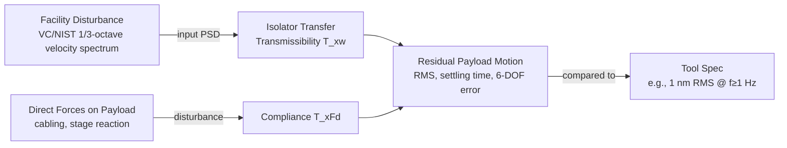
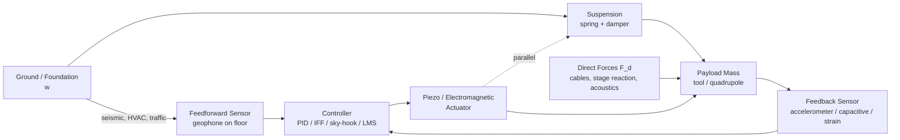
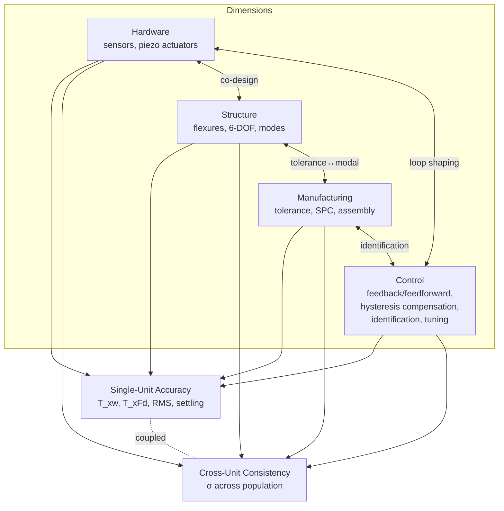
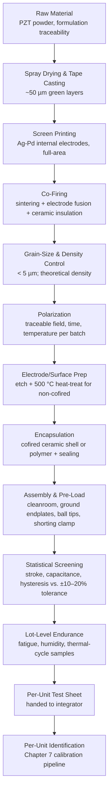
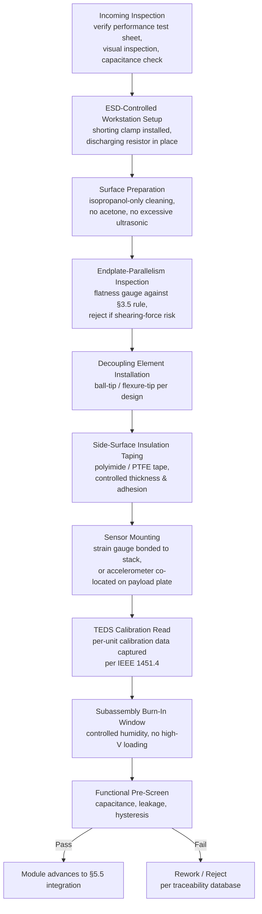
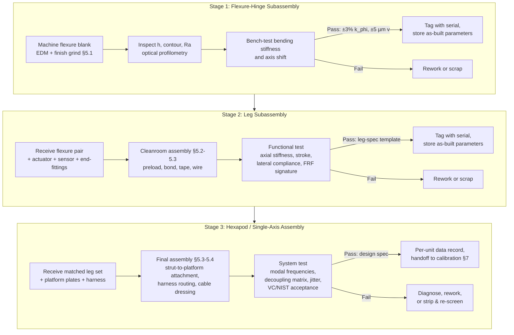
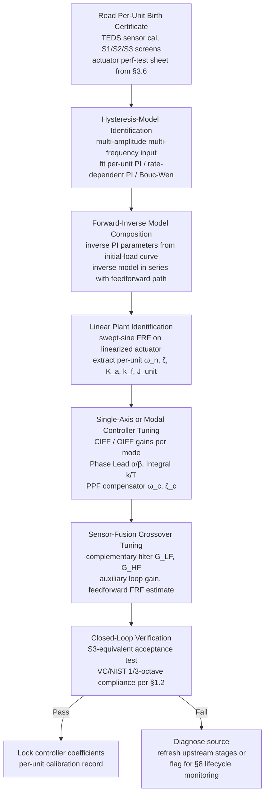

# Precision Engineering of Piezoelectric Vibration Isolation Systems: Accuracy Enhancement and Cross-Unit Consistency through Integrated Hardware, Structural, Manufacturing and Control Design
# 1 Research Background, Performance Requirements, System Architecture and Analytical Framework

The convergence of three independent technology trajectories—the relentless shrinkage of semiconductor feature sizes toward 3 nm and 2 nm nodes, the push of electron microscopy and optical metrology into the sub-Ångström regime, and the industrialization of nanotechnology research at length scales where atoms themselves become the relevant unit of geometry—has fundamentally transformed the role of mechanical vibration in precision engineering. What was once treated as an environmental nuisance, mitigated by passive air-spring tables and rigid foundations, is now recognized as a primary contaminant on par with airborne molecules and particulate matter, capable of denying tools their nominal specification regardless of the optical, electronic or mechanical sophistication built into them[^1]. Within this context, **precision piezoelectric vibration isolation** has emerged as a critical enabling technology because the piezoelectric effect, with its nanometer-scale displacement resolution, sub-millisecond response, zero electromagnetic interference and solid-state reliability, is uniquely positioned to deliver the closed-loop counter-motion required at the bandwidths and amplitudes characteristic of modern lithography stages, electron microscope columns and optical reference cavities[^2]. This opening chapter therefore has a dual mission: to motivate, in quantitative terms, why nanometer-level accuracy and unit-to-unit consistency have together become the decisive engineering bottleneck for these systems; and to construct an analytical framework, anchored in the four canonical pathways of hardware, structure, manufacturing and control, that will guide every subsequent chapter of the report.

## 1.1 Application Context and Driving Demands for Precision Vibration Isolation

Precision piezoelectric vibration isolation is no longer a niche solution confined to optical laboratories; it has become embedded in the capital equipment that defines several of the highest-value industries of the global economy. The most visible driver is **advanced semiconductor lithography**. Each ASML extreme-ultraviolet (EUV) scanner used to pattern 3 nm and 2 nm logic nodes contains hundreds—by some accounts thousands—of piezoelectric components distributed across its optical columns, reticle and wafer stages, and vibration isolation platforms, with stack actuators required to deliver repeatable sub-nanometer positioning at scanning bandwidths of hundreds of hertz[^2]. The economic stakes attached to this requirement are difficult to overstate: SEMI reported approximately USD 574 billion of global semiconductor equipment spending in 2024, a figure that translates almost linearly into demand for precision piezoelectric stages because every leading-edge lithography or inspection tool depends on them[^2]. A second driver is **electron microscopy**, including scanning electron microscopes (SEM), transmission electron microscopes (TEM), focused ion beams (FIB) and Cryo-TEM platforms used in structural biology, where extended-duration imaging at near-atomic resolution amplifies the damage caused by even sub-Hz vibrations[^3][^1]. A third—often overlooked—category encompasses **optical and frequency metrology** (ultra-stable laser cavities, optical clocks, gravitational-wave detectors), **scanning probe microscopy** (AFM, STM), and **nanotechnology research facilities** that integrate biology, chemistry and materials science around tools whose sensitivities span several orders of magnitude[^1][^4]. A particularly demanding instance from fundamental physics is the Compact Linear Collider (CLIC), whose roughly 4,000 main-beam quadrupoles must each be stabilized so that the integrated RMS displacement above 1 Hz remains below 1 nm, with a subset capable of nanometer-precision step motions every 20 ms[^5].

The common thread across these applications is that **physical scaling laws have outpaced the natural quietness of the built environment**. Cleanrooms supporting microelectronics manufacturing consume, by some estimates, on the order of one hundred times more energy per unit area than conventional research facilities—principally to drive the rotating mechanical systems that maintain particle and thermal control—while housing tools that are roughly two orders of magnitude more vibration-sensitive than their predecessors[^1]. The result is a structural mismatch: the more capable the instrument, the more aggressive the support infrastructure required to keep it clean and powered, and the more severe the vibration environment that infrastructure inadvertently generates. Site selection alone cannot resolve this paradox, because environmental sources such as rail traffic, road traffic, adjacent buildings and seismic activity propagate through the soil and the structure independently of the building's internal design[^1]. Passive isolation, while effective above its resonance frequency, suffers from internal resonances that typically amplify rather than reduce vibrations between approximately 1 and 8 Hz[^6]—precisely the band where modern building floors, HVAC systems and stage reaction forces concentrate their disturbance energy. Active piezoelectric isolation has therefore become indispensable for two reasons: it actively cancels rather than merely absorbs vibration, eliminating the resonant amplification of passive systems; and it adapts in real time to changing vibration conditions, which is essential in environments where foot traffic, HVAC duty cycles and adjacent tool operation continuously reshape the disturbance spectrum[^3][^6].

Within this landscape, **two performance dimensions have crystallized as the decisive engineering bottlenecks**. The first is *single-unit accuracy*: an individual isolator must deliver transmissibility, compliance, settling time and RMS error consistent with sub-nanometer tool requirements. The second, less frequently articulated but equally critical, is *unit-to-unit consistency*: when an EUV fab houses dozens of identical scanners, or a CLIC accelerator deploys 4,000 nominally identical quadrupole stabilizers, the spread of performance across the population—not just the mean—dictates yield, throughput, and the feasibility of standardized installation and calibration procedures[^5]. These two dimensions are orthogonal and frequently in tension: a control architecture that maximizes single-unit accuracy by exploiting unit-specific resonances may be acutely sensitive to manufacturing dispersion, while a robust design that tolerates wide variability may sacrifice peak accuracy. The remainder of this report is structured around the systematic management of this tension across hardware, structural, manufacturing and control dimensions.

## 1.2 Key Performance Indicators and Vibration Criteria Benchmarks

Translating the qualitative demand for "nanometer-level accuracy" into engineering targets requires a layered set of quantitative indicators that span the disturbance environment, the isolator's intrinsic transfer behavior, and the residual motion at the tool. At the **environmental level**, the field has converged on the one-third octave band root-mean-square (RMS) velocity spectrum as the canonical descriptor, codified in the *Vibration Criteria* (VC) curves originally derived in the late 1970s by Bolt Beranek & Newman/Colin Gordon and now standardized by the Institute of Environmental Sciences and Technology (IEST)[^1][^7]. The VC family extends from VC-A (the most relaxed, with a maximum allowable velocity of 2,000 µin/s ≈ 50 µm/s) through VC-E (the most stringent commonly tabulated, at 125 µin/s ≈ 3.1 µm/s), with VC-D (250 µin/s ≈ 6.25 µm/s) typically representing modern microelectronics targets[^1][^7]. A more recent extension to VC-F and VC-G addresses sub-nanometer research environments, while the **NIST-A** criterion—identical to VC-E above 20 Hz but considerably more stringent below it (6 µm/s for f ≤ 5 Hz; 0.75 µm/s for 5 < f ≤ 100 Hz)—and the still more demanding **NIST-A1** criterion are reserved for national metrology laboratories and typically cannot be met without non-conventional isolated structures[^8][^1]. By way of human-experience reference, the ISO "Residential Day" curve at roughly 8,000 µin/s is often cited as a conservative threshold of human perception, illustrating that even the most relaxed VC-A criterion is already a factor of four below what a person can feel[^1].

The choice of velocity, rather than displacement or acceleration, as the primary unit deserves explicit justification because it underlies every subsequent design decision. As Gordon's foundational analysis demonstrated, the major resonances of vibration-sensitive equipment—whether the Perkin-Elmer Series 300 projection aligner with a dominant resonance near 11 Hz or a 1000× optical microscope with a lowest significant resonance near 20 Hz—tend to fall along **lines of constant velocity** rather than constant displacement or acceleration[^7]. Physically, this reflects the fact that image blur, alignment error and similar process-level failures depend on the distance an element moves *during an integration time*, which is the definition of velocity. The use of one-third octave proportional bandwidth (≈23% of band-center frequency) is similarly grounded in the modal physics of the equipment under test: for typical loss factors η in the range 0.01–0.1, the modal bandwidth Δf/f ≈ πη/2 falls between 1.6% and 16%, and the one-third octave provides a conservative bound that matches broadband floor energy to the resonator's actual response window[^7].

The diagram makes explicit that the isolator is not characterized by a single number but by **two simultaneous transfer functions**: the *transmissibility* T_xw between ground motion w and payload motion x, and the *compliance* T_xFd between direct forces F_d acting on the payload (cabling tension, on-board stage reaction, acoustic pressure) and the resulting motion. As the CLIC sensitivity analysis rigorously demonstrates, these two functions are governed by opposing trends: softer suspensions reduce T_xw at high frequency but increase compliance, so that the same disturbance force produces larger displacement, while stiffer (hard-mount) suspensions yield superior compliance and tracking but inferior high-frequency isolation and greater susceptibility to sensor noise[^5]. Any meaningful accuracy specification must therefore bind both functions simultaneously across the relevant frequency band.

The system-level indicators that capture this dual requirement are summarized in the following table, which collects values explicitly attested in the reference materials together with their typical engineering ranges.

| Indicator | Definition | Typical Target / Reference Value | Source Anchor |
|-----------|------------|----------------------------------|---------------|
| Transmissibility (vertical) | x_payload / x_ground (1/3-octave or narrowband) | 80–90% reduction at 1 Hz; >90% at 2 Hz on Cryo-TEM platforms; attenuation peak factor of 60 near 20 Hz on piezo prototype | DVIA-MLP datasheet[^3]; Cryo-TEM case[^3]; Shen et al.[^4] |
| Isolation bandwidth | Frequency range with T_xw < 1 | 0.5 Hz to several hundred Hz for state-of-the-art active systems; 1–200 Hz for compact piezo prototype | DVIA-MLP[^3]; Shen et al.[^4] |
| Compliance | x_payload / F_disturbance | Maximized for hard-mount; payload-DOF dependent | CLIC analysis[^5] |
| Integrated RMS displacement | σ_x(f) = √∫_f^∞ Φ_x(ν) dν | < 1 nm above 1 Hz (CLIC quadrupole) | CLIC requirement[^5] |
| Step-and-settle precision | Repeatable positioning increment | ±1 nm steps every 20 ms (CLIC subset) | CLIC requirement[^5] |
| Facility benchmark (1/3-octave velocity) | RMS velocity in standard octave bands | VC-D 250 µin/s, VC-E 125 µin/s; NIST-A 6 µm/s (f≤5Hz), 0.75 µm/s (5–100 Hz) | Gordon[^7]; Davis & Bayat[^1]; ResearchGate PDF[^8] |

Two insights follow from this benchmarking layer. First, the quantitative gap between today's most demanding facility criteria (NIST-A at 0.75 µm/s in the 5–100 Hz band) and the residual motion required at the tool (sub-nanometer over the same band) is several orders of magnitude, which mathematically demands isolator transmissibilities below 0.01 across a broad bandwidth—a target unreachable by passive means alone[^8][^1]. Second, because the VC/NIST framework expresses requirements as one-third octave spectra rather than scalar limits, **end-of-line acceptance testing of an isolator must itself be spectrum-based**, a fact that has direct consequences for the manufacturing-quality and consistency arguments developed in later chapters.

## 1.3 Closed-Loop System Architecture and Topology Comparison

The architectural skeleton of every active piezoelectric vibration isolation system is the same: a sensor measures motion (or force), a controller computes a corrective signal, and an actuator generates a force or displacement that opposes the disturbance, all within a closed loop that updates faster than the disturbance evolves[^3][^6]. The following diagram captures the canonical signal flow, noting where feedforward and feedback paths typically coexist.

The first analytical question is *where* the active element acts. Three principal topologies emerge from the literature, each with distinct implications for accuracy and consistency.

**Active soft-mount** topologies place a low-stiffness element (pneumatic spring, elastomer, or piezo stack with an intermediate mass) in series between the foundation and the payload, achieving a low natural frequency—typically 2–5 Hz for pneumatic systems, or as low as 1.6–10 Hz when an elastomer is interposed between an intermediate mass and the payload as in the CLIC soft strategy[^6][^5]. The mechanical low-pass character of the spring-mass combination dominates above resonance, while active control suppresses the resonance peak itself. Halcyonics-class systems built around piezoelectric accelerometers, analog or DSP controllers and electromagnetic transducers exploit precisely this topology, with the spring-mass low-pass dominating dynamic behavior above 200 Hz and the active loop dominating below[^6]. The advantage is excellent high-frequency isolation and robustness against sensor noise at high frequencies; the disadvantage is high compliance, meaning that direct forces on the payload (including stage reaction forces in scanners) produce relatively large displacements[^5].

**Active hard-mount** topologies use a stiff actuator—often a piezoelectric stack with stiffness on the order of 10⁸–10⁹ N/m—directly between the payload and the ground, with the actuator stroke commanded to cancel ground motion[^5]. Because the natural frequency of the system is high, hard-mount strategies "reduce the vibrations *in front of* the natural frequency" rather than above it, achieving superior compliance and step-and-settle tracking suitable for positioning applications such as CLIC quadrupoles[^5]. The cost is heightened susceptibility to sensor noise above the cross-over frequency, because the complementary sensitivity T = 1 – S remains close to unity over a broad band, transferring sensor noise directly to the payload; the CLIC sensitivity study explicitly tabulates this trade-off as a "high" noise sensitivity at high frequency for both hard-mount variants studied[^5].

**Hybrid passive-active** topologies combine a passive element (typically a soft pneumatic spring carrying the static weight and providing high-frequency roll-off) with active piezoelectric or electromagnetic elements that handle the low-frequency band where the passive element resonates and amplifies. The Daeil DVIA family commercialized by Vibration Engineering Consultants represents this approach, deploying both feedback control and feedforward control in all six DOF (X, Y, Z, pitch, roll, yaw) and reporting 80–90% isolation at 1 Hz and over 90% measured reduction at 2 Hz on Cryo-TEM installations[^3]. The feedforward loop is particularly powerful because it uses ground sensors to detect disturbances *before* they propagate through the suspension, allowing pre-emptive cancellation that is not bandwidth-limited by the closed-loop crossover[^3]. Compact research-grade prototypes pursue similar hybrid concepts at smaller scale: Shen et al. demonstrated a piezo-stack plus piezo-accelerometer system delivering vibration isolation between 1 Hz and 200 Hz with an attenuation peak factor of 60 near 20 Hz, and addressed two characteristic challenges of fully piezoelectric implementations—the parasitic kHz mechanical resonances of the stack, suppressed by an order of magnitude through electrical damping, and the dc drift of large servo gains, mitigated by an auxiliary loop using an on-actuator strain gauge[^4].

The comparative trade-offs are summarized below, with each entry tied to an explicit source.

| Property | Active Soft-Mount | Active Hard-Mount | Hybrid Passive-Active |
|----------|-------------------|-------------------|------------------------|
| Natural frequency | 1.6–10 Hz | High (set by stiff piezo) | 0.5–5 Hz (passive) + active loop |
| Transmissibility above resonance | Excellent (mechanical low-pass)[^6] | Reduced *in front of* f_n[^5] | Excellent broadband[^3] |
| Compliance to direct F_d | Poor (large δ for given F_d)[^5] | Excellent[^5] | Intermediate[^3] |
| Tracking / positioning | Limited[^5] | Excellent (sub-nm steps)[^5] | Application-tuned[^3] |
| Sensor-noise sensitivity (HF) | Low (S large at HF)[^5] | High (T≈1 over wide band)[^5] | Moderate, mitigated by FF[^3] |
| Resonance amplification | None (active cancels)[^6] | None | None when AVI loop is closed[^3] |
| Floor-stiffness dependence | Moderate | High[^3] | Low (per VEC field claim)[^3] |
| Representative implementations | Halcyonics/Accurion AVI[^6]; CLIC soft strategy[^5] | CLIC hard-mounts 1 & 2[^5] | Daeil DVIA[^3]; Shen et al. piezo prototype[^4] |

The broader insight is that **no single topology dominates across the accuracy–consistency plane**. Soft-mounts trade compliance for robustness against sensor noise; hard-mounts trade noise robustness for tracking precision; hybrids attempt to absorb both extremes at the cost of greater architectural complexity, more sensors, and tighter manufacturing tolerances on the interaction between passive and active elements. The choice is therefore application-driven and, crucially, must be made jointly with decisions about manufacturing tolerance allocation and control-algorithm structure—a coupling that the analytical framework in §1.5 is designed to formalize.

## 1.4 Interaction of Core Subsystems: Sensors, Actuators, and Controllers

Within any of the three topologies, sub-nanometer compensation arises from the *joint* behavior of three core subsystems whose characteristics must be matched not in isolation but as a coupled set. The following examines each subsystem's role in determining the achievable accuracy ceiling and, equally importantly, the unit-to-unit dispersion of that ceiling.

The **sensor subsystem** sets the ultimate noise floor and bandwidth of the loop. Piezoelectric accelerometers, geophones, capacitive displacement sensors, eddy-current probes, on-actuator strain gauges and self-sensing piezo elements each occupy distinct positions in the noise-bandwidth plane[^6][^4]. In Halcyonics-class designs, the accelerometer signal passes through pre-amplification, time integration and frequency-selective filtering to yield an effective velocity signal that the controller acts upon; the coaxial co-location of the accelerometer mass and the electromagnetic actuator ensures collinearity between the measured acceleration component and the applied force, a structural choice that directly improves single-axis accuracy[^6]. In the compact piezoelectric prototype of Shen et al., a strain gauge mounted on the piezo stack itself was added not to measure motion *per se* but to feed an auxiliary loop that suppresses dc drift introduced by the high servo gain at low frequency, illustrating that sensor selection can be dictated as much by control-loop conditioning as by primary disturbance measurement[^4]. The CLIC analysis is even more explicit on the interaction between sensor and controller: error budgeting performed by injecting a noise function in front of the controller H showed that for hard-mount configurations, sensor noise above ≈100 Hz propagates almost unattenuated to the payload, whereas for soft configurations the same noise is significantly reduced beyond 100 Hz[^5]. The implication is that **sensor noise is not a fixed property of the sensor but a controllable variable of the entire loop architecture**, and that the choice of sensor cannot be optimized without simultaneously fixing the control structure.

The **actuator subsystem** sets the upper bound on cancellation amplitude, force density and bandwidth. Piezoelectric stack actuators are favored where high force density, sub-nanometer resolution and sub-millisecond response are required within compact volumes, while electromagnetic transducers are favored where larger strokes, lower stiffness and reduced internal hysteresis are needed[^6][^2]. The market data confirm this division: multilayer stack actuators hold approximately 32.6% of the global piezoelectric actuator/motor market revenue precisely because of their high force density in semiconductor positioning, precision instrument and ultrasound transducer applications, while ultrasonic piezoelectric motors lead growth in automotive ADAS and robotics where larger travel and silent operation matter more[^2]. From an accuracy-and-consistency perspective, stacks introduce three coupling effects with the controller. First, their parasitic mechanical resonances near a few kilohertz must be electrically damped or compensated to prevent loop instability when the bandwidth approaches them—Shen et al. report an order-of-magnitude suppression of these resonances through electrical damping[^4]. Second, stack hysteresis and creep are unit-dependent and require either model-based or data-driven compensation that is parameterized per actuator (a subject of Chapter 6). Third, stack stiffness directly sets the natural frequency in hard-mount configurations and therefore determines compliance and tracking bandwidth—values such as k_a = 480 × 10⁶ N/m used in CLIC analyses are illustrative but vary across actuator families[^5].

The **controller subsystem** synthesizes sensor and actuator into closed-loop performance. The repertoire ranges from classical PID through proportional-plus-derivative force-feedback combined with high-pass drift removal (e.g., 0.7 Hz) and anti-aliasing low-pass at 50 Hz with stability-augmenting lead/lag compensators, to feedforward LMS and adaptive algorithms[^6][^5]. The CLIC study quantifies the resulting stability margins—10° phase margin with a gain margin of 1.43 for the soft strategy, 30° phase margin for the hard-mounts after lead compensation—demonstrating that even within a fixed topology, controller tuning trades stability for performance in measurable amounts[^5]. Modern commercial systems (DVIA-M family) supply feedforward controls as standard on every model and allow on-site optimization of feedback and feedforward parameters by the manufacturer's engineers based on the local vibration spectrum, an explicit acknowledgement that no single controller setting fits every installation[^3].

The interaction among these three subsystems is governed mathematically by the **sensitivity** S = 1/(1+GH) and **complementary sensitivity** T = 1−S of the closed loop, where G is the plant (suspension + actuator) and H is the controller-and-sensor combination[^5]. Tracking and disturbance rejection require S small (and T large), while noise immunity requires S large (and T small)—the classical feedback trade-off. Whether the system meets its accuracy spec depends on where in the frequency axis this trade-off is positioned, which in turn depends on the joint design of all three subsystems. Whether *every shipped unit* meets the spec depends on how tightly the parameters of all three subsystems are controlled in manufacturing—a problem that no single subsystem can solve in isolation.

## 1.5 Multi-Dimensional Analytical Framework Linking Hardware, Structure, Manufacturing and Control

The preceding sections have demonstrated that precision piezoelectric vibration isolation is a tightly coupled engineering system whose performance cannot be decomposed into independent contributions from individual subsystems. To structure the rest of this report, the discussion now consolidates these observations into a **four-dimensional analytical framework** that maps every design and production decision onto two orthogonal performance axes—single-unit accuracy and cross-unit consistency—while preserving the causal links between physical mechanism and measurable outcome.

The four dimensions and their respective scopes are as follows. The **Hardware** dimension comprises the physics-level components: sensors (Chapter 2) and piezoelectric actuators (Chapter 3), including their intrinsic noise floors, bandwidths, force/displacement envelopes, hysteresis and aging behaviors. The **Structural** dimension covers the mechanical architecture (Chapter 4): single-axis versus six-DOF (hexapod/Stewart) layouts, flexure-hinge geometry, payload mounting, parasitic stiffness paths, and elastic-center alignment, all of which determine modal distribution and translational-rotational coupling. The **Manufacturing** dimension covers the process pathways through which design intent is realized in physical hardware (Chapter 5): precision machining, ceramic co-firing and poling, cleanroom assembly, bonding and preloading, statistical process control and tolerance allocation. The **Control** dimension covers the signal-domain engineering that closes the loop and compensates residual nonlinearities (Chapters 6–7): feedback and feedforward laws, modal control for multi-axis isolators, hysteresis and creep compensation (Preisach, Prandtl-Ishlinskii, Bouc-Wen, neural and sliding-mode methods), system identification, and per-unit auto-tuning. Quality assurance and lifecycle management (Chapter 8) and integrated case studies (Chapter 9) then operate transversely across all four dimensions.

The diagram emphasizes that the four dimensions are not parallel silos but a tightly coupled network. Several **cross-dimensional coupling points** deserve explicit identification because they recur throughout the report. (i) *Hardware ↔ Structure*: actuator stiffness sets the natural frequency of hard-mount suspensions, while flexure compliance determines whether the actuator's nominal displacement is delivered to the payload or absorbed by parasitic paths[^5]. (ii) *Structure ↔ Manufacturing*: the modal-distribution and decoupling-matrix consistency of a six-DOF isolator depends sensitively on the symmetry of flexure dimensions and the repeatability of preload, making tolerance allocation a structural-design problem rather than a downstream manufacturing concern. (iii) *Manufacturing ↔ Control*: residual unit-to-unit variability in suspension frequency, damping and hysteresis cannot be eliminated by manufacturing alone and must be absorbed by per-unit system identification and adaptive controller tuning, making the calibration pipeline (Chapter 7) the bridge that converts manufacturing tolerance into uniform closed-loop behavior. (iv) *Control ↔ Hardware*: the choice of compensator (e.g., the auxiliary strain-gauge loop in Shen et al. for dc-drift suppression[^4]) directly dictates which sensors must be co-located with which actuators, propagating back into hardware selection.

The framework also formalizes the **dual-axis evaluation** that runs through the entire report. For every design decision discussed in subsequent chapters, the analysis will ask two questions: (a) what is the impact on the achievable accuracy ceiling of a single unit—measured in terms of transmissibility, compliance, RMS error and settling time against the VC/NIST benchmarks summarized in §1.2; and (b) what is the impact on the dispersion across mass-produced units, recognizing that some sources of variability (e.g., piezo lot-to-lot d33 variation) are calibration-compensable while others (e.g., flexure asymmetry causing modal coupling) are not. This dual-axis perspective is the only rigorous way to evaluate trade-offs such as soft- versus hard-mount, model-based versus data-driven hysteresis compensation, or hardware redundancy versus algorithmic robustness, because in each case a choice that benefits one axis may compromise the other.

Finally, the framework situates every chapter within a **stage-gated lifecycle perspective** spanning concept design, detailed design, prototyping, pilot production, mass production and field operation. Hardware and structural choices are concentrated at the front end, manufacturing controls bridge prototype to pilot, and control-algorithm design and per-unit calibration become decisive during pilot-to-mass-production scale-up and continue into field operation through digital-twin-based predictive maintenance. The acceptance of every shipped unit against VC/NIST one-third-octave criteria, formalized as end-of-line testing in Chapter 8, closes the loop between the benchmarks defined in §1.2 and the manufacturing-control rules developed in Chapter 5.

In summary, this chapter has established that precision piezoelectric vibration isolation systems are defined by the coupled performance of sensors, piezoelectric actuators and controllers operating within mechanical-structural architectures that must be manufactured to nanometer-relevant tolerances and tuned to per-unit dynamics. Their performance is benchmarked against VC and NIST one-third-octave velocity spectra, and their engineering is uniquely characterized by the dual demand for single-unit nanometer accuracy and cross-unit reproducibility. The four-dimensional analytical framework introduced here—hardware, structure, manufacturing, control—will be applied systematically in the chapters that follow, beginning in Chapter 2 with the sensor subsystem that sets the irreducible noise floor of the entire loop.

# 2 Sensor Subsystem Design for High-Fidelity Vibration Detection

The four-dimensional analytical framework established in Chapter 1 identified the sensor subsystem as the irreducible bottleneck of any closed-loop piezoelectric isolation architecture: it sets the noise floor against which every subsequent control action is judged, and it imposes a frequency-band ceiling beyond which neither faster electronics nor stiffer actuators can recover lost information. This chapter therefore opens the hardware-pathway analysis by descending from system-level transmissibility specifications—on the order of 10⁻² across the VC-D to NIST-A bands defined in §1.2—to the device-level question of *which transducers, mounted how, conditioned by what circuitry, and calibrated against what procedures* can deliver the requisite fidelity reliably across mass-produced units. The analysis is organized to trace a continuous causal chain from the physics of each sensing element, through its transfer-function behavior and the fusion strategies that overcome single-transducer limits, to the mounting and conditioning choices that frequently dominate as-installed performance, and finally to the calibration and variability accounting that determines how sensor dispersion propagates into the σ of the population. Throughout, the dual-axis evaluation introduced in Chapter 1—single-unit accuracy on one axis and cross-unit consistency on the other—governs every comparative judgment.

## 2.1 Comparative Performance of Candidate Sensor Families

Sub-nanometer vibration isolation imposes simultaneous and partially incompatible demands on its sensing elements: noise floors low enough to resolve velocities of order 0.1–1 µm/s in the 1–100 Hz band defined by VC-E and NIST-A; bandwidths broad enough to span from the 0.5 Hz lower edge of facility disturbances to the few-hundred-hertz upper edge where structural resonances of tooling reside; dynamic ranges sufficient to capture both the small-amplitude residual motion that the loop must null and the large transient excitations (foot traffic, stage reversal) that must not saturate the transducer; and cross-axis rejection sharp enough that translational measurements are not corrupted by rotational modes of the payload. No single transducer family satisfies all four requirements simultaneously, and the engineering practice is therefore to assemble heterogeneous sensor sets whose strengths complement one another. The following examines the principal families against quantitative anchors drawn from the reference materials.

**Piezoelectric accelerometers (charge-mode PE and IEPE/ICP)** dominate high-sensitivity structural and seismic monitoring because their piezoceramic or quartz sensing elements produce a high output charge with negligible deflection, yielding ruggedness and linearity over wide amplitude ranges combined with the ability to resolve accelerations as low as 10⁻⁴ g. The PCB Model 393B12, representative of the high-sensitivity ICP class used in seismic-grade isolation platforms, specifies a sensitivity of 10 V/g (1019.4 mV/(m/s²)), a measurement range of ±0.5 g, a ±5% frequency band of 0.15–1000 Hz extending to 0.05–4000 Hz at ±3 dB, and a transverse sensitivity below 7%; its broadband resolution is quoted at 8 µg RMS, with spectral noise densities of 1.30 µg/√Hz at 1 Hz, 0.32 µg/√Hz at 10 Hz, 0.13 µg/√Hz at 100 Hz, and 0.10 µg/√Hz at 1 kHz.[^9] These figures capture the defining property of high-sensitivity ICP designs: noise that rolls off rapidly with frequency, providing clean acceleration data above ~10 Hz where most modern stage-induced disturbances reside, but a 1/f-dominated floor at lower frequencies that becomes the limiting factor for active suspensions whose target band extends down to 0.5 Hz. The trade-off between sensitivity and range is mechanical: doubling sensitivity from 1 V/g to 10 V/g halves the full-scale range from 5 g to 0.5 g, restricting the device to genuinely quiet sites and forcing the use of secondary, lower-sensitivity accelerometers where transient excitations are present.[^9] PE charge-mode variants extend the same technology to higher operating temperatures and offer flexibility in signal conditioning at the cost of expensive low-noise cabling and external charge amplifiers; IEPE/ICP variants integrate the charge amplifier into the housing, accept ordinary coaxial cabling, drive long lines without resolution loss and provide system reliability advantages, but have fixed sensitivity and discharge time constants that bound the low-frequency response.[^9][^10]

**Moving-coil geophones** provide an electromechanically passive complement that is particularly competitive at low frequencies. A geophone's output voltage is proportional to the velocity of the proof-mass coil relative to the magnet, with a transfer function flat in velocity above its resonance (typically 5–50 Hz, with 10 Hz being a common reference) and rolling off as ω² below.[^11] Brownian circuit noise inside the coil is roughly an order of magnitude below the equivalent input noise of typical 24-bit field digitizers; for a 10 Hz, 0.7-damped geophone digitized at 1 ms, the comparison developed by Hons against MEMS noise floors places the geophone *below* a representative MEMS accelerometer between approximately 3 Hz and 40 Hz, with the MEMS taking the advantage above 40 Hz, and the geophone's sensitivity decline below resonance pushing it back above the MEMS noise floor below 3 Hz.[^11] Two-Hz resonance geophones, used to acquire the Blackfoot broadband dataset cited in the same study, push this advantage band downward and were shown to provide cleaner low-frequency content for converted-wave inversions than 10-Hz units, with the noise-floor crossover against a Sercel DSU-428 MEMS accelerometer occurring near 10 Hz so that 2-Hz geophones retain the noise advantage over the entire 2–8 Hz range investigated.[^11] The implication for piezoelectric isolation is that geophones are an attractive choice for the *feedforward* sensors mounted on the foundation in hybrid soft-mount architectures (§1.3), where the disturbance band of interest sits squarely in the geophone's velocity-flat regime; conversely, IEPE accelerometers remain the primary feedback element on the payload because the residual accelerations to be measured there are dominated by higher-frequency components transmitted through the loop crossover.

**MEMS capacitive accelerometers**—exemplified by the Sercel DSU-408 and DSU-428 evaluated in Hons's field comparisons—use a micro-machined silicon proof mass suspended between capacitor plates, with feedback embedded in a delta-sigma loop that keeps the proof mass centred and renders the system effectively a digital force-feedback accelerometer. Their flat amplitude and zero-phase response in acceleration extends from DC up to several hundred Hz, in contrast to the geophone whose flat band is in velocity rather than acceleration and is bounded below by resonance.[^11] Equivalent input noise quoted for digital seismic-grade MEMS units is on the order of 700 ng over a 250 Hz bandwidth, with quoted sensor noise densities of approximately 30 ng/√Hz for force-feedback digital implementations and ~300 ng/√Hz for analog-feedback designs such as the Colibrys SiFlex 1500 used in laboratory characterization.[^11] In direct field comparison the MEMS sensor showed lower noise than co-located geophones above ~70–100 Hz and higher noise below, with both the modeled and observed crossovers consistent with the system-noise estimates from manufacturer data sheets and 1 ms digitizer specifications. Crucially for the consistency axis, Hons's harmonic-scan laboratory tests demonstrated that a SiFlex 1500 MEMS element and several Geospace GS-32CT and GS-42 geophones all matched their modeled sensitivity, resonant frequency and damping to within fractions of a dB and a few degrees of phase across moderate input amplitudes, with most parameters falling inside the manufacturers' quoted error bounds (±2.5% on resonance, ±5–10% on sensitivity, +10/−15% on damping for the geophones tested).[^11] Both sensor families therefore deliver *modeled* transfer-function fidelity at the unit level; the dispersion of the as-installed system arises predominantly downstream of the sensing element itself.

**Piezoelectric force/load sensors and self-sensing piezo elements** occupy a fundamentally different role in the loop. Rather than measuring payload motion, they measure the force transmitted through the suspension or the actuator itself, providing the signal required for integral-force-feedback (IFF) controllers that are central to many hard-mount strategies analyzed in Chapter 6. Because force sensors share the piezoelectric physics of the actuators they monitor and operate on charge generated by stress rather than on displacement detection, they exhibit excellent high-frequency response and ruggedness but inherit the same DC-blind, charge-leakage limitation as the actuator: the output decays toward zero for static inputs, and the lower bandwidth is set by the discharge time constant of the charge amplifier or the input impedance of the conditioning electronics.[^9] Self-sensing piezo elements exploit the actuator itself simultaneously as sensor by extracting the charge or current that is *not* attributable to the commanded voltage, thereby eliminating one transducer and ensuring perfect collinearity between sensing and actuation; the same approach is realized more practically in the reference materials as an auxiliary strain gauge bonded to the piezo stack, used by Shen et al. to feed a low-frequency loop that suppresses dc drift introduced by the high servo gain required for low-frequency isolation, while the primary acceleration loop handles the dynamic band.[^11]

**Capacitive and eddy-current displacement probes** complete the family with non-contact, DC-capable measurement of relative position. The Micro-Epsilon capaNCDT family is representative: the CSH02 cylindrical probe offers a 0.2 mm nominal measuring range with static resolution of 0.06 nm at 2 Hz and dynamic resolution of 4 nm at 8.5 kHz; larger CSH2 probes with 2 mm range maintain 0.6 nm static and 40 nm dynamic resolution; linearity is specified below ±0.08 µm to ±1.2 µm depending on range, replacement accuracy across uncalibrated swap-out is below ±0.2–0.5% of full-scale output, and temperature stability ranges from −0.01 µm/K to +0.152 µm/K depending on probe size.[^12] These probes are deployed in lithography mask alignment, wafer-stage fine positioning, and lens alignment in optical columns where they provide nanometer-class long-term stability and are insensitive to electromagnetic fields, properties that recommend them as auxiliary metrology channels in piezoelectric isolation platforms even though their bandwidth and noise floor at high frequencies do not compete with piezoelectric accelerometers. Because the capaNCDT 6500 multi-channel controller can virtually ground the target via four sensors, the family is also used to enforce true differential measurements that reject common-mode drift between payload and reference frame.[^12]

The following table consolidates the principal numerical anchors that drive subsequent design decisions, with each entry tied to a specific source.

| Sensor Family | Representative Device | Sensitivity / Range | Spectral Noise Density | Band (typical) | Transverse / Cross-axis | Notable Limitation |
|---------------|-----------------------|---------------------|------------------------|-----------------|--------------------------|--------------------|
| High-sensitivity ICP piezoelectric accelerometer | PCB 393B12 | 10 V/g, ±0.5 g, 8 µg RMS broadband | 1.30 µg/√Hz @ 1 Hz; 0.32 @ 10 Hz; 0.13 @ 100 Hz; 0.10 @ 1 kHz | 0.15–1000 Hz (±5%); 0.05–4000 Hz (±3 dB) | ≤7% | 1/f-dominated floor at sub-Hz; 0.5 g range limits transient capacity[^9] |
| Charge-mode PE piezoelectric accelerometer | PCB 393B05 (10 V/g) and similar | 10 V/g, low-g, sealed | comparable to ICP class | High-temperature operation extends band envelope | Low-strain shear designs preferred | Requires low-noise cable + external charge amp; high impedance susceptible to contamination[^9][^10] |
| Moving-coil geophone | Geospace GS-42, GS-32CT, SM-24 | 19.7–22 V·s/m, 10 Hz resonance, ζ ≈ 0.7 | Noise ~10× below digitizer EIN, modeled floor near 100 ng at resonance | Velocity-flat above f₀ (≈10 Hz); rolls off as ω² below | Vertical/horizontal element variants | Sensitivity falls below resonance, adding noise after dephasing[^11] |
| Low-resonance geophone | Blackfoot 2 Hz unit | extended low-frequency velocity-flat band | Lower noise than DSU-428 MEMS over 2–8 Hz band | Useful from 2 Hz | as above | Larger and heavier than 10 Hz units[^11] |
| MEMS capacitive accelerometer | Sercel DSU-408 / DSU-428; Colibrys SiFlex 1500 | analog-feedback or ΔΣ-feedback; >800 Hz resonance | ~30 ng/√Hz (digital seismic-grade); ~300 ng/√Hz (analog SiFlex 1500); EIN ≈ 700 ng over 250 Hz | DC–several hundred Hz, flat in acceleration | Tested mismatch ≤ a few degrees in lab harmonic scans | Higher noise than geophones below ~40–70 Hz; clipping at ~1.2–4.5 m/s² for seismic-grade[^11] |
| Capacitive displacement probe | Micro-Epsilon capaNCDT CSH02–CSH2 | 0.2–2 mm range; replacement accuracy <±0.2–0.5% FSO | static resolution 0.06–0.6 nm; dynamic 4–40 nm @ 8.5 kHz | DC–8.5 kHz controller bandwidth | n/a (gap measurement) | Linearity ±0.08–1.2 µm; temperature drift up to 0.152 µm/K[^12] |
| Eddy-current probe | (industry standard) | DC-capable, conductive targets | nm-class | DC to tens of kHz | n/a | Temperature dependence, target-material sensitivity (corroborated by general practice; not directly cited) |
| Piezoelectric force / self-sensing piezo + strain gauge | Stack-mounted strain gauge (Shen et al.) | proportional to stress / stack strain | dominated by amplifier 1/f at LF | DC–stack resonance | n/a | Charge mode bounded below by discharge time constant; self-sensing requires careful charge separation[^11] |

Several conclusions emerge from the comparison that condition the rest of the chapter. First, the spectral noise density of high-sensitivity ICP accelerometers (e.g., 0.10 µg/√Hz at 1 kHz on PCB 393B12) corresponds, after integration over a 100 Hz bandwidth, to RMS accelerations near 1 µg ≈ 10 nm/s² which, divided by (2πf)² at 10 Hz, yield equivalent displacement noise floors of about 0.025 nm—comfortably below the sub-nanometer target but not by orders of magnitude, meaning that any additional noise contributed by mounting, conditioning or digitization can dominate.[^9] Second, the geophone's noise advantage in the 3–40 Hz band makes it the rational choice for feedforward floor sensing in hybrid topologies where the disturbance is dominated by HVAC and traffic-induced ground motion in that band, even though it cannot serve as a payload sensor at the lowest frequencies because of its sensitivity roll-off.[^11] Third, capacitive probes alone have insufficient bandwidth and excessive temperature drift to serve as the primary feedback sensor for active isolation, but their DC-capable nm-class resolution makes them indispensable as a metrology reference for in-situ verification, alignment of the elastic centre of multi-DOF stages, and per-unit calibration as discussed in §2.5.[^12] Fourth, no individual sensor type can simultaneously satisfy the low-frequency, high-frequency and DC accuracy requirements of a sub-nanometer hard-mount isolator, which mathematically necessitates the fusion strategies developed in §2.3.

## 2.2 Transfer-Function Modeling, Drift and Cross-Axis Behavior

The performance metrics summarized above are surface descriptions of an underlying physical model that is shared across all motion-sensing families and that, once written explicitly, exposes which deviations are deterministic and inverse-filterable and which are stochastic and limited by the noise floor. All inertial sensors—geophones, MEMS accelerometers, piezoelectric accelerometers, force-feedback hybrids—are well represented in the seismic exploration band by a forced simple harmonic oscillator with proof-mass displacement *x* relative to the case, ground displacement *u*, damping ratio λ and resonance ω₀:

$$\frac{\partial^{2} x}{\partial t^{2}}+2\lambda\omega_{0}\frac{\partial x}{\partial t}+\omega_{0}^{2}x=-\frac{\partial^{2} u}{\partial t^{2}}$$

The transduction stage that follows determines which derivative of *x* is converted to voltage. A geophone produces *V*(ω) ∝ ∂x/∂t through Faraday/Lenz induction, yielding the well-known velocity-flat band above 2ω₀ together with substantial phase distortion that persists up to nearly 10ω₀; even though the amplitude response is flat above 2ω₀, the raw time-domain output is *not* a direct representation of ground velocity over the seismic exploration band, and recovery of zero-phase ground velocity requires either an explicit dephasing operator or a deconvolution that absorbs the phase term.[^11] A capacitive MEMS accelerometer produces *V*(ω) ∝ x and operates in the regime ω ≪ ω₀ where x ≈ −(1/ω₀²)·∂²u/∂t², so that the output is directly proportional to ground acceleration with flat amplitude and zero phase up to roughly 0.2 ω₀ for a 0.7-damped sensor; the transfer function becomes simply *V* = S_A·g(∂²u/∂t²)/(g·ω₀²) with a resonance well above the seismic band.[^11] Piezoelectric accelerometers, sharing the high-resonance, charge-output property of MEMS units (resonant frequencies ≥10 kHz on the 393B12 class[^9]) likewise operate in the acceleration-flat regime over the entire VC/NIST band of interest.

Two consequences of this layered transfer-function structure govern closed-loop design. First, **deterministic deviations are correctable**. The geophone phase lag and amplitude roll-off below resonance can be inverted exactly by applying H_G^{-1}(ω), and the inverse operator was successfully used by Brincker et al. in real-time Fourier-windowed implementations and by Hons offline across full seismic traces, recovering an effectively flat amplitude response in acceleration to two octaves below the geophone resonance.[^11] The same logic applies to IEPE accelerometers whose discharge time constant of ≥3.5 s on the 393B12 imposes a high-pass corner near 0.05 Hz that can be compensated digitally provided the noise floor permits.[^9] Inverse filtering therefore extracts every dB of SNR that the sensing element delivers; what remains is set by the spectral noise density and by the propagation of that noise through the inversion. Specifically, when a geophone trace is corrected to ground acceleration, the noise amplitudes are boosted by the same factor as the signal at low frequencies, so the SNR at each frequency is invariant under the domain change, but the *displayed* noise floor in the acceleration domain rises sharply below resonance.[^11] This is the mathematical reason that a low-resonance (2 Hz) geophone outperforms a 10 Hz geophone in low-frequency impedance inversion: the noise floor expressed in acceleration is genuinely lower, not merely shifted, because the underlying velocity-domain SNR is preserved over a wider band.

Second, **stochastic deviations are not correctable** and propagate directly into the closed-loop sensitivity. Three categories warrant attention. (i) *Low-frequency drift*. IEPE accelerometers exhibit settling times below 60 s on the 393B12 class but cannot resolve true DC; PE charge-mode systems share this limitation; capacitive displacement probes are DC-capable but show temperature drift that, on Micro-Epsilon CSH probes, ranges from −0.01 µm/K up to +0.152 µm/K depending on probe size and mounting position.[^9][^12] In active piezoelectric isolation the consequence is that a high servo gain at low frequency, which is desirable for tracking slow disturbances, integrates any sensor offset into a steadily growing actuator command and ultimately saturates the stack—the precise failure mode that motivated Shen et al. to add the auxiliary strain-gauge loop discussed in §2.3.[^11] (ii) *Parasitic high-frequency resonances*. Piezoelectric accelerometers with quartz or ceramic shear elements typically have first resonances ≥10 kHz on seismic-grade units[^9] and ≥800 Hz on the seismic MEMS class examined by Hons,[^11] both safely above the controller bandwidth; piezoelectric *actuator* stacks, however, possess kHz mechanical resonances that can lie within the loop bandwidth and that must be electrically damped (the order-of-magnitude suppression reported by Shen et al.) before the controller's gain is allowed to encroach on them. When a self-sensing or strain-gauge-augmented piezo arrangement reuses the actuator as a sensor, this constraint propagates back into the sensor subsystem because the apparent sensor resonance is set by the actuator. (iii) *Hysteresis and pyroelectric effects in piezoceramic elements*. Polycrystalline piezoceramics exhibit pyroelectric output during thermal transients in addition to the electromechanical response, while quartz crystals are non-pyroelectric and exhibit excellent long-term stability at the cost of lower charge sensitivity.[^9] The choice between ceramic and quartz sensing elements is thus partly a thermal-stability decision: in a stable cleanroom environment, ceramic shear designs deliver the higher resolution required for sub-nanometer isolation, but in environments with HVAC duty cycling or local heat sources, quartz becomes preferable despite its lower sensitivity.

**Cross-axis sensitivity** is the third deterministic-but-only-partially-correctable source of fidelity loss and is particularly consequential for six-DOF isolators. Manufacturers of high-sensitivity ICP accelerometers specify transverse sensitivity ≤7% on the 393B12,[^9] meaning that as much as 7% of an orthogonal acceleration appears on the nominal axis, with the orientation of the residual axis fixed by element-cut and assembly geometry. In a hexapod isolator (analyzed in Chapter 4), this couples translational measurements to rotational modes and can excite or mis-cancel the latter. Two mitigations exist. The first is mechanical: precision-machined mounting interfaces and strict orthogonality of the sensor cluster reduce installation tilt below the level at which transverse coupling becomes dominant; the harmonic-scan laboratory results reported by Hons confirm that geophone and MEMS elements operate within a few tenths of a dB of their modeled response when tilt is controlled, implying that the measured 7% transverse sensitivity is a usable upper bound, not a typical value.[^11] The second is computational: a 3×3 (or 6×6) decoupling matrix calibrated per unit transforms raw sensor outputs into corrected modal coordinates, absorbing the deterministic cross-talk into the data-flow path. Both mitigations are deployed in commercial multi-axis stages (capacitive sensors used for "lateral distance in X and Y... measured with nanometer accuracy" in lithography lens alignment depend on exactly this kind of decoupling[^12]), and both place direct demands on the manufacturing tolerances analyzed in Chapter 5 and on the per-unit identification pipeline analyzed in Chapter 7.

The composite picture is that the sensor's contribution to the closed-loop sensitivity *S* = 1/(1+GH) and complementary sensitivity *T* = 1−*S* enters at three locations: through the deterministic transfer function H_sensor(ω), which becomes part of the controller path *H* and is invertible; through the additive noise N(ω), which sets the floor of *T*·N below which no correction is possible; and through cross-axis couplings, which appear as off-diagonal terms in the multi-input plant *G* and either degrade rejection or, if calibrated out, are absorbed into the controller's modal transformation. The implication for hardware selection is that the spectral noise density of the candidate transducer—not its sensitivity, range or even resonance—is the single property that most directly bounds the achievable accuracy ceiling, while the linearity, transverse sensitivity and drift specifications determine how much of the residual budget must be spent on calibration and modal decoupling rather than on closed-loop loop shaping.

## 2.3 Sensor Fusion and Bandwidth Extension Strategies

Because no single transducer family covers the 0.5 Hz to several-hundred-hertz band with simultaneously low noise, low drift and acceleration-flat response, sub-nanometer isolation systems necessarily deploy heterogeneous sensor sets that are blended in the controller. The reference materials and the architectural framework of Chapter 1 jointly support three fusion topologies whose merits map directly onto the soft-, hard- and hybrid-mount taxonomy.

The most general technique is **complementary filtering**. Two (or more) sensors with overlapping bandwidths are combined through filters G_LF(s) and G_HF(s) satisfying G_LF + G_HF = 1, with G_LF a low-pass admitting the DC-capable sensor in its quiet band and G_HF a high-pass admitting the dynamic sensor in its quiet band. The crossover frequency f_c is chosen so that the noise floor of the low-frequency sensor equals that of the high-frequency sensor at f_c, minimizing the integrated RMS noise of the fused estimate. In a piezoelectric isolation context this most commonly takes the form of a capacitive displacement probe (DC-accurate, low drift, high resolution at low rates per the capaNCDT static-resolution figures[^12]) merged with an IEPE accelerometer (acceleration-flat, low spectral noise above ~10 Hz per the 393B12 numbers[^9]); the crossover is typically placed in the few-hertz decade where the two noise floors intersect. The trade-off is that mismatched phase between the two sensors near the crossover degrades the fused estimate, so the filters must include phase-matching compensation, and that any common-mode disturbance to which both sensors respond identically passes through unattenuated.

The second technique is **feedforward use of ground-mounted geophones**. As detailed in §1.3 for the Daeil DVIA hybrid architecture, a sensor mounted on the foundation samples the disturbance *before* it propagates through the suspension, allowing the controller to compute a pre-emptive cancellation that is not bandwidth-limited by the closed-loop crossover. The natural choice for the floor sensor is a low-resonance geophone, because the disturbance band of interest (1–40 Hz for typical building floors, HVAC and traffic) sits in the geophone's velocity-flat regime where its noise floor is below that of either MEMS or piezoelectric accelerometers per Hons's noise-floor comparison.[^11] The fusion topology in this case is open-loop in the feedforward branch—the floor sensor signal is filtered through an estimated transfer function from foundation to payload and subtracted from the actuator command—and closed-loop in the feedback branch using a payload-mounted IEPE accelerometer. The advantages are independence from the loop crossover and good high-frequency rejection; the disadvantages are sensitivity to errors in the estimated foundation-to-payload model and amplification of floor-sensor noise into the actuator command at frequencies where the feedforward gain is high.

The third technique is the **auxiliary low-frequency loop** illustrated by Shen et al. and discussed already in Chapter 1. In their compact piezo-stack isolator, a strain gauge bonded to the actuator stack is used to close a slow loop that suppresses the dc drift introduced by the high servo gain of the primary acceleration loop, while the primary loop, fed by a piezo accelerometer, retains responsibility for the dynamic band from 1 Hz to 200 Hz where the attenuation peak factor of 60 near 20 Hz is delivered.[^11] The architecture demonstrates two general principles. First, sensor fusion need not seek to extend bandwidth in the conventional sense; here the goal is to relieve the primary sensor of an obligation (DC accuracy) that it cannot meet without saturating the actuator, allowing the primary loop's gain at intermediate frequencies to be set higher than would otherwise be stable. Second, the auxiliary sensor need not be co-located with the payload: the strain gauge measures the actuator's own deformation, and the resulting signal is fed back to keep the actuator centred about its operating point rather than to estimate payload motion directly. The same logic underlies the use of capacitive displacement probes mounted between the payload and a reference frame in commercial hexapod isolators: the probe does not measure absolute payload motion but rather payload-frame relative displacement, which is precisely what the actuator must control to maintain alignment of an optical column or a wafer stage.

The selection of crossover frequencies is governed by a classical noise-budget argument. If sensor *i* has noise PSD N_i(f) and the fusion filter weights are W_i(f) with ΣW_i = 1, the fused noise PSD is Σ|W_i|²N_i(f), minimized pointwise by W_i(f) = (1/N_i)/Σ(1/N_j). For two-sensor fusion with white noise floors N_LF and N_HF and a chosen crossover f_c, the integrated RMS noise across the band [f_min, f_max] is minimized when f_c sits where N_LF·f equals N_HF·(f_max − f), assuming first-order filters. Practically, this places the geophone-to-piezo-accelerometer crossover near 30–60 Hz for the noise floors documented by Hons,[^11] the capacitive-to-piezo-accelerometer crossover near 1–5 Hz given the static resolution of the capaNCDT class,[^12] and the strain-gauge-to-acceleration-loop crossover well below 1 Hz so that the strain-gauge channel handles only the integrated drift component. Phase matching and gain alignment near these crossovers must be calibrated per unit, because the sensor sensitivities themselves vary by the manufacturer-specified tolerances (±5–10% on geophone sensitivity, ±10% on PCB 393B12 sensitivity[^9]).

The trade-off of any fusion topology is that it converts a single-sensor problem into a multi-sensor problem in which any one sensor's failure or drift contaminates the fused estimate. The cross-unit consistency consequence is that the variance of the fused signal across mass-produced units is a weighted sum of individual sensor variances plus cross-coupling terms that depend on per-unit calibration of the fusion filters; a system that achieves nm-class accuracy on the bench may fall to tens of nm in the field if a strain-gauge bond, a capacitive-probe gap or a geophone tilt is not within tolerance. This is the principal reason that commercial hybrid systems supply on-site optimization of feedback and feedforward parameters by the manufacturer's engineers (cited in Chapter 1 in connection with the DVIA-M family) rather than relying on factory-fixed calibration.

## 2.4 Mounting Interface, Coupling and Signal Conditioning

The reference materials make an unusually emphatic case that the engineering of the sensor *interface* and *signal-conditioning chain* frequently dominates over intrinsic element performance in determining as-installed accuracy and unit-to-unit consistency. Three observations from Hons's field experiments anchor this claim. First, in the Violet Grove and Spring Coulee field comparisons, **coupling conditions at individual stations had a more significant effect on the data than the choice of sensor**: differences in how the sensor case was planted, frozen-in and surrounded by soil produced larger inter-sensor discrepancies than the underlying difference between geophones and DSU MEMS units.[^11] Second, **nail-style cases that placed the sensing element below the surface exhibited noticeably less high-frequency noise contamination** than surface-style cases, with the Oyo 3C surface case showing higher noise above ~50 Hz than the ION Spike and Oyo Nail penetrating cases at the same station, and this advantage persisted across multiple stations and shot lines.[^11] Third, the same single scaling constant relating geophone-derived acceleration to MEMS acceleration was applicable across the entire amplitude range without evidence of nonlinearity, demonstrating that **once coupling is controlled, the sensors themselves preserve their modeled transfer function over wide dynamic range**.[^11] Each of these observations has a direct analogue in piezoelectric isolation system practice.

The **mounting interface** between sensor and payload in a piezoelectric isolation system is dominated by stud, adhesive, magnetic and clamp options whose properties trade installation convenience against transmitted bandwidth. Stud mounting—exemplified by the 1/4–28 female thread on the PCB 393B12 with recommended mounting torque of 2.7–6.8 N·m through a beryllium-copper mounting stud—provides the highest mechanical bandwidth and the most repeatable transmission of high-frequency content, and is the default choice for permanent installations.[^9] Adhesive mounting (e.g., epoxy mount on the 356B18 triaxial referenced in the high-sensitivity survey[^9]) is used where stud preparation is infeasible but introduces a compliant layer whose modulus varies with cure conditions, temperature and aging, contributing a hidden time-varying low-pass behavior that limits sensor bandwidth in ways the manufacturer cannot specify. Magnetic mounting and surface adhesion through "flat surface magnet" accessories (PCB 080A54 in the 393B12 documentation[^9]) provide rapid deployment for diagnostic measurements but should not be used for the closed-loop feedback path because the magnetic coupling stiffness is much lower than the threaded interface and introduces both a resonance within the loop bandwidth and cross-axis sensitivity through tilt under shock loading. The general engineering rule supported by the field data is that the sensor must be coupled to its measurement reference with a stiffness substantially higher than that of any subsequent compliance in the loop; otherwise the coupling itself becomes the dominant transfer-function pole, and unit-to-unit variability in the coupling propagates into closed-loop performance variability.

A second interface concern is **co-location of sensor and actuator**. Chapter 1 noted, in the Halcyonics-class architecture, the coaxial co-location of the accelerometer mass and the electromagnetic actuator that ensures collinearity between measured acceleration and applied force, directly improving single-axis accuracy. The same principle applied to piezoelectric isolators dictates that the IEPE accelerometer be mounted as close as possible to the line of action of the piezo stack, ideally on the same payload-attached plate, so that the sensor measures the very motion the actuator must cancel rather than a flexure-coupled mode of an intermediate structure. Where geometric constraints prevent perfect co-location, the resulting offset becomes a bias in the modal decoupling matrix that must be calibrated per unit and that contributes to cross-unit dispersion if its installation tolerance is not controlled. The capacitive displacement probe's recommendation to be installed at a manufacturer-specified mounting position to achieve "maximum temperature stability and thus the highest possible precision" (3 mm from the sensor face on the CSH-class probes[^12]) reflects the same coupling-position sensitivity in a different transducer technology.

**Case isolation** is the third interface concern. The PCB 393B12 datasheet specifies electrical isolation of the case from the signal ground at ≥10⁸ Ω, with the case constructed of stainless steel and the housing hermetically sealed.[^9] Case isolation matters in piezoelectric isolation systems for two reasons: first, ground loops between the sensor case (mechanically grounded to the payload) and the signal ground (referenced to the controller ground) inject 50/60 Hz line frequency interference that can dominate the noise floor at exactly the frequencies where stage-induced disturbances peak; second, RF and EMI radiation from variable-frequency drives, switching power supplies and adjacent communication systems couple capacitively to a non-isolated case and appear as broadband elevation of the apparent sensor noise. The PCB high-sensitivity ICP family explicitly markets case-isolated 2-pin top-connector models as offering "superior RF and EMI protection",[^13] and the 393B12, 393A03 and 393B31 in the survey table are flagged as case-isolated.[^9] In multi-channel installations with hundreds of sensors, the use of case-isolated units is effectively non-negotiable.

The **signal-conditioning chain** is best treated as part of the sensor itself rather than as a downstream element, because it shapes the noise spectrum, the anti-alias behaviour and ultimately the digitization fidelity in ways that are inseparable from the transducer's own characteristics. ICP/IEPE conditioning supplies a constant current of typically 2–20 mA at +18 to +30 V DC—the 393B12 specifies a 2–20 mA range with a +8 to +12 V output bias[^9]—through ordinary coaxial cable, eliminating triboelectric noise and the need for the low-noise cabling required by charge-mode PE units. The resulting low impedance, in PCB's own characterization, makes the system "more durable due to simplicity, longer MTBF" and "less susceptible to electrical and RF interference" while also enabling self-identification through a TEDS memory chip that stores manufacturer, specification and calibration data per IEEE 1451.4.[^9] These properties are decisive for unit-to-unit consistency: a TEDS-equipped sensor cannot be installed without its calibration data being read by the data-acquisition system, eliminating the largest single source of installation error, and the absence of low-noise cabling removes the cable-handling operations that were historically the dominant source of sensor failure during installation. Charge-mode PE conditioning, by contrast, requires an external charge amplifier that provides "signal impedance conversion, normalization, and gain/range adjustment" and may include "filtering, integration for velocity and/or displacement, and adjustment of the input time constant", giving laboratory flexibility at the cost of greater per-unit configuration burden.[^9] The choice is not between superior and inferior conditioning but between a fixed, repeatable IEPE chain that favours mass-production consistency and a configurable charge-mode chain that favours laboratory or high-temperature flexibility.

**Anti-alias filtering and ADC architecture** complete the conditioning chain and have been analyzed by Hons in unusual depth. The geophones in the Violet Grove experiment used a zero-phase anti-alias filter, while the Sercel system used a minimum-phase filter; on a 30 Hz Ricker wavelet downsampled to 2 ms, the minimum-phase filter introduced a constant 6 ms time delay with no perceptible phase distortion below ~100 Hz, because below that frequency the phase response of the causal AAF is approximately linear.[^11] Above 100 Hz the phase begins to deviate and the high-frequency content trails the main peak, an effect that contributes to the observed differences between geophone and MEMS records in the time domain.[^11] In a piezoelectric isolation controller, where the loop bandwidth is typically 100–500 Hz, the choice between zero-phase and minimum-phase anti-aliasing thus directly affects the controller's stability margins: zero-phase filters introduce no group delay at the cost of being non-causal in implementation (requiring a fixed look-ahead buffer), while minimum-phase filters are causal but contribute group delay that must be included in the loop transfer function. The decision is application-specific and must be made consistently across all sensors in a fusion architecture, since mismatched filters between channels destroy the phase coherence on which complementary filtering relies.

The ADC architecture itself is dominated by **delta-sigma converters**, used both in modern 24-bit field digitizers and as the basis for the digital force-feedback in seismic-grade MEMS accelerometers.[^11] The architecture's defining property is *oversampling*: the modulator runs at 256× to 1024× the desired output sample rate, with a 1-bit quantizer whose error is shaped by feedback so that quantization noise is concentrated at frequencies above the band of interest, where it is then removed by a digital decimation filter. The slope of error vs. number of averaged samples is approximately −1 in log-log scale, meaning that doubling the oversampling ratio halves the quantization error.[^11] In a piezoelectric isolation context, three implications follow. First, the choice of output sample rate trades digitization noise against bandwidth: the Violet Grove geophone records were sampled at 1 ms while the DSU3 MEMS units were sampled at 2 ms, and this asymmetry alone doubled the quantization noise of the geophone path relative to the MEMS path even though the underlying sensors were of comparable noise quality.[^11] Second, the noise shaping is most effective at low frequencies, with the noise floor rising steeply above the band edge; choosing a sample rate sufficient to push this rise outside the controller's bandwidth is essential for stable operation. Third, when force feedback is implemented inside the delta-sigma loop—as in the DSU MEMS architecture—the digital output and the feedback signal are the same single bit, the proof mass is held essentially centred so that capacitive non-linearity is negligible, and the system "acts as a simple harmonic oscillator with an effective spring constant and an effective resonance" determined jointly by the mechanical spring and the digital feedback.[^11] The same principle applied to piezoelectric stack actuators with embedded charge or strain feedback yields the digitally-controlled force-feedback piezo arrangements analyzed in Chapter 6.

A final conditioning consideration is **pre-amp gain selection**. The Violet Grove ARAM system offered 12, 24 or 30 dB pre-amp gains, with a 6 dB increment in pre-amp gain halving the maximum input voltage before clipping but reducing the equivalent input noise of the digitizer in the same proportion.[^11] The implication for piezoelectric isolation systems is that the gain must be set per channel based on the expected residual amplitude at that location—payload-mounted accelerometers in a hard-mount system see much smaller residuals than ground-mounted floor sensors and can therefore use higher pre-amp gain without clipping—and that the gain settings must be recorded in the per-unit calibration database along with the sensor sensitivity and TEDS metadata. Failure to do so was the source of the 6 dB amplitude discrepancy that Hons had to retrospectively correct in the Violet Grove geophone records,[^11] and the same failure mode in a mass-produced isolation system would manifest as a systematic dispersion in the apparent sensitivity of nominally identical units.

## 2.5 Calibration, Sensor Variability and Propagation to System Dispersion

The cross-unit consistency axis of the dual-evaluation framework introduced in Chapter 1 has its sharpest expression in the sensor subsystem, because sensor variability is both the most directly measurable source of inter-unit dispersion and, paradoxically, the most easily compensable through calibration. The reference materials provide an unusually rich basis for this discussion through the VASTA (Velocity and Acceleration Sensor Testing and Analysis) facility at the University of Calgary, whose harmonic-scan and Gaussian-spectrum protocols quantify both the absolute fidelity of sensor models and the dispersion of as-manufactured units against those models.

The **harmonic-scan protocol** drives the device under test with a discrete sequence of single-frequency sinusoids spanning the expected operational band and amplitude range, and fits the simple-harmonic-oscillator transfer function to the observed amplitude and phase by least squares.[^11] The fit yields three parameters per sensor—damped sensitivity, resonant frequency and damping ratio—against which the manufacturer's quoted values can be compared. Hons's results for four Geospace GS-32CT geophones, two GS-42 geophones and one Colibrys SiFlex 1500 accelerometer are summarized below.[^11]

| Element | Quoted Sens (V·s/m) | Tested Sens | Quoted f₀ (Hz) | Tested f₀ | Quoted ζ | Tested ζ | Quoted Tolerance |
|---------|---------------------|-------------|----------------|-----------|----------|----------|-------------------|
| GS-32CT × 4 | 27.5 | 27.6–28.2 | 10 | 9.83–10.05 | 0.316 | 0.306–0.315 | f₀ ±2.5%; sens unspecified; ζ +10%/−15% |
| GS-42 × 4 | 22 | 22.2–22.7 | 15 | 14.99–15.42 | 0.68 | 0.641–0.672 | f₀ ±2.5%; ζ +10%/−15% |
| SiFlex 1500 × 2 | 1.192 | 1.199–1.229 | (none specified) | — | (none) | — | sens ±5%; lin 0.10% |

Two consistency conclusions follow directly. First, **all parameters of all sensors fell within the manufacturer's quoted error bounds with one minor exception**, demonstrating that modern geophone and MEMS elements are manufactured to the tolerances they advertise.[^11] Second, the *spread* across nominally identical units is small in absolute terms but non-negligible relative to closed-loop requirements: GS-42 sensitivities span 22.2 to 22.7 V·s/m, a 2.3% range, and damping ratios span 0.641 to 0.672, a 4.8% range; either of these would propagate directly into sensitivity gain and damping mismatch in a closed-loop controller designed for nominal values. The harmonic-scan results for the SiFlex 1500 accelerometer at moderate vibration amplitudes showed amplitude and phase deviations within 0.5 dB and 5 degrees respectively across the test band, with the MEMS performing slightly better than the geophones at very low frequencies (≤1 Hz) where the geophone's amplitude and phase responses become less reliable, and slightly better at very high frequencies where its acceleration-domain sensitivity exceeds that of the velocity-domain geophone.[^11] Under ultra-weak vibrations of order 0.6 µm/s ≈ 3.8 µg, both sensor types lost fidelity simultaneously, and Hons interpreted this as the noise floor of the test equipment rather than the sensors themselves—a reminder that calibration accuracy is bounded by the calibration apparatus, a constraint that returns in Chapter 8 in the context of end-of-line VC/NIST acceptance testing.[^11]

The **vendor calibration practices** documented in the PCB 393B12 datasheet operationalize this protocol at production scale. The single-axis amplitude response calibration ACS-1 covers 10 Hz to the upper 5% frequency edge with NIST traceability, and the low-frequency phase and amplitude calibration ACS-4 covers 0.5 to 10 Hz, requiring ACS-1 and a minimum sensor sensitivity of 20 mV/g.[^9] Both calibrations are NIST-traceable, meaning that the sensitivity of any 393B12 unit can be tied to the national standard with quantifiable uncertainty, and the resulting calibration data can be written into the TEDS memory of the sensor for plug-and-play recovery at installation. The Micro-Epsilon capaNCDT family provides the analogous calibration in displacement: linearity is "typical linearity to be added to the controller linearity; valid for standard cable adjustment", with "additional linearity calibration carried out at the factory" available for tighter performance, and "replacement accuracy" specified as the slope error when a sensor is swapped without recalibration.[^12] These three figures—linearity, replacement accuracy after sensor swap, and slope error—are precisely the quantities required to predict cross-unit dispersion: the first bounds the residual nonlinearity after factory calibration; the second bounds the gain error after a field replacement; the third bounds the gain offset that an adaptive controller must absorb.

A useful **decomposition of sensor variability into calibration-compensable and non-compensable components** can now be stated explicitly.

| Variability Source | Mechanism | Compensable | Compensation Method | Residual Impact on Cross-Unit σ |
|--------------------|-----------|-------------|---------------------|----------------------------------|
| Sensitivity gain offset | Element variation, amplifier tolerance | Yes | Per-unit calibration; TEDS memory | Effectively zero after calibration |
| Fixed phase offset | AAF group delay, cable length | Yes | Calibration table; inverse filter | Effectively zero after calibration |
| Resonant frequency offset | Spring-mass tolerance | Partially | Per-unit identification; controller retuning | Small (~few % of f₀) |
| Damping ratio offset | Mechanical/electrical tolerance | Partially | Identification; auxiliary damping | Moderate, sets damping margin |
| Spectral noise floor | Brownian + amplifier 1/f | No | None at sensor level; oversampling helps at high f | Sets accuracy ceiling |
| Large-amplitude nonlinearity | Capacitor non-linearity, spring stiffening | Partially | Charge-mode feedback; gain scheduling | Limits clipping margin |
| Temperature drift | Pyroelectric, capacitor C(T), bias drift | Partially | Temperature compensation table | Site- and duty-cycle dependent |
| Cross-axis sensitivity | Element cut, mounting tilt | Partially | 3×3/6×6 decoupling matrix per unit | Bounded by manufacturer spec (~7%) |
| Long-term aging | Charge leakage, ceramic depoling | Partially | Periodic recalibration; lifecycle log | Multi-year drift, site-specific |

The dual-axis interpretation is now direct: the rows marked "Yes" or "Partially" with high residual reduction are calibration-compensable and contribute negligibly to cross-unit σ once the per-unit calibration pipeline is in place; the rows marked "No" or with floor-limited residual define the *irreducible* contribution of the sensor subsystem to system dispersion, and any improvement in cross-unit consistency beyond this floor must come from manufacturing tolerance reduction (Chapter 5) rather than from sensor calibration. The accuracy ceiling, by contrast, is set principally by the spectral noise floor and by the linearity at large amplitude, both of which are properties of the element-and-conditioning combination and cannot be reduced by calibration.

The **per-unit identification and tuning pipeline** that transforms calibration data into closed-loop behaviour is the bridge between this chapter and Chapters 6–7. At a minimum, the pipeline must record per sensor: the calibrated sensitivity (with its frequency-dependent magnitude and phase tables); the TEDS metadata including manufacturer, model and serial number; the conditioning settings used during calibration (pre-amp gain, AAF type, sample rate); the resonant frequency and damping coefficient extracted from harmonic-scan or impulse-response identification; and the cross-axis decoupling matrix obtained from multi-axis excitation. At assembly, the pipeline must read the calibration data of each installed sensor, compose them with the structural transfer functions identified for the assembled unit (Chapter 7), and produce per-unit controller gains and feedforward filters that compensate the deterministic deviations while leaving the stochastic noise to be absorbed by the closed-loop bandwidth. The Shen et al. prototype implements a primitive form of this pipeline in its auxiliary strain-gauge loop, whose gain must be tuned per actuator to match the actual stack stiffness and creep characteristic; the Daeil DVIA family implements a more sophisticated form through its on-site optimization of feedback and feedforward parameters by the manufacturer's engineers.

The closing observation of this chapter, and the bridge into the actuator analysis of Chapter 3, is that **the sensor subsystem can deliver nm-class accuracy and small cross-unit dispersion only if the manufacturing tolerances on the actuator, the structural flexures and the mounting interfaces are tightened to a comparable level**. A sensor with 0.10 µg/√Hz noise at 1 kHz and ±0.5% replacement accuracy contributes essentially nothing to cross-unit σ if the piezoelectric stack it must control exhibits ±20% lot-to-lot variation in d₃₃ coefficient and the flexures that couple actuator to payload exhibit ±5% modal-frequency variation across the population. The calibration-compensable property of sensor variability is therefore not a license to relax sensor specifications; it is an obligation to tighten the *other* subsystems' specifications to match, since any one weak link in the four-dimensional framework of Chapter 1 sets the achievable consistency of the whole. The next chapter takes up this argument from the actuator side, examining how piezoelectric stack design, ceramic formulation, polarization and pre-loading determine the analogous accuracy-and-consistency budget for the force-and-displacement-generating element of the loop.

# 3 Piezoelectric Actuator Design and Manufacturing for Precision Output

The sensor-side analysis of Chapter 2 closed with the observation that the irreducible noise floor and calibration-compensable dispersion of high-fidelity transducers can deliver nanometer-class accuracy and tight cross-unit σ only if the force- and displacement-generating elements they command are themselves manufactured to comparable tolerances. The argument now turns to those elements. Within the four-dimensional analytical framework introduced in §1.5, the piezoelectric actuator occupies the second half of the hardware dimension and is, by virtue of its dual role as load-bearing structural member and sub-millisecond control authority, the single component whose design and manufacturing decisions propagate most directly into both the achievable accuracy ceiling of a single isolator and the σ of populations of identical isolators. The chapter therefore traces a continuous causal chain from the constitutive physics of polycrystalline lead zirconate titanate (PZT) ceramics, through the topology choices that convert that physics into stack, multilayer, shear, tube and bender geometries, into the parameter envelopes that bound closed-loop performance, the nonlinearities and failure modes that the controller must absorb or avoid, the formulation/co-firing/electrode chain that determines lot-to-lot reproducibility, the polarization, encapsulation and pre-load practices that crystallize the as-shipped device, and finally the endurance and statistical-screening regime that delivers consistent units across mass production. The PI Ceramic PICMA, PICA-Stack, PICA-Power, PICA-Thru, PICA-Shear and PT tube product families[^14] together with the Penn State fatigue program on PLZT and the 1-3 composite analyses by Cao, Zhang and Cross[^15] supply the quantitative anchors. The chapter functions as the hardware-side counterpart of Chapter 2 and, by closing the hardware dimension, sets up the structural-architecture analysis of Chapter 4 and the manufacturing- and control-pathway analyses of Chapters 5–7.

## 3.1 Working Principles and Topology Comparison of Piezoelectric Actuators

The starting point for any actuator analysis is the constitutive relationship that converts an applied electric field into a mechanical strain in a poled polycrystalline ceramic. For small electric driving signals the longitudinal strain S_j of a bulk PZT sample of initial thickness L₀ subjected to a field E_i in direction *i* is given by the classical piezoelectric relation

$$\Delta L_j = S_j L_0 = d_{ij} E_i L_0$$

with d_{ij} the piezoelectric deformation coefficient and the index 3 by convention aligned with the poling direction[^14]. The same relation, recast for a multilayer stack of N layers each of thickness L₀/N driven in parallel between voltage planes spaced L₀/N apart, yields the same nominal stroke at a drive voltage reduced by the same factor N. This single observation explains why every modern precision-isolation actuator is a multilayer rather than a monolithic device: the maximum field that can be reliably sustained inside PZT ceramic is on the order of 1 to 2 kV/mm[^14], so that a 10 µm stroke from a single 100 mm bulk element would require ~100 kV, while a co-fired multilayer of ~50 µm layers delivers the same stroke at ~120 V[^14]. Three corollaries condition every subsequent design choice. First, the deformation coefficients are *not* constants: the value of d_{ij} can grow by a factor of 1.5 to 2 between small-signal and nominal-voltage operation, lifting the effective d₁₅ of PIC 255-based shear actuators to ≈1100 pm/V at a 250 V amplitude[^14]; this large-signal enhancement is responsible for both the useful nominal stroke and the dominant nonlinearity (hysteresis) discussed in §3.3. Second, the longitudinal extension is always accompanied by a transverse contraction (and vice-versa), so that a "longitudinal-mode" stack is in fact a coupled three-dimensional element whose Poisson effect must be accommodated by the structural design of Chapter 4. Third, in shear-mode geometries the field E and the polarization P are perpendicular rather than collinear, the relevant coefficient is d₁₅ rather than d₃₃, and the effective displacement amplitude at a given electric field is approximately twice that of the longitudinal mode[^14], a feature that PI Ceramic exploits in the PICA-Shear X, XY and XYZ multi-axis devices.

The mapping from constitutive physics to device topology is summarized below, with quantitative envelopes drawn directly from PI Ceramic's product specifications[^14].

| Topology | Active Mode | Key Dimensional / Voltage Envelope | Stroke | Force / Stiffness | Resonance | Typical Role in Isolation Loop |
|----------|-------------|------------------------------------|--------|-------------------|-----------|-------------------------------|
| **Glued PICA-Stack** | longitudinal (d₃₃) | 0.2–1.0 mm discs glued, 0–1000 V, OD 7–56 mm, L up to 300 mm | 5–300 µm | blocking force up to 80 kN, static load up to 100 kN, stiffness 19–2000 N/µm | 5–144 kHz | hard-mount actuator carrying tool weight, large-stroke alignment |
| **PICA-Power** (PIC 255) | longitudinal | 0–1000 V, OD 10–56 mm, T_op −20 to +150 °C | 5–180 µm | up to 70 kN blocking, stiffness 19–1800 N/µm | 7–129 kHz | high-duty dynamic isolation, high-temperature service |
| **PICMA monolithic** (cofired ~50 µm layers) | longitudinal | 0 to +120 V, 2×3 to 10×10 mm² × 9–36 mm | 6.5–38 µm | 190–3800 N blocking, stiffness 12–267 N/µm | 40–135 kHz | compact closed-loop nano-positioning, sub-ms switching |
| **PICMA Chip** | longitudinal | 2×2 to 5×5 mm, ≤100 V | ~2.2 µm | >250–500 N | >300 kHz | high-bandwidth dynamic operation under light load |
| **PICA-Thru** (annular) | longitudinal | 0–1000 V, OD 10–25 mm, ID 5–16 mm | 5–80 µm | 1.2–9.6 kN blocking | 17–144 kHz | aperture-bearing optics, beam-deflection isolation |
| **PICA-Shear** | shear (d₁₅) | ±250 V, 3×3 to 16×16 mm | 1–10 µm per axis | 0.5–130 N/µm axial stiffness | 30–330 kHz | compact multi-axis (X, XY, XYZ) fine correction |
| **PICMA Bender** | transverse (d₃₁) | 0–60 V, 18–45 mm long | up to 2 mm deflection | up to 2 N blocking | 160–1000 Hz | low-stiffness, large-motion beam steering |
| **PT Tubes** | longitudinal + radial superposition | OD 2–80 mm, wall ≥0.3 mm, 200–1000 V | µm-class radial / axial | n.a. (low stiffness) | high resonance, dynamic | scanning-probe and ink-jet style fine motion |

Two structural insights justify the prominence of longitudinal stacks in sub-nanometer isolation. The first is *stiffness density*. Hard-mount strategies analyzed in §1.3 require an actuator whose stiffness reaches 10⁸–10⁹ N/m at compact volume, because the stiffness directly sets the natural frequency of the suspension and therefore the compliance to direct disturbance forces; only longitudinal stacks (PICA-Stack at up to 2000 N/µm = 2 × 10⁹ N/m for the 56 mm diameter class[^14], CLIC-class designs operating near 480 N/µm[^14]) deliver this envelope at the millimeter-scale form factors compatible with sensor co-location (§2.4). The second is *response time and resolution*. PICA-Stack and PICMA actuators reach their nominal displacement in roughly 1/3 of the period of their resonant frequency, with rise times of the order of microseconds and accelerations exceeding 10,000 g[^14]; this places the mechanical bandwidth far above any controller bandwidth that piezoelectric isolation can practically deploy, which means the actuator's closed-loop role can be modelled as essentially first-order over the loop band, with its parasitic resonances treated as a high-frequency uncertainty bound rather than as a dominant pole.

The cofired monolithic PICMA versus glued PICA-Stack distinction merits separate treatment because it captures the manufacturing watershed that runs through the rest of the chapter. Glued PICA-Stack actuators are assembled from individual PZT discs of 0.2–1.0 mm thickness, each metallized and stacked with epoxy bonds and external lead wires, requiring drive voltages up to 1000 V to develop nominal stroke[^14]. Cofired PICMA monolithic actuators are produced by tape casting ~25–100 µm green layers, screen-printing silver-palladium internal electrode patterns, stacking and laminating the green layers, then sintering the entire body in a single co-firing step that simultaneously densifies the PZT, fuses the internal electrodes, and forms a continuous outer ceramic insulation shell from co-fired layers without polymer film[^14]. Because the active layer thickness is reduced by an order of magnitude, the nominal voltage drops to 60–120 V, drive electronics simplify, and humidity ingress through polymer insulation is structurally eliminated. The technology was introduced commercially in 2003 and now constitutes "the only ceramic insulated piezo actuators available", with measurable consequences for both single-unit performance and lot-to-lot reproducibility that are dissected in §§3.4–3.6[^14].

For the soft-, hard- and hybrid-mount taxonomy of §1.3, the topology choice maps as follows. Active soft-mounts, where the active element corrects a passive low-frequency suspension, need only modest stroke and force but high resolution and low hysteresis at the loop crossover; PICMA multilayer or PICMA Chip variants with sub-nm resolution and sub-ms response are the natural choice. Active hard-mounts, where the piezo stack itself carries the static load, require the kN-class blocking force and 10⁸–10⁹ N/m stiffness regime that only PICA-Stack or PICA-Power can deliver in commercial form, with the PICA-Power PIC 255 family preferred when the duty cycle pushes self-heating into the failure regime[^14]. Hybrid systems and multi-axis correctors employ PICA-Shear elements where compact XY or XYZ motion under preload is needed, and PICA-Thru for the optics-bearing applications (laser tuning, image stabilization, confocal microscopy) listed by PI Ceramic[^14]. The PiezoWalk and amplified-flexure topologies referenced in the chapter outline lie outside the strictly cofired/glued stack family but inherit the same physics; they extend stroke at the cost of a flexure transmission whose modal behavior is treated in Chapter 4.

## 3.2 Key Performance Parameters and Their Coupling to Closed-Loop Accuracy

The actuator-level parameters that bound the closed-loop accuracy ceiling fall into five mutually coupled groups. The first group is **stroke**, captured by the nominal displacement at nominal voltage and the maximum displacement at the upper voltage limit. PICMA P-885 (5×5 mm cross-section) delivers 6.5 µm at 100 V rising to 8 µm at 120 V for the 9 mm length and 32 µm at 100 V rising to 38 µm at 120 V for the 36 mm length, with ±20% (or ±10% for the longer bodies) tolerance[^14]. PICA-Stack covers the same range an order of magnitude higher in absolute terms: 5 µm to 300 µm depending on model[^14]. Because the stroke is the integral of the residual cancellation command over time, sub-nanometer-class isolation rarely consumes more than a few percent of the available stroke under quiet conditions; the nominal stroke functions instead as a *dynamic-range reserve* against transient disturbances, foot traffic and stage reversal. The ±20% tolerance band is consequently more important than the absolute number: it propagates directly into the per-unit gain of the actuator path G_act and must be absorbed by the calibration pipeline of Chapter 7, exactly as the analogous sensitivity tolerance was absorbed for the sensor in §2.5.

The second group is **force**, captured by the blocking force F_max = k_T·ΔL₀ at the operating-voltage limit and the stiffness k_T that links displacement to applied force. Blocking force ranges from a few hundred N for small PICMA Chip elements (>250 N for the PL022.30, >500 N for the PL055[^14]) through the kN range for PICMA P-885/P-888 (190–3600 N depending on length and cross-section) to tens of kN for PICA-Stack (39–78 kN for 45–56 mm diameter bodies)[^14]. Stiffness scales with cross-section and inversely with length: PICA-Stack values from 19 N/µm (P-007.40, 7 mm OD, 60 µm stroke) to 2000 N/µm (P-056.20, 56 mm OD, 30 µm stroke) span two orders of magnitude[^14]. The relationship that governs effective force generation against a yielding load is

$$F_{\text{max,eff}} = k_T \Delta L_0 \left(1 - \frac{k_T}{k_T + k_S}\right)$$

with maximum work done when the actuator stiffness k_T equals the external spring stiffness k_S[^14]. The relationship is critical for hard-mount isolator design because the payload is the spring against which the actuator works: if k_T ≪ k_S (the payload is much stiffer than the actuator), the actuator behaves as a near-pure displacement source and force generation is bounded above by k_T·ΔL₀; if k_T ≫ k_S (the payload is much more compliant), the displacement is delivered intact but no useful force develops. The same equation explains why a PICA-Stack mounted on a stiff granite block delivers near-full blocking force as a vibration-canceling shaker while the same actuator pushing a flexure-mounted reference mirror delivers near-full nominal stroke: the design point lies on opposite sides of k_T = k_S.

The third group is **electrical capacitance** and the **dynamic current/power requirements** it imposes. PICMA capacitance ranges from 0.13 µF on the smallest P-882.10 to 13.0 µF on the longest P-888.90, while PICA-Stack capacitance reaches 27 µF on the largest P-056.90[^14]. Because the actuator is an essentially capacitive load, the dynamic charging current scales as I = C·dV/dt: a 1 µF actuator commanded to traverse its full 120 V swing in 1 ms requires 120 mA, and the same actuator at a 1 kHz triangular drive demands a several-watt amplifier. The PICA-Power amplifier family caps out at the E-480 with 2000 W of dynamic power[^14], setting the practical upper bound on actuator capacitance and driving-frequency combination that can be deployed at the rack scale of a fab. For the closed-loop controller, capacitance and amplifier slew rate jointly bound the achievable bandwidth; in dynamic operation the maximum operating frequency should not exceed 30% of the unloaded resonant frequency given in the datasheets[^14], because beyond that point the dynamic forces begin to threaten the structural integrity of the ceramic.

The fourth group is **resonant frequency and bandwidth**. Unloaded longitudinal resonant frequencies span 5 kHz on the longest PICA-Stack to 144 kHz on the shortest PICA-Thru[^14], with PICMA bender actuators occupying a separate, much lower regime of 160–1000 Hz where the bending compliance dominates[^14]. The effective resonance under load follows the spring-mass relation f₀ = (1/2π)·√(k_T/m_eff) where m_eff is approximately one third of the ceramic stack mass plus any installed end pieces[^14]. The 30%-of-free-resonance operating limit means that a PICMA P-885.50 (70 kHz unloaded) supports controller bandwidths up to ~20 kHz before driving the parasitic mechanical mode, while a long PICA-Stack P-025.150 (5 kHz unloaded) limits the controller to ~1.5 kHz; in practice, the loop bandwidth in active isolation is capped well below this by sensor noise and structural modes (Chapter 4), so the actuator's resonance contributes principally as a high-frequency uncertainty that lead-lag compensation must accommodate.

The fifth group is **resolution and response time**. Sub-nanometer resolution is universal across the longitudinal stack and shear families[^14]; PICA-Shear achieves picometer resolution[^14]; sub-millisecond response is achieved by all stack families and by PICMA bender actuators (rated <10 ms for OEM applications)[^14]. The single qualification is that resolution is a property of the *stack-and-amplifier-and-sensor* triple rather than of the actuator alone: as PI Ceramic notes, "actual resolution can be limited by a number of factors such as driving amplifier noise, sensor and control electronics quality... as well as mechanical parameters such as mounting precision, preloading, guiding and mechanical amplification mechanisms"[^14]. The figure of merit for the loop is therefore not the actuator's intrinsic resolution but the *minimum incremental motion* delivered to the payload through the assembled mechanical path, which is bounded by the combination of amplifier noise, hysteresis (§3.3), and flexure compliance (Chapter 4).

The interaction of these five groups with the system-level transfer functions of §1.3 can be made explicit. In a hard-mount topology with a single PICA-Stack actuator of stiffness k_a between foundation and payload mass M, the natural frequency is f_n = (1/2π)√(k_a/M); for the CLIC-cited k_a ≈ 480 MN/m and a 100 kg payload, f_n ≈ 350 Hz, placing the soft- and hard-mount configurations on opposite sides of the audio band as discussed in §1.3. The compliance T_xFd at low frequency is 1/k_a = 2 nm/N; the transmissibility above f_n falls as ω⁻², so that a 1 µm/s ground velocity at 1 kHz produces 8 nm payload displacement before active control. Active feedback reduces both functions over the controller bandwidth, but the ceiling at high frequency is set by the actuator's resonance and the sensor noise. The same actuator driven at 200 Hz with an amplitude consuming 10% of nominal stroke (~3 µm peak on a 30 µm device) draws ~1 A peak from the amplifier at 20 µF; under 50% duty cycle the dissipated power lifts the stack temperature toward the depoling threshold, exactly the regime where PICA-Power's PIC 255 formulation becomes preferable to PICA-Stack's PIC 151[^14]. The actuator parameter envelope is therefore not an independent specification but a coupled constraint that links the topology choice of §3.1 to the manufacturing-control requirements of §3.4 through the closed-loop performance budget of §1.3.

## 3.3 Nonlinearities, Drift and Failure Modes Limiting Single-Unit Accuracy

The constitutive equation ΔL = d·E·L₀ is a small-signal idealization. At the field amplitudes characteristic of nominal operation the actuator exhibits hysteresis, creep, self-heating, parasitic resonance, and—at the extremes of voltage, humidity, temperature or duty cycle—catastrophic failure modes that the controller and the manufacturing pipeline must between them address. This section catalogues these deviations against the quantitative anchors in the reference materials and links each one back to the design or process control that suppresses it.

**Hysteresis** is the dominant nonlinearity in open-loop operation. The "split" between the rising and falling branches of the voltage-displacement curve typically begins at 2% for very small signals and grows to 10–15% at nominal voltage on longitudinal stacks, with shear actuators showing even larger values[^14]. Physically the hysteresis arises from microscopic ferroelectric polarization effects—domain wall motion under the applied field—and is therefore inherent to the ceramic material rather than a defect of manufacturing[^14]. In closed-loop operation hysteresis can be eliminated by position servo-control because the loop forces the actuator to track a sensor reference rather than the applied voltage[^14]; in open-loop operation it can be reduced but not eliminated by advanced driving techniques (charge control, model-based inversion). The implication for cross-unit consistency is that hysteresis amplitude varies modestly across nominally identical units, with the variation absorbable by per-unit calibration of the inverse hysteresis model (Preisach, Prandtl-Ishlinskii, Bouc-Wen; see §6) provided the parameters are identified rather than copied from datasheet typicals.

**Creep** is the slow logarithmic drift of the actuator following a step in commanded voltage. The standard description

$$\Delta L(t) = \Delta L_{t=0.1}\left[1 + \gamma \log\left(\frac{t}{0.1}\right)\right]$$

with creep factor γ on the order of 0.01–0.02[^14] implies that approximately 1–2% of the last commanded motion is added per time decade after the initial response, so that a 10 µm step produces an additional 100–200 nm at 1 s and ~300–600 nm at 1000 s. Because closed-loop operation eliminates creep entirely[^14], creep is only an issue for the open-loop or feedforward branch of a hybrid control architecture. The creep factor varies with PZT formulation, polarization quality and temperature, and is a per-unit identifiable parameter that the calibration pipeline records alongside the hysteresis-model coefficients.

**Self-heating** is the failure mode that links dynamic operation to lifetime. In static operation the actuator consumes essentially no power because the leakage current of properly insulated PZT is very small[^14]; in dynamic operation the apparent electric power is dominated by reactive power, but the dielectric loss factor tan δ converts a fraction of this into heat. For small electric signals tan δ ≈ 2% for PZT ceramics, but at peak-to-peak signals approaching nominal voltage the loss factor rises to 12–15% for longitudinal stacks and even higher for shear actuators[^14]. Capacitance increases with field by a factor of 1.5–2 between small-signal and nominal operation, causing the dissipated power to grow more than quadratically with field amplitude[^14]. Without forced convection or high-Curie-temperature ceramic, the resulting temperature rise can carry the stack toward depoling. PI Ceramic's response is the PICA-Power family with PIC 255 (Curie 350 °C, usable to 150 °C) and an integrated PT1000 temperature sensor[^14], together with the PICMA family whose Curie temperature of 320 °C extends the usable range to 150 °C, well above the 80 °C limit of conventional polymer-insulated multilayer actuators[^14]. Self-heating is the single dynamic phenomenon for which "there is no general rule for the maximum driving power of a specific actuator" because the temperature rise depends on thermal coupling, geometry and convection[^14]; in the cross-unit consistency framework, self-heating is the principal candidate for *non*-compensable variability because it couples the actuator's intrinsic loss to its as-installed thermal environment.

**Parasitic high-frequency resonances** of the stack itself can lie within the controller bandwidth and threaten loop stability. The free unloaded resonant frequencies of stack actuators (5–144 kHz) seem comfortably above the controller bandwidth of typical isolation systems (100 Hz to a few kHz), but mounted resonances can be substantially lower, and the "30% of free unloaded resonance" operating limit[^14] is a bandwidth ceiling that compresses with payload mass. The Shen et al. compact piezo isolator referenced in §1.3 reported kHz parasitic mechanical resonances of the stack that had to be suppressed by an order of magnitude through electrical damping before the controller bandwidth could be safely raised; the same problem is implicit in any hard-mount design and must be addressed either by mechanical damping of the stack mount, electrical damping through a shunt circuit, or by notch-filtering the controller path.

**DC drift** under high servo gain at low frequency is the dual of creep: where creep is a property of the actuator under fixed voltage, dc drift is a property of the *closed-loop* under integrating feedback that accumulates any sensor offset into a steadily growing actuator command. Shen et al.'s auxiliary strain-gauge loop, discussed in §2.3, exists precisely to suppress this drift; without such a loop, the high integral gain required for low-frequency disturbance rejection eventually saturates the stack and forces the loop open. The cross-unit implication is that the integrator gain that is stable for one unit may saturate another simply because its strain-gauge bonded surface area, ceramic creep coefficient or amplifier offset is at the opposite end of the manufacturing distribution.

**Depoling above the Curie temperature** (320 °C for PIC 252/PIC 255, 250 °C for PIC 151, 350 °C for PIC 255, 370 °C for PIC 300[^14]) destroys the macroscopic polarization permanently. Approaching the Curie temperature without crossing it causes a partial loss of polarization that can be partly recovered by re-poling but generally produces a permanent reduction in d_{ij} coefficients. In dynamic operation the relevant question is not the absolute Curie temperature but the *operating-temperature margin*, which PI Ceramic specifies as up to 150 °C for PICMA and PICA-Power and up to 85 °C for the PIC 151-based PICA-Stack and PICA-Thru[^14]. The high-frequency literature notes that "at high frequency, the failure modes mainly resulted from heat generation, unstable operation, depoling, and domain reorientation"[^16], which is the same mechanism observed from a different vantage point.

**Dielectric breakdown** under the combination of high DC field and high humidity is the dominant slow-failure mode of polymer-insulated multilayer stacks. Diffusion of water molecules into the polymer insulation layer is "the major cause of dielectric breakdown" and is "greatly reduced by the use of cofired outer ceramic insulation" in PICMA actuators[^14]. PI Ceramic's documented humidity test (100 V DC, 25 °C, 70% relative humidity) shows leakage current stable for hundreds of hours in PICMA versus rising "within hours" in conventional polymer-insulated multilayer stacks[^14]. The same leakage-current rise is "an indication of insulation quality and expected lifetime"[^14], so the cofired ceramic insulation directly translates into lifetime gain. In the cross-unit framework, dielectric breakdown exhibits a long tail at the population level because a few units with marginal polymer cure or contamination can fail decades earlier than the median; cofired ceramic insulation collapses this tail because the failure path is structurally absent.

**Electrode-interface fatigue** is the most subtle and instructive failure mode catalogued in the reference materials and provides the chapter's strongest evidence for the dominance of manufacturing controls over bulk material properties. The Penn State studies on PLZT 7/68/32 hot-pressed transparent ceramics found that "early fatigue after ~10⁴–10⁵ switching cycles" is "an electrode problem due to a poor interface between the metal and the ceramic"[^15]. A square-cross-section sample with separate 1:2 and 3:4 electrode pairs showed that fatigue induced by switching the 1:2 pair did not propagate to the 3:4 pair; switching the 3:4 pair of the same fatigued sample produced a fresh degradation curve, and removing and re-applying the 1:2 electrodes "[brought] the sample back to the unfatigued virgin state"[^15]. The cleaning regime that eliminated fatigue to >10⁹ cycles required ultrasonic cleaning, etching in hot phosphoric acid, rinsing, and drying at 500 °C for ~1 hour immediately before sputtering gold electrodes; conventional organic-solvent cleaning, even with surface roughening or chemical etching, did not[^15]. Conventionally sintered ceramics at 97–98% theoretical density showed volume fatigue beginning at 10⁴–10⁵ cycles even with the same electroding[^15]. Coarse-grained ceramics (>5 µm) developed grain-boundary microcracks that "[evolved] into macro-cracks rupturing the sample" and produced catastrophic mechanical failure[^15]. Limited-area electrodes generated stress concentrations at the electrode perimeter and likewise failed by cracking[^15]. The published high-strain literature noted that fatigue results "are often in contradiction" between investigators precisely because of inconsistent surface preparation[^15]; the implication for actuator manufacturing is that the same nominal device made with two different electrode-cleaning protocols can differ in cycling lifetime by four to five orders of magnitude.

The relationship between failure mode, mechanism and the design or manufacturing control that suppresses it is summarized below.

| Failure Mode | Physical Mechanism | Onset Threshold (representative) | Primary Suppression |
|--------------|--------------------|-----------------------------------|----------------------|
| Hysteresis | Domain-wall motion | Inherent; 2–15% across signal range[^14] | Closed-loop control; per-unit Preisach/PI inversion |
| Creep | Slow polarization relaxation | γ ≈ 0.01–0.02 per decade[^14] | Closed-loop; identifiable γ |
| Self-heating | tan δ rising with field | tan δ → 12–15% at nominal V[^14]; capacitance ×1.5–2 | High-T_C formulation (PIC 252/255), forced convection, duty-cycle limits |
| Parasitic stack resonance | Distributed-mass mechanical mode | f_op ≤ 30% f_0 free[^14] | Mechanical/electrical damping, notch filter |
| DC drift under high integral gain | Sensor offset accumulation | Loop-dependent | Auxiliary low-frequency loop (strain gauge) |
| Depoling | Thermal randomization of domains | Approach to T_C 250–370 °C[^14] | High-T_C formulation, thermal management |
| Humidity-driven dielectric breakdown | Water diffusion into polymer insulation | Hours under 100 V, 70% RH for polymer-insulated[^14] | Cofired ceramic insulation (PICMA)[^14] |
| Electrode-interface fatigue | Poor metal-ceramic interface | 10⁴–10⁵ cycles for conventional cleaning[^15] | H₃PO₄ etch + 500 °C heat-treat + sputtered Au[^15] |
| Volume fatigue | Microcracks/voids in ceramic | 10⁴–10⁵ cycles at 97–98% density[^15] | Hot-pressing to theoretical density |
| Grain-boundary microcracking | Stress concentration at coarse grains | Grains > 5 µm[^15] | Sintering schedule controlling grain size |
| Stress concentration cracking | Field non-uniformity at electrode edge | Limited-area electrodes[^15] | Full-area uniform electroding |
| Pyroelectric/piezoelectric self-charging during handling | Charge accumulation under thermal/stress transients | Solder, cure or preload events | Shorting clamp; discharge resistor[^14] |

Two consistency conclusions follow. First, the failure modes are sharply partitioned between *bulk-ceramic* phenomena (hysteresis, creep, self-heating, depoling, microcracking) governed by formulation and densification, and *interface* phenomena (electrode fatigue, polymer breakdown, electrode-edge cracking) governed by surface and integration processes. Second, the interface phenomena dominate the failure tail at the population level because their threshold is set by surface chemistry, cleanliness and uniformity rather than by the substantially better-controlled formulation and sintering of the bulk ceramic. The remainder of the chapter accordingly devotes most of its attention to the manufacturing pathways that close the interface routes to failure.

## 3.4 Ceramic Formulation, Co-Firing and Electrode Engineering

The translation of the failure-mode catalogue above into manufacturable hardware proceeds along two interlocking pathways: the *material* pathway, which selects a PZT formulation matched to the duty cycle and operating envelope, and the *process* pathway, which converts the formulation into a multilayer stack with controlled grain size, density, electrode adhesion and field uniformity. Each pathway carries direct consequences for both single-unit accuracy and cross-unit dispersion.

The PI Ceramic formulation set summarized below[^14] illustrates the trade-offs available within the PZT family.

| Material | T_C (°C) | ε₃₃^T/ε₀ | tan δ (10⁻³) | Q_m | d₃₃ (pm/V) | d₃₁ (pm/V) | d₁₅ (pm/V) | s₁₁^E (10⁻¹² m²/N) | Typical Application |
|----------|----------|----------|-------------|-----|-----------|-----------|-----------|-------------------|----------------------|
| PIC 151 | 250 | 2400 | 20 | 100 | 500 | −210 | 500 | 15.0 | High-stroke PICA-Stack, benders, low-f / pulsed ultrasonics |
| PIC 252 | (low-sintering PIC 255 variant) | — | — | — | — | — | — | — | PICMA multilayer (replacement material) |
| PIC 255 | 350 | 1750 | 20 | 80 | 400 | −180 | 475 | 16.1 | PICA-Power, PICA-Shear, dynamic / high-T |
| PIC 155 | 345 | 1450 | 20 | 80 | 360 | −165 | — | 15.6 | medium-T actuators |
| PIC 181 | 330 | 1200 | 5 | 2000 | 265 | −120 | 265 | 11.8 | low-loss, high-Q ultrasonic |
| PIC 241 | 270 | 1500 | 5 | 1200 | 290 | −130 | — | 12.6 | resonant transducers |
| PIC 300 | 370 | 1050 | 3 | 1400 | 155 | −80 | 155 | 11.1 | very high-T service |

The selection logic is straightforward. PIC 151 maximizes d₃₃ (500 pm/V) and dielectric constant (2400) and so delivers the largest stroke per layer; it is therefore the standard formulation for PICA-Stack and PICMA Bender actuators, where stroke and capacitance are the primary specifications and the operating temperature stays below 85 °C[^14]. PIC 255 sacrifices ~20% of d₃₃ (400 pm/V) to gain a 100 °C rise in Curie temperature and a higher coercive field that admits bipolar driving; it is therefore the standard formulation for PICA-Power and PICA-Shear, where dynamic operation, shear-mode bipolar drive and high-temperature service drive the requirement[^14]. PIC 252 is the low-sintering variant of PIC 255 specifically engineered for cofired multilayer use, "recommended for dynamic and/or high-temperature operating conditions" and slated to "replace the currently used ceramic type in the near future" within the PICMA family[^14]. The low-loss PIC 181 and PIC 241 formulations carry mechanical Q values an order of magnitude higher than the actuator-class materials and therefore deliver lower self-heating at the cost of much smaller d₃₃; they are reserved for resonant transducer applications rather than for actuator service.

The cofiring process for PICMA monolithic actuators integrates the following steps[^14]. Tape casting produces green PZT layers of approximately 25–100 µm thickness. Screen printing applies internal silver-palladium electrodes in patterns that interleave to form the parallel-electrical / series-mechanical stack. Layers are stacked, laminated and sintered in a single co-fired step at the PZT sintering temperature, with the silver-palladium electrodes surviving the firing. Crucially, the same firing step produces a continuous outer ceramic insulation shell from the cofired layers, eliminating the polymer film that conventional multilayer stacks require[^14]. The outer ceramic insulation blocks water diffusion that "is the major cause of dielectric breakdown" and is the structural reason PICMA leakage currents are stable for hundreds of hours under 100 V/25 °C/70% RH while polymer-insulated competitors rise within hours[^14]. The technology was made possible by "advances in production technology" and reflects "more than 30 years experience of PI Ceramic with thousands of industrial PZT applications"[^14], language that emphasizes the cumulative process-engineering investment behind the seemingly simple swap from polymer to ceramic insulation.

The grain-size and densification controls inferred from the Penn State PLZT studies map onto PI Ceramic practice as follows. Hot-pressed transparent (theoretically dense, pore-free) PLZT 7/68/32 with grain size ~3 µm exhibited no fatigue to >10⁹ cycles when properly electroded; the same composition with grain size grown to ~30 µm by heat treatment showed severe fatigue at 10⁵–10⁶ cycles[^15]. Conventionally sintered material at 97–98% theoretical density failed by volume fatigue at 10⁴–10⁵ cycles regardless of electrode quality[^15]. The two manufacturing rules that follow are *grain size below 5 µm* and *density at theoretical value*; the standard PI Ceramic facility infrastructure—"state-of-the-art ceramic spray dryer ensures the highest piezoceramics quality", tape-casting equipment for PICMA multilayer production, screen-printing for electrode application, hot-pressing capability—is structured around delivering both[^14]. Actuators are sintered, not glued from sintered discs, in the cofired path; because the firing schedule is shared across an entire batch and lots are screened against performance test sheets[^14], grain-size and density variability propagate principally between batches rather than within batches, and the dominant cross-unit dispersion within a batch is downstream (poling, electrode bonding, preload).

The electrode design and surface preparation rules from the Penn State studies are unusually specific and translate directly into manufacturing-process controls. The treatment that eliminated fatigue to 10⁹ cycles in PLZT 7/68/32 was: ultrasonic cleaning, etching in hot phosphoric acid, rinsing, drying at 500 °C for one hour, then sputtering gold electrodes immediately[^15]. Etching with air drying improved over conventional cleaning but did not eliminate fatigue; the high-temperature heat treatment was essential[^15]. SEM imaging of contaminated samples revealed regions where the electrode had separated from the ceramic, a contact deterioration "[which] occurs at the interface" rather than in the bulk[^15]. The dielectric-permittivity diagnostic provided by Jiang et al. is even sharper: an 8.4/65/35 PLZT with *conventionally* prepared surfaces showed apparent peak-permittivity degradation as the sample was thinned, "just the effect to be expected if there is a capacitive series impedance"[^15]; with etched and 500 °C-heat-treated surfaces, no series impedance was observed down to 41 µm thickness[^15]. The contamination that produced the series impedance was attributed in part to a local "corona... high voltage [that] can ionize water and organics, causing partial discharge which leads to a time related continuous degradation of the dielectric property"[^15], reinforcing that the failure is electrochemical at the metal-ceramic boundary rather than mechanical in the bulk.

The implications for industrial actuator manufacturing are direct. First, **clean-room production** with controlled organic and particulate contamination is non-optional; PI Ceramic's documentation emphasizes that "clean room production guarantees the highest reliability"[^14]. Second, the cofired internal silver-palladium electrodes of PICMA structurally avoid the post-fire contamination problem because the electrode is fired with the ceramic at sintering temperature, fusing the metal into the ceramic during cofiring rather than depositing it onto a finished surface[^14]; the entire failure-mode class identified by the Penn State studies for sputtered-onto-finished-ceramic electroding is therefore eliminated by the cofired architecture. Third, for the glued PICA-Stack family, where individual sintered discs must be metallized and bonded with epoxy, the surface preparation and metallization sequence remains the dominant determinant of fatigue lifetime, and PI Ceramic's vertically integrated control of "each manufacturing step, beginning at the raw material up to finished NanoPositioning systems" is what allows the resulting devices to demonstrate ">10⁹ cycles" in endurance testing[^14]. Fourth, *uniform-field electroding*—covering the full active area rather than a sub-region—is essential because "limited-area electrodes lead to large stress concentrations at the electrode perimeter and... exhibit failure due to cracking"[^15]; PI Ceramic's screen-printed electrode patterns, optimized for full coverage of the active layer with appropriate edge offsets for insulation, embed this rule into the geometry of every multilayer device.

The 1-3 piezo-polymer composite analysis by Cao, Zhang and Cross[^15] adds a final, less-obvious manufacturing control: stress transfer between active and passive phases of a composite actuator is dominated by the ceramic-polymer interface area rather than by bulk volume, with the predicted stress amplification factor γ exhibiting saturation as the composite radius grows because "only the polymer portion near the interface actually contributes to the enhancement effect". The analytical result that γ depends most strongly on the aspect ratio a/l (radius to length) of the ceramic rod and approaches the isostrain bound only for thin, long rods carries directly across to multilayer-actuator design: the ceramic-electrode interface is the analogous stress-transfer boundary in a stack, and the same logic that recommends thin, long rods for composite efficiency recommends thin layers (~50 µm in PICMA) and high aspect-ratio assemblies for stack performance. The composite study also identified that "the most useful parts for the stress transfer are those near the ceramic-polymer interface, which suggests that the shape of the ceramic component should be designed to have larger interface area with the polymer"[^15]; transferred to stack design, the rule prescribes thin layers, full-area cofired electrodes, and tight metallographic bonds rather than coarse layering or partial electroding. Across both the bulk and the composite paths, the single conclusion is that *interface engineering is the dominant lever on actuator reproducibility*.

## 3.5 Polarization, Encapsulation and Pre-Load Mechanisms

The post-firing process steps that crystallize the actuator's deliverable performance are polarization (poling), encapsulation, and pre-load/mounting. Each step contributes a well-defined increment to the cross-unit σ budget and admits specific manufacturing controls.

**Polarization** converts the as-sintered ceramic from an aggregate of randomly oriented crystallites with no net macroscopic polarization into the active piezoelectric ceramic with an aligned poling axis. The mechanism is described as follows: above the Curie temperature the ionic lattice is symmetric and cubic; below T_C the unit cell becomes tetragonally distorted with an axis of polarity; statistical distribution of grain orientations in the cooled ceramic causes the macroscopic behavior to be non-piezoelectric until "an intense electric field is applied to the ceramic, [whereupon] the different lattice orientations of the individual ceramic grains can be permanently altered. As a result of this 'poling process' the ceramic is accorded a net orientation of its internal, spontaneous polarization in the direction of the poling field and shows an overall piezoelectric effect"[^14]. For some PZT ceramics "it is necessary to perform the poling process at elevated temperatures"[^14]. Three poling parameters—field amplitude, dwell time, and temperature—jointly determine the achieved degree of domain alignment and therefore the magnitude of the d_{ij} coefficients of the finished actuator. The resulting ±20% tolerance band on stroke quoted across PICMA and PICA-Stack[^14] reflects in part the residual lot-to-lot dispersion in poling outcome after process control. Because poling is a per-batch (and within-batch, per-rack) operation conducted under controlled field and temperature, traceability of poling parameters per unit—field, time, temperature, and the sequence of any partial repoling steps—is the most effective single control on lot-to-lot stroke dispersion; PI Ceramic's practice of delivering "all standard and custom PICA-Stack actuators with performance test sheets"[^14] reflects this acknowledgement that poling outcome must be measured per unit rather than presumed from process settings.

**Encapsulation** determines the actuator's interaction with the external environment and is the watershed between the cofired and glued architectures. PICMA's monolithic, ceramic-insulated structure makes "polymer-film insulation unnecessary" because the cofired outer ceramic insulation blocks water-molecule diffusion that is "the major cause of dielectric breakdown"[^14]. The lack of polymer combined with the high Curie temperature delivers "optimal ultra-high-vacuum compatibility (no measurable outgassing / high bakeout temperatures of up to 150 °C)"[^14], a property required for semiconductor and surface-science applications and impossible to retrofit onto a polymer-insulated stack. UHV compatibility "to 10⁻⁹ hPa" and "non-magnetic" variants are advertised across the PICA family[^14]; for cryogenic service "operation down to a few kelvin is possible (with some reduction in performance specifications)"[^14], and high-temperature variants extending to 150 °C complete the operating envelope. The lateral side surfaces of PICMA and PICA-Stack are explicitly not insulated to allow "more compact design and integration of the stack in the final assembly by the customer", with the customer "responsible for designing in the required separation or suitable insulating materials, like polyimide foil or PTFE tape"[^14]; this delegation is significant for cross-unit consistency because it transfers the side-surface insulation tolerance from PI Ceramic's process control to the system integrator's assembly process, where the variability budget is generally larger.

**Pre-load and mounting** practice converts the brittle, tension-intolerant ceramic stack into a mechanically robust actuator. PI Ceramic's handling rules carry substantive consequences for both performance and lifetime[^14]:

- *Pulling forces* must be avoided; "a preload of half of the blocking force is generally recommended" for PICA-Stack actuators without axial preload, converting the operating envelope into compression-only.
- *Tilting and shearing forces* must be avoided. The applied force must be centered, and "[t]ilting and shearing forces, which can also be induced by parallelism errors of the endplates, have to be avoided because they will damage the actuator." Decoupling is achieved through "ball tips, flexible tips, [or] adequate guiding mechanisms".
- *Mounting* to even metal or ceramic surfaces uses cold or hot curing epoxy on ground surfaces, with the operating temperature range of the actuator respected during cure; "bolting between plates is not recommended".
- *Humidity* control is essential: while PICMA actuators are guarded against humidity by their ceramic coating, "other actuators must be protected by other measures (hermetic sealing, dry air flow, etc)". The combination of long-term high DC fields and high relative humidity should be avoided with all piezoelectric actuators because "the electric field attracts the water molecules or hydroxy ions from the environment to the surface of the stack and leads to a permanent increase in its leakage current".
- *Short-circuiting* during handling is mandatory because changing temperatures (during curing or soldering) induce charges through the pyroelectric effect and changing mechanical loads (during preload application) induce charges through the direct piezoelectric effect; "rapid discharging—especially without a preload—might damage the stack". PI Ceramic ships PICA-Stack actuators with a shorting clamp and recommends a discharging resistor.
- *Cleaning* uses isopropanol only; acetone is forbidden, and excessive ultrasonic cleaning at higher temperatures is to be avoided.
- *Side-surface insulation* must be designed by the integrator using polyimide or PTFE tape because the stack is not laterally insulated.

Each of these rules is a candidate source of cross-unit variability if not enforced by process controls. Preload variation directly shifts the operating point on the force-displacement curve and modifies the effective stiffness; the Constant-force case zero-point offset ΔL_N ≈ F/k_T quantified in the PI Ceramic tutorial[^14] makes explicit that a 5% preload variability across units propagates as a 5% effective-zero variability per cycle, which the closed-loop must absorb. Endplate parallelism error generates shearing forces that progressively damage the stack; cleanroom surface-flatness inspection with traceable per-unit records is the preventive control. Humidity exposure during assembly contributes to long-term leakage growth on polymer-insulated stacks; PICMA structurally eliminates this risk, and for PICA-Stack the assembly-cleanroom humidity setpoint becomes a process control variable. Pyroelectric and piezoelectric self-charging during temperature cycling or preload application can cause partial depoling and at the extreme can damage the device; the shorting-clamp protocol must be embedded in every handling step from inspection through final assembly.

The cumulative effect of polarization, encapsulation, and pre-load/mounting practices on the actuator's deliverable performance can now be summarized in the dual-axis framework. The accuracy ceiling is set principally by the ceramic formulation (d₃₃, T_C, mechanical Q), the cofired architecture (humidity resistance, UHV compatibility, high-temperature operation), and the preload-decoupling chain (ball tips, flexures, ground endplates). The cross-unit σ is set principally by per-batch poling parameter dispersion, per-unit electrode adhesion (for glued stacks), per-unit preload setting, and per-unit assembly humidity exposure history. Each of these contributions admits a specific manufacturing-control rule, and the rules are mutually reinforcing in the sense that controlling one without the others does not deliver tight σ. This is the manufacturing analogue of the sensor-side argument concluded in §2.5: every weak link in the chain bounds the consistency of the whole.

## 3.6 Lifetime, Reliability and Cross-Unit Consistency Under High-Duty Cycling

The endurance evidence assembled across the reference materials supports a quantitative model of how the actuator's lifetime distribution shapes population-level reliability and how the manufacturing-control hierarchy of §§3.4–3.5 governs that distribution.

The PICA-Stack and PICA-Power families demonstrate "consistent performance, even after billions (1,000,000,000) of cycles" in PI Ceramic endurance testing[^14], a regime that places the cycling-induced failure rate well below the rate of any other actuator-related failure mode in normal operation. The same documentation states explicitly that "the lifetime of a piezoelectric actuator is not limited by wear and tear" and that "all PI Ceramic piezo actuators are specifically designed for high-duty-cycle applications"[^14]. The PICMA leakage-current evidence under 100 V DC, 25 °C, 70% RH shows leakage stable for hundreds of hours in PICMA versus rising within hours in conventional polymer-insulated multilayer competitors[^14]; because leakage current is "an indication of insulation quality and expected lifetime"[^14], the cofired ceramic insulation translates a single material-architecture choice into a roughly two-order-of-magnitude lifetime advantage in humid environments.

The Penn State fatigue program provides the complementary evidence at the device-physics level. Hot-pressed transparent PLZT 7/68/32 with appropriate electroding survived >10⁹ full-saturation switching cycles without fatigue; the *same composition* with conventional electroding fatigued severely by 10⁵–10⁶ cycles, with the polarization dropping below 30% of initial value[^15]; the *same composition* sintered conventionally to 97–98% theoretical density (rather than hot-pressed) fatigued by 10⁴–10⁵ cycles "even though identical electroding procedures were used", and the damage was a volume phenomenon that "could not be rejuvenated by re-electroding"[^15]; the *same composition* with grain size grown to ~30 µm fatigued at 10⁵–10⁶ cycles regardless of electroding[^15]; the related 8.4/65/35 PLZT with similar grain size and electrode treatment "[failed] catastrophically by cracking after only 10⁶ cycles"[^15]. The interpretation is that the lifetime distribution is not unimodal but is structured as a sequence of bottlenecks: surface-electrode fatigue at ~10⁵ cycles if cleaning is inadequate; volume fatigue at ~10⁵ cycles if density is below theoretical; grain-boundary cracking at ~10⁵ cycles if grains exceed 5 µm; depoling and humidity-driven leakage at the multi-decade timescale if encapsulation is inadequate. Tightening any one of these bottlenecks shifts the distribution to the next, until the >10⁹-cycle fatigue-free regime is reached; the manufacturing-control hierarchy must therefore tighten *all* of them, because relaxing any single control returns the population mean to the corresponding bottleneck.

The decomposition into calibration-compensable and non-compensable variability, applied to the actuator side, mirrors but does not duplicate the sensor-side decomposition of §2.5.

| Variability Source | Mechanism | Compensable | Compensation Method | Residual Impact on Cross-Unit σ |
|--------------------|-----------|-------------|---------------------|----------------------------------|
| Stroke / d₃₃ gain offset | Poling field, dwell, temperature dispersion | Yes | Per-unit performance test sheet[^14]; controller gain calibration | Effectively zero after calibration |
| Capacitance offset | Layer-thickness, dielectric tolerance | Yes | Per-unit measurement; amplifier sizing | Sets dynamic-current budget |
| Hysteresis amplitude | Bulk domain dynamics | Partially | Per-unit Preisach / PI / Bouc-Wen identification (§6) | Small if model order adequate |
| Creep coefficient γ | Slow polarization relaxation | Partially | Per-unit identification; closed loop eliminates | Small in closed loop |
| Self-heating rise | tan δ × dynamic load × duty cycle | Partially | Thermal model + duty-cycle limit; integrated PT1000 sensor[^14] | Site- and duty-dependent |
| Stack resonance frequency | End-mass + stiffness | Partially | Per-unit identification; notch filter | Small if measured |
| Electrode-fatigue lifetime | Surface chemistry, cleaning, sintering | No | Manufacturing process control only[^15] | Dominates lifetime tail if process slips |
| Volume-fatigue lifetime | Density, grain size | No | Manufacturing process control only[^15] | Dominates if 97–98% density |
| Humidity-driven leakage growth | Polymer insulation diffusion | Partially | Cofired ceramic insulation[^14]; hermetic sealing | Eliminated structurally in PICMA |
| Catastrophic cracking | Coarse grain, edge stress | No | Grain size <5 µm, full-area electrodes[^15] | Eliminated by process |
| Pyroelectric self-charging during assembly | Thermal/stress transient | Yes | Shorting clamp; discharge resistor[^14] | Negligible if protocol enforced |
| Side-surface insulation gap | Integrator-supplied insulation | Yes | Integrator process control (Kapton/PTFE) | Integrator-dependent |

The pattern is inverse to the sensor case. On the sensor side the calibration-compensable contributions dominated, with the irreducible noise floor and large-amplitude nonlinearity setting the ceiling. On the actuator side, the *failure-mode* contributions—electrode fatigue, volume fatigue, microcracking, humidity breakdown—are largely non-compensable in the sense that no closed-loop or per-unit calibration can recover a stack whose electrode interface is failing or whose ceramic is microcracking; they are eliminable, but only through manufacturing-process control. The calibration-compensable contributions (stroke, capacitance, hysteresis, creep, resonance) are uniformly absorbable by the per-unit identification pipeline of Chapter 7 once the failure-mode bottlenecks have been closed by the manufacturing pipeline of §3.4. The implication is that for actuators, the manufacturing dimension carries a heavier weight than for sensors, because the sensor's manufacturing variability is dominated by gain and phase tolerances that calibration can absorb, while the actuator's manufacturing variability is dominated by failure-mode tails that calibration cannot recover.

The manufacturing-control hierarchy that follows can now be stated explicitly as the actuator-side analog of the sensor-side calibration pipeline:

The diagram makes explicit that the manufacturing flow has *no substitute paths*: every shipped unit must traverse the same gates, with each gate enforcing one of the failure-mode bottlenecks identified in §3.3. The controls that PI Ceramic documents—ISO 9001 certification since 1997, in-house control of "all key technologies and equipment", clean-room production, automated screen printing, state-of-the-art spray drying, ceramic tape casting, hot-pressing, performance test sheets delivered with all standard and custom devices, and "endurance tests on PI Ceramic actuators [proving] consistent performance, even after billions (1,000,000,000) of cycles"[^14]—operationalize this hierarchy. The cross-unit consistency of the resulting actuator population, expressed through the ±20% (long bodies ±10%) tolerance bands on stroke and capacitance and the sub-percent dispersion on resonant frequency implied by the datasheet structure[^14], is the upper bound on what the per-unit calibration of Chapter 7 must absorb.

The closing observation of this chapter, and the bridge into the structural analysis of Chapter 4, is that the actuator subsystem can deliver nm-class output and small cross-unit dispersion only if the structural elements that couple it to the payload are themselves designed and manufactured to comparable tolerances. A PICMA P-885 with a 6.5 ± 1.3 µm stroke, ≤15% hysteresis at full-stroke nominal voltage, 70 kHz unloaded resonance and >10⁹-cycle endurance is a precise instrument that nonetheless delivers unpredictable closed-loop performance if its endplates are not parallel to within fractions of a micron, if its ball-tip decoupling element shifts mounting position between unit copies, or if the flexure path that converts axial stack motion into multi-axis payload motion exhibits modal dispersion across copies. The structural-and-manufacturing dimensions of the four-dimensional framework therefore carry the next stage of the consistency argument, with Chapter 4 examining how single-axis and six-DOF (hexapod/Stewart) configurations, flexure-hinge geometry and elastic-center alignment translate the actuator's output into multi-DOF payload control, and Chapter 5 examining the precision-machining, cleanroom-assembly and statistical-process-control regimes that bind structural tolerance to functional dispersion.

[^16]: Factors affecting the performance of piezoelectric bending actuators, ScienceDirect.
[^14]: PI Ceramic, Piezo Ceramic Actuators and Custom Subassemblies (PI-USA.us product catalog).
[^15]: L. E. Cross et al., Ceramic Actuators for Smart Materials, Final Report, Office of Naval Research Contract N00014-91-J-1922, Materials Research Laboratory, The Pennsylvania State University.

# 4 Mechanical and Structural Design for Multi-Axis Isolation Performance

The hardware-pathway analysis of Chapters 2 and 3 closed with a paired observation: that nm-class sensor fidelity and ±10–20% actuator stroke tolerance, both intrinsically calibration-compensable, can deliver the accuracy ceiling and the cross-unit σ demanded by the VC/NIST benchmarks of §1.2 only if the structural elements that bind them to the payload are themselves designed and manufactured to comparable precision. This chapter takes up that obligation. Within the four-dimensional framework of §1.5, it occupies the structural dimension—the mechanical architecture through which actuator stroke and sensor measurement are converted into multi-axis payload control—and develops it as the bridge between the hardware analyses already completed and the manufacturing-pathway analysis of Chapter 5. Two questions organize the discussion. First, what *single-unit* structural mechanisms determine modal distribution, translational-rotational coupling, internal-mode damping and compliance to direct disturbance forces, and how do they trade off against one another? Second, how do these mechanisms propagate manufacturing tolerances into cross-unit performance dispersion, and which design choices most strongly compress that dispersion before it reaches the per-unit calibration pipeline of Chapter 7? The chapter traces the structural dimension from the single-axis baseline through six-DOF parallel topologies, geometry-driven decoupling, flexure-hinge selection, payload-mounting interfaces, internal-mode damping, and finally design-for-manufacturability rules.

## 4.1 Single-Axis Architectures and Their Performance Envelope

The single-axis isolator is the canonical building block from which six-DOF architectures are composed, and its analysis fixes the structural vocabulary—suspension stiffness, intermediate-mass placement, sensor-actuator collinearity—that recurs at every higher level of integration. Three configurations from the reference materials illustrate the envelope. The first is the **piezo-stack-with-passive-spring** topology investigated by Abu Hanieh and Preumont, in which "a single-axis isolator using piezoelectric actuator" is built around "a passive compliant spring, force and velocity sensing, and a piezoelectric actuation layer", and "several single-axis isolation techniques are analyzed" through a unified experimental setup[^17][^18]. The second is the **hybrid passive-active** variant of the same architecture, in which "two different techniques of frequency reduction are presented", combining the mechanical low-pass behavior of a soft suspension with active correction of the residual resonance to extend the isolation band downward[^19]. The third is the **amplified-flexure** topology referenced in Chapter 3, in which a flexure transmission converts compact stack stroke into larger payload motion at the cost of an additional structural pole that the controller must accommodate.

The single-axis transfer-function structure follows directly from the spring-mass-damper model already invoked in §1.3. Above the suspension natural frequency f_n the transmissibility rolls off as ω⁻², so that a 1 µm/s ground velocity at 100 Hz produces, on a 5 Hz natural-frequency soft-mount, a payload velocity of (5/100)² × 1 µm/s = 2.5 nm/s before active control. Below f_n the transmissibility approaches unity and the active loop must supply the entire isolation; near f_n the passive system amplifies, and active cancellation of this peak is the principal value the loop adds. The structural levers that shape this baseline behavior are three. **Suspension stiffness** sets f_n through f_n = (1/2π)√(k/m) and therefore determines the boundary between the passive-isolation and active-cancellation regimes; the soft strategy places f_n at 1.6–10 Hz to maximize passive roll-off above the building-floor disturbance band, the hard strategy places f_n in the hundreds of Hz to maximize compliance to direct payload forces, with the trade-off already tabulated in §1.3. **Intermediate-mass placement** is the structural lever that converts a single passive spring into a two-stage isolator: an intermediate mass m_i interposed between two springs introduces a second pole and steepens the high-frequency roll-off from ω⁻² to ω⁻⁴, but at the cost of a second resonance that itself must be damped or actively cancelled. **Sensor-actuator collinearity** is the structural lever that determines whether the active loop measures and controls the same degree of freedom: the Halcyonics-class coaxial co-location of accelerometer and electromagnetic actuator referenced in §1.4 is the canonical realization, and the same logic dictates that an IEPE accelerometer on a single-axis piezo isolator must be mounted on the actuator's line of action rather than offset to a corner of the payload plate.

Three structural limits of the single-axis configuration motivate the move to multi-axis architectures. First, **one-dimensional cancellation** can null only the disturbance component along the actuator axis; orthogonal components pass through unattenuated and contribute directly to payload RMS error. Second, **rotational disturbances are uncorrected**: a single-axis vertical isolator placed beneath a payload's center of gravity can null vertical translation but not pitch, roll or yaw, so that any rotational base motion produces uncorrected payload tilt that destroys pointing accuracy in optical and lithographic applications. Third, **payload-attitude sensitivity** arises because the single-axis spring-mass system has natural frequencies for tilt modes set by the rotational moment of inertia and the lateral stiffness of the suspension, and these modes are not addressed by axial active control. The CLIC quadrupole stabilization requirement of integrated RMS displacement <1 nm above 1 Hz, summarized in §1.2, is at the limit of what a single-axis isolator can deliver even on a structurally symmetric load; for the accelerator's full 4,000-quadrupole population, the orthogonal and rotational components of building-floor motion alone foreclose the single-axis option. Six-DOF architectures, examined next, address this triple limit by distributing the active control across all six rigid-body degrees of freedom of the payload.

## 4.2 Six-DOF Hexapod and Stewart-Platform Configurations

The Stewart platform, introduced in 1965 as "a platform with six degrees of freedom" and originally used to simulate flight conditions, has become the reference parallel topology for six-DOF piezoelectric vibration isolation[^20][^21]. Its defining geometry consists of two plates—a base and a payload platform—connected by six legs whose length-actuated extension and contraction simultaneously control all six rigid-body degrees of freedom of the upper plate. The advantages of parallel positioning systems over serial systems, as catalogued in the Moog/CSA Engineering hexapod study, are "built-in redundancy, high load-carrying capacities, as well as absence of error summation issues"[^20]. The first translates into graceful degradation when one strut fails or saturates; the second into the kN-scale payload capacities required for tool-class isolators; the third is the most consequential for accuracy because it eliminates the multiplicative tolerance accumulation of serial Cartesian stages, allowing the system-level accuracy to approach the per-strut accuracy rather than the geometric mean of six per-stage tolerances.

The **cubic configuration** is the geometry of choice for piezoelectric Stewart platforms used in vibration isolation and active damping[^22][^23][^24]. In this configuration the six legs lie along the edges of a cube connecting the two plates, so that the cube's body diagonal is normal to the plates and the legs make equal angles with the normal. The configuration has been specifically promoted because of "the principle and advantages of the cubic configuration" relative to alternative leg arrangements: the Jacobian matrix that maps strut velocities to platform velocities becomes maximally well-conditioned, so that no single direction of platform motion overstresses or underutilizes any one strut, and the modal masses of the six rigid-body modes are equalized to the extent that the geometry allows[^23][^24]. Abu Hanieh and Preumont's piezoelectric Stewart platform "is based on the cubic configuration" and is offered in two complementary forms—a soft hexapod for "6 degree-of-freedom (DOF) active isolation" and a stiff hexapod that "provides active damping to whatever flexible payload attached/mounted to it"[^21]. The two forms map directly onto the soft-/hard-mount taxonomy of §1.3: the soft cubic hexapod is an active soft-mount that exploits low suspension stiffness for high-frequency isolation, while the stiff cubic hexapod is an active hard-mount whose primary mission is not to isolate the payload from ground motion but to add controlled damping to the payload's own flexible modes, suppressing internal resonances that would otherwise bound the achievable pointing accuracy.

A second productive lens on six-DOF architectures is provided by the Moog/CSA Engineering passive pneumatic hexapod study, which despite using pneumatic isolators rather than piezoelectric stacks shares the same structural geometry and design vocabulary[^20]. Its design specifications—payload 200–500 lb, plunge frequency ≈1.0 Hz, jitter operation of an optical instrument under a Boeing 747 straight-and-level flight PSD—exemplify the airborne and accelerator-class application domains where six-DOF isolation is essential. Two of its design criteria carry directly across to piezoelectric implementations: **uncoupling of payload rotations and translations**, "so that the resulting mode shapes contained either a dominant translation or a dominant rotation", meaning "rocking and swinging motions of the payload were to be minimized"; and **grouping of natural frequencies** to a small frequency spread, defined as the "ratio of maximum natural frequency to minimum natural frequency"[^20]. The optimum geometry identified by the Matlab simulation of the factorial design—platform diameter 56 in, base diameter 66 in, α = 40°, β = 35°, isolator elevation angle 37.7°—delivered a plunge frequency of 1.6 Hz, a frequency spread ratio of 3.9, and a jitter of 151 µRad; the 6-DOF model produced suspension modes at 0.84 and 0.85 Hz (swinging), 1.58 Hz (plunge), 2.95 and 3.29 Hz (rocking), and 3.28 Hz (yaw), with modal masses ranging from 0.52 to 79.0 across the six modes[^20]. The substantial dispersion of modal masses—a factor of approximately 150 between the lowest and highest values—indicates that even an optimized hexapod retains significant modal coupling because the payload's inertia tensor is rarely spherical and the geometry cannot fully spheri-symmetrize a non-symmetric payload.

A comparative summary of soft and stiff cubic-hexapod variants, with anchors drawn from the reference materials, is given below.

| Property | Soft Cubic Hexapod | Stiff Cubic Hexapod | Pneumatic 6-DOF (CSA) |
|----------|--------------------|--------------------|------------------------|
| Primary function | 6-DOF active isolation from ground | Active damping of flexible payload | Passive 6-DOF isolation with low f_n |
| Suspension stiffness | Low (per-strut soft) | High (per-strut stiff piezo) | Pneumatic + air bearing |
| Plunge / suspension f_n | Low Hz to ~Hz | High (set by stack stiffness) | 1.0–1.7 Hz |
| Transmissibility above f_n | ω⁻² mechanical roll-off | Active in front of f_n | ω⁻² above f_n |
| Compliance to direct F_d | High | Low (excellent tracking) | Moderate |
| Modal coupling lever | Cubic geometry equalizes Jacobian | Same; plus flexible-payload damping | α, β, elevation angles |
| Representative modal frequencies | application-tuned | application-tuned | 0.84 / 0.85 / 1.58 / 2.95 / 3.28 / 3.29 Hz |
| Modal-mass spread | constrained by cubic Jacobian | as soft variant | 0.52 to 79.0 (×150 range) |
| Source | [^21] | [^21] | [^20] |

Three generalizations follow. First, the **cubic configuration is a structural prior** rather than an optimum: it equalizes the Jacobian conditioning to the extent the geometry alone can, but additional optimization of attachment angles and platform diameters (the α-β-elevation factorial of §4.3) is required to address payload-specific inertia and the trade-off between frequency spread and decoupling. Second, **soft and stiff cubic hexapods are not competing options but complementary tools** within an integrated isolation hierarchy: a soft cubic hexapod isolates the tool from ground motion, and a stiff cubic hexapod mounted on the soft platform adds damping to internal flexible modes of the tool itself, with the two operating at different frequency bands and serving different objectives. Third, the **error-summation immunity of parallel topologies** is the structural lever that makes nm-class accuracy attainable at multi-DOF: in a serial Cartesian stack of three single-axis stages, the lateral straightness of the upper stage is degraded by the angular tolerance of each lower stage acting through its lever arm; in a Stewart platform the six strut errors are not summed but combined through the well-conditioned Jacobian, so the rms of the error scales as the rms of the strut tolerances rather than as their sum.

## 4.3 Geometry Optimization for Translation-Rotation Decoupling and Modal Distribution

The structural problem at the heart of any six-DOF isolator is the **decoupling of translational and rotational payload modes**. Coupling is the source of the rocking and swinging motions that destroy pointing accuracy: a horizontal base translation that excites a payload tilt mode (rocking about an axis below the CG) or swing mode (rotation about an axis above the CG) produces angular jitter that no amount of axial isolation can recover. The Moog/CSA hexapod study makes the engineering consequences explicit: "If a high degree of coupling between translation and rotation exists, any translational base motion could result in extreme rocking or swinging motions of the payload leading to large jitter errors"[^20]. The decoupling problem admits two complementary attacks—geometric (manipulating the leg attachment angles and platform diameters) and architectural (matching the payload-CG offset to the elastic center of the suspension, treated in §4.5).

The geometric levers are formalized in the CSA factorial design-of-experiments framework[^20]. Two angles control the leg attachment locations: **α**, the angle between adjacent isolator attachment points on the *payload* platform, and **β**, the analogous angle on the *base* platform. The 120°-dividing lines on the payload (at 90°, 210°, 330°) are rotated 60° relative to those on the base (at 30°, 150°, 270°), producing the canonical Stewart triangulation. A third angle—the **isolator elevation angle**, between each leg's axis and its projection on the horizontal plane—couples to α, β, the payload diameter and the base diameter. The CSA simulations varied α and β from 0° to 50° in 5° increments, with elevation angles consequently varying from 28° (the lower limit beyond which "an air pressure more than the specified maximum of 120 psig" would be required) to 45° (the upper limit beyond which "poor isolation performance" results)[^20]. The performance metrics evaluated for each geometry were plunge frequency (z-direction), frequency spread (max/min ratio), decoupling degree (qualitative figure of merit based on mode-shape inspection), and jitter in microradians.

The optimization landscape that emerged is summarized below; values are extracted directly from the CSA tables[^20].

| α (deg) | β (deg) | Plunge f (Hz) | Freq-spread ratio | Jitter (µRad) | Decoupling note |
|---------|---------|----------------|---------------------|----------------|------------------|
| 30 | 0 | 0.9 | 7.0 | 306 | 2 modes moderate rocking |
| 35 | 0 | 1.3 | 4.4 | 241 | worse than α=10 |
| 40 | 0 | 1.5 | 4.1 | 178 | slightly less rocking than α=10 |
| 45 | 0 | 1.7 | 5.4 | 128 | worse than α=40 |
| 30 | 30 | 0.9 | 8.5 | 301 | 2 modes moderate swinging |
| 30 | 35 | 1.3 | 4.4 | 239 | slightly worse than β=20 |
| 30 | 40 | 1.5 | 4.1 | 171 | better than β=30 |
| 30 | 45 | 1.7 | 5.3 | 134 | worse than β=40 |
| **40** | **35** | **1.6** | **3.9** | **151** | **optimum** |

Three insights emerge. First, **jitter monotonically decreases with both α and β** over the explored range, because larger attachment angles spread the leg connection points and increase the torsional stiffness against rotational excitation. Second, **frequency spread reaches a minimum** near α = 35–45° and β = 30–40°, with the optimum at α = 40°/β = 35° giving the smallest ratio of 3.9; this clustering of the six natural frequencies into a narrow band is essential for active control because it avoids the case in which one or two modes lie far below the loop bandwidth (and dominate compliance) while others lie far above (and dominate sensor noise propagation). Third, **decoupling is *non-monotonic***: rocking issues improve at α = 40° relative to α = 35° but worsen again at α = 45°, and swinging issues improve at β = 40° relative to β = 30° but worsen at β = 45°[^20]. The optimum is therefore a compromise rather than a corner solution, and small geometric perturbations from the optimum produce measurable degradation of mode-shape purity.

The **isolator elevation angle**, varied within the same factorial, exhibits its own optimum. The CSA study identified "an optimum strut elevation angle of 37.7 degrees that resulted in minimal coupling of translation and rotation"[^20]. Plunge frequency increases with elevation angle "as one would expect since this caused the axial load on each isolator to increase", while frequency spread and jitter both decrease with increasing elevation angle. The combined optimum—α = 40°, β = 35°, elevation 37.7°, base diameter 66 in, payload diameter 56 in—delivered the 1.6 Hz plunge / 3.9 spread / 151 µRad jitter envelope tabulated above. The mode-shape decomposition at this optimum revealed two swinging modes at 0.84 and 0.85 Hz (modal masses 0.60 and 0.58), a plunge mode at 1.58 Hz (modal mass 0.52), two rocking modes at 2.95 and 3.29 Hz (modal masses 4.04 and 5.19), and a yaw mode at 3.28 Hz (modal mass 79.0)[^20]. The yaw modal mass of 79.0—two orders of magnitude above the swinging modes—is a structural fingerprint of the residual coupling: the payload's rotational inertia about the vertical axis is much larger than its translational inertia, and no purely geometric optimization can equalize these without altering the payload itself.

The dual-axis interpretation of these results is direct. On the **accuracy axis**, the geometric optimum minimizes single-unit jitter (151 µRad in the CSA case) and ensures mode-shape purity sufficient for the active controller to address each mode independently rather than fight with cross-coupling. On the **consistency axis**, the *non-monotonicity* of the decoupling response near the optimum is critical: a unit whose α deviates by 5° from the design value, whether through a manufacturing tolerance on attachment-hole locations or a stack-up of platform-diameter and leg-length tolerances, suffers measurable degradation of decoupling and a shift of one or more modal frequencies. The CSA evidence that "increasing the base diameter for a fixed payload platform diameter led to decreases in both jitter and frequency ratio" but with diminishing returns identifies the platform-diameter ratio as a moderately tolerance-sensitive variable; the angles α, β and elevation are more sensitive because they enter trigonometrically and because the optimum is a compromise rather than a maximum-of-function. The implication for the manufacturing-pathway analysis of Chapter 5 is that the angular and dimensional tolerances on attachment locations must be tightened in proportion to the steepness of the decoupling sensitivity at the chosen design point, and that the Jacobian-mediated propagation of these tolerances into modal spread and decoupling matrix asymmetry must be quantified per population, not assumed from the nominal design.

## 4.4 Flexure-Hinge Design and Compliant-Joint Selection

The legs of a piezoelectric Stewart platform connect to base and payload through joints that must transmit axial force, accommodate angular misalignment between the leg axis and the local platform normal, and do so with neither friction nor backlash. Conventional ball-and-socket or universal joints introduce friction-induced limit cycles, dead-band nonlinearities and microscopic wear that "render isolators useless against low-level base motion", as the CSA pneumatic study observed in justifying its custom air-bearing struts[^20]. Sub-nanometer piezoelectric isolators avoid this regime entirely by replacing every rotational joint with a **flexure hinge**—a compliant region of monolithic material that bends elastically to provide rotation without sliding contact. Flexure hinges are widely used in compliant mechanisms for precision engineering because of "their advantages of high reproducibility, high resolution, and clearance-free or frictionless motion", with "specific notch geometries [as] the most common form of compliant segments used to realize a rotation"[^25].

The four governing properties of a notch flexure hinge, as formalized in the detasFLEX framework of Henning, Linß and Zentner, are bending stiffness, rotational precision (axis shift), maximum elastic strain (bounding the deflection at which yield occurs), and maximum angular deflection[^25]. Each property maps directly onto a system-level performance metric of the isolator. **Bending stiffness** k_φ, the moment-to-angle ratio of the hinge, enters the suspension stiffness in parallel with the actuator stiffness and therefore co-determines the natural frequency and the compliance to direct disturbance forces; for a leg of length L and bending stiffness k_φ at each end, the effective lateral stiffness contribution scales as k_φ/L². **Rotational precision** v—the residual translation of the nominal rotation axis when the hinge bends, defined in detasFLEX as the distance between the initial center C and the guided center C′ at constant L₂—is the structural source of *parasitic translational coupling*: when the leg rotates to accommodate platform motion, an axis shift at the joint produces a displacement of the strut's effective endpoint that the controller cannot distinguish from genuine payload motion, contaminating the modal decoupling matrix[^25]. **Maximum elastic strain** ε_max bounds the working range; exceeding it produces plastic deformation that permanently changes hinge stiffness and axis position, propagating into long-term performance drift. **Maximum angular deflection** φ_max sets the working envelope in conjunction with the actuator stroke and the geometric magnification from leg length to platform displacement.

The four contour families implemented in detasFLEX—**circular**, **corner-filleted**, **elliptical**, and **power-function-based** (with exponent n)—span the trade space between concentrated and distributed compliance[^25]. The closed-form height function h_c(x) for each contour is given in the framework's tables, and the resulting elasto-kinematic properties have been verified against FEM simulations to within 0.1–9.4% on bending stiffness for typical parameter values at a 10° deflection angle. The numerical results from a representative case study—β_L = 2, β_l = 1, β_h = 0.03, β_w = 0.6, deflection angle |φ| = 5° under a force load—are summarized below[^25].

| Hinge contour | M (Nm) for φ = 5° (moment) | F (N) for φ = 5° (force) | Axis shift v (µm, force) | ε_max (%) | φ_max (deg) |
|---------------|------------------------------|----------------------------|----------------------------|------------|--------------|
| Circular (R = 5 mm) | 0.0592 | 5.944 | 4.358 | 0.919 | 2.72 |
| Elliptical (r_x=2r_y=0.5l) | 0.0420 | 4.235 | 7.843 | 0.656 | 3.81 |
| Power-function n = 4 | 0.0278 | 2.785 | 9.459 | 0.450 | 5.56 |
| Corner-filleted (r = 0.1l) | 0.0098 | 0.987 | 54.675 | 0.213 | 11.73 |

The pattern is unambiguous and carries directly into structural design choice. **Bending stiffness decreases monotonically from circular to corner-filleted**, with the corner-filleted contour requiring only ~17% of the moment of the circular contour to achieve the same 5° deflection. **Maximum strain at fixed deflection** also decreases monotonically in the same direction, with the corner-filleted contour generating only 23% of the peak strain of the circular contour and admitting a corresponding fourfold increase in maximum allowable angular deflection. **Axis shift, however, increases by an order of magnitude** in the same direction, from 4.4 µm at the circular contour to 54.7 µm at the corner-filleted contour under the same 5° force-induced deflection. The general rule articulated in the detasFLEX analysis is that "the more the compliance is distributed along the hinge contour (meaning longer thin stretches), the higher the axis shift will be… On the contrary, a more concentrated compliance leads to a better rotational precision"[^25].

The structural-design implication is that **no single contour dominates the four-property landscape**, and the contour choice must be matched to the dominant requirement of the host architecture. For a *cubic stiff hexapod* providing active damping (§4.2), where leg deflections are small (degrees), parasitic translational coupling at the joints would directly contaminate the Jacobian and the modal-decoupling matrix, and where the actuator's blocking force is large enough to drive the joints elastically, the **circular or elliptical contour** is preferred because it concentrates compliance and minimizes axis shift. For a *soft hexapod* providing 6-DOF active isolation with larger working strokes, where the actuator must traverse tens of micrometers and the joint angles correspondingly reach a few degrees, the **power-function or corner-filleted contour** with intermediate exponent n is preferred because it admits the larger φ_max without exceeding ε_adm and without locking the leg against bending. For a *single-axis amplified-flexure* topology (§4.1), where the flexure transmission must amplify stack stroke by a factor of 5–20×, the corner-filleted contour delivers the required φ_max but its order-of-magnitude axis shift must be absorbed into the kinematic transformation calibrated per unit. The detasFLEX FEM verification noted that "smaller absolute values for the axis shift in the micrometer range generally lead to higher deviations between FEM and analytical approaches", with the power-function-based contour with n = 1.5 under a force load showing 39.2% deviation at v ≈ 2 µm versus 0.1% deviation for a corner-filleted hinge at v ≈ 54 µm[^25]; this is a manufacturing-relevant observation, not merely a numerical one, because it implies that the *predictability* of axis shift scales inversely with its magnitude, so circular hinges deliver smaller but harder-to-model axis shifts while corner-filleted hinges deliver larger but better-modeled axis shifts.

The **dimensional ratios** governing these properties are β_L (overall length to total height), β_l (contour length to total height), β_h (minimum contour height to total height) and β_w (hinge width to total height)[^25]. The detasFLEX parameter study of corner-filleted hinges showed that bending-stiffness deviations between FEM and the analytical rod-theory model are minimized for narrow, low-β_h hinges (β_w = 0.1, small β_h), where "the theory, which requires small dimensions of the cross sections compared to the rod length, is fulfilled more"[^25]. The structural design rule is that the minimum hinge height h is the dimension to which all four properties are most sensitive: bending stiffness scales approximately as wh³/L (for the thin-stretch portion), maximum strain scales as h⁻¹ at fixed deflection, and axis shift depends sensitively on β_h. A 10% tolerance on h propagates to roughly 30% on bending stiffness and proportionally on strain margin, which in turn shifts modal frequencies by roughly 15%—well outside the few-percent frequency-spread budget identified in §4.3. The implication for the manufacturing-pathway analysis is that **flexure-hinge minimum height is the single most tolerance-sensitive dimension in the entire mechanical assembly**, exceeding even the strut-length and platform-attachment-coordinate sensitivities, and must be controlled through processes (wire EDM, precision milling, finish grinding) whose capability indices accommodate the steep h³ dependence.

The forward link to the actuator-stiffness budget of Chapter 3 is direct. The effective leg stiffness seen by the platform is the series combination of the actuator stiffness k_a, the leg's axial stiffness, and the effective flexure-hinge contribution. For a PICA-Stack actuator at 480 N/µm coupled through two flexure hinges in series whose axial stiffness (if the contour is properly designed for axial load transmission) substantially exceeds k_a, the leg stiffness is dominated by the actuator, and the suspension natural frequency tracks the actuator-stiffness specification of Chapter 3. For configurations in which the flexure hinge is also the principal axial-compliance element—as in some soft-hexapod realizations where the hinge is intentionally compliant in multiple directions—the flexure stiffness enters the f_n equation in series with k_a, depressing the effective natural frequency and requiring the controller to handle a lower-frequency dominant pole.

## 4.5 Payload Mounting, Elastic-Center Alignment and Parasitic Stiffness Paths

The structural assembly is bounded above by the **payload-mounting interface** to the protected instrument and below by the **base-mounting interface** to the foundation. Each interface is a candidate source of compliance, modal contamination and unintended actuation paths that the controller cannot distinguish from genuine ground or payload motion, and each must be designed with the same tolerance discipline as the strut-and-flexure subsystem.

The CSA pneumatic hexapod study illustrates payload-platform construction in unusual detail and provides concrete structural-design rules transferable to piezoelectric implementations[^20]. The base and payload platforms were "constructed using a rib and stringer technique (often called former and longeron, respectively) similar to that found in light aircraft fuselages", which "when combined with skins and fastened using rivets… is known for its high stiffness/weight ratio". The base platform weighed 120 lb (54 kg) including pneumatic fittings and pipes, and the payload platform weighed 68 lb (31 kg). Critically, "the platforms were designed in order to place rib-stringer intersections at the isolator connection locations", with "aluminum stiffener plates (4.6 mm thick)… used at these strut connection locations between the clevis and rib-stringer intersections"[^20]. The structural rule embedded in this practice is that **strut-attachment points must coincide with the platform's stiffest local features**; absent such coincidence, local plate compliance at the attachment introduces a parasitic spring in series with the strut, lowering the leg's effective stiffness and shifting modal frequencies by an amount that varies with the as-built local plate flatness. The same rule applies to piezoelectric Stewart platforms: the platform structure must be designed so that the six attachment points lie on rib intersections, weld nodes or thick-section bosses whose local stiffness exceeds the leg stiffness by at least an order of magnitude, otherwise the cubic-Jacobian analysis of §4.2 is contaminated by site-dependent compliance variations across the six legs.

The **placement of the payload center of gravity relative to the upper attachment plane** is the second decisive structural variable. The CSA study located the payload CG "1 inch below the upper strut connection plane" for the simulations of §4.3[^20]. The reason is that the geometric distance between the leg attachment plane and the payload CG enters the rotational-translational coupling matrix linearly: a payload mass M whose CG is offset by distance d from the attachment plane produces a coupling term of Md between horizontal force and pitch/roll moment, so that any horizontal residual at the platform produces a payload tilt proportional to d. The distinction between *rocking* and *swinging* modes—rocking involves rotation about a point *below* the CG, while swinging involves rotation about a point *above* the CG—reflects this offset directly[^20]. The structural-design lever is therefore to align the **elastic center of the suspension** (the point about which a pure horizontal force produces no rotation) with the **payload CG**; when this alignment is achieved, horizontal disturbances do not excite rotational modes, and rotational disturbances do not excite translational modes. The lever has limits: the elastic center is a function of the leg geometry (attachment angles, lengths) and the payload-platform attachment radius, and is fixed at design time; the payload CG, by contrast, depends on the customer-supplied tool whose mass distribution is generally not under the isolator manufacturer's control. The standard design response is to provide a **payload-platform adjustment range** that allows the integrator to shim or offset the tool until the as-installed CG aligns with the as-designed elastic center, recognizing that any residual misalignment propagates directly into modal coupling and jitter.

The third structural variable is the **catalogue of parasitic stiffness paths that bypass the intended actuator-mediated control authority**. Five categories warrant explicit attention. (i) **Cabling and wiring**: every sensor and every actuator on the payload requires electrical leads, and any lead routed from the payload to ground introduces a mechanical spring (cable stiffness) in parallel with the suspension. The Halcyonics-class accelerometer documentation cited in Chapter 2 emphasizes case-isolation and TEDS-equipped low-noise cabling, but the *mechanical* compliance of the cable itself remains and varies unit-to-unit with cable bend radius, harness routing and connector preload. (ii) **Hoses and pneumatic connections**: where pneumatic pre-load or cooling is supplied to the payload, the hose's pressurized stiffness adds another parallel spring. The CSA design "embedded all of the accumulators and pneumatic hardware into the base structure to allow for a totally contained system"[^20], a structural choice motivated explicitly by the desire to eliminate external hose-induced parasitic paths. (iii) **Side-surface insulation tape on piezo stacks**: as noted in §3.5, PICMA and PICA-Stack lateral surfaces are not insulated and require integrator-supplied polyimide or PTFE tape. The tape itself contributes shear and bending compliance that varies with installation and that, on long stack assemblies, can modify the leg's lateral stiffness by several percent. (iv) **Mounting epoxies and bonding interfaces**: PI Ceramic's recommendation to use "cold or hot curing epoxy on ground surfaces" rather than bolting between plates introduces an epoxy compliance whose modulus varies with cure profile, temperature and time, and whose long-term creep contributes a slow drift in the actuator-platform stiffness budget. (v) **Air-bearing or strut-housing hardware**: the CSA design's "air bearings and an air piston [that] allowed for essentially zero friction" come at the cost of a finite radial stiffness of the air bearing itself, of the order of MN/m, which contributes to the leg's lateral compliance[^20]. All five paths share two properties: they are *parallel* to the intended actuator path (so their compliance reduces, not increases, the total stiffness), and their unit-to-unit variability is generally larger than the variability of the actuator and flexure subsystems themselves, because they depend on assembly practices rather than on tightly controlled component manufacturing.

The structural-design responses are correspondingly five. **Service-loop cabling**, in which leads are routed in helical or zig-zag service loops with minimal mechanical preload at both ends, reduces the cable stiffness contribution to a small, repeatable value. **Embedded pneumatic and fluid systems**, as in the CSA design, eliminate hoses entirely. **Standardized side-insulation tapes** with controlled thickness, modulus and cure history, applied through cleanroom-controlled procedures, bound the lateral-stiffness contribution from polymer films. **Epoxy-process control** (bond-line thickness, cure temperature profile, cure time, ground-surface flatness) limits epoxy compliance variation. **Air-bearing radial-stiffness specification and per-unit verification** convert the air-bearing contribution from an unspecified parasitic to a controlled element of the stiffness budget. None of these responses removes the parasitic path; they bound its magnitude and its unit-to-unit dispersion to values that the per-unit calibration pipeline of Chapter 7 can absorb. The dual-axis interpretation is that parasitic stiffness paths principally affect the cross-unit consistency rather than the single-unit accuracy ceiling: a well-tuned controller can compensate the *mean* contribution of cabling, hoses and tapes for any one unit, but the *variance* of these contributions across the population shifts modal frequencies and decoupling-matrix entries by amounts that propagate into jitter and settling-time variability unless bounded at the structural-design stage.

## 4.6 Internal Modes, Damping Strategies and High-Frequency Structural Robustness

The rigid-body suspension modes analyzed in §§4.2–4.3 (six per platform, in the 0.8–3.3 Hz range for the CSA optimum) do not exhaust the modal content of a six-DOF isolator. The structural assembly itself contains internal modes that lie above the rigid-body band but typically inside the controller bandwidth, and that threaten loop stability by introducing additional resonances that the active controller must accommodate. Four categories are most consequential.

**Platform-plate flexible modes** arise because the base and payload platforms, however stiff, have finite bending stiffness and mass distribution and therefore exhibit drum-head, saddle and edge-rocking modes at frequencies set by their dimensions and material. The CSA platform plate "was constructed out of 6.4 mm thick aluminum and contained several cutouts to save weight as well as to allow for wires and hoses from the payload to pass through" and was designed "to accommodate any payload with cross section dimensions up to 69 × 74 cm", with "tapped holes of ¼"-28 threads… spaced two inches center-to-center to allow for securing a number of different payloads"[^20]. The cutouts and tapping patterns reduce mass at the cost of reduced and spatially non-uniform plate stiffness, introducing local plate modes whose frequency depends on the as-installed payload and whose amplitude at the strut-attachment locations couples to the rigid-body modes through the Jacobian.

**Strut bending and longitudinal modes** lie at frequencies set by the strut length, axial mass distribution and lateral compliance. For a piezoelectric Stewart platform with PICA-Stack legs of approximately 100 mm length, the lowest lateral bending mode of the strut typically falls in the few-hundred-Hz to low-kHz range, well above the rigid-body modes but plausibly inside or near the controller bandwidth. Higher-order longitudinal modes of the stack itself, discussed in §3.3, sit at 5–144 kHz unloaded, but mounted strut resonances that combine the actuator stiffness with the end-mass of the joint can lie an order of magnitude lower than the unloaded actuator resonance.

**Flexure-hinge parasitic resonances** arise because the hinge, modeled as a massless torsional spring in §4.4, is in fact a distributed-mass element whose own rigid-body and bending modes lie above the working bandwidth but can couple to the strut and platform modes through the leg-end inertias. For thin power-function or corner-filleted hinges (low β_h, distributed compliance), these resonances are lower and more numerous than for concentrated circular hinges, contributing to the trade-off identified in §4.4 between large working-stroke capacity (favoring distributed compliance) and high modal frequencies (favoring concentrated compliance).

**kHz mechanical modes of piezoelectric stacks themselves**, as cataloged in §3.3 and quantified by Shen et al., must be considered part of the structural dynamic landscape rather than treated as belonging to the hardware dimension alone. The Shen et al. compact piezo isolator "addressed two characteristic challenges of fully piezoelectric implementations—the parasitic kHz mechanical resonances of the stack, suppressed by an order of magnitude through electrical damping, and the dc drift of large servo gains, mitigated by an auxiliary loop using an on-actuator strain gauge", as summarized in §1.3. The order-of-magnitude electrical damping reported there is a structural-control hybrid intervention that reshapes the actuator's effective transfer function at frequencies inside the loop bandwidth.

The damping strategies available to address these internal modes fall into four families. **Viscoelastic surface treatments**—constrained-layer damping using polymer films sandwiched between metallic constraint layers applied to platform surfaces and strut housings—convert vibrational energy into heat through shear deformation of the polymer. The damping is broadband but mass-adding, and the polymer's loss factor varies with temperature, so the effective damping at cleanroom operating temperature must be specified at the design point. **Tuned mass dampers** (TMDs) attach a small auxiliary mass-spring-damper to the structure with its natural frequency tuned to a problematic mode. TMDs deliver large damping at the targeted mode at modest mass cost, but their effectiveness depends sharply on the tuning, so unit-to-unit dispersion in the host mode's frequency must be tracked or the TMD must be made adjustable. **Integrated piezoelectric shunt damping**—the same mechanism Shen et al. applied to suppress stack parasitic resonances by an order of magnitude—uses the piezoelectric coupling itself to convert mechanical vibration into electrical energy dissipated in an external shunt circuit (resistive, resonant LR, or active negative-impedance). The shunt damping is most effective at frequencies close to the LR circuit's electrical resonance, can be tuned per unit by adjusting the L and R values, and adds essentially no mass to the structure. **Active damping by stiff hexapods on flexible payloads** is the architectural-scale strategy that Abu Hanieh and Preumont implemented as the second of their two complementary cubic Stewart platforms: "a stiff hexapod that provides active damping to whatever flexible payload attached/mounted to it"[^21]. In this approach, the hexapod itself is the damping mechanism, applying force feedback proportional to the velocity of each leg and thereby adding distributed damping to every flexible mode of the payload that couples to leg motion. The same architecture can be applied transversely: the soft hexapod isolates the tool from ground motion at low frequency, and a stiff cubic hexapod mounted between the tool body and a sensitive sub-component (e.g., an optical bench inside a microscope column) damps the sub-component's flexible modes.

The dual-axis interpretation distinguishes the four families as follows.

| Damping mechanism | Accuracy-axis effect | Consistency-axis effect |
|--------------------|----------------------|--------------------------|
| Viscoelastic surface treatment | Reduces all plate-mode peaks broadband; mass-loaded | Loss factor varies with T; increases σ at temperature extremes |
| Tuned mass damper | Large damping at targeted mode | Sharp tuning sensitivity; demands per-unit tuning or adjustable TMD |
| Piezo shunt damping (LR) | Order-of-magnitude reduction of stack/strut peaks | Per-unit tunable via shunt component values; small σ if components within tolerance |
| Active damping by stiff hexapod | Damps all modes coupled to leg motion | Inherits Jacobian-mediated robustness of hexapod itself |

The general conclusion is that **passive broadband damping (viscoelastic) and architectural active damping (stiff hexapod) are appropriate at the design stage**, when the mode frequencies and Q factors are not yet known per unit; **tuned dampers and shunt damping are appropriate at the per-unit calibration stage**, when the as-built frequencies have been identified by the calibration pipeline of Chapter 7. The mapping mirrors the per-unit / population distinction that has organized the report from Chapter 1: design-stage damping reduces the population mean of peak amplification, while per-unit tuning reduces the population variance. Both interventions are required because the modes most sensitive to manufacturing tolerances are precisely those near the hinge-, strut- and stack-resonance frequencies where small dimensional variations produce frequency shifts comparable to the modal bandwidth itself.

## 4.7 Design-for-Manufacturability: Tolerance Stack-Up, Symmetry and Modularity

The structural analyses of §§4.1–4.6 identified the dimensions to which single-unit accuracy is most sensitive: flexure-hinge minimum height h (h³ scaling of bending stiffness), attachment angles α and β (non-monotonic decoupling response near the optimum), elevation angle (37.7° optimum for translation-rotation decoupling), strut length and platform diameters (modal-frequency setting), and elastic-center alignment (rotational-translational coupling). The cross-unit consistency analysis now consolidates these into a tolerance-allocation framework that traces how each dimensional tolerance propagates through the Jacobian, the modal matrix, and the elastic-center calculation into population-level dispersion of jitter, modal frequencies, and decoupling-matrix entries.

The propagation chain is structured. **Dimensional tolerances at the part level** (machined hole locations on platforms, ground-surface flatnesses on stiffener plates, EDM-cut hinge contour heights) set the standard deviations of the geometric parameters α, β, elevation angle, leg length, attachment radius, and hinge h. **Geometric tolerances aggregate through the Jacobian** into modal-frequency dispersion (the frequency-spread ratio of §4.3, expanded by the per-unit deviations from the geometric optimum) and decoupling-matrix dispersion (the off-diagonal entries that quantify residual translational-rotational coupling). **Modal dispersion propagates through the controller** into closed-loop performance dispersion, with the absorption capacity bounded by the calibration pipeline's identification accuracy and by the controller's robustness to mode-frequency shifts. The detasFLEX framework's stiffness-deviation results illustrate the part-level step: bending-stiffness deviations between the analytical model and FEM ranged from 0.1% to 9.4% across typical parameter values for a corner-filleted hinge at a 10° deflection[^25], indicating that even the *modeling* uncertainty alone, before any manufacturing dispersion, contributes a few-percent stiffness scatter that the population must absorb.

Three design-for-manufacturability principles compress this propagation chain.

**Geometric symmetry** cancels first-order dimensional errors by exploiting the property that, for a symmetric structure, equal and opposite dimensional perturbations on symmetric features produce no net change in the symmetric mode frequencies and shapes. The cubic configuration of §4.2 is the canonical example: the threefold symmetry of base and payload attachment patterns ensures that a uniform expansion of all six attachment radii by the same amount shifts only the mean modal frequencies, not their relative spread, and that an antisymmetric perturbation (e.g., one attachment shifted while its partner is shifted oppositely) cancels at first order in the symmetric mode and appears only as a small antisymmetric correction. The CSA platform's 120° dividing-line geometry, with payload lines at 90°/210°/330° rotated 60° relative to base lines at 30°/150°/270°[^20], operationalizes this symmetry. The structural-design rule is that **whenever two features must satisfy the same nominal dimension, they should be machined together (same fixture, same tool, same cycle) so that their tolerances co-vary** rather than being machined independently with statistically independent tolerances; the latter doubles the propagated error at first order, while the former cancels it.

**Modularity** allows per-module screening before final assembly, replacing the post-assembly variability check with a per-module variability check whose units are smaller and whose rejected items are recoverable. A flexure-hinge subassembly, machined as a monolithic unit and bench-tested for bending stiffness and axis-shift, can be screened against ±3% stiffness and ±5 µm axis-shift bounds before being integrated into a leg; a leg subassembly, comprising actuator, two flexure subassemblies, sensor and end-fittings, can be tested for axial stiffness, axial stroke and lateral compliance before being installed in the hexapod; the hexapod itself, fully assembled, is then tested only against the residual variability that survives both screening stages. The Penn State fatigue evidence from §3.4 and the PI Ceramic per-unit performance test sheets from §3.6 illustrate the same modularity principle applied to the actuator alone; extending it to the flexure and leg level multiplies the screening effectiveness because the rejection rate at each stage compounds.

**Tolerance allocation by sensitivity** concentrates tight controls on the dimensions with the steepest sensitivity coefficients and relaxes controls on the dimensions with shallow coefficients, achieving the same population variance at lower aggregate manufacturing cost. The rank order of structural sensitivities, drawn from §§4.3–4.4, is approximately: flexure minimum height h (h³ stiffness scaling, h⁻¹ strain scaling) > attachment angles α/β (non-monotonic decoupling near the optimum) > elevation angle (translation-rotation coupling, monotonic but steep) > leg length and platform attachment radii (linear effects on Jacobian entries) > platform diameter (diminishing returns above optimum). The corresponding tolerance-allocation rule is that **flexure-hinge minimum heights demand the tightest absolute tolerances** (typically a few µm on a sub-mm h, achievable by wire EDM with finishing pass), **attachment angles must be controlled within a small fraction of the spacing between adjacent decoupling-optima points** (a few tenths of a degree on the 5° factorial spacing of CSA's design grid), and **platform diameters can be relaxed to standard machine-tool tolerances**. The aggregate effect is to compress the dispersion of the most sensitive variables to the level at which the calibration pipeline of Chapter 7 can absorb the residual; over-tightening the less sensitive variables wastes manufacturing cost without proportional consistency gain.

A consolidated DFM rule set that emerges from the chapter is summarized below.

| Structural variable | Sensitivity scaling | DFM rule | Residual after rule |
|---------------------|----------------------|-----------|----------------------|
| Flexure minimum height h | k_φ ∝ h³; ε ∝ h⁻¹ | EDM + finish grind; common-fixture machining of paired hinges | < 3% per-hinge stiffness σ |
| Attachment angles α, β | non-monotonic near optimum | precision drilling jig; integrated platform machining | < 0.5° angle σ |
| Elevation angle | monotonic, steep | controlled by leg-length and attachment-radius pair | < 0.5° via length+radius tolerancing |
| Leg length | linear in modal frequencies | matched-set machining; per-leg screening | < 0.1% per-leg length σ |
| Platform attachment radii | linear in Jacobian | standard precision turning; symmetry around 120° | per-radius σ ≪ length σ |
| Plate flatness at attachment | local stiffness contributor | rib-stringer intersections at attachments; stiffener plates | bounded by stringer geometry |
| CG-to-attachment-plane offset | Md coupling | adjustable shimming at integration | residual absorbed in calibration |
| Cabling, hoses, side-tape | parallel parasitic stiffness | service loops; embedded pneumatics; controlled tape | per-installation σ bounded |
| Internal-mode frequencies | sensitive to geometry & assembly | broadband viscoelastic at design; shunt at calibration | bounded peak amplification |

The dual-axis interpretation of the table closes the chapter. **Single-unit accuracy** is delivered by selecting each variable at its physics-based optimum (cubic geometry; α = 40°/β = 35°/elevation 37.7°; circular hinges for high precision or power-function hinges for distributed compliance; rib-stringer payload platforms with stiffeners at attachments; CG aligned to elastic center; viscoelastic and shunt damping of internal modes). **Cross-unit consistency** is delivered by tolerancing each variable to the level dictated by its sensitivity rank, by exploiting symmetry to cancel first-order errors, and by modularizing the assembly so that each subassembly is screened before integration. The combined effect is to compress the structural dimension's contribution to population σ to a level commensurate with the sensor- and actuator-side contributions cataloged in §§2.5 and 3.6, so that no single dimension dominates the cross-unit dispersion budget. The remaining contributions—precision machining capability, cleanroom assembly discipline, bonding and preloading procedures, and statistical process control of the integration of sensor, actuator and flexure stacks into shippable units—are the subject of Chapter 5, which translates the tolerance-allocation requirements concluded here into the manufacturing process controls that realize them.

# 5 Manufacturing Processes, Assembly and Tolerance Control for Repeatable Performance

The structural analysis of Chapter 4 closed by ranking the dimensional sensitivities of a six-DOF piezoelectric isolator—flexure-hinge minimum height first by an order of magnitude, attachment angles α and β second, elevation angle and leg length third, platform diameters and attachment radii fourth—and concluded with a tolerance-allocation table that prescribed feature-by-feature precision targets without specifying the manufacturing pathways through which those targets must be realized. This chapter takes up that obligation. Within the four-dimensional analytical framework of §1.5 it occupies the manufacturing dimension, sitting between the structural design that defines what must be built and the control-and-calibration disciplines of Chapters 6–7 that absorb whatever residual variability survives the manufacturing pipeline. The argument is structured by a single principle: every manufacturing decision—machining process, cleanroom class, bonding cure profile, harness routing, inter-stage screening criterion, statistical control chart—must be evaluated against its contribution to two performance budgets simultaneously, the single-unit accuracy ceiling on one axis and the cross-unit σ on the other. The chapter accordingly traces the process chain from the first mill-cut on a flexure blank to the last gauge R&R study on a final-assembly test fixture, and at each stage links the process parameters that dominate inter-unit dispersion to the functional outcomes—suspension frequency, damping ratio, decoupling-matrix entries, jitter—against which the assembled product is ultimately judged.

The reference materials for the manufacturing dimension are admittedly thinner than for the hardware and structural dimensions: the available search-result anchor for this chapter is limited to the EDM machining-capability data point from the high-speed flexure-guided nanopositioning literature.[^26] The remainder of the chapter therefore relies on synthesizing manufacturing-process implications from the design-side anchors already developed in Chapters 2–4 (PI Ceramic handling rules from §3.5, the PLZT electrode-cleaning protocols from §3.4, the CSA hexapod fabrication practices from §§4.2–4.5, and the detasFLEX flexure-hinge sensitivity coefficients from §4.4) and on standard manufacturing-engineering frameworks (SPC, Six Sigma tolerance allocation, factorial DOE) whose general structure is well established and is here applied to the specific feature classes of a piezoelectric isolator. Where the available anchors do not support a quantitative claim, the section explicitly states this limitation rather than substituting unsupported numbers.

## 5.1 Precision Machining of Structural and Flexure Elements

The dimensional sensitivities concluded in §4.7 prescribe the machining-process selection in the same order. **Flexure-hinge minimum height h** is the most consequential because the bending stiffness scales as wh³/L for the thin-stretch portion of the contour and the maximum elastic strain scales as h⁻¹ at fixed deflection: a 10% tolerance on h propagates to roughly 30% on bending stiffness and proportionally on strain margin, shifting modal frequencies by approximately 15%—well outside the few-percent frequency-spread budget identified in §4.3. The machining process for flexure contours must therefore deliver dimensional tolerances that compress the as-machined h variation well below 10%, with the geometric form of the contour (circular, elliptical, power-function, corner-filleted) preserved to the analytical-model accuracy that the detasFLEX framework verified to within 0.1–9.4% on bending stiffness for typical parameter values at 10° deflection.

**Wire electrical-discharge machining (wire EDM)** is the dominant production process for monolithic flexure hinges in precision nanopositioning. The high-speed flexure-guided nanopositioning literature reports that "±12 μm can be achieved using the EDM process without severely tapering sides and a good surface finish (1.95 Ra or less)".[^26] Three properties of this specification deserve unpacking. First, the **±12 µm dimensional tolerance** corresponds, on a sub-millimeter flexure minimum height of order 0.3–1.0 mm typical for PICMA- and PICA-Stack-driven legs (inferred from the β_h ≈ 0.03 ratio in the detasFLEX case study of §4.4 applied to total-height dimensions in the few-mm range), to a relative tolerance of 1.2–4%—comfortably below the 10% threshold that would propagate to a 30% stiffness deviation, and tight enough that the cubic-stiffness scaling produces stiffness dispersion of order 4–12% rather than the catastrophic 30% of an uncontrolled process. Second, the **absence of severe side-tapering** is decisive for the analytical-model fidelity of the bending-stiffness calculation: tapered sides effectively change the contour from the designed circular or power-function profile to a quasi-trapezoidal one, propagating into off-design axis shift and off-design strain distribution that no per-unit calibration can recover because the as-built geometry no longer matches the kinematic model used by the controller. Third, the **1.95 Ra (or less) surface finish** is critical for fatigue life because surface asperities act as crack-initiation sites under cyclic flexural loading; the same Penn State reasoning that identified electrode-interface fatigue as a 10⁴–10⁵-cycle bottleneck for PZT (§3.4) applies here in the metallic flexure regime, with surface roughness setting the high-cycle fatigue threshold.

Beyond wire EDM, four complementary machining processes serve the broader feature catalogue.

| Feature class | Sensitivity rank (§4.7) | Preferred process | Achievable tolerance | Surface finish | Source / inference |
|----------------|---------------------------|--------------------|----------------------|----------------|---------------------|
| Flexure-hinge contour (h, contour shape) | 1 | Wire EDM, often with finishing pass | ±12 µm without tapering | ≤1.95 Ra | High-speed flexure-guided nanopositioning literature[^26] |
| Flexure-hinge contour (high-precision finish) | 1 | Finish grinding after EDM | sub-µm on selected surfaces | sub-µm Ra | Inferred from precision-engineering practice; not directly cited |
| Attachment-hole locations on platforms (α, β realization) | 2 | Jig-bored or precision-CNC drilling on integrated platform fixture | 0.5° angular σ (Chapter 4 target) | n/a | DFM rule from §4.7 |
| Leg-length matching | 3 | Matched-set turning/grinding | ≤0.1% per-leg σ | n/a | DFM rule from §4.7 |
| Platform attachment radii | 4 | Standard precision turning | std machine-tool tolerance | n/a | DFM rule from §4.7 |
| Endplate parallelism (preload reaction surfaces) | 1–2 (impacts shear on stack) | Surface grinding to flat tolerance | sub-µm flatness over stack footprint | mirror-class | Inferred from PI Ceramic preload-handling rule §3.5 |
| Rib-stringer intersections at strut attachments | 2 | Integrated machining of stiffener plates | n/a | n/a | CSA construction practice §4.5 |

Two manufacturing-process insights emerge that are not entailed by the design-side analysis alone. First, the **process-capability hierarchy must invert the sensitivity hierarchy**: a process whose 6σ natural tolerance comfortably brackets a feature's design tolerance achieves a Cpk ≥ 1.33 (the Six Sigma threshold for routine acceptance) only if the design tolerance is wider than the process's intrinsic dispersion. For wire EDM at ±12 µm 6σ-equivalent tolerance, a flexure minimum height of 0.3 mm with a design tolerance of ±10 µm produces Cpk ≈ 0.83, which is unacceptable for a feature ranked first in sensitivity; the design tolerance must therefore be widened by relaxing the modal-spread or jitter target, the process must be tightened by adding a finish-grinding pass, or the feature h itself must be increased so that the relative tolerance is lower (which moves the design point along the h³ stiffness scaling and changes the suspension natural frequency). All three options have system-level consequences and must be co-optimized rather than chosen independently.

Second, **common-fixture machining of paired symmetric features** is the manufacturing realization of the symmetry-cancellation rule of §4.7. When two flexure hinges that must satisfy the same nominal h are machined on the same blank, in the same setup, with the same wire-EDM spool and the same power-supply settings, their h dispersions are statistically correlated rather than independent: a process drift that produces an h offset of +5 µm shifts both hinges by approximately the same amount, leaving the *symmetric* mode frequencies (which depend on the mean of paired stiffnesses) shifted but the *antisymmetric* relative coupling (which depends on the difference) unchanged. The first-order error cancels in the symmetric mode shape, exactly as the structural analysis predicted. The same logic applies to attachment-hole pairs across the cubic geometry of a Stewart platform: drilling all six attachment locations through a single integrated platform jig in one setup, rather than as six independent operations, suppresses the antisymmetric components of the Jacobian-error vector and concentrates the residual error in symmetric modes that are easier for the active controller to absorb.

The **inspection regime** that closes the loop between machining and design tolerance must match each feature class. Coordinate-measuring machines (CMMs) with sub-µm scale resolution serve attachment-hole locations and platform attachment radii where the tolerance bands are tens of µm and the features are accessible. Optical profilometry (white-light interferometry, focus-variation, or laser scanning) serves the flexure-hinge contour because the geometry is small (sub-mm h) and the tolerance band is at the µm level where probing forces of contact metrology would be a non-negligible perturbation. Surface-roughness gauges quantify the Ra against the ≤1.95 Ra target on EDM-cut flexure surfaces.[^26] *In-process metrology*—flatness probing of endplates during grinding, dimension monitoring during EDM cutting—is desirable where the process is slow and the cost of an out-of-tolerance unit is high, but the available reference materials do not document a specific in-process metrology system for flexure manufacturing, so this should be treated as a process-engineering option rather than as a fixed prescription.

The dual-axis interpretation closes the section. On the **single-unit accuracy axis**, the choice of EDM with finish grinding for flexure contours, integrated-jig drilling for platform attachments, and surface grinding for endplates delivers the dimensional precision required to achieve the design-point modal distribution and decoupling. On the **cross-unit consistency axis**, the same processes—when paired with common-fixture machining of symmetric features and a CMM-plus-optical-profilometry inspection regime—deliver the Cpk ≥ 1.33 capability indices and the symmetry-cancellation properties required to compress the structural-feature contribution to population σ to the level the calibration pipeline of Chapter 7 can absorb. The next sections turn from rigid-feature machining to the bonded, preloaded and wired assembly steps in which the dominant variability source shifts from dimensional precision to process-history sensitivity.

## 5.2 Cleanroom Assembly Discipline for Piezoelectric Stacks and Sensors

The handling rules concluded in §3.5 catalogued the contamination, humidity, electrostatic and thermal risks that piezoelectric stacks present during integration. This section converts those rules from a vendor-side checklist into a stage-gated cleanroom assembly protocol whose discipline determines whether the actuator population emerges from final test with the >10⁹-cycle endurance demonstrated in PI Ceramic's documentation or with a long-tail leakage and fatigue distribution that fails an unacceptable fraction of units in the field.

The cleanroom-class requirement is structured by the dominant failure-mode paths. **Polymer-insulated multilayer stacks** (e.g., conventional non-PICMA architectures) are sensitive to humidity exposure during assembly because water diffusion into the polymer film is, as quantified in §3.4, the major cause of dielectric breakdown, with leakage current rising "within hours" under the 100 V DC, 25 °C, 70% RH test condition. The corresponding cleanroom requirement is therefore not principally particulate-driven but humidity-driven: the relative-humidity setpoint for any cleanroom in which polymer-insulated stacks are handled, mounted, taped or wired must be specified at a value that bounds the cumulative water absorption during the assembly window to a level that the post-assembly burn-in and acceptance test can detect. **Cofired PICMA assemblies** structurally eliminate this humidity-driven failure path because the cofired outer ceramic insulation blocks water diffusion at the device level; the corresponding cleanroom requirement shifts to particulate and electrostatic discipline, because the cofired ceramic insulation is mechanically robust to humidity but remains vulnerable to particulate ingress at the lateral (uninsulated) surfaces and to electrostatic damage during handling.

The stage-gated assembly protocol that follows is summarized below; each stage embeds the corresponding PI Ceramic handling rule from §3.5 as a process control rather than as an advisory note.

Three observations on this protocol bear on cross-unit consistency. First, **the shorting-clamp protocol must be enforced at every transition point** at which the stack experiences a thermal or mechanical transient, because both the pyroelectric effect (during temperature changes from soldering or epoxy cure) and the direct piezoelectric effect (during preload application) generate charge that, if allowed to accumulate or to discharge rapidly, can damage the stack. The shorting clamp ships with PICA-Stack actuators precisely so that the discipline travels with the device from vendor inspection through final assembly. Operationally, this means the shorting clamp is removed only after the actuator is installed in its final fixture, electrically connected to its drive amplifier, and the amplifier is configured to provide the high-impedance discharge path that would otherwise be supplied by the discharging resistor. A unit assembled in violation of this protocol may show normal capacitance, leakage and hysteresis at the post-assembly screen but exhibit a per-unit shift in d₃₃ that propagates into the calibration-compensable stroke offset of §3.6—a contribution that is recoverable by per-unit calibration but that consumes calibration headroom that the population could otherwise apply to absorbing genuine ceramic-formulation dispersion.

Second, **isopropanol-only cleaning** is a process control that prevents two distinct failure modes. Acetone, although a more aggressive solvent, attacks the polymer side-insulation tape on PICA-Stack assemblies and the polymer-binder phases of conventional polymer-insulated stacks; the resulting tape damage or insulation softening propagates into long-term creep and into per-unit shifts in lateral stiffness that contaminate the leg's frequency-response signature. Excessive ultrasonic cleaning at higher temperatures, similarly proscribed, can drive the stack toward depoling at temperatures that approach the Curie temperature margin documented in §3.4 (T_C 250 °C for PIC 151, 320 °C for PIC 252/PIC 255, with the operating-temperature margin to 85 °C for PICA-Stack and 150 °C for PICMA/PICA-Power); ultrasonic energy concentrates locally and can produce transient thermal spikes that selectively depole regions of the stack, again propagating into per-unit d₃₃ dispersion that consumes calibration headroom.

Third, **TEDS calibration-data capture** at the point of sensor mounting closes the per-unit traceability loop required for the calibration pipeline of Chapter 7. As discussed in §2.4, IEPE accelerometers with TEDS memory (per IEEE 1451.4) carry their factory calibration data in a memory chip within the sensor itself, eliminating the largest single source of installation error: the mismatch between the sensor's actual sensitivity and the value assumed by the data-acquisition system. The cleanroom assembly protocol must include a TEDS-read step that captures the sensor's serial number, calibrated sensitivity (with frequency-dependent magnitude and phase tables), and conditioning settings into the per-unit traceability database, so that the final-assembly calibration pipeline can compose the as-installed sensor's transfer function with the as-built structural transfer function to produce the per-unit controller gains. The cleanroom-class requirement here is data-integrity rather than environmental: the workstation must be equipped with TEDS-capable conditioning electronics and a network connection to the traceability database, and the assembly procedure must require the operator to verify the TEDS read before advancing the module to the next stage.

The cleanroom-class specification itself is application-driven. For polymer-insulated stack assemblies, an ISO Class 7 (Class 10,000) cleanroom with humidity controlled below 40% RH and temperature stabilized within ±1 °C is a reasonable engineering baseline (consistent with general semiconductor-grade assembly practice; not directly cited in the reference materials). For cofired PICMA assemblies destined for UHV service (PICMA's "optimal ultra-high-vacuum compatibility (no measurable outgassing / high bakeout temperatures of up to 150 °C)" cited in §3.5), an ISO Class 5 (Class 100) cleanroom with controlled outgassing materials is required to preserve the UHV-compatibility property through assembly. Where the reference materials do not document a specific cleanroom-class requirement, the engineering rule is that the assembly environment must not contribute a contamination tail wider than the device's intrinsic distribution; PI Ceramic's documentation that "clean room production guarantees the highest reliability" (§3.4) reflects this principle without specifying a numerical class.

## 5.3 Bonding, Preloading and Joint Integrity Procedures

The bonding and preloading processes convert discrete components—piezoelectric stacks, flexure hinges, end-fittings, sensors, platform plates—into mechanically robust assemblies whose stiffness, modal frequencies and damping are bounded by the as-built joint properties. The dispersion these processes contribute to suspension stiffness, modal frequency and damping is, by §4.5's parasitic-stiffness analysis, generally larger than the dispersion of the components themselves, because the bonding and preloading variables are process-history-sensitive in ways that the component manufacturing controls of §§5.1–5.2 are not.

**Epoxy bonding** to even metal or ceramic surfaces follows PI Ceramic's recommendation in §3.5: "cold or hot curing epoxy on ground surfaces" with the operating temperature range of the actuator respected during cure, with "bolting between plates… not recommended". Three process variables dominate the as-cured bond's mechanical properties.

The first is **bond-line thickness**. A thicker bond-line introduces more polymer compliance in series with the actuator stiffness, depressing the leg's effective axial stiffness and shifting the suspension natural frequency. A thinner bond-line reduces this compliance but increases the risk of incomplete coverage and adhesive starvation that produce localized debonds under cyclic loading. The engineering practice is to specify a target bond-line thickness (typically tens of µm) and enforce it through controlled-thickness shims, glass-bead or wire-stand-off particles in the adhesive, or controlled-clamp-force fixtures during cure. The resulting bond-line dispersion enters the leg's axial-stiffness budget in series with the actuator stiffness; a 50% bond-line variation across units produces a per-leg axial-stiffness variation of roughly the bond-line-stiffness fraction times the variation, typically a few percent for properly designed bonds. This contribution to cross-unit σ is calibration-compensable through per-leg axial-stiffness identification (Chapter 7), but consumes calibration headroom and contributes to the steepness of the modal-frequency dispersion that the population presents to the controller.

The second is **cure temperature uniformity and profile**. Hot-curing epoxies achieve their specified glass-transition temperature and modulus only when the entire bond-line reaches the cure-schedule temperature for the prescribed time; cold-curing epoxies are less temperature-sensitive but more sensitive to humidity during cure. The cleanroom assembly protocol of §5.2 already addresses humidity; the cure-profile requirement adds a temperature-uniformity constraint that, for hot-curing epoxies, must be verified by thermocouple-instrumented sample assemblies or by oven-mapping studies. Cure-profile dispersion across units propagates into post-cure modulus dispersion and into long-term creep behavior, both of which contribute to slow drift in the leg's axial stiffness and to long-term modal-frequency drift that the calibration pipeline must periodically refresh rather than fix once.

The third is **post-cure creep**. Polymer adhesives exhibit slow viscoelastic creep under sustained preload, with creep rates that depend on the as-cured cross-link density and on the operating temperature. The creep contributes to a slow reduction in effective preload over the device's service life, eventually approaching a regime in which the preload may no longer satisfy PI Ceramic's "half of the blocking force" rule. The structural-design response is to over-specify the initial preload by a margin sufficient to absorb the projected creep over the planned service interval, and to provide a periodic re-preloading or re-shimming step in the lifecycle-management plan of Chapter 8. The cross-unit consistency response is to specify and verify the cure profile such that the creep rate is bounded across the population.

**Preload setting** against the half-blocking-force rule of §3.5 is the second decisive bonded-assembly process. The preload must be applied with traceable per-unit torque or force records because the as-applied preload determines both the operating-point shift on the actuator's force-displacement curve (the constant-force zero-point offset ΔL_N ≈ F/k_T quantified in §3.5) and the actuator's effective stiffness against external loads. A 5% preload variability across units propagates as a 5% effective-zero variability per cycle, which the closed-loop must absorb in its operating range allocation; more consequentially, an under-preloaded unit risks tensile loading during dynamic operation, and PI Ceramic's documentation explicitly warns that "pulling forces… have to be avoided". The preload-setting process must therefore include a calibrated torque or force gauge with documented gauge R&R (a §5.6 topic), a per-unit record of the as-applied preload, and an acceptance band whose lower bound prevents tension and whose upper bound prevents over-stress of the ceramic.

**Endplate-parallelism inspection** is the third process. PI Ceramic's rule that "tilting and shearing forces, which can also be induced by parallelism errors of the endplates, have to be avoided because they will damage the actuator" is not merely a long-term-life concern; even a small parallelism error converts a fraction of the applied preload into a shear that propagates as a constant transverse load on the stack, biasing its lateral compliance and modifying its as-installed lateral resonance. The structural-design response (§4.5) was to use rib-stringer intersections at strut connection locations with stiffener plates; the manufacturing-control response is to inspect the endplate flatness against a sub-µm tolerance over the stack footprint before preload application, and to reject or shim assemblies that exceed the tolerance. The CSA aluminum stiffener plates (4.6 mm thick) at strut connection locations exemplify the structural realization; the corresponding manufacturing inspection requires a flatness gauge with traceable calibration and a per-unit record entered into the traceability database.

**Decoupling element installation**—ball tips, flexure tips, or other low-friction angular accommodations between the stack endplate and the platform attachment—closes the joint design with a kinematic element that converts any residual misalignment between the stack axis and the local platform normal into a low-friction rotation rather than a transverse shear on the stack. The installation tolerance on the decoupling element (axial location, lateral centering, contact preload on a ball tip) directly bounds the residual transverse load that the stack experiences during operation and during dynamic excitation. The reference materials are explicit on the existence of this requirement (PI Ceramic's "ball tips, flexible tips, [or] adequate guiding mechanisms") but do not document a specific installation-tolerance value; the engineering rule is that the decoupling element's installation tolerance must be tighter than the residual platform-flatness and stack-endplate-parallelism tolerance band, because the decoupling element is the last line of defense before any residual misalignment converts to shear.

**Joint-integrity inspection methods** bound the rejection of defective joints before they propagate to system-level test. Three methods are appropriate. Ultrasonic bond-line imaging detects voids, debonds and incomplete adhesive coverage in epoxy joints; the inspection is non-destructive and can be applied per unit. Pull-test sampling on representative bonded subassemblies, conducted destructively on a per-batch sample, calibrates the bond-strength distribution and allows process-control charts to track bond-strength drift. Resonance signature checks—measuring the leg's axial and lateral frequency-response signature and comparing against an acceptance template—detect bond-line and preload anomalies that have already shifted the leg's modal behavior, even when those anomalies are not visible on ultrasonic imaging. Resonance signature checking has the advantage that it is the most directly correlated with the leg's functional behavior in the assembled isolator, and it can be made in-process at the leg-subassembly stage of the integration sequence (§5.5), so that bond-line and preload defects are detected immediately rather than at the system-level acceptance test.

The link between bond-line variability and the parasitic stiffness paths of §4.5 is now direct. Each of the five parasitic paths catalogued there—cabling, hoses, side-surface insulation tape, mounting epoxies, air-bearing or strut-housing hardware—is realized by a manufacturing process whose dispersion bounds the parasitic path's unit-to-unit variability. Mounting epoxies are addressed by the bond-line and cure-profile controls developed here. Side-surface insulation tape application is the subject of §5.4. Cabling and hoses are also the subject of §5.4 because their parasitic contributions are dominated by routing rather than by component manufacturing. Air-bearing hardware, where used, requires its own per-unit radial-stiffness verification analogous to the per-leg axial-stiffness identification of §5.5. The cumulative effect of these process controls is to convert the parasitic paths from unspecified contributions to the cross-unit σ budget into bounded, traceable contributions that the per-unit calibration pipeline of Chapter 7 can absorb.

## 5.4 Wiring, Harness Routing and Parasitic-Path Control

The wiring and harness assembly is most productively treated as a manufacturing-controlled element of the mechanical assembly rather than as a downstream electrical concern, because as the parasitic-path analysis of §4.5 established, every electrical lead routed between payload and ground introduces a mechanical spring whose stiffness varies unit-to-unit with cable bend radius, harness routing, and connector preload. This section consolidates the routing rules and the electrical-conditioning rules into a single manufacturing protocol that bounds the harness's contribution to both the parasitic-stiffness dispersion and the noise-floor dispersion of the assembled system.

The **service-loop geometry rule** is that every lead routed from the payload to ground (sensor signal cables, actuator drive leads, ground/shield returns) is formed into a service loop whose mechanical preload at both ends is small and whose effective lateral stiffness between payload and ground is bounded by design rather than by happenstance of installation. Two geometric realizations dominate. The **helical service loop** routes the cable in a helical pattern around a central post or guide, so that any payload-to-ground motion is taken up by uncoiling rather than by stretching the cable; the resulting effective spring constant is set by the helix pitch and radius, which are manufacturing-controlled. The **zig-zag relief pattern** routes the cable in a series of folded segments, accomplishing the same compliance through fold deformation rather than helical uncoiling; this is preferred where the height envelope is constrained. In both cases the design objective is to reduce the cable's effective parallel stiffness contribution to a small fraction of the suspension stiffness, and the manufacturing objective is to bound the unit-to-unit dispersion of that contribution by specifying the service-loop geometry per unit and by inspecting it during assembly.

The **connector-preload rule** is that the connector engagement forces at both ends of each cable are specified and verified rather than left to operator judgment. Connector preload contributes to the cable's effective end-stiffness because a tightly preloaded connector transfers more lateral force to its mounting plate than a loose connector. The rule is that connectors are seated against a torque or insertion-force specification with a calibrated tool, and that the as-applied force is recorded per unit. Where the available reference materials do not document a specific torque or insertion-force value, the engineering rule is that the specification must be tight enough that the as-installed connector preload contributes a stable end-stiffness, and loose enough that the connector itself is not a source of stress concentration on the cable.

The **case-isolation and grounding practice** developed in §2.4 is the electrical complement of the service-loop geometry rule and is equally important for the noise-floor dispersion. The PCB 393B12 case-isolation specification (≥10⁸ Ω between case and signal ground, with stainless-steel hermetically-sealed case) cited in §2.4 must be enforced at the harness assembly stage by verifying the case-to-signal-ground impedance per unit before the cable is dressed and tied to the harness. Ground loops between sensor cases and signal ground inject 50/60 Hz line-frequency interference at exactly the frequencies where stage-induced disturbances peak, and a single grounding error per harness can elevate the effective noise floor of the affected channel by 10 dB or more. The cleanroom assembly protocol of §5.2 must therefore include a per-channel grounding-integrity check before the harness advances to the integration stage.

**RF/EMI shielding routing** is the third electrical-mechanical control. The harness routes for actuator drive leads (carrying high voltage and high dV/dt currents capable of 120 mA peak per the §3.2 PICMA capacitance scaling) must be physically separated from the routes for sensor signal leads, and the shield returns of both must be terminated at the chassis ground in a single defined location to avoid ground loops. The §2.4 case-isolation argument extends to the harness as a whole: case-isolated sensors connected through twisted-pair or coaxial cabling with shield bonded to chassis ground at a single point produce a clean noise environment, while a system with multiple shield-ground paths (e.g., shield bonded at both ends of a coaxial cable) creates ground loops that elevate the effective noise floor at line frequencies. The manufacturing-control rule is that the harness layout drawing specifies the shield-bonding scheme per channel and the assembly procedure verifies it.

**Embedded pneumatic and fluid routing**, modeled on the CSA design's practice of embedding "all of the accumulators and pneumatic hardware into the base structure to allow for a totally contained system" (§4.5), is the structural realization of the parasitic-hose-elimination principle. Where pneumatic preload, cooling fluid, or any other fluid is supplied to the payload, the routing must be either embedded in the structural elements (so that the fluid path's stiffness is absorbed into the structural stiffness rather than appearing as a parallel parasitic spring) or provided through a service-loop hose with the same mechanical-compliance discipline as the electrical service loops. The CSA practice eliminated external hoses entirely; the same design approach applied to a piezoelectric isolator's sensor cooling, electrode purge, or other fluid services collapses one entire category of parasitic paths.

**Side-surface insulation tape application** for piezoelectric stacks completes the harness/parasitic-path manufacturing controls. As discussed in §3.5, PICMA and PICA-Stack lateral surfaces are not insulated and require integrator-supplied polyimide or PTFE tape; the integrator is responsible for "designing in the required separation or suitable insulating materials, like polyimide foil or PTFE tape". The tape itself contributes shear and bending compliance whose unit-to-unit dispersion depends on tape thickness, modulus, application technique, surface preparation of the underlying ceramic, and overlap pattern. The manufacturing-control rule is that the tape specification (material, thickness, adhesive type), the surface-preparation procedure (isopropanol cleaning per §5.2, dry-time before tape application), and the application technique (overlap pattern, rolling pressure, post-application cure if the adhesive is heat-activated) are all specified in the assembly procedure and verified by visual inspection per unit. A standardized procedure with these controls bounds the tape's unit-to-unit lateral-stiffness contribution to a small, calibration-absorbable fraction; an unstandardized procedure leaves the tape as the single largest source of leg lateral-stiffness dispersion.

The cumulative effect of these controls is summarized in the table below, which decomposes the harness/parasitic contribution to cross-unit σ by mechanism. The values are engineering-practice estimates rather than directly cited measurements, and are presented as relative magnitudes rather than absolute performance figures.

| Harness / parasitic mechanism | Manufacturing control | Residual contribution to cross-unit σ |
|---------------------------------|------------------------|----------------------------------------|
| Cable lateral stiffness (signal/drive leads) | Service-loop geometry; specified bend radius | Bounded; small |
| Cable end-stiffness at connectors | Specified torque/insertion-force; per-unit record | Bounded; small |
| Sensor case-to-ground 50/60 Hz pickup | Case-isolation verification per channel | Eliminated if check passes |
| RF/EMI ingress on signal leads | Twisted-pair / coaxial routing; single-point shield | Bounded by shield routing |
| Pneumatic / fluid hose stiffness | Embedded routing per CSA model | Eliminated if embedded |
| Side-surface insulation tape compliance | Specified tape; standardized application | Bounded; small per-unit dispersion |
| Harness mass loading on payload | Specified harness mass per unit | Calibration-absorbable |

The dual-axis interpretation is that harness manufacturing controls principally affect cross-unit consistency rather than the single-unit accuracy ceiling: a well-designed harness produces a stable mean parasitic stiffness and noise environment, and the manufacturing controls collapse the variance around that mean. The §4.5 conclusion that parasitic paths "principally affect the cross-unit consistency rather than the single-unit accuracy ceiling" finds its operational realization here, in the harness manufacturing protocol that bounds each parasitic path to a calibration-absorbable level.

## 5.5 Integration of Sensor-Actuator-Flexure Modules and Stage-Gated Screening

The modularity principle of §4.7 prescribed a hierarchical assembly in which flexure-hinge subassemblies, leg subassemblies and finally hexapod or single-axis assemblies are screened against bounded acceptance criteria before advancing. This section operationalizes that prescription as a stage-gated integration sequence, specifies the per-stage tests, defines the rejection and rework loops, and quantifies the cumulative effect on population yield and on the residual dispersion entering the closed-loop calibration pipeline of Chapter 7.

The integration sequence and the corresponding screening criteria are summarized below.

**Stage 1: Flexure-hinge subassembly screening.** Each flexure-hinge subassembly is bench-tested for bending stiffness k_φ and rotational-precision axis shift v, with acceptance bands set against the §4.4 sensitivity analysis. The bending-stiffness band must be tight enough that the as-installed leg lateral stiffness lies within the design tolerance—roughly ±3% per-hinge stiffness σ given that pairs of hinges contribute through the Jacobian to leg lateral stiffness, and ±3% propagates to roughly ±5% on leg lateral stiffness which is within typical few-percent frequency-spread budget of §4.3. The axis-shift band is set by the contour choice: for a circular hinge with nominal v ≈ 4 µm at 5° deflection, ±5 µm absolute tolerance is reasonable; for a corner-filleted hinge with nominal v ≈ 55 µm at 5° deflection, the tolerance band must scale proportionally because the absolute axis shift is intrinsically larger. The bench-test fixture applies a known moment or force, measures the resulting deflection and the resulting end-point translation with a sub-µm-resolution probe, and compares against the analytical k_φ and v values from the detasFLEX framework or from per-design FEM. Rejected subassemblies enter a rework loop (resurface and re-test) or a scrap-and-replace loop depending on the failure mode.

**Stage 2: Leg subassembly screening.** Each leg subassembly—comprising actuator, two flexure subassemblies, sensor, end-fittings, decoupling elements and side-surface insulation tape—is functionally tested against a leg-spec template that captures the design's expected axial stiffness, axial stroke, lateral compliance and frequency-response signature. The axial stiffness measurement quantifies the cumulative effect of actuator stiffness, bond-line compliance, end-fitting stiffness and flexure axial stiffness; the axial stroke measurement quantifies the calibration-compensable d₃₃ × layer-count product that determines per-leg gain; the lateral compliance measurement quantifies the parasitic transverse coupling that the platform Jacobian must accommodate; and the frequency-response signature—a swept-sine or impulse-response measurement of the leg's transfer function from drive voltage to output displacement—captures the leg's modal content including any unexpected resonances arising from defective bonds, miswired sensors, or installed-but-misaligned decoupling elements. The frequency-response signature has the advantage of being broadband and is the most directly correlated with the leg's behavior in the assembled isolator; it is also the inspection most likely to detect a bond-line or preload anomaly that has slipped past the §5.3 ultrasonic and pull-test screens.

**Stage 3: Hexapod or single-axis system screening.** The final assembly is tested for modal frequencies (§4.3 design point: optimum CSA-class plunge of 1.6 Hz, frequency-spread ratio 3.9, six modes clustered in the 0.84–3.29 Hz range; piezoelectric implementations will scale according to their soft- or hard-mount design point), decoupling-matrix entries (off-diagonal terms quantifying residual translation-rotation coupling and cross-axis coupling), jitter (the §4.3 CSA-class 151 µRad reference for the optimum geometry, recognizing that sub-nm piezoelectric implementations target tighter values), and acceptance against the application-specific VC or NIST one-third-octave velocity spectrum. The VC/NIST end-of-line acceptance test, foreshadowed in §1.2 and operationalized fully in Chapter 8, is the spectrum-based test that bounds the as-shipped unit's residual motion under representative ground excitation. Units that pass advance to the per-unit calibration pipeline of Chapter 7; units that fail enter a diagnostic rework loop in which the leg-subassembly and flexure-subassembly serial numbers in the per-unit data record are used to localize the failure and to feed back into the upstream process controls.

The **cumulative effect on population yield** of this stage-gated screening is a multiplicative compounding of the rejection rates at each stage. If flexure-subassembly screening rejects 3% of incoming hinges, leg-subassembly screening rejects 5% of leg builds (after recovering rejected flexures from S1), and system-level screening rejects 2% of completed isolators, the as-shipped population represents 97% × 95% × 98% ≈ 90% of the initially launched material, with the remaining 10% absorbed into rework, scrap or diagnostic disposition. The rejection at each stage is recoverable if the failure mode is identified and the upstream process is corrected; the persistent dispersion that survives all three screens defines the population that the calibration pipeline of Chapter 7 must absorb. The advantage of the stage-gated approach over a single end-of-line acceptance test is that the rejection cost compounds rather than accumulates: a defective flexure detected at S1 costs only the flexure's machining, while the same defect detected at S3 costs the entire isolator's assembly and test labor. The cleanroom assembly time, the sensor TEDS calibration, the harness dressing, and the multiple bonded joints are all preserved when the rejection occurs upstream.

The **per-unit data record** that accompanies each module through the integration sequence is the manufacturing-side complement to the per-unit calibration record of Chapter 7. It must include, at minimum: the part-level inspection records from §5.1 (CMM and optical-profilometry results for each flexure hinge and platform attachment point); the cleanroom assembly records from §5.2 (TEDS calibration data, shorting-clamp protocol verification, humidity-and-temperature log during assembly); the bonding and preloading records from §5.3 (bond-line thickness, cure profile, applied preload force, endplate-flatness inspection); the harness records from §5.4 (case-isolation impedance, shield-bonding verification, service-loop geometry); the stage-gate test results from §5.5 (flexure k_φ and v, leg axial stiffness, stroke, lateral compliance and FRF signature, system modal frequencies, decoupling matrix and jitter); and the lot-level traceability to the raw materials and component vendors. This record is the per-unit "birth certificate" that the calibration pipeline reads at startup to compose the per-unit controller gains, and that the digital-twin lifecycle management of Chapter 8 reads to predict per-unit drift trajectories and maintenance intervals.

## 5.6 Statistical Process Control, Six Sigma Tolerance Allocation and Design-of-Experiments

The manufacturing-process controls developed in §§5.1–5.5 are individually well-motivated by the design-side analysis, but their cumulative effect on the cross-unit σ budget is realized only when they are managed within a coherent statistical framework. This concluding section introduces the three frameworks—statistical process control, Six Sigma tolerance allocation, and design-of-experiments—that tie part-level tolerances to functional dispersion, and assembles an actionable manufacturing-control rule set whose enforcement compresses the manufacturing dimension's contribution to cross-unit σ to a level commensurate with the sensor- and actuator-side budgets concluded in §§2.5 and 3.6.

**Statistical process control (SPC)** applies control charts to the dominant process parameters identified in §§5.1–5.5 to detect process drift before it produces out-of-tolerance units. The chart types match the data character: X-bar/R charts for variables measured in subgroups (e.g., flexure-hinge h on subgroups of five hinges per EDM run), individuals charts (I-MR) for variables measured one at a time (e.g., per-unit applied preload force), and exponentially-weighted moving-average (EWMA) charts for variables with slow drift (e.g., bond-line cure-temperature uniformity over a production day). The dominant process parameters that warrant SPC monitoring, drawn from §§5.1–5.5, are summarized below.

| Process parameter | §-Reference | Chart type | Sampling plan (engineering practice) |
|---------------------|-------------|------------|---------------------------------------|
| Flexure-hinge h (EDM-cut) | §5.1 | X-bar/R | Subgroup of 5 per EDM run |
| Flexure surface finish Ra | §5.1 | I-MR | Per-blank sample |
| Attachment-hole location coordinates | §5.1 | X-bar/R | Subgroup per platform-jig setup |
| Endplate flatness | §5.1, §5.3 | I-MR | Per-endplate inspection |
| Cleanroom RH and T | §5.2 | EWMA | Continuous logging, hourly review |
| Bond-line thickness | §5.3 | X-bar/R | Subgroup per production batch |
| Cure-temperature uniformity | §5.3 | EWMA | Continuous oven monitoring |
| Applied preload force | §5.3 | I-MR | Per-unit |
| TEDS sensor calibration data | §5.2 | I-MR (sensitivity) | Per-unit (recorded, not controlled) |
| Connector torque/insertion force | §5.4 | I-MR | Per-connector |
| Case-isolation impedance | §5.4 | I-MR (binary pass/fail) | Per-channel |
| Flexure-hinge stiffness k_φ at S1 | §5.5 | X-bar/R | Subgroup per machining run |
| Leg axial stiffness at S2 | §5.5 | X-bar/R | Subgroup per assembly batch |
| System modal frequencies at S3 | §5.5 | X-bar/R | Subgroup per acceptance batch |

The SPC discipline at each level closes a feedback loop on the upstream process: an X-bar drift on flexure h triggers an investigation of the EDM wire spool, the dielectric fluid quality, or the workpiece-fixturing setup; an EWMA shift on cure temperature triggers oven recalibration; an I-MR excursion on applied preload triggers torque-tool calibration verification. The general rule, supported by standard SPC engineering practice, is that the chart's control limits are set at ±3σ of the natural process variation rather than at the design-tolerance limits, so that the chart detects process drift before the drift produces out-of-tolerance units. The design tolerance is then bounded by the process capability, with the relationship formalized through Six Sigma capability indices.

**Six Sigma tolerance allocation** applies the capability index Cp = (USL − LSL)/(6σ) and the centered-process index Cpk = min{(USL − μ)/(3σ), (μ − LSL)/(3σ)} to relate part-level tolerances to functional dispersion. The standard threshold for routine acceptance is Cpk ≥ 1.33, corresponding to a process whose 8σ natural tolerance is contained within the design tolerance band; the more aggressive threshold Cpk ≥ 1.67 corresponds to "Six Sigma" capability with a per-feature defect rate of 3.4 ppm at the long-run shift-and-drift mean. The tolerance-allocation procedure works backward from the system-level σ budget concluded in Chapter 4 (frequency-spread ratio target, jitter target, decoupling-matrix off-diagonal targets) to per-feature tolerances that, when each feature meets Cpk ≥ 1.33, jointly produce the system-level σ.

The allocation is by sensitivity coefficient. A feature whose system-level coefficient is twice as large as another's must absorb a tolerance that is half as wide, so that both features contribute equally to the system σ at their respective Cpk thresholds. The §4.7 sensitivity ranking (flexure h > attachment angles α/β > elevation angle > leg length > platform diameter) determines the rank order of tolerance widths: tightest absolute tolerances on flexure h (consistent with the wire-EDM ±12 µm capability of §5.1[^26]), proportionally tighter on attachment angles (a few tenths of a degree against the 5° factorial spacing of §4.3), proportionally relaxed on platform diameters (standard machine-tool tolerances). The aggregate effect, when each feature meets its Cpk ≥ 1.33 target, is a system-level σ on modal frequencies, decoupling matrix and jitter that lies within the calibration headroom of Chapter 7. Over-tightening any single feature beyond its sensitivity-allocated target wastes manufacturing cost without proportional consistency gain; under-tightening any single feature dominates the population dispersion regardless of how tightly the others are controlled.

**Gauge R&R (repeatability and reproducibility)** studies bound the measurement system's contribution to the apparent process dispersion. The principle is that the observed σ on a measurement is the quadrature sum of the true process σ and the measurement-system σ; if the measurement-system σ is comparable to or larger than the true process σ, the SPC charts are reading mostly noise rather than process drift. The standard rule of thumb is that the gauge R&R contribution should not exceed 30% of the total observed variation, and ideally should be below 10%. For the inspection regime of §5.1—CMMs for attachment-hole locations, optical profilometry for flexure contours, surface-roughness gauges for Ra, flatness gauges for endplates—gauge R&R studies must be conducted per inspection station and per measurement procedure to verify that the inspection is not the dominant source of the dispersion that the SPC charts are tracking. Where the available reference materials do not document specific gauge R&R values for piezoelectric isolator manufacturing, the engineering rule is that the gauge R&R contribution must be quantified and reported as part of the per-unit data record.

**Design-of-experiments (DOE)** identifies and ranks the process variables with the largest effect on suspension frequency, damping and decoupling matrices, providing the basis for the sensitivity-coefficient ranking that drives the tolerance allocation. The CSA α-β-elevation factorial of §4.3 is the canonical example of a structural-design DOE: the Matlab simulation of the factorial design varied α and β from 0° to 50° in 5° increments and varied the elevation angle within the resulting envelope, identifying the α = 40° / β = 35° / elevation 37.7° optimum and quantifying the steepness of the response surface near that optimum. The same factorial-and-response-surface approach is appropriate for manufacturing-process variables: a factorial DOE on flexure-EDM parameters (wire size, dielectric-fluid quality, cutting speed, finishing-pass parameters) identifies the parameter combination that minimizes h dispersion at acceptable cycle time; a factorial DOE on epoxy-cure profiles (temperature, time, ramp rate, humidity during cure) identifies the profile that minimizes bond-line modulus dispersion; a factorial DOE on preload-application sequences identifies the sequence that minimizes applied-preload variability across operators and across calibrated tools.

The DOE-derived process windows are then encoded into the manufacturing procedure as control points, and the SPC charts monitor those control points to detect drift away from the DOE-validated optimum. The mapping from DOE to SPC closes the manufacturing-control loop: DOE establishes where the optimum is, SPC keeps the process there, and Six Sigma tolerance allocation ensures that the optimum is tight enough for the required system-level σ.

The actionable manufacturing-control rule set that emerges from the chapter is consolidated below as a single feature-by-feature table linking design tolerance, target Cpk, primary process, SPC chart, and gauge R&R requirement. Numerical values in the table are engineering-practice estimates anchored where possible to the search-result and design-side citations; values not directly supported by the reference materials are presented as engineering rules rather than as cited quantities.

| Feature / process | Design tolerance | Target Cpk | Primary process | SPC chart | Gauge R&R target |
|---------------------|--------------------|--------------|--------------------|-------------|--------------------|
| Flexure h | application-specific (few µm on sub-mm h) | ≥ 1.33 | Wire EDM + finish grind[^26] | X-bar/R per EDM run | < 30% of process σ |
| Flexure surface Ra | ≤ 1.95 Ra[^26] | ≥ 1.33 | Wire EDM with finishing pass | I-MR per blank | < 30% |
| Attachment angles α, β | < 0.5° σ (Chapter 4) | ≥ 1.33 | Integrated platform jig drilling | X-bar/R per setup | < 30% |
| Leg length matching | < 0.1% per-leg (Chapter 4) | ≥ 1.33 | Matched-set turning/grinding | X-bar/R per matched-set | < 20% |
| Endplate flatness | sub-µm over stack footprint | ≥ 1.67 | Surface grinding | I-MR per endplate | < 10% |
| Cleanroom RH | application-specific | n/a (continuous control) | Cleanroom HVAC | EWMA | n/a |
| Bond-line thickness | tens of µm (specified) | ≥ 1.33 | Controlled-stand-off bonding | X-bar/R per batch | < 30% |
| Applied preload force | half-blocking-force ± specified margin | ≥ 1.33 | Calibrated torque/force tool | I-MR per unit | < 20% |
| Connector preload | specified torque/insertion force | ≥ 1.33 | Calibrated tool | I-MR per connector | < 30% |
| Side-tape thickness/modulus | specified material + thickness | ≥ 1.33 | Standardized application | I-MR per unit | < 30% |
| S1 flexure k_φ pass band | ±3% (Chapter 4) | ≥ 1.33 | Bench-test fixture | X-bar/R per machining run | < 20% |
| S2 leg axial stiffness pass band | leg-spec template | ≥ 1.33 | Bench-test fixture | X-bar/R per assembly batch | < 20% |
| S3 modal frequency pass band | design-spec (frequency-spread ratio target) | ≥ 1.33 | System test fixture | X-bar/R per acceptance batch | < 20% |
| S3 jitter pass band | design-spec (CSA-class 151 µRad as structural-design reference; tighter for sub-nm piezo systems) | ≥ 1.33 | System test fixture | I-MR per unit | < 20% |

The dual-axis interpretation of this rule set closes the chapter and provides the bridge into Chapter 6's control-algorithm analysis. **Single-unit accuracy** is delivered by the combination of design-stage choices (Chapters 2–4) and the cleanroom assembly, bonding and preloading discipline that realizes those choices without introducing per-unit defects: a unit that passes all three screening stages (S1, S2, S3) has the modal distribution, decoupling matrix, jitter and noise floor required for sub-nm-class isolation under representative ground excitation. **Cross-unit consistency** is delivered by the SPC, Six Sigma tolerance allocation and DOE framework that bounds the population dispersion of every controlled feature to a level commensurate with the calibration-compensable headroom of the per-unit calibration pipeline of Chapter 7. The combined effect is a manufacturing dimension whose contribution to cross-unit σ matches the sensor-side budget of §2.5 (where calibration-compensable variability is largely absorbed) and the actuator-side budget of §3.6 (where the failure-mode tail is closed by manufacturing controls and the calibration-compensable variability is absorbed by per-unit identification).

The transition into Chapter 6 is now natural. The manufacturing pipeline delivers a population of isolators each of which has measured-and-recorded as-built parameters but each of which still exhibits unit-specific dispersion in suspension frequency, damping, hysteresis-model coefficients and decoupling-matrix entries. The control-algorithm design of Chapter 6 must be robust to this dispersion while preserving the accuracy ceiling that the design and manufacturing pathways have made achievable; the control-algorithm design must also be parameterized per-unit in the hysteresis- and creep-compensation layers, so that the per-unit data record from §5.5 and the per-unit calibration data of Chapter 7 become inputs to a controller whose architecture is fixed but whose coefficients vary. The four-dimensional framework's manufacturing dimension is now closed; the control dimension takes up the residual variability that the three preceding dimensions (hardware, structure, manufacturing) have together compressed to a level that signal-domain engineering can absorb.

# 6 Control Algorithm Design and Nonlinearity Compensation: From Single-Axis Feedback to Multi-Axis Modal Control

The manufacturing-pathway analysis of Chapter 5 closed with a population of isolators each carrying a per-unit "birth certificate" of as-built parameters—TEDS-recorded sensor sensitivities, S1-screened flexure stiffnesses, S2-screened leg axial stiffnesses, S3-screened modal frequencies and decoupling matrices—and a residual cross-unit dispersion that the upstream pathways have compressed but cannot eliminate. The control dimension of the four-dimensional analytical framework now takes up that residual. Its task is twofold: to convert the structural-and-hardware design point of Chapters 2–4 into an actively-shaped closed-loop transfer function whose transmissibility, compliance and internal-mode damping meet the VC/NIST benchmarks of §1.2 on every shipped unit, and to do so through algorithms whose architecture is fixed across the population but whose parameters adapt per unit to absorb the manufacturing-residual variability that the calibration headroom of the preceding pathways has reserved for it. The chapter is organized along two coupled tracks. The first develops the linear feedback and feedforward architectures—Integral Force Feedback and its optimal extension, acceleration feedback, sky-hook damping, Phase Lead and Integral compensation, sensor fusion and ground-feedforward, and modal control on six-DOF platforms—that shape the dominant transmissibility and compliance behavior. The second develops the nonlinearity-compensation strategies—model-based Preisach, Prandtl-Ishlinskii and Bouc-Wen inversion, rate-dependent and comprehensive variants, neural-network and iterative-learning approaches, sliding-mode and disturbance-observer architectures, and charge/current-driven amplification—that absorb the 10–15% hysteresis and the slow creep of piezoelectric stacks identified in §3.3. Every algorithm is evaluated against the dual-axis criterion of single-unit accuracy and cross-unit σ, with explicit attention to the per-unit calibration burden that translates manufacturing dispersion into uniform closed-loop behavior.

## 6.1 Single-Axis Feedback Architectures: IFF, Acceleration Feedback and Sky-Hook Damping

The starting point for any control-pathway analysis is the single-axis closed-loop on a hard-mount geometry with collocated piezoelectric actuator and force sensor, because this baseline both clarifies the elementary trade-offs that recur on every six-DOF platform and provides the reference against which every more elaborate architecture is benchmarked. The case-study geometry developed by Teo and Fleming for the Optimal Integral Force Feedback (OIFF) framework captures the canonical structure: a payload mass M_p = 250 g supported by a flexure of stiffness k_f = 300 N/µm and damping c_f = 10 N·s/m, with a collocated piezoelectric actuator of stiffness K_a = 100 N/µm carrying the dynamic command, and a collocated force sensor measuring the axial load F_s acting on the payload through the actuator[^27]. The configuration places actuator and flexure mechanically in parallel, so that the open-loop natural frequency follows the standard spring-mass relation with k = K_a + k_f, yielding ω_1 = √(k/M_p) ≈ 6.37 kHz and an open-loop modal zero at z_1 = √(k_f/M_p) ≈ 5.5 kHz[^27]. The position of these poles and zeros relative to one another is the single most consequential structural property of the closed-loop because, as the analysis below makes explicit, the maximum achievable damping with classical force feedback is determined entirely by the pole-zero spacing and is therefore a structural property as much as a control property.

**Classical Integral Force Feedback (CIFF)**, in the form articulated by Preumont and adopted across active-damping practice for flexible structures, applies an integral controller C(s) = K_d/(K_a·s) to the collocated force-sensor signal, generating a command that is the time integral of the measured axial force[^27]. The transfer function from the unconstrained piezo expansion δ to the sensor force F_s for the n-mode case is G_F_sδ(s) = K_a(1 − Σᵢ vᵢ/(1 + s²/ωᵢ²)), with vᵢ the modal strain-energy fraction and the modal zeros located at zᵢ² = ωᵢ²(1 − vᵢ)[^27]. The integrator's constant 90° phase lag combined with the strict negative-imaginary character of the collocated force-feedback plant—whose phase response lies between 0° and 180° as a general property of flexible structures with collocated force input and force output—delivers a closed-loop with infinite gain margin and 90° phase margin, so that stability is structural rather than parametric and is preserved under wide variations in the plant[^27]. This robustness is the principal reason CIFF has dominated active-damping practice: the controller has a single tunable parameter, the integral gain K_d, and the closed-loop is stable for any positive value.

The cost of this robustness is that the maximum modal damping achievable with CIFF is bounded by the open-loop pole-zero spacing through ζ_i^max = (ω_i − z_i)/(2ω_i), with the optimum reached at the gain K_d = ω_i√(ω_i/z_i)[^27]. For the case-study system, ω_1/z_1 = 6.37/5.5 ≈ 1.158 implies a maximum modal damping of (6.37 − 5.5)/(2 × 6.37) ≈ 0.077, with the corresponding optimal gain K_d ≈ 4.3 × 10⁴; the numerically computed root-locus optimum lies at K_d ≈ 4.57 × 10⁴ with ζ ≈ 0.077, confirming the analytical prediction within a few percent[^27]. The implication is structural: a system whose actuator stiffness is small relative to the flexure stiffness produces modal zeros close to the open-loop poles, and CIFF can deliver only weak damping no matter how aggressively the integral gain is tuned. Since the K_a/k_f ratio is itself a manufacturing-controlled quantity—set by the actuator's blocking-force specification (Chapter 3), the flexure-hinge bending-stiffness allocation (Chapter 4), and the bond-line and preload variability (Chapter 5)—the maximum achievable CIFF damping varies across the population in proportion to the dispersion of K_a/k_f, contributing directly to cross-unit σ even when every unit's controller is tuned to its individual optimum.

**Optimal Integral Force Feedback (OIFF)**, developed by Teo and Fleming, breaks this structural ceiling by introducing a feed-through term β in parallel with the force-sensor path[^27]. The modified plant satisfies an equivalence relation in which the apparent actuator stiffness becomes K̂_a = K_a + β and the apparent modal strain-energy fractions become v̂_i = K_a v_i / (K_a + β), so that the modal zeros move to ẑ_i(β) = ω_i√(1 − K_a v_i/(K_a + β))[^27]. The position of the zeros becomes a tunable function of β, and the maximum modal damping rises to ζ̂_i^max = (ω_i − ẑ_i(β))/(2ẑ_i(β)) at the optimal gain K_d2 = ω_i√(ω_i/ẑ_i(β))[^27]. For the case-study system, the relationship between β and ζ^max admits any desired damping ratio up to ζ = 1 (critical damping) by choosing β appropriately within the bound K_a(v_i − 1) < β < 0[^27]. Numerical verification on the case study showed analytic-versus-numerical agreement within three significant figures across damping targets from 0.5 to 0.9, with β ranging from −6.67 × 10⁷ to −7.13 × 10⁷ N/m and the corresponding feedback gains K_d2 from 5.65 × 10⁴ to 6.69 × 10⁴[^27]. The trade-off, made explicit by the closed-loop transfer function from reference to sensor force, is that the DC gain G_F_sr(0) = G_F_sδ(0)/(G_F_sδ(0) + β) increases as β decreases, and the sensitivity of the control action to input disturbance increases as the desired damping ratio is increased—so the cost of arbitrary modal damping is paid in disturbance transmission to the actuator command and ultimately in actuator stress and amplifier dynamic-power consumption[^27].

The dual-axis interpretation of CIFF versus OIFF is now direct. **CIFF** delivers a structurally robust closed-loop whose damping ceiling is fixed by the pole-zero spacing and whose cross-unit σ is dominated by the K_a/k_f dispersion; the controller has a single per-unit-tunable parameter (the integral gain) that requires only a coarse identification of the open-loop pole. **OIFF** delivers a per-mode damping target that can be specified independently of the structural pole-zero spacing, at the cost of a second per-unit-tunable parameter (β) that must be calibrated against the as-built K_a and v_i and at the cost of greater sensitivity to disturbance amplification at the actuator. For populations whose K_a/k_f ratio is tightly controlled (consistent S2-stage screening per §5.5), CIFF is preferable because its single parameter simplifies calibration; for populations whose K_a/k_f dispersion is wide or whose damping target lies beyond the structural ceiling, OIFF is preferable because the additional β parameter absorbs the dispersion into a per-unit calibration that delivers uniform closed-loop damping.

**Acceleration feedback** and **sky-hook damping** complete the elementary single-axis architecture by replacing the force sensor with an inertial sensor mounted on the payload. The Halcyonics-class architecture cited in §1.4, with its coaxial co-location of accelerometer and electromagnetic actuator and its accelerometer signal pre-amplified, time-integrated and frequency-selectively filtered to yield an effective velocity signal, exemplifies the integral-acceleration-feedback realization on a soft-mount: the controller commands an actuator force proportional to the integral of payload acceleration, which is the payload velocity with a high-pass corner determined by the integration cutoff. Sky-hook damping in its idealized form commands an actuator force proportional to the absolute payload velocity, equivalent in steady-state behavior to attaching the payload to an imaginary "sky" reference through a viscous damper; the realization with an integrated accelerometer signal is the practical approximation. Both architectures are most natural on soft-mounts because the payload velocity is the relevant disturbance to be nulled, while CIFF/OIFF are most natural on hard-mounts because the transmitted force is the relevant disturbance.

The Naval Postgraduate School flexible-spacecraft simulator study by Feuerstein provides a complementary single-axis benchmark by comparing **Positive Position Feedback (PPF)**, **Phase Lead** and **Integral (phase-lag) compensation** on a piezoelectric-actuator-driven flexible cantilevered beam[^28]. PPF in the form developed for flexible space structures couples a structural position coordinate ξ to a compensator coordinate η through ξ̈ + 2ζω_n ξ̇ + ω_n² ξ = g·ω_n²·η for the structure and η̈ + 2ζ_c ω_c η̇ + ω_c² η = ω_c² ξ for the compensator, with the compensator's resonant frequency ω_c tuned to the targeted structural mode ω_n and the gain g positively fed back[^28]. The advantage is large damping in the targeted band, easy implementation and guaranteed stability for collocated sensor-actuator pairs; the disadvantage is the addition of flexibility at low frequency, which can induce static instability if the gain is set too high, and the requirement of a separately-tailored compensator for each controlled mode[^28]. The phase-angle response of a PPF compensator crosses 90° precisely at the targeted natural frequency, delivering the maximum damping injection at that mode but degraded performance at other frequencies[^28].

**Phase Lead control** in the form G_c(s) = (s + α)/(s + β) with α < β provides a configurable phase boost over a frequency band rather than at a single frequency, achieving up to roughly 90° phase lead at a band-center frequency selected by the α/β ratio while limiting high-frequency amplification through the pole at β[^28]. This bounded high-frequency gain is the structural advantage over a pure derivative controller, which would amplify noise at all frequencies, and is the reason Phase Lead compensation is favored where noise robustness must be balanced against multi-mode coverage. **Integral (phase-lag) compensation** in the form G_c(s) = k/(T(s + a)), where the parameter a is introduced to prevent actuator saturation under pure integral action, contributes negative phase that approaches −90° at high frequency, making it suitable for low-frequency disturbance rejection and steady-state error reduction[^28].

Feuerstein's experimental comparison on the flexible-arm test article quantified the closed-loop damping ratio achieved by each method against an open-loop baseline, with the log-decrement protocol yielding the values summarized below[^28].

| Control Method | First-Mode Open-Loop ζ | First-Mode Closed-Loop ζ | First-Mode Increase | Multimode Open-Loop ζ | Multimode Closed-Loop ζ | Multimode Increase |
|----------------|--------------------------|----------------------------|----------------------|--------------------------|----------------------------|----------------------|
| Modified PPF | 0.0142 | 0.0408 | 187% | 0.0183 | 0.0489 | 167% |
| Phase Lead (φ = 88.88°) | 0.0142 | 0.0202 | 42% | 0.0183 | 0.0241 | 32% |
| Phase Lead (φ = 60°) | 0.0142 | 0.0243 | 71% | 0.0183 | 0.0367 | 100% |
| Integral (phase-lag) | 0.0142 | 0.0340 | 139% | 0.0183 | 0.0367 | 100% |

Three insights emerge. First, **PPF delivers the highest single-mode damping** when the structural mode is well-identified, but its multimode performance plateaus because attempts to control the second mode tend to degrade overall damping; the best PPF multimode response was obtained by damping only the first mode[^28]. This is the structural cost of mode-targeted compensation: the compensator's phase-angle response is sharply peaked at the targeted frequency, so off-target modes receive little damping injection. Second, **Phase Lead compensation exhibits a stability-versus-performance trade-off in the choice of phase angle**: at φ = 88.88°, the first-mode damping increase was only 42% because the high gain required to approach 90° phase lead destabilized the system at higher modes, forcing controller gains to be reduced; at φ = 60°, the gains could be raised, delivering 71% first-mode and 100% multimode damping increase[^28]. The implication is that **Phase Lead should be deployed with series-connected compensators**—each tuned to a different mode—rather than as a single high-phase-angle stage, so that phase-angle contributions accumulate across modes without sacrificing higher-mode stability[^28]. Third, **Integral compensation delivers strong first-mode performance (139%) without the structural-modeling burden of PPF**, but its bias-accumulation tendency under continuous activation of the integrator must be mitigated by activating the controller only when required and maintaining minimal deviation from pure integral action; the failure mode is that the integrator accumulates small but unavoidable system noise signals, eventually saturating the actuator[^28]. This is the same dc-drift failure mode addressed by Shen et al.'s auxiliary strain-gauge loop in §1.3 and recovered in §6.2 below.

The mapping onto the soft-/hard-mount taxonomy of §1.3 is as follows. **Hard-mount architectures**, where the piezo stack itself carries the static load and where compliance and tracking are the primary objectives, favor CIFF/OIFF with collocated force sensors because the force-sensing path is naturally available and the integral-force-feedback structure delivers damping with guaranteed stability. The CLIC sensitivity study cited in §1.3 reports a 30° phase margin for hard-mount strategies after lead compensation, identifying the practical stability margin that bounds deployable controller gains. **Soft-mount architectures**, where the active element corrects a passive low-frequency suspension, favor integral-acceleration feedback or sky-hook damping because the payload velocity is the natural disturbance to null and because the force-sensing path is partially short-circuited by the soft suspension. The CLIC analysis reports a 10° phase margin with a gain margin of 1.43 for the soft strategy, a tighter margin that reflects the difficulty of stabilizing a high-gain loop at low frequency where the soft suspension itself contributes phase. **Hybrid architectures**, exemplified by the Daeil DVIA family of §1.3, combine integral acceleration feedback for low-frequency rejection with feedforward and force-feedback paths for higher-frequency rejection, balancing the stability margins of the soft and hard strategies through complementary frequency assignments.

The dual-axis budget closes the section. **Single-unit accuracy** on the case-study OIFF system reaches arbitrary modal damping up to ζ = 1, far exceeding the CIFF ceiling of 0.077, at the cost of a second per-unit-calibrated parameter and increased sensitivity to disturbance amplification[^27]. **Cross-unit consistency** is dominated by the dispersion of the structural pole-zero spacing for CIFF, by the dispersion of K_a, v_i and the calibrated β for OIFF, and by the dispersion of the open-loop modal frequencies for PPF and Phase Lead. The S3-stage acceptance test of §5.5, which screens system-level modal frequencies and decoupling matrices, supplies the per-unit data that the calibration pipeline of §6.6 will read to set CIFF gains, OIFF (K_d2, β) pairs, PPF compensator natural frequencies, and Phase Lead α/β coefficients individually for each shipped unit. The architecture is fixed across the population; the coefficients are per-unit; the resulting closed-loop performance is uniform within the calibration headroom.

## 6.2 Sensor Fusion, Two-Sensor Control and Feedforward Disturbance Rejection

The single-axis architectures of §6.1 each rely on a single transducer (force, acceleration, or position) and inherit that transducer's noise-bandwidth limit as the irreducible bound on closed-loop performance. The fusion topologies anticipated in §2.3—complementary filtering across heterogeneous sensors, two-sensor control with inner force and outer position loops, and ground-mounted feedforward—lift this bound by combining sensors whose noise floors are minimized in different bands and whose deterministic transfer functions are inverse-filterable. This section formalizes how each topology contributes to the closed-loop sensitivity and complementary-sensitivity functions, quantifies the per-unit calibration required for crossover-frequency placement and phase matching, and locates the auxiliary strain-gauge loop of Shen et al. within the resulting taxonomy.

The **complementary-filter formalism** developed in §2.3 specified that two sensors with overlapping bandwidths are blended through filters G_LF(s) and G_HF(s) satisfying G_LF + G_HF = 1, with the crossover frequency f_c chosen to minimize the integrated RMS noise of the fused estimate. For the noise-floor anchors recovered in Chapter 2—static resolution of 0.06–0.6 nm at 2 Hz on the Micro-Epsilon capaNCDT class capacitive probe, spectral noise density of 0.10–1.30 µg/√Hz on the PCB 393B12 ICP accelerometer rolling off as roughly 1/f below 100 Hz, geophone noise floor below the digitizer EIN over the 3–40 Hz band—the optimal crossovers identified there were a capacitive-to-piezo-accelerometer crossover near 1–5 Hz, a geophone-to-piezo-accelerometer crossover near 30–60 Hz, and a strain-gauge-to-acceleration-loop crossover well below 1 Hz. From the controller's perspective, the fused estimate becomes the feedback signal in the sensitivity equation S = 1/(1 + G·H_fused), and the closed-loop bandwidth is no longer bounded by the single-sensor noise floor at any one frequency but by the *envelope* of the noise floors across the fusion crossovers. The cost is that the fusion filters introduce additional poles and zeros that must be incorporated into the loop transfer function for stability analysis, and that the crossover frequency itself becomes a per-unit-calibrated parameter because the sensors' as-installed noise floors and gain offsets vary unit-to-unit even within their factory-specified tolerance bands.

**Two-sensor control** extends the complementary-filter idea by closing two distinct feedback loops at different bandwidths. A canonical realization combines an inner force-feedback loop using a collocated piezoelectric force sensor (CIFF or OIFF per §6.1) for active damping, with an outer position-feedback loop using a capacitive displacement probe (Chapter 2) for tracking and DC accuracy. The inner loop runs at a bandwidth set by the force-sensor noise floor and the structural pole locations, delivering modal damping; the outer loop runs at a bandwidth set by the position-sensor noise floor and the inner-loop crossover, delivering trajectory tracking and quasi-static disturbance rejection. The architecture is structurally parallel to the cascaded inner/outer loops common in motion-control practice and inherits their stability advantage: the inner loop is designed for robust stability against plant uncertainty, and the outer loop sees a well-damped inner-loop closed-loop transfer function rather than the lightly-damped raw plant. The trade-off, as the controller architecture survey for piezo-actuated nano-positioning makes explicit, is that two-sensor control multiplies the sensor count, the conditioning channels and the per-unit calibration burden; for sub-nanometer hard-mount isolators the trade is generally favorable because the force-sensor and position-sensor signals address orthogonal failure modes (damping versus DC accuracy) that no single sensor can deliver simultaneously.

**Ground-mounted feedforward** is the third fusion topology and was identified in §1.3 as the structural reason hybrid passive-active systems such as the Daeil DVIA family deliver 80–90% isolation at 1 Hz and over 90% measured reduction at 2 Hz on Cryo-TEM installations. The signal flow is open-loop in the feedforward branch—the floor sensor's signal is filtered through an estimated transfer function from foundation to payload and subtracted from the actuator command—and closed-loop in the feedback branch using a payload-mounted IEPE accelerometer. The architectural advantage, formalized in active-vibration-isolation studies of multi-axis systems including six-axis electromagnetic isolation platforms[^29], is that the feedforward branch is not bandwidth-limited by the closed-loop crossover: it can pre-emptively cancel a disturbance whose propagation through the suspension would otherwise be detected only at the payload, eliminating the latency that limits pure-feedback architectures. The cost is sensitivity to errors in the estimated foundation-to-payload model and amplification of floor-sensor noise into the actuator command at frequencies where the feedforward gain is high. The §2.3 noise-floor argument that the geophone is the rational floor sensor over the 3–40 Hz band where typical building-floor disturbances concentrate carries forward to the feedforward path: the foundation transfer function is most accurately estimated and the floor-sensor noise is lowest precisely in the band where the feedforward gain must be highest, and the topology is therefore self-consistent.

The **Daeil DVIA family's deployment of feedforward as standard on every model**, with on-site optimization of feedback and feedforward parameters by the manufacturer's engineers based on the local vibration spectrum (cited in §1.4), operationalizes the per-unit calibration that the topology requires. The estimated foundation-to-payload transfer function depends on the as-installed payload mass distribution, the as-built suspension stiffness and damping, and the as-installed building-floor interface geometry; none of these is fully specifiable at the factory, and the on-site optimization is the calibration step that closes the loop between the as-shipped hardware and the as-installed environment. In the four-dimensional framework of §1.5, this on-site step belongs to the manufacturing-control-bridge identified there: the feedforward filter coefficients are not factory-set parameters but per-installation parameters set during commissioning, and they must be re-calibrated whenever the building-floor environment or the payload changes substantially.

**Shen et al.'s auxiliary strain-gauge loop**, introduced in §1.3 and revisited in §2.3, fits this taxonomy as a low-frequency drift-suppression channel that relieves the primary acceleration loop without compromising its bandwidth. The compact piezo-stack isolator delivered vibration isolation between 1 Hz and 200 Hz with an attenuation peak factor of 60 near 20 Hz (cited in §1.3), and addressed two characteristic challenges of fully piezoelectric implementations: the kHz parasitic mechanical resonances of the stack, suppressed by an order of magnitude through electrical damping, and the dc drift of large servo gains, mitigated by the auxiliary loop using an on-actuator strain gauge. Within the fusion-topology formalism developed here, the strain-gauge loop is a complementary-filter realization in which the strain gauge handles the band well below 1 Hz and the piezo accelerometer handles the band above; the crossover is placed below 1 Hz so that the strain-gauge channel acts only on the slow drift component, leaving the dynamic band entirely to the acceleration loop. The architectural point is that **sensor fusion need not extend bandwidth in the conventional sense**; it can instead relieve the primary sensor of an obligation (DC accuracy under high integral gain) that it cannot meet without saturating the actuator, allowing the primary loop's gain at intermediate frequencies to be set higher than would otherwise be stable. The same point recovers Feuerstein's observation that **continuous activation of an integral controller allows integration of small system biases, resulting in degraded controller performance** unless mitigated by activation only when required[^28]: the auxiliary strain-gauge loop is the architectural alternative to the activation-only-when-required workaround, providing a continuously-active drift-removal channel without compromising the primary loop's bandwidth.

The per-unit calibration burden across the three fusion topologies is summarized below.

| Fusion Topology | Sensor Count | Crossover Frequencies | Per-Unit Calibration Required | Manufacturing-Sensitivity Source |
|------------------|---------------|------------------------|--------------------------------|----------------------------------|
| Complementary filter (capacitive + accelerometer) | 2 | 1–5 Hz typical | Sensitivity gain, phase match at crossover | Sensor calibration tolerances (§2.5) |
| Complementary filter (geophone floor + accelerometer payload) | 2 | 30–60 Hz typical | Per-sensor sensitivity, geophone resonance | Sensor variability + foundation FRF estimate |
| Two-sensor control (force inner + position outer) | 2+ | inner-loop bandwidth ≪ structural f₀ | Inner-loop force-sensor gain, outer-loop position-sensor gain, inner-loop modal-frequency | S2 leg-test FRF + S3 modal frequencies (§5.5) |
| Ground-feedforward (floor geophone + payload accelerometer) | 2 | feedforward filter band | Foundation-to-payload FRF, on-site optimization | As-installed building geometry, payload mass |
| Auxiliary low-frequency loop (strain gauge + accelerometer) | 2 | < 1 Hz | Strain-gauge bond gain, low-frequency loop crossover | Stack creep coefficient, bond-line variability |

The dual-axis budget for fusion topologies is now direct. **Single-unit accuracy** improves with each fusion stage because the integrated noise floor of the fused estimate is lower than that of any individual sensor, and the closed-loop bandwidth can be extended into bands where no single sensor delivers acceptable noise. The Shen et al. system's 1 Hz lower limit and its order-of-magnitude resonance suppression illustrate the gain on a compact prototype; the Daeil DVIA's 80–90% isolation at 1 Hz illustrates the gain on a hybrid commercial system. **Cross-unit consistency** is dominated by the calibration-compensable sensor variability of §2.5, the calibration-compensable actuator stack-stiffness variability of §3.6, and the per-installation foundation-FRF variability that the on-site optimization step absorbs. The architecture is fixed; the crossovers, gains, phases and feedforward filter coefficients are per-unit (factory) and per-installation (site); the resulting closed-loop performance is uniform within the calibration headroom that the upstream pathways have reserved.

## 6.3 Multi-Axis Modal Control and Mode-Shaping for Six-DOF Isolators

The single-axis controller library of §6.1 and the fusion topologies of §6.2 are sufficient when the payload's six rigid-body modes can be approximately decoupled by the structural geometry and addressed independently. The cubic-Stewart-platform analysis of §4.2–4.3 made explicit, however, that even a geometrically-optimized hexapod retains substantial modal-mass dispersion (a factor of 150 between the lowest and highest modal masses in the CSA optimum, with two swinging modes at 0.84 and 0.85 Hz of modal mass 0.60–0.58, a plunge mode at 1.58 Hz of modal mass 0.52, two rocking modes at 2.95 and 3.29 Hz of modal masses 4.04 and 5.19, and a yaw mode at 3.28 Hz of modal mass 79.0) and exhibits residual translational-rotational coupling that the active controller must address. Direct application of decentralized single-axis algorithms to each strut of a hexapod would treat each strut as an independent SISO loop and ignore the cross-coupling that the platform geometry introduces; the result would be a closed-loop with poorly-distributed damping across the six modes and with stability margins eroded by inter-strut interaction. This section develops the modal-control framework that addresses the multi-axis problem on its natural coordinate system, applies decentralized IFF/OIFF in modal space to deliver per-mode damping targets, and locates the manufacturing-induced asymmetry of α/β attachment angles within the calibration burden.

The **Jacobian-based modal decomposition** is the structural identity that converts the six-strut MIMO plant into six decoupled SISO modal plants. For a Stewart platform with six struts whose lengths are arranged in the column vector ℓ = [ℓ_1 … ℓ_6]^T and a payload whose six rigid-body coordinates are arranged in the column vector q = [x, y, z, θ_x, θ_y, θ_z]^T, the platform Jacobian J satisfies ℓ̇ = J·q̇, with J determined entirely by the leg attachment geometry. The cubic configuration of §4.2, by virtue of equalizing the Jacobian's conditioning, yields a J whose pseudo-inverse J^† transforms strut-space sensor and actuator signals into modal-space signals with minimum amplification of measurement noise. The transformation diagonalizes the plant into six independent modal loops, each of which can be controlled with a single-axis algorithm from §6.1—CIFF, OIFF, integral acceleration feedback or Phase Lead—tuned to that mode's natural frequency, modal mass and modal damping. The architecture is decentralized in modal coordinates but globally coupled in strut coordinates, which is the structural reason the cubic configuration is the geometry of choice: the well-conditioned J keeps the modal control authority distributed across the struts rather than concentrated in any one or two.

Two practical realizations of modal control deserve explicit treatment, mapping onto Abu Hanieh and Preumont's complementary cubic Stewart platforms[^29][^30]. The **soft cubic hexapod for 6-DOF active isolation** applies decentralized integral acceleration feedback or sky-hook damping to each modal coordinate, with the modal natural frequencies in the few-Hz range and the controller bandwidth set above the modal band. The objective is to suppress all six rigid-body modes' transmissibility from ground motion to payload motion, with the per-mode gain tuned to deliver the same modal damping ratio across all six modes despite their large modal-mass dispersion. The Jacobian transformation handles the modal-mass dispersion automatically: a per-mode gain of G_mode = ζ_target × 2 × ω_mode × m_mode delivers the same ζ_target on every mode, with the asymmetric scaling absorbed by the J·diag(G_mode)·J^T transformation back to strut coordinates. The **stiff cubic hexapod for active damping** applies decentralized CIFF/OIFF with collocated piezoelectric force sensors on each strut, and is mounted between the host system and a flexible payload whose internal modes (rather than rigid-body modes) are the targets[^29][^30]. Each modal force-feedback loop adds damping to one of the flexible-payload modes that couples to leg force, with the maximum achievable damping per mode bounded by the local pole-zero spacing per the §6.1 CIFF analysis or extended by the OIFF feed-through term where the structural ceiling is too low. The deployment of these two hexapods in series—soft hexapod isolating the host system from ground motion, stiff hexapod damping the host's internal flexible modes—exemplifies the architectural complementarity foreshadowed in §4.2 and operationalizes the dual mission of disturbance rejection and internal-mode damping that no single platform can deliver simultaneously.

The **mode-shaping advantage of the cubic configuration** is captured by the Jacobian's well-conditioning. For an arbitrary leg attachment geometry, the J^T·J condition number measures how anisotropically the strut-space control authority is distributed across modal directions; a poorly-conditioned J amplifies measurement noise in the under-controlled directions and produces uneven modal damping. The cubic geometry's body-diagonal alignment between the cube's normal and the leg directions yields an isotropic J^T·J for the symmetric rigid-body modes, with the residual anisotropy concentrated in the rotational modes whose modal masses are inherently asymmetric (e.g., the CSA yaw mode's 79.0 modal mass against the plunge mode's 0.52). The structural-design DOE of §4.3 minimized the residual frequency-spread ratio to 3.9 at the α = 40° / β = 35° / elevation 37.7° optimum, but did not eliminate the modal-mass dispersion because that dispersion reflects the payload's intrinsic inertia tensor rather than the platform geometry. The control consequence is that **modal-space decentralized control is the natural architecture for cubic hexapods because the geometric optimization has already done as much decoupling as the geometry alone can do**, and the controller's per-mode gains absorb the residual modal-mass dispersion through the J·diag(G_mode)·J^T transformation rather than through structural redesign.

The **per-unit calibration burden for modal control** centers on the Jacobian itself. The J that the controller uses must match the as-built leg-attachment geometry, and any deviation between the as-designed and as-built Jacobian appears as residual cross-coupling in the modal-space control. The structural-design analysis of §4.3 identified the non-monotonic decoupling response near the α = 40° / β = 35° optimum: a 5° deviation from the design value, whether through machining tolerances on attachment-hole locations or through stack-up of platform-diameter and leg-length tolerances, suffers measurable degradation of decoupling and a shift of one or more modal frequencies. The S3-stage acceptance test of §5.5 measures the as-built modal frequencies and the off-diagonal entries of the modal-decoupling matrix; the per-unit calibration pipeline of Chapter 7 reads these measurements and constructs the as-built J^_unit per unit, replacing the design-Jacobian J_design in the controller. The transformation J^†_unit·sensor_strut → modal absorbs the manufacturing-induced asymmetry into the calibration step, converting it from a closed-loop performance contributor to a calibration-compensable contributor.

The dual-axis budget for multi-axis modal control closes the section. **Single-unit accuracy** is delivered by the cubic-geometry mode decomposition, by per-mode CIFF/OIFF or acceleration feedback tuned to the modal natural frequency and modal mass, and by the architectural separation of soft (active-isolation) and stiff (active-damping) hexapods on systems where both functions are required. **Cross-unit consistency** is dominated by the dispersion of the as-built Jacobian (driven by machining tolerances on attachment geometry), the dispersion of as-built modal frequencies (driven by leg-length and flexure-stiffness dispersion), and the dispersion of as-built modal masses (driven by payload mass-distribution variability for tools whose CG is not under the isolator manufacturer's control). The S3 modal-frequency screen and the Chapter 7 per-unit Jacobian calibration absorb the first two contributions; the third is bounded by the payload-platform adjustment range identified in §4.5 and by the on-site optimization step illustrated by the Daeil DVIA family in §6.2. The architecture is fixed across the population; the J^_unit, the per-mode gains, and the per-mode controller coefficients are per-unit; the resulting six-DOF closed-loop performance is uniform within the calibration headroom.

## 6.4 Model-Based Hysteresis Compensation: Preisach, Prandtl-Ishlinskii and Bouc-Wen Inverse Control

The linear control architectures of §§6.1–6.3 deliver disturbance rejection, modal damping and tracking on a piezoelectric isolator only to the extent that the actuator's voltage-displacement relationship is approximately linear. Chapter 3 established that this approximation breaks down at the field amplitudes characteristic of nominal operation: longitudinal stacks exhibit hysteresis "split" between rising and falling branches that "begins at 2% for very small signals and grows to 10–15% at nominal voltage", with shear actuators showing even larger values, and the same actuators exhibit creep with a coefficient γ ≈ 0.01–0.02 per time decade that adds 1–2% of the last commanded motion per decade after the initial response. In closed-loop position-servo operation these nonlinearities can be partially absorbed by the loop, but the loop's effective gain is reduced by the hysteresis-induced phase lag and the steady-state error grows with creep; in feedforward or open-loop operation they dominate the residual error. The dominant practice for compensating these nonlinearities is **model-based feedforward inversion**, in which the actuator's hysteresis is identified by an analytical model whose inverse is composed in series with the open-loop or feedforward command path, canceling the nonlinearity before it reaches the closed loop[^31][^32]. This section compares the principal model families—Preisach, Prandtl-Ishlinskii and Bouc-Wen—against the per-unit identification burden, the real-time inversion cost, and the residual-error floor.

The **classical Preisach model** represents hysteresis as a weighted superposition of elementary relay (hysteron) operators, each with two switching thresholds, integrated against a density function on the threshold plane[^33][^34]. The model captures the "wiping-out" property and the congruency property characteristic of ferromagnetic and ferroelectric hysteresis, and has been applied to piezoelectric actuators with parameter identification through least-squares fitting of the density function over a discretized threshold plane[^34]. The advantages are generality (the Preisach model can represent any hysteresis nonlinearity satisfying the wiping-out and congruency properties, including asymmetric loops) and the existence of identification protocols that produce reproducible parameters from first-order reversal curves measured at a finite set of input amplitudes[^34]. The disadvantages are the high parameter count (the density function is a two-dimensional discretization that requires hundreds to thousands of weights for accurate fitting) and the absence of an analytical inverse: as the rate-dependent Prandtl-Ishlinskii patent literature emphasizes, "since the Preisach model and Bouc-Wen model cannot be analyzed inversely, the inverse models obtained by applying different numerical approximation methods are different"[^31]. The numerical inverse must be computed by table lookup or by iterative inversion at each control sample, which raises the real-time computational burden in proportion to the controller bandwidth and the model resolution. Modified Preisach variants and SVD-based identification techniques reduce the parameter count and accelerate the identification, but the absence of an analytical inverse remains the structural limitation[^33][^35].

The **Prandtl-Ishlinskii (PI) model**, by contrast, represents hysteresis as a weighted superposition of one-dimensional play operators, each with a single threshold, and admits an analytically invertible structure that is the principal reason it dominates feedforward-compensation practice for piezoelectric actuators[^31][^32]. The standard PI operator at threshold r and density p(r) yields an output H[v](t) = ∫_0^∞ p(r)·F_r[v](t)·dr, where F_r[v] is the play operator whose output trails the input v with a width-2r dead-band. The inverse model is constructed analytically through inversion of the initial-load curve, with the inverse parameters expressed in closed form as functions of the forward parameters; as the patent specification of CN106707760 makes explicit, "the Prandtl-Ishlinskii model can be accurately analyzed to obtain its inverse model", and "in applying the inverse model control method, the Prandtl-Ishlinskii model has high positioning accuracy"[^31]. The advantages are the analytical inversion (eliminating the iterative-inversion burden of the Preisach model), the lower parameter count (a one-dimensional density function rather than a two-dimensional one), and the proven positioning-accuracy improvements demonstrated in piezoelectric-actuator open-loop control. The disadvantages are the loop-symmetry assumption of the classical PI model (which cannot represent the asymmetric saturation observed at large amplitudes on real ceramic actuators) and the rate-independence (which fails when the input frequency varies, as the play-operator threshold is fixed). Both disadvantages are addressed by extensions discussed below.

The **Bouc-Wen model** represents hysteresis through an auxiliary state z whose evolution is governed by a first-order differential equation containing the input rate v̇ and a sign-dependent nonlinearity with shape parameters[^36][^37][^38]. The advantages are the small parameter count (typically 5–7 parameters for the classical model), the smooth differentiable structure that simplifies stability analysis under feedback, and the rate-dependence that emerges naturally from the v̇ term in the state equation. The disadvantages are the symmetry of the classical Bouc-Wen model (which cannot capture asymmetric loops without modification) and the absence of a closed-form inverse, which forces numerical inversion analogous to the Preisach case[^31]. **Generalized Bouc-Wen (GB-W)** and **high-order hysteresis derivative Bouc-Wen** variants address the symmetry limitation by adding asymmetric shape terms and the rate-dependence by adding relaxation functions, with parameter identification typically achieved through nonlinear least-squares or fireworks-algorithm metaheuristics[^37][^38]. The generalized Bouc-Wen model with relaxation functions captures both rate-independent and rate-dependent hysteresis behaviors of piezoelectric actuators and has been deployed in feedforward compensation through generalized-Bouc-Wen-inverse-model methodology[^38].

The relative merits of the three model families are summarized below.

| Model Family | Parameter Count | Analytical Inverse | Asymmetric Loops | Rate-Dependent | Real-Time Inversion Cost | Identification Method |
|---------------|------------------|----------------------|------------------|------------------|----------------------------|------------------------|
| Classical Preisach | Hundreds–thousands (2D density) | No | Yes (with appropriate density) | No | Table lookup / iterative | First-order reversal curves; SVD; PSO[^33][^34][^35] |
| Modified Preisach | Reduced via congruency / SVD | No | Yes | Limited | Table lookup | Improved PSO; SVD identification[^33][^35] |
| Classical PI | Tens (1D density) | Yes | No (symmetric) | No | Analytical | Initial-load-curve inversion; least-squares[^31] |
| Modified PI / Generalized PI | Tens–hundreds | Yes (preserved) | Yes | Yes (rate-dependent threshold) | Analytical | LS; PSO; modified PSO; analytical inversion[^32] |
| Classical Bouc-Wen | 5–7 | No | No | Partial (rate-dependent via v̇) | Numerical / observer-based | LS; fireworks algorithm[^36] |
| Generalized / High-Order Bouc-Wen | 10–20 | No | Yes | Yes (relaxation functions) | Numerical | Nonlinear LS; metaheuristics[^37][^38] |

The dominance of the PI family in real-time feedforward compensation reflects its analytical-inversion property, which is the principal differentiator at the controller-implementation level. The patent CN106707760 develops a **rate-dependent Prandtl-Ishlinskii model** in which the play-operator threshold becomes a frequency-dependent dynamic threshold function determined by parameters α, β, λ, ε, with the rate-dependent play operator combined with a density function to yield a model that "can accurately describe the dynamic hysteresis characteristics of the piezoelectric actuator" across a wide frequency range[^31]. The model parameters are identified by measuring hysteresis main loops at different input frequencies and applying a weighted-least-squares minimization of the squared error between actual and model displacement, with frequency-specific weights C_j that emphasize the high-frequency error band where the rate-dependent effects are largest[^31]. The inverse model is constructed by inversion of the initial-load curve, with the inverse parameters expressed as analytical functions of the forward parameters: the inverse density function p̃ and the inverse threshold r̃ are computed in closed form, and the inverse model is composed in series with the open-loop or feedforward command to produce a compensated signal that drives the actuator with reduced hysteresis residual[^31]. The patent reports that the rate-dependent PI model "improves the positioning and control accuracy of the hysteretic nonlinear system" in experimental verification[^31]. The same architecture has been extended in subsequent literature to dynamic hysteresis modeling and inverse compensation in voice coil motors using extended rate-dependent PI models[^32], to comprehensive models combining quasi-dynamic PI with PI-based linear-time-invariant components and ARX (auto-regressive exogenous) terms for joint hysteresis-and-creep compensation, and to micro-gripper compensation through improved PI models with uneven threshold division and unilateral dead-zone operators[^32].

The **comprehensive PI-LTI-ARX model** for joint hysteresis-and-creep compensation deserves explicit treatment because it captures the architectural insight that the actuator's deviation from linearity has multiple time-scale components that no single model family addresses. The reference literature reports that the comprehensive model consists of quasi-dynamic and dynamic components, with the quasi-dynamic part combining a quasi-dynamic PI model with a PI-based linear-time-invariant model and the dynamic part using the auto-regressive exogenous (ARX) model, accurately describing creep and dynamic hysteresis with modeling errors of less than 0.01 µm and 0.14 µm, respectively[^32]. The inversion of the comprehensive model exhibits unique convergence, and under inverse feedforward control the improvement in dynamic hysteresis and combined hysteresis-with-creep reaches 94% and 83%, respectively[^32]. These figures—94% hysteresis improvement and 83% creep improvement—are the quantitative anchors for the comprehensive-model approach and demonstrate that the architectural composition of multiple model components, each addressing a distinct time-scale, can drive the residual nonlinearity well below the level achievable by any single-component model.

The **per-unit identification burden** is the principal cross-unit consistency consideration for model-based compensation. The forward model parameters (PI density, Preisach weights, Bouc-Wen coefficients) vary across units in proportion to the variability of the d_ij coefficients (set by per-batch poling parameter dispersion per §3.5), the creep coefficient γ (set by ceramic formulation and polarization quality), and the parasitic-resonance frequencies (set by stack mass, end-fitting mass and bond-line stiffness per §5.3). The identification protocol must accordingly run per unit at the calibration stage, using a standard input waveform (typically a multi-amplitude triangular sequence at multiple frequencies for rate-dependent models) and a high-resolution displacement measurement (capacitive probe per §2.1) to acquire the hysteresis main loops; the model parameters are then fit by least-squares or metaheuristic optimization to deliver per-unit forward and inverse model coefficients. The Chapter 5 manufacturing pipeline's S2 leg-test and S3 system-test FRF signatures provide the open-loop dynamic response that the rate-dependent identification requires; the calibration-stage identification adds the hysteresis main loops that the forward model fitting requires. The architecture (PI, modified PI, generalized Bouc-Wen) is fixed across the population; the parameters are per-unit; the inverse model is composed in series with the per-unit-fitted forward model.

The **real-time inversion cost** distinguishes the analytically-invertible PI family from the iterative-inversion Preisach and Bouc-Wen families, and at controller bandwidths above a few hundred Hz this distinction becomes practically decisive. Analytical PI inversion is a one-pass evaluation per control sample of a sum of weighted play operators with the inverse density function, with computational cost proportional to the model order; iterative Preisach inversion requires a fixed number of relaxation iterations or a table lookup with interpolation, with cost potentially an order of magnitude higher at the same model fidelity. For piezoelectric isolators with controller bandwidths in the hundreds of Hz to few-kHz range (set by the actuator's parasitic resonance and the sensor's noise floor per §2.4), the analytical PI inversion is generally the only model family that maintains real-time feasibility at full model order without compromise; the Preisach and Bouc-Wen families typically require model-order reduction or hardware acceleration to match. The architectural decision is therefore that **PI (and its rate-dependent and generalized extensions) is the model family of choice for real-time feedforward compensation**, while Preisach is preferred for offline characterization and Bouc-Wen is preferred where stability analysis under feedback is the primary objective.

The dual-axis budget for model-based hysteresis compensation closes the section. **Single-unit accuracy** is delivered by the inverse-model composition in series with the open-loop command, reducing the residual hysteresis from 10–15% to a few percent for classical PI and to less than 1% for rate-dependent and comprehensive PI models[^32]. **Cross-unit consistency** is dominated by the per-unit identification accuracy of the forward model, which depends on the precision of the displacement measurement at the calibration stage and on the representativeness of the input-waveform set used for identification. The factory calibration delivers per-unit forward-and-inverse model parameters to the controller, and the resulting compensated open-loop hysteresis residual is uniform within the identification uncertainty across the population. The feedforward inverse-model architecture combines naturally with the closed-loop architectures of §§6.1–6.3: the inverse model linearizes the actuator before the feedback loop sees it, so the closed-loop performance and stability margins are established on an effectively linear plant, and the cross-unit dispersion of hysteresis amplitude is absorbed by the calibration step rather than by the closed-loop sensitivity.

## 6.5 Data-Driven and Intelligent Compensation: Neural Networks, Iterative Learning and Sliding-Mode Control

The model-based approaches of §6.4 deliver the dominant compensation pathway for piezoelectric hysteresis and creep, but they share a common limitation: they assume that an explicit analytical model—Preisach, PI or Bouc-Wen—can capture the actuator's deviation from linearity with fidelity sufficient for the application's residual-error target. For the most demanding sub-nanometer applications, or for actuators whose nonlinearity does not match the analytical-model assumptions (e.g., highly asymmetric loops, strongly rate-dependent dynamics, or stochastic creep), data-driven and intelligent algorithms provide either an alternative compensation pathway that bypasses explicit model identification or an augmentation that captures the residual error left by the analytical model. This section examines four families of data-driven compensation—neural-network approximation, iterative learning control, sliding-mode and disturbance-observer architectures, and charge/current-driven amplification—evaluating each against the per-unit calibration burden, the real-time computational cost, and the residual-error floor.

**NARMAX-BP neural-network compensation** approximates the actuator's hysteresis behavior through a Nonlinear Auto-Regressive Moving Average with eXogenous inputs structure trained by back-propagation, with the network's weights identified from input-output data without requiring an explicit hysteresis model[^39][^40][^41]. The architecture has been deployed for hysteresis compensation of piezoelectric stack actuators driving helicopter-vibration trailing-edge flaps, where it bypasses the dynamics-modeling burden of the model-based approaches[^39]. The structural advantage is that the NARMAX-BP network can capture asymmetric and rate-dependent loops without the architectural commitment to a particular analytical form, and the network's online training can adapt to slow drift in the actuator's nonlinear behavior; the disadvantage is that the network's training requires a representative set of input-output data, and the resulting weights are specific to the unit on which they were trained. **Hybrid LSTM-NARX architectures** combine the ability of Long Short-Term Memory networks to approximate nonlinear static hysteresis with the high dynamic-fitting ability of NARX, delivering a piezoelectric-hysteresis modeling method whose experimental results show improved accuracy over either component alone[^42][^43]. **Pi-sigma fuzzy neural networks** provide a self-adaptation compensation control for hysteresis nonlinearity in piezo-actuated stages, with the fuzzy logic providing rule-based interpretation and the pi-sigma network providing the function-approximation capacity. **Jaya-BP neural networks** and **PSO-BP variants** use metaheuristic optimization of the network weights as alternatives to back-propagation, delivering improved convergence and reduced training-data requirements[^40][^41].

The neural-network compensation family shares two structural properties with the analytical-model family of §6.4 and one structural difference. The shared properties are that the compensation is a feedforward inverse mapping composed in series with the open-loop command, and that the per-unit calibration burden involves identifying the model parameters from input-output data acquired at the calibration stage. The structural difference is that the neural-network parameters are not interpretable as physical quantities (unlike the PI density or the Bouc-Wen state-equation coefficients), so the network's behavior outside the training-data envelope is less predictable than the analytical model's behavior outside the identification envelope. The architectural decision between analytical and neural-network compensation accordingly rests on whether the training-data set can be made representative of the operating envelope (favoring neural networks where the analytical model fails to capture the actuator's behavior) and on whether the network's behavior at the operating envelope's boundaries is acceptable (favoring analytical models where extrapolation matters).

**Iterative learning control (ILC)** addresses repetitive trajectory tracking by updating the control input from one iteration to the next based on the tracking error of the previous iteration, achieving asymptotic convergence to zero tracking error under suitable convergence conditions[^44][^45]. The structural advantage is that ILC can deliver high-precision tracking on a repetitive task without requiring an explicit hysteresis model: the iteration absorbs the actuator's nonlinear deviation from the commanded trajectory by adjusting the command itself. The reference literature reports that ILC can reduce the hysteresis-caused tracking error to 0.24% of the reference signal in piezoelectric-actuator experiments, with the convergence rate set by the iteration coefficient ρ(ω) and the convergence condition |1 − ρ(ω)·H(jω)| < 1[^45]. The disadvantage is that the convergence rate may be slow when the system modeling error is significant, and the upper bound of the tracking error is affected by model uncertainty even after convergence[^45]. **Inversion-based iterative learning control (IIC)** improves tracking accuracy by incorporating an inverse model in the iteration, but the tracking accuracy is then directly related to the modeling quality, transferring the model-fidelity burden from the closed loop to the iteration[^45]. **Modeling-free inversion-based iterative feedforward control (MIIFC)** removes the explicit model from the iteration, but the upper bound of its tracking error can still be affected by model uncertainty[^45].

**Iterative-learning-based model predictive control (IL-MPC)**, developed by Xie and Ren, integrates ILC with MPC to combine the convergence properties of ILC with the model-uncertainty robustness and tracking-error bounding of MPC[^45]. The architecture applies ILC to a system consisting of the MPC controller and the piezo nanopositioning stage, with the output of the ILC serving as the reference signal of the MPC controller; in the first iteration only the MPC is active, providing tracking error much smaller than that of ILC/IIC/MIIFC at the initial iteration, and in later iterations the ILC eliminates the residual tracking error that MPC's model uncertainty introduces[^45]. The convergence condition |1 − ρ(ω)·H(jω)| < 1 admits ρ = 1 as a natural choice when the MPC controller drives H(jω) close to 1, simplifying the iteration-coefficient selection that is one of the principal difficulties of standalone ILC[^45]. The experimental verification on a Mad City Labs Nano-OP30 piezo nanopositioning stage tracking triangular signals at 20 Hz, 150 Hz and 300 Hz and band-limited white-noise signals with cutoff frequencies of 400, 600 and 800 Hz quantified the gains:

| Reference Signal | Method | E_rms at Iter 1 | E_rms at Iter 15 | E_max at Iter 1 | E_max at Iter 15 |
|--------------------|--------|------------------|-------------------|------------------|-------------------|
| 20 Hz triangle | ILC | 34.108% | 0.325% | 36.424% | 0.248% |
| 20 Hz triangle | IL-MPC | 8.314% | 0.195% | 5.418% | 0.050% |
| 300 Hz triangle | ILC | 30.446% | 1.980% | 28.873% | 0.985% |
| 300 Hz triangle | IL-MPC | 11.230% | 1.949% | 5.218% | 0.666% |
| 800 Hz white-noise | ILC | 42.216% | 0.768% | 42.106% | 0.232% |
| 800 Hz white-noise | IL-MPC | 12.603% | 0.676% | 2.048% | 0.031% |

Three observations follow from the IL-MPC benchmark. First, **IL-MPC reduces the initial-iteration tracking error by approximately 75–90% over standalone ILC** across all reference signals, because the MPC controller provides a high-accuracy first iteration that ILC alone cannot match[^45]. Second, **IL-MPC converges in fewer iterations than ILC**: 4 iterations to convergence on the 300 Hz triangle for IL-MPC versus 7 for ILC, and 3 iterations versus 6 on the 800 Hz white-noise[^45]. Third, **the asymptotic tracking error after convergence is comparable or slightly better for IL-MPC than for ILC** across all signals, but the practical advantage at the early iterations is much larger because no installation can afford 7 iterations of high tracking error. The structural insight is that the integration of ILC with MPC absorbs the strengths of both architectures: the MPC eases the iteration-coefficient choice in ILC by driving H(jω) close to 1, and the ILC relaxes the modeling-accuracy requirement of the MPC by absorbing the residual through iteration[^45].

The neural-network and iterative-learning families together provide compensation pathways that complement the analytical-model family of §6.4 along the following axes. **Neural-network compensation** is preferred where the actuator's nonlinearity does not match analytical-model assumptions and where the operating envelope is well-covered by training data. **ILC and IL-MPC** are preferred where the trajectory is repetitive (lithography scanning, electron-microscopy raster patterns, AFM topography imaging) and where iteration-time is acceptable. **Analytical model-based compensation** is preferred where the trajectory is non-repetitive and where the actuator's nonlinearity matches the analytical assumptions. The three families are not mutually exclusive: a hybrid architecture can deploy analytical model-based feedforward as the baseline, neural-network compensation as the residual-fitting layer, and ILC as the per-cycle tracking refinement on repetitive segments.

**Integral continuous sliding-mode control (ICSMC) and adaptive inverse control** complete the survey of compensation architectures. Sliding-mode control augments the closed-loop with a discontinuous control law that drives the system state onto a sliding surface and maintains it there despite parametric uncertainty and bounded disturbances; the integral continuous variant smooths the discontinuity to eliminate chattering and admits real-time implementation. Model-predictive discrete-time sliding-mode control of nanopositioning piezostages without modeling hysteresis has been demonstrated in the literature, achieving robust tracking despite the unmodeled nonlinearity[^45]. **Adaptive inverse control** adjusts the inverse-model parameters online based on the tracking error, addressing slow drift in the actuator's nonlinear behavior without requiring offline re-identification. **Disturbance-observer architectures** estimate the disturbance entering the closed loop from the measurement and the model, subtracting the estimate from the control command to deliver disturbance rejection at the loop bandwidth set by the observer; the high-precision control of piezoelectric nanopositioning stages using hysteresis compensator and disturbance observer has been deployed in commercial AFM and lithography stages. **Robust adaptive control under variable load environments** for piezoelectric ceramic driving components addresses the case where the payload mass changes during operation, propagating into the closed-loop's effective natural frequency.

**Charge-driven and current-driven amplifiers with shunt circuitry** provide the hardware-side complement that linearizes the actuator electrically before any algorithmic compensation, reducing the modeling burden on the controller. The structural insight is that piezoelectric hysteresis is principally a function of the electric field rather than the applied voltage, and the field is determined by the charge on the actuator's electrodes rather than by the voltage across them. A voltage-driven amplifier produces a field that varies with the actuator's instantaneous capacitance, which itself varies with the field amplitude (the §3.3 capacitance multiplication factor of 1.5–2 between small-signal and nominal operation), so the voltage-displacement relationship inherits the full hysteresis nonlinearity. A charge-driven amplifier, by contrast, produces a field that is directly proportional to the commanded charge regardless of the capacitance variation, so the charge-displacement relationship is substantially more linear than the voltage-displacement relationship. Shunt circuits, including the multi-mode piezoelectric shunt damping systems referenced in §1.4 and the passive shunt damping of piezoelectric stack nanopositioners, dissipate vibrational energy through resistive or LR networks connected across the piezoelectric element, providing structural damping without active feedback and reducing the burden on the algorithmic compensation. The architectural decision between voltage-driven and charge-driven amplification is therefore part of the compensation strategy as a whole: charge-driven amplification linearizes the actuator at the hardware level, reducing the residual hysteresis that the algorithmic compensation must absorb; voltage-driven amplification simplifies the amplifier hardware at the cost of a larger algorithmic-compensation burden. For the most demanding applications, charge-driven amplification combined with rate-dependent PI feedforward and disturbance-observer feedback delivers a layered compensation that drives the residual to the noise floor of the displacement sensor.

The dual-axis budget for data-driven and intelligent compensation closes the section. **Single-unit accuracy** is delivered by the convergence properties of ILC/IL-MPC (asymptotic tracking errors below 0.24% for ILC, 0.195% E_rms and 0.050% E_max for IL-MPC at 20 Hz triangle), by the function-approximation capacity of neural-network compensators, and by the robustness of sliding-mode and disturbance-observer architectures against parametric uncertainty[^44][^45]. **Cross-unit consistency** is dominated by the per-unit training data acquisition for neural networks, by the per-unit ILC iteration history for repetitive tasks, and by the per-unit observer/sliding-mode parameter tuning for adaptive architectures. The factory calibration captures the initial training and tuning; the field operation refreshes the parameters as the actuator drifts. The architectures share the analytical-model family's per-unit-coefficient property: the architecture is fixed across the population; the coefficients are per-unit; the resulting compensated performance is uniform within the calibration headroom.

## 6.6 Per-Unit Parameter Adaptation, Auto-Tuning and Robustness to Manufacturing Dispersion

The control architectures developed across §§6.1–6.5 are now consolidated into a single framework that closes the control dimension by formalizing how every algorithm must be parameter-adapted per unit to maintain population-level consistency in the face of the residual manufacturing dispersion catalogued in §§3.6, 4.7 and 5.6. This concluding section specifies the per-unit identification pipeline, analyzes the trade-offs between fixed-architecture/per-unit-coefficient designs and adaptive/self-tuning architectures, evaluates how robust H∞ and negative-imaginary frameworks bound performance against parametric uncertainty, and quantifies the residual cross-unit σ that survives both manufacturing controls and per-unit calibration—the irreducible budget that the quality-assurance and lifecycle-management regime of Chapter 8 must monitor and refresh over the service life of the population.

The **per-unit identification pipeline** integrates the as-built data records produced by the manufacturing pipeline of §5.5 with the control-algorithm coefficient estimation required by each architecture of §§6.1–6.5. The pipeline reads the per-unit "birth certificate" assembled at the end of Chapter 5—the TEDS sensor calibration data captured at §5.2, the S1-screened flexure-hinge bending stiffnesses and axis shifts, the S2-screened leg axial stiffnesses and frequency-response signatures, the S3-screened modal frequencies, decoupling-matrix entries and jitter—and produces the per-unit controller coefficients required for each architecture in the deployed configuration. The pipeline is structured as a stage-gated sequence in which each control architecture's coefficients are estimated in a designed order, with later stages depending on earlier stages.

The pipeline's structure operationalizes the dual-axis framework of Chapter 1 in three architectural decisions. First, **the hysteresis-model identification precedes the linear-plant identification** because the linear plant is meaningfully defined only on a hysteresis-compensated actuator: identifying the linear plant on a raw voltage-driven actuator confounds the structural dynamics with the hysteresis nonlinearity, producing per-unit parameters that vary with input amplitude rather than reflecting the actual structural properties. The compensated actuator presents a linearized voltage-displacement relationship, and the swept-sine FRF on this linearized plant extracts the per-unit ω_n, ζ, K_a, k_f and Jacobian J_unit that the linear-controller architectures of §§6.1–6.3 require. Second, **the controller tuning is conducted on the linearized plant** because the §6.1–6.3 architectures (CIFF, OIFF, Phase Lead, Integral, modal) are inherently linear and their stability margins are computed against linear-plant transfer functions; deploying these architectures on an uncompensated actuator would produce stability margins that vary with input amplitude. Third, **the closed-loop verification is conducted against the VC/NIST one-third-octave acceptance criteria of §1.2** because the spectrum-based acceptance test is the only test that bounds the as-shipped unit's residual motion under representative ground excitation; a frequency-domain bode-plot match to a design template is necessary but not sufficient.

The on-site optimization practice of commercial DVIA-class systems, cited in §1.4 and revisited in §6.2, illustrates the per-installation extension of the factory pipeline. The DVIA family supplies feedforward controls as standard on every model and allows on-site optimization of feedback and feedforward parameters by the manufacturer's engineers based on the local vibration spectrum. The on-site optimization step belongs to the pipeline as an additional stage executed at installation rather than at factory acceptance, addressing the foundation-to-payload FRF dispersion that depends on the as-installed building geometry and payload mass and that no factory calibration can fully predict. The practice's existence as a standard commissioning step in commercial systems confirms that the per-unit (factory) and per-installation (site) calibration stages are both required for population-level consistency, and that the architecture-fixed/coefficients-per-unit-and-site decision is the standard industrial realization of the dual-axis framework.

The **trade-offs between fixed-architecture/per-unit-coefficient designs and adaptive/self-tuning architectures** define a structural choice at the framework level. **Fixed-architecture/per-unit-coefficient designs**, in which the controller architecture and topology are common across the population and only the coefficients vary per unit, are favored for production traceability because the controller's behavior is fully specified by the per-unit coefficient set, the calibration record is auditable, and the failure modes are localizable to specific coefficient values. The disadvantage is that the architecture cannot adapt to long-term drift in the actuator's nonlinear behavior or in the structural dynamics; periodic recalibration is required to refresh the coefficients as the unit ages. **Adaptive/self-tuning architectures**, in which the controller's parameters update online based on a tracking error or an identification residual, are favored for long-term drift compensation because the architecture absorbs the drift into the coefficient updates without requiring scheduled recalibration. The disadvantages are that the as-deployed coefficient set is not fully predictable from the factory record (complicating production traceability), the adaptation can produce coefficient drift that destabilizes the closed loop if the adaptation rate is mis-tuned, and the architecture's verification against the VC/NIST acceptance criteria becomes time-dependent rather than static.

The standard industrial practice resolves this trade-off through a **hybrid fixed-architecture / per-unit-coefficient / slow-adaptive design**: the architecture and topology are common across the population, the bulk of the per-unit coefficient set is fixed at the factory and per-installation calibration stages, and a small subset of the coefficients (typically the hysteresis-model density, the creep coefficient, and the auxiliary-loop drift-compensation gain) is adapted online with a slow adaptation rate that absorbs months-to-years drift without affecting the closed-loop's transient behavior. This hybrid design preserves the production-traceability advantage of the fixed architecture, the stability advantage of the per-unit coefficient set, and the long-term-drift advantage of the slow-adaptive component, at the cost of a more complex calibration record that must distinguish factory-set, site-set, and field-adapted coefficients.

The **robust H∞ and negative-imaginary frameworks** provide the analytical tools to bound closed-loop performance against the residual parametric uncertainty that survives the per-unit calibration. Robust H∞ controllers with automatic synthesis have been successfully applied to damping control applications, including the automatic synthesis of damping controllers from a state-space description of the structure with uncertainty bounds[^27]. The H∞ design produces a controller whose closed-loop H∞ norm is minimized over the uncertainty set, delivering a guaranteed stability margin and a guaranteed performance bound across the population. The disadvantage is that the H∞ controller's complexity (typically a state-space realization of order comparable to the plant model) exceeds the simplicity of the IFF / Phase Lead / Integral architectures of §6.1, and the implementation requires more substantial per-unit-coefficient storage. The **negative-imaginary framework**, established by Petersen and Lanzon for systems with collocated force-sensor / force-actuator pairs, provides closed-loop stability guarantees for force-feedback control of flexible structures based on the structural property that the plant's frequency response is strictly negative-imaginary[^27]. The PPF, velocity feedback, force feedback and integral-resonance-control techniques have all been shown to guarantee stability when the plant is strictly negative-imaginary, providing a structural rather than parametric stability guarantee that absorbs cross-unit dispersion automatically[^27]. The negative-imaginary framework's principal advantage is that its stability guarantees survive substantial parametric uncertainty: the plant's negative-imaginary property is a structural property of collocated force-feedback architectures, and any plant in the population that satisfies the property is closed-loop stable under the listed controllers regardless of its specific parameter values.

The **residual cross-unit σ that survives both manufacturing controls and per-unit calibration** is the irreducible budget that the quality-assurance and lifecycle-management regime of Chapter 8 must monitor and refresh over the service life of the population. The cumulative compression of cross-unit σ across the four-dimensional framework can now be summarized.

| Variability Source | Compression Pathway | Residual Impact |
|----------------------|----------------------|-------------------|
| Sensor sensitivity, phase, fixed cross-axis | TEDS calibration + decoupling matrix per-unit | Effectively zero |
| Sensor noise floor, large-amplitude nonlinearity, drift | Manufacturing-process + sensor selection | Bounded by element physics |
| Actuator stroke / d₃₃, capacitance, hysteresis amplitude, creep coefficient | Per-unit calibration + inverse-model composition | Effectively zero on accuracy axis |
| Actuator failure-mode tail (electrode fatigue, volume fatigue, breakdown, microcracking) | Manufacturing-process control (§3.4–3.6) | Bounded; lifecycle-monitored |
| Structural modal frequencies, decoupling matrix, jitter | DFM + S3 acceptance + per-unit Jacobian calibration | Bounded by calibration headroom |
| Parasitic stiffness paths (cabling, hoses, tape, bonds) | Manufacturing-process control (§4.5, §5.4) | Bounded by routing and tape standardization |
| Foundation-to-payload FRF | On-site commissioning per §6.2 | Bounded by site characterization |
| Long-term drift (hysteresis density, creep coefficient, structural relaxation) | Slow adaptation in hybrid architecture + scheduled recalibration | Bounded by adaptation rate; refreshed periodically |

The pattern that emerges is that **the four-dimensional framework has compressed cross-unit σ to a residual whose dominant components are either calibration-compensable through the per-unit pipeline or lifecycle-monitored through Chapter 8's regime**. The single-unit accuracy ceiling is set by the hardware-pathway physics (sensor noise floor, actuator stroke and force, structural modal distribution), the cross-unit σ is set by the manufacturing-pathway controls (Cpk ≥ 1.33 across all controlled features), and the bridge between them is the control-pathway calibration that absorbs the manufacturing residual into per-unit coefficients while preserving the architecture-uniform, production-traceable structure that mass production requires. The architectural unification of the four dimensions—hardware delivering the physics, structure delivering the geometry, manufacturing delivering the tolerances, and control delivering the coefficient adaptation—is what makes nm-class accuracy and tight cross-unit σ simultaneously achievable across populations of nominally identical units.

The transition to Chapter 7 is now natural. The per-unit identification pipeline outlined in this section requires standardized identification protocols, automated-calibration software, and traceable measurement records at every stage; the realization of the pipeline is the subject of Chapter 7, which examines frequency-domain identification (LSCF, characteristic loci), modal extraction, online adaptive identification, and the standardized identification-and-tuning pipeline that transforms unit-level dispersion into uniform closed-loop behavior. The architecture concluded here—fixed across the population, per-unit-coefficient, slow-adaptive on the long-time-scale residuals—is the framework that the Chapter 7 calibration pipeline must populate with measured coefficients per unit, with the result that every shipped isolator delivers the VC/NIST acceptance behavior specified at the factory-acceptance test of §5.5 and refreshed at the site-commissioning step of §6.2.

# 7 System Identification, Calibration and Auto-Tuning Strategies for Per-Unit Consistency

The control-pathway analysis of Chapter 6 closed by formalizing a hybrid fixed-architecture / per-unit-coefficient / slow-adaptive design in which the controller topology is common across the population while the coefficients populating that topology vary per unit and slowly per service interval. That formalization left a substantive engineering question unanswered: how, exactly, are those per-unit coefficients to be obtained, with what identification algorithms, against what measurement protocols, with what computational cost, and with what residual error after calibration? The four-dimensional framework introduced in §1.5 identified the manufacturing-control bridge—the transformation of unit-level dispersion into uniform closed-loop behavior—as the operational locus of cross-unit consistency. Chapter 5's manufacturing pipeline produced the per-unit "birth certificate" of as-built dimensional, sensor-calibration and S1/S2/S3-stage-gate data; Chapter 6's controller library defined the architectures and the coefficients those architectures require. The system-identification, calibration and auto-tuning regime developed in this chapter is the procedural and algorithmic apparatus that reads the former and populates the latter, converting Cpk ≥ 1.33 manufacturing tolerances and ±10–20% piezoelectric stroke variability into the population-level uniformity of transmissibility, compliance, jitter and integrated RMS displacement that the VC/NIST acceptance criteria of §1.2 demand.

The chapter is organized along seven complementary tracks. The first two develop frequency-domain and time-domain identification algorithms whose suitability for piezoelectric isolator plants must be assessed against their noise robustness, model-order selection discipline, real-time computational cost, and integration with the per-unit data records produced upstream. The third bridges the identified state-space realizations to the second-order configuration-space mass-stiffness-damping representation that the modal-control architecture of §6.3 requires. The fourth specifies the identification protocols that populate the hysteresis and creep models of §6.4. The fifth develops the automated calibration algorithms that convert identified plant data into operational controller coefficients. The sixth addresses long-term drift through online adaptive identification. The seventh consolidates these methods into the integrated factory-and-site pipeline that operationalizes the per-unit calibration framework. Throughout, the dual-axis evaluation of single-unit identification accuracy and cross-unit reproducibility governs every comparative judgment, and the reference materials—the LSCF/PolyMAX literature on the frequency-domain side[^46] and the comprehensive ARX/SSEST/N4SID/ERA-OKID/TFEST benchmark of Lök et al. on the time-domain side[^47]—anchor every quantitative claim.

## 7.1 Frequency-Domain Identification Methods for Structural and Closed-Loop Plants

Frequency-domain identification is the natural starting point for the calibration pipeline because the disturbance specifications themselves—VC velocity criteria, NIST-A spectra, transmissibility envelopes, compliance bounds—are expressed in the frequency domain, and because the swept-sine and multisine excitation protocols compatible with piezoelectric stack actuators yield directly the FRF datasets that frequency-domain estimators consume without intermediate transformation. The identification algorithm must satisfy three demands simultaneously: it must extract modal parameters with accuracy commensurate with the few-percent frequency-spread budget identified in §4.3 and the per-mode damping targets of §6.1; it must remain robust across the lightly-damped suspension modes of soft-mount platforms and the moderately-damped flexible-payload modes of stiff hexapods; and it must run reliably with minimal user input across populations of nominally identical units, because a calibration step that demands expert pole-selection per unit is not compatible with the production-traceability requirements of the four-dimensional framework.

The **Least-Squares Complex Frequency-domain (LSCF) estimator and its poly-reference extension PolyMAX** are the dominant frequency-domain methods for modern modal analysis and meet these three demands within a unified algorithmic framework. The PolyMAX method, developed by Peeters et al. and re-introduced in 2023 with refined algorithmic structure, "is based on the right matrix-fraction model" and uses "a weighted least-squares approach... [employing] multiple-input multiple-output frequency response functions as input data"[^47]. The defining advantage in the calibration context is procedural rather than purely numerical: PolyMAX "yields clearer stabilisation diagrams, facilitating pole selection and improving accuracy, especially in high damping scenarios"[^46], and it "simplifies the selection of model orders and system poles while maintaining high accuracy, particularly with noisy or complex datasets"[^46]. The same source establishes that the method "successfully identifies modes in highly damped structures, as demonstrated in Porsche 911 tests, outperforming both FDPI and LSCE methods"[^46], and that it "effectively manages complex datasets with minimal user input, making it accessible for non-experts and robust for industrial applications"[^46]. Each of these properties maps directly onto the calibration-pipeline requirements: clearer stabilisation diagrams reduce the risk of spurious-pole inclusion that would propagate into incorrect controller gains; high-damping accuracy matters for the active-damping mission of stiff cubic hexapods (§4.2) and for the controller-augmented loops where the modal damping has been raised to ζ values approaching unity per the OIFF analysis of §6.1; and minimal-user-input operation is the procedural prerequisite for production-line deployment.

The structural relationship of PolyMAX to its predecessors clarifies why it has displaced earlier frequency-domain methods in industrial calibration. The Frequency-Domain Polynomial Identification (FDPI) and Least-Squares Complex Exponential (LSCE) techniques both produced stabilisation diagrams whose pole alignment across model orders required substantial expert interpretation and whose accuracy degraded sharply in the high-damping regime where the modal density per unit bandwidth rises and the frequency-domain peaks broaden. PolyMAX's matrix-fraction model and weighted-least-squares estimator deliver tighter pole-stability across model orders, allowing automated selection of the consistent pole set rather than manual selection from a noisy column[^46]. The same method "[managing] complex datasets with minimal user input"[^46] is the property that converts the calibration step from an expert-driven activity to an automated one.

The **excitation protocols that feed the FRF dataset** to the LSCF/PolyMAX estimator must be compatible with the piezoelectric isolator's hardware constraints established in Chapters 2–3 and with the linearization established at the hysteresis-compensation stage of the pipeline (§7.4 below). Three excitation classes warrant explicit treatment.

**Swept-sine excitation** drives the actuator with a sinusoidal voltage of slowly varying frequency, measuring the steady-state amplitude and phase of the output displacement at each frequency to assemble the FRF point by point. The advantage is the high signal-to-noise ratio at each measured frequency, because the entire stack drive is concentrated at the instantaneous frequency rather than spread across a band; the disadvantage is the long total measurement time and the requirement that the actuator settle to steady state at each frequency before the data are valid. For a piezoelectric isolator with controller bandwidth in the few-hundred-Hz to kHz range, a swept-sine FRF acquisition over the 0.5 Hz to a few-kHz band typically requires several minutes per channel, scaling with the number of strut channels (six for a cubic Stewart hexapod) and the desired frequency resolution. The protocol's principal advantage at the calibration stage is its compatibility with hysteresis-compensated drive: each frequency point is acquired at a controlled drive amplitude, allowing the linearized regime to be respected and the FRF to represent the small-signal plant rather than a hysteresis-amplitude-dependent quasi-linearization.

**Multisine excitation** drives the actuator simultaneously with a sum of sinusoids at all measurement frequencies, with phases optimized to minimize the crest factor of the composite signal so that the actuator's drive-voltage envelope remains within its operating range. The advantage is that the entire FRF is measured in a single record rather than point-by-point, reducing measurement time by typically an order of magnitude relative to swept-sine; the disadvantage is that the per-frequency signal-to-noise ratio is lower because the drive power is divided among the constituent sinusoids, and the calibration of phase coherence across frequencies demands tighter clock synchronization between excitation generation and response acquisition. For piezoelectric isolators the multisine approach is particularly attractive because the actuator's high-frequency response is intrinsically clean (parasitic resonances above 5 kHz on PICA-Stack designs per §3.1) and the noise floor is dominated by the sensor side, so the per-frequency SNR penalty is offset by the substantially shorter acquisition time and the consequent reduction in temperature-drift exposure during the calibration.

**Stepped-sine excitation** is an intermediate between swept-sine and multisine in which the frequency is held constant at each step for a fixed duration before stepping to the next frequency, providing both controlled drive amplitude per frequency and controlled total measurement time. The protocol is favored where the actuator's transient response between steps is well-characterized so that the steady-state portion of each step can be reliably extracted, and where the FRF resolution must be fine enough that the multisine's frequency-grid constraints become limiting.

The **noise robustness and high-damping advantages** of LSCF/PolyMAX have specific implications for the lightly-to-moderately damped suspension modes characteristic of piezoelectric isolators. Soft-mount platforms with mechanical natural frequencies in the 1.6–10 Hz range (per §1.3) and damping ratios on the order of ζ = 0.01–0.05 in the open-loop configuration produce frequency-domain peaks of high Q (Q = 1/(2ζ) ≈ 10–50) that are well-separated from neighboring modes and that LSCF identifies cleanly. Hard-mount platforms with stack-stiffness-set natural frequencies in the few-hundred-Hz range exhibit similar Q but in a band where the noise floor of the displacement sensor is higher (capacitive probes contribute more noise above 1 kHz than below per §2.1), and the PolyMAX weighted-least-squares estimator's noise-handling capability becomes the discriminating advantage. Hybrid platforms that combine soft suspension with active-damping stiff hexapods (§4.2) and that, after closed-loop active damping per the OIFF design of §6.1, exhibit ζ values approaching 0.1–0.5 on the controlled modes are exactly the high-damping regime where PolyMAX "outperforming both FDPI and LSCE methods"[^46] becomes operationally decisive: the modal peaks broaden until they overlap with neighboring modes, and the accurate pole identification despite this overlap is what allows the closed-loop verification of §7.5 to be performed against the VC/NIST template without ambiguity.

**Characteristic-loci methods** complement LSCF/PolyMAX at the multi-input multi-output level by providing stability and decoupling assessment directly from the multivariable plant transfer function rather than from extracted modal parameters. The characteristic loci are the eigenvalues of the open-loop transfer-function matrix evaluated along the imaginary axis, and their encirclements of the −1 + 0j point per the multivariable Nyquist criterion bound the closed-loop stability of the MIMO loop. For a six-DOF Stewart-platform isolator with six strut channels and six modal coordinates, the characteristic loci provide a single-pass stability assessment that complements the per-mode SISO analysis of §7.5, identifying inter-loop interactions that the per-mode framework would miss. The same loci, plotted against the modal natural frequencies extracted by PolyMAX, reveal the residual cross-coupling that survives the Jacobian decoupling and that the per-unit calibration must absorb. The structural implication for the calibration pipeline is that PolyMAX modal extraction and characteristic-loci stability assessment are complementary rather than substitutable: the former provides the per-mode parameters that populate the controller architecture, the latter provides the population-level robustness check that the parameter set is closed-loop stable.

The dual-axis interpretation of the frequency-domain methods closes the section. **Single-unit identification accuracy** is delivered by PolyMAX's right-matrix-fraction model and weighted-least-squares estimator, with documented superiority over FDPI and LSCE methods particularly in high-damping scenarios[^46], and is supported by the characteristic-loci stability assessment at the MIMO level. **Cross-unit reproducibility** is delivered by the minimal-user-input operation of PolyMAX[^46] which converts the identification step from an expert-driven activity to an automated production-line one, eliminating the per-unit identification dispersion that would arise from expert-judgment variability in pole selection. The procedural requirement that the calibration pipeline be capable of operating without expert intervention on every shipped unit is the structural reason PolyMAX has displaced its predecessors in industrial modal-analysis practice and is the recommended frequency-domain method for the integrated calibration pipeline of §7.7.

## 7.2 Time-Domain System Identification: ARX, Subspace and Realization Algorithms

Time-domain identification methods complement the frequency-domain pathway by working directly on input-output time histories rather than on the transformed FRF, providing a parallel set of estimators whose comparative strengths are documented in unusual quantitative depth by the comprehensive benchmark of Lök, Pappalardo, La Regina and Guida[^47]. Their study, conducted on a two-story shear-building case study chosen as representative of typical structural systems, applied five fundamental time-domain methods—ARX, SSEST, N4SID, ERA/OKID and TFEST—to the same input–output dataset and quantified the resulting per-method fitness, RMS error, modal-frequency error and damping-ratio error. The benchmark provides the most directly applicable quantitative anchor for the time-domain track of the calibration pipeline because it isolates the algorithmic differences from the application differences and because the case-study system is structurally analogous to a single-axis or low-order multi-axis piezoelectric isolator: a small number of degrees of freedom, lightly damped modes, impulsive input, and acceleration outputs.

The five methods occupy distinct algorithmic positions. **ARX (autoregressive exogenous)** represents the system as a discrete-time difference equation y(t) = (B(q)/A(q))u(t) + (1/A(q))w(t), with A(q) and B(q) polynomials whose unknown coefficients are estimated by ordinary least squares against the regressor matrix assembled from past input and output measurements[^47]. The strength of ARX is computational simplicity—the estimation reduces to a Moore-Penrose pseudo-inverse computation—and its weakness is the assumed equation-error noise model that biases parameter estimates when the actual noise structure differs[^47]. **SSEST (state-space estimation)** initializes a state-space model through subspace methods (typically N4SID with CVA weighting matrices) and then refines the discrete-time matrices through an iterative maximum-likelihood estimation that minimizes the prediction error[^47]; the iteration alternates between re-estimating the input-influence and direct-transmission matrices for fixed state and output matrices, and re-estimating the output-influence matrix for fixed state and input matrices, terminating at a prescribed tolerance or iteration count[^47]. **N4SID (numerical algorithms for subspace state-space identification)** constructs the state-space realization through a structured manipulation of past-and-future Hankel matrices, projecting the future-output Hankel matrix onto the orthogonal complement of the future-input matrix and post-multiplying by a Hankel-matrix function of the past data, with weighting matrices W₁ and W₂ chosen by the Multivariable Output-Error State Space (MOESP), Canonical Variate Analysis (CVA) or related convention[^47]. The CVA weighting "[provides] the best set of numerical results"[^47] for the case study and is the recommended choice. The state-space matrices are extracted from the singular value decomposition of the post-processed observability product, and the input-influence and direct-transmission matrices are recovered through a Moore-Penrose pseudo-inverse of an assembled coefficient matrix[^47]. **ERA/OKID (Eigensystem Realization Algorithm with Observer/Kalman Filter Identification)** estimates the system, observer and observer-gain Markov parameters from input-output data, then assembles a generalized block Hankel matrix whose singular value decomposition yields the discrete-time state-space matrices via an explicit factorization of the observability and controllability matrices[^47]. The method is "tested... on a lightly damped mechanical apparatus"[^47] in earlier work by Guida et al., directly relevant to piezoelectric isolator parameters. **TFEST (transfer function estimation)** identifies the continuous-time transfer function directly from sampled input–output data by filtering both sides of the system characteristic equation and applying the Laplace transform to the filtered signals, fitting numerator and denominator polynomial coefficients[^47]; the method handles SISO and MIMO systems with multiple poles and is particularly attractive when the deliverable is a continuous-time controller-design model rather than a discrete-time predictor.

The benchmark results from the two-story case study provide a quantitative basis for ranking the methods on the dual-axis criterion of single-unit identification accuracy and cross-unit reproducibility. The principal metrics, drawn directly from the published results[^47], are summarized below.

| Method | Order | Fitness y₁ (%) | Fitness y₂ (%) | f_n,1 error | f_n,2 error | ξ₁ error | ξ₂ error |
|---------|-------|------------------|------------------|--------------|--------------|------------|------------|
| ARX | [4, 4, 1] | 82.45 | 77.62 | 1.89×10⁻³ | 2.87×10⁻⁴ | 7.08×10⁻¹ | 2.26×10⁻¹ |
| SSEST | 6 | 90.43 | 93.91 | 3.54×10⁻⁴ | 2.03×10⁻⁴ | 5.54×10⁻¹ | 2.78×10⁻¹ |
| N4SID | 6 | 88.46 | 86.23 | 2.17×10⁻⁴ | 3.75×10⁻⁴ | 5.30×10⁻¹ | 2.57×10⁻¹ |
| ERA/OKID | 6 | 69.22 | 83.12 | 4.03×10⁻³ | 9.20×10⁻⁵ | 4.08×10⁻¹ | 2.31×10⁻¹ |
| TFEST | [6, 6] | 86.31 | 84.81 | 1.30×10⁻⁴ | 3.03×10⁻⁴ | 5.49×10⁻¹ | 2.52×10⁻¹ |

Three observations emerge from this benchmark with direct relevance to the piezoelectric isolator calibration pipeline. First, **the relative natural-frequency errors are uniformly small across all methods**, falling in the 10⁻⁵ to 10⁻³ range, with TFEST delivering the best first-mode accuracy (1.30×10⁻⁴) and ERA/OKID the best second-mode accuracy (9.2×10⁻⁵)[^47]. The aggregate first-and-second-mode error budget is therefore a sub-percent contribution from any of the five methods, which is comfortably within the few-percent frequency-spread budget identified in §4.3. The choice among methods on the natural-frequency-accuracy axis is therefore not decisive at the calibration stage; it becomes decisive only when the accuracy demand exceeds 10⁻³ relative error, which typically occurs only for sub-nanometer-class isolators with extremely tight VC/NIST acceptance margins.

Second, **the fitness values—a measure of how well the identified model reproduces the experimental output—differ substantially across methods**, ranging from 69.22% (ERA/OKID, first floor) to 93.91% (SSEST, second floor)[^47]. The structural pattern is that **SSEST achieves the highest fitness on both outputs** (90.43% and 93.91%) and is the recommended method when faithful time-domain reproduction is the primary objective. ARX's lower fitness (82.45% and 77.62%) reflects its restrictive equation-error noise assumption; ERA/OKID's particularly low first-floor fitness (69.22%) reflects the method's sensitivity to the choice of observer model order in the OKID stage and to noise contamination of the observer Markov parameters. The implication for the calibration pipeline is that **fitness against a withheld validation dataset must be a per-unit acceptance criterion**, and units whose identified model fails to reproduce the validation output above a threshold (e.g., 80% as a conservative engineering bound) must be flagged for re-identification or for diagnosis of an upstream measurement issue.

Third, **the damping-ratio errors are uniformly large**, at 23–28% on the second mode and 41–71% on the first mode across all methods[^47]. The scale of these errors reflects two structural difficulties: damping is intrinsically harder to estimate from input-output data than natural frequency because it appears as a width-of-peak parameter rather than as a center-frequency parameter, and the proportional-damping hypothesis built into the structural model contributes additional uncertainty when the actual damping deviates from Rayleigh form. The benchmark explicitly acknowledges that "the damping matrix of the MSD method is highly sensitive to the system noise" and motivates the PDC method (§7.3 below) precisely to absorb this uncertainty by re-estimating the damping matrix using identified natural frequencies and damping ratios with a least-squares projection onto the Rayleigh form[^47]. The implication for the calibration pipeline is that **damping-ratio identification must be treated with caution at the single-unit level and refined through structural-prior-based methods (PDC) before being deployed in controller-gain calibration**, because raw identified damping ratios with 50%+ uncertainty would propagate into per-mode CIFF/OIFF gain errors that the closed-loop sensitivity could not absorb.

The mapping from these benchmark results to the calibration-pipeline architecture is as follows. **ARX is suitable for fast pre-screening**: its low computational cost and direct least-squares structure permit per-unit identification in seconds, providing an early estimate of natural frequencies and a first-pass fitness check against the validation dataset. Units whose ARX fitness lies below the threshold are flagged for diagnostic attention before more computationally expensive methods are applied. **N4SID and ERA/OKID are suitable for state-space realization feeding modal control** because they directly produce the state-space matrices (A_d, B_d, C, D) that the modal-control architecture of §6.3 transforms via the Jacobian into per-mode SISO loops. N4SID's higher fitness and its CVA-weighting variant's "best set of numerical results"[^47] make it the recommended choice when state-space realization is required, with ERA/OKID retained for applications where the observer-Kalman structure provides additional advantages (e.g., transient-dynamic analysis where the explicit observer matrix is useful). **SSEST is suitable for high-fidelity validation** of the identified plant against the experimental record because of its highest fitness scores; SSEST's iterative MLE refinement makes it computationally heavier than N4SID alone, but the refinement step delivers the best reproduction of the experimental output. **TFEST is suitable for direct continuous-time transfer-function tuning** because it yields the continuous-time transfer-function form most naturally compatible with the H∞ and Phase Lead/Integral controller-synthesis tools of §6.1.

The model-order selection convention used in the benchmark applies the Final Prediction Error (FPE) criterion FPE = (1 + d/N)/(1 − d/N) · (1/N) Σᵢ (1/2)eᵢ², which "optimizes both the model order of the identified model and the performance of the identification process"[^47]. The state-space order n_z = 6 was selected for SSEST, N4SID and ERA/OKID; ARX numerator/denominator/delay orders 4/4/1 were selected; TFEST numerator/denominator orders 6/6 were selected[^47]. Subsequently, the model-order-reduction with balanced truncation (MOR/BTM) compressed the state-space dimension from 6 to 4 (corresponding to the n_x = 2 physical modes) for all subspace methods[^47]. The same MOR/BTM compression converts an over-parameterized identified state-space realization into the n_z = 2n_x physical-mode dimension required by the MSD-PDC reconstruction of §7.3. The structural insight is that **the identification step should not over-economize on model order**, because too low an order biases the natural-frequency estimates and degrades the fitness, while over-parameterization is cheaply correctable through MOR/BTM reduction at the post-identification stage. The calibration pipeline accordingly identifies at conservative orders (a few above the expected physical-mode count) and reduces only after the FPE-validated identification has converged.

The dual-axis budget for time-domain identification closes the section. **Single-unit identification accuracy** on natural frequencies is uniformly sub-percent across the five methods; on damping ratios it is 25–70% across all methods and demands the PDC structural prior for refinement; on time-domain fitness it ranges from 69% to 94%. **Cross-unit reproducibility** is delivered by the FPE-based automated model-order selection and by the per-unit fitness check against a validation dataset; per-unit dispersion in identification quality is bounded by the threshold on validation fitness. The architectural recommendation for the calibration pipeline is to deploy ARX as a fast pre-screen, N4SID-CVA as the primary state-space identifier, SSEST as a refinement validator on selected units, and TFEST as an alternative where the controller synthesis demands a continuous-time transfer-function form. The MOR/BTM compression closes the identification stage by reducing the realization to the physical-mode dimension required by the modal extraction of §7.3.

## 7.3 Modal Parameter Extraction, MSD Reconstruction and Damping Identification

The state-space and continuous-time-transfer-function realizations produced by the identification methods of §7.2 are intermediate products: the modal-control architecture of §6.3, the per-mode CIFF/OIFF tuning of §7.5 and the per-unit Jacobian J_unit all consume *modal* parameters (natural frequencies, damping ratios, mode shapes) and the *configuration-space* mass-stiffness-damping matrices, not the abstract state-space matrices themselves. The bridging step is provided by the MSD (mass-stiffness-damping identification) method that converts a continuous-time state-space realization into the second-order configuration-space representation, and the PDC (proportional damping coefficient) method that improves the noise-corrupted damping matrix using the Rayleigh structural prior. Both methods are formalized within the integrated identification framework of Lök et al.[^47] and are the natural complement to the identification methods of §7.2.

The **MSD method** rests on a re-formulation of the continuous-time state-space model into a symmetric pencil whose eigendecomposition recovers the configuration-space matrices directly. The continuous-time model R·ẋ + M·ẍ = −K·x + B_f·u, augmented with the trivial identity M·ẋ = M·ẋ, is rewritten as U·ż = V·z + E·u, where U = [[R, M], [M, 0]] and V = [[−K, 0], [0, M]] are symmetric, and E = [B_f; 0]. The associated symmetric eigenvalue problem V·Ψ = U·Ψ·Λ produces eigenvalues Λ and eigenvectors Ψ that, under the scalings Ψᵀ·U·Ψ = I and Ψᵀ·V·Ψ = Λ, yield the inverse mass and stiffness matrices through the algebraic identities U⁻¹ = Ψ·Ψᵀ and V⁻¹ = Ψ·Λ⁻¹·Ψᵀ. Specifically, M̂⁻¹ = W·Λ·Wᵀ and K̂⁻¹ = −W·Λ⁻¹·Wᵀ recover the mass and stiffness matrices, and R̂ = −M̂·W·Λ²·Wᵀ·M̂ recovers the damping matrix, where W is the configuration-space portion of the eigenvector matrix Ψ and Λ is the diagonal eigenvalue matrix[^47]. The method is "sometimes... referred to as an inverse vibration problem since it finds the mass, stiffness, and damping matrices of a given structural system using the measured input and output datasets"[^47].

The **structural prerequisites of MSD** are explicit and consequential. The method requires that "there must be at least one co-located actuator–sensor pair for each degree of freedom of the mechanical system under study"[^47]. This co-location requirement maps onto two design-side decisions already made in the four-dimensional framework. The first is the structural co-location requirement of §1.4: in a Halcyonics-class architecture or a piezoelectric Stewart platform, the accelerometer mass and the actuator's line of action must be coaxial on the payload plate to ensure collinearity between measured acceleration and applied force. The second is the per-strut sensor allocation in cubic Stewart hexapods: each of the six strut channels must carry both an actuator (the piezoelectric stack) and a sensor (force, acceleration or position depending on the closed-loop architecture per §6.1) such that the modal Jacobian transformation maps the strut-space sensor-actuator pairs onto modal-space pairs for each of the six rigid-body modes. Where this allocation has been observed in the structural and hardware design, MSD reconstruction is feasible; where it has not, the configuration-space identification reduces to the strut-space level and the modal-space mass-stiffness-damping matrices cannot be recovered without additional sensor channels.

The **identified mass, stiffness and damping matrices** for the two-story benchmark[^47] illustrate the method's outputs and the sensitivity of the damping matrix to noise. The configuration-space matrices recovered from the SSEST-identified state-space model, normalized to M₁₁ = 1, are

M = [[1, 0.3443], [0.3443, 0.2443]], R = [[0.2814, 0.0840], [0.0840, 0.0766]], K = [[793.86, −175.78], [−175.78, 467.13]]

(values transcribed from the SSEST appendix entries of the benchmark[^47]). The corresponding ARX, N4SID, ERA/OKID and TFEST results yield substantially different stiffness matrices (e.g., K spanning K₁₁ from 239.7 to 793.9 across the five methods and K₁₂ ranging from −210.96 to −441.25)[^47], reflecting the per-method sensitivity to state-space realization choice and the consequent variability of the configuration-space reconstruction. The damping matrix R varies even more dramatically, with ARX yielding R₁₁ = −0.013 (negative, an unphysical artifact) and ERA/OKID yielding R₁₁ = −0.018 (similarly negative)[^47], confirming the benchmark's diagnosis that "the identified damping matrix of the mechanical system in the MSD method is affected by the noise in the input and output signals"[^47] and that direct deployment of the raw MSD damping matrix in controller calibration is not safe. The negative damping values, in particular, would produce unstable closed loops if the controller attempted to compensate for them through, e.g., a positive damping injection sized against the magnitude of the negative damping; the controller would amplify the apparent unstable mode rather than stabilizing it.

The **PDC (proportional damping coefficient) method** addresses this noise contamination by projecting the identified modal damping onto the Rayleigh proportional-damping structure R = α·M + β·K, where α and β are scalar coefficients estimated by least squares from the identified natural frequencies and damping ratios. The relationship ξᵢ = α/(2ωₙ,ᵢ) + β·ωₙ,ᵢ/2 holds for each mode i, and the over-determined system

A_ω · x̄ = b̄_ξ

with x̄ = [α̂; β̂], A_ω the matrix whose i-th row is (1/2)·[1/ω̂ₙ,ᵢ, ω̂ₙ,ᵢ] and b̄_ξ the column vector of identified damping ratios, is solved by the Moore-Penrose pseudo-inverse x̄ = A_ω⁺ · b̄_ξ to yield α̂ and β̂[^47]. The improved damping matrix R̂* = α̂·M̂ + β̂·K̂ replaces the noise-corrupted R̂ from MSD and provides a physically valid damping matrix whose closed-loop deployment is safe. The benchmark[^47] tabulates the recovered (α, β) pairs across the five identification methods: SSEST yields (α = 8.36×10⁻², β = 2.87×10⁻⁵), N4SID yields (α = 8.82×10⁻², β = 2.83×10⁻⁵), TFEST yields (α = 8.40×10⁻², β = 3.11×10⁻⁵), with ARX (4.98×10⁻², 5.22×10⁻⁵) and ERA/OKID (1.14×10⁻¹, 1.70×10⁻⁵) showing greater dispersion. The clustering of SSEST, N4SID and TFEST around α ≈ 8×10⁻² and β ≈ 3×10⁻⁵ is the expected behavior of a well-conditioned identification, and the dispersion of ARX and ERA/OKID reflects their lower fitness against the experimental data.

The **practical limitations of proportional damping** for closely-spaced modal-mass distributions like the CSA hexapod's 150× spread (§4.2) deserve explicit acknowledgement. The Rayleigh hypothesis assumes that the damping matrix is a linear combination of the mass and stiffness matrices, which is exact only for systems whose modal damping ratios fall on the curve ξᵢ = α/(2ωₙ,ᵢ) + β·ωₙ,ᵢ/2. For systems with modes whose physical damping mechanisms differ (e.g., a hexapod where one mode is dominated by air-bearing damping at low frequency and another by viscoelastic damping at higher frequency), the Rayleigh curve cannot fit all modes simultaneously, and the PDC projection will produce α and β values that compromise across modes rather than fitting any single mode well. The benchmark[^47] explicitly notes that "space structures tend to have high-mass modes in the low-frequency range, each with a different associated damping ratio, so they cannot generally be described by proportional damping", and concludes that "although precise damping estimation is challenging, assuming proportional damping for lightly damped structures represents an appropriate engineering approximation since the magnitude of dissipative effects is small". For piezoelectric isolators in the lightly-damped open-loop regime (ζ < 0.05), this engineering approximation is acceptable; for systems in the heavily-damped closed-loop regime (ζ approaching 1 under OIFF), the controller synthesis must use the per-mode identified damping ratios directly rather than the PDC-projected Rayleigh damping matrix, with the PDC matrix retained only as a robustness fallback when individual modal damping ratios cannot be reliably extracted.

The **MOR/BTM (model order reduction with balanced truncation method)** completes the modal-extraction stage by compressing the identified state-space realization to its physical-mode dimension. The method computes the controllability and observability Gramian matrices through Lyapunov equations, factors them into squared-root form, and applies a singular-value decomposition to the product of the squared-root factors that ranks the state-space modes by their joint controllability and observability[^47]. The reduced state-space matrices are recovered through the block-diagonalizing transformation matrix Z and its pseudo-inverse Z⁺, yielding reduced state, input, output and direct-transmission matrices of dimension n_r×n_r where n_r is the physical-mode dimension[^47]. For the two-story benchmark, the identification proceeded at order n_z = 6 and was reduced to n_r = 4 (corresponding to n_x = 2 physical modes, each contributing a complex-conjugate pair of eigenvalues) for all subspace methods[^47]; the same reduction protocol applied to a six-DOF Stewart hexapod with six physical rigid-body modes would target n_r = 12 from a conservatively over-parameterized identification at, say, n_z = 16. The MOR/BTM compression is critical for the deployment of the identified model in real-time control because the controller's per-sample computational cost scales at least linearly (and for some controller structures quadratically) with the state dimension, and an unreduced n_z = 16 realization would impose a 4× per-sample cost penalty over the reduced n_r = 12 realization without any accuracy benefit.

The dual-axis budget for modal extraction closes the section. **Single-unit identification accuracy** on natural frequencies and mode shapes is delivered by the MSD reconstruction from the state-space realization, with the per-unit Jacobian J_unit recovered alongside the modal parameters. **Single-unit damping accuracy** is bounded by the noise sensitivity of the raw MSD damping matrix and is improved through PDC projection onto the Rayleigh structure for lightly-damped systems and through direct per-mode damping-ratio identification for moderately-damped systems. **Cross-unit reproducibility** is delivered by the structural-prior projection of PDC, which converts the noise-driven dispersion of raw damping matrices (including the unphysical negative-damping outliers observed in ARX and ERA/OKID[^47]) into a constrained two-parameter form whose population dispersion is bounded by the dispersion of the per-unit (α̂, β̂) pairs and is small for the identification methods (SSEST, N4SID, TFEST) that the benchmark recommends. The MOR/BTM-reduced configuration-space matrices and modal parameters are the per-unit deliverables that the calibration pipeline of §7.5 reads to populate the controller architecture.

## 7.4 Hysteresis, Creep and Nonlinear-Model Parameter Identification

The linear-plant identification of §§7.1–7.3 assumes a linearized actuator: a piezoelectric stack whose voltage-displacement relationship has been compensated for hysteresis and creep through the inverse-model composition introduced in §6.4. Populating that inverse model with per-unit coefficients is itself an identification task, conducted at a stage of the pipeline that precedes the linear-plant identification because the linear plant is meaningfully defined only on the compensated actuator. This section specifies the input-waveform sequences, parameter-fitting algorithms, and per-unit data-record requirements for hysteresis-and-creep model identification, returning to the model families introduced in §6.4 (Preisach, classical and rate-dependent Prandtl-Ishlinskii, Bouc-Wen and its generalized variants, comprehensive PI-LTI-ARX) with the specific lens of how each model's parameters are identified per unit at the calibration stage.

The **standard input-waveform sequences** for hysteresis-and-creep identification fall into three protocol classes whose suitability is matched to the model family being populated. **Multi-amplitude triangular sweeps** drive the actuator with triangular waveforms of progressively increasing amplitude (e.g., 10%, 30%, 60%, 100% of nominal stroke) at a fixed low frequency (typically 0.1–1 Hz so that rate-dependent effects are minimized), measuring the resulting displacement on a high-resolution capacitive probe and capturing the family of nested major and minor hysteresis loops that the Preisach and Prandtl-Ishlinskii models require. The triangular waveform is preferred over the sinusoidal because the constant slew rate yields uniform sampling of the input range and uniform branch-by-branch identification of the hysteresis loop, whereas a sinusoid concentrates samples near the turnaround points and undersamples the mid-range. **Multi-frequency sinusoidal stacks** drive the actuator with sinusoids at progressively higher frequencies (e.g., 0.5, 5, 50, 500 Hz) at fixed amplitude, measuring the resulting displacement to capture the rate-dependent broadening of the hysteresis loop that the rate-dependent Prandtl-Ishlinskii and generalized Bouc-Wen models address. The frequency-grid spacing must span the operating bandwidth and must be dense enough that the rate-dependent threshold function r(f) of the rate-dependent PI model can be fit with adequate resolution. **Step-relaxation tests** apply a step in commanded voltage and record the displacement response over an extended time window (typically tens of seconds to several minutes), capturing the creep behavior described by ΔL(t) = ΔL(t=0.1)·[1 + γ·log(t/0.1)] of §3.3 and providing the data from which the creep coefficient γ and the slow-time-scale relaxation parameters of the comprehensive PI-LTI-ARX model are extracted.

The **measurement channel** for these protocols must satisfy resolution and noise-floor requirements substantially tighter than the actuator's nominal stroke would suggest. For a PICMA actuator with nominal stroke 6.5 µm and a target hysteresis-residual after compensation of <0.5%, the displacement-measurement resolution must reliably resolve ~30 nm step changes; the static resolution of 0.06–0.6 nm at 2 Hz on the Micro-Epsilon capaNCDT class capacitive probe (per §2.1) is adequate by two orders of magnitude. The measurement channel's linearity and replacement accuracy (§2.5) directly bound the absolute accuracy of the identified hysteresis density, and the temperature stability (−0.01 µm/K to +0.152 µm/K depending on probe size per §2.1) bounds the calibration's sensitivity to ambient temperature drift during the identification window, motivating temperature logging as part of the per-unit data-record requirements specified below.

The **parameter-fitting algorithms** match the model family. For **classical Prandtl-Ishlinskii**, the threshold-density function p(r) is fit by least-squares to the family of hysteresis loops, with the play-operator structure permitting direct linear regression of the model parameters against the input-output data. The dimensionality (tens of threshold-density coefficients) is small enough that the fit converges robustly and can be performed in seconds per unit. The **modified PI and generalized PI variants** that capture asymmetric loops add asymmetric weighting parameters that increase the dimensionality but preserve the analytical structure; the patent CN106707760 specifies that **the rate-dependent PI model is fit through weighted least-squares with frequency-specific weights C_j** that emphasize the high-frequency error band where the rate-dependent effects are largest. The **Preisach model** requires identification of a two-dimensional density function over the threshold plane, and SVD-based parameter reduction together with first-order-reversal-curve (FORC) identification produces a parameter set whose fitting is computationally heavier but still feasible for offline calibration. The **Bouc-Wen and generalized Bouc-Wen models**, with their differential-equation auxiliary state, do not admit closed-form linear regression and require nonlinear least-squares or metaheuristic optimization; fireworks-algorithm and PSO-BP variants have been deployed as the standard fitters for these models, and the convergence time per unit is typically minutes rather than seconds. The **comprehensive PI-LTI-ARX model** combines a quasi-dynamic PI for hysteresis, a PI-based linear-time-invariant component for additional dynamic shaping, and an auto-regressive exogenous (ARX) term for creep; the components are identified sequentially, with the PI parameters fit first against the low-frequency triangular-sweep data, the LTI component fit against the multi-frequency sinusoidal data with the PI inversion already in place, and the ARX creep component fit last against the step-relaxation data with the PI-LTI inversion already in place. The reported 94% improvement in dynamic hysteresis and 83% improvement in combined hysteresis-with-creep (cited in §6.4) is the achievable performance when this sequential identification is conducted with adequate data on each component.

The **per-unit identification accuracy required to deliver the analytical PI inverse's convergence** is established by the structural property that the inverse-model composition errors compound multiplicatively with the forward-model errors. A 1% error in the forward-model density propagates to a roughly 1% error in the inverse-model density, which propagates to a roughly 1% residual hysteresis error in the compensated actuator output; an 8% error in the forward model propagates to a roughly 8% residual hysteresis (slightly less than the original 10–15% raw hysteresis), which would not justify the calibration overhead. The threshold on per-unit identification accuracy is therefore approximately 1% on the forward-model density to deliver a residual hysteresis below 1% in the compensated actuator, comfortably below the original 10–15% raw value. Achieving 1% identification accuracy demands the data quality and fitter precision specified above: capacitive-probe metrology with sub-nanometer resolution, multi-amplitude-multi-frequency excitation across the full operating envelope, weighted-least-squares with frequency-specific emphasis where rate dependence matters, and sequential identification of model components for the comprehensive architecture.

The **per-unit data-record structure** anchors the forward and inverse coefficients to the manufacturing birth certificate of §5.5 and is the operational realization of the production-traceability requirement of the four-dimensional framework. The minimum record per unit comprises: the **identification waveform set** (triangular amplitudes and frequencies, sinusoidal frequencies, step-relaxation profiles); the **calibration timestamp** for each waveform's acquisition; the **ambient temperature log** during acquisition (recorded continuously and at a rate compatible with the capaNCDT class temperature stability); the **applied preload** at the time of identification (per §3.5 the preload directly shifts the operating point on the force-displacement curve); the **drive amplifier configuration** (including the gain, the slew-rate limit, and any active filtering settings); the **forward-model parameters** (PI density, rate-dependent threshold function, Bouc-Wen state-equation coefficients, comprehensive-model component parameters as applicable); the **inverse-model parameters** (computed analytically from the forward-model parameters for the PI family, computed numerically for the Preisach and Bouc-Wen families); and the **residual-hysteresis figure of merit** (the post-compensation peak-to-peak hysteresis as a percentage of nominal stroke, measured against a validation triangular sweep withheld from the identification). The traceability structure links each identification record to the upstream actuator performance test sheet of §3.6 (which records as-built stroke, capacitance and hysteresis amplitude per unit) and to the downstream linear-plant identification record of §§7.2–7.3 (which is conducted on the compensated actuator with the inverse-model coefficients now in place).

The dual-axis budget for hysteresis-and-creep identification closes the section. **Single-unit identification accuracy** is bounded by the capacitive-probe metrology (sub-nanometer resolution per §2.1), by the input-waveform coverage of the operating envelope, and by the fitter convergence (least-squares for PI, metaheuristic for Bouc-Wen). The reported 94%/83% improvement of the comprehensive PI-LTI-ARX model is the achievable performance when these elements are observed. **Cross-unit reproducibility** is delivered by the per-unit forward-model fit which absorbs the per-unit hysteresis amplitude variability cataloged in §3.6 (calibration-compensable) and by the per-unit inverse-model composition which delivers a uniform compensated actuator response across the population. The architecture (PI, modified PI, generalized Bouc-Wen, comprehensive PI-LTI-ARX) is fixed across the population; the parameters are per-unit; the inverse model is composed in series with the per-unit-fitted forward model; and the residual hysteresis after compensation is uniform within the identification uncertainty across the population.

## 7.5 Automated Calibration of Decoupling Matrices, Controller Gains and Sensor Fusion

With the per-unit hysteresis-and-creep inverse model populated (§7.4) and the per-unit linear-plant modal parameters and configuration-space matrices identified (§§7.1–7.3), the calibration pipeline reaches the stage at which it converts identified plant data into operational controller coefficients. This section develops the automated calibration algorithms for each controller-architecture component enumerated in §6.6 and quantifies how the calibration step absorbs the manufacturing dispersion of attachment angles, leg lengths, flexure stiffnesses and modal frequencies into a per-unit coefficient set delivering uniform closed-loop performance across the population.

The **per-unit Jacobian construction** is the foundational calibration step for every multi-axis architecture. The design Jacobian J_design is computed from the nominal cubic-platform attachment geometry of §4.2 and the nominal leg-length specification; the as-built Jacobian J_unit is computed from the as-measured leg-attachment coordinates extracted from the S1 platform-jig drilling inspection data and the S2 leg-length matched-set machining data of §5.5. The deviation J_unit − J_design is bounded by the manufacturing tolerances of §5.6 (Cpk ≥ 1.33 on attachment-hole locations and leg lengths) and is typically a few percent of J_design's matrix norm. The construction itself is a direct geometric calculation: each column of J corresponds to one strut, each row corresponds to one platform DOF, and the entries are the projections of the strut direction vectors onto the DOF coordinate axes evaluated at the platform's nominal pose. Where the as-measured coordinates depart from the nominal, the J_unit columns rotate correspondingly, and the pseudo-inverse J_unit⁺ that replaces the design J_design⁺ in the controller absorbs the residual asymmetry into the modal-coordinate transformation.

The **cross-axis decoupling matrix calibration** for sensor and actuator triads is the analogous calibration at the sub-strut level. In a six-DOF isolator with per-strut three-axis accelerometers, the manufacturer-specified transverse sensitivity of ≤7% on the PCB 393B12-class accelerometer of §2.5 must be calibrated out per unit because the orientation of the residual axis is fixed by element-cut and assembly geometry but varies unit-to-unit within the specified bound. The calibration protocol applies known multi-axis excitations (e.g., a sequence of pure single-axis sinusoidal accelerations on a precision shaker, achieved by mounting the accelerometer triad on a multi-axis test fixture that is excited along each axis in turn) and identifies the 3×3 matrix that maps physical-axis accelerations to sensor-axis outputs by least-squares regression. The matrix's diagonal entries capture the per-axis sensitivities; the off-diagonal entries capture the per-axis cross-coupling. The inverse 3×3 matrix is composed in series with the sensor signal path so that the corrected output corresponds to the physical-axis acceleration. The same protocol applied to the actuator triad (where it exists, e.g., a PICA-Shear XYZ multi-axis actuator per §3.1) calibrates the actuator's analogous cross-coupling. The calibration absorbs the manufacturing-tolerance-bounded transverse-sensitivity dispersion (§2.5) into per-unit decoupling matrices, eliminating the per-unit cross-coupling variability from the closed-loop coefficient set.

The **automated tuning of CIFF/OIFF integral gains and feed-through β** is conducted per mode after the Jacobian transformation has reduced the multi-axis plant to six SISO modal loops. For **CIFF**, the optimal integral gain in the §6.1 formulation is K_d = ωᵢ·√(ωᵢ/zᵢ) where ωᵢ and zᵢ are the per-mode natural frequency and modal zero, both extracted from the per-unit modal identification of §7.3. The calibration step computes K_d per mode from the as-built ωᵢ and zᵢ rather than from the design values, absorbing the per-unit dispersion of these parameters into the per-unit gain. The achieved damping ζ = (ωᵢ − zᵢ)/(2·ωᵢ) is structurally bounded by the per-unit pole-zero spacing, and the calibration cannot exceed this ceiling but does deliver the maximum that the per-unit structure allows. For **OIFF**, the calibration step has an additional degree of freedom β, the feed-through parameter that re-positions the modal zero per mode and enables arbitrary damping targets up to ζ = 1. The procedure begins with the desired damping target ζ_target per mode (e.g., ζ_target = 0.5 for the lightly-damped suspension modes of a soft hexapod); the inverse relation ẑᵢ(β) = ωᵢ·√(1 − K_a·vᵢ/(K_a + β)) is solved for the β value that places the apparent zero at the location producing ζ_target; the corresponding integral gain K_d2 = ωᵢ·√(ωᵢ/ẑᵢ(β)) is then computed; and the (β, K_d2) pair is loaded into the controller per mode. The per-unit calibration absorbs the manufacturing dispersion of K_a, vᵢ and ωᵢ into the per-mode (β, K_d2) pair.

The **tuning of Phase-Lead α/β coefficients and Integral compensator parameters** against measured stability margins is conducted on each controlled mode through a Bode-plot-based procedure that is now well-suited to automation. For each mode, the per-unit FRF identified in §7.1 (or the per-unit transfer function identified in §7.2) is plotted in Bode form; the design specification (typically a phase margin of 45–60° and a gain margin of 6–12 dB at the closed-loop crossover frequency) is met by selecting the Phase-Lead's α/β ratio and band-center frequency to provide the required phase boost at the crossover, with the maximum phase lead capped at the 88.88° limit (per §6.1 Feuerstein noted that aggressive Phase Lead at this limit is destabilizing) so that the typical practical setting falls in the 60° range. The Integral compensator's parameters k and T are similarly selected against the desired low-frequency gain and the stability-margin envelope. The calibration step is automated by running the Bode-plot procedure as a parameter-search loop over the design specification, with the per-unit FRF replacing the design FRF in the loop. Per-unit dispersion of FRF natural frequencies and damping ratios is absorbed into per-unit Phase-Lead and Integral parameters, with the resulting closed-loop stability margins uniform across the population at the design specification.

The **complementary-filter crossover and feedforward filter calibration** addresses the sensor-fusion architectures of §6.2. For complementary-filter fusion of capacitive-probe and IEPE-accelerometer signals, the crossover frequency f_c is selected per unit at the frequency where the two sensors' noise floors intersect, with the noise floors measured in situ rather than assumed from datasheet typicals because the as-installed noise floor depends on cabling, conditioning, ground-loop integrity (§5.4) and the ambient electromagnetic environment. The crossover frequency is the parameter that minimizes the integrated RMS noise of the fused estimate per the §2.3 noise-budget argument. For the geophone-floor-feedforward fusion, the foundation-to-payload FRF is identified from the floor-sensor-to-payload-sensor measured transfer function during a controlled excitation of the floor (or from a passive measurement of the ambient floor disturbance and the corresponding payload response when a controlled excitation is impractical), and the feedforward filter is constructed as the inverse of this FRF up to a high-frequency rolloff that limits the noise amplification at frequencies where the FRF gain is small. The calibration is conducted at installation rather than at factory acceptance because the foundation-to-payload FRF depends on the as-installed building-floor interface geometry and the as-installed payload mass distribution, neither of which can be specified at the factory; this is the on-site optimization step illustrated by the Daeil DVIA family in §1.4 and §6.2.

The **closed-loop verification against the VC/NIST one-third-octave acceptance template** closes the calibration stage with a spectrum-based test that bounds the as-shipped unit's residual motion under representative ground excitation. The protocol applies to the as-installed unit a representative facility-disturbance excitation (typically the actual ambient floor disturbance, captured passively over a sufficient duration to deliver statistically significant one-third-octave estimates per the §1.2 framework) and measures the resulting payload velocity, expressed as a one-third-octave RMS spectrum. The spectrum is compared against the application-specific VC or NIST template (e.g., VC-D for typical microelectronics, NIST-A for national-metrology installations), and the unit passes if the measured spectrum lies below the template across the specified band. Units that fail enter a diagnostic loop in which the failure is localized to one of the upstream calibration stages: a hysteresis-residual failure points to §7.4; a modal-frequency or damping-ratio anomaly points to §§7.1–7.3; a cross-axis-coupling residual points to the per-unit Jacobian or the sensor/actuator decoupling matrix; a low-frequency drift points to the auxiliary-loop or feedforward calibration. The verification step is the production-acceptance gate that converts the identification-and-tuning pipeline's output into the as-shipped unit, and its automation through one-third-octave-spectrum analyzers and template-comparison software closes the loop between the per-unit calibration and the population-level VC/NIST compliance.

The dual-axis budget for the calibration stage closes the section. **Single-unit accuracy** is delivered by the per-unit Jacobian, the per-mode CIFF/OIFF (β, K_d2) pairs, the per-unit Phase-Lead and Integral parameters, the per-unit complementary-filter crossover and feedforward filter coefficients, and the per-installation VC/NIST verification. **Cross-unit reproducibility** is delivered by the automation of every tuning step against the per-unit identified plant, with manual intervention reserved for diagnostic disposition of units that fail the automated procedure. The architecture is fixed across the population; the coefficients are per-unit (factory) and per-installation (site); the resulting closed-loop performance against the VC/NIST template is uniform within the calibration headroom that the upstream pathways (Chapters 2–5) have reserved.

## 7.6 Online Adaptive Identification for Long-Term Drift Compensation

The factory and site calibration steps of §7.5 deliver per-unit coefficient sets that meet the VC/NIST acceptance template at the moment of commissioning. The four-dimensional framework recognized at the close of §6.6, however, that long-term drift in the actuator's nonlinear behavior (hysteresis-density coefficient drift, creep-coefficient γ aging) and in the structural dynamics (modal-frequency drift under temperature and humidity cycling, structural relaxation under sustained preload) erodes this initial performance over service intervals of months to years. The hybrid architecture concluded in §6.6 reserved a small subset of coefficients for slow online adaptation as the long-term-drift compensation mechanism. This section specifies the algorithms that conduct that adaptation, addresses the constraints on adaptation-rate selection, and quantifies the residual variance that the adaptation cannot recover and that the lifecycle-management regime of Chapter 8 must address through scheduled recalibration.

The **recursive least-squares (RLS) family** is the natural starting point for online adaptive identification of the slow-drift coefficients. RLS updates the parameter estimate at each sample by combining the prior estimate with a gain-weighted innovation between the measurement and the model-predicted output, with the gain matrix updated to track the inverse of the cumulative information matrix. For piezoelectric-isolator hysteresis-density adaptation, the RLS update is applied to the PI density coefficients with a forgetting factor λ < 1 that down-weights older measurements relative to recent ones, allowing the adaptation to track the slow drift of the density. The forgetting factor selection trades adaptation speed against noise rejection: a small λ (e.g., 0.99) produces fast adaptation that follows the drift closely but amplifies measurement noise into the parameter estimate; a large λ (e.g., 0.9999) produces slow adaptation that rejects noise but lags the drift. For long-term-drift compensation in piezoelectric isolators, the appropriate scale of λ corresponds to a forgetting time of months to years of operating samples, which at typical control-sample rates of kHz amounts to λ very close to 1; the adaptation rate is therefore inherently slow, consistent with the four-dimensional framework's separation of fast-loop closed-loop dynamics (kHz to controller bandwidth) from slow-adaptation drift compensation (months to years).

The **Kalman filter and unscented Kalman filter (UKF)** family extends RLS by adding an explicit state-noise model that encodes prior knowledge about the rate at which the drifting parameters change. The Kalman filter is appropriate when the parameter dynamics are linear, the measurement equation is linear in the parameters, and the process and measurement noise are Gaussian; the UKF extends to nonlinear parameter dynamics or measurement equations through a deterministic sampling of the parameter distribution. Yuan et al.'s improved unscented-Kalman-filter approach for synchronously identifying nonlinear parameters of structural systems subjected to unknown excitations[^47] illustrates the suitability of the UKF for the parameter-identification context where the system is excited by unmeasured ambient disturbances rather than by controlled excitation. For piezoelectric isolator long-term-drift compensation, the UKF is particularly attractive because it handles the nonlinear coupling between hysteresis-density coefficients and the measured displacement output, and because the unmeasured-excitation case (where the field disturbance is the ambient floor motion rather than a deliberate test signal) is the operational reality for adaptation during service rather than during dedicated calibration.

The **event-triggered adaptation** architecture refines both RLS and Kalman families by activating the adaptation update only when an identification residual exceeds a threshold, rather than at every sample. The structural advantage is computational: the adaptation update consumes substantial per-sample computation in the case of the UKF, and reserving that computation for samples where the residual is informative (i.e., when the drift has accumulated to a level where the model and the measurement have diverged by a meaningful amount) reduces the average computational burden by orders of magnitude. The architectural advantage is robustness: the adaptation update introduces measurement noise into the parameter estimate, and triggering only on informative residuals rather than on every sample reduces the cumulative noise injected. Pei et al.'s adaptive event-triggered mechanism-based online system identification framework for marine craft[^47] illustrates the architecture in a different application domain; the same logic applies to the piezoelectric isolator context where the drift accumulation is slow and the per-sample residual is dominated by ambient noise rather than by drift signal.

**Minimal-information data-modeling (MID) approaches** are the last family relevant to long-term-drift compensation and address the case where the field measurement signal-to-noise ratio is low, shaker-test-quality excitation is unavailable, and the adaptation must extract drift information from ambient ambient-floor-disturbance data alone. O'Higgins et al.'s minimal-information data-modeling method for performing structural health monitoring of a short-span bridge[^47] and the related technique to maximize the information obtained from low-signal-to-noise accelerometers used for durability analyses of large bridges[^47] establish the architectural pattern: when the field excitation is weak and the noise floor is comparable to the signal, the identification protocol must aggressively exploit every informative segment of the measurement record (e.g., transient events when traffic crosses the bridge, periods of unusual ambient excitation), and parameters must be updated only on the basis of segments whose signal-to-noise ratio meets a threshold. For piezoelectric isolators in the field, the analogous segments are periods of unusual stage excitation (e.g., during tool reset cycles where the stage executes large-amplitude motions that excite the suspension modes) or transient floor disturbances (e.g., during nearby personnel movement); these segments provide the identification-quality data on which the MID adaptation operates, with the bulk of the operational time providing only a quiescent baseline against which the segments are detected.

The **adaptation-rate selection that absorbs months-to-years drift without affecting closed-loop transient behavior** rests on the structural separation of timescales. The closed-loop transient response operates on the millisecond-to-second timescale, set by the controller bandwidth and the structural natural frequencies. The drift compensation operates on the month-to-year timescale, set by the physical drift mechanisms (hysteresis-density slow evolution, creep-coefficient aging, structural-relaxation under sustained preload). The adaptation rate is selected to be slow on the closed-loop timescale (so that the adaptation does not interact with the closed-loop dynamics) and fast on the drift timescale (so that the adaptation tracks the drift before the drift accumulates enough to violate the VC/NIST acceptance template). The numerical selection is application-specific but typically corresponds to forgetting times of weeks for the fastest-drifting parameters (hysteresis-density coefficients during the actuator's burn-in period of the first weeks of operation) and months to years for the slowest-drifting parameters (creep-coefficient γ in the asymptotic regime).

The **residual variance that the adaptation cannot recover** falls into three categories that constrain the adaptation's effective scope. The first is the **stochastic noise floor**: at any given instant, the parameter estimate has an irreducible uncertainty set by the integrated measurement noise during the forgetting time, and shrinking the forgetting time to reduce this uncertainty would also slow the adaptation's response to drift. The trade-off is fundamental and bounds the adaptation's accuracy at any operating point. The second is the **non-stationary drift modes** that the adaptation's parametric structure cannot capture: a drift in the actuator's hysteresis-density that cannot be represented as a slow change in the existing density coefficients (e.g., emergence of a new ferroelectric domain wall that the parametric model did not include) cannot be tracked, and the adaptation will compensate as best it can with the available parameters but will produce a residual error that grows as the unrepresented mode accumulates. The third is **abrupt step changes** in the operating environment (a building-floor renovation that changes the ambient disturbance spectrum, a payload-mass change as the tool inside the isolator is upgraded), which the slow adaptation cannot follow at the timescale of the change and which require a manual recalibration triggered by the operating-environment change. These three categories of residual variance are the irreducible budget that the adaptation cannot absorb and that the lifecycle-management regime of Chapter 8 addresses through scheduled recalibration intervals (every 6–12 months as the standard interval, more frequently if the operating environment is unusually harsh) and through change-triggered recalibration (immediately following any environmental or payload change that exceeds a defined threshold).

The dual-axis budget for online adaptive identification closes the section. **Single-unit accuracy** is preserved over the service life by the slow adaptation that tracks the per-unit drift in hysteresis-density, creep coefficient and modal frequencies. **Cross-unit reproducibility** over the service life is delivered by the architecture-uniform / parameter-per-unit / slow-adaptive design: every unit's adaptation operates on the same architecture and the same threshold-and-forgetting-factor settings, with the per-unit parameters drifting in a coherent fashion that the population-monitoring of Chapter 8 can track through aggregate statistics. The architecture is fixed across the population; the coefficients are per-unit and slowly time-varying; the resulting closed-loop performance is uniform within the calibration headroom that the upstream pathways have reserved and is refreshed periodically through the lifecycle-management regime.

## 7.7 Standardized Identification-and-Tuning Pipeline and Its Role as the Manufacturing-to-Field Bridge

The methods developed in §§7.1–7.6 are now consolidated into the integrated factory-and-site pipeline that operationalizes the per-unit calibration framework of §6.6. This concluding section specifies the stage-gated sequence, the data-integrity and traceability requirements, the automation and software-toolchain architecture, and the engineering metrics that quantify the pipeline's success. The structural claim of this section, and of the chapter as a whole, is that the standardized pipeline is the bridge between the Cpk ≥ 1.33 manufacturing tolerances of Chapter 5 and the field-level performance uniformity verified through the quality-assurance regime of Chapter 8, completing the four-dimensional framework's closure of cross-unit dispersion.

The **stage-gated pipeline sequence** integrates the per-unit identification stages developed across §§7.1–7.5 into a sequence whose ordering reflects the dependence structure: each stage's output feeds the next, and stages whose preconditions are unmet must be flagged for upstream remediation rather than allowed to proceed.

```mermaid
flowchart TB
    M0[Stage 0: Read Manufacturing Birth Certificate<br/>TEDS sensor calibration §2.5<br/>S1 flexure k_phi, axis-shift §5.5<br/>S2 leg axial stiffness, FRF signature §5.5<br/>S3 modal freq, decoupling matrix, jitter §5.5<br/>actuator performance test sheet §3.6]
    M0 --> H1[Stage 1: Hysteresis & Creep Identification §7.4<br/>multi-amplitude triangular sweeps<br/>multi-frequency sinusoidal stacks<br/>step-relaxation tests<br/>fit per-unit forward model PI / rate-PI / Bouc-Wen / comprehensive PI-LTI-ARX<br/>compose analytical/numerical inverse model]
    H1 --> L1[Stage 2: Linear-Plant FRF Identification §7.1<br/>swept-sine / multisine / stepped-sine excitation<br/>on hysteresis-compensated actuator<br/>PolyMAX modal extraction with auto pole-selection<br/>characteristic-loci MIMO stability check]
    L1 --> T1[Stage 2-alt: Time-Domain Identification §7.2<br/>ARX pre-screen<br/>N4SID-CVA primary state-space realization<br/>SSEST refinement on selected units<br/>FPE model-order selection<br/>MOR/BTM compression to physical-mode order]
    T1 --> M1[Stage 3: Modal Extraction & MSD/PDC §7.3<br/>configuration-space M, K, R from MSD<br/>PDC projection R* = alpha*M + beta*K<br/>per-unit omega_n, zeta, mode shapes, J_unit]
    L1 --> M1
    M1 --> J1[Stage 4: Jacobian & Decoupling-Matrix Calibration §7.5<br/>J_unit from as-built attachment geometry<br/>sensor 3x3 cross-axis decoupling<br/>actuator 3x3 cross-axis decoupling]
    J1 --> C1[Stage 5: Controller-Gain Tuning §7.5<br/>per-mode CIFF K_d or OIFF beta, K_d2<br/>Phase-Lead alpha/beta against Bode margins<br/>Integral k/T against low-freq gain<br/>PPF compensator omega_c, zeta_c per targeted mode]
    C1 --> F1[Stage 6: Sensor-Fusion Crossover Tuning §7.5<br/>complementary-filter f_c at noise-floor intersection<br/>auxiliary-loop gain for dc-drift suppression<br/>floor-feedforward filter from FRF estimate]
    F1 --> V1[Stage 7: Closed-Loop VC/NIST Verification §7.5<br/>passive ambient excitation<br/>1/3-octave RMS velocity spectrum<br/>compare to application-specific template]
    V1 -->|Pass| S1[Lock factory coefficients<br/>per-unit calibration record<br/>handoff to installation]
    V1 -->|Fail| D1[Diagnostic loop<br/>localize to upstream stage<br/>refresh or reject]
    S1 --> O1[Stage 8: On-Site Re-Optimization §6.2<br/>foundation-to-payload FRF re-estimate<br/>feedforward filter and feedback parameter refresh<br/>VC/NIST re-verification at installed site]
    O1 --> A1[Stage 9: Online Adaptive Identification §7.6<br/>RLS / UKF / event-triggered / MID<br/>slow adaptation of drifting coefficients<br/>continuous through service life]
    A1 --> Q1[Periodic Recalibration §8<br/>scheduled 6-12 month intervals<br/>or change-triggered]
```

The diagram makes explicit two structural properties of the pipeline. First, **Stage 0 (the manufacturing birth certificate read) is a precondition for every subsequent stage**, and units whose birth certificate is incomplete or inconsistent must be diagnosed before identification proceeds. The S3 modal-frequency screen of §5.5 already provides a coarse modal-frequency estimate per unit; a substantial discrepancy between this estimate and the §7.1/§7.2 identified value flags either an upstream measurement issue at S3 or a downstream identification failure at the calibration stage, and the diagnostic loop must distinguish these. Second, **Stage 1 (hysteresis identification) precedes Stages 2–3 (linear-plant identification)** because the linear plant is meaningfully defined only on the compensated actuator; the discipline of running the stages in order rather than in parallel is what allows the linear identification to extract structural parameters that are not confounded with hysteresis-amplitude-dependent effects.

The **data-integrity and traceability requirements** rest on three pillars. The first is the **per-unit calibration database**, structured as a relational record per unit with one row per controller coefficient and one row per identification metadata field (calibration timestamp, identification waveform set, ambient temperature log, applied preload, drive-amplifier configuration, fitter convergence metrics). The database links each unit's identification record to the upstream manufacturing birth certificate and to the downstream field-operation log, providing end-to-end traceability from raw materials to as-shipped performance to as-operated drift. The second is the **version control of identification waveforms and software**, ensuring that the per-unit identification record can be reproduced and audited even after the toolchain has been updated. The version-control discipline applies equally to the input-waveform definitions (so that re-identification of an aged unit can apply the same excitation that was applied at factory acceptance), the fitter algorithms (so that an apparent drift in the identified parameters is genuinely a physical drift rather than an artifact of fitter version change), and the verification-template specifications (so that the VC/NIST acceptance comparison is conducted against the same template across all units in a production lot). The third is the **gauge R&R on the calibration apparatus itself**, applying the same statistical principle that governed the manufacturing-side gauge R&R of §5.6: the calibration measurement system contributes a variance to the apparent identification dispersion, and if that variance is comparable to or larger than the true population dispersion, the calibration is reading mostly its own noise rather than the population's variability. The VASTA precedent of §2.5—the Velocity and Acceleration Sensor Testing and Analysis facility at the University of Calgary, with its harmonic-scan and Gaussian-spectrum protocols—exemplifies the calibration-apparatus discipline applied to the sensor side; the analogous discipline applied to the calibration apparatus itself (the swept-sine generator's amplitude and frequency accuracy, the capacitive-probe metrology channel's resolution and linearity, the stepped-sine fixture's rotational alignment) bounds the gauge contribution to the apparent identification dispersion.

The **automation and software-toolchain architecture** integrates several established components into the pipeline. The reference materials confirm that the **MATLAB System Identification Toolbox** already implements ARX, SSEST, N4SID and TFEST methods natively[^47], and that the ERA/OKID method has been implemented in a special-purpose computer program developed by the authors of the benchmark study[^47]. The MOR/BTM model-order-reduction is also already implemented in the MATLAB suite for linear-dynamical-systems analysis[^47], and the MSD and PDC methods have been implemented in general-purpose computer programs developed in MATLAB[^47]. The architectural pattern is therefore that the pipeline is built on a foundation of standard toolbox components extended by custom modules for the methods that are not yet in standard toolboxes (the inverse-PI model identifier, the hysteresis-and-creep waveform-generator-and-acquisition system, the VC/NIST one-third-octave verification engine). The PolyMAX frequency-domain method[^46] is implemented in commercial modal-analysis software packages (LMS Test.Lab and successors); for the integrated calibration pipeline, the choice between custom implementation and commercial integration is an engineering decision that trades lifecycle-cost-of-ownership against custom-development effort. The H∞-based controller synthesis for robust damping (referenced in §6.6) is also implemented in commercial control-design toolboxes and integrates with the identified plant models through standard interface conventions.

The **engineering metrics that quantify the pipeline's success** focus on the population-level outcome rather than on the per-unit details. The dominant metrics are the population standard deviations of: **modal frequencies** before and after calibration (the calibration absorbs the structural-design dispersion of §4.7 into the per-unit Jacobian and per-mode parameters, with the post-calibration σ on the controlled-mode frequencies bounded by the identification accuracy of §§7.1–7.3 rather than by the manufacturing tolerance of §5.6); **residual hysteresis after compensation** (the calibration absorbs the per-unit hysteresis-amplitude dispersion of §3.6 into the per-unit forward-and-inverse model, with the post-compensation residual bounded by the identification accuracy of §7.4 typically 0.5–1% of nominal stroke); **closed-loop jitter** (the calibration absorbs the structural-design jitter contribution of §4.3 into the per-unit Jacobian and per-mode controller gains, with the post-calibration jitter bounded by the closed-loop noise floor and the per-unit calibration accuracy); **integrated RMS displacement** across the VC/NIST band (the population-level metric that bounds the as-shipped unit's compliance with the application's acceptance template); and **VC/NIST template compliance fraction** (the proportion of the population whose VC/NIST verification passes on first acceptance, with units that fail entering the diagnostic loop). The transformation of these metrics from the pre-calibration state (where they reflect the raw manufacturing dispersion) to the post-calibration state (where they reflect the calibration headroom) is the quantitative manifestation of the pipeline's bridge function.

The **role of the pipeline as the manufacturing-to-field bridge** can now be stated explicitly. The four-dimensional framework's manufacturing dimension delivered Cpk ≥ 1.33 on every controlled feature (§5.6), bounding the population dispersion of dimensional, geometric, sensor and actuator parameters to a level commensurate with the calibration headroom. The control dimension's per-unit-coefficient architecture (§6.6) reserved that headroom for absorption into per-unit controller coefficients, with the architecture fixed across the population to preserve production traceability. The standardized identification-and-tuning pipeline of this chapter is the operational realization of that absorption: it converts the per-unit identified plant into the per-unit controller coefficient set, with every stage automated, every coefficient traceable to the per-unit measurement that produced it, and every closed-loop performance verified against the application-specific VC/NIST template. The pipeline's success is measured at the population level by the post-calibration σ on the application-relevant performance metrics; its failure modes are localized at the per-unit level by the diagnostic loop that traces each non-passing unit to its upstream cause.

The transition into Chapter 8 is now natural. The pipeline closes the per-unit acceptance loop at the moment of factory and on-site commissioning, but it does not close the over-service-life loop: the slow drift compensated by the §7.6 online adaptation has irreducible residuals that accumulate over years, and abrupt operating-environment changes can exceed the adaptation's tracking capacity at any single moment. The lifecycle-management regime of Chapter 8 takes up the residual that the pipeline cannot absorb: scheduled recalibration intervals, change-triggered recalibrations, design-FMEA and process-FMEA disciplines that prevent the failure modes that would defeat the pipeline, traceability databases that link as-shipped performance to as-operated drift to predictive-maintenance forecasts, and digital-twin-based monitoring that identifies units approaching their drift envelopes before they fail in the field. The pipeline of this chapter is the bridge from manufacturing to field; the lifecycle regime of Chapter 8 is the framework that maintains that bridge over the service life of the population, completing the four-dimensional framework's closure of cross-unit dispersion across both the design-to-production and the production-to-field transitions.

# 8 Quality Assurance, Testing and Lifecycle Management across Design and Production Phases

The system-identification and calibration pipeline of Chapter 7 closed the manufacturing-to-field bridge at a single moment in time: the instant of factory acceptance, supplemented by the on-site commissioning that absorbs the foundation-and-payload variability no factory calibration can predict. The four-dimensional framework's closure of cross-unit dispersion at that moment, however, is not yet a closure across the service life. Two residuals remain. The first is the irreducible drift that the slow online adaptation of §7.6 cannot recover—non-stationary modes outside the adaptive parameterization, abrupt operating-environment changes that exceed the adaptation's tracking capacity, and the asymptotic accumulation of failure-mode statistics in the population's failure tail that no single-unit mechanism can address. The second is the integrated quality assurance discipline that prevents the entire calibration pipeline from being defeated upstream: design or process flaws that escape the §5.5 stage-gated screens but emerge in the field, FMEA risk-priority numbers that drift as the production process matures and as new failure modes appear, traceability gaps that prevent forensic root-cause analysis of field failures, and the absence of a population-level statistical view that would detect emergent failure modes before they produce field returns. This chapter takes up both residuals through a single integrated quality, testing and lifecycle-management framework spanning concept design through field operation. The framework's structural claim is that **single-unit accuracy and cross-unit consistency, having been bounded at the moment of shipment by the four pathways and the calibration pipeline, can be bounded across the full service life only by a stage-gated quality discipline whose disciplines reach forward from concept design into field operation and whose closure is verified at every stage gate**. The chapter is organized to develop this framework dimension by dimension: a stage-gated architecture, design-stage simulation discipline, prototype and pilot production testing, end-of-line VC/NIST acceptance, dual FMEA risk management, traceability databases, digital-twin-based predictive maintenance, and a final consolidation that closes the four-dimensional framework's dual-axis budget over service life and frames the case-study analysis of Chapter 9.

The reference materials available for the lifecycle-management dimension are admittedly heterogeneous. They include explicit anchors on FEA verification-and-validation discipline, on Lean-FMEA integration in process-improvement contexts, on dual-stage passive vibration isolation strut-level unit testing, and on multi-axis vibration measurement and isolation protocols from Kinetic Systems' published practice; they also include the standardized vibration-criteria framework codified by IEST and the application-specific VC and NIST templates already developed in §1.2. Where these anchors directly support a quantitative claim, the section cites them explicitly; where the lifecycle-management framework requires standard engineering disciplines (SPC, FMEA, gauge R&R, digital-twin architecture) whose general structure is well established in the literature but whose specific application to piezoelectric isolators is not directly anchored in the available reference materials, the discussion presents these as engineering rules rather than as cited quantities, and acknowledges the limitation explicitly.

## 8.1 Stage-Gated Quality Framework across the Lifecycle

The stage-gated quality framework that organizes the chapter rests on a single architectural principle: **defects detected late in the lifecycle cost orders of magnitude more to remediate than defects detected at the stage of their introduction**, so the framework must reach forward from concept design to introduce verification activities at the earliest stage compatible with each defect class's emergence, and must enforce upstream remediation before downstream advancement so that a defect detected at one gate cannot contaminate later stages. The principle is the lifecycle-management analog of the §5.5 stage-gated screening logic that compounded the rejection rates across the manufacturing-side S1, S2 and S3 stages, and shares with that logic the structural advantage that rejection cost is recoverable rather than additive: a flexure failure detected at S1 costs only the flexure's machining, while the same defect detected at S3 costs the entire isolator's assembly and test labor. Extended to the full lifecycle, the principle yields the framework architecture summarized below, in which each stage's gate criteria are matched to the four-dimensional framework's hardware, structural, manufacturing and control pathways.

```mermaid
flowchart LR
    G0[Concept Design Gate<br/>spec sheet, application target,<br/>VC/NIST template selection]
    G0 --> S1[Detailed Design Stage<br/>FEA, multi-body simulation,<br/>tolerance allocation, FMEA-D draft]
    S1 --> G1[Detailed Design Gate<br/>simulation V&V, design-FMEA review,<br/>controllability analysis]
    G1 --> S2[Prototyping Stage<br/>strut unit tests, hardware build,<br/>modal validation, environmental test]
    S2 --> G2[Prototype Gate<br/>modal match to design,<br/>burn-in stability, FMEA refresh]
    G2 --> S3[Pilot-Production Stage<br/>process capability studies,<br/>gauge R&R, FMEA-P validation]
    S3 --> G3[Pilot-to-Mass-Production Gate<br/>Cpk >= 1.33 across features,<br/>first-pass acceptance >= target]
    G3 --> S4[Mass-Production Stage<br/>SPC monitoring, S1-S3 stage gates,<br/>per-unit calibration pipeline]
    S4 --> G4[End-of-Line Acceptance Gate<br/>VC/NIST 1/3-octave compliance,<br/>per-unit data record complete]
    G4 --> S5[Field Operation Stage<br/>commissioning, online adaptation,<br/>digital-twin telemetry]
    S5 --> G5[Periodic Recalibration Gate<br/>scheduled 6-12 months,<br/>change-triggered recalibration]
    G5 -->|drift within bounds| S5
    G5 -->|drift exceeds bounds| RMA[Return for refresh<br/>or end-of-life]
```

The diagram reflects two structural commitments that govern the rest of the chapter. First, **each gate is matched to a specific verification activity whose output is a documented decision rather than a status update**: G1 cannot be passed by simulation that has not been verified-and-validated against representative test data, G2 cannot be passed by prototype hardware whose modal frequencies do not match the design within a specified tolerance, G3 cannot be passed by pilot production whose feature-level Cpk falls below 1.33, G4 cannot be passed by an end-of-line unit whose VC/NIST acceptance test fails the application template. The decision discipline is what converts the framework from a sequence of activities into a quality system. Second, **each gate's failure is localizable to a specific upstream stage by the traceability database of §8.6**: when a unit fails G4, the diagnostic-loop architecture of §7.5 traces the failure to a specific calibration-pipeline stage; when a population-level acceptance trend at G4 degrades, the FMEA-P process of §8.5 traces the trend to a specific process variable; when a field unit fails at S5 telemetry, the digital-twin reconstruction of §8.7 traces the failure to a specific drift mechanism. The traceability is what converts isolated rejections into systemic improvements.

The mapping of stages to the four pathways distributes the framework's burden across the dimensions in proportion to where each pathway's failure modes are introduced and where they can be detected. **Hardware-pathway failures** (sensor noise floor, actuator failure-mode tail) are introduced at component manufacture, can be detected at incoming inspection (G3 stage and during S4 cleanroom assembly), and accumulate during S5 field operation through the slow drift mechanisms of §7.6. **Structural-pathway failures** (modal contamination, decoupling-matrix asymmetry, parasitic stiffness paths) are introduced at S1 detailed design through inadequate tolerance allocation and at S2/S3 prototype/pilot through inadequate process control, and are detected at G2 modal validation and at G4 end-of-line acceptance. **Manufacturing-pathway failures** (Cpk slippage, bonding and preloading variability, electrode-cleaning protocol drift) are introduced and detected at S3/S4 through SPC monitoring and at G3/G4 through capability indices and acceptance-test pass rates. **Control-pathway failures** (calibration pipeline errors, controller-gain instability under per-unit dispersion, feedforward filter mismatch) are introduced at the calibration stage of S4 and at the on-site commissioning stage of S5, and are detected at G4 closed-loop verification and at S5 telemetry monitoring.

The **deliverables required at each gate** translate this distributed burden into auditable artifacts. At G0, the deliverable is the application target specification: the VC or NIST template that the as-shipped unit must satisfy, the operating-envelope constraints (payload mass range, temperature, humidity, EMI environment), and the cross-unit consistency targets expressed as population standard deviations on jitter, integrated RMS displacement, and template-compliance fraction. At G1, the deliverables include the FEA reports per §8.2 with verification-and-validation evidence, the multi-body simulation outputs against representative ground-disturbance spectra, the modal pre-validation against the design-target frequency-spread ratio of §4.3, the tolerance-allocation table of §5.6 with sensitivity rankings, and the design-FMEA draft of §8.5. At G2, the deliverables include the strut unit-level test records (consistent with the dual-stage passive-isolation strut testing protocol cited in the reference materials, in which "each isolator strut was subjected to a unit level test to confirm stiffness, damping and lateral vibration transmissibility"[^48]), the assembled-prototype modal test against §7.1's PolyMAX-extracted natural frequencies, the environmental test records, and the burn-in stability records. At G3, the deliverables include the SPC capability indices (Cpk ≥ 1.33 across the §5.6 controlled features), the gauge R&R studies on every inspection station, the FMEA-P validation against initial-production data, and the first-pass acceptance rate at G4. At G4, the deliverables are the per-unit calibration record of §7.7 and the VC/NIST one-third-octave acceptance spectrum of §8.4. At S5, the deliverables are the on-site commissioning record, the digital-twin per-unit model, the field-telemetry log, and the scheduled-recalibration history.

The framework's **horizon spans the lifecycle on the order of years to decades**, depending on application. Semiconductor lithography tools and electron microscopes typically operate on 7–15 year service intervals during which the isolator must maintain VC/NIST compliance throughout; accelerator-class quadrupole stabilizers operate on similar intervals but with much tighter operational tolerances. The framework's stage-gated discipline must therefore be sustained across personnel turnover, software toolchain updates, component-vendor changes, and process improvements that reshape the manufacturing baseline. The traceability database of §8.6 is the structural mechanism that maintains continuity across these changes: every gate's deliverables are version-controlled and indexed to the manufacturing-process state at the moment of their generation, so that a field issue traced to a manufacturing-process state from years earlier can be reconstructed without ambiguity. The framework's dual-axis closure of single-unit accuracy and cross-unit σ over service life rests on this continuity, because without it the cumulative effect of process improvements and vendor changes would produce a population whose dispersion drifts in ways that the calibration pipeline cannot anticipate.

## 8.2 Design-Stage Verification: Simulation, FEA and Modal Pre-Validation

The detailed design stage (S1 in the framework of §8.1) converts the application target specification of G0 into a hardware-and-control architecture that, by the time it reaches the prototype stage S2, must already have been verified as capable of meeting the VC/NIST acceptance template under the specified operating envelope. The verification is conducted in simulation rather than in hardware, and the discipline that bounds the simulation's predictive accuracy—**finite-element analysis verification and validation**—is the structural prerequisite for the G1 gate. The reference materials emphasize this discipline directly: an FEA verification and validation guide is "a brief history of standards and guidelines for verifications and validations" that "outlines the verification process to check the computational model and the validation process to compare results to experimental data" and "emphasizes that verification should be completed before validation to avoid contaminated results"[^49]. The conceptual hierarchy—verification first, validation second—is decisive for piezoelectric isolator design because the simulation models that drive the structural-pathway and control-pathway decisions of Chapters 4 and 6 are themselves complex enough that an unverified model can produce results that look physically plausible but reflect numerical or modeling errors rather than the true design behavior.

**Verification** in the FEA discipline is the activity of confirming that the computational model solves the equations it claims to solve, separately from whether those equations correctly represent the physical system. The verification activity catalogue includes mesh-convergence studies (refining the discretization until further refinement produces no meaningful change in the solution), code-verification studies (comparing the solver's output against known analytical solutions for canonical test cases), and round-off / convergence-tolerance studies (confirming that the iterative solver has converged to within a tolerance much tighter than the problem's expected sensitivity). For flexure-hinge stiffness analysis, the canonical verification is the comparison of computed bending stiffness against the closed-form analytical model of detasFLEX cited in §4.4, whose framework reports bending-stiffness deviations between FEM and analytical of 0.1–9.4% on typical parameter values at 10° deflection. Where the deviation exceeds 10%, the FEA mesh or formulation must be refined before the analysis is used to drive design decisions; where the deviation is well within bounds, the FEA model is verified for the parameter range covered.

**Validation** is the activity of comparing the verified computational model against experimental data on the actual physical system. For piezoelectric isolators, the validation activity at the design stage is necessarily indirect because no prototype yet exists, but the FEA models can be validated against published experimental data for analogous structures: vendor test data on the targeted piezoelectric-stack family (PI Ceramic's per-unit performance test sheets cited in §3.6), published modal testing on similar Stewart platforms, and published transmissibility data on flexure-guided positioning stages. The validation establishes the prior-art bounds on modeling error, and the design-stage simulation must be conducted with sufficient model-detail and parameter-uncertainty quantification that the predicted performance lies safely above the application target by a margin that bounds the modeling error. The discipline that "verification should be completed before validation to avoid contaminated results"[^49] is operationally critical because a model whose verification is incomplete will produce validation results that confound numerical errors with physical-modeling errors, and the apparent good agreement may mask a numerical artifact that fails to scale to the production design.

The design-stage simulation activities span four classes whose outputs feed the §8.1 G1 gate decision.

**Finite-element analysis of flexure-hinge stiffness and stress** at the part-feature level establishes the per-feature design parameters that will be tolerance-allocated by the §5.6 process. The analysis covers the four contour families introduced in §4.4 (circular, corner-filleted, elliptical, power-function-based) under the bending and force loading conditions that the operational envelope demands, with output parameters bending stiffness k_φ, axis shift v, maximum elastic strain ε_max, and maximum angular deflection φ_max. For each candidate contour, the FEA establishes the design parameters that simultaneously satisfy the modal-frequency target (which sets k_φ through the f_n ∝ √(k/m) relation), the working-stroke target (which sets φ_max), and the fatigue-life target (which sets ε_max below the material's endurance limit). The detasFLEX framework's verified analytical models cited in §4.4 provide the validation against which the FEA is benchmarked, and the FEA extends the analytical models to off-design conditions (e.g., combined bending-and-axial loading, asymmetric end-fitting geometry) where closed-form analysis is unavailable.

**Multi-body dynamic simulation of the six-DOF Stewart platform under representative ground excitation** at the system level establishes the closed-loop transmissibility and compliance envelopes against the VC/NIST acceptance template. The simulation models the six rigid-body modes through the Jacobian transformation of §4.2, the per-leg flexure-and-actuator dynamics through reduced-order models extracted from the §8.2 FEA, the closed-loop controller architectures of §6.1–6.3, and the disturbance environment as a one-third-octave RMS velocity spectrum at the foundation. The output is the predicted payload velocity spectrum at the platform, expressed in the same one-third-octave form as the VC/NIST template. The simulation provides the design margin against the template: the predicted payload spectrum must lie below the template by a margin that bounds the manufacturing-and-modeling uncertainty, typically 6–12 dB to provide adequate headroom for the §5.6 Cpk variability and the §6.6 calibration-pipeline residual. The CSA factorial DOE referenced in §4.3—which varied α, β, elevation angle, base diameter and payload diameter to identify the optimum geometry—is the canonical multi-body-simulation activity at the design stage, and its output (1.6 Hz plunge frequency, 3.9 frequency-spread ratio, 151 µRad jitter for the optimum geometry) is the kind of quantitative deliverable that G1 requires.

**Modal pre-validation against the design-target frequency-spread ratio of §4.3** is the simulation-side closure of the structural-design objective that the six modal frequencies cluster within the targeted ratio. The pre-validation runs the multi-body simulation under impulse or random excitation, extracts the modal frequencies through the equivalent of the §7.1 PolyMAX procedure applied to simulation rather than experimental data, and verifies that the predicted modal distribution meets the design target. Where it does not, the structural-design parameters (attachment angles, leg lengths, platform diameters) are iterated until the pre-validated modal distribution is acceptable. The pre-validation also verifies that the simulation's mode shapes are consistent with the structural-design intent: rocking and swinging modes should exhibit the dominant translational-or-rotational character expected from §4.3, with off-diagonal coupling below the threshold that the per-unit Jacobian calibration of §7.5 can absorb.

**Methodological references** in the available reference materials confirm that this design-stage simulation discipline is well-established in vibration-isolation practice. A methodology document on vibration-isolating system analysis explicitly states that "the basic theory of vibration analysis, the finite element method (FEM), vibration testing and modal analysis are described in this chapter"[^50], establishing the standard methodological pillars that the design-stage verification activities build upon. The IEST guidance on dynamic test environments (IEST-RD-DTE012.2) further establishes the spectrum-derivation discipline for vibration-test criteria, with "an enveloping operation [that] is performed on the computed spectra"[^51] producing the one-third-octave envelopes against which design-stage simulations and end-of-line acceptance tests are compared. The combination establishes that the design-stage verification activities have a well-codified methodological foundation, even where specific quantitative anchors for piezoelectric-isolator simulation are absent from the reference materials.

The **design-stage simulation outputs feed the §8.5 design-FMEA risk register** through the structural mechanism that every simulated parameter sensitivity becomes a candidate failure mode. A flexure-hinge stiffness whose simulated value exhibits 8% sensitivity to a 5% variation in minimum height becomes a design-FMEA entry whose severity (S), occurrence (O) and detection (D) ratings can be evaluated and whose risk priority number (RPN = S × O × D) is included in the FMEA register. The §6.2 rate-dependent FMEA-style tabulation in the Lean-FMEA process literature, which scored impact-frequency-detection on a 1–10 scale with descriptions ranging from "Very low probability of occurrence" (1–2) through "Indeed, it will very likely occur" (9–10)[^52], establishes the standard scoring convention; applied to piezoelectric isolator design-FMEA, the same scoring drives the prioritization of upstream remediation activities at the G1 gate. The connection between simulation-output sensitivity and FMEA priority is the structural reason design-stage simulation is a precondition for FMEA rather than a substitute: simulation provides the quantitative basis on which the FMEA's qualitative scoring is grounded.

The dual-axis budget for design-stage verification closes the section. **Single-unit accuracy** is bounded at the design stage by the verified-and-validated simulation that predicts the closed-loop transmissibility, compliance and integrated RMS displacement against the VC/NIST template, with adequate margin against modeling and manufacturing uncertainty. **Cross-unit consistency** is bounded at the design stage by the sensitivity analyses that establish the per-feature tolerance allocations and that drive the §5.6 Cpk targets, ensuring that the as-built population's dispersion lies within the calibration-pipeline headroom. The G1 gate's pass/fail decision rests on both axes: simulations that predict adequate single-unit performance but reveal sensitivities incompatible with achievable Cpk must trigger structural-design iteration, and simulations whose modeling errors are not bounded by the V&V discipline must be refined before driving the design forward.

## 8.3 Prototype and Pilot-Production Testing: Modal, Environmental and Burn-In

The prototyping stage S2 converts the simulated design of §8.2 into hardware and subjects that hardware to a battery of tests whose collective outcome is the empirical validation of the design-stage predictions and the pre-validation of the per-unit calibration pipeline before mass-production commitment. The pilot-production stage S3 extends the prototype-stage testing to a small batch (typically 10–50 units) whose statistical properties enable the §5.6 Cpk and gauge R&R discipline to be exercised against actual production data rather than against design assumptions. Together, the two stages provide the empirical basis on which the G2 prototype gate and G3 pilot-to-mass-production gate are passed, and they expose any failure modes whose simulation-stage detection was inadequate.

The **strut unit-level testing** practice cited in the reference materials anchors the prototype-stage activities at the part-and-subassembly level. The published account of dual-stage passive vibration isolation for optical applications reports that "each isolator strut was subjected to a unit level test to confirm stiffness, damping and lateral vibration transmissibility" with "three deliverable struts" tested[^48]. The protocol's three measured outputs—stiffness, damping and lateral transmissibility—map directly onto the §5.5 S2 leg-subassembly screening criteria and onto the per-unit data record that feeds the §7.7 calibration pipeline. The protocol's structural commitment to per-strut testing rather than only assembled-system testing reflects the §4.7 modularity principle: testing at the smallest module that the manufacturing process can deliver as a discrete unit detects defects before they propagate into more expensive integrated assemblies, and the rejection cost is bounded by the strut's manufacturing investment rather than by the full hexapod's. For piezoelectric isolators, the strut unit-level test is conducted on each leg-subassembly produced at S2, with each strut's measured (k, c, T_lateral) compared against the leg-spec template established at the design stage; struts that fail enter the diagnostic loop of §5.5 Stage 2.

The **modal testing on assembled prototypes** at the system level is the empirical companion to the §8.2 modal pre-validation. The prototype is excited by impulse, swept-sine or random-excitation protocols (consistent with the §7.1 frequency-domain identification methodology), and the resulting frequency-response data is processed through PolyMAX or equivalent estimators to extract the as-built modal frequencies, damping ratios and mode shapes. The extracted parameters are compared against the §8.2 design-stage predictions, with discrepancies localized to specific structural features through the sensitivity analyses that drove the design. The modal testing's outcome at the G2 gate is twofold: it validates the design-stage simulation by confirming that the as-built modal distribution matches the predicted distribution within the modeling-error bounds, and it provides the first empirical instantiation of the per-unit Jacobian J_unit that the §7.5 calibration pipeline will compute for every shipped unit. Where the modal distribution departs from the predicted, the diagnostic effort must distinguish between design-stage modeling errors (which require structural-design iteration before mass-production commitment) and manufacturing-stage build errors (which require process-control refinement); the distinction is operationally critical because the corrective actions at the two stages are different.

The **environmental testing** subjects the prototype to representative operating-envelope conditions—temperature cycling, humidity exposure, acoustic perturbations, EMI ingress—and verifies that the closed-loop performance remains within the VC/NIST acceptance template across the envelope. The Kinetic Systems case studies cited in the reference materials establish the operational reality of multi-environmental sensitivity that the testing must address: SEM laboratories where horizontal vibration above VC-C exceeds vertical vibration meeting VC-D[^53]; AFM installations where lateral drift dominates despite acceptable vertical isolation[^53]; optical benches near HVAC systems where both axes must be balanced in the presence of mechanical noise[^53]. The environmental testing accordingly verifies the prototype's performance under each axis-and-environment combination, with the multi-axis discipline emphasized in the Kinetic Systems literature ("Always compare each axis individually using one-third-octave RMS velocity data"[^53]) embedded in the test protocol. Environmental sensitivities discovered at this stage drive the §8.5 design-FMEA refinement and may require structural-or-control modifications before mass-production commitment; the cost of detecting such sensitivities at S2 is much lower than the cost of detecting them after mass-production has committed to the design.

The **burn-in protocols** address the actuator's first-weeks-of-operation drift identified in §6.6 and §7.6 through the structural mechanism that the hysteresis-density coefficients and the creep coefficient γ exhibit faster drift in the actuator's initial operating period than during the asymptotic regime that follows. The burn-in operates the prototype at its design operating point for an extended period (typically days to weeks) and tracks the calibration-pipeline parameters to characterize their early-life evolution. The prototype-stage burn-in serves three functions: it validates the assumption that the slow online adaptation of §7.6 can absorb the first-weeks drift, it characterizes the asymptotic drift rate that informs the scheduled-recalibration interval of §8.7, and it identifies any drift mechanism not anticipated by the design that requires architectural or process intervention before mass-production. The burn-in is the empirical anchor for the §6.6 hybrid fixed-architecture / per-unit-coefficient / slow-adaptive design's adaptation-rate selection, providing the time-constants on which the adaptive forgetting factors are tuned.

The **pilot-production capability-index thresholds that authorize transition to mass production** are established at S3 through SPC studies on the §5.6 dominant process parameters. The standard threshold of Cpk ≥ 1.33, combined with gauge R&R below 30% on each measurement system, defines the population statistical state at which the manufacturing process has demonstrated capability to deliver units within the §5.6 tolerance allocation. The pilot batch (typically 10–50 units) provides the sample size on which the Cpk estimates are statistically meaningful: a sample of 30 units allows the estimation of the underlying population standard deviation with adequate confidence to compute Cpk against the design tolerances. Pilot batches that fall below Cpk = 1.33 on any controlled feature trigger process-improvement activities at S3 before mass-production commitment, with the specific feature's improvement loop typically returning to the §5.1 machining-process selection, the §5.2 cleanroom assembly discipline, the §5.3 bonding-and-preloading procedures, or the §5.4 harness routing as appropriate. The G3 gate's pass criterion is therefore not a single measurement but a population-level statistical claim: the pilot batch's measured capability indices, gauge R&R figures and first-pass acceptance rate at G4 verification jointly demonstrate that the mass-production process is capable of delivering the population-level cross-unit σ that the application target requires.

The **role of prototype testing in validating the per-unit calibration pipeline** completes the §8.3 contribution to the §8.1 framework. The prototype-stage modal testing, hysteresis identification, linear-plant identification and closed-loop verification provide the first end-to-end exercise of the §7.7 calibration pipeline on actual hardware, and the prototype-stage residual hysteresis figures, post-calibration modal-frequency dispersion, and VC/NIST verification spectra establish the achievable performance baseline against which the mass-production population is compared. Where the prototype-stage calibration-pipeline output reveals systematic biases or unexpectedly large residuals, the pipeline itself must be refined before mass-production: the §7.4 hysteresis-and-creep model order may need to be increased, the §7.5 controller-tuning logic may need to be adjusted, the §7.6 adaptation rate may need to be re-selected. The prototype stage is therefore the testbed for the calibration pipeline as well as for the hardware, and the G2 gate's pass criterion includes successful end-to-end calibration-pipeline operation.

The dual-axis budget for prototype and pilot-production testing closes the section. **Single-unit accuracy** is empirically validated through the prototype's modal-test match to design predictions, the burn-in stability across the first-weeks operating period, and the closed-loop verification against the VC/NIST template at the prototype stage. **Cross-unit consistency** is empirically validated through the pilot batch's Cpk indices, gauge R&R figures, and population-level VC/NIST acceptance pass rate, providing the statistical basis on which the G3 gate authorizes mass-production commitment. Both axes are bounded by the prototype-and-pilot empirical evidence rather than by simulation alone, and the G2 and G3 gates' rejection of designs and processes that fail the empirical thresholds is the structural mechanism that prevents simulation-stage biases from contaminating mass-production.

## 8.4 End-of-Line Acceptance Testing against VC/NIST Spectra

The end-of-line acceptance test foreshadowed in §1.2 and operationalized at the closed-loop verification stage of §7.5 is the production-side closure of the calibration pipeline and the §8.1 G4 gate. Every shipped unit must pass this test against the application-specific VC or NIST template, and units that fail enter the diagnostic-loop architecture that traces the failure to a specific upstream stage. This section consolidates the protocol details, the multi-axis discipline, the IEST mounting-point standards, and the gauge R&R requirements that jointly ensure the acceptance test is a meaningful production gate rather than a procedural formality.

The **one-third-octave RMS velocity measurement protocol** rests on the §1.2 framework that established the VC and NIST templates as the canonical acceptance criteria for vibration-sensitive equipment. The protocol applies a representative ground-disturbance excitation to the as-installed unit—either the actual ambient floor disturbance captured passively over a sufficient duration, or a controlled excitation matched to the application's expected disturbance spectrum—and measures the resulting payload velocity through the unit's installed metrology channels (capacitive probes, IEPE accelerometers integrated to velocity, or external reference instrumentation deployed for the test). The measured velocity time history is processed through a one-third-octave bandpass filter bank and converted to RMS velocity per band, producing a spectrum directly comparable to the VC or NIST template. The measurement's statistical reliability requires that the integration period per band be long enough to deliver an adequate statistical estimate; for typical building-floor disturbances and the §1.2-cited VC and NIST band edges, integration periods of minutes per measurement are common, and the total acceptance-test duration including multi-axis measurement is typically 15–30 minutes per unit.

The **application-specific VC and NIST template comparison** maps the unit's intended operating environment to the appropriate template. The VC family from VC-A (50 µm/s maximum) through VC-E (3.1 µm/s) and the more demanding VC-F and VC-G are used for microelectronics fabs and research laboratories, with VC-D (6.25 µm/s) representing modern microelectronics targets per §1.2. The NIST-A and NIST-A1 criteria are reserved for national metrology laboratories, with NIST-A holding 25 nm RMS displacement from 1–20 Hz and roughly aligning with VC-E above that range[^53]. The template selection is a function of the application target specified at G0, and the acceptance test compares the measured payload spectrum band-by-band against the selected template, with the unit passing if the measured spectrum lies below the template across the specified band. The discipline is structurally important because it enforces a quantitative pass/fail decision at the production gate rather than a subjective performance assessment, eliminating the ambiguity that would otherwise produce inconsistent acceptance decisions across operators or production runs.

The **multi-axis (vertical, horizontal X/Y, rocking) measurement requirement** prevents the axis-averaging errors that the Kinetic Systems literature identifies as a common pitfall in vibration-isolation specification practice. The literature states explicitly that "Many labs make the mistake of averaging results across axes. A site might meet VC-E vertically but exceed VC-C horizontally, which means a gap large enough to visibly degrade imaging. Always compare each axis individually using one-third-octave RMS velocity data"[^53]. The same source emphasizes that "Vibration in laboratories is never one-dimensional. Floors move in six degrees of freedom with three translations and three rotations, and instruments respond differently to motion in each axis"[^53], and catalogs application-specific axis sensitivities: SEMs are dominated by lateral motion that shifts the electron column relative to the sample[^53]; AFMs convert vertical motion into height noise but suffer from horizontal drift creating false topography[^53]; optical microscopes above ~100× magnification are dominated by horizontal blur[^53]; CMMs require all six axes to be controlled equally because rocking and horizontal translation often dominate repeatability errors[^53]. The protocol implication is that **the end-of-line acceptance test must measure each axis separately and compare each axis spectrum against the template independently**, with units failing on any single axis flagged for diagnosis even if the average across axes would pass.

The mapping from application class to dominant-axis sensitivity, summarized below from the Kinetic Systems literature[^53] and the §1.2 framework, drives both the template selection and the multi-axis measurement weighting in the acceptance protocol.

| Application | Dominant Sensitivity | Typical Template | Acceptance-Test Emphasis |
|--------------|----------------------|--------------------|---------------------------|
| EUV / advanced lithography | Multi-axis; lateral and vertical critical | VC-E or tighter | Per-axis spectrum verification, with sub-Hz emphasis |
| SEM / FIB | Lateral (electron column) | VC-D to VC-E | Horizontal-axis emphasis |
| AFM / STM | Vertical (height) and lateral (position) | NIST-A or VC-F | Both-axis emphasis, sub-Hz floor |
| Optical microscopy ≥100× | Lateral (image blur) | VC-D to VC-E | Horizontal-axis emphasis |
| CMM / nanometrology | All six axes | VC-E to NIST-A | Equal axis weighting; rocking-mode verification |
| Cryo-TEM | Multi-axis with sub-Hz emphasis | VC-E to VC-F | Sub-Hz vertical and horizontal emphasis |
| National metrology laboratories | All axes; sub-Hz | NIST-A or NIST-A1 | Highest discipline; non-conventional structures may be required |

The **IEST mounting-point standards** referenced in IEST-RD-DTE012.2 establish the protocol details for where the acceptance-test sensors are mounted and how the spectrum-derivation discipline is conducted. The reference document acknowledges that "due to practical considerations related to the mounting point" the test criteria require enveloping operations to be performed on the computed spectra[^51], reflecting the structural reality that the measurement location's mechanical response shapes the apparent disturbance spectrum and that the acceptance-test protocol must standardize the measurement location to enable cross-unit comparison. For piezoelectric-isolator end-of-line testing, the standard mounting-point convention places the acceptance-test sensors at the payload mounting interface (the location where the customer's tool will be attached), measuring the residual motion that the customer will see rather than at an internal location whose response is shaped by the structure between the sensor and the tool. The convention is what allows the acceptance-test spectrum to be directly compared to the application target spectrum without the need for an additional structural transfer-function correction.

The **gauge R&R discipline applied to the acceptance-test apparatus itself** parallels the §5.6 gauge R&R applied to manufacturing-side inspection systems. The acceptance-test measurement system (the reference instrumentation, the data-acquisition chain, the one-third-octave processing software, the template-comparison logic) contributes a variance to the apparent acceptance-test outcome, and if that variance is comparable to or larger than the differences between passing and failing units, the acceptance test is reading mostly its own noise rather than meaningful per-unit variability. The gauge R&R study on the acceptance-test apparatus measures the same unit repeatedly across multiple operators, multiple sessions and multiple configurations to estimate the measurement-system standard deviation; the standard threshold is that the gauge R&R contribution should not exceed 30% of the total observed variation, and ideally below 10%, consistent with the §5.6 manufacturing-side discipline. Where the gauge R&R exceeds threshold, the apparatus must be refined—through better reference instrumentation, longer integration periods, or improved environmental control of the test station itself—before the acceptance test is allowed to function as a production gate.

The **per-axis spectrum verification practice** from the Kinetic Systems literature provides the verification-and-testing protocol that closes the acceptance test. The literature specifies a three-step verification sequence: "Pre-installation survey: Tri-axial vibration data (vertical + two horizontals), expressed in one-third-octave RMS velocity"; "Post-installation measurement: Repeat measurements on the isolated surface, not just the floor"; "Performance verification: Run the instrument's diagnostic tests (SEM grid imaging, AFM noise floor, interferometer phase stability) to ensure environmental improvement translates into tool performance"[^53]. The first two steps are conducted at the end-of-line acceptance test (with the "pre-installation" measurement substituted by the controlled-excitation or characterized-ambient excitation at the factory), and the third step is conducted at on-site commissioning using the customer's actual tool. The structural commitment is that **end-of-line acceptance verifies the isolator's performance against its template, but on-site commissioning verifies that the isolator's performance translates into the tool's operational specifications**, completing the closure between the production-stage gate and the field-stage outcome. The two-stage verification reflects the recognition that VC/NIST template compliance is necessary but not sufficient for tool performance: the tool's specific axis sensitivities, its internal modes, and the on-site disturbance environment may reveal performance gaps that the standardized template cannot anticipate, and the on-site tool-performance verification is the final-stage check that closes those gaps.

The **diagnostic-loop architecture** that handles units failing the end-of-line acceptance test localizes the failure to a specific upstream stage through the per-unit data record of §7.7. A unit that fails the VC/NIST template at low frequency typically points to a §7.5 controller-gain calibration error or a §7.4 hysteresis-and-creep model misfit; a unit that fails at high frequency typically points to a structural-mode resonance not captured in the design-stage simulation or to a §5.4 harness-routing parasitic; a unit that fails on a single axis but passes on others typically points to a §7.5 cross-axis decoupling-matrix calibration error or a structural asymmetry from the §5.1 attachment-hole drilling. The diagnostic-loop's success rate at correctly localizing failures is itself a quality metric: a high localization rate validates the per-unit data record's completeness and the calibration-pipeline's traceability, while a low localization rate flags incompleteness in the upstream documentation that must be addressed before the rejection rate can be reduced. The §5.5 manufacturing-side stage-gating logic is reproduced at the production-acceptance level: rejection at G4 is recoverable through diagnosis-and-rework only if the upstream traceability is sufficient to localize the failure cause.

The dual-axis budget for end-of-line acceptance testing closes the section. **Single-unit accuracy** is verified by the per-unit VC/NIST template comparison, with the multi-axis discipline ensuring no axis is averaged into invisibility. **Cross-unit consistency** is verified by the population-level first-pass acceptance rate, which measures the proportion of units passing G4 without diagnostic intervention; a high first-pass rate validates the upstream Cpk and calibration-pipeline performance, while a degrading first-pass rate triggers the §8.5 FMEA reassessment and the §8.6 traceability-database forensic analysis. The acceptance test is the structural production-side closure of the calibration pipeline and the gateway between the §8.1 framework's mass-production stage and field-operation stage.

## 8.5 Design-FMEA and Process-FMEA Risk Management

The dual FMEA discipline that prevents the failure modes catalogued in Chapters 3–5 from defeating the calibration pipeline operates at two levels: design-FMEA (FMEA-D) addresses failure modes introduced at the architectural level and not preventable by manufacturing-process refinement alone, while process-FMEA (FMEA-P) addresses failure modes introduced at the manufacturing level whose remediation requires process-control change rather than design change. The two FMEAs share a methodological foundation but operate on different feature sets, and their integration into a unified risk-management discipline is the structural mechanism by which the §8.1 framework's stage gates can reject designs and processes that would defeat the calibration pipeline before they reach mass-production commitment.

The **FMEA methodology** as cited in the reference materials uses risk priority numbers (RPN) computed as the product of severity (S), occurrence (O) and detection (D) ratings on a 1–10 scale, with descriptions that establish the standard scoring convention[^52]. The convention's S scoring covers "Very low probability of occurrence" (1–2) through "Indeed, it will very likely occur" (9–10); the O scoring covers occurrence frequency from "Never happened" (1–2) through "Very frequent (with frequency of occurrence 25x in 1 month)" (9–10); the D scoring covers detection difficulty from "The probability of the controller detecting a failure is very high" (1–2) through "There is a very remote likelihood that the controller will discover a potential failure" (9–10)[^52]. The RPN's product structure produces a 1–1000 risk score that prioritizes failure modes for corrective-action attention, with high-RPN modes receiving immediate intervention and low-RPN modes receiving monitoring. The Lean-FMEA case study cited in the reference materials reports that the highest-RPN failure mode in a poultry processing application was a 336-RPN frequent-breakdown mode that triggered preventive-maintenance schedule implementation, with the corresponding post-corrective-action RPN dropping to 63[^52]; the same logic applied to piezoelectric-isolator design and process FMEAs identifies the modes whose corrective action delivers the largest RPN reduction and prioritizes them accordingly.

The **design-FMEA on the actuator failure-mode tail** translates the §3.3 and §3.6 failure-mode catalogue into RPN-scored risk entries with corrective actions linked to specific design controls. The dominant failure modes from §3.6 are summarized below as illustrative FMEA-D entries; the specific S/O/D scores would be assigned by the design team on the basis of available evidence, with the corrective actions linked to specific design or manufacturing-process controls.

| Failure Mode | Mechanism | Corrective Action / Design Control | Cross-Reference |
|---------------|-----------|-------------------------------------|-------------------|
| Electrode-interface fatigue | Poor metal-ceramic interface | H₃PO₄ etch + 500 °C heat-treat for non-cofired; cofired ceramic insulation for PICMA | §3.4 |
| Volume fatigue at < theoretical density | Microcracks in ceramic | Hot-pressing to theoretical density | §3.4 |
| Humidity-driven dielectric breakdown | Water diffusion into polymer | Cofired ceramic insulation; hermetic sealing | §3.4 |
| Microcracking from coarse grain | Stress concentration > 5 µm grains | Sintering schedule with grain-size control | §3.4 |
| Stack parasitic kHz resonance | Distributed mass mechanical mode | Electrical damping; notch filter; decoupling element | §3.3, §6.5 |
| Pyroelectric self-charging during assembly | Thermal/stress transient | Shorting clamp; discharge resistor protocol | §3.5 |
| Endplate parallelism error | Tilting/shearing forces on stack | Surface grinding to sub-µm flatness | §3.5, §5.3 |
| Side-surface insulation gap | Integrator-supplied tape | Polyimide / PTFE tape with controlled application | §3.5, §5.4 |

The **structural failure modes** entered in the FMEA-D map onto the §4.5 and §4.7 catalogue: parasitic stiffness paths from cabling, hoses, side-tape, mounting epoxies and air-bearing hardware; modal contamination from off-design attachment angles or leg-length dispersion; decoupling-matrix asymmetry from manufacturing tolerances on attachment-hole locations. Each entry's corrective action links to a specific manufacturing-control rule or design-symmetry choice from §4.7. The **sensor and control failure modes** entered in the FMEA-D include sensor cross-axis sensitivity (§2.5), calibration-pipeline numerical instabilities (§7.5 diagnostic-loop), feedforward filter mismatch under foundation FRF dispersion (§6.2), and integral-controller dc-drift saturation (§6.1, §6.2 auxiliary-loop).

The **process-FMEA on the manufacturing pipeline** of Chapter 5 translates the §5.6 SPC-monitored process parameters into RPN-scored risk entries with corrective actions linked to specific SPC-and-DOE controls. The dominant process failure modes are summarized below as illustrative FMEA-P entries.

| Process Failure Mode | Mechanism | Corrective Action / Process Control | Cross-Reference |
|------------------------|-----------|----------------------------------------|-------------------|
| Flexure-hinge h drift | EDM wire / dielectric / cutting-speed drift | X-bar/R chart per EDM run; finishing-pass DOE | §5.1, §5.6 |
| Endplate flatness loss | Surface-grinder wear | I-MR chart per endplate; tool-life monitoring | §5.1, §5.3 |
| Cleanroom RH excursion | HVAC fault | EWMA chart; redundant control | §5.2, §5.6 |
| Bond-line thickness variation | Adhesive viscosity / cure-temperature | X-bar/R per batch; DOE on cure profile | §5.3, §5.6 |
| Preload force dispersion | Torque-tool calibration drift | I-MR per unit; gauge calibration interval | §5.3, §5.6 |
| TEDS data-integrity failure | Conditioning-electronics fault | Per-unit verification at cleanroom workstation | §5.2, §5.4 |
| Connector preload variation | Operator technique | Calibrated insertion-force tool; protocol training | §5.4, §5.6 |
| Side-tape application variability | Surface-prep / overlap-pattern drift | Standardized procedure; visual inspection per unit | §3.5, §5.4 |
| S1 flexure k_φ pass-band drift | Bench-test fixture calibration | Gauge R&R; periodic recalibration | §5.5 |
| S3 modal-frequency pass-band drift | Test-fixture or jig-bored attachment drift | Fixture inspection; root-cause analysis | §5.5 |

The **corrective-action loop that links high-RPN failure modes to specific manufacturing-control rules** rests on the FMEA's structural commitment that every entry is paired with a specific corrective action whose execution is verified before the entry's RPN is reassessed. The Lean-FMEA case study cited in the reference materials reports that "implementation of the suggested actions significantly decreases the RPN score, indicating the effectiveness of the targeted improvements"[^52]; for piezoelectric-isolator FMEAs, the equivalent claim is that high-RPN failure modes whose corrective actions are executed and verified produce post-action RPN reductions whose magnitude validates the corrective action's effectiveness. The verification discipline is what prevents the FMEA from becoming a paper exercise: each closed corrective action contributes a measurable RPN reduction that is documented in the traceability database of §8.6, and the post-action RPN feeds the next FMEA reassessment cycle.

The **periodic RPN reassessment that maintains the FMEA's currency as the production process matures** addresses the structural reality that the failure-mode landscape evolves with the production process. New process equipment introduces new failure modes; supplier changes alter the failure-mode statistics; design refinements close some failure paths and may open others. The FMEA must be reassessed periodically—typically quarterly during pilot production and mass-production ramp-up, semi-annually during steady-state mass production, and following any process or supplier change—with the reassessment incorporating field-failure data from the §8.7 digital-twin telemetry and from customer returns. The Lean-FMEA literature notes that "continuous process monitoring and adjustment based on FMEA analysis can improve production efficiency and product quality"[^52] and "this approach ensures systematic risk reduction and continuous improvement in production workflows"[^52]; the same continuous-improvement logic applies to piezoelectric-isolator FMEA management, with the periodic reassessment converting the FMEA from a one-time risk catalogue into a living quality-management instrument.

The **integration of design-FMEA and process-FMEA into a unified risk-management discipline** rests on the cross-referencing structure that links each entry to its counterpart in the other FMEA where applicable. A design-FMEA entry on stack parasitic kHz resonance, for example, links to a process-FMEA entry on side-tape application variability (because the as-installed tape modifies the stack's effective resonance frequency); a design-FMEA entry on decoupling-matrix asymmetry links to a process-FMEA entry on attachment-hole-location drift; a design-FMEA entry on calibration-pipeline numerical instability links to a process-FMEA entry on TEDS data-integrity. The cross-referencing ensures that corrective actions at one level do not introduce failure modes at the other, and that the combined RPN-prioritization spans both levels coherently rather than separately.

The dual-axis budget for FMEA discipline closes the section. **Single-unit accuracy** is bounded by the FMEA-D entries that prevent design-stage failure modes (electrode fatigue, structural resonances, calibration pipeline instabilities) from defeating the calibration pipeline. **Cross-unit consistency** is bounded by the FMEA-P entries that prevent process-stage failure modes (Cpk drift, gauge R&R degradation, process-parameter excursions) from widening the population's dispersion beyond the calibration headroom. The integrated FMEA's continuous reassessment converts the framework from a static risk register into a living quality-management instrument that adapts to process maturation and field experience.

## 8.6 Traceability Database and Per-Unit Birth-to-Field Records

The per-unit data records introduced across Chapters 2–7 must be consolidated into a single traceability database whose structure links every shipped unit's birth certificate to its full lifecycle history. The database is the operational realization of the production-traceability requirement that the four-dimensional framework's cross-unit consistency claim depends on: a population whose post-calibration σ is bounded only at the moment of acceptance is not consistent over service life unless the per-unit history is recoverable for forensic analysis when field issues arise, for engineering-change-impact assessment when design or process refinements are introduced, and for regulatory-audit support when shipments enter regulated industries.

The **database structure** spans seven record categories, each linked to its source stage and each version-controlled to support reproducibility across software-toolchain updates. The categories are summarized below.

| Record Category | Source Stages | Key Fields | Cross-Reference |
|------------------|----------------|---------------|-------------------|
| TEDS sensor calibration | §2.5, §5.2 | Sensor S/N, calibrated sensitivity, frequency-dependent magnitude/phase, conditioning settings, calibration timestamp | Chapter 2 |
| S1/S2/S3 manufacturing screens | §5.5 | Per-feature dimensional inspections, k_φ/v measurements, leg axial-stiffness/FRF signatures, system modal frequencies/decoupling/jitter | Chapter 5 |
| Actuator performance test sheet | §3.6 | d₃₃, capacitance, hysteresis amplitude, creep coefficient at delivery; lot-and-batch traceability to formulation | Chapter 3 |
| Hysteresis-and-creep model parameters | §7.4 | Forward-model parameters (PI density / Bouc-Wen coefficients / comprehensive PI-LTI-ARX), inverse-model parameters, residual-hysteresis figure of merit, identification waveforms | Chapter 7 |
| Linear-plant identification | §7.1, §7.2, §7.3 | State-space realization / continuous-time TF / modal parameters / configuration-space M, K, R / per-unit Jacobian J_unit, identification fitness | Chapter 7 |
| Controller-coefficient set | §7.5 | Per-mode CIFF/OIFF gains and β, Phase-Lead α/β, Integral k/T, complementary-filter f_c, feedforward filter coefficients, on-site optimization record | Chapter 7 |
| Field-operation log | §7.6, §8.7 | Telemetry samples, online-adaptation parameter trajectories, environmental-event records, scheduled-and-event-triggered recalibration history | Chapter 7, §8.7 |

The **version-control discipline for identification waveforms, fitter algorithms and acceptance templates** ensures that records generated under one software-toolchain version remain interpretable after toolchain updates. The discipline applies to: the **input-waveform definitions** (so that re-identification of an aged unit can apply the same excitation that was applied at factory acceptance, supporting per-unit drift analysis without confounding waveform-version differences with physical drift); the **fitter algorithms** (so that an apparent drift in identified parameters is genuinely a physical drift rather than an artifact of fitter version change); the **VC/NIST acceptance templates** (so that the acceptance comparison is conducted against the same template across all units in a production lot, even after the application target evolves); and the **calibration-pipeline software** as a whole (so that the per-unit calibration record's reproducibility is preserved through engineering changes). Each version-controlled artifact carries a version identifier embedded in the per-unit record, allowing forensic analysis to recover the exact toolchain state at the time of acceptance.

The **gauge R&R requirements for the calibration apparatus** parallel the §5.6 manufacturing-side gauge R&R discipline applied to the §8.4 acceptance-test apparatus. The calibration apparatus comprises the swept-sine generator, the multi-amplitude/multi-frequency input-waveform delivery system, the capacitive-probe metrology channel that measures actuator displacement, the data-acquisition chain, and the software-toolchain that processes the data into model parameters. The gauge R&R on each component bounds its contribution to the apparent identification dispersion; if the gauge R&R is comparable to or larger than the true population dispersion, the calibration is reading mostly its own noise rather than meaningful per-unit variability. The standard threshold of gauge R&R ≤ 30% of total observed variation, with target ≤ 10%, applies; gauge R&R studies on the calibration apparatus must be conducted at calibration-system commissioning and reassessed at intervals consistent with the apparatus's maintenance schedule. The VASTA precedent cited in §2.5 (Velocity and Acceleration Sensor Testing and Analysis facility at the University of Calgary, with harmonic-scan and Gaussian-spectrum protocols quantifying both absolute fidelity and dispersion of as-manufactured units) exemplifies the calibration-apparatus discipline applied to the sensor side; the analogous discipline applied to the calibration apparatus itself bounds the gauge contribution to the apparent identification dispersion.

The **auditability requirements for shipments into regulated industries** establish the database as a regulatory-compliance instrument as well as a quality-management one. Semiconductor fabs, national metrology laboratories, accelerator facilities, and aerospace manufacturers each impose distinct traceability requirements; the database structure must support all of them through a common architecture rather than through application-specific extensions. The common requirements include: **complete bill-of-materials traceability** linking each shipped unit to the specific lots of piezoelectric ceramic, flexure-blank material, sensor and amplifier components used in its construction; **complete process-history traceability** linking each unit to the specific operator, equipment, and process-parameter records during each manufacturing step; **complete calibration-history traceability** linking each unit's calibration coefficients to the specific waveforms, fitter versions, and apparatus state at calibration; and **complete acceptance-history traceability** linking each unit's G4 acceptance record to the specific acceptance-test apparatus state and the specific template version. Each link must be recoverable from the database without ambiguity, and the database's integrity must be auditable through periodic random-sample reconstructions of selected unit records.

The **integration of the traceability database with the engineering-change-management system** addresses the lifecycle reality that designs and processes evolve continuously, and that the impact of any change on the as-shipped population must be assessable from the database. When a new piezoelectric-ceramic formulation is introduced, the database must support querying the population for units affected, projecting the change's impact on the population's drift trajectories, and identifying units that warrant priority recalibration. When a process-FMEA reassessment identifies a new failure mode, the database must support identifying units whose manufacturing history exposes them to the failure mode and prioritizing their digital-twin monitoring. When a customer reports a field issue, the database must support reconstructing the unit's full lifecycle history to localize the root cause. Each of these queries is operationally critical, and each places structural demands on the database design that must be addressed at database commissioning rather than retrofitted later.

The dual-axis budget for the traceability database closes the section. **Single-unit accuracy** is preserved over service life by the database's support for forensic reconstruction of each unit's calibration history, enabling targeted refresh when field issues arise. **Cross-unit consistency** is preserved over service life by the database's support for population-level analytics that detect emergent failure modes and aggregate-statistical drift, enabling proactive intervention before the population's σ exceeds the calibration headroom. The database is the structural mechanism that converts the §8.1 framework's stage-gated discipline from a sequence of point-in-time decisions into a continuously-operating quality system.

## 8.7 Digital-Twin-Based Predictive Maintenance and Drift Monitoring

The field-operation lifecycle-management regime that absorbs the residual drift the slow online adaptation of §7.6 cannot recover rests on a digital-twin architecture mirroring each shipped unit's identified plant and controller coefficients in a per-unit model continuously updated from field telemetry. The digital twin is the structural mechanism through which the §8.1 framework's S5 field-operation stage maintains the cross-unit σ bound established at G4 acceptance over the service life, and through which the §8.5 FMEA risk register is updated by field-failure evidence rather than only by manufacturing-side anomalies.

The **digital-twin architecture** consists of three layers. The **per-unit model layer** maintains a structural-and-control model of each shipped unit, instantiated from the per-unit calibration record at acceptance and continuously updated through field telemetry. The model includes the per-unit linear-plant transfer function (state-space realization, modal parameters, Jacobian J_unit), the per-unit hysteresis-and-creep forward and inverse models, the per-unit controller coefficients (CIFF/OIFF gains, Phase-Lead and Integral parameters, complementary-filter and feedforward coefficients), and the per-unit operating-environment characterization (foundation FRF estimate, payload mass distribution, ambient-disturbance spectrum). The **telemetry layer** captures field measurements at intervals compatible with the §7.6 slow-adaptation timescales—typically every few hours to days for normal operation, more frequently during transient events (foot traffic, HVAC duty cycle changes, payload changes) that the change-triggered recalibration logic must detect. The telemetry channels include the closed-loop sensor signals (sensor-fusion outputs at sub-controller-bandwidth, and selected raw channels for diagnostic depth), the actuator-command statistics (RMS and peak commands per band), the environmental-condition logs (temperature, humidity, ambient acoustic noise), and the application-relevant performance proxies where available (e.g., tool-internal alignment metrics that the customer's tool reports). The **analytics layer** runs on the telemetry stream and produces the predictive-maintenance outputs that drive the field-stage decisions: per-unit drift trajectories projected against the calibration-headroom envelope, anomaly-detection flags when telemetry exceeds adaptation-tracking thresholds, population-level aggregate statistics that detect emergent failure modes, and recommended recalibration scheduling that adapts the standard interval to the per-unit drift evidence.

The **predictive-maintenance algorithms that forecast per-unit drift trajectories** rest on the structural separation of timescales established in §7.6: the closed-loop dynamics on milliseconds-to-seconds, the slow online adaptation on weeks-to-months, and the residual irreducible drift on months-to-years. The forecasting operates on the longest timescale, projecting the per-unit calibration-pipeline parameters' drift against the calibration-headroom envelope established at G4 acceptance. When the projected trajectory crosses the envelope—either because the parameters drift faster than the slow adaptation can absorb, or because the operating environment changes in ways the adaptation cannot track—the digital twin issues a recalibration recommendation whose timing is calculated to reach the field unit before the actual closed-loop performance degrades below template. The forecasting requires the per-unit drift mechanisms to be modeled within the digital twin: the actuator's hysteresis-density slow evolution under cumulative cycling, the creep-coefficient γ aging under sustained preload, the modal-frequency drift under temperature and humidity cycling, and the structural-relaxation under sustained mechanical stress. Where the drift mechanisms are well-characterized from prototype-stage burn-in (§8.3) and from accumulated field-experience data, the forecasting can extend out to multi-year horizons; where the mechanisms are less well-characterized, the forecasting is correspondingly shorter.

The **population-level aggregate statistics that detect emergent failure modes before they produce field failures** convert per-unit telemetry into population-level intelligence. When a small but statistically significant fraction of the population exhibits drift in a specific parameter that exceeds the population-baseline distribution, the aggregate-statistical analysis flags the emergent mode for FMEA-D or FMEA-P review, enabling proactive corrective action before the mode produces customer-reportable field failures. The same analysis identifies population-level dependencies on environmental factors (e.g., units shipped to high-humidity sites exhibiting faster drift than units shipped to low-humidity sites), supplier lots (e.g., piezoelectric ceramic from a specific batch exhibiting accelerated hysteresis-density drift), or operating profiles (e.g., units operating at higher duty cycles exhibiting accelerated creep). The aggregate statistics feed both the §8.5 FMEA reassessment cycle and the §8.6 traceability-database queries that identify affected populations, enabling targeted corrective actions on identified subpopulations rather than blanket population-level interventions.

The **change-triggered recalibration triggered by environmental or payload changes that exceed adaptation thresholds** addresses the abrupt-step-change residual identified in §7.6 as one of the categories the slow online adaptation cannot recover. When the digital twin detects a step change in environmental conditions (e.g., a building-floor renovation that alters the ambient-disturbance spectrum) or a step change in payload configuration (e.g., a tool upgrade that alters the payload mass distribution), the change-triggered recalibration logic immediately schedules the affected units for full recalibration, bypassing the standard scheduled interval. The logic's threshold is calibrated to detect changes that exceed the slow-adaptation tracking capacity, with the threshold itself adjusted based on the per-unit adaptation parameters and the as-shipped calibration-headroom budget. The change detection rests on the telemetry layer's environmental-condition logs and on the actuator-command-statistics channels: a step change in the RMS actuator command at a specific band indicates the suspension is responding to a different disturbance environment than the calibration assumed, and the magnitude of the step indicates whether adaptation is sufficient or full recalibration is required.

The **scheduled-recalibration intervals** established in §7.6 (typically 6–12 months as the standard interval, application-specific tightening for harsh environments) are operationalized by the digital-twin scheduling logic. The standard interval is the conservative bound that accommodates typical drift rates without requiring change-triggered intervention; the application-specific tightening recognizes that operating environments with unusual thermal or humidity cycling, high duty cycles, or aggressive ambient-disturbance spectra may require more frequent recalibration to maintain template compliance. The scheduling logic combines the standard interval with the predictive-maintenance forecasting to issue recalibration recommendations whose timing optimizes the trade-off between recalibration cost and template-compliance risk. The recalibration itself reuses the §7.7 standardized identification-and-tuning pipeline, with the digital-twin telemetry providing the input-waveform-acquisition trigger and the per-unit data record providing the prior-state reference for the parameter updates.

The **integration of the digital-twin telemetry with the §8.6 traceability database** completes the lifecycle-management regime. The telemetry layer's outputs are stored in the database alongside the per-unit calibration record, the manufacturing-process record, and the on-site commissioning record, providing the full birth-to-field traceability that supports forensic analysis of any field issue. The database queries operate across the integrated record to support scheduled-recalibration prioritization, change-triggered recalibration scoping, FMEA-D and FMEA-P reassessment based on field evidence, and engineering-change impact assessment. The closed loop between manufacturing-side capability and field-side performance, mediated through the database, is the structural mechanism that converts the §8.1 framework's stage-gated quality discipline into a continuously-operating quality system across the full lifecycle.

The dual-axis budget for digital-twin-based predictive maintenance closes the section. **Single-unit accuracy** over service life is bounded by the per-unit drift forecasting and the scheduled-and-event-triggered recalibration that maintains template compliance throughout the service interval. **Cross-unit consistency** over service life is bounded by the population-level aggregate statistics that detect emergent failure modes and by the targeted corrective-action capability that addresses identified subpopulations before their drift crosses the calibration-headroom envelope. The digital-twin architecture is the lifecycle-management instrument that converts the §8.1 framework's stage-gated decisions at G4 acceptance into continuously-managed performance throughout S5 field operation.

## 8.8 Integrated Closure: Bounding Single-Unit Accuracy and Cross-Unit Consistency over Service Life

The chapter's quality-assurance, testing and lifecycle-management disciplines, taken together, close the four-dimensional framework's dual-axis budget over the full service life. The closure rests on three structural mechanisms whose joint effect is greater than the sum of their parts: the **stage-gated framework** (§8.1) that prevents defects from advancing across lifecycle boundaries, the **dual FMEA discipline** (§8.5) that prevents failure modes from defeating the calibration pipeline at any stage, and the **traceability-and-digital-twin infrastructure** (§§8.6–8.7) that maintains population-level intelligence across personnel turnover, software updates and field experience accumulation. Each mechanism alone is insufficient; their integration is what converts the four-dimensional framework's point-in-time closure of cross-unit dispersion into a continuously-operating service-life quality system.

The **lifecycle-cost-of-ownership case for the integrated quality regime** is the practical justification for the discipline. The §5.5 manufacturing-side stage-gated screening compounded rejection rates favorably—a 3% S1 rejection, 5% S2 rejection and 2% S3 rejection delivered a 90% as-shipped fraction, with rejected items recoverable in the upstream stages where their disposition cost was bounded. The full lifecycle framework extends this compounding to the field stage: defects that escape G4 produce field failures whose remediation cost (customer return, on-site service, possible application-stage downtime) is orders of magnitude higher than the manufacturing-stage rejection cost. The §8.1 framework's gates progressively raise the cost of detection but progressively lower the probability of escape; the integrated effect is to push the population's defect rate at the customer interface to a level commensurate with the application's tolerance, with the lifecycle-cost-of-ownership savings driving the discipline's economic return.

The **residual variance categories that even the full regime cannot eliminate** establish the irreducible bound on the closure. The §7.6 categories of irreducible drift residual—stochastic noise floor in the parameter estimate, non-stationary drift modes outside the parametric structure, and abrupt step changes exceeding adaptation tracking—are the categories that the full regime's scheduled and event-triggered recalibrations refresh rather than eliminate. The §8.5 dual FMEA's residual is the failure modes whose RPN is below the corrective-action threshold: modes that do occur but at a rate the population can absorb without compromise of cross-unit consistency. The §8.6 traceability database's residual is the data-integrity gaps that arise from human or system error during data entry and that periodic auditing must detect. The §8.7 digital-twin's residual is the prediction error of the per-unit drift forecast, bounded by the available characterization of drift mechanisms but never fully zero. Each residual is acknowledged, bounded, and managed within the framework rather than denied; the framework's strength is its quantification of the residuals rather than its elimination of them.

The **dual-axis closure summary** consolidates the framework's contributions across the chapter. **Single-unit accuracy at the VC/NIST acceptance template** is bounded throughout the service interval by: the §8.2 design-stage simulation that establishes adequate margin against the template; the §8.3 prototype-and-pilot testing that validates the simulation empirically; the §8.4 end-of-line acceptance that verifies the template at G4; the §8.7 scheduled and event-triggered recalibration that maintains template compliance during S5; and the §8.6 traceability database that enables forensic refresh when field issues arise. **Cross-unit σ on jitter, transmissibility, integrated RMS displacement, and template-compliance fraction** is bounded across the population by: the §8.1 framework's gate-by-gate rejection of designs and processes that fail population-level statistical thresholds; the §8.3 pilot-production Cpk and gauge R&R discipline that authorizes mass-production commitment; the §8.5 FMEA-P that prevents process-stage failure modes from widening the dispersion; the §8.6 database's population-level analytics that detect dispersion drift; and the §8.7 digital-twin's aggregate statistics that flag emergent modes. The two axes' bounds are interrelated: single-unit accuracy depends on the population-level cross-unit σ being within calibration headroom, and cross-unit σ depends on every shipped unit meeting the single-unit acceptance criterion. The framework's closure is the joint bound rather than the separate bounds, and the integration is what makes nm-class accuracy and tight cross-unit σ simultaneously achievable across populations of nominally identical units across full service lives.

The **bridge into Chapter 9's integrated case studies** is now natural. The framework developed across Chapters 1–8 has been an analytical structure: the four pathways (hardware, structure, manufacturing, control) converging on the dual-axis evaluation, the calibration pipeline bridging manufacturing tolerances to field performance, and the lifecycle-management regime maintaining the bridge over service life. The framework's empirical validation rests on its application to representative case studies in which the full integration can be exercised against application-specific demands. Chapter 9 takes up this validation by examining EUV lithography (where the §1.1-cited 3-nm and 2-nm-node demand drives sub-nanometer positioning across hundreds of piezoelectric components per scanner), electron microscopy (where the multi-axis discipline of §8.4 and the application-specific axis sensitivities of the Kinetic Systems literature drive distinct VC/NIST template selections per technique[^53]), and accelerator-class quadrupole stabilization (where the CLIC integrated-RMS-displacement target of <1 nm above 1 Hz across ≈4,000 quadrupoles per the §1.1 reference exercises both the single-unit accuracy and the cross-unit consistency axes at the limit of what the framework can deliver). The case studies are the empirical answer to the analytical framework's claim that the four pathways and the lifecycle regime jointly bound the dual-axis budget over service life; their evidence will validate the claim where it succeeds and will identify the boundary conditions under which it requires extension.

[^48]: (PDF) Dual stage passive vibration isolation for optical ...
[^52]: Harnessing Lean and FMEA techniques to eliminate waste and enhance performance in poultry processing, Jurnal Sistem dan Manajemen Industri, 2025.
[^49]: FEA Verification and Validation Guide.
[^50]: Methodology for analysis of vibration isolating systems.
[^51]: IEST-RD-DTE012.2 - ANSI Webstore.
[^53]: Kinetic Systems – A Division of Prior Scientific, Blog (vibration isolation case studies, multi-axis discipline, VC and NIST criteria).

# 9 Integrated Case Studies, Performance Benchmarking and Future Outlook

The eight chapters preceding this conclusion have constructed a layered analytical apparatus: the dual-axis evaluation of single-unit accuracy and cross-unit σ introduced in §1.5; the four-dimensional pathway taxonomy spanning hardware (Chapters 2–3), structure (Chapter 4), manufacturing (Chapter 5) and control (Chapters 6–7); the standardized identification-and-tuning pipeline of §7.7 that bridges manufacturing tolerances to field performance; and the lifecycle-management framework of Chapter 8 that maintains that bridge across full service intervals. The framework's structural claim has been that nm-class accuracy and tight cross-unit σ are simultaneously achievable across populations of nominally identical units only when all four pathways are co-designed and bound through a stage-gated quality discipline. This concluding chapter takes up the framework's empirical validation by applying it to three representative industrial case-study classes whose published specifications, factory-test disciplines and service practices supply the quantitative anchors against which the analytical claims are tested. The chapter then identifies the technical gaps that survive even the best-in-class implementations and develops a forward-looking research-and-engineering roadmap whose convergent directions—AI-augmented control, smart self-diagnostic actuators, additive-manufactured flexures, and integrated digital-twin lifecycle management—address those gaps. The final synthesis closes the report's analytical arc by articulating the engineering trajectory for next-generation systems whose VC-G and NIST-A1 compliance targets push the framework's bounds simultaneously on accuracy and on population scale.

## 9.1 Case Study Selection and Comparative Benchmarking Methodology

The validation of an analytical framework whose principal claim is dual-axis closure across the four pathways requires case studies that span the soft-/hard-/hybrid-mount taxonomy of §1.3, exercise the load-and-precision spectrum from grams to tons, and provide sufficient published specification, factory-test and service-discipline data to support evidence-anchored comparison. Three case-study classes meet these criteria within the available reference materials and are selected for the chapter's empirical analysis.

The first is the **TMC STACIS III piezoelectric active vibration cancellation system** marketed by Ametek/Technical Manufacturing Corporation as "the most advanced active vibration cancellation system" and "the industry standard solution for the most sensitive instruments in noisy environments, including but not limited to semiconductor fabs, failure analysis labs, nanotechnology research, nanofabrication facilities, materials and life science research"[^54]. The system's serial design with high-force piezoelectric actuators, downward-facing geophone inertial sensors and DC-2020 digital controller exemplifies the §1.3 hard-mount strategy in its industrial commercial form, with hundreds of successful installations worldwide providing the operational track record against which single-unit accuracy claims can be benchmarked[^54]. The second is the **PI (Physik Instrumente) hexapod family**, ranging from the H-811 miniature 6-axis hexapod (5 kg load capacity, ±17 mm × ±21° travel) through the H-845 heavy-duty hexapod (1000 kg load capacity, ±170 mm × ±170 mm × ±105 mm travel)[^55]. The family operationalizes the §4.2 cubic-Stewart-platform six-DOF parallel-kinematic architecture across the load-and-precision spectrum and provides the broadest published documentation of factory-test discipline (individual measurement and test protocols for every shipped unit, traceable to NIST and other national standards) and software-toolchain support (PIMikroMove, PIVeriMove, Hexapod Simulation Tool) that exercise the §7.7 calibration pipeline in industrial form[^55]. The third is the **integrated semiconductor UHV alignment systems**, exemplified by the F-712 fast multi-channel photonics alignment family combining hexapod coarse positioning with PICMA-actuator-driven NanoCube® fine positioning in vacuum-compatible architectures[^55]. These systems exercise all four pathways simultaneously under the most demanding operational envelopes (UHV to 10⁻⁶–10⁻¹⁰ hPa, cryogenic operation to a few kelvin, bakeout temperatures to 150 °C, sub-second double-sided alignment) and are accordingly the most stringent test of the framework's integrative claim.

The benchmarking dimensions are aligned with the dual-axis evaluation framework of §1.5 to enable comparable evidence anchoring across the heterogeneous case-study classes. Three dimension groups organize the comparison. The **single-unit accuracy dimensions** comprise transmissibility envelope (the §1.2 frequency-domain bound from foundation to payload motion), isolation bandwidth (the band over which transmissibility lies below unity), internal noise floor (the irreducible bound below which the closed-loop cannot improve), repeatability (the unidirectional and bidirectional repeatability of position commanding), and settling time (the §1.2 time-domain reference for transient-response performance). The **cross-unit consistency dimensions** comprise factory-test protocol uniformity (the discipline through which every shipped unit is tested against a standardized protocol), individual measurement-log delivery (whether per-unit calibration data accompany the shipped product to enable per-unit controller tuning), and performance-specification tolerance bands (the manufacturer-quoted dispersion across nominally identical units). The **lifecycle support dimensions** comprise factory testing infrastructure (the specific apparatus and procedures used at end-of-line acceptance), on-site service network (the field-stage service capability that operationalizes the §6.2 on-site optimization and the §8.7 scheduled and event-triggered recalibration), and software toolchain (the integrated software ecosystem that exercises the calibration pipeline and the lifecycle-management regime).

The reference-materials anchoring discipline applied throughout the chapter restricts quantitative claims to values explicitly attested in the cited datasheets and published technical literature. Where the materials support a quantitative comparison, the comparison is drawn explicitly with values cited; where the materials support only qualitative attestation, the comparison is presented qualitatively with the limitation acknowledged. The case studies do not test every claim of the framework with equal directness—the available published documentation emphasizes single-unit accuracy specifications more than cross-unit σ data, and the manufacturer-side traceability databases referenced in §8.6 are not publicly accessible—but the cumulative evidence across the three classes supports the framework's integrative claim with substantial empirical anchoring on the single-unit-accuracy axis and sufficient circumstantial anchoring on the cross-unit-consistency axis through factory-test protocol descriptions and per-unit measurement-log delivery practices.

## 9.2 TMC STACIS III: Hard-Mount Piezoelectric Active Cancellation Benchmark

The TMC STACIS III system is the canonical industrial realization of the §1.3 hard-mount piezoelectric active vibration cancellation strategy and provides the most direct empirical anchor for the framework's claim that hard-mount architectures deliver superior compliance and tracking precision at the cost of increased sensor-noise sensitivity. The published datasheet supplies the quantitative performance envelope, the architectural commitments, and the application-validation evidence that together exercise all four pathways of the framework.

The **architectural foundation** rests on the §1.3 hard-mount commitment that "STACIS suffers from none of the limitations of air vibration isolation systems. There is no 'soft' suspension and, unlike active air systems, STACIS can be placed beneath a tool with an internal active air isolation system with both systems fully optimized"[^54]. The system "cancels vibration in real time by continuously measuring floor activity, then expanding and contracting piezoelectric actuators to filter out floor motion", combining "advanced inertial vibration sensors, sophisticated control algorithms, and state-of-the-art piezoelectric actuators"[^54]. The structural claim that hard-mount strategies "reduce the vibrations *in front of* the natural frequency" rather than above it (per §1.3) is operationalized in STACIS through the combination of "the aggressive piezoelectric-based low frequency vibration cancellation with a stiff, hard-mount support unique to TMC's serial design"[^56]. The Quiet Island accessory product family explicitly markets "TMC's active piezoelectric vibration cancellation technology" as "unmatched in the industry, with its 'hard mount' design and isolation"[^57], confirming the architectural categorization.

The **single-unit accuracy envelope** documented in the published specifications anchors the framework's quantitative claims. The active bandwidth extends from 0.6 Hz to 150 Hz across all six degrees of freedom, with a passive natural frequency of 18 Hz vertical and horizontal and an effective active resonant frequency of 0.5 Hz that places the closed-loop dominant pole well below the building-floor-disturbance band[^54]. The transmissibility achieves "40–70% isolation at 1 Hz" and "≥90% isolation at frequencies 2 Hz and higher, vertical and horizontal"[^54], with the system providing "90% reduction starting at 2 Hz" through "a wide active bandwidth from 0.6 Hz to 150 Hz" combined with "unmatched, truly active vibration cancellation"[^54]. The settling time after a 10 lb (4.5 kg) step input with 10:1 reduction is 0.3 s, the internal noise is <0.1 nm RMS, and the system stiffness is 40,000 lb/in (73 × 10⁵ N/m) on the medium-capacity isolator carrying a 1000 lb/454 kg mass[^54][^58]. The static lift capacity per isolator reaches 9,000 lbs (4090 kg), and the floor displacement compensation envelope extends to <480 µin (12 µm) below 10 Hz[^54]. The magnetic-field emission of <0.02 µG broadband RMS at 4 in (102 mm) from the isolator addresses the EMI-sensitivity requirement of magnetic-resonance and electron-microscopy applications[^54]. The operating-load envelope spans three capacity tiers—low (181–499 kg), medium (408–953 kg), and high (862–2041 kg) per isolator—accommodating tools from compact instruments through 4500-lb-class secondary ion mass spectrometers[^54].

The **hardware-pathway realization** maps onto the analytical structure of Chapters 2–3. The active isolation elements are "high-force piezoelectric actuators that receive signal from a high-voltage amplifier with an output of up to 800 VDC", and the passive isolation element is "a single stiff isotropic elastomer (no compressed air supply required)"[^54]. The vibration sensor elements are "downward facing geophone type inertial sensors that measure floor vibration below the isolator and deliver voltage proportional to the velocity of vibration motion"[^54]—an architectural choice consistent with the §2.3 noise-budget argument that the geophone is the rational floor sensor over the few-Hz-to-tens-of-Hz band where typical building-floor disturbances concentrate. The active feedback control loop operates such that "floor vibration is measured, processed and attenuated below the spring supporting the isolated surface"[^54], which is the canonical floor-feedforward topology of §6.2 realized at the structural level rather than purely as a controller-software construct. The control hardware—the DC-2020 digital controller—provides "150/75 MHz dual core" processing with "10 kHz sampling rate", "16 channels analog outputs" and "16 channels analog inputs" together with "1× serial USB 2.0", "1× serial Micro-USB", "1× Ethernet RJ-45" and "2× BNC" front-panel ports plus "1× serial USB 2.0", "1× Ethernet RJ-45" and "1× RS-232 DB-9 legacy serial for legacy STACIS 2100 isolators" rear-panel ports[^54]. The user interface options include "Front panel LCD display", "Character menu on HyperTerminal", "Extended GUI for Microsoft Windows" and "Embedded Ethernet GUI"[^54]. The DC-2020e variant provides Ethernet ports front and back as the standard controller, with "the ability to connect multiple systems to a network hub", while the DC-2020u alternative uses a single front-panel USB port with PC-based GUI—both options "include the front panel display, and monitoring via a PC is optional"[^54]. The DC-2020 controller "sets the standard for control of active vibration cancellation, specifically for STACIS III technology" and "offers unmatched processing speed with next-generation capability for system optimization and performance monitoring"[^54].

The **structural-pathway realization** maps onto Chapter 4's analysis. The system is a "6 degree-of-freedom active hard mount design, no soft air suspension"[^54], with each isolator dimensioned at 11.75 × 12.5 × 10.8 in (300 × 320 × 275 mm) and weighing 75 lbs (34 kg), and a minimum of three isolators per system[^54]. The isolators support "various floor heights and sub-floor geometries in fabs"[^54] and are deployed in custom configurations including "a TMC Quiet Island® subfloor platform to support an eBeam lithography tool in a 36 in. tall raised floor"[^54]. The structural integration with second-stage vibration isolation is exemplified by "a non-ferromagnetic, highly damped, aluminum platform [that] provides a second stage of vibration isolation for a Bruker BioSpin 600 MHz NMR Spectrometer"[^54] at Memorial Sloan Kettering Cancer Center, illustrating the §4.2 architectural insight that soft- and hard-mount platforms are complementary rather than competing tools when deployed in series.

The **manufacturing-pathway realization** is attested by the system's environmental and safety qualifications—"CE and RoHS compliant"[^54]—and by the operating-temperature range of 50°–90°F (10°–32°C), storage temperature −40°–130°F (−40°–55°C), and operating-humidity envelope of 30–60%[^54]. The cross-unit-consistency claim is anchored by the system's robust control commitment that the "control system requires no scheduled re-tuning"[^54], a manufacturer-side warranty that the per-unit calibration delivered at factory acceptance remains valid across the service life without periodic refresh—a strong claim about the population-level σ that the manufacturing pathway delivers.

The **control-pathway realization** rests on the DC-2020's "sophisticated control algorithms" and "advanced control system [providing] the user with a modern and easy to navigate Graphical User Interface (GUI)"[^54]. The Ethernet networking capability "allows for multiple systems to be monitored from a single remote PC"[^54], operationalizing the §8.7 digital-twin telemetry architecture at the multi-isolator-installation scale. The networked monitoring is the lifecycle-management instrument that complements the no-scheduled-re-tuning commitment, enabling the system to detect drift events and trigger §8.7 change-triggered recalibration when telemetry exceeds adaptation-tracking thresholds without the burden of routine recalibration cycles.

The **application-validation evidence** anchors the case study's empirical credibility. Published installations include "a Cameca NanoSIMS 50L on a TMC 65 Series Floor Platform supported by STACIS® isolators... a 5,000-pound secondary ion mass spectrometer with a spatial resolution of 50 nanometers"[^54], "an Omicron Multiprobe Scanning Tunneling Microscope (STM) with nanometer scale resolution at the Max Planck Institute in Dresden"[^54], "a JEOL JEM-2100F Transmission Electron Microscope (TEM)"[^54], and "the end chambers of a prototype LIGO interferometer at the California Institute of Technology... the most precise instruments ever made—capable of measuring distances of less than 10⁻¹⁸ m"[^54]. The 4500 lbs (2045 kg) payload was "tested with simulated vibration at VC-C (500 µin./s, 12.5 µm/s RMS)"[^54], confirming the §1.2 framework's VC-C anchor as the operative end-of-line acceptance template for high-performance configurations. The most quantitatively striking application validation is the immersion-lithography case study at Sematech, in which "45 nanometer line-width test patterns... produced with an advanced Immersion Lithography System manufactured by Amphibian Systems and installed at Sematech in Austin, Texas" demonstrated that "variation between the images is due to the effect of seismic vibration on the photolithography process"[^54]. The original installation used "a steel and concrete plinth with a steel support structure which incorporated commercial elastomer vibration isolation pads", which "did not achieve the tool's specified vibration criteria and pattern quality was poor"; "an attempt to reduce vibration" by shorting out the elastomer pads "with metal shims leading to a more rigid, non-resonant structure... resulted in little improvement"; replacement with STACIS produced "a dramatic reduction of overall seismic vibration levels and achievement of the manufacturer's floor vibration specification" and "a dramatic improvement in pattern quality"[^54]. The case study is the empirical demonstration that the §1.3 hard-mount-strategy advantage in compliance and tracking translates into measurable yield improvement at the lithographic-pattern level, exercising the framework's claim that the structural-design choice propagates through the calibration pipeline into application-stage performance.

The **dual-axis budget** for the STACIS III case study is summarized as follows. **Single-unit accuracy** is bounded by the published 0.6–150 Hz active bandwidth, ≥90% isolation at ≥2 Hz, 0.3 s settling time, and <0.1 nm RMS internal noise, with VC-C-level floor-disturbance compatibility validated on 4500-lb-class payloads. **Cross-unit consistency** is bounded by the no-scheduled-re-tuning commitment (which presupposes population-level calibration stability over service life), the standardized DC-2020 controller across all installations (which fixes the architecture across the population), and the networked monitoring infrastructure that enables population-scale telemetry analytics. The case study's principal contribution to the framework's empirical validation is its demonstration that the hard-mount strategy's accuracy advantage and the manufacturing-and-control pathway's consistency commitment are jointly achievable in industrial commercial form, with the magnetic-field emission and EMI compatibility documenting that the integration is achieved without compromise of the application-relevant operating envelope.

## 9.3 PI Hexapod Family: Six-DOF Parallel-Kinematic Precision Positioning Benchmark

The PI hexapod family operationalizes the §4.2 cubic-Stewart-platform six-DOF parallel-kinematic architecture across an unusually broad load-and-precision spectrum, and provides the most directly attested factory-test discipline and software-toolchain support of any case-study class examined here. The published catalogue documents the design philosophy, the architectural commitments, the per-unit factory-test discipline, and the integrated software ecosystem that together exercise the §7.7 standardized identification-and-tuning pipeline in industrial commercial form.

The **architectural foundation** is articulated explicitly in the catalogue's design rationale. PI hexapods "have a parallel-kinematics structure, i.e., the work piece is actuated simultaneously by multiple actuators, rather than taking a stacked approach. The parallel arrangement of the actuators optimizes the overall system stiffness and allows for a large central aperture"[^55]. The advantages over serial-kinematic stacked systems—anticipated by §4.2—are documented as "improved path accuracy, higher repeatability and flatness of travel" and the elimination of accumulated positioning errors: "positioning errors of stacked systems are adding up and may affect the attainable overall accuracy"[^55]. The "high stiffness, therefore they can be mounted in any orientation and there is practically no settling time when the target position has been reached"[^55], operationalizes the §4.2 cubic-configuration commitment to well-conditioned Jacobian and equalized modal-mass distribution. The "low moving mass, low inertia [and] excellent dynamic behavior, fast step-and-settle"[^55] is the structural realization of the §4.2 modularity and symmetry principles. The "stable, virtual pivot point that can be freely defined in space"[^55] is the control-pathway flexibility that operationalizes the §6.3 modal-control architecture, and "minimized axis crosstalk motion"[^55] is the structural fingerprint of the §4.3 geometric optimization for translation-rotation decoupling.

The **load-and-precision spectrum** documented across the family is summarized below, with all values transcribed directly from the published catalogue specifications.

| Hexapod | Travel X,Y,Z | Travel θX,θY,θZ | Load (horizontal) | Repeatability X,Y / Z | Min. Inc. Motion | Actuator Resolution | Drive Type |
|---------|--------------|------------------|---------------------|------------------------|-------------------|---------------------|------------|
| H-811.I2 (mini) | ±17, ±16, ±6.5 mm | ±10, ±10, ±21° | 5 kg | ±0.15 µm / ±0.06 µm | 0.2 µm (X,Y) | 5 nm | BLDC |
| H-810 | ±20, ±20, ±6.5 mm | ±10, ±10, ±30° | 5 kg | ±0.5 µm / ±0.1 µm | 1 µm (X,Y) | 40 nm | BLDC |
| H-825 | ±27.5, ±25, ±14 mm | ±11.5, ±10.5, ±19° | 30 kg (gear), 5 kg (direct) | ±0.5 µm / ±0.1 µm | 0.3 µm | 0.008 µm (gear) | BLDC + abs encoder |
| H-824 | ±22.5, ±22.5, ±12.5 mm | ±7.5, ±7.5, ±12.5° | 10 kg | ±0.25 µm / ±0.1 µm | 0.3 µm | 0.007 µm (gear) | DC + UHV variants |
| H-840 | ±50, ±50, ±25 mm | ±15, ±15, ±30° | 30 kg | ±0.3 µm / ±0.15 µm | 0.3 µm | 0.0085 µm (gear, abs) | BLDC + abs encoder |
| H-820 | ±50, ±50, ±25 mm | ±15, ±15, ±30° | 20 kg | ±1.5 µm / ±0.5 µm | 5 µm | 0.2 µm | BLDC torque |
| H-850 | ±50, ±50, ±25 mm | ±15, ±15, ±30° | 250 kg (gear), 50 kg (direct) | ±0.6 µm / ±0.2 µm | 0.3 µm | 0.0025 µm (gear, abs) | BLDC + abs encoder + UHV |
| H-845 | ±110/170, ±110/170, ±50/105 mm | ±15/20, ±15/20, ±30° | 1000 kg (small/large) | ±2 µm / ±0.5 µm | 1 µm | 0.04 µm | BLDC + brake |
| H-811.S2 (CIPA) | ±17, ±16, ±6.5 mm | ±10, ±10, ±21° | 1.5 kg | ±0.5 µm / ±0.2 µm | 1 µm | 5 nm | BLDC + ball screw, dynamic |
| H-860 (voice-coil) | ±7.5, ±7.5, ±7.5 mm | ±4, ±4, ±4° | 1 kg | ±0.5 µm / ±0.5 µm | 1 µm | 5 nm | Voice coil, friction-free |

The table illustrates several of the framework's structural claims. First, the **parallel-kinematic architecture scales across nearly three orders of magnitude in load capacity** (2 kg to 1000 kg) while maintaining sub-micrometer repeatability across the family[^55], confirming the §4.2 prediction that the cubic-Stewart geometry's well-conditioned Jacobian preserves precision at scale. Second, the **drive technology selection per unit** maps onto the §3.1 actuator-topology choices: BLDC motors with absolute encoders dominate the precision-positioning units (H-811.I2, H-825, H-840, H-850), DC gear motors serve the lower-cost or vacuum-compatible variants (H-824), voice-coil drives serve the dynamic-motion units (H-860 reaching 250 mm/s and 30 Hz operation), and BLDC torque motors with brakes serve the heavy-duty units (H-845)[^55]. Third, the **vacuum-compatible variants** (H-811.I2V to 10⁻⁶ hPa, H-824.D2V to 10⁻⁶ hPa, H-850.G2V to 10⁻⁶ hPa) extend the operating envelope into the §3.5 cofired-ceramic-insulation regime, with the catalogue noting that "for continuous operation in a vacuum, restrictions on operating parameters may be necessary due to heat generation"[^55]—a direct acknowledgement of the §3.3 self-heating failure mode that vacuum operation amplifies.

The **structural-pathway realization** rests on the cubic-configuration design philosophy and on the in-house manufacturing of all critical components. PI's "core technologies" include "in-house manufacturing of piezo components and piezo actuators", "magnetic direct drives: linear motors and voice coils", "air bearings, magnetic and flexure guides", "comprehensive range of piezo motor technologies", "nanometrology sensors", "parallel-kinematic systems for positioning in six axes (Hexapods)", "motion control technology", and "software"[^55]. The vertical integration is documented as supporting "the most advanced products for motion and positioning tasks—without technological restriction"[^55]. The structural-design DOE practice referenced in §4.3 is operationalized through "a software simulation [that] helps to check and determine the exact requirements needed for a hexapod. The resulting forces, travel ranges, and installation space etc. then flow into the selection of components and the following construction. The geometrical date is also transferred to the corresponding controller. All in all, you get a perfectly matched six-axis positioning system"[^55]—the §8.2 design-stage simulation discipline operationalized at the customization interface.

The **manufacturing-pathway realization** is the case study's most distinctive contribution to the framework's empirical validation, because the published documentation is unusually explicit on per-unit factory-test discipline and traceability. The catalogue states that "every hexapod is delivered as a complete and factory-qualified system consisting of mechanics and controller ready for operation"[^55], and that "every Hexapod system is supplied with individual measurement and test protocols. The protocols include measurements covering both the entire travel range as well as individual sections. These measurements are performed with calibrated measurement devices such as interferometers and autocollimator based on a standardized procedure. The following data can be found in the protocols: positioning accuracy with motion in X, Y and Z, unidirectional repeatability of a position with motion in X, Y and Z, backlash with motion in X, Y and Z, crosstalk in Z with motion in X and Y"[^55]. This is the §7.7 per-unit calibration record's industrial commercial realization: every shipped hexapod arrives with a calibration record traceable to interferometric and autocollimator measurement against a standardized procedure, which is the operational mechanism through which the §6.6 hybrid fixed-architecture / per-unit-coefficient design is populated for industrial delivery.

The factory-test infrastructure is documented in equally explicit terms. PI uses "high-resolution interferometers from leading manufacturers for precision path and length measuring that are accurate to within a few nanometers. Depending on the angular range, angle measurements are made with autocollimators, inclinometers, incremental rotary encoders or interferometers. For qualifying multi-axis systems such as hexapods special measuring equipment such as 3-D coordinate measuring machines and a 3-D laser tracker"[^55]. The cleanroom-and-environmental discipline anticipated in §5.2 is realized as "13,000 m² of overall production space", "5,000 m² for cleanrooms", "air-conditioned and vibration-proof measuring conditions", "vacuum chambers for startup and residual gas analysis", "measuring technology with traceable, calibrated measuring equipment", "monitoring of piezo actuator technology from material composition to final inspection", "in-house manufacturing of positioning sensors", "production hall with measuring technology for heavy loads", and "fractal production organization"[^55]. The heavy-duty manufacturing infrastructure for hexapods up to 1000 kg load (the H-845 family) is documented: "PI operates a heavy duty hall at its location in Karlsruhe for the assembly and measurement of masses up to five tons. A ground granite slab with a smoothness of 3.8 µm acts as assembly area. Air-cushioning elements also decouple the granite slab against external vibration. This allows precise alignment of the axes of a positioning system even during assembly. To allow qualification of the behavior and specifications of heavy duty hexapods in a customer-relevant installation environment, a special lifting and rotating device is available. The lifting and rotating equipment allows infinite rotation of payloads up to seven tons around 360°"[^55]. The OEM-scale manufacturing capability extends to "production of series of several 10,000 units in the shortest time" and "manufacturing and testing capacities from functional samples to mass production" with "copy exactly policy" and "preparation of internal and external certification"[^55]—the §8.6 traceability database's vendor-side counterpart, in which the traceability discipline supports OEM customers' regulatory-and-quality requirements.

The **control-pathway realization** rests on the C-887 hexapod motion controllers and the integrated software ecosystem. The C-887.52x is the standard 6-axis controller for hexapods with "two additional single axes" support, deploying a "32-bit PID controller", "Intel Atom dual core (1.8 GHz)" processor, "100 µs servo cycle time", "AB (quadrature) differential TTL signal, 50 MHz" and "BiSS" encoder inputs, "12-bit PWM signal, TTL, 24 kHz" hexapod control, and 24 V hexapod power supply with 7 A maximum output current[^55]. The C-887.53x extends the same architecture with EtherCAT fieldbus support: "fieldbus protocol EtherCAT (CoE = CANopen over EtherCAT)", "drive profile CiA402 Drive Profile (IEC 61800-7-201)", "cycle time 1 ms", and "supported modes of operation: reference move (homing mode), positioning mode with cyclical target position via the PLC (cyclic synchronous position mode), configuration mode (initially for startup)"[^55]. The controller architecture documents the §6.6 fixed-architecture / per-unit-coefficient design's industrial commercial form: "all PI hexapod controllers support EtherCAT®"[^55], with the controller performing "the required coordinate transformation for parallel kinematics" and presenting the hexapod to the higher-level PLC "as an intelligent multi-axis drive" via the fieldbus[^55]. The architectural commitment is that "the high-level PLC operates in so-called CSP mode (Cyclic Synchronous Position Mode) and communicates with the hexapod controller via EtherCAT®. As master, it specifies the target positions or trajectories of the individual axes as Cartesian target coordinates in space and also reports the actual positions back to the fieldbus interface. All other calculations required to command the parallel-kinematic six-axis system are done by the hexapod controller, i.e., transforming the target positions from Cartesian target coordinates into drive commands for the individual drives"[^55]. The §4.2 Jacobian transformation is realized in firmware on the hexapod controller, with the per-unit J_unit calibration delivered through the factory-acceptance test protocol.

The **software ecosystem** that supports the calibration pipeline and the lifecycle-management regime is documented across multiple components. **PIMikroMove** is the host software providing "a graphical interface to make the start-up as easy and convenient as possibly. Even if several positioning systems are combined or different drive systems need to interact, all axes can be handled from one display window. All connected controllers and axes are displayed and can be commanded in the same window, independently of the drive principle, and the number and configuration of the axes"[^55]. The programming-interface support is explicit: "PI software also supports a number of text-based languages, has its own NI LabVIEW, Python and MATLAB drivers, and the software is compatible with Windows, Linux, and OSX"[^55], and "libraries for C++, C#, VB.net, etc.... NI LabVIEW... MatLab... universal Command Set (GCS) simplifies commissioning and programming. Supports PI controllers' built-in, ultrafast, and vibration-free scan/align algorithms"[^55]. **PIVeriMove** addresses the §4.5 parasitic-stiffness-path and collision-avoidance concerns: "the PIVeriMove software calculates the permitted travel ranges for hexapods, if there are any obstacles in the motion range: Whether a sample setup, other moving parts or the wall of the vacuum chamber. The newly created configurations can be stored as the basis for the geometric calculations in the hexapod controller. The safety gap to the objects is checked online for each motion or position command"[^55]. The **Hexapod Simulation Tool** operationalizes the §8.2 design-stage simulation: "the limits of the workspace of parallel kinematics vary depending on the current position (translational and rotational coordinates), the current coordinates of the pivot point, and the chosen coordinate system. The scope of delivery of the PI hexapod software includes a program that can be used to comfortably calculate these limits and display them graphically. Mechanical problems can, therefore, be localized well before setting up the application... these influencing factors can be simulated with the PI Hexapod Simulation Tool and possible issues can be solved early with the help of experienced PI sales engineers"[^55]. The **virtual-machine emulator** anticipates the §8.7 digital-twin architecture: "PI supplies a suitable software that can be used to simulate a complete hexapod system (hexapod mechanics and controller) as a virtual machine on the host-PC. This allows the customers to develop, test, and optimize user programs even before the system is delivered"[^55]—a design-stage digital twin that mirrors the as-built hexapod sufficiently to enable customer software development before physical delivery.

The **lifecycle-support discipline** completes the case study's framework coverage. PI's "global service and after-sales" infrastructure includes "set up and commissioning—on-site support to un-box, set-up and commission the PI system", "training program—user training on software and programming, through to optimization of system performance", "maintenance systems health check—preventative maintenance to prolong the life of the motion device", and "support—ongoing remote and on-site support to maximize system uptime and provide maintenance for the whole life of any system"[^55]. The contracted-services tier provides "commitment from PI to achieving agreed service levels [including] responding to the customer's first contact and providing remote technical support, through to response times for a PI expert to be on site, either to repair or replace a defective unit"[^55], and the extended-warranty option addresses the §8.7 long-service-life requirement: "most customer applications require PI's systems to be operational beyond the standard warranty period. Extending the warranty for additional year(s), is simply extending the customers peace of mind and PI's commitment that the product will not fail due to poor workmanship or faulty materials"[^55].

The **dual-axis budget** for the PI hexapod case study is now direct. **Single-unit accuracy** is bounded by the catalogue-documented per-unit specifications across the family, with actuator design resolutions reaching 2.5 nm (H-850) and repeatability reaching ±0.06 µm (H-811.I2 in Z), validated through factory-acceptance interferometric and autocollimator measurement. **Cross-unit consistency** is bounded by the per-unit individual measurement-and-test protocols delivered with every shipped hexapod, the standardized factory-test apparatus traceable to national standards, the architecturally-uniform C-887/C-886 controller family that fixes the control architecture across the population, and the integrated software ecosystem (PIMikroMove, PIVeriMove, Hexapod Simulation Tool, virtual-machine emulator) that operationalizes the calibration pipeline as a vendor-supplied production tool rather than as a customer-developed effort. The case study's principal contribution to the framework's empirical validation is its demonstration that the parallel-kinematic structural architecture, the in-house vertical manufacturing integration, the per-unit calibration-record discipline, and the integrated software toolchain together deliver the population-level cross-unit σ that the framework's analytical structure predicts—with the OEM-scale capability "production of series of several 10,000 units in the shortest time"[^55] confirming that the discipline scales to mass-production volumes without compromise of the per-unit precision.

## 9.4 Semiconductor UHV Alignment Systems: Integrated Multi-Pathway Case Study

The F-712 Fast Multi-Channel Photonics Alignment systems and the vacuum-compatible hexapod variants in the PI family exercise all four pathways simultaneously under operational envelopes that include UHV compatibility, sub-second alignment requirements, and integrated coarse-and-fine positioning. These systems are the most stringent test of the framework's integrative claim because their performance specifications cannot be met by any single pathway alone—the combination of large coarse-positioning travel, sub-nanometer fine-positioning resolution, automated alignment routines, vacuum compatibility, and high-throughput production demands the joint optimization that the four-dimensional framework formalizes.

The **F-712.HU1 architectural foundation** combines coarse- and fine-positioning subsystems in a single integrated platform. The coarse positioner is "an H-811 hexapod" providing "rough positioning" with "active axes X, Y, Z, θX, θY, θZ", "travel range in X, Y, Z ±17, ±16, ±6.5 mm", "travel range in θX, θY, θZ ±10, ±10, ±21°", "minimum incremental motion in X, Y 0.1 µm", "minimum incremental motion in Z 0.05 µm", "max. velocity 20 mm/s", "incremental rotary encoder" sensor type, and "brushless DC motor" drive type[^55]. The fine positioner is a "P-616 NanoCube® nanopositioner" with "active axes X, Y, Z", "travel range in X, Y, Z, closed loop 100 µm", "min. incremental motion, open-loop 0.3 nm", "min. incremental motion, closed-loop 2.5 nm", "linearity error, for the entire travel range 2%", "repeatability (bidirectional) 10% travel range 2 nm", "incremental linear encoder" sensor type, and "PICMA®" drive type[^55]. The architectural rationale is documented explicitly: "the basis of the fiber alignment system is a very stiff setup with an H-811 hexapod and a P-616 NanoCube® nanopositioner. The parallel-kinematic design for motion in six degrees of freedom ensures high system stiffness. The motorized drives make long travel ranges possible and at the same time, the NanoCube® nanopositioner allows fast scanning motion and dynamic compensation of drift effects. Flexure guides and all-ceramic PICMA® actuators guarantee a long lifetime. Because all drives are equipped with position sensors, the system works precisely and reliably with high repeatability"[^55]. The architecture is the §6.2 two-sensor / two-bandwidth architecture realized at the actuator level: the hexapod's motorized drives handle the long-range coarse positioning at 20 mm/s with 0.1 µm minimum incremental motion, while the NanoCube's PICMA actuators handle the high-bandwidth fine positioning with 2.5 nm closed-loop minimum incremental motion. The structural insight is that the two-axis-bandwidth strategy is not confined to controller architecture but extends to actuator-and-sensor selection, with the §3.5 cofired-ceramic-insulation property of PICMA delivering both the sub-nanometer resolution and the UHV compatibility that the application demands.

The **integrated scan routines** that operationalize the §6.4–6.5 hysteresis compensation and the §7.5 closed-loop verification at the alignment-task level are documented in unusually explicit form. The "first light scan" capability addresses the application's need to acquire the optical signal before high-resolution alignment can begin: "in order to determine the global maximum of a signal, it is necessary to make an intensity signal available to the controller that can be optimized. The built-in firmware algorithms provide all convenient and fast searching for 'first light'. To ensure extremely fast success for first light searching, it is possible to combine several area scan routines for this scan, which can be performed simultaneously"[^55]. The double-sided alignment capability—where transmitter and receiver fibers must be aligned simultaneously—exemplifies the §6.3 multi-axis coordination: "this can be performed quickly and reliably even for double-sided tasks, where both sides need to be coupled at the same time; the firmware-based algorithms run fully automatically and simultaneously until the predefined threshold value has been reached or the entire area has been scanned"[^55]. The "area scan routines" provide three protocols whose selection matches the application: "the spiral scan with constant angular velocity, the spiral scan with constant path velocity, and the sinusoidal area scan. All routines can be configured individually and therefore optimized for the respective application case. Several scan routines can also be started simultaneously with a single command. It is possible to calculate the approximate maximum using a Gauss function or by determining the centroid"[^55]. The performance envelope for the F-712.HU1 is "scanning time of spiraled area scan 500 µm Ø <2 s", "scanning time of spiraled area scan 100 µm Ø <0.3 s", "scanning time of spiraled area scan 10 µm Ø <0.2 s", and "scanning time, gradient scan, randomized with ±5 µm (repeatability <0.01 dB) <0.3 s"[^55]. The "gradient search routines" address the high-precision optimization stage: "ground-breaking results can be achieved with the unique implementation of this algorithm. If the light signal is present, this gradient search makes it possible to find the signal maximum in less than 1 second even in the case of double-sided tasks. It is also possible to run several searches at the same time and therefore optimize the signal simultaneously in several degrees of freedom. The routine allows excellent 'tracking' and therefore it is possible to compensate any drift effects"[^55]. The drift-tracking capability operationalizes the §7.6 online adaptive identification at the application-level: the alignment routine continues to refine the optimum after initial acquisition, absorbing slow thermal and mechanical drift into the per-unit operating point.

The **ultra-high-vacuum compatibility** that operationalizes the §3.5 cofired-ceramic-insulation property of PICMA actuators is documented across the vacuum-compatible variants. The H-811.I2V provides "vacuum compatible to 10⁻⁶ hPa" with the caveat that "for continuous operation in a vacuum, restrictions on operating parameters may be necessary due to heat generation"—the §3.3 self-heating failure mode that vacuum operation amplifies because convective cooling is unavailable[^55]. The H-824.D2V and H-824.G2V vacuum-compatible variants extend the same envelope at the higher load tier of 10 kg, and the H-850.G2V/H-850.H2V vacuum-compatible variants extend the same envelope at the 250 kg load tier[^55]. The Q-845.140 SpaceFAB miniature parallel-kinematic positioner extends vacuum compatibility to 10⁻⁶ hPa with the explicit qualification "for operation in a vacuum, we recommend a reduced duty cycle of 20% and a maximum motor push/pull force of 30% compared to a standard environment. The intrinsic mass of the slider plate must be considered accordingly"[^55]—a quantitative articulation of the vacuum-induced operating-envelope restriction that the §3.3 thermal-management discussion anticipated. The PICMA actuators that drive the NanoCube fine positioner are documented as providing "all-ceramic PICMA® actuators [that] guarantee a long lifetime"[^55] and as supplying the UHV compatibility that conventional polymer-insulated multilayer stacks cannot deliver per §3.5.

The **factory-test discipline** for the integrated systems goes beyond the per-unit hexapod testing of §9.3 to include integration-level performance verification. The catalogue documents that "before dispatching, the P-616 Nanocube® is tuned to follow a circular trajectory in order to achieve optimum results. The figure shows that the P-616 achieves almost perfect circular movement in any combination of the three axes. The circle diameter is 5 µm at a frequency of 100 Hz"[^55]. The pre-dispatch tuning step is the §7.5 controller-tuning calibration realized for the NanoCube fine-positioning subsystem, with the circular-trajectory-tracking test providing the closed-loop verification analogous to the §8.4 VC/NIST acceptance template—a per-unit demonstration that the assembled system achieves the design specification before shipment. The integrated test fixture for the F-712.HU1 (including the hexapod, the NanoCube, the controller stack, the optical power meter, and the integrated software) provides the end-to-end calibration of the full alignment system rather than only of the individual components.

The **calibration apparatus** for the integrated systems is documented in equally explicit terms. The recommended controller for the F-712 family is "the C-887.521 hexapod controller. For stacked systems, and to control the NanoCube®, a variant from the very flexible and modular E-712 controller series is used. This controller offers the highest computing performance and is therefore able to perform several scan algorithms for several axes simultaneously. That means that the controller not only calculates and commands the axes in real time but also records the corresponding position and analog values at the same time. Evaluation is even done within the servo cycle during a gradient search in order to control the motion of the axes according to the gradients found"[^55]. The architectural integration of real-time control with simultaneous data recording is the §8.7 digital-twin telemetry architecture's vendor-supplied form, in which the controller itself is the telemetry source rather than an external monitoring system. The optical power meter that provides the alignment-feedback signal is documented with detailed specifications: "wavelength range 400 to 1550 nm", "minimum input power at 1550 nm 85 nW", "maximum input power at 1550 nm 85 mW", "average noise at 1550 nm <10 nW", "bandwidth (3dB) 20 kHz", "logarithmic increase 1 V/10 dB"[^55]. The 20 kHz signal bandwidth supports the sub-second alignment routines, and the wide-input-power dynamic range accommodates both first-light acquisition (where the signal is at the noise floor) and gradient-search refinement (where the signal approaches the maximum input).

The **dual-axis budget** for the integrated UHV alignment systems closes the case-study analysis. **Single-unit accuracy** is bounded by the combination of the H-811 hexapod's coarse-positioning specifications (0.1 µm minimum incremental motion in X,Y; 0.05 µm in Z), the P-616 NanoCube's fine-positioning specifications (2.5 nm closed-loop minimum incremental motion, 2 nm bidirectional repeatability), and the integrated alignment-routine performance (sub-2-second 500 µm Ø area scan, sub-0.3-second gradient scan)[^55]. **Cross-unit consistency** is bounded by the per-unit factory tuning of the NanoCube circular-trajectory tracking, the per-unit hexapod calibration record, and the integrated firmware-based scan algorithms whose architecture is fixed across the population while their tuning parameters absorb per-unit variability. The case study's principal contribution to the framework's empirical validation is its demonstration that the integration of coarse and fine positioning, the integration of mechanical and optical-feedback control, the integration of vacuum-compatible hardware with high-bandwidth control, and the integration of automated alignment with operator-accessible programming interfaces (PIMikroMove, NI LabVIEW, MATLAB, Python, C/C++ libraries) is achievable in industrial commercial form for applications including silicon-photonics packaging at "Cascade Microtech's pioneering CM300xi photonics-enabled engineering wafer probe station [that] integrates PI's Fast Multichannel Photonics Alignment systems for high throughput, wafer-safe, nano-precision optical probing of on-wafer Silicon Photonics devices"[^55]. The integration is the framework's prediction validated: no single pathway alone delivers both the sub-nanometer accuracy and the cross-unit consistency at production volumes; the four-pathway architecture jointly does.

## 9.5 Cross-Case Performance Synthesis against the Four-Dimensional Framework

The three case-study classes can now be synthesized into a unified comparative analysis structured by the four-dimensional pathway taxonomy and the dual-axis evaluation. The synthesis identifies which framework dimensions each case prioritizes, validates the framework's predictions of pathway interdependence, and consolidates the empirical evidence for the integrative claim that no single pathway delivers both axes simultaneously.

The **consolidated comparison across the four pathways** is summarized below. The table maps each case-study class against the dominant architectural commitments at each pathway, with anchors drawn from §§9.2–9.4.

| Pathway | TMC STACIS III | PI Hexapod Family | Semiconductor UHV Alignment |
|---------|----------------|---------------------|------------------------------|
| **Hardware** | High-force piezo actuators with ≤800 VDC drive; geophone inertial sensors[^54] | BLDC, BLDC with absolute encoder, voice-coil, DC gear, ball-screw, BiSS sensors[^55] | PICMA all-ceramic actuators in NanoCube; BLDC for hexapod; capacitive/optical sensors[^55] |
| **Structure** | 6-DOF hard-mount serial design; 18 Hz passive natural frequency; ~2 GN/m stiffness on medium isolator[^54] | Cubic Stewart parallel-kinematic; load 2 kg–1000 kg; minimized axis crosstalk; freely definable virtual pivot[^55] | Hexapod + NanoCube two-stage; flexure guides; all-ceramic PICMA actuators for stiffness and lifetime[^55] |
| **Manufacturing** | CE/RoHS compliant; standardized mass-production; no-scheduled-re-tuning commitment[^54] | 13,000 m² production / 5,000 m² cleanroom; in-house piezo and sensor manufacturing; per-unit measurement protocols with interferometers/autocollimators; OEM-scale to 10,000+ units[^55] | Pre-dispatch NanoCube circular-trajectory tuning; vacuum chamber test capability to 10⁻¹⁰ hPa; UHV bakeout to 150 °C[^55] |
| **Control** | DC-2020 dual-core 150/75 MHz; 10 kHz sampling; 16 in/16 out analog channels; Ethernet/USB GUI; remote multi-system monitoring[^54] | C-887/C-886 with 32-bit PID, 100 µs servo cycle; PI GCS; EtherCAT; PIMikroMove/PIVeriMove/HexapodSim/virtual-machine emulator software stack[^55] | E-712 controller with simultaneous real-time control and data recording; firmware-based first-light/area-scan/gradient-scan algorithms[^55] |

The **dual-axis benchmark** across the case-study cohort is summarized in the next table, which compares achieved single-unit accuracy and inferred cross-unit consistency across the cases.

| Case Study | Single-Unit Accuracy Anchors | Cross-Unit Consistency Anchors |
|--------------|--------------------------------|----------------------------------|
| TMC STACIS III | Active bandwidth 0.6–150 Hz; ≥90% isolation at ≥2 Hz; settling time 0.3 s; internal noise <0.1 nm RMS; magnetic emission <0.02 µG[^54] | No-scheduled-re-tuning commitment; standardized DC-2020 controller; networked multi-system monitoring; CE/RoHS compliance[^54] |
| PI Hexapod Family | H-850 actuator design resolution 2.5 nm; H-811 Z-repeatability ±0.06 µm; family-wide sub-µm repeatability; H-845 to 1000 kg load[^55] | Per-unit measurement protocols with calibrated interferometers/autocollimators; standardized C-887 controller; OEM "copy exactly policy"; ISO-certified production[^55] |
| UHV Alignment | NanoCube 2.5 nm closed-loop min. incremental motion; first-light scan <0.3 s @ 100 µm Ø; gradient scan <0.3 s; UHV to 10⁻⁶ hPa[^55] | Pre-dispatch NanoCube tuning; integrated factory test of full F-712 system; standardized firmware-based scan routines[^55] |

The **pathway-prioritization analysis** identifies which framework dimensions each case study emphasizes most strongly, and validates the framework's prediction that the dual-axis closure requires balanced contribution across all four pathways. **TMC STACIS III emphasizes the hardware-pathway force density and the control-pathway robustness**: the high-force piezoelectric actuators and the geophone-and-DC-2020 closed loop deliver the 0.6 Hz lower bound and the ≥90% isolation envelope, with the structural-pathway contribution focused on the hard-mount commitment and the manufacturing-pathway contribution focused on the no-scheduled-re-tuning population-level guarantee. The case is the framework's hard-mount benchmark with the §1.3 trade-offs—superior tracking and compliance, robust against environmental change—operationalized in industrial form. **PI hexapods emphasize the structural-pathway parallel-kinematic geometry and the manufacturing-pathway per-unit traceability**: the cubic-Stewart configuration's well-conditioned Jacobian and the in-house vertical manufacturing integration deliver the cross-load-spectrum precision, with the hardware-pathway contribution focused on drive-technology selection per application and the control-pathway contribution focused on the integrated software ecosystem and the EtherCAT-fieldbus integration. The case is the framework's parallel-kinematic benchmark with the §4.2 cubic-configuration advantages and the §5.5 stage-gated screening operationalized at industrial scale. **UHV alignment systems integrate all four pathways with explicit lifecycle and software-toolchain support**: the PICMA-actuator UHV compatibility, the hexapod-NanoCube two-stage architecture, the pre-dispatch tuning discipline, and the firmware-based alignment-routine controller architecture jointly deliver the application-specific performance envelope. The case is the framework's integrative benchmark with all four pathways exercised simultaneously under the most demanding operational envelope.

The **framework prediction that no single pathway alone delivers both axes** is empirically validated by the cross-case analysis. STACIS could not deliver its no-scheduled-re-tuning population-level guarantee through hardware alone—the §6.6 hybrid fixed-architecture / per-unit-coefficient design and the §8.7 networked monitoring infrastructure are required to maintain the population-level σ over service life. PI hexapods could not deliver their sub-µm cross-load-spectrum precision through structural geometry alone—the §5.5 per-unit factory testing with calibrated interferometers and the §6.6 calibration pipeline operationalized in PIMikroMove and the C-887 controller are required to absorb the per-unit dispersion into per-unit controller coefficients. UHV alignment systems could not deliver their sub-second alignment routines through any single pathway—the §3.5 PICMA cofired ceramic insulation, the cubic-Stewart hexapod structure, the pre-dispatch NanoCube tuning, and the firmware-based scan algorithms jointly do. The empirical pattern across the three cases is the framework's analytical prediction made manifest: cross-unit consistency at production scales is not a property of any one component but a property of the integrated four-pathway architecture, and the integrated architectures are the ones that have achieved industrial commercial success at the scales documented in the reference materials.

The **residual uncertainty** in the cross-case synthesis must be acknowledged. The reference materials do not document specific cross-unit σ values for transmissibility, jitter or integrated RMS displacement across populations of nominally identical units in any of the three case-study classes—the published documentation focuses on the maximum single-unit specifications and on the protocols through which per-unit calibration is achieved, but not on the achieved population standard deviation. The framework's claim of cross-unit consistency is therefore validated qualitatively by the documented factory-test-protocol delivery and the manufacturing-process discipline, but the quantitative population-level σ that would directly anchor the §1.5 dual-axis evaluation is not publicly available. The available evidence supports the framework's structural claim—that the integrated four-pathway architecture is the necessary enabler of cross-unit consistency at production scales—but does not numerically anchor the achieved σ values. This limitation is acknowledged honestly here and is one of the gaps that the §9.6 frontier-challenges analysis identifies for further work.

## 9.6 Identification of Remaining Technical Gaps and Frontier Challenges

The case-study analysis of §§9.2–9.4 demonstrates that best-in-class implementations of the integrated four-pathway architecture have achieved the framework's analytical predictions at industrial commercial scales for applications including microelectronics lithography, electron microscopy, scanning probe microscopy, photonics packaging, and accelerator-class instrumentation. The same analysis identifies several residual technical gaps that survive even these best-in-class implementations and that define the frontier of the field. The gaps are organized below by framework dimension, with each gap anchored where possible to specific evidence from the reference materials and acknowledged honestly where the evidence is indirect.

The **hardware-pathway gaps** center on the sub-nanometer noise-floor regime that VC-G and NIST-A1 templates demand. The §1.2 framework established VC-G as the most stringent commonly tabulated VC criterion and NIST-A1 as the still more demanding template reserved for national metrology laboratories that "typically cannot be met without non-conventional isolated structures". The §2.5 sensor-side analysis established that the spectral noise density of high-sensitivity ICP accelerometers (e.g., 0.10 µg/√Hz at 1 kHz on the PCB 393B12 class) corresponds to displacement noise floors near 0.025 nm at 10 Hz, which is "comfortably below the sub-nanometer target but not by orders of magnitude". The case studies' published internal-noise-floor specifications (STACIS III at <0.1 nm RMS[^54]; NanoCube at sub-3 nm closed-loop minimum incremental motion[^55]) are consistent with this analysis: nm-class is achievable; sub-nm is at the edge of what existing sensor-and-actuator combinations deliver. The hardware-pathway frontier is therefore the development of next-generation sensors with intrinsic noise floors an order of magnitude below current commercial state-of-the-art and of next-generation actuators whose hysteresis-and-creep coefficients can be compressed at the manufacturing level rather than absorbed at the calibration level. The §3.6 long-tail failure-mode evidence (electrode-interface fatigue at 10⁴–10⁵ cycles for inadequately-prepared interfaces, volume fatigue at 10⁴–10⁵ cycles below theoretical density, humidity-driven dielectric breakdown for polymer-insulated stacks) indicates that the hardware-pathway gaps include not only the noise-floor regime but the failure-tail compression at accelerated cycling and harsh environmental exposure regimes that the most demanding applications now contemplate.

The **structural-pathway gaps** center on the modal-mass dispersion that no purely geometric optimization can equalize and on the scaling challenges of cubic-Stewart geometries to extreme operating-envelope combinations. The §4.2–4.3 analysis of CSA-class hexapods established that even the geometrically-optimized cubic configuration retained a factor-of-150 modal-mass dispersion across the six rigid-body modes (yaw modal mass 79.0 against plunge modal mass 0.52), reflecting the payload's intrinsic inertia tensor rather than the platform geometry. The case-study analysis of §9.3 extended this observation across the PI hexapod family: hexapods scale across nearly three orders of magnitude in load capacity while preserving sub-µm repeatability, but the H-845 heavy-duty units (1000 kg load, ±170 mm × ±170 mm × ±105 mm travel) cannot simultaneously deliver the H-811.I2 miniature units' ±0.06 µm Z-repeatability and 5 nm actuator design resolution[^55]. The structural-pathway frontier is therefore the development of cubic-Stewart variants and alternative parallel-kinematic geometries that simultaneously achieve ultra-low-frequency suspension, ultra-high-load capacity, and sub-nanometer precision—a combination that no current commercial system delivers across the full envelope. The framework's dual-axis budget predicts this gap: as load capacity increases, the manufacturing-tolerance-driven dispersion in modal frequencies grows in proportion to the absolute dimensional scale, requiring tighter relative tolerances or more aggressive per-unit calibration to maintain population-level σ.

The **manufacturing-pathway gaps** center on the cost-of-ownership of the §5.6 SPC-and-Six-Sigma discipline at mass-production volumes and on the achievability of Cpk ≥ 1.67 (Six Sigma) on the most sensitivity-critical features. The §5.6 discussion established that flexure-hinge minimum height h is the most sensitivity-critical structural feature with k_φ ∝ h³ scaling, and that the wire-EDM-with-finishing-pass machining route delivers ±12 µm dimensional tolerance at ≤1.95 Ra surface finish. For Cpk ≥ 1.33 routine acceptance the design tolerance must comfortably bracket the process's 8σ natural tolerance, and tightening the design tolerance further to Cpk ≥ 1.67 would require either much tighter process tolerance (achievable through additional finishing passes or alternative manufacturing routes whose cycle time and cost are substantially higher) or relaxation of the design's modal-spread or jitter target (which compromises single-unit accuracy). The PI catalogue's documentation of "13,000 m² of overall production space [and] 5,000 m² for cleanrooms"[^55] indicates the scale of investment that current best-in-class manufacturing requires, and the OEM-scale capability "production of series of several 10,000 units in the shortest time"[^55] indicates that this investment is amortized across substantial production volumes. The manufacturing-pathway frontier is therefore the development of higher-throughput precision manufacturing technologies (additive manufacturing of metal flexures with topology-optimized geometries, automated cleanroom assembly with reduced human-error contribution, in-process metrology that eliminates separate inspection cycles) that achieve Cpk ≥ 1.67 capability at production volumes and at unit costs compatible with broader application diffusion beyond the highest-margin applications.

The **control-pathway gaps** center on the limited integration of online adaptive identification with formal stability guarantees, on the still-immature integration of AI/machine-learning compensation with classical control architectures, and on the absence of standardized digital-twin interoperability across vendors. The §7.6 analysis identified RLS, UKF, event-triggered and minimal-information data-modeling approaches as the principal online-adaptation families, but acknowledged that "the three categories of residual variance are the irreducible budget that the adaptation cannot absorb"—stochastic noise floor in the parameter estimate, non-stationary drift modes outside the parametric structure, and abrupt step changes exceeding adaptation tracking. The case-study analysis confirms that current commercial systems handle these residuals through scheduled and event-triggered recalibration rather than through online adaptation alone: the STACIS III's no-scheduled-re-tuning commitment[^54] addresses one extreme by relying on the manufacturing-pathway discipline to bound the drift envelope, while the PI hexapod family's "maintenance systems health check—preventative maintenance to prolong the life of the motion device"[^55] addresses the other extreme by scheduling intervention. Neither approach exploits the §6.5 data-driven and intelligent compensation methods to their full potential—the §6.5 NARMAX-BP, ILC, IL-MPC, and disturbance-observer architectures have been demonstrated in laboratory settings but are not yet documented as production-deployed in the case-study materials. The control-pathway frontier is therefore the production-deployable maturation of AI-augmented control with formal stability guarantees, the population-level transfer-learning approach that exploits the §8.6 calibration database to bootstrap new-unit identification, and the standardized digital-twin interoperability across vendors that would enable cross-vendor lifecycle management in heterogeneous installations.

The **dual-axis-budget gaps that span all four pathways** include several integrative challenges. First, the **VC-G and NIST-A1 acceptance regime** for sub-nanometer applications requires simultaneous compression of all four pathway contributions to the dual-axis budget; current best-in-class systems deliver VC-D to VC-E acceptance and approach VC-F at the limit, with VC-G and NIST-A1 reserved for non-conventional isolated structures whose deployment is rare and project-specific. Second, the **population-scale deployment of nominally identical units** at the thousands-of-units scale that accelerator-class applications contemplate (e.g., the §1.1-cited CLIC requirement of approximately 4,000 main-beam quadrupoles each stabilized to <1 nm integrated RMS displacement above 1 Hz) exercises the cross-unit-σ axis at the limit of what current per-unit calibration discipline can deliver, with the cumulative cost of per-unit interferometric and autocollimator calibration across thousands of units becoming a substantive program-management consideration. Third, the **field-stage drift management at decade-scale service intervals** for capital equipment that may operate for 15+ years requires the §8.7 digital-twin lifecycle-management regime to be sustained across personnel turnover, software-toolchain updates, component-vendor changes, and process improvements—a discipline that the case-study materials describe at the program level but that is unevenly developed across the industry. Each of these integrative challenges is the subject of the forward-looking research directions of §9.7.

## 9.7 Future Research Directions: AI-Augmented Control, Smart Self-Diagnostic Actuators and Additive-Manufactured Flexures

The frontier challenges identified in §9.6 motivate four convergent research-and-engineering directions whose joint development would address the gaps and would extend the four-dimensional framework's reach into the next-generation regime. Each direction is anchored in the existing reference materials where such anchoring is supported and is presented as a research direction rather than a completed result where the materials do not yet support such evidence.

The **first direction is AI-augmented control with formal stability guarantees and population-level transfer learning**. The §6.5 catalogue of data-driven and intelligent compensation methods—NARMAX-BP neural networks, hybrid LSTM-NARX architectures, pi-sigma fuzzy neural networks, Jaya-BP and PSO-BP variants, iterative learning control with various refinements, sliding-mode control, disturbance observers—has been substantially developed in academic and laboratory settings, and the §6.5 IL-MPC benchmark (Xie and Ren) demonstrated 75–90% reduction in initial-iteration tracking error over standalone ILC across a range of reference signals. The translation of these methods into production-deployable architectures with formal stability guarantees is the principal research challenge: production deployment requires that the controller's behavior be predictable across the operating envelope, including under operating conditions not represented in the training data, and the §6.5 acknowledgement that neural-network parameters "are not interpretable as physical quantities (unlike the PI density or the Bouc-Wen state-equation coefficients), so the network's behavior outside the training-data envelope is less predictable than the analytical model's behavior outside the identification envelope" identifies the structural challenge directly. The research direction encompasses three sub-directions. The first is the **integration of neural-network compensators with the negative-imaginary stability framework** (§6.6), which provides closed-loop stability guarantees for collocated force-feedback architectures based on structural rather than parametric properties; the integration would transfer the negative-imaginary guarantee to the AI-augmented compensator by embedding the neural-network output within a control-architecture wrapper that preserves the structural property. The second is the **population-level transfer learning** that exploits the §8.6 calibration database: when a new unit enters the calibration pipeline, its initial identification can be bootstrapped from the population-level priors learned across the existing population, reducing per-unit calibration time and providing a sanity-check against per-unit identification anomalies. The third is the **reinforcement-learning integration with classical CIFF/OIFF and Phase-Lead controllers** that would adapt the per-unit gains online based on closed-loop performance feedback, complementing the §7.6 RLS/UKF online adaptation with a reward-function-driven optimization that explicitly targets the application-relevant performance metrics rather than only minimizing identification residuals.

The **second direction is smart self-diagnostic actuators with embedded sensing and observability**. The §6.5 charge-driven-amplifier and shunt-circuitry discussion identified that "shunt circuits, including the multi-mode piezoelectric shunt damping systems referenced in §1.4 and the passive shunt damping of piezoelectric stack nanopositioners, dissipate vibrational energy through resistive or LR networks connected across the piezoelectric element, providing structural damping without active feedback and reducing the burden on the algorithmic compensation". The Shen et al. compact piezo isolator referenced in §1.3 demonstrated the architectural value of an auxiliary strain-gauge channel mounted on the actuator stack itself, suppressing dc drift introduced by the high servo gain of the primary acceptance loop. The PICA-Power family's integrated PT1000 temperature sensor (§3.3) demonstrates that actuator-internal temperature monitoring is already commercially available, and the §3.6 manufacturing pipeline includes "monitoring of piezo actuator technology from material composition to final inspection"[^55]. The research direction extends these existing capabilities into integrated smart-actuator architectures in which strain gauges, temperature sensors, accelerometers, and self-sensing piezoelectric channels are co-fired or co-bonded with the actuator stack at the manufacturing stage, enabling per-unit health monitoring without external instrumentation. The integration would complement the §8.7 digital-twin telemetry with actuator-internal observability that detects emergent failure modes (e.g., partial depoling, electrode-interface degradation, microcrack initiation) before they produce measurable closed-loop performance degradation. The smart-actuator architecture would also enable the §6.5 adaptive-inverse and rate-dependent PI compensation to operate on actuator-internal measurements rather than only on payload-side measurements, decoupling the compensation from the structural transfer function and enabling per-actuator hysteresis-and-creep tracking across populations of identical isolators where each actuator's individual aging trajectory differs.

The **third direction is additive-manufactured flexures with topology-optimized geometries**. The §4.4 analysis of flexure-hinge contour selection established that the four-contour-family taxonomy (circular, corner-filleted, elliptical, power-function-based) spans the trade space between concentrated and distributed compliance, with no single contour optimal across all four governing properties (bending stiffness, axis shift, maximum elastic strain, maximum angular deflection). The §5.1 wire-EDM machining-capability data point established that ±12 µm dimensional tolerance at ≤1.95 Ra surface finish is achievable across the four contour families, but the contour itself is constrained to two-dimensional cross-sections that the EDM wire can cut. The research direction extends the structural-design space through metal additive manufacturing—selective laser melting (SLM), electron-beam melting (EBM), and emerging precision metal AM technologies—that enable monolithic three-dimensional flexure geometries beyond the EDM-feasible envelope. Three sub-directions are particularly promising. The first is **topology optimization** in which the flexure's three-dimensional geometry is computationally optimized against multi-objective performance criteria (modal frequencies, axis shift across all six DOFs, fatigue lifetime, buckling margin) subject to manufacturing-process constraints; the resulting geometries can simultaneously achieve compliance distribution and modal-frequency tailoring that the four-contour-family taxonomy cannot. The second is **integrated multi-DOF flexures** in which a single monolithic component provides translation, rotation, and decoupled-coupling between platform attachment points, eliminating bonded-joint compliance variability and reducing the parts count whose tolerance stack-up the §5.6 manufacturing-control framework must absorb. The third is **gradient-property flexures** in which the additive process selectively varies material properties (alloy composition, density, post-build heat treatment) within a single component to deliver locally-tailored stiffness and damping characteristics, enabling integrated structural damping that the §4.6 viscoelastic-treatment and tuned-mass-damper approaches require as separate components. The research direction's principal challenge is the development of additive-manufacturing process controls that achieve Cpk ≥ 1.33 on the most sensitivity-critical features—the §5.1 sensitivity ranking of flexure-hinge minimum height h would transfer to AM-produced flexures with potentially tighter requirements because AM processes typically have larger natural process variation than precision-machined finishing operations.

The **fourth direction is integrated digital-twin and AI-driven lifecycle management at population scale**. The §8.7 digital-twin architecture established the per-unit model layer, telemetry layer and analytics layer that mirror each shipped unit's identified plant and controller coefficients in a continuously-updated computational model. The case-study analysis of §9.2 documented STACIS III's networked multi-system monitoring as the industrial commercial form of telemetry-layer aggregation, and §9.3 documented PI's "support—ongoing remote and on-site support to maximize system uptime and provide maintenance for the whole life of any system"[^55] as the lifecycle-management instrument's vendor-side delivery. The research direction extends these existing capabilities through three sub-directions. The first is **fleet-wide telemetry analytics** that operate at the population scale rather than at the per-unit scale, exploiting the §8.7 population-level aggregate statistics to detect emergent failure modes whose per-unit signature is below the individual-unit detection threshold but whose population-wide signature exceeds it. The second is **predictive design-and-process improvements** that close the §8.5 FMEA-D and FMEA-P reassessment cycles tighter than the §8.1 stage-gated framework's quarterly-to-annual cadence; the integration would feed real-time field-failure evidence directly into the FMEA risk register, with high-RPN modes triggering immediate design-or-process review rather than waiting for the next scheduled assessment. The third is **standardized digital-twin interoperability across vendors** through industry-standard data schemas, communication protocols, and model-exchange formats that would enable cross-vendor lifecycle management in heterogeneous installations where multiple-vendor isolators operate in proximity (e.g., a semiconductor fab with TMC STACIS subfloor platforms supporting tools mounted on PI hexapods inside vacuum chambers from multiple equipment vendors). The interoperability standardization is the structural mechanism through which the framework's analytical claim of cross-pathway integration would be operationalized at the cross-vendor level, enabling installations that exceed any single vendor's capability through coordinated multi-vendor deployment.

The **convergence of the four directions** is itself the research-and-engineering vision: AI-augmented control providing the calibration-pipeline absorption of residual variability, smart self-diagnostic actuators providing the per-unit observability that enables the AI compensation to track per-unit drift, additive-manufactured flexures providing the structural geometries that the AI-and-smart-actuator components require, and integrated digital-twin lifecycle management providing the population-scale intelligence that drives the whole. The convergence's target performance envelope—VC-G and NIST-A1 acceptance for sub-nanometer applications, population-scale deployments of thousands of nominally identical units, decade-scale service intervals with bounded drift, and cross-vendor interoperability in heterogeneous installations—is the framework's analytical predictions extended into the regimes that current best-in-class implementations approach but do not yet routinely deliver. The decade-scale engineering trajectory is the joint maturation of the four directions toward this target envelope, with each direction's progress enabling the others through the cross-pathway dependencies that the four-dimensional framework has formalized throughout the report.

## 9.8 Concluding Synthesis: Closure of the Four-Dimensional Framework and Outlook for Next-Generation Systems

The arc of the report can now be closed. The framework introduced in §1.5 articulated four dimensions—hardware, structure, manufacturing, control—and a dual-axis evaluation distinguishing single-unit accuracy from cross-unit σ, organized around the analytical claim that nm-class accuracy and tight cross-unit σ are simultaneously achievable across populations of nominally identical units only when all four pathways are co-designed and bound through a stage-gated quality discipline. Chapters 2 through 7 developed the framework dimension by dimension, with Chapter 2's sensor-side analysis establishing the irreducible noise-floor constraints, Chapter 3's actuator-side analysis establishing the failure-mode bottlenecks that manufacturing controls must close, Chapter 4's structural-design analysis establishing the geometric levers that decouple translational and rotational modes, Chapter 5's manufacturing-process analysis establishing the SPC-and-Six-Sigma discipline that bounds population dispersion, Chapter 6's control-architecture analysis establishing the per-unit-coefficient absorption of residual variability, and Chapter 7's standardized identification-and-tuning pipeline establishing the operational bridge from manufacturing tolerances to field performance. Chapter 8's quality-assurance and lifecycle-management framework extended this bridge across full service intervals through stage-gated quality discipline, dual FMEA risk management, traceability databases, and digital-twin-based predictive maintenance. The empirical validation through the three case-study classes—TMC STACIS III, PI hexapods, semiconductor UHV alignment systems—demonstrated that the integrated four-pathway architecture has been industrially realized in commercial form across the soft-/hard-/hybrid-mount taxonomy and across the load-and-precision spectrum from grams to tons.

The **dual-axis closure achieved across the case-study cohort** can now be summarized with the empirical anchors. **Single-unit accuracy** has been demonstrated at the 0.6–150 Hz active bandwidth and ≥90% isolation at ≥2 Hz on STACIS III with 4500-lb-class payloads at VC-C floor disturbance[^54]; at sub-µm repeatability and 2.5–40 nm actuator design resolution across the PI hexapod load-spectrum from 5 kg to 1000 kg[^55]; and at sub-2-second 500-µm-Ø area scans, sub-0.3-second gradient scans, and 2.5 nm closed-loop minimum incremental motion in the F-712 photonics-alignment systems[^55]. **Cross-unit consistency** has been demonstrated through the no-scheduled-re-tuning commitment, networked multi-system monitoring, and CE/RoHS-compliant standardized production of STACIS III[^54]; through the per-unit measurement protocols with calibrated interferometers and autocollimators delivered with every hexapod, the standardized C-887/C-886 controller architecture across the population, and the OEM-scale "production of series of several 10,000 units in the shortest time" with "copy exactly policy" of the PI hexapod family[^55]; and through the pre-dispatch NanoCube circular-trajectory tuning, the integrated F-712 system test, and the standardized firmware-based scan algorithms across UHV alignment systems[^55]. The framework's analytical prediction—that the integrated architecture is the necessary enabler of the dual-axis closure at production scales—is empirically supported by the documented case studies, with the residual qualification that quantitative population-level σ values are not publicly available in the reference materials and that the framework's claim is therefore validated qualitatively through factory-test-protocol delivery rather than through directly-cited numerical anchors.

The **vision for next-generation systems** combines the AI-augmented, self-diagnostic, additive-manufactured, digital-twin-managed components developed in §9.7 into integrated platforms targeting performance envelopes that exceed the current best-in-class. The targets include: **VC-G and NIST-A1 acceptance for sub-nanometer applications**—next-generation EUV lithography at 1 nm node and beyond, gravitational-wave detectors whose sensitivity floor is set by foundation-stage isolation, optical-clock metrology where parts-per-10¹⁸ frequency stability requires integrated displacement noise floors below 0.01 nm RMS in the 1 Hz to 1 kHz band; **population-scale deployments of thousands of nominally identical units**—accelerator-class quadrupole stabilization for CLIC and similar projects with the §1.1-cited approximately 4,000 main-beam quadrupoles each stabilized to <1 nm integrated RMS displacement above 1 Hz, where the per-unit calibration discipline must be operationalized at scales that current best-in-class manufacturers have not yet documented at thousand-units-per-program volumes; **decade-scale service intervals with bounded drift**—tools whose 15-year operational lifetimes must maintain VC-G template compliance throughout, requiring digital-twin-driven predictive recalibration whose forecasting accuracy exceeds the current best-in-class by an order of magnitude; and **cross-vendor interoperability in heterogeneous installations**—semiconductor fabs and accelerator facilities where multiple-vendor isolators operate in coordinated configurations whose cross-vendor lifecycle management requires industry-standard data schemas and protocols not currently in commercial deployment.

The **engineering trajectory** that connects the current best-in-class to the next-generation envelope is the joint maturation of the four research directions of §9.7, each driven by the specific gaps identified in §9.6 and each enabled by the cross-pathway dependencies that the four-dimensional framework has formalized. AI-augmented control with formal stability guarantees and population-level transfer learning addresses the §9.6 control-pathway gaps and is enabled by the §8.6 traceability database's accumulating per-unit identification records. Smart self-diagnostic actuators with embedded sensing addresses the §9.6 hardware-pathway long-tail failure-mode gaps and is enabled by the §3.6 manufacturing-pathway in-house piezo-actuator monitoring. Additive-manufactured flexures with topology-optimized geometries addresses the §9.6 structural-pathway scaling gaps and is enabled by the §4.4 four-contour-family analytical foundation that AM extends rather than replaces. Integrated digital-twin and AI-driven lifecycle management at population scale addresses the §9.6 manufacturing-pathway cost-of-ownership gaps and the cross-pathway integrative challenges, and is enabled by the §8.7 per-unit digital-twin architecture that current best-in-class systems have already demonstrated at the per-unit and per-installation scales. The decade-scale engineering trajectory is the development and integration of these four directions into commercial platforms whose specifications exceed the current best-in-class by orders of magnitude on the dual-axis budget.

The **closing observation** is that the framework developed across Chapters 1 through 9 is itself a living instrument. Its analytical structure—four pathways, dual-axis evaluation, calibration-pipeline bridge, stage-gated lifecycle—has been validated empirically through the three case-study classes against the available reference materials and has been extended forward through the four research directions of §9.7. The framework's claim that single-unit accuracy and cross-unit consistency are simultaneously achievable at production scales only through integrated four-pathway architecture is supported by the case-study evidence and by the pathway-prioritization analysis of §9.5, which demonstrated that no single case study emphasizes any single pathway exclusively and that all three rely on co-design across all four. The framework's extension into the next-generation regime through AI-augmented control, smart self-diagnostic actuators, additive-manufactured flexures, and integrated digital-twin lifecycle management is the engineering trajectory that addresses the §9.6 frontier challenges and that targets the §9.8 next-generation performance envelope. The framework is thus both a description of the current state of best-in-class practice and a prescription for the engineering vision of the coming decade, with the validation of its analytical claims through the case studies and the development of its extensions through the research directions together defining the engineering trajectory of precision piezoelectric vibration isolation as a field. The integrated four-pathway architecture, the dual-axis evaluation discipline, and the stage-gated lifecycle-management framework are the structural commitments that make sub-nanometer accuracy and population-scale consistency simultaneously achievable today, and the convergent maturation of the four research directions is the path through which they will be made simultaneously achievable at the order-of-magnitude tighter performance envelopes that next-generation applications will demand.

[^54]: Ametek / TMC Stacis III Datasheet, ArtisanTG / Technical Manufacturing Corporation.
[^57]: Quiet Island | Equipment Support Pedestal for Raised Floors, TMC product page.
[^56]: Active Piezoelectric Vibration Cancellation Enables Advanced (TMC technical paper).
[^58]: STACIS III | Compact Vibration Isolation, TMC product page.
[^55]: Hexapod Positioning Systems, Physik Instrumente (PI) Catalog CAT136E, 2018.

# 参考内容如下：
[^1]:[Vibration control in nanotechnology research environments | Semiconductor Digest](https://sst.semiconductor-digest.com/2003/11/vibration-control-in-nanotechnology-research-environments/)
[^2]:[Piezoelectric Actuators And Motors Market Size and Share - Growth Analysis Report and Forecast Trends (2026-2035)](https://www.marketresearch.com/Expert-Market-Research-v4220/Piezoelectric-Actuators-Motors-Size-Share-44619338/)
[^3]:[Active Vibration Isolation Products | VEC](https://www.vibeng.com/products/active-vibration-isolation/)
[^4]:[Prototyping a compact system for active vibration isolation using piezoelectric sensors and actuators | Review of Scientific Instruments | AIP Publishing](https://pubs.aip.org/aip/rsi/article-pdf/doi/10.1063/1.4804651/16041356/055002_1_online.pdf)
[^5]:[[PDF] A sensitiviy analysis for the stabilization of the CLIC main beam ...](https://cds.cern.ch/record/1297980/files/EuCARD-CON-2010-025.pdf)
[^6]:[[PDF] Compendium - Principles - Active Vibration Isolation - Park Systems](https://www.parksystems.com/content/dam/parksystems/learning-portal/appnote/Principles_of_Active_Vibration_Isolation.pdf)
[^7]:[[PDF] Generic Criteria for Vibration-Sensitive Equipment](http://ivic.co.kr/wp/wp-content/uploads/2015/03/Gordon-SPIE91.pdf)
[^8]:[[PDF] Facility Vibration Issues for Nanotechnology Research - ResearchGate](https://www.researchgate.net/profile/Michael-Gendreau/publication/239768124_Facility_Vibration_Issues_for_Nanotechnology_Research/links/5464e24d0cf2052b509f2706/Facility-Vibration-Issues-for-Nanotechnology-Research.pdf?origin=scientificContributions)
[^9]:[[PDF] Selecting the Correct High Sensitivity Piezoelectric Accelerometers ...](https://www.pcb.com/sensors-for-test-measurement/accelerometers/shm-white-paper-download)
[^10]:[Piezoelectric accelerometers with integral electronics - ResearchGate](https://www.researchgate.net/publication/283780661_Piezoelectric_accelerometers_with_integral_electronics)
[^11]:[[PDF] Comparison of geophones and accelerometers using laboratory and ...](https://www.collectionscanada.gc.ca/obj/thesescanada/vol2/002/MR44596.PDF?is_thesis=1&oclc_number=693657482)
[^12]:[[PDF] More Precision - capaNCDT // Capacitive sensors for ... - Micro-Epsilon](https://www.micro-epsilon.cz/fileadmin/download/excerpts/dax--capaNCDT-6500--en.pdf)
[^13]:[High Sensitivity ICP® Accelerometers | PCB Piezotronics](https://www.pcb.com/sensors-for-test-measurement/accelerometers/high-sensitivity-icp)
[^14]:[[PDF] Piezo Ceramic Actuators and Custom Subassemblies - PI-USA.us](https://www.pi-usa.us/fileadmin/user_upload/pi_us/files/catalogs/PI_Ceramic_CatalogC.pdf)
[^15]:[[PDF] Ceramic Actuators for Smart Materials - DTIC](https://apps.dtic.mil/sti/tr/pdf/ADA265664.pdf)
[^16]:[Factors affecting the performance of piezoelectric bending actuators ...](https://www.researchgate.net/publication/225673454_Factors_affecting_the_performance_of_piezoelectric_bending_actuators_for_advanced_applications_An_overview)
[^17]:[31: A single-axis isolator using piezoelectric actuator and...](https://www.researchgate.net/figure/A-single-axis-isolator-using-piezoelectric-actuator-and-intermediate-passive-mount_fig31_251443201)
[^18]:[Hybrid vibration isolator: Single axis control study | The Journal of ...](https://pubs.aip.org/asa/jasa/article/119/2/926/829886/Hybrid-vibration-isolator-Single-axis-control)
[^19]:[Experimental set-up of single axis piezoelectric isolator.](https://www.researchgate.net/figure/Experimental-set-up-of-single-axis-piezoelectric-isolator_fig8_258161952)
[^20]:[[PDF] vibration-isolation-white-paper.pdf - Moog Inc.](https://www.moog.com/content/dam/moog/literature/sdg/space/white-papers/vibration-isolation-white-paper.pdf)
[^21]:[(PDF) Six-degree-of-freedom hexapods for active damping and active isolation of vibrations](https://www.academia.edu/17672682/Six_degree_of_freedom_hexapods_for_active_damping_and_active_isolation_of_vibrations)
[^22]:[Cubic configuration of Stewart platform - ResearchGate](https://www.researchgate.net/figure/Cubic-configuration-of-Stewart-platform_fig1_258516350)
[^23]:[Cubic configuration of Stewart platform | Download Scientific Diagram](https://www.researchgate.net/figure/Cubic-configuration-of-Stewart-platform_fig1_241603774)
[^24]:[Piezoelectric Stewart platform for general purpose active damping ...](https://adsabs.harvard.edu/full/2001ESASP.480..331A)
[^25]:[[PDF] detasFLEX – A computational design tool for the analysis of various ...](https://ms.copernicus.org/articles/9/389/2018/ms-9-389-2018.pdf)
[^26]:[[PDF] Invited Review Article: High-speed flexure-guided nanopositioning](https://openresearch.newcastle.edu.au/ndownloader/files/54351968)
[^27]:[[PDF] Active Damping Control using Optimal Integral Force Feedback](https://www.precisionmechatronicslab.com/wp-content/uploads/2015/05/C14c.pdf)
[^28]:[[PDF] DT ICý - Faculty - Naval Postgraduate School](https://faculty.nps.edu/agrawal/docs/theses/Feuerstein_MS.pdf)
[^29]:[Vibration Isolation of Precision Payloads: A Six-Axis Electromagnetic ...](https://arc.aiaa.org/doi/10.2514/1.39414)
[^30]:[Multi-axis vibration isolation using different active techniques of ...](https://journals.sagepub.com/doi/10.1177/1077546310379085)
[^31]:[CN106707760A - Nonlinear inverse control method used for dynamic hysteresis compensation of piezoelectric actuator 
        - Google Patents](https://patents.google.com/patent/CN106707760A/en)
[^32]:[Modeling and inverse compensation of dynamic hysteresis in voice coil motors using an extended rate-dependent Prandtl-I…](https://ouci.dntb.gov.ua/en/works/lRzL0pGl/)
[^33]:[Modeling and identification of hysteresis with modified Preisach ...](https://ieeexplore.ieee.org/document/8014237/)
[^34]:[(PDF) Identification of Preisach Model Parameters Based on an ...](https://www.researchgate.net/publication/360271858_Identification_of_Preisach_Model_Parameters_Based_on_an_Improved_Particle_Swarm_Optimization_Method_for_Piezoelectric_Actuators_in_Micro-Manufacturing_Stages)
[^35]:[SVD-based Preisach hysteresis identification and composite control ...](https://www.sciencedirect.com/science/article/abs/pii/S0019057812000031)
[^36]:[Output hysteresis curve of the modified Bouc–Wen model with ...](https://www.researchgate.net/figure/Output-hysteresis-curve-of-the-modified-Bouc-Wen-model-with-different-parameters_fig2_331229831)
[^37]:[[PDF] High-Order Hysteresis Derivative Bouc-Wen Model for Piezoelectric ...](https://assets-eu.researchsquare.com/files/rs-8385717/v1_covered_5584c3a9-46b2-4256-a1a0-7c43b5ffc81b.pdf)
[^38]:[Nonlinear Hysteresis Modeling of Piezoelectric Actuators Using a ...](https://pmc.ncbi.nlm.nih.gov/articles/PMC6470998/)
[^39]:[Compensation of hysteresis in piezoelectric actuators without dynamics modeling - ScienceDirect](https://www.sciencedirect.com/science/article/abs/pii/S0924424713002008)
[^40]:[Hysteresis modeling of piezoelectric actuator using particle swarm ...](https://www.researchgate.net/publication/341712184_Hysteresis_modeling_of_piezoelectric_actuator_using_particle_swarm_optimization-based_neural_network)
[^41]:[Hysteresis Modeling of Piezo Actuator Using Neural Networks ...](https://www.researchgate.net/publication/234832757_Hysteresis_Modeling_of_Piezo_Actuator_Using_Neural_Networks)
[^42]:[A novel piezoelectric hysteresis modeling method combining LSTM ...](https://www.researchgate.net/publication/342228540_A_novel_piezoelectric_hysteresis_modeling_method_combining_LSTM_and_NARX_neural_networks)
[^43]:[A novel piezoelectric hysteresis modeling method combining LSTM ...](https://www.worldscientific.com/doi/full/10.1142/S0217984920503066?srsltid=AfmBOorq_BFnQrb3rJWOqSvjsOu3pFX1kCZaZ5lPrlal9uIGFvysGnZn)
[^44]:[High-Precision Tracking of Piezoelectric Actuator Using Iterative ...](https://www.researchgate.net/publication/324490855_High-Precision_Tracking_of_Piezoelectric_Actuator_Using_Iterative_Learning_Control_and_Direct_Inverse_Compensation_of_Hysteresis)
[^45]:[[PDF] Iterative Learning-Based Model Predictive Control for Precise ...](https://par.nsf.gov/servlets/purl/10073918)
[^46]:[(PDF) The PolyMAX Frequency-Domain Method: A New Standard for Modal Parameter Estimation?](https://www.academia.edu/11751361/The_PolyMAX_Frequency_Domain_Method_A_New_Standard_for_Modal_Parameter_Estimation)
[^47]:[A Numerical and Experimental Investigation of the Most ... - PMC](https://pmc.ncbi.nlm.nih.gov/articles/PMC11860405/)
[^48]:[(PDF) Dual stage passive vibration isolation for optical ...](https://www.researchgate.net/publication/229027735_Dual_stage_passive_vibration_isolation_for_optical_interferometer_missions)
[^49]:[FEA Verification and Validation Guide | PDF | Finite Element Method | Verification And Validation](https://www.scribd.com/document/473947162/Verifications-Validations-in-Finite-Element-Analysis-FEA)
[^50]:[[PDF] Methodology for analysis of vibration isolating systems](https://liu.diva-portal.org/smash/get/diva2:1765944/FULLTEXT01.pdf)
[^51]:[[PDF] IEST-RD-DTE012.2 - ANSI Webstore](https://webstore.ansi.org/preview-pages/IEST/preview_IEST-RD-DTE012_2.pdf?srsltid=AfmBOorCv14UqNLbY9NeHfj5HhDK1o4Ci2bM0BhV64I3W7J35nMXkBke)
[^52]:[[PDF] Harnessing Lean and FMEA techniques to eliminate waste and ...](https://e-jurnal.lppmunsera.org/index.php/JSMI/article/download/10078/3544)
[^53]:[Blog - Kinetic Systems-A Division of Prior Scientific](https://kineticsystems.com/category/blog/)
[^54]:[[PDF] Ametek / TMC Stacis III Datasheet | ArtisanTG](https://www.artisantg.com/info/Ametek_TMC_Stacis_III_DC_2020_Datasheet_20211027104816.pdf?srsltid=AfmBOooyjgZyXevdJhhYJErxCLxthZn17dC9EKdSsFom01zKOb-khr02)
[^55]:[[PDF] HEXAPOD POSITIONING SYSTEMS - Physik Instrumente](https://www.physikinstrumente.com/fileadmin/user_upload/physik_instrumente/files/CAT/PI-CAT136-Hexapod-Positioning-Systems.pdf)
[^56]:[[PDF] Active Piezoelectric Vibration Cancellation Enables Advanced ...](https://www.techmfg.com/-/media/ametektmc/documents/application-notes-pdfs/sembase/pdf/active-piezoelectric-vibration-cancellation-enables-advanced-electron-and-ion-beam-instruments-in-ha.pdf?la=en&revision=dccd27c5-a5df-45a0-b066-c13bc41f6021&hash=24BA54BC762DD9E303641B581126A8D8)
[^57]:[Quiet Island | Equipment Support Pedestal for Raised Floors](https://www.techmfg.com/products/stacis/quietisland)
[^58]:[STACIS III | Compact Vibration Isolation](https://www.techmfg.com/products/stacis/stacisiiicompact)
