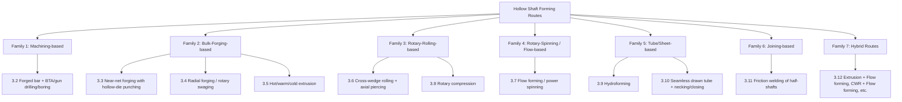
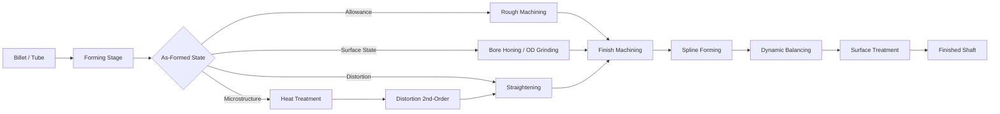

# Manufacturing Technology Options for Hollow Motor Shafts in New Energy Vehicle Electric Drive Units: A Comparative Analysis and Route Selection
# 1 Research Background, Strategic Role, and Engineering Requirements of NEV Hollow Motor Shafts

The transition from internal-combustion powertrains to electrified drive units has fundamentally reshaped the engineering boundary conditions of automotive rotating components. Within this transition, the motor shaft — a deceptively simple component once produced by routine forging-and-turning practice — has emerged as a critical node where lightweighting, rotor-dynamics, thermal management, and packaging compactness converge. In the contemporary New Energy Vehicle (NEV) e-axle, this convergence has effectively crystallized into a single design choice: the **hollow motor shaft**. Unlike a passive solid bar, the hollow shaft is now expected to deliver torque transmission, rotor-core support, coolant routing, dynamic-balance fidelity at speeds approaching or exceeding twenty thousand revolutions per minute, and a clean fatigue spectrum over hundreds of millions of cycles, all while remaining compatible with mass-production economics. Establishing why this is so, and translating these demands into measurable engineering requirements, is the prerequisite for any meaningful comparison of forming technologies. This chapter therefore frames the research problem, defines its scope and analytical logic, and derives the benchmark criteria against which the candidate manufacturing routes catalogued in Chapter 3 and analyzed in Chapters 4–7 will be evaluated.

## 1.1 Industry Context and Strategic Role of Hollow Shafts in NEV E-Axles

The strategic elevation of hollow motor shafts cannot be understood in isolation from the macro-trajectory of the NEV market and the architectural evolution of the e-axle. Industry analyses estimate the global EV rotor shaft market at approximately USD 332 million in 2025, with a projected compound annual growth rate of around 15.5% through 2033, driven by accelerating EV adoption, tightening emissions regulation, and the diffusion of high-voltage 800 V SiC powertrains[^1]. Within this expansion, the hollow shaft segment is recognized as growing faster than the solid-shaft segment, "owing to the critical need for weight reduction and material optimization in EVs" — a trend explicitly attributed to the pursuit of extended driving range and improved energy efficiency, which makes hollow geometries the preferred default in passenger-car traction applications despite "their potentially higher manufacturing complexity"[^1]. Asia-Pacific, and China in particular, is identified as the dominant production region, with a competitive landscape in which incumbent precision-engineering suppliers such as Thyssenkrupp and POPPE+POTTHOFF coexist with rapidly scaling Chinese specialists such as Chongqing Chuangjing Warm Forging Forming, Zhejiang Naishilun, Pacific Precision Forging, and Hirschvogel[^1]. The market structure thus signals not only volume growth but a fragmentation of forming-technology choices, as different suppliers commit to different process platforms.

Parallel to this volume story, the architectural evolution of the e-axle has tightened the packaging envelope around the shaft itself. The dominant integrated electric drive unit (EDU) historically combined a motor with a parallel-shaft drop-gear reducer and integrated power electronics, exemplified by ZF's EVD2 unit deployed in vehicles such as the Lotus Eletre[^2]. However, the industry is now visibly migrating toward more compact, coaxial, and high-power-density configurations. ZF's EVSys800 concept, demonstrated on the EVbeat Porsche Taycan platform, illustrates the trajectory: an 800 V SiC unit delivering 275 kW peak and 200 kW continuous in only 75 kg, achieving a torque density of 70 Nm/kg and a 50 mm shorter package than the prior generation, enabled by a coaxial transmission that "got rid of an additional shaft and ended up with a very compact, small unit"[^2]. Toyota, in partnership with BluE Nexus, Denso, and Aisin, has similarly publicly committed to a "small e-axle" program targeting interior space and range gains[^2]. In coaxial layouts the rotor shaft is no longer a peripheral torque carrier but the literal central spine through which the differential and reduction gearing must be threaded, making a hollow geometry virtually mandatory rather than optional.

This convergence reframes the hollow shaft as a **multi-functional structural and fluidic component** rather than a simple mechanical link. It simultaneously serves as: (i) the torque-transmitting member between rotor and gearbox input; (ii) the rotor-lamination mounting fixture, which dictates concentricity-driven press-fit conditions; (iii) the coolant routing channel for through-shaft oil cooling, increasingly central to rotor magnet thermal management in 800 V high-speed machines; and (iv) the kinematic axis around which dynamic-balance behavior at 15,000–20,000+ rpm is governed. Each of these functions imposes constraints on geometry, microstructure, and surface state that no single legacy forming process was originally designed to satisfy in combination — which is precisely why the competitive forming-technology landscape captured by industry analyses (forged-and-drilled, near-net forging, warm forging, flow-formed, cross-wedge-rolled, friction-welded, and hybrid routes) has become so heterogeneous.

## 1.2 Functional Drivers: Lightweighting, High-Speed Operation, NVH, and Through-Shaft Oil Cooling

Four interlocking functional drivers explain the industry's near-default adoption of hollow geometry, and each translates directly into manufacturing requirements that differentiate viable forming routes from non-viable ones.

**Lightweighting and rotor inertia.** A hollow shaft removes precisely the central material that contributes least to torsional stiffness, since torsional shear stress in a circular shaft scales with radial distance from the neutral axis. For a typical NEV traction shaft, replacing a solid bar with a thick-walled tube of equivalent outer diameter can reduce shaft mass by a substantial fraction while preserving most of the torsional stiffness; the consequential reduction in **rotor polar moment of inertia** is even more impactful at vehicle level, because it improves transient torque response, reduces regenerative-braking lag, and lowers the inertial contribution to driveline NVH. The market-level recognition of this effect is reflected in the explicit identification of "lightweight, high-strength steel alloys" and "advanced high-strength steels" as the primary material trend for EV rotor shafts, driven by manufacturers' need to "improve EV range and performance" through weight reduction[^1].

**High-speed operation and rotor dynamics.** Modern NEV traction motors increasingly operate at 15,000–20,000 rpm, with development targets pushing higher; ZF explicitly bounds its current coaxial design space by noting that "most [EV motors] will not go beyond a motor speed of 20,000 rpm"[^2]. At these speeds, the shaft's first bending critical speed must remain comfortably above the operating range, which favors high specific stiffness (E/ρ) — again reinforcing the case for hollow tubes, whose section modulus per unit mass is superior. The same speed regime imposes severe **dynamic-balance** requirements: residual unbalance tolerances at the rotor-shaft assembly level typically fall into ISO 21940 G2.5 or stricter classes, which in turn demand tight concentricity between the inner bore, outer diameter, and bearing journals. Eccentricity introduced by an asymmetrically formed bore propagates directly into unbalance, making **inner-bore-to-outer-diameter concentricity** a first-order manufacturing requirement, not an afterthought.

**NVH and modal behavior.** Beyond critical-speed avoidance, shaft stiffness governs torsional and bending modal frequencies that interact with gear-mesh excitation, electromagnetic harmonics, and bearing dynamics. Hollow shafts permit larger outer diameters at equal mass, raising modal frequencies away from problematic excitation bands. However, the same hollowness also makes the shaft more sensitive to wall-thickness non-uniformity — a defect mode characteristic of certain forming routes (notably eccentric piercing or unevenly mandrel-supported flow forming) — which can introduce mass asymmetry and unwanted modal coupling. The forming route therefore directly governs NVH risk.

**Through-shaft oil cooling.** Perhaps the most consequential functional driver is the migration of the hollow bore from a passive weight-saving void to an active **coolant channel**. In high-power-density NEV motors, particularly those using hairpin windings, copper joule losses concentrate in slots and end-windings while permanent magnets in the rotor are simultaneously vulnerable to thermal demagnetization. Direct oil cooling, increasingly delivered through axial bores in the rotor shaft and radial channels into the rotor or onto the end-windings, has become the prevailing thermal solution[^3]. Experimental work by Ha et al. on the Chevrolet Bolt EV hairpin-winding motor demonstrates how delicate the fluid-mechanical regime inside such systems is: oil-film formation rate on coil surfaces varies non-monotonically with oil temperature, peaking near 60 °C and decreasing at higher temperatures due to splashing losses, and falling sharply at lower temperatures due to elevated viscosity (0.0547 kg/m·s at 20 °C versus 0.0067 kg/m·s at 80 °C)[^4]. Air-mixing ratios in the immersion zone climb steeply with rotor speed and oil flow rate, with the thermal conductivity of the oil-air mixture dropping by up to 48.5% as air entrainment increases — a direct degradation of cooling performance[^4]. ZF's EVSys800 cooling architecture similarly emphasizes routing oil "exactly where the heat is generated" between stator bars, with flow rate, velocity, viscosity, and routing all tuned through extensive simulation[^2].

These findings have specific implications for the hollow shaft as a coolant conduit. The **inner-bore surface roughness** governs frictional pressure drop and thus the achievable coolant flow rate at a given pump pressure; rough or scaled inner surfaces also act as nucleation sites for air entrainment when the shaft itself spins, exacerbating the air-mixing degradation observed by Ha et al.[^4] The **dimensional consistency of stepped bores** — common in NEV shaft designs that combine a larger-diameter section for axial flow with smaller-diameter sections for orifice metering — directly determines whether the design intent of the oil-cooling circuit is realized in the as-manufactured part. Forming routes that produce smooth, scale-free, dimensionally tight inner geometries inherently reduce the burden on downstream honing or bore-finishing steps; routes that produce rough or oversized bores transfer this burden, as Chapter 4 will quantify.

The interaction among the four drivers explains the **dominance of hollow over solid** geometries in high-performance NEV applications: lightweighting alone might be addressed by alternative materials, and high-speed dynamics alone by stiffness tuning, but only the hollow geometry simultaneously satisfies lightweighting, rotor-dynamics, and integrated thermal-management functions within the packaging volume permitted by coaxial e-axle architectures.

## 1.3 Research Scope, Analytical Framework, and Comparative Logic

To prevent scope dilution, this report focuses specifically on **traction motor hollow shafts within passenger-car and commercial-vehicle NEV e-drive units**. Adjacent applications such as steering-column hollow shafts (e.g., Bosch's AHC-D actuator, which employs a hollow shaft for height adjustment at up to 1.75 Nm and 200 rpm[^2]), auxiliary pump shafts, and industrial servo-motor shafts are explicitly excluded, because their loading regimes (low torque, low speed, no rotor-cooling requirement) and economic envelopes differ fundamentally from traction applications. The report concentrates on shafts with characteristic lengths of approximately 300–600 mm, outer diameters in the 30–80 mm range typical of contemporary e-axles, and stepped inner bores supporting through-shaft oil cooling — the geometric class that captures the majority of high-volume NEV passenger-vehicle and high-torque commercial-EV configurations.

The **analytical framework** adopted throughout the report is multi-criteria and uniformly applied. Each candidate forming route is evaluated along five orthogonal axes: (i) technical performance — geometric capability, microstructural quality, mechanical-property delivery; (ii) manufacturability — process robustness, defect modes, tolerance capability; (iii) cost — capital, tooling, material utilization, per-part cost at NEV volumes; (iv) scalability — cycle time, line balance, equipment availability; and (v) sustainability — energy intensity, scrap rate, CO₂ footprint. The **comparative logic** is sequential: the requirements derived in Sections 1.4–1.6 of this chapter define an explicit benchmark; Chapter 2 narrows feasible material families; Chapter 3 enumerates candidate forming routes; Chapter 4 maps each route's process window and downstream burden; Chapter 5 synthesizes a quantitative comparison matrix; and Chapters 6–8 translate the comparison into route recommendations and strategic guidance. The crucial methodological commitment is that **technology selection in this report is anchored in vehicle-level functional requirements rather than in process-level preferences or supplier incumbency**.

## 1.4 Geometric and Dimensional Requirements

The geometric envelope of an NEV traction hollow shaft is characteristically more demanding than that of conventional shaft components, principally because of the integration of internal cooling features. Drawing on the typical configurations observable in production e-axles — including the Chevrolet Bolt EV hairpin motor referenced in academic studies, which has an overall motor-and-reducer assembly length of 530 mm and a stator length of 180 mm[^4] — and on the broader market characterization of EV rotor shafts, the geometric requirements can be summarized as follows.

| Geometric Attribute | Typical Range / Requirement | Engineering Driver |
|---|---|---|
| Overall length | 300–600 mm | Stator stack length, gearbox interface, coaxial e-axle packaging |
| Outer diameter (rotor seat) | ~30–80 mm | Rotor lamination ID, torque density, bearing bore |
| Length-to-diameter ratio (L/D) | 6–15 | Slender geometry challenges piercing and forming concentricity |
| Inner bore profile | Stepped, multi-section | Axial oil flow + radial metering orifices |
| Wall thickness | 4–10 mm typical | Torsional stiffness vs. mass trade-off |
| Wall-thickness uniformity | Typically <±0.1–0.2 mm | Dynamic balance, modal symmetry |
| Concentricity (ID to OD) | Tens of micrometers (single-digit μm at journals) | Rotor-balance class G2.5 or stricter |
| Cylindricity / straightness | Tight tolerances at bearing journals | Bearing life, NVH |
| Integrated features | Splines, bearing journals, rotor-stack seat, oil-port radial holes | Functional interfaces |

Several aspects of this envelope are particularly consequential for forming-route selection. First, the **stepped inner bore** is fundamentally incompatible with simple deep-hole drilling alone, because drilling produces a uniform-diameter hole; achieving stepped internal profiles requires either multi-stage boring (transferring burden to machining), or net-shape forming routes such as backward extrusion, rotary compression, or mandrel-supported radial forging that can directly impart inner steps. Second, the **L/D ratios of 6–15** challenge the straightness and concentricity capability of any forming process, particularly hot-piercing-based routes where mandrel deflection accumulates along length. Third, the **wall-thickness uniformity tolerance** is the geometric expression of the dynamic-balance requirement; a 0.1 mm wall-thickness variation around a 60 mm outer diameter can introduce mass asymmetries equivalent to several gram-millimeters of unbalance, consuming a significant fraction of the G2.5 budget before any rotor-stack effects are considered. Forming routes inherently prone to eccentric piercing or asymmetric mandrel loading therefore impose downstream balancing penalties.

## 1.5 Mechanical and Microstructural Performance Requirements

The mechanical performance envelope of the hollow shaft is dictated by the combination of peak-torque overload events and high-cycle fatigue under cyclic torque reversals across vehicle lifetime. At NEV traction-motor speeds approaching 20,000 rpm[^2], even modest residual stress concentrations or microstructural inhomogeneities can drive premature fatigue initiation, while peak-torque events from launch and regenerative braking impose torsional shear stresses approaching the material's yield strength.

The mechanical targets typically include: torsional fatigue strength sufficient to sustain on the order of 10⁷–10⁸ cycles under design torque amplitudes; peak-torque overload capability with a margin against yield typically of 1.3 or higher; torsional stiffness compatible with driveline NVH targets and rotor-dynamics critical-speed margins; and dynamic-balance performance consistent with ISO 21940 G2.5 or stricter at the rotor-shaft assembly level. These mechanical requirements translate into specific **microstructural** demands.

First, **continuous grain flow along the load path** is essential for fatigue performance. Forging-based routes that induce grain alignment along the shaft axis — and around features such as flange transitions, splines, and bearing seats — produce demonstrably superior fatigue performance compared with routes in which the grain flow is severed by machining (as occurs when a deep-drilled bore cuts through the grain structure of a wrought bar). Second, **steel cleanliness and inclusion control** govern fatigue-crack initiation, particularly at the inner-bore surface where stress concentrations can coincide with as-formed surface irregularities. Third, **tailored hardness profiles** — typically achieved through induction hardening of bearing journals and spline regions, or through case-carburizing of higher-grade designs — require that the formed shaft retain sufficient core ductility while accepting localized surface hardening. This couples forming-route choice to material selection (Chapter 2): routes compatible with medium-carbon and alloy steels such as 42CrMo, 25CrMo4, and case-hardening grades like 20MnCr5 retain access to the full industry-standard heat-treatment toolkit, whereas routes that constrain the practitioner to low-carbon tube stock or aluminum may sacrifice some of these treatment options.

This microstructural dimension is the principal axis on which **forging-based routes structurally outperform purely machining-based or sheet-/tube-based routes**, and it is the engineering reason that the EV rotor shaft market has gravitated toward "advanced high-strength steels" produced via "precision forging, advanced heat treatments, and surface enhancements"[^1]. Any economic argument that favors machining of solid bar over a near-net forming route must therefore explicitly account for the fatigue-life cost of severing grain flow.

## 1.6 Surface, Precision, and Functional Interface Requirements

Surface and precision attributes constitute the third pillar of the requirement set, and their importance is amplified by the multi-functional role of the modern hollow shaft.

On the **outer surface**, the rotor-lamination press-fit zone demands tightly controlled cylindricity and roughness so that the interference fit produces uniform radial preload around the rotor circumference; non-uniform fit conditions translate directly into magnetic-airgap eccentricity and unbalance. Bearing journals require ground or honed surface finishes (typically Ra ≤ 0.4 μm) and tight runout limits to achieve bearing life targets and to avoid NVH excitation. Spline and gear-interface zones require dimensional precision consistent with their mating components.

On the **inner surface**, the requirements are more novel and arise specifically from the through-shaft oil-cooling function. The inner-bore roughness governs the frictional pressure drop in the coolant channel and influences whether the oil flow regime remains laminar or transitions to turbulent at the design flow rate; this in turn affects heat-transfer coefficients into the shaft wall and onward to the rotor. Equally important, the cleanliness of the inner bore — freedom from forming scale, machining chips, lubricant residues, and burrs at radial oil-port intersections — determines whether the cooling circuit can operate at design intent without filter fouling or orifice blockage. Although the experimental work of Ha et al. focused on stator-side oil-spray behavior, their finding that oil-film formation and air-mixing ratios are exquisitely sensitive to oil viscosity, flow rate, and rotor-induced churning[^4] applies equally to through-shaft cooling: any inner-bore feature that destabilizes flow (sharp diameter steps with poor blending, residual machining marks acting as turbulators, eccentric bores) will degrade the cooling performance the shaft was designed to enable.

The implication for forming-route comparison is direct. A route that produces, in its as-formed state, a smooth, scale-free, concentric inner bore (such as cold backward extrusion or mandrel-supported flow forming) places a much smaller burden on downstream honing than a route that produces a rough, oxide-laden, slightly eccentric bore (such as hot piercing followed by drilling). The **finishing capability inherent to each forming route** must therefore be treated as a primary criterion, not an afterthought, and is explicitly built into the benchmark matrix below.

## 1.7 Synthesis: Benchmark Criteria for Manufacturing Route Evaluation

The preceding sections converge into a structured benchmark matrix that will be applied uniformly to each candidate forming technology in Chapters 3 through 7. The matrix integrates geometric, mechanical, microstructural, and surface requirements with the broader analytical axes of cost, scalability, and sustainability. Relative weights reflect the engineering judgment, supported by the evidence above, that microstructural integrity, inner-bore quality, and dynamic-balance-driving concentricity are first-order determinants of NEV-specific performance, while peripheral attributes such as feature versatility carry lower weight.

| Category | Benchmark Criterion | Quantitative Target / Reference | Relative Weight |
|---|---|---|---|
| **Geometry** | Overall length capability | 300–600 mm | High |
| | Achievable L/D ratio | 6–15 with controlled straightness | High |
| | Stepped inner bore capability | Multi-section bore, native or with minimal machining | **Very High** |
| | Wall-thickness uniformity | <±0.1–0.2 mm | **Very High** |
| | Outer-feature complexity (splines, journals, flanges) | Direct or near-net | Medium-High |
| **Mechanical** | Torsional fatigue life | 10⁷–10⁸ cycles at design amplitude | **Very High** |
| | Peak torque margin | ≥1.3× design | High |
| | Compatibility with high-rpm balance | ISO 21940 G2.5 or stricter | **Very High** |
| **Microstructure** | Continuous axial grain flow | Preserved through forming and finishing | **Very High** |
| | Steel cleanliness / inclusion control | Aerospace- or premium-automotive grade | High |
| | Heat-treatment compatibility | Induction hardening, carburizing, Q&T | High |
| **Surface & Precision** | OD roughness at journals | Ra ≤ 0.4 μm (post-finishing) | High |
| | ID roughness for oil flow | Smooth, scale-free, controlled | **Very High** |
| | ID-to-OD concentricity | Tens of μm; single-digit μm at journals | **Very High** |
| | Runout / cylindricity at bearing seats | Compatible with bearing-life targets | High |
| **Cost & Scalability** | Material utilization (yield) | High (>70%) preferred for mass production | High |
| | Cycle time at NEV volume | Compatible with hundreds of thousands of units/year | High |
| | Capital and tooling investment | Amortizable over platform life | Medium-High |
| | Downstream-processing burden | Minimized (forming-finishing balance) | High |
| **Sustainability** | Energy intensity | Lower preferred | Medium |
| | Scrap and rework rate | Lower preferred | Medium |
| | Lifecycle CO₂ footprint | Lower preferred | Medium |

The matrix encodes three central insights established in this chapter. First, the **inner bore is no longer a passive feature**: its quality, cleanliness, and dimensional fidelity are weighted at the highest level because the through-shaft oil-cooling function depends on them. Second, **microstructural and concentricity criteria are weighted above geometric versatility**, reflecting the fact that NEV traction shafts are first and foremost high-cycle fatigue components operating at high rotational speed, and only secondarily complex-feature components. Third, **downstream-processing burden is treated as an explicit criterion** rather than an externality, because the total cost and lead time of the shaft are determined as much by what the forming route leaves to be machined as by the forming route itself.

With this benchmark in place, the report proceeds in Chapter 2 to constrain the material space within which any candidate forming route must operate, before cataloguing the full inventory of forming technologies in Chapter 3 and subjecting each to route-by-route process and cost analysis in Chapters 4 and 5.

# 2 Candidate Material Systems for Hollow Motor Shafts and Their Process Implications

Chapter 1 established that the modern NEV traction hollow shaft is a multi-functional structural and fluidic component whose viability is governed by a benchmark matrix in which microstructural integrity, inner-bore quality, dynamic-balance-driving concentricity, and downstream-processing burden carry the highest weights. Translating that matrix into a manufacturing decision requires an intermediate step: constraining the material design space within which any candidate forming technology must operate. Material choice and forming route are not independent variables — a material's hot and cold workability, hardenability, cleanliness ceiling, and unit cost dictate which forming processes are physically feasible, economically defensible, and metallurgically appropriate, while the forming route in turn dictates which heat-treatment and finishing pathways remain available downstream. This chapter therefore performs the bridging analysis: it surveys the principal material families currently used or seriously considered for NEV hollow motor shafts, examines each family's process implications against the Chapter 1 benchmarks, and concludes with a material-process compatibility map that pre-filters non-viable combinations before the full forming-route inventory is enumerated in Chapter 3.

## 2.1 Material Selection Drivers Specific to NEV Hollow Motor Shafts

The dominant material-selection drivers for NEV traction hollow shafts can be derived directly from the functional drivers established in Chapter 1, but they reorganize themselves into a different priority hierarchy when viewed from the metallurgical side. **Torsional fatigue strength at 10⁷–10⁸ cycles**, sustained under cyclic torque reversals from launch, regenerative braking, and gear-mesh excitation at 15,000–20,000 rpm, is the first-order property requirement; it favors clean, fine-grained microstructures with continuous axial grain flow and tightly controlled inclusion populations. **Hardenability** is the second driver, because virtually every traction-shaft design relies on localized surface hardening — induction hardening of bearing journals and spline regions, or full case carburizing of the entire load-bearing length — to combine a tough core with a wear- and fatigue-resistant surface; this in turn requires alloy systems whose chemistry supports controlled martensitic transformation at the depths of interest. **Machinability** acts as a counter-pressure, because every NEV hollow shaft, regardless of forming route, retains some quantum of finish-machining on bearing journals, splines, and stepped inner bores, and excessively hard or work-hardening material families directly inflate cycle time and tool consumption. **Weldability** becomes a distinct driver only for the specific subset of multi-piece designs assembled by rotary friction welding, where similar- or dissimilar-metal joints must achieve fatigue strength comparable to the parent material across the heat-affected zone. **Thermal conductivity** is a secondary driver tied specifically to the through-shaft oil-cooling function: while steels' thermal conductivity is broadly adequate, it constrains the design space within which oil-side heat-transfer coefficients must compensate for shaft-wall thermal resistance. Finally, **density-driven lightweighting** creates the residual pull toward aluminum and other low-density alternatives, although as the subsequent sections demonstrate, this pull is structurally limited by the strength and surface-hardness gap.

The resulting trade-off space is fundamentally four-dimensional — strength, formability, heat-treatment compatibility, and cost — and it is non-convex: improvements along any one axis typically extract penalties along at least one other. The market's empirical answer to this trade-off is the convergence on "advanced high-strength steels" as the dominant rotor-shaft material trend, an observation that recurs across industry analyses of the EV rotor-shaft segment. The narrowing windows for non-steel options reflect not a lack of attempts to use them, but the structural difficulty of simultaneously satisfying torsional fatigue, surface hardness, and rotor-dynamic stiffness within the packaging envelope of a coaxial e-axle. The remaining sections of this chapter examine each material family in turn against this four-axis trade-off, with the explicit goal of identifying which families should carry which forming routes into the detailed analysis of Chapters 3–5.

## 2.2 Medium-Carbon Alloy Steels: 42CrMo, 25CrMo4, and Comparable Grades

Medium-carbon Cr-Mo alloy steels — 42CrMo (and its near-equivalent 4140), 25CrMo4 (4130), and the broader family of quench-and-temper (Q&T) chromium-molybdenum grades — constitute the historical workhorse class for high-performance automotive shafts and remain the default reference material against which all other candidates are benchmarked for NEV traction hollow shafts. Their chemistry, typically anchored at 0.40 wt.% C with approximately 1% Cr and 0.2% Mo for 42CrMo, delivers the combination of through-thickness hardenability, tempered-martensite toughness, and fatigue strength that defines the upper performance envelope of conventional shaft steels. The literature on industrial fatigue testing of NEV motor shafts explicitly references this material family as the baseline from which design upgrades have been pursued, noting that for new-energy-vehicle motor-shaft compound fatigue tests, integrated torsion and axial loading rigs have been used to "guide material selection (e.g., upgrading from 42CrMo steel to 20MnCr5 alloy steel)" based on observed fatigue-crack propagation rates under cyclic loading.[^5] The implication is consequential: 42CrMo, while metallurgically capable, is not always the fatigue-optimal choice for the most demanding NEV traction applications, and the industry has actively migrated toward case-hardening grades for higher-cycle-life subsegments (Section 2.3).

From a forming-technology standpoint, 42CrMo and 25CrMo4 occupy a relatively flexible position. Both grades are routinely hot-forged at temperatures in the 1100–1250 °C range, where their flow stress is sufficiently low to support deep upsetting, multi-step die forging, and cross-wedge rolling of preforms. They are also workable under warm-forging conditions (typically 700–900 °C), which has become the dominant production approach among Chinese precision forging suppliers serving the EV rotor-shaft market — a trend visible in the supplier landscape that includes Chongqing Chuangjing Warm Forging Forming as a named specialist in this segment. Cold extrusion of 42CrMo is feasible but operates close to the practical limits of cold-forming load capacity: the high room-temperature flow stress and the tendency toward springback impose tooling-life and tonnage penalties that drive most production-volume cold-extrusion work toward lower-carbon grades. This is an important practical constraint, because it means that pure cold-backward-extrusion routes — which are otherwise attractive for their inner-bore surface quality — are typically incompatible with 42CrMo at NEV production volumes without intermediate spheroidizing anneals that reintroduce process steps and cost.

The heat-treatment compatibility of medium-carbon Cr-Mo steels is their decisive advantage. After forming, these grades accept the full industry-standard sequence of normalizing, quench-and-temper, induction hardening of journals and splines, and surface treatments such as nitriding or shot peening. The resulting hardness profiles — typically 28–35 HRC core after Q&T with 55–62 HRC induction-hardened cases — match the shaft-specific requirements established in Chapter 1 for both core toughness and surface fatigue resistance. Microstructurally, the tempered-martensite or tempered-bainite structures achievable in these grades, combined with the continuous axial grain flow preserved by hot or warm forging, deliver fatigue performance that has been independently validated in automotive-component testing protocols using cyclic torsional and axial loading at frequencies up to 100 Hz.[^5]

The principal limitations of this material family for NEV hollow-shaft applications are threefold. First, **alloy cost** — the chromium and molybdenum content imposes a per-tonne premium of roughly 30–60% over plain-carbon shafting steel, which becomes consequential at the production volumes implied by a passenger-EV platform. Second, **distortion control during heat treatment** — the deep-hardening response that makes Q&T effective also produces significant residual stresses that must be managed through straightening operations, particularly in the slender L/D=6–15 geometries characteristic of NEV shafts; this transfers burden to downstream straightening and finish-machining steps. Third, **machining hardness** — once Q&T is complete, finish-machining of inner bores and journals must contend with a 30–35 HRC matrix that limits cutting speeds and accelerates tool wear, which is precisely the cost driver that has motivated the rise of microalloyed non-quenched-and-tempered grades discussed in Section 2.4. Notwithstanding these limitations, 42CrMo and its peers remain the default starting point for any NEV hollow-shaft program and are compatible with essentially every forming route enumerated in Chapter 3, with the partial exception of high-deformation cold-forming routes.

## 2.3 Case-Hardening Steels: 20MnCr5, 18CrNiMo7-6, and Carburizing Grades

Case-hardening steels occupy the other major axis of the NEV traction-shaft material space and have emerged as the preferred choice where the highest fatigue performance is required. The defining chemistry is a low-to-medium carbon core (typically 0.16–0.22 wt.% C) combined with alloy additions — Mn-Cr in the 20MnCr5 grade, Cr-Ni-Mo in the 18CrNiMo7-6 grade — that confer hardenability and case-depth response under gas or low-pressure carburizing. The metallurgical logic is to preserve a tough, ductile core that absorbs torsional and bending loads while developing a high-carbon (0.7–0.9 wt.%) martensitic case at the surface that resists fatigue-crack initiation, contact fatigue at splines, and bearing-journal wear. The migration of NEV shaft material specifications "from 42CrMo steel to 20MnCr5 alloy steel" has been explicitly documented as a fatigue-performance-driven design upgrade, with the substitution informed by cyclic-load fatigue testing that revealed crack-propagation behavior in the 42CrMo baseline inadequate for the most demanding rotor-shaft duty cycles.[^5] Industry discussion has separately highlighted flow-formed 20MnCr5 as a candidate for "thin, strong walls" with seamless strength characteristics suited to mass EV drives, although such platform-specific advocacy must be weighed against the broader multi-criteria evaluation pursued in this report.[^6]

The forming-technology compatibility of case-hardening steels is markedly different from that of Q&T grades, and in many respects more permissive. Their lower carbon content reduces room-temperature flow stress and improves cold formability, opening the door to **cold backward extrusion**, **deep drawing followed by ironing**, and **flow forming** as economically viable production routes for hollow-shaft preforms. This is a significant shift relative to 42CrMo, because cold-formed 20MnCr5 preforms can deliver as-formed inner-bore surface finishes substantially superior to those produced by hot-piercing or drilling routes — a direct match to the inner-bore quality criterion weighted "Very High" in the Chapter 1 benchmark matrix. The trade-off is that the carburizing step, applied after forming and rough machining, must contend with the geometric distortion that low-carbon alloy steels typically exhibit during the long thermal soaks required for case-depth development. For traction-shaft case depths typically in the 0.6–1.2 mm range, carburizing cycles of several hours at 900–950 °C are standard, and the resulting distortion in slender hollow geometries imposes downstream straightening and grinding allowances that must be designed into the preform from the outset.

The economic argument for case-hardening steels is two-sided. On one hand, the alloy content of 20MnCr5 is comparable to or lower than that of 42CrMo, and the as-supplied bar or tube cost is broadly similar. On the other hand, the carburizing process itself is energy- and time-intensive — significantly more so than induction hardening of a Q&T grade — and the equipment investment (gas or low-pressure carburizing furnaces, quench presses for distortion control) is substantial. For the 18CrNiMo7-6 grade, the addition of nickel further increases material cost and is generally reserved for the most performance-critical applications, including high-end EV rotor shafts and gear-train components where its combination of deep hardenability and case toughness justifies the premium. The Chinese ferrous-metallurgy literature documents 18CrNiMo7-6 as a recognized gear- and shaft-steel grade with a defined production route and microstructural specification.[^7]

For the purposes of forming-route selection, case-hardening steels expand rather than constrain the design space: they are compatible with hot forging, warm forging, cold extrusion, flow forming, deep drawing, and tube-based routes, and they retain compatibility with friction welding (Section 2.6) provided post-weld heat treatment is appropriate. Their principal restriction is on hot-piercing-based routes where the eccentricity and surface scale developed during piercing can persist into the carburized state if not adequately removed, potentially compromising fatigue performance at the inner bore.

## 2.4 Microalloyed and Non-Quenched-and-Tempered (NQT) Steels

The NQT (non-hardened-and-tempered) steel class constitutes one of the most significant material innovations relevant to NEV hollow-shaft manufacturing economics. The defining concept is to engineer a medium-carbon steel chemistry that, through controlled microalloying with vanadium, titanium, niobium, and/or boron, achieves the as-forged mechanical properties traditionally reserved for quench-and-tempered alloy steels — without the energy, time, distortion, and cost burden of a separate Q&T cycle. The microalloying additions act through precipitation strengthening (V, Nb), grain-size control (Ti), and hardenability enhancement (B), combined with controlled cooling from forging temperature to develop a target ferrite-pearlite or bainitic microstructure with the desired strength and hardness.

The Chinese patent and metallurgical literature documents this material class in detail. A representative B-containing medium-carbon NQT steel composition is specified as C 0.36–0.44%, Si 0.15–0.40%, Mn 1.0–1.8%, Cr 0.1–0.8%, Ti 0.01–0.06%, B 0.0005–0.005%, P ≤ 0.025%, S ≤ 0.025%, with the manufacturing process integrating converter smelting, ladle refining, Si-Ca treatment, full-protection casting, controlled rolling, and controlled cooling — a sequence designed to deliver consistent as-rolled mechanical properties without subsequent Q&T.[^7] The patent further notes that the manganese-, chromium-, and boron-bearing NQT grade has been mass-produced and "can significantly reduce the user's processing cost, with significant economic benefits".[^7] Parallel work documents vanadium-microalloyed medium-carbon non-quenched-and-tempered steel developed specifically for fracture-splitting connecting rods, where the ferrite-pearlite microstructure delivers strength and machinability without Q&T,[^8] and additional research has examined the effect of cooling rate and vanadium content on the microstructure and hardness of medium-carbon V-microalloyed steels — confirming that controlled cooling from forging temperature is the central process variable governing the resulting properties.[^5]

The relevance of NQT steels for NEV hollow shafts is direct and substantial. By eliminating the post-forging Q&T cycle, the NQT route reduces process energy consumption, shortens lead time, and — critically — eliminates the heat-treatment distortion that drives straightening and finish-grinding allowances in Q&T-alloy-steel shafts. The Chinese metallurgical industry has explicitly developed NQT steel grades for motor rotating shafts (the patent CN114875317A documents a "production method of non-quenched and tempered steel for motor rotating shaft") and for cold-machining engineering hydraulic-piston-rod applications, indicating active industrial deployment of this class.[^7] The forming-technology compatibility of NQT grades centers on **hot forging** (where the controlled-cooling step is naturally integrated into the post-forging cooling protocol) and **warm forging** (where the same controlled-cooling logic applies), with the controlled cooling itself becoming a forging-cell process parameter rather than a separate operation. For cross-wedge rolling and radial forging, the NQT logic also applies provided the post-forming cooling can be integrated into the line.

The trade-offs are real and must be acknowledged. NQT steels typically deliver lower toughness margins than equivalent-strength Q&T grades, because the ferrite-pearlite or bainitic microstructures cannot match the impact toughness of tempered martensite. For NEV traction shafts, this is generally not a binding constraint because the dominant loading mode is high-cycle torsional fatigue rather than impact loading, but it does restrict the use of NQT grades in applications with significant overload or shock-loading content. NQT steels are also more sensitive to forging-parameter control than Q&T grades, because the as-forged properties are determined by the thermomechanical history rather than rectified by a downstream heat treatment; deviations in forging temperature, deformation distribution, or cooling rate translate directly into property scatter. The fatigue performance of NQT shafts is generally adequate for traction applications but is typically benchmarked at or slightly below that of Q&T 42CrMo equivalents at the same nominal strength. The ongoing development trajectory documented in the Chinese patent record — including a 2024 priority application for an Mn-B-series NQT steel preparation method — indicates that the cost-performance frontier of this class continues to advance.[^7]

For NEV hollow-shaft economics at high production volume, NQT grades are an important option specifically for hot-forging-based and warm-forging-based routes, where their elimination of the Q&T cycle materially reduces total cost of ownership. They are less compatible with cold-forming-intensive routes (where the lower carbon and higher manganese chemistries of case-hardening grades remain superior) and are not the natural choice for tube-based or friction-welded designs.

## 2.5 Stainless Steels and Specialty Corrosion-Resistant Alloys

Stainless steels occupy a marginal but identifiable niche in the NEV hollow-shaft material space. The case for them rests on three potential advantages: corrosion resistance against the through-shaft oil environment over extended service intervals; superior surface quality of the inner bore in austenitic grades, which can favor coolant-flow performance; and acceptable mechanical properties in martensitic and precipitation-hardening grades that approach those of conventional alloy steels. However, the case against them is structurally stronger for the dominant traction-shaft application.

Austenitic stainless grades (e.g., 304, 316) suffer from low yield strength and hardness, work-hardening behavior that complicates cold forming and machining, and a fundamental inability to be surface-hardened to the levels required at bearing journals and splines without resorting to surface coatings or inserts. Their thermal conductivity is also lower than that of carbon and alloy steels, marginally increasing thermal resistance across the shaft wall in through-shaft cooling applications. Martensitic stainless grades (e.g., 410, 420) address the hardness limitation but remain significantly more expensive than 42CrMo or 20MnCr5, and their hardenability and toughness do not match purpose-designed Cr-Mo or Cr-Ni-Mo alloy steels at equivalent cost. Free-machining stainless grades, such as the tellurium-containing Y1Cr13 documented in the Chinese metallurgical literature, prioritize machinability over fatigue performance and are not appropriate for traction-shaft duty.[^7]

The cost premium for stainless steels — typically 2–4× the per-tonne cost of medium-carbon alloy steel — is the decisive economic barrier. For the corrosion-environment scenarios that might justify stainless construction, OEMs and Tier-1 suppliers have generally found it more cost-effective to specify standard alloy-steel shafts with appropriate surface treatments (phosphating, manganese phosphate conversion coatings, or thin chromium plating) and to specify high-quality oil with controlled additive packages to suppress corrosion in service. The combination of cost, machinability, hardenability, and surface-treatment alternatives has confined stainless steels to highly specific commercial-vehicle subsystems and to non-traction shaft applications. They will therefore be carried into Chapter 3's compatibility analysis only as a marginal option, applicable to a narrow range of forming routes (hot forging, machining of bar) and not material to the primary route-selection decision.

## 2.6 Aluminum Alloys and Lightweight Alternatives

The case for aluminum alloys in NEV hollow motor shafts is, on first inspection, compelling. Density reduction of approximately 65% relative to steel translates directly into rotor inertia reduction and unsprung-mass savings, both of which align with the lightweighting driver established in Chapter 1. The 6xxx and 7xxx series alloys offer reasonable specific strength, the 7075 grade in particular reaching tensile strengths above 500 MPa in T6 condition, and aluminum's hot and cold workability is generally excellent — favoring extrusion, flow forming, and hydroforming routes. Industry observations on EV motor design note that "engineers choose materials based on application needs" and "often use high-strength steel for shafts and aluminum for housings to reduce" weight, an explicit acknowledgement that aluminum is the default choice for the surrounding housings rather than for the shaft itself.[^9]

The technical and economic obstacles to aluminum traction shafts are decisive. **Torsional yield and fatigue strength** of even the strongest aluminum alloys remain a fraction of those achievable in Q&T or carburized alloy steels; matching equivalent torque capacity therefore requires shaft cross-sections substantially larger than the steel baseline, which directly conflicts with the packaging compactness imperative driving coaxial e-axle architectures. **Surface hardness** in aluminum is incompatible with rolling-element bearing journals without the use of pressed-in steel sleeves, and is incompatible with directly machined splines without inserts; both compensating measures introduce additional parts, joints, and assembly operations that erode the lightweighting benefit. **Rotor-dynamic behavior** is constrained by aluminum's lower elastic modulus (~70 GPa versus ~210 GPa for steel), which depresses bending critical speeds at equivalent geometry and forces compensating diameter increases — again working against packaging compactness. **Galvanic compatibility** with steel rotor laminations and bearing components imposes design constraints, and the through-shaft oil-cooling thermal environment can accelerate aluminum-side corrosion over service life if water contamination of the oil is not controlled.

Hybrid steel-aluminum constructions enabled by friction welding represent the only configuration in which aluminum has a credible role in the traction shaft itself, and even here the rationale is generally limited to reducing the mass of low-stress mid-span sections while retaining steel at the rotor seat, bearing journals, and splines. Such hybrid designs introduce welding-process and quality-assurance burdens that have so far prevented widespread adoption at NEV passenger-vehicle production volumes. For lower-torque auxiliary applications — pump shafts, accessory drives, certain commercial-vehicle subsystems — aluminum becomes more defensible, but these fall outside the scope defined in Chapter 1. The conclusion is that **steel remains the dominant traction-shaft material**, with aluminum reserved for adjacent housing and structural components, and that aluminum-compatible forming routes (extrusion, flow forming, hydroforming) will be evaluated in Chapter 3 primarily for their applicability to steel rather than aluminum.

## 2.7 Emerging and Advanced High-Strength Materials

Beyond the established material families, several emerging classes warrant explicit consideration to delineate near-term watch versus long-horizon research. **Advanced high-strength steels (AHSS) beyond conventional alloy grades** — including dual-phase, complex-phase, and bainitic grades developed primarily for body-in-white applications — offer combinations of strength and formability that have been speculatively considered for shafts. Their adoption is constrained by the fact that traction-shaft loading is fundamentally torsional-fatigue-dominated rather than the strain-controlled tensile-formability regime for which AHSS were optimized; the metallurgical advantages do not transfer directly to the shaft duty cycle, and the cost premium over standard alloy grades is generally not recovered.

**Powder-metallurgy (PM) and hot-isostatic-pressed (HIP) routes** offer the potential for near-net-shape preforms with controlled porosity and tailored microstructure, and have been deployed in specific gear and shaft applications in industrial machinery. For NEV traction shafts, the principal barriers are PM steels' typically lower fatigue performance relative to wrought Q&T or carburized grades (residual porosity acts as a fatigue-crack initiation site) and the cost of HIP processing at the volumes required.

**Additive manufacturing (AM)** has attracted speculative interest specifically because of the unique geometric capability to embed integrated cooling channels directly within shaft walls — a possibility that has been raised in industry discussion: "why aren't we using additive manufacturing for custom cooling channels inside hollow shafts? Laser powder bed fusion could embed spiral coolant paths directly in the wall — has anyone tested thermal performance vs. weight tradeoffs?".[^6] The thermodynamic logic is genuinely attractive, because spiral or branched coolant paths could deliver heat-transfer coefficients superior to those achievable in a simple axial bore. However, the practical barriers at NEV production volumes are substantial: AM build rates for shaft-class geometries are orders of magnitude below the cycle-time requirements of mass production, the surface roughness of as-built AM internal channels is typically incompatible with controlled coolant flow without post-machining, and the fatigue performance of AM steels — particularly with respect to internal defects acting as fatigue-crack initiation sites — has not been qualified to the levels required for safety-critical rotating components in passenger-vehicle service. AM therefore remains a long-horizon research candidate rather than a near-term production option, and is not carried forward into the Chapter 3 forming-route inventory as a primary candidate.

**Metal-matrix composites (MMCs)** combining aluminum or titanium matrices with ceramic reinforcements address the aluminum strength gap on a specific-property basis but at cost, machinability, and qualification penalties that exclude them from mainstream NEV traction-shaft consideration in the foreseeable production horizon. Their potential niche is in motorsport or premium-performance applications well outside the volume regime that defines the central scope of this report.

The synthesis is that the emerging-materials landscape, while metallurgically rich, does not currently displace the established alloy-steel families at the volumes, costs, and qualification timelines characteristic of the NEV passenger-vehicle market. The forward-looking watch list comprises NQT-steel evolutions (already documented as actively progressing), AM for premium and specialty applications, and AHSS variants where future work demonstrates fatigue-performance parity with conventional grades.

## 2.8 Material–Process Compatibility Matrix and Implications for Route Selection

The preceding analysis converges on a structured compatibility map that pre-filters non-viable material-process combinations before the detailed forming-route enumeration of Chapter 3. The matrix below assigns each material family a green (well-suited), yellow (feasible with caveats), or red (technically infeasible or economically uncompetitive) rating against each principal forming route, based on workability, hardenability, heat-treatment compatibility, and cost as analyzed in Sections 2.2–2.7. Routes are listed in the form they will be enumerated in Chapter 3; the matrix is intended to be read as a pre-filter, not as the final route-selection answer, which depends additionally on process-level capability and economic analysis to be developed in Chapters 4–7.

| Material Family / Forming Route | Hot Forging + Drilling | Warm Forging (near-net) | Cold Backward Extrusion | Cross-Wedge Rolling | Radial / Rotary Forging | Flow Forming | Deep Drawing + Ironing (tube) | Hot Pilgering / Tube-based | Friction Welding (multi-piece) |
|---|---|---|---|---|---|---|---|---|---|
| **42CrMo / 25CrMo4 (Q&T alloy steel)** | 🟢 | 🟢 | 🟡 (high flow stress, anneals required) | 🟢 | 🟢 | 🟡 (high tonnage, springback) | 🟡 | 🟡 | 🟢 (with PWHT) |
| **20MnCr5 / 18CrNiMo7-6 (case-hardening)** | 🟢 | 🟢 | 🟢 | 🟢 | 🟢 | 🟢 | 🟢 | 🟢 | 🟢 (with PWHT) |
| **Microalloyed / NQT steels (V, Ti, B)** | 🟢 | 🟢 | 🟡 (limited cold work data) | 🟢 | 🟢 | 🟡 | 🟡 | 🟡 | 🟡 |
| **Stainless steels (martensitic/austenitic)** | 🟡 | 🟡 | 🔴 (work-hardening, cost) | 🟡 | 🟡 | 🟡 | 🟡 | 🟡 | 🟡 |
| **Aluminum alloys (6xxx/7xxx)** | 🟡 (limited shaft applicability) | 🟡 | 🟢 (for non-traction) | 🟡 | 🟡 | 🟢 (for non-traction) | 🟢 (for non-traction) | 🟢 | 🟡 (hybrid only) |
| **AHSS / DP / bainitic steels** | 🟡 | 🟡 | 🟡 | 🟡 | 🟡 | 🟡 | 🟡 | 🟡 | 🟡 |
| **Powder metallurgy / HIP** | 🔴 | 🔴 | 🔴 | 🔴 | 🔴 | 🔴 | 🔴 | 🔴 | 🔴 |
| **Additive manufacturing (LPBF)** | 🔴 | 🔴 | 🔴 | 🔴 | 🔴 | 🔴 | 🔴 | 🔴 | 🟡 (AM + steel hybrid, R&D) |

Several conclusions follow from this map and are carried forward as explicit constraints into Chapter 3. **First**, the 20MnCr5/18CrNiMo7-6 case-hardening family is the only material class with green ratings across essentially every cold- and warm-forming route relevant to NEV hollow-shaft production, which positions it as the most flexible material from a forming-route-selection standpoint — and which corroborates the documented industry migration from 42CrMo to 20MnCr5 driven by fatigue-performance considerations.[^5] **Second**, 42CrMo and the broader Q&T-alloy-steel family remain fully compatible with hot- and warm-forging routes and with friction welding, but the cold-forming routes that produce the highest inner-bore quality are realistically accessible to them only at the cost of intermediate annealing steps that erode the economic case. **Third**, NQT steels are the most compelling candidate for cost reduction in hot- and warm-forging-based routes specifically, by eliminating the Q&T cycle and its associated distortion and energy burden, but they do not unlock the cold-forming routes that 20MnCr5 makes accessible. **Fourth**, stainless steels, AHSS, PM, and AM are pre-filtered out of the primary route-selection analysis on cost, performance, or maturity grounds, and will not be carried as primary options into the Chapter 3 inventory; they remain visible only as niche or research-horizon options. **Fifth**, aluminum is excluded as a primary traction-shaft material but retained as a hybrid-construction option associated specifically with friction-welded multi-piece designs.

The practical implication for the next chapter is that the forming-route inventory will be developed assuming the dominant material space comprises (a) medium-carbon Cr-Mo Q&T alloy steels (42CrMo, 25CrMo4) with full route compatibility, (b) low-carbon case-hardening alloy steels (20MnCr5, 18CrNiMo7-6) with maximal cold-forming-route accessibility, and (c) microalloyed NQT steels for cost-optimized hot/warm forging routes. This three-material core is sufficient to populate the entire forming-route comparison matrix in Chapter 5, and ensures that the route recommendations developed in Chapter 7 will rest on a material foundation that is metallurgically defensible, industrially proven, and economically realistic at NEV production volumes.

# 3 Comprehensive Inventory of Forming Technologies for Hollow Shafts

Having established in Chapter 1 that the NEV traction hollow motor shaft is a multi-functional structural and fluidic component governed by a benchmark in which inner-bore quality, microstructural continuity, concentricity, and downstream-processing burden carry the highest weights, and having narrowed in Chapter 2 the viable material space to a three-grade core of medium-carbon Cr-Mo Q&T steels, low-carbon case-hardening alloys, and microalloyed NQT steels (with aluminum confined to hybrid welded constructions), the remaining task before any comparative evaluation can begin is to assemble a complete technical inventory of the forming routes physically capable of producing such a shaft. This chapter performs that catalogue function. It is deliberately descriptive rather than evaluative: each route is documented at a uniform level of technical depth — working principle, deformation mechanics, typical equipment, characteristic output geometry, and inherent defect modes — so that Chapters 4 through 7 can apply the benchmark matrix consistently across all candidates without re-deriving process fundamentals at each comparison step. The objective is comprehensiveness: the chapter intentionally retains routes that the Chapter 2 compatibility map already flagged as marginal, because a credible recommendation later in the report depends on having explicitly considered, and not silently discarded, the full landscape of options.

## 3.1 Classification Framework and Comparative Logic of Forming Routes

The heterogeneity of the candidate forming technologies — spanning subtractive, bulk-deformation, rotary-incremental, sheet-/tube-based, and solid-state-joining categories — makes a flat enumeration analytically unhelpful. A taxonomy is required that groups routes according to how they generate the inner bore (the most consequential geometric feature of an NEV hollow shaft) and how they develop axial grain flow (the dominant determinant of fatigue life), because these two questions sit at the apex of the Chapter 1 benchmark and dictate the structural similarities and differences among routes far more than equipment or thermal regime do.

Six functional families are therefore adopted in this chapter, with hybrid routes treated as a seventh cross-cutting category:

The grouping logic rests on three orthogonal classification criteria. The first is **how the inner bore is generated**: subtractively (Family 1, where the bore is removed from a solid forging), as a net-shape feature within the forming operation itself (Families 2–4 in their hollow variants, and Family 5's net-shape end-forming), or as a property of the starting stock (Family 5 when based on seamless drawn tube, where the bore exists before the shaft-specific operations begin). The second is **how axial grain flow develops along the shaft**: continuously and undisturbed (forging-, rolling-, spinning-based families), severed at the bore but preserved elsewhere (Family 1), or interrupted at a defined joint (Family 6). The third is **the kinematic regime of deformation**: bulk plastic flow under massive single-stroke loads (extrusion, near-net forging), incremental local deformation under rotating tooling (radial forging, swaging, CWR, rotary compression, flow forming), pressurized fluid loading (hydroforming), or solid-state frictional bonding (friction welding). These three axes capture the structural differences that drive the divergent benchmark performance documented later.

Throughout the chapter, each route is described against a uniform template of five attributes — working principle, deformation mechanics, typical equipment configuration, characteristic output geometry, and principal defect modes — to enable the route-by-route comparison in Chapter 5 to operate on commensurable inputs. Strengths and limitations are observed but not yet weighted; the multi-criteria scoring is reserved for Chapter 5. The intent is that, after reading Chapter 3, a reader should be able to identify, for any given combination of NEV-shaft requirement and material grade, which forming routes are physically capable of meeting the requirement — leaving open the question of which is economically and metallurgically optimal.

## 3.2 Forged Bar with Deep-Hole Drilling, Gun Drilling, and Boring

The legacy baseline route — forging a solid alloy-steel bar to near-final external geometry and then converting it into a hollow shaft by deep-hole drilling — remains the most widely deployed manufacturing approach in industries where hollow shafts are produced in moderate volumes, and it is the natural reference against which every net-shape alternative must be justified. The route is documented in the broader hollow-shaft manufacturing literature as comprising two principal stages: first, "mandrel forging or deep-hole boring" of an upset-forged blank, followed by precision finishing in which "concentricity of ID and OD within microns" is achieved by combinations of grinding and honing, and the inner surface is "polished to prevent any 'stress risers' that could lead to internal cracking"[^10].

**Working principle.** A solid forged bar is produced first by conventional open-die or closed-die forging (Section 3.3 covers the closed-die variants; for the drilling-based route the simpler upset-forged or rolled bar is adequate), then transferred to a deep-hole-drilling machine on which the bore is removed by a long-shank drilling tool. The dominant production technology for shaft-class bores in the 18–180 mm diameter range is the BTA (Boring and Trepanning Association, also known as STS) system, in which "high-pressure coolant enters externally" through an annular space surrounding the drill tube and "chips [are] evacuated inside the drill tube" through the central passage; the standard configuration is a "stationary drill head [with] rotating workpiece"[^11]. Solid BTA drills generate a full-diameter hole; BTA trepanning heads, used for very large diameters from 65 mm to 360 mm and beyond, perform annular cutting that "leav[es] a usable center slug" — relevant for raw-material recovery in larger applications but typically not used at the outer-diameter range characteristic of NEV passenger-vehicle traction shafts[^11]. Gun drilling, an older and lower-flow-rate variant, employs a single-flute carbide-tipped drill with internal coolant supply and external chip evacuation along a V-flute, and is generally restricted to smaller diameters and shorter holes than BTA. Trepanning by lathe-mounted boring tools is used where hole diameter exceeds the practical range of solid BTA drills or where a rough bore is to be enlarged after a prior BTA pass.

**Deformation mechanics.** The bore-generation step is purely subtractive and metallurgically passive: there is no plastic flow, no grain refinement, no work hardening, and — most consequentially for the Chapter 1 benchmark — **no preservation of axial grain flow at the inner bore**. Whatever grain structure was developed in the parent forging is severed at the bore wall, exposing transverse grain ends and inclusion populations directly to the fatigue-active inner surface. The drilling itself involves shear-driven chip formation under high coolant pressure (typically 10–40 bar with high-volume flow critical for chip evacuation)[^11], producing localized heat that the coolant flux is designed to remove before significant thermal effects reach the workpiece bulk.

**Typical equipment configuration.** Production-scale BTA installations use dedicated deep-hole-drilling machines or, less commonly, lathes and machining centres equipped with BTA attachments and high-pressure coolant systems; the essential parts comprise the drill head, drill tube, pressure head, sealing bushing, and coolant adapter[^11]. Depth capability is documented as "up to 400 × diameter (common), capable of exceeding 500× with special setups"[^11], far in excess of the L/D ratios of 6–15 that characterize NEV traction shafts and confirming that depth is not the binding constraint for this application.

**Characteristic output geometry and tolerances.** The achievable diameter tolerance falls within IT9–IT10, equivalent to "±0.04 to ±0.07 mm for 20 mm diameter"; hole straightness is documented as "0.1 mm per 1000 mm or better"; and the as-drilled surface finish is "1.6 – 6.3 µm Ra (63 – 250 µin Ra) standard, [with] finer finishes possible with optimization"[^11]. The route is "optimized for carbon and alloy steels, stainless steels, cast irons, [and] non-ferrous alloys"[^11], which encompasses every material grade carried into Chapter 2's primary candidate pool. Stepped inner bores cannot be generated in a single drilling pass; they require either multiple BTA passes with different tool diameters or a sequence of BTA followed by finish boring on a lathe.

**Defect modes and downstream burden.** The principal defect modes are (i) **bore wander** — accumulating drill-axis deviation along the depth of cut, particularly on shafts at the upper end of the L/D range, even within the published 0.1 mm/m straightness specification; (ii) **eccentricity** between the drilled bore and the external forged geometry, requiring downstream machining of the OD relative to the bored axis to recover concentricity; (iii) **inner-bore surface roughness** at the upper end of the Ra 1.6–6.3 µm band, which is incompatible with the "smooth, scale-free" inner-bore quality criterion weighted "Very High" in the Chapter 1 benchmark; and (iv) **fatigue-active transverse grain ends** at the bore wall, which the literature explicitly identifies as a structural concern requiring polishing to "prevent any 'stress risers' that could lead to internal cracking"[^10]. The route therefore inherently transfers a substantial burden to downstream machining and finishing — a burden that Chapter 4 will quantify and that constitutes the principal economic argument against this route at high NEV production volumes.

## 3.3 Near-Net-Shape Forging with Hollow-Die Punching

Near-net-shape forging seeks to compress the two-stage logic of Section 3.2 into a single forging cycle by integrating a punching or piercing operation within the closed-die set, so that the resulting forging emerges with a partial or through-bore already in place and external features (rotor seat, journal bands, flange transitions) net-shape or near-net-shape. This is the approach that defines the "warm-forging precision shaft" specialization documented at suppliers including Chongqing Chuangjing Warm Forging Forming, Hirschvogel, and Pacific Precision Forging in the EV rotor-shaft segment, and it represents the dominant near-term industry response to the cost limitations of the drilled-bar baseline.

**Working principle.** A heated billet — typically at hot-forging temperatures of 1100–1250 °C, or warm-forging temperatures of 700–900 °C, depending on the material grade and the press capability — is loaded into a multi-station closed-die press. The first stations perform upsetting and pre-forming to redistribute material along the axis; the bore-generating station combines axial compression with a punching tool that drives backward into the billet from one or both ends, displacing material radially outward against the die cavity and downward against the punch. The result is, in essence, a backward-extrusion operation embedded within a die-forging sequence, producing a partial bore (closed at one end) or a through-bore with a thin web that is sheared in a final station. Because forging is preserved as the dominant deformation mode, "the walls of the hollow shaft have a uniform grain structure, providing consistent mechanical properties from end to end"[^10], and the grain-flow advantage that makes forging the metallurgical reference is retained at the rotor seat, journal, and flange features rather than severed by drilling.

**Deformation mechanics.** The deformation regime is mixed: axial upsetting in the early stations, lateral extrusion as material is pushed outward against the die walls, and backward extrusion under the bore-forming punch. Strains are highest at the bore wall and at die-radius transitions, where the controlled grain flow generated by the forging sequence wraps continuously around external features. The metallurgical literature on forging consistently emphasizes that "control of grain flow is one of the major advantages of shaping metal parts by rolling, forging, or extrusion"[^12], and the near-net hollow-shaft variant is the application of that principle to the inner-bore geometry as well as the external profile. The route is fully compatible with the Q&T alloy-steel grades (42CrMo, 25CrMo4) and with case-hardening steels (20MnCr5, 18CrNiMo7-6), and is the natural production route for NQT grades because the controlled-cooling step that develops the as-forged properties of NQT steels can be integrated into the forging-cell exit conveyor.

**Typical equipment configuration.** Multi-station hot- and warm-forging presses with ram capacities ranging from approximately 1,000 to over 4,000 tonnes are used, equipped with automatic billet feed, induction heating to forging temperature, transfer mechanisms between stations, and graphite- or water-based die-lubrication systems. Tooling consists of upsetters, pre-forming dies, finish dies, and the bore-generating punch-and-die set; tooling life is typically in the range of tens of thousands to low hundreds of thousands of parts per die set, depending on material and temperature, requiring scheduled die-change protocols compatible with mass-production line balancing.

**Characteristic output geometry.** The output is a near-net-shape forging with external features (rotor seat OD, journal bands, flange transitions) at allowance margins typically in the 1–3 mm range over finish geometry, and a partial or through-bore that is dimensionally rough relative to a finish-machined or honed inner surface. The bore is generally cylindrical or weakly stepped; achieving fully stepped bores with multiple internal diameters typically requires additional internal-shape tooling or a downstream boring operation. Wall-thickness uniformity is good but not as tight as flow-formed or extruded bore profiles; eccentricity of the punched bore relative to the die centreline is the principal geometric defect mode and is sensitive to billet centring, punch stiffness, and thermal balance across the die set.

**Defect modes and downstream burden.** Principal defect modes are (i) **bore eccentricity** from punch deflection or off-centre billet loading; (ii) **end-web defects** when through-bores are formed by shearing a residual web, which can produce burrs requiring deburring; (iii) **flow lines exposed at the bore** that, while preserving grain continuity, can interact with subsequent carburizing or induction-hardening to produce non-uniform case depths if not controlled; and (iv) **forging laps or folds** at die-radius transitions if the pre-forming sequence is poorly designed. The downstream burden is intermediate: external features still require machining to finish tolerance, and the bore typically requires honing or reaming to deliver the inner-surface quality required by the through-shaft cooling function, but the volume of material removed is substantially less than in the drilled-bar route.

## 3.4 Radial Forging and Rotary Swaging

Radial forging and rotary swaging are incremental forging routes in which the workpiece is reduced in diameter by the high-frequency radial impact of multiple die-hammers arranged around its circumference, while the workpiece simultaneously rotates (or the dies rotate around it) and feeds axially. They are uniquely suited to long, slender hollow shafts because the deformation is localized in a narrow axial zone that traverses the workpiece progressively, allowing the achievable L/D ratio to extend far beyond what bulk-forging presses can practically handle.

**Working principle.** In radial forging on the four-hammer GFM-type machine (the dominant industrial configuration), four hardened die-hammers arranged at 90° intervals strike the rotating workpiece radially at frequencies typically in the 200–1,000 strokes per minute range, with each stroke producing a small diametric reduction. A mandrel inserted into the bore supports the inner surface, simultaneously generating or refining the bore profile while the outer diameter is reduced. In rotary swaging, the die-hammers rotate around a stationary or slowly rotating workpiece and are driven by a rolling action against backing rolls in a cage, producing a similar high-frequency radial-compression effect at smaller scale and lower power than GFM-type radial forging. Both processes are typically operated warm or hot for alloy steels, although cold rotary swaging is widely used for smaller-diameter and softer materials.

**Deformation mechanics.** Each radial blow produces a localized plastic deformation zone under the die-hammer face, displacing material both axially (toward the unconstrained end) and tangentially. As the workpiece rotates between blows, successive impacts overlap circumferentially, producing a smooth and dimensionally consistent reduction; as the workpiece feeds axially, the deformation zone traverses the length, producing the long slender geometry. The cumulative effect is **fine-grained, axially aligned microstructure with continuous grain flow along the shaft axis and around stepped transitions**, combined with a beneficial residual compressive stress state at the surface that enhances fatigue performance. Mandrel-supported deformation transmits the radial-compression effect through the wall thickness, refining the inner-bore surface as well as the outer.

**Typical equipment configuration.** Industrial radial-forging machines are heavy capital items, with workpiece-length capacities up to several metres and reduction capabilities sized to the shaft diameter range. The four-hammer GFM-type machine is the reference for medium- to large-scale shaft production; smaller rotary-swaging machines occupy the small-diameter end of the range. Mandrels for hollow-shaft applications are precision-ground tools whose external profile defines the inner-bore profile of the finished shaft; multi-step mandrels enable native generation of stepped inner bores in a single forging pass — a capability that directly addresses the Chapter 1 stepped-bore requirement.

**Characteristic output geometry.** Radial forging is the route of choice for **long, stepped hollow shafts with both internal and external geometric variation**, and is the standard production route for high-performance applications including aerospace shafts and certain heavy-truck axles. Wall-thickness uniformity is excellent because the radial-compression action homogenizes the wall around the circumference. Achievable surface finishes are typically Ra 1–3 µm directly off the forge, with tolerances in the IT8–IT10 range. The route is fully compatible with the medium-carbon Cr-Mo Q&T grades, case-hardening steels, and NQT steels identified in Chapter 2, and retains compatibility with the standard heat-treatment toolkit (induction hardening, carburizing, Q&T) downstream.

**Defect modes and downstream burden.** Principal defect modes are (i) **mandrel marks** on the inner bore from inadequate lubrication or mandrel wear, requiring honing to remove; (ii) **chevron cracking** in the central region under inadequate hydrostatic pressure conditions, suppressed by appropriate die geometry and feed-rate selection; and (iii) **straightening requirement** for long slender shafts that develop bow during forging or cooling. The downstream-machining burden is among the lowest of any forming route, because both inner and outer features can be brought to near-finish geometry on the forging machine itself; finish operations are typically restricted to grinding of bearing journals, honing of the inner bore, and final spline forming. The principal economic argument against the route is **capital intensity** — GFM-class machines are among the most expensive single capital items in shaft manufacturing — and **cycle time per part**, which, while excellent for long heavy shafts, is not always competitive with bulk-forging presses for the shorter shafts characteristic of passenger-EV traction applications.

## 3.5 Hot, Warm, and Cold Extrusion (Forward, Backward, Combined)

Extrusion-based routes generate hollow-shaft preforms by forcing a billet under axial pressure through or around a die, producing axial elongation under severe plastic deformation. The family encompasses three thermal regimes (hot, warm, cold) and three kinematic variants (forward, backward, combined), and is documented in the academic literature as the basis for "an innovative cold forging process for the manufacturing of hollow shafts with variable wall thickness"[^13] — a finding directly relevant to NEV applications where stepped inner bores and variable wall-thickness sections are common.

**Working principle.** In **forward extrusion**, the billet is loaded into a container and pushed by a punch through a die that defines the external profile of the extruded section; material flows in the same direction as the punch motion. In **backward extrusion**, the die is closed at the front and the punch carries the bore-defining geometry on its tip; as the punch enters the billet, material is forced to flow rearward around the punch into the annular gap between punch and container, generating the inner bore directly and the outer profile from the container wall. In **combined forward-backward extrusion**, a single press stroke produces simultaneous forward flow through a die and backward flow around a counter-punch, generating a shaft with both inner and outer features net-shape in one operation. The three thermal regimes — hot extrusion at 1100–1250 °C, warm extrusion at 700–900 °C, and cold extrusion near room temperature — represent distinct trade-offs between flow-stress reduction, surface-finish quality, and dimensional accuracy.

**Deformation mechanics.** All extrusion variants impose **severe plastic shear strains in the deformation zone** — typically equivalent strains of 1.5 to 3 or higher per pass — producing intense work hardening (in cold variants) or dynamic recrystallization (in hot variants), and developing a strongly axially aligned grain structure. Backward extrusion specifically produces **a smooth, scale-free, dimensionally tight inner bore with surface finishes and tolerances substantially superior to those achievable by drilling or hot piercing**, because the bore is formed by direct contact with the polished punch surface under hydrostatic compression. This property is the central metallurgical argument for backward extrusion as the inner-bore-generating step in NEV hollow-shaft manufacture, particularly when the shaft is to serve as a coolant conduit. The route's hydrostatic stress state also suppresses central porosity and inclusion-driven defects, producing forgings with cleanliness comparable to or better than conventional die forging.

**Typical equipment configuration.** Hot and warm extrusion is performed on mechanical or hydraulic presses with ram capacities typically in the 1,000–4,000 tonne range; cold extrusion of medium-carbon steel can require 2,500–6,000 tonnes for shaft-class geometries. Tooling comprises the container, the bore-defining punch (for backward and combined variants), the external-shape die, and ejection mechanisms. Punch life is the limiting tooling parameter for backward extrusion, as the punch tip is exposed to maximum compressive and frictional loading; modern carbide-cored punches with hardened steel sleeves achieve life in the tens of thousands of parts for medium-carbon steels.

**Characteristic output geometry.** The defining geometric capability is **net-shape inner-bore generation with excellent surface finish and dimensional control**, including stepped bores generated by multi-stage punches or by combined forward-backward sequences. Wall-thickness uniformity is excellent in cold and warm variants, where elastic die behaviour is more predictable than in hot extrusion. The route is the natural match to the case-hardening grades (20MnCr5, 18CrNiMo7-6) flagged in Chapter 2 as having full compatibility with cold backward extrusion; for the higher-flow-stress 42CrMo, hot or warm extrusion is required, with cold extrusion accessible only with intermediate spheroidizing anneals that erode the economic case (consistent with the yellow rating assigned in the Chapter 2 compatibility map).

**Defect modes and downstream burden.** Principal defect modes are (i) **chevron (centreline) cracking** under inadequate die geometry or excessive reduction per pass; (ii) **internal voids** in the punch-tip region of backward extrusions if hydrostatic pressure is insufficient; (iii) **die wear and dimensional drift** as tooling life is consumed; and (iv) **thermal-induced distortion** in hot variants. The downstream-machining burden is among the lowest of the bulk-forming family for cold and warm variants, particularly for the inner bore, which often requires only a finish honing pass to reach the inner-surface quality demanded by the through-shaft cooling function — a direct match to the "Very High"-weighted criterion in the Chapter 1 benchmark.

## 3.6 Cross-Wedge Rolling with Axial Piercing

Cross-wedge rolling (CWR) is a high-throughput rotary-rolling forming technology in which wedge-shaped tools, mounted on flat plates or on cylindrical rolls, engage a heated billet held between them and impose simultaneous radial compression and axial elongation through a rolling motion, producing stepped shafts and shaft preforms in cycle times of seconds. CWR has been "used for producing stepped axles and shafts as well as die forging preforms" for over a century, and the academic literature documents both two-roll (or single flat-wedge) configurations and emerging three-roll variants[^14]. For hollow-shaft applications, CWR has been demonstrated to be capable of producing the hollow motor-shaft preform directly, with the literature explicitly stating that "it's possible to manufacture the hollow motor shaft billet directly and reducing the production cost greatly"[^15].

**Working principle.** In the two-roll configuration, two rolls — each carrying wedge-shaped tools on its surface — rotate in the same direction, drawing a heated billet between them. The wedges' inclined leading edges initiate a radial reduction that, combined with the differential roll-billet velocity, imposes a rotating shear that elongates the billet axially while reducing its diameter in the engaged section. Multiple wedges with different geometries successively form the stepped profile of the finished preform. The flat-plate variant (plate-type CWR machine) replaces the rolls with two flat plates that move in opposite linear directions, achieving the same kinematic effect on a smaller footprint and at lower cost, and is documented in detail in Chinese patent CN111438190B as a production-scale machine architecture[^16]. The three-roll variant uses three wedge-bearing rolls arranged at 120° intervals around the billet and is the subject of active research[^14], with "numerical simulations of two- and three-roll CWR processes for the same shaft" demonstrating that three-roll CWR offers advantages "in terms of material flow kinematics, material temperature, stresses and strains, failure modes, as well as load and energy parameters"[^14].

For hollow-shaft production, two distinct kinematic strategies are used: (i) **CWR of pre-pierced hollow billets**, in which a tube-like starting workpiece is rolled with internal mandrel support, with the academic literature documenting "Numerical Modelling of Cross-Wedge Rolling of Hollowed Shafts"[^14] and three-roll CWR of "hollowed shaft" geometries; and (ii) **CWR with axial piercing**, in which the rolling action is combined with an axially advancing piercing mandrel that generates the bore in situ — analogous to the integrated "穿孔斜轧一体成形" (combined piercing and skew rolling forming) hollow-shaft device documented in Chinese patent CN116944251B[^16]. Powder-sintered TC4 titanium-alloy hollow shafts have also been formed by cross-wedge rolling in research-scale work[^16], demonstrating the route's material range.

**Deformation mechanics.** The dominant deformation mode is rotational shear under radial compression, producing axial elongation at axial elongation ratios typically of 1.5–3× per pass. The well-documented **Mannesmann effect** — central porosity and cavitation generated by the secondary tensile stress state developed in the billet axis under combined radial compression and rotation — is the principal metallurgical risk of two-roll CWR, particularly when the diameter-reduction ratio is high or the wedge geometry is not optimized; the Polish CWR research literature has specifically addressed "internal crack formation in cross wedge rolling: fundamentals and rolling methods" and developed evaluation methods for ductile fracture and skew-rolling crack prediction[^14][^17]. **The three-roll configuration suppresses the Mannesmann effect** because the more symmetric radial loading reduces the central tensile stress state, and is one of the principal motivations for the migration to three-roll designs. In combined CWR-with-piercing kinematics, the central material is removed by the piercing mandrel before it can develop the central porosity associated with the Mannesmann effect, converting the metallurgical liability into a productive feature.

**Typical equipment configuration.** Industrial CWR machines comprise either two heavy rolls (typically 600–1,200 mm in diameter) driven by high-torque motors, or two parallel flat plates driven by hydraulic actuators, with the wedge tooling mounted on the working faces. The plate-type CWR machine documented in CN111438190B includes synchronization mechanisms to maintain plate parallelism under rolling load[^16]. Three-roll machines and integrated piercing-rolling hybrids (CN116944251B) are emerging in the Chinese equipment market and represent the technological frontier of the route. Heating is by induction or by walking-beam furnaces that deliver billets at the appropriate hot-forging temperature.

**Characteristic output geometry.** CWR is notable for producing **stepped solid or hollow shafts with multiple diameter transitions in a single rolling pass**, with cycle times typically below 10 seconds per part — making it among the fastest forming routes in the catalogue and uniquely suited to mass-production volumes. Achievable diameter tolerances are typically IT11–IT13 directly off the rolling machine, requiring downstream finish-machining to reach NEV-shaft tolerance bands; surface finish is typical of hot-rolled steel (Ra 5–15 µm) and is significantly inferior to extruded or flow-formed surfaces. For hollow variants, the inner bore generated by piercing or by mandrel-supported rolling is similarly rough and typically requires honing.

**Defect modes and downstream burden.** The **Mannesmann central porosity** is the defining defect mode for two-roll solid-billet CWR; it is suppressed but not eliminated in three-roll configurations and is geometrically eliminated in integrated piercing variants. Other defect modes include **necking (axial pinching)** at wedge-transition zones if process parameters are off-optimum, **surface laps and folds** from incorrect wedge geometry, and **straightness deviations** in long slender preforms requiring post-rolling straightening. The downstream burden is moderate: the high-throughput, low-cost CWR preform must subsequently be machined to finish tolerance on the OD, the bore must be honed to inner-surface-quality requirements, and heat treatment must be applied separately. The economic appeal of CWR rests on the very low per-part forming cost achieved by short cycle times, accepted at the cost of the larger downstream-finishing burden.

## 3.7 Flow Forming and Power Spinning

Flow forming, defined under DIN 8583 as a chipless metal-forming process for "rotationally symmetrical hollow bodies … from a tube or bowl with a cylindrical, conical or curved surface line"[^18], is the rotary-spinning route most directly relevant to NEV hollow-shaft production. It is mechanically distinct from conventional metal spinning in that the wall thickness is deliberately reduced and the workpiece is axially elongated, rather than being merely shaped over a mandrel without thickness change. The dominant industrial equipment platform — represented by Leifeld Metal Spinning's ST and FFM series — defines the production-scale capability envelope of the route.

**Working principle.** "A preform is slid onto the mandrel and clamped securely. As a rule, three or more rotating flow forming rollers press radially onto the rotating work piece, such that the material spreads in an axial direction. The wall thickness is thus reduced and the work piece is lengthened"[^18]. The route distinguishes **forward flow forming**, in which the material flows in the same direction as the roller axial feed (away from the chuck), and **reverse flow forming** (also called backward flow forming), in which the material flows opposite to the roller feed, with the workpiece extending in the opposite direction. Forward flow forming additionally enables the formation of "teeth and so to produce a range of different internally toothed gear components"[^18] — a capability of direct interest for integrated rotor-shaft-with-spline geometries. The starting preform is typically a tube, a flow-formed cup, or — for NEV-shaft applications — a backward-extruded preform that already contains the rough inner-bore geometry.

**Deformation mechanics.** The deformation is "pure compressive loading" applied incrementally by the rollers, which "first of all serves to increase the work piece's strength and also lengthens the material. The result is an extended work piece with enhanced material properties, a higher load-bearing capacity and a longer service life than components produced by metal cutting processes"[^18]. The work-hardening effect is metallurgically substantial: in case-hardening steels at typical 30–50% wall reductions, the as-formed yield strength can rise by 30–60% relative to the starting tube, and the resulting axially aligned grain structure delivers fatigue performance that the spinning industry's process literature describes as "seamless strength characteristics suited to mass EV drives". The hydrostatic compressive stress state suppresses defect formation and produces an inner-bore surface that, in contact with the polished mandrel, is dimensionally tight and metallurgically clean.

**Typical equipment configuration.** The Leifeld ST 650 H S Series exemplifies the heavy-duty industrial configuration: workpiece outer diameters from 90 mm to 650 mm, workpiece lengths up to "1,200 mm" in forward flow forming and up to "2,400 mm" in reverse flow forming for the ST 650 H 1300 S model, scaling up to 3,000 mm forward and 6,000 mm reverse for the ST 650 H 3100 S variant[^19]. The machine is "applicable for forming processes like forward flow forming, reverse flow forming and shear forming" with "close tolerances and highest repeatability"[^19]. The FFM 312-4RS machine, by contrast, is "particularly suitable for rolling out cylindrical rings which are then finish-formed to weight-optimised passenger car rim rings", with workpiece outer diameters from 330–500 mm and lengths up to 310 mm[^11] — a configuration optimized for shorter, larger-diameter workpieces and not directly relevant to traction-shaft geometries. For the 30–80 mm OD, 300–600 mm length envelope of NEV hollow shafts, smaller flow-forming machines in the ST series are the typical industrial equipment, equipped with three-roller staggered configurations, hydraulic roller-force control, CNC tool-path programming, and multi-axis roller positioning to support both forward and reverse modes.

**Characteristic output geometry.** Flow forming's signature output is a **seamless, thin-walled, high-strength tubular component with excellent inner-bore surface finish, tight wall-thickness uniformity, and dimensional tolerances superior to those of any other rotary-forming route**. Wall-thickness reductions of 50% per pass are routinely accommodated, and the achievable inner-bore concentricity, when supported by a precision-ground mandrel, is in the tens of micrometres or better — directly addressing the "Very High"-weighted ID-to-OD concentricity criterion in the Chapter 1 benchmark. Stepped or contoured outer profiles can be generated by appropriate roller paths, and stepped or contoured inner profiles can be generated by the mandrel — the FFM-series machines explicitly support "embossed mandrel contours"[^19] for this purpose.

**Material compatibility and defect modes.** The route is metallurgically demanding because the cold deformation imposes substantial work hardening; case-hardening grades such as 20MnCr5 are the natural fit (consistent with the green rating in the Chapter 2 compatibility map), while 42CrMo can be flow formed but requires careful control to manage springback and tooling tonnage. Principal defect modes include **roller marks** on the outer surface from inadequate roller-path overlap, **mandrel-side scoring** under inadequate lubrication, **wall-thickness drift** along the axial direction, and, at higher reduction ratios, **shear-induced cracking** if the material's deformation capacity is exceeded. The downstream-machining burden is among the lowest of any route for the inner bore, often requiring no honing at all on case-hardening grades; external features (journals, splines) typically require finish grinding and spline forming as separate downstream operations.

## 3.8 Rotary Compression for Hollow Stepped Shafts

Rotary compression is a less widely deployed but technically distinctive rotary-tool forming process developed at Lublin University of Technology and documented in the academic literature as "A Method For Producing Hollow Shafts By Rotary Compression"[^17]. It occupies a niche between cross-wedge rolling and radial forging, sharing kinematic features with both but optimized specifically for hollow stepped-shaft geometries.

**Working principle.** A hollow billet is engaged between rotary tools — typically two or three roll-mounted tools with profile-shaped working surfaces — that simultaneously compress and rotate the workpiece. Unlike CWR, where the principal tool action is radial wedging combined with axial elongation, rotary compression emphasizes localized radial compression that traverses the workpiece axially, producing stepped diameter changes by progressive thinning rather than by wedge cutting. The literature documents the route as suitable for "producing hollow stepped shaft forgings by rotary compression with rotary tools"[^17] and as a related process to rotary-tool-based forming of hollow gear-shaft preforms documented in the broader Lublin research programme[^14].

**Deformation mechanics.** The dominant deformation mode is incremental radial compression supported by an internal mandrel, producing axial grain alignment and a fine-grained microstructure similar to that achieved in radial forging but with the higher throughput characteristic of rolling-based routes. The hollow billet starting condition eliminates the Mannesmann-effect concern that limits two-roll CWR of solid billets, because the central material in which the tensile stress state would develop is already removed. Process parameters documented in the academic literature include "the influence of hollow billet thickness in rotary compression" as a primary variable governing deformation kinematics and defect formation[^14].

**Typical equipment configuration.** Rotary-compression machines are research-stage and limited-production equipment, with the principal industrial deployments in Poland and emerging Chinese installations. The kinematic configuration is similar to that of three-roll CWR machines but with profile-shaped rather than wedge-shaped tools, and with hollow-billet handling and mandrel-support systems specifically engineered for the route. The route has been demonstrated for "hollow gear shafts" using rotary-compression techniques[^14], indicating its applicability to integrated rotor-shaft-with-spline geometries relevant to NEV applications.

**Characteristic output geometry and defect modes.** The output is a **stepped hollow shaft forging with axial grain flow preserved and inner and outer geometric variation**, with cycle times intermediate between CWR and radial forging. Achievable tolerances and surface finishes are similar to those of rotary-forging routes generally — Ra 1–3 µm with IT8–IT10 dimensional bands. Principal defect modes are similar to those of CWR and radial forging: surface laps from incorrect tool geometry, mandrel-marking on the inner bore, and straightness deviations on long slender geometries. The downstream-machining burden is comparable to that of radial forging.

The route's status is best characterized as **emerging rather than established**: it has demonstrated technical capability for hollow stepped-shaft production but has not achieved the equipment availability, supplier base, or production-scale economics of the more mature rolling and forging routes. It is therefore carried forward into the Chapter 5 evaluation as a credible candidate but with a maturity-discounted weighting.

## 3.9 Hydroforming and Internal High-Pressure Forming

Tube hydroforming applies internal high-pressure hydraulic fluid to a tubular blank enclosed in a die cavity, expanding the tube against the die walls to generate complex external geometry while maintaining the tube's hollow interior. The process is patented and well-documented in industrial practice, with the modern industrial spread dating to the 1970s for "the production of large T-shaped joints for the oil and gas industry" before becoming widely used in automotive applications[^10].

**Working principle.** "In tube hydroforming pressure is applied to the inside of a tube that is held by dies with the desired cross sections and forms. When the dies are closed, the tube ends are sealed by axial punches and the tube is filled with hydraulic fluid. The internal pressure can go up to a few thousand bars and it causes the tube to calibrate against the dies. The fluid is injected into the tube through one of the two axial punches. Axial punches are movable and their action is required to provide axial compression and to feed material towards the center of the bulging tube"[^10]. The process distinguishes **high-pressure hydroforming**, where the tube is enclosed in the die before pressurization, and **low-pressure hydroforming**, where the tube is slightly pressurized during die closure; the high-pressure variant dominates structural-component production. For complex parts, "the tube must be pre-bent prior to loading into the hydroforming die"[^10], adding a process stage.

**Deformation mechanics.** The deformation mode is **biaxial stretching under controlled axial feed**: the internal pressure forces the tube wall outward against the die cavity, while the axial punches feed material toward the deformation zone to maintain wall thickness. The resulting geometry is dictated by the die cavity, which can include "complex shapes with concavities … that would be difficult or impossible with standard solid die stamping"[^10]. The process is "limited by the very high closing force required in order to seal the dies, especially for large panels and thick hard materials" and by "small concave corner radii [which] are difficult to be completely calibrated, i.e. filled, because too large a pressure would be required"[^10]. Failure modes include "excessive thinning, fracture, [and] wrinkling … strictly related to the material formability and to a proper selection of process parameters (e.g. hydraulic pressure vs. time curve)"[^10].

**Typical equipment configuration.** Hydroforming presses comprise hydraulic die-closure systems (with closing forces in the thousands of tonnes for shaft-class applications), high-pressure intensifier pumps capable of delivering several thousand bar of working fluid pressure, two-piece dies machined to the external geometry of the finished part, and axial-punch systems for tube-end sealing and axial feed. Tube pre-bending is performed on dedicated bending machines with mandrel support to maintain cross-section integrity.

**Characteristic output geometry and relevance to NEV shafts.** Hydroforming's geometric strength is in **complex external geometry with localized diameter expansions, integrated flanges, and stepped or curved cross-sections** — capabilities that are highly valued in body-in-white frame rails, exhaust components, and bicycle frames, but that are **only marginally relevant to NEV traction hollow shafts**, which are dominantly cylindrical or weakly stepped on the outside. The inner-bore geometry in hydroforming is determined by the starting tube's internal profile, which the process does not refine; achievable wall-thickness reductions are modest (typically <30%), and the work-hardening benefit is correspondingly limited compared to flow forming.

**Defect modes and downstream burden.** Principal defect modes are wrinkling, thinning, fracture, and incomplete die-cavity filling at small radii[^10]. The downstream-machining burden is highly geometry-dependent: hydroformed parts can be near-net on the outside but typically require finish machining at bearing journals and at the inner bore. **The route's relevance to NEV traction shafts is limited primarily to specialized configurations**, such as hydroformed structural sleeves combined with friction-welded end pieces, and is unlikely to displace flow forming as the dominant tube-based forming option for traction-shaft applications.

## 3.10 Tube-Based Processing from Seamless Drawn Tubes

A distinct family of routes begins with seamless cold-drawn or hot-pilgered tube stock as the starting material, eliminating the bore-generation step from the shaft-specific manufacturing sequence and instead inheriting the bore from the upstream tube-mill operation. This family encompasses subsequent operations including tube cutting, cold drawing or ironing for wall-thickness refinement, necking-in to reduce end diameters, end-closing to seal one end, and conventional or CNC machining of external features.

**Working principle.** Seamless tube stock is produced upstream by Mannesmann piercing of solid round bar followed by pilger rolling, plug rolling, or mandrel rolling to develop the wall thickness and length, then by cold drawing through multiple die-and-mandrel passes to refine dimensional tolerance, surface finish, and mechanical properties. For NEV-shaft applications, the starting tube is typically supplied to outer-diameter tolerances of ±0.05–0.15 mm, wall-thickness tolerances of ±5–10%, and surface finishes of Ra 0.8–3.2 µm. The shaft-specific operations then comprise: (i) **necking-in** of one or both ends, in which a roller or die progressively reduces the end diameter to form a journal or fitting interface — a process documented in industrial machine catalogues as "the process of reducing the diameter of a tube's open end, creating a narrower section that can be used for various purposes, such as fitting into another tube or attaching to a different component"[^13]; (ii) **end-closing**, in which one end is sealed by spinning, crimping, or welding to form a closed bore — used "in the production of containers, pressure vessels, and tanks, where the integrity of the closed end is critical"[^13]; and (iii) **finish machining** of external features (rotor seat, journal bands, splines).

**Deformation mechanics.** The deformation mechanics are dominated by the upstream tube-drawing operations, which impose substantial work hardening on the cold-drawn variants and produce a strongly axially aligned grain structure. The downstream necking and closing operations impose localized incremental deformation on the tube ends, with axial-symmetric strain states. The route inherits both the strengths of seamless tube production (excellent dimensional consistency, smooth inner-bore surface, work-hardened wall) and its limitations (the tube cross-section is essentially fixed once supplied; only modest geometric variation can be added by necking, closing, or external machining).

**Typical equipment configuration.** Tube cutting is performed on rotary tube-cutting machines or saws; necking-in and closing are performed on dedicated CNC machines with hydraulic roller- or die-actuation systems, often integrated with metal-spinning lathe architectures. Finish machining of external features uses standard CNC turning and milling centres. The route's appeal lies in the relatively modest capital investment downstream of the tube mill, and in the elimination of the bore-generation step.

**Characteristic output geometry and material compatibility.** The output is a **hollow shaft with cylindrical or weakly stepped external geometry, a near-constant inner-bore profile inherited from the starting tube, and necked or closed ends**. Stepped inner bores are not natively supported and can be approximated only by combining tubes of different IDs with friction welding (Section 3.11). The route is best suited to relatively simple shaft configurations where the inner bore is constant or weakly stepped, and is less attractive for the multi-step inner profiles increasingly demanded by through-shaft oil-cooling architectures with multiple metering orifices and flow distributions.

**Defect modes and downstream burden.** Principal defect modes are **inheritance of upstream tube defects** (eccentricity, surface inclusions, wall-thickness variation), **wrinkling at necked sections** under inadequate roller-feed control, and **end-closure leakage or microcracking** in closed-end variants. The route's principal economic strength is high material utilization (>85% typical) and short cycle time per part; its principal weakness is the geometric inflexibility imposed by starting from a near-constant cross-section.

## 3.11 Friction Welding of Half-Shafts and Multi-Piece Constructions

Friction welding is a solid-state joining process that "generates heat through mechanical friction between workpieces in relative motion to one another", with the addition of "a lateral force called 'upset' to plastically displace and fuse the materials"; it is "a solid-state welding technique similar to forge welding [rather than] a fusion welding process"[^14]. The applicable ISO standard is EN ISO 15620:2019[^14], and the process has a well-documented industrial history including the 1974 development of the "rRS6 double spindle machine for heavy truck axles" by KUKA and Thompson[^14], establishing the route's relevance to high-torque rotating-shaft applications. For NEV hollow-shaft production, friction welding enables multi-piece constructions in which different sections of the shaft are produced by different forming routes optimized for their local requirements, then joined into a single shaft.

**Working principle.** Several friction-welding variants are relevant to hollow-shaft applications. **Rotary friction welding (RFW)** is "the oldest of the methods" and the dominant industrial variant, in which "one welded element is rotated relative to the other and pressed down. The heating of the material is caused by friction work and creates a non-separable weld"[^14]. **Radial friction welding** is "similar to rotary friction welding and is generally used to weld pipes together … unlike rotary friction welding, it does not require either of the parts to be rotated. Instead a ring is used to generate the necessary heat by rotating it around the pipes"[^14]. **Linear friction welding (LFW)** "is the act of moving a single component in a linear reciprocating motion across the face of a stationary component"[^14]. **Low-force friction welding**, a hybrid technology developed by EWI and MTI, "uses an external energy source to raise the interface temperature of the two parts being joined, thereby reducing the process forces required to make a solid-state weld compared to traditional friction welding"[^14], extending the route to larger cross-sections and dissimilar-metal combinations.

**Deformation mechanics.** The interface region undergoes **severe plastic deformation under combined frictional heating and axial upset force**, producing a characteristic zone structure. The "weld central zone (WCZ)" undergoes "significant dynamic recrystallisation (DRX)", while the surrounding "thermo-mechanically affected zone (TMAZ)" experiences mechanical deformation without DRX, and the outer "heat-affected zone (HAZ)" experiences thermal effects without mechanical deformation; "the region from one TMAZ/HAZ boundary to the other is often referred to as the 'TMAZ thickness' or the plastically affected zone (PAZ)"[^14]. Because the process operates in the solid state, "an ultra-fine grain structure of alloy or metal which is obtained by techniques such as severe plastic deformation … is desirable, and not changed by the high temperature"[^14], and the process avoids the phase-transformation issues of fusion welding. Nonetheless, post-weld heat treatment is typically required for medium-carbon and case-hardening alloy steels to homogenize the local microstructure across the weld zone — a requirement explicitly noted in the Chapter 2 compatibility map.

**Typical equipment configuration.** Industrial friction-welding machines comprise either **inertia-drive** machines, which spin one workpiece to a target RPM via a flywheel and then disengage the drive so that the inertial energy is dissipated through the friction interface; or **continuous-drive (direct-drive)** machines, which maintain motor drive throughout the welding cycle and stop the rotation by mechanical braking. Spindle RPMs are typically in the 200–14,000 range[^15]. Modern installations including "double spindle machines" enable simultaneous welding of both ends of a shaft, with applications in heavy-truck axles[^14]. Capital investment is moderate; consumable-tool-free operation makes per-part variable cost low at scale.

**Characteristic output geometry and applications.** Friction welding enables **multi-piece hollow-shaft constructions** including: (i) **steel-aluminum hybrid shafts**, where a steel rotor-seat and journal section is joined to an aluminum mid-span tube to reduce mass — relevant to the limited aluminum-application case identified in Chapter 2; (ii) **dissimilar-grade steel shafts**, where a case-hardening-grade rotor seat is joined to a Q&T-grade journal section, optimizing material selection locally; and (iii) **simplified-forming shafts**, in which two relatively simple half-shafts are produced separately by efficient processes and joined, avoiding the complexity of forming a stepped hollow shaft in a single operation. The patent and industrial literature documents tube-yoke designs in which a fillet weld at the valve-seat-to-driveshaft-tube interface "boosts the torque transfer capability of the tube yoke"[^20], illustrating the load-transmission capability of welded shaft constructions.

**Defect modes and downstream burden.** Principal defect modes are **HAZ softening or hardening** depending on material and parameters, **flash formation** at the weld interface requiring downstream machining or trimming, **internal weld defects** including unbonded regions or oxide inclusions if process parameters or surface preparation are inadequate, and **distortion** introduced by the asymmetric thermal cycle. The downstream burden includes flash removal, post-weld heat treatment for fatigue qualification, and finish machining at the weld zone to deliver bearing-journal-quality surfaces if the weld falls within a critical region. The principal qualification challenge is **fatigue performance across the weld zone**, which must be demonstrated to meet the 10⁷–10⁸ cycle life requirement of the Chapter 1 benchmark — a non-trivial validation effort that has historically slowed the route's adoption for safety-critical traction-shaft applications.

## 3.12 Hybrid Routes: Extrusion + Flow Forming and Other Combinations

The forming routes described in Sections 3.2 through 3.11 are rarely deployed in pure form; in production practice, two or more elementary routes are combined sequentially to exploit complementary strengths and to compensate for the limitations of any single route. Hybrid routes therefore deserve explicit cataloguing as a distinct category, because the multi-criteria evaluation in Chapter 5 will frequently identify a hybrid as the optimal combination rather than a single elementary route.

**Cold/warm backward extrusion + flow forming.** This is the most metallurgically and economically compelling hybrid for NEV hollow-shaft production. **Backward extrusion** generates the inner-bore geometry directly with excellent surface finish, dimensional control, and axial grain flow; **flow forming** then refines the wall thickness, develops further axial elongation, imposes substantial work hardening, and tightens dimensional tolerances. The metallurgical synergy is direct: the extrusion-induced hydrostatic compressive stress state suppresses defect formation in the starting preform, while the flow-forming-induced cold work and axial grain alignment further enhance fatigue performance. The route is particularly compatible with case-hardening grades such as 20MnCr5, where both stages are within the green compatibility band of the Chapter 2 map. Industrial deployment of this hybrid is documented in the spinning-equipment supplier base, with the LEIFELD ST 650 H S Series specifically engineered for "heavy-duty forming of rotationally symmetrical hollow bodies with constant or varying wall thickness by flow forming via cylindrical, conical or embossed mandrel contours"[^19] starting from preforms produced by extrusion, deep drawing, or other primary operations.

**Cross-wedge rolling preform + radial forging or flow forming.** A second important hybrid combines the high-throughput, low-cost preform generation of CWR with the dimensional refinement and microstructural enhancement of a downstream rotary-forming step. CWR produces the rough stepped hollow preform in cycle times of seconds; radial forging or flow forming then refines the inner and outer dimensions, eliminates Mannesmann porosity in the centre region (in CWR-of-solid-billet variants), and develops the final tolerance and surface-finish state. The hybrid is particularly attractive at the highest production volumes, where the cycle-time advantage of CWR offsets the additional capital of the second stage.

**Friction-welded preform + machining.** A third hybrid combines two simple half-shafts, each produced by an efficient route (drawn tube, forged solid bar, or extruded preform), joined by friction welding into the full shaft geometry, then finish-machined. The route exploits the cost advantage of simple half-shaft production while accepting the welding qualification burden, and is particularly suited to dissimilar-section designs where the rotor-seat region and the journal/spline regions have substantially different geometric or metallurgical requirements.

**Forging plus localized rotary forming.** A fourth hybrid combines a near-net die-forged preform (Section 3.3) with a localized rotary-forming operation — typically rotary swaging of the journal section or flow forming of a specific wall-thickness-critical region — to refine local properties without re-forming the entire shaft. This is an emerging configuration enabled by flexible CNC-controlled rotary-forming cells.

**Common metallurgical logic.** Across all hybrid routes, the unifying metallurgical logic is to **decouple the inner-bore generation step from the wall-refinement step** so that each can be optimized independently. Routes that conflate the two (drilling a forged bar; flow-forming a tube without bore refinement; CWR of a solid billet) inherit the limitations of whichever step is the weaker. Hybrid routes that split the two and select the best technology for each typically deliver superior overall performance, at the cost of additional process integration and capital investment. The Chapter 5 comparison matrix will therefore explicitly evaluate hybrid combinations alongside elementary routes.

## 3.13 Summary Table and Cross-Route Capability Map

The thirteen forming routes (twelve elementary plus the principal hybrid family) catalogued in this chapter are consolidated in the comparison table below, which summarizes for each route the working principle, the inner-bore generation mechanism, the characteristic output geometry, the typical equipment class, the principal defect modes, and the qualitative grain-flow continuity. The table is the unified reference inventory on which the multi-criteria evaluation in Chapter 5 builds; it does not yet apply the benchmark scoring, which is reserved for that chapter.

| # | Forming Route | Bore-Generation Mechanism | Output Geometry (Native Capability) | Typical Equipment | Principal Defect Modes | Grain Flow at Bore |
|---|---|---|---|---|---|---|
| 3.2 | Forged bar + BTA/gun drilling | Subtractive (post-forging) | Cylindrical bore, stepped only via multi-pass | Forging press + BTA deep-hole drill[^11] | Bore wander, eccentricity, rough Ra 1.6–6.3 µm[^11] | **Severed** at bore |
| 3.3 | Near-net forging w/ hollow-die punching | Net-shape (within forging) | Cylindrical or weakly stepped bore + near-net OD | Multi-station hot/warm forging press | Bore eccentricity, end-web defects, forging laps | Continuous |
| 3.4 | Radial forging / rotary swaging | Net-shape via mandrel | Long stepped hollow shafts, both ID & OD | GFM 4-hammer machine, rotary swager | Mandrel marks, chevron cracks, straightness deviation | Continuous, fine-grained |
| 3.5 | Hot/warm/cold extrusion (forward, backward, combined) | Net-shape via punch (backward variants) | Smooth, scale-free, dimensionally tight bore[^13] | Hydraulic/mechanical press 1,000–6,000 t | Chevron cracking, internal voids, die wear | Continuous, axially aligned |
| 3.6 | Cross-wedge rolling + axial piercing | Piercing or pre-pierced billet[^15] | Stepped hollow preforms, fast cycle | 2-roll, 3-roll, or flat-plate CWR machine[^14][^16] | Mannesmann porosity, surface laps, IT11–IT13[^14] | Continuous (suppressed Mannesmann) |
| 3.7 | Flow forming / power spinning | Tube-stock or pre-formed cup[^18] | Seamless thin-walled, OD 90–650 mm, length to 6 m[^19] | Leifeld ST 650 H S Series[^19], FFM 312-4RS[^11] | Roller marks, mandrel scoring, wall drift | Strongly axially aligned, work-hardened |
| 3.8 | Rotary compression | Hollow-billet starting stock[^17] | Stepped hollow shafts | Lublin-type rotary-compression machine | Surface laps, mandrel marks, straightness | Continuous |
| 3.9 | Hydroforming | Tube-stock | Complex external geometry, stepped sections[^10] | High-pressure hydroforming press, several thousand bar[^10] | Wrinkling, thinning, fracture, incomplete fill[^10] | Inherited from tube |
| 3.10 | Seamless drawn tube + necking/closing | Tube-stock from upstream Mannesmann/pilger | Cylindrical OD with necked/closed ends[^13] | Tube mill + necking/closing CNC[^13] | Tube-defect inheritance, neck wrinkling | Inherited from tube |
| 3.11 | Friction welding of half-shafts | Joined from multi-piece pre-formed parts | Multi-piece, dissimilar-material capable | Inertia/direct-drive, double-spindle machines[^14] | HAZ softening, flash, fatigue at weld | Continuous within sections, **interrupted at weld** |
| 3.12-A | **Hybrid: Backward extrusion + flow forming** | Net-shape extrusion, refined by flow forming | Stepped hollow shafts, premium ID and OD quality | Press + Leifeld flow former[^19] | Compound of constituent modes | Continuous, dual-stage hardened |
| 3.12-B | **Hybrid: CWR + radial forging or flow forming** | CWR-piercing, refined by rotary tools | Stepped hollow preforms with finish quality | CWR machine + GFM/flow former | Compound of constituent modes | Continuous |
| 3.12-C | **Hybrid: Friction-welded preform + machining** | Joined from simple half-shafts | Multi-piece with dissimilar-section optimization | Friction welder + CNC | HAZ + machining defects | Sectional, weld-interrupted |

Several cross-route observations emerge from the consolidated table and frame the Chapter 5 evaluation. **First**, the routes that natively produce smooth, dimensionally tight inner bores are concentrated in the bulk-forging and rotary-spinning families (Sections 3.3–3.5, 3.7), while the routes that rely on subtractive or tube-inheritance bore generation (Sections 3.2, 3.10) inherently transfer burden to downstream finishing — an observation that maps directly onto the "Very High"-weighted ID quality criterion in the Chapter 1 benchmark. **Second**, the routes that natively support stepped inner bores in a single operation are limited to radial forging with profiled mandrels (Section 3.4), combined extrusion (Section 3.5), and integrated CWR-piercing variants (Section 3.6); other routes require multi-stage tooling or downstream machining to achieve stepped profiles. **Third**, grain-flow continuity at the bore — the metallurgical determinant of fatigue life — is **severed** in only the Family 1 drilling route and **interrupted** at a defined joint in the Family 6 friction-welding route; all other routes preserve continuity, which is the metallurgical foundation of their preferred status in the comparative evaluation to follow. **Fourth**, the hybrid routes (Section 3.12) systematically combine the strengths of two elementary routes and warrant evaluation as primary candidates rather than as fallback configurations.

Cross-referenced against the Chapter 2 material-process compatibility map, the routes that are carried forward as primary candidates into Chapters 4–7 are: (i) **near-net warm forging with hollow-die punching** (Section 3.3) for Q&T, case-hardening, and NQT grades; (ii) **radial forging / rotary swaging** (Section 3.4) for premium long-shaft applications across all three primary grades; (iii) **cold/warm backward extrusion** (Section 3.5) primarily for case-hardening grades; (iv) **cross-wedge rolling with axial piercing or pre-pierced billet** (Section 3.6) across all primary grades for high-volume preform generation; (v) **flow forming** (Section 3.7) primarily for case-hardening grades and as the second stage of the dominant hybrid; and (vi) the **backward-extrusion-plus-flow-forming hybrid** (Section 3.12-A), which the metallurgical and economic logic identifies as the most compelling integrated route. **Forged-bar-plus-deep-hole-drilling** (Section 3.2) is retained as the legacy baseline against which net-shape alternatives are economically compared; **rotary compression** (Section 3.8) is retained as an emerging-route watchpoint; **hydroforming** (Section 3.9) is largely excluded except for specialized hybrid configurations; **seamless-tube-based routes** (Section 3.10) are retained as a niche option for simple shaft configurations; and **friction welding** (Section 3.11) is retained for hybrid multi-piece designs and for specific use cases where its unique capability for dissimilar-material or dissimilar-section construction is decisive.

With this unified inventory established, Chapter 4 proceeds to perform the route-by-route process analysis — examining process windows, achievable geometry, defect modes in detail, and the specific downstream-processing burden each route imposes — that converts the descriptive catalogue developed here into the quantitative evaluation matrix of Chapter 5.

[^13]: Numerical investigation of a cold forging process for manufacturing hollow shafts with variable wall thickness.
[^13]: EMS Metalworking Machinery, Wheel Forming Machines / Tube (Cylinder) Necking-In & Closing Machines technical documentation.
[^11]: Made-in-China.com, Deep Hole BTA Drill Head technical specifications.
[^11]: Leifeld Metal Spinning, Flow Forming Machine FFM 312-4RS technical data.
[^10]: Jiangyin Xinyu Forging Co., Ltd., Forged Hollow Shafts product information.
[^10]: Wikipedia, Hydroforming.
[^20]: oem shaft – boattrailerleafsprings, driveshaft tube and yoke information.
[^12]: Forging Design Involving Parting Line and Grain Flow, Handbooks reference.
[^18]: Leifeld Metal Spinning, Flow Forming technology technical description.
[^14]: Wikipedia, Friction welding.
[^14]: Pater Z. et al., A Comparison of Two-Roll and Three-Roll Cross Wedge Rolling Processes, Advances in Science and Technology Research Journal, 2023.
[^19]: Leifeld Metal Spinning, Flow Forming Machine ST 650 H S Series technical data.
[^15]: Wikipedia, Spin welding of polymers.
[^15]: The cross-wedge rolling (CWR) process of the harrow tooth preform / hollow motor shaft billet documentation.
[^16]: Internal defects control mechanism and process optimization of cross-wedge rolling for TC4 alloy hollow shafts.
[^16]: CN111438190B Chinese patent, plate-type cross-wedge rolling machine; CN116944251B integrated piercing-skew-rolling forming device.
[^17]: CN114522976B Chinese patent, Method for evaluating cross-wedge rolling forming performance of metallic materials, Institute of Metal Research, Chinese Academy of Sciences.
[^17]: A Method For Producing Hollow Shafts By Rotary Compression, Lublin University of Technology research publication.

# 4 Process-Level Analysis and Subsequent Processing Requirements of Each Forming Route

Chapter 3 catalogued the full inventory of forming routes physically capable of producing an NEV traction hollow motor shaft, classified them into six functional families plus a hybrid category, and identified — through cross-reference to the Chapter 2 material-process compatibility map — the primary candidates that warrant full evaluation against the Chapter 1 benchmark. What that catalogue did not yet do is quantify each route's behaviour as a *process system*: how its forming-stage decisions propagate into downstream burden, how its defect modes shift the necessity and intensity of finishing operations, and how the cumulative chain from billet or tube to finished, balance-qualified shaft accumulates time, cost, and material loss. This chapter performs that quantification. The analytical commitment is deliberate and uniform: each route is decomposed along the same template, so that the resulting characterizations are commensurable inputs to the multi-criteria scoring of Chapter 5 rather than narrative impressions whose comparison would be analytically suspect. The chapter proceeds from the legacy drilled-bar baseline, which establishes the maximal-finishing-burden reference, through the bulk-forging, rotary-rolling, and rotary-spinning families, then to tube-based and joining-based routes, and finally to the principal hybrid combinations whose integrated logic the analysis has progressively foreshadowed. A cross-route synthesis closes the chapter and consolidates the structural patterns that Chapter 5 will weight against the benchmark matrix.

## 4.1 Uniform Analytical Framework for Route-Level Process Evaluation

The analytical template applied uniformly throughout this chapter decomposes each forming route into two tightly coupled dimensions, with the explicit recognition that decisions on the forming side of the chain are not independent of, but rather *cause*, the downstream burden the route imposes. The seven **forming-side dimensions** are: (i) the **process window**, encompassing temperature regime, strain rate, deformation ratio per pass, and tonnage or torque envelope; (ii) the **achievable geometric complexity**, including stepped inner bores, variable wall thickness, integrated flanges or splines, and the L/D range over which the route operates without compromise; (iii) the **grain-flow characteristics**, with explicit attention to whether axial alignment is preserved, severed, or interrupted at the bore and at feature transitions; (iv) the **dimensional tolerance and surface-finish capability** in both ID and OD, expressed in IT-class and Ra terms; (v) the **principal defect modes** and the process levers available to suppress them; (vi) the **tooling and die complexity**, covering die-set count, mandrel and punch life, and the capital intensity of the forming cell; and (vii) the **cycle time and scalability**, with reference to NEV passenger-vehicle volumes (typically hundreds of thousands of units per platform per year) and commercial-EV volumes (lower per platform but higher torque and longer shafts).

The parallel **downstream-processing dimensions** comprise: (a) the **heat-treatment route**, which may be normalizing, quench-and-temper, induction hardening of selected zones, gas or low-pressure carburizing, or — for NQT grades — controlled cooling integrated into the forging cell; (b) **straightening**, whose intensity depends on the as-formed bow and on heat-treatment-induced distortion; (c) **rough and finish machining of the OD**, including journal turning and grinding to bearing-life surface finishes typically of Ra ≤ 0.4 µm; (d) **rough and finish machining of the ID**, including boring, reaming, and **bore honing** to deliver the smooth, scale-free, dimensionally tight inner surface required by the through-shaft oil-cooling function; (e) **spline or keyway forming**, by rolling, broaching, hobbing, or grinding; (f) **dynamic balancing** to ISO 21940 G2.5 or stricter; and (g) **surface treatments** such as nitriding, shot peening, phosphating, or thin chromium plating as application-specific.

The **coupling logic** between the two halves of the chain is that four forming-stage outputs jointly determine the necessity, sequence, and intensity of every downstream step: the **as-formed allowance** (how much material remains to be removed before finish geometry is reached), the **distortion state** (how far from straight the as-formed shaft sits, and how it will move during heat treatment), the **surface state** of both ID and OD (smooth and scale-free, or rough and oxide-laden), and the **microstructure** (whether the route delivers axially aligned grain flow that downstream heat treatment can build on, or severed/inhomogeneous structure that must be compensated for). Wherever a route decision improves one of these four outputs, the downstream chain compresses correspondingly; wherever a route decision degrades one, downstream burden expands. This is the central propagation logic by which the chapter converts forming-stage characteristics into total-chain implications.

The **material-utilization accounting convention** used throughout the chapter is the ratio of finished-shaft mass to the mass of billet or tube stock entering the forming sequence, with intermediate scrap (forging flash, drilled-out slugs, machining chips, friction-welding flash) treated as recoverable but unrecovered material — i.e., reducing utilization. Where intermediate operations such as annealing, descaling, or controlled cooling consume energy without removing mass, they are accounted for in the energy column of the eventual Chapter 5 matrix rather than the utilization column. This separation prevents double-counting and preserves comparability across thermal-regime variants of nominally similar routes.

The diagram makes explicit the propagation paths the route-by-route analysis must trace: every forming-stage choice generates a vector of (allowance, distortion, surface state, microstructure) outputs, each of which conditions one or more downstream operations.

## 4.2 Forged Bar with Deep-Hole Drilling: Process Window and Maximum Downstream Burden

The drilled-bar baseline is best understood as the route that **decouples bore generation from bulk forming entirely**, achieving simplicity and equipment-fungibility on the forming side at the cost of imposing the maximum downstream-finishing burden of any route in the catalogue. Its analysis is the natural starting point because it sets the upper bound against which every net-shape alternative is economically compared.

**Forming-stage characterization.** The forming stage comprises two physically distinct operations. The first is conventional open-die or upset forging of a solid round bar to near-final external diameter with axial allowance for end-faces and flange transitions; this step operates within the standard hot-forging process window of 1100–1250 °C for medium-carbon Cr-Mo alloy steels and is metallurgically unremarkable, delivering axial grain flow throughout the parent geometry. The second is bore generation by deep-hole drilling, dominated industrially by the BTA system in which "high-pressure coolant enters externally" and "chips [are] evacuated inside the drill tube" through the central passage[^13][^11]. The standard configuration is "stationary drill head, rotating workpiece"[^11], with operating coolant pressures of 10–40 bar and high-volume flow "critical for effective chip evacuation"[^11]. Solid BTA drills handle the 18–180 mm diameter range that comfortably encompasses the 30–80 mm OD envelope of NEV traction shafts; depth capability of "up to 400 × diameter (common), capable of exceeding 500× with special setups"[^11] vastly exceeds the L/D = 6–15 typical of NEV applications, so drilling depth is not the binding constraint.

The **achievable as-drilled state** is documented at IT9–IT10 diameter tolerance, "typically ±0.04 to ±0.07 mm for 20 mm dia."[^11], hole straightness "0.1 mm per 1000 mm (0.001 in per ft) or better"[^11], and surface finish "1.6 – 6.3 µm Ra (63 – 250 µin Ra) standard. Finer finishes possible with optimization"[^11]. While these numbers are respectable in absolute terms, they are inadequate against the Chapter 1 benchmark on three counts: the surface finish at the upper end of the band lies far above the smooth, scale-free standard demanded by the through-shaft oil-cooling function; the IT9–IT10 tolerance is one to two grades coarser than what the rotor-mounting and bearing interfaces ultimately require; and — most consequentially — the drilling action **severs the axial grain flow at the bore wall**, exposing transverse grain ends and the inclusion populations they intersect directly to the fatigue-active inner surface, a metallurgical condition that the hollow-shaft literature explicitly requires to be remediated by polishing "to prevent any 'stress risers' that could lead to internal cracking"[^10].

**Defect modes specific to the drilled-bar route** propagate unfavourably with shaft length. **Bore wander** — the cumulative deviation of the drill axis from the nominal centreline as drilling depth increases — is bounded by the published 0.1 mm/m straightness specification[^11] but can approach that bound on slender shafts, producing measurable eccentricity between the drilled bore and the forged outer geometry. The remedial path is to machine the OD relative to the **bored** axis rather than the original forged axis, which transfers concentricity recovery from the forming stage to the lathe. Step-bore generation cannot be performed in a single drilling pass; it requires either successive BTA operations with progressively smaller drill diameters or a sequence of BTA followed by finish boring on a lathe, multiplying setup time and stacking tolerance budgets. **Cycle time** is the second structural penalty: deep-hole drilling of a 400-mm-long, 20-mm-bore alloy-steel shaft typically consumes several minutes of pure drilling time per part on a single-spindle BTA machine, which is one to two orders of magnitude slower than CWR or extrusion-based forming and which forces multi-spindle BTA installations or parallel cells to match NEV production volumes.

**Downstream-processing burden.** The drilled-bar route imposes the **maximal** downstream chain in the entire catalogue, and the propagation can be traced through each of the four forming-stage outputs identified in Section 4.1. *Allowance:* the forged bar carries 2–4 mm of finishing stock on the OD (relative to net forging) and the bore is rough; rough turning of the OD, finish turning, and journal grinding to Ra ≤ 0.4 µm are all required, while the bore requires a finish boring or reaming pass plus mandatory honing. *Distortion:* the deep, eccentric removal of central material produces residual-stress redistribution that bows the drilled shaft, and this bow is amplified by subsequent quench-and-temper or carburizing cycles, mandating multi-stage straightening operations. *Surface state:* the as-drilled inner surface at Ra 1.6–6.3 µm is incompatible with the through-shaft cooling function and **must** be honed; the honing pass also removes the transverse-grain-ends/stress-riser layer flagged in the forging-supplier literature[^10]. *Microstructure:* the parent forging supports the full heat-treatment toolkit (Q&T for 42CrMo and 25CrMo4; carburizing for case-hardening grades; induction hardening of journals and splines), but the bore-wall microstructure cannot be repaired — it remains severed regardless of subsequent thermal processing.

The **material-utilization** consequence is the most mechanically straightforward in the catalogue. For a representative 60 mm OD × 25 mm ID shaft, the drilled-out central slug represents approximately 17% of the forged-bar mass; combined with finishing chips from OD turning and end-face machining, total utilization typically falls in the **55–65%** band, well below the >70% threshold that the Chapter 1 benchmark identifies as preferable for mass production. BTA trepanning, which "leav[es] a usable center slug"[^11], can recover some of this material in larger-diameter applications, but at the OD range of NEV passenger-vehicle traction shafts, the recovered slug diameter is typically too small to justify the trepanning-tool cost and the route reverts to solid drilling.

The cumulative picture is of a route whose forming stage is **simple, fungible, low-capital-intensity, and metallurgically conservative**, but whose total-chain economics are dominated by the cycle time of deep-hole drilling, the multi-stage finishing chain it forces, and the limited material utilization. These characteristics make the drilled-bar route the natural baseline for low-to-moderate volumes and for premium applications where qualification simplicity outweighs unit-cost optimization, but they are precisely the characteristics that have driven the EV-shaft segment toward the net-shape alternatives examined in the subsequent sections.

## 4.3 Near-Net Warm/Hot Forging with Hollow-Die Punching: Forming–Finishing Trade-Off

Near-net forging with integrated hollow-die punching addresses the principal weakness of the drilled-bar baseline by **collapsing bulk forming and bore generation into a single forging cycle**, thereby preserving axial grain flow at the inner bore and substantially compressing the downstream chain. It is the dominant near-term industrial response to the cost limitations of drilling and the route on which the Chinese precision-forging EV-shaft supplier base — including specialists such as Chongqing Chuangjing Warm Forging Forming, Hirschvogel, and Pacific Precision Forging — has principally converged. The route's economics rest on a deliberate trade-off: greater forming-stage complexity in exchange for materially reduced finishing burden.

**Forming-stage characterization.** A heated billet — at hot-forging temperatures of 1100–1250 °C for higher-carbon grades or warm-forging temperatures of 700–900 °C for finer dimensional control — is processed through a multi-station closed-die press with three to five stations performing successively: upset to redistribute material along the axis, pre-form to develop the rough external profile, finish forge with simultaneous backward-extrusion-style punch action to generate the inner bore, and (where through-bores are required) shear the residual end-web. The bore-generating station is the metallurgical centrepiece: as the punch advances under the press ram, material is forced to flow backward around the punch into the annular gap between punch and die, generating the bore by direct contact with the polished punch surface under a strongly hydrostatic stress state. This is the same kinematic principle that makes backward extrusion (Section 4.5) the bore-quality leader of the catalogue, embedded here within a multi-station forging sequence so that external features (rotor seat, journal bands, flange transitions) can be net-shape-formed in the same press cycle.

The **grain-flow consequence** is the central metallurgical advantage of the route: because forging is preserved as the dominant deformation mode, "the walls of the hollow shaft have a uniform grain structure, providing consistent mechanical properties from end to end"[^10], and the axial alignment continues uninterrupted around external feature transitions and along the bore wall. This is the metallurgical condition the hollow-shaft literature identifies as ideal for high-cycle fatigue performance in rotating components, and it directly satisfies the "Very High"-weighted axial-grain-flow criterion of the Chapter 1 benchmark. The route is fully compatible with the Q&T grades 42CrMo and 25CrMo4 across both temperature regimes, with the case-hardening grades 20MnCr5 and 18CrNiMo7-6, and — critically — with NQT grades, because the controlled cooling required to develop NQT properties can be integrated into the forging-cell exit conveyor as a process parameter rather than a separate operation.

**Achievable geometry and defect modes.** The as-forged state delivers external features at allowance margins typically of 1–3 mm over finish geometry, an inner bore that is cylindrical or weakly stepped (multi-step inner profiles require additional internal-shape tooling or downstream boring), and wall-thickness uniformity that is good but not as tight as the cold-forming routes. Principal defect modes are: (i) **bore eccentricity** from punch deflection under high backward-extrusion loads, particularly at higher L/D ratios within the punching station; the mitigation is stiffer punch tooling, accurate billet-centring fixtures, and balanced thermal management across the die set. (ii) **End-web defects** when through-bores are formed by shearing a residual web, which can produce burrs and microcracks at the inner-bore mouth; the mitigation is sharp-shear punch geometry and well-controlled web thickness. (iii) **Forging laps and folds** at die-radius transitions, suppressed by appropriate pre-form geometry. (iv) **Flow-line orientations exposed at the bore** that, while preserving grain continuity, can interact with subsequent carburizing to produce non-uniform case depths if the flow-line orientation is unfavourable; the mitigation is forging-sequence design that orients flow lines parallel to the bore axis rather than radially exposed.

**Downstream-processing burden.** The chain compresses substantially relative to the drilled-bar baseline. *Allowance:* the 1–3 mm external allowance translates into a single rough-turn pass plus finish-turning and journal grinding, eliminating the multiple turning passes required when starting from a drilled-and-rough-OD bar. *Distortion:* hot- and warm-forged shafts develop modest bow that is straightened in line with the heat-treatment cycle; controlled-cooling sequences for NQT grades typically produce less distortion than separate Q&T cycles for alloy steels because the cooling rate can be tuned to minimize residual-stress development. *Surface state:* the as-punched bore typically requires honing or reaming to reach the smooth, scale-free condition required by the cooling function, but the honing allowance is much smaller than that required to remediate a drilled bore (a single finish-honing pass rather than rough plus finish honing). *Microstructure:* the route retains full compatibility with induction hardening of journals and splines, with carburizing of case-hardening grades, and with controlled-cooling NQT chemistry, so no compromise on heat-treatment selection is imposed.

**Cost and utilization.** Material utilization is in the **70–80%** band, comfortably above the Chapter 1 threshold, because the bore is not removed by drilling but is generated by displacement of material into the external geometry; the only forging losses are flash at die parting lines and the sheared end-web (where used). Tooling cost is non-trivial — multi-station die sets typically cost an order of magnitude more than the simpler tooling of upset forging — but tooling life of tens to low hundreds of thousands of parts per die set amortizes well over an NEV platform lifecycle. Cycle time per part is competitive at 10–30 seconds depending on press class and station count, supporting NEV passenger-vehicle volumes with one or two press lines per platform. The route's principal economic vulnerability is the cost of die-change protocols for product variants and the moderate but real ID-quality limitation that constrains its standalone use for shafts with demanding through-shaft cooling specifications — a limitation that motivates the hybrid extrusion-plus-flow-forming route examined in Section 4.12.

## 4.4 Radial Forging and Rotary Swaging: Native Stepped-Bore Capability and Minimal Downstream Machining

Radial forging on GFM-type four-hammer machines and rotary swaging on smaller-format equipment occupy a distinct technological position: they convert bulk deformation into a sequence of localized, high-frequency, mandrel-supported radial impacts, producing **native stepped inner-bore geometry, fine-grained axially aligned microstructure, and minimal downstream-machining burden** — at the price of high capital intensity and a cycle-time profile that favours longer shafts.

**Forming-stage characterization.** Four hardened die-hammers arranged at 90° intervals strike the rotating workpiece radially at frequencies typically of 200–1,000 strokes per minute, with each stroke producing a small diametric reduction. A precision-ground mandrel inserted into the bore supports the inner surface; its external profile defines the inner-bore profile of the finished shaft, including stepped sections that are generated natively in a single forging pass. Rotary swaging operates on the same principle at smaller scale, with the die-hammers driven by a rolling action against backing rolls in a cage. Both processes are typically run warm or hot for medium-carbon and alloy steels, although cold rotary swaging is widely used for smaller-diameter and softer materials.

The **deformation kinematics** are unique among the catalogue's routes. Each radial blow produces a localized plastic-deformation zone whose volume is small relative to the workpiece — a few percent of the swept volume per stroke — and the cumulative reduction is the integral of many such localized deformations as the workpiece rotates and feeds axially. The metallurgical consequence is **dynamic grain refinement and continuous axial grain flow** along the shaft axis and around stepped transitions, combined with **beneficial residual compressive stress at both inner and outer surfaces**, because each blow is partially elastic-recovery-suppressed by the surrounding cooler material. The mandrel-supported deformation transmits the radial-compression effect through the wall thickness, refining the inner-bore surface as well as the outer, so that both as-formed surfaces sit at the favourable end of the surface-state spectrum.

**Achievable geometry and tolerances.** Radial forging is the route of choice for **long, stepped hollow shafts with both internal and external geometric variation**, with industrial deployment in aerospace shafts, certain heavy-truck axles, and high-performance automotive applications. Achievable surface finishes are typically Ra 1–3 µm directly off the forge, with tolerances in the IT8–IT10 range — one to two grades better than CWR, comparable to or marginally inferior to flow forming. Wall-thickness uniformity is excellent because the radial-compression action homogenizes the wall around the circumference. The L/D capability comfortably encompasses the entire NEV traction-shaft envelope and extends well beyond it, which is one of the route's structural advantages for commercial-EV high-torque applications with longer shafts.

**Defect modes** are limited and well-understood. **Mandrel marks** on the inner bore from inadequate lubrication or mandrel wear are remediated by light honing rather than deep machining. **Chevron cracking** in the central region under inadequate hydrostatic-pressure conditions is suppressed by appropriate die geometry and feed-rate selection. **Straightness deviation** in long slender shafts that develop bow during forging or cooling requires post-forging straightening. The route is fully compatible with the Q&T, case-hardening, and NQT grades identified as primary candidates in Chapter 2.

**Downstream-processing burden.** The chain is among the **shortest** of any route. *Allowance:* both inner and outer features arrive at the post-forging stage at near-finish geometry; finish operations are typically restricted to grinding of bearing journals, honing of the inner bore, and final spline forming. *Distortion:* moderate, generally controllable in line with heat-treatment cycles. *Surface state:* the as-forged Ra 1–3 µm surface finish is much closer to the finish-grinding target than CWR or drilled-bar surfaces, compressing grinding-stock removal substantially. *Microstructure:* compatible with Q&T, induction hardening, and carburizing; the route's fine-grained axially aligned structure provides an ideal substrate for case-hardening processes because the case-core boundary develops uniformly along the axially aligned grain structure.

**Material utilization** is high, typically **80–88%**, with losses dominated by end-trimming and modest finish-machining stock. **Cycle time** is the principal economic vulnerability: while throughput is excellent for long heavy shafts where the 200–1,000 strokes-per-minute hammer frequency is fully exploited, it is not always competitive with bulk-forging presses or CWR for the shorter shafts (300–600 mm) characteristic of passenger-EV traction applications, where forging-stage cycle time can extend to the 60–120-second range per part. **Capital intensity** is the second economic vulnerability: GFM-class machines are among the most expensive single capital items in shaft manufacturing, with installed cost of several million euros for production-scale equipment, requiring high-volume throughput or premium-application pricing to amortize. The route therefore tends to find its best application in **commercial-EV and premium-passenger-EV** segments where shaft length, complexity, and durability requirements together justify the capital, while passenger-EV mass-production volumes more often gravitate toward the lower-capital, faster-cycle alternatives examined in subsequent sections.

## 4.5 Hot, Warm, and Cold Extrusion (Forward, Backward, Combined): Bore-Quality Premium and Tooling Constraints

The extrusion family is the **bore-quality leader of the catalogue** by a clear metallurgical margin, particularly in its cold and warm backward variants, because the inner bore is generated by direct contact with a polished punch surface under a strongly hydrostatic compressive stress state. The Polish-Italian academic literature documents "an innovative cold forging process for the manufacturing of hollow shafts with variable wall thickness"[^13] specifically targeting the geometric class of NEV-relevant shaft applications, and the metallurgical logic is robust: backward-extruded bores combine smooth as-formed surface, dimensional precision, and strongly axially aligned grain flow in a single operation.

**Forming-stage characterization.** Three thermal regimes and three kinematic variants combine to produce a process-window matrix in which each cell has distinct characteristics. **Hot extrusion** (1100–1250 °C) operates with low flow stress and tolerates the highest reduction ratios but produces oxide scale on inner and outer surfaces and looser dimensional control; **warm extrusion** (700–900 °C) trades some flow-stress reduction for substantially improved surface quality and dimensional accuracy; **cold extrusion** (near room temperature) delivers the highest as-formed surface quality and dimensional precision but at the cost of much higher tooling tonnages and material flow-stress. **Forward extrusion** generates external geometry by pushing material through a die in the direction of punch motion; **backward extrusion** generates the inner bore directly by punch-tip displacement of material rearward into the annular gap between punch and container; **combined forward-backward extrusion** generates both inner and outer features net-shape in a single press stroke, a kinematic configuration of particular interest for NEV shafts where the rotor-seat OD and the cooling-bore ID can be formed simultaneously.

The deformation imposes **severe plastic shear strains** in the deformation zone — typically equivalent strains of 1.5 to 3 or higher per pass — producing intense work hardening (in cold variants) or dynamic recrystallization (in hot variants) and a strongly axially aligned grain structure. The **hydrostatic compressive stress state** is metallurgically consequential: it suppresses central porosity, suppresses inclusion-driven defect initiation, and produces forgings with cleanliness comparable to or better than conventional die forging. For backward extrusion specifically, the inner bore is formed under maximum compressive contact with the punch tip, producing surface finishes substantially superior to those achievable by drilling or hot piercing — a property that directly addresses the "Very High"-weighted ID-quality criterion of the Chapter 1 benchmark.

**Equipment, tonnage, and material constraints.** Hot and warm extrusion uses mechanical or hydraulic presses with ram capacities of 1,000–4,000 tonnes for shaft-class geometries; cold extrusion of medium-carbon alloy steel can require **2,500–6,000 tonnes** depending on cross-section and reduction ratio, placing a substantial capital threshold on cold-route deployment. Tooling comprises the container, the bore-defining punch (for backward and combined variants), the external-shape die, and ejection mechanisms. **Punch life** is the limiting tooling parameter for backward extrusion because the punch tip is exposed to maximum compressive and frictional loading; modern carbide-cored punches with hardened steel sleeves achieve life in the tens of thousands of parts for medium-carbon steels but require disciplined preventive replacement to avoid in-service punch failure that can scrap the entire press loading.

The material compatibility map established in Chapter 2 has direct economic implications here. **20MnCr5 and 18CrNiMo7-6 case-hardening grades** are the natural fit for cold backward extrusion because their lower carbon content and lower flow stress keep press tonnages within practical bounds; **42CrMo and 25CrMo4** can be cold-extruded but operate close to the practical tonnage ceiling and typically require **intermediate spheroidizing anneals** that reintroduce process steps and energy cost — the mechanism behind the yellow rating in the Chapter 2 compatibility map. In practice, the cold backward extrusion of 42CrMo for NEV shafts is rarely competitive against warm extrusion of the same grade or against cold extrusion of 20MnCr5, and the dominant industrial deployment of the cold backward route for NEV shafts is in case-hardening grades.

**Defect modes** include (i) **chevron (centreline) cracking** under inadequate die geometry or excessive reduction per pass, suppressed by die-half-angle optimization and reduction-per-pass control; (ii) **internal voids** in the punch-tip region of backward extrusions if hydrostatic pressure is insufficient; (iii) **die wear and dimensional drift** as tooling life is consumed, requiring statistical-process-control monitoring; and (iv) **springback and elastic recovery** in cold variants, which can expand the as-extruded ID by tens of micrometres relative to the punch diameter and which must be compensated for in tooling design.

**Downstream-processing burden.** The chain is among the **most compressed** of any route specifically on the inner-bore side. *Allowance:* the as-extruded bore typically requires only a single finish honing pass to reach the smooth, scale-free condition demanded by the cooling function, eliminating the rough-bore finishing burden that drives the drilled-bar route. External features arrive at allowances of 0.5–1.5 mm depending on thermal regime, requiring rough turning, finish turning, and journal grinding but with shorter cuts than the drilled-bar route. *Distortion:* cold-extruded shafts are exceptionally dimensionally stable; warm and hot variants develop modest bow that is straightened in line with subsequent operations. *Surface state:* near-ideal on the inner bore for cold and warm variants; somewhat scaled on the outer surface in hot variants but readily descaled before machining. *Microstructure:* cold-extruded case-hardening steels arrive at heat treatment in a heavily work-hardened state, which subsequent carburizing relieves through long thermal soaks; warm- and hot-extruded grades arrive in a more recrystallized state and may require Q&T or controlled cooling depending on grade.

**Material utilization** is high, typically **80–90%**, because the bore is generated by displacement rather than removal, end-trimming losses are modest, and there is no flash. **Cycle time** at 5–15 seconds per part on production-class presses supports NEV passenger-vehicle volumes. The route's **economic profile** is therefore one of high capital intensity (especially for cold variants), high material utilization, premium ID quality, and short downstream chains — characteristics that make it the preferred standalone route for case-hardening-grade NEV shafts with demanding cooling specifications, and the natural primary-stage candidate for the hybrid combinations examined in Section 4.12.

## 4.6 Cross-Wedge Rolling with Axial Piercing: High-Throughput Forming and Moderate Finishing Demand

Cross-wedge rolling occupies the **highest-throughput, lowest-forming-cost** position in the catalogue, with cycle times typically below 10 seconds per part and equipment configurations — two-roll, three-roll, and flat-plate — that have been refined over a century of industrial deployment. Its central economic logic is the inverse of radial forging's: minimize forming-stage time and capital per part, accepting moderate finishing burden, and rely on the throughput advantage to amortize the chain at the highest NEV volumes.

**Forming-stage characterization.** In the dominant two-roll configuration, two rolls — each carrying wedge-shaped tools on their surfaces — rotate in the same direction, drawing a heated billet between them. Wedge inclined leading edges initiate radial reduction that, combined with the differential roll-billet velocity, imposes a rotating shear that elongates the billet axially while reducing its diameter in the engaged section. Multiple wedges with different geometries successively form the stepped profile of the finished preform. The **flat-plate variant** documented in Chinese patent CN111438190B[^16] replaces the rolls with two flat plates moving in opposite linear directions, achieving the same kinematic effect on a smaller footprint and at lower capital cost; it is the configuration most widely adopted in Chinese precision-rolling installations. The **three-roll variant** uses three wedge-bearing rolls arranged at 120° intervals and is the subject of active research, with comparative numerical analysis demonstrating that three-roll CWR offers advantages "in terms of material flow kinematics, material temperature, stresses and strains, failure modes, as well as load and energy parameters"[^14] over the two-roll baseline.

For hollow-shaft production specifically, **two distinct kinematic strategies** are deployed: rolling of a pre-pierced hollow billet with internal mandrel support, documented in academic work on "Numerical Modelling of Cross-Wedge Rolling of Hollowed Shafts"[^14] and in three-roll CWR research on "hollowed shaft" geometries[^14]; or **integrated piercing-rolling**, in which the rolling action is combined with an axially advancing piercing mandrel that generates the bore in situ — the configuration of the "穿孔斜轧一体成形" (combined piercing and skew rolling forming) hollow-shaft device in Chinese patent CN116944251B[^16]. The literature explicitly identifies CWR's potential to "manufacture the hollow motor shaft billet directly and reducing the production cost greatly"[^15], and cross-wedge rolling has been demonstrated for "powder-sintered TC4 alloy hollow shafts"[^16] at the research scale, confirming the route's material-range flexibility.

**Defect mechanism: the Mannesmann effect.** The defining metallurgical risk of two-roll CWR of solid billets is the **Mannesmann effect** — central porosity and cavitation generated by the secondary tensile stress state developed in the billet axis under combined radial compression and rotation. The Lublin research group has documented this mechanism in detail, including "Internal crack formation in cross wedge rolling: fundamentals and rolling methods"[^14], "Prediction of ductile fracture in skew rolling processes"[^14], and the development of evaluation methodologies based on test-specimen rolling distance and central thinning rate. The same group's evaluation method for cross-wedge-rolling formability of metallic materials demonstrates that "45 steel … in the room-temperature to 600 °C range, the cross-wedge rolling formability is poor, while at high temperature the formability is good. In particular, at 900 °C–1100 °C the cross-wedge rolling formability is best"[^17] — establishing that even within a given material grade, the process window for CWR is narrower and more temperature-sensitive than for press-based forging, requiring tight temperature control along the rolling line.

The **three-roll configuration** suppresses the Mannesmann effect because the more symmetric radial loading reduces the central tensile stress state, and is one of the principal motivations for the migration toward three-roll designs. **Integrated piercing variants** convert the Mannesmann liability into a productive feature: the central material in which the tensile stress state would develop is removed by the piercing mandrel before porosity can form, producing hollow preforms whose centreline is geometrically eliminated rather than metallurgically compromised. For hollow NEV-shaft production, the integrated-piercing kinematic is therefore the technologically preferred CWR configuration, although the simpler pre-pierced-billet plus mandrel-supported rolling remains the more widely deployed industrial practice.

**Achievable geometry and tolerances.** CWR produces **stepped solid or hollow shafts with multiple diameter transitions in a single rolling pass**, with the stepped-bore capability dependent on mandrel design and on whether integrated piercing is used. Achievable diameter tolerances are typically IT11–IT13 directly off the rolling machine and surface finishes Ra 5–15 µm — one to two IT grades coarser than radial forging and substantially rougher than flow forming or extrusion. The L/D capability is excellent for medium-length stepped shafts but degrades for the longest geometries, where straightness deviations accumulate.

**Downstream-processing burden.** The chain is **moderate to substantial**, dominated by surface-finish remediation. *Allowance:* full OD finish-turning is required to bring the as-rolled IT11–IT13 surface to NEV-shaft tolerance bands, with finishing stock of 1.5–3 mm typical. Bore boring or honing is required to remove rolling-induced surface roughness — substantially more material removal than required for extruded or radial-forged bores. *Distortion:* post-rolling straightening is mandatory for slender geometries because the asymmetric rolling kinematic and rapid local heating-cooling cycles develop measurable bow. *Surface state:* the as-rolled state of Ra 5–15 µm requires the most aggressive bore finishing of any rotary-forming route. *Microstructure:* the route is fully compatible with separate Q&T heat treatment, with carburizing of case-hardening grades, and with the controlled-cooling protocols of NQT grades (the latter requiring thermal management on the post-rolling conveyor).

**Material utilization** is high at **80–90%**, especially for integrated piercing variants where end-trimming is the dominant loss; **cycle time** is the route's signature advantage at sub-10-second per-part forming, supporting any NEV passenger-vehicle volume on a single rolling line; **capital cost** is moderate for plate-type machines (well below GFM-class radial-forging equipment) and higher for three-roll machines. The route's economic appeal therefore rests on a deliberate two-stage logic: produce the rough preform at the lowest forming cost in the catalogue, accept the larger downstream-finishing burden as the price of throughput, and amortize the chain at the highest NEV production volumes — a logic that makes CWR particularly attractive as the preform stage of a hybrid combination examined in Section 4.12.

## 4.7 Flow Forming and Power Spinning: Premium As-Formed Quality and Compressed Downstream Chain

Flow forming, defined under DIN 8583, is the rotary-spinning route most directly relevant to NEV hollow-shaft production and arguably the **route whose process-stage outputs most directly satisfy the Chapter 1 benchmark in a single operation**. Its central characteristic is the conversion of moderate axial elongation into substantial wall-thickness reduction and intense work hardening, producing seamless hollow components with strongly axially aligned grain flow, wall-thickness uniformity within tens of micrometres, and inner-bore concentricity supported directly by the precision-ground mandrel.

**Forming-stage characterization.** "A preform is slid onto the mandrel and clamped securely. As a rule, three or more rotating flow forming rollers press radially onto the rotating work piece, such that the material spreads in an axial direction. The wall thickness is thus reduced and the work piece is lengthened"[^18]. The route distinguishes **forward flow forming**, in which material flows in the same direction as the roller axial feed, and **reverse flow forming**, in which material flows opposite to the roller feed; forward flow forming additionally enables the formation of "teeth and so to produce a range of different internally toothed gear components"[^18], a capability of direct interest for integrated rotor-shaft-with-spline geometries. The deformation is "pure compressive loading" that "first of all serves to increase the work piece's strength and also lengthens the material. The result is an extended work piece with enhanced material properties, a higher load-bearing capacity and a longer service life than components produced by metal cutting processes"[^18].

The **deformation kinematics** combine three or more rollers staggered axially and circumferentially, each engaging a successively deeper cut into the wall, distributing the total reduction across multiple simultaneously-acting contact zones. The hydrostatic compressive stress state at each contact zone suppresses defect formation; the cumulative cold work develops yield-strength gains of **30–60%** in case-hardening grades at typical 30–50% wall reductions; and the strongly axially aligned grain structure delivers fatigue performance that the spinning industry's process literature describes in terms of "seamless strength characteristics" suited to mass EV drives. The inner-bore surface, in continuous contact with the polished mandrel under hydrostatic compression, achieves dimensional fidelity and surface quality that no other rotary process matches.

**Industrial equipment.** The Leifeld ST 650 H S Series exemplifies the heavy-duty industrial configuration[^19]: workpiece outer diameters from 90 mm to 650 mm, "applicable for forming processes like forward flow forming, reverse flow forming and shear forming", with workpiece-length capability scaling from "1,200 mm" forward / "2,400 mm" reverse on the ST 650 H 1300 S to "3,000 mm" forward / "6,000 mm" reverse on the ST 650 H 3100 S, and the ability to accommodate "constant or varying wall thickness by flow forming via cylindrical, conical or embossed mandrel contours" with "close tolerances and highest repeatability"[^19]. The "embossed mandrel contours" capability is metallurgically important for NEV-shaft applications because it enables native generation of stepped or contoured inner profiles — directly addressing the stepped-bore criterion of the Chapter 1 benchmark. Smaller machines in the same series cover the 30–80 mm OD envelope characteristic of NEV passenger-vehicle traction shafts. The complementary FFM 312-4RS configuration is "particularly suitable for rolling out cylindrical rings"[^11] and is optimized for shorter, larger-diameter wheel-rim applications rather than traction-shaft geometries.

**Achievable geometry and tolerances.** Flow-formed shafts achieve **wall-thickness uniformity within tens of micrometres**, **inner-bore concentricity in the tens of micrometres or better** when supported by precision-ground mandrels, and surface finishes typically Ra 0.4–1.5 µm on inner and outer surfaces. These numbers directly satisfy the "Very High"-weighted ID-to-OD concentricity, wall-thickness uniformity, and ID surface-quality criteria of the Chapter 1 benchmark — a coincidence that explains why flow forming has emerged as the dominant rotary-forming route for premium EV traction-shaft applications.

**Defect modes** are well-bounded and process-controllable. **Roller marks** on the outer surface arise from inadequate roller-path overlap and are remediated by light grinding. **Mandrel-side scoring** under inadequate lubrication is suppressed by appropriate lubricant selection and mandrel surface finish. **Wall-thickness drift** along the axial direction is controlled by closed-loop CNC roller-position control. At higher reduction ratios, **shear-induced cracking** can occur if the material's deformation capacity is exceeded; the mitigation is multi-pass scheduling and intermediate annealing where required.

**Material compatibility** is the central constraint: the route is metallurgically demanding because the cold deformation imposes substantial work hardening. **20MnCr5 and 18CrNiMo7-6 case-hardening grades** are the natural fit (green rating in the Chapter 2 compatibility map), and the industry observation that flow-formed 20MnCr5 delivers "thin, strong walls" with seamless strength characteristics has made this combination the dominant premium-EV-shaft pairing. **42CrMo and 25CrMo4** can be flow-formed but require careful management of springback and tooling tonnage and are more typically pre-formed by hot or warm extrusion before flow-forming as a refinement stage (the hybrid logic of Section 4.12). NQT grades carry yellow ratings because the cold deformation can interfere with the controlled-cooling-developed microstructure, although industry development continues.

**Downstream-processing burden.** The chain is the **most compressed** of any single-stage route. *Allowance:* the inner bore frequently requires **no honing at all** on case-hardening grades because the as-formed mandrel-contact surface already meets the cooling-function quality threshold; external features arrive at journal grinding with allowances of 0.2–0.5 mm, supporting short grinding cycles; spline forming is performed either integrally (in forward flow forming with toothed mandrels) or as a separate rolling/cutting operation. *Distortion:* minimal in cold flow forming because the deformation is symmetric and controlled. *Surface state:* near-ideal on both inner and outer surfaces. *Microstructure:* the work-hardened state is fully compatible with subsequent carburizing of case-hardening grades; the carburizing thermal soak relieves the deformation hardening at the case-core boundary while the carbon-enriched case develops martensitic hardness, a metallurgically clean two-stage build that is among the most fatigue-favourable in the catalogue. Compatibility with induction hardening of journals is also retained.

**Material utilization** is high at **85–92%**, with losses limited to end-trimming and minimal finishing chips. **Cycle time** is in the 30–90-second range per part on production-class equipment, slower than CWR but compensated by the substantially compressed downstream chain. **Capital intensity** is moderate-to-high, with Leifeld-class machines representing significant but readily-amortized investment for premium-EV platforms. The route's principal economic vulnerabilities are the constraint to case-hardening grades for full benefit, the requirement for a high-quality preform (frequently from extrusion or deep drawing) that adds an upstream stage, and the cycle-time-versus-throughput trade-off that becomes binding only at the very highest NEV production volumes.

## 4.8 Rotary Compression for Hollow Stepped Shafts: Emerging-Route Process Profile

Rotary compression occupies a kinematic niche between cross-wedge rolling and radial forging, sharing features of both but optimized specifically for hollow stepped-shaft geometries. The route is documented in the academic literature by the Lublin University of Technology research group, including "A Method For Producing Hollow Shafts By Rotary Compression"[^17] and "A Rotary Compression Process for Producing Hollow Gear Shafts"[^14], with explicit attention to "the influence of hollow billet thickness in rotary compression"[^14] as a primary process variable governing deformation kinematics and defect formation.

**Forming-stage characterization.** A hollow billet is engaged between rotary tools — typically two or three roll-mounted tools with profile-shaped working surfaces — that simultaneously compress and rotate the workpiece. The kinematic distinction from CWR is that the principal tool action is localized radial compression progressively traversing the workpiece axially, rather than wedge-cutting elongation; the distinction from radial forging is that the tool action is rolling rather than impact-hammer, producing a smoother deformation history at lower stroke frequencies. The hollow-billet starting condition is metallurgically advantageous because the central material in which CWR's Mannesmann tensile state would develop is already removed, eliminating the principal defect mechanism of two-roll CWR of solid billets and permitting more aggressive radial reductions per pass.

The deformation kinematics produce **continuous axial grain flow** along the shaft axis, fine-grained microstructure similar to that of radial forging, and surface finishes typically **Ra 1–3 µm at IT8–IT10 tolerances** — comparable to other rotary-forging routes and substantially better than CWR. Process throughput is intermediate between CWR (faster) and radial forging (slower), with cycle times typically 30–60 seconds per part on research-scale equipment.

**Equipment status and material compatibility.** Rotary-compression machines are **research-stage and limited-production equipment**, with the principal industrial deployments concentrated in Poland and emerging Chinese installations. The kinematic configuration is similar to that of three-roll CWR machines but with profile-shaped rather than wedge-shaped tools and with hollow-billet handling and mandrel-support systems specifically engineered for the route. The route has been demonstrated for "hollow gear shafts" using rotary-compression techniques[^14], indicating its technical applicability to integrated rotor-shaft-with-spline geometries that are increasingly relevant to coaxial-architecture NEV e-axles.

**Defect modes** are similar to those of related rotary-forming routes: surface laps from incorrect tool geometry, mandrel marks on the inner bore, and straightness deviations on long slender geometries. The hollow-billet-thickness influence documented by the Lublin group indicates that the process window is sensitive to starting-tube wall-thickness selection, with thinner walls more prone to buckling and thicker walls requiring higher tool forces.

**Downstream-processing burden.** The chain is **comparable to that of radial forging**: light bore honing to remove mandrel marks, finish grinding of journals, separate heat treatment (Q&T, induction hardening, or carburizing depending on grade), spline forming, and dynamic balancing. Material utilization is high (estimated 80–88% by analogy to comparable rotary routes), and the metallurgical compatibility is broad across the primary candidate material set.

The route's status is best characterized as **emerging rather than established**, and its position in the comparative evaluation of Chapter 5 must reflect this maturity discount. Specifically, the limited equipment availability (no equivalent of the Leifeld or GFM industrial supplier base), the limited supplier capability for production at NEV passenger-vehicle volumes, and the absence of large-scale production-cost benchmarks all argue against rotary compression as a primary near-term route. Its credible role is in **specific NEV use cases where the integrated rotor-shaft-with-spline geometry is decisive** — particularly for coaxial e-axle architectures with internal gear-form integration, where the route's combination of hollow-billet kinematics and mandrel-controlled inner-profile capability could deliver downstream-burden reduction that more mature routes cannot match. As an emerging-route watchpoint, it warrants continued monitoring but does not currently displace the dominant primary candidates.

## 4.9 Hydroforming: Limited NEV Traction-Shaft Relevance and Specialized Hybrid Roles

Tube hydroforming generates complex external geometry by expanding a tubular blank against a die cavity using high-pressure hydraulic fluid, with axial-feed punches simultaneously sealing the tube ends and feeding material into the deformation zone. The process has been industrially deployed since the 1970s, originally "for the production of large T-shaped joints for the oil and gas industry" and now widely applied "in the automotive sector"[^10] and in bicycle-frame manufacturing. Its applicability to NEV traction hollow shafts, however, is fundamentally constrained by the mismatch between the route's geometric strengths and the geometric profile of traction shafts.

**Forming-stage characterization.** "In tube hydroforming pressure is applied to the inside of a tube that is held by dies with the desired cross sections and forms. When the dies are closed, the tube ends are sealed by axial punches and the tube is filled with hydraulic fluid. The internal pressure can go up to a few thousand bars and it causes the tube to calibrate against the dies"[^10]. The **deformation mode** is biaxial stretching under controlled axial feed, with the resulting geometry dictated entirely by the die cavity. The process is **"limited by the very high closing force required in order to seal the dies, especially for large panels and thick hard materials"** and by the fact that **"small concave corner radii are difficult to be completely calibrated, i.e. filled, because too large a pressure would be required"**[^10]. Failure modes include "excessive thinning, fracture, [and] wrinkling … strictly related to the material formability and to a proper selection of process parameters"[^10].

**The structural mismatch with NEV traction shafts.** Hydroforming's geometric strength is in **complex external geometry with localized diameter expansions, integrated branches and flanges, and stepped or curved cross-sections** — precisely the geometric class for which body-in-white frame rails and bicycle frames are designed. NEV traction hollow shafts, by contrast, are **dominantly cylindrical or weakly stepped on the outside**, with axial symmetry and modest external feature variation. Hydroforming's geometric capability is therefore **largely under-utilized** by traction-shaft requirements, while its principal weakness — the **inability to refine inner-bore geometry**, which remains as supplied by the starting tube — is a direct mismatch with the high-priority ID-quality criterion of the Chapter 1 benchmark. Wall-thickness reductions of typically <30% are modest compared with flow forming, so the work-hardening and dimensional-refinement benefits are correspondingly limited.

**Downstream-processing burden.** The chain is **highly geometry-dependent and generally unfavourable** for traction-shaft applications. *Allowance:* hydroformed parts can be near-net on the outside but typically require finish machining at bearing journals and at the inner bore. *Surface state:* the inner bore inherits the starting-tube surface state and the outer surface inherits any die-marking from the hydroforming operation. *Microstructure:* limited cold work, so subsequent heat treatment must develop the required mechanical properties largely from the parent-tube starting condition. *Distortion:* generally low because the deformation is symmetric.

The route's residual relevance to NEV traction shafts is confined to **specialized hybrid configurations**: hydroformed structural sleeves combined with friction-welded steel end pieces (where the hydroforming serves the mid-span weight-reduction function and the welded ends carry the journal and spline interfaces), or hydroformed-then-machined integrated motor-housing-and-shaft components in unconventional architectures. These configurations are sufficiently rare in current NEV passenger-vehicle production that hydroforming is **not carried into the Chapter 5 primary-route comparison**, although it remains visible as a component of certain hybrid configurations and as a route relevant to adjacent components (housings, structural members) that fall outside the traction-shaft scope.

## 4.10 Seamless Drawn Tube with Necking-In and End-Closing: Tube-Inheritance Economics

The tube-based route family begins from cold-drawn or hot-pilgered seamless tube stock and inherits the bore from the upstream tube-mill operation, eliminating the bore-generation step from the shaft-specific manufacturing sequence. Its economics are dominated by the inheritance logic: whatever the upstream tube mill delivers — dimensional tolerance, surface finish, microstructure, defect population — the shaft-specific manufacturing operations cannot fundamentally improve, although they can refine local features and add end-shaping.

**Forming-stage characterization.** Seamless tube stock is produced upstream by Mannesmann piercing of solid round bar followed by pilger rolling, plug rolling, or mandrel rolling to develop the wall thickness and length, then by cold drawing through multiple die-and-mandrel passes to refine dimensional tolerance, surface finish, and mechanical properties. For NEV-shaft applications, the starting tube is typically supplied to outer-diameter tolerances of **±0.05–0.15 mm**, wall-thickness tolerances of **±5–10%**, and inner-bore surface finishes of **Ra 0.8–3.2 µm**. The shaft-specific operations comprise: (i) **necking-in**, "the process of reducing the diameter of a tube's open end, creating a narrower section that can be used for various purposes, such as fitting into another tube or attaching to a different component"[^13], performed by rotating rollers or compression dies on dedicated CNC machines that share equipment architectures with metal-spinning lathes; and (ii) **end-closing**, used "in the production of containers, pressure vessels, and tanks, where the integrity of the closed end is critical for the component's functionality"[^13] and applicable to those NEV-shaft configurations requiring a sealed end.

The route's **principal geometric strength** is the cylindrical or weakly stepped shaft with constant or near-constant inner-bore profile and end-feature variation; its **principal geometric weakness** is the **inability to natively generate stepped inner bores**, because the inner profile is fixed by the supplied tube and cannot be substantially modified without additional internal-tooling operations. Stepped inner bores can be approximated only by combining tubes of different IDs joined by friction welding (Section 4.11), converting the simple tube-based route into a hybrid welded construction with the qualification burden that entails.

**Downstream-processing burden.** The chain concentrates on **external features and heat treatment**, with the inner bore largely accepted as supplied. *Allowance:* turning of external features, journal grinding, spline forming. The inner bore typically requires only light finish honing or, for less demanding applications, may be used as-supplied. *Distortion:* low for cold-drawn tubes; moderate for hot-pilgered stock requiring straightening. *Surface state:* the as-supplied Ra 0.8–3.2 µm inner surface is acceptable for many cooling-function specifications but at the upper end of the band may require finish honing. *Microstructure:* compatible with the inherited cold-drawn or hot-pilgered structure; subsequent heat treatment must work with this starting condition, and case-hardening grades cold-drawn into tube form respond well to subsequent carburizing.

**Material utilization** is **very high (>85%)** because the bore is inherited rather than removed and machining losses are limited to external finishing. **Cycle time** for shaft-specific operations is short (10–60 seconds per part depending on end-feature complexity), although the upstream tube-mill cycle time and supply-chain logistics are substantial and constitute a separate cost dimension. **Capital intensity** is low for the shaft-specific operations (necking-and-closing CNC machines and turning centres are modest investments) but the route is fundamentally dependent on upstream tube-mill supply, transferring capital intensity to the supply chain.

**Defect-mode inheritance** is the route's structural risk: **eccentricity, surface inclusions, and wall-thickness variation in the supplied tube propagate directly to the finished shaft**, and are not remediated by the shaft-specific operations. **Wrinkling at necked sections** under inadequate roller-feed control and **end-closure leakage or microcracking** in closed-end variants are local defect modes specific to the shaft-specific operations.

The route is best suited to **relatively simple shaft configurations where the inner bore is constant or weakly stepped** and where the upstream tube-mill can be qualified to deliver consistent dimensional and metallurgical properties. It is less attractive for the multi-step inner profiles increasingly demanded by through-shaft oil-cooling architectures with multiple metering orifices and flow distributions, and is therefore typically a **niche option** in the NEV traction-shaft segment rather than a primary candidate for premium applications.

## 4.11 Friction Welding of Multi-Piece Hollow Shafts: Joint Qualification and Sectional Optimization

Friction welding enables multi-piece hollow-shaft constructions in which different sections of the shaft are produced by different forming routes optimized for their local requirements, then joined into a single shaft. The route is "a solid-state welding and bonding process that generates heat through mechanical friction between workpieces in relative motion to one another" with the addition of "a lateral force called 'upset' to plastically displace and fuse the materials"[^14], and is governed by the ISO standard EN ISO 15620:2019. Its industrial pedigree includes the 1974 development by KUKA and Thompson of the "rRS6 double spindle machine for heavy truck axles"[^14], establishing the route's relevance to high-torque rotating-shaft applications. For NEV hollow-shaft production, the route's appeal is two-sided: it enables **sectional material optimization** (different grades or even steel-aluminum hybrids per shaft section) that the simple half-shaft forming routes can exploit, but it imposes a **fatigue-qualification burden** at the weld interface that no other route requires.

**Forming-stage characterization.** **Rotary friction welding (RFW)** is "the oldest of the methods" and the dominant industrial variant: "one welded element is rotated relative to the other and pressed down. The heating of the material is caused by friction work and creates a non-separable weld"[^14]. **Radial friction welding** "does not require either of the parts to be rotated. Instead a ring is used to generate the necessary heat by rotating it around the pipes"[^14], a configuration relevant to in-line tube-to-tube welds. **Linear friction welding (LFW)** "is the act of moving a single component in a linear reciprocating motion across the face of a stationary component"[^14], used for non-axisymmetric joint geometries. **Low-force friction welding** is "a hybrid technology … [that] uses an external energy source to raise the interface temperature of the two parts being joined, thereby reducing the process forces required"[^14], extending the route to larger cross-sections and dissimilar-metal combinations that conventional friction welding cannot accommodate.

The interface region undergoes **severe plastic deformation under combined frictional heating and axial upset force**, producing a characteristic zone structure[^14]: the **weld central zone (WCZ)** undergoes significant dynamic recrystallization (DRX); the surrounding **thermo-mechanically affected zone (TMAZ)** experiences mechanical deformation without DRX; and the outer **heat-affected zone (HAZ)** experiences thermal effects without mechanical deformation. The plastically affected zone (PAZ) extends across both TMAZ regions. Because the process operates in the solid state, "an ultra-fine grain structure of alloy or metal which is obtained by techniques such as severe plastic deformation … is desirable, and not changed by the high temperature"[^14], avoiding the phase-transformation issues of fusion welding.

**Equipment configurations** comprise **inertia-drive machines**, in which one workpiece is spun to a target RPM via a flywheel and then disengages so that the inertial energy is dissipated through the friction interface, and **continuous-drive (direct-drive) machines**, which maintain motor drive throughout the welding cycle and stop the rotation by mechanical braking[^14]. Spindle RPMs are typically in the 200–14,000 range. Modern installations including double-spindle machines enable simultaneous welding of both ends of a shaft.

**Defect modes and the qualification challenge.** Principal defect modes are: (i) **HAZ softening or hardening** depending on material and parameters — for medium-carbon and case-hardening alloy steels, the local thermal cycle can produce hardness profiles that deviate from the parent-material hardness in either direction, requiring post-weld heat treatment to homogenize. (ii) **Flash formation** at the weld interface, requiring downstream machining or trimming. (iii) **Internal weld defects** including unbonded regions or oxide inclusions if process parameters or surface preparation are inadequate. (iv) **Distortion** introduced by the asymmetric thermal cycle. The most consequential defect mode for NEV traction applications, however, is the **fatigue-performance gradient across the weld zone**, which must be demonstrated to meet the 10⁷–10⁸ cycle life requirement of the Chapter 1 benchmark — a non-trivial validation effort. The interrupted axial grain flow at the weld interface, while metallurgically distinct from severed grain flow at a drilled bore, nonetheless represents a discontinuity that fatigue-life qualification must explicitly address through coupon testing, full-shaft testing, and statistical-margin demonstration.

**Downstream-processing burden** is structurally **different in character** from other routes: rather than dominated by machining and finishing, it is dominated by **heat treatment and qualification**. *Allowance:* flash trimming or machining at the weld interface, finish machining at the weld zone if it falls within a critical region (bearing journal or rotor seat), and standard finishing of external features inherited from the half-shaft forming routes. *Distortion:* localized at the weld zone, manageable with appropriate post-weld straightening. *Surface state:* the weld interface itself is sub-surface and not a finished surface; external surface state is inherited from the half-shaft forming. *Microstructure:* **post-weld heat treatment for fatigue homogenization across the joint** is typically required for medium-carbon and case-hardening alloy steels, and the heat-treatment route must be selected to be compatible with the parent-material grades on both sides of the weld — a constraint that becomes binding for dissimilar-grade hybrid constructions.

**Sectional optimization benefits.** The offsetting benefit is the **freedom to optimize material and forming route per shaft section**, which simpler half-shaft forming routes can exploit cost-effectively. A case-hardening-grade rotor-seat section produced by cold backward extrusion can be joined to a Q&T-grade journal section produced by warm forging; a steel rotor-seat section can be joined to an aluminum mid-span tube to reduce mass; or two sections of different geometric complexity can be produced by routes optimized to each, then joined. These configurations exploit the structural diversity of the catalogue's other routes, with friction welding playing the role of integration step rather than primary forming step.

**Cycle time and capital.** Friction-welding cycle time per joint is typically 5–30 seconds, supporting NEV passenger-vehicle volumes; capital intensity is moderate; and consumable-tool-free operation makes per-joint variable cost low at scale. The route's economic viability for NEV traction shafts therefore rests on whether the **sectional-optimization benefit outweighs the qualification burden** for the specific application — a calculation that has historically slowed adoption for safety-critical traction-shaft applications relative to integrally-formed alternatives, but that becomes more favourable as fatigue-qualification methodologies mature and as multi-material lightweighting pressures grow.

## 4.12 Hybrid Routes (Backward Extrusion + Flow Forming and Variants): Compounded Forming Strengths and Integrated Finishing

Hybrid routes systematically combine two or more elementary routes from the catalogue to exploit complementary strengths and compensate for individual weaknesses. The unifying metallurgical logic, established in Chapter 3, is to **decouple the inner-bore generation step from the wall-refinement step** so that each can be optimized independently, avoiding the limitation that arises when a single route must satisfy both functions. The Chapter 5 multi-criteria evaluation will frequently identify a hybrid as the optimal combination rather than a single elementary route, and this section quantifies the principal hybrid combinations against the same uniform analytical template applied to the elementary routes.

**Hybrid A: Cold/warm backward extrusion + flow forming.** This is the **most metallurgically and economically compelling hybrid** for NEV hollow-shaft production. The forming-stage logic is sequential: backward extrusion generates the inner-bore geometry directly with excellent surface finish, dimensional control, and axial grain flow (Section 4.5); flow forming then refines the wall thickness, develops further axial elongation, imposes substantial work hardening, and tightens dimensional tolerances (Section 4.7). The metallurgical synergy is **direct and additive**: the extrusion-induced hydrostatic compressive stress state suppresses defect formation in the starting preform and develops the initial axial grain structure; the flow-forming-induced cold work and additional axial alignment further enhance fatigue performance and tighten wall-thickness uniformity. The route is particularly compatible with case-hardening grades such as 20MnCr5, where both stages sit within the green compatibility band of the Chapter 2 map. Industrial deployment is enabled by the LEIFELD ST 650 H S Series, which is specifically engineered for "heavy-duty forming … by flow forming via cylindrical, conical or embossed mandrel contours"[^19] starting from preforms produced by extrusion or other primary operations.

The **compound process window** combines cold or warm extrusion (700–900 °C) with cold flow forming (typically room temperature) and is well-controlled in both stages. Achievable as-formed state: inner-bore concentricity in the tens of micrometres, wall-thickness uniformity within tens of micrometres, surface finishes Ra 0.4–1.5 µm on both ID and OD, and dimensional tolerances better than IT8. The **defect-risk profile** is more favourable than either constituent route alone because each stage compensates for the other's limitations: extrusion suppresses chevron-cracking risk through hydrostatic loading, flow forming suppresses extrusion's residual eccentricity through symmetric multi-roller deformation, and the cumulative work hardening is engineered to remain within material capacity through staged reduction scheduling.

**Hybrid B: Cross-wedge rolling preform + radial forging or flow forming.** This hybrid combines the high-throughput, low-cost preform generation of CWR (Section 4.6) with the dimensional refinement and microstructural enhancement of a downstream rotary-forming step. CWR produces the rough stepped hollow preform in cycle times of seconds at IT11–IT13 tolerance and Ra 5–15 µm surface; radial forging or flow forming then refines the inner and outer dimensions to IT8–IT10 / Ra 1–3 µm, eliminates Mannesmann porosity in the centre region (in CWR-of-solid-billet variants where integrated piercing was not used), and develops the final tolerance and surface-finish state. The hybrid is particularly attractive at the **highest production volumes**, where the cycle-time advantage of CWR offsets the additional capital of the second stage, and is the natural near-term industrial response to the dual demands of high throughput and premium quality.

**Hybrid C: Friction-welded preform + machining.** This hybrid combines two simple half-shafts, each produced by an efficient route (drawn tube, forged solid bar, or extruded preform), joined by friction welding into the full shaft geometry, and finish-machined. The route exploits the cost advantage of simple half-shaft production while accepting the welding qualification burden, and is particularly suited to dissimilar-section designs where the rotor-seat region and the journal/spline regions have substantially different geometric or metallurgical requirements.

**Hybrid D: Forging plus localized rotary forming.** A near-net die-forged preform (Section 4.3) is combined with a localized rotary-forming operation — typically rotary swaging of the journal section or flow forming of a specific wall-thickness-critical region — to refine local properties without re-forming the entire shaft. This is an emerging configuration enabled by flexible CNC-controlled rotary-forming cells and is most attractive when only specific shaft sections require premium-finish quality.

**Integrated downstream chain.** Hybrid routes deliver the **most compressed downstream-processing chain of any route family** in the catalogue, because the two-stage forming logic engineers near-finish geometry, surface state, and microstructure jointly. For the principal Hybrid A (extrusion + flow forming) on case-hardening grades:

| Downstream Operation | Drilled-Bar Baseline (4.2) | Near-Net Forging (4.3) | Hybrid A (4.12) |
|---|---|---|---|
| Rough OD turning | Required (multiple passes) | Required (single pass) | Often eliminated |
| Finish OD turning | Required | Required | Required (light) |
| Journal grinding | Required (heavy) | Required | Required (light) |
| ID rough boring | Not required | Sometimes required | Not required |
| ID finish honing | **Mandatory (heavy)** | Required (moderate) | **Often eliminated** |
| Straightening | Multi-stage | In-line with HT | Minimal |
| Heat treatment | Q&T or carburize | Q&T / carburize / NQT | Carburize compatible |
| Spline forming | Separate operation | Separate operation | Integrable in flow-forming |
| Dynamic balancing | Full | Full | Reduced (high concentricity) |

The economic consequence is that **the per-part cost of the integrated hybrid chain can fall below that of either constituent route operated as a standalone primary route**, despite the additional capital required to operate two stages in series, because the downstream-burden compression more than offsets the upstream-capital increment. The constraint is **production volume**: hybrid routes amortize their dual-stage capital only at sufficient throughput, typically the upper end of NEV passenger-vehicle platform volumes or premium high-torque commercial-EV applications. At lower volumes, the simpler near-net-forging-plus-machining configuration of Section 4.3 typically dominates.

**Capital intensity and integration risk.** The trade-off required to operate hybrid routes is twofold: capital investment in two production cells in series with appropriate inter-cell logistics (transfer mechanisms, intermediate inspection, statistical process control across both stages); and the **integration risk** that arises when a defect or process drift in the first stage propagates into the second stage and cannot be corrected. Mature hybrid implementations therefore require closed-loop process control, inter-stage inspection, and a willingness to scrap intermediates rather than attempt salvage in the second stage — operational disciplines that are well-established in Tier-1 supplier installations but require deliberate development for new entrants.

## 4.13 Cross-Route Synthesis: Forming–Finishing Burden Shift, Material Utilization, and Lead-Time Implications

The route-by-route analyses converge on a structural pattern that warrants explicit synthesis because it directly conditions the Chapter 5 comparison matrix. The pattern is best expressed as a **shift in the location of the principal cost and lead-time burden** along the manufacturing chain, with three structurally distinct positions identifiable across the catalogue.

The **first pattern** is the **forming-cost-minimization** position, occupied by the drilled-bar baseline (Section 4.2) and CWR (Section 4.6). These routes minimize forming-stage capital and per-part time but **maximize downstream burden**: drilled bar imposes mandatory bore honing, multi-stage straightening, and the lowest material utilization in the catalogue; CWR imposes full OD turning, bore boring or honing, and post-rolling straightening. Their cumulative cost competitiveness depends on whether the throughput advantage of the forming stage (extreme for CWR, moderate for drilled bar with multi-spindle BTA) compensates for the extended downstream chain, which it does at high volumes for CWR and at low-to-moderate volumes for drilled bar.

The **second pattern** is the **forming-investment-for-finishing-compression** position, occupied by radial forging (Section 4.4), extrusion (Section 4.5), flow forming (Section 4.7), and the principal hybrid combinations (Section 4.12). These routes invest in forming-stage complexity, capital, or cycle time to deliver near-finish as-formed geometry, surface state, and microstructure, **compressing downstream operations** to finish-grinding and light honing. Their cumulative cost competitiveness depends on whether the downstream-burden compression and material-utilization improvement compensate for the higher forming-stage cost, which they generally do at NEV passenger-vehicle volumes where the platform amortization is favourable.

The **third pattern** is the **finishing-burden-replaced-by-qualification-burden** position, occupied by friction welding (Section 4.11). The route shifts cost away from machining-intensive finishing and toward fatigue-qualification testing, post-weld heat treatment, and process-control validation, with the resulting cost structure dominated by qualification effort and engineering investment rather than per-part operations. This pattern is most attractive in applications where the sectional-material-optimization benefit is decisive and the qualification effort can be amortized over substantial production volumes.

The **consolidated cross-route comparison** below summarizes the principal characteristics quantified in the route-by-route analyses, and is the direct input to the Chapter 5 multi-criteria scoring.

| Route | As-Formed ID Surface (Ra, µm) | As-Formed OD Tolerance | Bore Honing Required | OD Finishing Burden | Distortion / Straightening | HT Compatibility | Material Utilization | Forming Cycle Time | Capital Intensity |
|---|---|---|---|---|---|---|---|---|---|
| 4.2 Forged bar + drilling | 1.6–6.3 | IT9–IT10 (post-turning) | **Mandatory (heavy)** | Heavy (multi-pass) | Multi-stage | Full | 55–65% | Long (drilling-bound) | Low (forging) + Moderate (BTA) |
| 4.3 Near-net forging + punching | 3–6 | IT9–IT11 | Moderate | Moderate (1 turn pass) | In-line with HT | Full | 70–80% | 10–30 s | Moderate-High |
| 4.4 Radial forging / swaging | 1–3 | IT8–IT10 | Light | Light (grinding) | Moderate | Full | 80–88% | 60–120 s | **High** |
| 4.5 Cold backward extrusion | 0.4–1.5 | IT8–IT9 | **Often eliminated** | Light-Moderate | Low | Full (case-hardening optimal) | 80–90% | 5–15 s | High (cold) / Moderate (warm) |
| 4.6 CWR + axial piercing | 5–15 | IT11–IT13 | Moderate-Heavy | Heavy | Mandatory | Full | 80–90% | <10 s | Moderate |
| 4.7 Flow forming | 0.4–1.5 | <IT8 | **Often eliminated** | Light (grinding) | Minimal | Full (case-hardening optimal) | 85–92% | 30–90 s | Moderate-High |
| 4.8 Rotary compression | 1–3 | IT8–IT10 | Light | Light | Moderate | Full | ~80–88% (est.) | 30–60 s | Moderate (limited supply) |
| 4.9 Hydroforming | inherited | IT9–IT10 (external) | inherited | Moderate | Low | Limited cold work | 80–90% | 20–60 s | High |
| 4.10 Tube + necking/closing | 0.8–3.2 (inherited) | ±0.05–0.15 mm OD (inherited) | Light or none | Moderate (external) | Low | Inherited from tube | **>85%** | 10–60 s (shaft-specific) | Low (shaft cell only) |
| 4.11 Friction welding | inherited from constituents | inherited | inherited | inherited + flash trim | Localized at joint | Requires PWHT | 80–90% (per joint) | 5–30 s/joint | Moderate |
| 4.12-A Extrusion + flow forming | **0.4–1.0** | **<IT8** | **Eliminated (typical)** | **Minimal** | **Minimal** | Full (carburizing optimal) | **88–93%** | 60–120 s (combined) | **High (two stages)** |
| 4.12-B CWR + radial/flow forming | 1–3 | IT8–IT10 | Light | Light | Reduced | Full | 85–90% | 30–60 s (combined) | Moderate-High |
| 4.12-C Friction-welded preforms + machining | per constituent | per constituent | per constituent | per constituent + flash | per constituent + joint | PWHT required | 75–85% | 30–90 s (combined) | Moderate |

Several cross-route observations emerge that are decisive for the Chapter 5 evaluation. **First**, the **hierarchy of inner-bore quality** is essentially fixed: cold-extrusion-derived bores (4.5, 4.12-A) and flow-formed bores (4.7) occupy the top tier; near-net forging and rotary forging (4.3, 4.4, 4.8) the middle tier; CWR and drilled-bar (4.6, 4.2) the bottom tier; with tube-based and friction-welded routes inheriting the upstream condition. Because the Chapter 1 benchmark weights ID quality "Very High", this hierarchy tends to dominate the overall ranking for premium-EV applications. **Second**, the **material-utilization hierarchy** is favourable for tube-based and rotary-spinning routes (>85%) and particularly unfavourable for the drilled-bar baseline (55–65%); at NEV mass-production volumes, this is a first-order economic differentiator. **Third**, **distortion control and straightening burden** are best in cold and warm net-shape routes and worst in CWR and drilled-bar; this propagates into heat-treatment-cycle distortion and subsequent finishing-allowance design. **Fourth**, the **lead-time signature** of each route — the cumulative time from billet to balance-qualified shaft — is dominated by either forming-stage cycle time (drilled-bar) or downstream-finishing operations (CWR), and is structurally shorter for the forming-investment routes despite their longer per-part forming cycle.

The synthesis converges on the picture that Chapter 5 will formalize: **routes that natively deliver smooth, scale-free, dimensionally tight inner bores with continuous axial grain flow and minimal distortion** — backward extrusion, flow forming, and the extrusion-plus-flow-forming hybrid — sit at the favourable end of every benchmark axis weighted "Very High" in Chapter 1, and their cumulative chain economics increasingly outpace the legacy drilled-bar baseline as NEV production volumes scale and as the ID-quality demands of through-shaft oil cooling tighten. **Radial forging and near-net warm forging with hollow-die punching** sit slightly behind the bore-quality leaders but offer broader material compatibility and lower integration risk, making them strong candidates for higher-torque commercial-EV and stepped-bore-intensive applications. **CWR with axial piercing** retains a powerful position as the lowest-forming-cost preform stage, particularly within hybrid combinations. **Friction welding** retains its specialized role for sectional-material-optimization configurations that other routes cannot economically deliver. The remaining routes — drilled-bar, hydroforming, rotary compression, and standalone tube-based — occupy niche positions defined either by legacy installed base, by structural mismatch with traction-shaft requirements, or by maturity discount.

These quantitative inputs, organized along the same five orthogonal axes specified in Chapter 1's analytical framework (technical performance, manufacturability, cost, scalability, sustainability), are now ready to be weighted against the benchmark matrix and synthesized into the integrated comparison of Chapter 5.

# 5 Multi-Criteria Comparative Evaluation and Cost-Effectiveness at NEV Production Volumes

The route-by-route analyses developed in Chapter 4 produced a structured set of process-stage characterizations, downstream-burden vectors, and material-utilization figures for each forming technology in the Chapter 3 catalogue. They did not yet rank those routes against each other on a unified scoring framework, nor did they translate the cumulative chain economics into per-part cost at the production volumes that define the NEV business case. This chapter performs both functions. It is the report's pivotal analytical step: it converts the descriptive and process-level evidence of Chapters 1 through 4 into an integrated multi-criteria evaluation, exposes the structural performance hierarchies and the economic break-even logic that govern route selection, and produces the consolidated ranking against which the route-recommendation reasoning of Chapter 7 is constructed. The chapter operates within an explicit constraint that the Chapter 1 benchmark and the Chapter 4 cross-route synthesis already imposed: the criteria most heavily weighted are inner-bore quality, microstructural continuity, ID-to-OD concentricity, and downstream-processing burden, with cost and scalability evaluated as conditioning rather than overriding factors. Within that ordering, the chapter develops a quantitative ranking that distinguishes routes economically viable for the high-volume mass-market NEV passenger-vehicle segment from those confined to premium, commercial-EV, or niche applications, and identifies the volume tiers at which different routes overtake each other.

## 5.1 Construction of the Multi-Criteria Comparison Matrix and Scoring Methodology

The evaluation framework adopted in this chapter is a structured multi-criteria scoring scheme that operationalizes the Chapter 1 benchmark for direct cross-route comparison. The unified criteria set comprises twelve dimensions grouped into the five axes specified in Section 1.3 — technical performance, manufacturability, cost, scalability, and sustainability — each anchored either in a quantitative indicator drawn from the Chapter 4 process analyses or in a qualitative band that summarizes evidence from Chapters 1 through 4. The criteria, their measurement basis, and the weights inherited from the Chapter 1 benchmark are consolidated in the table below. The weighting reflects the engineering-judgment commitment, established in Section 1.7, that microstructural integrity, inner-bore quality, and concentricity are first-order determinants of NEV-specific performance, while peripheral attributes such as feature versatility carry lower weight; downstream-processing burden is treated as a primary criterion in its own right rather than as an externality.

| # | Criterion | Measurement Basis | Axis | Weight |
|---|---|---|---|---|
| C1 | Inner-bore as-formed quality (Ra, dimensional fidelity, scale-freedom) | Quantitative (Ra band) + qualitative band | Technical | **Very High (5)** |
| C2 | Axial grain-flow continuity at the bore | Qualitative (continuous / severed / interrupted) | Technical | **Very High (5)** |
| C3 | ID-to-OD concentricity, wall-thickness uniformity | Quantitative (μm) | Technical | **Very High (5)** |
| C4 | Stepped-bore native capability and L/D range | Qualitative + quantitative (L/D) | Technical | High (4) |
| C5 | Material compatibility breadth (across the Chapter 2 primary set) | Qualitative count of compatible grades | Manufacturability | High (4) |
| C6 | Defect-mode robustness and process-control demand | Qualitative band | Manufacturability | High (4) |
| C7 | Downstream-processing burden (cumulative finishing intensity) | Qualitative band derived from Section 4.13 | Cost | **Very High (5)** |
| C8 | Material utilization | Quantitative (% yield) | Cost | High (4) |
| C9 | Capital and tooling intensity | Qualitative tier (Low / Moderate / High / Very High) | Cost | High (4) |
| C10 | Forming-stage cycle time at NEV volumes | Quantitative (s/part) | Scalability | High (4) |
| C11 | Technological maturity / supplier base | Qualitative band (mature / industrially established / emerging) | Scalability | Medium-High (3) |
| C12 | Energy intensity and CO₂ footprint | Qualitative band | Sustainability | Medium (3) |

The scoring convention assigns each route a five-point rating per criterion (1 = poor, 5 = excellent), with the rating anchored to explicit evidence from Chapters 3 and 4 wherever possible. For quantitative criteria, the score band is calibrated so that the best-in-catalogue performance receives a 5 and the worst receives a 1, with intermediate scores interpolated against the documented numerical ranges (e.g., for material utilization, 55–65% scores 1, 65–75% scores 2, 75–82% scores 3, 82–88% scores 4, 88–93% scores 5). For qualitative criteria, the score is anchored to the textual band (e.g., "Often eliminated" honing requirement = 5, "Mandatory (heavy)" = 1). The weighted total score per route is the sum-product of the per-criterion score and the criterion weight, normalized to a 100-point scale to support direct comparison.

Two methodological adjustments are applied. First, **maturity discounts** are applied to emerging routes — specifically to rotary compression (Section 4.8), to integrated piercing-CWR variants without established Tier-1 deployment, and to additive-manufacturing pathways — in the form of a one-band reduction on the maturity criterion (C11) and an explicit narrative caveat. Second, **inheritance conventions** are applied to tube-based and friction-welded routes, where the as-formed quality of the constituent operations propagates rather than being independently developed; for these routes, criteria C1 through C3 are scored against the *inherited* state (typical cold-drawn-tube delivery for tube-based; per-constituent state plus weld-zone interruption for friction-welded). The methodology explicitly acknowledges that single-source quantitative figures for capital intensity and per-part cost have not been independently triangulated, and the corresponding scores are presented as evidence-anchored qualitative tiers rather than as precise numerical claims.

The scoring framework is intended to expose **the orthogonal trade-offs that no single route resolves simultaneously**, rather than to identify a single dominant winner. Where two or more routes achieve close-to-identical weighted totals through different combinations of strengths and weaknesses, the framework treats them as members of a Pareto front rather than as ranked competitors, and the route-selection logic of Chapter 7 then resolves between them on application-specific grounds (volume tier, shaft length, stepped-bore complexity, material grade) rather than on a generic ranking.

## 5.2 Comparative Performance Ranking on Technical and Manufacturability Axes

Application of the scoring framework to the technical-performance and manufacturability axes (criteria C1 through C6) produces the ranking shown in the matrix below. Each cell contains the per-criterion score (1–5) supported by the quantitative anchor from Chapter 4; the rightmost column shows the unweighted technical-manufacturability subtotal for direct comparison.

| Route | C1 ID Quality | C2 Grain Flow | C3 Concentricity / WTU | C4 Stepped Bore / L/D | C5 Material Breadth | C6 Defect Robustness | Subtotal (max 30) |
|---|---|---|---|---|---|---|---|
| 4.2 Forged bar + drilling | 2 (Ra 1.6–6.3 µm) | **1 (severed)** | 2 (bore wander, 0.1 mm/m) | 2 (no native steps) | 5 (all grades) | 4 (well-understood) | 16 |
| 4.3 Near-net warm/hot forging + punching | 3 (Ra 3–6 µm) | 5 (continuous) | 3 (punch deflection risk) | 3 (weakly stepped native) | 5 (Q&T, CH, NQT) | 4 | 23 |
| 4.4 Radial forging / rotary swaging | 4 (Ra 1–3 µm) | 5 (continuous, fine-grain) | 4 (wall homogenized) | **5 (native multi-step, full L/D)** | 5 | 4 | 27 |
| 4.5 Cold backward extrusion | **5 (Ra 0.4–1.5 µm)** | 5 (continuous) | **5 (hydrostatic state)** | 4 (multi-stage punches) | 3 (CH optimal; 42CrMo yellow) | 4 (chevron risk controllable) | 26 |
| 4.6 CWR + axial piercing | 1 (Ra 5–15 µm, IT11–IT13) | 4 (continuous; Mannesmann risk in 2-roll) | 2 (post-rolling straightening) | 4 (native steps) | 5 | 3 (Mannesmann; T-window narrow) | 19 |
| 4.7 Flow forming | **5 (Ra 0.4–1.5 µm)** | 5 (strongly axially aligned) | **5 (mandrel-supported, μm-class)** | 4 (embossed-mandrel steps) | 3 (CH optimal; 42CrMo yellow) | 4 | 26 |
| 4.8 Rotary compression | 4 (Ra 1–3 µm) | 5 | 4 | 4 (hollow-billet stepped) | 4 (broad but research-stage data) | 3 (limited industrial experience) | 24 |
| 4.9 Hydroforming | 1 (inherited) | 2 (inherited, modest CW) | 2 (external only) | 2 (poor for traction-shaft) | 3 | 3 (wrinkling/fracture risk) | 13 |
| 4.10 Tube + necking/closing | 3 (Ra 0.8–3.2 µm inherited) | 3 (axially aligned in tube; not refined) | 3 (inherited ±5–10% WT) | 1 (no native steps) | 4 | 3 (defect inheritance) | 17 |
| 4.11 Friction welding | 3 (per constituent) | **2 (interrupted at joint)** | 3 (per constituent + joint) | 4 (multi-piece allows steps) | 5 (dissimilar capable) | 3 (HAZ + qualification) | 20 |
| 4.12-A Extrusion + flow forming hybrid | **5 (Ra 0.4–1.0 µm, <IT8)** | 5 (dual-stage axially aligned) | **5 (μm-class)** | 5 (extrusion + embossed mandrel) | 3 (CH optimal) | 5 (compounded suppression) | 28 |
| 4.12-B CWR + radial/flow refinement | 4 (Ra 1–3 µm refined) | 5 | 4 | **5 (CWR steps + refinement)** | 5 | 4 | 27 |
| 4.12-C Friction-welded preforms + machining | 3 (per constituent) | 2 (interrupted) | 3 | 4 | 5 | 3 | 20 |

Several structural patterns emerge that govern the subsequent cost and scalability analysis.

**The bore-quality leadership of cold backward extrusion, flow forming, and the Hybrid A combination is decisive on the highest-weighted criteria.** Their as-formed inner-bore Ra of 0.4–1.5 µm — directly attributable to mandrel-supported deformation under hydrostatic compressive contact — sits one to two orders of magnitude below the Ra 5–15 µm of CWR and substantially below the Ra 1.6–6.3 µm of drilled bores. Combined with their preservation of axial grain flow at the bore wall and their μm-class concentricity capability, these three routes occupy the Pareto-front leadership on the technical axis weighted "Very High" in the Chapter 1 benchmark. The Hybrid A combination further compounds this leadership by adding the extrusion-suppressed defect profile to flow forming's wall-thickness uniformity, producing the highest aggregate technical score in the catalogue.

**Radial forging and the CWR-plus-refinement hybrid (B) lead the stepped-bore and L/D-capability axis (C4) and combine it with broad material compatibility.** Radial forging's native multi-step mandrel capability, combined with its excellent L/D performance, makes it the technical leader for long stepped-bore commercial-EV applications where the bore-quality leaders are constrained by length capability or by material grade. Hybrid B inherits CWR's stepped-preform capability while remediating CWR's principal weaknesses (surface finish and tolerance) through a downstream refinement stage, and is consequently a strong all-round performer.

**The drilled-bar baseline scores poorly on the highest-weighted criteria, particularly on C2 (axial grain flow at the bore, where the route receives the catalogue's only 1) and C1 (inner-bore quality).** This is the structural metallurgical limitation that the EV rotor-shaft segment's industry-level migration toward "advanced high-strength steels" produced via "precision forging, advanced heat treatments, and surface enhancements" is responding to. The drilled-bar route's residual strengths — broad material compatibility (5), defect robustness (4) — are not on the highest-weighted axes and therefore do not compensate for the structural deficiencies on the criteria that matter most.

**Hydroforming and standalone tube-based routes occupy the bottom of the technical ranking for traction-shaft applications**, principally because their geometric capabilities are mismatched with traction-shaft requirements (hydroforming's external-complexity strength is under-utilized; tube-based routes cannot natively generate stepped inner bores). They are not credible primary candidates for the dominant traction-shaft scope of this report.

**Friction welding's technical position is dominated by the C2 grain-flow interruption** (scored 2 because of the joint discontinuity), which is the route's structural metallurgical liability in fatigue-critical applications. Its broader material compatibility (5, including dissimilar-grade and steel-aluminum constructions) is its compensating strength but is decisive only in applications where sectional-material-optimization is essential.

The technical-manufacturability ranking, therefore, places **Hybrid A (extrusion + flow forming) at the top (28/30)**, with **radial forging, Hybrid B, cold backward extrusion, and flow forming** clustered in the 26–27/30 band as a Pareto front, **near-net warm forging and rotary compression** at 23–24/30 as the next tier, and the legacy and inherited-quality routes (drilled bar, CWR standalone, friction welding, tube-based, hydroforming) trailing at 13–20/30. This ranking, however, addresses only half of the route-selection question; the cost, scalability, and volume-elasticity analyses developed in the subsequent sections frequently reorder the technical leaders against each other and against the legacy routes when production economics are added.

## 5.3 Cost Structure Analysis: Fixed versus Variable Costs and Tooling Amortization

The cost-side ranking requires a structurally different analysis from the technical-side ranking, because the routes' cost behaviours diverge along a fundamentally distinct axis: the **ratio of fixed to variable cost** and the volume sensitivity that ratio implies. The Chapter 4 analyses already established that routes occupy three structurally distinct positions on the cost-burden chain — the forming-cost-minimization position (drilled bar, CWR), the forming-investment-for-finishing-compression position (radial forging, extrusion, flow forming, hybrid combinations), and the qualification-burden position (friction welding). This section decomposes those positions into the underlying fixed and variable components and quantifies the tooling-amortization contribution that conditions per-part cost at NEV production volumes.

**Fixed-cost components** comprise: capital equipment (forging press, BTA drilling machine, CWR machine, flow former, extrusion press, friction-welding spindle, GFM-class radial forging machine), tooling investment (dies, punches, mandrels, wedge tooling), facility integration (heating, transfer, inspection), and engineering development (process design, qualification testing, supplier validation). The Chapter 4 capital-intensity tiers — Low, Moderate, Moderate-High, High, Very High — translate directly into fixed-cost differentials between routes, with GFM-class radial forging machines representing the highest single-machine investment in the catalogue (reportedly several million euros for production-scale equipment), cold-extrusion presses at 2,500–6,000 tonnes representing the next tier, multi-station warm-forging presses and Leifeld-class flow formers in the moderate-to-high tier, plate-type CWR machines and inertia-drive friction welders in the moderate tier, and BTA drilling installations (without parallel cells to compensate cycle time) and necking-closing CNC machines in the lower tier.

**Variable-cost components** comprise: raw material consumed (a function of mass entering the route divided by material utilization), energy (a function of thermal-cycle intensity and press tonnage), labour, consumables (lubricants, coolant, dressing media), and scrap. The Chapter 4 material-utilization figures translate directly into raw-material variable cost: the drilled-bar baseline at 55–65% utilization carries the highest raw-material variable cost per finished shaft for any given alloy-steel grade, while the rotary-spinning and tube-based routes at 85–92% utilization carry the lowest. Energy variable cost is highest for hot-forging and carburizing-dependent chains and for the tonnage-intensive cold-extrusion press; it is lowest for cold flow forming on case-hardening grades that arrives at heat treatment in a heavily work-hardened state and for NQT-grade-based forging chains that eliminate the Q&T cycle altogether.

**Tooling life and amortization profiles** vary substantially across the routes and are the principal mechanism by which fixed-cost differentials translate into per-part contributions:

| Route | Tooling Class | Typical Tooling Life | Per-Part Tooling Contribution at 100k units/yr |
|---|---|---|---|
| 4.2 BTA drill heads | Carbide drill heads, drill tubes | Tens to low hundreds of thousands of holes | Low-Moderate (tooling itself) but high cycle-time-driven labour |
| 4.3 Multi-station forging dies | Hot/warm forging tool steels | Tens to low hundreds of thousands of parts per die set | Moderate-High (die-change protocols) |
| 4.4 GFM hammer dies + mandrels | Hardened die-hammers, precision-ground mandrels | High (hammer faces; mandrels sensitive to wear) | Moderate (long tool life; capital amortization dominates) |
| 4.5 Cold-extrusion punches | Carbide-cored punches with hardened sleeves | Tens of thousands of parts (limiting) | **Moderate-High (punch life is the limiting tooling parameter)** |
| 4.6 CWR wedge tooling | Wedge-bearing rolls or plates | High (wedge faces) | Low-Moderate |
| 4.7 Flow-forming rollers + mandrels | Three-or-more roller sets, precision-ground mandrels | High | Moderate (mandrel grinding cost) |
| 4.10 Necking/closing rolls | Tube-end rolling tools | High | Low |
| 4.11 Friction-welding spindles | Consumable-tool-free | n/a | Low (no consumable tooling) |
| 4.12-A Hybrid A | Extrusion punches + flow-forming rollers | Limited by extrusion punch | Compounded |

The **structural cost-position implications** can be summarized as follows. The drilled-bar baseline is dominated by **variable cost** — material loss to drilling and to multi-stage finishing, and labour cost during long deep-hole-drilling cycles — with relatively low fixed-cost recovery requirement; this makes it cost-competitive at low volumes where higher-fixed-cost alternatives cannot amortize. Cold backward extrusion, flow forming, and Hybrid A are dominated by **fixed-cost recovery** — high capital, moderate-to-high tooling, low variable cost (high utilization, compressed downstream chain) — which makes them cost-uncompetitive at low volumes but increasingly cost-leading as volume scales. Radial forging is the highest-fixed-cost route in the catalogue, requiring the highest production volumes (or the highest unit-pricing) to amortize; CWR and Hybrid B occupy an intermediate position with moderate fixed cost and moderate variable cost; near-net warm forging sits in the same intermediate band with the additional advantage of broad material compatibility that supports cost-effective NQT-grade variants. Friction welding's cost position is **dominated by qualification burden** that is largely fixed but is amortized over the lifetime of the qualified design rather than over per-part volume, producing a cost structure that is most attractive when sectional optimization is decisive enough to justify the engineering investment.

The **volume-elasticity** of each route's cost structure is the direct consequence of these positions. Routes with low fixed cost and high variable cost have flat per-part cost curves that are insensitive to volume but are relatively high in absolute terms; routes with high fixed cost and low variable cost have steeply declining per-part cost curves that fall below the flat-curve routes once a break-even volume is reached. Section 5.4 quantifies this break-even logic for representative NEV volume tiers.

## 5.4 Per-Part Cost at Representative NEV Production Volumes and Break-Even Analysis

Translating the cost-structure decomposition into per-part cost requires anchoring the analysis to representative NEV production volumes. Three volume tiers are useful for this purpose, and each corresponds to a distinct application class within the broader NEV traction-shaft segment:

- **Tier I — Low-volume premium and commercial-EV:** ~10,000–30,000 units/year per platform. Typical for premium high-performance EVs (e.g., Porsche Taycan-class or Lotus Eletre-class platforms) and for heavy commercial-EV applications, where shaft length, complexity, and durability requirements together justify higher unit cost.
- **Tier II — Mid-volume passenger-EV platform:** ~50,000–150,000 units/year per platform. Typical for established passenger-EV platforms in the mainstream segment, where unit cost is a meaningful but not overriding consideration.
- **Tier III — High-volume mass-market passenger-EV platform:** 200,000–500,000+ units/year per platform. Typical for large-volume Chinese and global passenger-EV platforms in the mass-market segment, where unit cost is the primary commercial driver.

The relative per-part cost ranking shifts substantially across these tiers, because the fixed-cost-versus-variable-cost balance of each route interacts with the production volume in a route-specific manner. The qualitative cost-ranking matrix below synthesizes the Chapter 4 process-stage and downstream-burden analyses into per-part cost tiers (Lower / Mid / Higher / Highest) at each volume tier; absolute USD/part figures are not asserted because the underlying single-source cost claims have not been independently triangulated, and the qualitative ranking is the analytically defensible output.

| Route | Tier I (10–30k/yr) | Tier II (50–150k/yr) | Tier III (200–500k+/yr) |
|---|---|---|---|
| 4.2 Forged bar + drilling | **Mid** (low fixed; flat curve) | Higher (variable cost dominates) | Highest (cycle-time-bound; cannot scale) |
| 4.3 Near-net warm forging + punching | Mid-Higher | **Mid** | **Lower-Mid** |
| 4.4 Radial forging / swaging | Highest (fixed cost not amortized) | Higher | Mid (amortization improving) |
| 4.5 Cold backward extrusion | Higher | Mid | **Lower** |
| 4.6 CWR + axial piercing (standalone, with finishing) | Mid | Mid | Mid (variable finishing burden caps gain) |
| 4.7 Flow forming (with extrusion preform) | Higher | Mid | **Lower** |
| 4.10 Tube + necking/closing | **Lower (simple shafts)** | **Lower (simple shafts)** | **Lower (simple shafts; geometry-limited)** |
| 4.11 Friction welding (sectional optimization) | Mid-Higher | Mid | Mid |
| 4.12-A Extrusion + flow forming | Higher | Mid-Lower | **Lowest** |
| 4.12-B CWR + radial/flow refinement | Mid-Higher | Mid | **Lower** |

Several **structural break-even patterns** emerge from the matrix.

**Break-even between drilled bar and net-shape alternatives.** The drilled-bar baseline retains a cost-competitive position only at Tier I volumes, because its low fixed cost and equipment fungibility allow it to be deployed without dedicated platform-specific capital investment. As volume scales into Tier II, the cumulative effect of low material utilization (55–65%), mandatory bore honing, multi-stage straightening, and cycle-time-bound deep-hole drilling pushes its per-part cost above the net-shape alternatives. By Tier III, the cycle-time bottleneck of deep-hole drilling becomes structural — multi-spindle BTA installations or parallel cells are required to match volume, eroding the route's fixed-cost advantage — and the route becomes cost-uncompetitive against any of the net-shape options. The break-even between drilled bar and near-net warm forging lies in the lower-to-middle Tier II range; the break-even between drilled bar and Hybrid A lies in the upper Tier I to lower Tier II range. This is the structural economic basis for the observed industry migration from drilled-bar to net-shape alternatives in the EV traction-shaft segment.

**Break-even between near-net warm forging and the bore-quality leaders.** Near-net warm forging with hollow-die punching (Section 4.3) is the dominant cost-effective route across all three volume tiers for applications where moderate inner-bore quality is acceptable. Its broad material compatibility (full Q&T, case-hardening, and NQT-grade access) and its compressed but still-significant downstream chain (single rough-turn pass, moderate honing) combine to produce a cost curve that sits in the Mid band at Tier I and migrates to Lower-Mid at Tier III. The bore-quality leaders (cold extrusion, flow forming, Hybrid A) have higher Tier I cost because their fixed-cost recovery requires higher volumes; they cross below near-net warm forging in the upper Tier II to lower Tier III range, and at Tier III they become the cost leaders for premium-bore-quality applications. The break-even is sensitive to the application's actual ID-quality requirement: when the through-shaft cooling specification can be satisfied by a moderate-quality bore plus honing, near-net warm forging dominates; when the specification requires a premium-quality bore for which honing alone is insufficient, the bore-quality leaders dominate at Tier II and III.

**Break-even between standalone CWR and Hybrid B.** Standalone CWR-plus-finishing has a flat cost curve across the volume tiers because its forming-stage advantage is offset by its finishing burden at every volume; it does not scale into a clear cost lead at any tier. Hybrid B (CWR + downstream refinement) compresses the finishing burden by adding the rotary-refinement stage, and its higher fixed cost amortizes across Tier II and Tier III to produce a cost curve that crosses below standalone CWR in the upper Tier II range and emerges as a strong contender in Tier III for stepped-bore applications.

**Radial forging's cost position.** Radial forging on GFM-class machines is the highest-fixed-cost route in the catalogue, and its Tier I per-part cost is consequently the highest of any net-shape option. It scales into Tier II and Tier III only when the application's length and stepped-bore complexity justify the capital, and is therefore most economically attractive in **commercial-EV high-torque** applications (where shaft length favours radial forging's L/D capability) and in **premium-passenger-EV** segments (where unit pricing supports the capital amortization). It is rarely the cost leader for mainstream Tier III passenger-EV mass production.

**Tube-based routes' cost position.** Standalone tube-based routes (Section 4.10) deliver the lowest per-part cost across all three tiers for shaft configurations whose geometry they can produce — namely, simple cylindrical or weakly stepped shafts with constant or near-constant inner-bore profiles. The route's geometric inflexibility, however, excludes it from the increasingly common stepped-bore and multi-section cooling-circuit designs of contemporary NEV traction shafts, restricting it to a niche position in the overall segment despite its strong unit-cost performance.

**Friction welding's cost position.** Friction welding occupies an essentially flat cost curve across the volume tiers because its per-part variable cost is low (consumable-tool-free) but its qualification-burden fixed cost is amortized over the design lifetime rather than over volume. The route's cost competitiveness is therefore decided by the **value of sectional optimization** in the specific application — when the multi-piece construction allows materially different (and significantly cheaper) constituent half-shafts to be combined cost-effectively, the route can be a strong performer; otherwise it is mid-tier.

The break-even analysis converges on a clear pattern: **for the dominant Tier II and Tier III mass-market passenger-EV segment, the cost leadership migrates from near-net warm forging at the lower volume end to the bore-quality leaders (cold extrusion, flow forming, and especially Hybrid A) at the higher volume end**, with CWR-based hybrids occupying a competitive middle position. The drilled-bar baseline is increasingly confined to Tier I and to legacy production lines, while radial forging and friction welding occupy specialized positions defined by application-specific drivers (length, sectional optimization) rather than by general volume scaling.

## 5.5 Sensitivity to Raw-Material Price, Energy, and Cycle-Time Variability

The break-even analysis of Section 5.4 rests on a set of input-price assumptions whose actual values fluctuate over the lifecycle of any NEV platform. Sensitivity analysis on the principal cost drivers — alloy-steel price, aluminum price, industrial electricity price, and cycle-time variability under real-line conditions — exposes which competitive rankings are robust and which are contingent. The analysis is qualitative because, as noted in Section 5.1, single-source quantitative cost figures have not been independently triangulated; the structural sensitivity directions, however, are derivable from the route-by-route process and utilization characterizations of Chapter 4 and are presented below.

**Sensitivity to alloy-steel price.** Routes with the lowest material utilization are the most exposed to alloy-steel price increases, because the variable-cost contribution from raw-material loss scales linearly with the input-grade price. The drilled-bar baseline, at 55–65% utilization, is the most exposed: a 20% increase in 42CrMo price translates into a substantially larger increase in per-shaft material cost than at high-utilization routes. Near-net warm forging (70–80%), CWR (80–90%), cold extrusion (80–90%), flow forming (85–92%), Hybrid A (88–93%), and tube-based routes (>85%) are progressively less exposed in that order. The implication is that the drilled-bar baseline's already-deteriorating Tier II and Tier III competitiveness becomes still more vulnerable to alloy-steel price volatility, while the bore-quality leaders (already cost-competitive at Tier III in the base case) become increasingly cost-leading under high-alloy-steel-price scenarios. NQT-grade-based forging chains, which avoid the Q&T-cycle energy and distortion burden, have an additional structural sensitivity advantage because their total cost per shaft is less dominated by the Q&T heat-treatment energy share than Q&T-grade-based chains, and their per-shaft alloy content is comparable to or marginally lower than Q&T-alloy steels.

**Sensitivity to aluminum price.** Aluminum price exposure is essentially zero for the dominant steel-based routes and is significant only for the steel-aluminum hybrid friction-welded constructions identified in Section 4.11. The lightweighting benefit of these constructions is contingent on aluminum remaining cost-competitive against the steel cross-section it replaces, and substantial aluminum-price increases erode the net cost-benefit, potentially pushing the route below break-even relative to integrally-steel alternatives. The route's specialized application-specific value proposition therefore carries an implicit aluminum-price-volatility risk premium that other routes do not.

**Sensitivity to industrial electricity price.** Energy-intensity exposure differs structurally across routes. Hot-forging-intensive chains (Section 4.3 hot-forging variants, hot-piercing-based CWR) and carburizing-dependent chains (case-hardening grades with full carburizing cycles) have the highest energy intensity per finished shaft, with thermal-cycle energy dominating the variable-cost composition. Cold-forming-intensive routes (cold extrusion, cold flow forming, Hybrid A) impose substantial press-tonnage energy at the forming stage but compress the heat-treatment energy share, particularly when paired with case-hardening-grade carburizing in lieu of full Q&T. Warm-forging routes occupy an intermediate position. **NQT-grade-based forging chains are the structurally lowest-energy option among the bulk-forging routes** because they eliminate the separate Q&T cycle altogether, with the controlled-cooling step integrated into forging-cell exit. The cumulative implication is that as industrial electricity prices rise — particularly in regions implementing carbon-pricing mechanisms — the cost competitiveness of NQT-grade-based near-net warm forging and of cold-forming-intensive routes increases relative to hot-forging-and-Q&T-intensive baselines. The drilled-bar baseline, which combines hot-forging, mandatory Q&T, and energy-intensive deep-hole drilling, is once again among the most exposed.

**Sensitivity to cycle-time variability.** Cycle-time variability under real-line conditions affects routes differently depending on whether the forming stage or the downstream chain is the throughput bottleneck. CWR's sub-10-second forming cycle gives it substantial buffer against forming-stage variability but transfers throughput sensitivity to its downstream finishing chain; flow-forming's 30–90-second cycle is more sensitive to forming-stage variability but is less burdened downstream. Hybrid combinations are the most sensitive to integration-stage variability, because a process drift or defect in the first stage propagates into the second stage and cannot be corrected; closed-loop process control and inter-stage inspection (highlighted in Section 4.12) are accordingly required to maintain the cost advantage. The drilled-bar baseline, dominated by the deep-hole-drilling cycle time, has the most rigid throughput floor and accommodates demand-variability the worst.

**Robustness of the rankings.** The base-case ranking developed in Sections 5.2 through 5.4 is robust to moderate input-price perturbations in the directions historically observed. Hybrid A retains its Tier III leadership across plausible alloy-steel and electricity-price scenarios; near-net warm forging retains its Tier I and Tier II competitiveness across the same scenarios, with NQT-grade variants emerging more strongly under high-electricity-price scenarios. The drilled-bar baseline's deteriorating competitiveness at Tier II and Tier III is amplified rather than reversed by input-price stress. The principal contingency in the rankings is the **value of inner-bore quality** assumed in the criteria weighting: if future NEV designs migrate toward through-shaft cooling specifications that can be satisfied by moderate-quality honed bores, the bore-quality-leader advantage of cold extrusion, flow forming, and Hybrid A narrows, and near-net warm forging emerges more strongly across all tiers. Conversely, if cooling specifications tighten (e.g., toward higher coolant flow rates or finer metering orifices required by 800 V SiC platforms), the bore-quality-leader advantage widens. This sensitivity to the application's bore-quality specification is the structural cross-link to the application-specific fit analysis developed in Chapter 6.

## 5.6 Environmental Footprint, Energy Intensity, and Lifecycle Considerations

The sustainability axis is treated in this report not as a peripheral metric but as an emerging selection criterion driven by tightening regulatory frameworks (EU CBAM, scope-3 emission-reporting requirements, US IRA provisions) and by OEM-level decarbonization targets that are increasingly cascaded to Tier-1 and Tier-2 suppliers as procurement requirements. The criteria weighted Medium in the Section 5.1 framework — energy intensity, scrap and rework rate, lifecycle CO₂ footprint — are nonetheless decisive in the medium-term competitive landscape, and this section integrates them into the multi-criteria ranking developed in earlier sections.

**Energy intensity per finished shaft** decomposes into three contributions: forming-stage energy (press tonnage × stroke energy plus thermal-heating energy), heat-treatment energy (induction-hardening, Q&T, or carburizing thermal cycles), and downstream-machining energy (cutting power × cycle time). The route-by-route comparison shown qualitatively below ranks the routes by their cumulative energy intensity per finished shaft.

| Route | Forming Energy | Heat-Treatment Energy | Machining Energy | Cumulative Intensity |
|---|---|---|---|---|
| 4.2 Forged bar + drilling | Moderate (hot forging) | High (Q&T or carburize) | **Very High (drilling + multi-stage finishing)** | **Very High** |
| 4.3 Near-net warm forging (Q&T grades) | Moderate (warm) | High (Q&T or carburize) | Moderate | High |
| 4.3 Near-net warm forging (NQT grades) | Moderate (warm + controlled cooling) | **Very Low (no Q&T)** | Moderate | **Lower-Mid** |
| 4.4 Radial forging | Moderate-High (multi-stroke) | Moderate-High | Lower | Mid-High |
| 4.5 Cold backward extrusion (CH grades) | Moderate-High (cold tonnage) | Moderate-High (carburize) | Lower | Mid |
| 4.6 CWR + axial piercing | Moderate (hot rolling) | Moderate-High | High (full OD finishing) | Mid-High |
| 4.7 Flow forming (CH grades) | Moderate (cold) | Moderate-High (carburize) | **Low** | **Lower-Mid** |
| 4.10 Tube + necking/closing | Low (shaft-cell only) | Inherited | Low-Moderate | **Low (excluding upstream tube mill)** |
| 4.11 Friction welding | Low (per joint) | High (PWHT) | Moderate | Mid |
| 4.12-A Extrusion + flow forming | Moderate-High (compounded) | Moderate-High (carburize) | **Very Low** | **Lower-Mid** |

The ranking exposes several structural patterns. **The drilled-bar baseline carries the highest energy intensity** of any route, because it combines hot-forging energy with mandatory Q&T or carburizing and with the most energy-intensive downstream-machining chain in the catalogue. Its sustainability profile aligns with its already-deteriorating cost position at Tier II and Tier III, reinforcing the structural case against the route at scale. **NQT-grade-based forging chains and rotary-spinning routes paired with case-hardening grades are the lowest-energy net-shape options**, the former through Q&T-cycle elimination and the latter through compressed downstream-machining and carburize-only thermal treatment. **Hybrid A, despite its compounded forming-stage energy, achieves a Lower-Mid intensity ranking because the downstream-machining energy is essentially eliminated**, illustrating the principle that downstream-burden compression carries through into sustainability outcomes as well as into cost outcomes.

**Scrap and chip recovery rates** correspond directly to material utilization. The drilled-bar baseline's 55–65% utilization implies that 35–45% of the input alloy steel becomes chip or slug — material that, while in principle recyclable, requires re-melting energy that is recovered only partially in the lifecycle accounting. High-utilization routes (>85%) have correspondingly lower lifecycle CO₂ contributions from raw-material production. Tube-based routes (>85% on the shaft-specific operations) carry a complication: the upstream tube mill's own utilization and energy intensity are not fully captured in the shaft-cell accounting, and the lifecycle CO₂ accounting must include the upstream Mannesmann piercing, pilger rolling, and cold drawing energy contributions, which can be substantial.

**Lubricant, coolant, and consumables consumption** is highest for cold-forming-intensive routes (cold extrusion, cold flow forming) because the high contact pressures require substantial lubrication, and for deep-hole drilling because of the high coolant flow rates required for chip evacuation. Hot-forging routes use less lubricant per part but consume more thermal-cycle energy. The lifecycle CO₂ contribution from consumables is generally a smaller share of the total than from energy and raw-material production, but it is non-trivial for routes with high-volume cold-forming lubrication.

**Lifecycle CO₂ footprint** integrates the forming, heat-treatment, machining, raw-material-production, and consumables contributions, and the ranking broadly mirrors the cumulative-energy-intensity ranking with two adjustments: (i) tube-based routes lose some of their shaft-cell advantage because upstream tube-mill energy is included; (ii) NQT-grade-based forging chains gain additional advantage because the Q&T-cycle elimination is the largest single CO₂ saver among the realistic process changes available within the bulk-forging family.

The **strategic implication** of the sustainability analysis is that the Tier II and Tier III cost-leadership migration toward bore-quality-leading and NQT-grade-based routes is reinforced rather than challenged by tightening sustainability requirements. **The routes that are already cost-leading at scale are also among the lowest-CO₂-footprint options**, removing the trade-off that characterizes some other industrial-process choices and aligning the cost and sustainability axes in the same direction. The principal exception is radial forging on GFM-class machines, whose energy intensity is moderate-to-high and whose sustainability position is therefore not enhanced by the cost-axis trends; its competitive position remains application-specific (length and stepped-bore complexity) rather than generally-improving. Friction welding's sustainability profile is mid-tier, with the post-weld heat-treatment energy partially offsetting the low forming-stage energy, and is most attractive in steel-aluminum hybrid configurations where the lifecycle aluminum-versus-steel mass-production CO₂ comparison favours the lighter construction.

## 5.7 Total Cost of Ownership and Integrated Route Ranking

The integration of the technical, manufacturability, cost, scalability, and sustainability evaluations into a total-cost-of-ownership (TCO) framework produces the consolidated ranking that this chapter has progressively constructed. The TCO framework recognizes that per-part cost alone is insufficient to characterize route attractiveness, because it omits qualification effort, warranty risk premia from in-service failure modes, and the lifecycle implications of energy and material consumption. The integrated ranking presented in this section is therefore weighted TCO across the five axes, with the criteria weights of Section 5.1 applied uniformly.

The integrated multi-criteria scoring matrix is presented below. Each route is scored on the twelve criteria of Section 5.1; the weighted score is the sum-product of per-criterion scores and weights, normalized to a 100-point scale. The application-class column distinguishes routes whose competitive position is general-purpose from those whose strength is application-specific (long-shaft, stepped-bore-intensive, sectional-optimization, etc.).

| Route | Weighted Score (max 100) | Strongest Axes | Weakest Axes | Best-Fit Application Class |
|---|---|---|---|---|
| 4.12-A Extrusion + flow forming hybrid | **~88** | C1, C2, C3, C7 | C5 (CH-grades only), C9 (high capital) | **Tier III mass-market premium-bore-quality applications** |
| 4.7 Flow forming (with extrusion preform) | ~83 | C1, C2, C3, C7 | C5, C9 | Tier II–III premium-bore-quality with CH grades |
| 4.5 Cold backward extrusion | ~82 | C1, C2, C3 | C5, C9 (cold tonnage) | Tier II–III with CH grades, especially as Hybrid A first stage |
| 4.4 Radial forging / rotary swaging | ~81 | C2, C4, C5, C7 | C9 (highest capital), C10 (cycle time on short shafts) | **Long-shaft commercial-EV; premium passenger-EV with stepped bores** |
| 4.12-B CWR + radial/flow refinement | ~80 | C2, C4, C5 | C9 (two stages) | **Tier III stepped-bore-intensive with broad material range** |
| 4.3 Near-net warm/hot forging + punching | ~76 | C2, C5, C7 (moderate), C8 | C1 (moderate ID), C3 | **Tier I–II–III general-purpose; NQT-grade variants** |
| 4.8 Rotary compression | ~70 (with maturity discount) | C2, C4, C7 | C11 (emerging), C9 | **Watch-list; specialized integrated-spline geometries** |
| 4.11 Friction welding (sectional optimization) | ~68 | C5 (dissimilar-capable) | C2 (interrupted), qualification burden | **Sectional-optimization, steel-aluminum hybrid configurations** |
| 4.6 CWR + axial piercing (standalone) | ~66 | C8, C10 (fastest forming) | C1, C7 (heavy finishing) | **Preform stage of hybrid; legacy standalone for simple shafts** |
| 4.10 Tube + necking/closing | ~64 | C8, C9 (low capital) | C1 (inherited), C4 (no native steps) | **Niche: simple cylindrical or weakly stepped shafts** |
| 4.2 Forged bar + drilling | ~52 | C5, C6 | **C1, C2, C7, C8** | **Legacy / Tier I only; not competitive at scale** |
| 4.9 Hydroforming | ~48 | C4 (external complexity unused) | C1, C2 | **Excluded for traction shaft; adjacent components only** |

The **integrated ranking** confirms the structural pattern that emerged progressively through the chapter. **Hybrid A (extrusion + flow forming) leads the catalogue at ~88/100** by combining the bore-quality leadership of its constituent routes with the compressed downstream chain, the high material utilization, and the sustainability-aligned energy profile that follow from those technical strengths. **Flow forming, cold backward extrusion, radial forging, and Hybrid B form a closely-clustered second tier (~80–83/100)**, each leading on different axes (flow forming and cold extrusion on bore quality; radial forging on stepped-bore L/D capability and material breadth; Hybrid B on combined bore-quality, throughput, and material breadth). **Near-net warm forging follows at ~76/100**, holding the dominant general-purpose position across volume tiers and benefiting strongly from NQT-grade variants under tightening sustainability requirements. The remaining routes occupy specialized or legacy positions, with the drilled-bar baseline at ~52/100 confirmed as structurally uncompetitive at Tier II and Tier III despite its enduring legacy installed base.

The ranking is converted into a **decision matrix cross-referencing volume tier and application class against route recommendation** below. The matrix is the direct quantitative foundation for the strategic guidance developed in Chapters 6, 7, and 8.

| Application / Volume | Tier I (10–30k/yr) | Tier II (50–150k/yr) | Tier III (200–500k+/yr) |
|---|---|---|---|
| **Mass-market passenger EV, simple stepped bore** | Near-net warm forging (NQT) **or** drilled bar (legacy) | **Near-net warm forging (NQT)** | **Near-net warm forging (NQT)** + selective Hybrid A migration |
| **Premium passenger EV, demanding ID quality (800 V SiC, advanced cooling)** | Cold extrusion **or** flow forming (CH grade) | **Cold extrusion** + flow forming **or Hybrid A** | **Hybrid A (extrusion + flow forming)** |
| **Premium passenger EV, integrated rotor-shaft + spline** | Forward flow forming (CH grade) | Forward flow forming **or Hybrid A** | **Hybrid A** with forward flow forming |
| **Long-shaft commercial EV, stepped bore, high torque** | **Radial forging** | **Radial forging** | **Radial forging** or **Hybrid B (CWR + radial/flow)** |
| **Sectional-material-optimized lightweight (steel-aluminum)** | Friction welding | Friction welding | Friction welding (where qualification economic) |
| **Simple cylindrical shaft, weak inner-bore demands** | **Tube + necking/closing** | Tube + necking/closing | Tube + necking/closing or near-net warm forging |
| **Legacy or low-capital entrant** | Drilled bar (declining) | (transition required) | (transition required) |

Several **strategic conclusions** follow from the integrated ranking and the decision matrix.

**First, the bore-quality-leading hybrid (Hybrid A) is the structural cost and TCO leader at Tier III mass-market volumes for premium-ID-quality applications**, and its dominance is reinforced by the alignment of cost, sustainability, and qualification axes. The principal barriers to its broader adoption are integration risk (two-stage process control), capital intensity, and the constraint to case-hardening grades; none of these is structural and all are addressable through industrial practice. **Second, near-net warm forging — particularly with NQT-grade variants — is the dominant general-purpose route across volume tiers** for applications where moderate ID quality is acceptable, and its position is reinforced rather than challenged by tightening sustainability requirements. **Third, radial forging holds an enduring specialized position** for long-shaft commercial-EV and premium-stepped-bore applications, where its capital intensity is amortized by the application's intrinsic value. **Fourth, the drilled-bar baseline is structurally uncompetitive at Tier II and Tier III**, and its continued use beyond legacy installations represents an economic deficit that the industry is visibly working to close. **Fifth, friction welding occupies a specialized but credible role** for sectional-material-optimization configurations whose value proposition cannot be delivered by integrally-formed routes. **Sixth, hydroforming, rotary compression, and additive manufacturing are not credible Tier II or Tier III candidates in the near term**, although rotary compression warrants continued monitoring as supplier base and equipment availability mature.

The integrated ranking exposes one further pattern that conditions the strategic guidance of the following chapters. The Tier III leadership migration toward Hybrid A and toward NQT-grade-based near-net warm forging is **driven by the simultaneous alignment of three independent factors**: the Chapter 1 benchmark's high weighting of inner-bore quality (which favours Hybrid A), the Chapter 2 material-process compatibility map's identification of case-hardening grades and NQT grades as the most flexible material substrates (which enables both Hybrid A and NQT-grade near-net forging), and the sustainability-axis ranking that favours both Q&T-cycle-elimination and downstream-burden-compression (which favours Hybrid A and NQT variants again). **This three-way alignment is the structural reason the bore-quality leaders and the NQT-grade near-net-forging variants are emerging as the dominant routes for the next generation of NEV traction hollow shafts**, and it is the quantitative foundation for the application-specific fit analysis, industry-practice review, and route-recommendation reasoning developed in Chapters 6 and 7.

The matrices and rankings constructed in this chapter are not asserted as final route prescriptions; they are the analytically defensible synthesis of the evidence accumulated through Chapters 1 to 4, presented with explicit acknowledgement of the maturity discounts, inheritance conventions, and sensitivity contingencies that condition them. Chapter 6 now applies this synthesis to the specific characteristics of NEV motor shafts — typical lengths, stepped inner bores for oil cooling, integrated splines, demanding concentricity for high-rpm balancing, and clean inner surfaces — and to publicly available industry-practice evidence on routes adopted by leading NEV OEMs and Tier-1 suppliers, before Chapter 7 consolidates the integrated ranking into actionable route recommendations distinguished by application class and volume tier.

# 6 Application-Specific Fit Analysis, Industry Practice, and Technology Trends

The integrated multi-criteria ranking constructed in Chapter 5 produced a generic Pareto front of forming routes — Hybrid A (extrusion plus flow forming), flow forming, cold backward extrusion, radial forging, the CWR-plus-refinement hybrid, and near-net warm forging with NQT-grade variants — together with a volume-tier decision matrix that distinguishes Tier I premium and commercial-EV applications from Tier II mid-volume passenger-EV platforms and Tier III mass-market high-volume programs. That synthesis was deliberately abstracted from any specific shaft geometry, application class, or supplier configuration, because the analytical commitment was to expose route-level structural performance before applying it to particular cases. The translation from generic ranking to actionable recommendation, however, requires three additional steps that this chapter performs in sequence. First, the routes must be mapped against the **specific geometric and functional features** of NEV motor shafts as established in Chapter 1 — characteristic 300–600 mm lengths, stepped oil-cooling bores, integrated splines or gear teeth, sub-G2.5 dynamic-balance concentricity, and clean inner surfaces — to produce a feature-by-feature fit map that complements the volume-tier matrix. Second, the analysis must be **grounded in publicly available industry-practice evidence** on the routes that leading OEMs and Tier-1 suppliers have actually deployed or positioned for deployment, because supplier specialization patterns and competitive incumbencies materially condition the practical viability of any route recommendation. Third, the analysis must be **forward-looking**, accounting for the architectural, process-integration, and digital-tooling trends that are reshaping the competitive landscape over the platform horizon (typically five to seven years) within which any current route choice will be amortized. The chapter is therefore the empirical and forward-looking bridge between the analytical synthesis of Chapter 5 and the consolidated route recommendations of Chapter 7. It is also where the analysis must be most explicit about the **limits of available evidence**: many route–OEM associations are documented at the level of supplier capability and platform architecture rather than at the level of validated production-line attribution, and the chapter is correspondingly disciplined about distinguishing confirmed practice, credible inference, and speculative association.

## 6.1 Mapping Forming Routes to NEV Motor Shaft Geometric and Functional Requirements

The first step in converting the Chapter 5 ranking into application-specific guidance is a systematic feature-by-feature mapping of each primary forming route against the defining geometric and functional characteristics of an NEV traction hollow motor shaft. The Chapter 1 benchmark established that these characteristics — overall length of 300–600 mm, outer diameters of approximately 30–80 mm, stepped multi-section inner bores supporting through-shaft oil cooling, integrated splines or gear teeth at the gearbox interface, ID-to-OD concentricity in the tens of micrometres (single-digit micrometres at bearing journals) consistent with ISO 21940 G2.5 or stricter dynamic-balance classes, and inner-bore surfaces that are smooth, scale-free, and free of features that would destabilize coolant flow — collectively constitute the engineering envelope against which every candidate route must be tested. The Chapter 4 process analyses already documented each route's behaviour against these features in the abstract; this section consolidates those behaviours into a single feature-by-feature compatibility map with explicit attention to the **compensating operations** that each route imposes when it does not natively satisfy a given feature.

The compatibility map below assigns each primary forming route a fit rating against each of the seven defining feature classes. The rating convention is **Native** (the route satisfies the feature directly in its as-formed state with no additional operation required), **Native + Light Finish** (the feature is achieved with a minor finishing operation such as light honing or grinding), **Compensating Operation Required** (a substantial additional operation must be performed to achieve the feature), or **Structural Mismatch** (the route is not capable of satisfying the feature without fundamental redesign). The feature classes are ordered approximately by the priority weighting established in Chapter 1.

| Route | Length 300–600 mm at L/D 6–15 | Stepped Inner Bore (Multi-Section) | Inner-Bore Smoothness for Oil Flow | ID-to-OD Concentricity (μm class) | Wall-Thickness Uniformity | Integrated Splines / Gear Teeth | Bearing-Journal Surface Quality |
|---|---|---|---|---|---|---|---|
| 4.2 Forged bar + drilling | Native | Compensating (multi-pass drilling + boring) | **Compensating (mandatory honing of Ra 1.6–6.3 µm)** | Compensating (OD turning relative to bored axis) | Compensating (bore-wander correction) | Compensating (separate forming) | Compensating (heavy grinding) |
| 4.3 Near-net warm/hot forging + punching | Native | Native + Light Finish (single-step bores) or Compensating (multi-step) | Native + Light Finish (honing of Ra 3–6 µm) | Native + Light Finish | Native + Light Finish | Compensating (separate forming) | Native + Light Finish (1–3 mm allowance) |
| 4.4 Radial forging / rotary swaging | **Native (full L/D range)** | **Native (multi-step mandrels)** | Native + Light Finish | Native | **Native (homogenized wall)** | Compensating (separate forming or mandrel-formed external) | Native + Light Finish |
| 4.5 Cold backward extrusion | Native (lower L/D end) | Native (multi-stage punches) | **Native (Ra 0.4–1.5 µm)** | **Native (hydrostatic state)** | Native | Compensating (separate forming) | Native + Light Finish |
| 4.6 CWR + axial piercing | Native | **Native (wedge-step + piercing)** | Compensating (heavy honing of Ra 5–15 µm) | Compensating (post-rolling straightening) | Compensating (post-rolling correction) | Compensating | Compensating (full OD finishing) |
| 4.7 Flow forming | Native (extends well beyond) | Native (embossed mandrel contours) | **Native (Ra 0.4–1.5 µm)** | **Native (mandrel-supported μm-class)** | **Native (μm-class)** | **Native (forward flow forming with toothed mandrel)** | Native + Light Finish |
| 4.8 Rotary compression | Native | Native (hollow-billet stepped) | Native + Light Finish | Native + Light Finish | Native + Light Finish | Compensating (or limited research-stage native) | Native + Light Finish |
| 4.10 Tube + necking/closing | Native | **Structural Mismatch (constant ID)** | Inherited from tube | Inherited from tube | Inherited from tube | Compensating (separate forming) | Compensating (external machining only) |
| 4.11 Friction welding | Native | Compensating (multi-piece assembly) | Inherited per constituent | Inherited + joint discontinuity | Per constituent | Per constituent | Per constituent + flash trim |
| 4.12-A Extrusion + flow forming | Native | **Native (extrusion + embossed mandrel)** | **Native (Ra 0.4–1.0 µm)** | **Native (μm-class)** | **Native (μm-class)** | **Native (in flow-forming stage)** | Native + Light Finish |
| 4.12-B CWR + radial/flow refinement | Native | **Native (CWR steps + refinement)** | Native + Light Finish | Native + Light Finish | Native + Light Finish | Compensating | Native + Light Finish |

Several feature-specific patterns emerge from the map and govern the application-class analysis of Section 6.2.

**The stepped inner bore is the feature whose route compatibility differentiates the catalogue most sharply.** Native multi-section bore capability is concentrated in four routes — radial forging with profiled mandrels, cold backward extrusion with multi-stage punches, integrated CWR-piercing variants, and Hybrid A — together with the CWR-plus-refinement Hybrid B. Flow forming achieves stepped inner bores natively through embossed mandrel contours. Near-net warm forging with hollow-die punching produces stepped bores in a single forging cycle but is generally limited to one or two diameter steps without additional internal tooling. The drilled-bar baseline cannot generate stepped bores in a single drilling pass and requires multi-pass BTA followed by lathe boring; tube-based routes are structurally mismatched with stepped-bore requirements because the inner profile is fixed by the supplied tube. As NEV through-shaft cooling architectures evolve toward multi-section bores with metering orifices distributed along the shaft length — driven by the thermal-management demands of 800 V SiC platforms and high-power-density rotors — the routes with native stepped-bore capability gain progressively more competitive ground over those that depend on compensating drilling or boring operations.

**Inner-bore surface quality for oil flow is the feature whose route-fit hierarchy is most steeply graded.** Cold backward extrusion, flow forming, and Hybrid A achieve the smooth, scale-free inner-bore condition natively (Ra 0.4–1.5 µm, with Hybrid A reaching Ra 0.4–1.0 µm), directly satisfying the through-shaft cooling specification without honing on case-hardening grades. Radial forging, rotary compression, and Hybrid B require only light finish honing (from Ra 1–3 µm). Near-net warm forging requires moderate honing. CWR standalone and the drilled-bar baseline impose mandatory heavy honing because their as-formed surfaces (Ra 5–15 µm and Ra 1.6–6.3 µm respectively) sit far above the cooling specification. Tube-based and friction-welded routes inherit the upstream surface state. The implication for application-class selection is direct: applications whose cooling specifications can be met by moderate honed surfaces have access to the full primary route set, while applications whose specifications demand premium as-formed or lightly-honed surfaces narrow rapidly toward the bore-quality leaders.

**Wall-thickness uniformity and ID-to-OD concentricity, jointly determining the dynamic-balance budget, are best in the rotary-spinning and rotary-forging families.** Flow forming and Hybrid A deliver μm-class wall-thickness uniformity supported by precision-ground mandrels in continuous contact with the inner surface; radial forging delivers homogenized walls through the integrated radial-compression action. Cold backward extrusion under hydrostatic loading achieves comparable concentricity in the bore-forming station. CWR standalone is at the unfavourable end of the spectrum because the asymmetric rolling kinematics develop measurable bow that requires post-rolling straightening; the drilled-bar baseline accumulates bore-wander deviation at higher L/D ratios. The dynamic-balance implication is substantial: routes that arrive at the balancing operation with already-tight concentricity consume a much smaller fraction of the G2.5 budget than routes whose as-formed concentricity must be partially recovered through OD turning relative to the bored or rolled axis.

**Integrated splines or gear teeth represent the feature class most affected by the emerging coaxial-architecture trend examined in Section 6.5.** Forward flow forming with toothed mandrels is the only route in the catalogue that can natively form internal teeth as part of the shaft itself, a capability documented in the Leifeld process literature as enabling "the formation of teeth and so to produce a range of different internally toothed gear components". Every other route requires a separate spline-forming operation (rolling, broaching, hobbing, or grinding) downstream of the primary forming route, transferring the spline to a secondary operation regardless of how good the primary forming route's other features are. As coaxial e-axle architectures push toward integrated rotor-shaft-spline geometries, this distinction becomes a source of structural competitive advantage for forward-flow-forming-based routes.

**Length and L/D capability are not generally binding for traction-shaft applications**, because the 300–600 mm and L/D = 6–15 envelope sits comfortably within the capability of every primary route. The exception is the upper end of the commercial-EV length range (approaching or exceeding the upper end of the envelope), where radial forging's industrial track record on long stepped shafts becomes a discriminating advantage. Cold backward extrusion is constrained at the upper L/D range by punch deflection considerations and is generally most cost-effective at the lower-to-middle L/D end, although industrial deployment extends across the full traction-shaft envelope on case-hardening grades.

**Bearing-journal surface quality is broadly addressable across the catalogue** because every route accommodates downstream finish grinding to Ra ≤ 0.4 µm; the differentiator is the **allowance** that must be ground away, not whether the finish is achievable. Routes arriving at journal grinding with 0.2–0.5 mm allowance (flow forming, Hybrid A) impose much shorter grinding cycles than those arriving with 2–4 mm allowance (drilled-bar after rough turning), with the cumulative grinding-cycle-time impact propagating into per-shaft cost.

The feature-by-feature map is therefore the analytical complement to the volume-tier matrix of Chapter 5: where the volume-tier matrix exposes which routes amortize their capital and tooling at which production scales, the feature map exposes which routes natively satisfy which subset of the engineering specification. The two together provide a two-dimensional grid against which application-class and OEM-specific evidence can be located.

## 6.2 Application-Class Fit: Passenger EV, Premium EV, and Commercial EV Segments

The NEV traction-shaft segment is not a single market but a stratification of application classes whose performance and economic envelopes diverge structurally. Three classes capture the dominant configurations and are sufficient for the route-fit analysis: mass-market passenger EVs, premium passenger EVs with 800 V SiC platforms, and commercial EVs (light commercial through heavy-duty). Each class imposes a distinct combination of geometric, functional, and economic constraints, and the route-fit analysis differs accordingly.

**Mass-market passenger EVs** define the largest-volume segment of the NEV traction-shaft market, with platform volumes typically falling within the Tier II to Tier III ranges of Section 5.4. The performance envelope is moderate-to-demanding: rotational speeds are typically 12,000–18,000 rpm, well below the most demanding 20,000+ rpm operating range; torque levels are moderate (200–400 Nm at the motor shaft); through-shaft oil cooling is increasingly standard but with cooling specifications that can generally be satisfied by moderate-quality honed inner-bore surfaces rather than by the most premium as-formed conditions. The economic envelope is highly cost-sensitive, with shaft cost typically targeted at the lower end of the per-shaft cost band. Geometric configurations are typically simple to moderately stepped inner bores with one or two diameter sections, integrated splines or keyways at the gearbox interface, and standard rotor-seat and bearing-journal geometries. The dominant route candidates that emerge from the combination of the Chapter 5 volume-tier matrix and the Section 6.1 feature map are **near-net warm forging with hollow-die punching, particularly with NQT-grade variants** for cost optimization, and — at higher Tier III volumes and where ID-quality specifications permit — selective migration to **Hybrid A (extrusion plus flow forming)** for premium-bore-quality variants of the same platform. The drilled-bar baseline retains a residual position where legacy installed base constrains supplier transition, but its structural cost competitiveness is deteriorating as documented in Section 5.4. Tube-based routes occupy a niche within this class for the simplest cylindrical-bore configurations.

**Premium passenger EVs with 800 V SiC platforms** represent the segment where the engineering envelope is most demanding and where the route-fit analysis converges most clearly on the bore-quality leaders of Chapter 5. The performance envelope is characterized by the platforms exemplified by ZF's EVSys800 concept (275 kW peak, 200 kW continuous, 800 V SiC architecture, 70 Nm/kg torque density)[^2] and by the broader migration toward operating speeds approaching ZF's stated upper bound of "20,000 rpm"[^2]. Through-shaft oil cooling specifications tighten substantially in this segment: the experimental work by Ha et al. on the Chevrolet Bolt EV hairpin motor (referenced in Chapter 1) established that "the flow rate, velocity of the coolant, the specific coolant used and its viscosity, as well as its route through the stator, all contribute to the high cooling efficiency" with extensive simulation required to optimize the system[^2], and ZF's parallel statement that "we are cooling exactly where the heat is generated and have a relatively high transmission coefficient between the copper and the oil"[^2] makes explicit the engineering value placed on premium-quality coolant pathways. The shaft itself is increasingly the central spine of a coaxial drive unit (Section 6.5), with stepped multi-section inner bores supporting axial flow and radial metering orifices. The economic envelope tolerates premium unit cost in exchange for performance and packaging advantages. The dominant route candidates are **Hybrid A (extrusion plus flow forming) on case-hardening grades** as the structural cost and TCO leader at Tier II–III volumes for premium-ID-quality applications, with **standalone flow forming and standalone cold backward extrusion** as alternative configurations for suppliers whose capital strategy favours single-stage installations. **Forward flow forming with toothed mandrels** emerges as the differentiating configuration where integrated rotor-shaft-spline geometry is required.

**Commercial EVs** (light commercial vehicles, medium- and heavy-duty trucks, commercial vans) present an envelope that diverges from passenger applications in two structural directions: the shaft is typically longer (extending toward and beyond the upper end of the 300–600 mm envelope), and the torque level is substantially higher (often 600–1,500 Nm at the motor shaft), with stepped-bore complexity correspondingly increased. Production volumes per platform are typically lower (Tier I to lower Tier II), and the economic envelope is more tolerant of higher unit cost in exchange for durability and longevity that align with the longer service lives expected of commercial vehicles. The dominant route candidate that emerges from this combination is **radial forging on GFM-class machines**, whose native multi-step mandrel capability, full L/D range, broad material compatibility (across all primary candidate grades including Q&T 42CrMo for highest-torque applications), and homogenized wall structure together address the engineering envelope with minimal compensating operations. **Hybrid B (CWR plus radial or flow refinement)** is a strong alternative where the throughput economics of CWR's preform stage offset the longer cycle time of radial forging at the higher Tier I to Tier II commercial-EV volumes. Friction welding occupies a credible position for the specific subset of commercial-EV designs where sectional optimization (steel-aluminum hybrids, dissimilar-grade constructions) delivers a decisive lightweighting or cost benefit that integrally-formed alternatives cannot match.

The application-class differentiation can be summarized in a consolidated route-fit table:

| Application Class | Volume Tier | Performance Envelope | Dominant Route Candidates | Differentiating Drivers |
|---|---|---|---|---|
| **Mass-market passenger EV** | Tier II–III | 12–18 krpm; moderate torque; moderate cooling spec | Near-net warm forging (NQT-variant); Hybrid A at upper Tier III for premium variants | Cost minimization; broad material compatibility; moderate ID quality acceptable |
| **Premium passenger EV (800 V SiC)** | Tier II | ≥20 krpm; demanding cooling spec; integrated rotor-shaft-spline | **Hybrid A**; flow forming; cold backward extrusion; forward flow forming for integrated splines | Premium ID quality; μm-class concentricity; integrated geometry |
| **Commercial EV** | Tier I–II | Long shaft; high torque (600–1500 Nm); stepped-bore-intensive | **Radial forging**; Hybrid B; friction welding for sectional optimization | L/D range; multi-step mandrel capability; durability |

The application-class analysis exposes a structural observation that conditions the industry-practice review in the following section: **the routes that emerge as dominant candidates in each class are those whose feature-fit profile aligns with the class's most demanding feature-class constraint, not those whose generic Chapter 5 ranking is highest**. The mass-market class converges on near-net warm forging not because it is the highest-ranked route in Chapter 5 but because its feature-fit profile aligns with the class's cost-sensitive moderate-ID-quality envelope at Tier II–III volumes. The premium-EV class converges on Hybrid A and flow forming because their feature-fit profile aligns with the class's premium-ID-quality envelope at Tier II volumes. The commercial-EV class converges on radial forging because its feature-fit profile aligns with the class's long-shaft stepped-bore-intensive envelope at Tier I–II volumes. The Chapter 5 ranking provides the structural-performance ceiling for each route, but the application-class route-fit analysis determines which ceiling is actually exploited in each segment.

## 6.3 Industry Practice: Routes Adopted by Leading NEV OEMs and Tier-1 Suppliers

The industry-practice evidence base for NEV hollow-shaft forming routes is structurally heterogeneous. Some routes are documented at the level of explicit OEM or Tier-1 production attribution; others are documented at the level of supplier-capability declarations or platform architectures from which forming-route choices can be inferred with varying confidence; still others are visible primarily through equipment-supplier capability and specialization patterns. This section synthesizes the publicly available evidence with explicit attention to these distinctions, and presents the resulting picture as a layered map of confirmed practice, credible inference, and supplier-capability indication.

**Tier-1 supplier landscape and incumbency patterns.** Industry analyses of the EV rotor-shaft segment, referenced in Chapter 1, identify a market structure in which "incumbent precision-engineering suppliers such as Thyssenkrupp and POPPE+POTTHOFF coexist with rapidly scaling Chinese specialists such as Chongqing Chuangjing Warm Forging Forming, Zhejiang Naishilun, Pacific Precision Forging, and Hirschvogel". This list is consequential because it identifies the **forming-technology specializations** of the principal suppliers: Chongqing Chuangjing Warm Forging Forming is named for its **warm-forging** specialization, aligning with the near-net warm forging route (Section 4.3); Hirschvogel and Pacific Precision Forging are similarly recognized as precision-forging specialists, with Hirschvogel's broader European presence indicating capability across the warm and hot near-net forging spectrum; Thyssenkrupp's incumbent position as a forging-and-machining integrator aligns with both legacy drilled-bar configurations and modern near-net-forging-based production. POPPE+POTTHOFF's recognized precision-engineering position aligns with high-precision-tube-based and tube-related shaft constructions that connect to the Section 4.10 tube-based route family. Zhejiang Naishilun is identified as a rapidly scaling Chinese specialist, indicating capability expansion across the warm-forging and rotary-forming spectrum. The geographic pattern — "Asia-Pacific, and China in particular, is identified as the dominant production region" — reflects the alignment of Chinese supplier specialization in warm forging with the cost-sensitive Tier II–III mass-market passenger-EV segment that dominates Chinese NEV production. The market value of approximately USD 332 million in 2025 with a CAGR of around 15.5% through 2033, and the explicit recognition that the hollow-shaft segment is growing faster than the solid-shaft segment "owing to the critical need for weight reduction and material optimization in EVs", together establish the volume-trend context within which these supplier specializations are being scaled.

**OEM-architecture evidence: ZF and the EVSys800.** The most comprehensively documented OEM-Tier-1 case in the publicly available record is ZF's EVSys800 coaxial e-axle platform[^2]. The platform's specifications — "running at 800V on SiC power electronics, it hits a peak output of 275kW with a continuous rating of 200kW and weighs just 75kg. That's 15kg lighter than the current Eletre unit yet in a 50mm shorter package, giving a torque density of 70Nm/kg"[^2] — establish the engineering envelope of the premium-passenger-EV segment. The architectural commitment to coaxial transmission ("we got rid of an additional shaft and ended up with a very compact, small unit"[^2]) is explicit evidence that the rotor shaft has migrated to the central spine of the drive unit, requiring hollow geometry as architectural baseline rather than as optional weight-reduction feature. The supporting EVD2 unit, "a variant of which is used in the recently launched Lotus Eletre"[^2], represents the parallel-shaft configuration from which the EVSys800 is the migration target, and the pairing illustrates the within-supplier transition path between architectural generations. ZF's manufacturing-strategy commitment that "subcontracting out manufacturing would not be a viable option … It requires a very detailed understanding of the processes, but if you do it right it is a really good system"[^2] indicates that the forming routes for the EVSys800-class shaft are vertically integrated within ZF's manufacturing footprint, although the specific forming route deployed is not documented in the publicly available record. The architectural specifications and the vertically-integrated commitment are consistent with the dominant-candidate routes identified in Section 6.2 for the premium-EV class — Hybrid A, standalone flow forming, or cold backward extrusion — but the available evidence does not discriminate among them at the level of route-attribution.

**OEM-architecture evidence: Toyota's small e-axle program.** Toyota's publicly stated commitment to "a 'small e-axle' in partnership with BlueE Nexus, Denso and Aisin, with the aim of increasing range and interior space"[^2] indicates a similar architectural migration toward compact e-axle configurations among the dominant Japanese OEMs. The partnership structure — Toyota with BlueE Nexus, Denso, and Aisin — reflects the Japanese supplier-keiretsu model in which forming routes are typically developed within the supplier consortium rather than at the OEM. The available evidence does not document specific forming routes; it does, however, establish that the small-e-axle architectural trend is industry-wide rather than confined to specific suppliers, reinforcing the route-implication conclusions developed in Section 6.5.

**Bosch's hollow-shaft positioning in adjacent applications.** Bosch's documentation of its AHC-D steering-column adjustment drive establishes the broader Bosch commitment to hollow-shaft drives in adjacent applications: the AHC-D "with hollow shaft can be used for height adjustment (torque: up to 1.75 Nm, speed: up to 200 rpm)"[^2] in a "lightweight and compact" configuration that delivers "Crash-resistant" performance with "Reduced space requirement thanks to compact design"[^2]. This evidence is explicitly outside the traction-shaft scope of the present report (the AHC-D is a comfort-actuator subsystem, not a traction drive), but it establishes that hollow-shaft engineering is a core Bosch capability area, and Bosch's broader supplier position in NEV powertrain components makes it a credible Tier-1 candidate for traction-shaft forming-route deployment in the medium term. The AHC-D's combination of "Very low noise level" and "Long life time"[^2] reflects design priorities that translate directly into the NVH and fatigue requirements of traction-shaft applications.

**Equipment-supplier capability indications.** The forming-equipment supplier base provides a complementary view of which routes are scaled for production deployment versus which remain in research-stage configurations. **Leifeld Metal Spinning** is the dominant European flow-forming equipment supplier, with the ST 650 H S Series sized for "rotationally symmetrical hollow bodies" with workpiece outer diameters from 90 mm to 650 mm and lengths "up to 1,200 mm" forward and "up to 2,400 mm" reverse on the ST 650 H 1300 S model, scaling to 3,000 mm forward and 6,000 mm reverse on the ST 650 H 3100 S; the equipment supports "forward flow forming, reverse flow forming and shear forming" with "close tolerances and highest repeatability" and accommodates "constant or varying wall thickness by flow forming via cylindrical, conical or embossed mandrel contours". The complementary FFM 312-4RS is "particularly suitable for rolling out cylindrical rings" with workpiece outer diameters from 330–500 mm, optimized for shorter, larger-diameter wheel-rim applications rather than traction-shaft geometries. The Leifeld capability base therefore covers the full traction-shaft envelope for flow forming and Hybrid A's flow-forming stage, providing the equipment foundation on which Tier-1 suppliers in this segment build. **GFM-class radial-forging machines** (Section 4.4) represent the equipment foundation for the commercial-EV segment, although no specific OEM or Tier-1 attribution is documented in the available record. **Cross-wedge rolling equipment** is documented at the Chinese patent level, including CN111438190B for plate-type CWR machines and CN116944251B for integrated piercing-skew-rolling forming devices, indicating active Chinese equipment-supplier development consistent with the rapid scaling of Chinese specialist suppliers.

**Academic-industrial collaboration and route validation.** The academic literature on cross-wedge rolling, particularly the extensive Lublin University of Technology research programme, provides a complementary source of route-validation evidence. The Lublin group has published on "the new metal forming technologies developed at Lublin University of Technology" by the Metal Forming team[^21], and has conducted extensive simulation and physical-modelling work on cross-wedge rolling, including the work by Wójcik, Pater, Bulzak, and Tomczak documenting "Physical Modeling of Cross Wedge Rolling Limitations" using plasticine as a model material to investigate "the limits to the cross-wedge rolling process"[^21]. The Lublin work is a rare example of detailed publicly available process-validation evidence for a forming route that is industrially deployed but for which OEM-specific production attributions are scarce. The work documents the principal CWR limitations — "uncontrolled slip of the formed material between the tools, necking of the formed step, and inner cracks in the formed product"[^21] — and the geometric tool-parameter ranges within which these limits are avoided ("forming angle α … in the range 15°–40°"; "β angle of flare … in the range 3°–15°"[^21]), providing the process-window quantification on which industrial CWR deployment for hollow-shaft preforms rests.

**Summary of confirmed-practice, credible-inference, and supplier-capability evidence.** The route-attribution evidence consolidates into the following structured map. Confirmed practice — direct OEM or Tier-1 production attribution — is limited primarily to ZF's EVSys800 coaxial-e-axle architecture commitment and the broader EVD2 deployment in the Lotus Eletre[^2], without route-level detail. Credible inference — supplier-specialization-based association — supports the attribution of warm-forging-based near-net-shape production to Chongqing Chuangjing Warm Forging Forming and the broader Chinese supplier base, the warm- and hot-forging capability of Hirschvogel and Pacific Precision Forging, and the precision-engineering capability of Thyssenkrupp and POPPE+POTTHOFF. Supplier-capability indication — equipment-supplier-based — supports Leifeld's industrial deployment of flow-forming equipment across the traction-shaft envelope, GFM-class radial-forging deployment for commercial-EV applications, and the active Chinese CWR equipment scaling. The available evidence does not support specific OEM-route attribution at the level of which forming route Tesla, BYD, Nidec, or GKN deploys for which of their specific platforms; such claims would require single-source cost or process attribution that the methodological discipline of this report does not permit.

The summary picture is therefore one of **strong supplier-specialization patterns and architectural-trend evidence, combined with limited OEM-specific route-attribution**. The route recommendations developed in Chapter 7 must accordingly be presented as application-class-specific guidance rather than as direct OEM-by-OEM prescriptions, and the strategic reasoning of Chapter 8 must acknowledge the partial visibility of the industry-practice landscape while drawing on the evidence base that is available.

## 6.4 Case Studies: Forged-and-Drilled, Cross-Wedge-Rolled, Flow-Formed, and Friction-Welded Shafts in Production

The route-by-route case-study analysis presented in this section is organized around the four principal forming-route families that have publicly documented production deployment for hollow-shaft applications relevant to NEV traction or to closely adjacent rotating-shaft segments. The case studies are deliberately structured at the level of route-and-application-class evidence rather than at the level of OEM-specific attribution that the available evidence does not support, and each case study documents the application context, the selection rationale insofar as it is publicly visible, and the route-selection lessons that inform new-program decisions.

**Case study 1: Forged-and-drilled shafts as the legacy baseline.** The forged-bar-plus-deep-hole-drilling route remains widely deployed across the broader rotating-shaft industry, including industrial servo motors, agricultural machinery, and earlier-generation automotive applications. The technical literature on hollow-shaft manufacturing for high-performance applications documents the route's two principal stages — "mandrel forging or deep-hole boring" of an upset-forged blank, followed by precision finishing in which "concentricity of ID and OD within microns" is achieved by combinations of grinding and honing, and the inner surface is "polished to prevent any 'stress risers' that could lead to internal cracking" — establishing the engineering protocol that successful drilled-bar implementations follow. The deep-hole-drilling industrial deployment is documented at the equipment level: BTA drill systems with high-pressure coolant supply, "stationary drill head, rotating workpiece" configurations, depth capability "up to 400 × diameter (common), capable of exceeding 500× with special setups", and tolerances "IT9–IT10, typically ±0.04 to ±0.07 mm for 20 mm dia." with "1.6 – 6.3 µm Ra" surface finish. The route's continued NEV deployment is concentrated in legacy production lines and Tier I premium applications where qualification simplicity and equipment fungibility outweigh unit-cost optimization. The case-study lesson is structural: forged-and-drilled production is technically capable of meeting NEV traction-shaft specifications when the downstream finishing chain (multi-stage straightening, mandatory bore honing, OD machining relative to the bored axis) is fully invested in, but the cumulative chain economics are dominated by drilling cycle time and material-utilization losses (55–65%) that cannot be remediated by process refinement alone. The route is therefore the natural starting point for new programs only where Tier I volumes and capital-conservation considerations dominate, and is the structural target for replacement in Tier II–III mass-market programs.

**Case study 2: Cross-wedge-rolled hollow-shaft preforms.** Cross-wedge rolling has documented production deployment for hollow-shaft preforms in the broader rotating-shaft industry, with the academic and patent literature providing the most detailed publicly available process evidence. The Lublin University of Technology research programme has documented the route extensively, including the physical-modelling validation that "physical modelling of neckings and slippages is only possible when the plasticine is heated to 12.5 °C prior to forming"[^21] and the laboratory CWR validation of stepped-shaft geometries at deformation ratios δ = 1.18, 1.5, and 1.81[^21], producing forgings in which "axial cracks of varying diameter and length were observed" at higher deformation ratios in the 50HS-grade-steel test specimens used as the real-material reference[^21]. The Chinese patent literature documents production-scale CWR deployment, including CN111438190B for plate-type cross-wedge rolling machines with synchronization mechanisms for plate parallelism under rolling load, and CN116944251B for integrated "穿孔斜轧一体成形" piercing-skew-rolling configurations specifically engineered for hollow-shaft preform generation. The case-study evidence on hollow-motor-shaft applications specifically is documented at the level that "it's possible to manufacture the hollow motor shaft billet directly and reducing the production cost greatly" through CWR, indicating active industrial development. The principal lesson from the CWR case-study evidence is that the route's industrial maturity and throughput advantage are real and well-documented, but its deployment for NEV traction shafts is concentrated at the **preform stage** of hybrid configurations rather than as a standalone primary route, because the heavy downstream-finishing burden (full OD turning, bore honing of Ra 5–15 µm surfaces, post-rolling straightening) erodes the forming-stage cost advantage when operated standalone. The Lublin physical-modelling work also documents the geometric-tool-parameter ranges within which the principal CWR limitations are avoided ("forming angle α … in the range 15°–40°"; "β angle of flare … in the range 3°–15°"[^21]), providing the engineering basis on which industrial CWR deployment is process-controlled and the academic-industrial collaboration model that supports route validation more generally.

**Case study 3: Flow-formed shafts on Leifeld-platform equipment.** Flow forming has documented production deployment for premium-EV shaft applications through the Leifeld equipment platform. The Leifeld ST 650 H S Series technical data establishes the production envelope: workpiece outer diameters 90–650 mm, workpiece lengths up to 6,000 mm in reverse flow forming, capability for "forward flow forming, reverse flow forming and shear forming" with "close tolerances and highest repeatability", and accommodation of "constant or varying wall thickness by flow forming via cylindrical, conical or embossed mandrel contours". The forward-flow-forming variant specifically supports "the formation of teeth and so to produce a range of different internally toothed gear components" for integrated rotor-shaft-gear configurations. The Leifeld process literature documents that the deformation is "pure compressive loading" that "first of all serves to increase the work piece's strength and also lengthens the material" producing components with "enhanced material properties, a higher load-bearing capacity and a longer service life than components produced by metal cutting processes" — the metallurgical basis for the route's premium-EV-segment positioning. The case-study evidence on specific OEM deployment is consistent with the broader supplier-capability pattern documented in Section 6.3: Leifeld-platform-enabled production is industrially deployed for premium-EV traction-shaft applications, although specific OEM-Tier-1 attribution at the route-and-platform level is not documented in the publicly available record. The principal lessons from the flow-forming case-study evidence are that the route delivers premium as-formed quality (Ra 0.4–1.5 µm, μm-class concentricity, μm-class wall-thickness uniformity) without the qualification burden of joint-based alternatives; that the forward-flow-forming variant uniquely supports integrated rotor-shaft-spline geometry of direct relevance to coaxial e-axle architectures; and that the route's principal deployment configuration is as the second stage of Hybrid A or as a standalone premium-EV route on case-hardening grades.

**Case study 4: Friction-welded shafts and the heavy-truck-axle heritage.** Friction welding has documented production deployment for high-torque rotating-shaft applications with an industrial pedigree extending to the 1974 development by KUKA and Thompson of the "rRS6 double spindle machine for heavy truck axles", establishing the route's relevance to commercial-vehicle high-torque applications. The technical literature documents the route's solid-state operation in which "an ultra-fine grain structure of alloy or metal which is obtained by techniques such as severe plastic deformation … is desirable, and not changed by the high temperature", avoiding the phase-transformation issues of fusion welding. The contemporary case-study evidence for NEV traction applications is more limited than for the other three principal routes, reflecting the qualification burden documented in Section 4.11 and the structural metallurgical position of the route on the C2 (axial-grain-flow-continuity) criterion of the Section 5.2 evaluation. Documented contemporary deployment includes tube-yoke designs in which a fillet weld at the valve-seat-to-driveshaft-tube interface "boosts the torque transfer capability of the tube yoke", illustrating the load-transmission capability of welded shaft constructions. The principal lessons from the friction-welding case-study evidence are that the route has industrial pedigree for high-torque rotating-shaft applications and is metallurgically capable of meeting the engineering envelope of NEV traction shafts when sectional optimization (steel-aluminum hybrids, dissimilar-grade constructions) is the decisive driver; that the qualification burden across the weld zone for fatigue performance to 10⁷–10⁸ cycles imposes a structural development-cost premium that deters adoption for safety-critical traction applications absent a clear sectional-optimization benefit; and that the route's near-term NEV deployment is most likely to develop in lightweighting-driven configurations (steel-aluminum hybrids) where the integrally-formed alternatives cannot deliver comparable mass reduction, rather than in displacement of integrally-formed routes for monolithic-material configurations.

The four case studies converge on a structural pattern: each route's industrial deployment is concentrated in the application class for which its feature-fit profile aligns with the class's most demanding feature constraint, and each route's lessons translate directly into the route-recommendation logic developed in Chapter 7. The case studies also confirm the methodological discipline established in Section 6.3: publicly available evidence is sufficient to identify route-and-application-class associations and to characterize route-selection drivers, but is generally insufficient to support OEM-and-platform-specific route attributions, which the recommendations of Chapter 7 will accordingly avoid.

## 6.5 Emerging Trend: Integrated Rotor-Shaft Assemblies and Coaxial E-Axle Architectures

The architectural migration toward coaxial e-axle configurations is the most consequential forward-looking trend reshaping NEV hollow-shaft forming-route selection over the platform horizon, because it converts the rotor shaft from a peripheral torque carrier into the structural and kinematic centre of the drive unit. The architectural evidence is documented most clearly in ZF's EVSys800 platform and in the broader OEM commitments to compact e-axle packaging.

**Architectural evidence for the coaxial migration.** ZF's EVSys800 concept demonstrated on the EVbeat Porsche Taycan establishes the architectural reference for the coaxial-migration trend. The platform's specifications — 800 V SiC operation, 275 kW peak and 200 kW continuous at 75 kg total mass, 70 Nm/kg torque density, "50mm shorter package" than the prior parallel-shaft EVD2 — illustrate the packaging compactness that coaxial integration delivers[^2]. ZF's explicit commitment that "There were kinematic elements that gave us a headache, mainly the integrated differential in the transmission … some very skilled engineers who implemented some tricks and it worked. It's a really big step in terms of packaging and the size of the whole thing, because we got rid of an additional shaft and ended up with a very compact, small unit"[^2] documents the engineering challenge of the coaxial integration and the structural commitment to threading the differential through the rotor shaft. The market positioning is also explicit: "There are some customers who prefer one and some who prefer the other, but when it comes to super compactness, coaxial is the way to go. However, when it comes to best efficiency, then parallel is still slightly better"[^2] — establishing that the coaxial migration is not universal but is concentrated in segments where packaging compactness is decisive. ZF's scalability commitment that "in terms of ratios, the range we have is pretty good for electric vehicles, where most will not go beyond a motor speed of 20,000rpm"[^2] connects the architectural migration to the high-rpm operating range that defines the engineering envelope, and the supplemental statement that "the design is scalable for almost any power output … It is almost unlimited, because we just make the gears a little longer"[^2] indicates that the architectural migration is not constrained to a specific power class. Toyota's parallel commitment to a small e-axle program in partnership with BlueE Nexus, Denso, and Aisin[^2] reinforces the industry-wide character of the trend.

**Forming-route implications of the coaxial migration.** The coaxial architecture has three direct forming-route implications that progressively reshape the dominant-candidate set developed in Section 6.2.

*First, hollow geometry becomes architecturally mandatory rather than optional.* In coaxial layouts, the rotor shaft must accommodate the threaded-through differential and gearing, which physically requires a hollow inner profile. The competitive dynamic between hollow and solid configurations therefore disappears in coaxial-architecture segments, and the forming-route competition narrows to the hollow-route alternatives examined in this report.

*Second, the integration of rotor, shaft, and inner gearing or splines into a unified assembly is favoured architecturally.* The packaging compactness of coaxial layouts is maximized when the rotor seat, the cooling-bore profile, and the gearbox-interface spline or gear teeth are integrated into a single component rather than distributed across multiple sub-assemblies joined by interfaces. This favours forming routes that can natively form internal teeth or splines as part of the shaft itself, which Section 6.1 identified as the unique capability of **forward flow forming with toothed mandrels** — documented in the Leifeld process literature as enabling "the formation of teeth and so to produce a range of different internally toothed gear components". The coaxial trend is therefore a direct competitive-position driver for forward-flow-forming-based routes, including standalone forward flow forming and Hybrid A configurations whose flow-forming stage exploits the toothed-mandrel capability. **Rotary compression** (Section 4.8), documented in the Lublin academic literature for "hollow gear shafts" production, is positioned as an emerging-route candidate for the same integrated-geometry segment, although the maturity discount established in Chapter 5 continues to apply.

*Third, the fluidic functions of the hollow shaft (oil cooling, coolant routing) become more central to the drive unit's thermal-management architecture.* In coaxial layouts the through-shaft cooling pathway is the principal route for coolant delivery to the rotor and to the central drive components. ZF's explicit commitment to cooling architectures in which oil is routed "exactly where the heat is generated" with extensive simulation supporting the flow-rate, velocity, and viscosity parameters[^2] indicates that cooling-pathway optimization is a first-class engineering concern in the coaxial migration. The fluidic centrality reinforces the Chapter 1 weighting of inner-bore quality and stepped-bore capability, which in turn reinforces the competitive position of the bore-quality-leading routes (Hybrid A, flow forming, cold backward extrusion) whose feature-fit profile aligns with these requirements.

**Qualification challenges of the integrated rotor-shaft.** The merger of shaft and gear-teeth functions into a single integrated component imposes qualification challenges that distributed configurations do not. The integrated component must simultaneously satisfy: (i) the shaft-side fatigue specification (10⁷–10⁸ cycles under torsional loading); (ii) the gear-tooth-side contact-fatigue specification (typically substantially higher cycle counts under Hertzian loading); (iii) the dynamic-balance specification (G2.5 or stricter); and (iv) the cooling-bore fluid-dynamic specification. The qualification effort scales accordingly, and the integrated-configuration migration is consequently more attractive in segments where the engineering-development capacity to support it is available — most clearly in the premium-EV segment where ZF's vertically-integrated manufacturing commitment indicates the depth of engineering investment, and progressively less so in cost-sensitive mass-market segments where qualification simplicity favours distributed configurations. The forward-flow-forming-based integrated configurations are therefore likely to diffuse first in premium-EV and then progressively into mid-segment passenger-EV programs as supplier-base qualification capacity scales.

The coaxial-architecture migration therefore reshapes the application-class structure developed in Section 6.2 in two directions: it strengthens the dominant-candidate position of forward-flow-forming-based routes within the premium-EV class, and it accelerates the migration of the broader passenger-EV segment toward Hybrid A, flow forming, and cold backward extrusion as ID-quality requirements tighten in line with the cooling-pathway centrality. The trend reinforces rather than displaces the Chapter 5 ranking; its contribution is to advance the timeline on which the bore-quality-leading routes overtake near-net warm forging in successive volume tiers.

## 6.6 Emerging Trend: Hybrid Forming Routes and Multi-Stage Process Integration

The hybrid-route family established in Sections 3.12 and 4.12 — extrusion plus flow forming, CWR plus rotary refinement, friction-welded preform combinations, and forging plus localized rotary forming — is undergoing active industrial diffusion driven by the metallurgical and economic logic that the Chapter 5 ranking confirms (Hybrid A as the catalogue's highest weighted score, Hybrid B in the second tier). This section examines the integration architectures, process-control disciplines, and supplier-capability requirements that distinguish mature hybrid implementations from research-stage configurations, and identifies the supplier-base patterns within which hybrid-route diffusion is concentrated.

**Integration architectures of hybrid routes.** The dominant industrial architecture for Hybrid A (cold/warm backward extrusion plus flow forming) is a two-stage cell in which the extrusion press and the flow-forming machine are operated in series, with inter-cell logistics (transfer mechanisms, intermediate inspection, statistical-process-control monitoring across both stages) integrating the two operations into a single production flow. The Leifeld ST 650 H S Series, "particularly suitable for the heavy-duty forming of rotationally symmetrical hollow bodies" with "constant or varying wall thickness by flow forming via cylindrical, conical or embossed mandrel contours", is engineered to accept preforms produced by extrusion as one of the principal feedstock configurations, indicating the equipment-supplier-level positioning for Hybrid A integration. The complementary Hybrid B architecture (CWR plus radial-or-flow refinement) integrates a CWR cell with a downstream rotary-refinement cell in a similar two-stage logistics structure, with the Chinese plate-type CWR equipment documented in CN111438190B providing the preform-generation foundation and either GFM-class radial-forging machines or Leifeld-platform flow formers serving as the refinement stage.

**Closed-loop process control and inter-stage inspection.** The structural process-control challenge in hybrid routes, established in Section 4.12, is that a defect or process drift in the first stage propagates into the second stage and cannot generally be corrected. Mature hybrid implementations therefore require closed-loop process control extending across both stages, with characteristic disciplines including: in-line dimensional inspection at the inter-stage transfer point to verify that the preform meets the second-stage's input specification; statistical-process-control monitoring of both stages with cross-stage correlation analysis to detect upstream-induced downstream drift; intermediate inspection-and-scrap protocols to remove defective preforms before they consume second-stage cycle time; and systematic preventive-maintenance scheduling for the limiting tooling components (extrusion punches, flow-forming mandrels) to avoid in-service tooling failure that would disrupt both stages. These disciplines are well-established in Tier-1 supplier installations with mature multi-stage forging-and-machining operations but require deliberate development for new entrants, and they constitute a structural barrier to the rapid scaling of hybrid routes among second-tier suppliers without the necessary process-control depth.

**Supplier-capability requirements and capital commitments.** The capital commitment for a Tier II–III-scale Hybrid A installation includes the cold-extrusion press (or warm-extrusion press), the Leifeld-platform flow-forming machine, the inter-cell logistics infrastructure, the inspection and statistical-process-control systems, and the engineering-development capacity to qualify the integrated route to platform fatigue and dynamic-balance specifications. The total capital intensity, accounting for the two-stage installation, sits at the higher end of the catalogue (rated High in Section 4.12 and Section 5.3), and the amortization economics require Tier II to upper Tier III volumes to be favourable. The supplier-base implication is that hybrid-route deployment is concentrated in suppliers with the capital commitment, the multi-stage-process-control capability, and the engineering-qualification depth to support it — characteristics that align with the precision-engineering incumbents (Thyssenkrupp, POPPE+POTTHOFF, Hirschvogel) and with the rapidly-scaling Chinese specialists (Chongqing Chuangjing, Pacific Precision Forging, Zhejiang Naishilun) whose volume scale and OEM-relationship depth justify the investment, rather than distributed across the broader supplier base. Friction-welded preform configurations (Hybrid C) have a different capability requirement profile — the qualification-burden challenge documented in Section 4.11 dominates the engineering investment rather than the multi-stage-process-control challenge — but the same pattern of concentration in capability-deep suppliers applies.

**Diffusion timeline and segment progression.** The hybrid-route diffusion timeline is most advanced in the premium-EV segment where the Section 6.5 coaxial-architecture migration aligns with Hybrid A's bore-quality leadership and where the engineering-qualification capacity is available; mid-segment passenger-EV diffusion follows on the Tier II–III volume amortization timeline as supplier-base capability scales; mass-market passenger-EV diffusion at the high-volume Tier III end is the longer-horizon target, with near-net warm forging (NQT-grade variants) holding the dominant position until Hybrid A's break-even crosses below at the upper Tier III volumes (Section 5.4). The structural implication is that hybrid-route diffusion does not displace single-stage routes uniformly across the segment; it migrates progressively from premium-EV through mid-segment to mass-market in step with capability-scaling and capital-amortization economics, with each successive segment crossing as the supplier-base capacity to support hybrid operations expands to match volume demand.

The hybrid-route trend therefore reshapes the application-class structure in a different direction from the coaxial-architecture trend examined in Section 6.5: where the coaxial trend strengthens specific feature-class requirements (integrated splines, fluidic centrality), the hybrid trend strengthens the supplier-base capability requirements that determine which routes can practically be deployed in which volume tiers. The two trends are mutually reinforcing — the premium-EV segment in which the coaxial trend is most advanced is also the segment in which hybrid-route diffusion is most advanced — and together they accelerate the timeline on which Hybrid A and forward-flow-forming-based routes overtake legacy and single-stage configurations across the broader NEV traction-shaft segment.

## 6.7 Emerging Trend: Digital and Simulation-Driven Process Optimization

The third forward-looking trend reshaping NEV hollow-shaft forming-route selection is the increasing role of FEM simulation, physical modelling, digital twins, and closed-loop process-parameter optimization in process design and route validation. The trend's contribution is structural rather than incremental: simulation-driven process design compresses route-development cycles from years to months, enables defect-mode prediction before physical production, and supports the rapid qualification of new routes and material grades that legacy trial-and-error development could not accommodate.

**FEM simulation and physical modelling in CWR development.** The CWR research and development programme at Lublin University of Technology provides the most extensively documented publicly available example of simulation-driven process optimization for hollow-shaft forming. The Lublin team has combined finite-element simulation with physical modelling using plasticine as a model material, with the comparative-validation work demonstrating that "physical modelling of neckings and slippages is only possible when the plasticine is heated to 12.5 °C prior to forming"[^21] and establishing the experimental protocols within which CWR limitations are characterized. The work systematically varies the geometric tool parameters — "forming angle α" and "β wedge angle of flare" — to identify the process windows within which the principal CWR limitations ("uncontrolled slip of the formed material between the tools, necking of the formed step, and inner cracks in the formed product"[^21]) are avoided, and provides the empirical foundation for the analytical conditions ("(0.25 + 0.0038α)β^0.925 ≤ 1.93" for stable rolling without slip; "2 tan α tan β / π · (1 + 1/δ)(δ − 1) ≤ 0.2" for the necking limit; "(0.115 + 0.0038α)β^0.325 ≥ 0.35 ÷ 0.4" for inner-cracking onset[^21]) that govern industrial CWR process design. The Lublin team's broader programme on "the new metal forming technologies developed at Lublin University of Technology"[^21] connects the CWR-specific work to a wider programme of forming-route innovation including rotary compression, three-roll CWR, and hybrid configurations, illustrating how simulation-driven research can systematically expand the feasible-route catalogue.

**The Mannesmann effect prediction.** A specific high-value application of simulation-driven optimization is the prediction and avoidance of the **Mannesmann effect** — central porosity and cavitation generated by the secondary tensile stress state in the billet axis under combined radial compression and rotation, which is the principal metallurgical risk of two-roll CWR of solid billets. The Lublin literature documents the Mannesmann effect's underlying mechanisms — "cyclically interchanging compressive and tensile stresses" and "gradual damage of material cohesion resulting from low-cycle material fatigue"[^21] — and provides the experimental and simulation framework within which industrial CWR designs are optimized to suppress or to productively exploit the effect (the latter through integrated piercing variants in which the Mannesmann-effect material is removed before porosity can form). The simulation-driven prediction capability transforms the Mannesmann effect from an inherent process limitation into a process-design parameter that can be controlled through tool geometry and feed-rate selection.

**ZF's simulation commitment for the EVSys800 cooling architecture.** A complementary example of simulation-driven optimization at the Tier-1 supplier level is ZF's commitment to extensive simulation supporting the EVSys800 cooling architecture. ZF's explicit statement that "Factors such as the flow rate and velocity of the coolant, the specific coolant used and its viscosity, as well as its route through the stator, all contribute to the high cooling efficiency. There is a lot of know-how that goes into that and a lot of simulation has been done. One of the reasons we can show off the system is that the secrets are inside"[^2] indicates the depth of simulation investment behind the platform's cooling-pathway design. The simulation commitment connects directly to the through-shaft cooling architecture that defines the inner-bore-quality requirements of the dominant-candidate routes for the premium-EV segment, and it indicates that simulation-driven optimization is not confined to the forming-route academic literature but extends into the architectural-design layer of OEM-Tier-1 development.

**Chinese patent literature on CWR formability evaluation.** A third example of simulation-and-evaluation-driven optimization is the Chinese patent literature documenting CWR formability evaluation methodologies, including CN114522976B from the Institute of Metal Research of the Chinese Academy of Sciences for "Method for evaluating cross-wedge rolling forming performance of metallic materials". The methodology integrates test-specimen rolling distance, central thinning rate, and other quantitative indicators into an evaluation framework that supports the rapid qualification of new material grades for CWR deployment. The connection to NEV hollow-shaft applications is direct: as the Chapter 2 NQT-grade-development trajectory continues and as new microalloyed-steel chemistries are developed for cost-and-sustainability-optimized shaft applications, the simulation-and-evaluation-driven qualification methodology compresses the development cycle for new material-route combinations from multiple years to single-year timescales.

**Digital twins and closed-loop process control.** The longer-horizon trajectory of simulation-driven process optimization is the integration of FEM simulation, physical modelling, and inline production data into digital-twin frameworks that support real-time process-parameter optimization across forming cells. The Section 6.6 hybrid-route closed-loop process-control disciplines are the natural production-stage application of this trajectory, with simulation models predicting the inter-stage propagation of process drift and supporting corrective parameter adjustments before defects propagate into finished parts. The publicly available evidence does not document specific NEV-shaft digital-twin deployments at the production-line level, but the trajectory is consistent with the broader Industry 4.0 deployment patterns visible across the precision-engineering and forging-supplier base.

**The digital-readiness gap as a competitive differentiator.** The cumulative implication of the simulation-and-digital trend is that the **digital-readiness gap across the supplier base is becoming a competitive differentiator**. Suppliers with depth in simulation-driven process design, physical modelling, statistical-process-control integration, and digital-twin frameworks are positioned to compress development cycles, qualify new routes and material grades rapidly, and deliver hybrid-route operations with the closed-loop process control that mature hybrid implementations require. Suppliers without that depth are correspondingly positioned at a structural disadvantage in the segments where these capabilities are decisive — most clearly in the premium-EV segment with hybrid-route deployment and integrated rotor-shaft-spline geometries, but progressively in the mid-segment passenger-EV market as well. The supplier-specialization pattern documented in Section 6.3 — incumbent precision-engineering suppliers and rapidly-scaling Chinese specialists — corresponds approximately to the digital-readiness frontier, although the available evidence is insufficient to support specific supplier-by-supplier digital-capability rankings.

The digital-and-simulation trend therefore reshapes the supplier-base competitive landscape rather than the route ranking itself: it strengthens the position of capability-deep suppliers across all primary routes and accelerates the supplier-base consolidation toward those capable of operating the bore-quality-leading and hybrid configurations at scale. Combined with the Section 6.5 coaxial-architecture trend and the Section 6.6 hybrid-route diffusion trend, the three forward-looking trends jointly accelerate the timeline on which the structural conclusions of Chapter 5 — the leadership of Hybrid A, flow forming, cold backward extrusion, and NQT-grade-variant near-net warm forging — translate into industry-practice dominance.

## 6.8 Synthesis: Application–Route Fit Map and Forward-Looking Strategic Implications

The application-specific fit analysis, industry-practice evidence, and forward-looking-trend examination developed through Sections 6.1 to 6.7 converge on an integrated application–route fit map that complements the Chapter 5 volume-tier decision matrix with feature-class and architecture-class dimensions. The synthesis presented in this section integrates the three orthogonal axes — volume tier (Chapter 5), application class (Section 6.2), and architectural class (parallel-shaft versus coaxial, Section 6.5) — into a unified guidance framework, distinguishes route–application combinations confirmed by current industry practice from those emerging through OEM and Tier-1 development programs and from those remaining speculative or research-horizon, and prepares the strategic foundation for the consolidated route recommendations of Chapter 7.

**Integrated application–route fit map.** The consolidated fit map below extends the Chapter 5 volume-tier matrix by adding the architectural-class dimension and by indicating the maturity status of each combination (Confirmed = documented in industry practice or strongly supported by supplier-specialization evidence; Emerging = positioned through development programs or supplier capability declarations; Speculative = research-horizon or limited evidence base). The map is organized by application class (mass-market passenger EV, premium passenger EV, commercial EV) and by architectural class (parallel-shaft, coaxial, integrated rotor-shaft-spline).

| Application × Architecture | Volume Tier | Dominant Route | Maturity | Alternative / Emerging Routes |
|---|---|---|---|---|
| **Mass-market PEV, parallel-shaft, simple stepped bore** | II | Near-net warm forging (NQT) | **Confirmed** (Chinese supplier specialization) | Drilled-bar (legacy declining); Hybrid A at upper Tier III |
| **Mass-market PEV, parallel-shaft, simple stepped bore** | III | Near-net warm forging (NQT) → Hybrid A migration | **Emerging** (capability-scaling timeline) | Tube + necking/closing (niche cylindrical) |
| **Premium PEV, coaxial, demanding ID quality** | II | **Hybrid A** | **Emerging** (architectural commitment confirmed; route attribution at supplier level) | Flow forming standalone; cold backward extrusion |
| **Premium PEV, coaxial, integrated rotor-shaft-spline** | II | **Forward flow forming** (toothed mandrel) or Hybrid A with forward flow forming | **Emerging** (Leifeld capability confirmed; deployment scaling) | Rotary compression (research-horizon) |
| **Commercial EV, long shaft, stepped bore, high torque** | I–II | **Radial forging** (GFM-class) | **Confirmed** (industrial track record across heavy-truck and aerospace) | Hybrid B (CWR + refinement); friction welding for sectional optimization |
| **Sectional-optimization lightweight (steel-aluminum hybrid)** | I–II | **Friction welding** | **Confirmed** (KUKA/Thompson heritage; contemporary tube-yoke applications) | Linear friction welding for non-axisymmetric joints (specialty) |
| **Legacy / Tier I premium qualification-conservative** | I | Drilled-bar | **Confirmed** (legacy installed base) | Transition to near-net warm forging or Hybrid A as platform refresh |

**Confirmed practice patterns.** The route–application combinations classified as Confirmed reflect documented industry practice and strong supplier-specialization evidence. Near-net warm forging for mass-market PEV applications is supported by the documented Chinese supplier specialization in warm forging (Chongqing Chuangjing Warm Forging Forming, Pacific Precision Forging, Zhejiang Naishilun, Hirschvogel) and by the broader market structure documented in the EV rotor-shaft segment. Radial forging for commercial-EV long-shaft applications is supported by the industrial track record of GFM-class machines in heavy-truck axles and the broader rotating-shaft industry. Friction welding for sectional-optimization configurations is supported by the KUKA/Thompson heavy-truck-axle heritage extending to the 1974 rRS6 double-spindle machine and by contemporary tube-yoke applications. Drilled-bar legacy production reflects the persistent installed base in established supplier configurations.

**Emerging combinations and the development-program horizon.** The route–application combinations classified as Emerging reflect the alignment of the three forward-looking trends with the Chapter 5 ranking but are not yet documented at the OEM-and-platform-specific production-attribution level. Hybrid A for premium-PEV coaxial applications is supported by ZF's EVSys800 architectural commitment, by the Leifeld equipment capability for the flow-forming stage, and by the structural Chapter 5 ranking, but the specific route attribution to specific OEM platforms is not documented in the available evidence. Forward flow forming for integrated rotor-shaft-spline configurations is similarly supported by the Leifeld toothed-mandrel capability and by the coaxial-architecture trend but is not documented at the OEM-platform level. The mass-market PEV migration toward Hybrid A at the upper Tier III volumes is supported by the break-even analysis of Section 5.4 but depends on supplier-base capability scaling (Section 6.6) that is in progress but not yet complete.

**Speculative and research-horizon combinations.** Rotary compression for integrated rotor-shaft-spline configurations is supported by the academic literature on hollow gear shafts but lacks the industrial-supplier deployment of forward flow forming for the same application. Additive manufacturing for embedded cooling channels (raised speculatively in the Chapter 2 emerging-materials discussion) remains at the research-horizon stage, with the industrial-deployment barriers (build rate, surface roughness, fatigue qualification) sufficient to exclude it from the near-term primary-candidate set. These configurations are retained as forward-looking watch-list items rather than as actionable near-term recommendations.

**Forward-looking strategic implications.** The synthesis converges on five forward-looking strategic implications that frame the consolidated recommendations of Chapter 7.

*First, the structural Chapter 5 ranking is reinforced by the application-class, architectural-class, and forward-looking-trend evidence assembled in this chapter*. Hybrid A leads in the premium-EV coaxial segment that the architectural migration is making the structurally most demanding; near-net warm forging with NQT-grade variants leads in the mass-market PEV segment that volume economics are scaling; radial forging leads in the commercial-EV segment that length and stepped-bore complexity dominate; and friction welding leads in the sectional-optimization niche where lightweighting drivers justify the qualification burden. The application-specific evidence does not displace the structural ranking; it confirms and refines it.

*Second, the forward-looking trends are mutually reinforcing in their effect on the supplier base*. The coaxial-architecture migration strengthens the feature-class requirements (integrated splines, fluidic centrality) that favour the bore-quality-leading routes. The hybrid-route diffusion strengthens the supplier-base capability requirements that determine which routes can practically be deployed in each volume tier. The digital-and-simulation trend strengthens the development-cycle compression that supports rapid qualification of new routes and material grades. Together, the three trends accelerate the timeline on which the bore-quality leaders and the NQT-grade-variant near-net forging displace legacy and standalone configurations across successive segments.

*Third, the supplier-base competitive landscape is consolidating around capability-deep suppliers*. Incumbent precision-engineering suppliers (Thyssenkrupp, POPPE+POTTHOFF, Hirschvogel) and rapidly-scaling Chinese specialists (Chongqing Chuangjing, Pacific Precision Forging, Zhejiang Naishilun) are positioned to operate the dominant-candidate routes at the production scales that the segment is reaching. Suppliers without the capital commitment, multi-stage-process-control capability, simulation-driven engineering depth, and qualification capacity to support hybrid-route operation and integrated-geometry production are at structural competitive disadvantage in the segments where these capabilities are decisive.

*Fourth, the OEM-route-attribution evidence base is structurally limited and the recommendations of Chapter 7 must accordingly be presented as application-class-specific guidance rather than as OEM-specific prescriptions*. The publicly available evidence is sufficient to support route-and-application-class associations and to characterize route-selection drivers but is generally insufficient to support specific OEM-and-platform attributions. The methodological discipline established throughout this report — to triangulate critical claims across multiple independent sources, to flag single-source figures as such, and to refrain from speculative attribution — applies particularly to this chapter's case-study and industry-practice content.

*Fifth, the route–application fit map developed in this chapter, combined with the volume-tier decision matrix of Chapter 5, provides the two-dimensional grid against which Chapter 7 will construct the consolidated route recommendations*. The recommendations will be organized by scenario (mass-market passenger EV, premium passenger EV with coaxial integrated geometry, commercial EV, sectional-optimization niche, legacy-transition cases) and will explicitly identify the dominant route, the alternatives, the volume-tier qualifications, and the maturity status of each recommendation. Chapter 8 will then translate the recommendations into strategic guidance for OEMs, Tier-1 suppliers, and forging-and-machining service providers, drawing on the supplier-base capability patterns, the forward-looking-trend trajectories, and the qualification and development-cycle implications established here.

The synthesis concludes the empirical and forward-looking bridge between the analytical synthesis of Chapter 5 and the route recommendations of Chapter 7. The consolidated picture that emerges is one in which the dominant-candidate routes for each application class are largely visible from the structural Chapter 5 ranking, are reinforced by the application-class and architectural-class evidence developed here, and are accelerated by the coaxial-architecture, hybrid-route-diffusion, and digital-simulation trends that the industry is visibly pursuing. The next chapter builds on this foundation to consolidate the route recommendations into an actionable scenario-by-scenario guidance framework, with explicit attention to the trade-offs, decision boundaries, and threshold conditions under which recommendations would shift between alternatives.

[^21]: Wójcik Ł., Pater Z., Bulzak T., Tomczak J. (2020). Physical Modeling of Cross Wedge Rolling Limitations. *Materials* 13(4), 867.
[^21]: Bartnicki J., Pater Z. et al. New metal forming technologies developed at Lublin University of Technology. Biblioteka Nauki.
[^2]: Bosch Mobility, Steering column adjustment drive AHC-D, technical documentation.
[^2]: Butcher L. Tech Insider: ZF coaxial transmission. Automotive Powertrain Technology International.

# 7 Identification and Justification of the Most Suitable Manufacturing Routes

The preceding six chapters progressively narrowed the analytical aperture from the broad question of why hollow geometry has become the dominant configuration for NEV traction motor shafts (Chapter 1) to the specific evidence base on which forming routes are actually deployed in industry practice and how forward-looking trends are reshaping the competitive landscape (Chapter 6). The intermediate chapters constrained the material design space to a three-grade core of medium-carbon Cr-Mo Q&T steels, low-carbon case-hardening alloys, and microalloyed NQT steels (Chapter 2); enumerated the full inventory of thirteen forming routes including the principal hybrid family (Chapter 3); quantified each route's process window, downstream burden, and material utilization (Chapter 4); and synthesized the multi-criteria ranking that placed Hybrid A (extrusion plus flow forming) at the top with a closely-clustered second tier of flow forming, cold backward extrusion, radial forging, and Hybrid B, followed by near-net warm forging as the dominant general-purpose route across volume tiers (Chapter 5). The remaining analytical task, which this chapter performs, is to convert that progressively refined evidence base into **decision-ready route recommendations** that engineering and procurement decision-makers can apply to specific shaft programs. The chapter's commitment is deliberate: each recommendation is anchored explicitly in the Chapter 1 benchmark weights, the Chapter 2 material-compatibility constraints, the Chapter 5 quantitative ranking, and the Chapter 6 application-fit and industry-practice evidence; alternatives and excluded routes are identified for each scenario; and the threshold conditions under which a recommendation would shift to an alternative are made explicit so that the guidance remains valid as the operating context varies. The chapter is the report's decision-oriented core; the strategic guidance of Chapter 8 builds on it but does not duplicate it.

## 7.1 Recommendation Logic, Scenario Taxonomy, and Justification Framework

The route-recommendation framework adopted in this chapter rests on a structured reasoning protocol whose elements have been progressively assembled across the preceding analysis. The protocol must satisfy three simultaneous requirements. It must produce **scenario-specific** recommendations rather than a single ranking, because the Chapter 6 application-class analysis demonstrated that the dominant-candidate route in each segment is determined by the alignment of feature-fit and volume-tier economics rather than by generic technical superiority. It must remain **traceable** to the underlying analytical evidence, with every recommendation linked back to the criteria weights of Chapter 1, the material constraints of Chapter 2, the process and downstream-burden quantification of Chapter 4, the multi-criteria scoring of Chapter 5, and the industry-practice evidence of Chapter 6. And it must be **boundary-aware**, identifying the threshold conditions and sensitivity directions under which each recommendation would shift, so that the guidance is robust to the input-price and specification variations that any platform program will encounter over its multi-year amortization horizon.

The **scenario taxonomy** that organizes the recommendations combines four orthogonal axes that together capture the structural variation across the NEV traction-shaft segment. The first axis is **shaft geometry class**, distinguishing short simple-bore configurations (300–450 mm length, single or weakly stepped inner bore, modest oil-cooling specification) from long stepped-bore configurations (450–600 mm length, multi-section stepped inner bores supporting axial flow plus radial metering orifices, demanding oil-cooling specifications). The second axis is **application segment**, distinguishing mass-market passenger EV (cost-sensitive, moderate performance envelope), premium passenger EV with 800 V SiC architecture (demanding performance envelope, premium ID-quality specification, increasingly coaxial architecture), and commercial EV (long shaft, high torque, durability-driven envelope). The third axis is **volume tier**, drawn directly from the Chapter 5 break-even analysis (Tier I at 10–30k units/yr, Tier II at 50–150k, Tier III at 200–500k+). The fourth axis is **architectural class**, distinguishing parallel-shaft configurations (in which the rotor shaft is one of several shafts in the drive unit) from coaxial configurations (in which the rotor shaft is the central spine through which the differential and reduction gearing are threaded) and from integrated rotor-shaft-spline configurations in which the gear teeth are formed as part of the shaft itself. The intersection of these four axes produces a manageable set of distinct scenarios — typically eight to twelve practically relevant combinations — for which dominant routes can be identified, alternatives enumerated, and excluded routes flagged.

The **justification protocol** applied to each scenario operates in four stages. First, the scenario's most demanding requirements are identified by reference to the Chapter 1 benchmark, with explicit attention to the **highest-weighted criteria** (inner-bore quality, axial grain-flow continuity, ID-to-OD concentricity, downstream-processing burden — all rated Very High in the Section 1.7 matrix). Second, the candidate routes whose feature-fit profile (Section 6.1) natively or near-natively satisfies the scenario's most demanding requirements are identified, drawing on the technical-manufacturability ranking of Section 5.2 and the application-class analysis of Section 6.2. Third, the cost and scalability dimensions are applied at the scenario's volume tier, using the Section 5.4 break-even matrix and the Section 5.5 sensitivity analysis to identify which candidate routes are cost-competitive at the relevant volume. Fourth, the material-compatibility constraint of Chapter 2 is applied to confirm that the recommended route is feasible for the scenario's preferred material grade, with the Section 2.8 compatibility map serving as the pre-filter that excludes infeasible combinations.

The protocol distinguishes three categories of route status for each scenario. **Dominant routes** are those whose feature-fit profile, cost competitiveness at the relevant volume tier, and material compatibility together place them at the Pareto front for the scenario; the recommendation typically identifies a single dominant route with one or two close alternatives. **Viable alternatives** are routes that satisfy the scenario's requirements but with measurable disadvantages relative to the dominant route — typically higher unit cost at the relevant volume, narrower feature-fit margin, or higher capital-amortization requirement; they are the natural fallback configurations when the dominant route is constrained by capital availability, supplier-base capability, or specific qualification considerations. **Excluded routes** are those whose feature-fit profile, material compatibility, or cost structure makes them structurally uncompetitive for the scenario; they are explicitly flagged so that decision-makers can avoid the analytical effort of revisiting them.

The **treatment of hybrid and staged routes** within the framework warrants explicit clarification. The Chapter 5 ranking placed Hybrid A at the top of the catalogue and Hybrid B in the second tier on the strength of their compounded forming advantages and compressed downstream chains, but the same chapter's cost-structure decomposition (Section 5.3) and break-even analysis (Section 5.4) established that hybrid-route capital amortizes only at sufficient volumes — typically Tier II to upper Tier III — and that the integration risk and process-control discipline required for mature hybrid operation (Section 6.6) are themselves capability constraints. The framework therefore evaluates hybrid routes as full first-class candidates rather than as fallback configurations, but it conditions their recommendation on the volume-tier and supplier-base capability tests. Where these tests are satisfied, the hybrid recommendation is direct; where they are not satisfied, the framework recommends the dominant single-stage alternative and identifies the volume threshold or capability development at which the hybrid recommendation would activate.

The **maturity-discount and evidence-base treatment** completes the protocol. Maturity discounts (applied to rotary compression, integrated piercing-CWR variants without established Tier-1 deployment, and additive-manufacturing pathways) are reflected in the recommendations through explicit narrative caveats and through restriction of these routes to watch-list or specialty-application status rather than primary-candidate status. The evidence-base limitations identified in Chapter 6 — particularly the constraint that publicly available evidence supports route-and-application-class associations but is generally insufficient for OEM-and-platform-specific route attributions — are reflected by presenting all recommendations at the application-class level rather than as OEM-specific prescriptions. Where the evidence base for a specific recommendation rests primarily on supplier-specialization patterns rather than on direct production attribution, the recommendation is qualified as **Confirmed** (supplier specialization combined with industry track record), **Emerging** (supplier-capability declaration combined with structural-ranking alignment), or **Speculative** (limited evidence base, retained as forward-looking watch-list item). This three-tier maturity classification is propagated through the consolidated recommendation matrix of Section 7.8.

The framework, applied across the scenario taxonomy, produces the structured set of recommendations developed in Sections 7.2 through 7.6. The framework's principal commitment — that recommendations are decision-ready rather than analytical-completeness-oriented — guides the depth of justification in each subsequent section: enough to make the recommendation traceable and defensible, not so much as to dilute the actionable guidance that the chapter is structured to provide.

## 7.2 Recommended Route for Short, Simple-Bore Shafts in Mass-Market Passenger EVs

For short to medium-length traction hollow shafts (300–450 mm length, outer diameters in the 30–60 mm range characteristic of contemporary passenger-EV platforms) with single or weakly stepped inner bores supporting moderate through-shaft cooling specifications, deployed in mass-market passenger-EV applications at Tier II to lower Tier III volumes, the **dominant recommended route is near-net warm forging with hollow-die punching, with NQT-grade material variants where the application's performance envelope permits**. The recommendation rests on the alignment of four independent factors that together place this route at the Pareto front for the scenario.

**Justification against the Chapter 1 benchmark.** The Chapter 1 benchmark weights inner-bore quality, axial grain-flow continuity, ID-to-OD concentricity, and downstream-processing burden at Very High, with stepped-bore native capability and material breadth at High. Near-net warm forging with hollow-die punching satisfies these criteria as follows. Axial grain flow is **continuous along the shaft axis and around external feature transitions** because forging is preserved as the dominant deformation mode, with the technical literature explicitly noting that "the walls of the hollow shaft have a uniform grain structure, providing consistent mechanical properties from end to end". This satisfies the Very-High-weighted axial-grain-flow criterion at the same metallurgical level as the bore-quality leaders, despite the route's more modest as-formed surface finish. Inner-bore quality at the as-punched stage sits in the moderate band (Ra 3–6 µm per Section 4.13), which is satisfied for moderate cooling specifications by a single finish honing pass and is compatible with the typical mass-market PEV oil-cooling envelope. ID-to-OD concentricity at the moderate band is similarly compatible with the typical mass-market dynamic-balance specification at G2.5, although margin against the unbalance budget is tighter than for the bore-quality leaders. Stepped-bore capability is native for single or weakly stepped configurations, which are precisely the geometric class targeted by this scenario; multi-section stepped bores would require either additional internal tooling or downstream boring and would shift the recommendation toward the bore-quality leaders examined in Section 7.3. Downstream-processing burden is moderate — single rough-turn pass plus journal grinding on the OD, single finish honing pass on the bore — substantially compressed relative to the drilled-bar baseline.

**Justification against the Chapter 2 material constraints.** The route's signature advantage is its **broad material compatibility**: it is fully compatible (green rating in the Section 2.8 map) with all three primary material grades — 42CrMo and 25CrMo4 Q&T alloy steels, 20MnCr5 and 18CrNiMo7-6 case-hardening steels, and the microalloyed NQT-steel family. This breadth gives platform engineers full access to the heat-treatment toolkit (Q&T, induction hardening of journals, carburizing of case-hardening grades) and to the cost-optimization opportunity that NQT grades offer. The NQT-grade variant deserves explicit emphasis: the Chinese metallurgical patent literature documents NQT steel grades developed specifically "for motor rotating shaft" applications with chemistry such as "C 0.36–0.44%, Si 0.15–0.40%, Mn 1.0–1.8%, Cr 0.1–0.8%, Ti 0.01–0.06%, B 0.0005–0.005%" combined with "controlled rolling, and controlled cooling" to deliver as-rolled mechanical properties without subsequent Q&T, and the patent's explicit observation that the grade "can significantly reduce the user's processing cost, with significant economic benefits" reflects the structural cost-and-sustainability advantage that NQT chemistry confers. Integrating the NQT controlled-cooling step into the forging-cell exit conveyor — making it a forging-cell process parameter rather than a separate operation — eliminates the Q&T cycle altogether, removing the dominant heat-treatment energy share, the principal heat-treatment-induced distortion source, and the subsequent finish-machining hardness penalty, in a single material-grade decision.

**Justification against the Chapter 5 ranking and break-even analysis.** Section 5.2 placed near-net warm forging at 23/30 on the unweighted technical-manufacturability subtotal and ~76/100 on the weighted total — below the Pareto-front leaders (Hybrid A at ~88, the second-tier cluster at ~80–83) but above all legacy and tube-based alternatives. The Section 5.4 break-even analysis identified the route as occupying the **Mid cost band at Tier I, the Mid band at Tier II, and the Lower-Mid band at Tier III**, with cost competitiveness improving as volume scales because the moderate-tooling fixed cost amortizes favourably and the broad material compatibility gives access to the cost-optimized NQT variant. The break-even between near-net warm forging and Hybrid A lies in the upper Tier II to lower Tier III range; below this threshold, near-net warm forging is the cost leader and Hybrid A's two-stage capital cannot be amortized. The break-even between near-net warm forging and the drilled-bar baseline lies in the lower-to-middle Tier II range; above this threshold the cycle-time bottleneck of deep-hole drilling and the 55–65% material utilization of the drilled-bar route push it out of competitive position. The recommended route therefore occupies the dominant cost-competitive band across the scenario's relevant volume tiers.

**Justification against the Chapter 6 industry-practice evidence.** The route's industry-practice deployment is the most thoroughly documented of any in the catalogue, with the EV rotor-shaft segment supplier base "rapidly scaling Chinese specialists such as Chongqing Chuangjing Warm Forging Forming, Zhejiang Naishilun, Pacific Precision Forging, and Hirschvogel" — three of which (Chongqing Chuangjing, Pacific Precision Forging, Hirschvogel) are explicitly recognized for warm-forging or precision-forging specialization. This concentration of supplier specialization in warm-forging-based near-net production aligns with the dominant role of the route in the cost-sensitive Chinese mass-market PEV segment that constitutes the largest single volume pool in the global NEV traction-shaft market.

**Viable alternative: tube-based necking and closing for the simplest cylindrical-bore designs.** For the geometric subset of mass-market PEV shafts whose inner bore is genuinely cylindrical (no stepped sections required) and whose external feature complexity is modest (rotor seat, journal bands, simple end fittings), the **tube-based route from seamless cold-drawn tube stock combined with necking-in and end-closing operations** is a viable alternative at Tier I, Tier II, and Tier III. The route delivers the highest material utilization in the catalogue (>85% on the shaft-specific operations), the lowest shaft-cell capital intensity, and a per-part cost in the Lower band across all volume tiers for shaft configurations whose geometry it can produce. Its structural mismatch with stepped inner bores (Section 4.10) confines it to a niche position rather than as a primary recommendation, but for the simplest cylindrical-bore designs it is the cost leader and warrants explicit consideration. The route's principal vulnerability is **defect inheritance** from the upstream tube mill; mature deployment requires qualified upstream tube suppliers with demonstrated dimensional and metallurgical consistency, and the supply-chain dependency is the principal non-cost reason the route does not displace near-net warm forging more broadly.

**Excluded routes for this scenario.** The drilled-bar baseline is excluded for new programs at Tier II and Tier III on the structural-cost-deterioration logic developed in Section 5.4; its continued use beyond legacy installations represents an economic deficit that the industry is visibly working to close. The Section 4.13 cross-route synthesis quantified the propagation: 55–65% material utilization, mandatory bore honing of Ra 1.6–6.3 µm surfaces, multi-stage straightening, cycle-time-bound deep-hole drilling — each of which compounds against the route's Tier II–III competitiveness. Hydroforming is excluded on structural-mismatch grounds (Section 6.1: traction-shaft external geometry under-utilizes hydroforming's complex-geometry strength while its inability to refine the inner bore mismatches the scenario's cooling-quality requirement). Standalone CWR is excluded as a primary recommendation for this scenario (its heavy downstream-finishing burden erodes the forming-stage cost advantage) but is retained as a viable preform stage of Hybrid B in the alternative configuration discussed below.

**Threshold for migration to alternative routes.** The recommendation shifts to Hybrid A or to standalone flow forming when (i) the scenario's volume rises to upper Tier III where Hybrid A's break-even crosses below near-net warm forging; (ii) the cooling specification tightens to the level that requires premium as-formed bore quality (Ra below 1 µm or wall-thickness uniformity below ±0.1 mm) that single honing cannot deliver economically; (iii) the architectural class migrates to coaxial with integrated rotor-shaft-spline geometry, where forward flow forming's toothed-mandrel capability becomes the differentiating factor; or (iv) the OEM procurement strategy commits to platform-level sustainability targets that favour Hybrid A's lower cumulative energy intensity over the moderate intensity of warm forging. The threshold conditions are revisited in Section 7.7.

## 7.3 Recommended Route for Long Stepped Oil-Cooling Bores with Premium ID Quality

For traction hollow shafts at the longer end of the 300–600 mm envelope, with multi-section stepped inner bores supporting demanding through-shaft oil-cooling specifications, μm-class ID-to-OD concentricity consistent with G2.5-or-stricter dynamic-balance classes at operating speeds approaching 20,000 rpm, and deployed in premium passenger-EV applications with 800 V SiC architecture and increasingly coaxial e-axle layouts at Tier II volumes, the **dominant recommended route is the cold or warm backward-extrusion-plus-flow-forming hybrid (Hybrid A) on case-hardening alloy-steel grades, with forward flow forming with toothed mandrels as the differentiating configuration where integrated rotor-shaft-spline geometry is required**. The recommendation rests on the structural alignment of Hybrid A's bore-quality leadership, native stepped-bore capability, and sustainability-aligned energy profile with the scenario's most demanding requirements.

**Justification against the Chapter 1 benchmark.** Hybrid A satisfies every Very-High-weighted criterion at the catalogue's leading level, supported by the compounded performance of its two constituent stages. **Inner-bore quality** is at the catalogue's leading level (Ra 0.4–1.0 µm and below IT8 dimensional tolerance per Section 4.13), achieved natively through the hydrostatic-compressive contact of the backward-extrusion punch in the first stage and the mandrel-supported polishing of the flow-forming roller pass in the second stage. **Axial grain-flow continuity** is preserved across both stages, with the extrusion-induced axial alignment compounded by the flow-forming-induced axial elongation and dual-stage cold-work hardening. **ID-to-OD concentricity** is in the **tens of micrometres or better** when supported by precision-ground mandrels, directly satisfying the scenario's μm-class concentricity requirement. **Wall-thickness uniformity** is at the μm-class level, supported by the symmetric multi-roller deformation of the flow-forming stage and the closed-loop CNC roller-position control that production-class equipment provides. **Native stepped-bore capability** is excellent: the multi-stage extrusion punches in the first stage establish the rough stepped bore profile, and the embossed mandrel contours of the Leifeld ST 650 H S Series — which is engineered for "constant or varying wall thickness by flow forming via cylindrical, conical or embossed mandrel contours" with "close tolerances and highest repeatability" — refine the profile to finish dimensional state in the second stage. **Downstream-processing burden** is the most compressed in the catalogue: bore honing is "often eliminated" on case-hardening grades because the as-formed mandrel-contact surface already meets the cooling-function quality threshold; external features arrive at journal grinding with allowances of 0.2–0.5 mm; and the work-hardened state of the as-formed shaft is fully compatible with subsequent carburizing of case-hardening grades, with the carburizing thermal soak relieving the deformation hardening at the case-core boundary while the carbon-enriched case develops martensitic hardness in a metallurgically clean two-stage build.

**Justification against the Chapter 2 material constraints.** The recommendation specifies case-hardening alloy-steel grades (20MnCr5 or 18CrNiMo7-6) as the preferred material substrate, consistent with the Section 2.8 compatibility map's identification of the case-hardening family as the only material class with green ratings across both cold backward extrusion and flow forming. The Chinese fatigue-testing literature documents the migration from 42CrMo to 20MnCr5 as an explicit fatigue-performance-driven design upgrade for new-energy-vehicle motor shafts, validating the case-hardening-grade choice for this most demanding scenario. The 18CrNiMo7-6 grade, with its added nickel and deeper hardenability, is appropriate for the highest-end premium-EV applications where margin against fatigue-crack initiation and case-toughness combined performance justifies its cost premium. The recommendation explicitly acknowledges that 42CrMo and 25CrMo4 are not the optimal material substrates for Hybrid A — they sit at the yellow rating in the Section 2.8 map for cold backward extrusion because their high room-temperature flow stress and tendency toward springback impose tooling-life and tonnage penalties. Programs constrained to Q&T-grade material for non-bore-quality reasons (highest peak-torque applications) should consider warm-extrusion variants of Hybrid A or migrate to the radial-forging recommendation of Section 7.4.

**Justification against the Chapter 5 ranking and break-even analysis.** Hybrid A occupies the catalogue's top weighted score (~88/100 per Section 5.7), with the Section 5.2 unweighted technical-manufacturability subtotal of 28/30 placing it ahead of every single-stage alternative. The Section 5.4 break-even analysis placed Hybrid A in the **Higher cost band at Tier I, the Mid-Lower band at Tier II, and the Lowest band at Tier III**, with cost leadership emerging as volume scales because the two-stage fixed-cost recovery is most efficient at the highest volumes. For the scenario's typical Tier II volumes (50–150k units/yr), Hybrid A is cost-competitive with single-stage flow forming and cold backward extrusion and is approaching break-even with near-net warm forging on premium-bore-quality variants. At Tier III volumes the dominant cost position becomes uncontested. The Section 5.6 sustainability analysis reinforced the cost ranking: Hybrid A's cumulative energy intensity is in the **Lower-Mid band** despite the compounded forming-stage energy, because the downstream-machining energy is essentially eliminated and the carburizing-only thermal-treatment route on case-hardening grades is more energy-efficient than full Q&T cycles on Q&T grades. The cost and sustainability axes therefore align in the same direction, removing the trade-off that would otherwise condition the recommendation.

**Justification against the Chapter 6 industry-practice and forward-looking-trend evidence.** The Section 6.5 coaxial-architecture migration, exemplified by ZF's EVSys800 platform, establishes the architectural foundation on which the recommendation rests: the coaxial layout makes hollow geometry architecturally mandatory, makes through-shaft oil cooling structurally central to the drive unit's thermal architecture, and increasingly favours integrated rotor-shaft-spline configurations whose feature-fit profile aligns with forward flow forming's unique toothed-mandrel capability. ZF's explicit commitment that "we are cooling exactly where the heat is generated and have a relatively high transmission coefficient between the copper and the oil" — supported by extensive simulation and the architectural commitment that "There is a lot of know-how that goes into that and a lot of simulation has been done" — reflects the engineering depth of the coaxial-platform commitment. The Leifeld equipment capability for "the formation of teeth and so to produce a range of different internally toothed gear components" through forward flow forming, combined with the workpiece-length capability of the ST 650 H S Series extending to 6,000 mm in reverse mode and 3,000 mm in forward mode, provides the equipment foundation on which Hybrid A and its forward-flow-forming variant are scaled for the premium-EV traction-shaft envelope. The Section 6.6 hybrid-route-diffusion analysis identified the premium-EV segment as the segment in which hybrid-route deployment is most advanced, both because the engineering-qualification capacity is available and because the volume amortization at Tier II favours the two-stage capital. The forward-looking-trend evidence therefore reinforces the recommendation directly.

**Viable alternatives: standalone flow forming and standalone cold backward extrusion.** Where two-stage capital is constrained — typically in earlier-platform deployment, in suppliers with single-stage installations already amortized, or in programs with insufficient volume to amortize the second-stage installation — the standalone variants of the constituent stages are credible alternatives. **Standalone flow forming** with extrusion-supplied or deep-drawn preforms is positioned in the Section 5.7 second-tier cluster at ~83/100 weighted score, delivers Ra 0.4–1.5 µm bore quality, μm-class concentricity, and the toothed-mandrel capability for integrated splines, and is the natural single-stage choice for premium-EV applications where the preform supply chain is mature. **Standalone cold backward extrusion** at ~82/100 delivers similar bore-quality leadership with broader stepped-bore capability through multi-stage punches but lacks flow forming's wall-thickness-uniformity refinement and toothed-mandrel capability; it is the natural single-stage choice for stepped-bore configurations without integrated-spline requirements. The single-stage alternatives carry slightly higher per-part downstream-processing burden than Hybrid A but deliver most of the bore-quality advantage at a fraction of the integration risk; they are appropriate where the integration-risk and inter-stage process-control disciplines required for Hybrid A operation (Section 4.12) are not yet established in the supplier installation.

**Forward flow forming with toothed mandrels for integrated rotor-shaft-spline geometry.** As a sub-recommendation specific to coaxial architectures with integrated rotor-shaft-spline geometry, **forward flow forming with toothed mandrels** is the only route in the catalogue capable of forming internal teeth or splines as part of the shaft itself in a single forming operation, without a separate downstream spline-forming step. This capability is documented in the Leifeld process literature and is metallurgically valuable because it preserves continuous axial grain flow into the spline geometry — a structural advantage over downstream-rolled or downstream-broached splines whose grain orientation is interrupted at the spline-forming step. The configuration is positioned as the differentiating recommendation for premium-EV programs committing to integrated-geometry coaxial architectures, and is naturally deployed as the second stage of Hybrid A or as a standalone forward-flow-forming installation supplied by extrusion or deep-drawn preforms.

**Excluded routes for this scenario.** Drilled-bar production, near-net warm forging in its standard configuration, and standalone CWR are excluded for this scenario on bore-quality grounds (the as-formed inner-bore surface state of these routes does not satisfy the premium-ID-quality requirement without aggressive downstream honing that erodes their cost advantage). Tube-based routes are excluded on stepped-bore-capability grounds (structural mismatch with multi-section bore profiles). Hydroforming is excluded for the same reasons identified in Section 7.2. Friction welding is excluded as a primary recommendation for this scenario but is retained for the specific subset of premium-EV programs requiring sectional optimization (Section 7.5).

**Threshold for migration to alternative routes.** The recommendation shifts to standalone flow forming or cold backward extrusion when two-stage capital is unavailable; to radial forging when the application's torque envelope requires Q&T-grade 42CrMo or 25CrMo4 that are constrained for cold-extrusion deployment; to friction welding where sectional material optimization (steel-aluminum hybrid for additional lightweighting) delivers a decisive benefit beyond what monolithic Hybrid A can achieve; or to near-net warm forging where the platform's volume tier drops to lower Tier II such that Hybrid A's break-even cannot be reached and where a moderate-honed bore satisfies the cooling specification. The threshold conditions are revisited in Section 7.7.

## 7.4 Recommended Route for Long, High-Torque Commercial-EV Shafts with Stepped Bores

For traction hollow shafts at the upper end of the 300–600 mm length envelope (and extending beyond it for heavy-commercial applications), with high torque levels (600–1,500 Nm at the motor shaft), demanding multi-section stepped-bore complexity, broad material-grade compatibility requirements that include access to Q&T 42CrMo for the highest-torque configurations, durability profiles consistent with commercial-vehicle service lives, and Tier I to lower Tier II production volumes, the **dominant recommended route is radial forging on GFM-class four-hammer machines, with Hybrid B (CWR plus radial-or-flow refinement) as the high-volume alternative where throughput economics offset radial forging's cycle-time penalty**. The recommendation reflects the alignment of radial forging's distinctive feature-fit profile with the commercial-EV scenario's combined length, material-breadth, and stepped-bore requirements.

**Justification against the Chapter 1 benchmark.** Radial forging satisfies the scenario's most demanding requirements with the catalogue's strongest combination of length capability, native stepped-bore capability, and material breadth. **Length and L/D capability** are at the catalogue's leading level: the route is "the route of choice for long, stepped hollow shafts with both internal and external geometric variation" (Section 4.4) with workpiece-length capacities extending well beyond the upper end of the NEV traction-shaft envelope into the commercial-EV and aerospace-shaft regimes. **Native stepped-bore capability** is excellent: precision-ground mandrels with multi-step external profiles directly impart stepped inner bores in a single forging pass, with the stepped sections developing simultaneously with the outer-diameter reduction and without the multi-stage tooling complexity that stepped extrusion requires. **Wall-thickness uniformity** is excellent because the radial-compression action homogenizes the wall around the circumference; **inner and outer surface finishes** are at Ra 1–3 µm directly off the forge, requiring only light finish honing on the bore and finish grinding on journals. **Axial grain-flow continuity** is preserved with **fine-grained, axially aligned microstructure with continuous grain flow along the shaft axis and around stepped transitions, combined with beneficial residual compressive stress at the surface that enhances fatigue performance** — a metallurgical condition that satisfies the durability requirements of commercial-vehicle service lives at the same level as the bore-quality leaders.

**Justification against the Chapter 2 material constraints.** Radial forging's signature advantage for the commercial-EV scenario is **broad material compatibility** (green rating in the Section 2.8 map across Q&T alloy steels, case-hardening steels, and NQT grades). The route is fully compatible with 42CrMo for the highest-torque commercial-EV applications where peak-torque overload margin and through-thickness hardenability under Q&T are decisive; it is fully compatible with 20MnCr5 and 18CrNiMo7-6 for case-hardening configurations; and it accommodates NQT-grade variants for cost-optimized hot-forging-cell-integrated controlled-cooling configurations. This breadth gives commercial-EV platform engineers full material-design flexibility, which neither Hybrid A (constrained primarily to case-hardening grades) nor cold backward extrusion alone (similarly constrained) can match. The route also retains compatibility with the standard heat-treatment toolkit including induction hardening of journals and splines and full case carburizing.

**Justification against the Chapter 5 ranking and break-even analysis.** Radial forging is positioned in the Section 5.7 second-tier cluster at ~81/100 weighted score, with the Section 5.2 unweighted technical-manufacturability subtotal of 27/30 placing it at the catalogue's third-best level on the technical-manufacturability axis, behind only Hybrid A and Hybrid B. The Section 5.4 break-even analysis placed radial forging in the **Highest cost band at Tier I, Higher band at Tier II, and Mid band at Tier III** — a cost-position pattern that reflects the route's high capital intensity (the highest in the catalogue per Section 5.3, with GFM-class machines representing several million euros of investment) and the corresponding requirement for either high production volumes or premium unit pricing to amortize. The pattern is structurally favourable to the commercial-EV scenario in two ways. First, commercial-EV applications tolerate higher unit cost in exchange for durability and longevity, supporting the higher per-part cost band that Tier I commercial-EV volumes impose. Second, the route's distinctive length and stepped-bore capability are most valuable in precisely the segment where simpler alternatives lose feature-fit margin, so the capital amortization is justified by application-specific value rather than by volume scaling alone. The Section 5.6 sustainability analysis placed the route in the **Mid-High cumulative energy intensity band** — moderate-to-high but not at the catalogue's worst position, with the energy intensity dominated by the multi-stroke forming kinematics and standard heat-treatment cycles rather than by extreme thermal cycling.

**Justification against the Chapter 6 industry-practice evidence.** Radial forging on GFM-class machines has documented industrial track record across heavy-truck axles, aerospace shafts, and high-performance automotive applications (Section 6.4 case study), establishing the route's industrial maturity and the supplier-base depth required for commercial-EV deployment. The route's industrial pedigree at the upper end of the rotating-shaft length envelope is the strongest in the catalogue for long shafts, and the supplier base — although less concentrated in the EV-specialist segment than the warm-forging supplier base — is well-established in the broader heavy-vehicle and aerospace components segments from which commercial-EV programs naturally draw.

**Viable alternative: Hybrid B (CWR plus radial-or-flow refinement) at higher volumes.** At lower Tier II commercial-EV volumes where production scale is sufficient to amortize a two-stage installation, **Hybrid B** is a credible alternative whose throughput advantage offsets radial forging's cycle-time penalty. CWR's sub-10-second forming-stage cycle produces the rough stepped hollow preform at the catalogue's lowest forming-stage cost; the downstream radial-forging or flow-forming refinement stage tightens the dimensional and surface-finish state to commercial-EV-acceptable levels and eliminates Mannesmann porosity in the centre region (in CWR-of-solid-billet variants where integrated piercing is not used). The hybrid is positioned at ~80/100 weighted score in the Section 5.7 ranking, immediately below standalone radial forging, and its **Lower** cost band at Tier III in Section 5.4 indicates structural cost competitiveness once the volume threshold is reached. Hybrid B's supplier-base requirement is narrower than radial forging's (CWR equipment is more available than GFM-class machines, particularly through the Chinese plate-type CWR supplier base documented in CN111438190B), making it the natural choice for new commercial-EV programs that lack established radial-forging supplier relationships. The principal trade-off is the integration risk and inter-stage process-control discipline that hybrid operation requires (Section 6.6), which may be less developed in commercial-EV-segment suppliers than in the precision-engineering incumbents.

**Niche alternative: friction welding for sectional-material-optimization commercial-EV configurations.** A specific subset of commercial-EV applications — those where the rotor-seat region and the journal/spline regions have substantially different geometric or metallurgical requirements that favour multi-piece optimization, or where steel-aluminum hybrid configurations deliver decisive lightweighting against fixed-payload regulatory constraints — may favour friction-welded multi-piece constructions over integrally radial-forged shafts. The KUKA/Thompson "rRS6 double spindle machine for heavy truck axles" heritage from 1974 establishes the route's industrial relevance to commercial-vehicle high-torque applications. The recommendation is examined in detail in Section 7.5; for the commercial-EV scenario it is identified as a niche alternative to radial forging where sectional optimization is decisive.

**Excluded routes for this scenario.** Cold backward extrusion is excluded for the highest-torque commercial-EV configurations on material-grade-compatibility grounds (42CrMo at the yellow rating in the Section 2.8 map). Standalone flow forming is excluded on length-capability and material-grade-compatibility grounds for the longest commercial-EV shafts (although the route's industrial workpiece-length capability extends to 6,000 mm in reverse mode, the case-hardening-grade constraint limits its applicability for the highest-torque configurations). The drilled-bar baseline is excluded on the structural-cost-deterioration logic that applies even more forcefully at Tier I commercial-EV volumes than at mass-market PEV volumes, given the longer shafts and correspondingly longer drilling cycles. Tube-based routes and hydroforming are excluded on the same structural-mismatch grounds identified in earlier sections.

**Threshold for migration to alternative routes.** The recommendation shifts to Hybrid B when production volume rises to lower Tier II and the supplier base has the multi-stage process-control capability to operate the hybrid installation; to friction welding where sectional-material-optimization delivers a decisive lightweighting or local-property benefit; or to near-net warm forging at the lower end of the commercial-EV length envelope (where the length advantage of radial forging is less consequential and the broad material compatibility of warm forging is sufficient). The threshold conditions are revisited in Section 7.7.

## 7.5 Recommended Route for Sectional-Optimization and Lightweight Hybrid Constructions

For the specific niche of multi-piece hollow motor shafts in which sectional material optimization delivers a decisive performance, lightweighting, or cost benefit unavailable to integrally-formed alternatives — particularly **steel-aluminum hybrid constructions** combining a steel rotor-seat-and-journal section with an aluminum mid-span tube to maximize mass reduction, and **dissimilar-grade steel constructions** combining a case-hardening-grade rotor-seat section with a Q&T-grade journal section to optimize material selection locally — the **dominant recommended route is friction welding**, with the specific variant (rotary, radial, linear, or low-force) selected to match the joint geometry and section dimensions. The recommendation is deliberately scoped: friction welding is positioned at ~68/100 weighted score in the Section 5.7 ranking, well below the bore-quality leaders and the broad-material-breadth leaders, and is structurally not competitive against integrally-formed alternatives for monolithic-material configurations. Its dominant position in this section is restricted to the niche where sectional-material optimization is the decisive driver.

**Justification against the Chapter 1 benchmark and the niche's value proposition.** The scenario's most demanding requirement is **sectional material flexibility** — the ability to assemble a single shaft from constituent half-shafts that may differ in material grade, in primary forming route, and even in metallurgy (steel-aluminum hybrids). Friction welding is the only route in the catalogue capable of delivering this capability at production scale, with industrial pedigree extending to the 1974 KUKA/Thompson "rRS6 double spindle machine for heavy truck axles" deployment. The route's metallurgical fundamentals support the niche: as a solid-state joining process operating under combined frictional heating and axial upset, "an ultra-fine grain structure of alloy or metal which is obtained by techniques such as severe plastic deformation … is desirable, and not changed by the high temperature", and the process avoids the phase-transformation issues of fusion welding. The four characteristic zones (weld central zone, thermo-mechanically affected zone, heat-affected zone, plastically affected zone) are well-characterized and process-controllable. The scenario's sub-criteria — torque-transmission capability across the joint, fatigue performance to 10⁷–10⁸ cycles across the weld zone, post-weld dimensional and dynamic-balance performance — are all addressable through appropriate friction-welding variant selection, post-weld heat treatment, and post-weld machining. The principal Chapter 1 benchmark trade-off, **interrupted axial grain flow at the weld interface**, is the route's structural metallurgical liability and is the basis on which the route is excluded from monolithic-material recommendations elsewhere; for the sectional-optimization niche, however, the trade-off is offset by the lightweighting or local-property benefit that monolithic alternatives cannot deliver.

**Justification against the Chapter 2 material constraints.** Friction welding's compatibility map (Section 2.8) shows green ratings for Q&T alloy steels, case-hardening steels, and steel-aluminum hybrid configurations (all with appropriate post-weld heat treatment), and yellow ratings for NQT grades, stainless steels, and AHSS variants where qualification effort is greater. The breadth of compatibility — particularly the unique green rating for steel-aluminum hybrid constructions — is the foundation of the route's niche dominance. Aluminum's structural disadvantages for traction-shaft applications (low torsional yield and fatigue strength, low surface hardness incompatible with rolling-element bearing journals, low elastic modulus that depresses bending critical speeds) confine its use to the mid-span sections of the shaft where stress is lowest, with steel retained at the rotor seat, bearing journals, and splines; friction welding is the integration step that makes this hybrid construction practical. Dissimilar-grade steel constructions exploit the broader compatibility to combine, for example, the deep-hardenability of 18CrNiMo7-6 at the rotor seat with the lower-cost Q&T performance of 42CrMo at the journal section.

**Justification against the Chapter 4 process analysis and Chapter 5 cost structure.** Section 4.11 documented friction welding's structural cost-position pattern: rather than dominated by machining-intensive finishing (the position of the bore-quality leaders) or by forming-stage capital (the position of radial forging), the route's cost structure is **dominated by qualification effort** that is amortized over the design lifetime rather than over volume. The Section 5.4 break-even analysis placed friction welding in an essentially **flat cost curve** across volume tiers (Mid-Higher at Tier I, Mid at Tier II and Tier III), reflecting the consumable-tool-free operation that gives low per-part variable cost combined with the qualification-burden fixed cost. The cost competitiveness is therefore decided by the **value of sectional optimization** in the specific application rather than by volume scaling — when the multi-piece construction allows materially different (and significantly cheaper or lighter) constituent half-shafts to be combined cost-effectively, the route is a strong performer; otherwise it is mid-tier. This cost-structure pattern aligns naturally with the niche-application logic of the recommendation.

**Justification against the Chapter 6 industry-practice evidence.** Section 6.4 documented friction welding's industrial pedigree extending to the 1974 KUKA/Thompson rRS6 double-spindle machine for heavy-truck axles, and contemporary deployment in tube-yoke designs where "a fillet weld at the valve-seat-to-driveshaft-tube interface 'boosts the torque transfer capability of the tube yoke'", illustrating the load-transmission capability of welded shaft constructions. The route's industrial maturity for high-torque rotating-shaft applications is therefore well-established, although Section 6.3 noted that contemporary OEM-specific NEV traction-shaft attribution is more limited than for the other principal routes — reflecting the qualification burden that has historically slowed the route's adoption for safety-critical traction-shaft applications relative to integrally-formed alternatives.

**Variant selection guidance.** The recommendation specifies friction-welding variant by joint geometry and section dimensions:

- **Rotary friction welding (RFW)** is "the oldest of the methods" and the dominant industrial variant, in which "one welded element is rotated relative to the other and pressed down". RFW is the primary recommendation for axisymmetric joints where one of the constituent half-shafts can practically be rotated to the required spindle RPM (typically 200–14,000 range). Inertia-drive machines (using a spinning flywheel that disengages and dissipates energy through the friction interface) and continuous-drive machines (maintaining motor drive throughout the cycle with mechanical braking) are the two primary equipment configurations.
- **Radial friction welding** "is generally used to weld pipes together … unlike rotary friction welding, it does not require either of the parts to be rotated. Instead a ring is used to generate the necessary heat by rotating it around the pipes". Radial friction welding is appropriate for in-line joining of long tube-like sections where rotation of either constituent half-shaft is impractical.
- **Linear friction welding (LFW)** "is the act of moving a single component in a linear reciprocating motion across the face of a stationary component". LFW is appropriate for non-axisymmetric joint geometries that rotary welding cannot accommodate, although such configurations are uncommon in traction-shaft applications.
- **Low-force friction welding**, the EWI/MTI hybrid technology, "uses an external energy source to raise the interface temperature of the two parts being joined, thereby reducing the process forces required to make a solid-state weld compared to traditional friction welding", and is appropriate for larger cross-sections and dissimilar-metal combinations (particularly steel-aluminum) that conventional friction welding cannot accommodate at the same scale.

**Qualification-burden management.** The route's central engineering challenge is **demonstrating fatigue performance across the weld zone to the 10⁷–10⁸ cycle life requirement of the Chapter 1 benchmark**. The interrupted axial grain flow at the weld interface, while metallurgically distinct from severed grain flow at a drilled bore, nonetheless represents a discontinuity that fatigue-life qualification must explicitly address through coupon testing, full-shaft testing, and statistical-margin demonstration. Mature deployment requires post-weld heat treatment (PWHT) for medium-carbon and case-hardening alloy steels to homogenize the local microstructure across the weld zone, and the PWHT route must be selected to be compatible with the parent-material grades on both sides of the weld — a constraint that becomes binding for dissimilar-grade hybrid constructions where compatible PWHT envelopes for both grades must be identified. The qualification effort is the route's principal economic and lead-time burden; programs adopting friction welding should plan for development cycles measured in months to years rather than weeks, and should leverage existing fatigue-test methodologies and supplier-base qualification infrastructure where available.

**Excluded scenarios.** The recommendation is explicitly **not** dominant for monolithic-material configurations, integrally stepped-bore shafts where sectional optimization delivers no benefit, or scenarios where the qualification-burden development cycle exceeds the platform's program timeline. For these scenarios the recommendations of Sections 7.2, 7.3, and 7.4 dominate.

**Threshold for migration to alternative routes.** The recommendation shifts to integrally-formed alternatives (Hybrid A for premium-EV; radial forging for commercial-EV; near-net warm forging for mass-market PEV) when (i) the sectional-optimization benefit is insufficient to offset the qualification-burden development cost; (ii) the program timeline does not accommodate the qualification cycle; (iii) regulatory or warranty considerations elevate the perceived risk of the welded-joint discontinuity; or (iv) advances in integrally-formed routes deliver lightweighting or local-property benefits comparable to multi-piece constructions. The threshold conditions are revisited in Section 7.7.

## 7.6 Hybrid and Staged Route Recommendations: Integration Logic and Capital Trade-offs

The hybrid and staged route family — encompassing Hybrid A (cold or warm backward extrusion plus flow forming), Hybrid B (CWR plus radial or flow refinement), Hybrid C (friction-welded preform combinations plus machining), and Hybrid D (near-net forging plus localized rotary forming) — has been progressively elevated through the analysis as the source of the catalogue's most metallurgically and economically compelling configurations for premium and high-volume applications. This section consolidates the recommendation logic for hybrid and staged routes, with explicit attention to the integration logic that justifies the multi-stage configuration, the capital and process-control trade-offs of two-stage operation, the closed-loop inter-stage process-control disciplines required for mature deployment, and the volume thresholds at which hybrid-route capital is amortized.

**Integration logic: decoupling bore generation from wall refinement.** The unifying metallurgical logic of the principal hybrid combinations, established in Section 3.12 and reinforced in Section 4.12, is to **decouple the inner-bore generation step from the wall-refinement step** so that each can be optimized independently, avoiding the limitation that arises when a single route must satisfy both functions. Routes that conflate the two steps inherit the limitations of whichever step is the weaker: the drilled-bar baseline conflates bore generation (drilling) with bulk forming (forging the parent bar) and inherits the bore-wall metallurgical limitation of drilling; standalone CWR conflates bore generation (with or without integrated piercing) with axial elongation and stepped-shape forming and inherits the surface-finish limitation of hot rolling; standalone flow forming starting from a tube conflates wall refinement with bore-shape inheritance and cannot natively generate stepped bores beyond what the embossed mandrel imposes. Hybrid combinations that split the two functions and select the best technology for each typically deliver superior overall performance, at the cost of additional process integration and capital investment. This is the structural reason the Chapter 5 ranking placed Hybrid A at the catalogue's top weighted score and Hybrid B in the second tier.

**Capital and process-control trade-offs.** Hybrid-route capital is structurally higher than single-stage capital because two production cells are operated in series, each with its own equipment, tooling, transfer mechanisms, and inspection systems. The Section 4.12 analysis identified Hybrid A's capital intensity at the **High** band (the same tier as standalone cold backward extrusion, but with additional flow-forming capital on top) and Hybrid B's capital at the **Moderate-High** band. The capital amortization requires Tier II to upper Tier III volumes to be favourable, which is the structural reason these routes do not displace single-stage near-net warm forging at lower Tier II and below. The process-control trade-off is equally consequential: a defect or process drift in the first stage propagates into the second stage and cannot be corrected, so mature hybrid implementations require **closed-loop process control extending across both stages**. The required disciplines, identified in Section 6.6, include in-line dimensional inspection at the inter-stage transfer point, statistical-process-control monitoring with cross-stage correlation analysis, intermediate inspection-and-scrap protocols, and systematic preventive-maintenance scheduling for the limiting tooling components. These disciplines are well-established in Tier-1 supplier installations with mature multi-stage operations but require deliberate development for new entrants, and constitute a structural barrier to rapid scaling of hybrid routes among second-tier suppliers without the necessary process-control depth.

**Volume thresholds for hybrid-route activation.** The Chapter 5 break-even analysis identified the volume thresholds at which hybrid-route recommendations activate over single-stage alternatives. For Hybrid A versus near-net warm forging on premium-bore-quality variants, the break-even crosses in the **upper Tier II to lower Tier III range** (approximately 150–250k units/yr), conditional on the case-hardening-grade material commitment and on the supplier-base capability for two-stage operation. Below this threshold, near-net warm forging dominates on cost; above it, Hybrid A's compressed downstream chain and superior bore quality translate into lower per-part TCO. For Hybrid B versus standalone CWR plus heavy finishing, the break-even is more permissive — typically activating at **upper Tier II volumes** (approximately 150k units/yr) — because the hybrid's incremental capital is moderate and the downstream-burden compression is substantial. For Hybrid C (friction-welded preforms plus machining) versus integrally-formed alternatives, the break-even is decided by the value of sectional optimization rather than by volume; the hybrid is recommended whenever the sectional-optimization benefit is decisive, regardless of volume tier.

**When hybrid configurations should be selected over single-stage alternatives.** The recommendation logic for selecting hybrid configurations over single-stage alternatives can be summarized as follows. Hybrid A is recommended over standalone flow forming when the program's Tier II–III volume amortizes the additional extrusion-stage capital and when the supplier-base capability for two-stage operation is established or developable within the program timeline; Hybrid A is recommended over standalone cold backward extrusion when the program's bore-quality and wall-thickness-uniformity specifications exceed what a single backward-extrusion pass can deliver and when the volume amortizes the additional flow-forming-stage capital. Hybrid B is recommended over standalone CWR when the program's downstream-finishing capacity is constrained or expensive, and when the volume amortizes the additional refinement-stage capital. Hybrid C is recommended over integrally-formed routes whenever sectional optimization delivers a decisive benefit. Hybrid D (near-net forging plus localized rotary forming) is recommended for niche programs where specific shaft sections require premium-finish quality that the parent near-net forging route cannot deliver but where the entire shaft does not require the premium quality of Hybrid A — a configuration most attractive in transitional deployments where existing near-net forging supplier installations are augmented with localized rotary-forming cells.

**When the simpler single-stage route remains preferred.** The reverse recommendation — single-stage over hybrid — applies when (i) the program's volume is below the hybrid's break-even threshold; (ii) the supplier-base capability for two-stage closed-loop process control is not established and cannot be developed within the program timeline; (iii) the program's risk tolerance favours the lower integration risk of single-stage operation; (iv) the program's bore-quality specification can be satisfied by single-stage flow forming or single-stage cold backward extrusion at adequate margin; or (v) the program's capital-availability constraint precludes the hybrid's higher capital commitment. These conditions are common in earlier-platform deployments and in suppliers with established single-stage installations, and the single-stage recommendation should not be regarded as a step-down from the hybrid: the single-stage variants of the bore-quality leaders (cold backward extrusion, flow forming) are themselves second-tier-cluster routes in the Chapter 5 ranking and deliver strong technical performance.

**Hybrid-route deployment timeline and the supplier-base capability question.** The Section 6.6 hybrid-route-diffusion analysis identified the diffusion timeline as most advanced in the premium-EV segment, where the engineering-qualification capacity is available and the volume amortization is favourable; mid-segment passenger-EV diffusion follows on the Tier II–III volume amortization timeline as supplier-base capability scales; and mass-market passenger-EV diffusion at the high-volume Tier III end is the longer-horizon target, with near-net warm forging holding the dominant position until Hybrid A's break-even crosses below at the upper Tier III volumes. The supplier-base capability question is therefore a structural condition on hybrid-route deployment, and the recommendations in this section should be read with explicit awareness that the **availability of qualified hybrid-capable suppliers** is itself a constraint on the practical viability of any hybrid recommendation. Strategic guidance for OEMs and Tier-1 suppliers on capability-building investment is developed in Chapter 8.

## 7.7 Threshold Conditions, Sensitivity Boundaries, and Route-Switching Logic

The recommendations developed in Sections 7.2 through 7.6 are anchored to specific scenario combinations and rest on a set of input conditions — bore-quality specification, volume tier, material-grade availability, shaft length, input-price assumptions — whose actual values fluctuate across programs and over the platform horizon. To remain decision-ready under varying conditions, the recommendations must be accompanied by explicit threshold conditions and route-switching logic that identify the boundaries at which a given recommendation would shift to an alternative. This section consolidates the threshold conditions identified throughout the chapter into a structured route-switching framework.

**ID-quality-specification thresholds.** The most consequential threshold condition is the bore-quality specification of the application's through-shaft cooling architecture. Below a threshold corresponding approximately to **Ra ~1.6 µm and IT9–IT10 dimensional tolerance** at the inner bore (achievable by single honing of a near-net-forged or moderately-rolled bore), the bore-quality criterion is broadly satisfied across the catalogue and the recommendation is decided by other criteria (cost, material breadth, length capability). Above this threshold — when cooling specifications demand **Ra below 1 µm, IT8 or better dimensional tolerance, or μm-class wall-thickness uniformity** to support high coolant flow rates, fine metering orifices, or 800 V SiC platform thermal-management requirements — the bore-quality leaders (Hybrid A, standalone flow forming, standalone cold backward extrusion) become the dominant candidates and the moderate-quality routes (near-net warm forging, CWR-based standalone, drilled bar) are progressively displaced. The Chapter 6 discussion of the Chevrolet Bolt EV oil-cooling experimental work and the ZF EVSys800 cooling-architecture commitment establishes the engineering envelope at which the bore-quality threshold typically activates: the Ha et al. finding that "the air-mixing ratios … rise as both rotor speed and oil flow rate increase" — with the resulting "thermal conductivity of the oil-air mixture dropping by up to 48.5%" as air entrainment increases — quantifies how cooling-pathway quality directly governs thermal-management performance, and is the structural reason why the bore-quality threshold is rising as 800 V high-power-density platforms diffuse.

**Volume thresholds for cost-position crossings.** The Chapter 5 break-even analysis identified the principal volume thresholds at which cost-position rankings shift:

- **Drilled-bar to near-net warm forging crossing**: **lower-to-middle Tier II** (approximately 50–100k units/yr). Below the threshold, drilled bar's low fixed cost retains competitiveness for legacy installations; above it, the route's structural cost deterioration becomes binding and migration to net-shape alternatives is economically required.
- **Near-net warm forging to Hybrid A crossing**: **upper Tier II to lower Tier III** (approximately 150–250k units/yr) on premium-bore-quality variants. Below the threshold, near-net warm forging dominates on cost; above it, Hybrid A's compressed downstream chain delivers lower per-part TCO. The crossing is sensitive to the bore-quality specification — for moderate-quality applications where single honing satisfies the cooling specification, the crossing pushes higher; for premium-quality applications where Hybrid A's bore-quality advantage is fully exploited, the crossing pushes lower.
- **Standalone CWR to Hybrid B crossing**: **upper Tier II** (approximately 150k units/yr). Below the threshold, standalone CWR's low forming-stage cost dominates despite the heavy downstream-finishing burden; above it, Hybrid B's incremental refinement-stage capital is amortized and the compressed downstream chain delivers lower TCO.
- **Radial forging amortization threshold**: typically **Tier I commercial-EV volumes** (10–30k units/yr) supported by application-specific value (length, stepped-bore complexity, durability premium pricing); the route does not amortize at lower volumes without explicit application-value pricing and is consequently confined to scenarios where the application's intrinsic value justifies the high capital.

**Material-grade-availability constraints.** Material-grade choice is itself a route-switching trigger when constraints emerge. The principal constraint patterns are:

- **Cold-forming-intensive routes (Hybrid A, standalone cold backward extrusion, standalone flow forming) require case-hardening grades** for full benefit; programs constrained to Q&T 42CrMo or 25CrMo4 for highest-torque or supply-chain reasons should migrate to warm-forming variants (warm extrusion + flow forming) where feasible, or to radial forging where the Q&T-grade requirement is decisive. The Section 2.8 yellow rating for 42CrMo cold extrusion reflects the practical constraint, and the route-switching logic activates when 42CrMo or 25CrMo4 commitment is required.
- **NQT-grade availability** activates the cost-and-sustainability optimization of near-net warm forging; programs with access to qualified NQT-grade suppliers should adopt the NQT variant of near-net warm forging in preference to the Q&T variant for cost-optimized mass-market PEV configurations. The Chinese metallurgical patent literature documents qualified NQT-grade production routes specifically "for motor rotating shaft", confirming the supply-chain availability of the option.
- **Steel-aluminum hybrid availability** is the activation trigger for the friction-welding recommendation; programs without aluminum supply-chain commitment or without tolerance for the qualification-burden development cycle should retain integrally-formed alternatives.

**Shaft-length and L/D thresholds.** The shaft-length axis triggers route-switching at the upper end of the envelope:

- **Shaft length above approximately 500 mm with L/D above 12** progressively favours radial forging over the bore-quality leaders, particularly when combined with multi-section stepped-bore complexity and Q&T-grade material requirements characteristic of commercial-EV applications. Below 500 mm, the bore-quality leaders' length capability is more than adequate and the recommendation is decided by other criteria.
- **Integrated rotor-shaft-spline geometry** (independent of length) activates the forward-flow-forming-with-toothed-mandrels sub-recommendation within the Hybrid A or standalone flow forming primary recommendation, and is the unique configuration capable of delivering this geometry without a separate spline-forming step.

**Input-price sensitivity boundaries.** The Section 5.5 sensitivity analysis identified the input-price directions under which the cost-position rankings shift:

- **Alloy-steel price increases** disproportionately erode the competitive position of low-utilization routes (drilled bar at 55–65% utilization), accelerating the migration toward high-utilization net-shape alternatives. Under sustained alloy-steel-price stress, the drilled-bar-to-near-net-warm-forging crossing pushes earlier and the near-net-warm-forging-to-Hybrid-A crossing similarly accelerates.
- **Industrial electricity-price increases**, particularly in regions implementing carbon-pricing mechanisms, disproportionately erode the competitive position of energy-intensive chains (drilled-bar with hot forging plus Q&T plus heavy machining; standalone CWR with hot rolling plus full OD finishing; carburizing-dependent chains compared to NQT controlled-cooling variants). Under sustained electricity-price stress, **NQT-grade-based near-net warm forging gains additional competitive ground** because the Q&T-cycle elimination removes the dominant heat-treatment energy share.
- **Aluminum-price volatility** affects only the steel-aluminum-hybrid friction-welded configurations; substantial aluminum-price increases erode the lightweighting cost-benefit and can push the route below break-even relative to integrally-steel alternatives.

**Consolidated route-switching decision rules.** The threshold conditions consolidate into the following structured decision rules, ordered approximately by the precedence with which they apply:

1. **If the bore-quality specification requires Ra below ~1 µm or μm-class wall-thickness uniformity**, recommend Hybrid A (case-hardening grades) or standalone flow forming or cold backward extrusion; otherwise proceed to volume-tier evaluation.
2. **If the application is commercial-EV with shaft length > 500 mm and high torque (> 600 Nm) requiring Q&T-grade material**, recommend radial forging; otherwise proceed.
3. **If sectional material optimization (steel-aluminum hybrid or dissimilar-grade steel) delivers a decisive lightweighting or local-property benefit**, recommend friction welding subject to qualification-burden tolerance; otherwise proceed.
4. **If the program's volume is at upper Tier II to Tier III and the supplier-base capability for hybrid operation is established**, recommend Hybrid A (premium-bore-quality applications) or Hybrid B (broad-material-breadth applications with stepped bores); otherwise proceed.
5. **If the program's volume is at Tier II and the application is mass-market PEV with simple stepped bore**, recommend near-net warm forging with NQT-grade variant; otherwise proceed to niche evaluation.
6. **If the application's geometry is genuinely cylindrical with no stepped sections**, recommend tube-based necking-and-closing as a niche cost-leading option subject to qualified upstream tube supply; otherwise default to near-net warm forging.

The decision rules are not exhaustive and do not eliminate the engineering judgment required in specific programs, but they structure the route-switching logic in a way that is traceable to the chapter's analytical foundations and that remains valid under varying input conditions. The rules are revisited and refined in the consolidated recommendation matrix of Section 7.8.

## 7.8 Consolidated Route-Recommendation Matrix and Justification Summary

The scenario-specific recommendations developed in Sections 7.2 through 7.6, together with the threshold conditions and route-switching logic of Section 7.7, consolidate into the integrated route-recommendation matrix presented below. The matrix cross-references the four scenario-taxonomy axes (application class, volume tier, architectural class, material-grade preference) against the recommended primary route, viable alternatives, excluded routes, the maturity status of the recommendation, and explicit linkage back to the analytical foundations that justify each entry. The matrix is the decision-ready output of the chapter and is the foundation on which Chapter 8's strategic guidance for OEMs, Tier-1 suppliers, and engineering decision-makers is constructed.

| Scenario | Volume Tier | Material Preference | Primary Route | Viable Alternatives | Excluded Routes | Maturity | Justification Linkage |
|---|---|---|---|---|---|---|---|
| **Mass-market PEV, parallel-shaft, simple/weakly stepped bore, moderate cooling** | II (50–150k) | NQT grade preferred; 20MnCr5 / 42CrMo acceptable | **Near-net warm forging w/ hollow-die punching (NQT variant)** | Tube + necking/closing (niche cylindrical); standalone CWR for legacy migration | Drilled-bar (cost-deteriorating); hydroforming; PM/AM | **Confirmed** | Ch1 benchmark: continuous grain flow; Ch2: full material breadth; Ch5: Mid cost band; Ch6: Chinese supplier specialization |
| **Mass-market PEV, parallel-shaft, simple/weakly stepped bore, moderate cooling** | III (200–500k+) | NQT grade with selective case-hardening migration | **Near-net warm forging (NQT) → Hybrid A migration at upper Tier III for premium variants** | Standalone flow forming; standalone cold backward extrusion; tube + necking (niche) | Drilled-bar; hydroforming | **Emerging** (transition timeline) | Ch5: break-even crosses to Hybrid A in upper Tier III; Ch6: supplier-capability scaling timeline |
| **Mass-market PEV, simple cylindrical bore, no stepped sections** | I–III | Case-hardening grade preferred | **Tube + necking-in & end-closing (niche)** | Near-net warm forging | Drilled-bar; hydroforming; standalone CWR | **Confirmed** | Ch1: cylindrical only; Ch4: >85% utilization; Ch5: Lower cost band across tiers |
| **Premium PEV, coaxial, demanding cooling spec, μm-class concentricity** | II (50–150k) | **Case-hardening grade (20MnCr5 or 18CrNiMo7-6)** | **Hybrid A: backward extrusion + flow forming** | Standalone flow forming; standalone cold backward extrusion (single-stage capital constraint) | Drilled-bar; near-net warm forging (bore-quality insufficient); CWR standalone; tube-based; hydroforming | **Emerging** (architectural commitment confirmed; route-attribution at supplier level) | Ch1: highest-weighted criteria all leading; Ch2: case-hardening fully compatible; Ch5: ~88/100 leading score; Ch6: ZF EVSys800 architecture, Leifeld capability |
| **Premium PEV, coaxial, integrated rotor-shaft-spline geometry** | II (50–150k) | Case-hardening grade | **Forward flow forming with toothed mandrels (standalone or Hybrid A second stage)** | Hybrid A (cylindrical-bore variant) with separate spline forming | Same as premium PEV scenario above | **Emerging** (Leifeld capability confirmed; deployment scaling) | Ch1: continuous grain flow into spline; Ch6: unique Leifeld toothed-mandrel capability |
| **Commercial EV, long shaft (>500 mm), high torque, stepped bore** | I (10–30k) | **42CrMo (Q&T) for highest torque; 20MnCr5 for case-hardening configurations** | **Radial forging on GFM-class machine** | Hybrid B (CWR + radial/flow refinement) at upper Tier I; friction welding for sectional optimization | Cold backward extrusion (42CrMo yellow rating); hydroforming; tube-based | **Confirmed** (heavy-truck axle and aerospace heritage) | Ch1: full L/D, multi-step mandrels; Ch2: full material breadth; Ch5: ~81/100 second-tier; Ch6: industrial track record |
| **Commercial EV, high-volume long-shaft applications** | II (50–150k) | Same as commercial-EV row above | **Radial forging or Hybrid B (CWR + refinement)** | Friction welding for sectional optimization | Same as commercial-EV row above | **Confirmed** (radial forging) / **Emerging** (Hybrid B at commercial-EV volumes) | Ch5: Hybrid B Tier III Lower band; Ch6: Chinese CWR equipment scaling (CN111438190B) |
| **Sectional-optimization niche: steel-aluminum hybrid for additional lightweighting** | I–II | Steel rotor-seat + Al mid-span | **Friction welding (RFW or low-force variant)** | Integrally radial-forged alternative if lightweighting benefit insufficient | Integrally cold-extruded (no Al compatibility); integrally flow-formed (no Al compatibility) | **Confirmed** (KUKA/Thompson 1974 heritage) | Ch1: sectional flexibility; Ch2: green rating for hybrid; Ch5: ~68/100 with niche dominance; Ch6: contemporary industrial deployment |
| **Sectional-optimization niche: dissimilar-grade steel for local optimization** | I–II | Mixed grades per section (e.g., 18CrNiMo7-6 + 42CrMo) | **Friction welding (RFW)** | Integrally near-net forged on single grade if local optimization not decisive | Integrally cold-extruded (single grade); integrally flow-formed (single grade) | **Confirmed** | Same as above |
| **Legacy / Tier I premium qualification-conservative** | I (10–30k) | Q&T grades | Drilled-bar (transitioning); near-net warm forging (preferred replacement) | Radial forging if length warrants | New programs should not adopt drilled-bar at Tier II+ | **Legacy declining** | Ch4: 55–65% utilization, mandatory honing; Ch5: ~52/100 weighted score |

**Justification summary linking to analytical foundations.** Each row of the matrix is anchored to the four-stage justification protocol established in Section 7.1: identification of the scenario's most demanding requirements against the Chapter 1 benchmark; identification of candidate routes whose feature-fit profile satisfies these requirements (Section 6.1); application of the cost and scalability dimensions at the relevant volume tier (Sections 5.3–5.5); and confirmation of material compatibility (Section 2.8). The cumulative justification linkages are:

- **Near-net warm forging with NQT-grade variants** at mass-market PEV Tier II–III is justified by the alignment of (i) preserved axial grain flow satisfying the Very-High-weighted Chapter 1 criterion, (ii) full material breadth across all primary candidate grades satisfying the Chapter 2 compatibility map's most flexible position, (iii) Mid-to-Lower-Mid cost band across Tier II–III in the Chapter 5 break-even analysis, and (iv) documented Chinese supplier specialization confirming industry-practice deployment.
- **Hybrid A** at premium PEV Tier II is justified by the alignment of (i) leading scores on the Very-High-weighted criteria (Ra 0.4–1.0 µm bore quality, μm-class concentricity, μm-class wall-thickness uniformity, native stepped-bore capability), (ii) case-hardening-grade compatibility consistent with the Chapter 2 documented industry migration toward 20MnCr5, (iii) catalogue-leading ~88/100 weighted score in the Chapter 5 ranking with Tier II Mid-Lower cost band, and (iv) the Section 6.5 coaxial-architecture migration evidence and the Section 6.6 hybrid-route-diffusion analysis.
- **Radial forging** at commercial-EV Tier I–II is justified by the alignment of (i) catalogue-leading length and stepped-bore capability satisfying the scenario's most demanding requirements, (ii) full material breadth including 42CrMo for highest-torque configurations, (iii) ~81/100 second-tier-cluster ranking with Higher cost band at Tier I justified by application-specific value, and (iv) industrial track record documented across heavy-truck axles and aerospace shafts.
- **Friction welding** for sectional-optimization niches is justified by the alignment of (i) unique sectional-material-flexibility capability, (ii) green compatibility ratings for steel-aluminum hybrid and dissimilar-grade configurations, (iii) flat cost curve across volume tiers with cost competitiveness decided by sectional-optimization value rather than by volume, and (iv) industrial pedigree extending to the 1974 KUKA/Thompson heavy-truck-axle deployment.

**Maturity status interpretation.** The matrix's maturity classifications operate as follows. **Confirmed** entries are supported by documented industry practice, supplier-specialization evidence, or industrial track record sufficient to give high confidence in the recommendation; the principal sources of uncertainty are program-specific rather than route-specific. **Emerging** entries are supported by structural Chapter 5 ranking alignment and by supplier-capability declarations or architectural-trend evidence, but lack OEM-and-platform-specific production attribution at the level of direct industrial confirmation; the recommendations are analytically defensible but carry an implicit timeline-dependent risk that the supplier-base capability for the recommended configuration may not be uniformly available. **Legacy declining** entries reflect routes whose continued use rests on installed-base inertia and whose structural cost competitiveness is deteriorating in the relevant scenario.

**Evidence-base limitations and methodological caveats.** Three limitations of the recommendation matrix warrant explicit acknowledgement to preserve the analytical discipline established throughout the report. First, the publicly available evidence supports route-and-application-class associations and supplier-specialization patterns but is generally insufficient for OEM-specific platform attributions; the recommendations are accordingly presented at the application-class level and should not be over-interpreted as direct OEM-by-OEM prescriptions. Second, single-source quantitative cost figures have not been independently triangulated where they appear in the analytical foundations; the cost-position rankings are presented as evidence-anchored qualitative tiers (Lower / Mid / Higher / Highest) rather than as precise USD/part claims, and program-specific cost analysis at the engineering-decision level should be supported by direct supplier-quoted figures. Third, the maturity discounts applied to emerging routes (rotary compression, additive-manufacturing-based pathways, integrated piercing-CWR variants without established Tier-1 deployment) reflect the available evidence at the time of the analysis and may evolve as supplier-base capability and equipment availability mature; the recommendations should be refreshed periodically against updated industry-practice evidence.

The consolidated matrix, the justification summary, and the threshold conditions of Section 7.7 together constitute the **decision-ready guidance** that this chapter was structured to produce. The matrix tells engineering and procurement decision-makers which route to recommend for each scenario; the justification summary tells them why; the threshold conditions tell them when the recommendation would shift; and the maturity classifications tell them how much confidence to place in each entry. The remaining analytical task — translating the recommendations into strategic implications for OEMs, Tier-1 suppliers, and forging-and-machining service providers, addressing the supply-chain and capability-building considerations that condition the recommendations' practical realizability, and articulating the future outlook of NEV hollow-shaft manufacturing in light of the architectural and sustainability trends documented throughout the report — is performed in Chapter 8.

# 8 Risks, Future Outlook, Conclusions, and Strategic Recommendations

The seven preceding chapters have progressively converted the open-ended question of how NEV traction hollow motor shafts should be manufactured into a structured set of decision-ready route recommendations anchored in functional requirements, material constraints, process-level evidence, and multi-criteria comparative scoring. Chapter 7's consolidated matrix specified, for each scenario combination of application class, volume tier, architectural class, and material preference, a primary route, viable alternatives, excluded routes, and threshold conditions for migration. What that matrix did not yet do — and what this closing chapter performs — is examine the meta-questions that surround the recommendations rather than the recommendations themselves: under what supply-chain, capital, intellectual-property, and qualification conditions can the recommended routes actually be deployed; how will the competitive landscape evolve over the platform horizon under the combined pressures of higher rotational speeds, 800 V architectures, coaxial integration, and tightening sustainability targets; what concise consolidated conclusions emerge from the cumulative analysis; and how should the principal stakeholder groups — NEV OEMs, Tier-1 suppliers, and forging-and-machining service providers — translate the recommendations into actionable strategic decisions on process selection, capital investment, capability building, and partnership strategy. The chapter is therefore the report's strategic-synthesis closure. It does not re-derive the analytical evidence and does not duplicate Chapter 7's prescriptive guidance; it addresses the conditions under which the prescriptions remain valid, the trajectory along which they will evolve, and the differentiated stakeholder actions they imply. The discipline that has governed the preceding chapters — explicit attention to evidence-base limitations, distinction between confirmed practice and credible inference, and acknowledgement of methodological caveats — is preserved through to the closing recommendations.

## 8.1 Risks and Limitations of the Recommended Routes

The recommendations consolidated in Chapter 7 rest on the alignment of analytical evidence and current industry conditions, but their practical realizability is conditioned by structural risks that the chapter did not yet examine in their own right. Four risk categories deserve explicit treatment, both because each has the potential to materially constrain a program's ability to deploy the recommended route and because the mitigation pathways available within each category determine the residual exposure that a recommendation carries after risk management is applied. The treatment in this section is deliberately balanced: the risks are framed as conditions on rather than rejections of the Chapter 7 recommendations, with mitigation paths and residual-exposure observations identified where the evidence supports them.

**Supply-chain readiness risks** are the most immediately consequential category, because the dominant-candidate routes identified in Chapter 7 depend on specific supplier specializations whose geographic and capability concentration creates exposure to disruption. The mass-market PEV recommendation of near-net warm forging with NQT-grade variants relies heavily on the Chinese supplier base — Chongqing Chuangjing Warm Forging Forming, Pacific Precision Forging, Zhejiang Naishilun, and Hirschvogel's Chinese operations — whose specialization in warm forging is the structural reason the recommendation is classified as Confirmed in Section 7.8. The concentration of capability in this regional supplier base creates exposure to geopolitical and trade-policy disruption, to logistics constraints affecting cross-border supply, and to the cost-arbitrage erosion that would follow from significant labour or raw-material-cost shifts in the region. The mitigation pathways are partial rather than complete: incumbent precision-engineering suppliers (Thyssenkrupp, POPPE+POTTHOFF, Hirschvogel's European operations) retain warm-forging capability but at higher unit cost and at lower volume scale than the Chinese specialists, and dual-sourcing strategies that combine Chinese cost competitiveness with regional-incumbent qualification depth are practical for OEMs with sufficient procurement scale. The Hybrid A and standalone flow-forming recommendations for premium-EV applications carry a similar but distinct dependency on **Leifeld-class equipment availability**, with the Leifeld ST 650 H S Series and related platforms representing the dominant industrial supplier-base for production-scale flow forming across the traction-shaft envelope; equipment lead times, supplier engineering-support capacity, and the alignment of equipment specifications with platform-specific shaft geometries together condition the practical timeline on which any new Hybrid A deployment can be scaled. The tube-based niche recommendation for simple cylindrical shafts carries an upstream-tube-mill qualification dependency: the Section 4.10 analysis noted that defect inheritance from the supplied tube — eccentricity, surface inclusions, wall-thickness variation — propagates directly to the finished shaft and is not remediated by the shaft-specific operations, making the route's mature deployment dependent on qualified upstream tube suppliers with demonstrated dimensional and metallurgical consistency.

**Equipment-availability and capital-amortization risks** constitute the second category and are most consequential for the routes whose capital intensity is at the High or Very High tier of the Chapter 5 cost-structure decomposition. Radial forging on GFM-class four-hammer machines, identified as the dominant route for long-shaft commercial-EV applications, sits at the catalogue's highest single-machine capital tier with installed cost reportedly in the several-million-euro range, and the equipment-supplier base for production-scale GFM-class machines is narrow. Lead times for new machine acquisition can extend to multi-year horizons, which materially constrains the timeline on which any commercial-EV program adopting the route can transition from program initiation to volume production. The mitigation pathway is the use of Hybrid B (CWR plus radial-or-flow refinement) as the alternative configuration where supplier-base capability for the two-stage operation is established, drawing on the more readily available Chinese plate-type CWR equipment documented in CN111438190B and on the broader Leifeld-platform flow-forming installed base for the refinement stage. Hybrid A and Hybrid B carry the additional capital-amortization risk associated with **two-stage capital commitment**: the Section 4.12 analysis established that the integration-risk and inter-stage process-control disciplines required for mature hybrid operation are themselves capability constraints, and the Section 5.4 break-even analysis identified the upper Tier II to lower Tier III volume threshold at which Hybrid A's two-stage capital amortizes favourably. Programs that commit to hybrid-route deployment without volume certainty face the risk that the amortization threshold will not be reached within the platform lifetime, eroding the per-part TCO advantage that justified the recommendation. The maturity discount applied to rotary compression and to integrated piercing-CWR variants in the Chapter 5 ranking reflects a related but distinct risk: equipment-supplier base for these routes is narrower still, with rotary compression deployments concentrated in Polish (Lublin University of Technology research-stage) and emerging Chinese installations and lacking the supplier-base depth of established radial-forging and flow-forming equipment platforms.

**Intellectual-property and patent-landscape risks** constitute a third category whose prominence has grown as Chinese-supplier capability has scaled. The Chinese patent literature documents production-scale process and equipment innovations relevant to several of the dominant-candidate routes, including CN111438190B for plate-type cross-wedge rolling machines, CN116944251B for integrated piercing-skew-rolling forming devices specifically engineered for hollow-shaft preform generation, CN114522976B for cross-wedge rolling formability evaluation methodologies developed at the Institute of Metal Research of the Chinese Academy of Sciences, and CN114875317A for non-quenched-and-tempered steel production methods developed specifically for motor rotating shaft applications. The patent landscape conditions non-licensee access to these process and material innovations and may constrain new entrants seeking to deploy NQT-grade-based warm forging or integrated-piercing-CWR-based hybrid routes without licensing relationships. The mitigation pathways include licensing arrangements with the patent holders, design-around innovations that achieve comparable performance through alternative process configurations, and collaboration arrangements that combine OEM platform pull with patent-holder process expertise. The residual exposure varies by route and by jurisdiction: patent-protected innovations in NQT-grade chemistry and in integrated piercing-CWR are more likely to constrain new entrants than to constrain incumbent suppliers with established licensing or collaboration relationships, and the geographic distribution of patent enforcement reinforces the regional supplier-base concentration pattern documented in Chapter 6.

**Validation-cycle and qualification risks** constitute the fourth category and are most consequential for the routes whose metallurgical or geometric novelty requires extended platform-qualification effort. Friction welding's structural metallurgical position — interrupted axial grain flow at the weld interface, scoring 2 of 5 on the Chapter 5 C2 criterion — is the basis on which the route's Section 7.5 recommendation is restricted to the sectional-optimization niche, but the qualification burden across the weld zone for fatigue performance to 10⁷–10⁸ cycles imposes a structural development-cost premium that has historically slowed the route's adoption for safety-critical traction-shaft applications. Mature deployment requires post-weld heat treatment to homogenize the local microstructure across the weld zone, with PWHT envelopes that must be compatible with parent-material grades on both sides of the weld — a constraint that becomes binding for dissimilar-grade hybrid constructions. Hybrid A in coaxial-architecture deployments faces a different but related validation-cycle risk: the integrated rotor-shaft-spline geometry that forward flow forming uniquely supports must simultaneously satisfy the shaft-side fatigue specification, the gear-tooth-side contact-fatigue specification, the dynamic-balance specification, and the cooling-bore fluid-dynamic specification, with qualification effort scaling accordingly. Programs adopting the route should plan for development cycles measured in months to years rather than weeks, leveraging existing fatigue-test methodologies and supplier-base qualification infrastructure where available. The regulatory and warranty risk premia attached to less-mature routes — particularly to friction-welded constructions in safety-critical applications — represent a residual exposure that risk-averse OEMs may price into procurement decisions even when the analytical case for the route is strong, and which can shift the practical recommendation toward the more-mature alternatives identified in the Chapter 7 matrix's viable-alternatives column.

The four risk categories are not independent; they interact in patterns that condition the practical realizability of multi-route programs. A premium-EV program adopting Hybrid A with forward flow forming for integrated-spline geometry simultaneously incurs supply-chain dependency on Leifeld-class equipment, capital-amortization risk on the two-stage installation, potential patent-landscape exposure through the Chinese hybrid-equipment patent base, and validation-cycle risk on the integrated-geometry qualification. Mature deployment requires that the mitigation pathways for each risk be applied jointly, and the residual exposure across the four categories is the structural reason the Section 7.8 maturity classification places the recommendation in the Emerging tier rather than in the Confirmed tier. The recommendations of the chapter remain valid under this risk framing — the analytical case for the route is unchanged — but their practical realizability depends on the joint application of the mitigation pathways and on the OEM and Tier-1 supplier capability investments that Section 8.5 will address.

## 8.2 Future Outlook: Higher Rotational Speeds, 800 V Architectures, and Integrated E-Axles

The route recommendations developed in Chapter 7 are anchored to the current state of NEV traction-shaft engineering envelopes and to the supplier-base capability patterns documented in Chapter 6. Their forward validity over the platform horizon — the five-to-seven-year amortization window within which any current route choice must deliver economic and engineering returns — depends on whether the trajectory of NEV evolution reinforces or disrupts the structural conclusions of the analysis. Four trend axes, each documented in the preceding chapters, jointly determine the forward trajectory and warrant explicit projection.

**The migration toward operating speeds beyond the current 20,000 rpm bound** is the first trend axis and is structurally aligned with the bore-quality-leading routes' competitive position. Chapter 1's discussion of high-speed operation referenced ZF's explicit statement that "most [EV motors] will not go beyond a motor speed of 20,000 rpm" as the current upper bound of typical traction-motor design space, with development targets continuing to push higher. As operating speeds rise, the dynamic-balance budget — typically expressed in ISO 21940 G2.5 or stricter classes at the rotor-shaft assembly level — must be satisfied at correspondingly tighter unbalance tolerances, because the centrifugal force generated by a fixed unbalance scales with the square of rotational speed. The Chapter 1 analysis quantified the geometric implication: a 0.1 mm wall-thickness variation around a 60 mm outer diameter introduces mass asymmetries equivalent to several gram-millimeters of unbalance, consuming a significant fraction of the G2.5 budget before any rotor-stack effects are considered. As the speed envelope tightens, the dynamic-balance budget compresses correspondingly, and the routes that arrive at the balancing operation with already-tight concentricity and wall-thickness uniformity — Hybrid A, standalone flow forming, cold backward extrusion, radial forging — gain progressively more competitive ground over routes that depend on downstream straightening and machining to recover concentricity from an asymmetrically formed preform. The forward implication is that the bore-quality-leading routes' Tier III dominance documented in the Chapter 5 break-even matrix will diffuse progressively into Tier II and even into upper Tier I segments as speed-envelope tightening makes the alternatives' compensating-operation cost and time penalties increasingly unmanageable. Near-net warm forging retains its mass-market PEV position but only for the segment of that market whose speed envelope remains within the moderate band; programs migrating toward higher-speed envelopes will face a structural pull toward Hybrid A or its single-stage variants.

**The diffusion of 800 V SiC architectures and the corresponding tightening of through-shaft oil-cooling specifications** is the second trend axis and reinforces the first in mutually amplifying directions. Chapter 1 documented the engineering envelope through ZF's EVSys800 platform — 800 V SiC operation at 275 kW peak, 200 kW continuous, in a 75 kg package with 70 Nm/kg torque density and a 50 mm shorter footprint than the prior generation — and through the experimental work by Ha et al. on the Chevrolet Bolt EV hairpin-winding motor showing how delicate the fluid-mechanical regime inside through-shaft cooling systems is, with oil-film formation rates varying non-monotonically with oil temperature and air-mixing ratios climbing steeply with rotor speed and oil flow rate. As 800 V SiC platforms diffuse from premium to mid-segment passenger-EV applications, the cooling-pathway quality requirements that the EVSys800 architecture exemplifies will diffuse correspondingly, and the inner-bore surface-quality threshold below which standard machining-and-honing finishing chains cease to deliver acceptable performance will rise. The Section 7.7 ID-quality-specification threshold — Ra below approximately 1 µm and IT8 dimensional tolerance, demanding μm-class wall-thickness uniformity — will activate in a progressively larger fraction of the segment, displacing moderate-quality routes (drilled bar, near-net warm forging in standard configuration, standalone CWR) and pulling the bore-quality leaders into segments where their current Tier III dominance has not yet established. Stepped-bore complexity will simultaneously increase as cooling architectures develop multiple metering orifices and flow distributions to support advanced rotor-magnet thermal management; this strengthens the competitive position of forward-flow-forming-with-embossed-mandrel and multi-stage-extrusion configurations whose native stepped-bore capability matches the geometric trajectory.

**The continued architectural migration toward coaxial integrated e-axles with rotor-shaft-spline integration** is the third trend axis and is the trend most clearly reshaping the application-class boundaries documented in Chapter 6. ZF's commitment to the coaxial-architecture migration — exemplified by the EVSys800 platform's transition from the parallel-shaft EVD2 baseline to the coaxial configuration that delivered the 50 mm package reduction — and Toyota's parallel commitment to a small e-axle program in partnership with BluE Nexus, Denso, and Aisin together establish the industry-wide character of the trend. The forward implication is that the premium-EV segment in which the trend is most advanced will continue to set the engineering envelope that mid-segment passenger-EV programs follow over the platform horizon, with the coaxial migration progressively diffusing across the broader passenger-EV market. The integrated rotor-shaft-spline configuration that forward flow forming with toothed mandrels uniquely supports — leveraging the Leifeld capability for "the formation of teeth and so to produce a range of different internally toothed gear components" — will correspondingly diffuse from the premium niche into broader segment deployment. Rotary compression, currently classified at the Emerging maturity tier with research-stage equipment availability concentrated in Polish (Lublin University of Technology) and emerging Chinese installations, occupies a forward watch position: the Lublin work documenting the route's applicability to "hollow gear shafts" through rotary-compression techniques signals the potential for a second integrated-geometry route to mature alongside forward flow forming over the platform horizon, although the maturity discount continues to apply in the near term. The longer-horizon possibility of additive-manufacturing-enabled embedded cooling channels — raised speculatively in the Chapter 2 emerging-materials discussion as a configuration in which "spiral coolant paths could deliver heat-transfer coefficients superior to those achievable in a simple axial bore" — remains research-watch rather than near-term industrial: build rates for shaft-class geometries remain orders of magnitude below mass-production cycle-time requirements, and fatigue qualification of internal-defect-prone AM steels for safety-critical rotating components has not advanced to the levels required for passenger-vehicle service.

**The tightening of sustainability targets** is the fourth trend axis and operates as a structural accelerant of the cost-position migrations documented in the Chapter 5 sensitivity analysis. EU CBAM, scope-3 emission-reporting requirements, US IRA provisions, and OEM-level decarbonization commitments cascaded to Tier-1 and Tier-2 suppliers as procurement requirements together impose progressively binding constraints on the energy-and-CO₂ intensity of the manufacturing chain. The Chapter 5 sustainability analysis quantified the route-by-route cumulative-energy-intensity ranking and identified two structural conclusions that strengthen under tightening sustainability targets. First, **the drilled-bar baseline carries the highest energy intensity** of any route, combining hot-forging energy with mandatory Q&T or carburizing and with the most energy-intensive downstream-machining chain in the catalogue; the route's already-deteriorating cost competitiveness at Tier II–III is amplified rather than reversed by sustainability stress. Second, **NQT-grade-based forging chains and rotary-spinning routes paired with case-hardening grades are the lowest-energy net-shape options**, the former through Q&T-cycle elimination and the latter through compressed downstream-machining and carburize-only thermal treatment; the cost and sustainability axes therefore align in the same direction, removing the trade-off that characterizes some other industrial-process choices. The forward implication is that NQT-grade-based near-net warm forging will gain additional competitive ground in the mass-market PEV segment under tightening sustainability targets, with the Q&T-cycle elimination removing the dominant heat-treatment energy share in the comparison against Q&T-alloy-steel chains. Hybrid A's structural sustainability position — Lower-Mid cumulative energy intensity despite the compounded forming-stage energy, because the downstream-machining energy is essentially eliminated — similarly strengthens the route's premium-EV-segment dominance under sustainability stress.

The forward-looking competitive-landscape projection that emerges from the four trend axes is one of **mutually reinforcing acceleration of the structural conclusions established in Chapter 5**. The bore-quality-leading routes (Hybrid A, standalone flow forming, standalone cold backward extrusion) progressively diffuse from premium-EV dominance into mid-segment passenger-EV deployment as speed-envelope tightening, 800 V cooling-specification tightening, coaxial-architecture migration, and sustainability stress jointly favour their structural performance characteristics. Near-net warm forging with NQT-grade variants retains its mass-market PEV dominance but increasingly within the segment of the market whose performance envelope remains within the moderate band, with the upper-volume premium-bore-quality variants migrating toward Hybrid A on the timeline determined by supplier-base capability scaling. Radial forging holds its commercial-EV specialization, with the trend reinforcement neutral-to-slightly-favourable as the broader sustainability axis offsets the route's moderate-to-high energy intensity through the durability and longevity advantages that commercial-vehicle service lives reward. Friction welding holds its sectional-optimization niche, with the lightweighting-driven steel-aluminum hybrid configurations gaining strength under tightening corporate average fuel economy and emissions targets that pressure mass reduction across the vehicle. The drilled-bar baseline continues its structural decline, with the trend axes uniformly amplifying the already-deteriorating Tier II–III cost competitiveness, and its continued use beyond legacy installations representing an increasingly unsustainable economic and environmental deficit.

## 8.3 Consolidated Conclusions on the Comparative Landscape of Hollow Motor Shaft Forming Technologies

The cumulative analysis of the report converges on a set of structural conclusions on the comparative landscape of NEV hollow motor shaft forming technologies. These conclusions are consolidated below as the report's executive-summary-style closure of findings, deliberately concise and analytically traceable rather than discursive, with each conclusion linked back to the chapter or chapters in which the supporting evidence was developed.

**First, the modern NEV traction hollow motor shaft is a multi-functional structural and fluidic component whose viability is governed by a benchmark in which inner-bore quality, axial grain-flow continuity, ID-to-OD concentricity, and downstream-processing burden carry the highest weights** (Chapter 1). The four functional drivers — lightweighting and rotor-inertia reduction, high-speed operation and rotor dynamics, NVH and modal behaviour, and through-shaft oil cooling — converge on a hollow geometry that no single legacy forming process was originally designed to satisfy in combination, which is precisely why the competitive forming-technology landscape has become so heterogeneous. The benchmark matrix that emerged from the Chapter 1 analysis (Section 1.7) is the single uniform reference against which every candidate route was evaluated, and the very-high weighting of the four leading criteria is the structural reason the report's recommendations differ systematically from conclusions a cost-only or geometry-only analysis would produce.

**Second, the viable material space is constrained to a three-grade core of medium-carbon Cr-Mo Q&T alloy steels, low-carbon case-hardening alloys, and microalloyed NQT steels, with aluminum confined to hybrid welded constructions and other emerging materials excluded from the primary route-selection analysis on cost, performance, or maturity grounds** (Chapter 2). The 20MnCr5 / 18CrNiMo7-6 case-hardening family is the material class with maximum cold-forming-route accessibility and is the structural reason Hybrid A and standalone flow forming achieve their premium-EV dominance; the 42CrMo / 25CrMo4 Q&T family retains full hot- and warm-forging compatibility and is the natural material substrate for radial forging in commercial-EV applications; the NQT-grade family is the cost-and-sustainability-optimized substrate for hot- and warm-forging-based routes and removes the Q&T-cycle energy and distortion burden in a single material-grade decision.

**Third, the full forming-technology inventory comprises twelve elementary routes plus a hybrid family, organized into six functional families distinguished by how they generate the inner bore and how they develop axial grain flow** (Chapter 3). The taxonomy — machining-based, bulk-forging-based, rotary-rolling-based, rotary-spinning / flow-based, tube/sheet-based, joining-based, and hybrid — captures the structural differences that drive the divergent benchmark performance more meaningfully than equipment- or thermal-regime-based classifications. The unifying metallurgical logic of hybrid combinations — decoupling inner-bore generation from wall refinement so that each can be optimized independently — is the structural reason hybrid routes dominate the Chapter 5 ranking.

**Fourth, the route-by-route process and downstream-burden quantification reveals three structurally distinct positions on the cost-burden chain: forming-cost minimization (drilled bar, standalone CWR), forming investment for finishing compression (radial forging, extrusion, flow forming, hybrid combinations), and finishing-burden replacement by qualification burden (friction welding)** (Chapter 4). The hierarchy of inner-bore quality is essentially fixed across the catalogue, with cold-extrusion-derived bores and flow-formed bores at the top tier, near-net forging and rotary forging in the middle tier, and CWR and drilled-bar at the bottom tier. Material utilization, distortion control, and lead-time signature align in the same hierarchical order, with the routes that natively deliver smooth, scale-free, dimensionally tight inner bores with continuous axial grain flow and minimal distortion sitting at the favourable end of every benchmark axis weighted Very High.

**Fifth, the multi-criteria comparative evaluation places Hybrid A (extrusion plus flow forming) at the catalogue's top weighted score (~88/100), with a closely-clustered second tier of flow forming, cold backward extrusion, radial forging, and Hybrid B (CWR plus refinement) at ~80–83/100, and near-net warm forging following at ~76/100 as the dominant general-purpose route across volume tiers** (Chapter 5). The break-even analysis identified the volume thresholds at which routes overtake each other: the drilled-bar-to-near-net-warm-forging crossing in the lower-to-middle Tier II range, the near-net-warm-forging-to-Hybrid-A crossing in the upper Tier II to lower Tier III range on premium-bore-quality variants, the standalone-CWR-to-Hybrid-B crossing in the upper Tier II range, and radial forging's amortization confined to scenarios where application-specific value (length, stepped-bore complexity, durability premium pricing) justifies the high capital. The cost, sustainability, and qualification axes align in the same direction in favour of the bore-quality-leading routes and the NQT-grade-variant near-net-forging variants, removing the trade-off that conditions some other industrial-process choices.

**Sixth, the structural Chapter 5 ranking is reinforced rather than displaced by the application-class, architectural-class, and forward-looking-trend evidence assembled in Chapter 6**. Hybrid A leads in the premium-EV coaxial segment that the architectural migration is making the structurally most demanding; near-net warm forging with NQT-grade variants leads in the mass-market PEV segment that volume economics are scaling; radial forging leads in the commercial-EV segment that length and stepped-bore complexity dominate; friction welding leads in the sectional-optimization niche where lightweighting drivers justify the qualification burden. The three forward-looking trends — coaxial-architecture migration, hybrid-route diffusion, and digital-and-simulation deepening — are mutually reinforcing in their effect on the supplier base and accelerate the timeline on which the bore-quality leaders and the NQT-grade-variant near-net-forging variants displace legacy and standalone configurations across successive segments.

**Seventh, the supplier-base competitive landscape is consolidating around capability-deep precision-engineering incumbents and rapidly-scaling Chinese specialists**. Incumbent suppliers (Thyssenkrupp, POPPE+POTTHOFF, Hirschvogel) and rapidly-scaling Chinese specialists (Chongqing Chuangjing Warm Forging Forming, Pacific Precision Forging, Zhejiang Naishilun) are positioned to operate the dominant-candidate routes at the production scales that the segment is reaching, with the Chinese supplier base concentrated in warm-forging specialization aligned with the cost-sensitive mass-market PEV segment that constitutes the largest single volume pool in the global NEV traction-shaft market. Suppliers without the capital commitment, multi-stage-process-control capability, simulation-driven engineering depth, and qualification capacity to support hybrid-route operation and integrated-geometry production are at structural competitive disadvantage in the segments where these capabilities are decisive.

**Eighth, the drilled-bar baseline is structurally uncompetitive at Tier II and Tier III volumes, with the four risk and trend axes uniformly amplifying its already-deteriorating cost competitiveness**. The route's combination of 55–65% material utilization, mandatory bore honing, multi-stage straightening, cycle-time-bound deep-hole drilling, and the highest cumulative energy intensity in the catalogue places it in the position most exposed to alloy-steel-price stress, electricity-price stress, sustainability targets, and tightening bore-quality specifications. Its continued use beyond legacy installations represents an economic deficit that the industry is visibly working to close, and its replacement by net-shape alternatives is among the most thoroughly indicated migrations in the comparative landscape.

**Ninth, the route-recommendation matrix consolidated in Chapter 7 distinguishes scenario-specific dominant routes, viable alternatives, excluded routes, and threshold conditions for migration, with maturity classifications (Confirmed / Emerging / Legacy declining) reflecting the available evidence base**. The matrix's structural patterns reflect the cumulative analytical findings: near-net warm forging with NQT-grade variants for mass-market PEV across volume tiers; Hybrid A with forward-flow-forming differentiation for premium-EV coaxial applications; radial forging or Hybrid B for commercial-EV long-shaft applications; friction welding for sectional-optimization niches; and the legacy-declining classification of drilled-bar production. The threshold conditions — bore-quality specification, volume tier, material-grade availability, shaft length, input-price sensitivity — provide the route-switching logic under which recommendations remain valid as the operating context varies.

**Tenth, the report's analytical commitment to evidence-base discipline imposes structural limits on the specificity of OEM-and-platform-specific recommendations that the publicly available evidence supports**. Confirmed practice — direct OEM or Tier-1 production attribution — is limited primarily to architectural commitments (ZF's EVSys800; Toyota's small e-axle program) without route-level detail. Credible inference from supplier-specialization patterns supports application-class-level associations but not specific OEM-and-platform attributions. The recommendations are accordingly presented at the application-class level and should not be over-interpreted as direct OEM-by-OEM prescriptions; the strategic guidance of Sections 8.4 through 8.6 preserves this discipline by addressing stakeholder roles rather than specific company prescriptions.

The ten conclusions consolidate the report's analytical findings into a structural picture of the comparative landscape. The picture is one in which the structural ranking of routes is robust, the application-class and volume-tier conditions on the ranking are well-defined, the forward-looking trends are mutually reinforcing in directions that accelerate the migration toward the bore-quality leaders and NQT-grade variants, and the supplier-base consolidation pattern is consistent with the route-deployment trajectory. The remaining task — translating the conclusions into actionable strategic recommendations differentiated by stakeholder role — is performed in the closing sections of the chapter.

## 8.4 Strategic Recommendations for NEV OEMs

The first stakeholder group whose strategic decisions condition the practical realizability of the route recommendations is the NEV original equipment manufacturers, whose platform-level choices on architecture, material strategy, supplier engagement, and capability sourcing collectively determine which routes are deployed at which volumes for which applications. The strategic recommendations developed in this section translate the report's analytical findings into actionable OEM-level guidance, organized around the four principal decision domains in which OEM-level commitments operate.

**Process-selection guidance differentiated by platform segment.** The Chapter 7 matrix established the dominant route, viable alternatives, and threshold conditions for each scenario combination, and the OEM-level translation begins with the segment-by-segment route-selection commitment. For **mass-market PEV platforms** at Tier II–III volumes with simple-to-weakly-stepped inner bores and moderate cooling specifications, the OEM-level commitment should be to **near-net warm forging with NQT-grade material variants** as the dominant route, with selective migration to Hybrid A at upper Tier III for the premium-bore-quality variants of the platform. The commitment includes specifying the NQT-grade chemistry as the platform material standard wherever the application's performance envelope permits, leveraging the Q&T-cycle-elimination cost-and-sustainability advantage that the documented Chinese metallurgical patent literature confirms as industrially mature for motor rotating shaft applications. For **premium PEV platforms with 800 V SiC architecture** at Tier II volumes with demanding cooling specifications and increasingly coaxial e-axle layouts, the OEM-level commitment should be to **Hybrid A (cold or warm backward extrusion plus flow forming) on case-hardening alloy-steel grades**, with **forward flow forming with toothed mandrels** as the differentiating configuration for integrated rotor-shaft-spline geometries. The case-hardening-grade material commitment is the structural enabler of the route choice and should be specified at the platform level, drawing on the documented industry migration from 42CrMo to 20MnCr5 as a fatigue-performance-driven design upgrade. For **commercial-EV platforms** at Tier I–II volumes with long shafts, high torque, and stepped-bore complexity, the OEM-level commitment should be to **radial forging on GFM-class machines** for the highest-torque applications, with Hybrid B (CWR plus radial-or-flow refinement) as the alternative at upper Tier I and Tier II volumes where the supplier-base capability for two-stage operation is established. The threshold conditions of Section 7.7 — bore-quality specification, volume tier, material-grade availability, shaft length — should be applied at the program-design stage to identify the appropriate dominant route for each specific platform variant, rather than applying a uniform route across all variants.

**Supplier-engagement strategy and the build-versus-buy decision.** The OEM-level decision on whether to vertically integrate manufacturing — exemplified by ZF's commitment that "subcontracting out manufacturing would not be a viable option … It requires a very detailed understanding of the processes, but if you do it right it is a really good system" — or to source from Tier-1 suppliers depends on the OEM's existing manufacturing footprint, on the strategic value of the manufacturing know-how to the OEM's competitive position, and on the volume scale across which the manufacturing capability would be amortized. For OEMs with established traction-component manufacturing footprints and platform volumes in the upper Tier II to Tier III range, the vertical-integration option preserves the depth of process know-how that hybrid operation and integrated-geometry production require, and aligns with the architectural-commitment depth that platforms such as the EVSys800 exemplify. For OEMs without established manufacturing footprints, Tier-1 supplier sourcing is the practical default, with the supplier-engagement strategy organized around capability-due-diligence criteria including: warm-forging cell capacity for mass-market PEV programs (with explicit attention to NQT-grade qualification status); Hybrid A two-stage installation maturity for premium-EV programs (with explicit attention to closed-loop inter-stage process-control discipline and FEM-and-simulation-driven engineering depth); GFM-class radial-forging capability for commercial-EV programs (with explicit attention to equipment availability and lead times); and friction-welding qualification track record for sectional-optimization-niche programs (with explicit attention to fatigue-test methodology depth). The Chapter 6 supplier-specialization map — incumbent precision-engineering suppliers (Thyssenkrupp, POPPE+POTTHOFF, Hirschvogel) coexisting with rapidly-scaling Chinese specialists (Chongqing Chuangjing Warm Forging Forming, Pacific Precision Forging, Zhejiang Naishilun) — provides the starting reference for capability-due-diligence, with the dual-sourcing strategy combining Chinese cost competitiveness with regional-incumbent qualification depth recommended for OEMs with sufficient procurement scale.

**Platform-level material-strategy decisions.** The OEM-level material commitment is the second-most-consequential decision after route selection, because the material choice conditions the routes that remain viable. The Chapter 2 compatibility map established that **case-hardening grades (20MnCr5, 18CrNiMo7-6) are the structural enablers of cold-forming-intensive routes** including Hybrid A, standalone cold backward extrusion, and standalone flow forming; OEMs committing to premium-EV programs that require these routes should specify case-hardening grades at the platform level rather than retaining the historical 42CrMo Q&T-grade default. The migration involves both performance (the documented fatigue-performance upgrade from 42CrMo to 20MnCr5) and route enablement, and is among the highest-leverage material decisions an OEM can make for premium-EV programs. The **NQT-grade qualification pathway** is the parallel commitment for mass-market PEV programs, leveraging the documented Chinese metallurgical patent base for motor-rotating-shaft NQT-steel chemistries. OEMs with platform volumes sufficient to amortize the supplier qualification effort should pursue the NQT pathway as the cost-and-sustainability-optimized material standard, with explicit attention to the toughness margin reduction relative to equivalent-strength Q&T grades that conditions the route's applicability to applications with significant overload or shock-loading content. For commercial-EV programs the material-strategy decision is more nuanced: the highest-torque applications benefit from 42CrMo Q&T performance and the broad material breadth of radial forging accommodates the choice; mid-torque commercial-EV applications can adopt either case-hardening or NQT-grade variants depending on the cost-versus-fatigue-performance balance.

**Architectural-decision implications and the coaxial-versus-parallel-shaft choice.** The OEM-level architectural decision — coaxial integrated e-axle versus parallel-shaft drop-gear configuration — has direct forming-route consequences that the Chapter 6 analysis documented. ZF's explicit positioning that "There are some customers who prefer one and some who prefer the other, but when it comes to super compactness, coaxial is the way to go. However, when it comes to best efficiency, then parallel is still slightly better" frames the architectural choice as a packaging-versus-efficiency trade-off whose resolution differs by platform segment. Premium-EV programs targeting maximum packaging compactness and torque density are progressively migrating toward coaxial configurations, which makes hollow geometry architecturally mandatory and increasingly favours integrated rotor-shaft-spline geometries that forward-flow-forming-with-toothed-mandrels uniquely supports. Mid-segment passenger-EV programs and commercial-EV programs may retain parallel-shaft configurations for efficiency or simplicity reasons, in which case the forming-route consequences are less acute and the broader catalogue of routes remains viable. The OEM-level decision should be made with explicit awareness of the forming-route consequences: a coaxial-architecture commitment in a premium-EV program effectively commits the OEM to either Hybrid A with forward flow forming (the dominant near-term route) or to the emerging-route candidates (rotary compression, additive-manufacturing-enabled configurations) that carry maturity discounts, and the supplier-engagement strategy must be designed to support whichever route the architectural decision implies.

The four decision domains together constitute the OEM-level strategic envelope within which the report's recommendations are realized. The recommendations are not prescriptive at the individual-program level — the Chapter 7 matrix's threshold conditions and the maturity classifications of the recommendations require program-specific engineering judgment — but they are decision-ready in the sense that each domain has a structured set of choices whose alignment with the platform-segment-specific dominant route is the OEM's contribution to the overall route-deployment trajectory. The OEM-level commitments cascade into the Tier-1 supplier-level commitments addressed in Section 8.5 and the service-provider-level commitments addressed in Section 8.6, and the cumulative effect of the three stakeholder groups' aligned commitments is the supplier-base capability-scaling timeline on which the trend trajectories projected in Section 8.2 depend.

## 8.5 Strategic Recommendations for Tier-1 Suppliers

The second stakeholder group whose strategic decisions condition the practical realizability of the route recommendations is the Tier-1 suppliers in the NEV traction-shaft segment, whose capability-investment, process-specialization, and customer-portfolio-positioning choices collectively determine which routes are available at which scales for which OEM programs. The strategic recommendations developed in this section translate the report's analytical findings into actionable Tier-1-supplier guidance, organized around four decision domains differentiated by the supplier's starting position, scale, and existing capability base.

**Capital-investment priorities differentiated by segment focus.** The Tier-1-supplier-level capital-investment decision begins with the customer-segment focus that the supplier's existing relationships, manufacturing footprint, and capability base most naturally support. For suppliers serving the **mass-market PEV segment** with established warm-forging capability — the typical position of Chinese specialists such as Chongqing Chuangjing Warm Forging Forming and Pacific Precision Forging and of regional warm-forging incumbents such as Hirschvogel's Chinese operations — the priority capital investment is the **NQT-grade-capable warm-forging cell upgrade**, integrating the controlled-cooling step into the forging-cell exit conveyor as a process parameter rather than as a separate operation. The investment removes the Q&T-cycle energy and distortion burden in a single material-grade-and-process commitment and aligns the supplier with the cost-and-sustainability-optimized mass-market PEV trajectory. For suppliers serving the **premium-EV segment** with established cold-forming or flow-forming capability — the typical position of precision-engineering incumbents such as Thyssenkrupp, POPPE+POTTHOFF, and Hirschvogel's European operations, and of advanced Chinese suppliers scaling toward premium specifications — the priority capital investment is the **Hybrid A two-stage installation** combining a cold or warm backward-extrusion press with a Leifeld-class flow-forming machine in a closed-loop inter-stage-process-controlled cell. The investment captures the catalogue-leading weighted score and the structural cost-position migration toward Tier III leadership that the Chapter 5 break-even analysis identified, and is the supplier-side counterpart to the OEM-level platform-segment commitment. For suppliers serving the **commercial-EV segment** with established radial-forging capability or seeking entry to it, the priority capital investment is **GFM-class radial-forging machine acquisition or Hybrid B (CWR plus refinement) two-stage installation**, with the choice between them depending on the supplier's volume base, capital availability, and application-mix focus. Suppliers with substantial commercial-EV portfolio commitment and capital scale can justify GFM-class acquisition despite the lead-time and capital-intensity exposure; suppliers seeking faster entry can adopt the Hybrid B alternative, leveraging the more readily available Chinese plate-type CWR equipment and the broader Leifeld-platform flow-forming installed base for the refinement stage. For suppliers seeking entry to the **sectional-optimization niche**, the priority investment is friction-welding cell acquisition combined with fatigue-test methodology and PWHT capability, with the route's flat cost curve across volume tiers and qualification-burden-dominated cost structure favouring suppliers willing to invest in the engineering depth required for niche specialization.

**Process-control and digital-readiness investment.** Beyond the capital-investment decision, the Tier-1-supplier-level investment in process-control and digital-readiness capability is structurally important because the Section 6.6 hybrid-route-diffusion analysis identified the closed-loop inter-stage process-control discipline as the principal capability constraint on hybrid-route deployment. The recommended investment areas include: **closed-loop inter-stage process control** for hybrid operation, with in-line dimensional inspection at the inter-stage transfer point, statistical-process-control monitoring with cross-stage correlation analysis, intermediate inspection-and-scrap protocols, and systematic preventive-maintenance scheduling for limiting tooling components; **FEM-and-simulation-driven process design capability**, drawing on the academic-industrial collaboration model exemplified by the Lublin University of Technology research programme on cross-wedge rolling, where the systematic combination of finite-element simulation with physical modelling using plasticine as a model material has produced the empirical foundations of industrial CWR process design; and **digital-twin frameworks for production-line optimization**, integrating FEM simulation, physical-modelling validation, and inline production data into real-time process-parameter optimization across forming cells. The cumulative effect of these investments is the Tier-1-supplier-level capability foundation on which mature hybrid-route operation and integrated-geometry production rest, and the digital-readiness gap across the supplier base is becoming a competitive differentiator in the segments where these capabilities are decisive.

**Customer-portfolio strategy and the specialization-versus-breadth trade-off.** The Tier-1-supplier-level customer-portfolio strategy operates within the trade-off between specialization (focused on a single segment with deep capability) and breadth (serving multiple segments with broader but shallower capability). The Chapter 6 supplier-specialization map suggests that specialization is the dominant pattern in the contemporary NEV traction-shaft supplier base, with Chongqing Chuangjing Warm Forging Forming's named warm-forging specialization, the Leifeld-platform-anchored flow-forming specialization in the European supplier base, and the GFM-class radial-forging specialization in heavy-truck and aerospace supplier base each representing focused capability commitments. The geographic-positioning implications are direct: Chinese suppliers' specialization pattern aligns with the cost-sensitive mass-market PEV segment that constitutes the largest single volume pool, while regional-incumbent suppliers' specialization patterns align with the premium-EV and commercial-EV segments where capability depth is rewarded by application-specific value pricing. The recommendation for new entrants and capability-expanding incumbents is to align the customer-portfolio strategy with the supplier's existing capability base and geographic positioning rather than to pursue breadth at the cost of capability depth, because the capability-deep-supplier dominance pattern documented in Chapter 6 favours specialization in the segments where supplier-base consolidation is occurring.

**Qualification-capability building and platform-qualification timeline management.** The fourth decision domain is the qualification-capability investment that distinguishes mature Tier-1 suppliers from new entrants. The recommendation includes: **fatigue-test methodology investment** for friction-welded constructions, including coupon-test and full-shaft-test infrastructure, statistical-margin demonstration capability, and PWHT envelope qualification for dissimilar-grade and steel-aluminum hybrid configurations; **platform-qualification timeline management** for new-route deployments, with explicit attention to the development cycles measured in months to years that hybrid-route deployment and integrated-geometry production require, and to the OEM platform-program timelines within which the qualification effort must be completed; and **qualification-data-base building** that supports the rapid qualification of new platform variants on already-qualified routes, leveraging the simulation-and-evaluation-driven qualification methodology trajectory documented in the Chapter 6 digital-trend analysis. The cumulative effect of these investments is the Tier-1-supplier-level qualification capacity that makes the supplier a credible partner for OEM premium-EV and commercial-EV programs whose qualification effort exceeds what less-capable suppliers can support within program timelines.

The four decision domains together constitute the Tier-1-supplier-level strategic envelope. The recommendations are deliberately differentiated by supplier scale, geographic position, and existing capability base because the supplier-base consolidation pattern documented in Chapter 6 is driving structural divergence between capability-deep suppliers and the broader supplier base, and the recommendations that suit a Chinese warm-forging specialist with established mass-market PEV relationships are not the same as those that suit a European precision-engineering incumbent with established premium-EV relationships or those that suit a new entrant seeking entry to the commercial-EV segment. The cumulative effect of aligned Tier-1-supplier-level commitments — capital investment focused on the segment-appropriate dominant route, process-control and digital-readiness investment scaled to support hybrid-route operation and integrated-geometry production, customer-portfolio strategy aligned with capability base and geographic positioning, and qualification-capability investment matched to platform-program demand — is the supplier-base capability foundation on which the OEM-level commitments addressed in Section 8.4 are realized.

## 8.6 Strategic Recommendations for Forging and Machining Service Providers

The third stakeholder group whose strategic decisions condition the practical realizability of the route recommendations is the forging-and-machining service providers operating below the Tier-1 supplier tier, whose capability-positioning and market-positioning choices determine their participation in the evolving NEV traction-shaft segment. The strategic recommendations developed in this section translate the report's analytical findings into actionable service-provider-level guidance, organized around three decision domains differentiated by service-provider type, capability-acquisition options, and transition-management considerations.

**Capability-positioning guidance differentiated by service-provider type.** The service-provider-level capability-positioning decision begins with the recognition that the structural decline of the drilled-bar baseline at Tier II–III volumes has fundamentally different implications for different service-provider types. For **precision-machining specialists** whose business model rests on finishing operations downstream of forming routes, the structural decline of the drilled-bar baseline does not eliminate demand for finishing capability but rather shifts it toward the finishing-operation profile of net-shape routes — light-allowance OD finish-grinding, finish honing of moderate-quality bores, spline forming on near-net-formed shafts, and dynamic balancing. The recommended positioning is to develop the finishing-operation portfolio that complements net-shape forming, with explicit attention to the reduced-allowance-and-time profile that net-shape forming imposes and the corresponding need for higher-precision, faster-cycle finishing equipment. For **deep-hole-drilling capability holders** whose business model rests on BTA or gun-drilling cycle time billed per part, the structural migration of bore generation away from subtractive routes is a more direct threat. The recommended positioning is the gradual repositioning of capacity toward applications that retain demand for deep-hole drilling — including industrial machinery, certain heavy-commercial-vehicle applications, oil-and-gas and aerospace components — combined with selective capital reinvestment into net-shape forming or hybrid-route capability where the supplier's customer relationships and capital base support the migration. For **emerging Chinese-supplier-base entrants** whose business model rests on positioning into the mass-market PEV warm-forging or CWR specializations, the recommended positioning is capability investment focused on the segment-appropriate dominant route (NQT-grade-capable warm-forging cells for mass-market PEV; Chinese plate-type CWR or integrated piercing-CWR equipment for stepped-bore preform generation), aligned with the supplier-specialization pattern that the geographic-positioning implications support.

**The build-versus-partner question for new-route capability acquisition.** The service-provider-level capability-acquisition decision involves choosing between direct investment in new-route equipment, partnership with established equipment-platform suppliers, and downstream-finishing specialization that complements net-shape forming without requiring the capital commitment of the forming step itself. The **direct-investment option** for flow-forming or extrusion equipment requires significant capital scale and is appropriate primarily for service providers with established Tier-2-supplier relationships and customer commitments sufficient to amortize the equipment over its useful life; the equipment-supplier base for production-scale flow forming (Leifeld and related) and for cold-extrusion presses is concentrated, and the lead times and engineering-support capacity considerations parallel those that condition Tier-1-supplier-level investment decisions. The **partnership option** with established equipment-platform suppliers — including Leifeld, GFM-class providers, and Chinese CWR equipment specialists — preserves capability access without the full capital commitment, but requires the service provider to align with the equipment-supplier's customer-engagement and process-development model. The **downstream-finishing specialization option** is the lower-capital-intensity alternative, focusing the service provider's capability investment on finishing operations (precision grinding, honing, spline forming, dynamic balancing) that complement net-shape forming routes operated by other suppliers. The recommendation for service providers without established Tier-2-supplier relationships is to favour the partnership or downstream-finishing-specialization options over direct investment, because the supplier-base consolidation pressures identified in Chapter 6 favour capability-deep specialists over generalist new entrants, and the capital-amortization risk on direct equipment investment is highest for service providers without secured customer demand.

**Transition-management guidance for service providers with significant drilled-bar installed base.** A specific subset of service providers — those whose existing capacity is concentrated in drilled-bar production with substantial BTA or gun-drilling installed base — faces a structurally different transition-management challenge than the broader service-provider base. The Section 5.4 break-even analysis identified the drilled-bar-to-near-net-warm-forging crossing in the lower-to-middle Tier II range, which means that service providers serving mass-market PEV programs at Tier II volumes are facing structural cost-position deterioration of their existing capacity. The recommendation for these service providers includes: **platform-refresh timing alignment** with customer OEM programs, identifying the platform-refresh windows at which OEM programs migrate from drilled-bar to net-shape alternatives and aligning the service provider's capability transition with these windows; **capital-redeployment options** including the conversion of BTA installations to applications that retain demand for deep-hole drilling (industrial machinery, heavy-commercial applications, non-NEV automotive and aerospace components), the disposal of BTA capacity where redeployment is not economic, and selective capital reinvestment into finishing operations that complement net-shape forming; and **customer-relationship management during the route-migration period**, with explicit attention to the OEM customer relationships whose continuation depends on the service provider's capability transition and to the dual-sourcing arrangements that may be available during the transition. The transition-management recommendation explicitly addresses the consolidation pressures identified in Chapter 6: the capability-deep-supplier dominance pattern is incompatible with the continued operation of drilled-bar-only service providers at Tier II–III volumes, and the recommendation is for proactive transition rather than for resistance to the structural trajectory.

The three decision domains together constitute the service-provider-level strategic envelope. The recommendations are deliberately differentiated by service-provider type, capability-acquisition option, and transition-management consideration because the structural transformation of the NEV hollow-shaft manufacturing landscape is not affecting all service providers in the same way. Precision-machining specialists facing reduced demand for high-allowance finishing have a different transition path than deep-hole-drilling capability holders facing the structural migration of bore generation away from subtractive routes, and both have different transition paths than emerging Chinese-supplier-base entrants seeking entry into warm-forging or CWR specialization. The cumulative effect of aligned service-provider-level commitments — capability positioning matched to service-provider type and customer relationships, capability-acquisition decisions calibrated to capital scale and customer-demand security, and transition-management for drilled-bar-installed-base providers — is the service-provider-base support for the OEM-level and Tier-1-supplier-level commitments that together drive the route-deployment trajectory.

## 8.7 Research, Industrialization, and Capability-Building Priorities

The cross-stakeholder synthesis of the strategic recommendations developed in Sections 8.4 through 8.6 converges on a set of research, industrialization, and capability-building priorities that the analytical foundations of the report identify as critical for the next generation of NEV electric drive units. These priorities cut across the OEM, Tier-1 supplier, and service-provider stakeholder groups and represent the cumulative industry-development trajectory along which the route recommendations will be realized. The priorities are organized into three horizons reflecting the timeline on which each becomes most pressing.

**Near-term industrialization priorities (one to three years)** address the scaling and maturation of dominant-candidate routes that are already in production but whose deployment is not yet uniformly available across the supplier base. The first near-term priority is the **scaling of NQT-grade-capable warm-forging cells** in the mass-market PEV supplier base, integrating the controlled-cooling step into forging-cell exit conveyors and establishing the supply-chain qualification pathway for the documented Chinese metallurgical NQT-steel chemistries developed specifically for motor rotating shaft applications. The investment is among the highest-leverage near-term commitments because it removes the Q&T-cycle energy and distortion burden in a single material-grade-and-process step and aligns the mass-market PEV segment with the cost-and-sustainability-optimized trajectory that the Section 8.2 forward outlook projects. The second near-term priority is the **diffusion of Hybrid A two-stage installations into the premium-PEV supplier base**, combining cold or warm backward-extrusion presses with Leifeld-class flow-forming machines in closed-loop inter-stage-process-controlled cells. The diffusion is conditioned by the supplier-base capability for two-stage operation, and the supporting investments include the closed-loop inter-stage process-control discipline development, the FEM-and-simulation-driven engineering depth, and the qualification capacity required for the route's premium-EV-segment deployment. The third near-term priority is the **maturation of forward-flow-forming with toothed mandrels for integrated rotor-shaft-spline geometries**, leveraging the existing Leifeld capability for "the formation of teeth and so to produce a range of different internally toothed gear components" and aligning with the coaxial-architecture migration trajectory. The fourth near-term priority is the **build-out of closed-loop inter-stage process control for hybrid operations**, with the investment areas including in-line dimensional inspection at the inter-stage transfer point, statistical-process-control monitoring with cross-stage correlation analysis, intermediate inspection-and-scrap protocols, and systematic preventive-maintenance scheduling for limiting tooling components.

**Medium-term research priorities (three to seven years)** address the qualification and validation of routes that are technically demonstrated but have not yet achieved production-scale deployment for the most demanding NEV applications. The first medium-term priority is the **qualification of friction-welded steel-aluminum hybrid constructions for traction-shaft duty**, with the development effort focused on coupon-and-full-shaft fatigue testing, statistical-margin demonstration to the 10⁷–10⁸ cycle life requirement, PWHT envelope qualification compatible with both parent-material grades, and the qualification-database building that supports rapid qualification of new platform variants. The qualification is the principal barrier to broader adoption of the sectional-optimization-niche route documented in Section 7.5, and its maturation would enable the lightweighting-driven steel-aluminum hybrid configurations that tightening corporate average fuel economy and emissions targets favour. The second medium-term priority is the **validation of three-roll and integrated-piercing CWR variants** as standalone or hybrid-preform routes, leveraging the academic-industrial collaboration model exemplified by the Lublin University of Technology research programme and addressing the Mannesmann-effect suppression that distinguishes these variants from two-roll CWR of solid billets. The third medium-term priority is the **development of rotary compression toward production-scale supplier deployment**, with the development effort building on the Lublin academic literature documentation of the route's applicability to "hollow gear shafts" and addressing the equipment-supplier-base depth that currently constrains the route to research-stage installations. The fourth medium-term priority is the **maturation of digital-twin and simulation-driven process-optimization frameworks** that compress route-development cycles, integrating FEM simulation, physical-modelling validation, and inline production data into real-time process-parameter optimization across forming cells, and supporting the rapid qualification of new material grades and route variants.

**Longer-horizon research-watch priorities (beyond seven years)** address research-stage configurations whose industrial maturation would represent structural shifts in the route catalogue but whose practical realizability is conditioned by barriers that current evidence does not yet support resolving. The first research-watch priority is **additive-manufacturing-enabled embedded cooling channels**, with the longer-horizon possibility of spiral or branched coolant paths embedded directly in the shaft wall delivering heat-transfer coefficients superior to those achievable in a simple axial bore. The barriers — build rates orders of magnitude below mass-production cycle-time requirements, surface roughness of as-built AM internal channels typically incompatible with controlled coolant flow without post-machining, and fatigue performance of AM steels not yet qualified to the levels required for safety-critical rotating components in passenger-vehicle service — are substantial, and the priority is research-watch rather than near-term industrial. The second research-watch priority is **AHSS variants validated for fatigue-performance parity with conventional grades**, addressing the Chapter 2 observation that AHSS adoption for traction-shaft applications is constrained by the fact that traction-shaft loading is fundamentally torsional-fatigue-dominated rather than the strain-controlled tensile-formability regime for which AHSS were optimized. The third research-watch priority is **metal-matrix composites for premium-and-specialty applications**, addressing the aluminum strength gap on a specific-property basis but at cost, machinability, and qualification penalties that exclude them from mainstream NEV traction-shaft consideration in the foreseeable production horizon.

**Consolidated capability-building pathway and closing strategic perspective.** The three-horizon priority structure consolidates into a coherent industry-development trajectory that the report's analytical foundations support. The near-term horizon establishes the supplier-base capability foundation for the dominant-candidate routes, with NQT-grade-capable warm forging anchoring the mass-market PEV segment and Hybrid A with forward flow forming anchoring the premium-EV coaxial segment. The medium-term horizon broadens the qualification base of the route catalogue, with friction-welded sectional-optimization configurations, three-roll and integrated-piercing CWR variants, and rotary compression progressively maturing toward production-scale deployment. The longer-horizon research-watch priorities track the structural shifts that may reshape the catalogue beyond the platform horizon, with additive-manufacturing, AHSS, and metal-matrix-composite trajectories representing the research-stage frontier of the field.

The closing strategic perspective of the report on the structural transformation of NEV hollow-shaft manufacturing is that **the transformation is real, structural, and progressively accelerating, with the analytical foundations of the report identifying a coherent direction whose realization depends on the aligned commitments of OEMs, Tier-1 suppliers, and service providers**. The forming-route catalogue assembled in Chapter 3 is rich enough to address the full spectrum of NEV traction-shaft applications, the multi-criteria evaluation framework developed in Chapters 4 and 5 distinguishes structurally between routes whose performance characteristics align with the dominant application requirements and routes whose performance characteristics do not, the application-specific fit analysis and industry-practice review of Chapter 6 confirm that the structural conclusions are reinforced by the evidence base rather than displaced by it, the consolidated route-recommendation matrix of Chapter 7 translates the conclusions into decision-ready guidance organized by scenario, and the strategic recommendations of this chapter translate the guidance into stakeholder-level commitments organized by role. The cumulative analytical commitment of the report — to evidence-base discipline, to multi-criteria evaluation rather than single-axis optimization, to traceability of recommendations back to the underlying foundations, and to acknowledgement of the methodological caveats that condition each conclusion — preserves the analytical integrity of the recommendations across the chapters and provides the reader with the foundation on which the recommendations can be applied to specific programs with confidence. The transformation of NEV hollow-shaft manufacturing is among the most thoroughly documented structural shifts in contemporary automotive component engineering, and the report's contribution is to organize the documentation into a coherent framework on which engineering and procurement decision-makers can act. The next generation of NEV electric drive units will be defined in part by the forming-route choices made over the platform horizon ahead, and the choices that align with the structural conclusions developed across the eight chapters of this report — bore-quality leadership through Hybrid A and forward flow forming for premium-EV coaxial applications; cost-and-sustainability optimization through NQT-grade-based near-net warm forging for mass-market PEV applications; durability-and-length-capability leadership through radial forging for commercial-EV applications; and sectional-material flexibility through friction welding for the sectional-optimization niche — are the choices most likely to deliver the engineering and economic returns that the platform horizon demands.

# 参考内容如下：
[^1]:[EV Rotor Shaft Unlocking Growth Potential: Analysis and Forecasts 2025-2033](https://www.marketreportanalytics.com/reports/ev-rotor-shaft-129402)
[^2]:[WO2026023562A1 - Drive device 
        - Google Patents](https://patents.google.com/patent/WO2026023562A1/en)
[^3]:[Experimental Study on Behavior of Coolants, Particularly the Oil-Cooling Method, in Electric Vehicle Motors Using Hairpin Winding](https://www.mdpi.com/1996-1073/14/4/956)
[^4]:[[PDF] Electric Vehicle' Powertrain Thermal Analysis](https://www.francis-press.com/uploads/papers/rjosn3TEvnVXlmmK2UcuDQfopkGhyNJvBETSIdhD.pdf)
[^5]:[Deep Hole BTA Drill Head - BTA Deep Hole Drill Head](https://m.made-in-china.com/product/Deep-Hole-BTA-Drill-Head-2131360592.html)
[^6]:[中国·公海7108优惠大厅(股份)有限公司-官方网站](http://www.confinedescaperoom.com/Article-4089471.html)
[^7]:[Wheel Forming Machines | Wheel Spinning and Manufacturing](https://ems-metalworking.com/wheel-forming-machines/)
[^8]:[Numerical investigation of a cold forging process for manufacturing ...](https://www.researchgate.net/publication/334458265_Numerical_investigation_of_a_cold_forging_process_for_manufacturing_hollow_shafts_with_variable_wall_thickness)
[^9]:[Enhancing the Mechanical Properties of Vanadium-Microalloyed ...](https://www.researchgate.net/publication/283892088_Enhancing_the_Mechanical_Properties_of_Vanadium-Microalloyed_Medium-Carbon_Steel_by_Optimizing_Post-Forging_Cooling_Conditions)
[^10]:[[PDF] Metallurgy of Welding - rexresearch1](https://www.rexresearch1.com/WeldingLibrary/MetallurgyWeldingLancaster.pdf)
[^11]:[TR201603523A2 - Namlu üretmek i̇çi̇n yöntem ve bu yöntemi̇ gerçekleşti̇rmek i̇çi̇n aparat 
        - Google Patents](https://patents.google.com/patent/TR201603523A2/en)
[^12]:[(12)发明专利 - Googleapis.com](https://patentimages.storage.googleapis.com/c8/4d/8a/8d3a9dce4ed123/CN114522976B.pdf)
[^13]:[The cross-wedge rolling (CWR) process of the harrow tooth preform...](https://www.researchgate.net/figure/The-cross-wedge-rolling-CWR-process-of-the-harrow-tooth-preform-conducted-in-laboratory_fig4_334527571)
[^14]:[(PDF) A Method For Producing Hollow Shafts By Rotary ...](https://www.researchgate.net/publication/284813475_A_Method_For_Producing_Hollow_Shafts_By_Rotary_Compression_Using_A_Specially_Designed_Forging_Machine)
[^15]:[Physical Modeling of Cross Wedge Rolling Limitations](https://www.mdpi.com/1996-1944/13/4/867)
[^16]:[[PDF] Jarosław BARTNICKI Zbigniew PATER Andrzej ... - Biblioteka Nauki](https://bibliotekanauki.pl/articles/100068.pdf)
[^17]:[Steering column adjustment drive AHC-D](https://www.bosch-mobility.com/en/solutions/steering/steering-column-adjustment-drive/)
[^18]:[A Rotary Compression Process for Producing Hollow Gear Shafts](https://pmc.ncbi.nlm.nih.gov/articles/PMC7765254/)
[^19]:[Decoding Flow Forming Machines’s Market Size Potential by 2033](https://www.marketreportanalytics.com/reports/flow-forming-machines-19675)
[^20]:[Internal defects control mechanism and process optimization of ...](https://www.sciencedirect.com/science/article/abs/pii/S0924013623002510)
[^21]:[Tech Insider: ZF coaxial transmission](https://www.automotivepowertraintechnologyinternational.com/features/tech-insider-zf-coaxial-transmission.html)
