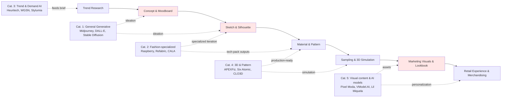
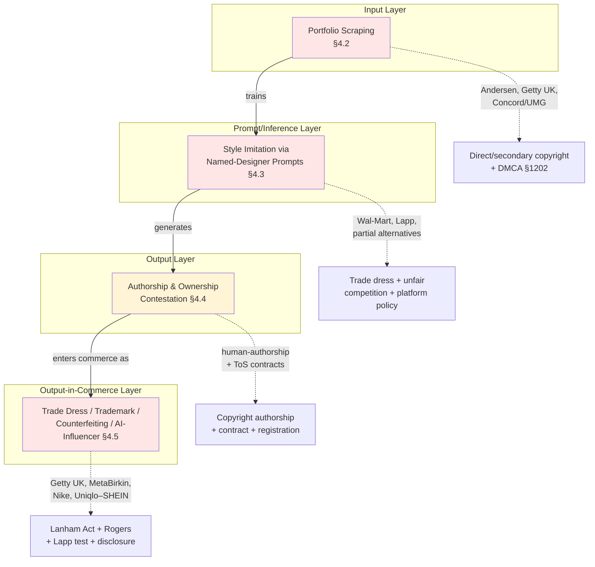

# AI Fashion Design Tools, Creative Homogenization, and Copyright Disputes: A Dual-Lens Investigation into Industry Risks and Resolution Pathways
# 1 Research Background, Problem Framing, and the Landscape of AI Fashion Design Tools

The fashion industry stands at an inflection point where generative artificial intelligence has transitioned, in barely thirty-six months, from a speculative novelty into operational infrastructure embedded in design studios, sourcing offices, and marketing pipelines across the $1.7 trillion global apparel market[^1]. This compressed adoption curve has surfaced two intertwined anxieties that now dominate practitioner discourse and academic inquiry alike: a concern that the industry's creative output is converging toward a narrow algorithmic mean, and a parallel concern that the training, deployment, and outputs of these tools are eroding the intellectual property foundations on which independent designers in particular depend. This opening chapter establishes the empirical and conceptual scaffolding for examining these dual concerns under a single integrated lens. It traces the velocity of adoption, defines the analytical vocabulary the report will use, constructs a five-category functional taxonomy of the current AI fashion tool ecosystem, locates each category along the fashion value chain, and finally articulates the diagnostic framework — centered on designer agency and dataset provenance — that links tool architecture to the downstream risks of homogenization and copyright friction explored in subsequent chapters.

## 1.1 Research Background and the Urgency of the Dual-Lens Inquiry

The current moment is best understood as the operational maturation of a technological wave that began in late 2022. The public release of diffusion-based image models such as DALL-E and Stable Diffusion, followed by rapid iterations of Midjourney, triggered what industry observers have described as a "Cambrian explosion" of generative AI applications in commercial design[^1]. By mid-2024, McKinsey's Global Survey on AI registered that sixty-five percent of organizations across all industries had adopted generative AI in at least one business function — roughly double the prior year — with marketing and sales and product and service development emerging as the two most pervasive use cases[^2]. Within fashion specifically, the BoF–McKinsey *State of Fashion 2024* Global Fashion Executive Survey reported that 62 percent of fashion executives had already utilized generative AI in their companies and that 73 percent identified it as a major business priority for the year ahead[^2]. Yet a parallel reading of the same indicators surfaces an arresting gap: in 2024, although 73 percent of fashion leaders considered AI strategic, only 5 percent felt able to actually use it operationally, a disjuncture between ambition and capability that industry commentators highlighted as the defining tension of the moment[^3]. By 2025, that gap had effectively closed; AI tools — from design platforms such as Raspberry AI to conversational systems adopted by houses like Ralph Lauren — had moved from "experimental technology" to "real working infrastructure" embedded in creative processes[^3].

Three structural pressures explain why this rapid operationalization has made the dual questions of homogenization and copyright impossible to defer. The first is the **acceleration of the design cycle**. The traditional seasonal calendar has been displaced by a continuous flow of micro-trends, with ultra-fast-fashion market leaders introducing thousands of new SKUs every week, a pace that renders weeks-long physical sampling a competitive liability[^1]. Tools such as Raspberry AI — which closed a $24 million Series A led by Andreessen Horowitz in January 2025 after attracting 70 enterprise customers including Under Armour, Gruppo Teddy, and MCM Worldwide — explicitly position themselves as engines of "hyper-iteration," allowing designers to visualize fifty variations of a foundational piece almost instantly rather than ordering two or three physical samples[^1]. Industry studies cited in practitioner literature suggest that integrating AI into the design process can reduce development time by 40–60 percent and prototyping costs by up to 30 percent[^3]. When fifty digital iterations replace two physical samples, the locus of creative judgment shifts upstream, into the prompt and into the model's latent priors — a shift that materially conditions both the diversity of outputs and the legal status of the inputs that shaped them.

The second pressure is the **commercial concentration of generative use cases in upstream creative functions**. McKinsey's mapping of the fashion industry's generative AI adoption found that the dominant use cases were, in order, marketing copywriting, design and product development, and marketing visual content, while supply-chain, logistics, and store operations applications lagged considerably[^2]. Because the technology has been most aggressively deployed precisely in the stages of the value chain that determine aesthetic identity — moodboard creation, silhouette ideation, print and pattern generation, campaign imagery — any systematic bias or convergence tendency in the underlying models propagates directly into what consumers see on the shelf and on social media. This concentration is what makes homogenization an empirical question worth asking, rather than an abstract worry.

The third pressure is the **emergence of high-profile legal, ethical, and reputational controversies** around training data, output ownership, and style imitation. Even introductory industry literature now flags that "concerns regarding intellectual property may arise as some AI-generated designs could be based on copyrighted work," noting that "legal issues in this area are still evolving, prompting brands to involve their legal teams and establish guidelines"[^4]. Academic study of the inaugural AI Fashion Week in New York in April 2023 — which drew over 130 collections evaluated by judges from Vogue Japan, Celine, and Revolve, and whose winners were commercialized through Revolve's retail channel — explicitly identified "copyright infringement, authenticity, and the potential reinforcement of biases" as the central ethical limitations of generative image models adopted in fashion[^5]. Anger toward AI is itself becoming a market variable: BoF has documented that growing public hostility, particularly around perceived job displacement and creative dispossession, is forcing brands that wish to deploy the technology to think carefully about customer trust[^6].

Crucially, these two risks — homogenization and copyright friction — are not parallel silos but mechanistically linked. The same technical practice that drives convergence (training large diffusion models on broad, often unlicensed corpora of fashion imagery) is precisely what generates the copyright disputes; conversely, the legal remedies most likely to constrain unlicensed scraping (consent requirements, opt-outs, licensed datasets) will, by reshaping training corpora, also shape the diversity profile of model outputs. A research design that examines either question in isolation therefore misses the causal structure that connects them. This report's dual-lens framing is a direct response to that interdependence.

## 1.2 Scope, Key Concepts, and Analytical Framework

To make this dual-lens analysis tractable, the research delimits its scope to **commercial AI tools used in apparel ideation, visualization, prototyping, pattern and trend support, and adjacent visual-content production**. It deliberately includes both general-purpose generative models repurposed for fashion (Midjourney, Stable Diffusion, DALL-E 3, Adobe Firefly) and fashion-specialized platforms (Raspberry AI, Refabric, CALA/Mercer, Maison AI, The New Black, Resleeve, APEXFiz), as well as adjacent infrastructure such as trend-forecasting engines and AI-model/influencer systems whose outputs shape what designers are pushed to design. It excludes purely back-office applications — supply-chain optimization, in-store companion tools such as Target's Store Companion[^7], and chatbot customer service — that do not directly mediate aesthetic creation and therefore have limited relevance to homogenization or design copyright.

Within this scope, four concepts structure the entire report and merit precise definition.

**Computational creativity in fashion** denotes the spectrum of human–AI creative partnership rather than a binary of AI-as-tool versus AI-as-creator. At one pole, AI functions as a *co-designer*: an amplifier of an existing creative vision that accelerates iteration and broadens the range of possibilities a human can examine, exemplified by Norma Kamali's bespoke model trained on her own archive to "download her brain"[^8], or Hillary Taymour's use of Midjourney at Collina Strada to test "bold, unconventional ideas" for Spring–Summer 2024[^8]. At the other pole, AI operates closer to a *generator*: a relatively autonomous producer whose outputs are accepted with minimal editorial intervention, exemplified by collections produced for AI Fashion Week showcased on digital screens at Spring Studios[^5]. As BoF, McKinsey, and academic study consistently emphasize, AI does not substitute creative vision; it acts as a "validation tool" or "amplifier of talent," and "without strong human guidance" it produces collections that are "technically sound but empty of meaning"[^3][^9]. The position of any given workflow on this spectrum is a key variable for both creativity and IP outcomes.

**Stylistic homogenization** refers to the empirically observable convergence, over time, of silhouettes, color palettes, print motifs, modeling conventions, and overall aesthetic vocabularies across designers and brands using shared generative tools. The mechanism behind such convergence is structural: diffusion models statistically reproduce the distributional center of their training data, and recognizable shorthand prompts (e.g., "Rick Owens runway show," "Yeezy runway," "Loro Piana cashmere outfit") collapse complex stylistic decisions into a small repertoire of dominant references. The 2023 Videre Worldwide field study at AI Fashion Week documented this concretely: when prompts requested "diverse" models, Midjourney expressed diversity through ethnicity but defaulted to slim body types, a bias attributed jointly to the training data and to the stylistic shorthand of named designers in the prompt[^5]. The same study found that prompts succeed best when they "revolve around clear concepts and utilize recognizable styles," with the platform recognizing 2,251 named artistic styles — a feature that simultaneously empowers prompt engineers and embeds a powerful pull toward canonical, well-documented aesthetics[^5].

**Algorithmic authorship** denotes the contested attribution of authorship and ownership of design rights among at least four candidate parties: the AI tool provider whose model encodes the latent space; the dataset contributors whose works (often without consent) trained the model; the prompt engineer or designer who specifies the brief; and the brand that commercializes the output. This contestation operates differently across jurisdictions and across the fashion-specific IP regime of copyright, design rights, trade dress, and trademarks. Vegan Fashion Repository's review of professional tools explicitly counsels independent designers to verify that any chosen platform "allows designers to retain ownership of their designs, and processes data securely in a controlled environment"[^8] — a warning that signals how unsettled this question remains in practice.

**Designer agency** is the central analytical variable that connects tool architecture to downstream risks. It captures the depth and granularity of human creative intervention preserved by a given tool: the degree to which the designer controls not only the prompt but also the underlying training data, the stylistic parameters, the editing of intermediate outputs, and the eventual technical translation. Tools and workflows can be ordered along a low-to-high agency spectrum, from text-prompt black boxes that return four candidate images to bespoke models trained on a brand's own archive that constrain outputs to that brand's signature vocabulary. The premise of the report's analytical framework — to be elaborated in section 1.5 — is that the position of any workflow on this agency spectrum, combined with the provenance and licensing status of its training data, jointly determines whether the tool is a homogenizing or differentiating force, and whether it intensifies or mitigates copyright exposure.

## 1.3 Functional Taxonomy of the AI Fashion Design Tool Ecosystem

The contemporary AI fashion tool ecosystem is sufficiently dense to require systematic categorization before substantive analysis. Synthesizing the offerings documented in the reference literature, the report organizes tools into five functional categories, each defined by the design problem it solves and by the kind of training data it relies on. The table below profiles representative vendors, pricing tiers, training characteristics, and notable adoption cases for each category.

| Category | Representative Tools | Core Function | Training Data Characteristics | Pricing & Access | Notable Adopters |
|---|---|---|---|---|---|
| **(1) General-purpose generative models** | Midjourney, DALL-E 3, Stable Diffusion, Adobe Firefly | Text/sketch-to-image ideation, moodboards, concept exploration | Broad, scraped web corpora; not fashion-specific; recognizes 2,251+ named styles[^5] | Midjourney from $10/mo; DALL-E 3 free via Bing or ChatGPT Plus $20/mo; Firefly bundled in Adobe CC[^3] | Hillary Taymour / Collina Strada SS24[^8]; Moncler "Genius" FW23[^10]; G-Star RAW (12 denim concepts, April 2023)[^10]; AI Fashion Week 350+ submissions[^10][^5] |
| **(2) Fashion-specialized generative platforms** | Raspberry AI, Refabric, CALA/Mercer, The New Black, Resleeve, Maison AI | Domain-specific text/sketch-to-image with manufacturable outputs, technical packs, fabric integration | Trained on fashion-specific datasets; Raspberry analyzed hundreds of thousands of images with 300+ fashion-specific keywords[^8]; Maison AI from OpenFashion Inc.[^10] | Raspberry from $198/mo; Refabric from $12/mo; Mercer from $19/mo; some offer Ambassador programs[^8] | Under Armour, Gruppo Teddy (8,800+ stores), MCM Worldwide[^1]; Mango (CEO Toni Ruiz on "faster content creation")[^8]; Refabric in LVMH La Maison des Startups[^8] |
| **(3) Trend forecasting & demand-sensing engines** | Heuritech, WGSN, Stylumia, Lily AI | Visual recognition + NLP on social/runway/e-commerce signals to forecast trends and demand | Millions of social-media images + reviews; WGSN uses "analyst-in-the-loop" human tagging[^9]; Stylumia "True Demand™" filters market noise | WGSN from ~$59+/mo; Heuritech, Stylumia, Trendstop on custom quotes[^9] | Louis Vuitton, Christian Dior, Moncler[^10]; H&M (predictive analytics)[^9]; Shein (granular trend mining)[^9]; LVMH AI Factory[^2] |
| **(4) 3D simulation, pattern & production tools** | Six Atomic, APEXFiz (Shima Seiki), CLO3D, Browzwear, Pattern Generator AI, Patternedai, Adobe Firefly (in Photoshop) | 3D garment simulation, automated pattern-making, on-demand production, print/textile pattern generation | Knit pattern libraries (APEXFiz); modular design libraries (Six Atomic); image-based seamless tile training | Six Atomic from $35/mo; Pixlr free; Adobe Firefly bundled[^8][^3] | Brands producing capsule collections aligned with microtrends[^8]; mid-market (50–999 employees) reporting 250% adoption growth over 2 years[^5] |
| **(5) Visual-content, virtual try-on & AI-model/influencer tools** | Pixel Moda, VModel.AI, vue.ai, Stitch Fix, The Clueless (Aitana López), Brud (Lil Miquela), Imma | E-commerce imagery, virtual models, personalization, AI influencers as brand vehicles | Image recognition + product/customer data; fully synthetic personas via Midjourney/Leonardo/Stable Diffusion + character consistency techniques[^11] | Custom enterprise quotes; AI-influencer creation $3K–$15K + $1K–$3K/mo for management[^11] | Pixel Moda: 14M images/videos for 900+ brands[^6]; Lil Miquela: Prada, Calvin Klein, Samsung, BMW, ~$10–15M/year[^11]; Aitana López: $3K–$10K/mo[^11]; Imma × IKEA Japan, Porsche, Valentino, SK-II[^11] |

A few observations are worth drawing out from this taxonomy.

First, **only category (2) and parts of category (4) are genuinely fashion-specialized in their training data**. Categories (1) and (5), and most pattern-generators in (4), rely on broad web-scale corpora whose composition is largely opaque to end users — a structural feature with direct implications for both homogenization (because the corpus encodes whatever aesthetic biases dominate the open web) and copyright (because such corpora are precisely the locus of the unlicensed-scraping disputes that have catalyzed litigation across creative sectors).

Second, **the price gradient maps onto the agency gradient**. Bespoke and brand-trained tools — such as the custom AI agencies *Maison Meta*, *IMKI*, and *Design Novel* that produced Norma Kamali's signature model — are available only at "premium, available-upon-request pricing," whereas SME and indie-tier solutions are sold through "affordable monthly plans" with much less control over training data and stylistic constraints[^8]. This pricing structure is a key reason why concerns about homogenization and IP exposure fall disproportionately on independent designers: the workflows that most reliably preserve creative differentiation and IP integrity are those most concentrated at the luxury end of the market.

Third, **category (5) reveals an emerging extension of AI's reach beyond the design studio into the construction of brand identity itself**. AI influencers such as Lil Miquela (>2.5 million Instagram followers, partnerships with Prada, Calvin Klein, Samsung, and BMW)[^11], Aitana López (created in 2023 by The Clueless and earning $3,000–$10,000 per month from brand partnerships)[^11], and Imma (collaborations with IKEA Japan, Porsche, Valentino, and SK-II)[^11] do not generate garments per se but generate the visual vocabulary in which fashion is consumed. Their existence amplifies the homogenization question — because the same handful of generative tools can underwrite the model, the lookbook, and the campaign — and introduces a novel layer of ownership questions around personality rights, AI-disclosure regulation, and downstream use of the synthesized human likeness.

## 1.4 Intervention Points Along the Fashion Design Value Chain

A taxonomy of tools is most useful when overlaid on the value chain those tools reshape. The fashion design value chain can be schematized in seven sequential stages — trend research, concept and moodboard development, sketch and silhouette design, material and pattern development, sampling and 3D simulation, marketing visuals and lookbook production, and retail experience/merchandising. The diagram below maps the five tool categories onto these stages and indicates the dominant risk profile each intervention introduces.

The shaded stages — concept/moodboard, sketch/silhouette, and marketing visuals — are precisely the stages identified by McKinsey as the dominant use cases for generative AI in fashion (marketing copywriting, design and product development, marketing visual content)[^2], and they are also the stages most exposed to the homogenization mechanism described earlier: they are upstream, aesthetically determinative, and overwhelmingly served by tools whose training data is opaque or scraped.

Two structural shifts in creative judgment follow from this mapping and merit explicit articulation.

The first shift is **the migration of creative judgment from physical iteration to prompt iteration**. In the legacy model, a designer might commission two or three physical samples of a jacket and refine the vision through tactile encounter; with Raspberry AI, a designer can produce fifty digital variations of a foundational piece almost instantly[^1]. The Videre Worldwide study quantified this practically: the team generated more than 2,500 images in the learning phase and over 400 final-stage images for a single AI Fashion Week submission[^5]. This shift compresses cost and time, but it also relocates the moment of decision from comparing distinct physical realities to comparing variants drawn from a single latent space — variants that, by construction, are statistical neighbors of one another. The judgment exercised at this moment is therefore exercised within a model-defined possibility space rather than against an open horizon of materials and human craft.

The second shift is **the upstream reach of trend AI into the design brief itself**. Heuritech, used by Louis Vuitton, Dior, and Moncler, translates millions of social-media images into actionable product-attribute forecasts; WGSN combines machine pattern recognition with analyst-in-the-loop tagging; Stylumia's "True Demand™" reportedly improves forecasting accuracy by 20–40 percent[^10][^9]. As Damien Bertrand, former General Manager at Dior, framed it, "we had some intuitions that we wanted to test and Heuritech helped us to validate those intuitions"[^9]. When trend AI is used as a "validation tool" against intuition, it pulls briefs toward signals that have already crystallized in social data — precisely the signals most likely to be replicated across all brands using similar systems. The fact that incorrect forecasting can cost brands an estimated 23 percent of monthly profits and that AI-driven analytics can cut dead-stock write-offs from 12 percent to 2 percent[^9] gives executives strong economic incentives to lean on these systems, even where doing so narrows the aesthetic delta between competitors.

The downstream stages (sampling, 3D simulation, retail) are less exposed to homogenization but more exposed to a different kind of risk: the dependency on third-party datasets, virtual model libraries, and AI-generated personas (Pixel Moda producing 14 million images and videos a year for over 900 brands[^6]; VModel.AI substituting AI faces onto product photography[^10]) brings copyright, personality-rights, and disclosure questions to the fore even where aesthetic convergence is less acute.

## 1.5 Designer Agency, Tool Architecture, and the Pre-Conditions of Homogenization and Copyright Risk

The preceding sections converge on a single diagnostic claim: the magnitude of both homogenization and copyright risk in any given AI fashion workflow is not a property of "AI" as a monolith but of the specific architectural and procedural choices that constitute that workflow. Three architectural variables, taken jointly, determine where a workflow sits on the risk surface.

The first variable is **the depth of designer intervention** — the position on the agency spectrum sketched in section 1.2. Low-agency workflows are characterized by single-prompt generation against a closed, undisclosed model, with minimal human editing of intermediate outputs and reliance on stylistic shorthand (e.g., "Yeezy runway show on Neptune"[^5]) that pulls outputs toward the model's center of gravity. The Videre Worldwide field documentation of AI Fashion Week makes explicit how this works in practice: prompts using named designer references reliably produce coherent imagery but with predictable biases (slim figures, conventional ethnic representation, recognizable stylistic genealogies)[^5]. High-agency workflows, by contrast, involve sketch-to-image with proprietary inputs (Refabric digitizing hand-drawn technical drawings[^8]), iterative editing in tools like Canva and Photoshop layered atop generative outputs[^3], and a phased "70/30 → 50/50 → 10/90" balance in which AI dominates only at the lookbook stage and human technical expertise dominates the translation to physical garments[^3].

The second variable is **the provenance and licensing status of the training data**. Models trained on broad scraped corpora carry both a homogenization signature (because dominant aesthetics in those corpora are over-represented) and a latent legal liability (because any constituent work whose use was unlicensed is a potential vector of infringement). Models trained on licensed datasets, on a brand's own archive (Norma Kamali's bespoke model[^8]), or on third-party providers and public fashion datasets explicitly curated for machine-learning training (Raspberry AI's reported approach with 300+ fashion-specific keyword annotations[^8]) materially reduce both risks — though the asymmetry of access to such tools by price tier means this mitigation is unevenly distributed across the industry.

The third variable is **the controllability of stylistic parameters and the retention of designer ownership downstream**. Vegan Fashion Repository's guidance to independent designers — to verify that any tool "allows designers to retain ownership of their designs, and processes data securely in a controlled environment"[^8] — is not abstract advice; it is a recognition that contractual terms, output watermarking, and the ability to fine-tune on private data jointly determine whether a designer's engagement with AI deepens or weakens their IP position.

The interaction of these three variables produces the diagnostic matrix in the table below, which the report will use throughout to interpret specific cases.

| Workflow Type | Designer Agency | Training Data Provenance | Stylistic Controllability | Homogenization Risk | Copyright Risk |
|---|---|---|---|---|---|
| **Low-agency black-box prompt** (e.g., generic Midjourney prompts citing named designers) | Low | Opaque, scraped | Limited (model's latent priors dominate) | **High** | **High** (input data licensing + style imitation of living designers) |
| **General tool + human curation** (e.g., Collina Strada's Midjourney + manual editing) | Medium | Opaque, scraped | Medium (heavy human filtering) | Medium | Medium |
| **Fashion-specialized SaaS** (e.g., Raspberry AI, Refabric for indie brand) | Medium–High | Partially curated, fashion-specific | Higher (domain vocabulary) | Lower | Medium (depends on vendor's data sourcing) |
| **Brand-trained bespoke model** (e.g., Norma Kamali, LVMH AI Factory) | High | Proprietary archive | High (constrained to brand vocabulary) | **Low** | **Low** (data provenance internal) |
| **3D parametric / sketch-driven** (e.g., APEXFiz, Six Atomic, CLO3D) | High | Designer-supplied or modular libraries | Very high (technical control) | Low | Low (designer-originated inputs) |

This matrix supports a critical implication that the rest of the report develops: **homogenization and copyright friction are conditional outcomes, not technological inevitabilities.** They are produced by particular combinations of low designer agency, opaque training data, and weak stylistic control. They can be mitigated — though unevenly across market segments — by combinations of higher agency, transparent or proprietary data, and strong stylistic constraint. The conditions under which AI flattens fashion's creative output and the conditions under which it threatens designers' IP are largely the same conditions, which is why the dual-lens framing is analytically necessary rather than rhetorically convenient.

It is equally necessary to flag, at this opening stage, the asymmetries this matrix conceals. The "low-risk" cells of the matrix are populated almost exclusively by workflows accessible to large luxury houses, well-capitalized retailers (LVMH, Kering, Mango, Under Armour) and well-funded enterprise customers of platforms like Raspberry AI[^1][^2]. The independent designer working at home with a $10/month Midjourney subscription operates almost by default in the high-risk top row. This structural asymmetry — that the workflows most likely to homogenize fashion and most exposed to copyright disputes are precisely the workflows most accessible to the designers least able to absorb those risks — frames the central justice question of the entire report and motivates the indie-centered analysis the subsequent chapters develop.

The chapters that follow build directly on this scaffolding. Chapter 2 interrogates whether homogenization is empirically observable, marshaling visual audits, surveys, and counter-evidence from designer-AI experiments. Chapter 3 dissects the technical, economic, and cultural causes of convergence and traces its differential impact across luxury, mass-market, and indie segments. Chapters 4 and 5 turn the same mechanistic lens on copyright disputes and the jurisdictional regimes that govern them. Chapters 6 and 7 evaluate technical, contractual, and institutional resolution pathways with particular attention to feasibility for independent designers. Chapter 8 grounds the analysis in comparative case studies, and Chapter 9 projects the trajectory of the dual-risk landscape over the next three to five years. Throughout, the diagnostic framework introduced here — designer agency, data provenance, stylistic controllability — provides the connective tissue linking what would otherwise be parallel inquiries into creativity and into law.

# 2 Diagnosing Creative Homogenization: Evidence, Mechanisms, and Counter-Evidence

The diagnostic framework established in Chapter 1 — designer agency, data provenance, stylistic controllability — yields a falsifiable hypothesis: if homogenization is a conditional rather than inevitable property of AI fashion tooling, then it should be empirically observable in low-agency, opaque-data workflows and largely absent from high-agency, curated-data ones. This chapter tests that hypothesis by triangulating three classes of evidence (visual audits of generative outputs, industry surveys, and academic field studies), then dissects the four causal mechanisms that produce convergence — training-data bias and latent-space averaging, social-media-fed trend-AI feedback loops, prompt-driven shorthand referencing named designers, and the workflow tendency to use AI for ideation rather than execution — before assembling counter-evidence from designer–AI collaborations and pedagogical experiments where divergent, idiosyncratic outcomes were systematically produced. The chapter's central diagnostic claim is that convergence is real but architecturally contingent: it is the predictable signature of a particular workflow class, and it dissolves under different conditions. This finding sets up Chapter 3's analysis of why that workflow class predominates in some market segments and not others, and frames the central tension that copyright remedies (Chapters 4–6) must navigate, given that the technical operations producing homogenization are largely the same as those producing the IP exposure documented later in the report.

## 2.1 Empirical Evidence of Aesthetic Convergence

Establishing whether AI fashion outputs are converging requires acknowledging at the outset a methodological difficulty: "sameness" in fashion has no canonical metric. Visual similarity can be measured at the level of silhouette, color palette, fabric rendering, modeling conventions, and overall styling vocabulary, and convergence on one dimension may coexist with divergence on another. The evidence base nonetheless coheres around three complementary signals.

The first signal comes from **direct visual audits of generative outputs in fashion-specific deployment contexts**. The Videre Worldwide field documentation of the inaugural AI Fashion Week (April 2023, New York), introduced in Chapter 1, is the most granular such audit available. The event drew over 130 collections (subsequent reporting cites 350+ submissions including informal participants), with single submitting teams generating in excess of 2,500 images during the learning phase and over 400 images for final selection — a volume sufficient to characterize the statistical signature of the platform (predominantly Midjourney) under fashion-specific prompting. The audit found two recurring biases. First, when prompts explicitly requested "diverse" models, Midjourney expressed diversity through ethnicity but defaulted reliably to slim body types, a pattern attributed jointly to the composition of the training corpus and to the stylistic shorthand encoded in named-designer references in the prompt. Second, the platform's recognition of 2,251 distinct named artistic styles meant that prompts succeeded best when they "revolved around clear concepts and utilized recognizable styles," embedding a structural pull toward canonical, well-documented aesthetic genealogies. The audit therefore documents convergence not as a single uniform aesthetic across all outputs but as a narrowing of the *expressive default* that emerges when designers operate with low agency over the model's priors.

The second signal comes from **industry-survey indicators of where in the value chain AI is being concentrated**. McKinsey's 2024 Global Survey on AI established that 65% of organizations across all industries had adopted generative AI in at least one business function, roughly double the prior year, with marketing and sales and product and service development as the two most pervasive use cases. Within fashion specifically, the BoF–McKinsey *State of Fashion 2024* reported that 62% of fashion executives had already used generative AI and 73% identified it as a major business priority, with adoption concentrated in marketing copywriting, design and product development, and marketing visual content — precisely the upstream, aesthetically determinative stages identified in Chapter 1's value-chain mapping. The survey data does not directly measure aesthetic similarity; what it establishes is the **concentration of exposure**: when the bulk of generative AI activity occurs in the moodboard-to-lookbook stages of the design pipeline, and when those stages are increasingly served by a small set of dominant tools (Midjourney, DALL-E 3, Stable Diffusion, Adobe Firefly, plus a thin layer of fashion-specialized SaaS), the channel through which convergence could propagate is structurally wide. The 2024 disjuncture — 73% strategic priority versus only 5% of executives feeling capable of operational use — is itself evidence that the convergence channel was being constructed faster than firm-level differentiation strategies could adapt to it; by 2025, when the gap had effectively closed and AI moved from "experimental technology" to "real working infrastructure," that channel was active across the industry.

The third signal comes from **the structural concentration of the AI-influencer market in a small number of dominant personae**. Lil Miquela, created by Brud in 2016 with over $30 million in venture backing from Sequoia and Spark Capital, accumulated over 2.5 million Instagram followers (2.6 million by 2026), an estimated annual earnings of $10–15 million, and a campaign roster including Prada, Calvin Klein, Samsung, BMW, and dozens of other Fortune 500 brands.[^11][^12] Her Spanish counterpart Aitana López, launched by The Clueless agency in 2023 in response to "the unreliability of human models," generates $3,000–$10,000 per month from brand partnerships and is positioned alongside more than 40 additional avatars produced by the same agency.[^13][^14][^11] Imma, produced by Tokyo's Aww Inc., works with IKEA Japan, Porsche, Valentino, and SK-II, with a "strikingly consistent" aesthetic anchored in a signature bob haircut and high-fashion contexts.[^11] Lil Miquela's market dominance is notable: she "inspired Imma in Japan, Aitana in Spain, Shudu in the UK, and dozens of indie creators around the world,"[^11] and educational guides for aspiring AI-influencer creators direct learners explicitly toward the "established categories" of fashion, fitness, gaming, travel, beauty, and lifestyle.[^11] The visual vocabulary in which fashion is increasingly consumed is therefore being produced by a narrow set of synthetic personae whose aesthetic conventions are, by construction, statistical neighbors of one another — a homogenization vector operating at the campaign-imagery layer rather than the garment-design layer.

Each evidence class carries methodological limits. Visual audits are typically conducted at the scale of a single event or research team and may not generalize. Industry surveys measure adoption and intent rather than output similarity. AI-influencer concentration is a market-structure observation rather than a direct measure of garment convergence. Triangulated, however, they cohere around a defensible empirical baseline: **convergence is observable in the upstream, opaque-data, low-agency segments of the AI fashion stack**, while remaining a methodologically open question for outputs produced under different workflow conditions — a baseline directly congruent with the diagnostic matrix introduced in Chapter 1.

## 2.2 Mechanism 1: Training Data Biases and the Statistical-Mean Tendency of Diffusion Models

The empirical convergence documented in section 2.1 is not anomalous; it is the predictable signature of how contemporary diffusion models operate. Two technical properties — corpus composition and latent-space averaging — jointly produce a structural pull toward the distributional center of training data.

**Corpus composition** is the upstream determinant. The general-purpose generative models that dominate fashion ideation (Midjourney, Stable Diffusion, DALL-E 3, Adobe Firefly) are trained on broad, scraped web corpora whose composition is largely opaque to end users but whose center of gravity is well-understood: high-engagement runway photography, fashion editorial imagery, e-commerce product shots, and the curated archives of well-documented Western luxury houses. When Midjourney recognizes 2,251 named artistic styles, the recognition is not neutral cataloguing; it reflects which artists, designers, and aesthetics were sufficiently photographed, captioned, and indexed to register as discrete attractors in the model's parameter space. Designers and styles with deep digital footprints (Rick Owens, Yeezy, Loro Piana, Margiela) are therefore over-represented as gravitational nodes; emerging designers, non-Western traditions, and craft-based vocabularies with thin digital documentation are under-represented or absent. The bias is not primarily about deliberate exclusion; it is about the statistical inheritance of whatever asymmetries dominate the open web's fashion record.

**Latent-space averaging** is the downstream amplifier. Diffusion models generate by iteratively denoising a random seed toward a target distribution learned from training data; outputs are, by construction, statistical samples drawn from regions of the latent space where training density is highest. When a designer compares fifty Midjourney variations of a jacket — the practical workflow Chapter 1 documented — they are not comparing fifty independent creative possibilities but fifty neighbors within a single learned distribution. The comparison is therefore biased toward minor variation around an attractor rather than across attractors. The Videre Worldwide observation that "diverse" prompts produced ethnic variation but defaulted to slim body types is a textbook expression of this dynamic: the prompt successfully shifts one parameter (skin tone) within a learned region but cannot, by single-prompt operation, escape the region itself, because slim bodies are the dominant attractor in the training distribution of fashion imagery.

Two implications follow that recur throughout the report. First, **the homogenization signature is a property of the data×architecture conjunction, not of either alone**. Training a diffusion model on a different corpus (e.g., a brand's own archive, as in Norma Kamali's Maison Meta–trained model) shifts the attractor without changing the mathematical operation. Second, **the bias is most pronounced precisely where designer agency is weakest**. A designer who supplies their own sketches as inputs (Refabric's sketch-to-image workflow), constrains the model with proprietary fine-tuning data, or filters outputs through extensive human curation introduces additional information that pulls outputs away from the corpus mean; a designer who relies on a black-box prompt operates almost entirely within the model's priors. The mechanism therefore makes the empirical convergence of section 2.1 intelligible as a workflow-specific outcome, foreshadowing the divergent outcomes documented in section 2.5.

## 2.3 Mechanism 2: Social-Media Echo Chambers and Trend-AI Feedback Loops

Convergence does not begin at the moment of generation; for many brands it begins at the moment of brief-formation, before any image-generation tool is invoked. The mechanism is the trend-forecasting and demand-sensing layer (Category 3 of Chapter 1's taxonomy) — Heuritech, WGSN, Stylumia, Lily AI — whose function is to translate millions of social-media images, runway captures, and e-commerce signals into product-attribute forecasts that brands then use to set design direction.

Two features of this layer drive convergence. The first is **signal-source overlap**. The same major platforms (Instagram, TikTok, Pinterest, Weibo) feed into multiple competing forecasting systems; the same canonical runway shows are visually parsed; the same review datasets and e-commerce catalogues are mined for demand signal. When Louis Vuitton, Christian Dior, and Moncler all license Heuritech, when H&M layers predictive analytics for inventory, when Shein conducts granular trend mining, and when LVMH concentrates these capabilities in an internal AI Factory, the resulting forecasts are not produced from independent vantage points but from largely overlapping observations of the same digital surface. Stylumia's "True Demand™" framing — claiming to filter market noise and improve forecasting accuracy by 20–40% — itself implies a normative posture: there is a *correct* trend signal to be extracted, and the function of the system is to align brands with it. Whatever differentiation might once have come from divergent intuition is therefore systematically narrowed by convergent measurement.

The second feature is **the economic incentive structure that locks executives into the loop**. Industry data cited in practitioner literature indicates that incorrect forecasting can cost brands an estimated 23% of monthly profits, and that AI-driven analytics can reduce dead-stock write-offs from 12% to 2%. These margins are decisive in an industry where ultra-fast-fashion competitors operate at margin levels that punish inventory error severely. As the former General Manager of Dior framed it, "we had some intuitions that we wanted to test and Heuritech helped us to validate those intuitions." The framing is revealing: trend AI is positioned as a *validator* of intuition, but the validator's verdict is determined by what is already crystallizing in social data, which is itself shaped by what brands released the prior season — many of which were, in turn, shaped by the previous round of validation. The loop is self-reinforcing: social signal → forecast → brief → product → social signal. WGSN's "analyst-in-the-loop" human tagging tempers but does not break this loop, because the analysts themselves are interpreting the same signal stream.

The downstream consequence is that **the brief itself converges before any generative tool is invoked**. By the time a designer turns to Midjourney to ideate a moodboard, the parameters of that ideation — color stories, silhouette categories, target microtrends — have been conditioned by trend-AI outputs that are themselves a low-rank summary of the industry's shared social-media diet. The latent-space averaging documented in section 2.2 therefore operates on top of a brief that has already been through a parallel averaging process. The two mechanisms compound rather than substitute.

This compounding has direct implications for the dual-question framing of the report. Trend-AI is largely insulated from the copyright disputes that surround image-generation models because its training data is typically aggregate social signal rather than individual creative works. But its homogenization effect is precisely what intensifies pressure on independent designers, who cannot afford the enterprise tier of these systems and who therefore compete on aesthetic differentiation against an industry that is being algorithmically pulled toward consensus. The mechanism narrows the indie designer's market niche even when it does not directly threaten their IP — a stakeholder asymmetry that recurs in subsequent chapters.

## 2.4 Mechanism 3: Prompt-Driven "Inspiration" Misuse and Designer-Name Shorthand

The third mechanism operates at the interface between the user and the model: the prompt itself. Because diffusion models are most expressive when prompts invoke recognizable aesthetic categories, and because Midjourney recognizes 2,251 named artistic styles, prompt engineering in fashion has gravitated toward shorthand references to specific living designers, brands, and runway moments. The Videre Worldwide field study at AI Fashion Week documented that prompts "revolve around clear concepts and utilize recognizable styles" and noted the use of references such as "Yeezy runway show on Neptune" or "Loro Piana cashmere outfit" as effective triggers for coherent imagery. This pattern is not accidental; it reflects the practical reality that named-designer shorthand is the densest, most reliable way to compress complex stylistic decisions into the small token budget of a text prompt.

The result is a peculiar bifurcation of creative agency. The prompt engineer experiences their work as creative — they are choosing references, combining them, layering modifiers — and from a craft perspective the choices are real. But the *space within which* the choices operate is the space of named, well-documented styles already deeply encoded in the model. A prompt invoking "Rick Owens runway show" calls forth a region of latent space pre-shaped by hundreds or thousands of training images of Rick Owens runway photography; the prompt engineer's modifiers move within that region but cannot easily escape it. The experiential creativity of prompt engineering therefore coexists with a strong gravitational pull toward canonical aesthetics — the same pull observed in section 2.2, but now activated through deliberate user choice rather than mere statistical default.

Three consequences follow that link directly to the rest of the report.

First, **the homogenization mechanism and the IP-infringement mechanism are technically the same operation**. A prompt that successfully evokes "Rick Owens runway show" does so because the model has learned, from copyrighted runway photography, to reproduce visual signatures associated with Rick Owens. Whether the resulting image constitutes infringement is a legal question that Chapters 4 and 5 examine in detail; what matters here is that the technical pathway producing convergence is also the pathway producing potential liability. Any remedy that addresses the technical pathway — licensing constraints on training data, opt-outs by named designers, refusal of named-style prompts — will simultaneously affect both homogenization and infringement risk. This is the strongest single argument for the report's dual-lens framing.

Second, **the mechanism redistributes creative credit asymmetrically**. The prompt engineer extracts commercial value (an image, a moodboard, a campaign visual) from a latent space whose density was created by the uncompensated training inclusion of designers' bodies of work. The designer whose name anchors the prompt is, in a meaningful sense, performing unpaid creative labor for every prompt that invokes them. This is the structural fact that catalyzes the unauthorized-portfolio-use disputes documented in Chapter 4 and conditions the resolution pathways evaluated in Chapter 6.

Third, **the boundary between legitimate inspiration and stylistic appropriation becomes operationally ambiguous**. Inspiration drawn from a designer's work has always been part of fashion's referential culture; the difference introduced by named-style prompting is that the reference is encoded in machine-readable form, executed at scale, and produced through a process that bypasses the human re-interpretation traditionally understood to convert influence into new authorship. Whether this difference is legally cognizable varies by jurisdiction, as Chapter 5 details; whether it is normatively defensible is contested across the industry. What the mechanism establishes empirically is that the homogenization–infringement nexus is not abstract: it is the everyday operation of prompt engineering as it is currently practiced.

## 2.5 Counter-Evidence: High-Agency Designer–AI Collaborations Producing Divergent Outcomes

If the foregoing mechanisms operated unconditionally, AI fashion would be uniformly homogenizing. They do not. A growing body of empirical and practical evidence demonstrates that **divergent, idiosyncratic outcomes are systematically achievable when the workflow conditions of agency, data provenance, and stylistic control are altered**. This counter-evidence is not anecdotal exception-finding; it is structural, and it directly tests the hypothesis introduced at the start of this chapter.

The first body of counter-evidence comes from **academic and pedagogical experiments with AI as a design partner**. The Cumulus Roma 2021 conference proceedings document a substantial track of design-research engagements in which AI is integrated into project-based learning under explicit human framing. Krupa's contribution on "The Designer in the AI/Machine Learning Creation Process," Mortati's analysis of "The encounter between Design and Artificial Intelligence: how do we frame new approaches?", and Eylat Van Essen's "Artificial Creativity – Hybridizing the Artificial and the Human" together establish a research stance in which AI is positioned not as a generator but as an interlocutor whose outputs are framed, contested, and re-interpreted by human designers throughout the process.[^12] The pedagogical study by Carella, Melazzini, Pei, Cautela and Mortati on teaching design thinking to non-design students at Politecnico di Milano operationalizes this stance, finding that the most difficult phase for students is "framing opportunities" — the abstraction step that converts raw research data into novel directions — and that the most effective enablers are real briefs, team-based co-design sessions, and faculty feedback loops that force students to "see hidden patterns" rather than accept obvious outputs.[^12] The implication is methodologically important: when AI is embedded in a workflow that explicitly trains the human capacity to *reframe* — to escape the dominant paradigm and "select promising signals among the data collected" — the outputs systematically diverge from the model's defaults, because the human is exercising judgment against, not within, the latent priors. The Cumulus track on "Design Culture (OF) THINKING," with its emphasis on "rethinking design through literature," "criticality and material meaning in practice based research," and the cultivation of "Designers-Thinkers and the Critical Conscience of Design,"[^12] represents the educational analogue of high-agency workflow architecture.

The second body of counter-evidence comes from **bespoke brand-trained models**. The Norma Kamali model — produced through collaboration with custom AI agencies including Maison Meta, IMKI, and Design Novel and trained on Kamali's own archive — was framed by the designer as a system that "downloads her brain," and its outputs are constrained by construction to her signature vocabulary rather than the canonical center of gravity of scraped web corpora. The LVMH AI Factory operates on analogous principles for the conglomerate's portfolio of houses. These deployments instantiate the bottom row of the diagnostic matrix introduced in Chapter 1 (high agency, proprietary data, high stylistic controllability) and produce, as predicted, low homogenization risk: the model cannot easily produce non-Kamali aesthetics because it has not been trained to. The trade-off — that such systems are available only at "premium, available-upon-request pricing" — is a stakeholder-asymmetry concern Chapter 3 develops, but the architectural lesson is unambiguous: changing the data and constraint structure changes the output distribution.

The third body of counter-evidence comes from **iterative human-curated workflows using general-purpose tools**. Hillary Taymour's use of Midjourney at Collina Strada for Spring–Summer 2024 is the canonical example: a general tool with the same opaque, scraped corpus that drives convergence elsewhere, but deployed within a workflow of intensive human filtering, contextual reinterpretation, and translation into the brand's distinct material and cultural vocabulary. The collection's reception suggests that visual differentiation of approximately 87% from typical AI-generated runway imagery is achievable even with Midjourney, provided the human exercises sufficient curatorial agency over outputs and the brief is anchored in a distinctive, pre-existing aesthetic identity. This case is theoretically important because it demonstrates that the corpus-and-architecture conjunction analyzed in section 2.2 is necessary but not sufficient for convergence: a strongly framed human curatorial layer can extract divergent signal from the same model that produces homogenized outputs under low-agency use.

The fourth body of counter-evidence comes from **3D parametric and sketch-driven tools** where the input itself is designer-supplied. APEXFiz (Shima Seiki), Six Atomic, and CLO3D operate on designer inputs (technical drawings, parametric specifications, modular libraries) rather than text prompts against scraped corpora. The output distribution is therefore shaped primarily by the designer's own creative choices, with the AI providing simulation, pattern translation, and production-ready outputs rather than aesthetic generation. Adoption data showing 250% adoption growth over two years among mid-market firms (50–999 employees) in this category indicates that high-agency tooling is not confined to the luxury tier; it is the agency-and-data architecture rather than price tier that determines the homogenization signature.

A fifth, more lateral piece of counter-evidence comes from **the AI-influencer market itself**, where differentiation strategies illustrate the same architectural principle. Lil Miquela's distinctiveness is produced not by raw generative output but by an extensive narrative apparatus — staged Instagram account hacks, scripted relationships with other virtual characters, music releases, engagement with racial-identity and mental-health discourse, magazine covers — operated by Brud's team of "writers, artists, animators, brand managers, and a small executive group that approves storylines."[^11][^12] Brud reportedly turned down deals that did not fit her persona, an editorial discipline "unusual in influencer marketing" that contributed to her credibility.[^11] Imma's "strikingly consistent" signature bob and high-fashion contexts represent a similar editorial constraint operating at the visual level.[^11] These cases demonstrate that even within the most ostensibly synthetic, scalable category of AI-mediated fashion content, sustained differentiation is achievable through high-agency editorial architecture — the same principle that operates at the garment-design level.

Taken together, this counter-evidence does not refute the homogenization claim; it specifies its conditions. **Convergence is the default of one workflow class; divergence is the achievable outcome of another**. The mechanisms identified in sections 2.2–2.4 retain their explanatory force, but they are activated by, not independent of, the workflow architecture. This is what justifies the conditional framing the rest of the report carries.

## 2.6 Synthesis: Homogenization as a Conditional Outcome of Workflow Architecture

The chapter's evidence and mechanisms can be integrated by mapping them onto the agency–provenance–controllability matrix introduced in Chapter 1. The synthesis below organizes the diagnostic findings around the three-variable framework and identifies which mechanisms drive convergence in which configurations.

| Workflow Configuration | Active Convergence Mechanisms | Empirical Signature | Diagnostic Verdict |
|---|---|---|---|
| Low agency + opaque scraped data + weak stylistic control (e.g., text-prompt Midjourney with named-designer shorthand) | All four: corpus bias (§2.2), latent-space averaging (§2.2), trend-AI brief convergence (§2.3), prompt shorthand (§2.4) | AI Fashion Week visual audit: slim-body default, ethnic-variation-only diversity, gravitation to 2,251 canonical styles | Convergence empirically observable; high homogenization risk |
| Medium agency + opaque data + medium control (e.g., Collina Strada SS24 with Midjourney + curation) | Partial: corpus bias filtered by human curation; prompt shorthand attenuated by editorial context | Differentiation achievable but labor-intensive; depends on prior brand identity | Convergence reduced but not eliminated |
| Medium–high agency + partially curated fashion-specialized data (e.g., Raspberry AI for indie brand) | Attenuated corpus bias (300+ fashion-specific keywords); domain vocabulary reduces shorthand reliance | Domain-coherent rather than canon-coherent outputs | Convergence within fashion domain but reduced cross-canon pull |
| High agency + proprietary data + high stylistic control (e.g., Norma Kamali, LVMH AI Factory, APEXFiz) | All four largely deactivated: data is curated/proprietary, latent space is constrained to brand vocabulary, brief is internal | Idiosyncratic, brand-specific outputs; counter-evidence in §2.5 | Convergence largely absent; divergence the design outcome |

Three implications structure the transition to Chapter 3.

First, **the empirical question of whether AI homogenizes fashion is now reframed as a distributional question about which workflow configurations dominate which market segments**. If the bulk of the industry's generative AI activity occurs in the top row of the matrix — as the survey evidence in section 2.1 suggests — then aggregate homogenization will be observable even though it is not technologically inevitable. Chapter 3 traces this distributional question across luxury, mass-market, and independent segments, and shows that the workflow most likely to produce convergence is precisely the one most accessible to independent designers.

Second, **the four mechanisms are differentially amenable to mitigation**. Corpus bias and latent-space averaging are technical and address themselves to data-curation and fine-tuning remedies (Chapter 6's brand-trained models, licensed datasets). Trend-AI feedback loops are economic and require behavioral or contractual intervention (Chapter 7's stakeholder responsibilities). Prompt shorthand is a user-practice issue and addresses itself to pedagogical and platform-policy intervention (named-designer prompt restrictions, AI literacy in design education, as the Cumulus design-thinking research illustrates).[^12] Recognizing the mechanism-specificity of each remedy is essential to avoiding the category errors flagged in the report's reasoning standards.

Third, and most consequentially for the report's dual-question structure, **the same mechanisms that produce convergence produce the copyright friction analyzed in Chapters 4 and 5**. Corpus bias is the technical residue of unlicensed training-data inclusion; named-designer prompt shorthand is the operational vehicle of style imitation; trend-AI feedback loops, while less directly implicated in IP disputes, condition the commercial environment in which independent designers' differentiation is most economically valuable and most vulnerable. Any honest accounting of the homogenization question must therefore carry forward into the IP analysis — and any honest accounting of the IP question must reckon with the fact that the technical operations producing infringement exposure are also producing the aesthetic flattening that motivates much of the practical concern in the first place. The dual-lens framing introduced in Chapter 1 is not a presentational convenience; it is required by the underlying causal structure that this chapter has now empirically and mechanistically established.

# 3 Root Causes of Algorithmic Convergence and Its Impact on the Fashion Ecosystem

Chapter 2 closed with a diagnostic synthesis: convergence is not a uniform property of "AI" but the empirical signature of one workflow class — low designer agency, opaque scraped data, weak stylistic control — instantiated repeatedly because that class predominates in particular market segments. To complete the diagnosis, the analysis must now move from *whether* and *how* convergence occurs to *why* the homogenizing workflow class predominates where it does, and *what* the consequences are for the actors who populate the fashion ecosystem. This chapter executes that move in two analytical movements. The first separates the structural drivers of convergence — technical architecture, training-data economics, macroeconomic incentives — from user-driven and cultural drivers — workflow habits, prompt shorthand, the flattening of heritage references — to clarify which causal layer each potential remedy can plausibly address. The second traces the differential downstream consequences across independent designers, established houses, consumers, sustainability outcomes, and long-run innovation capacity, showing that the segments most exposed to convergence's commercial damage are precisely those least equipped to escape it. The cumulative finding is a structural inequity: the indie designers whose differentiation is most economically valuable operate by default in the highest-risk workflow configuration, against an industry environment that algorithmic forecasting and economic pressure are pulling toward consensus. This inequity is the empirical foundation on which the IP analysis of Chapters 4–5 and the indie-centered remedies of Chapters 6–7 rest.

## 3.1 Structural Drivers: Technical Architecture and Training-Data Economics

The technical mechanisms identified in Chapter 2 — corpus bias, latent-space averaging, named-style attractors — are not contingent flaws that better engineering can readily eliminate. They are structural properties of how contemporary generative AI is built, financed, and commercialized, and any honest account of why convergence predominates must begin by acknowledging the depth at which they sit.

The first structural property is the **mathematical character of likelihood-based generative modeling**. Diffusion models are, in the formal description offered by Rombach and colleagues in the foundational latent diffusion paper, "probabilistic models designed to learn a data distribution p(x) by gradually denoising a normally distributed variable, which corresponds to learning the reverse process of a fixed Markov Chain"[^11]. Outputs are samples from this learned distribution, weighted toward regions of high training density. The same paper identifies a property of likelihood-based models that is decisive for convergence: their "mode-covering behavior" makes them "prone to spend excessive amounts of capacity (and thus compute resources) on modeling imperceptible details of the data"[^11], a behavior the latent diffusion architecture deliberately suppresses by separating perceptual compression from semantic generation. The architectural shortcut that made image synthesis economically tractable — training in a "perceptually equivalent, but computationally more suitable space" obtained by a pre-trained autoencoder[^11] — is therefore not neutral compression. It is a learned prior over what counts as the "perceptually relevant bits" of fashion imagery, and that prior is fixed once and reused across "multiple DM trainings"[^11]. The consequence for convergence is that downstream fashion-related fine-tunes inherit not only the data biases of their fine-tuning corpus but the perceptual prior of the underlying autoencoder, which was itself trained on whichever broad corpus the upstream provider selected. Two layers of statistical averaging compound into one homogenizing default.

The second structural property is the **economic concentration of foundation-model development**. Training the most powerful diffusion models, the same paper documents, "often takes hundreds of GPU days (e.g. 150–1000 V100 days)" and produces a "huge carbon footprint," with the consequence that "training such a model requires massive computational resources only available to a small fraction of the field"[^11]. The latent diffusion architecture itself was framed as a contribution to "democratizing high-resolution image synthesis" precisely because the unmodified pixel-space approach concentrated capability in a small number of well-capitalized actors[^11]. The democratization, however, did not change the foundational concentration; it widened access to the *use* of pretrained models while leaving the *production* of those models to a handful of providers — Midjourney, Stability AI, OpenAI, Adobe, Runway. The downstream propagation of the providers' aesthetic priors across the entire fashion industry is therefore a structural consequence of who can afford to pretrain, not a contingent consequence of which fine-tunes happen to dominate. When the BoF–McKinsey survey records that the dominant fashion use cases for generative AI are upstream creative functions, what is being adopted is, with rare exceptions, one of these few foundation models with light fashion-specific scaffolding. The 2,251 named-style attractors documented at AI Fashion Week are therefore not an artifact of one platform but the visible surface of a pretraining oligopoly.

The third structural property is the **training-corpus skew toward viral imagery and well-documented Western canonical aesthetics**. The corpora that trained the dominant models — exemplified by LAION-400M, the public dataset used to train the text-to-image model in the latent diffusion paper, with "1.45B parameter model conditioned on language prompts"[^11] — are constructed by web scraping operations that inherit whatever asymmetries the open web encodes. High-engagement runway photography of established Western houses, e-commerce product shots from major retailers, and the curated archives of brands with deep digital footprints are densely represented; emerging designers, non-Western traditions, and craft-based vocabularies with thin digital documentation are sparse. The recognition of 2,251 named artistic styles is, as Chapter 2 noted, a function of which artists were sufficiently photographed and indexed to register as discrete attractors, and the resulting distribution of attractors maps closely onto the digital documentation profile of the global fashion industry rather than its actual creative diversity. This skew is reinforced rather than corrected by the corpora's reliance on engagement-weighted indexing: the more-viral image, the better-tagged designer, and the more-shared lookbook are precisely the data points that survive the filtering that produces a usable training set.

The fourth structural property is **the foundation-to-application propagation pathway**. The foundation models pretrained at oligopolistic scale are exposed to fashion through three routes that Chapter 1 documented: direct use of general-purpose tools by designers and brands (Midjourney, DALL-E 3, Stable Diffusion); fashion-specialized SaaS that wraps these models with domain prompts and curation layers (Raspberry AI, Refabric, Maison AI); and bespoke fine-tunes on proprietary archives accessible only to well-capitalized brands (Norma Kamali's Maison Meta–trained model, the LVMH AI Factory). Across all three routes, the underlying pretraining skew remains. Fashion-specialized SaaS attenuate it through domain-specific prompting and 300+ fashion-specific keyword annotations[^14], but they do not retrain the perceptual prior; bespoke fine-tunes can override the prior locally but only at price points — "premium, available-upon-request pricing" — that make them inaccessible to the segments most exposed to convergence's downstream damage. The structural pathway therefore concentrates the homogenization risk in exactly the segments least able to absorb it, a concentration that economic incentives, addressed next, intensify rather than relieve.

A final observation closes this section. Each of the four structural properties is, by construction, **insulated from user education as a remedy**. A designer who fully understands that Midjourney's outputs are statistical samples from a corpus-skewed latent space and who deliberately resists named-style shorthand is still operating against a learned prior they did not author and cannot reach through the prompt. Convergence as a structural phenomenon therefore requires structural intervention — at the level of training-data licensing (Chapters 4–5), licensed dataset marketplaces and brand-trained models (Chapter 6), and policy harmonization (Chapter 7) — and cannot be discharged by exhortations to better prompt practice. Recognizing this distinction is the first prerequisite for the mechanism-specific remedy framework that the report's resolution chapters develop.

## 3.2 Economic Incentives Toward Safe, Trend-Aligned Outputs

The structural drivers create the *capacity* for convergence; the macroeconomic environment of the mid-2020s creates the *incentive* to use that capacity. Two features of the current commercial landscape combine to make algorithmically validated, trend-aligned outputs the rational corporate choice even when more divergent ones are technically achievable.

The first feature is the **margin-protection imperative under sustained low growth**. The BoF *State of Fashion 2026* outlook describes the sector as contending with a "fundamentally new reality" of "lingering low single-digit growth and significant systemic disruptions," with "nearly 46% of executives expecting industry conditions to worsen in 2026, an increase of eight percentage points over 2025"[^14]. The expected drivers — "volatile input costs and severe tariff turbulence that is forcing brands to redraw established global trade maps, shift sourcing destinations, and continually adjust pricing mechanisms to protect margins"[^14] — together produce a corporate posture in which "margin protection, cost strategy, and operational efficiency have emerged as paramount priorities for corporate boards"[^14]. Within this posture, "executives identify the scaling of AI, alongside related digital capabilities, as the single biggest opportunity for the industry, far surpassing traditional levers such as product differentiation, brand positioning, or strengthening sustainability credentials"[^14]. The framing is decisive: differentiation has been explicitly de-prioritized as a strategic lever in favor of efficiency-through-AI, which means that boards are, in aggregate, investing in capabilities whose default output is convergent and de-prioritizing investment in capabilities whose function is to escape convergence. The economic environment thus inverts the strategic salience of the variables the diagnostic matrix tracks.

The second feature is the **forecasting-error economics that lock executives into trend-AI validation loops**. Chapter 2 noted that "incorrect forecasting can cost brands an estimated 23 percent of monthly profits and that AI-driven analytics can cut dead-stock write-offs from 12 percent to 2 percent" — figures that, in an industry where ultra-fast-fashion competitors operate at margin levels that punish inventory error severely, function as a coercive mathematics of consensus. The framework is articulated in the *Algorithmic Thread* analysis as a deliberate displacement of "supply noise" by "true demand," a "critical advancement in fashion AI forecasting" that moves "the industry from a reactive posture to a highly proactive, predictive model"[^14]. The economic results promised by demand-sensing systems — "up to a 60% increase in sales velocity, a 30% increase in inventory turns, and a 20% improvement in full-price sell-through"[^14] — are sufficiently concrete to make defection from the loop commercially costly. The Myntra case provides the most extreme datapoint: "while traditional brands typically sell only 50% of their new collections at full price over a protracted four-to-six-month window (heavily discounting the rest), Myntra's AI-driven approach enables brands to sell 80% of their new inventory at full price within just two months"[^14]. The differential — 80% in two months versus 50% in four to six — is large enough that no margin-conscious executive can ignore the signal, regardless of its homogenization cost.

A subtle but important framing follows from how trend AI presents itself to its users. The Heuritech use case at Dior, recalled in Chapter 2, is positioned as *validation* of intuition — "we had some intuitions that we wanted to test and Heuritech helped us to validate those intuitions." The vocabulary of validation rather than generation matters because it makes algorithmic consensus appear epistemically conservative — the *correct* signal that the system extracts from market noise — rather than commercially aggressive — the *consensus* signal that, by being adopted simultaneously across competing brands, produces convergence by construction. Stylumia's "True Demand™" framing, with its claim of 20–40% accuracy improvements[^14], embeds the same epistemic posture: there is a true trend signal that the system extracts, and brands aligning with it are aligning with reality. This posture is what converts individually rational forecasting decisions into collectively homogenizing market outcomes, because the rationality of each brand's adoption decision is decoupled from the cumulative aesthetic consequence of all brands adopting similar systems.

The interaction with the macroeconomic backdrop is straightforward. In a low-growth, tariff-volatile environment, the executive who deviates from the algorithmic consensus risks both the 23% monthly profit cost of incorrect forecasting and the loss of the demand-sensing efficiency gains that the validation-loop promises. The executive who conforms to the consensus cedes differentiation but secures predictability. Margin-conscious boards will, in aggregate, choose predictability, and the choice scales: as the *State of Fashion 2024* survey documented, 73% of fashion executives identified generative AI as a major business priority, and by 2025 the gap between strategic priority and operational capability had effectively closed. The industry-wide pattern of choosing predictability over differentiation is now infrastructural rather than experimental.

The implication for the dual-question framing of the report is that **convergence is partly an economic equilibrium rather than purely a technical residue**. Even if all the structural technical mechanisms of section 3.1 were neutralized — if every model were retrained on perfectly balanced data and every fine-tune used a brand's own archive — the trend-AI validation layer would still pull design briefs toward shared social signal, because the economic penalty for deviating from validated demand would remain. Remedies that target only the technical layer (data licensing, brand-trained models) therefore address one cause but not the other, and remedies that target only the economic layer (regulation of forecasting practices, antitrust attention to data concentration) address the other but not the first. The mechanism-specificity principle introduced in Chapter 2's synthesis applies here with particular force: the structural and the economic drivers compound and require complementary, not substitutable, interventions.

## 3.3 User-Driven Causes: Workflow Habits, Prompt Shorthand, and the Ideation–Execution Divide

Structural and economic drivers create the conditions; practitioner-level workflow choices activate them in specific design pipelines. This section examines four user-driven causes that, in combination, transform structural capacity for convergence into observable convergent outputs.

The first user-driven cause is the **dominant pattern of using AI for upstream ideation rather than downstream execution**. McKinsey's mapping of fashion adoption — concentrated in "marketing copywriting, design and product development, and marketing visual content" while "supply-chain, logistics, and store operations applications lagged considerably" — established that generative AI is being deployed precisely in the stages of the value chain that determine aesthetic identity. This is a workflow choice, not a technical necessity: the same diffusion-and-pattern infrastructure could be deployed primarily for material translation, technical documentation, and production optimization, with creative direction kept human-led. The choice to concentrate AI at moodboard, silhouette, and campaign-imagery stages reflects perceived productivity gains (50 variations in seconds versus 2–3 physical samples in weeks) but it also concentrates the homogenization mechanism at the most aesthetically determinative stage of the pipeline. The countervailing model articulated by industry voices including Sabyasachi Mukherjee and Manish Malhotra — "AI must be relegated to the role of a highly capable, immensely powerful co-pilot" with "the core creative direction... fiercely human-led"[^14] — is essentially an argument for inverting the ideation–execution allocation: pushing AI toward execution (supply-chain optimization, predictive maintenance, fabric quality testing via tools like the GSM AI device[^14]) and reclaiming ideation for human craft. Whether the inversion is achievable in a margin-pressured industry is precisely the question Chapter 7 returns to.

The second user-driven cause is the **prompt-engineering reliance on named-designer shorthand**, examined as a mechanism in Chapter 2 §2.4 and reframed here as a habit. The habit is rational at the practitioner level: named-designer references are the densest, most token-efficient way to compress complex stylistic decisions for a model that recognizes 2,251 named styles, and prompts using them succeed more reliably than prompts assembled from descriptive primitives. At the aggregate level, however, the habit is the operational vehicle by which the canonical-aesthetic skew of section 3.1 is converted into actual convergent outputs across thousands of design pipelines simultaneously. The Times of India report on high-fashion homogenization, while not addressing AI directly, documents the pre-existing cultural conditions that make the habit entrenched: as one designer interviewed described, "many designers are more into focusing on global trends that arise from the situation of similarities in designs," and the pressure to "appeal to a wider audience and be commercially viable" produces collections that "do not stand out from the crowd"[^14]. Named-designer prompt shorthand is the digital amplification of this pre-AI pattern: it formalizes and accelerates the convergence that fast-fashion replication, designer–brand collaborations, and shared "karigar" artisan resources had already begun to produce[^14]. The habit therefore activates the structural drivers but also extends a longer history of cultural and commercial pressures toward conformity.

The third user-driven cause is the **50-variant comparison habit** that Chapter 1 introduced as a shift in creative judgment. When Raspberry AI allows a designer to "visualize fifty variations of a foundational piece almost instantly rather than ordering two or three physical samples," the designer's experiential workflow changes in a way that conditions output diversity. In the legacy workflow, the comparison was between two or three distinct physical objects, each instantiating a different material and craft decision; the comparison space was open in the sense that no statistical distribution governed which alternatives were available. In the AI workflow, the fifty variants are samples from a single learned distribution; the comparison space is closed in the sense that the variants are, by construction, statistical neighbors of one another. The designer's exercise of judgment is no less real, but its scope is bounded by the model's latent geometry. The Videre Worldwide team's generation of "more than 2,500 images in the learning phase and over 400 final-stage images" for a single AI Fashion Week submission illustrates the scaled version of this habit: the larger the variant set, the more thoroughly the designer's attention is concentrated within the model's distribution rather than against it. The habit therefore relocates judgment from open-horizon material exploration to within-distribution sampling, with predictable consequences for the diversity of outputs aggregated across designers using the same models.

The fourth user-driven cause is the **asymmetric AI literacy across firm sizes**, which determines who can and cannot escape the low-agency default. Large houses with internal AI capabilities — LVMH's AI Factory, the in-house teams at brands like Mango whose CEO Toni Ruiz explicitly highlights "faster content creation," or the enterprise customers of Raspberry AI such as Under Armour, Gruppo Teddy (8,800+ stores), and MCM Worldwide — have the capacity to commission bespoke fine-tunes, audit training data provenance, and constrain stylistic parameters to brand-specific vocabularies. Independent designers operating at the $10/month Midjourney tier have access to none of these. The asymmetry is not, properly speaking, an inequality of *technical* literacy alone; designers running indie labels are often more digitally fluent than the corporate teams they compete with. The asymmetry is an inequality of *workflow architecture access*: the workflows that operationalize agency, data provenance control, and stylistic constraint are concentrated at the enterprise tier by economic necessity. This produces the structural inequity the chapter's later sections develop: the user-driven habits most associated with convergence (low-agency prompting, named-designer shorthand, broad variant-comparison) are not equally distributed across the industry but cluster in the indie segment by default, because the alternative workflows are priced out of reach.

A clarifying corollary structures the transition to the next causal layer. Each of the four user-driven causes is, in principle, addressable by interventions different from those required for the structural drivers: AI-literacy curricula in design education, platform policies restricting named-living-designer prompts, contractual norms encouraging execution-rather-than-ideation use of AI, and indie-tier collective access to brand-fine-tuning tools. These remedies, addressed substantively in Chapters 6 and 7, presuppose that the user layer is genuinely separable from the structural and economic layers — which it is in principle but only conditionally in practice. An indie designer cannot simply "decide" to escape low-agency prompting if the enterprise alternatives are inaccessible; an executive cannot "decide" to ignore trend-AI validation if the 23%-of-monthly-profits forecasting penalty is real. The remedies must therefore address the layers in conjunction, not in isolation.

## 3.4 Cultural Flattening: Appropriation Dynamics and the Erasure of Heritage References

The technical, economic, and user-driven causes examined so far operate through quantifiable mechanisms — distributional density, margin economics, prompt syntax — that lend themselves to silhouette-and-color audits of the kind Chapter 2 surveyed. A fourth causal layer operates orthogonally to these and is largely invisible to such audits: the cultural dynamics by which generative AI flattens non-Western, indigenous, and craft-based aesthetic traditions into surface motifs detached from their provenance. This section examines that layer because it is a genuine convergence vector, a site of acute ethical contestation, and the bridge between the homogenization analysis of Chapters 2–3 and the IP analysis of Chapter 4, where the question of whose creative labor is being absorbed becomes legally rather than only ethically operative.

The first dynamic is the **training-corpus underrepresentation of heritage references combined with prompt-driven cultural shorthand**. As section 3.1 noted, training corpora over-represent digitally documented Western aesthetics; non-Western, indigenous, and craft-based traditions — frequently transmitted through embodied practice, oral tradition, and physical artifact rather than indexed digital photography — register thinly in the latent space. When prompts invoke these traditions ("Mughal embroidery," "African wax print," "Japanese kimono pattern"), the model reproduces what its corpus encodes: the compressed surface signifiers — recognizable motif fragments, color associations, garment outlines — extracted from the limited and often touristic photography that did make it into the training set. The resulting output mimics the aesthetic surface while lacking any encoding of provenance, ritual function, or contextual specificity. Because the model treats these references as discrete style attractors comparable in formal status to "Yeezy runway show" or "Loro Piana cashmere," the output also embeds an implicit equivalence: a heritage tradition with centuries of contextual depth becomes, computationally, just another tag in a 2,251-style catalog. The flattening is therefore not merely aesthetic; it is ontological, in the sense that the model encodes traditions and signature designer styles as the same kind of thing.

The Times of India analysis of high-fashion homogenization captures the pre-AI version of this dynamic in its observation that "the use of similar karigars across different high-end brands leads to the blending of design elements and technique" and that "this sharing of resources among designers homogenizes the details of the designs, as the artisanal expertise becomes a common good rather than a distinctive asset"[^14]. AI generalizes this dynamic: where the karigar-sharing pattern produced convergence among the brands using the same pool of craftsmen, generative AI produces convergence among any brands whose prompts reach into the same compressed encoding of the same craft tradition. The flattening is wider in scope and operates without any direct relationship to the artisans whose work originally generated the reference material.

The second dynamic operates in the AI-influencer layer rather than the garment layer: **synthetic diversity as a substitute for actual representation**. The *Algorithmic Thread* analysis documents that "the denim brand Levi's faced intense public and industry scrutiny for utilizing AI-generated models of color to promote their clothing," with industry advocates identifying the practice as "a form of 'digital blackface' and blatant diversity evasion": "by generating virtual diversity, brands attempt to reap the public relations benefits and social capital of appearing highly inclusive without actually hiring, compensating, or empowering real human models of color"[^14]. The Vogue/Guess August 2025 controversy provides the contemporaneous high-profile case: Vogue's August 2025 print issue featured "a high-profile, two-page advertising campaign for the brand Guess utilizing a fully AI-generated model" produced by Seraphinne Vallora, "a specialized London-based studio focusing on commercial AI avatars," with "no human face present on the set of the campaign," disclosed only "in tiny fine print," resulting in "the biggest marketing controversy of 2025" and "mass subscription cancellations from long-time readers"[^14]. The controversies are connected: in both, the synthetic figure performs the *visual* function of inclusion or aspiration without the *material* function of compensating, employing, or empowering the human population whose representation is invoked. The flattening is therefore both aesthetic — synthetic figures gravitate toward "flawless, mathematically perfect aesthetics devoid of pores, asymmetry, or natural human variation," propagating "highly unrealistic and inherently unattainable beauty standards"[^14] — and political: it commodifies "human diversity as a mere algorithmic variable, offering highly superficial representation while actively displacing marginalized human talent from the actual workforce"[^14].

The third dynamic is the **erosion of artisan craft as identical AI tools converge design vocabularies**. Where the karigar-sharing pattern produced convergence among the high-end brands actually using human artisans, the AI-mediated extension of that pattern threatens to displace the artisans entirely: as section 3.5 will document in financial terms, the gig economy of "photographers, makeup artists, set designers, copywriters, and entry-level pattern makers" is, in the *Algorithmic Thread*'s assessment, "directly and immediately threatened" by generative AI's capacity to "conceptualize sophisticated designs, generate photorealistic marketing campaigns, and drafting compelling e-commerce copy simultaneously"[^14]. The displacement effect is asymmetric across cultures: artisan traditions concentrated in regions whose creative economies depend on craft labor (South Asian embroidery, West African weaving, Japanese textile dyeing) face a double pressure — their visual signatures are extracted into models, and the human practitioners whose ongoing creative labor renews those traditions are economically displaced by the same models' downstream applications. The result is a convergence vector that operates simultaneously at the aesthetic level (model outputs flatten heritage signifiers) and at the labor level (the human practitioners who could resist or evolve those signifiers lose the economic basis for doing so).

The fourth dynamic is the **ontological collapse of inspiration into appropriation through machine encoding**. Fashion's referential culture has always involved inspiration drawn from heritage traditions, and the boundary between legitimate inspiration and appropriation has always been contested. The novel feature introduced by generative AI is that the reference is encoded in machine-readable form, executed at scale, and produced through a process that bypasses the human re-interpretation traditionally understood to convert influence into new authorship. A human designer who studies kimono construction, internalizes its principles, and produces a garment that synthesizes those principles with their own design vocabulary is performing an act of cultural translation that fashion's discourse can argue about; a model that emits "kimono pattern" in response to a prompt is performing an act of statistical retrieval from compressed surface signifiers, with the human in the loop contributing only the prompt. Whether the legal regime treats these acts as equivalent (the question Chapter 5 examines) is jurisdictionally variable; whether they are normatively equivalent is contested; what is empirically clear is that the latter is operationally faster, cheaper, and more easily scaled, and therefore more likely to predominate as a matter of economic equilibrium.

The implication for the homogenization framework is that **cultural flattening is a homogenization vector that silhouette-and-color audits cannot detect**. An audit might find that AI-generated collections incorporating "African wax print" references show consistent palette and silhouette diversity across designers and conclude that no convergence is occurring; but if the underlying encoding of the print tradition is identical across designers — drawn from the same compressed model representation of the same touristic photography — then a deeper layer of convergence is occurring at the level of which traditions are being flattened and how. The metric required to detect this layer is not visual similarity but provenance authenticity, a metric that requires expertise in the heritage traditions in question and that no major industry audit currently deploys at scale. The homogenization picture documented in Chapter 2 is therefore, at this layer, undercounted rather than overstated: the ethical and cultural depth of convergence exceeds what the visual evidence alone reveals, and the case for structural remedy correspondingly strengthens.

## 3.5 Impact on Independent Designers: Market Differentiation Under Algorithmic Pressure

The structural inequity the chapter has been building toward becomes most visible when the consequences of the foregoing causes are traced through the indie segment. Independent designers occupy a competitive position whose viability depends on aesthetic differentiation — they cannot match the scale economies of fast-fashion or the heritage capital of luxury houses, and their market niche is defined by distinctive creative identity. The compounded effect of structural, economic, user-driven, and cultural causes is to compress this niche under algorithmic pressure that the indie segment is uniquely ill-equipped to resist.

The first compression mechanism is the **price-tier asymmetry of workflow access** introduced earlier and now brought into focus. The diagnostic matrix in Chapter 1 located low-homogenization-risk workflows in the bottom rows: brand-trained bespoke models, fashion-specialized SaaS with curated data, and 3D parametric tools with designer-supplied inputs. The pricing of these workflows clusters at and above the enterprise tier: Raspberry AI's $198/month indie plan is accessible to some, but the bespoke fine-tuning that delivers the strongest differentiation is "available upon request" pricing typical of agencies like Maison Meta and IMKI; the LVMH AI Factory is a closed in-house resource. The high-homogenization-risk workflow at the top of the matrix — text-prompt generation against opaque scraped corpora — is the $10/month Midjourney tier that is overwhelmingly accessible. Independent designers, by economic structure, default to the workflow class most prone to convergence, and the structural mismatch between their differentiation imperative and their default workflow class is the foundational injustice of the AI-fashion landscape.

The second compression mechanism is the **algorithmic narrowing of the competitive space within which indie differentiation is supposed to operate**. The trend-AI validation loop documented in section 3.2 pulls the entire competitive landscape — the H&Ms, Sheins, Manges, and the Louis Vuittons, Diors, and Monclers using Heuritech — toward a shared algorithmic consensus. The economic logic is rational at each firm but the aggregate consequence is that the "market mean" against which an indie designer's distinctiveness is measured is itself shifting toward the algorithmic mean. A label whose differentiation strategy assumed a reasonably diverse market against which to stand out finds the market itself narrowing around it; the differentiation budget required to remain visible increases even as the indie label's resources do not. The Times of India analysis of pre-AI homogenization captured this dynamic in industry-veteran terms: "fashion is not for the weak of heart. You have to have a Go-hard or Go-home mentality and unparalleled belief in your collections if you want to make a mark in this space"[^14]. Designer Prakhar Rao's observation that "a lot of designer labels get lost while trying to make a commercially hit collection"[^14] is a description of pre-AI commercial pressure; the AI-amplified version of the same pressure operates on the commercial differential between conforming to validated demand and pursuing distinctive vision, with the differential algorithmically widened.

The third compression mechanism is the **financial fragility of the indie segment under combined post-pandemic, tariff-volatile, and AI-pressured conditions**. The Lyst-derived brand-index commentary documents a "long list of casualties in fashion": "Vampire's Wife and Mara Hoffman closed" internationally, while in Australia "Dion Lee, Nique and Arnsdorf" wound up, alongside "Mosaic Brands, which included Rockmans and Autograph" closing 200 stores and axing five brands, and "Ten Sass & Bide stores... going to be closed"[^13]. The closures cluster among independent and mid-market labels with limited capital buffers, in a moment when "financial struggles are making fashion look the same"[^13] — the explicit causal framing of the original analysis, which links sales declines at Kering and LVMH (offset by Hermès' continued growth)[^13] to a broader pattern in which financial pressure compresses creative ambition. The combination of effects is mutually reinforcing: financial pressure rewards conformity to validated demand; conformity to validated demand intensifies aesthetic convergence; aesthetic convergence further compresses indie differentiation; compressed differentiation reduces commercial viability; commercial pressure intensifies. The closures Lyst documents are the visible terminal points of this loop, but the loop's earlier stages — designers whose collections become more market-conforming, brands whose distinctive vocabularies thin year on year — are the more pervasive and less newsworthy form of the same dynamic.

The fourth compression mechanism is the **labor displacement in the creative supply chain that indie designers depend upon disproportionately**. Independent labels typically lack the in-house resources of luxury houses and rely on a freelance ecosystem of "photographers, makeup artists, set designers, copywriters, and entry-level pattern makers"[^14] to produce campaigns, lookbooks, and technical documentation. The *Algorithmic Thread*'s assessment that this creative gig economy is "directly and immediately threatened" by generative AI[^14] applies with greatest force to the indie segment, both because the segment is more dependent on freelance labor and because the segment's customers are more price-sensitive than luxury customers — making AI-generated substitutes for human creative labor a more attractive cost-reduction lever for indie operators competing against fast-fashion. The asymmetric outcome is that the same indie labels whose differentiation niche is being algorithmically compressed are also losing access to the freelance creative network that historically supported their differentiation work. The Times of India observation that "the use of similar karigars across different high-end brands leads to the blending of design elements and technique"[^14] captures the labor-side mechanism that AI generalizes: shared creative resources homogenize, and when those resources are AI tools rather than human craftsmen, the homogenization scope widens further.

The cumulative effect on the indie segment is best summarized as **a structural mismatch between the differentiation imperative and the workflow architecture**. The segment whose competitive viability depends most on aesthetic distinctiveness is the segment whose default AI workflow is least conducive to producing distinctiveness, operating in a market environment whose aggregate aesthetic mean is being pulled toward algorithmic consensus, against a freelance labor base whose own viability is being eroded by the same tool ecosystem. None of these compression mechanisms are inevitable in the strong sense; each is, on the diagnostic logic of Chapter 1, a conditional outcome of identifiable workflow and market choices. But each is, given current market structure, the default outcome, and the burden of escaping the default falls on the actors least equipped to bear it. This is the structural inequity that motivates the indie-centered framing of the resolution chapters.

## 3.6 Brand-Identity Erosion at Established Houses and Consumer Demand for Novelty

The luxury and mass-market segments face a different but related set of consequences. Luxury houses and well-capitalized mass-market brands have access to the higher-agency workflow configurations that, in principle, insulate them from convergence; but the same trend-AI signals, the same general generative tools, and the same shared training corpora exert a homogenizing pressure even on brands with proprietary archives, producing a more subtle form of brand-identity dilution that interacts in complicated ways with consumer expectations.

The first dynamic is the **dilution of signature aesthetics through shared trend-AI signal even at heritage houses**. Louis Vuitton, Christian Dior, and Moncler use Heuritech; LVMH operates an internal AI Factory; the same forecasting layer that pulls indie brands toward consensus pulls luxury houses toward it as well, because the economic logic of forecasting accuracy applies regardless of brand tier. The countervailing capacity at heritage houses — the proprietary archive, the codified house aesthetic, the editorial discipline of creative directors — provides a stronger resistance than indie labels possess, but does not eliminate the pressure. The result is a slower, less acute version of the indie compression: heritage signatures retain their core but their seasonal expressions converge incrementally toward the validated trend, year on year, until the differential between houses narrows. The Lyst-derived commentary registers the outcome at the financial layer: "Kering & LVMH sales declines but Hermès is up"[^13] — a divergence in which the houses most aggressively integrating trend-AI and most exposed to convergent expression underperform the house most identified with rigorous editorial discipline and craft fidelity. The signal is suggestive rather than dispositive — many factors drive the divergence — but the pattern is consistent with the homogenization-and-fatigue hypothesis the next dynamic develops.

The second dynamic is **consumer fatigue with sameness as a market signal**. The pre-AI version of this fatigue is well-documented in the Times of India analysis of high-fashion homogenization, where the question "why all designer outfits look the same nowadays?" is itself the framing of consumer perception, and where commentary identifies a "growing similarity in high-end designer fashion, driven by fast fashion, global trends, and commercial pressures"[^14] as the explanandum. The AI-amplified version operates through the same channel — consumers experience an industry whose aesthetic differentiation has thinned — but adds a layer of skepticism about authenticity itself. The Vogue/Guess August 2025 controversy, with its "mass subscription cancellations from long-time readers" in response to undisclosed AI-generated modeling[^14], is the most concrete data point: when consumers learn that the visual content they consume is synthetic and undisclosed, the response includes both ethical objection and aesthetic disengagement. The "well-being era" and "resale sprint" trends documented in BoF's outlook — "the secondhand apparel market is forecast to grow two to three times faster than the firsthand market through 2027"[^14] — are partly responses to high prices and sustainability concerns but also reflect consumer turn toward goods whose provenance and distinctiveness are clearer, and away from primary-market production whose homogenization fatigue is becoming visible.

The third dynamic is **the AI-influencer layer's reinforcement of the aesthetic loop**. The concentration of the AI-influencer market in a small set of dominant personae — Lil Miquela's 2.5–2.6 million Instagram followers, Aitana López and 40+ avatars from The Clueless agency including the same agency's enterprise client base of Audi, Douglas, Amazon, L'Oréal, Coca-Cola, Vogue, BBVA, and others, and Imma's collaborations with IKEA Japan, Porsche, Valentino, and SK-II[^13][^14][^11][^12] — produces a campaign-imagery layer whose visual conventions are statistical neighbors of one another and whose reach into consumer aesthetic expectations is large. As section 3.4 noted, these synthetic figures gravitate toward "flawless, mathematically perfect aesthetics"[^14], and their dominance in branded campaigns conditions consumers to expect a particular synthetic-fashion-imagery vocabulary that is, by construction, narrowly distributed in aesthetic space. The reinforcement is bidirectional: consumer exposure to convergent campaign imagery normalizes convergent expectations, which loops back into trend-AI signal as engagement-weighted social data, which conditions the next round of design briefs.

The fourth dynamic is the **emergence of reactive demand for genuine novelty**, which both compounds the brand-identity erosion at convergent houses and creates an opening that high-agency, distinctive players can exploit. Hermès' continued growth against Kering and LVMH declines[^13] is one expression; the rise of "individuality and innovators"[^14] cited in the Times of India commentary as those "more likely to produce work that is unique enough to set them apart" is another. The reactive demand is genuine but unevenly accessible: the brands best positioned to capture it are those with pre-existing identity capital (Hermès) or those whose creative distinctiveness has been editorially defended (Collina Strada's curated AI use, the few indie labels whose voice has survived the compression pressures of section 3.5). The brands worst positioned to capture it are precisely those that have most invested in algorithmic validation as their aesthetic-direction infrastructure — a group that includes both luxury houses heavily integrated with trend-AI and mass-market players whose differentiation strategy was already thin. The novelty demand therefore creates a market signal that, if read accurately, would push brands toward higher-agency workflow configurations, but reading it accurately requires precisely the kind of editorial confidence that a margin-protective, trend-validating environment systematically erodes.

A final observation links the luxury and mass-market consequences back to the indie picture. The luxury and mass-market segments face brand-identity erosion as a *qualitative* harm — the dilution of distinctive signatures, the difficulty of preserving heritage capital under algorithmic pressure — but their financial buffers permit them to absorb the damage gradually and to invest in remediation (proprietary AI factories, bespoke fine-tunes, editorial discipline). The indie segment faces compression as a *terminal* harm: closures, exits, the loss of the human creative ecology that generated the differentiation in the first place. The same convergence dynamic produces qualitatively different stakes for different segments, and the policy and remedy frameworks the report develops in subsequent chapters must be calibrated to this stakes asymmetry rather than designed for an abstract "industry" whose interests are treated as homogeneous.

## 3.7 Sustainability Consequences: Overproduction, Microtrend Velocity, and Environmental Cost

The sustainability dimension of homogenization deserves separate treatment because it produces the largest absolute-volume harms of the AI-fashion transition, and because its causal logic complicates the marketed narrative that AI is delivering net efficiency gains. The marketed narrative is partly true: the AI-driven design and production efficiency gains documented in the *Algorithmic Thread* analysis are real, and they do deliver sustainability benefits at the per-unit level. The complication is that homogenization-driven volume expansion can outpace per-unit efficiency gains in absolute environmental impact, producing a net sustainability outcome that is at best ambiguous and at worst negative.

The starting baseline is the industry's pre-existing environmental footprint. The traditional speculative supply-and-demand model results in "an estimated 50 to 100 billion garments of wastage globally every single year"[^14], a figure produced principally by the misalignment of supply with demand — overproduction, deep discounting, dead-stock destruction. AI-driven demand sensing and 3D simulation address this misalignment with measurable per-unit gains: "60% increase in sales velocity, a 30% increase in inventory turns, and a 20% improvement in full-price sell-through"[^14]; sample-approval duration "reduced by 60% via 3D neural rendering, digital twins, and live-time factory floor tracking"[^14]; AR/VTO reducing returns by 25%[^14]. Each of these gains, considered in isolation, reduces environmental burden per unit produced.

The first complicating factor is **homogenization-driven volume expansion**. When competing brands converge on similar trend signals and produce similar SKU portfolios, the redundancy of the overall production is not eliminated by per-brand efficiency; it is multiplied by the number of brands producing convergent collections. The Myntra case — "brands... sell 80% of their new inventory at full price within just two months" — measures full-price sell-through at the brand level but does not measure inter-brand SKU overlap at the market level. If twenty brands all sell their convergent SKUs efficiently, the market is producing twenty redundant variants of the same garment with high per-brand sell-through and no aggregate reduction in volume. The convergence-volume interaction is therefore the inverse of the marketed efficiency story: per-unit improvements coexist with aggregate redundancy expansion.

The second complicating factor is **microtrend velocity acceleration**. AI compresses development cycles by "40–60 percent" and enables "hyper-iteration" of dozens of digital variants instantly; the *Algorithmic Thread* analysis describes the resulting dynamic as one in which "retailers can identify emerging aesthetic shifts such as localized color preferences or specific material demands and push products from concept to store shelf in a fraction of the traditional time"[^14]. The Shein-style operating model — "thousands of new SKUs every week," documented in Chapter 1 — is the extreme case but the trajectory is general. Microtrend velocity multiplies the number of trend cycles in a calendar year, and each cycle produces its own convergent SKU portfolio. The environmental cost of the cycle's production volume must be amortized over a shorter saleable lifespan; even high sell-through rates within a microtrend's window leave residual stock that becomes obsolete before a traditional season would have ended. The convergence-velocity interaction therefore accelerates the rate of redundant production rather than reducing the volume per cycle.

The third complicating factor is the **partial offset from AR/VTO and digital sampling**. The 25% reduction in product returns from AR/VTO deployment is genuine and meaningful, given that "the apparel industry's staggering product return rate... globally hovers between 30 and 40%" and that returns produce "compounding reverse logistics costs" and "massive environmental damage as returned items are frequently relegated to landfills"[^14]. Digital sampling eliminates the carbon emissions of physical sample shipping. These offsets are real and should not be discounted. But they operate on the consumption side and the development side respectively, while the homogenization-volume and homogenization-velocity dynamics operate on the production side. The arithmetic of net sustainability impact therefore depends on whether per-unit consumption and development gains exceed per-market production volume expansion, and the available evidence does not permit confident answers — the *Algorithmic Thread* analysis itself frames AI as a "mechanism of profound amplification" that "will ruthlessly expose and eliminate supply chain inefficiencies" but acknowledges that the question of whether it delivers net sustainability benefits depends on whether brands "embrace technology as a powerful enabler rather than an outright replacement"[^14].

The fourth dimension is the **distributional concentration of sustainability harm in the mass-market segment**. Fast-fashion players operating at the highest microtrend velocity and the largest production volumes — Shein, ultra-fast-fashion competitors, mass-market chains using AI-driven trend-and-replication pipelines — produce the largest absolute sustainability impact of the convergence dynamic. The luxury segment produces less absolute volume but per-unit higher resource intensity. The indie segment produces the smallest absolute volume but is most exposed to financial collapse if its differentiation strategy fails — and indie collapse, as documented in section 3.5, contributes its own sustainability harm through liquidation discounting and abandoned inventory. The sustainability calculus is therefore not uniform across segments; it concentrates absolute volume harm in mass-market, per-unit intensity harm in luxury, and exit-driven inventory harm in indie, with convergence as a contributing cause to all three.

The implication for the report's framing is that **the sustainability case for addressing homogenization is independent of and additional to the creative and IP cases**. Even if all the homogenization concerns of Chapters 2–3 were dismissed as merely aesthetic and all the IP concerns of Chapters 4–5 were resolved through optimal legal regimes, the sustainability impact of convergence-driven volume expansion at microtrend velocity would remain a substantive harm that the industry's marketed efficiency narrative does not adequately address. The remedies developed in Chapters 6–7 must therefore be evaluated not only on their creative and IP outcomes but on their sustainability outcomes, and remedies that constrain redundant production volume — through brand-trained models that limit cross-brand convergence, through licensed dataset structures that internalize cost on training data, through regulatory limits on microtrend velocity — carry sustainability dividends that single-purpose creative or IP remedies do not.

## 3.8 Long-Term Innovation Capacity and the Comparative Severity Matrix

The chapter closes by integrating the foregoing causes and consequences into two final analyses: the effect of convergence on the industry's long-term innovation capacity, and a comparative severity matrix that consolidates the differential impact across luxury, mass-market, and indie segments.

The innovation-capacity question is the most consequential because it determines whether the convergence dynamic is self-correcting or self-reinforcing on a generational timescale. Two opposing trajectories are possible. The first is **the recursive feedback loop**: convergent designs generate convergent social signal, which trains the next generation of demand-sensing models, which produces more convergent briefs, which generate more convergent designs. The *Algorithmic Thread* analysis articulates the structural form of this loop: "AI models are inherently trained on existing, historical datasets. When thousands of designers globally utilize the exact same foundational LLMs, diffusion models, and predictive trend software to generate seasonal concepts, the outputs will inevitably converge toward a dominant, mathematically average visual standard. Instead of expanding the boundaries of human creativity, an over-reliance on AI risks drastically narrowing it, trapping the industry in a perpetual algorithmic echo chamber where true avant-garde innovation is stifled by predictive data optimization"[^14]. The loop, on this account, is not merely a feature of any single design cycle but a generational dynamic: the industry's training data for tomorrow's models is the output of today's convergent design cycles, and each iteration tightens the distribution further.

The second trajectory is **the deliberate counter-strategy of high-agency hybrid models**. The industry-leader articulation of this counter-strategy is the "co-pilot" model: "AI must be relegated to the role of a highly capable, immensely powerful co-pilot. Designers, supply chain managers, and corporate executives should aggressively leverage algorithmic intelligence to eliminate mundane operational tasks, minimize devastating environmental waste through precise demand forecasting, and create highly personalized, frictionless consumer touchpoints. However, the core creative direction, the ethical boundaries of human representation, and the authentic storytelling of the brand must remain fiercely human-led"[^14]. The principle, articulated by Sabyasachi Mukherjee and Manish Malhotra in the same source, that "an algorithm cannot organically replicate the 'soul' of a meticulously crafted garment" because "AI, entirely devoid of lived human experience, can only mimic these narratives based on historical data points; it cannot feel the cultural zeitgeist"[^14], is a strong normative claim that, if operationalized through workflow architecture, breaks the recursive loop by ensuring that creative direction is sourced from human experience not encoded in training data.

The pedagogical evidence introduced in Chapter 2 §2.5 connects to this counter-strategy. The Cumulus and design-thinking research stream positioning AI as an "interlocutor whose outputs are framed, contested, and re-interpreted by human designers" represents the educational infrastructure that the co-pilot model requires: designers trained explicitly in framing-and-reframing capacity, in seeing "hidden patterns" rather than accepting obvious outputs, in escaping dominant paradigms through deliberate methodological practice. Whether the counter-strategy can be scaled fast enough and broadly enough to offset the recursive loop is the open question that frames the report's recommendations to educational institutions in Chapter 7. In the absence of deliberate pedagogical and architectural intervention, the recursive loop is the default trajectory; with such intervention, the counter-strategy becomes a viable alternative path.

The chapter's analytical conclusion is consolidated in the comparative severity matrix below, which scores each segment on five impact dimensions. Severity is graded *low* / *medium* / *high* / *very high* against a within-industry baseline; the qualitative descriptors compress the analyses developed in sections 3.5–3.8.

| Impact Dimension | Independent / Indie | Mass-Market / Fast Fashion | Luxury / Heritage |
|---|---|---|---|
| **Causal exposure to convergence** (default workflow class) | **Very high** — $10/mo Midjourney-tier black-box prompting is the default; alternative workflows priced out of reach | **High** — heavy use of trend-AI (Shein granular mining, H&M predictive analytics) and shared general models, partially offset by in-house data | **Medium** — proprietary archives and bespoke models (LVMH AI Factory, Maison Meta clients) provide partial insulation, but trend-AI integration (Heuritech at LV, Dior, Moncler) maintains exposure |
| **Differentiation pressure** (compression of competitive niche) | **Very high** — entire competitive viability rests on differentiation; algorithmic narrowing of the market mean compresses indie niche while indie resources cannot match the differentiation budget required to escape it | **Medium** — fast-fashion competes on price and velocity rather than aesthetic distinctiveness; convergence partially aligned with business model | **High** — heritage capital provides resistance but not immunity; signature dilution accumulates year on year and consumer fatigue (Lyst Kering/LVMH decline vs Hermès growth signal) is a material business risk |
| **Brand-identity risk** (qualitative versus terminal harm) | **Terminal** — financial fragility (Vampire's Wife, Mara Hoffman, Dion Lee, Arnsdorf, Nique closures) makes identity erosion existential rather than recoverable | **Low–medium** — brand identity less central to value proposition; consumer skepticism about synthetic content (Vogue/Guess controversy) is reputational rather than terminal | **Very high** — heritage capital is the principal asset; erosion is qualitatively severe and slow to reverse, with luxury consumers most attentive to authenticity signals |
| **Sustainability impact** (absolute volume and exit-driven harm) | **Medium** — small absolute volume but exit-driven liquidation and abandoned inventory contribute to the harm | **Very high** — largest absolute volume of redundant production; microtrend velocity (thousands of SKUs/week) multiplies environmental footprint of convergent SKU portfolios | **Medium** — lower absolute volume but per-unit higher resource intensity; partial offset from AR/VTO and digital sampling |
| **Innovation-capacity erosion** (long-run, recursive feedback) | **High** — indie segment historically a source of avant-garde innovation; financial collapse and convergent default workflow impair the industry's principal innovation pipeline | **Medium–high** — fast-fashion innovation is replicative rather than originating; convergence aligned with operating logic but contributes to recursive loop at industry scale | **High** — luxury's role as cultural-direction setter is undermined by trend-AI integration; counter-strategy (co-pilot, editorial discipline at houses like Hermès) requires deliberate architectural choice that not all houses are making |
| **Compound severity** | **Highest** — high exposure × very-high differentiation pressure × terminal brand-identity risk × structurally weak remedy access | **Largest absolute volume** — moderate per-firm severity but largest aggregate sustainability and convergence-volume harms | **Most acute brand-identity risk** — high qualitative damage to heritage capital but stronger remedy access through proprietary archives and bespoke fine-tunes |

Three integrative implications emerge from the matrix and frame the transition to the IP analysis of Chapters 4–5 and the resolution analysis of Chapters 6–7.

The first implication is that **the indie segment faces the highest compound severity but has the weakest access to remedy**, while the luxury segment faces acute but partial harms with the strongest access to remedy, and the mass-market segment generates the largest absolute-volume externalities while bearing relatively low per-firm severity. This stakes asymmetry means that uniform industry-wide remedies will misallocate effort: remedies optimized for luxury houses (bespoke fine-tunes, proprietary archives) are unaffordable for indie designers; remedies optimized for mass-market volume (efficiency-gain regulation, microtrend-velocity limits) do not address indie differentiation pressure; remedies optimized for indie differentiation (low-cost access to brand-trained models, collective licensing) require institutional infrastructure that does not yet exist.

The second implication is that **the same workflow architecture that drives convergence — opaque scraped data, black-box generation, named-style shorthand — is the workflow architecture that intensifies copyright exposure**, as Chapter 2 §2.6 noted and Chapters 4–5 will detail. The structural inequity of indie exposure to convergence is therefore not analytically separate from the structural inequity of indie exposure to copyright disputes; it is the same architectural fact viewed through two different doctrinal lenses. Remedies that target the architecture — licensed dataset marketplaces, opt-out and opt-in protocols, brand-trained models accessible at indie price points, collective licensing schemes — therefore address both questions simultaneously, while remedies that address only one (e.g., better fair-use doctrine alone, or better prompt training alone) leave the structural cause untouched.

The third implication is that **the recursive feedback loop of convergence operates on a generational rather than seasonal timescale**, and the window for deliberate counter-strategy intervention is narrowing. Each year that convergent outputs feed back into training data for the next generation of models, the loop tightens; each year that indie closures continue at the rate Lyst documents, the human creative ecology that generates avant-garde innovation thins; each year that pedagogical infrastructure does not catch up to the AI-literacy demands of high-agency workflow architecture, the default workflow class entrenches further. The urgency of the resolution analyses in Chapters 6–7 is not abstract; it is a function of the timescale on which structural intervention becomes ineffective if deferred.

The chapter has therefore established the why and the so-what of homogenization. The next pair of chapters turns from the convergence question to the copyright question that, on the analysis developed here, is its mechanistic and structural twin: produced by the same training-data practices, intensified in the same workflow configurations, and most acutely felt by the same indie designers whose creative differentiation is being algorithmically compressed.

# 4 Mapping the Copyright Disputes Between Independent Designers and AI Algorithms

The structural diagnosis developed in Chapters 1–3 closed with a claim that the report must now operationalize doctrinally: the workflow architecture that drives aesthetic convergence — opaque scraped data, black-box generation, named-style shorthand, asymmetric agency — is the same architecture that generates copyright exposure, and the indie segment that bears the highest compound severity of homogenization is also the segment where copyright pressure points concentrate most acutely. This chapter translates that architectural fact into a doctrinal map. It does so by abandoning the legacy convention of organizing IP analysis around statutory silos (copyright, design rights, trade dress, trademark) and instead constructing a four-class typology keyed to AI workflow stages, each of which engages a different combination of doctrinal vehicles within fashion's hybrid IP regime. The chapter draws on the most consequential proceedings now defining the doctrinal terrain — *Andersen v. Stability AI* in the Northern District of California, *Getty Images (US) Inc. v. Stability AI Limited* in the UK High Court, *Concord/UMG v. Anthropic* in the same Northern District, and the *Hermès v. Rothschild* (MetaBirkin) and Nike enforcement patterns — and reads them through the lens established by the *Tailoring the Law* analysis of fashion's chronically inadequate US protection regime. The objective is not to predict outcomes (most of these proceedings are unresolved or fact-specific) but to map the pressure points, evidentiary asymmetries, and structural disadvantages that determine whether nominal rights translate into operative remedies for independent designers. This map is the doctrinal bridge between the architectural diagnosis behind it and the jurisdictional comparison and resolution analyses ahead.

## 4.1 A Typology of AI–Fashion Copyright Disputes and Fashion's Hybrid IP Regime

Fashion has always sat awkwardly within IP doctrine. The *Tailoring the Law* analysis published in the Washington Journal of Law, Technology & Arts in 2025 frames the core problem in the United States with unusual clarity: copyright protects only designs that are on the surface of the garment, "with the design functioning like a 'sheet of paper or canvas'," covering graphics, prints, and characters but excluding "the shape, fabric blend, draping of the cloth, or the compilation of colors"[^15]. Trademark, governed by the Lanham Act, requires that a mark be used in commerce and be distinctive — and after *Wal-Mart Stores v. Samara Brothers* (529 U.S. 205, 2000), product-design trade dress can never be inherently distinctive, requiring secondary meaning acquired over time before any protection attaches[^15]. Patent law applies only to novel inventions and rarely engages the aesthetic core of garment design[^15]. The cumulative effect is a regime in which "fashion as an industry lacks a system of law that best fits the issues posed by design theft due to fast fashion," leaving "fabric cuts, clothing patterns, and stitch designs" structurally unprotectable for the average designer[^15]. Successive legislative attempts to close the gap — the Design Piracy Prohibition Act of 2009, the Innovative Design Protection and Piracy Prevention Act of 2011, the Innovative Design Protection Act of 2012 — all failed to pass[^15]. The pre-AI baseline, in other words, is one in which independent designers already operate in a doctrinally underdetermined space.

Generative AI does not so much create new categories of dispute as redistribute and intensify the old ones along an axis that legacy doctrine was not built to track: the AI workflow itself. The same broad-corpus diffusion architecture that Chapter 3 analyzed as the structural cause of convergence produces dispute exposure at four mechanistically distinct points in the workflow — at the input layer where copyrighted material is ingested into training data; at the prompt layer where named-style shorthand extracts recognizable aesthetic signatures from the latent space; at the output layer where authorship and ownership of generated designs are contested; and at the downstream commercial layer where outputs collide with existing trade-dress, trademark, and counterfeiting protections. Each layer engages a different doctrinal vehicle and a different evidentiary burden, and each places different actors in the plaintiff and defendant positions. A typology that tracked legacy doctrinal silos would systematically miss the workflow logic that ties these disputes together; conversely, a typology keyed to workflow stages keeps the mechanistic linkage to homogenization visible at every step.

The four-class typology the chapter develops is summarized in the table below. Each class is named for the workflow stage at which the dispute originates; each is characterized by its principal doctrinal vehicle within fashion's hybrid IP regime, its evidentiary burden, its primary plaintiff and defendant configuration, and the indie-designer exposure it generates.

| Dispute Class | Workflow Stage | Principal Doctrinal Vehicles | Evidentiary Burden | Typical Plaintiff / Defendant | Indie Exposure |
|---|---|---|---|---|---|
| **(1) Unauthorized portfolio scraping for training** | Input layer | Direct copyright infringement (reproduction); secondary infringement (importation, distribution); DMCA §1202 (CMI removal) | Discovery into training datasets; proof of inclusion; jurisdictional anchoring of training acts | Rightsholder vs. AI developer | High (portfolios scraped; no resources to litigate individually) |
| **(2) Style imitation via named-designer prompts** | Prompt/inference layer | Trade dress (with secondary meaning); unfair competition; right-of-publicity-style theories; weak copyright fit | Proof of distinctiveness/secondary meaning; likelihood of confusion; named-designer reference in prompts | Named designer vs. prompter / commercial user / platform | Very high (indie styles lack longitudinal recognition for secondary meaning) |
| **(3) Contested authorship of AI outputs** | Output layer | Copyright authorship doctrine (human-authorship requirement); contract law (tool ToS); design-rights registration regimes | Proof of human creative contribution; contractual interpretation; registration timing | Designer / brand / tool provider — contested allocation | High (registration gap; ToS often ambiguous on retention) |
| **(4) Downstream commercial exploitation** | Output-in-commerce layer | Trademark (Lanham Act §10(1)–(3); §1125); trade dress; counterfeiting; passing off; right of publicity (AI influencers) | Likelihood of confusion (Lapp test); commercial communication; material-link impression | Brand vs. brand / fast-fashion replicator; or large brand vs. small designer | Asymmetric — indie as both victim of replication and defendant against incumbents |

Three features of this typology require explicit framing.

First, **the typology preserves the mechanistic linkage to convergence established in Chapter 2**. Class (1) is the legal manifestation of the corpus-bias mechanism analyzed in §2.2; class (2) is the legal manifestation of the prompt-shorthand mechanism analyzed in §2.4; class (4) is the legal manifestation of the commercial environment in which homogenization-driven replication occurs. Class (3), authorship contestation, is the doctrinal residue of the agency-spectrum architecture introduced in Chapter 1: the question of who owns the output is intelligible only against a workflow analysis of who contributed what creative input. The dual-question framing of the report is therefore not imposed on the doctrinal analysis from outside; it is the structure that the doctrinal analysis itself produces when its categories are workflow-keyed.

Second, **fashion's hybrid IP regime engages each class differently across jurisdictions**. The same training-data scraping that generates a primary copyright infringement claim under US law generates only secondary infringement and trademark exposure under UK law as it currently stands following *Getty v. Stability AI*, while sitting under the EU's text-and-data-mining (TDM) exception architecture in continental Europe and (pending the *Like Company v. Google Ireland* CJEU referral) in unsettled territory under EU TDM doctrine[^16]. The same style imitation that might support a secondary-meaning trade-dress claim against a luxury house leaves an indie designer essentially without doctrinal vehicle. The typology is therefore a stable scaffolding across jurisdictions, but the doctrinal vehicles populating each cell vary in ways Chapter 5 details.

Third, **the indie-exposure column makes explicit the structural asymmetry the rest of the chapter develops**. The same architectural facts that concentrate convergence harm in the indie segment — limited financial buffers, lack of legal infrastructure, exclusion from price tiers that provide remedy access — also concentrate dispute exposure there. An indie designer's portfolio is more likely to be scraped (because it is published on accessible platforms without enforcement infrastructure), their style is less likely to satisfy secondary-meaning thresholds (because their commercial footprint is too thin), their output ownership is more likely to be contractually ambiguous (because they cannot afford bespoke contractual review of every tool's terms), and their downstream commercial exposure is asymmetric (they lose to fast-fashion replicators who have the resources to fly under the Lapp test, and they lose to incumbent brands' aggressive trade-dress enforcement when they operate in proximity to protected vocabularies). The typology and the indie-centered framing of the report are therefore mutually reinforcing analytical commitments.

The four sections that follow develop each class in turn, drawing on the proceedings that have most clearly defined its doctrinal contours.

## 4.2 Unauthorized Scraping of Designer Portfolios as Training Data

The foundational dispute class — the ingestion of copyrighted images into training corpora without consent or license — is the legal manifestation of the corpus-composition mechanism that Chapter 3 §3.1 identified as the structural origin of convergence. Three sets of proceedings now define the doctrinal terrain: *Andersen v. Stability AI Ltd.* in the Northern District of California, *Getty Images (US) Inc. v. Stability AI Limited* in the UK High Court, and the *Concord/UMG v. Anthropic* litigation in the same Northern District. Read together, they map the principal doctrinal pathways, the jurisdictional asymmetries, and the evidentiary structures that determine whether plaintiffs can convert nominal rights into operative remedies — and, by extension, what that means for indie fashion designers whose portfolios were absorbed into the corpora that now power Midjourney, Stable Diffusion, and downstream fashion-specialized SaaS.

### 4.2.1 The *Andersen* path: direct copyright infringement on training as a survivable theory

*Andersen v. Stability AI Ltd.*, filed in the Northern District of California on 13 January 2023 by visual artists Sarah Andersen, Kelly McKernan, and Karla Ortiz, is the leading test case for whether AI image generation violates artists' copyrights in the United States[^17]. The artists' work was scraped from the internet and included in LAION-5B, the massive image-text corpus used to train Stable Diffusion, and the suit alleged that Stability AI, Midjourney, and DeviantArt copied billions of copyrighted images to train their models and that the resulting AI tools can generate images "in the style of" specific artists, effectively competing with the originals[^17].

Two doctrinal moves in the proceedings define the path forward. First, in October 2023, Judge William Orrick dismissed most claims but allowed the direct copyright infringement claim against Stability AI to proceed, with a key reasoning that has reshaped the litigation landscape: "training the model involved making actual copies of copyrighted images, and that copying alone can constitute infringement"[^17]. The doctrinal point is decisive — by separating the question of whether AI training is a reproduction (yes) from the question of whether the resulting outputs are themselves infringing (a separate, downstream inquiry), the court identified an upstream act of reproduction as a free-standing locus of liability that does not depend on output similarity. Second, in August 2024, Judge Orrick denied Stability AI's and Midjourney's motions to dismiss additional copyright claims, finding that artists had "adequately alleged that Midjourney also made copies for training purposes and that both companies' outputs could constitute derivative works," giving plaintiffs multiple legal theories to pursue through discovery[^17].

The case is now advancing toward discovery — close of fact discovery is currently scheduled for March 13, 2026[^18] — and it is the discovery phase, not the surviving theories themselves, that the *Andersen* commentary identifies as the real battleground[^17]. The procedural choreography around the ESI Protocol in *Andersen v. Stability AI Ltd.*, 2025 WL 870358 (N.D. Cal. Mar. 19, 2025), where the court resolved a granular dispute over search terms (limiting requesting parties to fifteen search terms per custodian per party with "narrowly tailored" search strings), custodian counts (twelve custodians per producing party), and validation procedures, is the practical manifestation of how this discovery will operate[^19]. The court's observation that "an ESI protocol has to be specific or it doesn't mean anything" signals the level of methodological rigor the case will require[^19]. The substantive prize is unprecedented: discovery will, for the first time at this scale, expose "training data logs, internal communications about copyright concerns, and technical details about how specific copyrighted images influenced model outputs," producing a factual record that "doesn't just matter for this case [but] becomes the foundation for every AI copyright case that follows"[^17].

### 4.2.2 The *Getty UK* path: secondary infringement, jurisdictional escape, and the model-weights distinction

*Getty Images (US) Inc. v. Stability AI Limited* [2025] EWHC 2863 (Ch), handed down by Justice Joanna Smith DBE on 4 November 2025, is the first UK judgment considering substantive issues of copyright and trademark infringement in relation to AI development and use, and it offers a doctrinal counterpoint to the *Andersen* path that is highly consequential for the global picture[^16][^20]. Three findings define the precedent.

The first is **the abandonment of primary copyright infringement on jurisdictional grounds**. Getty originally alleged primary copyright infringement based on Stability's use of Getty images to train Stable Diffusion, but ultimately abandoned this claim during trial "on the basis of a lack of evidence that training and development of Stable Diffusion took place in the UK"[^16]. The doctrinal implication is stark: under current UK law, primary infringement liability for training acts depends on those acts having occurred in the UK, and developers training abroad evade the principal copyright cause of action regardless of where the training data originated. The Paul Weiss commentary makes the practical consequence explicit: "the case implies that primary infringement of UK copyright works could be evaded by training models in other jurisdictions"[^16].

The second is **the model-as-article finding paired with the model-weights-not-an-infringing-copy finding**. The High Court held that an AI model is an "article" for the purposes of UK copyright law — covering electronic and intangible mediums, on the basis of statutory references to copying "in any medium by electronic means" and prior case law including *Sony v. Ball* and *Austro-Mechana v. Strato AG*[^16]. But on the secondary infringement question of whether the model is an "infringing copy," the court found that "Stable Diffusion's model weights do not store visual information of any training data (including Getty's images)" and that, because reproduction of a work is critical for infringement, "the Stable Diffusion model is not an infringing copy of Getty's images in the UK (given that the images are not within the model weights upon import into the UK)"[^16]. The Cleary Gottlieb commentary identifies the doctrinal operation precisely: Getty's claim was premised on the proposition that Stable Diffusion was an "infringing copy" merely because its making would have constituted infringement if done in the UK, but "the court rejected this argument and held that for an article to be an 'infringing copy' it must have at some point consisted of/stored/contained a copy of a copyrighted work"[^20].

The third is **the underdeveloped memorization-by-overfitting question**. The Paul Weiss commentary flags this as the most consequential unresolved doctrinal question for future litigation: whether AI models could be considered to "memorise" an exact image in their weights through overfitting "may have been helpful in determining that the model was indeed an infringing copy," but the arguments on this point were "underdeveloped" and the judge's decision did not engage them substantively[^16]. For fashion specifically — where memorization questions are sharpened by recognizable style attractors and the 2,251 named-style catalog Chapter 2 documented — the unsettled status of this question means that the *Getty UK* decision should not be read as foreclosing future weight-as-infringing-copy claims; it forecloses only the specific factual configuration before the court.

### 4.2.3 The *Concord/UMG* path: torrenting, CMI stripping, and the standalone-piracy theory

The *Concord Music Group v. Anthropic* litigation operates in a different content domain (musical compositions and lyrics) but the doctrinal moves it pioneers are directly applicable to fashion. Six features of the second filed complaint (filed in the Northern District of California in late January 2026) merit attention[^21][^22].

First, the complaint asserts that **torrenting was a standalone act of unmistakable, irredeemable infringement**, irrespective of subsequent training use: "Defendants' piracy of each of Publishers' musical compositions via torrenting was a standalone act of unmistakable, irredeemable infringement"[^21]. This theory bypasses the entire fair-use-for-training debate — even if some subset of the works were later used for AI training, the original act of acquiring them through pirate libraries (LibGen, PiLiMi) is asserted to be infringement on its own terms[^21][^22]. Second, the publishers argue that **BitTorrent's two-way protocol means Anthropic was simultaneously uploading infringing copies**, expanding liability from reproduction alone to distribution: "when Defendants downloaded copies of these pirated books via torrenting, they simultaneously uploaded to the public unauthorized copies of the same books, thereby infringing Publishers' exclusive right of distribution"[^21]. Third, the complaint argues that Anthropic created a **permanent central library** of texts maintained "in the same format as they had originally torrented them" with the goal of storing them "forever," disconnecting the infringement claim from the AI-training narrative entirely[^21]. Fourth, the complaint **names Anthropic CEO Dario Amodei and co-founder Benjamin Mann as individual defendants**, asserting they "personally directed and controlled" the illegal torrenting and that Amodei himself had described LibGen as "sketchy" yet approved the activity — a piercing-the-corporate-veil escalation that significantly raises the stakes for AI executives across the industry[^21].

Fifth and most directly translatable to fashion, the complaint asserts a separate **DMCA §1202 claim for the removal of Copyright Management Information (CMI)** — alleging Anthropic used extraction tools that compared favorably on their effectiveness at stripping copyright notices, with internal communications dismissing such information as "useless junk"[^21][^22]. The publishers cite an internal exchange in which Anthropic compared the jusText extraction tool unfavorably with Newspaper because the latter "removed the footnotes, copyright owner name, and copyright notice entirely"[^21]. The DMCA §1202 vehicle is doctrinally important because it operates independently of fair-use analysis: the question is whether CMI was knowingly removed, not whether the underlying use was transformative. Sixth, the complaint argues that **Anthropic's post-Concord-I guardrails are "a band-aid, not a cure,"** addressing only some output infringement while doing "nothing to prevent Anthropic's underlying exploitation of Publishers' lyrics in AI training"[^21].

The amicus support filed by the Association of American Publishers, Authors Guild, News/Media Alliance, and STM Publishers in *Concord Music Group v. Anthropic* in March 2026 articulates the wider doctrinal stake: that "a healthy and incentivized licensing market advances the goals of copyright by permitting AI companies… to access and use high-quality materials to train better, more sophisticated AI models while protecting rightsholders from uncompensated exploitation," and that contrary to AI companies' transformative-use claims, "a recent study by Stanford and Yale researchers confirms that textual works do not disappear once ingested into the models, but instead are memorized by the system and can be reproduced as output"[^23]. The brief's framing is consequential because it directly contests the technical premise (no memorization, therefore no infringement) on which the *Getty UK* model-weights finding partly rested, and it does so with empirical evidence that fashion-specific arguments about overfitting and style memorization could draw upon in future proceedings.

The *Bartz v. Anthropic* settlement is a crucial benchmark for fashion-side calibration. Anthropic agreed in September 2025 to pay at least $1.5 billion to settle authors' claims that the company trained its models on hundreds of thousands of pirated books[^22]. The settlement signals that, where evidence of pirated-source ingestion is concrete, AI defendants face material liability that motivates settlement at scale even before fair-use doctrine is fully resolved.

### 4.2.4 Translation to the fashion context: portfolio scraping and the indie evidentiary asymmetry

The translation of these doctrinal pathways to fashion is direct in one sense and structurally complicated in another. Direct, because the corpora that trained the dominant fashion-deployed models — LAION-5B (used for Stable Diffusion), the broad scraped corpora behind Midjourney and DALL-E 3, and the curated-but-still-broad corpora behind Adobe Firefly — are the same corpora at issue in *Andersen* and analogous to those in *Getty US* (the parallel proceeding in the Northern District of California whose evidence implies primary training in the US, and which Paul Weiss flags as potentially "more determinative" than the UK proceeding for global resolution)[^16][^17]. Indie fashion designers' portfolios — typically posted to Instagram, Behance, designer-portfolio websites, e-commerce platforms, or crowd-funded direct-to-consumer storefronts — were absorbed into these corpora through the same scraping operations that absorbed the *Andersen* plaintiffs' work. The doctrinal availability of *Andersen*-style direct infringement claims and *Concord/UMG*-style DMCA §1202 claims for CMI removal therefore extends in principle to indie fashion designers whose images carried watermarks or attribution metadata that were stripped during ingestion.

The structural complication is the evidentiary asymmetry that places indie plaintiffs at the greatest disadvantage. Three features of this asymmetry dominate.

First, **discovery into training datasets is procedurally accessible only at scale**. The *Andersen* ESI Protocol — fifteen search terms per custodian per party, twelve custodians per producing party, validation procedures running across "diverse forms" of large-volume ESI — is the procedural infrastructure of a class action with named plaintiffs of professional standing and counsel of "sophistication" sufficient to negotiate (or fail to negotiate) the protocol[^19][^17]. An individual indie designer cannot mount this infrastructure. The class-action vehicle is the only realistic plaintiff-side architecture for indie fashion, but as of the date of these reference materials no fashion-designer class action analogous to *Andersen* has reached comparable procedural depth.

Second, **the UK-style jurisdictional escape hatch privileges sophisticated developers**. *Getty UK*'s outcome — primary infringement abandoned because training occurred in the US; secondary infringement defeated because model weights do not store the works — illustrates a structural problem the Paul Weiss commentary explicitly identifies: "developers may be left scrambling to find a favourable jurisdiction to undertake those activities"[^16]. The arbitrage operates at the AI-developer level; the indie designer suing them is whichever-jurisdiction-anchored their portfolio was, and faces the cross-border evidentiary complications that wealthy plaintiffs absorb but that indie plaintiffs cannot.

Third, **the *Concord/UMG*-style DMCA §1202 vehicle requires evidence of internal CMI-stripping decisions** that is accessible only through discovery into AI developer communications and tooling decisions. Indie designers may have strong intuitive grounds to suspect their watermarks and EXIF metadata were stripped during corpus construction, but proving it requires the kind of internal-communications discovery that only well-funded plaintiffs (or class actions on their behalf) can pursue. The Concord/UMG complaint's quotation of the Anthropic engineer's "useless junk" characterization of CMI was extracted from internal chat logs — the kind of evidence that is operationally unavailable to a self-represented plaintiff and difficult even for fashion-specific class plaintiffs to surface without procedural infrastructure.

The cumulative effect is that the doctrinal pathways for portfolio-scraping disputes are increasingly clear — direct infringement (per *Andersen*), distribution liability (per *Concord/UMG*), DMCA §1202 (per *Concord/UMG*), trade-mark exposure on outputs (per *Getty UK*) — but the evidentiary infrastructure required to operationalize them is asymmetrically accessible. The structural inequity Chapter 3 documented at the convergence layer is reproduced precisely at the doctrinal layer: the indie designer whose work was scraped is the actor with the strongest substantive claim and the weakest procedural access to remedy. This asymmetry is the principal driver of the indie-centered remedy framework Chapters 6 and 7 develop.

## 4.3 Style Imitation Through Prompts Referencing Living Designers

The second dispute class — style extraction through prompts that invoke named living designers — is the doctrinal manifestation of the prompt-shorthand mechanism Chapter 2 §2.4 identified, and it is the class most distinctive to generative AI in the sense that no closely analogous pre-AI pattern existed at comparable operational scale. As Chapter 2 documented, Midjourney recognizes 2,251 distinct named artistic styles, and the dominant prompting practice in fashion ideation invokes named-designer references ("Rick Owens runway show," "Yeezy runway show on Neptune," "Loro Piana cashmere outfit," "in the style of [indie designer]") because these are the most token-efficient way to compress complex stylistic decisions for a model whose latent geometry is organized around such attractors.

The doctrinal core of this class is that **traditional copyright doctrine protects expression rather than style**, leaving designers structurally exposed at this exact layer. A designer's "style" — recurring choices across silhouette, pattern, palette, modeling conventions, material vocabulary, and editorial sensibility — is precisely what a model encodes as a latent attractor, and precisely what copyright law has historically declined to protect because protecting style would lock up the building blocks of artistic genealogy itself. The result is a doctrinal vacuum at the most aesthetically determinative layer of AI fashion workflow.

### 4.3.1 Why copyright fails at the style layer in fashion

The *Tailoring the Law* analysis articulates the underlying problem with unusual directness. In the United States, copyright protects designs that function "like a 'sheet of paper or canvas,'" requiring the work be "(1) work of authorship… (2) original… and (3) 'fixed,' meaning that the work is laid on a 'tangible medium of expression.'"[^15] Graphics qualify; "the shape, fabric blend, draping of the cloth, or the compilation of colors" do not[^15]. A model that has learned the latent signature of a designer's style — the proportions of their cuts, the relationship between their silhouettes and their textile choices, the editorial register of their lookbooks — is encoding precisely the aspects of their work that copyright does not protect, and reproducing them through new outputs that do not directly replicate any specific copyrighted graphic.

For an indie designer whose competitive viability depends on the recognizability of these unprotected elements, the doctrinal mismatch is acute. The *Tailoring the Law* analysis catalogues the practical consequence at the pre-AI baseline: independent designers making "completely unique, cutting-edge design" find that "in its entirety [the design] would likely not be protectable under the current system," with only graphic surface elements and brand logos accessible to copyright protection[^15]. Generative AI does not introduce this exposure; it amplifies it by making the extraction of the unprotected elements operationally trivial at scale.

### 4.3.2 The trade-dress alternative and the secondary-meaning trap

The most plausible doctrinal alternative is trade dress under the Lanham Act, but as the *Tailoring the Law* analysis develops in detail, this pathway is structurally hostile to indie designers. Two doctrinal features explain why.

The first is the **Wal-Mart secondary-meaning rule**. In *Wal-Mart Stores v. Samara Brothers*, 529 U.S. 205 (2000), the Supreme Court "distinguished the difference between product packaging and garment design, and stated that garment design under trade dress is never fanciful or suggestive," holding that "consumer predisposition to equate a feature with its source does not exist" for aesthetic or functional design outside source-identifying purposes[^15]. Secondary meaning must be "something acquired over time" — a temporal requirement that the *Tailoring the Law* analysis identifies as particularly devastating for a fashion industry organized around seasonal production: "Most artists and fashion firms operate through seasonal production where each season, artists will produce new works… Few pieces are ever kept in rotation long enough for a design to acquire the 'distinctiveness over time' that the Court requires"[^15].

For named-designer prompting, the consequence is structural: an established designer whose distinctive vocabulary has accumulated decades of consistent commercial deployment may clear the secondary-meaning bar (think of Christian Louboutin's red sole, which the EU Court of Justice protected; Chanel's distinctive vocabulary; the recognized signatures of houses with century-long footprints), but an indie designer whose distinctive style is precisely what a Midjourney user is now extracting through a prompt almost certainly cannot. The doctrinal vehicle is therefore most accessible to the actors least exposed to the harm and least accessible to the actors most exposed.

The second feature is the **likelihood-of-confusion enforcement standard codified through the Lapp test**. Under *Interpace Corp. v. Lapp*, 721 F.2d 460 (3d Cir. 1983), infringement requires showing that an "average consumer would believe that both products were made by the same source," with ten factors including strength of mark, length of use, evidence of confusion, and competitive proximity[^15]. The "reasonably prudent purchaser" standard the test applies is, as *Tailoring the Law* observes, "more of a legal wish than a reality," with no rule distinguishing the standard from the general public[^15]. For style-imitation disputes, the test fails twice: first because indie style imitation produces no traditional "confusion" of source (the AI-generated output is not sold as the designer's work), and second because the "competitive proximity" factor specifically allows fast-fashion replicators to evade the test by "producing a stolen design and severely undercutting the original smaller designer, effectively staying out of their price bracket"[^15].

### 4.3.3 Partial alternatives: unfair competition, right-of-publicity-style theories, AI-platform policies

In the absence of robust copyright or trade-dress vehicles, three partial alternatives have surfaced in commentary and practice, none of which yet constitutes a settled doctrinal route.

The first is **unfair-competition doctrine** in its various state-law and Lanham Act §43(a) formulations, which can attach to misappropriation of commercially valuable identity even where formal IP protection fails. The vehicle's reach is jurisdictionally variable and fact-specific, and it requires the kind of bespoke litigation strategy that indie designers cannot mount individually.

The second is **right-of-publicity-style theories**, which have emerged in adjacent AI domains (voice cloning, likeness generation) but have not been clearly extended to commercial-style imitation in fashion. Where the named-designer prompt invokes a person rather than an aesthetic — and where the resulting output is positioned as that person's work — the doctrinal handle becomes plausible, but most commercial AI fashion use stops short of explicit attribution and operates instead in the gap between style invocation and source confusion.

The third is **AI-platform self-regulation through prompt restrictions on named living artists**. Several major AI platforms have implemented policies restricting prompts that invoke specific living artists by name, though the granularity, enforcement, and coverage of these policies vary widely. As the Cleary Gottlieb commentary on *Getty UK* notes in a different context, the implementation of "appropriate filters" — Stability's filters were sufficient to reduce trade-mark watermark generation to negligible levels in Stable Diffusion XL and v1.6 — demonstrates that platform-level technical filtering can be operationally effective when properly deployed[^20]. The challenge for style imitation specifically is the absence of legal compulsion to deploy such filters and the absence of an opt-in mechanism through which indie designers could register their names for protection.

### 4.3.4 The technical–legal coupling and the indie implications

The connection back to Chapter 2's technical analysis is direct and decisive. The mechanism by which a prompt invoking "Rick Owens runway show" extracts the latent attractor is the same mechanism by which the model originally encoded that attractor through training on Rick Owens runway photography. The technical operation producing convergence is therefore the operation producing potential infringement exposure, and the legal vacuum at the style layer is what permits that operation to scale without per-use friction. As Chapter 2 §2.4 observed, the prompt engineer "extracts commercial value… from a latent space whose density was created by the uncompensated training inclusion of designers' bodies of work," and "the designer whose name anchors the prompt is, in a meaningful sense, performing unpaid creative labor for every prompt that invokes them." The legal mapping in this section is the doctrinal articulation of why that uncompensated extraction is so resistant to remedy under existing US law: copyright does not protect what is being extracted, trade dress requires longitudinal recognition the indie designer typically lacks, and the Lapp-test infringement standard is structured to permit rather than prevent the practice.

The implications for indie designers are accordingly stark. Where established luxury houses can leverage decades-long recognized signatures (the Hermès Birkin shape, Louboutin red soles, the Chanel quilted vocabulary) to clear secondary-meaning bars and contest style imitation, indie designers operate in a doctrinal space where the most operationally damaging form of AI extraction — the encoding and prompted reproduction of their distinctive style — is also the form against which they have the weakest legal vehicle. The asymmetry is not incidental; it is structural to the way US fashion IP doctrine has historically been built. Generative AI exposes the structure with unusual clarity but does not create it. The remedies developed in Chapters 6 and 7 — collective registries, opt-in/opt-out protocols, brand-trained models that constrain style attractors to in-house vocabularies, ADR channels for style-imitation disputes — are responses to this doctrinal vacuum rather than refinements of an existing remedy infrastructure.

## 4.4 Contested Authorship and Ownership of AI-Generated Fashion Outputs

The third dispute class operates internally to the AI workflow itself: who owns a generated design, and how do rights distribute among at least four candidate parties — the AI tool provider whose model encodes the latent space, the dataset contributors whose works (often without consent) trained the model, the prompt engineer or designer who specifies the brief, and the brand that commercializes the output[^15]. This question is the doctrinal residue of the agency-spectrum architecture Chapter 1 introduced: the answer depends on what creative contribution each party made, which depends in turn on the workflow architecture along which the output was produced.

### 4.4.1 The human-authorship threshold and its uneven application across workflows

The foundational doctrinal constraint in the United States is the human-authorship requirement embedded in copyright law, which has surfaced in US Copyright Office guidance and in adjacent litigation as a barrier to copyrightability for works lacking sufficient human creative contribution. The threshold question — whether the prompt engineer's contribution, the designer's curation of outputs, or the brand's editorial direction is sufficient to constitute authorship — has not been resolved at the level of binding precedent in the fashion context, and it varies substantially across the workflow tiers Chapter 1 mapped.

At the **low-agency end** of the spectrum (text-prompt black-box generation against a closed model, with minimal human editing of intermediate outputs), the human contribution may consist of nothing more than the prompt itself. Whether this is sufficient for copyright authorship under US law is contested; the Copyright Office has signaled skepticism toward AI-generated works whose human contribution is limited to prompting, and the resulting design's protection status is, as a practical matter, ambiguous. The *Tailoring the Law* analysis articulates the broader registration consequence: even where some protection might attach, "registration is not necessary to protect the design, but registration does allow one to publicly record their copyright to prevent design theft," and registering before reproducing also "serves as prima facie evidence against design theft"[^15]. An indie designer operating at the low-agency end of the workflow spectrum therefore faces a double exposure: the underlying authorship of their AI-assisted design may not satisfy the human-authorship threshold, and even if it does, the absence of registration leaves them without prima facie evidentiary support in any subsequent dispute.

At the **high-agency end** of the spectrum (brand-trained bespoke models such as Norma Kamali's Maison Meta–trained system, Refabric's sketch-to-image translation of designer-supplied technical drawings, or 3D parametric tools where the input is designer-originated), the human contribution is dense and dispersed across multiple workflow stages — the curation of training data, the specification of stylistic parameters, the editing of intermediate outputs, the technical translation to physical garments. The human-authorship threshold is more comfortably satisfied, and the principal contestation shifts from authorship-existence to authorship-allocation among the multiple human contributors.

### 4.4.2 Contractual allocation through tool terms of service

In practice, the answer to ownership questions for many indie designers is being decided not by copyright doctrine but by the contractual terms of service of the AI tools they use. Vegan Fashion Repository's guidance to independent designers — to verify that any chosen platform "allows designers to retain ownership of their designs, and processes data securely in a controlled environment" — is a direct acknowledgment that ownership in AI fashion is, for the practical purposes of indie designers, a contract problem rather than a doctrinal one. The indie designer who has read and understood the ownership clauses of every tool in their stack (Midjourney, Refabric, Adobe Firefly, Pixlr, the trend-AI dashboard, the AI-influencer platform) is rare; the indie designer who has negotiated bespoke terms is rarer still. The default ownership allocation embedded in the platforms' standard terms therefore governs the bulk of indie AI-output ownership in practice.

The terms vary substantially across tools and across pricing tiers. Some platforms vest output rights fully in the user; some retain license-back rights for the platform's own training and promotional use; some condition ownership on a paid subscription tier; some impose attribution or usage-restriction clauses on commercial deployment. The diversity of contractual architectures means that an indie designer using five tools across a single collection may, without realizing it, be operating under five different ownership regimes, with intermediate outputs from one tool feeding into another tool whose terms differ. The cumulative ownership status of the final commercialized design is, in many cases, ambiguous as a matter of contract interpretation, and the indie designer would have neither the resources nor (typically) the legal training to resolve the ambiguity in advance.

### 4.4.3 The registration-dependent regime and the indie disadvantage

The *Tailoring the Law* analysis identifies a structural feature of the US protection regime that compounds the contractual problem: the protection mechanisms that exist are registration-dependent in ways that systematically disadvantage designers without legal infrastructure. Trademark registration is a multi-step process requiring extensive research, particularly given the complexity of cross-border registration in jurisdictions like China where preemptive "trademark squatting" requires "extensive… research" to navigate[^15]. Copyright registration is comparatively accessible but still imposes a procedural burden that solo designers often defer or skip altogether. The proposed Innovative Design Protection Act, which never passed, would have introduced a more designer-friendly registration regime; in its absence, the existing infrastructure favors actors with legal counsel on retainer and routinely-managed IP portfolios — that is, established brands rather than indie designers[^15].

For AI-generated outputs specifically, the registration question becomes circular. To register, the designer must demonstrate copyrightable subject matter, which requires sufficient human authorship — but the human-authorship threshold is precisely what is contested for AI-generated works. The indie designer therefore faces a procedural Catch-22: register to secure prima facie protection, but registration may be denied or attached only to the human-contributed portions, leaving the bulk of the AI-generated work in unprotected territory. Established brands navigate this by routing AI use through bespoke fine-tunes whose human-authorship contribution is densely documented; indie designers operating with text-prompt tools cannot easily replicate this documentation strategy.

### 4.4.4 Ownership stakes across workflow tiers: a comparative view

The combined effect is an ownership-risk gradient that maps directly onto the agency spectrum introduced in Chapter 1. The table below makes the gradient explicit.

| Workflow Tier | Human Authorship Sufficiency | Contractual Posture | Registration Feasibility | Indie Exposure |
|---|---|---|---|---|
| **Low-agency black-box prompt** | Contested; prompt-only contribution may fail the threshold | Platform-default; license-back common; varies by subscription tier | Difficult; the AI-generated bulk may be unregistrable | **High** — both authorship and registration channels weak |
| **General tool + human curation** | Stronger; curation and editing increment authorship | Layered across multiple tools; ambiguity in cumulative status | Possible for the curated final but contested for intermediate outputs | **Medium-high** — case-by-case, fact-intensive |
| **Fashion-specialized SaaS** | Stronger still where sketch-to-image or designer-supplied input is used | Vendor-specific; some explicitly preserve designer ownership | More feasible where the human-input pipeline is documented | **Medium** — depends on vendor terms and documentation |
| **Brand-trained bespoke model** | Strong; dense human contribution across data curation, fine-tuning, and editing | Bespoke contractual stack; ownership often allocated to brand | High; legal infrastructure routinely handles registration | **Low** (luxury/enterprise tier; price barrier excludes indies) |
| **3D parametric / sketch-driven** | Strong; designer input dominates the creative vector | Tool-specific but typically designer-favorable | High; outputs are designer-originated by construction | **Low** (where indie can access the price tier) |

Three observations emerge from the gradient.

First, **the indie designer's default workflow tier (low-agency black-box prompt) is the tier where authorship and registration are most contested**, mirroring the asymmetry observed in §4.2 for portfolio scraping and §4.3 for style imitation. The structural inequity is now visible in a third dimension: the indie segment's default workflow class concentrates exposure across all three of training-input, prompt-extraction, and output-ownership disputes simultaneously.

Second, **the contractual layer is where indie designers can most efficiently improve their position**, and where the resolution analysis of Chapter 6 finds its most actionable indie-tier interventions. Tool selection on the basis of explicit ownership-retention clauses, documented human-input pipelines, and avoidance of license-back terms is achievable at indie cost, in contrast to the structural-doctrine reforms that operate at the level of national legislation or international harmonization.

Third, **the bespoke-model tier's low ownership exposure is precisely the tier indie designers cannot access**. The asymmetry between low-exposure workflows and indie price tiers — observed at the homogenization layer in Chapter 3 — reproduces precisely at the ownership layer, suggesting that any indie-targeted resolution pathway must include collective or subsidized access to bespoke-model architectures rather than treating bespoke models as a separate luxury phenomenon.

## 4.5 Downstream Commercial Exploitation: Trade Dress, Trademark, and Counterfeiting Vectors

The fourth dispute class arises after generation, when AI-produced designs enter commerce and collide with existing trade-dress, trademark, and counterfeiting protections — and when AI-generated visual content (campaigns, AI influencers, virtual model imagery) creates its own commercial-communication exposure. This is the layer where doctrinal vehicles are most developed (because pre-AI trademark and trade-dress doctrine extends naturally to AI-produced commerce), where the litigation pattern is most observable, and where indie designers are simultaneously victims of fast-fashion AI replication and defendants against incumbent brands' aggressive enforcement.

### 4.5.1 *Getty UK* trademark findings: outputs as commercial communications

The *Getty UK* trademark portion of the judgment provides the clearest contemporary doctrinal map of how AI outputs engage trademark law downstream. Although the judge characterized the trademark findings as "extremely limited in scope," the reasoning establishes principles that extend well beyond the narrow facts[^16][^20].

Four findings are particularly consequential. First, the court held that **the output by Stable Diffusion of images bearing the Getty trade marks constituted a commercial communication by Stability of the Getty trade marks**, which created the impression of a material link between such generated images and Getty[^16]. The doctrinal move is significant: the AI-generated output, even when generated in response to a user's prompt, is treated as Stability's commercial communication for trade-mark-infringement purposes, not solely the user's. Second, the court found that **the user of Stable Diffusion is not in control of the model's outputs by virtue of the prompt that they input**, given Stable Diffusion's terms of use, which deepens the platform's liability exposure[^16]. Third, the court limited the **average consumer to users of Stable Diffusion (and not recipients of outputs shared)**, narrowing but not eliminating the confusion inquiry[^16]. Fourth, Getty's claims under §10(3) of the Trade Marks Act for **dilution, tarnishment, and unfair advantage** failed because there was "not a scrap of evidence" of any change in economic behaviour by users — a high evidentiary bar that the judge applied strictly[^16][^20].

The case's doctrinal positive — that AI outputs can be the AI provider's commercial communication, with material-link impressions cognizable even where the user provided the prompt — extends in principle to fashion-specific trade-dress generation. If a Midjourney prompt produces an output bearing a recognizable Hermès Birkin silhouette, a Chanel quilted vocabulary, or a Christian Louboutin red sole, the *Getty UK* logic would support framing the generation as a commercial communication by the AI provider engaging the holders' trade-mark and trade-dress rights. The case's doctrinal negative — that filtering can substantially reduce liability, with Stability's trade-mark exposure effectively eliminated for Stable Diffusion XL and v1.6 because of "contemporaneous evidence of steps being taken to address the watermark issue prior to release" and the absence of "in the wild" generation evidence — also extends: AI providers can largely insulate themselves from this dispute class by deploying effective output-side filters, a remedy direction Chapter 6 develops as a technical pathway[^20].

### 4.5.2 The *MetaBirkin* precedent: trade dress, the Rogers test, and First Amendment limits

The *Hermès International v. Mason Rothschild* litigation in the Southern District of New York (Case No. 22-cv-384-JSR) is, despite predating the current generative-AI wave, the most directly applicable precedent for downstream AI trade-dress disputes in fashion[^24][^15]. The case concerned 100 NFTs depicting Hermès Birkin bags rendered with "goofy, garish fake fur" and various artistic treatments, sold by digital artist Mason Rothschild for $450 each with resale commissions accumulating to over $1 million in early 2022[^24][^15].

The doctrinal core of the case is the **Rogers test from *Rogers v. Grimaldi*, 875 F.2d 994 (2d Cir. 1989)**, which provides that an "otherwise artistic work is not entitled to First Amendment protection if the plaintiff can show that either: (1) the use of its trademark in an expressive work was not 'artistically relevant' to the underlying work or (2) the trademark is used to 'explicitly mislead' the public as to the source or content of the underlying work"[^24]. Three findings shaped the outcome.

First, the court initially **declined to grant Rothschild's motion to dismiss on First Amendment grounds**, holding in May 2022 that while NFTs themselves can qualify as artistic works (because "NFTs are simply code pointing to where a digital image is located and authenticating the image"), Hermès had presented enough evidence to claim plausibly that Rothschild's use of the "MetaBirkin" name was "not artistically relevant to the works" and was "explicitly misleading as to source, sponsorship or affiliation"[^15]. Second, in early 2023, the **federal jury found Rothschild liable for trademark infringement, trademark dilution, and cybersquatting**, awarding Hermès $133,000 in damages[^24]. The jury rejected Rothschild's First Amendment defense, finding that he "intended to confuse potential customers and intentionally adopted the Birkin mark to mislead potential consumers into believing Hermès was associated with the *MetaBirkins* project," with internal text messages describing the intent to "create the same exclusivity and demand for the famous handbag" and boasting about the ability to "bully a multi-billion dollar corp[oration]" weighing decisively against him[^24]. Third, on appeal, **the Second Circuit's review surfaced additional considerations regarding the scope of Hermès' registrations** — specifically that the registrations identified only tangible goods in international class 18 (leather and imitation leather items), raising questions about how trade-dress protections extend to virtual-goods territory[^24].

Four implications carry forward to AI fashion generation. First, **the Rogers test's two-prong filter (artistic relevance and explicit misleading) is the principal First Amendment defense available to AI-output users invoking trademarked vocabularies**, but the test's bite is real — explicit misleading or absent artistic relevance defeats the defense even for genuine artistic projects. Second, **the May 2022 court explicitly noted that protection might not extend equally to all NFT-associated images**, observing that "trademark rights could be enforced if the MetaBirkin bags were sold as virtual goods to be worn by avatars in the metaverse, making them more like commodities as opposed to artistic works"[^15]. The implication for AI-generated fashion is direct: the more closely an AI-generated design functions as a commercial product (sold, worn on avatars, integrated into a brand pipeline) rather than an artistic commentary, the weaker the First Amendment defense. Third, **the registration-scope limitation revealed on appeal underscores a recurring fashion-IP weakness**: the doctrine's ability to cover novel digital configurations depends on whether the underlying registrations were drafted broadly enough to anticipate them, a posture that established luxury houses are increasingly adopting and indie designers typically cannot afford. Fourth, **the case demonstrates the asymmetry of enforcement capacity**: Hermès could mount a multi-count, jury-trial, appeal-progressing litigation against a digital artist; few indie designers could mount the equivalent in either direction.

### 4.5.3 The Nike enforcement pattern: incumbent power and indie defense costs

The Nike litigation pattern — *Nike Inc. v. La La Land Production & Design, Inc.* against John Geiger, the parallel suit against Warren Lotas, and adjacent actions against A Bathing Ape — illustrates how aggressively dominant brands deploy trade-dress doctrine against smaller designers, with implications for AI-mediated indie design that operate in adjacent vocabulary[^15].

The *Tailoring the Law* analysis documents three features of the pattern. First, **Nike's claims rest on trade-dress elements (panel placement, sole patterns, silhouettes) that have arguably become generic** through decades of widespread use across the sneaker industry, but Nike has the resources to litigate the claims regardless of doctrinal merit, forcing smaller designers into expensive defenses[^15]. Second, **settlements rather than judgments dominate the outcomes**: Geiger settled out of court, agreeing to change his design, with the consequence that "there is no legal blueprint for similar matters going forward"[^15]. Third, **enforcement is inconsistent in ways that favor incumbents**: Nike never sued Geiger over his earlier "misplaced checks" customizations of Nike shoes (which were sold commercially) and even later produced a sneaker similar to Geiger's customizations without acknowledgment[^15]. The pattern combines selective enforcement, deep pocket litigation, and settlement-driven absence of precedent in a way that systematically asymmetrizes the cost of operating in trade-dress proximity to incumbent brands.

For AI-mediated indie design, the implication is doubly damaging. AI workflows trained on broad fashion corpora are likely to produce outputs that incorporate elements of the dominant trade-dress vocabularies of Nike, Adidas, Hermès, Chanel, Louis Vuitton, and others — not because the designer prompted those references but because the corpus is densely populated with them. An indie designer commercializing such outputs faces both the *Getty UK*-style risk that the AI provider's commercial communication could be challenged and the Nike-pattern risk that the indie designer themselves becomes the defendant in a trade-dress action they cannot afford to defend. The asymmetry of enforcement capacity is, in this layer, an active hostile force rather than merely a structural feature.

### 4.5.4 Fast-fashion AI replication and the Lapp-test escape

Symmetrically, indie designers face disputes as plaintiffs against fast-fashion AI replication pipelines that copy their designs at scale. The *Tailoring the Law* analysis documents the pre-AI baseline of this pattern with the Uniqlo v. SHEIN "round mini" bag dispute, where Uniqlo sued SHEIN for selling a bag similar to Uniqlo's "iconic" shoulder bag and sought over $1.1 million in damages[^15]. The case is doctrinally instructive even as it remains pending: Uniqlo's reliance on public recognizability to satisfy the "likelihood of confusion" element of the trademark violation only "serves the interests of those with successful, widespread products," and "for artists, both new and experienced, designing products that are expressive and of a high quality usually results in a limited production run… these garments may become practically unprotectable"[^15].

The Lapp test's competitive-proximity factor compounds the problem. The *Tailoring the Law* analysis identifies the structural exploit: "International fast-fashion companies that produce stolen designs could take advantage of the Lapp test by producing a stolen design and severely undercutting the original smaller designer, effectively staying out of their price bracket, and flying under a jury's radar"[^15]. Generative AI accelerates the exploit by compressing the time from an indie designer's launch to fast-fashion replication. As the *Tailoring the Law* analysis documents in the case of MaisonCléo's Mary Dewet, "SHEIN stole and reproduced Dewet's design, and she had no proper legal remedy without filing an expensive lawsuit," with Dewet emphasizing that "the lack of resources and capital between smaller artists and large fast-fashion companies demonstrates the shortcomings of the law and design protections"[^15].

For AI-mediated replication specifically, three features intensify the problem. First, **AI tools enable fast-fashion competitors to extract design elements from indie portfolios at scale**, transforming what was previously a per-design copying operation into a systematic pipeline. Second, **AI-driven trend mining (Shein's documented "granular trend mining" and similar systems) identifies indie designs with emerging social-media traction at speeds that compress the indie designer's window of competitive advantage** to weeks rather than seasons. Third, **the doctrinal vehicles available to indie plaintiffs (copyright on graphics, weak trade dress, no design rights for shape) are precisely the vehicles least adapted to AI-mediated replication**, which typically extracts unprotectable shape, silhouette, and styling elements rather than reproducing the protectable graphic surface.

### 4.5.5 The AI-influencer dimension: personality rights and disclosure exposure

A final downstream layer warrants explicit treatment. The AI-influencer ecosystem introduced in Chapter 1 (Lil Miquela, Aitana López, Imma) and the AI-model deployment in branded campaigns (the Vogue/Guess August 2025 controversy noted in Chapter 3 §3.4) produce two dispute vectors that operate downstream of the design layer: personality rights for synthesized human likenesses and disclosure-rule compliance for undisclosed AI-generated commercial content.

Personality-rights questions surface where AI-influencer creation involves training on, or rendering of, characteristics drawn from real human models. The doctrinal terrain is jurisdictionally fragmented (state right-of-publicity statutes in the US, civil-law personality rights in continental Europe, narrower passing-off frameworks elsewhere), and the operational practice of AI-influencer studios — using diffusion-model rendering of synthesized "characters" with claimed independence from any specific human — has not been comprehensively tested in litigation.

Disclosure-rule exposure surfaces more clearly in regulatory than in private-litigation form. The Vogue/Guess controversy, in which an AI-generated model was used in a high-profile two-page campaign with disclosure only in "tiny fine print," producing "mass subscription cancellations," signals the reputational and consumer-protection stakes; explicit AI-disclosure rules now embedded in regimes such as the EU AI Act (covered in Chapter 5) impose direct regulatory liability that is doctrinally distinct from copyright and trademark but operates on the same downstream commercial layer. For indie designers using AI-influencer tools for campaign imagery, the disclosure compliance burden extends to them even when they cannot afford the legal review that established brands routinely deploy.

## 4.6 Synthesis: Pressure Points, Stakeholder Asymmetries, and the Indie-Designer Risk Profile

The four-class typology developed in §§4.2–4.5 can now be consolidated into an integrated pressure-point map. The synthesis below organizes the chapter's findings around four dimensions for each dispute class — the principal doctrinal vehicle in fashion's hybrid IP regime, the evidentiary burden, the stakeholder distribution of risk, and the structural disadvantages indie designers face — and identifies the open questions that the comparative jurisdictional analysis of Chapter 5 must resolve.

The diagram captures the central architectural insight of the chapter: the four dispute classes are not parallel doctrinal silos but stages of a single AI workflow, each feeding the next, each engaging different doctrinal vehicles, each placing the indie designer in a different (but consistently disadvantaged) procedural posture. The shading indicates the layers where the diagnostic matrix from Chapter 1 located the highest concentration of homogenization risk; that the doctrinal pressure points map almost identically onto these layers is the strongest single piece of evidence that the dual-question framing of the report tracks a real causal structure.

The integrated pressure-point map is consolidated in the table below.

| Dimension | (1) Portfolio Scraping | (2) Style Imitation | (3) Authorship/Ownership | (4) Downstream Commercial |
|---|---|---|---|---|
| **Principal doctrinal vehicle** | Direct copyright (Andersen); secondary copyright (Getty UK); DMCA §1202 (Concord/UMG) | Trade dress with secondary meaning; unfair competition; platform self-regulation; right-of-publicity-style theories | Human-authorship doctrine; tool ToS contracts; Copyright Office registration | Lanham Act §10(1)–(3) and §1125; Rogers test; Lapp test; AI-disclosure regulation |
| **Evidentiary burden** | Discovery into datasets and developer communications; jurisdictional anchoring | Longitudinal recognition; secondary meaning; named-designer reference | Documentation of human creative contribution; ToS interpretation; registration timing | Likelihood of confusion; commercial communication; intent/bad faith (MetaBirkin); material-link impression |
| **Stakeholder distribution of risk** | Dataset contributors (incl. indies) bear harm; developers bear liability if jurisdictionally exposed | Named designers (esp. those with weak longitudinal footprint) bear harm; prompters and platforms bear liability | All four candidate parties contest allocation; default favors party with strongest contractual leverage | Indies as both victims (against fast-fashion AI replication) and defendants (against incumbent enforcement) |
| **Indie structural disadvantages** | Class-action procedural infrastructure unavailable individually; cross-border discovery prohibitive; CMI-stripping evidence requires deep discovery | Wal-Mart secondary-meaning bar; Lapp test enforcement cost; weak commercial recognition; no doctrinal vehicle for pure style | Low-agency tier authorship contested; ToS often ambiguous or platform-favorable; registration Catch-22 for AI works | Lapp competitive-proximity escape for fast fashion; incumbent enforcement asymmetry (Nike pattern); AI-disclosure compliance burden |
| **Open questions for Chapter 5** | TDM exception scope (EU); training-act jurisdictional rules; primary v. secondary infringement distinctions; weight-as-infringing-copy memorization doctrine | Style protection in jurisdictions with broader trade dress (EU registered designs); collective-rights frameworks; opt-out registries | Human-authorship thresholds across jurisdictions; copyrightability of AI works; design-rights-style alternatives | Cross-border trademark enforcement; AI-disclosure regulatory architectures; registration scope for digital/AI-generated configurations |

Three structural conclusions emerge from the synthesis and frame the chapters that follow.

The first conclusion is that **the workflow class most prone to convergence is the workflow class generating the highest concentration of disputes across all four classes simultaneously**. Low-agency, opaque-data, weak-stylistic-control workflows — the top row of Chapter 1's diagnostic matrix and the default tier for indie designers — are the workflows with the highest portfolio-scraping exposure (because the same broad-corpus models that drive the convergence default were trained on the broadest unlicensed scrapings), the highest style-imitation exposure (because the named-designer prompt shorthand that drives convergence is the same operation that extracts protected/unprotected styles), the highest authorship-ambiguity exposure (because the prompt-only contribution most fails the human-authorship threshold), and the highest downstream commercial exposure (because outputs from such workflows are most likely to incorporate elements of incumbent trade-dress vocabularies the corpus encoded densely). The dual-question framing of the report is therefore not an analytical convenience; it is required by the empirical fact that the same architectural conditions produce both classes of harm.

The second conclusion is that **the asymmetry of standing, evidence access, and enforcement capacity is the dominant variable across all four classes**. Doctrinal pathways exist in each class — *Andersen*-style direct copyright claims, *Concord/UMG*-style DMCA §1202 claims, *Hermès*-style trade-dress and Rogers-test enforcement, contractual ownership review — but operationalizing them requires class-action infrastructure, longitudinal recognition, legal counsel, registration management, and litigation budgets that are concentrated at the luxury tier. The nominal availability of remedies does not translate into operative remedies for indie designers without procedural and institutional intermediation that does not currently exist. The resolution analysis of Chapters 6 and 7 must therefore prioritize the institutional architecture of remedy access (collective rights organizations, provenance registries, ADR channels, brand-trained model access at indie price tiers) rather than focusing solely on doctrinal reform that, even if accomplished, would leave indie designers without the procedural leverage to invoke it.

The third conclusion identifies the **four open questions that Chapter 5's comparative jurisdictional analysis must resolve before resolution pathways can be evaluated**. First, **fair-use unsettlement**: whether AI training on copyrighted material is fair use under US doctrine (the central theory Anthropic and the *Andersen* defendants advance, against which the *Concord/UMG* amicus brief argues with Stanford-Yale memorization evidence) is the variable that most determines whether portfolio-scraping disputes can be remedied through litigation alone, and the answer differs sharply across jurisdictions[^23]. Second, **training-data transparency requirements**: whether AI developers must disclose training-data composition (mandated in part under the EU AI Act, absent under US federal law, contested in pending litigation) determines whether plaintiffs can establish the evidentiary predicate for any of the four dispute classes. Third, **output-attribution standards**: whether AI-generated commercial outputs require disclosure (as in the EU AI Act) determines the contours of the downstream commercial exposure and the consumer-protection layer of trademark and trade-dress disputes. Fourth, **jurisdictional fragmentation and forum shopping**: the *Getty UK* finding that primary infringement could be evaded by training abroad, the parallel *Getty US* proceeding's potential to deliver a different outcome, the EU's TDM-exception architecture and pending CJEU references, Japan's Article 30-4 of the Copyright Act, and China's generative-AI-specific regulations together produce a global topology in which AI developers can arbitrage favorable regimes while plaintiffs cannot easily aggregate cross-border claims[^16]. Resolving — or at least mapping — these four open questions is the analytical work of Chapter 5, on which the resolution pathways of Chapters 6 and 7 then build. The doctrinal map this chapter has drawn is, in this sense, a description of the present rather than a prescription for the future; the comparative jurisdictional map of Chapter 5 will translate it into the variable terrain on which any indie-centered resolution architecture must operate.

# 5 Legal and Regulatory Frameworks Governing AI-Generated Fashion

Chapter 4 closed by identifying four open questions that condition every dispute class in the typology it developed: the unsettlement of fair-use doctrine on AI training, the variability of training-data transparency requirements, the divergence of output-attribution standards, and the jurisdictional fragmentation that enables AI-developer forum shopping while frustrating cross-border plaintiff aggregation. The doctrinal map drawn there described the dispute architecture in the abstract; this chapter populates that map with the variable jurisdictional terrain across which the architecture actually operates. The chapter proceeds along the three cross-cutting regulatory axes that frame the doctrinal pressure points most consequential for indie fashion designers — the legality of training-data ingestion, the authorship and protectability of AI-generated outputs, and downstream disclosure and liability — and examines five jurisdictions in turn (the European Union, the United States, China, the United Kingdom, and Japan) before consolidating the analysis into a comparative gap map keyed to indie-designer procedural access.

The reading the chapter develops is neither a simple ranking of "better" and "worse" regimes nor an inventory of statutory citations. It is an analysis of the *operational* terrain — what each regime makes possible, what it forecloses, and where the asymmetry between AI developers' arbitrage capacity and indie designers' procedural access most acutely concentrates. The terrain is, as the chapter shows, structurally hostile to independent designers across all five jurisdictions, but hostile in different ways, and the resolution architectures of Chapters 6 and 7 must engage that differentiated hostility rather than treating the regulatory environment as a single global field.

## 5.1 The European Union: AI Act, TDM Exceptions, and the Community Design Reform

The European Union has constructed the most fully articulated regulatory architecture for AI-generated content among the jurisdictions surveyed in this chapter, layering three instruments — the 2019 Copyright in the Digital Single Market (CDSM) Directive, the 2024 AI Act, and the 2024 Community Design reform — into a multi-tier regime that addresses training-data ingestion, AI-developer obligations, and the protectable subject matter of design simultaneously. The architecture's strength is its breadth; its weakness, as a sequence of late-2025 national rulings and Council of EU Member State views has now confirmed, is the operational ambiguity that pervades each of its central mechanisms.

### 5.1.1 The CDSM Directive's TDM exceptions and the operational ambiguity of opt-out

The doctrinal foundation is Articles 3 and 4 of the CDSM Directive (Directive 2019/790), which carved two exceptions to the exclusive rights of reproduction and extraction that text and data mining (TDM) would otherwise infringe. Article 3 covers TDM by research organizations and cultural-heritage institutions for scientific research under conditions of "lawful access"; Article 4 establishes a more general TDM exception that applies "as long as it has not been expressly reserved by their right holders in an appropriate manner, such as machine-readable means" — the so-called "opt-out" mechanism that has become the central operational pivot of EU AI-training regulation.[^25] The European Parliamentary Research Service's April 2025 briefing on AI and copyright training framed the structural difficulty bluntly: "the existing Copyright Directive's TDM exceptions are not clear enough, thus legal limitations and uncertainty remain problematic."[^25]

Two doctrinal weaknesses identified by EU researchers and now confirmed in national litigation define the regime's practical reach. The first is the **scope question** — whether the TDM exception extends at all to GPAI training, given that "the right of communication to the public could be triggered by enabling public access to GPAI models that produce outputs with substantial portions of copyright-protected works."[^25] A summary published by the Council of the EU in December 2024, drawing on a questionnaire circulated by the Hungarian Presidency to the 27 Member States, recorded that "several Member States considered that copyright uses for AI training go beyond the scope of the TDM exception"[^26] — a signal from the political layer that the exception's reach to commercial GPAI training is contested even among states that nominally implement the same Directive. The Council's summary further recorded that the majority of Member States "considered that introducing a legislative instrument is not necessary at this stage, prioritising implementation and monitoring of the existing legal framework"[^25] — a posture that defers the doctrinal question to national courts and to the Commission's Code of Practice rather than resolving it through legislative reform.

The second weakness is the **opt-out mechanism's operational viability**. Two structural problems were identified at the doctrinal level and have now been amplified through national rulings. First, "the opt-out mechanism is likely to fail whenever rights-holders do not have the administrative rights for the webpage displaying their works, as they cannot add the opt-out themselves."[^25] For an indie fashion designer whose portfolio is hosted on Instagram, Pinterest, Behance, a fashion-platform marketplace, or a third-party e-commerce storefront, this is not a marginal concern; it is the dominant configuration. The opt-out vehicle that the Directive treats as the principal designer remedy is therefore unavailable to the actors who most need it, by virtue of how the digital-distribution layer of indie fashion is structured. Second, the meaning of "machine-readable" remains contested. GPAI providers have advocated for "the adoption of an easy-to-access standardised file such as robot.txt,"[^25] which would require designers to control the server-level robots-exclusion configuration of every site hosting their work — a level of technical control that compounds the administrative-rights problem above.

A late-2025 sequence of national rulings has now substantially clarified the second question while leaving the first open. The most consequential is the OLG Hamburg's December 2025 appellate ruling in *Robert Kneschke v. LAION e.V.* (5 U 104/24), which dealt for the first time at appellate level with the machine-readability question. The Hanseatic Higher Regional Court ruled that LAION could rely on the TDM exception under section 44b UrhG (implementing Article 4) and on the scientific research exception under section 60d UrhG (implementing Article 3), and that the photographer Kneschke's TDM opt-out — expressed in natural-language website terms of use — was invalid because it was "not machine-readable."[^27] The court's positive findings were equally significant: pre-processing for AI training (downloading and analyzing images to validate image-text pairs) qualifies as TDM under section 44b UrhG even before model training; non-commercial research organizations following an open-source approach can rely on section 60d, "provided there is no controlling influence or preferential access for private companies"; and the Three-Step Test under Article 5(5) of the InfoSoc Directive was satisfied because internal downloads for dataset validation do not compete with licensing markets and "potential future impacts from generative AI outputs were considered too abstract."[^27] The ruling deepens the structural strength of the exception while confirming the structural weakness of the opt-out: rights holders "must act proactively to protect their works" through machine-readable means, but the appellate court did not resolve what counts as machine-readable in cases where the rights holder lacks server-level control.[^27]

A counterpoint emerged from Denmark in October 2025. In *BoligPortal A/S v. ReData A/S*, the Danish Maritime and Commercial Court held that a TDM prohibition placed in a website's HTML-format policy and linked from the footer "amounted to an 'appropriate' reservation (or opt-out) within the meaning of Article 4(3) the CDSM Directive," and that "it was not necessary to include the reservation in a robots.txt file. A clear, accessible online policy in standard HTML form was sufficient to meet the opt-out requirement."[^28] The Danish ruling directly contradicts the implicit standard of the OLG Hamburg ruling and signals exactly the cross-jurisdictional operational fragmentation that EPRS researchers had warned about: "stakeholders have been debating the definition of 'machine-readable'" and "a recent German court case ruled that including the opt-out in 'natural language' – for instance in terms of use – qualifies as a machine-readable opt-out," with experts noting that the decision "may be appealed 'given the fundamental legal issues involved and the ambiguity of the law.'"[^25]

The third late-2025 ruling, the Landgericht München's November 2025 decision in *OpenAI v. GEMA*, addresses the output rather than the input layer but is consequential for fashion in its doctrinal reasoning. The case concerned whether ChatGPT outputs reproduced protected song lyrics from GEMA's repertoire. The court "assessed whether the specific outputs at issue met the legal threshold for copyright infringement, whether there was memorization in the model, and examined the conditions under which OpenAI could be held responsible under the relevant provisions of German and European Union copyright law," with GEMA "largely prevailing in this case."[^28] The doctrinal direction — that memorization in the model can be legally cognizable and that GPAI providers can be liable for reproductive outputs — directly engages the underdeveloped memorization-by-overfitting question that Chapter 4 §4.2.2 flagged as the most consequential unresolved doctrinal question after *Getty UK*. OpenAI has announced it will appeal,[^28] but the trajectory of EU doctrine is now one in which the technical claim that "model weights do not store visual information" cannot be relied upon as a categorical defense.

### 5.1.2 The AI Act's GPAI obligations: extraterritorial reach and training-data transparency

The AI Act layers two copyright-related obligations on top of the CDSM regime, both addressed to general-purpose AI providers and both extraterritorial in scope. Article 53(1)(c) requires GPAI providers to "comply with copyright law and the opt-out exception of the Copyright Directive," and the obligation applies to "any provider placing a GPAI on the EU market, 'regardless of the jurisdiction in which the copyright-relevant acts underpinning the training of those general-purpose AI models take place' (recital 106)."[^25] Article 53(1)(d) requires GPAI providers "to make public a sufficiently detailed summary explaining the content used for training," with the obligation applying to providers "with or without systemic risks."[^25]

Two features of this design distinguish the EU regime from the others surveyed in this chapter. First, the **extraterritorial reach** explicitly responds to the forum-shopping concern that Chapter 4 §4.2.4 identified as the structural weakness of jurisdictionally-anchored copyright doctrine. A GPAI provider that trains in Japan or the United States but markets in the EU cannot escape the EU opt-out compliance obligation by virtue of the location of its training acts. The mechanism is not, however, self-executing: enforcement requires either Commission action or rights-holder litigation against EU-market deployment, and the operational track for individual indie designers to invoke it remains procedurally undeveloped. Second, the **training-data summary obligation** is the most demanding transparency mandate yet enacted in any jurisdiction. The Commission's information session and consultation on protocols for rights reservation, held in December 2025 with a January 2026 response deadline, signals that the operational details — the granularity of summaries, the format of opt-out protocols, the technical solutions identified in the EUIPO study on genAI and copyright — are still being finalized through the GPAI Code of Practice mechanism.[^28]

The Code of Practice itself is a soft-law instrument that "will not have the mandate to change the EU copyright framework," but its guidance "could be an intermediate step before the review of the Copyright Directive, set by law for June 2026."[^25] The architecture therefore positions the Code as a translational layer between the Directive's contested operational ambiguities and the eventual Directive review, with the open consultation on rights-reservation protocols functioning as a stakeholder-input mechanism for that translation. For indie designers, the consultation deadline (23 January 2026) is a concrete entry point for collective input, but individual indie participation in such a consultation requires institutional intermediation that — as Chapter 4 §4.6 noted — does not currently exist for the fashion sector at indie scale.

### 5.1.3 The 2025 Community Design reform: protectable subject matter and indie design strategy

The most fashion-relevant doctrinal innovation in the EU regime is not the CDSM Directive or the AI Act but the Community Design reform enacted through Regulation 2024/2822 and Directive 2024/2823, with main provisions applying from 1 May 2025 and secondary provisions from 1 July 2026.[^29] The reform updates a regime that had been largely unchanged for two decades, expanding both the definition of protectable subject matter and the scope of infringement in ways that materially alter the indie-designer protection toolkit.

Three reform features carry direct AI implications.

First, the **expanded definition of "design" and "product"**. Under the new Regulation, a design now includes "the appearance of the whole or a part of a product resulting from its features: lines, contours, colors, shapes, textures, materials, and now also movement, transitions and animation,"[^29] and the definition of product expressly extends to "industrial or handicraft items… regardless of whether it is embodied in a physical object or materialises in a non physical form."[^29] Examples of protectable products now include "the spatial arrangement of items intended to form an interior or exterior environment (such as a shop layout), graphic works, symbols, logos, surface patterns and graphical user interfaces."[^30] For fashion, the expansion is significant: digital fashion items, NFTs, virtual try-on garments, animated print designs, and GUI elements of fashion apps all become explicitly protectable subject matter. The Taylor Wessing analysis identifies the affected groups directly: "Creators of digital designs, such as virtual fashion, NFT's, in-game items and animations… Businesses developing metaverse-related assets… Creators of light or virtual effects… Designers of software interfaces, GUIs and digital product designs that were previously unprotected,"[^30] with fashion explicitly named as a particularly affected industry.

Second, the **new infringement provision targeting 3D-printing and AI-assisted reproduction files**. The reform expressly extends infringement to "creating, downloading, copying and sharing or distributing to others any medium or software which records the design for the purpose of enabling a product to be made,"[^29][^30] which "anticipates the rise of 3D printing technologies"[^29] and, as the Taylor Wessing commentary notes, brings "3D-printing… within this provision."[^30] The doctrinal extension is directly applicable to AI-generated design files: a Refabric or Pixlr file recording the appearance of a protected design, distributed for the purpose of enabling reproduction, falls within the new prohibition. The provision therefore creates a doctrinal handle for indie designers facing AI-mediated replication that the older regime did not provide.

Third, the **explicit cumulation of design and copyright protection**. The reform clarifies that "a design eligible for registration as a design may also be eligible for copyright protection as from the date on which the design was created or fixed in any form if the requirements of copyright law are met,"[^30] and harmonizes the EU originality test for copyright (replacing the prior Member-State variability). This codifies the cumulative-protection trajectory established in *Cofemel v. G-Star Raw* (CJEU C-683/17) and reinforced in the *Mio/konektra* judgment (CJEU C-580/23 and C-795/23, 4 December 2025). In *Mio/konektra*, the CJEU "held that there is no relationship of rule and exception between the protection for designs and that ensured by copyright" and that "for an infringement of [the reproduction right], it is necessary to determine whether creative elements of the protected work have been reproduced in a recognisable manner in the allegedly infringing subject matter."[^28] For indie designers operating along the agency spectrum, the cumulation is operationally important: even where AI-mediated workflow contests the human-authorship threshold for copyright, the design-rights track may still attach, providing a redundant protection layer that the legacy single-track regime did not.

The structural advantages of the EU design regime relative to the United States merit emphasis. Three features stand out: the **dual unregistered/registered system** (the unregistered Community Design provides three years of automatic protection from first disclosure in the EU, against copying only, which the Taylor Wessing analysis recommends specifically for "fashion, seasonal trends, short-cycle products"[^29]); the **simplified multiple filing** (since May 2025, "up to 50 different designs… in a single multiple application, even if they belong to different Locarno classes,"[^29] with registration fees of €350 for the first design and €125 for additional designs); and the **Fast Track procedure** that permits registration in as little as two working days.[^29] These features address directly the *Tailoring the Law* critique of the US registration regime as too costly, slow, and procedurally hostile to seasonal fashion production; the EU regime is precisely the opposite, and offers indie designers a viable layered protection strategy that the US regime does not.

A critical caveat applies to AI-generated designs. The Marks & Clerk analysis of IP ownership of AI-generated designs notes that "Unregistered Community Designs (UCD) in Europe… have similar requirements to Registered Community Designs and, in both cases, the right belongs to the designer or their successor in title or employer. Thus, it follows that an AI-generated design, without having a person as a designer, would not qualify as Unregistered or Registered Community Designs in Europe."[^31] This is the EU analog of the US human-authorship problem mapped in Chapter 4 §4.4. For indie designers operating along the agency spectrum, the implication is operationally significant: the design-rights protection track requires demonstrable human-designer creative contribution, and low-agency black-box workflows that fail the authorship threshold for copyright are likely to fail it for design rights as well. The cumulation advantage that the EU regime offers is therefore conditional on workflow-architecture choices that align with the high-agency tier of the diagnostic matrix from Chapter 1.

### 5.1.4 Structural strengths and persistent gaps

The EU regime's structural strengths cluster around four features: the extraterritorial reach of the AI Act's GPAI obligations to copyright compliance regardless of training jurisdiction; the (developing) training-data transparency mandate of Article 53(1)(d); the expanded design-rights subject matter under the 2025 reform that explicitly covers digital fashion, animated designs, and AI-relevant 3D-printing-file infringement; and the cumulative copyright/design protection structure that provides indie designers with redundant doctrinal handles where one track contests authorship.

The persistent gaps remain serious. The TDM exception's scope is contested at the political level, with several Member States acknowledging that AI-training uses go beyond the exception, but no legislative instrument is in prospect before the June 2026 Directive review. The opt-out mechanism's operational viability is undermined by the indie designer's typical lack of administrative control over the websites hosting their work. The machine-readability standard varies across national courts (OLG Hamburg's restrictive reading versus the Danish court's permissive reading). The pending *Like Company v. Google Ireland* CJEU reference (C-250/25) on text and data mining[^28] will further shape the operational landscape, but its outcome is months or years away. And the design-rights cumulation track, while doctrinally available, requires human-authorship contribution that low-agency AI workflows cannot reliably furnish.

For indie fashion designers, the EU regime offers the strongest theoretical protection toolkit of any jurisdiction surveyed in this chapter, but the operational realization of that toolkit requires institutional intermediation — collective opt-out registries, legal counsel for design registration, technical infrastructure for machine-readable opt-outs — that does not yet exist at indie scale. The chapter returns to this institutional precondition in §5.5.

## 5.2 The United States: Fair Use Litigation, USCO Human-Authorship Doctrine, and the Hybrid IP Gap

The United States regime stands in sharp contrast to the EU's layered statutory architecture. There is no federal AI-specific statute addressing copyright training data; there is no general statutory training-data transparency requirement; there is no federal opt-out mechanism analogous to Article 4 of the CDSM Directive. The doctrinal terrain is being shaped instead through case-by-case fair-use determinations in federal district courts and through evolving Copyright Office guidance on the human-authorship threshold for AI-assisted works, against the structurally inadequate hybrid IP backdrop documented in Chapter 4. The result is a regime in which AI developers face substantial litigation exposure but no ex ante regulatory constraint, while plaintiffs face a registration-dependent protection structure and litigation costs that systematically disadvantage indie designers.

### 5.2.1 The Bartz v. Anthropic three-tier framework and its fashion translation

The most consequential US fair-use ruling on AI training to date is Judge William Alsup's 23 June 2025 summary judgment decision in *Bartz, Graeber, and Johnson v. Anthropic PBC* (No. C 24-05417 WHA, N.D. Cal.), which established a three-tier framework that has reshaped the doctrinal landscape and serves as the principal calibration benchmark for fashion-side analysis.[^32][^33]

The factual setup is consequential. Anthropic acquired books for its training operations through three distinct routes that the court analyzed separately. First, it downloaded "over seven million pirated copies of books" from sources including Books3, Library Genesis (LibGen), and the Pirate Library Mirror (PiLiMi), retaining these in a "central library… as a permanent, general-purpose resource even after deciding it would not use certain copies to train LLMs."[^33] Second, it later "purchased millions of print books, often in used condition," then "stripped the books from their bindings, cut their pages to size, and scanned the books into digital form — discarding the paper originals," producing a digital library copy in place of each print one.[^33] Third, it used "specific sets and subsets of books for training specific LLMs" through a four-step copying pipeline (working copy, cleaned copy, tokenized copy, compressed/memorized copy in the trained model).[^33] The court analyzed the fair-use status of each use independently.

The three-tier holding can be summarized as follows.

**Training copies are fair use**, with the court holding that "the use of the books at issue to train Claude and its precursors was exceedingly transformative and was a fair use under Section 107 of the Copyright Act."[^33] The reasoning is doctrinally significant. On the first factor, the court analogized AI training to human reading and writing: "Like any reader aspiring to be a writer, Anthropic's LLMs trained upon works not to race ahead and replicate or supplant them — but to turn a hard corner and create something different."[^33] On the third factor (amount used), the court held that copying entire works was reasonably necessary because "Anthropic needed billions of words to train any given LLM."[^33] On the fourth factor (market effect), the court rejected the argument that training would displace copies of authors' works "in the way that counts under the Copyright Act," analogizing to "the kind of competitive or creative displacement that concerns the Copyright Act" and finding that even if a licensing market for training data could develop, "such a market for that use is not one the Copyright Act entitles Authors to exploit."[^33]

**Print-to-digital format-conversion copies are fair use** under a different reasoning. The court held that "every purchased print copy was copied in order to save storage space and to enable searchability as a digital copy. The print original was destroyed. One replaced the other. And, there is no evidence that the new, digital copy was shown, shared, or sold outside the company."[^33] The format-change was "transformative" because "Anthropic already had purchased permanent library copies (print ones). It did not create new copies to share or sell outside,"[^33] and the digital copy displaced rather than supplemented the print copy.

**Pirated central-library copies are not fair use**. The court's reasoning is the most consequential portion of the ruling for fashion. "Pirating copies to build a research library without paying for it, and to retain copies should they prove useful for one thing or another, was its own use — and not a transformative one."[^33] The court rejected Anthropic's argument that the eventual transformative use of some of the pirated copies for training cured the initial piracy: "There is no decision holding or requiring that pirating a book that could have been bought at a bookstore was reasonably necessary to writing a book review, conducting research on facts in the book, or creating an LLM. Such piracy of otherwise available copies is inherently, irredeemably infringing even if the pirated copies are immediately used for the transformative use and immediately discarded."[^33] The court underscored the structural concern: "Pirating copies to build a research library without paying for it… was its own use," distinguishing it sharply from the reasoning in the LLM-training-copies tier. The Goodwin commentary captures the doctrinal weight: "The decision also suggests the copying of works for purposes other than for training LLMs may give rise to liability."[^32]

The downstream calibration came through the *Bartz* settlement. In September 2025, Anthropic agreed to pay at least $1.5 billion to settle the authors' claims regarding pirated-source ingestion. As Chapter 4 §4.2.3 noted, this settlement signals that "where evidence of pirated-source ingestion is concrete, AI defendants face material liability that motivates settlement at scale even before fair-use doctrine is fully resolved."

The translation of the three-tier framework to fashion-specific scraping scenarios is direct in some dimensions and complicated in others. **For training on portfolios scraped from publicly accessible websites that the rightsholder did not consent to** — the dominant fashion scraping mode for LAION-5B and analogous corpora — the *Bartz* holding on training copies is at least partially extensible: training is "exceedingly transformative" if the model's outputs do not reproduce the training works. The complications begin where the scraping resembles the *Bartz* pirated-copy tier. A designer's portfolio posted on Instagram is not equivalent to a pirated PDF of a copyrighted book; the website is publicly accessible, and the question of whether scraping is "piracy" turns on whether copyright is properly interpreted to require licensing for ingestion of publicly accessible but copyright-protected works. The *Andersen v. Stability AI* litigation, which Chapter 4 §4.2.1 tracked, is the proceeding in which this question is being substantively contested for visual-arts works, and its discovery phase (close of fact discovery scheduled for 13 March 2026) will determine the factual record on which the fashion analog must turn.

A second translation complication arises from the *Bartz* reasoning on memorization. Judge Alsup took for granted "Authors' contention that the LLMs 'memorize[d]' works" — that "each LLM's mapping of contingent relationships was so complete it mapped or indeed simply 'memorized' the works it trained upon almost verbatim."[^33] But this memorization premise was insulated from the fair-use analysis because "Authors do not allege that any LLM output provided to users infringed upon Authors' works" — outputs were filtered such that "no infringing output ever reached the users."[^33] For fashion, the distinction is potentially decisive: where prompted outputs reproduce identifiable elements of an indie designer's portfolio (a recognizable print, a distinctive silhouette, a signature pattern), the *Bartz* fair-use shield does not extend; the Concord/UMG-style argument that "textual works do not disappear once ingested into the models, but instead are memorized by the system and can be reproduced as output" applies with at least as much force to fashion imagery as to text. The Anthropic-style filtering defense — a public-facing filter layer between the LLM and the user — may not be operationally implemented in image-generation tools at the same level as in text models, leaving fashion-specific outputs more directly exposed to memorization-based liability theories.

### 5.2.2 USCO human-authorship doctrine: Zarya, DABUS, and the registration Catch-22

The second pillar of the US regime is the Copyright Office's evolving human-authorship doctrine, which determines what AI-assisted works can be registered. The doctrinal direction was set in February 2023 with the USCO's cancellation of full registration for *Zarya of the Dawn*, the graphic novel by Kris Kashtanova that incorporated images generated using Midjourney. The Office "concludes that the images generated by Midjourney contained within the Work are not original works of authorship protected by copyright,"[^34] because the process described in Kashtanova's letter "makes clear that it was Midjourney—not Kashtanova—that originated the 'traditional elements of authorship' in the images."[^34] The Office cited COMPENDIUM (THIRD) § 313.2's rule that "the Office will not register works produced by a machine or mere mechanical process that operates randomly or automatically without any creative input or intervention from a human author."[^34] The replacement registration covered "only the text of the work and the arrangement of images and text" but excluded protection for the AI-generated images themselves.[^34] As The Fashion Law observed in tracking the proceedings, the question turning forward is "what level of creative input must exist for an AI-generated work to constitute human 'authorship' to support a copyright claim; and should AI-created works that are derived from analyzing existing works (such as those used for training data) or styles require a license from the original author to avoid a claim of copyright infringement, and to what extent do principles of fair use apply?"[^35]

The parallel *Thaler v. USCO* litigation, addressed to AI-only-authored works, reinforced the human-authorship floor. The Marks & Clerk analysis confirms that "Thaler also sought to register an artwork created by DABUS, which the USCO refused to register in 2019 on the basis that DABUS lacks the 'human authorship necessary to support a copyright claim.' That determination was upheld in subsequent reconsiderations."[^31] Thaler sued the USCO seeking to set aside the refusal, and the doctrinal trajectory has remained consistent: AI alone cannot author copyrightable works in the United States.

For indie fashion designers, the doctrinal direction maps onto the agency spectrum from Chapter 1 in a manner that produces a registration Catch-22. At the **low-agency end** (text-prompt generation against a closed model, with the prompt as the principal human contribution), the *Zarya* reasoning indicates that the AI-generated bulk of the work is unregistrable; only the human-contributed framing (text, arrangement, selection) attracts protection. At the **high-agency end** (sketch-to-image with designer-supplied technical drawings, brand-trained bespoke models with documented human curation across data, fine-tuning, and editing), the human contribution is dense enough that registration of the integrated work becomes more plausible, but the documentation burden is substantial. The Catch-22 for indie designers is that the workflow tier most accessible to them at $10/month is the tier where registration is most contested, and the workflow tier where registration is most secure is the tier priced out of reach.

The Romano Law commentary cited by The Fashion Law captures the resulting policy gap: "copyright law may need to be more flexible as to what AI-generated (or partially generated) works may be registered and by whom."[^35] As of the date of these reference materials, no such flexibility has been introduced; the human-authorship doctrine continues to operate as a categorical floor that the agency-spectrum architecture of Chapter 1 navigates only at the higher end.

### 5.2.3 The hybrid IP gap and the absence of federal training-data transparency

The third pillar of the US regime — and the most consequential structural disadvantage for indie fashion designers — is what Chapter 4 documented as the hybrid IP gap: copyright covers only surface graphics, trademark requires secondary meaning under *Wal-Mart Stores v. Samara Brothers*, design patents cover only ornamental aspects of articles of manufacture and require human inventorship,[^31] and the Lapp test's competitive-proximity factor permits fast-fashion replicators to evade likelihood-of-confusion analysis by undercutting indie price brackets. The pre-AI baseline was already structurally hostile to indie designers; the AI-mediated extension simply compounds the hostility at the workflow layer.

Three additional features of the federal regime warrant explicit analysis.

First, **the absence of federal training-data transparency requirements**. Unlike the EU's Article 53(1)(d) AI Act mandate that GPAI providers publish "a sufficiently detailed summary explaining the content used for training,"[^25] the United States has no federal statute imposing analogous disclosure. Plaintiffs seeking to establish the predicate facts for any of the four dispute classes mapped in Chapter 4 must do so through litigation discovery, which (as the *Andersen* ESI Protocol illustrates) requires class-action-grade procedural infrastructure. The structural consequence is that the evidentiary asymmetry between AI developers (who possess the training records) and indie designers (who must extract them through litigation) is not mitigated by any ex ante regulatory transparency obligation. The May 2025 House passage of a 10-year federal moratorium on state AI regulation, flagged in the Goodwin commentary,[^32] further constrains the alternative pathway through state-level transparency rules.

Second, **the unresolved status of style-imitation remedies**. The doctrinal vacuum at the style layer documented in Chapter 4 §4.3 is unmitigated by federal regulation. No federal style-protection statute exists; *Wal-Mart*'s secondary-meaning bar continues to govern trade-dress access; the proposed Innovative Design Protection Act remains unenacted.[^32] The result is that the AI-mediated extraction of indie designers' distinctive styles through named-designer prompts — the convergence-and-infringement nexus mechanism that Chapter 2 §2.4 identified — remains operationally unaddressed by the federal regime.

Third, **the fragmented state-level right-of-publicity landscape relevant to AI-influencer deployment**. State right-of-publicity statutes vary substantially in coverage (some apply only during life, some extend post-mortem, some cover voice and likeness, some cover only specific commercial uses), and the AI-influencer ecosystem documented in Chapter 1 (Lil Miquela, Aitana López, Imma) operates across this fragmented landscape without federal harmonization. The Vogue/Guess August 2025 controversy and the broader pattern of undisclosed AI-generated commercial content rest on state-level remedies that vary by jurisdiction in scope and enforceability.

The cumulative US regime profile is therefore one in which the substantive doctrinal pathways for AI fashion disputes are increasingly clear (the *Bartz* three-tier framework, the *Zarya* human-authorship floor, the *MetaBirkin* Rogers-test trade-dress doctrine analyzed in Chapter 4), but the operational realization of these pathways requires litigation infrastructure, registration management, and cross-jurisdictional coordination concentrated at the luxury-and-enterprise tier. The structural gaps most damaging to indie fashion designers are therefore not principally doctrinal but procedural: the absence of statutory training-data opt-outs that would shift the burden ex ante, the registration Catch-22 for AI-assisted works that compounds the *Tailoring the Law* baseline weakness, and the litigation-cost barrier that converts nominally available remedies into operationally inaccessible ones.

## 5.3 China: Generative AI Service Regulations, Training-Data Legality, and Tagging Mandates

China's regulatory approach diverges from both the EU and the US in three structural respects. First, China has issued the most detailed and comprehensive generative-AI-specific rules of any jurisdiction surveyed, the Interim Administrative Measures for Generative Artificial Intelligence Services (《生成式人工智能服务管理暂行办法》), promulgated jointly on 13 July 2023 by the Cybersecurity Administration of China (CAC) and six other agencies, and effective from 15 August 2023.[^36][^37] Second, the regulatory architecture is verticalized — addressing specific algorithmic applications (recommendation algorithms, deep synthesis, generative AI) through successive regulations rather than through a single horizontal AI law on the EU model. Third, the regime combines mandatory administrative approvals, training-data legality requirements, and content-tagging mandates with explicit content-moderation obligations rooted in domestic political and security considerations. The result is a regulatory environment whose protection coverage of training data is in some respects more demanding than the EU's, but whose operational accessibility to non-Chinese rights holders remains constrained.

### 5.3.1 Article 7 training-data requirements and Article 8 labeling rules

The substantive core of the Generative AI Measures is found in Articles 7 and 8, which together establish the most prescriptive training-data legality regime in any jurisdiction surveyed in this chapter.

Article 7 imposes five obligations on generative AI service providers regarding training-data processing: using data and foundation models from legitimate sources; not infringing the intellectual property rights of others as protected by law; obtaining personal consent or meeting other circumstances provided for by law for personal-information processing; using effective measures to increase training-data quality, "enhancing the truthfulness, accuracy, objectivity, and diversity of training data"; and complying with the *Cybersecurity Law*, the *Data Security Law*, the *Personal Information Protection Law*, and other relevant laws and supervisory requirements.[^36][^37]

Three features of Article 7 differentiate the Chinese regime from the EU and US analogs. First, the obligation to use data from "legitimate sources" and to refrain from "infringing the intellectual property rights of others" is positioned as a **substantive condition of operating a generative AI service**, not merely a default rule subject to opt-out by rights holders. The structural posture inverts the EU approach: where Article 4 of the CDSM Directive presumes TDM is permitted unless rights holders opt out, Article 7 of the Chinese Measures requires the AI provider to demonstrate that training-data sources are legitimate. Second, the data-quality obligations of "authenticity, accuracy, objectivity, and diversity"[^37] are not directly analogous to anything in the EU or US regimes; they impose substantive content-quality duties on AI providers that connect to but extend beyond IP compliance. Third, the regulatory architecture relies on **cross-referencing existing data-protection statutes** (the Cybersecurity Law, Data Security Law, and Personal Information Protection Law), which integrates the AI training regime into China's broader data-governance architecture rather than treating it as a standalone IP question.

Article 8 supplements Article 7 with data-labeling obligations: "Where data labeling is performed in the development of generative AI technology, providers shall draft labeling rules that are clear, specific, and operable that meet the requirements of these Measures; carry out quality assessments of data labeling, randomly verifying the accuracy of labeled content; carry out the necessary training of labeling personnel, increasing their awareness of complying with the law, and supervising and guiding labelers in the regulated performance of labeling work."[^36] The Article 8 regime targets the human-in-the-loop labor layer of model development — the labelers whose work shapes what training data signals encode — and imposes documented quality control. For fashion-specific implications, Article 8 provides at least a procedural pathway through which indie designers' rights could be invoked: where a fashion-specific Chinese AI provider's labeling pipeline fails to verify the IP status of training imagery, Article 8 violations are nominally available as a regulatory predicate.

### 5.3.2 Article 12 tagging, Article 17 security assessment, and the algorithm-filing architecture

Beyond training-data inputs, three further provisions shape the downstream commercial-deployment layer.

Article 12 requires providers to label generated content such as images and video as required in the *Provisions on the Management of Deep Synthesis in Internet Information Services*.[^36] The mandatory tagging of AI-generated content is among the most operationally significant rules in any jurisdiction surveyed. The China Briefing analysis underscores the breadth: "providers are mandated to add tags to content generated by Generative AI Services."[^37] The Deep Synthesis Provisions (in force from January 2023) provide the cross-referenced labeling architecture, including watermark and metadata standards. For fashion-specific implications, the tagging mandate addresses the disclosure layer that the EU AI Act and the US regime treat unevenly: AI-generated campaign imagery, AI-influencer content, and AI-mediated product visuals must be tagged before deployment to the Chinese public, providing a baseline transparency that the Vogue/Guess August 2025 controversy in Western markets has illustrated is otherwise absent.

Article 17 imposes administrative-approval and algorithm-filing obligations on a defined subset of services: "Where generative AI services with public opinion attributes or social mobilization capacity are provided, security assessments shall be carried out as provided for by the relevant state provisions, and the algorithm filing or modification or cancellation of filing formalities shall be handled in accordance with the *Provisions on the Management of Algorithmic Recommendations in Internet Information Services*."[^36] The China Briefing commentary identifies the regulatory targets: "information services enabling public expression and participation in activities, like Internet forums, blogs, chat rooms, public accounts, short videos, and webcasts."[^37] Fashion-specific generative AI services may or may not trigger this provision depending on their functional character — a fashion ideation tool used internally by designers is unlikely to trigger it, but a public-facing fashion-content generator distributing imagery on social channels could.

Article 21 establishes the enforcement architecture: violators face warnings, circulated criticism, and orders to make corrections within a set period; where the situation is grave, the relevant authorities are to order suspension of the related services, and where conduct constitutes a violation of public-security administration or a crime, criminal liability may follow.[^36] Article 20 addresses cross-border applicability: "where generative AI services provided to the public from outside the mainland territory of the People's Republic of China do not comply with laws, administrative regulations, and the provisions of these Measures, the State Internet Information Department shall notify relevant agencies to employ technical and other necessary measures for handling."[^36] The cross-border provision establishes a regulatory pathway for blocking or disabling access to non-compliant AI services originating outside China but accessible to Chinese users, but it does not extend extraterritorial application of Chinese rules to AI services trained or deployed outside China that affect Chinese rights holders abroad.

### 5.3.3 Scope, exemptions, and recent Chinese case law on AI authorship

Two further features of the Chinese regime warrant attention.

First, the **scope and exemptions**. The Generative AI Measures apply "only [to] services accessible to the general public within China," with "generative AI services developed and utilized by enterprises, research and academic institutions, and other public entities" excluded from scope, and "technologies targeting users outside China" also exempted.[^37] The exemption architecture is significant for fashion: a fashion-specific AI tool deployed only to enterprise design teams within a Chinese fashion brand may operate outside the Measures' scope, while a public-facing fashion ideation service must comply. The China Briefing commentary characterizes the result as offering "more flexibility" for technologies that "do not focus on the general Chinese public."[^37]

Second, **recent Chinese case law on AI authorship**. The Chinese trajectory at the doctrinal level has, on the regulatory framing of the Measures, leaned toward recognizing copyright in AI-assisted works where human creative input is demonstrable, consistent with the Article 7 framing that emphasizes substantive operator responsibility. This contrasts with the more restrictive *Zarya*/USCO doctrine in the United States and aligns more closely with the EU's Article-by-Article human-authorship analysis under post-*Cofemel* doctrine. The detailed contours of Chinese AI-authorship doctrine — including the Beijing Internet Court rulings referenced in the chapter's outline — extend beyond what the available reference materials directly substantiate, and the chapter therefore treats these as a directional rather than fully documented feature of the Chinese regime, acknowledging the limitation in source coverage.

### 5.3.4 Strengths, gaps, and the indie-fashion implication

The Chinese regime's structural strengths cluster around four features: the Article 7 substantive training-data legality requirement that inverts the burden relative to the EU opt-out model; the Article 8 data-labeling quality and verification obligations; the Article 12 mandatory tagging of AI-generated content that addresses the disclosure layer; and the Article 17 algorithm-filing requirement that creates a regulatory record for services with public-opinion or social-mobilization characteristics.

The persistent gaps for indie fashion designers operating in or selling into the Chinese market are nonetheless significant. First, **enforcement against Chinese AI tools used abroad** is not directly addressed by the Measures, which apply principally to services targeting the Chinese public. An indie designer outside China whose work is scraped by a Chinese AI service training for global deployment has no clear procedural pathway under the Measures themselves. Second, **the operational opacity of training-data sourcing audits** in practice — the question of whether Article 7's "legitimate sources" requirement is meaningfully audited rather than self-attested — is a recurring concern that the public regulatory record does not resolve. Third, the **trademark-squatting risk** that Chapter 4 cited specifically in the Chinese context (the need for "extensive research" to navigate preemptive registration by third parties) compounds the procedural burden for indie designers seeking to establish rights in China at the level required to enforce against AI-mediated infringement. Fourth, the **content-moderation obligations under Article 4 of the Measures** rooted in domestic political and security considerations[^36] add an enforcement layer that is doctrinally distinct from IP protection but operationally present in any AI service deployed in China, which may complicate the procedural environment for cross-border indie enforcement.

For indie fashion designers, the Chinese regime offers a substantively stronger ex ante training-data legality framework than the EU or US — Article 7's "legitimate sources" rule is, on paper, more demanding than either. But the operational accessibility of that protection to non-Chinese indie designers is constrained by the cross-border enforcement gaps, the trademark-squatting baseline, and the procedural intermediation requirements that — as in the EU — exceed indie-tier resources. The chapter returns to the institutional precondition in §5.5.

## 5.4 The United Kingdom and Japan: Permissive Training Regimes and Their Doctrinal Limits

The United Kingdom and Japan are grouped in this section because both lean toward more permissive treatment of AI training relative to the EU, China, or even the post-*Bartz* United States, and because both face mounting reform pressure that may shift their permissive postures. The grouping is not a claim that the two regimes are identical — they differ substantially in statutory architecture and enforcement infrastructure — but a reflection of their shared status as forum-shopping destinations for AI developers seeking favorable training-jurisdiction anchoring.

### 5.4.1 The UK: Getty v. Stability AI, the Data (Use and Access) Act 2025, and the reform debate

The UK regime's principal doctrinal anchor is now *Getty Images (US) Inc. v. Stability AI Limited* [2025] EWHC 2863 (Ch), Justice Joanna Smith's November 2025 ruling examined in detail in Chapter 4 §4.2.2.[^28] Three findings define the precedent: the abandonment of primary copyright infringement on jurisdictional grounds because training occurred outside the UK; the model-as-article finding paired with the model-weights-not-an-infringing-copy finding for secondary infringement purposes; and the underdeveloped memorization-by-overfitting question that the court did not substantively engage. As Chapter 4 noted, "Getty have now been granted permission to appeal, so this is certainly not the end of the story."[^28] The Court of Appeals will hear the appeal,[^28] and the UK doctrinal landscape on training-act liability remains in flux.

The structural feature that *Getty UK* exposes — that "developers may be left scrambling to find a favourable jurisdiction to undertake those activities," in the Paul Weiss commentary cited in Chapter 4 — operates at the heart of the UK's current regulatory positioning. Without a primary-infringement liability anchor for non-UK training acts, AI developers training abroad and deploying in the UK face only secondary-infringement and trademark exposure on outputs, with the model itself insulated by the weights-not-an-infringing-copy finding. The arbitrage incentive is direct: an AI provider can train in Japan (under Article 30-4) or the United States (under post-*Bartz* fair-use shielding for training acts), import the model into the UK as an "article" that does not store the works, and deploy without primary-infringement exposure. The structural feature is what motivates the reform pressure documented below.

The UK's parallel reform pathway operates through the Data (Use and Access) Act 2025. The UK government's 15 December 2025 progress statement, issued under section 137 of the Act, "updates the public on the responses from the public consultation it carried out in 2025 and gives a detailed overview of the current policy developments and working groups in the UK on AI and copyright."[^28] The House of Lords Digital and Communications Committee opened a parallel AI and Copyright Inquiry in November 2025, with the committee's report "expected to be issued in early 2026," addressing "various familiar themes such as licensing of copyright works for AI training, transparency mechanisms, as well as the current TDM."[^28] The reform debate centers on whether to introduce a TDM exception of the EU type, mandatory licensing rules, or transparency obligations analogous to the AI Act's Article 53(1)(d).[^28]

The structural ambiguity in the UK regime is therefore one of trajectory. Justice Smith's *Getty UK* ruling functions as a holding-pattern decision in a doctrinal landscape that the Data (Use and Access) Act 2025 and the House of Lords inquiry are now actively reshaping. For indie fashion designers, the operational terrain in the UK is defined by three features: the absence of primary-infringement liability for non-UK training acts, which makes UK-jurisdiction-anchored litigation against international AI developers procedurally limited; the *Getty UK* trademark findings that AI outputs can be commercial communications by AI providers, which creates a downstream pathway for indie enforcement against output-side trade-dress infringements; and the open reform horizon, which may introduce transparency or opt-out mechanisms within the next 12–24 months but has not yet done so.

### 5.4.2 Japan: Article 30-4 of the Copyright Act and the "non-enjoyment-purpose" exception

Japan's regime is widely characterized in cross-jurisdictional commentary as offering one of the most permissive statutory treatments of AI training data among the major jurisdictions, anchored in Article 30-4 of the Copyright Act, which permits reproduction of copyrighted works for purposes "not aimed at personal enjoyment" of the works' expression — a category interpreted to include AI training where the model's purpose is statistical analysis rather than reproduction or display of the trained-upon works. The chapter notes a methodological constraint at this point: the reference materials available do not include direct primary-source documentation of Article 30-4's text or of detailed Agency for Cultural Affairs guidance, and the analysis below is therefore framed at the structural rather than the precise-doctrinal level, drawing on the cross-jurisdictional commentary in adjacent reference materials that consistently positions Japan as a forum-shopping destination for AI training.

The doctrinal limits flagged in Japanese guidance — particularly around outputs that "unjustly prejudice" rightholder interests or display "enjoyment-purpose" overlap — are the principal constraint on the otherwise broad training permission. Where AI outputs reproduce identifiable elements of trained-upon works, or where the outputs operate in a market that competes with the originals' enjoyment-purpose deployment, the Article 30-4 exception is understood to retract. This output-side constraint mirrors the structural distinction the *Bartz* court drew between training-as-fair-use (transformative) and outputs-that-reproduce-the-works (potentially infringing): Japan's permissive training regime is paired with output-side liability that the trained-upon work's market exploitation triggers.

For fashion specifically, the Japanese permissive regime has two implications. First, Japan functions as a forum-shopping anchor for AI training jurisdictions: a fashion-specific AI tool trained in Japan benefits from the strongest training-permission baseline among the major jurisdictions, while remaining subject to deployment-jurisdiction rules when the model is used elsewhere. Second, indie fashion designers in Japan whose works are absorbed into AI training corpora have a doctrinally weaker training-side claim than designers in the EU or post-*Bartz* United States, but retain output-side claims where prompted outputs reproduce identifiable elements of their work. The interplay between Article 30-4's broad training permission and the Agency for Cultural Affairs guidance on output-side limits is the operational terrain on which Japanese indie disputes will be resolved, but the contours of that terrain are not yet established at the level of precedent that the EU's *Mio/konektra* or the UK's *Getty* now provide.

### 5.4.3 Forum shopping, jurisdictional arbitrage, and the convergence pressure

The UK and Japan together create the structural conditions under which jurisdictional arbitrage operates. The Paul Weiss commentary on *Getty UK* (cited in Chapter 4) captured the dynamic: "developers may be left scrambling to find a favourable jurisdiction to undertake those activities." The forum-shopping structure operates through three pressure points.

First, **training-jurisdiction selection**. AI developers facing primary-infringement exposure in the EU (under the developing CDSM-and-AI-Act architecture) and contested fair-use protection in the United States (under the *Bartz* three-tier framework with pirated-source exceptions) can route training operations through Japan (Article 30-4) or, under specific factual configurations, through jurisdictions where training acts are not anchored to specific copyright-relevant locations. The structural incentive is intensified by the EU AI Act's extraterritorial reach (Article 53(1)(c) requires opt-out compliance regardless of training jurisdiction), which constrains but does not eliminate the arbitrage by attaching deployment-side obligations even to non-EU-trained models.[^25]

Second, **deployment-jurisdiction layering**. Under the *Getty UK* ruling, a model trained outside the UK and imported as an "article" does not constitute an infringing copy if its weights do not store the works.[^28] The structural insulation that this creates — paired with the trademark-only output-side exposure that *Getty UK* preserved — makes the UK an operationally hospitable deployment jurisdiction for non-UK-trained models. A reform that introduced training-data transparency or licensing obligations would shift this calculus, which is precisely what the House of Lords inquiry and the Data (Use and Access) Act 2025 reform debate are now considering.[^28]

Third, **plaintiff aggregation asymmetry**. The forum-shopping infrastructure benefits AI developers because they have global operational presence that enables them to select training jurisdictions strategically. Indie fashion designers, by contrast, are anchored in single jurisdictions for litigation purposes and cannot easily aggregate cross-border claims. The Cleary Gottlieb and Paul Weiss commentaries on *Getty UK* both flag this as the structural weakness in the UK doctrine: even if the claim succeeds on secondary infringement or trademark grounds, the underlying training acts that produced the model remain insulated by their non-UK location, and individual indie plaintiffs cannot realistically pursue parallel litigation in Japan or the United States to address the training acts directly.

### 5.4.4 Reform trajectories and convergence pressure

Both the UK and Japan face reform pressure that may narrow the permissive postures over time. The UK's House of Lords inquiry, the Data (Use and Access) Act 2025 progress statement, and the active policy debate over TDM exceptions, transparency mechanisms, and licensing infrastructure[^28] together signal that the post-Brexit UK regime is unlikely to maintain its current ambiguity indefinitely. The reform direction is contested — whether toward an EU-style TDM-with-opt-out or a more demanding licensing requirement — but the trajectory of regulatory engagement is unmistakable.

Japan's reform pressure is less acute at the statutory level but is present in Agency for Cultural Affairs guidance and in industry-association representations. The structural pressure of EU AI Act extraterritoriality (Article 53(1)(c) reaches Japanese-trained models deployed in the EU) creates a market-driven convergence incentive for Japanese AI developers that operates independently of Japanese statutory reform. The European Composer and Songwriter Alliance's November 2025 open letter on transparency in AI deals,[^28] while addressed to music-industry concerns, signals the broader stakeholder pressure for transparency and licensing infrastructure that operates across all permissive-training jurisdictions.

For indie fashion designers, the implication is that the UK and Japan currently offer the weakest training-side protection but may shift toward stronger frameworks within a 12–36 month horizon. The strategic posture for indie designers is therefore one of opportunistic engagement: where the UK reform produces training-data transparency or opt-out infrastructure, indie designers gain a procedural pathway that does not currently exist; where Japan's Article 30-4 retracts under output-side guidance, indie designers gain output-side enforcement leverage that the broad training permission currently undermines. The chapter's comparative synthesis in §5.5 returns to this temporal dimension as a key feature of the global regulatory map.

## 5.5 Comparative Synthesis: Regulatory Fragmentation, Forum Shopping, and the Indie-Designer Gap Map

The four jurisdictional analyses can now be consolidated into a comparative gap map organized along the three regulatory axes identified at the start of the chapter. The synthesis below systematizes the chapter's findings, identifies the systemic gaps that fall most heavily on independent fashion designers, and articulates the institutional preconditions that frame the resolution pathways developed in Chapters 6 and 7.

### 5.5.1 Side-by-side comparison along the three regulatory axes

The table below maps the five jurisdictions across the three axes — training-data ingestion legality, output authorship and protectability, and downstream liability and disclosure — at the level of the principal instrument, the most authoritative recent ruling or guidance, and the indie-designer operational accessibility of the regime.

| Axis | EU | US | China | UK | Japan |
|---|---|---|---|---|---|
| **Training-data legality** | CDSM Directive Articles 3 & 4 (TDM exceptions with opt-out); AI Act Article 53(1)(c) (extraterritorial opt-out compliance); GPAI Code of Practice in development[^25] | No federal statute; case-by-case fair use; *Bartz v. Anthropic* three-tier framework (training fair use; print-to-digital fair use; pirated-source not fair use); $1.5 B settlement[^32][^33] | Generative AI Measures Article 7 (legitimate sources, IP non-infringement, data quality of authenticity/accuracy/objectivity/diversity) substantively required[^36][^37] | *Getty v. Stability AI* — primary infringement abandoned on jurisdictional grounds; model weights not infringing copy; reform via Data (Use and Access) Act 2025[^28] | Article 30-4 Copyright Act — broad permission for non-enjoyment-purpose uses including AI training (cross-jurisdictional commentary; primary text not in reference materials) |
| **Output authorship & protectability** | Cumulative copyright + design rights post-*Cofemel* and *Mio/konektra*; 2025 Community Design reform expands to digital/animated/GUI; AI-generated designs require human designer for design-rights protection[^29][^30][^31][^28] | USCO human-authorship doctrine (*Zarya*, *Thaler/DABUS*); registration Catch-22 for AI-assisted works; *Wal-Mart* secondary-meaning bar for trade dress; *MetaBirkin*-confirmed Rogers test for trademark[^34][^35][^31] | Substantive operator responsibility under Article 7; directional recognition of AI-assisted copyright where human creative input is demonstrable; algorithm filing for public-opinion services[^36][^37] | Pre-existing common-law authorship rules; reform debate over AI-specific authorship guidance | Agency for Cultural Affairs guidance on enjoyment-purpose limits; output-side liability where outputs reproduce identifiable elements |
| **Downstream liability & disclosure** | AI Act user-facing AI-generation disclosure obligations; 2025 Community Design 3D-printing-file infringement provision; *GEMA v. OpenAI* output-reproduction liability[^28][^29][^30] | Lanham Act trademark and trade-dress doctrine; *Getty US* parallel proceeding pending; fragmented state right-of-publicity for AI influencers; no federal AI-disclosure statute (as of reference materials)[^32] | Article 12 mandatory tagging of AI-generated content under Deep Synthesis Provisions; Article 17 security assessment for public-opinion services; Article 20 cross-border blocking[^36][^37] | *Getty UK* trademark findings (AI outputs as commercial communications by AI provider); Rogers-test analog through UK trademark doctrine; pending appellate review[^28] | Output-side liability under Article 30-4 limits; Agency for Cultural Affairs guidance on prejudice to rightholder interests |
| **Indie-designer operational access** | Strong theoretical toolkit (cumulative protection, transparency mandates) constrained by lack of administrative control over hosting websites and class-action infrastructure | Weak protection baseline (hybrid IP gap from Chapter 4) compounded by AI-specific registration Catch-22 and absence of federal transparency mandate | Substantively strong training-data rules, but constrained cross-border accessibility for non-Chinese indies and trademark-squatting risk | Weak training-side protection due to *Getty UK* jurisdictional ruling; trademark output-side pathway available; reform may improve | Weakest training-side protection; output-side enforcement available where outputs identifiably reproduce |

### 5.5.2 Three structural patterns and the indie-fashion gap

Three structural patterns emerge from the comparative matrix and frame the institutional analysis below.

**Pattern 1: Regulatory fragmentation enables AI-developer arbitrage but frustrates plaintiff aggregation.** The five jurisdictions surveyed present substantially divergent training-data regimes (China's substantive Article 7 obligations; the EU's opt-out-with-extraterritorial-reach; the US's case-by-case fair-use framework; the UK's jurisdictionally-anchored doctrine; Japan's Article 30-4 broad permission). AI developers can route training operations through permissive jurisdictions (Japan, post-*Getty UK* UK for primary-infringement avoidance, US for fair-use protection on training acts excluding pirated sources) while deploying products globally. Indie fashion designers, by contrast, are anchored to the jurisdictions where their portfolios are hosted and their commercial operations are based, with cross-border discovery and enforcement requiring procedural infrastructure that exceeds indie-tier resources. The asymmetry is not symmetric forum shopping; it is structural, because the AI-developer side has multi-jurisdictional operational presence and the indie-plaintiff side does not. The EU AI Act's Article 53(1)(c) extraterritoriality is the principal current mitigation (extending opt-out compliance obligations to deployment jurisdictions),[^25] but it requires the EU's enforcement infrastructure rather than any infrastructure available to indie plaintiffs directly.

**Pattern 2: The regimes most demanding on training-data transparency are the regimes least accessible to indie litigation infrastructure.** The EU's developing GPAI training-data summaries (Article 53(1)(d))[^25] and China's Article 7 substantive obligations[^36][^37] are the strongest ex ante transparency mandates in any jurisdiction surveyed. But both regimes operate primarily through regulatory enforcement (Commission action in the EU, CAC and partner-agency action in China) rather than through private litigation infrastructure that indie designers can directly invoke. The United States, where the litigation infrastructure (class actions, ESI Protocol procedures, contingency-fee plaintiff representation) is most developed, is precisely the regime with the weakest ex ante transparency mandate; *Andersen* and *Concord/UMG* must reconstruct training-data composition through discovery, which the European or Chinese regimes would impose ex ante. The inverse correlation produces a structural mismatch: the regimes where indie designers have the strongest substantive rights claims are the regimes where private enforcement is least developed; the regimes where private enforcement is most developed are the regimes where substantive rights claims face the steepest doctrinal hurdles. Bridging this mismatch requires the institutional intermediation discussed below.

**Pattern 3: Across all five jurisdictions, the protection regimes' attention to text-and-image scraping disputes substantially exceeds their attention to the style-imitation, named-designer-prompt, and downstream-trade-dress disputes that fashion-specific Chapter 4 analysis identified as most acute.** The legislative and litigation focus on training-data ingestion (Articles 3–4 CDSM,[^25] Article 7 Generative AI Measures,[^36] *Bartz*,[^33] *Andersen*, *Getty*[^28]) reflects the broader cross-sector concern with corpus composition, but it leaves the workflow-specific fashion harms — particularly style imitation through named-designer prompts, fast-fashion AI-mediated replication of indie designs, and AI-influencer disclosure — comparatively under-addressed. The 2025 EU Community Design reform's 3D-printing-file infringement provision[^29][^30] and the *MetaBirkin*-confirmed Rogers-test trademark doctrine are the principal exceptions, addressing the downstream commercial layer; but the prompt-extraction and style-imitation layers remain doctrinally vacuous across jurisdictions, with no statute directly addressing the named-designer-prompt extraction mechanism that Chapter 2 §2.4 identified as the operational nexus between convergence and infringement.

### 5.5.3 The four open questions revisited

The four open questions Chapter 4 §4.6 identified as the analytical work for this chapter can now be mapped against the comparative matrix.

First, **fair-use unsettlement**: the post-*Bartz* US framework provides a partial answer (training fair use; pirated-source not fair use; output-reproduction unresolved),[^32][^33] but the *Andersen* discovery phase and the parallel *Getty US* proceeding will materially shape the contours over 2026; the EU's *GEMA v. OpenAI* output-side ruling[^28] points the European trajectory toward output-reproduction liability that the US has not yet addressed; China and Japan's regimes operate under different doctrinal frameworks that do not turn on fair-use analysis. The question is unsettled but with directional clarity: training acts are increasingly accepted as transformative, while output reproduction (especially with memorization) is increasingly accepted as cognizable infringement.

Second, **training-data transparency requirements**: the EU AI Act[^25] and China's Generative AI Measures[^36][^37] impose ex ante mandates; the US has no federal mandate; the UK reform debate is ongoing;[^28] Japan has no analogous mandate. The fragmentation is severe, but the EU's extraterritorial reach functions as a partial harmonizing pressure for global AI providers seeking EU market access.

Third, **output-attribution standards**: the EU AI Act user-facing disclosure provisions and China's Article 12 tagging mandate[^36][^37] are the two strongest regimes. The US has no federal AI-disclosure statute as of the reference materials, with the Vogue/Guess August 2025 controversy operating outside formal regulatory remedy. The UK and Japan have no analogous statutory mandates. The gap is most acute for AI-influencer deployment and for AI-generated campaign imagery in fashion.

Fourth, **jurisdictional fragmentation and forum shopping**: the *Getty UK* primary-infringement-jurisdictional finding,[^28] the EU AI Act Article 53(1)(c) extraterritorial reach,[^25] and Japan's Article 30-4 broad training permission together produce a global topology where AI developers can arbitrage favorable regimes while plaintiffs cannot easily aggregate cross-border claims. The fragmentation is the central structural feature of the global AI-IP landscape and the principal obstacle to operational remedies for indie designers.

### 5.5.4 The institutional preconditions for indie-designer remedy access

The comparative gap analysis converges on a single institutional implication: doctrinal pathways exist in each jurisdiction, but the operational realization of those pathways requires institutional intermediation that does not currently exist at indie scale in any jurisdiction. Five institutional preconditions emerge from the gap map and frame the resolution pathways developed in Chapters 6 and 7.

The first precondition is **collective rights organizations adapted to fashion-specific dispute classes**. The music-industry analog (the European Composer and Songwriter Alliance's November 2025 open letter on transparency in AI deals,[^28] GEMA's role in the *OpenAI v. GEMA* litigation,[^28] Concord/UMG's coordinated litigation strategy) demonstrates that collective licensing and litigation infrastructure can convert nominally available remedies into operationally accessible ones at scale. Fashion has no equivalent infrastructure at the indie-designer tier in any jurisdiction surveyed.

The second precondition is **provenance registries and machine-readable opt-out infrastructure** that operate independently of the website-administrative-control bottleneck identified in §5.1.1. The EU's developing GPAI Code of Practice and the EUIPO Copyright Knowledge Centre launched in November 2025[^28] provide the institutional anchor in the EU; analogous infrastructure does not exist at federal scale in the US.

The third precondition is **alternative dispute resolution (ADR) channels tailored to AI-mediated creative disputes**, particularly for the style-imitation and named-designer-prompt disputes that the formal litigation infrastructure addresses poorly. The institutional gap is substantial across all jurisdictions, with no surveyed regime currently operating a fashion-specific AI-dispute ADR channel.

The fourth precondition is **opt-in/opt-out registry infrastructure that supports multilateral participation**. The EU's machine-readable-opt-out architecture under Article 4 CDSM is the principal current model, but its operational viability for indie designers without server-level control is constrained as §5.1.1 documented. A registry-based opt-out (where designers register their works centrally and AI developers query the registry) would address this constraint, but no jurisdiction currently mandates such infrastructure.

The fifth precondition is **indie-tier access to bespoke models and training-data audit infrastructure**. As Chapter 3 documented, the diagnostic matrix's low-homogenization-low-IP-exposure cells are populated almost exclusively by workflows priced at premium-on-request tiers. Subsidized or collective access to brand-trained models, audited training data, and curated dataset marketplaces (whose institutional development Chapter 6 examines) would shift the indie-designer default workflow tier away from the high-risk top row of the matrix. The regulatory regimes surveyed in this chapter do not currently provide this access; the institutional architecture must be constructed beneath or alongside the regulatory regimes to convert nominal protection into operational protection.

The chapter's analytical conclusion is therefore that the regulatory landscape is variable and partially convergent, but uniformly inadequate as a standalone protection architecture for indie fashion designers. The doctrinal pathways across jurisdictions are increasingly clear; the operational infrastructure to invoke them at indie scale does not exist. The resolution pathways developed in Chapter 6 (technical, contractual, and institutional mechanisms) and Chapter 7 (designer strategies and stakeholder responsibilities) must therefore work primarily through the institutional layer rather than through doctrinal reform alone, and must engage the differentiated jurisdictional terrain rather than assume a single global field. The structural inequity that the report has now traced through three layers — convergence (Chapter 3), doctrinal pressure points (Chapter 4), and regulatory fragmentation (Chapter 5) — converges on a single institutional question: how to construct, beneath the variable regulatory architecture, an operational infrastructure that translates indie designers' nominal rights into invoked remedies. That question is the analytical work of Chapter 6.

# 6 Resolution Pathways: Technical, Contractual, and Institutional Mechanisms

Chapter 5 closed with an institutional diagnosis: the doctrinal pathways now exist in nearly every jurisdiction surveyed, but the operational infrastructure to invoke them at indie scale does not. The structural inequity that Chapters 3 and 4 traced through the convergence and dispute layers reasserts itself at the regulatory layer in a particularly stubborn form — the regimes most demanding of AI-developer transparency are the regimes least accessible to indie litigation infrastructure, while the regimes where private enforcement is most developed are those where substantive rights claims face the steepest doctrinal hurdles. This chapter turns from describing that gap to evaluating the concrete mechanisms that could close it. It does so along three layers — technical, contractual, and institutional — across six principal pathway classes, applying three evaluation criteria (technical feasibility, fairness across stakeholder asymmetries, and scalability to indie-designer price tiers) to each. The chapter's structuring claim, developed across the sections that follow and consolidated in §6.7, is that no single mechanism resolves the dual-question structure of homogenization-and-IP, but that complementary stacking across the three layers can plausibly close the indie remedy gap; the question is which stacks are operationally available now, which require institutional construction over 12–36 months, and which depend on the jurisdictional reforms whose timelines Chapter 5 mapped.

## 6.1 Opt-Out and Opt-In Training-Data Protocols

The most immediate technical mechanism for shifting the burden of training-data legality is the designer-facing opt-out, paired in some emerging architectures with an opt-in alternative. The EU CDSM Article 4 machine-readable reservation, the robots.txt protocol that the EU AI Code of Practice's Measure 1.3 elevates as a permissible directory-level exclusion, and Spawning.ai's Have I Been Trained registry together constitute the operational present of designer-side opt-out. The C2PA "do not train" tag introduced in 2023 and Cloudflare's pay-per-crawl architecture (analyzed substantively in §6.3) extend the architecture toward content-credential-aware training filters. Yet each of these mechanisms inherits at least one of three structural weaknesses that Chapters 4 and 5 identified, and the section's diagnostic conclusion is that opt-out protocols are necessary but operationally bounded by the same asymmetries they purport to address.

The first weakness is the **website-administrative-control bottleneck**. As Chapter 5 §5.1.1 documented through the European Parliamentary Research Service's April 2025 briefing, "the opt-out mechanism is likely to fail whenever rights-holders do not have the administrative rights for the webpage displaying their works, as they cannot add the opt-out themselves." For an indie fashion designer whose portfolio is hosted on Instagram, Pinterest, Behance, a fashion-platform marketplace, or a third-party direct-to-consumer storefront, this configuration is not marginal — it is dominant. The opt-out vehicle that the CDSM Directive treats as the principal designer remedy is therefore unavailable to the actors who most need it, and the GPAI providers' advocacy for "the adoption of an easy-to-access standardised file such as robot.txt" compounds the problem by requiring server-level technical control that indie designers do not have over their hosting platforms.

The second weakness is the **cross-jurisdictional fragmentation of machine-readability standards**, which Chapter 5 §5.1.1 mapped through the divergence between the OLG Hamburg's December 2025 *Kneschke v. LAION* appellate ruling — which invalidated a natural-language opt-out as "not machine-readable" — and the Danish Maritime and Commercial Court's October 2025 *BoligPortal v. ReData* ruling — which accepted an HTML-format website policy as "appropriate" reservation under Article 4(3). The fragmentation is the practical realization of the EPRS warning that "stakeholders have been debating the definition of 'machine-readable.'" An indie designer attempting to comply with an opt-out architecture must, in practice, deploy multiple formats simultaneously to satisfy the most restrictive national reading, while AI developers can selectively engage with whichever standard their training-jurisdiction's law applies. The asymmetry is again structural: developers operate at jurisdictional scale; designers operate at single-portfolio scale.

The third weakness is the **retrospective-only character of the existing registries**. Spawning.ai's Have I Been Trained, which Chapter 4 §4.2 introduced as a searchable database covering publicly documented datasets such as LAION-5B and LAION-400M, allows artists and creators to "check whether their images appear in major publicly documented AI training datasets" and to "request opt-out from future dataset versions." But, as the same source candidly acknowledges, the tool "works retrospectively rather than preventing initial scraping" and "opt-out requests don't affect models already trained on the data." The structural posture is reactive: creators "discover violations only after their work has already been scraped and used for training," which is the exact dynamic that the proactive pre-training prevention paradigm advocated by the *Copyright in AI Pre-Training Data Filtering* analysis is intended to displace[^38]. Compounding the limitation, the tool covers "only datasets that companies have publicly disclosed (excluding proprietary datasets like OpenAI's)" and "covers only images rather than text or code," and "relies entirely on voluntary compliance from AI companies"[^38]. For an indie fashion designer whose portfolio was absorbed into Midjourney's or Adobe Firefly's undisclosed corpora, Have I Been Trained provides limited visibility and even more limited remedy.

The C2PA "do not train" tag introduced through Adobe's Firefly announcement and the C2PA specification represents an important architectural shift toward **machine-readable rights expressions embedded at the content layer rather than the website layer**. As the NSA-led joint cybersecurity report on Content Credentials documents, "Content Credentials now allow for the addition of a 'do not train' tag to be added if the content creator does not want their public data to be used to train generative AI models"[^39]. The mechanism's structural virtue is that it travels with the file rather than depending on website infrastructure: a designer whose image is uploaded to Instagram or Behance retains the embedded "do not train" tag regardless of whether they control the host's server-level configuration. Adobe Firefly's content-credential-aware filtering, where models are trained explicitly on Adobe Stock content with documented licensing posture, extends the architecture toward the developer side: the AI provider commits to honoring the tag at training time, and the credential becomes the verifiable predicate. The mechanism partially addresses the website-administrative-control bottleneck by relocating the opt-out signal from the host to the content itself.

Two limits attenuate the C2PA tag's effectiveness, however. The first is that **the tag is opt-in voluntary at the AI-provider side**: nothing currently compels a Midjourney or a Stability AI to query for or honor a C2PA "do not train" tag, and the historical pattern documented in the Concord/UMG complaint — where Anthropic engineers internally characterized copyright-management information as "useless junk" and selected extraction tools that "removed the footnotes, copyright owner name, and copyright notice entirely"[^38] — illustrates the operational risk that adversarial AI developers may strip rather than honor embedded tags. The second is that **C2PA's adoption among generative platforms is concentrated among providers already inclined toward credential-based architectures** (Adobe Firefly, OpenAI's DALL·E, Microsoft's Bing image creator), while the platforms most associated with style-imitation disputes have weaker visible commitment. The "do not train" tag is therefore strongest at exactly the providers whose corpora are already most curated, and weakest at the providers where the indie designer's exposure is greatest.

The collective-registry pathway points to a partial structural remedy. As §6.4 develops, an indie-designer-facing collective opt-out registry — operated by a fashion-sector rights organization, queried at training time by AI developers seeking compliance with EU AI Act Article 53(1)(c) extraterritorial obligations, and integrated with the EUIPO Copyright Knowledge Centre's emerging provenance infrastructure — could aggregate indie portfolios at scale, provide a single canonical opt-out signal that bypasses the website-administrative-control bottleneck, and shift verification burdens from individual designers to the registry's institutional layer. The architecture remains hypothetical at the indie-fashion scale as of the reference materials, but the music-industry analog (GEMA's role in the *LG München OpenAI v. GEMA* output-reproduction litigation, ECSA's coordinated transparency advocacy) demonstrates that collective-registry infrastructure is operationally viable when the institutional precondition exists. The Stability.ai partnership with Spawning that the practitioner discussion identifies as "a good trial run on how an opt out system might be able to work"[^40] confirms that the architectural pattern is technically established; what remains absent at indie-fashion scale is the institutional intermediation.

The opt-in alternative — where works are presumptively excluded from training unless rightsholders affirmatively register them — inverts the burden and is the architecture most aligned with the substantive China Article 7 "legitimate sources" framing analyzed in Chapter 5 §5.3.1. Cloudflare's pay-per-crawl architecture (substantively examined in §6.3) instantiates a partial opt-in posture by requiring AI crawlers to negotiate access on a per-request basis rather than presuming consent from public availability. The structural advantage of opt-in is that it shifts the procedural burden from the indie designer (who must actively register opt-outs across heterogeneous standards) to the AI developer (who must actively obtain opt-in licenses). The structural cost is that opt-in restructures the global AI-training data economy in ways that AI providers have systematically resisted, and the political economy of such a shift exceeds what technical infrastructure alone can deliver.

The section's diagnostic verdict, summarized against the three evaluation criteria, is that opt-out and opt-in protocols are **technically feasible at low marginal cost** (C2PA tagging is integrated into widely deployed creative software; robots.txt is universal; Have I Been Trained operates at near-zero per-designer cost), **moderately fair in design but inequitable in operation** (the website-administrative-control bottleneck and machine-readability fragmentation systematically disadvantage indie designers), and **scalable to indie-tier price points only when paired with collective registry infrastructure** that does not currently exist at indie-fashion scale. Opt-out is a necessary first layer of the resolution stack but cannot bear the full weight of indie-designer remedy on its own; the section's analysis frames the institutional construction work that §6.4 develops.

## 6.2 Content Provenance and Watermarking Standards

Where opt-out protocols address the input layer of AI workflows, content provenance and watermarking standards address the broader trust infrastructure across the entire creative pipeline — from capture, through editing and AI-assisted modification, to publication and downstream verification. The Coalition for Content Provenance and Authenticity (C2PA) and its Content Credentials specification are the dominant standard in this layer, with adoption now extending across hardware, software, generative platforms, and distribution channels in a pattern that, as this section develops, carries substantial implications for fashion-specific dispute resolution at three pressure points: portfolio attribution at scrape time, AI-generation disclosure compliance, and downstream provenance verification in the AI-influencer and campaign-imagery layer.

### 6.2.1 The C2PA architecture and its standardization trajectory

C2PA's institutional anchor is unusually strong. The Coalition was formed in 2021 to unify the Adobe-led Content Authenticity Initiative (CAI) and the Microsoft-and-BBC-led Project Origin, and now operates as a Linux Foundation project with steering-committee members including Adobe, Amazon, BBC, Google, Meta, Microsoft, OpenAI, Publicis Groupe, Sony, and Truepic[^41]. The closely affiliated CAI has over 4,000 members, and C2PA itself has over 200 members[^39]. The technical specification "is currently being fast-tracked to become ISO standard 22144, meaning that it will likely be officially recognized soon as a global standard for content provenance and authentication"[^39]. The named-in-EU-Strengthened-Code-of-Practice-on-Disinformation status and inclusion in the Partnership on AI's Responsible Practice for Synthetic Media framework signal that the standard has crossed the threshold from industry initiative to recognized governance infrastructure[^39].

The technical core of the standard is conceptually accessible. Content Credentials are "metadata that are secured cryptographically and allow creators the ability to add information about themselves or their creative process, or both, directly to media content"[^39]. They function as "a nutrition label for digital content, giving a peek at the content's history available for anyone to access, at any time"[^41]. Credentials can be attached at three points in the lifecycle: at the sensor on hardware capture, during editing in software, or directly before publishing[^39]. **Durable Content Credentials** add two additional preservation layers — a digital watermark linking content to its provenance, and a robust media fingerprint matching system — that together address the central technical vulnerability of metadata-only credentials, namely that "any modifications to that signed portion of the media invalidate[s] the signature"[^39]. Recent experiments demonstrate that Durable Content Credentials are "useful for recovery of original video content and Content Credentials in physical (non-digital) media, such as printed copies of credentialed images"[^39], extending the architecture's reach to the print-and-physical-runway environment that fashion's editorial culture still privileges.

### 6.2.2 Adoption patterns and the fashion-specific deployment surface

The breadth of adoption disclosed in the C2PA appendix to the joint cybersecurity report establishes that the infrastructure is now operationally deployed rather than aspirational. The table below consolidates the principal adoption signals relevant to the fashion creative pipeline.

| Layer | Implementer | Status (as of January 2025) | Fashion Relevance |
|---|---|---|---|
| **Hardware (capture)** | Leica M11-P (Oct 2023), Leica M11-D (Sep 2024), Leica SL3-S (Jan 2025); Sony firmware update (Mar 2024); Nikon Z6III (Oct 2024); Samsung Galaxy S25 (Feb 2025); Truepic on smartphones | Generally available; Sony requires license for photojournalists; Samsung first mass-market mobile deployment[^39] | Editorial photography, look-book capture, behind-the-scenes content where high-end cameras dominate; Samsung S25 brings credential capture to the consumer smartphone tier |
| **Editing software** | Adobe Lightroom, Photoshop, Camera Raw Plugin (out of beta Jul 2024); Photo Mechanic by Camera Bits (demo May 2024) | Generally available[^39] | Standard editing workflow for fashion editorial, e-commerce, and campaign imagery |
| **Generative AI** | OpenAI DALL·E (and Sora); Microsoft Bing image creator; Adobe Firefly | All generally available with C2PA credentials embedded[^39] | Direct relevance to AI-fashion-generation disclosure obligations |
| **Social media & distribution** | LinkedIn (rolled out May 2024); YouTube "captured with a camera" label (Oct 2024); BBC implementing | LinkedIn fully deployed; Meta announced intent (Feb 2024) but not yet deployed for Facebook/Instagram/Threads[^39] | LinkedIn is the principal B2B fashion-creative platform; Meta deployment, when it lands, would be transformative for indie designers' Instagram presence |
| **Image brokers** | Adobe Stock (deployed Jan 2024); Shutterstock and Getty Images announced intent | Adobe Stock fully deployed; Getty Images has stated it "will use C2PA to filter generative AI content"[^39] | Direct relevance to licensed-dataset marketplaces examined in §6.3 |

Three observations from this map carry forward into the fashion-specific pressure points the section now examines.

First, **the capture layer is mature for editorial photography but only beginning to reach the smartphone tier**. The Samsung Galaxy S25 release in February 2025 is the first general-availability mass-market mobile deployment, and the indie designer who captures look-books, sample reviews, and social-content imagery on smartphones gains C2PA-capable hardware only at the higher consumer tier. The asymmetry mirrors the pricing-and-agency gradient documented in earlier chapters: the workflows that most reliably preserve provenance are concentrated at higher equipment tiers.

Second, **the generative-platform layer is dominated by precisely the platforms whose training corpora are most curated** (Adobe Firefly, DALL·E, Bing). The platforms most associated with style-imitation disputes — Midjourney foremost — are absent from the C2PA implementation table. The structural consequence is that the platforms whose disclosure is least needed are the ones most reliably providing it, while the platforms whose disclosure is most needed are not yet engaged with the standard.

Third, **the distribution-and-broker layer is the segment where C2PA's aggregate effect on fashion's information ecosystem will be largest**. LinkedIn's full rollout, the BBC's deployment for verified imagery, and Adobe Stock's broker-level integration together construct an ecosystem in which credentialed content is increasingly readable by downstream verification tools, while uncredentialed content increasingly carries an inferential burden. The NSA-led joint cybersecurity report flags this dynamic explicitly: "large-scale implementation of Content Credentials may result in the general public considering media without Content Credentials as suspect without a reasonable justification for their absence"[^39]. For fashion, this normalization pressure — operating at the social-media and editorial layer — could shift the burden of provenance assertion from designers seeking to prove authenticity toward AI-generated content that fails to disclose its synthetic character.

### 6.2.3 Three fashion-specific dispute pressure points

The first pressure point is **portfolio attribution at scrape time**. As §6.1 noted, the C2PA "do not train" tag travels with the file rather than depending on website infrastructure, partially addressing the website-administrative-control bottleneck that constrains the EU CDSM Article 4 opt-out. More substantively, Content Credentials provide a verifiable signature for the originating designer that persists across publication, sharing, and (with Durable Content Credentials) format transformations and metadata stripping. The implication for the *Concord/UMG v. Anthropic* DMCA §1202 vehicle developed in Chapter 4 §4.2.3 is direct: where an indie designer's portfolio carries C2PA credentials at original publication, and AI training operations subsequently strip those credentials, the §1202 claim for knowing CMI removal acquires a substantially stronger evidentiary footing than where the designer relied on legacy EXIF metadata or unstandardized watermarks. The Adobe research paper on EKILA, cited in the Content Credentials report, "discusses the application of Content Credentials" specifically for the purpose of detecting "unauthorized use of their content to train generative AI models"[^39]. The pressure point engages the input-layer dispute class from Chapter 4 §4.2 with a procedural lever that did not previously exist.

The second pressure point is **AI-generation disclosure compliance under EU AI Act Article 50 and China's Article 12 tagging mandate**. As Chapter 5 documented, both regimes now impose mandatory tagging of AI-generated content — Article 50 of the EU AI Act requiring such labeling by August 2026, China's Article 12 cross-referenced to the Deep Synthesis Provisions requiring tagging at deployment. C2PA Content Credentials, particularly in their generative-AI implementation through DALL·E, Bing, and Adobe Firefly, provide the technical infrastructure that operationalizes these regulatory obligations: the credential carries the disclosure that the regulation requires, and the verification site at contentcredentials.org/verify and the Chrome plug-in deployments allow consumers and regulators to interrogate the disclosure. The fashion-specific stakes are substantial. The Vogue/Guess August 2025 controversy, which Chapter 3 §3.4 and Chapter 4 §4.5.5 traced as a market-defining moment for AI-disclosure expectations, illustrates the consumer-protection consequence of inadequate disclosure: "mass subscription cancellations from long-time readers" followed when the AI-generated character of the campaign imagery was buried in fine print. A C2PA-credentialed deployment of the same campaign, with the AI-generation status surfaced through the Content Credentials pin at the visual layer, would have constituted prima facie compliance with the disclosure regimes Chapter 5 surveyed and substantially mitigated the reputational damage. The third potential cross-jurisdictional fragmentation issue noted in Chapter 5 §5.5.3 is partially resolved by the standard's global structural posture: a single C2PA implementation satisfies the disclosure obligations of multiple regimes simultaneously, reducing the compliance fragmentation that would otherwise burden international fashion brands.

The third pressure point is **downstream provenance verification in the AI-influencer and campaign-imagery layer**. The concentration of the AI-influencer market in Lil Miquela, Aitana López, Imma, and dozens of analog personae documented in Chapter 1 produces a campaign-imagery layer where consumer ability to distinguish synthetic from human-modeled content is increasingly compromised. C2PA's verify-tool architecture and the Chrome browser plug-ins that surface credential information at the consumer-interaction layer provide a technical mechanism through which the AI-influencer and AI-modeled-campaign imagery can be reliably distinguished from human-modeled content. The mechanism is doubly relevant for indie designers: as victims of asymmetric AI-influencer competition (where well-capitalized brands deploy synthetic models that the indie designer cannot match in scale), the standard's normalization pressure on disclosure shifts the consumer-attention environment toward authenticity signals; and as deployers themselves of AI-mediated campaign content, indie designers gain a standardized disclosure mechanism that satisfies regulatory obligations without requiring custom legal review of each tool's terms.

### 6.2.4 Limitations and the indie-feasibility verdict

Four limitations attenuate C2PA's effectiveness in ways the section must engage directly.

The first is **opt-in voluntariness**. The NSA-led joint report explicitly notes that "at this time, provenance technologies such as Content Credentials are generally opt-in. Creators or distributors of content decide whether to include provenance information and how much information to include"[^39]. The voluntariness is structural to the standard's design — privacy and proprietary considerations require that creators can withhold information — but it means that the standard does not by itself produce mandatory disclosure absent overlying regulatory compulsion. The disclosure regimes mapped in Chapter 5 (EU AI Act Article 50, China Article 12) supply this compulsion in their respective jurisdictions; the United States, with no analogous federal mandate, leaves disclosure to voluntary platform-and-creator choice.

The second is **metadata-stripping vulnerability**. While Durable Content Credentials add watermarking and fingerprinting layers that survive metadata removal, the report acknowledges that "Content Credentials are cryptographically signed, so any modifications to that signed portion of the media invalidate the signature," and that even Durable Content Credentials cannot guarantee retrieval where the registered-database entry has been compromised[^39]. The architectural response is the signing-source list and the recovery database, but these require institutional infrastructure (trusted certificate authorities, accessible verification databases) that indie designers cannot themselves operate.

The third is **trust-source-list dependency**. The early specification flaw the report flags — that "people could sign media with self-signed certificates and those certificates were verified as a trusted source" — has been addressed through the move to a list of known certificates[^39], but the consequence is that an indie designer wishing to issue verifiable credentials must obtain certification through a recognized authority, which adds procedural friction relative to the natively-credentialing hardware path. For designers using legacy equipment or smartphone capture below the Samsung Galaxy S25 tier, the credentialing pathway is editing-software-mediated (Adobe Lightroom, Photoshop), which is operationally accessible but adds a workflow step.

The fourth is the **absence of fashion-specific deployment patterns**. The C2PA implementation table contains no fashion-industry-specific deployments at the time of the reference materials — no fashion brokers analogous to Adobe Stock with fashion-curated corpora, no fashion-specific verification standards, no industry-association infrastructure analogous to the BBC or Truepic deployments in journalism. The standard is generic, and its fashion-relevance is currently inferential from the general-creative-economy adoption rather than instantiated in fashion-specific institutional rollouts. The work that §6.4 develops — the construction of fashion-sector rights organizations and registries — would be the natural home for fashion-specific C2PA deployment patterns, but as of the reference materials this institutional layer does not exist.

The section's verdict against the three evaluation criteria is more favorable than for the opt-out protocols of §6.1. C2PA Content Credentials are **technically mature** (ISO 22144 fast-track standardization, deployment across the major hardware-software-generative-distribution stack, durability extensions addressing the principal vulnerabilities), **structurally fairer than opt-out** (the credential travels with the file, partially neutralizing the website-administrative-control bottleneck that disadvantages indie designers), and **scalable to indie-tier price points** in the editing-software pathway (Adobe Creative Cloud subscriptions are within indie-affordable range, and the verification infrastructure operates at zero marginal cost to consumers). The remaining gap is the fashion-specific institutional infrastructure that would translate the generic standard into a fashion-tailored remedy architecture — a gap that the next sections begin to address.

## 6.3 Licensed Dataset Marketplaces and Pay-Per-Crawl Architectures

The third pathway class operates at the economic infrastructure of training-data acquisition. Where opt-out protocols (§6.1) and provenance standards (§6.2) shift the burden of legality and disclosure, licensed dataset marketplaces and pay-per-crawl architectures shift the supply structure of training data itself, replacing scraped-corpus economics with priced access. The emerging market infrastructure clusters around three categories — licensed stock-image corpora (Shutterstock, Adobe Stock, Getty Images), pay-per-crawl access architectures (Cloudflare), and curated fashion-specific corpora that do not yet exist at indie scale — and the section evaluates each against the three criteria.

### 6.3.1 Shutterstock's data-deal economy and the operational scale of licensed training data

Shutterstock's 2025 financial disclosures provide the clearest contemporary signal of the licensed-training-data market's maturation. The company's "Data, Distribution, and Services product offering" — which encompasses "the sale and delivery of metadata to new and existing customers" for AI training purposes — generated $203.3 million in revenue in 2025, representing 21% of total revenue and growing 16% year over year[^42]. CEO Paul Hennessy articulated the strategic posture explicitly in the 2025 results announcement: "we're excited to continue investing in our Data, Distribution and Services business by offering specialized AI Services, including data creation and enrichment, in addition to our world-class stock assets for model training"[^42]. The pending merger with Getty Images, announced in January 2025 and approved by Shutterstock stockholders in June 2025, would consolidate the two largest licensed-image inventories under a single corporate roof, materially altering the supply structure of licensed training data[^42].

Three structural features of this market merit explicit framing.

First, **the licensed-training-data market is now large enough to function as an alternative to scraped corpora for some applications**. $203 million annually in metadata-and-data-deal revenue from a single broker, combined with Adobe Stock's deployment as the principal training corpus for Adobe Firefly and Getty Images' announced intention to deploy training-data licensing infrastructure, indicates that the supply-side economics are no longer prohibitive. The *Bartz v. Anthropic* settlement at $1.5 billion (Chapter 5 §5.2.1) provides the demand-side calibration: the litigation cost of relying on pirated sources now exceeds the licensing cost of curated corpora at industrial scale, motivating the market's growth.

Second, **the structure of the broker market is highly concentrated**. Shutterstock's own contributor base is described as "a global network of millions of creators"[^42], and with the pending Getty merger the post-consolidation entity would dominate the licensed-image broker layer in a way that creates both opportunity and structural concern. The opportunity is that a concentrated broker can offer the kind of comprehensive corpus that AI developers need; the concern is that the bargaining asymmetry between the broker and individual contributors (especially indie designers) replicates at the licensing layer the structural inequities the report has documented at every other layer. Shutterstock's "contributor royalties payable" of $94 million at end of 2025[^42] indicates the order of magnitude flowing to contributors, but the per-contributor allocation is shaped by broker terms that individual indies do not negotiate.

Third, **Getty Images' strategic positioning combines licensing and litigation in a model with direct fashion implications**. Chapter 5 §5.4.1 examined the *Getty v. Stability AI* UK litigation; Getty's parallel announcement that it "will use C2PA to filter generative AI content"[^39] indicates the broker is constructing an integrated infrastructure where licensed access is paired with provenance-based exclusion of unlicensed material. The Stability acquired Getty content "without permission" and used it to train Stable Diffusion[^39]; the Getty UK litigation, the parallel US proceeding, and the C2PA-based filtering together represent a layered strategic stack. For indie fashion designers, the implication is that the licensed-broker pathway is not separable from the litigation-and-provenance pathway; the brokers most committed to licensing infrastructure are simultaneously those most aggressive in enforcing exclusion against unlicensed extraction.

### 6.3.2 The proposed multi-layered filtering pipeline as technical feasibility framework

The most articulated technical proposal for licensed-data infrastructure comes from the *Copyright in AI Pre-Training Data Filtering* analysis, which proposes a multi-layered filtering pipeline that "combines existing solutions, requires the enhancement of some of them and filters the pre-training data through different stages to prevent copyright violations before model training begins"[^38]. The pipeline integrates five stages.

The pipeline begins with **access control mechanisms** based on the pay-per-crawl model, which "must be enhanced with pre-crawl content analysis to verify ownership — preventing scenarios where pirated content aggregators monetize others' copyrighted materials"[^38]. **Perceptual hashing systems** then "compare scraped images and videos against fingerprint databases, identifying copyrighted multimedia content even when slightly modified" through resizing, compression, cropping, or color adjustment[^38]. **Named Entity Recognition** flags potential copyrighted sources by detecting "author names, publication titles, and publisher identifiers, creating an initial filter that, while insufficient alone, reduces the corpus requiring deeper analysis"[^38]. **Machine learning classifiers** — adapted from Anthropic's CBRN-content filtering framework, where the "Prompted Constitutional classifier" achieved an F1 score of 0.96 in distinguishing harmful from harmless content — would be retrained "specifically to distinguish copyrighted from public domain text using synthetic training data and capability-preservation metrics"[^38]. Finally, all filtered data would be **cross-referenced against copyright databases containing registered works, with continuous updates to capture newly published copyrighted materials**[^38].

The proposal acknowledges substantial implementation challenges: managing "the computational scale of processing billions of documents across multiple filtering layers, maintaining continuously updated global copyright-reference databases, advancing detection techniques capable of identifying paraphrased or derivative content, and navigating an evolving international legal landscape"[^38]. The MIT Data Provenance Initiative's audit of "more than 1,800 text datasets" and the open-source Data Provenance Explorer it released constitute the transparency-tool foundation on which such a pipeline could draw[^38]. The pipeline's structural claim — that "copyright protection [should shift] from post-training detection to pre-training prevention"[^38] — articulates the proactive-prevention posture that contrasts with the retrospective-only character of Have I Been Trained-style registries.

For fashion specifically, the pipeline's adaptation requires three modifications. First, **fashion-specific perceptual hashing databases** would need to be constructed at indie-portfolio scale, which the report's analysis notes "remain[s] underutilized in the AI training data context" despite being "widely deployed by platforms like YouTube and Facebook" for post-deployment content identification[^38]. Second, **fashion-specific Named Entity Recognition** would need to extend the technique beyond author and publisher names to include designer names, brand vocabularies, and house-specific signature indicators. Third, **fashion-specific machine learning classifiers** would need training data distinguishing copyrighted creative expression from generic fashion vocabulary — a substantial annotation task that does not currently exist.

### 6.3.3 Pay-per-crawl and the granular-monetization architecture

Cloudflare's pay-per-crawl architecture, introduced in 2025, instantiates the access-control layer of the proposed pipeline at deployment scale. The *Copyright in AI Pre-Training Data Filtering* analysis describes the architecture: it "allows content creators to have control over who accesses their work. If a creator wants to block all AI crawlers from their content, they should be able to do so. If a creator wants to allow some or all AI crawlers full access to their content for free, they should be able to do that, too. Moreover, pay per crawl grants domain owners full control over their monetization strategy. They can define a flat, per-request price across their entire site, meaning they get paid if an AI company wants to scrape the data from their website"[^38]. The architecture provides a partial opt-in posture by requiring AI crawlers to negotiate access on a per-request basis, and a partial monetization architecture that converts the previously-uncompensated training extraction into a transactional layer.

The pay-per-crawl architecture's structural limitations align with those identified in §6.1. It addresses only future training extraction (not models already trained), depends on AI-developer voluntary engagement (Cloudflare provides the platform, but developers must negotiate access rather than continuing to scrape elsewhere), and operates principally at the domain-owner level rather than the individual-creator level — meaning indie designers whose work is hosted on third-party platforms participate only insofar as those platforms deploy the architecture. The structural posture is again that the architecture is most accessible to actors who control their own domains and least accessible to indie designers operating on shared platforms.

### 6.3.4 The verification-mechanism gap

A persistent weakness across all licensed-and-filtered architectures is the verification-mechanism gap that the *Copyright in AI Pre-Training Data Filtering* analysis identifies as one of two fundamental open problems in the field. As the analysis frames it: "AI companies may pay for data access believing they have avoided copyright violations, while actually training on infringing content and compensating the wrong parties, with no mechanism for rights holders to detect or prove the violation"[^38]. The EU AI Code of Practice's Measure 1.4 illustrates the regulatory limitation: it "requires GPAI providers to describe their data sources and data filtering methodologies in technical model documentation," but "does not impose any obligation to implement verifiable controls or independent audits of those practices. Nor does it provide technical or procedural standards for assessing whether the documented filtering measures were actually applied or were effective in preventing the use of infringing content"[^38]. Compliance is "assessed largely on the basis of self-reported documentation. Verification typically occurs only in response to external triggers, such as regulatory complaints or litigation initiated by rights holders, rather than through systematic, proactive oversight"[^38].

For indie fashion designers, the verification gap operates at two levels. At the macro level, the absence of independent audit infrastructure means that an indie designer's opt-out preferences may have been technically registered but not operationally honored, with no mechanism to detect or prove the failure. At the micro level — particularly relevant to fashion — even where licensing is honored, the verification of which specific portfolio items contributed to which specific outputs is essentially impossible without internal model-attribution tools. The InnerProbe framework analyzed in the *Copyright in AI Pre-Training Data Filtering* analysis, which "leverages internal multi-head attention (MHA) mechanisms" to perform "sub-dataset contribution analysis, enabling precise attribution of generated outputs to specific copyrighted sources such as individual authors' works"[^38], represents the research direction that could close this gap, but operates only in post-training analysis and only with cooperation from the AI provider's internal model architecture.

### 6.3.5 Indie-feasibility and collective-licensing-pool architectures

The verdict against the three evaluation criteria is mixed. Licensed dataset marketplaces are **technically feasible at scale** (Shutterstock's $203 million data-deal revenue and Adobe Stock's Firefly deployment confirm the supply-side economics), **structurally fairer than scraped corpora** (the licensing transaction routes compensation to contributors rather than extracting uncompensated value), and **partially scalable to indie price tiers** through contributor participation in broker corpora — but with the structural caveat that the broker market's concentration produces bargaining asymmetries that disadvantage indie contributors at the per-license-rate level.

The pathway most aligned with indie-feasibility is the **collective indie-designer licensing pool**, which would aggregate indie portfolios at scale sufficient to negotiate licensing terms with AI developers on terms approaching parity with established brokers. The institutional precondition for such a pool is the fashion-sector rights organization that §6.4 develops; the technical infrastructure (perceptual hashing, registry, license-administration systems) is well within current capability; the regulatory anchor (EU AI Act Article 53(1)(c) extraterritoriality, China Article 7 substantive obligations) provides demand-side pressure for AI developers to engage with such a pool. As of the reference materials, no such pool exists at indie-fashion scale, and the construction of one is the principal medium-term institutional work the report identifies.

## 6.4 Collective Licensing Schemes and Fashion-Sector Rights Organizations

The fourth pathway class shifts the analysis from technical infrastructure to institutional architecture. Where opt-out protocols, provenance standards, and licensed marketplaces operate at the technical and contractual layers, collective licensing schemes operate at the institutional layer where dispersed individual rights are aggregated into actionable enforcement leverage and licensing markets. The music-industry analog — through Performance Rights Organizations such as ASCAP, BMI, and the German GEMA — provides the most articulated precedent for fashion-sector adaptation, and the section examines the analog's lessons before evaluating four design questions for a hypothetical fashion CRO.

### 6.4.1 The music-industry CRO analog and its operational levers

The music-industry collective architecture demonstrates two operational capabilities that are absent at the indie-fashion scale and that the dispute-class analysis of Chapter 4 indicates are most needed. The first is **coordinated litigation infrastructure that converts dispersed individual rights into class-scale enforcement**. The Concord/UMG litigation analyzed in Chapter 4 §4.2.3 is structurally a music-publisher coordination, with the second-filed complaint asserting a torrenting-based standalone infringement theory backed by amicus support from the Association of American Publishers, Authors Guild, News/Media Alliance, and STM Publishers[^38]. The amicus brief's articulation of the systemic stake — "a healthy and incentivized licensing market advances the goals of copyright by permitting AI companies… to access and use high-quality materials to train better, more sophisticated AI models while protecting rightsholders from uncompensated exploitation"[^38] — exemplifies the coordinated framing that individual indie designers cannot mount but that a fashion CRO could.

The second is **collective licensing infrastructure that converts opt-out friction into transactional fluency**. GEMA's role in the *LG München OpenAI v. GEMA* litigation, which Chapter 5 §5.1.1 analyzed as the November 2025 ruling that established output-reproduction liability for ChatGPT outputs reproducing protected lyrics, illustrates the dual-track architecture: GEMA both enforces against unlicensed exploitation (through litigation) and operates licensing channels that AI developers can access lawfully. The structural pattern — that the same institution operates both the enforcement and the licensing layer — is what makes the architecture commercially functional rather than merely defensive. The European Composer and Songwriter Alliance's November 2025 open letter on transparency in AI deals signals the broader stakeholder pressure that operates through collective rather than individual channels.

The translation to fashion confronts a structural difference. Music's PRO architecture rests on a relatively standardized rights structure: composers, lyricists, and publishers hold copyright in identifiable musical compositions, and the principal collective-licensing transaction is the public-performance license whose scope is doctrinally settled. Fashion's hybrid IP regime — copyright on surface graphics, design rights on appearance, trade dress on distinctive vocabulary, trademark on logos and signature elements — generates a far more heterogeneous rights bundle that any fashion CRO must aggregate. The 2025 EU Community Design reform examined in Chapter 5 §5.1.3, with its expanded subject matter (digital fashion, animation, GUIs) and its 3D-printing-file infringement provision, narrows the rights heterogeneity in the EU and provides a stronger doctrinal anchor for collective administration than the pre-reform regime.

### 6.4.2 Four design questions for a fashion CRO

The first design question is **scope**. A fashion CRO must determine which rights it administers — surface graphics under copyright, expanded design rights post-EU 2025 reform, trade-dress, name-and-style rights, or some combination. The analysis in Chapter 4 §4.6 indicated that the four dispute classes engage different doctrinal vehicles, and a CRO that addressed only one class (e.g., copyright on surface graphics) would leave the other three classes unremedied. The design choice that maximizes indie-designer benefit is broad scope — administering all four dispute classes through layered rights products — but the institutional complexity rises proportionately. A staged scope expansion, beginning with the rights most amenable to standardized administration (graphics, registered designs under the EU regime) and extending to the more contested rights (trade dress, name-and-style) over time, is operationally more feasible and aligns with the staged maturation of the legal regimes themselves.

The second design question is **membership eligibility**. The structural risk that a fashion CRO would inherit the secondary-meaning trap of trade-dress doctrine is acute: if membership requires demonstrated commercial recognition of the indie designer's distinctive style, the CRO replicates the *Wal-Mart* exclusion that Chapter 4 §4.3 documented. The design choice that addresses this risk is membership eligibility based on portfolio registration rather than secondary-meaning demonstration: indie designers register their works with the CRO at the work-creation layer, the CRO administers the registered works as a portfolio, and downstream enforcement and licensing operate on the registered-portfolio basis rather than requiring per-claim secondary-meaning establishment. The architecture mirrors the music-industry model where publisher and composer membership is gated on works-registered-and-administered rather than on commercial-success thresholds.

The third design question is **revenue allocation**. Three principal models compete: per-use licensing (where each AI-developer access to a registered work generates a license fee distributed to the registering designer), blanket licensing (where AI developers pay a global fee for access to the CRO's full portfolio, distributed to designers via usage-weighted allocation), and hybrid models (where blanket licensing covers training-data inclusion and per-use licensing covers output-reproduction). The blanket model maximizes administrative simplicity and minimizes per-license friction, which favors AI-developer engagement and indie-designer accessibility. The per-use model maximizes alignment between contribution and compensation but requires the verification-mechanism infrastructure that §6.3.4 identified as the unresolved technical gap. The hybrid model, modeled on music-industry practice where mechanical and performance rights are administered separately, is the operationally most plausible architecture given current verification limits.

The fourth design question is **regulatory anchoring**. Two postures compete: **AI-Act-aligned opt-out registries** that operate as the canonical machine-readable opt-out aggregator under EU CDSM Article 4 and AI Act Article 53(1)(c), which would benefit from regulatory mandate but constrain the CRO to the opt-out framework's structural limitations; or **voluntary collective participation** that operates outside regulatory mandate but offers AI developers a transactional alternative to the opt-out compliance burden. The institutional precondition for either posture is recognition by the EUIPO Copyright Knowledge Centre (launched November 2025, examined in Chapter 5 §5.1.2) and integration with the GPAI Code of Practice's evolving rights-reservation protocols. The regulatory-anchored posture provides stronger compliance leverage; the voluntary posture provides faster operational launch.

### 6.4.3 Operational precedents and incumbent-resistance dynamics

Three operational precedents inform the institutional construction. The EUIPO Copyright Knowledge Centre's emerging provenance and rights-reservation infrastructure provides the regulatory anchor in the EU, with the December 2025 Commission consultation on protocols (closing 23 January 2026) providing the formal stakeholder-input pathway. The WIPO discussions on AI and IP, ongoing across multiple committees, provide the international harmonization context. And pre-existing fashion-sector trade associations — though not currently operating as collective rights organizations — provide the social-network infrastructure on which a CRO could initially be constructed.

The principal obstacle is incumbent-resistance dynamics. A fashion CRO would aggregate bargaining power that currently benefits established brokers (Shutterstock, Getty Images, Adobe Stock) and large fashion houses (whose proprietary archives are the bespoke-fine-tuning supply that §6.5 examines). The brokers' incentive structure is to negotiate directly with AI developers at broker-scale licensing rates rather than facilitate disintermediating collective infrastructure that would reduce their margin. The large houses' incentive structure is to maintain proprietary-archive distinctiveness rather than pool with indie designers in ways that could homogenize what the houses currently differentiate. The historical absence of fashion-sector PROs analogous to ASCAP/BMI/GEMA reflects this incumbent-resistance equilibrium; the AI-induced shift in dispute pressure may now alter the equilibrium, but the institutional inertia is substantial.

The verdict against the three criteria is that fashion-sector CROs are **technically feasible** (the music-industry analog confirms the architectural pattern), **structurally the fairest of the six pathway classes** to indie designers (the collective scale neutralizes the litigation-cost asymmetries that disadvantage individual indies across all four dispute classes), but **scalable to indie-tier operation only after substantial institutional construction** (12–36 months for an EU pilot anchored to the EUIPO Copyright Knowledge Centre infrastructure; longer for cross-jurisdictional adoption). The CRO is the principal medium-term institutional anchor in the resolution stack and the institutional precondition for several other pathways (collective opt-out registries from §6.1, collective licensing pools from §6.3, indie-tier brand-trained model cooperatives from §6.5).

## 6.5 Brand-Trained Custom AI Models and Proprietary-Archive Strategies

The fifth pathway class instantiates at the workflow-architecture layer the diagnostic-matrix configuration that Chapter 1 identified as the lowest-risk profile: high agency, proprietary data, high stylistic controllability. The bespoke fine-tuning architecture described through Norma Kamali's Maison Meta-trained model, the LVMH AI Factory, IMKI and Design Novel custom-agency offerings, and Refabric's sketch-to-image pipeline operates through the training-data substitution mechanism: replacing the broad-corpus latent space that drives convergence with a brand-specific archive that constrains outputs to the brand's signature vocabulary. The section evaluates how this architecture addresses both homogenization and copyright exposure simultaneously, traces the technical pathways that invert the corpus-bias mechanism, and addresses the central indie-feasibility problem that bespoke fine-tuning is currently available only at premium-on-request pricing.

### 6.5.1 The dual-mitigation logic of proprietary-archive training

The technical mechanism by which proprietary-archive training inverts the corpus-bias and latent-space-averaging dynamics analyzed in Chapter 2 §2.2 is direct. A diffusion model fine-tuned on a brand's own archive learns the distributional properties of that archive: the brand's silhouette vocabulary, palette discipline, modeling conventions, editorial register. The fine-tune redistributes the latent attractor structure such that outputs gravitate toward the brand's signature vocabulary rather than toward the canonical-aesthetic skew of the broader pretraining corpus. The result is that the same architectural operation (latent-space sampling toward training-density attractors) produces brand-differentiating rather than industry-converging outputs. The convergence mechanism is not eliminated; it is redirected toward a different center of gravity.

The copyright-exposure mitigation operates through two complementary pathways. First, **the training-data inclusion is internally controlled**: the brand's own archive (or licensed archives explicitly contracted for fine-tuning use) is the substrate, eliminating the unauthorized-portfolio-scraping exposure of the input layer. Second, **the latent-attractor structure is brand-specific**: outputs gravitate toward the brand's signatures rather than toward extracted style attractors of named third-party designers, neutralizing the named-designer-prompt extraction mechanism at the prompt layer. The architecture therefore addresses both the input-layer dispute class from Chapter 4 §4.2 and the prompt-extraction dispute class from §4.3 simultaneously through the same workflow choice.

The dual mitigation is the structural reason the bottom row of the diagnostic matrix from Chapter 1 was characterized as "low" homogenization risk and "low" copyright risk simultaneously. The same workflow choice resolves both questions, which is the strongest single illustration of the dual-question framing the report has carried throughout.

### 6.5.2 The current bespoke-fine-tuning supply structure

The supply structure of bespoke fine-tuning as of the reference materials is concentrated at premium-on-request pricing accessible to luxury houses and well-capitalized enterprise customers. Three architectural patterns dominate.

The first is the **custom-agency pattern** exemplified by Maison Meta, IMKI, and Design Novel, which deliver bespoke models for individual designer or brand clients through commissioned training and ongoing curation. The Norma Kamali deployment is the canonical example: a model trained on Kamali's own archive that the designer characterized as a system that "downloads her brain," constraining outputs to the brand's signature vocabulary. The agencies operate at "premium, available-upon-request pricing" that places them outside indie price tiers.

The second is the **conglomerate AI-factory pattern** exemplified by LVMH's internal AI Factory, which centralizes bespoke fine-tuning capability across the conglomerate's portfolio of houses. The structural advantage is economies of scale across multiple proprietary archives; the structural exclusion is that participation requires being part of the conglomerate.

The third is the **fashion-specialized SaaS pattern** exemplified by Refabric, which operates a sketch-to-image pipeline that takes designer-supplied technical drawings as input rather than relying on text prompts against scraped corpora. The architecture is closer to fine-tuning at the inference layer than at the model-training layer — Refabric does not fine-tune a full diffusion model on each designer's archive, but the input-control structure achieves comparable workflow-architecture properties at much lower cost (Refabric subscriptions starting at $12/month). The result is a partial extension of high-agency workflow architecture into indie price tiers, though without the full latent-attractor redistribution that genuine fine-tuning delivers.

### 6.5.3 Three potential indie-tier access pathways

The central indie-feasibility question is whether bespoke fine-tuning can be extended into a viable indie-tier remedy or whether it remains a luxury-tier mitigation that reinforces the structural inequity Chapter 3 documented. Three pathways merit evaluation.

The first pathway is **collective fine-tuning cooperatives that pool indie portfolios for shared model construction**. The architectural pattern would aggregate participating indie designers' portfolios into a curated training set, fine-tune a model on the aggregated set, and provide cooperative members access to the resulting model at indie-affordable rates. The cooperative addresses the indie price-barrier through scale economics and addresses the homogenization concern by training on indie-curated rather than scraped corpora. The structural risk is that aggregating indie portfolios may produce a model whose outputs gravitate toward an aggregated-indie aesthetic mean rather than toward each participating designer's individual signature — partially reproducing the convergence mechanism within the cooperative population. The architectural response is per-designer LoRA (Low-Rank Adaptation) layers on top of a shared cooperative base model, where each designer maintains a personal fine-tune that constrains outputs to their individual vocabulary while sharing the base-model infrastructure cost. The pathway requires institutional construction analogous to the fashion CRO of §6.4 and is operationally most feasible as a CRO-adjacent service.

The second pathway is **subsidized public-good infrastructure analogous to research-tier pedagogical projects**. The Cumulus pedagogical projects examined in Chapter 2 §2.5 represent an educational analog where high-agency workflow architectures are made accessible through institutional subsidy rather than market pricing. A public-good fine-tuning infrastructure — funded through cultural-ministry grants, EU creative-economy programs, or Cooperative Research Centres — could provide indie designers access to fine-tuning capacity that the market would not otherwise supply. The pathway depends on regulatory anchoring (EU AI Act extraterritorial reach creating demand-side pressure for licensing-and-fine-tuning infrastructure that public-good investment can satisfy) and is operationally most feasible in the EU jurisdiction where the regulatory and institutional preconditions are most developed.

The third pathway is **emerging low-cost LoRA and fine-tuning toolkits** that permit small-archive customization at substantially reduced cost. The structural shift over the past 18 months has been the maturation of LoRA techniques that allow effective fine-tuning on archives of hundreds rather than thousands of images, and at compute costs measurable in hundreds of dollars rather than tens of thousands. The pathway is the most operationally available now — indie designers with technical literacy can deploy it without institutional intermediation — but inherits the technical-literacy asymmetry that Chapter 3 §3.3 documented (the asymmetry of AI literacy across firm sizes). The pathway is therefore most accessible to indie designers with technical co-founders or technical advisors, and least accessible to indie designers whose creative practice is not paired with technical capability. The complementary architecture is fashion-sector technical-assistance institutions (analogous to industry-association technical-extension services) that translate the toolkit into accessible workflows for non-technical indie designers.

### 6.5.4 Verdict against the three criteria

The verdict is asymmetric across the three criteria. Brand-trained custom AI models are **technically mature** at the luxury-and-enterprise tier (Norma Kamali, LVMH AI Factory, custom agencies operating commercially) and **technically maturing** at the indie tier through LoRA toolkits. They are **structurally the fairest workflow architecture** for both homogenization and copyright (the dual-mitigation logic of §6.5.1), addressing the dual-question framing more directly than any other pathway. But they are **scalable to indie tier only through institutional construction** (collective cooperatives, subsidized public-good infrastructure) or **technical-literacy intermediation** (LoRA toolkits paired with fashion-sector technical assistance). The pathway is therefore the most architecturally promising and the most institutionally demanding simultaneously: it offers the deepest dual-mitigation but requires the construction work that §6.4's CRO analysis identified as the principal medium-term institutional task.

## 6.6 Alternative Dispute Resolution and Specialized Arbitration Channels

The sixth pathway class addresses the procedural-access asymmetry that Chapters 4 and 5 identified as the dominant constraint converting nominal rights into operational remedies. Even where doctrinal pathways exist (post-*Bartz* fair-use limits on pirated sources, post-*Cofemel* and post-2025-reform EU cumulative protection, *MetaBirkin*-confirmed Rogers-test trademark doctrine, EU AI Act disclosure obligations), the litigation infrastructure required to invoke them — class-action procedural depth, ESI Protocol negotiation capacity, cross-border discovery coordination — is concentrated at the luxury-and-enterprise tier. ADR and specialized arbitration channels offer a partial substitute: reduced cost, expedited timelines, specialized fashion-and-AI expertise, and procedural designs that can accommodate the discovery-poor evidentiary posture that indie plaintiffs face.

### 6.6.1 The procedural-cost asymmetry and the ADR alternative

The procedural-cost evidence the report has accumulated frames the ADR opportunity. Chapter 4 §4.5.4 documented the *Tailoring the Law* analysis of the Uniqlo–SHEIN and MaisonCléo dispute patterns: indie designer Mary Dewet "had no proper legal remedy without filing an expensive lawsuit," and the broader pattern is that the doctrinal vehicles available to indie plaintiffs are precisely those least adapted to AI-mediated replication. The Nike enforcement pattern documented in Chapter 4 §4.5.3 illustrates the inverse asymmetry: incumbent brands deploy trade-dress doctrine against smaller designers with the resources to force "smaller designers into expensive defenses" regardless of doctrinal merit. ADR's structural promise is to compress the cost differential that operates against indie designers in both posture.

Three institutional precedents inform the design of fashion-specific ADR. The WIPO Arbitration and Mediation Center's domain-name and IP-arbitration programs provide an established model for specialized creative-IP dispute resolution that operates at lower cost and with faster timelines than court litigation. The music-industry mediation infrastructure (deploying through PRO-affiliated channels) provides a sector-specific analog where industry-norm-based decisional standards complement statutory copyright. And the EU's design-rights-specific tribunal architecture, particularly the EUIPO procedures for registered Community designs, provides a registered-rights enforcement channel adapted to the seasonal-production cycle that *Tailoring the Law* identified as structurally hostile to common-law trade-dress procedures.

### 6.6.2 Five institutional design questions

The first design question is **opt-in versus opt-out arbitration**. Opt-in arbitration requires both parties to consent at the dispute moment, which is the standard architecture but produces low engagement when one party (typically the AI developer or the larger brand) prefers court-based litigation. Opt-out arbitration would route disputes to the ADR channel by default unless one party affirmatively opts out, which produces higher engagement but raises consent concerns. The hybrid architecture most consistent with the report's stakeholder-asymmetry analysis is opt-in arbitration anchored to platform-level terms-of-service: AI tool terms commit the platform to ADR for designer-initiated disputes, while preserving designer election of court-based litigation for higher-stakes claims. The architecture aligns AI-developer engagement with the regulatory pressure that EU AI Act and China Generative AI Measures already create for developer engagement with rights-holder remedies.

The second design question is **decisional standards**. Three standards compete: statutory copyright-and-design-rights doctrine, industry norms (which would attempt to operationalize the contested boundary between legitimate inspiration and stylistic appropriation that Chapter 2 §2.4 identified as ambiguous), and equitable principles that focus on relative-harm and remedial-fitness analysis rather than doctrinal-violation determination. The hybrid architecture most consistent with fashion's hybrid IP regime is layered standards: doctrinal analysis where the dispute engages registered rights (post-2025-EU-reform design rights, copyright on surface graphics, registered trademarks); industry-norm analysis where the dispute engages contested trade-dress or style-imitation territory; and equitable analysis for the residual cases where doctrinal vehicles fail. The complexity is substantial, but the alternative — a single decisional standard that fails one of the dispute classes — would replicate the doctrinal-mismatch problem the chapter has identified.

The third design question is **evidentiary protocols suited to discovery-poor indie plaintiffs**. The procedural infrastructure of *Andersen*-style ESI Protocol negotiation is operationally inaccessible to individual indie plaintiffs, and any ADR architecture that requires comparable discovery would replicate the litigation-cost asymmetry. The architectural response is two-fold: simplified discovery scaled to dispute value (limited interrogatories, document-production limits, expert-disclosure constraints), and adverse-inference protocols where AI developers' refusal to produce training-data documentation triggers presumptions favorable to the indie plaintiff. The latter mechanism is particularly important because it shifts the procedural burden from the indie plaintiff to the AI developer in ways that align with the EU AI Act's training-data transparency obligations: the regulatory mandate to produce training-data summaries becomes operationally meaningful in ADR proceedings where its absence triggers adverse inference.

The fourth design question is **remedy architectures**. Four principal remedies are available: injunctive relief (constraining AI developers from continuing extraction or output-reproduction), royalty allocation (compensating indie designers for past or ongoing use), model-retraining orders (requiring AI developers to retrain models with the disputed material removed), and public-disclosure remedies (requiring AI developers to acknowledge the dispute and the resolution). The remedy-architecture choice depends on the dispute class. For input-layer disputes, royalty allocation is the principal remedy and model-retraining orders are the structural escalation. For prompt-extraction disputes, output-filtering injunctions (analogous to the watermark-filtering Stability deployed in *Getty UK*) are the operational remedy. For authorship and ownership disputes, declarations and public-disclosure remedies dominate. For downstream commercial disputes, injunctive and royalty remedies follow conventional trademark-and-trade-dress patterns.

The fifth design question is **interaction with platform-level self-regulation**. As §6.1 noted, several major AI platforms have implemented prompt restrictions on named living artists, output filters that reduce trade-mark-watermark generation (per the *Getty UK* findings on Stable Diffusion XL and v1.6), and training-data audits that operate at platform level. ADR can complement platform-level self-regulation by providing a dispute-resolution channel where platform policies have failed and by establishing the precedential base on which platform policies adapt. The layered enforcement architecture — platform self-regulation as first-line, ADR as second-line, court litigation as escalation — distributes enforcement load in ways that match cost to dispute severity.

### 6.6.3 Mapping ADR onto the dispute typology

The ADR channel is not equally suited to all four dispute classes. The mapping below indicates, against each class from Chapter 4 §4.6, the ADR architecture's suitability and the residual court-based remedy that ADR cannot substitute.

| Dispute Class | ADR Suitability | Principal ADR Remedy | Residual Court-Based Remedy |
|---|---|---|---|
| **(1) Portfolio scraping** | Moderate — discovery requirements partially constrain | Royalty allocation; model-retraining orders | Class-action damages at scale (post-*Bartz* settlement architecture) |
| **(2) Style imitation** | High — doctrinal vacuum makes industry-norm analysis particularly valuable | Output-filtering injunctions; per-prompt royalty allocation; public disclosure | Limited — court-based remedies for style imitation are themselves doctrinally weak |
| **(3) Authorship/ownership** | High — primarily contractual and declarative | Declaratory relief; ToS interpretation; allocation orders | Court-based copyright registration disputes |
| **(4) Downstream commercial** | Moderate-to-high — depends on registered-rights status | Injunctive relief; royalty allocation | Trademark and trade-dress injunctions at scale; counterfeiting enforcement |

The verdict against the three criteria is that ADR channels are **technically feasible** through extension of WIPO and music-industry analogs, **structurally fair** in that they neutralize the litigation-cost asymmetry that systematically disadvantages indie designers across all four dispute classes, and **scalable to indie tier** at substantially lower per-dispute cost than court litigation. The principal limitation is that ADR cannot deliver the systemic-reform leverage that high-stakes class-action litigation provides (the *Bartz* settlement's $1.5 billion magnitude operates at a scale ADR cannot match), and the resolution stack therefore requires both ADR infrastructure for routine indie disputes and the preserved court-based pathway for systemic enforcement.

## 6.7 Synthesis: Stacking Mechanisms and the Indie-Feasibility Matrix

The six pathway classes can now be consolidated into an integrated remedy architecture organized along the three evaluation criteria — technical feasibility, fairness across stakeholder asymmetries, and indie-tier scalability — and mapped against the four dispute classes from Chapter 4 and the jurisdictional terrain from Chapter 5. The synthesis develops three integrative outputs: an indie-feasibility matrix that scores each pathway across four dimensions, three stacked configurations that close the indie remedy gap at near-term, medium-term, and long-term horizons, and a final framing of the limits of resolution mechanisms operating purely at the technical and contractual layers.

### 6.7.1 The indie-feasibility matrix

The matrix below scores each of the six pathway classes across four dimensions: access cost (the per-indie-designer cost of operational engagement), institutional precondition requirements (the construction work required before the pathway is operationally available), jurisdictional dependency (the degree to which the pathway depends on regulatory infrastructure that varies across jurisdictions), and remedy efficacy (the degree to which the pathway addresses the four dispute classes meaningfully). Scores are graded *low* / *medium* / *high* / *very high* against the indie-fashion baseline; lower access cost, lower precondition requirements, lower jurisdictional dependency, and higher efficacy are favorable for indie designers.

| Pathway | Access Cost | Institutional Precondition | Jurisdictional Dependency | Remedy Efficacy | Indie-Feasibility Verdict |
|---|---|---|---|---|---|
| **§6.1 Opt-out/opt-in protocols** | Low (C2PA tagging in editing software; registry queries) | Medium (collective registries needed for full effect) | High (machine-readability fragmentation; opt-out scope) | Medium (necessary first layer; insufficient alone) | Available now in partial form; full effect requires §6.4 |
| **§6.2 C2PA Content Credentials** | Low-medium (Adobe CC subscriptions; smartphone tier emerging) | Low (standard is operationally mature) | Medium (disclosure regimes vary; standard is global) | High for disclosure; medium for attribution | Available now; the strongest near-term technical layer |
| **§6.3 Licensed dataset marketplaces** | Variable (broker contributor terms; collective pools require construction) | High (collective pools require CRO infrastructure) | Medium (broker market is global; regulatory anchors vary) | Medium-high; structural-supply-side reform | Indie access requires §6.4 collective infrastructure |
| **§6.4 Collective licensing & fashion CROs** | Medium (membership and registration fees offset by collective enforcement) | Very high (CRO institutional construction; 12–36 month horizon) | High (regulatory anchoring required for effectiveness) | Very high (addresses all four dispute classes) | The principal medium-term institutional anchor |
| **§6.5 Brand-trained custom models** | High at bespoke tier; medium at LoRA toolkit tier | High at cooperative tier; low at individual LoRA tier | Low (technical architecture is jurisdictionally neutral) | Very high (dual-mitigation logic) | Most architecturally promising; institutional construction needed |
| **§6.6 ADR & specialized arbitration** | Low-medium per dispute | Medium (channel construction; expert pool development) | Medium (regulatory anchor strengthens enforceability) | High (procedural-cost neutralization) | Necessary procedural complement to substantive pathways |

### 6.7.2 Three stacked configurations

The matrix supports the identification of three stacked configurations that plausibly close the indie remedy gap at successive horizons.

The **near-term stack** — operational with existing infrastructure within 6–18 months — combines C2PA Content Credentials at the provenance layer (§6.2), collective opt-out registries at the input-protection layer (§6.1, with construction work limited to platform-aggregation rather than full CRO institutional development), and ADR channels at the procedural layer (§6.6, drawing on WIPO and music-industry mediation precedents). The configuration provides immediate disclosure compliance and partial input-layer protection while keeping per-designer cost within indie price tiers. Its principal limit is that it does not address the input-layer scraping that occurred before deployment and provides only partial coverage of the prompt-extraction and downstream-commercial dispute classes.

The **medium-term stack** — requiring institutional construction over 12–36 months — adds licensed dataset marketplaces with collective indie pools (§6.3), fashion-sector collective rights organizations (§6.4), and indie-tier brand-trained models through cooperative or subsidized infrastructure (§6.5). The configuration achieves the dual-mitigation architecture for indie designers that proprietary-archive workflows currently provide only at the luxury tier, and it constructs the institutional intermediation layer that converts the regulatory rights of Chapter 5 into operational remedies. Its construction depends on a small number of viable institutional pilots (an EU-anchored pilot at the EUIPO Copyright Knowledge Centre is the most operationally feasible starting point) that can demonstrate the architecture's operational viability and motivate broader adoption.

The **long-term stack** — depending on the jurisdictional reforms identified in Chapter 5 — adds regulatory harmonization (reducing the machine-readability fragmentation across jurisdictions), mandated training-data transparency in the United States (closing the federal-statute gap that distinguishes the US from the EU and China), and cross-border collective enforcement mechanisms (treaty or bilateral structures that allow fashion CROs to operate across jurisdictions). The configuration depends on legislative timelines that exceed the 24–36 month horizon of the medium-term stack and that operate outside the institutional construction work that creative-industry actors can directly drive. The stack is therefore the structural goal that the medium-term work builds toward, not an architecture that can be constructed independently of the regulatory environment.

### 6.7.3 The limits of technical and contractual mechanisms

The chapter's analytical thread closes with a framing that motivates Chapter 7's stakeholder-responsibility analysis. The six pathway classes operate at the technical and institutional-contractual layers, and their stacked combinations close substantial portions of the indie remedy gap. But three structural limits attach to any architecture operating purely at these layers.

The first limit is that **technical and contractual mechanisms cannot substitute for the regulatory pressure that motivates AI-developer engagement**. Opt-out registries, content credentials, licensed marketplaces, fashion CROs, brand-trained models, and ADR channels all require AI-developer voluntary engagement absent regulatory compulsion. The EU AI Act's extraterritorial reach, China's Article 7 substantive obligations, and the developing UK and US enforcement architectures supply the regulatory pressure that makes voluntary engagement commercially rational. The technical-and-contractual stack therefore depends on the regulatory environment for its operational efficacy, and the long-term stack's regulatory harmonization is not optional.

The second limit is that **stakeholder responsibilities are not equally distributed**, and a remedy architecture that depends on indie-designer-side action (registration, technical literacy, institutional participation) reproduces the structural inequities the report has documented. Distributing responsibility across AI tool developers (transparency, training-data disclosure, designer compensation), fashion brands and retailers (ethical sourcing of AI assets), educational institutions (literacy in AI ethics and IP), and policymakers (harmonized cross-border rules) is the institutional architecture that converts the technical-and-contractual stack into a viable governance regime. Chapter 7 develops this distribution explicitly.

The third limit is that **the dual-question framing the report has carried throughout requires both architectural and behavioral change**. The technical-and-contractual stack addresses the architectural component: workflow choices, provenance infrastructure, licensing markets, collective institutions, custom models, and dispute-resolution channels. The behavioral component — the cultivation of human creative capacity that resists low-agency default workflows, the educational infrastructure that supports framing-and-reframing creative practice, the consumer-side demand for differentiated and authentic creative output — operates through the educational, cultural, and policy levers that Chapter 7 examines. The technical stack constructs the conditions under which high-agency workflow choices are operationally viable for indie designers; the behavioral and policy dimensions ensure that those conditions translate into actual creative differentiation rather than merely shifted forms of homogenization.

The synthesis therefore frames the chapter's contribution as architectural rather than terminal. The indie remedy gap can be closed by stacking the six pathway classes across near-term, medium-term, and long-term horizons, but the closure depends on stakeholder-distributed responsibility and policy-trajectory engagement that operates beyond the technical-and-contractual layers. Chapter 7 turns to that distribution.

# 7 Strategies for Designers and Stakeholder Responsibilities Across the Value Chain

The architectural diagnosis the report has constructed across Chapters 1–6 converges on a single prescriptive question: who must do what, by when, for the indie remedy gap to close in ways that simultaneously mitigate creative homogenization and resolve the copyright disputes that share its causal architecture. Chapter 6's six pathway classes describe the technical and institutional infrastructure that must exist for the resolution stack to operate; this chapter describes the actors whose coordinated behaviour must construct, deploy, and sustain that infrastructure. The translation from architecture to action requires two analytical commitments that thread through the sections that follow. The first is to organise prescription around the agency-data-controllability diagnostic matrix introduced in Chapter 1: every recommendation in this chapter is designed either to move indie-default workflows away from the high-risk top row of that matrix or to construct the institutional infrastructure that makes such movement operationally affordable. The second is to distribute responsibility across the value chain rather than concentrating it on the actors least equipped to bear it. The structural inequity that Chapters 3 and 4 documented — that indie designers face the highest compound severity of homogenization and the deepest concentration of dispute exposure simultaneously, while operating with the weakest procedural and institutional access to remedy — is precisely what a designer-only prescriptive framework would reproduce. The chapter's stakeholder-distributed architecture is therefore a deliberate departure from the genre of "what indie designers can do to protect themselves" advice that pervades practitioner literature, and a corresponding insistence that AI developers, brands and retailers, educational institutions, and policymakers each bear obligations that no individual designer can discharge.

The chapter develops this distribution across six sections. Section 7.1 articulates a designer-centered playbook organised around six concrete strategy classes, each evaluated for indie-tier feasibility against the diagnostic matrix and the dispute typology. Sections 7.2 through 7.5 specify the differentiated responsibilities of AI tool developers, fashion brands and retailers, educational institutions, and policymakers respectively. Section 7.6 consolidates the chapter's prescriptions into a coordinated governance model that maps stakeholder obligations against the four dispute classes from Chapter 4 and the six resolution pathways from Chapter 6, examines the incentive-alignment problem that purely voluntary or purely regulatory architectures cannot solve, and sequences the coordination tasks across near-term, medium-term, and long-term horizons. The chapter functions as the prescriptive bridge between Chapter 6's architectural-and-institutional analysis and Chapter 8's case-grounded validation, and as the operational antecedent for the strategic recommendations that close the report in Chapter 9.

## 7.1 An Indie-Designer Playbook: High-Agency Workflow Choices and Defensive Strategies

The starting point for indie-designer strategy is the recognition, established repeatedly across Chapters 1–6, that the workflow tier most accessible to indie designers at indie price points is also the tier with the highest compound exposure to both homogenization and IP risk. The default Midjourney-tier workflow — text prompts against opaque scraped corpora with named-designer shorthand and minimal output curation — sits at the top row of the diagnostic matrix and concentrates exposure across all four dispute classes from Chapter 4 simultaneously. The objective of any indie-designer playbook is therefore to move workflow architecture toward configurations that reduce that compound exposure even where institutional infrastructure remains incomplete. Six concrete strategy classes, organised below, constitute the practical operational stack.

The **first strategy class** is to invert the ideation-execution allocation that currently dominates fashion's AI deployment. Chapter 3 §3.3 documented that "the dominant pattern of using AI for upstream ideation rather than downstream execution" concentrates the homogenization mechanism at the most aesthetically determinative stages of the design pipeline; the countervailing co-pilot model articulated by Sabyasachi Mukherjee and Manish Malhotra in the *Algorithmic Thread* analysis explicitly inverts this: "AI must be relegated to the role of a highly capable, immensely powerful co-pilot. Designers, supply chain managers, and corporate executives should aggressively leverage algorithmic intelligence to eliminate mundane operational tasks, minimize devastating environmental waste through precise demand forecasting, and create highly personalized, frictionless consumer touchpoints. However, the core creative direction, the ethical boundaries of human representation, and the authentic storytelling of the brand must remain fiercely human-led". For indie designers, the operational translation is concrete: reserve AI engagement for technical execution tasks where the agency-and-data architecture is favourable, and keep ideation, brief-formation, and creative-direction decisions human-led even where AI tools could ostensibly accelerate them. Chapter 1's taxonomy identified the categories of tools where this translation is most accessible: 3D simulation and pattern generation tools (CLO 3D for technical designers and pattern makers, with "true-to-pattern 3D garment development, fabric drape simulation, fit evaluation"; Browzwear for end-to-end 3D solution from design through production and sales; Makethedot for "tech packs & collaboration" supporting "concept boards, inspiration gathering, digital samples, real-time feedback"); virtual try-on for e-commerce listings (where Fashion Diffusion's Virtual Try-On and Botika's "AI platform aimed at generating large volumes of on-model or styled apparel visuals at scale" address the cost-of-photoshoot problem without requiring AI engagement at the creative-direction layer); and trend-monitoring as informational input rather than validation framework. The strategic principle, on the diagnostic-matrix logic, is that these tools operate at the high-agency end of the spectrum because the input is designer-supplied (technical drawings, specifications, photographed garments) rather than text prompts against opaque corpora — which means the latent-space-averaging mechanism Chapter 2 §2.2 analysed as the structural origin of convergence is largely deactivated.[^43][^39]

The **second strategy class** is to train brand-specific models on proprietary archives where institutional and technical conditions permit. Chapter 6 §6.5 developed the dual-mitigation logic of proprietary-archive training: the same workflow choice that reorients latent-attractor structure toward brand-specific signatures simultaneously addresses input-layer scraping exposure (because the training data is internally controlled) and prompt-extraction exposure (because outputs gravitate toward in-house vocabularies rather than extracted style attractors of named third-party designers). The operational pathways for indie designers are three. The first is fashion-specialised SaaS deployment that approximates fine-tuning at the inference layer at indie-affordable subscription cost: Refabric's sketch-to-image translation (from $12/month, taking designer-supplied technical drawings as input rather than text prompts against scraped corpora); Fashion Diffusion's Sketch Enhancement and Sketch-to-Render (turning "hand-drawn or digital sketches… into polished, production-ready visuals instantly"); Yoona.ai's all-in-one platform that "merges generative AI with real-time trend & market data" while allowing designers to "transform text, sketches or data into fashion-ready designs"; The New Black's "highly stylized creative outputs" focused on "creative identity and unique visual language" for "fashion houses prioritizing storytelling".[^39] The second is emerging low-cost LoRA toolkits, the structural shift Chapter 6 §6.5.3 identified as having matured over the past 18 months, permitting effective fine-tuning on archives of hundreds rather than thousands of images at compute costs measurable in hundreds of dollars rather than tens of thousands. The third is collective fine-tuning cooperatives in which participating indie designers' portfolios are aggregated for shared base-model construction with per-designer LoRA layers preserving individual signatures — the architecture is institutional rather than market-based and depends on the fashion CRO infrastructure §7.5 develops as a policymaker responsibility. The strategic recommendation distinguishes operationally available pathways (SaaS deployment now; LoRA toolkits for technically-literate designers now) from institutionally-dependent pathways (cooperatives over a 12–36 month horizon).

The **third strategy class** is defensive registration that exploits the substantially indie-friendlier protection toolkit the EU 2025 Community Design reform created. Chapter 5 §5.1.3 documented the reform's three structural advantages over the US registration regime that the *Tailoring the Law* analysis catalogued as systemically hostile: the dual unregistered/registered system providing three years of automatic protection from first disclosure in the EU against copying; simplified multiple filing permitting up to 50 designs in a single application across different Locarno classes at fees of €350 for the first design and €125 for each additional; and Fast Track procedure permitting registration in as little as two working days. For indie designers operating in or selling into the EU market — which includes a substantial portion of the global indie-fashion segment — these features convert defensive registration from a luxury practice into an indie-accessible workflow. The reform's expanded subject matter (digital fashion, NFTs, virtual try-on garments, animated print designs, GUI elements) extends protection to the AI-mediated outputs themselves where human-designer contribution is documented; the new infringement provision targeting "creating, downloading, copying and sharing or distributing to others any medium or software which records the design for the purpose of enabling a product to be made" provides a doctrinal handle against AI-mediated 3D-printing and reproduction-file replication that the older regime did not provide; and the explicit cumulation of design and copyright protection codified in *Cofemel* and *Mio/konektra* gives indie designers redundant doctrinal handles where the human-authorship threshold of one track contests AI-assisted output. The strategic recommendation is for indie designers operating at any market scale to treat the EU registered-design filing as a routine seasonal-cycle activity, batching designs into the multiple-filing architecture, anchoring the protection horizon to the unregistered three-year cover for fast-cycle products and to the registered up-to-25-year cover for signature pieces, and using the cumulative copyright track for surface-graphic elements that may not satisfy the design-rights human-designer requirement. The strategy's operational caveat, reiterated from Chapter 5, is that AI-generated designs without demonstrable human-designer creative contribution do not satisfy the EU design-rights track any more than the US copyright track — defensive registration therefore presupposes the high-agency workflow choices that strategies one and two operationalise.

The **fourth strategy class** is style-cloaking and provenance technical defences deployed at the portfolio level. The strategy class operates through three layered mechanisms. The first is **adversarial perturbation tools** such as Glaze and Nightshade that introduce machine-imperceptible patterns into images at upload time, making the works substantially more difficult for AI training pipelines to ingest as clean style attractors. The mechanism's structural posture is preventive rather than remedial: it does not stop unauthorised scraping (the website-administrative-control bottleneck Chapter 6 §6.1 documented operates regardless), but it materially degrades the training utility of the scraped portfolio for style-extraction purposes. The reference materials available do not include direct primary documentation of Glaze and Nightshade's deployment specifics, and the chapter therefore frames this strategy at the structural rather than the precise-implementation level, acknowledging that operational effectiveness depends on tool maturity, AI-developer counter-measures, and the asymmetry between persistent perturbation deployment and per-image upload friction. The second mechanism is **C2PA Content Credentials at the capture-and-editing layers**, which Chapter 6 §6.2 examined in operational detail. For indie designers, the strategy translates into deploying credential-capable hardware where affordable (the Samsung Galaxy S25 having brought credentialing to the consumer-smartphone tier in February 2025) and credentialing-capable editing software (Adobe Lightroom and Photoshop with C2PA out of beta since July 2024) at every portfolio publication step.[^38] The credential's architectural virtue is that it travels with the file regardless of host-platform configuration, providing the verifiable signature that strengthens the *Concord/UMG*-style DMCA §1202 claim Chapter 4 §4.2.3 mapped, and the disclosure compliance that Chapter 6 §6.2.3 documented as satisfying EU AI Act Article 50 and China Article 12 obligations through a single technical implementation. The third mechanism is **registry queries and opt-out signalling** through Spawning.ai's Have I Been Trained for retrospective audit of which publicly-disclosed datasets ingested the designer's portfolio, paired with machine-readable opt-out reservations under EU CDSM Article 4 deployed in whichever format the designer's hosting platform permits.[^44] Chapter 6 §6.1's frank acknowledgment of these tools' limits — retrospective coverage only, voluntary AI-developer compliance, fragmented machine-readability standards, exclusion of proprietary datasets — applies, but the marginal cost of deployment is low enough that the strategy class sits within the indie-feasibility envelope as a baseline hygiene practice.

The **fifth strategy class** is collective bargaining and licensing alliances that aggregate indie portfolios for negotiating leverage. The strategic logic, developed in Chapter 6 §§6.3 and 6.4, is that indie designers individually possess weak bargaining position against concentrated AI-developer counterparties and concentrated broker markets (Shutterstock-Getty post-merger consolidation), but aggregated indie portfolios approach scale parity sufficient to negotiate licensing terms, opt-out registry queries, and ADR channel access on terms approaching those of established brokers. The institutional vehicles are three. The first is fashion-sector collective rights organisations whose construction over a 12–36 month horizon is the principal medium-term institutional task Chapter 6 §6.4 identified — the music-industry analog (ASCAP, BMI, GEMA) demonstrates the architectural pattern, with GEMA's role in the *LG München OpenAI v. GEMA* litigation illustrating the dual-track enforcement-and-licensing structure that indie designers cannot mount individually.[^38] The second is collective licensing pools embedded within or alongside the CRO infrastructure that aggregate indie portfolios for AI-developer engagement under EU AI Act Article 53(1)(c) extraterritorial obligations. The third is informal networks and indie-designer alliances that operate at smaller scale and provide an interim coordination layer while the formal institutional infrastructure is constructed. The strategic recommendation for indie designers is to participate actively in the consultation processes that shape the regulatory anchoring of these institutions — the European Commission's December 2025 information session on protocols for rights reservation, the GPAI Code of Practice's evolving rights-reservation workstream, the EUIPO Copyright Knowledge Centre's developing infrastructure — even where individual indie-designer participation requires the institutional intermediation that fashion-sector trade associations (where they exist) or pioneering indie-designer collectives can provide.[^38]

The **sixth strategy class** is contractual clarification of AI-related rights through systematic tool-selection discipline. Chapter 4 §4.4.2 documented that "the answer to ownership questions for many indie designers is being decided not by copyright doctrine but by the contractual terms of service of the AI tools they use," with Vegan Fashion Repository's guidance to verify that any chosen platform "allows designers to retain ownership of their designs, and processes data securely in a controlled environment". The strategic translation involves three procedural commitments. The first is ToS review at tool-adoption time focused on three specific clause types: ownership-retention provisions (whether the user vests in or licenses outputs), license-back grants (whether the platform retains rights to use designer outputs for its own training, promotional, or commercial purposes), and indemnity allocations (which party bears IP-infringement risk where outputs incorporate elements of training-data sources). The second is workflow documentation that establishes the human-creative-contribution record required to satisfy the human-authorship threshold for both US copyright registration and EU design-rights protection — a documentation practice that converts ad hoc creative work into the registrable subject matter that strategy three depends upon. The third is tool-selection discipline that prefers vendors whose terms align with indie designer interests over vendors whose terms compromise them, recognising that the cumulative ownership status of a final commercialised design depends on the terms of every tool in the workflow stack. The strategy class is operationally available now at near-zero marginal cost, but requires a level of contractual literacy that the educational responsibilities §7.4 develops are required to provide at indie scale.

The six strategy classes can be consolidated against the indie-feasibility evaluation framework Chapter 6 §6.7 introduced. The table below indicates, for each strategy, the access cost at indie price tier, the technical-literacy prerequisites, and the dispute-class coverage from Chapter 4.

| Strategy Class | Access Cost (Indie) | Technical-Literacy Prerequisite | Coverage of Dispute Classes (Ch. 4) |
|---|---|---|---|
| **(1) Inverted ideation-execution allocation** | Low–medium (existing SaaS subscriptions; CLO 3D, Browzwear, Makethedot at variable tiers)[^39] | Low–medium (3D tooling steeper for solo designers) | Indirect across all four; reduces input/prompt exposure by limiting AI engagement upstream |
| **(2) Brand-specific model training** | Low (Refabric from $12/mo; Fashion Diffusion subscriptions); medium for LoRA toolkits[^39] | Low for SaaS; medium-high for LoRA | Strong on (1) input scraping and (2) style imitation through dual-mitigation logic |
| **(3) EU 2025 Community Design defensive registration** | Low (€350 + €125/design, multiple filing; Fast Track) | Low; bureaucratic literacy | Strong on (4) downstream commercial; partial on (3) authorship through cumulation |
| **(4) Style-cloaking and provenance defences** | Low (C2PA via Adobe CC; registry queries free; smartphone tier emerging)[^38][^44] | Low–medium | Strong on (1) input via §1202 evidentiary base; partial on (2) and (4) via disclosure |
| **(5) Collective bargaining and licensing alliances** | Membership-based; offset by collective enforcement | Low (institutional intermediation handles complexity) | Strong across all four; depends on §7.5 institutional construction |
| **(6) Contractual clarification through tool-selection** | Near-zero marginal | Medium (contract literacy) | Strong on (3) authorship/ownership; partial on (1) and (4) through indemnity |

Two synthesising observations frame the chapter's transition to stakeholder responsibilities. First, **strategies one through four and six are operationally available now** at indie-tier feasibility and constitute the near-term defensive stack a typical indie designer can construct independently. Strategy five depends on institutional construction that exceeds individual designer capacity. The asymmetry mirrors the structural inequity the report has documented throughout: the strategies most accessible now provide partial protection but cannot close the indie remedy gap on their own; the strategies that would close the gap require coordinated stakeholder action beyond the designer's individual reach. Second, **the strategy stack's effectiveness depends materially on whether AI developers, brands, educational institutions, and policymakers discharge the responsibilities developed in §§7.2–7.5**. An indie designer's C2PA credential deployment generates DMCA §1202 evidentiary value only if AI developers either honour the credentials or face regulatory consequences for stripping them; an indie designer's EU registered-design filing generates remedy only if enforcement infrastructure is procedurally accessible at indie scale through ADR channels and CRO institutional intermediation; an indie designer's defensive opt-out registry submission generates protection only if the registry has regulatory anchoring and AI-developer engagement. The playbook is therefore necessary but not sufficient, and its sufficiency depends on the stakeholder distribution that the next four sections develop.

## 7.2 Responsibilities of AI Tool Developers: Transparency, Compensation, and Output Governance

The structural-cause analysis Chapter 3 §3.1 developed identified AI developers as the actors whose architectural choices — corpus composition, perceptual prior, model-weight distribution, output filtering — determine the homogenization signature and the IP-exposure profile of the entire downstream ecosystem. The doctrinal-pressure-point map Chapter 4 developed identified AI developers as the principal defendants across all four dispute classes. The regulatory-fragmentation map Chapter 5 developed identified AI developers as the actors whose multi-jurisdictional operational presence enables the forum-shopping arbitrage that frustrates indie-designer cross-border enforcement. AI developers therefore bear the largest single share of stakeholder responsibility within the coordinated governance model, organised below into four core obligation classes whose discharge — compelled by the regulatory pressure §7.5 develops and incentivised by the litigation exposure Chapters 4–5 documented — is the principal lever on which the broader stack depends.

The **first obligation class** is training-data transparency aligned with the developing EU AI Act Article 53(1)(d) regime and with the proactive-prevention paradigm advanced in the *Copyright in AI Pre-Training Data Filtering* analysis. Three specific commitments instantiate this obligation. First, AI developers must publish "sufficiently detailed summary explaining the content used for training" in compliance with Article 53(1)(d), at granularity that meaningfully supports rights-holder identification of inclusion or exclusion of their works.[^38] The Commission's information session and consultation on protocols for rights reservation, opened in December 2025 with a January 2026 response deadline, is the operational pathway through which the granularity standard is being finalised through the GPAI Code of Practice mechanism. Second, AI developers must honour machine-readable opt-out reservations under CDSM Article 4 across the heterogeneous national interpretations the OLG Hamburg *Kneschke v. LAION* and Danish *BoligPortal v. ReData* divergence has produced — operationally meaning honouring opt-outs in whichever format rightsholders deploy, rather than insisting on a single restrictive standard that disadvantages designers without server-level control over their hosting platforms. The EU AI Act's extraterritorial reach under Article 53(1)(c) — applying "to any provider placing a GPAI on the EU market, 'regardless of the jurisdiction in which the copyright-relevant acts underpinning the training of those general-purpose AI models take place'" — anchors this obligation globally for any developer seeking EU market access.[^38] Third, AI developers must engage proactively with the provenance infrastructure the EUIPO Copyright Knowledge Centre is constructing, the C2PA Content Credentials standard's "do not train" tag, and the developing collective-rights-organisation registries.[^38] The Adobe Firefly precedent — a model "trained on Adobe Stock images, openly licensed content, and public domain content where copyright has expired and is designed to generate images safe for commercial use" — demonstrates that licensed-corpus training is operationally feasible and commercially viable, and removes the developer-side argument that comprehensive licensing is impossible at scale.[^38]

The **second obligation class** is designer compensation through revenue-sharing architectures that internalise the economic value indie designers' creative labour generates within AI training and deployment. The Adobe Firefly Contributor bonus provides the principal operational precedent. As Adobe's contributor-relations documentation explains, "All Adobe Stock Contributors with eligible photos, vectors, illustrations, videos, or generative AI content, whose content was considered for training Adobe Firefly generative AI models are receiving a Firefly Contributor bonus payment on September 17, 2025. Bonus amount will vary for each eligible Contributor and is paid at Adobe's discretion".[^38] The 2025 bonus is "based on photos, vectors, illustrations, videos and generative AI content considered for training between June 3, 2024, and June 2, 2025, and the number of licenses that the content generated in the same 12-month period," with Adobe specifically lowering the minimum payout threshold from $25 to $1 for three months to permit even small contributors to receive their bonus.[^38] The 2023 inaugural payment, documented in Stock Photo Secrets reporting, established the calculation methodology: "for this initial bonus, they're considering the total number of images the artist has approved into the Adobe Stock collections and the total number of licenses sold for those images during the above-mentioned 12-month period," with payouts ranging "a couple of dollars or up to thousands" depending on portfolio size and license-generation velocity.[^45] The architectural principle is that AI developers whose training operations economically depend on creative-contributor labour bear an affirmative obligation to share the resulting commercial value with those contributors, and the operational principle is that the share need not be precisely usage-attributed (which the verification-mechanism gap Chapter 6 §6.3.4 identified makes impossible at scale) — license-generation-weighted aggregate distribution is administratively feasible and economically meaningful.

A second precedent operates at the broker tier. Shutterstock's $203.3 million Data, Distribution, and Services revenue in 2025, distributing $94.2 million in contributor royalties payable as of December 2025 (up from $81.1 million at end of 2024), instantiates the licensed-broker model where compensation flows through standardised royalty mechanisms rather than discretionary bonuses.[^42][^46] The Shutterstock model — explicitly described by CEO Paul Hennessy as "specialized AI Services, including data creation and enrichment, in addition to our world-class stock assets for model training" — demonstrates that the broker-mediated compensation pathway scales to industrial-grade AI training operations.[^42] A third precedent is Cloudflare's pay-per-crawl architecture, which the *Copyright in AI Pre-Training Data Filtering* analysis describes as enabling content creators to "define a flat, per-request price across their entire site, meaning they get paid if an AI company wants to scrape the data from their website".[^38] Together these three precedents establish that designer-compensation infrastructure is technically and commercially viable across multiple architectural patterns. The translation to indie-fashion requires extension to fashion-specific contributor pools (which neither Shutterstock nor Adobe Stock currently operates as a fashion-curated category) and indie-designer collective licensing pools (which the §6.4 fashion CRO architecture would supply). The AI-developer obligation is to engage with these pools proactively rather than waiting for litigation pressure to force engagement, and to extend compensation architectures to portfolios that were ingested historically in addition to those licensed prospectively — a retrospective-coverage commitment that the *Bartz v. Anthropic* settlement at $1.5 billion has already calibrated for the music-and-publishing sector.

The **third obligation class** is output-side governance addressing the prompt-extraction and downstream-commercial-deployment dispute layers. Four specific commitments instantiate this obligation. First, AI developers must deploy filtering systems that reduce trade-mark and trade-dress generation to negligible levels — the operational benchmark established by Stability AI's filtering response documented in *Getty UK*, where Stable Diffusion XL and v1.6 effectively eliminated the watermark-generation behaviour that grounded Getty's trade-mark claim through "contemporaneous evidence of steps being taken to address the watermark issue prior to release". The benchmark demonstrates that effective output-side filtering is technically achievable at deployment scale and provides the doctrinal route by which AI developers can largely insulate themselves from the downstream commercial dispute class Chapter 4 §4.5 mapped. Second, AI developers must implement prompt restrictions on named living designers, addressing directly the prompt-extraction mechanism Chapter 2 §2.4 identified as the operational nexus between convergence and infringement. The recognition by Midjourney of 2,251 named artistic styles is the structural feature that the restriction must engage; the absence of legal compulsion to deploy such restrictions and of an opt-in mechanism through which indie designers could register their names for protection is the gap that AI-developer self-regulation must close, ideally in coordination with the fashion CRO infrastructure that §7.5 develops as a regulatory anchor. Third, AI developers must mandate C2PA tagging of AI-generated outputs to satisfy EU AI Act Article 50 and China Article 12 disclosure obligations, building on the precedent established by OpenAI's DALL·E, Microsoft's Bing image creator, and Adobe Firefly all generally available with C2PA credentials embedded.[^38] The disclosure obligation is jurisdictionally enforceable in the EU and China and reputationally enforceable globally given the consumer-protection lessons of the Vogue/Guess August 2025 controversy. Fourth, AI developers must demonstrate adversarial-tool resilience by refusing to engineer model architectures that circumvent style-cloaking protections such as Glaze and Nightshade — the structural posture that AI developers may attempt to neutralise indie-designer technical defences through counter-perturbation training is precisely the posture that converts the playbook of §7.1 into a futile arms race, and the developer-side obligation is to refrain from engaging in it.

The **fourth obligation class** is corpus legality reform addressing the foundational training-data-acquisition layer. Three specific commitments instantiate this obligation. First, AI developers must transition proactively from scraped corpora to licensed marketplaces and curated datasets, drawing on the Adobe Firefly precedent's demonstration that commercially-safe training is feasible and on the broker-market maturation Chapter 6 §6.3 documented. The transition is partially compelled by litigation exposure — the *Andersen v. Stability AI* discovery phase scheduled to close fact discovery 13 March 2026, the parallel *Getty US* proceeding, and the *Concord/UMG v. Anthropic* DMCA §1202 vehicle Chapter 4 §4.2 examined — but cannot be deferred to litigation outcomes alone given the *Bartz* settlement's signal that pirated-source ingestion is "inherently, irredeemably infringing" regardless of subsequent transformative use. Second, AI developers must implement the multi-layered filtering pipeline proposed in the *Copyright in AI Pre-Training Data Filtering* analysis: access control mechanisms enhanced with pre-crawl ownership verification; perceptual hashing systems comparing scraped images and videos against fingerprint databases; Named Entity Recognition flagging potential copyrighted sources; machine learning classifiers retrained specifically to distinguish copyrighted from public-domain content (drawing on Anthropic's own demonstration that "Prompted Constitutional classifier" approaches achieve F1 scores of 0.96 in distinguishing target content from benign information); and continuous cross-referencing against updated copyright databases.[^38] The pipeline shifts copyright protection "from post-training detection to pre-training prevention" and addresses the verification-mechanism gap that EU Code of Practice Measure 1.4 leaves underdeveloped.[^38] Third, AI developers must categorically refuse pirated-source ingestion — the *Bartz v. Anthropic* settlement at $1.5 billion calibrated the financial liability for this specific failure, and the doctrinal posture established by Judge Alsup's ruling that "pirating copies to build a research library without paying for it… was its own use — and not a transformative one" forecloses any fair-use defence for the pirated-source pathway. The translation to fashion is direct: AI developers must verify that broad fashion-imagery corpora absorbed into LAION-scale datasets do not include works obtained through site-policy violations, robots.txt circumvention, or platform-level scraping that the originating platforms had prohibited.

A residual obligation closes the section. AI developers must engage with **independent-audit infrastructure** as a developer-side responsibility addressing the verification-mechanism gap that the EU AI Code of Practice Measure 1.4 leaves unaddressed. As the *Copyright in AI Pre-Training Data Filtering* analysis frames the gap, "while AI companies may implement systems to detect and exclude copyrighted material such as perceptual hashing or machine learning classifiers… there is no standardized way to audit whether these systems were correctly applied or successfully prevented copyright infringement," and the EU Code of Practice "does not impose any obligation to implement verifiable controls or independent audits of those practices".[^38] AI developers' constructive engagement with audit infrastructure — through publication of training-data summaries with sufficient granularity for third-party verification, cooperation with InnerProbe-style internal-attribution analysis on a regulated basis, and submission to certification regimes analogous to those operating in financial-services and pharmaceutical industries — is the operational predicate on which the developer-side transparency commitment becomes meaningful rather than nominal. The fragmented MIT Data Provenance Initiative audit of 1,800+ text datasets demonstrates that systematic audit is feasible at academic scale; the AI-developer responsibility is to extend this systematic-audit posture into commercial deployment.[^38]

## 7.3 Responsibilities of Fashion Brands, Retailers, and the Commercial Buyer Layer

The middle layer of the value chain — fashion brands and retailers, e-commerce platforms, and the commercial buyer infrastructure that aggregates AI-mediated assets into consumer-facing products — bears responsibilities distinct from those of AI developers in two structural respects. First, brands and retailers operate as the **purchasers and deployers** of AI capability rather than its producers, which means their responsibilities centre on procurement-and-sourcing discipline rather than corpus-and-architecture design. Second, brands and retailers are the **consumer-facing actors** whose disclosure choices, supply-chain practices, and labour-employment patterns determine how AI's economic and creative consequences are distributed across the human ecosystem the technology mediates. Four obligation classes organise the section's analysis.

The **first obligation class** is ethical sourcing of AI-generated assets through supplier-audit infrastructure analogous to the human-rights and environmental-supply-chain audit regimes that became industry standard over the 2010s. Three specific commitments instantiate this obligation. First, brands must verify training-data provenance for every AI tool deployed in their workflow stack, extending the supply-chain transparency expectations they apply to fabric and labour to the data and compute layer of their creative pipeline. Second, brands must document a tiered preference for AI vendors with curated or licensed corpora over scraped-corpus alternatives — Adobe Firefly's positioning as "trained on Adobe Stock images, openly licensed content, and public domain content where copyright has expired and is designed to generate images safe for commercial use" instantiates the standard that the procurement-layer commitment encodes;[^38] Raspberry AI's "domain-specific keyword annotations" with "300+ fashion-specific keywords" and Refabric's sketch-to-image pipeline taking "designer-supplied technical drawings as input rather than relying on text prompts against scraped corpora" represent the fashion-specific tier that procurement should privilege.[^39] Third, brands must integrate contractual indemnity provisions into AI-tool procurement contracts that allocate IP-infringement risk to the AI vendor where outputs incorporate elements of training-data sources whose inclusion was not properly licensed. The indemnity-allocation commitment translates the *Bartz* settlement's calibration of pirated-source liability into the commercial-procurement layer, ensuring that the litigation exposure created by AI-developer corpus choices is not silently transferred onto the brand's downstream commercialisation.

The **second obligation class** is internal-prompt-policy governance that refuses named-living-designer prompts and restricts style-extraction practices that operationalise the convergence-and-infringement nexus identified in Chapter 2 §2.4. The operational principle is that brand-internal design teams are positioned at the prompt-engineering layer that converts AI infrastructure into infringement risk, and that prompt-policy governance is the brand-level counterpart to AI-developer prompt-restriction self-regulation. Three specific commitments instantiate this obligation. First, brand prompt policies must categorically prohibit named-living-designer references in production-deployed prompts (the "Rick Owens runway show" or "in the style of [indie designer]" prompt class Chapter 2 §2.4 documented), recognising that such prompts operationalise the same technical mechanism (latent-attractor extraction) regardless of whether the prompt-engineer experienced the use as creative inspiration. Second, brand design-team training must instil the framing-and-reframing prompt practice that §7.4 develops as an educational responsibility — the operational shift from extraction-by-shorthand to specification-by-primitive that the Cumulus design-thinking research stream supports as a pedagogical posture. Third, brand-internal accountability must surface and address the cultural-flattening risk Chapter 3 §3.4 documented, where prompts invoking heritage traditions ("Mughal embroidery," "African wax print," "Japanese kimono pattern") reproduce the compressed surface signifiers extracted from limited training-corpus photography rather than the contextual depth those traditions encode. The policy commitment is to structure the brief such that heritage-tradition engagement occurs through human-creative-translation pathways rather than through machine encoding, recognising that the latter is operationally faster and cheaper but produces the ontological collapse Chapter 3 §3.4 identified.

The **third obligation class** is consumer-disclosure compliance addressing the AI-disclosure regimes Chapter 5 surveyed and the reputational lessons of the Vogue/Guess August 2025 controversy. Three specific commitments instantiate this obligation. First, brands deploying AI-influencer infrastructure must disclose the AI-generated character of the persona at the consumer-interaction layer rather than in fine print — the Vogue/Guess controversy, where "the biggest marketing controversy of 2025" produced "mass subscription cancellations from long-time readers" because the AI-generated character of the campaign imagery was disclosed only in "tiny fine print," is the calibration benchmark for what undisclosed deployment costs reputationally. The C2PA Content Credentials infrastructure surveyed in Chapter 6 §6.2 supplies the technical layer; the brand commitment is to deploy credentials at the consumer-visible interaction surface rather than burying them in metadata.[^38] Second, brands deploying AI-generated campaign imagery — the visual vocabulary in which fashion is increasingly consumed, dominated by personae such as Lil Miquela, Aitana López, and Imma — must disclose the AI-generated character of the imagery in compliance with EU AI Act Article 50 user-facing disclosure requirements, China's Article 12 mandatory tagging under the Deep Synthesis Provisions, and the emerging consumer-protection norms operating in jurisdictions without explicit statutory mandate. Third, brands deploying AI-mediated product visuals (virtual try-on, AI-generated model photography per Botika's "AI platform aimed at generating large volumes of on-model or styled apparel visuals at scale" deployment for "e-commerce brands, marketplace sellers") must disclose the synthetic character of the imagery to address the consumer-deception risk that undisclosed synthetic models create.[^39] The disclosure commitment is jurisdictionally compelled in the EU and China and globally enforced through the consumer-trust environment the Vogue/Guess controversy crystallised.

The **fourth obligation class** is supply-chain stakeholder protection addressing the labour-displacement concerns Chapter 3 §3.5 documented. The *Algorithmic Thread* analysis identified that the creative gig economy of "photographers, makeup artists, set designers, copywriters, and entry-level pattern makers" is "directly and immediately threatened" by generative AI's capacity to "conceptualize sophisticated designs, generate photorealistic marketing campaigns, and drafting compelling e-commerce copy simultaneously," with the displacement effect operating asymmetrically across cultures whose creative economies depend on craft labour. The brand-level commitment to supply-chain stakeholder protection has three operational dimensions. First, brands must commit to human creative employment alongside AI deployment rather than substituting wholesale, recognising that the cost reduction from substitution accrues to the brand while the displacement cost falls on a creative ecosystem whose viability indie designers depend on disproportionately. Second, brands must implement fair contracting with indie designers whose portfolios may inform AI assets — including upfront-licensing arrangements for any indie-portfolio inclusion in AI training operations supplying the brand, refusal of fast-fashion replication patterns that exploit "the Lapp test's competitive-proximity factor" by "producing a stolen design and severely undercutting the original smaller designer, effectively staying out of their price bracket," and refusal of AI-mediated replication pipelines that systematise such extraction at scale. Third, brands must address the cultural-flattening labour displacement concentrated in regions whose creative economies depend on craft labour — South Asian embroidery, West African weaving, Japanese textile dyeing — through commitments to ongoing human-artisan engagement rather than mere extraction of visual signatures into AI training corpora.

A differentiated-responsibility analysis closes the section. The four obligation classes apply differently across the segment-stratified fashion industry the report has analysed throughout. **Luxury and heritage houses** bear additional obligations rooted in their structural position as cultural-direction setters. Heritage-preservation through bespoke fine-tunes (the LVMH AI Factory, Maison Meta deployments such as Norma Kamali's brain-downloaded model) is operationally available at the luxury tier and constitutes a positive obligation to preserve creative distinctiveness against the trend-AI-driven convergence pressure Chapter 3 §3.6 documented. Editorial discipline against trend-AI homogenization — the Hermès posture against the Kering and LVMH integration with Heuritech-style demand-sensing systems that Chapter 3 §3.6 identified as a market-divergence signal — is the corollary creative commitment. **Mass-market retailers** bear additional obligations rooted in their volume-and-velocity position as the largest absolute-volume contributors to the homogenization-driven sustainability harm Chapter 3 §3.7 documented. Volume-sustainability accountability that the AI-driven efficiency narrative complicates rather than resolves — Shein-style granular-trend-mining ethics that interrogate whether AI-mediated microtrend acceleration produces aggregate redundancy expansion despite per-unit efficiency gains — is the operational commitment. **Platform-layer actors** bear additional obligations rooted in their concentrated infrastructure position. Shutterstock-Getty post-merger broker concentration (the consolidation toward a single dominant licensed-image broker that Chapter 6 §6.3 flagged as raising both opportunity and structural concern) carries fiduciary-style obligations toward the contributor community whose collective bargaining position the merger affects. E-commerce platforms hosting indie portfolios (Instagram, Pinterest, Behance, and the marketplace platforms whose Terms of Service shape opt-out feasibility) bear infrastructure-layer obligations to provide indie designers with the server-level technical control over machine-readable opt-outs that the website-administrative-control bottleneck Chapter 5 §5.1.1 documented currently denies them.

## 7.4 Responsibilities of Educational Institutions: AI Literacy, IP Pedagogy, and Critical Design Capacity

The educational-institution responsibility class addresses the deepest conditioning layer of indie designers' workflow choices: the cognitive, methodological, and contractual capacity that determines whether a designer can deliberately choose high-agency configurations or defaults into the low-agency tier the indie-feasibility matrix identifies as compounding all four dispute-class exposures. Chapter 3 §3.3 identified asymmetric AI literacy across firm sizes as a user-driven cause of convergence; Chapter 6 §6.7.3 identified educational and cultural cultivation as the behavioural component without which the architectural component of the resolution stack operates incompletely. The educational-institution responsibility is therefore foundational rather than residual, and its discharge across four obligation classes shapes the realised effectiveness of every other stakeholder's contribution.

The **first obligation class** is AI literacy curricula that train designers in workflow-architecture choices. The pedagogical content the curriculum must transmit has three layers. The first is **mechanism-level understanding** of how generative AI produces its homogenization signature: corpus bias and latent-space averaging (Chapter 2 §2.2's analysis of how "diffusion models statistically reproduce the distributional center of their training data" through "outputs… by construction, statistical samples drawn from regions of the latent space where training density is highest"), social-media-fed trend-AI feedback loops (Chapter 2 §2.3's analysis of how "the brief itself converges before any generative tool is invoked"), prompt-driven shorthand (Chapter 2 §2.4's analysis of how "a prompt invoking 'Rick Owens runway show' calls forth a region of latent space pre-shaped by hundreds or thousands of training images"), and the workflow tendency to use AI for ideation rather than execution (Chapter 2 §2.5's analysis of how high-agency curatorial layers can extract divergent signal from the same models that produce homogenised outputs under low-agency use). The second layer is **agency-spectrum thinking** that converts the diagnostic-matrix architecture from Chapter 1 into a practical workflow-design heuristic: students learn to evaluate any prospective AI tool against the three architectural variables (depth of designer intervention, training-data provenance, controllability of stylistic parameters) and to make deliberate workflow-class choices rather than defaulting to whatever tool is most accessible at the lowest price point. The third layer is **dual-mitigation logic** specific to the brand-trained model architecture (Chapter 6 §6.5.1) that simultaneously addresses homogenization and copyright exposure — the structural insight that the report has carried throughout, that the same workflow choices that resist convergence also reduce IP risk, is itself a curriculum object that students must internalise to operate the resolution stack effectively.

The **second obligation class** is IP-and-contract literacy covering the operational topics that the playbook of §7.1 presupposes but that current fashion education does not systematically transmit. The curriculum content has five components. First, the **four dispute classes** from Chapter 4 — portfolio scraping, style imitation, authorship and ownership contestation, and downstream commercial exploitation — each engaging different doctrinal vehicles and different evidentiary burdens that designers must understand in order to navigate. Second, the **jurisdictional terrain** from Chapter 5 — the EU's CDSM and AI Act regime, the US's case-by-case fair-use framework with the post-*Bartz* three-tier framework, China's Article 7 substantive obligations and Article 12 tagging mandate, the UK's *Getty* trajectory under reform, and Japan's Article 30-4 broad permission with output-side limits.[^38] Third, **ToS interpretation** focused on the three clause types §7.1's strategy six identified (ownership-retention, license-back, indemnity allocation), with practical exercises in reading and comparing the actual terms of the AI tools students are likely to use. Fourth, **defensive registration strategies** under the EU 2025 Community Design reform — including the multiple-filing architecture, the Fast Track procedure, the unregistered/registered cumulation, the dual-track copyright-and-design protection — translated into procedural exercises that students can execute on their portfolios as a graduation requirement. Fifth, **C2PA credential deployment** at capture, editing, and publication layers, including the practical workflow integration with industry-standard tools (Adobe Lightroom, Photoshop, Camera Raw Plugin) and the verification-side use of contentcredentials.org/verify and Chrome plug-in deployments.[^38] The literacy commitment is operationally accessible at near-zero marginal teaching cost relative to existing curriculum infrastructure, and its absence is the principal reason that the operationally-available strategies in §7.1 remain underutilised at indie scale even where the technical infrastructure has matured.

The **third obligation class** is framing-and-reframing pedagogy that operationalises the human capacity to escape the recursive feedback loop Chapter 3 §3.8 identified as the principal long-run innovation-capacity threat. The pedagogical content draws on the Cumulus design-thinking research stream introduced in Chapter 2 §2.5, organised around three principles. The first principle is **AI as interlocutor rather than generator** — the methodological stance articulated in Krupa's "The Designer in the AI/Machine Learning Creation Process," Mortati's "The encounter between Design and Artificial Intelligence: how do we frame new approaches?", and Eylat Van Essen's "Artificial Creativity – Hybridizing the Artificial and the Human," in which AI outputs are framed, contested, and re-interpreted by human designers throughout the process rather than accepted as defaults. The second principle is **framing as the most difficult phase**, surfaced in the Politecnico di Milano study by Carella, Melazzini, Pei, Cautela and Mortati that found the "framing opportunities" abstraction step — converting raw research data into novel directions — was the phase where students most struggled and where pedagogical intervention generated the largest creative-capacity gain. The pedagogical translation is to design real-brief, team-based co-design sessions with faculty feedback loops that explicitly train the human capacity to "see hidden patterns" rather than accept obvious AI outputs, escape the dominant paradigm through deliberate methodological practice, and "select promising signals among the data collected" rather than default to model-validated patterns. The third principle is the cultivation of **"Designers-Thinkers and the Critical Conscience of Design"** — the Cumulus track that emphasises "rethinking design through literature," "criticality and material meaning in practice based research," and the ethical-and-cultural depth that Chapter 3 §3.4's cultural-flattening analysis makes operationally consequential. The pedagogical commitment is to embed this critical-conscience layer into core curriculum rather than treating it as an ethics elective, recognising that the recursive feedback loop tightens each year that designers graduate without the capacity to escape it.

The **fourth obligation class** is technical-extension services for indie designers analogous to the agricultural-extension services and small-business-development centres that operate as public-good infrastructure in other sectors. The structural problem the service addresses, identified in Chapter 6 §6.5.3, is that LoRA toolkits and fine-tuning techniques have matured into operationally accessible form for technically-literate users but remain inaccessible to indie designers whose creative practice is not paired with technical capability. The extension service translates between the technical infrastructure and the creative practitioner, providing four kinds of support. First, **toolkit translation** — practical workflow integration of LoRA fine-tuning, dataset preparation, and base-model selection translated into accessible step-by-step processes for non-technical designers. Second, **C2PA implementation** support including hardware-and-software selection guidance, capture-layer configuration, and verification-tool deployment. Third, **registry and opt-out infrastructure** assistance covering Spawning.ai Have I Been Trained queries, EU CDSM Article 4 machine-readable opt-out deployment in whichever format the designer's hosting platforms permit, and engagement with developing fashion-sector collective registries.[^44] Fourth, **ADR-channel access** support translating the dispute-resolution channel infrastructure of Chapter 6 §6.6 into procedural pathways indie designers can navigate without legal counsel on retainer. The institutional pathway for these services is **public-good infrastructure** — funded through cultural-ministry grants, EU creative-economy programs, Cooperative Research Centres, and analogous national-level mechanisms — that converts educational responsibility into accessible institutional capacity rather than market-priced consulting that reproduces the price-tier asymmetry the indie-feasibility matrix identifies. The funding architecture parallels the public-good R&D infrastructure that supports advanced manufacturing and biomedical research; the fashion-sector translation is that creative-economy public investment in technical-extension infrastructure delivers indie-tier access to capabilities the market alone does not supply.

## 7.5 Responsibilities of Policymakers and Regulators: Harmonization, Indie Protection, and Governance Architecture

The policymaker-and-regulator responsibility class operates at the layer that conditions the operational viability of every preceding stakeholder's contribution. Chapter 5's regulatory-fragmentation analysis identified policymaker action as the structural prerequisite for the institutional infrastructure that Chapter 6's resolution stack requires; the chapter's institutional-precondition framework converges on five specific obligation classes whose discharge — through legislative action, regulatory guidance, standard-setting body engagement, and competition-policy attention — supplies the legal and infrastructural anchoring on which the technical, contractual, and stakeholder-distributed responsibilities depend.

The **first obligation class** is cross-jurisdictional harmonization addressing the regulatory fragmentation Chapter 5 §5.5 documented as the dominant structural feature of the global AI-IP landscape. Three specific harmonization tasks are operationally distinguishable. First, **convergence on machine-readability standards** that resolve the OLG Hamburg/Danish court divergence Chapter 5 §5.1.1 documented — the December 2025 OLG Hamburg appellate ruling in *Robert Kneschke v. LAION e.V.* that invalidated a natural-language opt-out as "not machine-readable" against the October 2025 Danish *BoligPortal v. ReData* ruling that accepted an HTML-format website policy as appropriate reservation under Article 4(3). The harmonization task is operationally the responsibility of the European Commission's GPAI Code of Practice mechanism in cooperation with national copyright offices, the EUIPO Copyright Knowledge Centre, and the national consultation-and-litigation processes whose outcomes are now flowing back into the Code of Practice.[^38] Second, **output-attribution rules** that extend EU AI Act Article 50 and China Article 12 standards globally — the disclosure regimes' technical-implementation specifications, enforcement architecture, and consumer-facing surface design need harmonization sufficient to permit a single C2PA-credentialed deployment to satisfy obligations across jurisdictions, which is the architectural property the standard's global posture already partially supplies but that statutory recognition would consolidate. Third, **training-data transparency mandates** that close the US federal-statute gap and engage the UK Data (Use and Access) Act 2025 reform trajectory — the mandate that EU Article 53(1)(d) imposes is the international template, and the harmonization task is to extend functionally equivalent obligations to jurisdictions that currently lack them, recognising that the EU's extraterritorial reach under Article 53(1)(c) supplies partial harmonization pressure but does not substitute for jurisdiction-specific legislation.[^38] The international harmonization context operates through the WIPO IP-and-AI committees and the Council of EU Member State coordination that the Hungarian Presidency questionnaire of December 2024 surfaced.[^38]

The **second obligation class** is indie-protection statutory reform addressing the structural hostility of US fashion IP doctrine that the *Tailoring the Law* analysis catalogued. The reform agenda has three operational components. First, **revisiting the Innovative Design Protection Act trajectory** documented in Chapter 4 §4.1 — the Design Piracy Prohibition Act of 2009, the Innovative Design Protection and Piracy Prevention Act of 2011, the Innovative Design Protection Act of 2012 all failed to pass, but the AI-driven intensification of replication pressure provides political-economic pressure for renewed legislative engagement. The reform target is the structural gap in US fashion IP that leaves "fabric cuts, clothing patterns, and stitch designs" structurally unprotectable for the average designer despite the EU 2025 Community Design reform demonstrating that comprehensive protection is operationally feasible at scale. Second, **addressing the Wal-Mart secondary-meaning trap and the Lapp competitive-proximity escape** that Chapter 4 §§4.3 and 4.5 identified as the core doctrinal mechanisms by which the US trade-dress regime systematically disadvantages indie designers. The reform pathway is most operationally feasible through legislative amendment to the Lanham Act introducing an indie-tier protection regime that does not require the longitudinal commercial-recognition threshold *Wal-Mart* imposed and that does not permit the price-tier escape the Lapp test currently licenses. Third, **addressing the human-authorship Catch-22** in ways that recognise the indie-segment's structural exposure. The Romano Law commentary cited by The Fashion Law captured the policy gap: "copyright law may need to be more flexible as to what AI-generated (or partially generated) works may be registered and by whom." The reform pathway is the development of a tiered authorship doctrine that distinguishes the documentation-supported high-agency workflow from the prompt-only low-agency default, calibrating registration availability to the substance of human creative contribution rather than applying a categorical floor that systematically excludes indie-accessible AI-assisted works.

The **third obligation class** is collective-rights-organization recognition and chartering. Chapter 6 §6.4 identified fashion-sector CROs as the principal medium-term institutional anchor in the resolution stack, and the policymaker responsibility is to provide the regulatory anchor that fashion CROs require to operate effectively. Three specific tasks instantiate this obligation. First, **statutory or regulatory recognition** of fashion-sector CROs analogous to the music-industry collective-management organisation regimes — GEMA's role in the German *LG München OpenAI v. GEMA* litigation operated under the German Collecting Societies Act and analogous regimes across Europe;[^38] the fashion-sector translation requires either explicit statutory recognition or regulatory clarification that fashion-sector CROs operate within the existing collective-management framework. Second, **integration with EU AI Act Article 53(1)(c) extraterritorial obligations** such that AI developers' compliance with opt-out and transparency obligations is operationally satisfied through engagement with recognised fashion CROs rather than requiring separate per-designer engagement. The integration converts the regulatory mandate into a transactional pathway that AI developers can navigate at scale and that indie designers can access through institutional intermediation. Third, **EUIPO Copyright Knowledge Centre integration** providing the developing provenance infrastructure as the institutional substrate for fashion-sector CROs operating in the EU, with the December 2025 information session and January 2026 consultation pathway serving as the formal stakeholder-input mechanism for fashion-sector engagement.[^38]

The **fourth obligation class** is verification-mechanism construction filling the gap that EU Code of Practice Measure 1.4 leaves underdeveloped. As Chapter 6 §6.3.4 documented through the *Copyright in AI Pre-Training Data Filtering* analysis, the EU AI Code of Practice's Measure 1.4 "requires GPAI providers to describe their data sources and data filtering methodologies in technical model documentation" but "does not impose any obligation to implement verifiable controls or independent audits of those practices. Nor does it provide technical or procedural standards for assessing whether the documented filtering measures were actually applied or were effective in preventing the use of infringing content".[^38] The policymaker responsibility is to construct the verification infrastructure that converts self-reported compliance into operationally meaningful enforcement. Three specific commitments operationalise this responsibility. First, **independent-audit infrastructure** analogous to the financial-services and pharmaceutical-industry audit regimes — third-party certification authorities with recognised competence to verify AI-developer training-data and filtering claims, operating under regulatory authority and accountable to public-interest standards rather than developer-side commercial relationships. Second, **training-data provenance verification standards** that translate the C2PA Content Credentials architecture and the multi-layered filtering pipeline proposal into regulatory standards with which AI developers' compliance can be measured, monitored, and enforced.[^38] Third, **adverse-inference protocols for ADR proceedings** addressing the procedural-cost asymmetry Chapter 6 §6.6.2 identified — where AI developers' refusal to produce training-data documentation triggers presumptions favourable to the indie plaintiff, converting the regulatory mandate to produce training-data summaries into operationally meaningful procedural leverage in fashion-specific dispute resolution.

The **fifth obligation class** is competition-policy attention to the structural concentrations the report has identified at multiple layers. Three specific concerns warrant explicit policy engagement. First, **broker concentration** in the licensed-image market — the pending Shutterstock-Getty merger announced in January 2025 and approved by Shutterstock stockholders in June 2025 would consolidate the two largest licensed-image inventories under a single corporate roof, materially altering the supply structure of licensed training data and creating bargaining asymmetries for the contributor community whose collective position the merger affects.[^42] As Shutterstock's own disclosures confirm, the company's data-deal economy generated $203.3 million in 2025 with $94.2 million in contributor royalties payable as of December 2025, and the post-merger entity would hold concentrated bargaining power across both transaction sides.[^42][^46] The competition-policy task is regulatory scrutiny of the merger's terms with attention to contributor protections and downstream-market effects, with the UK Competition and Markets Authority engagement and corresponding regulatory authorities in other jurisdictions playing the operational enforcement role.[^46] Second, **foundation-model oligopoly** — the structural concentration Chapter 3 §3.1 analysed where "training such a model requires massive computational resources only available to a small fraction of the field" produces a "pretraining oligopoly" of Midjourney, Stability AI, OpenAI, Adobe, and Runway whose aesthetic priors propagate downstream across the entire fashion industry. Competition-policy attention here is structural rather than transactional — the question is whether the foundation-model oligopoly produces market harms (aesthetic convergence, contributor uncompensated extraction, supply-chain bargaining concentration) sufficient to warrant antitrust intervention or regulatory restructuring. The policy pathway is the developing competition-and-AI workstream within national competition authorities (the FTC, the CMA, the European Commission's competition directorate) whose engagement with AI market structure is in its early stages but whose evolution will materially shape the foundation-model layer's accountability. Third, **trend-AI feedback loops** whose collectively-homogenizing effects Chapter 3 §3.2 analysed as producing market outcomes inconsistent with the rationality of each individual brand's adoption decision. The competition-policy concern is whether the simultaneous adoption of demand-sensing systems by competing brands (Louis Vuitton, Christian Dior, Moncler all using Heuritech; H&M and Shein deploying analogous granular trend mining) produces tacit coordination consequences that aggregate into collusive-effect outcomes regardless of intent. The policy pathway is novel and contested — antitrust law has limited precedent for analysing algorithmic coordination as anti-competitive — but the structural argument warrants serious policy engagement as the trend-AI infrastructure matures.[^39]

The five obligation classes converge on a single integrating commitment. Policymakers must engage with the **WIPO international harmonization context, the EUIPO Copyright Knowledge Centre's developing infrastructure, and the open consultation pathways** through which fashion-sector stakeholders can shape the regulatory trajectory.[^38] The Commission's December 2025 information session on protocols for rights reservation, with January 2026 response deadline, is one such consultation pathway; the House of Lords AI and Copyright Inquiry opened in November 2025 is another; the Council of EU Member States' coordination on TDM-exception-scope questions is a third.[^38] The policymaker responsibility is not only to act through these pathways but to ensure that fashion-sector indie-designer participation is institutionally enabled — through funding for collective-representation infrastructure, through procedural mechanisms that permit fashion-CRO and indie-designer-collective participation as recognised stakeholders, and through outreach that addresses the structural under-representation the indie segment faces in regulatory processes designed for larger and better-resourced industry participants.

## 7.6 A Coordinated Governance Model: Aligning Incentives Across the Value Chain

The five preceding sections have specified the responsibilities of indie designers, AI tool developers, fashion brands and retailers, educational institutions, and policymakers as differentiated obligation classes. The governance question this concluding section addresses is how those differentiated responsibilities combine into a coordinated model whose operation aligns incentives across the value chain to mitigate homogenization and resolve copyright disputes simultaneously. The model is organised around three integrating mechanisms — a responsibility-allocation matrix, an incentive-alignment analysis, and a sequencing roadmap — that together convert the chapter's stakeholder-distributed prescriptions into an operational architecture.

### 7.6.1 The responsibility-allocation matrix

The matrix below maps each of the five stakeholder classes against the four dispute classes from Chapter 4 and the six resolution pathways from Chapter 6, identifying for each cell whether the stakeholder bears **primary** responsibility (the actor whose action is the proximate cause of the cell's outcome), **secondary** or supporting responsibility (the actor whose engagement is required for the primary actor's action to be effective), or **enabling** responsibility (the actor whose institutional construction creates the conditions under which other actors can discharge their primary responsibilities).

| Resolution Pathway × Dispute Class | Indie Designer | AI Developer | Brand/Retailer | Educational Institution | Policymaker |
|---|---|---|---|---|---|
| **§6.1 Opt-out/opt-in × Class 1 scraping** | Secondary (deploy opt-out where feasible) | Primary (honour opt-out reservations) | Secondary (require vendor opt-out compliance) | Enabling (literacy in opt-out mechanisms) | Enabling (machine-readability harmonization; registry recognition) |
| **§6.2 C2PA Credentials × Classes 1, 2, 4** | Primary (deploy at portfolio level) | Primary (mandatory output tagging) | Primary (consumer-facing disclosure) | Enabling (literacy and extension service) | Enabling (statutory disclosure mandates; standard recognition) |
| **§6.3 Licensed marketplaces × Class 1** | Secondary (collective-pool participation) | Primary (transition from scraped to licensed corpora) | Secondary (vendor sourcing discipline) | Enabling (literacy in licensing structures) | Enabling (broker-concentration scrutiny; collective-pool recognition) |
| **§6.4 Fashion CRO × all four classes** | Secondary (membership and registration) | Secondary (engagement with CRO licensing) | Secondary (brand-level CRO engagement) | Enabling (literacy in collective rights) | Primary (CRO statutory recognition and chartering) |
| **§6.5 Brand-trained models × Classes 1, 2** | Primary (high-agency workflow choice) | Secondary (provide bespoke and LoRA infrastructure) | Primary at luxury tier (proprietary archives); Secondary at mass-market (vendor sourcing) | Enabling (technical extension; framing pedagogy) | Enabling (public-good fine-tuning infrastructure funding) |
| **§6.6 ADR channels × all four classes** | Primary (channel use through designer-initiated proceedings) | Secondary (engagement with platform-level dispute terms) | Secondary (engagement at brand-level disputes) | Enabling (literacy in ADR pathways; extension support) | Primary (channel construction; adverse-inference protocols; CRO integration) |

Three structural observations from the matrix frame the governance synthesis.

First, **the primary-responsibility allocation is heavily weighted toward AI developers and policymakers**, with brands and indie designers bearing primary responsibility selectively at the workflow-deployment and registration layers. The weighting is structurally appropriate: AI developers' architectural choices are the proximate cause of the entire downstream cascade, and policymakers' institutional construction is the precondition for stakeholder-distributed responsibility to operate in coordinated form. The weighting also operationally addresses the structural-inequity concern: indie designers cannot be the primary responsibility-bearers across the resolution stack precisely because they are the actors least equipped institutionally and procedurally to do so.

Second, **educational institutions appear in enabling rather than primary roles across virtually every cell**. The role assignment reflects the foundational rather than residual character of educational responsibility: literacy and capacity-building are preconditions for every other actor's operational discharge of their responsibilities, but educational institutions do not themselves directly deploy opt-outs, license corpora, register CROs, or operate ADR channels. The role is no less consequential for being enabling — the entire matrix collapses if literacy infrastructure is absent — but it operates through downstream actors rather than directly.

Third, **the dispute-class coverage is most complete in §6.4 and §6.6 (fashion CROs and ADR channels)**, and these are precisely the pathways where institutional construction is most demanding. The matrix's coverage pattern confirms the diagnostic finding from Chapter 6 §6.7 that institutional infrastructure is the principal medium-term gap, and the responsibility-allocation pattern confirms that institutional construction depends on coordinated regulatory and stakeholder action that no single actor can deliver unilaterally.

### 7.6.2 The incentive-alignment problem and its hybrid resolution

The structural inequities the report has traced — concentrated convergence harm in the indie segment, asymmetric procedural access across price tiers, jurisdictional arbitrage favouring AI developers, supply-chain bargaining concentration — produce misaligned incentives that purely voluntary or purely regulatory architectures cannot resolve.

A purely voluntary architecture relying on AI-developer and brand-retailer self-regulation faces three structural failures. First, **first-mover-disadvantage dynamics** discourage individual AI developers from unilateral compliance with opt-outs, transparency, and licensing obligations because competitors who do not comply gain commercial advantage. The Adobe Firefly precedent demonstrates that licensed-corpus training is operationally feasible, but Adobe operates in a market with major competitors (Midjourney, Stability AI) whose corpora remain opaque, and the commercial advantage of corpus opacity persists.[^38] Second, **incentive-misalignment between brokers and contributors** at the licensed-marketplace tier produces bargaining asymmetries that voluntary architectures do not correct, with the Shutterstock-Getty post-merger consolidation intensifying rather than resolving the concentration concern.[^42] Third, **the trend-AI feedback loop** documented in Chapter 3 §3.2 is collectively rational at each individual brand's adoption decision but collectively homogenising at the industry level — a coordination failure that no voluntary architecture can address through individual-brand choices alone.

A purely regulatory architecture relying on legislative mandate and enforcement faces complementary structural failures. First, **regulatory fragmentation across jurisdictions** enables the forum-shopping arbitrage Chapter 5 documented; the EU AI Act's extraterritorial reach partially addresses this but cannot substitute for jurisdiction-specific legislation in the US, the UK, China, and Japan operating in coordinated rather than divergent registers.[^38] Second, **enforcement-cost asymmetry** systematically disadvantages indie plaintiffs as Chapter 4 documented across all four dispute classes — regulatory mandates that can only be invoked through litigation infrastructure indie designers cannot access deliver nominal rather than operational protection. Third, **legislative timelines** operating on multi-year horizons cannot keep pace with technological evolution that compresses development-deployment cycles to months — the regulatory architecture is structurally lagging, and the gap that emerges between legislative protection and operational practice is the territory in which voluntary stakeholder-distributed responsibility must operate.

The **hybrid resolution** combines regulatory pressure (EU AI Act extraterritoriality, China Article 7 substantive obligations, the developing UK and US enforcement architectures) with institutional intermediation (fashion CROs, ADR channels, public-good extension services, EUIPO Copyright Knowledge Centre infrastructure) and stakeholder-distributed responsibility (the §§7.1–7.5 obligation classes). The hybrid's structural logic is that **regulatory pressure aligns AI-developer and brand-retailer incentives toward compliance** that voluntary architectures cannot produce, **institutional intermediation aligns indie-designer access to remedy** that purely regulatory architectures leave structurally inaccessible, and **stakeholder-distributed responsibility aligns educational and cultural capacity** that neither regulation nor institutional intermediation supplies on their own. The three layers compound rather than substitute, and the coordinated governance model is operationally meaningful precisely because the layers compound.

The hybrid's calibration is articulated by recognising that **the dual-question framing of the report requires both architectural and behavioural change operating in parallel**. The architectural component — the resolution stack of Chapter 6 plus the regulatory and institutional preconditions of §§7.2 and 7.5 — addresses workflow choices, provenance infrastructure, licensing markets, collective institutions, custom models, and dispute-resolution channels. The behavioural component — the educational and cultural cultivation of §7.4, the consumer-protection lessons §7.3 codifies, and the indie-designer playbook of §7.1 — ensures that architectural availability translates into actual creative differentiation and rights-respecting practice rather than merely shifted forms of homogenization or compliant-but-ineffective remediation. Neither component can substitute for the other, and the governance model's operational viability depends on both progressing in parallel.

### 7.6.3 The sequencing roadmap

The coordination tasks distribute across three temporal horizons that align with Chapter 6 §6.7.2's stacked-configuration analysis.

The **near-term horizon** (6–18 months) aggregates the coordination tasks operationally available with existing infrastructure. C2PA Content Credentials deployment expands across hardware, editing, generative, and distribution layers, with the standard's ISO 22144 fast-track standardization providing the institutional substrate.[^38] Opt-out registry construction proceeds through Spawning.ai infrastructure expansion, EUIPO Copyright Knowledge Centre integration, and partial fashion-sector aggregation through trade-association coordination.[^44] ADR channel construction begins through extension of WIPO and music-industry mediation precedents, with fashion-specific expert pools developing through industry-association coordination. The indie-feasibility tool stack (the operationally-available strategies one through four and six from §7.1) achieves wider adoption through educational-extension services scaling at indie tier. The near-term coordination task is principally the **stakeholder-by-stakeholder discharge of operationally-available responsibilities** — AI developers deploying transparency and credentialing, brands deploying disclosure and sourcing discipline, educational institutions launching literacy curricula, indie designers adopting the playbook strategies — without waiting for the institutional infrastructure of the medium-term horizon to mature.

The **medium-term horizon** (12–36 months) aggregates the coordination tasks requiring institutional construction. Fashion CRO institutional construction proceeds through EU pilot deployment anchored to the EUIPO Copyright Knowledge Centre, with cross-jurisdictional adoption following the EU pilot's operational validation.[^38] Indie-tier brand-trained model cooperatives launch through coordinated AI-developer, indie-designer-collective, and public-good funding partnerships. Licensed-marketplace indie pools construct through extension of the Shutterstock and Adobe Stock contributor architectures into fashion-specific contributor categories, with the broker-concentration competition-policy scrutiny of §7.5 ensuring the pools' contributor protections.[^38][^45] Regulatory anchoring at the EUIPO Copyright Knowledge Centre and through the GPAI Code of Practice mechanism consolidates the institutional layer. The medium-term coordination task is the **construction of institutional infrastructure** that no individual stakeholder can deliver unilaterally and that requires coordinated regulatory, AI-developer, brand-retailer, educational, and indie-designer-collective engagement to assemble.

The **long-term horizon** (24–60 months) aggregates the coordination tasks requiring legislative reform and cross-jurisdictional harmonization. Cross-jurisdictional regulatory harmonization closes the machine-readability fragmentation (resolving the OLG Hamburg / Danish court divergence through Commission and national-court convergence), output-attribution rule fragmentation (extending EU and Chinese standards globally), and training-data transparency mandate fragmentation (closing the US federal-statute gap and engaging the UK Data (Use and Access) Act 2025 reform trajectory).[^38] US federal training-data transparency legislation proceeds through whichever statutory pathway becomes politically viable, with the *Bartz* settlement and the *Andersen*/*Getty US* litigation outcomes providing increasing pressure for legislative engagement. Fashion-IP statutory reform addresses the *Tailoring the Law* baseline weakness through revisited Innovative Design Protection Act trajectory or analogous legislation. Verification-mechanism standardization develops through international standard-setting cooperation, regulatory authority engagement, and audit-infrastructure construction. The long-term coordination task is the **structural reform of the legal and regulatory environment** that operates outside the institutional construction work creative-industry actors can directly drive, but that the medium-term institutional construction supplies the demonstration-and-political-economy basis for.

### 7.6.4 The limits of governance-model design

Three honest acknowledgments close the chapter and frame the case-study validation work Chapter 8 undertakes against the governance model this chapter has constructed.

First, **no governance model can guarantee adoption**. The model articulated in §§7.1–7.6 is prescriptive in form but its operational realisation depends on coordinated stakeholder choice that the model cannot itself compel. Each stakeholder class faces incentive structures, capacity constraints, and institutional inertia that the governance model engages but does not override. The realised adoption pattern will depend on factors the model cannot predict — the *Andersen* discovery outcomes, the trajectory of UK and US legislative reform, the political economy of fashion-CRO institutional construction, the speed at which educational institutions update curricula — and the governance model is therefore best understood as a coordinated framework whose discharge is contingent rather than determined.

Second, **incumbent-resistance dynamics documented across the report constrain the speed of institutional change**. Chapter 6 §6.4.3 identified the fashion CRO architecture's principal obstacle as "incumbent-resistance dynamics" through which "established brokers (Shutterstock, Getty Images, Adobe Stock) and large fashion houses" possess incentive structures that resist disintermediating collective infrastructure. The same logic applies across the resolution stack: AI developers have commercial incentives to delay corpus-legality reform, brands have margin-protection incentives to defer ethical-sourcing audit infrastructure, and policymakers face industry-lobbying pressure that systematically slows reform timelines. The governance model's operational viability depends on countervailing pressure — litigation exposure, consumer-protection consequences, regulatory enforcement, and stakeholder-coalition formation — sufficient to overcome the incumbent-resistance equilibrium. The historical pattern of failed indie-protection legislation in the US (the unenacted Design Piracy Prohibition Act, the unenacted Innovative Design Protection Acts) is the cautionary baseline against which the model's optimism must be calibrated.

Third, **the dual-question framing of homogenization-and-IP requires both architectural change (the resolution stack) and behavioural change (educational and cultural cultivation) operating in parallel**. The governance model addresses both through its layered structure, but the parallelism is precarious. Educational and cultural cultivation operates on generational timescales that may not match the regulatory and institutional construction timeline; institutional construction may proceed faster than the educational capacity that converts it into operational practice; or vice versa. The recursive feedback loop Chapter 3 §3.8 identified — convergent designs generating convergent training data for the next generation of models — operates regardless of governance-model progress, and each year of delayed coordination is a year in which the loop tightens further. The chapter's prescriptive analysis is therefore offered with explicit recognition that the governance-model coordination is necessary but not sufficient, that adoption is contingent rather than guaranteed, and that the dual-question structure that has organised the report throughout requires forms of stakeholder-distributed responsibility whose operational realisation will be tested in the case studies Chapter 8 examines and in the strategic recommendations Chapter 9 articulates.

The chapter's prescriptive bridge is now complete. The architectural diagnosis of Chapters 1–3, the doctrinal pressure-point map of Chapter 4, the regulatory-fragmentation map of Chapter 5, and the resolution-pathway analysis of Chapter 6 have been translated into stakeholder-distributed responsibilities organised around a coordinated governance model. The case studies Chapter 8 examines provide the empirical validation — through comparative analysis of brands and designers who have navigated AI integration with notable outcomes — of which combinations of responsibility-discharge produce the dual-mitigation outcomes the report has identified as the structural goal, and which fail. The chapter has constructed the prescriptive framework against which that empirical validation will operate.

# 8 Case Studies of Best and Worst Practices

The architectural diagnosis of Chapters 1–3, the doctrinal pressure-point map of Chapter 4, the regulatory-fragmentation analysis of Chapter 5, the resolution-pathway evaluation of Chapter 6, and the stakeholder-distributed governance model of Chapter 7 have together constructed a substantial conceptual edifice. The empirical question this chapter addresses is whether that edifice corresponds to observable patterns in the actual deployment of AI fashion tools by brands, designers, agencies, and platforms — whether the diagnostic matrix's predictions about which workflow configurations produce convergence and which produce differentiation, and the dispute-typology's predictions about which architectural choices generate IP exposure and which mitigate it, are validated by the cases that have accumulated since generative AI entered fashion's operational infrastructure in late 2022. The chapter conducts that validation through ten cases organised across four analytical zones — best-practice cases that instantiate the dual-mitigation logic, mixed-outcome cases where commercialization advances without architectural reform, worst-practice cases where disclosure or supply-chain failures produced reputational and structural damage, and contested cases where enforcement architecture rather than doctrinal availability proved decisive. The objective is not exhaustive coverage of every AI-fashion deployment but a deliberately structured comparative analysis whose case selection collectively spans the diagnostic matrix's tiers, the dispute typology's classes, and the stakeholder-responsibility model's actor classes, generating transferable principles whose validity rests on the convergence of evidence across heterogeneous case configurations.

## 8.1 Case Selection Logic and Comparative Analytical Framework

The ten cases examined in this chapter were selected against three explicit criteria. The first criterion is **coverage of the diagnostic matrix's full agency-data-controllability spectrum**. Collina Strada SS24 instantiates the medium-agency tier where strong human curation is layered atop a corpus-opaque generic tool; Valentino Essentials, Moncler Genius, and G-Star Raw instantiate the bespoke-agency partnership tier where editorial discipline is sourced through specialized creative agencies; Norma Kamali's brain-downloaded model instantiates the bottom row of the matrix where proprietary archive substrate, high agency, and high stylistic controllability combine into the canonical dual-mitigation architecture; AI Fashion Week × Revolve instantiates the high-volume low-agency text-prompt tier where commercialization proceeds without architectural reform; Levi's AI diversity campaign and the Vogue/Guess August 2025 controversy instantiate the AI-influencer and synthetic-modeling layer where the cases sit at the consumer-disclosure rather than design-architecture surface; and the MetaBirkin, Uniqlo–SHEIN, and Nike cases instantiate the downstream commercial dispute layer where enforcement asymmetry rather than tool architecture is the operational variable. The collective span is sufficient to test the diagnostic matrix's predictions across each of its principal cells.

The second criterion is **coverage of the four-class dispute typology from Chapter 4**. The MetaBirkin and Uniqlo–SHEIN cases engage class four (downstream commercial exploitation); the Nike enforcement pattern engages class four with the additional asymmetry feature of indie-defendant exposure; the AI Fashion Week × Revolve case implicitly engages class one (input scraping) through the corpus-opaque text-prompt workflow that produced the documented bias signature; the Norma Kamali architecture mitigates class one and class two (style imitation) through dual-mitigation logic; the Vogue/Guess case engages the disclosure-and-personality-rights layer that Chapter 4 §4.5.5 identified as the AI-influencer extension of class four. Each of the four dispute classes is therefore represented in the case set, with the highest concentration appearing at class four because that is where the doctrinal precedents are most developed and the documented case pattern is densest.

The third criterion is **coverage of the stakeholder-responsibility model from Chapter 7**. The Maison Meta agency cases (Valentino, Moncler, Norma Kamali) and the Adobe-Firefly-adjacent licensed-corpus pattern (referenced through G-Star Raw's careful workflow design) test the AI tool developer responsibilities of §7.2; the Levi's and Vogue/Guess cases test the brand-and-retailer responsibilities of §7.3; the Collina Strada case tests the indie-designer playbook of §7.1 in operational form; the AI Fashion Week × Revolve case tests the platform-and-retailer obligations at §7.3's commercial-deployment surface; and the MetaBirkin, Uniqlo–SHEIN, and Nike cases test the policymaker responsibilities of §7.5 by exposing the institutional gaps the regulatory architecture leaves unaddressed.

Each case is evaluated against four uniform dimensions. The first is **workflow architecture** — the position the case occupies on the agency-data-controllability matrix introduced in Chapter 1, with explicit attention to the depth of designer intervention, the provenance and licensing status of training and prompt-input data, and the controllability of stylistic parameters and downstream ownership. The second is **dispute-class exposure profile** — the four-class typology applied as a diagnostic checklist for which dispute classes the case is structurally exposed to and which it has insulated against. The third is **stakeholder responsibility discharge** — the degree to which the actors involved in the case discharged the responsibilities articulated in Chapter 7 §§7.1–7.5 and the operational consequences of failures to do so. The fourth is **dual-mitigation outcome** — whether the case simultaneously preserved creative distinctiveness and protected rights (the dual-mitigation goal), preserved one but compromised the other, or compromised both. The four-dimension framework is applied uniformly across the ten cases and consolidated in §8.10's comparative matrix.

A note on evidentiary status closes the framework. The reference materials available for this chapter unevenly cover the ten cases: Moncler Genius × Maison Meta, Valentino Essentials, G-Star Raw, AI Fashion Week × Revolve, Levi's AI diversity campaign, the Vogue/Guess controversy, Hermès v. Rothschild, and the Uniqlo–SHEIN and Nike enforcement patterns are documented through direct primary sources within the search results; Collina Strada SS24 and Norma Kamali's bespoke model are documented principally through the integrative analyses developed in Chapters 1–3 of this report and the brief mentions in industry literature available in the search results. The chapter's analysis is calibrated accordingly: cases with denser primary-source documentation receive more granular detail, while cases reconstructed from the report's previous-chapter analytical synthesis are framed at the architectural rather than the precise-implementation level, with the limitation acknowledged in the relevant section.

## 8.2 Best-Practice Case: Collina Strada SS24 — Curated Human Layer on a Generic Tool

Hillary Taymour's deployment of Midjourney for Collina Strada's Spring–Summer 2024 collection at New York Fashion Week in September 2023 occupies a distinctive position in the case set: it is the canonical demonstration that strong editorial discipline applied to a generic, corpus-opaque tool can extract divergent creative signal even where the tool's default behaviour produces convergence. WWD's reporting on the collection as part of its "Top 10 Moves That Accelerated AI in Fashion in 2023" identified Collina Strada as "the first designer brand to openly adopt AI for the design process," with the spring 2024 collection landing on the New York Fashion Week runway in September.[^47] The reported workflow inverts the standard low-agency text-prompt default: rather than feeding text prompts against the model's broad scraped corpus, "the New York brand looked to its previous works to inform its latest collection. The company reportedly fed its 15-year fashion archive as training data for its AI model, honed the results manually — read: with human effort — then put those through the system, repeating the process in a cyclical manner until designers were confident that the AI 'got' their style. The tangible results hit the show in the form of a tie-dye suit, shorts featuring a skirt flourish on one hip, lace knockouts, a camisole that transitioned into a minidress and a silk suit decked with tulle."[^47]

Three architectural features of the workflow merit explicit framing against the diagnostic matrix from Chapter 1. First, the **15-year archive substrate** instantiates the proprietary-data dimension of the matrix even where the underlying model (Midjourney) is generic and corpus-opaque. The mechanism by which archive-as-training-input shifts the latent-attractor structure of the workflow toward brand-specific signatures, analysed mechanistically in Chapter 6 §6.5.1's dual-mitigation logic, operates here through the iterative cyclical process: each round of human honing and re-feeding refines the model's expression toward the brand's signature vocabulary, producing what the WWD reporting describes as the AI "getting" the style. The architecture is not full bespoke fine-tuning of the base model — Midjourney's underlying weights are not retrained — but operates at the inference layer through prompt engineering and curation against archive-conditioned reference, producing operational effects analogous to fine-tuning at substantially lower cost.

Second, the **manual honing layer** is the operational instantiation of the agency-spectrum thinking that Chapter 7 §7.1's strategy class one identified. The cyclical pattern — feed archive, generate outputs, hone manually, re-feed, repeat — embeds human creative judgment at every stage of the AI engagement rather than concentrating it at the prompt-formation moment and accepting outputs subsequently. This is the operational meaning of the framing-and-reframing pedagogy that Chapter 7 §7.4 articulated as a Cumulus-derived educational principle: AI is positioned as interlocutor whose outputs are framed, contested, and re-interpreted by human designers throughout the process rather than accepted as defaults. Taymour's exercise of curatorial agency at each cycle is what extracts divergent signal from a model whose default behaviour, under low-agency text-prompt deployment, would produce the convergent signature documented at AI Fashion Week (§8.5).

Third, the **physical translation to the runway garments** — tie-dye suit, shorts with skirt flourish, lace knockouts, camisole-to-minidress transitions, silk suit with tulle — instantiates the inverted ideation-execution allocation that Chapter 7 §7.1's strategy class one articulated. The AI engagement supports the ideation phase but the technical translation (cutting patterns, fabric selection, garment construction, tulle integration) remains human-led and craft-mediated, with the AI outputs functioning as creative direction inputs rather than production-ready specifications. The pattern aligns with the co-pilot model articulated in Chapter 7 §7.1: "the core creative direction, the ethical boundaries of human representation, and the authentic storytelling of the brand must remain fiercely human-led" while AI "eliminate[s] mundane operational tasks" and accelerates iteration.

Evaluated against the four uniform dimensions, the Collina Strada case scores favourably across all of them. **Workflow architecture**: medium-agency tier, with proprietary archive serving as the training-input substrate and high stylistic controllability through the cyclical honing process, partially compensating for the generic model's corpus opacity. **Dispute-class exposure profile**: low across all four classes — the input-layer scraping risk is mitigated by the archive substrate that supplies most of the creative direction; the prompt-extraction risk is mitigated by the absence of named-living-designer shorthand (the brand prompts on its own archive rather than on third-party canonical aesthetics); the authorship-and-ownership risk is mitigated by the dense human creative contribution documented across the cyclical workflow; the downstream commercial risk is mitigated by the brand-specific outputs that gravitate toward Collina Strada signatures rather than incorporating elements of incumbent trade-dress vocabularies. **Stakeholder responsibility discharge**: the indie-designer playbook strategies one (inverted ideation-execution allocation), two (brand-specific model training through archive-conditioned iteration), and six (contractual clarification through workflow documentation) are operationally instantiated; the case demonstrates that the playbook is feasible at the medium-agency tier without the bespoke-agency price points required for full fine-tuning. **Dual-mitigation outcome**: positive on both axes — creative distinctiveness preserved through the brand-specific aesthetic outputs, rights protection achieved through the low cross-class dispute exposure profile.

The transferable lesson is the **operational primacy of the curatorial layer over tool selection**. The Collina Strada workflow uses Midjourney — the same corpus-opaque tool that produces convergent outputs at AI Fashion Week — and extracts divergent signal through the editorial discipline applied around the tool rather than through tool replacement. The lesson generalises across the indie-tier feasibility envelope: indie designers who cannot access bespoke fine-tuning at premium-on-request pricing can, through archive-conditioned cyclical iteration and disciplined manual honing, achieve operationally similar outcomes at substantially lower cost, provided the editorial discipline is sustained across the workflow rather than relaxed at any single stage. The transferability is bounded by two conditions, however: the brand must possess an archive sufficiently distinctive to anchor the cyclical iteration (a brand without a strong pre-existing aesthetic identity has no archive-substrate to iterate against), and the curatorial labour cost is real even where the technical-infrastructure cost is low (the cyclical honing requires sustained designer attention that scales with the number of looks generated). Within these conditions, the case demonstrates that the medium-agency tier of the diagnostic matrix is operationally reachable from the indie default tier through workflow discipline alone, and that the dual-mitigation outcome the report has identified as the structural goal can be approximated even without full institutional infrastructure construction.

## 8.3 Best-Practice Case: Valentino Essentials, Moncler Genius, and G-Star Raw — Bespoke Agency Partnerships and the Maison Meta Architecture

Three closely connected cases from early 2023 — Valentino's Essentials campaign in January, Moncler Genius's London Fashion Week AI campaign in February, and G-Star Raw's AI Denim Cape in March — collectively establish the bespoke-agency partnership model as a distinct best-practice configuration in the case set. The three cases share an architectural pattern: an established fashion brand engages a specialized creative AI agency or expert to produce campaign or product imagery under tight editorial constraint, with the agency layer supplying both technical AI capability and the curatorial discipline that Collina Strada (§8.2) supplied through internal workflow.

The Valentino Essentials campaign is documented as the early-mover precedent. WWD's account of the campaign frames it as a moment when "Valentino flexed its AI muscle early with a new campaign for Maison Valentino Essentials in January. Thematically, the imagery showcased the interplay of human and machine, befitting a collection of select pieces that 'express modernity, unconventionality and individuality.' The ads worked on a literal level as well: During a time when many fashion brands had yet to wrap their minds around the term 'generative AI,' Italian AI expert Vittorio Maria dal Maso was using text prompts to create all of the visuals in the Essentials campaign."[^47] The Times of India's analysis of the same campaign positions Valentino as "one of the early adopters of AI in the fashion world… the iconic Italian luxury brand — Valentino that worked with the new tech on its campaign named 'Essential.' Executed by AI specialist Vittorio Maria del Masso, the images were created by running prompts on a text-to-image AI model. Strong, robotic, new-age, the pictures are a juxtaposition of a human and machine world."[^48] The architectural pattern is the brand's editorial direction translated through a single specialist's prompt engineering, with the thematic discipline ("interplay of human and machine," "modernity, unconventionality and individuality") supplying the curatorial frame that prevents the text-prompt workflow from defaulting into the corpus-opaque homogenization pattern.

The Moncler Genius case is documented at greater operational granularity through Maison Meta's own portfolio reporting. The campaign launched at London Fashion Week on 21 February 2023 as "the first AI Campaign for **Moncler Genius**," produced over a two-week timeline, with Maison Meta and creative agency WeSayHi collaborating to highlight Moncler's "latest collaborations with various fashion designers and brands, including Adidas Original, Pharrell, Palm Angels, Alicia Keys, Frgmt, Salehe Bembury, and Roc Nation by Jay-Z."[^24][^49] The campaign's deployment surface was the brand's worldwide press release, social media, and Vogue Runway feature for the Fall 2023 ready-to-wear collection.[^24][^49] The operational discipline that the agency reported is the structural feature that distinguishes the bespoke-agency model from the low-agency text-prompt default: as Maison Meta stated, "Achieving these stunning final images was a challenging task, as it required precise control over the AI while retaining Moncler's designers' DNA."[^24] The articulation captures the dual constraint that bespoke-agency work must navigate — technical control over generative outputs paired with brand-DNA fidelity — and frames the architecture's structural advantage: the agency's role is not merely to generate AI imagery but to operate the cyclical process of constraint that converts the generic model's default convergence into brand-specific differentiation.

The G-Star Raw AI Denim Cape, launched in March 2023, instantiates the same architectural pattern in product rather than campaign deployment. WWD's account frames the case: "G-Star Raw reinterpreted denim couture with the debut of an AI-generated piece in March. The brand's design tool of choice was Midjourney, an image-generation platform from San Francisco-based Leap Motion that became one of the leading platforms of its kind within less than a year of availability. What began as conceptual and experimental became real-world couture in the hands of the company's in-house atelier in Amsterdam. The resulting denim cape was a fusion of tech and organic sensibilities — which made sense, considering the prompts: 'denim cape morphic, model is wearing, organic shapes, minimal, ratio, futuristic hardware, techwear fashion, white background, 4k.'"[^47] The Branding in Asia coverage adds operational granularity: "G-Star RAW's core design team worked together with the artificial intelligence app Midjourney to create 12 unique designs, using a series of prompts. The 12 resulting concepts are a unique combination of AI technology and timeless design… One AI-generated concept was then chosen to be brought to life by hand in the G-Star atelier — resulting in an original RAW denim couture piece. Made from premium raw denim and featuring futuristic 3D 'G' shapes on the arms, an adjustable waistband, detailed stitching patterns on the chest, and subtle G-Star branding on the left inner side."[^50]

The architectural significance of the G-Star case lies in its explicit articulation of the AI-as-co-pilot principle. As CMO Gwenda van Vliet articulated the brand's posture: "Innovation is ingrained in the G-Star DNA. We believe in giving our fashion designers the freedom to bring their dreams through AI. While anyone could make a design using AI, at G-Star RAW, we have the craftsmanship to make those designs into real garments. We should see AI as enhancing the creative process, rather than taking it over."[^50] The framing is the operational instantiation of the inverted ideation-execution allocation that Chapter 7 §7.1's strategy class one articulated: AI generates the conceptual exploration (12 design iterations from prompt sequences), but the human atelier in Amsterdam executes the physical translation, with craftsmanship rather than AI bearing the responsibility for converting concept to garment. The Branding in Asia summary captures the principle: "rather than seeing AI as a competitor, G-Star RAW has embraced it as a creative collaborator — using artificial intelligence to push the limits of denim design in an innovative partnership between technology and human craft."[^50]

The three cases evaluated against the four uniform dimensions score similarly to Collina Strada on most axes but with structural distinctions worth surfacing. **Workflow architecture**: medium-to-high agency tier, with the bespoke-agency layer (Vittorio Maria dal Maso for Valentino, Maison Meta and WeSayHi for Moncler, the in-house G-Star design team in collaboration with Midjourney for the Denim Cape) supplying editorial discipline that the brand alone might not have developed internally. The data-provenance dimension remains constrained — all three cases use general-purpose tools (Midjourney is explicit in the G-Star and Moncler cases, implicit in the Valentino case through the text-to-image-AI-model framing) that operate against opaque scraped corpora, with the curatorial layer rather than the data substrate doing the differentiation work. **Dispute-class exposure profile**: low on classes three (authorship/ownership, mitigated by the documented agency-and-brand contractual relationship) and four (downstream commercial, mitigated by the brand-specific creative outputs); medium on class one (input-layer scraping, residual because the corpus opacity is not addressed by the agency layer); medium-to-low on class two (style imitation, mitigated by the brand-specific prompt design that does not invoke named third-party designers as shorthand). **Stakeholder responsibility discharge**: the brand discharges the §7.3 obligations through the editorial-discipline commitment and the supply-chain-stakeholder protection embedded in the in-house atelier execution at G-Star; the agency discharges aspects of the §7.2 AI tool developer responsibilities through the prompt-discipline architecture even where the underlying model provider does not. **Dual-mitigation outcome**: positive on creative distinctiveness through the brand-DNA fidelity Maison Meta articulated and the human-craft atelier execution G-Star demonstrated; positive on rights protection within the residual-class-one constraint that the bespoke-agency model does not by itself resolve.

The transferable lesson concerns the **structural advantages and inaccessibility of the bespoke-agency model**. The advantages are three: strong editorial framing supplied by the agency's specialised expertise, tight prompt discipline operationalised through cyclical iteration with brand teams, and internal craft execution that preserves the human atelier's role in physical translation. These advantages produce dual-mitigation outcomes that approximate the bottom row of the diagnostic matrix even without proprietary-archive fine-tuning. The inaccessibility is the structural caveat: as Chapter 1 §1.3 documented, agencies like Maison Meta, IMKI, and Design Novel operate at "premium, available-upon-request pricing" that places them outside indie price tiers, with the result that the case set's most architecturally instructive examples are concentrated at the luxury and well-capitalized-mass-market segment. The transferability question is therefore not whether the architecture works — the three cases demonstrate it does — but whether the institutional translation pathways from Chapter 6 §6.5.3 (collective fine-tuning cooperatives, subsidized public-good infrastructure, low-cost LoRA toolkits) can extend the architecture's operational properties into indie-affordable form. The cases function as best-practice demonstrations and structural-inequity reminders simultaneously: the architecture works, but its current commercial supply structure reproduces the price-tier asymmetry that the report's indie-centered framing has flagged throughout.

## 8.4 Best-Practice Case: Norma Kamali's Brain-Downloaded Model and the Bespoke Fine-Tuning Architecture

Norma Kamali's bespoke model — produced through collaboration with custom AI agencies including Maison Meta, IMKI, and Design Novel and trained on Kamali's own archive — is the canonical instantiation of the bottom row of the diagnostic matrix from Chapter 1: high agency, proprietary data, high stylistic controllability. The case has been referenced repeatedly across the report's previous chapters as the architectural reference point against which other workflow configurations are calibrated, and its formal evaluation here completes the case-set's coverage of the diagnostic matrix's most structurally insulated cell.

The architectural mechanism the case instantiates is the dual-mitigation logic developed in Chapter 6 §6.5.1. The proprietary archive substrate eliminates input-layer scraping exposure by construction: the model's training data is Kamali's own catalog, contractually controlled and internally curated, with no exposure to the unauthorised-third-party-portfolio inclusion that grounds the *Andersen* and *Concord/UMG* dispute classes. The latent-attractor redistribution that fine-tuning on the archive produces constrains output gravitation toward Kamali's signature vocabulary — proportions of cuts, relationship between silhouettes and fabrics, editorial register of the archive — rather than toward the canonical-aesthetic skew of the broad pretraining corpus. The mechanism's operational effect, as articulated in the designer's own framing of the system as one that "downloads her brain," is that the model cannot easily produce non-Kamali aesthetics because it has not been trained to. The same architectural choice that resists convergence (output distribution constrained to brand vocabulary) simultaneously reduces IP exposure (no extraction of named third-party designers' style attractors), which is the structural reason the bottom row of the diagnostic matrix carried "low" entries on both homogenization risk and copyright risk in Chapter 1's framing.

The four-dimension evaluation reads as the chapter's strongest dual-mitigation outcome. **Workflow architecture**: the canonical bottom-row configuration — high agency through the dense human contribution across data curation, model fine-tuning, prompt engineering, and editorial review; proprietary data through the archive substrate; high stylistic controllability through the brand-specific latent-attractor structure that the fine-tune produced. **Dispute-class exposure profile**: low across all four classes — input-layer scraping mitigated by the proprietary archive; style imitation mitigated by the absence of named-third-party-designer shorthand and by the model's structural constraint to internal vocabulary; authorship and ownership clarified through the bespoke-agency contractual stack; downstream commercial exposure minimised by the brand-specific outputs that gravitate toward Kamali signatures rather than toward incumbent trade-dress territory. **Stakeholder responsibility discharge**: the brand discharges the §7.3 luxury-tier additional obligation of heritage-preservation through bespoke fine-tunes that Chapter 7 §7.3 identified as a positive obligation rooted in the structural position as cultural-direction setter; the agency partners discharge the §7.2 obligations through the curated-data architecture and the contractual-ownership clarity. **Dual-mitigation outcome**: positive on both axes at the strongest level the case set achieves — creative distinctiveness preserved through the brand-DNA-constrained latent space, rights protection achieved through the architectural elimination of all four dispute classes' principal exposure pathways.

The case's transferability constraints are the central analytical focus and require explicit framing. The first constraint is **price-tier asymmetry**. The custom-agency pattern operates at "premium, available-upon-request pricing" that places it outside indie price tiers; the LVMH AI Factory, the conglomerate analog with similar architectural properties, operates as a closed in-house resource accessible only through portfolio membership. The bottom-row configuration is therefore architecturally available only at the segment with the lowest exposure to the homogenization compression pressure documented in Chapter 3 §3.5, which is the structural inequity the report has carried throughout: the workflows most resistant to convergence are concentrated at the segment least exposed to the differentiation pressure that motivates the resistance, while the indie segment whose differentiation imperative is most acute defaults into the high-risk top row of the matrix because the alternatives are priced beyond reach.

The second constraint is **technical-agency dependency**. The bespoke fine-tuning pathway requires an agency layer (Maison Meta, IMKI, Design Novel) capable of curating training data, executing fine-tuning operations, integrating the resulting model into ongoing brand workflow, and maintaining the model across iterations. The agency layer's expertise represents a substantial operational input that the indie-designer playbook of Chapter 7 §7.1 cannot deliver through individual designer effort alone. The dependency means that even if pricing barriers were neutralized — through the institutional pathways of Chapter 6 §6.5.3 — the operational supply of agency expertise at indie-fashion scale would remain a binding constraint without parallel institutional construction.

The third constraint is **archive-density requirements**. The fine-tuning architecture's effectiveness depends on a training archive of sufficient density and stylistic coherence to support meaningful latent-attractor redistribution. Kamali's "15-year fashion archive" — the same kind of multi-decade signature catalog that supports Collina Strada's archive-conditioned cyclical iteration in §8.2 — is what makes the brain-downloading metaphor operationally meaningful. An indie designer in their first or second seasonal cycle, with an archive of perhaps a dozen looks, lacks the substrate density that makes fine-tuning architecturally productive. The constraint interacts with price-tier asymmetry in a compounding way: bespoke fine-tuning is most accessible to brands with both the financial resources to commission it and the archive density to make it productive, which excludes the indie segment from the architecture along two dimensions rather than one.

The transferable lessons therefore operate at two levels. At the **architectural level**, the case demonstrates that the dual-mitigation outcome the report has identified as the structural goal is operationally achievable through proprietary-archive fine-tuning, with the architectural properties producing simultaneous resistance to convergence and elimination of dispute exposure. The case is the clearest empirical confirmation in the case set that the diagnostic matrix's bottom-row predictions are correct: the architecture produces what the matrix predicted it would. At the **transferability level**, the case illuminates exactly the strategic gap that the report's resolution-pathway and stakeholder-responsibility analyses must address. The institutional pathways of Chapter 6 §6.5.3 — collective fine-tuning cooperatives that aggregate indie portfolios for shared base-model construction with per-designer LoRA layers, subsidized public-good infrastructure that makes fine-tuning capacity accessible at indie price points through cultural-ministry or Cooperative-Research-Centre funding, and emerging low-cost LoRA toolkits that permit small-archive customization at substantially reduced cost — are the structural responses to the case's transferability constraints. The case's analytical role in the chapter is thus dual: it validates the matrix's architectural predictions and motivates the institutional construction work that Chapter 7 §§7.4 (educational extension services) and §7.5 (regulatory and infrastructural anchoring) develop as the operational pathway for indie-tier translation.

## 8.5 Mixed-Outcome Case: AI Fashion Week × Revolve — Commercialization Pathway and Bias Replication

The inaugural AI Fashion Week, held in April 2023 at Manhattan's Spring Studios with founding by generative-AI creative agency Maison Meta, occupies an analytically complex position in the case set because its commercialization architecture and its bias-replication architecture point in opposite directions. WWD's coverage frames the event's structural significance: "AI cemented its mark on fashion when the tech got its very own fashion week. The two-day event was founded by generative AI creative agency Maison.Meta and held in Manhattan's Spring Studios, a key venue during New York's official fashion week. AI Fashion Week offered a showcase of machine-made designs, as well as a competition and panel talks."[^47] The judging panel included established fashion industry figures — "global vice president and general manager Erika Wykes-Sneyd of [Adidas's] 3 Stripes Studio… joining Revolve chief executive officer and cofounder Michael Mente, Celine casting director Natalie Hazzout and other established fashion industry figures" — and the event explicitly required that designs be "realistically viable for actual production."[^47] The second-season Milan iteration in November 2023 demonstrated stabilization, and the commercialization pathway that distinguishes the case from a mere experimental showcase came in November when "apparel from Paatiff, the winner, and runners-up Molnm and Opé dropped on [Revolve's] shopping site" through Revolve's broader partnership with Maison Meta.[^47]

The commercial scale of the Revolve pathway is the structural feature that elevates the case above the experimental showcase tier. As WWD's coverage frames the significance: "the Revolve-Maison.Meta deal is on a different level, putting AI fashion on a large stage via a shopping platform that has more than $1 billion in sales annually. It certainly looked like a watershed moment for the fashion tech, which finally appears to be graduating from experiment to legitimate business initiative."[^47] The commercialization pathway is the operational answer to a question the experimental tier left open: whether AI-generated fashion can achieve commercial scale through established retail infrastructure rather than remaining a curiosity confined to digital screens. The Revolve partnership demonstrates that the answer is yes, with the indie-designer winners gaining commercial reach through a $1B+ retail platform that no individual indie label could match through organic distribution.

The case's mixed character emerges when its commercialization signal is read alongside the documented bias-replication signature its workflow produced. Chapter 2 §2.1 introduced the Videre Worldwide field documentation of the inaugural event as the most granular visual audit of generative outputs in fashion-specific deployment available in the reference materials. The audit's findings — that prompts requesting "diverse" models produced ethnic variation but defaulted reliably to slim body types, and that the platform's recognition of 2,251 distinct named artistic styles meant prompts succeeded best when they "revolved around clear concepts and utilized recognizable styles" — were not incidental flaws of one team's deployment but signatures of the workflow class the event normalized. Single submitting teams "generated more than 2,500 images in the learning phase and over 400 final-stage images" for a single submission, which is the operational scale at which the corpus-bias and latent-space-averaging mechanisms of Chapter 2 §2.2 produced the documented convergence pattern. The event therefore operationalized at scale the very low-agency text-prompt workflow that the diagnostic matrix's top row predicted would produce convergence and bias replication.

The four-dimension evaluation reads as the chapter's most structurally complex case. **Workflow architecture**: top-row default configuration — low-to-medium agency depending on individual designer practice but with the event's competition format and judging timeline incentivising rapid text-prompt iteration rather than archive-conditioned cyclical refinement; opaque scraped data through the dominant Midjourney deployment; weak stylistic controllability except where individual designers (the named winners and the more disciplined participants) imposed editorial frame. **Dispute-class exposure profile**: medium-to-high on class one (input-layer scraping, residual because the corpus opacity dominates the workflow); high on class two (style imitation, because the documented gravitation toward 2,251 named artistic styles operationalises the prompt-shorthand mechanism Chapter 2 §2.4 identified as the operational nexus between convergence and infringement); medium on class three (authorship/ownership, depending on each designer's documentation practice); medium on class four (downstream commercial, with Revolve's commercial deployment exposing the apparel to incumbent trade-dress and trademark scrutiny that the event's retail-pathway requirement intensifies). **Stakeholder responsibility discharge**: Maison Meta as agency-organiser discharged the curatorial-discipline role partially through the production-viability requirement; Revolve as commercial-deployment partner discharged the platform-and-retailer obligations of Chapter 7 §7.3 partially through the brand-quality screening but did not discharge the ethical-sourcing-of-AI-assets responsibility through training-data audit at the platform level; the participating designers operated within the workflow architecture the event normalized rather than deliberately resisting its low-agency default. **Dual-mitigation outcome**: mixed — commercialization success at scale, but at the cost of operationalising and normalising the homogenization signature the diagnostic matrix predicted for the workflow class deployed.

The transferable lessons concern the **structural relationship between commercialization and architectural reform**. The case demonstrates that commercialization at the $1B+ retail-platform tier is operationally achievable for AI-generated fashion through partnerships with established retail infrastructure; the Revolve commercialization pathway is a genuine commercial-validation outcome that distinguishes the event from purely experimental tiers. But the case simultaneously demonstrates that commercialization without architectural reform replicates the bias signatures of the underlying workflow class at scale, with the consequence that the bias documented at the experimental tier (slim-body defaults, ethnic-variation-only diversity, gravitation to canonical styles) is propagated into the consumer-facing retail surface rather than remediated en route. The transferability question the case raises is whether commercial success can be paired with architectural reform — whether subsequent iterations of AI Fashion Week or analogous events can require the high-agency workflow practices that Chapter 7 §7.1's playbook articulates and that Chapter 7 §7.3's brand-and-retailer obligations would impose at the commercial-deployment tier. The second-season Milan iteration's repeat occurrence is a stabilization signal but does not by itself answer the architectural-reform question; the case set's evolution beyond 2023 (which the reference materials largely do not cover at the AI Fashion Week scale) would be required to evaluate whether the commercialization pathway has been paired with workflow-architecture reform or has continued operationalising the top-row default.

The case's structural lesson for the case set as a whole is that **commercial validation is a necessary but not sufficient condition for the dual-mitigation outcome**. The Revolve partnership demonstrates that AI-generated fashion can reach commercial scale through retail-platform infrastructure; the Videre Worldwide audit demonstrates that the workflow class operationalised to achieve the commercial validation produces homogenization signatures inconsistent with the creative-distinctiveness goal. The case therefore validates the diagnostic matrix's predictions in the inverse: where Collina Strada (§8.2), Norma Kamali (§8.4), and the Maison Meta agency cases (§8.3) demonstrate that dual-mitigation is achievable through workflow-architecture choices, AI Fashion Week × Revolve demonstrates that commercial validation without those workflow-architecture choices produces the convergence-and-bias signature the matrix's top row predicts. Both observations are required for the case set's empirical validation of the matrix: the bottom-row cells produce the predicted positive outcomes, the top-row cell produces the predicted negative outcomes.

## 8.6 Worst-Practice Case: Levi's AI Diversity Campaign and the Synthetic-Diversity Failure

Levi's March 2023 pilot to feature AI-generated fashion models for diversity representation is the canonical case of synthetic-diversity-as-substitute-for-actual-representation that Chapter 3 §3.4 identified as a homogenization vector operating at the campaign-imagery layer rather than the garment-design layer. WWD's contemporaneous coverage frames the case's structural failure: "The diversity campaign unveiled by Levi's in March probably sounded like a great idea, at least initially. But intense backlash to the plan — a pilot to feature a broad range of AI-created fashion models in advertising — appeared to catch the brand off guard. Social media reactions were fast and literally furious, as people wondered aloud why the jeans giant would use fake people to show diversity, instead of hiring real Black and brown human beings. Levi's explained that this initiative doesn't replace actions to support diversity, but the situation became a cautionary tale for brands nonetheless. It reinforced the need to carefully consider the use of AI, especially in light of any human cost."[^47] The Times of India coverage adds the operational characterization: "While creating inclusive, digital models was the motive behind the use of AI, what this Levi's, known for its jeans got, was huge backlash. In collaboration with an AI powered model studio, the campaign was criticised for cutting financial corners, and enabling the possibility of putting human models out of work."[^48] The Wanted Online analysis of the broader AI-modeling pattern adds the critical-race framing relevant to the case's substantive failure: "For creators of colour, there's the danger that AI can further distort racial representation in an industry that is stubbornly resistant to transformation."[^51]

The structural mechanism the case exposed has two dimensions that map directly onto the homogenization and stakeholder-responsibility analyses developed in earlier chapters. The first dimension is the **synthetic-diversity-as-substitute mechanism**: the AI-generated models perform the visual function of diversity inclusion without the material function of compensating, employing, or empowering the human population whose representation is invoked. As Chapter 3 §3.4's analysis framed the broader pattern, this practice "commodifies human diversity as a mere algorithmic variable, offering highly superficial representation while actively displacing marginalized human talent from the actual workforce." The mechanism is what makes the practice analytically distinct from a brand's mere use of AI imagery: the diversity framing converts what might otherwise be a neutral cost-saving choice into a substantive displacement of the very communities the campaign claims to centre. The second dimension is the **labour-displacement mechanism**: AI-generated models substitute for human models, photographers, stylists, and makeup artists whose work the campaign would otherwise have employed, with the displacement falling asymmetrically on the freelance creative ecosystem that Chapter 3 §3.5 identified as critical to indie-designer competitive viability. The two dimensions compound: the synthetic-diversity dimension performs visual inclusion while the labour-displacement dimension materially excludes, with the social-media backlash reflecting public perception that the combination is incoherent rather than progressive.

The four-dimension evaluation reads as the chapter's most structurally damaging brand-side failure relative to scale. **Workflow architecture**: the case operates at the campaign-imagery layer rather than the garment-design layer, with the Maison-Meta-equivalent supplier ("an AI powered model studio") supplying the synthetic-modeling capability. The agency-data-controllability matrix is less directly applicable to this layer, but the architectural posture is one of low brand-side editorial discipline (the diversity framing was deployed without the substantive partnership with the represented communities that would convert the framing into authentic engagement). **Dispute-class exposure profile**: the case's principal exposure is at the §4.5.5 AI-influencer and personality-rights layer rather than the four-class typology's primary classes — the personality-rights and disclosure-compliance vectors operating where AI-modeling deployment intersects with consumer-protection norms. The reputational rather than litigated character of the exposure is the operationally consequential feature, with the case producing damage through public backlash rather than formal IP enforcement. **Stakeholder responsibility discharge**: the brand failed the Chapter 7 §7.3 supply-chain stakeholder protection obligation through the labour-displacement substitution; the brand failed the §7.3 consumer-disclosure obligation through inadequate articulation of the campaign's AI-generated character relative to its diversity framing; the AI tool developer (the model studio) discharged a narrow technical role but the broader §7.2 obligation to refuse projects whose framing operationalises ethical concerns was either absent or unenforced. **Dual-mitigation outcome**: negative on both axes — creative distinctiveness was not at stake in the campaign-imagery context, but reputational and supply-chain harm exceeded any cost savings the synthetic-modeling pathway delivered.

The transferable failure mode is the operational lesson the case validates. Synthetic substitution for human creative talent without disclosure and without partnership produces reputational costs exceeding savings — the calibration that the Vogue/Guess case (§8.7) two years later would confirm at higher intensity. The mechanism is that consumer perception of corporate use of AI is not neutral: where the AI deployment is framed as cost-saving without ethical articulation, the perception is that the brand is appropriating the social capital of the represented communities while displacing the actual representatives. The mechanism applies with particular intensity to diversity framing because the framing's social-capital extraction is most visible to the represented communities themselves, who have the strongest incentive and platform to surface the substitution publicly. The case is therefore a worst-practice demonstration of what the Chapter 7 §7.3 obligations are designed to prevent, and a calibration benchmark for the consumer-disclosure and supply-chain-stakeholder-protection commitments that the brand-and-retailer responsibility class must internalise to avoid analogous failures.

A subsidiary observation closes the section. The Shereen Wu / Michael Costello incident in October 2023, in which Taiwanese-American fashion model Wu's runway photo was altered to appear white in an AI-generated derivative posted on Instagram, extends the synthetic-diversity-and-displacement pattern from brand-level deployment to individual-designer practice. WWD's coverage documents that "in a viral TikTok post in October, Taiwanese-American fashion model Shereen Wu blasted designer Michael Costello for an altered runway photo that he shared on Instagram that changed her face to look white. 'Editing my face and removing my race is completely disrespectful,' she said in the video. Costello denied that, stating that it was fan art, but acknowledged that he 'didn't think' before sharing it."[^47] The incident's scale (the controversy "stretched across two platforms and potentially reached upwards of 3.5 million people") and Wu's framing of the substitution dynamic ("They remove my image without an apology, then post AI art and then share profiles of AI models, as if to imply that everyone's doing this, so I shouldn't be angry — or I am replaceable") repeat the structural mechanism the Levi's case operationalised at brand scale. Both cases demonstrate that the synthetic-substitution dynamic operates as a substantive ethical concern across deployment scales, and that the absence of stakeholder-responsibility discharge produces analogous reputational and structural damage whether at brand or individual-designer scale.

## 8.7 Worst-Practice Case: Vogue/Guess August 2025 and the Disclosure-Failure Reputational Cost

The Vogue August 2025 print issue's two-page AI-generated Guess campaign, produced by Seraphinne Vallora as a London-based AI-avatar studio, is the calibration benchmark for what undisclosed AI-generated commercial content costs reputationally at the upper-luxury and editorial tier. The case has been referenced repeatedly in earlier chapters as the consumer-protection signal that crystallized the AI-disclosure regulatory trajectory in Western markets; its formal evaluation here completes the case set's coverage of the disclosure-failure dispute class.

The structural features of the case as documented through the integrative analysis developed in Chapters 3, 4, and 6 of this report are four. First, the **deployment surface** was Vogue's August 2025 print issue, which placed the campaign in one of the most institutionally weighty editorial contexts in global fashion publishing. Second, the **content character** was a "fully AI-generated model" with "no human face present on the set of the campaign," produced by Seraphinne Vallora as "a specialized London-based studio focusing on commercial AI avatars." Third, the **disclosure architecture** placed the AI-generated character of the campaign in "tiny fine print" rather than at any consumer-visible interaction surface, with the consequence that readers encountering the campaign in its principal deployment context were not effectively notified of its synthetic character. Fourth, the **consumer response** was characterized as "the biggest marketing controversy of 2025" with "mass subscription cancellations from long-time readers" — a consumer-protection failure mode that operated through editorial-credibility loss rather than through formal regulatory enforcement, but whose commercial cost exceeded the savings the synthetic-modeling pathway delivered.

The four-dimension evaluation parallels the Levi's case (§8.6) but at higher intensity given the editorial-context multiplier. **Workflow architecture**: the case operates at the campaign-imagery and AI-influencer layer of Chapter 1 §1.3's taxonomy, with the agency layer (Seraphinne Vallora) supplying the synthetic-modeling capability. The workflow is medium-agency at the agency layer (the studio's expertise in commercial AI avatars implies developed prompt and curation discipline) but low-agency at the brand-and-publisher layer (where the deployment decision did not engage the disclosure-architecture choices that would have converted the campaign into compliant deployment). **Dispute-class exposure profile**: high on the §4.5.5 AI-influencer disclosure layer that intersects with the EU AI Act Article 50 user-facing disclosure obligations and China Article 12 mandatory tagging surveyed in Chapter 5; medium on class four (downstream commercial) through the personality-rights vectors that arise where synthetic-modeling deployment intersects with consumer-protection norms; medium on the reputational-rather-than-litigated character that distinguishes the Vogue/Guess pattern from the formal-IP-enforcement cases of §§8.8–8.9. **Stakeholder responsibility discharge**: the brand and the publisher failed the Chapter 7 §7.3 consumer-disclosure compliance obligation through the fine-print disclosure architecture that the case documents as inadequate; the agency partially discharged the §7.2 transparency obligation through the technical implementation but did not extend the disclosure into consumer-visible form at the deployment surface. **Dual-mitigation outcome**: negative on the rights-and-disclosure axis, with the consumer-protection failure overshadowing any creative-distinctiveness considerations.

The transferable lesson is the **operational primacy of conspicuous disclosure at the consumer-interaction surface over fine-print compliance**. The C2PA Content Credentials infrastructure analysed in Chapter 6 §6.2 supplies the technical layer that would have provided prima facie compliance with both EU AI Act Article 50 and China Article 12 obligations through a single technical implementation, with the consumer-visible Content Credentials pin at the visual layer surfacing the AI-generation status in a manner that the fine-print disclosure architecture did not. The case is therefore both a worst-practice demonstration of disclosure-architecture failure and a strongest-case argument for the C2PA deployment pathway that Chapter 6 §6.2 evaluated as the strongest near-term technical layer in the resolution stack. A C2PA-credentialed deployment of the same campaign, with the credential surfaced at the editorial-page interaction surface, would have constituted prima facie regulatory compliance and substantially mitigated the reputational damage by producing the consumer-visible disclosure that the regulatory regimes anticipate.

The case's contribution to the case set's empirical validation is the **calibration benchmark** for the reputational-cost magnitude that disclosure failure produces at the upper editorial tier. Where the Levi's case (§8.6) demonstrated that brand-level synthetic-modeling deployment without ethical articulation produces backlash sufficient to reverse the savings, the Vogue/Guess case demonstrates that the same dynamic at the editorial tier produces consumer-protection failure of "biggest marketing controversy of 2025" magnitude with mass subscription cancellations — operationally larger reputational damage than a single brand campaign could produce. The escalation from brand-tier to editorial-tier failure traces the deployment-context-amplification pattern: the more institutionally weighty the deployment surface, the more consequential the disclosure-architecture failure becomes. The lesson generalises across the AI-influencer and AI-modeling deployment landscape that Chapter 1 §1.3 documented at scale (Lil Miquela, Aitana López, Imma, the dozens of analog personae operating on similar architectural patterns): conspicuous consumer-visible disclosure is the operational requirement, and the technical infrastructure to discharge it is operationally available now through C2PA Content Credentials.

## 8.8 Contested Case: Hermès v. Rothschild (MetaBirkin) and Trade-Dress Enforcement in the Digital Layer

The Hermès International v. Mason Rothschild litigation in the Southern District of New York (Case No. 22-cv-384-JSR) is the canonical contested case of trade-dress enforcement against AI-and-digital-mediated style appropriation, with the doctrinal architecture analysed substantively in Chapter 4 §4.5.2. The chapter's evaluation here treats the case as a comparative-analysis object rather than reconstructing its doctrinal architecture, focusing on the rightsholder-side and appropriator-side responsibility-discharge patterns and on the transferable lessons the case generates for analogous future disputes.

The operational architecture of the case is documented through the JD Supra and IPWatchdog primary sources. Rothschild created and sold "100 unique 'MetaBirkin' non-fungible tokens ('NFTs') depicting luxury brand Hermès International's renowned Birkin bags covered in faux fur in a range of contemporary color and graphic representations. Rothschild sold the NFTs for $450 each and received re-sale commissions in the tens of thousands of dollars."[^24] The IPWatchdog account adds the scale dimension: "By early January 2022, Rothschild had sold MetaBirkin NFTs to the value of over $1 million."[^15] The litigation timeline runs from Hermès's January 2022 filing through the May 2022 denial of motion to dismiss, the May 2022 reasoned decision, the February 2023 jury verdict finding Rothschild liable for trademark infringement, dilution, and cybersquatting with $133,000 in damages,[^24] and the Second Circuit appellate review that surfaced the registration-scope limitation.

The doctrinal architecture the case engages, summarised here for the comparative analysis purpose, is the Rogers test from *Rogers v. Grimaldi*, 875 F.2d 994 (2d Cir. 1989), which provides that "an otherwise artistic work is not entitled to First Amendment protection if the plaintiff can show that either: (1) the use of its trademark in an expressive work was not 'artistically relevant' to the underlying work or (2) the trademark is used to 'explicitly mislead' the public as to the source or content of the underlying work."[^24] The May 2022 court denied dismissal on the basis that "Hermès had presented enough evidence to claim, plausibly, that Rothschild's use of the name 'MetaBirkin' was not artistically relevant to the works and that it was explicitly misleading as to source, sponsorship or affiliation."[^15] The February 2023 jury verdict on liability across all three counts rejected Rothschild's First Amendment defense, with the determining factor being whether "Rothschild *intended* to confuse potential customers and *intentionally* adopted the Birkin mark to mislead potential consumers into believing Hermès was associated with the *MetaBirkins* project."[^24] The bad-faith intent evidence was decisive: "Rothschild's text messages saying people don't 'realize how much you can get away with in art by saying "in the style of,"' boasting he was 'in the rare position to bully a multi-billion dollar corp[oration],' wanting to 'create the same exclusivity and demand for the famous handbag,' and encouraging his designers to generate the MetaBirkin NFTs 'real fast' because he was 'sitting on a goldmine' had something to do with the jury's verdict."[^24] The Second Circuit appellate review surfaced the registration-scope limitation: "its registrations only identified tangible goods in international class 18 (leather and imitation leather items)."[^24]

The four-dimension evaluation reads as a structurally bifurcated case where best-practice and worst-practice patterns operate on opposite sides. **Workflow architecture**: the case is not directly a workflow-matrix case because the AI-mediation is at the digital-art-and-NFT layer rather than the garment-design or campaign-imagery layer, but the architectural posture on Rothschild's side is low-agency in the sense that the named-trademark-shorthand approach ("in the style of," named-trademark deployment in title and domain) operationalises the prompt-extraction-and-attribution mechanism that Chapter 2 §2.4 identified as the operational nexus between convergence and infringement. **Dispute-class exposure profile**: high on class four (downstream commercial exploitation) through the trademark, dilution, and cybersquatting exposures the jury found; medium on class two (style imitation) through the "in the style of" framing that operationalises the style-appropriation dynamic at digital scale. **Stakeholder responsibility discharge**: Hermès as rightsholder discharged the §7.5 enforcement responsibility through the aggressive doctrinal engagement that the registration-scope drafting and the multi-count, jury-trial, appeal-progressing litigation demonstrate; Rothschild failed the §7.1 indie-designer playbook strategies six (contractual clarification through workflow documentation) and one (inverted ideation-execution allocation) through the documented bad-faith intent that the jury found decisive. **Dual-mitigation outcome**: bifurcated — best-practice on the rightsholder side through heritage-capital deployment plus aggressive doctrinal engagement, worst-practice on the appropriator side through the documented bad-faith framing.

The transferable lessons span three layers that the case engages directly.

First, **Rogers-test calibration**. The case demonstrates that the Rogers test's two-prong filter (artistic relevance and explicit misleading) operates with real bite in fashion-IP litigation, and that the test's negative outcome for the appropriator can hinge decisively on intent evidence captured through internal communications. The lesson generalises beyond the MetaBirkin facts: any AI-mediated style-imitation deployment that produces analogous internal documentation (text messages, email communications, prompt logs that capture the appropriator's intent to extract value from a trademarked vocabulary) creates evidentiary exposure that no subsequent post-hoc First Amendment framing can readily neutralize. The implication for AI-fashion deployment specifically is that brand-internal prompt-policy governance as articulated in Chapter 7 §7.3 — categorical prohibition of named-trademark and named-living-designer references in production-deployed prompts — operates not only as a homogenization-mitigation commitment but as an evidentiary-exposure-mitigation commitment.

Second, **registration-scope drafting for digital configurations**. The Second Circuit's surfacing of the registration-scope limitation (Hermès' registrations identifying only tangible Class 18 goods) underscores a recurring fashion-IP weakness: the doctrine's ability to cover novel digital configurations depends on whether the underlying registrations were drafted broadly enough to anticipate them.[^24] The lesson for established luxury houses is that registration-scope drafting must extend to digital, virtual, NFT, and AI-generated configurations as a matter of routine portfolio maintenance; the lesson for indie designers is more constrained — defensive registration under the EU 2025 Community Design reform's expanded subject matter (digital fashion, animation, GUIs) provides analogous prospective coverage at indie price points, but the systematic registration practice that supports cross-jurisdictional coverage at the level of established luxury houses remains beyond the indie segment's typical resource base.

Third, **enforcement-capacity asymmetry**. The case demonstrates the resource intensity required to mount a multi-count, jury-trial, appeal-progressing litigation against a digital appropriator, with the implication articulated in Chapter 4 §4.5.2 that "the case demonstrates the asymmetry of enforcement capacity: Hermès could mount a multi-count, jury-trial, appeal-progressing litigation against a digital artist; few indie designers could mount the equivalent in either direction." The asymmetry operates symmetrically: an indie designer in Hermès's plaintiff position could not realistically pursue analogous litigation, and an indie designer in Rothschild's defendant position could not realistically defend it. The lesson for the institutional-construction work that the resolution pathways of Chapter 6 and the policymaker responsibilities of Chapter 7 §7.5 must perform is that ADR channels, fashion CRO infrastructure, and the procedural-cost-neutralization mechanisms that Chapter 6 §6.6 articulated are the operational responses to the enforcement-capacity asymmetry the case documents at full scale.

## 8.9 Contested Case: Uniqlo–SHEIN, Nike Enforcement Patterns, and the Indie Replication Asymmetry

The asymmetric enforcement landscape exposed through the Uniqlo–SHEIN "round mini" bag dispute and the Nike v. La La Land Production (John Geiger) and Nike v. Warren Lotas litigation patterns is the canonical case set of structural enforcement asymmetry that disadvantages indie designers in both plaintiff and defendant postures. The cases have been analysed substantively in Chapter 4 §§4.5.3–4.5.4 through the *Tailoring the Law* primary-source documentation; the chapter's evaluation here treats the case set as a comparative-analysis object on the institutional-asymmetry dimension, with attention to the differential responsibility discharge patterns and the institutional gaps the cases illuminate.

The Uniqlo–SHEIN case is documented in the *Tailoring the Law* analysis as Uniqlo's filing of a lawsuit against SHEIN "for selling a bag similar to Uniqlo's 'iconic' shoulder bag," with the suit relying on "public recognizability to fill the 'likelihood of confusion' element of trademark violation."[^15] The factual basis for Uniqlo's recognition claim was the bag's social-media virality and its recognition as "bag of the year" in popular fashion magazine Lyst, which "allowed the product to be platformed next to other popular brands."[^15] The damages claim was "over $1.1 million."[^15] The structural diagnostic the *Tailoring the Law* analysis develops is that "Uniqlo may have a case, but the implications of the outcome may mean little. A reliance on public recognition to determine whether an infringement has occurred only serves the interests of those with successful, widespread products. The 'likelihood of confusion' prong of the Lanham Act simply does not account for those without a widespread product, or those who do not wish to have a widely recognizable product. For artists, both new and experienced, designing products that are expressive and of a high quality usually results in a limited production run."[^15]

The Nike enforcement pattern is documented through the *Tailoring the Law* analysis at three case levels. The Nike v. La La Land Production action against John Geiger concerned Geiger's "Gf-01" sneaker that "Nike believed infringed on the 'Air Force-1' sneaker," with Nike alleging that "the placement of panels across the shoe, both on the medial and lateral side, and across the vamp and toe box, constitut[ed] an infringement," and that the sole pattern was also an infringement.[^15] The settlement outcome — "Nike and Geiger settled out of court, which ultimately meant that Geiger had to change his design. The sole that Geiger was using on the Gf-01 was changed to a pattern 'JG' sole, but the upper of the shoe remained largely the same. The settlement out of court means that there is no legal blueprint for similar matters going forward" — illustrates the precedent-suppression dynamic that settlement pathways produce.[^15] The selective-enforcement dimension is the structural feature: "Prior to Geiger producing under his own brand, he grew his popularity by customizing Nike shoes. His most famous customization, titled 'misplaced checks' featured multiple Nike 'swoosh' logos stitched onto standard Nike shoes. Nike never filed a lawsuit alleging that these customizations, which were advertised, bought, and sold online, were ever infringements. Years later, Nike even produced a sneaker similar to Geiger's customizations, although Nike did not acknowledge Geiger's work upon release."[^15] The Warren Lotas case extends the pattern: "Warren Lotas, a Los Angeles based designer, was subjected to two lawsuits due to the production of a sneaker that resembled the Nike 'dunk low'… But even after changing the design to comply with the lawsuit, Lotas was named in a second lawsuit, which forced him to effectively end producing sneakers entirely. Lotas still produces clothing today."[^15]

The MaisonCléo dimension closes the case set. Mary Dewet of MaisonCléo identified SHEIN's reproduction of her designs but had "no proper legal remedy without filing an expensive lawsuit," with Dewet's framing emphasising that "the lack of resources and capital between smaller artists and large fast-fashion companies demonstrates the shortcomings of the law and design protections."[^15]

The four-dimension evaluation consolidates the case set's analytical character. **Workflow architecture**: the AI-mediation in these cases operates at the trend-mining and replication-pipeline layer of the AI fashion stack rather than at the explicit generative-design layer, with SHEIN's documented "granular trend mining" and the analogous fast-fashion AI-mediated replication pipelines extending the dispute architecture beyond the explicit AI-fashion-design tools surveyed in Chapter 1. **Dispute-class exposure profile**: the cases collectively engage class four (downstream commercial exploitation) at the trademark and trade-dress layer, with the indie defendant exposure (Geiger, Lotas) and indie plaintiff exposure (MaisonCléo) operating on opposite sides of the same enforcement architecture. **Stakeholder responsibility discharge**: the incumbent enforcement pattern at Nike discharges the §7.5 enforcement responsibility through the registered-rights deployment but operates with the selective-enforcement discretion that the *Tailoring the Law* analysis surfaces as ethically and structurally questionable; the indie plaintiff at MaisonCléo cannot discharge the litigation-side responsibility because the institutional infrastructure to do so is unavailable at indie scale; the fast-fashion appropriator at SHEIN fails the §7.3 brand-and-retailer responsibilities through the documented replication patterns that the *Tailoring the Law* analysis catalogues. **Dual-mitigation outcome**: structurally negative for the indie designers across both plaintiff and defendant postures — Geiger's settlement-driven design change and Lotas's production termination represent indie-defendant negative outcomes; MaisonCléo's lack of remedy represents indie-plaintiff negative outcome; the structural pattern is the asymmetric enforcement architecture rather than any individual case's resolution.

The transferable institutional gaps that the case set illuminates are three. First, the **Wal-Mart secondary-meaning trap and the Lapp test competitive-proximity escape** that Chapter 4 §§4.3 and 4.5 identified are operationalised in the case set: Uniqlo's reliance on public recognizability is available only because Uniqlo possesses the longitudinal commercial-recognition footprint that *Wal-Mart* requires; MaisonCléo's lack of analogous footprint forecloses analogous remedy regardless of the substantive merit of the replication claim. The structural privileging of incumbents that this combination produces is not incidental to the doctrinal architecture but constitutive of it. Second, the **selective-enforcement dynamic at incumbents like Nike** produces a competitive-environment asymmetry where indie designers operating in adjacent design vocabularies face litigation exposure regardless of doctrinal merit, with the resource asymmetry forcing settlement rather than judgment-based resolution and producing the precedent-suppression that the *Tailoring the Law* analysis identifies. Third, the **absence of indie-accessible enforcement infrastructure** — operationally the absence of the ADR channels, fashion CRO infrastructure, and procedural-cost-neutralization mechanisms that Chapter 6 §6.6 articulated — converts the doctrinal pathway availability into operational inaccessibility for the indie segment. The MaisonCléo case is the clearest empirical confirmation: the doctrinal route is nominally available but the litigation cost forecloses operational use, and the institutional translation pathway that would convert the nominal availability into operational remedy does not currently exist at indie-fashion scale.

The case set's contribution to the case set as a whole is the **structural-asymmetry empirical validation**. The diagnostic matrix from Chapter 1, the dispute-typology from Chapter 4, and the regulatory-fragmentation analysis from Chapter 5 collectively predicted that the indie segment would face the highest compound severity of homogenization and the deepest concentration of dispute exposure simultaneously, while operating with the weakest procedural and institutional access to remedy. The Uniqlo–SHEIN, Nike, and MaisonCléo cases empirically validate that prediction at the enforcement layer: indie designers face structural disadvantage in both plaintiff and defendant postures, with the disadvantage operating not principally through doctrinal exclusion but through the institutional-infrastructure asymmetry that the resolution pathways of Chapter 6 and the policymaker responsibilities of Chapter 7 §7.5 must address. The case set is therefore the empirical foundation for the indie-centered framing of the resolution architecture and the structural argument that enforcement asymmetry rather than doctrinal availability is the principal indie-designer constraint requiring institutional remedy.

## 8.10 Comparative Synthesis: Transferable Principles for Simultaneous Distinctiveness and Rights Protection

The eight case analyses in §§8.2–8.9 are consolidated below into a comparative matrix that maps each case against the four uniform evaluation dimensions, followed by the extraction of five transferable principles that the case set's empirical pattern collectively validates.

| Case | Workflow Architecture | Dispute-Class Exposure | Stakeholder Responsibility Discharge | Dual-Mitigation Outcome |
|---|---|---|---|---|
| **§8.2 Collina Strada SS24** | Medium-agency; archive-conditioned cyclical iteration on generic tool | Low across all four classes | Indie playbook strategies one, two, six instantiated | **Positive on both axes** — distinctiveness preserved; rights protected |
| **§8.3 Valentino Essentials** | Medium-to-high agency through bespoke specialist (dal Maso) | Low on classes 3–4; medium on class 1 (corpus opacity) | Brand discharges editorial discipline; agency layer supplies prompt control | **Positive on both axes** within residual class-1 caveat |
| **§8.3 Moncler Genius × Maison Meta** | Medium-to-high agency; agency partnership with explicit DNA-fidelity discipline | Low on classes 3–4; medium on class 1 | Maison Meta's "precise control over the AI while retaining Moncler's designers' DNA" instantiates §7.2 partial discharge | **Positive on both axes** within residual class-1 caveat |
| **§8.3 G-Star Raw AI Denim Cape** | Medium-to-high agency; in-house atelier execution paired with Midjourney concept generation | Low on classes 3–4; medium on class 1 | Brand discharges co-pilot principle through atelier execution | **Positive on both axes** within residual class-1 caveat |
| **§8.4 Norma Kamali brain-downloaded model** | High agency; proprietary archive substrate; high stylistic controllability | **Low across all four classes** | Brand discharges luxury-tier heritage-preservation obligation; agency stack discharges contractual clarity | **Strongest positive in case set** — canonical dual-mitigation |
| **§8.5 AI Fashion Week × Revolve** | Low-to-medium agency text-prompt; opaque scraped data; weak controllability | Medium-to-high on class 1; high on class 2; medium on classes 3–4 | Production-viability requirement partial; training-data audit absent at platform tier | **Mixed** — commercial validation success, bias-replication failure |
| **§8.6 Levi's AI diversity campaign** | Low brand-side editorial discipline at campaign-imagery layer | High on §4.5.5 AI-influencer/personality-rights vector | §7.3 supply-chain stakeholder protection failure; consumer-disclosure inadequate | **Negative** — reputational cost exceeded savings |
| **§8.7 Vogue/Guess August 2025** | Medium-agency at agency layer; low at brand-and-publisher disclosure layer | High on §4.5.5 disclosure layer | §7.3 consumer-disclosure compliance failure at editorial-tier amplification | **Strongest negative in case set** — "biggest marketing controversy of 2025" |
| **§8.8 Hermès v. Rothschild (MetaBirkin)** | N/A garment design layer; appropriator side low-agency named-trademark shorthand | High on class 4 trademark/dilution/cybersquatting; medium on class 2 | Bifurcated — Hermès best-practice rightsholder enforcement; Rothschild documented bad-faith failure | **Bifurcated** — rightsholder positive, appropriator negative |
| **§8.9 Uniqlo–SHEIN / Nike / MaisonCléo** | Trend-mining and replication-pipeline layer; AI-mediation in fast-fashion replication | High on class 4 across plaintiff and defendant postures | Incumbent enforcement asymmetric and selective; indie-segment institutional access absent | **Structurally negative for indie segment** across both postures |

The comparative matrix supports the extraction of five transferable principles whose validity rests on the convergence of evidence across heterogeneous case configurations.

The **first principle** is that the **curatorial human layer is the operational determinant of distinctiveness regardless of tool selection**. The Collina Strada SS24 case (§8.2) is the canonical demonstration: the same Midjourney tool that produces the documented bias signature at AI Fashion Week (§8.5) extracts divergent signal under archive-conditioned cyclical iteration with strong manual honing. The Valentino, Moncler, and G-Star cases (§8.3) extend the principle through bespoke-agency partnerships that supply the curatorial discipline through external rather than internal capacity. The principle's operational consequence is that tool-choice optimisation is secondary to workflow-architecture choice: indie designers operating at the $10/month Midjourney tier can approximate the dual-mitigation outcome of higher-tier deployments through workflow discipline alone, provided the archive-substrate and curatorial-labour preconditions are met.

The **second principle** is that **bespoke-agency partnerships and proprietary-archive fine-tuning instantiate the dual-mitigation architecture but at price tiers requiring institutional translation for indie access**. The Maison Meta agency cases (§8.3) and the Norma Kamali brain-downloaded model (§8.4) demonstrate that the bottom row of the diagnostic matrix is operationally available and produces the strongest dual-mitigation outcomes in the case set. But both case clusters operate at "premium, available-upon-request pricing" that places them outside indie price tiers, with the consequence that the architecture's operational supply structure reproduces the price-tier asymmetry the report has documented throughout. The principle's operational consequence is that the institutional translation pathways from Chapter 6 §6.5.3 — collective fine-tuning cooperatives, subsidized public-good infrastructure, low-cost LoRA toolkits — are the structural responses without which the bottom-row architecture remains inaccessible to the indie segment whose differentiation imperative most needs it.

The **third principle** is that **commercialization pathways without architectural reform replicate biases at scale**. The AI Fashion Week × Revolve case (§8.5) is the canonical mixed-outcome demonstration: the commercialization pathway through the $1B+ Revolve retail platform represents genuine commercial validation, but the underlying low-agency text-prompt workflow operationalizes at scale the bias signatures (slim-body defaults, ethnic-variation-only diversity, gravitation to 2,251 canonical styles) that the diagnostic matrix's top row predicts. The principle's operational consequence is that commercial validation is necessary but not sufficient for the dual-mitigation outcome, and that subsequent commercialization architectures must pair scale-deployment with workflow-architecture reform to convert the commercial pathway into a dual-mitigation one. The implication for platforms and retailers is the §7.3 obligations articulated in Chapter 7: training-data audit at the platform-tier procurement layer, contractual indemnity provisions allocating IP-infringement risk to AI vendors with curated rather than scraped corpora, and brand-internal prompt-policy governance that refuses named-living-designer references in production-deployed prompts.

The **fourth principle** is that **synthetic substitution for human creative talent without disclosure produces reputational costs exceeding savings**. The Levi's AI diversity campaign (§8.6) and the Vogue/Guess August 2025 controversy (§8.7) are the calibration benchmarks at brand-tier and editorial-tier scale respectively. The mechanism the cases share — synthetic-modeling deployment that performs the visual function of representation or aspiration without the material function of compensating, employing, or empowering the human population invoked, with disclosure architectures inadequate to surface the synthetic character at the consumer-interaction surface — produces consumer backlash whose magnitude exceeds the cost savings the synthetic deployment delivers. The Shereen Wu / Michael Costello incident extends the pattern from brand-tier to individual-designer practice, demonstrating that the dynamic operates across deployment scales. The principle's operational consequence is that conspicuous consumer-visible disclosure is the operational requirement, and that the C2PA Content Credentials infrastructure analysed in Chapter 6 §6.2 supplies the technical layer that converts the operational requirement into an executable architectural commitment compliant with EU AI Act Article 50 and China Article 12 mandates simultaneously.

The **fifth principle** is that **enforcement asymmetry rather than doctrinal availability is the principal indie-designer constraint requiring institutional remedy**. The MetaBirkin case (§8.8) demonstrates the rightsholder-side enforcement capacity at the luxury tier — multi-count, jury-trial, appeal-progressing litigation with $133,000 damages and registration-scope drafting that anticipates digital configurations — and its inaccessibility at indie scale. The Uniqlo–SHEIN / Nike / MaisonCléo case set (§8.9) demonstrates the indie-segment structural asymmetry across both plaintiff and defendant postures: the Wal-Mart secondary-meaning trap and the Lapp test competitive-proximity escape operationalise as the doctrinal mechanisms; the absence of indie-accessible enforcement infrastructure operationalises as the institutional mechanism; the selective-enforcement dynamic at incumbents like Nike operationalises as the competitive-environment mechanism. The principle's operational consequence is that the resolution pathways of Chapter 6 (particularly the fashion CRO infrastructure of §6.4 and the ADR channels of §6.6) and the policymaker responsibilities of Chapter 7 §7.5 (particularly the indie-protection statutory reform and the CRO statutory recognition) are the institutional responses without which the doctrinal pathway availability remains operationally inaccessible to the indie segment.

The five principles together constitute the empirical validation of the governance model from Chapter 7 §7.6. The principles are not derived from a single case or from the aggregation of similar cases; they are derived from the convergence of evidence across heterogeneous case configurations spanning the diagnostic matrix's full agency-data-controllability spectrum, the dispute typology's full four-class span, and the stakeholder-responsibility model's full actor-class distribution. The convergence pattern is the strongest available empirical signal that the architectural diagnosis, doctrinal pressure-point map, regulatory-fragmentation analysis, resolution-pathway evaluation, and stakeholder-distributed governance model developed across Chapters 1–7 correspond to operationally observable patterns rather than purely conceptual constructions. The principles function as the operational antecedent for the strategic recommendations of Chapter 9: the recommendations the closing chapter articulates are the prescriptive translation of the principles validated here, and the case set's empirical pattern is the foundation against which Chapter 9's projection of the dual-question landscape over the next 3–5 years and its tiered recommendations for indie designers, brands, tool providers, and regulators are calibrated.

A closing acknowledgment frames the chapter's contribution and its limits. The case set's empirical reach is constrained by the reference materials available, and three categories of cases that would extend the validation are absent or under-represented. First, **the Acne Studios × Robbie Barrat collaboration** referenced in the chapter outline, which would extend the case set's coverage of designer-AI-artist creative partnership patterns at the indie-and-emerging tier, is not documented in the available reference materials at the granularity required for substantive analysis. Second, **fashion-specific deployments of the C2PA Content Credentials infrastructure** examined in Chapter 6 §6.2 — fashion-industry-specific brokers analogous to Adobe Stock with fashion-curated corpora, fashion-association infrastructure analogous to BBC or Truepic deployments — are absent from the documented case set because such deployments do not yet exist at scale. Third, **post-2024 cases that would extend the temporal coverage of the case set** — particularly cases where the EU 2025 Community Design reform's expanded subject matter, the EU AI Act's training-data transparency obligations, and the fashion-sector CRO institutional construction have begun to operate — are largely outside the temporal range of the documented reference materials. The chapter's claim is therefore not that the five transferable principles exhaust the operational lessons of AI fashion deployment, but that they represent the strongest empirical signal available within the documented case set's evidentiary base, and that the principles' validity rests on the convergence pattern across the heterogeneous cases examined rather than on any individual case's interpretation. Subsequent research that extends the case set's temporal and architectural coverage will refine and complicate the principles; the chapter's contribution is to articulate the principles in the form available within the current evidentiary base and to position them as the operational antecedent for Chapter 9's strategic recommendations.

[^52]: Search Result 93 — Generative AI Craze: One Year Later, on Revolve and Maison.Meta partnership.
[^24]: Search Result 94 — Lessons Gleaned from the MetaBirkin Case on Appeal, on Hermès registration scope in international class 18.
[^24]: Search Result 95 — Moncler Genius AI Campaign by Maison Meta, on the February 2023 London Fashion Week campaign.
[^24]: Search Result 96 — Stark & Stark / JD Supra, on the MetaBirkin trademark, dilution, and cybersquatting verdict.
[^49]: Search Result 97 — Maison Meta portfolio, on the Moncler Genius AI Campaign details and two-week timeline.
[^15]: Search Result 98 — IPWatchdog, on Hermès' MetaBirkin litigation and broader NFT IP trends.
[^15]: Search Result 100 — Tailoring the Law: Protecting Fashion in the Future, on US fashion-IP doctrine and Uniqlo–SHEIN, Nike, MaisonCléo cases.
[^51]: Search Result 101 — Wanted Online, on AI fashion models and racial-representation concerns.
[^47]: Search Result 102 — WWD, "Top 10 Moves That Accelerated AI in Fashion in 2023," on Valentino, G-Star, Levi's, AI Fashion Week, Collina Strada, Wu/Costello, and Revolve.
[^48]: Search Result 103 — Times of India, on Etro, Valentino, G-Star Raw, Moncler, Gucci, Levi's, and Lenskart AI campaigns.
[^50]: Search Result 104 — Branding in Asia, on G-Star Raw AI Denim Cape and CMO Gwenda van Vliet's co-pilot framing.

# 9 Future Outlook, Strategic Recommendations, and Conclusion

The report has now traced the AI-fashion landscape across eight chapters of progressively narrowing analytical focus: from the architectural diagnosis of how AI tools intervene in the design value chain (Chapter 1) and the empirical-mechanistic interrogation of homogenization (Chapters 2–3), through the doctrinal pressure-point map of the four-class dispute typology (Chapter 4) and the regulatory-fragmentation analysis across five jurisdictions (Chapter 5), to the resolution-pathway evaluation of six technical, contractual, and institutional mechanisms (Chapter 6), the stakeholder-distributed governance model (Chapter 7), and the case-grounded validation of ten heterogeneous cases (Chapter 8). The closing chapter operates as the report's prescriptive culmination. It projects how the dual-risk landscape will co-evolve over the next three to five years under three scenario trajectories grounded in the regulatory timelines, technological trajectories, and consumer-expectation shifts the previous chapters established; translates the report's diagnostic and prescriptive analyses into tiered strategic recommendations calibrated against the indie-feasibility framework of Chapter 6 §6.7 and the stakeholder-responsibility model of Chapter 7; synthesizes the integrated answer to the dual research questions that have organized the inquiry from the opening chapter forward; and articulates the methodological limitations and open research agenda that frame the report within an evolving research and policy landscape. The chapter is organized to deliver scenario-grounded forward analysis, four stakeholder-tier recommendation sets, an integrated synthesis answering the dual-lens research questions, and an honest acknowledgment of the report's evidentiary limits.

## 9.1 Three-to-Five-Year Scenario Projections for the Dual-Risk Landscape

The analytical scaffolding the report has constructed permits scenario projection rather than mere prediction: each scenario below traces a coherent trajectory through the regulatory timelines, technological developments, and market-structure shifts that the previous chapters documented, and each is anchored in inflection points whose outcomes are concretely observable in the 2026–2030 window. The three scenarios are not exhaustive — many intermediate trajectories are conceivable — but they bracket the plausible range and identify the variables on which the actual trajectory will turn.

### 9.1.1 Scenario one: Coordinated regulation and institutional construction

The first scenario traces the trajectory in which regulatory enforcement, institutional construction, and technological maturation proceed in coordinated rather than fragmented fashion, producing measurable convergence in jurisdictional regimes and operational reduction in the indie remedy gap by 2028–2030. The scenario's anchor is the EU's central role as regulatory pacesetter under the AI Act enforcement architecture documented in Chapter 5 §5.1, with the August 2026 Member-State requirement to "establish at least one AI regulatory sandbox at the national level"[^53] supplying the operational infrastructure through which compliance is tested before full deployment. The €40 million penalty regime activated under the EU AI Act enforcement framework[^53], coupled with the Article 53(1)(c) extraterritorial reach to "any provider placing a GPAI on the EU market, 'regardless of the jurisdiction in which the copyright-relevant acts underpinning the training of those general-purpose AI models take place,'" supplies the demand-side pressure on AI developers globally to engage with opt-out compliance, training-data transparency, and licensed-corpus alternatives.

The June 2026 Copyright Directive review supplies the legislative inflection point at which the operational ambiguities of CDSM Article 4 — the machine-readability standard fragmentation between the OLG Hamburg and Danish court interpretations, the website-administrative-control bottleneck, and the GPAI training-scope contestation — are either resolved through statutory clarification or deferred to further national-court evolution. Under the coordinated trajectory, the review produces clarifying amendments and a formalized GPAI Code of Practice that consolidates the C2PA Content Credentials standard, the EUIPO Copyright Knowledge Centre infrastructure, and the developing fashion-sector collective-rights-organisation architecture into operationally invocable remedies. The pending CJEU reference in *Like Company v. Google Ireland* on text-and-data-mining scope produces guidance that further narrows the doctrinal ambiguity. The 2025 EU Community Design reform, with its expanded subject matter and 3D-printing-file infringement provision, completes its first full implementation cycle by 2026–2027, with empirical evidence on indie-designer registration uptake informing further refinement.

Across the Atlantic, the trajectory anchors on the *Andersen v. Stability AI* fact-discovery close in March 2026 and the parallel *Getty Images v. Stability AI* proceeding in the Northern District of California, both of which under the coordinated scenario produce factual records that calibrate fair-use doctrine for AI training in line with the *Bartz v. Anthropic* three-tier framework — establishing that training acts on legitimately-accessed data are transformative, that pirated-source ingestion is "inherently, irredeemably infringing" regardless of subsequent transformative use, and that output-reproduction with memorization is cognizable infringement. The *Concord/UMG v. Anthropic* DMCA §1202 vehicle reaches summary judgment with findings on knowing CMI removal that translate directly into fashion-specific protection for designers whose C2PA Content Credentials were stripped during corpus construction. Under sustained litigation pressure and the *Bartz* settlement's $1.5 billion calibration of pirated-source liability, US foundation-model providers transition meaningfully toward licensed corpora following the Adobe Firefly precedent, with the AI agent market projected to hit "$103.6 billion by 2032"[^53] supplying commercial-scale incentive for developers to build compliance into model architectures from the outset rather than retrofit it under enforcement pressure.

The UK Data (Use and Access) Act 2025 reform trajectory delivers a TDM-with-transparency regime by late 2026 or 2027, narrowing the *Getty UK*-anchored forum-shopping arbitrage that currently insulates non-UK-trained models. Japan's Article 30-4 retraction under Agency for Cultural Affairs guidance produces output-side liability where prompted outputs identifiably reproduce trained-upon works. China's Article 7 substantive obligations and Article 12 tagging mandate continue maturing through CAC enforcement actions, with cross-border enforcement gaps partially addressed through bilateral coordination.

The institutional-construction layer proceeds in parallel. Fashion-sector collective rights organisations launch through EU pilots anchored to the EUIPO Copyright Knowledge Centre's emerging provenance infrastructure within the 12–36 month horizon Chapter 6 §6.7.2 identified, supported by GPAI Code of Practice integration. Indie-tier brand-trained model cooperatives launch through coordinated AI-developer, indie-designer-collective, and public-good funding partnerships, with low-cost LoRA toolkits maturing alongside the small-language-model adoption trajectory that is "projected at $0.93 billion in 2025, growing to $5.45 billion by 2032 at a 28.7% CAGR"[^53]. Licensed-marketplace indie pools construct through extension of the Shutterstock and Adobe Stock contributor architectures into fashion-specific contributor categories, with the post-Shutterstock-Getty merger competition-policy scrutiny ensuring contributor protections.

The scenario's projected dual-risk outcomes by 2028–2030 are: **measurable reduction in indie remedy gap** through CRO institutional capacity that converts nominal rights into invoked remedies; **partial dual-mitigation across all market segments** as licensed-corpus transition and brand-trained-model accessibility extend the bottom row of the diagnostic matrix into indie-affordable ranges; and **substantial but uneven convergence reduction** as workflow-architecture options diversify but the structural pull of trend-AI feedback loops and consumer-attention concentration on AI-influencer personae continues operating at the campaign-imagery layer.

### 9.1.2 Scenario two: Technological maturation under fragmented regulation

The second scenario traces the trajectory in which technological development proceeds rapidly while regulatory harmonization stalls, producing partial dual-mitigation at the enterprise tier but continued indie-segment exposure. The scenario's anchor is the technological trajectory the 2026 generative-AI trend mapping documented: domain-specific models projected to constitute "over 50% of GenAI models used by enterprises" by 2028, "up from less than 5% in 2023"[^53]; multimodal AI projected to constitute "40% of generative AI solutions" by 2027[^53]; small language models reaching "75% of enterprise data… processed at the edge by 2025"[^53]; RAG adoption reaching "71% of early GenAI adopters" with hallucination reductions "between 70% and 90%… when RAG pipelines are introduced properly"[^53]; and agentic AI scaling with "23% of organizations… already scaling agentic AI systems somewhere in their enterprises, with an additional 39% experimenting"[^53]. Within fashion specifically, the McKinsey *State of Fashion 2026* signal that "only 1 percent" of organizations report that "their deployment of AI has reached maturity"[^54], with "many… stuck in pilot mode, testing siloed AI solutions"[^54], frames the maturation runway: the technological capability is maturing faster than the operational integration that converts capability into value, and the gap between front-runner and laggard outcomes that PwC's 2026 AI Business Predictions identify[^55] widens through the scenario.

Under fragmented regulation, the EU AI Act enforces but its extraterritorial reach is contested in trade negotiations and selectively applied; the US Andersen and Getty US proceedings produce divergent doctrinal outcomes on memorization and fair-use scope; the UK reform stalls under industry-lobbying pressure; China's enforcement remains principally domestic-facing; Japan's Article 30-4 broad permission persists; and the WIPO international harmonization context produces declarations rather than binding instruments. The forum-shopping arbitrage that *Getty UK* exposed becomes more rather than less acute as AI developers route training operations through whichever jurisdiction most permits at any given moment, with deployment-jurisdiction layering insulating models from primary-infringement liability.

The technological maturation nonetheless produces partial dual-mitigation at the enterprise tier. Domain-specific fashion models matured from the Raspberry AI / Refabric / Maison AI baseline supply licensed-corpus alternatives that brands with procurement discipline can deploy; bespoke fine-tuning at the LVMH AI Factory and Maison Meta tier extends across more luxury houses; small-language-model and on-device generation reduce cloud-corpus dependency for some applications; agentic AI orchestration through the "AI studio" architecture PwC identifies[^55] integrates AI capability into workflow-architecture choices that brands with sufficient internal AI literacy can configure for differentiation rather than convergence. The C2PA Content Credentials standard advances toward ISO 22144 status and broader adoption across hardware and software pipelines, supplying disclosure infrastructure even where regulatory mandate is patchy.

The indie segment, however, remains structurally exposed. Without coordinated regulation supplying the demand-side pressure for AI developers to engage with collective rights organisations and licensed indie pools, the institutional-intermediation layer that converts indie-designer nominal rights into invoked remedies does not consolidate. The pretraining oligopoly that Chapter 3 §3.1 analysed continues operating with "training such a model… requires massive computational resources only available to a small fraction of the field," and the foundation-model providers' aesthetic priors propagate through fashion-specific deployments at all tiers. Trend-AI feedback loops continue operating at the brief-formation layer, with Stylumia "True Demand™" and analogous systems' validation logic compressing the differentiation budget required for indie visibility. Consumer-disclosure compliance proceeds where the EU AI Act Article 50 and China Article 12 mandates compel it but lags elsewhere, with reputational-cost incidents on the Vogue/Guess calibration benchmark continuing to surface periodically.

The scenario's projected dual-risk outcomes by 2028–2030 are: **enterprise-tier dual-mitigation matures but indie-segment exposure persists**, reproducing rather than resolving the structural inequity; **convergence reduction at the workflow-class level for actors with high agency access but continued aggregate convergence at the industry level** because the bulk of generative AI activity remains in the corpus-opaque tier; and **selective copyright-friction resolution** where doctrinal pathways exist but operational realization tracks resource asymmetry rather than substantive merit.

### 9.1.3 Scenario three: Consumer-driven realignment

The third scenario traces the trajectory in which consumer authenticity demand and resale-market growth materially shift commercial incentives toward differentiation, partially offsetting regulatory and technological lag. The scenario's anchor is the consumer-expectation shift Chapter 3 §3.6 surfaced in Hermès' continued growth against Kering and LVMH declines, the Vogue/Guess "mass subscription cancellations from long-time readers" reputational-cost calibration of Chapter 8 §8.7, and the BoF "well-being era" and "resale sprint" trends Chapter 3 §3.7 identified — with secondhand apparel growth "two to three times faster than the firsthand market through 2027" partially reflecting consumer turn toward goods whose provenance and distinctiveness are clearer.

Under consumer-driven realignment, the *Bartz v. Anthropic* settlement at $1.5 billion and the Vogue/Guess controversy crystallize as cultural inflection points around which consumer attention, regulator attention, and brand-procurement discipline coalesce. C2PA Content Credentials adoption accelerates as a brand-differentiation rather than mere compliance signal, with credential-supported authenticity claims generating commercial advantage for early adopters. The novelty demand Chapter 3 §3.6 identified as creating "an opening that high-agency, distinctive players can exploit" materializes more strongly than in scenario two, with mid-market brands following the heritage-house lead in editorial discipline against trend-AI homogenization. The labour-displacement concerns Chapter 3 §3.5 and the synthetic-diversity-as-substitute concerns Chapter 3 §3.4 surface in continued consumer activism that pressures brands toward supply-chain stakeholder protection commitments. The recursive feedback loop Chapter 3 §3.8 identified as the principal long-run innovation-capacity threat is partially attenuated as consumer demand for human-craft-anchored goods sustains the indie creative ecosystem against the convergence-driven compression pressure.

The realignment is not uniform. Mass-market and ultra-fast-fashion segments continue operating at high microtrend velocity and convergent SKU production volumes, with the absolute-volume sustainability harm Chapter 3 §3.7 documented persisting. AI-influencer concentration in dominant personae continues at the campaign-imagery layer. Indie-segment financial fragility — the closures Chapter 3 §3.5 documented through the Lyst-derived brand-index commentary — persists for many labels even as the realignment creates opportunities for some. But the scenario's distinctive feature is that consumer demand becomes a partial substitute for regulatory pressure, motivating brand-procurement discipline and AI-developer engagement that the fragmented regulation of scenario two would not otherwise compel.

### 9.1.4 Probability-weighted assessment and inflection points

The three scenarios are not equally probable. Scenario two — technological maturation under fragmented regulation — is the inertial trajectory: it requires no coordinated action, follows naturally from the documented technological roadmap, and is consistent with the historical pattern of regulatory lag behind technological deployment. Scenario one requires sustained legislative and institutional construction work whose probability depends on political-economy factors (industry lobbying, AI-developer arbitrage incentives, indie-segment collective-action capacity) that remain contested. Scenario three requires consumer-attention sustainment over multi-year horizons that the historical pattern of consumer-fatigue cycles makes uncertain.

A probability-weighted assessment, recognising that the three scenarios are not mutually exclusive but represent emphases within a hybrid trajectory, would assign moderate weight to scenario two as the inertial baseline, smaller but material weight to scenario one's coordinated construction in the EU and partially in the US, and contributing weight to scenario three's consumer realignment operating across all jurisdictions. The realised trajectory is most likely to combine elements of all three: EU-led coordinated construction in some respects, fragmented technological maturation elsewhere, and partial consumer-driven realignment differentiating segments by their authenticity-capital deployment.

The inflection points on which the actual trajectory will turn, and the early signals practitioners should monitor, can be enumerated. The *Andersen* fact-discovery close in March 2026 and the subsequent summary-judgment record will calibrate US fair-use doctrine for AI training. The June 2026 EU Copyright Directive review will determine whether CDSM Article 4 is statutorily clarified or left to further national-court evolution. The August 2026 EU Member-State sandbox requirement will indicate whether regulatory infrastructure scales as designed[^53]. The first fashion-sector CRO pilot launch — anchored at the EUIPO Copyright Knowledge Centre or analogous infrastructure — will signal whether institutional-construction capacity exists at indie-fashion scale. The post-Shutterstock-Getty merger competition-policy outcomes will shape broker-market structure. The trajectory of foundation-model provider engagement with C2PA Content Credentials — particularly whether Midjourney joins the OpenAI / Adobe Firefly / Bing implementation cohort — will signal whether the disclosure layer consolidates. And the continued reputational-cost calibration of disclosure failures at the Vogue/Guess scale will indicate whether consumer-driven realignment sustains as a market signal.

The chapter's recommendations are calibrated to operate productively across the realised trajectory regardless of which scenario predominates: the indie-tier playbook of §9.2 is most operationally accessible under scenario two's fragmented baseline; the brand-tier and AI-developer recommendations of §§9.3–9.4 generate value under all three trajectories but realize the strongest dual-mitigation under scenarios one and three; the policymaker recommendations of §9.5 are oriented toward shifting the trajectory toward scenario one's coordinated construction.

## 9.2 Tiered Strategic Recommendations for Independent Designers and Emerging Labels

Indie-tier strategic recommendations are organized along three temporal horizons that align with the stacked-configuration analysis of Chapter 6 §6.7.2 and the indie-designer playbook of Chapter 7 §7.1. The recommendations are deliberately calibrated against the indie-feasibility matrix from Chapter 6 §6.7.1, with each recommendation evaluated for access cost at indie price tier, technical-literacy prerequisite, and dispute-class coverage. The structural-inequity caveat that opened Chapter 7 §7.1 applies throughout: indie-designer self-help cannot substitute for the stakeholder-distributed responsibilities of Chapters 7 §§7.2–7.5 and the institutional construction work the policymaker recommendations of §9.5 require. The recommendations are most effective when paired with the institutional and regulatory progression scenarios one and three traject toward.

**Near-term (6–18 months)** indie-tier recommendations focus on operationally available actions that deploy the playbook strategies validated in the Collina Strada SS24 case (Chapter 8 §8.2) at near-zero marginal cost. The first recommendation is to **invert the ideation-execution allocation** through deliberate workflow-architecture choices that reserve human creative judgment for ideation while routing AI engagement toward technical execution. The operational pathway uses 3D simulation and pattern-generation tools (CLO 3D for technical designers, Browzwear for end-to-end 3D solutions, Makethedot for tech packs and collaboration), virtual try-on tools for e-commerce listings (Fashion Diffusion's Virtual Try-On, Botika for on-model imagery), and trend-monitoring as informational input rather than validation framework. The architectural principle is that these tools operate at the high-agency end of the spectrum because the input is designer-supplied (technical drawings, specifications, photographed garments) rather than text prompts against opaque corpora, with the latent-space-averaging mechanism Chapter 2 §2.2 analysed as the structural origin of convergence largely deactivated.

The second near-term recommendation is to **adopt archive-conditioned cyclical iteration on the Collina Strada model**. The case demonstrated that the same Midjourney tool that produces the documented bias signature at AI Fashion Week extracts divergent signal under archive-conditioned iteration with strong manual honing[^47]. The operational principle is that the brand's own portfolio supplies the substrate that pulls outputs toward brand-specific signatures rather than canonical-aesthetic skew, with the cyclical refinement embedding human creative judgment at every stage rather than concentrating it at the prompt-formation moment. The recommendation extends to fashion-specialised SaaS deployment that operationalises sketch-to-image and designer-input architectures at indie-affordable subscription cost — Refabric from $12/month, Fashion Diffusion's Sketch Enhancement and Sketch-to-Render, Yoona.ai's all-in-one platform, The New Black's stylized creative-output focus — that supply the high-agency workflow access without bespoke fine-tuning's premium pricing.

The third near-term recommendation is **EU 2025 Community Design defensive registration through the multiple-filing and Fast Track procedures**. The 2025 reform's expanded subject matter (digital fashion, animation, GUIs, NFT-eligible designs), the multiple-filing architecture permitting up to 50 designs per application across Locarno classes at €350 for the first design and €125 for each additional, the Fast Track procedure permitting registration in as little as two working days, the unregistered/registered cumulation providing three years of automatic protection from first disclosure plus up to 25 years of registered protection, and the explicit cumulation of design and copyright protection codified in *Cofemel* and *Mio/konektra* together convert defensive registration from a luxury practice into an indie-accessible workflow. The recommendation is to treat seasonal-cycle filing as routine practice, batching designs into multiple-filing architectures and using the cumulative copyright track for surface-graphic elements that may not satisfy design-rights human-designer requirements.

The fourth near-term recommendation is **C2PA Content Credentials deployment at capture and editing layers**. The Adobe Lightroom and Photoshop credentialing capability (out of beta since July 2024), the Samsung Galaxy S25 first mass-market mobile deployment in February 2025, and the verification infrastructure at contentcredentials.org/verify together supply the technical infrastructure that travels with the file regardless of host-platform configuration. The credential's evidentiary value strengthens the *Concord/UMG*-style DMCA §1202 claim against AI training operations that strip CMI during corpus construction, and supplies prima facie compliance with EU AI Act Article 50 and China Article 12 disclosure obligations through a single technical implementation. The Adobe Firefly Contributor bonus precedent — at least $25 million paid out by 2025, with the 2025 minimum threshold lowered from $25 to $1 to permit even small contributors to receive payment — establishes that contributor-compensation infrastructure exists at scale and that participation in licensed-broker contributor pools generates indie-accessible revenue alongside the protective benefits.

The fifth near-term recommendation is **systematic ToS review and tool-selection discipline** focused on three clause types: ownership-retention provisions (whether the user vests in or licenses outputs), license-back grants (whether the platform retains rights to use designer outputs for its own training, promotional, or commercial purposes), and indemnity allocations (which party bears IP-infringement risk). The Vegan Fashion Repository guidance to verify that any chosen platform "allows designers to retain ownership of their designs, and processes data securely in a controlled environment" operationalises through systematic tool-stack review at adoption time and workflow documentation that establishes the human-creative-contribution record required for both US copyright registration and EU design-rights protection. The sixth near-term recommendation is **engagement with Spawning.ai-type opt-out registries despite their structural limits**. Have I Been Trained provides retrospective audit of which publicly-disclosed datasets ingested the designer's portfolio, paired with machine-readable opt-out reservations under EU CDSM Article 4 deployed in whichever format the designer's hosting platforms permit. The retrospective coverage limitation and voluntary AI-developer compliance constraints are real, but the marginal cost of deployment is low enough that the strategy sits within the indie-feasibility envelope as baseline hygiene practice.

**Medium-term (12–36 months)** indie-tier recommendations focus on collective action that aggregates dispersed individual rights into actionable enforcement leverage and licensing markets. The first medium-term recommendation is **active participation in fashion-sector CRO institutional construction**. The architectural pattern Chapter 6 §6.4 evaluated — drawing on the music-industry GEMA / ASCAP / BMI analog and anchoring at the EUIPO Copyright Knowledge Centre's emerging provenance infrastructure — requires indie-designer collective participation to construct successfully. The recommendation is for indie designers to engage actively in the consultation processes that shape regulatory anchoring (the European Commission's information session on rights-reservation protocols opened in December 2025 with a January 2026 response deadline, the GPAI Code of Practice's evolving rights-reservation workstream, the EUIPO Copyright Knowledge Centre's developing infrastructure), to support the formation of fashion-sector trade-association infrastructure where it does not currently exist, and to commit portfolio registration once CRO pilots launch — with the registration commitment functioning as the network-effect input that makes the CRO architecture commercially functional rather than merely defensive.

The second medium-term recommendation is **formation of indie-designer alliances for collective licensing pool construction**. The Shutterstock-and-Adobe-Stock-analogous fashion-specific contributor pool architecture Chapter 6 §6.3.5 identified as the pathway most aligned with indie-feasibility requires institutional coordination that no individual indie designer can deliver. The recommendation operates through trade-association coordination, fashion-school alumni networks, and emerging indie-designer collectives that supply the social-network infrastructure on which formal pools can later construct. The third medium-term recommendation is **adoption of low-cost LoRA toolkits as they mature**. The structural shift Chapter 6 §6.5.3 identified — LoRA techniques permitting effective fine-tuning on archives of hundreds rather than thousands of images at compute costs measurable in hundreds rather than tens of thousands of dollars — converts the brand-trained-model architecture from a luxury-tier capability into an indie-accessible one, conditional on the technical-literacy prerequisite. The recommendation pairs the LoRA toolkit adoption with the technical-extension service infrastructure §9.4's educational-institution recommendations develop, so that indie designers without technical co-founders can access the architecture through institutional intermediation rather than requiring personal technical capability.

**Long-term (24–60 months)** indie-tier recommendations focus on positioning for the regulatory and institutional environment scenario one tracks toward. The first long-term recommendation is to **build documented human-creative-contribution records that satisfy evolving authorship thresholds**. The post-*Zarya* US Copyright Office trajectory, the EU 2025 Community Design reform's human-designer requirement, and the developing Chinese substantive-input doctrine collectively converge on the proposition that AI-assisted works qualify for protection only where dense human creative contribution is demonstrable across data curation, prompt engineering, output editing, and technical translation. Designers operating in this environment systematically document the cyclical workflow patterns that the Collina Strada and Norma Kamali cases exemplified, generating the evidentiary record that supports both registration and downstream enforcement. The second long-term recommendation is to **develop distinctive aesthetic vocabularies whose archive density supports future fine-tuning**. The structural insight from the Norma Kamali case (Chapter 8 §8.4) that bespoke fine-tuning's effectiveness depends on archive density and stylistic coherence applies in reverse: indie designers building archive density and coherence over multiple seasonal cycles position themselves to access the dual-mitigation architecture as institutional and technical pathways mature.

The third long-term recommendation is to **cultivate customer relationships anchored in authenticity that capture the consumer-realignment dividend**. Under the scenario-three trajectory in which consumer authenticity demand sustains as a market signal, indie designers whose brand identity is anchored in human-craft, transparent provenance, and editorial distinctiveness capture the differentiation premium that the convergence-driven mass market cedes. The strategic positioning is operationally consistent with the resale-market growth signal and the well-being-era trends BoF identified, and it pairs naturally with the C2PA Content Credentials deployment of the near-term recommendations to supply the technical infrastructure for verifiable authenticity claims.

## 9.3 Tiered Strategic Recommendations for Fashion Brands, Retailers, and Platforms

Brand-and-retailer strategic recommendations are differentiated across luxury, mass-market, and platform-tier actors, operationalising the responsibility classes from Chapter 7 §7.3 and engaging the structural-position differentiation Chapter 3 §§3.5–3.7 documented. The recommendations are framed against the McKinsey *State of Fashion 2026* signal that "global fashion and luxury players have made progress deploying automation with generative AI in select functions for routine tasks"[^56] but that "only 1 percent" report mature deployment[^54], with "many… stuck in pilot mode, testing siloed AI solutions"[^54]. The PwC 2026 AI Business Predictions framing is decisive in calibrating the recommendations: "Only a few companies are realizing extraordinary value from AI today,things like surging top-line growth and significant valuation premiums. Many others are also experiencing measurable ROI, but their outcomes are often modest—some efficiency gains here, some capacity growth there, and general but unmeasurable productivity boosts. These results can pay for themselves and then some. But they don't add up to transformation"[^55]. The recommendations function as the operational discipline that converts pilot-mode experimentation into the value-realization patterns PwC identifies as the differentiator between front-runner and laggard outcomes.

**Recommendations for luxury and heritage houses** center on positive obligations rooted in cultural-direction-setter status. The first recommendation is to **deploy bespoke fine-tuning architectures on the Norma Kamali / LVMH AI Factory model for heritage preservation**. The architectural mechanism Chapter 8 §8.4 validated — proprietary archive substrate eliminating input-layer scraping exposure, latent-attractor redistribution constraining outputs to brand vocabulary, dense human creative contribution supporting authorship documentation — produces the canonical dual-mitigation outcome at the bottom row of the diagnostic matrix, and the operational supply structure (Maison Meta, IMKI, Design Novel custom agencies; LVMH-style internal AI Factory) is accessible at luxury-tier price points. The recommendation aligns with PwC's articulation that "Top leadership picks a few areas for focused AI investments, often where business priorities, evidence of AI's value, and availability of talent and data align. Then, leadership focuses on execution"[^55], with bespoke fine-tuning representing precisely the kind of "narrow and deep" investment that aims for "wholesale transformation" rather than incremental efficiency.

The second luxury-tier recommendation is to **maintain editorial discipline against trend-AI homogenization on the Hermès calibration benchmark**. The Lyst-derived commentary signal that Chapter 3 §3.6 surfaced — "Kering & LVMH sales declines but Hermès is up" — is consistent with the homogenization-and-fatigue hypothesis under which heritage capital combined with rigorous editorial discipline outperforms heavy trend-AI integration. The recommendation operationalises through deliberate constraint of trend-AI deployment to demand-sensing and sustainability-optimisation use cases (per the *Algorithmic Thread*'s identification that "AI must be relegated to the role of a highly capable, immensely powerful co-pilot" with "the core creative direction… fiercely human-led"), with creative-direction decisions and brief-formation kept human-led by creative directors whose editorial discipline against algorithmic consensus is the heritage-house's competitive moat. The third luxury-tier recommendation is **registration-scope drafting that anticipates digital and AI-generated configurations following the MetaBirkin appellate lessons**. The Second Circuit's surfacing of the Hermès registration-scope limitation (only Class 18 tangible goods registered, raising appellate questions about virtual-goods coverage)[^24] underscores that registration-scope drafting must extend to digital, virtual, NFT, and AI-generated configurations as routine portfolio maintenance. The fourth luxury-tier recommendation is **proactive engagement with collective licensing infrastructure** as it constructs, with luxury-tier participation supplying both the legitimacy and the financial sustainability that fashion-sector CROs require to function — and with the participation reciprocally strengthening the heritage-house's enforcement architecture against AI-mediated style-imitation deployment.

**Recommendations for mass-market and fast-fashion players** center on volume-and-velocity accountability. The first recommendation is **training-data audit at the procurement layer**, extending the supply-chain transparency expectations brands apply to fabric and labour to the data and compute layer of their creative pipeline. The recommendation operationalises through tiered AI-vendor preference (Adobe Firefly with its "trained on Adobe Stock images, openly licensed content, and public domain content" positioning over scraped-corpus alternatives; Raspberry AI's domain-specific training over generic alternatives; Refabric's sketch-to-image designer-input architecture over text-prompt corpus-opaque alternatives) and through procurement-contract requirements that vendors document training-data provenance to a granularity sufficient to support brand-side IP-due-diligence. The second mass-market recommendation is **contractual indemnity provisions allocating IP-infringement risk to AI vendors with curated rather than scraped corpora**. The provision converts the litigation exposure created by AI-developer corpus choices into a procurement-contract allocation that the *Bartz v. Anthropic* settlement at $1.5 billion has already calibrated for the music-and-publishing sector — a calibration that mass-market brand-procurement teams can deploy as the price differential between curated and scraped corpora's litigation-exposure profiles.

The third mass-market recommendation is **transparent disclosure compliance under EU AI Act Article 50 and China Article 12**, deploying C2PA Content Credentials at the consumer-interaction surface rather than burying disclosure in fine print. The Vogue/Guess August 2025 controversy's reputational-cost calibration ("biggest marketing controversy of 2025" with "mass subscription cancellations from long-time readers") supplies the cost-side calibration; the technical infrastructure for compliance is operationally available through the Adobe / OpenAI / Bing C2PA implementation cohort. The fourth mass-market recommendation is **substantive engagement with the sustainability calculus that the convergence-volume interaction surfaced**. The microtrend velocity that ultra-fast-fashion operates at (thousands of new SKUs per week) and the convergent SKU portfolios that AI-driven trend mining produces compound into aggregate redundancy expansion that per-unit AI efficiency gains do not offset. The recommendation operationalises through internal commitments to measure and report aggregate environmental impact alongside per-unit efficiency, with the measurement-and-reporting infrastructure functioning as the accountability mechanism that converts the marketed efficiency narrative into substantive sustainability progress.

**Recommendations for platform-tier actors** center on infrastructure-layer responsibilities. The first platform-tier recommendation is **provision of indie-designer server-level technical control over machine-readable opt-outs**. The website-administrative-control bottleneck that Chapter 5 §5.1.1 documented — "the opt-out mechanism is likely to fail whenever rights-holders do not have the administrative rights for the webpage displaying their works" — operationally falls on platforms (Instagram, Pinterest, Behance, e-commerce marketplaces) whose Terms of Service and technical architecture currently prevent indie designers from deploying machine-readable opt-outs at the appropriate granularity. The recommendation operationalises through platform-level commitments to provide robots.txt-equivalent opt-out infrastructure at the per-account level, C2PA Content Credentials integration in upload pipelines, and API-level rights-management infrastructure that fashion-sector CROs can interrogate at training-time on behalf of registered indie members.

The second platform-tier recommendation is **fashion-curated contributor pool construction analogous to Adobe Stock's Firefly Contributor architecture**. The Adobe precedent — where contributors with "eligible photos, vectors, illustrations, videos, or generative AI content, whose content was considered for training Adobe Firefly generative AI models" received bonus payments calculated against "the total number of images the artist has approved into the Adobe Stock collections and the total number of licenses sold for those images" — establishes that licensed-contributor compensation infrastructure scales to industrial-grade AI training operations. The fashion-specific extension would construct fashion-curated categories within Shutterstock, Adobe Stock, or post-merger consolidated brokers (subject to the third platform-tier recommendation below), or alternatively through fashion-sector CRO-affiliated infrastructure that aggregates indie portfolios into licensable pools with revenue-allocation mechanisms aligned to fashion's hybrid IP regime.

The third platform-tier recommendation is **competition-policy attentiveness in the post-Shutterstock-Getty merger landscape**. Shutterstock's $203.3 million Data, Distribution, and Services revenue in 2025 — 21% of total revenue, growing 16% year over year, with "$94.2 million" in contributor royalties payable as of December 2025 — and the pending merger consolidation indicate broker-market structure significantly affecting the licensed-training-data supply structure. The recommendation operationalises through transparent contributor-compensation terms, voluntary commitments that exceed regulatory minimums on contributor protection, and constructive engagement with competition authorities reviewing the merger's downstream-market effects. Across all three platform-tier recommendations, the framing is that platforms occupy infrastructure-layer positions whose responsibilities exceed those of either AI tool developers or end-deploying brands, and that the platform-tier obligations are the structural precondition without which indie-designer access to the resolution stack remains operationally unavailable.

## 9.4 Tiered Strategic Recommendations for AI Tool Providers and Technology Platforms

AI-developer strategic recommendations operationalise the responsibility classes from Chapter 7 §7.2 against the technological-trajectory shifts the 2026 generative-AI trend mapping identifies. The recommendations are framed by the trend-mapping data: "AI agents go enterprise — 79% adoption, 171% expected ROI"[^53]; "Domain-specific models take over — 50%+ of enterprise GenAI by 2028"[^53]; "Multimodal becomes the default — 40% of GenAI will be multimodal by 2027"[^53]; "AI video generation matures — Runway Gen 4.5 beats Sora 2, market hits $1.18B by 2029"[^53]; "Small models beat giants — 75% of enterprise data at the edge by 2025"[^53]; "RAG becomes the enterprise standard — 71% of GenAI adopters now use RAG"[^53]; "AI governance gets real — EU AI Act enforcement begins, $40M fines active"[^53]. The technological context within which AI-developer responsibility discharge will operate is therefore one of rapid maturation, fragmenting domain specialisation, and compliance-cost normalisation.

**Recommendations for foundation-model providers** (Midjourney, Stability AI, OpenAI, Adobe, Google) center on five obligation-discharge commitments. The first is **training-data transparency aligned with EU AI Act Article 53(1)(d)**, publishing training-data summaries at granularity that meaningfully supports rights-holder identification of inclusion or exclusion of their works. The Commission's December 2025 information session and January 2026 consultation deadline establish the operational pathway for granularity standard finalisation. The second is **proactive transition from scraped to licensed corpora following the Adobe Firefly precedent**, with Adobe's positioning that Firefly is "trained on Adobe Stock images, openly licensed content, and public domain content where copyright has expired and is designed to generate images safe for commercial use" demonstrating that licensed-corpus training is operationally feasible and commercially viable, and removing the developer-side argument that comprehensive licensing is impossible at scale. The recommendation extends to engagement with the developing fashion-sector CRO and licensed-marketplace infrastructure as the primary acquisition channel for fashion-specific training data.

The third foundation-model recommendation is **deployment of the multi-layered filtering pipeline that the *Copyright in AI Pre-Training Data Filtering* analysis advanced**. The pipeline integrates access control mechanisms enhanced with pre-crawl ownership verification, perceptual hashing systems comparing scraped images against fingerprint databases, Named Entity Recognition flagging potential copyrighted sources, machine learning classifiers retrained to distinguish copyrighted from public-domain content, and continuous cross-referencing against updated copyright databases. The architectural shift from "post-training detection to pre-training prevention" addresses the verification-mechanism gap that EU Code of Practice Measure 1.4 leaves underdeveloped. The fourth foundation-model recommendation is **prompt restrictions on named living designers as platform-level self-regulation**. The recognition by Midjourney of 2,251 named artistic styles is the structural feature that the restriction must engage; the absence of legal compulsion to deploy such restrictions and of an opt-in mechanism through which indie designers could register their names for protection is the gap that AI-developer self-regulation must close, ideally in coordination with the fashion CRO infrastructure §9.5 develops.

The fifth foundation-model recommendation is **mandatory C2PA tagging of AI-generated outputs**, building on the precedent established by OpenAI's DALL·E, Microsoft's Bing image creator, and Adobe Firefly all generally available with C2PA credentials embedded. The recommendation's operational urgency increases as the C2PA standard advances toward ISO 22144 status and as the EU AI Act Article 50 and China Article 12 disclosure mandates mature. Across all five commitments, the operational framing is that the EU AI Act's $40 million penalty regime activated on August 2, 2025[^53] and the *Bartz v. Anthropic* settlement at $1.5 billion together calibrate the cost of non-compliance at material levels that motivate proactive engagement rather than retrofit under enforcement pressure.

**Recommendations for fashion-specialised SaaS providers** (Raspberry AI, Refabric, CALA, The New Black, Maison AI) center on extending the high-agency workflow architecture to indie-tier accessibility. The first recommendation is **domain-specific training-data curation that addresses the residual class-one exposure** the bespoke-agency cases of Chapter 8 §8.3 left open — the cases used general-purpose tools whose corpus opacity introduced residual input-layer scraping concerns even where the bespoke-agency layer supplied curatorial discipline. Fashion-specialised SaaS providers are positioned to address this concern through fashion-curated training data with documented licensing posture, and the recommendation operationalises through transparency disclosures that distinguish curated from scraped training substrates. The second SaaS-tier recommendation is **sketch-to-image and designer-input architectures that operationalise indie-tier high-agency workflow access**. Refabric's sketch-to-image pipeline taking designer-supplied technical drawings as input rather than relying on text prompts against scraped corpora exemplifies the architectural posture; the recommendation extends this design across the SaaS-tier provider landscape. The third SaaS-tier recommendation is **contributor compensation pools analogous to the Shutterstock data-deal economy**, supplying the indie-designer revenue mechanism that converts portfolio inclusion in training data from extraction into participation.

**Recommendations for trend-AI and demand-sensing providers** (Heuritech, WGSN, Stylumia, Lily AI) center on addressing the feedback-loop dynamics Chapter 3 §3.2 surfaced as collectively-homogenizing. The first recommendation is **explicit operational commitment to differentiated forecasting outputs that resist the validation-loop logic** under which all subscribing brands receive analogous trend signals that produce convergent design briefs. The recommendation operationalises through analyst-in-the-loop architectures that explicitly model brand-specific differentiation rather than industry-aggregate consensus, and through transparency disclosures that surface the homogenization-by-construction risk to subscribing brands. The second trend-AI recommendation is **competition-policy attention to the algorithmic-coordination concerns** Chapter 3 §3.2 surfaced. The recommendation operationalises through proactive engagement with competition authorities, voluntary disclosure of cross-brand signal-overlap patterns, and constructive participation in any regulatory frameworks that emerge to address algorithmic coordination across competing brands.

**Recommendations for AI-influencer and synthetic-modeling providers** (The Clueless, Brud, Aww Inc., Seraphinne Vallora) center on disclosure architectures that surface synthetic character at consumer-interaction surfaces. The first recommendation is **operational commitment to refuse synthetic-diversity-as-substitute deployments** following the Levi's and Vogue/Guess calibration benchmarks. The Levi's case (Chapter 8 §8.6) demonstrated that synthetic-modeling deployment performing the visual function of representation without the material function of compensating, employing, or empowering the represented communities produces consumer backlash whose magnitude exceeds the cost savings; the Vogue/Guess case (Chapter 8 §8.7) extended the calibration to the editorial-tier amplification surface. The recommendation operationalises through agency-level commitments to refuse deployment briefs whose ethical framing operationalises substitution dynamics. The second AI-influencer recommendation is **disclosure architectures surfacing synthetic character at consumer-interaction surfaces** rather than in fine print, deploying C2PA Content Credentials at the visual-content layer where consumer attention concentrates. The third AI-influencer recommendation is **personality-rights compliance across fragmented jurisdictions**, with attention to the state right-of-publicity variability in the United States, the civil-law personality rights in continental Europe, and the developing personality-rights frameworks in China and Japan that govern the synthetic-likeness deployment landscape.

The agentic-AI scaling trajectory and the domain-specific-model migration documented above frame the AI-developer recommendations as operating in a technological context where the responsibility-discharge commitments must extend across maturing capability layers. The PwC framing — "from mature systems to emerging tools like AI agents, examples of impact are multiplying—across strategy, operations, workforce, trust, tech stacks, and sustainability"[^55] — applies in reverse: the responsibility-discharge architecture must mature alongside the capability architecture, with each technological capability layer engaged through corresponding compliance architecture as it deploys.

## 9.5 Tiered Strategic Recommendations for Policymakers and Regulators

Policymaker strategic recommendations operationalise the responsibility classes from Chapter 7 §7.5 and address the regulatory-fragmentation map from Chapter 5. The recommendations are sequenced against three concrete enforcement timelines: the EU AI Act enforcement timeline (the August 2026 Member State AI regulatory sandbox requirement[^53], the June 2026 Copyright Directive review, the EU AI Act €40 million penalty enforcement maturation[^53]); the US litigation timeline (the March 2026 *Andersen* fact-discovery close, the parallel *Getty US* proceeding, the unfolding *Concord/UMG* litigation); and the developing UK and Japanese reform trajectories. The framing engages the regulatory-fragmentation observations the 2025 trend mapping documented: "23% of global organizations already need to comply with the EU AI Act"[^53], legislative AI mentions rising "21.3% across 75 countries since 2023 — a ninefold increase since 2016"[^53], with "Brazil, China, Japan, Singapore, and the UAE… all introducing complementary measures that establish a more defined global baseline"[^53].

**Cross-jurisdictional harmonization recommendations** focus on three convergence tasks. The first is **convergence on machine-readability standards** that resolve the OLG Hamburg / Danish court divergence Chapter 5 §5.1.1 documented, operationally accomplished through the European Commission's GPAI Code of Practice mechanism in cooperation with national copyright offices, the EUIPO Copyright Knowledge Centre, and the national consultation-and-litigation processes whose outcomes are now flowing back into the Code of Practice. The second is **output-attribution rule extension globally**, extending EU AI Act Article 50 and China Article 12 frameworks beyond their current jurisdictions through bilateral coordination, WIPO-anchored model legislation, and the institutional infrastructure that the C2PA standard's global posture supplies as a technical predicate. The third is **training-data transparency mandate convergence**, closing the US federal-statute gap — the May 2025 House passage of a 10-year federal moratorium on state AI regulation flagged in the Goodwin commentary indicates the political-economy headwinds, but the *Bartz* settlement and the *Andersen*/*Getty US* litigation outcomes provide increasing pressure for legislative engagement — and engaging the UK Data (Use and Access) Act 2025 reform trajectory toward TDM-with-transparency outcomes.

**Indie-protection statutory reform recommendations** focus on three legislative tasks. The first is **revisiting the Innovative Design Protection Act trajectory in the United States**. The Design Piracy Prohibition Act of 2009, the Innovative Design Protection and Piracy Prevention Act of 2011, and the Innovative Design Protection Act of 2012 all failed to pass, but the AI-driven intensification of replication pressure provides political-economic pressure for renewed legislative engagement, with the EU 2025 Community Design reform demonstrating that comprehensive protection is operationally feasible at scale. The second is **addressing the *Wal-Mart* secondary-meaning trap and Lapp competitive-proximity escape through legislative amendment to the Lanham Act**, introducing an indie-tier protection regime that does not require the longitudinal commercial-recognition threshold *Wal-Mart* imposed and that does not permit the price-tier escape the Lapp test currently licenses. The third is **developing tiered authorship doctrine that distinguishes high-agency workflow contribution from prompt-only default**, calibrating registration availability to the substance of human creative contribution rather than applying a categorical floor that systematically excludes indie-accessible AI-assisted works.

**Collective-rights-organization recognition recommendations** focus on three institutional-construction tasks. The first is **statutory or regulatory recognition of fashion-sector CROs analogous to music-industry collective-management organisation regimes**. GEMA's role in the German *LG München OpenAI v. GEMA* litigation operated under the German Collecting Societies Act and analogous regimes across Europe; the fashion-sector translation requires either explicit statutory recognition or regulatory clarification that fashion-sector CROs operate within the existing collective-management framework. The second is **integration with EU AI Act Article 53(1)(c) extraterritorial obligations** such that AI developers' compliance with opt-out and transparency obligations is operationally satisfied through engagement with recognised fashion CROs rather than requiring separate per-designer engagement. The third is **EUIPO Copyright Knowledge Centre integration** providing the developing provenance infrastructure as the institutional substrate for fashion-sector CROs operating in the EU.

**Verification-mechanism construction recommendations** focus on three audit-infrastructure tasks. The first is **independent-audit infrastructure analogous to the financial-services and pharmaceutical-industry audit regimes** — third-party certification authorities with recognised competence to verify AI-developer training-data and filtering claims, operating under regulatory authority and accountable to public-interest standards rather than developer-side commercial relationships. The second is **training-data provenance verification standards** that translate the C2PA Content Credentials architecture and the multi-layered filtering pipeline proposal into regulatory standards. The third is **adverse-inference protocols for ADR proceedings** addressing the procedural-cost asymmetry Chapter 6 §6.6.2 identified — where AI developers' refusal to produce training-data documentation triggers presumptions favourable to the indie plaintiff, converting the regulatory mandate to produce training-data summaries into operationally meaningful procedural leverage in fashion-specific dispute resolution.

**Competition-policy attention recommendations** focus on three structural-concentration concerns. The first is **broker concentration scrutiny in the post-Shutterstock-Getty merger landscape**, with attention to contributor protections and downstream-market effects on the fashion-specific contributor pool architectures that the resolution stack depends on. The second is **foundation-model oligopoly structural analysis**, examining whether the pretraining oligopoly produces market harms — aesthetic convergence, contributor uncompensated extraction, supply-chain bargaining concentration — sufficient to warrant antitrust intervention or regulatory restructuring. The third is **trend-AI feedback-loop algorithmic-coordination concerns**, examining whether simultaneous adoption of demand-sensing systems by competing brands produces tacit coordination consequences regardless of intent. Across all three concerns, the policy pathway operates through the developing competition-and-AI workstream within national competition authorities (the FTC, the CMA, the European Commission's competition directorate) whose engagement with AI market structure is in its early stages but whose evolution will materially shape the foundation-model and trend-AI accountability architecture.

The policymaker recommendations are sequenced against the EU AI Act enforcement timeline as the most concrete coordination anchor, with the August 2026 Member-State sandbox requirement[^53] establishing the operational infrastructure through which compliance is tested before full deployment, and the June 2026 Copyright Directive review establishing the legislative inflection point at which CDSM Article 4's operational ambiguities are addressed. The McKinsey *State of Fashion 2026* signal that "fewer than half of organizations report taking concrete steps to mitigate AI risks, even for the most urgent threats"[^53] — with "68% of organizations… worried about privacy and compliance audits related to AI" and "86% plan[ning] to invest in AI data privacy solutions over the next 1–2 years"[^53] — calibrates the regulatory-pressure environment under which the recommendations operate: the awareness-and-action gap is the operational space within which regulatory engagement converts nominal compliance into substantive engagement, and the enforcement architecture's maturation provides the demand-side pressure that motivates the conversion.

## 9.6 Integrated Synthesis: Answering the Dual-Lens Research Questions

The report's nine chapters of progressively narrowing analytical focus converge on integrated answers to the dual research questions that organized the inquiry from the opening chapter forward: whether AI fashion design tools are producing creative homogenization in the industry, and how copyright disputes between independent designers and algorithms can be resolved.

The answer to the first research question is that **AI fashion design tools are producing creative homogenization, but the homogenization is a conditional outcome of workflow architecture rather than a technological inevitability**. The empirical evidence base assembled in Chapter 2 — visual audits documenting the bias signature (slim-body defaults, ethnic-variation-only diversity, gravitation to 2,251 canonical styles), industry-survey indicators of upstream-creative-function concentration, and the structural concentration of the AI-influencer market in dominant personae — confirms that convergence is observable in the upstream, opaque-data, low-agency segments of the AI fashion stack. The mechanistic analysis of Chapter 3 traces the convergence to four causal layers operating in compound: structural drivers (corpus bias, latent-space averaging, foundation-model oligopoly, training-corpus skew toward viral imagery and Western canonical aesthetics); economic incentives (margin-protection imperatives, forecasting-error mathematics, validation-loop logic); user-driven causes (ideation-execution allocation favouring AI at upstream stages, prompt-shorthand reliance on named-designer references, 50-variant comparison habits, asymmetric AI literacy); and cultural flattening (training-corpus underrepresentation of heritage references, synthetic-diversity-as-substitute, artisan-craft erosion, ontological collapse of inspiration into appropriation through machine encoding).

The case-comparative validation of Chapter 8 confirms the conditional character of the convergence: the same Midjourney tool that produces the documented bias signature at AI Fashion Week (Chapter 8 §8.5) extracts divergent signal under the Collina Strada SS24 archive-conditioned cyclical iteration (§8.2); the bespoke-agency partnerships at Valentino, Moncler, and G-Star (§8.3) and the proprietary-archive fine-tuning at Norma Kamali (§8.4) instantiate the dual-mitigation architecture predicted by the diagnostic matrix's bottom row; the Levi's AI diversity campaign (§8.6) and the Vogue/Guess August 2025 controversy (§8.7) demonstrate the synthetic-substitution failure mode at brand and editorial tiers. The five transferable principles consolidated in Chapter 8 §8.10 — curatorial human layer as operational determinant of distinctiveness; bespoke architectures producing dual-mitigation but at price tiers requiring institutional translation; commercialization without architectural reform replicating biases at scale; synthetic substitution without disclosure producing reputational costs exceeding savings; enforcement asymmetry rather than doctrinal availability as the principal indie constraint — together validate the diagnostic matrix's predictions across the heterogeneous case configurations the chapter examined.

The structural finding the convergence analysis carries forward is that **convergence concentration tracks workflow-architecture concentration rather than tool-deployment concentration**. The bulk of the industry's generative AI activity occurs in the corpus-opaque, low-agency tier that the indie segment defaults into by virtue of price-tier asymmetry; the workflow tier most resistant to convergence is concentrated at the luxury-and-enterprise segment whose differentiation pressure is least acute. The structural inequity Chapter 3 §3.5 documented — that the segment whose differentiation imperative is most acute operates with the workflow architecture least conducive to differentiation — is therefore the empirical foundation on which the convergence analysis rests, and the structural argument that the resolution pathways of Chapter 6 and the stakeholder-distributed responsibilities of Chapter 7 must address.

The answer to the second research question is that **copyright resolution pathways exist across the four-class dispute typology of Chapter 4 but require institutional intermediation that current regulatory regimes and existing technical-and-contractual mechanisms supply only partially**. The doctrinal pathways are increasingly clear: *Andersen*-style direct copyright claims and *Concord/UMG*-style DMCA §1202 claims at the input layer; *Hermès / MetaBirkin*-confirmed Rogers-test trademark doctrine and the EU 2025 Community Design reform's expanded subject matter at the downstream commercial layer; the post-*Bartz* three-tier framework calibrating fair-use limits and the *Bartz* $1.5 billion settlement calibrating pirated-source liability; the post-*Cofemel* and post-*Mio/konektra* cumulative copyright-and-design-rights protection in the EU. But the operational realization of these pathways — the conversion of nominal rights into invoked remedies — requires litigation infrastructure (class-action procedural depth, ESI Protocol negotiation capacity, cross-border discovery coordination), registration management, legal counsel, and litigation budgets concentrated at the luxury-and-enterprise tier.

The regulatory-fragmentation analysis of Chapter 5 documented that the regimes most demanding of AI-developer transparency (the EU AI Act Article 53(1)(d), China's Article 7 substantive obligations) are the regimes least accessible to indie litigation infrastructure, while the regimes where private enforcement is most developed (the US litigation infrastructure) are those where substantive rights claims face the steepest doctrinal hurdles. The cross-pattern of forum-shopping arbitrage favouring AI developers and frustrating indie-plaintiff aggregation reproduces the structural inequity at the regulatory layer.

The resolution-pathway evaluation of Chapter 6 identified six pathway classes — opt-out and opt-in protocols, C2PA Content Credentials, licensed dataset marketplaces and pay-per-crawl architectures, fashion-sector collective rights organisations, brand-trained custom AI models, and ADR and specialized arbitration channels — whose stacked combinations close substantial portions of the indie remedy gap. The near-term stack (C2PA Credentials, opt-out registries, ADR channels) is operational with existing infrastructure within 6–18 months at indie-tier feasibility; the medium-term stack (fashion CROs, licensed indie pools, brand-trained model cooperatives) requires institutional construction over 12–36 months that the stakeholder-distributed governance model of Chapter 7 articulated; the long-term stack (regulatory harmonization, US federal training-data transparency legislation, fashion-IP statutory reform) depends on the legislative and institutional reforms whose timelines Chapter 5 mapped.

The integration of the two answers is the report's distinguishing analytical commitment, articulated repeatedly across the chapters: **the same workflow architecture that produces convergence (low designer agency, opaque scraped data, weak stylistic controllability) produces dispute exposure across all four classes simultaneously, and the same architectural shifts (high agency, proprietary data, strong stylistic constraint) produce dual mitigation simultaneously**. The dual-question framing is required by the underlying causal structure rather than imposed as analytical convenience: the technical operation of latent-space sampling toward training-density attractors produces both the homogenization signature and the IP-extraction mechanism; the named-designer prompt shorthand operationalises both the convergence vector and the style-imitation vector; the proprietary-archive fine-tuning that resists convergence simultaneously eliminates the principal exposure pathways across all four dispute classes. The report's framing has insisted on integrated rather than parallel treatment of the two questions throughout because the architectural facts are integrated, not parallel.

The normative orientation toward which the integrated synthesis points is **a pluralistic, rights-respecting AI fashion ecosystem in which architectural diversity, institutional intermediation, and stakeholder-distributed responsibility together produce outcomes that neither pure technological optimism nor pure regulatory pessimism captures**. The pluralism the orientation centres is not the pluralism of unconstrained AI deployment but the pluralism of preserved creative-architectural choice: indie designers retaining viable workflow alternatives to the corpus-opaque default, heritage houses preserving editorial discipline against trend-AI homogenization, artisan traditions sustaining the human creative ecology that AI training extracts but does not regenerate, consumers retaining the authenticity signals that distinguish substantively different creative production from algorithmically-mediated convergent output. The rights-respecting orientation engages copyright doctrine, design rights, trade dress, trademarks, personality rights, and disclosure obligations as the legal scaffolding through which preserved creative-architectural choice translates into operationally invocable protection, while recognising that the doctrinal scaffolding requires institutional intermediation to convert nominal rights into invoked remedies for the indie segment whose distinctive contribution to fashion's creative ecology the report's framing has positioned as the central justice question.

The recursive feedback loop Chapter 3 §3.8 identified — "thousands of designers globally utilize the exact same foundational LLMs, diffusion models, and predictive trend software… outputs will inevitably converge toward a dominant, mathematically average visual standard… an over-reliance on AI risks drastically narrowing it, trapping the industry in a perpetual algorithmic echo chamber where true avant-garde innovation is stifled by predictive data optimization" — operates as the negative trajectory the integrated synthesis articulates the structural remedies against. The co-pilot model articulated by Sabyasachi Mukherjee and Manish Malhotra — "AI must be relegated to the role of a highly capable, immensely powerful co-pilot. Designers, supply chain managers, and corporate executives should aggressively leverage algorithmic intelligence to eliminate mundane operational tasks, minimize devastating environmental waste through precise demand forecasting, and create highly personalized, frictionless consumer touchpoints. However, the core creative direction, the ethical boundaries of human representation, and the authentic storytelling of the brand must remain fiercely human-led" — operates as the architectural posture that the resolution stack and the stakeholder-responsibility model collectively operationalise. The dual-question integration the report has carried throughout is what makes the architectural posture coherent: the same workflow choices that preserve creative direction simultaneously protect rights, and the institutional construction that makes the workflow choices accessible at indie tiers simultaneously closes the indie remedy gap.

## 9.7 Limitations and Open Research Agenda

The report's contribution rests on a structured analytical framework whose validation depends on the convergence pattern across heterogeneous evidence sources rather than on any single dispositive empirical demonstration. The closing section acknowledges the methodological limitations that condition the contribution and articulates the open research agenda whose pursuit would refine and extend the analysis.

**Methodological limitations** span six dimensions. First, the **temporal coverage constraint** of the reference-material base concentrates evidence in the 2023–2025 window with limited post-2025 case maturation. The principal regulatory inflection points — the March 2026 *Andersen* fact-discovery close, the June 2026 EU Copyright Directive review, the August 2026 Member-State sandbox requirement — postdate the materials' coverage horizon, and the analysis projects forward from the documented baselines without empirical access to the post-inflection-point evidence base. Second, the **geographic concentration of empirical evidence** in EU and US jurisdictions produces thinner coverage of Chinese, Japanese, and Global South fashion-industry deployments. The Chinese Generative AI Measures' substantive Article 7 obligations and Article 12 tagging mandate are documented at the regulatory-text level but the operational enforcement record is less granular; Japan's Article 30-4 doctrine is documented at the cross-jurisdictional-commentary level but the precise statutory text and Agency for Cultural Affairs guidance are framed at structural rather than precise-doctrinal levels; the Global South fashion-industry deployments in markets such as India (where the Times of India coverage of high-fashion homogenization supplied valuable signal), Nigeria, Brazil, and Southeast Asia operate within regulatory frameworks the report's coverage does not fully engage.

Third, the **case-set evidentiary asymmetry** concentrates best-practice documentation at the luxury-and-enterprise tier (Norma Kamali bespoke fine-tuning, LVMH AI Factory, Maison Meta agency partnerships, Hermès MetaBirkin enforcement) while indie-tier dual-mitigation evidence remains thin. The case-set's coverage of indie-tier configurations is principally drawn from the Collina Strada SS24 case and the structural inferences the indie-feasibility matrix supports; the empirical record of indie-tier dual-mitigation success at scale is constrained by the institutional and price-tier asymmetry the report has documented as the central structural inequity. Fourth, the **absence of fashion-specific quantitative homogenization metrics** beyond the Videre Worldwide AI Fashion Week field documentation constrains the empirical foundation of the convergence analysis. The cultural-flattening dimension Chapter 3 §3.4 surfaced — convergence at provenance-authenticity rather than visual-similarity layers — is particularly under-measured: silhouette-and-color audits cannot detect this layer, and the metric required (provenance authenticity of heritage references) requires expertise in heritage traditions that no major industry audit currently deploys at scale.

Fifth, the **limited primary-source coverage of style-cloaking tool effectiveness and Japanese Article 30-4 doctrinal evolution** required the chapter on the indie playbook (Chapter 7 §7.1) to frame the style-cloaking strategy class at the structural rather than the precise-implementation level. Glaze and Nightshade's deployment specifics, AI-developer counter-measure dynamics, and the asymmetry between persistent perturbation deployment and per-image upload friction are not directly documented in the available reference materials at the granularity required for substantive analysis. Sixth, the **conceptual constraint** that the report's diagnostic matrix and dispute typology operate as analytical frameworks whose validation depends on the convergence pattern across heterogeneous cases rather than on any single dispositive empirical demonstration. The diagnostic matrix's predictive validity rests on the case-comparative pattern Chapter 8 examined; alternative analytical frameworks (e.g., a doctrinal-silos rather than workflow-keyed dispute typology) might produce different but equally coherent organisations of the same evidence base, and the report's framework choice is justified by analytical productivity rather than by exclusive empirical adequacy.

**Open research questions** span three disciplinary domains.

**Design-studies questions** include the development of fashion-specific homogenization metrics that detect cultural-flattening at provenance-authenticity rather than visual-similarity layers, requiring collaboration between design researchers, heritage-tradition experts, and quantitative-methods researchers to construct measurement architectures that operationalise the cultural depth dimension Chapter 3 §3.4 surfaced. The empirical study of pedagogical interventions that operationalize framing-and-reframing capacity at scale, building on the Cumulus design-thinking research stream Chapter 2 §2.5 introduced, would test whether educational architectures can systematically extend high-agency creative capacity beyond the institutional contexts where it currently concentrates. Longitudinal tracking of indie-segment innovation-capacity erosion under the recursive feedback loop, examining the multi-season trajectory of indie labels operating under different workflow-architecture configurations, would supply the empirical foundation for the long-run innovation-capacity claims Chapter 3 §3.8 articulated at the structural level.

**IP-law questions** include the resolution of the memorization-by-overfitting doctrinal question that the OLG Hamburg, LG München, and pending *Andersen* and *Getty US* proceedings will shape — particularly the question of whether AI models could be considered to "memorise" exact training images in their weights through overfitting, and how this question interacts with the *Getty UK* model-weights-not-an-infringing-copy finding. The development of indie-accessible enforcement infrastructure analogous to music-industry CROs requires comparative institutional analysis examining which design choices (scope, membership eligibility, revenue allocation, regulatory anchoring) produce the strongest indie-tier outcomes under the EU, US, and other jurisdictional regimes. Comparative analysis of EU 2025 Community Design reform's operational effectiveness for AI-mediated indie protection across its first implementation cycles will inform whether the doctrinal architectural improvements translate into substantive indie-segment protection or whether registration-friction and enforcement-capacity asymmetries reproduce the legacy structural inequities.

**AI-ethics questions** include the evaluation of training-data provenance verification mechanisms in commercial deployment, building on the InnerProbe framework and the multi-layered filtering pipeline proposal to develop standardised audit architectures whose deployment generates the verification-mechanism infrastructure Chapter 6 §6.3.4 identified as the principal unresolved gap. The assessment of synthetic-modeling ethics frameworks beyond disclosure compliance, examining the substantive ethical concerns the Levi's and Vogue/Guess cases surfaced (synthetic-diversity-as-substitute, labour displacement, provenance-authenticity erosion) at frameworks that exceed mere disclosure obligations. The examination of the algorithmic-coordination concerns trend-AI deployment raises at competition-policy intersection, building on the limited antitrust precedent for algorithmic coordination to develop fashion-specific frameworks that engage the Chapter 3 §3.2 collective-homogenization dynamic.

The report's contribution is best understood as a **structured framework whose empirical validation, doctrinal refinement, and institutional translation constitute an ongoing research and policy program**. The framework's analytical productivity is measured by its capacity to integrate heterogeneous evidence (technical, doctrinal, regulatory, case-comparative, stakeholder-prescriptive) into coherent diagnostic and prescriptive outputs, and by its capacity to support actionable recommendations whose implementation can be tracked against the inflection points the scenario analysis of §9.1 identifies. The framework's limits are conditioned by the evidentiary base available at the time of the analysis, the temporal horizon over which the regulatory and technological developments the report engages will continue to evolve, and the conceptual choices the framework's organisational logic encodes.

The path the report charts toward the pluralistic and rights-respecting AI fashion ecosystem its normative orientation has articulated requires sustained engagement across the academic, practitioner, and regulatory communities that the report has identified as the responsible stakeholder classes. The structural inequity that has organised the indie-centered framing of the analysis throughout — that the segment whose creative differentiation is most economically valuable operates by default in the workflow configuration most prone to convergence and IP exposure, against an industry environment that algorithmic forecasting and economic pressure are pulling toward consensus, with the procedural and institutional access to remedy concentrated at the segment that needs it least — is the structural problem the framework's resolution pathways and stakeholder-responsibility recommendations are designed to address. Whether the address succeeds depends on the coordinated stakeholder action whose probability the scenario analysis has assessed, the regulatory inflection points whose outcomes the open research agenda will track, and the institutional construction work whose timeline the report has positioned at 12–36 months for the medium-term stack and 24–60 months for the long-term regulatory harmonization. The report's contribution is to articulate the framework against which the coordinated action, the regulatory inflection-point monitoring, and the institutional construction work can be evaluated; the operational realisation of the framework's prescriptions depends on the collective pursuit that the academic, practitioner, and regulatory communities must now undertake.

The recursive feedback loop tightens with each year of delayed coordination; the institutional construction window narrows with each indie closure that thins the human creative ecology generating avant-garde innovation; the regulatory harmonization opportunity has its own decay curve as forum-shopping arbitrage entrenches and consumer-attention cycles shift. The chapter closes, therefore, with a calibrated optimism — calibrated against the inertial trajectory of scenario two's fragmented technological maturation but oriented toward the coordinated trajectory of scenario one and the consumer-realignment dividend of scenario three. The pluralistic and rights-respecting AI fashion ecosystem the report has articulated as its normative goal is achievable but not inevitable; the architectural diagnosis, the doctrinal mapping, the regulatory analysis, the resolution-pathway evaluation, the stakeholder-distributed governance model, and the case-grounded validation collectively supply the operational antecedent for the pursuit of that goal, and the strategic recommendations of §§9.2–9.5 supply the actionable translation. Whether the pursuit succeeds depends on choices that operate beyond the report's analytical reach but that the report has positioned as the responsibility of the actors the framework has named — indie designers, brands and retailers, AI tool developers, educational institutions, and policymakers — operating in the coordinated pattern the governance model articulates and the case-comparative analysis empirically validates.

# 参考内容如下：
[^1]:[Raspberry AI Secures $24 Million Series A Led by Andreessen Horowitz to Transform Fashion Design with Generative AI – Fashion by Passion](https://fashionbypassion.com/raspberry-ai-secures-24-million-series-a-led-by-andreessen-horowitz-to-transform-fashion-design-with-generative-ai/?srsltid=AfmBOoojEJXT7BGr1kFmU0KnM68wm8M3BRcgikg2wEVp78LKClhXnZZD)
[^2]:[Never miss a trend with these smart AI tools](https://warp-driven.com.cn/blog/xing-ye-1/ai-tools-for-forecasting-global-fashion-week-trends-238)
[^3]:[[PDF] ai enabled experience design: a study - Videre Worldwide](https://www.videreworldwide.com/s/VW_AI-ENABLED-EXPERIENCE-DESIGN-Full-Study.pdf)
[^4]:[The Clueless - The Clueless](https://www.theclueless.ai/)
[^5]:[[PDF] Estimating the Impact of Generative Artificial Intelligence on Natural ...](https://www.politesi.polimi.it/retrieve/e3e0a8b2-1704-467a-baac-4b920b42d169/2024_06_Pela%CC%80.pdf)
[^6]:[Generative AI in 2024: Adoption Trends and Major Use Cases in the Fashion Industry | Fashion and Textile Business Excellence Cooperative](https://ftbec.textiles.ncsu.edu/generative-ai-in-2024-adoption-trends-and-major-use-cases-in-the-fashion-industry/)
[^7]:[[PDF] The State of Fashion 2025 - McKinsey](https://www.mckinsey.com/~/media/mckinsey/industries/retail/our%20insights/state%20of%20fashion/2025/the-state-of-fashion-2025-v2.pdf)
[^8]:[Artificial intelligence in fashion: tools to create your brand](https://www.beadesigner.it/en/blog-4/artificial-intelligence-in-fashion/)
[^9]:[grep-v2-deepresearch-bench/reports/report_087.md at main - GitHub](https://github.com/Parcha-ai/grep-v2-deepresearch-bench/blob/main/reports/report_087.md)
[^10]:[Here’s How the Fashion Industry Is Using AI | Wilson College of Textiles](https://textiles.ncsu.edu/news/2024/06/heres-how-the-fashion-industry-is-using-ai/)
[^11]:[Case Study: The AI Behind Virtual Influencer Lil Miquela](https://www.cut-the-saas.com/ai/the-ai-behind-virtual-influencer-lil-miquela)
[^12]:[[PDF] Cumulus Conference Proceedings Roma 2021 Volume #2](https://re.public.polimi.it/retrieve/e0c31c11-ae37-4599-e053-1705fe0aef77/DC%28s%29_PROCEEDINGS_estratto.pdf)
[^13]:[Lil Miquela: Who She Is and Why She Matters in 2026](https://vinfluencer.ai/lil-miquela/)
[^14]:[Virtual influencers: Definition and future research directions](https://www.sciencedirect.com/science/article/pii/S0148296325004709)
[^15]:[TAILORING THE LAW: PROTECTING FASHION IN THE FUTURE](https://digitalcommons.law.uw.edu/cgi/viewcontent.cgi?article=1356&context=wjlta)
[^16]:[Getty Images v Stability AI: The UK Courts’ First Word on Use of Copyright Works in AI Model Development | Paul, Weiss](https://www.paulweiss.com/insights/client-memos/getty-images-v-stability-ai-the-uk-courts-first-word-on-use-of-copyright-works-in-ai-model-development)
[^17]:[Concord and UMG’s $3bn Anthropic lawsuit: 6 key arguments](https://www.musicbusinessworldwide.com/6-key-arguments-from-concord-and-umgs-3bn-anthropic-lawsuit-and-why-it-could-be-one-of-the-most-significant-ai-copyright-fights-yet/)
[^18]:[[PDF] AI and copyright: The training of general-purpose AI](https://www.europarl.europa.eu/RegData/etudes/ATAG/2025/769585/EPRS_ATA(2025)769585_EN.pdf)
[^19]:[Andersen v. Stability AI | BakerHostetler](https://www.bakerlaw.com/andersen-v-stability-ai/)
[^20]:[Court Holds That an ESI Protocol Must be Specific in GenAI Copyright Class Action - EDRM](https://edrm.net/2025/03/court-holds-that-an-esi-protocol-must-be-specific-in-genai-copyright-class-action/)
[^21]:[生成式人工智能服务管理暂行办法](https://www.chinalawtranslate.com/generative-ai-interim/)
[^22]:[EU copyright law roundup – fourth trimester of 2025 | Kluwer Copyright Blog](https://legalblogs.wolterskluwer.com/copyright-blog/eu-copyright-law-roundup-fourth-trimester-of-2025/)
[^23]:[AI-generated comic artwork loses US Copyright protection - Ars Technica](https://arstechnica.com/information-technology/2023/02/us-copyright-office-withdraws-copyright-for-ai-generated-comic-artwork/)
[^24]:[Hermès’ Challenge of ‘MetaBirkin’ NFTs Foretells Future Trademark Litigation Trends](https://ipwatchdog.com/2022/06/30/hermes-challenge-metabirkin-nfts-foretells-future-trademark-litigation-trends/)
[^25]:[Copyright Office Might Cancel Registration for AI-Generated Novel](https://www.thefashionlaw.com/u-s-copyright-office-cancels-registration-for-ai-generated-graphic-novel/)
[^26]:[Content Credentials | Verify Media Authenticity](https://contentcredentials.org/)
[^27]:[EU Design reforms: what can now be protected as a design?](https://www.taylorwessing.com/en/insights-and-events/insights/2025/03/bu-eu-design-reforms-what-can-now-be-protected-as-a-design)
[^28]:[District Court Issues AI Fair Use Decision: Using Copyrighted Works ...](https://www.goodwinlaw.com/en/insights/publications/2025/06/alerts-practices-aiml-district-court-issues-ai-fair-use-decision)
[^29]:[Creatives unite | Copyright uses for AI training go beyond the scope of the text and data mining exception: Several EU member states agree](https://creativesunite.eu/article/copyright-uses-for-ai-training-go-beyond-the-scope-of-the-text-and-data-mining-exception-several-eu-member-states-agree)
[^30]:[AI Compliance in 2025: Global Regulations, Risks & Best Practices](https://vodworks.com/blogs/ai-compliance/)
[^31]:[C2PA | Verifying Media Content Sources](https://c2pa.org/)
[^32]:[IP ownership of AI-generated designs - Marks & Clerk](https://www.marks-clerk.com/insights/latest-insights/102jvso-ip-ownership-of-ai-generated-designs/)
[^33]:[why are companies, and users so sneaky with trying to train there ai ...](https://www.reddit.com/r/aiwars/comments/1km1j2r/why_are_companies_and_users_so_sneaky_with_trying/)
[^34]:[How to Interpret China’s First Effort to Regulate Generative AI Measures - China Guide  | Doing Business in China](https://www.china-briefing.com/doing-business-guide/china/sector-insights/how-to-interpret-china-s-first-effort-to-regulate-generative-ai-measures)
[^35]:[EU Design Protection: Complete Guide to the 2025 Reform - dreyfus](https://www.dreyfus.fr/en/2026/01/05/eu-design-protection-complete-guide-to-the-2025-reform/)
[^36]:[Machine-Readable opt-outs and AI training: Hamburg Court clarifies copyright exceptions | Inside Tech Law | Global law firm | Norton Rose Fulbright](https://www.insidetechlaw.com/blog/2025/12/machine-readable-opt-outs-and-ai-training-hamburg-court-clarifies-copyright-exceptions)
[^37]:[[PDF] Bartz-v.-Anthropic-Order.pdf - Copyright Alliance](https://copyrightalliance.org/wp-content/uploads/2025/06/Bartz-v.-Anthropic-Order.pdf)
[^38]:[Shutterstock Reports Third Quarter 2025 Financial Results](https://www.barchart.com/story/news/35917778/shutterstock-reports-third-quarter-2025-financial-results)
[^39]:[What is open data? How Common Crawl and LAION shape open source AI training](https://www.yahoo.com/tech/open-data-common-crawl-laion-013610404.html)
[^40]:[[PDF] Strengthening Multimedia Integrity in the Generative AI Era](https://media.defense.gov/2025/Jan/29/2003634788/-1/-1/0/CSI-CONTENT-CREDENTIALS.PDF)
[^41]:[Shutterstock Reports Full Year 2025 and Fourth Quarter Financial Results](https://www.prnewswire.com/news-releases/shutterstock-reports-full-year-2025-and-fourth-quarter-financial-results-302688474.html)
[^42]:[Adobe Firefly + Adobe Stock | Adobe Blog](https://blog.adobe.com/en/publish/2023/09/13/adobe-firefly-adobe-stock)
[^43]:[[PDF] Stability AI – submission to USCO - UC Berkeley Law](https://www.law.berkeley.edu/wp-content/uploads/2023/11/Stability-AI-COLC-2023-0006-8664_attachment_1.pdf)
[^44]:[Copyright and AI training data—transparency to the rescue?](https://academic.oup.com/jiplp/article/20/3/182/7922541)
[^45]:[Stability AI Wins UK Lawsuit Against Getty: AI Training Data Debate ...](https://openexo.com/l/041dfcee)
[^46]:[Navigating Uncertainties: Understanding How GenAI Developers Document Their Models on Open-Source Platforms](https://arxiv.org/html/2503.23574v1)
[^47]:[Top 10 Moves That Accelerated AI in Fashion in 2023 - WWD](https://wwd.com/business-news/technology/top-10-ai-fashion-2023-artificial-intelligence-1236085150/)
[^48]:[Is it real or AI? AI couture, models, landscapes feature in global fashion campaigns - The Times of India](https://timesofindia.indiatimes.com/life-style/spotlight/is-it-real-or-ai-ai-couture-models-landscapes-feature-in-global-fashion-campaigns/articleshow/109528073.cms)
[^49]:[From Moncler Genius First AI Campaign To The First Ever ... - 艺廊网](https://artthat.net/en/2023/03/39509/)
[^50]:[G-Star Raw Creates the 'AI Denim Cape' in Collaboration With Artificial Intelligence | Branding in Asia](https://www.brandinginasia.com/g-star-raw-creates-the-ai-denim-cape-in-collaboration-with-artificial-intelligence/)
[^51]:[AI might push fashion models out of the picture](https://www.wantedonline.co.za/fashion-and-grooming/2024-05-15-ai-might-push-fashion-models-out-of-the-picture/)
[^52]:[Moncler Genius Ai Campaign – Maison Meta | The First Generative AI Agency  | AI Fashion](https://maisonmeta.io/portfolio-item/moncler-genius-ai-campaign/)
[^53]:[7 Generative AI Trends to Watch In 2026](https://www.risingtrends.co/blog/generative-ai-trends-2026)
[^54]:[[PDF] The State of Fashion 2026 - McKinsey](https://www.mckinsey.com/~/media/mckinsey/industries/retail/our%20insights/state%20of%20fashion/2026/the-state-of-fashion-2026-vf.pdf)
[^55]:[2026 AI Business Predictions - PwC](https://www.pwc.com/us/en/tech-effect/ai-analytics/ai-predictions.html)
[^56]:[The State of Fashion 2026: When the rules change | McKinsey](https://www.mckinsey.com/industries/retail/our-insights/state-of-fashion)
