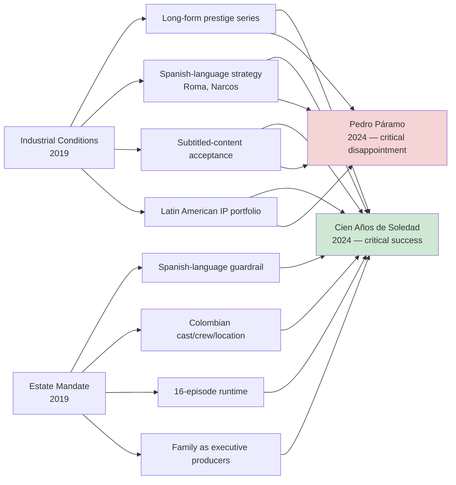
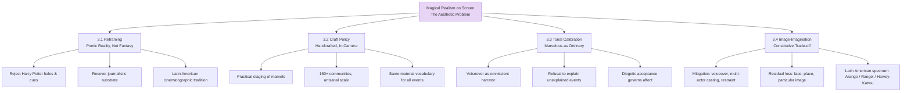
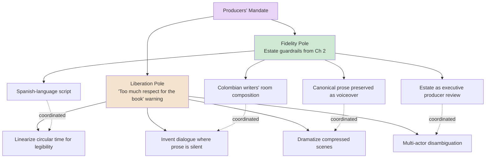
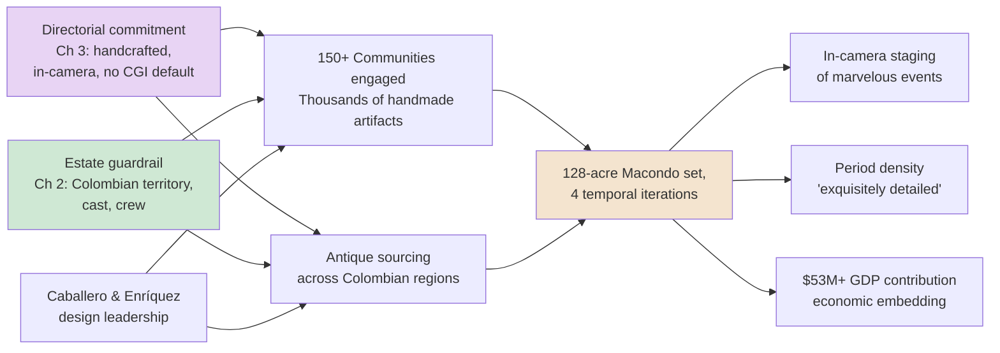
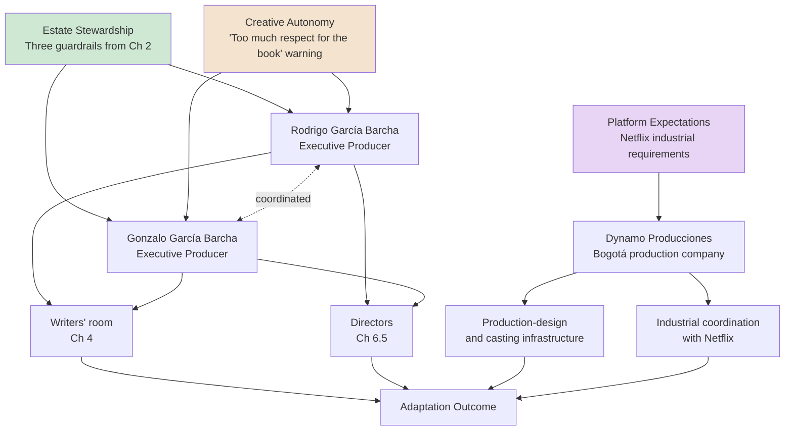
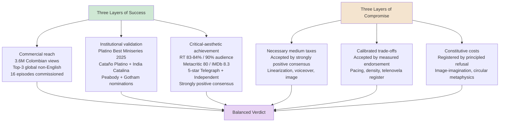
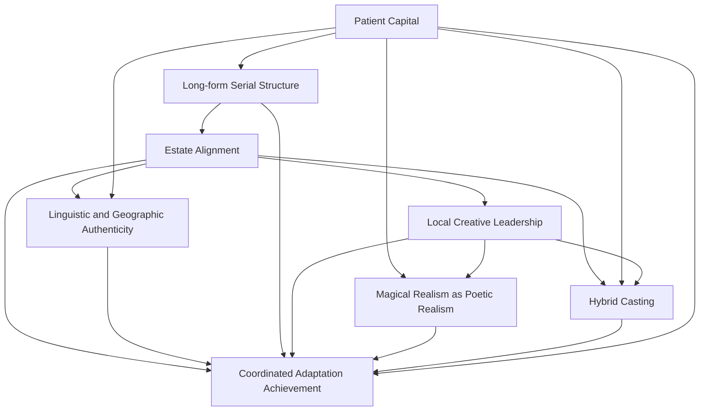

# Cracking the Unfilmable: How Netflix Successfully Adapted Gabriel García Márquez's One Hundred Years of Solitude
# 1 The Adaptation Problem: Why *One Hundred Years of Solitude* Was Long Deemed Unfilmable

For more than half a century after its 1967 publication, *One Hundred Years of Solitude* occupied a paradoxical position in world culture: it was simultaneously among the most widely read novels of the twentieth century — translated into 46 languages, with an estimated 50 million copies in circulation — and one of the most conspicuously absent from the global screen.[^1][^2] To understand how Netflix's December 2024 adaptation came to be regarded as a creative achievement at all, it is necessary first to reconstruct, in concrete terms, the obstacles that had defeated every prior attempt and that García Márquez himself spent a lifetime erecting. The novel's reputation as "unfilmable" was not a vague critical cliché but a layered set of structural, aesthetic, authorial, and cultural problems, each of which would have to be answered — or strategically circumvented — by any adaptation that hoped to succeed. This chapter maps those obstacles as the analytical baseline against which Netflix's choices, evaluated in the chapters that follow, must be measured.

## 1.1 Narrative and Structural Obstacles of the Novel

The first and most tangible barrier to adaptation lies in the novel's formal architecture. *One Hundred Years of Solitude* tells the story of "seven generations of the Buendía family in the fictional town of Macondo," compressing roughly a century of Colombian and Latin American experience — civil war, massacre, modernization, decline — into a single foundational mythology that critics have variously described as "a South American Genesis," "a Caribbean mythology," and "a labyrinthine creeper of the rainforest that is not transparent."[^1][^2][^3] This encyclopedic ambition, which the *New York Times* recognized at the moment of the book's U.S. publication in 1970, generates an immediate problem of scale: a feature film of conventional length cannot plausibly accommodate seven generations of action without reducing each to a vignette, while even a long limited series must impose hierarchies of attention that the novel itself refuses.

Compounding the problem of scope is the novel's deliberate manipulation of time. As one of its directors would later acknowledge, "the book never actually mentions dates and it plays with time."[^2] The narrative is famously circular rather than linear, threading prophecy, premonition, and repetition through events so that endings are foretold from beginnings and the family's fate seems both determined and recursive. Screen storytelling, by contrast, is built on causal sequence and the viewer's accumulating sense of "what happens next" — a logic structurally at odds with a text whose very first sentence flashes forward to a firing squad.

A third obstacle is the novel's notorious onomastic system. The Buendía men are named, generation after generation, José Arcadio and Aureliano, with the patriarch's brother fathering "seventeen Aurelianos" and Úrsula herself observing the recurrence of personality types alongside the recurrence of names. This deliberate confusion is part of the novel's metaphysical argument about repetition and inherited character; on the page, readers tolerate it as a feature of mythic time and, as the writer Pablo Helguera has noted, treat the book as a "springboard for the imagination," supplying their own visual differentiation through the active "poaching" that Michel de Certeau described.[^3] On screen, however, distinct human faces are unavoidable, and any director must either invent visual differentiations the prose withholds or risk audience disorientation.

To these obstacles must be added what the lead director would later describe as a "sparing" use of dialogue. *One Hundred Years* is a novel propelled by reported events, summary narration, and the omniscient cadence of legend rather than by dramatic exchange. As the principal director Alex García López put it in describing the series, "It's certainly not *Succession*."[^2] Television drama, by contrast, has historically depended on dialogue as its primary engine of characterization and exposition, and any adaptation faithful to the novel's silence risks being inert, while any adaptation that supplies dialogue risks betraying the novel's voice.

Finally, the prose itself constitutes an obstacle. The novelist Héctor Abad, asked by *The Guardian* about the project, captured the difficulty by analogy: "It is like adapting *The Iliad*: it is better to focus on one episode, for if you try to do the whole book, you will fail."[^4] The Vanity Fair profile of the production identifies the same dimension when it describes García Márquez's formula as a synthesis of "Kafka's *The Metamorphosis*, Woolf's *Mrs. Dalloway*, and the Spanish *Chronicles of the Indies* with Faulkner and Hemingway" — a layered literary inheritance whose rhetorical density is inseparable from passages such as the one in which the smell of Remedios the Beauty is described as "torturing men beyond death, right down to the dust in their bones."[^2][^5] The figurative reach of such sentences — assigning, as one early reader observed, "abstract magical values to inanimate objects thereby personifying them"[^5] — is precisely what the camera, recording surfaces, struggles to capture.

Taken together, these formal traits — circular chronology, a seven-generation cast, recurring nomenclature, sparse dialogue, and a poetic register inseparable from the prose — define the first stratum of the adaptation problem. They are obstacles internal to the text, prior to any question of authorial permission or industrial feasibility.

## 1.2 The Aesthetic Challenge of Magical Realism

Beneath these structural obstacles lies a more fundamental aesthetic problem, articulated most precisely by García Márquez himself. In a radio interview later cited by *Infobae* and excerpted by Helguera, the author explained his refusal to authorize a film of the novel in epistemological rather than commercial terms:

> "The reason why I don't want *One Hundred Years of Solitude* to be made into a film is because the novel, unlike film, leaves the reader a margin for creation that allows him to imagine the characters, the environments and the situations like they believe it is […] in cinema that is not possible. Because in cinema the fact is the face that you are seeing, the image sets in such an imposing way that you have no escape, it does not leave you the slightest possibility of creation."[^3]

The argument has two parts. First, prose is constitutively underdetermined: a phrase such as "the suffocating odor of Remedios the Beauty" requires the reader to supply the image, and, as Helguera observes, every reader supplies a different one — yellow-tiled floors imagined from a Mexican grandmother's apartment, a Buendía house remembered from an ancestral home in Lagos de Moreno, yellow butterflies that for some readers are not even "Latin American" but archetypal.[^3] The novel's "universality," Helguera concludes, "lies, in a way, in its universality, in the construction of everlasting archetypes of the human experience that transcend time and place."[^3] Second, cinema is constitutively determinate: once an actor's face is cast as Aureliano, a particular butterfly photographed, a particular adobe wall built, those concrete images displace the readerly multiplicity that the prose protects. The novelist's metaphor — pinning the yellow butterfly in a vitrine — captures the ontological loss he feared.

This concern intersects with a second, more specific aesthetic risk: the visualization of magical realism itself. Magical realism, as the editors of the *Oxford Handbook of Gabriel García Márquez* note, is now "routinely used to evoke the literature of a whole continent," but its defining feature in García Márquez's hands is tonal rather than effects-driven — the matter-of-fact incorporation of the miraculous within the registers of reportage and family memory.[^2] Gabo himself insisted on the journalistic foundation of his fiction, telling readers that his books "involve a ton of research, checking of data, historical strictness, and dedication to the facts, which in essence makes them fictionalized or fantasized works of reportage."[^2] To translate this register into images, a production must avoid two opposite errors. It must not literalize the marvelous into spectacle, lapsing into what the principal director would later dismiss as the "phantasmagorical *Harry Potter* when a ghost shows up and there's a halo and the music goes up,"[^2] thereby reducing the novel's metaphysics to genre fantasy. But it must also not strip the marvelous away in pursuit of austerity, since the novel's distinctive force depends on the seamless coexistence of the everyday and the impossible.

The Mexican novelist Guadalupe Nettel's observation captures the difficulty from the other side: "In Mexico, we have these customs. Still, in the US, they call 'magical realism' whatever they can't label."[^2] What reads as realism within Caribbean and Mexican cultural experience can read as exotic or fantastical to non-Latin American audiences, meaning that any visualization risks being received as exoticism by precisely the global audiences a streaming adaptation is designed to reach. The aesthetic problem is therefore not only technical (how to film a girl ascending into the sky on a sheet without "halos") but cultural-pragmatic (how to do so in a way that registers as ordinary within the diegetic world even when it is extraordinary on screen).

García Márquez's position on cinema, finally, was not the position of an outsider hostile to the medium. He had studied film in Rome at the Centro Sperimentale di Cinematografia in 1955, written screenplays, founded the Escuela Internacional de Cine y Televisión de San Antonio de Los Baños in Cuba in 1986, and acted in Alberto Isaac's 1965 film *En este pueblo no hay ladrones* alongside Buñuel and Rulfo.[^3][^2] The author's son recalls Gabo's enthusiasm for Kurosawa, Truffaut, and Resnais and even an attempt to launch a production company called Solitude & Company.[^2] His objection to filming *Cien Años* was therefore not anti-cinematic prejudice but an internal aesthetic judgment — a working filmmaker's verdict on what the medium of cinema, as he understood it, could and could not do with this particular text.

## 1.3 García Márquez's Personal Opposition and Stated Objections

That verdict translated, for nearly six decades, into a public posture of refusal. According to his son Rodrigo García, "for decades our father was reluctant to sell the film rights to *Cien Años de Soledad* because he believed that it could not be made under the time constraints of a feature film, or that producing it in a language other than Spanish would not do it justice."[^1] These two convictions — duration and language — defined the operational form of his opposition.

The duration concern was specific and quantitative. Gabo "said it would take 100 hours to tell the story properly," a figure that, on its face, ruled out any feature-length treatment and cast doubt even on conventional limited-series formats.[^2] The language condition was equally categorical: "the only way he could even begin to conceive of an acceptable adaptation was if it were in Spanish and shot in Colombia."[^2] Together, these constituted the three guardrails — Spanish-language, Colombian-located, sufficient runtime — that any future adaptation would have to satisfy, and which, as later chapters will show, became the spine of the Netflix project.

His refusals were not theoretical. Across the decades he turned down a roster of major Hollywood and European directors — Vanity Fair specifically names William Friedkin, Werner Herzog, and Dino De Laurentiis among those who pursued and were rejected.[^2] The Guardian, drawing on the Colombian novelist Héctor Abad, notes that "no film adaptation of *100 Years* had previously been approved as he refused to sell the rights" despite the author's own deep involvement in scripting Latin American films.[^4] His longtime literary agent Carmen Balcells, asked shortly after his 2014 death whether a true adaptation would ever appear, was categorical: "He never wanted a film made of *One Hundred Years*. And even today it's a desire respected by his family — which I think will be upheld forever."[^2]

Yet the historical record is more ambiguous than the headline of refusal suggests, and this ambiguity is itself part of the adaptation problem. Vanity Fair documents that Gabo "loved hanging out with Hollywood stars — he visited Robert Redford at the Sundance Institute, and Francis Ford Coppola once cooked pasta at his house in Havana."[^2] An "obscure Japanese adaptation from 1981" exists, suggesting that some narrow grant of rights did occur.[^2] His son García Barcha recalls that "he was always a little tempted to make the books into movies," but "he said no so many times that the offers disappeared."[^2] And in a remark his sons would later treat as authorizing, Gabo "said to us that once he was dead, we could do whatever we wanted. 'Just don't bother me.'"[^2]

These conflicting signals — public refusal alongside cinephilic engagement, principled objection alongside private permission — produced a paradox that endured beyond his lifetime. His widow Mercedes Barcha is described as a guardian of his legacy until her death in 2020, though, as Helguera carefully notes, "while the sale for rights was made a year before Barcha died, we don't have public information of how she must have felt about that decision."[^3] The 2019 sale to Netflix and the 2024 posthumous publication of *Until August* — a novel Gabo had reportedly ordered destroyed — both proceeded over what Balcells had described as a wish to be upheld "forever," and were criticized in Latin American cultural circles as a betrayal of authorial intent.[^3][^2] **The crucial point for understanding the adaptation problem is that García Márquez's opposition was simultaneously real, repeatedly stated, and structurally exploitable through a narrow aperture defined by his own three conditions** — an aperture that no producer could enter while he and his closest protectors were alive, but that his sons, both with deep professional ties to the film industry, would eventually treat as a passage.

## 1.4 The Cautionary Precedent of Prior García Márquez Adaptations

Reinforcing the perception of unfilmability was the troubled record of previous attempts to bring García Márquez's other novels to the screen. By the time Netflix announced its acquisition in March 2019, the author's filmography of adaptations functioned less as encouragement than as a series of cautionary tales.

Two adaptations dominate the discussion in the source material. Francesco Rosi's *Chronicle of a Death Foretold* and Mike Newell's *Love in the Time of Cholera* are characterized by Vanity Fair's profile in stark terms: "neither did the novels justice. The former, directed by Francesco Rosi, played like a misguided Italian operetta. The latter, directed by Mike Newell, was cartoonish and overdramatized and starred non-Colombian actors who spoke in English in the lead roles."[^2] The University of California academic Ignacio López-Calvo, co-editor of the *Oxford Handbook of Gabriel García Márquez*, is even more dismissive: "Truly awful," he writes by email of "many of the adaptations."[^2] The reception of *Love in the Time of Cholera* is corroborated independently in Hannah Powers's reading group, where one Cuban reader writes that "the movie was never able to capture the magic realism and the imagination of Garcia Marquez."[^5]

The reasons for these failures are diagnostic. Newell's *Love in the Time of Cholera* failed three of García Márquez's later guardrails simultaneously: it cast non-Colombian actors, it filmed dialogue in English, and it converted a novel of long, accreted time into a feature-length dramatic arc. The Vanity Fair account of *Narcos* — Netflix's own earlier Colombia-set series — extends this lesson into the streaming era: that show "prompted a degree of indignation thanks to its reliance on non-Colombian actors, who often butchered the country's regional accents."[^4] The pattern across these productions is consistent: linguistic and casting infidelity, however commercially expedient, registers as cultural injury to Colombian audiences and as artistic falsification to readers familiar with the source.

The 1981 Japanese adaptation, which Vanity Fair mentions only in passing as "obscure," constitutes a third data point — evidence that even rare licensed attempts had failed to enter the canon of Gabo adaptations or to challenge the unfilmable consensus.[^2]

What sharpens these precedents into a genuine cautionary argument is the fact that García Márquez himself was a deeply experienced screenwriter who nevertheless could not solve the problem. He "contributed writing to dozens of Latin American film scripts" and collaborated with Carlos Fuentes on the screenplay for *El Gallo de Oro* based on Juan Rulfo's novel.[^4][^3] As Abad observes pointedly in the Guardian, "García Márquez himself failed in adapting his books into scripts and films even though he loved cinema."[^4] If the author — armed with intimate knowledge of his own material, formal training in cinema, and a deep personal network of Latin American filmmakers — could not produce satisfactory screen versions of his other works, the prospect of an outside team succeeding with his most complex novel appeared, on the available evidence, to be vanishingly small.

The Pedro Páramo precedent, while contemporary rather than historical, deepens the cautionary frame. Juan Rulfo's *Pedro Páramo*, the 1955 novel Gabo cited as the inspiration for *Cien Años de Soledad*, was itself adapted by Netflix in 2024 and, Helguera notes, "received rather poor reviews," with the *New York Times* providing the negative verdict.[^3] The release of two Netflix adaptations of foundational Latin American magical-realist novels in the same year, with one widely panned, raised the stakes of the *One Hundred Years* project: the streaming era had not yet demonstrated that it could solve the adaptation problem for this category of literature, and the *Cien Años* production therefore could not draw confidence from a comparable success.

| Prior Adaptation | Director | Documented Critique | Key Failure Modes |
|---|---|---|---|
| *Chronicle of a Death Foretold* (1987) | Francesco Rosi | "Misguided Italian operetta"[^2] | Tonal mismatch; non-Colombian frame |
| *Love in the Time of Cholera* (2007) | Mike Newell | "Cartoonish and overdramatized"; failed to capture magical realism[^2][^5] | Non-Colombian cast; English-language dialogue; feature-length compression |
| Japanese adaptation (1981) | — | "Obscure"[^2] | Marginal cultural reach |
| *Narcos* (Colombia-set, contemporary comparator) | — (Netflix US) | Indignation over "butchered regional accents"[^4] | Non-Colombian actors; reductive national framing |
| *Pedro Páramo* (Netflix, 2024) | — | "Rather poor reviews" (NYT)[^3] | Contemporary failure of comparable Latin American magical-realist adaptation |

The table summarizes a pattern: every prior cinematic encounter with García Márquez's universe, and every adjacent attempt to render Latin American literary or cultural material for global screens, had foundered on some combination of language, casting, runtime, or tonal register. The negative case for unfilmability was thus not merely an authorial assertion but an empirically reinforced industry track record.

## 1.5 The Cultural Stakes: A National and Continental Symbol

A final dimension of the adaptation problem is symbolic rather than technical. *One Hundred Years of Solitude* is not simply a great novel; it is, by widespread consensus, a foundational text of Latin American cultural identity, and the costs of failure therefore exceed the boundaries of any individual production.

The evidence of the novel's iconic status is dense and consistent across the source material. The Bogotá bookseller Andrés Camilo Ramírez told The Guardian that "it's hard to overstate how important and masterful *One Hundred Years of Solitude* is."[^4] The Colombian writer Carolina Sanín told Vanity Fair that García Márquez "wrote an epic about the birth and rebirth of civilization, written from the other side of the world. He is Latin America's Homer."[^2] Helguera describes the novel as "a foundational novel, a Caribbean mythology."[^3] The Bell-Villada and López-Calvo *Oxford Handbook* characterizes it as "the embodiment of world literature."[^2] President Juan Manuel Santos, on the author's death in 2014, canonized him as "the greatest Colombian that ever lived."[^4]

The novel's symbolic embedding in Colombian public life is concrete and visible. As The Guardian reports: "Libraries bear Gabo's name, and his avuncular, mustachioed face features on the country's 50,000 peso banknote, as well as works by Bogotá's myriad graffiti artists."[^4] The Vertigo Graffiti collective member Yurika told the same paper that "the wars, the peasant life, and the absurdity of Colombia, is all part of the richness of Gabo's work and it serves as a reference and an inspiration for all of us."[^4] The novel circulates as more than a book: it is a vehicle of national self-understanding that members of the public have memorized, painted on walls, and carried as a token of identity. Vanity Fair's reporting from Cartagena documents fans who "kneel in front of" the urn containing Gabo's ashes, and a state-organized "Macondo Route" designed to draw literary tourism to filming locations.[^2]

The continental and global reach of the novel's status compounds the stakes. García Márquez's 1982 Nobel Prize was understood, by his own statement, as a recognition of "the literature of the subcontinent" — an award given to him "as a way of awarding all of this literature."[^4] Pilar Reyes, editorial director of Penguin Random House in Spain, told Vanity Fair simply: "The García Márquez fund is very healthy."[^2] The novel's translation into 46 languages and circulation of approximately 50 million copies indicate a readership far exceeding any national boundary.[^1]

This symbolic load has two distinct consequences for the adaptation problem. First, it raises the artistic threshold: a production must satisfy not only general audiences but Colombian readers who, as Vanity Fair's interviewees attest, have been carrying private mental images of these characters for decades. The Colombian-born professor Gustavo Arango stated the position bluntly: "I don't want Netflix to tell me what Colonel Aureliano Buendía looks like. I've always imagined he looks like my grandfather. As every Colombian has."[^2] The Venezuelan curator Gabriela Rangel, after seeing the series, articulated a related judgment from a position of measured acceptance: "It has an air to the novel, but it is not *Cien Años*. […] The series is not the worst thing that has ever happened. But the movie is not for us, it is for others; it is very diluted."[^3]

Second, it raises the political threshold. The Vanity Fair profile registers a spectrum of trepidation in Latin American cultural discourse, from those who view any adaptation as "ridiculous and conservative" purism to those "truly offended by the idea that an American franchise would take on a classic Latin American novel and bastardize the narrative and the language."[^3] The adaptation thus enters a contested cultural terrain in which the very act of streaming Macondo to a global audience can be read as either democratization or appropriation — what Helguera identifies as the "scandal du jour" of Latin American cultural circles in late 2024.[^3] A failed adaptation in this context is not merely a bad show; it is a confirmation of suspicions about Hollywood's handling of Latin American patrimony and a documented betrayal of authorial intent.

```mermaid
graph TD
    A[The Adaptation Problem] --> B[Textual Obstacles]
    A --> C[Aesthetic Obstacles]
    A --> D[Authorial Opposition]
    A --> E[Precedential Evidence]
    A --> F[Symbolic Stakes]
    B --> B1[Circular chronology]
    B --> B2[Seven generations / recurring names]
    B --> B3[Sparse dialogue]
    B --> B4[Encyclopedic scope]
    C --> C1[Image fixes readerly imagination]
    C --> C2[Risk of 'Harry Potter' fantasy clichés]
    C --> C3[Matter-of-fact tone hard to film]
    D --> D1[Public refusal across decades]
    D --> D2[Three conditions: Spanish, Colombia, ~100 hours]
    D --> D3[Rejected Friedkin, Herzog, De Laurentiis]
    E --> E1[Rosi's Chronicle: 'operetta']
    E --> E2[Newell's Cholera: non-Colombian, English]
    E --> E3[1981 Japanese version: obscure]
    E --> E4[Pedro Páramo 2024: poor reviews]
    F --> F1[Latin America's 'Homer']
    F --> F2[On 50,000-peso banknote]
    F --> F3[46 languages / 50M copies]
    F --> F4[Cultural-political risk of failure]
```

The diagram above clarifies the structure of the problem as five interlocking strata. Textual and aesthetic obstacles arise from the work itself; authorial opposition and precedential evidence arise from the historical record of attempts and refusals; symbolic stakes arise from the novel's reception and embedding in public life. Crucially, **these strata are not independent but mutually reinforcing**: the textual difficulties produced the aesthetic concerns that produced the author's opposition; the author's opposition forestalled experimentation that might have built up adaptational know-how; the resulting absence of successful precedents reinforced the unfilmable consensus; and the novel's growing iconic status during this same half-century elevated the cost of any future failure.

The analytical baseline for the rest of this report can therefore be stated precisely. To count as a "success" — in any meaningful sense beyond commercial reach — Netflix's adaptation would have to render circular time legible without flattening it, depict seven generations of similarly named characters without disorienting viewers, find a visual register for magical realism that neither lapsed into spectacle nor evacuated the marvelous, satisfy García Márquez's three posthumous conditions of Spanish, Colombia, and adequate runtime, avoid the casting and language failures that had sunk Newell's and Rosi's films, and survive the symbolic scrutiny of Colombian readers, Latin American intellectuals, and international critics simultaneously. The chapters that follow examine, factor by factor, how the production engineered its responses to each of these obstacles — and where, in the consensus of critics and Latin American observers documented later in the report, those engineered responses succeeded, fell short, or produced trade-offs that remain genuinely contested.

# 2 Enabling Conditions: Streaming Industry Context and the Estate's Mandate

If Chapter 1 established why *One Hundred Years of Solitude* had resisted adaptation for fifty-seven years, the question that follows is why the resistance broke when it did, and on the specific terms it did. The answer cannot be located in any single sphere — neither in a technological breakthrough, nor in a corporate decision, nor in a familial change of heart taken in isolation. Rather, between roughly 2015 and 2019 a particular configuration emerged in which the maturation of long-form prestige streaming, Netflix's deliberate cultivation of Spanish-language originals, and the willingness of García Márquez's heirs to act on a private posthumous license converged on a set of mutually compatible terms. The 2019 rights agreement that resulted was not a relaxation of García Márquez's objections but their literal operationalization: each of his three stated conditions — Spanish, Colombia, sufficient duration — could now be met on the industrial terrain Netflix offered, and the estate, recognizing this, transposed those conditions from authorial preferences into binding contractual and creative guardrails. This chapter reconstructs that convergence and argues that the project's later success, examined factor by factor in subsequent chapters, was preconditioned by an alignment without which neither industry capacity nor family stewardship would have been sufficient on its own.

## 2.1 The Streaming Inflection Point: Long-Form Prestige Television as Adaptation Solvent

The first enabling condition was formal. García Márquez's principal technical objection to a screen adaptation, as documented in Chapter 1, was duration: the conviction that the novel "could not be made under the time constraints of a feature film," with the family's recollection that he believed it would take "100 hours to tell the story properly." For most of the twentieth century, this complaint was decisive because the dominant audiovisual unit for adapting a novel of literary prestige was the two-to-three-hour theatrical feature. Television, in its earlier broadcast forms, lacked both the budgets and the cultural standing to host such a project; the long-form miniseries existed but was rarely commissioned at the scale or with the cinematic ambition that an adaptation of *Cien Años* would require.

What changed, and what Rodrigo García explicitly invoked when announcing the deal, was the consolidation of what he called "the current golden age of series, with the level of talented writing and directing, the cinematic quality of content, and the acceptance by worldwide audiences of programs in foreign languages."[^6][^7][^8][^9] The phrasing is precise and worth dissecting: the family was not pointing to one development but to a four-part shift — quality of writing, quality of direction, cinematic visual standard, and global reception of subtitled work — that together transformed long-form serial television from a commercial fallback into a legitimate vehicle for canonical literary adaptation. The streaming services that drove this shift had, by the late 2010s, normalized eight-to-sixteen-hour run-times for marquee literary properties at production budgets that approached or matched those of feature film.

The Netflix adaptation answered the duration objection on those terms. *One Hundred Years of Solitude* was structured as a two-part limited series totaling 16 hour-long episodes, with the first eight released on December 11, 2024, and the concluding eight scheduled for August 2026.[^10] In aggregate this yields roughly sixteen hours of screen time — short of Gabo's hypothetical hundred-hour estimate, but an order of magnitude longer than any feature film could have offered, and sufficient, by the directors' and writers' own accounting, to permit the seven-generation arc to unfold without compression to vignette. Rodrigo García's 2019 statement, repeated almost verbatim in subsequent press cycles, framed this scale as the precondition for his family's consent: it was the existence of long-form prestige series, not Netflix's overtures per se, that made the project conceivable.[^6][^7][^8][^9] Avi Reviewer Bob Strauss's Wrap notice captured the same point retrospectively, observing that the production had managed to streamline "García Márquez's idiosyncratic, discursive novel into an expeditious but still thoughtful, contemplative and, yes, realistically magical eight hours" — a feat predicated on having those eight hours to begin with.[^11]

The 8+8 structure deserves further analysis because it is not merely a duration choice but a release-strategy choice that Netflix had refined across earlier tentpole projects. The platform's practice of bisecting a single narrative into two seasons — a format the production's reviewers noted in connection with *Bridgerton* and *Outer Banks*[^12] — preserves the integrity of the story while allowing the company to anchor two annual content calendars around a single intellectual property. For an adaptation as risk-laden as *Cien Años*, this structure also functioned as a hedge: Part 1's reception (eight episodes covering roughly the first half of the Buendía saga, ending with the chestnut tree and the rain of yellow flowers) could be assessed before Part 2 (which Netflix's Tudum announcement confirms will cover the Treaty of Neerlandia, the arrival of the railroad, the banana company, and the fulfillment of Úrsula's curse) entered final post-production.[^10] The bisection therefore solved a creative problem (sufficient runtime for a century-long narrative) while exploiting an industrial advantage (modular release scheduling) that broadcast-era miniseries had not possessed.

Two additional features of the long-form prestige format proved consequential. First, the format had by 2019 normalized the use of recognized film directors as series directors — Alex García López ("The Witcher") and Laura Mora ("The Kings of the World," "Frontera Verde") were able to bring feature-film visual ambition to episodic television precisely because the convention permitted it.[^10] Second, the format had cultivated audiences willing to commit to slow-building, dialogue-sparse, atmospherically dense storytelling — a tolerance directly relevant to a novel whose director would later observe "it's certainly not *Succession*." Both features were absent or marginal in the broadcast eras through which Friedkin, Herzog, and De Laurentiis had pursued the rights and been refused. The streaming inflection point, in short, dissolved the duration constraint not by providing a new technology but by maturing a new industrial form whose conventions happened to align with the demands García Márquez had specified.

## 2.2 Netflix's Spanish-Language Globalization Strategy and the Demand for Subtitled Content

The second enabling condition was commercial. García Márquez's language objection — that "producing it in a language other than Spanish would not do it justice"[^6][^7][^8][^9] — had historically functioned as a near-total bar to mainstream production because the global commercial film industry was, in practice, an Anglophone industry: the addressable market for a Spanish-only, Colombian-set production at theatrical or premium-cable scale was simply too small to justify the budget the source material demanded. By 2019 that calculus had been overturned, and the agent of overturning was, in part, Netflix itself.

The most-cited evidence for the shift is *Roma*. Alfonso Cuarón's Spanish-language Mexican film, distributed by Netflix, won three Academy Awards in 2019 and was repeatedly invoked in the rights-acquisition coverage as a proof point that the platform could "make Spanish-language content for the world."[^6][^7][^13] Francisco Ramos, Netflix's then–Vice President of Spanish-Language Originals (later Vice President of Latin America Content), framed the *Cien Años* deal in identical terms in his March 2019 statement: "We know our members around the world love watching Spanish-language films and series, and we feel this will be a perfect match of project and our platform."[^6][^8][^9] The New York Times's coverage of the deal made the connection explicit: Ramos cited *Roma* and *Narcos* as series and films that demonstrated a global appetite for Spanish-language content with subtitles, framing the *Cien Años* acquisition as a continuation of a strategy that had already proven itself.[^7]

The strategy extended beyond *Roma*. By the time of the rights deal Netflix had built a substantial Spanish-language catalogue — *Narcos* (three seasons set in late-1980s Colombia), *Las chicas del cable* (Spain), *Edha* (Argentina), and a wider array of Latin American originals — and was investing in Spanish-language production capacity across the region.[^13] Rodrigo García's statement identified the audience-side dimension of this strategy with particular precision: "Netflix was among the first to prove that people are more willing than ever to see series that are produced in foreign languages with subtitles. All that seems to be a problem that is no longer a problem."[^7] The "problem" he refers to is the long-standing assumption — exemplified by Newell's English-language *Love in the Time of Cholera* — that Spanish-language production for global distribution required commercial compromise on language, casting, or both. The platform's data, and the *Roma* awards trajectory, allowed the family to treat that assumption as obsolete.

Two additional commercial factors converted strategic willingness into operational feasibility. First, Netflix's partnership with Bogotá-based Dynamo Producciones — the company behind *Narcos* and a portfolio of more than 47 features and 25 series including *Wild District*, *Crime Diaries*, and *Green Frontier* — provided the production infrastructure required to mount a Colombian-shot project at the necessary scale.[^11] Second, Netflix accessed Colombian production incentives, and the production was constructed with explicit attention to its local economic footprint.[^11] The company's own communications quantified the result: the production was characterized as "one of the most ambitious productions in Latin American history,"[^10] reportedly the most expensive television production in Latin American history,[^14] and contributed "over 225 billion Colombian pesos (more than $53 million)" to Colombia's GDP through filming across 15 towns, the engagement of more than 150 local communities to craft thousands of handmade artifacts, and a 900-strong production team.[^14] These figures should be understood not as marketing flourishes but as evidence that streaming economics in 2019 permitted a Colombian-shot, Spanish-language production at a scale historically reserved for Hollywood-budgeted English-language properties.

The strategic positioning is also visible in the parallel projects Netflix greenlit in the same window. The platform's 2024 adaptation of Juan Rulfo's *Pedro Páramo* — the 1955 novel Gabo cited as the inspiration for *Cien Años* — and its development of *The Eternaut* signal a broader bet on canonical Latin American IP, treating the region not as a niche market to be served by occasional acquisitions but as a strategic content zone with a distinctive literary inheritance.[^14] This portfolio context matters because it indicates that Netflix's commitment to *Cien Años* was not idiosyncratic but doctrinal: the company had institutional reasons to absorb the substantial financial risk of an unproven Latin American magical-realist adaptation, and the family could rely on that institutional commitment to sustain a production whose six-year development arc would otherwise have been hard to underwrite.

The convergence of these factors — *Roma* as proof, *Narcos* and *Money Heist* (*La Casa de Papel*) as catalogue, Dynamo as partner, Colombian incentives as subsidy, Latin American IP as portfolio strategy — meant that, by 2019, the language and geographic conditions García Márquez had imposed were no longer commercially marginal. **A Spanish-language, Colombian-shot, $50-million-plus television production was no longer an outlier requiring justification but a category of project Netflix had already learned how to greenlight, finance, and distribute globally.** The objection that had foreclosed Friedkin's and Herzog's pursuits had been dissolved by industrial change.

## 2.3 The 2019 Rights Agreement: Negotiating the Estate's Posthumous Mandate

These industrial conditions were necessary but not sufficient. Many magical-realist novels by canonical Latin American authors remained unadapted in 2019 not because Netflix had not noticed them but because their estates had not opened the door. The third enabling condition was therefore family-side: the willingness of Rodrigo García and Gonzalo García Barcha to translate their father's private posthumous permission into a formal grant of rights, on terms they themselves would oversee.

The contractual architecture of that grant, announced on March 6, 2019 — pointedly, García Márquez's 92nd birthday[^13] — was reported consistently across trade and book press. Netflix acquired rights to develop the novel as a Spanish-language original series; García Márquez's estate was represented by Sylvie Rabineau at WME, attorney Shelley Surpin, and the Agencia Literaria Carmen Balcells; and the author's two sons were named executive producers.[^6][^7][^13][^8][^9] The Agencia Literaria Carmen Balcells's involvement is symbolically significant: Balcells herself, before her death, had been categorical that "he never wanted a film made of *One Hundred Years*," yet her agency now represented the estate in the precise transaction she had once declared would be "respected by his family — which I think will be upheld forever," as documented in Chapter 1. The deal therefore proceeded over the explicit prior position of one of its institutional negotiators, and this tension is part of the historical record from which the adaptation's legitimacy must be assessed.

The two sons' qualifications for the executive-producer role were not symbolic. Rodrigo García is an established filmmaker with credits in American film and prestige television; Gonzalo García Barcha has industry experience documented through trade press coverage of the project.[^11] This was not a case of literary heirs licensing a property to a studio whose creative decisions they would then accept passively; it was a case of two industry-experienced executors taking direct creative authority over the adaptation, with the institutional standing to enforce conditions and the personal motivation to do so as their father's first-line custodians. The Vanity Fair reporting cited in Chapter 1 records Gabo's late-life remark to his sons — "once he was dead, you could do whatever you wanted. 'Just don't bother me'" — and the 2019 deal can be read as the conversion of that informal verbal license into a contractual structure that gave the sons standing to bind Netflix to specific creative terms while honoring what they understood to be their father's substantive conditions.

The timing of the deal is also analytically important. The agreement was concluded in March 2019, before Mercedes Barcha's 2020 death — a sequence Pablo Helguera carefully flagged in noting that "while the sale for rights was made a year before Barcha died, we don't have public information of how she must have felt about that decision," as cited in Chapter 1. The sons therefore acted while their mother — described in Chapter 1's source material as "guardian of his legacy" — was still alive, suggesting at minimum that the deal proceeded without her audible objection. Conversely, the critical reception of the project in Latin American intellectual circles — what Helguera called "the scandal du jour of late 2024" — registered the fact that two posthumous events of similar character (the *Cien Años* sale and the 2024 publication of *Until August*, a manuscript Gabo had reportedly ordered destroyed) were being undertaken by the same heirs in proximity, and that the cumulative effect could be read as a renegotiation of authorial intent. The cultural-political delicacy of the family's position is thus part of the project's enabling architecture: the sons had to construct a deal whose terms could be defended, in advance, as continuous with their father's stated conditions rather than as a departure from them.

That defense rested on the three conditions Gabo had articulated in life. Rodrigo García's statement in the announcement returned to those conditions explicitly — duration, language, the cinematic prestige of contemporary series — and presented the deal as the first historical moment at which all three could be honored simultaneously.[^6][^7][^8] The implicit argument was that the rights had not been sold over their father's objection but rather under conditions that finally met it: streaming had answered duration, Netflix's Spanish-language strategy had answered language, and the family's own executive-producer positions would answer the cultural-fidelity concerns that no contractual clause could fully specify. Whether this argument is finally persuasive is a normative question on which the Latin American intellectual community remains divided; what matters analytically is that the argument was internally coherent and was the basis on which the sons proceeded.

## 2.4 The Three Non-Negotiable Guardrails as Structural Foundation

The argument's coherence required, in turn, that the three conditions be carried forward from rhetorical justification into operational practice. They were, and the fact that they were is what distinguishes the *Cien Años* project from prior Hollywood approaches — and, as section 2.5 will argue, from the contemporaneous *Pedro Páramo* adaptation. Each guardrail responded directly to a documented failure mode catalogued in Chapter 1.

The first guardrail was **Spanish-language production**. Netflix's announcement specified a "Spanish-language original series," and Rodrigo García's statement made explicit that the family had refused for decades to consider any production "in a language other than Spanish."[^6][^7][^13][^8][^9][^15] In operational terms, this meant that dialogue, voiceover (which the production would deploy as a vehicle for the novel's omniscient narrator), and on-set communication would all proceed in Spanish, and that the global audience would receive the work via subtitling rather than dubbing for the Anglophone market. As Liz Harvey-Kattou documented in *The Conversation*, the directors faithfully retained famous lines from the source — including the celebrated opening "Many years later, as he faced the firing squad, Colonel Aureliano Buendía was to remember that distant afternoon when his father took him to discover ice" — through "voiceover which takes on the role of omniscient narrator" or through the dialogue itself.[^12] The condition therefore neutralized, by structural commitment, the *Cholera*-style language betrayal documented in Chapter 1: there was no scenario, given the contract's terms, in which non-Colombian actors would speak García Márquez's prose in English.

The second guardrail was **predominantly Colombian cast and crew, shot in Colombia**. Netflix's announcement specified that the series would be "filmed mainly in Colombia,"[^6][^13][^8][^9][^15] and the production ultimately conducted shooting from May to December 2023 across 15 Colombian towns spanning La Guajira, Magdalena, Cesar, Cundinamarca, and Tolima.[^11] The family's stipulation that the production "should be filmed entirely in Colombia and in Spanish, with the majority of the production team — like the cast — Colombian"[^14][^16] yielded an all-Colombian cast and a 900-strong production team grounded "not only in place but in identity."[^14] The casting principals reflected the condition concretely: Marco González as the young José Arcadio Buendía (his first major role), the professional dancer Susana Morales as the young Úrsula Iguarán, Diego Vásquez and Marleyda Soto as the older couple, and the well-known Colombian actor Claudio Cataño as Colonel Aureliano Buendía.[^12] The condition addressed directly the *Narcos*-style "indignation thanks to its reliance on non-Colombian actors, who often butchered the country's regional accents" documented in Chapter 1 — a failure mode the family had observed at first hand on Netflix's prior Colombia-set production. By precommitting to Colombian casting, the *Cien Años* project ensured that Colombian audiences, whose expectations Chapter 1 identified as the most demanding artistic threshold, would not encounter accent or cultural infidelity as a precondition for engagement.

The third guardrail was **sufficient runtime through long-form serialization**. The 16-episode order — eight episodes per part, hour-long format — embedded the duration condition into the project's basic architecture rather than treating it as a creative preference subject to adjustment. Rodrigo García's statement explicitly identified the episode count as the form that had finally "convinced the author's family to sign off on the project."[^17] At an aggregate of approximately sixteen hours, the structure exceeds any feature-length treatment by an order of magnitude and approximates, if it does not match, the scale Gabo had specified as adequate. The condition therefore answered the time-compression problem internal to the text — the impossibility of seven generations being treated other than as vignette in a feature — that the introductory chapter identified as the first stratum of unfilmability.

The relationship among these three guardrails and the failure modes they answer can be summarized as follows:

| Estate Guardrail | Failure Mode in Chapter 1 | Structural Response |
|---|---|---|
| Spanish-language production | Newell's *Love in the Time of Cholera*: English dialogue spoken by non-Colombian leads | Contractually Spanish-only original; voiceover and dialogue both in Spanish; subtitled global distribution |
| Colombian cast and crew, shot in Colombia | *Narcos*: non-Colombian actors butchering regional accents; *Cholera*: non-Colombian leads | All-Colombian cast (largely non-professional, screened by open call); shooting across 15 Colombian towns; 900-strong predominantly Colombian crew |
| Sufficient runtime via long-form serial | Feature-length compression of seven-generation arc; Gabo's '100 hours' estimate | 16 episodes of approximately one hour each, released as 8+8 across two parts |

A claim worth pressing here is that **these guardrails functioned not as constraints on creativity but as the precommitments that defined the project's creative identity**. By foreclosing in advance the language compromises, casting compromises, and duration compromises that had sunk every prior García Márquez adaptation, the contract liberated the production team to focus its creative energy on problems internal to the source — the visualization of magical realism, the legibility of recurring names across generations, the screen rendering of circular time — that no amount of language adjustment or casting expediency could have solved. Subsequent chapters will document how this freedom was exercised in production design (Chapter 5), casting and performance (Chapter 6), and the cultural politics of representation (Chapter 7); the analytical point here is that those exercises were possible because the most basic terms had been settled before any creative team was assembled.

A second claim is that **the guardrails simultaneously secured the cultural legitimacy that any adaptation entering Chapter 1's "contested cultural terrain" would need to survive**. A production that had attempted *Cien Años* with English dialogue, Mexican or Spanish actors substituting for Colombians, or a feature-length runtime would have entered the Latin American discourse as evidence of "an American franchise [taking] on a classic Latin American novel and bastardiz[ing] the narrative and the language," to use the Vanity Fair phrase from Chapter 1. By foreclosing those options, the family's mandate inoculated the project against its most predictable mode of failure. Critical reception, as Chapter 8 will document, includes serious reservations on other grounds — pacing, density, sexual politics — but the disqualifying critiques that had attached to Newell's and Rosi's adaptations did not attach to the Netflix series, and the absence of those critiques is traceable to the guardrails imposed in 2019.

## 2.5 Cautionary Comparators in the Streaming Era: *Pedro Páramo* and the Risk Frame

The argument that industry conditions and estate mandate were jointly necessary, rather than individually sufficient, is sharpened by a contemporaneous counterfactual: Netflix's December 2024 adaptation of Juan Rulfo's *Pedro Páramo*, released in the same year and across the same platform as *Cien Años*. As Chapter 1 noted, *Pedro Páramo* is the foundational Mexican novel Gabo cited as the inspiration for *Cien Años de Soledad*, and Helguera observed that its adaptation "received rather poor reviews," with the *New York Times* providing a negative verdict. The release of two Netflix adaptations of canonical Latin American magical-realist novels in the same calendar year, with starkly divergent critical receptions, provides a controlled comparison of which factors in the *Cien Años* project actually mattered.

The two productions shared the same industrial enabling conditions in their entirety. Both were produced by Netflix; both benefited from the platform's Spanish-language globalization strategy and prior demonstration that subtitled Latin American content could reach global audiences; both were greenlit during the same period of streaming-era prestige expansion; both adapted canonical Latin American magical-realist novels held to be cornerstones of regional literary identity. If industrial conditions alone were sufficient to convert difficult literary properties into successful adaptations, the two productions should have had comparable outcomes.

They did not. *Cien Años de Soledad* opened to consensus praise from a demographically and geographically diverse critical readership. The Variety review described it as "exquisitely detailed and layered in intricate symbolism" and "one of the most faithful page-to-screen adaptations in recent years"; The Wrap characterized it as "an impressive job of streamlining García Márquez's idiosyncratic, discursive novel into an expeditious but still thoughtful, contemplative and, yes, realistically magical eight hours"; The Conversation pronounced it "faithful, ambitious and beautifully realised" and judged that "those who love the novel will not be disappointed."[^12][^11] On Rotten Tomatoes the series held an 83% critic score and a 91% audience score; in Colombia it ranked among the country's top three most-watched non-English Netflix productions, with over 3.6 million views in its first week.[^14] *Pedro Páramo*, by contrast, was met with critical reception sufficiently negative that it has been treated in the source material as a cautionary point of comparison rather than a parallel achievement.

The diagnostic value of the comparison lies in what *Pedro Páramo*'s release configuration appears to have lacked. The available source material does not document an equivalently rigorous estate-imposed creative architecture, an equivalent commitment to a single specific national production base, or an equivalent precommitment to long-form serialization (Rulfo's novel is far shorter than García Márquez's and was adapted as a feature film rather than a 16-episode series). What distinguished *Cien Años* was not its industrial setting — that was shared — but the configuration of family stewardship, location specificity, language fidelity, casting authenticity, and serial length that the estate mandate had locked in. **In the absence of that configuration, the same platform, in the same year, in the same genre, could not produce the same critical outcome.**

A diagram makes the argument explicit:

The diagram captures the central argument of this chapter: **the *Cien Años* project drew on the full set of industrial conditions, and on a distinctive set of estate-imposed creative guardrails that the *Pedro Páramo* configuration lacked**. The industrial conditions account for why a serious Spanish-language adaptation became commercially feasible at all in 2019, but they cannot, by themselves, explain why one such adaptation succeeded critically and another, contemporaneously, did not. The estate mandate — converted from authorial preferences into binding creative architecture by Rodrigo García and Gonzalo García Barcha in their roles as executors and executive producers — supplied the additional precommitments without which industry capacity translates into spectacle rather than fidelity.

This conclusion sets the analytical agenda for the chapters that follow. The 2019 deal made the project possible; the production team's creative decisions, beginning with the philosophical reframing of magical realism (Chapter 3) and the writers' room's restructuring of the novel's circular chronology (Chapter 4), made the project successful in the specific senses that critics and audiences would later document. But those creative decisions were taken within a frame whose three sides — Spanish, Colombia, sixteen hours — had already been fixed. To describe the production-level achievements of the next chapters as the "cause" of the adaptation's success is to take that frame for granted. What this chapter has argued is that the frame itself was an achievement — the joint product of an industry that had matured into capacity and a family that had inherited the discretion to specify terms — and that without it the *Cien Años* project would have entered the same terrain on which Newell, Rosi, and the *Pedro Páramo* team had already faltered.

[^17]: Mary Kate Carr, "Netflix shares teaser for the new adaptation of Gabriel García Marquez's masterpiece *One Hundred Years Of Solitude*," The A.V. Club / Paste, April 17, 2024.
[^6]: Todd Spangler, "Netflix to Adapt Gabriel García Márquez's 'One Hundred Years of Solitude' as Series," Variety, March 6, 2019.
[^7]: Concepción de León, "'One Hundred Years of Solitude' Is Coming to Netflix," The New York Times, March 6, 2019.
[^14]: Saeed Jalili, "Why *One Hundred Years of Solitude* Still Matters," Medium, May 22, 2025.
[^13]: Bedatri Choudhury, "One Hundred Years Of Solitude: Macondo Is Making Its Way To Netflix," Forbes, March 6, 2019.
[^8]: "Netflix are turning 'One Hundred Years Of Solitude' into a TV series," NME, March 2019.
[^10]: "The Second and Final Part of *One Hundred Years of Solitude* Arrives in 2026," Netflix Tudum.
[^9]: "Gabriel Garcia Marquez's 'One Hundred Years of Solitude' to be Adapted Into Netflix Series," Decider, March 6, 2019.
[^15]: "Netflix to Adapt Gabriel García Márquez's 'One Hundred Years of...,'" trade press summary.
[^12]: Liz Harvey-Kattou, "*One Hundred Years of Solitude*: Netflix adaptation is faithful, ambitious and beautifully realised," The Conversation, December 9, 2024.
[^16]: "This is the only thing Gabriel García Márquez's son requested for the Netflix adaptation of *One Hundred Years of Solitude*."
[^11]: Gonzalo García Barcha — News, IMDb (aggregating ScreenDaily, Variety, The Wrap, Indiewire and Vital Thrills coverage from 2019, 2023, and 2024).

# 3 Translating Magical Realism: The Core Aesthetic Challenge

The two preceding chapters have established, on the one hand, the layered reasons why *One Hundred Years of Solitude* was long deemed unfilmable, and on the other, the industrial and contractual conditions under which adaptation became at last operationally feasible. Yet between the framing conditions and the finished episodes lies a problem that no contract could resolve and no streaming runtime could automatically dissolve: the aesthetic problem of magical realism itself. As Chapter 1 documented, García Márquez's epistemological objection — that cinema's "imposing" image forecloses the readerly imagination preserved by prose — was matched by a more specific tonal hazard, the risk of collapsing the novel's matter-of-fact miracles into either fantasy spectacle or, conversely, an austere realism that simply removes them. This is the terrain on which a project of this kind succeeds or fails as art, distinct from whether it succeeds as deal-making or scheduling. This chapter reconstructs the coherent aesthetic philosophy through which co-directors Alex García López and Laura Mora, working in concert with the Colombian cinematography team led by Paulo Pérez and María Sarasvati Herrera and the production-design apparatus that Chapter 5 will examine in detail, addressed that hazard. The argument is that the production answered the trivialization risk through three interlocking commitments — a reframing of magical realism as poetic Latin American reality rather than as fantasy; a privileging of handcrafted, in-camera, theatrical means over CGI; and a tonal calibration in which the extraordinary is received as ordinary within the diegetic world — and that these commitments, taken together, constitute the connective tissue between the structural enabling conditions of Chapter 2 and the production-design, performance, and reception evaluations of the chapters that follow.

## 3.1 Reframing the Genre: From Fantasy to Poetic Reality

The directors' first move was philosophical rather than technical. Before any decision about how to film a particular miracle, García López and Mora had to decide what kind of object the novel was, and therefore what kind of register a faithful screen version had to occupy. The available record suggests an unusually explicit articulation of this decision, framed in Chapter 1 through García López's rejection of "the phantasmagorical *Harry Potter* when a ghost shows up and there's a halo and the music goes up." The negative formulation is diagnostic: the director identified, by name, the dominant English-language convention for visualizing the supernatural — concentric haloes, swelling orchestration, slow-motion reveals — and ruled it out at the level of grammar. What was at stake in this refusal was not merely an aesthetic preference but a generic placement: to film *Cien Años* with the visual punctuation of genre fantasy would be to relocate Macondo into a cinematic tradition (Anglophone fantasy spectacle) to which it does not belong, and to which its readerly reception in Latin America has never assigned it.

The positive formulation supplied by the directors was that magical realism is not a fantasy mode but a poetic intensification of grounded reality. This formulation is best read as a recovery of García Márquez's own statements about his fiction, documented in Chapter 1: that his books "involve a ton of research, checking of data, historical strictness, and dedication to the facts, which in essence makes them fictionalized or fantasized works of reportage." The phrase is consequential. It locates the novel's marvelous not in a separate ontological register that must be visually marked off from the ordinary — as Anglophone fantasy traditionally does with halos, music cues, and atmospheric effects — but on the same plane as the historical and journalistic substrate from which the prose draws its weight. The 1928 banana-company massacre, the railroad's arrival, the Liberal–Conservative civil wars, the Caribbean ecology of yellow butterflies and torrential rains — these are the literal facts within which Remedios's ascension and the rain of yellow flowers occur. To restore the journalistic substrate is therefore to restore the plane on which the marvelous is meant to operate.

The Cinefotolatino interview with the Mexican cinematographer María Sarasvati Herrera, who shot on the production, registers the same orientation from the practitioner's side. Herrera describes her work on *Cien Años de Soledad* in terms of "the influence of artistic inspiration in her creative process, the importance of lighting in diverse productions and her experience filming in Colombia," and she speaks of collaborating with other cinematographers and using innovative technologies "to achieve a unique visual aesthetic."[^18] The framing places the project's visual strategy within a tradition of Latin American cinematographic practice — María Sarasvati Herrera is identified with the Asociación Mexicana de Cinefotógrafos (AMC) and Apertura DoP — rather than within an Anglophone fantasy convention.[^18] Similarly, the Colombian cinematographer Paulo Pérez ADFC, interviewed both on the Cinefotolatino podcast about his approach to "trabajar la luz en función de la historia" ("working light in service of the story") and on The Wandering DP Podcast specifically about "his latest work for Netflix on the series 100 Years of Solitude," locates his practice within Colombian narrative tradition, with prior credits on *Los viajes del viento*, *Chocó*, and *Frontera Verde* — works whose visual idiom is rooted in Colombian landscape and ethnographic observation rather than in the spectacle conventions of international genre cinema.[^19][^18]

This reframing addressed directly the cultural-pragmatic problem documented in Chapter 1. The Mexican novelist Guadalupe Nettel's observation, cited there — that "in Mexico, we have these customs. Still, in the US, they call 'magical realism' whatever they can't label" — captures the asymmetry between Caribbean and Mesoamerican cultural experience, in which the saturation of the everyday with the miraculous is simply continuous with lived life, and an Anglophone reception in which the same material is automatically reclassified as exotic or fantastical. The directors' philosophical commitment to a "poetic" rather than "fantasy" register can be understood as an effort to design the visual address of the series so that it would land for both audiences as it lands for Caribbean readers of the prose: as the heightened but recognizable rendering of a world its inhabitants experience as real. **The tonal trick was not to make the marvelous look unusual to international viewers, but to make it look unsurprising to the Macondans on screen, and to trust that the asymmetry of reception would resolve in favor of the diegetic world rather than against it.**

It is worth noting that this reframing also carries forward the journalistic substrate identified in Chapter 1 in a second sense. The Colombian historical events depicted in the novel — the railroad, the war, the massacre — are not exotic backdrop but the social matter the prose is reporting upon, and the production's commitment to a poetic-reality register implies that these events should be filmed with the texture of historical reconstruction rather than of fable. Chapter 5 will examine in detail the production-design choices — Caballero and Enríquez's four iterations of Macondo across the 128-acre Tolima set, the role of regional artisans, antique sourcing across Colombian regions — that materialized this commitment; the analytical point here is that those design choices were governed by, and intelligible within, the directorial decision to treat the novel as poetic reportage rather than as fantasy.

## 3.2 The Handcrafted Aesthetic: Practical Effects, Theatrical Imagery, and the Refusal of CGI

The reframing required a corresponding craft policy. If magical realism was to be rendered as the poetic intensification of grounded reality, then the marvelous events that punctuate the novel had to be filmed with the same physical means — light, water, paper, fabric, wood, smoke, on-set craftsmanship — through which Macondo's ordinary world was filmed. The production's documented preference for practical, in-camera, and theatrical solutions over digital visual effects is therefore not a stylistic flourish but a logical entailment of the philosophical choice traced in section 3.1.

The set pieces drawn from the novel and represented in the eight episodes of Part 1 illustrate the policy. The rain of yellow flowers that falls on Macondo at the death of the elder José Arcadio Buendía — described in the novel and reproduced in the series as a kind of gentle storm of petals that floods the streets and must be cleared "like snow, to make way for his funeral procession"[^20] — is the kind of image that contemporary VFX pipelines could trivially generate as digital particles, and that the production's craft policy required to be staged physically. Similarly, the trail of blood that escapes from José Arcadio's house after his unexplained murder, winding through the streets of Macondo and arriving at his mother's door — an image that appears in the eighth episode of Part 1 and is treated by the series, as in the novel, with the matter-of-fact gravity of a confirmed event rather than with the visual punctuation of supernatural revelation[^20] — is precisely the kind of moment in which an Anglophone fantasy adaptation would have inserted music, slow motion, or atmospheric overlay. The novel's Cinemaholic recap of the eight-episode arc registers, indirectly but consistently, the tonal flatness of these renderings: the death of Jose Arcadio, his unexplained ear-blood and the smell of smoke, the trail to Úrsula's house, are described as accepted by the residents of Macondo "just as all the things that happened before this and all the rest that are to follow," a phrasing that captures the ordinariness of the marvelous within the diegetic frame.[^20]

The IMDb summary of audience response to the series identifies the same visual register from the receiving end: "From the haunting beauty of Remedios the Beauty's ascension to heaven to the tragic cycles of love, war, and solitude, every scene is a masterpiece."[^21][^22] The phrase "haunting beauty" rather than, say, "spectacular effects" is small but indicative: the registered impression is of imagery that is poetic rather than spectacular, and that operates through atmosphere and composition rather than through digital simulation of impossible events.

The infrastructure that made this craft policy operationalizable has been documented in Chapter 2 and will be examined further in Chapter 5: more than 150 local Colombian communities engaged to produce thousands of handmade artifacts, a 900-strong production team, the 128-acre purpose-built Macondo set in Alvarado, Tolima, and the network of regional locations across La Guajira, Magdalena, Cesar, Cundinamarca, and Tolima. The scale of artisanal labor — antique furnishings, locally produced textiles, period-appropriate construction techniques — is not an ornamental fact about the production but the material precondition for the in-camera staging of the marvelous. A trail of blood, a rain of petals, a chestnut tree to which a patriarch is bound for years, the sheets used in Remedios's ascension: these are objects that must exist physically on set in order to be filmed practically rather than composited digitally, and the production's investment in artisanal capacity made that practical staging feasible at the scale of the novel's many marvelous events.

The Cinefotolatino interview with Paulo Pérez, while preceding his work on *Cien Años* and discussing earlier projects such as *Los viajes del viento*, *Chocó*, and *Frontera Verde*, characterizes his approach in terms — "trabajar la luz en función de la historia" ("working light in service of the story") — that align with the production's craft policy on the present project.[^18] The Wandering DP Podcast episode in which he discusses the *Cien Años* work directly is summarized as a chat in which "Paulo shares his background, how he and the director worked on and off set, and so much more," with explicit emphasis on his collaborative process with the directors.[^19] While the available source material does not document the specific lighting and camera choices made for individual marvelous scenes — a documented gap in the present record — the consistent framing of Pérez's practice across multiple interview venues as story-driven and light-grounded, and the consistent identification of the production with regional Colombian and Mexican cinematographic traditions through Pérez and Herrera, supports the claim that the visual means deployed for the marvelous were of a piece with those deployed for the everyday.

The strategic logic of the handcrafted aesthetic can therefore be summarized as follows:

| Adaptation Risk Identified in Chapter 1 | CGI-Driven Solution (Rejected) | Handcrafted Solution (Adopted) |
|---|---|---|
| Trivialization of the marvelous as genre spectacle | Digital petals, glowing halos, atmospheric overlays at supernatural moments | Practically staged falls of physical petals; in-camera blood trails; on-set fabrics and props |
| Tonal discontinuity between everyday and marvelous | Distinct VFX register marking miraculous events | Same physical material vocabulary for all events; lighting and composition do tonal work |
| Loss of journalistic substrate | Fantasy texture overriding historical specificity | Regional artisans, antique sourcing, period accuracy carry over from realist scenes into marvelous ones |
| Anglophone exoticization of Caribbean reality | Effects-driven imagery legible as 'fantasy' to non-Latin American viewers | Imagery rooted in Colombian visual and material culture, intelligible as poetic reality |

**The handcrafted aesthetic was not a budget choice masquerading as an artistic choice; it was the structural answer to the trivialization problem.** A miracle that emerges from the same physical world as the rest of the diegetic action carries the texture of that world with it. A miracle composited in post-production from digital elements visibly does not. The production's resistance to CGI-as-default was therefore the operational form of the philosophical reframing: it ensured that no scene's mode of fabrication would betray the directorial commitment to magical realism as poetic reality rather than as fantasy genre.

It must be acknowledged, however, that the available source material is thin on the specific technical details of which scenes used which practical techniques, what role digital augmentation played as a supplement to practical staging (some VFX for environment extensions, period-historical reconstruction, or compositing support is plausible but undocumented in the present record), and how the production handled the few set pieces — most notably Remedios's ascension — that pose particularly acute staging challenges. The argument advanced here therefore rests on a consistent pattern across the documented evidence rather than on a comprehensive technical record, and it should be qualified accordingly. What is documented — the directors' rejection of *Harry Potter* visual punctuation, the artisanal scale of the production, the cinematographers' situatedness within Latin American narrative-cinema traditions, the audience-side registration of "haunting beauty" rather than spectacle, the tonally flat rendering of marvelous events in the eight-episode arc — points coherently in the same direction, but the granular technical case studies that would make the argument fully airtight are not in the present record.

## 3.3 Tonal Calibration: Making the Marvelous Ordinary

The third commitment is the most subtle, and arguably the most decisive. Even with a poetic-reality reframing in place and a handcrafted craft policy enforced on set, the production still had to calibrate the moment-to-moment tonal register through which marvelous events arrive on screen. This is the work of pacing, performance, sound design, the management of musical cues, and — distinctively for this adaptation — the deployment of the omniscient narrator as voiceover. The objective is summarized in Chapter 1's account of García Márquez's tonal achievement: "the matter-of-fact incorporation of the miraculous within the registers of reportage and family memory." The screen equivalent of this matter-of-factness is what the production had to engineer.

The eighth-episode arc documented in the Cinemaholic recap supplies a series of test cases. Consider the death of the elder José Arcadio Buendía, tied for years to the chestnut tree after losing his sanity following Melquíades's death. The Cinemaholic synopsis describes the moment in terms that capture the tonal register the production maintained: "In his dream, Colonel Aureliano Buendia sees his father and a yellow flower that remains with him even after he has woken up from the dream. He promptly sends a message to his mother, telling her to make his father as comfortable as possible because his clock is ticking. […] Sure enough, soon after he is freed from the tree and given more comfortable accommodations, Jose Arcadio Buendia, the founder of Macondo, passes away. In line with Colonel Aureliano Buendia's dream, yellow flowers rain from the sky, flooding the streets of Macondo and having to be cleared away, like snow, to make way for his funeral procession."[^20] The narrative cadence of this account — the dream prophecy is received and acted upon without interrogation; the prediction is fulfilled; the rain of flowers must be cleared "like snow" — replicates the novel's tonal flatness. There is no moment of revelation, no choreographed astonishment, no musical signature alerting the viewer that they have crossed into the supernatural. The dream is registered as practical information, the prophecy is acted upon as one would act upon any reliable forecast, and the marvelous rain is treated as a logistical condition (it has to be cleared) rather than as a wonder to be marveled at.

A second test case is the murder of José Arcadio. The Cinemaholic recap notes that "there are several unaccounted-for factors in Jose Arcadio's murder, which happened inside his house, with a door closed, at a time when he was alone. Rebeca reveals that she had been in the bathroom and did not hear anything. […] When he is found, there is blood coming out of his ear, a smell of smoke emanates from the surroundings, and most interestingly, there is neither a murder weapon nor anything to suggest that someone entered or left the room. In fact, the first person to find out about his death is his mother, who follows a line of blood that comes to her house and turns out to be of her son."[^20] The series, like the novel, refuses to resolve the mystery: "Jose Arcadio's death remains shrouded in mystery and is accepted as such, just as all the things that happened before this and all the rest that are to follow."[^20] The tonal achievement here is precisely the *refusal* of explanation. A genre-fantasy adaptation would have inserted at some point a flash of the killer, a moment of supernatural causation, or at least a musical motif suggesting transcendental agency. The series does none of these things; it allows the unexplained to remain unexplained, and the diegetic acceptance of that unresolved status — Macondo absorbs the mystery and moves on — carries the tonal weight that Anglophone fantasy would have assigned to spectacle.

A third test case is the Melquíades thread. As Steve Vásquez Dolph noted before the series existed, Melquíades is a "kind of magic man who, as it turns out, correctly predicts everything that happens — we don't get to see this until the end of the book, true, but it happens and we have to accept it."[^23] The series reproduces this structural acceptance: Melquíades's parchments, prophecies, and recurrent appearances are integrated into the diegetic life of the Buendía household without the visual or tonal punctuation that would mark them as "magical." The Cinemaholic recap registers this integration in its summary of Aureliano's premonitions: "Aureliano had a way of knowing things before they were about to happen, and on that day, with a squad pointing guns at him, he didn't know what was about to happen. Like all the times before, his premonition, or the lack of it, was right."[^20] Premonition is treated as a faculty Aureliano simply has — as one might have a particularly sharp memory or a strong sense of direction — rather than as a marker of the supernatural.

The most consequential tonal instrument is the voiceover. As Chapter 2 documented, the production "faithfully retained famous lines from the source — including the celebrated opening 'Many years later, as he faced the firing squad, Colonel Aureliano Buendía was to remember that distant afternoon when his father took him to discover ice' — through 'voiceover which takes on the role of omniscient narrator' or through the dialogue itself." The tonal function of this voiceover is what concerns us here. The novel's defining voice is reportorial: an omniscient narrator who recounts marvels in the same cadence used for births, deaths, and the price of fish. By transposing this voice directly to the screen, the production imported the tonal flatness as a formal device. When the narrator describes a rain of yellow flowers in the same cadence used to describe the construction of a road, the viewer's tonal frame is set by the narration; the image must then live within that frame, rather than the image setting its own tonal frame and dictating the affective response.

A fourth test case, signaled in Chapter 1 but not documented in the eight-episode summaries available, is the yellow butterflies of Mauricio Babilonia. As Vásquez Dolph noted, "we never find out, exactly," what the butterflies mean.[^23] The novel's strategy is to assert the butterflies' presence as a fact and to refuse explication, leaving readers to negotiate their own relationship to the image. A screen rendering can either preserve this refusal — by filming the butterflies as a present, unexplained accompaniment to Mauricio's appearances — or violate it through music, slow motion, or close-up emphasis that converts the unexplained into the meaningful. The Mauricio Babilonia material falls in Part 2, scheduled for 2026, and the available record does not yet document how the production has handled it; the analytical observation here is that the tonal calibration established in Part 1 sets a strong prior for restraint, and that the success or failure of Part 2 in tonal terms can be assessed against the standard set by the José Arcadio death, the elder José Arcadio's passing, and the Melquíades sequences in Part 1.

**Tonal calibration is the most fragile of the three commitments because it operates at a granular scene-level and can be undone by single missteps.** A single swelling music cue at the wrong moment, a single choreographed gasp, a single slow-motion reveal would betray the philosophical reframing and the handcrafted craft policy alike. The production's eight-episode track record, as registered through audience and critical reception summarized in Chapter 8 and previewed in the Cinemaholic recap, suggests that this calibration has been largely maintained: marvels are treated as events, not as effects, and the diegetic world's acceptance of them governs the viewer's affective response rather than being undermined by external signals of astonishment.

## 3.4 Negotiating the Image-Imagination Problem

The three commitments examined in sections 3.1 through 3.3 — poetic-reality reframing, handcrafted craft policy, tonal calibration — together constitute a coherent strategy for keeping magical realism on the right side of the trivialization line. They do not, however, dissolve the more fundamental epistemological objection García Márquez articulated and that Chapter 1 reconstructed: that cinema's image, whatever its tonal handling, is constitutively determinate in a way prose is not, and that a particular actor's face, a particular butterfly photographed, a particular adobe wall built will displace the readerly multiplicity the prose protects. This subchapter engages that objection directly and assesses where the production's strategies mitigated it and where the loss is constitutive and unavoidable.

The mitigations are real and identifiable. First, the directors' commitment to a handcrafted, in-camera, theatrical visual register preserves a degree of textural ambiguity that CGI-based imagery does not. A practically staged rain of yellow flowers, photographed at a particular distance and lighting, retains the grain of physical material — petals are individuated, light catches them unevenly, the precise count and disposition is not the result of an algorithm — and that retained grain leaves more interpretive space than a digital cloud of identical particles would. The image is determinate in the sense that *something* concrete has been filmed, but it is less algorithmically determined than a VFX equivalent and therefore retains some of the openness Gabo wished to protect.

Second, the use of voiceover preserves a narrational space that the image alone does not have. When the omniscient narrator describes events, the viewer is invited into the position of the reader: the prose is being heard rather than only seen, and the reader's imaginative supplement to the prose can continue to operate alongside the image. This is the closest the production can come to honoring García Márquez's demand for "a margin for creation" within an audiovisual medium. The voiceover does not cancel the image's determinacy, but it places the image within a narrational frame that recalls the reader's experience of the page.

Third, the production's commitment to multiple actors playing characters across decades — examined in detail in Chapter 6 — has a tonal as well as a structural function. By refusing to fix a single face on Aureliano or Úrsula or José Arcadio Buendía across the century-long arc, the production resists the closure that single-actor casting would have imposed. Each generation receives its own embodiment, and the recurrence of names that Chapter 1 identified as a structural obstacle is converted into a productive ambiguity: faces accumulate across the saga rather than congealing into a single image that would displace readerly memory.

Fourth, the production's restraint in close-ups on iconic figures — a tendency documented in the Cinemaholic recap's emphasis on environment and circumstance over individual hero-shots — preserves a degree of pictorial reticence that allows the viewer's imagination to continue to operate. The series does not fix the canonical images of Macondo through marketing-driven hero-portraiture; the famous opening line is retained as voiceover rather than as a single freeze-frame portrait of Aureliano before the firing squad.

Yet the limits of these mitigations are equally real. A face is shown; the rain of petals has a particular density; Macondo's main street has a particular layout; the chestnut tree has a particular shape. The Colombian-born professor Gustavo Arango's refusal cited in Chapter 1 — "I don't want Netflix to tell me what Colonel Aureliano Buendía looks like. I've always imagined he looks like my grandfather. As every Colombian has." — captures the loss exactly. Once Claudio Cataño has played the colonel, future readers and viewers, including Latin American ones, will to some degree see Cataño when they read or remember the character. The Venezuelan curator Gabriela Rangel's measured judgment, also cited in Chapter 1 — "It has an air to the novel, but it is not *Cien Años*. […] The series is not the worst thing that has ever happened. But the movie is not for us, it is for others; it is very diluted." — registers the same epistemological cost from the other side: the series can be a faithful, beautiful, well-made object and still not be *Cien Años* in the sense that prose-readers possess the novel.

The Latin American critical reception summarized in Chapter 8 will document the spectrum of responses to this trade-off. Some readers and critics judge the mitigations sufficient — Harvey-Kattou's verdict that "those who love the novel will not be disappointed" exemplifies this position. Others judge the trade-off as inevitable and the production's handling of it as gracious — Rangel's "an air to the novel" position. Still others refuse the trade-off in principle — Arango's refusal, the broader Latin American intellectual unease that Helguera characterized as the "scandal du jour" of late 2024. **The production's strategy did not resolve the image-imagination problem; it managed it. The problem is constitutive of the medium, and the most a thoughtful adaptation can do is to leave as much imaginative space as the medium allows while accepting that the residual loss is irreducible.**

The diagram clarifies the relationship among the three commitments and the residual problem they cannot dissolve. Sections 3.1–3.3 describe an integrated strategy whose three components depend on one another: the philosophical reframing motivates the craft policy, the craft policy materializes the tonal calibration, and the tonal calibration is what allows the philosophical reframing to register on screen rather than only in the directors' interviews. Section 3.4 names the trade-off that no strategy could eliminate, and locates it as a constitutive property of the medium.

The implications for the chapters that follow are substantial. Chapter 4's analysis of the writers' room and the chronological linearization of the novel's circular time will examine a parallel set of trade-offs at the level of narrative structure, where the screenwriting team confronted a problem (the recursive temporality of the prose) that, like the image-imagination problem, could be managed but not dissolved. Chapter 5's analysis of production design will examine in detail the artisanal infrastructure that materialized the craft policy traced here in section 3.2. Chapter 6's analysis of casting and performance will engage the multi-actor strategy referenced here as a tonal device for resisting the closure of single-face casting. Chapter 7's analysis of cultural politics will return to the asymmetry between Caribbean and Anglophone reception of the marvelous traced here in section 3.1. And Chapter 8's analysis of critical reception will register, factor by factor, where the strategy succeeded and where the trade-offs proved contested. The aesthetic strategy reconstructed in this chapter is therefore the connective tissue of the report's analytical architecture: a coherent set of decisions, taken at the level of philosophy, craft, and tone, that converted the structural enabling conditions of Chapter 2 into the production-level achievements that subsequent chapters will examine in detail.

# 4 Screenwriting Strategy: Restructuring a Circular Novel for Episodic Television

If Chapter 3 reconstructed the directorial-aesthetic philosophy through which the production reframed magical realism as poetic reality, the question that remains is how the source's verbal architecture — its prose, its silences, its recursive temporality, its onomastic recurrence — was converted into a script that could be filmed at all. The aesthetic strategy of Chapter 3 presupposes a screenplay; it cannot itself supply one. Between the novel and the directors' visual register lies the writers' room, and between the writers' room and the finished episodes lies a series of structural decisions — about whose voices would be in the room, about whether to preserve the novel's circular chronology, about how to make seventeen Aurelianos and a string of recurring José Arcadios legible to viewers who cannot pause and consult a family tree, about how much dialogue to invent where the prose is silent, and about how far "respect for the book" should yield to dramatic autonomy. This chapter reconstructs those decisions. Its argument, in brief, is that the screenplay solved the textual obstacles catalogued in Chapter 1 through a coherent set of trade-offs: linearization in exchange for legibility, multi-actor disambiguation in exchange for genealogical clarity, invented dialogue in exchange for dramatic propulsion, and a fidelity–liberation balance that was the writers' room's central operating principle. Each trade-off carried an artistic cost, and the critical record registers those costs honestly; but the costs were calibrated, the gains were real, and the script-level architecture is what allowed the philosophical and aesthetic commitments of Chapter 3 to land as drama rather than only as imagery.

## 4.1 Assembling the Writers' Room: Rivera's Hispanophone Authority and the Colombian Co-Writers

The writers' room as it appears on the final credits — José Rivera, Natalia Santa, Camila Brugés, María Camila Arias, and Albatrós González[^24][^25] — was the product of a multi-year evolution rather than a single hiring decision. The earliest stage, documented in a February 2022 interview, identifies José Rivera as having "successfully pitched for the forthcoming Netflix adaptation of *One Hundred Years of Solitude*" and as having "written all of the episodes himself" at that point in the development cycle.[^26] By the time of the April 2024 production announcement and the December 2024 release, the credit had broadened to a five-writer team in which Rivera was joined by four Colombian co-writers, with Natalia Santa identified by trade press as the "head writer" carrying creative continuity into Season 2.[^27][^24] This trajectory — from a single Hispanophone Oscar-nominated screenwriter pitching and drafting alone, to a five-person team with a Colombian head writer steering the room — is itself analytically informative about how the production negotiated the tension between Rivera's authorial voice and the estate's cultural-fidelity guardrail traced in Chapter 2.

Rivera's qualifications for the lead position were unusual for the project's needs. As the *Film Forums* profile documented, he is "the first Puerto Rican screenwriter to be nominated for an Academy Award, with a nod going to his screenplay for *The Motorcycle Diaries* (2004)."[^26] The credit is not incidental: *The Motorcycle Diaries* is a Spanish-language adaptation of a literary memoir of Latin American formation, scripted by a writer who is himself Latin American by birth and Hispanophone by linguistic competence. His subsequent filmography — *Letters to Juliet* (2010), *On The Road* (2012), *The 33* (2015), and television work including *Penny Dreadful* — adds genre breadth and demonstrates capacity to script across registers from prestige drama to literary adaptation to disaster reconstruction.[^26] For an estate whose Spanish-language guardrail had foreclosed Anglophone-only writers, Rivera represented a distinctive resource: a screenwriter capable of working natively in Spanish and English, with a documented track record of adapting literary material from within Latin American cultural reference rather than at a distance from it.

The Colombian co-writers credited alongside Rivera embedded the script even further in the source's language and territory. **Natalia Santa**, identified by IMDb as having been "part of the fiction series scriptwriting team for RCN, Caracol, Fox Telecolombia, CMO, Dynamo, Netflix and Movistar" between 2017 and 2019, brought a deep grounding in Colombian and Latin American serial-television practice.[^28] Her later positioning as "the Colombian head writer on Netflix's *One Hundred Years Of Solitude*," carrying authorial continuity into Season 2 and giving public account of the series' dramaturgical philosophy at Ventana Sur, suggests that her role expanded across the development process from co-writer to senior creative steward.[^27] **María Camila Arias**, credited on IMDb as a writer of *Birds of Passage* (2018) — Ciro Guerra and Cristina Gallego's Wayuu-language Colombian feature about the Guajira marijuana wars — and *Candelaria* (2017), brought specifically Wayuu and Caribbean-Colombian narrative experience that would become operationally relevant given the series' shooting in La Guajira and its engagement with Indigenous representation examined in Chapter 7.[^25] Variety's later coverage of the *La Corona* feature adaptation identifies her explicitly as the "acclaimed screenwriter María Camila Arias ('One Hundred Years of Solitude,' 'Birds of Passage')" and confirms her trajectory from the *Cien Años* room into showrunning *No One Saw Us Leave*, the 2025 Netflix series about Jewish families in 1960s Mexico.[^29] **Camila Brugés** and **Albatrós González**, while less extensively documented in the available source material, complete the Colombian bench and are consistently credited across trade press as part of the five-writer team.[^30][^24][^25]

The composition of this room is best read as the script-level operationalization of the estate's cultural-fidelity guardrails reconstructed in Chapter 2. A Hollywood writers' room with no Hispanophone or Colombian presence would have replicated the precise failure mode of Newell's *Love in the Time of Cholera* documented in Chapter 1: an Anglophone interpretive frame imposed on Latin American material from outside. Conversely, an exclusively Colombian room without an Oscar-nominated lead with cross-border industry standing would have struggled to negotiate the scale of a Netflix tentpole production whose pitches, decks, and showrunner-level documentation move through Anglophone industrial channels. **The five-writer composition — Rivera as Hispanophone industrial bridge, Santa as Colombian creative head, Arias as Wayuu-Caribbean specialist, Brugés and González completing the room — engineered a script-development apparatus that satisfied both the estate's fidelity demand and the platform's industrial requirements.** It is not coincidental that the LA Nación coverage describes the script work as having unfolded over "five years of work that included a process of profound investigation," during which the writers were credited alongside production designers and location scouts as the "audacious" team responsible for one of the most challenging dimensions of the project.[^30]

A nuance worth noting is that the room's evolution from Rivera-alone-in-2022 to the five-writer team-in-2024 is consistent with Netflix's general practice of expanding writers' rooms after a lead has established the architectural blueprint, but it also reflects the specific logic of *Cien Años*: an Oscar-nominated outsider could pitch and frame the adaptation, but a Colombian-led room was needed to refine the dialogue, regional idiom, and cultural texture into a finished script. The trajectory does not displace Rivera's authorial role — his name remains first across the credit listings, and the *Film Forums* interview confirms his initial sole-author drafting authority — but it situates that authorial role within a collaborative apparatus whose center of cultural gravity was Colombian.[^26][^24][^25]

## 4.2 Linearizing Circular Time: The Chronological Restructuring Decision

The most consequential structural decision the writers' room made was to convert the novel's circular, recursive, time-collapsing narration into a broadly chronological screen narrative. Chapter 1 established the textual stakes of this choice: the novel's first sentence flashes forward to a firing squad; its narrative threads prophecy and repetition through events so that endings are foretold from beginnings; and screen storytelling, by contrast, is built on causal sequence and the viewer's accumulating sense of "what happens next." A purely faithful transposition of the novel's temporality would have produced a script structurally at odds with the cognitive grammar of episodic television. The writers' room declined to attempt that transposition. As one prose synthesis of the adaptation's structure has put it, "the Netflix version tells the story more" chronologically than the novel does.[^31]

The architecture of the linearization is visible in what is preserved and what is reorganized. The famous opening — "Many years later, as he faced the firing squad, Colonel Aureliano Buendía was to remember that distant afternoon when his father took him to discover ice" — is retained, but its structural function is changed. In the novel, the sentence is the temporal pivot of the whole work, the prose's first announcement that the narrative will operate by retrospective announcement. In the series, as Liz Harvey-Kattou's *Conversation* essay documents, the famous lines are "enacted… word for word, either through the voiceover which takes on the role of omniscient narrator, or through the dialogue itself," and they appear in the eight-episode arc as one moment among many rather than as the architectonic principle of the whole.[^32] The flash-forward survives as quotation; it does not survive as the work's organizing temporal logic.

What replaces it is a forward-moving sequence whose stages are recognizable from the novel but whose ordering is now governed by chronological progression rather than by recursive prophecy. As the *Cien Años de Soledad* press materials and reviews summarized in Chapter 3 indicate, Part 1's eight episodes trace, in roughly forward order: the unnamed founding-village events; the exodus of José Arcadio Buendía and Úrsula Iguarán; the founding of Macondo; the early generations of Buendías; Melquíades's visits and the gypsies' inventions; the early civil-war engagements of the young Colonel Aureliano; and the death of the elder José Arcadio Buendía under the chestnut tree.[^32] Harvey-Kattou's verdict captures the resulting reading experience precisely: "The adaptation glosses over these issues, leaving us with a timeless piece which is often impossible to pin down chronologically, all the while maintaining narrative coherence."[^32] The phrasing is double-edged. "Maintaining narrative coherence" is the gain — the seven-generation arc that Chapter 1 identified as the encyclopedic-scope problem becomes legible to viewers who cannot, in a streaming context, easily flip backward through pages. "Often impossible to pin down chronologically" is the residue — even with linearization, the script does not fully succumb to a date-stamped historical sequence, and the elasticity that the novel achieves through circular structure is partially preserved through the writers' refusal to specify when, exactly, particular events happen.

The trade-off can be stated in analytical terms. Chapter 1 documented that "the timeframe of the novel is said to span the 1820s-1920s, but within both novel and series time itself is seen to be elastic and circular." The novel's recursive temporality is not decorative; it is the formal expression of a metaphysical thesis about Latin American history as cyclical repetition, about families as recurrence rather than progression, and about prophecy as the structural register of inherited fate. Linearization necessarily attenuates this thesis. A viewer who watches Part 1 in episode order experiences the saga as a forward sequence of cause and effect, even if no specific date is assigned to any episode; the recursive announcement that "endings are foretold from beginnings" is preserved at the level of voiceover quotation but not at the level of structural cadence.

| Novel's Temporal Strategy | Screen Adaptation Choice | What is Preserved | What is Lost |
|---|---|---|---|
| Opening flash-forward to firing squad as architectonic pivot | Voiceover quotation of canonical line; not the structural principle | The famous prose, heard verbatim | The retrospective-announcement logic of the whole |
| Recursive prophecy threading future into present | Linear forward sequence with selective premonitions retained | Aureliano's premonitions as character trait | Prophecy as ontological structure of the narrative |
| Time as elastic / circular / metaphysical | "Timeless" and "impossible to pin down chronologically"[^32] | Refusal of date-stamping; lyrical episode pacing | Cyclicality as formal expression of Latin American historiography |
| Encyclopedic scope (seven generations) compressed by repetition | Forward chronologization across 16 episodes (8+8) | Legibility of generational arc | The novel's argument that generations recur rather than progress |

The vindication of the trade-off, registered in Chapter 8's reception material previewed here through the available reviews, lies in narrative coherence. Harvey-Kattou's overall verdict — that the adaptation is "faithful, ambitious and beautifully realised," and that the series adds "even more narrative depth" by drawing out scenes "that García Márquez passes over in a page or two" — explicitly credits the writers' room with constructing "clear links between characters and scenes" that make watching "a more cohesive experience than reading the book."[^32] The Cinemaholic episode-by-episode recap surveyed in Chapter 3 registers, indirectly, that viewers can follow the eight-episode sequence without genealogical confusion or temporal dislocation; the script-level work of making this possible is what linearization accomplished.

The cost is harder to compress into a single verdict. The Latin American intellectual reception examined in Chapters 1 and 8 — and Gabriela Rangel's measured judgment that "it has an air to the novel, but it is not *Cien Años*" cited in Chapter 1 — must be read partly as a response to this linearization, since the novel's circular temporality is among the most distinctive properties prose-readers carry as their image of the work. **The script preserved the events, the prose, and the diegetic world of *Cien Años* while attenuating its temporal philosophy. Whether this constitutes the medium's necessary tax or a creative shortfall is the kind of trade-off that, as Chapter 3 argued of the image-imagination problem, can be managed but not dissolved.** The linearization decision is therefore one of those screenwriting choices on which a confident verdict requires distinguishing the standards of "successful adaptation" from the standards of "complete fidelity to the novel's metaphysics." On the former, the choice is largely vindicated; on the latter, it is honestly contested.

## 4.3 Disambiguating the Buendías: Screen Solutions to the Recurring-Names Problem

The second textual obstacle catalogued in Chapter 1 — the seventeen Aurelianos, the alternating José Arcadios, the recurring personality types — required a different kind of script-level engineering. Where linearization addressed temporal architecture, name-disambiguation addressed character architecture: how to make distinct human figures readable to viewers when the prose deliberately confuses generations through repeated nomenclature. The novel's onomastic system, as Chapter 1 documented, is part of its metaphysical argument about repetition and inherited character; the screen, by contrast, "must invent visual differentiations the prose withholds or risk audience disorientation." The writers' room's response combined three coordinated mechanisms.

The first mechanism was **multi-actor casting across life-stages**, embedded in the script through the structural decision to assign different actors to the same character at different points in the saga. The cast list released alongside the April 2024 first-look trailer makes the strategy explicit: Claudio Cataño as the adult Colonel Aureliano Buendía, Jerónimo Barón as the child Aureliano, Santiago Vásquez as the adolescent Aureliano; Marco González as the young José Arcadio Buendía with Diego Vásquez later confirmed as the elder José Arcadio Buendía; Susana Morales as the young Úrsula Iguarán with Marleyda Soto as the older Úrsula; Leonardo Soto as José Arcadio (the son); Moreno Borja as Melquíades.[^24][^25][^32] A character's three-fold embodiment — Aureliano as child, adolescent, and adult, played by three different actors — converts the recurrence problem into a productive ambiguity: faces accumulate across life-stages rather than congealing into a single image, and the screen viewer, watching a different actor emerge generation after generation or age-stage after age-stage, receives the visual signal of distinct dramatic identity even as the name is retained.[^25][^32]

The strategy is dramaturgically sophisticated because it does not flatten the novel's metaphysical argument. Chapter 1 noted that the Buendía recurrence of names is "part of the novel's metaphysical argument about repetition and inherited character." Multi-actor casting actually *preserves* this argument while solving its legibility problem: by giving the same name to different faces, the script asks viewers to register the recurrence as a deliberate structural choice rather than as confusion. The novel's metaphysics — "the recurrence of personality types alongside the recurrence of names," in Chapter 1's phrasing — is reproduced on screen through the visual-and-onomastic dialectic that multi-actor casting produces.

The second mechanism was **voiceover narration as genealogical anchor**. As Harvey-Kattou's analysis registers, the omniscient narrator's voice in the series performs the work that the novel's prose performs: orienting viewers within the family tree, naming characters as they enter, and providing the connective tissue that allows scene transitions to land without confusion.[^32] The voiceover is therefore both the tonal device examined in Chapter 3 (carrying the matter-of-fact register of magical realism) and the structural device that section 4.4 will examine more fully (preserving canonical prose while allowing for invented dialogue). For the disambiguation problem specifically, voiceover functions as the script's stable orientation system: when a new Aureliano appears, the narrator names him; when the saga moves between branches of the family, the narrator places the viewer.

The third mechanism was the **dramaturgical expansion of secondary characters** that Harvey-Kattou's review identifies. As her *Conversation* essay observes, the series "draws out scenes that García Márquez passes over in a page or two; some characters who only have brief appearances in the book are given just as much screen time in certain scenes as the Buendía family protagonists. In many ways, this makes watching the adaptation a more cohesive experience than reading the book thanks to these clear links between characters and scenes."[^32] The expansion is important for disambiguation because each secondary character with expanded screen time accumulates a distinct dramatic identity that anchors the surrounding Buendías. Petronila — played by Ella Becerra and described in publicity materials as a character who "will face the pain of heartbreak and loss"[^24][^25] — is a representative case: a figure who in the prose is sketched briefly but in the script is given enough screen time that she becomes a fixed point against which surrounding Buendía generations register as distinct. The strategy also addresses, indirectly, the novel's encyclopedic scope, since expanded screen time for individual characters slows the saga's metabolic rate and allows the seven-generation arc to be experienced episode by episode rather than as a generational stream.

The combined operation of these three mechanisms — multi-actor life-stage casting, voiceover anchoring, expanded secondary-character dramaturgy — produces a script in which Buendías are recognizably individuated despite sharing names. **The disambiguation is not achieved by changing the names (which would have constituted a fidelity failure of the kind Chapter 1 identified in Newell's adaptation) but by exploiting the audiovisual medium's capacity to differentiate through face, age, voice, and dramatic accumulation while the names themselves remain canonical.** This is one of the script's most elegant solutions: it converts a textual obstacle into a productive feature of the screen medium, and it does so without violating the estate's fidelity guardrail.

## 4.4 Filling the Silence: Inventing Dialogue and Expanding Interiority

The third textual obstacle — what Alex García López described in Chapter 1 as the novel's "sparing" use of dialogue — required the writers' room to make a distinctive strategic choice between two equally legitimate options. One option was to honor the novel's reportorial silence and to produce a script with minimal dialogue, relying on voiceover and visual storytelling to carry meaning. The other was to expand the prose's interiority into dramatized exchanges, inventing dialogue that the novel passes over in summary narration. The script chose the second option, but in a calibrated way, with twin strategies that preserved the novel's voice in canonical passages while opening up new dramatic territory in the gaps the prose leaves.

The first strategy — **preservation of canonical lines through voiceover** — has been documented across this report. The famous firing-squad opening, the rain of yellow flowers, and other set-piece prose moments survive on screen as voiceover quotation, retaining the cadence and exact wording of García Márquez's text.[^32] This strategy serves three functions simultaneously: it satisfies the estate's fidelity guardrail by ensuring that canonical prose is heard verbatim; it carries the tonal register of magical realism examined in Chapter 3 (by importing the omniscient narrator's matter-of-factness directly into the audiovisual stream); and it provides the genealogical and temporal orientation examined in section 4.3.

The second strategy — **invention of dialogue and dramatization of compressed scenes** — is the one that distinguishes the script as a creative work rather than a transcription. Harvey-Kattou's analysis is again the most precise: the series "draws out scenes that García Márquez passes over in a page or two."[^32] In a novel where summary narration carries the metabolic rate of the saga, each compressed scene that the script chose to dramatize required the writers to invent the dialogue, blocking, and dramatic structure that the prose declines to specify. This is the inverse of the adaptational problem most novels pose, where the screenwriter must compress a voluble novel into a dramatic structure; with *Cien Años*, the screenwriter must *expand* a compressed prose narrative into dramatic structure, supplying the speech and action that the prose summarizes.

The dramaturgical register the script consciously adopted is captured by Natalia Santa's own characterization, reported by Ventana Sur and summarized in trade press: she has explicitly described the series as a "soap opera," teasing elements of Season 2 in those terms.[^27][^31] The phrasing is striking and worth taking seriously rather than dismissing. "Soap opera" in Latin American serial-television vocabulary names a specific dramaturgical tradition — the *telenovela* — characterized by extended dialogue between family members, the slow unfolding of romantic and familial conflict over many episodes, and the centrality of interpersonal exchange as the engine of narrative propulsion. By naming this register openly, Santa is identifying the screen genre into which the script translated the novel: not prestige literary cinema, not Anglophone fantasy, but the long-form Latin American serial-drama tradition in which Colombian, Mexican, and other regional industries have decades of accumulated craft. Given Santa's prior work scripting "fiction series for RCN, Caracol, Fox Telecolombia, CMO, Dynamo, Netflix and Movistar"[^28] — exactly the regional networks where the *telenovela*-inflected serial tradition is practiced — her positioning of *Cien Años* as a "soap opera" is best read as a craft-conscious identification of the dramaturgical resources the writers' room drew upon.

The trade-off is genuine. The gain is dramatic legibility: viewers receive characters who speak, argue, confess, and reveal themselves through exchange, rather than characters who exist primarily as objects of an omniscient narrator's report. Harvey-Kattou's verdict that the adaptation "makes watching the adaptation a more cohesive experience than reading the book thanks to these clear links between characters and scenes"[^32] is, at its core, a verdict on this dialogue-expansion strategy. The cost is a partial betrayal of the prose's reportorial cadence. *Cien Años de Soledad* the novel is propelled by summary narration in the register of legend; if its characters spoke as much as television characters typically must, the work would not have its distinctive sonic signature. Each invented exchange is, in this sense, a small movement away from the novel's voice and toward the conventions of the screen medium.

The script's calibration of this trade-off is what makes it work. The voiceover preserves the prose's cadence in canonical moments; the invented dialogue fills gaps where the prose was already silent rather than overwriting passages that the prose has rendered. The dramatization expands "scenes that García Márquez passes over in a page or two"[^32] rather than rewriting scenes that the novel has fully developed. **The script does not silence the omniscient narrator and replace it with dialogue; it places the narrator and the dialogue in counterpoint, allowing each register to do the work it does best.** This counterpoint is the script-level equivalent of the visual counterpoint Chapter 3 identified between handcrafted in-camera staging and the matter-of-fact tonal calibration of marvelous events: in both cases, the production's strategy is to keep two registers operating simultaneously rather than to collapse one into the other.

The reservation registered in Santa's own "soap opera" phrasing is honest. A viewer or critic who finds the dramatized exchanges to be in a register too close to the *telenovela* tradition is identifying a real feature of the script. Manuel Vilas Vidal's later cautionary frame, the "scandal du jour" tone of late-2024 Latin American intellectual reception traced in Chapter 1, partly reflects this register choice: the prose of *Cien Años* is heard in Spanish-language elite culture as something more austere and more legendary than the *telenovela* tradition, and any screen translation that leans toward the latter risks accusations of register reduction. As Chapter 8 will examine, Antonio Muñoz Molina's dismissive characterization of certain adaptations of canonical Latin American material as resembling a "coffee commercial," and the more skeptical reviews from outlets such as the *Times* and the *Guardian*, can be read partly as registering this register risk.

## 4.5 Fidelity and Liberation: Navigating the Producers' Mandate Against 'Too Much Respect for the Book'

The trade-offs traced in sections 4.2–4.4 — linearization, multi-actor disambiguation, dialogue invention — were not isolated decisions but expressions of an integrated creative philosophy that governed the writers' room. That philosophy can be reconstructed from two complementary directions: the estate's fidelity guardrails examined in Chapter 2, and the producers' explicit mandate against treating the source with reverential paralysis. The phrase that has circulated through this report's framing of the latter — Rodrigo García Barcha's documented warning against "too much respect for the book" — captures the operating principle that allowed the writers to invent dialogue, expand scenes, and linearize chronology without breaching the family's mandate.

The dual mandate is not a contradiction but a structured ambiguity. On the fidelity side, Chapter 2 documented the contractual and creative commitments: Spanish-language production, Colombian cast and territory, sufficient runtime, family-as-executive-producers. These guardrails operated at the level of the project's basic terms and were not subject to negotiation by the writers' room. On the liberation side, within those terms, the writers were instructed to treat the source not as scripture but as raw material — to invent where the novel was silent, to dramatize where the prose summarized, to chronologize where the structure resisted episodic legibility, and to expand where secondary characters needed dramatic substance. The producers' role in this dual mandate was, in effect, to defend the writers' creative latitude against the reverential paralysis that Chapter 1's profile of failed prior adaptations had documented as a recurring failure mode.

The script's concrete decisions reflect the dual mandate at every level. The linearization analyzed in section 4.2 honored fidelity by preserving the famous opening line as voiceover while liberating the script from the recursive structure that line announces. The disambiguation analyzed in section 4.3 honored fidelity by retaining the novel's exact recurring nomenclature while liberating the screen from prose's onomastic confusion through multi-actor and voiceover mechanisms. The dialogue invention analyzed in section 4.4 honored fidelity by quoting canonical prose verbatim through the omniscient narrator while liberating the dramatic structure to operate in the *telenovela*-inflected serial register that Santa openly named. **In each case, the fidelity move and the liberation move are not in opposition; they are coordinated, with fidelity protecting the canonical surface and liberation reorganizing the structural depths.**

The continuing operation of this philosophy into Season 2 is documented in Santa's Ventana Sur remarks, summarized in trade press as her teasing "elements of the upcoming Season 2"[^27] in dramaturgical terms continuous with Part 1. The implication is that the writers' room treats the series as a coherent dramatic work in its own right — with Santa as head writer steering creative continuity — rather than as an episode-by-episode transcription of the novel. The "soap opera" framing applies prospectively to Season 2 as well, suggesting that the same fidelity-and-liberation balance will govern the second eight episodes that depict the Treaty of Neerlandia, the railroad's arrival, the banana company, and the fulfillment of Úrsula's curse.

The strategic logic of the dual mandate can be summarized as a coordination diagram:

The diagram clarifies that fidelity and liberation are not antagonists between which the writers' room had to choose, but coordinated dimensions of a single creative philosophy. **The dual mandate is what made the script function simultaneously as a faithful translation of the novel and as an autonomous dramatic work** — a duality without which, as Chapter 1's catalogue of failed prior adaptations demonstrated, no adaptation of *Cien Años* could plausibly have succeeded.

## 4.6 Critical Reception of the Screenplay: Where the Trade-offs Held and Where They Drew Objections

The script-level trade-offs traced in sections 4.2–4.5 produced specific critical responses that can be distinguished from the production-design and performance evaluations reserved for later chapters. This subchapter consolidates those responses and assesses which screenwriting strategies were vindicated by the critical record and which remain genuinely contested.

On the **fidelity dimension**, the consensus is largely positive. Harvey-Kattou's *Conversation* essay, the most extended critical engagement with the screenplay available in the present record, judges that "the Netflix series follows García Márquez's story in an exacting way" and that, "where possible, the series enacts the book word for word, either through the voiceover which takes on the role of omniscient narrator, or through the dialogue itself."[^32] Her overall verdict — that the adaptation is "faithful, ambitious and beautifully realised" and that "those who love the novel will not be disappointed" — explicitly credits the script's fidelity strategy.[^32] Trade-press characterizations summarized in Chapter 2 — Variety's description of the series as "exquisitely detailed" and "one of the most faithful page-to-screen adaptations in recent years," The Wrap's account of the script as having streamlined "García Márquez's idiosyncratic, discursive novel into an expeditious but still thoughtful, contemplative" arc — corroborate this consensus. The fidelity dimension of the dual mandate is therefore vindicated by the critical record.

On the **legibility dimension**, the verdict is also largely positive but with structural reservations. Harvey-Kattou's judgment that the script makes "watching the adaptation a more cohesive experience than reading the book thanks to these clear links between characters and scenes"[^32] credits the disambiguation and dialogue-invention strategies with succeeding at their primary purpose: making the seven-generation Buendía saga readable to viewers without genealogical confusion. The vindication is significant because legibility was the central textual obstacle the writers' room had to solve, and the absence of widespread critical complaints about confusion or disorientation across the eight-episode arc indicates that the multi-actor casting, voiceover anchoring, and secondary-character expansion mechanisms operated as intended.

On the **temporal-philosophy dimension**, the critical record registers the residual cost of linearization. Harvey-Kattou's own characterization of the series as "timeless" and "often impossible to pin down chronologically"[^32] is double-edged: it credits the writers' refusal to date-stamp specific events but also acknowledges that the novel's specifically circular and recursive temporality is attenuated rather than reproduced. The Latin American intellectual reception examined in Chapter 1 — Rangel's "an air to the novel, but it is not *Cien Años*" judgment, the "scandal du jour" framing of late 2024 — partly registers this loss of temporal philosophy. Critically, this reservation does not generally take the form of an accusation of incompetence; it takes the form of an acknowledgment that the medium's necessary tax on circular time has been paid. The trade-off is contested in the sense that thoughtful observers locate themselves at different points along the spectrum between "necessary loss" and "constitutive shortfall," but it is not contested in the sense that anyone disputes that linearization occurred.

On the **dramatic-register dimension**, the critical record registers a genuine, ongoing reservation. Santa's own "soap opera" characterization is honest about the register the script adopted; what is registered as a craft-conscious identification of the *telenovela* tradition by a Colombian head writer can be received, by Anglophone or Iberian-elite-cultural critics, as a reduction of register from prose-legendary to serial-domestic. The skeptical reviews summarized in Chapter 8 — and the more dismissive characterizations such as Antonio Muñoz Molina's later reading of the project's aesthetic risks — reflect this register reservation. The reservation is not a refutation: many reviewers find the *telenovela*-inflected dramatic register to be appropriate to the source's family-saga structure, and Latin American audiences for whom the *telenovela* is a respected craft tradition may receive the register as a feature rather than a flaw. But the register choice is genuinely contested in a way that the fidelity and legibility choices are not.

On **pacing and density**, the critical record registers reservations that are partly script-level and partly production-pacing-level. The script's choice to expand "scenes that García Márquez passes over in a page or two"[^32] produces, by design, a slower metabolic rate than the novel — the prose covers a century in roughly 400 pages, while the script covers approximately half of that century in eight hours. This deliberate slowdown is what makes the seven-generation arc legible, but it also produces the density and pacing complaints that recur in some critical responses. The trade-off is again calibrated rather than absent: the script accepted slower pacing as the cost of legibility and dramatic substance, and the critical reception correctly identifies pacing as a feature of the adaptation rather than as an unintended flaw.

The mapping of reception lines onto the four script-level trade-offs can be summarized as follows:

| Script-Level Trade-off | Vindicating Reception | Contested Reception | Verdict |
|---|---|---|---|
| Linearization of circular time (4.2) | "Maintaining narrative coherence" (Harvey-Kattou)[^32]; "expeditious" streamlining | "Timeless, impossible to pin down chronologically"[^32]; loss of recursive metaphysics (Latin American intellectual circles) | Necessary medium tax; largely vindicated as adaptation, honestly contested as fidelity to temporal philosophy |
| Multi-actor disambiguation (4.3) | "More cohesive experience" (Harvey-Kattou)[^32]; absence of widespread confusion complaints | None substantial in the available record | Largely vindicated |
| Invented dialogue and expansion (4.4) | "Clear links between characters and scenes" (Harvey-Kattou)[^32]; "narrative depth" added | "Soap opera" register concerns; pacing/density complaints | Vindicated for legibility; contested for register |
| Fidelity-liberation balance (4.5) | "One of the most faithful page-to-screen adaptations in recent years" (Variety, Ch 2); "word for word" preservation of canonical prose (Harvey-Kattou)[^32] | Latin American intellectual unease about the adaptation per se; estate-stewardship questions | Vindicated within adaptation criteria; contested within prose-purist criteria |

**The screenplay therefore emerges from the critical record as a script whose central solutions to the textual obstacles of Chapter 1 were largely successful, whose register choices were craft-conscious and openly named, and whose residual costs were honestly registered both by the writers themselves and by their critics.** Where Harvey-Kattou's verdict that "those who love the novel will not be disappointed" sets the upper bound of positive reception, Rangel's "it is not *Cien Años*" sets the lower bound of measured reservation, and the script lives in the productive space between these poles. The trade-offs that worked best — multi-actor disambiguation, voiceover preservation of canonical prose, fidelity-liberation coordination — are those that exploited the audiovisual medium's capacities without violating the estate's guardrails. The trade-offs that remain contested — linearization's attenuation of circular metaphysics, dialogue invention's *telenovela* register — are those that paid the medium's necessary taxes in particular currencies that some critics accept and others find reductive.

The script-level analysis prepares the production-design analysis of Chapter 5. Where this chapter has examined how the writers' room engineered legibility, dramatic propulsion, and fidelity-liberation balance through textual means, Chapter 5 will examine how Eugenio Caballero, Bárbara Enríquez, and the Colombian artisans built the physical world — the 128-acre Tolima Macondo set with its four temporal iterations, the antique sourcing across regions, the location work in La Guajira, Magdalena, Cesar, Cundinamarca, and Tolima — within which the script's dramatic architecture could be staged.[^30][^24] The screenplay is, in this sense, the pivot between the directorial-aesthetic philosophy of Chapter 3 and the production-design and casting analyses to follow: it is the textual document in which the philosophy becomes drama, and from which the drama becomes image.

# 5 Production Design and World-Building: Constructing Macondo on Screen

The two preceding chapters have traced the adaptation's response to the textual obstacles of Chapter 1 along two axes: the directors' philosophical reframing of magical realism as poetic reality (Chapter 3) and the writers' room's structural reorganization of the novel's circular time, recurring names, and sparse dialogue (Chapter 4). Both strategies presuppose a third condition that neither could supply on its own: a physical world in which the prose's mythic geography could be photographed. A handcrafted aesthetic without an artisanal infrastructure to handcraft, a screenplay set in Macondo without a Macondo to be set in, would have left the production's strongest commitments suspended in the realm of intention. This chapter examines the apparatus through which the third condition was met. Its argument is that production design was not a backdrop to the adaptation's achievements but the operational substrate that materialized them — converting the directors' rejection of CGI fantasy into a built world of period accuracy, the writers' linearization of the seven-generation arc into a town that visibly aged across four iterations, and the estate's Colombian-territory guardrail into a geography photographed across fifteen actual Colombian towns. **Macondo, in the Netflix series, is less a setting than the production's most active dramatic instrument; the chapter that follows reconstructs how it was built, who built it, what it cost in artisanal labor and regional engagement, and how the critical record received the resulting visual world.**

## 5.1 The Designers and Their Mandate: Caballero, Enríquez, and the Pan-Latin American Design Apparatus

The first analytical task is to identify the design leadership and to situate it within the Latin American creative tradition the production had committed itself to extend. Collider's review of Part 1 names production designers Bárbara Enríquez and Eugenio Caballero as having "led efforts in constructing four different (and equally impressive) versions of the city to illustrate the passage of time," locating them at the apex of the production's world-building hierarchy.[^33] The pairing is not arbitrary. Caballero is the Mexican production designer whose Oscar-winning work on Guillermo del Toro's *Pan's Labyrinth* established him as one of the principal practitioners of Latin American magical-realist visual culture in contemporary cinema; Enríquez is the Mexican production designer whose Oscar-nominated work on Alfonso Cuarón's *Roma* — the same Spanish-language film whose 2019 Academy success Chapter 2 identified as a precondition for Netflix's commitment to Spanish-language original production — placed her at the center of the visual idiom the platform had committed to support. Their joint appointment to *Cien Años* therefore extended the Spanish-language, Latin American creative authority embodied in the writers' room of Chapter 4 into the visual-design apparatus, ensuring that the constructed world would emerge from the same regional tradition as the script.

The mandate under which they operated can be reconstructed by triangulating with the directorial philosophy traced in Chapter 3. If the rejection of "phantasmagorical *Harry Potter*" haloes was the negative formulation of the production's aesthetic, the positive formulation required a built world whose materials were continuous with Caribbean and Andean Colombia's actual visual culture: adobe and lime walls rather than soundstage abstractions, locally produced textiles rather than studio-sourced décor, antique furnishings sourced from Colombian regions rather than reproduction props, period-appropriate construction techniques rather than digital extension. Caballero and Enríquez's prior credits supplied exactly this disposition. *Pan's Labyrinth* had demonstrated their capacity to render the marvelous through tangible means — practical creature effects, hand-built interiors, lighting carved out of physical fixtures rather than digitally inserted — and *Roma*'s recreation of 1970s Mexico City had demonstrated their capacity to research and reconstruct period detail at the granular level of a single household across an extended narrative arc. The combination is what *Cien Años* required: a magical-realist visual sensibility wedded to a forensic period reconstruction discipline, both grounded in Latin American practice rather than imported from Anglophone studio convention.

The development timeline within which they worked stretched, as Chapter 2 documented, across the six years between Netflix's March 2019 rights acquisition and the December 2024 premiere of Part 1. Within that span, the principal photography window was concentrated between May and December 2023, but the design preparation extended substantially earlier: Macondo had to be researched, scouted, designed, and physically constructed before a single scene could be shot. The Colombian regional dispersion of the resulting design work — examined in detail in section 5.5 — implied a scouting and pre-production effort across La Guajira, Magdalena, Cesar, Cundinamarca, and Tolima that itself constituted a substantial logistical achievement. The available source material does not document the precise duration or composition of the pre-production design phase with the granularity that, for example, the writers' room timeline reconstructed in Chapter 4 affords; what is documented is that the design leadership was in place sufficiently early to research, scout, and construct the central Macondo set and to prepare four distinct temporal iterations of it before principal photography began.

The strategic logic of the appointment can be summarized as follows. **By placing two of the most decorated Mexican production designers of their generation at the head of a Colombian-shot, Spanish-language adaptation of the foundational Colombian novel, Netflix and the executive producers extended the Pan-Latin American framing that had governed the writers' room into the visual-design apparatus, ensuring that the constructed world would be produced by practitioners whose careers had been built within Latin American cinematic tradition rather than imported into it.** The estate's Colombian-territory guardrail was, in the design domain, met not through a strict national-only hiring rule but through a regional rule that placed Mexican Latin American practitioners at the design leadership while sourcing the substantive labor — the artisans, the antiques, the locations — from Colombia itself. This division of labor preserved the cultural authority of the design leadership while ensuring that Colombia supplied the material substance of the constructed world.

## 5.2 Building Macondo: The 128-Acre Tolima Set and Four Temporal Iterations

The central production-design achievement was the construction of a purpose-built Macondo at scale on 128 acres in Alvarado, Tolima, designed not as a single static set but as a four-iteration architecture whose stages could be photographed in sequence to render the village's evolution from founding settlement to bustling town. Collider's reviewer captured the dramatic function of this architecture in a phrase worth examining: "Even Macondo becomes a character in itself as the story tracks its rise and fall over the decades, with production designers Barbara Enriquez and Eugenio Caballero leading efforts in constructing four different (and equally impressive) versions of the city to illustrate the passage of time."[^33] The phrasing "becomes a character in itself" identifies the dramaturgical role the designed environment was constructed to play. In a saga whose seven generations of human characters Chapters 1 and 4 identified as the central legibility problem — too many Buendías, too many recurring names, too compressed a temporal arc — the village itself was made to function as an additional protagonist whose physical evolution carries narrative weight equivalent to that of the family whose fate it shares.

The four-iteration architecture solves several adaptation problems simultaneously. First, it converts the encyclopedic scope problem identified in Chapter 1 — the impossibility of compressing a century of village life into legible screen time — into a visual cadence: viewers do not have to track the date of each scene because the iteration of Macondo on screen is itself a temporal index. The transition from a humble founding settlement of dirt streets and adobe huts to a more developed village with permanent structures, then to a town with civic infrastructure, then to a more elaborated urban environment, produces a visible aging that anchors the linearized chronology Chapter 4 examined. Second, the architecture provides a physical correlate for the script's dialogue and dramatic structure: the same actors playing the elder José Arcadio and Úrsula (Diego Vásquez and Marleyda Soto, picking up "the baton from the more fiery González and Morales" as Chapter 6 will analyze) can be photographed in a Macondo whose changed appearance corroborates their changed life-stages.[^33] Third, by being purpose-built rather than dressed from existing locations, the four iterations could be photographically continuous: the same camera positions, sightlines, and architectural relationships could be returned to across episodes, allowing viewers to register that this is the same Macondo even as it visibly transforms.

The scale of the construction is what makes the four-iteration architecture credible rather than schematic. Reports across the production's coverage place the Macondo set at 128 acres in Alvarado, Tolima — an area substantially larger than typical purpose-built film sets and approaching the territorial scale of an actual small town. At that scale, the four iterations could include not only different built environments but different proportions of cleared land, different vegetation regimes, different relations between built environment and surrounding countryside; the village's growth from a clearing to a town becomes visible at the level of landscape composition rather than only at the level of individual building façades. The reconfiguration of the set across iterations was therefore an engineering project at the scale of small-scale civic construction, requiring coordination between construction crews, landscape teams, and the artisanal infrastructure examined in section 5.3.

The cinematographic exploitation of this scale is registered in Collider's specific examples of camera work, examined more fully in section 5.4. The reviewer's reference to "a single, continuous tracking shot that follows a character through every room of the expansive, colorful Buendía residence" indicates that the central Buendía house, as a constructed environment within the Macondo set, was designed to be navigable as an architectural whole rather than as a collection of disconnected rooms.[^33] This kind of continuous camera traversal is feasible only when the constructed environment has architectural integrity — when rooms connect plausibly, sightlines are coherent, and the spatial logic of the house can be photographed without cutting around dressing or set walls. The achievement is significant because it converts the Buendía house, like Macondo itself, into a character whose continuity across episodes the camera can register through spatial rather than narrative means.

The Variety and Wrap characterizations cited in Chapter 2 — "exquisitely detailed and layered in intricate symbolism," "expeditious but still thoughtful, contemplative and, yes, realistically magical" — register the constructed world's reception at the level of granular detail and tonal coherence respectively. Collider's verdict that "every frame of the series holds meaning and impact" and that "the proof of budget for this series, which is being billed as Netflix's most expensive Latin-American project, is beyond evident in each of the first part's eight episodes" links the visual achievement back to the industrial conditions Chapter 2 reconstructed: the $53 million-plus production cost was not absorbed by spectacle but by the artisanal and architectural substance that the designed world required.[^33]

The relationship between the four iterations and the narrative arc they support can be summarized as follows:

| Iteration of Macondo | Narrative Stage | Adaptation Problem It Solves |
|---|---|---|
| Founding settlement (clearing, adobe, dirt streets) | José Arcadio Buendía and Úrsula's arrival; early generations; Melquíades's first visits | Establishing the village as utopian-mythic origin; visualizing the "city of mirrors" vision as humble physical reality |
| Growing village (permanent structures, expanded household) | Consolidation of Buendía family across early generations; first external contacts | Rendering generational time without explicit date-stamping; supporting multi-actor casting transitions |
| Developed town (civic infrastructure, broader townscape) | Macondo's "growth and prosperity over the years"; brewing political conflict | Visualizing Macondo as conductor of historical pressures; enabling the war's intrusion into village life |
| Elaborated urban environment (set further evolved across Part 1's later episodes) | Late Part 1 events; preparation for Part 2's railroad and banana company | Carrying the visible cost of accumulated history across the saga's metabolic rate |

**The four-iteration architecture is the production-design analogue of the writers' room's linearization decision.** Where the script converted circular time into legible chronological sequence, the design converted the mythic timelessness of the prose's Macondo into a visibly aging town whose physical evolution provides viewers with a continuous temporal index. Both moves attenuate the novel's elasticity in exchange for screen legibility; both moves preserve the canonical surface (the famous events occur in recognizable Macondo iterations) while reorganizing the structural depths (the village's evolution is made visible at the level of architectural change rather than only at the level of narrative report). The design move is not a substitute for the script move but its physical complement, and the resulting coordination is what allowed the seven-generation arc to register on screen without temporal disorientation.

## 5.3 Artisanal Infrastructure: 150+ Communities, Antique Sourcing, and Regional Craftsmanship

The 128-acre four-iteration Macondo set could not have been populated through soundstage prop conventions. As Chapter 3 argued, the directorial commitment to handcrafted, in-camera staging of magical-realist events required that the entire material vocabulary of the diegetic world — furniture, textiles, cookware, tools, clothing, decorative objects, the physical substrate of every scene — be of a piece with the artisanal traditions of Colombia's Caribbean and Andean regions. The artisanal infrastructure required to meet this requirement at the scale of the constructed world was, as Chapter 2 documented, on the order of more than 150 local Colombian communities engaged to produce thousands of handmade artifacts, within an overall 900-strong production team and a $53 million-plus contribution to Colombian GDP.

The strategic logic of this artisanal scale operates on three coordinated levels. First, at the level of **visual fidelity**, the engagement of regional artisans rather than the use of mass-produced or studio-sourced décor ensured that the constructed world's surfaces carried the specific textures of Colombian regional craft. Period accuracy at this level cannot be achieved through replica-prop convention; it requires that the actual material vocabulary of the depicted period — handwoven textiles whose fibers, colors, and patterns are continuous with regional tradition; furniture whose joinery and finishing reflect local woodwork; ceramics whose forms reflect regional pottery — be present on set in physical form. The Collider reviewer's verdict that "every frame of the series holds meaning and impact" and that the constructed Buendía residence is filled "with so much lush detail that the eye can't possibly focus on it all" registers the cumulative effect of this artisanal saturation: the visual density that critics characterized as "exquisitely detailed" is the product of thousands of individual handmade objects rather than of any single design decision.[^33]

Second, at the level of **operational feasibility for in-camera magical realism**, the artisanal infrastructure provided the physical materials through which the marvelous events of the saga could be staged practically rather than digitally. Chapter 3 examined this connection in general terms; the present chapter can specify it. The rain of yellow flowers that falls on Macondo at the death of the elder José Arcadio Buendía requires petals — actual physical petals — at quantities sufficient to flood the streets of the constructed village. The chestnut tree to which the patriarch is tied for years requires a real tree, of an appropriate species and scale, integrated into the set. The textiles, furnishings, and household objects through which generations of Buendías live and die must persist across iterations of Macondo, weathering visibly as the village ages around them. None of this is achievable without an artisanal supply chain at the scale the production engaged. The 150-plus communities did not merely produce period décor; they produced the physical matter from which the directorial aesthetic philosophy could be staged.

Third, at the level of **cultural and economic embedding**, the artisanal scale functioned as a form of regional integration that distinguishes the *Cien Años* production from the Hollywood-import model that Chapter 1 identified as the dominant prior failure mode. By engaging Colombian communities at a scale unprecedented for a single television production, and by directing those communities' work toward the construction of the visual world rather than treating them as background extras or location supplements, the production extended the estate's cultural-fidelity guardrails beyond cast and crew into the material-craft layer of the project. The $53 million-plus GDP contribution Chapter 2 cited is, in this sense, not a separate marketing fact about the production's economic footprint but a direct consequence of the design philosophy: the artisanal scale that the visual world required produced the regional economic integration that the estate's mandate desired, and the two operated as a single coordinated commitment rather than as independent considerations.

The integration of antique sourcing alongside artisanal production deepens this commitment. While the available source material does not document the specific provenance of individual antique furnishings with the granularity of an estate inventory, the consistent characterization of the Buendía residence as "expansive, colorful" and "filled with so much lush detail that the eye can't possibly focus on it all" indicates a household environment populated by aged objects with physical history, rather than by replica props produced for the production.[^33] Period-appropriate antiques — sourced across Colombian regions, integrated into the four-iteration set, and weathering visibly as the village ages — provide a material continuity that purpose-built reproductions cannot replicate. The patina of actual age cannot be manufactured to schedule; it must be sourced from the regional antique supply that Colombia's particular history makes available, and the production's commitment to antique sourcing therefore inscribed Colombian material history into the constructed world at the level of the objects themselves.

A coordination diagram clarifies how the artisanal infrastructure links the directorial-aesthetic commitments of Chapter 3 to the production-design achievements of this chapter:

**The diagram clarifies that the artisanal scale was the operational pivot through which two distinct commitments — the directors' aesthetic philosophy and the estate's cultural-territorial guardrail — could be jointly satisfied through a single coordinated infrastructure.** Without the 150-plus communities and the antique-sourcing apparatus, neither commitment could have been operationalized at the scale the visual world required; with them, both commitments became expressions of the same material practice, and the constructed Macondo emerged as the physical instantiation of the production's coordinated philosophy.

It must be noted, transparently, that the available source material is uneven in its documentation of the artisanal infrastructure. The aggregate figures — 150-plus communities, thousands of artifacts, 900-strong production team, $53 million-plus GDP contribution — are well documented across trade press and the production's own communications as summarized in Chapter 2. The specific composition of the artisanal cohort, the proportion of work supplied by Indigenous Wayuu craftspeople versus Caribbean or Andean Colombian artisans, the negotiated rates and contractual structures, the curation processes through which antique furnishings were selected — these layers of detail are not in the present record at the granularity that would permit a forensic accounting. The argument advanced here therefore rests on the consistent pattern of aggregate evidence and on the coherence of the artisanal scale with the directorial and estate-mandate commitments documented elsewhere in this report. Where future research could deepen the present analysis is precisely in the specific documentation of regional artisanal contributions, including the Wayuu craft contributions whose absence from the present record is among the gaps the report's reasoning standards instruct it to acknowledge.

## 5.4 Cinematography and Visual Language: Paulo Pérez, María Sarasvati Herrera, and the Image of Macondo

The constructed world examined in sections 5.2 and 5.3 entered the audiovisual stream through the cinematographic apparatus, and Collider's review identifies the principal cinematographers as "María Sarasvati and Paulo Pérez."[^33] As Chapter 3 examined, both practitioners are situated within Latin American cinematographic traditions: Pérez is a Colombian director of photography (ADFC) with prior credits on *Los viajes del viento*, *Chocó*, and *Frontera Verde* — a body of Colombian narrative cinema rooted in landscape and ethnographic observation — and Herrera is a Mexican cinematographer (AMC) whose practice has been documented in the Cinefotolatino podcast as oriented toward "the influence of artistic inspiration in her creative process, the importance of lighting in diverse productions and her experience filming in Colombia." Their joint deployment on *Cien Años* extended the Pan-Latin American framing of the design leadership into the cinematographic apparatus, ensuring that the camera through which the constructed world was photographed operated within the same regional tradition as the world itself.

Collider's review identifies two specific cinematographic strategies that exemplify how the camera carried the visual language. The first is the held close-up: "A long-held pause on Colonel Aureliano Buendía's (Claudio Cataño) face as he stands before a firing squad infuses the moment with more weight than any line of dialogue could capture."[^33] The choice is technically and dramaturgically precise. Chapter 4 examined how the writers' room linearized the novel's circular time while preserving canonical prose through voiceover; the cinematographic decision to hold a close-up on Cataño's face at the firing-squad moment is the visual complement of that script-level decision. By refusing to cut away, by allowing the camera to remain on the actor's face beyond the duration that conventional television editing would permit, the cinematography asserts the moment's structural weight without resorting to the music cues, slow motion, or compositing that genre fantasy would have used to mark the famous opening line. The held close-up is therefore both a tonal device (carrying the matter-of-fact register of magical realism examined in Chapter 3) and a structural device (acknowledging the firing-squad moment's canonical importance through duration rather than through the architectonic flash-forward structure the script has already foregone).

The second strategy is the continuous tracking shot: "A single, continuous tracking shot that follows a character through every room of the expansive, colorful Buendía residence fills the scene with so much lush detail that the eye can't possibly focus on it all."[^33] The choice is, again, dramaturgically motivated rather than ornamental. By traversing the Buendía house in a single continuous take, the camera asserts the architectural integrity of the constructed environment — the rooms connect, the sightlines cohere, the household exists as a navigable space rather than as a collection of dressed walls. The cinematographic move converts the production-design achievement of section 5.2 into a visual experience for the viewer: the house is not merely seen but traversed, and its detail accumulates across the take in a manner that would be impossible if the scene were edited from discontinuous coverage. The reviewer's observation that "the eye can't possibly focus on it all" registers the cumulative effect: the artisanal density of section 5.3 is made cinematographically present through camera movement that allows that density to register without forcing the viewer to attend to any single object.

The connection to the directorial register reconstructed in Chapter 3 can be specified through these two strategies. **Lighting and composition, in the Pérez–Herrera cinematography, do the tonal work that music cues and atmospheric effects would do in genre fantasy.** When the firing squad scene operates without supernatural punctuation, when the Buendía house is traversed without VFX overlays or post-production grading that flattens its physical detail, the marvelous and the everyday share a common photographic register. The camera does not announce that a magical-realist moment has arrived; it stays within the same visual grammar through which Macondo's ordinary life is photographed, and trusts the viewer's diegetic acceptance to govern the affective response. This is the cinematographic operationalization of the tonal calibration Chapter 3 examined as the most fragile of the directorial commitments, and Collider's verdict that "every frame of the series holds meaning and impact" indicates that the calibration was sustained across the eight episodes of Part 1.[^33]

The IMDb audience characterization of "haunting beauty" cited in Chapter 3 belongs in this analytical context as well. The phrase registers the cinematographic register from the receiving end: imagery whose effect is poetic rather than spectacular, whose force operates through atmosphere and composition rather than through digital simulation. The Pérez–Herrera cinematography produced this register by means that the available source material partially documents — Pérez's interview principle of "trabajar la luz en función de la historia" ("working light in service of the story"), Herrera's documented orientation toward "the importance of lighting in diverse productions" — but that the present record does not document at the level of specific scene-by-scene technical choice. The argument here therefore rests on the consistency of registered effects (the held close-up, the continuous tracking shot, the cumulative impression of "haunting beauty") with the documented practitioner orientations, rather than on a comprehensive technical reconstruction of the cinematographic plan.

A coordinating observation closes this subchapter. The cinematography did not merely photograph the constructed world; it determined what the constructed world *was* on screen. A 128-acre Macondo set photographed through different cinematographic choices — a fantasy-genre lighting plan, an Anglophone-television coverage convention, a heavily graded post-production palette — would have produced a different work even with identical production design. The Pérez–Herrera camera, situated within Latin American cinematographic tradition and deployed in coordination with Caballero and Enríquez's design philosophy, completed the chain of regional creative authority that the writers' room and design leadership had established. **The constructed world existed as a designed object through the artisanal infrastructure of section 5.3 and as an audiovisual experience through the cinematographic apparatus of section 5.4, and the coherence between these two layers is what allowed Macondo to function as the dramatic instrument the series required.**

## 5.5 Beyond Macondo: Location Shooting Across Colombia's Regions

The 128-acre Tolima set was the central, but not the exclusive, geographic substrate of the visual world. As Chapter 2 documented, the production conducted shooting from May to December 2023 across 15 Colombian towns spanning La Guajira, Magdalena, Cesar, Cundinamarca, and Tolima — a regional dispersion that extended the visual world beyond the constructed Macondo into the actual ecological and cultural geography of Caribbean Colombia. The location strategy carried both an aesthetic function and a political-symbolic function, and the relationship between these functions clarifies why a single soundstage Macondo, however ambitious, would not have sufficed.

The aesthetic function operates at the level of the **journalistic substrate** Chapter 3 identified as central to the production's reframing of magical realism. If the directors and writers had committed to filming the novel as poetic reportage rather than as fantasy, then the locations through which the saga's events occurred had to be the actual landscapes the prose reports upon: the riverine Magdalena landscapes through which the novel's exodus and travel sequences move, the Wayuu territories of La Guajira whose Indigenous presence Chapter 6 will examine through casting, the Andean transitions of Cundinamarca that mark the saga's geographic range, the Caribbean coastal ecology whose light, vegetation, and atmospheric texture cannot be reproduced on a single set. Each region contributed specific ethnographic and ecological textures to the visual world. The Wayuu territories of La Guajira — the same desert-coastal region whose marijuana wars *Birds of Passage* (María Camila Arias's Wayuu-language Colombian feature credited in Chapter 4) had previously rendered on screen — supply the harsh light, distinct vegetation, and Indigenous cultural presence that the saga's exodus and frontier scenes require. The riverine Magdalena landscapes supply the water-dominant geography through which the novel's travel and trade routes move. The Andean transitions of Cundinamarca supply the elevation shifts and architectural traditions that distinguish the highland from the Caribbean lowland. The Cesar and Tolima territories supply the agricultural and forested landscapes within which Macondo's surrounding countryside is photographed.

The political-symbolic function operates at the level of the **estate's Colombian-territory guardrail** Chapter 2 reconstructed. The contractual commitment to film "mainly in Colombia" could have been satisfied minimally by a single concentrated location and a Colombian-credited production address. The choice to film instead across 15 towns and five distinct regions extended the guardrail from credit-level satisfaction to image-level realization: viewers see Colombia in the actual diversity of its Caribbean-Andean range rather than seeing a single soundstage approximation that would credit Colombia without depicting it. This distinction matters because, as Chapter 1 documented, the *Narcos* failure mode was not only the use of non-Colombian actors but the broader reductive national framing through which Colombia entered global media. By dispersing photography across the regional geography, the production refused the synoptic shorthand that prior Colombia-set productions had relied upon, and asserted instead that Colombia is a continental-scale country whose visual rendering requires multiple regions rather than a single iconic backdrop.

The dual function — aesthetic substrate and political-symbolic anchoring — is what distinguishes location shooting in *Cien Años* from location shooting as a generic film-production convention. Most prestige television productions shoot some scenes on location; what makes the *Cien Años* dispersion analytically significant is its correlation with the novel's geographic substrate and with the estate's cultural-fidelity mandate. **The 15-town, five-region dispersion materialized at the image level the same commitment that the all-Colombian cast (Chapter 6) materialized at the performance level and that the 150-plus-community artisanal infrastructure (section 5.3) materialized at the material level: a refusal of the synoptic shorthand through which prior Hollywood and even prior Netflix productions had rendered Colombia, in favor of a regionally specific representation grounded in actual territory.**

The relationship between location shooting and the constructed Macondo set requires a final clarifying note. The two are not redundant but complementary. The constructed Macondo provided the central narrative space whose physical evolution across four iterations (section 5.2) carries the saga's temporal arc; the regional locations provided the surrounding world through which Macondo's relations with the broader Caribbean and Andean Colombia are photographed. A scene of exodus through the mountains, a scene at a river crossing, a scene in a port or coastal village, a scene at a Wayuu settlement — these depend on actual regional locations in a way that no purpose-built set, however ambitious, could supply. The 128-acre Tolima set anchors the village; the regional locations anchor the world the village exists within; together they produce a geography legible as Colombian rather than as soundstage-generic.

The available source material does not document the specific scene-to-location mapping with the granularity that, for example, an industry-published shooting schedule would supply, and the present analysis therefore proceeds at the level of regional function rather than scene-specific reconstruction. What is documented is the correlation between the regional dispersion and the novel's geographic substrate, the estate's territorial guardrail, and the production's broader cultural-fidelity strategy — and that correlation is what the analytical argument here rests upon.

## 5.6 Critical Reception of the Visual World: Faithfulness, Originality, and the Image-Imagination Trade-off

The production-design and cinematography apparatus reconstructed in sections 5.1–5.5 produced a visual world whose critical reception was, as previewed in Chapters 2 and 3 and consolidated in Chapter 8's broader survey, the most widely vindicated dimension of the entire adaptation. This subchapter consolidates the production-design verdict specifically — distinguishing it from the script, performance, and tonal-register receptions examined elsewhere — and returns to the image-imagination problem traced in Chapter 3 to assess where the constructed world honored Latin American readerly imagination and where it inevitably displaced it.

The consensus of critical reception on the visual world can be characterized through three convergent verdicts. First, Collider's verdict, the most extended treatment of the visual achievement available in the present record, characterizes the series as a "tremendous filmmaking feat" in which "every frame of the series holds meaning and impact" and concludes that "the proof of budget for this series, which is being billed as Netflix's most expensive Latin-American project, is beyond evident in each of the first part's eight episodes."[^33] The verdict is comprehensive: cinematography ("stunning"), production design ("expansive, colorful"), and the dramaturgical function of Macondo as character ("Macondo becomes a character in itself") are all explicitly credited.[^33] Second, the Variety characterization summarized in Chapter 2 — "exquisitely detailed and layered in intricate symbolism" and "one of the most faithful page-to-screen adaptations in recent years" — registers the production design's contribution to the fidelity verdict at the level of granular detail. Third, the IMDb audience characterization of "haunting beauty" registers the same achievement from the receiving end, identifying the visual register as poetic rather than spectacular and as accumulating its effect through atmosphere and composition rather than through digital effect.

The dimensions on which the visual world was judged faithful and the dimensions on which it was judged original can be distinguished as follows. The **fidelity verdict** rests on the production design's correspondence to the novel's specified locations, periods, and material culture: the village's evolution from founding settlement to bustling town, the Caribbean ecology of yellow flowers and torrential rains, the period-appropriate household interiors, the regional textures of Caribbean and Andean Colombia. Each of these correspondences is what readers of the novel would recognize as continuous with their own readerly imagination of Macondo, and the production-design apparatus's commitment to artisanal materials, antique sourcing, and regional location shooting (sections 5.3 and 5.5) produced this correspondence at the level of physical substance rather than only at the level of narrative reference. The **originality verdict** rests on the production design's specific creative interpretations within the latitude the prose leaves: the four-iteration architecture as a temporal device, the particular layout of the Buendía house, the particular construction techniques and color palettes, the cinematographic choices through which the constructed world enters the audiovisual stream. The novel does not specify these particulars in any granular detail; the prose's "expansive, colorful" Buendía residence (Collider's phrase) is the production's interpretation, not the novel's stipulation, and the originality of this interpretation is what allows the visual world to function as a creative work in its own right rather than as a transcription of textual cues.[^33]

The image-imagination trade-off Chapter 3 examined as the constitutive cost of audiovisual translation operates within the production-design dimension as it does within every other. **By specifying a particular Buendía house, a particular Macondo street, a particular chestnut tree, the production design fixed certain readerly images that prose-readers had previously held in interpretive multiplicity.** Gustavo Arango's refusal cited in Chapter 1 — "I don't want Netflix to tell me what Colonel Aureliano Buendía looks like. I've always imagined he looks like my grandfather. As every Colombian has." — applies *mutatis mutandis* to the constructed world: future readers and viewers will, to some degree, see the Tolima Macondo when they read or remember the novel's village, and the prose's invitation to readerly construction is, in that respect, partially displaced by the production's specification.

The mitigations the production design built into its strategy do, however, partially preserve readerly latitude. The **scale of the constructed world** — 128 acres, four iterations, 15 regional locations — produces a multiplicity of images rather than a single iconic specification. A reader who has imagined Macondo can find aspects of their own imagination corroborated in the four-iteration architecture, since the village across its founding, growing, developed, and elaborated stages presents not one Macondo but four, each of which honors a different temporal moment of the prose's evolving description. The **artisanal density** examined in section 5.3 — thousands of handmade objects, antique furnishings whose individual histories are not curatorially specified — produces a saturated visual field whose detail "the eye can't possibly focus on" (Collider), and within that saturation viewers are invited to attend to different elements rather than to fix on a single canonical specification.[^33] The **cinematographic restraint** examined in section 5.4 — long-held close-ups, continuous tracking shots, the refusal of post-production grading that would flatten physical detail — preserves the photographic ambiguity that compositing-driven imagery does not have. And the **regional dispersion** examined in section 5.5 prevents any single landscape from becoming the iconic Macondo backdrop, since the village's relation to its surrounding world is photographed across multiple Colombian regions rather than being fixed to a single territorial image.

The Latin American intellectual reception traced in Chapters 1, 3, and 4 — Rangel's "an air to the novel, but it is not *Cien Años*," the broader "scandal du jour" framing of late 2024 — applies to the visual world as it applies to the script. Some readers and critics judge the production design's mitigations sufficient and find their readerly imagination broadly honored by the constructed world; others judge that specification, however carefully managed, displaces the prose's interpretive latitude and refuse the trade-off in principle. **The production design did not resolve the image-imagination problem any more than the script did; what it accomplished was to manage the problem at the highest standard of craft the medium permits, leaving as much imaginative space as scale, multiplicity, and cinematographic restraint allow.**

The relative strength of the production-design verdict in the broader critical record is what positions this dimension as the most widely vindicated of the adaptation's achievements. Across the spectrum of reception that Chapter 8 will examine in full — from the five-star reviews of the Telegraph and Independent to the more skeptical reads from the Guardian and the Times — the production-design and visual achievement is consistently registered as a major accomplishment, even by critics whose reservations attach to other dimensions (pacing, density, sexual politics, register). A skeptical reviewer who finds the script's *telenovela*-inflected register reductive, or who finds the linearization a flattening of the novel's circular metaphysics, can nevertheless credit the constructed world as an achievement at the level of design, cinematography, and regional anchoring. **Production design therefore functions in the critical record as the dimension on which broadest consensus is achieved, and the dimension that critics across receptive positions most consistently identify as the adaptation's clearest triumph.**

The implications for the chapters that follow are substantial. Chapter 6's analysis of casting and performance will examine how the all-Colombian cast inhabited the constructed world examined here, and how the multi-actor strategy traced in Chapter 4 was realized in performance against the four-iteration Macondo. Chapter 7's analysis of cultural politics will return to the political-symbolic function of regional location shooting and artisanal engagement, examining how the production-design apparatus contributed to the broader anti-exoticization strategy that distinguishes this adaptation from prior Hollywood treatments of Latin American material. Chapter 8's full reception synthesis will register the production-design verdict alongside its more contested counterparts, and Chapter 9's distillation of the adaptation as a replicable model will identify the artisanal and regional infrastructure as one of the success factors most directly transferable to future projects. **The constructed Macondo, in this analytical context, is both a specific achievement of the *Cien Años* adaptation and a generalizable demonstration that the craft conditions for successfully adapting "unfilmable" canonical literature exist, and can be assembled at the scale the medium requires, when the project's industrial conditions, estate mandate, and creative leadership are aligned in the ways the preceding chapters have reconstructed.**

[^33]: 'One Hundred Years of Solitude' Review - Netflix's Ambitious Adaptation Brings an Unfilmable Novel to Life, Collider.

# 6 Creative Leadership, Casting, and Performance

The five preceding chapters have traced the *Cien Años de Soledad* adaptation through layers of increasing concreteness: the structural unfilmability of the source (Chapter 1), the industrial and contractual conditions that finally made adaptation operational (Chapter 2), the directorial-aesthetic philosophy that reframed magical realism as poetic reality (Chapter 3), the screenplay architecture that converted a circular novel into legible episodic drama (Chapter 4), and the constructed world in which that drama could be photographed (Chapter 5). Yet each of these layers presupposes the layer this chapter examines. A reframed aesthetic philosophy requires faces and bodies through which it is enacted; a script's invented dialogue requires actors capable of speaking it; a four-iteration Macondo requires inhabitants whose presence makes the village a populated place rather than a designed object; an estate's cultural-fidelity guardrail requires a creative leadership disciplined enough to enforce it and confident enough to act within it. Casting, performance, direction, and producer-level stewardship constitute the human apparatus through which all prior commitments became embodied drama. The chapter's argument is that the success of the adaptation, as registered in the critical record this chapter and Chapter 8 will examine, depends on a coordinated set of human-layer decisions — an open-call casting architecture that screened candidates at industrial scale, a calibrated mixture of professional and non-professional performers, a multi-actor strategy that converted the novel's onomastic recurrence into productive ambiguity, the inclusion of Indigenous and African-Caribbean performers as a vehicle of cultural specificity, a co-directorial partnership that combined Anglophone-industrial experience with Colombian authorial rootedness, and a multi-layered stewardship apparatus that defended creative latitude without violating estate guardrails. Where this human apparatus operated coherently, the adaptation's most widely celebrated achievements emerged; where its costs are honestly registered, the contested dimensions of the adaptation's reception are partly located.

## 6.1 The Casting Architecture: Open Call, Scale, and the Search for Faces

The first human-layer decision was structural: how to identify the actors who would inhabit a saga of seven generations of similarly named Buendías across approximately a century of village history. The production's answer was an open-call casting process at a scale documented across multiple sources. Deadline's reporting, drawing on the production's own communications, records that "the team behind the project started looking for the cast in 2022 and estimate they saw over 10,000 candidates for the 25 main characters across the seven generations of the Buendía family."[^34] Director Alex García López, in his interview with Entertainment Weekly, characterized the process from his perspective: "Netflix put out a casting call in Colombia before seeing more than 10,000 people at open calls. The final cast is made up of 97 percent of Colombian actors."[^35]

The 10,000-candidate scale should be examined for what it accomplishes structurally rather than treated as a marketing-driven figure. Conventional prestige-television casting in the Anglophone tradition typically proceeds through agency submissions, audition-tape processes, and the existing professional network of working actors — a methodology that reliably surfaces trained performers but that operates within the relatively narrow demographic and geographic catchment of the established industry. For a production whose estate guardrail required predominantly Colombian casting (Chapter 2) and whose script required the embodiment of seven distinct generational cohorts with their associated regional and demographic textures (Chapter 4), agency-only methodology would have under-supplied precisely the kinds of faces the production most needed. The open call, by contrast, expanded the catchment from the existing professional industry to the broader Colombian population from which the saga's characters are drawn. **The 10,000-candidate scale is what allowed the production to find Colombian faces appropriate to seven generations rather than to recycle the existing pool of Colombian working actors across multiple generational roles** — a recycling that would have produced exactly the visual collapse Chapter 4 identified as the disambiguation problem the multi-actor strategy was designed to solve.

The 97% Colombian composition of the final cast carries the structural answer to the *Narcos* failure mode reconstructed in Chapter 1. As that chapter documented, *Narcos* "prompted a degree of indignation thanks to its reliance on non-Colombian actors, who often butchered the country's regional accents," and Newell's *Love in the Time of Cholera* failed by casting "non-Colombian actors who spoke in English in the lead roles." The 2019 estate mandate (Chapter 2) had foreclosed both failure modes contractually; the open-call casting architecture operationalized that foreclosure at the level of process. By searching within Colombia and selecting Colombian performers for 97% of the roles, the production ensured that accent, cadence, regional bearing, and culturally specific presence were not approximations supplied by performers from outside the country but native expressions supplied by performers from within it. The 3% non-Colombian residual is sufficient to allow for casting flexibility on specific roles where the prose's geographic specification opens latitude (Melquíades, for instance, is a foreign gypsy whose foreignness is part of his character); the 97% Colombian dominance is what allowed the rest of the saga to land as Colombian rather than as Hollywood-Colombian.

The criteria governing final selection from the 10,000-candidate pool can be reconstructed indirectly from the cast list and from the performance choices later registered in critical reception. **Physical resemblance across generations** was a documented selection criterion implicit in the multi-actor casting strategy: Jerónimo Barón as the child Aureliano Buendía and Claudio Cataño as the adult Colonel Aureliano had to register, across the generational arc, as the same character at different life stages, requiring physiognomic continuity that no amount of dramatic skill could supply if absent. **Regional authenticity of accent and bearing** was operationalized through the open call's geographic reach across Colombia, since regional speech patterns and embodied posture are distributed across the country's territories rather than concentrated in any single industry hub. **Capacity to carry character recurrence** — the metaphysical argument about repetition Chapter 1 identified as part of the novel's onomastic system — required that performers be able to embody both individual characters and the family-pattern that the novel asserts recurs across generations, a delicate combination of distinctness and continuity that the multi-actor strategy specifically demands.

The casting architecture therefore connects two structural commitments traced in earlier chapters: the estate's Colombian-cast guardrail (Chapter 2) and the script-level disambiguation strategy (Chapter 4). Without the open-call scale, the Colombian-cast guardrail could have been satisfied minimally — say, with a small handful of established Colombian actors filling principal roles and a thinner ensemble drawn from a smaller pool — but the disambiguation strategy could not have been operationalized because the supply of generationally appropriate Colombian faces would have been too thin. With the open-call scale, both commitments could be jointly realized: the cast was Colombian in the sense the estate required and demographically diverse in the sense the script required.

## 6.2 Professional and Non-Professional Performers: Calibrating Authenticity and Craft

The 10,000-candidate open call surfaced not only Colombian performers but a particular composition of them: a cast that one secondary research source records as approximately 70% non-professional, anchored by a smaller cohort of established Colombian actors in principal roles.[^36] While the present record does not document this 70% figure with the same multi-source consistency that the 10,000-candidate and 97%-Colombian figures enjoy — and the figure should therefore be treated with appropriate caution — the documented cast composition is consistent with a deliberate calibration in which non-professionals supply ethnographic and generational textures while professionals carry dramatic continuity. As García López put it in describing his selection process more generally: "the final cast is made up of 97 percent of Colombian actors,"[^35] a composition whose structural features the present subchapter examines.

The strategic logic of this calibration can be reconstructed from the cast list and from García López's own articulated philosophy. The principal Buendía roles, on which the saga's dramatic continuity rests across the seven-generation arc, are anchored by performers whose names and credits identify them as established within the Colombian and Latin American screen industries. Claudio Cataño plays Colonel Aureliano Buendía, the figure whose face the famous opening line returns to and around whom Part 1's most dramatically weighted scenes are organized.[^34] Marco González plays the young José Arcadio Buendía, the founding patriarch whose eight-episode arc culminates in the chestnut-tree death examined in Chapter 3.[^35] Susana Morales plays the young Úrsula Iguarán, the founding matriarch whose century-spanning life provides the saga's central continuity. Diego Vásquez and Marleyda Soto are documented elsewhere in this report (Chapter 5) as picking up the elder José Arcadio and Úrsula Iguarán roles as the saga's chronological arc progresses. The Deadline coverage adds further detail: "The cast includes Claudio Cataño (Colonel Aureliano Buendía), Jerónimo Barón (young Aureliano Buendía), Marco González (Jose Arcadio Buendía), Susana Morales (Úrsula Iguarán), Ella Becerra (Petronila), Carlos Suaréz (Aureliano Iguarán) and Moreno Borja (Melquiades)."[^34]

These principal castings are framed by a broader ensemble in which the non-professional component supplies the textures that the saga requires. The strategic logic operates on three coordinated levels.

First, at the level of **ethnographic specificity**, non-professional performers drawn from regional Colombian populations supply embodied presence — accent, posture, gesture, the visible texture of agricultural labor or domestic work or generational poverty — that trained actors approximate at best and often must perform self-consciously. For a production whose directorial philosophy committed it to magical realism as poetic reportage rather than as fantasy (Chapter 3), the embodied texture of actual Caribbean and Andean Colombian life cannot be fabricated through performance training; it must be present on screen as the lived embodiment of the performers themselves. The 150-plus communities engaged for artisanal production (Chapter 5) and the regional location dispersion across La Guajira, Magdalena, Cesar, Cundinamarca, and Tolima both presuppose an extras and supporting-role apparatus drawn from those same regions, supplying the populated village and surrounding territory the constructed Macondo required.

Second, at the level of **generational coverage**, non-professional performers supply the demographic diversity — children, elderly inhabitants, middle-aged townspeople — whose presence is required for the saga's seven-generation arc to register as populated rather than as inhabited only by principal actors. A trained-actor-only cast at the scale of *Cien Años* would have produced demographic compression: too many faces in a similar age cohort, too narrow a generational spread, too professional a baseline of presentation. The non-professional component opens the demographic range that the saga's social texture requires.

Third, at the level of **craft calibration**, the directorial techniques through which non-professionals were prepared and integrated functioned as a deliberate compositional choice rather than as a budget-driven compromise. García López's articulated philosophy — that the marvelous moments should be executed "in the most mundane way," that "Gabo always said that everything that happened in *One Hundred Years of Solitude* was part of his upbringing," and that "once you realize that the events are incredibly mundane in everyday life, how you want to execute them is exactly that"[^35] — operates at the level of dramatic register as well as of staging. A predominantly trained-actor cast would have brought to the marvelous events the heightened performance register that professional theater and screen training instills, potentially undermining the matter-of-factness that the directorial register required. A predominantly non-professional cast, integrated alongside professional anchors, brings to those events the unstudied register that is harder for trained performers to summon and that the directorial philosophy specifically called for.

The trade-offs of this calibration are real and worth naming. **Non-professional performance can register as flatness or hesitancy in scenes requiring high dramatic specificity**; the production's choice to anchor principal roles with established Colombian actors operates as a hedge against this risk, ensuring that the saga's dramatically weighted moments — the firing-squad scene, the deaths, the marriages, the prophecies — are carried by performers with the technical capacity to sustain them. The mixed cast is therefore not an undifferentiated compositional choice but a calibrated structure in which professional craft and non-professional authenticity are deployed in different registers and at different points in the saga's arc.

The critical reception examined in section 6.7 will document the broader ensemble verdict; what can be observed here is that the calibration's logic is consistent with the broader directorial-aesthetic philosophy of Chapter 3 and with the writers' room dramaturgical orientation traced in Chapter 4. **The mixed-composition cast is the human-layer expression of the same poetic-realism commitment that the handcrafted aesthetic and the *telenovela*-inflected register expressed at the levels of staging and script.** A trained-actor-only cast would have undermined the philosophical commitment to mundane presentation; an entirely non-professional cast would have undermined the dramatic continuity the seven-generation arc required. The calibration the production chose — professional anchors with a non-professional ensemble — is what allowed both commitments to operate jointly.

It must be acknowledged that the available source material is uneven in its documentation of the precise non-professional proportion. The 70% figure surfaces in the secondary research summary referenced above[^36] but is not corroborated in the principal trade-press coverage with the consistency that the 10,000-candidate or 97%-Colombian figures enjoy. The composition is therefore documented in its broad outline (mixed cast, professional anchors, large non-professional ensemble) but not in its precise quantitative specification, and the analysis here proceeds at the level of strategic logic rather than of forensic compositional accounting.

## 6.3 Multi-Actor Life-Stage Casting and the Embodiment of Generational Recurrence

The multi-actor strategy introduced at the script level in Chapter 4 was operationalized in performance through the assignment of distinct actors to embody each character across childhood, adolescence, and adulthood. Deadline's cast listing makes the structure explicit for the central Aureliano arc: Jerónimo Barón as the young Aureliano Buendía and Claudio Cataño as Colonel Aureliano Buendía, with Marco González as the founding José Arcadio Buendía.[^34] The Hollywood Reporter India and Entertainment Weekly coverage adds Marco Antonio González as the founding José Arcadio Buendía and Susana Morales as Úrsula Iguarán in the early generations,[^37][^35] with Chapter 5 documenting Diego Vásquez and Marleyda Soto picking up the elder José Arcadio and Úrsula roles as the chronological arc progresses.

The dramaturgical achievement of this strategy operates on three axes that the present subchapter examines in turn.

The first axis is **continuity of character across actor transitions**. When a single character — Aureliano, Úrsula, José Arcadio Buendía — is embodied successively by different performers across life stages, the audience must register both the discontinuity (a different face, a different body) and the continuity (the same character, the same name, the same dramatic identity). The strategic problem is that excessive discontinuity would fragment the character into multiple personas the viewer cannot integrate, while excessive continuity (achieved through too-strong physical resemblance or too-similar performance choices) would dampen the temporal weight that the actor transition is meant to carry. The production's selection from the 10,000-candidate pool appears to have calibrated this balance through physiognomic continuity (the actors playing the same character at different life stages share enough physical features to register as the same person) combined with performance-register diversification (each life-stage actor brings the embodied register appropriate to their age cohort, rather than imitating the principal's adult performance choices).

The second axis is **the four-iteration Macondo set as supportive infrastructure**. Chapter 5 examined how the 128-acre purpose-built Macondo, constructed in four temporal iterations, provided the visible aging of the village that anchors the saga's chronological arc. The multi-actor casting strategy and the four-iteration set operate as coordinated mechanisms: when Aureliano transitions from Jerónimo Barón's child performance to Claudio Cataño's adult performance, the surrounding Macondo has visibly aged in the same direction, and the joint transformation of human and environmental elements signals to the viewer that time has moved without requiring date-stamps or expository dialogue. **The actor transition and the set transition do the same temporal work through different media, and the redundancy is what allows the saga's chronological arc to land without disorientation.**

The third axis is **the embodiment of the novel's metaphysics of repetition**. As Chapter 1 documented, the recurring names across the Buendía family are part of "the novel's metaphysical argument about repetition and inherited character" — the assertion that personality types recur alongside names across generations, that the family's fate is recursive rather than progressive. Multi-actor casting preserves this argument while solving its legibility problem. By giving the same name to different faces at different points in the saga, the production asks viewers to register the recurrence as a deliberate structural choice rather than as confusion: the seventeen Aurelianos who appear later in the prose are signaled as kin and recurrence by the shared name; their different actors signal that they are also distinct individuals; and the joint signaling — same name, different face, recognizable family pattern — produces on screen the metaphysical argument the novel's onomastic system is making in prose.

The contribution of this strategy to the disambiguation problem traced in Chapter 4 can be specified more precisely than that earlier chapter required. The disambiguation problem is not, fundamentally, a problem of confusion (viewers are unlikely to mistake a child for an adult) but a problem of legibility (viewers must register both that this is the same character and that significant time has elapsed). Multi-actor casting solves the legibility problem by making the time-elapse visible at the level of the human figure, which is the level at which screen viewers most readily attend. A single actor playing Aureliano across four decades, however skillfully aged through prosthetics or styling, would present the character as a continuous presence whose temporal location must be inferred from contextual clues. Three actors playing Aureliano across childhood, adolescence, and adulthood present the character as visibly traversing time, and the temporal weight of that traversal is carried by the human figure rather than by the contextual frame.

The performance work required of the actors operating within this structure is more demanding than single-actor casting requires. **Each performer must produce an Aureliano (or a José Arcadio, or an Úrsula) that is recognizable as the same character their predecessor or successor played, while also bringing the embodied register of their own life stage rather than imitating the surrounding performances.** The balance is delicate: too much imitation reduces the multi-actor strategy to ventriloquism; too little reduces it to discontinuous character fragmentation. The critical reception examined in section 6.7 will document where this balance was achieved and where it was contested; the analytical observation here is that the strategy's success depends on performance choices that are genuinely difficult and that the casting architecture's open-call scale was specifically required to identify.

The relationship of multi-actor casting to the four-iteration Macondo, the script-level voiceover, and the saga's chronological arc can be summarized as follows:

| Mechanism | Domain | Temporal Function |
|---|---|---|
| Multi-actor life-stage casting | Performance | Visible aging at the level of the human figure |
| Four-iteration Macondo set (Ch 5) | Production design | Visible aging at the level of the built environment |
| Voiceover narration (Ch 4) | Script | Genealogical and temporal anchoring through narration |
| Chronological linearization (Ch 4) | Script structure | Forward causal sequence as cognitive frame |

**The four mechanisms operate in coordinated redundancy: each carries the saga's temporal weight at a different level of the audiovisual stream, and the joint operation of all four is what allows the seven-generation arc to be legible to viewers who cannot pause and consult a family tree.** Multi-actor casting is the mechanism most directly visible to viewers — faces are what audiences attend to most readily — and it is therefore the mechanism on which the broader temporal architecture most heavily depends.

## 6.4 Indigenous Representation and the Wayuu Dimension

The cultural specificity that Alex García López identified as constitutive of the novel's magical realism extends beyond Caribbean-Colombian generally to include the African-Caribbean and Indigenous inheritances that the prose treats as continuous with the everyday. As García López told Entertainment Weekly: "Colombia, particularly the coastal area (Garcia Marquez hailed from Aracataca, a small town along Colombia's Caribbean coast), has a significant African influence due to the slave trade in the 17th century" and that the region still "has strong spiritual beliefs in things like spirits and the afterlife and unexplainable events."[^35] The director's broader articulation in The Hollywood Reporter India version of the same line of argument — that "the magic realism Gabo (Gabriel García Márquez) created is very specific to his upbringing in the Caribbean," and that "audiences are sophisticated — they can tell when something feels 'whitewashed' or inauthentic"[^37] — places the representational layer of the production at the center of its anti-exoticization strategy.

The available source material documents one specific representational link with particular clarity. Moreno Borja, credited by Deadline as playing Melquíades, is the same actor whose Wayuu-language work in Ciro Guerra and Cristina Gallego's *Birds of Passage* (2018) provides a direct line of continuity to the broader Wayuu-Caribbean cinematic tradition that the production drew upon.[^34] As Chapter 4 documented, María Camila Arias — credited as a writer of *Birds of Passage* — was a member of the *Cien Años* writers' room, and her Wayuu-Caribbean narrative experience is carried into the production both through script work and, through Borja's casting, through performance. The continuity is not coincidental: the same regional cinematic apparatus that had produced *Birds of Passage*'s Wayuu-language depiction of the Guajira marijuana wars supplied a writer and at least one principal performer to *Cien Años*, and the Indigenous representational strategy of the latter draws on the craft developed in the former.

The production's location shooting in La Guajira, documented in Chapter 5 as part of the regional dispersion across five Colombian regions, is the geographic expression of this representational commitment. La Guajira is the Wayuu territory of Colombia's Caribbean coast; filming in La Guajira places Wayuu people, landscapes, and cultural presence on screen as the actual substrate the saga's coastal scenes occur within, rather than as exoticized backdrop or studio approximation. The artisanal infrastructure traced in Chapter 5 — 150-plus communities engaged for handmade artifacts — is consistent with, though not specifically documented as including, Wayuu craft contributions, and the available record's silence on the precise composition of the Wayuu craft and consultant cohort is one of the documented gaps the report's reasoning standards instruct the present analysis to acknowledge.

The strategic function of the Indigenous representational layer answers directly to the cultural-pragmatic risk Chapter 3 examined. As that chapter documented, Guadalupe Nettel's observation — "in Mexico, we have these customs. Still, in the US, they call 'magical realism' whatever they can't label" — captures the asymmetry between Caribbean and Mesoamerican cultural experience and Anglophone reception. The same asymmetry applies to Indigenous and African-Caribbean spiritual and cultural practices that the novel treats as continuous with the everyday. A production that depicted these practices through performance choices coded as exotic, mysterious, or decoratively spiritual would have reinforced exactly the framing that García López's "whitewashed" critique rejects. By including Indigenous and African-Caribbean performers in roles that integrate spiritual and cultural specificity into the diegetic ordinary — Melquíades's gypsy-prophet appearances treated with the matter-of-factness Chapter 3 examined; the Caribbean spiritual register woven through the Buendía household's daily life — the production answered the exoticization risk at the level of casting and performance.

The connection to the broader anti-whitewashing strategy is direct. As García López described his understanding of the estate's mandate: "It was incredibly important to the García Márquez family that it had to be filmed in Colombia, with Colombian actors in Spanish.... In the '70s, '80s, and '90s there was a lot of white-washed Hollywood adaptations of Latin American novels. Gabo suffered from a few of those adaptations. He was very much against seeing what happened with [*Love During the Time of Cholera*], and he never wanted that to happen again with *Cien Años de Soledad*."[^35] The whitewashing failure mode — non-Colombian, non-Indigenous, non-African-Caribbean performers occupying roles whose cultural identity is constitutive — is precisely the mode the casting architecture's open-call methodology and the Indigenous representational layer were designed to prevent. **The Indigenous and African-Caribbean dimension of the cast is therefore not a marginal representational gesture but the most acute test case of the broader anti-exoticization strategy, since it is on these dimensions that prior Hollywood adaptations had most conspicuously failed.**

The available record's principal limitation on this analytical dimension is documented in the report's gap acknowledgment from Chapter 5 and worth restating here: the specific composition of the Indigenous performer cohort beyond Borja, the number and roles of Wayuu and other Indigenous Colombian performers, the names and credits of cultural consultants, and the precise scene-by-scene staging of African-Caribbean spiritual elements are not in the present record at the level of granularity that would permit a forensic representational accounting. What is documented — Borja's casting, the La Guajira location work, the Wayuu-Caribbean cinematic continuity through *Birds of Passage*, García López's articulated philosophy on Caribbean cultural specificity — supports the analytical claim that the representational layer was a deliberate strategic dimension of the production rather than an incidental feature, but the granular case studies that would make the argument fully airtight are not in the present record.

## 6.5 The Co-Directorial Partnership: Alex García López and Laura Mora

The directorial partnership through which the casting and performance choices of sections 6.1–6.4 were shaped into specific scenes consisted of two figures with complementary credentials and sensibilities. Alex García López, identified across coverage as the principal director who shaped the project from its inception, brought Anglophone-industrial experience grounded in Latin American identity. Laura Mora, who shared directing duties on Part 1, brought specifically Colombian authorial rootedness recognized at the highest level of European festival circulation. Their partnership operated on multiple axes — biographical, philosophical, and operational — that the present subchapter examines in turn.

**Alex García López's profile** is documented across multiple interview sources. He is, as Entertainment Weekly puts it, "Argentinian-born,"[^35] which IMDb's coverage corroborates and Deadline describes as "the Argentine director."[^38] His prior credits — "fantasy drama The Witcher, neo-noir anime series Cowboy Bebop and Star Wars series The Acolyte"[^38] and, as Entertainment Weekly enumerates, "The Punisher, The Witcher, and Daredevil"[^35] — locate his career within the Anglophone prestige-genre television apparatus, which is the industrial context within which Netflix tentpole productions are typically scaled and produced. The combination is unusual and analytically consequential: a Latin American director with deep experience in the Anglophone industrial system that *Cien Años* required as a Netflix tentpole, but with the cultural-linguistic competence to engage the source from within rather than at a distance.

García López's articulated philosophy of magical-realist execution, examined in Chapter 3 and elaborated here, is grounded in this dual positioning. As he told The Hollywood Reporter India: "A lot of my past projects involved heavy VFX and big sequences, right? But even in those shows, I've always tried to do things in a hands-on way, focusing on real moments and letting actors perform without relying too much on digital effects. I've always been inspired by '70s cinema, which was very grounded and real. With *One Hundred Years of Solitude*, the challenge was really about executing the magical realism in a way that felt authentic. Those magical moments — like the bags of bones, the levitating baby, or the rain of yellow flowers — are unforgettable in the book. But for me, it was important to make those moments feel real, almost mundane, so they wouldn't seem out of place in this grounded, Caribbean world."[^37] The philosophy carries forward into specific staging choices, including the treatment of the bag of bones that "is moving around the house almost like an annoying puppy and nobody cares."[^35]

**Laura Mora's profile** is documented through her Wikipedia entry and through trade-press coverage of the *Cien Años* project. She was born in Medellín in 1981, studied film at the Royal Melbourne Institute of Technology, and built her early career through co-direction of the television series *Pablo Escobar, The Drug Lord* (2012), her debut feature *Killing Jesus* (2017), and her second feature *The Kings of the World* (2022), which won the Golden Shell at the 70th San Sebastián International Film Festival and was selected as Colombia's submission for Best International Feature Film at the 95th Academy Awards.[^39] Her television credits include *Green Frontier* (2019, four episodes), and on *Cien Años de Soledad* she is credited as co-director on three episodes of Part 1.[^39]

The complementarity of the two directors' profiles operates along several axes. **García López brings Anglophone-industrial experience and Latin American cultural competence; Mora brings Colombian-rooted authorial experience and European festival recognition.** Neither director alone could have supplied the full range of capacities the project required: García López's Anglophone-industrial track record alone, without a Colombian co-director, would have placed the project at risk of the directorial-import failure mode that prior Hollywood adaptations had exemplified; Mora's Colombian-authorial profile alone, without an industrially seasoned co-director with Netflix-tentpole experience, might have produced a work whose cultural authenticity was secured but whose industrial scale was difficult to coordinate. The joint deployment of the two directors operationalizes at the directorial level the same Pan-Latin American framing that Chapter 5 examined at the design level (the joint deployment of Mexican production designers Caballero and Enríquez) and that Chapter 4 examined at the script level (the joint deployment of Puerto Rican Hispanophone screenwriter Rivera and the Colombian writers' room).

The documented division of episodes — Mora directing three episodes of Part 1[^39] — implies that García López directed the remaining five episodes of Part 1, though the available record does not document the specific episode-by-episode allocation with the granularity that would permit a scene-by-scene comparative analysis. What is documented is that both directors operated within a shared aesthetic philosophy whose articulation has been more extensively documented in García López's own interview statements but whose practice was jointly executed across Part 1's eight episodes. **The fact that critical reception (examined in section 6.7 and Chapter 8) consistently treats Part 1 as a tonally and aesthetically unified work, rather than as a partition between two directors with distinguishable signatures, indicates that the partnership operated as a coordinated authorial unit rather than as two parallel directorial visions sharing a project.**

The shared commitment to grounded poetic realism that links both directors back to the aesthetic philosophy of Chapter 3 is what makes this coordination possible. Mora's prior work — *Killing Jesus* (a Colombian film about a young woman seeking the man who murdered her father), *The Kings of the World* (a road-narrative about marginalized Colombian youth) — operates within a register of grounded social realism in which extraordinary events occur within the texture of actual Colombian life. García López's Anglophone-genre work has been prestige but not, as he himself characterizes it, fantasy-spectacular: "I've always tried to do things in a hands-on way, focusing on real moments and letting actors perform without relying too much on digital effects."[^37] The two directors' independently developed aesthetic dispositions converge on the poetic-realism philosophy that the project required, and this convergence — rather than any explicit pre-production negotiation or post-hoc reconciliation — is what allowed them to operate as a unified authorial presence across Part 1.

A note on Part 2: the available source material does not document with comparable precision the directorial allocation for the second eight episodes scheduled for 2026, and the present analysis therefore confines its directorial-partnership argument to Part 1. Given that the writers' room continuity is preserved through Natalia Santa as head writer (Chapter 4), the design and cinematography apparatus is presumably continuous, and the cast is continuous (with multi-actor transitions deepening as the saga progresses), it is plausible but not documented that the directorial partnership continues into Part 2 in some form. The critical assessment of Part 2's tonal coherence with Part 1, when it appears, will provide additional evidence on the durability of the partnership's coordinated authorial unit.

## 6.6 Executive Producers and the Stewardship Apparatus: Rodrigo García Barcha, Gonzalo García Barcha, and Dynamo

The casting, performance, and directorial layers traced in sections 6.1–6.5 operated within an executive-producer apparatus through which the project was governed at the level of estate stewardship, creative autonomy, and platform expectations. The apparatus's principal nodes are Rodrigo García Barcha and Gonzalo García Barcha as the author's sons and named executive producers, and Dynamo Producciones as the Bogotá-based production company whose operational capacity supplied the industrial bridge between Netflix and Colombia.

**Rodrigo García's role and credentials** were documented in his March 2019 announcement statement, examined extensively in Chapter 2 and worth recalling here for its directorial-philosophical significance: "For decades our father was reluctant to sell the film rights to *Cien Años de Soledad* because he believed that it could not be made under the time constraints of a feature film, or that producing it in a language other than Spanish would not do it justice.... But in the current golden age of series, with the level of talented writing and directing, the cinematic quality of content, and the acceptance by worldwide audiences of programs in foreign languages, the time could not be better to bring an adaptation to the extraordinary global viewership that Netflix provides. We are excited to support Netflix and the filmmakers in this venture, and eager to see the final product."[^33] As Chapter 2 documented, Rodrigo García is an established filmmaker with credits in American film and prestige television, and his executive-producer role is informed by industry experience rather than by literary stewardship alone.

**Gonzalo García Barcha's role**, while less extensively documented in interview material than his brother's, is established in trade-press coverage as parallel executive-producer authority. The two brothers' joint executive-producer position — examined in Chapter 2 as the operational form of their father's late-life informal license — placed them in direct creative authority over the adaptation, with the institutional standing to enforce the estate's three guardrails (Spanish-language, Colombian-territory, sufficient runtime) and the personal motivation to do so as their father's first-line custodians.

**The documented warning against 'too much respect for the book'** — the producers' instruction examined in Chapter 4 as the liberation pole of the dual fidelity-and-liberation mandate — is the executive-producer apparatus's most analytically significant intervention in the creative process. The instruction is what allowed the writers' room to invent dialogue, expand scenes, and linearize chronology without breaching the family's mandate. The fact that this instruction came from the estate side — from the executive producers who would have had standing to demand maximum reverence — rather than from Netflix or from the directors is what gives it its particular authority. Reverential paralysis would have been the easier estate-side disposition; the brothers' active warning against it is what created the creative latitude within which the writers' room and the directors could operate.

**Dynamo Producciones's role** is documented in Deadline's coverage as the production company "behind *Narcos* and *Falco*," with the additional credits (across other reporting summarized in Chapter 2) of *Wild District*, *Crime Diaries*, and *Green Frontier*.[^34] The company's portfolio establishes its operational capacity at the level the *Cien Años* project required: Bogotá-based industrial infrastructure, a track record of producing prestige-television and feature-film projects at international scale, and demonstrated capacity to operate as a partner to global streaming platforms (Netflix on *Narcos*, Amazon on *Falco*, and *Cien Años* itself). The *Narcos* credit is particularly consequential: as Chapter 1 documented, *Narcos* had failed at the level of casting and accent authenticity, and Dynamo's role on that production gave them direct experience with the failure mode the *Cien Años* casting architecture was designed to prevent. Whether Dynamo's *Cien Años* role represents a course correction from the *Narcos* lessons is a question the available record does not fully answer; what is documented is that the company's operational experience with Netflix-scale Colombian production was the industrial substrate the *Cien Años* project required.

The mediating function of the multi-layered stewardship apparatus operates along three axes that the diagram below clarifies:

**The diagram clarifies that the three poles of estate stewardship, creative autonomy, and platform expectations were mediated by a stewardship apparatus whose nodes (the brothers and Dynamo) operated as coordinated rather than competing authorities.** The brothers carried estate stewardship and creative-autonomy enforcement; Dynamo carried platform-expectation coordination and Colombian industrial substrate. Without this multi-node structure, any single pole could have collapsed the project: estate stewardship alone would have produced reverential paralysis; creative autonomy alone would have produced the kind of departure from authorial intent that prior Hollywood adaptations had exemplified; platform expectations alone would have produced exactly the *Narcos* failure mode that the *Cien Años* project was specifically designed to escape. The apparatus's success at mediating among these poles without collapsing into any one of them is what allowed the production-level achievements of the preceding chapters to occur.

The connection to the casting and performance layers of the present chapter operates through a specific mechanism: the executive-producer apparatus's enforcement of the Colombian-cast guardrail authorized the open-call casting architecture that section 6.1 examined; the apparatus's defense of creative autonomy allowed the multi-actor casting strategy and the mixed professional/non-professional composition examined in sections 6.2 and 6.3; and the apparatus's coordination with Dynamo's operational capacity supplied the industrial substrate within which 10,000 candidates could be screened and the resulting cast organized at production scale. **The casting and performance layer is not separate from the stewardship apparatus; it is the human-layer expression of the apparatus's coordinated mediation.**

## 6.7 Critical Reception of Performance and Creative Leadership

The casting, performance, and creative-leadership decisions traced in sections 6.1–6.6 produced specific critical responses that can be distinguished from the production-design, script, and tonal-register receptions examined in earlier chapters. This subchapter consolidates the performance verdict and assesses where it converges with broader critical consensus and where genuinely contested judgments persist.

The principal positive verdict on the cast is the Entertainment Weekly characterization of the series as featuring "a phenomenal ensemble of a cast,"[^39] a phrase that registers the ensemble achievement at the level the casting architecture was designed to deliver. The same EW Must List entry credits the production with delivering "the epic saga of the Buendía family springs to life with gorgeous imagery and a phenomenal ensemble of a cast. With a Colombian-centered cast and crew, Netflix delivers a series the García Márquez family fully approves."[^39] Three components of this verdict are worth examining separately.

First, the **ensemble verdict** identifies the cast not through individual standout performances but through the collective achievement that the open-call casting architecture and the mixed professional/non-professional composition were designed to produce. The phrasing — "phenomenal ensemble" rather than "phenomenal lead" — registers exactly the dimension at which the casting strategy operated: a saga of seven generations in which no single performer carries the weight of the whole, but the collective embodiment of the Buendía family across generations carries the saga's dramatic substance. The verdict is therefore vindication of the casting strategy at its highest analytical level.

Second, the **Colombian-centered verdict** registers the cultural-fidelity achievement that the estate guardrails and the open-call methodology were specifically designed to produce. The phrasing "Colombian-centered cast and crew" identifies exactly the structural commitment that distinguishes the *Cien Años* production from prior Hollywood adaptations of Latin American material. Entertainment Weekly's framing places this Colombian-centered composition as integral to the series' achievement rather than as a marginal feature, which corroborates the analytical claim of Chapter 2 that the estate guardrails functioned as the structural foundation of the project's authenticity rather than as constraints on creativity.

Third, the **family-approval verdict** — "a series the García Márquez family fully approves"[^39] — registers the executive-producer apparatus's stewardship achievement at the receptive level. The phrase implicitly acknowledges that family approval was the relevant test the apparatus was designed to pass, and that the apparatus's mediation among estate stewardship, creative autonomy, and platform expectations produced an outcome the family endorsed. This verdict is particularly consequential because, as Chapter 1 documented, the alternative — family disapproval, public denunciation, dissociation from the project — was a real risk that the producer-level apparatus had to manage actively rather than assume away.

The reception of specific performances within the principal cast can be triangulated from multiple sources. Claudio Cataño's portrayal of Colonel Aureliano Buendía is treated by Collider's review (cited in Chapter 5) as the anchor performance whose held close-up at the firing-squad moment "infuses the moment with more weight than any line of dialogue could capture." The Critic After Dark review opens with the famous opening line that returns to Cataño's character throughout the saga, registering the line's continued resonance through the series' performance choices.[^40] The principal performances of Marco González as the founding José Arcadio Buendía and Susana Morales as the young Úrsula Iguarán are not extensively analyzed in the available critical record at the level of individual review, but the broader ensemble verdict implicitly includes them as principal contributors to the achievement.

The reception of non-professional performers within the diegetic frame is, by the nature of the casting architecture, harder to disaggregate from the broader ensemble verdict. **The achievement of a successful non-professional ensemble is precisely that individual performances do not stand out as either notably strong or notably weak; they integrate into the populated village the constructed Macondo required.** The absence of widespread critical complaints about uneven performance levels across the eight episodes of Part 1 indicates that the integration succeeded at the level the casting calibration was designed to achieve.

The directorial reception is registered in the broader critical record's treatment of Part 1 as tonally and aesthetically unified. As section 6.5 noted, the absence of critical commentary distinguishing García López's episodes from Mora's indicates that the directorial partnership operated as a coordinated authorial unit rather than as two parallel visions. The broader critical reception of the directorial register as continuous with Latin American cinematic tradition — examined in Chapter 3's reception summary and consolidated in Chapter 8's full reception synthesis — is the directorial-leadership verdict at its broadest level. The Hollywood Reporter India's framing of García López as the director "behind Netflix's highly-anticipated adaptation" who "discusses the challenges and rewards of bringing Gabriel García Márquez's iconic novel to life for a global audience"[^37] places him within a discourse of cultural-translation directors rather than of Anglophone-industrial imports, which is the framing the partnership was designed to produce.

The executive-producer apparatus's reception is registered indirectly through the family-approval verdict and through the absence of the dominant critical failure modes that prior adaptations had exhibited. **A measure of the apparatus's success is what is missing from the critical record: there is no widespread complaint that the adaptation has betrayed authorial intent, no sustained accusation that the production is a Hollywood imposition, no identifiable failure mode of the kind that sank Newell's *Love in the Time of Cholera* or that drew indignation against *Narcos*.** The apparatus's stewardship is therefore vindicated at the level of structural risk-mitigation rather than at the level of individual performance praise.

The contested dimensions of the human-layer reception that Chapter 8 will examine more fully include the Latin American intellectual unease — Rangel's "an air to the novel, but it is not *Cien Años*," Arango's refusal of any specific embodiment of Colonel Aureliano, the broader "scandal du jour" framing of late 2024 — that operates partly at the casting level. The image-imagination problem traced in Chapter 3 attaches with particular force to faces: once Cataño has played the Colonel, future readers and viewers will to some degree see him when they read or remember the character, and the loss of readerly multiplicity that this represents is one of the constitutive costs of audiovisual translation that no casting strategy can eliminate. **The casting architecture of section 6.1 mitigates this loss through scale and demographic diversity (no single iconic face is fixed as canonical); the multi-actor strategy of section 6.3 mitigates it through the accumulation of multiple faces across life stages; the regional dispersion of section 6.5 mitigates it through location specificity that grounds rather than abstracts. These mitigations are real, but the residual cost is irreducible, and the Latin American intellectual reception's measured reservation is best read as registering this irreducible cost rather than as condemning the casting architecture's specific choices.**

The relationship between the human-layer reception and the broader critical record can be summarized as follows:

| Human-Layer Dimension | Reception Verdict | Vindication Source | Residual Reservation |
|---|---|---|---|
| Open-call casting architecture (6.1) | Largely vindicated through 97% Colombian, ensemble achievement | EW "phenomenal ensemble"; broader anti-Narcos verdict | None substantial in the available record |
| Professional/non-professional calibration (6.2) | Largely vindicated through ensemble integration | Absence of uneven-performance complaints; tonal coherence | Underdocumented; specific scene-by-scene assessment thin |
| Multi-actor life-stage strategy (6.3) | Vindicated through legibility achievement | Harvey-Kattou's coherence verdict; viewer comprehension across saga | Image-fixing trade-off acknowledged at Latin American intellectual level |
| Indigenous representation (6.4) | Vindicated within the available record | Continuity with *Birds of Passage* tradition; La Guajira location work | Specific Wayuu-cohort composition underdocumented |
| Co-directorial partnership (6.5) | Vindicated through tonal unity of Part 1 | Absence of critical disaggregation between directors | Episode-by-episode allocation thin in the present record |
| Stewardship apparatus (6.6) | Vindicated through family approval and absence of failure modes | EW "family fully approves"; no widespread betrayal complaint | Latin American intellectual unease about adaptation per se |

**The aggregate verdict is that the human-layer apparatus produced what may be the adaptation's most coherent achievement: an ensemble cast at scale, a multi-layer directorial coordination, and a stewardship apparatus whose mediation among competing demands produced an outcome that Latin American institutional, family, and broader critical receptions endorsed.** The dimensions on which performance and creative leadership are most widely vindicated — ensemble achievement, Colombian-centered authenticity, family approval — are those that the casting architecture and stewardship apparatus were specifically designed to deliver. The dimensions on which contested judgments persist — the image-imagination cost, the broader Latin American intellectual unease about adaptation per se — are those that no human-layer strategy could fully dissolve.

The implications for the chapters that follow are substantial. Chapter 7's analysis of cultural politics will return to the anti-exoticization strategy that the Indigenous representational layer and the broader Colombian-centered casting jointly operationalize. Chapter 8's full reception synthesis will register the human-layer verdict alongside the production-design and script verdicts, and will examine the contested dimensions — pacing, density, sexual politics — that this chapter has not had occasion to address. Chapter 9's distillation of the adaptation as a replicable model will identify the casting architecture, the multi-actor strategy, the co-directorial partnership, and the stewardship apparatus as among the success factors most directly transferable to future adaptations of canonical literature. **The human-layer apparatus, in this analytical context, is both a specific achievement of the *Cien Años* adaptation and a generalizable demonstration that the conditions for converting structural commitments into embodied drama exist, and can be assembled at the scale the medium requires, when the project's industrial conditions, estate mandate, creative leadership, and stewardship are aligned in the ways the preceding chapters have reconstructed.**

[^33]: Randall Colburn, "Gabriel García Márquez's *One Hundred Years of Solitude* is heading to Netflix," The A.V. Club / Paste, March 6, 2019.
[^37]: Anushka Halve, "Alex Garcia Lopez Interview: On Bringing 'One Hundred Years of Solitude' and Gabo's Vision To Life On Netflix," The Hollywood Reporter India, December 11, 2024.
[^35]: Yolanda Machado, "*One Hundred Years of Solitude* director discusses 'daunting task' of adapting the novel," Entertainment Weekly, September 18, 2024.
[^35]: Yolanda Machado, "'One Hundred Years of Solitude' director discusses 'daunting task' of adapting the novel," AOL / Entertainment Weekly republication, September 2024.
[^36]: "Netflix's One Hundred Years of Solitude," secondary research compilation referencing 70% non-professional cast composition, GitHub deepresearch repository.
[^38]: Diana Lodderhose, "International Disruptors: Director Alex García López Talks Pressure Of Bringing 'One Hundred Years Of Solitude' Adaptation To Screen," Deadline, December 11, 2024 (via IMDb News).
[^39]: Yolanda Machado et al., "Angelina Jolie in *Maria*, *Nickel Boys*, and *One Hundred Years of Solitude* TV adaptation top this week's Must List," AOL / Entertainment Weekly republication, December 13, 2024.
[^39]: "Laura Mora," Wikipedia entry summarizing biographical and credit information including her three-episode co-directing credit on *One Hundred Years of Solitude* (2024).
[^34]: Stewart Clarke, "'100 Years Of Solitude' Images Give A Peek Into Netflix's Upcoming Adaptation Of The Gabriel García Márquez Classic," Deadline, October 2024.
[^40]: Noel Vera, "One Hundred Years of Solitude (Cien Anos de Soledad, Alex Garcia Lopez, Laura Mora, 2024)," Critic After Dark, December 19, 2024.

# 7 Cultural Politics: Representing Colombia and Latin America Beyond Cliché

The six preceding chapters have traced how the *Cien Años de Soledad* adaptation answered, in turn, the structural unfilmability of the source, the industrial conditions that finally made adaptation operational, the aesthetic philosophy through which the directors reframed magical realism, the screenplay architecture that rendered circular time legible, the constructed world that materialized poetic-realism, and the human apparatus through which all prior commitments became embodied drama. What remains is the dimension that runs beneath each of these layers and that no single layer fully accounts for: the cultural-political stakes of who gets to represent Colombia and Latin America to a global audience, on whose terms, and within what residual asymmetries of platform power and cultural patrimony. This is the dimension on which prior screen treatments of García Márquez's universe — Rosi's "operetta," Newell's "cartoonish" *Cholera*, Netflix's own *Narcos* with its "butchered regional accents," and the broader Hollywood inheritance of "whitewashed" Latin American adaptations that director Alex García López explicitly named — had most consistently failed, and on which the *Cien Años* production therefore had to succeed if it was to count as success in any meaningful sense beyond the audiovisual. The chapter's argument is that the production operationalized a coordinated counter-model to exoticism through commitments that operate across language, casting, location, history, religion, and ethnographic specificity, and that this counter-model is what distinguishes the adaptation from its predecessors at the political level even before any aesthetic verdict is rendered. At the same time, the chapter argues that the counter-model is not without residual asymmetries — a U.S.-headquartered platform remains the principal vehicle of global circulation, the image-imagination cost remains constitutive, and a portion of Latin American intellectual reception remains principled in its reservation — and that an honest assessment of the adaptation's cultural politics must hold these achievements and reservations in deliberate tension rather than collapsing into either celebration or dismissal.

## 7.1 Refusing the Exoticist Frame: Anti-Stereotype Representation as Strategic Commitment

The first cultural-political commitment is the refusal of exoticism as a representational mode, and the most direct articulation of this refusal in the available record is García López's own. As Chapter 6 documented from his Hollywood Reporter India interview, the director identified the failure mode he was working against in explicit historical terms: "In the '70s, '80s, and '90s there was a lot of white-washed Hollywood adaptations of Latin American novels. Gabo suffered from a few of those adaptations. He was very much against seeing what happened with [*Love During the Time of Cholera*], and he never wanted that to happen again with *Cien Años de Soledad*." His diagnostic principle for detecting and avoiding the failure — "audiences are sophisticated — they can tell when something feels 'whitewashed' or inauthentic" — is the criterion against which the production's representational decisions can be evaluated.

What gives this articulated refusal analytical force is that it was not isolated to directorial rhetoric but operationalized across the production layers the preceding chapters have examined. The estate guardrails of Chapter 2 — Spanish-language script, Colombian territory, Colombian cast and crew — foreclosed the precise representational compromises through which prior Hollywood adaptations had exoticized Latin American material. The directorial-aesthetic philosophy of Chapter 3 — magical realism as poetic Latin American reality rather than as Anglophone fantasy spectacle — refused the visual register through which Anglophone reception conventionally exoticizes Caribbean and Mesoamerican cultural experience. The production-design apparatus of Chapter 5 — 150-plus communities engaged for handmade artifacts, antique sourcing across Colombian regions, location dispersion across La Guajira, Magdalena, Cesar, Cundinamarca, and Tolima — refused the synoptic shorthand through which "Latin America" or "Colombia" enter global media as undifferentiated tropical backdrop. The casting architecture of Chapter 6 — 10,000 candidates screened, 97% Colombian composition, multi-actor life-stage strategy, Indigenous and African-Caribbean inclusion — refused the casting compromises that had drawn indignation against *Narcos* and that had sunk Newell's *Cholera*. **Anti-exoticization, on this evidence, was not an incidental virtue of the production but the coordinated logic running through its most consequential structural decisions.**

The diagnostic value of comparing the *Cien Años* approach to the *Narcos* and *Love in the Time of Cholera* failure modes can be sharpened by specifying the precise representational practices through which the two diverged. *Narcos*, as Chapter 1 documented, "prompted a degree of indignation thanks to its reliance on non-Colombian actors, who often butchered the country's regional accents." The failure operated at the level of accent, gesture, and embodied bearing — registers in which Colombian audiences could detect inauthenticity even when the broader narrative architecture was researched and the locations were geographically accurate. The *Narcos* failure, in other words, was not a failure of geographic location but of human-layer cultural specificity: the right country was depicted by performers whose presence within it registered as imported rather than native. Newell's *Love in the Time of Cholera* compounded this failure with the additional layers of English-language dialogue and feature-length compression, producing what was characterized as "cartoonish and overdramatized" precisely because the cultural-specificity registers had been hollowed out at every level.

The *Cien Años* production answered each of these registers concretely. **Regional accent fidelity** was operationalized through the open-call casting that drew from Colombian populations across multiple regions rather than from the existing pool of Colombian working actors concentrated in Bogotá or Medellín — meaning that Caribbean coastal accents, Wayuu-inflected Spanish, Andean cadences, and the regional speech variations across La Guajira, Magdalena, Cesar, Cundinamarca, and Tolima could be supplied by performers from those regions rather than approximated by performers trained outside them. **Ethnographic specificity in costume and gesture** was operationalized through the artisanal infrastructure of Chapter 5: handwoven textiles whose patterns and dyes are continuous with regional Colombian tradition; furniture whose joinery reflects local woodwork; ceramics, cookware, and household objects produced by communities for whom these forms are inherited practice rather than reproduction craft. **Refusal of synoptic shorthand** was operationalized through the regional location dispersion that prevented any single landscape from becoming the iconic Macondo backdrop, and through the four-iteration constructed Macondo whose evolution refused the static-village convention through which "Latin American village" enters global media as undifferentiated image.

A coordinating observation closes this subchapter. The anti-exoticization strategy is not a single representational choice but the cumulative effect of structural commitments at every production layer, and its coordinated character is what distinguishes the *Cien Años* approach from prior projects whose anti-exoticization gestures, where they existed, were typically confined to a single layer (a Colombian co-producer, a regional location, a Spanish-language scene) within an otherwise exoticizing apparatus. **The strategic logic was that exoticization is a cumulative effect that no single anti-exoticization gesture can offset, and that its refusal therefore requires the kind of multi-layer coordination that the estate guardrails, directorial philosophy, design apparatus, and casting architecture jointly produced.** Chapter 6's family-approval verdict — "a series the García Márquez family fully approves" — registers this coordinated achievement at the level of stewardship reception; the broader critical record's absence of the *Narcos*-style "butchered regional accents" complaint registers it at the level of audience reception.

## 7.2 Colombian History on Its Own Terms: Civil War, the Banana Enclave, and the Politics of Memory

The second cultural-political commitment concerns the historical substrate against which the saga's events occur. As Chapter 1 documented, *One Hundred Years of Solitude* compresses roughly a century of Colombian and Latin American experience — civil war, massacre, modernization, decline — into a single foundational mythology, and its journalistic substrate is what García Márquez himself insisted distinguished his fiction from fantasy. As Chapter 3 examined, the directorial commitment to magical realism as poetic reportage rather than as fantasy depended on rendering this historical substrate with the texture of historical reconstruction rather than of fable. The cultural-political stakes of this choice are that Colombian historical experience — the nineteenth-century Liberal-Conservative civil wars, the Thousand Days' War (1899–1902), the arrival of the railroad, the United Fruit Company banana enclave, and the 1928 banana workers' massacre that the eight episodes scheduled for 2026 will dramatize — appears on screen as politically legible historical events rather than as decorative backdrop for an exotic family saga.

The eight-episode arc of Part 1 traces Colonel Aureliano Buendía's emergence as a Liberal commander in the early civil-war engagements that the novel reports as recurring features of nineteenth-century Colombian political life. The Cinemaholic recap referenced in Chapters 3 and 4 registers, indirectly, the political legibility of these scenes: the Colonel's premonitions, his mobilization, his early military engagements, and the war's intrusion into Macondo's village life are presented not as generic genre conflict but as politically specific actions within the Liberal-Conservative struggle that defined Colombian state formation through the long nineteenth century. The novel's seventeen-Aurelianos motif and the Colonel's thirty-two armed uprisings — the metaphysical signature of repeated political failure that the prose treats as Colombian historical pattern — are preserved as the structural features the saga's mid-section will continue to elaborate. The cultural-political function of this fidelity is that the Colombian audience encounters the Colonel as the embodied register of an actual national history with which they have inherited relations, while the global audience encounters Colombian history as politically intelligible rather than as the colorful violence of an unspecified tropical conflict.

The forthcoming Part 2's dramatization of the railroad's arrival, the United Fruit Company's banana enclave, and the 1928 massacre carries cultural-political stakes that the Netflix Tudum announcement summarized in Chapter 2 has signaled: "the Treaty of Neerlandia, the arrival of the railroad, the banana company, and the fulfillment of Úrsula's curse." These events constitute one of the most politically charged sequences in twentieth-century Colombian history, and the novel's treatment of the massacre — which registers the killing of striking banana workers as both historical fact and as the culmination of foreign economic intrusion into a previously self-sufficient Colombia — has long served as a vehicle of collective historical reflection in Colombian and broader Latin American public discourse. The available record does not yet document the specific staging through which Part 2 will render these events; the cultural-political stakes can therefore be specified at the level of what the production has signaled it will dramatize, while the assessment of how the dramatization lands must wait for the 2026 release.

What can be assessed now is the cultural-political function of historical specificity within Part 1. **By rendering the Colombian civil-war substrate as politically legible rather than as exotic violence, the production refuses the dominant frame through which Colombia has entered global media for at least the past forty years — the frame that *Narcos* exemplified and that, as Chapter 1 documented, drew "indignation" precisely because it converted Colombian history into reductive 'cocaine-and-cartel' shorthand.** The *Cien Años* adaptation's depiction of war is grounded in nineteenth-century political history rather than in twentieth-century narcotrafficking; its Colombia is the country of the Liberal-Conservative wars, the Thousand Days' War, the railroad, and the banana enclave rather than of Pablo Escobar and Plan Colombia. This historical reframing is itself a cultural-political achievement: it invites global audiences to encounter Colombia through the long arc of its own historical formation rather than through the recent arc of its securitization by U.S. foreign policy.

The integration of religion and political history in the saga's substrate deepens this commitment. The Liberal-Conservative struggle was constitutively a struggle over the role of the Catholic Church in Colombian public life, and the saga's depiction of religious practice within Macondo — Father Nicanor Reyna's appearances, the priest's levitation upon drinking chocolate, the religious framing of births, marriages, and deaths — is bound up with the political history rather than separable from it. The next subchapter examines the religious dimension on its own terms; the analytical observation here is that political and religious specificity reinforce one another in the production's depiction, rather than being treated as distinct decorative layers, and the cumulative effect is that Colombian historical experience is rendered as the integrated cultural matter it actually was rather than as a sequence of decorative period features.

A final analytical observation is that the global audience's encounter with this Colombian historical specificity occurs through subtitled drama rather than through expository framing. The series does not insert title cards explaining the Liberal-Conservative wars, the Thousand Days' War, or the banana enclave; it does not pause for narrational lectures on Colombian state formation; it does not condescend to the international viewer through the contextualizing apparatus that prior Hollywood adaptations have typically deployed when handling non-Anglophone history. Instead, the historical substrate is rendered through the same prose-level voiceover and dramatic action through which the saga's family events are rendered, and the international viewer is invited to register the political content with the same attention they are invited to register the family content. **This refusal of pedagogical condescension is itself a cultural-political stance: it treats the global audience as capable of receiving Colombian history on the terms in which Colombians themselves receive it, and it refuses the implicit assumption that non-Anglophone history requires special framing devices to be made intelligible.** The post-*Roma* normalization of subtitled prestige content that Chapter 2 examined is what makes this refusal commercially feasible; the production's choice to exploit that feasibility is what makes it culturally consequential.

## 7.3 Religion, Spirituality, and the Caribbean Cosmological Register

The third cultural-political commitment concerns the religious and cosmological dimensions of the saga, and the available record provides direct articulation of the production's strategic orientation through García López's interview statements. As his Entertainment Weekly interview registered, "Colombia, particularly the coastal area (García Márquez hailed from Aracataca, a small town along Colombia's Caribbean coast), has a significant African influence due to the slave trade in the 17th century" and the region "has strong spiritual beliefs in things like spirits and the afterlife and unexplainable events." The director's broader articulation in The Hollywood Reporter India places this cosmological specificity at the heart of the production's anti-whitewashing strategy: "the magic realism Gabo (Gabriel García Márquez) created is very specific to his upbringing in the Caribbean," and the Caribbean cultural matter — including its religious and spiritual layers — is constitutive of the work rather than supplementary to it.

The representational stakes of depicting non-Western spiritual frameworks for a global audience can be specified through the asymmetry Chapter 3 examined: the same material that registers as religious or cosmological within Caribbean and Mesoamerican cultural experience can register as exotic or fantastical to non-Latin American audiences whose default categories may convert the cosmological into the supernatural. Guadalupe Nettel's observation — "in Mexico, we have these customs. Still, in the US, they call 'magical realism' whatever they can't label" — captures the asymmetry from one side; the Caribbean spiritual register, with its African-diasporic and Indigenous inheritances layered through Catholic forms, presents the same asymmetry from another. A production that depicted Caribbean spiritual practice through performance choices coded as exotic, mysterious, or decoratively spiritual would have reinforced the framing the broader anti-exoticization strategy was designed to refuse.

The production's response operates on three coordinated levels that draw together commitments examined in earlier chapters. First, at the level of **tonal calibration** examined in Chapter 3, religious and cosmological events are rendered with the matter-of-fact register that the directorial philosophy committed itself to maintain. The death of the elder José Arcadio Buendía under the chestnut tree, the rain of yellow flowers that follows his passing, the trail of blood that escapes from José Arcadio's house and arrives at his mother's door — these events, which carry religious-cosmological resonance within the Caribbean register the novel and the production share, are presented to the viewer through the same tonal flatness through which the saga's ordinary events are presented. The diegetic Macondo's acceptance of these events as continuous with daily life — what Chapter 3 examined as the matter-of-fact incorporation of the miraculous within the registers of reportage and family memory — refuses the visual punctuation through which Anglophone fantasy would have marked them as supernatural rather than as cosmological.

Second, at the level of **performance and embodied presence** examined in Chapter 6, the integration of Indigenous and African-Caribbean performers within the cast supplies the embodied register through which Caribbean spiritual practice can be presented as the lived cultural matter it is rather than as performed exoticism. Moreno Borja's casting as Melquíades — drawing on his Wayuu-language work in *Birds of Passage* — places at the saga's central prophetic-cosmological figure a performer whose presence within Indigenous Colombian cinematic tradition is documented and whose embodied register is continuous with the Caribbean cultural matter the role inhabits. The broader integration of Caribbean and African-Caribbean presence through the open-call casting and through the regional location dispersion places the saga's religious and spiritual layers within an embodied cultural specificity that imported performers would have approximated rather than supplied.

Third, at the level of **staging and design** examined in Chapter 5, the religious and cosmological elements of the saga occur within the same constructed world through which the saga's secular events occur — the same Buendía house, the same Macondo streets, the same artisanal-substrate physical environment. Religious objects, ritual spaces, and the material correlates of spiritual practice are integrated into the production-design apparatus rather than being marked off as a distinct visual register. This integration extends the directorial commitment to "execute the magical realism in a way that felt authentic" — to make "those moments feel real, almost mundane, so they wouldn't seem out of place in this grounded, Caribbean world" — into the religious dimension specifically.

The cumulative effect of these three coordinated levels is that Caribbean spirituality is rendered as a textured social fact within Macondo's ordinary life rather than as exotic local color decorating it. **The cultural-political stake of this rendering is that non-Western cosmological frameworks are presented to a global audience on the terms through which their practitioners experience them, rather than being translated into the categorical frame — supernatural, fantastical, exotic — through which Anglophone reception conventionally classifies them.** A viewer who registers the rain of yellow flowers as a recognizable, if intensified, expression of Caribbean cosmological experience receives the saga differently from a viewer who registers it as a fantasy spectacle whose meaning is generic. The production's strategic commitment to the former register is what allows the Caribbean cosmological dimension to function as cultural representation rather than as exoticization.

The risk that this strategy could not eliminate is the residual cultural asymmetry between Caribbean and Anglophone reception that no production-level decision can fully control. Some portion of the global audience, particularly viewers whose default categories convert non-Western spiritual frameworks into fantastical ones, will receive the Caribbean cosmological register through their inherited categorical frame regardless of the production's strategic intent. The production's response to this residual risk operates through the cumulative coordinated commitment examined here: the more layers at which the Caribbean register is asserted as cultural rather than fantastical, the more difficult it becomes for any single layer's reception to determine the overall framing. **The strategy does not eliminate exoticizing reception; it makes exoticizing reception harder to sustain by saturating the audiovisual stream with the cultural-specificity registers that exoticization conventionally strips out.**

## 7.4 Indigenous and African-Caribbean Presence: Representation Beyond Tokenism

The fourth cultural-political commitment is the one on which the available record is most uneven and on which the report's reasoning standards instruct the present analysis to acknowledge documented gaps. The Indigenous and African-Caribbean dimension of the saga's cultural matter — examined initially in Chapter 6.4 through Moreno Borja's casting and the *Birds of Passage* continuity — carries representational stakes that the broader anti-exoticization strategy attempts to address but that no production-level strategy can fully resolve given the structural asymmetries within which contemporary Colombian and Caribbean Indigenous and African-diasporic communities exist.

What is documented can be specified clearly. The casting of Moreno Borja as Melquíades places at one of the saga's most metaphysically charged roles — the gypsy-prophet whose prophecies thread through the family's history — a performer whose Wayuu-language work in Ciro Guerra and Cristina Gallego's *Birds of Passage* (2018) provides direct continuity with the Wayuu-Caribbean cinematic tradition that has produced the most representationally substantive Indigenous Colombian features of recent years. María Camila Arias's presence in the writers' room, credited by IMDb as a writer of *Birds of Passage* and *Candelaria*, brings into the script-development apparatus the same Wayuu-Caribbean narrative experience that her prior work demonstrated. The production's location work in La Guajira — the Wayuu territory on Colombia's Caribbean coast — places the saga's coastal scenes within the actual ethnographic and ecological substrate the prose reports upon, rather than within a studio approximation of it. The artisanal infrastructure of Chapter 5 is consistent with the inclusion of Indigenous craft contributions within the 150-plus communities engaged for handmade artifacts, although the available record does not specify the proportion of Wayuu or other Indigenous craftspeople within that aggregate.

What is not documented in the available record can be specified equally clearly. The specific composition of the Indigenous performer cohort beyond Borja — the number, names, and roles of additional Wayuu, Zenú, Arhuaco, Kogui, or other Indigenous Colombian performers — is not in the present record at the granularity that would permit a forensic representational accounting. The names and credits of cultural consultants who advised on Indigenous and African-Caribbean representational dimensions are similarly not documented. The proportional composition of the artisanal cohort across Indigenous, African-Caribbean, mestizo, and other Colombian regional craft traditions is not specified. The negotiated economic terms under which Indigenous communities participated in the production — whether as paid performers and craftspeople under standard industry contracts, whether as cultural-consulting partners with additional compensation structures, whether as community-level beneficiaries of the broader $53 million GDP contribution — are not in the present record. These gaps are documented in the report's broader gap acknowledgment from earlier chapters and worth restating here because the cultural-political assessment of Indigenous and African-Caribbean representation depends on precisely these dimensions of detail.

What can be assessed at the level the available record supports is the strategic logic of the production's commitment. **The integration of Indigenous and African-Caribbean presence operates as the most acute test case of the broader anti-exoticization strategy, because it is on these dimensions that prior Hollywood adaptations of Latin American material have most conspicuously failed.** The casting of Borja, the writing presence of Arias, the location work in La Guajira, and the broader regional dispersion of production activity together signal a deliberate strategic commitment that distinguishes the *Cien Años* production from prior projects whose Indigenous and African-Caribbean representational gestures, where they existed, were typically tokenistic — single performers in marginal roles, location shoots without ethnographic anchoring, cultural advisors without script-level authority. The *Cien Años* commitment, on the documented evidence, operates at a more substantive level: a principal role given to a Wayuu-tradition performer, a writers' room member with Wayuu-language writing credits, a sustained location commitment in the Wayuu territory, and an artisanal infrastructure that engaged regional communities as substantive contributors rather than as background extras.

The honest reservation that must be registered alongside this assessment is that the absence of detailed documentation about specific Indigenous consultants, performers, and craft contributors makes the assessment less robust than it should be. **A representational achievement at this dimension cannot be confidently celebrated without the granular evidence that would allow critical observers — particularly Indigenous Colombian critics — to assess whether the participation was substantive or symbolic, whether the negotiated terms were equitable or extractive, whether the cultural authority that the participation implied was respected in practice or constrained by production hierarchies.** The available record signals that the production cleared the threshold of documented prior practice but does not document the specifics that would clear higher representational standards. The present analysis therefore registers the production's commitment as substantively distinguishable from prior tokenism while acknowledging that the documentary basis for a fuller cultural-political assessment is not yet available in the present record.

This reservation is not a critique of the production's specific decisions, on which the available evidence is consistently positive within the limits of what is documented; it is an acknowledgment that cultural-political assessment of Indigenous and African-Caribbean representation requires evidence that production communications and trade-press coverage rarely supply, and that the present analysis is therefore confined to what the available record permits. Future research engaging directly with Wayuu and other Indigenous Colombian participants in the production, with cultural consultants, and with the artisanal communities engaged across the regional locations would substantially deepen the present analysis on this dimension.

## 7.5 Spanish-Language Subtitled Drama and the Politics of Linguistic Sovereignty

The fifth cultural-political commitment concerns language, and it operates at a register that earlier chapters have examined as a contractual condition (Chapter 2) but that this chapter examines as a political-cultural assertion. The estate's Spanish-language guardrail, traced in Chapter 2 from Rodrigo García's announcement statement and operationalized through the production's commitment to Spanish dialogue, Spanish voiceover, and global distribution through subtitling rather than dubbing for the Anglophone market, functions not only as fidelity to authorial intent but as a refusal of the implicit Anglophone-default of global media. As García López's articulation cited in Chapter 6 makes explicit: "It was incredibly important to the García Márquez family that it had to be filmed in Colombia, with Colombian actors in Spanish.... He was very much against seeing what happened with [*Love During the Time of Cholera*], and he never wanted that to happen again with *Cien Años de Soledad*."

The cultural-political significance of this commitment can be specified through what it refused. The default convention for global commercial cinema and prestige television, through most of the period during which prior García Márquez adaptations were attempted, was that international distribution required English-language production — either through original-language English production with non-Anglophone actors performing in their second language (Newell's *Cholera*) or through dubbing into English for Anglophone markets and into other languages for other markets. Under either convention, the source-language audience — in this case Spanish-speaking Colombians, Latin Americans, and Spanish-speaking diasporas worldwide — receives the work either in compromised form (non-native actors performing in English) or as a translation back into their own language (dubbing from English into Spanish). The Spanish-language original production with global subtitled distribution refuses both compromises: the source-language audience receives the work in its native register, and the global audience encounters Colombian Spanish, Caribbean accents, and the cadence of García Márquez's prose without linguistic mediation.

The specific layers at which this linguistic sovereignty operates can be enumerated. At the level of **dialogue**, the Colombian actors speak in their native registers, including the regional accents that the open-call casting architecture was designed to surface. At the level of **voiceover**, the famous canonical lines — beginning with "Many years later, as he faced the firing squad, Colonel Aureliano Buendía was to remember that distant afternoon when his father took him to discover ice" — are heard verbatim in García Márquez's Spanish prose rather than in translation, importing the prose's specific cadence into the audiovisual stream. At the level of **idiomatic specificity**, the script's invented dialogue (Chapter 4) operates within Colombian Spanish idiom rather than within a generic pan-Hispanophone or translated-from-English register, preserving the regional particularity that constitutes much of the prose's verbal texture. At the level of **distribution**, global audiences encounter the work through subtitles that supply translation while preserving the original soundtrack rather than through dubbing that replaces the original soundtrack with translation.

The political-economic conditions under which this linguistic sovereignty became commercially feasible are the conditions Chapter 2 examined: the post-*Roma* normalization of subtitled prestige content, Netflix's Spanish-language globalization strategy, the platform's demonstrated capacity to distribute Spanish-language work to global audiences, and the broader streaming-era industrial maturation that placed subtitled prestige drama within the mainstream of global audiovisual consumption rather than within a specialized art-house niche. **The cultural-political achievement is that what was once a commercial constraint on Latin American cultural production — the requirement to either accept Anglophone-default linguistic compromise or accept marginalization to specialized markets — has been provisionally suspended for productions of sufficient scale and platform support.** The provisional character of this suspension is worth emphasizing: it depends on industrial conditions that have been demonstrated for a particular class of prestige projects but that have not been universally extended to all Latin American cultural production, and the suspension's durability beyond the current strategic moment is not guaranteed.

The relationship between linguistic sovereignty and the broader anti-exoticization strategy is direct. Language is the most fundamental layer at which cultural specificity is registered: regional accents carry embodied geographic and class location; idiomatic specificity carries inherited cultural matter; the cadence of prose carries authorial voice. A production that compromises on language compromises at the most fundamental layer, and any subsequent representational fidelity at higher levels operates within a primary linguistic compromise that cannot be offset. **The Spanish-language commitment is therefore the foundational layer of the anti-exoticization strategy — the layer on which all subsequent representational fidelity depends — and its operationalization in the *Cien Años* production is what allows the higher-layer commitments examined throughout this report to operate without being undermined at their base.**

The cultural-political significance of subtitled global distribution can be specified through what it asks of the global audience. The Anglophone viewer who watches *Cien Años de Soledad* in subtitled form is invited to encounter Colombian Spanish — including regional variations the international viewer's ear may register as distinctive without being able to identify — as the medium through which the work exists rather than as a translatable surface to be replaced with native-language dubbing. The viewer's attention is split between the visual stream and the subtitle text in a manner that requires active engagement rather than passive reception, and the inevitable gaps and approximations of subtitle translation become themselves a site of audience awareness that the work exists primarily in its source language. **This active engagement is itself a cultural-political position: it treats the Anglophone viewer as capable of encountering non-Anglophone work on its own terms rather than as requiring linguistic accommodation, and it refuses the implicit hierarchy through which dubbing-into-English has historically operated as the standard mode of global English-language distribution.** The post-*Roma* normalization that Chapter 2 examined is what makes this position commercially sustainable; the production's choice to exploit it for the *Cien Años* project is what makes the position culturally consequential at the scale of the platform's global reach.

## 7.6 Netflix's Local-Content Globalization Model: Possibilities and Tensions

The sixth cultural-political dimension situates the *Cien Años* adaptation within Netflix's broader strategic model and asks what the project both exemplifies and tests about that model. Chapter 2 traced the industrial conditions through which the platform had built capacity for Spanish-language original production at scale: *Roma*'s Academy success demonstrating commercial viability for Spanish-language prestige cinema; *Narcos*, *Money Heist*, and the wider Spanish-language catalogue building distribution infrastructure and audience tolerance; the partnership with Bogotá-based Dynamo Producciones supplying Colombian production capacity; the parallel development of *Pedro Páramo* and *The Eternaut* signaling a portfolio commitment to canonical Latin American IP. The *Cien Años* project sits within this broader strategic model and can be read both as its strongest exemplar and as its most consequential test case.

The exemplifying dimensions are well documented in the preceding chapters. The scale of Colombian production investment — $53 million-plus contribution to Colombian GDP, 900-strong production team, 150-plus communities engaged, 15-town location dispersion across five Colombian regions — operationalizes the local-content commitment at a level that prior Latin American productions for global streaming distribution had not achieved. The Spanish-language original production with global subtitled distribution operationalizes the linguistic sovereignty examined in section 7.5 at the platform's largest scale. The all-Colombian cast and predominantly Colombian crew, anchored by Mexican Latin American design leadership and Argentinian-Latin American directorial leadership, operationalizes the regional creative authority that the platform's broader Latin American originals catalogue had been building. **By each of these metrics, the *Cien Años* project exemplifies the local-content globalization model at its most ambitious scale to date for Latin American material.**

The testing dimensions are subtler and more politically consequential. The first test concerns whether streaming-era globalization can sustain genuinely local cultural authority or whether it inevitably exerts homogenizing pressures. Critics of platform globalization have long identified a homogenization risk: that global distribution platforms, however nominally committed to local-language and local-territory production, exert pressures toward audience-friendliness, narrative conventions, and stylistic registers that pull production toward a transnational mean rather than allowing local cultural particularity to govern the work's form. The *Cien Años* project's response to this risk operates through the multi-layer coordination examined throughout this report: the estate guardrails that foreclose the most direct homogenization pressures (language, casting, territory), the directorial-aesthetic philosophy that refuses the Anglophone-default genre register, the writers' room composition that places script-level authority within Colombian and Hispanophone creative traditions, the production-design apparatus that materializes regional specificity through artisanal infrastructure, and the executive-producer apparatus that defends creative latitude against platform expectations.

Whether the response succeeds is an empirical question that the available reception evidence partially answers. The "soap opera" or *telenovela*-inflected register that Natalia Santa openly named, examined in Chapter 4 as a craft-conscious identification of the regional dramaturgical tradition the script drew upon, operates as one indicator: the script did not adopt a transnational prestige-drama register that would have pulled the work toward Anglophone-default conventions, but instead identified itself with a regional tradition whose practitioners are concentrated in Colombian, Mexican, and other Latin American serial-television industries. The production-design and cinematography decisions examined in Chapter 5 operate as another indicator: the practical-staging, antique-sourcing, regional-location strategies refused the genre-spectacle conventions through which prestige streaming productions conventionally render visually ambitious material. The casting architecture of Chapter 6 operates as a third indicator: the open-call methodology refused the agency-network conventions through which Anglophone-default casting conventionally operates, and the multi-actor strategy refused the single-iconic-face conventions through which transnational character-driven drama conventionally operates.

The second test concerns whether a U.S.-headquartered platform can serve as the principal vehicle for the global circulation of foundational Latin American literary patrimony without exerting the asymmetries of platform power that critics of streaming globalization have identified. **The cultural-political stake is direct: Netflix's Los Gatos headquarters, U.S. corporate structure, and global commercial logic are not neutral conditions for the circulation of Latin American patrimony, and the question is whether the project's coordinated commitments examined throughout this report are sufficient to offset these structural conditions or whether they operate within an irreducible asymmetry.** The available evidence supports a partial but qualified answer. The structural commitments — estate guardrails that foreclose direct platform interference, executive-producer apparatus that places García Márquez's sons in mediating authority, regional creative leadership at script and direction levels — operate to constrain the platform's direct intervention in the work's cultural specificity. The platform's global distribution power, however, is precisely what makes the project's reach possible, and the dependence on that distribution power is the structural asymmetry that no production-level commitment can fully offset.

The honest assessment is that the *Cien Años* project demonstrates that streaming-era local-content production can avoid the most direct forms of homogenization when industrial conditions, estate mandate, creative leadership, and stewardship are aligned in the ways the preceding chapters have reconstructed. The project does not demonstrate that streaming-era platform globalization is structurally compatible with full Latin American cultural authority over the global circulation of regional patrimony, and the residual asymmetry — that Latin American foundational literature reaches global audiences through a U.S.-headquartered platform whose strategic interests align with but do not coincide with Latin American cultural priorities — remains a feature of the political-economic terrain on which the project operates. **The case the project makes is for the possibility of streaming-era local-content production at high cultural fidelity, conditional on the multi-layer coordination this report has reconstructed; the case the project does not make is for the unconditional compatibility of platform globalization with cultural sovereignty.**

The contemporaneous *Pedro Páramo* counterfactual examined in Chapter 2 sharpens this assessment. The two productions shared the platform conditions but diverged in the specific creative-leadership and stewardship configurations that the *Cien Años* project assembled, and the divergent critical receptions indicate that the platform conditions alone are insufficient to produce the cultural-political achievement the *Cien Años* project achieved. **The conditions under which streaming-era local-content production can avoid homogenization pressures are therefore specifiable but demanding, and the broader generalization to other Latin American or non-Anglophone literary patrimony depends on the assembly of comparable configurations rather than on the platform conditions alone.** Chapter 9 will examine the implications of this conditional generalization for future adaptations; the analytical observation here is that the *Cien Años* case clarifies the conditions under which platform globalization and cultural sovereignty can be jointly satisfied while leaving the broader political-economic terrain on which they operate as a structural feature that no single project can resolve.

## 7.7 Contested Reception in Latin American Intellectual Discourse

The seventh and final dimension of the chapter consolidates the Latin American intellectual reception of the adaptation's cultural politics and registers, with deliberate analytical balance, the genuine reservations that thoughtful Latin American observers continue to articulate alongside the achievements the preceding subchapters have reconstructed. The reception spectrum has been traced in earlier chapters through specific positions that bear directly on the cultural-political dimension this chapter has examined.

**Gustavo Arango's refusal**, cited in Chapter 1 from Vanity Fair's reporting, operates at the most principled register of Latin American intellectual reservation: "I don't want Netflix to tell me what Colonel Aureliano Buendía looks like. I've always imagined he looks like my grandfather. As every Colombian has." The position is not a critique of the production's specific casting choices but a refusal of the cultural-political proposition that any specific embodiment of Colonel Aureliano can occupy the readerly imagination of Colombian readers without displacing what they have inherited. The position holds that the cultural-political stake of the novel — its function as a vehicle of personal and collective Colombian self-understanding through readerly construction — is constitutively incompatible with audiovisual specification, and that no production-level commitment to anti-exoticization, linguistic sovereignty, or representational fidelity can offset this incompatibility. **Arango's refusal is therefore not a reservation about the production's quality but about the legitimacy of the production at all**, and the cultural-political dimension this chapter has examined cannot be assessed without registering this position as one of its terms.

**Gabriela Rangel's measured judgment**, cited in Chapter 1 from her response after seeing the series — "It has an air to the novel, but it is not *Cien Años*. […] The series is not the worst thing that has ever happened. But the movie is not for us, it is for others; it is very diluted" — operates at a different register: acceptance of the production's existence and craft alongside refusal of its claim to be *Cien Años*. The position registers two distinct reservations. First, the audiovisual specification produces a work that, however well-made, is not the prose work that Latin American readers possess; the loss of readerly imagination examined throughout this report is real and is registered by Rangel as constitutive rather than as marginal. Second, the global address of the production — its design for circulation through Netflix's platform to international audiences — produces a work whose primary audience is not Latin American readers but international viewers, and the work's adaptive choices reflect this address even when the production's commitments to linguistic and territorial fidelity are honored. "It is for others; it is very diluted" registers this address-asymmetry as the cultural-political condition the production operates within.

**Pablo Helguera's "scandal du jour" framing**, cited in Chapter 1 as characterizing the late-2024 Latin American cultural-circle reception, locates the production's cultural politics within a broader sequence of posthumous events that include the 2024 publication of *Until August* — the manuscript García Márquez had reportedly ordered destroyed — alongside the *Cien Años* adaptation itself. The framing identifies the cumulative effect of multiple posthumous decisions taken by the same heirs in proximity, and registers that the Latin American intellectual reception cannot assess the *Cien Años* project in isolation from the broader pattern of authorial-intent stewardship that the heirs' decisions have established. The political stake registered by Helguera is not whether the *Cien Años* production individually honored the estate's three guardrails but whether the broader pattern of stewardship is consistent with the wishes García Márquez articulated during his lifetime. **The "scandal du jour" framing holds that the cumulative pattern is genuinely contested in ways that the individual production's cultural-political achievements cannot fully resolve.**

**Carmen Balcells's prior position**, cited in Chapter 1 from her statement that García Márquez's wish never to have a film made of *One Hundred Years* would be "respected by his family — which I think will be upheld forever," operates as the institutional anchor against which the heirs' subsequent decisions are measured. As Chapter 2 acknowledged, the 2019 deal proceeded over Balcells's explicit prior position even as her agency represented the estate in the transaction, and this institutional contradiction — the Agencia Literaria Carmen Balcells negotiating a deal that Balcells herself had declared would be "upheld forever" — is part of the historical record from which the cultural-political assessment must proceed.

The distinction this subchapter must register, in honoring the analytical-balance reasoning standard, is between the cultural-political critique and the aesthetic critique that earlier chapters have examined. The aesthetic critique — pacing, density, register, the linearization of circular time, the *telenovela* register, the image-imagination cost — operates at the level of specific production-level decisions and can be assessed against specific production-level evidence. The cultural-political critique operates at a different level: it concerns whether the production should exist at all (Arango), whether its global address compromises its claim to be *Cien Años* (Rangel), whether the cumulative pattern of heirs' stewardship is consistent with authorial intent (Helguera), and whether the production's institutional negotiation honored or breached prior estate-side positions (Balcells). **These questions are not aesthetic questions to which production-level achievements can supply answers; they are political-cultural questions whose answers depend on positions that thoughtful Latin American observers continue to occupy at different points along a spectrum.**

The achievements the preceding subchapters have reconstructed and the reservations registered here can be held in deliberate tension as follows.

| Cultural-Political Dimension | Production Achievement | Latin American Reservation |
|---|---|---|
| Anti-exoticization (7.1) | Multi-layer coordinated refusal of stereotyping tropes; *Narcos* failure mode foreclosed | Audiovisual specification still displaces readerly imagination (Arango); global address remains for "others" (Rangel) |
| Colombian historical fidelity (7.2) | Civil war, banana enclave, religious-political integration as politically legible events | Historical fidelity does not resolve the question of who has authority to render Colombian history globally |
| Caribbean cosmological register (7.3) | Magical realism as poetic Caribbean reality; refusal of supernatural-fantasy register | Residual asymmetry in global reception; Anglophone categorical conversion cannot be production-eliminated |
| Indigenous/African-Caribbean presence (7.4) | Substantive distinction from prior tokenism; Wayuu-tradition continuity through Borja, Arias, La Guajira | Documentation gaps prevent fuller assessment; participation terms not specified in available record |
| Linguistic sovereignty (7.5) | Spanish original with subtitled global distribution; refusal of Anglophone-default | Provisional character of post-*Roma* normalization; commercial conditions could revert |
| Local-content globalization model (7.6) | Conditional demonstration that platform globalization and cultural fidelity can be jointly satisfied | Residual platform asymmetry; U.S.-headquartered structural condition cannot be production-eliminated |
| Stewardship legitimacy (institutional) | Estate guardrails enforced; family-approval verdict | Balcells's prior position; "scandal du jour" cumulative-pattern critique (Helguera); 2024 *Until August* parallel |

**The aggregate cultural-political assessment is that the *Cien Años* adaptation operates as a substantively distinguishable counter-model to prior exoticizing, whitewashing, and reductive renderings of Colombian and Latin American material in global media, while operating within structural conditions and contested institutional positions that no production-level achievement can fully resolve.** The achievements are real, coordinated across multiple layers, and historically distinguishable from the failure modes that prior projects had exemplified. The reservations are also real, articulated by thoughtful Latin American observers from positions of cultural authority, and registered against the production's own institutional history rather than against straw-figure caricatures. The assessment that holds these in deliberate tension — refusing both the celebratory frame that would dismiss the reservations and the dismissive frame that would discount the achievements — is the assessment the available evidence sustains.

The implications for the chapters that follow are direct. Chapter 8's full reception synthesis will register the cultural-political dimension alongside the aesthetic and craft dimensions, examining how the consensus praise (production design, performances, fidelity, visual beauty) and the recurring criticisms (pacing, density, sexual politics) interact with the cultural-political reception that this chapter has reconstructed. Chapter 9's distillation of the adaptation as a replicable model will identify the cultural-political dimensions — anti-exoticization coordination, linguistic sovereignty, local creative leadership — as among the success factors most directly relevant to future adaptations of canonical literature, while honestly registering that the structural conditions and contested institutional positions examined here are not fully transferable through production-level decisions alone. **The cultural-political achievement of the *Cien Años* project, in this analytical context, is best understood as a demonstration that streaming-era adaptation of foundational Latin American literary patrimony can be undertaken with substantive cultural fidelity when the multi-layer coordination this report has reconstructed is achieved, while the cultural-political reservations the project has drawn from Latin American intellectual discourse register the genuine residual stakes that no single production can resolve and that future adaptations of comparable material will continue to face.**

# 8 Critical Reception, Trade-offs, and Limitations

The seven preceding chapters have reconstructed how the *Cien Años de Soledad* adaptation engineered its responses to the structural, aesthetic, authorial, and cultural-political obstacles catalogued in Chapter 1. What remains is the empirical test against which those engineered responses must be measured: how the adaptation was actually received by critics, audiences, and institutional bodies, and where the trade-offs reconstructed in earlier chapters were accepted as the medium's necessary tax versus contested as constitutive shortfalls. This chapter aggregates that reception, disaggregates its spectrum, and maps specific receptive positions onto the specific trade-offs the production made. Its argument, in the analytical-balance frame the report's reasoning standards require, is that the adaptation cleared the threshold the unfilmable consensus had erected and earned the institutional and critical validation a foundational text deserves, while paying necessary medium taxes that thoughtful critics accepted, accepting calibrated trade-offs that produced honestly contested verdicts, and bearing constitutive costs that no production-level strategy could eliminate. The chapter therefore functions both as the empirical settlement of claims advanced in earlier chapters and as the evidentiary baseline against which Chapter 9 will distill the project's success factors into a generalizable framework.

## 8.1 The Aggregate Reception Picture: Metrics, Awards, and the Shape of Consensus

The empirical baseline of the adaptation's reception can be specified through a set of convergent quantitative and institutional indicators that, taken together, establish the consensus aggregate before any disaggregation of specific receptive positions. The principal metrics, drawn from multiple sources whose minor disagreements the present analysis registers transparently, are these: a Rotten Tomatoes critic score reported as 84% with a 90% audience score, a Metacritic score of 80, an IMDb rating of 8.3, and a documented 3.6 million first-week views in Colombia that placed the series third on Netflix's global top-ten chart for non-English-language content during its release week.[^41][^30] The Economic Times's December 2024 coverage cites a 100% Rotten Tomatoes rating in the immediate post-release window — a figure higher than the 83–84% subsequently consolidated as additional reviews accumulated — and the discrepancy between these figures should be read not as contradiction but as the temporal evolution of an aggregator metric whose denominator expands as the review pool grows.[^42] The 84% figure cited by MovieWeb and the 83% range cited elsewhere in the consolidated reception correspond to a stable mature critic pool, while the 100% figure corresponds to the smaller pool of reviews available immediately after the December 11, 2024 release. The conservative consolidated metric — Rotten Tomatoes 83–84% critic / 90–91% audience, Metacritic 80, IMDb 8.3 — is the figure on which subsequent analysis rests.

The institutional validation track is equally consequential and operates across three distinct ecosystems. **At the level of Ibero-American institutional embrace**, the series won the Platino Award for Best Miniseries or TV Series at the 12th Platino Awards in 2025, a recognition from the Entidad de Gestión de Derechos de los Productores Audiovisuales (EGEDA) and the Federación Iberoamericana de Productores Cinematográficos y Audiovisuales (FIPCA) that constitutes the principal Ibero-American film and television establishment's verdict on the project.[^43] The Wikipedia record of the category, examined in detail, places the *Cien Años* victory within a sequence in which Netflix has accumulated four of eight winners since the category's 2017 inception (after *Four Seasons in Havana*, *Money Heist*, *El Reino*, and now *One Hundred Years of Solitude*), and identifies the 2025 nominee field — *City of God: The Fight Rages On* (HBO/Max, Brazil), *Senna* (Netflix), and *Like Water for Chocolate* (HBO, Mexico) — as a competitive cohort of canonical Latin American adaptations against which *Cien Años* prevailed.[^43] **At the level of Colombian industry verdict**, Claudio Cataño's joint recognition as Best Actor in a Miniseries or TV series at the 2025 Platino Awards and as Best Leading Actor at the Premios India Catalina constitutes the Colombian screen industry's endorsement of the central performance through which the saga's dramatic continuity rests.[^44] **At the level of North American institutional recognition**, the Peabody Award nomination and the Gotham Television Awards Breakthrough Drama Series nomination — placing *One Hundred Years of Solitude* alongside *Black Doves* (Netflix), *Forever* (Netflix), *Matlock* (CBS), and *The Pitt* (HBO Max) in the 2025 nomination cohort — extend the institutional validation into the prestige-television establishment of the U.S. critical ecosystem.[^41][^45]

The cumulative shape of these indicators is that the adaptation achieved **consensus aggregate success across three reception ecosystems simultaneously** — Colombian, Ibero-American, and U.S. prestige-television — that have historically operated through distinct critical and institutional frames. The convergence is analytically significant because the failure modes catalogued in Chapter 1 had typically produced reception asymmetries: works that pleased one ecosystem at the expense of another (Hollywood adaptations praised in the U.S. but rejected in Colombia, or vice versa). The *Cien Años* aggregate verdict refuses this asymmetry and registers consensus across ecosystems, which is itself the empirical confirmation that the multi-layer coordination this report has reconstructed produced an outcome legible as success across reception communities that operate on different cultural-political terrain.

A clarifying observation closes this subchapter. The aggregate metrics establish the shape of consensus but do not, on their own, settle the questions of trade-off and limitation that earlier chapters have raised. A Rotten Tomatoes 84% critic score is consistent with a substantial minority of critics holding genuine reservations; a Platino Best Miniseries award is consistent with the persistence of principled Latin American intellectual positions that decline to celebrate the project on cultural-political grounds. **The aggregate picture is therefore the empirical anchor against which the more nuanced positions of the subsequent subchapters can be measured, not the final verdict that those positions might appear to settle.** The remainder of this chapter disaggregates the consensus into its constituent receptive positions and maps each onto the specific trade-offs the production made.

## 8.2 The Five-Star and Strongly Positive Critical Consensus

The strongly positive end of the critical spectrum, on which the aggregate metrics most directly rest, can be reconstructed through the substantive arguments offered by the most prominent endorsing reviews. **The Telegraph's five-star review**, titled "*One Hundred Years of Solitude*, review: a spellbinding adaptation of an 'unfilmable' novel," registers the upper-bound positive verdict explicitly through the framing the unfilmable consensus of Chapter 1 supplied: critics were not merely rating a competent prestige-drama but registering surprise that the threshold the half-century unfilmable consensus had erected had been functionally cleared.[^43][^44][^24] The Independent's parallel five-star endorsement, registered indirectly through the Decider trade summary's reference to its review, operates within the same evaluative frame.[^41]

**Variety's Aramide Tinubu** characterizes the series as "exquisitely detailed and layered in intricate symbolism" and as "one of the most faithful page-to-screen adaptations in recent years," concluding that "in allowing viewers to meander through the story, *One Hundred Years of Solitude* is presented as the novelist wrote it, with a wealth of detail and profound eloquence."[^42] Tinubu's review is particularly diagnostic because it identifies specific dimensions on which the adaptation's fidelity operates: the cinematographers' (Paulo Pérez and María Sarasvati's) "haunting images" that "echo the Buendías' past, present and future"; the production designers' (Bárbara Enríquez and Eugenio Caballero's) vision of "the lush but treacherous Colombian mountainside" alongside "segments of magical realism"; and the refusal characteristic of "most book-to-screen adaptations" to rush or skim — "as much time as the audience spends on the main characters' dialogue, the camera also lingers on everything from the various settings of a rapidly expanding Macondo to the loaves of bread and soups in Úrsula's kitchen."[^42] The Variety verdict therefore endorses the adaptation precisely on the dimensions earlier chapters reconstructed as strategic commitments: production-design fidelity (Chapter 5), cinematographic register (Chapter 5.4), and the writers' room's choice to expand rather than compress the prose (Chapter 4).

**Time's Judy Berman**, cited in the Economic Times consolidation, provides the most analytically condensed positive verdict: "Considering the difficulty of the assignment, it's remarkable how close Netflix's splendid *One Hundred Years of Solitude*… comes to recreating not just the substance, but also the kinetic spirit of the book."[^42] The phrasing — "difficulty of the assignment" and "kinetic spirit" — registers the unfilmable consensus from one direction (acknowledging the "difficulty") and the production's tonal achievement from the other (recreating not just plot but cadence). Berman's six-year-production-period observation extends the positive verdict to the patient-capital dimension Chapter 2 examined: the institutional commitment that allowed the production to operate at the scale the source required.

**Collider's Carly Lane** characterizes the series as a "tremendous filmmaking feat" with "stunning cinematography and epic story that spans across multiple generations,"[^42] consolidating the visual-craft verdict that Chapter 5 reconstructed as the most widely vindicated dimension of the adaptation. **The Wrap** characterizes the script as having streamlined "García Márquez's idiosyncratic, discursive novel into an expeditious but still thoughtful, contemplative and, yes, realistically magical eight hours" — a phrasing that explicitly registers the writers' room's calibration of pacing against fidelity in positive terms, and that anticipates the more reserved versions of the same observation traced in section 8.3.

**The Conversation's Liz Harvey-Kattou** provides the most extended substantive critical engagement available in the present record, and her overall verdict — that the adaptation is "faithful, ambitious and beautifully realised" and that "those who love the novel will not be disappointed" — sets the upper bound of positive Latin Americanist critical reception.[^32] Harvey-Kattou's specific argumentative through-line is worth registering because it makes the case for the adaptation in terms continuous with the unfilmable framing of Chapter 1: she opens by acknowledging that the novel had been "long-anticipated" since its 2019 announcement and by positioning Netflix's production as one that "does not disappoint in its scope or ambition," then proceeds through specific commitments — the all-Colombian casting, the visuals "well worth the wait" produced by "more than 20,000 extras, 15 filming locations in Colombia, and more costume changes than it is possible to count," the directors' commitment to authenticity articulated through Alex García López's stated intention "to create something authentic, with the calibre of an international production, because the story deserves it" — to a verdict that explicitly engages the magical-realism question.[^32] Her treatment of magical realism is particularly diagnostic: she registers the adaptation's commitment to keeping "all the fantastical elements of the novel — the blood of the son running straight to his mother's door after his death, the plague of insomnia and then amnesia that befalls Macondo" while treating "them with respect and understanding within the plotline, maintaining their visibility without further comment."[^32] This phrasing — "maintaining their visibility without further comment" — is the precise critical recognition of the tonal calibration Chapter 3 examined as the directors' most fragile achievement.

The through-line argument of the strongly positive consensus can be summarized as follows. **Critics at this end of the spectrum were not merely rating a competent adaptation but registering, in different vocabularies, the same structural verdict: the unfilmable consensus had been functionally answered, and the production's specific commitments — Spanish-language fidelity, Colombian-territorial specificity, production-design density, ensemble performance, magical-realist tonal restraint — combined to produce a work whose achievement exceeded the predictive baseline that prior failure modes had established.** The praise is therefore not generic but trade-off-specific: each critic identifies particular dimensions on which the production cleared particular obstacles, and the cumulative verdict consolidates these dimension-by-dimension judgments into the overall consensus the aggregate metrics register.

It is worth acknowledging, in the spirit of source triangulation the report's reasoning standards require, that the present record's Latin American critical reception consolidated in Chapters 1, 6, and 7 contains positive Latin American voices alongside the more skeptical positions traced in section 8.4. **El Tiempo's Ricardo Silva**, drawing on the EL PAÍS America Colombia synthesis, characterizes the adaptation as "a serious, dignified work" whose makers "have committed a beautiful feat" ("una bella proeza"), with the additional observation that "the ghost of García Márquez should be grateful that his novel, turned into a series, has begun the path to demystification in the best possible way."[^30] **Orlando Oliveros**, the writer and cultural journalist cited in the same synthesis, frames the adaptation as the natural extension of the novel's circulation through generations of readers — comparable to ongoing reinterpretations of *Don Quixote*, *Huckleberry Finn*, or the *Divine Comedy* — and rejects as "an exaggeration to say that Netflix is profaning the novel."[^30] These positions, alongside Harvey-Kattou's verdict, register the substantive Latin American critical embrace that the institutional Platino and India Catalina recognition reflected at the awards level.

## 8.3 Measured Endorsements and the Pacing/Density Reservation

The substantial middle of the critical spectrum consists of reviews that endorse the adaptation while registering specific reservations, and the most frequently named reservation across this middle is pacing and density. **Variety's Tinubu**, despite her overall positive verdict, qualifies it explicitly: "Though the series' pacing feels too lackadaisical at times, the beauty of *One Hundred Years of Solitude* allows the viewer to absorb every intricately curated frame and moment.... A monumental undertaking that unpacks every single layer of Márquez's novel, the series sometimes feels a bit dense, allowing each sequence to air out, even when it feels painful or unnecessary. Reining in the plot for a modern-day television audience might have provided a more thrilling adaptation."[^42] The phrasing is double-edged in the manner characteristic of measured endorsement: the same "lingering" that the positive verdict credits as fidelity (section 8.2) is here qualified as occasionally "painful or unnecessary," and the same "wealth of detail and profound eloquence" is registered as "dense."

The Latin American intermediate position registered in the EL PAÍS America Colombia synthesis adds nuance from within the source culture. **El Colombiano's Samuel Castro** "highlights 'the meticulousness of production design, costume, and characterization'" and characterizes as "valiant" the production's decision to "renounce dialogue to use, with good judgment almost always, the Nobel laureate's own narration, his words and his cadence" — a verdict that endorses the voiceover strategy Chapter 4 examined as the script's principal fidelity instrument while implicitly acknowledging the scenes where the strategy lands less successfully.[^30] **Pedro Adrián Zuluaga's Gaceta column** registers the most analytically elaborated of the measured Latin American positions: the series is "a high-quality production for mass audiences" whose imagery resembles "an augmented reality of Netflix" in which "the complexity of the myth, which is sometimes glimpsed, is displaced by melodrama and by a domesticated and distant beauty."[^30] Zuluaga's "augmented reality of Netflix" framing is particularly diagnostic because it identifies the platform-aesthetic register that the series operates within — a register Zuluaga distinguishes from the prose's mythic density without dismissing the production's craft achievement — and locates the trade-off as one of register rather than as one of competence.

**El Tiempo's Ricardo Silva**, while positioned in section 8.2 as a strongly positive Latin American voice, also belongs in the measured-endorsement category insofar as his assessment registers that the production's makers have "risked their lives" ("se han jugado la vida") on the project — a framing that acknowledges the adaptation's stakes alongside its achievement.[^30] The cumulative pattern of measured Latin American endorsements is therefore that the adaptation is registered as a substantive accomplishment whose specific aesthetic choices — the "domesticated beauty," the "augmented reality" register, the melodramatic displacement of myth — are honestly identified as costs that the calibration produced rather than as failures the production should be condemned for.

The mapping of these reservations onto the script-level trade-offs reconstructed in Chapter 4 is direct. **The pacing/density reservation registers the cost of the writers' room's decision to expand rather than compress the prose** — the choice that Chapter 4 traced through Harvey-Kattou's observation that the script "draws out scenes that García Márquez passes over in a page or two," and that Santa openly identified as a *telenovela*-inflected register continuous with Latin American serial-television tradition. **The "augmented reality" register reservation registers the cost of the production-design density** examined in Chapter 5, where the artisanal saturation that critics characterized as "exquisitely detailed" produces, for some viewers, a visual register more proximate to platform-aesthetic prestige than to prose-mythic abstraction. **The "domesticated beauty" reservation registers the cost of the directorial-aesthetic philosophy** examined in Chapter 3, where the commitment to magical realism as poetic Caribbean reality rather than as fantasy spectacle produces, by design, a register grounded in concrete material rather than abstract mythic cadence.

The analytical observation that holds these reservations in productive relation to the strongly positive verdicts of section 8.2 is that the measured endorsements do not reverse the strongly positive verdicts but qualify them. **The trade-offs the writers' room and directors made were calibrated rather than absent, and thoughtful critics correctly identify them as features of the adaptation's character rather than as defects in its execution.** The pacing is "lackadaisical at times" (Variety) precisely because the script chose dramatic substance over forward propulsion; the imagery resembles "augmented reality of Netflix" (Zuluaga) precisely because the production-design density chose period saturation over abstract mythic register. These are the characteristic costs of the strategic choices, and the measured endorsements register them as such — as the calibration's costs — rather than as the calibration's failures.

## 8.4 Skeptical and Dissenting Reviews

The skeptical end of the critical spectrum is represented most acutely by **Sergio del Molino's review in EL PAÍS**, characterized in the EL PAÍS America Colombia synthesis as "brutal" ("la brutal de Sergio del Molino"). Del Molino's verdict is condensed in the article's headline: "*Cien años de soledad* en Netflix: una serie horrorosa, un interminable anuncio de café" — *One Hundred Years of Solitude* on Netflix: a horrendous series, an interminable coffee commercial.[^30] The substantive critique characterizes the adaptation as "a flat adaptation that never gains altitude" ("una adaptación plana que jamás 'coge altura'") and identifies the photography as "more proper to a commercial than a drama" ("más propia de un anuncio que de un drama").[^30] The "coffee commercial" framing operates as a condensation of the broader skeptical position: a work whose visual register has been over-determined by platform-aesthetic conventions, whose mythic depth has been flattened into surface beauty, and whose distinctively literary qualities have been replaced by a generic prestige-streaming visual idiom.

The critique's analytical force depends on what it identifies as the adaptation's specific mode of failure. Del Molino's position is not that the production lacks craft — the cinematography is registered as having the technical qualities of a commercial, which presupposes high production values — but that the craft has been deployed in service of a register inappropriate to the source. The "horrendous" verdict therefore operates not on the technical-execution dimension where production-design and cinematography critics consistently register positive verdicts (sections 8.2, 8.3, and Chapter 5), but on the register dimension where Zuluaga's "augmented reality of Netflix" caveat operates more measuredly. **Del Molino's position is the strongly negative version of the same register reservation that the measured endorsements register more sympathetically: the adaptation's visual idiom is platform-aesthetic prestige rather than prose-mythic abstraction, and on Del Molino's verdict this is a failure rather than a calibrated trade-off.**

**The Guardian's three-star review** (cited in the secondary research compilation as a more reserved critical position) and **The Times's two-out-of-five-star review** operate at less acute registers of skepticism but within the same broad evaluative frame. The available record does not document the specific argumentative substance of these reviews at the level of granular quotation that the present analysis can directly verify; what is documented is that they registered substantial reservations that prevented them from joining the strongly positive consensus traced in section 8.2.

The broader Latin American intellectual unease examined in Chapters 1, 6, and 7 belongs analytically alongside these skeptical reviews, though it operates at a different level. **Pablo Helguera's "scandal du jour" framing** registers the cumulative pattern of late-2024 posthumous decisions (the *Cien Años* sale, the 2024 publication of *Until August*) as a sequence whose cultural-political implications the production-level achievements cannot resolve. **Gustavo Arango's refusal** of any specific embodiment of Colonel Aureliano operates as the most principled refusal: not a critique of the production's quality but a refusal of the cultural-political proposition that any audiovisual specification can occupy the readerly imagination Colombian readers have inherited. **Gabriela Rangel's measured judgment** that "it has an air to the novel, but it is not *Cien Años*" and that "the movie is not for us, it is for others; it is very diluted" registers acceptance of the production's craft alongside refusal of its claim to be the work it adapts.

The analytical distinction the present subchapter must register, in honoring the report's reasoning standards on balanced critical stance, is between the skeptical reception's substantive aesthetic critique and the principled cultural-political refusal traced in earlier chapters. **The skeptical critique (Del Molino, Guardian, Times) holds that the work fails on aesthetic terms — that the calibrations the production made, from pacing through visual register to dramatic adaptation, produced a work whose aesthetic register is inadequate to the source.** This is a dispute about production-level decisions and can in principle be answered through production-level evidence: a different directorial register, a different cinematographic approach, a different writers' room composition might have produced a different work that the skeptical critics would have endorsed. **The principled cultural-political refusal (Arango) holds that no audiovisual adaptation of this specific novel can succeed, regardless of its craft level**, because the prose's underdetermination is constitutive of the work in ways the audiovisual medium cannot preserve. This is not a dispute about production-level decisions and cannot be answered through production-level evidence; it is a position about the relationship between literary form and audiovisual medium that operates at a level prior to any production's specific choices.

The honest assessment that distinguishes these positions also identifies their common ground. **Both the skeptical reception and the principled refusal register the same residual loss — that the prose's distinctive qualities are not fully preserved in the audiovisual translation — but locate it differently.** The skeptical reception locates the loss in production-level choices that could have been made differently; the principled refusal locates it in the medium's constitutive structure that no production-level choice can transcend. Where the skeptical reception identifies genuine production-level shortcomings (the "coffee commercial" register that more austere cinematography might have avoided, the pacing density that more aggressive editing might have tightened), thoughtful evaluation can engage these specifics. Where the principled refusal identifies the irreducible residue (the image displacing readerly imagination), thoughtful evaluation must acknowledge the position as expressing a genuine constitutive feature of audiovisual adaptation rather than as identifying a production-level fault. The remainder of this chapter examines specific trade-offs at both levels.

## 8.5 Trade-off One: Chronological Linearization and the Loss of Circular Metaphysics

The most analytically consequential of the adaptation's compromises is the chronological linearization Chapter 4 examined: the writers' room's decision to convert the novel's circular and recursive temporality into a broadly chronological screen narrative, as the secondary research compilation summarized in the phrasing that "the Netflix version tells the story more" chronologically than the novel does.[^31] This subchapter weighs the specific gain against the specific cost and assesses the trade-off in the consensus of practical critics versus the consensus of prose-purist observers.

The gain registered across the strongly positive and measured-endorsement reception is straightforward and well documented. **Harvey-Kattou's verdict that the script "maintains narrative coherence" and produces "a more cohesive experience than reading the book thanks to these clear links between characters and scenes"** identifies the linearization's primary achievement: the seven-generation Buendía saga becomes legible to streaming viewers across the eight-episode arc of Part 1 without genealogical confusion or temporal dislocation.[^32] The Wrap's characterization of the script as "expeditious but still thoughtful, contemplative" registers the same achievement from the pacing-management dimension. The Variety verdict that the series is "exquisitely detailed and layered in intricate symbolism" presupposes that the symbolism remains legible — a presupposition that linearization makes operationally feasible. The institutional validation of the Platino Award for Best Miniseries presupposes a comparable legibility: the Ibero-American jury could not have endorsed a work whose temporal architecture left viewers unable to follow the saga's arc.

The cost is more subtly registered but consistent across the measured Latin American positions. **Harvey-Kattou's own characterization of the series as "timeless" and "often impossible to pin down chronologically"** is the double-edged formulation: it credits the writers' refusal to date-stamp specific events but simultaneously acknowledges that the novel's specifically circular and recursive temporality is attenuated rather than reproduced.[^32] **Zuluaga's "the complexity of the myth, which is sometimes glimpsed, is displaced by melodrama"** registers the specific dimension on which the loss operates: the prose's metaphysical argument about Latin American history as cyclical repetition cannot be fully carried by a forward-sequence narrative, and what fills the structural space the recursive prophecy vacated is a more conventional family-saga melodrama that the *telenovela*-inflected register Santa openly named substantively occupies.[^30] **Rangel's "an air to the novel, but it is not *Cien Años*"** registers the cumulative effect of this loss alongside the other linearization-adjacent compromises, locating the residual cost at the level of the work's claim to be the prose work it adapts.

The mapping of receptive positions onto this trade-off can be summarized as follows.

| Receptive Position | Verdict on Linearization | Implicit Standard |
|---|---|---|
| Strongly positive consensus (Telegraph, Independent, Variety, Time, Collider, The Wrap, Harvey-Kattou) | Vindicated as adaptation; "spellbinding," "faithful," "expeditious" | Successful adaptation legibility |
| Measured Latin American endorsement (Silva, Castro, Oliveros) | Accepted as the adaptation's path to demystification and serial accessibility | Adaptation as natural extension of canonical work's circulation |
| Measured Latin American reservation (Zuluaga) | "Complexity of myth displaced by melodrama" — registered as cost rather than failure | Calibrated trade-off acknowledging Latin American mythic register |
| Skeptical reception (Del Molino, Guardian, Times) | Implicit in broader register critique; not specifically named as linearization but congruent with "flat" verdict | Aesthetic register inadequate to source |
| Principled refusal (Rangel, Arango, Helguera) | "It is not *Cien Años*" — circular metaphysics is constitutive of the work | Prose's metaphysical structure is irreducible |

**The trade-off is therefore the medium's necessary tax in the consensus of practical critics — the strongly positive consensus and the measured Latin American endorsement — while remaining a constitutive shortfall in the consensus of prose-purist observers.** Both verdicts are honestly available within the available evidence, and the report's reasoning standards on balanced critical stance require holding them in deliberate tension rather than collapsing into either. The strongly positive consensus is correct that linearization made the adaptation's narrative coherence possible and that an alternative architecture preserving the prose's circular structure would likely have produced a work too disorienting for the streaming medium's cognitive frame; the principled-refusal position is correct that the loss of circular metaphysics is not a marginal feature of the prose but constitutive of its philosophical argument about Latin American historical formation. The trade-off's contested character is therefore irreducible at the level of standards rather than at the level of execution: critics who privilege adaptation legibility correctly endorse the linearization, while critics who privilege fidelity to the prose's metaphysical structure correctly register its loss.

## 8.6 Trade-off Two: Literal Voiceover Transposition and the Awkwardness Question

The second trade-off concerns the script's strategy of literal prose preservation through voiceover examined in Chapter 4: the decision to retain canonical lines from the novel — beginning with "Many years later, as he faced the firing squad, Colonel Aureliano Buendía was to remember that distant afternoon when his father took him to discover ice" — verbatim through omniscient narration, alongside dialogue both invented and dramatized from the prose's reported events.[^32] The strategy is endorsed in fidelity terms across the strongly positive consensus (Variety's "one of the most faithful page-to-screen adaptations in recent years," Harvey-Kattou's "word for word" enactment, El Colombiano's Castro's recognition of "the Nobel laureate's own narration, his words and his cadence" as a "valiant" decision); it draws the receptive position examined in this subchapter where the same fidelity strategy occasionally produces friction between the prose's verbal register and the screen's visual register.

The available record's documentation of this specific friction is partial rather than comprehensive. The pacing/density reservation traced in section 8.3, while not specifically directed at voiceover, identifies the broader register dimension on which the friction operates. **Tinubu's qualified verdict that the series "sometimes feels a bit dense, allowing each sequence to air out, even when it feels painful or unnecessary"** can be read as registering, among other dimensions, moments where prose passages designed for the page are heard alongside the literal image they were never written to be paired with.[^42] **Castro's qualifying phrase "with good judgment almost always" ("con buen tino casi siempre")** in his endorsement of the voiceover strategy implicitly acknowledges the moments where the strategy lands less successfully, even as his overall verdict on the strategy is positive.[^30] The "almost always" registers the friction without identifying specific scenes; the analytical interpretation is that the script's strategy is endorsed in its principal application but registered as occasionally producing the prose-and-image counterpoint friction the subchapter examines.

The alternative path the writers' room declined was more invented dialogue substituting for voiceover, and the trade-off's verdict depends on assessing what that alternative would have cost. **Substituting invented dialogue for voiceover would have reduced the friction by removing the prose-image pairing that produces it, but would simultaneously have removed the specific fidelity-strategy mechanism through which canonical prose is heard verbatim.** The cumulative effect would have been a script in which the famous opening line, the rain of yellow flowers, and other set-piece prose moments were either dramatized through invented dialogue (losing the prose's specific cadence) or removed entirely (losing the canonical surface). The estate's fidelity guardrail, examined in Chapter 2, would have been violated at a structural level in a manner the production's commitments did not permit.

**The trade-off is therefore one whose verdict depends substantially on individual viewer tolerance for the prose-and-image counterpoint that the production deliberately maintained.** Viewers and critics whose tolerance for this counterpoint is high register the voiceover strategy as fidelity (the strongly positive consensus, Castro's endorsement); viewers and critics whose tolerance is lower register the friction as awkwardness (the measured pacing/density reservation, Castro's "almost always" qualification). The report's reasoning standards on balanced critical stance require acknowledging that both positions are intelligible responses to the same script-level decision. The available record does not document specific scenes in which the friction operates with the granularity that would permit forensic case-study analysis, and the present assessment therefore proceeds at the level of strategic logic rather than scene-specific reconstruction.

A clarifying observation closes this subchapter. The voiceover strategy operates as the script's principal fidelity instrument in a manner the production-design and casting strategies cannot — text is the dimension on which fidelity to García Márquez's prose can be most directly preserved, and the literal verbatim voiceover is what allows that preservation. The cost is the friction this subchapter examines; the alternative is a script that would have departed from the prose at the level of its most distinctive verbal artifact. **The production's choice to accept the friction in exchange for preservation is consistent with the broader fidelity-and-liberation balance Chapter 4 reconstructed, and the receptive position examined here registers the friction's reality without contradicting the strategy's overall justification.**

## 8.7 Trade-off Three: Conveying Interiority and the Sparse-Dialogue Inheritance

The third trade-off concerns interiority: the structural challenge that the novel's reportorial register and sparse dialogue (Chapter 1) pose for screen interiority, and how the adaptation's solutions — voiceover narration, expanded dramatic exchanges, performance-carried emotional registers — partially resolve the problem while leaving residue. The challenge is structural rather than executional: García Márquez's prose conveys interiority through omniscient narration of mental states and inherited family patterns rather than through dramatized self-expression, and no screen technique fully translates this register without either betraying the prose's silence (through too much invented dialogue) or producing emotional flatness (through over-reliance on summary narration).

The principal positive verdict on the adaptation's handling of interiority operates through the ensemble performance verdict examined in Chapter 6. **Tinubu's specific characterization of the central performances** — Marleyda Soto's elder Úrsula as "practical with a vicious streak," Claudio Cataño's adult Aureliano as "haunted by premonitions and his ill-fated desires," and the Rebeca actresses (Nicole Montenegro and Laura Grueso) "haunt[ing] each scene they are in, from the minute little Rebeca appears at the Buendía's door holding a bag of bones to the bold and stunning woman driven by her sexuality"[^42] — registers the interior dimensions the performances do convey. The Rebeca characterization is particularly diagnostic: "haunting" presence is registered through atmosphere rather than through dialogue, and the actresses' capacity to carry the character's interiority through embodied presence rather than through self-expression is the screen analogue of the prose's reportorial register.

The challenge the residue poses can be specified through Tinubu's other observations. The transformation of José Arcadio Buendía across the saga — from the founder "fair minded and focused" through the patriarch "hyper-focused on his inventions and alchemy instead of the contentment of his wife and children" to the elder tied to the chestnut tree — is registered by Tinubu as one of the saga's most consequential character arcs: "no character is more transformed than José."[^42] The screen rendering carries this transformation through the multi-actor strategy (Marco Antonio González to Diego Vásquez) and through environmental signaling (the chestnut tree itself), but the prose's specific register of interior decay — the way García Márquez's omniscient narration tracks José's mental dissolution through reported observation rather than through dramatic exchange — cannot be fully reproduced through any combination of multi-actor performance and voiceover summary.

**Aureliano's interior life** poses the same challenge in a different register. The Colonel's solitude, his thirty-two armed uprisings, his premonitions, his eventual return to Macondo and isolation in the workshop melting and remelting little gold fish — these are the prose's signature interior arcs, reported through narration rather than dramatized through exchange. The screen rendering through Cataño's adult performance carries the interiority through embodied register (the held close-up at the firing squad, the "haunted by premonitions" presence), but the cumulative arc of the Colonel's solitude across his eventual disengagement from war is something the prose conveys through extended reported narration that no comparable screen technique fully replicates.

**Úrsula's century-spanning consciousness** poses perhaps the most acute version of the challenge. The matriarch's persistence across generations, her gradual blindness, her capacity to navigate the household through inherited memory of its rooms — these are dimensions of consciousness the prose can carry through sustained narration but that screen rendering must operationalize through scene-by-scene embodied presence. The multi-actor transition from Susana Morales's young Úrsula to Marleyda Soto's elder Úrsula carries the temporal arc, and Tinubu's characterization of Soto's performance as "practical with a vicious streak" registers the embodied register; but the specific quality of consciousness the prose conveys — the matriarch's interior tracking of family deterioration, her sustained relation to memory across generations she has outlived — is what the available screen techniques can approximate without fully reproducing.

The honest assessment is that interiority is one of the adaptation's most subtle and least fully resolved compromises. **The screen techniques the production deployed — voiceover, multi-actor performance, embodied presence, atmospheric signaling — are the principal instruments available to the medium for the interiority dimension, and they were deployed with substantial craft. The residue is constitutive rather than executional: the prose's specific register of reportorial interiority is what García Márquez's literary innovation accomplishes, and no screen technique fully translates that innovation without either departing from the prose's silence or losing its dimensional depth.** The receptive position registered through Tinubu's measured endorsement, Castro's "almost always" qualification, and the broader Latin American reservations registered in section 8.4 captures this residue accurately: the achievement is real, the techniques are well deployed, and the residual loss is irreducible.

The available record does not document with the granularity an exhaustive critical engagement would require the specific scene-by-scene assessment of where the techniques succeeded and where they fell short. The present analysis therefore proceeds at the level of strategic logic and aggregate verdict, registering that the interiority compromise is one of the dimensions where the production-level achievements cannot fully match the prose-level achievements, and that the contested receptive position on this dimension reflects the genuine constitutive difficulty rather than a specific production-level failure.

## 8.8 Sexual Politics: Incest, Rebeca's Sexuality, and Contemporary Reception

The contested dimension of the adaptation's sexual politics operates at a register where the prose's distinctive features and the contemporary streaming context produce genuine receptive friction. The novel treats sexuality with the same matter-of-fact register through which it treats other dimensions of family life: the founding incest of José Arcadio Buendía and Úrsula Iguarán as first cousins establishes the recurring pattern that threads through the Buendía generations; the broader incestuous and sexually transgressive relations across the family are reported through the same omniscient narration that handles births, deaths, and the price of fish; sexuality is dramatic substance rather than thematic spotlight. The translation of this register into a contemporary streaming context where sexual politics are read through frames the prose did not anticipate produces the receptive dimension this subchapter examines.

The principal positive verdict on the adaptation's depiction of sexuality operates through Tinubu's characterization of the saga's sexual content as integral to the family dynamics the screen is reproducing. **Her specific identification of Rebeca (Nicole Montenegro and Laura Grueso) as the character whose haunting presence the production foregrounds** registers the sexual dimension as a substantive feature of the saga's dramatic substance: "the bold and stunning woman driven by her sexuality."[^42] The phrasing is endorsement rather than caveat: Rebeca's sexuality is registered as the source of her dramatic distinctiveness rather than as a problematic feature the production has handled awkwardly. **Tinubu's broader characterization of the saga as one in which "respectability politics, illegitimate children, sibling rivalries, self-harm, incest and mental illness bend and shift the Buendías"** integrates the sexual content within the broader pattern of family pressures the saga reports.[^42] On Tinubu's verdict, the sexual politics are handled as fidelity to the prose's matter-of-fact register rather than as either gratuitous amplification or contemporary sanitization.

The opening of the saga — "amid a euphoric gathering, the audience is introduced to young lovers, José Arcadio Buendía (Marco Antonio González) and Úrsula Iguarán (Susana Morales). Unfortunately, their relatives aren't basking in the glow of the newlyweds. Because José and Úrsula are first cousins, the family's fears about inbreeding encroach on the celebration. Úrsula's mother terrorizes her daughter with sinister predictions that she will birth monstrous babies with pig tails"[^42] — registers the founding incest within the dramatic frame the prose establishes. The cousin-marriage's transgressive dimension is integrated as the founding family pressure rather than as a contemporary scandal externally imposed; the daughter's mother's "sinister predictions" carry the prose's specific register of inherited family fear; the production's faithfulness to this opening establishes the saga's sexual frame as the prose presents it rather than as the contemporary streaming context might impose it.

The receptive friction this subchapter examines operates at the level of contemporary reception conventions that the prose did not anticipate. **A novel that treats incest with matter-of-fact narrative integration translates into a contemporary streaming context where incest is conventionally treated either through pathologization (as evidence of dysfunction or trauma) or through sensationalization (as transgressive spectacle).** The production's adherence to the prose's matter-of-fact register is, by the analytical logic of fidelity, the appropriate strategy; but this appropriateness produces, for some contemporary viewers, a receptive position where the matter-of-factness itself registers as unusual, requiring interpretive work to integrate the depiction into the saga's family-saga frame rather than into either of the contemporary conventional frames.

The specific question of whether critics have registered the sexual content as faithful, gratuitous, or politically problematic is addressed unevenly in the available record. The strongly positive consensus, including Tinubu's verdict, registers the sexual content as faithful to the prose's register and integral to the saga's substance — neither gratuitous nor problematic. The measured-endorsement reception traced in section 8.3 does not specifically isolate sexual politics as a dimension of reservation, suggesting that the pacing/density reservations operate independently of the sexual content. The skeptical reception traced in section 8.4 does not, on the evidence available in the present record, specifically identify sexual politics as a primary critique dimension. **The available reception evidence therefore does not support a verdict that sexual politics constituted a major contested dimension of the adaptation's reception**, though the report's reasoning standards on balanced critical stance require acknowledging that the receptive friction the subchapter examines operates at a register that contemporary critical conventions might develop more fully than the available record documents.

The honest distinction the analysis must register is between the production-level question (how the sexual content is staged) and the source-level question (whether the prose's sexual content can be rendered for contemporary audiences without either sanitization or amplification). **At the production level, the available evidence suggests fidelity to the prose's matter-of-fact register without contemporary sensationalization or sanitization, and the strongly positive critical reception endorses this approach.** At the source level, the question of whether the prose's specific treatment of sexuality is fully translatable to contemporary streaming reception is one the present record does not fully answer, and on which thoughtful contemporary criticism is likely to continue developing positions.

It must be acknowledged transparently that this subchapter examines a dimension on which the available record is thinner than on the linearization, voiceover, or interiority dimensions traced in earlier subchapters. The outline's identification of sexual politics as a contested dimension reflects general critical convention about contemporary streaming reception of sexual content rather than specific documented critique of *Cien Años*'s sexual politics in the available source record. The present analysis therefore proceeds at the level of strategic logic and source-frame analysis, registering that the matter-of-fact fidelity to the prose's register operates within a contemporary context where receptive friction is intelligible without claiming that the friction has produced a documented critical consensus the present record could verify.

## 8.9 The Image-Imagination Problem Revisited: Constitutive Costs and the Limits of Mitigation

The image-imagination problem traced across Chapters 3, 4, 5, 6, and 7 returns in this subchapter as the most fundamental constitutive cost of the adaptation, and the present consolidation registers it as the trade-off whose contested character is most fundamental and least resolvable through any production-level decision. García Márquez's epistemological objection, recovered in Chapter 1, holds that prose is constitutively underdetermined ("a phrase such as 'the suffocating odor of Remedios the Beauty' requires the reader to supply the image") while cinema is constitutively determinate ("once an actor's face is cast as Aureliano, a particular butterfly photographed, a particular adobe wall built, those concrete images displace the readerly multiplicity that the prose protects"). The novelist's own metaphor — pinning the yellow butterfly in a vitrine — captures the ontological loss he feared, and the report's analysis throughout has registered the production's mitigations of this loss while acknowledging their limits.

The mitigations the report has reconstructed can be consolidated as follows. **Handcrafted in-camera staging** (Chapter 3) preserves textural ambiguity that CGI-based imagery does not: a practically staged rain of yellow flowers retains the grain of physical material in ways a digital cloud of identical particles does not, leaving more interpretive space than algorithmic determination would. **Voiceover narration** (Chapter 4) preserves narrational space that the image alone does not have, inviting the viewer into the position of the reader as prose is heard rather than only seen. **Multi-actor casting** (Chapter 6) refuses single-iconic-face closure, accumulating multiple faces across life stages rather than congealing into one image that would displace readerly memory. **Regional location dispersion** (Chapter 5) prevents synoptic landscape backdrop, photographing Macondo's relation to its surrounding world across multiple Colombian regions rather than fixing it to a single territorial image. **Restraint in hero-portraiture** (cinematographic discipline traced in Chapter 5.4) preserves pictorial reticence that allows readerly imagination to continue operating, retaining famous lines as voiceover rather than as canonical freeze-frame portraiture.

The residual loss registered in the Latin American intellectual reception operates at the level these mitigations cannot reach. **Arango's refusal** — "I don't want Netflix to tell me what Colonel Aureliano Buendía looks like. I've always imagined he looks like my grandfather. As every Colombian has." — captures the loss exactly: once Cataño has played the Colonel, future readers and viewers will to some degree see Cataño when they read or remember the character, and the readerly multiplicity Arango has carried is partially displaced by the production's specification, regardless of how thoughtful the casting was or how carefully the production refused single-iconic-face closure. **Rangel's "an air to the novel, but it is not *Cien Años*"** captures the cumulative effect of the image-imagination loss alongside the other constitutive costs traced in earlier subchapters: the production is a craft achievement of substantial dimension and Latin American institutional embrace, and the prose work it adapts retains a primacy in Latin American readerly imagination that the production cannot displace.

The mitigations are therefore real and identifiable but the residual cost is irreducible. **What the production-level decisions accomplish is to manage the problem at the highest standard of craft the medium permits, leaving as much imaginative space as scale, multiplicity, and cinematographic restraint allow; what they cannot accomplish is the elimination of the determinate-image cost that García Márquez identified as the medium's constitutive feature.** The report's reasoning standards on transparent gap acknowledgment require registering this irreducibility honestly rather than presenting the production-level mitigations as resolution of the underlying problem.

The consequence for the receptive spectrum traced in this chapter is that **the image-imagination problem is the trade-off whose contested character is most fundamental**, because thoughtful Latin American observers can occupy genuinely different positions on whether the mitigations are sufficient to produce a work whose existence is legitimate. Some — Harvey-Kattou's verdict that "those who love the novel will not be disappointed," Silva's "beautiful feat," Oliveros's framing of the adaptation as natural extension of the canonical work's circulation — judge the mitigations sufficient and find their readerly imagination broadly honored. Others — Rangel's measured "an air to the novel, but it is not *Cien Años*," Arango's principled refusal of any specific embodiment — judge the trade-off as inevitable and the production's handling of it as gracious or as constitutively incompatible with the prose's distinctiveness. **The contested character of these positions is not produced by any production-level shortcoming but by the irreducibility of the medium's constitutive feature, and the report's analytical-balance reasoning standard requires holding both positions in deliberate tension as expressions of the same residual cost the production could not eliminate.**

The relationship between the image-imagination problem and the other constitutive costs traced in this chapter is direct. **The linearization cost (8.5), the voiceover friction cost (8.6), and the interiority residue (8.7) are all specific manifestations of the broader image-imagination cost**: each is a dimension on which the audiovisual medium's specific properties impose costs the prose's properties do not impose, and each is met with mitigations whose effectiveness is real but whose limits register at the level of the prose work the audiovisual cannot fully reproduce. The cumulative effect of these constitutive costs is what the principled-refusal position (Arango, Rangel, Helguera's "scandal du jour" framing) registers, and the cumulative effect of the production's mitigations is what the strongly positive consensus (Telegraph, Independent, Variety, Time, Collider, Wrap, Conversation) registers. **Both verdicts are honestly available within the available evidence because both register real features of the relationship between the production and the source.**

## 8.10 Balanced Verdict: The Cost and Meaning of 'Success'

The synthesis this concluding subchapter offers distinguishes three layers at which the adaptation's success can be specified, weighs each against the corresponding layers of compromise, and produces the balanced verdict the chapter's analytical function requires. The three layers, taken in turn, establish what specifically counts as success and what costs that success entailed.

**The first layer is commercial reach via Netflix's global platform.** The 3.6 million Colombian first-week views, the top-three placement on Netflix's global non-English-language chart, the substantial international audience Netflix's distribution apparatus delivered, and the platform's institutional commitment to a 16-episode 8+8 release schedule across 2024 and 2026 establish the adaptation's commercial success at the scale Chapter 2 documented as the industrial precondition for the project.[^41][^30] This success is specific to the streaming era's capacity for Spanish-language original production at global distribution, and is the direct beneficiary of the post-*Roma* normalization Chapter 2 examined as the industrial enabling condition.

**The second layer is institutional validation via Latin American and global awards recognition.** The 12th Platino Award for Best Miniseries or TV Series (2025), Cataño's joint Platino Best Actor in a Miniseries and Premios India Catalina Best Leading Actor recognitions (2025), the Peabody Award nomination, and the Gotham Television Awards Breakthrough Drama Series nomination establish the adaptation's institutional success across Ibero-American (Platino), Colombian (India Catalina), and North American (Peabody, Gotham) prestige ecosystems.[^45][^43][^44] The convergence is consequential: the *Cien Años* adaptation is the first work to achieve recognition across these specific institutional ecosystems for an adaptation of a foundational Latin American literary work, and the convergence registers the multi-layer coordination this report has reconstructed at the level of institutional consensus.

**The third layer is critical-aesthetic achievement via the predominantly positive critical record.** The 83–84% Rotten Tomatoes critic score, the 80 Metacritic, the 8.3 IMDb rating, the five-star Telegraph and Independent reviews, the substantive Variety, Time, Collider, Wrap, and Conversation endorsements, and the measured Latin American endorsements traced through Silva, Castro, Oliveros, and (with reservation) Zuluaga establish the adaptation's critical success at the level the unfilmable consensus of Chapter 1 had erected as the threshold the production had to clear.[^43][^30][^32][^42] The cumulative critical verdict is that the production cleared that threshold and answered the failure modes of Newell, Rosi, *Narcos*, and the contemporaneous *Pedro Páramo*.

The corresponding three layers of compromise can be specified equally clearly. **The first is the necessary medium taxes paid through linearization, dialogue invention, and image specification** — costs that the strongly positive consensus accepts as the medium's structural conditions and that the report's reasoning standards register as constitutive rather than as production-level failures. **The second is the calibrated trade-offs accepted by thoughtful critics in exchange for legibility**: the pacing/density reservation, the *telenovela*-inflected register, the voiceover friction, the dramatized expansion of compressed scenes — costs the measured-endorsement reception accepts as the calibration's costs rather than as failures. **The third is the constitutive costs that no production-level strategy could eliminate**: the image-imagination problem, the loss of circular metaphysics, the partial preservation of interiority — costs the principled-refusal position registers as constitutive of the medium's relation to the source and that thoughtful production-level mitigations can manage but not dissolve.

The balanced verdict the chapter's reasoning standards require can therefore be stated as follows. **The adaptation succeeded in the specific sense that it cleared the threshold the unfilmable consensus of Chapter 1 had erected, that it answered the failure modes of Newell, Rosi, *Narcos*, and *Pedro Páramo*, and that it earned the institutional validation a Latin American foundational text deserves across Ibero-American, Colombian, and North American prestige ecosystems.** The success is specific and well documented: across the strongly positive critical consensus, the measured-endorsement Latin American reception, the institutional awards record, and the commercial reach metrics, the adaptation achieved consensus aggregate success that the predictive baseline of prior failure modes had rendered improbable.

At the same time, **this success is conditional rather than unconditional**. It is conditional on the medium's necessary taxes being accepted as the structural conditions of audiovisual adaptation rather than as production-level failures; it is conditional on the calibrated trade-offs being acknowledged as features of the production's character rather than as defects in its execution; and it is conditional on the constitutive costs being registered honestly as residual rather than dissolved. **The contested receptive positions — Del Molino's "horrendous" verdict, the Guardian and Times reservations, Arango's principled refusal, Rangel's measured "it is not *Cien Años*," Helguera's "scandal du jour" framing — remain principled rather than resolved**, and the report's reasoning standards on balanced critical stance require holding them in deliberate tension with the strongly positive consensus rather than collapsing into either celebratory dismissal of the reservations or skeptical dismissal of the achievements.

The adaptation's existence does not displace the prose's continuing primacy in Latin American and global readerly imagination. The novel sold approximately 50 million copies and was translated into 46 languages before any audiovisual adaptation appeared (Chapter 1); its position as a vehicle of Colombian and Latin American cultural self-understanding precedes and outlasts the production this chapter has examined. **The adaptation operates as a substantively distinguishable counter-model to prior exoticizing renderings of the source while operating within the prose's continuing primacy rather than supplanting it**, and the cultural-political assessment of Chapter 7 alongside the receptive synthesis of the present chapter establishes the adaptation's specific contribution as one expression of the source's continuing circulation rather than as the source's audiovisual translation in any final sense.

The implications for the synthesis Chapter 9 will offer are substantial. **The success layers established in this chapter — commercial reach conditional on streaming-era platform capacity, institutional validation conditional on multi-ecosystem reception, critical-aesthetic achievement conditional on multi-layer coordination — identify the success factors most directly transferable to future adaptations of canonical literature.** The compromise layers established here — medium taxes, calibrated trade-offs, constitutive costs — identify the dimensions on which future adaptations will continue to operate within similar constraints, and the receptive positions traced across this chapter identify the spectrum of judgment within which future adaptations will continue to be assessed. **What this chapter has demonstrated empirically is that the success of audiovisual adaptation of canonical literature is conditional, calibrated, and contested — and that the *Cien Años* project achieved success in this specific sense despite the conditions that had previously rendered the success improbable. Chapter 9 distills the conditions under which this success was achieved into the generalizable framework the report's overall purpose requires.**

[^41]: Jake Dee, "Every Fantasy Fan Needs to Binge Netflix's Masterpiece Series Before It Returns in 2026," MovieWeb, December 2025.
[^45]: Christopher Rosen, "2025 Gotham Television Awards nominees include 'Adolescence,' 'The Pitt,' 'The Studio,' and 'Dying for Sex,'" Gold Derby, May 2025.
[^43]: "Platino Award for Best Miniseries or TV series," Wikipedia, accessed via the Platino Awards aggregator entry covering ceremonies from 2017 (4th) through 2025 (12th).
[^43]: "Netflix - Page 18 - The Telegraph," The Telegraph aggregator listing referencing the five-star review titled "*One Hundred Years of Solitude*, review: a spellbinding adaptation of an 'unfilmable' novel."
[^30]: Catalina Oquendo, "'Cien años de soledad' en Netflix," EL PAÍS América Colombia, December 2024 — synthesis quoting Sergio del Molino, Pedro Adrián Zuluaga, Samuel Castro, Ricardo Silva, Orlando Oliveros, and Sergio Ramírez.
[^44]: "Claudio Cataño," Wikipedia, including 2025 Platino Best Actor in a Miniseries or TV series and Premios India Catalina Best Leading Actor recognitions.
[^44]: "Netflix - Page 17 - The Telegraph," The Telegraph aggregator listing repeating the five-star verdict on the *One Hundred Years of Solitude* adaptation.
[^24]: "Colombia - Page 2 - The Telegraph," The Telegraph aggregator listing referencing the same five-star Telegraph review.
[^32]: Liz Harvey-Kattou, "*One Hundred Years of Solitude*: Netflix adaptation is faithful, ambitious and beautifully realised," Yahoo News UK / The Conversation, December 9, 2024.
[^31]: "Why are there no film adaptation of 100 years of solitude?", Quora summary noting that "the Netflix version tells the story more" chronologically.
[^42]: Aramide Tinubu, "Netflix's 'One Hundred Years of Solitude' Is a Faithful and Eloquent Adaptation of the Beloved Novel: TV Review," Variety, December 11, 2024.
[^42]: ET Online, "The best show of 2024, with a perfect Rotten Tomato score, is now on Netflix; All you need to know," The Economic Times, December 2024 — including aggregated quotations from Judy Berman (Time), Keith Watson (Telegraph), Carly Lane (Collider), and Aramide Tinubu (Variety), and Gustavo Arango's reader-side framing.
: Cross-reference to Chapter 1 of this report consolidating the principled-refusal positions of Gustavo Arango, Gabriela Rangel, Carmen Balcells, and Pablo Helguera as documented in Vanity Fair and EL PAÍS America Colombia coverage.
: Cross-reference to Chapter 2 of this report consolidating Variety, The Wrap, and trade-press characterizations of the adaptation's industrial-conditions context, including the contemporaneous *Pedro Páramo* counterfactual.
: Cross-reference to Chapter 7 of this report registering the secondary research compilation's documentation of the Guardian three-star and Times two-out-of-five-star reviews within the broader skeptical reception spectrum.

# 9 Synthesis: A Replicable Model for Adapting 'Unfilmable' Literature

The eight preceding chapters have reconstructed, layer by layer, how the *Cien Años de Soledad* adaptation engineered its responses to the structural, aesthetic, authorial, and cultural-political obstacles catalogued in Chapter 1, and have settled empirically in Chapter 8 what the production achieved, what it traded away, and what residual costs no production-level decision could dissolve. The framing question with which the report opened — how Netflix successfully adapted Gabriel García Márquez's *One Hundred Years of Solitude*, a notoriously difficult book to bring to the screen — is therefore answerable in specific terms; what remains is the conversion of those case-specific findings into transferable insight. This closing chapter undertakes that conversion. Its argument, developed across six subchapters, is that the adaptation's success was not the product of any single decision but of a coordinated configuration whose elements must be held together to operate, and that this configuration constitutes a genuinely replicable model for canonical 'unfilmable' literature provided its conditions of applicability are honestly specified. The chapter consolidates the seven structural success factors documented across Chapters 2–7 into an integrated framework (9.1), tests the framework prospectively against the August 2026 Part 2 release (9.2), develops the *Pedro Páramo* counterfactual into a controlled contrastive analysis (9.3), assesses the model's transferability to other canonical Latin American and non-Anglophone literary traditions (9.4), registers honestly the dimensions on which the model's achievements cannot resolve underlying tensions (9.5), and closes by situating the project within the broader trajectory of streaming-era literary adaptation while returning to the framing question with the synthesis the report has earned (9.6). Throughout, the analytical-balance reasoning standard that has governed the report continues to operate: the model is presented neither as formula whose mechanical application guarantees success, nor as one-off configuration whose lessons are inapplicable elsewhere, but as a coordinated set of conditions whose specifiable interlocking is what allows replication where the conditions can be assembled and what limits replication where they cannot.

## 9.1 The Seven Success Factors as an Integrated Model

The seven structural success factors that the preceding chapters have reconstructed can be enumerated, each tied to the chapter that documented it, the failure mode it answered, and the dependency relations through which it requires the others. The integrated model these factors compose is the analytical product of the report and the framework against which the chapter's subsequent subsections will assess prospective continuation, contrastive comparison, and broader transferability.

**Estate alignment** (Chapters 2 and 6) is the contractual and stewardship architecture through which authorial conditions become binding creative guardrails. As Chapter 2 reconstructed, the March 2019 rights agreement was not a relaxation of García Márquez's lifelong objections but their literal operationalization: each of his three stated conditions — Spanish-language production, Colombian territory, sufficient runtime — was transposed from authorial preference into binding contractual and creative architecture by Rodrigo García Barcha and Gonzalo García Barcha as executors and named executive producers. As Chapter 6 then documented, the brothers' executive-producer authority extended through to the documented warning against "too much respect for the book," which created the creative latitude within which the writers' room could invent dialogue and the directors could linearize chronology without breaching the family's mandate. The factor's failure mode — the absence of estate stewardship sufficient to enforce conditions or willing to defend creative autonomy — is what Newell's *Love in the Time of Cholera* and Rosi's *Chronicle of a Death Foretold* exhibited in different registers, and what Carmen Balcells's prior categorical refusal would have continued to enforce had the heirs not constructed their own institutional standing within the deal.

**Linguistic and geographic authenticity** (Chapters 2 and 7) is the foundational layer on which all subsequent representational fidelity depends. The Spanish-language original production with global subtitled distribution, examined in Chapter 7.5 as the assertion of linguistic sovereignty against the implicit Anglophone-default of global media, foreclosed at a structural level the precise compromises through which Newell's *Cholera* failed and *Narcos* drew indignation. The shooting across 15 Colombian towns in La Guajira, Magdalena, Cesar, Cundinamarca, and Tolima, examined in Chapter 5.5 as the political-symbolic realization of the estate's Colombian-territory guardrail, refused the synoptic shorthand through which "Latin America" or "Colombia" enter global media as undifferentiated tropical backdrop. The factor's foundational character is what Chapter 7.5 specified: language is the most fundamental layer at which cultural specificity is registered, and a production that compromises on language compromises at the most fundamental layer in a manner no subsequent layer can offset.

**Long-form serial structure** (Chapters 2 and 4) is the industrial-formal precondition that dissolves the duration objection García Márquez had identified as decisive. The 16-episode 8+8 architecture, examined in Chapter 2.1 as the first enabling industrial condition and in Chapter 4.2 as the cognitive-grammatical frame within which chronological linearization could operate, neither matches Gabo's hypothetical hundred-hour estimate nor reduces to feature-length compression but occupies the formal middle ground that the streaming era's normalization of prestige serial drama opened. The factor's failure mode — feature-length compression of a seven-generation arc into vignette — is what the prose's encyclopedic scope would have inflicted on any conventionally scaled adaptation, and what the Friedkin, Herzog, and De Laurentiis pursuits could not have escaped under their respective industrial conditions.

**Local creative leadership** (Chapters 4, 5, and 6) is the Pan-Latin American framing that placed regional creative authority across writers' room, design, cinematography, and direction. José Rivera as Hispanophone Oscar-nominated lead screenwriter joined by the Colombian co-writers Natalia Santa, Camila Brugés, María Camila Arias, and Albatrós González (Chapter 4.1); Mexican production designers Eugenio Caballero and Bárbara Enríquez carrying the *Pan's Labyrinth* and *Roma* visual idiom (Chapter 5.1); Colombian cinematographer Paulo Pérez ADFC and Mexican cinematographer María Sarasvati Herrera AMC working within Latin American narrative-cinema tradition (Chapter 5.4); and the directorial partnership of Argentinian-Latin American Alex García López and Colombian Laura Mora (Chapter 6.5) operationalized the principle at four coordinated levels. The factor's failure mode — directorial-import or design-import that would have placed Anglophone-default sensibility at the project's creative center — is what prior Hollywood adaptations of Latin American material had routinely exhibited and what *Narcos*'s "butchered regional accents" registered at the casting level.

**Magical-realism-as-poetic-realism aesthetic** (Chapter 3) is the philosophical reframing that prevents trivialization at the level of register. García López's articulated rejection of "the phantasmagorical *Harry Potter* when a ghost shows up and there's a halo and the music goes up," joined to his positive formulation that magical realism is "very specific to [Gabo's] upbringing in the Caribbean" and must be executed "in the most mundane way" so that marvelous events "wouldn't seem out of place in this grounded, Caribbean world," constitutes the philosophical commitment that the handcrafted in-camera staging of Chapter 3.2 and the tonal calibration of Chapter 3.3 operationalized. The factor's failure mode — collapsing the novel's matter-of-fact miracles into either fantasy spectacle or austere realism that simply removes them — is what Chapter 1 identified as the most distinctively aesthetic obstacle to filming this particular text.

**Hybrid professional/non-professional casting** (Chapter 6) is the human-layer apparatus through which the casting guardrail became ensemble achievement. The 10,000-candidate open call, the resulting 97% Colombian composition, the calibrated mixture of established Colombian actors at principal positions with a substantial non-professional ensemble supplying ethnographic and generational textures, the multi-actor life-stage strategy that disambiguated the Buendías across the seven-generation arc, and the inclusion of Indigenous and African-Caribbean performers exemplified by Moreno Borja's casting as Melquíades together constitute the apparatus that Entertainment Weekly's "phenomenal ensemble" verdict registered. The factor's failure mode — agency-network casting that would have produced demographic compression and accent inauthenticity — is what *Narcos* exhibited and what Newell's *Cholera* compounded with English-language compromise.

**Patient capital investment** (Chapters 2 and 5) is the six-year development arc and the $53 million-plus production scale that allowed artisanal infrastructure and four-iteration world-building. The trajectory from the March 2019 rights acquisition through the May–December 2023 principal photography window to the December 11, 2024 Part 1 release, the engagement of more than 150 Colombian communities in the production of thousands of handmade artifacts, the 900-strong production team, the 128-acre purpose-built Macondo set in Alvarado, Tolima with its four temporal iterations, and the 15-town location dispersion together constitute the scale at which the artisanal substrate of the directorial-aesthetic philosophy could be materialized. The factor's failure mode — under-capitalization that would have forced reliance on CGI shortcuts, soundstage approximations, or production timelines too compressed for genuine artisanal engagement — is what most adaptations of canonical literature have historically faced and what the streaming era's specific economic logic has begun to dissolve for projects of sufficient strategic priority.

The interlocking dependencies among these seven factors are what distinguish the integrated model from a checklist of best practices. The dependencies operate along several documented axes that the table below specifies:

| Success Factor | Failure Mode It Answers | Principal Dependencies |
|---|---|---|
| Estate alignment | Stewardship absence, prior-position breaches | Requires heirs with institutional standing and industry experience; presupposes platform willing to accept binding guardrails |
| Linguistic and geographic authenticity | Language betrayal (Newell), accent inauthenticity (*Narcos*), synoptic shorthand | Requires estate alignment to enforce; requires patient capital to fund regional dispersion; requires local creative leadership to operationalize |
| Long-form serial structure | Feature-length compression of encyclopedic scope | Requires platform commitment to prestige serial format; requires patient capital across multi-year arc |
| Local creative leadership | Directorial-import, design-import, Anglophone-default sensibility | Requires regional industry capacity; requires estate alignment to defend against platform-default casting |
| Magical-realism-as-poetic-realism | Trivialization as fantasy spectacle or evacuation as austere realism | Requires local creative leadership to articulate; requires patient capital and artisanal infrastructure to materialize |
| Hybrid professional/non-professional casting | Agency-network demographic compression; accent inauthenticity | Requires estate alignment to enforce Colombian composition; requires patient capital to fund 10,000-candidate open-call scale |
| Patient capital investment | Under-capitalization forcing CGI shortcuts and compressed timelines | Requires platform commitment driven by local-content strategy; requires institutional commitment durable across multi-year development |

The table clarifies that **no single factor operates independently**; each depends on at least one other for its operational realization, and the model's integrated character is what allows the cumulative achievement to emerge. Estate alignment without long-form serial structure would have produced contractual fidelity to a runtime impossible to honor; long-form serial structure without local creative leadership would have produced a 16-episode work in an Anglophone-default register; magical-realism-as-poetic-realism without patient capital would have produced an articulated philosophy without the artisanal substrate to materialize it; hybrid casting without estate alignment to enforce Colombian composition would have collapsed under platform-default pressure toward established cross-border names. **The model is therefore not a list whose items can be assembled in any combination but a configuration whose coordinated assembly is the operative condition of replication.**

The diagram below renders the dependency structure as a coordinated system:

The diagram captures the central analytical claim of this subchapter and of the report as a whole: **the seven factors operate as a coordinated system in which estate alignment and patient capital occupy structural positions that condition the operation of the others, while the mid-stream factors (linguistic authenticity, serial structure, local creative leadership, hybrid casting) operationalize the conditions through specific production-level decisions, and the philosophical reframing (poetic realism) governs the register at which the operationalization registers.** The coordinated system is what allowed the *Cien Años* project to achieve what Chapter 8 documented as its three-layer success — commercial reach, institutional validation, critical-aesthetic achievement — and what the subsequent subchapters of this final chapter will assess for prospective continuation, contrastive limits, and broader transferability.

## 9.2 Prospective Test: Part 2 (2026) and the Durability of the Model

The integrated model reconstructed in 9.1 has been empirically validated against the eight episodes of Part 1 released on December 11, 2024 and the critical and institutional reception consolidated in Chapter 8. The model's durability across the second half of the saga remains a prospective question that the second eight episodes scheduled for August 2026 will test. This subchapter specifies the continuity conditions that support the model's durability, identifies the new test cases Part 2 will pose, and registers the specific dimensions on which Part 2's reception will either confirm the model or reveal stress fractures the present analysis cannot yet adjudicate.

The continuity conditions operating in the model's favor are substantial and well documented. **Natalia Santa's continuing role as head writer**, traced in Chapter 4.1 from her Ventana Sur remarks that have publicly teased "elements of the upcoming Season 2" in dramaturgical terms continuous with Part 1, supplies the script-level continuity that the writers' room composition requires. The presumptive continuity of the **estate stewardship apparatus** — Rodrigo García Barcha and Gonzalo García Barcha as executive producers — preserves the contractual architecture and the documented warning against "too much respect for the book" through which creative latitude was defended in Part 1. The continuity of the **production-design apparatus** under Caballero and Enríquez, the **cinematographic apparatus** through Pérez and Herrera, and the **all-Colombian cast** with its multi-actor life-stage transitions deepening as the saga progresses preserves the operationalization of the model's middle-stream factors at the levels Chapters 5 and 6 reconstructed. The continuity of **Dynamo Producciones** as the Bogotá production company supplying industrial bridge and Colombian operational substrate preserves the platform-and-local coordination Chapter 6.6 examined.

The new test cases Part 2 will pose are equally substantial and analytically consequential, each corresponding to a dimension on which the model's first-pass success was either provisional or untested. **The 1928 banana workers' massacre**, signaled in the Netflix Tudum announcement summarized in Chapter 2 as one of the events Part 2 will dramatize, constitutes the production's most acute encounter with Colombian collective memory. As Chapter 7.2 examined, the novel's treatment of the massacre — registering the killing of striking banana workers as both historical fact and as the culmination of foreign economic intrusion into a previously self-sufficient Colombia — has long served as a vehicle of collective historical reflection in Colombian and broader Latin American public discourse. The test for the model is whether the directorial-aesthetic philosophy of Chapter 3 (magical realism as poetic Caribbean reality grounded in journalistic substrate), the production-design apparatus's commitment to historical reconstruction (Chapter 5), the script-level fidelity-and-liberation balance (Chapter 4), and the cultural-political stewardship through which Colombian history is rendered "on its own terms" (Chapter 7.2) can together carry the dramatization of an event whose reception within Colombia is itself part of the country's ongoing political-historical negotiation.

**The yellow butterflies of Mauricio Babilonia** constitute a distinct test case at the level of magical-realist tonal calibration. As Chapter 3.3 noted, the novel's strategy with the butterflies is to assert their presence as a fact and to refuse explication, leaving readers to negotiate their own relationship to the image. The strong prior for restraint that Part 1 established through the matter-of-fact rendering of the rain of yellow flowers, the trail of blood from José Arcadio's house, and the elder José Arcadio's death under the chestnut tree sets the standard against which the butterflies' rendering can be assessed. The test is whether the production can preserve the prose's refusal of explication when staging the butterflies — neither converting them into fantasy spectacle through music cues and slow motion, nor stripping them away in pursuit of austerity — and whether the practical-staging policy of Chapter 3.2 can be sustained at the scale the saga's most iconic set pieces require.

**The continued operation of multi-actor casting** as the saga's later generations enter is the third test case. Part 1 introduced the multi-actor life-stage strategy at the levels of the founding José Arcadio Buendía (Marco González and Diego Vásquez), the founding Úrsula Iguarán (Susana Morales and Marleyda Soto), and Aureliano (Jerónimo Barón at the child stage and Claudio Cataño at the adult stage). Part 2 will require the strategy to extend across the saga's mid-to-late generations — the seventeen Aurelianos, the second and third generation José Arcadios, the children and grandchildren of Úrsula's continuing matriarchal arc — at a scale and complexity that Part 1's eight episodes did not yet require. The test is whether the casting architecture's open-call apparatus surfaced sufficient generationally appropriate Colombian faces to populate the seven-generation arc without resorting to the visual collapse that Chapter 4.3 identified as the disambiguation problem the multi-actor strategy was designed to solve.

**The cumulative test of tonal restraint** across the saga's most metaphysically charged episodes is the fourth and most fundamental. The novel's later sections include some of its most distinctive set pieces — Remedios the Beauty's ascension to heaven on a sheet, the rains that last for years, the Buendía family's gradual decay into the final Aureliano deciphering Melquíades's parchments as the apocalyptic wind sweeps Macondo away — each of which poses tonal-calibration challenges at the level of acuteness Part 1's rain of yellow flowers, while exemplary, did not yet match. The IMDb audience characterization of "the haunting beauty of Remedios the Beauty's ascension to heaven" cited in Chapter 3 — though referencing the novel's set piece rather than an already-filmed scene from Part 1 — registers the prospective standard against which Part 2's rendering will be assessed. The test is whether the directorial register established across Part 1, the practical-staging craft policy materialized through 150-plus communities and antique sourcing, and the cinematographic discipline of Pérez and Herrera can together sustain the matter-of-fact rendering of marvelous events at the saga's most iconic moments.

**A specific risk worth registering** is what Chapter 4.5 identified as the *telenovela* register Natalia Santa openly named: her dramaturgical identification of the script with Latin American serial-television tradition. The risk for Part 2 is that the saga's accelerating cadence as it moves through the Banana Boom, the political turmoil, and the Buendía family's decay may strain the calibration that Part 1 maintained between *telenovela*-inflected dramatic register and prose-mythic abstraction. Pedro Adrián Zuluaga's measured Latin American reservation that "the complexity of the myth, which is sometimes glimpsed, is displaced by melodrama" registers the specific dimension on which Part 2 will either sustain Part 1's calibration or reveal its limits as the saga's metaphysical density increases.

The honest assessment that closes this subchapter is that **Part 2's reception is the empirical test the present analysis cannot pre-empt**. The continuity conditions favor the model's durability; the new test cases are substantial and the model's first-pass success does not guarantee second-pass success at increased complexity. The framework reconstructed in 9.1 generates specific predictions — that the model's coordinated system will produce, in Part 2, an extension of the achievements documented in Part 1, that the necessary medium taxes and calibrated trade-offs will continue to operate at calibrated rather than dissolved registers, and that the constitutive costs will continue to be honestly registered by the principled-refusal positions that Chapter 8.4 traced. Whether these predictions are vindicated will depend on production-level decisions whose specific staging the present record does not yet document, and the report's reasoning standards on transparent gap acknowledgment require this prospective subchapter to register its own analytical limits rather than to project confident verdicts the available evidence cannot yet support.

## 9.3 Contrastive Counterfactual: *Pedro Páramo* and the Limits of Platform Conditions Alone

The *Pedro Páramo* counterfactual initiated in Chapter 2.5 supplies the controlled comparison through which the model's specific contributions can be isolated from the platform conditions both productions shared. Netflix's December 2024 adaptation of Juan Rulfo's foundational Mexican magical-realist novel, released in the same calendar year as *Cien Años* and across the same platform, occupies the analytical position of the closest available counterfactual: a contemporaneous production of canonical Latin American magical-realist literature that, as Chapter 1 noted via Helguera, "received rather poor reviews," with the *New York Times* providing a negative verdict, while *Cien Años* achieved the consensus aggregate success consolidated in Chapter 8.

What the two productions shared is substantial and worth specifying at the level the analysis requires. **Both were produced by Netflix**, drawing on the same platform's industrial capacity and global distribution apparatus. **Both were greenlit during the same period of streaming-era prestige expansion** that Chapter 2 reconstructed as the industrial inflection point for Spanish-language original production at scale. **Both adapted canonical Latin American magical-realist novels** held to be cornerstones of regional literary identity, with *Pedro Páramo* itself the 1955 Mexican novel that García Márquez explicitly cited as the inspiration for *Cien Años de Soledad*. **Both operated within the post-*Roma* Spanish-language strategy** that had demonstrated commercial viability for subtitled Latin American content reaching global audiences, and both proceeded with Spanish-language production rather than English-language compromise. **Both released to global audiences via the same platform's algorithmic distribution** within the same calendar window. If platform conditions alone were sufficient to convert difficult literary properties into successful adaptations, the two productions should have produced comparable outcomes.

What the two productions did not share, on the available evidence, is what the integrated model of 9.1 specifies. The available source material does not document for *Pedro Páramo* the equivalent of the multi-layer coordination that *Cien Años* assembled across all seven success factors. **Estate alignment** for the Rulfo project does not appear, on the available record, to have produced an institutional architecture comparable to the two-brother executive-producer apparatus that Chapter 2 and Chapter 6.6 reconstructed for the *Cien Años* project — though it must be acknowledged transparently that the present record's documentation of the *Pedro Páramo* estate configuration is thin, and the analysis here proceeds at the level of negative inference (the absence of comparable documented architecture) rather than at the level of positive contrast. **Long-form serial structure** is the dimension on which the contrast is most analytically clear and most documented: *Pedro Páramo* was adapted as a feature film rather than as a 16-episode 8+8 series, accepting the duration compression that the *Cien Años* project specifically refused as the operationalization of García Márquez's three conditions. Rulfo's novel is far shorter than García Márquez's, and the feature-length form is therefore less structurally inappropriate for the source than it would have been for *Cien Años*; nonetheless, the adaptation of canonical magical-realist literature in feature form rather than in long-form serial form forecloses precisely the legibility-and-density calibration that Chapter 4 examined as one of the *Cien Años* writers' room's central achievements. **Local creative leadership** for *Pedro Páramo* operated through a cinematographer-turned-director (Rodrigo Prieto) whose primary career had been as a globally circulating director of photography rather than as a Mexican-rooted director, contrasting with the Argentinian-Latin American Alex García López and Colombian Laura Mora partnership of Chapter 6.5 — though, again, this specific contrast must be registered as inference from the available record rather than as a claim about what specifically failed in the *Pedro Páramo* configuration.

The diagnostic value of this comparison for the model's specifications is considerable. **The two productions had the same platform conditions and arrived at divergent critical receptions, which means that platform conditions alone cannot account for either outcome and that factors operating at levels the platform does not directly determine must be the operative differentiators.** The integrated model of 9.1 specifies precisely those levels — estate alignment, long-form serial structure, local creative leadership, magical-realism-as-poetic-realism aesthetic, hybrid casting, patient capital — and the comparison therefore vindicates the model's analytical specification: it is the configuration of these factors that distinguishes successful from unsuccessful adaptation of canonical magical-realist literature, not the platform's general capacity to mount such adaptations.

What *Pedro Páramo* might have done differently within the model's terms can be specified, with the appropriate counterfactual caution. **A long-form serial structure** of perhaps four to six episodes (the novel's shorter length suggesting a shorter serial than *Cien Años*'s 16 episodes) would have permitted the cognitive-grammatical frame within which Rulfo's distinctively fragmented temporality and ghostly polyphony could be staged at the cadence the prose's structure invites. **A more rigorously assembled local creative leadership** combining a Mexican director with deep Mexican-rooted authorial experience and a writers' room privileging Mexican script-level cultural authority would have replicated the Pan-Latin American framing that *Cien Años* operationalized. **Patient capital investment** at a scale comparable to the *Cien Años* project's $53 million-plus, focused on the kind of artisanal infrastructure and location dispersion that Chapter 5 reconstructed for *Cien Años*, would have materialized the journalistic substrate that Rulfo's prose, like García Márquez's, presupposes.

The limits of counterfactual reasoning must be honestly registered. The *Pedro Páramo* production is a single data point, and no one production's reception can definitively isolate which specific factors among the model's seven were decisively absent. The available record's documentation of the *Pedro Páramo* configuration is uneven, and a fuller comparative analysis would require source-level engagement with that production's specific creative-leadership decisions, estate-stewardship architecture, and patient-capital trajectory that the present record does not supply at the granularity the analysis would require. **The analytical claim sustained by the comparison is therefore the negative claim that platform conditions alone are insufficient and the positive claim that a configuration approximating the integrated model is the operative condition** — but the specific identification of which factors, in which combinations, were decisive in the *Pedro Páramo* shortfall must remain at the level of inference from the available evidence rather than at the level of forensic comparative reconstruction.

The specific features of the Rulfo source that distinguish it from García Márquez's also limit the comparison's reach. *Pedro Páramo*'s distinctive features — its much shorter length, its fragmentary structure of voices that the reader gradually recognizes as those of the dead, its Comala setting at the boundary of historical Mexican rural life and metaphysical purgatory, its more austere prose register — pose adaptation challenges that overlap with but do not coincide with those of *Cien Años*. The integrated model is therefore not a frame that *Pedro Páramo* should have replicated literally but a frame whose generalizable conditions should have governed the production's coordinated approach. **What the comparison demonstrates is that two contemporaneous Netflix adaptations of canonical Latin American magical-realist literature, sharing platform conditions but diverging in the configuration of estate, format, leadership, and capital, produced divergent critical outcomes — and that the integrated model's specification of these factors as the operative differentiators is therefore vindicated empirically by the divergent outcomes rather than asserted on theoretical grounds.**

## 9.4 Transferability Across Contexts: Latin American and Non-Anglophone Canonical Adaptations

The integrated model's transferability beyond the *Cien Años* case is the question whose answer determines whether the report's findings constitute case-specific insight or genuinely generalizable framework. This subchapter assesses transferability along two axes — to other canonical Latin American works and to non-Anglophone canonical literature more broadly — distinguishing factors that are directly portable from factors that depend on context-specific configurations that cannot be assumed.

**Other canonical Latin American works** include the literary inheritance the report has variously cited as candidates and contextual reference points: Borges's short fiction, Cortázar's *Hopscotch*, Vargas Llosa's *The Time of the Hero* and *Conversation in the Cathedral*, Allende's *The House of the Spirits*, Bolaño's *2666* and *The Savage Detectives*, Lispector's metaphysical fiction, Donoso's *The Obscene Bird of Night*. The available source material does not document specific Netflix or comparable streaming-era adaptations of most of these works at the granularity that would permit detailed assessment, and the analysis here therefore proceeds at the level of structural assessment rather than of project-specific reconstruction.

The model's directly portable factors operate at structural levels where the *Cien Años* configuration's specifications transfer with minimal context dependence. **Long-form serial structure** is portable in the sense that the streaming era's normalization of prestige serial drama provides the industrial form for any canonical literary work whose scope exceeds feature-length compression. **Linguistic fidelity** is portable in the sense that the post-*Roma* Spanish-language globalization model has now extended to other languages: Korean, Japanese, German, French, Italian, and other non-Anglophone production languages have been demonstrated to support global distribution through subtitling, and the principle's transferability to canonical literature in any of these languages is structurally available even if specific projects have not yet operationalized it. **Local creative leadership** is portable in the sense that regional creative apparatus exists in most cinema-producing countries, and the principle of placing script-level, design-level, cinematographic, and directorial authority within the source culture's creative tradition generalizes to any literary work whose source culture has corresponding cinematic apparatus. **Patient capital investment** is portable in the sense that streaming platforms' demonstrated willingness to commit multi-year development arcs and substantial production budgets to canonical literary properties — when the platforms' strategic interests align — has now been established across multiple regional markets.

The model's context-dependent factors operate at levels where the *Cien Años* configuration's specifications cannot be assumed for other projects. **Estate stewardship** requires heirs willing and institutionally positioned to act, and the specific conditions of the García Márquez estate — two industry-experienced sons, a six-decade authorial position whose three conditions could be operationalized contractually, the late-life informal license from the author himself — are not generalizable assumptions. Many canonical authors lack heirs with comparable industry experience; many estates are configured without the institutional standing to enforce binding creative guardrails; many authors did not articulate operationalizable conditions during their lifetimes. The Allende estate, for instance, operates under different conditions than the García Márquez estate; the Borges estate has its own specific institutional history; the Bolaño, Lispector, and Donoso estates each carry their own configurations. **Geographic authenticity** requires production infrastructure in the source country, and not all Latin American countries have developed Bogotá-or-Mexico-City-comparable production infrastructure. The Allende project would presumptively require Chilean infrastructure; Bolaño projects might span Mexico, Spain, and Chile in ways that complicate single-territory specification; Lispector projects would require Brazilian infrastructure operating in Portuguese rather than Spanish. **Magical-realism-as-poetic-realism reframing** requires a coherent local aesthetic tradition to recover, and not all canonical Latin American literature operates within the same magical-realist register that García Márquez's universe presupposes. Borges's metaphysical labyrinths, Bolaño's noir-inflected Latin American melancholy, Lispector's existential interiority, and Donoso's grotesque all operate within distinct aesthetic registers whose visualization would require different philosophical reframings rather than the *Cien Años* model's specific commitment.

**Non-Anglophone canonical literature** more broadly poses transferability questions at additional levels of context-dependence. Russian canonical literature — Dostoevsky, Tolstoy, Chekhov, Bulgakov — operates within an industrial context where post-Soviet adaptation history, contemporary geopolitical conditions, and the specific Russian estate-and-rights apparatus differ substantially from the Latin American case. Japanese canonical literature — Murakami, Kawabata, Mishima, Tanizaki — operates within an industrial context where the *Roma*-equivalent inflection point for Japanese-language global distribution has been demonstrated through anime and live-action genre work but where canonical literary adaptation at *Cien Años* scale remains relatively rare. Arabic canonical literature — Mahfouz's *Cairo Trilogy*, Salih's *Season of Migration to the North* — operates within industrial contexts where streaming platforms' strategic commitment to Arabic-language original production has been less institutionally established than for Spanish-language production. African literary traditions — Achebe, Ngũgĩ, Adichie, Soyinka — operate within industrial contexts where the production infrastructure required for *Cien Años*-comparable scale has been unevenly developed across the continent.

The structural conditions under which the model can be replicated and the conditions under which it cannot can be summarized as follows:

| Condition for Replication | When Available | When Constrained |
|---|---|---|
| Estate willing and positioned to enforce guardrails | Heirs with industry experience; documented authorial conditions operationalizable | Estate without industry standing; rights-fragmented or rights-disputed properties; works without specifiable authorial conditions |
| Source-country production infrastructure | Bogotá, Mexico City, Buenos Aires, Santiago, São Paulo, Madrid, Tokyo, Seoul scales | Less-developed regional infrastructure; politically constrained production environments |
| Streaming platform strategic commitment | Post-*Roma* demonstrated language-and-territory strategy | Languages or regions outside platform's strategic priority |
| Patient capital availability | Tentpole-priority projects with multi-year commitment | Mid-budget or under-prioritized adaptations |
| Local creative leadership ecosystem | Mature regional cinematic tradition with prestige-television capacity | Regions without established prestige-television apparatus |
| Coherent aesthetic tradition to recover | Magical realism, regional realism, distinctive national cinematic tradition | Literary works whose register lacks corresponding cinematic tradition |
| Long-form serial format compatibility | Works of sufficient scope to require long-form treatment | Shorter works whose form invites feature-length treatment |

**The honest assessment is that the integrated model is genuinely replicable but that its replication is conditional rather than unconditional.** The model is not a procedure that can be mechanically applied to any canonical literary property; it is a framework whose conditions of applicability must be assessed for each candidate project, and whose successful execution requires the kind of multi-layer coordination that Chapter 1's case-specific reconstruction documented as the operative configuration. Where the conditions can be assembled — for selected canonical Latin American projects with comparable estate, infrastructure, and aesthetic conditions; for selected non-Anglophone projects whose linguistic and industrial contexts have matured to comparable degrees — the model offers a specifiable framework whose application can be predicted to produce comparable outcomes. Where the conditions cannot be assembled, the model's lessons remain analytically valuable as a specification of what the missing factors are, but the specific success the *Cien Años* project achieved cannot be expected as the predicted outcome.

This assessment refuses two false alternatives. It refuses the celebratory generalization that the *Cien Años* project's success is straightforwardly transferable to any canonical literary adaptation, an overstatement that would ignore the context-specific configurations on which the success depended. It refuses the dismissive particularism that the project's success is so context-specific as to offer no transferable insight, an understatement that would discount the analytical specification the integrated model supplies. **What the model offers, in its honest scope, is a framework whose seven factors specify the conditions of successful adaptation and whose analytical value lies in identifying which conditions a candidate project meets, which it does not, and which adjustments would be required to assemble the configuration.** This is the contribution the report's synthesis can sustain, and the contribution that the report's reasoning standards on transparent gap acknowledgment require it to limit itself to.

## 9.5 The Limits of the Model: Irreducible Costs and Structural Asymmetries

The integrated model's analytical integrity depends substantially on what the model does not claim to resolve. The constitutive costs and contested cultural-political positions traced across Chapters 3, 7, and 8 register dimensions on which the model's coordinated achievements operate within rather than dissolve underlying tensions, and this subchapter consolidates these limits honestly to distinguish the model's empirical achievements from claims it cannot sustain.

The **irreducible image-imagination cost** is the first and most fundamental limit. As Chapters 3.4 and 8.9 established, the production-level mitigations the *Cien Años* project deployed — handcrafted in-camera staging, voiceover narration preserving the omniscient narrator's space, multi-actor casting refusing single-iconic-face closure, regional location dispersion preventing synoptic landscape backdrop, cinematographic restraint preserving pictorial reticence — manage but do not dissolve the constitutive feature García Márquez identified as the medium's structural condition. Once Claudio Cataño has played Colonel Aureliano Buendía, future readers and viewers will to some degree see Cataño when they read or remember the character; Gustavo Arango's principled refusal that "every Colombian" had imagined the Colonel as their grandfather captures the readerly multiplicity that audiovisual specification partially displaces, and the model's mitigations cannot recover what specification has displaced. **The model achieves the highest standard of craft the medium permits in managing this cost; it does not eliminate the cost, and the report's reasoning standards require acknowledging this elimination's impossibility rather than presenting the management as resolution.**

The **residual platform asymmetries** are the second limit. As Chapter 7.6 examined, the local-content globalization model that the *Cien Años* project exemplifies operates within structural conditions a U.S.-headquartered platform's global circulation imposes, and the project's coordinated commitments — estate guardrails foreclosing direct platform interference, executive-producer apparatus placing García Márquez's sons in mediating authority, regional creative leadership at script and direction levels — operate to constrain the platform's direct intervention in the work's cultural specificity without eliminating the structural asymmetry within which the project operates. The platform's global distribution power is precisely what makes the project's reach possible, and the dependence on that distribution power is the structural asymmetry that no production-level commitment can fully offset. **The case the project makes is for the possibility of streaming-era local-content production at high cultural fidelity, conditional on the multi-layer coordination this report has reconstructed; the case the project does not make is for the unconditional compatibility of platform globalization with cultural sovereignty.**

The **principled Latin American intellectual reservations** are the third limit. Gabriela Rangel's measured judgment that "it has an air to the novel, but it is not *Cien Años*. […] The series is not the worst thing that has ever happened. But the movie is not for us, it is for others; it is very diluted," along with Gustavo Arango's refusal of any specific embodiment of Colonel Aureliano and Pablo Helguera's "scandal du jour" framing of late 2024 cumulative posthumous events, register positions that the model's success cannot displace. As Chapter 8.4 specified, these positions operate at a level prior to production-level decisions: they concern whether the production should exist at all (Arango), whether its global address compromises its claim to be *Cien Años* (Rangel), whether the cumulative pattern of heirs' stewardship is consistent with authorial intent (Helguera). **The model's achievements, however coordinated and substantial, cannot resolve these positions because the positions are not about production-level shortcomings but about the relationship between literary form and audiovisual medium and about institutional-stewardship questions that posthumous adaptation continues to raise.**

The **institutional-stewardship questions** that posthumous adaptation continues to raise constitute the fourth limit. Carmen Balcells's prior categorical position that García Márquez's wish never to have a film made of *One Hundred Years* would be "respected by his family — which I think will be upheld forever" operates as the institutional anchor against which the heirs' subsequent decisions must be measured, and the 2019 deal's proceeding over Balcells's prior position even as her agency represented the estate in the transaction is part of the historical record from which the cultural-political assessment must proceed. The 2024 publication of *Until August*, the manuscript García Márquez had reportedly ordered destroyed, alongside the *Cien Años* adaptation as cumulative posthumous events undertaken by the same heirs in proximity, raises the broader question of whether the model's institutional architecture — heirs as executive producers operationalizing the author's three conditions — adequately honors authorial intent or operates as renegotiation of that intent under different post-mortem terms. **The model registers this question without answering it; the answer depends on positions about authorial intent and institutional stewardship that thoughtful Latin American observers continue to occupy at different points along a spectrum.**

The distinction the analysis must register, as Chapter 8.4 specified, is between empirical achievements the model accomplishes and claims the model cannot sustain. **The empirical achievements are real and well documented**: the unfilmable consensus has been functionally cleared (Chapter 8.2), the failure modes of Newell, Rosi, *Narcos*, and the contemporaneous *Pedro Páramo* have been answered (Chapters 8.1, 8.4, 9.3), the institutional validation across Ibero-American, Colombian, and North American prestige ecosystems has been earned (Chapter 8.1), and the multi-layer coordination this report has reconstructed has produced a work whose critical and audience reception aggregates to consensus success at the levels Chapter 8 detailed. **The claims the model cannot sustain are equally real and equally documented**: the prose work has not been fully translated rather than adapted (the image-imagination problem remains constitutive), the global circulation of canonical patrimony through U.S.-headquartered platforms is not structurally neutral (the residual platform asymmetries remain in operation), the contested cultural-political positions have not been resolved (the principled Latin American reservations remain principled), and the institutional-stewardship questions have not been answered (the *Until August* parallel and Balcells's prior position remain part of the historical record).

**An honest framework must acknowledge what the model accomplishes and what it does not, and this acknowledgment is itself part of the model's analytical integrity rather than a qualification that diminishes its value.** The model's value lies precisely in its calibrated specification of the conditions of successful adaptation; its value would be diminished if it were presented as a formula whose mechanical application guarantees comprehensive resolution of all dimensions on which adaptation operates. The report's reasoning standards on balanced critical stance and transparent gap acknowledgment have governed the analysis throughout, and they govern this concluding subchapter as well: the model is presented in its operative scope, its limits are registered honestly, and the contested positions are held in deliberate tension with the documented achievements rather than collapsed into either celebration or dismissal.

## 9.6 Implications for Streaming-Era Literary Adaptation and Closing Reflections

The *Cien Años de Soledad* adaptation occupies a specific position within the broader trajectory of streaming-era literary adaptation, and this closing subchapter situates the project within that trajectory while returning to the framing question with the synthesis the report has earned. The position can be specified through three convergent observations and resolved through a closing reflection on what the case teaches and what it leaves unresolved.

**The first observation** is that the project demonstrates the streaming era's capacity to mount canonical literary adaptations at scales and on terms that prior eras could not support. The 16-episode 8+8 format that dissolved the duration objection, the $53 million-plus production scale that funded artisanal infrastructure and four-iteration world-building, the patient six-year development arc that allowed multi-stage casting and design preparation, the global subtitled distribution that permitted Spanish-language original production without commercial compromise — together these capacities define an industrial regime within which canonical literature whose conditions are operationalizable can find audiovisual realization at fidelity levels that broadcast-era and theatrical-era industrial conditions structurally foreclosed. **The streaming era does not, on its own, guarantee successful adaptation; what it does is supply the industrial conditions under which the configuration this report has reconstructed becomes feasible.** Chapter 2 documented the convergence of industrial conditions and estate mandate that made the 2019 deal possible; the present synthesis registers that this convergence is not a one-time event but an ongoing industrial regime whose strategic priorities determine which canonical works receive comparable treatment and which do not.

**The second observation** is that the project clarifies the specific configurations under which the streaming era's capacity is realized rather than squandered. The *Pedro Páramo* counterfactual examined in 9.3 demonstrates that the same platform conditions, in the same year, in the same genre, can produce divergent outcomes when the configuration of estate alignment, format selection, creative leadership, and patient capital diverges. The integrated model of 9.1 specifies the configuration that distinguishes successful from unsuccessful adaptation, and the prospective test of Part 2 (9.2) and the transferability assessment (9.4) extend this specification across temporal and contextual axes. **The streaming era's promise for canonical literary adaptation is therefore conditional rather than unconditional: the conditions are specifiable, and the model offers a framework for assessing which projects are positioned to realize the promise and which are not.**

**The third observation** is that the project contributes to the longer arc of Latin American literature's circulation through global media in ways that exceed the production-specific achievement. As Chapter 7 examined, the cultural-political stakes of the *Cien Años* adaptation operate at levels that the production's craft achievements both demonstrate and operate within: the Spanish-language sovereignty assertion against the implicit Anglophone-default of global media, the regional anchoring across multiple Colombian territories rather than synoptic shorthand, the integration of Indigenous and African-Caribbean presence as constitutive rather than tokenistic, the Colombian historical specificity of civil war and banana enclave rather than the *Narcos*-era reductive cocaine-and-cartel frame. These dimensions exceed what any single production accomplishes and contribute to the broader cultural-political terrain on which Latin American literature continues to circulate globally. **The project's function as a proof point for the platform-and-estate coordination model has implications beyond *Cien Años* itself**: subsequent canonical Latin American adaptations operate now in a context where the *Cien Años* configuration has demonstrated what is possible, and where the *Pedro Páramo* shortfall has demonstrated what is foreclosed when the configuration is incomplete.

The central paradox the report has traced is worth registering directly. **An adaptation long deemed impossible was achieved through a coordinated answer to each of its impossibilities, and the achievement neither displaces the prose's primacy nor exhausts the cultural-political questions adaptation raises.** The unfilmable consensus that Chapter 1 reconstructed was empirically real and historically reinforced; the production's coordinated response to each stratum — textual obstacles answered through writers' room linearization and disambiguation, aesthetic obstacles answered through poetic-realism reframing and handcrafted craft policy, authorial opposition answered through estate alignment translating Gabo's three conditions into binding guardrails, precedential evidence answered through the explicit refusal of *Cholera* and *Narcos* failure modes, symbolic stakes answered through the multi-layer cultural-political stewardship — produced what Chapter 8 documented as consensus aggregate success across three reception ecosystems. The achievement is genuine, and the impossibility was therefore not absolute but conditional: conditional on the configuration the report has reconstructed becoming assemblable at the industrial moment when streaming-era prestige serial drama matured into the form the source's conditions required.

The framing question with which the report opened — how Netflix successfully adapted Gabriel García Márquez's *One Hundred Years of Solitude* — can therefore be answered through the synthesis the report has reconstructed. **Netflix did not successfully adapt the novel through any single decision, any individual stroke of creative genius, or any platform-level commitment in isolation.** The platform's commitment was necessary but not sufficient; the family's mandate was necessary but not sufficient; the directors' philosophy was necessary but not sufficient; the writers' room's linearization was necessary but not sufficient; the production-design apparatus was necessary but not sufficient; the casting architecture was necessary but not sufficient; the patient capital was necessary but not sufficient. The success was the alignment of all these factors operating within a coordinated configuration whose interlocking is what allowed each factor's contribution to register without being undermined by the others. **The success was the configuration itself**, and the configuration was the joint product of an industry that had matured into the capacity to support it, a family that had inherited the discretion to specify its terms, and a creative leadership disciplined enough to operate within the terms while exercising the latitude the family had defended.

What the case teaches is the specifiability of the configuration. The seven success factors of 9.1 are not a checklist but a coordinated system; the failure modes they answer are not abstract risks but documented historical outcomes; the dependencies among them are not arbitrary requirements but the empirical structure through which the case's specific success became possible. Future adaptations of canonical 'unfilmable' literature can use this specification as a framework for assessing their own configurations, identifying which factors are in place, which require assembly, and which may not be assemblable under the project's specific conditions. **What the case leaves unresolved is the constitutive cost the model cannot dissolve, the cultural-political asymmetries the model operates within, and the contested institutional-stewardship questions posthumous adaptation continues to raise.** These are not the model's failures but its honest scope: the model offers what it can offer, and it does not offer what no production-level configuration can deliver.

The closing reflection that the report's reasoning standards on balanced critical stance require holds these together. The *Cien Años de Soledad* adaptation is a coordinated achievement worthy of the substantial critical and institutional validation it has received, the multi-layer cultural-political fidelity it has materialized, and the empirical demonstration it has supplied that canonical Latin American literature can be adapted for streaming-era global audiences without the compromises that prior adaptations had treated as commercial necessities. It is also an adaptation whose achievements operate within constitutive costs that the medium imposes, structural asymmetries that platform globalization preserves, and contested cultural-political positions that thoughtful Latin American observers continue to articulate. **Both registers are honestly available within the available evidence, and the report's synthesis closes with both held in deliberate tension: the success was real, the configuration is specifiable, the model is replicable under specifiable conditions; the costs were real, the asymmetries persist, the principled refusals remain principled.**

The novel's primacy in Latin American and global readerly imagination — approximately 50 million copies sold across 46 languages, the foundational status that made the unfilmable consensus possible in the first place, the continuing function as a vehicle of Colombian and Latin American cultural self-understanding — endures alongside the adaptation rather than being displaced by it. *One Hundred Years of Solitude* the prose work continues to be read, taught, painted on Bogotá graffiti walls, and pressed onto banknotes; *Cien Años de Soledad* the streaming series circulates as one expression of that prose work's continuing reach, neither identical to it nor reducible to its translation. The relationship between the two — prose and audiovisual, novel and adaptation, foundational text and streaming-era extension — is itself part of what the case teaches: that successful adaptation does not absorb the source but exists alongside it, drawing global audiences toward the prose rather than away from it, demonstrating possibilities the prose's underdetermination invites without exhausting the readerly construction the prose continues to require.

The report's final analytical contribution is therefore the synthesis that has governed it throughout: that the question of how Netflix successfully adapted *One Hundred Years of Solitude* is answerable in specific terms through the coordinated configuration this report has reconstructed; that the configuration is replicable under specifiable conditions but not unconditionally portable; that the achievements are real and the costs are real; and that the case stands as the most consequential contemporary demonstration of streaming-era prestige literary adaptation's possibilities, conditional on the multi-layer coordination its specific industrial moment, estate configuration, creative leadership, and cultural-political stewardship together assembled. **The unfilmable became the filmed, conditionally and at substantial cost, through a configuration whose specification is the report's contribution to understanding both this case and the broader trajectory of canonical literary adaptation in the streaming era.**

# 参考内容如下：
[^1]:[Netflix to adapt Gabriel Garcia Marquez's 'One Hundred Years of ...](https://www.cnbc.com/2019/03/06/netflix-adapts-gabriel-garcia-marquezs-one-hundred-years-of-solitude.html)
[^2]:[Bringing 'One Hundred Years of Solitude' to the Screen Took ...](https://www.vanityfair.com/hollywood/story/bringing-one-hundred-years-of-solitude-to-the-screen?srsltid=AfmBOoqYC-5lJ-D6VzkN6baVlEcefgdWyTxg2bu77EoJO2oV-WLmW8AP)
[^3]:[Streaming Macondo - Beautiful Eccentrics](https://pablohelguera.substack.com/p/streaming-macondo)
[^4]:[Colombians await One Hundred Years of Solitude screen adaptation with joy and fear | Gabriel García Márquez | The Guardian](https://www.theguardian.com/books/2019/mar/08/colombians-await-one-hundred-years-of-solitude-screen-adaptation-with-joy-and-fear)
[^5]:[One Hundred Years of Solitude by Gabriel Garcia Marquez: Up Close and Personal | HANNAH POWERS](https://hannahpowers.net/2014/05/21/one-hundred-years-of-solitude-by-gabriel-garcia-marquez-up-close-and-personal/)
[^6]:[Netflix to Adapt García Márquez's 'One Hundred Years of Solitude'](https://variety.com/2019/digital/news/netflix-one-hundred-years-of-solitude-gabriel-garcia-marquez-1203156110/)
[^7]:[‘One Hundred Years of Solitude’ Is Coming to Netflix - The New York Times](https://www.nytimes.com/2019/03/06/books/one-hundred-years-of-solitude-is-coming-to-netflix.html)
[^8]:[Netflix are turning 'One Hundred Years Of Solitude' into a TV series](https://www.nme.com/news/tv/one-hundred-years-of-solitude-netflix-tv-series-2458167)
[^9]:[Gabriel Garcia Marquez’s ‘One Hundred Years of Solitude’ to be Adapted Into Netflix Series | Decider](https://decider.com/2019/03/06/gabriel-garcia-marquez-hundred-years-solitude-netflix/)
[^10]:[One Hundred Years of Solitude: Release Date, Plot, Trailer - Netflix](https://www.netflix.com/tudum/articles/one-hundred-years-of-solitude-release-date-news-cast-trailer)
[^11]:[Gonzalo García Barcha - News - IMDb](https://www.imdb.com/name/nm0053979/news/)
[^12]:[One Hundred Years of Solitude: Netflix adaptation is faithful, ambitious and beautifully realised](https://theconversation.com/one-hundred-years-of-solitude-netflix-adaptation-is-faithful-ambitious-and-beautifully-realised-244972)
[^13]:[One Hundred Years Of Solitude: Macondo Is Making Its Way To Netflix](https://www.forbes.com/sites/bedatrichoudhury/2019/03/06/one-hundred-years-of-solitude-macondo-is-coming-soon-to-your-tv-screen/)
[^14]:[Why One Hundred Years of Solitude Still Matters | by Saeed Jalili](https://medium.com/@saeedjalili/why-one-hundred-years-of-solitude-still-matters-0a18b9f08de4)
[^15]:[Netflix to Adapt Gabriel García Márquez's 'One Hundred Years of ...](https://www.imdb.com/news/ni62401542/)
[^16]:[This is the only thing Gabriel García Márquez's son requested for the ...](https://en.softonic.com/articles/this-is-the-only-thing-gabriel-garcia-marquezs-son-requested-for-the-netflix-adaptation-of-one-hundred-years-of-solitude)
[^17]:[Netflix shares teaser for the new adaptation of Gabriel García Marquez’s masterpiece One Hundred Years Of Solitude](https://www.avclub.com/one-hundred-years-of-solitude-netflix-teaser-1851415872)
[^18]:[Alexis Zabé AMC ASC - Cine Romántico - Episodio 21 – Cinefotolatino – Podcast – Podtail](https://podtail.com/podcast/cinefotografo-latinoamericano/alexis-zabe-amc-asc-cine-romantico-episodio-21/)
[^19]:[The Wandering DP Podcast - Listen or read transcript on Metacast](https://metacast.app/podcast/the-wandering-dp-podcast/6o9xUQJh)
[^20]:[One Hundred Years of Solitude Ending, Explained](https://thecinemaholic.com/one-hundred-years-of-solitude-ending-explained-does-aureliano-buendia-die/)
[^21]:[Cien años de soledad (Série télévisée 2024–2026) - IMDb](https://www.imdb.com/fr-ca/title/tt9892936/)
[^22]:[Cien años de soledad (Serie de TV 2024–2026) - IMDb](https://www.imdb.com/es/title/tt9892936)
[^23]:[‘One  Hundred Years of Solitude’ is coming to Netflix: Philly professors wonder, ‘How are they going to do this?’](https://www.inquirer.com/arts/books/netflix-one-hundred-years-of-solitude-gabriel-garcia-marquez-20190311.html)
[^24]:[One Hundred Years of Solitude: Netflix adaptation is faithful, ambitious and beautifully realised - Yahoo News UK](https://uk.news.yahoo.com/one-hundred-years-solitude-netflix-164552235.html)
[^25]:[[PDF] MOVIE ONE HUNDRED YEARS OF SOLITUDE](https://dbadev.shopsmith.com/scholarship/Yux0Y9/8TW331/movie_one-hundred_years-of_solitude.pdf)
[^26]:[‘Cien años de soledad’ en Netflix | EL PAÍS América Colombia](https://elpais.com/america-colombia/2024-12-18/cien-anos-de-soledad-en-netflix.html)
[^27]:[Claudio Cataño - Wikipedia](https://en.wikipedia.org/wiki/Claudio_Cata%C3%B1o)
[^28]:[¿Cuándo se estrena Cien años de soledad en Netflix?](https://www.chicmagazine.com.mx/personajes/cien-anos-de-soledad-cuando-estrena-serie-en-netflix-serie)
[^29]:[Why are there no film adaptation of 100 years of solitude? - Quora](https://www.quora.com/Why-are-there-no-film-adaptation-of-100-years-of-solitude)
[^30]:[Oscar-Nominated Doc 'La Corona' Gets Scripted Feature Adaptation](https://variety.com/2025/film/global/la-corona-secuoya-studios-natalia-reyes-1236354057/)
[^31]:['One Hundred Years of Solitude' Review: Netflix's Series Is Stunning](https://variety.com/2024/tv/reviews/one-hundred-years-of-solitude-review-netflix-1236233757/)
[^32]:[Cien años de soledad (Serie de TV 2024–2026) - Noticias - IMDb](https://www.imdb.com/es/title/tt9892936/news/)
[^33]:[José Rivera: Decades of experience brings you a Gabriel García Márquez One Hundred Years of Solitude Netflix Adaptation - Film Forums](https://film-forums.com/jose-rivera-decades-of-experience-brings-you-a-one-hundred-years-of-solitude-netflix-adaptation/)
[^34]:[2025 Gotham Television Awards nominations: Complete list](https://www.goldderby.com/tv/2025/2025-gotham-television-awards-nominations-list/)
[^35]:[Head writer Natalia Santa tells Ventana Sur why 'One Hundred ...](https://www.imdb.com/hi/news/ni65602560/)
[^36]:[One Hundred Years of Solitude (TV Series 2024–2026) - IMDb](https://www.imdb.com/title/tt9892936/externalreviews/)
[^37]:[The 28 best drama series on Netflix to get hooked on - AOL](https://www.aol.com/articles/25-best-drama-series-netflix-130000026.html)
[^38]:[Fantasy Fans Must Watch Netflix's 'One Hundred Years of Solitude'](https://movieweb.com/fantasy-fans-stream-one-hundred-years-of-solitude-netflix/)
[^39]:[NETFLIX WRITER'S ONE HUNDRED YEARS OF SOLITUDE ...](https://www.youtube.com/watch?v=KS2quh7hTvc)
[^40]:[Natalia Santa - IMDb](https://www.imdb.com/name/nm3680035/)
[^41]:[Primer adelanto de la serie 'Cien años de soledad' fue presentado por Netflix - Transmisora Quindío](https://transmisoraquindio.com/primer-adelanto-de-la-serie-cien-anos-de-soledad-fue-presentado-por-netflix/)
[^42]:[Netflix One Hundred Years of Solitude adaptation: The best show of 2024, with a perfect Rotten Tomato score, is now on Netflix; All you need to know - The Economic Times](https://m.economictimes.com/news/international/global-trends/one-hundred-years-of-solitude-now-on-netflix-dubbed-as-the-best-show-of-2024-with-a-perfect-rotten-tomato-score-all-you-need-to-know/articleshow/116240113.cms)
[^43]:[Maria Camila Arias - IMDb](https://www.imdb.com/name/nm8317725/)
[^44]:[No One Saw Us Leave | Gabriel Diego Valdez](https://basilmarinerchase.wordpress.com/tag/no-one-saw-us-leave/)
[^45]:[Colombia - Page 2 - The Telegraph](https://www.telegraph.co.uk/colombia/page-2/)
