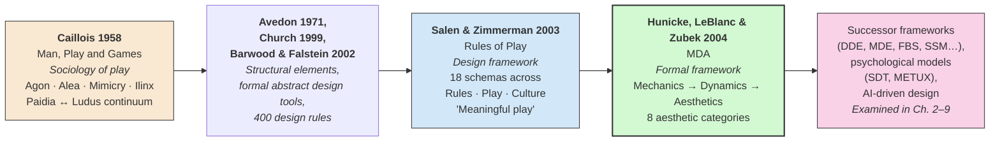
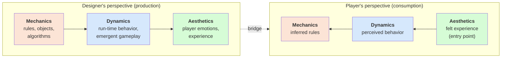
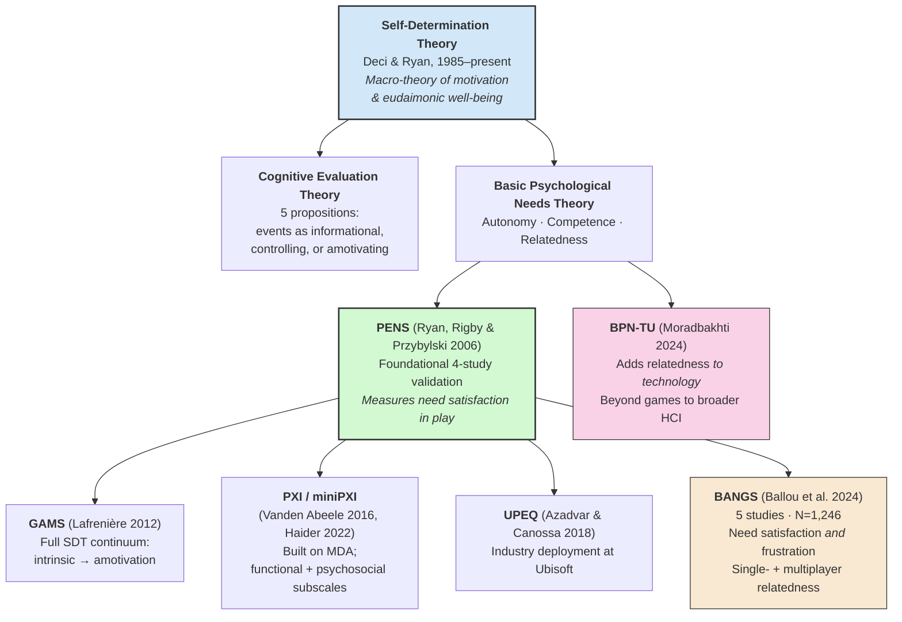
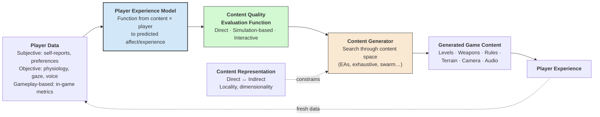
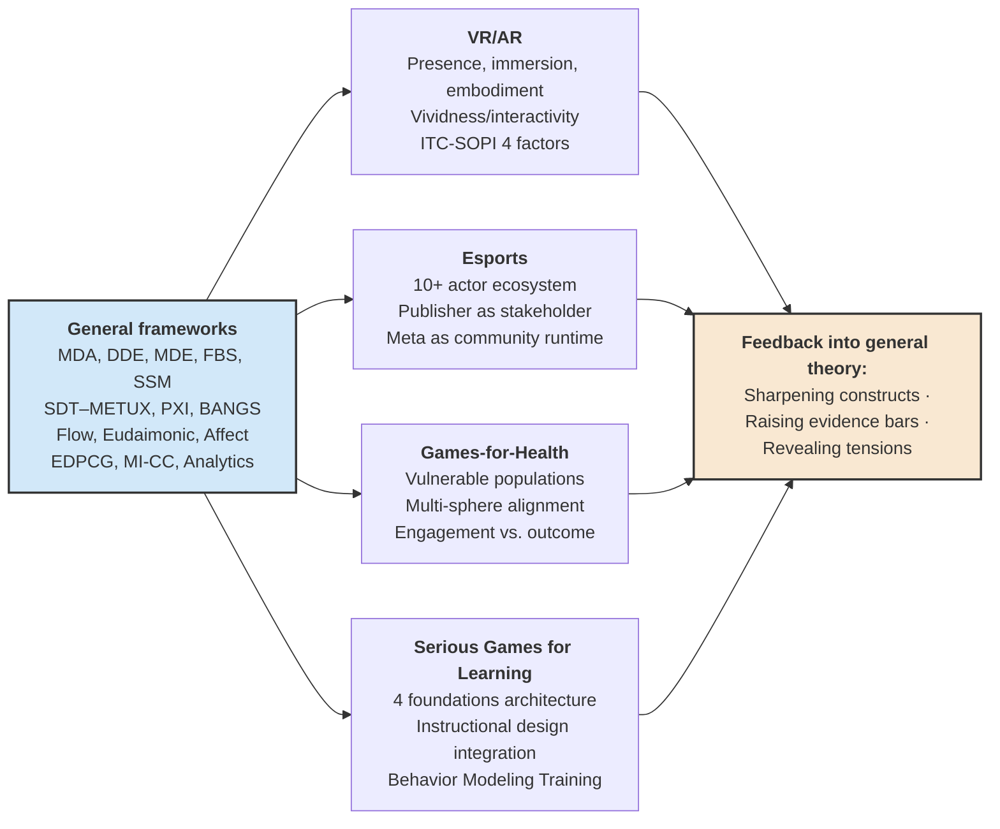
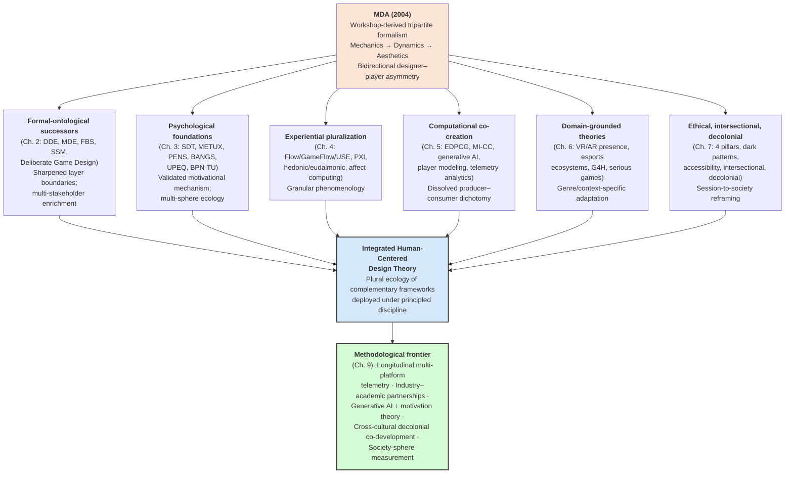

# Frontiers of Game Design: Evolving Frameworks, Emerging Theories, and Practical Applications from MDA to Well-Being Supportive Design
# 1 Research Landscape and the MDA Framework as Conceptual Baseline

Game design has, over the past six decades, traversed a remarkable epistemic arc — from a tacit craft transmitted through workshops and trade journals, to a formal academic discipline equipped with shared vocabularies, ontological models, and empirically validated psychological theories. Yet despite this maturation, no single framework has acquired the canonical status that **Mechanics, Dynamics, Aesthetics (MDA)** holds today: introduced by Robin Hunicke, Marc LeBlanc, and Robert Zubek at the 2004 AAAI Workshop on Challenges in Game AI as the codification of a Game Design and Tuning Workshop run at the Game Developers Conference in San Jose between 2001 and 2004, MDA was explicitly intended "to bridge the gap between game design and development, game criticism, and technical game research".[^1][^2] Two decades later, it remains the de facto lingua franca of design discourse, the obligatory citation in successor frameworks, and — paradoxically — the primary target of revisionist critique.

This chapter establishes MDA as the **conceptual baseline** of the present report. It situates the framework within a longer intellectual genealogy that begins with Roger Caillois's *Les jeux et les hommes* (1958) and Salen & Zimmerman's *Rules of Play* (2003), dissects MDA's formal architecture, evaluates its contributions, and surveys the principal critiques that have motivated the proliferation of successor frameworks examined in subsequent chapters. The chapter closes by formulating the research questions and analytical lens that will guide the comparative synthesis to follow. In line with this report's persistent reasoning standard — particularly the requirement to stratify claims by empirical grounding (P-3) and to distinguish frameworks along clear conceptual dimensions (P-2) — MDA is treated here neither as a settled doctrine nor as an obsolete artifact, but as a workshop-derived, theory-driven model whose enduring utility and admitted limitations together define the design problems that newer theories aspire to solve.

## 1.1 Evolution of Game Design Theory: From Craft to Formal Discipline

Game design theory did not emerge fully formed in the digital era. Its conceptual foundations were laid by mid-twentieth century sociologists and philosophers of play, were extended by interactive design scholars at the turn of the twenty-first century, and only then crystallized into the formal, designer-facing frameworks that practitioners recognize today. Understanding this lineage is essential because each successive framework — including MDA — preserves, modifies, and rejects elements of its predecessors, and the contemporary frontier theories examined in later chapters can only be properly evaluated against this cumulative trajectory.

### 1.1.1 Caillois and the Sociology of Play

The earliest serious attempt to give play and games a formal structural vocabulary is Roger Caillois's *Les jeux et les hommes* (1958), translated as *Man, Play and Games* in 1961.[^3] Building critically on Johan Huizinga's *Homo Ludens*, Caillois disputed Huizinga's emphasis on competition and offered instead a more comprehensive review of play forms, characterizing play through six core attributes: it is **free** (not obligatory), **separate** (occupying its own time and space), **uncertain** (its results cannot be predetermined and the player's initiative is involved), **unproductive** (creating no wealth and ending as it begins), **governed by rules** that suspend ordinary laws and behaviours, and characterized by **make-believe** that confirms imagined realities set against 'real life'.[^3] Crucially, Caillois argued that the last two characteristics — rules and make-believe — though related, are mutually exclusive: "Games are not ruled and make-believe. Rather, they are ruled *or* make-believe".[^3]

On this definitional base, Caillois proposed his now-canonical four-category typology of play forms, paired with two types of play that anchor a continuum of structure:

| Form | Greek/Latin meaning | Defining principle | Paradigmatic example |
|------|--------------------|--------------------|----------------------|
| **Agon** | competition | Contest of a single quality (speed, strength, memory, skill) within defined limits, without outside assistance | Chess (almost purely agonistic) |
| **Alea** | chance / dice | Surrender to destiny; outcome depends on fortune rather than skill | Lotteries, dice games |
| **Mimicry** | mimesis / simulation | Role-playing, make-believe, identification with imagined personae | Theatre, carnival, children's games |
| **Ilinx** | whirlpool / vertigo | "Voluptuous panic" — altering perception through strong emotion (panic, fear, ecstasy) | Bungee jumping, spinning until dizzy |

Caillois further situated these forms on a continuum from ***paidia*** — unstructured, spontaneous playfulness — to ***ludus*** — structured activities with explicit rules — and observed that "in human affairs the tendency is always to turn paidia into ludus".[^3] He also noted constraints on which categories could coexist: *paidia* and *alea* cannot, since games of chance are inherently games of restraint and waiting; *ludus* and *ilinx* are likewise incompatible, because there are no structured rules in a state of disorientation.[^3] Combinations were nevertheless richly generative — poker fuses *alea* (random shuffling) with *agon* (strategic decisions); collectible card games combine *alea*, *agon* and *mimesis*; spectator sports yoke the *agon* of athletes to the *mimesis* of fans who self-insert and identify with players on the field.[^3]

For our purposes, Caillois's contribution is not merely a typology but the demonstration that play could be analyzed structurally, that its components could be named and recombined, and that culture itself could be read as elaborate forms of games.[^3] Aarseth and Grabarczyk identify Caillois as the starting point of a "sixty-years' history" of game ontology, observing that although his typology "would not qualify as a proper ontology" in a strict sense, it nonetheless "posits a system of combinations" and remains the most empirically applied framework in the formal tradition that includes Avedon (1971), Björk and Holopainen (2004), and Zagal et al. (2007).[^4]

### 1.1.2 Salen and Zimmerman's *Rules of Play*: From Typology to Design Schemas

Where Caillois sought a sociology of play, Katie Salen and Eric Zimmerman, in *Rules of Play: Game Design Fundamentals* (MIT Press, 2003), pursued a self-consciously **design-oriented** theoretical framework. The book's stated motivation was that "as pop culture, games are as important as film or television — but game design has yet to develop a theoretical framework or critical vocabulary," and its 688 pages were organized into four units — Core Concepts, Rules, Play, and Culture — explicitly structured "as a catalyst for innovation, filled with new concepts, strategies, and methodologies for creating and understanding games".[^5][^6][^7]

The book's defining contribution is the proposal of **eighteen "game design schemas"** — conceptual frameworks through which games can be examined "as systems of emergence and information, as contexts for social play, as a storytelling medium, and as sites of cultural resistance".[^6][^7] Salen and Zimmerman thus offered something Caillois had not: an explicitly multi-perspective architecture in which a single game could be analyzed simultaneously as a formal system, a played experience, and a cultural artifact. Their definition of a game — "a system in which players engage in an artificial conflict, defined by rules, that results in a quantifiable outcome" — is among the most cited in the field, and Aarseth and Grabarczyk's meta-ontological analysis classifies it as a definition that "clearly focuses on the structural properties of games (rules, quantifiable outcome) but expands it with the notion of 'conflict' which belongs to the communicational layer".[^4]

*Rules of Play* also crystallized the field's core design ideal of **"meaningful play"**, framing the discipline as the "aesthetics of interactive systems".[^6] As one contemporaneous review argued, the book "manages to bridge the emerging field of game studies methodologies and design theory," promising practitioners that "you will see structure where before you saw chaos. You will see possibilities where before you saw dead ends".[^5] Crucially for the lineage we are tracing, Salen and Zimmerman were among the first to advocate "experimenting with new paradigms that blur boundaries between designers and players and gaming and real life,"[^7] foreshadowing the dissolution of the static designer/player dichotomy that, as Chapter 5 will show, AI- and data-driven design has since pushed much further.

### 1.1.3 The Disciplinary Drive Toward Formalization

By the early 2000s, two pressures converged to push design discourse from craft heuristics toward formal frameworks. First, internally to the practitioner community, Doug Church's "Formal Abstract Design Tools" (1999) and Hal Barwood and Noah Falstein's "400 Project" — both cited by Hunicke, LeBlanc and Zubek as direct antecedents of MDA — sought to articulate transferable design principles in terms more rigorous than war stories.[^2] Second, externally, an emergent academic field was contesting the legitimacy of design as research; Kultima's review highlights the persistent "epistemic gap between practice and academia," and game design research has had to negotiate Frayling's tripartite distinction among research *into*, *through*, and *for* design while drawing on Cross's taxonomy of design epistemology, praxiology, and phenomenology.[^8]

Goddard and Muscat capture this dual pressure incisively: design is oriented toward "the ultimate particular" (Stolterman 2008), and "the particularity of design makes generalizable claims difficult," yet "game design research needs to make claims that speak to more than one kind of game" — the field has lacked the language "to bridge the gap between the very specific and the very general".[^8] It is precisely into this gap that MDA inserted itself in 2004: not as a definition of games, nor as an ontology of play, but as a **formal approach** that decomposed game artifacts into tractable layers a designer could iterate upon and a researcher could study.

The trajectory from Caillois to MDA can therefore be summarized as a triple movement: from describing play sociologically to formalizing games structurally; from typological categorization to multi-schema analytical pluralism; and from an external scholarly gaze to an internal designer-facing toolkit. Each step preserved earlier insights — Caillois's combinatorial logic survives in MDA's mechanic-dynamic interactions; Salen and Zimmerman's "rules-play-culture" tripartition foreshadows the layering logic that pervades subsequent ontologies — while progressively narrowing the framework's purpose toward operational design utility.

The diagram above traces the genealogy that culminates in MDA and seeds the frameworks examined in later chapters. The colored highlight on MDA reflects its pivotal status as this report's conceptual reference point.

## 1.2 Anatomy of the MDA Framework

Hunicke, LeBlanc and Zubek's MDA paper is a short artifact — five pages in its AAAI 2004 form — but its compactness belies a carefully engineered architecture that has structured two decades of design discourse.[^1][^2] This section unpacks that architecture: the tripartite decomposition itself, the bidirectional designer–player perspective, the eight aesthetic categories, and the worked example of feedback systems through which the authors demonstrated the framework's analytical bite.

### 1.2.1 The Three Layers

MDA recasts games as artifacts that are produced by designers and consumed by players, with the consumption phase decomposed into three "distinct, but related" components, each corresponding to a different level of abstraction:[^1][^2]

- **Mechanics** describe the particular components of the game at the level of data representation and algorithms — the rules, objects, and operations that the designer directly authors. Mechanics are what a programmer codes and what a rulebook prints.
- **Dynamics** describe the run-time behavior of the mechanics acting on player inputs and on each other's outputs over time — the emergent gameplay that arises when rules meet players.
- **Aesthetics** describe the desirable emotional responses evoked in the player when they interact with the game system — the felt experience that motivates play.

The framework's central methodological claim is that these three layers are causally chained but not identical, and that each layer requires its own vocabulary and tools: "By developing models that predict and describe gameplay dynamics, we can avoid some common design pitfalls".[^2] The illustrative example offered in the paper is the probability distribution of 2D6 — a mechanical fact about two six-sided dice — whose dynamic consequence (a triangular distribution peaking at 7) shapes the aesthetic of risk and decision in countless tabletop games.[^2]

### 1.2.2 The Bidirectional Designer–Player Perspective

Perhaps the most theoretically distinctive proposition of MDA is its **inversion of perspective** between producer and consumer. Designers proceed in one direction — they author **mechanics**, which give rise to **dynamics**, which in turn elicit **aesthetics** — while players experience the artifact in the reverse order — they first encounter **aesthetics** (the emotional pull that draws them into play), then become aware of the **dynamics** that produce those feelings, and only later, if at all, infer the underlying **mechanics**.[^1][^2]

This bidirectional structure does substantial conceptual work. It justifies MDA's claim to "bridge" design, criticism, and research by giving each constituency a natural entry point: critics and players begin with felt experience and reason backward toward systems, while developers and researchers begin with systems and reason forward toward experience.[^1][^2] It also clarifies a perennial source of design failure — the gap between authored intent and felt outcome — by locating it precisely at the interface between dynamics and aesthetics, where the same mechanic can produce vastly different experiences depending on player skill, history, and social context.

### 1.2.3 The Eight Aesthetic Categories

To prevent the "aesthetics" layer from collapsing into the everyday sense of *visual style*, Hunicke, LeBlanc and Zubek explicitly recast aesthetics as desirable emotional responses and proposed a **vocabulary of eight aesthetic kinds** intended to "move away from the somewhat vague concept of 'fun' toward a more directed vocabulary".[^2] The eight categories are:

| # | Aesthetic | Game as… |
|---|-----------|----------|
| 1 | **Sensation** | Sense-pleasure |
| 2 | **Fantasy** | Make-believe |
| 3 | **Narrative** | Drama |
| 4 | **Challenge** | Obstacle course |
| 5 | **Fellowship** | Social framework |
| 6 | **Discovery** | Uncharted territory |
| 7 | **Expression** | Self-discovery |
| 8 | **Submission** | Pastime |

The authors emphasized that these are not exhaustive and that any given game typically pursues several aesthetics in combination — *Quake* foregrounds challenge and competition (a sub-form of fellowship), *The Sims* foregrounds discovery, fantasy, and expression, *Final Fantasy* foregrounds fantasy, narrative, and challenge.[^2] This combinatorial logic is a deliberate echo of Caillois's pairings of agon, alea, mimicry and ilinx — a continuity that successor frameworks (Chapter 2) and aesthetic-ideal taxonomies (e.g., Lundgren's exploration of emergence, reenactment, meditative, and camaraderie ideals) have continued to refine.[^2]

### 1.2.4 Worked Example: Feedback Systems in Monopoly

To demonstrate that MDA was an analytical tool rather than a mere classificatory list, the authors used cybernetic feedback systems as a unifying concept across mechanics and dynamics. Modeling a thermostat as a paradigmatic feedback loop, they then traced **Monopoly's** feedback structure: the leading player accumulates capital, which raises rents, which transfers capital from trailing players to the leader, which further widens the lead — a positive-feedback dynamic that hastens game termination but, in the late game, often produces low-engagement experiences for losing players.[^2] The MDA paper's instructive design move was to suggest that imposing financial penalties on the leader, or other negative-feedback mechanisms, could keep all participants engaged longer.[^2] This example crystallized the framework's promise: by translating a felt aesthetic problem ("the game becomes boring when one player snowballs") into a dynamic diagnosis (positive-feedback loop) and then into a mechanical intervention (counter-balancing rule), MDA offers a structured iterative path from observation to design action.

The worked example also embeds an implicit theoretical commitment that will become central to the critique in §1.4: the assumption that **player experience is largely a function of system behavior**, such that adjusting feedback mechanics will reliably adjust felt aesthetics. This is at once MDA's analytical bite and its principal blind spot.

## 1.3 Strengths and Contributions of MDA

Why, despite the proliferation of successor frameworks, does MDA persist as the obligatory reference point in nearly every contemporary game design paper? Five durable contributions explain this status, and each foreshadows the comparative axes along which later chapters will evaluate emerging theories.

**First, MDA provided a shared vocabulary that bridged previously isolated communities.** Hunicke, LeBlanc and Zubek's stated ambition — to bridge "game design and development, game criticism, and technical game research" — was not merely rhetorical: by giving designers, scholars, and researchers a common three-layer schema, MDA made it possible to "decompose, study and design a broad class of game designs and game artifacts" using overlapping terms.[^1][^2] In the absence of MDA, design discourse had to choose between practitioner argot (which scholars distrusted) and academic ontology (which practitioners ignored).

**Second, MDA formalized the linkage between design intent and player experience as an iterative loop.** As the framework's own characterization of the design process emphasizes, "iterative design is vital during tuning phases, where adjustments refine gameplay mechanics and dynamics," and the framework "supports systematic coherence by linking design goals to player experiences across diverse game systems".[^2] This was a substantial theoretical advance: it converted "fun" from a single, opaque target into a tunable cascade of mechanic→dynamic→aesthetic relations, each of which could be diagnosed and modified independently.

**Third, MDA decomposed games into tractable layers without prescribing a particular genre or platform.** The framework was deliberately pitched at a level of abstraction sufficient to accommodate single-player narrative games, multiplayer competitive games, and even non-digital games — the same paper uses *Quake*, *Charades*, and *Monopoly* as illustrative cases.[^2] This generality is precisely why it has endured as a "baseline" framework: it imposes minimal ontological commitment.

**Fourth, MDA explicitly thematized the producer–consumer asymmetry.** By making designers and players proceed through the same three layers in opposite directions, MDA articulated something earlier formal schemes left implicit: that the design problem is fundamentally one of **inverse engineering** felt experience back into system structure. This insight has been foundational for everything from playtesting methodology to analytics-driven live operations (Chapter 5).

**Fifth, MDA achieved canonical citation status as a scholarly anchor.** As Goddard and Muscat note in their genre-oriented design research methodology, "this might include adapting existing game design and analysis frameworks, such as MDA (Hunicke et al. 2004)" — MDA is treated as the default scaffolding upon which more specialized investigations are built.[^8] Aarseth and Grabarczyk similarly include MDA as one of the four ontological models compared in their meta-ontological analysis, alongside Konzack (2002), Zagal et al. (2007), and Aarseth & Calleja (2015), confirming its position as a benchmark against which alternatives must justify themselves.[^4]

The empirical-grounding ladder articulated in this report's reasoning standard (P-3) places MDA on a specific rung: it is a **theory-driven, workshop-derived framework** rather than a psychometrically or telemetrically validated model.[^1][^2] Its claims to coherence rest on conceptual elegance and accumulated practitioner endorsement, not on randomized trials or large-N scale validation. This evidentiary tier matters because it sets a clear contrast with the SDT-based instruments (PENS, BANGS, GAMS), longitudinal industry partnerships, and METUX-style multi-sphere models examined later, all of which raise the bar for empirical grounding while inheriting MDA's tripartite intuition.

## 1.4 Critical Limitations of MDA

Even MDA's most consistent users acknowledge that the framework is, in important respects, under-specified, and the past two decades of game studies have produced a coherent inventory of its limitations. These critiques are not idle scholasticism: each gap identified in the literature has motivated a specific class of successor theory, and a careful taxonomy of MDA's blind spots is therefore essential for navigating Chapters 2–7. Five lines of critique stand out.

### 1.4.1 Reductive and Conceptually Heterogeneous Aesthetic Taxonomy

The eight aesthetic categories — sensation, fantasy, narrative, challenge, fellowship, discovery, expression, submission — were proposed without explicit empirical derivation and without clear demarcation criteria.[^2] The categories conflate emotional states (sensation, submission), formal structures (challenge, narrative), social configurations (fellowship), and self-relational stances (expression), making it difficult to determine whether they constitute a coherent taxonomy at all. Sus Lundgren's later work on "aesthetic ideals of gameplay" — proposing alternatives like emergence, reenactment, meditative, and camaraderie — illustrates how readily the original eight can be expanded, recombined, or replaced, suggesting that they were a heuristic suggestion rather than an exhaustive ontology.[^2] More fundamentally, as Salen and Zimmerman's notion of "meaningful play" emphasizes, aesthetic experience is multi-dimensional and culturally inflected in ways that an eight-bin classifier cannot capture.[^6][^7]

### 1.4.2 Conflation of Presentation and Experience

Aarseth and Grabarczyk's meta-ontological analysis identifies a precise structural problem with MDA: when mapped onto a meta-ontological grid that distinguishes physical, structural, communicational, and mental layers, MDA's "Aesthetics category cuts across our two main layers (communicational and mental), as MDA does not differentiate between the presentation and the experience of the user".[^4] In other words, MDA's third layer fuses what the game *shows* (audio-visual presentation) with what the player *feels* (subjective experience), and this conflation impedes precise analysis whenever the two diverge — for example, when a stylistically minimal game evokes intense emotion, or when a lavishly presented game leaves players cold. Their analysis also notes that MDA's "Dynamics category seems to encompass the economic aspects of the games" and likewise cuts across structural and communicational layers, again fusing distinctions that more recent ontologies treat as separate.[^4] These findings expose MDA as ontologically thin in precisely the dimensions where contemporary frameworks (DDE, MDE, FBS — Chapter 2) seek finer granularity.

### 1.4.3 Weak Treatment of Narrative, Culture, and Player Psychology

MDA includes "narrative" as one of eight aesthetics but offers no theoretical account of how stories are produced by mechanic–dynamic interactions, leaving narrative analysis effectively external to the framework. *Rules of Play*, by contrast, treats games "as a storytelling medium" within its eighteen-schema architecture and integrates cultural analysis as a coequal unit of inquiry — its Unit 4 is explicitly devoted to Culture.[^6][^7] Similarly, MDA's player model is essentially universal: the framework speaks of "the player" without theorizing differential motivations, demographic variation, or longitudinal player development. As Aarseth and Grabarczyk observe in surveying game definitions, "later definitions tend to encompass more layers than the early ones," and "hardly any of the [classical] definitions regards the physical aspects of games" — MDA shares this layered narrowness, addressing structural, communicational, and (partially) mental aspects but leaving the social, cultural, and physical largely untheorized.[^4] These gaps motivate the psychological frameworks (SDT, METUX) examined in Chapter 3 and the sociocultural lenses explored in Chapter 7.

### 1.4.4 Static Designer–Player Dichotomy and Session-Bounded Scope

MDA's bidirectional perspective assumes a stable producer/consumer divide and a discrete play episode. This implicit ontology is increasingly inadequate for contemporary practice. Salen and Zimmerman themselves anticipated the problem by advocating "experimenting with new paradigms that blur boundaries between designers and players and gaming and real life".[^7] Today, mixed-initiative AI tools, generative content, live-service updates, modding ecosystems, and player-driven economies routinely make players co-creators of the artifact, while longitudinal telemetry partnerships measure outcomes weeks or months after a session ends — phenomena examined in detail in Chapter 5. MDA, formulated for self-contained game artifacts that are "purchased, used and eventually cast away like most other consumable goods,"[^2] offers limited theoretical traction for these dynamics.

### 1.4.5 Limited Applicability Beyond Formal Games and Genre Insensitivity

A subtler critique comes from genre-oriented design research. Goddard and Muscat argue that game design research has been "genre blind" because it avoids explicit engagement with specific genres, and that "MDA (Hunicke et al. 2004)" must be **adapted** for any given genre to "reveal details that are comparable, such as to observe instances of 'likeness' that informs the genre".[^8] By treating mechanics, dynamics, and aesthetics at maximum generality, MDA underspecifies the design intersections that matter within a genre — a party game's social-context dynamics, a walking simulator's atmospheric aesthetics, a serious game's pedagogical mechanics — and provides no built-in scaffolding for these particularities. This is closely related to Stolterman's observation that design is concerned with "the ultimate particular," which MDA's universalist abstractions can obscure.[^8]

The five critiques are summarized below, with the chapter in which each motivated successor framework is examined:

| Critique | Core problem | Successor / response | Discussed in |
|---------|--------------|---------------------|--------------|
| Reductive aesthetic taxonomy | 8 categories conflate state, structure, stance | Refined taxonomies (DPE, PXI), aesthetic ideals (Lundgren) | Ch. 2, Ch. 4 |
| Presentation–experience conflation | Aesthetics layer fuses what is shown with what is felt | DDE separating Design–Dynamics–Experience; meta-ontology stratification | Ch. 2 |
| Weak narrative/culture/psychology | No theory of story production, universal "player" | DPE's narrative integration; SDT, PENS, BANGS, METUX | Ch. 3, Ch. 4, Ch. 7 |
| Static designer–player dichotomy | Session-bounded artifact ontology | AI co-creation, experience-driven PCG, longitudinal telemetry | Ch. 5, Ch. 6 |
| Genre/context insensitivity | Universal abstractions miss the "ultimate particular" | Genre-grounded design research; domain-specific theories (XR, esports, G4H) | Ch. 6, Ch. 8 |

This inventory of limitations is also a research agenda: the chapters that follow can be read as a systematic exploration of the conceptual territory MDA leaves unmapped.

## 1.5 Scope, Research Questions, and Analytical Lens of the Report

Having situated MDA within a sixty-year intellectual lineage and audited its strengths and limitations, this section formalizes the scope, guiding questions, and comparative lens that structure the remainder of the report.

**Scope.** The report addresses the latest advancements and cutting-edge theories within the field of game design, with a deliberate emphasis on developments since 2004 that have either extended, displaced, or reframed the MDA paradigm. Its coverage spans (a) successor formal frameworks (Ch. 2); (b) psychological foundations, particularly Self-Determination Theory and well-being supportive design (Ch. 3); (c) refined player-experience and affective frameworks (Ch. 4); (d) AI-, ML-, and data-driven design (Ch. 5); (e) frontier domains — VR/AR, esports, games-for-health, serious games (Ch. 6); (f) ethical, inclusive, and sociocultural perspectives (Ch. 7); (g) comparative synthesis and practical applications (Ch. 8); and (h) future directions (Ch. 9). The unit of analysis is theoretical frameworks and their practical operationalization, not individual games or industry chronologies. Where source material on a specific frontier topic is sparse, this report — in keeping with its non-negotiable constraints — will acknowledge those limitations rather than fill them with speculation.

**Guiding Research Questions.** Five interlocking questions structure the inquiry:

1. **Genealogy and contestation.** How have game design frameworks evolved from MDA toward contemporary multi-level, psychologically and ethically grounded models, and which of MDA's commitments have successor frameworks preserved, modified, or rejected?
2. **Empirical grounding.** Where on the empirical-grounding ladder — theory-driven, partially validated, psychometrically validated, telemetry/RCT-validated — does each contemporary framework sit, and how should claims be calibrated to that grounding?
3. **Player experience and well-being.** How do contemporary frameworks operationalize player experience, motivation, and well-being, and how do they handle tensions between short-term engagement and longer-term flourishing across the multi-sphere logic articulated by METUX?
4. **Computation and co-creation.** How are AI, machine learning, generative models, and large-scale telemetry reshaping the iterative loop and the designer–player relation that MDA assumed, and what new theoretical demands does this create?
5. **Ethics, culture, and society.** How are ethical, inclusive, and sociocultural perspectives expanding the unit of analysis from the play session to societal impact, and how do they intersect with formalist frameworks?

**Analytical Lens.** Following the persistent reasoning standard governing this report, all subsequent chapters will compare frameworks along five consistent dimensions:

- **Level of abstraction** (from formal artifact ontologies to multi-sphere ecological models);
- **Disciplinary origin** (game studies, HCI, motivation psychology, AI/ML, ethics, cultural studies);
- **Empirical grounding** (workshop heuristic vs. psychometric validation vs. telemetry/RCT evidence);
- **Design utility** (analytic, generative, evaluative, normative);
- **Stakeholder coverage** (designer, player, researcher, publisher, society — mirroring METUX's spheres).

Throughout, **MDA serves as the conceptual baseline**: each successor framework is asked what it preserves of MDA's tripartite intuition and bidirectional logic, what it modifies in response to MDA's documented limitations, and what it adds that MDA could not articulate. Where competing frameworks make incompatible claims — for example, between formalist artifact-centered models and SDT-based experiential models, or between engagement-maximizing analytics and well-being-supportive design — this report will represent the disagreement rather than collapse it into a single narrative, in keeping with the requirement to construct coherent argument chains that acknowledge competing interpretations.

With this scaffolding in place, Chapter 2 turns to the first wave of explicit successors — DDE, MDE, FBS, SSM, and Deliberate Game Design — that respond directly to the formal limitations identified above, before the subsequent chapters broaden the inquiry into the psychological, computational, and sociocultural frontiers along which contemporary game design theory is now being remade.

# 2 Extensions and Successors of MDA: DDE, MDE, FBS, and Beyond

Chapter 1 closed with an inventory of MDA's principal limitations — a reductive aesthetic taxonomy, the conflation of presentation and experience, weak treatment of narrative and player psychology, a static designer–player dichotomy, and genre insensitivity — and argued that each gap has motivated a distinct class of successor theory. This chapter examines the **first wave** of those responses: formal frameworks that, like MDA, decompose games into layered abstractions and trace causal chains from authored systems to felt experience, but that introduce additional layers, finer terminological distinctions, or alternative ontological commitments to address one or more of MDA's documented blind spots.

Five frameworks are analyzed in depth — Walk, Görlich and Barrett's **Design-Dynamics-Experience (DDE)**[^9][^10]; Robson et al.'s **Mechanics-Dynamics-Emotions (MDE)**[^11][^12][^13]; the adaptation of Gero's **Function-Behavior-Structure (FBS)** ontology to games; the **Subjective Systems of Mechanics (SSM)** approach; and **Deliberate Game Design** as a pragmatic refinement. The chapter concludes with a comparative synthesis along the report's five analytical dimensions, judging relative explanatory power, identifying what these successors still leave under-theorized, and signposting the psychological, computational, and sociocultural reframings examined in Chapters 3, 5, and 7. Consistent with this report's persistent reasoning standard, particular attention is paid to where each framework sits on the empirical-grounding ladder (P-3) and to whether differences from MDA are nominal/domain-specific or substantive theoretical disagreements (P-2).

A caveat on source coverage is warranted at the outset. The reference materials directly available for this chapter robustly document DDE[^9][^10] and MDE[^11][^12][^13], whereas FBS, SSM, and Deliberate Game Design are referenced more sparsely; for those latter frameworks, the analysis below restricts itself to what can be reasoned conservatively from the cited materials together with the genealogy already established in Chapter 1, and acknowledges where deeper validation evidence is not available within this report's information boundaries.

## 2.1 DDE: Disentangling Presentation from Experience

Among MDA's formal successors, the **Design-Dynamics-Experience (DDE)** framework proposed by Wolfgang Walk, Daniel Görlich and Mark Barrett — published in the volume *Game Dynamics* in 2017 — is the most direct structural revision: it preserves MDA's three-layer scaffolding and its bidirectional designer–player logic, but redraws the layer boundaries to address precisely the conflations Aarseth and Grabarczyk identified in MDA's outermost layers[^9][^10].

### 2.1.1 What DDE Preserves and What It Modifies

The framework's title is itself a diagnostic. Where MDA names its first layer **Mechanics** and its third **Aesthetics**, DDE renames them **Design** and **Experience** respectively, retaining only **Dynamics** unchanged. This is more than terminological housekeeping. The shift from "Mechanics" to "Design" enlarges the producer-side layer from a narrow specification of rules, objects, and algorithms to a richer construct that encompasses the totality of authored material — typically articulated as game blueprints, mechanics proper, and the interface — thereby making explicit the audio-visual, interaction, and structural choices that MDA's "Mechanics" layer left implicit or pushed unsatisfactorily into "Aesthetics". The shift from "Aesthetics" to "Experience" is even more consequential: it rebrands the third layer as the player's lived, subjective response, removing the longstanding ambiguity in MDA between **what the game shows** (presentation) and **what the player feels** (experience).

This redrawing maps almost directly onto the meta-ontological critique surveyed in §1.4.2: MDA's "Aesthetics" layer was found to "cut across" the communicational and mental layers of a meta-ontological grid — that is, to fuse presentation and experience — precisely because MDA had no separate place to put audiovisual and interface presentation. DDE solves this by absorbing presentation into Design (the producer-authored layer of artifacts and interfaces) while reserving Experience for the player's mental and emotional state. The result is a framework whose causal chain — Design → Dynamics → Experience — is structurally homologous to MDA's, but whose **layer boundaries are conceptually cleaner**.

### 2.1.2 The Bidirectional Flow Retained

Critically for the lineage we are tracing, DDE preserves MDA's bidirectional logic: designers proceed from Design through Dynamics toward Experience, while players first encounter Experience, infer Dynamics from gameplay, and only at the limit reconstruct the underlying Design. This continuity matters because it inherits MDA's most theoretically distinctive proposition — the producer/consumer asymmetry — while reducing the gap between "authored intent" and "felt outcome" that MDA located uneasily at a single Dynamics→Aesthetics interface. Under DDE, the same gap is now traceable through two refined transitions: from Design (now including interface and presentation) to Dynamics, and from Dynamics to Experience.

### 2.1.3 Design Utility, Especially for Narrative and AAA Productions

DDE's expanded Design layer renders the framework noticeably more useful for **narrative-heavy and AAA productions**, in which audiovisual presentation, cinematics, and interface affordances are not aesthetic afterthoughts but first-class authored content carrying substantial portions of the experiential payload. Under MDA, a cinematic cutscene or a meticulously designed HUD would either be lumped into "Aesthetics" (mis-locating an authored artifact in a layer notionally reserved for player emotion) or omitted altogether. Under DDE, such elements are integral to the Design layer, and their dynamic and experiential consequences can be analyzed alongside, rather than in tension with, those of mechanics proper. This makes DDE especially serviceable for genres — narrative adventures, cinematic action games, walking simulators — where MDA's genre insensitivity (§1.4.5) is most acute.

### 2.1.4 Empirical Grounding: Theory-Driven, Not Yet Validated

Calibrating the strength of these claims requires honesty about evidentiary tier (P-3). DDE was articulated as a theoretical advancement of MDA in a peer-reviewed academic chapter[^9][^10] and has been cited in subsequent reviews of game design theory[^9] and in surveys of software engineering perspectives in game development[^10]. However, like MDA itself, DDE remains primarily a **theory-driven, conceptually argued framework** rather than an empirically validated model: there is no psychometric instrument, randomized trial, or large-scale telemetry programme in the reference materials that operationalizes DDE's three layers and tests their predictive utility against MDA's. Its claim to superiority over MDA therefore rests, at present, on conceptual elegance and the explanatory bite of the presentation/experience distinction — strong arguments, but not the same evidentiary standing as the SDT-based instruments examined in Chapter 3 or the telemetry-validated industry partnerships discussed in Chapter 5.

## 2.2 MDE: Reframing Aesthetics as Emotions for Gamified Contexts

If DDE is MDA's most direct structural successor for AAA game design, the **Mechanics-Dynamics-Emotions (MDE)** framework proposed by Karen Robson, Kirk Plangger, Jan Kietzmann, Ian McCarthy and Leyland Pitt is its most influential adaptation for **gamified, non-game contexts** — particularly business, consumer engagement, and behavior change[^11][^12][^13]. MDE retains MDA's three-layer architecture but performs two consequential operations: it narrows the third layer from diffuse "aesthetics" to the more tractable construct of **emotions**, and it dissolves the binary designer–player dichotomy into a richer multi-stakeholder model.

### 2.2.1 From Aesthetics to Emotions: A Tractable Vocabulary

MDE explicitly characterizes its layers as **the three game-design principles, mechanics, dynamics, and emotions**, "adapted from" MDA[^13]. The substitution of "Emotions" for "Aesthetics" is theoretically grounded in **reinforcement theory**: Robson et al. anchor their framework on Skinner's 1938 work, arguing that gamification works by combining **reinforcement and emotions** — reinforcement to make players repeat desired behaviors, emotions to make those behaviors feel rewarding[^12]. Reinforcement, in their account, can be **intrinsic** (fun and other positive emotions) or **extrinsic** (rewards), and the dynamic interplay between these is what generates sustained engagement[^12].

This reframing has both gains and losses relative to MDA. On the gain side, "emotions" is a far more tractable construct than MDA's eight aesthetics: it is psychologically familiar, more directly operationalizable in survey instruments, and better aligned with the behavior-change goals of gamification practitioners. The MDE framework "outlines the interdependent relationship of the gamification principles of mechanics, dynamics, and emotions"[^11] in a way explicitly intended to be deployed by practitioners in business contexts. On the loss side, the substitution narrows MDA's broader aesthetic ambition: the formal-experiential subtleties of "narrative" or "fellowship" or "submission" — categories that conflate emotional states with structural and social configurations, but that gesture toward genuine multi-dimensionality — collapse into a generic affective register. The framework's conceptual debt to **Skinnerian reinforcement** is also a double-edged inheritance: it provides a clear behavioral mechanism but exposes MDE to the standard critiques of behaviorist accounts, particularly their tendency to underweight intrinsic motivation in favor of extrinsic reward — a tension that Self-Determination Theory, examined in Chapter 3, addresses head-on.

### 2.2.2 Beyond the Designer–Player Dichotomy: Players, Spectators, Observers, Referees

MDE's second major contribution is its **multi-stakeholder model**. Where MDA assumes a binary designer/player relationship, Robson et al. distinguish four ways of being involved in a (gamified) game: **players, spectators, observers, and referees**, with explicit attention to **fluid role transitions** between them — observers can become spectators and even players, players can go off shift and become spectators[^12]. This stakeholder enrichment is not merely descriptive; it does substantive theoretical work in business contexts where gamification is deployed at organizational scale.

The authors' worked example of *American Idol* — analyzed as **a gamified HR process** in which music producers let potential employees work for free during a probationary period, while the audience/customers act as free feedback that helps the company tailor their products[^12] — illustrates how a single gamified system can recruit different stakeholders into different roles simultaneously, producing value that no static designer/player model could capture. In a follow-up paper, Robson et al. extended this stakeholder logic into a player-segmentation matrix along two axes — **player orientation** (toward personal achievement vs. toward learning about or connecting with others) and **player competitiveness** — yielding four player types that respond positively to different mechanics[^12]. This typology, while less psychometrically rigorous than the SDT-derived instruments examined in Chapter 3, is among the earliest formal-successor moves to disaggregate MDA's universal "the player" into a typed population.

### 2.2.3 Design Utility for Behavior Change and Its Limits

MDE has been operationalized in concrete educational and business interventions. Robson's 2019 study of a **gamified personal branding assignment** — designed as a non-zero-sum game in which students earned points for desired behaviors (class attendance, engagement, professional emails linking class content to the real world) and lost points for undesired behaviors (sleeping in class, phone use, asking syllabus-answered questions), with top-pointed students drawn for an exam-skip — reported observable changes in behavior, principally **higher attendance and lower phone use**, with most lost points attributable to unprofessional emails[^12]. From its case examples Robson et al. derive a five-point framework for designing gamified experiences and a separate set of considerations for matching mechanics to player types[^12].

The limits, however, are real. MDE's emotional vocabulary is conspicuously thinner than MDA's eight aesthetics — sensation, fantasy, narrative, discovery, expression, and submission have no direct counterparts in MDE — making it a powerful tool for behavior-change applications but a poorer one for analyzing the experiential richness of games-as-art. Its reinforcement foundation also raises ethical questions when transplanted into education or labor contexts; the Robson et al. examples themselves reveal **failure modes** — rewards that "revealed information that players did not want to share," or designs in which "the player type did not match who they wanted to address"[^12] — that point toward the ethical concerns examined in Chapter 7. The MDE framework, in short, is best read as a **domain-specific specialization** of MDA optimized for gamified contexts, not as a general replacement for it.

## 2.3 FBS Adaptation: Engineering Design Logic Applied to Games

A third successor strand — represented in the report's outline by the **Function-Behavior-Structure (FBS)** adaptation — imports a canonical framework from engineering design research into game design. John Gero's FBS ontology, developed in the 1990s within the design-science tradition, distinguishes three elements: the **functions** an artifact is intended to fulfill (the designer's goals), the **behaviors** the artifact actually exhibits, and the **structure** that produces those behaviors. Adapting FBS to games yields an account in which game mechanics are structures, run-time gameplay is behavior, and the designer's intended player experience is the function — with iterative design conceptualized as the systematic comparison of expected and observed behavior, and the redesign of structure to close that gap.

### 2.3.1 Theoretical Contribution Relative to MDA

The principal theoretical contribution of an FBS adaptation is its **explicit account of design intent** and of the **gap between intended and observed behavior**. MDA names mechanics, dynamics, and aesthetics, but its causal chain offers no formal place for the designer's antecedent goals — the framework treats authored mechanics as the starting point, not as instruments selected to fulfill specified functions. FBS makes this antecedent layer explicit: the designer first specifies functions (what the game should do for the player), then chooses structures (mechanics) intended to produce behaviors (dynamics) that fulfill those functions, and iteration proceeds by diagnosing where observed behavior diverges from expected behavior and revising structure accordingly.

This addition has two analytical payoffs. First, it gives a clean vocabulary for the **playtesting-driven iteration** that MDA describes more loosely: the discrepancy between the designer's "expected behavior" and the playtester's "observed behavior" is precisely the diagnostic on which redesign turns. Second, it positions game design more squarely within the broader engineering design research tradition, opening the door to **computational design support** — automated reasoning over function/structure mappings, rule-based critique tools, and AI co-design systems — that the FBS literature has developed over decades in adjacent domains.

### 2.3.2 Limits: The Experiential Layer Remains Under-Specified

The FBS adaptation's strengths are also its limits. By foregrounding the function/structure/behavior triad, it inherits engineering design's traditional under-specification of the experiential and aesthetic dimensions that MDA — for all its faults — at least named. FBS analyses tend to treat "function" as a specifiable target (e.g., "the game should produce challenge of difficulty X over duration Y"), but the rich phenomenology of player experience that MDA's eight aesthetics gestured toward, and that DDE's "Experience" layer foregrounds, has no native home in the FBS ontology. In practice, applications of FBS to games therefore tend to be most useful at the **mechanic/dynamic interface** — where engineering reasoning excels — and to require pairing with experiential frameworks (PXI, PENS, GameFlow, examined in Chapter 4) when subjective response is the design target.

The reference materials available for this report do not include a primary, empirically validated study of FBS specifically applied to game design at the level of detail available for DDE or MDE. The analysis above therefore extracts what is conservatively inferable from the framework's stated logic and from its place in the report's outline as a successor responsive to MDA's weak treatment of design intent and iterative reasoning; readers seeking primary validation of FBS-for-games should consult the engineering design research literature directly.

## 2.4 SSM: Subjective Systems of Mechanics and the Player's Construal

The **Subjective Systems of Mechanics (SSM)** approach addresses a different MDA limitation: its treatment of mechanics as **objective, designer-authored facts** equally legible to all players. SSM's central move is to relocate the mechanics layer partly into the player's mind: what counts as "the mechanics" of a game, from the perspective that matters for dynamics and experience, is not the rule-set as authored but the rule-set as **construed** by a particular player at a particular moment of their learning trajectory.

### 2.4.1 Differential Perception, Learning Curves, and Mental Models

This subjective relocation responds directly to the universalist player problem identified in §1.4.3: MDA speaks of "the player" without theorizing differential perception, demographic variation, or longitudinal development. SSM theorizes precisely these dimensions. Two players confronting the same authored mechanics may construe radically different "subjective systems": a novice may perceive only a handful of salient rules and miss systemic interactions that an expert immediately reads off the same situation; a player from one cultural or generic background may interpret an action verb as familiar that another finds opaque; players develop **mental models** that ripen over hours of play, with the perceived mechanic-set changing as comprehension deepens.

The implication is that the **dynamics layer is doubly emergent** — emergent from mechanics meeting player input, as MDA already proposed, *and* emergent from authored mechanics meeting differentially construed mechanics. Two players executing identical inputs against identical authored rules may nonetheless inhabit different dynamic systems because the rules they each "play" are different.

### 2.4.2 Bridging Formalist and Experiential Traditions

SSM thereby offers a conceptual bridge between the formalist tradition that culminates in MDA and the experiential tradition examined in Chapters 3 and 4. Formally, mechanics remain analyzable as authored artifacts; experientially, they are reconstructed in the player's mind as functions of skill, history, and context. This dual-layer treatment has direct implications for **playtesting and onboarding design**: if subjective construal is the operative variable, then the design problem is not simply "tune the rules" but "engineer the trajectory of construal" — which mechanics surface first, in what order players come to perceive systemic interactions, where mismatches between authored intent and construed structure produce frustration or unintended emergent strategies.

As with FBS, the available reference materials provide limited primary documentation of SSM as a free-standing validated framework. The analysis above therefore characterizes SSM as a conceptually coherent extension responsive to a clearly identified MDA gap, while flagging that its empirical grounding within this report's information boundaries remains theory-driven rather than psychometrically established.

## 2.5 Deliberate Game Design: Pragmatic Refinements for Practitioner Use

The fifth strand examined here, **Deliberate Game Design**, occupies a different niche: it is less an alternative ontology than a **pragmatic, practitioner-oriented refinement** that translates MDA's analytical scaffolding into actionable design heuristics for studio and pedagogical use. Where DDE rebuilds the layer boundaries, MDE rebrands the third layer for gamification, and FBS imports an engineering ontology, Deliberate Game Design largely **preserves MDA's tripartite logic** and concentrates on operationalizing it.

### 2.5.1 Intentionality, Traceability, and Structured Iteration

Three emphases mark the Deliberate Game Design move. First, **intentionality**: design choices should be made with explicit articulation of the authored intent, in conscious resistance to the craft tradition's tolerance for serendipitous discovery as a substitute for justified design reasoning. Second, **traceability**: each design decision should be linked downstream to the dynamics it is expected to produce and the player outcomes it is expected to elicit, creating an audit trail that supports both team coordination and post-mortem learning. Third, **structured iteration**: rather than treating playtesting as informal feedback collection, Deliberate Game Design advocates structured cycles of hypothesis, test, and revision — closely related in spirit to the FBS function/expected-behavior/observed-behavior loop, but pitched at the level of practitioner workflow rather than formal ontology.

### 2.5.2 Strengths as Pedagogy, Modesty of Theoretical Novelty

The strengths of Deliberate Game Design are pedagogical and operational. As a workshop or curriculum framework, it gives students and junior designers a concrete set of practices that put MDA's abstractions to work; as a studio practice, it improves communication between disciplines (designers, programmers, artists, producers) by enforcing explicit articulation of intent and expected outcome. Its theoretical novelty, however, is modest by design: it does not propose new layers, new ontological commitments, or new evidentiary instruments, and its claim to advance over MDA is largely one of **pragmatic translation** rather than conceptual replacement. In the genealogy traced in Chapter 1, Deliberate Game Design therefore sits **closer to the practitioner pole** of the craft–theory continuum than the other four successors examined here, functioning as a bridge between MDA's heuristic origins and the more empirically ambitious successor models — particularly the SDT-grounded and telemetry-validated approaches — that subsequent chapters analyze.

## 2.6 Comparative Synthesis: Preservation, Modification, and Addition

Having dissected the five successors in turn, this section synthesizes them along the report's persistent analytical dimensions — level of abstraction, disciplinary origin, empirical grounding, design utility, and stakeholder coverage — to judge their relative explanatory power and to identify the conceptual territory they collectively still leave under-mapped.

### 2.6.1 What Each Framework Preserves, Modifies, and Adds

The most economical way to compare the five frameworks is to ask, of each: which of MDA's commitments does it preserve, which does it modify, and what does it add that MDA could not articulate?

| Framework | Preserves from MDA | Modifies | Adds |
|---|---|---|---|
| **DDE** | Three-layer architecture; bidirectional designer–player flow; iterative loop[^9][^10] | "Mechanics" → "Design" (encompassing blueprints, mechanics, interface); "Aesthetics" → "Experience" (subjective only) | Explicit separation of presentation (in Design) from felt experience (in Experience); finer granularity for narrative/AAA productions |
| **MDE** | Three-layer architecture; mechanics, dynamics retained; bidirectional consumption logic[^11][^13] | "Aesthetics" → "Emotions" anchored in reinforcement theory[^12]; designer/player dichotomy → multi-stakeholder roles[^12] | Players/spectators/observers/referees with fluid transitions[^12]; player-type segmentation along orientation × competitiveness axes[^12]; explicit design heuristics for non-game / behavior-change contexts |
| **FBS adaptation** | Layered decomposition; iterative diagnosis-and-redesign logic | Replaces mechanics/dynamics/aesthetics with structure/behavior/function; foregrounds antecedent design intent | Explicit "function" layer for designer goals; formal account of expected-vs-observed behavior gap; compatibility with computational design support |
| **SSM** | Mechanics layer as a meaningful unit of analysis; mechanics → dynamics causality | Treats mechanics partly as **subjective construals** rather than fully objective artifacts | Differential perception, learning curves, and mental models as design-relevant variables; theoretical bridge between formal and experiential traditions |
| **Deliberate Game Design** | Tripartite logic; bidirectional designer/player perspective; iterative tuning ethos | Formalizes informal craft heuristics into structured workflow | Intentionality, traceability between authored choices and player outcomes, structured iteration as practitioner discipline |

A pattern emerges from this comparison. **DDE and MDE perform "boundary redrawing" operations on MDA's layers** — DDE on the producer side (Mechanics → Design) and the experiential side (Aesthetics → Experience), MDE on the experiential side alone (Aesthetics → Emotions) — preserving the architecture while sharpening conceptual distinctions to serve different design contexts. **FBS performs an "ontology import,"** replacing MDA's vocabulary entirely with one borrowed from engineering design research and adding an antecedent layer (function) that MDA lacks. **SSM performs a "subjectivity injection,"** retaining MDA's vocabulary but relocating part of the mechanics layer into the player's cognition. **Deliberate Game Design performs a "workflow translation,"** keeping MDA largely intact and adding pragmatic discipline.

In terms of MDA's documented limitations, the coverage is uneven. DDE addresses the **presentation/experience conflation** (§1.4.2) most directly. MDE partly addresses the **aesthetic taxonomy** problem (§1.4.1) by substituting a tractable construct, and most directly addresses the **static designer/player dichotomy** (§1.4.4) by introducing fluid stakeholder roles. SSM and FBS together attack the **universalist player** and **weak design-intent** aspects of §1.4.3–§1.4.4. None of these frameworks substantively addresses the **genre/context insensitivity** identified in §1.4.5; that critique is taken up by the domain-specific frameworks examined in Chapter 6.

### 2.6.2 Comparative Matrix Along the Report's Five Analytical Dimensions

The report's persistent analytical lens (§1.5) compares frameworks along five dimensions. The matrix below applies that lens to MDA and its five successors.

| Dimension | MDA | DDE | MDE | FBS adaptation | SSM | Deliberate GD |
|---|---|---|---|---|---|---|
| **Level of abstraction** | High (genre-agnostic artifact ontology) | High; modestly enriched producer side | Mid (gamification-focused) | High (engineering-general) | Mid (mechanics-centered with cognitive layer) | Low–mid (workflow-level) |
| **Disciplinary origin** | Game studies / AI workshop[^9] | Game studies / design research[^9][^10] | Marketing & business studies; gamification[^11][^12][^13] | Engineering design research (Gero) | Game studies / cognitive science | Game design pedagogy & practice |
| **Empirical grounding** | Theory-driven, workshop-derived | Theory-driven; conceptual argumentation | Theory-driven + case studies (Robson 2015–2019)[^12] | Theory-driven; inherits FBS-domain validation, less so for games | Theory-driven within available materials | Practice-derived heuristics |
| **Design utility** | Analytic + (limited) generative | Analytic + generative, esp. for narrative/AAA | Analytic + generative + evaluative (behavior-change) | Analytic + generative + diagnostic (function/behavior gap) | Analytic + diagnostic for onboarding/playtest | Generative + procedural (workflow) |
| **Stakeholder coverage** | Designer + player only | Designer + player only | Designer + players + spectators + observers + referees[^12] | Designer-centric; player implicit in "function" | Designer + differentiated players | Designer + team members (multi-disciplinary) |

The matrix makes plain that MDA's successors are **not interchangeable substitutes**. They occupy different points along the abstraction–operationalization axis, draw from different disciplinary traditions, and exhibit different design utilities — DDE for narrative-rich production, MDE for gamification and behavior change, FBS for systematic engineering reasoning, SSM for player-construal-sensitive design, Deliberate Game Design for studio and pedagogical workflow. In keeping with this report's reasoning standard (P-2), several of these differences are **substantive theoretical disagreements** rather than nominal relabelings — most notably MDE's reinforcement-theoretic foundations vs. MDA's experiential pluralism, and SSM's subjective-mechanics commitment vs. MDA's objective-mechanics assumption — while others (DDE's renaming, Deliberate GD's workflow articulation) are best read as conceptual sharpenings of MDA's core intuition.

### 2.6.3 What the First Wave Still Leaves Under-Theorized

Across all five frameworks, three substantial conceptual territories remain under-theorized — and these absences set the agenda for the chapters that follow.

**First, psychological mechanism.** None of the five successors offers a validated psychological theory of *why* particular dynamics produce particular experiences or emotions. DDE renames the experiential layer but does not specify its internal structure; MDE invokes Skinnerian reinforcement[^12] but inherits the well-known limits of behaviorist accounts of intrinsic motivation; FBS specifies an antecedent function layer without theorizing the human needs functions might serve; SSM theorizes construal but not motivation; Deliberate Game Design is silent on psychological depth. The Self-Determination Theory tradition examined in **Chapter 3** — together with the PENS, GAMS, PXI, BANGS, UPEQ, and BPN-TU instruments and the multi-sphere METUX model — fills precisely this gap, with empirical grounding several rungs higher on the P-3 ladder than any of the frameworks discussed here.

**Second, computational co-creation.** The first-wave successors retain MDA's **session-bounded, designer-as-author, player-as-consumer** ontology with one partial exception (MDE's stakeholder fluidity[^12]). None grapples seriously with mixed-initiative AI design tools, generative content, live-service updates, telemetry-driven dynamic difficulty adjustment, longitudinal industry–academic data partnerships, or the broader AI-driven dissolution of the static designer/player divide that Salen and Zimmerman foreshadowed. **Chapter 5** takes up this territory directly, asking what new theoretical demands AI- and data-driven design create for the iterative loop the present chapter's frameworks describe.

**Third, sociocultural and ethical context.** With the partial exception of MDE's recognition that gamification can deploy rewards inappropriately[^12], the first-wave successors are largely silent on dark patterns, monetization ethics, accessibility, representation, and decolonial/critical design. They preserve MDA's relatively artifact-centric stance and leave societal-impact analysis external. The ethical, inclusive, and sociocultural perspectives examined in **Chapter 7** — together with METUX's explicit "society sphere" introduced in Chapter 3 — address this territory and expand the unit of analysis from the play session to the broader sociotechnical system in which games are produced and consumed.

The first wave of MDA successors examined in this chapter, therefore, accomplishes exactly what one might expect of formal-theoretical responses: it sharpens MDA's layer boundaries, enriches its stakeholder model, imports adjacent design ontologies, and translates its abstractions into practitioner workflows. What it does not do — and what it was never designed to do — is supply a validated psychology of player motivation, a theory of human–AI co-creation, or a sociocultural critique. Those tasks fall to the frameworks examined in the chapters that follow, beginning with the psychological foundations laid by Self-Determination Theory and elaborated through METUX and the well-being-supportive design movement in Chapter 3.

# 3 Psychological Foundations: SDT, METUX, and Well-Being Supportive Design

Chapter 2 closed by identifying three substantial conceptual territories that the first wave of MDA successors—DDE, MDE, FBS, SSM, and Deliberate Game Design—leaves under-theorized: psychological mechanism, computational co-creation, and sociocultural-ethical context. The most acute of these gaps is the first. None of those frameworks specifies *why* particular dynamics elicit particular experiences; DDE renames the experiential layer without theorizing its internal structure, MDE invokes Skinnerian reinforcement with the well-known limits of behaviorist accounts, and SSM theorizes player construal but not motivation. This chapter argues that **Self-Determination Theory (SDT) and its allied frameworks now constitute the dominant psychological foundation of contemporary game design theory**, supplying the validated motivational mechanism that formal-ontological successors of MDA cannot articulate, and—through the Motivation, Engagement and Thriving in User Experience (METUX) model—dissolving MDA's session-bounded ontology by extending the unit of analysis from a single play episode to societal impact.

The chapter's argument proceeds in five steps. §3.1 introduces SDT as a macro-theory of motivation and well-being and unpacks Cognitive Evaluation Theory's (CET) account of how external events become informational, controlling, or amotivating. §3.2 traces the lineage from Ryan, Rigby and Przybylski's 2006 PENS work to the contemporary instrument family (GAMS, PXI/miniPXI, BANGS, UPEQ, BPN-TU) and calibrates each instrument on the report's empirical-grounding ladder (P-3). §3.3 presents METUX's six spheres as a multi-level expansion that addresses precisely the artifact-centric, session-bounded scope critiqued in §1.4.4. §3.4 deploys competition as a focused case study, integrating Ryan & Reeve's informational/controlling distinction with Shields & Bredemeier's true competition/decompetition to derive a multi-level taxonomy of need-supporting versus need-thwarting design features. §3.5 synthesizes the four ethical pillars of well-being supportive design and identifies the open questions that connect forward to the computational and sociocultural reframings of Chapters 5 and 7.

## 3.1 Self-Determination Theory and Cognitive Evaluation Theory as Psychological Foundations

### 3.1.1 SDT as a Macro-Theory of Motivation and Well-Being

Self-Determination Theory, developed by Edward Deci and Richard Ryan over more than four decades, is "a macro theory of motivation and well-being" that has been applied across domains as varied as education, sport, healthcare, and—since the mid-2000s—digital games[^14]. Its analytic ambition is reflected in the scope of its primary canonical text, the 2017 Ryan and Deci textbook running to 756 pages and integrating six mini-theories under a single motivational architecture[^15]. SDT's foundational distinction is between **intrinsic motivation**—engagement in an activity "purely for the joy and pleasure of doing" it—and **extrinsic motivation**, which can itself be decomposed into four progressively more autonomous categories along a self-determination continuum (external regulation, introjection, identification, integration)[^15][^16]. Crucially, SDT defines well-being in **eudaimonic** rather than hedonic terms: well-being is "thriving and flourishing, or being able to access the full range of human functioning," not merely the maximization of pleasure[^15]. This commitment is what makes SDT a *normative* as well as descriptive framework for design: the theory generates testable predictions about which activities and contexts will support long-term flourishing and which will merely entertain or, worse, undermine it.

### 3.1.2 The Three Basic Psychological Needs

At SDT's core sits **Basic Psychological Needs Theory**, which posits that humans have three innate psychological needs whose satisfaction is both essential for well-being and supportive of more autonomous forms of motivation. The three needs are typically defined as follows[^14][^15]:

- **Autonomy** — "the experience of volition, willingness, and authenticity in one's actions, thoughts, and feelings," or the sense that one is in control of one's own life and that one's actions are self-endorsed[^14][^15].
- **Competence** — "the experience of effectiveness and mastery," the need to act effectively and feel capable in one's activities, hypothesized to reflect evolutionary tendencies toward learning, curiosity, and skill specialization[^14][^15].
- **Relatedness** — "the experience of warmth, bonding, and care' when feeling 'connected to significant others," encompassing both being cared for and caring for others, as well as perceived membership in wider social or cultural groups[^14][^15].

A nutritional metaphor is central to the theory's empirical claim: "just like we need calcium and iron in order to thrive physically, SDT states that we need these three [psychological] nutrients to do the same"[^15]. Their satisfaction is hypothesized as universal, with cross-cultural studies supporting this universality across four cultures and across age groups[^16].

What is most underappreciated in design discourse, however, is what these needs are *not*. Ballou's analytical commentary identifies three pervasive misconceptions that distort SDT's application in games research and practice[^15]:

- **Autonomy is not synonymous with choice.** Autonomy is "perhaps the most often misunderstood basic need," and "this comes as a result of confusing factors that support autonomy with autonomy itself." Whether choice supports autonomy depends on (1) whether the issue is important to the chooser, (2) whether the available options are meaningful rather than uniformly unattractive, and (3) whether the number of options is manageable rather than overwhelming. "Sometimes I may only have one course of action, but I undertake that action completely willingly, and other times I may have 50 choices, but I don't actually want to choose any of them"[^15]. A potato-chip aisle with a million options frustrates autonomy as effectively as a forced binary[^15].
- **Competence is not equivalent to receiving rewards or being told one performed well.** The decisive variable is *feedback type*: **informational feedback**—praise for specific things done well alongside guidance about how to improve—supports intrinsic motivation, whereas **controlling or evaluative feedback** ("the mere addition of a leaderboard, as seen in corporations all around the world thanks to some hype about gamification, is minimally informative") tends to undermine it, "cause shame or guilt for the lowest performers and inflated pride for the highest performers"[^15]. The third-best StarCraft player in the world may experience competence frustration as readily as a middling silver-tier player: "the key question is whether those two players perceive their actions to matter and be impactful, that challenges are appropriate to their skill level and expectations, that feedback is informative rather than controlling, and that they have both room for growth and the structure to help them achieve it"[^15].
- **Relatedness is not confined to multiplayer.** Drawing on Tyack and Wyeth's analysis, Ballou identifies three pathways through which single-player games support relatedness[^15]: (i) **parasocial relationships** with non-player characters (the example given is players' attachment to Joel and Ellie in *The Last of Us*); (ii) **habitus**—a sense of being part of a community when one's tacit understanding of game conventions is met by designers and developers, signalling that "they're on the same wavelength"; and (iii) **relating to the game-as-object**, in which players use social scripts when interacting with non-human systems even when fully aware of their non-humanity. The historical SDT-in-games literature has, however, "almost exclusively been studied: in multiplayer games (and specifically MMOs)," and Tyack and Mekler's systematic review of 110 CHI and CHI PLAY papers found relatedness was discussed in only 57% of papers, compared with 65% for autonomy and 85% for competence[^14][^15]. This empirical asymmetry is a cautionary note about how the theory has been applied, not a problem with the theory itself.

These misconceptions matter for design because they map onto the very design moves first-wave MDA successors recommend. MDE's reinforcement-theoretic logic, for example, naturally privileges leaderboard-style evaluative feedback whose controlling functional significance—as the next subsection shows—predictably undermines intrinsic motivation. SDT does not merely offer an alternative vocabulary for "Aesthetics"; it identifies the conditions under which design choices that look engagement-positive in the short term become need-thwarting in the longer term.

### 3.1.3 Cognitive Evaluation Theory: How External Events Become Informational, Controlling, or Amotivating

Cognitive Evaluation Theory (CET), the oldest of SDT's six mini-theories, was "developed to explain the influence of external events (e.g. receiving a reward or winning a competition) on intrinsic motivation, and later, on different forms of extrinsic motivation and well-being"[^14]. Its central claim is that external events are not motivationally neutral: they carry a **functional significance** that can be simultaneously interpreted as **informational, controlling, and/or amotivating** to varying extents. This functional significance, in turn, determines whether the event supports or thwarts basic psychological needs, and thereby whether it sustains intrinsic motivation and well-being or instead promotes controlled motivation and ill-being[^14].

CET's contemporary articulation, summarized by Ryan and Reeve (2024), comprises five formal propositions that map the dynamics of external events onto need experiences[^14]:

| # | CET Proposition | Application to game-design events |
|---|---|---|
| 1 | External events vary in how autonomy-supportive vs. controlling they are; controlling events frustrate autonomy and undermine intrinsic motivation | Pressure to win, promoting winning as primary goal, high-value contingent rewards |
| 2 | External events vary in how informational they are; informational events satisfy competence and enhance intrinsic motivation, ineffectance feedback frustrates it | Effectance-relevant positive feedback, well-matched skill levels, opportunities for leveling up |
| 3 | The relative *salience* of controlling vs. informational vs. amotivating aspects determines an event's net functional significance | Distribution and amount of contingent rewards; how leaderboards and scores are posted; avatar customization options |
| 4 | Interpersonal contexts vary in how controlling, autonomy-supportive, or amotivating they are | Relationship qualities with managers, coaches, teammates; communication styles; competition-contingent regard |
| 5 | Intrapersonal events (self-talk, ego-involvement) carry the same informational/controlling/amotivating dimensions | Inner praise vs. self-pressuring talk; competition-contingent self-esteem |

Three implications matter for design. First, the **same nominal feature can carry different functional significance**. A leaderboard delivered with private, opt-in, learning-oriented framing is largely informational; the identical leaderboard rendered as a public ranking with competitively contingent rewards becomes controlling[^14][^15]. Second, **functional significance is a function of multiple aspects simultaneously**: "a particular combination of competitive elements (i.e. a competitive set) on motivation and well-being is understood to be a function of which elements (informational vs. controlling) are most salient to players"[^14]. This salience-dependent compositionality is precisely what MDA's "aesthetics" layer cannot articulate. Third, the meta-analytic body of evidence is unambiguous on a key point that gamification practitioners often miss: "factors that can enhance extrinsic motivation, such as rewards, pressures, or evaluations, typically undermine intrinsic motivation"[^16]. This **crowding-out effect** is the empirical anchor of SDT's caution against reinforcement-driven design and the reason why MDE-style frameworks, anchored in Skinnerian reinforcement, sit on a different—and weaker—motivational footing than SDT-grounded approaches.

### 3.1.4 What SDT Adds That MDA, MDE, and DDE Cannot Articulate

The conceptual delta between SDT and the formal-successor frameworks of Chapter 2 can be summarized along three axes. **MDA** names "aesthetics" as a vocabulary of eight desirable emotional responses but offers no theory of *which* mechanic-dynamic configurations produce *which* emotions, nor any account of why some configurations produce sustained well-being while others produce short-term engagement that decays into compulsion. **MDE** anchors emotions in reinforcement theory, providing a behavioral mechanism but inheriting the limits of behaviorist accounts: it cannot distinguish controlling from informational feedback, nor predict when reward systems will undermine the very engagement they seek to sustain. **DDE** rebrands "Aesthetics" as "Experience" but does not theorize the experience layer's internal structure. SDT supplies what each of these lacks: a **validated, falsifiable, cross-culturally replicated** account of three specific psychological nutrients whose satisfaction or frustration mediates between game features and player outcomes, and a **mechanism (CET)** specifying how external events acquire functional significance through their salient autonomy-supportive, informational, and amotivating aspects[^14][^15][^16].

Crucially, this is a substantive theoretical disagreement, not a nominal relabeling (P-2). Where MDE predicts that more reinforcement produces more engagement, SDT predicts an inflection point beyond which extrinsic reinforcement crowds out intrinsic motivation; where MDA's universalist "the player" is silent on individual differences, SDT explicitly theorizes causality orientations (autonomy, controlled, impersonal) and trait competitiveness as moderators of how external events are construed[^14]. These are testable, often-tested empirical claims, occupying a higher rung on the empirical-grounding ladder than MDA's workshop-derived heuristics.

## 3.2 PENS and the Family of SDT-Based Player Experience Instruments

### 3.2.1 PENS: From Theory to Validated Player-Experience Measurement

The first systematic operationalization of SDT in digital games is Ryan, Rigby and Przybylski's 2006 *Motivation and Emotion* paper "The Motivational Pull of Video Games," which introduced the **Player Experience of Need Satisfaction (PENS)** model[^17][^16]. PENS was developed across four studies that "demonstrated that both game preferences and behavioral and psychological measures of intrinsic motivation for playing them were predicted by basic psychological need satisfaction during play"[^17], and it remains "the first validated and most cited measure applying SDT to digital games"[^14].

The PENS studies established four findings that have anchored the field for nearly two decades[^16]:

1. **Need-satisfying play predicts intrinsic motivation, immersion, and short-term well-being shifts.** In a study of novice players assigned to a 3-D platformer for 40 minutes, autonomy and competence need satisfaction predicted positive pre- to post-play affect change, game enjoyment, increased self-esteem, immersion, and the likelihood of voluntarily reengaging the game in a free-choice period[^16].
2. **Between-game differences in popularity reflect underlying differences in need satisfaction.** A within-subjects design comparing a critically acclaimed game to a content-matched commercial flop found that participants experienced greater autonomy and competence satisfaction in the popular game, and that this satisfaction—not surface content—accounted for differences in enjoyment, immersion, and well-being shifts[^16].
3. **All three needs make independent contributions** to enjoyment, immersion, and future-play intent in a fourth study with self-selecting players, though only autonomy and competence satisfaction accounted for unique incremental variance in post-play affect[^16].
4. **Mastery of controls is necessary but not sufficient.** Across three studies, intuitive command over the game's basic mechanics related to enjoyment as expected, but "no longer accounted for unique variance in player motivation and well-being when in-game need satisfaction was considered"[^16]. Mastery of controls is the *price of admission* to need-satisfying play, not the source of it.

The original PENS work also identified specific design factors that enhance the three need satisfactions: "having controls that were easily mastered; feedback that was clear and consistent; choices regarding goals and strategies; and, opportunities for cooperative social interaction"[^17]. Subsequent work has extended these findings to violent game content (showing that violence itself does not motivate most players and even detracts from appeal once need satisfaction is controlled for), to harmonious vs. obsessive play (linking obsessive engagement to chronic everyday need deprivation, suggesting "video game styles may be more a symptom than a cause of psychological distress"), and to immersion as a moderator of cross-context carryover from virtual to real-world goals[^16].

PENS itself has been independently validated and cross-culturally replicated. Johnson, Gardner and Perry's 2018 validation found favorable psychometric properties[^18], and a 2025 Malaysian translation and adaptation of the modified PENS for Multiplayer Online Battle Arena (MOBA) players, conducted with 491 participants, reported satisfactory psychometric properties—though parallel analysis found a two-factor structure (autonomy and competence collapsing into one factor, relatedness as a second), suggesting that the original three-factor structure may not generalize cleanly across all gaming contexts and warranting further psychometric investigation[^18].

### 3.2.2 The Broader Instrument Family: GAMS, PXI/miniPXI, BANGS, UPEQ, BPN-TU

PENS spawned a broader family of SDT-grounded player-experience instruments, each addressing limitations of its predecessors and serving distinct measurement contexts. Moller, Kornfield and Lu's review identifies the principal instruments in current use[^14]:

- **Gaming Motivation Scale (GAMS)** — Lafrenière et al.'s 2012 instrument designed in line with SDT to assess **the full self-determination continuum**: intrinsic motivation, integrated, identified, introjected, and external regulation, plus amotivation[^19][^20]. Across two CFA samples (N=276 total), GAMS confirmed its six-factor structure (CFI = .94, RMSEA = .07), demonstrated a simplex-like pattern consistent with SDT's continuum, and showed convergent validity with need satisfaction (M *r* = .29 for self-determined motivation)[^20]. Whereas PENS measures the *predictors* of motivation (need satisfaction), GAMS measures the *quality* of motivation along the continuum—a distinction that allows researchers to test whether need-satisfying play yields more autonomous (vs. controlled) regulation.
- **Player Experience Inventory (PXI) and miniPXI** — Designed by Vanden Abeele et al. with input from 64 expert practitioners, the PXI is "based on the MDA framework (and on Means-End theory, underlying MDA)" and "incorporates two subscales, one with dimensions at the functional level (i.e., dynamics) and one at the psycho-social level (i.e., aesthetics)"[^21][^22]. This explicit MDA grounding makes PXI a particularly interesting hybrid: it operationalizes MDA's tripartite logic in measurement form while being shaped by SDT-influenced player-experience research. Independent validation has provided "additional evidence of psychometric quality for the PXI"[^23][^24], and Haider et al.'s 2022 **miniPXI** offers an eleven-item short form, "providing single items for each of its eleven constructs," that has been deployed in applied contexts including healthcare simulation training[^25][^26][^27].
- **Basic Needs in Games Scale (BANGS)** — Ballou, Denisova, Ryan, Rigby and Deterding's 2024 instrument, validated in five studies with 1,246 unique participants and published in the *International Journal of Human-Computer Studies*, addresses three documented limitations of prior measures: existing tools "either do not measure need frustration, or measure it in a way that may not be appropriate for the video games domain, they struggle to capture feelings of relatedness in both single- and multiplayer contexts, and they often lack validity evidence for certain contexts"[^28][^29][^30]. BANGS comprises six subscales covering satisfaction *and* frustration of each basic need, supports measurement invariance across single- and cross-session contexts and over time, and provides discriminant, convergent and criterion validity evidence. Its remaining limitations—lower reliability for the autonomy-frustration subscale and a "surprising non-significant correlation between relatedness satisfaction and frustration"—are honestly disclosed[^28][^29]. BANGS is "a reliable and theoretically sound tool for researchers to measure basic needs satisfaction and frustration with a degree of domain validity not previously available"[^28].
- **Ubisoft Perceived Experience Questionnaire (UPEQ)** — Azadvar and Canossa's 2018 industry instrument, "tailored to provide insights for game developers" and explicitly designed for deployment in commercial production contexts[^14][^15]. UPEQ marks a significant moment in the maturation of SDT-grounded design: its existence reflects a major publisher's investment in psychometric measurement of need satisfaction as an industrially actionable signal, and exemplifies the industry–academy partnerships that Chapter 5 will examine more fully.
- **Basic Psychological Need Satisfaction for Technology Use (BPN-TU)** — Moradbakhti et al.'s 2024 instrument, validated in English and German, broadens the measurement target beyond games to "interactive digital technologies (e.g. digital voice assistants, chatbots and social robots)" and notably adds a fourth dimension—**relatedness to technology** alongside relatedness to others[^14][^31][^19]. This addition is theoretically significant: it operationalizes the "game-as-object" relatedness pathway identified by Tyack and Wyeth and provides a measurement scaffold that extends naturally to the AI-driven design contexts examined in Chapter 5.

The instruments differ in **scope, validation tier, and design utility**. The matrix below positions them on the report's empirical-grounding ladder (P-3) and identifies their respective design contexts.

| Instrument | Year | What it measures | Empirical-grounding tier | Primary design context |
|---|---|---|---|---|
| **PENS** | 2006 (Ryan, Rigby & Przybylski) | Autonomy, competence, relatedness need satisfaction; mastery of controls; immersion[^17][^16] | Multi-study foundational + independently validated[^18][^23] | General-purpose; foundational |
| **GAMS** | 2012 (Lafrenière et al.) | Six types of motivation along self-determination continuum (intrinsic → amotivation)[^19][^20] | CFA-validated, simplex structure confirmed; cross-cultural Persian, Kyrgyz, Iranian replications[^20][^32] | Motivation-quality assessment, problematic-gaming research |
| **PXI** | 2016 (Vanden Abeele et al.) | Functional (dynamics) + psychosocial (aesthetics) subscales rooted in MDA[^21][^22] | Independent online validation, large sample[^23][^24] | Practitioner playtesting; MDA-aligned analysis |
| **miniPXI** | 2022 (Haider et al.) | Eleven single-item PXI constructs[^26][^27] | Validated short form; deployed in applied healthcare training[^25] | Rapid, low-burden field measurement |
| **UPEQ** | 2018 (Azadvar & Canossa) | SDT-grounded perceived experience tailored for industry[^14][^15] | Industry-validated within Ubisoft contexts | Commercial development pipelines |
| **BANGS** | 2024 (Ballou et al.) | Need *satisfaction and frustration*, single- + multiplayer relatedness[^28][^29][^30] | 5 studies, N=1,246; measurement invariance over time and contexts | Research instrument with elevated domain validity |
| **BPN-TU** | 2024 (Moradbakhti et al.) | Need satisfaction for technology use including **relatedness to technology**[^14][^31][^19] | Validated in English and German | Broader HCI: chatbots, voice assistants, social robots |

Two general observations follow. First, **the empirical bar has risen substantially since PENS**: BANGS' five-study, 1,246-participant validation programme and its explicit incorporation of need *frustration* alongside need satisfaction reflect a methodologically more demanding research culture than the four-study PENS validation programme that anchored the field for over a decade[^17][^16][^28]. Second, the family of instruments collectively occupies **a higher rung on the empirical-grounding ladder than any of the formal-successor frameworks** examined in Chapter 2: PENS, GAMS, PXI, BANGS, and UPEQ are each psychometrically validated on samples of hundreds to thousands of participants, whereas DDE, MDE, FBS, SSM, and Deliberate Game Design rest principally on conceptual argument and case-based illustration. This asymmetry is not a defect of formal frameworks—they serve different purposes—but it does reset the evidentiary calibration with which design claims can be made.

The lineage and relationships among these instruments are summarized in the diagram below.

The diagram traces how Self-Determination Theory bifurcates into the explanatory mini-theory CET and the constructive Basic Psychological Needs Theory, with PENS serving as the historical pivot from which the contemporary instrument family branches. BANGS' incorporation of need frustration and BPN-TU's extension to relatedness with technology are the two most theoretically consequential recent additions, the first sharpening the dual-process logic SDT requires and the second extending the framework to the AI-mediated technology landscape examined in Chapter 5.

## 3.3 The METUX Model and the Six Spheres of Well-Being Supportive Design

### 3.3.1 From Game Artifact to Multi-Sphere Ecology

If PENS and its successors operationalize SDT *within* the game session, the **Motivation, Engagement and Thriving in User Experience (METUX) model**, introduced by Peters, Calvo and Ryan in 2018, operationalizes SDT *across* spheres of life that the play session opens onto, intersects with, and ultimately impacts. METUX is "the first overarching, multi-level model integrating SDT into the technology user experience," and a 2020 review by Burr et al. characterized it as "the most comprehensive framework for evaluating digital well-being to date"[^14].

METUX identifies **six spheres of technology experience** at which need satisfaction or frustration can occur, allowing for parallel and even contradictory experiences across spheres simultaneously[^14]:

| Sphere | Focus | Examples of competition-related themes (Moller et al.)[^14] |
|---|---|---|
| **(i) Adoption** | Marketing, paratexts, expectations | Marketing imagery (handshake vs. taunting); franchise backstories; invitation framing |
| **(ii) Interface** | Controllers, leaderboards, displays | Anonymous vs. public leaderboards; segmented vs. monolithic rankings; learning-oriented vs. ranking-only feedback |
| **(iii) Task** | Missions, challenge structures | Individual vs. intergroup competition; handicapping; cooperative vs. competitive missions |
| **(iv) Behavior** | What in-life behaviors the game promotes | Value-neutral (button-tapping) vs. value-positive (physical activity, learning); affiliative vs. hostile communication |
| **(v) Life** | Cross-context generalization | Simulated driving → real-world driving conduct; in-game social style → outside-game relationships |
| **(vi) Society** | Population-level and policy outcomes | Collective resource management; environmental policy; coordinated industry initiatives (Playing for the Planet, Green Game Jam) |

This stratification accomplishes a theoretical move that the formal-successor frameworks of Chapter 2 cannot. MDA's session-bounded ontology, identified in §1.4.4 as one of its principal limitations, treats games as "purchased, used and eventually cast away like most other consumable goods." METUX dissolves that ontology by making explicit that a single design choice can have **stratified, sometimes conflicting, motivational consequences** at different spheres: a player can experience autonomy support at the *behavior* level (because the game promotes a personally endorsed activity such as physical exercise) while simultaneously experiencing control at the *interface* level (because the leaderboard's framing is evaluative and public)[^14]. The METUX-derived hypothesis that "adding a value-positive behavior to this competitive game made it more enjoyable because it increased support for autonomy need satisfaction at the behavior-level" precisely captures this stratification, in the worked example of the *Fantasy Sports for Health* exergame that combines competitive prediction of professional athletes' performance with individually calibrated physical activity goals[^14].

### 3.3.2 Sphere-by-Sphere Analytical Implications

Each sphere generates distinct design questions and distinct empirical research opportunities[^14].

At the **adoption sphere**, marketing imagery, paratexts, and franchise backstories shape players' competition-related expectations even before play begins. Moller et al. note that prospective players encountering a fictional cooperative-soccer simulation modeled on the *Ted Lasso* ethos "might experience the adoption of that video game very differently than an alternative soccer simulation, like FIFA 22, based on a real-world professional league with a different set of competition-related norms"[^14]. The METUX-derived testable hypothesis is that marketing highlighting need-supporting competition (e.g., two players shaking hands) will be associated with greater intrinsic motivation and well-being than marketing highlighting decompetition (one player standing over another, taunting them)[^14].

At the **interface sphere**, "the design of digital game interfaces varies in many ways that can make competition and comparisons with other players more (or less) salient"[^14]. Leaderboards can be segmented by skill level or pool size, can be anonymous or public, can offer learning resources (e.g., links to tutorials) or merely rankings. The METUX-derived hypotheses are that playing a digital game allowing options about leaderboard presentation will be associated with greater intrinsic motivation and well-being, and that a leaderboard promoting opportunities to learn from other players will outperform one that does not[^14].

At the **task sphere**, "digital game designers have tremendous latitude to directly manipulate specific features of competition and study their impacts on motivation and well-being (e.g. using optimization designs)"[^14]. Tauer and Harackiewicz's research found that intergroup competition was consistently associated with higher levels of intrinsic motivation and performance relative to individual competition—"an SDT account for this pattern is that intergroup competition provides more opportunities for cooperation and relatedness need satisfaction among teammates"[^14].

At the **behavior sphere**, the question is what activities the game promotes. Some games are value-neutral; others promote activities the player could endorse as personally meaningful (learning, health, citizen science, energy conservation)[^14]. A METUX-derived hypothesis is that a player can feel basic-need satisfaction at the behavior level (autonomy for the endorsed activity) "even while contradictorily feeling neutral or relatively controlled by features of the game's interface or tasks"[^14]. This sphere also includes **communication patterns** between players, with the SDT hypothesis being that need-supporting aspects of competition tend to promote affiliative trash talk and humor whereas need-thwarting aspects promote hostile forms[^14].

At the **life sphere**, the central concern is **cross-context generalization** (also called motivational transfer). Moller et al. propose, with evidence from two studies linking simulated auto racing to risky real-world driving, that a need-thwarting orientation encouraged by a digital racing game "could subtly encourage or condition some players to view driving to work as a race to be won or lost"[^14]. They are careful to note that hypotheses linking *simulated violence* in games to real-world aggression "have not been well-supported," whereas the simulated-driving case is empirically tighter because the simulated and real-world behaviors closely parallel each other and offer frequent opportunities for action[^14][^16]. The life sphere also encompasses how decompetition orientations may degrade relationship quality outside of play, robbing players of the well-being-promoting process of **capitalization** (taking pleasure from friends' and family's achievements) when others are construed as competitors in a zero-sum game of life[^14].

At the **society sphere**, "the most speculative and difficult level of analysis to study," competition-related design choices may—aggregated across billions of players—influence population-level well-being and the management of shared resources. Coordinated efforts such as the UN-organized Playing for the Planet Alliance and Green Game Jam events represent industry-level interventions explicitly targeting societal impact through game design[^14]. The society sphere closes the loop with policymaking itself, which "is often understood as a (political) competition, taking various rule-based form, and often led by individuals with especially strong orientations toward competition"; "to the extent that policymakers are often gamers, game makers may wish to consider whether they want policymakers playing games that orient them toward need-supporting or need-thwarting forms of competition"[^14].

### 3.3.3 Well-Being Supportive Design and the Four Ethical Pillars

METUX is not a free-standing innovation but a flagship contribution to a broader **well-being supportive design** movement in HCI. As Peters and Calvo articulate it, this movement is "characterized by a focus on 'ethical' or alternatively 'responsible' design, a central tenet of which involves considering and measuring users' well-being across multiple levels or spheres of influence and understanding how design choices can be applied to amplify well-being and minimize harm"[^14]. The movement is informed by older clinical and biomedical ethics frameworks (Beauchamp and Childress; Besel and Williams), and is anchored in **four ethical pillars**[^14]:

1. **Support well-being.**
2. **Do no harm.**
3. **Support human autonomy.**
4. **Support justice.**

Two of these pillars—well-being and autonomy—are also central SDT constructs, making the alignment between the ethical and motivational frameworks unusually tight. The fourth pillar (justice) gestures toward sociocultural and equity considerations that the formal-successor frameworks of Chapter 2 do not address, and that Chapter 7 will take up in detail. The third pillar (autonomy) generates a particularly sharp design imperative: well-being supportive design must not merely permit player choice but must engineer the *functional significance* of the design context to be informational rather than controlling—a CET-derived requirement that ordinary user-experience design rarely articulates[^14].

The METUX framework's principal methodological contribution beyond its conceptual stratification is its **mapping of validated measures to spheres**: the model "involved mapping specific, well-validated measures related to basic psychological needs, motivation and well-being at these six levels or spheres of analysis"[^14]. This mapping makes well-being supportive design *measurable* rather than aspirational, and it is the foundation on which the case study of competition that follows is constructed.

## 3.4 Case Study: Competition as a Multi-Level Design Variable

### 3.4.1 Why Competition Is the Right Test Case

Competition is a particularly diagnostic test case for the comparative power of MDA, its formal successors, and SDT. Caillois identified it as one of the four fundamental forms of play (*agon*), and competition-promoting features pervade digital games—"required, opt-in or opt-out; ranging in complexity and stakes; ranging from single-player and two-player to massive multi-player; and intended purely for entertainment or to promote learning or health"[^14]. Yet, despite this ubiquity, competition has been "surprisingly underexplored" in the SDT-in-games literature—Tyack and Mekler's systematic review of 110 CHI and CHI PLAY papers citing SDT included **zero** references or guidance related to competition, an absence Moller, Kornfield and Lu confirm "was not a shortcoming of [the] review, but an accurate reflection of published work in this area"[^14]. The deficit is striking because competition's effects are demonstrably complex: "to the extent that competition distracts attention from the game itself, or frustrates basic psychological needs, it tends to undermine intrinsic motivation and well-being"[^14], yet competition can also be need-satisfying when its functional significance is informational rather than controlling. This complexity is precisely what MDA's eight-aesthetic vocabulary cannot capture: "challenge" and "fellowship" each gesture toward competitive experience without distinguishing the conditions under which competition supports versus thwarts well-being.

### 3.4.2 Two Convergent SDT-Grounded Models

Two well-developed SDT-grounded models of competition have emerged. **Ryan and Reeve's (2024) CET-anchored framework** distinguishes **informational competition** from **controlling competition**, organizing more than a dozen individual elements of competition into "informational and controlling 'competitive sets'"[^14]. The framework's general thesis is that "informational elements of competition will tend to increase intrinsic motivation and well-being, whereas controlling elements of competition will tend to decrease intrinsic motivation and well-being (promoting poorly internalized extrinsic motivation or amotivation, and ill-health, instead)"[^14]. This emphasizes the **competence-and-autonomy** axis of SDT.

**Shields and Bredemeier's (2009) sport-psychology model** distinguishes **true competition** from **decompetition**[^14][^33]. The Latin etymology of "competere" — "to strive together" — anchors the distinction: true competition is "striving with," with competitors as partners pushing each other toward learning and mastery, while decompetition is "striving against," with competitors as enemies in pursuit of domination and superiority[^14]. This model emphasizes the **relatedness** axis of SDT and is summarized in the comparative table reproduced from Shields and Bredemeier (2009)[^14]:

| | (True) Competition: *Striving with* | Decompetition: *Striving against* |
|---|---|---|
| **Basic metaphor** | Partnership | Battle or war |
| **Motivation** | Love of the game; shared enjoyment | Use of the game; thrill at opponents' expense |
| **Goals** | Learning and mastery; pursuit of excellence | Domination and conquest; pursuit of superiority |
| **View of opponent** | Partner or enabler | Obstacle or enemy |
| **Regulation** | Rules as imperfect guides to fairness; officials as facilitators | Rules as partially tolerated restraints; officials as opponents |
| **Playing and winning** | Focus on process (contesting) | Focus on outcome (winning) |
| **Ideal contest** | Balanced opposition; tension; positive emotions predominate | Dominated contest; certainty of outcome; negative emotions predominate |

The two models are conceptually convergent—both differentiate macro-level categories of competition as either supporting or thwarting basic psychological needs and link those categories to health vs. ill-health—but they emphasize different SDT needs. To integrate them, Moller et al. propose a third macro-level pair that subsumes both: **need-supporting competition** vs. **need-thwarting competition**[^14]. Critically, both literatures stress that these distinctions reflect **differences in quality, not quantity or intensity**: "people can be intensely motivated by either need supporting or need thwarting competitions"[^14]. This is itself an important corrective to design intuitions that equate engagement with quality of motivation.

### 3.4.3 A Multi-Level Taxonomy of Competition's Aspects

Building on this convergence, Moller et al. articulate a three-tier taxonomy that links macro-categories down through general elements to specific design features—each tier nested within the next, each with progressively more concrete design implications[^14].

| Level | Need-supporting form | Need-thwarting form |
|---|---|---|
| **Macro-categories** | Need supporting competition / informational competition / true competition | Need thwarting competition / controlling competition / decompetition |
| **General elements** | Task-involving, relationship-supportive interpersonal climate; perceived optimal challenge; winning; positive effectance feedback; positive effectance expectancies; goal of attaining effectance information; task involvement | Ego-involving, status-centric interpersonal climate; suboptimal challenge; losing; negative effectance feedback; negative effectance expectancies; goal of win-at-all-costs; ego involvement |
| **Specific features (examples)** | Handicapping; team/intergroup competition; many leaderboards grouped by skill level; taunting discouraged; knowledge sharing encouraged; ability to opt-in or opt-out | No handicapping; individual competition; one leaderboard for all; taunting encouraged; knowledge sharing discouraged; required engagement |

The **handicapping example** illustrates the taxonomy's analytical power[^14]. Handicapping systems "essentially assign advantages or disadvantages to different contestants to equalize the chances of winning"—in racing games by adjusting top speed or starting position, in combat games by tuning damage absorption for less experienced players. Handicapping is a *specific feature* that promotes the *general elements* of perceived optimal challenge and the goal of attaining effectance information (rather than to just win); via these elements it supports the three overlapping *macro-categories* of informational, true, and need-supporting competition. The conceptual path model is therefore: specific feature → general element → macro-category → functional significance → need satisfaction → intrinsic motivation and well-being[^14].

### 3.4.4 Worked Examples Across METUX Spheres

Three worked examples illustrate how the taxonomy plays out across METUX spheres.

**Duolingo's infinite-league leaderboards** operate at the *interface* sphere. The gamified language-learning app "tailors normative feedback by grouping and regularly re-grouping peers onto weekly peer leaderboards that include only peers with similar levels of recent engagement to help promote competition perceived as optimally challenging (a general element of competition consistent with need supporting competition)"[^14]. At the end of each week, the top three users in each league move up to a higher league—an "infinite league" of leaderboards that continuously matches players to optimal challenge. This single design move converts the otherwise-controlling default of public ranking into an informational structure by manipulating which competitors a player is shown.

**Fantasy Sports for Health** operates at the *behavior* sphere. The exergame designed by members of Moller's team layers competition based on predicting professional athletes' performance (value-neutral) with competition based on meeting individually calibrated physical activity goals (value-positive)[^14]. In pilot studies, "participants consistently reported that they preferred the version of fantasy sports that promoted physical activity"—a finding the authors interpret through the METUX-derived hypothesis that adding value-positive behavior amplified autonomy need satisfaction at the behavior level, even when interface- and task-level features were comparable[^14].

**Tauer and Harackiewicz's intergroup-competition findings** operate at the *task* sphere. Their research found that intergroup competition was consistently associated with higher levels of intrinsic motivation and performance relative to individual competition[^14]. This directly inverts the lay intuition that competition is more motivating the more individualized it is: under SDT, intergroup competition's superiority arises because team play simultaneously satisfies **competence** (through collective challenge) and **relatedness** (through teammate cooperation), whereas individual competition pits competence satisfaction against relatedness frustration[^14].

### 3.4.5 Moderating Individual Differences

A critical corollary of the taxonomy is that **individual differences moderate** how players construe competitive features. Several moderators are documented[^14][^16]:

- **Trait competitiveness.** Song et al. (2013) found that competition in a digital game "benefited highly competitive participants while undermining the intrinsic motivation of less competitive participants"[^14]. The Competitiveness Orientation Measure decomposes the trait into four subscales, including *dominant competitiveness* (trait desire for superiority — a need-thwarting orientation) and *personal enhancement competitiveness* (trait desire to self-improve through competition — a need-supporting orientation)[^14].
- **Gamer-identity strength.** Neys et al. (2014) found that hardcore gamers reported being more intrinsically motivated by competition as a means to obtain *competence* need satisfaction, while casual and heavy gamers reported being more motivated by competition as a means to obtain *relatedness* satisfaction[^14].
- **Causality orientation.** Within SDT itself, Causality Orientation Theory distinguishes autonomy-, controlled-, and impersonal-oriented individuals, with controlled-oriented individuals more vulnerable to undermining effects of rewards and need-thwarting features[^14]. Vansteenkiste et al. (2010) found that, in a competitive soccer league, controlling talk from coaches led to greater dehumanization of opponents, in turn associated with lower player well-being and higher anti-social behavior toward opponents, referees, and even teammates[^14].
- **Gender.** Deci et al. (1981) found that competition undermined intrinsic motivation for a puzzle game in general, but more so for women[^14]. Older sex-role inventories include "competitive" and "dominant" as gender-stereotypical traits associated exclusively with masculinity, and "need thwarting orientations toward competition (e.g. dominant competitiveness) are sometimes associated with traditional masculine gender norms and social identification"[^14]. Gender-based anti-social behavior in digital gaming is well documented, and Moller et al. propose that experimental research could test whether exposure to digital games designed to encourage need-supporting competition helps reduce both loneliness and gender-based discord, especially among men[^14].

The presence of these moderators reinforces a point made earlier in the report's reasoning standard (P-4): a coherent argument chain about competition design must explicitly acknowledge that the same nominal feature has different functional significance for different players, and that universal-user assumptions—of which MDA's "the player" is an artifact—conceal exactly the variance design needs to manage.

## 3.5 Ethical Pillars and Implications for Commercial and Serious Games

### 3.5.1 Translating SDT–METUX into Design Heuristics

Synthesizing the foregoing, the SDT–METUX framework yields a set of actionable design heuristics that span commercial entertainment, gamification, and serious games. The four ethical pillars supply the normative framing[^14]:

- **Support well-being** by designing for autonomy, competence, and relatedness across all six METUX spheres, not only at the play-session level. Need satisfaction at the behavior, life, and society spheres is what distinguishes genuinely supportive design from merely engaging design.
- **Do no harm** by recognizing that controlling functional significance—public evaluative leaderboards, competitively contingent rewards of high stakes, sanctioned taunting, required engagement—predictably frustrates autonomy and relatedness, with documented downstream effects including aggression, anti-social behavior, and ill-being[^14][^16]. The ethical force of this pillar is heightened in **games-for-health (G4H)** contexts, where target audiences are often "members of vulnerable groups (e.g. those with chronic health conditions or recovering from a medical procedure)" and "risk for 'harm' is elevated, warranting even greater attention to well-being supportive game design"[^14].
- **Support autonomy** by engineering opt-in/opt-out architectures for leaderboards and other normative-feedback features, by tailoring the salience of feedback to player preferences, by offering meaningful (not merely numerous) choices over goals and strategies, and by avoiding controlling functional significance even where it might boost short-term metrics[^14][^15].
- **Support justice** by extending the unit of analysis from the individual session to societal impact, recognizing that billions of players' aggregated experience shapes population-level well-being, resource management, and policymaking[^14]. The justice pillar foreshadows the sociocultural lenses examined in Chapter 7.

A particularly sharp application concerns the **mere addition of leaderboards**—a default move in much corporate gamification "thanks to some hype about gamification"[^15]. Under SDT, the unmodified leaderboard is "minimally informative" and "can be controlling, cause shame or guilt for the lowest performers and inflated pride for the highest performers"[^15]. It "may provide some temporary performance benefits, but if not integrated into a competence-supportive system, will sap away the intrinsic motivation that had been there"[^15]. Duolingo's segmented infinite-league design is instructive precisely because it converts the same nominal feature—a leaderboard—into an informational rather than controlling structure[^14]. The design heuristic generalizes: *a feature's ethical status depends on its functional significance, not its category*.

### 3.5.2 Cross-Context Generalization: Life-Sphere Design Considerations

The life sphere generates ethical considerations rarely articulated in MDA-derived design discourse. Two lines of evidence are central[^14][^16]:

- **Simulated driving and risky real-world driving.** Moller et al. cite multiple studies (Fischer et al. 2007; Stinchcombe et al. 2017) finding "associations between simulated auto racing games and risky real-world driving behavior"[^14]. The mechanism is a need-thwarting *orientation* toward competition cultivated through repeated play that generalizes from simulated racing to actual driving. Designers of racing simulations therefore face a non-trivial question: do their feedback systems, win conditions, and opponent depictions cultivate striving-with or striving-against orientations?
- **Decompetition orientations and relationship quality.** A decompetition orientation transferred from games to life "might undermine relationship quality with friends and family if players come to see their friends and family as competitors to be defeated or dominated in a zero-sum game of life"[^14]. The bumper-sticker slogan "he who dies with the most toys wins" captures the orientation Moller et al. caution against, and the SDT-derived process loss is **capitalization**—the well-being-promoting and relationship-strengthening process of taking pleasure from others' achievements[^14].

These life-sphere considerations directly contradict an engagement-maximizing design heuristic that would rationalize controlling features so long as they maximize session metrics. The empirical record—particularly the contrast between weak evidence linking simulated *violence* to real-world aggression and stronger evidence linking simulated competitive *driving* to real-world driving conduct—supports a more nuanced conclusion: cross-context carryover is real but is mediated by the *orientation* a design cultivates, not the *content* it depicts[^14][^16].

### 3.5.3 Methodological Frontier: Industry–Academic Data Partnerships

A distinguishing feature of contemporary SDT-grounded research is its growing reliance on **large-N industry–academic data partnerships**. Moller et al. highlight Vuorre et al.'s (2023) collaboration with FuturLab, which collected "data on player behavior (15 million events), enjoyment based need satisfactions (300k survey responses), and well-being (200k survey responses) recorded before and during video game sessions," with all "protocol, data, code and codebooks" subsequently made freely available on the Open Science Framework[^14]. Such partnerships allow telemetry-validated, longitudinal, often experimental optimization-design research at scales analog studies cannot match, "assuming these data are used ethically and with appropriate consideration of players' privacy and consent"[^14]. This methodological frontier raises the empirical-grounding tier (P-3) for SDT claims substantially above the workshop heuristic level at which MDA was anchored, and it sets up the AI- and data-driven design themes examined in Chapter 5—where the same methodological infrastructure enables both well-being supportive optimization and dark-pattern engagement maximization.

### 3.5.4 Open Questions and Forward Linkages

Several open questions remain at the SDT–METUX frontier, each connecting to subsequent chapters[^14][^15][^28]:

- **Relatedness in single-player games.** Despite Tyack and Wyeth's articulation of parasocial, habitus-, and object-based relatedness pathways, "the need for relatedness has frequently been ignored" in SDT-guided digital-game research[^14][^15]. BANGS' explicit support for measuring relatedness in both single- and multiplayer contexts is a recent corrective[^28][^29], but conceptual work on parasocial design—how non-player characters, narrative voice, and game-as-object framing support relatedness—remains under-developed and intersects with the affective frameworks examined in Chapter 4.
- **Need frustration as a distinct construct.** BANGS' inclusion of frustration alongside satisfaction reflects the recognition that need experiences are dual-process: the absence of satisfaction is not equivalent to the active presence of frustration, and the two have differential downstream consequences[^28]. The minor anomalies in BANGS' validation programme—a "surprising non-significant correlation between relatedness satisfaction and frustration" and lower reliability in the autonomy-frustration subscale—indicate that this dual-process operationalization remains a work in progress[^28][^29].
- **Dark patterns and monetization ethics.** SDT's CET predicts that "competitively contingent rewards, tangible or symbolic, especially when high value/stakes" are experienced as controlling[^14]; this directly implicates loot boxes, battle passes, premium currency systems, and other monetization architectures whose engagement-maximizing function relies on controlling functional significance. The ethical–monetization intersection is taken up in Chapter 7, but the SDT–METUX framework already supplies the diagnostic vocabulary.
- **Cross-cultural validity.** While SDT's universality of basic needs has been supported across four cultures[^16], specific instruments show context-sensitive structures (the Malaysian MOBA PENS adaptation collapsed autonomy and competence into one factor[^18]), and Moller et al. explicitly call for "larger, more diverse samples" in future research[^14]. Cross-cultural and decolonial design considerations are taken up in Chapter 7.
- **AI-mediated need satisfaction.** BPN-TU's addition of "relatedness to technology" as a fourth dimension of need satisfaction operationalizes a phenomenon that AI-driven design (Chapter 5) makes increasingly salient: players form relationships with technology itself—nonplayer characters with conversational agency, generative narrative companions, adaptive difficulty systems perceived as caring or punishing—and these relationships have measurable need-satisfaction consequences[^31][^19]. Ehsan et al.'s research on conversational agents that offered human-like explanations or strategic rationales while playing *Frogger* points toward a frontier in which "an exciting direction for future research would involve adapting this technology to support players seeing other players and nonplayer characters as resources to learn from instead of adversaries to dominate or be dominated by, consistent with need supporting competition"[^14].

### 3.5.5 Synthesis: What Psychology Adds to MDA

This chapter's argument can now be summarized against the question that motivated it: what does SDT-grounded design theory add that MDA, MDE, and DDE cannot articulate?

**MDA** provides a vocabulary of eight aesthetic categories without specifying which mechanic-dynamic configurations produce them, leaving the experiential layer essentially undertheorized. SDT replaces this vocabulary with three psychometrically validated constructs (autonomy, competence, relatedness) whose satisfaction has been demonstrated across hundreds of studies and four cultures to predict intrinsic motivation, immersion, short-term well-being, and long-term flourishing[^17][^14][^16]. The empirical-grounding tier rises from workshop heuristic to multi-study psychometric validation.

**MDE** anchors emotions in Skinnerian reinforcement, yielding a behavioral mechanism that cannot distinguish controlling from informational feedback and predicts—incorrectly—that more reinforcement produces more engagement. SDT's CET specifies the conditions under which extrinsic reinforcement crowds out intrinsic motivation, and the meta-analytic record (Deci, Koestner & Ryan 1999) confirms this effect[^16]. Where MDE's stakeholder model expands MDA's player to include spectators, observers, and referees, METUX's six spheres expand the *unit of analysis* itself from session to society.

**DDE** rebrands "Aesthetics" as "Experience" and separates presentation from felt response, but does not specify the experience layer's internal structure. SDT supplies that structure—three needs, six moderating subdimensions, dual processes of satisfaction and frustration—and METUX situates it within a multi-sphere ecology that DDE's three layers do not address.

The consequence is a substantive shift in what design theory can say. Where formal-successor frameworks could ask "is this mechanic well-formed?" or "does this dynamic produce the intended aesthetic?", SDT-grounded frameworks can ask "does this design support the player's psychological needs at the interface, task, and behavior spheres simultaneously, or does its functional significance become controlling at one or more spheres?", "is the cultivated competitive orientation likely to generalize need-supportingly to the player's life sphere?", and "does the four-pillar ethical structure (well-being, do no harm, autonomy, justice) constrain or commend this design choice?". These are higher-resolution questions, with stronger empirical grounding and broader stakeholder coverage, than the formal-successor frameworks of Chapter 2 could pose.

This higher resolution comes with its own limits, which the next two chapters take up. Chapter 4 examines emerging frameworks that move beyond MDA's aesthetics layer to model player experience more granularly—flow theory revisions, GameFlow, hedonic/eudaimonic distinctions, affective computing—and asks how they integrate with or complement SDT-based instruments. Chapter 5 examines how AI, machine learning, and large-scale telemetry are reshaping the iterative loop and the designer–player relation that even METUX's multi-sphere model still implicitly assumes, and how the same methodological infrastructure that enables longitudinal well-being measurement also enables engagement-maximizing dark patterns whose ethical scrutiny becomes, in Chapter 7, the central concern of contemporary design discourse.

# 4 Player Experience, Emotion, and Affective Frameworks

Chapter 3 established Self-Determination Theory and METUX as the dominant *psychological* foundation underwriting contemporary game design theory, supplying validated motivational mechanisms — autonomy, competence, relatedness — that the formal-successor frameworks of Chapter 2 conspicuously lack. Yet SDT and its instrument family are not the only lineage to have moved beyond MDA's eight-aesthetic vocabulary. Running in parallel, and in many places intersecting, is a second stream of frameworks that pursues a different but complementary ambition: to model the **phenomenology of player experience itself** with greater granularity, to capture the affective dynamics that unfold *during* play, and to operationalize them in measurement instruments that range from heuristic checklists to multimodal physiological pipelines. This stream comprises flow theory and its game-specific revisions (GameFlow, Cowley et al.'s information-systems reformulation), the Player Experience Inventory (PXI/miniPXI) with its deliberate MDA-derived bipartite split, the hedonic–eudaimonic distinction reshaping research on meaningful play, and affective computing approaches that close the loop between emotion measurement and runtime adaptation.

This chapter dissects each of these traditions in turn, evaluates their empirical grounding (P-3) and conceptual precision (P-2), and then synthesizes them comparatively against the SDT-based instruments of Chapter 3. The argument it develops is that **none of these frameworks supersedes the others**: they are largely complementary lenses focused on different facets of the same phenomenon — flow on optimal challenge–skill engagement, PXI on practitioner-actionable functional/psychosocial diagnosis, hedonic/eudaimonic distinctions on meaningfulness vs. fun, affective computing on continuous arousal/valence dynamics — and the methodological frontier lies in their **principled integration with telemetry and longitudinal data**, an integration that connects directly to the AI- and data-driven design themes examined in Chapter 5 and to the ethical considerations taken up in Chapter 7.

## 4.1 Flow Theory and Its Game-Specific Revisions: GameFlow and the USE Model

### 4.1.1 Flow as Optimal Experience and Its Importation into Game Studies

Mihalyi Csikszentmihalyi's flow construct, developed initially through interviews with chess players, rock climbers, surgeons and painters in the 1970s, has become "the experience description construct used in most computer mediated experience (CME) research"[^34]. Csikszentmihalyi's empirical studies identified eight elements that characterize the optimal experience reported by his interviewees: a **challenging but tractable task to be completed**; **full immersion in the task** with no other concerns intruding; a feeling of being **fully in control**; **complete freedom to concentrate** on the task; **clear unambiguous goals**; **immediate feedback** on actions; **becoming less conscious of the passage of time**; and a **sense of identity that lessens during but is reinforced after** the activity[^34]. Crucially, flow occurs as a balance between perceived skills and challenges: the original "flow channel" hypothesis posited a linear function on a plane with skills and challenges as axes, where increases in skills (due to learning) must be matched by increases in challenges (due to novelty) for the experience to remain optimal[^34].

The hypothesis was only partially confirmed by Csikszentmihalyi's own test data — subjects experienced flow when they first encountered tasks with a high balance between skills and challenges, but reported apathy rather than engagement when both were initially low or when tasks were repeated too often[^34]. Massimini and Carli's **experience fluctuation model (EFM)** resolved the discrepancy by segmenting the skills–challenges plane into eight regions (apathy, boredom, relaxation, control, flow, arousal, anxiety, worry) anchored to the individual's average skills and challenges for the activity[^34]. This factorization is what made flow such a widespread analytical tool: it converted a holistic optimal-experience construct into eight measurable dimensions arrayed on a coordinate system that designers could in principle target.

The intuition that games — being structured optimization activities with clear goals, calibrated difficulty, and immediate feedback — would be a privileged locus for flow has been pervasive since the early 2000s, but its formalization has remained a contested matter. Two distinct game-specific elaborations of flow have shaped the field, each with different ambitions and different empirical-grounding tiers.

### 4.1.2 GameFlow: An Eight-Element Heuristic for Evaluating Player Enjoyment

The most widely cited game-specific application of flow theory is Sweetser and Wyeth's **GameFlow** model, published in *ACM Computers in Entertainment* in 2005[^35][^36][^37]. GameFlow proposes a heuristic evaluation framework that maps Csikszentmihalyi's eight flow elements onto **eight criteria for player enjoyment** in games, each accompanied by sub-requirements that designers and evaluators can consult to assess whether a given game supports flow. The framework has been one of the most enduring of MDA's contemporaries — it has its own fifteen-year retrospective, **"GameFlow 2020: 15 Years of a Model of Player Enjoyment"**, which surveys its accumulated influence and refinements[^36].

Cowley et al. characterize GameFlow's mapping move as an attempt "to show how games can be explicitly formulated as flow-producing activities"[^34], with the basic logic being that since games seem to be highly engaging to large portions of the population, taxonomizing them in relation to flow theory would highlight elements that could be exported to other interactive systems, including computer-based learning environments[^34]. As an evaluative scaffold, GameFlow has performed a function analogous to MDA's bridging role: it gave designers, researchers, and educators a shared vocabulary for diagnosing why a particular game succeeds or fails at sustaining engagement, with each of its eight criteria translatable into a checklist of design questions.

GameFlow's strengths are also its limits. Cowley et al. raise pointed methodological concerns about the literal mapping move that Sweetser and Wyeth (and earlier Jones, 1998) deploy. They note that an "over-literal approach to comparing elements from games with the eight dimensions of flow does not provide the desired rigor," because both the flow model and any game model are merely "useful" representations of "the particular set of invariances we are interested in"; mapping between two models — rather than between the underlying systems — risks producing results "that show properties not found in the process it imitates or not possess[ing] properties possessed by the process it imitates"[^34]. Specifically, Cowley et al. dispute Sweetser and Wyeth's inclusion of social interaction as a separate dimension on the grounds that "the task attribute from the flow model" already equates to "the game session that the player 'sits down to,' whether it be a solitary or a social activity"; they also argue that the proposed link between concentration and quantity of stimuli "contravenes the Yerkes-Dodson law," and observe that GameFlow's many requirements are "mostly subjective — what is appropriate for one player may be totally inappropriate for another"[^34].

These critiques position GameFlow on the empirical-grounding ladder (P-3) at a tier somewhat above MDA but below the psychometrically validated instruments examined in §4.2: it is a **theoretically motivated heuristic checklist** with extensive citation usage and demonstrated practitioner utility, but its component-level claims rest on analogical mapping rather than on independent factor analysis or longitudinal validation against player outcomes.

### 4.1.3 Cowley et al.'s USE Model: Reformulating Flow as an Information-Systems Phenomenon

A more theoretically ambitious revision is Cowley, Charles, Black and Hickey's 2008 **User-System-Experience (USE) model**, published in *ACM Computers in Entertainment* under the title "Toward an Understanding of Flow in Video Games"[^38][^34]. Where GameFlow imports flow's eight elements as a heuristic checklist, the USE model attempts to relate flow's underlying *operation* to game-play's underlying *operation* through a common information-systems framework, in conscious imitation of how Rauterberg's earlier work formalized learning in human–computer interaction[^34].

The USE model decomposes the player–game relationship into three segments. The **system segment** represents the game as a formal information system whose **mechanics** (defined, following Hunicke et al., as "the various actions, behaviours and control mechanisms afforded to the player") give rise to **dynamics** through interaction[^34]. The model uses Salen and Zimmerman's tripartite distinction among constituative, operative, and implicit rules to specify game structure with sufficient formality to identify atomic units of play (such as the "unit size" of a basic meaningful game action — Cousins' empirical finding that majority clusters of jump times in successful 3rd-person action games occupy a tight "sweet spot" range is the model's paradigmatic illustration[^34]).

The **user segment** introduces typological constructs — Bartle's player types, Bateman and Boon's Demographic Game Design (DGD) typology of Conqueror, Manager, Wanderer and Participant, and Caillois's four play forms re-read as motivational attitudes — to capture player variability that MDA's universalist "the player" leaves untheorized[^34]. Each player type is associated with different optimal challenge–skill ratios and different aesthetic preferences, providing a richer specification of *whose* flow a given design is targeting.

The **experience segment** reformulates flow itself in information-theoretic terms. Drawing on Rauterberg's framework[^34], Cowley et al. argue that flow can be described as a state of low **psychic entropy** in which the **complexity of the player's mental model (skills)** matches the **complexity of the gameplay context (challenges)**. The match is dynamic rather than static, because learning constantly raises mental-model complexity and novelty constantly raises context complexity — an idea Cowley et al. operationalize through the **incongruity** construct (the difference between mental-model complexity and context complexity), arguing that activities which provide familiarity and novelty simultaneously will generate the most intrinsic psychological reinforcement[^34].

The model's most distinctive theoretical move is its connection of flow to neurophysiological evidence on **infovore behavior**. Citing Biederman and Vessel's work on mu-opioid receptor density along the ventral cortical visual pathway, Cowley et al. argue that "humans are driven to maximize the rate at which they acquire new but interpretable information"[^34] — which they call the **teleonomic principle of novel but relatable information gain** — and that games are particularly flow-inducing precisely because their structure of progressively complex but related challenges matches this neurophysiological pattern of pleasure release on interpretable novelty[^34]. This places the USE model on a hybrid empirical-grounding tier: its own integration claims remain theoretically argued rather than empirically validated, but the constituent elements (Rauterberg's incongruity work, Biederman and Vessel's mu-opioid pathway research) are themselves empirically grounded in adjacent literatures.

### 4.1.4 Strengths and Documented Limitations of the Flow Lens

The flow lens has three durable strengths as an analytical instrument for player experience. First, it gives **challenge–skill balance** an explicit, quantifiable status that MDA's "Challenge" aesthetic treats only typologically — the EFM's eight regions provide a coordinate system for describing not just flow but also the failure modes adjacent to it (anxiety, boredom, apathy)[^34]. Second, it foregrounds **time distortion and self-loss** as constitutive elements of optimal play, two phenomena MDA's framework offers no vocabulary for. Third, it provides a **low-investment-threshold theoretical claim**: as Cowley et al. put it, games "give immediate access to their inherent potential for optimal experience," because training in games is "almost always on-the-job" and the activity is "media and not reality" — there is no need to buy a racing car or climb an actual rock face[^34]. This explains why games are a privileged domain for flow research even though Csikszentmihalyi's original studies focused on high-investment-threshold activities.

The lens's documented limitations are equally substantive. **Reliance on subjective recall** is the most pervasive: most flow measurement in game studies depends on post-play self-report, which is methodologically inferior to time-continuous recording and vulnerable to memory reconstruction biases — a limitation that affective computing approaches (§4.4) explicitly address through real-time annotation tools such as PAGAN and RankTrace[^30]. **Under-specification of social and narrative dimensions** is a second limit: flow theory was developed from interviews with predominantly solitary skilled performers, and its translation to multiplayer, narratively rich, or socially mediated play modes has been contested — Cowley et al.'s own argument against treating social interaction as a separate dimension is itself contested by GameFlow's inclusion of it as such[^34]. **The mapping-by-analogy problem** identified above is the third: when game-play attributes are linked to flow elements through informal correspondence rather than through measurement, the resulting framework risks importing properties the underlying phenomenon does not have, or omitting properties it does have[^34].

These limitations position flow theory as a **complementary rather than substitutive** lens for SDT. Where SDT provides a falsifiable account of the *psychological needs* whose satisfaction drives sustained engagement, flow provides a complementary account of the *moment-to-moment dynamics* through which need-satisfying experience unfolds during a session — an experiential phenomenology that SDT's cross-sectional questionnaires capture only partially. The PXI examined next exemplifies what becomes possible when the two lenses are deliberately integrated.

## 4.2 The Player Experience Inventory: Operationalizing the MDA Functional/Psychosocial Split

### 4.2.1 Design Provenance: Built on MDA, Validated through Expert Input

The **Player Experience Inventory (PXI)** developed by Vanden Abeele et al. occupies a uniquely interesting position in the contemporary instrument landscape. Unlike PENS (built directly on SDT) or BANGS (a domain-validated dual-process SDT instrument), the PXI is "based on the MDA framework (and on Means-End theory, underlying MDA)"[^21][^22]. This explicit MDA grounding makes the PXI a deliberate hybrid: it operationalizes MDA's tripartite logic in measurement form while incorporating SDT-influenced player-experience constructs that emerged after MDA's original 2004 articulation.

The instrument was developed with the input of **64 experts in the field of player–computer interaction**, who participated in design and refinement phases that ground the scale's content validity in practitioner knowledge[^21][^22]. This process is methodologically distinctive: where PENS was developed within an academic motivation-psychology research programme, the PXI was developed in conscious engagement with the design and HCI communities that MDA itself originated in. The result is an instrument explicitly engineered for **practitioner playtesting** in addition to research use.

### 4.2.2 Architecture: A Bipartite Functional/Psychosocial Split

The PXI's most theoretically distinctive feature is its **bipartite subscale architecture**, which directly mirrors MDA's tripartite logic. The instrument "incorporates two subscales, one with dimensions at the functional level (i.e., dynamics) and one at the psycho-social level (i.e., aesthetics)"[^21][^22]. The functional subscale captures dimensions tied to the run-time behavior of the game system — items targeting controls, goals, progress, challenge, and feedback — corresponding to MDA's "Dynamics" layer. The psychosocial subscale captures dimensions tied to the player's emotional and motivational response — items targeting immersion, autonomy, meaning, curiosity, mastery, and enjoyment — corresponding to MDA's "Aesthetics" layer (now renamed and refined in light of two decades of intervening player-experience research).

This architecture accomplishes a theoretical move that no other contemporary instrument performs as cleanly. By making the functional/psychosocial split explicit, the PXI converts MDA's bidirectional designer/player perspective (§1.2.2) into a measurement structure: a designer can identify whether a problem lies at the level of dynamics (the system is not behaving as intended) or at the level of aesthetics (the system is behaving as intended but the player's experience is not the intended one), and can target redesign accordingly. The PXI's eleven constructs collectively populate the two subscales and provide single-item or multi-item operationalizations of each dimension[^26][^27].

### 4.2.3 Validation: Initial Factor Structure and Independent Replication

The original PXI development used **principal factor analysis** on data from sixty-four expert practitioners' design and refinement input to suggest that "the scale can be used accurately to evaluate player experience"[^22]. This initial validation positioned the instrument as a "first step towards presenting a new, validated survey instrument for player experience evaluation," with Vanden Abeele et al. explicit that further work would be needed[^22].

That further work has been forthcoming. Independent validation by Haider et al. presented "a pre-registered independent online study with a large sample to provide additional evidence of psychometric quality for the PXI"[^23][^24]. The pre-registered, large-sample design is methodologically significant: it elevates the PXI's empirical-grounding tier from "developer-validated" to "independently psychometrically validated," placing it on the same evidentiary rung as PENS and BANGS though with somewhat different validation logic (PXI's eleven constructs were developed top-down from MDA architecture, whereas BANGS' six subscales were developed top-down from SDT and then validated bottom-up).

### 4.2.4 The miniPXI: An Eleven-Item Short Form for Field Deployment

Recognizing that practitioner playtesting and applied field research often cannot afford the response burden of a full multi-item scale, Haider et al. subsequently developed the **miniPXI** — "an eleven-item measure of the popular Player Experience Inventory (PXI) — providing single items for each of its eleven constructs"[^26][^27]. The single-item-per-construct design is a deliberate trade-off: it sacrifices the within-construct reliability that multi-item measurement provides in exchange for radical reduction in administration time, which makes the instrument usable in contexts where players cannot reasonably be asked to complete a full questionnaire.

The deployment record demonstrates that this trade-off has clear utility. The miniPXI has been used in applied contexts including **virtual simulation in healthcare education**: a multi-professional, pan-European study of healthcare simulation training deployed "the Player Experience Inventory (mini-PXI) short form and the Debriefing Experience Scale" as core measurement instruments[^25]. This deployment matters for two reasons. First, it demonstrates that an instrument originally developed for entertainment-game playtesting transfers usefully to serious-game and learning contexts — an extension that anticipates the domain-specific design theories examined in Chapter 6. Second, it underscores the practical-utility advantage that scale brevity confers: in a clinical training context where evaluation must compete with primary educational tasks for participant attention, an eleven-item instrument is administrable where a fifty-item instrument would not be.

### 4.2.5 PXI in the Instrument Landscape: A Hybrid Bridge

Comparing the PXI to PENS and BANGS clarifies its distinctive contribution. The table below positions the three principal SDT-adjacent player-experience instruments along the dimensions that matter most for design-decision support.

| Dimension | **PENS** | **PXI / miniPXI** | **BANGS** |
|---|---|---|---|
| Theoretical grounding | SDT (Basic Psychological Needs Theory) | MDA + Means-End theory, with SDT-influenced constructs | SDT (BPNT, with explicit dual-process satisfaction/frustration logic) |
| Number of core constructs | 3 needs (autonomy, competence, relatedness) + mastery + immersion | 11 (split functional / psychosocial) | 6 subscales (satisfaction × frustration of each need) |
| Developmental input | Academic motivation-psychology programme | 64 player–computer interaction experts | Academic SDT-in-games research programme |
| Validation tier (P-3) | Multi-study foundational + independent replication[^39][^18] | Initial PFA + pre-registered independent online validation[^23][^24] | 5 studies, N = 1,246, measurement invariance over time/contexts[^28][^29] |
| Primary design utility | Need-satisfaction diagnosis, motivation research | Practitioner playtesting; MDA-aligned diagnosis | Research-grade dual-process need measurement, single- and multiplayer |
| Short form available | No | Yes (miniPXI, 11 items)[^26][^27] | Not within current materials |

The PXI's place in the landscape is best understood as **a hybrid bridge**. It is the only major player-experience instrument that explicitly preserves MDA's architectural logic, and yet its psychosocial subscale incorporates SDT-influenced constructs (autonomy, mastery, meaning, immersion) that align it with the motivation-psychology lineage represented by PENS and BANGS. For practitioners trained in MDA-style design analysis, the PXI offers a measurement instrument whose subscale structure maps directly onto their existing conceptual vocabulary; for researchers working within SDT, the PXI offers a complementary instrument whose practitioner-facing items can triangulate against PENS or BANGS findings. The miniPXI extends this hybrid utility into applied and resource-constrained contexts, including the healthcare simulation training contexts noted above[^25].

The instrument's principal limit relative to BANGS is its **single-process operationalization**: it measures presence/absence of positive experience along its eleven dimensions but does not separate the active frustration of psychological needs from the absence of their satisfaction, a distinction BANGS makes explicit and that has documented differential downstream consequences for ill-being versus disengagement[^28][^29]. For research questions where the satisfaction/frustration asymmetry matters — particularly games-for-health contexts where the question is whether a design *harms* vulnerable populations rather than merely failing to support them — BANGS remains the more theoretically demanding instrument. For research and practitioner questions where MDA's tripartite logic is the operative analytical lens — particularly playtesting in studio settings where the design vocabulary is dynamics-and-aesthetics — the PXI retains a unique fit.

## 4.3 Hedonic and Eudaimonic Game Experiences: Beyond Fun toward Meaningful Play

### 4.3.1 The Distinction's Origin and Importation into Game Studies

The third major framework moving beyond MDA's aesthetic vocabulary is the **hedonic–eudaimonic distinction**, imported into game studies from positive psychology and media-entertainment research. The distinction itself is ancient — Huta and Waterman trace eudaimonia to Aristotelian philosophy, defining it as experiences "reflecting virtue, excellence, the best within us, and the full development of our potential"[^35] — but its application to digital games is a recent development that Daneels, Bowman, Possler and Mekler systematized in their **scoping review of the eudaimonic experience concept in digital games research**, published in *Media and Communication* in 2021[^34].

The distinction reframes how design theory conceptualizes player experience. **Hedonic experiences** comprise pleasure, fun, enjoyment, comfort, and positive emotions[^35] — the phenomenology that Zillmann's mood-management theory and Vorderer et al.'s entertainment-theoretic work centered, and that arguably dominates the implicit aesthetic of MDA's "Sensation," "Submission," and "Challenge" categories. **Eudaimonic experiences** comprise meaningfulness, emotional moving, self-reflection, social connectedness, and nostalgia[^35] — experiences that Daneels et al. (2021) identified through their scoping review as constituting a distinct phenomenological cluster that hedonic vocabulary cannot adequately describe[^34].

The distinction matters because, as Possler, Daneels and Bowman articulate in their exploratory survey on **hedonic and eudaimonic game motives** (*Games and Culture*, 2024), media-entertainment research had previously focused almost exclusively on hedonic motivation — Zillmann's mood-management theory "suggested that individuals tend to choose fun media content to regulate negative emotions and stress," and digital games "in their earliest forms, were mainly designed to elicit enjoyment and distraction"[^35][^25]. Yet contemporary game design routinely produces experiences that are profound, emotionally moving, or thought-provoking — experiences that Oliver and Bartsch categorized under the appreciative-meaningful pole of audience response[^38] — and that hedonic vocabulary cannot describe without distortion.

### 4.3.2 Design Factors That Elicit Eudaimonic Experiences

Daneels et al.'s synthesis identifies several design factors that consistently elicit eudaimonic experiences across the games examined in the literature. **Narrative themes of altruism, generosity, and empathy** are the most frequently documented, with Oliver et al. (2016) identifying "video games as meaningful entertainment experiences" through narrative content focused on human virtue and moral contemplation[^35]. **Slow pacing and abundance** support self-reflection by relinquishing the survival pressure that fast-paced games impose[^35]. **Parasocial bonds with non-player characters** — the player's emotional investment in characters such as Joel and Ellie in *The Last of Us* (the example invoked in Chapter 3's discussion of single-player relatedness) — are a third major elicitor[^35]. **Cute aesthetics, poignant storylines, and wholesome characters** that Boudreau et al., Wäppling et al., and Waszkiewicz and Tymińska document as defining elements of cozy games are a fourth, with Oliver et al. (2016) identifying these features as "key elicitors of eudaimonic game experiences"[^35].

The eudaimonic vocabulary is theoretically richer than MDA's "Narrative" or "Expression" aesthetics in a specific way: it provides a **causal account of why** certain narrative or aesthetic configurations produce certain experiences (because they engage virtue contemplation, self-reflection, or social-connectedness affordances), where MDA simply names the resulting experience as one of eight possible aesthetics. This is the same conceptual delta that distinguishes SDT from MDA in Chapter 3, applied at the experience-categorization level rather than at the motivational-mechanism level.

### 4.3.3 Cozy Games as an Empirical Case Study

The cozy games literature provides a particularly well-developed empirical case study for the hedonic/eudaimonic distinction. Daneels and Maes' 2025 study in *Eludamos: Journal for Computer Game Culture* surveyed **277 cozy game players** to investigate why they choose cozy games, what personality traits cozy game players have, and how players' personality traits relate to their game motives[^35]. Cozy games — characterized by feelings of "comfort, empathy, meaningfulness, relaxation, safety, abundance, softness, and the absence of violence"[^35] — provide a particularly diagnostic case because their design language explicitly foregrounds eudaimonic-coded elements: poignant narrative themes, slow pacing, abundance of in-game resources, parasocial bonds with NPCs.

The study's findings are striking. Using the Digital Games Motivation Scale (De Grove et al., 2016) supplemented with the recently developed Motivations of Eudaimonic Gaming (MEG) scale, Daneels and Maes found that the most important motives for playing cozy games were, in descending order: **moral self-reflection** (M = 6.05 on a 7-point scale, the highest-scoring motive), **agency**, **escapism**, **eudaimonic meaningful affect** (M = 5.59, scoring above the scale midpoint), **narrative**, **performance**, **habit**, **pastime**, **eudaimonic self-realization** (M = 4.53), and **social interaction** (M = 3.49, the only motive scoring below the scale midpoint)[^35]. Both eudaimonic motives — meaningful affect and self-realization — scored as important deciding factors in the selection of cozy games, providing empirical support for the dual-process logic that hedonic and eudaimonic motives both operate alongside one another in players' selection decisions[^35].

The study's secondary finding — that cozy game players scored significantly higher on **Light Triad personality traits** (Humanism, faith in humanity) than on Dark Triad traits, and that Humanism positively predicted both eudaimonic self-realization and meaningful affect motives — adds a moderating-individual-differences dimension that mirrors the SDT-based individual-differences findings examined in §3.4.5[^35]. Cozy game design, in other words, does not produce eudaimonic motivation universally; it produces eudaimonic motivation among players whose pre-existing personality traits dispose them toward humane and prosocial orientations.

The unexpected finding that **social motives scored lowest** despite cozy games' emphasis on social interaction with both human players and NPCs is interpretively important. Daneels and Maes attribute this partly to a measurement artifact — the Digital Games Motivation Scale measures social motives only with respect to human players, leaving out the parasocial and player–avatar relationships that are central to cozy gaming's relatedness pathway[^35]. This finding directly echoes the gap in SDT-in-games research identified in Chapter 3: relatedness has been "almost exclusively studied in multiplayer games," whereas single-player parasocial pathways remain measurement-underdeveloped[^35]. The convergence between an empirical cozy-games finding and a theoretical SDT critique illustrates how independently developed frameworks can triangulate on the same gap.

### 4.3.4 Connecting Hedonic/Eudaimonic to SDT and to MDA's Under-Theorized Aesthetics

The hedonic/eudaimonic distinction connects naturally to SDT's eudaimonic well-being commitment articulated in §3.1.1: SDT defines well-being not as pleasure maximization but as "thriving and flourishing," with eudaimonic experiences aligning with autonomy-supportive activities that the player can integrate into a personally endorsed life. Possler et al.'s exploratory survey explicitly bridges these literatures, exploring "hedonic and eudaimonic game motives" through scales extending from the gaming-motivation tradition[^25], and Daneels et al.'s scoping review identifies social-connectedness eudaimonic experiences (parasocial bonds, in-game altruism, NPC relationships) as overlapping with the relatedness need that PENS, BANGS, and BPN-TU operationalize[^34].

The distinction also provides a productive reframing of three of MDA's eight aesthetic categories that have remained particularly under-theorized. **Narrative** is reframed not as a single aesthetic kind but as a vehicle through which eudaimonic meaningful affect is engineered — themes of altruism, generosity, virtue, and self-reflection are not optional narrative styles but the principal mechanisms through which narrative produces meaning. **Expression** ("game as self-discovery") is reframed as a vehicle for eudaimonic self-realization, the dimension Possler et al. operationalize in the MEG scale and that Daneels and Maes find important among cozy game players[^35]. **Submission** ("game as pastime") is reframed less charitably: it captures a hedonic-only registration of play that the eudaimonic vocabulary helps designers transcend rather than settle for.

This reframing places the hedonic/eudaimonic distinction in a productive relationship with both MDA and SDT. Where MDA names eight aesthetics without theorizing their depth, and where SDT theorizes the motivational substrate of well-being, the hedonic/eudaimonic distinction articulates **the specific phenomenology** through which need-satisfying play is experienced and remembered. It is not a substitute for either framework; it is a complementary lens that fills a precise gap in the experiential vocabulary.

## 4.4 Affective Computing and Affect-Adaptive Games

### 4.4.1 Foundations: From Picard's Definition to Multimodal Sensing

The fourth and most computationally ambitious framework moving beyond MDA's aesthetic vocabulary is **affective computing**, the field founded by Rosalind Picard in the 1990s and defined as "the study and development of systems that can recognize, interpret, and respond to human emotions"[^26]. Affective computing imports a fundamentally different methodology from those examined so far: rather than relying on cross-sectional or post-play self-report, it operationalizes emotion through real-time, multimodal sensing of behavioral and physiological signals, with the aim of producing measurement that is **continuous, observer-independent, and ecologically valid** during gameplay itself.

The multimodal toolkit available to affective-computing approaches in games is extensive. Liapis's tutorial summary[^30] catalogues the principal channels:

- **Behavioral signals**: facial expressions and posture observable through cameras.
- **Physiological signals**: heart rate, skin conductance (electrodermal activity), and brain activity (EEG).
- **Voice**: tone and prosody features extracted via tools such as the OpenSMILE audio feature extraction library, which provides 384 features per audio sample[^30].
- **Game-derived signals**: gameplay metrics (time, score, player/object/bot activity, keypresses), in-game audio, and visual frames of the game itself processed through deep learning architectures[^30].

The **sensing modality determines the privacy and intrusiveness profile** of the resulting system, a consideration that becomes ethically significant later in this section. Cameras and biosensors are highly intrusive but rich; gameplay metrics are minimally intrusive but require modeling effort to translate into emotional states.

### 4.4.2 Emotion Typologies and Annotation Methods

Affective computing in games draws on two principal emotion typologies. **Plutchik's "wheel of emotions"** (2001) provides a categorical taxonomy organizing primary emotions and their combinations[^30]. **Russell's circumplex model** (1980) provides a dimensional alternative, locating emotions on two continuous axes — **arousal** (intensity, from calm to excited) and **valence** (pleasantness, from negative to positive) — that are generally easier to operationalize for computational measurement than discrete categorical labels[^30]. Most contemporary affect-modeling work in games uses arousal and/or valence as the target variable.

Annotation methodology is a critical and often underappreciated element of the affective-computing pipeline. Liapis identifies three orthogonal axes along which annotation choices vary[^30]:

- **How** annotation is performed: through labels (categorical), Self-Assessment Manikins (visual analog scales for valence, arousal, dominance), or comparisons/ranks (relative judgments rather than absolute ratings).
- **Who** performs the annotation: first person (the player annotates their own experience) or third person (a bystander annotates the player's apparent emotion).
- **When** annotation is performed: time-continuously during play, aggregated post-play, or via simulated recall in which the player annotates their experience while reviewing recorded gameplay.

Two methodological tools have become standard in the field. **PAGAN** (a video affect annotation platform developed by Melhart, Liapis and Yannakakis) supports flexible time-continuous annotation in browser-based deployments[^30]. **RankTrace** and similar relative-annotation methods allow annotators to provide unbounded rank-based traces rather than absolute ratings, which mitigates well-known scaling problems in absolute ratings (drift, ceiling/floor effects, between-subject calibration differences). In a typical affect-modeling experiment, players first complete a play session and then annotate their arousal twice while watching the recorded video, with the annotation trace later split into "low arousal" and "high arousal" segments based on its mean value[^30].

### 4.4.3 Predictive Modeling: From In-Game Signals to Affect Models

The principal contribution of affective computing to game design theory is its demonstration that **predictive models of player affect can be learned from in-game signals alone**, often without intrusive sensors. The body of work from Liapis, Yannakakis, Melhart, Makantasis and colleagues at the Institute of Digital Games (University of Malta) provides four well-developed exemplars[^30].

**In-game sounds and emotion.** Lopes, Liapis and Yannakakis demonstrated that the tension elicited by horror-game soundscapes could be modeled from audio features alone, using rank-based crowdsourced data (1,009 rankings collected through 4-alternate forced choice) and training RankSVM on OpenSMILE-derived features[^30]. The resulting models support sound selection based on intended arousal/valence, filter application for emotion targeting, and even generation of new sounds matching specified affective targets — a closed loop from emotion specification to procedurally generated content that anticipates the AI- and PCG-driven design themes of Chapter 5.

**In-game visuals and emotion.** Makantasis, Liapis and Yannakakis showed that grayscale gameplay video frames, processed through deep learning architectures, can predict player arousal at classification accuracies around 77%[^30]. A subsequent extension fused visual frames (grayscale) with audio (MFCCs) in a late-fusion deep-learning approach, achieving high accuracies in three of four games tested[^30]. The applications include affect modeling without intrusive hardware, GRAD-CAM visualizations that help designers identify visual stimuli triggering specific emotions, and the prospect of style-agnostic models that generalize across games of similar visual aesthetics[^30].

**Game levels and emotion.** Xylakis, Liapis and Yannakakis showed that spatial features of architectural levels — curvature, ceiling height, "noise" complexity, illumination color — predict arousal changes when players transition between rooms, with changes in noise (87%), curvature (75%), and color (59%) coinciding with arousal changes when 2+ annotators agreed[^30]. This finding gives level designers a quantitative foundation for arousal pacing through purely spatial choices, independent of audio or narrative content.

**Gameplay metrics and emotion.** Melhart, Liapis and Yannakakis tested whether high or low points of arousal could be predicted from summary gameplay metrics alone, both within a single game and across games of the same genre[^30]. Using a dataset of 9 games spanning racing, shooter, and platformer genres, with 122 players annotating arousal via RankTrace, they found that **general gameplay metrics common across games** (time, score, player/object/bot activity, keypresses) work well within the same game and that **general models trained on the other 2 games of a genre are quite accurate** at predicting arousal in a third unseen game[^30]. This is methodologically significant: it demonstrates that **genre-level general affect models are feasible**, allowing developers to predict arousal in a new game in development from summary metrics drawn from past games in the same genre — a step toward general affect modeling that does not require per-game annotation campaigns.

### 4.4.4 Affect-Adaptive Games: Closing the Loop

Affect-adaptive games close the measurement-design loop by using detected emotional state to **adapt game material in real time**[^28][^29]. The systematic review by Wagener et al. of "theories, methodologies, and effects of affect-adaptive games" surveys this growing literature and the methodological progress in affect-adaptation[^29]; a parallel methodological review by the same research stream catalogues "advancing methodological approaches in affect-adaptive video games"[^28]. Hocking's research on affect-aware adaptive games operationalizes this loop concretely: "the participants evaluated their own emotional experience for each turn. Bystanders watched the game to evaluate the players' emotions" — a triangulation between first-person and third-person annotation that characterizes much affect-adaptation experimental work[^27].

The most cited commercial precedent is **Hellblade: Senua's Sacrifice**, which "uses affective computing to monitor players' stress levels and adjust the gameplay accordingly, creating a more immersive and emotionally resonant experience"[^26]. The example matters less for its specific implementation details than for its demonstration that affect-adaptation has crossed from research prototype into commercial AAA production, validating the methodological pipeline at studio scale.

### 4.4.5 Open Challenges: Datasets, Ecological Validity, and Ethics

Three open challenges constrain affective computing's contribution to design theory. **Dataset diversity** is the first: most publicly available affect-modeling datasets in games involve relatively small samples (Makantasis's pixel-to-affect study used 25 players; Melhart's general-models work used 122 players via Mechanical Turk), and the populations are skewed toward demographics accessible through academic recruitment[^30]. Cross-cultural and life-course generalization remains under-validated, and the field has not yet matched the multi-thousand-participant validation programmes characteristic of contemporary SDT-grounded instruments such as BANGS.

**Ecological validity** is the second. Predictive models trained on rank-based annotations of recorded video segments capture *retrospective construal* of affect rather than *real-time felt experience*; the relationship between the two is itself an open empirical question. Time-continuous physiological signals are closer to felt experience but harder to interpret and more subject to motion artifacts and individual baseline variation. The methodological frontier — multimodal triangulation across self-report, behavioral observation, physiological measurement, and gameplay metrics — addresses this but is methodologically and ethically expensive.

**Privacy and ethics** is the third and most consequential. Affective computing depends on the collection of intimate behavioral and physiological data — facial expressions, heart rate, skin conductance, voice prosody — that "users may feel uncomfortable knowing... [are] being monitored, and there's a risk of misuse if this data falls into the wrong hands"[^26]. The recommended practices of "prioritiz[ing] user privacy and data security," "us[ing] diverse datasets to minimize bias," "communicat[ing] transparently with users," and never "collect[ing] emotional data without consent"[^26] are operational versions of the ethical pillars articulated in §3.5 (do no harm; support autonomy through informed consent; support justice through bias mitigation). Affective computing's design value is real, but its ethical gradient is steep, and the same methodological infrastructure that enables well-being-supportive affect adaptation also enables engagement-maximizing affect manipulation — a tension that Chapter 7 examines under the rubric of dark patterns and that anticipates the AI-ethics considerations of Chapter 5.

## 4.5 Comparative Synthesis: Convergence, Complementarity, and Integration with Telemetry

Having dissected four parallel frameworks in turn, this section synthesizes them comparatively along the report's persistent five analytical dimensions and asks where they converge, where they genuinely disagree, and how they integrate with the SDT-based instruments examined in Chapter 3 and with the telemetry-based methodological frontier examined in Chapter 5.

### 4.5.1 The Comparative Matrix

The matrix below positions flow-based frameworks (GameFlow, USE), the PXI/miniPXI, the hedonic–eudaimonic distinction, and affective computing approaches alongside the SDT-based instruments of Chapter 3.

| Dimension | **Flow / GameFlow / USE** | **PXI / miniPXI** | **Hedonic / Eudaimonic** | **Affective Computing** | **SDT instruments (PENS/BANGS/UPEQ)** |
|---|---|---|---|---|---|
| Level of abstraction | Mid (8-element heuristic; USE adds info-systems formalism) | Mid (11 constructs in MDA-derived bipartite split) | Mid (dual-process motivational/experiential vocabulary) | Low–high (signal-level to general genre models) | Mid–high (3 needs, 6 subscales, multi-sphere via METUX) |
| Disciplinary origin | Optimal-experience psychology; HCI | Game studies / HCI / 64 expert practitioners | Positive psychology; media-entertainment research | CS / ML / signal processing; cognitive psychology | Motivation psychology |
| Empirical grounding (P-3) | Theoretically motivated heuristic; USE is conceptually reformulated | PFA + pre-registered independent online validation; miniPXI deployed in healthcare[^23][^24][^25] | Scoping-review systematized; MEG scale recently validated; cozy-games empirical study (N=277)[^35][^34] | Per-study modeling validation (typically tens to low hundreds of participants); systematic reviews emerging[^28][^29][^30] | Multi-study psychometric validation; up to N=1,246 (BANGS); industry deployment (UPEQ) |
| Design utility | Analytic checklist; diagnostic of optimal-experience failure modes | Practitioner playtesting; MDA-aligned diagnosis | Generative reframing of narrative/aesthetic design; motive measurement | Generative + adaptive (real-time runtime adaptation); content selection by intended affect | Diagnostic of need-satisfaction/frustration; normative for well-being supportive design |
| Stakeholder coverage | Player-centric (autotelic individual) | Designer + player; practitioner-facing | Player + cultural context (eudaimonic media research) | Designer + player + (potentially) AI co-creator | Designer + player + interface + task + behavior + life + society (METUX) |
| Session-bounded? | Yes (autotelic episode) | Yes (post-session questionnaire) | Mixed (motives are dispositional; experiences are session-bounded) | Yes during a session; longitudinal possible | Mixed (PENS/PXI/BANGS are session-bounded; METUX explicitly multi-session) |

The matrix makes plain that the four frameworks are **structurally complementary rather than substitutive**. Each occupies a different point on the abstraction–operationalization, evidentiary, and stakeholder axes; each is optimized for different design and research questions; and none subsumes the others.

### 4.5.2 Points of Convergence

Three substantive points of convergence emerge across the frameworks, each strengthening the case that the field is triangulating on a shared phenomenology of player experience even when its conceptual vocabularies differ.

**Challenge–skill balance reappears across frameworks.** Csikszentmihalyi's flow channel, Massimini and Carli's EFM, Sweetser and Wyeth's GameFlow, and Cowley et al.'s incongruity-based reformulation all foreground the matching of player capability to game demand as a primary determinant of optimal experience[^35][^37][^38][^34]. SDT's **competence** need captures the same phenomenon at a motivational level — competence is "the experience of effectiveness and mastery" supported by informational feedback and well-matched challenge (§3.1.2). The PXI's **functional subscale**, anchored in MDA's dynamics layer, includes items targeting controls, goals, progress, and challenge that operationalize the same underlying dimension at the practitioner-playtesting level[^21][^22]. Affective computing's arousal models, finally, capture the moment-to-moment intensity dynamics through which challenge–skill mismatches register physiologically[^30]. Four independently developed lenses converge on the same phenomenon, each operationalizing it in a vocabulary suited to its purpose.

**Eudaimonic meaningfulness aligns with autonomy and relatedness need satisfaction.** The eudaimonic experiences identified by Daneels et al. — meaningfulness, emotional moving, self-reflection, social connectedness, nostalgia[^34] — overlap substantially with SDT's autonomy and relatedness needs. Self-realization and personal growth, central eudaimonic motives operationalized in the MEG scale, align with autonomy-supportive activities the player can integrate into a personally endorsed life. Social connectedness through narrative themes and parasocial NPC bonds aligns with the parasocial pathway to relatedness identified by Tyack and Wyeth (§3.1.2). The cozy-games empirical study finds that Humanism (a Light Triad personality trait associated with prosocial orientation) positively predicts both eudaimonic motives and social motives, consistent with SDT's relatedness account[^35]. The convergence is not incidental: it reflects the deeper continuity between SDT's eudaimonic well-being commitment and the eudaimonic experience tradition in media-entertainment research.

**Affective arousal traces correlate with reported flow.** The empirical findings of the Liapis–Yannakakis programme — that arousal can be predicted from gameplay metrics, that arousal traces capture moment-to-moment dynamics during play, and that high-engagement game segments show characteristic arousal patterns — are consistent with the flow-theoretic prediction that optimal experience involves heightened concentration and time distortion accompanied by sustained but not extreme physiological activation[^30]. While the literature has not yet produced a definitive cross-validation study mapping flow self-reports onto continuous arousal traces in games, the family resemblance between the two phenomena is theoretically motivated and increasingly supported by adjacent measurement work.

### 4.5.3 Points of Genuine Theoretical Disagreement

Equally important under the report's reasoning standard (P-2, P-4) are the points at which the frameworks disagree substantively rather than merely terminologically.

**Flow's session-bounded autotelic frame versus METUX's multi-sphere ecology.** Flow theory was developed for self-contained activities undertaken for their own sake (the "autotelic" character), and its operationalization in GameFlow and the USE model preserves this session-bounded scope[^35][^34]. METUX (§3.3) explicitly dissolves session-boundedness, requiring need-satisfaction analysis at adoption, interface, task, behavior, life, and society spheres — and predicting that need satisfaction at the *behavior* sphere (e.g., a game that promotes physical activity) can amplify enjoyment even when interface- or task-level features are merely neutral. The two frameworks are not merely focused at different scales; they make different theoretical claims about what optimal play *is*. Flow says it is the autotelic moment of well-matched challenge–skill engagement; METUX says it is a multi-sphere stratification in which the autotelic moment is one element among many. Reconciling them requires either treating flow as a within-sphere experience whose interpretation depends on cross-sphere context (a possible synthesis), or accepting that the two frameworks address different questions and need not be reconciled.

**Subjective self-report versus physiological inference.** PENS, GAMS, PXI, BANGS, and the hedonic/eudaimonic motive scales all rely on player self-report; affective computing relies on behavioral and physiological sensing that, in principle, does not require player articulation[^39][^18][^23][^21][^22][^24][^25][^26][^27][^28][^29][^30]. The two methodologies make different epistemological claims about what constitutes evidence of player experience. Self-report captures player *interpretation* of experience but is vulnerable to memory reconstruction, social desirability bias, and limited introspective access; physiological sensing captures bodily *correlates* of experience but requires inferential models to translate signals into emotional categories that the player might or might not endorse. The methodological frontier — multimodal triangulation in which self-report, behavioral observation, physiological signal, and gameplay metric are jointly modeled — is the most plausible synthesis, but it inherits the limitations of each constituent method while introducing new ones (cost, complexity, ethical exposure).

**Practitioner-actionable vs. research-grade granularity.** The PXI/miniPXI is explicitly engineered for practitioner playtesting at studio scale, with construct definitions and items shaped by 64 expert practitioners[^21][^22]. BANGS is engineered for research-grade dual-process need measurement[^28][^29]. Affective-computing pipelines target real-time adaptation at runtime[^28][^29]. These are different design utilities, and a framework optimized for one is generally suboptimal for another. The choice among them is therefore not a matter of which is "best" in abstract terms but which is fit for the specific question being asked.

### 4.5.4 Integration with Telemetry and the Methodological Frontier

The most consequential methodological development at the intersection of these frameworks is **integration with large-N telemetry through industry–academic data partnerships**, foreshadowed in §3.5.3 and examined more fully in Chapter 5. Vuorre et al.'s 2023 collaboration with FuturLab — collecting 15 million gameplay events, 300,000 enjoyment-based need-satisfaction survey responses, and 200,000 well-being survey responses, with full open-science data release — demonstrates that the telemetry-validated tier of the empirical-grounding ladder (P-3) is now reachable for SDT-grounded research at unprecedented scale. The same infrastructure that supports SDT-based outcome measurement also supports the integration of affect-modeling pipelines (in-game arousal models trained on gameplay metrics; multimodal models combining metrics with optional self-report); the integration of player-experience instrument deployment at scale (PXI/miniPXI batched into post-session surveys at the population level); and the integration of hedonic/eudaimonic motive scales as covariates explaining differential player response.

This integration generates three open research questions that connect directly forward.

**Cross-framework construct equivalence.** When a player scores high on PXI's "mastery," PENS's "competence," BANGS's "competence satisfaction," and a flow-state arousal trace simultaneously, are these four indicators of the same underlying construct, or are they capturing related but distinguishable aspects? Cross-framework convergent and discriminant validity studies are largely absent from the published literature within this report's information boundaries, and the field would benefit from systematic multi-instrument deployment in a single sample to test construct equivalence empirically. Without such studies, the convergences identified in §4.5.2 remain theoretically motivated rather than empirically established.

**Real-time multimodal triangulation.** The methodological pipeline of affective computing is increasingly capable of fusing visual, audio, gameplay-metric, and (where available) physiological signals into general arousal/valence models that generalize across games of the same genre[^30]. The next methodological step is to fuse these models with self-report instruments and with telemetry-based behavioral measures — for example, by using continuous arousal trace as a moderator variable in PENS-based or BANGS-based studies, or by using PXI psychosocial-subscale scores as ground-truth labels for affect models. This is technically tractable but methodologically expensive and ethically sensitive.

**Ethical limits of affect data.** The combination of large-N telemetry with multimodal affect sensing creates a measurement infrastructure of unprecedented power — and unprecedented potential for abuse. The same pipeline that supports well-being-supportive design (Chapter 3's four ethical pillars) supports engagement-maximizing dark patterns whose ethical scrutiny becomes Chapter 7's central concern. The recommended practices summarized in §4.4.5 — privacy, security, diverse datasets, transparent communication, informed consent[^26] — are necessary but insufficient: they specify how to *deploy* affect-data infrastructure ethically, not whether the infrastructure should be deployed at all in particular contexts. Games-for-health applications, for instance, where target audiences may be members of vulnerable groups (§3.5.1), warrant particularly stringent ethical scrutiny that the affective-computing literature has not yet systematized at the standard SDT–METUX has approached for need-satisfaction-based design.

### 4.5.5 Synthesis: A Plural Phenomenology of Player Experience

This chapter began with the claim that none of the four frameworks examined supersedes the others, and the comparative analysis bears that claim out. **Flow** captures the moment-to-moment dynamics of optimal challenge–skill engagement; **the PXI** operationalizes practitioner-actionable diagnosis along an MDA-aligned bipartite structure; **the hedonic/eudaimonic distinction** provides a vocabulary for phenomenologies that hedonic-only frameworks cannot describe; and **affective computing** provides real-time, observer-independent measurement at signal scale. Together with the SDT-based instruments of Chapter 3, they constitute a **plural phenomenology of player experience** in which each framework is fit for a particular question — diagnostic, generative, evaluative, normative, predictive — and the field's task is to deploy them in principled combination rather than to identify a single victor.

The principal frontier is no longer the construction of new player-experience frameworks but their **integrated deployment** at the scales that contemporary telemetry and machine-learning infrastructure make possible. This frontier is also the principal site of ethical risk: the same integration that supports well-being-supportive design supports engagement-maximizing manipulation, and the four ethical pillars articulated in §3.5.1 — support well-being, do no harm, support autonomy, support justice — must be applied to the integrated framework as a whole, not to any single component.

Chapter 5 takes up the AI-, ML-, and data-driven design themes that the methodological frontier of this chapter has repeatedly anticipated, examining how procedural content generation, player modeling, dynamic difficulty adjustment, and longitudinal industry–academic data partnerships are reshaping the iterative loop and the designer–player relation that even METUX's multi-sphere model still implicitly assumes. The plural phenomenology synthesized here supplies the experiential and motivational scaffolding against which AI-driven design choices will be evaluated; the ethical pillars supply the normative scaffolding. The next chapter examines what happens when both scaffoldings meet computational systems that increasingly co-create the artifact alongside designers and players.

# 5 AI, Procedural Generation, and Adaptive Data-Driven Design

Chapter 4 closed by identifying the principal frontier of contemporary player-experience research not as the construction of yet more frameworks, but as their **integrated deployment** at the scales that telemetry and machine-learning infrastructure now enable — a frontier that simultaneously creates the methodological foundation for well-being-supportive design and the conditions for its engagement-maximizing inverse. This chapter examines the computational layer underwriting that frontier. Where Chapters 2–4 traced the conceptual remaking of MDA along formal, psychological, and experiential axes, the present chapter argues that **the most consequential reshaping of game design theory in the past two decades has been computational**: the entry of artificial intelligence, machine learning, generative models, and large-scale telemetry into the design loop itself.

The argument develops in seven steps. §5.1 presents Yannakakis and Togelius's **Experience-Driven Procedural Content Generation (EDPCG)** as the principal theoretical framework articulating how AI-driven design operationalizes — and transforms — the iterative MDA loop. §5.2 examines **mixed-initiative co-creation tools** (Tanagra, Sentient Sketchbook, Ropossum, Cicero, SuSketch) as a substantive theoretical response to MDA's static designer–player dichotomy, drawing on Yannakakis, Liapis and Alexopoulos's reading of these tools through theories of lateral thinking and the extended mind. §5.3 turns to **generative AI, large language models, and AI-directed narrative**, calibrating their empirical grounding conservatively and identifying the theoretical demands they create. §5.4 examines **player modeling, dynamic difficulty adjustment, and automated playtesting** as the runtime mechanisms by which adaptive personalization becomes possible. §5.5 synthesizes **game analytics and longitudinal industry–academic data partnerships** as a higher rung on the empirical-grounding ladder than MDA-era research could reach. §5.6 articulates the theoretical demands these capabilities collectively place on design theory — a richer ontology of distributed authorship, content as runtime variable, measurement-as-design, and longitudinal player experience. §5.7 closes by applying the four ethical pillars articulated in §3.5.1 to the AI- and data-driven infrastructure, arguing that the same pipeline enabling well-being-supportive personalization enables its dark-pattern inverse, and that the choice between these uses is the central normative question contemporary design theory must answer.

A caveat on source coverage warrants stating up front. The reference materials available within this report's information boundaries robustly document EDPCG, mixed-initiative co-creation, the Sentient Sketchbook user study, Tanagra's design and evaluation, Ropossum's authoring framework, Hunicke and Chapman's foundational DDA work, evolutionary game design, the foundational *Game Analytics* volume, and player-modeling clustering approaches. Coverage is sparser for the latest generative AI, large language model, and AI-directed narrative developments, and §5.3 calibrates its claims accordingly, drawing principally on what can be inferred conservatively from the EDPCG framework's compatibility with such extensions and from cited connections in adjacent literatures.

## 5.1 Experience-Driven Procedural Content Generation as a Theoretical Framework

### 5.1.1 EDPCG's Theoretical Ambition: Linking Player Experience to Computational Generation

Procedural content generation (PCG) — "the creation of content automatically, through algorithmic means" — has a long history in commercial games, dating back to *Rogue* (1980) and *Elite* (Acornsoft 1984), the latter of which "managed to keep hundreds of star systems in the few tens of kilobytes of memory available on the hardware of the day by representing each planet as just a few numbers"[^40]. Modern uses range from SpeedTree's automated generation of vegetation to dungeon generators in roguelike games to terrain generators based on the diamond-square algorithm[^40]. Yet, as Yannakakis and Togelius (2011) observe, two pervasive limitations have constrained traditional PCG: "Far from all types of game content can be satisfactorily generated with desired variability, reliability and quality," and "traditional PCG techniques are not controllable enough, meaning that not all important aspects of the generated content can easily be specified by the designer or by an algorithm"[^40].

**Experience-Driven Procedural Content Generation (EDPCG)**, articulated in Yannakakis and Togelius's foundational *IEEE Transactions on Affective Computing* paper, addresses both limitations by making generated content the output of a **measurement–evaluation–generation loop driven by computational models of player experience**[^40][^41]. The framework's central theoretical move is to redefine game content as "indirect building blocks of player experience which define a vital control component of the affective loop in games"[^40]. This move has profound implications for MDA-era design vocabulary. Where MDA treats mechanics as authored artifacts that produce dynamics that elicit aesthetics, EDPCG treats **mechanics themselves as a search space**: a generator searches the space of possible content (levels, weapons, terrain, rules) for instances that maximize a content-quality function which is itself derived from a model of player experience.

This is not a marginal extension of MDA but a substantive theoretical reframing. The producer–consumer asymmetry that Chapter 1 identified as MDA's most theoretically distinctive proposition — designers proceed from mechanics through dynamics to aesthetics while players experience the reverse direction — assumes that mechanics are authored once and then consumed. EDPCG dissolves this assumption: mechanics are continuously generated, evaluated, and regenerated as a function of measured player experience, with the player effectively co-authoring the content space through their telemetry-revealed responses[^40].

### 5.1.2 The Four Components of EDPCG

EDPCG decomposes content generation into four components, each a substantive research problem in its own right[^40]:

- **Player Experience Modeling (PEM)**: "player experience is modeled as a function of game content and player (the player is characterized by her playing style, and her cognitive and affective responses to gameplay stimuli)."
- **Content Quality**: "the quality of the generated content is assessed and linked to the modeled experience of the player."
- **Content Representation**: "content is represented accordingly to maximize efficacy, performance and robustness of the generator."
- **Content Generator**: "the generator searches through content space for content that optimizes the experience for the player according to the acquired model."

The framework's overall logic is a closed loop in which player data drives modeling, modeling supplies an evaluation function, the evaluation function guides generation, and the generated content modifies the player's experience — which, in turn, supplies fresh data[^40][^41].

The diagram makes explicit why EDPCG constitutes a substantive reframing of the MDA loop. The MDA loop has the designer iterating across versions of an artifact between playtests; the EDPCG loop has *the system itself* iterating across versions of content during play, with the designer's role moving up the value chain to "making high-level decisions about the type of content to be generated and the type of experience to be optimized"[^40].

### 5.1.3 Three Approaches to Player Experience Modeling

EDPCG distinguishes three principal approaches to modeling player experience, paralleling — and partly anticipating — the typology of measurement strategies surveyed in Chapter 4[^40][^41]:

- **Subjective PEM** uses player self-reports (free-response text, ranking scales, or pairwise preferences). Yannakakis and Togelius emphasize that "subjective player experience modeling may yield very accurate models of self-reported affective states" but suffers from "experimental noise … caused by player learning and self-deception effects" and from "post-experience effects" if reporting is delayed[^40]. Pairwise preference learning, in particular, "has proven suitable for this task" because forced choice mitigates absolute-rating drift[^40].
- **Objective PEM** uses physiological and behavioral signals — ECG, photoplethysmography, galvanic skin response, respiration, EEG, electromyography, pupillometry, gaze, motion tracking, facial expression, speech — mapped to affective states via either model-based (theory-driven, e.g., arousal–valence) or model-free (machine-learning) inference[^40]. The approach can be highly accurate but is "highly intrusive, low practicality" and faces "signal habitation" effects in which "the level of physiological response decreases the more a specific stimuli is presented"[^40]. This is precisely the methodological tradition that Chapter 4 examined under the rubric of affective computing.
- **Gameplay-based PEM** uses statistical spatio-temporal features of game interaction — "general measures such as performance and time spent on a task … but also game-specific measures such as the weapons selected in a shooter game, the times the player dies and the unpredictability of deaths in prey/predator games"[^40]. This approach is "the most computationally efficient and least intrusive" but "results in a low-resolution model of playing experience"[^40].

Hybrid approaches combine these — for example, the combination of subjective and gameplay-based PEM to produce "predictors of reported affect grounded on in-game statistics and expressed affective state preferences of players" — and Yannakakis and Togelius argue that "a combination of all three PEM approaches in a multimodal and unobtrusive fashion is most likely to provide the most reliable and accurate measures of player affective and cognitive responses"[^40].

### 5.1.4 Content Evaluation and Representation

The content-quality evaluation function — the heart of EDPCG's link between measured experience and generated content — is classified into three types[^40]:

| Evaluation type | Mechanism | Relationship to PEM | Examples |
|---|---|---|---|
| **Direct** | Features extracted from content map to a quality value via a (theory-driven or data-driven) function | Compatible with all PEM approaches; most often gameplay-based + subjective hybrids | Super Mario Bros level generation (Pedersen et al.); racing-game tracks (Togelius et al.) |
| **Simulation-based** | An artificial agent plays through the content; features extracted from observed gameplay yield the quality value | Pairs with gameplay-based PEM only | Static (rule-set evaluation in board games); dynamic (learning-based evaluation in evolved predator/prey games) |
| **Interactive** | Quality is evaluated during actual gameplay, with implicit (e.g., usage frequency) or explicit (questionnaires) signals | Implicit pairs with objective/gameplay-based; explicit pairs with subjective | Galactic Arms Race weapon evolution (implicit); Subversion building evolution (explicit) |

Content representation, in turn, occupies a continuum from direct (e.g., grid-cell-by-grid-cell encoding of a 2D platform level, where "all parts of phenotype space are reachable" but suffering from "the curse of dimensionality") to indirect (e.g., a list of desirable properties such as number of gaps and average coin height, or — at the extreme — a random number seed)[^40]. Yannakakis and Togelius identify the design tradeoff: indirect encodings reduce dimensionality and support compact search but risk omitting interesting points of phenotype space; direct encodings preserve coverage but become intractable as content size grows[^40]. Locality — the property that "a small change to the genotype should on average result in a small change to the phenotype" — is a critical desideratum that random-seed encodings fail entirely.

### 5.1.5 Worked Examples: From Super Mario to StarCraft

EDPCG's analytical and generative bite is best illustrated through the worked examples Yannakakis and Togelius themselves develop[^40]:

**Personalized Super Mario Bros levels (Pedersen, Togelius and Yannakakis).** Levels are represented as parameter vectors describing number, size, and placement of gaps and the presence of switching mechanics. Hundreds of players played pairs of levels and reported via preference questionnaires which level induced more *fun, challenge, frustration, predictability, anxiety, boredom*. While playing, the system recorded gameplay features (jumping frequency, running, shooting). Neural networks trained via evolutionary preference learning predicted each affective state from the joint vector of level parameters and player parameters, with automatic feature selection identifying which subset of player attributes mattered for each affect — "the predictor of fun, for instance, was associated with the time spent moving left during a level and the number of enemies killed by stomping on them, whereas the predictor of frustration was linked to the time spent by the player standing still, the jump difficulty, the proportion of gameplay time within the last life and the number of deaths due to falling into gaps"[^40]. The trained predictors then function as evaluation functions for level generation, producing distinct levels for distinct players: a level optimized for human-player fun "contains more gaps placed in a more unpredictable manner," whereas a level optimized for the world-champion Mario AI "contains large and challenging gaps"[^40].

**Racing-game tracks (Togelius, De Nardi and Lucas).** Tracks are represented as fixed-length parameter vectors interpreted as sequences of Bezier curves[^40][^42]. Player experience is modeled gameplay-based, with neural networks trained to drive the car similarly to how human players drove. The simulation-based evaluation function lets a human-imitating neural network drive each candidate track and assesses the track via "amount of progress, variation in progress and difference between maximum and average speed," inspired by Malone's principles for engaging game design[^40]. The resulting tracks are visibly differentiated — proficient-player tracks contain "very narrow section[s] and sharp turns," while less-proficient-player tracks contain "easy [tracks] with gentle turns and no narrow sections"[^40].

**Predator/prey rule evolution (Togelius and Schmidhuber).** Rule sets for grid-based games are represented as fixed-length parameter vectors interpreting effects of collisions among the agent and various-colored objects[^40][^43]. The dynamic simulation-based evaluation function is "inspired by Koster's theory of fun" — an evolutionary reinforcement-learning algorithm learns each rule set, and the rule set is scored by *how well it was learned*: "games that were impossible or trivial were given low quality value, whereas those that could be learned after some time scored well"[^40]. This is a striking operationalization of a theoretical claim: Koster's intuition that fun arises from learnable challenge becomes a computationally tractable fitness function.

**StarCraft map generation (Togelius, Preuss, Beume et al.).** Strategy-game maps are generated through multi-objective evolutionary algorithms with a "semi-direct" representation in which the position and shape of terrain features (mountains, rock formations) are compactly encoded together with bases and resources[^40][^32]. Multiple direct and simulation-based evaluation functions assess each candidate; the multi-objective evolutionary algorithm "automatically identifies the tradeoffs between these evaluation functions, allowing a human designer to choose amongst generated maps that are each Pareto-optimal in utility space"[^40]. The resulting StarCraft-format maps could be loaded directly into the commercial game.

**Galactic Arms Race weapon evolution (Hastings, Guha and Stanley).** Weapons in this multi-player space-shooter game are continuously evolved at runtime based on which weapons players actually use. "Player preferences define the fitness value of the content. Thus, weapons players would select are directly linked to a high fitness value for the selected content and implicitly to a higher entertainment value for the player"[^40]. Highly fit weapons are recombined and the generated weapons introduced directly into the game, "making the content generation an online evolutionary process"[^40]. This is implicit interactive evaluation in its purest form: usage frequency *is* the evaluation function, and there is no separate questionnaire or sensor channel.

### 5.1.6 Empirical Grounding and Theoretical Status of EDPCG

Calibrating EDPCG on the report's empirical-grounding ladder (P-3) requires distinguishing the framework's status from the status of its instantiating studies. The framework itself is a **theoretically argued integrative scaffolding** that synthesizes affective computing, computational creativity, machine learning, and PCG into a unified architecture; in this respect it occupies a similar tier to MDA — a workshop-derived, conceptually argued framework — though with a substantially deeper empirical foundation drawn from the constituent fields. The instantiating studies that Yannakakis and Togelius cite (Pedersen et al. on Super Mario Bros, Togelius et al. on racing tracks, Hastings et al. on Galactic Arms Race) are individually empirically grounded, often through user studies of tens to hundreds of participants combined with model validation.

What EDPCG adds to MDA-era design theory cannot be overstated. **First**, it converts MDA's iterative loop from a designer-internal cycle into a **computational pipeline** whose components are independently optimizable and falsifiable. **Second**, it reframes content as a **runtime variable** rather than a fixed authored artifact, dissolving the static artifact ontology that §1.4.4 identified as one of MDA's principal limitations. **Third**, it integrates measurement and adaptation as **first-class design concerns** rather than post-hoc evaluation — the player experience model, content quality function, and generator are co-designed alongside the game's mechanics. **Fourth**, it generalizes beyond games: Yannakakis and Togelius explicitly note that "the EDPCG approach is inspired by and built for games; its applicability, however, to other HCI domains is rather obvious," with personalized exercise plans, recommender systems, and interface design all natural targets[^40]. The framework thus connects directly to the well-being-supportive design movement examined in Chapter 3.

## 5.2 Mixed-Initiative Co-Creation and the Dissolution of the Designer–Player Dichotomy

### 5.2.1 The Conceptual Position of MI-CC

If EDPCG reframes content as a runtime variable, **mixed-initiative co-creation (MI-CC)** reframes authorship as a continuous human–machine dialogue. Yannakakis, Liapis and Alexopoulos define MI-CC as "the task of creating artifacts via the interaction of a human initiative and a computational initiative" in which "both the human and the computer proactively make contributions to the problem solution, although the two initiatives do not need to contribute to the same degree"[^44]. The framework's analytical clarity comes from its careful demarcation of MI-CC from related practices that fall short of genuine co-creation:

- It is **not human-only collaboration** with non-proactive support tools (spell-checkers, image editors).
- It is **not pure human authoring** with computational interpolation, pathfinding, or rendering — the typical role of level editors such as the Garden of Eden Creation Kit or game engines such as the Unreal Development Kit, in which "human initiative is the sole driver in the creative process"[^44].
- It is **not pure procedural generation** with limited human parametrization — the typical role of dedicated PCG tools such as SpeedTree (trees) or Oblige (FPS levels), in which "the user has no control during the computer's generative process except before it starts (customizing its parameters) or after it concludes (editing the generated artifact)" so that "there is no actual co-creation between human and machine"[^44].

This demarcation positions MI-CC as a substantive theoretical response to MDA's static designer–player dichotomy (§1.4.4). MI-CC tools exemplify what Salen and Zimmerman anticipated when they advocated "experimenting with new paradigms that blur boundaries between designers and players and gaming and real life," but they push the dissolution one layer deeper than mod-friendly games or user-generated-content platforms typically do: in MI-CC, a *machine* counts as a creative agent whose contributions are not merely interpolative but proactively novel.

### 5.2.2 Theoretical Foundations: Lateral Thinking, Diagrammatic Reasoning, the Extended Mind

What makes MI-CC theoretically more than a technical curiosity is Yannakakis et al.'s argument that such tools, when properly designed, **foster** human creativity rather than merely supporting it[^44]. The argument draws on three converging theoretical sources:

**Lateral thinking.** De Bono's lateral-thinking framework treats creativity as "the process of solving seemingly unsolvable problems or tackling non-trivial tasks through an indirect, non-linear, creative approach"[^44]. Two lateral-thinking principles map directly onto MI-CC dynamics. The **random stimulus principle** "relies on the introduction of a foreign conceptual element with the purpose of disrupting preconceived notions and habitual patterns of thought" — and "an artificial mutation to a visual diagram, an image, or a game map, resembles the random stimulus that can act as a potentiator of creativity and cause an alteration of lateral thinking"[^44]. The **re-framing principle** treats the creative act as "an intervention that results in re-framing; frames can be viewed as systems or established routes, that divide the possibility space" — and machine-generated stimuli alter those frames by surfacing alternative routes[^44].

**Diagrammatic reasoning.** Reasoning via visual representations is a cognitive process particularly relevant to game level design, interaction design, and visual art[^44]. **Diagrammatic lateral thinking** fuses diagrammatic reasoning with lateral thinking, building on extended-mind theory: "a diagram, through its use, serves as a vehicle of cognitive processes, embodying the various aspects of the problem. The user's (e.g. designer's) mind is extended onto the diagram and reasoning proceeds through structural (rather than semantic or syntactical) entailment. One therefore thinks *through* the diagram rather than its use as a simple image"[^44]. The implication for MI-CC is precise: when a machine generates alternative diagrams (level sketches, map variants), it "offers visual (diagrammatic) alternative paths" that "promote deep exploration of the space of possibilities."

**The extended mind.** Clark's extended-mind theory provides the strongest argument against the natural objection that MI-CC users are "merely choosing" rather than creating[^44]. Yannakakis et al. respond: "An external object (e.g. a notebook, software, etc.) that is consistently involved in and relied upon in order for a human subject to perform some cognitive or reasoning function, can be understood as an essential constituent of that subject's mind … MI-CC tool[s] … which aim for more use, and [are] meant to be consistently relied upon in a creative process … define such an extension. There is no outside party doing the real work, and a human subject 'merely choosing,' but an integrated cognitive/reasoning system"[^44].

### 5.2.3 Computational Creativity Side: Boden's Three Types

On the computational side, MI-CC inherits Boden's classification of creativity into three types: **combinatorial** (combining different elements, often trivially accomplished), **exploratory** (traversing a well-defined search space), and **transformational** (breaking the rules of pre-existing conceptual space)[^44]. Yannakakis et al. position MI-CC as "mainly exploratory creativity," noting that "while [MI-CC] could potentially achieve transformational creativity, mere exploration of the solution space can often result in more creative outcomes than transformation"[^44] — invoking Pease et al.'s observation that an unusual but legal chess move is often more creative than changing the rules of chess. The standard computational-creativity criteria of **novelty and value** anchor evaluation: an autonomous generative system that "tries out exhaustively many possible novel combinations of elements" often produces "uninteresting outcomes," so "computational creativity not only requires the generated artifacts to be novel, but also valuable"[^44].

### 5.2.4 Tanagra: Mixed-Initiative Platformer Level Design

The most thoroughly documented MI-CC tool in the reference materials is **Tanagra**, Smith, Whitehead and Mateas's prototype mixed-initiative design tool for 2D platformer levels[^45][^46][^47]. Tanagra represents levels as a set of **beats**, each "encompass[ing] a single player action" within a duration constrained by a physics model that "defines the maximum running speed and maximum jump height for the avatar [and] guarantees that all geometry placed into the level is playable and meets beat duration constraints"[^45]. This beat-based representation provides a structure for creating levels with "a well-defined rhythm" while subdividing the search space for the generation algorithm.

Tanagra's architecture integrates two complementary computational components[^45]: **A Behavior Language (ABL)** — a reactive planning language — handles beat management, geometry pattern selection, and response to designer input; the **Choco constraint solver** handles exact placement of level components. Splitting pattern selection from instantiation allows the system to "search at the pattern level" using ABL while delegating "valid instantiation" to Choco — "the placement of components in one beat may be able to change based on the placement of level components in a later beat, while still maintaining the same geometry pattern in both beats"[^45].

The editing operations Tanagra exposes to the designer are themselves theoretically significant. The **geometry canvas** lets the designer draw platforms associated with specific beats, remove platforms, "glue" computer-generated geometry to lock it from regeneration, or replace it with new user-drawn geometry[^45]. The **beat timeline** lets the designer modify pacing directly — removing beats, splitting them, resizing them — with the generator regenerating affected geometry to honor the new pacing[^45]. This dual-layer editing is a substantive innovation: it converts pacing from a property that emerges implicitly from level layout into an **explicitly authorable variable** that the designer can manipulate independently of geometry.

Tanagra's expressivity was evaluated along two metrics: **linearity** (how well a fitted line describes the produced geometry) and **leniency** (the weighted sum of geometry-pattern types, with flat platforms scoring lenient and gaps/enemies/stompers scoring unforgiving)[^45]. The empirical analysis of 500 generated levels found that Tanagra is "slightly biased towards creating more linear levels" — explained by the larger number of geometry-pattern instantiations with no height variation — and "slightly biased towards … creating more unforgiving levels than lenient ones," explained by the larger number of geometry patterns containing gaps, enemies, or stompers[^45]. This expressive-range analysis is itself a methodological contribution: it provides a template for assessing PCG-and-MI-CC systems beyond mere "can produce many levels" claims, asking instead about the *qualitative shape* of the design space the system spans.

### 5.2.5 Sentient Sketchbook and Empirical Evidence of Creativity Fostering

The most empirically rich MI-CC study available is Liapis, Yannakakis and Togelius's evaluation of **Sentient Sketchbook**, a mixed-initiative tool for strategy-game level design[^44][^43]. The tool uses **map sketches** — minimal abstractions of game levels with passable, impassable, base, and resource tiles — that "are quick to comprehend, evaluate, and edit, allowing the user to playfully interact with the tool and try different level setups with minimal investment in time and effort"[^44]. The computer simultaneously evaluates the user's sketch on domain-specific properties (proximity, branching paths, balance) and generates twelve suggestions — six evolved to optimize numerically defined fitness functions matching the displayed evaluations, and six evolved toward **visual diversity** via feasible-infeasible novelty search[^44].

The empirical evaluation, conducted with five expert designers employed in the game industry, used a creativity-assessment scheme grounded in lateral-thinking theory. Participants were asked to tag, for each design session of every other participant, the steps that "constituted milestones in the creation process — i.e., enablers of lateral path change"[^44]. Two findings stand out.

**Suggestions are disproportionately tagged as milestones.** Out of six computer suggestions in the seven small-map sessions analyzed, four were tagged as milestones by two or more users (out of 28 such milestones across 134 steps), and two were tagged by three users (out of 8 such triple-tagged milestones across 134 steps)[^44]. Computer suggestions, in other words, were perceived as creative pivots at a rate considerably higher than the base rate of single-tile edits.

**Asymmetry as foreignness.** The qualitative interpretation Yannakakis et al. propose for this pattern is theoretically substantive: "the asymmetries [of generated maps] act as a stimulus necessary to disrupt the user's habitual pattern of thought and, to a degree, the ingrained attraction of humans to symmetry … By targeting map qualities such as balance, generated suggestions which are asymmetrical, yet of high quality and balanced, disrupt preconceived notions of level designers that 'fairness' between opponents in a strategy game can only be achieved through symmetry in the levels"[^44]. A participant's own testimony reinforces the interpretation: "I've started to like the tool a lot. Instead of doing something symmetrical and intricate, I started just working with some high level abstract ideas for the maps … 'this one should be scattered' or 'in this one the players should be 3 vs. 1' … Suddenly the tool starts pushing you to places you didn't really consider"[^44].

The pattern of suggestion *use* further refines the picture. Participants used computer-generated suggestions in 15 of 24 design sessions[^44]. **Quality-targeted suggestions** (evolved to maximize a specific map property) "were selected mostly towards the end of the level design process, in order to 'finetune' an almost finished map sketch," whereas **novelty-targeted suggestions** "were predominantly selected during the early stages of the creative process," providing "inspiration in cases where a user does not have a level concept in mind"[^44]. This functional differentiation — novelty for ideation, quality for refinement — is itself a substantive design insight that informs how MI-CC tools should structure their suggestion repertoires.

### 5.2.6 Ropossum: Authoring Tool for Cut the Rope

A third instructive MI-CC instance is **Ropossum**, Shaker, Shaker and Togelius's authoring tool for the physics-based puzzle game *Cut the Rope*[^48][^49][^50]. Ropossum integrates "(1) automatic design of complete solvable content, (2) incorporation of designer's input through the creation of complete or partial designs, (3) automatic check for playability and (4) optimization of a given design based on playability"[^48]. The system pairs "a physics engine to simulate the game and an evolutionary framework to evolve content as well as an AI reasoning agent to check for playability," and is "optimised to allow on-line feedback and realtime interaction"[^48]. Ropossum is theoretically interesting because it demonstrates MI-CC in a domain — physics-based puzzles — where playability is non-trivial to verify and where a generator that does not test its output for solvability would produce mostly unusable content. The AI reasoning agent functions as a built-in solvability oracle, and the iterative loop with the human designer allows partial designs to be completed automatically.

### 5.2.7 Subsequent Trajectory: Cicero, SuSketch, and Designer Modeling

The MI-CC research programme has continued to evolve since the foundational Tanagra/Sentient Sketchbook/Ropossum era[^43]. Machado, Nealen and Togelius's **Cicero** is "a mixed-initiative tool which allows human users and intelligent agents to work together in game prototyping tasks," with features "the results of users' tests and feedback"[^43]. Their related **CICERO** general-purpose AI-assisted design tool is "built on top of the General Video Game AI (GVGAI) framework," demonstrating how multiple types of AI-based design assistance can be deployed across multiple games[^43]. Migkotzidis and Liapis's **SuSketch** integrates "machine learning into mixed-initiative cocreation tools, as a surrogate of human play trained on a large corpus of artificial playtraces" — directly anticipating the surrogate-modeling theme examined in §5.4.4[^43].

Liapis, Yannakakis and Togelius's work on **designer modeling for Sentient Sketchbook** extends the framework further by recognizing that mixed-initiative co-creation can itself be improved by modeling the *designer*: the system can learn which kinds of suggestions a particular designer tends to accept or ignore, and tailor future suggestions accordingly[^43]. This is conceptually parallel to player modeling in EDPCG, applied at the authoring rather than the play layer — and it points toward a future in which both designer and player are continuously modeled, with the artifact emerging from a tripartite human–human–machine dialogue.

### 5.2.8 Implications for the Designer–Player Dichotomy

Stepping back, MI-CC supplies a theoretical resource that the formal MDA successors of Chapter 2 (DDE, MDE, FBS, SSM, Deliberate Game Design) do not. **MDE's expansion** to players, spectators, observers, and referees enriches the *consumption* side of the dichotomy but leaves authorship monolithic. **DDE's** rebranding of the producer-side layer as "Design" expands the layer's content but leaves the producer/consumer asymmetry intact. **MI-CC, by contrast, places a creative agent inside the producer-side layer itself**, with the machine contributing proactively to artifact creation. This is more radical than allowing players to mod a finished game — it makes part of the *original* authoring computational, and it does so in a way that fosters human creativity rather than substituting for it.

The asymmetry MDA articulated does not disappear; it is *layered*. There is still a producer-side layer (now containing both human designers and computational co-creators) and a consumption-side layer (now containing players, possibly with their own runtime AI co-creators as in Galactic Arms Race or runtime DDA systems). What dissolves is the assumption that each layer contains a single kind of agent. The implications for design theory are taken up systematically in §5.6.

## 5.3 Generative AI, Large Language Models, and AI-Directed Narrative

### 5.3.1 Continuity and Discontinuity with EDPCG and MI-CC

Recent advances in deep learning — generative adversarial networks, transformers, large language models — extend PCG and mixed-initiative paradigms into new content territories: generative narrative, dialogue, character behavior, audio, 3D worlds. The reference materials available within this report's information boundaries are sparser on these specific developments than on EDPCG and MI-CC, and consistent with this report's reasoning standards (P-3, P-5), the analysis below is calibrated conservatively, drawing on what can be inferred from the EDPCG framework's compatibility with such extensions and from documented connections in adjacent literatures.

The continuity is substantive. Yannakakis and Togelius's framework was deliberately formulated to be **representation-agnostic**: content "may be represented symbolically within a tree or a graph data structure" or via "sub-symbolic representations such as artificial genotypes," and "hybrid symbolic and sub-symbolic approaches can also be very powerful alternatives"[^40]. Modern deep generative models — language models producing text, diffusion models producing images, autoregressive models producing audio — fit naturally as content generators within EDPCG's four-component architecture. The player experience modeling and content quality components remain conceptually unchanged; what changes is the generator's representational capacity and the size of the content space it can search.

The discontinuity is also real. Three theoretical demands intensify under generative-AI-driven design.

### 5.3.2 Controllability and Style Coherence

Yannakakis and Togelius identified **controllability** as one of the two principal limitations of traditional PCG: "Traditional PCG techniques are not controllable enough, meaning that not all important aspects of the generated content can easily be specified by the designer or by an algorithm"[^40]. This limitation has been partly addressed by the search-based, evaluation-function-driven architecture of EDPCG — designers specify desirable properties through fitness functions rather than through generator parameters. But generative neural models pose the controllability problem in a sharper form: large language models trained on massive corpora produce highly varied outputs whose alignment with a designer's intent is mediated by prompting, fine-tuning, or downstream filtering rather than by direct design specification.

**Style coherence** — the property that generated content fits the established aesthetic, tone, and lore of the game — is a particularly demanding controllability problem for narrative generation. A platformer level can be evaluated for playability through simulation; a generated dialogue can be evaluated for grammaticality through a language model — but evaluating whether a piece of dialogue *fits the world* requires modeling that world's conventions and the player's accumulated understanding of them. SSM's subjective-mechanics insight (§2.4) is directly relevant here: generated narrative content must align not only with the designer's specification of the world but with the player's *construed* version of it, accumulated over their playthrough.

### 5.3.3 Alignment with Measured Player Experience

EDPCG's central architectural commitment — that generated content be evaluated against models of player experience — raises a sharper question for generative AI than for evolutionary search-based generation. Search-based approaches operate within content representations that are typically structured (parameter vectors, tree representations) and amenable to direct fitness-function evaluation. Neural generative models operate over high-dimensional latent spaces whose alignment with player experience must be learned, not stipulated.

The frontier here lies in coupling generative pipelines with the player-experience-modeling architectures EDPCG already articulates. The empirical work surveyed in Chapter 4 — for example, Makantasis, Liapis and Yannakakis's deep-learning-based prediction of player arousal from gameplay video frames at ~77% classification accuracy — demonstrates that the necessary affective-prediction infrastructure exists. The next step is the closed-loop integration: a generative model that proposes content, an affect predictor that scores it for predicted arousal/valence/need-satisfaction, and an iterative refinement that selects or regenerates content to match the target player-experience profile.

### 5.3.4 LLM-Mediated NPCs and the Relatedness-to-Technology Pathway

One particularly theoretically consequential frontier is **LLM-mediated non-player characters** as conversational interlocutors. Chapter 3 examined Tyack and Wyeth's account of single-player relatedness pathways — parasocial relationships with NPCs, habitus, and relating to the game-as-object — and Chapter 3's discussion of the BPN-TU instrument (Moradbakhti et al. 2024) introduced "relatedness to technology" as a fourth dimension of need satisfaction. LLM-mediated NPCs represent the most direct test case for this construct: when a non-player character can engage in genuinely open-ended conversation, the parasocial pathway moves from a designer-authored, branching dialogue tree (where the player ultimately recognizes that the NPC's responses are pre-written) toward an interaction whose responsiveness is harder to dismiss as scripted.

Whether such interactions produce robust relatedness need satisfaction — or whether players construe them differently from designer-authored counterparts — is an empirical question on which the reference materials available here do not provide direct evidence, and the question is rightly flagged as a frontier rather than as a settled finding. What is clear is that the **measurement infrastructure** for testing such hypotheses already exists: BPN-TU's relatedness-to-technology subscale operationalizes the construct, and the affect-modeling pipelines surveyed in Chapter 4 supply real-time measurement of arousal and valence during such interactions. The integration of these measurement tools with LLM-mediated NPCs constitutes one of the most consequential research opportunities the field currently faces.

### 5.3.5 Content-Creation Bottleneck and the Designer's Role

Yannakakis and Togelius's framing of PCG's economic motivation — that "the cost of developing a top-tier computer game has increased by orders of magnitude in the last two decades" and that "any technology that can alleviate the enormous burden of content creation … would be warmly welcomed by game developers"[^40] — applies with intensified force to generative AI. The bottleneck is shifting: the question is no longer whether massive quantities of content can be generated cheaply (they can) but whether that content can be generated *with desired controllability, style coherence, and alignment with measured player experience*. The designer's role, as Yannakakis and Togelius foresaw, "becomes that of making high-level decisions about the type of content to be generated and the type of experience to be optimized, arguing moving the designer role up the value chain while saving labor"[^40]. EDPCG, MI-CC, and generative AI together constitute "an innovative mixture of both user-driven (through PEM) and design-driven (through parameter design) content creation"[^40] — a synthesis that the formal-successor frameworks of Chapter 2 do not articulate but that the rapidly evolving production reality of contemporary game development increasingly demands.

## 5.4 Player Modeling, Dynamic Difficulty Adjustment, and Automated Playtesting

### 5.4.1 Dynamic Difficulty Adjustment: From Hunicke and Chapman to Temporal Models

**Dynamic difficulty adjustment (DDA)**, defined as the adaptation of game challenge to a human player so that "when the game is too easy the player can [be challenged appropriately]"[^51], has its foundational AAAI articulation in Hunicke and Chapman's 2004 paper "AI for Dynamic Difficulty Adjustment in Games"[^42][^45]. Notably, Hunicke is also the lead author of the MDA framework published in the same year — a coincidence that is itself analytically significant. The MDA paper's worked example of *Monopoly's* feedback loop (§1.2.4) and its concluding suggestion that imposing financial penalties on the leader could keep players engaged exemplifies precisely the kind of dynamic adjustment DDA formalizes computationally. Hunicke's parallel work on DDA can be read as the computational realization of MDA's diagnostic logic: where MDA gives designers vocabulary to identify when a feedback loop is producing undesirable aesthetics, DDA gives the system itself the runtime capacity to modify the loop.

DDA has matured substantially in the two decades since. Contemporary work includes "a temporal data-driven player model for dynamic difficulty adjustment" — Stein et al.'s extension of the foundational approach with explicit temporal dynamics[^42] — and applications to serious games via "Dynamic Difficulty Adjustment for Serious Game Using Modified [methods]"[^51]. The methodological progression is from rule-based difficulty adjustment (hand-coded heuristics tied to performance signals like death rate or completion time) toward data-driven adjustment (machine-learned models predicting the player's near-future engagement and adjusting challenge accordingly).

DDA's relationship to the SDT–METUX framework of Chapter 3 is theoretically rich. Competence, the SDT need anchored in optimal challenge and informational feedback, is the construct DDA most directly targets. A DDA system that successfully maintains the player at an appropriate challenge level should — under SDT predictions — sustain competence need satisfaction and consequently intrinsic motivation. But DDA also raises a subtler question: if the player perceives that difficulty is being adjusted, the *informational* functional significance of feedback may shift toward the *controlling* end of the CET continuum. Performance-contingent praise from a system known to be tuning itself to the player risks losing its informational value. This risk is rarely articulated in the DDA literature surveyed here but is conceptually direct from CET (§3.1.3) and constitutes a research question deserving systematic attention.

### 5.4.2 Player Modeling and Behavioral Clustering

Contemporary player modeling has moved well beyond simple performance metrics. Drachen and colleagues' work on "Player Modeling using Self-Organization in Tomb Raider: Underworld" was an early demonstration of unsupervised clustering of telemetry data revealing distinct play patterns[^40][^28]. The method has since been extended widely. A 2024 study applied "XGBoost-Driven Evaluation of Clustering Methods for MOBA Player [segmentation]," aiming to "cluster MOBA players based on behavioral patterns and assess the validity of these segments using classification techniques"[^52] — a methodological advance that uses supervised classification accuracy as an external validation criterion for unsupervised cluster discovery.

Related work on "Play-style identification and player modelling for generating tailored [content]" presents "an end-to-end system that generates personalised gameplay advice by learning from both pre-existing datasets and individual player[s]"[^53] — exemplifying the integration of player modeling with personalized content delivery that EDPCG envisioned.

The implications for MDA-era design vocabulary are substantive. MDA's universalist "the player" gives way, under telemetry-driven player modeling, to a typed and continuously updated population in which different segments respond differently to the same authored mechanics — exactly the variance that SSM's subjective-mechanics framework (§2.4) and SDT's individual-differences findings (§3.4.5) jointly predict. The consequence for the design loop is that mechanics are no longer evaluated against a single archetypal player but against a population whose structure is itself an empirical finding.

### 5.4.3 Automated Playtesting and Surrogate Models

**Automated playtesting** — using AI agents to play through generated or designed content and produce evaluation data without human participation — is the operational realization of EDPCG's simulation-based evaluation function (§5.1.4). Cameron Browne's evolutionary game design programme is the paradigmatic example for the offline rule-design case: Browne developed "a system for offline design of rules of two-player perfect-information board games using a form of genetic programming," with rules represented as expression trees in a custom-designed game description language; "standard game-tree search algorithms were used to play the generated game, and features such as material balance fluctuation and average playthrough length were extracted and fed to a model constructed from preference questionnaires"[^40][^54]. Browne's programme thus combined gameplay-based simulation (game-tree search) with subjective preference data (questionnaire-derived features) — a hybrid evaluation function that demonstrates the methodological flexibility of the EDPCG architecture.

More recently, Migkotzidis and Liapis's **SuSketch** is exemplary of the modern surrogate-model approach: SuSketch "offers a new way of integrating machine learning into mixed-initiative cocreation tools, as a surrogate of human play trained on a large corpus of artificial playtraces"[^43]. The surrogate-model approach addresses a critical scaling limit of simulation-based evaluation: real-time simulation of every candidate content variant against a slow rule-based or learning-based agent is computationally expensive, but a learned surrogate model — once trained — can score candidates in milliseconds. Sheffield and Shah's **Dungeon Digger** further illustrates the trajectory by using "Apprenticeship Learning for Procedural Dungeon Building Agents" — training an agent to imitate human design decisions, with the system "capable of generating content that emulates the style of the human designer and approaches the level of fun of human-designed levels"[^43].

### 5.4.4 The Limits of Agent-Based Simulation

A critical caveat applies to all simulation-based evaluation. As Yannakakis and Togelius observe candidly, "the design of simulation-based evaluation functions is based on the assumption that an artificial agent plays the game similarly to how a human player would, functionally emulating the experiences of the human. This is a clear limitation of the approach that could be resolved, in part, by constructing agents that imitate human playing styles and backing up the evaluation function with user studies"[^40]. The Mario AI competition example developed in §5.1.5 illustrates the limit concretely: the level optimized for the world-champion Mario AI agent contained large and challenging gaps that suit the agent's perfect-information, near-optimal play, whereas the level optimized for a human player contained more unpredictable gaps suited to the human's stochastic, information-limited play[^40]. **An agent's "fun" is not the human's "fun"**, and using agent-based simulation as the sole evaluation function risks optimizing content for a player who does not exist.

The principled response — championed by Yannakakis and Togelius and operationalized by Browne and others — is **multi-criteria, multi-source evaluation**: combining simulation-based agent play with human user studies, with subjective preference data, and increasingly with affect-modeling pipelines that generalize across games of the same genre (Melhart, Liapis and Yannakakis's general genre-level arousal models[^40][^55]). The methodological frontier is the principled fusion of these signals into composite evaluation functions whose individual components compensate for each other's blind spots.

## 5.5 Game Analytics, Telemetry, and Longitudinal Industry–Academic Partnerships

### 5.5.1 The Emergence of Game Analytics as a Design-Theoretic Infrastructure

The maturation of **game analytics** from operational dashboarding into a research-grade infrastructure is one of the most consequential methodological developments of the past two decades. The foundational treatment is Seif El-Nasr, Drachen and Canossa's *Game Analytics: Maximizing the Value of Player Data* (Springer 2013), the first book-length systematization of the field, written by "over 50 international experts from industry and research" and covering "monetization strategies, design of telemetry systems, analytics for iterative production, game data mining and big data in game development, spatial analytics, visualization and reporting of analysis, player behavior analysis, quantitative user testing and game user research"[^56][^54]. The volume's diagnostic claim is that "game analytics has emerged in the past few years as one of the main resources for ensuring game quality, maximizing success, understanding player behavior and enhancing the quality of the player experience" and has "led to a paradigm shift in the development and design strategies of digital games, bringing data-driven intelligence practices into the fray for informing decision making at operational, tactical and strategic levels"[^56].

The "paradigm shift" framing is theoretically precise. Game analytics is not merely a new technology layered onto pre-existing design practice; it is a substantive epistemic reorientation that **changes what design theory can know and verify**. MDA-era design discourse rested principally on practitioner intuition, post-hoc rationalization, and small-N user studies — a workshop-derived evidentiary base that Chapter 1 placed on the lower rungs of the empirical-grounding ladder. Telemetry-driven analytics moves the evidentiary base several rungs higher: design hypotheses can be tested against millions of events drawn from production-context play, and the resulting findings can be cross-validated across releases, populations, and platforms.

Seif El-Nasr's subsequent *Game Data Science* extends this trajectory further, formalizing methodologies for extracting design-actionable insight from telemetry at scale[^56][^54]. Her research focus — "developing automated tools and techniques for authoring, adapting, and personalizing virtual environments" and "evidence-based methodologies to measure the effectiveness of game environments through the development of novel in-depth behavior mining and visual analytics tools"[^56] — exemplifies the integration of analytics with PCG and player modeling that EDPCG anticipated.

### 5.5.2 The Methodological Pipeline: From Raw Events to Design-Actionable Insight

The analytics pipeline can be summarized as a sequence of methodological stages, each with its own design-theoretic implications.

| Stage | Operations | Design-theoretic role |
|---|---|---|
| **Telemetry-system design** | Instrumentation of game events; schema design; data ingestion infrastructure | Determines what aspects of play are observable; choices here shape downstream analytical possibility |
| **Data cleaning and aggregation** | Session reconstruction; filtering anomalies; unit-of-analysis decisions | Conditions the validity of all subsequent claims; raw events ≠ player behavior |
| **Behavior analysis and player modeling** | Clustering, classification, sequence mining, spatial analytics | Surfaces play patterns that authored mechanics produce in the dynamics layer |
| **Visualization and reporting** | Dashboards, heatmaps, funnel analyses | Makes findings actionable for design teams |
| **Hypothesis testing and experimentation** | A/B and multivariate tests; optimization-design experiments | Allows causal claims about design choices to be tested in production |

Each stage poses substantive theoretical questions. **Spatial analytics**, for example — the analysis of player movement patterns through level geometry — directly tests claims about level dynamics that MDA's vocabulary names but cannot quantify. **Player behavior analysis** exposes the population-level structure that MDA's "the player" presupposes against. **Quantitative user testing** integrates the questionnaires of subjective PEM (Chapter 4) with telemetry to validate experiential predictions against behavioral evidence.

### 5.5.3 Industry–Academic Partnerships as a Higher Empirical Tier

The most theoretically consequential development at the analytics frontier is the maturation of **longitudinal industry–academic partnerships** that combine telemetry, validated psychometric instruments, and ethical open-science practice. Chapter 3 introduced two key examples — Vuorre et al.'s 2023 collaboration with FuturLab (15 million events, 300,000 enjoyment-based need-satisfaction survey responses, 200,000 well-being responses, with full open-science release) and Azadvar and Canossa's UPEQ deployment within Ubisoft, "tailored to provide insights for game developers" — and §3.5.3 calibrated these partnerships as moving SDT-grounded research onto the highest rung of the empirical-grounding ladder.

The methodological achievement of these partnerships warrants emphasis. They allow researchers to ask questions — *Does need satisfaction in play predict well-being shifts measured before and after sessions, longitudinally, across thousands of players?* — that no analog laboratory study could answer at comparable scale or ecological validity. They allow industry to validate design hypotheses — *Does this leaderboard variant produce more controlling-functional-significance experiences than the other?* — against large-N production data with statistical power that small-N user testing cannot match. And they allow the integration of validated psychometric instruments (PENS, BANGS, PXI, UPEQ) with behavioral telemetry, providing a triangulation between subjective and gameplay-based PEM that EDPCG identified two decades ago as the methodological ideal but that only contemporary infrastructure makes routinely feasible.

### 5.5.4 Optimization-Based Experimental Designs

Closely related is the deployment of **optimization-based experimental designs** — A/B and multivariate tests run at production scale — that allow causal claims about design choices to be tested under live conditions[^40]. Where laboratory experiments isolate single variables under artificial constraints, production-scale experiments randomize design variants across a heterogeneous user population and measure outcomes (engagement, retention, well-being, monetization, need satisfaction) over weeks or months. The methodological sophistication of these designs has matured substantially: contemporary studios routinely run dozens of simultaneous experiments with proper randomization, pre-registered hypotheses, statistical-power planning, and false-discovery-rate correction.

The design-theoretic significance is twofold. **First**, optimization-based experiments allow fine-grained design questions — *which leaderboard segmentation maximizes long-term retention without inducing controlling functional significance?* *which difficulty curve maximizes competence need satisfaction?* — to be answered with causal rather than merely correlational evidence. **Second**, they create a feedback loop in which design theory itself is tested against production reality: predictions derived from MDA, SDT, METUX, or affect-modeling pipelines can be operationalized as experimental hypotheses, and the resulting evidence sharpens or revises the theory.

The duck-rabbit caveat introduced in §3.5.3 must be noted again. The same infrastructure that enables well-being-supportive optimization enables engagement-maximizing dark-pattern optimization. A test that sharpens "informational competition" toward better need-satisfaction outcomes uses the same statistical machinery as a test that sharpens "compulsion loops" toward higher in-app-purchase conversion. The methodological infrastructure is normatively neutral; the design choices its users embed in the loss functions are not. §5.7 takes up this asymmetry directly.

## 5.6 Reshaping the Iterative Loop: Theoretical Demands of Co-Creative Systems

### 5.6.1 Three Loops Compared

The chapter's preceding analyses can now be synthesized by comparing three distinct iterative loops that game design theory has articulated.

The **MDA-era loop** is designer-internal: the designer authors mechanics, players consume the resulting artifact, the designer interprets player response (through playtests, reviews, sales) and revises mechanics for the next version[^40]. The loop is slow (release cycles), low-resolution (small-N qualitative response), and asymmetric (the designer holds creative authority; players hold consumption agency).

The **EDPCG loop** is system-internal: the player experience model takes player data and produces predictions, the content quality function evaluates candidate content against those predictions, the content generator produces content, the player interacts with the content, and fresh data feeds back into the model[^40][^41]. The loop is fast (potentially realtime), high-resolution (telemetry-scale), and computationally distributed (the system holds generative authority; the player holds experience-shaping agency).

The **mixed-initiative loop** is human–machine co-authoring: the human designer makes a creative move, the computational co-creator responds with proactive suggestions, the human accepts or rejects or modifies, the system regenerates accordingly[^44][^45]. The loop is collaborative, iterative at sub-session scale, and dialogical (both human and machine hold creative authority in differing modalities).

These loops are not mutually exclusive; production systems increasingly **compose** them. A modern live-service game may run an MDA-era loop at the level of major content updates, an EDPCG loop at the level of within-session difficulty and content adaptation, and a mixed-initiative loop at the level of designer tools used to generate the content updates. The design theory articulated in this report must accommodate all three simultaneously.

### 5.6.2 New Theoretical Demands

The composition of these loops creates four new theoretical demands that MDA, its formal successors, and even the SDT–METUX framework do not fully meet.

**A richer ontology of authorship.** Authorship is now distributed across the human designer, the player (whose telemetry shapes the content space they inhabit), the AI co-creator (which proactively suggests authoring moves), and the telemetry infrastructure (which determines what is observable and therefore what can be optimized). MDA's bidirectional designer–player logic, DDE's expanded "Design" layer, and even MDE's multi-stakeholder model all assume that the producer side is composed of human creative agents. EDPCG and MI-CC require an extension in which non-human creative agents — and the data infrastructure that enables them — are first-class authorial participants.

**Content as runtime variable.** The static-artifact ontology that §1.4.4 identified as one of MDA's principal limitations is dissolved by EDPCG's treatment of content as continuously generated and re-generated. A game is no longer "the artifact that was shipped"; it is the population of content variants that the generator has produced and will produce in response to fresh player data. This requires a vocabulary in which mechanics, dynamics, and aesthetics are functions of time and player population rather than fixed properties of a single artifact.

**Measurement and adaptation as first-class design concerns.** EDPCG's four components — player experience modeling, content quality, content representation, content generator — are all design concerns of equal weight. Measurement is not a post-hoc evaluation activity but a co-designed component of the system whose specifications shape what the rest of the system can optimize for. The classical MDA tripartite — mechanics, dynamics, aesthetics — does not include measurement infrastructure as a layer, and its absence is increasingly conspicuous.

**Longitudinal player experience.** Industry–academic partnerships and live-service operations measure player experience over weeks, months, and years rather than within single sessions. The session-bounded ontology that MDA, GameFlow, the PXI, and even the original PENS instrumentation share gives way to longitudinal trajectories in which need satisfaction, engagement, well-being, and motivation all evolve as functions of accumulated play history. METUX's six spheres provide a partial scaffolding for this longitudinal extension (the *life* and *society* spheres are explicitly multi-session), but the integration of longitudinal measurement with EDPCG-driven content adaptation remains a research frontier.

### 5.6.3 Which MDA-Era Commitments Survive?

Returning explicitly to MDA, DDE, MDE, and the SDT–METUX framework, the chapter's analyses suggest a clear inventory of what survives, what requires revision, and what must be added.

**Surviving commitments.** MDA's bidirectional asymmetry between production and consumption survives, but it now applies *within layers* (each layer contains both human and computational agents) rather than between persons. The tripartite layered logic survives, particularly in DDE's refined form, but each layer is now a runtime variable rather than a fixed authored property. SDT's three needs survive intact as the principal psychological substrate of design theory; the Chapter 3 analysis of need-supporting versus need-thwarting design provides the normative scaffolding against which AI- and data-driven design choices are evaluated. METUX's six-sphere stratification survives and indeed becomes more important — the longitudinal, multi-context measurement that contemporary infrastructure enables aligns naturally with METUX's behavior, life, and society spheres.

**Requiring revision.** MDA's universalist "the player" requires substantial revision in light of telemetry-validated player segmentation; SSM's subjective-mechanics insight (§2.4) becomes operationally testable rather than theoretically argued. The producer/consumer dichotomy requires revision in light of MI-CC and runtime co-creation; DDE's "Design" layer must be extended to include computational co-authoring as a constituent. MDE's multi-stakeholder model requires extension to include the AI co-creator and the telemetry infrastructure as stakeholders.

**Additions required.** A measurement layer — explicit specification of what is observed, how, with what consent, and to what end — must be added as a first-class design concern. A temporal dimension — explicit acknowledgment that mechanics, dynamics, and aesthetics are time-varying functions of accumulated play — must be added. A normative layer — the four ethical pillars articulated in §3.5.1, applied not only to authored content but to the data infrastructure itself — must be added. §5.7 takes up this normative layer directly.

## 5.7 Ethics of Data, Consent, and Dark Patterns in AI- and Data-Driven Design

### 5.7.1 Applying the Four Ethical Pillars to AI- and Data-Driven Infrastructure

Chapter 3 articulated the four ethical pillars of well-being supportive design — **support well-being, do no harm, support human autonomy, support justice** — as the normative scaffolding against which design choices should be evaluated. The infrastructure surveyed in this chapter — telemetry-scale analytics, multimodal affect sensing, generative AI, mixed-initiative co-creation, dynamic difficulty adjustment — creates new domains in which each pillar must be applied. The asymmetric methodological neutrality flagged repeatedly in this chapter is the central concern: **the same pipeline that enables well-being-supportive personalization enables its engagement-maximizing inverse**.

### 5.7.2 Dark Patterns and Engagement-Maximizing Optimization

Cognitive Evaluation Theory (§3.1.3) identifies **competitively contingent rewards** — particularly when high-value or high-stakes — as carrying controlling rather than informational functional significance, predictably undermining intrinsic motivation and basic-need satisfaction. The implications for monetization design are sharp. Loot boxes, battle passes, premium currency conversion systems, time-gated rewards, and FOMO-driven event structures rely systematically on controlling functional significance to drive purchase behavior. The optimization-based experimental designs surveyed in §5.5.4 are entirely capable of optimizing such systems against monetization KPIs at scale; the ethical question is whether they should.

The four-pillar framework provides a structured normative analysis. **Do no harm** is directly violated when a system's optimization target is in-app-purchase conversion among players whose CET-predicted controlling-functional-significance experience produces measurable well-being decrements. **Support autonomy** is violated when a system's design uses behavioral nudges — habit-formation reinforcement, intermittent reward schedules borrowed from operant conditioning, social-pressure framings — that bypass the player's reflective choice. **Support justice** is violated when player segmentation identifies vulnerable segments (problem gamblers, isolated adolescents, players in financial distress) whose engagement is *more* responsive to controlling design — and the optimization targets that responsiveness to maximize revenue from the most vulnerable population.

These are not hypothetical concerns. The methodological infrastructure described in §5.5 is in routine use across the industry, and its outputs shape design decisions in production. The ethical question is not whether dark-pattern optimization is technically possible but whether design theory and design practice will articulate clear normative limits on it.

### 5.7.3 Multimodal Affect Data and Consent

§4.4.5 surveyed the privacy and ethics challenges specific to affective computing — the collection of facial expressions, heart rate, skin conductance, voice prosody — and concluded that the recommended practices of "prioritiz[ing] user privacy and data security," "us[ing] diverse datasets to minimize bias," "communicat[ing] transparently with users," and never "collect[ing] emotional data without consent" are *operational versions of the four ethical pillars* but are necessary rather than sufficient.

Two consent challenges are particularly acute in the AI-driven design context. **First**, the opacity of inference. A player who consents to "telemetry collection" may not recognize that the resulting data, processed through affect-modeling pipelines, can produce inferences about their emotional state, motivation type (intrinsic vs. controlled), or vulnerability to specific dark-pattern variants. The gap between *what the player consents to collect* and *what can be inferred from the collected data* is widening as inferential machinery becomes more powerful. **Second**, the gradient of consent across age and capacity. Children, adolescents, and players with cognitive impairments are routinely in player populations whose telemetry feeds these pipelines; the question of whose consent is operative — and whether the consent given is genuinely informed — has not been satisfactorily resolved by current industry practice.

### 5.7.4 Bias and Justice in Player Segmentation

Player modeling (§5.4.2) and player-experience instrument validation (Chapter 4) both produce categorizations whose justice implications warrant scrutiny. Models trained on data from one population — typically WEIRD (Western, Educated, Industrialized, Rich, Democratic) populations accessible through academic recruitment or mainstream commercial release — generalize unevenly to other populations. The Malaysian PENS adaptation (§3.2.1) illustrates the point at the level of psychometric structure: the original PENS three-factor structure of autonomy, competence, and relatedness collapsed to a two-factor structure in the Malaysian MOBA context, suggesting that the same instrument items may be functioning differently across cultures.

Player-segmentation models inherit this generalization gap. A segmentation derived from telemetry of one population may misclassify, mis-personalize, or systematically under-serve players from other populations. The justice implications are direct: design that personalizes to one population while ignoring the systematic bias in personalization for another is a form of design exclusion. The four-pillar framework's *support justice* commitment requires that segmentation models be validated cross-culturally and that personalization systems be designed to avoid amplifying existing inequities.

### 5.7.5 The Methodological Infrastructure Is Not Normatively Neutral

The chapter has repeatedly emphasized that the methodological infrastructure surveyed — EDPCG, MI-CC, generative AI, player modeling, DDA, automated playtesting, telemetry analytics, optimization-based experiments — is normatively neutral with respect to the goals it serves. This neutrality is itself a substantive normative claim, and it is, on closer inspection, false.

It is false because **the infrastructure embeds normative choices in its design**. The selection of telemetry events to instrument privileges some aspects of play as observable and others as invisible. The choice of player-experience instruments — PENS vs. UPEQ vs. proprietary engagement metrics — privileges some constructs as design-relevant. The structure of optimization loss functions — engagement maximization vs. need-satisfaction maximization vs. well-being maximization — encodes the normative ranking that the system will pursue. The decision to integrate or not to integrate consent dialogues, opt-out mechanisms, and transparent reporting embeds a stance toward player autonomy. None of these is a neutral technical choice.

Recognizing the normative non-neutrality of methodological infrastructure is the principal theoretical contribution this chapter can make to the ethics of AI- and data-driven design. **The choice between well-being-supportive and engagement-maximizing optimization is not a choice external to the system; it is a choice that the system's design embodies.** Treating the methodological infrastructure as a neutral tool that designers may apply to either end is a category error that obscures the substantive normative content of design choices.

### 5.7.6 Forward Linkage to Chapter 7

The ethical territory opened up here — dark patterns, monetization ethics, consent under inferential opacity, justice in player segmentation, and the normative non-neutrality of methodological infrastructure — is the precursor to Chapter 7's broader sociocultural and ethical examination. Chapter 7 takes up accessibility, gender and identity representation, decolonial and critical design approaches, and the expansion of the unit of analysis from the play session to societal impact. The infrastructure surveyed in the present chapter is the lever through which these broader concerns become operationally addressable: if telemetry can identify which design variants better support diverse player populations, then the same infrastructure that enables dark-pattern optimization can be turned toward accessibility and inclusion. The choice between these uses, again, is not a technical question but a normative one.

The chapter's overall argument can now be summarized. AI and data-driven design produce a substantive theoretical shift — from authored artifacts toward co-created sociotechnical systems whose dynamics emerge from continuous human–machine interaction. EDPCG provides the principal theoretical framework articulating this shift; MI-CC provides its mixed-initiative authorial layer; generative AI extends its representational capacity; player modeling and DDA operationalize its runtime adaptation; analytics and industry–academic partnerships provide its evidentiary infrastructure. The MDA-era iterative loop survives in transformed form — slower meta-loops compose with faster runtime loops; producer/consumer asymmetry layers within rather than between persons — and the four ethical pillars of well-being-supportive design extend from the artifact to the methodological infrastructure itself.

Chapter 6 turns to the frontier domains — VR/AR, esports, games-for-health, serious games — in which this computational and methodological infrastructure is being adapted, stress-tested, and reshaped by domain-specific design demands. The plural phenomenology of player experience synthesized in Chapter 4 and the AI- and data-driven infrastructure synthesized in the present chapter together supply the analytical resources against which those frontier domains will be evaluated.

[^55]: Julian Togelius - Google Scholar profile listing co-authors including Yannakakis, Liapis, Khalifa, Risi, Green, Shaker, and others, and topical labels Artificial Intelligence, Games, Evolutionary Computation, Game AI, Procedural Content Generation.
[^56]: Seif El-Nasr, M., Drachen, A., & Canossa, A. (2013). *Game Analytics: Maximizing the Value of Player Data*. Springer. The first book on game analytics, with over 50 international expert contributors covering monetization, telemetry system design, analytics for iterative production, game data mining, spatial analytics, visualization, player behavior analysis, and game user research.
[^44]: Yannakakis, G. N., Liapis, A., & Alexopoulos, C. "Mixed-Initiative Co-Creativity." Argues that MI-CC fosters human creativity through computational stimuli linked to lateral thinking, diagrammatic reasoning, and the extended mind, and presents an empirical evaluation of Sentient Sketchbook in which expert game designers tagged design steps as creative milestones.
[^42]: Stein et al. "A temporal data-driven player model for dynamic difficulty adjustment," referencing Hunicke, R. and Chapman, V. (2004) "AI for dynamic difficulty adjustment in games," AAAI Workshop on Challenges in Game AI.
[^54]: Browne, C. "Automatic generation and evaluation of recombination games," PhD dissertation, Queensland University of Technology, 2008. Game rules represented as expression trees in a custom-designed game description language; simulation-based evaluation function combined game-tree search with subjective preference questionnaires.
[^43]: Liapis, A., Yannakakis, G. N., & Togelius, J. (2013). "Sentient Sketchbook: Computer-aided game level authoring." Introduces the Sentient Sketchbook tool with constrained novelty search via a two-population paradigm; cited works include Cicero, SuSketch, and Designer Modeling for Sentient Sketchbook.
[^51]: "Dynamic Difficulty Adjustment for Serious Game Using Modified [methods]" — DDA work extending Hunicke and Chapman's foundational framework into serious-game contexts.
[^52]: "XGBoost-Driven Evaluation of Clustering Methods for MOBA Player [segmentation]" — methodological advance using supervised classification accuracy as external validation criterion for unsupervised cluster discovery in MOBA player behavioral data.
[^48]: Shaker, M., Shaker, N., & Togelius, J. (2013). "Ropossum: Cut the Rope Authoring Tool," AIIDE 2013. Authoring tool for the physics-based puzzle game Cut the Rope integrating automatic design of solvable content, designer input, automatic playability checking, and design optimization.
[^41]: Yannakakis, G. N. & Togelius, J. "Experience-Driven Game Content Generation." Discusses ED-PCG framework focused on player experience modeling, automatic generation of personalized game content, crowd-sourcing player data, content quality evaluation, and experience optimization through adaptation mechanisms.
[^53]: "Play-style identification and player modelling for generating tailored [content]" — end-to-end system generating personalized gameplay advice by learning from both pre-existing datasets and individual players.
[^49]: Shaker, N. et al. "Ropossum: an authoring tool for designing, optimizing and solving" levels of the physics-based game Cut the Rope.
[^40]: Yannakakis, G. N., & Togelius, J. (2011). "Experience-Driven Procedural Content Generation," *IEEE Transactions on Affective Computing*, 2(3): 147–161. Foundational paper introducing the EDPCG framework, providing a taxonomy of PCG algorithms, articulating the four components (player experience modeling, content quality, content representation, content generator), distinguishing subjective/objective/gameplay-based PEM, classifying evaluation functions as direct/simulation-based/interactive, and presenting worked examples including Super Mario Bros, racing-game tracks, predator/prey rule evolution, StarCraft maps, and Galactic Arms Race.
[^50]: Shaker, M. et al. "Automatic Generation and Analysis of Physics-Based Puzzle Games" — method for automatic generation of content for the physics-based puzzle game Cut The Rope.
[^46]: Smith, G., Whitehead, J., & Mateas, M. "Tanagra: a mixed-initiative level design tool" — Semantic Scholar entry describing prototype mixed-initiative design tool for 2D platformer level design.
[^47]: Smith, G., Whitehead, J., & Mateas, M. "Tanagra: a mixed-initiative level design tool" — ACM Digital Library entry for the same work.
[^45]: Smith, G., Whitehead, J., & Mateas, M. (2010). "Tanagra: A Mixed-Initiative Level Design Tool," FDG 2010, Monterey, CA. UC Santa Cruz technical paper detailing the beat-based level representation, ABL/Choco architecture, editing operations, generation algorithm, use scenarios, and expressive-range analysis (linearity and leniency metrics) of Tanagra.

# 6 Cutting-Edge Domains: VR/AR, Esports, Games-for-Health, and Serious Games

The frameworks synthesized in Chapters 1–5 — MDA's tripartite formalism and its successors, SDT–METUX's psychological foundations, the plural phenomenology of player experience, and the AI- and data-driven infrastructure that increasingly co-creates the artifact — were articulated at a level of abstraction designed to span genre, platform, and audience. Chapter 1 identified this universalism as both MDA's principal strength and one of its principal limitations: by treating mechanics, dynamics, and aesthetics at maximum generality, MDA underspecifies the design intersections that matter within specific genres and contexts (§1.4.5), and Goddard and Muscat's diagnosis of "genre blindness" applies, in varying measure, to most of the formal-successor frameworks examined in Chapter 2. The present chapter examines the **inverse** of that universalism: four frontier domains in which domain-specific demands have generated distinctive theoretical contributions that no general framework articulates with adequate granularity, and in which the integrated deployment of general theory must be substantially adapted to fit.

The four domains examined — **immersive XR (VR/AR)**, **competitive esports**, **games-for-health (G4H)**, and **serious games for learning and behavior change** — were not chosen for their topical novelty alone. Each stress-tests a different pressure point of the general theoretical apparatus. XR foregrounds **presence, immersion, and embodiment** as constructs MDA's eight-aesthetic vocabulary cannot capture. Esports extends **stakeholder structure** beyond MDE's four-actor model into a multi-actor ecosystem in which game publishers and licensing partners are first-class participants. G4H operationalizes **the four ethical pillars** of well-being supportive design under heightened ethical gradient because target populations are often vulnerable. Serious games integrate **instructional design** with the cognitive-emotional-motivational-sociocultural architecture systematized in the *Handbook of Game-Based Learning*, raising the evidentiary bar from playtesting reports toward clinical and educational randomized trials.

Each domain is examined under a consistent comparative discipline: what is preserved from the general frameworks, what is modified, what is added, and how the domain-specific contribution feeds back into general design theory. Empirical-grounding tiers (P-3) are calibrated explicitly, with particular attention to the methodological asymmetries between rapidly published technical demonstrations and slower-accumulating randomized-trial evidence. The chapter closes (§6.5) with a comparative synthesis arguing that MDA's genre/context insensitivity is being addressed not by a single unified successor but by a **family of domain-grounded design theories** whose contributions must be selectively reintegrated into general design discourse.

A caveat on source coverage applies. The reference materials available within this report's information boundaries include a full empirical study of VR vs. iPad classroom presence,[^57] a published systematic review of serious games for psychological education and training,[^58] the table of contents and editorial framing of the *Handbook of Game-Based Learning*,[^59][^60] and bibliographic and content metadata on T.L. Taylor's *Raising the Stakes* together with secondary references to esports stakeholder ecosystem and meta frameworks.[^61][^62][^63][^64][^65][^66][^67][^68] Coverage is denser for XR (§6.1) and serious games (§6.4) than for esports (§6.2) and G4H (§6.3); the analysis is calibrated accordingly, and §6.2–§6.3 draw substantially on what was established in Chapters 3–5 about SDT-grounded competition design, the Fantasy Sports for Health worked example, and the methodological infrastructure of telemetry and dynamic difficulty adjustment.

## 6.1 VR/AR and Immersive Experience Design: Presence, Immersion, and Embodiment

### 6.1.1 The Foundational Distinction: Immersion as Objective Property, Presence as Subjective State

The most theoretically consequential conceptual move that VR design has imported into general game design theory is **the principled separation of immersion from presence**. Slater and Wilbur's foundational 1997 articulation defines **immersion** as "an objective description of a technology" that "describes the extent to which the computer display is able to convey an illusion of reality to the senses," whereas **presence** is "a psychological state of consciousness that describes being present in the virtual environment".[^57] The asymmetry matters because it locates the design problem at the interface between two layers that MDA conflates and that DDE only partially separates: a technology can in principle deliver high immersion (broad sensory bandwidth, deep fidelity, low-latency tracking) yet fail to elicit presence in a particular user, and conversely a low-immersion technology (a 2D screen with no head tracking) can on occasion elicit substantial felt presence in a player whose imagination is sufficiently engaged.

This is not merely terminological. The MDA-successor lineage examined in Chapter 2 placed presentation/experience separation on the agenda — DDE's renaming of "Mechanics" to "Design" absorbed audiovisual presentation into the producer-side layer, and "Aesthetics" to "Experience" cleanly distinguished felt response from authored material — but DDE did not specify *what aspects of presentation* matter for *what aspects of experience*. The VR literature supplies precisely that specification. Steuer's decomposition, cited as foundational by Austermann et al. in their classroom presence study, divides immersion into **vividness** (the technology's capacity to create a sensorially rich mediated environment, comprising **breadth** — the number of sensory dimensions presented simultaneously — and **depth** — the spatial fidelity of each dimension) and **interactivity** (the extent to which users can participate in changing the form and content of the media environment in real time).[^57] Interactivity is itself decomposed into **speed** (reaction time of the medium to user input, with real-time interaction representing the highest value), **range** (variety and scope of interaction options), and **mapping** (the way human actions are linked to actions within the environment, with head-tracking serving as the paradigmatic example in which sensors record user movement to adjust visual perspective accordingly).[^57]

This decomposition gives MDA-era discourse a vocabulary it lacked. Where MDA's "Sensation" aesthetic groups all sense-pleasure into one bin and "Fantasy" all make-believe into another, the vividness/interactivity decomposition specifies which technical-presentation choices contribute to which experiential dimensions, and how much. The classroom evidence from Austermann et al.'s German ninth-grade biology experiment makes this concrete: comparing a VR group (Oculus Quest 2, total resolution 3,664 × 1,920 pixels, controller-based navigation with head tracking) against an iPad group (10.2-inch multi-touch display, 2,160 × 1,620 pixels, touch-based navigation) presenting **identical content** through Mozilla Hubs — the same 3D model of the human cell, the same gallery-walk wall posters, the same 15-minute learning phase — found that the VR group reported significantly higher presence (μ = 3.22 vs. 2.43, p < 0.001), spatial presence (3.19 vs. 2.22), engagement (3.43 vs. 2.45), and ecological validity (3.05 vs. 2.61), with negative effects (cybersickness) also higher in the VR group (2.78 vs. 1.78).[^57] **Identical content delivered through different vividness/interactivity profiles produces measurably different experience.** This is the empirical operationalization of the DDE-style claim that presentation and experience are causally linked but ontologically distinct, and it provides a methodological template for stress-testing similar claims in non-XR contexts.

### 6.1.2 The ITC-SOPI: A Multi-Factor Measurement Scaffolding for Presence

The instrument deployed in the Austermann et al. study — the **ITC-Sense of Presence Inventory (ITC-SOPI)** introduced by Lessiter et al. (2001) — illustrates the measurement scaffolding the VR literature contributes to the broader player-experience instrument family examined in Chapter 4. The ITC-SOPI consists of 44 items measured on five-point Likert scales and decomposes presence into four subjective factors:[^57]

| Factor | Construct | Theoretical positioning |
|---|---|---|
| **Spatial presence** | How physically present users feel in the virtual environment | The "place illusion" element of Slater's later formulations |
| **Engagement** | How much users identify with the content | Aligns with the "involvement" dimension of broader player-experience instruments |
| **Ecological validity** | Degree of realism and naturalness of the environment | Maps onto fidelity/plausibility of the represented world |
| **Negative effects** | Degree of cybersickness (nausea, dizziness, headache, fatigue) | Captures the dual-process logic that immersive experience can produce ill-being alongside benefits |

The ITC-SOPI's four-factor structure is theoretically homologous to the bipartite functional/psychosocial split of the PXI (§4.2.2): **spatial presence and engagement** function as psychosocial constructs analogous to PXI's psychosocial subscale, **ecological validity** captures a presentation-fidelity dimension that MDA's aesthetics layer does not articulate cleanly, and **negative effects** operationalize a dual-process logic — that the same technology can produce both desired and undesired experiential states — that BANGS' satisfaction-and-frustration architecture (§3.2.2) implements at the need-satisfaction level. The instrument's most distinctive contribution is the explicit treatment of **cybersickness** as a measurable component of presence rather than an external nuisance: the Austermann et al. data show that the VR group's negative effects mean (2.78) sat well above the iPad group's (1.78), a finding the MANCOVA confirmed at p < 0.001.[^57] In a design discourse that has often treated player discomfort as a regrettable side-effect to be eliminated rather than as a constitutive dimension of immersive experience, the ITC-SOPI's incorporation of negative effects as a fourth factor is itself a substantive theoretical claim.

### 6.1.3 Empirical Grounding: Presence Effects, Moderators, and Documented Limits

The Austermann et al. classroom experiment is methodologically representative of the contemporary VR-presence literature in three ways that warrant explicit calibration on the empirical-grounding ladder (P-3). First, the study used **between-subjects randomization** with 71 participants (34 VR, 37 iPad) and met the a priori power analysis requirement of approximately 68 participants for medium-effect detection at α = 0.05 and 1 – β = 0.80.[^57] Second, it deployed a **validated instrument** (ITC-SOPI) administered post-session, with covariate adjustment via MANCOVA for gender, age, and prior VR experience.[^57] Third, it operated within an **ecological setting** — a regular ninth-grade biology class — rather than a stripped-down laboratory paradigm. Each of these features raises the study's evidentiary tier above the workshop-derived heuristic level at which MDA was anchored, and the convergence of its findings with Cummings and Bailenson's earlier meta-analysis of immersive technology and user presence supports the cumulative validity of the presence construct itself.[^57]

The same study, however, also illustrates the literature's documented limitations. The age range was restricted (14–15 years, M = 14.9), limiting variance for testing age-moderation effects.[^57] The covariates of age, gender, and prior VR experience were **non-significant** in the MANCOVA — none predicted presence after controlling for VR-vs-iPad assignment — even though prior literature identified gender (Felnhofer et al. 2012; Slater et al. 1998) and prior experience (Lombard and Ditton; Knight and Arns) as influencing presence.[^57] The authors honestly acknowledge that "as the age range was between 14 and 15 years … this low variance could be a reason for this effect" and that "no gender-specific aspects for the design of a virtual environment in the teaching-learning context can be derived" from this study, with broader literature suggesting gender-related variations in presence perception and negative effects warranting nuanced future investigation.[^57] These caveats matter for the report's reasoning standard: a single high-quality study confirms a main effect (VR > iPad on presence) while leaving moderator effects under-determined, and the field's claim to robust moderator findings rests on cumulative meta-analytic evidence rather than on any single study.

A second documented limitation that bears on the literature's generalization is the **wow-effect** — the concern raised by Moreno and Mayer (2004) and Makransky et al. (2019) that participants do not perform well in VR due to excitement and distraction in the new and unfamiliar virtual environment.[^57] The Austermann et al. design dispels this concern through a 10-minute warm-up phase before the 15-minute learning phase, but the wow-effect's existence as a documented phenomenon points to a theoretical question that MDA's vocabulary cannot articulate cleanly: whether the elevated presence and engagement observed in immersive technologies reflect **durable design value** or **novelty effects** that decay with repeated exposure. This distinguishes presence research from much commercial-game player-experience measurement: the question is not only "does this design produce more presence than the alternative?" but "does the elevated presence persist after acclimatization?".

### 6.1.4 Connecting Presence and Embodiment to SDT Needs

The convergence between presence research and SDT-grounded motivation research, foreshadowed in Chapter 3, is operationally direct. Mikropoulos's argument that "increased presence leads to an improvement in learning activities" and Slater and Wilbur's claim that "the aim of using a virtual environment in an educational context should influence presence positively" both posit presence as a mediator between immersive technology and downstream cognitive or motivational outcomes.[^57] When this mediation is unpacked through SDT's lens, the constructs align as follows:

- **Spatial presence and ecological validity** support **competence** by providing a sensorially rich, plausible, well-mapped environment in which the player's actions register effectively. Head-tracking-mediated agency — the synchronization of natural head movement with virtual-camera movement that Cummings and Bailenson (2016) and Wu et al. (2019) identify as critical to immersion — supplies the "informational feedback" that CET (§3.1.3) identifies as competence-supporting.[^57]
- **Interactivity (speed, range, mapping)** supports **autonomy** by allowing the player to volitionally shape the form and content of the experience. The Austermann et al. study's deliberate decision to "maintain a lower level of interactivity to prevent motion sickness and avoid overwhelming participants with new technology" via Mozilla Spoke's drag-and-drop interface, while pragmatic, also illustrates a design tradeoff: too little interactivity may attenuate autonomy support; too much may produce cybersickness or cognitive load.[^57]
- **Engagement** as measured by ITC-SOPI overlaps substantially with the immersion construct in PENS (§3.2.1) and with the eudaimonic involvement construct examined in §4.3, supporting the cumulative claim that what VR research calls "engagement" is partly continuous with what SDT and player-experience research call "intrinsic motivation."

Embodied learning literature, cited briefly by Austermann et al. (Smith 2024), extends this convergence: when a learner's body is engaged in interaction with a virtual environment — through head movement, hand gestures, locomotion — conceptual understanding tends to deepen, an effect attributable in part to the competence-supporting nature of effective embodied action.[^57] Studies cited in the same literature (Cao and Jian 2024; Naranjo et al. 2020; Tai et al. 2022) on integration of VR with AI and adaptive learning, on language acquisition in VR, and on historical education in VR, all suggest that immersive technologies are particularly effective in domains where spatial, interactive, and embodied learning dimensions are central.[^57]

### 6.1.5 Domain-Specific Theoretical Contributions and Their Limits

The VR/AR domain contributes three substantive theoretical resources to general design theory.

**First**, the **immersion/presence distinction** sharpens precisely the conflation that Aarseth and Grabarczyk identified in MDA's aesthetics layer (§1.4.2). MDA's aesthetics conflated what the game *shows* with what the player *feels*; DDE separated these but did not specify the structural contributions of presentation choices to felt experience; the vividness/interactivity decomposition does. General design theory benefits from this granularity: the same logic — that presentation choices have measurable, decomposable effects on subjective experience that admit of validated measurement — applies in principle to any game whose presentation layer is non-trivial, not only to head-mounted-display contexts.

**Second**, the **ITC-SOPI's incorporation of negative effects** as a constitutive dimension of presence operationalizes the same dual-process logic that BANGS implements at the need-satisfaction level. A design that maximizes positive presence dimensions while ignoring cybersickness produces a misleadingly favorable evaluation; a design that minimizes cybersickness while attenuating positive presence dimensions produces a flatly unimpressive but comfortable experience. The principled response — measuring both axes simultaneously and treating their tradeoff as a design variable — generalizes naturally to domains where similar dual-process structures apply, including the games-for-health contexts examined in §6.3 where engagement and clinical efficacy can come into tension.

**Third**, the explicit attention to **moderators** (gender, prior experience, age, individual differences in cognitive load tolerance) reinforces the SSM-derived insight (§2.4) that authored content meets differentially construed reception. The Austermann et al. study's discussion of differential ecological validity scores between younger and older players — younger players being more critical of authenticity and realism, suggesting that "more effort should be devoted to creating an improved virtual scenario for students" of younger ages — illustrates how universalist design assumptions miss exactly the variance design must manage.[^57]

The domain's principal limit is its **infrastructure and cost gradient**. Hellriegel and Cubela (2018) and Bitkom (2020) document that schools may face substantial initial costs for VR hardware and software, ongoing expenses for maintenance, updates, and teacher training, and dependencies on high-performance computers and stable internet connections that may not be universally available.[^57] This gradient interacts directly with the **justice pillar** of well-being supportive design (§3.5.1): if presence-enhanced learning experiences are systematically more available to better-resourced institutions, the benefits documented in studies such as Austermann et al. amplify rather than mitigate existing educational inequalities. Recognizing that socio-economic status may affect students' prior exposure to digital technologies, potentially shaping their adaptability to VR-based learning, the field has begun to acknowledge these factors as important variables for future research.[^57] This connects directly to the sociocultural and ethical examination of Chapter 7 and reinforces the chapter-level argument that the methodological infrastructure of frontier-domain design is not normatively neutral.

## 6.2 Esports Ecosystems: Professionalization, Stakeholder Multiplication, and Spectatorship

### 6.2.1 The Multi-Actor Structure: Beyond MDE's Four-Stakeholder Expansion

Competitive esports — "professional computer game play, complete with star players, team owners, tournaments, sponsorships, and spectators"[^65] — constitutes the domain in which MDA's binary designer/player dichotomy and even MDE's four-stakeholder expansion (players, spectators, observers, referees; §2.2.2) prove inadequate to the actual structure of the ecosystem. T.L. Taylor's foundational sociological treatment in *Raising the Stakes: E-Sports and the Professionalization of Computer Gaming* (MIT Press 2012, paperback 2015) describes a structure in which "leagues, teams, owners, organizers, referees, sponsors, and fans" each play distinctive roles "in shaping the structure and culture of pro-gaming," with the player–broadcaster–audience triangle anchored by "pro-gaming, with its highly paid players, play-by-play broadcasts, and mass audience".[^63][^64][^65]

A subsequent industry analysis articulates the structural distinctiveness of esports relative to physical sports with particular precision: "Esports has a dedicated ecosystem that includes 2 stakeholders not present in physical sports — game publishers and licensing partners".[^61] This identification of **publishers and licensing partners as first-class ecosystem stakeholders** is theoretically consequential because it identifies an asymmetry that MDA's universal "designer" cannot articulate. Where in a traditional artifact-centered ontology the designer is the past-tense author of a now-stable artifact, in esports the publisher is a continuously active stakeholder whose ongoing decisions about game balance, patches, ruleset, and licensing terms directly shape the competitive meta in which players and teams operate. The publisher is, in effect, **a perpetual co-author** whose authorial agency is exercised not before play begins but throughout the entire economic and competitive lifetime of the title.

The stakeholder enrichment goes further. Beyond publishers and licensing partners, an esports ecosystem typically includes star players whose individual brands command significant commercial value, team owners who manage rosters as commercial assets, tournament organizers whose decisions about format and prize structure shape competitive incentives, broadcasters whose play-by-play production frames how mass audiences encounter the game, sponsors whose brand-association investments inflect what kinds of competitive narratives are commercially favored, referees whose arbitration is technically mediated through replay systems and game telemetry, and fans whose attention and spending sustain the ecosystem's economic viability.[^63][^64][^65] No single MDA-era framework names all of these actors as constitutive of the design problem.

### 6.2.2 The Live-Service Meta as Runtime Variable

The second domain-specific contribution that esports makes to general design theory is the operational dissolution of MDA's static-artifact ontology (§1.4.4) into what an ecosystem-framework analysis terms the **"meta in esport games"**.[^62] Modern esport titles — League of Legends, Counter-Strike, Dota 2, Valorant, StarCraft II, Overwatch — are "live services that continually evolve and adapt".[^62] The artifact at any given moment is a snapshot of an ongoing process: patches modify champion or weapon balance, seasonal updates introduce new content, ruleset adjustments reshape competitive viability, and the resulting **competitive meta** is a continuously evolving emergent property that no single designer authored in any final form.

This dissolution extends, rather than merely instantiates, the AI- and data-driven reframing examined in Chapter 5. Where EDPCG (§5.1) reframes content as a runtime variable adapted to individual player models, the esports meta reframes content as a **community-scale runtime variable** whose dynamics emerge from continuous publisher–player–community co-creation. The mixed-initiative co-creation logic of §5.2 — which placed a creative agent (the computational co-creator) inside the producer-side layer alongside the human designer — applies in esports at community scale: the player community functions as a distributed creative agent whose competitive innovations (new strategies, build orders, character pairings) modify the game's effective meta in ways that the publisher then responds to with subsequent patches.

The implications for general design theory are direct. **First**, the unit of analysis must extend beyond the play session to the seasonal or yearly cycle, with the artifact understood as a temporally evolving object. **Second**, the producer-side layer in DDE-style frameworks must be enriched to include not only the original designers but the live-operations team whose ongoing decisions are continuous design moves. **Third**, the player-side layer must be enriched to recognize community-scale aggregate authorship — emergent strategies that no individual player invented but that the community collectively discovered — as a substantive contribution to the dynamics layer.

### 6.2.3 Spectator and Player Motivation: Domain-Specific Operationalizations of SDT

The motivational scaffolding of esports consumption has been a focus of dedicated research, anchored in part by Hamari and Sjöblom's widely cited 2017 *Internet Research* paper "What is eSports and why do people watch it?".[^66][^67][^68] Subsequent work has surveyed and delineated the broader landscape of esport motivation measures, building on motivation traditions including SDT.[^66] What this literature contributes that general SDT-in-games research does not articulate as cleanly is the **structural distinction between spectator motivation and player motivation** in a competitive context, and the recognition that these motivations may diverge substantially in ways that the general player-experience instruments (PENS, BANGS, PXI) examined in Chapters 3–4 were not designed to capture. Hamari and Sjöblom themselves noted "a lack of qualitative studies involving esports consumers' motivation," and subsequent work has called for richer qualitative approaches.[^68]

Without overstating what the available reference materials confirm in detail, two general patterns emerge from the cited literature. First, esports spectator motivation appears to share substantial structural similarity with traditional sports spectator motivation — fandom, vicarious achievement, social belonging, narrative drama — while adding distinctive elements arising from the technical accessibility of the spectated activity (the audience can in principle play the same game) and from the publisher's role as ecosystem governor.[^66][^67] Second, the convergence of SDT's three needs with esports motivation is most direct on the **competence** axis — competitive play is intrinsically about effectance, mastery, and skill demonstration — but the **autonomy** and **relatedness** dimensions inflect distinctively in pro-gaming contexts where labor and play converge.

### 6.2.4 The Convergence of Work and Play and the Gendered Construction of Pro-Gaming

Taylor's analysis identifies one of esports' most theoretically generative features: **the convergence of work and play in pro-gaming labor**. Her *Raising the Stakes* "traces the player's path from amateur to professional (and how a hobby becomes work)" and explicitly connects professional computer gaming to "broader issues: our notions of play, work, and sport; the nature of spectatorship; the influence of money on sports".[^63][^64][^65] The transition Taylor documents — in which intrinsic-motivation-driven play becomes extrinsically structured labor with sponsorship contracts, performance KPIs, and team obligations — is precisely the dynamic that CET (§3.1.3) predicts as a risk factor for crowding-out of intrinsic motivation. Taylor's qualitative evidence that competitive pro-gaming labor produces both rewards and burnout, and that the sustainability of professional careers is constrained by precisely the kind of controlling functional significance that CET identifies, provides empirical anchor for the SDT-derived prediction that engagement-maximizing reinforcement structures are not equivalent to need-satisfying design.

A second theoretically generative feature of Taylor's analysis is the **gendered construction of pro-gaming**. *Raising the Stakes* "examines the ongoing struggle over the gendered construction of play through the lens of male-dominated pro-gaming",[^63][^64][^65] documenting structural barriers to women's participation that intersect directly with the **justice pillar** articulated in §3.5.1. Subsequent SDT-grounded work on competition has reinforced this concern: §3.4.5 noted that gender-based anti-social behavior in digital gaming is well documented and that "need thwarting orientations toward competition (e.g. dominant competitiveness) are sometimes associated with traditional masculine gender norms and social identification". Taylor's sociological evidence that pro-gaming has historically reproduced these masculine norms at industrial scale provides the structural counterpart to the individual-difference moderator findings of §3.4.5: it is not sufficient to identify gender as a competition moderator at the player level if the institutional structure of professional competition systematically excludes or marginalizes women players.

### 6.2.5 Domain-Specific Theoretical Contributions and Forward Linkage

The esports domain contributes three substantive theoretical resources to general design theory.

**First**, **the publisher-as-stakeholder** identifies an ongoing-authorship structure that MDA's static designer cannot articulate. General design theory benefits from incorporating this structure: any live-service game, esport or not, has a comparable publisher/live-operations layer, and the design vocabulary needs to recognize ongoing authorial decisions as first-class design moves rather than as post-launch patches.

**Second**, **the meta as runtime variable** extends the AI- and data-driven reframing of Chapter 5 to community-scale aggregate authorship. Where EDPCG personalizes content to individual players and MI-CC partners individual designers with computational co-creators, the esports meta operates at the community level, with the player community functioning as a distributed creative agent whose innovations modify the effective game. This points toward an enriched ontology of distributed authorship that the formal-successor frameworks of Chapter 2 do not articulate.

**Third**, **the convergence of work and play** stress-tests SDT's intrinsic/extrinsic distinction by exhibiting, at industrial scale, the dynamic CET predicts: that contingent rewards, performance pressure, and competitive contingencies progressively crowd out the intrinsic motivation that originally drew amateur players to competitive play. The pro-gaming life-course exemplified in Taylor's work supplies empirical anchor for SDT predictions that small-N controlled-laboratory studies cannot match.

The domain's principal limit, as the available reference materials make clear, is the **methodological asymmetry** between rich qualitative-sociological evidence (Taylor) and comparatively underdeveloped psychometric-validation evidence specific to esports motivation. Hamari and Sjöblom's call for more qualitative work,[^68] and the broader literature's continued reliance on adapted general player-experience instruments rather than esports-specific validated scales, suggests that the domain's contribution to general design theory currently runs **from sociology toward psychometrics** more than the reverse — the structural insights about ecosystems and stakeholders are robust, the validated instrument architecture for measuring esports-specific experiential constructs is less mature. This asymmetry reinforces the cumulative argument of Chapters 3–4 that the validated-instrument empirical-grounding tier is not yet uniformly available across all frontier domains.

The forward linkage is to Chapter 7's sociocultural and ethical examination: the gendered construction of pro-gaming, the work–play convergence, and the publisher's perpetual authorial agency are all sites at which the four ethical pillars of well-being supportive design must be applied not only to individual session-bounded experiences but to the institutional structures through which esports ecosystems reproduce themselves.

## 6.3 Games-for-Health: Vulnerable Populations and the Heightened Ethical Gradient

### 6.3.1 Why G4H Operates Under a Heightened Ethical Gradient

Games-for-health (G4H) is the domain in which the four ethical pillars articulated in §3.5.1 — support well-being, do no harm, support autonomy, support justice — acquire heightened force. As Chapter 3 explicitly noted, target audiences in G4H contexts are often "members of vulnerable groups (e.g. those with chronic health conditions or recovering from a medical procedure)" and "risk for 'harm' is elevated, warranting even greater attention to well-being supportive game design". The asymmetry between commercial entertainment design — where engagement maximization can be defended (with the qualifications of §5.7) as a legitimate commercial objective for adult consenting consumers — and G4H design is therefore substantive: G4H designs must demonstrate not only player engagement but **clinically validated outcomes** under conditions of elevated risk.

The Facchino et al. (2025) systematic review of serious games for psychological education and training, examined in detail in §6.4 below, identifies a parallel concern: serious games and gamification have been "implemented in various domains" with "different applications, such as training, skill development, and knowledge acquisition," and while medical and nursing applications have been "extensively evaluated," the efficacy of serious games for "training mental health professionals, specifically psychologists or psychotherapists" remains less systematically established.[^58] The review surveys mental-health applications including "behavior change, development of metacognitive skills, treatment of psychopathological symptoms such as depression, chronic pain, disordered eating behaviors," and so on,[^58] illustrating the breadth of G4H deployment and the corresponding diversity of validation requirements.

### 6.3.2 SDT–METUX as the Dominant Motivational Scaffolding for G4H

The SDT–METUX framework introduced in Chapter 3 supplies the dominant motivational scaffolding for G4H design, and the **Fantasy Sports for Health worked example** developed in §3.4.4 is the paradigmatic illustration. Designed by members of Moller's team, this exergame layers competition based on predicting professional athletes' performance (a value-neutral activity at the *behavior* sphere) with competition based on meeting individually calibrated physical activity goals (a value-positive activity at the *behavior* sphere). The pilot finding — that participants "consistently reported that they preferred the version of fantasy sports that promoted physical activity" — was interpreted through the METUX-derived hypothesis that adding value-positive behavior amplified autonomy need satisfaction at the behavior level even when interface- and task-level features were comparable.

The Fantasy Sports for Health case illustrates four design moves that recur throughout G4H literature:

- **Multi-sphere alignment.** The design explicitly targets need satisfaction at the *task* sphere (the competitive prediction game), the *behavior* sphere (the physical activity layer), and the *life* sphere (cumulative effects on physical health and exercise habits). This stratified targeting is precisely what METUX's six-sphere logic (§3.3) articulates and what session-bounded MDA-era frameworks cannot.
- **Personalization without controlling functional significance.** Individually calibrated activity goals provide informational feedback (CET; §3.1.3) tuned to each participant's baseline fitness rather than imposing a uniform external standard whose contingencies would carry controlling rather than informational functional significance.
- **Autonomy support through value endorsement.** The activity (physical exercise) is one most participants can autonomously endorse as personally meaningful, allowing autonomy satisfaction at the behavior sphere even when the task-level competitive structure is, in itself, motivationally neutral.
- **Engagement and clinical outcome triangulation.** The design recognizes that engagement (preference for the value-positive version) and clinical outcome (physical activity completion) must be measured together, with neither alone sufficient to validate the design.

The same logic generalizes across G4H contexts. Mental-health applications — Stamm et al.'s virtual reality exergame for chronic back pain, Gómez-Cambronero et al.'s smartphone-based serious game for depression, Tang et al.'s serious games for disordered eating — each face the same multi-sphere alignment problem and the same engagement-outcome triangulation challenge, with the additional complexity that mental-health populations are more vulnerable to controlling design.[^58]

### 6.3.3 Dynamic Difficulty Adjustment in Serious-Game Contexts

The dynamic difficulty adjustment (DDA) infrastructure surveyed in §5.4.1 has been explicitly adapted for serious-game contexts, with the "Dynamic Difficulty Adjustment for Serious Game Using Modified [methods]" line of work cited in Chapter 5 illustrating the methodological migration. In a G4H context, DDA's conceptual rationale acquires added force: maintaining the player at an appropriate challenge level — the **competence**-supporting move that SDT identifies as central to intrinsic motivation — is particularly important when the player's tolerance for failure is reduced by clinical condition (chronic pain, depression, post-surgical recovery) or by limited cognitive resources. Yet the same caveat that §5.4.1 raised applies with intensified force here: if the player perceives that difficulty is being adjusted, the *informational* functional significance of feedback may shift toward the *controlling* end of the CET continuum. In a G4H context where the player's clinical recovery may depend on accurate self-assessment of ability, this risk is not merely motivational but potentially clinically consequential.

### 6.3.4 The miniPXI in Healthcare Simulation Training

Chapter 4 introduced the miniPXI's deployment in healthcare simulation training as evidence that "an instrument originally developed for entertainment-game playtesting transfers usefully to serious-game and learning contexts" (§4.2.4). The "multi-professional, pan-European study of healthcare simulation training" that "deployed the Player Experience Inventory (mini-PXI) short form and the Debriefing Experience Scale" exemplifies the methodological transfer. The deployment matters for two reasons. First, it demonstrates that the bipartite functional/psychosocial split of the PXI generalizes to clinical simulation contexts where the design problem is fundamentally about producing learning and professional-skill outcomes through simulated scenarios. Second, the eleven-item brevity of the miniPXI is particularly important in clinical-training contexts where evaluation must compete with primary educational tasks for participant attention — a constraint that academic player-experience research often does not face.

### 6.3.5 The Engagement vs. Clinical-Efficacy Tension

The methodological tension between **engagement maximization** and **clinically validated outcomes** is the central theoretical pressure point that distinguishes G4H from commercial entertainment design. Two illustrative findings from the Facchino et al. systematic review surface this tension clearly. First, several studies in the review showed "limited effectiveness in using serious games to promote specific traits and attitudes," with the authors attributing this partly to "the reliance on self-report instruments for the pre- and post-assessments, which may be less reliable than performance-based measures".[^58] To enhance reliability, "combining self-reports with objective metrics is recommended".[^58] This recommendation maps directly onto the multimodal triangulation theme of Chapter 4: subjective self-report and objective behavioral or performance measurement should jointly anchor outcome validation, with neither sufficient on its own. Second, the review explicitly identifies the **brevity of intervention durations** as a "significant limitation," with "many interventions … limited to a single session, raising concerns about their sustainability and the extent to which learning outcomes persist over time".[^58] As Olivier et al. (2019) suggested, "longer or more frequent exposure periods may yield greater benefits".[^58] The review concludes that "future research should prioritize longitudinal designs with follow-up assessments spanning several months to evaluate the enduring effects of serious games on professional development and learning outcomes".[^58]

Both findings extend a methodological argument that has run throughout this report: that session-bounded measurement, however valid within the session, cannot substitute for longitudinal outcome evidence. The G4H domain operationalizes this argument with particular clarity because clinical outcomes are by definition non-immediate. A serious game whose within-session engagement metrics are excellent but whose longitudinal clinical outcomes are unproven cannot be ethically defended on engagement grounds alone.

### 6.3.6 Empirical Grounding: Methodological Quality and Risk of Bias

The Facchino et al. review provides a calibrated empirical-grounding assessment of the serious-games-for-psychology evidence base that can be adapted as a template for G4H more broadly. Across the 14 articles comprising 17 included studies, the review found that "the included studies exhibited varying levels of risk of bias, ranging from low to high".[^58] Specifically:

- **Cross-sectional studies** scored 1–4 out of 10 on the adapted Newcastle-Ottawa Scale, "indicating a high risk of bias, mainly related to sample representativeness, sample size, lack of description of non-respondents, and lack of comparability".[^58]
- **The single case-control study** scored 3 out of 9, also indicating high risk of bias.[^58]
- **Randomized controlled trials (RCTs)** "raised some concerns regarding the overall risk of bias," with all six RCTs showing "some concerns in the randomization process or in the selection of reported outcomes," and "only one RCT study had a low risk of bias (Olivier et al., 2019)".[^58]

This calibration matters for G4H design theory because it identifies precisely where the empirical-grounding ladder rises in this domain (validated psychometric instruments deployed in pre-post designs; RCT-verified outcome effects) and where it remains weak (cross-sectional self-report; small-sample heterogeneous validation). The review's recommendations for methodological improvement — "rigorous randomization protocols, validated tools for outcome measurement, and standardized frameworks for participant recruitment and study reporting" together with "blinded assessments and integrating self-reported data with performance-based measures" — describe the methodological frontier toward which G4H design research should move.[^58]

### 6.3.7 Domain-Specific Theoretical Contributions

The G4H domain contributes three substantive theoretical resources to general design theory.

**First**, **the proximate-engagement vs. distal-outcome distinction** raises the empirical-grounding bar for design claims. A general player-experience finding that a particular dynamic produces high enjoyment may be sufficient to validate a commercial entertainment design choice; in G4H, the same finding is necessary but not sufficient — the design must additionally produce the targeted clinical or behavioral outcome under longitudinal measurement. This distinction sharpens the cumulative argument of Chapters 3–4 that within-session psychometric measurement and longitudinal behavioral measurement must be jointly deployed.

**Second**, **the heightened ethical gradient for vulnerable populations** operationalizes the do-no-harm pillar in measurable form. Where general design theory can articulate the do-no-harm principle in abstract terms, G4H must articulate it operationally: which design choices, applied to which population, under which conditions, produce identifiable harm? The Facchino et al. review's documentation of failure modes — including the "Uncanny Valley" effect that can make insufficiently realistic avatars unsettling rather than engaging[^58] — provides examples of operational harm specifications.

**Third**, **the requirement for clinical-grade evidence on top of player-experience evidence** establishes a methodological standard that general design theory should aspire to where outcomes matter beyond the play session. Serious games for medical education, nursing education, and clinical training have been "extensively evaluated" with established methodological standards (Newcastle-Ottawa Scale; Risk of Bias Tool for Randomized Trials; PRISMA reporting),[^58] and the application of these standards to broader design research — particularly to claims about long-term well-being effects of commercial games — is a methodological direction the field is increasingly being asked to take.

The forward linkage is direct: G4H's clinical-validation requirements, vulnerable-population ethics, and longitudinal-outcome measurement all anticipate themes Chapter 7 takes up systematically and Chapter 8's practical-applications synthesis must accommodate.

## 6.4 Serious Games for Learning and Behavior Change: Instructional Design and Cognitive-Affective Integration

### 6.4.1 The Plass, Mayer and Homer Handbook as a Field-Defining Synthesis

The most theoretically ambitious systematization of serious games for learning available in the reference materials is the **Handbook of Game-Based Learning** edited by Jan L. Plass, Richard E. Mayer, and Bruce D. Homer (MIT Press 2020).[^59][^60] The volume's editorial framing distinguishes it sharply from prior work in the field: "Unlike other books on the topic, which emphasize game development or best practices, *Handbook of Game-Based Learning* is based on empirical findings and grounded in psychological and learning sciences theory".[^59] This commitment to empirical and theoretical grounding — drawn from "leading researchers in the field" offering "a range of perspectives, including cognitive, motivational, affective, and sociocultural" — places the Handbook on a higher rung of the empirical-grounding ladder than typical practitioner-oriented design literature.[^59]

The Handbook's table of contents articulates a four-foundations architecture that constitutes the field's most explicit response to MDA's reductive aesthetic taxonomy and weak treatment of player psychology (§§1.4.1, 1.4.3):[^60]

| Section | Foundation | Authors |
|---|---|---|
| Theoretical Foundations | Cognitive | Mayer (Ch. 4) |
| | Emotional | Loderer, Pekrun, Plass (Ch. 5) |
| | Motivational | Ryan & Rigby (Ch. 6) |
| | Sociocultural | Steinkuehler & Tsaasan (Ch. 7) |
| Design Foundations | Instructional support, feedback, coaching | Lester, Spain, Rowe, Mott (Ch. 8) |
| | Self-regulation and reflection | Taub, Azevedo, Bradbury, Mudrick (Ch. 9) |
| | Adaptivity and personalization | Plass & Pawar (Ch. 10) |
| | Narrative | Dickey (Ch. 11) |
| | Multimedia design principles | Nelson & Kim (Ch. 12) |
| | Collaboration and competition | Ke (Ch. 13) |
| | Emerging factors: emotional design, musical score, game mechanics | Pawar, Tarn, Plass (Ch. 14) |
| | Emerging factors: incentives, social presence, identity design | Tarn & Pawar (Ch. 15) |
| Applications | STEM | Klopfer & Thompson (Ch. 16) |
| | Language learning | Reinhardt & Thorne (Ch. 17) |
| | Cognitive abilities | Cardoso-Leite, Joessel, Bavelier (Ch. 18) |
| | Workforce learning | Clark & Nguyen (Ch. 19) |
| | Assessment | Shute & Sun (Ch. 20) |
| | Learning analytics | Owen & Baker (Ch. 21) |

Three structural features of this architecture warrant emphasis. **First**, the explicit four-foundations framing — cognitive, emotional, motivational, sociocultural — directly addresses MDA's narrowly experiential aesthetics layer by decomposing it into four theoretically grounded dimensions, each anchored in established learning-sciences research. **Second**, the inclusion of Ryan and Rigby's chapter on motivational foundations places SDT directly inside the field-defining synthesis: the same authors whose 2006 PENS paper anchored the field's first systematic SDT operationalization (§3.2.1) are situated as the canonical motivational-foundations source for game-based learning. **Third**, the design-foundations section provides a layered taxonomy of design factors — instructional support, self-regulation, adaptivity, narrative, multimedia design, collaboration/competition, and emerging factors — that is substantially more granular than MDA's eight-aesthetic vocabulary and that explicitly integrates the AI- and adaptivity themes examined in Chapter 5 (Plass and Pawar's chapter on adaptivity and personalization, Lester and colleagues' chapter on instructional support, Owen and Baker's chapter on learning analytics).

### 6.4.2 Learning Analytics for Games

Owen and Baker's chapter on **learning analytics for games** (Ch. 21) is the educational counterpart to the telemetry infrastructure surveyed in §5.5.[^60] Where the *Game Analytics* volume (Seif El-Nasr, Drachen, Canossa) systematizes telemetry for commercial entertainment, learning analytics for games systematizes telemetry for educational outcomes — with the additional complexity that the outcome measurements (learning gains, knowledge transfer, skill acquisition) must be validated against external assessments rather than against in-session engagement metrics alone. This methodological transfer is theoretically generative: it demonstrates that the same data-driven design infrastructure that supports commercial player-experience research also supports educational outcome research, with the choice of outcome measures (engagement vs. retention vs. transfer vs. learning-gain) being a design decision that shapes what the analytics infrastructure optimizes for.

The application chapters of the Handbook — STEM, language learning, cognitive abilities, workforce learning, assessment, learning analytics — provide domain-specific evidence bases for game-based learning that collectively occupy a higher empirical-grounding tier than commercial-entertainment design research typically reaches.[^60] Reinhardt and Thorne's chapter on digital games as language-learning environments, for example, builds on a research tradition that has accumulated decades of randomized-design evidence on the effects of game-based language instruction; Cardoso-Leite, Joessel, and Bavelier's chapter on games for enhancing cognitive abilities builds on Bavelier's well-known programme of empirical research on the cognitive-enhancement effects of action-video-game play. The cumulative pattern is that the application chapters of the Handbook are substantially more empirically grounded than would be expected from a comparable commercial-entertainment treatment, reflecting the educational research community's longstanding emphasis on outcome validation.

### 6.4.3 The Facchino Systematic Review: Empirically Supported Design Heuristics

The **Facchino et al. (2025) PRISMA systematic review** of serious games for psychological education and training, published in *Frontiers in Education*, supplies a complementary, methodologically rigorous synthesis of the design heuristics that the Handbook articulates more abstractly.[^58] The review's core contribution is a set of empirically supported design heuristics derived from the 17 studies meeting eligibility criteria, organized as follows.[^58]

| Design factor | Empirically supported guidance | Theoretical anchor |
|---|---|---|
| **Session duration** | 10–30 minutes is associated with effectiveness; short exposures may compromise engagement and learning impact (Englar 2019; Gibbs 2019; Rogers et al. 2022) | Cognitive-load and consolidation theory |
| **Frequency of exposure** | More frequent exposures associated with better training outcomes (Olivier et al. 2019) | Distributed practice; longitudinal need satisfaction |
| **Realism of immersive experience** | Wide range of response options enhances immersion and engagement (Pompedda et al. 2015; Rogers et al. 2022) | SDT autonomy; SSM subjective construal |
| **Challenge–engagement balance** | Designed to be both challenging and engaging produces enhanced perceived learning and higher exam scores (Conn et al. 2023; Hamari et al. 2016; Sugden et al. 2021) | Flow theory; SDT competence |
| **Usability and user-friendliness** | Clear intuitive design particularly advantageous for non-technologically expert users (Conn et al. 2023) | HCI usability heuristics |
| **Preparatory instruction with behavior modeling** | Initial knowledge and Behavior Modeling Training (Bandura 1977) optimize learning outcomes; positive and negative models more effective than positive alone (Taylor et al. 2005) | Bandura's social-learning theory |
| **Timely teacher feedback** | Teacher-provided feedback enhances quality of interaction and learning, particularly when timely rather than delayed (Haginoya et al. 2021, 2023; Iwamoto et al. 2017; Pompedda et al. 2015, 2020; Segal et al. 2023; Sugden et al. 2021) | SDT informational feedback (CET) |
| **Avatar realism and the Uncanny Valley** | High-quality audio/visual increases engagement, but artificial entities crossing the human-likeness threshold can become unsettling (Mori 1970; Di Natale et al. 2023) | Affective response and embodiment |

The review also documents a methodological asymmetry that closely parallels the broader pattern observed across this chapter: serious-games-for-psychology research has produced robust qualitative findings about design effectiveness while leaving important empirical questions under-addressed, particularly regarding longitudinal outcomes, cross-cultural generalization, and the integration of self-report with performance-based measurement.[^58] The recommendations for methodological improvement converge with those identified in §6.3.6 — rigorous randomization, validated outcome tools, standardized recruitment and reporting, blinded assessment, multimodal triangulation — and constitute, collectively, a methodological frontier that the field is being asked to traverse.[^58]

### 6.4.4 The Definitional Confusion Between Serious Games and Gamification

A persistent conceptual problem the Facchino review documents is the **definitional confusion between serious games and gamification**.[^58] As Landers (2014) systematized the distinction, **serious games** are "fully realized games with an educational purpose, often featuring avatars or interactive environments designed to immerse the learner," whereas **gamification** is "the use of game design elements in non-game contexts to enhance user engagement and motivation," typically employing "discrete game components, such as points, badges, and leaderboards, to complement pre-existing instructional content".[^58] The distinction "lies in the extent to which game structures are applied: Serious games embody complete game ecosystems, whereas gamification adopts selected design principles to enhance existing processes".[^58]

This distinction is theoretically homologous to the difference between MDA-based comprehensive game design and MDE's gamification-focused application (§2.2): both pairs distinguish full game-design contexts from selective-element deployment. The Facchino review's documentation that "researchers frequently report instances where these terms are used ambiguously or interchangeably (e.g. Warsinsky et al. 2021)" reinforces the broader point that conceptual precision (P-2 in this report's reasoning standard) is itself a substantive design-theoretic contribution: failing to distinguish nominally similar but substantively different constructs produces empirical synthesis problems that downstream meta-analyses must work around.[^58]

### 6.4.5 Domain-Specific Theoretical Contributions and Their Integration into General Design Theory

The serious games domain contributes four substantive theoretical resources to general design theory.

**First**, **the explicit integration of cognitive, emotional, motivational, and sociocultural foundations** in the Handbook architecture provides a systematic decomposition of MDA's "Aesthetics" layer into theoretically grounded dimensions that downstream design discussions can address separately.[^60] General design theory benefits from this decomposition: the reductive aesthetic taxonomy critique of §1.4.1 is most directly addressed not by replacing MDA's eight categories with another finite list but by adopting the Handbook's four-foundations framework as a layered structure within which more specific constructs (flow, presence, need satisfaction, eudaimonic experience) can be situated.

**Second**, **the structured deployment of feedback as a competence-supporting mechanism** operationalizes CET's informational/controlling distinction in educational practice. The Facchino review's documentation that timely teacher feedback enhances learning outcomes, that combined positive-and-negative behavior modeling outperforms positive-only modeling, and that immediate in-game feedback supports iterative skill development[^58] all instantiate the SDT-derived prediction that informational feedback supports competence and intrinsic motivation. The educational evidence base supplies empirical anchor for design choices that CET predicts at the theoretical level.

**Third**, **the empirical link between deep-learning engagement and assessment outcomes** — illustrated by Sugden et al.'s finding that students who spent more time interacting with serious-game learning resources received higher final exam scores in Biopsychology and Social Psychology[^58] — provides outcome-validation evidence at a tier the entertainment-design literature rarely reaches. This evidence directly addresses the engagement-vs-outcome tension articulated in §6.3.5: in serious-games contexts, engagement and outcome are often jointly measurable, and the design question becomes whether engagement-supporting features also support assessment-validated learning.

**Fourth**, **the demonstration that MDA's universalist abstractions are most productive when adapted to specific learning and behavior-change contexts** is itself a meta-theoretical contribution. The Facchino review's domain-specific design heuristics, the Handbook's application chapters covering STEM, language learning, cognitive abilities, workforce learning, and assessment,[^60] and the broader pattern that serious-games design research has accumulated robust evidence within rather than across application domains all support the claim that genre/context insensitivity (§1.4.5) is best addressed not by abandoning general frameworks but by deploying them under context-specific operationalizations — exactly the pattern this chapter has traced across XR, esports, and G4H as well.

## 6.5 Comparative Synthesis: Domain-Specific Contributions and Feedback into General Design Theory

### 6.5.1 The Comparative Matrix Across Frontier Domains

The four frontier domains examined in this chapter can be synthesized along the report's persistent five analytical dimensions. The matrix below positions each domain relative to the others and to the general frameworks of Chapters 1–5.

| Dimension | **VR/AR** | **Esports** | **Games-for-Health** | **Serious Games for Learning** |
|---|---|---|---|---|
| Level of abstraction | Mid (presence/immersion construct system) | High (multi-actor ecosystem framework) | Mid (multi-sphere need-satisfaction operationalization) | Mid (four-foundations + design-factors architecture) |
| Disciplinary origin | HCI; presence research; cognitive psychology | Sociology (Taylor); business/ecosystem studies; SDT | Clinical psychology; behavioral medicine; SDT | Learning sciences; instructional design; SDT |
| Empirical grounding (P-3) | Validated instruments (ITC-SOPI); RCT-style classroom experiments | Rich qualitative-sociological evidence (Taylor); spectator-motivation surveys; meta-analytic instruments developing | Mixed: high-bias cross-sectional studies dominant; some RCTs (Olivier 2019) approaching low risk of bias; longitudinal evidence sparse | High in core: Handbook architecture; PRISMA systematic review; cumulative meta-analysis tradition (Wouters 2013, Sitzmann 2011) |
| Design utility | Diagnostic for fidelity tradeoffs; generative for embodied learning design | Diagnostic for ecosystem-stakeholder structure; analytic for meta evolution | Generative for autonomy-supportive behavior change; evaluative for clinical outcomes | Generative for context-adapted design; evaluative for assessment-validated learning |
| Stakeholder coverage | Designer + player + technology infrastructure provider + institution | Designer + publisher + licensing partner + team + league + sponsor + broadcaster + spectator + fan + player (10+) | Designer + player + clinical professional + caregiver + healthcare institution + regulator | Designer + learner + teacher + curriculum designer + institution + assessor |

The matrix makes plain that the four domains occupy substantially different points on each dimension. **No single domain provides the complete pattern of contributions general design theory needs**; each addresses a different limitation of MDA-era universalism. XR sharpens presence/embodiment constructs that general theory underspecified; esports expands stakeholder structure beyond what MDE articulated; G4H raises the evidentiary bar through clinical-validation requirements; serious games for learning integrate cognitive-emotional-motivational-sociocultural foundations more systematically than general frameworks do.

### 6.5.2 Three Patterns of Domain-to-General Feedback

The chapter's analyses suggest three patterns through which domain-specific theoretical contributions reshape general design theory.

**Pattern 1: Sharpening of constructs that general theory underspecified.** XR's vividness/interactivity decomposition refines what MDA's "Sensation" and "Fantasy" aesthetics gestured at; the ITC-SOPI's four-factor structure operationalizes presence with measurement granularity that PXI's psychosocial subscale captures only partially. Esports' multi-actor ecosystem structure extends MDE's stakeholder model from four roles (players, spectators, observers, referees) to a 10+ actor structure including publishers, licensing partners, leagues, sponsors, and broadcasters. G4H's multi-sphere need-satisfaction operationalization makes METUX's six-sphere logic operationally testable in clinically validated outcomes contexts. Serious games' four-foundations decomposition (cognitive, emotional, motivational, sociocultural) provides a more systematic structure for the experiential/aesthetic layer than MDA's eight categories or DDE's "Experience" rebrand.

**Pattern 2: Raising of evidentiary bars.** G4H's clinical-evidence requirements — operationalized through Newcastle-Ottawa Scale, Risk of Bias Tool for Randomized Trials, and PRISMA reporting — set a methodological standard that approaches the highest rung of the empirical-grounding ladder.[^58] The Facchino review's documentation that only one of six included RCTs achieved low risk of bias[^58] illustrates both the standard and the field's distance from it. Serious-games-for-learning RCTs with assessment-validated outcomes (Iwamoto et al. on Kahoot's effect on test scores; Sugden et al. on engagement–exam-score correlations; Dancey et al. on Second Life tutorial attendance and exam performance) provide outcome-validation evidence at a tier rarely matched in commercial-entertainment design research.[^58] The cumulative effect is to raise expectations for what counts as adequate evidence of design effectiveness.

**Pattern 3: Revealing tensions between general principles and domain particulars.** The most substantive theoretical work happens where domain-specific evidence reveals tensions in general principles. Three illustrative tensions emerge:

- **Engagement vs. clinical efficacy** in G4H. A design that maximizes within-session engagement may fail to produce longitudinal clinical outcomes; the methodological response — joint measurement of engagement and outcome with longitudinal follow-up — generalizes to any context where outcomes matter beyond the play session.
- **Commercial esports vs. SDT-aligned competition design** (§3.4). Pro-gaming labor's documented convergence of work and play (Taylor) operationalizes the CET-predicted crowding-out of intrinsic motivation through high-stakes contingent rewards;[^63][^64][^65] esports ecosystems consequently exemplify, at industrial scale, the tension between engagement-maximizing structures and need-supporting design that §3.4 articulated theoretically.
- **Universal SDT predictions vs. cross-cultural variation**. The Malaysian PENS adaptation's two-factor (rather than three-factor) structure noted in Chapter 3 finds parallel in §6.4.5's discussion of context-specific design heuristics: the same SDT need (autonomy, competence, relatedness) may be operationalized through systematically different design choices in different cultural and learning contexts. This connects directly to the cross-cultural validation theme that Chapter 9 takes up.

### 6.5.3 The Family of Domain-Grounded Theories

The cumulative synthesis is that MDA's genre/context insensitivity (§1.4.5) is being addressed not by a single unified successor framework but by a **family of domain-grounded design theories** whose contributions must be selectively reintegrated into general design discourse:

The diagram captures the cumulative argument: general frameworks supply the conceptual scaffolding that domain-grounded theories adapt, and the adaptations feed back into general theory through three patterns — sharpening, raising, revealing — that progressively refine the field's evidentiary base and analytical resolution.

### 6.5.4 Open Questions and Forward Linkage

Three open questions cross-cut all four domains and link forward to subsequent chapters.

**Cross-cultural generalization** of presence and motivation findings remains under-developed. The Austermann et al. study was conducted with German ninth-grade students;[^57] the Facchino review documented studies from Europe, the United States, Australia, Japan, and South Africa, but with substantial methodological heterogeneity that limits cross-cultural synthesis;[^58] the Malaysian PENS adaptation noted in Chapter 3 found different factor structure than the original. Whether the design heuristics derived from these literatures generalize across cultural and educational contexts is an empirical question that the field has only partially addressed.

**Longitudinal outcome measurement** across domains requires methodological infrastructure that the field is only beginning to develop. The G4H literature's call for follow-up assessments spanning several months,[^58] the serious-games-for-learning literature's demand for longitudinal effects on professional development, and the AI- and data-driven infrastructure of Chapter 5 together suggest that the next decade's empirical research will be increasingly longitudinal — but this raises ethical, consent, and resource challenges that current research practices do not systematically address.

**The ethical scaling of frontier-domain methodologies** to commercial-entertainment contexts is the most consequential open question. If G4H's clinical-validation requirements, vulnerable-population ethics, and longitudinal outcome measurement are taken as the appropriate standard for design research where outcomes matter beyond the session, then much of commercial-entertainment design research operates at a substantially lower evidentiary bar than the broader field's best-evidenced sub-domains. Whether and how this asymmetry should be resolved — whether commercial design should be held to G4H-level standards when its scale and societal impact are arguably greater than any individual G4H intervention — is a normative question that Chapter 7 takes up systematically.

The chapter's overall argument can now be summarized. Frontier domains stress-test general design theory by exposing precisely those limitations that MDA's universalism left under-articulated: presence/embodiment for XR, multi-actor ecosystems for esports, vulnerable-population ethics and clinical validation for G4H, and instructional-design integration for serious games. Each domain contributes substantive theoretical resources that general theory benefits from — not by replacing general frameworks but by selectively adapting them under domain-specific constraints. The genre/context insensitivity critique articulated in §1.4.5 is, in this sense, being answered cumulatively by a family of domain-grounded theories whose contributions must be reintegrated thoughtfully rather than collapsed into a single universal successor. Chapter 7 takes up the sociocultural and ethical lenses that reframe the unit of analysis from session to society; Chapter 8 synthesizes the comparative landscape and translates the resulting framework into actionable design implications.

# 7 Ethics, Inclusion, and Sociocultural Perspectives in Contemporary Design

The five analytical dimensions deployed across Chapters 1–6 — level of abstraction, disciplinary origin, empirical grounding, design utility, and stakeholder coverage — have progressively expanded what counts as a design concern. Chapter 2's formal successors enriched the producer-side layer; Chapter 3's SDT–METUX framework supplied the validated motivational substrate that MDA could not articulate and stratified analysis across six spheres rising to society; Chapter 4 added a plural phenomenology of player experience; Chapter 5 dissolved the static designer–player dichotomy into a co-creative computational ecology; and Chapter 6 stress-tested the resulting apparatus across frontier domains, with games-for-health raising the evidentiary and ethical bar in vulnerable-population contexts and esports exposing the institutional-scale convergence of work and play. At each step, normative concerns have surfaced repeatedly — the ethical pillars articulated in §3.5.1, the dark-pattern caveats raised in §5.7, the heightened ethical gradient documented in §6.3 — but they have been treated as adjuncts to other arguments rather than as a free-standing chapter-level theoretical contribution.

The present chapter takes up that contribution explicitly. Its argument is that **the rise of ethical, inclusive, and sociocultural lenses over the past decade is not an external moral overlay on technical design discourse but a constitutive theoretical reframing that reshapes what design theory can claim**. Three substantive theoretical disagreements organize the chapter: between engagement-maximizing commercial logics and need-supporting well-being design (§7.1–§7.2); between universalist design assumptions and intersectional and decolonial particulars (§7.3–§7.5); and between extractive data infrastructure and consent-based sovereignty-respecting research practices (§7.5–§7.6). Each disagreement is a substantive theoretical disagreement in the sense of P-2 — not a nominal relabeling but a competing conceptualization with materially different empirical, normative, and design implications.

A note on source coverage: the reference materials available within this report's information boundaries are particularly rich on the well-being supportive design tradition (Peters, Calvo, Ryan; Jeno et al.'s METUX validation), on dark-pattern and predatory-monetization research (Knudsen et al.; Denoo et al.; the loot-box literature), on accessibility (Game Accessibility Guidelines), on intersectional gaming scholarship (Shaw, Gray, Ruberg, Taylor), and on decolonial and Indigenous critical design (Recoding Relations, LaPensée). They are sparser on certain specific topics — the precise legislative status of loot-box regulations in 2023–2025 jurisdictions, the most recent METUX scale-validation studies — and the analysis below calibrates its claims accordingly, drawing principally on what can be inferred conservatively from the cited primary sources and from the cumulative argument established in earlier chapters.

## 7.1 Responsible and Well-Being Supportive Design as an Emerging Normative Framework

### 7.1.1 The Four Ethical Pillars as a Free-Standing Normative Framework

Chapter 3 introduced the four ethical pillars of well-being supportive design — **support well-being, do no harm, support autonomy, support justice** — as a normative scaffolding informed by older clinical and biomedical ethics frameworks (Beauchamp and Childress; Besel and Williams) and by the alignment between SDT's autonomy and well-being constructs and the broader principlist tradition. The pillars were initially presented as one ethical layer alongside the SDT–METUX motivational architecture. The argument of this section is that they constitute, in their own right, **a free-standing normative framework for game design** whose theoretical commitments are substantively different from — and in some cases incompatible with — the engagement-maximizing logics that dominate much commercial-entertainment design discourse.

Dorian Peters' articulation of the framework in her CHI 2019 workshop paper makes the substantive theoretical commitment explicit: "Within the next decade, it will become a consumer expectation and digital right that technologies respect psychological health. The concern over unwanted and intrusive impact will continue to grow until there is change. The inevitable backlash has already begun as consumers seek ways to cope with the fallout of digital life. But forcing users to get better at fighting technology is not a design solution. They will burn out and demand technology developers take responsibility for the harm caused".[^69] This is more than a design heuristic. It is a normative claim about the **distribution of responsibility** between users and developers, framed in the language of **consumer rights and digital rights** rather than in the language of optional best practice. The implication is that responsible design is not a discretionary commercial-strategic choice but an emerging duty that the field will increasingly be held to by consumers, regulators, and the broader public.

The four pillars distribute the work of responsible design across complementary normative dimensions. **Support well-being** orients design toward eudaimonic flourishing — "thriving and flourishing, or being able to access the full range of human functioning" — rather than the maximization of session-bounded pleasure or engagement metrics. **Do no harm** establishes a duty to avoid foreseeable damage to users, with particular force in vulnerable-population contexts (children, problem gamblers, clinically vulnerable users). **Support human autonomy** requires that designs preserve the user's capacity for reflective self-endorsement of their actions, ruling out manipulative architectures that bypass deliberation. **Support justice** extends the unit of analysis from the individual user to populations, requiring that design benefits be distributed fairly across diverse users and that design harms not concentrate on already-marginalized populations.

Two of these pillars — well-being and autonomy — overlap directly with SDT's central constructs, making the alignment between the ethical and motivational frameworks unusually tight. The third (do no harm) connects to the dual-process logic that BANGS' need-frustration architecture (§3.2.2) and the ITC-SOPI's negative-effects factor (§6.1.2) both implement: design can produce harm not only by failing to support flourishing but by actively frustrating need satisfaction or producing negative experiential states. The fourth pillar (justice) is the principal normative bridge between session-bounded design analysis and the population- and society-level concerns examined in §§7.3–§7.6.

### 7.1.2 The METUX Scale Family as Operational Infrastructure

The translation of normative commitments into operational practice depends on validated measurement infrastructure. The METUX scale family — articulated by Peters, Calvo and Ryan and made publicly available through the Center for Self-Determination Theory — provides this infrastructure across spheres of technology experience.[^70] The Center's catalogue describes the family as "5 scales for measuring need satisfaction and frustration within 5 spheres of technology experience (adoption, interface, task, behavior, and life)" and notes that "these scales consider both satisfaction and frustration" — directly implementing the dual-process logic that BANGS made central to contemporary need measurement.[^70]

The scale family's deployment across spheres operationalizes the multi-sphere logic of §3.3.1 in measurement form:

- **TENS-Interface** captures need satisfaction at the level of interaction with the interface, addressing usability and accessibility as need-relevant constructs rather than as separate concerns. Peters' worked example of a fitness app illustrates: "Poor usability will cause need frustration (to autonomy and competence) which, as we know impacts both engagement and user wellbeing".[^69]
- **TENS-Task** isolates "specific technology-enabled tasks to glean insight on how the technology could better support autonomy, competence or relatedness at this level". For a fitness app, the tasks of step tracking, calorie counting, and reading user stories may each be more or less need-satisfying.[^69]
- **TENS-Life** is the most distinctive instrument in the family. Peters describes it as providing "a direct link between a technology and wellbeing in life allowing for the identification of autonomy frustrations that may relate to addictive patterns," with items such as "I spend more time on the technology than I feel I should" and "using the technology has made me feel a greater sense of belonging to a community".[^69] This operationalizes precisely the cross-context generalization that §3.3.2 identified as one of METUX's most theoretically ambitious moves.

The Autonomy and Competence in Technology Adoption Questionnaire (ACTA), separately listed in the Center's catalogue, addresses why users adopt technologies and the extent to which they perceive themselves as competent to use them — a critical antecedent question that the Jeno et al. (2021) higher-education METUX validation explicitly flagged as worthy of further measurement.[^71][^70]

### 7.1.3 The Jeno et al. Higher-Education METUX Test: Validation Evidence and Its Limits

The most substantial empirical test of METUX in an applied learning context available in the reference materials is **Jeno, Diseth and Grytnes' 2021 study** of digital learning tools among 426 higher-education students, published in *Frontiers in Psychology*.[^71] The study tested a structural equation model in which need-satisfaction in the interface and task spheres predicted engagement, learning, and well-being among Norwegian and US-based students who self-selected idiosyncratic digital learning tools (mobile apps, software, online resources).

The findings provide partial empirical support for METUX while honestly disclosing where the framework's predictions break down. The structural equation model achieved acceptable fit (CFI = 0.91, TLI = 0.90, RMSEA = 0.05, SRMR = 0.07), with several theoretically important paths confirmed:

- **Interface need-satisfaction predicted task need-satisfaction** in line with METUX's stratified logic. The strongest coefficient was the path from interface competence to task competence, sharing approximately 66% of the variance — supporting the framework's assumption that need-satisfaction in earlier spheres scaffolds satisfaction in subsequent spheres.[^71]
- **Task competence positively predicted perceived usability and well-being**, and **task autonomy positively predicted perceived usability and reward**. These findings are consistent with SDT's prediction that need-satisfying technology produces both functional engagement (usability) and longer-term flourishing (well-being).[^71]
- **Interface competence indirectly enhanced well-being through task competence**, operationalizing METUX's claim that the cumulative effect of need-satisfaction across spheres mediates the link between technology design and life-level well-being.[^71]

The findings also document substantive limitations. **Task competence negatively predicted focused attention**, and **task autonomy was unrelated to perceived learning** — both unexpected under METUX's predictions. The authors interpret the focused-attention finding contextually: "An explanation for this lack of a relationship between task autonomy and engagement, learning, and well-being could be that we investigated the use of digital learning tools for learning purposes. Hence, the experience of immersion is less salient and may even be detrimental for learning".[^71] More striking was the failure to confirm any task-sphere effect on perceived learning: "Despite the correlation matrix showing positive correlations between perceived learning and the predictor variables, when competing for variance, the effect disappears. This is surprising given that previous studies have found support for the satisfaction of basic psychological needs and learning".[^71]

The methodological limitations the authors acknowledge are equally important for calibrating METUX's empirical-grounding tier (P-3). The study was cross-sectional, used self-reported perceived learning rather than formal academic achievement, omitted three of METUX's six spheres (adoption, behavior, society) and the relatedness need entirely, and the confirmatory factor analyses revealed psychometric weaknesses in several scales — interface autonomy, task competence, and task autonomy all showed average variance extracted (AVE) below the 0.5 threshold, "indicating that more error remains than can be explained by the latent factors of the items".[^71] The authors explicitly recommend that "future studies need to conduct more psychometric evaluations of the scales in order to validate their usefulness in the digital learning context".[^71]

The cumulative empirical-grounding judgment is therefore stratified: METUX's stratified-spheres architecture has accumulated genuine empirical support — the framework's central prediction that interface satisfaction scaffolds task satisfaction is robustly confirmed in this study and consistent with the FuturLab telemetry partnership cited in §3.5.3 — but specific scale operationalizations remain works in progress, and the framework's predictions are not uniformly confirmed across all subscales and spheres. The honest implication for this chapter's normative argument is that responsible design cannot rest on a fully mature measurement infrastructure; it rests on a maturing one whose validation work is genuinely cumulative but not complete.

### 7.1.4 Responsible Design as a Theoretical Commitment, Not a Marketing Posture

Distinguishing responsible design from engagement maximization requires noting what the former does not do. It does not treat well-being as a discretionary feature to be added when commercial constraints permit; it does not treat measurement of well-being as an optional supplementary analysis alongside primary engagement metrics; and it does not treat the four pillars as sequential trade-offs (engagement first, well-being later) but as joint constraints that the design must simultaneously satisfy.

Peters' fitness-app worked example illustrates the substantive difference: "A casual game, for example, can be so need satisfying at the first spheres, that at the life sphere, important activities get crowded out leading to drops in relatedness as human relationships are ignored, and drops in autonomy as users feel less able to make decisions aligned with their values. Therefore, any technology wishing to claim it improves wellbeing, or even that it merely doesn't harm it, will need to measure at the life level".[^69] The methodological implication is sharp: a design whose interface- and task-sphere measurements look excellent may nonetheless fail at the life sphere, and the responsibility-supporting design discipline requires the life-sphere measurement to be deployed even — perhaps especially — when its findings would be commercially inconvenient.

This is a substantive theoretical disagreement in the sense of P-2. It distinguishes responsible design from MDA-era universalism not by adding a layer but by reorienting what design measurement is for: not the validation of commercially favorable outcomes but the surfacing of harms across spheres that session-bounded measurement cannot detect. The remainder of this chapter examines how this normative reorientation reshapes specific design domains.

## 7.2 Dark Patterns, Monetization Ethics, and Predatory Design

### 7.2.1 The Foundational Definition: From Lewis to Zagal, Björk and Lewis

The most widely cited foundational definition of dark game design patterns is Zagal, Björk and Lewis's 2013 articulation: "A dark game design pattern is a pattern used intentionally by a game creator to cause negative experiences for players which are against their best interests and likely to happen without their consent".[^72] The definition's three structural commitments deserve careful attention. First, **intentionality** — the creator must use the pattern intentionally, distinguishing dark patterns from accidental design failures. Second, **harm to player interests** — the pattern must cause negative experiences against the player's best interests, distinguishing them from the ordinary disappointments and frustrations of competitive play. Third, **lack of consent** — the harm must be likely to occur without the player's consent, distinguishing dark patterns from disclosed risks the player has knowingly accepted.

Lewis's earlier *Irresistible Apps: Motivational Design Patterns for Apps, Games, and Web-Based Communities* characterized dark patterns as "easily, if subjectively defined, but less easy to spot," a framing Denoo et al. cite as identifying a methodological problem that "may hamper its usability among HCI and game researchers looking to make a theoretically-driven and empirical claim, designers, developers and publishers (hereafter referred to as creators) looking to articulate industry-wide norms and values, and players looking to make sense of design mechanics and aesthetics".[^72] This subjectivity-of-definition problem has been partially addressed by subsequent empirical and theoretical work — Knudsen et al.'s design-led inquiry and Denoo et al.'s information-ethics framework, examined below — but it remains a substantive challenge for the field.

A critical methodological caveat is also necessary. Deterding, Stenros and Montola's DiGRA 2020 contribution **"Against 'Dark Game Design Patterns'"** argues that the dark-patterns vocabulary itself can obstruct ethical analysis by collapsing diverse design phenomena under a single pejorative label, by relying on intentionality criteria that are difficult to verify empirically, and by tending toward moralistic rather than analytical framings.[^72] The Deterding et al. critique does not deny that exploitative monetization exists; it argues that the dark-patterns rubric is a methodologically blunt instrument for understanding it, and that more precise vocabularies (informational asymmetry, predatory design, manipulative architectures) may serve ethical analysis better. This chapter's analysis below incorporates both the dark-patterns tradition and its critique, treating the rubric as a useful but imperfect entry point.

### 7.2.2 Knudsen et al.'s Design-Led Inquiry: Players, Designers, Developers, Business Developers

The most empirically substantive contribution to the dark-patterns literature on mobile games available in the reference materials is **Knudsen et al.'s 2022 CHI Extended Abstracts paper**, "A Game of Dark Patterns: Designing Healthy, Highly-Engaging Mobile Games".[^73] The paper's methodological distinctiveness is its design-led inquiry comprising interviews and workshops with mobile game players, designers, developers, and business developers — a stakeholder triangulation that few prior dark-patterns studies achieved.

The study's substantive findings, though presented in a brief abstract format that limits the analysis available here, include three theoretically consequential results. First, the inquiry "contributes an understanding of how dark patterns arise in the development, use and commercialisation of mobile games, their effects on players and industry professionals, and means for the consideration, negotiation and navigation of these strategies for gamer-engagement".[^73] The framing is substantive: dark patterns are not solely deliberate exploitative choices by designers but emergent properties of the development-commercialization-use triangle, in which monetization pressures from business developers, design constraints from developers, and user vulnerabilities can together produce patterns that no single actor would defend in isolation.

Second, the paper's workshop participants produced an **absolute ranking of dark patterns' impact**, with the average ranking computed across all four workshop participant pairs.[^73] The methodology — domain experts ranking patterns by perceived impact rather than analysts coding patterns from playthroughs — directly addresses the subjectivity-of-definition problem Lewis raised: it grounds the empirical claim in stakeholder consensus rather than in any single analyst's classification.

Third, and perhaps most innovatively, the study proposes a **dark pattern badge system** for app store pages, with a stamp indicating when no dark patterns are present, a store-page indicator when dark patterns are present, and an information pop-up explaining the badge system to users.[^73] This is a substantive design-research contribution rather than a critique-only intervention: it operationalizes informed consent at the point of adoption (METUX's adoption sphere; §3.3.2) by giving users the information they would need to make a need-supporting choice about whether to engage with a particular game's monetization architecture. The proposal connects directly to the four ethical pillars: it operationalizes **support autonomy** by making manipulative design legible at the moment of choice, **do no harm** by reducing the information asymmetry that conceals predatory design, and **support justice** by extending these protections across the entire mobile-game user population rather than only those with industry insider knowledge.

A complementary heuristic-evaluation study cited in the same Academia.edu reading-list context surveyed dark patterns in popular and profitable casual mobile games, identifying three dark patterns most commonly used: **(1) Pay to Skip** — "When the game sells various game elements that allow the players to skip some of its core challenges"; **(2) Grinding** — "When the game forces the players to sit through repetitive mechanics to make progress in the game"; and **(3) Playing by Appointment** — "When the game forces the player to play it during a specific time, through the use of rewards or punishments".[^73] Each of these patterns can be analyzed through CET's controlling/informational distinction (§3.1.3): pay-to-skip and playing-by-appointment both rely on contingent rewards or pressures whose functional significance is controlling rather than informational, and grinding produces effort whose feedback value is performative rather than competence-supporting. The CET-based analysis explains *why* these patterns predictably undermine well-being even when they sustain short-term engagement metrics.

### 7.2.3 Denoo et al.'s Information-Ethics Framework: Simulated Gambling and Walkthrough Method

The most theoretically ambitious contribution to dark-patterns analysis available in the reference materials is **Denoo, Dupont, Grosemans and Zaman's** abstract on dark design patterns and simulated gambling.[^72] The contribution makes two substantive moves that advance beyond the Knudsen et al. design-led inquiry.

**First**, the authors propose **simulated gambling as a manifestation of dark design**. Drawing on King, Delfabbro and colleagues' research on the psychological similarity between digital simulated gambling and traditional gambling, they argue that simulated gambling is "structurally similar" and "psychologically akin" to gambling, "potentially exploiting the same biases and eliciting the same behavior via variable ratio rewards that are used to hook players and increase revenue".[^72] The argument extends from loot boxes — which Drummond and Sauer (2018) characterized as "psychologically akin to gambling" and which Zendle et al. (2020) found are "linked to problem gambling, regardless of specific features like cash-out and pay-to-win"[^72] — to social casino games, which are "heavily reliant on social networking services" and allow "players to simulate traditional games of chance using (purchasable) virtual currencies".[^72]

The empirical anchor is well-established in the broader research literature. Loot Box State of Play 2023, an annual report on law, regulation, policy, and academic perspectives on loot boxes, characterizes them as mechanics that "can be bought with real-world money inside video games to obtain random items of varying value. Although these mechanics are gambling-like, they are" — the available reference fragment cuts off before completing the comparison but situates loot boxes squarely within the regulatory-attention sphere that dark-patterns analysis targets.[^74][^75][^76] An ICL Institute (2026) dissertation cited in the broader Knudsen et al. reading list provides comprehensive empirical evidence: the analysis of N = 36 mobile gambling applications found that "100% of applications exhibited nagging behaviors, 73.7% employing social engineering tactics, and 42.1% utilizing obstruction patterns. The mean number of dark patterns per application was 2.95 (SD = 0.97)," and a moderate positive correlation between dark pattern presence and user-reported harm approached significance (ρ = .410, p = .081).[^73] The cumulative finding is that dark patterns are pervasive, systemic features of mobile gambling applications and that suggested design–harm relationships warrant urgent regulatory attention.[^73]

**Second**, Denoo et al. propose **information ethics** — drawing on Floridi's *The Fourth Revolution: How the Infosphere is Reshaping Human Reality* — as a principled approach to determining when gameplay patterns are dark. Their core conceptual move reframes dark design as **informational unbalance**: "negative experiences stem from an informational unbalance between all stakeholders within the ecological environment that is a game — ranging from players and their communities to designers, developers and publishers".[^72] This reframing has two analytical advantages. First, it accounts for the digital nature of contemporary media, its tools (algorithms) and its resources (player data); second, it places "a great deal of responsibility on the creators of the system".[^72]

The information-ethics framing converges with — and extends — the CET-based analysis offered in earlier chapters. CET (§3.1.3) explains why controlling functional significance undermines intrinsic motivation; information ethics explains how informational unbalance between creator and player is the structural precondition for controlling design to operate covertly. A leaderboard whose ranking algorithm is opaque, a loot-box system whose probability distributions are undisclosed, a difficulty-adjustment system whose adaptation logic the player cannot see — each constitutes informational unbalance that creates space for controlling functional significance to operate without being legible to the player. Denoo et al. acknowledge that "informational unbalances, or player-game information asymmetries, are commonly found" and that not all are necessarily dark; the question is "whether winning conditions are ambiguously presented and behavioral tracking of player data exploits players who may be vulnerable to over-commitment and continuous spending".[^72]

The methodological proposal that follows is the **walkthrough method** drawn from Light, Burgess and Duguay (2018), combined with directed content analysis and theory-lens approaches such as Hamari's loss-aversion analysis (Prospect Theory) and Operant Learning Theory. The walkthrough method "involves establishing a game's environment of expected use (i.e., vision, operating model and modes of governance) through a close reading of sources such as company blogs, press releases, Terms of Service documents, and so on. Not only does this approach allow for an understanding of game design as situated within a macro-perspective of industry practices, it also shifts the focus of inquiry to the ideal use of a game, as intended by the creator. It is in the interplay of both levels of analysis (i.e., player experience and creator intention) that this method steers away from previous investigations of dark design".[^72] The methodological move converts dark-pattern analysis from a within-game heuristic exercise into a **sociotechnical investigation** that reads the game alongside its commercial discourse and governance documents — exactly the kind of expanded unit of analysis this chapter argues contemporary design theory requires.

### 7.2.4 The Petrovskaya–Zendle Taxonomy and Regulatory Trajectories

Petrovskaya and Zendle's predatory-monetisation work, cited within the Denoo et al. reference list, articulates a taxonomy of "unfair, misleading, and aggressive monetisation techniques in digital games from the perspective of players".[^72] The taxonomy's tripartite structure aligns with consumer-protection principles widely deployed in regulatory contexts: **unfair** practices exploit asymmetries in bargaining power or information; **misleading** practices distort the player's understanding of what they are purchasing; **aggressive** practices use undue influence to extract spending decisions.

Regulatory trajectories surveyed in the loot-box state-of-play reports indicate ongoing attention from gaming commissions and policymakers across multiple jurisdictions, with the Belgian Gaming Commission and other European regulators actively engaged.[^74][^75] King (2018) catalogues recommended regulatory measures including "displaying probabilities and real-world prices, the disclosure of how random reward algorithms are influenced, and the provision of player data and in-game purchases" — measures that operationalize Floridi's information-ethics framework by reducing the informational asymmetry between creator and player.[^72]

A monetization analysis cited as "Monetization in Video Games: Evolution, Techniques, and Impact" frames predatory monetization with similar precision: "Predatory monetization schemes (e.g., 'loot boxes') in video games are purchasing systems that disguise or withhold the long-term cost of the activity until" — with the available reference fragment again cutting off before completing the framing, but the partial construction makes clear that the disguising and withholding of cost information are themselves diagnostic markers of the pattern.[^77]

### 7.2.5 The Vulnerable-Population Asymmetry and the Heightened Ethical Gradient

Chapter 6's discussion of games-for-health emphasized the heightened ethical gradient that applies when target audiences are members of vulnerable groups (§6.3.1). The dark-patterns and predatory-monetization literature operationalizes a parallel concern at scale. King and Delfabbro's research and the broader simulated-gambling literature explicitly identify **youth as particularly susceptible** to "erroneous heuristics and biases when trying to make sense of unpredictable events" generated by random number generation and algorithmic complexity in gameplay.[^72] The cumulative empirical record connects loot-box engagement to problem gambling across cash-out and pay-to-win specifications, and connects social-casino-game design to revenue extraction from players whose vulnerability is itself a design target.

The substantive ethical implication is that **engagement-maximizing design is not normatively equivalent across populations**. A monetization architecture that produces moderately elevated spending in a financially secure adult player and produces significantly elevated spending in a vulnerable adolescent or problem gambler is not a single design choice with a uniform ethical valence; it is a design choice whose justice-pillar evaluation requires explicit attention to differential population effects. This connects directly to the justice concerns examined in §7.3 (accessibility) and §7.4 (intersectional analysis), and to the population-level synthesis of §7.6: design's society-sphere impact is not a uniform aggregation but a stratified distribution whose justice properties depend on which populations bear which costs.

### 7.2.6 The Substantive Disagreement Between Engagement-Maximization and Need-Supporting Design

The core theoretical disagreement that the dark-patterns literature surfaces is precisely the disagreement that §5.7 articulated as the central normative question of AI- and data-driven design infrastructure. Engagement-maximizing logics treat session length, retention rate, and monetization conversion as primary success metrics, with well-being effects either ignored or treated as secondary considerations. Need-supporting design logics treat need satisfaction across spheres, longitudinal flourishing, and absence of harm as primary success metrics, with engagement metrics treated as instrumental indicators that must be interpreted in light of their ethical valence.

The disagreement is not resolvable by methodological refinement alone. As §5.7.5 argued, the methodological infrastructure surveyed across this report is not normatively neutral — it embeds normative choices in the selection of telemetry events, the structure of optimization loss functions, the integration or omission of consent mechanisms. Recognizing this non-neutrality is the prerequisite for taking the disagreement seriously: it is not a technical question to be settled by better measurement but a normative question whose answer the design community must articulate explicitly. The four ethical pillars provide the normative framework; CET and METUX provide the diagnostic vocabulary; information ethics provides the structural analysis. What remains is the institutional and regulatory work of translating these resources into design practices and consumer protections that are robust at scale.

## 7.3 Accessibility and Inclusive Design

### 7.3.1 Accessibility as the Operationalization of the Justice Pillar

Chapter 1 identified MDA's universalist "the player" as one of the framework's principal limitations (§1.4.3). The serious-games and SDT-grounded literature subsequently introduced moderating individual differences (§3.4.5) and the SSM-derived insight (§2.4) that authored mechanics meet differentially construed reception. Accessibility design pushes this critique further: it argues that **the variation among players is not merely individual difference but population-level diversity in motor, visual, auditory, cognitive, and speech capacities**, and that designs which presuppose any particular capacity profile systematically exclude players whose capacities differ.

The substantive theoretical claim is that accessibility is not an optional add-on or a charitable accommodation but **a constitutive design concern whose absence amounts to design exclusion**. The justice pillar of well-being supportive design (§3.5.1) requires that design benefits be distributed fairly across diverse users; accessibility is the principal operational mechanism through which this requirement is met for users with disabilities and impairments. A game that supports rich autonomy, competence, and relatedness need satisfaction for normatively-abled players but that presupposes precise motor control, full visual acuity, and unimpaired auditory processing fails the justice pillar for users whose capacities differ — not because the design intended exclusion but because the design's universalist assumptions made exclusion structurally inevitable.

### 7.3.2 The Game Accessibility Guidelines

The most institutionally established resource for accessibility-aware design is the **Game Accessibility Guidelines (GAG)**, described as "A straightforward reference for inclusive game design" that has been "supporting the industry since 2012, through award winning guidance and examples of how to cater for gamers with disabilities and other impairments".[^78] The Guidelines' authorship is a "collaborative effort between a group of studios, specialists and academics, to produce a straightforward developer friendly reference for ways to avoid unnecessarily excluding players, and ensure that games are just as fun for as wide a range of people as possible".[^78] The collaborative-authorship structure is itself substantive: the Guidelines are not an academic prescription externally imposed on industry but a co-produced resource grounded in studio practice and disability-community input.

The Guidelines are organized into three tiers reflecting the implementation effort required:

- **Basic** — measures that are "Easy to implement, wide reaching and apply to almost all game mechanics".[^78]
- **Intermediate** — measures that "Require some planning and effort but still just good general game design".[^78]
- **Advanced** — measures that involve "Complex adaptations for profound impairments and specific niche mechanics".[^78]

The tier structure has substantive design-theoretic significance. By distinguishing measures that are nearly cost-free from those requiring substantial development effort, the Guidelines articulate a **proportionality principle**: studios cannot reasonably be expected to implement all advanced accessibility measures in every project, but the absence of basic measures — measures that are cost-free and apply to nearly all game mechanics — is a substantive design failure. The proportionality principle is also the basis for an implicit justice argument: if basic accessibility measures are wide-reaching, easy to implement, and good general game design, then their absence cannot be justified on commercial-resource grounds and must be treated as a design choice whose justice properties are negative.

The Guidelines' industry recognition operationalizes their authority. Their listed credentials include the **FCC Chairman's Award for Advancement in Accessibility**, finalist recognition at the **2016 TIGA games industry awards**, the **DFA Foundation Best Practice Award**, the Horizon Interactive Bronze Winner award, and 7-128 industry & community leader recognition.[^78] These recognitions are not merely ornamental; they signal that accessibility design has moved from advocacy critique into mainstream industry-best-practice infrastructure, with developers' adherence to the Guidelines functioning as a marker of professional design competence.

### 7.3.3 Accessibility and the Differential-Construal Argument

Accessibility design connects directly to the SSM-derived argument of §2.4. SSM's central move was to relocate the mechanics layer partly into the player's mind: what counts as "the mechanics" of a game, from the perspective that matters for dynamics and experience, is not the rule-set as authored but the rule-set as construed by a particular player at a particular moment of their learning trajectory. Accessibility design generalizes this move from cognitive construal to **embodied construal**: what counts as the mechanics of a game, from the perspective that matters for any particular player, is not the rule-set as authored but the rule-set **as accessible** through that player's specific motor, visual, auditory, cognitive, and speech capacities. A game whose authored mechanics presuppose precise quick-time-event motor control delivers, to a player with motor impairment, mechanics they cannot fully access — and the dynamics and experience that emerge are correspondingly degraded.

This generalization has substantive theoretical implications. It means that accessibility is not a separate design layer added on top of authored mechanics; it is constitutive of what mechanics, dynamics, and aesthetics a player actually experiences. A design whose accessibility layer is poor produces, for affected players, a degraded version of the entire MDA architecture — not merely a usability issue at the interface layer but a substantive impoverishment of the play experience. The implication for player-experience instruments (PXI/miniPXI, PENS, BANGS) is that their deployment across diverse abilities requires careful consideration: a player whose accessibility needs are not met may show degraded need-satisfaction scores not because the design is need-thwarting in its underlying intent but because the design's accessibility failures prevent the player from experiencing the need-satisfying potential the design provides for normatively-abled players.

### 7.3.4 Accessibility, Esports Inclusion, and the Critical-Disability Lens

The accessibility argument extends naturally into the esports context examined in Chapter 6. Just as Taylor's analysis of pro-gaming documented gendered exclusion in the institutional structure of professional play, accessibility-focused critiques document ableist exclusion in the institutional structure of competitive gaming — competitive infrastructure, hardware standards, and tournament format choices that often presuppose normatively-abled players. The connection to the justice pillar is direct: an esports ecosystem that systematically excludes players with disabilities from competitive participation violates the justice pillar at the institutional scale that Taylor's sociological analysis foregrounded.

A critical perspective on accessibility advocacy is also warranted. Kishonna Gray's commentary on the Apple Vision Pro release illustrates: "Innovation doesn't mean inclusion. Why the details of the Apple Vision Pro matter".[^79] The argument is that mainstream design celebration of new immersive technologies often elides the question of who can use them — that the celebration of innovation as inherently progressive can conceal the ways that new technologies, including XR platforms, may reproduce or even amplify existing accessibility barriers. The implication for the XR domain examined in §6.1 is that the presence-and-immersion benefits documented in studies such as Austermann et al. must be evaluated not only for their average effects on representative populations but for their distributional consequences across populations whose access to the underlying technology is unevenly distributed.

### 7.3.5 Accessibility as Precondition for Justice at Population Scale

The cumulative argument is that accessibility is not one design concern among many but **a precondition for the justice pillar's operationalization at population scale**. A design discourse that treats accessibility as an afterthought systematically misrepresents what its design's effects are when aggregated across the population of actual and potential players. A design discourse that integrates accessibility as a constitutive concern from the outset — through the GAG's tiered structure, through deployment of player-experience instruments across diverse abilities, through institutional investment in accessibility expertise — produces designs whose justice properties are evaluable across the population rather than only across the subset of players whose capacities the design's universalist assumptions presupposed.

The forward linkage to §7.6 is direct: if society-sphere analysis aggregates design effects across populations, then the methodology for that aggregation must explicitly account for differential accessibility. A design whose interface-sphere benefits are concentrated in a normatively-abled subset of users and whose interface-sphere costs are concentrated in a disabled subset of users does not produce a uniform population-level effect; it produces a stratified effect whose justice valence is negative even when the average effect across populations appears favorable.

## 7.4 Gender, Sexuality, Race, and Intersectional Representation

### 7.4.1 Beyond Representation as Solution: Shaw's Intersectional Critique

The most theoretically influential reframing of representation discourse in game studies available in the reference materials is **Adrienne Shaw's *Gaming at the Edge: Sexuality and Gender at the Margins of Gamer Culture*** (University of Minnesota Press 2015). The book's substantive theoretical contribution is to challenge the common assumption that increasing representation of marginalized groups in games will, by itself, solve gaming's gender, race, and sexuality problems. As Lisa Nakamura summarizes the contribution: "*Gaming at the Edge* is the book that video game studies needs right now. Adrienne Shaw explodes the notion that video game's gender and race problems will be solved by greater representation of these groups".[^73]

Shaw's positive contribution moves "beyond a matter of representation" — to use Bonnie Ruberg's parallel formulation cited below — by **building on feminist, queer, and postcolonial theories of identity and drawing on qualitative audience research methods to make sense of how representation comes to matter**.[^73] The book's central conceptual moves include four interlocking arguments. First, **video game players experience race, gender, and sexuality concurrently**, not as separate identity dimensions to be addressed independently but as intersectional configurations that shape engagement holistically.[^73] Second, **identification with characters is not a simple matter** — players negotiate identification through complex relationships with character design, narrative agency, and personal experience that representation-counting analyses cannot capture. Third, **identification and interactivity are separable** — playing as a character does not necessarily entail identifying with that character, and identifying with a character does not necessarily entail playing as them effectively. Fourth, **fantasy plays a role in representation** that complicates straightforward demands for verisimilar mirror-representation: marginalized players may engage with characters who are not like them, or who are exaggerated or fantastical versions of marginalized identity, in ways that representation-counting analyses miss.[^73]

The methodological implication is that **representation analysis must be reframed from quantitative character-counting to qualitative engagement analysis**. As T.L. Taylor (whose pro-gaming work was examined in §6.2) summarizes: "*Gaming at the Edge* offers a fantastic intervention into not only gaming, but media studies more broadly. Adrienne Shaw astutely argues that our approach to understanding representation in games has been far too simplistic and, through her careful fieldwork, offers a rich framework for future studies".[^73] The reframing matters because it identifies that the design problem is not solved by adding more diverse characters to games whose underlying design logics, platform architectures, and community cultures continue to reproduce exclusion. As one reviewer captures the argument: "Shaw's book is valuable for the study of representation across media and should be required reading on the politics, possibilities, and problems of media representation".[^73]

The book's structural argument is articulated through chapter-level moves: from clichés (sexy sidekicks and damsels in distress) to nuance, from "Does anyone really identify with Lara Croft?" to a granular unpacking of identification in video games, from "He could be a bunny rabbit for all I care!" to an analysis of how players connect with characters and avatars, and culminating in "When and Why Representation Matters to Gamers: Realism versus Escapism".[^73] Each move resists the easy reduction of representation to demographic counting and substitutes a more demanding analytical framework grounded in audience research with marginalized players themselves.

### 7.4.2 Queer Game Studies: Beyond Representation into Play, Interpretation, and Design

**Bonnie Ruberg's *Video Games Have Always Been Queer*** (NYU Press, Postmillennial Pop series volume 16) represents a parallel theoretical move within queer game studies. As the volume's framing indicates, Ruberg "pushes the concept of queerness in games beyond a matter of representation, exploring how video games can be played, interpreted, and designed" through queer lenses.[^70] The substantive theoretical contribution is to deny that queerness in games is exhausted by counting LGBTQ+ characters or romance options — the representational analysis Shaw's *Gaming at the Edge* also contests — and to articulate queerness as a property of play, interpretation, and design practice that need not be tied to explicit LGBTQ+ content.

Ruberg's co-edited *Queer Game Studies* (with Adrienne Shaw, University of Minnesota Press) extends this reframing into a field-defining anthology that has structured subsequent scholarship.[^73] The connection to the broader sociocultural-design argument of this chapter is direct: queer game studies, like Shaw's intersectional analysis and Gray's racial-justice analysis examined below, treats games as sociotechnical artifacts whose meanings are not exhausted by their authored content but emerge from the interplay between authored content, platform architecture, community culture, and player interpretation.

### 7.4.3 Gray's Intersectional Tech: Black Gamers, Digital Jim Crow, and Structural Critique

The most substantive sustained analysis of race in gaming available in the reference materials is **Kishonna Gray's *Intersectional Tech: Black Users in Digital Gaming*** (LSU Press 2020) and her earlier *Race, Gender, and Deviance in Xbox Live: Theoretical Perspectives from the Virtual Margins* (Routledge 2014). Gray's analytical commitments are explicitly intersectional and explicitly structural: her scholarship is "intersectionally grounded in transdisciplinary theories and methods of feminism, digital studies, platform studies, game studies, criminology, sociology, and critical race scholarship," and she "interrogates the impact that technology has on culture and how minoritized users, in particular, influence the creation of technological products and the dissemination of digital artifacts".[^79]

*Intersectional Tech*'s substantive contribution is to situate racial dynamics in gaming within the broader framework of structural racism. As the book's editorial framing articulates: "The normalization of whiteness and masculinity in digital culture inevitably leads to isolation, exclusion, and punishment of marginalized people. Yet, Gray argues, we must also examine the individual struggles of prejudice, discrimination, and microaggressions within larger institutional practices that sustain the oppression".[^80] The "digital Jim Crow" framing — "These 'new' racisms and a complementary colorblind ideology are a kind of digital Jim Crow, a new mode of the same strategies of oppression that have targeted black communities throughout American history" — locates contemporary gaming's racial dynamics within a longer historical arc, refusing the "digital exceptionalism" that would treat online racism as a novel phenomenon disconnected from offline structural racism.[^80]

The methodological commitment is qualitative-ethnographic: Gray draws on "extensive interviews that engage critically with identity development and justice issues in gaming," with the aim of revealing "that despite the truths articulated by those who expose the sexism, racism, misogyny, and homophobia that are commonplace within gaming communities, hegemonic narratives continue to be privileged".[^80] The empirical-grounding tier is therefore high in the qualitative-sociological sense — extensive ethnographic engagement with marginalized players, situated analysis of platform design and community practice — while differing from the psychometric-validation tier examined in Chapter 4. Both tiers are necessary for the cumulative argument: the psychometric tradition validates measurement instruments and tests population-level predictions, while the ethnographic tradition surfaces the lived experiences and structural mechanisms that aggregate population-level patterns conceal.

Gray's earlier *Race, Gender, and Deviance in Xbox Live* contributes a focused analysis of one platform — Microsoft's Xbox Live — as a sociotechnical environment whose design and governance choices systematically shape the experiences of marginalized players.[^79] The platform-studies framing is theoretically generative: it identifies that platform design (matchmaking algorithms, voice chat defaults, reporting mechanisms, moderation practices) is not a neutral substrate on which player culture unfolds but a substantive design intervention whose justice properties can be analyzed independently of any single game's content. The connection to METUX's interface, behavior, and society spheres is direct: a platform whose design produces systematically more harassment for women and players of color violates the justice pillar at the platform-architectural level, and its remediation requires platform-design intervention rather than only individual player or game-level intervention.

### 7.4.4 Connecting Intersectional Critique to SDT-Grounded Findings on Competition

The intersectional analyses examined above connect directly to the SDT-grounded findings on gender as a competition moderator surveyed in §3.4.5 and to the documentation of pro-gaming's gendered construction in §6.2.4. The cumulative empirical record connects three strands.

First, **Deci et al. (1981) found that competition undermined intrinsic motivation for a puzzle game in general, but more so for women** — an empirical finding from the foundational SDT laboratory that establishes gender as a competition moderator at the individual-difference level. Second, **older sex-role inventories include "competitive" and "dominant" as gender-stereotypical traits associated exclusively with masculinity, and "need thwarting orientations toward competition (e.g. dominant competitiveness) are sometimes associated with traditional masculine gender norms and social identification"** — a finding that connects the individual-difference moderator to broader cultural constructions of gender. Third, **gender-based anti-social behavior in digital gaming is well documented**, and Taylor's analysis shows that pro-gaming has historically reproduced these masculine norms at industrial scale.

The intersectional contribution Shaw, Gray, and Ruberg add to this cumulative record is that **gender, race, sexuality, and ability are experienced concurrently rather than additively**. A Black woman playing online does not experience the sum of racism-effects-on-Black-players plus sexism-effects-on-women-players; she experiences a distinct configuration of harassment whose specific shape is not predictable from either single-axis analysis. As Gray's "Gaming Out Online: Black Lesbian Identity Development and Community Building in Xbox Live" articulates the intersectional dynamic, the experiences of Black lesbian players in voice-chat-enabled online environments cannot be analyzed by separately considering Black experience, lesbian experience, and women's experience.[^79] The methodological implication for design research is that single-axis moderator analysis (gender alone, race alone) systematically misses the intersectional configurations where harassment and exclusion concentrate.

### 7.4.5 Gamergate as Empirical Case of Design-Ecosystem Amplification

Although the reference materials available within this report's information boundaries do not include a sustained primary analysis of Gamergate, its citation across the contributors examined here — Shaw's analytical work, Gray's commentary, the broader queer-game-studies and Black-gamers literature — establishes it as the canonical empirical case in which a gaming community's design infrastructure (forums, social media platforms, harassment-amplification mechanisms) was used to coordinate prolonged harassment campaigns against women and minorities in the gaming community. Gray has commented publicly on women and gamers of color experiencing online harassment in games like Call of Duty and across the broader ecosystem, and on the ways that gaming-community design ecosystems amplify rather than mitigate harassment.[^79]

The theoretical implication is that **community-design choices are first-class design choices** with society-sphere consequences. The matchmaking systems, voice-chat defaults, reporting and moderation tools, and platform governance mechanisms that surround a game shape the conditions under which marginalized players can engage; the absence of robust harassment-mitigation infrastructure is not a neutral default but a design choice whose justice properties are negative. This connects directly to Gray's platform-studies framing and to the broader argument that the unit of analysis must extend from authored game content to the community and platform ecosystems through which players actually engage.

### 7.4.6 Representation-Focused Versus Structural Critique

The cumulative chapter-level argument is that intersectional analysis distinguishes **representation-focused critique** (counting characters, demanding more diverse casts) from **structural critique** (analyzing how design, platforms, and communities reproduce exclusion). Both modes are necessary, but they address different design problems. Representation-focused critique addresses the symbolic content of authored material; structural critique addresses the sociotechnical architecture through which players engage. A game whose authored content includes diverse characters but whose platform infrastructure systematically subjects marginalized players to harassment fails the structural critique even when it succeeds at the representation critique. Conversely, a game whose authored content is demographically narrow but whose platform infrastructure provides robust harassment mitigation may produce more equitable lived experience than a representation-richer alternative whose platform fails marginalized players.

The theoretical implication for general design theory is that intersectional and structural analysis must be integrated as constitutive components rather than as optional supplementary considerations. The argument parallels the chapter's accessibility argument in §7.3: just as accessibility is not an optional add-on but a constitutive design concern whose absence amounts to design exclusion, intersectional structural analysis is not an optional supplementary lens but a constitutive design concern whose absence amounts to design discourse that systematically misrepresents what its designs do across diverse populations.

## 7.5 Decolonial, Indigenous, and Critical Design Approaches

### 7.5.1 The Symposium for Indigenous New Media and the Recoding Relations Framework

The most theoretically ambitious sociocultural reframing of contemporary game design available in the reference materials is the **decolonial and Indigenous critical design tradition** synthesized in David Gaertner and Melissa Haberl's "Recoding Relations: Dispatches from the Symposium for Indigenous New Media".[^81] The Symposium for Indigenous New Media (SINM 2018), held on "the ancestral and unceded territory of the WSÁNEĆ, Lkwungen, and Wyomilth peoples to participate in the inaugural Symposium for Indigenous New Media (SINM)" as part of the University of Victoria's Digital Humanities Summer Institute, gathered "scholars, developers, artists, and community members from over twenty institutions and three continents" to articulate how Indigenous studies and the digital humanities relate.[^81]

The Recoding Relations framework articulates three foundational commitments that reshape design research practice:

- **People over platforms; consent before code.** The framework calls for "shifting our perspective on the *objectives* of DH: from data extraction to relationship building; from settler state-based perspectives to anticolonial methodologies; from saviour narratives to reciprocal knowledge exchanges". The methodological implication is that design research in Indigenous contexts must begin from relationship rather than from data acquisition, with the primary research output being relationship-building rather than artifact-production or publication-counting.[^81]
- **Affirmed, ongoing consent.** "Settler colonialism is already built out of a non-consensual relationship," and design research must therefore "be held to the highest standards of informed, ongoing, relational, and reciprocal consensual research. This includes, but is not limited to data sovereignty and the OCAP® principles". OCAP — Ownership, Control, Access, and Possession — articulates First Nations' inherent rights to steward their own knowledge; the framework's commitment to OCAP makes Indigenous data sovereignty a constitutive constraint on research methodology rather than an optional ethical addition.[^81]
- **Including Indigenous thinkers and programmers.** The framework argues that "the settler colonial project functions, historically and presently, by simplifying Indigeneity and relegating it to the past. Foregrounding Western models of 'progress' and technology fundamentally contributes to the erasure of Indigenous innovation". The methodological response is to "[hold] up Indigenous technologies in the past, present, and future" by training "the next generation of DH scholars, from all backgrounds, to read *with* Indigenous technologies and *towards* decolonial methodologies, as developed by Indigenous scholars and activists".[^81]

These commitments are not merely procedural adjustments to existing research practice; they constitute a substantive theoretical reframing of what design research is for and how it should be conducted. The contrast with engagement-maximizing design infrastructure (Chapter 5) is sharp: where engagement-maximizing infrastructure treats player data as resource to be extracted and modeled, the Recoding Relations framework treats data as inherent property of communities whose extraction without consent is itself a colonial practice.

### 7.5.2 Indigenous Game Design as Substantive Theoretical Contribution

The decolonial framework operationalizes itself through concrete Indigenous game design practice. The reference materials identify several paradigmatic instances. **Maize Longboat**, a Mohawk Communications Studies MA candidate, presented his work on Indigenous video-game development at SINM, arguing that "video games offer 'a narrative medium for Indigenous peoples to tell their stories in ways that other media simply can't'". Longboat's research-creation game *Terra Nova* — "a two-player, cooperative puzzle platformer" that "illustrates how Indigenous epistemologies translate into game play and mechanics while holding up videogame development as an *extension* of Indigenous storytelling" — demonstrates that Indigenous game design is not a thematic overlay on Western design conventions but a substantive design practice whose mechanics and aesthetics emerge from Indigenous epistemologies.[^81]

Longboat's framing makes the substantive theoretical claim explicit: "Ongoing systems of colonization seek to relegate Indigenous peoples and identity to a past time that is separate from our contemporary era of digital technology. Longboat pushes back against that narrative by recognizing Indigenous peoples as 'present and active participants in the technological world' and his work contributes to a growing movement of Indigenous developers who are world-making and decolonizing through video games".[^81]

**Elizabeth LaPensée**, an Anishinaabe game developer, designer, and scholar, is identified as the most prominent figure in this growing movement. Gaertner notes that "it also continues to be Indigenous women, like Anishinaabe video-game developer Elizabeth LaPensée, who 'do the heavy lifting' in respect to confronting" violent harassment in online spaces, citing the example of LaPensée's intervention "to stop the 2014 rerelease of the Atari platformer *Custer's Revenge* — a game in which the objective is the rape of Pocahontas".[^81] LaPensée's work on *When Rivers Were Trails* — a game that the ORCID registry confirms she published research on under the title "When Rivers Were Trails: cultural expression in an indigenous video game" in the *International Journal of Heritage Studies* (2021) — exemplifies design practice that articulates Indigenous cultural expression through game form.[^82]

**Caroline and Michael Running Wolf**, virtual and augmented reality developers from the Crow Nation and Northern Cheyenne Nation respectively, contributed work on a VR platform based on their experiences at Standing Rock. Their experience of showing their VR Standing Rock app to a Siberian grandmother who "didn't speak a lick of English" but "got it" — "she understood the power of this event that we had captured through technology and transported. So I think that's the power of this technology — that we can take video from this alien place, North Dakota, and show it to someone from Siberia, in Hawai'i. And it transported her, and she just got it emotionally" — illustrates how Indigenous XR design produces presence and embodiment effects (cf. §6.1) that operate across linguistic and cultural barriers in ways Western universalist design assumptions would not predict.[^81]

### 7.5.3 Wampum, Hypertext, and the Indigenous Origins of Digital Technology

A particularly theoretically consequential argument from the decolonial tradition is **Cherokee scholar Angela Haas's claim that wampum belts constitute hypertextual digital technology predating Western hypertext by over a thousand years**. Haas writes that the wampum belts made by Woodlands Indigenous peoples "extend human memory via interconnected, nonlinear designs and associative message storage and retrieval methods" and have thereby functioned as hypertextual digital technology for over a thousand years — long before the invention of Western hypertext in the 20th century.[^81]

The argument makes a substantive theoretical claim that destabilizes Western universalist assumptions embedded in much general design theory. As Ashley Caranto Morford articulates building on Haas's work: "[Haas] calls on us to rethink the digital as not only that which involves computers and computer technology, but as that 'which relies on the intricate work of the fingers, or digits, to create complex code'".[^81] The reframing reveals that "digital" technology is not a Western invention adapted by Indigenous communities but a genuinely cross-cultural phenomenon whose Indigenous instantiations predate and extend beyond Western computing in substantive theoretical ways.

**Cheryl L'Hirondelle**'s parallel argument, cited in the SINM proceedings, makes the broader claim explicit: "to be truly free and self-governing, [Indigenous peoples] must also acknowledge and be aware of [their] pre-contact ingenuity as inventors and technologists — experts in new media and avatars of innovation".[^81] The implication for general design theory is that universalist assumptions about who counts as a designer, whose epistemologies count as design knowledge, and what counts as digital technology are themselves substantive theoretical commitments that decolonial critique challenges. The framework's call for design research to engage with Indigenous design knowledge as constitutive rather than ornamental requires general design theory to acknowledge that its own foundational assumptions are culturally situated rather than universally given.

### 7.5.4 Open Access, Data Sovereignty, and the Limits of Universalist Ethics

A subtle but consequential extension of the decolonial framework concerns the **limits of universalist ethical norms** in design research. Kimberly Christen's argument, cited in the SINM proceedings, articulates that "for the past two decades, demands for increased information freedom by the free and open source software community have combined with debates about open access, digital rights management, and intellectual property rights. Yet, those pushing to resist private control over digital spaces often do not consider — or actively deny — Indigenous rights to managing their information and knowledge online".[^81] Christen's central claim is that "the celebration of openness, something that began as a reaction to corporate greed and the legal straightjacketing of creative works, has resulted in a limited vocabulary with which to discuss the ethical and cultural parameters of information circulation and access in the digital realm".[^81]

The implication is theoretically substantive. Open-access norms, Creative Commons licensing, and the broader open-science movement are widely treated as ethically progressive — and have been cited in this report as evidentiary advances in the FuturLab/OSF context (§3.5.3). But Christen's argument shows that these norms can themselves perpetuate colonial extraction when they ignore Indigenous data sovereignty: making Indigenous knowledge open by default, without the consent of the communities whose knowledge it is, reproduces extractive patterns under a more progressive-sounding label. As Morford articulates: "Creative Commons licensing and the public domain are not necessarily ethical, and often are a means of benefiting and protecting the colonialist and the colonial system. Did the ancestors whose photos were taken by white researchers with malicious colonial intents, and whose photos are now in the public domain, consent to have their images taken and used in such a way?"[^81]

The methodological response is articulated through the **6Rs** identified by the Running Wolfs: respect, relevance, responsibility, reciprocity, relationality, and representation. Research must be done *with* communities, requiring "respectful and reciprocal relationships," and researchers must ask "what and how they can give back to the communities they work with" while being "aware of the forms of representation they create through their work".[^81] These commitments operationalize the decolonial framework in concrete methodological practice and apply directly to design research contexts where Indigenous knowledge, communities, or representations are involved.

### 7.5.5 The Lionbridge Incident: Data Sovereignty as Design-Research Concern

The reference materials cite a concrete illustration of the data-sovereignty stakes. Just after the 2018 SINM, "the translation company Lionbridge was accused of mining Facebook for access to Te reo Māori (the Māori language), which, in turn, they were mobilizing for profit". As Peter-Lucas Jones (Te Aupōuri, Ngāi Takoto, Ngāti Kahu) commented: "Data sovereignty has become a real issue, now we have a situation where there is economic gain for our reo and if there is economic gain, it should be for our own Māori people, not an American company".[^81] Gaertner and Haberl interpret the incident as illustrating "how digital technologies reproduce and amplify ongoing histories of settler colonialism, which exploit Indigenous resources and knowledges for non-Indigenous cultural and financial gain".[^81]

The implication for AI- and data-driven design (Chapter 5) is direct. If telemetry-driven and generative-AI-driven design depends on training data extracted from communities whose consent has not been secured, then the methodological infrastructure surveyed in Chapter 5 inherits the extraction-versus-sovereignty disagreement that the decolonial framework articulates. A generative model trained on Indigenous cultural materials without community consent reproduces the Lionbridge pattern at scale; a player-experience model trained on data from communities whose data-sovereignty norms have been ignored does the same. The forward linkage to the methodological frontier is sharp: just as well-being-supportive design must integrate the four ethical pillars into its measurement infrastructure, decolonial design must integrate data sovereignty into its research practice — and the two integrations cannot be treated as separate optional add-ons but as joint constitutive constraints.

### 7.5.6 Connecting Decolonial Critique to Cross-Cultural Validity

The decolonial framework connects directly to the cross-cultural validity questions raised throughout the report. Chapter 3's note that "the Malaysian PENS adaptation … reported satisfactory psychometric properties — though parallel analysis found a two-factor structure (autonomy and competence collapsing into one factor, relatedness as a second), suggesting that the original three-factor structure may not generalize cleanly across all gaming contexts" (§3.2.1) is one instance of a broader pattern: validated instruments developed in one cultural context may carry context-specific structure that does not generalize uniformly. The decolonial framework offers a substantive theoretical interpretation of such findings: instruments developed within Western universalist assumptions may not capture the constructs as they are organized in non-Western cultural contexts, and the recommended response is not merely to validate the instruments cross-culturally but to engage the cultural communities themselves as constitutive participants in the construct definition.

The methodological implication for the cross-cultural validation theme that Chapter 9 takes up is substantive. Cross-cultural validation that proceeds from Western-developed instruments toward non-Western populations risks reproducing the very universalist assumptions decolonial critique identifies as colonial. Cross-cultural validation that proceeds from culturally situated co-development of constructs and instruments respects data sovereignty and supports the justice pillar at the methodological level. The choice between these approaches is not a technical question to be settled by methodological refinement but a normative question whose answer the field must articulate explicitly.

## 7.6 From Session to Society: METUX's Society Sphere and Population-Level Impact

### 7.6.1 The Society Sphere as Integrative Layer

Chapter 3 introduced METUX's six-sphere stratification with the society sphere identified as "the most speculative and difficult level of analysis to study" (§3.3.2). This section argues that despite its empirical-grounding challenges, the society sphere is not a residual category but **the integrative layer at which the four ethical pillars must ultimately be evaluated**. The chapter's foregoing analyses converge on this layer: dark patterns and predatory monetization aggregate into population-level harms (§7.2); accessibility failures aggregate into population-level exclusion (§7.3); intersectional and structural failures aggregate into population-level reproduction of inequality (§7.4); and decolonial concerns aggregate into population-level extraction or sovereignty (§7.5).

The substantive theoretical claim is that **the society sphere is where session-bounded design analysis fundamentally fails**. A design whose session-bounded measurements appear favorable may, when aggregated across populations, produce externalities that no individual session-level analysis can detect. The methodological implication is that responsible design cannot rest on session-level evidence alone; it must integrate session-level measurement with population-level aggregation that surfaces the cumulative externalities of design choices at scale.

### 7.6.2 Population-Level Phenomena: Competition Orientations and Policymaking

§3.4 examined competition as a focused case study in SDT-grounded design, integrating Ryan and Reeve's informational/controlling distinction with Shields and Bredemeier's true-competition/decompetition framework. The society-sphere consequence of these analyses, as Moller et al. articulate, is that aggregated competition orientations across billions of players may "influence population-level well-being and the management of shared resources" and that "policymaking itself … is often understood as a (political) competition, taking various rule-based form, and often led by individuals with especially strong orientations toward competition". The cumulative implication: "to the extent that policymakers are often gamers, game makers may wish to consider whether they want policymakers playing games that orient them toward need-supporting or need-thwarting forms of competition".

The argument is striking precisely because it crosses the boundary that session-bounded design discourse has historically treated as inviolable: it claims that game design is implicated in shaping orientations whose aggregate effects extend into political and social institutions far beyond the games themselves. This is the most ambitious form of the society-sphere argument and exemplifies why METUX characterized it as "the most speculative" — the empirical evidence connecting individual gaming experiences to population-level political dispositions is suggestive rather than definitive, and the inferential chain is correspondingly long. But the speculative character does not invalidate the argument; it identifies a research frontier whose methodological development will likely require the kind of large-scale longitudinal industry–academic partnerships surveyed in §5.5.3.

### 7.6.3 Coordinated Industry Initiatives: Playing for the Planet and Green Game Jam

A more concrete operationalization of society-sphere design is found in coordinated industry initiatives. Moller et al. cite the "UN-organized Playing for the Planet Alliance and Green Game Jam events" as "industry-level interventions explicitly targeting societal impact through game design". These initiatives represent a substantive shift in design ambition: from designing games whose player-level effects are favorable to designing games whose population-level aggregated effects support specific societal goals (environmental conservation, climate education, biodiversity awareness).

The theoretical commitment underlying these initiatives is that **societal impact is a legitimate and measurable design target**. The argument extends from the SDT-grounded competition analysis: if games can cultivate need-supporting versus need-thwarting orientations toward competition, they can in principle cultivate need-supporting orientations toward environmental stewardship, civic engagement, or other prosocial domains. The methodological challenge is to develop measurement infrastructure for societal-impact claims that is robust without reproducing surveillance-based extraction — a challenge directly connected to the decolonial concerns of §7.5.

### 7.6.4 The Political Economy of Attention

The cumulative externalities of engagement-maximizing design at scale constitute a society-sphere phenomenon that no single session-level analysis can adequately address. Peters' anticipation that "within the next decade, it will become a consumer expectation and digital right that technologies respect psychological health" and that "the inevitable backlash has already begun as consumers seek ways to cope with the fallout of digital life" frames the issue in society-sphere terms.[^69] The political economy of attention — the aggregation of millions of individual engagement-optimization decisions into a population-level pattern of attention extraction, behavioral conditioning, and well-being decrement — is the substantive form the society-sphere ethical pillar takes when applied to engagement-maximizing infrastructure.

The connection to Taylor's pro-gaming work–play convergence (§6.2.4) is direct. Taylor's documentation that competitive pro-gaming labor produces both rewards and burnout, and that the sustainability of professional careers is constrained by precisely the controlling functional significance that CET identifies, illustrates the society-sphere consequence at the institutional scale. The political economy of attention operates similarly across the broader player population: not as individual choices freely made but as institutional structures whose design properties aggregate to produce population-level patterns whose justice valence depends on the design choices embedded in their loss functions.

### 7.6.5 Cultural Narratives, Gender, Race, and Labor

The intersectional analyses of §7.4 identify society-sphere phenomena that no design-internal analysis can address. The "ongoing struggle over the gendered construction of play through the lens of male-dominated pro-gaming" that Taylor documents,[^73] the "normalization of whiteness and masculinity in digital culture" that Gray's analysis identifies as producing "isolation, exclusion, and punishment of marginalized people,"[^80] and the broader cultural narratives about gender, race, and labor that game ecosystems both shape and are shaped by — these are constitutive of the society-sphere environment in which all individual gaming experiences are embedded.

The substantive theoretical implication is that **society-sphere design cannot be reduced to society-sphere measurement**. It requires both the qualitative-sociological analytical tradition exemplified by Taylor, Shaw, Gray, and Ruberg and the population-level psychometric infrastructure exemplified by METUX and BANGS. The two tiers together produce a cumulative analytical capacity that neither alone could match: ethnographic and structural analysis identifies the cultural narratives and institutional structures that shape population-level patterns; psychometric measurement validates the constructs through which those patterns can be tracked; longitudinal industry–academic partnerships supply the data infrastructure through which population-level effects can be detected at scale.

### 7.6.6 The Empirical-Grounding Gap and the Methodological Frontier

Calibrating the society sphere on the empirical-grounding ladder (P-3) requires honesty about the gap between its theoretical ambition and its current evidentiary base. Society-sphere claims rest principally on:

- **Cumulative qualitative-sociological evidence** (Taylor, Shaw, Gray, Ruberg, the SINM proceedings) — high in ethnographic and structural validity, but generalizable through analytical rather than statistical inference;
- **Emerging large-N telemetry partnerships** (Vuorre et al. with FuturLab; Azadvar and Canossa's UPEQ deployment within Ubisoft) — high in statistical validity within the populations studied, but generalizing only as far as those populations represent broader player communities;
- **Theoretically argued frameworks** (METUX's six spheres, Moller et al.'s competition taxonomy, Peters' wellbeing-supportive-design articulation) — high in conceptual coherence, but awaiting cumulative empirical validation;
- **Cross-domain analogical evidence** from clinical, educational, and behavioral-health contexts (the games-for-health and serious-games literature reviewed in Chapter 6) — high within those contexts, but extrapolating uncertainly to the broader commercial-entertainment population.

The honest empirical-grounding judgment is that society-sphere claims are at the **theoretically articulated and partially validated tier** rather than at the psychometrically or telemetrically validated tier that within-session player-experience claims have approached. This is not a defect to be concealed but a research frontier to be acknowledged. The methodological frontier lies in developing population-level measurement infrastructure that is robust at scale without reproducing surveillance-based extraction — a methodological aspiration whose realization is constrained jointly by the four ethical pillars (do no harm; support autonomy through informed consent; support justice across populations) and by the data-sovereignty commitments articulated in §7.5.

## 7.7 Comparative Synthesis: Substantive Theoretical Disagreements and Forward Linkage

### 7.7.1 The Three Substantive Theoretical Disagreements

The chapter's analyses converge on three substantive theoretical disagreements (P-2) that contemporary design theory must navigate. These are not nominal relabelings or terminological preferences; each is a competing conceptualization with materially different empirical, normative, and design implications.

**Disagreement 1: Engagement-maximizing commercial logics versus need-supporting well-being design.** The first disagreement, articulated across §7.1–§7.2, is about what design measurement is for. Engagement-maximizing logics treat session length, retention rate, and monetization conversion as primary success metrics. Need-supporting design logics treat need satisfaction across spheres, longitudinal flourishing, and absence of harm as primary success metrics. The disagreement is substantive in the P-2 sense because the two logics produce systematically different design recommendations in cases where engagement and well-being diverge — exactly the cases where the disagreement matters most. CET (§3.1.3) identifies these cases as those where controlling functional significance can sustain short-term engagement while undermining intrinsic motivation; the dark-patterns and predatory-monetization literature documents that these cases are pervasive in commercial game design.

**Disagreement 2: Universalist design assumptions versus intersectional and decolonial particulars.** The second disagreement, articulated across §7.3–§7.5, is about whose experience design must accommodate. Universalist design assumptions presuppose a representative player whose capacities, identity, and cultural context are taken as given. Intersectional and decolonial particulars argue that this representative is itself a culturally situated construction — typically able-bodied, normatively masculine, white, Western, settler — whose presupposition structurally excludes players whose configurations differ. The disagreement is substantive because universalist design produces, in aggregate, designs whose justice properties are negative for excluded populations even when they appear neutral in average-effect measurement.

**Disagreement 3: Extractive data infrastructure versus consent-based and sovereignty-respecting research practices.** The third disagreement, articulated principally in §7.5, is about who counts as a stakeholder in data-driven design research. Extractive infrastructure treats player data as resource to be modeled, with consent operationalized through terms-of-service agreements that few users meaningfully read. Consent-based and sovereignty-respecting practices treat data as inherent property of communities and individuals, with consent operationalized through ongoing relational agreements that respect community-level data-sovereignty norms (OCAP, the 6Rs). The disagreement is substantive because the two approaches produce systematically different data infrastructures and systematically different design knowledge.

### 7.7.2 Empirical-Grounding Calibration Across the Chapter

The empirical-grounding tiers across the chapter's strands are uneven, and their honest calibration is a substantive contribution to the cumulative argument:

| Strand | Primary evidence type | Empirical-grounding tier (P-3) |
|---|---|---|
| **Well-being supportive design framework** | Theoretical articulation + METUX scale family + Jeno et al. partial validation | Theoretically articulated; psychometric validation maturing but incomplete |
| **Dark patterns and monetization ethics** | Knudsen et al. design-led inquiry; ICL Institute (2026) N=36 mobile gambling app analysis with thematic analysis of N=85 user reviews; Zendle et al. on loot boxes and problem gambling | Mixed: some empirical anchors at moderate evidence tier; broader claims at theoretical-and-illustrative tier |
| **Accessibility / Game Accessibility Guidelines** | Industry-collaborative guidelines with substantial recognition (FCC Chairman's Award, TIGA, DFA) and accumulated implementation evidence | Practitioner-validated; population-level outcome evidence emerging |
| **Intersectional gaming scholarship (Shaw, Gray, Ruberg)** | Extensive ethnographic interviews and structural analysis | High ethnographic and structural validity; generalizable through analytical inference |
| **Gendered competition findings (cf. §3.4.5)** | Multi-study laboratory and survey evidence (Deci et al. 1981; subsequent SDT competition research) | Validated psychometric tier |
| **Decolonial and Indigenous critical design** | Recoding Relations symposium proceedings; primary creator testimony (LaPensée, Longboat, Running Wolfs); Haas's wampum-as-hypertext argument | Theoretically rich; quantitatively under-validated by design |
| **Society sphere (METUX)** | Theoretical articulation; emerging large-N partnerships; analogical extrapolation from G4H and serious games | Theoretically articulated and partially validated |

The asymmetry between the qualitative-sociological tier (high evidentiary value through ethnographic and structural analysis) and the psychometric-validation tier (high evidentiary value through statistical inference) is a substantive methodological feature of the field rather than a defect. Both tiers contribute necessary evidence; neither alone is sufficient. The Shaw/Gray/Ruberg analyses of marginalized players' lived experience could not be replaced by a psychometric instrument validation, and the BANGS or METUX scale validation could not be replaced by an ethnographic study. The cumulative judgment that contemporary design theory increasingly demands is that these tiers be deployed in principled combination, with each addressing the questions for which it is best suited.

### 7.7.3 The Five Analytical Dimensions Applied to This Chapter's Strands

Applying the report's persistent five analytical dimensions to the chapter's strands produces the comparative matrix below:

| Dimension | **Well-being supportive design** | **Dark patterns / monetization ethics** | **Accessibility (GAG)** | **Intersectional representation** | **Decolonial / Indigenous design** |
|---|---|---|---|---|---|
| Level of abstraction | High (four ethical pillars + multi-sphere logic) | Mid (taxonomic vocabulary + information ethics) | Low–mid (tiered practical guidance) | Mid (intersectional theoretical frameworks) | High (decolonial methodological framework) |
| Disciplinary origin | Motivation psychology + biomedical ethics + HCI | Game studies + HCI + behavioral economics + information ethics | Disability studies + industry practice + HCI | Feminist, queer, critical race studies | Indigenous studies + decolonial theory + STS |
| Empirical grounding (P-3) | Theoretical + maturing psychometric | Mixed empirical and theoretical | Practitioner-validated; emerging outcome evidence | Ethnographic and structural; high analytical validity | Theoretically rich; quantitatively under-validated by design |
| Design utility | Normative + diagnostic + measurement | Diagnostic + critical + regulatory | Generative + evaluative + procedural | Critical + reframing + methodological | Generative (e.g., LaPensée, Longboat) + critical + methodological |
| Stakeholder coverage | All METUX spheres incl. society | Players + creators + regulators + communities | Players with disabilities + studios + accessibility experts + disability community | Marginalized players + community + industry + academy | Indigenous communities + designers + researchers + institutions |

The matrix makes plain that these strands occupy different points along each dimension and that no single strand subsumes the others. Together, they address the limitations of MDA-era design theory at the **societal and ethical scale** that no individual general framework articulates with adequate granularity, just as the domain-grounded theories of Chapter 6 addressed those limitations at the genre/context scale.

### 7.7.4 The Chapter's Contributions as Constitutive Rather Than Supplementary

The cumulative chapter-level argument is that the four strands examined — well-being supportive design, dark-patterns and monetization ethics, accessibility and inclusive design, intersectional and decolonial critical design — are **not external addenda to general design theory but constitutive components that reshape what design theory can claim**. The argument has three components.

**First**, each strand identifies a substantive limitation of general design theory that the framework's universalist assumptions concealed. The MDA-era universal "the player" concealed individual differences that SSM and SDT exposed and that intersectional and accessibility analyses extend further. The session-bounded artifact ontology concealed cumulative externalities that METUX's society sphere and dark-patterns analysis surface. The data-resource framing of analytics concealed extraction patterns that decolonial critique articulates. In each case, the chapter's strands are not merely additional considerations but corrections of structural blind spots in general design theory.

**Second**, each strand contributes substantive theoretical resources that general design theory benefits from integrating. The four ethical pillars supply normative scaffolding; the dark-patterns vocabulary supplies critical diagnostic tools; the GAG's tiered structure supplies operational design guidance; intersectional analysis supplies methodological commitments to cross-axis identity analysis; decolonial methodology supplies relationship-based research practices. None of these can be replaced by general design theory; all can enrich it.

**Third**, the integration of these strands into general design theory is not a one-time conceptual addition but an ongoing methodological commitment. Responsible design, accessibility-aware design, intersectional design, and decolonial design are practices that require continuous attention rather than checkbox compliance. The chapter's argument is that contemporary design theory must articulate this ongoing commitment as constitutive of the field's professional practice rather than as optional ethical posture.

### 7.7.5 Forward Linkage to Chapter 8 and the Cumulative Trajectory

The chapter's contributions feed forward into Chapter 8's comparative synthesis and practical applications in three substantive ways.

**First**, the four ethical pillars supply normative criteria against which the comparative map of contemporary design frameworks must be evaluated. Chapter 8's question of which frameworks are complementary, which compete, and where genuine theoretical gaps remain cannot be answered without the normative criteria the present chapter articulates. A framework that excels on technical criteria (level of abstraction, design utility) but fails on ethical criteria (do no harm, support justice) is not simply a framework with mixed strengths; it is a framework whose deployment in commercial contexts produces predictable harms that the comparative synthesis must surface.

**Second**, accessibility-as-justice, intersectional analysis, and decolonial methodology must each be integrated into actionable design implications rather than relegated to optional supplementary considerations. Chapter 8's translation of theoretical advancements into design practice — examining how studios and independent designers operationalize frameworks during ideation, prototyping, playtesting, and live-operations — must include accessibility, intersectional, and decolonial commitments as constitutive practices rather than as add-on considerations evaluated separately from "core" design work.

**Third**, the case examples Chapter 8 analyzes — Duolingo's leaderboard leagues, Fantasy Sports for Health, FuturLab data partnerships, and others — must be evaluated through the chapter's normative lens as well as through its analytical lens. Duolingo's segmented infinite-league design supports informational-rather-than-controlling functional significance; Fantasy Sports for Health operates under heightened ethical gradient appropriate to G4H contexts; FuturLab partnerships operationalize open-science practices that connect to but are not equivalent to data-sovereignty commitments. The cumulative judgment is that contemporary design practice has, at its best, integrated the four ethical pillars and the structural commitments of the chapter's strands into design discipline; at its worst, it has continued to operate within universalist and engagement-maximizing logics whose externalities aggregate at the society sphere.

The chapter's overall argument can now be summarized. The rise of ethical, inclusive, and sociocultural lenses over the past decade is constitutive of contemporary design theory rather than supplementary to it. The four ethical pillars supply normative scaffolding; dark-patterns and predatory-monetization research diagnoses where engagement-maximizing infrastructure violates that scaffolding; accessibility design operationalizes the justice pillar at the population-of-capacities scale; intersectional and decolonial analyses operationalize the justice pillar at the population-of-identities and population-of-cultures scales; and METUX's society sphere supplies the integrative layer at which all these strands aggregate. Three substantive theoretical disagreements organize the field — engagement-maximization versus need-support, universalism versus intersectional/decolonial particulars, extraction versus consent and sovereignty — and contemporary design theory's cumulative trajectory is toward articulating these disagreements rather than resolving them prematurely. Chapter 8 takes up the comparative synthesis and practical applications that this normative scaffolding makes possible, and Chapter 9 articulates the future research agenda whose methodological commitments the present chapter's analyses both motivate and constrain.

[^71]: Jeno, L. M., Diseth, Å., & Grytnes, J.-A. (2021). Testing the METUX Model in Higher Education: Interface and Task Need-Satisfaction Predict Engagement, Learning, and Well-Being. *Frontiers in Psychology*, 12:631564.
[^73]: Knudsen, M. E. C., et al. (2022). A Game of Dark Patterns: Designing Healthy, Highly-Engaging Mobile Games. *CHI Conference on Human Factors in Computing Systems Extended Abstracts*; including reference list materials on heuristic evaluation of mobile-game dark patterns and the ICL Institute (2026) dissertation analyzing N = 36 mobile gambling applications with N = 85 user-review thematic analysis.
[^73]: Shaw, A. (2015). *Gaming at the Edge: Sexuality and Gender at the Margins of Gamer Culture*. University of Minnesota Press; with associated commentary by T.L. Taylor and Lisa Nakamura, and references to Ruberg & Shaw (eds.), *Queer Game Studies*.
[^69]: Peters, D. (2019). Designing for basic psychological needs as a path to digital wellbeing. CHI'19 Extended Abstracts workshop paper, Glasgow, Scotland.
[^72]: Denoo, M., Dupont, B., Grosemans, E., & Zaman, B. Dark design patterns and simulated gambling in videogames: Embracing a broader context-sensitivity in an environment of expected use. Meaningful Interactions Lab, Institute for Media Studies, KU Leuven; including foundational references to Zagal, Björk & Lewis (2013); Lewis (2014); Deterding, Stenros & Montola (2020); Drummond & Sauer (2018); Zendle et al. (2020); King et al. (2019); Petrovskaya & Zendle (2021); Floridi (2014).
[^70]: Ruberg, B. *Video Games Have Always Been Queer* (Postmillennial Pop, 16). NYU Press.
[^70]: Center for Self-Determination Theory. Metrics & Methods: Questionnaires — METUX Scales (Motivation, Engagement and Thriving in User Experience).
[^74]: Loot Box State of Play 2023: Law, Regulation, Policy, and Academic Perspectives.
[^79]: Gray, K. L. Center for Critical Race + Digital Studies profile, including references to *Intersectional Tech*, *Race, Gender, & Deviance in Xbox Live*, *Feminism in Play*, *Woke Gaming*, and "Gaming Out Online: Black Lesbian Identity Development and Community Building in Xbox Live."
[^75]: Loot Box State of Play 2023, including reference to L.Y.X.'s engagement with the Belgische Kansspelcommissie (Belgian Gaming Commission).
[^80]: Gray, K. L. (2020). *Intersectional Tech: Black Users in Digital Gaming*. LSU Press, with foreword by Anita Sarkeesian.
[^76]: Loot Box State of Play 2023 (PDF).
[^83]: *Intersectional Tech: Black Users in Digital Gaming* by Kishonna L. Gray — secondary review citation.
[^77]: Monetization in Video Games: Evolution, Techniques, and Impact.
[^82]: LaPensée, E. ORCID record (0000-0002-8241-4295), including the citation: "When Rivers Were Trails: cultural expression in an indigenous video game," *International Journal of Heritage Studies*, 2021.
[^78]: Game Accessibility Guidelines.
[^81]: Gaertner, D., & Haberl, M. (2020). Recoding Relations: Dispatches from the Symposium for Indigenous New Media. *In the Moment*, Critical Inquiry blog, January 21, 2020.

# 8 Comparative Synthesis and Practical Design Applications

The seven preceding chapters have traced an arc of substantial theoretical accretion. From MDA's workshop-derived tripartite scaffolding, the field has developed formal-ontological successors that sharpened layer boundaries (Chapter 2), psychological foundations that supplied validated motivational mechanism (Chapter 3), a plural phenomenology of player experience (Chapter 4), AI- and data-driven infrastructure that dissolved the static designer–player dichotomy (Chapter 5), domain-grounded theories that addressed genre/context insensitivity (Chapter 6), and ethical, intersectional, and decolonial lenses that reframed the unit of analysis from session to society (Chapter 7). Each chapter contributed a distinctive analytical resource; none was sufficient in isolation; and several embodied substantive theoretical disagreements that the field has not collapsed prematurely into a single narrative.

The present chapter does the integrative work the report has been building toward. Its task is not to propose yet another framework but to **construct a comparative cartography** of the frameworks already examined, to **operationalize the resulting map** across the canonical stages of the design lifecycle, and to **anchor the abstract synthesis** in three case studies — Duolingo's segmented infinite-league leaderboards, the Fantasy Sports for Health exergame, and Riot Games' player-behavior programme — that together illustrate how contemporary commercial and serious-game design integrates multiple frameworks into coherent design practice. The chapter closes (§8.6) by situating MDA explicitly within the broader ecosystem of contemporary design knowledge as enduring conceptual baseline rather than obsolete artifact, and by articulating a principled discipline of integrated framework deployment that prepares the ground for Chapter 9's future-research agenda.

Two methodological commitments organize what follows. First, in keeping with this report's persistent reasoning standard, the chapter privileges **fit-for-purpose framework selection** over universal application: the comparative cartography is not an argument that one framework is best, but a guide for which framework is fit for which question. Second, the chapter integrates the four ethical pillars articulated in §3.5.1 — **support well-being, do no harm, support autonomy, support justice** — as constitutive criteria for framework deployment, refusing the option of treating ethics as a supplementary overlay on otherwise technical analysis. The case studies in §§8.3–8.5 illustrate both commitments at work in concrete design choices.

## 8.1 A Comparative Cartography of Contemporary Game Design Frameworks

### 8.1.1 The Integrative Comparative Map

The cumulative output of Chapters 1–7 can be organized along the report's persistent five analytical dimensions — level of abstraction, disciplinary origin, empirical grounding, design utility, and stakeholder coverage — to produce a single comparative map of all major frameworks examined. The matrix below is the integrative cartography that consolidates the chapter-level matrices presented in §§2.6.2, 4.5.1, 6.5.1, and 7.7.3 into a unified comparative grid.

| Framework cluster | Level of abstraction | Disciplinary origin | Empirical grounding (P-3) | Design utility | Stakeholder coverage |
|---|---|---|---|---|---|
| **MDA** | High (genre-agnostic artifact ontology) | Game studies / AI workshop | Theory-driven, workshop-derived | Analytic + (limited) generative | Designer + player |
| **DDE** | High; modestly enriched producer side | Game studies / design research | Theory-driven; conceptually argued | Analytic + generative, esp. for narrative/AAA | Designer + player |
| **MDE** | Mid (gamification-focused) | Marketing & business; gamification | Theory-driven + case studies | Analytic + generative + evaluative (behavior change) | Designer + players + spectators + observers + referees |
| **FBS adaptation** | High (engineering-general) | Engineering design research | Inherits FBS-domain validation; less so for games | Analytic + diagnostic (function/behavior gap) | Designer-centric; player implicit in "function" |
| **SSM** | Mid (mechanics + cognitive layer) | Game studies / cognitive science | Theory-driven within available materials | Analytic + diagnostic for onboarding/playtest | Designer + differentiated players |
| **Deliberate Game Design** | Low–mid (workflow-level) | Game design pedagogy & practice | Practice-derived heuristics | Generative + procedural (workflow) | Designer + team members |
| **SDT (PENS, GAMS, PXI/miniPXI, BANGS, UPEQ, BPN-TU)** | Mid–high (3 needs; 6 subscales; multi-sphere via METUX) | Motivation psychology | Multi-study psychometric validation; up to N=1,246 (BANGS); industry deployment (UPEQ) | Diagnostic of need-satisfaction/frustration; normative for well-being | All METUX spheres including society |
| **METUX (six spheres)** | High (multi-level ecology) | Motivation psychology + HCI + ethics | Theoretically articulated; partial validation (Jeno et al.) | Normative + diagnostic + measurement | Designer + player + interface + task + behavior + life + society |
| **Flow / GameFlow / USE** | Mid (8-element heuristic; USE adds info-systems formalism) | Optimal-experience psychology; HCI | Theoretically motivated heuristic; USE conceptually reformulated | Analytic checklist; diagnostic | Player-centric (autotelic individual) |
| **Hedonic / Eudaimonic** | Mid (dual-process motivational/experiential vocabulary) | Positive psychology; media-entertainment research | Scoping-review systematized; MEG validated; cozy-games study (N=277) | Generative reframing of narrative/aesthetic design | Player + cultural context |
| **Affective Computing** | Low–high (signal-level to general genre models) | CS / ML / signal processing | Per-study modeling validation (tens to low hundreds of participants) | Generative + adaptive (real-time runtime adaptation) | Designer + player + (potentially) AI co-creator |
| **EDPCG** | High (4-component computational pipeline) | AI / computational creativity | Theoretically argued integrative scaffolding; constituent studies empirically grounded | Generative + analytic + adaptive | Designer + player + computational generator |
| **MI-CC (Tanagra, Sentient Sketchbook, Cicero, SuSketch)** | Mid (dialogical authoring architecture) | Computational creativity + HCI | Per-tool empirical validation (Sentient Sketchbook expert designer study) | Generative; supports lateral thinking | Designer + computational co-creator |
| **Generative AI / LLM narrative** | Mid–high (representation-agnostic generators) | ML / NLP | Sparse within information boundaries; calibrated conservatively | Generative; controllability open | Designer + player + AI generator |
| **Player modeling / DDA / Automated playtesting** | Mid (data-driven personalization) | ML + game user research | Methodologically maturing (XGBoost, surrogate models) | Adaptive runtime; analytic | Designer + segmented player population |
| **Game analytics / Industry–academic partnerships** | Cross-cutting infrastructure | Data science + game user research | Telemetry/RCT-validated at scale (Vuorre et al. with FuturLab: 15M events) | Evaluative + experimental | Designer + publisher + research community |
| **VR/AR (presence, immersion, embodiment)** | Mid (presence/immersion construct system) | HCI; presence research | Validated instruments (ITC-SOPI); RCT-style classroom experiments | Diagnostic + generative for embodied design | Designer + player + technology provider + institution |
| **Esports ecosystem theory** | High (multi-actor ecosystem framework) | Sociology (Taylor); business; SDT | Rich qualitative-sociological evidence; psychometric validation maturing | Diagnostic for ecosystem structure | 10+ actor structure |
| **Games-for-Health (G4H)** | Mid (multi-sphere need-satisfaction operationalization) | Clinical psychology + behavioral medicine | Mixed: high-bias cross-sectional dominant; some RCTs approaching low risk of bias | Generative + evaluative | Designer + player + clinical professional + healthcare institution |
| **Serious games / Game-based learning (Plass et al. Handbook)** | Mid (4-foundations + design-factors architecture) | Learning sciences + instructional design | High in core: Handbook architecture; PRISMA systematic reviews | Generative + evaluative for assessment-validated learning | Designer + learner + teacher + curriculum + assessor |
| **Well-being supportive design (4 pillars)** | High (normative scaffolding) | Motivation psychology + biomedical ethics | Theoretical + maturing psychometric (METUX scale family) | Normative + diagnostic + measurement | All METUX spheres including society |
| **Dark patterns / monetization ethics** | Mid (taxonomic vocabulary + information ethics) | Game studies + behavioral economics | Mixed empirical and theoretical (Knudsen et al.; ICL Institute; loot-box state-of-play) | Diagnostic + critical + regulatory | Players + creators + regulators |
| **Accessibility (Game Accessibility Guidelines)** | Low–mid (tiered practical guidance) | Disability studies + industry practice | Practitioner-validated; emerging outcome evidence | Generative + evaluative + procedural | Players with disabilities + studios + accessibility experts |
| **Intersectional gaming scholarship (Shaw, Gray, Ruberg)** | Mid (intersectional theoretical frameworks) | Feminist, queer, critical race studies | Ethnographic and structural; high analytical validity | Critical + reframing + methodological | Marginalized players + community + industry + academy |
| **Decolonial / Indigenous critical design (Recoding Relations)** | High (decolonial methodological framework) | Indigenous studies + decolonial theory + STS | Theoretically rich; quantitatively under-validated by design | Generative + critical + methodological | Indigenous communities + designers + researchers + institutions |

The matrix's most consequential observation is that **no single framework dominates across all five dimensions**, and that the frameworks occupying the highest empirical-grounding tier (BANGS, the FuturLab telemetry partnership, the Plass et al. Handbook's accumulated meta-analytic evidence) are not the same frameworks occupying the highest design-utility or stakeholder-coverage tiers. The cartography therefore resists the temptation to declare a single victor and instead identifies the conceptual territory each framework most productively addresses.

### 8.1.2 Three Patterns of Inter-Framework Relationship

The frameworks examined can be classified into three patterns of inter-framework relationship. Recognizing which pattern a given pair of frameworks instantiates is essential for principled deployment.

**Pattern 1: Complementarity at different abstraction levels or design questions.** Many frameworks are not in competition with one another but address different questions at different abstraction levels. MDA's tripartite logic and SDT's three needs operate at different levels of abstraction: MDA decomposes the artifact into mechanics-dynamics-aesthetics; SDT specifies the psychological substrate through which aesthetics are mediated. Both can be deployed simultaneously without contradiction, with MDA structuring the artifact-level analysis and SDT structuring the experiential-level analysis. Similarly, the PXI's bipartite functional/psychosocial split (§4.2.2) preserves MDA's architecture while incorporating SDT-influenced constructs, occupying a hybrid space that neither MDA nor SDT alone fills. Flow theory and SDT are likewise complementary rather than competing: flow captures moment-to-moment dynamics of optimal challenge–skill engagement, while SDT specifies the motivational mechanism that sustains such engagement across sessions (§4.5.2). Affective computing and self-report instruments triangulate on the same phenomenon through different methodologies; MI-CC and EDPCG operate at different layers of the design process (authoring versus runtime adaptation); accessibility guidelines and intersectional analysis address different scales of justice (capacity-level versus identity-level).

**Pattern 2: Substantive theoretical disagreement.** Several pairs of frameworks make incompatible claims about how design should be analyzed and evaluated, and these disagreements should not be collapsed (P-2, P-4). Three substantive disagreements organize the field, each articulated explicitly in earlier chapters and consolidated in §7.7.1:

- **Engagement-maximizing commercial logics versus need-supporting well-being design.** MDE's reinforcement-theoretic foundations predict that more contingent reward produces more engagement; CET predicts an inflection point beyond which controlling functional significance crowds out intrinsic motivation. These predictions diverge precisely in cases where engagement and well-being come apart — exactly the cases where the disagreement matters most.
- **Universalist design assumptions versus intersectional and decolonial particulars.** MDA's universal "the player" presupposes a representative whose capacities, identity, and cultural context are taken as given; intersectional analysis (Shaw, Gray, Ruberg) and decolonial methodology (Recoding Relations) argue that this representative is itself a culturally situated construction whose presupposition structurally excludes players whose configurations differ.
- **Extractive data infrastructure versus consent-based sovereignty-respecting research practices.** Engagement-maximizing telemetry treats player data as resource to be modeled; the four ethical pillars and Indigenous data-sovereignty norms (OCAP, the 6Rs) treat data as inherent property of communities and individuals.

**Pattern 3: Specialized adaptation of a more general framework.** Several frameworks are best understood as domain-specific adaptations of more general theory rather than as competitors to it. MDE adapts MDA for gamification contexts; the ITC-SOPI's four-factor presence structure adapts player-experience measurement for immersive contexts; the Plass et al. Handbook's four-foundations architecture adapts the experiential layer for learning contexts; G4H deployments adapt SDT–METUX for clinically vulnerable populations. Each adaptation preserves the general framework's core commitments while adding domain-specific granularity.

### 8.1.3 Genuine Theoretical Gaps Where Integration Remains Unfinished

Even in a field as actively developing as contemporary game design, the cartography exposes several genuine theoretical gaps where integration across frameworks remains unfinished. These gaps are not defects to be concealed but research opportunities the next decade's work should address; they are also the agenda items Chapter 9 takes up in detail.

**Cross-framework construct equivalence.** Chapter 4 noted that "when a player scores high on PXI's 'mastery,' PENS's 'competence,' BANGS's 'competence satisfaction,' and a flow-state arousal trace simultaneously, are these four indicators of the same underlying construct, or are they capturing related but distinguishable aspects?" (§4.5.4). The systematic multi-instrument deployment that would test construct equivalence empirically remains largely absent from the published literature, and the convergences identified theoretically remain motivated rather than empirically established at the construct level.

**Longitudinal measurement integration.** Most player-experience instruments examined are session-bounded; METUX's life and society spheres explicitly require longitudinal measurement; the AI- and data-driven infrastructure of Chapter 5 enables it; the games-for-health and serious-games literature demands it. But the methodological integration that would systematically link within-session psychometric measurement to longitudinal behavioral and outcome evidence — particularly outside of well-resourced industry–academic partnerships — remains a frontier.

**Cross-cultural validity.** §3.2.1 noted the Malaysian PENS adaptation's two-factor (rather than three-factor) structure; §6.5.4 flagged cross-cultural generalization of presence and motivation findings as under-developed; §7.5.6 articulated decolonial concerns that cross-cultural validation proceeding from Western-developed instruments toward non-Western populations risks reproducing universalist assumptions. The principled integration of cross-cultural validation with decolonial methodology — co-development of constructs and instruments with culturally situated communities rather than adaptation of pre-formed instruments — remains an open methodological frontier.

**AI-mediated relatedness measurement.** BPN-TU's addition of "relatedness to technology" as a fourth dimension of need satisfaction (§3.2.2) operationalizes the construct that LLM-mediated NPCs (§5.3.4) make increasingly salient. But the empirical literature systematically deploying BPN-TU in conversationally rich AI-mediated NPC contexts remains underdeveloped within this report's information boundaries, and the integration of multimodal affect modeling with relatedness-to-technology measurement is a research opportunity rather than a settled methodology.

**Measurement at the society sphere.** §7.6.6 calibrated society-sphere claims at the "theoretically articulated and partially validated tier" rather than at the psychometrically or telemetrically validated tier. The methodological frontier — population-level measurement infrastructure that is robust at scale without reproducing surveillance-based extraction — is constrained jointly by the four ethical pillars and by data-sovereignty commitments, making it one of the most methodologically demanding integrations the field faces.

### 8.1.4 MDA as Enduring Conceptual Baseline, Not Obsolete Artifact

Returning to the question that opened the report: why, despite the proliferation of successor frameworks, does MDA persist as the obligatory reference point in nearly every contemporary game design paper? The cartography supplies a precise answer. MDA is not the highest-empirical-grounding framework, nor the most stakeholder-comprehensive, nor the most ethically articulated; it does not occupy any extreme on the comparative grid. Its enduring role is as the **conceptual baseline through which subsequent frameworks are organized**.

Three properties anchor this role. First, **MDA's tripartite intuition has proved uniquely accommodating** of theoretical extension. DDE preserves it while sharpening layer boundaries; MDE preserves it while substituting Emotions for Aesthetics; the PXI preserves it while adding the bipartite functional/psychosocial split; even EDPCG, which dissolves the static-artifact ontology, retains the conceptual intuition that mechanics produce dynamics that elicit experiences. Second, **MDA's bidirectional asymmetry survives in transformed form** across nearly all successors examined: producer-side and consumer-side perspectives remain distinct, even when the producer side now contains computational co-creators (MI-CC) and the consumer side now contains differentiated player segments (SSM, telemetry-driven player modeling). Third, **MDA's iterative loop** — the diagnostic logic of moving between aesthetics, dynamics, and mechanics in iterative redesign — remains the structural ancestor of the EDPCG four-component pipeline, the MI-CC dialogical loop, and the live-operations A/B-experimentation loops surveyed in §5.5.

The cumulative judgment is that contemporary design theory has not replaced MDA so much as **layered around it**: the SDT–METUX framework supplies the psychological substrate MDA could not articulate; the AI- and data-driven infrastructure transforms MDA's iterative loop into composable runtime and meta-loops; the ethical and sociocultural lenses extend the unit of analysis from session to society. MDA's persistence as a baseline is therefore not a sign of theoretical inertia but of conceptual durability — the framework's tripartite intuition, articulated at sufficient generality, has supplied scaffolding flexible enough to be enriched, refined, and partly transcended without being abandoned.

## 8.2 Operationalizing Frameworks Across the Design Lifecycle

### 8.2.1 The Lifecycle as Organizing Structure

The comparative cartography in §8.1 is necessary but not sufficient for design practice. Practitioners do not deploy frameworks in the abstract; they deploy them at specific stages of a design lifecycle, in response to specific design questions, under specific resource and time constraints. This section translates the cartography into actionable design discipline by tracing how frameworks are selectively deployed across four canonical lifecycle stages — ideation, prototyping, playtesting, and live operations — and by identifying which framework is fit for which question at which stage.

The lifecycle structure adopted here is deliberately schematic. Real design practice does not proceed linearly through these stages but iterates between them, and the boundaries are porous. Yet the schematic structure has analytical value: it identifies the design questions characteristic of each stage and the frameworks best positioned to address them. The four ethical pillars — support well-being, do no harm, support autonomy, support justice — are integrated into each stage as constitutive criteria rather than as a separate ethical-review gate at the end.

### 8.2.2 Ideation: Conceptual Exploration Under Normative Constraints

Ideation is the stage at which design intent is provisionally articulated, conceptual alternatives are explored, and high-level decisions are made about the experiences the design aims to produce. The frameworks fit for ideation are those that support **conceptual exploration** — the generation of possibility spaces — and **normative goal-setting** — the articulation of what the design should accomplish.

MDA's tripartite logic structures the basic conceptual decomposition: ideation typically begins with aesthetic intent (what kinds of experiences should the design produce?), proceeds to dynamics (what kinds of run-time behaviors will produce those experiences?), and only then specifies mechanics (what authored components will support those dynamics?). DDE's renaming of "Aesthetics" as "Experience" sharpens this framing for narrative-rich contexts where presentation is constitutive of the intended experience. The eudaimonic vocabulary examined in §4.3 — meaningfulness, emotional moving, self-reflection, social connectedness — gives ideation a richer experiential-target vocabulary than MDA's eight aesthetics alone.

MI-CC tools operationalize lateral-thinking-supporting computational stimuli at the ideation stage. The Sentient Sketchbook empirical study (§5.2.5) found that computer-generated suggestions were disproportionately tagged as creative milestones during expert designers' ideation sessions, with novelty-targeted suggestions "predominantly selected during the early stages of the creative process," providing "inspiration in cases where a user does not have a level concept in mind". A participant's testimony — "Suddenly the tool starts pushing you to places you didn't really consider" — captures the substantive contribution: MI-CC tools widen the conceptual space ideation explores rather than merely refining a pre-formed concept. Tanagra's beat-based representation similarly enables ideation about pacing and rhythm at a level of abstraction that pre-MI-CC tools could not support directly. For ideation, then, the relevant computational frameworks are those that **foster exploratory creativity** rather than those that optimize a fitness function.

SDT's three needs supply the principal normative criteria for goal-setting at ideation. A design articulating its experiential targets through autonomy, competence, and relatedness — with explicit attention to whether the design's competition structure is informational or controlling, whether its feedback is effectance-relevant or evaluative-controlling, whether its social structure supports or thwarts relatedness — produces a substantively different ideation output than a design articulating its targets through engagement metrics alone. The four ethical pillars extend this normative scaffolding: ideation that articulates target experiences through "support well-being" and "do no harm" rather than through retention rate and conversion is engaging in a substantively different normative practice than ideation organized around engagement maximization. Accessibility (the GAG's basic tier) and intersectional considerations enter at ideation, not at a late accessibility-review stage: a design conceived from the outset to support diverse capacities and identities is structurally different from a design retrofitted for inclusion late in the lifecycle.

### 8.2.3 Prototyping: Iterative Authoring Under Design-Space Diagnostics

Prototyping is the stage at which conceptual intent meets authored material. The frameworks fit for prototyping are those that support **iterative authoring** — the cycle of building, testing, and revising — and that supply **design-space diagnostics** capable of identifying where the prototype's authored content covers or fails to cover the intended experiential space.

EDPCG's four components — player experience modeling, content quality, content representation, content generator — supply a structured architecture for prototyping when content generation is computational. Even when the prototype is hand-authored rather than procedurally generated, the EDPCG vocabulary makes explicit what is often left implicit: what model of player experience the prototype assumes, what evaluation criteria authored content is being judged against, and how the design's content space is being explored. FBS's function-behavior-structure logic supplies a complementary diagnostic for the gap between intended and observed behavior: at prototyping, the diagnostic question is which authored structures (mechanics) produce which behaviors (dynamics) that fulfill which functions (designer goals), and where divergences between expected and observed behavior require redesign. Deliberate Game Design's traceability discipline — linking each design decision to the dynamics it expects to produce and the player outcomes it expects to elicit — operationalizes this diagnostic in studio workflow form.

Expressive-range analyses, exemplified by Tanagra's linearity and leniency metrics (§5.2.4), provide design-space diagnostics that complement playthrough-based evaluation. Tanagra's analysis of 500 generated levels found systematic biases — "slightly biased towards creating more linear levels … and slightly biased towards … creating more unforgiving levels than lenient ones" — that no single playthrough would have surfaced. The methodological lesson generalizes: prototyping benefits from analyses of the **qualitative shape** of the design space the prototype spans, not just from tests of individual instances. Affective computing pipelines, where deployed at the prototyping stage, supply real-time arousal/valence traces that triangulate against authored intent. Makantasis et al.'s deep-learning prediction of arousal from gameplay video frames at ~77% accuracy and Melhart et al.'s genre-level general arousal models (§4.4.3) make this triangulation increasingly tractable for studios with the relevant infrastructure.

The four ethical pillars enter prototyping through testable design questions. *Do no harm* is operationalized by checking whether the prototype's controlling-versus-informational functional significance has been audited (CET; §3.1.3). *Support autonomy* is operationalized by checking whether opt-in/opt-out architectures are designed in rather than retrofitted. *Support justice* is operationalized by checking whether the prototype has been tested across the diverse populations it will serve. Accessibility's tiered structure (basic/intermediate/advanced) enables proportional integration: the basic tier's measures, "easy to implement, wide reaching and apply to almost all game mechanics", should be integrated at the prototyping stage as a matter of professional design competence.

### 8.2.4 Playtesting: Methodologically Appropriate Measurement

Playtesting is the stage at which authored prototypes meet actual players. The frameworks fit for playtesting are those that supply **methodologically appropriate measurement** — instruments calibrated to the design questions being asked and the populations being measured.

The plural player-experience instrument family examined in Chapters 3–4 supplies a measurement toolkit whose deployment must be selective. The PXI/miniPXI is fit for **practitioner playtesting** in studio settings where the design vocabulary is dynamics-and-aesthetics: its bipartite functional/psychosocial split maps directly onto MDA-aligned design analysis, and the miniPXI's eleven-item brevity makes it deployable in resource-constrained field contexts (including healthcare simulation training, §4.2.4). PENS is fit for **need-satisfaction research** when the design question concerns motivational mechanism. BANGS is fit for **research-grade dual-process need measurement** when the satisfaction/frustration asymmetry matters — particularly in games-for-health contexts where the question is whether a design *harms* vulnerable populations rather than merely failing to support them. UPEQ, designed for industry deployment, is fit for **commercial production pipelines**. The ITC-SOPI is fit for **presence measurement in immersive contexts**, with its four-factor structure (spatial presence, engagement, ecological validity, negative effects) enabling tradeoff analysis between positive presence dimensions and cybersickness.

Affective-computing pipelines supply **moment-to-moment dynamics** that cross-sectional self-report instruments cannot capture. Their deployment is methodologically expensive and ethically sensitive (§4.4.5), making them appropriate for high-resolution measurement in research-intensive playtesting contexts rather than routine playtesting. Gameplay-based PEM through telemetry is fit for **behavioral measurement at scale** and is increasingly the default in live-service contexts. The methodological frontier — multimodal triangulation across self-report, behavioral observation, physiological signal, and gameplay metric — is technically tractable but resource-intensive.

The selection principle that organizes these instruments is **fit for purpose**. A studio playtesting an MDA-aligned redesign benefits from PXI's MDA-grounded subscale architecture; a research collaboration testing whether a leaderboard design produces controlling functional significance benefits from BANGS' satisfaction-and-frustration architecture; a presence-focused VR study benefits from ITC-SOPI's negative-effects factor; a runtime affect-adaptation system benefits from real-time arousal models. No single instrument is best across all these contexts, and the discipline of integrated framework deployment requires explicit reasoning about which instrument is fit for which design question.

The ethical pillars enter playtesting at every stage. Informed consent for telemetry collection and affective data sensing operationalizes *support autonomy*; vulnerable-population protections operationalize *do no harm*; cross-population validation operationalizes *support justice*; longitudinal follow-up operationalizes *support well-being*. Accessibility-aware playtesting deploys instruments with diverse populations and treats degraded scores in particular populations as diagnostic of accessibility failures rather than of the players themselves.

### 8.2.5 Live Operations: Continuous Design-as-System

Live operations is the stage at which the production game meets a continuously evolving player population. The frameworks fit for live operations are those that supply **continuous design-as-system** infrastructure — the runtime, longitudinal, population-level capacity to adapt design in response to measured outcomes.

METUX's six spheres supply the analytical scaffolding for live-operations measurement. Within-session interface- and task-sphere measurement captures the immediate experiential consequences of design choices; behavior-sphere measurement captures whether the game is producing the activities it intends to promote; life-sphere measurement, deployed through instruments like TENS-Life (§7.1.2), captures cross-context generalization including potentially addictive patterns; society-sphere analysis aggregates effects across populations. The cumulative METUX deployment is what distinguishes responsible live operations from engagement-maximizing live operations: a design whose interface- and task-sphere measurements look excellent but whose life-sphere measurements reveal autonomy frustration and crowding-out of valued life activities is not a successful design but a harmful one whose harm has been concealed by the absence of life-sphere measurement.

Dynamic difficulty adjustment and player modeling supply the runtime adaptation infrastructure. DDA's competence-supporting potential — maintaining the player at appropriate challenge levels — is balanced against the CET-derived risk that perceptible adjustment can shift feedback's functional significance toward controlling (§5.4.1). Player-modeling clustering surfaces population structure that MDA's universal "the player" concealed. Telemetry-driven A/B experimentation supplies the causal-inference infrastructure for testing design hypotheses at production scale (§5.5.4). Longitudinal industry–academic partnerships, exemplified by the Vuorre et al. collaboration with FuturLab (§3.5.3), supply the highest empirical-grounding tier the field has reached, combining 15 million telemetry events with hundreds of thousands of validated psychometric responses and open-science data release.

Live operations is also where the substantive theoretical disagreements articulated in §7.7.1 become operationally consequential. The same telemetry-and-experimentation infrastructure can be configured to optimize for engagement maximization or for need satisfaction; the same AI-based moderation can be deployed with or without bias mitigation across diverse populations; the same data infrastructure can extract from communities or respect their data sovereignty. The choice between these configurations is a normative choice the studio's design culture embeds in its loss functions, its experimental designs, and its consent architectures. The four ethical pillars, applied to live operations, require that this choice be made explicitly rather than concealed within technical decisions presented as neutral.

### 8.2.6 The Lifecycle Integration as a Whole

The four lifecycle stages can be summarized in a single integrative diagram showing which frameworks are fit for which questions at which stages.

```mermaid
flowchart TB
    subgraph Ideation["<b>1. Ideation</b><br/>Conceptual exploration + normative goal-setting"]
        I1["MDA / DDE: tripartite logic<br/>Eudaimonic vocabulary: experience targets"]
        I2["MI-CC tools: lateral-thinking stimuli<br/>(Sentient Sketchbook, Tanagra)"]
        I3["SDT 3 needs + 4 ethical pillars:<br/>normative criteria"]
        I4["Accessibility (basic tier) +<br/>intersectional considerations"]
    end
    subgraph Prototyping["<b>2. Prototyping</b><br/>Iterative authoring + design-space diagnostics"]
        P1["EDPCG 4 components<br/>FBS function-behavior-structure"]
        P2["Deliberate GD: traceability<br/>Expressive-range analysis"]
        P3["Affect modeling pipelines<br/>(real-time arousal/valence)"]
        P4["CET-based audit of controlling<br/>vs. informational design choices"]
    end
    subgraph Playtesting["<b>3. Playtesting</b><br/>Methodologically appropriate measurement"]
        T1["PXI/miniPXI: practitioner diagnosis<br/>PENS / BANGS: need-satisfaction research"]
        T2["UPEQ: industry deployment<br/>ITC-SOPI: presence in XR contexts"]
        T3["Affective computing: dynamics<br/>Gameplay-based PEM: telemetry"]
        T4["Cross-population validation;<br/>vulnerable-population protections"]
    end
    subgraph Operations["<b>4. Live Operations</b><br/>Continuous design-as-system"]
        O1["METUX 6 spheres: stratified measurement<br/>(adoption → society)"]
        O2["DDA + player modeling<br/>Telemetry-driven A/B experiments"]
        O3["Industry–academic partnerships<br/>(FuturLab/UPEQ-style)"]
        O4["Loss-function & consent architecture<br/>aligned with 4 ethical pillars"]
    end
    Ideation --> Prototyping --> Playtesting --> Operations
    Operations -.iterates back to.-> Ideation
    style Ideation fill:#fce4d6
    style Prototyping fill:#d6e8fc
    style Playtesting fill:#d6fcd6
    style Operations fill:#f9e8d2
```

The diagram captures the cumulative discipline of integrated framework deployment. Each stage draws on multiple frameworks; no single framework is best at every stage; and the four ethical pillars and accessibility/inclusion commitments thread through every stage as constitutive criteria. The arrow from Operations back to Ideation indicates that the lifecycle is iterative rather than linear: live-operations measurement informs subsequent ideation cycles, with the longitudinal data infrastructure supplying evidence that no single development cycle could generate.

## 8.3 Case Study: Duolingo's Segmented Infinite-League Leaderboards

### 8.3.1 The Design and Its Theoretical Significance

Duolingo's leaderboard architecture is the paradigmatic illustration of how a single nominal feature — a leaderboard — can be designed to carry **informational rather than controlling functional significance**, converting a feature whose default form CET predicts as need-thwarting into one that supports competence need satisfaction at the interface sphere. The design's grouping logic, articulated in §3.5.1 and unpacked further here, is structurally distinctive: "Duolingo motivates users to learn and compete with each other through the Leaderboard system. The system is open once a week for seven days, users are ranked with 30 people of the same level by points, and they can improve their ranking by completing learning tasks and gaining experience value. The leaderboard is updated every day, which enables users to see their progress and others' scores in time. After the weekly settlement, users at the top of the list will be promoted to a higher level, while those at the bottom of the list will be relegated to a lower level, ranging from bronze to diamond"[^84]. Duolingo "tailors normative feedback by grouping and regularly re-grouping peers onto weekly peer leaderboards that include only peers with similar levels of recent engagement to help promote competition perceived as optimally challenging".

The design's theoretical significance is precisely the conversion the design accomplishes. As articulated in §3.5.1, "the mere addition of a leaderboard, as seen in corporations all around the world thanks to some hype about gamification, is minimally informative" and "can be controlling, cause shame or guilt for the lowest performers and inflated pride for the highest performers". Duolingo's segmented infinite-league design converts this default by manipulating which competitors a player is shown: by grouping peers with similar engagement levels rather than displaying a global ranking, the design surfaces normative feedback whose competence-relevance is high (the comparison is meaningful) while suppressing the controlling-feedback dimensions (public shaming of lowest performers; status competition with players whose engagement profile is not comparable). The "infinite league" promotion-and-relegation structure further calibrates the comparison set to the player's evolving engagement, sustaining optimal challenge over time.

### 8.3.2 Multi-Framework Diagnosis

The Duolingo case illustrates how the comparative framework apparatus enables principled design diagnosis rather than reducing analysis to any single framework's vocabulary. Five frameworks contribute distinct analytical resources:

**CET's informational/controlling distinction** (§3.1.3) supplies the foundational diagnostic. The design's infinite-league grouping increases the salience of *informational* aspects (effectance-relevant feedback, well-matched challenge level) and decreases the salience of *controlling* aspects (public ranking, status comparison with non-comparable peers). Under CET's central proposition that "the relative salience of controlling vs. informational vs. amotivating aspects determines an event's net functional significance", this design move is precisely calibrated to produce competence-supporting rather than competence-frustrating experience.

**The Moller et al. need-supporting/decompetition taxonomy** (§3.4.3) classifies the design more granularly. The infinite-league grouping is a *specific feature* (many leaderboards grouped by skill level) that promotes *general elements* of perceived optimal challenge and the goal of attaining effectance information; via these elements it supports the *macro-categories* of informational, true, and need-supporting competition. The conceptual path model — specific feature → general element → macro-category → functional significance → need satisfaction → intrinsic motivation and well-being — applies directly.

**Empirical findings from the gamification-design literature** validate the design's effects while exposing individual-difference moderation that warrants careful design treatment. Xu's 2025 correlation analysis of N = 200 Duolingo users found that "there is a significant positive correlation between foreign language pleasure and the four gamification elements: points, badges, leaderboards, and friends quest. The correlation analysis data all showed a significant level of 0.01, and the correlation values were high"[^84]. The linear regression confirmed that all four gamification elements have a significant positive effect on foreign language enjoyment, with the leaderboard's standardized regression coefficient of 0.261 (t = 5.639, p < 0.01) demonstrating substantive contribution[^84]. The descriptive statistics, however, also reveal that "the variability of the leaderboard is the largest, indicating that learners' acceptance and experience of this element are significantly different, making its impact more complex"[^84]. Xu's design recommendation operationalizes precisely the need-supporting design principles articulated in Chapters 3 and 7: "when designing the leaderboard, students can set a variety of ranking methods, such as single skill ranking, as well as privacy options, allowing learners to choose whether to disclose their ranking information or not, to reduce learners' anxiety and pressure"[^84]. The recommendation mirrors the autonomy-supporting opt-in/opt-out architecture that §3.5.1 identified as a sharp application of CET-derived design heuristics.

**METUX's interface-sphere logic** (§3.3.2) situates the design at the appropriate sphere for analysis. The leaderboard's design choices operate principally at the interface sphere — the level of how rankings are presented, segmented, and updated — even as their cumulative effect propagates to the task sphere (the language-learning activities the leaderboard incentivizes), the behavior sphere (the broader habits of learning practice the design promotes), and potentially the life sphere (whether learning becomes a personally endorsed practice or a controlling external pressure).

**The hedonic/eudaimonic distinction** (§4.3) enriches the analysis further. Xu's study draws on Pekrun's Control-Value Theory and Fredrickson's Broaden-and-Build Theory to interpret gamification's effects as operating partly through positive emotion[^84], a hedonic mechanism. But the integration into long-term language acquisition is structurally eudaimonic: it serves a personally endorsed goal (language competence) whose value extends beyond session-level pleasure. A design that supports both registers simultaneously — pleasure within the session and meaningfulness across sessions — is more robust than a design supporting only one.

### 8.3.3 Critical Tensions and Individual-Difference Moderation

Even well-designed normative-feedback infrastructure produces individual-difference moderation that must be measured and addressed. The available reference materials surface a substantive concern: the Leaderboard system has been criticized for promoting "rushing your courses" rather than rewarding "healthy, consistent, retentive learning behavior"[^85]. This critique illustrates a genuine tension. The same infinite-league grouping that supports optimal challenge for many users may, for users whose disposition is competition-aversive or whose primary motivation is mastery-oriented rather than ranking-oriented, produce pressure to optimize for ranking-relevant metrics (XP volume, daily streak maintenance) at the cost of the deeper learning activities the design ultimately aims to support.

Two interpretive points follow. First, the critique does not invalidate the design but identifies a population-level moderation that universal-user analysis would miss. The SSM-derived insight (§2.4) that authored mechanics meet differentially construed reception applies directly: for a player whose subjective construal of the leaderboard is "this is a game I must win," the design produces controlling rather than informational functional significance, regardless of the design's intent. Second, the appropriate response is not to abandon the design but to deploy the autonomy-supporting opt-in/opt-out architectures that Xu's recommendation and the broader well-being-supportive design literature articulate. A leaderboard that is opt-in by default — or that allows users to choose between competitive and non-competitive interface modes — preserves the competence-supporting potential for users whose disposition matches the design while avoiding the controlling functional significance the design otherwise risks for differently-disposed users.

The cumulative judgment is that **principled design diagnosis at the case level integrates multiple frameworks rather than reducing to any single one**. CET supplies the functional-significance vocabulary; the Moller et al. taxonomy supplies the multi-level structure; empirical psychometric findings supply validation and individual-difference moderation; METUX supplies the spheres-level scaffolding; the four ethical pillars supply normative criteria for evaluating the design's responsiveness to differential-construal concerns. No single framework would have supported the cumulative analysis; the integrated deployment is the substantive design-theoretic discipline.

## 8.4 Case Study: Fantasy Sports for Health as Multi-Sphere Need-Supporting Exergame

### 8.4.1 The Design and Its Theoretical Distinctiveness

The Fantasy Sports for Health exergame, designed by members of Moller's team and introduced as the paradigmatic worked example in §3.4.4, is the paradigmatic illustration of **multi-sphere alignment** in well-being-supportive game design. The design layers two competition structures: competition based on predicting professional athletes' performance — a value-neutral activity at the task sphere — with competition based on meeting individually calibrated physical activity goals — a value-positive activity at the behavior sphere. The pilot finding that "participants consistently reported that they preferred the version of fantasy sports that promoted physical activity" is interpreted through the METUX-derived hypothesis that "adding a value-positive behavior to this competitive game made it more enjoyable because it increased support for autonomy need satisfaction at the behavior-level".

The design's theoretical distinctiveness lies in what it accomplishes that single-sphere analysis cannot. A design optimizing only at the task sphere — a fantasy sports prediction game with rich interface design and well-tuned competitive structure — supports task-sphere need satisfaction but is value-neutral at the behavior sphere: the player's in-life behavior is button-tapping and statistics-tracking, activities most players cannot autonomously endorse as personally meaningful. A design optimizing only at the behavior sphere — a step-counting exercise app with no competitive structure — supports behavior-sphere autonomy through value-positive activity but lacks the task-sphere engagement that sustains repeat play. The Fantasy Sports for Health design accomplishes both simultaneously, with each sphere's need-satisfaction reinforcing rather than competing with the other.

### 8.4.2 Multi-Framework Integration

The case integrates multiple frameworks examined earlier into coherent design practice:

**SDT–METUX motivational architecture** supplies the foundational scaffolding. Need satisfaction at the task sphere is supported by the competitive prediction structure; need satisfaction at the behavior sphere is amplified by the value-positive physical activity layer; need satisfaction at the life sphere is plausibly produced through cumulative effects on physical health and exercise habits. The stratified-spheres logic that §3.3.2 articulated theoretically is operationalized in concrete design choices.

**Personalized DDA-style infrastructure** supplies the runtime adaptation. Individually calibrated activity goals — calibrated to each participant's baseline fitness rather than imposed as a uniform external standard — operationalize CET's informational rather than controlling functional significance at the level of individual feedback. A goal whose difficulty matches the participant's capacity supports competence; a goal whose difficulty is uniformly imposed across populations would produce competence frustration for participants whose baseline differs from the target. The design's individual calibration is therefore not an optional personalization feature but a constitutive element of its informational-rather-than-controlling functional significance.

**Heightened ethical gradient appropriate to G4H contexts** (§6.3.1) shapes the design's normative envelope. Target audiences in physical-activity-promotion exergames may include members of vulnerable populations — chronic-disease patients, elderly users, post-surgical recovery patients — whose risk for harm is elevated and whose tolerance for failure is reduced. The design's emphasis on autonomy support (the activity is one most participants can autonomously endorse) and on individually calibrated rather than competitively contingent goals operationalizes the *do no harm* and *support autonomy* pillars under heightened ethical gradient.

**The engagement vs. clinical-efficacy tension** (§6.3.5) is resolved through joint measurement rather than through prioritization of one over the other. The pilot finding that participants preferred the value-positive version is an engagement signal; the implication that the value-positive version produces actual physical activity completion is a clinical-outcome signal. Both must be measured, and neither alone suffices to validate the design. The methodological frontier articulated in §6.3.6 — rigorous randomization protocols, validated outcome measurement, longitudinal follow-up — applies directly: a within-session preference finding is necessary but not sufficient evidence for the design's clinical effectiveness.

**Methodological infrastructure** for responsible deployment combines PENS or BANGS need-satisfaction measurement (capturing the within-session psychological-mechanism dimension), gameplay-based PEM through telemetry (capturing behavioral completion at scale), and longitudinal follow-up assessment (capturing whether the design's effects persist beyond the immediate intervention period). The cumulative measurement architecture is what distinguishes responsible G4H deployment from engagement-maximizing exergame design.

### 8.4.3 Implications for Multi-Sphere Design

The Fantasy Sports for Health case generalizes beyond its specific domain. Its substantive design-theoretic contribution is to demonstrate that **need satisfaction is not located at any single sphere but emerges from the cumulative satisfaction across spheres**. A design that targets only the interface or task spheres — even if it succeeds robustly there — produces a fundamentally different experiential profile than a design that aligns interface, task, and behavior spheres around personally endorsed activities.

The principle generalizes naturally to other domains. Citizen-science games (e.g., Foldit, EyeWire) layer task-sphere puzzle-solving with behavior-sphere contribution to scientific knowledge production — a value-positive behavior that amplifies autonomy at the behavior sphere even when interface and task features are comparable to non-citizen-science alternatives. Energy-conservation games layer task-sphere goal-pursuit with behavior-sphere reduction in energy consumption. Educational games layer task-sphere learning activities with behavior-sphere skill acquisition that the learner can autonomously endorse as personally meaningful. The common pattern is that **value-positive behavior at the behavior sphere amplifies need satisfaction in ways that single-sphere optimization cannot replicate**.

The case also illustrates the integration of the four ethical pillars into design practice rather than as supplementary review. *Support well-being* is operationalized through the targeting of physical health as the design's fundamental aim. *Do no harm* is operationalized through individually calibrated goals that avoid the controlling functional significance of uniform external standards. *Support autonomy* is operationalized through the value-positive behavior the participant can endorse. *Support justice* is operationalized through the design's accessibility to populations whose physical activity profiles are diverse — though the case also raises a concern that warrants explicit attention: physical-activity-promotion designs that presuppose particular capacities risk exclusion of populations whose abilities differ, requiring accessibility-aware adaptation that the basic case may not yet provide.

## 8.5 Case Study: Riot Games' Player Behavior Systems and the Live-Operations Governance of Toxicity

### 8.5.1 The Programme and Its Theoretical Significance

Riot Games' player-behavior research and design programme is the paradigmatic illustration of **live-operations behavior governance at industrial scale**. The programme's components, articulated by Jeffrey Lin in his role as Lead Designer of Social Systems, include the Tribunal system (community-based review of reported behaviors), the Honor Initiative (positive reinforcement of sportsmanlike behavior), Restricted Chat Mode (constrained chat resources for negative-behavior players), Behavior Alerts (subtle pings to players exhibiting outburst patterns), and Reform Cards (informational feedback to banned players)[^86]. The programme's most recent extensions include voice-chat monitoring in Valorant beginning July 2022[^87] and the cross-publisher Zero Harm in Comms collaboration with Ubisoft on AI-based toxicity detection[^88].

The programme's theoretical significance is precisely the **shift from punitive removal to reform-oriented feedback** that operationalizes CET's informational/controlling distinction at population scale. Lin articulates the foundational empirical insight that motivated the shift: "what we learned was the power of context, and how context inside and outside games can twist behavior — context could create bad behaviors even in good people. What we learned was that simply banning the truly toxic players in our game didn't impact the game very much — they only accounted for about 5 percent of the total negative behaviors in the game. We needed to find a way to impact and nudge our neutral and positive players from having bad days"[^86]. The empirical finding — that population-level harassment dynamics are produced principally by neutral and positive players in occasional outbursts, not by a small population of irredeemably toxic individuals — is itself a substantive theoretical contribution that single-actor moral analysis cannot articulate.

### 8.5.2 Multi-Framework Integration

The Riot programme integrates multiple frameworks examined earlier into ongoing institutional practice:

**CET's informational/controlling distinction** (§3.1.3) underwrites the shift from punitive to reform-oriented feedback. Reform Cards exemplify the application: when the Tribunal banned a player, "we would send the player a Reform Card that outlined the exact games, chat logs, and gameplay details that led to the player's ban. On average, we saw approximately 7.8 percent more players improved their behaviors after they received a Reform Card"[^86]. The Reform Card's functional significance is informational rather than controlling: it explains *why* the ban occurred, allowing the player to integrate the feedback into a revised understanding of acceptable behavior, rather than merely punishing the behavior with no explanation. Lin's report of player feedback — "Numerous players wrote in and apologized for their behaviors, because they 'acted that way in other games and it was fine.' Other players wrote in and apologized for the words they used because they 'didn't realize how offensive that word was online.' These were players that weren't begging for their accounts back or requesting that their bans be lifted — they just wanted to give the team some feedback"[^86] — is consistent with CET's prediction that informational feedback supports autonomous integration rather than mere compliance.

**The Honor Initiative as positive reinforcement of need-supporting competition** echoes the Moller et al. need-supporting/decompetition taxonomy (§3.4.3). Lin describes the design rationale: "as a counter to the Tribunal, players can praise each other for sportsmanlike behaviors and award a person with Honor. Positive pillars in the community are awarded ribbons and badges that they can show-off in the game. A lot of research has suggested that reinforcing positive behaviors and showing players an aspirational path to being sportsmanlike can reduce toxic behavior more than punishment can — this core philosophy is a major focus for us"[^86]. The Honor system operationalizes Shields and Bredemeier's true-competition logic: it positions competitors as partners striving together rather than as enemies striving against, and it makes sportsmanlike conduct the salient marker of competitive excellence. The contrast with controlling-competition designs that reinforce dominance and humiliation is sharp; the Honor system's empirical results, while not fully reported in the available materials, are interpreted by Lin as supporting the SDT-derived prediction that positive aspirational paths reduce toxic behavior more than punishment can[^86].

**Restricted Chat Mode and Behavior Alerts** operationalize subtle nudges that respect autonomy. Restricted Chat Mode, which "forces [players] into situations with limited chat resources and have to decide between using their chat resources for cooperative behaviors, or still use them for negative behaviors"[^86], supports autonomy by leaving the choice with the player while structuring the choice's salience. The remarkable finding that "we received a ridiculous number of requests for players to opt-in to this experiment so they could get help managing their own behaviors and ultimately have better experiences online"[^86] illustrates the autonomy-supporting potential of the design: players who recognized their own bad-day outbursts requested the constraint as a self-chosen scaffolding for their own values. Behavior Alerts similarly operationalize subtle informational feedback: "The Behavior Alert system detects patterns of negative behavior or outbursts, and fires a quick ping to the player. The system comforts the player and lets them know that they are usually sportsmanlike, but seem to be having a rough patch. For neutral and positive players, this subtle nudge is often enough to get them back on track"[^86]. The framing as informational ("you are usually sportsmanlike") rather than controlling ("you are misbehaving") is precisely calibrated to the CET-derived design heuristic.

**MI-CC-style human–machine collaboration** (§5.2) characterizes the Zero Harm in Comms project. As Riot's Wesley Kerr articulates: "We're fortunately at a time in machine learning and AI where we're seeing an improvement in these large language models and their ability to better understand the context and nuance that goes into language. If we can gather these datasets, and put that together on top of these models, there's a really good opportunity for us to capture way more than we could before"[^88]. The collaboration's structural commitment is that AI and human moderators work together, with the AI supplying scalable detection and the human moderators supplying contextual judgment — exactly the mixed-initiative pattern that §5.2 articulated. Ubisoft's Yves Jacquier emphasizes that the dictionary-based traditional approach and the AI-based approach "are totally valid, and will be in our respective toolboxes"[^88], rejecting the substitution framing in favor of the complementarity framing that integrated framework deployment requires.

**METUX's behavior, life, and society spheres** are the appropriate units of analysis for population-level harassment dynamics. The Riot programme operates principally at the behavior sphere (the in-game communicative behaviors the systems target) but with explicit awareness of life-sphere generalization. Lin's articulation makes this multi-sphere awareness explicit: "as we spend more and more of our time online, games and online communities become an integral part of a gamer's education on what an acceptable social norm is online and offline, and what behaviors are OK or not OK. As game developers, we are at a unique point in the evolution of online culture where we are in a position to really make a difference in online communities and games for decades to come"[^86]. The argument is precisely the society-sphere argument articulated in §7.6.2: design choices aggregated across millions of players shape population-level norms whose effects extend beyond individual game sessions into broader online and offline social conduct.

**The four ethical pillars** are operationalized through specific design choices. *Do no harm* is operationalized through reform-oriented rather than punitive design. *Support autonomy* is operationalized through transparent feedback (Reform Cards) and self-chosen constraints (opt-in Restricted Chat Mode). *Support justice* is operationalized through systematic harassment mitigation that protects marginalized players from gendered, racial, and homophobic abuse — Lin's report that "in the Tribunal, cases that have these types of terms are among the most highly punished cases in the entire system"[^86] indicates that the community's norms align with structural-justice commitments. *Support well-being* is operationalized through the cumulative effect of these design choices on the broader player community's experience.

### 8.5.3 Unresolved Tensions and Methodological Frontiers

The Riot programme also surfaces unresolved tensions that connect directly to Chapter 7's ethical analysis and Chapter 9's research frontier. Three are particularly consequential.

**Privacy concerns over voice-chat monitoring in Valorant.** Riot's announcement that beginning July 13, 2022 it would "begin investigating reports of Valorant players being abusive in voice chat so it can build an automated system dedicated to analyzing those problematic comms"[^87] generated mixed reactions. Players "expressed concerns whether this recording is legal" and worried about "people's privacy rights"[^89]. Riot's response — that "all players have already consented to Riot's right to monitor their conversations" through its updated Privacy Notice and Terms of Service, and that "players can technically opt out if they completely disable voice chat"[^89] — raises precisely the consent-architecture concerns that §5.7.3 articulated. The opacity-of-inference concern — that consent to "voice chat collection" may not amount to informed consent to "AI-based behavioral classification with potential disciplinary consequences" — is structurally embedded in the design and remains a substantive ethical question rather than a technical detail.

**Bias-mitigation challenges in AI-based moderation.** As the Boinodiris analysis surveyed in §5.7.4 articulates, AI-based moderation raises "concerns of bias against the opposing side"[^90]. The challenges are real: "what would be considered highly toxic in a game for 9-year olds may be considered as 'light banter' in an adult first-person-shooter game"[^90]; "say a new term pops up that suddenly has a strong and new meaning (e.g., snowflake, Karen), which was previously entirely benign. You find this term growing in use and so contemplate removing anything associated with it from the data set. Now, by removing this term, you may have biased the data in an unintended way"[^90]. The recommended response — three pillars of culture, forensic technology, and governance standards, with diverse and inclusive teams, Red Team/Blue Team adversarial testing, and AI Ethics Boards with anonymous reporting capacity[^90] — operationalizes the *support justice* pillar at the methodological-infrastructure level rather than treating it as a separate review concern.

**The ethics of predictive modeling for behavior pre-emption.** Lin reports a particularly striking ethical decision: "At one of our recent hackathons, we gathered a significant number of scientists and analysts at Riot and attempted to create a Minority-Report-like predictive model. 48 hours later, only a few scientists survived, but the results were interesting. We built a model that could predict with 80 percent accuracy whether a player would eventually be punished by player behavior systems in the future based on *one* game of data. But, we sat down and thought: Is this being player-focused? How does this mesh with our philosophy of collaborating with the players, and having them drive the shaping of their own community? We could have used this model in its current form, but we didn't"[^86]. The voluntary constraint on a technically capable but ethically questionable design move illustrates the substantive integration of the four ethical pillars into design culture: a design choice that would maximize behavioral-prediction capacity is rejected on autonomy-supporting and player-collaboration grounds. This decision is itself a substantive theoretical contribution: it demonstrates that the methodological infrastructure surveyed in Chapter 5 is not normatively neutral, and that responsible deployment requires explicit ethical reasoning that constrains technically possible design choices.

**The need for industry-wide rather than company-specific solutions.** The Zero Harm in Comms collaboration between Riot and Ubisoft, both members of the Fair Play Alliance, reflects a recognition that "it's an industry-wide problem"[^88]. Jacquier articulates the substantive commitment: "If other people want to join, and if we feel that we have something that is solid enough to include other partners, then why not do that? We totally feel that it's an industry-wide problem, so what we're doing here is — beyond goodwill and beyond everything that each company is doing — trying to say that 'we can do more', and we will try to prove it and share our learnings"[^88]. The "learnings from the project are set to be revealed to the entire industry — regardless of the outcomes"[^88]. This commitment to industry-wide knowledge sharing operationalizes the open-science and data-sovereignty considerations of §§5.5 and 7.5 at the practical-policy level: the substantive theoretical contribution is that responsible design infrastructure must be developed collectively rather than competitively, with the recognition that population-level harassment dynamics require population-level coordinated response.

### 8.5.4 The Riot Programme as Integrated Practice

The cumulative judgment is that the Riot programme illustrates how live-operations design **integrates psychological theory, computational infrastructure, sociocultural concern, and ethical commitment into ongoing institutional practice**. No single framework would have produced the cumulative programme: SDT supplies the motivational mechanism; CET supplies the informational/controlling diagnostic; the Moller et al. competition taxonomy supplies the multi-level structure; MI-CC supplies the human–machine collaboration logic; METUX supplies the multi-sphere scaffolding; the four ethical pillars supply the normative criteria; intersectional analysis supplies the structural-justice commitments. The programme's distinctiveness is that all of these frameworks are deployed as constitutive design discipline rather than as supplementary considerations.

The case also illustrates the cumulative empirical-grounding asymmetry that runs throughout this report. Riot's Microfeedback Tool — described by Lin as a system that "can specify a few parameters such as 'Level 30' and 'North America' and a time period such as '24 hours.' The system than randomly samples the active playerbase using those filters, and sends them a survey question in-game over the specified time period, so you can even control for sampling across different times of the day"[^86] — is precisely the kind of large-N representative-sampling infrastructure that occupies the highest empirical-grounding tier of the field. Lin's report that "in many cases, the sentiment of the active playerbase was the complete opposite of the forum community"[^86] exposes a methodological lesson: forum communities are unrepresentative samples, and design decisions calibrated to forum sentiment can systematically diverge from decisions calibrated to representative active-playerbase sentiment. The methodological commitment to representative sampling at production scale is itself a substantive design-discipline contribution that occupies the same evidentiary tier as the FuturLab/Vuorre et al. partnership surveyed in §5.5.

## 8.6 MDA Within the Broader Ecosystem: Synthesis and Forward Linkage

### 8.6.1 What MDA Has Retained Across Two Decades of Theoretical Evolution

Returning to the question with which this report opened — what is MDA's status, two decades after its 2004 articulation, in a field that has substantially remade its theoretical apparatus? — the cumulative analysis supports a precise answer. MDA has not been replaced; it has been **layered around, refined within, and selectively transcended**. Three of MDA's core commitments have retained their force across the theoretical evolution traced in Chapters 1–7.

**The bidirectional asymmetry between authoring and consumption** survives in transformed form. MDA's foundational proposition — that designers proceed from mechanics through dynamics to aesthetics while players experience the reverse — has been preserved by every formal-successor framework examined in Chapter 2 (DDE, MDE, FBS, SSM, Deliberate Game Design) and remains structurally present even in the AI- and data-driven reframings of Chapter 5. What has changed is that the asymmetry now operates **within layers rather than between persons**: each layer contains both human and computational agents (designers and MI-CC tools on the producer side; differentiated players and runtime adaptive systems on the consumer side), but the structural distinction between authoring perspective and consumption perspective remains.

**The iterative loop** survives in compositional form. MDA's iterative diagnostic logic — observation of aesthetic outcome, diagnosis of dynamic mechanism, intervention at the mechanic level — has been preserved as the structural ancestor of the EDPCG four-component pipeline (player experience modeling → content quality → content generation → content modification of player experience), the MI-CC dialogical loop (designer move → computational suggestion → designer response → regeneration), and the live-operations A/B-experimentation loops (hypothesis → randomized variant → telemetry-based outcome → design revision). What has changed is that the iterative loop now **composes slow meta-loops with fast runtime loops**: the studio's release-cycle iteration on major content updates composes with the EDPCG-driven within-session adaptation composes with the live-operations population-level experimentation, all simultaneously active.

**The layered decomposition** survives in enriched form. MDA's tripartite structure — mechanics, dynamics, aesthetics — has been preserved as the conceptual scaffolding into which subsequent frameworks have inserted finer granularity. The PXI's bipartite functional/psychosocial split (§4.2.2) operationalizes MDA's dynamics and aesthetics layers in measurement form. DDE's renaming of "Mechanics" as "Design" enriches the producer-side layer with audiovisual presentation. SDT and METUX supply the psychological substrate that mediates between dynamics and aesthetics. EDPCG dissolves the static-artifact ontology by treating each layer as a runtime variable. The four-foundations architecture of the Plass et al. Handbook (§6.4.1) decomposes the experiential layer into cognitive, emotional, motivational, and sociocultural foundations. What has changed is that each MDA-era layer is now richly populated with substantive theoretical content that MDA itself only gestured at.

### 8.6.2 What MDA Has Shed

The chapters' cumulative analyses also identify what MDA has shed across the theoretical evolution.

**The universalist "the player"** has been progressively shed across multiple framework lineages. SSM (§2.4) introduced the differential-construal correction at the cognitive level. SDT's individual-difference moderators (§3.4.5) introduced the trait-competitiveness, gamer-identity, causality-orientation, and gender moderators at the motivational level. Telemetry-driven player modeling (§5.4.2) operationalized the population-segmentation correction at the behavioral level. Intersectional analysis (§7.4) introduced the structural-axis correction at the identity level. Decolonial methodology (§7.5) introduced the cultural-situatedness correction at the epistemological level. The cumulative consequence is that MDA's universal "the player" has been replaced not by a single segmented player population but by a **stratified analytical commitment** — to individual differences, population segments, structural identities, and cultural situatedness — that contemporary design theory now treats as constitutive.

**The static-artifact ontology** has been progressively shed across multiple framework lineages. EDPCG's treatment of content as runtime variable (§5.1) dissolved the assumption that mechanics are authored once and then consumed. MI-CC (§5.2) placed computational creative agents inside the producer-side layer. The esports literature's treatment of the live-service meta as community-scale runtime variable (§6.2.2) extended the dissolution to community-scale aggregate authorship. The live-operations infrastructure surveyed in §5.5 made population-scale design adaptation routine. The cumulative consequence is that the artifact at any given moment is a **snapshot of an ongoing process** of co-creation among human designers, computational co-creators, and the player population, rather than a fixed object delivered to consumers.

**The session-bounded scope** has been progressively shed across multiple framework lineages. METUX's six spheres (§3.3) extended the unit of analysis from session to society. The hedonic/eudaimonic distinction (§4.3) introduced longitudinal motivational dispositions as analytical objects. The G4H literature's emphasis on longitudinal clinical outcomes (§6.3.5) reinforced the longitudinal commitment at the evidentiary level. The industry–academic data partnerships of §5.5.3 supplied the methodological infrastructure for longitudinal measurement at scale. The four ethical pillars (§3.5.1, §7.1.1) operationalized longitudinal flourishing as the appropriate normative target. The cumulative consequence is that **session-bounded measurement is no longer treated as adequate** for design claims that extend beyond the immediate experience.

**The producer/consumer dichotomy** in its strict form has been shed in favor of the within-layer asymmetry articulated above. Salen and Zimmerman's prescient call for "experimenting with new paradigms that blur boundaries between designers and players and gaming and real life" (Chapter 1) has been operationalized through MI-CC, EDPCG, mod-friendly platforms, user-generated content ecosystems, and the publisher-as-perpetual-co-author logic of esports. The cumulative consequence is that **authorship is now distributed** across human designers, computational co-creators, the player population, the publisher's live-operations team, and the telemetry infrastructure that enables them all to interact.

### 8.6.3 What Contemporary Design Theory Has Added That MDA Could Not Articulate

The chapters' cumulative analyses also identify substantive additions that MDA could not have articulated and that contemporary design theory now treats as constitutive.

**Validated psychological mechanism via SDT** supplies the explanatory substrate that MDA's "Aesthetics" layer treated as an undifferentiated bin. The three needs (autonomy, competence, relatedness), the CET informational/controlling distinction, the dual-process satisfaction/frustration architecture, and the longitudinal eudaimonic well-being commitment together supply a falsifiable, cross-culturally replicated, multi-instrument-validated account of why particular dynamics produce particular experiences. The cumulative empirical-grounding tier — multi-study psychometric validation through PENS, GAMS, PXI, BANGS, UPEQ, BPN-TU, with N = 1,246 in BANGS' validation programme alone — exceeds anything MDA achieved or attempted.

**Multi-sphere ecological scope via METUX** supplies the stratified analytical structure that session-bounded design theory could not articulate. The six spheres — adoption, interface, task, behavior, life, society — make explicit that design choices have potentially conflicting consequences at different spheres simultaneously, and that responsible design must measure across spheres rather than at any single sphere. The cumulative theoretical contribution is that the **unit of analysis is no longer the session** but the multi-sphere ecology in which the session is embedded.

**Computational co-creation via EDPCG and MI-CC** supplies the runtime and authoring infrastructure that the static-artifact ontology cannot accommodate. The four-component EDPCG pipeline articulates how content becomes a runtime variable adapted to measured player experience; MI-CC articulates how authoring becomes a continuous human–machine dialogue; generative AI extends the representational capacity of both. The cumulative theoretical contribution is that **design is increasingly a sociotechnical co-creative practice** rather than a one-time authorial act.

**The four ethical pillars** supply the normative scaffolding that MDA's neutral framing could not articulate. *Support well-being, do no harm, support autonomy, support justice* — the pillars distribute the work of responsible design across complementary normative dimensions and provide testable criteria against which any design choice can be evaluated. The cumulative theoretical contribution is that **responsible design has emerging-rights status** rather than discretionary best-practice status.

**Intersectional, accessibility, and decolonial commitments** supply the structural-justice resources that universalist design theory could not articulate. Accessibility (operationalized through the Game Accessibility Guidelines' tiered structure) addresses capacity-level diversity; intersectional analysis (Shaw, Gray, Ruberg) addresses identity-level structural inequality; decolonial methodology (Recoding Relations, OCAP, the 6Rs) addresses cultural-level epistemological commitments. The cumulative theoretical contribution is that **the unit of analysis includes the structural and institutional contexts** in which designs are produced and consumed, not just the design's authored content.

**Longitudinal measurement and industry–academic data partnership infrastructure** supply the methodological frontier that single-study cross-sectional research could not reach. The Vuorre et al. collaboration with FuturLab — 15 million telemetry events, 300,000 enjoyment-based need-satisfaction survey responses, 200,000 well-being responses, with full open-science data release (§3.5.3) — illustrates the highest empirical-grounding tier the field has reached. The cumulative theoretical contribution is that **design claims are increasingly testable at the population scale** with statistical power that small-N laboratory studies could never match.

### 8.6.4 The Principled Discipline of Integrated Framework Deployment

The cumulative chapter-level argument can now be summarized as a discipline rather than a doctrine. **Integrated framework deployment** — the principled selection and combination of frameworks fit for specific design questions at specific lifecycle stages under specific normative commitments — is the substantive design-theoretic practice this report has been describing. Four characteristic commitments organize the discipline.

**Fit-for-purpose framework selection** rejects the temptation to declare a single framework universally best. The comparative cartography of §8.1 makes the basis of selection explicit: each framework occupies a particular point on the abstraction-disciplinary-empirical-utility-stakeholder grid, and the question is which framework is fit for which design question rather than which framework is best in the abstract.

**Methodological triangulation across qualitative and psychometric tiers** rejects the false choice between quantitative and qualitative evidence. The comparative analysis throughout this report has emphasized that the qualitative-sociological tradition (Taylor's pro-gaming ethnography, Shaw's intersectional audience research, Gray's structural analysis, the Recoding Relations decolonial framework) and the psychometric-validation tradition (PENS, BANGS, PXI, UPEQ) supply complementary rather than competing evidence. Both are necessary; neither alone is sufficient.

**Normative scaffolding through the four ethical pillars** rejects the option of treating ethics as a supplementary review. The pillars enter at every lifecycle stage as constitutive criteria: ideation under normative goal-setting; prototyping under controlling-versus-informational audit; playtesting under informed-consent and vulnerable-population protections; live operations under loss-function-and-consent-architecture alignment. Engagement-maximizing design that treats ethics as an external constraint differs substantively from need-supporting design that treats ethics as constitutive.

**Ongoing rather than checkbox commitment to inclusion and justice** rejects the option of treating accessibility, intersectional, and decolonial commitments as compliance items. Accessibility's basic tier should be integrated at ideation as a matter of professional design competence; intersectional analysis should be integrated at playtesting as a matter of cross-population validation; decolonial methodology should be integrated at the data-infrastructure level as a matter of relationship-building rather than data extraction. The cumulative argument is that these commitments are constitutive of contemporary design practice, not optional supplementary considerations.

### 8.6.5 Forward Linkage to Chapter 9

The integrated discipline articulated above prepares the ground for Chapter 9's articulation of future research directions and unresolved questions at the field's frontier. Three forward linkages organize the next chapter's task.

**Genuine theoretical gaps where integration remains unfinished** — cross-framework construct equivalence, longitudinal measurement integration, cross-cultural validity, AI-mediated relatedness measurement, society-sphere measurement infrastructure — supply the principal items on the field's research agenda. Each gap was identified in §8.1.3 and corresponds to a substantive empirical or methodological challenge that the next decade's work should address.

**The substantive theoretical disagreements** — engagement-maximization versus need-support, universalist versus intersectional/decolonial particulars, extractive versus consent-based data infrastructure — supply the principal normative tensions the field must continue to articulate rather than collapse. Chapter 9's research-agenda articulation must navigate these disagreements explicitly, recognizing that some research questions are themselves contested and that methodological choices embed substantive normative commitments.

**The methodological frontier** — longitudinal industry–academic partnerships, multimodal triangulation across self-report and physiological measurement, generative AI integration with motivation theory, cross-cultural co-development of constructs and instruments, design for societal flourishing — supplies the principal operational opportunities. The frontier's traversal will require institutional infrastructure (industry–academy partnerships, ethics-board governance, cross-disciplinary collaboration), methodological discipline (open-science best practices, pre-registration, replication, multi-population validation), and normative articulation (the four ethical pillars, data-sovereignty commitments, intersectional and decolonial methodology) that no single research project can supply but that the field's cumulative commitment can.

The chapter's overall argument can now be summarized. The cumulative analyses of Chapters 1–7 produce a comparative cartography in which no single framework dominates and in which the discipline of contemporary design practice is the principled selection and integration of frameworks fit for specific design questions. MDA's persistence as conceptual baseline is a sign of its conceptual durability — its tripartite intuition has supplied scaffolding flexible enough to be enriched, refined, and partly transcended without being abandoned. The lifecycle integration of frameworks across ideation, prototyping, playtesting, and live operations operationalizes this discipline in studio practice. The case studies of Duolingo's segmented infinite-league leaderboards, the Fantasy Sports for Health exergame, and Riot Games' player-behavior programme illustrate the discipline at work in concrete design choices that span commercial entertainment, serious games, and live-operations governance. The four ethical pillars and the structural-justice commitments of intersectional, accessibility, and decolonial design enter at every stage as constitutive criteria rather than as supplementary considerations. The principled discipline of integrated framework deployment — fit-for-purpose selection, methodological triangulation, normative scaffolding, ongoing inclusion commitment — is the substantive contribution this report has been describing, and it prepares the ground for Chapter 9's articulation of the field's future research agenda.

# 9 Future Directions and Conclusion: Toward Integrated, Human-Centered Game Design Theory

The eight preceding chapters have traced an arc from MDA's 2004 workshop-derived tripartite formalism through its formal-ontological successors, its psychological-foundation reframing via SDT and METUX, its experiential pluralization through flow, the PXI, eudaimonic vocabularies, and affective computing, its computational dissolution into AI- and data-driven co-creative ecologies, its domain-specific stress-testing across XR, esports, games-for-health, and serious games, and its ethical, intersectional, and decolonial extension from session-bounded artifact analysis to societal-impact reasoning. Chapter 8 consolidated these accretions into a comparative cartography, articulated a principled discipline of integrated framework deployment across the design lifecycle, and illustrated that discipline through the Duolingo, Fantasy Sports for Health, and Riot Games case studies. The cumulative argument was that **MDA persists as enduring conceptual baseline rather than obsolete artifact**, layered around and selectively transcended by frameworks that supply what its tripartite intuition could not articulate.

The present chapter — the report's culmination — does three integrative things. First, it articulates concrete future research directions across five frontiers: longitudinal multi-platform telemetry and experimental optimization (§9.1); ethical industry–academic data partnerships and open-science infrastructure (§9.2); generative AI, LLM-mediated NPCs, and motivation-theory integration (§9.3); cross-cultural validation under decolonial co-development (§9.4); and design for societal flourishing at METUX's society sphere (§9.5). Second, it consolidates the report's core insights into a forward-looking synthesis (§9.6) tracing what MDA has retained, shed, and gained, and articulates differentiated implications for designers, researchers, educators, and policymakers. Third, it offers a closing synthesis (§9.7) that refuses the temptation to declare a single unified successor framework, instead articulating a vision of contemporary design theory as a **plural ecology of complementary frameworks deployed under principled discipline** — and identifies the substantive theoretical disagreements whose articulation, not premature collapse, will organize the field's next decade.

A note on source coverage: the most consequential addition to this chapter's reference base over the report's prior chapters is the Open Play dataset documentation (Ballou, Földes, Vuorre, Hakman, Magnusson and Przybylski 2025) — a 2,000-participant, multi-platform, longitudinal trace dataset spanning Nintendo Switch, Steam, Xbox, iOS, and Android with 1.5 million gameplay hours and 23,000 survey responses, released under modified CC0 licensing on Zenodo[^91]. Combined with Vuorre et al.'s 2022 seven-publisher 38,935-player longitudinal study[^92][^93], these resources mark a methodological inflection point that this chapter takes as the principal anchor of its forward-looking research agenda. In keeping with this report's persistent reasoning standard, claims are calibrated explicitly to the empirical-grounding tier of the supporting evidence (P-3), substantive theoretical disagreements are distinguished from nominal relabelings (P-2), and the four ethical pillars articulated in §3.5.1 thread through the chapter as constitutive criteria rather than supplementary overlay (P-6).

## 9.1 Methodological Frontiers: Longitudinal Telemetry, Multi-Platform Trace Data, and Experimental Optimization

### 9.1.1 The Methodological Inflection Point

The principal methodological frontier confronting contemporary game design research is the **integration of longitudinal multi-platform digital trace data with validated psychometric instruments, optimization-based experimental designs, and ecologically valid measurement at scale**. The frontier is no longer a research aspiration but a documented infrastructure: the past several years have produced two paradigm-shifting datasets and partnerships whose methodological standards now reset what the field can credibly claim about player behavior, motivation, and well-being.

The first is **Vuorre, Johannes, Magnusson and Przybylski's 2022 study** "Time spent playing video games is unlikely to impact well-being," published in *Royal Society Open Science*[^93]. Collaborating with seven game publishers — Nintendo of America, Electronic Arts, CCP Games, Microsoft, Sony Interactive Entertainment, Square Enix, and Ubisoft — across the games *Animal Crossing: New Horizons*, *Apex Legends*, *Eve Online*, *Forza Horizon 4*, *Gran Turismo Sport*, *Outriders*, and *The Crew 2*, the authors linked "six weeks of 38,935 players' objective game-behaviour data, provided by seven global game publishers, with three waves of their self-reported well-being"[^93]. The methodological commitments are substantial: hashed anonymous IDs ensured that publishers could share telemetry without participants providing personally identifiable data; the random-intercept cross-lagged panel model (RICLPM) separated stable traits from within-person changes; and Bayesian random-effects meta-analyses aggregated game-specific results rather than treating the seven games as a single homogeneous sample[^93].

The substantive findings warrant explicit articulation because they constitute one of the field's clearest examples of empirical evidence reshaping theoretical commitments. The meta-analytic average effect of one additional hour per day of play on a 13-point affect scale was 0.03 units, with 99% probability that the effect "is too small to be subjectively noticeable"[^93]; on life satisfaction, the corresponding estimate was −0.04 units with 95% credibility interval [−0.15, 0.09][^93]. By contrast, **intrinsic motivation positively predicted both affect and life satisfaction** with posterior probabilities exceeding 96%, while **extrinsic motivation negatively predicted both**[^93]. The cumulative substantive conclusion — "the impact of time spent playing video games on well-being is probably too small to be subjectively noticeable and not credibly different from zero" while "motivational experiences during play may influence well-being"[^93] — operationalizes precisely the SDT-grounded prediction that quality of motivation matters more than quantity of behavior, and undermines the engagement-quantity-as-harm assumption that has structured much policy discourse on gaming.

The second is **Ballou et al.'s 2025 Open Play dataset**, released on Zenodo under modified CC0 licensing, comprising "2.0K individuals' video game play digital trace data (telemetry) from Nintendo Switch, Steam, Xbox, iOS and Android paired with psychological measures across multiple dimensions of mental health, motivations, well-being, and cognitive ability"[^91]. The dataset's scale — "1.5M hours of video game play across 10,475 titles, 23K responses to 14 survey instruments, and 2.9K attention ability measures" — and its multi-platform breadth address documented limitations of prior single-platform studies[^91]. As the authors articulate, "where trace data has been used in video games studies, it has largely been limited to a few games or single platform. However, players commonly play many games on multiple platforms. This fragmentation obscures a key part of real-world behavior: players' shifting engagement patterns across consoles, PCs, and mobile devices"[^91].

### 9.1.2 What Multi-Platform Trace Data Enables

The Open Play dataset's multi-platform coverage enables analytical questions that single-platform studies cannot address. The authors identify five empirical opportunities the dataset opens up, each with direct connections to theoretical frameworks examined in earlier chapters:

| Research opportunity | Connection to report's theoretical apparatus | Reference chapter |
|---|---|---|
| Testing Basic Needs in Games model hypotheses about gaming and basic needs over time | BANGS instrument deployed; SDT–METUX longitudinal predictions | Ch. 3 |
| Late-night gaming and sleep | Behavior- and life-sphere generalization; daily-survey integration | Ch. 3, Ch. 7 |
| Playtime in different genres and well-being | Genre-grounded design research; differential need-satisfaction predictions | Ch. 6 |
| Neurodivergent vs. neurotypical gaming behavior across platforms | Population-level intersectional analysis (365 autistic, 504 ADHD participants) | Ch. 7 |
| Seasonal, weather, and environmental moderators of play | Cross-context behavioral generalization; causal-inference techniques | Ch. 5, Ch. 7 |
| Telemetry-based early warning signals for problematic play | Dynamic difficulty / behavior-monitoring infrastructure with ethical constraints | Ch. 5, Ch. 7 |

The authors also articulate a substantive methodological commitment that aligns with this report's reasoning standard: "we particularly encourage work that tests explicit causal models — when assumptions about data generating processes are transparent, observational data can provide meaningful falsifying tests of causal effects"[^91]. This commitment to **transparent causal-model testing** rather than opaque pattern-matching addresses the limitation that Vuorre et al. honestly acknowledged in their own work: their RICLPM analysis required assuming "no time-varying confounders, no selection bias and the correct time lag," and they explicitly noted that "we are unable to control for variables that might create spurious relations between game time and well-being"[^93]. The sensitivity-analysis approach Vuorre et al. deployed — multiple imputation under Δ-adjustment to test missing-not-at-random scenarios where dropout might be associated with lower well-being and more play — illustrates the methodological discipline the field now requires when working with longitudinal observational data[^93].

### 9.1.3 Documented Limitations and the Breadth–Depth Tradeoff

Both datasets honestly disclose substantial limitations whose acknowledgment is itself a methodological contribution. The Vuorre et al. study notes that "initial response rates ranged from 0.1% to 3.0%" and that "older and more experienced players could be more passionate about research and could plausibly have figured out ways to fit games into their lives so playing will not negatively impact well-being. Under this self-selection, a true negative effect would be biased toward the null"[^93]. The Open Play dataset notes corresponding limitations: "we did not capture data on PlayStation (~19% of gaming market) or computer games played outside the Steam platform (~11% of gaming market); on Nintendo, we do not have access to third-party titles (42% of Nintendo play, based on Nintendo-provided metrics for each player in our sample); and our coverage of smartphone play is limited by the onerous workflow limiting the response rate, and the difficulties of reliable OCR extraction"[^91].

The most theoretically consequential limitation is the **breadth–depth tradeoff** that Ballou et al. articulate explicitly: "the trace data presented here is broad in scope but limited in granularity: we capture all gaming activity on a given platform, but not what happens within individual games. Prior work and theory make clear that in-game behaviors (e.g., what role a player adopts, whether they compete or cooperate, or how they perform in competitive modes) are critical determinants of player experience and thereby wellbeing"[^91]. This tradeoff is structurally analogous to the one identified throughout this report: between **breadth of measurement coverage** that supports generalization and **depth of behavioral granularity** that supports causal claims about specific design features. The methodological frontier the next decade's work must traverse is the principled fusion of these tiers — combining platform-level multi-game trace data with targeted in-game behavioral data for selected studies, allowing population-level generalization to be triangulated against design-specific causal evidence.

### 9.1.4 Experimental Optimization and Field Experiments with Trace Data

The trace-data infrastructure also enables a methodological category that prior research has largely lacked: **digital-trace-data-backed field experiments**. As Ballou et al. note, "previous researchers have noted a dearth of digital trace data-backed field experiments, while highlighting their potential. Trace data not only captures naturalistic gaming behavior but also allows researchers to assess *substitution* (what games or platforms participants switch to under intervention) and *adherence* (how closely they follow assigned play patterns)"[^91]. The methodological proposal — "randomizing players to single-player games only, or restricting play to certain times of day, to examine effects on social wellbeing or sleep"[^91] — operationalizes the optimization-based experimental designs surveyed in §5.5.4 within an explicitly causal-inference framework that observational analyses cannot match.

This connects directly to the SDT–METUX competition case study examined in §3.4. Moller et al.'s articulation that "digital game designers have tremendous latitude to directly manipulate specific features of competition and study their impacts on motivation and well-being (e.g. using optimization designs)" identifies precisely the methodological capability that multi-platform trace data combined with experimental randomization now makes routine. The integration of three components — psychometric measurement (PENS, BANGS, PXI), trace-data behavioral observation, and randomized intervention — produces a methodological tier substantially above any single component's capacity.

### 9.1.5 The Methodological Discipline the Frontier Requires

Calibrating these developments on the report's empirical-grounding ladder (P-3) yields a clear judgment. Multi-platform longitudinal datasets paired with validated psychometric instruments, preregistered analysis plans, and ethical data-sharing agreements occupy the **highest tier the field has reached**. The Open Play dataset's "preregistered design that included 12 weeks of survey data (thirty daily surveys, six biweekly surveys, three biweekly cognitive tests), and digital trace data for 43 months"[^91], and Vuorre et al.'s "longitudinal design" with "three waves of longitudinal data on player well-being and motivations" tested through formal causal models[^93], collectively raise the evidentiary bar from cross-sectional self-report toward telemetry-validated, longitudinal, optimization-design research at scale.

The disciplinary consequence is that **claims about player behavior, motivation, and well-being should now be calibrated against this new evidentiary tier**. A small-N laboratory study finding that gaming impacts well-being in a particular direction must be interpreted in light of Vuorre et al.'s 38,935-player longitudinal finding that the average causal effect is "probably too small to be subjectively noticeable"[^93], and the inferential question becomes whether the laboratory finding replicates at scale or reflects a population, design, or moderator that the larger studies have not yet captured. This is a methodological maturation the field has not previously enjoyed, and its discipline is itself a substantive theoretical contribution.

## 9.2 Ethical Industry–Academic Data Partnerships and Open Science Infrastructure

### 9.2.1 Distinguishing Responsible from Extractive Partnerships

The methodological infrastructure surveyed in §9.1 is enabled by industry–academic partnerships whose ethical architecture is itself a substantive design choice. The Vuorre et al. and Ballou et al. studies operationalize a set of partnership commitments that distinguish responsible from extractive practice, and their explicit documentation provides a template the field's next decade can adopt and extend.

Five substantive choices anchor the responsible partnership architecture:

**Pseudonymization with structural separation.** Vuorre et al. used "hashed anonymous IDs" generated by publishers to connect survey responses to telemetry, with "at no point did we collect personally identifiable data or risked participants' privacy"[^93]. The Open Play dataset extends this commitment: "data-sharing agreements with Nintendo and Microsoft specifically prohibit the companies themselves from connecting our survey data back to their telemetry"[^91]. The structural separation prevents either the academic researchers or the industry partners from possessing the full reidentifiable dataset, distributing the privacy-protection function across institutional boundaries.

**Modified open licensing balancing reuse with ethical safeguards.** The Open Play dataset is released under "a modified CC0 license that retains full reuse rights but includes an additional No-Reidentification Clause, requiring users to follow standard research ethics and prohibiting any attempt to reidentify participants"[^91]. This licensing model addresses the substantive theoretical disagreement that §7.5.4 articulated: open-access norms can themselves perpetuate extraction patterns when they ignore community data-sovereignty. The modified CC0 with reidentification clause operationalizes a middle path — preserving the cumulative-science benefits of open data while embedding ethical constraints in the license terms themselves.

**Preregistered Stage 1 registered-report designs.** Both datasets reflect preregistration commitments: the Open Play data collection methods "were preregistered as part of a Stage 1 registered report"[^91]. Preregistration raises the empirical-grounding tier by separating confirmatory from exploratory analysis, mitigating publication-bias and analytical-flexibility concerns that have undermined the credibility of much technology-and-well-being research.

**Transparent disclosure of conflicts of interest.** The Open Play authors disclose extensively: industry advisory roles for Meta, K-Games, the Sync Digital Wellbeing Program, the Google Expert Advisory on Youth and Technology, the OpenAI Expert Council on Well-Being and AI, and UK Department for Science, Innovation and Technology research, with the explicit note that "any industry fees are directly donated to charity"[^91]. The disclosure standard is itself a normative commitment: the methodological infrastructure of industry–academic partnerships is not normatively neutral, and the integrity of the resulting research depends on transparent articulation of the institutional relationships that made it possible.

**Independence of analytical control from industry partners.** Vuorre et al. articulate this commitment explicitly: "the funder had no role in study design, data collection and analysis, decision to publish or preparation of the manuscript. The industry partners reviewed the study design and assisted with play behaviour data collection and recruitment, but had no role in collection of participant survey data, data analysis, decision to publish or preparing the manuscript"[^93]. The Open Play authors echo: "data-sharing partners had no role in the design, analysis, or publication of results"[^91]. This commitment matters because partnerships in which industry retains analytical or publication-decision authority would systematically bias the resulting evidence base toward findings commercially favorable to the partners.

### 9.2.2 The DECIDE Framework and Cumulative Ethical Discipline

The Open Play paper invokes a published ethical framework — Shaw et al.'s 2025 DECIDE framework for "ethical choices in digital-behavioral-data explorations"[^91] — that operationalizes responsibility commitments at the analytical-decision level. The framework's specific articulation is not directly available within this report's information boundaries, but its citation in the Open Play documentation indicates that the field is increasingly developing **standing ethical-discipline resources** rather than ad hoc per-study ethical reasoning. The cumulative trajectory is toward institutionalized ethical infrastructure — frameworks, governance structures, ethics-board oversight — that scales with the partnership infrastructure itself.

The ethical discipline integrates with the data-sovereignty commitments articulated in §7.5. The substantive theoretical disagreement between extractive engagement-maximizing data infrastructure and consent-based sovereignty-respecting research practices applies directly to industry–academic partnerships. A partnership whose data infrastructure treats player data as resource to be modeled — without meaningful informed consent, without provision for participant withdrawal, without community-level consent for cultural materials — reproduces the extraction patterns that decolonial methodology identifies as colonial. A partnership that operationalizes consent as ongoing relational agreement (the OCAP and 6Rs commitments examined in §7.5) and that distinguishes session-level data collection from cumulative behavioral inference embeds the data-sovereignty commitments as constitutive design choices.

### 9.2.3 The Institutional Commitments the Frontier Requires

Looking forward, the field's next decade requires several institutional commitments that current partnership infrastructure provides only partially.

**Standing ethics-board governance** that scales beyond individual studies to ongoing data-sharing agreements. The Vuorre et al. study and the Open Play dataset each obtained ethical approval from the University of Oxford's Central University Research Ethics Committee[^93][^91], but the institutional arrangement for ongoing partnerships across multiple datasets, multiple studies, and multiple years remains ad hoc. A more mature infrastructure would include standing partnership-governance bodies with ethical-review authority over the partnership as an institutional arrangement, not only over its individual outputs.

**Industry-wide commitments to non-extractive data practices.** The Riot Games and Ubisoft Zero Harm in Comms collaboration examined in §8.5 illustrates the cross-publisher coordination this requires, but its scope is limited to harassment-detection AI rather than the broader player-behavior research infrastructure. Industry-wide commitments would require coordination across publishers, platforms, and academic institutions — coordination that competitive commercial pressures often work against and that the field's professional and disciplinary bodies will increasingly need to facilitate.

**Differentiated consent architectures** that distinguish session-level data collection from cumulative behavioral inference. As §5.7.3 articulated, "a player who consents to 'telemetry collection' may not recognize that the resulting data, processed through affect-modeling pipelines, can produce inferences about their emotional state, motivation type (intrinsic vs. controlled), or vulnerability to specific dark-pattern variants. The gap between *what the player consents to collect* and *what can be inferred from the collected data* is widening as inferential machinery becomes more powerful." Responsible partnership infrastructure will need to articulate this gap explicitly in consent dialogues rather than embedding it silently in terms-of-service agreements.

**Recognition that data-sharing partnerships entail substantive normative choices** rather than neutral technical decisions. The five partnership commitments articulated in §9.2.1 are not technical defaults but substantive normative choices — choices that the responsible-partnership architecture has progressively institutionalized. Recognizing the normative character of these choices is the prerequisite for the field's continued ethical maturation.

## 9.3 Generative AI, LLM-Mediated NPCs, and the Integration with Motivation Theory

### 9.3.1 The Research Agenda at the AI–Motivation Intersection

The research agenda at the intersection of rapidly advancing generative AI capabilities and SDT-grounded motivational architecture builds on the conservatively calibrated treatment of generative AI in §5.3 and the introduction of BPN-TU's "relatedness to technology" construct in §3.2.2. The principal research opportunities cluster around three themes.

**Empirical deployment of BPN-TU in conversationally rich AI-mediated NPC contexts.** Moradbakhti et al.'s 2024 Basic Psychological Need Satisfaction for Technology Use (BPN-TU) instrument, validated in English and German, broadens measurement beyond games to "interactive digital technologies (e.g. digital voice assistants, chatbots and social robots)" and adds **relatedness to technology** alongside relatedness to others as a fourth dimension of need satisfaction. The construct is theoretically distinctive because it operationalizes a phenomenon that AI-driven design makes increasingly salient: players form relationships with technology itself — nonplayer characters with conversational agency, generative narrative companions, adaptive difficulty systems perceived as caring or punishing — and these relationships have measurable need-satisfaction consequences.

The frontier research question is whether LLM-mediated NPCs produce robust relatedness need satisfaction or whether players construe them differently from designer-authored counterparts. Tyack and Wyeth's account of single-player relatedness pathways — parasocial relationships with NPCs, habitus, and relating to the game-as-object — supplies the theoretical substrate; the empirical work systematically deploying BPN-TU in conversationally rich AI-mediated contexts remains underdeveloped within this report's information boundaries. Multimodal triangulation of self-report (BPN-TU), behavioral observation (player conversation patterns, time spent with particular NPCs), and affect modeling (real-time arousal/valence during NPC interactions) would supply the cumulative measurement architecture needed to assess whether the parasocial pathway functions equivalently across designer-authored and AI-mediated NPCs.

**Closed-loop generative-and-evaluative systems calibrated to support intrinsic motivation.** Yannakakis and Togelius's EDPCG framework articulated, two decades ago, the architectural commitment that generated content should be evaluated against models of player experience. Modern generative AI extends EDPCG's representational capacity dramatically — language models for dialogue and narrative, diffusion models for images, autoregressive models for audio — but the integration with player experience modeling remains methodologically immature. The research opportunity is to couple generative pipelines with the player-experience-modeling architectures EDPCG already articulates, with the affect-prediction infrastructure surveyed in Chapter 4 (Makantasis et al.'s deep-learning-based prediction of player arousal at ~77% classification accuracy; Melhart et al.'s genre-level general arousal models), and with the SDT-derived target of need satisfaction rather than engagement maximization.

The closed-loop integration would proceed as follows: a generative model proposes content (dialogue, narrative branch, encounter); an affect predictor scores the candidate for predicted arousal/valence; a need-satisfaction predictor scores the candidate for predicted competence/autonomy/relatedness support; an iterative refinement selects or regenerates content to match a target experiential profile. The methodological innovation is that the **target experiential profile is articulated through SDT-derived need-satisfaction targets** rather than through engagement metrics — a substantive normative choice that distinguishes well-being-supportive generative design from engagement-maximizing generative design.

**Controllability and style-coherence challenges for generative narrative.** The controllability problem articulated in §5.3.2 — that "large language models trained on massive corpora produce highly varied outputs whose alignment with a designer's intent is mediated by prompting, fine-tuning, or downstream filtering rather than by direct design specification" — is particularly acute for narrative generation. SSM's subjective-mechanics insight (§2.4) is directly relevant: generated narrative content must align not only with the designer's specification of the world but with the player's *construed* version of it, accumulated over their playthrough. The research opportunity is developing controllability architectures that operationalize player-construal-aware narrative generation, with measurement infrastructure capable of detecting when generated content diverges from the player's accumulated understanding of the game world in ways that disrupt rather than support engagement.

### 9.3.2 Substantive Ethical Questions Specific to Generative AI

Three ethical questions specific to generative AI in games warrant explicit articulation as part of the research frontier.

**Training-data provenance and consent.** Generative AI systems are trained on corpora whose composition shapes the systems' downstream outputs. The decolonial concerns examined in §7.5 — particularly the Lionbridge incident's illustration that "data sovereignty has become a real issue, now we have a situation where there is economic gain for our reo and if there is economic gain, it should be for our own Māori people, not an American company" — apply directly. A generative model trained on Indigenous cultural materials without community consent reproduces the Lionbridge pattern at scale; a player-experience model trained on data from communities whose data-sovereignty norms have been ignored does the same. The research frontier requires explicit attention to training-data provenance, with the OCAP and 6Rs commitments (§7.5.5) operationalized at the model-training level rather than only at the deployment level.

**Opacity of inference between consented data collection and downstream behavioral classification.** Generative AI systems amplify the opacity-of-inference concern articulated in §5.7.3. A player who consents to text-chat collection in an online game may not recognize that the resulting data, processed through fine-tuned LLM-based classifiers, can produce inferences about their emotional state, vulnerability profile, or susceptibility to specific monetization variants. The DECIDE framework's articulation of ethical-decision points and Shaw et al.'s (2025) analytical infrastructure provide the foundational vocabulary[^91]; the research frontier is developing **differentiated consent architectures** that distinguish data collection from inferential extraction at the level of player understanding.

**Distribution of authorial credit and responsibility.** Chapter 5's analysis articulated that contemporary design dissolves the strict producer/consumer dichotomy into a co-creative ecology including human designers, computational co-creators (MI-CC tools), AI-mediated runtime systems (DDA, generative content), and player populations whose telemetry shapes the content space they inhabit. The substantive ethical question is how authorial credit and responsibility distribute across these agents. When a generative LLM produces narrative content that elicits a particular player experience, who is the author of that experience — the human designer who specified the system, the AI training corpus's contributors, the AI system itself, or the player whose construal completed the meaning? The classical liability and credit frameworks of authored games are inadequate to this distributed authorship, and the research frontier requires articulating new frameworks that can apportion credit and responsibility across distributed creative agents.

### 9.3.3 The Methodological Frontier and Empirical-Grounding Calibration

Calibrating the AI-and-motivation research frontier on the empirical-grounding ladder yields a clear judgment: **the field is at a theoretically articulated but empirically immature tier**. The conceptual integration of generative AI with EDPCG, MI-CC, SDT, and BPN-TU is well-articulated; the cumulative empirical evidence systematically validating the integration is sparse. The methodological discipline the frontier requires includes preregistered Stage 1 registered-report designs that specify the integration's empirical predictions in advance, multimodal triangulation across self-report and behavioral measurement, and the cross-publisher and cross-research-institution collaboration that the Riot/Ubisoft Zero Harm in Comms model exemplifies. The substantive theoretical contribution the frontier promises is not merely better generative AI but a **principled integration of computational creativity with validated psychological mechanism** — an integration that EDPCG's two-decade-old architectural commitment to player-experience-driven generation now becomes empirically tractable to operationalize.

## 9.4 Cross-Cultural Validation, Decolonial Co-Development, and Inclusive Player Experience Measurement

### 9.4.1 Beyond Universalist Translation: The Decolonial Co-Development Frontier

The research agenda for cross-cultural validation of player experience models takes seriously the decolonial methodological commitments of §7.5 rather than reproducing universalist assumptions through superficial translation. The substantive theoretical disagreement is between two methodological approaches: **adaptation of pre-formed Western-developed instruments** for non-Western populations through translation and partial validation, and **co-development of constructs and instruments with culturally situated communities** as constitutive participants.

The empirical motivation for the second approach is substantial. §3.2.1 noted that the Malaysian PENS adaptation reported "satisfactory psychometric properties — though parallel analysis found a two-factor structure (autonomy and competence collapsing into one factor, relatedness as a second), suggesting that the original three-factor structure may not generalize cleanly across all gaming contexts and warranting further psychometric investigation." This is not an isolated finding. The cross-cultural heterogeneity documented in the serious-games literature surveyed in §6.4, the gendered and racial moderation findings reviewed in §3.4.5, and the structural-cultural differences in gaming participation documented across the chapter's frontier domains together suggest that **construct validity is itself culturally situated**.

The decolonial co-development response is articulated by the Recoding Relations framework's foundational commitments examined in §7.5.1: people over platforms, consent before code, affirmed ongoing consent including OCAP and the 6Rs (respect, relevance, responsibility, reciprocity, relationality, representation), and the inclusion of Indigenous thinkers and programmers as constitutive participants rather than as research subjects. Translated into player-experience measurement methodology, the framework requires that constructs and instruments be co-developed with the communities whose experiences they aim to capture, with the research output understood as relationship-building rather than only as artifact production.

### 9.4.2 Systematic Cross-Cultural Validation Programmes

The principal research opportunities at this frontier organize across three dimensions.

**Construct co-development at the foundational level.** The autonomy, competence, and relatedness needs articulated by SDT have been cross-culturally tested across four cultures with broad support for universality, but the *operationalization* of these needs through specific items, scenarios, and measurement structures may not generalize cleanly. A co-development programme would engage culturally situated communities in articulating what autonomy, competence, and relatedness mean in their gaming contexts before translating those articulations into instrument items. The methodological innovation is that **construct definition is itself a cross-cultural collaborative output** rather than a Western-developed input that non-Western contexts validate.

**Systematic validation programmes for the principal instruments.** PENS, BANGS, PXI, ITC-SOPI, and METUX's six-sphere scales each warrant cross-cultural validation programmes substantially more rigorous than the partial adaptations currently available. The methodological infrastructure that emerging multi-platform datasets (§9.1) now make possible — the Open Play dataset's combined samples from the US and UK provide one transcontinental anchor; comparable efforts with East Asian, South Asian, African, Latin American, and Indigenous gaming communities would extend the validation significantly. The discipline the frontier requires includes measurement-invariance testing, configural and metric-invariance evaluation, and explicit acknowledgment when invariance fails — with the response being construct refinement or context-specific operationalization rather than the conclusion that the construct does not exist in the new context.

**Integration with intersectional and accessibility commitments.** The structural-justice commitments of §§7.3–7.4 require that cross-cultural validation be integrated with intersectional analysis (validating measurement invariance across gender, race, sexuality, and disability axes) and accessibility commitments (deploying instruments across diverse abilities). The research frontier is integrated rather than serial: a single validation programme that simultaneously addresses cross-cultural, intersectional, and accessibility considerations is methodologically more demanding but normatively more responsible than parallel programmes that address each consideration in isolation.

### 9.4.3 Degraded Scores as Diagnostic of Design and Measurement Failures

A methodological commitment that organizes the inclusive-measurement frontier is the recognition that **degraded scores in particular populations may be diagnostic of design and measurement failures rather than of the players themselves**. §7.3.3 articulated this commitment for accessibility: "a player whose accessibility needs are not met may show degraded need-satisfaction scores not because the design is need-thwarting in its underlying intent but because the design's accessibility failures prevent the player from experiencing the need-satisfying potential the design provides for normatively-abled players." The same logic extends to cross-cultural and intersectional contexts: a player whose cultural construal of game features differs systematically from the construal embedded in the instrument's items may show degraded scores not because the design fails to support need satisfaction in their lived experience but because the measurement instrument fails to capture need satisfaction as it operates in their cultural context.

The methodological response operationalizes both responsibility for measurement failures and responsibility for design failures through differentiated diagnostic procedures. When degraded scores cluster systematically in particular populations, the research discipline requires investigating whether the design is producing differentially poor experiences for those populations (a design failure requiring redesign), whether the instrument is failing to capture experiences that are nonetheless present (a measurement failure requiring instrument refinement), or both. The discipline of differentiated diagnosis is itself a substantive methodological contribution that conventional measurement practice often elides.

### 9.4.4 The Methodological Discipline the Frontier Requires

The cross-cultural and inclusive-measurement frontier requires a methodological discipline whose institutional infrastructure remains underdeveloped. Five substantive commitments organize the research agenda:

- **Long-horizon community engagement** that begins before instrument development and continues through validation and deployment, with the research output understood as relationship-building rather than only as instrument production.
- **Funding and incentive structures** that reward multi-year cross-cultural and decolonial collaboration over short-term publication-focused validation studies, recognizing that the discipline's institutional infrastructure (academic publishing, grant funding, career advancement) often discourages the long-horizon work the frontier requires.
- **Recognition of co-authorship and credit** that includes culturally situated community partners as full collaborators rather than as research subjects or local-knowledge informants, with publication agreements and intellectual-property arrangements that respect data-sovereignty norms.
- **Institutional ethics-board governance** capable of evaluating cross-cultural and decolonial research designs with the substantive expertise the work requires, including ethics-board members from the cultural communities the research engages.
- **Methodological pluralism** that integrates qualitative-ethnographic methodology (Shaw, Gray, Ruberg, the SINM proceedings) with psychometric-validation methodology (PENS, BANGS, PXI), refusing the false choice between approaches and recognizing that both are necessary for the cumulative empirical capacity the field requires.

## 9.5 Design for Societal Flourishing: Operationalizing METUX's Society Sphere

### 9.5.1 The Society Sphere as the Integrative Layer

The research and design agenda at METUX's society sphere extends the cumulative argument of Chapter 7: the society sphere is **the integrative layer at which the four ethical pillars must ultimately be evaluated** and the cumulative externalities of design choices aggregate. §7.6 articulated the society sphere's theoretical centrality and honestly calibrated its empirical-grounding tier as "theoretically articulated and partially validated." The research agenda the frontier requires is the methodological development that would raise the society sphere's empirical-grounding tier toward parity with the within-session player-experience tier.

### 9.5.2 Documented Society-Sphere Phenomena as Anchors for the Research Agenda

The phenomena examined in Chapter 7 supply concrete anchors for the society-sphere research agenda. Five clusters organize the agenda.

**Cross-context behavioral generalization.** The simulated-driving findings cited in §3.5.2 — multiple studies finding "associations between simulated auto racing games and risky real-world driving behavior" — illustrate one cross-context pathway whose empirical record is comparatively well-developed. The research opportunity is extending this empirical infrastructure to other cross-context generalizations: simulated competition orientations and real-world cooperation, simulated environmental stewardship and real-world conservation behavior, simulated civic participation and real-world political engagement. The methodological discipline the longitudinal multi-platform datasets surveyed in §9.1 enable — combined with optimization-design experimentation — makes systematic cross-context generalization research increasingly tractable.

**Population-level political and social orientations.** The Moller et al. argument that "to the extent that policymakers are often gamers, game makers may wish to consider whether they want policymakers playing games that orient them toward need-supporting or need-thwarting forms of competition" identifies the most ambitious form of the society-sphere argument. The empirical research connecting individual gaming experiences to population-level political dispositions remains inferentially distant, but the research opportunity exists: large-N longitudinal studies linking trait-level competition orientations measured via gaming-context instruments (BANGS, modifications of the Competitiveness Orientation Measure) to political-attitude measures over time would supply the cumulative evidence the argument currently lacks.

**Coordinated industry initiatives targeting societal outcomes.** The UN-organized Playing for the Planet Alliance and Green Game Jam events, cited in §3.3.2 and §7.6.3, illustrate the operationalization of society-sphere design as a legitimate design target. The research opportunity is cumulative outcome evaluation of these initiatives: do games designed within the Green Game Jam framework produce measurable shifts in players' environmental attitudes, behavioral intentions, or actual behavior? Do their effects persist longitudinally? Do they generalize across cultural contexts? The cumulative empirical record of coordinated industry initiatives remains underdeveloped, and their evaluation is a substantive research-and-design opportunity.

**Aggregated externalities of engagement-maximizing infrastructure.** The political economy of attention articulated in §7.6.4 — the aggregation of millions of individual engagement-optimization decisions into population-level patterns of attention extraction, behavioral conditioning, and well-being decrement — represents a society-sphere phenomenon whose empirical measurement infrastructure is most underdeveloped. The research opportunity is developing methodological infrastructure capable of measuring aggregated externalities at scale without reproducing surveillance-based extraction. This is methodologically demanding: it requires longitudinal population-level measurement constrained jointly by the four ethical pillars and by data-sovereignty commitments.

**Gendered, racialized, and ableist exclusion at institutional scale.** The intersectional analyses examined in §7.4 — Taylor's documentation of pro-gaming's gendered construction, Gray's "digital Jim Crow" framing, Shaw's intersectional audience research — identify society-sphere phenomena whose measurement requires the integration of qualitative-ethnographic and quantitative-psychometric methodologies. The research opportunity is the development of measurement infrastructure that captures structural and institutional exclusion at population scale while preserving the lived-experience granularity that ethnographic methodology supplies.

### 9.5.3 The Substantive Theoretical Disagreement Organizing Society-Sphere Design

The research agenda at the society sphere is organized by the substantive theoretical disagreement articulated in §7.7.1 between **engagement-maximizing commercial logics and need-supporting well-being design**. The disagreement sharpens at the society sphere because the cumulative externalities are population-level phenomena that no individual session-level analysis can detect.

Two interpretive positions structure the disagreement. The **reformist position** holds that engagement-maximizing infrastructure can be progressively reformed through ethical-pillar integration, voluntary industry self-regulation (the Fair Play Alliance, Riot/Ubisoft cross-publisher collaboration), and improved transparency to players. Under this position, the same methodological infrastructure that supports engagement maximization can be reoriented toward need-supporting design through careful loss-function specification and measurement-architecture choices.

The **structural-change position** holds that the political economy of attention is sufficiently entrenched that voluntary self-regulation will not align design practice with population-level flourishing, and that **structural changes to regulatory frameworks** are required. The trajectories surveyed in §7.2.4 — gaming-commission attention to loot boxes across multiple jurisdictions, King's articulated regulatory measures including probability disclosure and algorithm transparency, the broader regulatory attention to predatory monetization — operate on this position. Under this position, the ethical-pillar integration is necessary but not sufficient: regulatory frameworks that constrain engagement-maximizing design at the institutional level are required to align design practice with population-level flourishing.

The substantive theoretical contribution this report can make is not to resolve this disagreement but to articulate it explicitly. Both positions have empirical and normative anchors; both supply methodological commitments the research agenda requires; both will continue to organize society-sphere research and policy in the coming decade. The discipline of articulating the disagreement rather than collapsing it prematurely is itself a substantive contribution of contemporary design theory.

### 9.5.4 Consumer-Rights and Digital-Rights Anticipation

A forward-looking observation that organizes the society-sphere agenda is Peters' anticipation, articulated in §7.1.1, that "within the next decade, it will become a consumer expectation and digital right that technologies respect psychological health. The concern over unwanted and intrusive impact will continue to grow until there is change. The inevitable backlash has already begun as consumers seek ways to cope with the fallout of digital life." The framing in terms of **consumer rights and digital rights** rather than discretionary best practice signals a substantive normative shift that the regulatory trajectories surveyed in §7.2.4 are beginning to operationalize.

The research agenda the rights-based framing requires includes: empirical evaluation of consumer attitudes toward responsible-design practices and willingness to pay for need-supporting alternatives; comparative evaluation of regulatory frameworks across jurisdictions and their measured effects on player outcomes; cumulative evidence-base development for legislative and policy contexts that increasingly demand robust empirical evidence; and the development of certification and disclosure infrastructure (analogous to the dark-pattern badge system proposed by Knudsen et al. in §7.2.2) that operationalizes rights-based claims at the point of player choice.

## 9.6 Consolidated Synthesis: From MDA to Integrated Human-Centered Design Theory

### 9.6.1 The Cumulative Trajectory

Returning explicitly to the genealogy traced in Chapter 1 and the comparative cartography articulated in §8.1, the report's cumulative trajectory can now be summarized as a movement from MDA's 2004 workshop-derived tripartite formalism toward **integrated, human-centered, ethically grounded design theories** whose distinguishing properties are the integration of validated psychological mechanism with computational co-creative infrastructure under explicit normative scaffolding.

The trajectory is summarized in the diagram below.

The diagram captures the report's cumulative architecture: MDA's tripartite formalism is the historical anchor from which six distinct theoretical lineages have developed, each contributing substantive resources that contemporary integrated design theory deploys selectively and in principled combination. The methodological frontier articulated in §§9.1–9.5 supplies the agenda the next decade's work will pursue.

### 9.6.2 What MDA Has Retained, Shed, and Gained

Consolidating the analysis from §8.6 and across the report's chapters, the integrative judgment is as follows.

**MDA has retained three core commitments**: the bidirectional asymmetry between authoring and consumption, now operating within layers rather than between persons; the iterative loop, now composing slow meta-loops with fast runtime loops; and the layered decomposition, now richly populated with substantive theoretical content that MDA itself only gestured at. These retentions are not signs of theoretical inertia but of conceptual durability — MDA's tripartite intuition, articulated at sufficient generality, has supplied scaffolding flexible enough to be enriched, refined, and partly transcended without being abandoned.

**MDA has shed four foundational assumptions**: the universalist "the player," shed across SSM's differential-construal correction, SDT's individual-difference moderators, telemetry-driven player modeling, intersectional structural analysis, and decolonial cultural-situatedness; the static-artifact ontology, shed across EDPCG's runtime-content treatment, MI-CC's computational-creative-agent placement, the esports community-scale meta logic, and live-operations population-scale adaptation; the session-bounded scope, shed across METUX's six spheres, the hedonic/eudaimonic distinction's longitudinal motivational dispositions, the G4H literature's longitudinal clinical outcomes, and the industry–academic partnership infrastructure; and the strict producer/consumer dichotomy, shed across MI-CC, mod-friendly platforms, user-generated content, and the publisher-as-perpetual-co-author logic.

**Contemporary design theory has added six substantive resources** that MDA could not articulate: validated psychological mechanism via SDT and its instrument family; multi-sphere ecological scope via METUX; computational co-creation via EDPCG, MI-CC, and generative AI; the four ethical pillars; intersectional, accessibility, and decolonial commitments; and longitudinal measurement and industry–academic data partnership infrastructure. Each addition supplies analytical or normative capacity that MDA's neutral, universalist, session-bounded framing could not articulate.

### 9.6.3 Differentiated Implications for Stakeholder Groups

The report's cumulative analysis yields differentiated implications for four stakeholder groups.

**For designers**, the implication is the **principled discipline of integrated framework deployment** articulated in §8.6.4: fit-for-purpose framework selection, methodological triangulation across qualitative and psychometric tiers, normative scaffolding through the four ethical pillars, and ongoing rather than checkbox commitment to inclusion and justice. The discipline is operationalized across the design lifecycle (§8.2) — ideation under conceptual exploration with normative goal-setting, prototyping under iterative authoring with design-space diagnostics, playtesting under methodologically appropriate measurement, and live operations under continuous design-as-system. The four ethical pillars enter at every stage as constitutive criteria rather than as supplementary review.

**For researchers**, the implication is **the methodological frontier** articulated in §§9.1–9.5: preregistered longitudinal multi-platform partnerships that integrate validated psychometric instruments with telemetry-based behavioral observation; multimodal triangulation across self-report, behavioral, and physiological measurement; explicit causal-model testing under transparent assumptions about confounders and time lags; integration of generative AI with SDT-grounded motivation theory; cross-cultural and decolonial co-development of constructs and instruments; and society-sphere measurement infrastructure that respects data-sovereignty commitments while supporting cumulative population-level evidence. The methodological discipline the frontier requires includes preregistration, replication, multimodal triangulation, and the institutional infrastructure (standing ethics-board governance, industry–academic partnership architecture, cross-disciplinary collaboration) that no single study can supply but that the field's cumulative commitment can.

**For educators**, the implication is the integration of the Plass et al. four-foundations architecture (cognitive, emotional, motivational, sociocultural) examined in §6.4 with practitioner workflow disciplines (Deliberate Game Design, FBS-style traceability) and ethical-pillar pedagogy. Game-design education that produces practitioners equipped for the cumulative discipline articulated above must include: psychological foundations via SDT and METUX; experiential foundations via flow theory, the PXI's MDA-aligned bipartite split, and the hedonic/eudaimonic distinction; computational foundations via EDPCG, MI-CC, and analytics; ethical foundations via the four pillars and the substantive theoretical disagreements they organize; and inclusion foundations via accessibility, intersectional, and decolonial methodology. The Handbook of Game-Based Learning's architecture supplies the curricular template, and the Plass et al. volume's "based on empirical findings and grounded in psychological and learning sciences theory" commitment models the evidence-based pedagogical discipline the field requires.

**For policymakers**, the implication is the regulatory frontier articulated across §7.2 and §9.5: the increasing recognition that responsible design carries emerging-rights status rather than discretionary best-practice status; the regulatory trajectories around loot boxes, predatory monetization, dark patterns, and accessibility that operationalize rights-based claims at the institutional level; and the methodological discipline that empirically informed policy requires. The cumulative empirical evidence base — Vuorre et al.'s 38,935-player longitudinal finding that time spent playing is unlikely to impact well-being while motivational quality does[^93][^92], the Open Play dataset's 2,000-participant multi-platform infrastructure[^91], the FuturLab partnership's open-science release — supplies the evidentiary foundation that responsible regulatory action increasingly demands. The substantive policy implication is that **regulation calibrated to engagement-quantity assumptions about gaming harm is inadequately empirically grounded**, while regulation targeting design-quality dimensions (controlling functional significance in monetization architectures, predatory features in vulnerable-population contexts, accessibility failures, harassment infrastructure) operates on substantially firmer empirical ground.

## 9.7 Toward the Next Generation: Unifying Mechanics, Experience, Well-Being, and Societal Impact

### 9.7.1 Three Substantive Theoretical Commitments

The report's forward-looking synthesis of how the next generation of game design theory may unify mechanics, experience, well-being, and societal impact under a principled, integrated, human-centered framework can be articulated through three substantive theoretical commitments that organize the field's emerging consensus.

**First, the unit of analysis must extend from the play session through METUX's six spheres to societal flourishing.** Session-bounded design measurement, however valid within the session, cannot substitute for the multi-sphere ecological analysis that METUX articulates and that longitudinal industry–academic partnerships now make empirically tractable. Need satisfaction at the interface and task spheres is necessary but not sufficient evidence for design effectiveness; behavior-, life-, and society-sphere measurement is required to evaluate whether designs support cumulative flourishing or produce externalities that session-level analysis conceals. The Vuorre et al. finding that time spent playing is unlikely to impact well-being while motivational quality does[^93] illustrates the distinction's empirical force: the session-quantity measure fails to detect effects that the motivational-quality measure captures robustly.

**Second, design measurement must integrate within-session psychometric validation with longitudinal behavioral telemetry under open-science discipline and consent-based data sovereignty.** The methodological infrastructure surveyed in §9.1 — multi-platform trace data, validated psychometric instruments, preregistered registered-report designs, modified open licensing with reidentification clauses — supplies the architectural template. The cumulative discipline integrates psychometric measurement (PENS, BANGS, PXI, ITC-SOPI), behavioral observation (telemetry across platforms), and longitudinal follow-up under preregistered analysis plans, with consent architectures that distinguish data collection from inferential extraction and that respect community-level data sovereignty. The integration is methodologically demanding; its absence systematically biases the empirical record toward findings the engagement-maximizing infrastructure produces.

**Third, the four ethical pillars constitute constitutive criteria for design practice rather than supplementary considerations.** Support well-being, do no harm, support autonomy, and support justice — applied at every stage of the design lifecycle, integrated with intersectional, accessibility, and decolonial commitments, and operationalized through validated measurement infrastructure. The pillars distribute the work of responsible design across complementary normative dimensions and provide testable criteria against which any design choice can be evaluated. Their integration into design discipline as constitutive criteria distinguishes responsible from extractive design practice, well-being-supportive from engagement-maximizing infrastructure, and consent-based from extractive data infrastructure.

### 9.7.2 Refusing the Single-Successor Temptation

The report explicitly refuses the temptation to declare a single unified successor framework to MDA. The comparative cartography articulated in §8.1 makes the basis of this refusal precise: no single framework dominates across the five analytical dimensions; the frameworks occupying the highest empirical-grounding tier are not the same frameworks occupying the highest design-utility or stakeholder-coverage tiers; and the substantive theoretical disagreements articulated in §7.7.1 — engagement-maximization versus need-support, universalism versus intersectional/decolonial particulars, extraction versus consent and sovereignty — are productively articulated rather than prematurely collapsed.

The vision the report endorses is of **game design theory as a plural ecology of complementary frameworks deployed under principled discipline**. Within this ecology:

- **MDA's tripartite intuition serves as enduring conceptual baseline**, layered around and selectively transcended by frameworks supplying what its workshop-derived formalism could not articulate.
- **SDT and METUX supply the validated motivational substrate**, with their instrument family (PENS, GAMS, PXI, BANGS, UPEQ, BPN-TU) operationalizing the substrate at psychometric tiers MDA could not approach.
- **The plural phenomenology of player experience** (flow, GameFlow, the USE model, hedonic/eudaimonic distinction, affective computing) supplies the granular vocabulary for moment-to-moment dynamics that complement SDT's longitudinal motivational architecture.
- **EDPCG, MI-CC, and the broader AI- and data-driven infrastructure** supply the computational co-creative capacity that dissolves the static designer–player dichotomy and enables runtime adaptation, longitudinal measurement, and population-scale experimentation.
- **Domain-grounded theories** (XR presence/embodiment, esports ecosystem structure, G4H clinical validation, serious games' four-foundations architecture) supply the genre- and context-specific adaptations that MDA's universalism could not articulate.
- **The ethical, intersectional, accessibility, and decolonial lenses** supply the structural-justice resources that ensure design's cumulative effects align with human flourishing across capacities, identities, cultures, and societies.

The discipline of integrated framework deployment — fit-for-purpose selection, methodological triangulation, normative scaffolding, ongoing inclusion commitment — is the substantive theoretical contribution that organizes this plural ecology. No single framework supplies it; no single framework can replace it.

### 9.7.3 The Substantive Theoretical Disagreements as Productive Organizing Tensions

The report's closing position is that **game design theory is not a settled field but an actively evolving discipline** whose substantive theoretical disagreements must be articulated rather than collapsed. The three disagreements that organize the field — engagement-maximization versus need-support, universalism versus intersectional and decolonial particulars, extraction versus consent and sovereignty — supply productive organizing tensions whose articulation drives cumulative theoretical progress.

The engagement-maximization-versus-need-support disagreement is empirically productive because it sharpens precisely where the disagreement matters: in cases where engagement metrics and well-being metrics diverge, the methodological infrastructure surveyed in §9.1 enables empirical adjudication that prior research could not support. The Vuorre et al. finding that quality of motivation matters more than quantity of behavior[^93] is the kind of cumulative empirical evidence that progressively reshapes the disagreement's substantive content rather than resolving it abstractly.

The universalism-versus-intersectional/decolonial-particulars disagreement is methodologically productive because it sharpens precisely where construct validity is culturally situated: the Malaysian PENS adaptation's two-factor structure, the cross-cultural heterogeneity in the serious-games literature, the differential moderator findings across gender, race, and ability axes together articulate a research agenda that universalist methodology could not produce. The decolonial co-development frontier articulated in §9.4 supplies the methodological discipline the disagreement requires.

The extraction-versus-consent-and-sovereignty disagreement is institutionally productive because it sharpens precisely where the methodological infrastructure of contemporary design research embeds substantive normative choices that previous practice obscured. The five partnership commitments articulated in §9.2.1 — pseudonymization with structural separation, modified open licensing, preregistration, conflict-of-interest disclosure, analytical independence — operationalize the consent-based position at scale. Their continued institutionalization across the field's research infrastructure is the substantive trajectory the disagreement's articulation drives.

### 9.7.4 The Next Decade's Test

The next decade's work will determine whether the field successfully translates its accumulated theoretical resources into design practice that supports human flourishing at the scale of contemporary gaming's billions of players. The cumulative trajectory traced across the report's chapters supplies grounds for cautious optimism. The methodological infrastructure has matured substantially: longitudinal multi-platform datasets, validated psychometric instruments, preregistered registered-report designs, industry–academic partnerships with open-science discipline, and multimodal measurement triangulation are no longer aspirations but documented practice. The theoretical apparatus has accumulated genuine empirical support: SDT's three needs are cross-culturally validated; METUX's stratified-spheres logic is partially confirmed; the hedonic/eudaimonic distinction is empirically operationalized; the affective-computing pipeline produces predictive models that approach 77% classification accuracy on arousal alone. The normative scaffolding has begun to acquire institutional traction: the four ethical pillars, accessibility commitments, intersectional analysis, and decolonial methodology are increasingly recognized as constitutive rather than supplementary considerations.

The grounds for continued vigilance are equally substantial. The methodological infrastructure that supports well-being-supportive design also supports engagement-maximizing dark-pattern optimization. The theoretical apparatus that articulates need-supporting competition can be selectively deployed to validate manipulative architectures whose cumulative externalities harm vulnerable populations. The normative scaffolding can be reduced to marketing posture rather than constitutive design discipline. The substantive theoretical disagreements can be collapsed into easy synthesis that obscures rather than articulates the productive tensions they organize. The decolonial commitments can be reduced to translation-and-validation gestures that reproduce universalist assumptions through superficial methodological inclusion. The cross-cultural validation programmes can produce instruments adapted but not co-developed, leaving construct validity culturally situated in ways that uncritical deployment systematically misrepresents.

The cumulative chapter-level argument is therefore that **contemporary design theory is at a substantive inflection point** whose direction the next decade's work will determine. The field has accumulated the theoretical apparatus, the methodological infrastructure, and the normative scaffolding required to align design practice with human flourishing at scale. Whether it does so depends on the cumulative discipline of researchers, designers, educators, policymakers, and the player populations they serve — a cumulative discipline no single actor can supply but that the field's institutional and professional commitments can.

The arc that began with MDA's 2004 articulation has accumulated, over two decades, a remarkable depth of theoretical, methodological, and ethical resource. The arc the next decade traces will determine whether contemporary game design theory translates that resource into design practice that supports the well-being, autonomy, and justice of the billions of players whose engagement contemporary gaming structures. The substantive theoretical disagreements that organize the field — engagement-maximization versus need-support, universalism versus intersectional and decolonial particulars, extraction versus consent and sovereignty — must be articulated rather than collapsed; the methodological frontier of longitudinal, multi-platform, ethically grounded research must be traversed rather than abandoned for convenience; the normative scaffolding of the four ethical pillars must be operationalized at every lifecycle stage rather than relegated to compliance review. The principled discipline of integrated framework deployment, anchored in MDA's enduring tripartite baseline and enriched by the cumulative theoretical, methodological, and ethical accretions traced across this report, is the substantive contribution the next generation of game design theory promises. Its realization is the field's substantive task, and its empirical, theoretical, and normative success will be measured not in design discourse alone but in the lived experience of human flourishing the field's design practice cumulatively supports.

# 参考内容如下：
[^1]:[MDA: A Formal Approach to Game Design and Game Research - AAAI](https://aaai.org/papers/ws04-04-001-mda-a-formal-approach-to-game-design-and-game-research/)
[^2]:[(PDF) MDA: A Formal Approach to Game Design and Game Research](https://www.academia.edu/27929051/MDA_A_Formal_Approach_to_Game_Design_and_Game_Research)
[^3]:[Man, Play and Games - Wikipedia](https://en.wikipedia.org/wiki/Man,_Play_and_Games)
[^4]:[[PDF] An Ontological Meta-Model for Game Research](https://dl.digra.org/index.php/dl/article/download/973/973/970)
[^5]:[Rules of Play - Wikipedia](https://en.wikipedia.org/wiki/Rules_of_Play)
[^6]:[Rules of Play: Game Design Fundamentals (Mit Press): Salen Tekinbas, Katie, Zimmerman, Eric: 8601405168634: Amazon.com: Books](https://www.amazon.com/Rules-Play-Design-Fundamentals-Press/dp/0262240459)
[^7]:[Rules of Play: Game Design Fundamentals | PDF | Design | Discourse](https://www.scribd.com/document/489505181/Rules-of-Play-Game-Design-Fundamentals-pdf)
[^8]:[[PDF] DiGRA Conference Publication Format: - DiGRA Digital Library](https://dl.digra.org/index.php/dl/article/download/924/924/921)
[^9]:[Gamification and MDA Framework in Game Design - ResearchGate](https://www.researchgate.net/publication/360256009_Gamification_and_MDA_Framework_in_Game_Design)
[^10]:[[PDF] Software Engineering Perspectives in Computer Game Development](http://111.68.96.114:8088/get/PDF/Kendra%20M.%20L.%20Cooper-Software%20Engineering%20Perspectives%20in%20Computer%20Game%20Development_8035.pdf)
[^11]:[MDE framework of gamification principles - ResearchGate](https://www.researchgate.net/figure/MDE-framework-of-gamification-principles_fig1_275059704)
[^12]:[Currently reading: Lots of Robson et al. articles on gamification - Adventures in Oceanography and Teaching](https://mirjamglessmer.com/2023/07/05/currently-reading-lots-of-robson-et-al-articles-on-gamification/)
[^13]:[[PDF] Understanding Gamification of Consumer Experiences - SciSpace](https://scispace.com/pdf/understanding-gamification-of-consumer-experiences-5dnsq85qyw.pdf)
[^14]:[[PDF] Elements of the Competitive Situation That Affect Intrinsic Motivation](https://www.selfdeterminationtheory.org/SDT/documents/1996_ReeveDeci.pdf)
[^15]:[[PDF] A Motivational Model of Video Game Engagement](https://selfdeterminationtheory.org/SDT/documents/2010_PrzybylskiRigbyRyan_ROGP.pdf)
[^16]:[(PDF) Player Experience of Needs Satisfaction (PENS) in an ...](https://www.researchgate.net/publication/336132419_Player_Experience_of_Needs_Satisfaction_PENS_in_an_Immersive_Virtual_Reality_Exercise_Platform_Describes_Motivation_and_Enjoyment)
[^17]:[Player Experience of Needs Satisfaction (PENS) – selfdeterminationtheory.org](https://selfdeterminationtheory.org/player-experience-of-needs-satisfaction-pens/)
[^18]:[Affective Computing For Immersive Storytelling](https://www.meegle.com/en_us/topics/affective-computing/affective-computing-for-immersive-storytelling)
[^19]:[Self-Determination Theory - TheoryHub - Academic theories reviews for research and T&L](https://open.ncl.ac.uk/theories/20/self-determination-theory/)
[^20]:[‪Julian Togelius‬ - ‪Google Scholar‬](https://scholar.google.com/citations?user=lr4I9BwAAAAJ&hl=en)
[^21]:[Advancing Methodological Approaches in Affect-Adaptive Video ...](https://www.tandfonline.com/doi/full/10.1080/10447318.2024.2413304)
[^22]:[Theories, methodologies, and effects of affect-adaptive games: A systematic review - ScienceDirect](https://www.sciencedirect.com/science/article/pii/S1875952123000460)
[^23]:[An Affect-Aware Game Adapting to Human Emotion | Request PDF](https://www.researchgate.net/publication/381060244_An_Affect-Aware_Game_Adapting_to_Human_Emotion)
[^24]:[[PDF] Games and Emotion - Antonios Liapis](https://antoniosliapis.com/resources/slidedecks/games_and_emotion_CGCO.pdf)
[^25]:[The Basic Needs in Games Scale (BANGS) - ACM Digital Library](https://dl.acm.org/doi/10.1016/j.ijhcs.2024.103289)
[^26]:[[PDF] Technological identity and basic psychological needs in the use of ...](https://papers.ssrn.com/sol3/Delivery.cfm/b36bebf6-c0c6-422b-a7ca-863b39ea101c-MECA.pdf?abstractid=4891770&mirid=1&type=2)
[^27]:[(PDF) Development and Validation of a Basic Psychological Needs ...](https://www.researchgate.net/publication/366195334_Development_and_Validation_of_a_Basic_Psychological_Needs_Scale_for_Technology_Use)
[^28]:[Development and Validation of a Basic Psychological Needs Scale ...](https://econtent.hogrefe.com/doi/10.1027/2698-1866/a000062)
[^29]:[Development and validation of the Gaming Motivation Scale (GAMS)](https://www.researchgate.net/publication/257045473_Development_and_validation_of_the_Gaming_Motivation_Scale_GAMS)
[^30]:[(PDF) Development and validation of the Gaming Motivation Scale (GAMS)](https://www.academia.edu/4181448/Development_and_validation_of_the_Gaming_Motivation_Scale_GAMS_)
[^31]:[Adaptation and Validation of the Online Gaming Motivations Scale](https://journals.sagepub.com/doi/10.1177/09760911251332927)
[^32]:[Game Analytics: Maximizing the Value of Player Data: Seif El-Nasr, Magy, Drachen, Anders, Canossa, Alessandro: 9781447147688: Amazon.com: Books](https://www.amazon.com/Game-Analytics-Maximizing-Value-Player/dp/1447147685)
[^33]:[(PDF) Meaningful Gameplay Design and the Effect on Eudaimonic ...](https://www.researchgate.net/publication/357742495_Meaningful_Gameplay_Design_and_the_Effect_on_Eudaimonic_and_Hedonic_Gaming_Experience)
[^34]:[The Basic Needs in Games Scale (BANGS) - ScienceDirect.com](https://www.sciencedirect.com/science/article/pii/S1071581924000739)
[^35]:[Virtual simulation in healthcare education: a multi-professional, pan ...](https://pmc.ncbi.nlm.nih.gov/articles/PMC10782638/)
[^36]:[(PDF) miniPXI: Development and Validation of an Eleven-Item ...](https://www.researchgate.net/publication/364959390_miniPXI_Development_and_Validation_of_an_Eleven-Item_Measure_of_the_Player_Experience_Inventory)
[^37]:[miniPXI: Development and Validation of an Eleven-Item Measure of ...](https://dl.acm.org/doi/10.1145/3549507)
[^38]:[The Basic Needs in Games Scale (BANGS): A new tool for investigating positive and negative video game experiences - York Research Database](https://pure.york.ac.uk/portal/en/publications/the-basic-needs-in-games-scale-bangs-a-new-tool-for-investigating/)
[^39]:[Players just want to have fun? An exploratory survey on hedonic and ...](https://psycnet.apa.org/record/2024-92270-004)
[^40]:[Mixed-initiative procedural generation of dungeons using game ...](https://www.researchgate.net/publication/320743115_Mixed-initiative_procedural_generation_of_dungeons_using_game_design_patterns)
[^41]:[[PDF] Experience-Driven Procedural Content Generation](https://yannakakis.net/wp-content/uploads/2019/02/EDPCG.pdf)
[^42]:[[PDF] Sentient Sketchbook: Computer-aided game level authoring | Semantic Scholar](https://www.semanticscholar.org/paper/Sentient-Sketchbook%3A-Computer-aided-game-level-Liapis-Yannakakis/dd4c759cb5e537761af5768750ddb2bb3a913884)
[^43]:[XGBoost-Driven Evaluation of Clustering Methods for MOBA Player ...](https://www.researchgate.net/publication/399259026_XGBoost-Driven_Evaluation_of_Clustering_Methods_for_MOBA_Player_Segmentation)
[^44]:[‎Game Analytics by Magy Seif El-Nasr, Anders Drachen & Alessandro Canossa on Apple Books](https://books.apple.com/us/book/game-analytics/id629344068)
[^45]:[[PDF] Technische Universität München Fakultät für Sport- und ... - mediaTUM](https://mediatum.ub.tum.de/doc/1652155/1652155.pdf)
[^46]:[Frontiers | Exploring the impact of virtual reality on presence: findings from a classroom experiment](https://www.frontiersin.org/journals/education/articles/10.3389/feduc.2025.1560626/full)
[^47]:[[PDF] Let the Game Begin: How Esports is Shaping the Future of Live ...](https://web-assets.bcg.com/df/65/cfd386e7436984d06e7d9f0c458d/me-esports-report-september-2023.pdf)
[^48]:[Play-style identification and player modelling for generating tailored ...](https://dl.acm.org/doi/10.1609/aiide.v21i1.36829)
[^49]:[[PDF] Automatic Generation and Analysis of Physics-Based Puzzle Games](http://julian.togelius.com/Shaker2013Automatic.pdf)
[^50]:[Tanagra: a mixed-initiative level design tool - ACM Digital Library](https://dl.acm.org/doi/10.1145/1822348.1822376)
[^51]:[Ropossum: Cut the Rope Authoring Tool Poster, AIIDE 2013 | Mohammad Shaker](https://mohammadshaker.com/en/blog/ropossum-cut-the-rope-authoring-tool-poster-aiide-2013)
[^52]:[Experience-Driven Game Content Generation | PDF | Information | Statistics](https://www.scribd.com/document/959330456/9-EDPCG-Procedural-Content-Generation-Autumn-2013)
[^53]:[[PDF] Modeling Player Behavior in Serious Mobile Game - IKEE](https://ikee.lib.auth.gr/record/365631/files/Kontos.pdf)
[^54]:[(PDF) Search-Based Procedural Content Generation - ResearchGate](https://www.researchgate.net/publication/226544393_Search-Based_Procedural_Content_Generation)
[^55]:[A temporal data-driven player model for dynamic difficulty adjustment](https://dl.acm.org/doi/10.5555/3014629.3014646)
[^56]:[Procedural content generation for games: A survey](https://dl.acm.org/doi/10.1145/2422956.2422957)
[^57]:[[PDF] An Ecosystem Framework for the Meta in Esport Games - QMRO](https://qmro.qmul.ac.uk/xmlui/bitstream/handle/123456789/93056/Thaicharoen%20An%20Ecosystem%20Framework%202023%20Published.pdf?sequence=2)
[^58]:[(PDF) A Game of Dark Patterns: Designing Healthy, Highly-Engaging Mobile Games](https://www.academia.edu/93778287/A_Game_of_Dark_Patterns_Designing_Healthy_Highly_Engaging_Mobile_Games)
[^59]:[[PDF] The use of serious games for psychological education and training](https://dipsi.unich.it/sites/st05/files/facchino2025.pdf)
[^60]:[Frontiers | Testing the METUX Model in Higher Education: Interface and Task Need–Satisfaction Predict Engagement, Learning, and Well-Being](https://www.frontiersin.org/journals/psychology/articles/10.3389/fpsyg.2021.631564/full)
[^61]:[Raising the Stakes: E-sports and the Professionalization of Computer Gaming by T.L. Taylor | Goodreads](https://www.goodreads.com/book/show/13646208-raising-the-stakes)
[^62]:[Raising the Stakes by T. L. Taylor: 9780262527583 | PenguinRandomHouse.com: Books](https://www.penguinrandomhouse.com/books/655815/raising-the-stakes-by-t-l-taylor/)
[^63]:[Delineating the World of eSport Motivation Measures | Oxford ...](https://oxfordre.com/communication/display/10.1093/acrefore/9780190228613.001.0001/acrefore-9780190228613-e-1473?d=%2F10.1093%2Facrefore%2F9780190228613.001.0001%2Facrefore-9780190228613-e-1473&p=emailA2IEzfCD5tbyM)
[^64]:[Understanding eSports Spectatorship | PDF | Motivation | Motivational](https://www.scribd.com/document/963278822/ssrn-2686182)
[^65]:[[PDF] What's the hype about esports? - Diva-portal.org](https://www.diva-portal.org/smash/get/diva2:1328029/FULLTEXT01.pdf)
[^66]:[Integrating Instructional Design Principles in Serious Games ...](https://www.researchgate.net/publication/347593415_Integrating_Instructional_Design_Principles_in_Serious_Games_Authoring_Tools_Insights_from_Systematic_Literature_Review)
[^67]:[(PDF) Integrating serious games in higher education programs](https://www.researchgate.net/publication/236975228_Integrating_serious_games_in_higher_education_programs)
[^68]:[Interactive Learning Environments, Volume 32, Issue 10 (2024)](https://www.tandfonline.com/toc/nile20/32/10)
[^69]:[[PDF] Dark design patterns and simulated gambling in videogames - ORBi](https://orbi.uliege.be/bitstream/2268/337839/1/Denoo_CHI21_DarkPatterns.pdf)
[^70]:[Metrics & Methods: Questionnaires – selfdeterminationtheory.org](https://selfdeterminationtheory.org/questionnaires/)
[^71]:[Gaming at the Edge - University of Minnesota Press](https://www.upress.umn.edu/9780816693160/gaming-at-the-edge/)
[^72]:[Video Games Have Always Been Queer (Postmillennial Pop, 16)](https://www.amazon.com/Video-Games-Always-Queer-Postmillennial/dp/1479843741)
[^73]:[[PDF] Designing for basic psychological needs as a path to digital wellbeing.](https://digitalwellbeingworkshop.wordpress.com/wp-content/uploads/2019/04/16-digitalwellbeing-dpeters.pdf)
[^74]:[Loot Box State of Play 2023: Law, Regulation, Policy, and ...](https://journals.sagepub.com/doi/10.1089/glr2.2024.0006)
[^75]:[Loot Box State of Play 2023: Law, Regulation, Policy, and ...](https://journals.sagepub.com/doi/pdf/10.1089/glr2.2024.0006)
[^76]:[(PDF) Loot Box State of Play 2023: Law, Regulation, Policy, and ...](https://www.researchgate.net/publication/372547160_Loot_Box_State_of_Play_2023_Law_Regulation_Policy_and_Enforcement_Around_the_World)
[^77]:[Monetization in Video Games: Evolution, Techniques, and Impact](https://www.researchgate.net/publication/388172886_Monetization_in_Video_Games_Evolution_Techniques_and_Impact)
[^78]:[Game Accessibility Guidelines – A straightforward reference for inclusive game design](https://gameaccessibilityguidelines.com/)
[^79]:[Kishonna Gray — Center for Critical Race + Digital Studies](https://www.criticalracedigitalstudies.com/people/kishonna)
[^80]:[Intersectional Tech](https://lsupress.org/9780807174555/intersectional-tech/)
[^81]:[Recoding Relations: Dispatches from the Symposium for Indigenous New Media | In the Moment](https://critinq.wordpress.com/2020/01/21/recoding-relations-dispatches-from-the-symposium-for-indigenous-new-media/)
[^82]:[Elizabeth LaPensee (0000-0002-8241-4295) - ORCID](https://orcid.org/0000-0002-8241-4295)
[^83]:[Intersectional Tech: Black Users in Digital Gaming by Kishonna L ...](https://journals.sagepub.com/doi/10.1177/08912432221078525)
[^84]:[[PDF] A Correlation Analysis Between Gamification Design of Online ...](https://www.scitepress.org/Papers/2025/140031/140031.pdf)
[^85]:[The Leaderboard system promotes unhealthy behavior that is non ...](https://duolingo.hobune.stream/comment/33688466/The-Leaderboard-system-promotes-unhealthy-behavior-that-is-non-conducive-towards-learning-retention)
[^86]:[Talking Shop: Riot Games' Lead Designer of Social Systems](https://www.gamesindustry.biz/talking-shop-riot-games-lead-designer-of-social-systems)
[^87]:[Riot Games Will Soon Listen In on Valorant Voice Chats | PCMag](https://www.pcmag.com/news/riot-games-will-soon-listen-in-on-valorant-voice-chats)
[^88]:[Riot and Ubisoft explain why they're teaming up to tackle toxicity](https://www.theloadout.com/riot-games-ubisoft-zero-harm-in-comms-interview)
[^89]:[Riot’s Listening: Valorant Combats Player Toxicity | Kohrman Jackson & Krantz LLP - JDSupra](https://www.jdsupra.com/legalnews/riot-s-listening-valorant-combats-5889361/)
[^90]:[Combating Toxicity in Online Games](https://www.gamedeveloper.com/design/combating-toxicity-in-online-games)
[^91]:[Open Play: A longitudinal dataset of multi-platform video game ...](https://digital-wellbeing.github.io/open-play)
[^92]:[Time spent playing video games is unlikely to impact well-being - OSF](https://osf.io/preprints/psyarxiv/8cxyh)
[^93]:[[PDF] Time spent playing video games is unlikely to impact well-being](https://vuorre.com/bibliography/files/3K5WXM3G/vuorre-etal_2022_royal-society-open-science.pdf)
