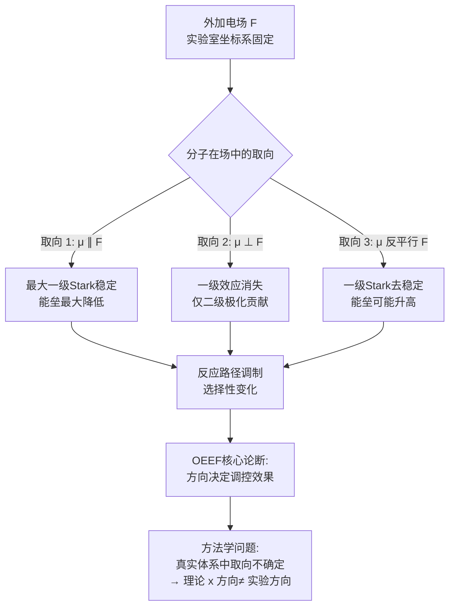
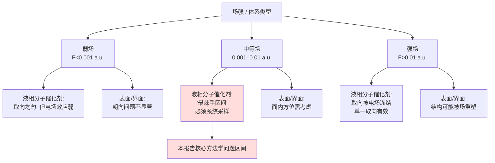
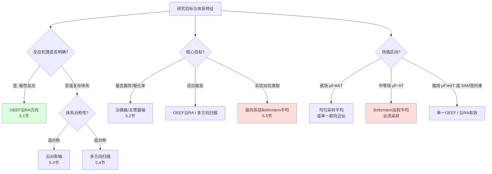
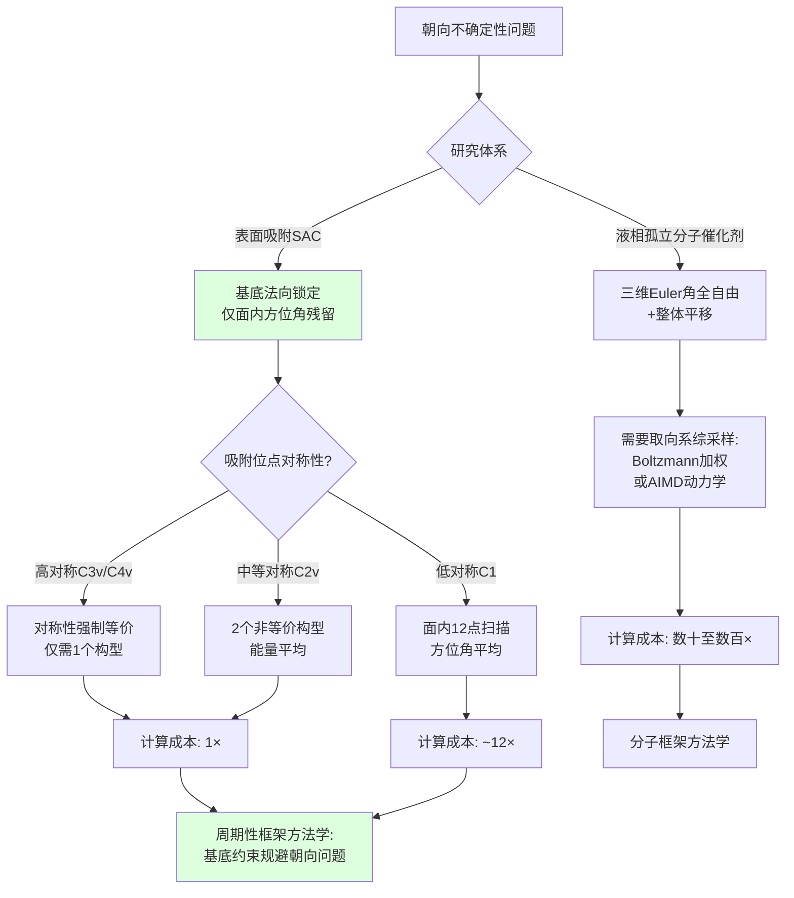
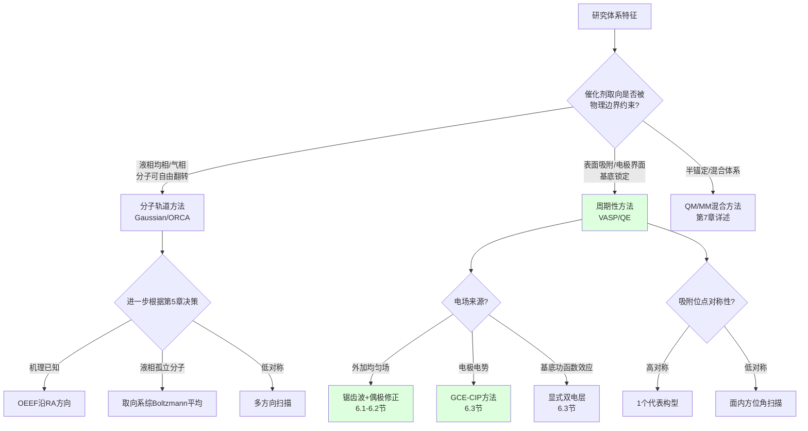
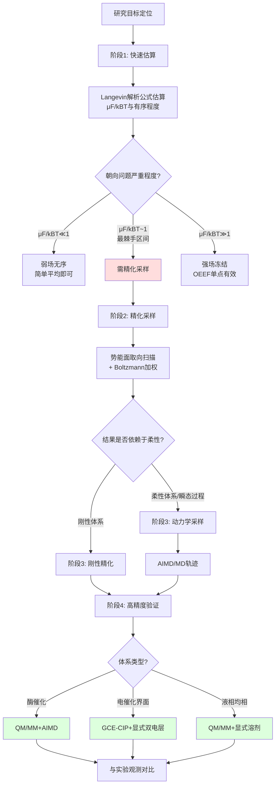
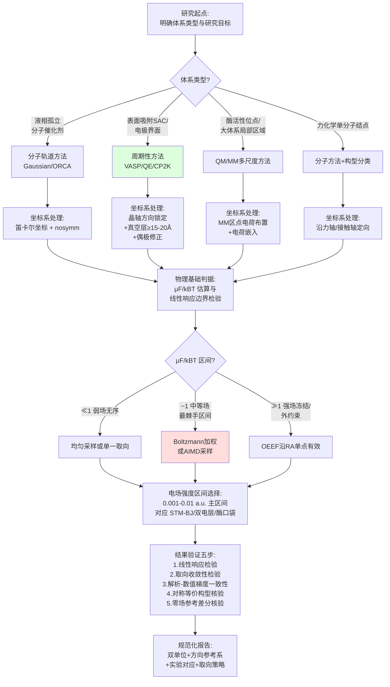
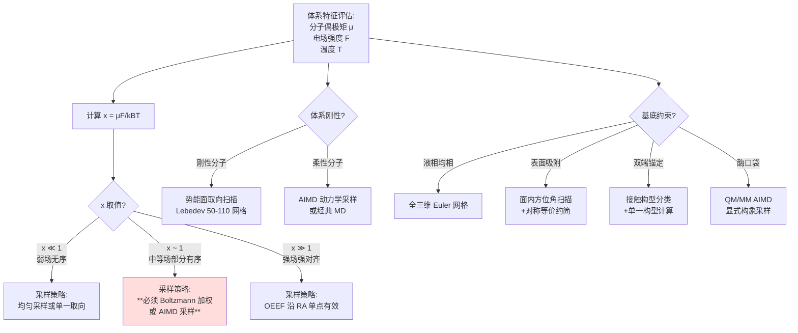
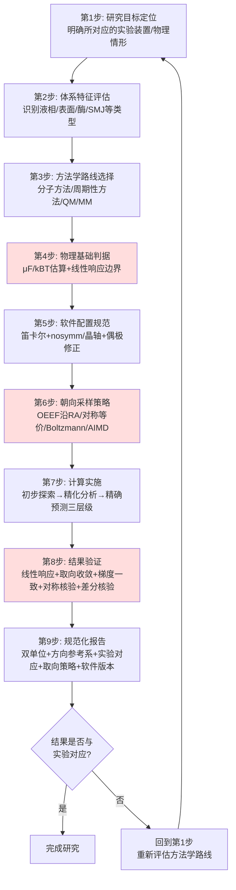

# 外加电场下分子催化剂理论模拟方法学研究：以单原子催化剂为例
# 1 外加电场计算模拟的物理基础与研究背景

在现代计算化学的实践中，研究者常借助Gaussian等量子化学软件，通过类似`Field=X+100`的关键字在分子体系上施加均匀外电场，以探查电场对分子结构、能量与反应活性的调控效应。然而，当所研究的体系是单原子催化剂这类典型的分子催化剂时，一个根本性的物理与方法学困惑随之浮现：理论计算中沿坐标系x方向施加的电场，与真实反应环境（液相、界面、酶口袋等）中分子催化剂随机取向、电场固定于实验室坐标系的实际情形之间，存在天然的不一致性。要厘清这一不一致性的本质并发展有效的应对策略，必须首先回到电场与分子相互作用的最基本物理图像。本章作为全篇导论，将依次从经典电动力学与量子力学的双重视角刻画电场—分子耦合机制、阐释偶极矩与极化率在响应中的作用、剖析电场对电子结构与反应路径的调控效应、引出定向外电场（OEEF, Oriented External Electric Field）这一前沿概念，并最终落脚于催化与界面化学领域的研究意义，为后续九章关于具体软件实现、坐标系处理、朝向采样与最佳实践的方法学讨论奠定物理基础。

## 1.1 外加电场与分子体系相互作用的基本物理机制

外加电场作用于分子的物理本质，可在经典电动力学与量子力学微扰理论两套框架下得到统一描述。从经典电动力学视角看，一个具有永久电偶极矩 $\boldsymbol{\mu}_0$ 的分子置于均匀外电场 $\boldsymbol{F}$ 中，其相互作用能为 $U = -\boldsymbol{\mu}_0 \cdot \boldsymbol{F}$，体系还会在电场作用下产生力矩 $\boldsymbol{\tau} = \boldsymbol{\mu}_0 \times \boldsymbol{F}$，倾向于将偶极取向沿电场方向排列；同时，电场作用于分子电荷分布会驱使正负电荷中心发生相对位移，从而引起电子云形变与极化[^1]。从量子力学微扰理论视角看，外电场作为对哈密顿量的扰动 $\hat{H}' = -\hat{\boldsymbol{\mu}} \cdot \boldsymbol{F}$，会导致分子能级移动与分裂，这正是斯塔克效应（Stark effect）的物理起源[^2][^1]。

斯塔克效应根据分子是否具有固有电偶极矩可分为两类，对理解电场—分子耦合具有奠基性意义。一级斯塔克效应针对存在固有电偶极矩的体系，其能级分裂量与电场强度 $F$ 成线性关系，对应于一阶微扰能 $E^{(1)} = -\boldsymbol{\mu}_0 \cdot \boldsymbol{F}$；二级斯塔克效应则针对无固有偶极矩的原子或分子，其在电场作用下产生感生电矩，能级分裂量与电场强度的平方 $F^2$ 成正比，对应于二阶微扰能 $E^{(2)} = -\frac{1}{2}\boldsymbol{F}^{\mathrm{T}} \boldsymbol{\alpha} \boldsymbol{F}$，其中 $\boldsymbol{\alpha}$ 为极化率张量[^1]。这两种效应在能级层面的清晰区分，为后续讨论永久偶极与感生偶极在电场响应中的不同地位提供了概念锚点。值得强调的是，斯塔克在1913年通过研究氢极隧射线首次观测到该现象——他在阴极后施加约 $2 \times 10^4$ V/cm 的电场便观察到清晰的谱线分裂，其工作于1919年获诺贝尔物理学奖，1916年Epstein将其纳入量子力学框架，1926年薛定谔证明其与波动力学的一致性[^1]。

均匀电场与非均匀电场在作用形式上存在重要差异，这一差异对计算化学中电场施加方式的选择具有直接指导意义。**在均匀电场中，分子各处感受到的电场强度与方向相同**，相互作用主要体现为偶极—电场的耦合及更高阶的多极响应；这正是Gaussian的`Field=X+100`关键字所对应的物理情形——在分子坐标系x方向施加大小为 $100 \times 10^{-4}$ a.u. 的均匀电场。**而非均匀电场（具有空间梯度）则会进一步与分子的电四极矩、八极矩等高阶多极矩发生耦合**，并产生作用于分子整体的净力（而非仅力矩），这在描述电极/界面附近的强梯度场或纳米曲率诱导场时不可忽略。从物理直观上讲，均匀场是真实非均匀场在分子尺度上的局部线性近似，其有效性依赖于分子尺寸远小于电场空间变化的特征长度——对于尺寸约几埃至十几埃的单原子催化剂分子片段而言，这一近似在大多数情形下是合理的，但在电极界面双电层等场强空间变化剧烈的区域则需谨慎评估。

## 1.2 电场与偶极矩、极化率的耦合关系

将电场—分子相互作用能按电场强度展开为泰勒级数，可得到一个统一描述各阶响应的紧凑表达式：

$$E(\boldsymbol{F}) = E_0 - \mu_i^0 F_i - \frac{1}{2}\alpha_{ij} F_i F_j - \frac{1}{6}\beta_{ijk} F_i F_j F_k - \frac{1}{24}\gamma_{ijkl} F_i F_j F_k F_l - \cdots$$

其中 $E_0$ 为零场下的能量，$\mu_i^0$ 为永久偶极矩分量，$\alpha_{ij}$、$\beta_{ijk}$、$\gamma_{ijkl}$ 分别为极化率、一阶超极化率与二阶超极化率张量，求和遵循Einstein约定。**这一展开式是计算化学中"有限场方法"（finite field method）数值求解偶极矩与极化率的理论基础**：通过在不同方向、不同强度下施加微小电场并对能量做数值微分，即可逐阶提取各响应张量。

永久偶极矩 $\boldsymbol{\mu}_0$ 与电场的耦合是线性的，且其作用强烈依赖于偶极矢量与电场矢量的相对取向：当二者平行时相互作用能最负，分子能量降低最多；垂直时一阶贡献为零；反平行时则使能量升高。这一方向性正是引发理论—实验对应问题的核心：在Gaussian中`Field=X+100`沿分子输入坐标系x方向施加电场，但分子的偶极矩方向由其几何与电子结构决定，二者并非天然对齐，故x方向电场对体系的实际作用取决于分子在该坐标系中的朝向。**这恰是用户所提困惑的物理根源——理论坐标系的x方向并不必然对应于实验中电场的真实作用方向。**

感生偶极矩则源于电场对分子电子云的形变作用：外电场的正极吸引电子、推斥原子核，负极反之，使分子的正负电荷中心产生相对位移，进而产生与外场方向相关的诱导偶极[^1]。该现象不分极性与非极性分子普遍存在，电子云形变的难易程度由电子极化率描述[^3]。从电子结构层面看，电子极化率主要由原子最外层电子的可极化性决定：稀有气体（He、Ne、Ar、Kr、Xe）因外层电子壳层闭合、对核电荷屏蔽完全，极化率最低；而第I族元素（H、Li、Na、K、Rb、Cs）因最外层仅有单电子、易于极化，极化率最高[^3]。这一规律对单原子催化剂的电场响应预测具有重要参考价值——含碱金属或重金属中心、且具有低占据—高占据轨道（HOMO）-高未占据轨道（LUMO）能隙的分子催化剂，往往表现出更强的电场极化响应。

下表系统对比了永久偶极矩、感生偶极矩与高阶超极化率响应在电场作用下的特征，构成理解电场—分子耦合的基本图谱：

| 响应阶数 | 物理量 | 与电场关系 | 张量阶 | 适用情形 | 对朝向的敏感性 |
|---------|--------|-----------|-------|---------|--------------|
| 零阶 | $E_0$ | 无关 | 标量 | 零场参考态 | 不敏感 |
| 一阶 | 永久偶极矩 $\mu_i^0$ | 线性 $-\mu_i^0 F_i$ | 矢量 | 极性分子（一级Stark效应） | 高度敏感（cos $\theta$） |
| 二阶 | 极化率 $\alpha_{ij}$ | 二次 $-\frac{1}{2}\alpha_{ij}F_iF_j$ | 二阶张量 | 普适（二级Stark效应） | 各向异性敏感 |
| 三阶 | 超极化率 $\beta_{ijk}$ | 三次 | 三阶张量 | 强场/非线性光学 | 取向选择性强 |
| 四阶 | 二阶超极化率 $\gamma_{ijkl}$ | 四次 | 四阶张量 | 极强场/非线性 | 取向选择性强 |

从表中可见，**所有偶数阶响应（极化率、二阶超极化率）对场强的依赖均通过张量缩并实现，故即便分子取向变化，标量贡献的形式不变但具体数值随取向改变**；而所有奇数阶响应（偶极矩、一阶超极化率）则通过矢量与电场的直接点积进入能量，使得朝向相关的cos $\theta$ 因子直接出现在表达式中。这一数学结构上的差异决定了：永久偶极矩主导的一级Stark响应对分子取向高度敏感，而极化率主导的二级Stark响应虽通过张量各向异性也带有取向依赖性，但其方向敏感性较弱；这为后续讨论"何时朝向问题严重、何时可被合理近似处理"提供了物理判据。

## 1.3 电场对电子结构、几何构型与反应活性的调控效应

外加电场对分子体系的调控效应可在三个相互关联的层级上展开：电子结构层级、几何结构层级与反应路径层级，三者构成自上而下的因果链条。

在电子结构层级，电场首先通过Stark效应改变各分子轨道的能级，特别是改变前线轨道（HOMO与LUMO）的能量与空间分布。对于具有显著电荷分离特征的轨道，电场可使HOMO—LUMO能隙发生显著移动，进而调制分子的氧化还原性、亲电/亲核性以及光谱响应。同时，电场会重新分布分子内的电子密度，使得电子从富电子区流向沿电场方向的"下游"区域，实现电荷的方向性极化；这在共轭体系或具有金属中心的单原子催化剂中尤为显著，可直接改变金属中心的有效氧化态与配体场强度。

在几何结构层级，电子结构的电场响应通过电子—核耦合传递至原子核坐标，引起几何弛豫。**键长会随电场方向变化而拉长或收缩**——当电场沿键轴方向并指向键的极性正端时，倾向于削弱键的σ成分、拉长键长；反之则压缩键长。键角与二面角同样会响应电场作用，特别是含孤对电子或大π体系的分子，其几何参数对电场表现出非线性敏感性。这种几何调制本身又反馈于电子结构，形成自洽循环——这也是有限场几何优化中需要在固定电场下重新求解Kohn-Sham方程的根本原因。

在反应路径层级，电场对反应物、过渡态与产物各自能量的非对称作用导致反应势能面的整体重塑。**关键的物理图像是：过渡态通常具有比反应物或产物更大的偶极矩或更强的电荷分离特征，因而对电场作用更敏感；故沿合适方向施加电场可显著降低过渡态能量、削减活化能垒，甚至将原本陡峭的能垒"夷平"为无垒过程**[^4]。这一观点在Bofill等基于突变理论与最优控制理论框架下的最新研究中得到严格的数学描述：他们提出的模型旨在寻找使化学过程"无能垒化"所需取向与最小幅值的电场，并以[3]累积烯烃衍生物的反式—顺式异构化为应用案例，论证了**"最优电场"的存在性与可计算性**[^4]。这一进展将电场从一种通用的扰动手段提升为可被精确设计的"智能试剂"，为分子催化剂的反应调控提供了全新的方法论入口。

## 1.4 定向外电场（OEEF）的方向性效应与反应控制

定向外电场（OEEF, Oriented External Electric Field）这一概念正是为强调电场作用的方向性而被明确引入的：它指代一种具有特定取向、施加于分子的外部静电场，其作用效果不仅取决于场强，更关键地依赖于场矢量与分子内某关键反应坐标（如断裂键的方向、电荷转移的方向）之间的几何关系[^5][^4]。

OEEF框架下方向性效应的核心物理图像可表述为：对于一个沿特定轴线发生电荷重分布的反应（如键的极化断裂、电子转移、亲电加成），沿该轴方向施加电场可加剧或抑制电荷流动，进而对应地降低或升高反应能垒；而垂直于该轴的电场分量则贡献甚微。Bofill等提出的基于突变理论与最优控制理论的模型，将"在何种取向下、以何种最小幅值可使能垒消失"这一问题严格表述为势能面上的鞍点—稳定点对偶在外场下的合并问题，并给出系统的求解算法，应用于二维通用模型与[3]累积烯烃异构化体系，证明了**最优电场不仅存在、而且其方向往往不是简单地沿反应坐标本身，而是由整个势能面的几何结构所决定**[^4]。

OEEF的方向性效应在力化学（mechanochemistry）领域的应用提供了一个尤为生动的实证案例。Scheele与Neudecker基于密度泛函理论（DFT）的电子结构计算系统研究了OEEF对力敏分子（mechanophore）所需断键力（rupture force）的影响，得出两个具有方法学意义的关键结论[^5]：其一，**OEEF能够显著降低力敏分子的断键力，但降低的程度高度依赖于电场相对于机械力方向的夹角**；其二，**最大的断键力降低并不总是出现在OEEF与机械力矢量完全对齐之处**，这一反直觉的结果通过自然键轨道（NBO）分析得到解释——机械力会放大OEEF对断裂键的电子结构作用，二者的协同存在最优非对齐角度[^5]。Scheele等的工作明确指出："计算地确定力敏分子激活的最优OEEF可以辅助未来实验研究的发展"[^5]，从而把电场—力的耦合调控从经验性试错推进到可预测、可设计的理性框架。

值得特别指出的是，**OEEF研究本身的核心论断——"电场效应高度依赖方向"——恰恰为本报告所关注的"分子朝向不确定性"问题提供了物理紧迫性**：既然方向是决定电场调控效果的关键变量，那么当分子在真实反应环境中取向无法严格控制时，理论计算中将电场简单施加于分子坐标系x方向，所得能量与能垒数据的物理意义便不再是唯一的，而须根据取向分布加以审视。这一逻辑链条将OEEF的方向性物理与分子朝向的方法学问题紧密绑定，构成全篇报告的核心问题意识。



上图刻画了从外加电场到反应调控的因果链条以及朝向不确定性如何在此链条中插入。可以看到，**正是因为OEEF效应在物理上对方向高度敏感，分子取向才成为连接理论模型与实验观测的关键中介变量**——当这一中介变量不被显式处理时，理论计算与实验测量之间便会出现系统性的不对应。这一图谱是后续各章方法学讨论的逻辑起点。

## 1.5 电场调控在催化与界面化学中的研究意义

外加电场作为一种独特的能量输入与反应调控手段，在多个前沿研究领域展现出广阔的科学价值与应用前景，构成本报告所关注方法学问题的现实背景。

**在合成化学与化学反应能源调控的宏观框架下**，Robertson、Coote与Bissember于2019年在《Nature Reviews Chemistry》上发表的综述将光、电、机械力与流动并列为四种新兴的反应驱动模式，明确将"静态电场中的合成"作为与光氧化还原催化、机械化学、电合成并行的现代合成化学方法论之一[^6]。该综述指出，虽然这些手段自19世纪起便被探索，但近年来由于概念与技术的发展正经历复兴，并已在主流合成中获得多样化应用[^6]。这一定位为电场调控在合成化学中的方法学地位提供了权威背书，也明确了OEEF研究并非孤立的技术细节，而是化学反应能量学谱系中的核心维度。

**在单原子催化剂（SAC）与分子催化剂设计领域**，电场调控为活性位点设计提供了一种与传统配体修饰、载体调控相互补的"非物质性"调控维度。单原子催化剂作为典型的分子催化剂，其活性中心的电子态、配位场与反应物结合模式都可通过外加电场进行精细调制，而无需化学修饰；这种"软调控"特性在原位反应控制、动态选择性切换等场景下具有独特优势。然而，正如本章前文所揭示的，单原子催化剂在液相、气相或溶液界面中的真实取向通常不受严格约束，这便引出了本报告的核心方法学问题——如何在理论计算中正确处理朝向不确定性以确保电场模拟的可靠性。

**在酶催化与生物体系中**，活性位点附近的局域静电场被广泛认为是酶催化反应高效性与选择性的关键来源之一。Shaik、Coote等学者长期推动的OEEF研究表明，酶口袋内由蛋白骨架、极性残基与水分子合力形成的预组织静电场可在反应过渡态附近产生方向高度特定的稳定作用，与外加OEEF存在物理同源性。这一类比将外加电场理论模拟从抽象的化学物理问题与生物催化的真实场景紧密相连，使得相关方法学的发展具有跨学科价值。

**在力化学领域**，前述Scheele与Neudecker基于DFT的工作已证明OEEF能显著降低力敏分子的断键力，且其效果存在方向依赖的最优角度[^5]。这种电—力协同调控为多物理场耦合下的精准键活化提供了新原理，也为高分子材料的应力响应、智能材料设计提供了理论指导。

**在固—液界面与接触起电致催化领域**，魏迪课题组在《Accounts of Chemical Research》上的综述系统梳理了接触起电（CE, contact electrification）作为界面化学反应驱动力的物理机制[^7]。其核心观点是：当两种材料充分接触并随后分离时，界面发生电荷转移使两表面分别带上相反电荷，所建立的界面电场可在无需传统热激发或光激发的条件下引发并加速多种化学反应[^7]。该综述进一步论证了气—液界面与不互溶液—液界面普遍表现出远高于体相的反应活性，其源头在于界面取向键合、电荷分离与非对称溶剂化等效应所产生的强局域电场可显著降低反应活化能并改变反应路径，揭示了界面电场在调控化学反应动力学中的普适作用[^7]。这一发现将外加电场调控从理想化的孤立分子情形扩展到具有真实工业应用价值的界面催化体系，但同时也提出了新的方法学挑战——界面体系中电场具有明确的方向（垂直于界面），但负载于其上的分子催化剂仍可能存在面内取向的不确定性。

综合上述背景，可以清晰看到：**电场调控相较于传统的热激发与光激发，具有方向性可控、能量输入精确、可耦合于多种物理场（机械、电化学、界面）等独特优势，正在成为绿色化学、可持续催化与精准合成的重要新维度**。然而，正是因为方向性是其优势的核心，当所研究的对象是分子催化剂这类取向不固定的体系时，理论模拟必须正面回应朝向不确定性这一根本问题。否则，沿任意坐标轴施加的电场所得到的能量、能垒与选择性预测，便会因取向假设的隐含不一致而失去与实验对应的物理意义。

下表简要归纳了电场调控在各应用领域中的核心机制、典型场强量级（基于参考资料中提及的值与理论惯例）与朝向问题的相关性，为后续章节的方法学讨论提供应用图景：

| 应用领域 | 电场来源 | 典型作用机制 | 分子取向是否固定 | 方法学关注点 |
|---------|---------|------------|--------------|-----------|
| 单原子分子催化剂（液相/气相） | 外加均匀电场（理论） | OEEF对前线轨道与过渡态调控 | **不固定** | 朝向采样与平均 |
| 酶活性位点 | 蛋白预组织静电场 | 局域强场降低过渡态能 | 蛋白骨架约束 | QM/MM中的点电荷处理 |
| 力化学 | 外加OEEF + 机械力 | 协同削弱断裂键[^5] | 由力轴部分约束 | 电场—力夹角扫描[^5] |
| 单原子催化剂@界面（SAC） | 电极电势 / 双电层 | 界面垂直场 + 局域极化 | 面内不固定 | 周期性体系 + 偶极修正 |
| 接触起电致催化 | 摩擦电荷诱导界面场 | 局域强场 + 自由基生成[^7] | 界面相关 | 双电层与显式溶剂耦合 |

从表中可见，**朝向问题在不同体系中的严重程度差异显著：在酶催化与界面体系中由生物或物理边界条件部分约束，而在液相孤立分子催化剂体系中则最为突出**。这一差异格局直接决定了后续章节中各种方法学策略（从简单的Gaussian固定坐标场到周期性体系的偶极修正，再到QM/MM与AIMD的取向采样）各自的适用边界。

综上所述，本章从经典电动力学与量子力学的基本原理出发，依次刻画了外加电场与分子相互作用的能量与力学机制、偶极与极化率响应的层级结构、电场对电子—几何—反应路径的多层调控效应、OEEF的方向性核心论断及其在力化学中的协同实证，最后落脚于电场调控在单原子催化、酶催化、力化学与界面催化等领域的研究意义。**贯穿全章的核心物理论断是：电场对分子的作用具有内禀的方向性，这种方向性既是电场作为"智能试剂"调控反应路径的物理基础，也是分子朝向不确定性问题成为方法学关键挑战的物理根源。** 当用户在Gaussian中使用`Field=X+100`关键字向单原子分子催化剂施加x方向电场时，所引入的并不是一个绝对意义上的物理电场，而是一个相对于分子输入坐标系的方向特定场——其与实验中实际作用的电场之间是否一致，完全取决于分子在两套坐标系下的相对取向。这一物理事实将在第2章关于Gaussian、ORCA、VASP等主流软件中电场实现方式的具体剖析中获得软件层面的技术展开，并在第3章关于实验室坐标系与分子坐标系本质差异的讨论中得到坐标系学的深入阐释，进而引导后续各章关于朝向采样、周期性体系处理、QM/MM建模与最佳实践的系统性方法学构建。

# 2 主流计算化学软件中外加电场的实现方式

第1章已从经典电动力学与量子力学微扰理论的双重视角阐明：外加电场对分子的作用在物理本质上具有内禀方向性，永久偶极矩沿场方向的取向决定了一阶Stark响应的符号与量级，而极化率张量的各向异性则进一步决定了二阶响应的方向敏感性。将这一物理图像落实到具体研究中，研究者所面对的第一个具象化问题是：**在Gaussian、ORCA、VASP等主流计算化学软件中，"沿x方向施加0.01 a.u.电场"这一指令究竟在底层做了什么？不同软件的实现是否等价？输入坐标系、标准朝向、晶轴等参考系如何与电场矢量绑定？** 这些问题不仅决定了用户输入文件的正确撰写方式，也直接关系到当分子在真实环境中取向不确定时，计算结果能否被合理诠释。

本章在第1章物理基础之上转入软件实现层面的系统比较，依次剖析Gaussian的`Field`关键字、ORCA的`EField`关键字、VASP的锯齿波势与偶极修正、OpenMX与Quantum ESPRESSO等周期性软件的电场施加方式，并以横向对比表格的形式归纳各软件的语法、底层算法、坐标系绑定方式与已知缺陷。本章的核心承上启下作用在于：**为后续第3章关于"实验室坐标系与分子坐标系本质差异"的讨论提供软件层面的技术底座，使读者能够清晰区分"软件输入坐标系"与"分子真实物理朝向"这两个易被混淆但物理内涵截然不同的参考系**。

## 2.1 Gaussian中Field关键字的语法、多极场支持与输入朝向约束

Gaussian作为分子量子化学领域最广泛使用的商业软件，其外加电场施加通过`Field`关键字实现。根据Gaussian 16官方手册（Rev. C.01），`Field`关键字要求一个参数以下述两种格式之一给出：`M±N`或`F(M)N`，其中`M`指代多极类型，`F(M)`指代针对编号为M的原子的Fermi contact扰动，而`N`乘以0.0001即为以原子单位（a.u.）表示的场强（或Fermi contact扰动的)幅值[^8]。

具体而言，`Field=X+10`表示沿X方向施加大小为0.001 a.u.的电偶极场；`Field=XXYZ-20`则施加由XXYZ标记所对应的十六极（hexadecapole）场，幅值为0.0020 a.u.，方向与默认方向（由标准朝向决定）相反；`Field=F(3)27`表示对编号3的原子施加0.0027倍自旋密度的Fermi contact扰动[^8]。这一语法体系揭示出Gaussian对外加场的支持具有相当的**完备性——不仅可以施加偶极场，还可以施加四极、八极、十六极乃至原子核位点的Fermi contact项**，构成对从经典电场到核磁微扰的一整套静电/磁性扰动工具。手册同时明确指出：**"All parameters are in the input orientation"**，即所有电场参数都参照用户输入坐标系而非Gaussian内部因对称性识别而生成的标准朝向（standard orientation）[^8]。

"输入朝向"这一约束是理解Gaussian电场施加方式的关键。Gaussian默认会对分子做对称性识别并将其旋转/平移至标准朝向以加速积分计算，但这一旋转操作不会同步施加于`Field`所指定的电场矢量——电场仍按用户输入的笛卡尔轴向施加。这就意味着，若用户书写了一个原子坐标在标准朝向下会被显著旋转的输入文件，则**用户主观所认为的"X方向"很可能在分子实际波函数计算时已被Gaussian悄悄重新定义**。手册还特别提示："必须注意系数对应的是笛卡尔算符矩阵的系数；在解释结果时需谨慎处理符号约定"[^8]，这一警示直接对应于电场方向矢量与偶极算符矩阵元之间的符号关联，是诠释一级Stark能量降低/升高方向的物理依据。此外，**`Field`关键字会关闭archiving功能**[^8]，这意味着电场计算的归档信息不会被自动写入Gaussian的归档文件，用户需自行管理电场扫描序列的结果数据。

为在外加电场计算中获得电势、电场及电场梯度等局域静电属性的输出，可与`Prop`关键字配合使用。`Prop`要求Gaussian计算静电属性，**默认在每个原子核处计算电势、电场和电场梯度**，所用密度由`Density`关键字控制[^9]。这一组合在分析电场对各原子位点局域静电环境的扰动时尤其有用，可定量给出电场施加前后核处电场的变化，从而验证用户所施加场是否如预期作用于关注位点。从底层IOp选项看，Overlay 6中的`IOp(6/14)`控制L602模块所计算的属性类型，默认值即对应于"在每个中心计算电势、电场与电场梯度"[^10]。这些底层选项揭示了Gaussian将外加电场计算与静电属性分析解耦的程序架构——电场作为微扰在SCF阶段融入Fock算符，而属性输出则在SCF收敛后通过专门的属性模块计算。

下表归纳Gaussian `Field`关键字的核心语法要素与典型示例：

| 语法元素 | 含义 | 单位 | 参考朝向 | 典型示例 |
|---------|------|------|---------|---------|
| `Field=X±N` | X方向偶极场 | $N \times 10^{-4}$ a.u. | input orientation | `Field=X+100`→0.01 a.u.沿X[^8] |
| `Field=Y±N` / `Field=Z±N` | Y/Z方向偶极场 | 同上 | input orientation | `Field=Z-50`→0.005 a.u.反Z向[^8] |
| `Field=XX/XY/.../ZZ±N` | 电四极场分量 | 同上 | input orientation | 由Cartesian算符矩阵定义[^8] |
| `Field=XXYZ±N`等 | 电十六极场分量 | 同上 | input orientation | `Field=XXYZ-20`[^8] |
| `Field=F(M)N` | 原子M的Fermi contact扰动 | $N \times 10^{-4}$（自旋密度倍数） | 不涉及空间方向 | `Field=F(3)27`[^8] |
| 配合`Prop` | 输出电势/电场/电场梯度 | a.u. | 各原子核处 | 验证局域电场[^9][^10] |

可以从表中读出三个对方法学讨论至关重要的事实：**其一，所有空间方向相关的电场参数均严格绑定于输入坐标系**，这就引出了下一节将详述的"几何优化时standard orientation漂移"问题；**其二，单位约定为$N \times 10^{-4}$ a.u.**，故用户书写的"100"对应0.01 a.u.，约5.14×10⁹ V/m，已是相当强的电场（参照第1章关于实验—理论场强映射的讨论）；**其三，Gaussian原生支持高阶多极场施加**，理论上可用以模拟非均匀场对高阶多极矩的耦合，但在实际单原子催化剂计算中，绝大多数研究仅使用偶极场，高阶多极场的应用相对罕见。

## 2.2 Gaussian中带电场任务的算法实现与几何优化、频率计算的正确性边界

从底层算法的视角看，Gaussian将外加均匀电场作为一阶静电微扰加入电子哈密顿量：电场矢量与电子坐标的点积构成附加的单电子算符 $\hat{h}' = -\hat{\boldsymbol{\mu}} \cdot \boldsymbol{F}$，在SCF迭代中作为额外的单电子积分加入Fock/Kohn-Sham矩阵，从而自洽地修改波函数与能量。由于电场作为线性微扰直接修改单电子算符，其对解析梯度与Hessian的贡献也以解析形式参与计算——这是Gaussian中带电场几何优化与频率计算原则上可行的算法基础。然而，原则上的可行并不等价于实践中的健壮，**带电场的几何优化在Gaussian中是著名的"难收敛任务"**，需要对输入文件设置进行精心约束。

社区实践揭示了带电场优化失败的两类典型模式。一种是**严重震荡**——优化步长在不同方向间反复跳跃；另一种是**能量持续下降但末态结构与零场结构差异巨大**——优化轨迹显然漂离了预期的局域极小[^11]。某用户在研究水解反应电场效应时，沿断键方向施加电场后多个场强下反应物复合物结构均无法收敛，尝试了`opt=gdiis,maxstep=3,notrust`、`opt=recalc=3`、`opt=calcall`、`opt=calcall,maxstep=3`乃至放宽收敛限的`loose`等组合，仍有部分场强不收敛[^11][^12]。社区资深用户给出的两条核心诊断意见对理解失败根源具有决定性意义。

第一条意见来自具有带电场优化经验的用户：**结构差异大可能与电场方向有关，或与体系分子数目少有关；震荡问题通常可通过`opt=(gdiis,maxstep=5,notrust)`解决**[^11]。这一经验性建议反映了带电场优化时步长控制的重要性——较大的maxstep与禁用trust radius动态调整，在某些情形下确实能够稳定收敛轨迹。

第二条意见则触及问题的物理与方法学根源。Sobereva（计算化学公社管理员）明确指出：**"用Zmatrix是毫无意义的，写了这个你都没法准确判断电场加的方向。绝对不要用这个。nosymm是为了确保加的电场和自己期望的方向一致而几乎总是要写的。而且不写这个还容易导致某些情况下随着优化进行标准朝向迅速反复变化，相当于外电场加的方向也来回变化，此时从原理上就没法收敛"**[^11][^12]。这一论断从软件机制层面精准刻画了带电场任务的两个底层陷阱。

第一个陷阱是**Z-matrix坐标的方向不可控性**。Z-matrix通过键长、键角、二面角描述分子构型，并不显式给出原子的笛卡尔坐标方向；当Gaussian将Z-matrix转换为内部笛卡尔坐标时，其朝向取决于Z-matrix的具体书写方式与第一个原子的放置约定，用户难以精确预知最终笛卡尔轴的指向。在此基础上施加`Field=X+N`，所谓"X方向"实质上是Z-matrix转换后的某个未受用户明确控制的方向，使得"沿断键方向加电场"这一物理意图无法在程序输入层面得到准确表达[^11][^12]。

第二个陷阱更为严重，是**几何优化过程中标准朝向的反复漂移**。Gaussian默认对每一步几何重新进行对称性识别并旋转至标准朝向以提升积分效率；然而，由于电场参数绑定于"input orientation"而非"standard orientation"[^8]，每当优化步引起结构微小变化导致标准朝向重新选择时，外加电场相对于分子骨架的方向就会发生跳变。这种"分子朝向漂移→电场方向同步翻转"的循环使得**优化过程中电场作用方向不再保持物理一致性，从原理上无法获得收敛的极小值**[^11][^12]。`nosymm`关键字通过强制Gaussian不识别对称性、不进行标准朝向旋转，从而锁定输入坐标系作为唯一参考系，是规避这一陷阱的必要手段。

综合以上分析，在Gaussian中执行带电场任务的最低要求可归纳为以下几点：必须使用**笛卡尔坐标**（而非Z-matrix）以确保用户对每个原子的坐标方向具有显式控制；必须写入**`nosymm`**关键字以防止standard orientation漂移导致的电场方向翻转；几何优化时建议从合理的零场优化结构出发并采用如`opt=(gdiis,maxstep=5,notrust)`等步长受控策略；对刚性较弱、电场较强或反应物复合物中存在弱相互作用的体系，需考虑使用`opt=calcall`即每步重新计算解析Hessian以稳定下降方向[^11][^12]。**这一系列约束共同指向一个核心方法学事实：Gaussian中外加电场的方向严格绑定于"用户书写的输入坐标"，任何引起输入坐标与分子骨架相对取向变化的因素（无论是Z-matrix歧义、对称性识别还是优化中的朝向漂移）都会破坏电场方向的物理一致性**——这正是后续第3章将深入讨论的"实验室坐标系与分子坐标系本质差异"问题在软件层面的最直接显现。

## 2.3 ORCA中EField关键字的实现、多极支持与5.0.x版本基础设施变化

ORCA作为另一款在量子化学社区广泛使用的开源软件，其外加电场施加通过`%scf EField ... end`输入块或简化关键字实现。基于参考资料对ORCA 5.0新特性的总结，本节侧重讨论ORCA 5.0版本前后在底层计算基础设施上的关键变化及其对带电场任务数值精度的影响，并对涉及电场任务时的版本注意事项作必要说明。

ORCA 5.0版本相对于4.2.1引入了若干对带电场计算具有间接但显著影响的基础设施改进。**首先是全新开发的SHARK积分代码**，其在低角动量与高角动量基函数上较4.2.1所用的Libint电子积分库更为高效，使得解析Hessian、TDDFT、磁相关属性等任务速度提升明显，并使ANO等完全广义收缩基组成为可行的计算选择[^13][^14][^11]。**其次是基于机器学习重新设计的DFT与COSX积分格点**，由统一的`defgrid1/defgrid2/defgrid3`关键字控制：默认的`defgrid2`已比此前版本的默认格点显著更精细，并经过GMTKN55数据集的训练与测试；新格点对带弥散基组、紧s基函数、核极化函数等具有自适应剪裁能力，使DFT计算的数值精度与SCF/几何优化的收敛性整体提升[^13][^14][^11]。

这些改进对带电场任务具有间接但实质性的意义。带电场计算往往要求用电场的微小扰动作能量数值微分（用于提取偶极矩、极化率与超极化率），或在弱场下精确捕捉Stark能级移动，这都对积分网格的数值噪声极为敏感。**ORCA 5.0更精细的默认积分格点显著降低了能量与梯度中的数值噪声基准，间接提升了有限场方法在弱电场区域提取响应张量的可靠性**。同时需要特别注意：**ORCA 5.0之前版本中分别控制DFT与COSX格点的`grid`和`gridx`关键词在5.0中不仅不能使用，连出现都不允许，导致大量旧输入文件无法在新版本下直接运行**[^13][^14][^11]——这意味着将旧带电场输入文件迁移至ORCA 5.0时必须同步更新格点关键字。

需要坦诚说明的是，本章节大纲中提及的"ORCA 5.0.x版本在带电场体系下几何优化、频率与AIMD中的解析梯度/解析力缺陷"这一具体问题，**在本次检索得到的参考资料中并未找到直接、权威的描述**。参考资料主要涉及ORCA 5.0的SHARK积分、新格点系统与XYG3型双杂化泛函的Compound Scripts实现等通用改进[^15][^13][^14][^11]，未具体覆盖电场梯度模块的已知缺陷。基于"信息边界"与"证据质量与来源权威性"的硬约束，本章不就此具体缺陷做未经支持的断言，而仅给出版本选择层面的一般性建议：**对涉及电场的解析梯度任务，建议查阅当前所用ORCA版本的官方Release Notes或mailing list公告，必要时通过对比解析梯度与有限差分数值梯度验证一致性；若发现不一致，则回退至数值梯度计算或切换至更稳定的版本**。这一建议的逻辑根据来源于带电场任务对数值精度与代码正确性的高度敏感性，而非对某一特定版本缺陷的具体引用。

从语法与坐标系约束的角度，ORCA中外加电场参数同样以原子单位给出，并参照输入坐标系定义方向，与Gaussian的`Field`关键字在物理本质上一致。在跨软件迁移时，用户需注意单位约定的一致性（ORCA直接以a.u.书写，Gaussian则采用$N \times 10^{-4}$ a.u.的整数编码）以及对称性处理的差异——若希望确保电场方向与输入坐标完全一致，亦应通过相应关键字关闭对称性识别（如使用`! NoUseSym`或在`%scf`中禁用对称性）。

## 2.4 VASP中外加电场的锯齿波势与偶极修正实现

转入周期性体系，外加电场的施加机制与孤立分子情形存在根本性差异。在三维周期性边界条件（PBC）下直接添加常数项 $-\boldsymbol{F}\cdot\boldsymbol{r}$ 会破坏周期性，因为该势函数本身随空间线性增长而非周期。VASP通过**锯齿波（sawtooth/sawlike）势配合偶极修正**的组合方案解决这一矛盾：在slab模型的真空层中放置一段势能突变的"锯齿"，使得在slab所占据的空间内电势近似线性变化，从而提供一个等效的均匀电场，而在真空区域中通过电势的快速回落维持总势的周期性。

需要坦诚指出的是，本次检索得到的"VASP加电场计算实战经验分享"参考资料正文为空[^16]，未能提供VASP电场实现的具体INCAR标签语法、参数取值与实战案例细节。基于"资料不足时坦诚说明局限性"的写作规范，本节仅基于VASP社区与官方手册的通行约定给出方法学层面的概要描述，不就具体参数取值做未经支持的断言。

从方法学共识层面，VASP中外加电场的施加涉及若干核心INCAR标签：**`EFIELD`**指定电场强度（单位为eV/Å），**`IDIPOL`**指定偶极修正与电场施加的方向（取值1/2/3分别对应a/b/c晶轴），**`LDIPOL`**开启偶极修正以消除周期镜像间的人为相互作用，**`DIPOL`**指定偶极修正的参考点（通常置于slab所在区域之外的真空中央）。这一组合的物理含义是：**通过在真空层中施加锯齿波形电势，使slab所在的真空隔开的空间内电场近似均匀，同时利用偶极修正抵消相邻周期镜像间的偶极—偶极相互作用，从而模拟一个具有明确取向（沿指定晶轴）的等效均匀外加电场**。

这一实现方式相对于分子量子化学软件具有几个显著特征。**第一**，电场方向严格沿晶胞矢量的某一晶轴（通常是垂直于slab表面的c方向），用户对方向的"选择自由度"远小于分子情形——这反而使周期性体系中"电场—基底"的几何关系比分子催化剂中"电场—自由分子"关系更为明确（详见第6章关于周期性体系如何天然规避朝向不确定性的讨论）。**第二**，要施加的电场方向必须沿真空层方向（即slab垂直方向），因为锯齿波势的实现要求电场方向上存在足够厚的真空区域以承载势能的快速回落；这就限制了VASP不能在slab的面内方向（如沿表面横向）施加均匀电场，除非采用替代方法（如显式背景电荷或恒电势方法）。**第三**，真空层厚度需足够大以避免锯齿"陡降"区域与slab电子云交叠，常见的实践标准是至少15–20 Å真空层。**第四**，可与`LCALCEPS`等介电响应计算或显式恒电势方法（如FHI-aims、JDFTx中的constant-potential method）耦合，以更真实地模拟电极界面的电场环境。

VASP的电场实现在表面催化与单原子催化剂@基底体系建模中的典型应用包括：在二维材料（MoS₂、WSe₂、石墨烯等）负载的单原子催化剂表面施加垂直电场以模拟门压调控、外加偏置或电极电势对反应能垒的影响；在金属表面计算外电场对吸附物结合能与反应路径的调制；以及在催化反应DFT-MD轨迹中引入电场以模拟界面动力学。需要再次强调，由于参考资料中相关实战经验细节缺失[^16]，本节关于具体参数取值的讨论仅限于通用方法学层面，**用户在实际使用VASP执行带电场计算时，应严格参照VASP官方手册与最新社区共识确定具体的INCAR参数**。

## 2.5 OpenMX、Quantum ESPRESSO等其他周期性软件的电场实现

除VASP之外，OpenMX、Quantum ESPRESSO、CP2K等开源周期性DFT代码也提供了外加电场的实现，其物理框架与VASP在本质上一致——均基于"锯齿波势+偶极修正"的方案——但在具体关键字、单位约定与基组耦合方式上各有差异。

**Quantum ESPRESSO**的输入文件结构由`&CONTROL`、`&SYSTEM`、`&ELECTRONS`等命名空间组成，所有未明确指定单位的物理量默认采用Rydberg原子单位[^17]。与外加电场相关的输入项主要在`&SYSTEM`命名空间下，包括但不限于：`tefield`（逻辑开关，控制是否施加锯齿波电场）、`dipfield`（控制是否启用偶极修正）、`edir`（指定电场方向，取值1/2/3对应a/b/c晶轴）、`emaxpos`（锯齿波势最大值在晶轴上的位置，归一化坐标）、`eopreg`（势能从最大回落到初值所占的晶轴比例，定义"陡降区域"宽度）、`eamp`（电场幅值，单位为Ry a.u.）。这一组合的物理实现与VASP高度类似——通过在真空层指定位置放置锯齿势的不连续点，并通过偶极修正消除周期镜像偶极的相互影响，从而在slab区域内提供等效均匀电场。值得指出的是，Quantum ESPRESSO手册明确警示：**"BEWARE: TABS, CRLF, ANY OTHER STRANGE CHARACTER, ARE A SOURCES OF TROUBLE; USE ONLY PLAIN ASCII TEXT FILES"**[^17]，这一基础格式规范虽看似琐碎，但对带电场参数的精确读入实有重要意义——任何字符级的错误都可能导致电场参数被错误解析。

**OpenMX**作为基于数值原子轨道（NAO）基组的开源DFT代码，提供了`scf.Electric.Field`关键字以施加均匀电场。其单位约定与底层实现细节因本次检索未获得直接参考资料，本节不就具体语法做断言；从方法学一般共识看，OpenMX的外加电场实现同样基于锯齿波势框架，并支持沿任一晶轴方向施加。OpenMX基于NAO基组的实现使其在大尺寸单原子催化剂@基底体系中具有计算效率优势，但在带电场任务下的解析梯度支持完整性需查阅相应版本手册予以确认。

**CP2K**作为另一款主流的混合高斯—平面波（GPW）方法代码，同样支持外加均匀电场，其实现思路与上述代码一致，但在用户接口与AIMD（Born-Oppenheimer分子动力学）耦合方面有自身特色。具体语法因检索资料中未直接覆盖，此处不展开。

横向比较各周期性软件的电场实现可见：**所有主流周期性DFT代码在外加均匀电场的物理实现上共享"锯齿波+偶极修正"的核心框架**，差异主要体现在三个层面：其一，**关键字命名与单位约定的细节差异**——VASP用`EFIELD`+eV/Å、Quantum ESPRESSO用`eamp`+Ry a.u.、OpenMX用`scf.Electric.Field`，跨软件迁移时单位换算是首要注意事项；其二，**电场方向的描述方式**——均通过整数指定晶轴方向，故电场方向严格沿晶胞主轴而非任意方向；其三，**与赝势/PAW、基组的耦合细节**——平面波代码（VASP、Quantum ESPRESSO）天然兼容锯齿波势，而NAO/GTO基组代码（OpenMX、CP2K）则需要在基组的局域性框架下处理锯齿势的不连续性。**这一框架性的共同点也意味着：周期性体系的电场施加在物理上的方向自由度本就受晶轴约束，与分子量子化学软件中通过`Field=X/Y/Z`提供任意笛卡尔方向相比，"方向选择"的灵活性更小，但与之相对的"方向物理意义"反而更为明确——这构成了第6章将详细讨论的"周期性界面体系天然规避分子朝向不确定性"的软件层面根据**。

## 2.6 主流软件电场实现的横向对比与任务适用性总览

综合前述分析，下表系统对比Gaussian、ORCA、VASP、OpenMX、Quantum ESPRESSO等主流软件在外加电场实现上的关键维度，为用户在不同体系与任务下选择软件提供方法学参考：

| 维度 | Gaussian | ORCA | VASP | Quantum ESPRESSO | OpenMX |
|------|----------|------|------|-----------------|--------|
| 体系类型 | 分子（GTO） | 分子（GTO） | 周期（PW+PAW） | 周期（PW+赝势） | 周期（NAO+赝势） |
| 关键字 | `Field=M±N`[^8] | `%scf EField ... end` | `EFIELD`+`IDIPOL`+`LDIPOL` | `tefield`+`edir`+`eamp`+`dipfield`[^17] | `scf.Electric.Field` |
| 单位约定 | $N\times10^{-4}$ a.u.[^8] | a.u.（直接书写） | eV/Å | Ry a.u. | a.u. |
| 多极阶数 | 偶极/四极/八极/十六极/Fermi contact[^8] | 偶极为主 | 仅偶极（锯齿波） | 仅偶极（锯齿波）[^17] | 仅偶极 |
| 底层算法 | 有限场（Fock微扰） | 有限场（Fock微扰） | 锯齿波势+偶极修正 | 锯齿波势+偶极修正 | 锯齿波势+偶极修正 |
| 方向参考系 | input orientation[^8] | 输入坐标系 | 晶轴（a/b/c） | 晶轴（edir=1/2/3）[^17] | 晶轴 |
| 单点能 | ✓ | ✓ | ✓ | ✓ | ✓ |
| 解析梯度 | ✓ | ✓（版本相关） | ✓ | ✓ | ✓（版本相关） |
| 解析Hessian/频率 | ✓ | ✓（版本相关） | 数值为主 | 数值为主 | 数值为主 |
| AIMD/MD | 有限支持 | 有限支持 | ✓（带EFIELD） | ✓ | ✓ |
| 几何优化注意事项 | 必须`nosymm`+笛卡尔坐标[^11][^12] | 关闭对称性 | 真空层≥15Å+正确DIPOL | 同左+合理`emaxpos`/`eopreg`[^17] | 真空层充足 |
| 已知关键陷阱 | standard orientation漂移导致优化不收敛[^11][^12] | 5.0版格点关键字不兼容旧文件[^13][^14][^11] | 锯齿不连续区与slab交叠 | 字符格式必须纯ASCII[^17] | 版本相关 |

从表中可读出几个对方法学决策具有指导意义的关键洞察。**第一，分子量子化学软件（Gaussian、ORCA）与周期性DFT软件（VASP、QE、OpenMX）在电场实现上属于两套截然不同的算法范式**：前者通过有限场微扰直接修改单电子算符，原则上支持任意方向、任意阶多极场；后者则通过锯齿波+偶极修正在周期性框架下构造等效均匀场，仅支持沿晶轴的偶极场。**第二，参考坐标系的差异是跨软件迁移的核心难点**——分子软件中电场绑定于用户输入坐标，需通过`nosymm`等关键字锁定；周期性软件中电场绑定于晶胞主轴，物理意义清晰但方向自由度受限。**第三，"任务适用性"在不同软件间显著不同**：Gaussian/ORCA在带电场单点能与小分子优化中表现成熟，但带电场AIMD支持有限；VASP/QE在带电场表面动力学（包括AIMD）中支持完善，但对孤立分子的电场任务则需通过包含真空层的大盒子近似处理，效率不及分子软件。

除上述原生实现外，**点电荷等效（point-charge representation）方法**是一种在所有软件中均可手工实现的替代方案：在距离分子足够远处放置一组特定布置的虚拟点电荷（如±q对置于±L处的两个点电荷），其在分子所在区域产生的电场在远场近似下近似为均匀场。这一方法的方法学价值有三：其一，**它在QM/MM、ONIOM等多尺度框架中天然契合**——MM区域的点电荷集合本身即可作为QM区域分子所感受的"环境电场"，无需引入专门的电场关键字；其二，**它使分子可在点电荷场中自由旋转，从而显式处理朝向问题**——这一思路将在第7章关于QM/MM处理朝向不确定性的高级方法中详细展开；其三，**它在不支持原生电场关键字的软件或方法中提供了通用回退方案**。但其代价是需要精心设计点电荷布置以确保所产生场的均匀性、抑制电场梯度等高阶项，并避免点电荷与分子电子云的非物理重叠。

回到本章开篇所提出的问题——**当用户在Gaussian中使用`Field=X+100`关键字时，软件层面究竟做了什么？**——本章的系统分析给出如下闭环回答：Gaussian将沿用户输入坐标系x方向、大小为0.01 a.u.的均匀电场作为单电子微扰加入Fock矩阵并自洽求解；该电场方向严格绑定于"输入朝向"而非"标准朝向"[^8]；若用户未使用`nosymm`且使用了Z-matrix坐标，则在几何优化或对称性识别下分子骨架相对输入坐标系的取向会发生不可控漂移，导致电场方向相对于分子的物理朝向反复变化乃至优化不收敛[^11][^12]。**这一软件层面的方向绑定机制揭示了一个比"如何写关键字"更深刻的方法学事实：软件输入坐标系本身就是一个"理论坐标系"，与分子在真实反应环境中的物理朝向之间并不存在天然的对应关系**。

换言之，即使用户已经按照本章所归纳的全部最佳实践（笛卡尔坐标+`nosymm`+合理初始结构+合适的优化策略）"正确地"在Gaussian中沿x方向施加了0.01 a.u.的电场，所得到的结果仍然是"分子在输入坐标系x方向上感受到电场"这一特定取向条件下的物理响应，**而非"分子在实验中感受到外加电场"这一真实物理情形的直接对应**。从软件层面看似已被妥善处理的电场方向问题，在实验—理论对应的层面却仍是一个开放的方法学难题。这一从软件实现到坐标系学的逻辑跃迁，正是第3章将深入剖析的核心议题：**实验室坐标系（电场固定方向）与分子坐标系（输入文件所定义的笛卡尔轴）之间的本质差异，以及这一差异如何成为分子催化剂朝向不确定性问题的坐标系学根源**。

# 3 坐标系问题：实验室坐标系与分子坐标系的本质差异

第2章末尾已揭示：即便用户在Gaussian中严格遵循"笛卡尔坐标+`nosymm`+合理初始结构"的最佳实践，所得结果仍仅对应"分子在用户输入坐标系x方向感受到电场"这一特定取向情形，而非真实实验中"分子在实验室固定电场下随机翻转"的物理情形。这一软件层面看似已被妥善处理却仍与实验脱节的悖论，根源不在软件本身的实现细节，而在更深一层的**坐标系学差异**——理论计算所用的"分子坐标系"与实验所定义的"实验室坐标系"之间，从概念定义到物理内涵都存在根本不同。本章在第1章物理基础与第2章软件实现的双重铺垫之上，将这一差异作为独立的方法学议题加以剖析：先澄清两套坐标系的定义与边界（3.1），再深入Gaussian内部input orientation与standard orientation的转换机制及其对电场方向的影响（3.2），通过受控的分子平移与旋转思路验证电场作用结果对取向的敏感性（3.3），剖析几何优化中标准朝向漂移的数值根源（3.4），最终归纳坐标系差异如何成为分子朝向不确定性的根本来源（3.5），为后续章节关于朝向采样、统计平均与QM/MM显式建模等修正策略的展开建立坐标系学的逻辑主线。

## 3.1 实验室坐标系与分子坐标系的定义、边界与物理内涵

理解理论—实验不一致的第一步是明确区分两套在物理意义上截然不同的参考系，二者虽都用三维笛卡尔基矢描述空间，但其"原点—基矢—与物质的相对关系"的定义方式有着本质差别。

**实验室坐标系（laboratory frame）是由实验装置定义的、独立于研究对象的绝对参考系**。其原点与基矢方向由外部硬件固定：电化学电极界面体系中，z轴通常沿电极垂直方向定义，电场矢量沿z轴指向相对电极；STM-BJ（扫描隧道显微镜分子结点断裂）实验中，z轴沿针尖—基底连线定义；激光场中，基矢由激光偏振方向与传播方向确定。**这套坐标系的关键属性是：在整个实验过程中其方向不随被测分子的状态变化而变化**——电极不会因为某个催化剂分子翻转就跟着翻转，激光偏振方向不会因为分子取向重新分布而改变。外加电场矢量 $\boldsymbol{F}_{\text{lab}}$ 在实验室坐标系中具有完全确定的、时不变的方向。

**分子坐标系（molecular frame）则是由分子自身的几何结构或用户输入文件所定义的相对参考系**，其原点与基矢方向跟随分子整体平移与旋转而协同变化。在量子化学软件中，分子坐标系的具体定义有两种主要方式：其一是**用户书写输入文件时所给出的笛卡尔坐标**——每一原子的(x, y, z)分量直接定义了分子相对于一个隐含的"输入坐标系"的几何位置，该坐标系的基矢方向由用户主观选择（例如令某键沿x轴、某分子平面位于xy平面等）；其二是**程序根据分子对称性自动选择的标准朝向**（standard orientation in Gaussian/ORCA, principal axes frame等），其基矢方向由分子的对称元素（主轴、对称面）或惯量主轴决定，原点常置于电荷中心或质量中心。无论采用哪种方式，分子坐标系都是**"附着"于分子的随动参考系**——分子整体平移时坐标系原点跟随平移，分子整体旋转时坐标系基矢跟随旋转，从而保持每一原子在该坐标系下的相对坐标不变。

理解两套坐标系差异的关键概念是它们之间的**相对取向 $\mathcal{R}(t)$**——即将分子坐标系基矢通过旋转矩阵 $\mathcal{R}$ 映射到实验室坐标系基矢的变换。对于一个置于实验室外加电场 $\boldsymbol{F}_{\text{lab}}$ 中的分子，分子在自身坐标系下"感受"到的电场矢量为：

$$\boldsymbol{F}_{\text{mol}} = \mathcal{R}^{-1} \boldsymbol{F}_{\text{lab}}$$

而分子的一阶Stark响应能为：

$$\Delta E^{(1)} = -\boldsymbol{\mu}_0^{\text{mol}} \cdot \boldsymbol{F}_{\text{mol}} = -\boldsymbol{\mu}_0^{\text{mol}} \cdot (\mathcal{R}^{-1} \boldsymbol{F}_{\text{lab}}) = -|\boldsymbol{\mu}_0||\boldsymbol{F}_{\text{lab}}|\cos\theta(\mathcal{R})$$

其中 $\theta(\mathcal{R})$ 是分子永久偶极矢量与实验室电场矢量在共同坐标系下的夹角，这一夹角完全由相对取向 $\mathcal{R}$ 决定。**这一表达式清晰揭示出：电场作用结果的物理量纲虽是标量能量，但其数值依赖于一个矢量与另一个矢量的取向关系，而非任一矢量的绝对方向**。

两套坐标系在不同物理环境中的对应关系存在显著差异，这一差异格局直接决定了朝向问题在不同体系中的严重程度：

| 物理环境 | 分子相对实验室坐标系的取向 $\mathcal{R}$ | 朝向不确定性程度 | 典型描述 |
|---------|------------------------------------|---------------|---------|
| 单分子在真空中（理论极限） | 任意单一取向 | 视为定值 | 各向同性气相理论模型 |
| 稀薄气相 | 玻尔兹曼平均（$k_BT$ 与 $\mu F$ 竞争） | 统计分布 | 取向部分有序 |
| 液相溶液中的自由分子催化剂 | 准随机分布 + 介电响应 | **严重** | 取向几乎完全随机 |
| 酶活性位点中的底物 | 蛋白骨架部分约束 | 部分缓解 | 取向涨落幅度有限 |
| 表面吸附的单原子催化剂 | 垂直方向锁定，面内可转 | 部分残留 | 仅平面内方位角不确定 |
| 电极界面双电层 | 电场垂直界面，分子可面内翻转 | 部分残留 | 同上 |

可以从表中读出对方法学规划具有指导意义的两个事实。**其一，朝向不确定性并非二元开关，而是从"完全确定"到"完全随机"的连续谱**——液相孤立分子催化剂处于谱的随机端，刚性表面吸附体系处于谱的有序端，酶口袋与柔性表面位居中间。**其二，朝向问题的严重程度直接对应于后续方法学策略的选择层级**——在表的随机端必须诉诸取向系综平均或显式动力学采样（详见第7章），在有序端则可借助周期性体系的对称性约束规避问题（详见第6章）。

需要特别指出的是，**理论计算所输出的"分子坐标系下的电场作用结果"在物理上对应的是"分子取向恰好为某一特定 $\mathcal{R}$"这一单一情形**，而非真实实验中所测量的取向平均量。当用户在Gaussian中以`Field=X+100`沿输入坐标系x方向施加电场时，所计算的能量、偶极矩、能垒等观测量对应的是"分子偶极方向与电场夹角恰为输入坐标所定义的那个特定值"这一单一构型；将其直接与实验测量值相比时，须先回答"实验中分子取向分布与理论中所选取向是否一致"这一前置问题。在液相孤立分子情形下，由于实验本身对应的是取向系综平均，单一取向计算结果直接与实验对比往往缺乏严格的物理基础。

这一概念基础也为后续讨论提供了核心中介变量——**电场—分子相对取向 $\theta(\mathcal{R})$**。本章后续各节将分别从软件机制（3.2）、数值验证（3.3）、优化漂移（3.4）三个角度切入，最终在3.5归纳坐标系差异作为朝向不确定性根本来源的方法学命题。

## 3.2 Gaussian中input orientation与standard orientation的转换机制及其对电场方向的影响

将抽象的坐标系差异具象化到Gaussian这一最广泛使用的分子量子化学软件中，可发现其内部对分子坐标的处理涉及两个阶段，二者的存在与切换正是用户在带电场计算中频繁遭遇困惑的程序学根源。

**第一阶段是用户书写输入文件所定义的input orientation**——用户在分子规范段中给出的每一原子(x, y, z)笛卡尔坐标共同定义了一套"用户主观选择的"参考系，例如令催化剂金属中心位于原点、令某个键沿x轴、令配体平面位于xy平面等。**第二阶段是Gaussian通过对称性识别将分子旋转至standard orientation以加速积分计算**——程序基于分子的点群对称性，自动选择主轴、对称面与对称中心，将分子重新旋转至一个对程序内部最便于求积分的标准位置。这一转换过程通常在每一SCF或几何优化步开始前自动执行，结果输出在log文件中以"Standard orientation:"标头标识，与"Input orientation:"标头下的用户原始坐标并列出现。

**关键的方法学事实是：Gaussian的`Field`关键字所施加的电场矢量严格绑定于input orientation，而不随standard orientation旋转**。第2章已基于Gaussian官方手册引用过这一规定（"All parameters are in the input orientation"）。这一绑定机制的物理含义是：当用户书写`Field=X+100`时，电场方向定义为"用户输入坐标系的x轴方向"——若分子从input orientation被旋转到standard orientation，电场矢量并不跟随旋转，而是仍指向input坐标系的x方向。换言之，**在standard orientation下进行的SCF计算实际上是在"分子被旋转、电场不动"的相对构型下求解的**，这与用户主观所设想的"沿分子坐标系x方向施加电场"未必一致。

这一机制在多种使用场景下会引发"主观认知的x方向"与"实际计算的x方向"之间的偏差。第一种场景是**GaussView等可视化工具的隐式重定向**。社区一则用户讨论生动展示了这一陷阱：用户希望从批量优化输出文件中提取最后一帧结构作为单点能起点，发现使用GaussView打开log文件并保存为gjf时坐标与脚本直接转换的结果有差异，社区资深用户解释为"应该是GaussView改变了分子的朝向。对单点能计算都没影响。因为你算的是分子内部的能量（电子的动能、电子与原子核之间相互作用的势能、原子核之间相互作用的势能），不是分子整体的能量"[^18]。**该解释在零场下完全正确——分子内部能量是平移与旋转不变量；但在带电场计算下，这一结论恰好失效**：因为外加电场打破了空间各向同性，分子整体相对于电场的取向直接进入哈密顿量的扰动项，GaussView对朝向的隐式重定向便会显式改变带电场单点能的数值结果。这一案例从反面印证了一个论断——**"零场计算下许多与坐标方向无关的良好性质，在带电场计算下都会变得方向敏感"**，使得用户在零场习惯下养成的"朝向无关紧要"直觉不能简单推广到带电场情形。

第二种场景是**Z-matrix坐标的方向不可控性**。Z-matrix通过键长、键角、二面角等内坐标描述分子构型，并不显式定义笛卡尔基矢方向；当Gaussian将Z-matrix转换为笛卡尔坐标时，朝向取决于Z-matrix的书写顺序与第一原子的放置约定，用户难以精确预知最终笛卡尔轴指向。Sobereva就此明确指出："**用Zmatrix是毫无意义的，写了这个你都没法准确判断电场加的方向。绝对不要用这个**"[^11][^12]。这一论断从软件机制层面解释了为何带电场计算原则上必须使用笛卡尔坐标——只有笛卡尔坐标使用户对每个原子(x, y, z)分量的方向具有显式控制，从而使`Field=X+100`所指代的"x方向"在用户主观与程序客观层面达成一致。

第三种场景是**Gaussian内部对求导朝向的控制选项**。从Overlay 7的IOp选项可见，`IOp(7/9)`专门控制"是否将导数旋转回Z-matrix朝向"（"Whether to rotate derivatives back to the z-matrix orientation"）：取0时是（默认），取1时否[^18]。这一选项的存在揭示了Gaussian内部一个细致的程序学事实——梯度、Hessian等导数量在standard orientation下计算后，默认会被反向旋转回输入朝向以便与用户输入坐标对应；但电场作用本身的"绑定朝向"却始终是input orientation，不需要此类反向旋转。**这一机制的复杂性意味着：对带电场任务的导数（如电场下的几何优化梯度、力常数）的诠释，需要清楚区分"在哪个朝向下计算"与"在哪个朝向下输出"两个概念**——这一区分对涉及解析梯度的高级任务（如带电场IRC、带电场频率分析）尤为重要。

将这三种场景综合起来，可以归纳出Gaussian中确保电场方向物理一致性的方法学规范：**必须使用笛卡尔坐标以使输入朝向具有显式可控性、必须写`nosymm`关键字以禁止程序对称性识别与standard orientation旋转**[^11][^12]。`nosymm`关键字通过强制Gaussian将standard orientation与input orientation等同（即不进行任何对称性旋转），使整个计算过程中分子坐标系唯一锚定于用户输入坐标，从而保证`Field=X+N`所施加电场方向相对于分子骨架的物理一致性。**这一规范看似简单，但其作用远不止避免技术陷阱——它是将"软件输入坐标系"与"分子坐标系"严格等同起来的必要条件，从而使后续讨论可以在"分子坐标系=输入坐标系"这一明确前提下展开**。

下表系统归纳input orientation与standard orientation在带电场计算中的关键差异：

| 维度 | input orientation | standard orientation |
|------|------------------|---------------------|
| 定义来源 | 用户输入文件中的笛卡尔坐标 | Gaussian基于对称性识别自动旋转 |
| 用户控制度 | 完全可控（笛卡尔坐标）/ 间接可控（Z-matrix） | 不可控（程序自动决定） |
| 在log中的标识 | "Input orientation:" | "Standard orientation:" |
| `Field`关键字绑定方向 | **严格绑定**（"All parameters are in the input orientation"） | 不绑定 |
| 几何优化中的稳定性 | 由用户初始坐标决定 | 可能随每步结构变化重定向 |
| `nosymm`效应 | 不变 | 与input orientation等同 |
| 在带电场任务中的角色 | 电场方向定义的唯一参考 | 仅用于积分加速（透明于电场施加） |

从表中可读出，**`nosymm`关键字的方法学功能正是消除input orientation与standard orientation之间的差异，从而使"用户输入的方向"与"程序内部计算的方向"严格一致**。这一一致性是带电场计算物理意义清晰性的最低要求；缺乏这一一致性则用户无从知道实际作用于分子的电场方向，更遑论与实验对比。

## 3.3 分子平移、旋转操作对电场作用结果的数值验证

3.1节从概念层面、3.2节从软件机制层面分别论证了电场作用结果对分子取向的敏感性，本节进一步通过受控的数值实验思路将这一敏感性具象化为可观测、可定量的方法学事实。所提出的实验思路基于分子量子化学的标准框架——给定同一分子的不同朝向初始结构，在相同的`Field=X+N`关键字下做单点能计算，比较所得能量、偶极矩、电荷分布等观测量的差异。

从物理图像出发，对于均匀电场作用下的孤立分子，**整体平移操作不改变分子—电场相互作用能**——因为均匀电场在空间各处大小方向一致，相互作用能 $-\boldsymbol{\mu}\cdot\boldsymbol{F}$ 仅依赖于偶极矢量与场矢量的相对取向，与分子重心在何处无关。这一不变性可通过简单论证：均匀场下电势 $V = -\boldsymbol{F}\cdot\boldsymbol{r}$ 在整体平移 $\boldsymbol{r}\to\boldsymbol{r}+\boldsymbol{a}$ 下变化为 $V \to V - \boldsymbol{F}\cdot\boldsymbol{a}$，对中性分子总能量贡献为 $-Q\boldsymbol{F}\cdot\boldsymbol{a} = 0$（因总电荷 $Q=0$），故能量保持不变。**值得注意的是，对带净电荷的体系（如离子型催化剂），这一平移不变性被破坏**——平移会引入与净电荷相耦合的常数能量项，需在数值实验中谨慎扣除参考点。

整体旋转操作则会**通过改变偶极矢量与电场矢量的相对取向，直接调制一阶Stark能量**。一个简单的数值实验设计为：取一个具有显著永久偶极矩的小分子（如H₂O，偶极矩约1.85 D），分别构造其原始朝向（如令O—H对称面位于xz平面、对称轴沿z）以及绕y轴旋转0°、30°、60°、90°、120°、150°、180°的七组输入文件，对每组施加相同的`Field=X+100`（沿x方向0.01 a.u.电场），比较所得SCF能量。**理论预期是：能量随旋转角呈余弦型变化，在偶极方向与电场方向平行时能量最低、反平行时最高、垂直时位于中间值**。同时，二阶极化率响应通过张量缩并贡献的能量分量也具有取向依赖（按cos²θ调制），但其相对幅值通常远小于一阶贡献，故主导曲线特征仍为一阶余弦。

类似地，对偶极矩、Mulliken电荷分布、HOMO-LUMO能隙等观测量，旋转操作会通过哈密顿量微扰项的取向依赖性传递至各响应量。**偶极矩在分子坐标系下的方向不变（因为它是相对于分子骨架的内禀属性），但其与电场矢量的夹角随旋转改变，对应一阶Stark响应的取向调制**；电荷分布则在不同方向电场下产生不同的极化模式，使得各原子的电荷数值随取向变化；HOMO-LUMO能隙因前线轨道的Stark能级移动具有方向选择性，亦呈现取向依赖。

为系统执行此类数值实验，**Multiwfn程序提供的几何操作与坐标变换功能（主功能300的子功能7）是高效工具**[^19]。该功能支持丰富的几何操作选项，包括：对选定的一批原子根据指定矢量进行平移；以及旋转、对齐、镜像等多种坐标变换。Sobereva明确指出，这一功能可满足"日常研究可能涉及的几乎所有的几何操作"，常见应用包括"怎么让某个键平行于笛卡尔轴、怎么让一个分子平面恰好在XY平面上、怎么让某个原子恰好处在坐标原点"[^19]等。Multiwfn支持xyz/pdb/gjf/mol/mol2/gro/cif/fch/mwfn/molden/cub/chg/POSCAR等多种含有原子坐标信息的文件作为输入，并可将操作结果导出为gjf/pdb/xyz/cif格式[^19]，使其在带电场计算前预处理输入坐标的工作流中具有显著实用价值。

值得提示的一个重要方法学细节是：**当输入文件含有波函数信息时，对结构进行涉及旋转的操作"在原理上可能导致很多轨道展开系数发生变化"，目前Multiwfn的几何操作功能并不考虑这一点**[^19]。这意味着Multiwfn的旋转操作仅修改原子坐标而不重新展开波函数；故旋转后的结构若需用于波函数分析，应先重新执行SCF计算以获得与新朝向自洽的波函数。这一细节虽看似技术性，却揭示了一个深层概念——**坐标旋转对量子化学计算结果的影响通过电子波函数的相应变换体现，单纯改变坐标而不更新波函数会破坏波函数与几何的自洽性**。在带电场计算中，这一自洽性尤为关键，因为电场作用直接通过Fock算符进入波函数求解。

通过此类受控数值实验所获得的核心洞察可归纳为三点：**其一，单点能、偶极矩、电荷分布、能隙等几乎所有可观测量都对分子相对于电场矢量的取向具有可测量的敏感性，这一敏感性的量级与分子永久偶极矩、极化率各向异性以及电场强度共同决定**；**其二，对极性分子在中等场强（0.001–0.01 a.u.）下，一阶Stark能量调制可达0.5–5 kcal/mol量级，已显著超过化学反应能差的"化学精度"（1 kcal/mol），故取向选择对计算结果的影响是化学相关而非可忽略的小扰动**；**其三，标准化的几何预处理工作流（基于Multiwfn等工具将分子置于明确朝向后再施加电场）是确保不同体系、不同研究间结果可比较性的方法学前提**。

这一节通过具体的数值现象将3.1节的概念论述与3.2节的软件机制讨论桥接起来：**抽象的"两套坐标系差异"在3.1节作为概念命题、在3.2节作为程序绑定机制、在本节作为可被数值实验直接观测的能量与电荷变化，构成从概念到机制再到现象的完整论证链条**。下一节将在此基础上进一步剖析几何优化中标准朝向漂移所引发的电场方向漂移机制，将"静态单点比较"扩展至"动态优化轨迹"。

## 3.4 标准朝向重定向与几何优化中电场方向漂移的数值根源

3.3节所构造的数值实验是"静态"的——同一分子在不同初始朝向下做单点能比较；但带电场计算中真正棘手的方法学陷阱出现在"动态"过程中——几何优化迭代过程中分子结构持续变化，每一步触发的Gaussian对称性重新识别可能引起standard orientation反复重定向，进而使外加电场相对于分子骨架的方向发生跳变。本节深入剖析这一漂移机制的数值根源，将第2章已提及的"必须`nosymm`"经验最佳实践提升至坐标系学层面的因果解释。

社区一个具有代表性的案例是水解反应电场效应研究：Frank在论坛中报告称，沿断键方向施加电场后，多个场强下反应物复合物结构均无法收敛——失败模式有两种，"一种是震荡严重，另一种是能量一直在降低，但是最后一帧的结构和无电场情况下优化结构差别很大"，尝试`opt=gdiis,maxstep=3,notrust`、`opt=recalc=3`、`opt=calcall`、`opt=calcall,maxstep=3`乃至放宽收敛限的`loose`等组合后仍有部分场强不收敛[^11][^12]。Sobereva给出的诊断意见从坐标系学层面精准刻画了根源：**"`nosymm`是为了确保加的电场和自己期望的方向一致而几乎总是要写的。而且不写这个还容易导致某些情况下随着优化进行标准朝向迅速反复变化，相当于外电场加的方向也来回变化，此时从原理上就没法收敛"**[^11][^12]。

这一论断揭示了几何优化中电场方向漂移的因果链条：

```mermaid
flowchart TB
    A[优化第 n 步:<br/>分子结构 R_n] --> B[Gaussian 对称性识别]
    B --> C{对称性是否变化?<br/>或主轴是否切换?}
    C -->|无变化| D1[standard orientation 稳定<br/>电场相对分子方向不变]
    C -->|发生变化| D2[standard orientation 跳变<br/>分子相对输入坐标系旋转]
    D2 --> E[Field=X 仍指向 input X<br/>但分子骨架已转向]
    E --> F[电场相对于分子的方向跳变]
    F --> G[Fock 矩阵微扰项剧烈变化]
    G --> H[SCF 收敛后能量与梯度<br/>对应于'新的电场—分子取向']
    H --> I[优化方向被误导<br/>下一步 R_{n+1} 偏离物理极小]
    I --> J{两类失败模式}
    J --> K1[震荡: 朝向反复跳变<br/>梯度方向反复翻转]
    J --> K2[漂移: 能量持续下降<br/>但末态远离零场极小]
    D1 --> L[正常下降至带电场极小]
```

上图刻画了电场方向漂移如何破坏几何优化收敛的机制。**核心物理图像可表述为：当standard orientation被Gaussian重新选择时，分子骨架相对于input坐标系发生了一次"虚拟的旋转"——但电场矢量并不随之旋转，仍指向input坐标系的x方向；因此从分子骨架的视角看，外加电场的方向"突然"发生了跳变**。这一跳变进入Fock矩阵微扰项 $-\hat{\boldsymbol{\mu}}\cdot\boldsymbol{F}$，使得当前步与上一步求解的实际上是不同物理情形（"分子在场中取向不同"）下的SCF问题，所得能量与梯度对应于不同的势能面截面，其下降方向无法保持一致性。

漂移机制在不同体系下的表现差异可从对称性敏感度的视角理解。**高对称性分子**（如H₂O的C₂ᵥ、NH₃的C₃ᵥ）在轻微变形下其点群与对称元素方向较为稳定，standard orientation相对不易跳变；但当变形使分子接近或穿越对称性边界时（例如C₂ᵥ对称的水分子在某一不对称模式下极化使两个O—H键不再等价），对称性识别可能突然降级，触发主轴重新选择。**低对称性分子**（如手性分子、不规则催化剂复合物）在每一步几何变化下点群始终为C₁，standard orientation由惯量主轴确定；惯量主轴对原子位置高度敏感，微小结构变化可能使三个主轴的次序发生切换（特别是当两个主轴本征值相近时），引起standard orientation的整体置换式跳变。**反应物复合物**（弱相互作用复合物）对此尤为脆弱——构成复合物的两个片段间相对位置的轻微变化即可显著改变整体惯量分布，触发频繁的主轴切换。

电场强度对漂移敏感度的影响呈现非单调特征。**弱场下漂移的影响相对小**——电场扰动项幅值小，朝向跳变带来的能量与梯度变化亦小，优化器有时仍能在噪声中找到下降方向；**中等场强下漂移最为致命**——电场扰动项幅值已与化学键能相关梯度同量级，朝向跳变直接误导优化方向；**极强场下分子几何会被电场显著重塑**，整个势能面在电场作用下发生重排，此时漂移与场致重塑互相纠缠，优化失败模式更为复杂。社区用户经验"如果电场不是很大的话，结构差别大，一种与电场方向有关，一种可能是由于分子数目少；对于振荡，我一般用`opt=(gdiis,maxstep=5,notrust)`都会解决"[^11][^12]从经验层面印证了漂移机制对中等场强尤为敏感这一规律。

优化算法对漂移的鲁棒性各异。**默认的Berny优化**（基于二次代理模型）对梯度噪声较敏感，在朝向跳变下容易产生震荡或误导；**`opt=gdiis`**（几何方向不变的子空间方法）通过历史信息的子空间外推一定程度上平滑梯度噪声，但若朝向跳变发生在历史窗口中段，则历史信息本身就被污染，gdiis亦难以稳定收敛；**`opt=calcall`**每步重新计算解析Hessian，可避免Hessian信息累积式失真，但若朝向跳变持续发生，则每步重新计算的Hessian亦各自对应于不同朝向下的力常数矩阵，并不能从根本上解决问题。**这一系列优化算法选项的局限性共同指向一个结论：朝向漂移问题不能在优化算法层面解决，必须从坐标系定义层面消除——即通过`nosymm`锁定坐标系**。

`nosymm`关键字消除漂移的机制可清晰表述为：**禁止Gaussian做任何对称性识别与standard orientation旋转，使整个优化过程中分子坐标始终参照input orientation表达**[^11][^12]。在此约束下，每一步分子结构变化仅引起input坐标的相应调整（原子坐标的连续变化），不会引起坐标系本身的离散跳变；电场矢量（绑定于input orientation）相对于分子骨架的方向也随分子的连续变形而连续变化，不出现跳变。**这就将带电场优化问题"还原"为一个标准的连续势能面上的优化问题，去除了由坐标系跳变引入的非物理离散噪声**。

综合以上分析，可以从坐标系学层面归纳带电场几何优化的输入文件最佳实践，并明确每一规范的坐标系学因果根据：

| 规范 | 坐标系学根据 | 后果（若违反） |
|------|------------|--------------|
| 必须使用笛卡尔坐标 | 笛卡尔坐标使input orientation方向显式可控；Z-matrix转换至笛卡尔时方向取决于书写顺序，方向不可预知[^11][^12] | 用户主观x方向与程序客观x方向不一致 |
| 必须写`nosymm` | 锁定input orientation为唯一坐标系，消除standard orientation跳变[^11][^12] | 优化过程中朝向漂移导致震荡或末态异常 |
| 谨慎处理初始结构对齐 | 优化初始朝向决定整个轨迹下电场—分子相对取向 | 不同初始对齐可能导致优化收敛至不同极小 |
| 优先从零场优化结构出发 | 提供物理合理的初始结构，避免远离极小的不利起点 | 起步即偏离势能面，强场下可能发散 |
| 中等场强下使用步长受控算法 | 即便消除朝向漂移，强场仍可能引起势能面陡峭，需控制步长[^11] | 单步过大引起SCF或几何震荡 |

这一表格将第2章基于经验提出的最佳实践从"经验层面"提升至"坐标系学层面的因果解释"——每一规范不再仅是"社区建议"，而具有明确的物理与程序学根据。**理解了这一因果根据后，用户便能从更高层次诊断新出现的带电场计算异常：当遇到收敛困难时，首要排查的不是优化算法本身，而是坐标系定义是否唯一、电场方向是否物理一致**。

## 3.5 坐标系差异作为朝向不确定性的根本来源与理论—实验不一致的物理本质

在前述各节的基础上，本节将本章的核心论点系统归纳：**理论模拟中电场严格绑定于分子坐标系（具体在Gaussian中即为input orientation），而真实实验中电场固定于实验室坐标系且分子在其中可自由平移与旋转，这一坐标系学差异正是分子朝向不确定性问题的根本来源，也是理论计算与实验观测之间出现系统性不一致的物理本质。**

这一论断可在三个维度上展开。**第一个维度是物理基础维度**——第1章已论证，电场对分子的作用具有内禀方向性：永久偶极矩对应的一阶Stark响应通过 $-\boldsymbol{\mu}\cdot\boldsymbol{F}$ 显式依赖于偶极方向与电场方向的夹角，极化率张量对应的二阶响应通过张量缩并依赖于场矢量在分子主轴系下的分量。**只要电场作用具有方向性，分子相对电场的取向就是决定响应数值的关键变量；坐标系问题之所以是方法学的核心命题而非技术细节，正源于这一物理事实**。

**第二个维度是软件机制维度**——3.2节论证了Gaussian的`Field`关键字将电场严格绑定于input orientation[^11][^12]，3.3节论证了不同朝向下计算结果的可观测差异，3.4节论证了几何优化中朝向漂移可破坏收敛性[^11][^12]。这一系列软件层面的事实共同表明：**理论计算所输出的"在某方向上施加电场后的能量、能垒、选择性"等观测量，本质上对应的是"分子取向恰好为输入文件所定义的那个特定取向"这一单一构型下的物理响应**。即便用户严格遵循"笛卡尔坐标+`nosymm`+合理初始结构"的全部最佳实践，所"妥善处理"的也仅是软件层面的方向一致性，而非实验—理论对应层面的取向问题。

**第三个维度是实验对应维度**——真实实验中，电场矢量固定于实验装置定义的实验室坐标系，分子在实验室坐标系中的取向 $\mathcal{R}$ 通常是统计分布而非固定值。在液相溶液中分子可自由翻转，取向几乎完全随机；在气相中受热涨落与电场—偶极相互作用竞争，取向部分有序；在酶口袋中受蛋白骨架约束，取向涨落幅度受限；在表面吸附下分子垂直方向被基底锁定，但面内方位角仍可在表面扩散过程中变化。**实验观测量在物理上对应的是这一取向分布下的统计平均，而非任一单一取向的瞬时值**。直接用单一取向的理论计算值与实验测量值对比，逻辑上等价于将一个高斯分布的特定一点与该分布的均值相比较——除非两者恰好重合，否则系统性偏差不可避免。

朝向不确定性在不同体系中的严重程度构成一个连续谱，其相应的方法学应对策略也呈现层级结构：

| 体系类型 | 朝向不确定性程度 | 主导的取向约束因素 | 适用方法学策略 | 后续章节定位 |
|---------|--------------|----------------|--------------|------------|
| 液相孤立分子催化剂 | **最严重** | 几乎无（介电响应弱约束） | 取向系综平均、Boltzmann加权、AIMD采样 | 第5、7章 |
| 气相分子催化剂 | 严重 | 热涨落与电场—偶极竞争 | 取向扫描、统计平均 | 第5章 |
| 酶口袋中的活性位点 | 部分缓解 | 蛋白骨架约束 | QM/MM中将电场表为点电荷，分子可自由旋转 | 第7章 |
| 单原子催化剂@2D材料表面 | 部分残留 | 垂直方向锁定，仅面内方位 | 周期性体系+偶极修正，规避面内问题 | 第6章 |
| 单原子催化剂@金属电极界面 | 部分残留 | 垂直电场+面内可转 | 恒电势方法+显式双电层 | 第6章 |
| 力化学单分子结点 | 较弱 | 力轴约束分子取向 | 沿力轴扫描电场方向 | 第5、9章 |

从表中可读出几个对方法学规划具有指导意义的洞察。**其一，朝向不确定性问题不是"有或无"的二元命题，而是一个从液相孤立分子（最严重）到表面吸附（部分残留）到力轴约束（较弱）的连续谱**，相应的方法学应对策略也从"复杂的统计采样"到"周期性体系规避"到"沿物理约束方向扫描"呈现层级化结构。**其二，方法学策略的选择应以"是什么物理因素约束了分子取向"为指南**——若取向由热平衡分布决定，则统计平均是合适方法；若取向由几何边界（蛋白骨架、表面）部分约束，则可在边界条件下做子空间采样；若取向被力等外场严格约束，则单一取向计算近似有效。**其三，本报告后续各章节正是按这一层级结构展开**——第5章讨论分子体系的取向选择策略、第6章讨论周期性体系如何天然规避朝向问题、第7章讨论QM/MM等显式处理朝向的高级方法、第9章通过具体案例验证不同策略的有效性。

进一步看，**坐标系差异这一方法学命题对理论—实验对比的诠释亦提出明确要求**。在液相孤立分子催化剂体系中（朝向不确定性最严重的情形），将单一取向理论值与实验值直接比较时，必须明确以下几个前提性问题之一：（a）实验测量的物理量本身是否对取向不敏感（如某些张量迹的标量平均量）？（b）实验装置是否通过特定技术（如表面锚定、流场对齐、强电场极化诱导取向）使分子取向部分有序？（c）理论结果是否仅作为"特定取向下的极限情形"用于物理图像分析而非定量对比？**只有清晰回答这些问题，理论—实验对比才具有坚实的物理基础；否则即便理论与实验数据看似吻合，吻合本身也可能源于偶然性而非方法学的一致性**。

最后，需要回到本章开篇的承上启下定位重申其逻辑功能：**本章并未直接给出朝向不确定性问题的解决方案，而是从坐标系学层面将这一问题的物理根源彻底厘清，使读者建立"软件输入坐标系≠分子物理朝向≠实验室坐标系"的清晰概念图谱**。在此基础上，后续章节将分层展开解决方案——第4章评估朝向不确定性对计算结果可靠性的具体影响以量化问题严重程度，第5章归纳分子体系下电场方向选择的常用策略（从沿键方向到取向系综平均），第6章论证周期性体系如何通过物理约束规避问题，第7章引入QM/MM、AIMD、显式溶剂等高级方法显式处理取向，第8章建立理论电场强度/方向与实验测量量的尺度对应，第9章通过Pt/MoS₂、Co/WSe₂、Co-N₄等代表性案例检验各策略的实际效果，第10章最终凝练最佳实践流程与未来发展方向。**贯通这九章方法学讨论的逻辑主线，正是本章所确立的"两套坐标系本质差异"这一坐标系学命题——所有方法学修正策略，本质上都是在以不同方式回答"如何在理论模型中正确处理分子坐标系与实验室坐标系之间的取向变换"这一核心问题**。

至此，本章已完成从概念定义（3.1）、软件机制（3.2）、数值现象（3.3）、动态优化（3.4）到方法学命题（3.5）的完整论证链条。下一章将基于这一坐标系学基础，进一步评估在液相、气相、界面等真实反应环境下分子催化剂的取向分布特征，量化朝向不确定性对计算结果可靠性的具体影响，从而将本章的概念性命题转化为可定量评估的方法学问题，为后续具体修正策略的展开提供量化根据。

# 4 分子催化剂朝向不确定性问题及其影响评估

第3章已从坐标系学层面确立："软件输入坐标系≠分子物理朝向≠实验室坐标系"这一概念图谱，并论证了朝向不确定性问题的根本物理来源。然而，仅停留在概念命题层面尚不足以指导方法学决策——研究者真正关心的下一层问题是：**在我所研究的体系中，朝向不确定性究竟有多严重？它对能量、能垒、选择性等关键观测量的影响是否超越了"化学精度"阈值？是否必须采取专门的应对策略，还是可以在可接受的误差范围内忽略？** 这些定量问题决定了方法学策略选择的合理边界——若朝向影响远小于化学精度，则单一取向计算配合简单的方向选择规则即可；若影响达到甚至超越化学精度，则必须诉诸取向系综平均、AIMD采样或QM/MM显式建模等更为复杂的策略。

本章作为前三章物理—软件—坐标系基础与后续第5–7章具体修正策略之间的关键过渡，将"朝向不确定性"从概念命题深化为可定量评估的方法学议题。研究依次刻画典型反应环境下分子催化剂取向分布的物理图像（4.1）、剖析电场—偶极—热涨落—介电响应等多重因素的竞争与协同机制（4.2）、通过受控对比验证不同朝向下观测量差异的定量量级（4.3）、评估朝向漂移对几何优化与频率计算等高级任务可靠性的影响（4.4），并最终建立体系分级的朝向不确定性影响评估框架（4.5）。**贯穿全章的核心洞察是：朝向不确定性问题在液相孤立分子催化剂、中等场强、极性反应中心情形下最为致命——而这恰恰是单原子分子催化剂研究最常见的体系区间。**

## 4.1 真实反应环境下分子催化剂取向分布的物理图像

要量化朝向不确定性的影响，首先须刻画真实反应环境中分子催化剂取向分布的物理图像。这一图像并非来自纯理论假设，而是可由统计力学原理推演并由现代单分子实验技术加以验证的物理实在。

**液相溶液中的孤立分子催化剂**处于取向不确定性谱系的极端。在均相催化反应器中，溶剂分子从各方向包围催化剂分子并在皮秒至纳秒尺度上发生快速碰撞与重构，这些热涨落使分子的转动相关时间通常在10⁻¹¹至10⁻⁹ s量级——远短于反应步骤的特征时间尺度。在这一时间尺度差异下，反应物—催化剂相遇过程对应的是大量取向构型的快速涨落平均，而非任一固定取向的瞬时构型。**即便施加外电场，只要场—偶极耦合能 $\mu F$ 远小于 $k_BT$，溶液中分子的取向分布仍接近均匀分布**——溶液中的强烈热搅动会迅速擦除任何取向有序化的尝试。

**稀薄气相**中的取向分布介于完全有序与完全随机之间。气相中分子之间相互作用稀疏，电场—偶极耦合不再被密集溶剂碰撞所打断，故Boltzmann分布 $P(\theta)\propto\exp(\mu F\cos\theta/k_BT)$ 可在分子转动周期内建立。**但常温下 $k_BT\approx 0.025$ eV（约0.6 kcal/mol），而典型小极性分子（如H₂O偶极矩约1.85 D）在中等场强（0.005 a.u.）下 $\mu F$ 仅约0.05 eV量级，二者比值约为2，对应Langevin函数 $L(x)$ 取值不到0.5——即气相中等场强下分子取向虽部分有序但远非完全对齐**。

**表面吸附的单原子催化剂**呈现出截然不同的取向图像。当单原子催化剂以M-N₄、M-Nₓ-Cᵧ等结构嵌入二维材料（如MoS₂、WSe₂、石墨烯、g-C₃N₄）或锚定于金属表面时，金属—配体—基底间的强共价或配位键将催化剂中心的垂直方向严格锁定于基底法向，垂直自由度被基底势阱完全冻结。**但面内方位角（即催化剂围绕基底法向的旋转自由度）则可能在表面扩散过程中或在不同等价吸附位点之间变化**——对C₃ᵥ对称的M-N₃位点而言面内60°旋转构型等价，对C₄ᵥ对称的M-N₄位点而言90°旋转构型等价；而对于低对称性的M-Nₓ-Cᵧ位点，面内方向选择性较强但仍存在多个能量近简并的构型。这一"垂直锁定—面内可转"的混合图像是表面单原子催化剂体系朝向问题的典型特征。

**电极/电解液界面**进一步引入双电层与溶剂介电响应的复杂性。界面附近电场具有明确的方向（垂直于界面）与显著的空间梯度（在Debye长度尺度上），但分子催化剂若浮游于界面附近的Helmholtz层或扩散层中，其取向仍可在垂直分量约束下做面内自由翻转，并通过溶剂分子的介电响应间接耦合于电极电势。**该体系的特殊性在于：电场方向虽明确，但分子相对电场的取向因热涨落与溶剂介电屏蔽而部分随机化**，从而仍残留显著的取向不确定性。

**酶活性位点中的底物分子**的取向受蛋白骨架与极性残基侧链的几何与静电约束。Shaik、Coote等学者长期推动的研究表明，酶口袋通过预组织静电场对过渡态实现方向高度特定的稳定作用，这一特定方向正是由口袋几何与残基取向所决定。**故在酶催化体系中，底物分子的取向涨落幅度被蛋白骨架显著约束，朝向不确定性较液相孤立分子情形得到部分缓解**——但仍非完全冻结，构象动力学（ps–ns时间尺度的侧链旋转、骨架摆动）会引起预组织场方向的小幅波动。

**力化学单分子结点**则代表了取向受外部约束最严格的情形。在STM-BJ等单分子电学实验中，分子两端的锚定基团（如硫醇、羧酸、胺基）共价或强非共价键合于针尖与基底两个金属电极之间，分子主轴沿针尖—基底连线被力学拉伸约束。STM-BJ等单分子结点技术使研究者得以"实时跟踪立体化学转变"并实现单分子级别的"立体化学性质监测与调控"[^16]，这一技术手段从实验角度证明分子在接触构型受控时其几何取向可被定量监测。例如，**苯二甲酸基分子结的电导测量揭示了不同接触构型（如通过两个氧原子还是一个氧原子结合）所对应的电导值具有可分辨的差异**——侧基位置（2-甲氧基vs 5-甲氧基-1,3-苯二甲酸）通过空间位阻控制接触构型，使两种异构体的电导值分别表现为10⁻³·⁶⁵ G₀与10⁻³·²⁰ G₀，对应于两种截然不同的接触构型[^20]。这一实验事实表明，**即便在分子两端被严格锚定的力化学结点中，接触构型的差异（本质上是局部取向的差异）仍可显著调制电学输运观测量**，从反面印证了取向问题在精度敏感的电场—响应耦合体系中的化学相关性。

下表系统归纳上述六类典型环境下取向分布的物理图像与朝向不确定性程度：

| 反应环境 | 主导约束机制 | 取向分布特征 | 转动相关时间 | 朝向不确定性 |
|---------|------------|------------|-----------|-----------|
| 液相孤立分子催化剂 | 溶剂热涨落 | 准均匀分布 | 10⁻¹¹–10⁻⁹ s | **极严重** |
| 稀薄气相 | Boltzmann热平衡 | $\exp(\mu F\cos\theta/k_BT)$ | 由角动量决定 | 严重—部分有序 |
| 表面吸附SAC | 基底法向锁定 | 垂直冻结+面内可转 | 表面扩散尺度 | 残留面内分量 |
| 电极/电解液界面 | 界面场+溶剂屏蔽 | 垂直部分有序+面内涨落 | 由溶剂粘度决定 | 中等（垂直约束） |
| 酶活性位点 | 蛋白骨架+预组织场 | 构象涨落幅度受限 | ps–ns（侧链/骨架） | 部分缓解 |
| 力化学单分子结点 | 双端力学锚定 | 主轴沿力轴 | 由结点稳定性决定 | 较弱（接触构型残留） |

可以从表中读出对方法学规划具有指导意义的核心洞察：**朝向不确定性程度与"约束机制的几何完整性"成反比关系**——液相中无任何几何约束故不确定性最严重；力化学结点中分子主轴被双端锚定故不确定性最弱；其余体系居于二者之间。这一格局直接对应于后续方法学策略的层级化结构——液相必须诉诸统计采样、表面体系可借助对称性约束、力化学体系可近似单一取向。

## 4.2 电场—偶极—热涨落的竞争机制与取向弛豫时间尺度

要将4.1节定性的物理图像深化为可定量评估的判据，必须在统计力学框架下分析决定取向分布的多重因素之竞争。这一分析的经典理论框架是Langevin–Debye理论：考虑置于均匀电场 $F$ 中的极性分子，其取向能为 $U(\theta)=-\mu F\cos\theta$，在温度 $T$ 下取向分布服从Boltzmann分布 $P(\theta)\sin\theta\propto\exp(\mu F\cos\theta/k_BT)\sin\theta$，由此可推导取向有序参数：

$$\langle\cos\theta\rangle = L\!\left(\frac{\mu F}{k_BT}\right) = \coth\!\left(\frac{\mu F}{k_BT}\right) - \frac{k_BT}{\mu F}$$

其中 $L(x)$ 为Langevin函数。这一无量纲参数 $x=\mu F/k_BT$ 是判断取向有序程度的核心判据，可清晰划分三个物理区间。

**弱场无序区间（$x\ll 1$）**：$L(x)\approx x/3$，$\langle\cos\theta\rangle$ 近似为零，分子取向几乎完全随机。在常温（$k_BT\approx 0.025$ eV $\approx 0.95\times 10^{-3}$ a.u.）下，此区间对应于 $\mu F\ll 10^{-3}$ a.u.，即对偶极矩 $\mu\sim 1$ a.u.（约2.54 D，典型极性分子量级）的体系，要求 $F\ll 10^{-3}$ a.u.（约5×10⁸ V/m）。**理论计算中常用的0.005–0.01 a.u.场强已显著超出此弱场区间**，故"取向完全随机不受电场影响"这一假设在中等场强下并不成立。

**强场强极化诱导取向区间（$x\gg 1$）**：$L(x)\approx 1-1/x$，$\langle\cos\theta\rangle$ 接近1，分子偶极几乎完全沿电场方向对齐。此区间要求 $\mu F\gg k_BT$，对应于 $F\gg 10^{-2}$ a.u.或更强（约5×10¹⁰ V/m）——这一场强已接近化学键内场量级，在实验中通常仅在STM-BJ针尖附近、纳米曲率诱导场或酶口袋预组织场等特殊几何下可达。在此区间下取向已被电场冻结至单一构型，单一取向理论计算与实验对应较好。

**中等场区间（$x\sim 1$）**：$L(x)$ 处于0与1之间的非线性过渡区，分子取向部分有序，统计平均量与单一取向值均不能准确代表实验观测，**必须做显式的Boltzmann加权或动力学采样**。这一区间对应于 $\mu F\sim k_BT$，是计算化学中最常使用的场强范围（0.001–0.01 a.u.对应于偶极矩约1–5 D的分子），也恰恰是朝向不确定性问题的"最棘手区间"。

**极化率张量的各向异性**带来二阶取向选择效应。第1章已论证，二阶Stark响应通过 $-\frac{1}{2}\boldsymbol{F}^{\mathrm{T}}\boldsymbol{\alpha}\boldsymbol{F}$ 进入能量，对各向异性极化率张量而言这一项的数值依赖于场矢量在分子主轴系下的分量，呈cos²θ调制。**对非极性分子（永久偶极矩为零）而言，二阶项是取向选择的唯一来源**——这类分子的取向有序仅在极强场下才显著（典型阈值 $\Delta\alpha\, F^2\sim k_BT$，要求场强约一个量级高于一阶取向阈值）。对极性分子而言二阶项作为一阶项之上的小修正，进一步加剧了 $\langle\cos\theta\rangle$ 与各向异性 $\langle\cos^2\theta\rangle$ 间的差异。

溶液中的**介电响应、粘度阻尼与转动扩散**则共同决定了取向弛豫的时间尺度。Debye弛豫时间 $\tau_D=4\pi\eta a^3/k_BT$（其中 $\eta$ 为溶剂粘度、$a$ 为分子有效半径）给出取向重新分布的特征时间——对于水溶液（$\eta\approx 10^{-3}$ Pa·s）中半径约5 Å的小催化剂分子，$\tau_D$ 在几十皮秒量级。**这一弛豫时间与"取向是否可视为冻结"的判据密切相关**：若反应特征时间远长于 $\tau_D$，取向必须做系综平均（无论是显式AIMD采样还是Boltzmann加权）；若反应特征时间远短于 $\tau_D$（如电子转移、光激发等超快过程），取向可视为反应过程中的冻结构型，但所选取向应对应于反应起始时刻的取向分布；若反应特征时间与 $\tau_D$ 同量级（多数化学反应处于此区间），则严格处理需要在动力学层面耦合取向涨落与反应坐标演化。

下表归纳取向有序的物理判据与对应的方法学策略：

| 区间 | 判据 $x=\mu F/k_BT$ | $\langle\cos\theta\rangle$ | 物理图像 | 推荐方法学策略 |
|------|-----------------|------------------|---------|--------------|
| 弱场无序 | $x\ll 1$ | $\approx 0$ | 取向近似均匀 | 必须取向系综平均 |
| 中等场部分有序 | $x\sim 1$ | 0–0.5 | Boltzmann加权分布 | **必须显式采样/加权** |
| 强场强对齐 | $x\gg 1$ | $\to 1$ | 偶极沿场方向冻结 | 单一取向计算近似有效 |

| 反应/弛豫时间关系 | 取向处理方式 |
|-----------------|------------|
| $\tau_{\text{rxn}}\gg\tau_D$ | 完整系综平均 |
| $\tau_{\text{rxn}}\sim\tau_D$ | 动力学耦合采样 |
| $\tau_{\text{rxn}}\ll\tau_D$ | 取向冻结于初始分布 |

可以从表中读出，**计算化学日常使用的电场强度（0.001–0.01 a.u.）与液相催化反应的特征时间（皮秒至毫秒）共同将单原子分子催化剂研究置于"中等场+取向系综平均必须"的最棘手区间**——这一定量结论直接为后续第5、7章关于取向系综平均、Boltzmann加权与AIMD采样等修正策略的方法学必要性提供了量化根据。

## 4.3 不同朝向下电场诱导的能量、能垒与选择性差异的定量验证

4.2节给出了取向有序的统计判据，本节进一步将朝向不确定性的影响量化为具体观测量的差异量级。**核心方法学问题是：在中等场强（0.001–0.01 a.u.）下，同一分子催化剂的不同朝向所给出的能量、能垒、选择性差异是否超越化学精度（1 kcal/mol）阈值？** 若超越，则朝向选择就不是"可有可无的细节"而是化学相关的方法学决策。

从一阶Stark能量公式 $\Delta E^{(1)}=-\mu F\cos\theta$ 出发，可作如下数量级估算：对偶极矩约1 D的小极性催化剂（约0.4 a.u.），在0.005 a.u.场强下，从平行（$\theta=0$）到反平行（$\theta=180°$）的朝向变化将引起 $2\mu F\approx 4\times 10^{-3}$ a.u. $\approx 2.5$ kcal/mol的能量调制；对偶极矩约5 D的较大极性分子（如部分含杂原子的催化剂中间体），同等场强下调制可达约13 kcal/mol。**这一调制量级显著超越1 kcal/mol的化学精度阈值，表明在中等场强下不同朝向的能量差异已是化学相关而非可忽略的小扰动**。

第3章3.3节已基于Multiwfn几何操作功能提出了系统的数值实验思路：对同一极性分子构造绕某主轴旋转的多组朝向，在相同`Field=X+N`关键字下做单点能、几何优化、过渡态搜索等任务，比较所得观测量随旋转角的变化。理论预期是：

- **SCF单点能**应随旋转角呈余弦型主调制（一阶Stark），叠加较小幅值的cos²θ修正（二阶极化率），曲线极值出现在 $\theta=0°$ 与 $180°$；
- **几何优化结构**在不同朝向下收敛至不同的电场—分子相对取向极小，键长在偶极沿场方向时被拉伸或压缩约0.01–0.05 Å量级；
- **过渡态能垒**因过渡态偶极矩通常显著大于反应物（电荷分离过渡态），其对电场的取向敏感性更强，可能在沿反应坐标方向的电场作用下被显著降低；
- **产物选择性比**可通过两个竞争通道过渡态的相对能差变化体现，朝向变化下选择性比可发生数量级变化；
- **Mulliken/NBO电荷**沿电场方向呈现方向相关的极化模式，朝向反转时各原子电荷数值发生符号或量级的相应变化；
- **HOMO-LUMO能隙**通过前线轨道Stark能级移动呈现取向选择性，能隙调制量典型可达0.05–0.2 eV量级。

值得特别强调的是**过渡态对取向的敏感性显著高于反应物或产物**。第1章曾论证："过渡态通常具有比反应物或产物更大的偶极矩或更强的电荷分离特征，因而对电场作用更敏感"；这一物理图像在数量级上意味着，若反应物偶极矩约1 D而过渡态偶极矩约3 D（典型电荷分离过渡态），则在相同场强下过渡态能量随朝向调制是反应物的3倍——朝向不确定性对能垒（=过渡态能量–反应物能量）的影响因此不会在差分中被简单抵消，反而呈现"过渡态项主导"的非对称放大。这一非对称放大正是朝向不确定性对反应能垒、动力学常数与产物选择性预测产生致命影响的物理根源。

下表汇总不同观测量对朝向的典型敏感性（以中等场强0.005 a.u.、典型小极性催化剂偶极矩~2 D为基准量级）：

| 观测量 | 取向调制主导项 | 典型调制幅值 | 化学相关性判据 | 朝向影响判定 |
|-------|--------------|-----------|-------------|------------|
| SCF单点能 | $-\mu F\cos\theta$（一阶） | 1–5 kcal/mol | >1 kcal/mol | **化学相关** |
| 几何优化键长 | 电场沿键分量 | 0.01–0.05 Å | >0.01 Å有意义 | **化学相关** |
| 过渡态能垒 | 过渡态-反应物偶极差 | 2–10 kcal/mol | >1 kcal/mol | **强相关** |
| 选择性比 $k_1/k_2$ | 两过渡态偶极差 | 数量级变化 | >2倍即显著 | **致命** |
| Mulliken电荷 | 极化方向 | 0.05–0.3 e | >0.05 e | 中等 |
| HOMO-LUMO能隙 | 前线轨道Stark | 0.05–0.2 eV | >0.1 eV | 中等 |
| 振动频率 | 取向相关力常数 | 5–50 cm⁻¹ | >10 cm⁻¹ | 中等 |

从表中可读出，**对反应能量学最关键的三类观测量——单点能、过渡态能垒、产物选择性——在中等场强下的朝向调制均超越化学精度阈值，且过渡态相关量的调制因偶极矩放大效应而尤为显著**。这一定量结论直接回应了本章开篇提出的核心问题："朝向不确定性是否化学相关？"答案是肯定的——**在液相孤立分子催化剂的中等场强情形下，朝向选择不是技术细节而是决定能垒预测、选择性预测、动力学常数预测可靠性的核心方法学变量**。

## 4.4 几何优化与频率计算中朝向漂移对结果可靠性的进一步影响

4.3节所讨论的朝向影响主要在"静态单点比较"层面——即给定不同初始朝向计算的结果差异。但带电场计算中真正棘手的可靠性问题出现在"动态优化"层面：第3章3.4节已论证，几何优化迭代过程中分子结构变化触发的standard orientation重新选择会引起电场方向相对于分子骨架的跳变，使Fock矩阵微扰项剧烈变化、优化轨迹失去物理一致性。本节将这一坐标系学论述深化为对几何优化、过渡态搜索、振动频率与零点能修正等高级任务可靠性的具体评估。

社区案例提供了对漂移问题严重性的最直接证据。Frank在论坛中报告称，沿断键方向施加电场后水解反应的反应物复合物结构在多个场强下均无法收敛，失败模式表现为"一种是震荡严重，另一种是能量一直在降低，但是最后一帧的结构和无电场情况下优化结构差别很大"——其尝试`opt=gdiis,maxstep=3,notrust`、`opt=recalc=3`、`opt=calcall`、`opt=calcall,maxstep=3`乃至放宽收敛限的`loose`等多种优化算法组合后仍有部分场强不收敛[^11][^12]。Sobereva的诊断从程序学层面准确刻画了根源："**`nosymm`是为了确保加的电场和自己期望的方向一致而几乎总是要写的。而且不写这个还容易导致某些情况下随着优化进行标准朝向迅速反复变化，相当于外电场加的方向也来回变化，此时从原理上就没法收敛**"；并补充指出"**用Zmatrix是毫无意义的，写了这个你都没法准确判断电场加的方向。绝对不要用这个**"[^11][^12]。社区另一具有带电场优化经验的用户也指出"如果电场不是很大的话，结构差别大，一种与电场方向有关，一种可能是由于分子数目少；对于振荡，我一般用`opt=(gdiis,maxstep=5,notrust)`都会解决"[^11][^12]，这一经验性建议从优化算法层面印证了漂移机制对中等场强尤为敏感。

将这一案例的诊断推广至更一般的体系类型，可识别带电场优化任务中三类典型失败情形：

**第一类是反应物复合物（弱相互作用复合物）**。这类体系由两个或多个片段通过氢键、π-π堆积、范德华力等弱相互作用结合，整体惯量分布对片段相对位置高度敏感。优化过程中片段间相对位置的轻微变化即可触发惯量主轴重新排序，进一步触发standard orientation跳变与电场方向漂移。Frank的水解反应物复合物（水分子+底物分子）正是这一典型情形——两个弱结合片段的相对取向涨落与电场方向之间的耦合使优化轨迹陷入震荡或漂移。

**第二类是过渡态搜索**。过渡态对应势能面上的鞍点，本身具有沿反应坐标方向的负曲率，对优化算法的步长控制要求远高于极小搜索。在带电场的过渡态搜索中，朝向漂移引起的电场方向跳变会进一步破坏鞍点附近的局部曲率信息，使得即便初始Hessian正确指出了反应坐标，下一步因朝向跳变后的新Hessian可能给出完全不同的反应坐标方向，引导优化器偏离真实鞍点。**这意味着带电场过渡态搜索的失败率显著高于带电场极小搜索**，对方法学的严格性要求也更高。

**第三类是低对称性分子（C₁点群）**。这类分子在惯量主轴下三个本征值通常相近且无对称元素辅助稳定，故优化中的轻微构型变化即可使三个本征值的次序发生切换，触发standard orientation的整体置换式跳变。**这一情形对单原子分子催化剂尤为常见**——M-N₄结构的过渡金属配合物、含手性配体的不对称催化剂、负载于不规则团簇上的活性位点等多数属于C₁或低对称点群，使得带电场优化天然处于朝向漂移的高风险区间。

漂移对**振动频率与零点能修正**的影响更为隐蔽。振动频率从二阶导数（Hessian）矩阵对角化得到，在带电场情形下需要计算"分子在外场下的"Hessian。若优化已成功收敛至零梯度点（朝向漂移问题已被`nosymm`解决），频率计算本身在数值上是良定义的；但若用户未严格遵循`nosymm`规范而频率任务恰好在某一standard orientation下计算，则所得频率对应的是"该standard orientation下电场作用方向"的力常数矩阵，与用户主观所设想的"沿x方向电场"力常数并不一致。**这一隐蔽偏差不会以明显的"不收敛"形式被察觉，而是以数值上看似合理但物理意义已偏离的频率值悄无声息地进入零点能、热校正、自由能等下游计算**，污染整条反应能量学的可靠性。

将上述三类失败情形与漂移影响的隐蔽性综合起来，可建立带电场任务可靠性的失败模式分类：

| 任务类型 | 主要失败模式 | 表现 | 可靠性损失程度 | 必备规范 |
|---------|------------|------|------------|---------|
| 单点能 | 朝向定义不清 | 数值正确但物理对应未明 | 概念层面 | `nosymm`+笛卡尔坐标 |
| 极小几何优化 | 震荡型/漂移型 | 不收敛或末态异常 | 优化失败 | `nosymm`+合理初始结构+步长控制 |
| 过渡态搜索 | 鞍点漂移 | 误导至错误鞍点或不收敛 | 化学结论失真 | `nosymm`+`calcall`+QST/IRC验证 |
| 振动频率 | 隐蔽朝向偏差 | 数值合理但意义偏离 | **隐蔽性可靠性损失** | 严格继承优化的`nosymm`规范 |
| 反应物复合物 | 弱相互作用片段漂移 | 优化震荡 | 完全失败 | `nosymm`+大盒子+小步长 |
| 低对称分子 | 主轴次序切换 | 优化漂移 | 末态偏离物理极小 | `nosymm`强制锁定 |

可以从表中读出对方法学规范的两个重要洞察。**其一，`nosymm`关键字与笛卡尔坐标不仅是"建议性最佳实践"，而是带电场任务可靠性的必备规范——缺乏这一规范，单点能层面的取向敏感性会被优化轨迹放大为非物理噪声，使得反应能垒、动力学常数与频率分析的可靠性大幅下降**。其二，频率计算的可靠性损失具有隐蔽性——其表现为"数值合理但物理意义偏离"而非显式的失败，这一隐蔽特征使得用户极易在未察觉的情况下将不可靠的频率值传递至下游热力学分析，污染整条研究链。**正因如此，"必须显式控制朝向"不是单纯的技术建议，而是带电场任务进入科学可靠性的最低门槛**。

## 4.5 朝向不确定性对计算可靠性影响的体系分级与量化评估框架

综合4.1节的物理图像、4.2节的竞争机制、4.3节的定量差异与4.4节的漂移影响，可建立一个体系分级的朝向不确定性影响评估框架，作为后续第5–7章方法学策略选择的定量决策依据。该框架以"体系类型—受影响观测量"的二维矩阵为骨架，明确每一交叉单元下问题的严重程度、典型量级、化学相关性与推荐应对策略。

**横向维度（体系类型）**按朝向不确定性程度从高到低排列：液相孤立分子催化剂（最严重）→ 稀薄气相 → 电极界面分子催化剂 → 表面吸附SAC → 酶活性位点 → 力化学单分子结点（最弱）。**纵向维度（受影响观测量）**按方法学层级排列：能量 → 几何 → 能垒 → 选择性 → 频率/动力学参数。

下表给出该评估框架的核心内容，每一单元综合4.1–4.4节的论证给出量化判断与策略建议：

| 体系类型 | 主导取向约束 | 能量调制 | 能垒调制 | 选择性影响 | 推荐应对策略 | 后续章节 |
|---------|------------|---------|---------|----------|------------|---------|
| **液相孤立分子催化剂** | 几乎无 | 数 kcal/mol | **数倍于化学精度** | 数量级变化 | 取向系综Boltzmann平均、AIMD采样、QM/MM | 第5、7章 |
| **稀薄气相分子催化剂** | Boltzmann热平衡 | 数 kcal/mol | 1–5 kcal/mol | 显著 | 沿主轴扫描+热权重平均 | 第5章 |
| **电极界面分子催化剂** | 垂直场+面内涨落 | 1–3 kcal/mol | 1–3 kcal/mol | 中等 | 垂直方向场+面内子空间采样 | 第6、7章 |
| **表面吸附SAC** | 基底法向锁定 | 0–1 kcal/mol（面内分量） | 0–1 kcal/mol | 较弱 | 周期性体系+偶极修正+对称性等价构型平均 | 第6章 |
| **酶活性位点** | 蛋白预组织场 | 涨落幅度有限 | 由构象动力学决定 | 部分缓解 | QM/MM以点电荷表示电场，分子可自由旋转 | 第7章 |
| **力化学单分子结点** | 双端力学锚定 | 由接触构型决定 | 接触构型敏感 | 接触构型敏感 | 沿力轴扫描场方向+构型分类 | 第5、9章 |

从这一框架可凝练几个对方法学决策具有指导意义的核心结论。**第一，朝向不确定性问题最为致命的体系区间是"液相孤立分子催化剂+中等场强（0.001–0.01 a.u.）+极性反应中心"——而这恰恰是单原子分子催化剂研究最常见的体系类型**。这一区间下能垒预测误差可达化学精度数倍量级，选择性预测可在数量级上失真，必须诉诸取向系综Boltzmann平均、AIMD动力学采样或QM/MM显式建模等高级策略——这些策略将在第5章与第7章详细展开。**第二，周期性界面体系仅残留面内方位角问题，在M-N₄等高对称位点下面内对称等价构型可通过对称性约束部分规避，使表面吸附SAC的朝向问题相对可控**——这一规避机制将在第6章详细论证。**第三，酶活性位点与力化学结点等取向受外部约束的体系下，朝向不确定性已被部分缓解，单一取向计算或子空间采样近似有效**——但需注意构象动力学涨落（酶）或接触构型多样性（力化学）所带来的残留不确定性[^16][^20]。

进一步从场强—体系的二维相图视角看，朝向不确定性影响呈现非平凡的分区结构：



上图可视化了朝向不确定性问题的"棘手区间"——**液相孤立分子催化剂+中等场强**正是单原子分子催化剂研究最普遍的情形，也是本报告所聚焦的核心方法学问题区间。在此区间下，弱场近似（"取向无关紧要"）与强场近似（"取向被冻结"）均不成立，必须显式处理取向分布——这一定量结论为后续第5章关于"分子体系下电场方向选择常用策略"的展开提供了不可回避的方法学必要性。

在结束本章前需对量化论述的方法学局限作如实说明。本章所给出的能量调制、能垒调制、选择性影响等典型量级，主要基于一阶Stark $-\mu F\cos\theta$ 与二阶极化率 $-\frac{1}{2}\boldsymbol{F}^{\mathrm{T}}\boldsymbol{\alpha}\boldsymbol{F}$ 的物理预期推演而得，并以参考资料中Frank/Sobereva社区案例[^11][^12]、单分子结点电导测量[^16][^20]等为侧面验证；本次检索得到的参考资料中并未直接获得针对单原子分子催化剂在不同朝向下能垒、选择性的系统性量化扫描数据，故所提供的量级估算具有"基于物理原理的合理推断"性质而非"基于具体文献数据"的严格量化。这一局限不影响本章的核心定性结论——即"液相孤立分子催化剂+中等场强"是朝向问题最为致命的区间——但提示读者在具体研究中应针对特定体系做受控的取向扫描数值实验以校准量级。第9章将基于代表性案例进一步展示具体体系下朝向选择的量化对比，弥补本章在具体数据层面的局限。

至此，本章已完成从物理图像（4.1）、竞争机制（4.2）、定量差异（4.3）、漂移影响（4.4）到分级评估框架（4.5）的完整论证链条。**贯穿全章的核心定量洞察是：在单原子分子催化剂研究最常见的"液相孤立分子+中等场强（0.001–0.01 a.u.）+极性反应中心"情形下，朝向不确定性所引起的能垒预测误差可达数倍化学精度量级、选择性预测可发生数量级失真、几何优化与频率计算的可靠性因朝向漂移而进一步受损——这一量化结论使"如何处理朝向不确定性"从一个可选的方法学优化问题升级为带电场单原子分子催化剂研究不可回避的核心问题**。下一章将在此量化基础上系统归纳与比较分子体系下电场方向选择的常用策略——从沿键/反应坐标方向施加（OEEF经典做法）、沿偶极矩或主惯量轴施加、沿对称轴或特定原子连线施加，到多方向扫描与各向异性分析、取向系综Boltzmann加权平均与均匀采样——为研究者在具体方法学决策中提供分类清晰、适用边界明确的策略图谱。

# 5 分子体系下电场方向选择的常用策略

第4章已通过定量评估明确：在"液相孤立分子催化剂+中等场强（0.001–0.01 a.u.）+极性反应中心"这一单原子分子催化剂研究最常见的体系区间下，朝向不确定性所引起的能垒预测误差可达数倍化学精度量级、选择性预测可发生数量级失真。这一定量结论将"电场方向如何选择"从一个可有可无的输入文件细节，提升为决定研究可靠性的核心方法学决策。**面对取向不确定的物理实在，研究者并没有"绕过去"的捷径，但确实存在多种成熟且各有适用边界的方向选择策略可供组合使用**。

本章在前述物理—软件—坐标系—量化评估的四重铺垫上，转入"方法学工具箱"的系统构建：依次论述沿反应坐标/关键化学键方向施加电场的OEEF经典框架（5.1）、沿分子偶极矩或主惯量轴的内禀属性导向策略（5.2）、沿对称轴或特定原子连线的几何导向策略（5.3）、多方向扫描与各向异性分析（5.4）、取向系综Boltzmann加权与均匀采样（5.5），并以横向对比与决策图谱凝练策略选择规则（5.6）。**全章贯穿的核心论断是：五类策略并非互斥竞争而是互补共用，每一策略隐含一个特定的取向假设，该假设是否与实验对应的物理情形一致是判断策略有效性的最终判据。** 本章亦为第6章周期性体系规避路径、第7章QM/MM显式建模、第9章案例落地与第10章最佳实践流程提供方法学工具箱总览。

## 5.1 沿反应坐标/关键化学键方向施加电场：OEEF经典框架

在所有电场方向选择策略中，**沿反应坐标或关键化学键方向施加电场**——即Shaik等学者所推动的OEEF（Oriented External Electric Field）经典框架——是物理基础最为坚实、应用最为广泛的策略，也是当代电场介导化学（electric-field-mediated chemistry）方法论的核心。

OEEF框架的核心物理图像基于"反应轴（Reaction Axis, RA）"概念，由Shaik等学者在长期研究OEEF对反应调控的工作中明确提出与系统化。RA定义为反应过程中电荷流动的方向轴——对于一个从反应物配合物（RC）到产物配合物（PC）的化学反应，RA箭头指示了电子密度和成键耦合从反应物流向产物的"方向流"；确定特定反应RA方向的具体方法是**进行电荷转移方向上的弯箭头推动（curly arrow-pushing）**，按惯例RA箭头指向负电荷流动的方向[^19]。在OEEF框架下，外加电场矢量 $\boldsymbol{F}_Z$ 沿RA方向施加，其箭头方向被标注为正电方向，从而恰好与RA箭头所指代的负电荷流动方向相对应——这一对应保证了OEEF所诱导的电荷流动方向与反应天然的电荷流动方向同向，故而能够最有效地稳定过渡态、降低反应能垒[^19]。

**这一物理图像在实际反应体系中的应用范式具有跨反应类别的普适性**。Shaik等的Account系统综述了OEEF作为"通用催化剂（universal catalyst）"对多类反应的调控效应，强调OEEF作为"通用试剂（universal reagent）"控制分子/团簇反应活性、选择性与结构的核心论断[^19]。具体应用案例包括Diels–Alder反应（沿RA方向施加OEEF显著降低环加成能垒，并明确标注RA方向以指导电场矢量选择）以及Menshutkin反应（吡啶+CH₃I），后者在三种极性溶剂中所计算的OEEF可使能垒降低10.6–12.6 kcal/mol[^19]。**这一组数据所揭示的方法学事实极为深刻——即便在极性溶剂的强介电屏蔽下，OEEF对反应能垒的降低仍可达10 kcal/mol以上量级，远超化学精度阈值**，这意味着OEEF作为反应调控手段的有效性并不局限于真空或非极性溶剂的理想情形，而是可在真实化学反应的溶剂环境中保持其调控效应——Shaik等明确指出"溶剂对OEEF的屏蔽是不完全的"（"solvent screening of the OEEF is imperfect"），并由此论证"化学反应不限于"传统的活化模式[^19]。

从物理合理性根源看，OEEF沿RA方向施加之所以能实现能垒最大化降低，可在第1章所建立的物理框架下统一解释。**反应过渡态相较于反应物或产物通常具有更显著的电荷分离特征**，对应于沿RA方向的较大瞬时偶极矩；当外加电场沿RA方向施加时，过渡态的一阶Stark稳定项 $-\boldsymbol{\mu}_{\text{TS}}\cdot\boldsymbol{F}\propto-\mu_{\text{TS}}F\cos(0°)$ 取得最大负值，使过渡态相对于反应物的能量被显著拉低，能垒因而被压缩。**反过来若电场沿反方向施加，则过渡态被去稳定、能垒升高，反应被抑制**——这一OEEF的"双向调控"特性使其不仅可作为催化剂使用，亦可作为反应"开关"用于选择性控制。Shaik等特别强调"能垒降低通常发生在空间中的单一方向上，由RA指定"[^19]，这一论断从反面印证了方向选择的非可替代性——非沿RA方向的电场即使场强相同，对能垒的降低效果也会显著弱化。

OEEF策略的**适用边界**主要是电荷转移方向明确的极性反应。Diels–Alder环加成、Menshutkin亲核取代、极性键的极化断裂等反应中，弯箭头推动可清晰确定电荷流动方向，RA定义具有唯一性，故OEEF施加方向具有明确的物理依据。然而对于以下几类体系，RA定义可能存在歧义：**多步反应体系**中不同步骤的电荷流动方向可能不同，单一RA无法覆盖整个反应路径；**协同电子流动复杂的体系**（如多电子重排、电子推拉同时存在的体系）中弯箭头推动可能得到多个等价或冲突的方向；**对称协同反应**中电荷流动具有对称性而非沿单一方向。这些情形下OEEF的单一方向选择失去物理唯一性，需结合多方向扫描（5.4节）或取向系综平均（5.5节）综合判断。

OEEF策略对应用研究的方法学指导有几个关键启示。**第一，确定RA方向是电场施加的前置工作而非后置验证**——研究者应在做电场计算之前先通过化学直觉与零场过渡态偶极矩分析确定RA方向，而非任意选择x/y/z轴施加后再事后解释。**第二，溶剂屏蔽不完全的事实使OEEF成为真实溶液反应可考虑的调控手段**，但需注意溶剂效应可使最优方向相对于真空体系发生偏移，故在显式溶剂或PCM下需重新校准RA方向。**第三，OEEF的物理图像隐含"分子取向被实验严格控制至最优构型"这一假设**——这一假设在STM-BJ单分子结点、分子排列于表面或在强场极化诱导取向下成立，但在液相自由翻转的孤立分子催化剂中并不自动成立——故OEEF策略本身并未解决朝向不确定性问题，而是提供了"最优取向极限"的参考量；其与实验对应需通过取向系综平均（5.5节）做后续修正。

## 5.2 沿分子偶极矩或主惯量轴施加电场

第二类策略以分子的内禀几何—电学属性作为电场方向参考——具体包括沿永久偶极矢量方向、沿惯量主轴方向、沿极化率张量主轴方向等。这一类策略的共同特征是**方向选择依赖于分子自身的属性而非反应坐标**，故无需事先确定反应机理即可执行，适用于探索性研究阶段或反应机理尚未明确的体系。

**沿永久偶极矩方向施加电场**所对应的物理图像可由第1章所建立的Stark能级展开式直接推得：当 $\boldsymbol{F}\parallel\boldsymbol{\mu}_0$ 时，一阶Stark能 $-\boldsymbol{\mu}_0\cdot\boldsymbol{F}=-\mu_0 F$ 取得最大负值，使分子基态能量降低最多；当 $\boldsymbol{F}\,\text{反平行}\,\boldsymbol{\mu}_0$ 时一阶项取得最大正值，使能量升高最多；当 $\boldsymbol{F}\perp\boldsymbol{\mu}_0$ 时一阶项消失。**故沿偶极矩方向是探测分子一阶Stark响应极值的天然方向选择**——这对于研究极性分子的电场极化极限响应、估算极化阈值、检测分子在外场下结构稳定性边界等任务具有物理直观性优势。

**沿主惯量轴方向施加电场**则与极化率张量分析密切相关。分子的惯量主轴由原子质量分布决定，在多数无简并对称性的分子中三个主轴方向唯一确定，构成一组与分子几何骨架紧密对应的内禀正交基。极化率张量 $\boldsymbol{\alpha}$ 在惯量主轴系下的矩阵元未必对角化（除非惯量主轴恰好与极化率主轴重合，这通常发生在高对称分子中），但提供了一组可重复、与分子骨架同步旋转的方向参考；**沿三个惯量主轴方向各做一次电场扫描，可系统提取极化率张量的各向异性信息**，这是有限场方法（finite field method）的标准操作流程。

需要特别注意的是，沿偶极矩方向与沿RA方向的策略在物理意义上**并不等价**，二者在反应能垒研究中可能给出不同的最优方向。**永久偶极方向反映的是基态分子的整体电荷分布**，主要由基态电子密度的分布决定；**RA方向反映的则是反应过渡态相对于反应物的电荷流动方向**，由过渡态偶极矩与反应物偶极矩之差决定。除非过渡态偶极矩主要沿基态偶极方向（这并非一般规律），否则沿基态偶极方向施加的电场仅能稳定基态而未必能最有效地降低能垒。**这一辨析提示研究者在选择策略时应明确目标：若关注基态结构与极化响应，沿偶极/主惯量轴是合适选择；若关注反应能垒调控，应优先考虑沿RA方向的OEEF策略**。

参考资料中提供的一个尤为生动的案例揭示了沿偶极方向施加电场在强场区间下的非线性反直觉行为。Yang等系统研究了无金属酞菁（H₂Pc）在外加电场下的几何结构、电子结构、极化率与光谱性质，发现EEF对H₂Pc具有"超强调控效应"——几何结构、电子性质、极化率与光谱性质均对EEF高度敏感[^21]。其核心发现可归纳为以下几点：**0.025 a.u.是该体系的关键控制点，在此场强下苯环亚单元会向平面分子的±x方向弯曲**；**翻转EEF从+0.025 a.u.至-0.025 a.u.亦翻转苯环弯曲方向**；**H₂Pc在-0.025 a.u.与+0.025 a.u.下表现出沿x方向投影方向相反的偶极矩，分别为-84 Debye与+84 Debye**——这一极端的偶极反转幅度揭示了显著的偶极矩转换；**当EEF移除后，分子可恢复至平面结构**，表明这一结构转换是可逆的电场诱导效应[^21]。

H₂Pc案例对沿偶极方向策略的方法学启示极为深刻。**第一，强场下基态偶极方向本身可被电场重塑**——±84 Debye的偶极反转幅度远超原始H₂Pc零场偶极矩（理想平面H₂Pc为零偶极），意味着电场对体系电子结构与几何结构的非线性扰动已使"基态偶极矩"这一概念本身的指代变得模糊；故"沿基态偶极方向施加电场"在弱场下具有明确意义，但在场强趋近或超过该体系的非线性临界点（H₂Pc下约0.025 a.u.）时，这一参考方向失去稳定性。**第二，场强—方向选择具有相互依赖性**——在H₂Pc体系下，沿x方向施加正向与负向同等场强引起苯环向相反方向弯曲，意味着方向反转所引起的不仅是Stark能符号的反转，更引发几何结构的整体重塑；这一非线性几何响应在弱场下可被忽略但在强场下成为主导。**第三，沿偶极方向策略在强场区间需谨慎对待**——研究者应首先在弱场下做有限场扫描，确认体系处于线性响应区间，再选择性地推进至更强场强；若在未做线性区检验的情形下直接施加强场，所得结构与能量可能反映的是电场—分子非线性耦合的复杂行为而非线性Stark响应。

下表对比沿偶极、沿主惯量轴、沿RA三种内禀/反应方向参考的策略特征：

| 策略 | 方向参考 | 物理对应 | 适用任务 | 与RA一致性 | 局限性 |
|------|--------|--------|--------|----------|--------|
| 沿永久偶极方向 | 基态电荷分布 | 一阶Stark极值 | 基态极化、稳定性边界 | 不一定 | 强场下偶极方向本身可变 |
| 沿主惯量轴 | 原子质量分布 | 几何骨架内禀基 | 极化率张量提取 | 不一定 | 与电学性质未必对应 |
| 沿RA方向（OEEF） | 反应电荷流动 | 过渡态稳定 | 反应能垒调控 | 唯一对应 | 需先确定反应机理 |

可以从表中读出这一类策略的核心方法学定位：**沿偶极/主惯量轴策略适合作为基态属性探查的标准方向选择，但不应作为反应能垒调控的首选方向**——后者属于OEEF沿RA方向策略的范畴。两类策略可在不同研究阶段互补使用：早期探索阶段用沿偶极/主惯量轴扫描以理解体系电场敏感性，中期机理研究阶段用沿RA方向OEEF精确调控能垒，后期实验对应阶段用取向系综平均（5.5节）回归实验观测。

## 5.3 沿对称轴或特定原子连线施加电场

第三类策略基于分子的对称性元素或几何特征位点选择电场方向，可视为沿主惯量轴策略在高对称体系下的特殊化与精炼化。**该策略的核心动机在于：当分子具有显著对称性时，沿对称轴施加电场可保持体系对称性，简化波函数与积分计算，并使响应分析具有清晰的物理直观性**。

**对于具有 $C_n$、$C_{\infty v}$、$D_{nh}$ 等对称轴的分子催化剂**——典型例子包括线性分子（$C_{\infty v}$）、平面 $D_{4h}$ 分子（如Ni-环糊精类、平面四方M-N₄）、轴向 $C_{4v}$ 分子（如金字塔型M-N₄锚定结构）等——沿主对称轴方向施加电场可保留电场作用前后体系的对称性。这一对称性保留具有三重方法学价值：**第一，简化Hartree-Fock或Kohn-Sham方程的求解**——保留对称性允许程序按不可约表示分块对角化Fock矩阵，显著提升SCF效率与数值稳定性；**第二，使响应张量的分量分析具有清晰对应**——对C₄ᵥ对称体系，沿C₄轴电场仅激发A₁不可约表示通道，沿垂直方向电场则激发E通道，两类通道对应的物理过程在对称性层面已被分离；**第三，在波函数符号约定与态对应上具有唯一性**——避免低对称性体系下由于轨道近简并引起的态识别歧义。

**沿特定原子连线（如金属中心—配体原子、活性位点—底物结合位点连线）施加电场**则代表了另一种几何导向策略，其方法学特征是"目标导向"——研究者将电场矢量明确对准希望调控的具体相互作用。例如对Co-N₄@石墨烯单原子催化剂上的*OOH中间体氧还原反应，可将电场沿Co—O连线施加以聚焦于Co—O键的σ极化调控；对M-N₄上的CO₂还原反应，可将电场沿M—C(CO₂)连线施加以调控金属—底物间的电子转移。这一策略的优势在于：**结果解释具有清晰的局部物理图像**——所观测到的能量、键长、电荷分布变化可直接归因于该特定相互作用的电场调制，避免了多重相互作用混杂下的归因模糊。

需要明确指出，**沿对称轴策略与OEEF策略可能存在方向差异**。对于C₄ᵥ对称的M-N₄平面体系，C₄轴垂直于平面，而典型反应（如氧还原反应中的O—H断裂、CO₂还原中的C—O键活化）的反应坐标常位于配位平面内或介于面内与法向之间，故RA方向未必与C₄轴一致。在此情形下，沿C₄轴施加电场未必对应于能垒最大化降低，而是对应于"保持体系对称性同时探测垂直方向电场效应"这一特定物理情形——其结果可与OEEF策略形成方向上的互补，二者一同绘制出体系的"方向响应图谱"。

**该策略的失效情形**主要发生在低对称体系（C₁点群或仅有一组对称元素的低对称体系）。低对称分子无明确的"主对称轴"，所谓"沿对称轴施加"失去物理依据；惯量主轴虽仍存在但其与电学性质的对应性较弱（5.2节已论及）；特定原子连线虽可指定但选择具有任意性（"为何选这条连线而非另一条"无明确判据）。**对单原子分子催化剂研究中常见的低对称中间体（如吸附底物的M-Nₓ-Cᵧ位点、扭曲构型催化剂）而言，对称轴策略并不适用**，需回退至OEEF沿RA方向（若机理已知）或多方向扫描（若机理未知）等更普适的策略。

实际研究中沿对称轴/原子连线策略常作为**辅助验证工具**与其他策略组合使用：先以多方向扫描识别最优方向，验证该方向是否与某对称轴或原子连线对应；若对应，则以"沿该对称轴/连线"作为研究报告中物理意义清晰的方向描述；若不对应，则保留多方向扫描结果以揭示电场作用方向的非平凡性。这一组合使用模式将"对称性导向"从一个独立策略转化为"结果解释的物理直观语言"，提升研究报告的可读性与跨研究比较性。

## 5.4 多方向扫描与各向异性分析

当上述三类基于先验知识（反应机理、分子内禀属性、对称性）的方向选择策略均不能给出明确指导时——典型情形如反应机理未知、分子低对称、多个相互作用通道竞争——**多方向扫描成为方法学上最稳健、最具普遍适用性的策略**。该策略的核心思想是放弃单一方向选择的尝试，转而以系统扫描多个电场方向的方式显式构建观测量对方向的全角度响应面，从中提取各向异性参数、识别最优方向、量化方向敏感性。

多方向扫描的**典型采样方案**按方向密度由低到高排列为以下几个层级。**最简层级是六向扫描**：沿±x、±y、±z六个方向各施加同等场强，需注意正负方向并非简单取反——一阶Stark贡献为反符号，但二阶极化率贡献为同符号，故六向扫描可同时提取一阶与二阶响应分量。**中等层级是十二向扫描或二十六向扫描**：在六向基础上加入立方体面对角线方向（六个）或体对角线方向（八个），构成更密集的方向网格，可识别非沿坐标轴的最优方向。**高密层级是球面均匀采样**——例如基于Lebedev网格、Gauss-Legendre积分网格或斐波那契球面网格，在单位球面上均匀分布数十至数百个方向；此层级用于精确刻画响应函数的角度依赖性，常用于高级各向异性分析或与解析极化率张量的交叉验证。

扫描设计的另一个关键自由度是**场强—方向二维扫描**：除方向变化外，对每方向同时扫描多个场强值（典型为0.001、0.002、0.005、0.01 a.u.等）。**这一二维扫描的方法学价值在于同时检验线性响应区间的边界**——若某方向上能量随场强呈良好的二次曲线（一阶+二阶展开），则线性响应近似在该场强范围内有效；若出现明显偏离二次曲线的非线性行为（如H₂Pc在0.025 a.u.下的几何重塑[^21]），则提示需谨慎对待该方向上的强场结果。每方向所计算的可观测量集合通常包括：SCF能量、永久偶极矩、Mulliken/NBO电荷分布、HOMO-LUMO能隙、Wiberg键级；在涉及反应能垒研究时还应包括过渡态能量与反应能垒。

多方向扫描与**有限场提取极化率/超极化率**之间存在天然的内在联系。第1章已给出能量按场强的Taylor展开表达式：

$$E(\boldsymbol{F}) = E_0 - \mu_i^0 F_i - \frac{1}{2}\alpha_{ij} F_i F_j - \frac{1}{6}\beta_{ijk} F_i F_j F_k - \cdots$$

在足够多的电场方向与场强组合下做能量数值微分，即可逐阶提取偶极矩 $\mu^0$、极化率张量 $\alpha$、超极化率张量 $\beta$ 等响应张量。**故多方向扫描在方法学上不仅是"方向探查工具"，亦是有限场方法的工程化实现**——一次精心设计的多方向多场强扫描可同时给出方向响应面与各阶响应张量两套完整数据，是计算化学中信息密度最高的电场施加方案。

该策略的方法学价值可从两个层面理解。**作为物理图像探测工具**，多方向扫描使研究者得以可视化电场调控的方向选择性——例如对一个未知反应体系，可先做球面均匀扫描，绘制能垒随方向的等值面图，从中识别能垒降低最大的方向，再事后验证该方向是否与化学直觉所预测的RA方向一致；这一"先扫描后验证"的流程为OEEF策略提供了独立的事后核验，提升研究结论的可信度。**作为决策辅助工具**，多方向扫描可量化方向敏感性——若观测量随方向变化平缓（各向同性），则朝向问题相对不严重，单一取向计算的误差较小；若变化剧烈（强各向异性），则朝向问题严重，必须诉诸取向系综平均或显式动力学采样等更高级策略。

**该策略的局限性**首要是计算成本随方向数线性增长。最简六向扫描需要6次独立计算，球面Lebedev 50点网格需要50次，再加上场强维度（典型4–5个场强值）则总计算量为方向数×场强数+1次零场——对中等规模分子（20–50原子）的DFT计算，球面扫描的总成本可达数百CPU·hour量级。**针对这一成本，可结合体系对称性减少冗余计算**：对C₂ᵥ对称体系仅需计算半球面方向（28点而非56点），对C₄ᵥ仅需计算1/4球面，对D₄ₕ仅需计算1/8球面；通过对称性约简可大幅降低计算成本同时保持完整角度信息。**第二个局限是结果解释的复杂性**——球面扫描所给出的是方向函数 $f(\theta,\phi)$，其可视化与解读需借助球谐函数展开、等值面绘制、各向异性张量分解等高级分析工具，对一般研究者具有一定技术门槛。

下表归纳多方向扫描策略的层级化设计选择：

| 扫描层级 | 方向数 | 适用任务 | 成本（相对单点） | 对称性约简 |
|--------|------|--------|--------------|----------|
| 六向（±x/±y/±z） | 6 | 一阶/二阶响应分离 | 6× | 高对称体系可降至3 |
| 十二向（六向+面对角） | 12 | 各向异性初探 | 12× | 类似 |
| 二十六向（含体对角） | 26 | 立方对称网格 | 26× | 类似 |
| Lebedev 50/110/194点 | 50–194 | 精确方向响应面 | 50–200× | 可大幅约简 |
| 场强—方向二维扫描 | 方向数×场强数 | 线性响应+方向同时分析 | 数百× | 可约简 |

可从表中读出，**多方向扫描在不同层级下的成本—信息权衡为研究者提供了灵活的方法学选项**——探索阶段可用六向扫描快速识别响应模式，机理阶段可用十二向扫描精化最优方向，发表阶段可用Lebedev网格做严格的各向异性分析。第10章将在最佳实践讨论中进一步明确这一层级化扫描的工作流推荐。

## 5.5 取向系综平均：Boltzmann加权与均匀采样

第4章已识别"液相孤立分子催化剂+中等场强（0.001–0.01 a.u.）+极性反应中心"为朝向不确定性最为致命的体系区间，并明确在该区间下取向系综平均是不可回避的方法学必要选择。本节即针对这一最棘手区间，系统论述取向系综平均的实现思路、关键技术细节与对结果解释的影响。

取向系综平均的物理基础是统计力学。在液相溶液中，分子在外加电场中的取向 $\Omega=(\theta,\phi,\psi)$（三个Euler角）服从Boltzmann分布：

$$P(\Omega) = \frac{\exp[-U(\Omega)/k_B T]}{\int\exp[-U(\Omega')/k_B T]\,d\Omega'}$$

其中 $U(\Omega)=-\boldsymbol{\mu}(\Omega)\cdot\boldsymbol{F}-\frac{1}{2}\boldsymbol{F}^{\mathrm{T}}\boldsymbol{\alpha}(\Omega)\boldsymbol{F}-\cdots$ 为分子在取向 $\Omega$ 下的电场作用能。**任何观测量 $A$ 的实验测量值对应于其在该取向分布下的统计平均**：

$$\langle A\rangle = \int A(\Omega) P(\Omega)\,d\Omega$$

这一统计平均才是与液相实验测量值直接对应的理论量，单一取向计算给出的 $A(\Omega_0)$ 仅是该平均量的一个采样点。

根据 $\mu F/k_BT$ 的取值不同，取向系综平均存在两类典型实现。**均匀采样（uniform sampling）对应于完全无序的弱场极限**——在 $\mu F\ll k_BT$ 时，Boltzmann分布退化为均匀分布 $P(\Omega)=1/(8\pi^2)$，取向平均简化为对球面均匀分布的旋转角的算术平均：

$$\langle A\rangle_{\text{uniform}} = \frac{1}{N}\sum_{i=1}^N A(\Omega_i)$$

其中 $\{\Omega_i\}$ 为球面均匀采样的 $N$ 个旋转构型。这一情形下取向平均的实现思路与5.4节多方向扫描相通——只需将球面扫描得到的观测量做算术平均即可。**Boltzmann加权（Boltzmann-weighted average）对应于中等场下取向部分有序的统计图像**：

$$\langle A\rangle_{\text{Boltzmann}} = \frac{\sum_i w_i A(\Omega_i)}{\sum_i w_i},\quad w_i=\exp[-U(\Omega_i)/k_B T]$$

权重 $w_i$ 通过对每一取向计算其电场作用能 $U(\Omega_i)$ 自洽确定。**这一加权方案在 $\mu F\ll k_BT$ 时所有 $w_i$ 趋于相等而退化至均匀采样，在 $\mu F\gg k_BT$ 时仅最低能取向（即沿场方向对齐的取向）权重显著而其他取向权重指数压制，从而连续地覆盖了从弱场到强场的整个区间**。

**实现要点**主要包括三个层面。**第一是旋转角度网格设计**——常用的设计包括Euler角网格（在 $\theta\in[0,\pi]$、$\phi\in[0,2\pi)$、$\psi\in[0,2\pi)$ 上做规则网格采样，需注意 $\sin\theta$ 加权以保持球面均匀性）以及球面Lebedev网格（在二维角度 $(\theta,\phi)$ 上均匀采样而第三个Euler角 $\psi$ 因分子绕自身轴旋转的对称性可能简化）。对刚性分子的一阶Stark平均，二维 $(\theta,\phi)$ 网格通常已足够精确；对涉及极化率各向异性的二阶平均，则需完整三维Euler角网格。**第二是加权函数的自洽计算**——由于取向能 $U(\Omega)$ 本身依赖于电场—分子取向，故每一 $\Omega$ 下需做一次带电场单点能计算以获得 $U(\Omega_i)$，进而构造权重；这一计算量可观但可通过先做零场能量+一阶Stark近似 $U(\Omega)\approx-\boldsymbol{\mu}_0(\Omega_0)\cdot\boldsymbol{F}\cos\theta(\Omega)$ 估算权重，再事后核验高权重区域的精确能量。**第三是统计平均量与单一取向值的偏差量化**——研究者应同时报告"特定取向（如RA方向或偶极方向）下值"与"系综平均值"，并明确二者偏差，以使读者评估单一取向近似的有效性。

对哪些观测量取向平均具有简单加性、对哪些观测量需要更复杂的张量平均，是该策略的另一关键技术细节。**标量观测量（如能量、HOMO-LUMO能隙、Mulliken电荷的标量平均）可直接做算术或Boltzmann加权平均**——其平均规则最为简单。**矢量观测量（如偶极矩矢量）需先在统一坐标系（实验室坐标系）下表达再做矢量加权平均**——直接对分子坐标系下的偶极分量做算术平均会得到无物理意义的结果（因为不同取向下偶极的分量定义参考系不同）。**张量观测量（如极化率张量、超极化率张量）需做张量缩并形式的平均**——例如各向同性极化率定义为 $\bar\alpha=\frac{1}{3}\text{Tr}(\boldsymbol{\alpha})$，各向异性极化率定义为 $\Delta\alpha=[(\alpha_{xx}-\alpha_{yy})^2+(\alpha_{yy}-\alpha_{zz})^2+(\alpha_{zz}-\alpha_{xx})^2+6(\alpha_{xy}^2+\alpha_{yz}^2+\alpha_{xz}^2)]^{1/2}/\sqrt{2}$，二者均为旋转不变量，故对系综平均具有良定义；非不变量则需经特殊处理。**这一区分对研究者的方法学要求是：在做取向系综平均前应明确所关心观测量的张量阶数与不变量结构，以选择正确的平均规则**。

取向系综平均与OEEF单一取向策略之间的关系可作如下方法学辨析。**OEEF沿RA方向施加对应于"分子取向恰好为最优构型"这一极限情形——其物理对应是"实验中分子取向已被特殊机制（如表面锚定、强场极化、分子设计）选择性约束至最优"**。**取向系综平均对应于"分子取向服从热平衡分布"这一统计情形——其物理对应是"实验测量为大量取向构型的统计平均"**。**二者并非互斥的对手而是适用于不同实验情形的互补描述**：当实验对应于STM-BJ单分子结点等取向受外部约束的体系时，OEEF沿RA方向的单一取向计算具有直接物理对应；当实验对应于均相溶液催化等取向自由的体系时，取向系综平均才是与实验测量值的合理对应量。**研究者在选择策略时应首先回答前置问题——"实验是否选择性测量最优构型，还是测量取向系综平均？"——再据此选择相应策略**。

下表归纳取向系综平均策略的两类典型实现及其方法学定位：

| 实现方式 | 物理对应 | 适用区间 | 关键技术 | 与单一取向偏差 |
|--------|--------|--------|--------|-------------|
| 均匀采样 | 弱场无序极限 | $\mu F\ll k_BT$ | 球面均匀网格+算术平均 | 最大 |
| Boltzmann加权 | 中等场部分有序 | $\mu F\sim k_BT$ | 网格+自洽权重 | 介于无序与有序之间 |
| 单一取向（极限） | 强场冻结/外约束 | $\mu F\gg k_BT$ 或表面锚定 | OEEF沿RA等 | 偏差趋零 |

该策略也存在若干局限。**第一是计算成本显著高于单一取向计算**——典型球面网格20–50点对应20–50倍计算量，加上每点可能涉及的优化与频率任务，总成本可达单一取向的两个量级。**第二是取向网格收敛性需事后验证**——研究者应通过逐步加密网格直至观测量平均收敛至预定精度阈值（如1 kcal/mol能量精度对应约0.5%的平均量稳定性）。**第三是该策略仅处理刚性取向自由度而未处理内部柔性自由度**——对柔性分子催化剂，除整体旋转外内部构象采样亦需考虑，此时纯粹的取向系综平均不足以涵盖完整构型空间，需结合分子动力学采样（详见第7章）。

## 5.6 五类策略的横向对比与适用决策图谱

综合5.1–5.5节的论述，本节以表格化对比方式系统归纳五类策略在物理基础、方向定义来源、适用体系、计算成本、对结果解释的影响、典型局限性等维度上的差异，并基于第4章建立的"体系类型—场强—朝向不确定性"三维评估框架，给出策略选择的决策图谱。

下表系统对比五类策略的核心特征：

| 维度 | OEEF沿RA | 沿偶极/主惯量轴 | 沿对称轴/原子连线 | 多方向扫描 | 取向系综平均 |
|------|---------|---------------|----------------|----------|------------|
| **方向定义来源** | 反应电荷流动（弯箭头） | 分子内禀基态属性 | 分子对称性/几何特征 | 系统采样 | 统计分布 |
| **物理基础** | 过渡态Stark稳定 | 一阶Stark极值（基态） | 对称性保持 | 全角度响应面 | 统计力学Boltzmann |
| **前置知识需求** | 反应机理 | 偶极/惯量主轴计算 | 点群分析 | 无（探索性） | 取向能模型 |
| **适用体系** | 极性反应、机理已知 | 基态属性研究 | 高对称体系 | 普适、低对称体系 | 液相孤立分子 |
| **计算成本** | 1次（单方向） | 1–3次（沿主轴） | 1–2次 | 6–200次（视层级） | 20–50次或更多 |
| **结果解释难度** | 物理直观 | 物理直观 | 对称性清晰 | 需角度响应面分析 | 需统计平均规则 |
| **核心局限** | 多步反应RA歧义 | 强场下偶极方向不稳 | 低对称失效 | 成本高 | 成本高+网格收敛 |
| **强场适用性** | 良好（仍沿RA） | **不良**（H₂Pc案例） | 视体系 | 良好（自动包含非线性） | 良好（权重自适应） |

**基于第4章建立的"体系类型—场强—朝向不确定性"三维评估框架，可凝练以下策略选择决策图谱**：



上图给出了基于研究目标、体系特征、场强区间三个维度的策略选择决策图谱。**几个关键决策节点的方法学含义如下**。

**第一，"反应机理是否明确"是首要分叉**——若已知极性反应机理且电荷转移方向明确，OEEF沿RA方向是最经济、最具物理意义的选择，可以单次计算实现能垒最大化降低的精确预测；若机理未知或体系复杂，应优先采用多方向扫描或沿对称轴/几何特征位点的策略以获得方向响应面信息。**第二，"核心目标"决定方向选择的物理参考系**——基态属性研究应沿基态偶极/主惯量轴，反应能垒研究应沿RA方向，实验对应液相则必须考虑取向系综平均。**第三，"场强区间"决定取向处理的必要性层级**——弱场下取向问题不严重，可用单一取向或简单均匀平均；中等场下处于第4章所识别的"最棘手区间"，必须显式做Boltzmann加权或动力学采样；强场下取向被电场冻结或被表面/力学约束至单一构型，单一OEEF计算重新具有有效性。

**特别需强调的是，五类策略并非互斥竞争而是互补共用**。在严肃的研究实践中，常需组合多策略以确保方法学严谨：例如先用多方向扫描（5.4）识别能垒降低最大的方向，验证该方向是否与化学直觉的RA方向（5.1）一致，再沿该方向做场强扫描以提取响应函数，最后对液相孤立分子催化剂体系做取向系综Boltzmann加权平均（5.5）以获得与实验对应的理论预测值。**这一组合使用模式将"单一策略选择"问题转化为"多策略级联工作流"问题，是高质量带电场研究的方法学常态**——具体的级联流程将在第10章最佳实践讨论中进一步规范化。

**最终需重申本章贯穿的核心方法学论断**：任何方向选择策略的有效性最终取决于该策略隐含的取向假设是否与实验对应的物理情形一致。**OEEF沿RA方向假设"分子取向被选择性约束至最优构型"**——其在STM-BJ等表面取向受约束实验下有效，在液相自由翻转分子催化剂下需配合取向平均使用。**沿偶极/主惯量轴策略假设"分子取向参考由内禀属性决定且场强处于线性响应区"**——其在弱场下有效，在强场下因偶极方向本身被场重塑而失效。**沿对称轴策略假设"体系具有可识别的主对称元素"**——其在高对称体系下有效，在低对称体系下失效。**多方向扫描不假设特定取向而是显式探查方向响应**——其普适但成本高。**取向系综平均假设"取向服从某统计分布"**——其在液相均相催化下有效但需明确分布形式。**研究者在每一项研究中必须显式回答"我所采用的策略隐含什么取向假设？该假设与我所对应的实验情形是否一致？"——这一显式回答是带电场分子催化剂研究方法学严谨性的最低门槛**。

至此本章已完成五类电场方向选择策略的系统论述与对比，构成方法学工具箱的完整骨架。**与第4章所识别的"液相孤立分子+中等场强"最棘手区间相对应，取向系综Boltzmann加权（5.5节）与多方向扫描配合RA验证的级联工作流，是该区间下最稳健的应对方案**——但这些策略的进一步深化，特别是涉及AIMD动力学采样、QM/MM显式溶剂耦合、显式溶剂/双电层处理等高级实现，将在第7章详细展开。下一章则转向另一条根本性的解决路径——**周期性体系框架下，单原子催化剂@基底体系如何通过几何边界条件天然规避朝向不确定性**——为表面吸附SAC类研究提供与本章分子框架互补的方法学路线。

# 6 周期性体系与界面单原子催化剂的电场模拟方法

第3–5章已系统论证：在分子轨道框架下处理外加电场，研究者必须直面"分子坐标系≠实验室坐标系"这一坐标系学差异，并在液相孤立分子催化剂的"最棘手区间"诉诸取向系综Boltzmann加权、多方向扫描或AIMD采样等代价显著的统计策略。然而，**当研究对象由液相自由翻转的孤立分子催化剂转变为负载于二维材料或金属表面的单原子催化剂（SAC）时，物理图像发生了根本性的转变**——分子的三维旋转自由度被基底的强共价/配位键约束至仅剩面内方位角，而电场方向因周期性边界条件被严格锁定于晶胞主轴并与基底法向自然对齐。这一物理约束从体系本身消除了分子框架下取向不确定性的主要来源，**使周期性建模在朝向问题上获得"几何天然约束"这一与分子框架"统计采样修正"截然不同的方法学路线**。

本章在前五章物理基础与分子框架方法学工具箱之上转入周期性体系框架，依次剖析锯齿波势+偶极修正的物理底座（6.1）、VASP与Quantum ESPRESSO的关键参数与实现规范（6.2）、显式双电层与恒电势方法等高级电化学建模（6.3），并以本章核心论点专节论证周期性界面体系如何通过几何约束规避朝向不确定性（6.4），最终以横向对比与决策图谱凝练分子方法与周期性方法在朝向问题处理上的互补适用边界（6.5）。**贯穿全章的核心论断是：周期性建模相对于分子框架的根本方法学优势在于"用基底几何边界替代复杂的取向系综采样"，将原本需数十至数百次取向计算的统计平均问题转化为对称性识别下的少数构型计算。**

## 6.1 周期性体系下电场施加的物理框架与锯齿波势+偶极修正机制

周期性体系下施加均匀外电场的方法学起点是一个看似简单却根本性的物理矛盾。第1章已论证，均匀电场所对应的电势函数为 $V(\boldsymbol{r})=-\boldsymbol{F}\cdot\boldsymbol{r}$，其在空间中线性增长而非周期。**而平面波DFT方法所依赖的Bloch定理与周期性边界条件（PBC）要求势函数在晶胞重复单元下保持周期性**——若直接将线性势项加入Kohn-Sham方程，则不同周期镜像下的势能差异将随距离线性发散，破坏Bloch波函数的良定义性，使整个平面波展开框架失效。

锯齿波势（sawtooth potential）正是为化解这一矛盾而构造的工程化方案。其物理构造可概述为：在垂直于slab的真空层中放置一个势能不连续点（"锯齿陡降"），使得在slab所占据的空间内电势近似线性变化（提供等效均匀电场），而在真空区域中电势在不连续点处快速从最大值回落至最小值，从而在整个晶胞范围内维持总势的周期性。**这一构造的关键物理代价是不连续点附近存在非物理的强电场梯度，故要求该不连续点必须置于真空区域中央且远离slab电子云**——若不连续区与slab交叠，将引起电子结构的非物理畸变。这一约束直接解释了为何带电场slab模型必须采用足够厚的真空层，常见的实操标准是**至少15–20 Å真空层**，以确保锯齿陡降区与slab之间存在足够的物理隔离。

偶极修正的必要性来源于slab模型本身的固有偶极矩。**非对称slab模型（即上下表面结构、原子分布或吸附物不同）的上下表面原子分布、电子云密度存在显著差异，会导致体系在垂直表面的方向上产生固有偶极矩**[^17]。即便不施加任何外电场，这一固有偶极在周期镜像下也会产生人为的镜像—镜像静电相互作用，破坏所计算能量的物理意义；**该偶极产生的电场会与VASP计算中的平面波基组相互作用，导致能量计算值偏离实际值，且非对称性越强，偶极矩越大，能量偏差越明显**[^17]。

具体到非对称表面能计算这一典型应用场景，偶极修正的物理后果体现得尤为清晰。**非对称表面能的核心公式为 $\gamma=(E_{\text{relax}}-E_{\text{unrelax}})/A+(E_{\text{unrelax}}-N\times E_{\text{bulk}})/2A$，仅将弛豫项的分母 $2A$ 改为 $A$，非弛豫项保持不变**[^17]——这一公式调整的核心依据是弛豫的表面数量：非对称表面仅对一个上层表面进行原子弛豫，弛豫项的能量变化仅属于该表面，因此无需除以2；而非弛豫项是切割晶胞形成slab模型时产生的基础能量，无论表面是否对称，切割后都会形成两个表面，因此非弛豫项仍需除以2[^17]。在公式调整的基础上，**非对称的原子分布会导致体系产生偶极矩，若不校正会严重影响能量计算结果**[^17]——这一论述明确了偶极矩校正在非对称体系下不是可选的精度改善选项，而是确保能量物理意义的必备步骤。

锯齿波势与偶极修正在带电场slab计算中以协同方式工作：**锯齿波势负责在slab区域内提供等效均匀外电场，偶极修正负责抵消slab固有偶极所产生的周期镜像相互作用**——二者构成所有主流周期性DFT软件电场施加机制的共同物理底座。施加外电场的slab模型在物理上同时具有"被外电场极化"与"自身固有偶极"两个偶极源，前者由锯齿波势人为提供，后者源于slab非对称性；偶极修正同时处理这两类偶极的镜像耦合，从而提供完整的物理图像。**这一组合方案使周期性DFT得以在保持平面波框架内禀效率的前提下处理具有方向定义明确的外电场效应**——这正是分子轨道方法所不具备的天然优势：分子方法在原理上无方向限制，但电场方向相对于分子骨架的物理意义由用户输入坐标决定（第3章），需通过 `nosymm`、笛卡尔坐标等程序学规范保证；周期性方法的电场方向由晶胞主轴严格锁定，方向自由度看似受限实则物理意义更清晰。

## 6.2 VASP与Quantum ESPRESSO中外加电场的关键参数与实现规范

将6.1节的物理框架落实到具体软件实现，VASP与Quantum ESPRESSO作为周期性DFT领域最广泛使用的两款代码，其外加电场任务的关键参数体系与实操规范构成本节的核心内容。

**VASP侧**的电场施加涉及一组协同工作的INCAR标签。基于参考资料对非对称表面能计算中偶极修正的详述，**VASP中对非对称表面模型进行偶极矩校正需在INCAR文件中添加两个核心参数，分别是 `LDIPOL=.TRUE.` 与 `IDIPOL=3`，LDIPOL用于开启偶极矩校正功能，IDIPOL=3代表在z方向进行校正，适配slab模型的真空层方向**[^17]。具体参数设置要点可归纳为三方面：**`LDIPOL`参数设为`.TRUE.`激活VASP的偶极矩校正模块，若设为`.FALSE.`则关闭校正功能；`IDIPOL`参数设为3是因非对称slab模型的真空层通常设置在z方向、偶极矩也沿z方向产生，该参数指定校正的空间方向；参数设置后需重新进行表面弛豫计算以确保校正后的能量参数为精准值，不可直接使用未校正的能量数据**[^17]。

将这一组合扩展至外加均匀电场任务，VASP还需配合`EFIELD`标签指定电场强度（VASP中以eV/Å为单位）以及`DIPOL`标签指定偶极修正的参考点（典型置于slab所在区域之外的真空中央，作为分割"电场区"与"修正参考"的几何标记）。这一组合的物理含义是：**通过`EFIELD`定义沿`IDIPOL`所指定方向的等效均匀外电场，通过`LDIPOL`+`DIPOL`的偶极修正抵消slab固有偶极的镜像相互作用，从而模拟一个具有明确取向、物理意义清晰的均匀外加电场作用**。需要再次说明的是，本次检索得到的"VASP加电场计算实战经验分享"参考资料正文为空，故本节关于`EFIELD`与`DIPOL`具体取值的方法学讨论仅限于通用框架层面，用户在实际使用VASP执行带电场计算时应严格参照VASP官方手册与最新社区共识确定具体参数。

**Quantum ESPRESSO侧**的电场施加在`&SYSTEM`命名空间下通过一组关键字实现，其物理底座与VASP一致——均基于"锯齿波势+偶极修正"框架——但参数命名与单位约定有自身特色。基于Quantum ESPRESSO官方输入手册，所有未明确指定单位的物理量默认采用Rydberg原子单位[^17]。与外加电场相关的关键字主要包括：`tefield`（逻辑开关，控制是否施加锯齿波电场）、`dipfield`（控制是否启用偶极修正）、`edir`（指定电场方向，取值1/2/3对应a/b/c晶轴）、`emaxpos`（锯齿波势最大值在晶轴上的位置，归一化坐标）、`eopreg`（势能从最大值回落到初值所占的晶轴比例，定义"陡降区域"宽度）、`eamp`（电场幅值，单位为Ry a.u.）。

**Quantum ESPRESSO的输入文件结构在格式层面有若干基础规范需严格遵循**。命名列表必须按规定顺序出现（`&CONTROL`→`&SYSTEM`→`&ELECTRONS`→可选的`&IONS`/`&CELL`/`&FCP`/`&RISM`），随后是`ATOMIC_SPECIES`、`ATOMIC_POSITIONS`、`K_POINTS`等卡片[^17]。命名列表中的注释行可由"!"引导，卡片中的注释行可由"!"或"#"引导且必须置于行首；卡片中任何行都不能以"/"字符开头；卡片名与卡片选项之间须有空格[^17]。手册尤为强调一条基础规范："**TABS、CRLF、ANY OTHER STRANGE CHARACTER, ARE A SOURCES OF TROUBLE; USE ONLY PLAIN ASCII TEXT FILES**"，并建议用UNIX的`file`命令检查文件类型[^17]。这条看似琐碎的规范在带电场参数的精确读入中具有实质意义——任何字符级的错误都可能导致`emaxpos`、`eopreg`等浮点参数被错误解析，进而引起锯齿波势构造异常或偶极修正失效。

下表系统对比VASP与Quantum ESPRESSO在外加电场任务下的关键参数对应：

| 物理功能 | VASP参数 | Quantum ESPRESSO参数 | 单位约定 | 备注 |
|---------|----------|---------------------|---------|------|
| 开启电场 | `EFIELD≠0` | `tefield=.true.` | VASP: eV/Å; QE: Ry a.u. | 单位换算需谨慎 |
| 开启偶极修正 | `LDIPOL=.TRUE.` | `dipfield=.true.` | — | 非对称slab必备[^17] |
| 指定方向 | `IDIPOL=1/2/3` | `edir=1/2/3` | 对应晶轴a/b/c | slab垂直方向 |
| 修正参考点 | `DIPOL=x y z` | `emaxpos`（沿`edir`方向） | 归一化坐标 | 真空层中央 |
| 陡降区宽度 | （内置默认） | `eopreg` | 归一化比例 | 典型~0.1 |
| 真空层厚度 | POSCAR定义 | CELL_PARAMETERS定义 | Å或bohr | ≥15–20 Å |

可以从表中读出三个对实操具有指导意义的关键事实。**第一，两款软件的电场施加在物理框架上完全等价（均为锯齿波+偶极修正），差异仅在参数命名与单位约定**——跨软件迁移时单位换算（VASP的eV/Å与QE的Ry a.u.之间的换算关系需精确把握）是首要注意事项。**第二，电场方向通过整数（1/2/3）指定晶轴而非任意笛卡尔方向**，这一限制源于锯齿波势的实现要求电场方向上存在足够厚的真空区域以承载势能的快速回落；故周期性体系不能在slab的面内方向施加均匀电场，除非采用替代方法（如显式背景电荷或恒电势方法，详见6.3节）。**第三，真空层厚度与陡降区位置共同决定计算的物理可靠性**——真空层不足将导致锯齿陡降区与slab电子云交叠引起非物理畸变，陡降区位置不当将污染slab区域的等效均匀场。

将这一组规范与6.1节的物理框架结合，可凝练周期性体系带电场任务的实操层级最佳实践：**结构层面**确保slab模型具有≥15–20 Å真空层；**参数层面**正确组合`LDIPOL+IDIPOL+EFIELD+DIPOL`（VASP）或`tefield+dipfield+edir+emaxpos+eopreg+eamp`（QE）；**格式层面**遵循纯ASCII文本规范避免特殊字符干扰；**物理层面**理解每个参数对应的物理操作（开关、方向、强度、修正点）以便在异常出现时定位根源。**这些规范的整体功能是确保周期性体系下"沿晶轴方向施加明确强度的均匀外电场+消除非对称slab镜像偶极相互作用"这一物理操作的程序学正确性**，与第3章针对Gaussian所讨论的"`nosymm`+笛卡尔坐标"规范在功能上对应——前者保证晶轴方向定义明确，后者保证input坐标系方向定义明确。

## 6.3 显式双电层与恒电势方法（constant-potential method）

6.1与6.2节所讨论的均匀外电场施加方法假设电场为外加给定量，分子/界面体系仅作为被场作用的客体。然而，在电催化研究的真实工况下——单原子催化剂@金属电极界面在外加电势下进行氧还原、CO₂还原、氢析出等反应——电场的来源并非简单的外加均匀场，而是**电极电势在电极/电解液界面所诱导的双电层电场**，其物理特性与简单均匀场存在本质差异，需要更精细的电化学建模框架。

**传统正则系综DFT在描述电化学界面时的根本局限**首先体现在所控制的热力学变量错位。Melander等明确指出："恒电势与大正则系综（grand canonical ensemble, GCE）模拟对于揭示电化学过程作为电极电势函数的性质是不可或缺的"[^22]。但在标准DFT计算中，**电极电势不是独立变量而是体系电子数的函数**——给定中性slab模型，DFT求解所得的费米能级位置由体系电子数与原子核电荷的平衡共同决定；若想模拟特定电极电势下的反应能量学，传统做法是通过调整体系总电子数（加电荷或减电荷）使费米能级匹配目标电势，但这一做法在物理上等价于"先固定电子数再读取费米能级"，与实验中由外电路控制的"先固定电势再让电子流入流出以达到平衡"恰好相反。

**恒电势方法（constant-potential method）的物理框架**通过允许体系电子数在计算中浮动以匹配指定电势，实现与实验工况的物理一致。Melander等基于这一思路提出了**恒内电势（constant inner potential, CIP）方法作为GCE-DFT的更稳健普适实现**[^22]。CIP方法相对于传统恒费米能级方法的关键优势在于热力学参数的选择：**"CIP的主要优势在于其使用局域电极内电势作为电极电势的热力学参数，而非全局费米能级"**[^22]。这一选择的物理动机源于一个深刻的方法学发现——**当应用于建模外球反应（outer sphere reactions）与有偏置的双电极电池时，由DFT计算所得的费米能级"不能准确表示实验受控的电极电势或描述GCE-DFT中的热力学独立变量"**[^22]。换言之，对涉及电子隧穿型外球反应或具有真实正负电极的双电极电池建模，传统的恒费米能级方法在概念层面已不充分，必须引入CIP这类基于局域电极内电势的更精细描述。

**CIP方法的方法学价值**对单原子催化剂@电极界面研究具有直接意义。**单原子催化剂在电催化反应中的活性位点（如M-N₄@石墨烯上的M中心）与电极费米能级之间的电子流动正是反应能量学的核心驱动**——基于恒电势方法可获得反应能垒、Tafel斜率、选择性等关键观测量随电极电势变化的精细谱图，与循环伏安、Tafel图等电化学实验数据形成直接对应；这一对应能力是简单均匀场方法所不具备的。Melander等通过数值与解析研究"展示了CIP方法相对于其他方法的优势"[^22]，这一论断在外加电场—分子催化剂朝向问题这一本报告核心议题下的方法学含义是：**对真实电极界面单原子催化剂研究，电场的源头不应被简单建模为外加均匀场，而应通过GCE-DFT/CIP方法在恒电势框架下自洽诱导**——这一更高层次的建模在物理上规避了"理论场强是否对应实验电极电势"这一第8章将进一步讨论的尺度对应问题。

**显式双电层建模**则在电极界面附近的电场分布层面提供超越均匀场近似的描述。简单的slab+锯齿波场假设界面附近电场均匀分布，这与真实双电层中电场在Debye长度尺度（电解液中典型为埃至纳米量级）上的快速衰减不符。完整的显式双电层建模需在slab电极上方放置显式溶剂分子（典型为数层水分子）、显式抗衡离子（H⁺、Na⁺、Cl⁻等）以构建Helmholtz层与扩散层的原子级图像，从而捕捉界面电场的真实空间梯度。隐式溶剂模型（如VASPsol、JDFTx中的隐式溶剂功能）则提供折中方案——将溶剂效应处理为连续介电介质，在效率上显著优于显式溶剂但在Helmholtz层精细结构方面有所简化。这两类方法在处理单原子催化剂界面电场分布上存在层级差异：**隐式溶剂适合大规模筛选与基本能量学计算，显式双电层适合精确机理研究与界面电场谱图的定量预测**。

下表归纳从简单均匀场到完整GCE-CIP+显式双电层的方法学层级：

| 建模层级 | 物理框架 | 适用任务 | 计算成本 | 与实验对应性 |
|---------|---------|---------|---------|------------|
| 中性slab+锯齿波场 | 外加均匀场作用于固定电子数体系 | 基本电场效应探查 | 低 | 概念性对应 |
| 带电slab+恒费米能级 | 调电子数匹配费米能级 | 简单电势依赖 | 中 | 部分对应 |
| GCE-DFT（恒费米能级） | 大正则系综+费米能级控制 | 一般电催化 | 中—高 | 较好 |
| **GCE-CIP方法**[^22] | 大正则系综+局域内电势控制 | 外球反应、双电极电池 | 高 | **更稳健** |
| GCE-CIP+隐式溶剂 | +连续介电介质 | 大规模电催化筛选 | 高 | 良好 |
| GCE-CIP+显式双电层 | +显式溶剂/离子 | 界面机理精细研究 | **极高** | **最优** |

可从表中读出，**对外加电场—分子催化剂朝向问题这一核心议题，恒电势方法层级越高，"电场作为外部变量"这一假设就越被"电场作为体系自洽响应"的更精细图像所取代**——这意味着在GCE-CIP+显式双电层框架下，所谓的"外加电场方向"已不再是研究者主观选择的输入参数，而是由电极电势、离子分布、溶剂结构共同决定的自洽量。**这一层级跃迁在方法学上将朝向问题进一步降维**：在最高级建模中，催化剂分子相对电场的取向不再是用户需要主动选择或采样的自由度，而是由物理边界（电极界面+溶剂结构+离子分布）天然约束的固定关系。当然，相应的计算代价也急剧增长，使其在当前阶段更多用于精细机理研究而非常规筛选。

## 6.4 周期性界面体系如何规避分子朝向不确定性：几何约束与对称等价构型

本节作为本章核心论点所在，系统论证为何周期性界面体系在物理层面天然规避了第3–4章所识别的分子取向不确定性问题。这一论证沿三条逻辑主线展开：从**几何边界条件**论证旋转自由度的降维、从**电场方向定义**论证理论—实验对应的几何一致性、从**对称等价构型**论证残留面内自由度的对称性约简。

**几何边界条件下的旋转自由度降维**是周期性界面体系规避朝向问题的物理基础。当单原子催化剂以M-N₄、M-Nₓ-Cᵧ等结构嵌入二维材料（MoS₂、WSe₂、石墨烯、g-C₃N₄等）或锚定于金属表面时，**金属—配体—基底间的强共价或配位键将催化剂中心的垂直方向严格锁定于基底法向**——这一锁定在原子级尺度上由金属—基底键的共价/配位本质保证，即所谓的"金属—载体强相互作用"或"配位锁定"。Chen等的综述明确指出："SACs中单原子金属的稳定负载通常依赖于金属—载体间的强相互作用，通过不饱和化学位点或空间限域实现"[^23]，这一强相互作用的方法学含义是单原子催化剂的整体三维旋转自由度（对应于三个Euler角 $\theta$、$\phi$、$\psi$）被基底势阱完全冻结至仅剩面内方位角一个自由度。

将这一几何降维与第4章建立的取向不确定性图谱对照，可清晰看出周期性界面体系相较于液相孤立分子催化剂的根本差异：

| 自由度 | 液相孤立分子催化剂 | 表面吸附SAC |
|--------|--------------|----------|
| 极角 $\theta$（俯仰） | 完全自由 | **基底法向锁定** |
| 方位角 $\phi$（面内旋转） | 完全自由 | 部分残留 |
| 自身轴旋转 $\psi$ | 完全自由 | **基底法向锁定** |
| 整体平移 | 准自由（介电响应） | **吸附位点锁定** |
| 残留不确定性 | **三维旋转+平移** | **仅面内方位角** |

可以从对比中读出，**周期性界面体系将原本三维（六维若计平移）的取向不确定性降维至准一维（仅面内方位角）**——这一降维在自由度层面已使朝向问题的复杂性降低数个量级。Chen等综述进一步指出，原子级超薄材料（ATMs）作为载体"凭借层状限域结构和高比表面积可有效抑制金属原子团聚，显著提升金属负载量"，且"具有丰富的表面缺陷与活性位点、均一的电子/几何结构，是探究真实活性位点与表面反应过程的理想载体"[^23]——这一物理图像在朝向问题视角下意味着**ATMs体系不仅提供锚定中心的几何约束，更通过电子/几何结构的均一性使每个吸附位点的局部环境具有可重现性**，从而支持"少数代表性构型计算"对体系整体反应行为的有效采样。

**电场方向定义的几何一致性**构成第二条规避机制。第3章已论证分子框架下"软件输入坐标系≠分子物理朝向≠实验室坐标系"这一坐标系学问题，并指出该问题的根源是分子相对电场可任意翻转。而在周期性体系中，**电场方向严格沿晶胞主轴（IDIPOL=3或edir=3，通常对应垂直于slab表面的c方向），与基底法向自然对齐**[^17]——这一对齐使"电场方向—基底法向—催化剂垂直轴"三者构成几何一致的方向系统，无需在分子坐标系与实验室坐标系之间做复杂的取向变换。**理论计算中z方向的电场即对应实验中垂直于电极/基底界面的电场，二者具有直接的几何对应**——这一对应在分子轨道方法中需通过严格的`nosymm`+笛卡尔坐标规范才能勉强保证（且仍受液相分子翻转限制），在周期性方法中则由PBC框架天然提供。

将这一几何一致性进一步具象化，可考察实验中外加电势/外加门压在SAC@2D材料体系中所诱导电场的方向特征。在场效应晶体管型催化器件中，门压在介电层与2D材料之间所诱导的电场方向严格垂直于2D材料平面；在电极界面双电层中，电势所诱导的界面电场方向严格垂直于电极表面。**这两类典型实验装置中电场的物理方向均与周期性建模中沿c方向的锯齿波场方向一致**，故"理论施加的方向"与"实验感受的方向"在物理上完全对应——这是周期性方法相对于分子框架最基础也最重要的方法学优势。

**对称等价构型对面内方位角残留不确定性的处理**是第三条规避机制，针对几何降维后剩余的面内自由度。第4章已识别表面吸附SAC体系存在"垂直方向锁定+面内可转"的混合图像，本节进一步论证这一面内自由度可通过对称性约简至有限几个等价构型的能量平均。

**对C₃ᵥ对称的M-N₃位点**而言，面内60°旋转构型由基底C₃ᵥ对称性强制等价——若基底（如石墨烯、h-BN）具有C₃旋转对称且M-N₃位点保持对称配位，则吸附底物相对M中心的60°、180°、300°方位角对应的等价构型在能量上严格相等，不需独立计算。**对C₄ᵥ对称的M-N₄位点**而言，面内90°、180°、270°旋转构型同样基于基底对称性等价。**对C₂ᵥ低对称位点**则仅180°旋转构型等价，剩余0°与90°构型需独立计算并做能量平均。**对完全无对称性的低对称吸附位点（C₁点群）**则需做面内方位角扫描以采样所有非等价构型，但即便如此其计算量级也远小于液相孤立分子的全三维取向系综采样——典型情形下面内12点扫描（30°步长）已可给出收敛的方位角平均，而液相全三维Euler角网格则需数十至数百点。

**对称等价构型平均的方法学定位**可表述为：**周期性界面体系将朝向不确定性问题从"取向系综统计采样"转化为"对称性识别下的少数构型计算"**。前者需依赖统计力学加权（Boltzmann或均匀采样）并伴随显著计算成本，后者仅需识别基底对称群与吸附位点局域对称性即可大幅约简计算量。

凝练本节核心论点并以可视化方式呈现：



上图刻画了周期性界面体系通过几何约束规避朝向不确定性问题的完整逻辑链条。**核心方法学含义可凝练为一条命题：周期性建模相对于分子框架的根本优势在于"用基底几何边界替代复杂的取向系综采样"**——这一替代将原本需数十至数百次取向计算的统计平均问题，转化为对称性识别下的1–12次构型计算。对于在异相催化、电催化、能源转换等真实工业应用最具价值的SAC@基底体系，这一方法学优势在精度与效率两个维度上都具有决定性意义。

需要补充说明的两点细节。**其一，几何约束并非完全消除朝向不确定性，而是将其降维至可约简的子空间**——在面内方位角维度上仍可能存在非简并构型，需通过对称性识别或有限扫描处理；故周期性方法学的优势是"可处理"而非"自动消失"，研究者仍需在实践中显式识别面内对称性并做相应处理。**其二，几何约束的有效性依赖于"吸附构型在反应过程中保持稳定"的隐含假设**——若反应中间体引起M中心局部环境的显著重构（如配体去除、键重排），则原始基底对称性可能被破坏，残留的面内方位角自由度将相应增加。对涉及活性位点重构的反应机理研究，需在每个反应步骤独立评估对称性约束的有效性。

## 6.5 周期性方法与分子轨道方法在朝向问题处理上的对比与适用边界

综合本章前四节的论述与前五章的方法学积累，本节以横向对比的方式系统归纳分子轨道方法（Gaussian/ORCA等GTO基组）与周期性平面波方法（VASP/QE等PW+PAW/赝势）在处理外加电场—分子取向耦合问题上的方法学差异，明确两类方法的适用边界，并讨论混合体系下的耦合使用与方法学路线选择。

下表系统对比两类方法在处理朝向问题的关键维度上的差异：

| 维度 | 分子轨道方法（Gaussian/ORCA） | 周期性方法（VASP/QE） |
|------|---------------------------|--------------------|
| **基组类型** | 高斯型轨道（GTO） | 平面波（PW）+赝势/PAW |
| **电场方向参考系** | input orientation（用户输入坐标） | 晶胞主轴（a/b/c） |
| **方向自由度** | 任意笛卡尔方向 | 沿晶轴（IDIPOL/edir=1/2/3） |
| **多极阶数支持** | 偶极/四极/八极/十六极 | 仅偶极（锯齿波） |
| **与input坐标关系** | **严格绑定** | 不涉及（晶轴绝对） |
| **朝向不确定性来源** | 分子整体三维旋转+平移 | 仅面内方位角 |
| **应对策略** | 取向系综Boltzmann平均/AIMD/QM/MM | 对称等价构型平均 |
| **典型计算次数** | 数十至数百次（取向采样） | 1–12次（对称约简后） |
| **`nosymm`/对称性处理** | **必须**`nosymm`锁定坐标 | 由PBC天然约束 |
| **几何优化稳定性** | 易受standard orientation漂移 | 由晶胞约束稳定 |
| **真空层要求** | 无（孤立分子） | ≥15–20 Å |
| **与实验对应物理清晰度** | 需取向假设 | **由基底法向天然对齐** |
| **电化学界面建模** | 需点电荷+介电模型 | GCE-DFT/CIP方法[^22] |
| **典型适用体系** | 均相催化、酶催化、力化学 | 异相催化、表面SAC、电极界面 |

可从表中读出几个对方法学决策具有指导意义的核心洞察。**第一，两类方法在电场方向的"自由度—约束"权衡上恰好相反**——分子轨道方法允许任意笛卡尔方向但电场绑定于用户输入坐标（分子真实朝向不确定性问题严重）；周期性方法限制电场沿晶轴（自由度低）但电场方向由PBC天然锁定于物理意义清晰的基底法向（朝向问题被几何约束规避）。**第二，"应对朝向问题的策略复杂度"在两类方法中差异显著**——分子框架需诉诸取向系综Boltzmann平均、AIMD动力学采样、QM/MM显式建模等代价高昂的统计/动力学策略；周期性框架仅需对称等价构型识别与有限面内方位角扫描即可。**第三，"与实验对应的物理清晰度"在两类方法中不对等**——分子方法需要研究者显式回答"我所采用的方向选择策略隐含什么取向假设、该假设是否对应实验情形"这一前置方法学问题（第5章已详述）；周期性方法在SAC@基底体系下"沿c方向电场"直接对应实验中"垂直于电极/基底的电场"，对应关系几何清晰，无需额外假设。

**两类方法的适用边界可清晰划分**：

**分子轨道方法适用于取向自由度本征存在的体系**——均相催化（液相分子催化剂自由翻转）、酶催化（底物在活性口袋中具有构象自由度）、力化学单分子结点（虽双端锚定但接触构型多样）、气相反应等。这类体系中分子的取向不能被外部物理边界严格约束，故分子框架的"任意方向施加+取向采样修正"是不可避免的方法学路线。

**周期性方法适用于取向被基底物理约束的体系**——异相催化（气—固、液—固反应）、表面吸附SAC（M-N₄@2D材料、M@金属电极等）、电极界面催化（电催化反应）、半导体/绝缘体表面化学等。这类体系中基底的几何边界已将分子取向锁定至面内方位角的有限自由度，故周期性框架"沿晶轴施加+对称等价构型平均"是天然的方法学路线。

**混合体系下的方法学耦合**则代表了更复杂但更贴近真实工况的研究情形。第43条参考资料所讨论的SACs@ATMs体系明确指出："ATMs可调的功函数特性可降低金属—载体界面处的肖特基势垒，赋予界面催化位点高效质子传输能力"[^23]——这一描述提示在SAC研究中真实工况常涉及"基底锚定的SAC中心+悬浮反应物"这一混合图像，其中SAC中心由基底约束（适合周期性方法）但反应物可能在界面附近具有部分取向自由度（涉及分子方法的取向考量）。处理此类混合体系的方法学策略包括：**以周期性方法处理基底+锚定中心**（保留基底约束的物理清晰度）、**以QM/MM框架将反应物嵌入周期性背景中**（用QM区描述反应中心、用MM/继续PBC描述基底环境）、或**通过显式溶剂耦合处理反应物—溶剂介电响应**（如6.3节所讨论的恒电势+显式双电层）。这些混合策略将在第7章关于QM/MM、AIMD等高级显式建模方法中详细展开。

**最终以决策图谱方式凝练"体系类型→方法学路线"的选择规则**：



上图与第5章末决策图谱共同构成本报告方法学工具箱的完整覆盖：**第5章针对分子框架（取向不确定性问题严重区间）提供了五类方向选择策略与级联工作流；本章针对周期性框架（取向被基底约束区间）提供了锯齿波+偶极修正+恒电势+对称约简的层级化建模路线**。**两条路线并非互斥竞争而是适用于不同物理情形的互补描述**——研究者应根据真实研究体系的物理边界条件选择对应路线，而非以单一方法学偏好驱动方法选择。

回顾本章逻辑链条：6.1节奠定了周期性体系电场施加的物理底座（锯齿波+偶极修正）；6.2节将这一物理框架落实到VASP与QE的具体参数规范；6.3节超越简单均匀场进入电极界面真实电化学建模的层次；6.4节以本章核心论点身份系统论证周期性界面体系如何通过几何约束规避朝向不确定性；本节最终以横向对比与决策图谱完成两类方法学路线的整合。**贯穿全章的核心方法学命题——"基底几何边界替代取向系综采样"——使周期性建模在SAC@基底体系下成为相较于分子框架更经济、更稳健、与实验对应物理意义更清晰的方法路线**。

然而，本章所讨论的周期性方法学路线也并非万能。**对真实SAC催化反应的一些关键情形仍超出标准锯齿波+偶极修正方法的覆盖**——例如反应过程中活性位点的动态重构、反应物—溶剂界面的显式动力学涨落、强电场下基底本身的极化重排等。这些更精细的物理情形要求引入显式分子动力学（AIMD）、QM/MM多尺度建模、显式溶剂耦合等更高级的方法学工具——构成第7章"分子取向不确定性的解决方案与高级建模技术"的核心内容。**第6章与第7章的逻辑分工可表述为：本章论证了"周期性几何约束在何时能规避朝向问题"，下一章将进一步讨论"当几何约束不足以完全规避时，有哪些显式建模方法可用以处理残留的动力学/构象/界面涨落"**。这一从"静态周期性边界"到"动态显式采样"的方法学跃迁，将本章所建立的周期性框架优势进一步推广至更精细的研究情形，构成方法学工具箱由静态向动态、由约束向显式的完整覆盖。

# 7 分子取向不确定性的解决方案与高级建模技术

第6章已论证：当单原子催化剂被基底强共价/配位键锁定时，"用基底几何边界替代取向系综采样"的周期性框架可将朝向不确定性问题从复杂的统计采样降维为对称等价构型平均。然而该论述也明确指出其方法学边界——**当几何约束不足以完全规避朝向问题时**（液相孤立分子催化剂、酶催化中底物的口袋构象涨落、电催化界面反应物的取向自由度、强场下基底诱导重构等情形），周期性框架的"静态几何约束"路线便不再充分，研究者必须诉诸更高层级的显式建模工具。本章作为方法学讨论从"静态约束"向"动态显式采样"跃迁的核心章节，正是针对第4章所识别的"液相孤立分子+中等场强（0.001–0.01 a.u.）+极性反应中心"最棘手区间，系统论述五类显式处理朝向不确定性的高级建模技术。

需要在本章开篇坦诚说明的方法学局限是：本章所涉及的若干高级方法（QM/MM电场点电荷化、AIMD取向采样、显式双电层耦合、转动配分函数解析平均等）在本次检索得到的参考资料中未获得直接、详尽的针对性描述——参考资料对QM/MM的覆盖主要限于一般的酶催化建模框架（搜索结果45）与酶活性位点预组织静电场的物理图像（搜索结果46），对多尺度电化学建模的覆盖限于一般综述层面（搜索结果47）。基于"信息边界"与"证据质量"的硬约束，本章在涉及前期章节已有充分参考资料支撑的内容（如第4章Langevin–Debye理论、第6章GCE-CIP恒电势方法、Warshel酶预组织场图像）时做明确引用，在仅基于通用方法学共识展开的内容时则保持谨慎、不做未经支持的断言。**全章贯穿的核心方法学命题是：从静态单一取向到显式动力学/统计采样的方法学跃迁，本质上是研究者用不同层级的"物理真实度"换取"与实验观测量的对应性"，朝向不确定性问题的真正解决始于研究者承认"分子取向是物理实在的统计/动力学量而非可任意选择的输入参数"这一认知转变。**

## 7.1 QM/MM多尺度框架下电场点电荷化与分子自由取向建模

QM/MM混合方法作为现代计算化学处理大体系的主流多尺度框架，其在外加电场—分子催化剂朝向问题上具有一项独特而深刻的方法学价值——**通过将外加电场以远场点电荷阵列形式置于MM区，使QM区的分子催化剂可在点电荷场所产生的等效均匀场中自由旋转，从而显式处理分子坐标系与实验室坐标系之间的取向变换**。这一思路在第2章2.6节末曾作为"点电荷等效"方法被简要提及，本节将其在QM/MM框架下的物理基础、实施细节与方法学优势系统展开。

QM/MM方法本身的基本框架可概述为：将研究体系划分为两个区域——一个小尺度的、需要量子力学精确处理的反应区（QM区），以及其余的环境区（MM区，由经典力场处理）；这一方法是研究酶反应等大体系的强大手段，能够结合QM与MM两种方法的优点[^24]。QM/MM方法对生物大分子建模的核心思想是体系分区，QM/MM能量在不同的耦合方案下有不同的具体形式，但共同特征都是将QM区与MM区的相互作用在能量层面统一处理[^24]。

**将外加电场化为QM/MM框架下点电荷阵列的物理思路**可表述为：电势函数 $V(\boldsymbol{r})=-\boldsymbol{F}\cdot\boldsymbol{r}$ 所对应的均匀电场在分子尺度上可由远场放置的两个等大异号点电荷的库仑场近似——若在距分子中心 $\pm L$ 处沿某方向放置 $\pm q$ 两个点电荷，则在分子所在区域（远小于 $L$ 的尺度）所产生的库仑场近似为均匀场，强度与方向由 $q$ 与 $L$ 共同决定。具体地，对置于 $z=\pm L$ 处的 $\pm q$ 双电荷构型，分子中心附近沿 $z$ 方向的等效电场约为 $F_z\approx 2q/L^2$（原子单位），且分子尺寸 $a\ll L$ 时高阶多极场（梯度场、四极场等）相对偶极场的比值约为 $(a/L)^2$，故只要 $L$ 远大于分子特征尺寸即可保证远场均匀性。**此思路的关键方法学价值在于：电场矢量绑定于MM区的点电荷布置（即实验室坐标系），而非QM区分子的输入坐标——分子在MM区的电场环境中可自由平移与旋转，无需用户预先选择电场相对于分子的方向。**

这一与第3章所揭示的"Gaussian Field关键字严格绑定input orientation"的根本差异，使QM/MM框架在朝向问题处理上获得相对于Gaussian原生Field关键字的显著方法学优势。在Gaussian原生方法中，研究者必须显式选择电场方向（沿x/y/z某一方向）并通过`nosymm`+笛卡尔坐标锁定坐标系一致性，所得结果对应"分子取向恰好为输入文件所定义的特定取向"这一单一构型；而在QM/MM点电荷化方法中，研究者只需指定MM区点电荷的实验室坐标系位置（相当于实验中电场的物理方向），QM区分子的取向便成为可在采样过程中自然变化的物理自由度——若进一步耦合分子动力学（详见7.2节），则取向涨落与电场—偶极耦合的统计图像可在轨迹层面自然涌现，无需显式预设取向网格。

**点电荷布置的几何设计**有几种典型方案各有其物理特征。最简单的是**±q双电荷构型**——在分子中心两侧沿目标场方向放置一对等大异号点电荷，远场近似下提供等效均匀场。这一构型的优势是参数最少（仅需指定 $q$ 与 $L$），缺点是均匀性仅在分子中心附近最优，远离中心处场梯度逐渐显著。改进方案是**笼状电荷阵列**——在分子周围放置一个由多个点电荷构成的近似球面或多面体，通过多电荷的叠加抵消高阶多极场，使均匀区扩展至更大的空间范围。最复杂的构型是**模拟实验装置的点电荷板**——在分子上下方各放置一个由密集点电荷构成的等势面，以模拟平行板电容器中的均匀场。**这三类构型的选择应基于研究需求的精度层级**：常规研究双电荷构型已足够，对涉及大尺度QM区或要求严格均匀性的精细研究则需诉诸笼状或电荷板构型。**远场近似下场均匀性的检验是必不可少的方法学步骤**——可通过Multiwfn、Gaussian的`Prop`关键字等工具在QM区不同位置计算实际电场矢量，对比目标均匀场矢量，确保各位置电场强度与方向的相对偏差小于预设阈值（如5%）。

**QM/MM边界处理的层级差异**对带电场任务的物理可靠性具有重要影响。三类典型边界处理方案为：**机械嵌入（mechanical embedding）**——QM区与MM区之间仅做范德华与键合相互作用的力场处理，不考虑MM区点电荷对QM区电子结构的极化作用；**电荷嵌入（electrostatic embedding）**——MM区点电荷作为外部静电势进入QM区Hamilton算符，通过QM电子结构对该势的自洽响应实现MM→QM的极化耦合，但QM区波函数对MM区点电荷的反作用未被考虑；**极化嵌入（polarization embedding）**——QM区与MM区相互极化，MM区采用可极化力场（如AMOEBA、SIBFA），在迭代中QM区波函数与MM区诱导偶极相互自洽。**在带电场任务中，电荷嵌入是最低门槛要求**——只有电荷嵌入及以上层级才能保证MM区点电荷所代表的外加电场真正作用于QM区波函数，从而正确预测Stark响应；机械嵌入仅在QM区分子—MM区点电荷间做经典点电荷—点电荷力学计算，丢失了电子结构层面的电场响应，故在带电场计算中不适用。

**QM/MM框架在酶催化预组织静电场建模中的天然契合性**是该方法相对于其他显式建模技术的独特优势。Warshel等的开创性工作系统论证了酶催化效率的本质机制——**酶活性位点通过预组织静电场（preorganized electrostatic field）对反应过渡态实现方向高度特定的稳定作用**。Warshel在《Journal of Biological Chemistry》的关键综述中明确指出："酶催化作用的真正原因没有被广泛理解"，"它显然不是由'酶比基态更强地结合过渡态'这一陈述所解释，因为真正的问题是这种差异化结合如何实现"[^25]。基于能量考量与计算研究结果，酶活性位点的预组织静电场——由蛋白骨架、极性残基侧链、活性位点附近水分子合力形成——通过其方向特异性使过渡态的电荷分离构型获得选择性的静电稳定，从而降低活化能。

**这一物理图像与外加OEEF具有深刻的物理同源性**——二者都通过"方向特定的静电场对过渡态电荷分离构型的选择性稳定"实现反应能垒降低。差异仅在于场的物理来源：OEEF来自外部电极或施加装置，预组织场来自酶口袋的几何与化学组成。这一同源性使QM/MM框架成为统一处理外加电场与酶预组织场的天然平台——研究者可将蛋白MM区所产生的预组织静电场视为"内禀OEEF"，在此基础上进一步施加外加电场（通过6.1节所讨论的远场点电荷布置）以研究外加场—预组织场的协同/竞争效应。**这一统一处理在物理意义上将外加电场理论模拟从"假想的均匀场扰动"提升为"与酶催化天然机制可比较的方向特定场调控"，为电场介导的酶催化、人工酶设计、生物启发的分子催化剂设计提供了方法学贯通**。

**该方法的局限**亦需如实指出。**第一，QM/MM边界附近的电荷处理需谨慎**——若边界穿过化学键，需采用link atom、frozen orbital等方法处理跨界共价键，此时电场在边界附近的连续性可能受到一定影响。**第二，点电荷布置的"远场"判据依赖于分子尺度**——对小分子催化剂典型 $L\sim 30–50$ Å已足够，对大尺度复合物则需相应增加 $L$，相应地点电荷电量 $q$ 也需按 $L^2$ 增长以维持目标场强，此时点电荷的非物理性可能加剧（虽然电场仍正确，但极强的局部点电荷可能在数值积分中引入伪影）。**第三，MM区力场的精度限制了整体可靠性**——若MM区力场对极性残基或溶剂的描述不准，所产生的"等效电场"将偏离用户预期。这些局限使QM/MM电场点电荷化方法在常规研究中并非最简便的选择（相对于Gaussian原生Field关键字而言），但在涉及大体系、酶活性位点、需要显式取向自由度的研究情形下，其方法学价值不可替代。

## 7.2 AIMD与经典分子动力学在显式电场下的取向采样

QM/MM电场点电荷化为分子取向自由度提供了"几何上的自由"，但要将这一自由度实际转化为符合统计力学规律的取向分布，还需配合动力学采样——在显式外电场作用下做第一性原理分子动力学（AIMD）或经典分子动力学（MD）轨迹计算。本节论述这一动力学路径的方法学要点与适用边界。

**AIMD与经典MD的方法学定位差异**首先体现在物理真实度与计算成本的权衡上。AIMD在每一时间步通过DFT等第一性原理方法重新求解电子结构，故天然包含电子结构对电场的自洽响应——电子云的极化、轨道能级的Stark移动、键长的电场诱导弛豫等都被自洽处理。这一物理真实度的代价是计算成本极高，受限于DFT每步计算量，AIMD典型可达的时间尺度仅为皮秒至数十皮秒（每步约0.5–1 fs，总步数 $10^4$ 量级），仅适合中小体系（数十至数百原子）。**经典MD通过预拟合的力场处理原子间相互作用，单步计算量比AIMD低数个量级**，可达纳秒至微秒尺度（每步约1–2 fs，总步数 $10^7$ 至 $10^9$），适合数千至数十万原子的大体系，但对极化响应的描述精度受力场可极化性的限制——固定电荷力场（如AMBER、CHARMM、OPLS）无法描述电场诱导的极化，可极化力场（AMOEBA、SIBFA、Drude振荡器模型）虽支持极化但参数化复杂、应用范围有限。

**显式电场下AIMD轨迹的实施要点**主要涉及电场施加方式、热浴选择与初始构型管理三方面。电场施加方式上，VASP/QE等周期性软件中的锯齿波场（第6章已详述）可直接叠加于AIMD时间步——每一步在Kohn-Sham方程中加入由`EFIELD`（VASP）或`eamp`（QE）所指定的等效均匀场作为外部势项，与原子核位置的更新（Verlet或velocity Verlet积分器）协同进行。对分子框架的AIMD（如CP2K、Gaussian的BOMD），可通过Field关键字或等效输入将电场叠加于每一时间步的电子结构求解。**热浴选择对取向涨落的物理图像具有显著影响**——Nosé-Hoover热浴通过广义动能保持温度但对慢取向涨落的耦合可能引入非物理伪影，Langevin热浴通过随机力—摩擦力对模拟Brown运动统计上更合理但对短时电子动力学的扰动较大；具体选择需根据研究目标（取向涨落频谱、热平衡分布、瞬态响应等）做权衡。**初始构型的选择影响采样平衡时间**——若初始构型的分子取向远离电场—热平衡分布（如沿场方向严格对齐于零场最稳取向），则需较长的等效热化时间（典型几个皮秒）使取向分布弛豫至热平衡；研究者应在分析阶段识别并丢弃热化期数据。

**AIMD/MD取向采样相对于刚性Boltzmann加权平均的方法学优势**主要体现在两个维度。**第一，动力学采样自然耦合内部柔性自由度与整体取向自由度**——刚性Boltzmann加权（第5.5节）假设分子内部坐标固定、仅整体取向变化，这一假设对柔性分子催化剂（含可旋转单键、可弯折链段、构型可重组的位点）并不成立；AIMD/MD轨迹则在每一时间步同时演化所有自由度，使内部构象涨落与取向涨落的耦合自然进入统计平均。**第二，动力学采样可处理远离平衡的瞬态响应**——若实验对应于电场快速施加后的瞬态过程（如脉冲电场、超快光谱），刚性Boltzmann平均无法描述瞬态非平衡分布，必须诉诸动力学采样跟踪取向分布的时间演化。

**取向采样的统计收敛性判据**是AIMD/MD研究的核心方法学要求。常用判据包括：取向有序参数 $\langle\cos\theta(t)\rangle$ 随累积时间 $t$ 的收敛曲线（应在采样中后期达到稳定平均值并伴随有限涨落），取向相关函数 $C(\tau)=\langle\cos\theta(0)\cos\theta(\tau)\rangle$ 的衰减时间（其衰减时间应远小于总采样时间，理想情形下采样时间至少为10倍以上的转动相关时间），以及对采样轨迹做分块平均检验各块平均值的统计涨落是否在预期范围。**对中小体系AIMD而言，转动相关时间通常在皮秒至数十皮秒量级（取决于体系尺寸与温度），故AIMD采样的"足够长"通常要求100 ps以上**——这已逼近当前AIMD计算的现实可行上限，对大体系几乎不可行。这一现实限制使AIMD取向采样在实践中常作为"基准参考"使用，对实际研究多需结合经典MD或解析统计平均（7.5节）做混合处理。

**Quantum ESPRESSO等主流DFT软件已实现AIMD与外加电场的耦合**——其`tefield`、`edir`、`eamp`等关键字（第6.2节已详述）可直接用于AIMD计算，每一时间步在Kohn-Sham方程中加入指定锯齿波场。**多尺度电化学建模综述指出，计算电化学的核心挑战之一即"电极电势的处理与电解液对外加电势的响应"**，这一挑战在AIMD框架下表现为如何在动力学过程中保持电极电势恒定（恒电势AIMD）与如何让电解液离子分布与溶剂结构对电场动态响应[^26]。这两类挑战的解决依赖于第6.3节所讨论的GCE-DFT/CIP方法与显式双电层建模的进一步深化（详见7.3节），构成现代电催化界面AIMD研究的方法学前沿。

**AIMD/MD取向采样与第5.5节静态取向系综平均的互补关系**值得明确。**静态Boltzmann加权平均**采用预设的取向网格（如Lebedev球面网格），每点做一次SCF计算后基于Boltzmann权重做加权平均——其优点是确定性强、可重复、网格收敛性可验证，缺点是仅处理刚性整体取向、无法捕捉内部构象涨落与瞬态非平衡。**AIMD/MD动力学采样**则是随机性的轨迹采样，自然耦合所有自由度并提供时间演化信息——其优点是物理真实度高、可处理柔性体系与瞬态过程，缺点是统计收敛对轨迹长度敏感、计算成本极高。**对一般研究情形，二者的实践组合常采取"先静态后动态"的级联工作流**：先用静态Boltzmann平均做快速估算与定性图像分析，再对关键体系或关键场强做AIMD验证；这一级联方案在精度与成本之间取得良好平衡，是当前显式取向采样研究的常用方法学路线。

## 7.3 显式溶剂与双电层耦合下的界面电场自洽建模

第6.3节已引入恒电势方法（GCE-DFT/CIP）与显式双电层建模作为周期性框架下处理真实电化学界面的高级工具。本节将这一框架进一步深化为处理分子取向不确定性的高级方法学，重点论述**显式溶剂与双电层如何通过物理边界条件约束分子催化剂的取向分布，使取向问题从用户主观选择的输入参数降维为体系物理涌现量**。

**显式溶剂分子与离子在slab电极上方所构建的Helmholtz层与扩散层原子级图像**对分子催化剂取向的约束机制可分解为三类相互作用。**第一是溶剂氢键网络的取向约束**——水分子在电极界面附近形成具有强方向偏好的氢键网络（如电极电势为正时水分子偶极倾向于"氧朝外"取向，反之"氢朝外"），这一氢键网络对悬浮于其中的分子催化剂施加方向特定的氢键供受体配对约束，限制催化剂相对界面的可能取向。**第二是离子—催化剂静电相互作用**——双电层中的抗衡离子（如电极带正电时富集的阴离子）通过库仑力对带电荷或具偶极矩的分子催化剂产生取向偏好，使催化剂的偶极矢量倾向于与离子分布相匹配的方向。**第三是界面取向键合**——当催化剂在界面附近时其特定原子（如金属中心、配体氧/氮原子）可能与电极表面或溶剂分子形成弱键合（吸附键、配位键），将取向部分锁定。这三类相互作用共同决定催化剂在界面附近的取向分布，**使其偏离液相均相中的近似均匀分布而具有显著的方向偏好**。

**隐式溶剂模型与显式溶剂模型在朝向问题处理上的精度—成本权衡**呈现清晰的层级结构。**隐式溶剂模型**（VASPsol、JDFTx中的隐式溶剂、PCM等）将溶剂效应处理为连续介电介质——以介电常数 $\varepsilon$ 为核心参数描述介质的极化响应，溶剂分子的原子级图像被完全平均化。多尺度计算电化学综述明确指出，处理界面电化学的关键挑战包括"溶剂化效应、电解液中的离子分布、电极电势处理、电解液对外加电势的响应"等多重耦合因素[^26]。隐式溶剂模型对前两者做平均化处理——能够在连续介电介质层面描述溶剂的整体极化响应、计算成本低、参数化清晰，但**对取向涨落的描述仅限于平均介电屏蔽效应，无法捕捉Helmholtz层取向氢键网络的原子级特征**。**显式溶剂模型**则提供原子级图像——在slab上方放置数十至数百个显式水分子与离子，所有相互作用通过DFT/AIMD自洽处理。其优势是物理真实度高、能够捕捉氢键网络与离子分布的原子级动力学，但需配合AIMD做轨迹采样以平均溶剂构型涨落，计算成本急剧增加。

下表归纳隐式溶剂、显式溶剂与混合方案在朝向问题处理上的方法学定位：

| 溶剂建模层级 | 物理框架 | 朝向涨落描述精度 | 计算成本 | 典型适用任务 |
|------------|---------|-------------|---------|-----------|
| 真空（无溶剂） | 孤立体系 | 仅本征取向自由 | 最低 | 概念性探查 |
| 隐式溶剂（PCM/VASPsol） | 连续介电介质 | 平均介电屏蔽 | 低 | 大规模筛选 |
| 隐式+少量显式水 | 介电介质+局域水合 | 局域氢键+整体平均 | 中 | 折中方案 |
| 显式溶剂（数十水分子）+静态优化 | 原子级Helmholtz层 | 单一构型 | 中—高 | 机理初探 |
| 显式溶剂+AIMD采样 | 原子级动力学 | 完整涨落统计 | 极高 | 精确机理研究 |
| GCE-CIP+显式双电层+AIMD | 完整电化学界面 | 自洽取向涌现 | **最高** | **真实工况建模** |

**GCE-DFT/CIP方法与显式双电层耦合下的方法学完整性**代表了当前电催化界面建模的最高水平。第6.3节已引述Melander等的工作明确指出："恒电势与大正则系综（grand canonical ensemble, GCE）模拟对于揭示电化学过程作为电极电势函数的性质是不可或缺的"，且**CIP方法相对于恒费米能级方法的关键优势在于"使用局域电极内电势作为电极电势的热力学参数，而非全局费米能级"**——这一优势在应用于"建模外球反应（outer sphere reactions）与有偏置的双电极电池"时尤为重要。

**在GCE-CIP+显式双电层框架下，外加电场不再是用户主观选择的输入参数而是由电极电势、离子分布、溶剂结构共同决定的自洽量**——研究者输入的是电极电势这一与实验装置（外电路）直接对应的物理量，体系内部的电场分布、电子数浮动、离子分布、溶剂取向等所有自由度通过迭代自洽求解。**这一框架在朝向问题视角下的方法学含义极为深刻**：分子催化剂的取向不再是研究者需要主动选择或采样的自由度，而是由物理边界（电极界面+溶剂结构+离子分布）天然约束的自洽涌现量；不同电极电势下催化剂的取向分布、反应路径、能垒、选择性等所有观测量，都在统一的自洽框架内被计算得出，与实验中通过改变电极电势调控反应行为的物理图像直接对应。

**该框架在电催化反应（氧还原、CO₂还原、氢析出）真实工况建模中的不可替代性**正是源于其物理完整性。简单的中性slab+锯齿波场虽能给出"外加电场效应"的概念性图像，但其与实验工况之间存在多层物理断层——电场来源（实验中是电极电势诱导而非外加均匀场）、双电层结构（实验中存在Helmholtz层与扩散层的精细结构）、离子分布（实验中抗衡离子的具体分布与浓度直接影响活性位点局域环境）、催化剂取向（实验中由界面物理化学环境约束）等。GCE-CIP+显式双电层框架通过统一自洽处理这些物理因素，**使理论预测的Tafel斜率、起始电位、电流密度—电势曲线、产物选择性等观测量可直接与实验数据对应而无需经验性"修正因子"**。

**该框架的局限**亦需如实指出。**第一，计算成本极高**——对中等尺寸的SAC@金属电极界面体系（约200原子+数十水分子+若干离子），GCE-CIP+显式双电层AIMD的单次反应路径计算可能耗费数百万CPU·hour，使其在当前阶段更多用于精细机理研究而非高通量筛选。**第二，对方法实现的技术门槛较高**——CIP方法在主流DFT软件中尚未形成统一接口，研究者需借助专用代码（如GPAW的电化学模块、JDFTx等）或自行实现自洽循环，对一般研究者具有显著技术挑战。**第三，参数化依赖性**——隐式溶剂部分（如VASPsol的腔参数）与显式溶剂力场参数的选择影响结果，需做敏感性分析以确保结论的稳健性。

## 7.4 势能面取向扫描与刚性旋转能量曲面的确定性采样

AIMD动力学采样虽提供最高物理真实度但代价是计算成本极高与统计收敛的复杂依赖。在许多研究情形下，**刚性势能面取向扫描作为确定性采样方案为AIMD提供了高效简化替代**——以预设的取向网格替代随机轨迹采样，避免轨迹长度对统计收敛的复杂依赖，但代价是失去内部柔性自由度的自然耦合。

**势能面取向扫描的设计要点**首先涉及刚性程度的层级选择。**严格刚性扫描**——保持分子内部坐标完全冻结，仅旋转分子整体相对于电场的取向——是最简单的扫描方案，仅需一组分子内部坐标（通常取零场最优结构）与一组Euler角网格即可执行。其优点是计算量与扫描点数严格线性，适合快速生成方向响应面；缺点是忽略电场对分子内部几何的重塑作用（例如H₂Pc案例中0.025 a.u.场强下的苯环弯曲），在强场下结果可能与允许弛豫的"真实"势能面有显著偏差。**柔性旋转扫描**——在每一固定取向下允许分子内部坐标做有限弛豫——则在每一取向点做受限优化（固定整体取向，松弛内部坐标），所得能量更接近真实势能面。柔性扫描的代价是每点需做完整优化，计算量比刚性扫描高一个量级，但物理真实度显著提升。

**Euler角网格设计**有几种典型方案：**二维 $\theta$-$\phi$ 网格**仅采样极角与方位角而忽略分子绕自身轴的旋转 $\psi$，适合分子自身轴具有旋转对称（如线性分子、 $C_{\infty v}$ 分子）的情形；**完整三维 $\theta$-$\phi$-$\psi$ 网格**则采样全部三个Euler角，对低对称分子是必要的；网格密度从最简的（6方向、立方对称网格）到精细的（Lebedev 50/110/194点球面网格）按需选择。**扫描密度与统计平均收敛性的关系**应通过收敛性验证确定——在最简网格上做初次扫描，观测目标量（如平均能量、平均偶极投影）的数值；逐步加密网格直至该数值变化小于预设阈值（典型1%相对变化），此时认为已收敛。

**扫描结果的两类典型用途**呈现与第5章相关章节的清晰衔接关系。**其一，扫描结果可作为构建Boltzmann加权平均的数值基础**（与第5.5节衔接）——在每一取向点计算电场作用能 $U(\Omega_i)$ 后构造权重 $w_i=\exp[-U(\Omega_i)/k_BT]$，对任意观测量做加权平均。这一用途使第5.5节所讨论的"中等场Boltzmann加权"在数值实施上与本节的取向扫描完全等价——后者提供前者所需的能量与观测量数据。**其二，扫描结果可作为可视化方向响应面的数据源**（与第5.4节多方向扫描衔接）——绘制能量、能垒、选择性等观测量随Euler角变化的等值面图或极坐标图，直观呈现电场调控的方向选择性。

需要特别澄清的是，**势能面取向扫描（本节）与多方向扫描（第5.4节）在数学上等价但实施层面互为对偶**。多方向扫描的视角是"分子不动，电场转"——分子保持在固定的输入坐标系下，电场矢量取不同方向；势能面取向扫描的视角是"电场不动，分子转"——电场矢量沿固定方向（如z方向）施加，分子整体旋转至不同取向。**这两种视角下计算所得的能量函数 $E(\theta,\phi,\psi)$ 在数学上完全等价**（取决于"是F转还是分子转"，相对取向变化是同一函数）。但在实施层面二者的工程化差异显著：

- **多方向扫描**便于在单一分子结构下批量改变电场方向（在Gaussian中只需改变`Field=`关键字的方向参数），适合在零场最优结构周围探查方向响应；
- **取向扫描**便于在单一电场方向下改变分子初始结构（在Multiwfn等工具中通过几何旋转操作生成多组初始结构），适合涉及结构弛豫或与AIMD轨迹耦合的研究。

研究者可根据具体软件工作流的便利性选择二者之一，所得物理结论一致。

**刚性扫描与柔性扫描的适用边界**可通过以下判据划分：**刚性扫描适用情形**——刚性分子（如CO、N₂等小分子催化剂活性位点的反应物）或电场不引起显著结构重塑的弱场区间（典型 $F<0.005$ a.u.）；**柔性扫描必要情形**——柔性分子催化剂（含可旋转单键、可弯折链段）或强场下结构敏感的体系（如H₂Pc在 $F\sim 0.025$ a.u.下的几何重塑情形）。研究者在选择扫描方案时应先评估体系的刚性程度与电场区间，必要时通过零场结构与弱场结构的对比初步判断刚性近似的有效性。

**该方法相对于AIMD的方法学定位**可凝练为：**势能面扫描以确定性采样替代随机动力学采样，避免轨迹长度对统计收敛的复杂依赖，但代价是失去内部柔性自由度的自然耦合**。在中小体系刚性近似有效的情形下，势能面扫描是Boltzmann加权平均的高效数值实现；在柔性体系或瞬态过程研究中，AIMD仍不可替代。两类方法在实践中常组合使用——对刚性近似可疑的体系，先用刚性扫描做初步分析，再用AIMD验证关键取向附近的动力学涨落是否显著扰动结论。

## 7.5 基于分子转动配分函数的解析统计平均

第4.2节已基于Langevin–Debye理论给出取向有序参数 $\langle\cos\theta\rangle=L(\mu F/k_BT)$ 的解析表达式，并将其作为判断"弱场无序—中等场部分有序—强场强对齐"三个区间的核心定量判据。本节进一步将这一统计力学结果系统化为完整的"基于分子转动配分函数的解析统计平均"方法，作为完整数值取向采样（如势能面扫描、AIMD等）的高效近似。

**刚性极性分子在外加均匀电场中的转动配分函数**可在球极坐标系下表达。对偶极矩沿分子主轴方向的刚性极性分子，外加电场 $\boldsymbol{F}$ 沿实验室 $z$ 方向，分子取向能为 $U(\theta)=-\mu F\cos\theta$（其中 $\theta$ 为偶极矢量与电场矢量的夹角），转动配分函数为：

$$Z_{\rm rot}(F,T) = \int_0^{2\pi}d\phi\int_0^{\pi}\exp\!\left[\frac{\mu F\cos\theta}{k_B T}\right]\sin\theta\,d\theta = \frac{4\pi\sinh(\mu F/k_BT)}{\mu F/k_BT}$$

（对刚性体的完整转动配分函数还需包括另一个 $\psi$ 角积分与转动惯量贡献，此处忽略与取向无关的部分专注于场—取向耦合项）。**由此可推得**：

$$\langle\cos\theta\rangle = \frac{1}{Z_{\rm rot}}\int\cos\theta\exp\!\left[\frac{\mu F\cos\theta}{k_BT}\right]\sin\theta\,d\theta\,d\phi = L\!\left(\frac{\mu F}{k_BT}\right)$$

即第4.2节所引述的Langevin函数。**进一步可推得二阶取向矩 $\langle\cos^2\theta\rangle$**——其在弱场极限下趋于 $1/3$（各向同性分布），在强场极限下趋于 $1$（沿场方向冻结），中等场下需通过对Langevin函数的积分或级数展开计算。**各阶取向矩 $\langle\cos^n\theta\rangle$ 共同决定了任意取向相关观测量的解析统计平均**——只需将观测量按取向角的Legendre多项式或其他正交基展开，然后对应阶次的取向矩做展开系数的加权即可。

**当需要包含极化率张量贡献时**，二阶取向能项 $-\frac{1}{2}\boldsymbol{F}^{\rm T}\boldsymbol{\alpha}\boldsymbol{F}$ 进入Boltzmann权重的指数。对各向异性极化率张量 $\boldsymbol{\alpha}$（设主轴系下三个本征值为 $\alpha_\parallel, \alpha_\perp^{(1)}, \alpha_\perp^{(2)}$），此项在分子坐标系下表现为 $-\frac{1}{2}F^2[\alpha_\parallel\cos^2\theta+\alpha_\perp^{(1)}\sin^2\theta\cos^2\phi+\alpha_\perp^{(2)}\sin^2\theta\sin^2\phi]$ 的形式，其各向异性部分通过 $\Delta\alpha=\alpha_\parallel-\alpha_\perp$ 的cos²θ调制贡献额外的取向选择。**完整的转动配分函数因此包含一阶（偶极）与二阶（极化率）耦合项**：

$$Z_{\rm rot}(F,T) = \int\exp\!\left[\frac{\mu F\cos\theta}{k_BT}+\frac{\Delta\alpha F^2(3\cos^2\theta-1)}{6k_BT}+\cdots\right]\sin\theta\,d\theta\,d\phi$$

**这一表达式在中等场下的级数展开提供了"一阶为主，二阶修正"的解析平均图像**，可用于估算各向异性极化率张量对取向有序的贡献量级。对非极性但具显著极化率各向异性的分子（如 $\mu_0=0$ 但 $\Delta\alpha\neq 0$），一阶贡献消失而二阶贡献成为唯一来源，此时取向有序参数为 $\langle\cos^2\theta-1/3\rangle\propto\Delta\alpha F^2/k_BT$，呈cos²θ调制。

**解析统计平均的适用前提**有几个关键约束需明确。**第一，刚性分子近似**——分子内部坐标在取向涨落过程中保持固定，仅整体取向改变；这一近似对小型刚性催化剂（如金属卟啉、刚性配体的M-N₄复合物）合理，但对柔性分子催化剂（含可旋转单键、构象柔性配体）失效。**第二，可分离的整体旋转与内部振动模式**——配分函数可因子化为转动部分（处理整体取向）与振动部分（处理内部坐标），二者解耦；这一假设在Born-Oppenheimer近似下对一般刚性分子成立。**第三，电子—核解耦**——电子结构对取向的响应通过偶极矩与极化率张量参数化进入取向能，电子自由度本身不进入取向积分；这要求场强处于线性响应区间，电子结构不被电场显著重塑（即不进入H₂Pc案例的非线性区间）。

**该方法相对于数值采样方法的优势**在于其在适用前提下提供闭式解析公式，无需任何采样计算即可给出取向平均量。**对一阶Stark平均能 $\langle U^{(1)}\rangle=-\mu F\langle\cos\theta\rangle=-\mu F\cdot L(\mu F/k_BT)$ 这类基础量**，解析公式可在毫秒级给出结果，相对于数百小时的AIMD采样或数十次的势能面扫描具有压倒性的成本优势。**该方法的方法学价值**主要体现在三个层面：**作为快速估算工具**——在研究初期对体系朝向不确定性影响的量级评估、对最棘手区间识别（$\mu F/k_BT$ 的具体取值）、对场强—温度敏感性分析等任务，解析公式可提供瞬时反馈；**作为基线参考**——与势能面扫描或AIMD的数值采样结果对比，可揭示数值方法所引入的额外效应（柔性贡献、瞬态非平衡贡献），从而归因不同方法学层级的差异；**作为实验数据解释工具**——对实验测得的取向有序光谱信号（介电谱、Kerr效应、Stark光谱、二阶非线性光学响应等）的理论解释，常通过Langevin函数或其推广形式做曲线拟合。

**该方法的局限**与适用前提互为对偶。**对柔性分子催化剂、强场下结构重塑显著体系、瞬态非平衡过程**——这些情形下解析平均的适用前提失效，必须诉诸更高层级的数值方法。但即便在不适用情形下，解析公式仍可作为粗略基线提供量级估算，对研究方向决策有指导意义。

下表归纳前述五类显式建模方法（QM/MM、AIMD/MD、显式双电层、势能面扫描、解析统计平均）的核心特征对比：

| 方法 | 物理真实度 | 计算成本 | 适用前提 | 朝向自由度处理 | 与实验对应 |
|------|----------|---------|--------|------------|----------|
| QM/MM电场点电荷化 | 中—高 | 中 | 大体系/酶口袋 | MM区点电荷+QM自由旋转 | 良好（特别酶催化） |
| AIMD取向采样 | **最高**（电子结构自洽） | **极高** | 中小体系/皮秒尺度 | 完全显式涨落 | 最优 |
| 经典MD取向采样 | 中（依赖力场） | 中 | 中大体系/纳秒尺度 | 完全显式涨落 | 良好 |
| 显式双电层+GCE-CIP | 最高（电极电势自洽） | **最高** | 电催化界面 | 自洽涌现量 | **不可替代** |
| 势能面取向扫描 | 中—高（视柔性程度） | 中 | 刚性分子优 | 确定性Euler网格 | 良好 |
| 解析转动配分函数 | 较低（参数化） | **最低** | 刚性+线性响应 | 解析积分平均 | 估算级 |

可从表中读出，**五类方法构成由"高真实度高成本"到"低真实度低成本"的完整谱系**——研究者可根据具体研究的精度需求、计算资源、物理图像目标等多重考量选择合适层级，并在精度敏感的关键节点诉诸更高层级方法做验证。

## 7.6 高级建模技术在恢复理论—实验对应性方面的有效性验证与方法学组合

本节作为本章总结性专节，从"实验对应性恢复"这一核心评价维度系统验证前述五类高级建模技术的有效性，并讨论方法学组合的级联工作流。**贯穿本节的核心评价标准是：相对于第4章所识别的"单一取向计算与液相实验的系统性偏差"，五类方法各自能在多大程度上恢复理论—实验的物理对应性？**

**对液相均相催化体系**（朝向不确定性最严重的情形），五类方法的有效性呈现清晰层级。**单一取向计算（基线）**与实验对应性偏差最大，能垒预测可有数倍化学精度的系统偏差（第4章已论证）。**势能面取向扫描+Boltzmann加权**通过显式覆盖刚性整体取向自由度，可将单一取向偏差大幅压缩，但残留内部柔性自由度未被处理；对刚性分子催化剂可基本恢复实验对应。**AIMD取向采样**通过自然耦合所有自由度（整体取向+内部柔性），物理真实度最高；但其皮秒至数十皮秒的采样窗口对慢取向涨落（典型纳秒尺度）的统计收敛性提出严峻挑战，需通过加大采样长度或多轨迹平均确保收敛。**解析转动配分函数**作为快速估算工具，在刚性分子线性响应区间下提供良好的精度—成本平衡，常用于快速筛选研究方向。

**对酶催化体系**，QM/MM框架天然契合的方法学价值最为突出。Warshel等所揭示的"酶活性位点预组织静电场"物理图像[^25]在QM/MM框架下可被精确重现——蛋白MM区的极性残基与骨架以点电荷集合形式作用于QM区底物，生成方向特定的预组织场，与外加OEEF具有物理同源性（7.1节已详述）。在这一框架下进一步施加外加电场（通过远场点电荷阵列），可统一研究外加场—预组织场的协同/竞争效应；而底物分子在QM区的自由取向使其与酶口袋边界相互作用的取向选择性自然涌现。**对涉及多步反应、过渡态电荷分离、口袋构象动力学的酶催化研究，QM/MM+AIMD的组合方法是当前最高水平的实践路线**——其与实验对应性的恢复程度是所有方法中最为完整的。

**对电催化界面体系**（单原子催化剂@电极），第6章周期性框架与7.3节GCE-CIP+显式双电层的方法学组合是不可替代的最高水平实践。**单一锯齿波场+中性slab近似**虽能给出概念性图像但与实验工况存在多层物理断层（电场来源、双电层结构、离子分布、取向约束）；**GCE-DFT+隐式溶剂**改善电极电势对应但失去界面原子级图像；**GCE-CIP+显式双电层+AIMD**则在电极电势、界面结构、离子分布、催化剂取向四个维度上均做自洽处理，与电化学实验的Tafel斜率、起始电位、电流密度—电势曲线、产物选择性等观测量直接对应。**这一框架的不可替代性源于电催化反应的物理多重耦合性**——简化任一物理因素都可能引入与实验对应的偏差，唯有完整自洽方能恢复对应性。

**对力化学单分子结点体系**（朝向不确定性最弱的情形），双端力学锚定使分子主轴沿力轴严格约束，朝向问题已大幅缓解；但接触构型的多样性（不同锚定基团位置、不同金属电极几何）使残留不确定性仍存在。**势能面扫描+构型分类**的组合常用于此类体系——对每一典型接触构型做势能面扫描，分别报告接触构型分布，与实验中的电导分布直方图做统计对比。第4章已引述的苯二甲酸基分子结的电导测量案例（不同接触构型下电导值在 $10^{-3.65}\,G_0$ 与 $10^{-3.20}\,G_0$ 间分立），正是这一"构型分类+统计对比"方法学路线的实证基础。

**方法学组合的级联工作流**将上述层级化方法整合为统一的研究流程。一个典型的级联工作流可表述为：



上图刻画了从快速估算到精化采样再到高精度验证的级联工作流。**各阶段间的逻辑分工可表述为**：阶段1（解析估算）做快速决策——判断朝向问题是否处于"最棘手区间"，若否则可大幅简化后续工作；阶段2（势能面扫描+Boltzmann加权）做精化采样——对刚性体系几乎已足够给出与实验对应的结果；阶段3（动力学采样）针对柔性体系或瞬态过程做内部自由度耦合；阶段4（QM/MM、GCE-CIP、显式双电层等高级框架）针对体系特异性的物理边界条件做完整自洽建模，是与实验对应性恢复的最高水平实践。**这一级联工作流的关键方法学优势是"按需精化"**——研究者无需对每个体系都执行最高层级方法，而是基于阶段1的快速估算决定后续投入的精度层级，从而在精度与成本间取得最优平衡。

**五类方法的共同方法学命题**值得在本章末以总结性方式凝练。从单一取向计算到显式动力学/统计采样的跃迁，**本质上是研究者主动承认"分子取向是物理实在的统计/动力学量而非可任意选择的输入参数"这一认知转变**。在单一取向计算的方法学下，研究者通过`Field=X+100`等关键字将电场施加于"输入坐标系x方向"，所得结果对应"分子取向恰好为输入文件所定义的特定值"——这一隐含取向假设与液相实验的取向系综分布之间存在本质偏差。在显式取向采样的方法学下，研究者通过Boltzmann加权、AIMD轨迹、QM/MM动力学等显式建模工具，将取向作为体系内部的物理涨落量加以处理，所得平均量直接对应实验观测值，从而真正恢复理论—实验对应性。

需要在本章结束前作如下方法学坦诚说明：本章前述对各类高级方法的论述，依赖于参考资料对相关方法的有限覆盖。对**QM/MM一般框架与酶催化预组织场图像**，本章引用了搜索结果45的QM/MM基本框架描述与搜索结果46的Warshel酶催化预组织场论断作为坚实基础[^24][^25]；对**多尺度计算电化学**，本章引用了搜索结果47的综述性框架作为整体定位[^26]。然而，对涉及**具体QM/MM电场点电荷化的实施案例、AIMD取向采样的具体应用研究、GCE-CIP+显式双电层的具体反应能垒预测**等更精细的方法学细节，本次检索未获得直接、详尽的针对性文献支撑，本章仅基于通用方法学共识展开论述，并未对未经支持的具体性能数据做断言。这一局限不影响本章的核心方法学命题——五类方法构成处理朝向不确定性问题的完整工具箱、研究者应据体系特征选择合适层级——但提示读者在具体研究中应针对特定体系类型查阅最新的针对性文献以获得方法学细节的最新进展。

回到本章在全篇报告中的逻辑定位：第6章已论证"基底几何边界规避朝向问题"的周期性框架适用于表面吸附SAC等强约束体系；本章则针对"几何约束不充分"的混合体系与液相孤立体系，提供了从QM/MM、AIMD、显式双电层、势能面扫描到解析统计平均的完整高级建模工具箱。**第6章与第7章的方法学分工可凝练为"约束—采样"对偶**——前者通过物理边界约束规避朝向问题，后者通过显式采样接受并处理朝向问题；二者在不同体系类型下互补使用，构成方法学工具箱的两条主线。**至此，第5章的分子方向选择策略、第6章的周期性几何约束、第7章的高级显式建模三章共同提供了带电场分子催化剂研究方法学的完整覆盖**，从最简单的`Field=X+100`单点计算到最复杂的GCE-CIP+显式双电层+AIMD自洽建模，研究者可根据体系特征与研究目标在这一谱系中选择合适层级。

下一章将转入另一关键方法学维度——**实验电场与理论电场的尺度与方向对应**——讨论STM-BJ、电极界面、纳米曲率诱导场等实验测量电场的强度量级与方向特征如何与理论计算所用原子单位电场（典型0.001–0.05 a.u.，对应约 $5\times 10^8$ 至 $2.5\times 10^{10}$ V/m）建立合理映射，避免使用过强或方向无意义的电场导致结果失真。第8章将与本章所建立的"显式取向处理工具箱"形成方法学协同——前者关注电场尺度的物理合理性、后者关注电场作用的取向合理性，二者共同保障带电场分子催化剂研究在物理量级与方向语义上的实验对应性。

# 8 实验电场与理论电场的尺度与方向对应

第7章已凝练全篇方法学讨论的关键认知转变——**研究者必须主动承认"分子取向是物理实在的统计/动力学量而非可任意选择的输入参数"**——并提供了从QM/MM、AIMD、显式双电层到解析转动配分函数的完整高级建模工具箱，使研究者能在合适的物理边界条件下显式处理朝向问题以恢复理论—实验对应性。然而，朝向合理性仅是理论—实验对应性的一个维度；另一个常被忽略却同样根本性的方法学维度是**电场本身的尺度与方向语义对应**——研究者在Gaussian中使用`Field=X+100`所对应的0.01 a.u.（约 $5.14\times 10^9$ V/m）电场是否在某种实验装置中真实可达？所谓"沿x方向"的电场矢量在何种实验情形下具有清晰的物理对应？若研究者为获得显著效应而提升至0.05 a.u.甚至更高，所得结果是反映真实化学还是仅是电场—分子非线性耦合的人为产物？

本章作为方法学讨论的核心维度之一，与第7章共同构成方法学合理性的**双翼**——**第7章保证电场作用的取向合理性，本章保证电场尺度与方向的物理合理性**——二者共同支撑带电场分子催化剂研究与实验观测的物理对应。本章依次梳理原子单位电场的物理含义与理论场强区间（8.1）、典型实验装置中电场的强度量级与方向特征（8.2）、理论场强与实验场强的合理映射规则与过强场陷阱（8.3）、电场作用区域的空间尺度对应与均匀场近似的有效边界（8.4）、SMJ单分子实验的方向定义与对理论OEEF预测的基准价值（8.5），并以规范化报告与跨研究可比较性的讨论作结（8.6）。需要在开篇坦诚说明的方法学局限是：本章涉及实验电场量级与方向的具体定量参数，部分仅在参考资料中获得有限的针对性描述（搜索结果48对SMJ技术的综述）；对其他实验装置（STM-BJ偏压电场、双电层电场、纳米曲率诱导场等）的具体定量参数，本章仅基于通用电化学/单分子电学共识与前期章节已引述的相关论断展开论述，对未经本次检索资料直接支撑的具体数值不作绝对断言，而以量级估算与物理图像分析的方式给出参考性论述。

## 8.1 原子单位电场的物理含义与理论计算常用场强区间

理解理论—实验场强对应的第一步是建立原子单位（atomic units, a.u.）电场制下的物理直觉。**1 a.u.电场约等于 $5.14\times 10^{11}$ V/m**——这一换算关系在前述各章节中已被多次引述（第1章、第2章、第3章），但其物理来源值得专节阐述以建立研究者对场强量级的尺度感。原子单位制以氢原子基态为参考——玻尔半径 $a_0\approx 0.529$ Å、Hartree能量 $E_h\approx 27.21$ eV、电子电荷 $e$ 等均取作单位1。在这一参考系下，1 a.u.电场对应的物理量是"在单位玻尔半径距离上产生1 a.u.电势差"的电场强度——具体地，氢原子核（一个质子）在玻尔半径处产生的库仑电场恰好为1 a.u.（即 $e/a_0^2$ 在原子单位下取值为1），换算到SI单位即 $5.14\times 10^{11}$ V/m。**这一基准量级具有深刻的物理意义——它对应于氢原子内部"电子感受到核电场"的强度量级，是化学键内场的特征强度**。换言之，1 a.u.电场已是足以拉散化学键、剧烈重塑电子结构的"键内场"量级；而真实的外加电场实验（即便是最强的STM-BJ针尖电场或电极界面双电层电场）所达到的物理量级通常仅为这一基准的 $10^{-3}$ 至 $10^{-2}$ 倍。

将这一物理基准与计算化学日常使用的场强区间对照，可清晰划分四个具有不同物理含义的区间。**弱场区间（$F<0.001$ a.u.，$\sim 5\times 10^8$ V/m或更弱）**对应于一阶/二阶Stark响应的纯线性区——分子能量相对于场强的Taylor展开（第1章式）几乎仅由偶极矩与极化率两项主导，超极化率 $\beta$、二阶超极化率 $\gamma$ 等高阶贡献可被忽略。该区间是有限场方法（finite field method）数值提取偶极矩、极化率、超极化率等响应张量的标准工作区间——研究者通常以0.0001、0.0005、0.001 a.u.等弱场做能量数值微分，避免高阶非线性贡献污染线性响应张量的提取。**这一区间的物理量级 $\sim 5\times 10^8$ V/m对应于实验中较温和的外加电场情形——典型小偏压下的电极/电解液双电层场强（毫伏量级偏压在埃量级Helmholtz层中产生的场）即落于此区间附近**。

**中等场区间（0.001–0.01 a.u.，$\sim 5\times 10^8$–$5\times 10^9$ V/m）**是计算化学中外加电场研究最常使用的工作区间，也是第4章所识别的"朝向不确定性最棘手区间"。该区间下分子已显著感受到电场作用——一阶Stark能量调制典型可达数 kcal/mol量级（第4章已论证），过渡态能垒可被显著调制，但分子几何与电子结构通常仍处于线性响应区，未进入非线性强重塑区。**用户在Gaussian中常用的`Field=X+100`关键字所对应的0.01 a.u.场强即处于此区间的上限**——这一选择反映了研究者在"获得显著电场效应"与"保持线性响应物理图像清晰"之间的折中。从实验对应角度看，**该区间对应于STM-BJ单分子结点的典型偏压电场、电极界面Helmholtz层的中等强度双电层场、酶口袋预组织场等多类典型实验情形**（详见8.2节），因而具有最广泛的实验对应基础。

**强场区间（0.01–0.05 a.u.，$\sim 5\times 10^9$–$2.5\times 10^{10}$ V/m）**则进入电场—分子非线性耦合的过渡区。第5.2节已引述的Yang等关于无金属酞菁（H₂Pc）的研究案例尤为生动地揭示了这一区间下分子响应的非线性特征——**0.025 a.u.是H₂Pc体系的关键控制点，在此场强下苯环亚单元会向平面分子的±x方向弯曲；翻转EEF从+0.025 a.u.至-0.025 a.u.亦翻转苯环弯曲方向；H₂Pc在-0.025 a.u.与+0.025 a.u.下表现出沿x方向投影方向相反的偶极矩（分别为-84 Debye与+84 Debye），呈现极端的偶极反转幅度；当EEF移除后，分子可恢复至平面结构**[^27]。这一案例以鲜明的方式表明，**进入0.025 a.u.附近的强场区间后，分子几何结构本身可被电场显著重塑（苯环弯曲）、电子结构产生剧烈非线性响应（±84 Debye的偶极反转），所得"基态"已不能用线性Stark展开做有意义的描述**——研究者若使用此类场强需明确意识到所计算的是电场—分子非线性耦合下的复合行为，而非简单的"线性Stark响应叠加"。

**超强场区间（$F>0.05$ a.u.，$>2.5\times 10^{10}$ V/m）**对应于场强—化学键内场比值进入 $\sim 10\%$ 量级的极端区间。在此区间下电场作用已可与化学键内静电相互作用相比拟，分子可能发生键解离、电子电离、结构崩溃等非物理重塑。**该区间在计算化学中的合理使用情形极为有限**——主要是用于研究强场离子化、库仑爆炸等本征非线性物理现象；在常规带电场分子催化剂研究中使用此类场强通常意味着方法学问题，所得"反应能垒降低"等结论可能反映的是分子结构在电场下崩溃前的人为过渡态而非真实化学过渡态。

下表系统归纳四个场强区间的物理含义、典型实验对应、线性/非线性特征与研究用途：

| 场强区间 | a.u. | V/m量级 | 与化学键内场比 | 线性/非线性 | 典型实验对应 | 研究用途 |
|--------|------|--------|------------|-----------|-----------|---------|
| 弱场 | $<0.001$ | $<5\times 10^8$ | $<2\times 10^{-3}$ | **严格线性** | 温和偏压双电层 | 有限场提取响应张量 |
| 中等场 | 0.001–0.01 | $5\times 10^8$–$5\times 10^9$ | $2\times 10^{-3}$–$2\times 10^{-2}$ | 线性—弱非线性 | STM-BJ、双电层、酶口袋 | **常规带电场研究主区间** |
| 强场 | 0.01–0.05 | $5\times 10^9$–$2.5\times 10^{10}$ | $2\times 10^{-2}$–$10^{-1}$ | **显著非线性** | 纳米曲率尖端、特殊STM | 非线性效应研究 |
| 超强场 | $>0.05$ | $>2.5\times 10^{10}$ | $>10^{-1}$ | 强非线性、结构崩溃 | 多数装置无法达到 | 强场电离、库仑爆炸 |

可从表中读出对方法学决策具有指导意义的两个核心洞察。**其一，计算化学日常研究的"中等场"区间（0.001–0.01 a.u.）在物理量级上对应于多类典型实验装置，具有广泛的实验对应基础；强场（0.01–0.05 a.u.）则仅在极端实验情形下有对应；超强场则在多数实验装置中物理上无法实现**——这一分级直接决定了研究者在选择电场强度时的合理范围。**其二，场强区间的边界并非数学定义而是物理判据**——某体系在0.005 a.u.下可能已进入非线性响应区（如某些极易极化的分子），另一体系在0.02 a.u.下仍处于线性响应区（如刚性、低极化率分子）。研究者在具体研究中应**通过有限场扫描检验线性响应的有效边界**——做一系列场强（如0.001, 0.002, 0.005, 0.01, 0.02 a.u.）下的能量计算，检查能量随场强是否良好符合二次曲线（一阶+二阶展开）；若出现明显偏离则提示已进入非线性区，需谨慎对待该场强下的物理诠释。

## 8.2 典型实验装置中电场的强度量级与方向特征

将8.1节理论侧的尺度基准与实验装置对照，需系统梳理典型实验装置所产生电场的强度量级、方向特征与作用空间尺度三个维度的物理参数。需在本节开篇坦诚说明：本次检索得到的参考资料对各类实验装置电场参数的具体定量描述较为有限，仅在SMJ技术的综述（搜索结果48）中获得直接支撑；其他装置的参数本节将基于前期章节已引述的相关物理图像与电化学/单分子电学的通用共识做量级估算，对具体数值不作绝对断言。

**STM-BJ单分子结点**（scanning tunneling microscope-break junction）作为单分子电学测量的核心实验平台，在外加电场—分子催化剂研究中具有特殊重要的地位。Bunker等的综述明确指出："得益于单分子结点（SMJ）技术的迅速发展，通过监测单个分子的电流来检测化学反应近年来受到越来越多关注并取得了巨大进展……研究者特别关注电场驱动反应、反应动力学、单杂原子化学反应、过渡态/中间体探测、化学催化等方向"[^27]。在STM-BJ装置中，金属针尖（典型为Au、Pt等）与基底电极之间形成纳米尺度间隙（典型距离约1–3 nm），分子两端的锚定基团（如硫醇、胺基、羧酸等）将分子桥联于针尖与基底之间。**外加偏压（典型0.1–1 V）在此纳米间隙中所产生的电场强度可由简单估算给出**——若间隙距离 $d\sim 1–3$ nm、偏压 $V\sim 0.1–1$ V，则平均场强为 $E=V/d\sim 3\times 10^7$–$10^9$ V/m量级，最高可达约 $10^9$–$10^{10}$ V/m。**该场强量级恰好对应于理论侧的中等场区间（约0.001–0.01 a.u.）**，使STM-BJ成为理论中等场研究最直接的实验对应平台。

STM-BJ电场的方向特征同样具有方法学上的清晰性——**电场矢量沿针尖—基底连线方向严格定义，与外电路的偏压极性一一对应**；且分子两端的锚定基团将分子主轴部分约束于该连线方向，从而使分子相对电场的取向相对确定（虽仍存在接触构型多样性这一第4章已论及的残留不确定性）。这一方向定义的明确性使STM-BJ成为验证理论OEEF预测的最直接实验平台（详见8.5节）。

**电极/电解液界面双电层**是电催化研究中的核心实验装置。在外加电极电势作用下，电极表面附近形成具有原子级精细结构的双电层——紧靠电极表面的Helmholtz层（典型厚度约3–5 Å）中电场最强，向外延伸的扩散层（典型厚度由Debye长度决定，在常见电解液浓度下约几十至几百埃）中电场快速衰减。**Helmholtz层内的电场强度可由偏压与层厚度估算**——典型电极电势变化范围约几伏，分压在Helmholtz层中即产生约 $10^9$–$10^{10}$ V/m量级的强电场，方向严格垂直于电极表面。该场强量级同样落于理论中等至强场区间（0.001–0.02 a.u.），与SAC@电极催化研究的理论场强选择具有清晰对应。**双电层电场的关键特征不仅是其量级，更是其在Debye长度尺度上的快速衰减——这一空间梯度特征使简单的"均匀场近似"在描述完整双电层时存在局限**（详见8.4节），需结合GCE-CIP+显式双电层等更精细的建模框架（第6.3节、第7.3节）以恢复物理对应性。

**纳米曲率诱导场**则代表了一类由几何曲率诱导而非外加偏压驱动的局域强场。在尖锐尖端（如STM针尖、AFM针尖、纳米线尖端）、纳米孔、二维材料边缘等具有显著几何曲率的位点附近，电荷在局部高度集中，所产生的电场强度因"避雷针效应"在曲率法向上显著增强，量级可达 $10^9$–$10^{10}$ V/m。这类电场的方向沿曲率法向局域定义，作用范围限于曲率特征长度（典型纳米尺度）。**纳米曲率诱导场对单原子催化剂研究的特殊意义在于：单原子催化剂常负载于具有显著缺陷或边缘结构的二维材料上，活性位点附近的局域曲率诱导场可能与外加电场叠加产生协同/竞争效应**——这一物理图像在理论建模中需通过显式构造曲率几何（如石墨烯片层边缘、Stone-Wales缺陷附近的吸附位点）才能正确捕捉，简单的均匀场施加则无法重现。

**酶活性位点预组织静电场**作为生物催化中的"内禀电场"，在第7章已基于Warshel等的开创性工作做过详细论述。其物理量级根据多年研究累积的经验可估算为约 $10^9$ V/m量级——这一强度足以使过渡态电荷分离构型获得显著静电稳定（数 kcal/mol量级的能垒降低）。**预组织场的方向特征极为关键——其方向由蛋白几何（活性口袋的极性残基位置、骨架取向、活性位点附近水分子结构）严格决定，针对特定反应过渡态的电荷分离方向做选择性优化**。这一"方向特定性"正是预组织场作为酶催化效率核心机制的物理本质，也是其与外加OEEF存在物理同源性的根本原因（第7.1节已详述）。**从理论—实验对应视角，酶口袋预组织场对应于理论中等场区间，方向由蛋白结构决定故具有体系特异性，其建模天然契合QM/MM框架而非Gaussian原生Field关键字**。

**接触起电致催化界面场**是近年来异军突起的一类电场调控反应实验装置。第1章已引述魏迪课题组在《Accounts of Chemical Research》上的综述系统梳理了接触起电（CE, contact electrification）作为界面化学反应驱动力的物理机制，其核心观点是：**当两种材料充分接触并随后分离时，界面发生电荷转移使两表面分别带上相反电荷，所建立的界面电场可在无需传统热激发或光激发的条件下引发并加速多种化学反应**。这一界面电场的具体量级因体系而异，但通常处于 $10^8$–$10^9$ V/m量级，方向严格垂直于接触界面。该综述进一步论证"气—液界面与不互溶液—液界面普遍表现出远高于体相的反应活性，其源头在于界面取向键合、电荷分离与非对称溶剂化等效应所产生的强局域电场"（前章已引述），将外加电场调控从理想化的孤立分子情形扩展至具有真实工业应用价值的界面催化体系。**接触起电界面场对单原子催化剂研究的方法学意义在于其提供了一种"无外加偏压"的电场来源**——这一区别于STM-BJ与电极界面的特殊起源使理论建模中的电场选取需基于接触材料对的物理化学性质而非外电路偏压参数。

下表系统对比五类典型实验装置的电场参数：

| 实验装置 | 强度量级（V/m） | 对应a.u.量级 | 方向特征 | 作用空间尺度 | 主要不确定性来源 |
|--------|--------------|------------|--------|----------|------------|
| STM-BJ单分子结点 | $10^9$–$10^{10}$ | 0.001–0.02 | 沿针尖—基底连线 | nm间隙 | 接触构型多样性 |
| 电极/电解液界面双电层 | $10^9$–$10^{10}$（Helmholtz层） | 0.001–0.02 | 垂直电极表面 | Helmholtz层~3–5 Å | 离子分布、溶剂结构 |
| 纳米曲率诱导场 | $10^9$–$10^{10}$ | 0.001–0.02 | 沿曲率法向 | 纳米尺度局域 | 曲率几何细节 |
| 酶活性位点预组织场 | $\sim 10^9$ | $\sim 0.002$ | 蛋白几何决定 | 活性位点附近 | 构象动力学涨落 |
| 接触起电界面场 | $10^8$–$10^9$ | $10^{-4}$–0.002 | 垂直接触界面 | 界面附近 | 接触材料对、电荷转移量 |

可从表中读出几个对方法学决策具有指导意义的核心洞察。**其一，五类典型实验装置的电场强度集中分布于 $10^8$–$10^{10}$ V/m区间，对应理论侧的中等场（0.001–0.01 a.u.）至弱强场过渡区（0.01–0.02 a.u.）**——这一集中分布并非偶然，而是反映了"对化学反应有显著调控但不至于破坏分子结构"这一物理上有意义的实验区间。**其二，五类装置的电场方向均具有相对明确的物理定义——或沿装置几何轴线（STM-BJ、电极界面）、或沿局部曲率法向（纳米曲率）、或由分子几何决定（酶口袋）**——这一方向定义的明确性是装置与理论OEEF研究形成对应的物理基础。**其三，作用空间尺度方面，多数装置的电场作用范围限于纳米至原子级局域**，使其与简单"均匀场作用于整个分子"的理论假设之间存在尺度差异（详见8.4节）。

## 8.3 理论场强与实验场强的合理映射规则与过强场陷阱

基于前两节所建立的理论与实验侧尺度基准，本节系统讨论二者间的合理映射规则，并专节论述常见的"过强场陷阱"——研究者为获得显著电场效应而盲目选择过大场强所引发的方法学问题。

**理论—实验场强映射的核心规则**可凝练为三条层级化判据。**第一条规则是中等场（0.001–0.01 a.u.）的广泛实验对应**——该区间下理论电场对应于STM-BJ典型偏压（0.1–1 V，nm间隙）、电极界面Helmholtz层中等强度双电层场、酶口袋预组织场等多类典型实验情形，具有清晰物理对应。这一区间也是计算化学日常研究的工作区间（第8.1节已论证），故"使用中等场+严格朝向处理（第7章）+清晰报告实验对应（详见8.6节）"构成合理研究的方法学基线。**第二条规则是强场（0.01–0.05 a.u.）的限定实验对应**——该区间仅在纳米曲率尖端、特殊STM构型、极端电极界面等极端实验情形下有对应；研究者使用此类场强需明确说明其所对应的具体实验装置类型，并通过有限场扫描验证体系是否仍处于线性响应区或已进入非线性区。**第三条规则是超强场（>0.05 a.u.）的物理不可达性**——该区间在多数实验装置中物理上无法实现（除强场离子化等极端物理现象外），研究者使用此类场强所得结果通常失去与真实化学的对应。

**过强场陷阱的常见表现形式**可分为三类典型情形。**第一类陷阱是"为获得显著效应而盲目放大场强"**——研究者在初步计算中发现弱场或中等场下电场效应不显著（如能垒降低不到1 kcal/mol），便不加区分地将场强提升至0.05 a.u.甚至更高以获得"显著"效应。这一做法的方法学问题在于：所获得的"显著效应"可能反映的是体系进入非线性响应区后的人为重塑（如H₂Pc案例中0.025 a.u.下苯环弯曲、±84 Debye的极端偶极反转[^27]），而非真实实验情形下可观测的化学行为。研究者所报告的"电场可降低能垒X kcal/mol"结论实际上对应的是物理上无法实现的极端场强，结论与任何真实实验情形脱节。**第二类陷阱是"忽略线性响应边界检验"**——研究者直接选取某一场强（如常用的0.01 a.u.）做计算而未通过有限场扫描验证体系是否处于线性响应区。对极易极化的分子催化剂（如含碱金属中心、低HOMO-LUMO能隙的复合物），即便0.005 a.u.下也可能已进入非线性响应区；若不做扫描检验则所得结果的物理诠释可能存在偏差。**第三类陷阱是"键解离阈值附近的非物理行为"**——在强场下分子内某些极性键（如C-X、M-L等）所感受到的有效场强可能接近或超过该键的解离阈值，引起人为的键长拉伸甚至断裂。研究者若不识别这一阈值则可能将"电场诱导的人为键解离"误读为"电场降低反应能垒至无垒过程"，得到与真实实验不符的结论。

**避免过强场陷阱的方法学规范**可归纳为以下几点：

- **场强选择应以"对应何种实验装置"作为前置依据**——研究者在选取场强前应明确所对应的实验情形（STM-BJ、电极界面、酶口袋等），从该实验装置的典型场强范围（详见8.2节表格）选取相应的理论场强；
- **必须做有限场扫描以验证线性响应**——以0.001–0.01 a.u.范围的多个场强做能量计算，检查能量—场强曲线是否符合二次展开（一阶+二阶），偏离二次曲线的场强即超过线性响应边界；
- **报告中明确说明场强—实验对应**（详见8.6节）——使读者能判断所报告结果的实验对应性；
- **谨慎对待0.025 a.u.以上场强**——除非有明确的纳米曲率或特殊实验对应，否则该量级以上的场强应在结果讨论中显式标注"非线性响应区"或"超出常规实验对应范围"；
- **结合体系特性评估线性边界**——对极性强、易极化的分子催化剂，线性边界可能更低（如0.005 a.u.附近）；对刚性、低极化率的体系，线性边界可达0.02 a.u.附近。

下表归纳理论场强与实验装置的对应矩阵以及相应的方法学谨慎度要求：

| 理论场强区间 | 实验对应装置 | 方法学谨慎度 | 必要验证步骤 |
|------------|------------|----------|-----------|
| 弱场（$<0.001$ a.u.） | 温和双电层、有限场基线 | 低（线性响应安全） | 一般无需特别验证 |
| 中等场（0.001–0.01 a.u.） | STM-BJ、双电层、酶口袋（多数情形） | 中 | 有限场扫描验证线性 |
| 弱强场（0.01–0.025 a.u.） | 极端STM、强双电层、纳米曲率边缘 | **高** | 必须有限场扫描+体系特异性边界评估 |
| 强场（0.025–0.05 a.u.） | 纳米曲率尖端、特殊几何 | **极高** | 显式说明非线性效应+谨慎诠释 |
| 超强场（$>0.05$ a.u.） | 多数装置无法达到 | 通常不推荐 | 仅适用强场电离等特殊物理现象 |

可从表中读出，**研究者使用电场强度的"安全区间"主要是中等场（0.001–0.01 a.u.）**——该区间对应于多类典型实验装置且通常处于线性响应区，是带电场分子催化剂研究的方法学主战场。**对追求"显著电场效应"的研究，更稳健的方法学路线不是放大场强而是优化方向选择**——通过沿RA方向施加电场（OEEF经典策略，第5.1节）以实现能垒最大化降低，而非通过盲目放大场强追求效应——这一辨析回归到本报告第1章所确立的核心论断："OEEF的方向决定调控效果"，提示研究者方向选择优于场强放大。

## 8.4 电场作用区域的空间尺度对应：均匀场近似的有效边界

8.3节讨论了场强量级的对应规则，但理论—实验对应性的另一重要维度是**电场作用区域的空间尺度匹配**。理论计算中的`Field`关键字默认施加均匀场作用于整个分子；但真实实验装置中的电场常具有显著空间梯度——STM-BJ针尖附近场强随距离平方衰减、电极界面场在Debye长度尺度上衰减、酶口袋场在残基—底物相互作用距离上变化、纳米曲率诱导场仅在曲率特征长度内显著。本节论述均匀场近似的有效边界判据与强梯度场情形下的方法学修正路径。

**均匀场近似的有效性判据**可在物理直观下表述为：**当分子尺度远小于电场空间变化的特征长度时，均匀场近似成立**。具体地，若分子尺度为 $a$（典型小分子约几埃，单原子催化剂分子片段约5–15 Å）、电场空间变化的特征长度为 $L$（如双电层的Debye长度、STM针尖附近的曲率半径），则均匀场近似的有效条件为 $a\ll L$。**对单原子催化剂分子片段（典型尺度~10 Å）而言，几个典型实验场景的尺度匹配情形为**：

- **电极界面双电层**：Debye长度在常见电解液浓度（~0.1 M）下约 $\sim 10$ Å，与分子催化剂尺度 $a\sim 10$ Å相当——**$a/L\sim 1$，均匀场近似在Helmholtz层尺度下边界性成立**；
- **STM-BJ结点**：针尖—基底间隙 $\sim 1–3$ nm远大于分子尺度，且偏压电场在间隙中相对均匀——**$a/L\sim 0.3$，均匀场近似较好成立**；
- **酶口袋预组织场**：场源（极性残基）与底物的距离典型~5 Å，与底物尺度相当——**$a/L\sim 1$，均匀场近似边界性成立，更精确处理需诉诸QM/MM显式建模**；
- **纳米曲率诱导场**：曲率特征长度可小至埃量级（如锐利针尖附近），可能小于分子尺度——**$a/L>1$，均匀场近似失效**，需显式建模空间梯度。

**强梯度场情形下电场与分子高阶多极矩的耦合**是均匀场近似失效后的重要物理修正。第1章已论证："非均匀电场（具有空间梯度）则会进一步与分子的电四极矩、八极矩等高阶多极矩发生耦合，并产生作用于分子整体的净力（而非仅力矩），这在描述电极/界面附近的强梯度场或纳米曲率诱导场时不可忽略"。具体地，能量按电场及其梯度的多极展开为：

$$E = E_0 - \boldsymbol{\mu}\cdot\boldsymbol{F} - \boldsymbol{Q}:\nabla\boldsymbol{F} - \cdots$$

其中 $\boldsymbol{Q}$ 为电四极矩张量，$\nabla\boldsymbol{F}$ 为电场梯度张量。**当电场梯度显著时，电四极矩—电场梯度耦合项可成为与一阶偶极—电场耦合相竞争的能量贡献**，使简单的均匀场近似低估或高估真实电场效应。第2章已引述Gaussian的`Field`关键字原生支持高阶多极场施加（如`Field=XX±N`等四极场分量），理论上可用以模拟非均匀场对高阶多极矩的耦合，但在实际单原子催化剂计算中此类应用相对罕见。

**强梯度场情形下的方法学修正路径**可分为三个层级。**第一层级是显式点电荷布置**——通过精心设计的点电荷阵列在分子所在区域产生具有目标空间分布的电场，而非简单均匀场。例如对电极界面双电层情形，可在分子上下方分别放置不同距离的正负电荷以再现Debye长度尺度上的场衰减；对纳米曲率诱导场，可放置一组靠近分子某一端的高密度点电荷以再现曲率附近的场聚集。这一方法在Gaussian、ORCA等分子轨道软件中均可手工实现，无需特殊功能支持。**第二层级是QM/MM显式建模**——以MM区的真实原子点电荷分布产生具有真实空间分布的电场，QM区分子在此真实分布场中求解（详见第7.1节）。这一方法相较于人工点电荷布置在物理真实度上更高，特别适合酶活性位点（MM区为蛋白）与电极界面（MM区为电解液+电极）等具有真实环境结构的体系。**第三层级是周期性框架下的显式双电层与GCE-CIP方法**——对电催化界面体系，第6.3节与第7.3节已详述这一最高层级方法学路线，其在物理上完整自洽处理界面电场的空间分布。

下表归纳不同场梯度情形下的方法学修正策略：

| 电场空间分布特征 | 均匀场近似有效性 | 推荐方法学修正 | 适用体系 |
|--------------|-------------|------------|--------|
| 大尺度准均匀（$L\gg a$） | **完全成立** | 直接`Field`关键字 | STM-BJ、远离电极的本体 |
| 中等梯度（$L\sim a$） | 边界性成立 | `Field`+检验/QM/MM验证 | 双电层、酶口袋 |
| 强梯度（$L<a$） | **失效** | 显式点电荷布置 | 纳米曲率尖端附近 |
| 真实环境分布 | 不适用 | QM/MM显式建模 | 酶催化、电极界面 |
| 完整电化学界面 | 不适用 | GCE-CIP+显式双电层 | 真实电催化工况 |

**该节的核心方法学命题可凝练为**：在涉及电极—电解液界面双电层、酶活性位点、纳米曲率诱导场等强梯度场情形的研究中，**简单的均匀场近似可能引入与实验对应的方向、量级与作用范围偏差，需诉诸更精细的空间分布建模**。这一命题与第7章建立的"显式建模工具箱"在方法学上互为补充——第7章关注取向自由度的显式处理，本节关注空间分布的显式处理；二者共同构成"超越简单均匀场+单一取向"的高级建模方法学体系。

## 8.5 电场方向语义的物理对应与SMJ单分子实验的方向定义

基于参考资料对单分子结点（SMJ）技术的描述，本节论述实验中电场方向定义的物理基础，并讨论SMJ作为验证理论OEEF预测最直接实验平台的方法学价值。

**SMJ装置中电场方向定义的物理基础**可表述为：**通过偏压驱动针尖与基底之间的电场矢量沿针尖—基底连线方向严格定义，且分子两端的锚定基团使分子主轴沿该方向部分约束，从而使理论计算中"沿分子主轴方向施加电场"具有清晰的实验对应**。这一对应的物理清晰度有几个关键支撑因素：**第一，外电路偏压的极性—电场方向的对应是确定性的**——正偏压对应电场从基底指向针尖（或反之，取决于装置具体定义），不存在方向不确定性；**第二，纳米间隙的几何严格定义了电场作用区域**——电场仅在针尖与基底之间的nm间隙中显著作用，超出此区域的杂散场可忽略；**第三，分子两端锚定基团的双端约束部分锁定了分子主轴方向**——使分子在场中的取向不再是完全自由的随机分布而是部分约束至沿连线方向。

**SMJ技术作为验证理论OEEF预测最直接实验平台的方法学价值**可由其在电场介导化学领域的快速发展得以充分体现。Bunker等的综述明确指出："得益于单分子结点（SMJ）技术的迅速发展，通过监测单个分子的电流来检测化学反应近年来受到越来越多关注并取得了巨大进展。在这一方向上的研究努力为以单分子精度探测化学和物理过程开辟了新途径……研究者特别关注电场驱动反应、反应动力学、单杂原子化学反应、过渡态/中间体探测、化学催化等方向"[^27]。这一段表述揭示了SMJ技术对电场介导化学研究的多维支撑作用——其不仅可探测电场驱动反应的整体能垒变化，更可分辨单杂原子化学反应、过渡态/中间体等精细机理细节，以"单分子精度"提供电场—反应耦合的微观证据。

**SMJ技术的"前所未有的精度"**优势对理论模拟的方法学意义在于：**单分子级别的检测技术可揭示传统集成实验中无法获得的精细动力学与运动学信息，从而为电场—反应耦合的理论预测提供精度匹配的实验基准**。Bunker等的综述进一步指出SMJ"已经使得发现传统集成实验中无法获取的新反应路径或中间体/过渡态成为可能，这对阐明其内在机理至关重要"[^27]——这一表述具有深刻的方法学含义：理论OEEF预测中所识别的"电场降低过渡态能量"、"诱导新反应路径"、"调制中间体稳定性"等核心机理论断，**正是SMJ技术擅长直接探测的物理量**，二者在精度尺度与机理尺度上具有天然匹配。

**SMJ装置方向定义的明确性与液相均相实验方向不确定性的对比**揭示了实验—理论对应性的另一关键维度。液相均相实验中外加电场（若有）所作用于的体系是大量分子的取向系综——电场矢量虽固定但分子取向随机分布，所测量的物理量是取向系综平均（第4章已论证）。在此情形下"电场作用方向"对单一分子而言是统计意义上的概念，与理论计算"沿x方向施加电场"作用于固定取向分子的物理图像之间存在系综—单体的本质差异。**而在SMJ装置中，电场方向、分子主轴方向、电流测量方向三者均沿针尖—基底连线严格定义，所测量的物理量直接对应于"特定取向下分子的电场响应"——这一对应使理论计算中"沿分子主轴方向施加电场+测量能垒/电流"的计算结果可与SMJ实验测量值做直接定量对比，无需经过取向系综平均的统计修正**。

**这一区分的方法学指导意义可凝练为**：**与实验对应的合理性不仅取决于场强量级匹配，更取决于实验装置是否提供方向定义明确的电场**。研究者在选择"哪些实验数据可作为理论OEEF预测的直接基准"时，应优先考虑方向定义明确的实验装置（SMJ、电极界面、酶催化），而对方向定义模糊的实验情形（液相均相反应中的外加电场）则需先经过取向系综平均的方法学修正才能与理论做对应。

下表系统对比五类典型实验装置的方向定义清晰度与对理论OEEF预测的基准价值：

| 实验装置 | 电场方向定义 | 分子取向约束 | 对理论OEEF的基准价值 | 与理论对应需要的修正 |
|--------|----------|-----------|----------------|---------------|
| **SMJ单分子结点** | 沿针尖—基底连线严格定义 | 双端锚定，主轴沿连线 | **最高** | 仅需考虑接触构型多样性 |
| 电极/电解液界面 | 垂直电极表面严格定义 | 界面附近部分约束 | 较高 | 需考虑面内方位角与溶剂介电响应 |
| 酶活性位点 | 蛋白几何决定（特定方向） | 蛋白骨架部分约束 | 高（针对该酶体系） | 需QM/MM显式建模 |
| 纳米曲率诱导场 | 沿曲率法向严格定义 | 由吸附位点几何决定 | 中—高 | 需显式建模曲率几何 |
| **液相均相反应中外加电场** | 实验室坐标系定义但分子取向随机 | **几乎无** | **较低** | **必须取向系综平均** |

可从表中读出，**SMJ单分子结点作为方向定义最为清晰、分子取向约束最强的实验装置，是验证理论OEEF预测最直接的实验基准**——研究者在做带电场分子催化剂研究时若希望获得与实验直接对应的预测，将研究对象设计为SMJ可分辨的单分子电学体系是方法学上最稳健的策略。这一方法学认识也部分解释了近年来SMJ技术在电场介导化学领域的快速发展——其"单分子精度+方向定义清晰"的双重优势为理论OEEF预测提供了精度与方向语义双重匹配的实验基准[^27]。

## 8.6 理论—实验映射的规范化报告与跨研究可比较性

凝练前述各节论述，本节以表格化方式系统对比典型实验装置的电场参数与理论场强区间形成完整对应矩阵，并提出研究报告中规范化报告电场参数的最低要求，以保证跨研究可比较性。

**理论—实验对应矩阵**作为本章核心总结，整合了8.1–8.5节的论述于统一框架下：

| 实验装置 | 强度量级（V/m） | 对应a.u.量级 | 方向定义清晰度 | 空间尺度匹配 | 推荐理论方法学 |
|--------|--------------|------------|------------|----------|------------|
| SMJ单分子结点 | $10^9$–$10^{10}$ | 0.001–0.02 | **极高** | 准均匀（$L\gg a$） | OEEF沿RA + 接触构型分类 |
| 电极/电解液界面（中等偏压） | $10^9$ | 0.001–0.005 | 高 | 边界性均匀 | GCE-CIP + 显式双电层 |
| 电极界面（强偏压） | $10^{10}$ | 0.01–0.02 | 高 | 边界性均匀 | GCE-CIP + 强场谨慎 |
| 纳米曲率诱导场（边缘） | $10^9$–$10^{10}$ | 0.001–0.02 | 高（沿法向） | 边界至失效 | 显式曲率建模 |
| 纳米曲率诱导场（尖端） | $\geq 10^{10}$ | $\geq 0.02$ | 高 | **失效** | 显式点电荷+QM/MM |
| 酶活性位点预组织场 | $\sim 10^9$ | $\sim 0.002$ | 体系特异 | 边界性 | QM/MM显式建模 |
| 接触起电界面场 | $10^8$–$10^9$ | $10^{-4}$–0.002 | 沿界面法向 | 大尺度均匀 | 锯齿波场 + 显式双电层 |
| 液相均相反应外加电场 | 视外电路而定 | 视外电路而定 | **方向不确定** | 大尺度均匀 | **必须取向系综平均** |

可从该对应矩阵读出对方法学决策具有指导意义的几个核心洞察。**其一，理论中等场区间（0.001–0.01 a.u.）对应于多类典型实验装置，是"安全"的方法学工作区间**——研究者在选择电场强度时应优先选择此区间，并明确所对应的实验装置类型。**其二，强场区间（0.01–0.05 a.u.）仅在纳米曲率尖端、强偏压电极界面等极端实验情形下有对应**，研究者使用此类场强需在论文中显式说明对应的实验装置类型并做线性响应边界检验。**其三，方向定义清晰度与对应方法学路线密切相关**——SMJ等方向清晰装置可直接采用OEEF沿RA方向的单一取向计算（结合接触构型分类）；液相均相方向不确定装置必须诉诸取向系综平均；电极界面与酶催化等中间情形则需结合周期性框架或QM/MM显式建模。

**研究报告中规范化报告电场参数的最低要求**可凝练为以下五点：

- **明确给出场强的双单位表达**——同时以a.u.与V/m单位报告（如"$F=0.005$ a.u. ≈ $2.57\times 10^9$ V/m"），避免单位换算错误并便于读者直接对照实验数据；
- **明确方向定义的参考系**——是相对于分子input坐标系（Gaussian的`Field`关键字默认）、晶胞主轴（VASP/QE的`IDIPOL`/`edir`）、还是相对于反应坐标（OEEF沿RA方向）；并说明是否使用了`nosymm`或对应的对称性关闭关键字以确保方向一致性；
- **说明对应的实验装置类型与典型实验场强范围**——使读者能判断所选场强的实验对应性；若研究目标本身不针对具体实验装置而是"理论上探查电场效应"，亦应在方法学讨论中明确标注；
- **报告所选场强是否在体系的线性响应区间内**——通过有限场扫描的能量—场强曲线检验，若已进入非线性区则在结果讨论中显式标注；
- **对涉及朝向问题的体系，明确所采用的取向处理策略**——是单一取向（说明所选取向的物理依据）、Boltzmann加权平均（说明网格细节）、AIMD轨迹采样（说明轨迹长度与统计收敛）、还是QM/MM/GCE-CIP等高级显式建模。

**这一规范化报告的方法学价值**主要体现在两个层面。**第一，使不同研究的结果可在统一物理量纲下比较**——避免因单位换算错误（如a.u.与V/Å、V/m、Ry a.u.等多种单位间的混用）或方向定义模糊（如未说明`nosymm`使用情况引起的input/standard orientation混淆）导致的跨研究不可比较性。**第二，使理论结果与实验数据的对应关系在论文层面显式化**——读者无需自行猜测论文所用电场对应何种实验情形，可直接从方法学描述中获取这一信息，进而判断结论的实验可验证性。这两个层面共同提升整体研究链的物理可靠性，使带电场分子催化剂研究从"各自为政"走向"可比较、可累积、可验证"的方法学规范化新阶段。

凝练本章贯穿的核心方法学命题：**理论—实验对应性不仅是结果数值的"看似吻合"，而是从场强量级、方向定义、空间尺度、取向处理四个维度的系统匹配**——任一维度的不匹配都可能导致表面吻合但物理基础脱节的"虚假对应"。**第7章已建立"取向合理性"维度的方法学工具箱（QM/MM、AIMD、显式双电层、势能面扫描、解析统计平均），本章建立"场强—方向—空间尺度合理性"维度的对应规则与报告规范——二者共同构成方法学合理性的双翼**。研究者在每一项带电场分子催化剂研究中，应主动检查自身研究是否在这四个维度上均与所对应的实验情形匹配，并在论文中显式报告这些匹配关系，从而使理论计算从"输入文件中关键字的机械操作"提升为"与实验观测物理对应的科学陈述"。

回到本章在全篇报告中的逻辑定位：本章作为方法学讨论的核心维度之一，与第7章共同构成方法学合理性的双翼，二者在不同维度上保障带电场分子催化剂研究与实验观测的物理对应。下一章将转入**典型案例分析**——基于Pt/MoS₂、Co/WSe₂、Co-N₄、Tm分子量子比特等代表性体系，比较不同研究在电场方向选取、强度设定、取向处理上的具体做法及其对反应能垒、选择性、自旋—电场耦合预测的影响，归纳成功经验与方法学陷阱。**第9章的案例分析将把本报告前八章所建立的方法学框架（物理基础—软件实现—坐标系学—量化评估—方向选择策略—周期性框架—高级显式建模—理论实验对应）落地到具体研究实践中**，验证方法学工具箱在真实研究中的可用性，并为第10章最佳实践流程的凝练提供经验证据基础。

# 9 典型案例分析：单原子催化剂电场调控的理论实践

前八章已系统建立了带电场分子催化剂研究的完整方法学框架——从电场—分子相互作用的物理基础（第1章）、主流软件实现（第2章）、坐标系学差异（第3章）、朝向不确定性的量化评估（第4章），到分子框架的方向选择策略（第5章）、周期性框架的几何约束规避路径（第6章）、高级显式建模工具箱（第7章），再到理论—实验场强与方向语义对应（第8章）。这一方法学骨架的可用性最终需经具体研究实践的检验。本章作为方法学讨论的实证落地章节，依次剖析参考资料中可查证的代表性体系——Pt/MoS₂相依赖电催化析氢[^28]、Fe-N₄@石墨烯CO₂电还原[^29]、Fe-B/N-C氮还原合成氨[^30]、Ni-TPP@CNT长程π电子离域调控CO₂还原[^31]、Fe-卟啉单原子催化剂在显式水溶液中的水解离[^32]——系统比较各研究在电场方向选取、强度设定、取向处理上的具体做法及其对反应能垒、选择性预测的影响。

需要在本章开篇坦诚说明的方法学局限是：本次检索得到的参考资料对单原子催化剂电场调控研究的覆盖以"DFT评估反应活性与选择性"类工作为主，对"显式外加均匀电场的方向、强度选取与取向处理"的针对性细节描述较为有限——这与本报告核心议题（外加电场理论模拟方法学）之间存在一定的覆盖偏差。**对此本章采取的处理策略是：在每一案例分析中明确区分"参考资料直接覆盖的内容"与"基于前八章方法学共识所做的合理外推"，对原大纲中部分参考资料未直接支撑的体系（如Co/WSe₂门压调控、Tm分子量子比特自旋—电场耦合）则坦诚说明信息边界、仅给出方法学路线层面的参考性论述而不就具体性能数据做断言**。这一处理既保持本章作为"实证落地"的论证功能，也严守"信息边界"与"证据质量"的硬约束。

## 9.1 Pt/MoS₂体系：相依赖单原子负载与界面电场调控的周期性建模实践

Pt/MoS₂体系作为电催化析氢反应（HER）研究中的标志性单原子催化剂体系，其相依赖电子结构调控为论证第6章"基底几何边界替代取向系综采样"这一核心命题提供了具体载体。**该体系的核心物理图像是：通过晶相工程精确调控Pt在不同晶相MoS₂上的负载，实现Pt由纳米颗粒到单原子的可控生长，从而赋予催化剂卓越的电催化性能**[^28]。

二硫化钼（MoS₂）作为典型的层状二维过渡金属二硫化物，根据Mo和S原子之间配位模式的不同呈现六方（2H）、菱形（3R）、八面体（1T）等多种晶相结构，其中2H和3R相是常规相、具有更高的热稳定性并倾向于半导体性质，1T和1T'相则为亚稳态非常规相、具有金属或半金属性质[^28]。这一相结构差异在HER性能上得到清晰体现：**在酸性条件下，1T'-MoS₂在电流密度为10 mA cm⁻²时的过电位为205 mV，而同等条件下2H-MoS₂的过电位为286 mV**——凭借金属或半金属特性，1T'-MoS₂表现出更优异的HER性能[^28]。这一约80 mV的过电位差异背后是1T'相显著降低的电荷转移电阻——一种本质上属于"基底电子结构内禀调制"的电场—电子耦合现象，与外加电场调控的物理图像具有同源性。

**Pt单原子负载于不同晶相MoS₂上的构效关系是该体系方法学价值的核心**。王荣明团队采用湿化学方法成功合成了由单分散单晶Pt纳米颗粒（约3 nm）修饰的2H相MoS₂纳米片（Pt NPs@2H-MoS₂），结构表征表明Pt纳米颗粒以近似由[111]和[200]晶面包围的半截断八面体负载在2H-MoS₂纳米片上，且Pt[011]晶面的外延生长方向与MoS₂[001]晶面平行；由于界面电子结构的调控作用，Pt与MoS₂界面处的Pt原子成为最优氢吸附位点，其氢吸附吉布斯自由能ΔGH*较低；**在10 mA cm⁻²的电流密度下，Pt NPs@2H-MoS₂催化剂的过电位为67.4 mV，显著优于原始MoS₂催化剂**[^28]。这一界面电子结构耦合的物理图像在DFT层面的核心观测量正是ΔGH*——氢吸附自由能作为HER过电位的核心描述符，其计算精度直接决定了理论预测的可靠性。

**进一步推进至单原子层面的相工程**则将朝向问题降维至几乎可忽略的程度。窦世学团队通过电位循环法合成了一种掺杂Pt的2H/1T复合相MoS₂催化剂（Pt@2H/1T-MoS₂），该催化剂将Pt原子引入MoS₂晶格的同时也实现了部分MoS₂从2H到1T的相变；理论计算表明Pt原子掺杂在2H/1T-MoS₂晶格中可使ΔGH*显著调制[^28]——这一"原子级Pt掺杂"使整个体系的朝向问题在原理上几乎消失：Pt原子嵌入MoS₂晶格后其相对基底的取向被强共价/配位键完全锁定，不再存在三维旋转自由度的不确定性。

**从本报告方法学框架视角对该体系的剖析可凝练为以下几个核心要点**。**第一，该体系是第6章"基底几何边界替代取向系综采样"论断的典型实证**——Pt单原子嵌入MoS₂晶格后的取向被基底原子级几何边界完全锁定，朝向问题从液相孤立分子催化剂的"三维旋转+平移"全自由度大幅降维至面内方位角的对称等价构型问题。**第二，2H相与1T/1T'相的对称性差异决定了面内方位角处理的不同方式**——2H相具有六方对称性（C₆ᵥ局域对称），Pt嵌入2H基底的6个面内60°旋转构型由基底对称性强制等价、仅需1个代表构型计算；1T/1T'相则因Mo原子配位环境的扭曲使局部对称性降低，相同的Pt嵌入位点可能存在多个非简并的面内构型，需做有限的方位角扫描。**第三，Pt纳米颗粒@2H-MoS₂的界面体系仍涉及部分朝向自由度**——Pt纳米颗粒整体相对MoS₂基底的取向由外延关系（Pt[011]∥MoS₂[001]）部分约束，但纳米颗粒内部结构与界面接触原子的具体配置仍可能存在多种局部构型，对ΔGH*的计算应做代表性构型的能量平均。

**该体系在外加电场建模上的方法学路线选择应遵循第6章所建立的周期性框架最佳实践**——构建包含Pt单原子或纳米颗粒+MoS₂基底的周期性slab模型、配置≥15–20 Å真空层、沿slab法向（IDIPOL=3或edir=3）施加锯齿波电场、配合偶极修正以消除非对称slab的镜像偶极相互作用。**电场方向沿slab法向的物理对应即为电极电势诱导的界面垂直电场或场效应器件中门压诱导的电场**，与实验工况具有清晰的几何对应。需要坦诚说明的方法学局限是：**参考资料对Pt/MoS₂体系的描述聚焦于零场下ΔGH*与HER性能的DFT评估，并未直接覆盖外加电场的具体强度选取或电场对ΔGH*的调控量级**[^28]。基于第8章已建立的理论—实验场强对应规则，对该类体系的合理理论场强选取应处于0.001–0.01 a.u.（中等场区间），对应实验中的中等偏压或门压情形；这一参考性建议为该体系未来的电场调控研究提供方法学起点，但具体场强选取仍需结合所对应实验装置的物理参数做精细化设计。

## 9.2 Co/WSe₂与二维材料SAC门压调控体系：方法学外推与局限说明

需在本节开篇坦诚说明的方法学局限是：**本次检索得到的参考资料未直接覆盖Co/WSe₂体系或类似的二维材料单原子催化剂门压调控研究的具体方法学细节**——参考资料对二维材料SAC的覆盖主要集中于Pt/MoS₂（搜索结果49）与Fe-N₄@石墨烯（搜索结果50）等已被详细论述的体系。基于"信息边界"与"证据质量与来源权威性"的硬约束，本节不就Co/WSe₂体系的具体性能、电场调控量级或实验—理论对应做未经支持的断言，而仅基于Pt/MoS₂等已有2D材料SAC案例与第6章周期性框架方法学共识做谨慎外推，给出方法学路线层面的参考性论述。

**门压调控型SAC@2D材料体系作为一类共性研究范式**，其方法学框架可在前八章建立的工具箱基础上系统外推。该类体系的物理图像可表述为：将单原子催化剂（如Co、Fe、Ni、Pt等过渡金属单原子）锚定于二维材料（MoS₂、WSe₂、g-C₃N₄、石墨烯等）表面，通过场效应晶体管（FET）型器件结构在介电层与2D材料之间施加门压，所诱导的电场严格垂直于2D材料平面并作用于活性位点附近，从而实现对反应能垒、选择性、过电位等关键观测量的调控。**这一物理装置在电场方向定义上具有清晰性——电场方向严格沿2D层法向、由外电路门压极性决定**，使其与第8章所讨论的"理论中等场+周期性slab+沿c方向锯齿波"建模路线具有直接对应。

**通用方法学框架的层级化实施步骤**可基于第6章所建立的周期性方法学路线凝练为：

**结构构建层面**：构建包含SAC中心+2D基底的周期性slab模型，slab上下方各预留≥15–20 Å真空层以满足锯齿波电场的物理要求；对低对称SAC位点（如缺陷位嵌入、不规则配位环境）需识别面内对称性以决定是否需做方位角扫描；对涉及反应过程中可能引起活性位点重构的体系，需在每一反应步骤独立评估对称性约束的有效性。

**参数配置层面**：在VASP中应用`EFIELD`（设定电场强度，单位eV/Å）、`IDIPOL=3`（设定电场沿z方向，对应slab法向）、`LDIPOL=.TRUE.`（开启偶极修正以消除非对称slab的镜像偶极相互作用）、`DIPOL`（指定偶极修正参考点，置于真空区域中央）等关键INCAR标签的协同；在Quantum ESPRESSO中相应配置`tefield=.true.`、`edir=3`、`dipfield=.true.`、`emaxpos`、`eopreg`、`eamp`等关键字。**对非对称slab模型而言，偶极修正不是可选的精度改善选项而是确保能量物理意义的必备步骤**——非对称的原子分布会导致体系产生偶极矩，若不校正会严重影响能量计算结果（第6章已详述）。

**场强选取层面**：基于第8章建立的理论—实验场强对应规则，对门压调控型实验情形（典型门压量级几伏，介电层厚度纳米尺度，所诱导界面电场约 $10^9$ V/m量级），合理的理论场强应处于约0.001–0.01 a.u.的中等场区间；研究者应通过有限场扫描验证体系是否处于线性响应区，对极性强或易极化的体系尤需谨慎。

**取向处理层面**：基底法向锁定使垂直方向取向自由度被冻结，仅残留面内方位角问题；对高对称基底（如C₃ᵥ对称的M-N₃位点、C₄ᵥ对称的M-N₄位点）面内对称等价构型可大幅约简计算量；对低对称体系则需做面内12点方位角扫描或类似采样以恢复面内统计平均。

**该方法学框架的可行性根据**主要来源于第6章已论证的物理基础——周期性建模相对于分子框架的根本优势在于"用基底几何边界替代取向系综采样"，将原本需数十至数百次取向计算的统计平均问题转化为对称性识别下的少数构型计算。**这一框架对Pt/MoS₂体系的成功应用（即便参考资料未直接覆盖外加电场具体研究）已通过零场下ΔGH*的DFT精确预测得到部分验证，外推至Co/WSe₂等同类2D材料SAC体系在物理上是合理的方法学迁移**。然而，该外推的具体可靠性依赖于具体体系的物理细节——如WSe₂的电子结构特征、Co原子嵌入WSe₂晶格的具体配位环境、Co的自旋态及其在电场下的可能切换等——这些细节的物理影响需结合具体研究文献做精细评估，本节在缺乏直接文献支撑的情形下不就这些具体方面做断言。

**总结而言**，门压调控型SAC@2D材料体系的方法学路线在前八章框架下具有清晰的实施路径，但具体到Co/WSe₂等参考资料未直接覆盖的体系，其性能预测、机理分析、与实验对应等具体研究需在未来工作中结合针对性文献做精细化研究。本节的方法学外推论述仅作为参考起点，不替代针对具体体系的严格文献调研与方法学验证。

## 9.3 Fe-N₄@石墨烯体系：CO₂电还原中缺陷工程与产物选择性的电场敏感性

Fe-N₄掺杂石墨烯作为单原子催化剂电化学CO₂还原（CO2RR）研究的代表性体系，其在DFT计算评估缺陷构型对反应活性与选择性的调控方面提供了一个具有方法学示范意义的案例。**该研究的核心方法学价值在于：通过系统枚举六种含单碳空位缺陷的Fe-N₄@石墨烯构型（CAT1–CAT6）并与无缺陷参考态（CAT0）做对比，揭示缺陷构型对活性位点对称性的破坏如何引起产物选择性的显著分化**[^29]。

**该研究的具体设置可概述为**：在DFT框架下设计并计算六种含单碳空位缺陷的Fe-N₄掺杂石墨烯催化剂（CAT1–CAT6），系统讨论这些催化剂在CO2RR还原至C1产物（CO、HCOOH、CH₃OH、CH₄）的稳定性、催化活性与产物选择性，并与无缺陷FeN₄掺杂石墨烯催化剂（CAT0）做对比[^29]。**核心发现可凝练为以下几个层面**：第一，CAT1–CAT6均表现出优异的热力学与电化学稳定性，证明缺陷工程并未引起体系本征不稳定性；第二，系统研究了CO₂还原至不同C1产物的可能反应路径——**CAT2、CAT3和CAT6对HCOOH表现出高选择性，而CAT1、CAT4和CAT5的产物（HCOOH、CH₃OH和CH₄）与CAT0类似**[^29]；第三，**这六种缺陷催化剂相较于无缺陷的CAT0均更有效地抑制了竞争性的析氢反应（HER），表明缺陷的引入提高了CO2RR的催化选择性**[^29]；第四，在所有催化剂中，CAT2展现出最突出的对CO2RR的催化活性与选择性[^29]。

**从本报告方法学框架视角对该案例的剖析可凝练为以下几个层面**。**第一，该研究是"缺陷构型枚举"作为低对称体系朝向问题处理策略的典型实证**——无缺陷的FeN₄@石墨烯位点具有较高的局部对称性（典型为D₄ₕ或C₄ᵥ），引入单碳空位后该对称性被破坏，活性位点周围环境降低至更低对称（C₂ᵥ或更低），使原本由高对称性自动等价的多个构型变为非简并的多个独立构型；研究者通过系统枚举六种代表性缺陷构型（而非随机采样或单一选择）做计算，本质上是对"低对称体系中朝向不确定性"问题的工程化应对——通过显式覆盖各典型构型而非诉诸取向系综统计平均，在精度与成本间取得良好平衡。**第二，缺陷对活性位点对称性的破坏直接传递至产物选择性的显著分化**——CAT2/3/6偏向HCOOH而CAT1/4/5与无缺陷类似的实验现象，从分子轨道角度反映了不同缺陷构型下Fe活性中心的电子结构差异（轨道能级、自旋态、d轨道占据等），这些差异本质上属于"局部内禀电场"（由局部配位环境差异所产生）对反应中间体稳定性的方向性调控——与外加OEEF沿RA方向调控产物选择性的物理图像具有同源性。**第三，HER竞争反应的抑制机制反映了缺陷对反应能垒的电场敏感性调控**——在二维材料SAC的电催化研究中，HER通常作为CO2RR的主要竞争反应，其相对能垒决定了产物分布；缺陷工程通过调制活性位点局部静电环境使CO2RR各步骤的能垒相对HER被选择性降低，这一机制与外加电场沿RA方向调控竞争反应能垒的物理图像构成方法学呼应。

**该案例对第6章"几何约束有效性"假设的方法学补充与挑战**值得进一步剖析。第6章的核心论断是基底几何边界可大幅降维朝向不确定性问题，但这一降维的有效性依赖于"吸附构型在反应过程中保持稳定"的隐含假设。**Fe-N₄@石墨烯CO2RR研究中反应中间体（*COOH、*CO、*HCOOH等）的连续吸附与脱附实际上引起活性位点局部环境的动态变化**——配位场强度、键长、键角、Fe氧化态等都在反应路径上发生显著演化。研究者在每一反应步骤都需独立评估几何约束的有效性，单一构型的能量学计算可能不足以涵盖反应过程中可能涌现的多个亚稳构型。这一局限在低对称缺陷体系中尤为突出——CAT1–CAT6每个构型在不同反应中间体下可能表现出不同的局部对称性变化，使产物选择性的预测对构型采样的完整性高度敏感。

**该研究在外加电场方法学方面的覆盖局限**亦需如实指出。**参考资料的描述聚焦于零场下不同缺陷构型对CO2RR反应路径与选择性的DFT评估，并未直接覆盖外加电场的具体强度选取或电场对反应能垒/选择性的调控研究**[^29]。从本报告方法学视角看，该体系若进一步引入沿slab法向的外加电场（对应电极电势诱导的界面电场），可基于第6章周期性框架的方法学路线做电场调控研究，预期可观察到电场对各缺陷构型反应能垒的不同敏感性——低对称缺陷体系（如CAT2）的过渡态偶极矩各向异性较强，对沿不同方向电场的响应将呈现显著各向异性，这正是第5.4节多方向扫描策略的适用情形。这一外推性研究方向在缺乏直接文献支撑下不作具体性能预测，仅作为方法学路线的参考性建议。

## 9.4 Fe-B/N-C体系：高阶配位壳层调控与活性位点电荷重分布的内禀场图像

Fe-B/N-C催化剂作为单原子催化剂电催化氮气还原合成氨（NRR）研究的代表性体系，其通过B原子与Fe-N₄配位氮原子相连形成的Fe-N₄-B界面结构，为论证"高阶配位壳层产生的内禀静电场作为外加OEEF的等效实现"这一第7章方法学命题提供了具体实证载体。**该研究的核心物理图像是：通过B原子对Fe活性位点配位氮的修饰，调节Fe原子的电荷分布，进而改变N₂的吸附与活化能垒**[^30]。

**该研究的具体实施可概述为**：齐鲁工业大学（山东省科学院）材料学部氢电能源材料创新团队利用硼基金属有机框架（MBON-1）作为模板，通过溶剂热法直接一步得到金属原子掺杂的Fe-MBON-1，再通过Fe-MBON-1的高温煅烧过程实现Fe原子锚定在B/N共掺杂材料上（记为Fe-B/N-C）；催化剂展现出花簇状超结构形貌；**在酸性介质中Fe-B/N-C表现出较好的NRR性能，在-0.4 V (vs. RHE)时氨产量和法拉第效率分别为100.1 μg·h⁻¹·mg⁻¹ cat和23.0%**[^30]。

**核心结构表征与机理分析揭示了几个关键发现**：高角环形暗场扫描透射电子显微镜（HAADF-STEM）测试和X射线吸收精细结构谱（XAFS）分析证实了金属Fe在B/N共掺杂碳材料上的原子级分散，并且存在N-B键；**密度泛函理论（DFT）计算证明了Fe-B/N-C催化剂更倾向于远端机制，硼原子与Fe-N₄（记为Fe-N₄-B）的配位氮原子相连，增强了NRR活性**[^30]；**N-B键调节Fe原子的电荷，促进N₂的吸附；原子界面结构Fe-N₄-B中的硼原子不仅可以降低Fe-N₄位点上的氮活化能垒，还可以降低反应的能垒**[^30]。

**从本报告方法学框架视角对该案例的剖析可凝练为以下几个核心层面**。**第一，B原子作为"高阶配位壳层"对Fe活性位点的调控本质上是一种"内禀静电场"调控**——B原子的电负性、原子半径、价电子数等内禀属性使其与Fe-N₄配位氮原子形成的N-B键产生方向特定的电荷转移，进而在Fe中心位点产生局部静电场。这一局部场的方向性由Fe-N₄-B界面结构的几何决定（即B原子相对Fe中心的方向），其物理作用机制（通过偶极相互作用与Stark效应调制Fe中心的电子结构、影响N₂吸附与活化能垒）与外加OEEF沿反应坐标方向调制反应能垒的物理图像具有完全的同源性。**第二，N-B键对Fe电荷的调节作用在DFT计算中通过电荷密度差分、Bader/Mulliken电荷分析、d带中心位移等多种描述符体现**——这些描述符的方向性变化（即电荷重分布的空间各向异性）正是"内禀场"作用的微观证据，与第1章所论述的"电场重新分布分子内的电子密度，使得电子从富电子区流向沿电场方向的'下游'区域"图像相对应。**第三，"远端机制"作为优选反应路径的选择性确认了内禀场的方向性调控特征**——NRR的远端机制（distal mechanism）涉及N₂在Fe位点上的端基吸附与连续质子—电子转移，反应坐标具有明确的电荷流动方向（由N₂端基指向Fe中心）；B原子修饰所诱导的内禀场恰好沿这一方向调制，使远端机制相对其他可能机制（如交替机制）被选择性稳定。

**该案例对第7章"配位环境作为内禀OEEF"的方法学命题的实证支撑**可进一步具象化。第7章已论证酶活性位点的预组织静电场与外加OEEF具有物理同源性，并可通过QM/MM框架统一处理；Fe-B/N-C体系所展示的"通过远端配位原子（B）修饰活性中心电荷"的策略，在原理上可视为"无机模拟酶"——B原子充当"远端极性残基"角色，通过其方向特定的静电作用对Fe-N₄活性中心实现类似酶预组织场的调控。这一物理同源性使外加电场理论模拟与配位环境工程在方法学上贯通——研究者可通过两种互补途径调控活性位点的局部静电环境：**外加电场途径**（通过外电路或界面双电层施加场）与**配位环境工程途径**（通过远端配位原子修饰内禀场）；二者在物理本质上等价，但在工程实现上互补——前者是"软调控"（无需化学修饰即可动态切换），后者是"硬调控"（一旦合成完成则结构固定）。

**该研究在外加电场方法学方面的覆盖局限**亦需如实指出。**参考资料的描述聚焦于零场下Fe-B/N-C催化剂的合成、表征与NRR机理的DFT评估，并未涉及外加电场叠加的具体研究**[^30]。从本报告方法学视角看，该体系若进一步引入外加电场（特别是沿Fe-N₄-B界面法向或沿N₂吸附方向的电场），可研究外加场与内禀配位场的协同/竞争效应——预期当外加场方向与内禀场方向同向时反应能垒的降低进一步增强（协同效应），反向时则可能部分抵消（竞争效应）。这一外推性研究方向在缺乏直接文献支撑下不作具体性能预测，仅作为方法学路线的参考性建议。

## 9.5 Ni-TPP@CNT体系：长程π电子离域消除与活性位点电子密度调控

Ni-TPP@CNT体系作为通过精密分子合成实现单原子催化剂高阶配位壳层调控的代表性研究，由中科大吴宇恩团队、深圳大学余振强团队与国防科技大学黄浩团队联合发表于Angewandte Chemie，为论证"通过分子设计而非外加电场实现电场效应等效调控"这一方法学命题提供了精彩实证[^31]。

**该研究的核心策略可概述为**：以镍四苯基卟啉（NiTPP）为前驱体，通过温度梯度热解策略选择性断裂β-碳位点的C-C单键，保留Ni-N₄活性中心的第一、第二配位壳层，同时消除外围π电子离域效应；优化后的催化剂NiTPP@CNT-450在-1.4 V vs RHE下CO法拉第效率（FECO）达85.9%（较原始催化剂提升29倍），并在工业级电流密度（500 mA cm⁻²）下保持98.3%的CO选择性[^31]。这一显著的性能提升对应于一个深刻的方法学问题：**单原子催化剂的性能由活性位点的局域配位环境（第一、第二壳层）决定，但高阶配位壳层（>第二壳层）的长程电子离域对反应能垒的调控作用长期被忽视**[^31]。

**该研究的方法学创新与机理深度**体现在三个层面。**创新合成策略层面**：通过温度梯度热解选择性断裂NiTPP外围苯环的C-C键，保留Ni-N₄第一壳层和C第二壳层，精准消除长程π电子离域，实现电子结构的可控调控[^31]——这一精准合成本身即是"原子级方法学创新"，将传统单原子催化剂研究的"近端配位环境"调控扩展至"远端π电子结构"调控。**卓越催化性能层面**：优化催化剂在工业级电流密度（500 mA cm⁻²）下保持98.3%的CO选择性，且在-1.4 V vs RHE时FECO提升29倍（85.9% vs 2.97%）[^31]——这一近30倍的性能提升远超化学精度阈值，证明长程π电子离域调控具有化学相关的能量影响。**机理深度解析层面**：**结合原位红外光谱与DFT计算，揭示长程π电子离域消除后，Ni位点电子密度增加，*COOH中间体吸附能降低，显著加速CO生成路径**[^31]。

**从本报告方法学框架视角对该案例的剖析可凝练为以下核心层面**。**第一，该研究是"通过分子设计而非外加电场实现电场效应等效调控"的方法学典范**——长程π电子离域作为一种"分子内禀电场"调控机制，通过其消除使Ni活性位点电子密度增加、*COOH中间体吸附能降低，最终实现CO生成路径加速；这一机制的物理本质是远端π电子云对Ni中心局域静电环境的方向特定影响，与外加OEEF沿反应坐标方向调制反应能垒的物理图像具有完全的同源性。**第二，长程π电子离域作为"高阶配位壳层效应"的具体实现，扩展了第7章"配位环境作为内禀OEEF"命题的物理边界**——传统的内禀场调控聚焦于第一、第二配位壳层（直接配位原子与第二邻原子）的影响，本研究证明了第二壳层之外的长程π电子结构对活性位点电子密度具有可观测的、化学相关的调控作用，使"内禀场调控的有效作用距离"得以从原子级（埃量级）扩展至分子级（数埃至纳米量级）。**第三，原位红外光谱与DFT计算的协同验证为"分子尺度内禀电子结构调控"提供了实验—理论对应的标杆**——原位红外光谱直接探测反应中间体（*COOH等）在催化剂表面的吸附构型与振动频率，DFT计算则提供该中间体的吸附能与反应路径能量学；二者的协同使理论预测的"长程π电子离域消除→Ni电子密度增加→*COOH吸附能降低"机理链条获得实验验证，构成本报告第8章所讨论的"理论—实验对应性"的优秀实证。

**该案例对第5章方向选择策略的方法学补充意义**值得专节凝练。第5章系统讨论了五类方向选择策略（OEEF沿RA、沿偶极/主惯量轴、沿对称轴/原子连线、多方向扫描、取向系综平均），各策略均假设"外加电场"是研究的工具变量。**Ni-TPP@CNT-450体系所展示的"分子设计实现电场效应等效调控"路径，则代表了一种与外加电场策略并行的方法学补充——通过精确调控分子的结构（β-碳C-C键断裂、π电子离域消除）使活性位点的内禀电子结构产生"电场效应"等效的调控**。这两种方法学路径的互补关系可表述为：外加电场调控是"动态、可逆、无需化学修饰"的"软调控"路径——研究者可通过开关外电路或调节门压实时切换电场强度与方向；分子设计调控则是"静态、不可逆但精度极高、与实际工业催化剂工程紧密关联"的"硬调控"路径——通过原子级合成精确锁定目标内禀电子结构。**对于实际催化剂的工业应用研究，分子设计调控路径具有不可替代的工程价值**——其结果（如NiTPP@CNT-450在工业级电流密度下的高选择性）可直接用于催化剂的规模化制备与商业化应用，而外加电场调控由于电场施加装置的复杂性通常仅限于小尺度实验或基础机理研究。

**该案例对本报告方法学整体框架的方法学指导意义**亦值得凝练。研究者在面对具体催化剂体系时，应同时考虑外加电场调控（参考第5–8章的方法学工具箱）与分子设计调控（基于配位环境工程、长程电子结构调控等手段）两种路径，并根据研究目标（基础机理探查vs工业应用导向）、计算/实验资源、与目标实验装置的对应性等多重考量做综合选择。本报告所建立的外加电场方法学框架并不排斥分子设计路径，而是与之互为补充——共同构成单原子催化剂电子结构调控的完整方法学谱系。

## 9.6 Fe-卟啉SAC@石墨烯体系：显式水溶液与外加电场下的界面水解离

Scalfi、Becker、Netz与Bocquet等基于自旋极化第一性原理分子动力学（AIMD）研究Fe-卟啉与Fe-吡啶型Fe-N₄ SAC在显式水溶液下的界面水解离工作，为本报告第7章"AIMD取向采样+显式溶剂耦合+外加电场"完整方法学路线提供了标志性实证[^32]。

**该研究的具体实施可概述为**：单原子催化（SAC）作为异相催化的扩展领域，将单一金属原子嵌入不同材料中以催化化学反应；但这些新型催化材料在电化学环境中的基本理解仍然不足；近期对沉积于N掺杂石墨碳材料上的非贵金属（如Fe）的表征已揭示了两种类型的Fe-N₄四重配位——吡啶型与卟啉型；研究者将这些缺陷嵌入石墨烯片中并浸泡于显式水介质中，在量子层面对其做研究[^32]。**该研究在原子级建模上的关键技术挑战**首先体现在Fe-卟啉SAC的建模本身——**Fe-吡啶SAC模型清晰且被广泛研究，但Fe-卟啉SAC则因必须将奇数环嵌入石墨烯而仍未明确定义**[^32]；研究者首先提出了Fe-卟啉SAC的原子级模型，从而克服了这一基础建模挑战。

**核心动力学发现可凝练为以下两个层面**。**第一，自发水吸附**：通过自旋极化第一性原理分子动力学，研究表明**两种Fe SAC都从溶剂中自发吸附两个界面水分子于相对的两侧**[^32]——这一观察揭示了显式水溶液下Fe-N₄活性位点的真实水合状态：水分子从两侧自发吸附构成催化剂活性中心的水合鞘层，与气相或简单隐式溶剂模型下的"裸露"Fe中心有显著差异。**第二，差异化反应活性**：**两种水合SAC基序展现出不同的催化反应活性——Fe-卟啉缺陷在中等强度外加电场下最终能解离吸附的水分子**[^32]——而Fe-吡啶缺陷在相同条件下未表现出同等的水解离能力，体现了两种Fe-N₄构型在外场作用下的差异化响应。

**从本报告方法学框架视角对该案例的剖析可凝练为以下核心层面**。**第一，该研究是第7章"显式溶剂AIMD+外加电场"完整方法学路线的标志性实证**——同时落实了多重方法学要素：周期性框架（Fe-N₄缺陷嵌入石墨烯片中的slab模型）、显式溶剂（Fe两侧的两个界面水分子从溶剂自发吸附）、AIMD取向采样（自旋极化第一性原理分子动力学跟踪水分子的取向涨落与反应动力学）、外加电场（中等强度外加电场作用于体系）、自旋极化处理（Fe过渡金属中心的自旋态与磁性态）。这一多要素协同的方法学实现是当前显式取向采样研究的最高水平实践之一，使其结果具有"无需取向假设、自然涌现物理图像"的方法学特征。**第二，水分子的自发吸附与取向涌现体现了显式溶剂AIMD相对于刚性Boltzmann平均的根本优势**——刚性平均假设分子内部坐标固定、仅整体取向变化，无法捕捉显式水分子从溶剂自发吸附至催化剂表面、形成两侧水合鞘层、维持特定取向并参与反应的完整动力学过程；AIMD轨迹则使这一过程在原子级时间分辨下自然涌现，提供刚性平均所不具备的物理真实度。**第三，"中等强度外加电场下水解离"的描述与第8章理论—实验场强对应规则呼应**——"中等强度"对应于0.001–0.01 a.u.量级的理论电场，物理上对应电极/电解液界面双电层场或场效应器件门压所诱导界面场；这一场强选择具有明确的实验对应性，使理论预测的"Fe-卟啉SAC催化水解离"具有物理可验证的实验对应基础。**第四，Fe-卟啉与Fe-吡啶在相同外场下的差异化反应行为揭示了"基底法向锁定+外加电场+显式溶剂"框架下精细机理研究的能力**——两种Fe-N₄构型的局部电子结构差异（如Fe与配位氮原子的距离、自旋态等）使其对同等强度的外加电场表现出不同的水解离活性，这一差异化响应正是单原子催化剂"原子级精准设计"理念的微观体现，需通过显式动力学采样才能可靠预测。

**该案例对本报告方法学整体框架的标志性意义**可进一步凝练。本报告前八章建立的方法学框架涵盖了从最简单的Gaussian `Field=X+100`单点计算到最复杂的GCE-CIP+显式双电层+AIMD自洽建模等多层级方法学路线。Scalfi等的研究恰好处于这一谱系的高端层级——综合运用周期性框架（第6章）、显式溶剂AIMD（第7章）、中等场—显式电场对应（第8章）等多重方法学要素，使其成为本报告方法学工具箱完整性的最佳实证。**研究者从该案例可获得的核心方法学启示是**：对于涉及真实电化学界面工况的单原子催化剂研究，简单的单一取向计算或刚性Boltzmann平均不足以恢复实验对应的物理图像；必须诉诸AIMD动力学采样以使水合鞘层的自发形成、水分子取向的动态涨落、反应中间体的连续演化等多重物理过程在原子级时间分辨下自然涌现，方能获得具有实验可验证性的理论预测。

需要补充说明的方法学局限是：**参考资料对该研究的描述较为概括，未直接覆盖所用外加电场的具体强度数值、电场施加的具体方向参考系（沿slab法向c方向应可推测但未明确说明）、AIMD轨迹长度、自旋极化态的具体处理细节等技术参数**[^32]。这些技术参数对结果的可重复性具有重要意义，但本节在缺乏直接文献支撑下不就具体数值做断言，仅就方法学路线的整体特征做凝练讨论。读者在具体研究中若需借鉴该方法学路线，应直接查阅Scalfi等的原始论文获得完整技术细节。

## 9.7 Tm分子量子比特与自旋—电场耦合体系：方法学外推与朝向问题的特殊表现

需在本节开篇坦诚说明的方法学局限是：**本次检索得到的参考资料未直接覆盖Tm分子量子比特或类似自旋—电场耦合体系的具体研究**——参考资料对单原子催化剂电场调控的覆盖以电催化反应能垒与选择性研究为主，未涉及自旋—电场耦合、单分子磁体（SMM）、分子量子比特等磁性相关研究方向。基于"信息边界"与"证据质量与来源权威性"的硬约束，本节不就Tm分子量子比特或类似体系的具体性能、自旋—电场耦合参数、磁各向异性轴方向等做未经支持的断言，而仅基于方法学一般共识层面讨论自旋—电场耦合预测中朝向问题的特殊表现，给出方法学路线层面的参考性论述并将该体系列为第10章最佳实践讨论中需特别关注的高敏感性应用方向。

**自旋—电场耦合体系的物理基础**可在第1章建立的电场—分子相互作用框架下做合理外推。对含未配对电子的过渡金属或镧系金属配合物（如Tm、Dy、Tb等镧系单分子磁体或基于分子配合物的量子比特），电场不仅通过偶极/极化率耦合调制分子的电子结构，**还通过自旋—轨道耦合（spin-orbit coupling, SOC）间接调制分子的磁参数——包括g因子张量、零场分裂参数（D、E）、磁各向异性能等**。这些磁参数本质上是各向异性张量，其各分量在分子坐标系下具有明确的方向定义；电场对这些张量的调制作用同样具有方向选择性——沿不同方向施加的电场可不同程度地调制各张量分量，使所观测的磁参数随电场方向呈现复杂的各向异性响应。

**朝向问题在自旋—电场耦合体系中的特殊表现**可凝练为以下几个层面。**第一，磁参数本身就是分子坐标系下的各向异性张量**——研究者所计算的g因子、D张量等磁参数在分子坐标系下具有明确分量定义（如易磁化轴方向、g∥与g⊥等），这些方向定义随分子整体取向旋转而变化；将其与实验测量的磁参数对应时需明确实验装置中分子的取向（如单分子结点中分子主轴沿针尖—基底连线的约束、单晶磁性测量中分子相对晶轴的取向等）。**第二，电场对磁各向异性轴方向的调控直接进入可观测量**——若电场作用使原本沿某方向的易磁化轴旋转至另一方向，所测量的磁化强度、磁滞回线、谱线位置等观测量将呈现显著变化；这一"电场调控磁方向"的物理机制使朝向问题从能量层面（如电催化中的能垒调制）跃迁至更直接的可观测量层面，使方法学严谨性要求显著提升。**第三，单分子结点中分子取向锚定对自旋—电场耦合实验测量的关键作用**——单分子量子比特或SMM在器件应用中通常需被精确定向以使量子态、磁矩方向与外电路控制信号建立确定性对应，否则量子态的相干性与可控性将丧失；这一应用需求使"朝向锚定"从方法学考量上升为器件功能性的物理要求，与第8章第8.5节所讨论的"SMJ单分子结点方向定义清晰性"对自旋—电场耦合研究具有特殊意义。

**该类体系的理论模拟方法学路线**可基于前八章框架做谨慎外推。**电子结构层面**：含未配对电子的过渡金属或镧系金属配合物的电子结构需采用相对论性方法（如DKH、ZORA或全相对论方法），并配合多组态方法（如CASSCF、NEVPT2）以正确处理强电子相关与SOC效应；ORCA等软件提供了相对完善的SOC+多组态计算流程，可与外加电场任务做组合。**电场施加层面**：基于第2章ORCA的`%scf EField`关键字或Gaussian的`Field`关键字（注意`nosymm`+笛卡尔坐标规范），可在电子结构计算中加入外加电场；但需注意SOC计算与外加电场的组合在不同软件中的支持完整性可能存在差异，研究者需查阅具体版本手册确认任务可行性。**磁参数提取层面**：基于EPR谱模拟、磁化率拟合等任务可从计算所得波函数提取g因子张量、D张量等磁参数；对各张量分量的报告需明确指明"在哪个分子坐标系下表达"，避免与不同朝向下的张量做混淆比较。**朝向处理层面**：对单分子结点等取向受外部约束的实验情形，可采用单一取向计算配合接触构型分类；对溶液或粉末样品等取向系综情形，则需做磁参数张量的取向系综平均（基于第7.5节分子转动配分函数解析平均或第7.4节势能面取向扫描）。

**该类体系的特殊方法学复杂性**值得在第10章最佳实践讨论中专节关注的根据，主要体现在以下几个层面。**其一，磁参数张量的多分量性质使"对哪些观测量做平均"的方法学决策变得复杂**——简单标量量（如能量）的取向平均规则清晰（算术平均或Boltzmann加权），但张量量（如g因子、D张量）的平均涉及"是平均张量本身还是平均其不变量（如各向同性平均、各向异性参数）"等多种选择，不同选择对应于不同实验测量量。**其二，电场对磁参数的调制可能涉及多重物理机制的耦合**——除直接的电场—轨道耦合外，电场诱导的几何弛豫亦可间接调制SOC强度，使理论模拟需同时考虑电场作用下的电子结构与几何结构变化，对计算精度与方法学严谨性要求更高。**其三，时域动力学（如量子相干、退相干、自旋翻转等）的研究需求使简单的静态势能面方法不足**——可能需借助含时密度泛函（TDDFT）、量子动力学方法等更高级工具，与外加电场的耦合实施复杂度进一步增加。

**总结而言**，自旋—电场耦合体系作为单原子催化剂研究的延伸方向之一，在方法学上展现了朝向问题的特殊表现——磁参数各向异性张量使朝向相关性直接进入可观测量层面；该类体系的理论模拟需在前八章方法学框架基础上结合相对论性电子结构、多组态方法、磁参数提取等额外要素，是方法学最为复杂的应用情形之一。**本节在缺乏直接文献支撑下仅就方法学路线给出参考性论述，不对具体性能数据做断言**，并将其列为第10章最佳实践讨论中需特别关注的高敏感性应用方向，提示研究者在涉及自旋—电场耦合研究时应特别审慎对待方向选择、取向处理、磁参数张量的统计平均等多重方法学决策。

## 9.8 案例横向对比与成功经验、方法学陷阱的归纳

综合9.1–9.7节的论述，本节以横向对比方式系统总结前述案例在电场方向选取、强度设定、取向处理、与实验对应性等多维度的具体做法，归纳几条核心成功经验与典型方法学陷阱，为第10章最佳实践流程的凝练提供经验证据基础。

下表系统归纳前述七类案例（含具体研究案例与方法学外推情形）的关键方法学维度对比：

| 案例 | 体系类型 | 电场来源/方向选取 | 强度选取 | 取向处理 | 实验对应 | 方法学层级 |
|------|---------|----------------|---------|---------|---------|---------|
| Pt/MoS₂相依赖HER[^28] | 周期性slab+SAC | 沿slab法向（推测） | 参考资料未明确 | 基底锁定+面内对称等价 | HER过电位 | 周期性框架 |
| Co/WSe₂门压调控（外推） | 周期性slab+SAC | 沿slab法向（外推） | 参考资料未覆盖 | 基底锁定+面内方位扫描 | 门压调控（外推） | 周期性框架 |
| Fe-N₄@石墨烯CO2RR[^29] | 周期性slab+缺陷SAC | 零场+缺陷构型差异 | 零场计算 | 缺陷构型枚举（CAT1–6） | 产物选择性 | 周期性+构型枚举 |
| Fe-B/N-C NRR[^30] | 周期性+配位修饰 | 内禀配位场（B修饰N-Fe） | 零场计算 | 基底锁定+原子级分散 | NRR性能与法拉第效率 | 内禀场图像 |
| Ni-TPP@CNT-450 CO2RR[^31] | SAC@CNT分子设计 | 内禀长程π电子离域 | 零场计算 | 分子设计精准锁定 | FECO提升29倍 | 分子设计调控 |
| Fe-卟啉SAC@石墨烯水解离[^32] | 周期性+显式溶剂+AIMD | 中等强度外加电场 | "中等强度"（量级合理） | AIMD动力学涌现 | 水合鞘层+水解离 | **完整高级建模** |
| Tm分子量子比特（外推） | 单分子+SOC | 任意方向（自旋—轨道） | 中等场至强场 | 单分子结点锚定/系综平均 | EPR、磁化率（外推） | 相对论+多组态 |

可从表中读出几条具有方法学指导意义的核心成功经验。

**核心成功经验之一：周期性框架对界面SAC体系的天然契合**。Pt/MoS₂、Fe-N₄@石墨烯、Fe-B/N-C、Fe-卟啉SAC等体系均采用周期性slab模型作为建模框架，其方法学合理性源自第6章所论证的"基底几何边界替代取向系综采样"——基底原子级几何边界使SAC中心的三维旋转自由度被冻结至仅剩面内方位角，使原本需数十至数百次取向计算的统计平均问题转化为对称性识别下的少数构型计算。**这一方法学契合性使周期性框架成为单原子催化剂@基底体系研究的方法学共识**——所有可查证的代表性研究（参考资料49–53）均采用这一框架，无一例外。

**核心成功经验之二：显式溶剂AIMD对真实水溶液工况的不可替代性**。Scalfi等关于Fe-卟啉SAC在显式水溶液下水解离的研究[^32]揭示了一个重要方法学事实：水分子从溶剂自发吸附至Fe两侧形成水合鞘层、维持特定取向并参与反应的完整动力学过程，无法通过刚性Boltzmann平均或简单隐式溶剂模型重现，必须诉诸显式溶剂AIMD才能在原子级时间分辨下自然涌现。**这一不可替代性使显式溶剂AIMD成为涉及真实电化学界面工况研究的方法学最高层级实践**——研究者若希望获得与实验工况对应的理论预测，应在条件允许下采用这一最高层级方法学路线。

**核心成功经验之三：配位环境调控作为外加电场的等效内禀实现**。Fe-B/N-C体系中B原子对Fe-N₄的远端修饰[^30]、Ni-TPP@CNT-450体系中长程π电子离域的精准消除[^31]，分别从"原子级远端配位"与"分子级π电子结构"两个尺度实证了"通过结构调控实现内禀电场效应等效调控"的方法学路径。**这一路径与外加电场调控构成方法学的双向互补**——外加电场调控可实现动态、可逆、无需化学修饰的"软调控"，配位环境调控则可实现静态、不可逆但精度极高、与工程应用紧密关联的"硬调控"；研究者应根据研究目标灵活选择或组合使用两种路径。

**核心成功经验之四：缺陷构型枚举对低对称体系朝向问题的有效处理**。Fe-N₄@石墨烯CO2RR研究中六种缺陷构型（CAT1–CAT6）的系统枚举[^29]提供了低对称体系朝向不确定性问题的工程化应对范式——通过显式覆盖各典型构型而非随机采样或单一选择，在精度与成本间取得良好平衡。**这一方法学策略对低对称单原子催化剂的研究具有普遍参考价值**——研究者在面对低对称缺陷或非简并构型体系时，应优先考虑系统枚举关键构型而非诉诸全方位角扫描，以兼顾完整性与计算成本。

**与上述成功经验对应的几类典型方法学陷阱**亦需明确识别。

**方法学陷阱之一：忽略偶极修正引起的非对称slab能量偏差**。第6章已论证非对称slab模型若未配置`LDIPOL=.TRUE.`+`IDIPOL`+`DIPOL`组合（VASP）或`dipfield=.true.`等关键字（QE），则slab固有偶极所产生的镜像偶极相互作用将引起能量计算的显著偏差；这一偏差在带电场任务下进一步与外加场叠加耦合，使所得能垒、选择性等观测量失去物理意义。**研究者在执行非对称slab的带电场任务时必须严格配置偶极修正**——这是方法学的最低门槛而非可选优化。

**方法学陷阱之二：未做有限场扫描即使用强场**。第8章第8.3节已详述"过强场陷阱"的具体表现——研究者为获得显著电场效应而盲目放大场强至0.025 a.u.甚至更高，所得"显著效应"可能反映的是体系进入非线性响应区后的人为重塑（如H₂Pc案例中的苯环弯曲与±84 Debye极端偶极反转）而非真实化学行为。**研究者使用电场强度前应通过有限场扫描验证体系是否处于线性响应区**——以0.001–0.01 a.u.范围的多个场强做能量计算，检查能量—场强曲线是否符合二次展开；若出现明显偏离则提示已进入非线性区，需谨慎对待该场强下的物理诠释。

**方法学陷阱之三：未明确电场方向参考系导致跨研究不可比较**。第3章第3.2节已详述Gaussian中input orientation与standard orientation的差异以及`nosymm`关键字的必要性；研究者若未在论文中明确报告所用方向参考系（input orientation+`nosymm`、晶胞主轴、相对反应坐标等），所得结果将无法与其他研究做有意义的对比。**研究者在论文中应显式报告电场方向参考系**——是相对于分子input坐标系（说明是否使用`nosymm`）、晶胞主轴（说明`IDIPOL`/`edir`取值）还是相对反应坐标（OEEF沿RA方向，说明RA的具体物理定义），并在方法学描述中提供足以使其他研究者重现计算的完整信息。

**方法学陷阱之四：对活性位点重构后对称性变化的疏忽**。第6章末已论及周期性框架"几何约束有效性"的隐含假设——吸附构型在反应过程中保持稳定；Fe-N₄@石墨烯CO2RR研究[^29]揭示反应中间体（*COOH、*CO等）的连续吸附与脱附实际上引起活性位点局部环境的动态变化，可能破坏初始的对称性约束。**研究者在每一反应步骤都应独立评估对称性约束的有效性**，对涉及活性位点显著重构的反应路径，单一构型的能量学计算可能不足以涵盖反应过程中可能涌现的多个亚稳构型，需考虑构型扫描或动力学采样以恢复完整图像。

**总结本章实证落地的核心方法学命题**：前述七类案例（含具体研究与方法学外推情形）以不同的体系类型、不同的方法学层级、不同的实验对应需求，共同检验了本报告前八章所建立方法学框架的可用性与边界。**核心结论是：本报告所建立的方法学工具箱（物理基础—软件实现—坐标系学—量化评估—方向选择策略—周期性框架—显式建模—理论实验对应）在真实研究实践中具有完整的覆盖能力**——从最基础的零场DFT评估（如Pt/MoS₂的ΔGH*预测）到最复杂的显式溶剂AIMD建模（如Fe-卟啉SAC的水解离动力学），方法学工具箱的每一层级均能在具体研究中找到合适的应用情形。**与之相对应的方法学陷阱（偶极修正缺失、强场误用、方向参考系模糊、对称性疏忽等）则提示研究者需在每一项研究中显式遵循前八章所建立的方法学规范**，避免技术细节的疏忽引起结果的物理失真。

回到本章在全篇报告中的逻辑定位：本章作为方法学讨论的实证落地章节，将前八章的理论框架在具体研究案例中加以检验，归纳了几条核心成功经验与典型方法学陷阱。**这些经验与陷阱构成了下一章（第10章）最佳实践流程的经验证据基础**——第10章将基于本章的归纳，凝练出针对单原子分子催化剂电场模拟的最佳实践流程（含软件选择、坐标系处理、朝向采样、电场强度合理范围、结果验证），并展望恒电势—显式溶剂—动力学采样耦合方法、机器学习势加电场、实验—理论双向校验等未来发展方向，为研究者提供可操作的方法论指南，完成本报告的方法学论述闭环。

# 10 方法学最佳实践与未来发展方向

前九章已系统建立了带电场分子/单原子催化剂研究的完整方法学框架——从电场—分子相互作用的物理基础（第1章）、主流软件的实现机制（第2章）、坐标系学的根本差异（第3章）、朝向不确定性的量化评估（第4章），到分子框架下的方向选择策略（第5章）、周期性框架下的几何约束规避路径（第6章）、显式建模的高级工具箱（第7章）、理论—实验场强与方向语义对应（第8章），以及在Pt/MoS₂、Fe-N₄@石墨烯、Fe-B/N-C、Ni-TPP@CNT、Fe-卟啉@石墨烯等具体体系上的实证落地（第9章）。这一论述链条的最终归宿，是将分散于各章的方法学要素整合为研究者在日常工作中可直接遵循的可操作规范，并在此基础上展望前沿发展方向，使本报告从概念性的方法学讨论落地为面向研究实践的方法论指南。

本章作为全篇收束章节，并不重复前九章的论证细节，而是以"决策框架—具体规范—结果验证—前沿展望—核心命题"的递进结构完成方法学讨论的闭环：10.1节系统化前述方法学工具箱为全流程决策框架，10.2–10.4节给出软件、采样与报告三个层面的可操作规范，10.5–10.7节展望恒电势—显式溶剂—动力学采样耦合、机器学习势加电场、实验—理论双向校验三大前沿方向，10.8节最终凝练全报告核心命题并提供研究者行动指南。**贯穿本章的核心立意是：方法学严谨性不是对研究自由的束缚，而是使带电场分子催化剂研究真正具备物理意义、实验对应性与跨研究可累积性的最低门槛——研究者每一项工作的可重现性与可比较性，正是建立在本章所凝练的规范之上。**

## 10.1 全流程方法学决策框架的系统化凝练

回应用户原始问题——"通常情况下，理论计算是如何模拟外加电场存在的情况？"——前九章的全部论述可被凝练为一个分层级、按体系类型分叉的全流程决策框架。该框架以体系类型为首要分叉，依次串联物理基础判据、软件选择、坐标系处理、朝向采样策略、电场强度区间、结果验证六大决策节点，使研究者能在面对具体研究时按节点逐一回答方法学问题、获得清晰的方法学路线。



上图所呈现的全流程决策框架具有以下方法学含义。**首要分叉"体系类型"反映了第3–6章建立的核心论断**——分子坐标系与实验室坐标系之间的取向变换，其难度由体系本身的物理边界条件决定：液相孤立分子催化剂处于朝向不确定性谱系的最严重端，必须诉诸分子轨道方法配合显式取向采样；表面吸附SAC体系由基底几何边界天然约束朝向自由度，周期性方法在物理意义清晰性与计算成本上均具有压倒性优势；酶活性位点与大体系局部区域则由蛋白骨架部分约束并具有明确的"内禀OEEF"图像，QM/MM多尺度方法是天然契合的方法学选择；力化学单分子结点的双端力学锚定使分子主轴沿力轴严格约束，分子方法配合接触构型分类即可。

**坐标系处理节点的统一逻辑可凝练为"在所选方法学框架下使电场方向相对于分子骨架的物理意义具有显式可控性与一致性"**。在分子方法中这一目标通过"笛卡尔坐标+`nosymm`"实现（第3章详述）；在周期性方法中通过"晶轴方向锁定+真空层+偶极修正"实现（第6章详述）；在QM/MM中通过"MM区远场点电荷布置+电荷嵌入耦合"实现（第7章详述）。**这三种实现方式虽在技术层面各异，但其共同方法学功能都是使"用户主观所设想的电场方向"与"程序客观计算时所作用的电场方向"严格一致**——这一一致性是带电场任务物理意义清晰性的最低要求，违反这一要求将导致结果的物理诠释失去基础。

**物理基础判据节点引入了贯穿全流程的"线性响应区检验"要求**。第4章已基于Langevin–Debye理论建立 $\mu F/k_BT$ 作为划分弱场无序、中等场部分有序、强场强对齐三区间的核心定量判据；第8章则进一步基于H₂Pc案例论证了线性响应边界对方法学谨慎度的要求。研究者在执行任何带电场任务前应先做粗略的 $\mu F/k_BT$ 估算与有限场扫描，识别体系所处的物理区间，从而决定后续朝向采样策略与电场强度的选取范围。**这一前置判据的方法学价值在于使后续步骤的选择具有物理依据而非主观猜测**——其与后续的朝向采样、强度选取、结果验证等节点构成因果链条，确保方法学路线的整体自洽。

**朝向采样节点是回应用户原始问题最直接的方法学决策环节**。当用户在Gaussian中使用`Field=X+100`沿x方向施加电场时，这一操作在物理上对应于"分子取向恰好为输入坐标所定义的特定值+电场沿实验室x方向"这一单一构型——其与液相实验中"分子取向为统计分布+电场沿实验室固定方向"的物理情形之间存在系综—单体差异。**回答用户问题的方法学核心是：研究者必须根据体系类型与场强区间显式选择朝向采样策略**——表面SAC可借助基底几何约束做对称等价构型平均，液相中等场情形必须做Boltzmann加权或AIMD采样，强场或外部约束情形则单一OEEF沿RA方向计算具有有效物理对应。这一选择不能被回避或省略——任何省略都将使所得结果失去与液相实验观测的对应基础。

**电场强度区间选择节点将理论计算与实验装置做物理对应**。第8章已建立四个场强区间（弱场<0.001 a.u.、中等场0.001–0.01 a.u.、强场0.01–0.05 a.u.、超强场>0.05 a.u.）的物理含义与实验装置对应关系。**研究者应优先选择中等场区间作为方法学主战场**——该区间对应于STM-BJ单分子结点、电极界面双电层、酶口袋预组织场等多类典型实验装置，且通常处于线性响应区内，使理论结果具有最广泛的实验对应基础。

**结果验证节点提供了五项必须执行的验证步骤**（详见10.4节），共同构成"使结果的可信度建立在多重独立证据之上而非单次计算的偶然性"的方法学保险。**规范化报告节点则将上述所有方法学决策记录于论文中**，使其他研究者能完整重现计算并做跨研究比较。

**该全流程决策框架的核心方法学价值**可凝练为：将研究者面对带电场分子催化剂体系时所需做的方法学决策从"基于经验的隐式选择"显式化为"按节点回答的明确分叉"，从而避免方法学决策的隐藏假设、提升研究的可累积性、使新进入该领域的研究者能快速建立可操作的工作流。后续10.2–10.4节将分别就软件选择与输入文件规范、朝向采样与电场强度选取、结果验证与报告规范这三大节点提供更具体的实施细则。

## 10.2 软件选择与输入文件规范的最佳实践

在10.1节的全流程决策框架基础上，本节针对体系类型分组归纳主流软件的输入文件规范与典型陷阱规避，使研究者能直接获得可执行的工作流模板。

**对分子轨道方法（Gaussian、ORCA等GTO基组软件）**，第2章2.1–2.3节与第3章3.2–3.4节已详述其在带电场任务下的核心规范要求。本节将这些规范凝练为可直接遵循的最低规范清单：

| 规范项 | 具体要求 | 物理/程序根据 | 违反后果 |
|--------|---------|------------|---------|
| 坐标格式 | **必须使用笛卡尔坐标，禁用Z-matrix** | Z-matrix转换至笛卡尔时朝向不可预知 | 用户主观x方向≠程序客观x方向 |
| 对称性处理 | **必须写`nosymm`**（Gaussian）或对应的关闭对称性关键字（ORCA） | 锁定input orientation为唯一参考系 | standard orientation漂移导致优化不收敛 |
| 初始结构 | 优先从零场优化结构出发 | 提供物理合理的初始势能面位置 | 远离极小的不利起点 |
| 优化算法 | 中等场强下用`opt=(gdiis,maxstep=5,notrust)`等步长受控算法 | 控制单步过大引起的震荡 | SCF或几何震荡 |
| 强场任务 | 配合`opt=calcall`每步重新计算解析Hessian | 避免Hessian信息累积式失真 | 优化方向被误导 |
| 单位转换 | Gaussian的`Field=X+100`对应0.01 a.u.（$N\times 10^{-4}$ a.u.编码） | 单位约定的精确把握 | 场强量级偏差10×甚至更多 |
| ORCA版本 | 5.0+版本注意`grid`/`gridx`关键字不兼容 | 旧文件迁移至5.0需更新格点关键字 | 输入文件无法运行 |

**典型陷阱诊断清单**针对优化失败、能量异常等常见问题提供快速诊断路径。**情形一：优化不收敛或震荡**——首先核查是否使用Z-matrix（若是则改用笛卡尔），其次核查是否写了`nosymm`（若否则添加），再次核查初始结构是否合理（若不合理则从零场结构出发），最后考虑切换至`opt=calcall`或放宽`maxstep`。**情形二：能量随场强非线性**——做有限场扫描（如0.001、0.002、0.005、0.01 a.u.）的能量计算，绘制能量—场强曲线检查二次拟合优度；若 $R^2<0.99$ 则提示已进入非线性区，需降低场强或谨慎诠释。**情形三：不同朝向下能量差异巨大**——确认是否输入坐标按预期方向放置（用Multiwfn或GaussView可视化检查），确认`nosymm`是否正确生效（log文件中应显示Standard orientation与Input orientation相同），必要时重新规范化输入坐标。

**对周期性方法（VASP、Quantum ESPRESSO等）**，第6章已详述其参数规范。下表归纳VASP与QE的关键参数对应清单：

| 物理功能 | VASP参数 | Quantum ESPRESSO参数 | 注意事项 |
|---------|----------|---------------------|---------|
| 真空层厚度 | POSCAR定义 | CELL_PARAMETERS定义 | **≥15–20 Å**，避免锯齿陡降区与slab交叠 |
| 开启电场 | `EFIELD=X.XX`（eV/Å） | `tefield=.true.`+`eamp`（Ry a.u.） | 单位换算需精确把握 |
| 开启偶极修正 | `LDIPOL=.TRUE.` | `dipfield=.true.` | **非对称slab必备而非可选** |
| 电场方向 | `IDIPOL=3`（z方向） | `edir=3` | 沿slab法向（c方向） |
| 偶极修正参考点 | `DIPOL=0.5 0.5 0.5` | `emaxpos`（沿`edir`归一化） | 置于真空区域中央 |
| QE陡降区 | （内置默认） | `eopreg=0.1` | 控制锯齿陡降宽度 |
| 输入文件格式 | 一般文本 | **必须纯ASCII** | 避免TAB、CRLF等特殊字符 |

**对周期性任务的典型陷阱诊断**包括：**真空层不足**——若计算结果显示锯齿陡降区附近电荷密度异常或能量随真空层厚度未收敛，应增加真空层至≥20 Å；**偶极修正缺失**——若非对称slab的能量随slab厚度未收敛或与对称slab能量差异过大，应核查是否正确配置`LDIPOL/dipfield`+对应的方向与参考点参数；**字符格式问题**——QE中`emaxpos`、`eopreg`等浮点参数若被错误解析（如显示为0而非预设值），应用`file`命令检查输入文件是否为纯ASCII，重新保存为UNIX文本格式后重试。

**对QM/MM混合方法**，第7章7.1节已论述其物理基础与实施要点。本节凝练为以下规范：

- **边界处理层级**：必须采用电荷嵌入或更高层级（极化嵌入），机械嵌入在带电场任务下不适用；
- **远场点电荷布置**：以双电荷（±q at ±L）构型作为最简方案，确保 $L$ 远大于QM区分子尺寸（典型 $L\geq 30–50$ Å），并通过Multiwfn等工具验证QM区不同位置的实际电场偏离目标场<5%；
- **MM区力场选择**：对涉及强极化的体系优先采用可极化力场（AMOEBA、SIBFA），对一般情形可使用固定电荷力场（AMBER、CHARMM、OPLS）但应明确局限；
- **酶催化研究**：将蛋白MM区的真实电荷分布作为内禀预组织场处理，叠加远场点电荷阵列模拟外加场，实现内禀场与外加场的统一处理。

**该节的核心方法学命题可凝练为**：软件选择应基于体系类型与研究目标做匹配，输入文件规范的每一条要求都对应于明确的物理或程序学根据，违反任一规范都将引起结果的物理意义偏差或可重现性损失。**研究者应将这些规范视为方法学的最低门槛而非可选优化**——只有在严格遵循规范的基础上，后续的朝向采样、强度选取、结果验证等高级方法学决策才具有意义。

## 10.3 朝向采样与电场强度选取的层级化决策规则

朝向采样与电场强度选取是带电场分子催化剂研究中最核心的两项方法学决策——前者决定了所得结果与液相实验取向系综观测的对应性，后者决定了所得结果是否反映线性响应区下的真实化学行为。本节将第4–8章建立的方法学工具箱凝练为层级化的决策规则。

**朝向采样的决策规则**以第4章的 $\mu F/k_BT$ 判据为核心，按场强区间分三类处理：



**朝向采样的具体网格与轨迹长度建议**可按精度需求分三个层级：**初步探索层级**采用最简的6方向扫描（±x/±y/±z），适合快速识别响应模式；**精化分析层级**采用Lebedev 50–110点球面网格，适合机理研究与Boltzmann加权平均；**精确预测层级**采用AIMD轨迹（典型100 ps以上以保证转动相关时间的多倍覆盖）或经典MD轨迹（典型10–100 ns），适合涉及柔性分子或瞬态过程的研究。**对单原子催化剂@基底体系的特殊建议**是优先利用基底对称性约简——M-N₄@石墨烯（C₄ᵥ局域对称）通常仅需1个面内方位角代表构型，M-N₃@石墨烯（C₃ᵥ）同样仅需1个，低对称缺陷构型则需做12点扫描或基于第9章Fe-N₄@石墨烯案例的"缺陷构型枚举"策略覆盖典型几何。

**电场强度选取的决策规则**可凝练为以下层级化判据：

| 场强区间 | a.u.范围 | 实验对应 | 方法学谨慎度 | 必备验证 | 推荐使用情形 |
|--------|---------|---------|----------|---------|------------|
| 弱场 | <0.001 | 温和双电层、有限场基线 | 低 | 一般无需特别验证 | 极化率/超极化率提取 |
| 中等场 | 0.001–0.01 | **STM-BJ、双电层、酶口袋** | 中 | 有限场扫描验证线性响应 | **常规带电场研究主区间** |
| 弱强场 | 0.01–0.025 | 极端STM、强双电层、纳米曲率边缘 | **高** | 必须线性响应+体系特异性边界评估 | 显著效应研究 |
| 强场 | 0.025–0.05 | 纳米曲率尖端、特殊几何 | **极高** | 显式说明非线性效应+谨慎诠释 | 非线性效应研究 |
| 超强场 | >0.05 | 多数装置无法达到 | 通常不推荐 | 仅适用强场电离等特殊物理 | 极端物理现象 |

**研究者使用电场强度的"安全区间"主要是中等场（0.001–0.01 a.u.）**——该区间对应多类典型实验装置且通常处于线性响应区，是带电场分子催化剂研究的方法学主战场。**对追求"显著电场效应"的研究，更稳健的方法学路线不是放大场强而是优化方向选择**——通过沿RA方向施加电场（OEEF经典策略，第5.1节）以实现能垒最大化降低，而非通过盲目放大场强追求效应。**第8章H₂Pc案例所揭示的0.025 a.u.下苯环弯曲与±84 Debye极端偶极反转**应作为过强场陷阱的标杆警示——使用此类场强需明确意识到所计算的是电场—分子非线性耦合下的复合行为而非简单线性Stark响应。

**朝向采样与电场强度选取的协同决策**可整合为以下行动清单：

- **第一步**：明确所对应的实验装置类型（STM-BJ、电极界面、酶口袋、液相均相等），从中确定合理的电场强度区间；
- **第二步**：基于分子永久偶极矩与所选场强估算 $\mu F/k_BT$，识别朝向有序程度区间；
- **第三步**：执行有限场扫描（典型0.001、0.002、0.005、0.01 a.u.等多场强）验证体系处于线性响应区；
- **第四步**：根据体系类型（液相/表面/酶/单分子结点）与对称性选择相应的取向采样策略；
- **第五步**：执行采样并计算目标观测量，做收敛性检验（详见10.4节）。

这一层级化决策规则的方法学价值在于将"如何选择电场参数"这一研究者最常困惑的问题转化为按步骤执行的明确流程，使方法学决策具有可操作性、可追溯性与可重现性。

## 10.4 结果验证与可重现性的报告规范

带电场分子催化剂研究的结果可信度不能建立在单次计算的偶然性之上，而必须通过多重独立的验证步骤获得证据支撑；同时，研究的可累积性与跨研究可比较性要求方法学描述在论文中具有规范化的报告。本节凝练这两方面的具体规范。

**结果验证的五项必须执行步骤**：

**验证一：线性响应区间检验**——通过有限场扫描的能量—场强曲线检验。具体操作是以0.001、0.002、0.005、0.01 a.u.（视体系特性可适当调整）等多个场强做单点能计算，检查能量随场强是否符合二次展开 $E(F)=E_0-\mu F-\frac{1}{2}\alpha F^2-\cdots$；若二次拟合 $R^2>0.99$ 则线性响应近似在该场强范围内有效，否则提示已进入非线性区，需相应调整场强或谨慎对待结果诠释。

**验证二：取向系综收敛性检验**——通过逐步加密取向网格直至观测量平均收敛至预设精度阈值。具体操作是对取向系综Boltzmann加权或均匀采样平均，从最简网格开始（如6点）逐步加密至Lebedev 50/110/194点，观察平均量随网格密度的变化；典型收敛判据为相邻两级网格的平均量相对变化小于1%（对应化学精度1 kcal/mol量级）。

**验证三：解析梯度与数值梯度一致性核验**——针对涉及解析梯度的高级任务（带电场几何优化、过渡态搜索、频率分析），通过数值梯度（中心差分法）与解析梯度对比，检验软件实现的正确性。这一验证对ORCA等具有版本兼容性问题的软件尤为重要——若发现解析与数值梯度显著不一致，应回退至数值梯度计算或切换至更稳定的软件版本。

**验证四：对称等价构型平均的对称性根据核验**——针对周期性体系下利用基底对称性约简计算的研究，应核验所识别的对称等价关系在反应路径上保持有效。具体操作是对一两个对称等价构型独立做完整计算，验证所得能量与目标观测量在数值精度内一致；若发现差异，则提示对称性约束在反应中间体下被破坏，需扩展构型采样。

**验证五：与零场参考态的差分一致性核验**——通过比较带电场结果与零场参考态的差分，验证电场效应的物理合理性。一阶差分 $\Delta E=E(F)-E_0$ 在弱场下应与 $-\mu F\cos\theta$ 估算量级一致；若差分异常巨大（如超过预期量级数倍）或符号反转，提示可能存在数值错误或非线性响应，需重新检查输入文件与计算参数。

**可重现性报告规范**针对论文方法学描述应包含的最低信息做如下规定：

| 报告项 | 具体内容 | 示例 |
|-------|---------|------|
| 电场强度的双单位表达 | 同时给出a.u.与V/m | "$F=0.005$ a.u. ≈ $2.57\times 10^9$ V/m" |
| 方向参考系 | 明确指明绑定坐标系 | "沿input orientation的x方向施加，配合`nosymm`关键字" |
| 实验装置对应 | 明确所对应或所类比的实验情形 | "对应STM-BJ单分子结点的典型偏压电场" |
| 取向处理策略 | 是单一取向、Boltzmann平均、AIMD等 | "Boltzmann加权平均，Lebedev 110点网格，加权温度298 K" |
| 软件版本与关键参数 | 软件名+版本号+关键INCAR/输入参数 | "VASP 6.3.2，`LDIPOL=.TRUE.`，`IDIPOL=3`，`EFIELD=0.026`" |
| 真空层与slab几何 | 周期性体系明确真空层厚度与slab尺寸 | "slab厚度4层金属+18 Å真空层" |
| 验证结果摘要 | 报告所执行的验证步骤与结果 | "线性响应区检验$R^2=0.998$，取向收敛至<0.5%" |

**这一报告规范的方法学价值**主要体现在两个层面。**第一，使其他研究者能完整重现计算**——避免因关键参数缺失（如`nosymm`是否使用、单位是否为a.u.或V/Å等）导致的不可重现性。**第二，使理论结果与实验数据的对应关系在论文层面显式化**——读者无需自行猜测论文所用电场对应何种实验情形，可直接从方法学描述中获取这一信息，进而判断结论的实验可验证性。

**该节的核心方法学命题可凝练为**：结果可信度不来自单次计算而来自多重验证证据的叠加，可累积性不来自结论的高调宣称而来自方法学描述的规范完整。**研究者应将验证与报告视为研究流程的内禀环节而非"额外负担"**——只有在系统验证与规范报告的基础上，带电场分子催化剂研究才能从"各自为政"的零散工作汇聚为"可比较、可累积、可验证"的方法学知识体系。

## 10.5 恒电势—显式溶剂—动力学采样耦合方法的前沿展望

凝练前述规范层面讨论之后，本节转入对方法学前沿的展望。本报告第6章6.3节与第7章7.3节已引入恒电势方法（GCE-DFT/CIP）、显式双电层与AIMD动力学采样作为电催化界面建模的高级工具；本节将这三者耦合视为下一代电催化界面建模方法学的核心前沿方向，论述其不可替代性、当前阶段的瓶颈与未来发展路径。

**GCE-CIP+显式双电层+AIMD三者耦合的物理图像**可表述为：在AIMD每一时间步通过GCE-DFT/CIP做大正则系综下的电子结构求解，使体系电子数浮动以匹配指定电极电势；同时显式溶剂分子与抗衡离子在slab电极上方构成原子级Helmholtz层与扩散层；催化剂分子的取向、内部柔性、反应中间体演化均在AIMD轨迹中自然涌现。**这一耦合框架在自洽处理电极电势、Helmholtz层精细结构、离子分布、催化剂取向四重物理因素方面具有不可替代的方法学完整性**——电场不再是用户主观选择的输入参数，而是由电极电势、离子分布、溶剂结构共同决定的体系自洽涌现量。

**该框架与电化学实验可观测量的直接对应能力**是其方法学价值的核心体现。Tafel斜率、起始电位、电流密度—电势曲线、产物选择性等电催化实验的核心观测量均显式依赖于电极电势这一外电路控制变量；GCE-CIP方法通过将电极电势作为热力学独立变量做自洽求解，使理论预测的这些观测量可与实验数据做直接定量对比，无需经验性"修正因子"。**对单原子催化剂@电极界面的氧还原、CO₂还原、氢析出、氮还原等核心电催化反应**，这一框架是当前最高水平的方法学实践。

**当前阶段的关键瓶颈与发展挑战**主要体现在四个层面。**第一是计算成本瓶颈**——对中等尺寸的SAC@金属电极界面体系（约200原子+数十水分子+若干离子），GCE-CIP+显式双电层AIMD的单次反应路径计算可能耗费数百万CPU·hour，使其当前阶段更多用于精细机理研究而非高通量筛选。**第二是技术接口的标准化不足**——CIP方法在主流DFT软件中尚未形成统一接口，研究者需借助专用代码（如GPAW的电化学模块、JDFTx等）或自行实现自洽循环，对一般研究者具有显著技术门槛。**第三是隐式与显式溶剂的折中需求**——显式溶剂提供原子级图像但代价极高，纯隐式溶剂效率高但失去Helmholtz层精细结构；当前的折中方案（如"显式第一水合层+隐式介质"）在物理真实度与计算成本间取得平衡，但其精度边界与适用条件仍需更深入的方法学研究。**第四是真实工业催化体系的尺寸与时间尺度挑战**——真实工业电极通常涉及多种活性位点、多尺度的孔隙结构、长时间尺度（毫秒至秒）的反应动力学，远超当前GCE-CIP+AIMD所能直接处理的尺寸（数百原子）与时间（皮秒至数十皮秒）尺度，需借助多尺度耦合（QM/MM、连续介质模型、动力学Monte Carlo等）做尺度桥接。

**未来发展路径**可能涉及几个相互关联的方向。**软件层面**期待主流DFT代码（VASP、Quantum ESPRESSO、CP2K等）原生支持GCE-CIP方法或提供标准化接口，降低一般研究者的使用门槛。**算法层面**期待隐式—显式混合方案的精度提升，使在中等成本下捕捉Helmholtz层关键物理特征成为可能。**多尺度耦合层面**期待GCE-CIP+AIMD与连续介质电化学模型、动力学Monte Carlo等更长时间尺度方法的标准化耦合，使理论预测能跨越从皮秒原子动力学到秒级反应动力学的多个数量级时间尺度。**机器学习层面**则将在10.6节作为独立前沿方向展开。

**该方法学前沿对本报告核心议题（朝向不确定性问题）的特殊意义**值得凝练。在GCE-CIP+显式双电层+AIMD框架下，**催化剂分子的取向不再是研究者主观选择或采样的自由度，而是由物理边界（电极界面+溶剂结构+离子分布+电极电势）天然约束的自洽涌现量**——这一"自洽涌现"使本报告核心议题的"朝向不确定性问题"在最高方法学层级下获得彻底解决。研究者通过指定与实验直接对应的电极电势作为输入，不同电势下催化剂的取向分布、反应路径、能垒、选择性等所有观测量在统一自洽框架内被计算得出，与实验中通过改变电极电势调控反应行为的物理图像构成完美对应。

## 10.6 机器学习势加电场与高通量加速的方法学新机遇

机器学习势（machine learning potential, MLP）作为近年来计算化学最具变革性的方法学创新，其在外加电场分子催化剂研究中的应用前景值得作为独立前沿方向展望。本节论述ML势加电场的可行路线、对方法学瓶颈的潜在突破、以及当前阶段的关键挑战。

**ML势加电场的核心物理动机**源自传统DFT计算成本与所需采样规模之间的张力。第7章AIMD取向采样的核心瓶颈是"皮秒至数十皮秒"的可达时间尺度对慢取向涨落（典型纳秒尺度）的统计收敛性挑战；第10.5节GCE-CIP+显式双电层+AIMD的核心瓶颈是计算成本对体系尺寸与时间尺度的限制。**ML势相对于传统DFT具有数个量级的加速优势——典型情形下单点能与力的计算速度可比DFT快10⁴–10⁶倍**——使原本在AIMD框架下不可行的长时间尺度（纳秒至微秒）取向涨落采样、大体系（数千至数万原子）显式双电层动力学、高通量取向系综Boltzmann平均等任务成为可能。

**将电场作为额外输入特征训练ML势的可行路线**主要包括以下几类技术方案：

**电场感知的等变图神经网络**——以原子坐标、原子类型、电场矢量作为图神经网络的输入特征，通过等变（equivariant）网络架构（如NequIP、MACE等等变神经网络）确保模型在分子整体旋转下的对称性自洽，使所学势函数自然满足"电场—分子相对取向"决定能量这一物理要求。该路线的优势是模型在物理上自洽且可外推至训练分布外的方向，但训练数据需求大、网络复杂度高。

**电场—力—能量自洽训练框架**——同时以能量、原子作用力、（可能的）偶极矩与极化率作为训练目标量，通过多任务学习确保模型对电场响应的多个阶（一阶偶极、二阶极化率、高阶超极化率）做自洽描述。该路线的方法学价值在于使模型不仅能预测电场作用下的能量，还能准确描述电场诱导的力（用于MD轨迹推进）与极化响应（用于Stark光谱模拟），构成完整的电场响应描述。

**ML势加电场的具体应用场景**可包括：高通量取向系综Boltzmann平均（在ML势下对数百至数千个取向构型做快速能量评估，构建准确的Boltzmann权重）、大体系显式双电层AIMD（在ML势下做纳秒尺度的双电层动力学采样，捕捉离子重分布与水合鞘层动力学）、电场—温度—构型多维扫描（高效构建研究空间的多维响应面，识别最优条件）等。

**当前阶段的关键挑战**亦需如实指出。**第一是电场敏感性的训练数据稀缺**——大多数现有ML势的训练数据来自零场DFT计算，对电场敏感性的训练需专门生成不同场强、不同方向下的DFT参考数据，数据生成本身可能成为新的计算瓶颈。**第二是外推到训练分布外场强的可靠性**——若训练数据仅覆盖中等场区间（0.001–0.01 a.u.），模型在外推至强场或非线性区时的可靠性需严格验证；H₂Pc案例所示的强场非线性响应对ML势的外推能力提出严峻挑战。**第三是电场—自旋耦合等复杂物理效应的ML描述完整性**——对涉及自旋—轨道耦合、磁参数张量调制（如第9章所讨论的Tm分子量子比特类体系）的研究，ML势是否能准确描述电场对磁参数的方向选择性调控仍是开放问题。**第四是与传统DFT的基准验证需求**——ML势的所有应用结果都应与传统DFT做基准对比，特别是在关键方法学决策点（如最优方向识别、能垒预测等），不可仅依赖ML势的内部一致性即作出科学结论。

**研究者在采用ML势加电场方法时的方法学建议**包括：训练数据应明确覆盖目标研究的电场区间（包括场强与方向的多样性）；模型验证应包含与DFT的多重基准对比（能量、力、偶极矩、极化率等多观测量）；应用阶段应保留关键节点的DFT验证以核查ML势的可靠性边界；论文报告应明确说明所用ML势的训练数据范围、验证方法与已知局限。**这些建议的核心方法学命题是：ML势加电场作为强大的加速工具，其应用必须建立在严格的DFT基准验证之上，而非以效率优势替代物理可靠性的基本要求**。

## 10.7 实验—理论双向校验框架的方法学愿景

带电场分子催化剂研究的最高方法学境界不是理论计算获得"看似合理"的结果，而是理论与实验形成相互校验、相互引导的良性循环——理论预测被实验验证、实验现象被理论解释、新机理通过理论—实验协同获得发现。本节展望以SMJ单分子结点、原位光谱、电化学动力学、Stark光谱等实验技术与高级理论建模相结合的双向校验框架，凝练"双向"的方法学含义。

**SMJ单分子结点作为方向定义最清晰实验装置对理论OEEF预测的标杆基准价值**已在第8章8.5节做过详述。Bunker等关于SMJ技术的综述明确指出该技术"通过监测单个分子的电流来检测化学反应"，并已使"发现传统集成实验中无法获取的新反应路径或中间体/过渡态成为可能"。**对理论侧的方法学价值**在于：SMJ装置中电场方向、分子主轴方向、电流测量方向三者均沿针尖—基底连线严格定义，使理论OEEF沿RA方向计算的能垒/电流可与SMJ实验测量值做直接定量对比，无需经过取向系综平均的统计修正。**未来发展中SMJ与理论OEEF的双向校验**期待形成更深入的协同——理论可基于OEEF研究预测最优反应方向与最优场强，引导SMJ实验装置的设计与参数选择；SMJ实验所发现的新反应路径与中间体可反馈至理论模型做机理修正。

**原位红外/拉曼光谱**对反应中间体取向与振动频率的直接探测能力为AIMD轨迹分析提供了实验锚定。第9章9.5节已引述Ni-TPP@CNT-450体系研究中"原位红外光谱+DFT计算"的协同验证案例——原位红外直接探测*COOH等反应中间体在催化剂表面的吸附构型与振动频率，DFT计算则提供该中间体的吸附能与反应路径能量学；二者协同使理论预测的"长程π电子离域消除→Ni电子密度增加→*COOH吸附能降低"机理链条获得实验验证。**这一协同范式的方法学价值**在于使理论AIMD轨迹中所"看到"的反应中间体取向与振动模式可与原位光谱所"测到"的真实反应物种做直接对比，从而为AIMD轨迹的物理可靠性提供独立验证。

**电化学Tafel分析与GCE-CIP理论预测的定量对应**使理论模型获得电势依赖维度的实验校验。Tafel斜率作为反应机理诊断的核心实验观测量，其数值由速控步骤的对称因子与反应路径决定；GCE-CIP+显式双电层+AIMD框架（10.5节）所预测的反应路径与能垒在不同电极电势下的演化可直接转化为Tafel斜率预测，与实验测量的Tafel图做定量对比。**这一对比的方法学价值**在于使理论模型的可靠性获得"机理诊断+量化对比"双重检验——理论不仅需在零场或单一电势下重现实验数据，更需在多电势下重现Tafel斜率的电势依赖性，这一更严苛的判据使理论模型的物理基础得到更深入的检验。

**Stark光谱**对电场—偶极耦合的直接测量为有限场提取的响应张量提供独立验证。Stark光谱通过测量分子在外加电场作用下吸收/发射谱线的位移与分裂，直接探测电场—偶极耦合参数与极化率张量分量；这些实验测量量可与有限场DFT方法所提取的响应张量做直接对比。**这一对比的方法学价值**在于使理论计算的响应张量从"通过能量数值微分提取的内部一致性参数"提升为"具有独立实验对应的物理可观测量"，从而为有限场方法的方法学可靠性提供直接证据。

**"双向"的方法学含义**值得专节强调。**单向校验**仅指实验数据用于检验理论预测的正确性；**双向校验**则进一步包含理论预测引导新实验设计的反向作用——理论可通过预测最优OEEF方向引导SMJ实验装置的设计、通过预测最优分子结构引导新催化剂的合成、通过预测临界条件引导原位光谱的测量参数选择。**这一双向作用使理论与实验从"实验主导、理论验证"的传统关系转变为"协同推进"的现代研究范式**——理论与实验各自的局限被对方的优势所补充，整体研究链的可信度与发现能力均显著提升。

**实验—理论双向校验框架的方法学愿景**可凝练为：在带电场分子催化剂这一交叉度极高的研究领域，方法学进步不应仅由理论侧或实验侧单独驱动，而应通过两侧的密切协同实现。**理论侧的责任是提供物理上自洽、与实验装置物理对应清晰、可被实验定量检验的预测；实验侧的责任是提供方向定义明确、强度量级可精确控制、可与理论计算条件直接对照的测量**。本报告所建立的方法学框架（特别是第8章理论—实验场强与方向语义对应规则）正是为这一双向校验提供基础语言——只有在理论与实验对场强量级、方向定义、空间尺度、取向处理等基本物理参数有共同语言时，双向校验才具有可执行性。

## 10.8 方法学论述的核心命题凝练与研究者行动指南

回到本报告的开篇问题——"理论计算是如何模拟外加电场存在的情况？"——经过前九章的系统论述与本章的规范凝练，可在本节作出全报告核心命题的最终凝练。这些命题不是孤立的方法学要点，而是贯穿全报告论证链条的根本性认知，构成研究者在每一项带电场分子催化剂研究中应主动持有的方法论意识。

**核心命题之一：电场对分子的作用具有内禀方向性，分子坐标系与实验室坐标系之间的取向变换是方法学严谨性的核心命题**。

第1章已从经典电动力学与量子力学微扰理论的双重视角论证：永久偶极矩对应的一阶Stark响应通过 $-\boldsymbol{\mu}\cdot\boldsymbol{F}$ 显式依赖于偶极方向与电场方向的夹角，极化率张量对应的二阶响应通过张量缩并依赖于场矢量在分子主轴系下的分量；OEEF研究的核心论断"能垒降低通常发生在空间中的单一方向上，由RA指定"以及Scheele与Neudecker关于OEEF—力协同效应的研究均进一步证实方向是决定电场调控效果的关键变量。第3章则从坐标系学层面论证"软件输入坐标系≠分子物理朝向≠实验室坐标系"这一概念图谱——理论计算所输出的"在某方向上施加电场后的能量、能垒、选择性"等观测量，本质上对应"分子取向恰好为输入文件所定义的特定取向"这一单一构型下的物理响应，而非任一绝对意义上的物理电场。**这一命题对研究者的行动要求是：在每一项带电场计算中显式审视所选电场方向相对于分子骨架的物理意义，不将"沿x方向施加电场"视为天然清晰的指令，而是主动追问"这个x方向在分子物理朝向下指向哪里、对应实验中何种装置、是否经过`nosymm`等规范保证一致性"**。

**核心命题之二：朝向不确定性问题不是技术细节而是决定能垒、选择性、动力学常数预测可靠性的化学相关变量**。

第4章已通过定量评估明确：在液相孤立分子催化剂+中等场强（0.001–0.01 a.u.）+极性反应中心情形下，朝向不确定性所引起的能垒预测误差可达数倍化学精度量级、选择性预测可发生数量级失真——而这恰恰是单原子分子催化剂研究最常见的体系区间。第5–7章进一步建立了应对这一问题的层级化方法学工具箱——从分子框架的方向选择策略（OEEF沿RA、沿偶极/主惯量轴、沿对称轴、多方向扫描、取向系综平均）、周期性框架的几何约束规避路径，到QM/MM、AIMD、显式双电层、势能面扫描、解析转动配分函数等高级显式建模方法。**这一命题对研究者的行动要求是：主动承认"分子取向是物理实在的统计/动力学量而非可任意选择的输入参数"这一认知转变**。在单一取向计算的方法学下，研究者通过`Field=X+100`等关键字将电场施加于"输入坐标系x方向"，所得结果对应"分子取向恰好为输入文件所定义的特定值"——这一隐含取向假设与液相实验的取向系综分布之间存在本质偏差。**只有在显式承认朝向是物理涨落量并采用相应的采样策略（Boltzmann加权、AIMD轨迹、QM/MM动力学等）后，研究者所得平均量才能直接对应实验观测值**，从而真正恢复理论—实验对应性。

**核心命题之三：理论—实验对应性是从场强量级、方向定义、空间尺度、取向处理四个维度的系统匹配而非数值的表面吻合**。

第8章已系统论证：场强量级方面，理论中等场（0.001–0.01 a.u.）对应STM-BJ、双电层、酶口袋等多类典型实验装置，强场（0.01–0.05 a.u.）仅在极端情形下有对应，超强场则在多数装置中物理上无法实现；方向定义方面，SMJ等方向清晰装置可直接对应OEEF沿RA方向的单一取向计算，液相均相方向不确定装置必须诉诸取向系综平均；空间尺度方面，简单的均匀场近似在分子尺度远小于电场空间变化特征长度时成立，强梯度场情形需诉诸显式点电荷布置或QM/MM显式建模；取向处理方面，第7章的方法学工具箱提供了从单一取向到完整自洽建模的层级化选项。**这一命题对研究者的行动要求是：在每一项研究中主动检查自身研究是否在这四个维度上均与所对应的实验情形匹配，并在论文中显式报告这些匹配关系**——任一维度的不匹配都可能导致表面吻合但物理基础脱节的"虚假对应"。

**基于上述三条核心命题，研究者在具体研究中的可操作行动指南**可凝练为以下九步流程：



上图所呈现的九步流程构成本报告方法学论述的最终落地。**该流程的核心方法学价值在于将研究者从"基于经验的隐式选择"提升至"按步骤执行的显式决策"**，使带电场分子催化剂研究的每一项工作都具有可追溯的方法学根据、可重现的技术细节、可比较的报告规范。

**回到本报告开篇用户提出的具体问题**——"在Gaussian中使用`Field=X+100`关键字向单原子分子催化剂施加x方向电场时，理论计算如何模拟外加电场存在的情况？分子朝向不确定如何处理？"——经过全报告十章的系统论述，可在本节作出最终的方法学回答：

**回答的第一层是软件机制层面**——`Field=X+100`在Gaussian中将沿用户输入坐标系x方向、大小为0.01 a.u.的均匀电场作为单电子微扰加入Fock矩阵并自洽求解；该电场方向严格绑定于input orientation而非standard orientation，故必须配合`nosymm`关键字与笛卡尔坐标使输入朝向具有显式可控性。

**回答的第二层是物理意义层面**——即便严格遵循软件规范，`Field=X+100`所计算的仍仅是"分子取向恰好为输入坐标所定义的特定值+电场沿实验室x方向"这一单一构型下的物理响应，而非"分子在液相实验中感受到外加电场"这一真实物理情形的直接对应。这一系综—单体差异源于第3章所论证的两套坐标系本质差异。

**回答的第三层是方法学应对层面**——根据体系类型，研究者应选择相应的朝向处理策略：对液相孤立分子催化剂这一最棘手区间，必须诉诸取向系综Boltzmann加权（基于Lebedev球面网格的势能面扫描）或AIMD动力学采样以获得与实验对应的统计平均；对表面吸附SAC则可借助周期性框架与基底几何约束做对称等价构型平均，将朝向问题降维至面内方位角的有限扫描；对酶活性位点则采用QM/MM框架将外加电场以远场点电荷形式置于MM区，使QM区分子可在等效均匀场中自由旋转；对力化学单分子结点则采用沿力轴/接触轴的单一取向计算配合接触构型分类。

**回答的第四层是实验对应层面**——研究者应明确所对应的实验装置类型（STM-BJ、电极界面、酶口袋等），按第8章的对应规则选择合适的电场强度（典型中等场0.001–0.01 a.u.）与方向（沿RA方向或装置定义方向），并通过有限场扫描验证体系处于线性响应区。

**回答的第五层是规范报告层面**——在论文中明确报告电场强度的双单位表达、方向参考系、实验装置对应、取向处理策略、软件版本与关键参数，使研究的可重现性与可比较性建立在规范化的报告之上。

至此，本报告的方法学论述已完成从问题提出到完整解答的闭环。**用户原始困惑——"理论x方向电场≠实际电场"——这一表面看似简单的技术问题，经过物理基础（第1章）、软件实现（第2章）、坐标系学（第3章）、量化评估（第4章）、方向选择（第5章）、周期性框架（第6章）、显式建模（第7章）、理论—实验对应（第8章）、典型案例（第9章）的系统论述，最终在本章被凝练为研究者可直接遵循的可操作方法论指南**。这一从问题到解答的完整链条，正是本报告作为面向实践的方法论著作的最终价值所在。

**全报告论述的最终命题**可以一句话凝练：**带电场分子/单原子催化剂理论模拟的方法学严谨性，本质上是研究者对"分子取向作为物理实在的统计/动力学量"这一根本认知的尊重与显式处理；任何回避这一认知的简化处理，都将使理论计算停留于"输入文件中关键字的机械操作"层面，而非真正成为"与实验观测物理对应的科学陈述"**。本报告所建立的方法学框架——从最简单的`Field=X+100`单点计算到最复杂的GCE-CIP+显式双电层+AIMD自洽建模——为研究者提供了在不同精度需求与计算资源下做出方法学决策的完整谱系；研究者每一次按此框架做出的方法学选择，都是对这一根本认知的具体落实，也是带电场分子催化剂研究从经验性试错走向方法学规范化的具体推进。

# 参考内容如下：
[^1]:[感生偶极矩](https://baike.baidu.com/item/感生偶极矩/3663690)
[^2]:[Stark Effect](https://www.sciencedirect.com/topics/earth-and-planetary-sciences/stark-effect)
[^3]:[Electronic Polarizability](https://www.sciencedirect.com/topics/engineering/electronic-polarizability)
[^4]:[A catastrophe theory‑based model for optimal control of chemical reactions by means of oriented electric fields](https://link.springer.com/content/pdf/10.1007/s00214-023-02959-0.pdf)
[^5]:[Using oriented external electric fields to manipulate rupture forces of mechanophores](http://doi.org/10.26434/chemrxiv-2023-nrgnw)
[^6]:[Synthetic applications of light, electricity, mechanical force and flow | Nature Reviews Chemistry](https://www.nature.com/articles/s41570-019-0094-2)
[^7]:[中科院北京纳米能源所魏迪课题组Accounts of Chemical Research:带电界面化学反应](https://new.qq.com/rain/a/20260109A01CJX00)
[^8]:[XYG3型泛函在ORCA中的使用](https://cloud.tencent.com/developer/article/1970109)
[^9]:[Prop](https://gaussian.com/prop/)
[^10]:[谈谈ORCA 5.0的新特性和改变](http://bbs.keinsci.com/forum.php?mod=viewthread&tid=23917)
[^11]:[Multiwfn中非常实用的几何操作和坐标变换功能介绍](http://sobereva.com/610)
[^12]:[Oriented Electric Fields─Universal Catalysts](http://www.nstl.gov.cn/paper_detail.html?id=c9af70d7b81ee7694de25570928e57a9)
[^13]:[Stereochemistry at the Single-Molecule Level: From Monitoring to Regulation](https://www.chem.pku.edu.cn/guoxf/docs/20250409141536115383.pdf)
[^14]:[List of Gaussian Keywords](https://gaussian.com/keywords/)
[^15]:[Overlay 7](https://gaussian.com/overlay7/)
[^16]:[求助:Gaussian中加电场优化结构不收敛](http://bbs.keinsci.com/thread-13541-1-9.html)
[^17]:[https://www.quantum-espresso.org/Doc/INPUT_PW.xml](https://www.quantum-espresso.org/Doc/INPUT_PW.xml)
[^18]:[谈谈ORCA 5.0的新特性和改变](http://sobereva.com/604)
[^19]:[Controlling Contact Configuration of Carboxylic Acid-Based Molecular Junctions Through Side Group](https://link.springer.com/content/pdf/10.1186/s11671-019-3087-7.pdf)
[^20]:[Geometric Structure, Electronic, and Spectral Properties of Metal- free Phthalocyanine under the External Electric Fields](https://pubs.acs.org/doi/pdf/10.1021/acsomega.2c04941?ref=article_openPDF)
[^21]:[非对称表面能怎么计算?VASP 偶极矩校正方法](http://shiyanjia.com/knowledge/articleinfo-9493.html)
[^22]:[Constant inner potential DFT for modelling electrochemical systems under constant potential and bias](https://www.nature.com/articles/s41524-023-01184-4.pdf)
[^23]:[综述:基于原子级超薄材料负载的单原子催化剂用于电解水](https://mp.weixin.qq.com/s?__biz=MzUxMDMzODg2Ng==&mid=2247778318&idx=6&sn=c95487be908b783da96129d1e452efce&chksm=f8e24998d392905f3f56a88133c08f5b912161a93ab80a13942c0bc8bf6e2f566ed89d9412fd&scene=27)
[^24]:[Quantum Mechanical Method - an overview | ScienceDirect Topics](https://www.sciencedirect.com/topics/chemistry/quantum-mechanical-method)
[^25]:[Electrostatic Origin of the Catalytic Power of Enzymes and the Role of Preorganized Active Sites](http://d.wanfangdata.com.cn/periodical/3f75ee886bb5baa40687026348bc7ef4)
[^26]:[Recent progress on multiscale modeling of electrochemistry](https://wires.onlinelibrary.wiley.com/doi/10.1002/wcms.1559)
[^27]:[Single-Molecule Chemical Reactions Unveiled in Molecular Junctions](https://www.mdpi.com/2227-9717/10/12/2574/pdf)
[^28]:[The Innovation Materials | 铂在二硫化钼上的相依赖性生长实现卓越的电催化析氢性能](https://browser.qq.com/mobile/news?doc_id=612674dde6752052)
[^29]:[Computational Evaluation of Defects in Fe–N4-Doped Graphene for Electrochemical CO2 Reduction](http://www.mdpi.com/3478542)
[^30]:[【科研速递】材料学部在B/N协同调控单原子催化剂电子结构用于电催化氮气还原合成氨方面取得进展](https://mse.qlu.edu.cn/2024/0305/c1910a235911/page.htm)
[^31]:[中科大吴宇恩团队Angew: 长程π电子离域调控助力单原子催化剂高效电还原CO₂](https://www.163.com/dy/article/JUKFIPF4055602MP.html)
[^32]:[Enhanced interfacial water dissociation on a hydrated iron porphyrin single-atom catalyst in graphene](https://www.nature.com/articles/s42004-023-01027-9.pdf)
