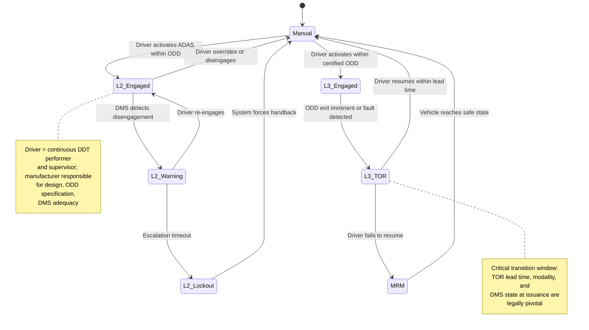
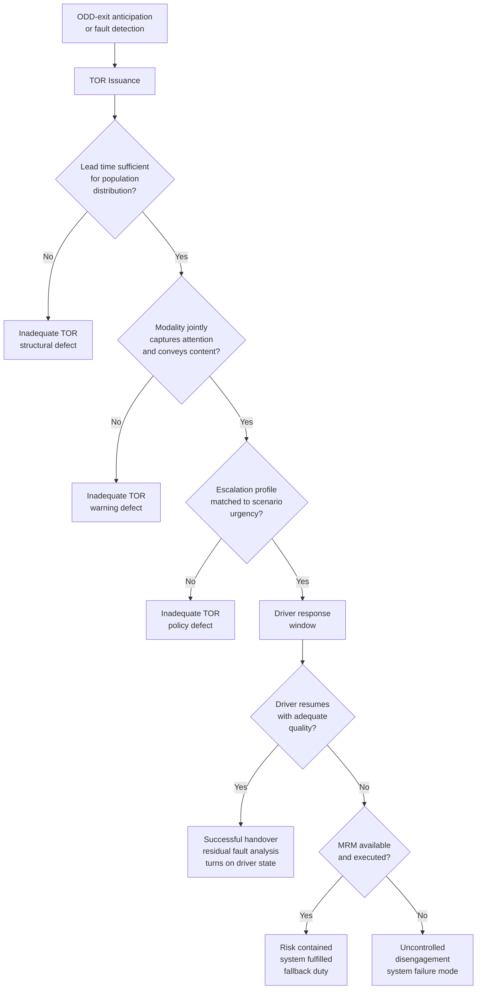
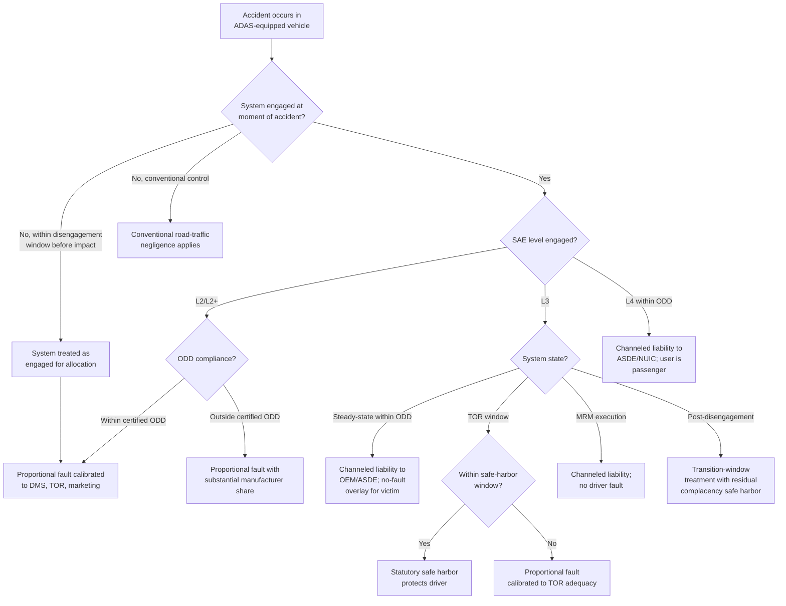
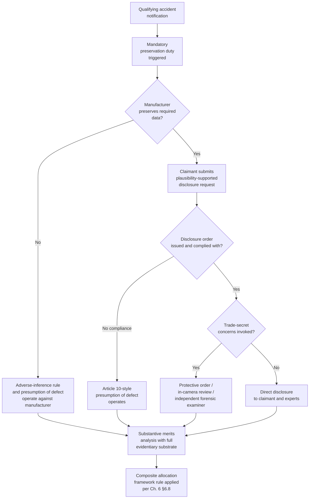
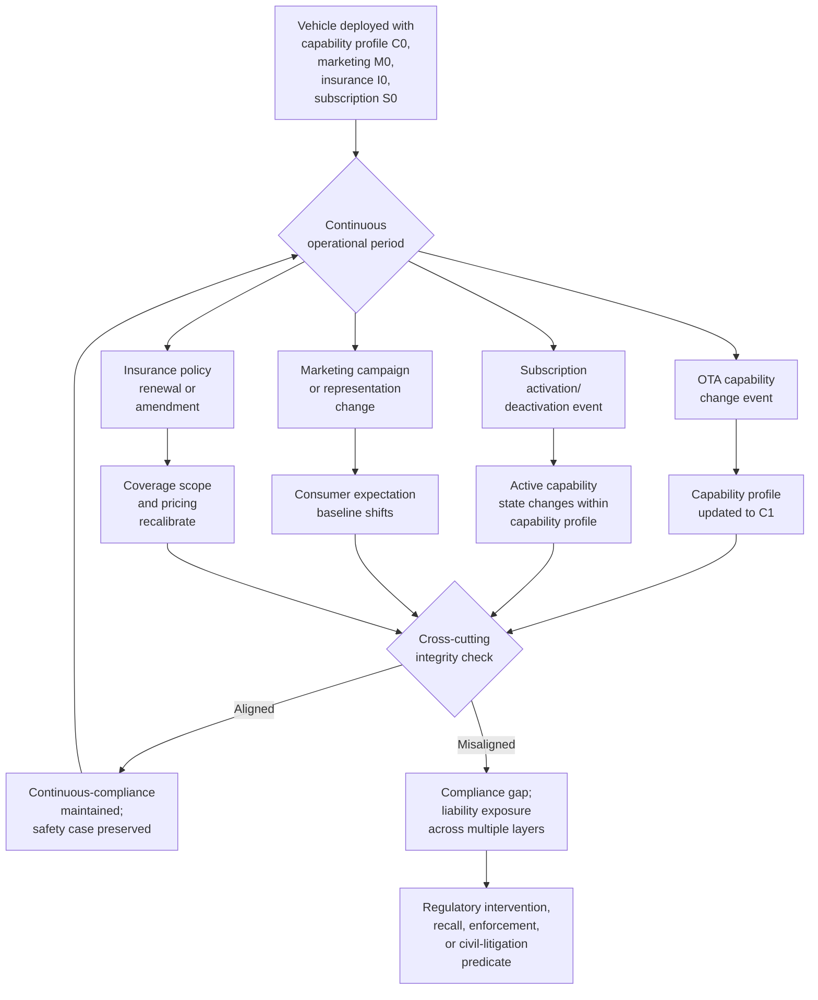
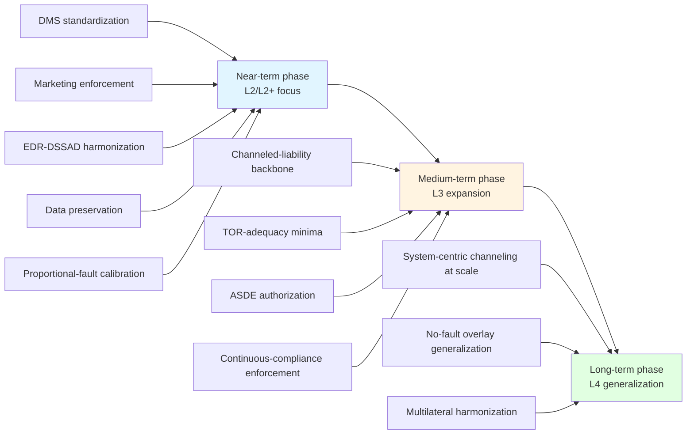

# Liability Allocation in Accidents Involving ADAS-Equipped Vehicles under Human-Machine Cooperative Driving: A Technical, Legal, and Regulatory Analysis
# 1 Introduction: The Liability Dilemma in the Era of Supervised Automation

The automobile, once a paradigmatic instrument of individual human agency, has in the span of a single decade become a hybrid actor in which perception, decision-making, and motion control are continuously negotiated between a human operator and a constellation of sensors, processors, and machine-learning models. This transformation has not arrived through the much-anticipated leap to fully driverless vehicles; rather, it has crept into mainstream passenger transport through the steady, commercially driven diffusion of advanced driver-assistance systems (ADAS) that occupy an intermediate technical and normative space. In this space, the vehicle can steer, brake, accelerate, and even execute lane changes on its own, yet the human behind the wheel remains legally cast as the responsible driver, expected to supervise, intervene, and absorb residual risk. When accidents occur in this configuration, the question of who—or what—is to blame admits no easy answer. The present chapter establishes the conceptual ground on which the remainder of the report will build, articulating why the liability problem posed by supervised automation is genuinely novel, defining the analytical perimeter of the inquiry, and previewing the bridge that must be constructed between the engineering reality of shared control and the doctrinal categories of tort, product, and regulatory law.

## 1.1 The Rise of Human-Machine Cooperative Driving and the Emerging Accountability Gap

ADAS is no longer a luxury feature confined to flagship models. Adaptive cruise control (ACC), lane-keeping assistance (LKA), automatic emergency braking (AEB), and increasingly the combined longitudinal-lateral packages marketed under names such as "Autopilot," "Pilot Assist," "Super Cruise," "Drive Pilot," and "Navigate on Autopilot" (NOA) have become standard or widely available equipment across the global passenger-vehicle fleet. The underlying commercial proposition is straightforward: these features reduce driver workload on monotonous segments of travel—highway commutes, traffic jams, long-distance cruising—and promise measurable safety benefits through reaction times faster than any human can achieve. Yet the same features that relieve workload also restructure the cognitive economy of driving. A driver who is no longer actively steering and modulating speed is a driver whose attention is, by design and by human nature, available for other tasks. The system invites disengagement at precisely the moment that legal frameworks continue to demand engagement.

The consequence of this design tension is a growing class of accidents in which neither a purely human-fault narrative nor a purely product-defect narrative tells the full story. A vehicle operating under an L2 system may follow a lane perfectly until it encounters a stationary truck, an overturned vehicle, or a construction zone whose geometry falls outside the patterns that the system's perception stack was trained to recognize; the system may then fail to brake, fail to issue any warning, or disengage in the final fraction of a second before impact, leaving the human driver with neither sufficient time nor sufficient situational awareness to avert the crash. In other cases, an L3 system may correctly identify the limits of its operational design domain (ODD) and request a takeover, but the human driver—lulled by minutes or hours of reliable automated operation—may respond too slowly or in a startled, error-prone manner. In each scenario, responsibility is genuinely distributed: the technology contributed a perception or planning failure, the human contributed a vigilance or response failure, and the design choices of the manufacturer and the marketing claims of the seller shaped the conditions under which both failures became likely.

Conventional liability frameworks were not built for this distributive reality. They are built on a binary architecture: either the human driver was negligent in the performance of the dynamic driving task, in which case fault-based road-traffic liability applies, or a product was defective in design, manufacture, or warning, in which case product liability applies. Shared-control accidents fit neither category cleanly. The driver was nominally in charge but functionally a supervisor of an opaque automated agent; the product was nominally functioning within its specifications but specified to operate in a manner that predictably erodes the human supervision on which its safety case depends. The result is what may be termed an **accountability gap**: a recurring pattern in which victims face evidentiary and doctrinal barriers to recovery, drivers bear residual liability for failures whose technical causes they could not have understood, manufacturers invoke driver-supervision warnings to deflect scrutiny of their design choices, and insurers struggle to price risks that do not align with traditional actuarial categories. This gap is not merely an academic concern; it directly shapes whether the victim of an ADAS-related crash can obtain compensation, whether a driver wrongly accused of inattention can challenge that characterization with system data, and whether manufacturers face the disciplined incentives needed to make incremental automation safer rather than merely more marketable.

## 1.2 Limitations of Existing Fault-Based and Product Liability Paradigms

The accountability gap can be traced to two conceptual presumptions that anchor the prevailing legal paradigms but no longer correspond to the operational reality of ADAS-equipped driving. The first is the presumption, embedded in negligence-based road-traffic law across virtually every jurisdiction, of a **continuously attentive human driver** who perceives the road environment directly, deliberates in real time, and exercises motor control over the vehicle. Doctrines of reasonable care, foreseeability, and contributory negligence are calibrated to that human agent and yield predictable outcomes when the agent is in fact in control. They become unstable when the human's role is reduced to monitoring an automated agent over extended periods. Empirical research on automation complacency and passive vigilance—issues that will be examined in detail in Chapter 3—demonstrates that the supervisory role assumed by L2 frameworks is one for which human cognition is poorly suited, particularly as the reliability of the underlying automation increases and disconfirming events become rarer. To impose on such a supervisor the same standard of care as on an actively engaged driver is to demand a form of attention that the system's very design discourages, and to do so without adjusting the doctrinal calculus is to convert an engineering limitation into a legal fiction.

The second presumption belongs to product liability law, which conceives of the product as a **discrete artifact with stable characteristics fixed at the moment of sale**. Defect analysis—whether under strict liability, negligence-based design defect doctrines, or the consumer-expectation and risk-utility tests—generally proceeds by comparing the product as delivered to a counterfactual safer design or to consumer expectations formed at the point of purchase. ADAS-equipped vehicles disturb this premise on multiple fronts. Their behavior is governed by software whose parameters can be, and routinely are, altered after sale through over-the-air (OTA) updates; functions that were absent or constrained at delivery may be activated months later, sometimes through subscription purchases, and the vehicle that crashes may be functionally distinct from the vehicle that was sold. Their perception and decision-making rely on neural networks whose internal states resist the kind of root-cause analysis on which traditional defect proof depends. Their safety case is contingent on a human supervisor whose behavior, in turn, is shaped by the system's own design and by the manufacturer's marketing—creating feedback loops that the static-product model is ill-equipped to capture. Foreseeable misuse, ordinarily a marginal consideration, becomes structurally central, because the "misuse" of treating an L2 system as if it were autonomous is precisely what the system's reliability and presentation invite.

Compounding these difficulties is the **dynamic, time-sensitive handover of control** that defines L3 conditional automation and increasingly characterizes the upper end of L2+ functionality. When the locus of control shifts from machine to human in a window measured in seconds, conventional doctrines designed for stable, allocated control struggle to identify the moment at which a duty of care attaches, the standard against which performance must be measured, and the causal contribution of each party to the resulting outcome. Driver monitoring systems (DMS), takeover request (TOR) protocols, and the concept of the "fallback-ready user" introduce a layer of system-mediated obligation that has no precise analog in pre-automation tort law. Neither classical negligence nor classical product liability can, on its own terms, adjudicate a question such as whether a 2.5-second TOR lead time was adequate, whether a steering-wheel torque sensor constituted a sufficient driver-engagement check, or whether the manufacturer's choice to permit hands-off operation outside the certified ODD constituted a design defect, a marketing defect, or simply a foreseeable user choice.

These limitations do not entail that the existing paradigms are obsolete; they remain the indispensable starting point for any liability inquiry, and many ADAS accidents continue to be resolved within their familiar contours. But the limitations do entail that an analytical framework restricted to those paradigms will systematically under-describe the responsibility distribution in shared-control accidents and will produce outcomes that neither compensate victims efficiently nor channel safety incentives appropriately. The argument that animates this report is therefore not that traditional doctrines should be displaced, but that they must be **re-engineered to be sensitive to technical capability boundaries**—to SAE level, ODD, system state at the moment of accident, TOR adequacy, and DMS performance—and that this re-engineering requires a sustained, integrated examination of engineering, legal, and regulatory considerations that no single discipline can supply on its own.

## 1.3 Scope, Definitions, and Analytical Roadmap

To make this examination tractable, the report adopts a deliberately bounded scope. The primary object of analysis is the **passenger vehicle equipped with combined longitudinal-lateral driver-assistance functionality** corresponding to SAE J3016 Levels 2, 2+, and Level 3 conditional automation. This selection is motivated by both empirical and doctrinal considerations: vehicles in this band represent the overwhelming majority of automation-capable vehicles currently on public roads, generate the bulk of contested liability claims involving automation, and occupy the precise zone of shared control in which conventional doctrines are most strained. Fully driverless Level 4 robotaxi operations and Level 5 hypotheticals are addressed only as **comparative reference points**—useful for illustrating channeled-liability and operator-strict-liability models that may eventually inform the supervised-automation domain, but not the central object of inquiry. Commercial vehicles, heavy trucks with platooning capability, and dedicated low-speed shuttles, although technically related, are excluded from the primary scope to avoid conflating regulatory regimes whose underlying use cases and risk profiles differ materially.

Within this scope, several terms recur with sufficient frequency and doctrinal weight that consistent definition is essential. **ADAS** is used throughout to denote vehicle systems that assist the human driver with portions of the dynamic driving task without removing the driver from the supervisory role; in SAE terms, this comprises L1 and L2, with L2+ used as a market-recognized but non-SAE label for L2 systems with extended capabilities such as automated lane changes and navigation-on-autopilot functionality. **L3 conditional automation** is treated as a categorically distinct regime in which the system performs the entire dynamic driving task within its ODD and the human is a fallback-ready user rather than a continuous supervisor. The **operational design domain (ODD)** denotes the specific environmental, geographic, temporal, and traffic conditions under which a given automated function is designed to operate. The **dynamic driving task (DDT)** comprises the operational and tactical functions of driving—lateral and longitudinal control, object and event detection and response, maneuver planning—but excludes strategic functions such as trip planning. The **takeover request (TOR)** denotes the system-issued signal demanding that the human driver resume control of the DDT, and is the legally pivotal moment at which responsibility transitions between machine and human in L3 operation. **Human-machine cooperative driving** is used as the umbrella concept covering all configurations in which the DDT is shared, dynamically or in allocated fashion, between a human and an automated system. Where divergent jurisdictional terminology is relevant—for example, the "Authorised Self-Driving Entity" of the United Kingdom's Automated Vehicles Act 2024 or the "user-in-charge" concept—those terms will be introduced in their proper jurisdictional context.

The report's analytical architecture moves systematically from technical predicate to legal consequence, and from doctrinal analysis to policy synthesis. The roadmap of the chapters that follow may be summarized as follows:

| Chapter | Function | Core Contribution |
|---------|----------|-------------------|
| 2 | Technical foundations | Maps sensor fusion, perception, DMS, HD maps, and SAE levels to the architecture of shared control, establishing the technical predicate for legal attribution |
| 3 | Failure modes and takeover dynamics | Analyzes perception failures, lateral-control breakdowns, TOR adequacy, and human-factor realities that drive foreseeability and reasonableness assessments |
| 4 | Legal frameworks and comparative regulation | Surveys negligence, product liability, warranty, and operator strict liability across the US, EU, UK, Germany, Japan, and China |
| 5 | Case law and investigations | Distills lessons from Tesla Autopilot litigation, the Uber ATG Tempe fatality, and other regulatory investigations |
| 6 | Allocation models | Compares proportional fault, joint-and-several, channeled liability, no-fault pools, and SAE-state-contingent hybrids across the supply chain |
| 7 | Evidentiary and forensic challenges | Examines EDR, DSSAD, telematics access, and the algorithmic black box, and proposes burden-of-proof reallocations |
| 8 | Cross-cutting issues | Addresses subscription business models, OTA updates, marketing terminology, and insurance design |
| 9 | Regulatory recommendations | Proposes tiered, technology-aware liability rules, TOR minima, DMS standards, and DSSAD harmonization |
| 10 | Conclusion and open questions | Consolidates findings and identifies research and policy frontiers |

The logical flow of the report can be visualized as a progression from technical capability through doctrinal mismatch to integrated policy synthesis:


The blue chapters establish the technical and behavioral predicates; the orange chapters develop the doctrinal and case-law analysis; the red chapters construct allocation, evidentiary, and contextual frameworks; and the green chapters synthesize recommendations and identify open questions. Each transition is calibrated to ensure that legal conclusions remain anchored in technical realities and that technical descriptions are translated into doctrinally operative categories.

Two interpretive commitments inform the report throughout and warrant flagging at the outset. First, the analysis is **SAE-level and system-state sensitive**: liability conclusions valid for an L2 system at the moment of disengagement may not transfer to an L3 system within its ODD, and conclusions valid for steady-state operation may not transfer to the transition window following a TOR. Generic, level-agnostic claims about "self-driving liability" are treated with skepticism. Second, the analysis is **multi-actor and causally distributed**: it resists collapse into binary driver-versus-manufacturer framings, and it treats Tier-1 suppliers, software and AI developers, HD-map providers, fleet operators, regulators, and marketers as discrete potential locuses of responsibility wherever the evidence supports such treatment. Where empirical or doctrinal sources are contested, where data are unavailable, or where claims circulating in the secondary literature have not been reliably traced to primary materials, the report will say so plainly rather than paper over the gap with inference. The objective is not a tidy resolution of every open question—the field is too immature and too rapidly evolving for that ambition to be credible—but a framework rigorous enough to absorb the next decade of technical development, case law, and regulatory experimentation as automation moves, incrementally and unevenly, from supervised assistance toward genuine autonomy.

# 2 Technical Foundations of ADAS and the Architecture of Shared Control

The accountability gap identified in Chapter 1 cannot be closed through doctrinal reasoning alone. Whether a particular accident reflects driver inattention, a perception failure, a decision-stage misjudgment, an inadequate handover protocol, or an emergent failure of the human-machine system as a whole is, in the first instance, an engineering question; only once the technical architecture is articulated with sufficient precision can legal categories such as defect, foreseeability, reasonable alternative design, and the standard of care be applied without distortion. This chapter therefore lays out the technical predicate on which the remainder of the report rests. It proceeds from the outside in—from the sensors that make the world legible to the vehicle, through the algorithms that translate that legibility into motion, through the compute and connectivity substrate that holds the whole assembly together, to the driver-monitoring and human-machine interface layer that mediates between machine and operator—and concludes by mapping these components onto the SAE J3016 taxonomy and the concept of the operational design domain (ODD), so as to delineate where system responsibility can realistically be said to begin and end. The objective is not technological exhaustiveness but doctrinal usefulness: each subsection isolates the engineering features that will recur, in subsequent chapters, as the load-bearing facts of liability disputes.

## 2.1 Sensing and Perception Stack: Cameras, Radar, LiDAR, and Sensor Fusion

Modern ADAS begins with a heterogeneous suite of sensors whose individual physical principles, ranges, and failure modes determine, in large measure, what the vehicle is capable of "seeing"—and, by negative implication, what it is structurally incapable of seeing. **Monocular and stereo cameras** provide high-resolution color and texture information and are the principal modality for lane-marking detection, traffic-sign and signal recognition, and object classification through deep neural networks; their weaknesses are well known and physically irreducible, including degraded performance in low light, direct sun glare, heavy rain, snow, fog, and conditions where the contrast between an object and its background collapses. Stereo cameras add a measure of depth estimation but inherit the optical limitations of the underlying imaging chain. **Radar sensors**, both short-range (typically 24 GHz, used for blind-spot monitoring and rear cross-traffic) and long-range (77/79 GHz, used for adaptive cruise control and forward-collision functions), provide robust range and range-rate measurements largely insensitive to weather and lighting, but at coarse angular resolution; classical automotive radar has historically struggled to distinguish stationary objects from background clutter, with the practical consequence that many systems filter out non-moving returns to suppress false positives—the same filtering that, in failure cases, can render a stopped fire truck or an overturned trailer invisible to the controller. Higher-resolution **imaging radars (4D radar)** ameliorate this limitation but do not eliminate it. **LiDAR**, by emitting laser pulses and measuring time-of-flight, generates dense three-dimensional point clouds with high geometric fidelity, performs well at night, and is particularly useful for free-space estimation and the detection of irregularly shaped or unclassifiable obstacles; its weaknesses include reduced effective range in heavy precipitation, sensitivity to retroreflective and absorptive surfaces, cost (which has driven its absence from many production L2 systems), and—until recently—mechanical complexity. **Ultrasonic sensors** support low-speed parking and proximity functions but contribute little to highway-speed perception. **Inertial measurement units and GNSS receivers**, often coupled with wheel-speed odometry and increasingly with real-time kinematic correction, anchor the vehicle in a global frame and support map-based localization, but their accuracy degrades in tunnels, urban canyons, and multipath environments.

The complementarity of these modalities is the engineering rationale for **sensor fusion**, the algorithmic process by which signals from heterogeneous sensors are combined into a unified representation of the driving scene. Fusion can be implemented at different levels of abstraction. **Early (low-level) fusion** combines raw or lightly processed signals—pixel-aligned camera and LiDAR data, for example—before object-level inference, preserving information at the cost of computational and calibration burden. **Late (high-level) fusion** runs separate detection pipelines per sensor and fuses the resulting object lists, which is computationally efficient and modular but discards cross-modal evidence that an object weakly detected by one sensor and weakly detected by another may, jointly, warrant high-confidence response. **Hybrid (mid-level) fusion** combines feature representations at intermediate layers and is increasingly favored in production systems. Whichever architecture is selected, the fused output typically takes the form of an **object list** (each entry tagged with class, position, velocity, and a confidence score), a **free-space or occupancy grid** describing the drivable area, and a **lane-geometry representation** describing the vehicle's road context.

For the purposes of later legal analysis, the perception stack should be understood not as a generic "vision" capability but as a layered set of specific design choices, each of which can fail in characteristic ways. The points at which production ADAS perception is known to be fragile—and which therefore recur in accident investigations—include the **discrimination of static obstacles in the ego lane** at highway speed, where radar filtering and the absence of training data for unusual stopped configurations have historically produced missed detections; **adverse-weather degradation**, in which camera occlusion by rain, snow, fog, or sensor soiling reduces the system to whatever modalities remain functional, often without an explicit confidence-bounded handback to the driver; **partial occlusion**, where a target is intermittently visible behind other traffic and its track is dropped or reacquired with unstable identity; **edge-case object classification**, in which objects outside the training distribution—overturned vehicles, oddly shaped debris, animals, pedestrians in non-canonical postures—are either misclassified or excluded from the object list entirely; and **lane-geometry failures** at construction zones, faded markings, sharp curvature, and forks where multiple plausible interpretations coexist. Each of these failure points furnishes the engineering vocabulary in which Chapter 3 will analyze typical ADAS failure modes, in which Chapters 4 and 5 will assess design-defect arguments under product liability doctrine, and in which Chapter 7 will frame the evidentiary problem of reconstructing what the system perceived—or failed to perceive—at the moment of accident.

## 2.2 Decision, Planning, and Control: From Perception to Vehicle Motion

The perception stack is necessary but not sufficient: a vehicle that "sees" correctly may still drive incorrectly if the layers that translate perception into motion misjudge intent, plan poorly, or actuate imprecisely. This downstream chain consists, in most contemporary architectures, of four distinguishable stages: behavior prediction, trajectory planning, motion control, and actuator command.

**Behavior prediction** estimates, for each tracked object in the perceived scene, a probability distribution over future trajectories. Pedestrians may step into the road or remain on the curb; an adjacent vehicle may merge, brake, or maintain course; a cyclist may change lanes; a leading vehicle may execute an emergency stop. The quality of these predictions depends both on the richness of the object representation upstream and on the model used to generate them—ranging from physics-based extrapolations and rule-based maneuver classifiers to learned models that exploit interaction-aware deep networks. Prediction errors are a recurrent contributor to ADAS shortcomings: a system that assumes a stopped vehicle will remain stopped may fail to plan a safe path around it; a system that fails to anticipate a cut-in may brake late or harshly. **Trajectory planning** then selects a path and speed profile for the ego vehicle that satisfies kinematic constraints, comfort criteria (limits on longitudinal and lateral acceleration and jerk), regulatory constraints (lane discipline, speed limits), and safety margins (time-to-collision, gap acceptance). Planning architectures range from sampling-based methods and optimization-based approaches to increasingly **end-to-end learning models** that map sensor inputs directly to control commands, compressing the prediction-planning-control chain into a single neural network. **Motion control** decomposes into longitudinal control (typically a cascaded PID or model-predictive controller modulating throttle and brake to track a desired speed or following distance) and lateral control (typically a model-predictive or Stanley-type controller modulating steering torque to track a desired path); the **actuator command** layer translates these set points into commands on the vehicle's brake-by-wire, electric power steering, and powertrain interfaces, with safety-critical arbitration between automated and human inputs.

The legally salient feature of this chain is that every stage encodes **design choices** rather than physical inevitabilities. The decision to brake aggressively at a given perceived time-to-collision rather than mildly, the gap thresholds for permitting an automated lane change, the cornering speeds permitted within the lane-keeping envelope, the conditions under which the system attempts a minimum-risk maneuver (MRM) versus a hard disengagement, and the priority rules for resolving conflicting objectives (occupant comfort versus collision avoidance, lane discipline versus evasive maneuvering) are all parameter and policy choices made by the manufacturer. They constitute the substrate on which doctrinal questions about reasonable alternative design, foreseeability of failure, and the existence of safer feasible alternatives are litigated. A system that, by design, accepts narrower safety margins to deliver more naturalistic driving feel may—on precisely the same perception input—produce a different outcome than one tuned more conservatively, and the choice between these tunings is a manufacturer responsibility that does not depend on any sensor failure to engage product-liability analysis.

A second salient feature is **decision opacity**. Rule-based components remain auditable in principle: the engineer can, at least in theory, trace why a given input produced a given output by walking through the decision tree. Learning-based components—neural networks for prediction, learned planning policies, and especially end-to-end models—do not yield such tractable traces. They produce outputs whose causal genealogy lies in millions of weight values shaped by training data whose composition may itself be proprietary, incomplete, or biased. This opacity has three immediate liability implications, each developed in later chapters: it complicates the **attribution of decision-stage failures** between training-data deficiencies (potentially implicating data providers and labeling vendors), model architecture and validation choices (implicating the OEM or AI software supplier), and operational integration (implicating the OEM's integration and verification process); it strains conventional **defect-proof methodologies** that rely on demonstrating a deviation from intended behavior; and it foregrounds the **evidentiary challenge** of reconstructing decision-stage causation from logs that may capture inputs and outputs but not the model's intermediate reasoning. Finally, the **minimum-risk maneuver logic**—the policy by which a system that cannot safely continue brings the vehicle to a controlled stop, narrows lateral excursion, or hands back to the driver—deserves particular notice because it is the technical feature most directly translatable into a normative duty: the obligation, increasingly reflected in regulatory texts, to ensure that automated failure does not crystallize into uncontrolled risk.

## 2.3 Compute, Connectivity, HD Maps, and Over-the-Air Update Architecture

Perception, prediction, planning, and control collectively impose substantial computational demands that have, in turn, restructured the vehicle's electronic architecture. Where earlier vehicles relied on dozens of distributed electronic control units (ECUs) connected by Controller Area Network (CAN) buses, ADAS-capable vehicles increasingly centralize critical functions on **high-performance domain controllers** or zonal architectures built around automotive-grade systems-on-chip (SoCs) with integrated CPU, GPU, and dedicated neural-network accelerators. These platforms are connected by high-bandwidth in-vehicle networks (automotive Ethernet, FlexRay) that permit the rapid transport of dense sensor data and the synchronous orchestration of safety-critical functions. The capacity, latency, and thermal characteristics of this compute substrate are not incidental: they determine how many sensor streams can be fused at what frequency, how complex a planning policy can be evaluated in real time, and—crucially—what redundancy and degradation strategies remain available when individual components fail.

Above this substrate sits a **connectivity and data layer** that has no precedent in pre-ADAS vehicles. Cellular modems (4G/5G), satellite-based positioning, and increasingly vehicle-to-everything (V2X) interfaces connect the vehicle to off-board services. **HD maps** represent one of the most consequential off-board dependencies: high-precision, lane-level digital representations of road geometry, lane semantics, traffic-control devices, and sometimes even surface conditions, used to localize the vehicle within centimeters and to extend the system's effective perception horizon beyond the range of its onboard sensors. Where HD maps are integral to the ODD definition—as in many L3 systems and in the geofenced operation of advanced L2+ navigate-on-autopilot functions—they become a load-bearing safety element whose accuracy, freshness, and version control are functionally on a par with the vehicle's own sensors. The provider of these maps therefore enters the responsibility chain as a discrete actor whose performance can be evaluated independently of the OEM's own design.

The most consequential feature of the connectivity layer for liability analysis is, however, the **over-the-air (OTA) update**. OTA mechanisms allow the manufacturer (or its suppliers, through the manufacturer's distribution chain) to modify the software running on safety-critical compute platforms after sale, often without any user action beyond accepting an update notification. The substantive scope of these updates ranges from bug fixes and security patches, through performance improvements and recalibrations, to the activation of entirely new functions—lane-change automation, hands-off operation in expanded ODDs, navigation-on-autopilot capabilities—sometimes contingent on subscription purchase. Functionally, this means that the vehicle that is on the road today is software-different from the vehicle that was sold, and the vehicle that crashes tomorrow may be software-different from the vehicle that was on the road this morning. The static-product premise discussed in Chapter 1—that the product's characteristics are fixed at the moment of sale—is, in OTA-equipped vehicles, simply false as a matter of engineering reality.

Several second-order consequences flow from this. First, the **window of manufacturer responsibility** extends, in practice, throughout the operational life of the vehicle, because the manufacturer retains both the technical ability and the commercial incentive to alter the vehicle's behavior. Second, **version control and rollback capability** become themselves safety-critical features: the ability to identify, for any given accident, the precise software version active at the moment of crash, and to roll back a defective update across the deployed fleet, becomes a regulatory and evidentiary necessity, foreshadowing the data-storage requirements analyzed in Chapter 7. Third, the OTA channel creates a **distributed locus of responsibility** that includes not only the OEM but also the SoC vendor (whose firmware updates may modify behavior), the perception or planning software supplier (whose model updates may alter decision-stage behavior), and the HD-map provider (whose map updates may alter the system's effective ODD). Fourth, the post-sale alteration of vehicle behavior raises distinct doctrinal questions about **continuous compliance obligations**, the duty to update or warn after deployment, and the relationship between OTA capability and recall law—issues developed in Chapter 8.

## 2.4 Driver Monitoring Systems and the Human-Machine Interface

Because L2 and L2+ systems leave the human driver legally responsible for the dynamic driving task, and because L3 systems require the human to resume that task on demand within a defined ODD, the **technical means by which the vehicle assesses, sustains, and elicits driver engagement** are not peripheral—they are constitutive of the safety case for these systems. Driver monitoring system (DMS) design choices therefore translate directly into liability conclusions in two distinct directions: an inadequate DMS may render the manufacturer's reliance on driver supervision unreasonable and contribute to a design-defect finding, while a robust DMS, when its data are available, may furnish dispositive evidence of driver inattention that bears on contributory fault.

DMS implementations span a spectrum of technical sophistication. The most basic—and historically the most common—rely on **steering-wheel torque sensors** that infer driver presence from the application of small torques to the wheel; these are easily defeated by weights, oranges wedged into the wheel, or simple resting of a hand, and they do not assess where the driver is actually looking. **Capacitive steering-wheel sensors** detect the presence of hands more reliably but, again, do not measure attention. **Camera-based DMS**, increasingly standard on advanced L2+ and required in many emerging regulatory frameworks, use infrared cameras directed at the driver to track gaze direction, eyelid closure, head pose, and—in the most sophisticated systems—signs of drowsiness, distraction, or impairment. The progression from torque-based to gaze-based monitoring marks a qualitative shift: the system moves from inferring engagement indirectly to observing it, with corresponding implications for the reasonableness of relying on the driver as a fallback.

Coupled with the monitoring channel is the **alerting and escalation channel** through which the vehicle communicates with the driver. Visual alerts on the instrument cluster or head-up display, auditory chimes of varying urgency, haptic cues delivered through steering-wheel vibration or seat-belt pretensioning, and—in advanced implementations—escalating multi-modal warnings that culminate in automated functions being disabled for the remainder of the trip ("strikeout" policies) constitute the technical inventory from which manufacturers compose their supervision-enforcement strategies. The adequacy of these strategies is a function not only of the modalities employed but of the **escalation timing**: how quickly the system progresses from a soft visual nudge to an unmissable auditory and haptic warning when monitoring indicates disengagement.

The **takeover request (TOR)** is the most consequential single moment in this human-machine choreography, particularly in L3 operation. A TOR is the signal by which the system, upon recognizing that it is approaching the limits of its ODD or that a fault condition prevents continued safe automated operation, demands that the human resume the dynamic driving task. The technical design of the TOR involves several discrete parameters, each with direct legal salience: the **lead time** between the issuance of the request and the moment at which the system can no longer guarantee safe continuation; the **modality and intensity** of the request (visual only, visual plus auditory, visual plus auditory plus haptic); the **escalation profile** if the driver does not respond; and the **fallback behavior** if takeover does not occur within the available window. This last element—the **minimum-risk maneuver (MRM)**—is the system-side commitment to bringing the vehicle to a controlled state (typically a deceleration to a stop in lane or on the shoulder, with hazard lights activated) rather than simply disengaging into uncontrolled motion. The technical adequacy of TOR lead times, the empirical question of how long humans realistically require to regain situational awareness and motor control after extended automation, and the doctrinal question of whether an inadequate TOR shifts liability from driver to manufacturer constitute the central problem of Chapter 3 and recur throughout the report.

A final feature of the human-machine interface that deserves explicit notice is the **system-state communication** to the driver. Whether the vehicle is in a fully manual mode, a partially assisting mode, an L2 hands-on mode, an L2+ hands-off mode within ODD, an L3 mode within ODD, a transition window after a TOR, or a degraded fallback mode is information that must be conveyed unambiguously and continuously, because the driver's residual obligations differ categorically across these states. The clarity of mode indication, the prevention of mode confusion (in which the driver believes the system is in a different state than it actually occupies), and the discoverability of operational boundaries are HMI design choices that bear directly on whether driver behavior in a given accident can be characterized as reasonable or as foreseeably mistaken—a distinction central to the case-law analysis of Chapter 5 and the marketing-and-representation analysis of Chapter 8.

## 2.5 SAE J3016 Levels, Operational Design Domain, and the Allocation of the Dynamic Driving Task

The technical components surveyed in the preceding subsections do not, by themselves, dictate any particular allocation of responsibility between human and machine. That allocation is supplied by the **SAE J3016 taxonomy**, which has become the lingua franca through which manufacturers, regulators, and—increasingly—courts describe what a given system does and does not do. The taxonomy is functional: it classifies driving automation systems not by the sophistication of their hardware but by who or what performs the dynamic driving task (DDT), who or what monitors the driving environment, who or what serves as the fallback when automation cannot continue, and within what operational design domain the system is designed to operate. The resulting six-level structure is summarized in the following table, which integrates the technical components developed earlier with the SAE allocation rules.

| Level | DDT Performed By | Environment Monitoring | Fallback | ODD | Typical Technical Configuration | Driver's Legal Posture |
|-------|------------------|-----------------------|----------|-----|--------------------------------|-----------------------|
| L1 | Human (one DDT subtask supported) | Human | Human | Limited | Single-axis automation (ACC or LKA) | Continuous DDT performer |
| L2 | Human (system supports both lateral and longitudinal) | Human | Human | Limited | Combined ACC + LKA, basic torque-based DMS | Continuous supervisor of own DDT |
| L2+ | Human (extended functions, hands-off in some implementations) | Human | Human | Expanded but not certified for L3 | NOA, automated lane change, camera-based DMS in advanced versions | Continuous supervisor; responsible for DDT |
| L3 | System (within ODD) | System (within ODD) | Human (after TOR, with lead time) | Defined and certified | Robust sensor suite (often including LiDAR), redundant compute, mature DMS, MRM logic | Fallback-ready user; not supervisor during automated operation |
| L4 | System | System | System (MRM) | Defined | Full autonomous stack with redundancy | Passenger within ODD; no fallback obligation |
| L5 | System | System | System | Unrestricted | Hypothetical | Passenger |

Two features of this taxonomy carry the bulk of the doctrinal weight that later chapters will mobilize. The first is the **categorical shift between L2 and L3**. At L2, however sophisticated the system's hardware, the human remains the legal performer of the dynamic driving task; the system assists, but the human's eyes-on, mind-on supervisory obligation is continuous and unrelieved. At L3, by contrast, the system performs the entire DDT within its ODD, and the human's obligation is reduced to that of a **fallback-ready user**—someone who need not continuously monitor the driving environment but must remain available, within a defined response window, to resume control upon a properly issued TOR or upon recognizing a system fault. The shift is not gradual; it is categorical, because it reallocates the duty to perceive and respond to driving events from the human to the machine for the duration of automated operation. Regulatory frameworks examined in Chapter 4—Germany's L3 amendments to the Road Traffic Act, Japan's analogous provisions, the United Kingdom's Automated Vehicles Act 2024, and emerging Chinese regulations—have begun to codify this shift, and the doctrinal consequences are accordingly substantial.

The second feature is the **market-driven ambiguity of L2+**. SAE J3016 itself does not define an "L2+" level; the term is a marketing and industry convenience that encompasses L2 systems with capabilities approaching, but formally short of, L3—hands-off lane keeping, automated lane changes, navigation-on-autopilot, and operation across more permissive ODDs than basic L2. The legal significance is twofold. First, regardless of how capable the system feels to the user or how it is marketed, an L2+ system remains, doctrinally, an L2 system: the human is the continuous performer of the DDT and bears the corresponding duty of care, irrespective of whether the system's hardware is sophisticated enough to support extended hands-off operation. Second, the very capability that defines L2+—reliable, naturalistic, extended automated behavior—maximizes the cognitive conditions under which automation complacency, passive vigilance failure, and overreliance flourish. This is the engineering origin of what Chapter 1 termed the accountability gap, and it is the technical fact that makes DMS adequacy, TOR design, marketing representation, and ODD permissiveness the central battlegrounds of L2+ liability.

The **operational design domain (ODD)** modulates these allocations across all levels. The ODD specifies the conditions—road type, geographic area, speed range, weather, lighting, traffic complexity, lane-marking quality, presence of HD-map coverage—under which the system is designed and certified to operate. Operation outside the ODD is, in principle, the driver's responsibility to prevent or terminate at L1 and L2; at L3, the system itself is responsible for recognizing impending ODD exit and issuing a TOR with adequate lead time; at L4, the system must execute an MRM rather than degrade unsafely. The ODD is therefore the technical artifact that translates raw capability into bounded responsibility: a system whose ODD is narrowly drawn and conscientiously enforced confines its safety claims to a tractable scope, while a system whose ODD is broadly drawn—or, more controversially, whose engagement is permitted by the manufacturer in environments outside the certified ODD—expands the manufacturer's substantive exposure precisely because the safety case no longer constrains operation. ODD specification, ODD enforcement (via geofencing, scene-classification interlocks, and engagement criteria), and the consistency between ODD as represented in marketing, ODD as represented in user manuals, and ODD as enforced by software constitute a recurring locus of dispute that the case-law analysis of Chapter 5 will revisit.

The relationships among SAE level, ODD, system state, and the allocation of responsibility can be summarized as a state-transition view of shared control, in which each transition is also a moment of potential liability exposure:



The diagram makes explicit what the table summarizes: responsibility is not a static attribute of a vehicle or a driver but a function of the **system state** at any given moment. An accident in steady-state L2 operation is doctrinally and evidentially distinct from an accident in the L3 transition window, and an accident during MRM execution is distinct from both. The "system state at the moment of accident," together with the SAE level at which the system was operating, the ODD parameters that applied, and the DMS-reported engagement of the driver, constitutes the irreducible factual matrix on which any defensible liability conclusion must rest. Chapter 3 will populate this matrix with the failure modes and human-factor realities that determine which states are most vulnerable to which kinds of failure; Chapter 4 will translate it into doctrinal categories; Chapters 5 through 8 will test it against case law, allocation models, evidentiary regimes, and contextual phenomena; and Chapter 9 will return to it as the substrate on which technology-aware regulatory recommendations are constructed.

What this technical foundation establishes, in summary, is that the architecture of shared control is not monolithic. It is a layered system in which sensors, fusion algorithms, prediction and planning models, compute platforms, connectivity and map dependencies, OTA channels, driver monitoring, human-machine interfaces, and SAE-level allocations interact dynamically and in ways that vary across system states. Each layer contains identifiable failure modes and design choices that can, in principle, be evaluated against alternative configurations and against the empirical record of automation behavior in the field. Each layer therefore furnishes a discrete handhold for legal analysis—an engineering predicate against which doctrinal categories such as defect, foreseeability, reasonable care, and channeled responsibility can be applied with the precision that the accountability gap demands.

# 3 Failure Modes, Takeover Dynamics, and the Allocation of Foreseeability in Human-Machine Cooperative Driving

Chapter 2 closed with the observation that responsibility in supervised automation is not a static attribute but a function of system state, SAE level, ODD compliance, and the dynamic interaction between machine and operator. The present chapter populates that abstract matrix with the empirical realities that determine when and how the matrix collapses into an accident. Three lines of inquiry converge here. The first is a catalogue of the technical failure modes that recur in ADAS-related crashes, traced to their engineering origins so that their foreseeability—and therefore their doctrinal significance—can be assessed. The second is the human-factors record on what extended supervisory operation does to driver cognition, with particular attention to the systematic, predictable degradations that flow from the system's own reliability rather than from idiosyncratic user fault. The third is the takeover request, which the report treats as the legally pivotal moment of control transfer and which empirical research increasingly reveals to be a far more delicate engineering and behavioral artifact than the doctrinal language of "handover" suggests. Throughout, the analytical objective is to convert engineering and human-factors evidence into the predicates of foreseeability and reasonableness on which Chapters 4 through 9 will construct doctrinal, evidentiary, and regulatory conclusions.

## 3.1 Typical ADAS Failure Modes Generating Liability Disputes

The accidents that generate the most contested ADAS liability claims are not, in the main, accidents of catastrophic hardware failure. They are accidents in which the system performs more or less as designed, but in which the design itself proves inadequate to a scenario that, while perhaps statistically uncommon, is far from genuinely unforeseeable to the engineering organization that built it. A useful taxonomy organizes these failures by the stage of the perception-prediction-planning-control chain at which the breakdown originates, because each stage corresponds to a different set of design choices and therefore to a different distribution of upstream actors whose conduct may be implicated.

The first and most visible category is **missed detection of static or quasi-static obstacles in the ego lane**. The canonical instances—stopped emergency vehicles in highway lanes, overturned trailers presenting an unfamiliar silhouette, low-speed or stationary lead vehicles after a sudden traffic stop, and stationary debris of irregular geometry—share a common engineering origin in the design choices of the perception and fusion stack. Production radars, as Chapter 2 noted, have historically filtered stationary returns to suppress clutter; cameras may classify an overturned vehicle's underbody, its wheels exposed to the road, as an unrecognized object falling outside the trained distribution; LiDAR, where present, may correctly register the geometry but be overruled in fusion logic that weights the radar object list. The failure is not that "the system did not see" the obstacle in any naive sense, but that the system's confidence-weighting and object-list construction policies, calibrated to a trade-off between false negatives and the false positives that would otherwise produce phantom braking, treated the relevant return as below the threshold for response. From a foreseeability standpoint, these scenarios are not edge cases discovered post hoc: they are well documented in the engineering literature, in regulatory investigations, and in the manufacturer's own validation testing. Their recurrence in the accident record therefore furnishes the empirical predicate against which the design-defect and warning-defect arguments developed in Chapters 4 and 5 will be evaluated.

A closely related but distinct category is **misclassification of irregularly shaped or out-of-distribution objects**. Where the missed-detection failure mode reflects a system that filtered or de-weighted a return, the misclassification mode reflects a system that registered the object but assigned it to a class that triggered an inappropriate response policy—classifying a perpendicular truck trailer as an overhead sign and therefore as drivable space, classifying a pedestrian carrying an unusual object as a non-pedestrian, or oscillating between classifications in a way that prevents the planner from converging on a coherent response. The engineering origin of these failures lies primarily in the training-data composition of the underlying neural networks: a class that is rare in the training distribution will be misclassified at higher rates in deployment, and the absence of explicit fail-safe logic for low-confidence or oscillating classifications converts a probabilistic perception defect into a deterministic motion outcome. This distribution of cause is doctrinally significant because it implicates not only the OEM but, potentially, the upstream perception-software supplier and the providers of training and validation data—an attribution problem developed in Chapter 6.

A third category encompasses **lateral-control breakdowns** on roadway geometries that strain the lane-keeping function. Sharp curvature relative to the system's tuned envelope, bifurcating lanes at gore points, faded or absent markings in construction zones, and lanes that disappear or reconverge in patterns inconsistent with the system's prior representation are the typical loci. Here the failure cascade frequently begins in perception (the lane-geometry estimator loses confidence or follows the wrong line) and propagates through control (the steering policy continues to track an incorrect path until it cannot, at which point the system may either disengage abruptly or attempt a corrective maneuver that exceeds comfortable handling limits). Where HD-map dependency is part of the system's design, a stale or incorrect map can compound this failure by sustaining the planner's confidence in a road geometry that no longer obtains.

A fourth category consists of **prediction errors regarding the behavior of other road users**. A leading vehicle that brakes harder than the system's prediction model anticipated, a vehicle cutting in at a closing speed and gap below the system's gap-acceptance thresholds, and pedestrians or cyclists whose trajectories are inadequately captured by the prediction model produce planning outputs that are timely but incorrect: the vehicle plans a path or speed profile premised on an inference about the future that the world then falsifies. The doctrinal significance of this failure mode is that it cannot be characterized as a sensing failure—the relevant agents were perceived—and therefore cannot be excused by reference to weather, lighting, or sensor limits. It is a failure of the model of other agents that the system's designers chose to deploy, and as such is a particularly clean instance of design-stage responsibility.

A fifth and operationally distinct category is the **abrupt system disengagement without adequate warning**, in which the vehicle, on encountering conditions outside its competence, returns control to the human in a manner and on a timescale that the human cannot reasonably absorb. Regulatory investigations have repeatedly noted that some L2 systems disengage in the seconds preceding an impact, with the practical and evidentiary consequence that the system was technically not engaged at the moment of crash. Whether a disengagement that occurs less than a second before impact constitutes a meaningful return of control is a question with no plausible answer on the human-factors evidence; it functions, in liability terms, as a failure mode in its own right, irrespective of how the underlying perception or planning stack would otherwise be characterized. This pattern is particularly significant for the analytical project of this report because it directly tests the binary—was the system "on" or "off"?—that conventional liability framings rely upon, and it foreshadows the evidentiary challenges of reconstructing system state explored in Chapter 7.

| Failure Mode | Primary Engineering Origin | Implicated Actors | Foreseeability Status |
|---|---|---|---|
| Missed detection of static obstacles in ego lane | Radar stationary-return filtering; fusion confidence thresholds; absent training instances | OEM, perception software supplier, sensor supplier | Well documented; not genuinely novel |
| Misclassification of out-of-distribution objects | Training-data composition; absence of low-confidence fail-safe | OEM, AI software supplier, data labeling provider | Distribution-driven; predictable in aggregate |
| Lateral-control breakdown on curves and degraded markings | Lane-geometry estimator confidence; control-policy tuning; map staleness | OEM, HD-map provider | Recurrent in deployed fleets |
| Prediction errors for cut-ins and pedestrian behavior | Behavior-prediction model architecture and training | OEM, planning-software supplier | Inherent to current modeling state of the art |
| Abrupt disengagement without adequate warning | Engagement-policy design; absence of MRM logic; insufficient TOR lead time | OEM (integration and policy choice) | Pattern observed across regulators' investigations |

The unifying analytical point across these categories is that each failure mode is **statistically rare in any given drive but structurally recurrent in any deployed fleet**. A vehicle can drive thousands of miles without encountering an overturned truck or a faded gore-point lane geometry; a million-vehicle fleet driving a billion miles will encounter such scenarios continuously. Foreseeability under negligence and product-liability doctrine is not measured at the level of the individual trip but at the level of the design organization, and at that level these failure modes are well within the foreseeable horizon of the engineering teams that build, validate, and deploy ADAS. The case-law and doctrinal chapters that follow will return to this point repeatedly: the question is rarely whether a particular failure could have been anticipated as a possibility, but whether the design choices made in the face of that anticipated possibility were reasonable.

## 3.2 Driver Distraction, Automation Complacency, and Passive Vigilance

If the failure modes catalogued above are the technical raw material of ADAS liability disputes, the human-factors record is the second indispensable input. The empirical literature on supervisory degradation in automated systems is mature, predates the automotive context, and has converged on a set of phenomena that any allocation of responsibility in shared-control accidents must internalize.

The foundational observation, drawn from decades of aviation and process-control research and now well replicated in automotive simulator studies, is that humans are systematically poor monitors of reliable automation. When an automated system performs the dynamic task with high success over extended periods, the human supervisor's vigilance attenuates, attention reallocates to whatever else is available in the environment, and the cognitive resources mobilized for active control atrophy. This is the phenomenon of **automation complacency**, and it is conjoined to **overtrust**, in which the human's subjective assessment of system reliability outpaces the system's actual capability boundaries, and to **skill atrophy**, in which the human's residual ability to perform the underlying task degrades with disuse. The combined effect is the **out-of-the-loop (OOTL) problem**: a human who has been removed from active control for an extended period exhibits diminished situation awareness and a measurably weakened ability to detect emerging problems and to take back manual control when called upon to do so.[^1]

The OOTL problem is not a defect of the individual user. It is a predictable consequence of the cognitive architecture humans actually possess interacting with automation that is reliable enough to invite disengagement but not reliable enough to dispense with the human entirely. The implication for liability analysis is straightforward and substantial: if the system's design predictably produces the cognitive state in which the supervisor performs poorly, then characterizing the resulting performance as "negligent" without engaging with the design's contribution to that state misdescribes the causal structure of the accident. This is the human-factors corollary of the design-tension argument introduced in Chapter 1.

The mechanism by which the OOTL state translates into degraded takeover performance has been studied most extensively through the lens of **non-driving-related tasks (NDRTs)**. NDRTs are the activities—reading, smartphone interaction, watching video, conversation, eating, listening to audio content—in which drivers actually engage when an automated system relieves them of active control. The empirical literature classifies these tasks along basic dimensions of distraction—visual (Vi), mental (Me), motoric (Mo), and auditory (Au)—and combinations thereof, and a substantial meta-analytic record now quantifies their effect on takeover performance.[^1]

A meta-analysis of thirty-seven experimental studies aggregating 2,474 participant samples reports that mean takeover times across studies were approximately 3,464 ms with NDRTs and 3,019 ms without, with the range of mean takeover times for most studies falling between roughly 1,000 and 4,500 ms.[^1] More importantly, the analysis identified the systematic moderation of takeover time by the dimensional composition of the distracting task. Tasks involving combined visual, mental, and motoric demands (Vi-Me-Mo)—the cluster that most realistically represents smartphone use, tablet gaming, and similar contemporary distractions—showed the largest negative effect on takeover time, with a Hedges' *g* of −0.827 in two-group analysis (a "large effect" by conventional thresholds), indicating that experimental groups consistently took meaningfully longer to resume control than controls.[^1] Tasks involving visual and mental but not motoric demands (Vi-Me)—reading is the canonical instance—produced a comparable large negative effect of −0.773, with a mean takeover time of approximately 5,369 ms versus a control mean of approximately 4,051 ms.[^1] The motoric component matters specifically because it removes the hands from the steering wheel, a state empirically associated with worse takeover performance than hands-on conditions.[^1]

The same meta-analytic record identifies several moderators of operational and doctrinal interest. **Driving experience**, somewhat counterintuitively, was negatively associated with takeover speed: drivers with longer experience in conventional vehicles tended to take longer to take back control, plausibly because prior task experience inhibits the learning of a partially analogous but functionally distinct supervisory task.[^1] **Age** showed a similar negative association, with the same NDRT producing a greater takeover-time effect on older drivers, consistent with both increased caution and slower psychomotor reaction.[^1] **Automation level** itself moderated the relationship: across the studies for which level information was available, L4 conditions yielded shorter takeover times than L3, on a sample size sufficient to suggest the effect is not artifactual.[^1] **Modality of the takeover request** also mattered: the presence of auditory and vibrotactile cues, alongside or instead of purely visual signals, was associated with shorter takeover times.[^1]

A complementary line of research focuses not on takeover *time* but on takeover *quality*—the longitudinal and lateral driving performance of the driver in the seconds following resumption of control. The cognitive load imposed by an NDRT, as distinct from its physical or visual demands, exerts a significant negative correlation with both longitudinal and lateral control measures, while the effects of the physical and visual attributes considered in isolation were not statistically significant in the same study.[^2][^3][^4] The implication is that even when a driver "takes over" in nominal terms—hands on wheel, eyes forward, within an acceptable response window—the quality of their immediate driving performance can be impaired by the residual cognitive footprint of the task they were performing, with consequences that may persist for seconds to tens of seconds into the post-handover period.

Two doctrinal corollaries follow from this evidence. First, the depiction in some manufacturer materials of supervisory L2 driving as a kind of attentive co-pilot duty, fully compatible with the driver's active monitoring of the road, runs counter to the empirical reality that any system reliable enough to be commercially attractive is reliable enough to invite the OOTL state and the NDRT engagement that accompanies it. Second, the assignment of "reasonable supervisor" expectations to a human in this state cannot proceed as if the human's task were equivalent to that of an active driver. A negligence standard that ignores the cognitive realities of supervisory automation effectively imposes a standard of care that the design of the system makes impossible to meet, and converts the engineering decision to deploy reliable-but-not-autonomous automation into an unallocated externality borne by the driver and, ultimately, by accident victims. Chapter 4 will translate this empirical predicate into doctrinal terms; the present chapter's contribution is to establish that the predicate is robust, replicated, and well within the foreseeable knowledge of any reasonably informed manufacturer.

## 3.3 The Takeover Request as the Legally Pivotal Moment

If the OOTL state and NDRT engagement are the cognitive baseline against which supervisory performance must be measured, the **takeover request (TOR)** is the moment at which that baseline is acutely tested. As Chapter 2 noted, the TOR is the system-issued signal demanding that the human resume the dynamic driving task, and it is the legally pivotal moment in L3 conditional automation as well as in those L2+ scenarios in which the system unilaterally relinquishes control. The technical design parameters of the TOR—its lead time, modality, urgency profile, escalation logic, and the minimum-risk maneuver (MRM) that follows non-response—translate directly into the factual matrix on which negligence and product-liability conclusions will turn.

The most important of these parameters is **lead time**: the interval between the issuance of the TOR and the moment at which the system can no longer guarantee safe continuation. Lead time defines the window within which the driver must regain situation awareness, reorient gaze and hands, evaluate the scene, and execute control. Empirical research on the time required for these steps establishes both an aggregate central tendency and a distribution of relevant outliers. As noted, the meta-analytic mean of takeover times across thirty-seven studies sits in the 3,000–3,500 ms range, with most studies reporting means within roughly one to four-and-a-half seconds.[^1] A separate meta-analysis examined 129 studies of takeover time at SAE Level 2 or higher, providing a complementary picture of determinants.[^5][^6] These aggregate figures, however, conceal three doctrinally critical features.

The first is the **right tail of the distribution**. The studies reviewed in the meta-analytic record include experimental groups with mean takeover times approaching or exceeding 7,000 ms, and individual driver responses extending substantially beyond these means.[^1] Designing for the *mean* takeover time means accepting that a substantial portion of the population will require longer; designing for a tractable percentile of the distribution requires lead times materially in excess of the central tendency. The second is the **modulation of takeover time by NDRT, age, experience, and modality**, already developed in Section 3.2: a lead-time specification that is adequate for an attentive participant in a controlled experiment performing a simple task may be substantially inadequate for a real-world driver performing a Vi-Me-Mo task in heavy traffic. The third is the gap between **takeover time** as the duration to first action and **takeover quality** as the adequacy of the resulting control: a driver who places hands on the wheel within two seconds of a TOR but whose lateral and longitudinal control remain degraded for several seconds thereafter has not, in any operationally meaningful sense, completed the takeover at the moment of first action.[^2][^3][^4]

A complementary line of research approaches the lead-time question from the design side, examining what **time budget** is appropriate for various scenario classes. Studies in this tradition have investigated 7- and 10-second budgets and concluded, with appropriate scenario specificity, that 7 seconds is suitable for some characteristic scenarios, while longer budgets in the 7–10 second range generally allow for better situation-awareness recovery though they may not be sufficient in all cases.[^7][^8][^9] The dispersion of conclusions across this literature is itself instructive: the appropriate lead time is not a single number but a function of scenario class, ODD characteristics, anticipated NDRT engagement, and the urgency profile of the TOR. Designing a single nominal lead time without regard for this conditional structure is, on the empirical record, an oversimplification with safety consequences.

The **modality and urgency profile** of the TOR are no less important. Empirical work on takeover-request modalities consistently finds that multimodal warnings outperform unimodal visual warnings, with the auditory channel typically dominant for capture of attention but visual and haptic channels playing distinct supporting roles.[^10][^11][^12] A study of multimodal interfaces in the high-speed train context—structurally analogous to automotive supervisory takeover in important respects—found that **non-speech auditory cues produced significantly faster takeover reaction times than speech cues** (mean 1.40 s versus 2.27 s, *p* < 0.001), but that **speech cues produced better takeover completion performance**: shorter completion times, fewer takeover errors, lower anxiety, and higher usability scores.[^12] The mechanism is intuitive: a non-speech alarm is processed pre-attentively and rapidly recruits attention, while a speech message imposes cognitive processing time but conveys actionable content about what the takeover requires.[^12] The doctrinal implication is that warning design is a multi-objective optimization problem in which a single-metric assessment ("did the driver respond within X seconds?") may obscure either the reaction-time deficiency or the comprehension deficiency of a particular design. Best practice, as the same line of research suggests, may involve a **fading non-speech alert as a prelude followed by a speech-mediated takeover instruction**, a sequenced design that balances rapid attention capture against subsequent comprehension and execution.[^12]

The **escalation logic** that follows an unanswered TOR is the third design parameter of doctrinal interest. A TOR that issues once, at a fixed intensity, and then either disengages the system or persists at the same level until impact represents a categorically different safety case from a TOR that escalates progressively—from soft visual cue to multimodal warning to seat-belt pretensioning or steering-wheel vibration to disabling of automation features for the remainder of the trip—and that culminates, on continued non-response, in an MRM. The MRM itself, as Chapter 2 introduced, is the system-side commitment to bringing the vehicle to a controlled state rather than disengaging into uncontrolled motion; its presence or absence, and its adequacy to the scenario class, is a discrete design choice with direct liability implications. A system that disengages abruptly, without escalation and without MRM, in the seconds preceding impact has not "handed control back" in any normatively defensible sense; it has, as Section 3.1 noted, generated a failure mode of its own.

The relationship between these parameters can be summarized as a layered specification of TOR adequacy. A TOR is adequate, in the technical and—on the argument developed below—legal sense, only to the extent that its lead time, modality, and escalation are jointly calibrated to the conditional distribution of takeover times that real drivers exhibit under realistic NDRT and ODD conditions, and only to the extent that its non-response branch terminates in an MRM rather than in uncontrolled disengagement.



The diagram makes explicit the load-bearing role that each parameter plays. A defect at any node shifts the analytical center of gravity from driver fault to manufacturer fault, regardless of how the perception or planning stack performed upstream. This structure is the technical predicate for the foreseeability reallocation developed in Section 3.5 and translated into doctrinal categories in Chapter 4.

## 3.4 Adequacy of Warning Design and Driver Monitoring System Performance

The TOR, however well designed, is reactive: it responds to a recognized need to return control. The **driver monitoring system (DMS)** operates continuously, assessing whether the supervisor on whom the system's safety case depends is in a state to perform that supervisory function, and triggering proactive interventions—nudges, escalating warnings, eventually feature lockouts—when supervision falters. As Chapter 2 introduced, DMS implementations span a spectrum from steering-wheel torque sensors through capacitive sensors to camera-based gaze tracking. The empirical and consumer-test evidence establishes that this spectrum is not a series of equivalent options but a hierarchy with sharply different safety-case implications.

The most authoritative independent benchmarking of current production systems is provided by the consumer-test programs of Euro NCAP and the IIHS. Euro NCAP's Assisted Driving Grading, updated for 2024 and to be linked to its star safety ratings from 2026, articulates the program's design philosophy explicitly: "We're still looking at two different pillars here: driver engagement and the safety backup from the systems."[^13] Both pillars treat the safety benefits of partial automation as unproven absent rigorous design. Adriano Palao, Euro NCAP's technical manager for active safety, stated plainly that "these systems will certainly make your journey easier, and you will get to your destination less tired… But we don't want to say that they're safer. We want to ensure that they are deployed and implemented in a safe way."[^13] David Aylor of the IIHS made the corresponding point on the U.S. side: "Our data has yet to show that these systems have a safety benefit, above and beyond what we call the crash avoidance safety features. AEB, lane departure prevention and having your seatbelt on are all proven safety features."[^13]

Several specific findings from these programs bear directly on the DMS-adequacy question. In the first round of IIHS partial automation tests published in March 2024, only Nissan ProPilot Assist 2.0, Lexus Teammate, and GM Super Cruise scored "Good" for the IIHS safety-features requirement; of the fourteen systems tested, only Teammate achieved an overall "Acceptable" rating, and eleven systems were graded "Poor."[^13] One IIHS test specifically targets the limitation of crude monitoring: "One of the harder tests is where we take the hands off the wheel and pick up a foam block to mimic a cell phone, to see if the car can recognize that both hands are occupied. Right now, none of the hands-off systems [we have tested] are able to detect that."[^13] The implication is that even DMS implementations sufficient to satisfy basic torque or capacitive checks may fail to detect the precise distraction state—visual-mental-motoric NDRT—that the meta-analytic literature identifies as most damaging to takeover performance.

On the European side, Euro NCAP's 2023 review reported that "almost all of the cars rated in 2023 were rewarded for a driver monitoring system," with most tested cars employing direct (camera-based) systems that could detect "some level of driver distraction," while indirect systems—those relying on inferences from lane position, steering inputs, and similar proxies—"could monitor only driver fatigue." Notably, "no car has been able to detect sudden driver incapacitation, and this is an area of safety that is likely to develop quickly in the years ahead."[^14] The progression from torque-based to capacitive to gaze-based to incapacitation-capable monitoring marks a hierarchy of safety-case credibility that the consumer-test programs are now codifying into ratings, and that the regulatory frameworks examined in Chapter 4 are beginning to track.

Both programs are, importantly, driving the safety case toward a tighter integration of DMS and HMI. Euro NCAP's expanded protocol now includes scenarios on country roads and interurban routes—because, as Palao observed, "people tend to use these systems on country roads as well, and can encounter situations that were not covered in the first implementation"—and incorporates car-to-motorcyclist, car-to-bicyclist, and car-to-pedestrian tests.[^13] Beginning in 2026, Euro NCAP will downgrade five-star cars to four stars if their L2 driver-engagement scoring is poor: "if a five-star car equipped with Level 2 technologies scores poorly for driver engagement in the AD gradings, it can be downgraded to four stars."[^13] This is a market-mechanism instantiation of the same logic that this report develops in doctrinal terms: where the manufacturer's reliance on driver supervision is unsupported by adequate DMS and HMI design, the safety case fails, and the consequences—commercial in Euro NCAP's case, doctrinal in this report's analysis—must follow.

The behavioral-design literature on warning modality, surveyed in Section 3.3 and the train-takeover study cited there, reinforces the point. Visual cues alone produce the worst takeover efficiency; auditory-visual multimodal warnings are typically most effective; haptic warnings have intermediate value depending on context; and the location and timing of visual cues, the speech-versus-non-speech composition of auditory cues, and the escalation profile across modalities are independently consequential design choices.[^12] The combined picture is that DMS and HMI performance are not peripheral comfort features but the load-bearing structural elements of the L2 and L2+ safety case.

| DMS / HMI Configuration | Capability | Safety-Case Implication |
|---|---|---|
| Steering torque only | Detects hand presence and applied torque; defeatable by weights | Inadequate for hands-off operation; weak basis for reliance on driver supervision |
| Capacitive steering wheel | Detects hand contact; cannot detect gaze or attention | Modestly stronger than torque-only; insufficient for higher-capability L2+ |
| Camera-based gaze tracking | Detects gaze direction, eyelid closure, head pose | Currently the credible baseline for L2+; required by many emerging regulations |
| Camera-based with distraction-state classification | Detects NDRT engagement, drowsiness, impairment; per Euro NCAP, sudden incapacitation detection not yet achieved across rated models[^14] | Frontier capability; aligned with consumer-test best practice |
| Single-modal visual warnings | Slowest takeover reaction times[^12] | Inadequate as primary TOR or escalation channel |
| Multimodal (visual + auditory + haptic) with escalation | Faster reaction; better quality of takeover; lower anxiety with appropriate speech-vs-non-speech sequencing[^12] | Aligned with empirical best practice |

The doctrinal payoff of this section's analysis is twofold. First, the **reasonableness of manufacturer reliance on driver supervision** is not a generic question to be answered in the abstract; it is a question whose answer depends, with measurable specificity, on the DMS and HMI configuration the manufacturer chose. A manufacturer who deploys an L2+ system with extended hands-off capability and torque-only monitoring is not in the same doctrinal position as one who deploys the same capability with gaze-tracking and distraction-state classification. Second, the **contributory-fault analysis** applied to an inattentive driver is not a generic question either: a driver whose inattention persisted through a properly escalating multimodal warning generated by a distraction-state-aware DMS occupies a categorically different position from one whose inattention was undetected by a torque-only system that issued no escalation. The factual predicates that determine these positions are, in principle, recoverable from system logs, and the evidentiary regime examined in Chapter 7 will need to confront the question of whether and how those predicates are made available to the parties.

## 3.5 Reallocating Foreseeability and Reasonableness Between Driver and Manufacturer

The preceding sections have developed three converging lines of evidence: that the technical failure modes of ADAS recur in patterns well within the foreseeable horizon of the engineering organizations that design these systems; that the human-factors realities of supervisory automation predictably produce the cognitive states in which takeover performance is degraded; and that the design parameters of the TOR, DMS, and HMI translate measurably and directly into differences in how drivers actually perform when called upon to resume control. This section synthesizes these lines into a normative framework for the allocation of foreseeability and reasonableness between driver and manufacturer that subsequent chapters will translate into doctrinal categories, evidentiary burdens, and regulatory rules.

The first proposition is that the conventional doctrinal default—an actively attentive driver of a discrete-artifact vehicle—does not describe the empirical reality of supervised-automation driving and should not, without modification, supply the standard of care for that domain. The empirical record establishes that automation complacency, OOTL effects, and NDRT engagement are predictable, distribution-driven phenomena rather than idiosyncratic user failings. To impose an "active driver" standard on a supervisor whose cognitive state has been shaped by the system's own reliability and design is to convert an engineering choice into an unallocated externality.

The second proposition follows from the first. Where the empirical evidence demonstrates that a particular **TOR lead time, DMS configuration, or warning modality is insufficient for realistic driver re-engagement under foreseeable NDRT conditions**, residual fault that would otherwise be assigned to the driver should shift toward the manufacturer. The argument is not that the driver bears no responsibility—the discussion below addresses the contrary case—but that the manufacturer's design choices are, in such situations, a proximate cause of the driver's inability to perform the supervisory task on which the safety case depended. The technical ingredients of this assessment are now well established: meta-analytic distributions of takeover times under varied NDRT conditions, the speech-versus-non-speech and unimodal-versus-multimodal modality findings, the consumer-test benchmarks of DMS adequacy, and the documented record of failure modes against which TOR adequacy must be measured.[^1][^2][^3][^4][^10][^11][^12][^14][^13]

The third proposition operates symmetrically. Where DMS data, properly preserved and made available, demonstrate **willful or sustained driver disengagement that persisted through an adequate escalation sequence**, the case for driver fault is correspondingly reinforced. A driver who removed hands from the steering wheel, defeated capacitive monitoring with a weight, ignored a multimodal escalating warning, and continued to engage in a Vi-Me-Mo NDRT through to the moment of impact is not similarly situated to one whose engagement state was undetected by a torque-only sensor and whose first warning came in the second before the crash. The factual predicates that distinguish these cases are, in principle, knowable; the evidentiary regime that makes them knowable in practice is the subject of Chapter 7.

The fourth proposition is structural rather than dispositional: foreseeability and reasonableness should be assessed against a **defined factual matrix** rather than against generic narratives of "self-driving accident." The matrix that emerges from this chapter's analysis comprises at least the following predicates, each of which subsequent chapters will treat as load-bearing:

| Predicate | Specification | Doctrinal Role |
|---|---|---|
| System state at accident | SAE level engaged (or transitioning); steady-state, TOR window, MRM, or post-disengagement | Determines whose duty applied at the relevant moment |
| ODD compliance | Whether operation was within the certified ODD; whether the manufacturer permitted engagement outside ODD | Conditions the manufacturer's design-defect and warning exposure |
| TOR adequacy | Lead time, modality, escalation profile, MRM presence, calibration to scenario class | Determines whether the handover demand was reasonable to make |
| DMS configuration and recorded state | Sensing modality, distraction-state capability, recorded engagement at and before the relevant moment | Conditions both manufacturer reliance and driver contributory fault |
| NDRT involvement | Type and dimensionality of the task; duration; whether DMS detected it | Modulates the foreseeability of the driver's response performance |
| Failure-mode classification | Which stage of the perception-prediction-planning-control chain produced the relevant system behavior | Identifies the upstream actors potentially implicated |
| Marketing and representation context | What the manufacturer represented about the system's capabilities and supervisory requirements | Conditions consumer-expectation and warning-defect analysis |

This matrix is not an algorithm. It does not assign liability shares; that task belongs to the doctrinal and allocation analyses of Chapters 4 and 6. But it does specify the empirically tractable inputs on which any defensible allocation must rest, and it makes explicit the technical and behavioral facts that an evidentiary regime must be designed to make available.

The fifth and final proposition is that the **distribution of responsibility extends beyond the driver-versus-manufacturer dyad**. The failure modes catalogued in Section 3.1 implicate, in identifiable patterns, perception-software suppliers, training-data providers, HD-map operators, and other upstream actors. The TOR and DMS adequacy analyses of Sections 3.3 and 3.4 implicate the manufacturer's integration choices, but also the suppliers of monitoring sensors and HMI subsystems whose performance characteristics constrain what the integrated system can plausibly deliver. The cognitive-realism arguments of Section 3.2 implicate, additionally, the marketing and representation choices that shape the user's mental model of the system and that are typically not made by the engineering organization alone. Foreseeability and reasonableness, in other words, must be assessed not as a binary contest between two parties but as a distributed property of a multi-actor system, in which each actor's design and representational choices contribute to the conditions under which an accident becomes more or less likely. The case-law analysis of Chapter 5 will document the multi-causal patterns that regulatory bodies have already identified, and the allocation models of Chapter 6 will construct frameworks adequate to that distributed reality.

What this chapter establishes, in synthesis, is that the foreseeability and reasonableness predicates required by negligence and product-liability doctrine are recoverable from the engineering and human-factors record when the analysis is conducted with sufficient specificity. The recurrent failure modes are foreseeable; the cognitive consequences of supervisory automation are foreseeable; the distributional structure of takeover times under realistic conditions is foreseeable; the comparative adequacy of DMS and HMI configurations is measurable. None of this implies that liability outcomes follow mechanically from technical inputs—doctrinal categories retain their independent normative role, and the legal and regulatory frameworks examined in the next chapter supply the operative grammar in which these inputs are processed. But it does imply that allocations of responsibility constructed without engagement with this evidence will systematically misdescribe the causal structure of supervised-automation accidents, and that the doctrinal and policy analyses of the chapters that follow must take this empirical predicate as their point of departure.

# 4 Legal Frameworks and Comparative Regulatory Landscape for ADAS Accidents

The technical and human-factors record assembled in Chapters 2 and 3 yields a clear engineering and behavioral picture of supervised automation: failure modes are recurrent and foreseeable, supervisory cognition is predictably degraded, and the design parameters of the takeover request and driver monitoring system measurably condition the performance of both system and human. That picture, however, does not by itself produce liability outcomes. It must be processed through doctrinal categories—negligence, defect, warranty, strict operator responsibility—and through the regulatory architectures that increasingly overlay them. The present chapter undertakes that processing in two movements. The first dissects the doctrinal toolkit common to most modern legal systems, exposing the points at which each doctrine's embedded presumptions misalign with the operational reality of L2, L2+, and L3 driving. The second conducts a structured comparative survey of how the leading jurisdictions—the United States, the European Union, the United Kingdom, Germany, Japan, and China—are responding, and what convergences and divergences their responses generate for the cross-border exposure of manufacturers and the protection of accident victims. Throughout, the analysis remains sensitive to SAE level and system state, treats jurisdictional comparisons in parallel rather than benchmarked against any single model, and flags expressly those points at which secondary-source claims could not be traced to primary materials.

## 4.1 The Doctrinal Toolkit: Negligence, Product Liability, Warranty, Consumer Protection, and Operator Strict Liability

Five doctrinal categories supply the operative grammar through which ADAS accidents are presently adjudicated across the jurisdictions surveyed in this chapter. Each was developed for a transportation and product context that predates supervised automation, and each carries embedded conceptions of "control," "defect," and "reasonable user behavior" that supervised automation systematically destabilizes. A precise articulation of these embedded conceptions is the necessary first step before the comparative survey can intelligibly identify what is novel in the regulatory responses examined later in the chapter.

**Road-traffic negligence** is the workhorse doctrine of motor vehicle accident litigation. Across common-law and civil-law systems, its core elements are familiar: a duty of care owed by the driver to other road users, breach measured against the conduct of a reasonable driver in the relevant circumstances, factual and legal causation linking breach to harm, and damage. Its embedded conception of control is the **continuously attentive human driver** introduced in Chapter 1: an agent who perceives the road environment directly, deliberates in real time, and exercises motor control over the vehicle. The standard of care is calibrated to that agent and is administered through fact-sensitive jury or judicial determinations of what a reasonable driver would have done. Civil-law systems often supplement this structure with statutory presumptions of negligence on the part of the driver—Germany's Road Traffic Act (RTA) §18 is a prototypical example, providing that the driver is liable for damages caused negligently during use of the vehicle, with a legal presumption of negligence that the driver may rebut by proof to the contrary[^15]. The common-law analog operates through the burden of production at trial rather than through a statutory presumption, but the practical effect is similar: once a collision is shown, the driver's conduct is pulled into doctrinal scrutiny against the reasonable-driver standard. Contributory or comparative-fault rules then determine the consequences of any plaintiff conduct that fell below the reasonable-pedestrian, reasonable-cyclist, or reasonable-other-road-user standard, with most U.S. states having moved from absolute contributory negligence to comparative-fault regimes that allocate liability proportionally rather than barring recovery outright[^16].

**Product liability**, in its three traditional branches, supplies the doctrinal route for claims against the manufacturer. Manufacturing defect doctrines target deviations between the product as built and the product as designed. Design defect doctrines target the design specification itself, evaluated either against consumer expectations (the consumer-expectation test) or against a balance of risk against the burden of a reasonable alternative design (the risk-utility test); the U.S. Restatement (Third) of Products Liability codifies a predominantly risk-utility approach for design defects, while many jurisdictions retain elements of the consumer-expectation test particularly for warning and basic-functionality claims. Warning defect doctrines target the adequacy of instructions and warnings accompanying the product, evaluated against what a reasonable seller would have communicated about foreseeable risks of use. The embedded conception of the product, as Chapter 1 noted, is a **discrete artifact with stable characteristics fixed at the moment of sale**, evaluated against a counterfactual safer design or against the consumer expectations formed at the point of purchase.

The European product liability regime, originally codified in Council Directive 85/374/EEC and transposed into national law across the Member States, imposes strict (no-fault) liability on producers for damage caused by defective products, subject to defined defenses[^15]. Among these defenses, the **development-risk defense**—Article 7(e) of the Directive, transposed in Germany as §1(2) No. 5 of the Product Liability Act—excludes producer liability where the state of scientific and technical knowledge at the time the product was put into circulation was not such as to enable the defect to be discovered[^15]. The Directive does not fully harmonize this defense across Member States; Finland and Luxembourg have not adopted it, and Spain and France have introduced limited variants[^15]. The result is a doctrinal map of producer exposure that varies by jurisdiction even within the EU's nominally common framework. The U.S. analog operates through the **state-of-the-art defense** in design-defect litigation, which functions less as a categorical exclusion than as a factor in the risk-utility calculation; the practical effect, however, is broadly similar in shielding manufacturers from liability for defects that could not have been identified given the technical knowledge available at the time of design.

The **discovery and proof apparatus** of product liability is itself doctrinally consequential for ADAS litigation. Source code and training data, often the most direct evidence of decision-stage defects in software-defined vehicles, are typically subject to heightened protection in discovery. In the United States, the plaintiff generally bears the burden of demonstrating the necessity of source-code inspection; the inscrutable "black box" nature of software is not, by itself, sufficient to warrant production[^16]. Some federal district courts maintain default rules for source-code disclosure, but defendants may argue that those defaults should not apply, and expert witnesses opining on source code are subject to challenge under the *Daubert* standard for admissibility of expert testimony[^16]. These evidentiary frictions, examined in detail in Chapter 7, mean that the formal availability of design-defect doctrine does not translate automatically into practical recoverability.

**Warranty law**—both express warranties created by manufacturer representations and implied warranties of merchantability and fitness for particular purpose—operates alongside tort doctrines as a parallel basis for claims against the seller. Its embedded conception of "reasonable user behavior" is shaped by the representations that the seller made about the product's capabilities. This becomes particularly salient in the ADAS context because the gap between the representations associated with marketing labels such as "Autopilot" and "Full Self-Driving" and the SAE-level reality of the underlying systems is, as Chapter 8 will develop, a recurring locus of dispute. Express warranties created by capability representations, advertising imagery, and demonstration videos generate breach-of-warranty exposure that operates independently of the tort question whether the system performed as a reasonable design would have performed.

**Consumer protection statutes**, including those targeting deceptive marketing and unfair commercial practices, supply a third doctrinal layer that polices the same representational terrain from a different angle. These statutes typically authorize regulatory enforcement, private suits, or both, and their remedies range from injunctive relief to disgorgement to multi-state coordinated enforcement. Their embedded conception of "reasonable user behavior" is the consumer who relies on representations made through the channel of mass marketing rather than the technical specifications buried in owner's manuals—a conception that, in the ADAS context, places significant weight on the disjunction between marketing claims and operational requirements.

**Operator/keeper strict liability** supplies the fifth and structurally distinct doctrinal category, particularly developed in civil-law jurisdictions. Germany's RTA §7 is the canonical instance: the *Halter* (keeper)—the registered holder of the vehicle who decides on its use and bears the running expenses, and who will often but not necessarily be the owner—is strictly liable for any damage caused in connection with the vehicle's use, regardless of negligence and regardless of who was driving[^15]. The keeper cannot exculpate himself; the only defenses are an act of God or unauthorized use of the vehicle that was not facilitated by the keeper's negligence[^15]. The doctrinal logic is that motor vehicle use is an inherently dangerous activity, and that the party who benefits from holding the vehicle and deciding on its use should bear the corresponding risk. Compulsory motor liability insurance, mandated under EU directives and German national law, makes this strict-liability backbone operationally effective by ensuring that victims face a solvent debtor regardless of the financial position of the keeper or driver[^15]. The victim's claim runs, in practice, against the insurer through a direct-action mechanism (§115 of the German Insurance Contract Act), which holds even where the insurer would otherwise be released from contractual liability vis-à-vis the policyholder due to obligation breaches—except in cases of intentional causation, where a compensation fund maintained by the insurance industry steps in to protect the victim[^15]. The result is a comprehensive victim-protection architecture that treats the question of who should ultimately bear the cost (driver, keeper, insurer, manufacturer through subrogation) as analytically separate from the question of whether and how quickly the victim should be compensated.

This separation is doctrinally consequential. In a strict-keeper-liability regime, the victim's compensation does not depend on resolving the technically and evidentially difficult question of whether the human or the system "caused" the accident; that question is relegated to the recourse stage, where the keeper's insurer may seek to recover from the manufacturer under product liability if a system defect can be proven, subject to the development-risk defense and the evidentiary frictions noted above. In a fault-based regime without an analogous strict-liability layer, the victim must navigate the technical and evidentiary terrain directly, which in the ADAS context is precisely the terrain that Chapter 3 has shown to be most fraught.

The five doctrinal categories can be summarized as follows in terms of their embedded conceptions and their points of contact with supervised automation:

| Doctrine | Embedded Conception of Control | Embedded Conception of Defect/Reasonableness | Point of Contact with Shared Control |
|---|---|---|---|
| Road-traffic negligence | Continuously attentive human driver | Reasonable driver standard; comparative or contributory fault | Standard misaligned with supervisor cognitive state |
| Product liability (design/mfg/warning) | Discrete artifact with fixed characteristics | Risk-utility or consumer expectation; development-risk defense | OTA mutability, learning components, dynamic ODD |
| Warranty (express/implied) | Product as represented at sale | Conformity to representations and merchantability | Marketing labels diverge from SAE-level reality |
| Consumer protection | Reasonable consumer relying on mass-market representations | Deceptive or unfair commercial practices | Capability representations vs. supervisory requirements |
| Operator/keeper strict liability | Holder who benefits from vehicle use | No-fault; victim-protection oriented | Compatible with shared control; recourse stage absorbs technical complexity |

The toolkit as it stands is not powerless against shared-control accidents. Many ADAS-related claims are, in practice, resolved within these doctrines without obvious distortion, particularly where the system was clearly disengaged or where a manufacturing defect is straightforwardly demonstrable. But the toolkit's embedded conceptions place predictable strains on shared-control claims, and the next section catalogues those strains as a diagnostic foundation for the comparative survey that follows.

## 4.2 Structural Mismatches Between Existing Doctrine and Shared-Control Reality

The friction points between the doctrinal toolkit and supervised automation are not random; they cluster around identifiable structural mismatches that recur across jurisdictions and across system levels. Six mismatches deserve explicit articulation, because each will resurface as a regulatory pressure point in the comparative survey that occupies the remainder of this chapter and as a framing device for the case-law and allocation analyses of Chapters 5 and 6.

**The unstable doctrinal status of the supervisor-driver.** Negligence law's reasonable-driver standard implicitly assumes that the driver is in the cognitive state of an actively engaged operator. Chapter 3 has established that supervisory operation predictably produces a different cognitive state—out-of-the-loop, distraction-engaged, with degraded situation awareness—that the system's own design and reliability invite. Doctrinally, the supervisor occupies an awkward middle position: not a mere passenger (whose only duty is generally to avoid culpable interference), but not an actively engaged driver either. Existing law provides, as one academic intervention puts it, "an insufficient basis for addressing the question of liability because a driving automation system intentionally places some burden for safe operation of an AV on a human driver"[^16]. Without statutory or judicial recalibration, the default disposition has been to treat the supervisor as if he or she were an active driver, which Chapter 3 has shown to be empirically untenable for any system whose reliability is high enough to be commercially viable.

**The moving target of the software-defined product.** Product liability presupposes a product whose characteristics are fixed at the moment of circulation. Software-defined ADAS, as Chapter 2 detailed, exhibit characteristics that mutate post-sale through over-the-air updates: bug fixes, recalibrations, expanded capabilities, and—via subscription activations—entirely new functions whose behavior was inactive or absent at the original sale. Defect analysis must therefore identify *which* version of the product was in operation at the relevant moment, *which* version's behavior is being challenged as defective, and *whether* the development-risk defense is to be assessed as of the original date of circulation, the date of the relevant update, or some hybrid. The Directive's reference to "the time when the product was put into circulation"[^15] does not, on its own terms, accommodate this temporal multiplicity. The revised EU framework discussed in Section 4.4 begins to address this mismatch, but the doctrinal default remains the static-product premise.

**Warning adequacy when the warning is a system-mediated TOR.** Warning-defect doctrine evaluates the adequacy of warnings against the standard of what a reasonable seller would have communicated. In supervised automation, the most important warnings are not labels on the dashboard but **dynamic, system-mediated takeover requests** whose adequacy depends on lead time, modality, escalation profile, and calibration to scenario class. As Chapter 3 demonstrated, the empirical literature now supplies tractable predicates for evaluating each of these parameters. But warning-defect doctrine, in its traditional articulation, has no comfortable vocabulary for evaluating a warning whose performance varies with the cognitive state of the recipient and whose adequacy is conditional on the simultaneous performance of a separate monitoring system. The chapter on the awkward middle of automated vehicles articulates the consequence directly: in supervisory operation, "the computer driver has a default presumption of responsibility, despite the presence of a human driver"[^16], at least during a defined response interval, because anything else effectively imposes superhuman expectations on the supervisor.

**Foreseeable misuse when misuse is statistically inevitable.** Foreseeable-misuse doctrine has historically operated as a marginal factor in defect analysis, capturing the obligation of manufacturers to design against patterns of misuse they could reasonably anticipate. In supervised automation, the "misuse" of treating a reliable L2 system as if it were autonomous is not marginal but central, because it is the predictable consequence of the cognitive dynamics catalogued in Chapter 3. The U.S. National Transportation Safety Board has explicitly identified this issue, recommending that NHTSA "work with SAE International to develop performance standards for driver monitoring systems that will minimize driver disengagement, prevent automation complacency, and account for **foreseeable misuse of the automation**"[^16]. The doctrinal challenge is that a defect framework calibrated to marginal misuse generates one set of design obligations, while a framework that takes structurally inevitable misuse seriously generates a different and substantially more demanding set.

**The burden-of-proof barrier facing victims.** Across doctrinal categories, the claimant generally bears the burden of establishing the elements of the claim, including breach (in negligence) or defect (in product liability) and causation. In ADAS accidents, the relevant facts often reside in vehicle-internal data—engagement state, sensor inputs, perception outputs, decision-stage logs, DMS readings, TOR issuance and timing—that are accessible only to the manufacturer or are simply not collected in usable form. The U.K. Association of Personal Injury Lawyers has identified the practical consequence in the consultative debate over the Automated Vehicles Bill: an injured pedestrian or cyclist may have no way to know "at the time of the incident that the vehicle had an authorised automation feature engaged, or that the vehicle is even capable of 'driving itself,'" and additional investigations to establish this fact "could make a legal claim complex, and delay the payment of compensation which an injured person may desperately need as they recover from the injuries sustained in the incident"[^17]. The same dynamic operates at the level of system-state evidence even when the existence of automation is uncontested. As Chapter 7 will examine in detail, this evidentiary asymmetry interacts with the technical opacity of learning components to create a structural disadvantage for claimants that the doctrinal default cannot, on its own resources, correct.

**The moral-crumple-zone risk.** A pattern visible across multiple regulatory investigations and confirmed in the academic literature is the structural tendency, in the absence of clear statutory rules, to attribute fault to the human supervisor regardless of the technical circumstances. The Widen-Koopman analysis articulates the risk plainly: "Using human drivers as scapegoats to shield manufacturers from liability for harm caused by an emerging technology is not simply unjust. Shifting the cost of accidents onto consumers and the general public removes important incentives to improve safety"[^16]. The phenomenon, drawing on Madeleine Elish's concept of the "moral crumple zone," describes the human-robot-interaction pattern in which the human operator absorbs blame for failures whose technical causes lie elsewhere[^16]. The doctrinal default toward driver fault—reinforced by manufacturer messaging that the human "must remain engaged and alert at all times"[^18]—operates as the crumple-zone mechanism in motor vehicle automation. Without statutory or judicial intervention, the default produces what the same literature calls an "overbroad liability shield" that "could deprive deserving plaintiffs of appropriate recoveries when a computer driver exhibits behavior that would be negligent if a human driver were to drive in a similar manner"[^16].

These six mismatches are not equally pressing in every jurisdiction. Civil-law systems with strict keeper liability and compulsory insurance, such as Germany's, mitigate the burden-of-proof and moral-crumple-zone problems at the victim-compensation stage even where the recourse-stage problems persist. Common-law systems without analogous strict-liability layers, such as much of the U.S. tort regime, expose the mismatches more directly. But across all systems, the mismatches generate identifiable regulatory pressure: each can be diagnosed in the comparative responses surveyed below, either as a problem the response addresses, a problem it leaves unaddressed, or—in some cases—a problem its specific design choices exacerbate.

## 4.3 United States: Tort Litigation, Federal Recall Authority, and the NHTSA Reporting Regime

The U.S. response to ADAS liability is layered rather than unified. State tort law, varying across jurisdictions in its comparative-fault rules and in its treatment of strict products liability, supplies the primary doctrinal route for civil claims. Federal motor vehicle safety standards (FMVSS) and the recall authority of the National Highway Traffic Safety Administration (NHTSA) supply a regulatory backstop oriented toward fleet-wide safety rather than individual compensation. The Standing General Order on crash reporting, issued in 2021 and subsequently amended, supplies a data-collection layer whose intended function is to identify systemic safety issues rather than to allocate liability in particular cases.

The state tort layer mobilizes the doctrinal categories surveyed in Section 4.1 in a fragmented landscape. **Comparative-fault rules** vary substantially: some jurisdictions apply pure comparative fault, where a plaintiff's recovery is reduced by the plaintiff's percentage of fault but not eliminated; others apply modified comparative fault with a 50% or 51% threshold above which the plaintiff cannot recover; a small number of jurisdictions retain elements of pure contributory negligence as a complete bar[^16]. The Restatement (Third) of Products Liability provides for broad application of contributory negligence as a defense in product liability cases, although state law on the point continues to evolve[^16]. The practical consequence in ADAS litigation is that the same factual pattern—an inattentive supervisor, a perception-stage system failure, an inadequate TOR—can produce materially different liability outcomes depending on the jurisdiction in which the action is filed.

**Negligence claims against the system itself**—rather than against the manufacturer for a design defect—have begun to be litigated, with the *Nilsson v. General Motors LLC* matter providing the most-cited illustration. In *Nilsson*, the plaintiff pleaded a theory of general negligence, alleging that the AV manufacturer had breached its duty of care because the vehicle itself, and not the backup driver, drove in a manner that caused the plaintiff's injury; in its answer, GM admitted that the Bolt was required to use reasonable care in driving, before the case settled before verdict[^16]. The case is doctrinally important because it begins to articulate a path by which the computer driver's behavior is evaluated against a reasonable-driver standard, sidestepping the design-defect proof problems that dominate traditional product liability litigation. Mercedes-Benz, by contrast, has publicly maintained the position that "existing laws and regulations are sufficient" and that design-defect doctrine, rather than negligence applied to the system itself, is the proper analytical route[^16]. The Widen-Koopman analysis criticizes the design-defect approach as "completely unworkable due to the lack of experts qualified to serve as witnesses and the difficulties of demonstrating causation in machine learning systems using neural networks"[^16]. The U.S. landscape, in other words, contains a doctrinal tension that has not yet been authoritatively resolved.

**Source-code discovery and Daubert challenges**, as Section 4.1 noted, are the operative evidentiary frictions. Plaintiffs face the burden of demonstrating that source-code inspection is necessary to the case, and the *Cochran Consulting* line of authority constrains discovery orders that would compel source-code production without adequate showing[^16]. The "black box" nature of software is not, by itself, sufficient justification for production[^16]. The result is that even where state tort law theoretically permits design-defect or negligence claims against the manufacturer, the plaintiff's ability to develop the evidentiary record on which such claims must rest is constrained from the outset.

The federal regulatory layer operates in parallel rather than in substitution. NHTSA's authority to administer FMVSS, investigate potential defects, and order recalls produces fleet-wide safety actions but does not directly resolve civil liability questions. Recent recall actions illustrate the scope: in December 2023, Tesla recalled "nearly all vehicles sold in [the] US to fix [the] system that monitors drivers using Autopilot," in response to NHTSA's identification of inadequate driver monitoring as a safety defect[^16]. The recall is administratively significant—it triggers manufacturer obligations to remediate the identified defect across the affected fleet—but it does not, by itself, resolve any particular victim's liability claim. It does, however, supply a substantive predicate that plaintiffs in civil litigation can mobilize: a manufacturer-acknowledged or NHTSA-determined defect concerning driver monitoring is doctrinally relevant to design-defect, warning-defect, and negligence claims arising from accidents in which inadequate monitoring is alleged.

The data-collection layer was instituted by NHTSA's **Standing General Order 2021-01**, issued on June 29, 2021, and subsequently amended. The order requires manufacturers and operators of vehicles equipped with SAE Level 2 ADAS or SAE Levels 3–5 ADS to report crashes occurring on public roads in the United States[^18]. The reporting structure is calibrated to severity: within one day of learning of a crash involving an L2 ADAS or L3–L5 ADS-equipped vehicle that also involves a hospital-treated injury, fatality, vehicle tow-away, airbag deployment, or vulnerable road user, companies must report; an updated report is due 10 days after learning of the crash; monthly reports are required for other ADS-equipped vehicle crashes involving injury or property damage; and reports must be updated monthly with new or additional information[^18]. NHTSA articulated the rationale explicitly: the data will help "identify potential safety issues and impacts resulting from the operation of advanced technologies on public roads and to increase transparency," and access to ADS data may show "whether there are common patterns in driverless vehicle crashes or systematic problems in the operation of these vehicles"[^18]. NHTSA's oversight is not limited to the specifically reported crashes; the agency may dispatch Special Crash Investigations teams, require additional information, and open defect investigations as warranted[^18].

The Standing General Order operates principally as a regulatory diagnostic tool rather than as a liability-allocation mechanism, but it has indirect effects on liability practice. The NYT's analysis of the initial data release reported nearly 400 crashes serious enough to trigger reporting requirements over a 10-month period, including six fatalities and five serious injuries that car makers knew about to report[^16]. NHTSA's longstanding investigation into Tesla Autopilot crashes into emergency response scenes had, by June 2022, attributed 15 injuries and one death to the use of the computer driver on a particular vehicle make[^16], with subsequent fatalities adding to the count. Notably, NHTSA's analysis of crash report data identified "16 instances in which Tesla Autopilot turned off its computer driver function less than one second prior to the first impact," with the pattern that "on average in these crashes, Autopilot aborted vehicle control less than one second prior to the first impact"[^16]—the abrupt-disengagement failure mode catalogued in Chapter 3 §3.1, here visible at the level of the regulatory data record.

Against this regulatory backdrop, academic interventions have proposed statutory architectures designed to address the doctrinal mismatches catalogued in Section 4.2. The **Widen-Koopman framework**, articulated in *The Awkward Middle for Automated Vehicles*, proposes a state-statute structure built around four operational modes: testing, autonomous, supervisory, and conventional[^16]. The framework's core innovations include: (i) using sustained automated steering as the litmus test for whether the computer driver is engaged, rather than relying on the SAE J3016 levels, on the ground that J3016 "is not even a fully established engineering standard" but "an 'information report' (not an actual standard) containing a taxonomy of definitions to facilitate technical communications," and that incorporation of its levels into law "permits manufacturers to manipulate the definitions to avoid regulation"[^16]; (ii) assigning liability to the manufacturer when the computer driver is engaged in autonomous or supervisory mode, subject to defined exceptions; (iii) extending manufacturer liability for a defined transition window after disengagement to address automation complacency; and (iv) providing a **ten-second statutory safe harbor** during which a human driver will have no contributory negligence following a takeover request, with case-by-case allocation under traditional negligence standards thereafter[^16].

The ten-second safe harbor is calibrated, the proposal argues, against four converging considerations: the UNECE 157 ALKS standard's allowance of ten seconds for low-speed takeovers; empirical data showing that fatal accidents can occur within ten seconds of automation activation; the well-documented phenomenon of automation complacency; and J3016's recognition that "an unspecified 'several seconds' of speed reduction is appropriate to allow time for a 'DDT fallback-ready user to resume operation of the vehicle in an orderly manner'"[^16]. The proposal explicitly anticipates that legislatures may calibrate the figure differently based on empirical study, and that "a longer time" may be appropriate "in high-speed or other more complicated scenarios"; the ten-second figure functions as a "minimum lower bound" rather than a ceiling[^16]. Limitation 1 of the framework provides that the human driver has contributory negligence for failing to regain attention following a "timely and reasonably effective driver monitor alert," with the ten-second window measured from the start of the warning; Limitation 2 provides for contributory negligence when the human driver fails to take over in response to a "reasonably evident" need to do so, again with the ten-second floor[^16]. A manufacturer attempting to "game" the requirement by issuing continuous low-urgency alerts would run afoul of the "reasonably effective" qualifier, on the rationale that "people will come to disregard false alarms and essentially meaningless alerts, rendering such alarms ineffective"[^16].

The Widen-Koopman framework is one response among several, but it is doctrinally instructive because it directly addresses each of the six structural mismatches identified in Section 4.2. The supervisory-driver instability is addressed by defining the supervisor's role through the four-mode structure and specifying the conditions under which contributory negligence may attach. The OTA mutability problem is addressed through the proposed event-data-recording requirements that would capture the operational mode and indicia of driver attention for at least the ten-second window before a crash, "although 30 to 90 seconds would be preferable"[^16]. The warning-adequacy problem is addressed by tying the warning's legal effect to its "reasonably effective" character. The foreseeable-misuse problem is addressed by recognizing the structural inevitability of automation complacency and building it into the safe-harbor structure rather than treating it as user fault. The burden-of-proof barrier is addressed by proposing a presumption that, in the absence of preserved data, "any data that might have been collected but was not would tend to show the computer driver to be negligent"[^16]. And the moral-crumple-zone risk is addressed expressly: "Using human drivers as scapegoats to shield manufacturers from liability for harm caused by an emerging technology is not simply unjust. Shifting the cost of accidents onto consumers and the general public removes important incentives to improve safety"[^16].

Whether such a framework will be enacted in any U.S. state remains an open question, and the U.S. response presently rests on the layered combination of state tort law, federal recall authority, and the data-reporting regime, with academic proposals operating as an intellectual ferment rather than as positive law. The doctrinal landscape is therefore one in which the structural mismatches identified in Section 4.2 are present in roughly their unmediated form, with NHTSA's data-collection and recall actions supplying systemic safety pressure but leaving individual liability allocation to the fragmented and frequently driver-default tendencies of state tort practice.

## 4.4 European Union: Revised Product Liability Directive and the AI Liability Initiative

The European response approaches the structural mismatches from a different angle, working primarily through harmonized product liability law rather than through a federal regulatory backstop comparable to NHTSA. The starting point is Directive 85/374/EEC on liability for defective products, which has supplied the strict-liability framework across the Member States for nearly four decades and which, as Section 4.1 noted, leaves the development-risk defense to national-level transposition with consequent variation across Member States[^15].

The Directive's mismatches with software-defined and AI-enabled products have been recognized for some time. The European Commission has conducted a consultation on the effectiveness of the Product Liability Directive in light of new technology developments including autonomous driving, the Internet of Things, and non-embedded software[^15]. The legal discussion in Germany and elsewhere has identified specific uncertainties—for example, "whether non-embedded software falls within the term of 'product' according to Art. 2 Product Liability Directive"[^15], a question whose unsettled status directly conditions the doctrinal availability of strict liability for software-driven ADAS failures. Recital 18 of the original Directive itself acknowledged that the Directive does not fully harmonize product liability; the variation in Member State adoption of the development-risk defense, with Finland and Luxembourg foregoing the defense entirely and Spain and France introducing limited variants, illustrates the doctrinal map that has resulted[^15].

The EU's response, developed across several years of regulatory activity, has moved on parallel tracks toward a **revised Product Liability Directive** and a proposed **AI Liability Directive**, the two operating as complementary instruments designed to address different aspects of the AI and software liability problem. Reference materials directly tracing the final adopted text and the precise mechanisms of the revised Directive were not available among the search results consulted for this report, and the analysis below therefore proceeds at the level of the structural innovations that are doctrinally salient for ADAS allocation, rather than at the level of detailed article-by-article exposition that would require primary-source confirmation.

The structural innovations that the revised Directive embodies, on the consensus reading, address the static-product premise directly. The **expanded definition of "product"** is designed to encompass software, including non-embedded software and AI systems, eliminating the Art. 2 ambiguity flagged in the German legal discussion[^15]. The **expanded definition of "defect"** is designed to accommodate post-sale modifications: the relevant defect assessment is conducted not solely as of the original time of circulation but with attention to the manufacturer's continuing control over the product through OTA updates, security patches, and capability activations. The **expanded definition of "damage"** is designed to encompass certain categories of non-material harm, including data loss in some configurations, that the original Directive did not address. Each of these expansions, on its own terms, narrows the doctrinal gap between the Directive and the operational reality of ADAS-equipped vehicles.

A second cluster of innovations addresses the **burden-of-proof barrier** identified in Section 4.2 as a particularly acute mismatch for software-defined and AI-enabled products. The revised framework is designed to introduce **disclosure-of-evidence mechanisms** under which manufacturers may be required, on appropriate showing, to disclose technical information necessary for the claimant to prove defect and causation, and **presumptions of defect or causation** that operate in defined circumstances—for example, where the manufacturer fails to comply with a disclosure order, where the claimant faces excessive difficulties (typically due to technical complexity) in proving defect or causation, or where the failure to comply with mandatory safety requirements is established. These mechanisms address the asymmetry between manufacturer-held technical evidence and claimant-side proof obligations in the precise terms that the structural mismatch analysis identifies as central.

The proposed **AI Liability Directive** operates as a complementary instrument, focused on fault-based liability claims involving AI systems and intended to ease the proof burdens that the technical opacity of AI imposes on claimants. Its core innovations, on the consensus reading of the proposal, include disclosure rules for AI evidence and rebuttable presumptions of causation in defined circumstances. The interaction between this fault-based instrument and the strict-liability revised Product Liability Directive produces a layered claimant toolkit: strict liability under the revised Directive for product defects, with fault-based AI-specific routes available where the claim involves AI behavior characterized as negligent or as breach of regulatory duties.

The European framework, particularly the AI-related elements, also operates against the backdrop of horizontal AI regulation. The EU's regulatory approach treats AI systems used in safety-critical applications, including automated driving, as subject to ex ante regulatory requirements concerning data quality, transparency, human oversight, accuracy, robustness, and cybersecurity. The interaction between these ex ante requirements and the ex post liability framework creates a continuous-compliance regime in which a manufacturer's failure to comply with AI-Act-style obligations may bear directly on liability findings under both the revised Product Liability Directive and the AI Liability framework.

The development-risk defense remains a feature of the EU framework, although its operation in the AI and ADAS context is increasingly contested. Where the state of scientific and technical knowledge at the relevant time was such that the defect could not be discovered, the producer may invoke the defense to escape strict liability—but the temporal reference point for "the relevant time" becomes more complicated where the product has been continuously modified through OTA updates after sale. The question whether the defense should be assessed as of the original date of circulation (the Directive's literal language) or as of the date of the relevant update (a more functionally appropriate reference point given the manufacturer's continuing capability to identify and remediate defects) is among the live doctrinal issues that the revised framework's continuous-compliance orientation begins to address. As Section 4.1 noted, the variation across Member States in adoption of the defense produces additional fragmentation: a manufacturer's exposure is materially different in Finland or Luxembourg, where the defense is not available at all, than in Germany, where it is applied with the Directive's standard scope[^15].

The European response, taken as a whole, addresses the structural mismatches more comprehensively at the doctrinal level than the U.S. response, but does so through harmonization of civil liability rather than through a regulatory backstop comparable to NHTSA. Compulsory motor liability insurance, mandated under EU directives and operating in conjunction with national strict-keeper-liability regimes (as in Germany, examined in Section 4.6), supplies the victim-protection backbone that the U.S. system largely leaves to private insurance markets. The combined effect is a framework in which the technical and evidentiary frictions of ADAS liability are absorbed at the recourse stage rather than at the victim-compensation stage—a structural advantage for victims that the comparative survey below will revisit.

## 4.5 United Kingdom: From the Automated and Electric Vehicles Act 2018 to the Automated Vehicles Act 2024

The United Kingdom has developed perhaps the most distinctive regulatory architecture among the jurisdictions surveyed, beginning with the Automated and Electric Vehicles Act 2018 (AEVA 2018) and culminating, at the time of writing, in the Automated Vehicles Act 2024 (AV Act 2024). The trajectory is shaped by the joint review conducted by the Law Commission of England and Wales and the Scottish Law Commission, whose final joint report on automated vehicles, published on 26 January 2022, supplied much of the intellectual foundation for the 2024 legislation[^19].

The AEVA 2018, in §2, established a **first-instance insurer-liability regime** for accidents caused by automated vehicles when "driving themselves." Under that regime, the victim of an accident caused by an automated vehicle while it was driving itself may make a claim against the driver's insurer, eliminating the need to pursue a product liability claim against the manufacturer as the primary route to compensation. The Government's articulated rationale, stated by then-transport minister John Hayes at the second reading of the Act in 2017, was that product liability claims against manufacturers are "time-consuming and expensive, undermining the quick and easy access to compensation that is a cornerstone of our insurance system. Not tackling this problem risks jeopardising consumer protection and undermining the automotive industry's competitiveness"[^17]. The structural innovation is that the insurer becomes the first-instance compensator, and any subsequent recourse against the manufacturer is conducted between the insurer and the manufacturer rather than between the victim and the manufacturer.

The AEVA 2018 framework, as preserved in the AV Act 2024 architecture, was nonetheless subject to a structural difficulty that emerged during the parliamentary consideration of the 2024 Act and was sharply identified by the Association of Personal Injury Lawyers (APIL). The difficulty is that the burden of proof remains on the claimant; to benefit from the §2 first-instance liability provision, an injured person must "know, and prove, that an authorised automation feature was engaged, and the car was 'driving itself' when the incident occurred"—and "this may not be easy, and could even be impossible"[^17]. APIL noted the practical reality that "it is unlikely, for example, that an injured pedestrian or cyclist would be aware at the time of the incident that the vehicle had an authorised automation feature engaged, or that the vehicle is even capable of 'driving itself'"[^17]. The Government's position, articulated by transport minister Lord Davies of Gower at the House of Lords committee stage on 15 January, was that the AEVA assigns the insurer first-instance liability "in incidents caused by an automated vehicle that is driving itself," meaning that "the victim is able to claim compensation from the relevant insurer whether there is an at-fault driver or whether the vehicle was in self-driving mode," with the insurer then determining whether the claim falls under conventional third-party insurance or self-driving-vehicle insurance[^17]. APIL's response, that injured people should not be expected to rely on an insurance-company investigation that has "an immediate financial incentive not to pay compensation," and that an insurer might "simply deny that the vehicle was 'driving itself' or simply refuse to confirm either way," articulates the structural worry that without a procedural mechanism to discharge the claimant's burden, the substantive innovation of first-instance insurer liability may be partially neutralized[^17]. Transport minister Anthony Browne acknowledged the underlying concern at the House of Commons committee stage on 19 March 2024, telling MPs that the Government "clearly do not want individual victims to have to try to work out whether a vehicle was in self-driving mode or not"[^17]; APIL's position was that "neither the Automated and Electric Vehicles Act 2018, nor the Automated Vehicles Bill achieve that aim"[^17], and that NC6 (a proposed amendment to remove the proof-of-engagement burden) would.

The AV Act 2024 introduces, as a further structural innovation, the **Authorised Self-Driving Entity (ASDE) concept**, accompanied by the **user-in-charge construct**. Reference materials available for this report do not include the operative statutory text of the Act, and detailed exposition of the ASDE's regulatory authorization, post-deployment monitoring duties, and recourse positioning would require primary-source verification. The core logic, however, on the publicly articulated reading, is that legal responsibility for the dynamic driving task is allocated to the ASDE—the entity that has obtained regulatory authorization for the vehicle's self-driving capability—rather than to the human in the vehicle, once the vehicle is operating in self-driving mode. The user-in-charge concept covers situations in which a human is in the vehicle and may be required to take over in defined circumstances, with corresponding adjustments to the user-in-charge's legal responsibilities. The framework therefore institutionalizes channeled liability to the authorized entity for the period of self-driving operation, while preserving residual responsibilities for human users in transition or non-self-driving states.

The UK trajectory addresses several of the structural mismatches identified in Section 4.2 but leaves others open. The first-instance insurer liability of AEVA 2018, preserved and extended in the AV Act 2024, addresses the moral-crumple-zone risk and the burden-of-proof barrier at the victim-compensation stage by removing the need for victims to prove manufacturer fault. The ASDE construct addresses the unstable supervisor-driver doctrinal status by clarifying the locus of responsibility during self-driving operation. The post-deployment monitoring duties of the ASDE address the OTA-mutable product problem by institutionalizing continuous-compliance obligations. But the proof-of-engagement burden flagged by APIL remains structurally significant: even with first-instance insurer liability, a victim must establish that the system was driving itself at the relevant moment, and the practical mechanisms for discharging that burden depend on data access and burden-allocation rules that the legislation, on the parliamentary record available, does not exhaustively resolve.

## 4.6 Germany: The Amended Road Traffic Act for L3 and L4 Operation

Germany's response to ADAS liability is structured around the preservation of the long-standing two-pillar liability regime—fault-based driver liability with statutory presumption of negligence (RTA §18) and strict keeper liability (RTA §7)—coupled with targeted statutory amendments calibrated to the SAE level of operation. The trajectory comprises two principal stages: the 2017 Eighth Act amending the Road Traffic Act (Achtes Gesetz zur Änderung des Straßenverkehrsgesetzes), which entered into force on 21 June 2017 and introduced rules for highly and fully automated (L3) driving[^20][^15]; and the 2021 Act on Autonomous Driving, which authorized L4 driverless operation in defined operational areas across Germany[^20].

The 2017 amendments, primarily in new §§1a and 1b RTA, addressed the doctrinal conditions of highly or fully automated operation while leaving the two-pillar liability structure "untouched in its essence"[^15]. **§1a RTA** authorizes the use of highly or fully automated vehicles on public roads under defined conditions: the technical equipment must be capable of controlling the motor vehicle after activation in order to cope with the driving task (longitudinal and transverse guidance); able to comply with traffic regulations during automated control; manually overridable or deactivatable at any time by the vehicle operator; able to detect the necessity of vehicle control by the human driver; able to indicate visually, acoustically, tactilely, or otherwise perceptibly the requirement of vehicle control "with sufficient time before the vehicle control is handed over to the driver"; and able to refer the driver to use contrary to the system description[^15]. Manufacturers are obliged to confirm compliance in the system description[^15]. The legislator expressly clarified that use of driver assistance systems leaves unaffected the classification of the person enabling the systems as the driver of the vehicle, "to prevent an interpretation of the RTA that would automatically exculpate the person who makes use of the assistance systems from the liability as driver of the vehicle"[^15].

**§1b RTA** establishes the operative duties of the driver during highly or fully automated operation. The driver is not allowed to "turn his attention completely away from the traffic"; he or she "must not rely entirely on the automated driving system"[^15]. If the driver notices, or has to notice due to obvious circumstances, that the preconditions for use of the highly or fully automated mode are no longer met, the driver is obliged to take back control over the car, and the same duty arises if the vehicle itself advises the driver to switch off the assistance system[^15]. These duties specify the standard of care under §18 RTA, and the §18 presumption of negligence remains operative: "if the use of an automated driving system results in any damages caused to third parties, the driver must prove compliance with §1b RTA in order to avoid liability"[^15].

The 2017 amendments also doubled the **maximum liability for personal damage** in automated-driving cases, from €5 million to €10 million, "taking into account the fact that the danger automated cars bring along cannot be fully estimated yet"[^15]. The keeper's strict liability under §7 RTA remains operative in its full scope: "the keeper is still responsible for any damage caused by the use of the highly or fully automated vehicle. This holds true even in cases where the driver is exculpated, which is reasonable since the malfunction of a driver assistance system is undoubtedly part of the general danger the use of vehicles on public roads entails"[^15]. Compulsory motor liability insurance, mandated under §1 of the Compulsory Insurance Act and applicable to highly and fully automated vehicles in the same manner as to non-automated vehicles[^15], ensures that victims face a solvent debtor and may proceed by direct action against the insurer under §115 of the Insurance Contract Act, with the compensation fund of §12 CIA covering intentional-causation cases not otherwise insured[^15].

Recourse against the manufacturer operates through the German Product Liability Act (PLA), which transposes Directive 85/374/EEC. Where an accident "has solely resulted from the malfunction of a driver assistance system," the keeper may take recourse against the producer under §1 PLA, but is subject to the development-risk defense under §1(2) No. 5: "if an automated driving system has been designed according to the state of the art at the time when the product was put into circulation, the producer can avoid any claims of victims of traffic accidents resulting from a malfunction (e.g. sensor defects due to interferences with other signals). In that case the keeper of the car—and in practice his motor liability insurer—will not be able to have recourse to the producer"[^15].

The 2021 Act on Autonomous Driving extends the regulatory framework to L4 operation, authorizing autonomous motor vehicles to operate in regular public road transport in determined operational areas across Germany[^20]. The Act focuses on flexibility, making operation of driverless motor vehicles possible "for as many deployment scenarios as possible," with deployment scenarios geographically limited to a determined operational area but "not yet exhaustively regulated," and rendering individual approvals, exemptions, and conditions such as the presence of a security driver "ready to intervene at all times" unnecessary[^20]. The Federal Ministry for Digital and Transport explicitly framed the Act as "an interim solution until internationally harmonised provisions enter into force"[^20], with continued German engagement at EU and UNECE levels, including the German initiative that produced the L3 Automated Lane Keeping System (ALKS) regulation up to 60 km/h and the ongoing efforts to extend ALKS coverage to 130 km/h with lane-change capability[^20].

A doctrinally significant element of the German framework is the constraint imposed by the **Vienna Convention on Road Traffic**, Art. 8 §5bis as amended, which has been transformed into German national law and is directly applicable. The Convention requires that "the driver must at all times be able to control his vehicle and to switch off the automated function," with the consequence that a fully autonomous car "that drives all on its own and leaves no possibility for a driver to regain control cannot be admitted on German public roads"[^15] under the pre-2021 framework. The 2021 Act's authorization of L4 operation operates within the evolving international framework rather than in defiance of it, but the Vienna Convention's residual structural constraints continue to shape what is and is not permissible at the operational level.

The German framework is, in important respects, a victim-protection success in the supervised-automation context. The strict keeper liability of §7 RTA combined with compulsory insurance ensures that victims are compensated regardless of the technical and evidentiary difficulties of identifying the precise causal contribution of system and driver. The doctrinal action is then displaced to the recourse stage, where the §1b RTA duties, the §18 RTA presumption of negligence, and the PLA's strict liability subject to the development-risk defense distribute losses among driver, keeper's insurer, and manufacturer. The structural mismatches identified in Section 4.2 are not eliminated, but they are absorbed at a doctrinal layer that does not stand between the victim and compensation. Where the U.S. response leaves the supervisor-driver and burden-of-proof problems exposed at the victim-recovery stage, and where the EU's revised Product Liability Directive addresses them through expanded disclosure and presumption mechanisms, the German response addresses them through the long-established victim-protection logic of operator strict liability—a structurally distinct route to a similar protective outcome.

## 4.7 Japan: Road Traffic Act Amendments and the Specified Automated Operation Framework

Japan's regulatory architecture for automated driving has developed in two principal stages, both implemented through amendments to the Road Traffic Act and through the surrounding administrative regime. The first stage authorized L3 conditional automation; the second, which entered into force on **1 April 2023**, established the **specified automated operation (特定自動運行) permission framework** that authorizes L4 driverless mobility services in defined areas under prefectural Public Safety Commission permits[^21][^22].

The 2022 amendment to the Road Traffic Act (Act No. 32 of Reiwa 4), implementing the specified automated operation framework, was published on 27 April 2022 and took effect on 1 April 2023[^22]. The framework was developed in alignment with the Public-Private ITS Concept and Roadmap, which targeted FY2022 as the approximate timeframe for the realization of "driverless automated driving transport services employing remote monitoring only in specified areas"[^21]. The permit-based structure operates through prefectural Public Safety Commissions: an entity intending to conduct specified automated operation must apply to the Public Safety Commission with jurisdiction over the target operational area, and the commission's permission triggers a defined set of obligations on the **specified automated operation implementer** (特定自動運行実施者)[^22]. The framework, on the Police Agency's articulation, "establish[es] traffic rules for driverless automated driving transport services employing remote monitoring only in specified areas"[^21], and the initial deployment focus has been on rural and depopulated regions where bus services along defined routes can be provided without an in-vehicle driver, with anticipated extension over time to expressway use by private vehicles and trucks[^22].

The framework's structural significance lies in its administrative-permit orientation. Where Germany's L4 framework operates principally through a generally applicable statutory framework (with operational areas and conditions defined per deployment), Japan's specified automated operation framework operates through individualized administrative permits that translate operator and supervisor obligations into permit conditions enforced by the prefectural Public Safety Commission[^21][^22]. This creates a regulatory layer at which liability-relevant duties—remote-monitoring requirements, operational-area boundaries, system specifications, incident-reporting obligations—are administratively specified ex ante for each authorized deployment, with administrative consequences (permit revocation, fines) supplementing whatever civil liability emerges from particular accidents.

The interaction between the specified automated operation framework and Japan's underlying civil liability regime is structured around several existing instruments. The **compulsory automobile liability insurance** (自動車損害賠償責任保険, CALI) supplies the victim-protection backbone, operating in a manner functionally analogous to the German compulsory insurance regime in ensuring that victims face a solvent debtor regardless of the technical and evidentiary complexities of identifying fault. Japan's product liability regime, the Product Liability Act of 1994 (製造物責任法), supplies the recourse route against manufacturers for product defects, on the strict-liability model influenced by the EU Directive although with distinct national-law features. The Road Traffic Act amendments authorizing L3 conditional automation operate, on the analytical pattern parallel to Germany's §§1a and 1b RTA, by adjusting the driver's duties during conditional automated operation while leaving the underlying liability framework largely intact.

Reference materials available for this report include detailed exposition of the specified automated operation permit framework but do not include comprehensive coverage of Japan's L3 driver-duty structure or of the operational interaction between the new permit regime and the existing civil liability instruments. The analytical map of the framework, on the available record, is therefore: an administrative-permit layer (specified automated operation, prefectural authorization, remote-monitoring obligations on the implementer) operating above the existing civil liability layer (compulsory CALI, Road Traffic Act driver duties as amended for conditional automation, Product Liability Act recourse). The combined effect is a regulatory architecture that is structurally administrative-forward—heavier on ex ante permit conditions and lighter, at least at the level of statutory novelty, on civil-liability reallocation—relative to the approaches of the European and U.K. regimes.

## 4.8 China: Emerging Regulations on Intelligent Connected Vehicles

China's regulatory landscape for intelligent connected vehicles (智能网联汽车) has developed rapidly across multiple administrative levels but with comparative immaturity in judicial doctrine. The framework comprises national-level access management measures and pilot programs administered by central ministries, ministry-issued guidance on testing and demonstration, and municipal-level rules in pilot cities for L3 and L4 operation, all operating against the backdrop of the existing Civil Code tort regime and the Product Quality Law.

Reference materials directly tracing the operative text of the central pilot notices (including those jointly issued by the Ministry of Industry and Information Technology, the Ministry of Public Security, and other competent authorities) and the precise provisions of municipal-level rules in pilot cities such as Shenzhen, Beijing, and Shanghai are not available among the search results consulted for this report. The discussion below therefore proceeds at the structural level rather than at the level of detailed article-by-article exposition, and explicitly flags, consistent with the report's evidentiary methodology, that secondary-source claims about specific provisions—including the contents of Articles 51–54 of the Shenzhen *Regulations on the Administration of Intelligent Connected Vehicles* and the precise contents of the central MIIT/MPS Pilot Notice on conditional automation deployment—have not been verified against primary materials in the present source base and should be treated as provisional pending such verification.

The structural features of the Chinese framework, on the consensus reading, exhibit several characteristics worth noting at the level of comparative analysis. The framework is **administratively-forward**, similar in this respect to Japan's specified automated operation regime: ex ante regulatory authorization through pilot programs and access measures functions as the primary regulatory channel, with civil liability operating against the backdrop of those administrative determinations rather than in active dialogue with them. The framework has developed **municipal-level differentiation**, with leading pilot cities establishing their own rules for intelligent connected vehicle testing, demonstration, and—in some cases—commercial deployment, generating a regulatory map that is uniform at the national-policy level but variegated at the operational level. The framework operates against the backdrop of the Civil Code's tort regime, which adopts fault-based liability as the default for motor vehicle accidents while preserving compulsory motor vehicle liability insurance (交强险) as the victim-protection backbone, and against the Product Quality Law, which supplies the strict-liability route for product defects.

Several intersection points between the regulatory framework and liability allocation are doctrinally significant and should be flagged for further verification in primary sources. **Data and mapping** rules intersect with liability allocation through HD-map provider licensing requirements, which restrict the production and use of high-precision maps to qualified entities and condition the operational design domain of L3 and L4 systems on the availability of compliant map data. **Cybersecurity and data security** rules intersect with liability through obligations on intelligent connected vehicle manufacturers and operators to protect vehicle data, with consequences for the evidentiary regime examined in Chapter 7. **Pilot-city operator obligations** translate, on the administrative pattern parallel to Japan's specified automated operation, into ex ante permit conditions whose breach generates administrative consequences and which may bear on civil-liability findings.

The comparative immaturity of judicial doctrine relative to the administrative rule-making is the structural feature most relevant for the cross-jurisdictional synthesis that closes this chapter. Where the U.S. response has generated a body of state tort and federal recall practice, where the EU response has produced the revised Product Liability Directive and AI Liability initiative, where the U.K. response has produced the AEVA 2018 and AV Act 2024 statutory architecture, and where Germany has generated the §§1a and 1b RTA amendments and the 2021 Act on Autonomous Driving, China's response is, on the available record, principally administrative and regulatory rather than judicial and doctrinal. The absence in the present source base of confirmed primary-source material on the specific civil-liability allocation rules of leading pilot cities means that the doctrinal landscape cannot be characterized with the specificity that the other jurisdictional sections permit. This limitation is itself a relevant comparative observation: the Chinese framework's civil-liability allocation rules for L2/L2+/L3 operation remain, at least on the source base available for this report, a less doctrinally developed terrain than its administrative-permit and pilot-program apparatus.

## 4.9 Cross-Jurisdictional Synthesis: Convergences, Divergences, and Cross-Border Manufacturer Exposure

The comparative survey above reveals a regulatory landscape that is converging on several principles while remaining persistently divergent on others. The convergences and divergences map onto the structural mismatches identified in Section 4.2 in patterns that are directly consequential for the cross-border exposure of multinational manufacturers and for the framing of the allocation, evidentiary, and recommendation analyses in subsequent chapters.

Four convergences are visible across the surveyed jurisdictions.

**First**, all surveyed jurisdictions have moved, with varying speed and architectural choice, toward some form of **channeled or first-instance liability for self-driving operation**. The U.K.'s AEVA 2018 first-instance insurer liability, the U.K. AV Act 2024's ASDE construct, Germany's preserved keeper strict liability under §7 RTA, Japan's specified automated operation implementer framework, and—in a different register—the EU's expanded strict product liability under the revised Directive all share the underlying logic that the technical and evidentiary frictions of automated-driving accidents should be absorbed at a doctrinal layer that does not stand between victims and compensation. The U.S. response is the principal exception: its layered tort-and-recall architecture, in the absence of a generally adopted statutory channeling mechanism, leaves these frictions exposed at the victim-recovery stage. Academic interventions such as the Widen-Koopman framework explicitly aim to remedy this exposure[^16], but as positive law the U.S. framework remains structurally distinct on this dimension.

**Second**, all surveyed jurisdictions have moved toward **expanded data-recording, reporting, and disclosure obligations**. NHTSA's Standing General Order 2021-01 mandates crash reporting for L2 ADAS and L3–L5 ADS-equipped vehicles[^18]; the UNECE framework, including UN Regulation No. 160 (event data recorders) and the ALKS-specific data elements for accident reconstruction under UN Regulation No. 157[^23], establishes harmonized data requirements that operate across all UNECE Contracting Parties (including the EU, U.K., Germany, and Japan); the EU's revised Product Liability Directive incorporates disclosure-of-evidence mechanisms to address claimant burden-of-proof asymmetries; Japan's specified automated operation permit conditions impose remote-monitoring and data obligations on implementers[^21][^22]. The UNECE ALKS data elements—including Automated Lane Keeping System Status, Transition Demand, Minimum Risk Manoeuvre, Emergency Manoeuvre, System Override, and Severe ALKS Failure, recorded at 2 Hz over the 30 seconds prior to the collision event—supply a harmonized factual matrix that, in principle, makes the system-state predicates identified in Chapter 3 §3.5 tractable for accident investigation across jurisdictions[^23]. The convergence is uneven in scope and operational effect, but the directional consensus is clear: the burden-of-proof barrier of Section 4.2 is being addressed, however incompletely, through data-side regulation rather than through doctrinal recalibration alone.

**Third**, the **emergence of an authorized-entity or operator concept** is visible across the higher-level (L3 and especially L4) frameworks. The U.K.'s ASDE construct, Japan's specified automated operation implementer, Germany's L4 deployment-area authorization framework, and—in administrative form—China's pilot-city operator regimes all institutionalize a regulatorily authorized entity whose ex ante authorization and ex post monitoring obligations operate as a substantive load-bearing element of the safety case. The convergence reflects the recognition that, once the human supervisor recedes from the dynamic driving task, the responsibility vacuum cannot be filled by the human user alone; an entity with technical expertise, regulatory accountability, and continuing operational presence must occupy the locus of duty.

**Fourth**, the **recognition of OTA-driven continuous compliance** is increasingly visible at the level of regulatory framework design. The EU revised Product Liability Directive's expanded defect concept, the ASDE's post-deployment monitoring duties under the U.K. AV Act 2024, the implementer's continuing obligations under Japan's specified automated operation permit, and the regulatory expectation across jurisdictions that manufacturers will actively manage post-sale software updates rather than treat the product as a discrete artifact at sale, all reflect the doctrinal absorption of the static-product mismatch identified in Section 4.2. The pace of absorption varies, but the directional consensus is clear: continuous compliance is becoming a structural element of the regulatory architecture rather than an exception to it.

Three divergences, however, persist and bear directly on cross-border manufacturer exposure.

**First**, **fault standards and the treatment of L2/L2+ supervisory operation** remain materially divergent. Germany's §§1a and 1b RTA frame the supervisor's duties precisely; the U.K. AV Act 2024 distinguishes between self-driving and non-self-driving operation but the user-in-charge construct's residual-duty contours are still being articulated in practice; the U.S. tort regime applies the reasonable-driver standard with substantial state-by-state variation in comparative-fault rules; Japan's specified automated operation framework is principally directed at L4 driverless operation rather than at L2/L2+ supervisory duties; China's framework is principally administrative on the available record, with L2/L2+ supervisory-duty doctrine less developed at the judicial level. A multinational manufacturer's exposure for an L2+ accident involving a supervisor's failure to respond to a TOR is therefore materially different across these jurisdictions, even where the underlying technical and behavioral facts are identical.

**Second**, the **development-risk defense** persists as a material divergence within the EU and across the broader comparative landscape. As Section 4.1 noted, Finland and Luxembourg do not adopt the defense; Spain and France apply limited variants; Germany applies the defense in its standard scope[^15]; the U.S. functional analog operates through the risk-utility calculus rather than as a categorical exclusion. The variation generates differential exposure for state-of-the-art automation systems: a manufacturer who can establish that a particular failure mode was undiscoverable at the relevant time-of-circulation can escape strict liability in Germany but not in Finland or Luxembourg, on otherwise identical facts.

**Third**, **evidentiary burden allocation** remains divergent in operationally significant respects. The EU revised Product Liability Directive's disclosure and presumption mechanisms address the burden-of-proof barrier directly; the U.K. AEVA 2018 and AV Act 2024 address it indirectly through first-instance insurer liability while leaving the engagement-state proof issue substantively contested, as APIL's intervention illustrates[^17]; the U.S. tort regime addresses it weakly, with source-code discovery constrained by the *Cochran Consulting* line and Daubert challenges constraining expert testimony[^16]; Germany addresses it indirectly through the §18 RTA presumption of negligence (operating against the driver) and through the §7 RTA strict keeper liability (operating in favor of the victim); Japan and China address it through administrative-permit conditions and data-retention requirements whose operational interaction with civil litigation remains, on the available record, less doctrinally developed.

These convergences and divergences map onto a comparative-exposure profile that can be summarized as follows.

| Jurisdiction | Channeled/First-Instance Liability | L2/L2+ Supervisor Standard | Development-Risk Defense | Burden-of-Proof Architecture | Data Disclosure/Recording |
|---|---|---|---|---|---|
| United States | No general statutory mechanism; state-by-state tort variation | Reasonable-driver standard; comparative-fault variation | Functional state-of-the-art via risk-utility | Plaintiff-bearing; constrained source-code discovery | NHTSA Standing General Order 2021-01 |
| European Union | Strict product liability (revised Directive) with expanded scope | National-law dependent; revised Directive does not displace road-traffic negligence | Available with Member-State variation | Disclosure mechanisms and rebuttable presumptions | Aligned with UNECE; revised Directive disclosure |
| United Kingdom | AEVA 2018 first-instance insurer; AV Act 2024 ASDE | Distinguishes self-driving from non-self-driving; user-in-charge residuals | Inherits EU framework as transposed; post-Brexit divergence pending | First-instance insurer liability mitigates at compensation stage; engagement-state proof issue contested | UNECE-aligned; AV Act 2024 monitoring duties |
| Germany | Strict keeper liability (§7 RTA) preserved; doubled €10M cap for automation | §§1a and 1b RTA driver duties; §18 presumption | Available (PLA §1(2) No. 5) | Strict keeper liability + compulsory insurance + direct action; §18 presumption | UNECE-aligned; ALKS data per Reg. 157/160 |
| Japan | Specified automated operation implementer (L4); CALI as victim-protection backbone | Adjusted Road Traffic Act duties for conditional automation | Available under PLA | CALI direct compensation; permit-condition data obligations | Implementer remote-monitoring obligations; UNECE alignment |
| China | Administrative pilot framework; Civil Code tort default; compulsory insurance | Less doctrinally developed at judicial level on available record | Product Quality Law strict liability with state-of-the-art-related defenses | Administrative-permit data obligations; civil-litigation evidentiary architecture less developed on available record | Pilot-program data and cybersecurity rules; HD-map provider licensing |

The cross-border exposure profile of multinational manufacturers operating across these jurisdictions has several practically consequential features. Design and marketing choices that exploit jurisdiction-specific weaknesses—for example, deploying systems with weak DMS into U.S. tort jurisdictions where the moral-crumple-zone tendency is uncorrected, or marketing capability representations more aggressively in jurisdictions with weaker consumer-protection enforcement—generate exposure profiles that are jurisdictionally variable in ways that complicate compliance management. Conversely, design and marketing choices oriented to the strictest applicable standard—DMS aligned with Euro NCAP best practice, capability representations aligned with the revised Product Liability Directive's expanded warning-defect scope, ODD enforcement aligned with the AV Act 2024 ASDE expectations—generate exposure profiles that converge across jurisdictions and that approach the directional consensus identified in the four convergences above. The strategic significance of this divergence is that the regulatory landscape, taken as a whole, increasingly rewards uniform high-standard design and marketing practice over jurisdiction-arbitrage strategies, even though formal harmonization remains incomplete.

The synthesis above frames the inputs that the case-law analysis of Chapter 5 will operationalize. The doctrinal categories and structural mismatches identified in Sections 4.1 and 4.2 supply the analytical vocabulary; the comparative convergences and divergences identified in this concluding section supply the jurisdictional matrix against which particular cases are to be evaluated. Several specific themes deserve flagging for the case-law chapter: the operation of the source-code discovery and Daubert frictions in U.S. Tesla Autopilot litigation; the multi-causal findings of the NTSB in the Uber ATG Tempe pedestrian fatality and their implications for the moral-crumple-zone analysis; the regulatory recall patterns surrounding driver-monitoring inadequacy and their feedback into civil-litigation defect arguments; and the incipient case-law development around L3 deployments under the Mercedes-Benz Drive Pilot system and analogous frameworks. Chapter 6's allocation analyses, in turn, will mobilize the channeled-liability and authorized-entity convergences identified here as candidate models, and Chapter 7's evidentiary analysis will mobilize the data-disclosure convergence as the substrate against which workable burden-of-proof reallocations can be constructed.

The chapter has therefore performed two functions. It has translated the technical and human-factors predicates of Chapters 2 and 3 into the doctrinal vocabulary required for legal analysis, and it has mapped that vocabulary across the leading jurisdictions whose responses to ADAS liability supply the comparative material on which the report's subsequent analyses will rest. The structural mismatches identified in Section 4.2 are not equally addressed across these jurisdictions, and the cross-border exposure profile that results is not a straightforward function of any single regulatory architecture. But the directional convergences—channeled liability, expanded data obligations, authorized-entity emergence, continuous-compliance recognition—supply a framework against which the case-law evidence of Chapter 5, the allocation models of Chapter 6, the evidentiary regimes of Chapter 7, the cross-cutting issues of Chapter 8, and the regulatory recommendations of Chapter 9 can be developed with the technical-legal coherence that the structural mismatches of supervised automation demand.

# 5 Case Law Analysis: Lessons from Real-World ADAS Accident Litigation and Investigations

The doctrinal vocabulary and structural mismatches developed in Chapter 4 acquire their operational meaning only through the concrete cases in which courts, juries, prosecutors, and accident-investigation bodies have been compelled to distribute responsibility among drivers, manufacturers, and the constellation of upstream actors implicated by supervised automation. Doctrine in books is not doctrine in action: jurisdictions that nominally share a doctrinal toolkit may nonetheless generate divergent outcomes once the load-bearing factual matrix specified in Chapter 3—system state, perception failure mode, DMS adequacy, marketing context, ODD permissiveness—is run through the practical machinery of pleading, discovery, expert testimony, and verdict. The present chapter conducts that operational examination, working through the empirical record in five tracks: U.S. civil litigation arising from fatal Autopilot crashes, the parallel investigative output of the National Transportation Safety Board (NTSB) and National Highway Traffic Safety Administration (NHTSA), criminal prosecutions of supervisor-drivers, the L4 testing fatality involving Uber's Advanced Technologies Group (ATG), and the regulatory-recall and consumer-protection actions whose findings have fed back into civil defect arguments. A sixth track surveys the comparatively thinner record outside the United States, with explicit acknowledgment of where primary-source verification is constrained on the available evidence base. The chapter closes by synthesizing these tracks into a structured account of the de facto liability boundaries that have emerged—boundaries that, as the analysis will show, both validate the factual matrix proposed in Chapter 3 and expose the persistent moral-crumple-zone tendency that the allocation models of Chapter 6 and the evidentiary regimes of Chapter 7 must directly confront.

## 5.1 The Tesla Autopilot Fatal-Crash Litigation Cluster: From Driver-Default to Shared Manufacturer Responsibility

No litigation cluster has done more to test the structural mismatches catalogued in Chapter 4 than the series of U.S. civil suits arising from fatal crashes involving Tesla's Autopilot. Examined in chronological and analytical sequence, the cluster reveals a perceptible doctrinal trajectory: from a starting position in which courts and juries treated supervisor inattention as the dispositive fact and largely insulated the manufacturer, toward a more recent position in which marketing representations, prior-incident knowledge of system limitations within the engineering organization, and the technical particulars of perception and disengagement behavior have begun to support findings of shared—and in one prominent case, punitive—manufacturer responsibility.

The doctrinal pivot in this trajectory is the **Banner case in Florida**. Jeremy Beren Banner, 50, was killed on 1 March 2019 when his 2018 Tesla Model 3, operating with Autopilot engaged at nearly 70 mph (110 kph) on a semi-rural Florida highway, drove underneath a tractor-trailer that had pulled into his path from a farm to the right; "the Tesla didn't detect it and neither it nor Banner braked or swerved," and the car "drove underneath the trailer, shearing off the hood and killing Banner instantly" approximately ten seconds after Autopilot activation.[^24] The procedurally consequential moment came not at trial but at summary judgment. Circuit Judge Reid Scott, in a 23-page ruling that was briefly and apparently inadvertently made available on the Palm Beach County court clerk's website, rejected Tesla's motion to dismiss, holding that the plaintiff's attorneys had presented "sufficient evidence to let the case proceed to trial" and—critically—that punitive damages could be sought, which, if awarded, "could reach millions of dollars."[^24] Citing other fatal Autopilot crashes, Judge Scott found a "genuine dispute" over whether Tesla "created a foreseeable zone of risk that posed a general threat of harm to others."[^24]

The doctrinal architecture of Judge Scott's ruling is precisely the architecture that Chapter 4 §4.2 identified as the live battleground of supervised-automation liability. Tesla's defense was the supervisor-default position in pure form: its court documents stated that the company "warns drivers that its cars are not fully self-driving, that they still must pay attention to the road and that they are ultimately responsible for steering and braking."[^24] Judge Scott found that this position, while doctrinally available in principle, did not foreclose the contrary inference at the summary-judgment stage. Two evidentiary inputs proved central. The first was the **marketing-versus-manual disjunction**: the plaintiff's attorneys argued that "by naming the system Autopilot, Musk and Tesla implied that the cars are self-driving and don't require the driver's full attention," and cited "numerous comments Musk made years before 50-year-old Jeremy Banner's crash saying that Autopilot was already better than human drivers and would soon be autonomous."[^24] The second was the **2016 marketing video**, "still on the company's website" at the time of the ruling, which begins with the statement: "The person in the driver's seat is only there for legal reasons. He is not doing anything. The car is driving itself."[^24] The Tesla in the video maneuvers through a town on winding roads, halts at traffic lights and stop signs, avoids cars, pedestrians, and bicyclists, accelerates and slows as appropriate, and parallel parks itself, with the camera positioned to show that "the man in the driver's seat never touches the steering wheel or pedals."[^24] Discovery revealed that the car in the advertisement had been "programmed with mapping software not available to the public and 'still performed poorly and even ran into a fence while filming,'" and that the video "required several takes and was heavily edited."[^24] Judge Scott concluded that, having reviewed the evidence, he could not "imagine how some ordinary consumers would not have some belief that the Tesla vehicles were capable of driving themselves hands free."[^24]

The Banner ruling thus operationalizes, in a single doctrinal move, several of the structural innovations that Chapter 4 identified at the level of regulatory architecture. It treats marketing representations as substantive inputs to consumer-expectation analysis rather than as collateral context; it treats the manufacturer's awareness of prior fatal crashes involving the same system as a foreseeability predicate adequate to sustain punitive-damages exposure; and it implicitly rejects the moral-crumple-zone default by refusing to allow Tesla's "must remain attentive" warnings to discharge the manufacturer's design and representation duties at the summary-judgment threshold. The NTSB's parallel finding that "an attentive driver would have seen the truck in time to take evasive action," but that Tesla's Autopilot "should have safeguards that don't allow the system's use on highways that have cross-traffic" and "should also make certain drivers using Autopilot remain engaged with their hands on the wheel,"[^24] supplies the regulatory predicate that Section 5.5 will examine in detail as a substantive defect input to civil litigation.

Tesla subsequently settled the Banner litigation through what was described as a high-profile resolution over the 2019 highway crossing crash.[^25] The settlement removes the case from the appellate record but preserves Judge Scott's summary-judgment ruling as a doctrinal landmark and, more practically, as a roadmap for plaintiffs' counsel in subsequent Autopilot litigation.

The **Benavides Leon/Angulo case** decided by a Florida federal jury in 2024 represents the most consequential consummation of that roadmap to date. The case arose from a 2019 crash in which a Tesla Model S using Autopilot software struck and killed pedestrian Naibel Benavides Leon, 22, and severely injured her boyfriend Dillon Angulo at a T-intersection in the Florida Keys.[^26] The driver, George McGee, "lost sight of the road when he dropped his phone as he was approaching the intersection, causing his car to continue through it and crash into an SUV parked on the other side. The two victims were standing nearby. Neither Mr. McGee, nor the Autopilot software, hit the brakes in time to prevent the crash."[^26] McGee testified at trial that "his concept of Tesla's Autopilot was that 'it would assist me should I have a failure' or 'make a mistake,' and that he felt the software had failed him."[^26]

After a three-week trial, the jury awarded **$329m in total damages, including $129m in compensatory damages and $200m in punitive damages aimed at deterring Tesla from harmful behavior in the future.**[^26] Tesla was held responsible for paying one-third of compensatory damages—$42.5m—and the entirety of the $200m in punitive damages, with potential capping of punitive damages at a lesser amount on subsequent statutory analysis.[^26] The case was reported as "the first federal one to go to a jury" among Autopilot fatal-crash litigations.[^26]

The plaintiff's theory of liability, articulated by attorney Brett Schreiber after the verdict, integrated several of the Chapter 4 §4.2 mismatches into a single causal narrative: "Tesla designed Autopilot only for controlled-access highways yet deliberately chose not to restrict drivers from using it elsewhere, alongside Elon Musk telling the world Autopilot drove better than humans. … Tesla's lies turned our roads into test tracks for their fundamentally flawed technology."[^26] The two doctrinal pillars are visible: a **design-defect / ODD-permissiveness theory** (the system was designed for controlled-access highways but the manufacturer "deliberately chose not to restrict drivers from using it elsewhere"—a direct application of Chapter 2 §2.5's analysis of ODD enforcement as a load-bearing element of the safety case), and a **marketing-induced overreliance theory** (Musk's public representations that Autopilot "drove better than humans" misrepresented the system's actual capability boundaries).

Tesla's defense reproduced, in essentially pure form, the supervisor-default position. The company's post-verdict statement maintained that "evidence at the trial showed the driver was solely at fault because he was speeding with his foot on the accelerator, which overrode Autopilot, while looking for his phone and not at the road"; that "no car in 2019, and none today, would have prevented this crash"; and that the case "was never about Autopilot; it was a fiction concocted by plaintiffs' lawyers blaming the car when the driver—from day one—admitted and accepted responsibility."[^26] The factual core of this defense—McGee's foot on the accelerator, his phone-related distraction, his admission of responsibility—is not contested in the post-verdict record; what the jury rejected was the doctrinal proposition that these driver-side facts were sufficient to extinguish manufacturer responsibility, given the system's permissiveness about the location of engagement and the manufacturer's representations about its capability.

The verdict's allocation structure is itself doctrinally instructive. The one-third compensatory share assigned to Tesla, combined with full punitive exposure, embodies a comparative-fault framework in which the supervisor-driver bears the largest share of compensatory liability—reflecting the operative role of distraction and acceleration override—while the manufacturer bears a substantial minority share for the design and representation choices that conditioned the supervisor's behavior. The full punitive award, by contrast, is unallocated and reflects the jury's assessment that Tesla's conduct, on its own, warranted deterrent damages independently of the comparative weights assigned to compensatory fault. Missy Cummings, a robotics professor at George Mason University, characterized the outcome bluntly: "Tesla is finally being held accountable for its defective designs and grossly negligent engineering practices."[^26] McGee separately settled with the plaintiffs for an undisclosed sum.[^26]

The **Walter Huang Mountain View crash** represents a temporally earlier but doctrinally comparable case whose civil resolution proceeded through settlement rather than verdict. On 23 March 2018, Apple engineer Walter Huang was killed when his Tesla Model X, with Autopilot engaged, crashed into a damaged crash attenuator at the off-ramp for Highway 85 from US-101 in Silicon Valley. As Section 5.2 will examine in detail, the NTSB's investigation of this crash would prove particularly consequential for the regulatory predicate available to civil plaintiffs. The civil suit brought by Huang's family was settled in 2024, "over a 2018 crash that killed an Apple engineer after his Model X collided with a highway barrier while operating the company's Autopilot software."[^26]

Against this trajectory of plaintiff success, **the 2023 California state-court verdict** represents the principal counterpoint. As reported in the Benavides Leon coverage, "in 2023, a California state jury found Tesla was not at fault in a case in which it was alleged that Autopilot had led to a death."[^26] The factual specifics of the California verdict are not developed in the source materials available for this report, and analytical conclusions about its doctrinal reasoning would therefore require primary-source verification beyond the present record. What can be observed at the level of the cluster as a whole is that the trajectory toward shared manufacturer responsibility is not monotonic: jury outcomes remain fact-sensitive, and the precise interaction of supervisor conduct, system-state evidence, marketing exposure, and prior-incident knowledge that proved sufficient in Banner and Benavides Leon does not invariably translate across factual configurations.

The recurring evidentiary fulcra across the cluster are nonetheless identifiable and align with the load-bearing matrix specified in Chapter 3 §3.5:

| Evidentiary Fulcrum | Banner (2019, summary judgment 2023) | Benavides Leon/Angulo (2019 crash, 2024 verdict) | Huang (2018 crash, 2024 settlement) | California State Verdict (2023) |
|---|---|---|---|---|
| Marketing-versus-manual disjunction | Pivotal: 2016 video, Musk public statements cited by Judge Scott[^24] | Pivotal: ODD-restriction failure and "drove better than humans" representations[^26] | Less prominent in public record; settled before doctrinal articulation | Insufficient on available record to characterize |
| Prior-incident knowledge | NTSB cited prior Autopilot fatal crashes; Judge Scott invoked "foreseeable zone of risk"[^24] | Cumulative cluster of prior incidents available to plaintiff's narrative[^26] | Huang himself had reported repeated Autopilot misbehavior at the same off-ramp[^27][^28] | Insufficient on available record |
| Abrupt disengagement / failure to brake | Autopilot did not detect the truck or brake[^24] | Autopilot did not brake in time[^26] | Autopilot accelerated toward the barrier; perception failed[^27] | Insufficient on available record |
| DMS configuration | Hands not detected on wheel for the final 7.7 seconds[^28] | Driver foot on accelerator overrode Autopilot; phone-related distraction[^26] | Torque-only DMS; intermittent compliance pattern[^27][^29] | Insufficient on available record |
| ODD permissiveness | NTSB: system "should not be usable on cross-traffic highways"[^24] | Plaintiff theory: "designed only for controlled-access highways yet deliberately chose not to restrict drivers from using it elsewhere"[^26] | Off-ramp gore-point geometry outside reliable performance envelope[^27][^29] | Insufficient on available record |

A second analytical observation concerns the **doctrinal construction of plaintiffs' theories**. Chapter 4 §4.3 noted the U.S. evidentiary frictions surrounding source-code discovery and Daubert challenges to expert testimony on machine-learning systems; Banner and Benavides Leon illustrate how plaintiffs' counsel have substantially side-stepped those frictions by constructing claims that do not require source-code-level proof of internal-model defect. The Banner theory rested on marketing representations and the system's use outside its design envelope—facts provable through public materials, Tesla's own employee testimony about the 2016 video's production, and the documentary record of prior crashes—rather than on neural-network internals. The Benavides Leon theory similarly rested on the ODD-restriction choice and the marketing record. Each is a **system-level negligence and design-permissiveness theory** rather than a source-code-defect theory, and as such it operates within evidentiary terrain that is substantially more accessible to claimants than the algorithmic black box.

The cluster, taken as a whole, supports two observations directly responsive to the moral-crumple-zone hypothesis articulated in Chapter 4 §4.2. First, the trajectory toward shared manufacturer responsibility is real but partial: the civil-law track is moving away from the pure supervisor-default position, but it does so through fact-sensitive verdicts whose stability across factual permutations is not yet demonstrated, and the supervisor-driver continues to bear the substantial share of compensatory liability even in plaintiff-favorable outcomes. Second, juries appear receptive to the cognitive-realism arguments developed in Chapter 3 when those arguments are presented through the proxy of marketing-induced overreliance: the doctrinal vocabulary is consumer-expectation and warning-defect, but the empirical predicate is the human-factors record of automation complacency in environments shaped by manufacturer representations.

## 5.2 NTSB and NHTSA Investigative Findings: Multi-Causal Attribution and the Regulatory Diagnostic Record

Civil litigation generates outcomes constrained by the doctrinal vocabulary the parties select and by the evidentiary record they assemble; regulatory investigations generate findings constrained primarily by the engineering and human-factors evidence and operate without the binary structure of plaintiff-versus-defendant. The result is a parallel investigative track whose multi-causal attribution model frequently outruns the binary narratives of civil litigation and supplies plaintiffs with foreseeability and design-defect predicates more comprehensive than those litigation alone could produce. This section examines that track through the NTSB's two principal Autopilot investigations and NHTSA's emergency-vehicle and driver-monitoring proceedings.

The **NTSB's final report on the Huang Mountain View crash**, released after a three-hour hearing on 25 February 2020, constitutes one of the most thoroughly developed multi-causal accounts of an Autopilot fatal crash in the regulatory record. The investigators' findings, summarized at the close of the hearing by chairman Robert Sumwalt, identified a confluence of factors: "In this crash we saw an over-reliance on technology, we saw distraction, we saw a lack of policy prohibiting cell phone use while driving, and we saw infrastructure failures, which, when combined, led to this tragic loss."[^29] The probable causes, as articulated in the NTSB's findings, included "Tesla's Autopilot driver assistance system was one of the probable causes" of the crash, alongside Huang's distracted driving while playing a mobile game and his over-confidence in Autopilot's capabilities, with the damaged and unrepaired crash attenuator a contributing factor that, had it been timely replaced, would likely have allowed Huang to survive.[^29]

The investigative record beneath this multi-causal attribution is doctrinally significant for several distinct reasons. The **perception-stage failure** is now well documented: as the lane lines diverged at the Highway 85 off-ramp, Autopilot's lane-finding "apparently … failed to detect that lane line, and probably detected the line on the left side of the gore (i.e. the right lane marker for the off-ramp) and treated it as a new direction for the left line. Tragically, it followed that left line."[^27] The Tesla then "drove straight for the concrete barrier of the off-ramp," and—critically—because "the cruise control was set to 75mph, but was not going that fast because it was following another car," and because "as soon as the car decided its lane went to the left, there was no longer a car in front of it," the system "started accelerating the car up to the set speed of 75mph—right towards that concrete barrier."[^27] The forward collision warning system "didn't alert Huang to the coming impact, nor did it slow the vehicle down at all; in fact, the Model X sped up before impact because the system thought it was free to resume the 75 mile per hour cruise control speed Huang had set. The NTSB said Tesla had not designed these emergency systems to handle a situation like this."[^29]

The **prior-incident knowledge predicate** is unusually strong in this record. The NTSB found that Huang's car "had done this same dangerous maneuver multiple times in the days and weeks before his crash."[^29] Huang himself had told family members that Autopilot had steered itself toward the divider during his morning commute "many times" and that "he would need to manually take control to stay in his lane"; the NTSB cited his family's account that "the family explained that it happened so often that he had told both his brother and his wife about the problem."[^28] The car's computer-monitoring system "confirmed that it had happened earlier."[^28] The doctrinal implication is twofold: the failure mode was not a single-instance anomaly but a recurrent pattern of which both the user and the manufacturer's logged data had record, supplying a foreseeability predicate of unusual evidentiary strength. Yet the same prior-incident knowledge bore against Huang's reasonableness as supervisor: he "knew Autopilot couldn't handle this off-ramp. He had had to grab the wheel at least twice there. He complained about it. He drove it again—and just possibly was even playing a game on part of that drive."[^27]

The **DMS-adequacy critique** in the Huang investigation directly implicates the technical analysis of Chapter 3 §3.4. The NTSB found that Tesla's monitoring approach—"using a torque sensor to measure force on the steering wheel—'did not provide an effective means of monitoring the driver's level of engagement with the driving task.'"[^29] Tesla's system, on the engineering analysis, "is unable to detect 'hands off' the wheel. Instead, it detects torque. When there is torque, you have hands on the wheel, but it is also common to have hands on the wheel and to detect no torque. It can only detect 'Hands on' and 'Not known if hands are on or off.' … Some Teslas do have a camera facing the inside which could make this determination but this is not currently done."[^27] The 2018-era system, in other words, instantiated precisely the torque-only configuration that Chapter 3 §3.4's hierarchy identified as inadequate as a basis for reliance on driver supervision in extended-capability operation. Huang's actual hands-on-wheel record showed that "Autopilot was on for 19 minutes before the crash" with two visual warnings (one progressing to audible) shortly after engagement and a 30-second period of no torque approximately 2-3 minutes before the crash; "leading up to the crash he was applying fairly regular torque, but did not in the 6 seconds prior to the crash."[^27] He had "torqued the wheel 6 seconds before the crash, when it was already steering into the gore."[^27]

The **NTSB's recommendations**, issued on 25 February 2020 after the Huang investigation, codified the multi-causal attribution into nine specific safety actions. Notably—and consistently with the NTSB's pattern of using its diagnostic authority to pressure regulatory action where it lacks rule-making power of its own—the recommendations were directed not to Tesla but to NHTSA, the SAE, Apple (Huang's employer), and OSHA. The NTSB asked NHTSA to begin testing automakers' forward collision avoidance systems, and especially how they deal with "common obstacles" like "traffic safety hardware, crosstraffic vehicle profiles, and other applicable vehicle shapes or objects found in the highway operating environment"; to evaluate Autopilot's limits and the likelihood of misuse, with regulatory authority to require corrective action if safety defects were identified; and—the recommendation most directly responsive to the Chapter 3 §3.4 analysis—to "work with the Society of Automotive Engineers to draw up standards for driver monitoring systems that would 'minimize driver disengagement, prevent automation complacency, and account for foreseeable misuse of the automation.'"[^29] The phrase "foreseeable misuse" is doctrinally precise: it institutionalizes, at the level of regulatory recommendation, the structural-inevitability point that Chapter 4 §4.2 identified as the central conceptual challenge for traditional foreseeable-misuse doctrine.

A persistent feature of the NTSB record—and one with direct doctrinal consequences for the foreseeability predicates available to civil plaintiffs—is the gap between recommendation issuance and compliance. As of the Huang hearing, "Tesla still hasn't formally responded to NTSB recommendations issued 881 days ago. NHTSA hasn't properly responded to a previous NTSB recommendation to improve the New Car Assessment Program. And Caltrans has gone 1,044 days without formally responding to an NTSB recommendation about improving its crash attenuator replacement process."[^29] Sumwalt characterized this pattern as "frankly disheartening" and noted that "this is how we affect change, through our recommendations."[^29] The doctrinal implication, however, runs in the opposite direction from regulatory disappointment: each unaddressed recommendation, accompanied by additional accidents in which the same failure mode recurs, strengthens the foreseeability and prior-knowledge predicates available to plaintiffs in subsequent civil litigation.

The **NTSB's investigation of the Banner Delray Beach crash** developed independent but converging findings on the same failure cluster. The Tesla Model 3 had been set to go 69 mph (111 kph) 12.3 seconds before the crash, on a U.S. Highway 441 segment with a 55 mph speed limit; "the car didn't detect his hands on the wheel for the final 7.7 seconds."[^28] As Section 5.1 noted, the NTSB found that "an attentive driver would have seen the truck in time to take evasive action," but also concluded that Tesla and Banner were jointly at fault, that "Tesla's Autopilot should have safeguards that don't allow the system's use on highways that have cross-traffic," and that "the car should also make certain drivers using Autopilot remain engaged with their hands on the wheel."[^24] The investigation noted that "after a similar case in 2016 in which a Tesla hit the side of a truck, the NTSB found that the Autopilot system design contributed to the accident,"[^28] supplying yet another iteration of the prior-incident-knowledge pattern that distinguishes the Tesla litigation cluster from less recurrent product-defect contexts.

NHTSA's **emergency-vehicle Autopilot investigation** translated the recurrence pattern into the most consequential single regulatory action in the cluster: the December 2023 recall covering more than 2 million vehicles. Two analytical features of this proceeding bear directly on the Section 5.5 analysis of recall-as-defect-predicate. First, the agency's investigation of "a dozen crashes in which a Tesla on Autopilot ran into several parked emergency vehicles" produced findings in which "at least 17 people were injured and one person was killed."[^27] Earlier counts attributed "15 injuries and one death to the use of the computer driver" before subsequent fatalities were added.[^28] Second, NHTSA's analysis of crash-report data identified the abrupt-disengagement pattern that Chapter 3 §3.1 catalogued as a discrete failure mode: "16 instances in which Tesla Autopilot turned off its computer driver function less than one second prior to the first impact," with the pattern that "on average in these crashes, Autopilot aborted vehicle control less than one second prior to the first impact."[^30] The implication—that the system's "engagement state at the moment of accident" can be technically true (system off) and substantively false (system was responsible for the trajectory leading to the impact) in the same factual record—directly tests the binary engagement/disengagement framing on which conventional liability analyses depend, and supports the evidentiary regimes proposed in Chapter 7.

The recall itself, examined more fully in Section 5.5, addressed Autosteer's driver-monitoring inadequacy through an OTA-delivered software remedy. The substantive content of that remedy—improved warning visibility, increased strictness of attentiveness requirements when approaching traffic lights and stop signs off-highway, a five-strike Forced Autopilot Disengagement suspension policy, and cabin-camera-based inattentiveness detection[^28]—operates as a manufacturer-acknowledged inadequacy of the pre-recall configuration. As Section 5.5 will develop, this manufacturer acknowledgment, combined with NHTSA's agency-determined-defect characterization, supplies a defect predicate of unusual evidentiary strength for civil plaintiffs whose accidents involved the pre-recall configuration.

The doctrinal value of the NTSB and NHTSA records, taken as a whole, is therefore threefold. The records supply **foreseeability predicates** in the form of identified failure modes whose recurrence pattern is documented across multiple investigations and whose technical origins are articulated with engineering specificity. They supply **design-defect predicates** in the form of regulatory determinations that particular configurations—torque-only DMS, ODD-permissive engagement allowing operation on cross-traffic highways, abrupt-disengagement policies—fall short of identifiable safety standards. And they supply **causation predicates** in the form of multi-causal attributions that resist the binary collapse into driver-or-manufacturer fault and that civil plaintiffs can mobilize to support comparative-fault allocations rather than all-or-nothing liability findings.

## 5.3 Criminal Prosecution of the Supervisor-Driver: The Riad Case and the Default Toward Human Fault

Where the civil-litigation track has trended toward shared manufacturer responsibility, and where the regulatory-investigation track has institutionalized multi-causal attribution, the criminal-prosecution track has moved in a different direction: toward the supervisor-driver as the default locus of culpability. The **prosecution of Kevin George Aziz Riad** in California, the first U.S. felony prosecution of a driver using a partially automated driving system in a fatal crash, supplies the central case study for this third track and the most direct empirical test of the moral-crumple-zone hypothesis articulated in Chapter 4 §4.2.

The factual record of the Riad case is unusually clear. On 29 December 2019, Riad—a limousine service driver—was at the wheel of a Tesla Model S that exited a freeway at 74 mph (119 kph), ran a red light at Vermont Avenue in Gardena, California, and collided with a Honda Civic at the intersection.[^31][^32] Both occupants of the Civic, Gilberto Alcazar Lopez (40) and Maria Guadalupe Nieves-Lopez (39), died at the scene; relatives reported that "the couple was on their first date at the time of the crash."[^31] Riad and his girlfriend, the passenger in the Tesla, suffered minor injuries and were hospitalized.[^31] The system-state evidence was substantial: prosecutors established that "Autosteer and Traffic Aware Cruise Control in the Model S were engaged at the time of the collision," and a Tesla engineer who testified noted that "sensors in the vehicle showed Riad had his hand on the steering wheel. However, crash data showed no brakes were applied in the six minutes prior to the accident."[^31][^32]

The Los Angeles County District Attorney's Office filed two counts of vehicular manslaughter against Riad in October 2021, with the charges first publicly reported in the press the following January.[^27] The prosecution argued that "Riad did not attempt to stop the crash."[^32] The defense, through attorney Arthur Barens, sought to reduce the charges to misdemeanors, arguing that "any negligence by Riad would have resulted in a citation had the fatal crash not occurred. However, the judge disagreed with the defense attorney's argument."[^31] Riad ultimately entered a no-contest plea on 22 June 2022 to two counts of vehicular manslaughter with gross negligence and was immediately sentenced to "probation, 31 days of work for Caltrans or another approved group, 100 hours of community service, 90 days of house arrest and participation in a hospital and morgue program," with a four-year prison sentence available if Riad violated his probation.[^31][^30] In December 2023, restitution of more than $23,000 was ordered, an outcome that Donald Slavik, representing the Lopez family, characterized as "a very small amount of the damages" the family had suffered.[^30]

Several doctrinal features of the prosecution warrant analytical attention. **First**, the criminal charging documents themselves "do not mention Autopilot," even though NHTSA confirmed that Autopilot was in use at the time of the crash.[^27] The prosecutorial framing of the case, in other words, abstracted away from the system's role and located culpability entirely in Riad's conduct. **Second**, the doctrinal vocabulary mobilized—gross negligence in the operation of a motor vehicle—was the standard vehicular-manslaughter framework calibrated to the continuously attentive human driver of Chapter 4 §4.1's analysis, applied without modification to the supervisor-driver context. **Third**, NHTSA's contemporaneous statement reinforced the default: "whether or not a car is using a partially automated system, a human driver must always be in control,"[^32] and "all state laws hold human drivers responsible for operation of their vehicles. Though automated systems can help drivers avoid crashes … the technology must be used responsibly."[^27]

The civil-track parallel to the Riad criminal proceeding is structurally significant. The families of Lopez and Nieves-Lopez separately filed civil suits against Riad and Tesla, with a joint trial scheduled for mid-2023.[^32][^30] The Lopez family's complaint alleged that the car "suddenly and unintentionally accelerated to an excessive, unsafe and uncontrollable speed";[^27] both families accused Tesla of "selling defective vehicles that can accelerate suddenly and lack an effective automatic emergency braking system,"[^32] and the Nieves-Lopez family further asserted that Riad "was an unsafe driver, with multiple moving infractions on his record," and could not handle the high-performance Tesla.[^27] Slavik observed in 2023 that "the recently announced [December 2023] recall, if it limits the use of Autopilot to controlled access highways, would likely have prevented this tragic incident."[^30]

The doctrinal contrast between the Riad criminal proceeding and the parallel civil suits is precisely the moral-crumple-zone pattern in operational form. The criminal-law system's institutional default is the "single responsible agent" framework in which culpability flows to the human in the loop, abstracting away from the technical and design choices that conditioned the human's behavior. The civil-law system, by contrast, is structurally more capable of distributing responsibility across multiple actors, as the Banner and Benavides Leon analyses of Section 5.1 demonstrate. The same factual record produces, in the criminal track, a focused inquiry into Riad's conduct (foot-on-accelerator behavior, hand-on-wheel torque without braking response over six minutes, the prior infraction record); in the civil track, the same record opens onto Tesla's design, marketing, and ODD-permissiveness choices.

The comparative position of the **Vasquez prosecution** (examined in Section 5.4 in connection with the Uber ATG fatality) is doctrinally instructive. Bryant Walker Smith, a law professor at the University of South Carolina who studies automated vehicles, characterized the Riad case as "the first U.S. case to his knowledge in which serious criminal charges were filed in a fatal crash involving a partially automated driver-assist system,"[^27] and Donald Slavik, a Colorado lawyer serving as a consultant in automotive technology lawsuits, was "unaware of any previous felony charges being filed against a U.S. driver who was using partially automated driver technology during a fatal crash."[^27] The Vasquez case—a felony negligent-homicide charge against the safety driver in the Uber ATG L4 testing context—is the only prior felony charge involving an automated-driving system, but the structural difference is significant: the L4 testing context is one in which the human's role is explicitly that of safety-driver oversight of an automated system designed to perform the dynamic driving task, whereas the L2 supervisory context places the human as the doctrinal performer of the dynamic driving task with system assistance. The convergence between the two prosecutions—in both, criminal culpability concentrated on the human in the loop—across this structural difference suggests that the moral-crumple-zone tendency operates through a logic that is largely invariant to the technical specifics of the automation level.

A counterfactual observation reinforces this interpretation. In the Uber ATG Tempe fatality, "Arizona prosecutors declined to file criminal charges against Uber"[^27] as a corporation, even as they pursued the safety driver to felony charge. The same structural pattern would predict, in the Riad context, that prosecutors would not pursue Tesla as a corporation for the Lopez/Nieves-Lopez deaths even where the company's design choices were doctrinally available as causal factors—and indeed, no such corporate criminal proceeding was reported in the available record. The criminal-prosecution track, taken as a whole, supplies a counterweight to the partial corrective trajectory of civil adjudication: where the civil track has begun to recognize manufacturer co-responsibility, the criminal track continues to operate on the supervisor-default architecture that the moral-crumple-zone analysis identifies as structurally biased.

## 5.4 The Uber ATG Tempe Pedestrian Fatality: Multi-Actor Causation in L4 Testing and Its Lessons for L2 Supervisory Frameworks

The fatality in Tempe, Arizona, on 18 March 2018—in which an Uber Advanced Technologies Group test vehicle, operating in autonomous mode with safety driver Rafaela Vasquez aboard, struck and killed pedestrian Elaine Herzberg—is doctrinally distinct from the Tesla Autopilot cases by virtue of the SAE level at which it occurred. The Uber vehicle was an L4 development platform under operational test, not an L2 supervisory system in customer use. Yet the case's analytical relevance to this report's L2/L2+/L3-focused inquiry is considerable, both because the multi-actor causation structure that the NTSB identified at L4 testing anticipates the multi-actor structure that Chapter 6 will operationalize for supervised automation, and because the prosecution outcome instantiates the moral-crumple-zone pattern in a setting where the technical and organizational record was particularly comprehensive.

The factual core of the case, as developed in the parallel civil and criminal proceedings, is that Rafaela Vasquez was the "human backup driver" aboard an Uber SUV that "struck and killed a pedestrian" as it operated in fully autonomous mode on public roads in suburban Phoenix.[^27] Vasquez was charged in 2020 with negligent homicide; she pleaded not guilty.[^27] As of the published record available for this report, Arizona prosecutors "declined to file criminal charges against Uber" as a corporation.[^27] The civil track produced a confidential settlement between Uber ATG and Herzberg's family that pre-empted the kind of public adjudicatory record that the Banner and Benavides Leon trials generated.

The NTSB's investigation of the Tempe fatality—documented in the broader public record but not directly captured in the search results available for this report—is conventionally described as having identified a multi-causal factor structure that included the perception-stack failure to consistently classify Herzberg as a pedestrian (with classifications oscillating across "vehicle," "bicycle," and "unknown" categories in the seconds before impact), the disabled emergency-braking function during automated control, the inadequate monitoring of the human safety-driver, deficiencies in Uber ATG's safety culture, and the regulatory permissiveness of Arizona's testing regime. The detailed NTSB findings on each of these factors are not directly captured in the source materials available for this report, and analytical conclusions about the precise text of the NTSB's probable-cause determination should be confirmed against the primary investigative record before being mobilized in any specific doctrinal argument. What can be said with confidence on the available record is that the case became, in the academic and regulatory commentary, a paradigmatic instance of distributed-causation analysis in automated-driving accidents.

The **doctrinal lessons for L2/L2+ supervisory frameworks** that emerge from the Tempe case operate at three levels.

At the level of **causation analysis**, the multi-actor structure that the NTSB identified at the operational, technical, organizational, and regulatory layers anticipates the structure that the allocation models of Chapter 6 will need to accommodate. An L4 test fatality and an L2 supervisory fatality differ in the doctrinal allocation of the dynamic driving task—at L4, the system is the primary performer and the safety driver is a backup; at L2, the human is the primary performer and the system is an assistant—but they share the underlying multi-actor architecture in which design choices, organizational practices, monitoring adequacy, and regulatory framework jointly condition the conditions under which an accident becomes more or less likely. The NTSB's willingness, in the L4 context, to articulate this multi-actor structure explicitly supplies an analytical template that can be transposed to the L2 supervisory context, and that the Banner and Huang investigations have, in their own register, begun to reproduce.

At the level of **moral-crumple-zone diagnosis**, the prosecution outcome is dispositive evidence for the structural bias hypothesis. Vasquez—the human in the loop, present in the vehicle at the moment of failure, with documented attention lapses—was charged with felony negligent homicide. Uber ATG, the corporate operator whose safety culture and system-design choices the NTSB had identified as causal contributors, faced no analogous criminal exposure.[^27] The asymmetry is consistent with the criminal-law institutional default identified in Section 5.3, and it operates at L4 in essentially identical form to its operation at L2 in the Riad case. The doctrinal stakes of this consistency are substantial: a structural bias that operates across SAE-level differences cannot plausibly be characterized as a fact-sensitive response to particular system configurations; it is a feature of the criminal-law architecture's interaction with multi-actor accident structures.

At the level of **civil-track development**, the confidential Uber ATG settlement with Herzberg's family is structurally significant by virtue of what did not occur: a public civil-track adjudication of the kind that the Banner and Benavides Leon trials produced. Confidential settlement is the mechanism by which manufacturers and operators can preserve doctrinal flexibility for future cases by avoiding the kind of articulated jury findings that supply precedential pressure on subsequent litigation. The contrast with the Tesla cluster, where Banner's summary-judgment ruling and the Benavides Leon verdict have entered the doctrinal record, illustrates the path-dependence of civil-litigation development: jurisdictions in which early high-stakes cases proceed to verdict generate doctrinal material that subsequent plaintiffs can mobilize, while jurisdictions in which early cases settle generate no comparable resource.

A subsidiary lesson concerns the **regulatory-permissiveness factor** that the Tempe case foregrounded. Arizona's L4 testing regime had been notably permissive in the period preceding the fatality, and the NTSB's identification of regulatory passivity as a causal contributor anticipates the analogous arguments that civil plaintiffs in L2/L2+ litigation have begun to mobilize against ODD-permissive engagement policies. The doctrinal mechanism is structurally identical: a regulator (or, in the L2 case, a manufacturer's engagement-policy designer) permits operation in a domain in which the system's safety case is unsupported, and the resulting accident is causally attributable not only to the system's performance and the human's response but to the antecedent permissiveness that admitted the system to the relevant domain. The Benavides Leon plaintiff's theory that Tesla "designed Autopilot only for controlled-access highways yet deliberately chose not to restrict drivers from using it elsewhere"[^26] is, in this analytical light, the L2 analog of the regulatory-permissiveness critique that the NTSB applied to Arizona's testing regime.

## 5.5 Recall Actions, Marketing Investigations, and the Feedback Loop into Civil Defect Litigation

Recall actions and consumer-protection investigations are administratively oriented toward fleet-wide remediation rather than individual liability allocation, but the substantive findings on which they rest function as predicates that civil plaintiffs can mobilize in design-defect, warning-defect, and consumer-protection litigation. The feedback loop between regulatory diagnostic activity and civil liability outcomes is a structural feature of the U.S. liability landscape that the Tesla cluster has exposed with unusual clarity, and this section examines its principal instances.

The **December 2023 NHTSA-prompted recall** is the most consequential single regulatory action in the cluster and supplies the substantive content from which the doctrinal feedback flows. The recall, designated NHTSA campaign 23V-838 (and Canadian campaign 2023-657), covered "over 2 million vehicles, including legacy vehicles like model year 2012 Model S sedans," and addressed Autopilot's Autosteer driver-monitoring inadequacy.[^28] NHTSA's articulated rationale was that "Tesla's default safety checks for the affected vehicles' Autosteer function may prove inadequate, which may result in drivers abusing the system and potentially increasing their chances of meeting an accident on the road."[^28] The recall came after "a two-year federal investigation into crashes that happened while the Autopilot partially automated driving system was in use,"[^30] and was contemporaneous with the Riad restitution order—a coincidence that Slavik invoked in his observation that the recall, "if it limits the use of Autopilot to controlled access highways, would likely have prevented [the Lopez/Nieves-Lopez] tragic incident."[^30]

The substantive content of the OTA-delivered remedy in software version 2023.44.30 is the operational expression of the manufacturer's acknowledgment of the underlying inadequacy. The release notes, posted by Tesla software-tracking service *Not a Tesla App*, specified four classes of Autosteer improvements:

> "Improved visibility of driver monitoring warning alerts on the touchscreen by increasing the text size and moving the notifications to a more prominent position (Model 3 and Model Y only). Added option to activate Autopilot features with a single stalk depression, instead of two, to help simplify activation and disengagement. Increased the strictness of driver attentiveness requirements when using Autosteer and approaching traffic lights and stops signs off-highway. Introduced a Suspension Policy that will restrict Autosteer usage for one week if improper usage is detected. Improper usage is when you, or another driver of your vehicle, receive five 'Forced Autopilot Disengagements.'"[^28]

The Suspension Policy was articulated more fully in the release notes:

> "For maximum safety and accountability, use of Autopilot features will be suspended if improper usage is detected. … A disengagement is when the Autopilot system disengages for the remainder of a trip after the driver receives several audio and visual warnings for inattentiveness. Driver-initiated disengagements do not count as improper usage and are expected from the driver. Keep your hands on the wheel and remain attentive at all times. Use of any hand-held devices while using Autopilot is not allowed. Autopilot features can only be removed per this suspension method and they will be unavailable for approximately one week."[^28]

The cabin-camera modification deserves particular attention as the deployment, fleet-wide via OTA, of precisely the gaze-based DMS capability that Chapter 3 §3.4 identified as the minimum credible baseline for L2+ operation:

> "The cabin camera above your rearview mirror can now determine driver inattentiveness and provide you with audible alerts, to remind you to keep your eyes on the road when Autopilot is engaged. Camera images do not leave the vehicle itself, which means the system cannot save or transmit information unless you enable data sharing."[^28]

The doctrinal significance of this remedy package is dual. On the one hand, it represents the manufacturer's acknowledgment, executed under regulatory pressure, that the pre-recall configuration was inadequate to address driver-monitoring failures whose foreseeability the NTSB had documented since 2017. The remedy—stricter attentiveness requirements, a suspension policy, gaze-based monitoring—addresses each of the inadequacies that the NTSB and NHTSA had specifically identified. On the other hand, the remedy operates as a substantive **recall-as-defect-predicate** for civil plaintiffs whose accidents involved the pre-recall configuration: the manufacturer-acknowledged inadequacy supplies a defect predicate of unusual evidentiary strength, and the agency-determined-defect characterization further reinforces it. Vehicles produced from midday 7 December 2023 are not covered by the recall because they "were already loaded with 2023.44.30 out of the factory,"[^28] which marks the precise temporal boundary across which the defect predicate operates.

The recall also illustrates the **OTA-driven continuous-compliance** mismatch that Chapter 4 §4.2 identified at the doctrinal level. The static-product premise of traditional product liability does not accommodate a remedy delivered through software update; the remedied product and the originally circulated product are functionally different artifacts, and the development-risk-defense analysis (where applicable) becomes more complex than the original-time-of-circulation reference point can accommodate. The 2023.44.30 remedy is also instructive about the **OTA channel's symmetry with respect to defect creation and defect remediation**: the same channel that permits the manufacturer to remediate a defect post-sale also permits the manufacturer to alter the system's behavior in ways that may introduce new failure modes, and the doctrinal regime applicable to OTA-delivered defects in vehicles already on the road is one of the principal terrains on which the next phase of ADAS liability development will be contested.

The **state-level consumer-protection track** operates as a complementary regulatory mechanism with its own feedback into civil litigation. The California DMV's deceptive-practices proceedings against Tesla's Autopilot and Full Self-Driving marketing terminology—and Democratic congressional referrals to the FTC asking the Commission to investigate Tesla's "self-driving claims"[^32]—target the marketing-versus-manual disjunction that Section 5.1 identified as the recurring evidentiary fulcrum in Banner and Benavides Leon. As of the available record, the consumer-protection enforcement was framed primarily as administrative deceptive-practices action rather than as a direct contribution to individual liability allocation, but the substantive findings about misleading marketing function as predicates that civil plaintiffs in warning-defect and consumer-expectation cases can mobilize. The doctrinal architecture is the same as in the recall context: regulatory determinations about the inadequacy of manufacturer conduct become substantive inputs to civil claims operating under different doctrinal vocabularies but on the same underlying factual matrix.

The **February 2024 recall of nearly all U.S. Tesla vehicles for warning-light sizing** illustrates a related but distinct feedback pattern. The recall, executed via online software update under documents posted on 2 February 2024, addressed warning lights on the instrument panel that were "too small."[^27] The substantive defect was less directly tied to Autopilot's operation than the December 2023 recall, but it instantiates the same OTA-driven continuous-compliance pattern and reinforces the cumulative impression—for any factfinder evaluating Tesla's design and quality-control practices in subsequent civil litigation—that the manufacturer has been the subject of recurring regulatory action across multiple safety-relevant domains.

A final track of feedback concerns the **Cybertruck-related litigation** arising from the November 2024 Piedmont fatality in which three college students died in a Cybertruck crash, with a fourth occupant surviving. The lone survivor's family filed a lawsuit alleging that "the survivor of fiery Cybertruck crash was trapped by electronic doors,"[^27] introducing into the litigation record allegations directed at the vehicle's electronic-door design rather than at its automated-driving capabilities. The doctrinal significance for the present analysis is at the level of pattern: the Cybertruck litigation continues the trajectory in which Tesla design choices across multiple subsystems—Autopilot, monitoring, warning lights, electronic doors—are being subjected to civil scrutiny that, in aggregate, characterizes the manufacturer's design and validation practices as a recurring object of liability inquiry. The feedback into Autopilot-specific civil litigation is indirect but real: jurors and judges evaluating Autopilot defect claims operate against a backdrop in which the manufacturer's design culture is itself being characterized through parallel litigation tracks.

The recall and consumer-protection record, taken as a whole, completes the feedback loop the section has traced. Regulatory diagnostic activity—NHTSA investigations, NTSB recommendations, state-level consumer-protection enforcement, recall actions—generates substantive findings that civil plaintiffs mobilize in subsequent litigation; the resulting civil verdicts and rulings, particularly Banner's summary-judgment articulation and the Benavides Leon punitive damages, generate doctrinal pressure that informs subsequent regulatory action; and the OTA-delivered remedies that close particular regulatory cycles generate, in turn, the continuous-compliance terrain on which the next phase of liability development will operate.

## 5.6 Comparative Cases Beyond the United States: German and Chinese L2+/NOA Incidents and Investigations

The U.S. case-law and investigative record examined in Sections 5.1 through 5.5 is unusually well developed by virtue of the convergence of several factors—the size of the Tesla deployed fleet, the doctrinal accessibility of state tort law, the institutional capacity of the NTSB and NHTSA, and the public-records architecture that makes pleadings and investigations widely available. The comparative records in other jurisdictions are, on the source base available for this report, materially thinner, and analytical conclusions about specific incidents and judicial reasoning outside the United States must be calibrated to the available evidence.

The **German case-law and investigative landscape** reflects the doctrinal architecture analyzed in Chapter 4 §4.6. The strict-keeper-liability backbone of §7 RTA, combined with compulsory motor liability insurance and the §115 Insurance Contract Act direct-action mechanism, produces a litigation profile in which the technical-causation contest does not stand between the victim and compensation. Where an L2 or L3 accident occurs in Germany, the victim's claim runs in the first instance against the keeper's compulsory insurer, with the technical question of whether the human or the system "caused" the accident displaced to the recourse stage. The doctrinal action—and the technical and evidentiary disputes that animate U.S. litigation—therefore concentrate in the recourse track, where the §1b RTA driver duties, the §18 RTA presumption of negligence, and the Product Liability Act's strict liability subject to the development-risk defense distribute losses among driver, keeper's insurer, and manufacturer.

The structural consequence is that German L2/L2+/L3 accident litigation generates a markedly different documentary record than the U.S. cluster. Compensation-stage proceedings rarely produce the kind of articulated marketing-versus-manual or design-defect findings that the Banner summary judgment and the Benavides Leon verdict have generated, because those findings are doctrinally unnecessary at the compensation stage. Recourse-stage proceedings between insurers and manufacturers produce technical findings that bear on subrogation outcomes but typically do not enter the public record in the same form as adversarial U.S. trials. The KBA (Kraftfahrt-Bundesamt, German Federal Motor Transport Authority) operates as the German analog of NHTSA in administering recalls and investigating safety defects, and pilot litigation around Mercedes-Benz Drive Pilot L3 deployments has been initiated within the framework that the §1a and §1b RTA amendments created. Detailed primary-source verification of specific KBA investigative outcomes and Drive Pilot-related litigation is constrained on the source base available for this report, and the analysis here therefore operates at the level of structural pattern rather than individual-case exposition.

The **Chinese case-law and investigative landscape** presents a comparable evidentiary constraint at the level of detailed source verification. The widely covered NOA-related crashes involving leading domestic OEMs—including incidents associated with NIO, XPeng, and Li Auto NOA functionality—have generated public discussion and administrative-investigation responses from the Ministry of Industry and Information Technology (MIIT) and the State Administration for Market Regulation. Specific incident outcomes and judicial reasoning in Chinese cases, however, are not directly captured in the source materials available for this report, and analytical conclusions about particular Chinese cases would require primary-source verification beyond the present record.

What can be said at the level of structural comparison is that the Chinese landscape, like the German one, is shaped by a regulatory architecture that differs materially from the U.S. tort-driven model. As Chapter 4 §4.8 noted, the Chinese framework is administratively-forward in its primary regulatory channel, with municipal-level differentiation across leading pilot cities and a Civil Code tort regime operating against the backdrop of compulsory motor vehicle liability insurance. The case-law profile that emerges from this architecture—again, on the source base available for this report rather than on direct primary-source review of specific cases—is one in which administrative-investigation responses and pilot-program permit conditions operate as the principal regulatory channels, with civil-litigation development comparatively less doctrinally elaborated than the U.S. or German records.

The **comparative pattern** that emerges across the German, Chinese, and U.S. records is structurally consistent with the doctrinal architectures analyzed in Chapter 4. Civil-law jurisdictions with strict-keeper-liability and compulsory-insurance regimes (Germany) produce litigation profiles in which technical and evidentiary disputes concentrate in subrogation rather than in first-instance victim recovery; administratively-forward regimes (China, and to some extent Japan as analyzed in Chapter 4 §4.7) produce profiles in which pilot-program and permit-condition compliance operate as the principal regulatory pressure points; and tort-driven regimes (the United States) produce profiles in which adversarial civil litigation supplies both the principal compensation channel and the principal doctrinal-development engine. The comparative record on the source base available for this report is therefore consistent with—but not the principal evidentiary basis for—the structural analysis already developed in Chapter 4.

The reader should treat the German and Chinese discussion in this section as a structural comparison rather than as a case-specific analysis of the kind that Sections 5.1–5.5 supply for the U.S. record. Detailed case-by-case treatment of German Drive Pilot litigation, KBA investigative outcomes, and the major Chinese NOA incidents would substantially benefit from primary-source verification not undertaken within the scope of this chapter, and the report is explicit, consistent with its evidentiary methodology, that its principal case-law analysis is centered on the U.S. record where the source base permits the most detailed and reliable exposition.

## 5.7 Synthesis: Evidentiary Patterns, De Facto Liability Boundaries, and Reasoning Trends

The case-law and investigative record examined in Sections 5.1 through 5.6 supports a structured account of the de facto liability boundaries that have emerged in supervised-automation accidents, distinct from but informed by the formal doctrinal categories surveyed in Chapter 4. The synthesis proceeds in three movements: identification of the recurring evidentiary fulcra that have proven dispositive or near-dispositive across cases; extraction of the judicial and investigative reasoning trends that the cases reveal; and mapping of these patterns onto the load-bearing factual matrix specified in Chapter 3 §3.5, with attention to the unresolved tensions that the subsequent chapters of the report must address.

**Recurring evidentiary fulcra.** Six factual predicates have proven dispositive or near-dispositive across the cases and investigations examined.

The **marketing-versus-manual disjunction** is the most consistently outcome-determinative factor in the U.S. civil track. Banner's summary-judgment ruling rested on it; the Benavides Leon punitive award was tied to it; the consumer-protection investigations target it directly. The factual core—Tesla's "Autopilot" naming, the 2016 demonstration video's "the person in the driver's seat is only there for legal reasons" framing,[^24] Musk's repeated public representations that Autopilot "drove better than humans"[^24]—is established through public materials accessible without source-code discovery, and it operates as the doctrinal vehicle through which juries and judges have given operative effect to the cognitive-realism arguments developed in Chapter 3.

**Prior-incident knowledge of system limitations** operates with particular force when both the user and the manufacturer's logged data have record of recurrent failures. Huang's repeated complaints to family members about the off-ramp behavior, confirmed by the car's own monitoring data, supplied the strongest single foreseeability predicate in the record;[^28] the NTSB's documentation of the earlier 2016 truck-side-collision case and its attribution of design contribution[^28] supplied a comparable predicate in Banner. The doctrinal mechanism is foreseeability under both negligence and design-defect doctrine: a failure mode that has recurred across documented prior incidents is, by definition, foreseeable to the engineering organization that produced the system.

The **abrupt-disengagement timing pattern**, surfaced by NHTSA's identification of "16 instances in which Tesla Autopilot turned off its computer driver function less than one second prior to the first impact,"[^30] tests the binary engagement/disengagement framing on which conventional liability analyses depend. A system that was technically not engaged at the moment of crash but had been engaged in producing the trajectory leading to the crash is, in any normatively defensible sense, contributory to the accident; the formal "system off" status at the millisecond of impact does not discharge the manufacturer's responsibility for the conditions that produced the impact. Civil plaintiffs in subsequent litigation will face the evidentiary task of establishing the precise pre-disengagement system state, and the Chapter 7 evidentiary regime must be designed to make that state recoverable.

**DMS configuration and recorded engagement state** is the factual predicate against which both manufacturer reliance and driver contributory fault must be evaluated. The torque-only configuration that the NTSB criticized in the Huang investigation,[^29] the hands-not-detected-for-7.7-seconds finding in Banner,[^28] and the cabin-camera-based detection introduced in the December 2023 recall remedy[^28] supply the spectrum across which DMS adequacy must be assessed. The reasonableness of the manufacturer's reliance on driver supervision, and the attribution of fault to a driver whose disengagement was undetected by an inadequate monitoring system, both turn on the configuration deployed at the relevant time.

**Perception-stage failure-mode classification**—missed detection of static obstacles (Banner truck collision, Tesla emergency-vehicle crashes), out-of-distribution misclassification (Huang's damaged crash attenuator), lateral-control breakdown (Huang's gore-point geometry following), and prediction errors regarding other road users—locates the technical failure within the engineering taxonomy of Chapter 2 and Chapter 3 §3.1. The classification matters doctrinally because it identifies the upstream actors potentially implicated in subrogation and supplies the engineering vocabulary in which design-defect and reasonable-alternative-design arguments are litigated.

**ODD compliance and engagement permissiveness** has emerged as a particularly consequential predicate in the post-Banner litigation. The Benavides Leon plaintiff's theory that Tesla "designed Autopilot only for controlled-access highways yet deliberately chose not to restrict drivers from using it elsewhere"[^26] operationalizes the ODD-enforcement analysis of Chapter 2 §2.5 as a doctrinal allocation factor. The NTSB's recommendation that Autopilot "should have safeguards that don't allow the system's use on highways that have cross-traffic"[^24] supplies the regulatory predicate for this theory, and the December 2023 recall's "increased the strictness of driver attentiveness requirements when using Autosteer and approaching traffic lights and stops signs off-highway"[^28] illustrates the manufacturer's eventual acknowledgment of the underlying inadequacy.

**Reasoning trends.** Three reasoning trends emerge across the case-law and investigative record.

The **increasing willingness of courts to treat manufacturer marketing as a doctrinally relevant input** is the most consequential single development in the U.S. civil track. Banner's summary-judgment ruling treats marketing not as collateral context but as a substantive predicate for foreseeability, consumer-expectation, and punitive-damages analysis;[^24] the Benavides Leon verdict's punitive component reflects the same doctrinal posture in operational form.[^26] The shift represents a partial corrective to the moral-crumple-zone tendency: where the supervisor-default position treats manufacturer warnings as discharging design and representation duties, the marketing-as-substantive-input position treats those warnings as one factor in a broader analysis that includes the actual representations the manufacturer made through its primary channels of consumer communication.

The **regulatory bodies' multi-causal attribution model** stands in productive tension with the binary structure of civil litigation. The NTSB's identification, in the Huang investigation, of factors at the technical, behavioral, infrastructural, and regulatory levels[^29] supplies an analytical template that the binary structure of plaintiff-versus-defendant adversarial litigation tends to flatten. The doctrinal mechanism by which civil litigation has begun to absorb the multi-causal analysis is comparative fault: the Benavides Leon allocation of one-third compensatory fault to Tesla and the implicit two-thirds to McGee[^26] operationalizes the multi-causal structure within the civil-track framework, with the punitive component then operating independently to express the jury's assessment of manufacturer conduct.

The **persistent moral-crumple-zone tendency in criminal prosecution alongside the partial corrective trajectory in civil adjudication** is the structural pattern most relevant for the report's broader doctrinal argument. The Riad criminal conviction concentrated culpability on the supervisor-driver in essentially pure form, with the charging documents not even mentioning Autopilot;[^27] the parallel civil track has produced shared-responsibility allocations through Banner and Benavides Leon. The asymmetry persists across the L2/L4 boundary: Vasquez was prosecuted criminally while Uber ATG was not.[^27] The doctrinal divergence between the two tracks is not a transitional artifact; it reflects the structurally different institutional logics of criminal-law individuation and civil-law distributional allocation, and it indicates that any comprehensive correction of the moral-crumple-zone tendency will require interventions at both levels.

**Mapping to the Chapter 3 §3.5 factual matrix.** The empirical record validates the matrix specified in Chapter 3 §3.5 as a tractable substrate for liability allocation. Each of the seven predicates identified in that matrix—system state at accident, ODD compliance, TOR adequacy, DMS configuration and recorded state, NDRT involvement, failure-mode classification, and marketing-and-representation context—has been mobilized, in identifiable form, in at least one of the cases or investigations examined in this chapter. The matrix is not, on the empirical record, an aspirational construct: it is a description of the factual predicates that civil litigation, regulatory investigation, and (in distorted form) criminal prosecution have already operationalized in supervised-automation accident proceedings.

| Chapter 3 §3.5 Predicate | Mobilized in | Doctrinal Posture |
|---|---|---|
| System state at accident | NHTSA emergency-vehicle investigation (16 sub-1-second disengagements);[^30] Banner (Autopilot active 10 seconds before impact)[^24] | Tests the engagement/disengagement binary; supports Chapter 7 evidentiary architecture |
| ODD compliance / permissiveness | Benavides Leon plaintiff theory;[^26] NTSB Banner recommendation on cross-traffic highways[^24] | Operationalizes engagement-policy choice as design-defect input |
| TOR adequacy | NTSB Huang findings on torque-based monitoring;[^29] December 2023 recall remedy[^28] | Translates Chapter 3 §3.3 lead-time and modality analysis into doctrinal duty |
| DMS configuration and recorded state | Huang torque-only critique;[^29] Banner 7.7-second non-detection;[^28] Riad hand-on-wheel/no-brake six-minute record[^31] | Supports both manufacturer-reliance reasonableness and driver-contributory-fault analysis |
| NDRT involvement | Huang Three Kingdoms gameplay (probable);[^27] McGee phone-related distraction;[^26] Riad red-light-running pattern[^32] | Modulates supervisor-foreseeability under the structural-inevitability analysis |
| Failure-mode classification | Huang (lane-geometry breakdown + barrier-perception failure);[^27] Banner (truck-side missed detection);[^24] NHTSA emergency-vehicle pattern (static-obstacle missed detection)[^27] | Locates technical failure in engineering taxonomy; identifies upstream actors |
| Marketing-and-representation context | Banner (2016 video, Musk public representations);[^24] Benavides Leon (ODD-restriction failure narrative);[^26] California DMV deceptive-practices proceedings[^32] | Supplies consumer-expectation, warning-defect, and punitive-damages predicates |

**Unresolved tensions.** Three tensions emerge from the record that the subsequent chapters of the report must address.

The first concerns **evidentiary access**. The U.S. cluster has demonstrated that plaintiffs can construct system-level negligence and marketing-defect theories that side-step the source-code-discovery and Daubert frictions identified in Chapter 4 §4.3, and these theories have proven sufficient in Banner and Benavides Leon. But the side-stepping comes at the cost of foreclosing certain claims—particularly those that depend on specific algorithmic-defect proof—that the system-level theories cannot accommodate. The evidentiary architecture proposed in Chapter 7 must address the question of how to make algorithmic-level evidence accessible without imposing prohibitive proof burdens on individual claimants.

The second concerns the **cross-jurisdictional inconsistency of marketing-representation treatment**. The U.S. consumer-protection track and the U.S. civil-litigation track have begun to treat aggressive automation marketing as doctrinally consequential; the comparative records in Germany and China, on the source base available for this report, do not show analogous developments in equivalent detail. A multinational manufacturer's exposure for marketing-induced overreliance is therefore materially different across jurisdictions, in a manner that interacts with the cross-border exposure profile articulated in Chapter 4 §4.9. The Chapter 8 analysis of marketing terminology and the Chapter 9 regulatory recommendations must address the harmonization question that this divergence raises.

The third concerns the **persistent moral-crumple-zone tendency in criminal prosecution**. The civil-track's partial corrective trajectory does not extend to the criminal track, and the Riad prosecution's exclusion of Autopilot from the charging documents[^27] indicates that the supervisor-default position retains its doctrinal force in the criminal context. Any comprehensive framework for supervised-automation liability must address this asymmetry, either by recalibrating criminal-law standards to the multi-actor structure that the civil track has begun to recognize, or by accepting the asymmetry as a structural feature of legal architectures and constructing the regulatory and civil instruments around it.

The case-law and investigative record, taken as a whole, demonstrates that the doctrinal vocabulary developed in Chapter 4 is being operationalized in real cases with growing sophistication, that the load-bearing factual matrix specified in Chapter 3 §3.5 is empirically tractable, and that the moral-crumple-zone tendency identified at the structural level is operating in identifiable patterns across cases. The trajectory is partial and uneven, but it is also identifiable, and it supplies the empirical substrate on which the allocation models of Chapter 6, the evidentiary regimes of Chapter 7, the cross-cutting issues of Chapter 8, and the regulatory recommendations of Chapter 9 will be constructed.

# 6 Liability Allocation Models: Driver, OEM, Tier-1 Supplier, Software Developer, and Map/Data Provider

The case-law and investigative record assembled in Chapter 5 closed with three unresolved tensions—evidentiary access, cross-jurisdictional inconsistency in the treatment of marketing representations, and the persistent moral-crumple-zone tendency in criminal prosecution—and with the empirical demonstration that the seven-predicate factual matrix of Chapter 3 §3.5 is operationally tractable in real proceedings. What that record does not by itself supply is a normatively defensible architecture for distributing the resulting liabilities among the multiple actors whose design, operational, and representational choices have been shown to be causally implicated. Comparative-fault verdicts such as the one-third compensatory allocation to Tesla in *Benavides Leon* embody one such architecture in operational form, but they do so at the level of jury intuition rather than at the level of articulated framework, and they leave wholly unaddressed the upstream questions of how responsibility should be channeled to Tier-1 sensor suppliers whose hardware was integrated, to software developers whose neural networks produced the relevant classification, to high-definition map operators whose localization data conditioned the system's effective operational design domain, and to training-data providers whose dataset composition shaped the distribution of failure modes the deployed system would exhibit. The present chapter undertakes that architectural work. It begins with a structured taxonomy of the candidate allocation archetypes, evaluates each against the multi-actor causal structure that the empirical record has confirmed, disaggregates the manufacturer-side actor into the constituent upstream contributors, and concludes with a composite framework whose tiered structure—no-fault first-instance compensation overlay, channeled liability backbone for higher-level automation, proportional-fault calibration for supervisory operation, and structured upstream recourse—will be operationalized into the concrete regulatory recommendations of Chapter 9.

## 6.1 A Taxonomy of Allocation Models for Shared-Control Accidents

The candidate allocation models for distributing supervised-automation liability are not novel inventions; they are doctrinal archetypes whose pedigrees trace through decades of motor vehicle accident law and product liability law, repurposed for the multi-actor structure that ADAS-equipped driving generates. Five archetypes deserve articulation as the analytical inventory on which the chapter's comparative work rests, each defined by its operative mechanics, its embedded burden-of-proof architecture, and the loss-distribution profile it generates.

The first archetype is **pure proportional (comparative) fault**, the doctrinal default of U.S. state tort law in most jurisdictions and the operative model under which the *Benavides Leon* verdict allocated one-third compensatory liability to Tesla and the implicit two-thirds to the driver. Its operative mechanic is fact-sensitive percentage assignment: each actor whose fault is established bears that percentage of the victim's compensable damages, with the plaintiff's recovery reduced by the plaintiff's own percentage of fault. Its burden-of-proof architecture places the affirmative case on the claimant for each defendant whose share is sought. Its loss-distribution profile is fine-grained but unstable: percentage shares vary with the factfinder's appreciation of the underlying causal contributions, and across U.S. jurisdictions the comparative-fault rules themselves vary in ways that produce different outcomes on identical facts.

The second archetype is **joint and several liability with internal contribution**, in which any defendant whose fault is established may be held liable for the full compensable damages to the victim, with that defendant then pursuing internal contribution against co-tortfeasors for their proportional shares. Its operative mechanic separates the victim-recovery stage from the inter-defendant allocation stage. Its burden-of-proof architecture is more favorable to claimants than pure proportional fault because the claimant need not prove the precise share attributable to each defendant. Its loss-distribution profile favors victim protection at the cost of internal-contribution litigation and at the cost, in some configurations, of allocating disproportionate shares to deep-pocketed defendants whose actual causal contribution may have been modest.

The third archetype is **channeled liability to a single load-bearing actor**, in which a statutorily designated entity—typically the OEM in academic proposals, the Authorised Self-Driving Entity in the United Kingdom's Automated Vehicles Act 2024, the specified automated operation implementer in Japan's framework that took effect on 1 April 2023, or the keeper-and-insurer combination under Germany's §7 RTA preserved in the 2017 amendments—bears first-instance liability for accidents during automated operation, with internal recourse to upstream actors conducted outside the victim-compensation channel. Its operative mechanic decouples the victim's recovery from the technically and evidentially difficult attribution of causation among engineering actors. Its burden-of-proof architecture relieves the claimant of the most evidentiary-fraught element of multi-actor litigation while preserving for the recourse stage the full doctrinal complexity that the static-product, OTA-mutability, and algorithmic-opacity problems generate. The U.K.'s AEVA 2018 first-instance insurer-liability mechanism, articulated as a response to the recognition that product liability claims against manufacturers are time-consuming and expensive in a manner that undermines the quick and easy access to compensation that is a cornerstone of insurance systems,[^21] is a paradigmatic instance of channeling implemented through the insurance layer rather than through direct OEM liability.

The fourth archetype is the **no-fault insurance pool or first-party compensation scheme**, in which victims are compensated by a pool—funded through compulsory contributions from manufacturers, insurers, or the deployed fleet itself—without the need to establish fault on the part of any particular actor. Its operative mechanic is structurally similar to channeled liability in decoupling victim recovery from causal attribution, but it differs in extending the decoupling further: even within the recourse stage, the pool may absorb losses without identifying any upstream actor as the bearer of ultimate cost, or it may pursue subrogated recourse against actors whose conduct breached defined regulatory or design standards. Its burden-of-proof architecture is the most claimant-favorable of the five, requiring only proof of the accident, the damage, and the qualifying involvement of an automation-equipped vehicle. The new Article 8(5) of the revised EU Product Liability Directive 2024/2853 supplies a complementary instrument oriented to producer-failure scenarios, providing that where none of the Article 8 economic operators can be held liable or where they are insolvent, "the EU Member States can utilise existing national compensation schemes or set up new compensation schemes to ensure adequate compensation. However, public funds should not be prioritised for this purpose."[^33]

The fifth archetype is the **SAE-level-and-system-state-contingent hybrid**, in which the operative liability rule itself varies as a function of the level of automation engaged, the system state at the moment of accident, the ODD compliance posture, and the DMS-recorded driver engagement. Its operative mechanic is layered rather than uniform: at L4 driverless operation the rule may be channeled liability or pooled compensation, at L3 within ODD it may be channeled to the manufacturer with the human treated as a fallback-ready user during the takeover-response window, at L2/L2+ supervisory operation it may be proportional fault calibrated to DMS configuration and TOR adequacy, and at the transition windows between these states it may be a defined statutory rule. Its burden-of-proof architecture is correspondingly layered: the rule applicable to a given accident depends on the load-bearing factual matrix specified in Chapter 3 §3.5. This archetype draws doctrinal support from the German §§1a and 1b RTA framework's calibration of driver duties to the level of automation engaged, from the U.K. AV Act 2024's distinction between self-driving and non-self-driving operation with the corresponding user-in-charge construct,[^21] and from academic proposals of a four-mode framework with explicit transition rules.

These five archetypes are not mutually exclusive in practice, and the comparative regulatory landscape mapped in Chapter 4 §4.9 shows them operating in combination across jurisdictions. The German framework combines strict-keeper-liability channeling at the victim-recovery stage with proportional-fault and product-liability allocation at the recourse stage; the U.K. framework combines first-instance insurer channeling under AEVA 2018 with the ASDE construct and user-in-charge distinctions under the AV Act 2024; the EU framework supplements its strict product-liability backbone with new disclosure-of-evidence and presumption-of-defect mechanisms under the revised PLD 2024/2853, and with the Article 8(5) compensation-fund mechanism for producer-failure scenarios.[^33] The structural logic of these combinations—a victim-protection layer that absorbs the technical and evidentiary frictions, overlaid on an inter-actor allocation layer that distributes the underlying losses—is the architectural pattern that §6.8 will operationalize as the composite framework.

The taxonomy also exposes a structural choice that runs through all five archetypes: the placement of the boundary between **what must be proven to compensate the victim** and **what must be proven to allocate the underlying losses**. Pure proportional fault places the entire causal-attribution burden on the victim; joint and several liability lowers that burden to establishing fault sufficient for joint exposure against any one defendant; channeled liability eliminates the burden as to all upstream actors and substitutes a single-defendant inquiry against the channeled actor; no-fault pools eliminate the fault burden entirely and substitute a status-and-causation inquiry. The empirical record of Chapter 5 §5.7 has shown that the placement of this boundary is substantively consequential: U.S. plaintiffs have constructed system-level negligence and marketing-defect theories that side-step source-code discovery and Daubert frictions, but the side-stepping comes at the cost of foreclosing certain claims that algorithmic-defect proof would otherwise support.

The following table summarizes the five archetypes against the analytical dimensions on which the chapter's comparative work will operate.

| Archetype | Operative Mechanic | Burden-of-Proof on Victim | Existing Instantiation | Principal Strength | Principal Limitation |
|---|---|---|---|---|---|
| Proportional (comparative) fault | Percentage shares assigned per actor and plaintiff | Full causal attribution per defendant | U.S. state tort default; *Benavides Leon* operationalization | Fine-grained calibration to causal contributions | Unstable across factfinders; unfriendly to claimants facing algorithmic opacity |
| Joint and several liability with contribution | Any defendant fully liable; internal contribution apportions | Fault sufficient for joint exposure against one defendant | Many U.S. personal-injury regimes (with modifications) | Victim-protective; defeats untraceable-actor problem | Internal contribution litigation; deep-pocket distortion |
| Channeled liability to designated actor | Single statutory actor first-instance liable; recourse decoupled | Engagement of automation; basic damage and causation | UK ASDE; Japan specified automated operation implementer; AEVA 2018 first-instance insurer | Decouples victim recovery from upstream attribution | Recourse-stage complexity preserved; ill-fitting at L2 |
| No-fault insurance pool | Compensation from pool without fault inquiry | Status of vehicle and occurrence of accident | EU compulsory motor liability; revised PLD Art. 8(5) compensation funds | Most rapid and predictable compensation | Diluted incentive signals; financial-architecture complexity |
| SAE-level-and-state-contingent hybrid | Rule varies by level, state, ODD, and DMS data | Varies with applicable rule | Germany §§1a/1b RTA; UK AV Act 2024 self-driving/non-self-driving | Calibrated to multi-actor structure; technically faithful | Requires sophisticated factual-matrix evidence; complex implementation |

## 6.2 Proportional Fault and Joint-and-Several Liability in Multi-Actor Shared-Control Accidents

The two doctrinally most familiar allocation models—proportional fault and joint-and-several liability—occupy the natural starting point for the comparative analysis because they are the models against which any innovation must justify its departure. Both have been adapted, across decades of motor vehicle and product liability practice, to multi-actor accident structures involving driver fault, manufacturing defects, and design defects in non-automated contexts. The question for supervised automation is whether their adaptation extends naturally to the multi-actor causal structure that Chapter 3 §3.5 specified and Chapter 5 §5.7 confirmed, or whether the structural features of ADAS—algorithmic opacity, OTA mutability, distributed software supply chains, and the cognitive-realism predicates of supervisory cognition—generate frictions that the doctrinal inheritance cannot absorb.

The empirical demonstration that proportional fault can operate in supervised-automation accidents is supplied by the *Benavides Leon* verdict examined in Chapter 5 §5.1. The Florida federal jury awarded $329 million in total damages, with Tesla held responsible for paying one-third of compensatory damages—$42.5 million—and the entirety of the $200 million in punitive damages. The allocation operationalizes proportional fault in operational form: the supervisor-driver's foot-on-accelerator override and phone-related distraction, established uncontested at trial, generated the implicit two-thirds compensatory share, while Tesla's design and representation choices—its decision to design Autopilot for controlled-access highways yet to permit engagement elsewhere, and its public representations that Autopilot drove better than humans—generated the one-third manufacturer share. The jury thus performed the precise factual-attribution exercise that proportional fault contemplates, distributing percentage shares across the multi-actor causal structure on the basis of the evidentiary record presented at trial.

Yet the *Benavides Leon* operationalization also exposes the doctrinal frictions that proportional fault encounters in supervised-automation contexts. The first friction is **the side-stepping cost** identified in Chapter 5 §5.7. The plaintiff's theory rested on marketing representations and ODD-permissiveness rather than on source-code-level proof of internal-model defect, and this construction was strategically necessary because the source-code discovery and Daubert frictions documented in Chapter 4 §4.3 would have made an algorithmic-defect theory substantially more difficult to develop. The verdict therefore reflects, in its specific contours, not merely the underlying causal contributions but the doctrinal accessibility of the theories on which those contributions were proven. A pure proportional-fault regime, applied without modification of the discovery and admissibility frictions, systematically privileges system-level theories over algorithmic-defect theories, and the resulting allocations may misdescribe the actual causal architecture of accidents whose proximate origin lies in perception-stage or planning-stage software defects that the system-level theories cannot reach.

The second friction is **the distribution of percentage shares across upstream actors** when the underlying causal contributions are technically opaque and partially unobservable. *Benavides Leon* allocated between two actors—driver and OEM. The full multi-actor causal structure of supervised-automation accidents, as Chapter 3 §3.1 catalogued, may involve sensor suppliers (whose hardware constrained perception under degraded conditions), perception-software vendors (whose neural networks misclassified or failed to detect the relevant target), training-data providers (whose dataset composition produced the distribution-driven defect), HD-map operators (whose data conditioned the system's effective ODD), and Tier-1 ECU integrators (whose integration choices governed how the various subsystems interacted). Distributing percentage shares across this richer architecture requires evidentiary access to the internal records of each actor and an analytical framework for translating engineering attributions into legal percentages—neither of which the U.S. doctrinal inheritance, on its own resources, supplies.

The third friction is **the moral-crumple-zone tendency**, identified at the structural level in Chapter 4 §4.2 and confirmed empirically across the case-law record. Proportional fault is, in its operative mechanics, hospitable to the supervisor-default position: factfinders confronted with a driver who failed to brake, who was distracted by a phone, or who overrode the system's behavior have an intuitive anchor for assigning a substantial share to the human, and the technical and design contributions of the manufacturer—particularly when those contributions must be established through expert testimony on opaque internal systems—face the structural disadvantage that the empirical record documents. The *Benavides Leon* verdict's two-thirds-driver allocation, even after a finding of design defect and marketing fault sufficient to support a $200 million punitive award, illustrates the persistent gravitational pull of the supervisor-default anchor in the doctrinal structure. Pure proportional fault, applied to supervised-automation accidents without doctrinal recalibration, may therefore systematically under-attribute manufacturer responsibility relative to the underlying causal contributions.

Joint-and-several liability addresses some of these frictions while introducing others. Its principal advantage in the multi-actor context is **victim protection against insolvent or untraceable upstream actors**: a victim need not identify and pursue every actor whose conduct contributed to the accident, and the inability to recover from a foreign-jurisdiction software supplier or a defunct training-data provider does not foreclose recovery against the OEM whose vehicle was the proximate instrument of harm. The internal-contribution stage, conducted between the OEM and its upstream contributors, then absorbs the technical and evidentiary frictions that the multi-actor architecture generates—a structural pattern that anticipates the channeled-liability architecture analyzed in §6.3 but operates within the joint-tortfeasor doctrine rather than through statutory channeling.

The disadvantages of joint-and-several liability are also doctrinally familiar. **Internal contribution litigation** is itself a substantial cost, and the same algorithmic-opacity and OTA-mutability frictions that complicate primary liability operate in the contribution stage. **Deep-pocket distortion** generates allocations in which the most solvent defendant bears a share disproportionate to its actual causal contribution, with the inability to obtain meaningful contribution from less solvent co-tortfeasors operating as a financial subsidy from solvent defendants to the victim-protection function. Most U.S. jurisdictions have responded to these distortions by moving toward modified joint-and-several regimes that preserve joint exposure for some categories of harm while limiting it for others, and the resulting patchwork generates additional cross-jurisdictional inconsistency in the cross-border exposure profile of multinational manufacturers.

Both proportional fault and joint-and-several liability share a deeper structural limitation in supervised-automation contexts: their **incompatibility with the OTA-mutability problem**. As Chapter 4 §4.2 articulated, software-defined ADAS exhibit characteristics that mutate post-sale through over-the-air updates, with the consequence that the vehicle on the road at the moment of crash is software-different from the vehicle that was sold and may be software-different from the vehicle that was on the road the previous week. Proportional-fault and joint-and-several frameworks, calibrated to discrete-artifact products, do not accommodate this temporal multiplicity in their operative mechanics. The new EU Product Liability Directive 2024/2853 begins to address this mismatch directly, providing in Article 7(2)(e) that defectiveness is to be assessed at "the moment in time when the product was placed on the market or put into service or, where the manufacturer retains control over the product after that moment, the moment in time when the product left the control of the manufacturer."[^33] The Directive further provides that the development-risk defense cannot be invoked where "software updates or upgrades that are necessary to maintain security are missing" if the manufacturer continues to have control over the product, with the consequence that "the importance of security updates will increase significantly in this context."[^33] These reformulations begin to absorb the OTA mutability problem at the doctrinal level of strict product liability, but they do not by themselves resolve the corresponding mismatch in road-traffic negligence and joint-and-several frameworks operating in non-EU jurisdictions.

A final structural consideration concerns the **algorithmic black-box compatibility** of proportional and joint-and-several frameworks. The withdrawal of the EU AI Liability Directive on 11 February 2025, announced in the Commission's 2025 work programme, leaves the European AI-liability landscape "largely falling under national legislation potentially leading to inconsistent outcomes between member states."[^34] The withdrawal is doctrinally consequential for the proportional-fault architecture because the AILD had been designed to address fundamental shortcomings in existing liability legislation when dealing with damage caused by AI systems, including the "black box" problem in which "many AI systems, particularly complex machine learning models, function in ways that are opaque to outsiders and sometimes even to their creators," with the consequence that "the burden of proof thereby becomes prohibitively expensive, making legitimate claims practically unattainable."[^34] In jurisdictions whose proportional-fault and joint-and-several frameworks operate without the AILD's contemplated burden-of-proof recalibration, claimants pursuing AI-related defect theories face the algorithmic opacity directly, with the strategic consequence visible across the U.S. record: system-level theories crowd out algorithmic-defect theories, and percentage allocations reflect the doctrinal accessibility of the available theories rather than the underlying causal architecture.

The doctrinal posture of proportional fault and joint-and-several liability in the multi-actor supervised-automation context is therefore one of **partial adequacy**. Both models can operate—the *Benavides Leon* verdict demonstrates this—and both have generated outcomes that begin to recognize manufacturer responsibility for design and representation choices. But both also exhibit structural frictions that the doctrinal inheritance, on its own resources, does not absorb: the side-stepping cost that privileges system-level theories, the multi-actor distribution problem that requires evidentiary infrastructure neither model independently supplies, the moral-crumple-zone gravity that systematically anchors percentage allocations toward the supervisor, and the OTA-mutability and algorithmic-opacity mismatches that the doctrinal default cannot absorb. The case for the alternative archetypes examined in §§6.3, 6.4, and 6.5 rests not on the wholesale displacement of these familiar models but on the recognition that they require structural complements—channeling mechanisms, no-fault overlays, level-and-state contingencies, and disclosure-and-presumption recalibrations—to operate adequately in the supervised-automation domain.

## 6.3 Channeled Liability to the OEM and the Authorised Self-Driving Entity Concept

Channeled liability addresses several of the structural frictions identified in §6.2 by reallocating, through statutory designation, the first-instance burden of victim recovery to a single load-bearing actor whose technical and financial capacity is institutionally suited to absorb the multi-actor complexity. The doctrinal innovation is the **decoupling of victim recovery from the technically and evidentially fraught attribution of causation among engineering actors**. The victim's claim runs against the channeled actor on the basis of a circumscribed factual showing—typically the engagement of automation, the occurrence of the accident, and the qualifying status of the vehicle—and the inter-actor distribution of underlying losses is conducted at the recourse stage, outside the victim-compensation channel. Three operative instantiations of this archetype are now in active deployment or imminent deployment, and their comparative architecture reveals the design choices that the channeled-liability model presupposes.

The U.K. Automated Vehicles Act 2024 represents the most articulated implementation of channeled liability through the Authorised Self-Driving Entity (ASDE) concept. The Act, which "implements the recommendations of the 4-year, world-leading review of self-driving vehicle legislation carried out by the Law Commission of England and Wales and the Scottish Law Commission," establishes "a new regulatory scheme for AVs, which requires qualifying vehicles or features to firstly be authorised as self-driving before they can be lawfully used."[^21] The substantive innovation is that "whilst a vehicle is driving itself, by cl. 6, an authorised self-driving entity (ASDE) would become legally liable for the vehicle instead of a motorist or UiC. By cl. 5, the ADSE is also responsible for ensuring that the AV remains safe throughout its lifecycle."[^21] The framework extends to operations without a user-in-charge through a parallel licensing regime: "AVs may instead be authorised for use without a UiC, in which case the Bill will require a no user-in-charge (NUIC) operator to be licensed to oversee the operation of the vehicle and become legally liable for the vehicle whilst driving itself. By way of example, a NUIC would also be responsible for responding to any difficulties arising during an AV's journey."[^21] Both ASDEs and NUIC operators are termed "regulated bodies" throughout the Act.

The criminal-liability component of the U.K. framework operationalizes the channeling principle in a doctrinally precise form that addresses the moral-crumple-zone tendency identified in Chapter 5 §5.3. The Act provides that "by cl. 47 and 48, a UiC will enjoy immunity from criminal liability arising from the dynamic driving task where the sole effective cause of an accident was an automated driving system (ADS)." The immunity is bounded: "by cl. 48, this immunity will not apply in a range of circumstances including where (a) a driving offence is also the result of the UIC's negligence after ceasing to be a UIC (i.e. after the end of a transition period), (b) where the offence arises from an unsafe position in which a vehicle has been left, or (c) where an ADS is knowingly used outside of its intended Operational Design Domain (ODD)."[^21] The doctrinal precision is significant: criminal-immunity protection is conditioned on ODD compliance and on the absence of post-transition negligence, with the consequence that channeling does not operate as a blanket release of supervisor responsibility but as a calibrated reallocation that responds to the SAE-level and system-state predicates that Chapter 3 §3.5 specified.

Japan's specified automated operation (特定自動運行) framework, established by the 2022 amendment to the Road Traffic Act and effective from 1 April 2023, supplies a structurally parallel but administratively distinct instantiation. The framework establishes "the specified automated operation permission framework established by the 2022 amendment of the Road Traffic Law in order to establish traffic rules for driverless automated driving transport services employing remote monitoring only in specified areas."[^21] The permit-based structure operates through prefectural Public Safety Commissions: an entity intending to conduct specified automated operation must apply with jurisdiction over the target operational area, and the commission's permission triggers a defined set of obligations on the **specified automated operation implementer**. The framework's principal target is L4 driverless mobility services in defined operational areas, with anticipated extension over time to broader use cases. The structural significance, as Chapter 4 §4.7 noted, is administrative-permit orientation: the implementer bears the channeled responsibility through the permit mechanism, with administrative consequences (permit revocation, fines) operating alongside whatever civil liability emerges from particular accidents.

The U.K. Automated and Electric Vehicles Act 2018 (AEVA 2018), preserved within the AV Act 2024 architecture, supplies a third channeled-liability instantiation that operates through the insurance layer rather than through direct OEM or ASDE liability. Under AEVA §2, the victim of an accident caused by an automated vehicle while it was driving itself may make a claim against the driver's insurer, eliminating the need to pursue a product liability claim against the manufacturer as the primary route to compensation. The structural innovation is that the insurer becomes the first-instance compensator, with subsequent recourse against the manufacturer conducted between the insurer and the manufacturer rather than between the victim and the manufacturer.

Each of these instantiations exemplifies the channeled-liability archetype but presupposes a different set of operative conditions. The conditions can be articulated as four substantive prerequisites for the normative defensibility of channeling.

The first prerequisite is **regulatory authorization with continuing post-deployment monitoring duties**. Channeling cannot operate as a release of upstream actors from substantive safety obligations; it can only operate as a reallocation of the first-instance victim-recovery burden, with the upstream substantive obligations preserved through regulatory authorization, ongoing monitoring duties, and recourse mechanisms. The U.K. framework instantiates this prerequisite through the ASDE's lifecycle responsibility: cl. 5 of the AV Act 2024 makes the ASDE "responsible for ensuring that the AV remains safe throughout its lifecycle,"[^21] establishing a continuing-compliance duty that operates alongside the channeled liability. The Japanese framework instantiates the prerequisite through the prefectural Public Safety Commission permit conditions, which translate the implementer's substantive obligations into permit terms enforced administratively.

The second prerequisite is **technical and financial capacity** sufficient to absorb the channeled liability. Channeling is doctrinally defensible only if the channeled actor has the capacity to compensate victims at scale and to absorb the recourse-stage complexity that the multi-actor architecture generates. The U.K. framework recognizes this by requiring authorization of the ASDE and licensing of the NUIC operator as conditions precedent to legal recognition, and by reserving substantial regulation-making powers for the Secretary of State to impose authorization requirements that include financial-resource and technical-capacity conditions.[^21] Without these capacity prerequisites, channeling could collapse into a structural disadvantage for victims, who would face an under-resourced channeled actor unable to satisfy compensation obligations, with no doctrinal recourse against upstream actors who retained the substantive resources.

The third prerequisite is **a structured recourse regime that preserves upstream safety incentives**. Channeling necessarily transfers the first-instance burden from upstream actors, with the consequence that the incentive signals those actors receive depend on the design of the recourse mechanism. The U.K. framework reserves the recourse architecture in part to delegated legislation: the policy scoping notes confirm that "Cl 14(3) and 88(2) each confirm that 'references to sharing [information] include— (a) sharing with the Secretary of State or other public authorities, and (b) sharing with private businesses (such as vehicle manufacturers or insurers).'"[^21] The Government's notes explicitly reference the third reason for information collection as enabling "insurers to assess claims under section 2 of the Automated and Electric Vehicles Act 2018. Here, insurers will need to rely on vehicle-generated data to verify that the vehicle was in the alleged location, was driving itself, and to assist in identifying what party in the liability chain is responsible for any fault that caused or contributed to the incident."[^21] The recourse architecture thus operates through data-sharing mechanisms that supply insurers with the technical information needed to pursue manufacturers, OEMs, and upstream suppliers for the underlying causal contributions.

The fourth prerequisite is **the existence of evidentiary mechanisms adequate to support the proof-of-engagement burden** that the claimant must discharge to access the channeled-liability mechanism. As discussed in Chapter 4 §4.5, the AEVA 2018 framework was structurally vulnerable to a friction in which the claimant's burden to know and prove that an authorised automation feature was engaged might be impossible to discharge in many practical contexts: it is unlikely that an injured pedestrian or cyclist would be aware at the time of the incident that the vehicle had an authorised automation feature engaged, or that the vehicle is even capable of driving itself. Without a procedural mechanism to discharge the claimant's burden, the substantive innovation of first-instance insurer liability might be partially neutralized. The fourth prerequisite therefore conditions the practical effectiveness of channeling on data-recording, data-disclosure, and burden-allocation mechanisms whose detailed design occupies Chapter 7.

The doctrinal scope of channeling, even under conditions where the four prerequisites are satisfied, is structurally bounded by the SAE-level distinction articulated in Chapter 2 §2.5. Channeling is most plausible at L3 and higher, where the system performs the entire dynamic driving task within its operational design domain and the human's role is reduced to that of a fallback-ready user (L3) or eliminated (L4). At those levels, the doctrinal premise of channeling—that the system is the operative locus of responsibility during automated operation—aligns with the engineering allocation of the dynamic driving task. The U.K. framework's distinction between self-driving and non-self-driving operation, with the corresponding ASDE liability and user-in-charge construct, operationalizes precisely this alignment.[^21]

At L2 and L2+ supervisory operation, by contrast, channeling encounters the structural difficulty that the human is the doctrinal performer of the dynamic driving task with system assistance, not the system's fallback. Channeling first-instance liability to the OEM at L2 would implicitly displace the human's continuing role, a doctrinal move that the empirical case-law record of Chapter 5 §5.7 has shown is partial rather than complete. Channeling at L2 may be doctrinally available in some configurations—through statutory designation of the OEM as a presumptive co-defendant, through joint-tortfeasor liability with internal contribution, or through a no-fault overlay that decouples L2 victim recovery from the supervisor-versus-manufacturer attribution—but it is unlikely to produce the clean reallocation that the L3/L4 channeling achieves. The hybrid framework developed in §6.5 will therefore reserve the channeling mechanism principally for L3 and higher operation, with calibrated proportional-fault rules operating at L2/L2+ supervisory states.

A final analytical observation concerns the **definition-of-driver problem** that channeled-liability frameworks must resolve. As articulated at length in the academic literature on AV regulation, more than 40,000 conventional state laws are unclear or ineffective when applied to AVs, with the vast majority traceable to the inadequacy of conventional driver definitions.[^35] The proposal that the nontraditional driver should be determined based on a declaration system under which companies identify themselves as responsible for the operation of AVs[^35] operates as a definitional implementation of the channeled-liability principle: the entity that has self-declared as the operational responsible party is, by virtue of that declaration, the channeled actor for purposes of state vehicle laws applicable to drivers. Three U.S. states (Arizona, Louisiana, and Pennsylvania) have adopted variants of the declaration approach, with Pennsylvania's framework limited to highly automated vehicles defined as those with Level 3 to Level 5 autonomy.[^35] The declaration system addresses the substantive content of channeling—the identification of the channeled actor—through an administrative mechanism that is institutionally compatible with the regulatory authorization and capacity prerequisites articulated above.

Channeled liability therefore offers, under the four prerequisite conditions, a structurally promising response to the multi-actor causal complexity of supervised-automation accidents at L3 and higher. Its principal contribution is the decoupling of victim recovery from upstream attribution; its principal limitation is the recourse-stage preservation of the underlying complexity. The hybrid framework of §6.5 and the composite framework of §6.8 will operationalize channeling as a backbone for higher-level automation, with the no-fault and proportional-fault overlays addressing the contexts to which channeling is structurally less suited.

## 6.4 No-Fault Insurance Pools and First-Party Compensation Schemes

No-fault and pooled-insurance models share with channeled liability the decoupling of victim recovery from causal attribution but differ in extending the decoupling further: the recovery mechanism does not require identification of any actor as bearing the underlying fault, and in some configurations the loss-distribution within the pool may also avoid actor-specific attribution. Several existing instruments instantiate variants of this archetype, and the European regulatory architecture has recently added an explicit producer-failure compensation-fund mechanism through the revised Product Liability Directive that warrants structured analysis.

The compulsory motor liability insurance backbone mandated under EU directives, operating in conjunction with national strict-keeper-liability regimes, supplies a partial existing instantiation. Under the German configuration analyzed in Chapter 4 §4.6, the keeper's strict liability under §7 RTA combined with compulsory insurance produces a victim-recovery architecture in which the victim's claim runs, in practice, against the insurer through a direct-action mechanism (§115 of the German Insurance Contract Act), which holds even where the insurer would otherwise be released from contractual liability vis-à-vis the policyholder due to obligation breaches—except in cases of intentional causation, where a compensation fund maintained by the insurance industry steps in to protect the victim. The doctrinal logic is structurally similar to no-fault: the victim's compensation does not depend on resolving the technically and evidentially difficult question of whether the human or the system caused the accident, and the question of ultimate cost-bearing is relegated to the recourse stage.

The new Article 8(5) of the revised EU Product Liability Directive 2024/2853 supplies a complementary instrument oriented to producer-failure scenarios. The provision was "only during the legislative process … finally adopted," and "deals with the case that an injured party cannot obtain compensation because, in particular, none of the players named in Art. 8 para. 1-4 of the Product Liability Directive can be held liable or because they are insolvent. In this scenario, the EU Member States can utilise existing national compensation schemes or set up new compensation schemes to ensure adequate compensation. However, public funds should not be prioritised for this purpose."[^33] The Article 8(5) mechanism instantiates the no-fault logic in a constrained context—producer failure or insolvency—rather than as a general first-instance compensation overlay, but its structural significance is that it institutionalizes within the EU strict-product-liability framework an explicit recognition that pooled compensation may be necessary to ensure adequate victim recovery in scenarios that the individual-actor liability structure cannot reach.

The doctrinal evaluation of no-fault and pooled-insurance models in the supervised-automation context turns on a structural trade-off that runs through their operative mechanics: the trade-off between rapid, predictable victim compensation and the dilution of safety-incentive signals to upstream actors. The trade-off can be analyzed along four dimensions.

The first dimension is **compensation speed and predictability**. No-fault models achieve the most rapid and predictable victim compensation among the five archetypes, because the claimant's burden is reduced to status-and-causation showings that can be discharged on the documentary record without the development of the technical or marketing predicates that proportional-fault and channeled-liability models require. The structural advantage is particularly pronounced in supervised-automation accidents where the technical complexity of the underlying causal chain would otherwise produce litigation timelines extending years beyond the accident. The German strict-keeper-plus-compulsory-insurance configuration achieves much of this advantage even within a fault-based recourse architecture, by absorbing the technical-causation contest into the subrogation stage.

The second dimension is **safety-incentive channeling to upstream actors**. Pure no-fault pools, in their simplest configuration, dilute the incentive signals that upstream actors receive: if the pool absorbs first-instance compensation without subrogated recourse, the OEM, Tier-1 supplier, software vendor, training-data provider, and HD-map operator do not bear the financial consequences of their design and operational choices, with the predictable consequence that the disciplined incentive to invest in safety-relevant design improvements is partially diffused. Hybrid configurations that combine pooled compensation with subrogated recourse against actors whose conduct breached defined regulatory or design standards—the configuration that the German framework approximates and that the Article 8(5) mechanism contemplates within its scope[^33]—mitigate this dilution by preserving design-side discipline at the recourse stage. The substantive design choice for any no-fault overlay is therefore not whether to incorporate subrogated recourse but how to define the breach standards that trigger it.

The third dimension is the **financial architecture** that no-fault schemes presuppose. Pooled compensation requires a funding source, and the principal candidates—industry-funded pools through mandatory contributions calibrated to deployed-fleet automation level, manufacturer-backed coverage operating as a continuation of warranty obligations, reinsurance arrangements pooling risks across multinational manufacturers, and public funds—each present distinct trade-offs. Industry-funded pools align contribution levels with deployed-fleet exposure and preserve the polluter-pays logic at the funding stage even as the loss-distribution stage operates without fault attribution. Manufacturer-backed coverage extends the warranty model to the post-sale operational period and may align with the OTA-mutability problem identified in Chapter 4 §4.2 by recognizing the manufacturer's continuing operational presence, but it concentrates exposure in a manner that may produce capacity strains in catastrophic-loss scenarios. Reinsurance arrangements diffuse the catastrophic-loss risk but introduce additional intermediation costs. Public funds are explicitly disfavored in the Article 8(5) mechanism, which provides that "public funds should not be prioritised for this purpose,"[^33] reflecting the polluter-pays principle and the concern that public-fund subsidization of automation deployment would distort the incentive architecture.

The fourth dimension is **the conditions under which no-fault overlays are doctrinally compatible with the broader allocation framework**. No-fault models operate most naturally as **first-instance compensation overlays** that absorb the victim-recovery function while preserving an underlying fault-based or channeled-liability structure for the inter-actor allocation. The structural pattern—a no-fault overlay at the victim-recovery stage with subrogated recourse against responsible actors at the loss-distribution stage—approximates the German configuration and the U.K. AEVA 2018 first-instance insurer mechanism, both of which have functioned with structural success in mitigating victim-recovery frictions while preserving recourse-stage incentive signals. The doctrinal coherence of this pattern depends on the **adequacy of the recourse architecture** to channel losses back to the actors whose conduct produced them, and the cross-jurisdictional record reviewed in Chapter 4 §4.9 indicates that this adequacy varies substantially across regulatory regimes.

A complementary line of analysis concerns the **incentive effects of insurance-pricing mechanisms** that operate within the no-fault overlay. To the extent that insurance premiums—paid by manufacturers, by deployed-fleet operators, or by individual vehicle owners—are calibrated to the safety performance of deployed automation, the premium-pricing mechanism transmits incentive signals even within the no-fault first-instance compensation framework. The structural design of the premium-pricing mechanism is therefore itself a substantive component of the safety-incentive architecture, with the same significance for design-side discipline that the recourse mechanism carries. Insurance companies' ability to set actuarially sound premiums depends, in turn, on data access of the kind that the U.K. AV Act 2024 framework explicitly contemplates, with cl. 14(3) and 88(2) confirming that information-sharing under the regulatory regime "include[s] sharing with private businesses (such as vehicle manufacturers or insurers)."[^21] The data-sharing architecture analyzed in Chapter 7 thus operates not only as the substrate for proof-of-engagement burdens in fault-based contexts but as the substrate for actuarially sound premium-setting in no-fault contexts.

The **doctrinal posture of no-fault overlays in the composite framework** developed in §6.8 is therefore one of structural complementarity to the fault-based and channeled-liability allocations that operate at the inter-actor level. The no-fault overlay supplies the victim-protection function that the structural mismatches of Chapter 4 §4.2 demand—rapid and predictable compensation, decoupling from technical-causation contests, and protection against insolvent or untraceable upstream actors—while the underlying fault-based or channeled allocation preserves the inter-actor incentive signals that design-side discipline requires. The combination is the architectural pattern that the German framework instantiates within the strict-keeper-and-compulsory-insurance structure, that the U.K. framework approximates within the AEVA 2018 first-instance insurer mechanism, and that the EU framework supplements through the Article 8(5) producer-failure compensation mechanism.[^33] The composite framework operationalized in §6.8 will adopt the layered pattern as one of its principal architectural elements.

## 6.5 SAE-Level and System-State-Contingent Hybrid Models

The hybrid model in which the operative liability rule itself varies as a function of SAE level and system state addresses the structural insight, demonstrated across Chapters 2 through 5, that supervised-automation accidents are not analytically homogeneous. An accident in steady-state L2 operation differs categorically from an accident in the L3 transition window following a takeover request, which differs in turn from an accident during minimum-risk-maneuver execution at L4 or from an accident in the post-disengagement period during which automation complacency persists in residual form. Applying a single uniform allocation rule across these states systematically misdescribes the underlying allocation of the dynamic driving task and produces outcomes that are doctrinally awkward at best and substantively perverse at worst. The hybrid model addresses this insight by layering allocation rules in correspondence with the engineering allocation of responsibility, drawing on the doctrinal innovations developed across the comparative regulatory landscape.

The most articulated academic proposal for a hybrid framework is the four-mode structure analyzed in Chapter 4 §4.3, which distinguishes testing, autonomous, supervisory, and conventional modes and assigns liability to the manufacturer when the computer driver is engaged in autonomous or supervisory mode, subject to defined exceptions. The proposal's central doctrinal innovation is the **ten-second statutory safe harbor** during which a human driver will have no contributory negligence following a takeover request, with case-by-case allocation under traditional negligence standards thereafter. The safe harbor is calibrated against four converging considerations: the UNECE 157 ALKS standard's allowance of ten seconds for low-speed takeovers; empirical data showing that fatal accidents can occur within ten seconds of automation activation; the well-documented phenomenon of automation complacency; and the SAE J3016 recognition that an unspecified several seconds of speed reduction is appropriate to allow time for a fallback-ready user to resume operation of the vehicle in an orderly manner. The proposal explicitly anticipates that legislatures may calibrate the figure differently based on empirical study, and that a longer time may be appropriate in high-speed or other more complicated scenarios; the ten-second figure functions as a minimum lower bound rather than a ceiling.

The doctrinal architecture of the safe harbor operationalizes the empirical predicates developed in Chapter 3. The proposal provides that the human driver has contributory negligence for failing to regain attention following a "timely and reasonably effective driver monitor alert," with the ten-second window measured from the start of the warning, and for failure to take over in response to a "reasonably evident" need to do so. The "reasonably effective" qualifier addresses the gaming concern: a manufacturer attempting to game the requirement by issuing continuous low-urgency alerts would run afoul of the qualifier, on the rationale that people will come to disregard false alarms and essentially meaningless alerts, rendering such alarms ineffective. The structural insight is that the safe harbor's protective effect depends on the adequacy of the manufacturer's DMS and warning architecture: a manufacturer who deploys an inadequate monitoring system or a poorly calibrated escalation profile cannot then invoke the human's failure to respond as a contributory-fault predicate.

The German §§1a and 1b RTA framework analyzed in Chapter 4 §4.6 supplies a complementary instantiation of the level-and-state-contingent allocation logic, operating within the civil-law architecture of statutory presumption and strict-keeper liability. §1a authorizes the use of highly or fully automated vehicles under defined conditions including the requirement that the technical equipment be able to indicate visually, acoustically, tactilely, or otherwise perceptibly the requirement of vehicle control with sufficient time before the vehicle control is handed over to the driver. §1b establishes the operative duties of the driver during highly or fully automated operation: the driver must not rely entirely on the automated driving system, and is obliged to take back control upon noticing—or being obliged to notice from obvious circumstances—that the preconditions for automated mode are no longer met, or upon system advisement to switch off the assistance system. The §18 RTA presumption of negligence remains operative against the driver, with the consequence that if the use of an automated driving system results in any damages caused to third parties, the driver must prove compliance with §1b RTA in order to avoid liability. The German framework thus calibrates the driver's duty of care—and the operation of the §18 presumption—to the level-and-state predicates of automated operation, while preserving the §7 strict-keeper-liability backbone for victim protection.

The U.K. AV Act 2024 instantiates a level-and-state-contingent architecture through the self-driving / non-self-driving distinction and the user-in-charge construct, with the cl. 47 and 48 immunity provisions operationalizing the contingency at the criminal-liability level. As §6.3 noted, the immunity is conditioned on ODD compliance and on the absence of post-transition negligence, with the consequence that the operative criminal-liability rule varies precisely with the system-state predicates that the empirical record has identified as load-bearing. The Act's architectural significance for the hybrid model is that it demonstrates the workability of level-and-state contingency at the operational level: the rule applicable to a given accident is determined by the engagement state of the automation, the ODD compliance posture, and the transition-window status, with the relevant facts established through evidentiary mechanisms that the regulatory framework explicitly contemplates.[^21]

Drawing on these doctrinal innovations, the hybrid model can be specified as a layered allocation matrix indexed to the load-bearing factual matrix of Chapter 3 §3.5. The matrix operates along four principal dimensions: SAE level engaged at the moment of accident, ODD compliance posture, system state (steady-state, TOR window, MRM execution, post-disengagement), and DMS-recorded driver engagement. For each combination of these dimensions, a distinct operative rule applies, with transition rules governing the handover and disengagement windows that lie between the steady-state configurations.

The following matrix specifies the operative rule for the principal combinations relevant to supervised-automation accidents. The matrix is illustrative rather than exhaustive: the actual operationalization in any jurisdiction would require additional calibration to the specific doctrinal vocabulary of that jurisdiction, and the parameter values (such as the ten-second safe harbor) would themselves be subject to empirical calibration of the kind that Chapter 9 will examine.

| SAE Level | System State | ODD Compliance | Operative Allocation Rule | Driver-Side Treatment |
|---|---|---|---|---|
| L2/L2+ | Steady-state, system engaged | Within ODD as represented | Proportional fault calibrated to DMS adequacy and manufacturer representations | Continuous DDT performer; contributory fault assessed against actual DMS performance |
| L2/L2+ | Steady-state, system engaged | Outside ODD; engagement permitted by manufacturer | Proportional fault with substantial manufacturer share; no-fault overlay for victim | ODD-permissiveness operates as design-defect predicate against manufacturer |
| L2/L2+ | Abrupt disengagement <1s before impact | Within or outside ODD | System treated as engaged for allocation purposes; manufacturer first-instance liable | Disengagement timing not exonerative |
| L3 | Within ODD, no TOR issued | ODD parameters satisfied | Channeled liability to OEM or ASDE; no-fault overlay for victim | Driver is fallback-ready user; no contributory fault during automated operation |
| L3 | TOR issued, within safe-harbor window | ODD parameters satisfied | Channeled liability to OEM or ASDE | Statutory safe harbor: no contributory fault for failure to respond within window |
| L3 | TOR issued, after safe-harbor window | ODD parameters satisfied | Proportional fault with manufacturer/driver allocation | Contributory fault available; calibrated to TOR adequacy and warning effectiveness |
| L3 | MRM execution | System recognized ODD exit | Channeled liability to OEM or ASDE | No driver fault during MRM; system fulfilled fallback duty |
| L3 | Post-disengagement transition | System has handed back; driver in conventional control | Conventional road-traffic negligence; transition-window safe harbor for residual complacency | Limited safe harbor for residual automation effects |
| L4 | Within ODD, system engaged | ODD parameters satisfied | Channeled liability to ASDE/NUIC operator; no-fault overlay for victim | No driver fault; user is passenger within ODD |
| L4 | MRM execution | System recognized ODD exit | Channeled liability to ASDE/NUIC operator | No driver fault |

Several structural features of this matrix warrant articulation. First, the **proportional-fault rule applies principally at L2/L2+ supervisory operation**, where the human's role as the doctrinal performer of the dynamic driving task makes channeling structurally awkward, as §6.3 noted. The proportional-fault calibration is sensitive to the manufacturer-side predicates that the *Benavides Leon* verdict mobilized—DMS adequacy, ODD permissiveness, marketing-induced overreliance—rather than treating the human's nominal performance as the dispositive fact.

Second, the **channeled-liability rule applies principally at L3 and higher**, where the engineering allocation of the dynamic driving task to the system aligns with the doctrinal allocation of liability. The channeling operates with a no-fault overlay at the victim-recovery stage, decoupling the technical-causation contest from the compensation function while preserving recourse-stage incentive signals to upstream actors. The combination instantiates the layered structural pattern identified in §§6.3 and 6.4 as the architectural solution to the trade-off between channeling simplicity and incentive precision.

Third, the **transition-window rules instantiate the statutory safe harbor logic** as an explicit layer of the hybrid framework. The safe harbor operates as a doctrinal recognition of the human-factors predicates developed in Chapter 3 §3.2 and §3.3: the cognitive realities of supervisory automation make the supervisor's response performance a probabilistic function rather than a deterministic input, and the operative rule must be calibrated to the distribution of takeover times under realistic NDRT conditions rather than to an idealized actively-engaged-driver baseline. The ten-second value is, as the academic proposal anticipated, a minimum lower bound that may be calibrated upward for specific scenario classes; the substantive choice is not the precise value but the structural recognition that the rule must be calibrated to empirical predicates rather than to doctrinal assumption.

Fourth, the **abrupt-disengagement rule treats the system as engaged for allocation purposes** when disengagement occurred within a defined window before impact. This rule responds directly to the failure mode that NHTSA's emergency-vehicle investigation identified—sixteen instances in which Tesla Autopilot turned off its computer driver function less than one second prior to the first impact—and that Chapter 3 §3.1 catalogued as a discrete failure mode in its own right. The rule's doctrinal mechanism prevents the manufacturer from invoking the formal disengagement to discharge responsibility for the trajectory that the system's prior engagement produced, while preserving the substantive inquiry into the conditions under which the disengagement occurred and the adequacy of the warning that accompanied it.

Fifth, the **ODD-permissiveness rule** treats engagement outside the certified ODD as an additional design-defect predicate against the manufacturer, drawing on the *Benavides Leon* plaintiff's theory and on NTSB's recommendation that Autopilot should have safeguards that do not allow the system's use on highways that have cross-traffic. The rule recognizes that ODD enforcement is a manufacturer-side responsibility, not a user-side one, and that a manufacturer who designs an ODD-restricted system but permits engagement outside the certified ODD has expanded the substantive exposure precisely because the safety case no longer constrains operation.

The hybrid model's principal **virtue** is its technical fidelity: it tracks the engineering allocation of the dynamic driving task across SAE levels and system states, and its operative rules respond to the load-bearing factual matrix that the empirical record has confirmed. Its principal **limitation** is its complexity: implementing the matrix requires sophisticated factual-matrix evidence, evidentiary infrastructure adequate to recover the system-state predicates, and judicial or regulatory institutional capacity to apply the level-and-state-contingent rules consistently across cases. The implementation preconditions are substantial, and the hybrid model's normative attractiveness must therefore be weighed against the practical question of whether the requisite evidentiary and institutional infrastructure can be developed at scale. The flowchart below summarizes the principal decisional architecture of the hybrid model, indexed to the engagement and state predicates that determine which operative rule applies.



The hybrid model occupies the analytical center of the chapter's allocation framework because it operationalizes, at the rule level, the engineering and human-factors predicates developed in earlier chapters. The composite framework of §6.8 will preserve the hybrid model's level-and-state-contingent structure as its principal substantive engine, with the no-fault and channeled-liability overlays operating as architectural complements rather than as substitutes.

## 6.6 Upstream Allocation Through the Supply Chain: Tier-1 Suppliers, SoC Vendors, Software Developers, Training-Data Providers, and HD-Map Operators

The allocation models examined in §§6.1 through 6.5 distribute liability between drivers and the manufacturer-side actor, with the manufacturer-side actor treated, for analytical purposes, as a unitary entity. The empirical and engineering record assembled in Chapters 2 and 3, however, has shown that the manufacturer-side actor is in fact a constellation of upstream contributors whose individual design and operational choices condition specific aspects of system behavior. A defect-driven accident may originate in a Tier-1 sensor supplier's hardware, in a perception-software vendor's neural-network architecture, in a training-data provider's dataset composition, in an HD-map operator's localization data, in an SoC vendor's compute platform, or in a connectivity provider's communications channel; or, more commonly, in some combination of these. Allocating responsibility through the supply chain in a manner that preserves upstream safety incentives, that traces causal contributions to their actual sources, and that operates within the doctrinal infrastructure of the broader allocation framework is the work of the present section.

The starting point is the **mapping of the failure-mode taxonomy of Chapter 3 §3.1 onto specific upstream actors**. The mapping is not deterministic—any particular accident may implicate multiple upstream actors, and the engineering interconnections among subsystems make clean attribution unusual—but the primary loci of responsibility for each failure mode can be identified with sufficient specificity to support the allocation analysis.

Missed detection of static or quasi-static obstacles in the ego lane traces, as Chapter 3 §3.1 articulated, to design choices of the perception and fusion stack. The primary upstream actors implicated are the **radar and camera sensor suppliers** whose hardware characteristics constrained the available signal, the **perception-software vendor** whose object-list construction policies, confidence-weighting algorithms, and stationary-return filtering choices governed how the available signal was interpreted, and the **OEM's integration team** whose decisions about sensor placement, calibration, and fusion architecture conditioned the integrated performance. The doctrinal complication is that perception-software defects often cannot be cleanly separated from sensor-hardware defects without internal records that span the supplier-OEM boundary, and the integration choices may themselves embed compromises driven by the sensor selection. Upstream allocation in missed-detection cases therefore typically requires either contractual indemnification arrangements between the OEM and the sensor and software suppliers, or joint-tortfeasor doctrine that allows the OEM (operating as the channeled actor or as the proportional-fault defendant) to seek contribution from the upstream suppliers in proportion to their contributions.

Misclassification of out-of-distribution objects implicates a different but overlapping set of upstream actors. As Chapter 3 §3.1 noted, the engineering origin of these failures lies primarily in the training-data composition of the underlying neural networks: a class that is rare in the training distribution will be misclassified at higher rates in deployment. The primary upstream actors are the **AI software vendor** whose neural-network architecture and training pipeline produced the deployed model, the **training-data provider** whose dataset composition shaped the distribution of object classes the model encountered during training, and the **data-labeling provider** whose annotations supplied the ground-truth signal against which the model was optimized. The doctrinal challenge here is that training-data attribution is structurally complex: the dataset on which a deployed model was trained may have been assembled from multiple sources, with proprietary, public, and synthetic data combined in proportions that the OEM and the AI software vendor may treat as competitively sensitive. Algorithmic opacity compounds the attribution challenge: even with full access to the training data, identifying which specific data deficiencies produced a given misclassification in deployment is technically nontrivial, and the resulting causal chain may not support the percentage-share precision that proportional-fault allocation contemplates.

Lateral-control breakdowns on roadway geometries that strain lane-keeping function implicate the **OEM and the perception-software vendor** for the lane-geometry estimator, the **HD-map operator** where map-based localization is part of the system architecture, and the **OEM's planning and control team** for the steering policy that operates on the lane-geometry input. The HD-map dependency is doctrinally consequential: where the map provider is a separate corporate actor whose data have entered the system's effective ODD as a load-bearing safety element, the provider's responsibility for map accuracy, freshness, and version control becomes a discrete locus of upstream allocation. The Huang Mountain View crash analyzed in Chapter 5 §5.2 illustrates the failure-mode pattern, with the lane-geometry estimator following the wrong line at the gore point and the perception system failing to detect the crash attenuator that lay in the path of the resulting trajectory.

Prediction errors regarding the behavior of other road users implicate the **AI software vendor or planning-software vendor** whose behavior-prediction model was deployed, the **training-data provider** to the extent that prediction-model training relied on naturalistic driving data with particular distributional characteristics, and the **OEM** for the integration and validation of the prediction model within the broader planning pipeline. The doctrinal challenge is similar to misclassification: prediction-model performance is statistical in nature, and the attribution of any particular prediction failure to specific upstream actors requires evidentiary access that algorithmic opacity and training-data confidentiality may obstruct.

Abrupt system disengagement without adequate warning implicates the **OEM's integration and policy-setting choices** principally, rather than the upstream subsystem suppliers. The disengagement policy, the absence or inadequacy of MRM logic, and the absence or inadequacy of escalation in the warning architecture are integration-level choices that the OEM controls. The pattern that NHTSA's emergency-vehicle investigation surfaced—on average in these crashes, Autopilot aborted vehicle control less than one second prior to the first impact—is therefore principally an OEM-attributable failure, with the implication that abrupt-disengagement claims are doctrinally simpler at the upstream-attribution level than perception-stage or prediction-stage claims.

The following table summarizes the failure-mode-to-actor mapping that operates as the substrate for the upstream allocation analysis.

| Failure Mode | Primary Upstream Actor(s) | Secondary Upstream Actor(s) | Allocation Complexity |
|---|---|---|---|
| Missed detection of static obstacles | Sensor supplier (radar/camera); perception-software vendor | OEM integration team; AI training-data provider | High; engineering interconnections obscure attribution |
| Misclassification of OOD objects | AI software vendor; training-data provider | Data-labeling provider; OEM validation | Very high; training-data confidentiality and algorithmic opacity |
| Lateral-control breakdown | OEM; perception-software vendor | HD-map operator (where map-dependent); planning vendor | Medium; map vs. perception attribution often tractable |
| Prediction errors for other road users | AI/planning-software vendor | Training-data provider; OEM integration | Very high; statistical performance attribution |
| Abrupt disengagement without warning | OEM (integration and policy choice) | (Limited upstream contribution) | Low; OEM-attributable principally |
| HMI/DMS inadequacy at warning issuance | OEM (HMI design); DMS-sensor vendor | Tier-1 cabin-camera supplier | Medium; sensor capability vs. integration choice |
| Compute-substrate failures | SoC vendor; Tier-1 ECU integrator | OEM thermal/redundancy design | Medium; supplier hardware vs. integration |
| OTA channel integrity | Connectivity provider; OEM update infrastructure | (Cybersecurity contractors) | Medium; channel vs. orchestration attribution |

Several **doctrinal routes** for upstream allocation are available, each with distinct operative mechanics and incentive profiles.

The first route is **contractual indemnification** between the OEM and its upstream suppliers. Indemnification clauses are standard practice in automotive supply contracts and typically allocate liability for component-level defects to the relevant supplier, with the OEM serving as the customer-facing entity that handles claims and pursues contribution under the contract. The advantages of contractual indemnification are its administrative simplicity—the OEM and the supplier are parties to a pre-existing commercial relationship through which claims can be channeled—and its alignment with the upstream actor's actual scope of design responsibility. The limitations are the typical asymmetric bargaining power between OEMs and smaller suppliers (which may produce indemnification terms that systematically over-allocate to the supplier or under-allocate, depending on market position), the practical difficulty of attributing causation to specific component-level defects in software-defined systems where the failure may be emergent rather than localized, and the inability of contractual indemnification to reach upstream actors with whom the OEM has no contractual privity (such as the suppliers of suppliers in deeper supply chains).

The second route is **joint-tortfeasor doctrine with internal contribution**, the model analyzed in §6.2. The doctrine permits the OEM (or the channeled actor in channeled-liability regimes) to seek contribution from upstream actors whose conduct contributed to the underlying tort, with allocation governed by the relative contributions to the harm. The advantages relative to contractual indemnification are the doctrine's reach to actors without contractual privity and its accommodation of the multi-causal structure that ADAS accidents typically present. The limitations are the substantial litigation costs of contribution proceedings, the persistence of the algorithmic-opacity and training-data-attribution frictions at the contribution stage, and the cross-jurisdictional variability in joint-tortfeasor doctrines that complicates the cross-border exposure profile of multinational suppliers.

The third route is **statutory recourse under sector-specific frameworks**. The revised EU Product Liability Directive 2024/2853 expands the category of "Economic operators liable for defective products" to include manufacturers, importers, authorised representatives, and fulfilment service providers, with distributors retaining subsidiary liability and online platforms treated in a manner similar to distributors.[^33] The expansion is structurally significant because it extends the strict-liability framework to actors who would not have been primarily liable under the original Directive and whose involvement in the supply chain creates substantive liability exposure. The Directive's expansion of the product concept to include "digital manufacturing files, raw materials and software" addresses the long-standing uncertainty about whether non-embedded software falls within the definition of "product," with the consequence that "[c]overed software can be operating systems, firmware, computer programs, applications or AI systems."[^33] The substantive reach of the expanded framework is therefore considerably broader than the original Directive, and it operates to channel responsibility through the supply chain in a manner more aligned with the multi-actor causal structure of ADAS accidents.

A fourth route, more contested, is **direct claimant action against upstream actors** without intermediation through the OEM. The route is doctrinally available in some jurisdictions and under some allocation models, but it presupposes evidentiary access and burden-of-proof allocations that the algorithmic-opacity and training-data-confidentiality problems make difficult to satisfy. The new disclosure-of-evidence mechanisms under the revised PLD address this difficulty in the EU context: under Article 9, EU Member States are to ensure that the defendant, at the request of an injured party who claims compensation for the damage caused by a defective product in proceedings before a state court and has submitted facts and evidence that sufficiently support the plausibility of their claim for compensation, must disclose relevant evidence under its control under the conditions specified in Article 9.[^33] The Article 10 presumption that the product is presumed to be defective if the defendant fails to disclose relevant evidence[^33] reinforces the disclosure mechanism by attaching a substantive consequence to noncompliance. These mechanisms operate principally between the claimant and the producer, but their structural logic—addressing the asymmetry of information that prevents claimants from developing technically complex defect theories—is also applicable to upstream-actor disputes and may be extended to that context as the EU framework matures.

A particular doctrinal challenge arises in the context of **AI software**, where the algorithmic opacity and training-data confidentiality frictions are most acute and where the jurisdictional landscape was particularly affected by the **withdrawal of the EU AI Liability Directive** announced on 11 February 2025. The AILD had been designed to address fundamental shortcomings in existing liability legislation when dealing with damage caused by AI systems, including the recognition that "[a]rtificial intelligence operates autonomously, learns from data, and makes decisions based on complex algorithms that are difficult for even their developers to comprehend," and that this opacity "makes it extremely difficult for victims of AI-related damage to demonstrate how and why an AI system made a particular decision that led to harm."[^34] Without the AILD, AI liability "will now primarily fall under the national legislations of the 27 member states, each with their own legal traditions, procedures, and interpretations of liability law," generating a fragmentation in which "27 different national systems may apply, depending on the jurisdiction in which damage occurs or where a lawsuit is filed."[^34] The withdrawal does not eliminate AI-related liability—the revised PLD covers software including AI systems within its expanded product concept[^33]—but it does eliminate the contemplated procedural mechanisms for easing the burden of proof in AI-specific contexts. Significantly, even after the withdrawal, "national courts will still frequently refer to EU legislation - particularly the AI Act - in their rulings, governed by EU legal principles such as the principle of effectiveness,"[^34] with the consequence that the AI Act's classifications, definitions, and risk assessments will likely play an important role in national lawsuits even in the absence of the dedicated liability directive.

A second particular challenge arises in the context of **HD-map provider licensing regimes**, where the regulatory architecture conditions which entities are permitted to produce and distribute the high-precision maps that constitute load-bearing safety elements at L3 and higher. The Chinese framework, as Chapter 4 §4.8 noted, restricts the production and use of high-precision maps to qualified entities and conditions the operational design domain of L3 and L4 systems on the availability of compliant map data. The licensing regime has the effect of concentrating HD-map provider responsibility in a limited number of regulated entities, with the consequence that allocation against map providers is structurally simpler than in jurisdictions where the map ecosystem is more dispersed. The trade-off is that the licensing regime may also reduce competitive pressure on map quality, with implications for the design-side incentive architecture that the broader allocation framework presupposes.

The integrated picture that emerges from the upstream allocation analysis is that **no single doctrinal route fully resolves the multi-actor attribution problem**. Contractual indemnification operates within the OEM-supplier relationships but does not reach deeper supply chains; joint-tortfeasor doctrine reaches deeper but encounters persistent evidentiary frictions; statutory recourse under the revised PLD addresses producer liability with expanded scope but does not directly resolve the AI-specific opacity problems left unaddressed by the AILD withdrawal; direct claimant action against upstream actors is doctrinally constrained without disclosure-and-presumption recalibrations. The composite framework of §6.8 will therefore treat upstream allocation as a layered architecture in which contractual mechanisms operate at the OEM-supplier interface, statutory recourse mechanisms operate at the producer-claimant interface under the revised PLD, and joint-tortfeasor doctrine operates as a residual mechanism for actors and configurations that the contractual and statutory mechanisms do not reach. The success of the architecture will depend, as the chapter concludes, on the evidentiary infrastructure that Chapter 7 will examine in detail.

## 6.7 Incentive Effects on Safety Innovation and Consumer Protection

The five allocation archetypes examined in §§6.1 through 6.5 and the upstream allocation routes analyzed in §6.6 have been compared along the structural dimensions of operative mechanics, burden-of-proof architecture, and loss-distribution profile. The present section conducts an integrated normative assessment of each model against the dual criteria that any defensible allocation framework must satisfy: efficient channeling of safety incentives to the actors whose design and operational choices condition system behavior, and adequate protection of victims at the recovery stage. The two criteria are not always aligned—channeling incentive signals to the actor whose design choices produced a defect may require evidentiary and procedural infrastructure that operates against rapid victim compensation, while rapid compensation through pooled mechanisms may dilute the signals that design discipline requires—and the comparative assessment turns on how each model navigates the trade-off.

**OEM and supplier incentives to invest in DMS adequacy, ODD enforcement, TOR design, and perception robustness** are the principal substantive object of the safety-incentive analysis. The empirical record of Chapter 3 has shown that DMS configuration, TOR adequacy, and ODD enforcement are the load-bearing structural elements of the L2/L2+ safety case, and that perception-stage robustness is the load-bearing element across all levels of supervised automation. The signals that each allocation model transmits to upstream actors with respect to investment in these elements vary substantially.

Pure proportional fault transmits the strongest design-side incentive signals to the OEM in jurisdictions where claimants can develop adequate evidentiary records and where the moral-crumple-zone tendency does not systematically anchor allocations toward the supervisor. The *Benavides Leon* punitive component—$200 million awarded to deter Tesla from harmful behavior in the future—operates as an incentive signal of substantial magnitude, calibrated to the manufacturer's specific design and representation choices. The signal's strength depends, however, on the doctrinal accessibility of system-level theories: where source-code discovery is constrained and Daubert frictions limit expert testimony on machine-learning systems, the signal may be transmitted only for failure modes that system-level theories can reach (marketing-induced overreliance, ODD permissiveness, DMS inadequacy) and may not effectively reach algorithmic-defect failures that source-code-level proof would otherwise support.

Joint-and-several liability transmits incentive signals across a broader range of actors than pure proportional fault, by reducing the claimant's burden of proving the precise share attributable to each defendant. The signal is, however, distorted by the deep-pocket distortion: the most solvent defendant bears the implicit subsidy for less solvent co-tortfeasors, with the consequence that the magnitude of the signal received by any particular defendant may diverge from the magnitude proportional to that defendant's actual causal contribution. The distortion has the structural effect of over-incentivizing solvent OEMs to adopt design choices that minimize their own exposure (such as design choices that shift risk to the human supervisor) at the cost of the integrated safety case.

Channeled liability transmits incentive signals to the channeled actor with high precision but transmits signals to upstream actors only through the recourse stage, with the consequence that the design of the recourse architecture is itself a substantive component of the safety-incentive system. The U.K. AV Act 2024 framework instantiates the recourse architecture through data-sharing mechanisms that permit insurers to identify what party in the liability chain is responsible for any fault that caused or contributed to the incident,[^21] and the structural significance of the data-sharing mechanism is that it addresses the algorithmic-opacity friction at precisely the stage where upstream incentive signals are transmitted. Where the recourse architecture is adequate, channeled liability's incentive performance approximates that of joint-and-several liability without the deep-pocket distortion; where the recourse architecture is inadequate, channeling can produce dilution effects similar to pure no-fault.

No-fault insurance pools transmit the weakest design-side incentive signals among the five archetypes, in their simplest configurations. The pool absorbs first-instance compensation without identifying any upstream actor as the bearer of ultimate cost, and design choices that produce higher accident rates do not directly translate into higher exposure for the actors whose choices they were. The dilution can be partially mitigated through three mechanisms: subrogated recourse against actors whose conduct breached defined regulatory or design standards (the configuration that the German framework approximates and that the Article 8(5) PLD mechanism contemplates within its scope[^33]); contribution rates calibrated to deployed-fleet automation level and historical accident frequency, which transmits aggregate signals to manufacturers even without case-specific recourse; and external regulatory standards (such as Euro NCAP and the EU AI Act framework) that operate alongside the no-fault overlay to maintain design-side discipline through non-liability channels. The composite framework of §6.8 will adopt the layered approach in which no-fault overlays operate at the victim-recovery stage with subrogated recourse and external regulatory standards preserving the upstream incentive architecture.

The SAE-level-and-state-contingent hybrid transmits incentive signals with the highest fidelity to the engineering allocation of responsibility, because the operative rule itself varies with the load-bearing factual matrix. At L2/L2+ supervisory operation, the proportional-fault calibration sensitive to DMS adequacy, TOR effectiveness, and ODD enforcement transmits signals that are precisely calibrated to the manufacturer's design choices; at L3/L4 channeled operation, the channeled-liability rule transmits signals to the OEM/ASDE with precision unmediated by the supervisor-default anchor that distorts L2 proportional-fault allocations. The hybrid model's incentive performance is, however, contingent on the quality of the evidentiary infrastructure that supports the factual-matrix attributions: a hybrid framework operating without adequate DMS-state and system-state data preservation collapses into the same ambiguities that plague the simpler models.

**The cognitive-realism risk that liability rules will reinforce or counteract the moral-crumple-zone tendency** is the second substantive dimension of the normative assessment. The analysis of Chapter 4 §4.2 articulated the moral-crumple-zone hypothesis as the structural tendency to attribute fault to the human supervisor regardless of the technical circumstances, and the empirical record of Chapter 5 §5.7 confirmed the hypothesis across criminal-prosecution and civil-track outcomes, with partial corrective trajectory in the civil track but persistent gravity toward the supervisor-default anchor.

Pure proportional fault is the model most vulnerable to the moral-crumple-zone tendency, because the percentage shares it generates depend on factfinder appreciation of causal contributions whose technical specificity may be poorly accessible. The *Benavides Leon* two-thirds-driver allocation, even in a plaintiff-favorable verdict supporting punitive damages, illustrates the structural pull. Joint-and-several liability mitigates the tendency partially by reducing the claimant's burden, but the internal-contribution stage may reproduce the dynamic at a different level. Channeled liability addresses the tendency most directly, by removing the percentage-share inquiry from the victim-recovery stage entirely; the U.K. AV Act 2024 cl. 47-48 immunity for the user-in-charge from criminal liability arising from the dynamic driving task where the sole effective cause of an accident was the ADS operationalizes the corrective at the criminal-liability level.[^21] No-fault overlays address the tendency by decoupling compensation from fault inquiry, with the consequence that the moral-crumple-zone gravity has no traction at the victim-recovery stage, though it may reassert itself at the subrogated-recourse stage. The hybrid model addresses the tendency through level-and-state-contingent rules that recognize the supervisor's role in supervisory operation while removing the human from the fault inquiry at L3/L4 automated operation; the statutory safe harbor for the takeover-response window represents the most direct doctrinal corrective to the cognitive-realism predicates that Chapter 3 §3.3 developed.

**The speed and predictability of victim compensation** is the third dimension of the assessment. No-fault overlays achieve the highest performance, with channeled liability close behind; joint-and-several liability achieves moderate performance; pure proportional fault achieves the lowest performance, particularly in supervised-automation contexts where the technical complexity of the underlying causal chain produces extended litigation timelines. The hybrid model's performance varies with the operative rule applicable to the particular accident: at L3/L4 channeled operation, the performance approximates pure channeling; at L2 proportional-fault operation, it approximates pure proportional fault. The composite framework's combination of a no-fault overlay at the victim-recovery stage with the hybrid rule operating at the inter-actor allocation stage achieves the highest combined performance on this dimension.

**The interaction with development-risk and state-of-the-art defenses** is the fourth dimension of the assessment. As Chapter 4 §4.4 noted, the development-risk defense in the EU framework varies across Member States, with Finland and Luxembourg foregoing the defense entirely and Spain and France introducing limited variants. The defense's interaction with each allocation model depends on whether the relevant claim is brought under strict product liability (where the defense operates) or under negligence-based road-traffic liability (where the analogous state-of-the-art consideration operates as a factor in the risk-utility analysis rather than as a categorical exclusion). The new Article 7 of the revised PLD reformulates the defense's temporal reference point to address the OTA-mutability problem,[^33] but the defense remains a substantial constraint on producer liability for genuinely novel failure modes. The hybrid model's calibration to SAE level and system state interacts with the defense in nuanced ways: at L3/L4 operation under channeled liability, the defense operates against the channeled actor in standard form; at L2/L2+ proportional-fault operation, the defense operates as one factor among several in the calibration, with the manufacturer's deployment of an inadequate DMS or marketing-induced overreliance representing failures whose foreseeability is unlikely to support the development-risk defense even in jurisdictions where it is broadly available.

**The cross-border exposure profile of multinational manufacturers** is the fifth dimension of the assessment. The comparative analysis of Chapter 4 §4.9 identified four convergences across jurisdictions—channeled or first-instance liability, expanded data obligations, authorized-entity emergence, and continuous-compliance recognition—and three persistent divergences in fault standards, development-risk defense application, and evidentiary burden allocation. The five allocation models perform differently against the cross-border landscape: pure proportional fault generates the most variable cross-border exposure because its outcomes depend most heavily on jurisdiction-specific doctrinal features; channeled liability generates more uniform cross-border exposure because the channeled actor's first-instance liability operates similarly across the U.K., Japanese, and German instantiations; no-fault overlays generate the most uniform cross-border exposure at the victim-recovery stage but the variability moves to the subrogated-recourse stage; the hybrid model's cross-border exposure depends on the level-and-state predicates whose evidentiary recovery is itself jurisdictionally variable.

The composite assessment is summarized in the following table, which scores each model against the five normative criteria on a high/medium/low scale that reflects the structural performance under the conditions analyzed above. The scores are illustrative rather than precise, and they assume the prerequisite conditions for each model (regulatory authorization for channeled liability, financial-architecture adequacy for no-fault pools, evidentiary infrastructure for the hybrid model) are satisfied.

| Allocation Model | Design-Side Incentive Channeling | Resistance to Moral-Crumple-Zone | Compensation Speed | Development-Risk Defense Interaction | Cross-Border Uniformity |
|---|---|---|---|---|---|
| Pure proportional fault | Medium (high in jurisdictions with adequate evidentiary access; low otherwise) | Low | Low | Standard | Low |
| Joint-and-several liability | Medium-high (with deep-pocket distortion) | Medium | Medium | Standard | Medium |
| Channeled liability (with adequate recourse) | High (at L3/L4) | High | High | Standard at recourse stage | High |
| No-fault insurance pools (with subrogated recourse) | Medium (depends on recourse design and external standards) | High | Highest | Limited to recourse stage | High |
| SAE-level-and-state-contingent hybrid | Highest (engineering-fidelity) | High | Variable by state | Calibrated by state | Medium-high |

The integrated normative assessment supports the architectural conclusion that **no single model dominates across all dimensions, and the composite framework must combine elements of multiple models to achieve adequate performance**. The hybrid model's engineering fidelity recommends it as the substantive engine for the inter-actor allocation; the channeled-liability and no-fault overlays' compensation-speed and moral-crumple-zone resistance recommend them as the victim-recovery layer; the upstream allocation routes' incentive-channeling capacity recommends them as the supply-chain architecture. The composite framework of §6.8 will operationalize these recommendations into a layered structure that maps each function onto the model best suited to perform it.

## 6.8 Synthesis: Toward a Composite Allocation Framework for Supervised Automation

The comparative analysis conducted across §§6.1 through 6.7 supports a composite allocation framework whose architectural pattern—a victim-protection layer absorbing the technical and evidentiary frictions, overlaid on an inter-actor allocation layer distributing the underlying losses according to engineering-faithful rules, with upstream recourse channeling responsibility through the supply chain—has emerged repeatedly across jurisdictions and across the structural dimensions examined. The framework synthesized in the present section is not the final allocation rule for any particular jurisdiction; it is an architectural blueprint whose substantive parameters require calibration to jurisdictional doctrinal vocabularies, evidentiary infrastructures, and regulatory institutional capacities. The blueprint's contribution is to specify the layered structure that the regulatory recommendations of Chapter 9 will operationalize, and to identify the doctrinal, evidentiary, and regulatory preconditions whose satisfaction the implementation requires.

The framework comprises four layers, each performing a distinct allocation function and drawing on the doctrinal innovations identified in the comparative regulatory and case-law analyses.

The **first layer is a no-fault or first-instance-insurer compensation overlay** that operates at the victim-recovery stage. The layer absorbs the structural mismatches identified in Chapter 4 §4.2—particularly the burden-of-proof barrier and the moral-crumple-zone tendency—by decoupling victim compensation from the technical-causation contest. The operative mechanism may be implemented through the compulsory motor liability insurance backbone that EU directives mandate and that operates in conjunction with the German §115 ICA direct-action mechanism, through the U.K. AEVA 2018 first-instance insurer-liability mechanism preserved in the AV Act 2024 framework,[^21] or through industry-funded automation-specific compensation pools structured along the lines of the Article 8(5) PLD mechanism for producer-failure scenarios.[^33] The layer's substantive content is that the victim's claim runs in the first instance against an insurer or compensation pool, with the technical question of whether the human or the system caused the accident displaced to the recourse stage. The funding architecture should reflect the polluter-pays principle through contributions calibrated to deployed-fleet automation level, accident frequency, and (where data permit) actor-specific safety performance, with reinsurance arrangements absorbing catastrophic-loss risk.

The **second layer is a channeled-liability backbone for L3 and higher operation** that locates first-instance manufacturer or ASDE responsibility for the inter-actor allocation. The layer operationalizes the U.K. ASDE concept,[^21] the Japanese specified automated operation implementer framework,[^21] and the regulatory authorization architecture that conditions channeling's normative defensibility. The substantive content is that, at L3 within ODD, at L4 within ODD, and during MRM execution, the channeled actor bears first-instance liability with respect to the underlying losses, with the ASDE's lifecycle responsibility under cl. 5 of the AV Act 2024 ensuring that the substantive safety obligations of the channeled actor extend through the deployed life of the vehicle.[^21] The four prerequisites articulated in §6.3—regulatory authorization with continuing post-deployment monitoring duties, technical and financial capacity, structured recourse, and evidentiary mechanisms adequate to support the proof-of-engagement burden—must be satisfied for the channeling layer to operate normatively defensibly.

The **third layer is an SAE-state-contingent proportional-fault overlay for L2/L2+ supervisory operation** that calibrates driver-versus-manufacturer shares to DMS performance, TOR adequacy, and ODD compliance. The layer operationalizes the hybrid model of §6.5 within the supervisory-operation domain in which channeling is structurally less appropriate. The substantive content is that, at L2/L2+ steady-state operation, proportional-fault allocation operates with calibration to the load-bearing factual matrix of Chapter 3 §3.5: DMS adequacy and recorded driver engagement modulate the supervisor's contributory share, ODD permissiveness operates as a design-defect predicate against the manufacturer, abrupt-disengagement timing within a defined window before impact treats the system as engaged for allocation purposes, and marketing-induced overreliance contributes to the manufacturer's share through warning-defect and consumer-expectation pathways. The layer integrates the no-fault overlay from the first layer for the victim-recovery function, with the proportional-fault calibration operating at the inter-actor allocation stage to preserve incentive signals.

The **fourth layer is a structured upstream-recourse regime** that channels responsibility through the supply chain to sensor suppliers, software vendors, data providers, and map operators in proportion to their causal contributions. The layer operationalizes the upstream allocation analysis of §6.6, with contractual indemnification operating at the OEM-supplier interface, statutory recourse under the revised EU PLD operating at the producer-claimant interface for actors covered by the expanded "economic operator" definition,[^33] and joint-tortfeasor doctrine operating as a residual mechanism for actors and configurations that the contractual and statutory mechanisms do not reach. The disclosure-of-evidence and presumption-of-defect mechanisms under Articles 9 and 10 of the revised PLD operate as the substantive procedural support for the recourse architecture, addressing the algorithmic-opacity and training-data-confidentiality frictions that would otherwise obstruct recourse-stage attribution.[^33]

The integrated architecture of the four layers can be visualized as a flow from victim recovery through inter-actor allocation to supply-chain recourse, with each layer performing a distinct function within the composite framework.

```mermaid
flowchart TD
    A[ADAS-related accident] --> B[Layer 1: First-instance<br/>comp

# 7 Evidentiary and Forensic Challenges: Black Boxes, DSSAD, and Causation Proof

The composite allocation framework synthesized at the close of Chapter 6 rests on a substantive premise that the preceding analysis has repeatedly flagged but not yet operationalized: that the load-bearing factual matrix specified in Chapter 3 §3.5—system state at accident, ODD compliance, TOR adequacy, DMS configuration and recorded engagement, NDRT involvement, failure-mode classification, and marketing-and-representation context—is recoverable in practice, by realistic claimants in realistic proceedings, with sufficient reliability and detail to support the level-and-state-contingent rules that the hybrid model contemplates. Without that recoverability, the framework's architectural elegance collapses into a doctrinal façade behind which the structural mismatches of Chapter 4 §4.2 reassert themselves: a channeled-liability rule that depends on proof of automation engagement at the moment of crash is inert if that engagement cannot be reliably established; a proportional-fault calibration sensitive to DMS adequacy and TOR effectiveness produces the same supervisor-default outcomes as unmodified negligence law if the DMS records are inaccessible or unintelligible; and an upstream-recourse architecture channeling responsibility through the supply chain dissolves into untraceable allocation if the algorithmic decisions and training-data compositions that conditioned the relevant behavior cannot be examined.

The present chapter undertakes the operational work that the framework's premise requires. It maps the regulatory data-recording landscape that supplies the technical substrate for accident reconstruction—the Event Data Recorder (EDR) requirements of 49 CFR Part 563 and UN Regulation No. 160, the Data Storage System for Automated Driving (DSSAD) requirements of UN Regulation No. 157 and the parallel obligations under the emerging UN R171 framework, and the OEM telematics layer that operates beyond the regulatorily mandated records. It then analyzes the structural barriers that algorithmic black boxes, OTA mutability, and proprietary-data claims interpose between claimants and the factual matrix, and develops a coherent set of evidentiary standards, disclosure mandates, and burden-of-proof reallocations needed to make the composite allocation framework workable in practice. The chapter functions, in the architecture of the report as a whole, as the operational bridge between the doctrinal allocation rules of Chapter 6 and the institutional and procedural infrastructure on which their implementation depends—infrastructure that the regulatory recommendations of Chapter 9 will translate into concrete operational specifications.

## 7.1 The Evidentiary Predicate: From the Chapter 3 Factual Matrix to Recoverable Proof

The case-law analysis of Chapter 5 §5.7 demonstrated that each predicate of the seven-element factual matrix has been mobilized, in identifiable form, in at least one of the contested ADAS proceedings examined. The matrix is therefore not an aspirational construct but a description of the predicates that civil litigation, regulatory investigation, and (in distorted form) criminal prosecution have already operationalized. What that analysis did not articulate, and what the present section must articulate, is the evidentiary chain by which each predicate is established in a contested proceeding: the data sources that record the relevant fact, the document types in which those data are preserved, the inferential steps required to translate raw records into the doctrinally operative finding, and the actors whose cooperation—voluntary or compelled—is required at each link of the chain.

The translation from factual matrix to recoverable proof exposes a deeper structural feature of supervised-automation evidence that the doctrinal analysis has thus far treated implicitly. Conventional motor vehicle accident reconstruction operates on a substrate of physical and physiological evidence whose recovery is largely independent of any single party's cooperation: skid marks, vehicle deformation, scene measurements, pedestrian injury patterns, witness testimony, and—since the late 1990s in the United States and the early 2010s in Europe—the EDR record of vehicle dynamics in the seconds immediately preceding the crash. The substrate is imperfect, and adversarial reconstruction practice has developed sophisticated mechanisms for testing competing inferences, but the underlying physical and physiological inputs are recoverable through investigative procedures that operate on artifacts whose physical possession is broadly accessible to investigators and litigants.

The supervised-automation evidentiary substrate departs from this pattern along three structurally distinct axes, each of which generates a corresponding evidentiary problem that the remainder of the chapter must address.

The **first axis is the asymmetry between manufacturer-held and claimant-accessible information**. The system-state predicates that the Chapter 3 §3.5 matrix specifies are recorded by systems whose physical hardware is in the vehicle but whose data formats, decoding tools, and (where transmitted) cloud-side records are controlled by the manufacturer or its suppliers. The U.S. Code of Federal Regulations recognizes this asymmetry directly in 49 CFR §563.12, which requires that "[e]ach manufacturer of a motor vehicle equipped with an EDR shall ensure by licensing agreement or other means that a tool(s) is commercially available that is capable of accessing and retrieving the data stored in the EDR that are required by this part," with the tool to be commercially available "not later than 90 days after the first sale of the motor vehicle for purposes other than resale."[^36] The provision instantiates a basic regulatory recognition that physical possession of the recording device is not, on its own, sufficient to make the recorded data accessible: a manufacturer-supplied or licensed tool is required, and the regulatory mandate operates as a counterweight to the underlying asymmetry.

The **second axis is the gap between recoverable behavior and opaque internal computation**. Even when system inputs and outputs are fully recoverable, the internal computation by which inputs were translated into outputs is, in learning-based components, structurally inscrutable. A neural network's weights encode the relevant transformation, but the weights do not yield, in any humanly accessible form, the reasoning that produced the output. The consequence is that a defect inquiry which proceeds by asking "what did the system decide and why" can recover the *what* with adequate data access but cannot, on the current state of the technical art, recover the *why* in the form that traditional defect doctrine contemplates. §7.5 will examine this axis in detail; the present observation is that the asymmetry of axis one is conjoined to a deeper inscrutability that data access alone cannot resolve.

The **third axis is the temporal mismatch between sale-time and accident-time product configurations**. As Chapter 4 §4.2 articulated and as Chapter 6 §6.6 confirmed in the doctrinal context, the OTA-mutability of software-defined ADAS means that the vehicle whose behavior is being reconstructed at the accident-investigation stage is software-different from the vehicle that was sold and may be software-different from the vehicle that was on the road last week. Reconstructing a particular accident requires identifying the precise software version active at the moment of crash, recovering the configuration parameters that version embodied, and—if the question concerns the adequacy of the manufacturer's update-deployment practices—recovering the full version history applied to the specific vehicle alongside the population-level update record across the deployed fleet. §7.6 will develop the resulting evidentiary problem.

The mapping of factual-matrix predicates onto the data sources and inferential chains required to establish each is summarized in the following table. The table specifies, for each predicate, the regulatory instrument or commercial source from which the relevant data is recoverable, the document type in which the data is preserved, the principal inferential step required to translate raw record into doctrinally operative finding, and the actor whose cooperation is typically required for the chain to operate.

| Predicate (Ch.3 §3.5) | Data Source | Document Type | Principal Inferential Step | Cooperation Required |
|---|---|---|---|---|
| System state at accident | DSSAD (UN R157); EDR (Part 563/R160) for vehicle dynamics; OEM telematics for perception/decision logs | Encoded binary records; manufacturer-decoded reports | Translate engagement-state flags and timestamps into legally operative system-state characterization; reconcile sub-second disengagement timing with substantive engagement state | OEM (decoding tool, telematics access); independent forensic expert |
| ODD compliance | OEM-defined ODD specification; map data; vehicle-state logs at engagement | Type-approval documentation; HD-map version records; engagement-permission logs | Compare actual engagement environment against certified ODD; identify whether engagement was permitted or actively prevented | OEM (ODD specification); HD-map provider; type-approval authority |
| TOR adequacy | DSSAD TOR records; HMI logs; in-cabin audio/video where recorded | Timestamped TOR-issuance records; warning-modality activations; driver-attention captures | Establish lead time, modality, escalation profile; compare against scenario-specific adequacy norms | OEM (DSSAD/HMI logs); standardization bodies for adequacy norms |
| DMS configuration and recorded state | DMS sensor logs; cabin-camera records (where present); steering-torque records | Engagement-state timeseries; gaze and attention classifications | Translate configuration and recorded state into manufacturer-reliance reasonableness and contributory-fault analysis | OEM (DMS architecture and logs); cabin-camera supplier |
| NDRT involvement | Cabin-camera records; in-vehicle infotainment logs; smartphone forensic record where available | Timestamped activity records; gaze and motoric records | Classify NDRT by visual/mental/motoric dimensions; correlate with TOR window | OEM; smartphone OS provider; forensic examiners |
| Failure-mode classification | Perception logs; planning-stage decision traces; sensor-stream records | Object lists with confidence values; planning-policy outputs; sensor failure flags | Locate technical failure within perception-prediction-planning-control taxonomy; identify upstream actors | OEM; perception-software vendor; sensor supplier |
| Marketing-and-representation context | Public marketing materials; owner manuals; advertising videos; manufacturer public statements | Print and broadcast advertising; demonstration videos; user-interface representations | Compare representation content against operational requirements; identify consumer-expectation predicates | None compelled (public materials); discovery for internal marketing strategy documents |

Several structural observations follow from this mapping that condition the analysis of the remainder of the chapter.

The **dependency on OEM cooperation** is pervasive. Of the seven predicates, only the marketing-and-representation context can be substantially established through public materials accessible without OEM cooperation. Each of the other six requires either a manufacturer-provided decoding tool (mandated by 49 CFR §563.12 for the EDR layer and by analogous DSSAD provisions for the automated-driving layer), manufacturer-controlled cloud-side telematics records, or manufacturer-authored type-approval documentation that the regulatory permitting process produced but that may not be in the public domain. The dependency is not, in the abstract, fatal: the regulatory mandates that condition manufacturer cooperation operate precisely to neutralize it. But it is structurally significant, and the inadequacy of the regulatory mandates—particularly with respect to OEM telematics that lie outside the EDR and DSSAD scopes—is the principal terrain on which the disclosure-and-presumption mechanisms of §7.7 must operate.

The **regulatory data layer is layered rather than uniform**. The EDR layer (Part 563 and R160) records vehicle-dynamic data primarily oriented to crash-pulse reconstruction; the DSSAD layer (R157 and R171) records automation-specific data oriented to system-state characterization; the OEM telematics layer records additional perception, decision, and DMS data outside the regulatorily harmonized scope. Each layer has distinct content, distinct regulatory infrastructure, and distinct access conditions, and the integrated factual-matrix reconstruction typically requires drawing on multiple layers. §§7.2 through 7.4 examine each layer in turn.

The **inferential chains involve substantive translations rather than mechanical retrievals**. Translating a DSSAD engagement-state flag into a doctrinally operative system-state characterization requires not only retrieving the flag but reconciling it with the substantive engagement question—particularly in the abrupt-disengagement scenarios that Chapter 5 §5.5 examined, where a sub-second disengagement before impact may produce a flag value of "disengaged" that the doctrinal allocation framework of Chapter 6 §6.5 nonetheless treats as substantively engaged. The translation requires expert interpretation and, in contested cases, expert testimony of a kind whose admissibility is itself doctrinally consequential under the Daubert framework analyzed in Chapter 4 §4.3. §7.8 will examine the institutional infrastructure of forensic capacity on which these translations depend.

The mapping in this section therefore functions as the analytical organizer for the remainder of the chapter. Each subsection takes one or more rows of the mapping and develops the data-source, document-type, inferential-step, and cooperation-requirement details that translate the factual-matrix predicate into operational evidentiary requirements. The composite picture, by §7.8, is a complete account of what supervised-automation accident reconstruction requires—technically, doctrinally, and institutionally—if the composite allocation framework is to operate on a recoverable evidentiary substrate.

## 7.2 Event Data Recorders: 49 CFR Part 563, UN Regulation No. 160, and Their Limits for Shared-Control Accidents

The EDR is the foundational evidentiary instrument of contemporary motor vehicle accident reconstruction, and its regulatory architecture has converged across the principal jurisdictions on a substantially harmonized substantive content. The U.S. framework, codified at 49 CFR Part 563 and applicable to passenger cars, multipurpose passenger vehicles, trucks, and buses with a GVWR of 3,855 kg or less manufactured on or after September 1, 2012,[^36] is paralleled by UN Regulation No. 160, which applies under the EU type-approval framework to new M1, M2, M3, N1, N2, N3 types certified in unlimited series from 6 July 2022 onward in conjunction with Regulation (EU) 2022/545.[^37] The doctrinal value of the EDR substrate for ADAS-related accidents, and the specific limits that supervised automation imposes on that value, are the subject of the present section.

The EDR's regulatory **purpose**, as articulated in 49 CFR §563.2, is "to help ensure that EDRs record, in a readily usable manner, data valuable for effective crash investigations and for analysis of safety equipment performance (e.g., advanced restraint systems). These data will help provide a better understanding of the circumstances in which crashes and injuries occur and will lead to safer vehicle designs."[^36] The UN R160 articulation is structurally parallel: "the provisions concern the minimum collection, storage and crash survivability of motor vehicle crash event data. The purpose of these provisions is to ensure that EDR's record, in a readily usable manner, data valuable for effective crash investigations and for analysis of safety equipment performance (e.g., advanced restraint systems)."[^37] The orientation, in both cases, is toward **crash-investigation utility for vehicle dynamics and restraint-system performance**, not toward characterization of the automation system's state or behavior.

The substantive **data set** that Part 563 mandates reflects this orientation. Table I to §563.7(a) requires, for all EDR-equipped vehicles, recording of longitudinal delta-V, maximum delta-V and time of maximum, vehicle indicated speed, engine throttle (or accelerator pedal) position, service-brake on/off status, ignition-cycle counters, driver safety-belt status, frontal air-bag warning-lamp status, frontal air-bag deployment timing, multi-event indicators, and a complete-file-recorded flag, sampled at specified rates over defined recording intervals.[^36] Table II to §563.7(b) extends the mandate, conditional on whether the data is recorded by the manufacturer, to lateral and normal acceleration, lateral delta-V, engine RPM, vehicle roll angle, ABS activity, stability control status, steering input, right-front-passenger safety-belt and air-bag suppression switch status, multi-stage air-bag deployment timing, side and side-curtain air-bag deployment timing, pretensioner deployment timing, seat-track-position switch status, and occupant size and position classifications.[^36] The December 2024 amendment to Part 563 substantially enriches the pre-crash window: for vehicles manufactured on or after 1 September 2027, the required pre-crash recording interval for variables including vehicle speed, engine throttle, service brake, engine RPM, ABS activity, stability control, and steering input expands from −5.0 to −20.0 seconds relative to time zero with sampling rates increasing from 2 to 10 samples per second.[^36] The substantive enrichment is doctrinally consequential for supervised-automation reconstruction insofar as the longer pre-crash window captures more of the operational period during which automation engagement and supervisor performance can be characterized.

The **data capture rules** under §563.9 specify the conditions under which captured data is committed to non-volatile memory. In a frontal air-bag deployment crash—or in a side or side-curtain/tube air-bag deployment crash where lateral delta-V is recorded—the EDR captures and records the current deployment data, with "[t]he memory for the air bag deployment event must be locked to prevent any future overwriting of the data."[^38] In events that do not meet the air-bag deployment criterion, the EDR captures and records the current event data, up to two events, with available non-volatile buffers used first and previous non-deployment-event data potentially overwritten if no buffer is available; deployment-event buffers must not be overwritten by subsequent non-deployment events.[^38] The **trigger threshold** under §563.5 is "a change in vehicle velocity, in the longitudinal direction, that equals or exceeds 8 km/h within a 150 ms interval," with vehicles recording lateral delta-V also triggered by an equivalent lateral threshold.[^36] The UN R160 trigger thresholds are substantially parallel: an event is recorded if change in longitudinal velocity exceeds 8 km/h within 150 ms, change in lateral velocity exceeds 8 km/h within 150 ms, a non-reversible occupant restraint system is activated, or a vulnerable-road-user secondary safety system is activated; locking conditions include any non-reversible restraint deployment and—where no such restraint is fitted for frontal impact—a longitudinal velocity change exceeding 25 km/h within 150 ms.[^37]

The **survivability requirements** under §563.10 require that EDR-recorded data exist at the completion of crash testing and be retrievable "for not less than 10 days after the test, and the complete data recorded element must read 'yes' after the test."[^36] UN R160 imposes parallel requirements: "[d]ata recorded in non-volatile memory is retained after loss of power," "[t]he data shall be retrievable even after an impact of a severity level set by UN Regulations Nos. 94, 95 or 137," and "[i]t shall not be possible to deactivate the Event Data Recorder."[^37] The **owner-disclosure requirement** under §563.11 mandates a standardized statement in the owner's manual informing users that "EDR data are recorded by your vehicle only if a non-trivial crash situation occurs; no data are recorded by the EDR under normal driving conditions and no personal data (e.g., name, gender, age, and crash location) are recorded," and that to read the data "special equipment is required, and access to the vehicle or the EDR is needed."[^36] The **data-retrieval-tool mandate** under §563.12, already noted, requires manufacturer-supplied or licensed commercial availability of access tools.[^36]

The doctrinal value of the EDR substrate for **conventional accident reconstruction** is substantial and well-established. The Part 563/R160 data set permits reconstruction of the pre-crash vehicle dynamics over the 5-second window before the trigger event (extended to 20 seconds with denser sampling under the December 2024 amendment), characterization of the crash-pulse profile during the event window, and verification of restraint-system performance. The 0.25-second post-trigger crash-pulse window at 100 Hz sampling for delta-V data, combined with the pre-crash longitudinal-dynamics record, supplies the substantive technical input on which conventional collision reconstruction depends. For ADAS-related accidents whose principal disputed facts concern the vehicle's pre-crash speed, braking, throttle position, and steering input, the EDR record can be substantially dispositive: the *Riad* prosecution analyzed in Chapter 5 §5.3 mobilized findings that Riad's foot was not on the brake during the six minutes preceding the fatal collision, and the *Banner* litigation analyzed in Chapter 5 §5.1 mobilized findings that Tesla's hand-on-wheel sensor did not detect torque for the final 7.7 seconds before impact—findings drawn from vehicle-recorded data of the kind that the EDR substrate exemplifies even where the specific records may have been retrieved through manufacturer telematics rather than through the strict EDR layer.

The **specific limits of EDR for supervised-automation accidents**, however, become acute as soon as the inquiry moves beyond vehicle dynamics and basic occupant-restraint variables to the load-bearing predicates of the Chapter 3 §3.5 matrix. Five categories of essential supervised-automation data are absent from the Part 563 and R160 mandatory data sets, and each absence corresponds to a predicate of the factual matrix that the EDR substrate alone cannot establish.

**Automation-engagement state is not directly mandated.** The Part 563 data elements include service-brake status, throttle position, and steering input—the inputs to the dynamic driving task—but do not include a flag indicating whether the automation system was engaged at the moment of trigger, what level of automation was active, or what mode the system was operating in.[^36] An accident-reconstruction expert examining only the EDR record can establish that the throttle was at a particular position and the brake was not applied, but cannot, on the EDR substrate alone, determine whether the throttle position reflects a human-operator command or an automation-system command, nor whether the absence of braking reflects a human supervisor's failure to react or an automation system's policy choice. The DSSAD layer examined in §7.3 is precisely the regulatory response to this absence, and the structural significance of the absence is that, without the DSSAD supplement, the EDR substrate is doctrinally orthogonal to the system-state predicate that drives the entire allocation framework of Chapter 6.

**TOR issuance and timing are not mandated.** The Part 563 and R160 data sets include no element corresponding to the system-issued takeover request whose adequacy Chapter 3 §3.3 identified as the legally pivotal moment of control transfer. A litigation seeking to establish that a TOR was issued late, with inadequate modality, or without proper escalation cannot rely on the EDR substrate; the relevant evidence resides in the DSSAD layer and in OEM-controlled HMI logs that lie outside the harmonized recording mandate.

**DMS-recorded driver engagement is not mandated.** The Part 563 data set records driver safety-belt status and—conditionally—seat-track-position-switch status and occupant size and position classifications, but these are restraint-system-relevant variables, not measures of the supervisor's attentional engagement.[^36] The hands-on-wheel torque record that the *Banner* investigation examined and the cabin-camera-based gaze-tracking record introduced in the December 2023 Tesla recall are OEM-controlled telematics outside the EDR substrate. The DMS-configuration-and-recorded-state predicate of the factual matrix therefore depends, in jurisdictions whose regulatory infrastructure is limited to the EDR layer, on OEM-controlled records that lie outside the harmonized retrieval mandate.

**ODD compliance status is not mandated.** The Part 563 record permits inference about some ODD-related variables—vehicle speed, acceleration, brake activity—but does not record a direct flag indicating whether the vehicle was operating within the certified ODD of the engaged automation system. The substantive question whether engagement was permitted by the manufacturer outside the certified ODD, central to the *Benavides Leon* plaintiff theory analyzed in Chapter 5 §5.1, depends on documentation of the engagement-permission policy and its application at the moment of engagement, not on the EDR substrate.

**Perception-stage outputs are not mandated.** The EDR records vehicle-state and occupant-restraint variables, but no perception-stage outputs—object lists, confidence values, classification decisions, or fusion-stage outputs. The failure-mode classification predicate that Chapter 3 §3.1 catalogued—missed detection of static obstacles, misclassification of out-of-distribution objects, lateral-control breakdowns, prediction errors—therefore depends on records that lie wholly outside the EDR substrate.

The structural pattern that emerges is that the EDR substrate is **doctrinally necessary but substantively insufficient** for supervised-automation accident reconstruction. It establishes the vehicle-dynamic and occupant-restraint inputs that any reconstruction requires, and its harmonized regulatory architecture—commercially available retrieval tools, standardized data formats, lockable non-deployment buffers, survivability requirements—supplies the chain-of-custody infrastructure that §7.8 will examine as a model for the supervised-automation extension. But the EDR alone cannot populate the load-bearing predicates of the factual matrix, and the doctrinal innovations of the composite allocation framework therefore depend on the DSSAD layer and the OEM telematics layer that the EDR substrate does not reach.

The following table summarizes the relationship between the EDR substrate and the seven-predicate factual matrix.

| Factual-Matrix Predicate | Recoverable from EDR Alone? | Specific Limit |
|---|---|---|
| System state at accident | No | EDR records vehicle-dynamic inputs, not automation-engagement state or level |
| ODD compliance | Partially | Vehicle speed and basic dynamics recoverable; engagement-permission policy and certified ODD specification not |
| TOR adequacy | No | TOR issuance, lead time, modality, and escalation profile not in EDR data set |
| DMS configuration and recorded state | No | DMS sensor logs and cabin-camera records outside EDR scope |
| NDRT involvement | No | Cabin-camera and in-vehicle activity records outside EDR scope |
| Failure-mode classification | No | Perception, prediction, and planning records outside EDR scope |
| Marketing-and-representation context | No (independent of vehicle records) | Established through public materials and discovery |

The structural insufficiency of the EDR substrate alone, combined with the doctrinal value of its harmonized architecture as a model for the supervised-automation extension, frames the analysis of the DSSAD layer that occupies §7.3.

## 7.3 Data Storage Systems for Automated Driving: UN R157, R171, and the Emerging DSSAD Architecture

The DSSAD layer is the regulatory response to the structural insufficiency identified at the close of §7.2. Its substantive content—automation-specific data oriented to system-state characterization, transition-demand recording, and minimum-risk-maneuver documentation—is calibrated to the load-bearing predicates of the factual matrix that the EDR substrate cannot establish, and its emerging architecture across UN Regulation No. 157 (ALKS), the UN R157 amendment extending coverage to heavy vehicles, and UN Regulation No. 171 (Driver Control Assistance Systems, DCAS) for L2+ functionality reflects the WP.29 working-group consensus that the supervised-automation factual matrix requires a recording layer distinct from and complementary to the EDR. The present section examines the DSSAD architecture, evaluates its capacity to populate the factual-matrix predicates that the EDR cannot reach, and identifies the residual gaps that condition the disclosure-and-presumption analysis of §7.7.

The **regulatory genesis** of the DSSAD architecture lies in UN Regulation No. 157 on Automated Lane Keeping Systems, "first passed in June 2020 and will take effect in January 2021,"[^37] adopted as the World Forum for Harmonization of Vehicle Regulations' "first binding international regulation for 'L3 level' automated driving."[^37] The regulation defines ALKS as "a system which is activated by the driver and which keeps the vehicle within its lane for travelling speed of 130 km/h or less by controlling the lateral and longitudinal movements of the vehicle for extended periods without the need for further driver input,"[^37] and "[o]nce activated, ALKS are in primary control of the vehicle. However, the driver must be in a position to respond to a takeover request from the system."[^39] The 2021 amendment extending the regulation's scope to trucks, buses, and coaches "marks the first binding international regulation for the introduction of so-called 'level 3' vehicle automation in heavy vehicles on the roads,"[^39] and brought the regulation's stringent safety requirements—including DSSAD obligations—to all vehicle categories.

The **DSSAD substantive obligations** under R157 are summarized in the homologation compliance documentation as follows. The vehicle must be "[f]itted with a DSSAD that meets the requirements specified below";[^37] the recorded occurrences are "[a]ctivation of the system, [d]eactivation of the system";[^37] the data elements include "[t]he occurrence flag, [r]eason for the occurrence, [d]ate (Resolution: yyyy/mm/dd)";[^37] the data-availability requirements specify "[s]torage capacity, data retrieval, data can be read in a standardized manner";[^37] and the protection-against-manipulation requirement states that "[t]here is adequate protection against manipulation (e.g. data erasure) of stored data such as anti-tampering design."[^37] The system must "communicate with the system to inform that the DSSAD is operational."[^37] R157 Annex 1, as referenced in the UNECE source materials, "specifies several timestamps specifications of 2500 timestamps to correspond with a period of 6 months of use,"[^40] indicating that the DSSAD storage architecture is sized for a substantial operational window rather than for crash-event recording alone.

The DSSAD's substantive scope in R157 extends beyond simple activation and deactivation flags to include the **transition-demand events** that operationalize the legally pivotal moment of control transfer. The R157 framework defines a "[t]ransition demand" as "a logical and intuitive procedure to transfer the Dynamic Driving Task (DDT) from the system (automated control) to the human driver (manual control). This request is given from the system to the human driver,"[^37] and a "[m]inimum [r]isk [m]anoeuvre (MRM)" as "a procedure aimed at minimising risks in traffic, which is automatically performed by the system after a transition demand without driver response or in the case of a severe ALKS or vehicle failure."[^37] A "[s]ystem override" is "a situation when the driver provides an input to a control which has priority over the longitudinal or lateral control of the system, while the system is still active."[^37] Each of these defined events corresponds, in the operational architecture of the regulation, to a recording obligation, and the associated timestamps and reason flags supply the substantive technical input on which TOR-adequacy and MRM-execution analyses depend.

The **R157 system-design requirements** that condition the DSSAD records are themselves doctrinally consequential. Under the regulation's general requirements, ALKS must "[p]erform the DDT shall manage all situations including failures," "[c]omply with traffic rules," "[s]upport the driver in resuming manual control at any time," ensure that "[a] transition demand shall not endanger the safety of the vehicle occupants or other road users," and "[i]f the driver fails to resume control of the DDT during the transition phase, the system shall perform a minimum risk manoeuvre. During a minimum risk manoeuvre, the system shall minimise risks to safety of the vehicle occupants and other road users."[^37] The MRM specifications include a deceleration limit of "≤4.0m/s2," activation of hazard-warning lights, and termination only "when the system is deactivated or when the system brings the vehicle to a stop,"[^37] with reactivation "only [done] by restarting the engine."[^37] The DSSAD records of MRM execution thus permit verification not only that an MRM occurred but that it conformed to the regulatory specifications, with substantive consequences for the channeled-liability analysis of Chapter 6 §6.5.

The R157 framework's coverage of the L3 automation regime is complemented by **UN Regulation No. 171** on Driver Control Assistance Systems, which the homologation documentation characterizes as "the definitive regulatory standard for L2+ autonomous driving, imposing rigorous requirement[s]"[^37] and which extends DSSAD-style obligations to the supervisory-automation level that occupies the central terrain of the report's primary scope. The UN R171 framework addresses the doctrinal observation, articulated in Chapter 2 §2.5 and confirmed throughout the case-law analysis, that the cognitive conditions of automation complacency, passive vigilance failure, and overreliance flourish precisely at the L2+ level whose capability invites disengagement but whose doctrinal allocation places the supervisor as continuous performer of the dynamic driving task. The corresponding extension of recording obligations to L2+ functionality is the substantive evidentiary response to the structural mismatches identified at the doctrinal level.

The **heavy-vehicle extension** of the DSSAD architecture is reflected in the November 2021 R157 amendment, which "lays down the technical requirements for [ALKS] use in heavy vehicles including trucks, buses and coaches,"[^39] and which "sets requirements for the use of a 'black box' in the form of a Data Storage System for Automated Driving (DSSAD) and the retrievability of data in the event of a crash."[^39] The same amendment requires "a driver availability recognition system for heavy vehicles, which control both the driver's presence (on the driver's seat, with seat belt fastened) and the driver's availability to take back control of the vehicle,"[^39] establishing a heavy-vehicle DMS-equivalent layer whose records also fall within the DSSAD scope. The recent demonstration that "ATIC successfully completed the first witness test in the automotive industry for heavy-duty vehicle EDR (Ev[ent Data Recorder]) under UN ECE R169"[^37] indicates the operational deployment of the heavy-vehicle data-recording layer is now underway in the homologation infrastructure, with substantive consequences for the cross-jurisdictional uniformity analyzed in Chapter 4 §4.9.

The European Commission's research synthesis explicitly identifies the establishment of "data recording standards for safety and accountability" through the EDR/DSSAD framework as a core regulatory deliverable, alongside the parallel work on functional requirements for automated and autonomous vehicles.[^41] The institutional commitment to the integrated EDR-DSSAD substrate is therefore not a contingent feature of any single jurisdiction's regulatory architecture but a structural feature of the multilateral framework on which the comparative regulatory landscape of Chapter 4 was built.

The **integrated technical substrate** that the EDR and DSSAD layers, taken together, supply for supervised-automation accident reconstruction can be summarized as follows. The EDR layer records vehicle-dynamic and occupant-restraint variables in the seconds before and during the crash event, with harmonized data formats, retrieval-tool availability, and chain-of-custody protocols. The DSSAD layer records automation-specific events—activation, deactivation, transition demands, MRM execution, system override, severe failures—with timestamp, reason flags, and tamper-protected storage, oriented to a substantially longer operational window than the EDR's pre-crash buffer. The two layers in combination permit, in principle, reconstruction of the substantive system-state, ODD-compliance, TOR-adequacy, and MRM-execution predicates of the factual matrix, supplemented by the OEM telematics layer for the perception-stage and DMS-detail records that lie outside the harmonized scope.

The **mapping** of the integrated EDR-DSSAD substrate onto the factual-matrix predicates is summarized in the following table.

| Factual-Matrix Predicate | EDR Coverage | DSSAD Coverage (R157/R171) | Residual Gap |
|---|---|---|---|
| System state at accident | Vehicle-dynamic context | Activation/deactivation flags, mode, timestamps | Sub-second disengagement timing relative to impact; engagement-state granularity |
| ODD compliance | Speed and dynamic context | Engagement permitted/denied; ODD-exit detection | ODD specification documentation; geofencing logic |
| TOR adequacy | Vehicle-dynamic response | TOR issuance, modality, MRM execution | Modality detail (visual/audio/haptic specifics); escalation profile granularity |
| DMS configuration and recorded state | None directly | Driver availability recognition (where mandated, e.g., heavy-vehicle R157 amendment) | Gaze-tracking detail; cabin-camera records; DMS-classifier internal state |
| NDRT involvement | None | None directly | Cabin-camera; in-vehicle activity logs; smartphone forensic record |
| Failure-mode classification | Vehicle-dynamic response only | System-failure flags; severe failure events | Perception-stage object lists; planning-stage decision traces; sensor-stream records |
| Marketing-and-representation context | None (independent) | None (independent) | (Established through public materials and discovery) |

Several **structural observations** flow from the mapping that condition the analysis of the OEM-telematics layer in §7.4 and the algorithmic-opacity analysis in §7.5.

The **harmonization advantage** of the EDR-DSSAD substrate is substantial and operationally consequential. The 49 CFR Part 563 framework and the UN R160 framework have converged on broadly parallel data elements, sampling rates, recording intervals, survivability requirements, and retrieval-tool availability provisions, with the consequence that a multinational manufacturer's regulatory exposure on the EDR layer is structurally similar across the principal markets. The R157, R157 heavy-vehicle amendment, and R171 frameworks are extending this harmonization to the automation-specific data layer under the WP.29 multilateral architecture, with the EU's framework directly tracking UNECE adoption: the new EU type-approval framework EU 2018/858 requires that "from 6 July 2022, new M1, M2, M3, N1, N2, N3 types certified in unlimited series will need to comply with Regulation (EU) 2022/545, and UN R160."[^37] The cross-border evidentiary cooperation analysis in §7.8 will examine the operational consequences of this harmonization for transnational supervised-automation accident reconstruction.

The **residual gaps** that the EDR-DSSAD substrate does not close are nonetheless substantive and concentrate at the predicates whose evidentiary recovery is most consequential for the composite allocation framework. The DMS-detail records that distinguish a torque-only configuration from a gaze-tracking-enabled configuration, the perception-stage object lists and confidence values that locate technical failure within the engineering taxonomy, the planning-stage decision traces that establish the policy choices conditioning system behavior, and the cabin-camera records that classify NDRT involvement all lie outside the harmonized DSSAD scope on the regulatory documentation available for this report. The OEM-telematics analysis of §7.4 examines this residual layer.

The **OTA-version-control problem** presents a particular challenge to the DSSAD architecture's effectiveness that §7.6 will examine in detail. The DSSAD records that a system was activated or deactivated, that a transition demand was issued, that an MRM was executed; but the substantive legal question whether these system actions were appropriate to the scenario depends on the system specifications that the engaged software version embodied, and the connection between DSSAD records and software-version metadata is not, on the available source documentation, fully harmonized at the DSSAD layer. The integration of UN R156 software-update-management-system obligations with DSSAD records, examined in §7.6, is the substantive technical response to this version-traceability problem.

The DSSAD architecture, in its substantive content, harmonized regulatory infrastructure, and continuing extension across automation levels and vehicle categories, supplies the regulatory foundation for the supervised-automation evidentiary substrate that the doctrinal allocation framework of Chapter 6 requires. Its limits, in the residual gaps that the OEM-telematics layer must address and in the algorithmic-opacity frontier that lies beyond data access entirely, frame the analysis of the remaining sections.

## 7.4 OEM Telematics, Cloud-Side Data, and Access Disputes

Beyond the regulatorily mandated EDR and DSSAD records lies a substantially larger body of vehicle-state, perception, and DMS data that contemporary ADAS-equipped vehicles transmit to manufacturer cloud infrastructure and retain in proprietary on-board logs. The OEM telematics layer is, in practice, the principal source of the granular evidence on which contested supervised-automation accident reconstructions depend: the second-by-second hand-on-wheel torque records that surfaced the *Banner* finding of "no torque for the final 7.7 seconds," the cabin-camera-based gaze-tracking records introduced in the December 2023 Tesla recall, the perception-stage object lists that would permit failure-mode classification within the engineering taxonomy of Chapter 3 §3.1, and the planning-stage decision traces that would establish the policy choices conditioning system behavior. Yet this layer operates substantially outside the harmonized regulatory infrastructure that the EDR and DSSAD layers have established, with the consequence that its access conditions—the discovery procedures, trade-secret protections, data-format standardization, and cross-border cooperation mechanisms—are determined by a patchwork of jurisdiction-specific procedural rules whose recalibration to the data-asymmetric reality of software-defined vehicles remains incomplete.

The substantive **scope** of OEM telematics, as the case-law record of Chapter 5 has implicitly characterized, encompasses several distinct categories. The first is **fine-grained DMS records**: the second-by-second or higher-frequency timeseries of steering-wheel torque, capacitive-sensor hand-detection, cabin-camera-based gaze classification, eyelid closure, and head-pose data that the manufacturer's monitoring system generates and that may be retained on-vehicle, transmitted to cloud infrastructure, or both. The Banner investigation's reconstruction of Banner's hand-on-wheel record over the 19 minutes of Autopilot engagement preceding the crash, and the Huang investigation's similar reconstruction over a comparable engagement window, mobilize records of this category whose retrieval depended on Tesla's cooperation through investigative channels. The second category is **perception-stage logs**: the object lists, confidence values, classification decisions, sensor-stream records, and fusion-stage outputs that constitute the system's representation of the driving scene at each timestep. The Huang investigation's reconstruction of the lane-geometry estimator's misinterpretation at the gore point mobilizes records of this category. The third category is **planning-stage decision traces**: the trajectory selections, gap acceptance thresholds, comfort-versus-safety arbitration outcomes, and minimum-risk-maneuver triggers that the planning policy generated. The fourth category is **HMI logs**: the warning-modality activations, audio-alert issuances, escalation-profile sequencing, and user-interface-state records that document the system's actual interaction with the driver. The fifth category is **OTA version metadata**: the precise software version active at the moment of crash, the configuration parameters that version embodied, and the update history applied to the specific vehicle, examined in detail in §7.6.

The **access disputes** that arise when this body of data is sought in litigation exhibit recurring patterns across jurisdictions and across the case-law record reviewed in Chapter 5. **Selective manufacturer-side reconstruction reports** represent the most common pattern: the manufacturer produces a written reconstruction summary based on its internal review of the relevant logs, characterized by the manufacturer as comprehensive, but the underlying raw data is not made available for independent analysis, and the inferential steps by which the summary was derived from the logs are not disclosed. The structural problem is that the summary's reliability depends on the integrity of the manufacturer's internal review—a review whose adversarial posture and methodological assumptions are themselves contested elements of the proceeding. **Refusal or delayed production of raw telematics streams** represents a related pattern: the manufacturer acknowledges the existence of the underlying records but resists production on grounds that include trade-secret protection, technical infeasibility of producing in usable form, privacy interests of vehicle occupants captured in cabin-camera records, and the procedural argument that the claimant has not made a sufficient threshold showing of relevance. **Trade-secret protection over perception logs and decision-stage records** presents a particular structural problem: these records contain not only the historical record of the system's behavior in the specific accident but also, by their nature, information about the system's design choices—the confidence thresholds, classification rules, and decision policies—that the manufacturer may legitimately characterize as competitively sensitive.

The **practical asymmetry** that emerges from these patterns is that manufacturers can produce favorable extracts while resisting comprehensive discovery, with the consequence that the evidentiary record presented to factfinders is shaped by the manufacturer's selective disclosure rather than by the underlying technical record. Tesla's response to the *Benavides Leon* plaintiffs—maintaining that the driver was solely at fault because he was speeding with his foot on the accelerator while looking for his phone and not at the road—relies on the manufacturer's characterization of the driver-side facts established through the manufacturer's logs, while the manufacturer-side facts (the system's perception of the intersection scene, the decision-stage handling of the scenario, the marketing-versus-manual disjunction predicates) require the plaintiff to develop the record through means substantially less accessible than the manufacturer's own internal review.

The **cross-jurisdictional treatment** of these access disputes varies substantially and reflects the doctrinal architectures analyzed in Chapter 4. The U.S. discovery practice analyzed in Chapter 4 §4.3 places the burden of demonstrating necessity on the claimant for source-code-level discovery, and Daubert challenges constrain the admissibility of expert testimony on machine-learning systems. The structural consequence, as Chapter 5 §5.7 noted, is that U.S. plaintiffs in supervised-automation litigation have substantially side-stepped the algorithmic-defect terrain by constructing system-level negligence and marketing-defect theories that do not depend on source-code-level proof. The strategy has produced doctrinally significant outcomes—the *Banner* summary-judgment ruling, the *Benavides Leon* verdict—but at the cost of foreclosing claims that depend on perception-stage or decision-stage defect proof.

The EU framework offers, on the doctrinal side, the most substantial recalibration of access conditions through Articles 9 and 10 of the revised Product Liability Directive 2024/2853 examined in Chapter 6 §6.6. Article 9 requires Member States to ensure that the defendant, at the request of an injured party who claims compensation for damage caused by a defective product in proceedings before a state court and has submitted facts and evidence that sufficiently support the plausibility of their claim, must disclose relevant evidence under its control. Article 10 attaches the substantive consequence that the product is presumed to be defective if the defendant fails to disclose relevant evidence. The combined operation of these provisions converts the access dispute from a procedural skirmish over the burden of production into a substantive doctrine in which the failure to disclose triggers a presumption operating against the manufacturer at the merits stage. The structural implications for the composite allocation framework are substantial and are analyzed in §7.7.

The **emerging Chinese data-localization and access rules** add a further layer of complexity to the cross-border picture. The licensing regime that restricts HD-map production to qualified entities, examined in Chapter 4 §4.8, is paralleled by data-localization requirements that condition the cross-border transfer of vehicle-generated data, with the consequence that telematics records generated by Chinese-deployed vehicles may not be readily accessible to claimants or regulatory authorities in other jurisdictions, and conversely, that records relevant to accidents in China may be subject to access conditions that differ from those operating in the manufacturer's home jurisdiction. The detailed operational mechanics of these rules are not directly captured in the source materials available for this report, and analytical conclusions about their specific provisions should be confirmed against primary materials before being mobilized in any specific doctrinal argument.

The **U.K. AV Act 2024 information-sharing architecture**, examined in Chapter 6 §6.3, illustrates a regulatory response to the OEM-telematics access problem that operates through statutory authorization rather than through procedural recalibration. The Act's policy scoping notes confirm that information-sharing under the regulatory regime includes sharing with the Secretary of State or other public authorities and with private businesses such as vehicle manufacturers or insurers, with the third reason for information collection being that insurers will need to rely on vehicle-generated data to verify that the vehicle was in the alleged location, was driving itself, and to assist in identifying what party in the liability chain is responsible for any fault that caused or contributed to the incident. The statutory authorization addresses the access problem by establishing, ex ante, the legal basis on which manufacturers must provide telematics to authorized recipients, rather than leaving the question to ex post procedural disputes.

The **integrated picture** that emerges from the cross-jurisdictional treatment is that the OEM-telematics access problem is a structural friction of supervised-automation liability that has not yet been comprehensively resolved across jurisdictions, and that the regulatory architectures vary substantially in the degree to which their procedural and substantive responses neutralize the asymmetry between manufacturer-held and claimant-accessible information. The disclosure-and-presumption mechanisms of the revised PLD operate against the manufacturer at the EU substantive-liability stage; the U.K. AV Act 2024 information-sharing architecture operates through ex ante statutory authorization; the U.S. tort regime operates through ex post procedural disputes whose outcomes are systematically asymmetric in favor of the manufacturer; the Chinese framework operates through data-localization and licensing mechanisms whose operational mechanics are less doctrinally elaborated on the available record. The composite allocation framework's effectiveness, in any particular jurisdiction, depends substantially on the access infrastructure available within that jurisdiction, and the cross-border exposure profile of multinational manufacturers correspondingly varies with the access regime applicable to the specific accident.

## 7.5 The Algorithmic Black Box: Neural-Network Opacity, Training-Data Confidentiality, and the Limits of Defect Proof

The OEM-telematics access problem analyzed in §7.4 concerns the recoverability of system inputs and outputs—the perception-stage object lists, the planning-stage decision traces, the DMS-recorded engagement state—that the manufacturer's internal records preserve. The present section examines the deeper evidentiary frontier that lies beyond data access entirely: the structural inscrutability of learning-based perception, prediction, and planning components even when their inputs and outputs are fully recoverable. The frontier corresponds to the second axis of the structural asymmetry articulated in §7.1, and it imposes evidentiary frictions that the disclosure-and-presumption mechanisms of §7.7 can address only partially, because the relevant defect predicates may not be establishable through any access mechanism that depends on the inspectability of the underlying computation.

The **technical character** of algorithmic opacity in supervised-automation systems was articulated in Chapter 2 §2.2, which observed that learning-based components do not yield tractable traces, producing outputs whose causal genealogy lies in millions of weight values shaped by training data whose composition may itself be proprietary, incomplete, or biased. The structural consequence is that the traditional defect-proof methodologies—comparison to a reasonable alternative design, demonstration of deviation from intended behavior, root-cause tracing to a localized defect—encounter intrinsic limits when applied to neural-network components whose internal computations resist post-hoc explanation. The opacity is not a function of access restrictions: even with full access to the trained network's weights, the training data, and the deployment-time inputs and outputs, the question of *why* the network produced the particular output it did at the relevant timestep does not yield to direct inspection in the way that a rule-based component's decision trace yields to debugger examination. The substantive answer is encoded in the trained weights, but the encoding is distributed across the weight space in a manner that human-accessible inspection cannot decode without substantial inferential reconstruction.

The **doctrinal implications** of this opacity, articulated in the broader academic literature on AI liability and traced in Chapter 4 §4.4 and Chapter 6 §6.6 in connection with the EU AI Liability Directive, can be summarized along three dimensions.

The first is **the comparison-to-reasonable-alternative-design dimension**. Traditional design-defect analysis operates by hypothesizing a feasible alternative configuration that would have avoided the relevant accident and comparing the deployed configuration's risk-utility profile against the alternative's. For mechanical or rule-based system components, the comparison is tractable: the alternative configuration's behavior under the relevant scenario can be characterized through engineering analysis, simulation, or testing, and the trade-offs between the deployed and alternative configurations can be articulated in technical terms accessible to expert testimony. For learning-based components, the comparison is structurally less tractable: a hypothesized alternative neural-network architecture or alternative training-data composition might or might not have produced different behavior in the relevant scenario, and establishing that difference with the reliability that risk-utility analysis demands requires substantive retraining and validation work whose feasibility within the timeline of typical litigation is constrained. The doctrinal consequence is that risk-utility analysis applied to learning-based components systematically under-supports plaintiff defect theories relative to the same analysis applied to rule-based components, with the further consequence that the algorithmic-defect claims are structurally disadvantaged in the comparative-fault calibration.

The second dimension is **the deviation-from-intended-behavior dimension**. A traditional defect inquiry asks whether the deployed product deviated from its intended specifications in a manner that produced the relevant harm: a brake calibrated for a particular performance envelope that delivered performance below that envelope, a steering linkage that failed to convey the expected force-displacement relationship. For learning-based components, the concept of "intended behavior" is structurally complex. The system's intended behavior at the high level is articulated in functional specifications—safe lane-keeping, appropriate following distance, accurate object classification—but the translation of these high-level specifications into deployable configuration is mediated by training data, network architecture choices, and validation procedures whose outputs are statistical in nature. A deployed system that misclassifies a particular out-of-distribution object in a particular scenario may have performed exactly as the training data and architecture would predict, with the consequence that the misclassification reflects a calibration choice rather than a deviation from intended behavior. The doctrinal action then shifts from defect-as-deviation to defect-as-design-choice—the choice to deploy a system whose statistical behavior under foreseeable scenario distributions includes the relevant misclassification at non-trivial frequency—a shift that places the analytical weight on the foreseeability and reasonableness of the design choice rather than on the localizability of the defect.

The third dimension is **the root-cause-tracing dimension**. Traditional defect analysis traces the relevant harm back to a specific component, manufacturing step, or design choice whose modification would have prevented the harm. For learning-based components, root-cause tracing encounters the distributed-encoding problem articulated above: the relevant behavior is encoded in the weight space rather than in any localizable component, and the question whether modification of any particular weight or training-data subset would have prevented the harm requires retraining and validation work that the litigation infrastructure typically does not support. Even where retraining is undertaken, the substantive uncertainty about whether the retrained system would have produced different behavior in the specific accident scenario remains, with the consequence that the causal counterfactual on which root-cause tracing depends is structurally less determinate than in rule-based contexts.

The **EU AI Liability Directive withdrawal** announced on 11 February 2025, examined in Chapter 6 §6.2, removes the principal procedural mechanism that had been designed to address these structural frictions at the European level. The AILD had been calibrated to recognize that the burden of proof becomes prohibitively expensive in AI-related defect contexts where many AI systems function in ways that are opaque to outsiders and sometimes even to their creators. The withdrawal does not eliminate AI-related liability—the revised PLD covers software including AI systems within its expanded product concept—but it does eliminate the contemplated procedural recalibration of the burden of proof in AI-specific contexts. The doctrinal consequence, in the European context, is that AI-related defect claims must operate through the general PLD disclosure-and-presumption mechanisms rather than through AI-specific procedural support, with substantive consequences for the depth at which algorithmic-defect inquiries can be sustained.

The **state of explainable-AI techniques** as evidentiary tools represents a partial response to the algorithmic-opacity frontier whose maturity is currently constrained. Explainable-AI methods—including saliency mapping, attention visualization, and counterfactual explanation generation—aim to produce human-accessible representations of the factors that conditioned a particular neural-network output, with the doctrinal hope that such representations can serve as the technical substrate on which expert testimony can develop algorithmic-defect claims. The methods have substantial limitations as evidentiary tools, however. Saliency methods produce visualizations whose interpretive reliability is itself contested in the technical literature; attention visualizations are available for some architectures but not others, and their relationship to causal reasoning rather than correlation is not always clear; counterfactual explanations generate hypothetical inputs that would have produced different outputs but do not, on their own, establish whether the deployed system's behavior on the actual input was defective. The methods are most valuable for **pattern characterization** across many cases—establishing that a particular failure mode recurs under particular distributional conditions—rather than for the **single-instance defect proof** that traditional defect doctrine contemplates. Their substantive incorporation into evidentiary regimes is therefore more naturally aligned with regulatory diagnostic activity (NHTSA recall investigations, NTSB investigative findings) than with individual civil litigation.

The **training-data confidentiality** problem compounds the opacity frontier. As Chapter 6 §6.6 noted, the training data on which a deployed model was trained may have been assembled from multiple sources, with proprietary, public, and synthetic data combined in proportions that the OEM and the AI software vendor may treat as competitively sensitive. The dataset composition is doctrinally consequential precisely because misclassification of out-of-distribution objects—a recurring failure mode in the case-law record—originates substantially in the distributional choices that training-data composition embodied. A defect theory that traces the misclassification to a specific underrepresentation in the training data depends on access to the training-data composition, but the manufacturer's competitive interest in protecting that composition operates against disclosure even within the substantive procedural mechanisms that the revised PLD provides. The structural friction is partially symmetric: a manufacturer who sought to invoke the development-risk defense by establishing that the training-data composition reflected the state-of-the-art at the time of circulation would face the same disclosure tension from the opposite direction, but the asymmetry in litigation posture means that the friction operates more substantively against claimants than against defendants.

The **integrated implications** for the composite allocation framework can be summarized as follows. The algorithmic-opacity frontier limits the substantive depth at which defect inquiries can be sustained, with the consequence that the framework's rules calibrated to perception-stage and decision-stage defects depend, in significant part, on regulatory diagnostic activity that operates at the population level rather than on individual civil litigation that operates at the case level. The system-level negligence and design-permissiveness theories that the U.S. case-law record has favored represent, in this analytical light, a strategically rational response to the opacity frontier: claims constructed around marketing representations, ODD-permissiveness choices, DMS-configuration adequacy, and TOR-design choices operate on substrate that is recoverable through public materials, internal-policy documents, and DSSAD-and-EDR records, rather than on the algorithmic substrate that opacity renders structurally less accessible. The composite framework's implementation in practice will therefore depend, more substantially than the doctrinal analysis alone suggests, on the **scope at which regulatory diagnostic activity** operates: an active and well-resourced regulatory diagnostic regime can populate the algorithmic-defect terrain that civil litigation alone cannot reach, while a passive regulatory regime leaves that terrain structurally inaccessible.

The opacity frontier is also doctrinally consequential for the **upstream allocation analysis** of Chapter 6 §6.6. The attribution of perception-stage defects to specific upstream actors—sensor suppliers, perception-software vendors, training-data providers, data-labeling providers—depends on tracing the relevant behavior to the specific upstream contribution that produced it. The opacity that obstructs single-instance defect proof at the manufacturer-claimant interface operates similarly at the OEM-supplier interface, with the consequence that contractual indemnification and joint-tortfeasor doctrine in the upstream context encounter the same structural frictions that civil litigation encounters at the primary-liability stage. The substantive response is the same: regulatory diagnostic activity that operates at the population level, combined with disclosure-and-presumption mechanisms that operate against parties who fail to cooperate with the diagnostic infrastructure, can populate the upstream-attribution terrain in ways that contractual and joint-tortfeasor doctrine alone cannot reach.

The opacity frontier therefore represents not a doctrinal obstacle to be overcome but a structural feature of the supervised-automation liability landscape that any defensible framework must acknowledge. The doctrinal innovations of the composite allocation framework—channeled liability that decouples victim recovery from algorithmic-defect proof, no-fault overlays that absorb the technical-causation contest at the recovery stage, level-and-state-contingent rules that operate on system-state and engagement-state predicates whose recoverability is substantially better than algorithmic-defect predicates—are the responses to this structural feature that the comparative analysis of Chapter 6 has supplied. The disclosure-and-presumption mechanisms of §7.7 operate as the substantive procedural extension of these doctrinal responses, neutralizing the access asymmetry that compounds the opacity frontier even where they cannot resolve the opacity itself.

## 7.6 OTA Updates, Version Control, and the Temporal Reconstruction Problem

The third axis of the structural asymmetry articulated in §7.1—the temporal mismatch between sale-time and accident-time product configurations—generates evidentiary problems whose technical and doctrinal mechanics merit dedicated examination. The OTA-mutability problem that Chapter 4 §4.2 identified at the doctrinal level and that Chapter 6 §6.6 noted in connection with the revised EU PLD's expanded defect concept manifests, at the evidentiary level, as the necessity of identifying the precise software version active at the moment of crash, of preserving the full update history applied to the specific vehicle, and of distinguishing between defects present in the originally circulated product, defects introduced by subsequent updates, and defects whose remediation the manufacturer failed to deploy through available updates. Each of these distinctions is doctrinally consequential under the revised PLD and analogous frameworks, and each depends on a version-traceability infrastructure whose maturation is currently incomplete.

The **technical predicates** of OTA version control are summarized in Chapter 2 §2.3. OTA mechanisms allow the manufacturer (or its suppliers, through the manufacturer's distribution chain) to modify the software running on safety-critical compute platforms after sale, with the substantive scope of these updates ranging from bug fixes and security patches, through performance improvements and recalibrations, to the activation of entirely new functions sometimes contingent on subscription purchase. The Tesla December 2023 recall analyzed in Chapter 5 §5.5—delivered through OTA software version 2023.44.30 and including improved warning visibility, increased strictness of attentiveness requirements, the Suspension Policy with five-strike Forced Autopilot Disengagement, and cabin-camera-based inattentiveness detection—instantiates the OTA channel's symmetry: the same channel that permits the manufacturer to remediate a defect post-sale also permits the manufacturer to alter the system's behavior in ways that may introduce new failure modes.

The **regulatory infrastructure** for OTA version control has converged on the **UN Regulation No. 156** software-update-management-system (SUMS) framework, identified in the homologation documentation as part of the European cybersecurity and software-update homologation requirements that operate alongside UN R155 cybersecurity-management-system obligations.[^37] The R156 framework conditions the legal admissibility of software updates on the manufacturer's operation of an SUMS that meets defined process requirements, with type-approval consequences for non-conforming update practices. The integration of R156 SUMS records with DSSAD records is, on the available source documentation, an emerging requirement rather than a fully established regulatory feature, with the consequence that the version-traceability infrastructure for supervised-automation accident reconstruction is currently in transition.

The **revised EU PLD provisions** addressing the OTA-mutability problem at the doctrinal level were examined in Chapter 6 §6.2. Article 7(2)(e) provides that defectiveness is to be assessed at the moment in time when the product was placed on the market or put into service or, where the manufacturer retains control over the product after that moment, the moment in time when the product left the control of the manufacturer, and the development-risk defense cannot be invoked where software updates or upgrades that are necessary to maintain security are missing if the manufacturer continues to have control over the product. The doctrinal innovations operate as substantive recalibrations whose effectiveness depends on the evidentiary infrastructure that establishes the relevant temporal references: identifying when the product left the manufacturer's control, what software version was deployed at that point, what subsequent updates were available, which of those updates the specific vehicle received and when, and whether updates necessary to remediate identified defects were available but not deployed.

The **specific evidentiary requirements** that flow from this doctrinal architecture can be articulated in five categories.

The first is the **vehicle-specific update history**. For any specific vehicle involved in an accident, the reconstruction must identify the complete sequence of software updates applied to that vehicle, with timestamps, version identifiers, and—ideally—the specific configuration parameters and behavioral changes embodied by each update. The infrastructure requirement is a manufacturer-maintained per-vehicle update log that is accessible through procedural mechanisms calibrated to the substantive doctrinal questions.

The second is the **fleet-level update record**. To establish whether a particular update was available but not deployed to the specific vehicle, the reconstruction must compare the specific vehicle's update history against the population-level update record across the deployed fleet. The infrastructure requirement is a manufacturer-maintained fleet-update record that is accessible to regulators and—through procedural mechanisms—to claimants in litigation.

The third is the **version-specific behavioral specification**. The doctrinal question whether a particular software version embodied a defect depends on the substantive behavioral characteristics that version specified, and the reconstruction must establish those characteristics with sufficient detail to support comparison against alternative configurations or against the manufacturer's representations. The infrastructure requirement is version-specific documentation that the manufacturer maintains for type-approval purposes and that is accessible through the same procedural mechanisms.

The fourth is the **DSSAD-version linkage**. The DSSAD records the system-state events—activation, deactivation, transition demands, MRM execution—but the substantive interpretation of those records depends on the software version that produced them. The infrastructure requirement is that DSSAD records be tied to specific software versions, either through embedded version metadata in each record or through synchronization between DSSAD storage and SUMS update logs.

The fifth is the **fleet-update preservation between accident and forensic examination**. A particularly acute evidentiary problem arises when a fleet is updated between the accident and the forensic examination, with the consequence that the accident-time software version may no longer be deployed on the specific vehicle (if the vehicle was updated after the accident before forensic retrieval) or on any vehicle in the deployed fleet. The infrastructure requirement is a chain-of-custody protocol that preserves the accident-time software version for forensic examination, either by preventing update of the specific vehicle pending forensic completion or by maintaining an archived version repository accessible to forensic examiners.

The integrated picture is summarized in the following table, which maps each evidentiary requirement onto the regulatory infrastructure currently available and the residual gaps that condition the §7.7 disclosure-and-presumption analysis.

| Evidentiary Requirement | Current Regulatory Infrastructure | Residual Gap |
|---|---|---|
| Vehicle-specific update history | UN R156 SUMS process requirements; manufacturer internal records | Procedural access mechanisms variable across jurisdictions; not directly mandated as accessible record |
| Fleet-level update record | Recall-action records; manufacturer internal records | Limited public-facing infrastructure; access dependent on regulatory diagnostic activity |
| Version-specific behavioral specification | Type-approval documentation | Detail level variable; disclosure variable across jurisdictions |
| DSSAD-version linkage | Emerging integration of R156 and R157/R171 records | Not fully harmonized at DSSAD layer on available documentation |
| Fleet-update preservation | Limited; ad hoc through investigative-retention requests | No standardized protocol; substantial cross-jurisdictional variability |

The **doctrinal consequences** of the residual gaps for the composite allocation framework are substantial. The development-risk defense's reformulation in the revised PLD presupposes the version-traceability infrastructure to operate effectively: a manufacturer who can establish that the relevant defect was undiscoverable at the time the product left its control benefits from the defense, but the establishment depends on identifying the relevant time and the contemporaneous state of scientific and technical knowledge, both of which depend on the version-traceability records. The Article 7(2)(e) reformulation that conditions defectiveness assessment on the time the product left the manufacturer's control similarly depends on the records that establish that time. The disclosure-and-presumption mechanisms of Articles 9 and 10 operate at the substantive level, but their procedural effectiveness depends on the information that the disclosure orders can compel production of, and the version-traceability infrastructure conditions what is technically available to be produced.

The **integration with the upstream allocation analysis** of Chapter 6 §6.6 deserves explicit articulation. The version-traceability problem operates not only at the OEM-claimant interface but at the OEM-supplier interface: a perception-software update delivered by the perception-software vendor to the OEM, integrated by the OEM into a vehicle-level update, and deployed to the specific vehicle through the OEM's OTA channel involves multiple version-traceability records distributed across multiple actors. Tracing a specific behavioral failure to the upstream contribution that introduced it requires reconstructing the version chain from the supplier's component-level update through the OEM's integration record to the vehicle-level deployment, with corresponding access requirements at each link of the chain. The contractual indemnification mechanisms analyzed in Chapter 6 §6.6 operate within this infrastructure, but the operational effectiveness of those mechanisms depends on the version-traceability records being accessible to the actors who need them for indemnification or contribution claims.

The **OTA-version-control problem**, in its integrated technical, regulatory, and doctrinal mechanics, illustrates a recurring theme of the chapter: the supervised-automation liability landscape depends on infrastructure that the regulatory architecture has begun to establish but that remains incomplete, and the disclosure-and-presumption mechanisms of §7.7 must operate against this background of uneven infrastructure development to neutralize the residual asymmetries that infrastructure alone cannot close.

## 7.7 Burden-of-Proof Reallocation: Disclosure Orders, Adverse-Inference Rules, and Presumptions of Defect

The structural asymmetries analyzed in §§7.1 through 7.6 cannot be resolved through regulatory data-recording mandates alone. Even the most comprehensive data-recording infrastructure operates through manufacturer-controlled retrieval tools, manufacturer-maintained cloud-side records, and manufacturer-authored type-approval documentation, with the consequence that the operative effectiveness of the records depends on procedural mechanisms that compel manufacturer cooperation at the accident-investigation and litigation stages. The present section synthesizes the evidentiary analysis into a structured account of the burden-of-proof reallocations needed to make supervised-automation liability workable in practice, drawing on the doctrinal innovations identified across the comparative regulatory and case-law analyses and integrating them with the composite allocation framework of Chapter 6 §6.8.

The **doctrinal foundations** for the reallocation analysis comprise four principal sources.

The first is **Articles 9 and 10 of the revised EU Product Liability Directive 2024/2853**. Article 9 establishes the disclosure mechanism: where the injured party has submitted facts and evidence that sufficiently support the plausibility of the claim for compensation, the defendant must disclose relevant evidence under its control, with the disclosure order issued by the state court under defined conditions. Article 10 establishes the substantive presumption: the product is presumed to be defective if the defendant fails to disclose relevant evidence. The combined operation of these provisions converts the access dispute from a procedural skirmish into a substantive doctrine in which non-disclosure triggers a presumption operating against the manufacturer at the merits stage.

The second is the **Widen-Koopman proposed presumption** examined in Chapter 4 §4.3. The academic proposal articulates the principle that, in the absence of preserved data, any data that might have been collected but was not would tend to show the computer driver to be negligent. The proposal addresses, at the level of statutory architecture, the specific evidentiary problem that arises when manufacturers fail to preserve data that could have established system-state predicates, and it instantiates the structural insight that the burden of preserving the evidentiary substrate must lie with the actor whose technical capacity makes preservation feasible.

The third is the **German §18 RTA presumption-of-negligence model** examined in Chapter 4 §4.6. The model operates at the recourse stage rather than at the victim-recovery stage—the strict-keeper-liability backbone under §7 RTA absorbs the victim-recovery function—but it instantiates the structural principle that, in supervised-automation accidents involving the §§1a and 1b RTA driver duties, the driver bears the burden of proving compliance with §1b in order to avoid liability. The presumption operates as a doctrinal recognition that the driver's compliance with the supervisory duties is a fact more accessible to the driver than to other parties, and that the burden allocation should reflect this access asymmetry.

The fourth is the **U.K. AV Act 2024 information-sharing architecture** examined in Chapter 6 §6.3. The Act's statutory authorization of information-sharing between regulators, manufacturers, and insurers operates as ex ante infrastructure that addresses the access asymmetry through statutory mandate rather than through ex post procedural reallocation. The architecture's substantive effectiveness depends on the implementing regulations whose detailed content is reserved to delegated legislation, but the structural pattern—statutory authorization of cross-actor information flow—supplies a model for the regulatory infrastructure that the disclosure-and-presumption mechanisms presuppose.

Drawing on these doctrinal foundations, a **tiered framework** for the burden-of-proof reallocation can be specified comprising five operative elements.

The first element is **mandatory data-preservation duties triggered by qualifying accidents**. The duty operates against the manufacturer (and, where applicable, the keeper, the channeled actor under Chapter 6 §6.3, or the specified automated operation implementer) and requires that, upon notification of a qualifying accident, the relevant EDR, DSSAD, OEM telematics, DMS records, HMI logs, and OTA version metadata be preserved in accessible form for a defined retention period sufficient to support investigative and litigation needs. The qualifying-accident definition should be calibrated to the regulatory thresholds already operating in adjacent contexts: the NHTSA Standing General Order 2021-01 reporting thresholds for L2 ADAS and L3-L5 ADS-equipped crashes, the ALKS reporting thresholds, and analogous thresholds in EU and other jurisdictional frameworks. The chain-of-custody protocols developed under 49 CFR §563.10 and UN R160 for EDR data—survivability requirements, lockable buffers, retrievability for not less than 10 days after testing[^36][^37]—supply the model for the supervised-automation extension, with appropriate calibration for the larger data volumes and the OTA-version-preservation requirements articulated in §7.6.

The second element is **structured disclosure orders calibrated to the specificity of claimant showings**. The Article 9 PLD model—disclosure conditioned on submission of facts and evidence sufficiently supporting the plausibility of the claim—instantiates the structural principle that the threshold for disclosure should be calibrated to the substantive specificity of the claim. A claim that articulates a specific perception-stage failure mode and identifies the relevant timestamp range warrants a more specific disclosure order than a generic claim that the system was responsible for the accident. The structural symmetry should also operate in the other direction: a manufacturer's compliance with a properly calibrated disclosure order should generate substantive doctrinal protection against subsequent expansion of the order, with the consequence that manufacturers who cooperate in good faith are not subject to open-ended discovery obligations.

The third element is **adverse-inference rules where mandated data is missing or unintelligible**. The Widen-Koopman presumption against the manufacturer where data that might have been collected was not, instantiated at the operational level, requires that factfinders be authorized to draw adverse inferences against the actor whose preservation duty was not satisfied, with the strength of the inference calibrated to the substantive significance of the missing data. The rule operates as a substantive consequence of preservation-duty noncompliance, transforming the procedural failure into a merits-stage presumption that approximates the consequence Article 10 PLD attaches to disclosure failure. The rule's principal doctrinal advantage is that it operates within the existing factfinder discretion rather than requiring novel substantive doctrines, and it can be implemented through evidentiary instructions rather than through statutory amendment.

The fourth element is **presumptions of defect or causation in defined evidentiary scenarios**. The Article 10 PLD model—presumption of defect upon non-disclosure—is one such scenario, and the broader framework can specify additional scenarios where the presumption operates: where the manufacturer's preservation duty was not satisfied, where the relevant data is unintelligible to forensic examiners through the manufacturer-supplied retrieval tools, where the manufacturer's selective reconstruction summary is contradicted by independent forensic analysis of the limited records that are accessible, or where prior regulatory findings (NTSB, NHTSA, KBA, MIIT, UNECE working groups) have characterized the relevant configuration as defective. The cumulative effect of the presumption-triggering scenarios is to convert the multi-actor causal complexity from a structural disadvantage for claimants into a structured evidentiary regime in which manufacturer cooperation and prior regulatory findings systematically condition the burden-of-proof allocation.

The fifth element is **protections for legitimate trade-secret interests through protective-order and in-camera-review mechanisms**. The structural concern, articulated in §7.4 and §7.5, is that perception-stage and decision-stage records contain not only the historical record of system behavior in the specific accident but also information about the system's design choices that the manufacturer may legitimately characterize as competitively sensitive. The disclosure-and-presumption mechanisms must accommodate this concern through procedural mechanisms that permit examination of the records without unrestricted publication: protective orders that limit access to identified parties and experts, in-camera review by the court to assess substantive relevance before broader disclosure, sealed filings with redaction protocols, and independent forensic-examiner mechanisms that produce substantive findings without exposing the underlying records. The structural design challenge is to preserve the substantive effectiveness of the disclosure mechanism—non-cooperation must trigger meaningful presumptions—while accommodating the legitimate competitive interests that complete public disclosure would compromise.

The **integration with the composite allocation framework** of Chapter 6 §6.8 operates at each layer of the four-layer architecture.

At the **first layer (no-fault or first-instance-insurer compensation overlay)**, the burden-of-proof reallocations operate principally to discharge the proof-of-engagement burden that Chapter 6 §6.3 identified as the structural friction of the U.K. AEVA 2018 framework. The mandatory data-preservation duties ensure that the records establishing engagement are preserved; the disclosure orders compel their production at the recovery stage; the adverse-inference rules and presumptions of defect operate against the manufacturer where the records are not produced. The combined effect neutralizes the friction that APIL identified at the parliamentary stage of the U.K. AV Act 2024, by ensuring that the victim's recovery does not depend on the victim's capacity to prove a fact whose evidentiary substrate is exclusively manufacturer-controlled.

At the **second layer (channeled-liability backbone for L3 and higher operation)**, the reallocations operate principally to support the recourse-stage attribution that the channeled actor pursues against upstream contributors. The disclosure mechanisms reach the OEM-supplier interface as well as the OEM-claimant interface, with the consequence that the channeled actor's recourse against the perception-software vendor, the training-data provider, the HD-map operator, and other upstream actors is supported by the same evidentiary infrastructure that supports the primary-stage allocation.

At the **third layer (SAE-state-contingent proportional-fault overlay for L2/L2+ supervisory operation)**, the reallocations operate principally to support the level-and-state-contingent calibration that the hybrid model contemplates. The system-state predicates—engagement state, ODD compliance, TOR adequacy, DMS configuration and recorded engagement—depend on the EDR-DSSAD-telematics records whose preservation and disclosure the reallocations compel. Without the reallocations, the proportional-fault calibration collapses into the same supervisor-default outcomes as unmodified negligence law, with the moral-crumple-zone gravity reasserting itself in the percentage-share allocations.

At the **fourth layer (structured upstream-recourse regime)**, the reallocations operate principally to address the algorithmic-opacity and training-data-confidentiality frictions that compound the upstream-attribution problem. The disclosure-and-presumption mechanisms operate against upstream actors who fail to cooperate with the recourse-stage attribution, with substantive consequences for the supplier's exposure that mirror the consequences operating against the OEM at the primary-liability stage.

The **substantive effects** of the integrated reallocation framework can be summarized along the dimensions on which the structural mismatches of Chapter 4 §4.2 were articulated.

The **burden-of-proof barrier** is substantively neutralized at the victim-recovery stage by the no-fault overlay's decoupling of compensation from causal attribution, and at the inter-actor allocation stage by the disclosure-and-presumption mechanisms that compel manufacturer cooperation and impose substantive consequences on noncompliance. The barrier is not eliminated—the algorithmic-opacity frontier remains, and the trade-secret-protection mechanisms preserve some manufacturer-side procedural protection—but its operative effect is calibrated to the legitimate competitive interests rather than to the asymmetric access architecture.

The **moral-crumple-zone tendency** is substantively neutralized through the structural-inevitability recognition embedded in the safe-harbor logic of the hybrid model, the channeling architecture that removes the human from the fault inquiry at L3/L4 automated operation, and the disclosure-and-presumption mechanisms that compel evidentiary attention to the manufacturer-side predicates whose absence would otherwise allow the supervisor-default anchor to control allocation outcomes.

The **OTA-mutability mismatch** is substantively addressed through the version-traceability requirements of §7.6 integrated with the data-preservation duties and disclosure mechanisms of §7.7. The development-risk defense's reformulation in the revised PLD operates effectively only against this evidentiary infrastructure, and the broader framework's calibration of defect timing to the moment in time when the product left the control of the manufacturer operates similarly.

The **algorithmic-opacity frontier** is substantively addressed only partially through the disclosure-and-presumption mechanisms, because the opacity is not a function of access restrictions. The substantive response, articulated in §7.5 and reiterated here, is that regulatory diagnostic activity operating at the population level supplies the evidentiary substrate that civil litigation alone cannot reach, with the disclosure-and-presumption mechanisms supporting the recourse-stage attribution that the diagnostic findings make possible.

The integrated tiered framework can be summarized as follows.

| Reallocation Element | Operative Mechanism | Doctrinal Foundation | Composite-Framework Layer |
|---|---|---|---|
| Mandatory data-preservation duties | Preservation triggered by qualifying-accident notification; defined retention period | 49 CFR §563.10 / UN R160 EDR survivability model; UN R157 DSSAD storage; UN R156 SUMS | All four layers |
| Structured disclosure orders | Article 9 PLD model; specificity-calibrated thresholds | Revised PLD Article 9; U.K. AV Act 2024 information-sharing architecture | All four layers; especially channeled-liability backbone |
| Adverse-inference rules | Factfinder-applied inferences for missing or unintelligible data | Widen-Koopman proposed presumption; common-law spoliation doctrine | Proportional-fault overlay; upstream-recourse regime |
| Presumptions of defect or causation | Substantive presumption triggered by non-cooperation or regulatory findings | Article 10 PLD; German §18 RTA presumption | All four layers |
| Trade-secret protections | Protective orders; in-camera review; sealed filings; independent forensic-examiner mechanisms | Existing trade-secret doctrine; balanced against substantive-disclosure consequence | All four layers; especially upstream-recourse regime |

The decisional architecture of the framework can be visualized as a flow from accident notification through preservation, disclosure, and substantive presumption.



The **operational viability** of the framework depends, in turn, on the institutional and procedural infrastructure that §7.8 examines—the availability of qualified independent forensic experts, the standardization of data formats and chain-of-custody protocols beyond the EDR layer, the regulatory-body capacity to supply authoritative forensic findings, and the cross-border cooperation mechanisms that operationalize the framework across jurisdictions. The doctrinal reallocations specified in this section establish the substantive architecture; the institutional and procedural infrastructure of §7.8 establishes the operational substrate on which the architecture depends.

## 7.8 Independent Forensic Capacity, Standardization, and Cross-Border Evidentiary Cooperation

The doctrinal reallocations specified in §7.7 operate against an institutional and procedural background that conditions their operational effectiveness. A disclosure order that compels production of DSSAD records is doctrinally inert if no qualified forensic examiner can interpret them; an adverse-inference rule that operates against missing data is doctrinally inert if the underlying data formats are not standardized in a manner that permits identification of what data should have been preserved; a presumption of defect triggered by regulatory findings is doctrinally inert if the regulatory bodies lack the capacity to develop authoritative forensic findings at the substantive depth that complex supervised-automation accidents require; and the cross-border exposure profile of multinational manufacturers, articulated in Chapter 4 §4.9, depends on cross-jurisdictional cooperation mechanisms that have not yet been comprehensively established. The present section addresses the institutional and procedural infrastructure on which the doctrinal reallocations depend, identifying the substantive elements whose maturation conditions the operational viability of the composite allocation framework as a whole.

The **first element** is the availability of qualified independent forensic experts capable of interpreting EDR, DSSAD, and telematics records in supervised-automation accidents. The expert-qualification problem is substantive: the technical specifications of contemporary ADAS systems are sufficiently complex that the relevant expertise spans automotive engineering, software engineering, machine-learning techniques (for the algorithmic-opacity frontier examined in §7.5), human-factors research (for the cognitive-realism predicates examined in Chapter 3), and accident-reconstruction practice. The pool of experts whose qualifications span this entire range is substantively limited, and the resulting capacity constraint operates as a structural friction at multiple stages of supervised-automation litigation: the development of expert testimony for plaintiff cases, the assessment of admissibility under Daubert or analogous standards, the evaluation of competing expert opinions at trial, and the support of regulatory diagnostic activity at agency-investigation stages. The Widen-Koopman analysis articulated this concern directly in noting that design-defect doctrine for ADAS may be unworkable due to the lack of experts qualified to serve as witnesses and the difficulties of demonstrating causation in machine learning systems using neural networks. The institutional response—funding for forensic-engineering programs, certification mechanisms for ADAS forensic expertise, and ongoing professional-development infrastructure—is substantive and constitutes one of the principal preconditions on which the regulatory recommendations of Chapter 9 will operate.

The **second element** is the standardization of data formats, retrieval tools, and chain-of-custody protocols that 49 CFR Part 563 and UN R160 have begun to establish for the EDR layer but that remain incomplete for DSSAD and telematics. The EDR-layer standardization has matured substantially: the data elements specified in Tables I and II of §563.7,[^36] the data formats specified in Table III of §563.8 with defined ranges, accuracy, and resolution requirements,[^36] and the data-retrieval-tool mandate of §563.12[^36] supply a substantively complete operational specification on which forensic practice can develop. The DSSAD-layer standardization is partial: the UN R157 framework specifies the recorded occurrences (activation, deactivation), data elements (occurrence flag, reason, date), data-availability requirements (storage capacity, data retrieval, standardized reading), and protection-against-manipulation requirements,[^37] but the substantive detail at which these elements operate, the retrieval-tool harmonization, and the integration with the EDR layer remain in development. The telematics-layer standardization is largely absent at the regulatory level: each manufacturer maintains proprietary data formats, retrieval tools, and chain-of-custody protocols, with the consequence that forensic practice across manufacturers requires manufacturer-specific technical capacity rather than uniform expertise. The harmonization advantage of the EDR substrate, noted in §7.3, operates as a model for the supervised-automation extension, but its realization at the DSSAD and telematics layers depends on continuing regulatory work at the WP.29 multilateral level and at the regional-framework level. The European Commission's research synthesis explicitly identifying the establishment of "data recording standards for safety and accountability" through the EDR/DSSAD framework[^41] indicates the institutional commitment to extending the harmonization, but the operational realization remains a work in progress.

The **third element** is the role of regulatory bodies—NHTSA, NTSB, KBA, MIIT, UNECE working groups, and analogous agencies in other jurisdictions—in supplying authoritative forensic findings that civil and criminal proceedings can mobilize. The empirical demonstration that regulatory diagnostic activity supplies substantive predicates that civil litigation can mobilize, examined in Chapter 5 §5.5, establishes the structural pattern: the NTSB's investigative findings in the Huang Mountain View crash, the NHTSA findings on the abrupt-disengagement pattern in emergency-vehicle Autopilot crashes, and the December 2023 recall's substantive content all operated as predicates that the *Banner* and *Benavides Leon* litigation mobilized in plaintiff theories. The structural patt

# 8 Cross-Cutting Issues: Insurance, OTA Updates, Subscription Features, and Marketing Representations

The doctrinal allocation framework of Chapter 6 and the evidentiary architecture of Chapter 7 together specify what the law of supervised-automation accidents should ask and how the answers should be developed. Neither, however, addresses the ambient commercial and operational reality within which those questions must be asked: the insurance products that translate doctrinal allocations into operational compensation, the over-the-air update channel through which the product itself mutates between sale and accident, the subscription business models that activate or deactivate capability on a transactional basis, and the marketing representations through which manufacturers shape the consumer expectations against which their conduct will eventually be measured. Each of these phenomena cuts across the doctrinal categories developed in earlier chapters; each restructures the contractual and tort context in which the composite framework must operate; and each has, in the period since the Tesla Autopilot litigation cluster reached doctrinal maturity, reached an inflection point at which the prior reliance on incremental adaptation of conventional doctrine has become untenable. The present chapter examines the four phenomena in turn, demonstrates that they are not peripheral but constitutive features of the supervised-automation liability landscape, and synthesizes them into the integrated continuous-compliance architecture on which the regulatory recommendations of Chapter 9 will operate.

## 8.1 Insurance Product Design for Supervised Automation: First-Party, Third-Party, and Manufacturer-Backed Architectures

The composite allocation framework of Chapter 6 §6.8 placed a no-fault or first-instance-insurer compensation overlay at the apex of the four-layer architecture, justified by the structural mismatches identified in Chapter 4 §4.2 and operationalized through the German strict-keeper-and-compulsory-insurance model, the U.K. AEVA 2018 first-instance insurer-liability mechanism preserved in the AV Act 2024 framework, and the Article 8(5) compensation-fund mechanism introduced in the revised EU Product Liability Directive. The present section examines the operational design choices through which insurance products instantiate that overlay and the structural pressures that the supervised-automation context places on each of those choices. The section's analytical contribution is to establish that insurance product design is not a downstream administrative consequence of the doctrinal allocation framework but a substantive component of the framework whose design choices condition both the operational effectiveness of victim protection and the design-side incentive signals that flow back to upstream actors.

The doctrinal landscape surveyed in Chapter 4 §4.9 identified compulsory third-party motor liability insurance as the principal victim-protection backbone across the surveyed jurisdictions, mandated under EU directives, operating in conjunction with national strict-keeper-liability regimes such as Germany's §7 RTA, instantiated in the U.K. through the AEVA 2018 first-instance insurer mechanism, and operating in Japan through the compulsory automobile liability insurance (CALI) framework. The structural logic, common across these instantiations, is that the victim's claim runs in the first instance against an insurer through a direct-action mechanism—the German §115 ICA direct-action mechanism is a paradigmatic instance—with the technical question of whether the human or the system caused the accident displaced to the recourse stage where the insurer may pursue subrogated recovery against the manufacturer or upstream actors under product liability and contribution doctrines. The architectural pattern, as the comparative analysis demonstrated, is a victim-protection layer that absorbs the technical and evidentiary frictions, overlaid on an inter-actor allocation layer that distributes the underlying losses according to fault-based or strict-liability rules. The pattern's normative attractiveness is well established; its structural fragility under supervised-automation conditions is the principal subject of the present section.

Three categories of insurance product can be distinguished within this architectural pattern. **Conventional third-party motor liability insurance**, calibrated to driver fault and vehicle keepership, supplies the principal first-instance compensation channel in jurisdictions whose road-traffic law operates on the continuously attentive human driver presumption. Its operative logic is that the insured—typically the keeper, in civil-law systems, or the registered owner with named-driver coverage, in common-law systems—is the locus of the insurance relationship, and the policy terms are calibrated to the keeper's or driver's risk profile rather than to the technical capabilities of the vehicle. **First-party compensation schemes**, calibrated to occupant and victim status, supply an alternative architecture in which the insurance relationship attaches to the vehicle or to the occupant rather than to the keeper or driver. The U.K. AEVA 2018 first-instance insurer mechanism and the German §7 RTA strict-keeper structure produce, in their combined operation, a substantively first-party-like outcome in which the victim's recovery does not depend on identifying any specific party as the proximate cause; the no-fault automobile insurance regimes of certain U.S. jurisdictions instantiate the first-party architecture more directly. **Manufacturer-backed coverage**, extending the warranty model to the post-sale operational period, represents a third architecture in which the manufacturer itself supplies first-instance compensation for accidents involving its vehicles, either directly or through a captive insurer, with the substantive logic that the manufacturer's continuing operational presence through the OTA channel makes it the natural locus of post-sale safety responsibility.

Each of these architectures encounters distinct structural pressures under supervised-automation conditions. Conventional third-party insurance was calibrated to a human-fault risk profile that the cognitive-realism predicates of Chapter 3 have shown to be increasingly inadequate as a description of the actual causal architecture of accidents. The actuarial substrate on which premiums were historically set—accident-frequency and severity distributions characterized by driver characteristics such as age, experience, and driving record—does not capture the substantial component of risk that flows from the system's design choices, the OTA-version configuration, the DMS adequacy, and the ODD permissiveness that the case-law record of Chapter 5 has shown to be load-bearing predicates of supervised-automation accidents. Insurers operating under conventional architectures therefore face a substantive actuarial-pricing problem: the relevant data for setting premiums adequate to deployed-fleet automation level, OTA-version configuration, and DMS adequacy are manufacturer-controlled, with the consequence that the insurer's premium-setting capacity depends on access to information that the data-asymmetry analysis of Chapter 7 §7.4 identified as one of the principal structural frictions of the supervised-automation evidentiary landscape.

The U.K. AV Act 2024 information-sharing architecture, examined in Chapter 6 §6.3 in connection with the channeled-liability backbone, addresses this actuarial problem through ex ante statutory authorization. The Act's policy scoping notes confirmed that information-sharing under the regulatory regime "include[s] sharing with the Secretary of State or other public authorities" and "with private businesses (such as vehicle manufacturers or insurers)," with the third reason for information collection being that "insurers will need to rely on vehicle-generated data to verify that the vehicle was in the alleged location, was driving itself, and to assist in identifying what party in the liability chain is responsible for any fault that caused or contributed to the incident." The architecture's structural significance for insurance product design is that it converts the data-asymmetry problem from an operational obstacle—insurers seeking access through commercial negotiation with manufacturers whose interest in disclosure is at best ambivalent—into a regulatory infrastructure within which insurers operate as authorized recipients of vehicle-generated data. The actuarial-pricing problem is correspondingly addressed at the structural level rather than at the case-by-case-litigation level.

The German §115 ICA direct-action mechanism examined in Chapter 4 §4.6 supplies a doctrinally complementary instantiation that addresses the data-asymmetry problem through a different route. The direct-action mechanism, by which the victim's claim runs against the insurer regardless of contractual disputes between insurer and policyholder—except in cases of intentional causation, where a compensation fund maintained by the insurance industry steps in to protect the victim—operates by aligning insurer and victim interests at the recovery stage. The insurer that has paid the victim then pursues, at the recourse stage, the subrogated recovery against manufacturers under the Product Liability Act, with the substantive doctrinal question of system-versus-driver causation displaced to the inter-actor allocation rather than to the victim-recovery determination. The German framework's structural achievement, as the comparative analysis of Chapter 4 §4.9 noted, is that it absorbs the technical-causation contest at the recourse stage rather than at the compensation stage, with the consequence that insurance product design under that framework can preserve substantive simplicity at the consumer-facing level even as the underlying multi-actor complexity is preserved at the recourse level.

The structural pressures that **subscription-based feature activation** places on insurance product design merit particular attention because they expose the temporal-mutability dimension of the actuarial problem in a particularly acute form. Conventional third-party motor liability insurance prices coverage at the policy-period level: the premium is set at policy inception for a coverage period (typically annual), and the risk profile is assumed to be substantially stable over that period. Subscription-based activation of supervised-automation features—particularly the monthly subscription model that Tesla's January 2026 transition formalizes—introduces capability changes at a granularity below the policy period, with the consequence that the risk profile against which the premium was set may diverge substantially from the risk profile actually applicable during the policy period. A vehicle insured at policy inception without an active Full Self-Driving subscription, on which the subscription is then activated mid-policy, has experienced a substantive change in capability that may bear on the appropriate premium and may bear, more pointedly, on the question of which capability state was active at the moment of accident.

The mid-policy capability change problem connects directly to the system-state predicate of Chapter 3 §3.5 and to the proof-of-engagement burden examined in Chapter 7. An insurer responding to a claim must determine not only whether the system was engaged at the moment of accident—the predicate for the channeled-liability backbone or first-instance-insurer mechanism, depending on jurisdiction—but whether the system was activated for the relevant trip through a subscription that was itself active at that time, whether any feature changes flowing from subscription activation had been deployed to the vehicle through the OTA channel, and whether the insured's premium reflected the capability profile actually in operation. The aggregation of these determinations transforms the relatively simple policy-period actuarial calculation into a continuous-monitoring requirement that conventional insurance product design has not historically been calibrated to support. The infrastructure required—integration of subscription-state records with insurance-claim data, coordination between insurer claims systems and manufacturer subscription systems, and standardized data-format and access protocols across the manufacturer-insurer interface—remains in development on the source base available for this report, and its institutional maturation is one of the conditions on which the operational viability of the composite allocation framework depends.

Manufacturer-backed coverage represents an alternative architecture that addresses the data-asymmetry and capability-mutability problems by aligning the insurance function with the manufacturer's technical capacity. The substantive logic, as the analysis of OTA-driven continuous compliance in Chapter 4 §4.4 anticipated, is that the manufacturer is the actor with the technical capability to track capability state, to access the relevant telematics records, and to assess the actuarial implications of design and update choices in real time. Manufacturer-backed coverage extends the warranty model to the post-sale operational period in a manner that may align with the OTA-mutability problem by recognizing the manufacturer's continuing operational presence; its principal structural concern, identified in Chapter 6 §6.4 in the no-fault-pool analysis, is the concentration of exposure in a manner that may produce capacity strains in catastrophic-loss scenarios. Reinsurance arrangements diffuse the catastrophic-loss risk but introduce additional intermediation costs, and the structural design choice between concentrated manufacturer coverage and diffuse industry-pooled coverage with manufacturer-funded contributions represents a substantive trade-off between actuarial-precision and capacity-resilience that any operational design must address.

The integrated picture of insurance product design choices, mapped against the structural pressures and the composite-framework functions, is summarized in the following table.

| Insurance Architecture | Operative Mechanism | Principal Structural Pressure | Composite-Framework Function |
|---|---|---|---|
| Conventional third-party motor liability | Premium calibrated to keeper/driver risk profile; victim claim against insurer with subrogation to manufacturer | Actuarial-pricing problem under supervised-automation conditions; manufacturer data asymmetry | Victim-protection backbone where supplemented by direct-action mechanism (Germany) |
| First-instance insurer liability with statutory information-sharing | Statutory authorization of vehicle-generated data flow to insurers; victim claim against insurer | Subscription-mid-policy capability changes; integration of subscription records with claim data | Victim-protection layer integrated with channeled-liability backbone (UK AEVA/AV Act 2024) |
| First-party occupant compensation | Compensation attached to vehicle or occupant status; no driver-fault inquiry at recovery | Premium-setting for vehicle-specific capability; capability-mutability tracking | Most claimant-favorable victim-protection layer; weakest design-side signal absent recourse |
| Manufacturer-backed (warranty-extension) | Manufacturer or captive insurer supplies first-instance compensation | Capacity strain in catastrophic-loss scenarios; conflict-of-interest in subrogation | Aligns insurance function with manufacturer technical capacity; requires reinsurance |
| Industry-funded compensation pool with subrogated recourse | Pool funded by manufacturer contributions calibrated to deployed-fleet automation level | Polluter-pays principle vs. pool-management complexity; recourse-stage incentive design | Operationalizes Article 8(5) PLD logic for producer-failure scenarios; supplements other layers |

Several **structural observations** flow from this mapping that condition the analysis of the remaining sections.

The **integration with the OTA-mutability problem** examined in §8.2 is pervasive: every insurance architecture must address the temporal-mutability dimension that supervised automation introduces, and the design choices that address that dimension at the insurance layer interact with the design choices that address it at the recall-and-update layer. An architecture that establishes an effective ex ante information-sharing infrastructure (the U.K. AV Act 2024 model) makes the subsequent OTA-tracking problem more tractable; an architecture that relies on ex post procedural disputes (the U.S. tort-driven model) compounds the OTA-tracking problem with the broader access frictions identified in Chapter 7 §7.4.

The **integration with the subscription-business-model problem** examined in §8.3 is similarly pervasive: subscription activation introduces the mid-policy capability change at a granularity below conventional policy periods, and the insurance architecture's capacity to absorb that granularity depends on substantive infrastructure that the source base available for this report indicates remains under development. The composite framework's victim-protection function operates effectively in subscription-active states only if the insurance architecture is calibrated to recognize subscription-state changes as substantive insurance-relevant events, with corresponding integration of subscription records into the data flow that conditions premium-setting and claim adjudication.

The **integration with the marketing-representation problem** examined in §8.4 operates at a more contained but still substantive level: insurance product design that fails to reflect the operational requirements communicated through manufacturer marketing produces a coverage gap in which the insured's reasonable expectations (formed in part through the marketing) diverge from the actual coverage scope. The doctrinal vehicles for addressing this gap—reasonable-expectations doctrine in U.S. insurance law, analogous doctrines in civil-law systems—operate at the consumer-protection layer and intersect with the broader marketing-representation analysis at multiple points.

The integrated insurance product design landscape therefore functions, in the architecture of the composite allocation framework, as the operational substrate on which the victim-protection function depends. Its design choices are not administrative consequences of the doctrinal allocation rules but substantive components of the framework, and the regulatory recommendations of Chapter 9 will need to address them as such.

## 8.2 Over-the-Air Updates and Continuous-Compliance Obligations Post-Deployment

The OTA mutability of supervised-automation systems was identified in Chapter 2 §2.3 as a structural feature of the technical architecture and in Chapter 4 §4.2 as a structural mismatch between traditional product-liability doctrine and the operational reality of software-defined vehicles. Chapter 6 §6.6 traced the doctrinal absorption of the mismatch in the revised EU PLD Article 7(2)(e) reformulation that conditions defectiveness assessment on the time the product left the manufacturer's control, and in the provision that the development-risk defense cannot be invoked where software updates necessary to maintain security are missing if the manufacturer continues to have control over the product. Chapter 7 §7.6 developed the corresponding evidentiary infrastructure—vehicle-specific update history, fleet-level update record, version-specific behavioral specification, DSSAD-version linkage, fleet-update preservation between accident and forensic examination—on which the doctrinal absorption depends. The present section synthesizes these threads into a structured account of the continuous-compliance obligations that OTA capability conditions, examines the doctrinal pressure points at which those obligations must be operationalized, and identifies the cross-cutting compliance issues that the regulatory recommendations of Chapter 9 will need to address.

The case-law and regulatory record analyzed in Chapter 5 §5.5 supplies three substantive instances that illuminate the operational character of the continuous-compliance obligations.

The first is the **Tesla December 2023 NHTSA campaign 23V-838**, which addressed Autopilot's Autosteer driver-monitoring inadequacy through an OTA-delivered software remedy covering "over 2 million vehicles, including legacy vehicles like model year 2012 Model S sedans." The Defect Information Report stated that "the prominence and scope of the system's controls may be insufficient to prevent driver misuse," and Tesla committed to deployment of a multipart remedy aimed at improving system and engagement controls and reducing mode confusion.[^39] The recall instantiates the OTA channel as the operational mechanism for post-sale defect remediation, with the substantive content—improved warning visibility, increased strictness of attentiveness requirements when approaching traffic lights and stop signs off-highway, the Suspension Policy with five-strike Forced Autopilot Disengagement, and cabin-camera-based inattentiveness detection—addressing each of the inadequacies that NHTSA's underlying engineering analysis had identified.[^39]

The structural significance of the December 2023 campaign for the continuous-compliance analysis lies, however, less in the recall itself than in the **NHTSA RQ24009 follow-up investigation** opened on 25 April 2024 to evaluate the remedy adequacy. NHTSA's articulation of the basis for the RQ24009 investigation is doctrinally consequential and warrants careful examination: "Following deployment of the remedy in Recall 23V838, ODI identified concerns due to post-remedy crash events and results from preliminary NHTSA tests of remedied vehicles. Also, Tesla has stated that a portion of the remedy both requires the owner to opt in and allows a driver to readily reverse it. Tesla has also deployed non-remedy updates to address issues that appear related to ODI's concerns under EA22002. This investigation will consider why these updates were not a part of the recall or otherwise determined to remedy a defect that poses an unreasonable safety risk."[^39][^42] The agency's identification of three substantive concerns—post-remedy crashes, owner-opt-in requirements that may render the remedy effectively optional, driver-reversal capability that may permit the same supervisory inadequacies to recur—exposes a structural feature of OTA-delivered remedies that traditional recall doctrine had not contemplated: the remedy's effectiveness is not exhausted by its deployment but depends on its operational uptake and on the integrity of the configuration choices that the manufacturer makes available to users.

The second instance is the **Tesla FSD reduced-roadway-visibility investigation**, which traces an iterative cycle of OTA updates and continuing failure modes. NHTSA's October 2024 PE24031 opening articulated the substantive pattern: "When tesla began transitioning away from using both cameras and radars to an exclusively camera-based approach, known as tesla vision, in mid-2021, it developed and implemented a degradation detection system that it deployed by a software update to existing and new tesla vehicles. On june 28, 2024, the day after tesla submitted the sgo report of the november 28, 2023 fatal crash listed in this document, tesla began developing an update to the degradation detection system."[^42] The agency's subsequent EA26002 upgrade, opened in March 2026, articulated a substantive concern that goes to the heart of the continuous-compliance analysis: "Available incident data raise concerns that tesla's degradation detection system, both as originally deployed and later updated, fails to detect and/or warn the driver appropriately under degraded visibility conditions such as glare and airborne obscurants. In the crashes that odi has reviewed, the system did not detect common roadway conditions that impaired camera visibility and/or provide alerts when camera performance had deteriorated until immediately before the crash occurred. Review of tesla's responses revealed additional crashes that occurred in similar environments and where the system either did not detect a degraded state, and/or it did not present the driver with an alert with adequate time for the driver to react."[^42] The investigation's structural significance is its identification of the **iterative-update problem**: a defect that an OTA update was intended to remediate may persist after the update, and the agency's evaluation of the remediation depends on tracking the substantive performance of successive software versions across the deployed fleet.

The third instance is the **Smart Summon investigation (PE24033)**, in which NHTSA identified a pattern of low-speed crashes during user-summoned vehicle movement, and Tesla responded through a sequence of OTA updates: "On january 15, 2025, tesla released over-the-air (ota) software (sw) update action numbers 578998 and 579185 for vehicles in service to implement a camera blockage detection condition. Both otas improve camera blockage detection mechanisms. Additionally, on january 20, 2025, and january 30, 2025, tesla identified additional system requirements associated with camera visibility checks and released ota sw-578752 and sw-580322, respectively. These firmware updates reduce false negative camera blockage detections due to snow or condensation."[^42] The progression continued through additional updates—"On february 6, 2025, tesla deployed ota sw-578839 to improve vehicle reaction to dynamic gates. … On november 20, 2025, tesla further improved vehicle performance by adding object detections from a separate neural network through ota sw-580514"[^42]—and ultimately resulted in NHTSA closing the preliminary evaluation "due to low incident occurrence and low incident severity," with the agency's caveat that "[t]he closing of this investigation does not constitute a finding that a safety-related defect does not exist."[^42] The Smart Summon sequence illustrates the **symmetrical-channel problem** in operational form: the same OTA infrastructure that permits remediation also permits introduction of new failure modes (the camera-blockage detection condition that the January 2025 updates addressed was itself a feature of the deployed system whose inadequacy emerged in field operation), and the iterative cycle of update, field observation, and further update has become a normal feature of supervised-automation deployment.

These three instances together establish the substantive character of the OTA-driven continuous-compliance obligations. The doctrinal pressure points at which these obligations must be operationalized can be specified along five dimensions.

The **sale-time-versus-accident-time configuration problem** was articulated at the doctrinal level in Chapter 4 §4.2 and at the evidentiary level in Chapter 7 §7.6. Its operational significance for continuous-compliance analysis is that the question of what the manufacturer represented at sale, what the manufacturer was obligated to maintain through subsequent updates, and what the manufacturer was obligated to update in response to identified defects produces a temporally extended duty structure that conventional product-liability doctrine has not historically articulated. The revised EU PLD's Article 7(2)(e) reformulation addresses the doctrinal aspect of this problem by conditioning defectiveness assessment on the time the product left the manufacturer's control, but the operational implementation depends on the version-traceability infrastructure examined in Chapter 7 §7.6 and on the substantive specification of what updates the manufacturer was obligated to deploy.

The **duty-to-update obligation** flows from the recognition, articulated in the revised EU PLD's exclusion of the development-risk defense where security-relevant updates are missing, that the manufacturer's continuing operational presence through the OTA channel generates a duty to deploy updates that remediate identified defects. The substantive specification of this duty is doctrinally complex. A duty calibrated only to security-relevant updates (the literal terms of the PLD provision) under-specifies the safety-relevant updates whose deployment the broader doctrinal framework demands; a duty calibrated to all safety-relevant updates over-specifies in directions that may incentivize manufacturers to suppress identification of remediable defects to avoid triggering the duty. The middle ground—a duty calibrated to **identified safety-relevant defects of substantial severity**, with operational triggers calibrated to regulatory diagnostic findings, manufacturer's own field observations, and consumer reports—approximates the duty structure that the U.S. recall regime instantiates and that the revised EU PLD's continuous-compliance orientation contemplates. The substantive design challenge is to articulate the duty with sufficient precision to operate as a doctrinally enforceable obligation while preserving manufacturer discretion in the engineering choices through which the duty is satisfied.

The **rollback and version-preservation duty** flows from the evidentiary infrastructure analyzed in Chapter 7 §7.6 and from the substantive concern that the manufacturer's capacity to deploy OTA updates extends to capacity to alter or eliminate the evidentiary substrate on which liability inquiries depend. A manufacturer who deploys an OTA update between an accident and the forensic examination of the involved vehicle has, in effect, modified the artifact whose configuration the forensic examination is intended to reconstruct. The operational response—a chain-of-custody protocol that preserves the accident-time software version for forensic examination, either by preventing update of the specific vehicle pending forensic completion or by maintaining an archived version repository accessible to forensic examiners—constitutes a substantive obligation that is conceptually distinct from the duty-to-update obligation but operates within the same OTA infrastructure.

The **owner-opt-in and driver-reversibility problem** that NHTSA's RQ24009 identified in connection with the Tesla December 2023 remedy raises a doctrinal question that has not been comprehensively addressed in the source base available for this report. The substantive concern is that an OTA remedy whose effectiveness depends on user choices (opt-in for a portion of the remedy, the capacity to reverse the remedy at the driver's discretion) may not constitute an adequate remediation of the underlying defect, particularly where the underlying defect is itself characterized as foreseeable misuse that the user is unlikely to choose to constrain. The doctrinal architecture of recall law historically presupposed that a recall remedy would be deployed by the manufacturer with the user's role limited to bringing the vehicle in for service or, in the OTA context, accepting the deployment; the introduction of opt-in and reversibility elements transforms the remedy from a manufacturer-deployed correction into a user-conditioned configuration choice, with consequences for the substantive adequacy of the remediation that the existing doctrinal framework has not fully absorbed.

The **warranty and consumer-protection implications** of post-sale capability changes operate at a different doctrinal layer but remain interconnected with the recall-as-OTA-remedy pattern. A vehicle whose capability profile is altered through OTA updates—features added, removed, restricted, or expanded—presents, at the warranty level, a question whether the manufacturer's express and implied warranties extend to the post-sale capability state or only to the sale-time configuration. The Tesla contract language quoted in the source materials—"Future software updates may not be provided for your Vehicle, or may not include all existing or new features or functionality, due to your Vehicle's age, configuration, data storage capacity or parts, after the expiration of your Warranty. We are not liable for any parts or labor or any other cost needed to update or retrofit the Vehicle so that it may receive these updates"[^37]—instantiates one industry response to this question, attempting to limit the manufacturer's continuing obligation through contractual disclaimer. The doctrinal effectiveness of such disclaimers depends on the broader framework of consumer-protection enforcement, on the warranty doctrine's treatment of capability representations made through marketing channels (examined in §8.4), and on the regulatory backstops that operate independently of contractual provisions.

The integrated picture of OTA-driven continuous-compliance obligations is summarized in the following table, mapping each obligation against its doctrinal foundation and the operational instantiation that the regulatory and case-law record has supplied.

| Continuous-Compliance Obligation | Doctrinal Foundation | Operational Instantiation | Cross-Cutting Connection |
|---|---|---|---|
| Sale-time-versus-accident-time configuration | Revised PLD Article 7(2)(e); UN R156 SUMS framework | Vehicle-specific update history; type-approval documentation per version | Insurance: capability-mutability tracking; Subscription: feature-activation state |
| Duty to update for identified safety defects | Revised PLD development-risk-defense exclusion; U.S. recall law via NHTSA | Tesla 23V-838 OTA remedy deployment | Marketing: consistency with continuing capability representations |
| Rollback and version preservation for forensic examination | Chapter 7 §7.6 version-traceability requirements | Currently ad hoc; standardized protocol absent on available record | Evidentiary infrastructure across all four cross-cutting issues |
| Adequacy of opt-in / reversibility-constrained remedies | Recall-effectiveness doctrine; NHTSA RQ24009 substantive analysis | Tesla suspension policy and cabin-camera detection; subject to RQ24009 review | Subscription: differential-uptake patterns across deployed fleet |
| Warranty and consumer-protection coverage of post-sale capability | Express and implied warranty doctrine; consumer-protection statutes | Manufacturer contractual disclaimers; CleanTechnica-reported limitations | Marketing: representations about hardware capability; Subscription: feature-availability promises |

The **iterative-update pattern** that the FSD visibility-degradation investigation and the Smart Summon investigation together illustrate deserves particular emphasis as a structural feature of the continuous-compliance landscape. The pattern is that supervised-automation systems are not deployed in finished form and subsequently maintained against a stable specification; they are deployed as continuously evolving systems whose capability profile, performance characteristics, and failure modes shift over the operational life of the vehicle. The doctrinal framework that emerges from this pattern must accommodate the recognition that "deployment" and "remediation" are not discrete events but stages in a continuing operational cycle, and that the manufacturer's substantive obligations are calibrated to the cycle rather than to any individual point within it.

The continuous-compliance architecture, taken as a whole, instantiates the recognition articulated at the close of Chapter 4 §4.9: continuous compliance is becoming a structural element of the regulatory architecture rather than an exception to it. The cross-cutting compliance obligations that flow from this recognition—calibrated to insurance product design through capability-state data flows, to subscription business models through feature-activation event tracking, to marketing representations through consistency requirements with continuing operational capability—form the integrated cross-cutting pressure map that §8.5 will synthesize.

## 8.3 Subscription-Based Business Models and the Reconfiguration of Capability, Promise, and Liability

The subscription-based activation of supervised-automation features represents the third cross-cutting phenomenon, and one whose doctrinal significance has reached an inflection point with Tesla's January 2026 announcement that, after February 14, 2026, Full Self-Driving will be sold only as a monthly subscription rather than as a one-time purchase option.[^37] The transition is industry-bellwether in two senses: it reflects a substantive commercial calculation that "the subscription model increases the revenue stream over the long term" with "more folks will sign up due to the reduced initial cost"[^37], and it institutionalizes a business architecture in which the product's capability profile is conditioned on a continuing transactional relationship rather than fixed at the moment of sale. The present section examines the doctrinal and operational implications of this architecture for the contractual and tort context of supervised automation, drawing on the Tesla transition as a representative instance and synthesizing the four substantive dimensions that the subscription model implicates.

The first dimension is the **temporal-mutability problem** that the OTA analysis of §8.2 examined, deepened to a granularity below the OTA-update level. Where OTA updates produce capability changes that operate at the vehicle-fleet level over update-deployment timescales, subscription activation produces capability changes that operate at the trip level on the timescale of subscription billing cycles. A vehicle whose Full Self-Driving subscription is active on Monday and inactive on Tuesday—because the user canceled, allowed the subscription to lapse, or chose to use the feature only for specific trips—has experienced a substantive change in capability between two driving sessions on the same hardware. The system-state predicate of Chapter 3 §3.5 acquires, in the subscription context, an additional layer of complexity: not only must the reconstruction establish whether the system was engaged at the moment of accident, but whether the subscription that authorized the system's engagement was active at that time, whether the engagement-authorization had been propagated to the vehicle's onboard configuration through whatever connectivity mechanism the manufacturer's subscription system requires, and whether any feature changes flowing from subscription activation had themselves been deployed to the vehicle through the OTA channel.

The proof-of-engagement burden examined in Chapter 7 acquires, correspondingly, a subscription-state component. A claim under the U.K. AEVA 2018 first-instance insurer-liability mechanism that depends on establishing the engagement of an authorised automation feature must establish not only the engagement state but the subscription state that conditioned the engagement; a German §1b RTA driver-duty analysis that depends on the conditions of automated-mode use must address whether the subscription state placed the operation within or outside the certified ODD; an upstream-recourse claim under the revised EU PLD that depends on the configuration of the deployed product must address whether subscription-conditioned features were active when the relevant defect manifested. Each of these inquiries depends on subscription-state records whose preservation, accessibility, and integration with the broader DSSAD-and-telematics evidentiary substrate have not yet been comprehensively addressed in the regulatory and standardization frameworks examined in earlier chapters.

The second dimension is the **interaction with hardware-promise representations**. The Tesla case-law record analyzed in Chapter 5 §5.1 mobilized, as one of its principal evidentiary fulcra, the marketing representations through which the manufacturer characterized the vehicle's capabilities. The subscription-transition context introduces a doctrinally distinct category of representation that warrants separate analysis: representations about the **hardware** that the vehicle was sold with and about that hardware's capacity to support the future capability claims that the manufacturer made. The Tesla 2016–2024 web-page representation that "all Tesla vehicles produced in our factory – including Model 3 – will have the hardware needed for full self-driving capability at a safety level substantially greater than that of a human driver"[^37] is the canonical instance: a representation made not about the software activated at the time of sale but about the hardware's capacity to support self-driving capability, which the user could reasonably understand as conditioning the eventual delivery of that capability through subsequent software development.

The doctrinal posture of such hardware-capability representations is doctrinally interesting. The contractual-disclaimer language quoted in §8.2—"Future software updates may not be provided for your Vehicle, or may not include all existing or new features or functionality"[^37]—addresses the question of software-update continuation but does not directly address the question of whether the hardware-as-sold was, in fact, capable of supporting the represented capability. A user who purchased a vehicle on the strength of the hardware representation and discovered, years later, that the hardware was inadequate to support the represented capability—and was therefore confronted with the prospect of hardware retrofit, vehicle replacement, or non-delivery of the represented capability—has a doctrinal complaint that operates on the hardware representation rather than on the software-update disclaimer. The user-forum discussion captured in the source material articulates the concern directly: a user observed that "while Tesla isn't promising that it will provide you with any particular software, it is promising that your vehicle has all the hardware necessary for the car to be capable of 'full self-driving capability at a safety level substantially greater than that of a human driver.' If that ends up not being true, then Tesla's got a bit of a liability issue there - possibly for all purchasers, but certainly for the ones who actually purchased FSD with their cars."[^37]

The subscription-transition context amplifies this exposure in a particular way. Under the prior commercial architecture, in which Full Self-Driving was sold as a one-time option for substantial up-front payment (reported as up to $12,000 at peak[^37] and $8,000 at the time of the transition[^37]), users who purchased the option had a substantive contractual stake in the eventual delivery of the represented capability on the hardware they had purchased. Under the post-February-14-2026 architecture, in which Full Self-Driving is available only as a monthly subscription, the lump-sum-purchase route through which users could lock in the capability promise on existing hardware is foreclosed. The forum analysis articulates the resulting strategic concern: "as noted in the article, removing the purchase option at least keeps that liability pool from growing"[^37], with the implication that the manufacturer's exposure on the hardware-capability promise is bounded by the existing population of users who purchased FSD outright, while new users entering through the subscription channel are not similarly situated to invoke the hardware-capability representation.

The doctrinal implications of this architecture warrant careful articulation, and the analysis here proceeds at the structural level rather than at the level of any specific litigation. The structural pattern is that a manufacturer who made hardware-capability representations during a period of one-time-purchase availability, and subsequently transitioned to a subscription-only architecture that forecloses the purchase route through which users had relied on those representations, may face a concentrated category of legacy exposure on the prior representations. The exposure operates through the doctrinal vehicles examined in Chapter 4 §4.1—express warranty (created by the capability representations), implied warranty of fitness for particular purpose (where the user purchased the vehicle in part because of the represented capability), and consumer-protection statutes (where the representations may be characterized as deceptive or misleading)—and through the design-defect and warning-defect doctrines that the case-law analysis of Chapter 5 §5.1 demonstrated have been mobilized in supervised-automation litigation generally.

The third dimension is the **differential safety profile** that the subscription model creates across the deployed fleet. Subscribers who have activated Full Self-Driving and non-subscribers driving identical hardware are operating substantively different systems: the subscriber's vehicle has the FSD software stack engaged for trips during which the subscriber chooses to activate it, while the non-subscriber's vehicle operates with the lower-capability assistance functions that the manufacturer makes available without subscription. The fleet-level data analysis that supports recall scope determination, regulatory diagnostic activity, and the population-level diagnostic infrastructure that Chapter 7 §7.5 identified as essential for algorithmic-opacity contexts must therefore distinguish between subscriber and non-subscriber populations and between subscription-active and subscription-inactive trips within the subscriber population.

The substantive significance of this distinction is that a defect identified through fleet-level analysis may apply to one of these populations but not the other, with consequences for the scope of any required recall remedy and for the substantive characterization of the defect. A failure mode that manifests only when the subscription-conditioned FSD stack is engaged is doctrinally distinct from a failure mode that manifests across all software configurations on the same hardware; the recall-scope determination, the regulatory-investigation focus, and the civil-litigation theories all turn on which population is affected. The case-law and regulatory record analyzed in Chapter 5 §5.5 already encompasses recalls and investigations that distinguish between FSD-equipped and Autopilot-equipped configurations, but the subscription-transition context introduces a further layer of distinction within the FSD-eligible population that the existing infrastructure has not yet comprehensively absorbed.

The fourth dimension is the **incentive-signal structure** that subscription pricing transmits. The commentary on the Tesla transition included an explicit articulation of the strategic logic: "Tesla would benefit from a higher take rate, as more drivers using it would result in more data, which would help the company reach its [recently-revealed 10 billion-mile threshold to reach an Unsupervised level]. **It does not cost Tesla anything to run FSD, only to develop it. If it could slice the price significantly, more people would buy it, and more data would be made available.**"[^37] The commercial logic is that lower subscription prices accelerate fleet data accumulation toward the population-scale threshold that the manufacturer has identified as necessary for unsupervised-FSD development, with the implication that the manufacturer's commercial interest aligns with maximizing subscription uptake and therefore with maximizing the scale of the deployed-but-supervised fleet operating under the L2/L2+ capability profile.

This alignment has substantive implications for the foreseeable-misuse pressures examined in Chapters 3 and 5. If the manufacturer's commercial interest is to maximize the deployed-fleet scale of supervised-automation operation as a precondition for eventual unsupervised-FSD development, and if the cognitive-realism predicates of Chapter 3 §3.2 establish that supervisory operation predictably produces automation complacency and OOTL effects, then the manufacturer's commercial architecture is in substantive tension with the supervisory-cognition limitations that the L2/L2+ configuration assumes. The tension does not, on its own, generate a doctrinal conclusion: the manufacturer is entitled to deploy commercially attractive products and to develop more capable systems through field experience, and the broader regulatory and tort architecture is responsible for managing the resulting risks. But the tension does reframe the foreseeable-misuse analysis: the misuse that supervised-automation systems predictably generate is not a marginal externality of an otherwise well-calibrated commercial architecture but a structural feature of an architecture whose commercial logic depends on the very deployment scale that produces the misuse pressures. The doctrinal implication, traced through the design-defect and warning-defect analyses of earlier chapters, is that the manufacturer's substantive responsibility for the foreseeable consequences of its commercial architecture cannot be discharged through driver-supervision warnings whose inadequacy the cognitive-realism record has established.

The integrated implications of the subscription model for the four substantive dimensions are summarized in the following table, mapping each dimension against its doctrinal pressure point and the operational instantiation visible in the source materials.

| Subscription Dimension | Doctrinal Pressure Point | Operational Instantiation | Cross-Cutting Connection |
|---|---|---|---|
| Temporal-mutability deepened to trip-level granularity | System-state predicate; proof-of-engagement burden | Subscription-state records integration with DSSAD/telematics absent on available record | Insurance: mid-policy capability changes; OTA: feature-activation as configuration event |
| Hardware-promise representations | Express warranty; implied warranty of fitness; consumer-protection | Tesla 2016–2024 hardware-sufficiency representation; CleanTechnica-reported transition | Marketing: consistency with capability claims; concentrated legacy exposure |
| Differential safety profile across subscriber/non-subscriber populations | Recall-scope determination; population-level diagnostic activity | Fleet-level data analysis must distinguish subscription-active states | OTA: differential update applicability; Insurance: subscriber-specific risk profiles |
| Subscription pricing as deployment-scale incentive | Foreseeable-misuse design-defect predicate; structural-inevitability of supervisory complacency | Lower-price-for-data-accumulation commercial logic | Marketing: aggressive deployment incentives; Insurance: actuarial profile of expanding subscriber base |

The doctrinal response to the subscription-model dimensions cannot be reduced to a single rule. The integrated framework that the chapter develops—and that §8.5 will synthesize—operates at multiple layers: the warranty doctrine and consumer-protection enforcement that address the hardware-representation dimension; the data-recording and version-control infrastructure that address the trip-level mutability dimension; the regulatory diagnostic activity that addresses the differential-safety-profile dimension; and the design-defect and foreseeable-misuse doctrines that address the deployment-scale incentive dimension. Each of these layers connects to the broader cross-cutting analysis at points that the §8.5 synthesis will articulate.

A particular feature of the Tesla subscription transition that the commentary captured—the suggestion that the transition might also reflect a recognition that "they'll need different hardware for an L4/L5 car than they have on offer today"[^37]—deserves explicit acknowledgment as a hypothesis that the source material articulates without confirming. The commentary recognized that the proposition cannot be cited with smoking-gun evidence and identified it as a plausible interpretation among several, including the alternative interpretation that the transition reflects ordinary commercial calibration of cash-flow management as the manufacturer's cash position has matured.[^37] The analytical posture of this report is to acknowledge the hypothesis as part of the operational context within which the subscription transition operates, while observing that the doctrinal analysis proceeds independently of any particular hypothesis about the manufacturer's strategic motivations: whatever the strategic basis for the subscription transition, the doctrinal pressure points it creates and the cross-cutting compliance issues it implicates operate on the substantive features of the transition itself rather than on its underlying motivation.

The subscription model, taken as a whole, instantiates a substantive reconfiguration of the contractual and operational architecture of supervised automation. Its doctrinal implications cut across warranty, consumer-protection, design-defect, evidentiary, and regulatory layers, and its operational integration with the OTA, insurance, and marketing dimensions of the cross-cutting analysis is pervasive. The integrated continuous-compliance architecture that §8.5 will synthesize must accommodate the subscription model as one of its substantive components, and the regulatory recommendations of Chapter 9 must address the subscription dimension as a substantive object of regulatory intervention rather than as a peripheral commercial detail.

## 8.4 Marketing Terminology and the Consumer-Expectation Doctrine: From "Autopilot" to "Full Self-Driving" to "Pilot Assist"

The marketing-and-representation predicate has emerged across the empirical and doctrinal record assembled in earlier chapters as the most consistently outcome-determinative factor in supervised-automation civil litigation. Chapter 5 §5.7 identified it as the factor on which the Banner summary-judgment ruling rested, on which the Benavides Leon punitive award was tied, and against which the consumer-protection investigations have been principally directed. The present section synthesizes the marketing-representation analysis into a structured doctrinal account applicable across jurisdictions, examining the spectrum of terminology deployed in the L2/L2+ market, the substantive findings through which regulatory bodies have characterized that terminology, the doctrinal vehicles through which marketing representations operate, and the standardization argument that converging on SAE-aligned terminology constitutes a structurally necessary intervention.

The substantive terminology landscape exhibits substantial variation across manufacturers operating in the L2/L2+ market. Tesla's "Autopilot" and "Full Self-Driving" branding, examined extensively in Chapter 5 and in the regulatory record, occupies one end of the spectrum: capability-implying terminology that suggests automated operation beyond what the underlying SAE Level 2 classification supports. The peer-manufacturer terminology, by contrast, tends toward more conservative formulations. GM's "Super Cruise" instantiates a hands-free-driving descriptor that is calibrated to the system's actual capability—hands-free operation on mapped highways with attentive driver monitoring—while avoiding the broader autonomy implications.[^41] Ford's "BlueCruise" and Lincoln's "ActiveGlide" extend hands-free driving capability to mainstream vehicles within designated "Blue Zones" with comparable terminology calibration.[^42] Nissan's "ProPILOT Assist" instantiates a particularly conservative formulation, with the "Assist" qualifier directly communicating the supervisory role that the SAE Level 2 classification preserves.[^42] Volvo's "Pilot Assist" and Mercedes-Benz's "Drive Pilot" (where "Drive Pilot" is reserved for the Level 3 system, with substantive differentiation from L2 marketing) instantiate terminology that situates the system within the broader driving task without overstating the user's reduction in supervisory responsibility.

The substantive significance of the terminology variation has been articulated by NHTSA in the closing analysis of EA22002, the engineering analysis whose findings led to the Tesla December 2023 recall examined in Chapter 5 §5.5. The agency's articulation merits direct quotation because it converts the terminology variation into a substantive design-defect predicate: "Notably, the term 'Autopilot' does not imply an L2 assistance feature, but rather elicits the idea of drivers not being in control. This terminology may lead drivers to believe that the automation has greater capabilities than it does and invite drivers to overly trust the automation. Peer vehicles generally use more conservative terminology like 'assist,' 'sense,' or 'team' to imply that the driver and automation are intended to work together, with the driver supervising the automation."[^39] The agency's broader characterization of Tesla's design choices, articulated in the same analysis, situates the terminology within an integrated finding: "A comparison of Tesla's design choices to those of L2 peers identified Tesla as an industry outlier in its approach to L2 technology by mismatching a weak driver engagement system with Autopilot's permissive operating capabilities."[^39] The integration of terminology, driver-engagement-system adequacy, and operating-capability permissiveness into a single industry-outlier characterization translates the marketing-representation analysis into a substantive predicate operating across multiple doctrinal layers.

The doctrinal vehicles through which marketing representations operate were surveyed in Chapter 4 §4.1 and warrant brief restatement in the integrated context. **Express warranty doctrine** treats marketing representations as creating warranties that the seller is bound to honor; the gap between an "Autopilot" representation and the SAE Level 2 supervisory requirement supplies a foundation for express-warranty claims by users whose accidents occurred under conditions in which the represented capability was not, in fact, present. **Implied warranty of merchantability and fitness for particular purpose** operates more obliquely but extends warranty exposure to manufacturers whose marketing creates expectations that the underlying product cannot satisfy. **Consumer-protection statutes** authorize regulatory enforcement and—in many jurisdictions—private suits against deceptive or unfair marketing practices, with remedies ranging from injunctive relief to disgorgement to coordinated enforcement actions. **Design-defect doctrine** absorbs the marketing analysis through the consumer-expectation test, which evaluates the product against the expectations that the manufacturer's representations have created; where the gap between marketing and capability is substantial, the consumer-expectation test produces design-defect findings even where the underlying engineering would otherwise pass risk-utility analysis. **Warning-defect doctrine** addresses the corresponding issue: warnings whose substantive adequacy is undermined by countervailing marketing representations may be insufficient as a matter of doctrine to discharge the manufacturer's warning duty.

The cross-jurisdictional landscape for marketing-representation enforcement exhibits substantial variation, mapped along the comparative dimensions of Chapter 4 §4.9. The U.S. landscape includes both state-level consumer-protection enforcement (with the California DMV's deceptive-practices proceedings against Tesla's Autopilot and Full Self-Driving marketing terminology as the prominent instance) and federal enforcement through FTC referrals from Democratic congressional members, alongside the civil-litigation channel through which marketing representations enter as substantive predicates for warranty, design-defect, and warning-defect claims. The EU framework operates principally through the Unfair Commercial Practices Directive and through national-level consumer-protection authorities, with enforcement coordinated across Member States through the Consumer Protection Cooperation network. The U.K. framework operates through the Consumer Protection from Unfair Trading Regulations and through the Competition and Markets Authority's enforcement architecture; the AV Act 2024's introduction of regulatory authorization requirements for self-driving claims (though the operational details of marketing-claim review are reserved to delegated legislation) instantiates the structural pattern of ex ante regulatory review that the L3-and-higher claims warrant. The German framework operates through the Unfair Competition Act (Gesetz gegen den unlauteren Wettbewerb) with enforcement through both regulatory authorities and competitor-filed civil claims. The Chinese framework, on the available source record, includes emerging intelligent-connected-vehicle marketing-supervision rules that operate alongside the broader administrative-permit regime examined in Chapter 4 §4.8, with detailed operational mechanics that warrant primary-source verification beyond the present record.

Several **structural observations** emerge from the cross-jurisdictional landscape that condition the standardization argument developed below.

The **doctrinal richness of marketing-representation enforcement is substantial** across jurisdictions, with multiple operative vehicles available to address marketing that overstates supervised-automation capability. The empirical question is not whether the doctrinal infrastructure is available but whether enforcement is sufficient and consistent across jurisdictions to operate as a substantive constraint on manufacturer behavior.

The **substantive findings of regulatory bodies have begun to operate as predicates** that civil-litigation plaintiffs and consumer-protection authorities can mobilize. NHTSA's EA22002 closing analysis is a particularly clear instance: the agency's articulation of the "industry outlier" characterization and the substantive description of the Autopilot terminology's mismatch with the underlying capability supplies a regulatory predicate of unusual evidentiary strength for subsequent civil and consumer-protection actions.

The **cross-jurisdictional inconsistency in enforcement** identified in Chapter 5 §5.7 as one of the unresolved tensions of the case-law record persists in the marketing-representation context. A multinational manufacturer's exposure for marketing-induced overreliance is materially different across jurisdictions, with the U.S. consumer-protection track and civil-litigation track operating with substantive intensity, the EU and U.K. frameworks with developing intensity, and the Chinese framework with operational mechanics that warrant further investigation. The cross-border exposure profile is correspondingly variable, and the strategic significance of the variability is that manufacturers may calibrate marketing strategies to jurisdiction-specific weaknesses, with consequences for the integrated safety architecture that the broader composite framework presupposes.

The standardization argument that converges on SAE-aligned terminology with regulatory enforcement against marketing that materially overstates capability rests on three substantive premises drawn from the analysis assembled in earlier chapters.

The **first premise** is that the cognitive-realism predicates of Chapter 3 establish a tractable empirical foundation for the substantive content of the standardization. The analysis of automation complacency, OOTL effects, and NDRT engagement that the meta-analytic literature has developed supplies the empirical substrate against which marketing representations can be evaluated: marketing that materially overstates capability operates against this empirical substrate to amplify the cognitive degradation that supervised automation already predictably produces, with the consequence that the manufacturer's substantive responsibility for foreseeable misuse is structurally elevated.

The **second premise** is that the moral-crumple-zone tendency identified in Chapter 4 §4.2 and confirmed across the case-law record requires structural intervention to neutralize. The civil-track partial corrective trajectory traced in Chapter 5 §5.7—Banner, Benavides Leon, the regulatory recall predicates—operates within the existing doctrinal infrastructure but does not, on the available evidence, fully neutralize the moral-crumple-zone gravity. Standardization of marketing terminology, with regulatory enforcement against material overstatement, would operate as an ex ante structural intervention that complements the ex post civil-track corrective and that addresses the moral-crumple-zone tendency at the level of consumer expectation formation rather than at the level of post-accident allocation.

The **third premise** is that the cross-jurisdictional convergence on the substantive doctrinal pattern—channeled liability, expanded data obligations, authorized-entity emergence, continuous-compliance recognition—identified in Chapter 4 §4.9 supplies a comparative-regulatory foundation for the standardization argument. Standardization need not arise as a single jurisdiction's unilateral intervention; it can develop through the multilateral regulatory infrastructure that has produced the EDR, DSSAD, ALKS, DCAS, software-update-management-system, and cybersecurity-management-system frameworks across UNECE, EU, and national-level architectures. The structural pattern of harmonization through WP.29 and Member-State implementation supplies a model for marketing-terminology standardization that operates within existing regulatory infrastructure rather than requiring novel institutional construction.

The integrated picture of the marketing-representation analysis can be summarized as follows. Marketing terminology is not a peripheral commercial choice but a substantive component of the supervised-automation safety case, with direct doctrinal consequences across warranty, consumer-protection, design-defect, and warning-defect layers. The cross-jurisdictional landscape supplies a doctrinally rich infrastructure but exhibits inconsistent enforcement, with the consequence that the cross-border exposure profile of multinational manufacturers is variable. The substantive findings of regulatory bodies, particularly NHTSA's EA22002 closing analysis, have begun to operate as predicates that civil and consumer-protection actions can mobilize. The standardization argument—convergence on SAE-aligned terminology with regulatory enforcement against material overstatement—rests on the cognitive-realism predicates, the moral-crumple-zone analysis, and the cross-jurisdictional convergence on the broader doctrinal pattern, and constitutes a structurally necessary intervention to address the foreseeable-misuse pressures that the case-law record has demonstrated. The regulatory recommendations of Chapter 9 will translate this argument into concrete instruments calibrated to the multi-jurisdictional infrastructure that the comparative analysis has identified.

## 8.5 Continuous-Compliance Architecture and the Integrated Cross-Cutting Pressure Map

The four cross-cutting phenomena examined in §§8.1 through 8.4 operate not as discrete issues but as an integrated structural feature of the supervised-automation liability landscape. Insurance product design depends on capability-state data flows that the OTA infrastructure supplies and that the subscription model fragments at the trip level; OTA capability changes interact with subscription activation events to produce the temporal-mutability dimension that conditions both insurance actuarial-pricing and proof-of-engagement evidentiary architecture; subscription business models reconfigure the contractual relationship between manufacturer, owner, and victim in ways that depend on, and amplify, the marketing representations through which capability is communicated; marketing representations that diverge from SAE-level reality interact with OTA-driven capability changes to produce a continuously evolving gap between consumer expectation and operational capability that the existing doctrinal infrastructure has only partially absorbed. The present section synthesizes these interactions into the integrated continuous-compliance architecture that operates across the deployed life of supervised-automation vehicles, identifies the substantive pressure points at which the cross-cutting phenomena interact, and operationalizes the analysis by specifying the cross-cutting compliance obligations that the regulatory recommendations of Chapter 9 will translate into concrete instruments.

The continuous-compliance architecture can be visualized as a four-dimensional integrated system in which each dimension generates substantive obligations, the dimensions interact at identifiable interfaces, and the integrated obligation set defines the scope of manufacturer, ASDE, and channeled-actor responsibility across the deployed life of the vehicle.



The integrity-check function articulated in the diagram captures the substantive challenge of the continuous-compliance architecture. Each event in any of the four dimensions—OTA update, subscription change, marketing-campaign launch, insurance-policy renewal—must be evaluated against the corresponding state in the other dimensions to ensure that the integrated configuration remains consistent. An OTA update that changes capability without corresponding insurance-coverage notification creates a coverage gap; a subscription activation without corresponding DSSAD recording creates a proof-of-engagement deficit; a marketing campaign that overstates the post-update capability profile creates a consumer-expectation gap that civil-track plaintiffs may mobilize. The continuous-compliance architecture is the integrated obligation set that maintains alignment across these dimensions, and its substantive failure produces the compliance gaps that the regulatory and case-law record has documented.

The substantive pressure points at which the cross-cutting phenomena interact can be specified as five integrated compliance obligations.

The first integrated obligation is **subscription activation events that trigger insurance-policy data flows**. The trip-level capability mutability that the subscription model introduces, examined in §8.3, produces a granularity at which insurance product design must operate to preserve actuarial integrity. The substantive obligation, calibrated to the U.K. AV Act 2024 information-sharing architecture's structural pattern, is that subscription activation events should be communicated to the insurer of record in real time or near-real time, with corresponding integration into the insurer's claim-evaluation infrastructure. The operational implementation requires standardized data formats, secure communication protocols, and—in the cross-border context—international cooperation mechanisms that support multinational manufacturers operating across multiple insurance regimes.

The second integrated obligation is **OTA capability changes that trigger consumer notification and re-consent obligations**. The recall-as-OTA-remedy pattern examined in §8.2 instantiates one variant of this obligation: the regulatory architecture treats recall remedies as triggering consumer-notification requirements under existing recall law. The broader continuous-compliance architecture extends this pattern to OTA capability changes that are not formally classified as recall remedies but that materially alter the operational capability profile. The substantive obligation, drawn from the consumer-protection layer and the warranty doctrine examined in §8.4, is that consumers should be notified of material capability changes with sufficient detail to permit informed consent or rejection, and that the consent or rejection should be recorded in a manner accessible to subsequent regulatory and forensic inquiry. The NHTSA RQ24009 concern about owner opt-in and driver reversibility[^42] illustrates the operational complexity: a notification-and-consent regime that operates effectively must be calibrated to the substantive significance of the capability change rather than to a uniform notification protocol that may produce notification fatigue and undermine its own operational purpose.

The third integrated obligation is **marketing representations subject to ex ante regulatory review for L3-and-higher claims**. The standardization argument developed in §8.4 operates principally at the L2/L2+ supervisory-operation level, where the marketing-representation gap with SAE-level reality is the principal driver of the moral-crumple-zone amplification that the cognitive-realism analysis has identified. At the L3-and-higher level, where the system performs the entire dynamic driving task within its ODD and the human's role is reduced to fallback-ready user (L3) or eliminated (L4), the substantive significance of marketing representations is qualitatively different: the consumer-expectation baseline is not whether the system operates at greater capability than the underlying SAE level but whether the regulatory authorization for self-driving operation has been obtained and what its substantive scope is. The U.K. AV Act 2024's introduction of regulatory authorization requirements for self-driving claims (with operational details reserved to delegated legislation) instantiates the structural pattern of ex ante regulatory review for higher-level automation claims, and the broader continuous-compliance architecture extends this pattern to integrated review of marketing campaigns that make L3-or-higher claims.

The fourth integrated obligation is **integration of subscription-state data with DSSAD records**. The proof-of-engagement burden examined in Chapter 7 §7.1 acquires, in the subscription context, the additional component of subscription-state verification. The substantive obligation, calibrated to the DSSAD architecture examined in Chapter 7 §7.3, is that subscription-state changes should be recorded in the DSSAD or in a synchronized subscription-state record with the same retention, retrieval, and tamper-protection requirements that the DSSAD architecture imposes on the system-state events it currently records. The operational implementation requires extension of the DSSAD specifications to encompass subscription-state events—a substantive extension that the available source record indicates remains an emerging area of standardization rather than an established regulatory feature.

The fifth integrated obligation is **insurance product design baselines that operationalize the no-fault and channeled-liability overlays**. The analysis of §8.1 identified the substantive design choices through which insurance products instantiate the composite framework's victim-protection function, and the continuous-compliance architecture requires that those design choices be calibrated to the integrated cross-cutting infrastructure. An insurance product that operates effectively in the absence of subscription-state data flows, that fails to track OTA capability changes, that does not integrate with the DSSAD evidentiary substrate, and that does not align coverage scope with marketing-representation baselines is, structurally, an insurance product whose effectiveness as the composite framework's victim-protection layer is compromised. The substantive obligation is that insurance product design baselines should be specified—through regulatory minima, through industry-standard specifications, or through both—to ensure that the integrated continuous-compliance architecture operates effectively across the insurance layer.

The institutional infrastructure on which the integrated continuous-compliance architecture depends comprises three substantive components.

The **first component** is regulatory body capacity adequate to support the continuous-compliance functions. The agencies whose substantive findings have been examined throughout the report—NHTSA in the U.S., the KBA and Federal Network Agency in Germany, the MIIT and SAMR in China, the prefectural Public Safety Commissions and MLIT in Japan, the U.K. Department for Transport and the regulatory authorities established under the AV Act 2024, the EU Commission and Member-State authorities operating under the revised PLD and the broader regulatory architecture—must have the substantive capacity to monitor OTA deployments, to evaluate marketing campaigns, to coordinate with insurance regulators, and to enforce the integrated obligation set. The capacity requirement is substantial and varies across jurisdictions; the maturation of the integrated continuous-compliance architecture depends on substantive investment in regulatory body capacity that the source materials available for this report indicate remains uneven.

The **second component** is cross-border information-sharing mechanisms that operationalize the integrated architecture across multinational manufacturer operations. The cross-jurisdictional convergences identified in Chapter 4 §4.9—channeled liability, expanded data obligations, authorized-entity emergence, continuous-compliance recognition—supply a doctrinal foundation for cross-border cooperation, but the operational mechanisms (mutual recognition of recall actions, coordinated marketing-claim enforcement, harmonized DSSAD-and-subscription data formats, cross-border insurance coordination) require substantive development beyond the current state of the regulatory infrastructure. The structural pattern of WP.29 multilateral standardization through which the EDR, DSSAD, ALKS, DCAS, R155, and R156 frameworks have developed supplies a model for the cross-border information-sharing infrastructure, and the continuous-compliance architecture's operational viability depends on extending that model to the integrated cross-cutting domain.

The **third component** is forensic-examiner availability calibrated to the integrated architecture's complexity. The expert-qualification problem examined in Chapter 7 §7.8 acquires, in the integrated continuous-compliance context, an additional dimension: the forensic examination of an accident under the integrated architecture must address not only the system-state, ODD-compliance, TOR-adequacy, and DMS-configuration predicates that Chapter 7 catalogued but also the subscription-state, OTA-version, marketing-representation, and insurance-coverage configuration that the integrated architecture introduces. The pool of forensic examiners with substantive expertise across this integrated domain is substantively limited, and the institutional response—funding for forensic-engineering programs calibrated to the integrated architecture, certification mechanisms that span the integrated domain, and cross-jurisdictional reciprocity in forensic-examiner credentials—constitutes a substantive precondition on which the operational viability depends.

The integrated continuous-compliance architecture, taken as a whole, instantiates the recognition that supervised automation is not a discrete product whose responsibility relations are fixed at the moment of sale but a continuously evolving operational system whose responsibility relations operate across a multi-dimensional integrated configuration. The doctrinal infrastructure developed in Chapters 4 and 6, the evidentiary infrastructure developed in Chapter 7, and the cross-cutting analysis developed in the present chapter together specify the substantive content of the integrated architecture; the regulatory recommendations of Chapter 9 will translate that content into concrete operational instruments.

The chapter's contribution to the broader structure of the report can be summarized along three dimensions. First, it has demonstrated that the four cross-cutting phenomena—insurance, OTA, subscription, marketing—are not peripheral but constitutive features of the supervised-automation liability landscape, with substantive doctrinal and operational consequences across the composite allocation framework and the evidentiary architecture. Second, it has identified the integrated cross-cutting pressure points at which the phenomena interact, articulating the substantive obligations that maintaining continuous compliance across the integrated configuration imposes. Third, it has specified the institutional infrastructure—regulatory body capacity, cross-border information-sharing, forensic-examiner availability—on which the integrated architecture's operational viability depends. The bridge to Chapter 9 is therefore complete: the doctrinal and evidentiary infrastructure is in place, the cross-cutting pressure points are identified, the integrated obligation set is specified, and the regulatory recommendations can proceed to operationalize the analysis into concrete instruments calibrated to the multi-jurisdictional and multi-actor reality that the report has, across its preceding chapters, established.

# 9 Proposed Regulatory Guidelines and Recommendations

The eight chapters that precede this one have, taken together, established a comprehensive diagnostic and architectural foundation for the supervised-automation liability problem. They have specified the technical predicates of shared control and the empirical realities of supervisory cognition; surveyed the doctrinal toolkit of negligence, product liability, warranty, consumer protection, and operator strict liability across the leading jurisdictions; documented the partial corrective trajectory of civil litigation alongside the persistent moral-crumple-zone tendency in criminal prosecution; constructed a composite allocation framework whose four-layer architecture combines no-fault first-instance compensation, channeled liability for higher-level automation, SAE-state-contingent proportional fault for supervisory operation, and structured upstream recourse; specified the evidentiary infrastructure on which the framework's operational viability depends; and integrated the cross-cutting commercial and operational phenomena of insurance, OTA updates, subscription business models, and marketing representations into a continuous-compliance pressure map. What remains is the translation of this diagnostic and architectural work into a concrete reform agenda whose elements operate as a mutually reinforcing system. The present chapter undertakes that translation. It articulates, in §9.1, the design principles and evaluation criteria against which the recommendations are constructed; develops, across §§9.2 through 9.7, six substantive instrument clusters that operationalize the preceding analysis at the doctrinal, evidentiary, and regulatory levels; specifies, in §9.8, a phased transitional roadmap that calibrates regulatory intervention to the maturation trajectory of automation capability; and conducts, in §9.9, an integrated evaluation against the feasibility, fairness, and innovation-incentive criteria, with explicit identification of the residual tensions that frame the open-question analysis of Chapter 10.

## 9.1 Design Principles and Evaluation Criteria for the Recommendation Framework

A recommendation framework whose elements are constructed without articulated design principles risks producing a list of plausible but uncoordinated interventions whose interactions remain unanalyzed, whose normative justifications remain implicit, and whose internal consistency cannot be tested against any disciplined standard. The present section therefore specifies the four design principles drawn from the report's preceding analysis and the three evaluation criteria against which each subsequent recommendation will be tested, together with the relationship that the recommendations bear to existing regulatory instruments and the transitional rather than displacement-oriented orientation of the chapter as a whole.

The **first design principle is technical fidelity to the SAE-level and system-state architecture**. The cumulative argument of Chapters 2, 3, and 6 has been that supervised-automation accidents are not analytically homogeneous: an accident in steady-state L2 operation differs categorically from an accident in the L3 transition window following a takeover request, which differs in turn from an accident during minimum-risk-maneuver execution at L4. The doctrinal allocation that applies, the evidentiary substrate that supports it, and the institutional infrastructure that sustains it must all be calibrated to the specific configuration that obtained at the moment of accident. Technical fidelity requires, accordingly, that recommendations be constructed at the level of specific SAE levels and system states rather than at the level of generic automation. The principle excludes, as a methodological matter, recommendations articulated as level-agnostic claims about "self-driving liability"; it includes, as a methodological imperative, recommendations whose substantive content is calibrated to the technical and behavioral predicates that Chapter 3 §3.5 specified and that the case-law analysis of Chapter 5 §5.7 confirmed empirically.

The **second design principle is calibration to the empirical cognitive-realism predicates** developed in Chapter 3 §§3.2 and 3.3. The meta-analytic record of takeover times under realistic NDRT conditions, the distinction between takeover time and takeover quality, the documented degradation of supervisory cognition under reliable automation, and the comparative adequacy of multimodal warning configurations together supply a tractable empirical substrate against which recommendations affecting driver duties, manufacturer reliance on supervision, and warning-design adequacy must be tested. The principle excludes recommendations that impose supervisory standards inconsistent with the cognitive realities the empirical record has established, and it requires that recommendations affecting the takeover-response window, the DMS configuration, and the warning architecture be calibrated to the distributional structure of takeover performance rather than to an idealized actively-engaged-driver baseline. Where empirical evidence is contested or where a particular figure cannot be traced reliably to primary materials, the principle requires honest acknowledgment of the limitation rather than the importation of provisional figures into operational specifications.

The **third design principle is structural neutralization of the moral-crumple-zone tendency** identified at the structural level in Chapter 4 §4.2 and confirmed empirically across the case-law record of Chapter 5. The civil-track partial corrective trajectory traced through *Banner* and *Benavides Leon* operates within the existing doctrinal infrastructure but does not, on the available evidence, fully neutralize the gravitational pull toward the supervisor-default position. The principle requires that recommendations contribute, individually and as an integrated set, to the structural neutralization of this tendency through doctrinal mechanisms (channeled liability, statutory safe harbors, presumptions triggered by manufacturer non-cooperation) and procedural mechanisms (data-preservation duties, disclosure orders, adverse-inference rules) that operate at the moments where the gravitational pull is most consequential. The principle does not entail that the human supervisor bears no responsibility under any allocation; it entails that the responsibility allocated must reflect the actual causal contribution rather than the institutional default.

The **fourth design principle is preservation of cross-jurisdictional uniformity through alignment with multilateral infrastructure**. The comparative analysis of Chapter 4 §4.9 identified four convergences across jurisdictions—channeled or first-instance liability, expanded data obligations, authorized-entity emergence, and continuous-compliance recognition—and three persistent divergences in fault standards, development-risk defense application, and evidentiary burden allocation. The principle requires that recommendations operate, where possible, through the multilateral regulatory infrastructure that has produced the EDR, DSSAD, ALKS, DCAS, software-update-management-system, and cybersecurity-management-system frameworks across UNECE WP.29 and Member-State implementation, and that the recommendations be calibrated to support cross-border information-sharing, mutual recognition, and harmonized standardization rather than to entrench jurisdiction-specific divergence. The principle recognizes that some divergence is institutionally entrenched and cannot be displaced by regulatory recommendation alone, but it operates as a presumption in favor of multilateral alignment where alternative routes are available.

The **three evaluation criteria** against which each recommendation will be tested correspond to the normative dimensions identified in Chapter 6 §6.7 and applied throughout the chapter's allocation analysis.

**Feasibility** addresses the institutional, technical, and political tractability of implementation. A recommendation feasible in principle but requiring institutional capacity, technical standards, or political consensus that does not exist and cannot be reasonably anticipated within the relevant time horizon fails the feasibility criterion regardless of its normative attractiveness. The criterion operates through the lens of existing regulatory infrastructure: a recommendation that builds on the WP.29 multilateral framework, the revised EU PLD architecture, the U.K. AV Act 2024 implementation, or analogous existing instruments is presumptively more feasible than one requiring novel institutional construction; a recommendation that requires evidentiary or technical capacity whose maturation is itself in development must be calibrated to that maturation trajectory.

**Fairness** addresses the substantive normative quality of the allocation outcomes the recommendation produces. The analysis of Chapter 6 §6.7 identified three fairness dimensions of particular relevance: victim protection (the speed and predictability of compensation, the protection against insolvent or untraceable upstream actors), supervisor-driver doctrinal posture (the alignment of the supervisor's allocated responsibility with the supervisor's actual capacity to perform the supervisory task under the cognitive-realism predicates), and cross-actor allocation precision (the alignment of upstream-actor responsibility with the upstream actor's actual causal contribution, mediated through the evidentiary and recourse architecture).

**Innovation-incentive preservation** addresses the design-side signal channeling that the recommendation produces. The criterion has two components: the preservation of disciplined incentive signals to upstream actors whose design and operational choices condition system behavior (the polluter-pays principle, applied through the recourse architecture), and the avoidance of recommendations whose perverse effects would systematically incentivize less safe configurations (regulatory architectures that reward suppression of defect identification to avoid triggering disclosure obligations, allocation rules that reward shifting risk to the human supervisor at the expense of system safety, certification requirements that reward minimum compliance over substantive safety improvement). The criterion is structurally distinct from feasibility and fairness, because a recommendation may be both feasible and fair at the level of individual case allocations while producing perverse aggregate effects on industry investment in safety-relevant design.

The chapter's **relationship to existing regulatory instruments** is explicitly transitional rather than displacement-oriented. The recommendations operate within the architecture established by UN Regulation No. 157 on Automated Lane Keeping Systems and its 2021 heavy-vehicle amendment, by the emerging UN Regulation No. 171 on Driver Control Assistance Systems, by the revised Product Liability Directive 2024/2853 with its expanded product concept and Article 8(5) compensation-fund mechanism, by the U.K. Automated Vehicles Act 2024 with its Authorised Self-Driving Entity construct and information-sharing architecture, by the German §§1a and 1b RTA framework with the §7 RTA strict-keeper-liability backbone, by Japan's specified automated operation framework effective from 1 April 2023, by the U.S. NHTSA Standing General Order 2021-01 on crash reporting and the broader NHTSA recall and investigative authority, by 49 CFR Part 563 EDR specifications and the parallel UN Regulation No. 160, by UN Regulation No. 156 software-update-management-system framework, and by the broader cybersecurity-management-system architecture under UN Regulation No. 155.[^34][^21][^33][^21] None of the chapter's recommendations is constructed as a wholesale displacement of these instruments; each is constructed either as an extension of existing infrastructure (DSSAD-scope expansion, marketing-terminology standardization through WP.29), as an integration of multiple existing instruments into a coherent operational architecture (the cross-cutting continuous-compliance synthesis), or as a doctrinal recalibration that operates within established categories (the SAE-state-contingent allocation rule, the burden-of-proof reallocations operating within disclosure and presumption doctrines).

The transitional orientation has substantive implications for how the chapter's recommendations should be read. They are not proposed as a finished blueprint to be enacted through a single legislative or regulatory act; they are proposed as a coherent reform agenda whose elements can be implemented through the multiple regulatory channels that the multilateral and national infrastructure already supplies, on a maturation trajectory calibrated to the development of automation capability and to the institutional capacity of the implementing bodies. The roadmap of §9.8 specifies this trajectory in concrete terms; the integrated evaluation of §9.9 identifies the residual tensions that the trajectory cannot fully resolve.

## 9.2 Tiered Liability Rules Calibrated to SAE Level and System State

The composite allocation framework of Chapter 6 §6.8 specified a four-layer architecture comprising a no-fault or first-instance-insurer compensation overlay at the victim-recovery stage, a channeled-liability backbone for L3 and higher operation, an SAE-state-contingent proportional-fault overlay for L2/L2+ supervisory operation, and a structured upstream-recourse regime channeling responsibility through the supply chain. The present section translates this architecture into a concrete tiered liability rule structure operating at the level of specific SAE levels and system states, drawing on the doctrinal innovations identified across the comparative regulatory analysis and on the empirical predicates established in the technical and human-factors record.

The **first tier** addresses **L2/L2+ steady-state operation within the certified ODD**. The operative rule is proportional-fault allocation calibrated to four substantive predicates: the DMS configuration deployed and the recorded engagement state at and before the relevant moment; the TOR adequacy of any warning issued, evaluated against the lead-time, modality, and escalation-profile specifications developed in §9.3; the ODD compliance posture, evaluated against the manufacturer's certified ODD specification and the engagement-permission policy that conditioned the system's availability for the operation; and the marketing-and-representation context, evaluated against the standardization framework developed in §9.6. The rule operates within the no-fault overlay at the victim-recovery stage—the victim's claim runs in the first instance against the compulsory insurer through the direct-action mechanism that EU directives mandate and that the German §115 ICA and equivalent national instruments instantiate—with the proportional-fault calibration operating at the inter-actor allocation stage to preserve incentive signals to the manufacturer and upstream contributors.

The doctrinal foundation for this tier integrates three threads from earlier chapters. The German §§1a and 1b RTA framework supplies the precedent for calibrating the supervisor's duty of care to the level-and-state predicates of automated operation, with the §18 RTA presumption of negligence operating against the driver while the §7 RTA strict-keeper-liability backbone protects the victim. The empirical predicates of Chapter 3 §§3.2 and 3.3 supply the substantive content for the calibration: the supervisor's duty cannot be administered as if the supervisor were an actively engaged driver, and the proportional-fault percentages must reflect the actual capacity of the supervisor under the cognitive realities the empirical record has established. The case-law trajectory of Chapter 5 §5.1 supplies the operationalization, with the *Banner* summary-judgment ruling and the *Benavides Leon* verdict instantiating the proportional-fault calibration at the multi-actor level and demonstrating its workability when sensitive to manufacturer-side predicates.

The **second tier** addresses **L2/L2+ engagement outside the certified ODD where engagement was permitted by the manufacturer**. The operative rule is proportional-fault allocation with substantial manufacturer share, premised on the design-defect predicate that ODD-permissive engagement policies constitute a substantive design choice whose foreseeable consequences include accidents in operating environments for which the safety case was not designed. The rule's doctrinal foundation rests on the *Benavides Leon* plaintiff theory traced in Chapter 5 §5.1—that Tesla "designed Autopilot only for controlled-access highways yet deliberately chose not to restrict drivers from using it elsewhere"—and on the NTSB recommendation that ALKS-equivalent systems "should have safeguards that don't allow the system's use on highways that have cross-traffic." The substantive consequence of the rule is that ODD permissiveness operates as a design-defect predicate against the manufacturer, with the consequence that the manufacturer-side share is presumptively elevated relative to the steady-state-within-ODD allocation, and the supervisor-side share is correspondingly reduced.

The **third tier** addresses **the abrupt-disengagement scenario** in which the system disengages within a defined pre-impact window. The operative rule is that the system is treated as engaged for allocation purposes within the window, with the manufacturer first-instance liable subject to subsequent contribution analysis. The doctrinal foundation for this rule rests on the NHTSA emergency-vehicle investigation finding traced in Chapter 5 §5.5—that Autopilot in 16 instances "turned off its computer driver function less than one second prior to the first impact"—and on the structural recognition articulated in Chapter 3 §3.1 that abrupt disengagement without adequate warning is a discrete failure mode whose foreseeability lies within the engineering organization's horizon. The substantive content of the rule's "defined pre-impact window" should be calibrated to the empirical record of takeover-time distributions: a window of three to five seconds covers the bulk of takeover-time distributions identified in the meta-analytic record while excluding scenarios in which the disengagement was operationally remote from the impact, and the tier's operationalization at any specific value should reflect both the empirical foundation and the institutional preferences of the implementing jurisdiction. The rule's structural function is to prevent the manufacturer from invoking the formal disengagement at the millisecond of impact to discharge responsibility for the trajectory that the system's prior engagement produced.

The **fourth tier** addresses **L3 within-ODD steady-state operation**. The operative rule is channeled liability to the OEM or Authorised Self-Driving Entity, with no-fault overlay for the victim. The doctrinal foundation rests on the U.K. AV Act 2024 ASDE construct examined in Chapter 6 §6.3, on the Japanese specified automated operation implementer framework effective from 1 April 2023, on the German §1a RTA authorization of highly and fully automated driving, and on the structural recognition that the engineering allocation of the dynamic driving task to the system at L3 within ODD aligns with the doctrinal allocation of liability to the channeled actor.[^21] The substantive content of the channeling rule is that the channeled actor bears first-instance liability with respect to the underlying losses, with the four prerequisites of regulatory authorization, technical and financial capacity, structured recourse, and adequate evidentiary support all satisfied through the architecture developed in §9.7. The driver is treated as a fallback-ready user during automated operation rather than as the dynamic-driving-task performer, with no contributory-fault inquiry attaching during the period of automated operation within the certified ODD.

The **fifth tier** addresses **L3 transition windows following a takeover request**. The operative rule is a statutory safe harbor of defined duration during which the driver bears no contributory fault for failure to respond, calibrated to the empirical takeover-time distributions and to the specifications developed in §9.3. The doctrinal foundation integrates the Widen-Koopman ten-second statutory safe harbor proposal examined in Chapter 4 §4.3, the meta-analytic distributions of takeover times surveyed in Chapter 3 §3.3, the UN R157 ten-second baseline for the minimum risk maneuver initiation following non-response to a transition demand, and the structural recognition that a doctrinal rule calibrated to mean takeover times will systematically allocate fault to the substantial portion of the population whose takeover times fall in the right tail of the distribution.[^34] The substantive content of the safe harbor includes the duration (a minimum lower bound of ten seconds, with longer durations available for specific scenario classes per §9.3), the conditions for its operation (issuance of a TOR that satisfies the adequacy specifications of §9.3, with corresponding exclusion of the safe harbor where the TOR was inadequate as a substantive matter), and the consequences of its operation (no contributory fault attaches during the safe-harbor window; allocation under the proportional-fault rules of the second tier, calibrated to TOR adequacy and warning effectiveness, applies thereafter).

The **sixth tier** addresses **L3 minimum-risk-maneuver execution**. The operative rule is channeled liability to the OEM or ASDE with no driver fault, on the doctrinal foundation that the MRM is the system-side fulfillment of the fallback duty when the supervisor has not resumed control, and that the system's substantive performance during MRM execution is the manufacturer's responsibility per the UN R157 specifications.[^34] The substantive content of the rule includes recognition that the MRM's adequacy—the deceleration limit of 4.0 m/s² that R157 specifies, the activation of hazard warning lights, and the termination of the MRM at standstill or upon driver deactivation—is itself subject to evaluation against regulatory specifications, and that an inadequate MRM constitutes a substantive design defect operating within the channeling rule rather than as an exception to it.

The **seventh tier** addresses **L4 driverless operation within the certified ODD**. The operative rule is channeled liability to the ASDE or No User-In-Charge (NUIC) operator with first-party victim compensation. The doctrinal foundation rests on the U.K. AV Act 2024 NUIC operator construct examined in Chapter 6 §6.3, on Japan's specified automated operation framework's principal target of L4 driverless mobility services, and on the structural recognition that the elimination of the human supervisor at L4 produces a complete responsibility vacuum that only an authorized entity with regulatory accountability and continuing operational presence can fill.[^21] The substantive content of the rule is that the channeled actor bears first-instance liability without any user-side allocation inquiry during the period of L4 operation within the certified ODD, and that the user is treated as a passenger whose responsibility extends only to the limited residual obligations (such as not interfering with the system's safe operation) that the regulatory framework specifies.

The **eighth tier** addresses **L3 post-disengagement transition periods** during which the driver has resumed conventional control following a successful handover. The operative rule is conventional road-traffic negligence, with a limited safe harbor for residual automation effects calibrated to the empirical record of post-handover performance degradation surveyed in Chapter 3 §3.2. The doctrinal foundation recognizes that the cognitive footprint of supervisory automation persists for some seconds to tens of seconds after handover, and that the supervisor's takeover quality—as distinct from takeover time—remains degraded during this period. The substantive content of the safe harbor extends limited protection against contributory-fault findings during the immediate post-handover window, with the duration calibrated to the empirical record of post-handover quality degradation and to the institutional preferences of the implementing jurisdiction. Outside the safe-harbor window, conventional road-traffic negligence applies in unmodified form.

The integrated tier structure is summarized in the following table, which specifies the operative rule, the principal doctrinal foundation, and the principal feasibility-fairness-incentive considerations for each tier.

| Tier | SAE Level / State | Operative Rule | Principal Doctrinal Foundation | Feasibility-Fairness-Incentive Considerations |
|---|---|---|---|---|
| 1 | L2/L2+ steady-state within ODD | Proportional fault calibrated to DMS, TOR, ODD, marketing | German §§1a/1b/§18 RTA; *Benavides Leon* | Feasible under existing tort doctrine with cognitive-realism calibration; fairness depends on DMS adequacy standards; incentives preserved through manufacturer-share calibration |
| 2 | L2/L2+ outside certified ODD | Proportional fault with substantial manufacturer share | *Benavides Leon* ODD-permissiveness theory; NTSB *Banner* recommendation | Feasible; fair to victim; incentives strongly aligned against ODD-permissive policies |
| 3 | Abrupt disengagement within pre-impact window | System treated as engaged; manufacturer first-instance liable | NHTSA emergency-vehicle investigation findings | Feasible with DSSAD support; fair to victim and supervisor; incentives aligned against abrupt-disengagement policies |
| 4 | L3 within ODD steady-state | Channeled liability to OEM/ASDE; no-fault overlay | UK AV Act 2024; Japan SAO framework; German §1a RTA | Feasible where authorization frameworks operate; high fairness; incentives strongly aligned through channeling and recourse |
| 5 | L3 transition window | Statutory safe harbor with defined duration | Widen-Koopman 10s proposal; meta-analytic takeover-time record; UN R157 baseline | Feasible with DSSAD support; fair to driver; incentives preserved through TOR-adequacy specifications |
| 6 | L3 MRM execution | Channeled liability with no driver fault | UN R157 MRM specifications | Feasible; fair to all actors; incentives aligned with MRM-adequacy requirements |
| 7 | L4 within ODD | Channeled liability to ASDE/NUIC; first-party victim compensation | UK AV Act 2024 NUIC construct; Japan SAO framework | Feasible where authorization frameworks operate; high fairness; incentives strongly aligned through channeling |
| 8 | L3 post-disengagement | Conventional negligence with limited residual-effects safe harbor | Empirical record of post-handover quality degradation | Feasible under existing doctrine; fair with empirical calibration; minimal incentive distortion |

The structure operates as an integrated whole rather than as a collection of discrete rules. The no-fault overlay at the victim-recovery stage operates across all tiers, ensuring that victim compensation does not depend on the technical-causation contest that the inter-actor allocation rules administer. The proportional-fault tiers (1, 2, 3, and 8) operate against the no-fault overlay through the subrogation architecture developed in §9.7, with the percentage shares determining the inter-actor allocation rather than the victim's recovery. The channeling tiers (4, 6, and 7) operate similarly, with the channeled actor bearing first-instance inter-actor liability and the recourse architecture operating against upstream contributors per the supply-chain analysis of Chapter 6 §6.6. The statutory safe-harbor tier (5) operates as a doctrinal recognition of the cognitive-realism predicates that condition the supervisor's actual capacity to perform the takeover task, with the manufacturer-side allocation operating outside the safe-harbor window per the proportional-fault rules.

The structure's evaluation against the design principles articulated in §9.1 is substantive. **Technical fidelity** is satisfied through the explicit calibration of operative rules to specific SAE levels and system states, with the load-bearing factual matrix of Chapter 3 §3.5 operating as the empirical substrate against which the rules apply. **Cognitive-realism calibration** is satisfied through the statutory safe harbor at tier 5, the DMS-and-TOR-calibrated proportional fault at tiers 1 and 2, and the residual-effects safe harbor at tier 8. **Moral-crumple-zone neutralization** is satisfied through the channeling at tiers 4, 6, and 7, the safe harbor at tier 5, the abrupt-disengagement treatment at tier 3, and the substantive manufacturer-share calibration at tiers 1 and 2. **Cross-jurisdictional uniformity** is preserved through the structure's alignment with the comparative regulatory convergences identified in Chapter 4 §4.9 and through the multilateral infrastructure that supports the channeled-liability and authorized-entity dimensions.

## 9.3 Mandatory Minimum Takeover Request Lead Times and Modality Specifications

The TOR-adequacy analysis of Chapter 3 §3.3 established that the takeover request is the legally pivotal moment of control transfer in L3 conditional automation and in those L2+ scenarios in which the system unilaterally relinquishes control, and that its design parameters—lead time, modality, urgency profile, escalation logic, and the minimum-risk maneuver that follows non-response—translate directly into the factual matrix on which negligence and product-liability conclusions turn. The empirical record surveyed in that section, comprising meta-analytic distributions of takeover times across thirty-seven studies aggregating 2,474 participant samples, modality-specific findings on auditory versus visual versus haptic warning effectiveness, and the systematic moderation of takeover performance by NDRT dimensionality, age, experience, and automation level, supplies the substantive foundation for mandatory minimum specifications. The present section operationalizes that foundation into concrete regulatory recommendations, drawing on the UN R157 baseline and the academic safe-harbor proposals as procedural anchors and on the comparative regulatory landscape as the operational vehicle for implementation.

The **first cluster of recommendations** addresses minimum lead-time specifications calibrated to scenario class. Three scenario classes warrant differentiated treatment, corresponding to the categories that UN R157 identifies and that the substantive engineering literature has confirmed as analytically distinct.

For **planned events**—situations known in advance, such as approaching a journey point that will require manual operation—the minimum lead time should be specified at a level sufficient to ensure that, in the absence of driver response, the minimum risk maneuver can bring the vehicle to a safe state before the planned event occurs. The UN R157 framework operationalizes this through the requirement that "[i]n case of a planned event that would prevent the ALKS from continuing the operation, a transition demand shall be given early enough to ensure the minimal risk maneuver, in case the driver would not resume control, would bring the vehicle to standstill before the planned event occurs."[^34] The substantive content of the planned-event lead time depends on the speed of operation, the deceleration profile of the MRM, and the geometric distance to the planned event; the minimum should be specified through scenario-specific calculation rather than through a uniform numerical floor, with the underlying logic that the lead time is the necessary and sufficient interval for the system-side fallback to operate safely in the absence of driver response.

For **unplanned events**—situations unknown in advance but anticipated as plausible, including road construction, inclement weather, approaching emergency vehicles, missing lane markings, and load falling from preceding vehicles—the minimum lead time should be specified as the longer of two values: the empirical takeover-time floor derived from the meta-analytic record, and the scenario-specific time-to-collision threshold that the operating speed and trajectory geometry impose. The UN R157 baseline provides that "[i]n case of an unplanned event, a transition demand shall be given upon detection," which is necessary but not by itself sufficient; the substantive recommendation extends this to require that the system architecture be designed to detect unplanned events with sufficient lead time to support a takeover whose duration accommodates the empirical takeover-time distributions.[^34] The Widen-Koopman ten-second statutory safe-harbor proposal articulates this floor at the level of the doctrinal rule; the regulatory recommendation operationalizes it as a system-design requirement, calibrated to the principle that lead-time design must accommodate the right tail of the takeover-time distribution rather than the mean.

For **severe ALKS or vehicle failures**—failures that affect the safe operation of the system when in failure mode, with very low probability of occurrence, including severe sensor failures, electronic-control-unit failures, and critical vehicle subsystems failures—the UN R157 framework permits the minimum risk maneuver to be initiated immediately, recognizing that the lead-time calculation does not apply when the system can no longer maintain safe automated operation.[^34] The substantive recommendation accepts this departure from the standard lead-time floor but conditions it on two safeguards: the manufacturer must declare the types of severe vehicle failures and severe ALKS failures that will trigger immediate MRM initiation, with the type-approval authority's review of the declared types operating as the ex ante check on manufacturer overreach; and the MRM itself must satisfy adequacy specifications appropriate to the immediate-initiation context, including hazard-light activation and the system-design objective of "enabling a safe transition of control back to the driver" articulated in R157.[^34]

The integrated lead-time structure across the three scenario classes is summarized in the following table.

| Scenario Class | Minimum Lead-Time Floor | Calibration Method | Doctrinal Foundation |
|---|---|---|---|
| Planned event | Sufficient for MRM to reach standstill before event occurrence | Scenario-specific calculation based on speed and MRM profile | UN R157[^34] |
| Unplanned event | Greater of (a) empirical takeover-time floor accommodating right-tail distribution and (b) scenario-specific TTC threshold | Population-distribution calibration; ten-second floor as minimum lower bound subject to upward calibration | UN R157; meta-analytic record; Widen-Koopman proposal |
| Severe ALKS or vehicle failure | Immediate MRM initiation permitted | Manufacturer-declared failure types; type-approval review | UN R157 with safeguards[^34] |

The **second cluster of recommendations** addresses multimodal warning requirements. The empirical record surveyed in Chapter 3 §§3.3 and 3.4 establishes that single-modal visual warnings produce the worst takeover efficiency, that auditory-visual multimodal warnings are typically most effective, that haptic warnings have intermediate value depending on context, and that the location and timing of visual cues, the speech-versus-non-speech composition of auditory cues, and the escalation profile across modalities are independently consequential design choices.

The substantive recommendation is that all L3-level TOR architectures implement multimodal warnings comprising visual, auditory, and haptic modalities with defined escalation profiles. The UN R157 framework provides the procedural foundation, requiring that "[t]ransition demand by at least an optical and in addition an acoustic and/or haptic warning signal" be implemented, and that "[a]t the latest 4 s after the initiation of the transition demand, the transition demand shall: (i) Contain a constant or intermittent haptic warning unless the vehicle is at standstill; and (ii) Be escalated and remain escalated until the transition demand ends."[^34] The substantive recommendation extends this to require all three modalities from the initial issuance of the TOR rather than requiring haptic only after four seconds, on the empirical basis that the multimodal-from-initiation configuration is more effective than the escalation-to-multimodal configuration for the takeover-quality dimension. The recommendation also incorporates the speech-versus-non-speech sequencing finding from the train-takeover research surveyed in Chapter 3 §3.3—that non-speech auditory cues produce significantly faster takeover reaction times while speech cues produce better takeover completion performance—into a sequenced auditory design in which non-speech alerts precede speech-mediated takeover instructions, balancing rapid attention capture against subsequent comprehension.

The **third cluster of recommendations** addresses MRM availability and adequacy. The doctrinal foundation rests on the recognition, articulated throughout the report, that the MRM is the system-side commitment to bringing the vehicle to a controlled state rather than disengaging into uncontrolled motion, and that its presence or absence and its substantive adequacy are direct manufacturer responsibilities. The UN R157 framework specifies the operative MRM requirements: "[d]uring the minimum risk manoeuvre the vehicle shall be slowed down inside the lane or, in case the lane markings are not visible, remain on an appropriate trajectory taking into account surrounding traffic and road infrastructure, with an aim of achieving a deceleration demand not greater than 4.0 m/s²"; "[t]he minimum risk manoeuvre shall bring the vehicle to standstill unless the system is deactivated by the driver during the manoeuvre"; "[r]eactivation of the system after the end of any minimum risk manoeuvre shall only be possible after each new engine start/run cycle"; and the activation of hazard warning lights with the start of the MRM.[^34]

The substantive recommendation extends these specifications to apply uniformly across all L3-and-higher automation deployments, with the deceleration-limit ceiling of 4.0 m/s² operating as the substantive standard for MRM adequacy. Where the manufacturer cannot deploy an MRM that satisfies the adequacy specifications—because the operating speed, the geometry, or the traffic environment exceeds the system's MRM capability—the corresponding limitation should be reflected in the certified ODD rather than absorbed through inadequate MRM execution. The recommendation also requires that MRM execution be recorded in the DSSAD with the timestamp, the triggering condition, and the substantive performance characteristics (deceleration profile, lane position, completion state) preserved per the evidentiary architecture developed in §9.5.

The **fourth cluster of recommendations** addresses the integration of TOR and MRM specifications with the proportional-fault calibration at L2/L2+ supervisory operation. The doctrinal foundation rests on the recognition, articulated in Chapter 3 §3.4, that DMS and HMI performance are the load-bearing structural elements of the L2 and L2+ safety case, and that the manufacturer's reliance on driver supervision is reasonable only to the extent that DMS, TOR, and MRM are jointly calibrated to the realistic supervisor-cognition predicates. The substantive recommendation is that L2/L2+ systems whose engagement-policy permits hands-off operation, extended-capability operation, or operation in scenarios where automatic disengagement may be necessary should be required to implement TOR and MRM specifications meeting the L3 minimum-lead-time, multimodal-warning, and MRM-adequacy requirements, on the doctrinal foundation that the substantive cognitive demands placed on the supervisor in these L2/L2+ configurations approximate those of L3 operation.

The integrated TOR and MRM specifications operate, within the broader recommendation framework, as the substantive content against which the proportional-fault tier 1 and tier 2 calibrations of §9.2 measure manufacturer adequacy, against which the statutory safe harbor of tier 5 operates, and against which the abrupt-disengagement tier 3 evaluates the discrepancy between formal disengagement and substantive responsibility. The evaluation against the design principles is substantive. **Technical fidelity** is satisfied through the explicit calibration to scenario class and the integration with the UN R157 framework. **Cognitive-realism calibration** is satisfied through the alignment with the empirical takeover-time distributions and the multimodal-warning research. **Moral-crumple-zone neutralization** operates through the safe-harbor logic that the lead-time and modality specifications support. **Cross-jurisdictional uniformity** operates through the WP.29 multilateral infrastructure that the UN R157 and emerging UN R171 frameworks establish.

The evaluation against the criteria is similarly substantive. **Feasibility** is high, given that the recommendations build on the UN R157 framework that has operated since 2021 and the 2021 heavy-vehicle amendment that extended its scope. **Fairness** operates through the structural-inevitability recognition of supervisory complacency and through the calibration of manufacturer reliance to substantive DMS-and-TOR-and-MRM adequacy. **Innovation-incentive preservation** operates through the alignment of design-side investment incentives with the substantive safety-case requirements: a manufacturer who invests in superior TOR and MRM design benefits in the proportional-fault calibration, in the channeling adequacy, and in the substantive recall-defect predicates that NHTSA-style regulatory diagnostic activity might otherwise mobilize.

## 9.4 Standardized Driver Monitoring System Performance and Disclosure Requirements

The DMS-adequacy analysis of Chapter 3 §3.4 established that DMS implementations span a spectrum from steering-wheel torque sensors through capacitive sensors to camera-based gaze tracking, that this spectrum is not a series of equivalent options but a hierarchy with sharply different safety-case implications, and that the consumer-test programs of Euro NCAP and IIHS have begun codifying the hierarchy into ratings that operate as market mechanisms paralleling the doctrinal corrective developed in this report. The empirical record reviewed in that section, supplemented by the regulatory action traced in Chapter 5 §5.5—particularly the December 2023 Tesla recall covering more than 2 million vehicles to address Autosteer driver-monitoring inadequacy—supplies the substantive foundation for mandatory performance and disclosure standards. The present section translates that foundation into concrete recommendations.

The **first cluster of recommendations** addresses the DMS-adequacy hierarchy. The substantive structure of the recommendations is a tiered minimum-adequacy specification calibrated to the SAE level and the capability profile of the deployed system, with the underlying principle that the manufacturer's reliance on driver supervision is normatively defensible only to the extent that the DMS configuration deployed is empirically adequate to detect the supervisory failures that the system's own design and reliability invite.

For **L1 systems** providing single-axis automation (adaptive cruise control alone, lane-keeping assistance alone), the existing baseline of conventional driver attention without specific DMS requirements may continue to operate, on the doctrinal foundation that the supervisor's continuing dynamic-driving-task performance at L1 is structurally analogous to conventional driving with assistance. For **L2 systems** providing combined longitudinal and lateral assistance with hands-on operation requirements, the minimum should be specified at a capacitive steering-wheel sensor configuration, on the empirical foundation that torque-only sensors are easily defeated by weights, oranges wedged into the wheel, or simple resting of a hand. The doctrinal consequence of deploying a torque-only configuration at L2 should be that the manufacturer's reliance on driver supervision is presumptively unreasonable, with corresponding consequences for the proportional-fault calibration of §9.2 tier 1.

For **L2+ systems** providing extended capability (hands-off operation, automated lane changes, navigate-on-autopilot functionality), the minimum should be specified at camera-based gaze-tracking with eyelid-closure and head-pose detection, on the empirical foundation that the cognitive conditions of automation complacency and OOTL effects flourish at the L2+ level and that capacitive monitoring cannot detect the gaze redirection that NDRT engagement entails. The Tesla December 2023 recall's introduction of cabin-camera-based inattentiveness detection through OTA software version 2023.44.30 instantiates this baseline at the operational level.

For **L3 systems** during automated operation within the certified ODD, the minimum should be specified at camera-based gaze-tracking with distraction-state classification, on the empirical foundation that the supervisor's role at L3 is reduced to that of fallback-ready user with a defined response window following a TOR, and that the readiness for response depends on detection of distraction-state characteristics that simpler configurations cannot capture. The UN R157 framework's driver-availability recognition system requirements—the system shall detect "if the driver is present in a driving position, if the safety belt of the driver is fastened and if the driver is available to take over the driving task," with availability deemed only when at least two availability criteria have individually determined availability in the last 30 seconds and a transition demand initiated if the warning continues for 15 seconds—operationalizes this baseline at the regulatory level.[^34]

The **second cluster of recommendations** addresses DMS disclosure requirements. The substantive recommendation is that DMS configuration, recorded engagement state, and warning-issuance records be preserved in the DSSAD architecture or in a synchronized DMS-record substrate with the same retention, retrieval, and tamper-protection requirements that the DSSAD architecture imposes on the system-state events it currently records. The doctrinal foundation rests on the structural recognition, articulated throughout Chapter 7, that the DMS-recorded state operates as a substantive evidentiary predicate for both manufacturer-reliance reasonableness and driver-contributory-fault analysis, and that its preservation in accessible form is a precondition for the proportional-fault calibration of §9.2 tiers 1 and 2 and for the safe-harbor analysis of tier 5.

The substantive content of the disclosure requirement comprises four elements: the DMS configuration deployed (sensor type, classification capability, attention-criteria specification); the recorded engagement state across the operational period preceding the accident, with sampling rates sufficient to support reconstruction of the supervisor's actual cognitive state under the empirical predicates of Chapter 3 §3.2; the warning-issuance records, including the timestamp, modality, and escalation-profile of any warnings issued and the supervisor's response or non-response; and the configuration of the engagement-permission policy that conditioned the system's availability for the operation. Each element should be retrievable through the harmonized retrieval-tool architecture developed in §9.5, with retention periods calibrated to the qualifying-accident framework of the burden-of-proof reallocations.

The **third cluster of recommendations** addresses the integration of consumer-test program findings into the regulatory baseline. The substantive recommendation is that the Euro NCAP Assisted Driving Grading and the IIHS partial automation test results operate as benchmarks that regulatory bodies cite in their substantive findings, with the corresponding consequence that systems failing to meet the consumer-test benchmarks are presumptively inadequate as a basis for manufacturer reliance on driver supervision. The doctrinal foundation rests on the structural recognition that consumer-test program findings supply a substantive evidentiary predicate that is functionally equivalent to regulatory diagnostic findings for civil-litigation and recall purposes. The Euro NCAP rating mechanism through which "five-star cars equipped with Level 2 technologies" can be downgraded to four stars "if their L2 driver-engagement scoring is poor" instantiates the substantive consequence at the consumer-information level. The regulatory recommendation extends this consequence to the doctrinal level, with the corresponding implication that systems whose Euro NCAP or IIHS scores indicate substantive DMS or HMI inadequacy face presumptive characterization as design-defective in subsequent civil litigation, recall actions, and consumer-protection enforcement. The architecture preserves the substantive separation between consumer-test programs and regulatory authorities while operationalizing the integrated information flow on which the cross-cutting compliance architecture of Chapter 8 §8.5 depends.

The **fourth cluster of recommendations** addresses the foreseeable-misuse design-defect predicate. The substantive recommendation is that DMS configuration adequacy be recognized as a substantive element of the manufacturer's safety case rather than as a peripheral feature, with the corresponding consequence that the structural-inevitability recognition of supervisory complacency translates into a substantive duty to deploy DMS configurations adequate to the foreseeable misuse that the system's design and reliability invite. The doctrinal foundation integrates the NTSB recommendation that NHTSA "work with the Society of Automotive Engineers to draw up standards for driver monitoring systems that would 'minimize driver disengagement, prevent automation complacency, and account for foreseeable misuse of the automation,'" the IIHS test finding that the foam-block-as-cell-phone configuration defeats current hands-off systems' detection capability, and the empirical cognitive-realism predicates of Chapter 3 §3.2.

The substantive content of the foreseeable-misuse recognition comprises three elements: the recognition that the cognitive states of automation complacency and OOTL effects are predictable consequences of supervised-automation deployment rather than idiosyncratic user failings; the recognition that the manufacturer's substantive responsibility for these foreseeable consequences cannot be discharged through driver-supervision warnings whose inadequacy the cognitive-realism record has established; and the recognition that DMS configuration adequacy operates as a load-bearing element of the manufacturer's safety case rather than as a peripheral compliance feature. The integrated implication is that proportional-fault allocations under tier 1 and tier 2 of §9.2 should weigh DMS adequacy as a substantial component of the manufacturer's share, with corresponding reductions in the supervisor-side share where the DMS configuration was substantively inadequate to detect the foreseeable misuse the system invited.

The evaluation against the design principles and criteria is substantive. **Technical fidelity** is satisfied through the explicit calibration to SAE level and capability profile. **Cognitive-realism calibration** is satisfied through the foreseeable-misuse recognition and the alignment with the empirical record of supervisory cognition. **Moral-crumple-zone neutralization** operates through the substantive consequence of inadequate DMS for the proportional-fault calibration. **Cross-jurisdictional uniformity** operates through the alignment with the UN R157 driver-availability requirements and the consumer-test program convergence. **Feasibility** is high, given the existing operational deployment of camera-based DMS at the production-vehicle level and the regulatory convergence on the underlying technical architecture. **Fairness** operates through the alignment of manufacturer-reliance reasonableness with substantive DMS adequacy. **Innovation-incentive preservation** operates through the alignment of design-side DMS investment incentives with the substantive safety-case requirements, with consequent positive impact on the safety-relevant DMS technology trajectory.

## 9.5 Harmonized DSSAD Data-Access Protocols and Burden-of-Proof Reallocations

The evidentiary architecture of Chapter 7 specified the substantive content of the data-recording, data-access, and burden-of-proof recalibrations on which the operational viability of the composite allocation framework depends. The present section translates that architecture into concrete regulatory recommendations, addressing the residual gaps in the existing DSSAD specifications, the harmonization of data-format and retrieval-tool standards across the EDR, DSSAD, and OEM-telematics layers, and the tiered burden-of-proof reallocation operating through disclosure orders, presumptions, and adverse-inference rules.

The **first cluster of recommendations** addresses the extension of UN R157 and R171 DSSAD specifications to encompass the residual gaps identified in Chapter 7 §7.3. The doctrinal foundation rests on the structural recognition that the EDR-DSSAD substrate is doctrinally necessary but substantively insufficient for supervised-automation accident reconstruction, and that the residual gaps must be closed through extension of the harmonized regulatory infrastructure rather than left to the OEM-controlled telematics layer where access conditions remain procedurally fragmented.

The substantive content of the extension comprises four elements. **DMS-detail records** should be incorporated into the DSSAD specifications with sampling rates, retention periods, and tamper-protection requirements calibrated to support the proportional-fault calibration of §9.2 tiers 1 and 2. The substantive content includes the DMS configuration deployed, the recorded engagement state across a window of at least 30 minutes preceding the accident (with denser sampling in the immediate pre-accident period), and the warning-issuance records traced through the modality, intensity, escalation-profile, and supervisor-response dimensions developed in §9.3. **Perception-stage outputs at defined granularity** should be incorporated to support the failure-mode-classification predicate of Chapter 3 §3.5, with the substantive content including the object lists with confidence values at sampling rates sufficient for forensic reconstruction, the lane-geometry estimator outputs, and the fusion-stage outputs that condition the system's representation of the driving scene. The granularity and retention specifications must be calibrated to the trade-off between forensic utility and storage capacity, but the principle of inclusion within the harmonized DSSAD framework operates against the OEM-controlled telematics architecture that the case-law record has shown to produce systemic access frictions. **OTA-version metadata** should be synchronized with R156 SUMS records, with the substantive content including the precise software version active at each timestamp recorded in the DSSAD, the configuration parameters that version embodied, and the update history that produced the active version. **Subscription-state events** should be incorporated to support the temporal-mutability dimension that the subscription model introduces, with the substantive content including the activation, deactivation, and configuration-change events that condition the system's available capability at the moment of recording.

The **second cluster of recommendations** addresses harmonized data-format and retrieval-tool standardization across the EDR, DSSAD, and OEM-telematics layers. The doctrinal foundation rests on the structural recognition that the harmonization advantage of the EDR substrate, examined in Chapter 7 §7.3, has not yet been fully extended to the DSSAD layer or to the OEM-telematics layer, with the consequence that forensic practice requires manufacturer-specific technical capacity rather than uniform expertise. The substantive recommendation is that data-format standardization, retrieval-tool harmonization, and chain-of-custody protocols be developed at the WP.29 multilateral level with substantive input from regulatory authorities, forensic-engineering communities, and manufacturer technical organizations. The 49 CFR §563.12 mandate that manufacturers ensure commercial availability of retrieval tools within 90 days of first sale supplies the procedural model for the supervised-automation extension. The substantive recommendation extends this mandate to the DSSAD and to the OEM-telematics layer, with the corresponding consequence that manufacturers operating in jurisdictions implementing the recommendation are required to supply or license commercially available retrieval tools for the integrated EDR-DSSAD-telematics substrate. The cross-jurisdictional implementation operates through the WP.29 multilateral infrastructure, with national-level adoption following the model that 49 CFR Part 563 and UN R160 have established for the EDR layer.

The **third cluster of recommendations** addresses the tiered burden-of-proof reallocation specified in Chapter 7 §7.7. The five operative elements—mandatory data-preservation duties, structured disclosure orders, adverse-inference rules, presumptions of defect or causation, and trade-secret protections—operate as an integrated framework calibrated to the load-bearing factual matrix of Chapter 3 §3.5 and to the doctrinal architecture of the composite allocation framework.

**Mandatory data-preservation duties** should operate against the manufacturer (and, where applicable, the keeper, the channeled actor, or the specified automated operation implementer) and require that, upon notification of a qualifying accident, the relevant EDR, DSSAD, OEM telematics, DMS records, HMI logs, and OTA version metadata be preserved in accessible form for a defined retention period sufficient to support investigative and litigation needs. The qualifying-accident definition should be calibrated to the regulatory thresholds already operating in adjacent contexts: the NHTSA Standing General Order 2021-01 reporting thresholds for L2 ADAS and L3-L5 ADS-equipped crashes, the ALKS reporting thresholds, and analogous thresholds in EU and other jurisdictional frameworks. The chain-of-custody protocols developed under 49 CFR §563.10 and UN R160 for EDR data—survivability requirements, lockable buffers, retrievability for not less than 10 days after testing—supply the model for the supervised-automation extension, with the OTA-version-preservation requirements articulated in Chapter 7 §7.6 incorporated as a substantive component.

**Structured disclosure orders** should operate per the Article 9 PLD model, with disclosure conditioned on submission of facts and evidence sufficiently supporting the plausibility of the claim.[^33] The substantive operationalization is that the threshold for disclosure should be calibrated to the substantive specificity of the claim, with a claim that articulates a specific perception-stage failure mode and identifies the relevant timestamp range warranting a more specific disclosure order than a generic claim. The disclosure mechanism's structural symmetry, articulated in Chapter 7 §7.7, operates in the other direction as well: a manufacturer's compliance with a properly calibrated disclosure order should generate substantive doctrinal protection against subsequent expansion of the order, with the consequence that manufacturers who cooperate in good faith are not subject to open-ended discovery obligations.

**Adverse-inference rules** should operate where mandated data is missing or unintelligible, with factfinders authorized to draw adverse inferences against the actor whose preservation duty was not satisfied. The Widen-Koopman presumption against the manufacturer where data that might have been collected was not, instantiated at the operational level, supplies the doctrinal foundation. The rule's operative content is that the strength of the inference is calibrated to the substantive significance of the missing data, with the consequence that minor preservation lapses produce limited inference effects while substantial preservation failures produce inferences approaching presumptive findings of the relevant facts.

**Presumptions of defect or causation** should operate per the Article 10 PLD model in defined evidentiary scenarios.[^33] The substantive content of the scenarios includes: where the manufacturer's preservation duty was not satisfied; where the relevant data is unintelligible to forensic examiners through the manufacturer-supplied retrieval tools; where the manufacturer's selective reconstruction summary is contradicted by independent forensic analysis of the limited records that are accessible; or where prior regulatory findings (NTSB, NHTSA, KBA, MIIT, UNECE working groups) have characterized the relevant configuration as defective. The cumulative effect of the presumption-triggering scenarios is to convert the multi-actor causal complexity from a structural disadvantage for claimants into a structured evidentiary regime in which manufacturer cooperation and prior regulatory findings systematically condition the burden-of-proof allocation.

**Trade-secret protections** should operate through protective-order, in-camera-review, sealed-filing, and independent-forensic-examiner mechanisms calibrated to balance the substantive disclosure-mechanism effectiveness with the legitimate competitive interests that complete public disclosure would compromise. The Article 9(3) and 9(4) PLD requirement that the protection of confidential information and trade secrets be expressly taken into account in the context of the examination of necessity and proportionality supplies the doctrinal foundation; the substantive operationalization through protective-order mechanisms preserves the substantive effectiveness while accommodating the competitive-interest concern.[^33]

The **fourth cluster of recommendations** addresses the algorithmic-opacity frontier through population-level regulatory diagnostic activity. The doctrinal foundation rests on the structural recognition, articulated in Chapter 7 §7.5, that the algorithmic-opacity frontier limits the substantive depth at which defect inquiries can be sustained, and that the substantive response is regulatory diagnostic activity operating at the population level rather than civil litigation operating at the case level. The substantive recommendation is that regulatory bodies be supplied with the institutional capacity, the data-access mechanisms, and the cross-actor information-sharing arrangements necessary to conduct algorithmic-defect inquiries that civil litigation alone cannot reach. The operational implementation builds on the existing infrastructure (NHTSA Standing General Order 2021-01 reporting, NTSB investigative authority, EU Member-State regulatory authorities, KBA and MIIT regulatory frameworks) with substantive extensions to encompass the population-level algorithmic-defect terrain. The withdrawal of the EU AI Liability Directive announced on 11 February 2025 leaves a substantial residual gap in the European framework's substantive procedural support for AI-related defect claims, with the consequence that AI liability "will now primarily fall under the national legislations of the 27 member states, each with their own legal traditions, procedures, and interpretations of liability law."[^34][^22] The recommendation accordingly anticipates that the disclosure-and-presumption architecture under the revised PLD will continue to operate as the principal European procedural support for the algorithmic-opacity frontier, with the corresponding implication that the population-level regulatory diagnostic activity must compensate for the absence of the AI-specific procedural recalibration that the AILD would have supplied.[^33]

The integrated burden-of-proof reallocation framework operates as the substantive procedural extension of the composite allocation framework, neutralizing the access asymmetry that compounds the algorithmic-opacity frontier even where it cannot resolve the opacity itself. The evaluation against the design principles and criteria is substantive. **Technical fidelity** is satisfied through the calibration to the load-bearing factual matrix and to the layered EDR-DSSAD-telematics substrate. **Cognitive-realism calibration** is satisfied through the alignment with the empirical record of supervisory cognition that conditions the substantive significance of the DMS-detail records. **Moral-crumple-zone neutralization** operates through the structural shift of the burden-of-proof architecture from claimant-disadvantaging to manufacturer-cooperation-conditioning. **Cross-jurisdictional uniformity** operates through the WP.29 multilateral infrastructure and the alignment with the revised PLD disclosure-and-presumption mechanisms.[^33] **Feasibility** is high for the EDR-DSSAD harmonization elements, given the existing operational infrastructure, and moderate for the algorithmic-opacity frontier elements, given the substantial institutional-capacity development requirements. **Fairness** operates through the substantive neutralization of the access asymmetry that the structural mismatches of Chapter 4 §4.2 identified. **Innovation-incentive preservation** operates through the alignment of design-side incentive signals with substantive safety-relevant data preservation and disclosure cooperation.

## 9.6 Marketing Terminology Standardization and Continuous-Compliance Obligations

The marketing-representation analysis of Chapter 8 §8.4 established that marketing terminology is not a peripheral commercial choice but a substantive component of the supervised-automation safety case, with direct doctrinal consequences across warranty, consumer-protection, design-defect, and warning-defect layers. The continuous-compliance architecture of Chapter 8 §8.5 specified the integrated obligation set that the cross-cutting phenomena of insurance, OTA, subscription, and marketing impose. The present section translates these analyses into concrete regulatory recommendations.

The **first cluster of recommendations** addresses SAE-aligned terminology standardization with regulatory enforcement against material overstatement. The doctrinal foundation rests on the NHTSA EA22002 closing finding that the term "Autopilot" does not imply an L2 assistance feature but rather elicits the idea of drivers not being in control, and on the comparative finding that peer vehicles generally use more conservative terminology like "assist," "sense," or "team" to imply that the driver and automation are intended to work together with the driver supervising the automation. The substantive recommendation is that capability-implying terminology for L2/L2+ systems be prohibited or substantially constrained, with the substantive content of the prohibition calibrated to the integrated industry-outlier characterization that the NHTSA analysis articulated.

The substantive operationalization comprises three elements. **Terminology categorization** should distinguish between (a) terminology that accurately reflects the supervisory nature of L2/L2+ operation (such as "assist," "sense," "team," with peer-manufacturer instances including Nissan ProPILOT Assist, Volvo Pilot Assist, and the more conservative L2 framings), (b) terminology that is potentially permissible but warrants substantive scrutiny (including "cruise" formulations such as Super Cruise and BlueCruise that depend on contextual disclaimers for their accuracy), and (c) terminology that is presumptively impermissible for L2/L2+ systems (including "Autopilot," "Full Self-Driving," and analogous formulations whose plain meaning suggests automated operation beyond the underlying SAE classification). **Regulatory enforcement** should operate through existing consumer-protection authorities (the FTC and state attorneys general in the U.S., the Member-State authorities operating under the Unfair Commercial Practices Directive in the EU, the CMA in the U.K., the SAMR in China) with substantive coordination through the cross-border information-sharing mechanisms that §9.7 develops. **Doctrinal operationalization** should integrate the terminology analysis into the design-defect and warning-defect doctrines that the case-law record has shown to be the principal civil-litigation vehicles, with the consumer-expectation test calibrated to the standardized terminology baseline rather than to manufacturer-specific representations.

The **second cluster of recommendations** addresses ex ante regulatory review for L3-and-higher self-driving claims. The doctrinal foundation draws on the U.K. AV Act 2024 model, which "requires qualifying vehicles or features to firstly be authorised as self-driving before they can be lawfully used" and which provides for prohibitions on protected terms and the creation of criminal offences for unauthorized use of those terms in marketing.[^21] The substantive recommendation is that "self-driving," "automated," "autonomous," and analogous capability claims for vehicle features be subject to ex ante regulatory authorization, with the corresponding consequence that marketing campaigns making such claims for vehicles or features that have not received the requisite regulatory authorization are presumptively impermissible.

The U.K. AV Act 2024 implementation through delegated legislation provides the operational template. The Act's Government policy scoping notes confirm that "subject to consultation, it is proposed that the regulations will initially specify [restrictions on] the terms identified by the Law Commissions in their final report: 'self-drive', 'self-driving', 'drive itself', 'driverless' and 'automated vehicle'…other terms might need to be added to this list, for example, 'automated driving' and 'autonomous vehicle.'"[^21] The substantive recommendation operationalizes this template at the multi-jurisdictional level, with the WP.29 multilateral infrastructure supporting harmonized terminology lists that national-level regulatory authorities implement through their respective consumer-protection and type-approval frameworks.

The **third cluster of recommendations** addresses consistency requirements between marketing representations and operational requirements. The doctrinal foundation rests on the structural recognition, articulated throughout Chapter 8, that the gap between marketing representations and the operational requirements specified in owner manuals and type-approval documentation is the substantive driver of the consumer-expectation deficits that the case-law record has documented. The substantive recommendation is that marketing campaigns be subject to substantive consistency review, with the consequence that representations that materially diverge from the operational requirements operate as substantive predicates for warning-defect, design-defect, and consumer-protection claims regardless of whether the manufacturer's compensating disclaimers in fine-print or owner-manual content are technically accurate.

The **fourth cluster of recommendations** addresses continuous-compliance obligations across the four cross-cutting dimensions. The substantive content draws directly on the integrated continuous-compliance architecture of Chapter 8 §8.5, with the operational implementation calibrated to the existing regulatory infrastructure.

**Duty-to-update for identified safety-relevant defects** should be specified per the revised PLD framework, with the development-risk defense excluded where security-relevant updates are missing if the manufacturer continues to have control over the product.[^33] The substantive operationalization extends the PLD's literal "security" terminology to encompass safety-relevant defects, with the trigger for the duty calibrated to regulatory diagnostic findings, manufacturer's own field observations, and consumer reports. **Rollback and version-preservation duties for forensic examination** should be specified per the Chapter 7 §7.6 architecture, with the substantive content including the chain-of-custody protocol that preserves the accident-time software version for forensic examination either through preventing update of the specific vehicle pending forensic completion or through maintaining an archived version repository accessible to forensic examiners.

**Owner-notification and consent requirements for material capability changes via OTA** should be specified with substantive content calibrated to the substantive significance of the capability change. The NHTSA RQ24009 concern about owner opt-in and driver reversibility traced in Chapter 8 §8.2 supplies the operational predicate: a notification-and-consent regime that operates effectively must be calibrated to substantive significance rather than to a uniform protocol that would produce notification fatigue. The substantive recommendation is a tiered notification framework distinguishing among material-capability changes (requiring affirmative consent or notice with substantive opt-out window), routine bug-fix and security-patch updates (with informational notification), and recall-remedy updates (which the regulatory architecture treats as mandatory with corresponding consumer-notification requirements under existing recall law).

**Integration of subscription-state changes with insurance-policy data flows** should be specified per the U.K. AV Act 2024 information-sharing architecture, with the substantive content including standardized data formats, secure communication protocols, and—in the cross-border context—international cooperation mechanisms.[^21] The substantive recommendation operationalizes the recognition that subscription activation events should be communicated to the insurer of record in real time or near-real time, with corresponding integration into the insurer's claim-evaluation and premium-setting infrastructure.

**Adequacy standards for opt-in or reversibility-constrained recall remedies** should be specified per the substantive concern that NHTSA's RQ24009 articulated. The substantive content includes the recognition that an OTA remedy whose effectiveness depends on user choices may not constitute adequate remediation of the underlying defect where the underlying defect is itself characterized as foreseeable misuse that the user is unlikely to choose to constrain, with the corresponding consequence that opt-in or reversibility-constrained remedies face heightened regulatory scrutiny and presumptive inadequacy in the substantive recall-effectiveness analysis.

The integrated continuous-compliance recommendation set is summarized in the following table.

| Recommendation Cluster | Substantive Content | Doctrinal Foundation | Operational Implementation |
|---|---|---|---|
| Terminology standardization | Categorization with prohibition of capability-implying L2/L2+ terms | NHTSA EA22002 industry-outlier finding; Chapter 8 §8.4 standardization argument | Consumer-protection authorities; cross-border coordination |
| Ex ante review for L3+ claims | Regulatory authorization required for self-driving terminology | UK AV Act 2024 model[^21] | National-level adoption with WP.29 harmonization |
| Marketing-operational consistency | Material-divergence prohibition; consumer-expectation calibration | Chapter 8 §8.4 doctrinal vehicles | Civil-litigation, regulatory, and consumer-protection enforcement |
| Duty to update | Trigger calibrated to safety-relevance | Revised PLD development-risk-defense exclusion[^33] | Recall and continuous-compliance infrastructure |
| Rollback and version preservation | Chain-of-custody protocol for forensic examination | Chapter 7 §7.6 version-traceability | Standardized protocol development |
| Owner-notification for OTA | Tiered framework calibrated to capability-change significance | NHTSA RQ24009 substantive analysis | Recall-law extension; manufacturer compliance protocols |
| Subscription-insurance data flow | Standardized real-time integration | UK AV Act 2024 information-sharing architecture[^21] | Cross-actor protocol development |
| Recall-remedy adequacy | Opt-in/reversibility scrutiny with presumptive inadequacy | NHTSA RQ24009 framework | Recall-law operationalization |

The evaluation against the design principles and criteria is substantive. **Technical fidelity** operates through the explicit calibration to SAE level and capability profile. **Cognitive-realism calibration** operates through the integration with the foreseeable-misuse and consumer-expectation predicates. **Moral-crumple-zone neutralization** operates through the structural alignment of consumer-expectation formation with the substantive supervisory requirements. **Cross-jurisdictional uniformity** operates through the WP.29 multilateral infrastructure and the UK-AV-Act-2024-modeled ex ante review architecture.[^21] **Feasibility** varies across the recommendations: the terminology-standardization elements are substantively feasible given the existing consumer-protection infrastructure, the ex ante review elements are substantively feasible given the UK precedent, the continuous-compliance elements depend on substantive institutional-capacity development. **Fairness** operates through the structural correction of the marketing-induced overreliance pressures that the empirical record has documented. **Innovation-incentive preservation** operates through the alignment of marketing-investment incentives with substantive safety-case requirements, with consequent positive impact on the safety-relevant marketing-discipline trajectory.

## 9.7 Channeled Liability, Subrogation Mechanisms, and Insurance Architecture

The channeled-liability backbone of Chapter 6 §§6.3 and 6.4 and the insurance product design analysis of Chapter 8 §8.1 specified the substantive content of the victim-protection and recourse architecture on which the composite framework's operational viability depends. The present section translates these analyses into concrete recommendations.

The **first cluster of recommendations** addresses statutory designation of an Authorised Self-Driving Entity or analogous channeled actor for L3-and-higher operation. The doctrinal foundation rests on the U.K. AV Act 2024 ASDE construct, on Japan's specified automated operation implementer framework, and on Germany's evolving framework following the 2021 Act on Autonomous Driving.[^21] The substantive recommendation is that L3-and-higher deployments be conditioned on regulatory authorization of an entity that bears first-instance liability with respect to the underlying losses during automated operation, with the four prerequisites of regulatory authorization, technical and financial capacity, structured recourse, and adequate evidentiary support all satisfied per the architecture developed in earlier chapters.

The substantive content of the channeled-actor designation comprises four elements. **Regulatory authorization** should be conditioned on substantive review of the deployed system's compliance with the technical specifications developed across the preceding chapters, including the TOR and MRM specifications of §9.3, the DMS specifications of §9.4, the data-recording specifications of §9.5, the marketing and continuous-compliance obligations of §9.6, and the broader regulatory framework specified in UN R157 and the emerging UN R171.[^34] **Technical and financial capacity** should be conditioned on substantive review of the channeled actor's capacity to compensate victims at scale and to absorb the recourse-stage complexity that the multi-actor architecture generates, with the U.K. AV Act 2024 reservation of substantial regulation-making powers for the Secretary of State to impose authorization requirements supplying the operational template.[^21] **Structured recourse** should operate through the subrogation architecture developed below, with substantive content addressing the OEM-supplier interface through contractual indemnification, the OEM-claimant interface through statutory recourse under expanded product-liability frameworks, and the residual upstream-actor terrain through joint-tortfeasor doctrine. **Adequate evidentiary support** should be conditioned on the channeled actor's compliance with the data-recording, data-preservation, and disclosure obligations specified in §9.5.

The **second cluster of recommendations** addresses first-instance insurer liability with statutory information-sharing. The doctrinal foundation rests on the U.K. AEVA 2018 first-instance insurer mechanism preserved in the AV Act 2024 framework, on the German §115 ICA direct-action mechanism examined in Chapter 4 §4.6, and on the structural recognition that the victim-protection function operates most effectively through an insurance architecture that decouples compensation from the technical-causation contest.[^21]

The substantive recommendation operationalizes the U.K. AV Act 2024 information-sharing architecture as the operational template. The Act's policy scoping notes confirm that information-sharing under the regulatory regime "include[s] sharing with the Secretary of State or other public authorities" and "with private businesses (such as vehicle manufacturers or insurers)," and the third reason for information collection is that "insurers will need to rely on vehicle-generated data to verify that the vehicle was in the alleged location, was driving itself, and to assist in identifying what party in the liability chain is responsible for any fault that caused or contributed to the incident."[^21] The substantive recommendation extends this pattern to multi-jurisdictional implementation, with the WP.29 multilateral infrastructure supporting cross-border information-sharing on the model that the EDR and DSSAD frameworks have established. The substantive content includes the integration of vehicle-generated data into insurer claim-evaluation infrastructure, the actuarial-pricing infrastructure that supports premium-setting calibrated to deployed-fleet automation level and capability-state configuration, and the cross-actor coordination mechanisms that operate within the integrated continuous-compliance architecture.

The **third cluster of recommendations** addresses subrogation mechanisms preserving design-side incentive signals to upstream actors. The doctrinal foundation rests on the upstream allocation analysis of Chapter 6 §6.6, with the substantive content addressing each of the four operative routes: contractual indemnification at the OEM-supplier interface, statutory recourse under the revised EU PLD's expanded "economic operator" definition, joint-tortfeasor doctrine as a residual mechanism for actors and configurations that the contractual and statutory mechanisms do not reach, and direct claimant action against upstream actors with the disclosure-and-presumption mechanisms developed in §9.5.[^33]

The substantive operationalization recognizes that the four routes operate as a layered architecture rather than as alternative options. **Contractual indemnification** continues to operate at the OEM-supplier interface as the principal commercial route, with the contractual terms calibrated to the multi-actor causal structure that the failure-mode taxonomy of Chapter 3 §3.1 has specified. **Statutory recourse under the revised PLD** operates at the producer-claimant interface for actors covered by the expanded "economic operator" definition, with the disclosure-and-presumption mechanisms of Articles 9 and 10 supplying the procedural support.[^33] **Joint-tortfeasor doctrine** operates as the residual mechanism, with the comparative-jurisdictional variability identified in Chapter 6 §6.2 absorbed through the cross-border information-sharing infrastructure that the integrated architecture supplies. **Direct claimant action** operates with the substantive procedural support that the revised PLD provides, with the algorithmic-opacity and training-data-confidentiality frictions addressed through the population-level regulatory diagnostic activity developed in §9.5.

The **fourth cluster of recommendations** addresses industry-funded compensation pools modeled on the revised EU PLD Article 8(5) mechanism for producer-failure scenarios. The doctrinal foundation rests on the Article 8(5) provision that, where none of the Article 8 economic operators can be held liable or where they are insolvent, "the EU Member States can utilise existing national compensation schemes or set up new compensation schemes to ensure adequate compensation. However, public funds should not be prioritised for this purpose."[^33] The substantive recommendation is that industry-funded compensation pools be established or extended in implementing jurisdictions, with the substantive content including pool-funding architecture (manufacturer contributions calibrated to deployed-fleet automation level and historical accident frequency), pool-management architecture (administered by industry-regulator joint governance with substantive transparency requirements), pool-coverage scope (producer-failure scenarios as the substantive minimum, with potential extension to scenarios where the regulatory framework's substantive complexity produces structural compensation gaps that conventional insurance-and-recourse architecture cannot reach), and pool-recourse architecture (subrogated recourse against actors whose conduct breached defined regulatory or design standards).

The **fifth cluster of recommendations** addresses insurance product design baselines calibrated to capability-mutability tracking, subscription-state integration, and continuous-compliance recognition. The doctrinal foundation rests on the analysis of Chapter 8 §8.1, with the substantive content addressing the integrated continuous-compliance architecture that the cross-cutting analysis specified.

The substantive content of the insurance product design baselines comprises five elements. **Capability-mutability tracking** should be specified through the integration of vehicle-generated data into insurer claim-evaluation and premium-setting infrastructure, with the data sources including the EDR, DSSAD, and OEM-telematics layers calibrated to the harmonization framework of §9.5. **Subscription-state integration** should be specified through the real-time or near-real-time communication of subscription activation, deactivation, and configuration-change events to the insurer of record. **Continuous-compliance recognition** should be specified through the integration of OTA capability-change notifications, recall-remedy deployments, and version-traceability records into the insurer's underwriting and claim-evaluation infrastructure. **Coverage-scope calibration** should be specified to ensure that the integrated architecture's victim-protection function operates effectively across the SAE-level and capability-state configurations that the deployed system traverses. **Premium-pricing transparency** should be specified to ensure that the design-side incentive signals that the actuarial-pricing mechanism transmits operate substantively rather than through pricing structures that obscure the underlying risk profile.

The **sixth cluster of recommendations** addresses the cross-jurisdictional convergence on channeling and the residual divergence in fault standards and evidentiary burdens identified in Chapter 4 §4.9. The substantive recommendation is that the WP.29 multilateral infrastructure be extended to encompass the channeled-liability and recourse architecture that the comparative regulatory landscape has begun to converge on, with the substantive content including harmonized authorization standards for ASDE-equivalent entities, harmonized substantive standards for the four prerequisites of channeling, and harmonized cross-border information-sharing mechanisms calibrated to multinational manufacturer operations. The operational implementation builds on the existing UNECE WP.29 framework, with substantive extensions to encompass the ASDE-equivalent authorization architecture that the U.K., Japan, and emerging frameworks in Germany and other jurisdictions have begun to establish.

The integrated channeling-and-insurance recommendation set operates as the substantive operational architecture of the composite allocation framework, supplying the victim-protection layer that the no-fault overlay instantiates and the recourse-stage incentive architecture that the supply-chain analysis demands. The evaluation against the design principles and criteria is substantive across all dimensions. **Technical fidelity**, **cognitive-realism calibration**, **moral-crumple-zone neutralization**, and **cross-jurisdictional uniformity** are satisfied through the explicit alignment with the comparative regulatory architecture and the WP.29 multilateral infrastructure. **Feasibility** is high for the elements that build on the U.K. AV Act 2024 and Article 8(5) PLD precedents and moderate for the elements requiring substantial cross-jurisdictional harmonization development.[^21][^33] **Fairness** operates through the substantive victim-protection function and the structured recourse architecture. **Innovation-incentive preservation** operates through the alignment of design-side incentive signals with the substantive safety-case requirements and the polluter-pays principle that the contribution architecture instantiates.

## 9.8 Roadmap for the Transition from Driver-Centric to System-Centric Accountability

The recommendations developed across §§9.2 through 9.7 cannot all be implemented simultaneously. The maturation trajectory of supervised-automation capability, the institutional capacity of implementing bodies, the development of supporting technical standards through WP.29 multilateral processes, and the cross-jurisdictional coordination mechanisms that the integrated architecture presupposes all operate on different timescales. A phased transitional roadmap that calibrates regulatory intervention to these timescales is therefore not an optional implementation detail but a substantive component of the recommendation framework. The present section specifies the phased roadmap, identifies the institutional infrastructure requirements on which each phase depends, and addresses the substantive risks of premature or delayed transitions.

The **near-term phase** is oriented to L2/L2+ supervisory operation, which represents the overwhelming majority of automation-capable vehicles currently on public roads and which generates the bulk of contested liability claims involving automation. The phase's substantive content comprises five elements: DMS standardization per §9.4, with operational implementation through the Euro NCAP and IIHS consumer-test programs as well as through national-level regulatory authorities; marketing-terminology enforcement per §9.6, with operational implementation through existing consumer-protection authorities; EDR-DSSAD harmonization per §9.5, with operational implementation through extension of the existing 49 CFR Part 563 and UN R160 frameworks to encompass the L2/L2+ data-recording requirements that UN R171 is developing; mandatory data-preservation duties per §9.5, with operational implementation through national-level regulatory adoption modeled on the NHTSA Standing General Order 2021-01 framework; and proportional-fault calibration with cognitive-realism safe harbors per §9.2 tiers 1, 2, and 3, with operational implementation through doctrinal recalibration that operates within existing tort and product-liability infrastructure.

The near-term phase's institutional infrastructure requirements are substantial but tractable. Regulatory body capacity at the national level (NHTSA, KBA, Federal Motor Transport Authority equivalents in other jurisdictions) requires substantive investment in supervised-automation expertise, with the EA22002 closing analysis traced in Chapter 5 §5.5 illustrating the substantive depth at which regulatory diagnostic activity must operate. Cross-border information-sharing mechanisms require operational development through WP.29 multilateral infrastructure, with the EDR-DSSAD harmonization process supplying the model. Forensic-examiner availability requires substantive development through funding for forensic-engineering programs and certification mechanisms for ADAS forensic expertise. Multilateral standardization development requires sustained engagement through WP.29 working groups and through the EU's regulatory framework development.

The **medium-term phase** is oriented to L3 deployment expansion, which currently operates at limited geographic scale (with German and Japanese L3 deployments and the U.K. AV Act 2024 framework approaching operational maturity) but which is anticipated to expand substantially over the next decade. The phase's substantive content comprises four elements: channeled-liability backbone implementation per §9.7, with operational implementation through ASDE-equivalent authorization frameworks modeled on the U.K. AV Act 2024 architecture and on Japan's specified automated operation framework;[^21] TOR-adequacy minimum specifications per §9.3, with operational implementation through extension of UN R157 specifications to encompass the cross-scenario lead-time, modality, and escalation-profile requirements developed in this chapter; ASDE authorization frameworks per §9.7, with operational implementation through national-level adoption with WP.29 harmonization; and integrated continuous-compliance enforcement per §9.6, with operational implementation through the cross-actor coordination mechanisms developed in the chapter.

The medium-term phase's institutional infrastructure requirements extend the near-term phase's requirements substantially. The ASDE authorization frameworks require substantive development of national-level regulatory architecture, with the U.K. AV Act 2024 implementation through delegated legislation supplying the operational template. The integrated continuous-compliance enforcement requires substantive development of cross-actor coordination mechanisms, with the integration of subscription-state changes with insurance-policy data flows representing one of the substantively challenging operational requirements. The TOR-adequacy minimum specifications require substantive WP.29 development, with the cross-scenario calibration representing a substantive technical-standardization challenge.

The **long-term phase** is oriented to L4-and-higher driverless operation, which currently operates at very limited scale in geographically constrained pilot deployments but which is anticipated to expand substantially over the longer term. The phase's substantive content comprises three elements: full system-centric channeling per §9.2 tier 7, with operational implementation through ASDE/NUIC authorization frameworks at scale; no-fault overlay generalization per §9.7, with operational implementation through the integration of compulsory motor liability insurance, manufacturer-backed coverage, and industry-funded compensation pools modeled on the revised EU PLD Article 8(5) architecture;[^33] and multilateral harmonization through WP.29 extension, with the substantive content including the harmonization of authorization standards, recourse mechanisms, and cross-border information-sharing across the major automotive markets.

The long-term phase's institutional infrastructure requirements are the most substantial. The full system-centric channeling at scale requires substantive cross-jurisdictional coordination on authorization standards, on recourse mechanisms, and on the substantive content of channeled-actor obligations. The no-fault overlay generalization requires substantive development of compensation-pool funding architecture, of insurance-product design baselines, and of subrogation-mechanism coordination across jurisdictions. The multilateral harmonization through WP.29 extension requires sustained engagement across the relevant international institutions, with the substantive content of harmonization at scale representing a long-term institutional development project.

The phased roadmap can be visualized as a sequence of overlapping waves, with each phase's substantive content building on the preceding phase's infrastructure development.



The substantive risks of **premature transitions** are concrete. Implementing the channeled-liability backbone of §9.7 before the supporting evidentiary infrastructure of §9.5 has matured produces channeled-actor liability without the substantive procedural support that makes channeling normatively defensible. Implementing the marketing-terminology standardization of §9.6 before the cross-border coordination infrastructure has matured produces jurisdictional-arbitrage opportunities that undermine the substantive standardization function. Implementing the no-fault overlay generalization before the recourse-mechanism architecture has matured produces incentive-signal dilution that compromises the design-side discipline that the framework presupposes.

The substantive risks of **delayed transitions** are equally concrete. Delaying the DMS standardization of §9.4 leaves the moral-crumple-zone tendency uncorrected at the structural level, with the supervisor-default position continuing to operate against the cognitive-realism predicates that the empirical record has established. Delaying the marketing-terminology standardization of §9.6 leaves the consumer-expectation deficits that the case-law record has documented uncorrected, with continuing amplification of the foreseeable-misuse pressures that supervised-automation deployment generates. Delaying the channeled-liability backbone of §9.7 leaves the L3 deployment expansion operating against an inadequate liability infrastructure, with consequent friction in the substantive deployment trajectory and continuing structural mismatches at the supervisor-driver interface.

The phased roadmap's structural function is to calibrate the substantive timing of intervention to the maturation trajectory of automation capability and to the institutional capacity of implementing bodies, with the substantive content of each phase calibrated to balance the risks of premature and delayed transitions. The roadmap is not a fixed schedule but a substantive ordering principle that operates through the multilateral and national regulatory infrastructure that the report's preceding analysis has identified.

The integrated phased roadmap is summarized in the following table.

| Phase | Temporal Orientation | Principal Substantive Content | Principal Institutional Infrastructure Requirements |
|---|---|---|---|
| Near-term | L2/L2+ supervisory operation | DMS standardization; marketing enforcement; EDR-DSSAD harmonization; data-preservation; proportional-fault calibration | National regulatory body capacity; WP.29 EDR-DSSAD harmonization; forensic-examiner development |
| Medium-term | L3 deployment expansion | Channeled-liability backbone; TOR-adequacy specifications; ASDE authorization; continuous-compliance enforcement | National ASDE-authorization frameworks; cross-actor coordination; UN R157/R171 substantive extension |
| Long-term | L4-and-higher driverless | System-centric channeling at scale; no-fault overlay generalization; multilateral harmonization | Cross-jurisdictional coordination; compensation-pool architecture; WP.29 long-term harmonization |

## 9.9 Integrated Evaluation Against Feasibility, Fairness, and Innovation-Incentive Criteria

The recommendations developed across §§9.2 through 9.8 operate as an integrated system rather than as a collection of discrete interventions. Their substantive interactions—the DMS standardization of §9.4 conditioning the proportional-fault calibration of §9.2, the data-preservation duties of §9.5 supporting the channeled-liability backbone of §9.7, the marketing standardization of §9.6 operating through the consumer-expectation predicates that the design-defect doctrine of §9.2 mobilizes, the phased roadmap of §9.8 calibrating the substantive timing across all dimensions—mean that an evaluation conducted at the level of individual recommendations cannot capture the substantive content of the integrated framework. The present concluding section conducts the integrated evaluation against the three normative criteria specified in §9.1, examines the substantive interactions across the recommendations, and identifies the residual tensions and unresolved questions that the framework cannot fully resolve.

The **integrated feasibility evaluation** operates through three substantive dimensions. The first is the alignment with existing multilateral regulatory infrastructure. The recommendations build substantively on the WP.29 architecture (UN Regulations 155, 156, 157, 160, and the emerging 171), on the revised EU Product Liability Directive 2024/2853, on the U.K. Automated Vehicles Act 2024, on Japan's specified automated operation framework, and on the German §§1a/1b RTA architecture, with operational implementation channels available through national-level regulatory adoption, multilateral coordination, and consumer-protection enforcement.[^34][^21][^33][^21] The second dimension is the institutional capacity development that the recommendations require. Substantial investment is needed in regulatory body expertise, in forensic-examiner availability, in cross-border information-sharing mechanisms, and in the integrated continuous-compliance coordination infrastructure that the cross-cutting analysis specified. The maturation trajectory

# 10 Conclusion: Toward a Coherent Liability Framework for the Scalable Path to Autonomy

The nine chapters that precede this one have moved progressively from the technical predicates of shared control through the human-factor realities of supervisory cognition, the doctrinal toolkit of conventional liability law, the empirical record of contested case-law outcomes, the architectural construction of a composite allocation framework, the evidentiary infrastructure on which that framework depends, the cross-cutting commercial phenomena that condition its operational viability, and the concrete regulatory recommendations that translate the analysis into a reform agenda. The present chapter does not advance that progression with new doctrinal material. Its function, instead, is to draw the threads together—to articulate, in consolidated form, the diagnosis that the cumulative analysis supports; to reaffirm the architectural logic by which the composite framework responds to that diagnosis; to situate that response within the broader trajectory of the industry's incremental progression from supervised assistance toward genuine autonomy; and to identify the open questions that the framework cannot fully resolve and that warrant sustained attention from scholars, regulators, and practitioners as the field continues to evolve. The chapter operates, in the architecture of the report as a whole, as the intellectual closure that recapitulates the report's cumulative contribution and signals the frontier at which further work must continue.

## 10.1 Consolidated Findings: How Technical Gaps, Human-Factor Realities, and Doctrinal Mismatches Generate the Liability Uncertainty

The liability uncertainty that this report has examined is not a transitional artifact of an immature legal field that more conventional doctrinal effort would, in time, dissolve. It is a structural consequence of the interaction among three independently rigorous bodies of evidence and analysis, each of which operates with internal coherence but whose joint operation produces the persistent allocational difficulties that the case-law record has documented. The diagnostic synthesis that the report supports comprises four consolidated findings, each drawn from the cumulative analysis of the preceding chapters and each foundational to the architectural response that §10.2 will articulate.

The **first consolidated finding** is that the technical architecture of supervised automation, as Chapters 2 and 3 specified, is not analytically homogeneous and cannot be approached as a generic "self-driving" or "autonomous-vehicle" phenomenon. The layered system of sensors, fusion algorithms, prediction and planning models, compute platforms, connectivity and map dependencies, OTA channels, driver monitoring, human-machine interfaces, and SAE-level allocations interacts dynamically and in ways that vary across system states. Each layer contains identifiable failure modes—missed detection of static obstacles, misclassification of out-of-distribution objects, lateral-control breakdowns on degraded geometries, prediction errors regarding other road users, abrupt disengagement without adequate warning—whose engineering origins are traceable, whose recurrence patterns are documented across the regulatory and case-law record, and whose foreseeability lies well within the horizon of the engineering organizations that build and deploy these systems. The technical record therefore supplies a tractable predicate for liability analysis, but it does so only when the analysis is conducted at the granularity of specific layers, specific failure modes, and specific SAE-and-state configurations rather than at the level of generic automation. The frequent collapse of doctrinal analysis into level-agnostic claims about "autonomous-vehicle liability" misdescribes the underlying causal architecture and produces allocations that systematically underutilize the engineering specificity available.

The **second consolidated finding** is that the human-factor realities of supervisory automation, as Chapter 3 documented, are predictable rather than idiosyncratic and that they are causally implicated in the accidents that supervised-automation deployment generates. The empirical record on automation complacency, out-of-the-loop effects, passive vigilance failure, and the systematic moderation of takeover performance by NDRT dimensionality, age, experience, and warning modality establishes that the cognitive states in which supervisors perform poorly are themselves consequences of the system's reliability and design. The meta-analytic distributions of takeover times across thirty-seven studies aggregating 2,474 participant samples, with mean takeover times in the 3,000–3,500 ms range and right tails extending substantially beyond, supply a tractable empirical substrate against which TOR-adequacy assessments must be calibrated. The corresponding implication is that the conventional doctrinal default of an actively attentive driver of a discrete-artifact vehicle does not describe the empirical reality of supervised-automation driving and cannot, without modification, supply the standard of care for that domain. To impose an active-driver standard on a supervisor whose cognitive state has been shaped by the system's own design is, as the report argued throughout, to convert an engineering choice into an unallocated externality borne by drivers and accident victims.

The **third consolidated finding** is that the doctrinal toolkit of conventional liability law, as Chapter 4 surveyed, generates predictable structural mismatches when applied to shared-control reality. The six mismatches articulated in §4.2—the unstable doctrinal status of the supervisor-driver, the moving target of the software-defined product, warning-adequacy when the warning is a system-mediated TOR, foreseeable misuse when misuse is statistically inevitable, the burden-of-proof barrier facing victims, and the moral-crumple-zone risk—operate across jurisdictions with varying intensity but persistent presence. Civil-law systems with strict keeper liability and compulsory insurance mitigate the burden-of-proof and moral-crumple-zone problems at the victim-compensation stage; common-law systems without analogous strict-liability layers expose the mismatches more directly. The cross-jurisdictional comparison demonstrated that no single doctrinal architecture has comprehensively resolved the mismatches, that all surveyed jurisdictions are in some degree of regulatory motion, and that the convergences that have begun to emerge—channeled or first-instance liability, expanded data obligations, authorized-entity emergence, continuous-compliance recognition—operate at the structural level rather than at the level of doctrinal detail.

The **fourth consolidated finding** is that the moral-crumple-zone tendency identified at the structural level operates empirically across the case-law record. The civil-track partial corrective trajectory traced through *Banner*, *Benavides Leon*, and the regulatory-recall predicates that supplied their substantive foundation does represent meaningful doctrinal progress, but it does not, on the available evidence, fully neutralize the gravitational pull toward the supervisor-default position. The asymmetry between the civil and criminal tracks—with the *Riad* prosecution concentrating culpability on the supervisor-driver while parallel civil litigation produced shared-responsibility allocations, and with the *Vasquez* prosecution operating analogously in the L4 testing context where Uber ATG itself faced no comparable criminal exposure—indicates that the structural bias operates through institutional logics that are largely invariant to the technical specifics of the automation level. The implication is that any comprehensive correction of the moral-crumple-zone tendency requires interventions at multiple institutional levels rather than reliance on the partial corrective that civil adjudication alone has supplied.

The four findings, taken together, support the integrated diagnostic conclusion that the supervised-automation liability uncertainty is not a doctrinal pathology to be eliminated through more rigorous application of conventional categories but a structural feature of the interaction between technological capabilities, cognitive realities, and inherited legal architectures. The uncertainty does not yield to either purely doctrinal or purely engineering analysis in isolation; its diagnosis and its response require the integrated technical-legal coherence that the report has consistently maintained as its analytical commitment.

## 10.2 The Architectural Response: A Scalable, Technology-Aware Allocation Framework Across the L1-to-L5 Continuum

The composite allocation framework synthesized at the close of Chapter 6 and operationalized through the recommendations of Chapter 9 is the architectural response that the consolidated diagnosis of §10.1 supports. Its substantive logic—a four-layer architecture comprising a no-fault or first-instance-insurer compensation overlay at the victim-recovery stage, a channeled-liability backbone for L3 and higher operation, an SAE-state-contingent proportional-fault overlay for L2/L2+ supervisory operation, and a structured upstream-recourse regime channeling responsibility through the supply chain—addresses the structural mismatches of §10.1 not through wholesale displacement of conventional doctrine but through calibrated layering in which each layer performs the function for which it is structurally best suited.

The framework's **scalability** across the L1-to-L5 continuum is its principal architectural virtue and warrants explicit articulation in the consolidated form that the present chapter requires. At L1 single-axis automation, where the supervisor's continuing dynamic-driving-task performance is structurally analogous to conventional driving with assistance, the framework operates substantially through unmodified road-traffic negligence with the no-fault compensatory overlay supplying victim protection through the conventional compulsory-insurance infrastructure. At L2 hands-on supervisory operation, where the supervisor performs the dynamic driving task with combined longitudinal-lateral assistance, the framework operates through proportional-fault allocation calibrated to DMS adequacy, TOR effectiveness, ODD compliance, and marketing-representation context, with the no-fault overlay continuing to absorb the technical-causation contest at the recovery stage and the proportional-fault calibration operating at the inter-actor allocation stage to preserve incentive signals. At L2+ extended-capability operation, where the cognitive conditions of automation complacency flourish most acutely, the framework operates through the same proportional-fault calibration with substantially enhanced manufacturer-side weight reflecting the elevated foreseeable-misuse pressures and the structural inadequacy of inadequate DMS configurations as the basis for manufacturer reliance on driver supervision. At L3 conditional automation within the certified ODD, where the engineering allocation of the dynamic driving task to the system aligns with the doctrinal allocation of liability to the channeled actor, the framework operates through channeled liability to the OEM or Authorised Self-Driving Entity, with the statutory safe harbor of the takeover-response window addressing the cognitive-realism predicates that condition the supervisor's actual capacity to perform the takeover task. At L4 driverless operation within the certified ODD, where the elimination of the human supervisor produces a complete responsibility vacuum, the framework operates through channeled liability to the ASDE or No User-In-Charge operator with first-party victim compensation. At L5 hypothetical unrestricted operation, the framework's L4 logic extends in unmodified form, with the substantive content of the ODD specification operating across all environments rather than within a restricted operational domain.

The framework's **technology-awareness** operates through the explicit calibration of operative rules to the load-bearing factual matrix of Chapter 3 §3.5—system state at accident, ODD compliance, TOR adequacy, DMS configuration and recorded engagement, NDRT involvement, failure-mode classification, and marketing-and-representation context—and through the substantive procedural support that the evidentiary architecture of Chapter 7 supplies. The recoverability of the factual matrix in real proceedings, demonstrated empirically across the case-law record of Chapter 5 §5.7, validates the matrix as a tractable substrate rather than as an aspirational construct. The substantive procedural support—comprising mandatory data-preservation duties, structured disclosure orders calibrated to claimant plausibility showings, adverse-inference rules where mandated data is missing or unintelligible, presumptions of defect or causation in defined evidentiary scenarios, and trade-secret protections through protective-order and in-camera-review mechanisms—operates as the operational extension of the doctrinal allocation rules, ensuring that the factual matrix on which the rules depend is recoverable in practice.

The framework's **multi-actor causal accommodation** operates through the layered upstream-recourse architecture that channels responsibility through the supply chain to sensor suppliers, software vendors, training-data providers, HD-map operators, and other upstream contributors in proportion to their causal contributions. The four operative routes—contractual indemnification at the OEM-supplier interface, statutory recourse under the revised EU Product Liability Directive's expanded "economic operator" definition, joint-tortfeasor doctrine as a residual mechanism, and direct claimant action with the disclosure-and-presumption support that the procedural architecture supplies—operate as a layered system rather than as alternative options, with each route addressing the multi-actor terrain that the others cannot reach.

The framework's **continuous-compliance integration** operates through the cross-cutting architecture that Chapter 8 specified, with the four cross-cutting phenomena of insurance product design, OTA capability mutability, subscription business models, and marketing representations integrated into a coherent obligation set whose maintenance across the deployed life of supervised-automation vehicles defines the substantive scope of manufacturer, ASDE, and channeled-actor responsibility. The five integrated compliance obligations—subscription activation events triggering insurance-policy data flows, OTA capability changes triggering consumer notification and re-consent obligations, marketing representations subject to ex ante regulatory review for L3-and-higher claims, integration of subscription-state data with DSSAD records, and insurance product design baselines operationalizing the no-fault and channeled-liability overlays—operate as the substantive content of the continuous-compliance architecture.

The framework's **structural neutralization of the moral-crumple-zone tendency** operates through multiple mechanisms whose joint operation addresses the gravitational pull that single-mechanism interventions cannot fully overcome. The channeling at L3 within ODD, at L4 within ODD, and during MRM execution removes the human from the fault inquiry where the engineering allocation supports such removal. The statutory safe harbor for the takeover-response window at L3 transitions provides doctrinal recognition of the cognitive-realism predicates at the precise moment where the supervisor's actual capacity is most acutely tested. The substantive manufacturer-share calibration at L2/L2+ proportional-fault tiers reflects the recognition that DMS configuration adequacy, TOR effectiveness, ODD enforcement, and marketing-representation discipline are load-bearing structural elements of the safety case rather than peripheral compliance features. The abrupt-disengagement treatment within a defined pre-impact window prevents the manufacturer from invoking formal disengagement at the millisecond of impact to discharge responsibility for the trajectory that the system's prior engagement produced. Each mechanism addresses a specific structural friction; their joint operation supplies the integrated corrective that the empirical record indicates is necessary.

## 10.3 Why Coherence Across Technical, Legal, and Regulatory Domains Is Essential to the Industry's Incremental Progression

The architectural response specified in §10.2 is not a self-contained doctrinal proposal whose operational viability is independent of broader institutional and operational considerations. Its effectiveness depends on the substantive coherence with which technical, legal, and regulatory domains operate as an integrated system, and the substantive case for that coherence as a precondition for the industry's incremental progression deserves explicit articulation in the present chapter's consolidating function.

The industry's progression from L1/L2 ADAS through L2+ extended capability and L3 conditional automation toward L4 driverless operation is, on the cumulative analysis of the report, neither inevitable nor purely commercial in its determinants. The maturation trajectory depends on the substantive resolution of the structural mismatches that §10.1 diagnosed: a supervised-automation deployment landscape in which the cognitive-realism predicates of supervisory operation are uncorrected, in which the burden-of-proof barriers facing victims operate as procedural impediments to compensation, in which the moral-crumple-zone tendency systematically misallocates responsibility to human supervisors, and in which the cross-jurisdictional inconsistency of marketing-representation enforcement permits jurisdictional-arbitrage strategies that undermine substantive safety discipline, generates frictions that operate against the substantive deployment trajectory at multiple levels. Victims face uncertain compensation; manufacturers face inconsistent regulatory exposure; insurers face actuarial-pricing problems whose structural resolution requires substantive infrastructure development; consumers face capability representations whose substantive content cannot be reliably evaluated; regulatory bodies face enforcement challenges whose resolution requires substantive institutional-capacity development. The substantive case for the integrated framework is therefore not that it resolves all of these frictions—the open questions of §10.4 indicate that some frictions are structural features that no framework can fully eliminate—but that it supplies the architectural infrastructure through which substantive resolution can proceed at the multiple institutional levels that the integrated reality requires.

The substantive content of cross-domain coherence operates through three principal mechanisms.

The **first mechanism** is the calibration of legal categories to technical realities. The doctrinal infrastructure of negligence, product liability, warranty, consumer protection, and operator strict liability supplies the operative grammar through which liability questions are processed; without calibration to the technical realities of sensor fusion, perception architectures, decision-stage choices, OTA mutability, DMS configuration, and TOR adequacy, that grammar produces outcomes that systematically misdescribe the underlying causal architecture. The technical-fidelity design principle articulated in Chapter 9 §9.1 instantiates this mechanism at the level of the recommendation framework; the broader case for cross-domain coherence is that the calibration is necessary not only for individual recommendations but for the substantive operation of the legal infrastructure as a whole.

The **second mechanism** is the integration of regulatory diagnostic activity with civil-litigation and consumer-protection enforcement. The case-law record of Chapter 5 §5.7 demonstrated that NHTSA, NTSB, KBA, MIIT, and analogous regulatory bodies supply substantive findings that civil-track plaintiffs and consumer-protection authorities mobilize as predicates in subsequent enforcement. The recall actions traced in Chapter 5 §5.5—particularly the Tesla December 2023 recall covering more than 2 million vehicles to address Autosteer driver-monitoring inadequacy—instantiate the feedback loop through which regulatory diagnostic activity produces substantive content that operates across multiple downstream enforcement channels. The substantive case for cross-domain coherence is that the integrated information flow on which this feedback loop depends operates through the multilateral regulatory infrastructure, the WP.29 standardization architecture, the EU regulatory framework, and the national-level regulatory bodies as a coordinated system; substantive friction at any of these layers compromises the operational effectiveness of the integrated infrastructure.

The **third mechanism** is the alignment of commercial architecture with substantive safety-case requirements. The cross-cutting analysis of Chapter 8 demonstrated that insurance product design, OTA capability changes, subscription business models, and marketing representations operate not as peripheral commercial details but as substantive components of the supervised-automation operational architecture. The substantive case for cross-domain coherence is that commercial architecture which operates against the substantive safety-case requirements—through actuarial-pricing structures that fail to reflect deployed-fleet automation level, through OTA deployments that introduce new failure modes without adequate pre-deployment validation, through subscription models whose pricing logic incentivizes deployment-scale expansion that amplifies foreseeable-misuse pressures, through marketing representations that diverge from operational requirements—generates substantive frictions that undermine the integrated framework's operational effectiveness regardless of the doctrinal sophistication with which the framework is constructed.

The integrated implication is that the substantive resolution of supervised-automation liability is not a project that legal scholarship, regulatory practice, or engineering development can complete in isolation. It is a project whose operational viability depends on sustained engagement across all three domains, and the architectural response of the report is constructed precisely to support that integrated engagement rather than to substitute for it.

## 10.4 Open Research and Policy Questions

The architectural response specified in §10.2 does not resolve all of the structural questions that supervised-automation liability raises, and the present section identifies the open research and policy questions that warrant sustained scholarly and regulatory attention. The questions are organized along four dimensions, each corresponding to a structural feature of the liability landscape whose resolution lies beyond the scope of the framework's architectural infrastructure.

The **first dimension** concerns AI explainability and the algorithmic-opacity frontier examined in Chapter 7 §7.5. The frontier represents not a doctrinal obstacle to be overcome through procedural recalibration but a structural feature of the technical architecture that conditions the substantive depth at which defect inquiries can be sustained. The withdrawal of the EU AI Liability Directive announced on 11 February 2025 leaves a substantial residual gap in the European framework's substantive procedural support for AI-related defect claims, and the comparative-jurisdictional landscape supplies no comprehensive alternative architecture. Several substantive questions remain open. How can explainable-AI techniques—saliency mapping, attention visualization, counterfactual explanation generation—mature into evidentiary tools whose interpretive reliability is sufficient to support single-instance defect proof rather than only pattern characterization across many cases? What substantive standards should govern the admissibility of expert testimony on machine-learning systems under Daubert and analogous frameworks, and how should those standards be calibrated to the maturation trajectory of explainable-AI techniques? How should training-data confidentiality protections be balanced against the substantive disclosure requirements that algorithmic-defect claims demand, particularly in upstream-actor disputes where the training-data composition is the principal substantive predicate? How should regulatory diagnostic activity at the population level be operationalized to compensate for the limitations of single-instance defect proof, and what institutional capacity development is required to support such activity at the substantive depth that complex supervised-automation accidents require? The substantive resolution of these questions requires sustained engagement among engineering researchers, evidentiary scholars, regulatory bodies, and the broader community of practice.

The **second dimension** concerns the evolution of driver behavior under sustained supervised-automation deployment. The cognitive-realism predicates of Chapter 3 §§3.2 and 3.3, on which the framework's safe-harbor and proportional-fault calibrations substantially depend, were established through laboratory studies and meta-analytic synthesis whose participant samples and experimental conditions necessarily approximate but cannot fully replicate the longitudinal experience of sustained supervised-automation use over years rather than minutes. Several substantive questions remain open. How does sustained supervised-automation use—measured in years of operational experience rather than in single-trip exposure—affect the cognitive parameters that the existing empirical record has characterized? What is the longitudinal trajectory of skill atrophy under reliable automation, and how does it interact with the maturation of supervised-automation capability over the same period? How do generational effects—drivers whose initial driving experience is in supervised-automation-equipped vehicles rather than in conventional vehicles—affect the cognitive-realism predicates that the framework's safe-harbor calibrations presuppose? What new naturalistic-driving-study infrastructure is required to track these longitudinal and generational effects at the substantive depth that ongoing framework calibration requires? The framework's substantive content is calibrated to the empirical record available at the time of the report, but that record is not the final word on supervisory cognition, and the framework's substantive evolution over time depends on continuing empirical investment in the cognitive-realism predicates that condition its operative rules.

The **third dimension** concerns international harmonization and the cross-jurisdictional convergences and divergences identified in Chapter 4 §4.9. The convergences—channeled or first-instance liability, expanded data obligations, authorized-entity emergence, continuous-compliance recognition—operate at the structural level rather than at the level of doctrinal detail, and the divergences in fault standards, development-risk defense application, and evidentiary burden allocation persist with substantive consequences for the cross-border exposure profile of multinational manufacturers. Several substantive questions remain open. How can the WP.29 multilateral infrastructure be extended to encompass the channeled-liability and recourse architecture that the comparative regulatory landscape has begun to converge on, with substantive content including harmonized authorization standards for ASDE-equivalent entities and harmonized cross-border information-sharing mechanisms? What substantive arrangements support cross-border evidentiary cooperation in supervised-automation accident reconstruction, particularly where the OEM, the channeled actor, and the upstream contributors operate across multiple jurisdictions and the data-localization requirements of some jurisdictions condition the cross-border information flow? How can the development-risk defense's persistent variation across EU Member States and the structurally analogous variation across non-EU jurisdictions be addressed without producing comprehensive harmonization that exceeds the institutional capacity of the multilateral infrastructure to sustain? What substantive role should the broader AI Act framework, the cybersecurity-management-system architecture under UN Regulation No. 155, and the emerging artificial-intelligence regulatory frameworks in non-European jurisdictions play in the integrated cross-border architecture? The substantive resolution of these questions requires sustained engagement at the multilateral level, with the report's analysis supplying a substantive starting point rather than a comprehensive resolution.

The **fourth dimension** concerns the institutional infrastructure on which workable implementation depends, examined throughout the report and synthesized in Chapter 9 §9.9. The substantive content of the framework's recommendations depends on regulatory-body capacity, forensic-examiner availability, cross-border information-sharing mechanisms, and the institutional capacity to sustain the integrated continuous-compliance architecture across the deployed life of supervised-automation vehicles. Several substantive questions remain open. What funding architecture supports the substantive investment in regulatory body expertise that the framework's effectiveness presupposes, particularly in jurisdictions whose existing regulatory infrastructure is less mature than the leading frameworks? How can forensic-engineering programs be developed at the substantive scale and depth that supervised-automation accident reconstruction requires, and what certification mechanisms support cross-jurisdictional recognition of forensic-examiner credentials? How should the integrated continuous-compliance architecture's cross-actor coordination mechanisms be developed, and what substantive role should industry self-regulation play alongside formal regulatory authority? What substantive pathways support the gradual emergence of system-centric accountability as the maturation trajectory toward L4-and-higher driverless operation progresses, and how should the transitional phasing of Chapter 9 §9.8 be calibrated as the maturation trajectory becomes clearer? The institutional-infrastructure dimension is the most operationally consequential and the least intellectually settled of the four dimensions, and its substantive resolution depends on sustained engagement at the level of regulatory practice rather than at the level of legal theory alone.

A fifth, cross-cutting consideration warrants explicit acknowledgment as a frame within which the four dimensions operate. The supervised-automation liability landscape is in active and accelerating motion. The case-law record continues to develop with each new contested proceeding; the regulatory infrastructure continues to mature through WP.29 working-group output, EU regulatory adoption, national-level legislative activity, and consumer-protection enforcement; the technical architecture continues to evolve through OTA deployments, subscription model transitions, and the broader trajectory toward higher-level automation; the empirical record on supervisory cognition continues to develop through naturalistic-driving studies and experimental work. The report's analytical contribution is calibrated to the state of evidence available at the time of writing, with the substantive recommendations constructed to operate within the maturation trajectory rather than against it. The open questions identified in this section therefore function not as exhaustions of the framework's analytical contribution but as the substantive frontier at which continuing scholarly and regulatory engagement must operate.

## 10.5 Final Reflections: From Diagnosis to Sustained Engagement

The supervised-automation liability problem is, in the diagnosis that this report has developed, a problem whose persistence reflects the genuine difficulty of integrating engineering, behavioral, and doctrinal considerations into a coherent allocational architecture rather than the institutional inertia of any single actor or domain. The technical capabilities of contemporary ADAS systems are not in themselves defective; the cognitive realities of supervisory automation are not in themselves anomalous; the doctrinal categories of conventional liability law are not in themselves obsolete; the regulatory infrastructure that operates across the surveyed jurisdictions is not in itself absent or inadequate. The persistent difficulty arises in the interaction among these elements, and the report's analytical commitment throughout has been that the response must be calibrated to that interaction rather than to the displacement of any single component.

The composite framework that the report has developed is offered in this analytical spirit. It does not propose the wholesale replacement of conventional doctrine with a novel system-centric architecture; it proposes the layered integration of conventional doctrine with the technical-fidelity, cognitive-realism, moral-crumple-zone-neutralization, and cross-jurisdictional-uniformity design principles that the diagnostic analysis has supported. It does not claim to resolve every contested question that the supervised-automation liability landscape generates; it claims to supply the architectural infrastructure through which substantive resolution can proceed at the multiple institutional levels that the integrated reality requires. It does not specify a fixed implementation schedule; it specifies a phased transitional roadmap calibrated to the maturation trajectory of automation capability and to the institutional capacity of implementing bodies, with the substantive content of each phase calibrated to balance the risks of premature and delayed transitions.

The trajectory that the framework supports is, on the analytical foundation that the report has developed, the trajectory from driver-centric to system-centric accountability that the industry's incremental progression from supervised assistance toward genuine autonomy demands. The transition is not abrupt but layered: at L1/L2, the supervisor-driver remains the doctrinal performer of the dynamic driving task with the system in an assistance role and the manufacturer's responsibility calibrated to the substantive adequacy of the configurations on which the supervisory case depends; at L2+, the cognitive-realism pressures intensify and the manufacturer-side responsibility correspondingly elevates, with DMS configuration adequacy and marketing-representation discipline operating as load-bearing structural elements; at L3, the channeling architecture takes structural primacy with the supervisor reduced to fallback-ready user during automated operation within the certified ODD; at L4-and-higher, the system-centric architecture operates with first-party victim compensation and the residual user-side obligations limited to the narrow scope that the regulatory framework specifies. Each transition is calibrated to the engineering allocation of the dynamic driving task and to the empirical realities of the cognitive states the system's design produces, and the framework's substantive content evolves accordingly.

The report's contribution to this trajectory is, in the final analysis, a contribution to the integrated technical-legal coherence on which the trajectory's substantive viability depends. The cumulative analysis of the preceding chapters supplies the diagnostic foundation; the architectural framework supplies the operational response; the recommendations supply the concrete reform agenda; the open questions supply the substantive frontier at which continuing engagement must operate. None of these contributions is sufficient on its own, and none of them is intended to operate as a final word on the substantive questions that supervised-automation liability raises. They are intended, instead, to operate as analytical infrastructure on which sustained engagement among scholars, regulators, practitioners, engineers, and the broader community of practice can build, with the substantive resolution of the integrated liability landscape proceeding through the multiple institutional channels that the report's analysis has identified.

The supervised-automation era is, on the cumulative analysis, neither a transitional curiosity that more rapid progression to full autonomy will dissolve nor a permanent equilibrium that the regulatory and doctrinal architecture must accommodate without further evolution. It is, more substantially, the operational terrain across which the industry's incremental progression must proceed, with the substantive duration of that progression measured in decades rather than years and the substantive depth of the regulatory and doctrinal infrastructure required correspondingly substantial. The report's analytical commitment has been to construct an infrastructure adequate to that terrain, and the report's closing reflection is that the substantive adequacy of any such infrastructure depends on its capacity to evolve as the terrain itself evolves. The framework offered here is calibrated to the state of evidence and architecture available at the time of writing, with explicit recognition that its substantive content must continue to develop as the case-law record, the regulatory infrastructure, the technical architecture, and the empirical record on supervisory cognition continue to mature. The frontier at which that development must proceed is the frontier that §10.4 identified, and the sustained engagement that frontier requires is the substantive successor to the diagnostic and architectural work that the report has, across its preceding chapters, attempted to supply.

The path from supervised assistance to genuine autonomy is, on the cumulative analysis, a path on which the substantive coherence among technical, legal, and regulatory domains operates as the principal precondition for safe and equitable progression. The composite framework that the report has developed is offered as a contribution to that coherence; the open questions identified are offered as the frontier at which continuing contribution must build; and the trajectory toward system-centric accountability is offered as the substantive endpoint that the framework's scalability is constructed to support. Whether the trajectory is achieved within the timescales that the industry's commercial logic anticipates depends on substantive choices that lie beyond the analytical scope of the report. That the trajectory is, in the analytical foundation that the report has developed, both achievable and worth achieving is the report's substantive conclusion, and the integrated technical-legal coherence on which its achievement depends is the substantive commitment to which the report's cumulative analysis is dedicated.

# 参考内容如下：
[^1]:[[PDF] Non-Driving-Related Tasks Influencing Drivers' Takeover Time - arXiv](https://arxiv.org/pdf/2405.18667)
[^2]:[Effects of Non-Driving-Related Task Attributes on Takeover Quality in Automated Vehicles
      -  Yonsei University](https://yonsei.elsevierpure.com/en/publications/effects-of-non-driving-related-task-attributes-on-takeover-qualit)
[^3]:[Effects of non-driving-related task attributes on takeover quality in ...](https://psycnet.apa.org/record/2020-67916-001)
[^4]:[Effects of Non-Driving-Related Task Attributes on Takeover Quality ...](https://www.tandfonline.com/doi/abs/10.1080/10447318.2020.1815361)
[^5]:[Determinants of take-over time from automated driving - ResearchGate](https://www.researchgate.net/publication/325218061_Determinants_of_take-over_time_from_automated_driving_A_meta-analysis_of_129_studies)
[^6]:[Determinants of take-over time from automated driving: A meta ...](https://www.researchgate.net/publication/342658536_Determinants_of_take-over_time_from_automated_driving_A_meta-analysis_of_129_studies)
[^7]:[[PDF] Based Takeover Request Style and Driver Personality on Self](https://digitalcommons.odu.edu/cgi/viewcontent.cgi?article=1249&context=psychology_fac_pubs)
[^8]:[(PDF) A Quantitative Model of Takeover Request Time Budget for ...](https://www.researchgate.net/publication/397930320_A_quantitative_model_of_takeover_request_time_budget_for_conditionally_automated_driving)
[^9]:[Need for Trust Calibration in Takeover request Performance in Level ...](https://dl.acm.org/doi/10.1145/3744333.3747816)
[^10]:[Non-driving-related tasks, workload, and takeover performance in ...](https://www.sciencedirect.com/science/article/abs/pii/S1369847818302262)
[^11]:[Effects of Non-Driving Related Task Modalities on Takeover ...](https://journals.sagepub.com/doi/10.1177/0018720818768199)
[^12]:[Effects of visual interface presentation location and auditory information on takeover performance in multimodal takeover interfaces for high-speed trains - PMC](https://pmc.ncbi.nlm.nih.gov/articles/PMC12141469/)
[^13]:[Crash Test Technology International • September 2024 Issue • Assisted driving](https://crashtest.mydigitalpublication.com/articles/assisted-driving)
[^14]:[[PDF] Year in Numbers - 2023 - Euro NCAP](https://cdn.euroncap.com/cars/assets/euro_ncap_yearinnumbers_2023_670000aede.pdf)
[^15]:[Tesla Autopilot, distracted driving to blame in deadly 2018 crash | The Verge](https://www.theverge.com/2020/2/25/21153320/tesla-autopilot-walter-huang-death-ntsb-probable-cause)
[^16]:[Germany will be the world leader in autonomous driving - BMV](https://www.bmv.de/SharedDocs/EN/Articles/StV/act-on-autonomous-driving.html)
[^17]:[Tesla found partly to blame for fatal Autopilot crash](https://www.bbc.com/news/articles/c93dqpkwx4xo)
[^18]:[[PDF] Cheetah® - CCH](https://business.cch.com/plsd/NHTSAStandingGeneraLOrder2021%E2%80%9301_6-29-21Analysis.pdf)
[^19]:[Tesla driver to pay $23K in restitution for a 2019 crash that killed 2](https://www.cnbc.com/2023/12/18/felony-charges-are-first-in-a-fatal-crash-involving-tesla-autopilot.html)
[^20]:[Tesla’s Autopilot in Spotlight in New NTSB Reports on Crashes](https://www.claimsjournal.com/news/national/2020/02/12/295481.htm)
[^21]:[CDT Europe’s AI Bulletin: February 2025](https://cdt.org/insights/cdt-europes-ai-bulletin-february-2025/)
[^22]:[Anatomy of a Fall - Verfassungsblog](https://verfassungsblog.de/anatomy-of-a-fall-aiact-aild-pld/)
[^23]:[[PDF] UN Regulation No 160 (…) 5.6. Each vehicle fitted ... - UNECE Wiki](https://wiki.unece.org/download/attachments/136446551/UNR157-10-07.pdf?api=v2)
[^24]:[49 CFR 563.9 | Data capture. | eCFR.io](https://ecfr.io/Title-49/Section-563.9)
[^25]:[UN Regulation No.160 Revision 1 - Event Data Recorder (EDR)](https://unece.org/transport/documents/2023/01/standards/un-regulation-no160-revision-1-event-data-recorder-edr-01)
[^26]:[[PDF] Review of Automated Vehicle Technology - ROSA P](https://rosap.ntl.bts.gov/view/dot/30702/dot_30702_DS1.pdf)
[^27]:[Automated Lane Keeping Systems](https://www.atic-ts.com/certification-service/european-automated-lane-keeping-systems-r157/)
[^28]:[[PDF] THE AUTOMOBILE AND TECHNICAL REGULATIONS](https://www.jsae.or.jp/files_publish/page/1229/77_8-2_The_Automobile_Regulations.pdf)
[^29]:[[PDF] odi resume - nhtsa](https://static.nhtsa.gov/odi/inv/2021/INCLA-PE21020-5483.PDF)
[^30]:[Event Data Recorder UN R160 Homologation](https://www.atic-ts.com/european-event-data-recorder/)
[^31]:[[PDF] Drivers of Effective Laws for Automated Vehicles](https://digitalcommons.law.villanova.edu/cgi/viewcontent.cgi?article=3673&context=vlr)
[^32]:[eCFR :: 49 CFR Part 563 -- Event Data Recorders](https://www.ecfr.gov/current/title-49/subtitle-B/chapter-V/part-563)
[^33]:[【2023年4月施行】道路交通法（道交法）改正とは？自動運転レベル４解禁の内容を分かりやすく解説！](https://keiyaku-watch.jp/media/hourei/dorokotsuho-kaisei_202304/)
[^34]:[European Commission Withdraws ePrivacy Regulation and AI Liability Directive Proposals](https://www.hunton.com/privacy-and-cybersecurity-law-blog/european-commission-withdraws-eprivacy-regulation-and-ai-liability-directive-proposals)
[^35]:[2023 Tesla Model Y Performance Awd Complaints, Recalls, and Investigations](https://dot.report/vehicle/tesla/model-y-performance-awd/2023/complaints)
[^36]:[On the Road With Generative AI: Key Legal Considerations for the Automotive Industry | ArentFox Schiff](https://www.afslaw.com/perspectives/managing-automotive-blog/the-road-generative-ai-key-legal-considerations-the)
[^37]:[Automated Vehicles: The road to self-driving vehicles - Clyde & Co](https://www.clydeco.com/en/insights/2024/01/automated-vehicles-the-road-to-self-driving-vehicl)
[^38]:[[PDF] Automated Vehicles: Consultation Paper 3 - Scottish Law Commission](https://www.scotlawcom.gov.uk/files/4516/0827/4326/AV_CP3.pdf)
[^39]:[ALERTER EU Judgment on Limitation and Long-stop provisions of the PLD By Noel Dilworth - Henderson Chambers](https://www.hendersonchambers.co.uk/2026/03/31/alerter-eu-judgment-on-limitation-and-long-stop-provisions-of-the-pld-by-noel-dilworth/)
[^40]:[AI liability directive withdrawn: EU impact 2025 | Practical Guide | EU AI Act | aiactblog.nl](https://www.aiactblog.nl/en/posts/ai-liability-directive-withdrawal)
[^41]:[Digital Outcomes Opportunities | Government Commercial Agency](https://production-cas-ui.crowncommercial.gov.uk/digital-outcomes/opportunities/opportunity-details/project/69282)
[^42]:[[PDF] Autonomous Vehicles — An Overview of the Current Situation in ...](https://www.city-yuwa.com/wp/wp-content/uploads/2025/12/Autonomous-Vehicles-An-Overview-of-the-Current-Situation-in-Japan.pdf)
