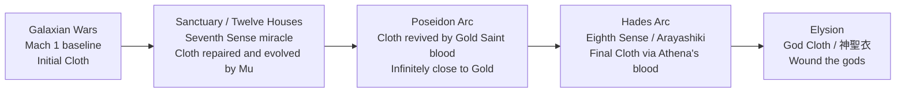

# The Armored Hierarchies of Saint Seiya: A Comprehensive Analysis of Cloth Classes, Warrior Factions, and Their Champions
# 1 Foundations of the Saint Seiya Universe: Armor Classes and the Cosmo Power-Scaling Framework

Before any meaningful comparison can be drawn between a Bronze Saint and a Marina General, between a Specter of Hades and a God Warrior of Asgard, the analytical reader must first internalise the conceptual machinery on which Masami Kurumada built his cosmology. *Saint Seiya* (聖闘士星矢), serialised in *Weekly Shōnen Jump* between December 1985 and November 1990, with its final chapter migrating to the inaugural *V-Jump* in December 1990[^1], is not simply a tournament manga decorated with Greek mythology; it is an architecture of armoured ranks, metaphysical senses, and quantitative speed benchmarks whose internal logic governs every confrontation in the series and its many spin-offs. This opening chapter constructs that architecture explicitly. It establishes the iconographic grammar of the **Cloth** (聖衣) and its sister armours, codifies the vertical hierarchy from Bronze to divine class, articulates the doctrine of **Cosmo** and the cascading senses (Seventh, Eighth, Ninth), and finally crystallises the Mach-to-light-speed matrix that subsequent chapters will use to evaluate individual champions across all factions. Where canonical sources diverge — Kurumada's original manga versus Toei's anime continuity, *Episode G*'s expanded scaling versus the classic series' more conservative figures — the contradictions are flagged rather than smoothed over, in keeping with the report's source-discipline standard.

## 1.1 The Cloth System: Sacred Armors, Constellations, and Mythological Origins

The Cloth is the franchise's defining invention, and its conceptual genesis is unusually well documented. In the *Cosmo Special* databook published on 10 August 1988, Kurumada recounted that *Saint Seiya* did not begin as a Greek-mythological epic at all: his initial idea, conceived after the commercial failure of *Otokozaka* in 1985, was a karate manga in the *Karate Kid* mould, set in a Japanese mountain training camp, in which the protagonist would be able to "throw explosive sparks"[^1]. Because such concussive techniques would shatter an unarmoured body, Kurumada appended a protective shell to his fighters — and only when his editor pushed back against the Japanese setting did Greece, and with it the zodiacal pantheon, enter the design. In a 1987 interview Kurumada further specified that the Cloths added a "fashion" element, a "supplementary flavour", and that their visual language was directly inspired by Hajime Sorayama's *Sexy Robot* illustrations, while the editorial suggestion that the armour assemble into a totemic horse for Pegasus crystallised the now-iconic transformation gimmick[^1].

This editorial archaeology matters because it explains why every Cloth simultaneously serves three functions that later chapters will repeatedly invoke. **First**, the Cloth is *protective hardware*: a metallurgical answer to the otherwise lethal feedback of a Cosmo-amplified strike. **Second**, it is a *constellational totem*: each of the eighty-eight Saints sworn to Athena bears a Cloth tied to one of the eighty-eight modern constellations, and when disassembled the armour reconstructs the figure of that constellation's mythical referent — a horse for Pegasus, a chained maiden for Andromeda, a serpent for Hydra[^1]. **Third**, the Cloth is a *symbolic vessel of destiny*: Kurumada chose the term **聖衣** (*seinaru koromo*, "sacred garment"), pronounced "Cloth" (*kurosu*) in katakana, precisely to evoke the idea of mythologically pre-ordained vesture worn in ages of the gods[^1]. The character *seitōshi* (聖闘士, "sacred combatant"), pronounced "Saint", was likewise constructed by Kurumada from an earlier candidate *seisenshi* (聖戦士, "sacred warrior"), which he discarded as too generic[^1].

This linguistic-iconographic grammar will be inherited by every rival faction analysed in this report. Poseidon's marines wear **Scales** (鱗衣) tied to sea creatures; Hades' specters wear **Surplices** (冥衣) tied to the 108 stars of the Earthly and Heavenly Prison; Asgard's god-warriors wear **God Robes** (神闘衣) tied to the seven principal stars of Ursa Major; the Olympian deities themselves wear **Kamui** (神衣). Each of these systems imitates the threefold logic of the Cloth — protection, totemic identification, mythic destiny — while substituting an alternative cosmological register. Understanding the Cloth as Kurumada's foundational template is therefore the precondition for any meaningful cross-faction comparison.

## 1.2 The Tiered Hierarchy: Bronze, Silver, Gold, and Divine-Class Armors

Within Athena's army, the eighty-eight Cloths are stratified into three principal ranks, with progressively rarer armours layered above them. The hierarchy is summarised below; subsequent chapters will populate each row with concrete combatants.

| Rank (Athena's army) | Number | Material / Provenance | Indicative wearers | Approximate threshold of Cosmo |
|---|---|---|---|---|
| **Bronze Saints** | 48 | Bronze; minor or "low" constellations | Pegasus Seiya, Dragon Shiryū, Cygnus Hyōga, Andromeda Shun, Phoenix Ikki | Mach 1 baseline; capable of awakening the Seventh Sense as miracle |
| **Silver Saints** | 24 | Silver; intermediate constellations | Eagle Marin, Ophiuchus Shaina, Lyra Orphée, Perseus Algol | Mach 2–5 |
| **Gold Saints** | 12 | Gold; the twelve zodiacal constellations | Aries Mu through Pisces Aphrodite | Seventh Sense fully mastered; light-speed |
| **God Cloth** (神聖衣) | 5 (Bronze upgrade) | Divine metal infused by Athena's blood | Pegasus, Dragon, Cygnus, Andromeda, Phoenix in the Elysion arc | Eighth Sense (Arayashiki) |
| **Kamui** (神衣) | divine | Reserved for gods and divine avatars | Athena, Hades, Poseidon, Apollo, Artemis | Ninth Sense |

Galaxian Wars, the inaugural arc of the manga, was explicitly designed as a tournament whose prize was the Sagittarius **Gold Cloth**, framing from page one the principle that Gold armour stands apex over Bronze and Silver[^1]. The rarity gradient correlates with three reinforcing variables: the prominence of the patron constellation (the twelve zodiacal signs governing the Sun's path are ontologically privileged over minor northern constellations such as Hydra or Lionet), the proximity to Athena's person (Gold Saints guard the Twelve Houses leading to the Pope's chamber, Silver Saints patrol outer reaches, Bronze Saints serve as expeditionary fighters), and the depth of Cosmo a candidate must awaken to don the armour at all[^1].

The same vertical logic recurs, with substitutions, in rival factions: Poseidon fields seven **General Pillars** wearing Gold-equivalent Scales beneath an outer ring of generic Mariners; Hades fields **108 Specters** topped by **Three Magnates** (the Three Judges of Hell — Wyvern Rhadamanthys, Garuda Aiakos, Griffon Minos) whose Surplices rival Gold Cloths; Asgard fields seven **God Warriors** under Hilda of Polaris, each of Gold-equivalent stature. The cross-faction equivalence — Gold Saint ≈ Marina General ≈ Three Judge ≈ top God Warrior — is a structural premise the report will repeatedly verify and, where necessary, qualify with outliers.

A crucial caveat must be entered at the outset: *armour rank does not determine victory*. The narrative engine of the entire franchise depends on Bronze Saints repeatedly defeating Silver and Gold opponents, a pattern that would be incoherent if the Cloth were the locus of power. The resolution of this apparent paradox lies in the Cosmo-centric doctrine examined in §1.3.

## 1.3 Cosmo and the Doctrine of the Senses: Seventh, Eighth (Arayashiki), and Ninth

The metaphysical engine of *Saint Seiya* is **Cosmo** (小宇宙, *shōuchū*, literally "little universe"), the inner microcosm a Saint kindles within himself and projects outward as offensive and defensive force. Kurumada's worldview frames the human body as a fractal of the universe: by reaching deeper into one's own consciousness, the warrior accesses progressively more fundamental energies. This concept is structured as an ascending ladder of "senses" beyond the ordinary five.

The progression most operative in the original manga and the *Hades* arc is summarised below.

| Sense | Japanese term | Definition | Operational consequence |
|---|---|---|---|
| **Seventh Sense** | 第七感 | "Total mastery of Cosmo"[^2] | Standard threshold for a Gold Saint; enables light-speed combat and the burning of Cosmo at maximal density |
| **Eighth Sense (Arayashiki)** | 阿頼耶識 / 第八感 | Control over one's own soul[^3][^4]; "located deeper than the 'essence' of Cosmo" and tied to Karma[^4] | Permits a warrior to act consciously in the realm of the dead; required for the Bronze Saints to descend into the Underworld during the *Hades* chapter |
| **Ninth Sense** | 第九感 | The divine domain | The native register of gods such as Hades, Poseidon, Athena, Apollo and Artemis |

The Seventh Sense is the qualitative threshold that separates Gold Saints from their juniors: a Saint who has merely "trained" remains anchored to physical Mach speeds, while one who awakens the Seventh Sense becomes effectively light-speed and conceptually untouchable to Mach-bound opponents[^2][^5][^6]. The plot device that propels the *Sanctuary* arc is precisely the Bronze Saints' improbable, miraculous awakening of the Seventh Sense in the heat of combat, a "miracle" repeatedly invoked by Kurumada to explain why his protagonists can survive encounters that should, by raw scaling, annihilate them.

The Eighth Sense, or **Arayashiki** — a term Kurumada borrowed from Yogācāra Buddhism, where it denotes the "storehouse consciousness" — is introduced specifically for the descent into Hades' realm. As the franchise's Buddhist-inflected exegesis explains, the Eighth Sense "is the control a being may have over its own soul"[^3]; it lies "even deeper than the 'essence' of Cosmo, known as the 7th Sense" and is "the source of a character's Karma"[^4]. Because the dead, by definition, have lost dominion over their souls, only a Saint who has attained Arayashiki can move and fight in the underworld without being absorbed into its laws — an in-universe rationale for the Bronze Saints' ability to invade Hades' kingdom in the manga's final arc.

The **Ninth Sense** marks the boundary beyond which mortal classification ceases to apply. It belongs natively to the gods, and serves in narrative practice as the upper bound of the entire scaling system; mortals can only approach it asymptotically through the divine boons (God Cloths, Athena's blood) examined in Chapter 7.

This tiered metaphysics produces the franchise's central doctrinal thesis, which every subsequent chapter will invoke: **a Saint's power lies in Cosmo, not in the Cloth**. The armour amplifies and protects, but it does not generate; the wearer's depth of inner combustion is the true variable. This doctrine is the indispensable solvent for the apparent paradox raised in §1.2 — that Bronze Saints regularly overcome Gold opponents — and it is the qualitative axis along which the report will rank champions whose nominal armour-rank fails to predict their actual ceiling.

## 1.4 Power-Scaling Benchmarks: Speed, Force, and Quantitative Markers

Kurumada repeatedly grounded his metaphysics in concrete velocity claims, producing a quantitative ladder that complements the qualitative ladder of the senses. The clearest in-text articulation is delivered by **Leo Aiolia** during the *Twelve Houses* arc, who taunts the protagonists with the following stratification: *"You bronzes can only reach Mach 1. The silvers, Mach 2 to 5. Flail about all you like, but you're far too slow"*[^7][^6]. This single line is the canonical anchor for the entire franchise's speed framework.

Subsequent chapters reinforce the same ladder. **Hound Asterion**, a Silver Saint, boasts that his Million Ghost Attack reaches Mach 2, contrasting it with Seiya's "puny meteor punches [that] barely exceed Mach 1"[^7]. **Taurus Aldebaran**, a Gold Saint, mocks that *"your meteor punch only reaches Mach 1"*, even after Seiya's recovery[^7]. The implication is that even after his early miracles, a Bronze Saint reverts to roughly Mach 1 as his physiological baseline, ascending only when Cosmo-amplification is active. By the *Hades* arc, the baseline has dramatically risen: **Acheron Charon** the ferryman boasts of spinning his oar in 1/1000th of a second, "faster than Mach 18", and even this is described as inferior to a Saint who has approached the Seventh Sense[^7]. **Gold Saints**, by canonical claim, "reach the speed of light, which is 1 million times Mach 1"[^5][^6].

The resulting matrix can be formalised as follows:

| Combatant tier | Pre-miracle / baseline | With Cosmo amplification | Apex (Seventh Sense, Hades-arc onwards) |
|---|---|---|---|
| **Bronze Saint** | Mach 1[^7][^6] | Mach 2–5 (transient miracle)[^7] | Above Mach 18 once Seventh Sense unmastered is achieved[^7] |
| **Silver Saint** | Mach 2–5[^5][^7][^6] | — | Generally capped (the rank is consistently presented as a ceiling) |
| **Gold Saint** | Light-speed (≈ 1,000,000 × Mach 1)[^5][^6] | Above light-speed in select feats (notably formalised in *Episode G*) | Light-speed and beyond, debated as outlier vs. consistent |
| **Three Judges / Marina Generals** | Gold-equivalent | Gold-equivalent | Gold-equivalent |
| **Gods (Ninth Sense)** | Trans-dimensional / cross-realm (Underworld and Elysion are described as separated by hyperdimensional, not merely spatial, distances) | — | Beyond mortal benchmarks |

Two important interpretive caveats must accompany this matrix, both flagged in the most thorough fan-and-scholar debates on the question. **First**, Kurumada was demonstrably not a physicist, and the franchise contains feats — most notably the High Hypersonic calculation derived from Seiya's *mastered* Pegasus Meteor Fist in the *Galaxian Wars* — that statistically *exceed* the verbal scaling of subsequent arcs[^7]. The *VS Battles* community, after extended debate, has tended to treat such feats either as outliers that should be ignored in favour of authorial statements, or, conversely, to privilege calculated feats over statements on the principle applied to other shōnen franchises[^7]. The methodological choice has consequences: if statements are privileged, Bronze Saints are Mach 1 and Gold Saints are nominally light-speed; if calculations are privileged, both ranks are substantially faster, and the ladder compresses. **Second**, the quantitative scaling differs across canons: *Episode G* explicitly establishes Gold Saints exceeding the speed of light at will (light-speed becoming their *minimum*), whereas the original classic and *Next Dimension* present light-speed as the Gold ceiling for ordinary feats[^7]. As contributors to the debate have acknowledged, "*Ep G* is treated as a prequel, but not quite, [as] the events of *Episode G*, the concepts, the cosmology, the plots, everything is different"[^7] — a continuity tension this report will respect by attributing supra-light scaling primarily to *Episode G*-derived contexts.

For the purposes of subsequent chapters, the Aiolia ladder (Mach 1 / Mach 2–5 / light-speed) is adopted as the **default reference grid**, with the understanding that tier-breaking outliers (Kanon's MFTL feats, Phoenix Ikki's recovery-based scaling, Rhadamanthys' three-deaths durability) will be treated as flagged anomalies rather than rebuttals to the framework.

## 1.5 Collective and Divine-Tier Techniques as Power Markers

Beyond individual speed claims, the franchise uses a small number of *collective* and *divine-tier* techniques as discrete narrative ceilings — qualitative markers that, once invoked, signal a categorical leap in the energy-economy of a battle. The most consequential of these is the **Athena Exclamation** (アテナ・エクスクラメーション), described in canonical reference works as the "ultimate forbidden technique where three Gold Saints bring together and infuse their Cosmo, unleashing a power that is equal to that of the Big Bang"[^8][^9][^10]. Three structural properties make it indispensable as an analytical benchmark.

First, the technique is *forbidden*: deploying it constitutes a violation of Athena's law because, as the in-universe rationale runs, equating a mortal-level technique to the Big Bang trespasses on divine prerogative — it momentarily simulates the act of cosmic creation that belongs to the gods[^9]. This frames the Athena Exclamation as the explicit *mortal asymptote* of the Ninth Sense: it is the closest a Saint, even a Gold Saint, can come to wielding god-tier power without being a god, and only by combining three Gold Cosmos at once. The technique therefore serves as the narrative boundary stone between the Seventh and Ninth senses.

Second, the Athena Exclamation operates as a *quantitative ceiling*. Whenever the report later evaluates the apex output of a faction's champions, it will be useful to ask: how does this feat compare to the Big Bang–level energy of three combined Gold Cosmos? Kanon's reckless deployment of the move during the *Sanctuary* arc, the Bronze Saints' improvised defence against three Athena Exclamations stacked simultaneously, and the technique's symbolic significance as the only mortal-tier act that gods themselves treat as overstepping all furnish reference points for the cross-faction analysis in Chapter 9.

Third, parallel collective and divine-tier markers should be registered alongside it. The **Thousand-Day War** stalemate, a legendary clash referenced in the *Lost Canvas* canon, between the previous-generation Libra Dōko and his peers operates as a temporal-scale marker: a fight so evenly matched that it lasts a thousand days, signalling that the combatants have transcended decisive victory in the ordinary sense. The **God Cloth** awakenings of the five Bronze protagonists in the *Hades–Elysion* arc, achieved through Athena's blood, likewise function as a qualitative leap rather than a quantitative one — they reframe the Bronze Saints as capable of harming gods, not merely as faster or stronger versions of themselves. Finally, the **Big Will**, alluded to in Lost Canvas–era exegesis as the macro-providence governing the cosmos, marks the outer horizon beyond which even divine Cosmo dissolves into authorial-cosmological intent.

These collective and divine-tier techniques function for the report's analysis in the same way that the Mach ladder of §1.4 does, but along a different axis. Where the velocity matrix permits *quantitative* comparison of two combatants, the technique catalogue permits *qualitative* comparison of two factions' apex capabilities — the question of whether a Marina General can summon anything analogous to an Athena Exclamation, whether a Specter army can deploy a Big Bang–level collective strike, or whether an Asgardian God Warrior can wield a divine-tier finisher comparable in narrative weight. Each of the seven faction chapters that follow will return to this catalogue when assessing its champions' upper bound.

---

Taken together, the five sub-systems articulated in this chapter — the iconographic grammar of the Cloth, the vertical hierarchy of armoured ranks, the doctrine of Cosmo and the cascading senses, the quantitative ladder of Mach-to-light-speed benchmarks, and the qualitative markers furnished by collective and divine-tier techniques — constitute the analytical lexicon of the report. They license every subsequent comparative judgement: a claim that Sea Dragon Kanon "fights at Gold-Saint level" is not a free assertion but a structured claim about Cosmo depth, Seventh-Sense mastery, and demonstrated speed-tier feats; a claim that Rhadamanthys "exceeds the standard Gold ceiling" is a structured claim about three-death durability and tier-breaking outliers; a claim that the Bronze Saints "transcend their rank" in the *Hades–Elysion* arc is a structured claim about the Eighth-Sense awakening and the God Cloth upgrade. The chapters that follow apply this lexicon — beginning, in Chapter 2, with the foundational champions of Athena's army, the forty-eight Bronze Saints whose narrative arc supplies the franchise's protagonists and whose tier-breaking trajectory exemplifies, more clearly than any other faction, the doctrine that Cosmo, not Cloth, determines the warrior's true measure.

# 2 Athena's Bronze Saints: The Foundational Champions

The framework constructed in Chapter 1 — the Cloth's iconographic grammar, the four-tier armour hierarchy, the cascading senses from Seventh through Ninth, the Mach-to-light-speed ladder, and the Big Bang–level ceiling of the Athena Exclamation — finds its first and most consequential test case in the lowest-ranking tier of Athena's army. The forty-eight Bronze Saints occupy a paradoxical position in Kurumada's design: nominally the floor of the eighty-eight-Cloth roster, capped at a Mach 1 baseline by Aiolia's and Aldebaran's verbal scaling, and assigned constellations of conspicuously minor astronomical prominence, they are nevertheless the central narrative engine of the entire franchise. Every one of the manga's principal arcs is fought from the perspective of Bronze protagonists who, by the doctrine that "a Saint's power lies in Cosmo, not in the Cloth", proceed to defeat Silver assassins, dethrone Gold guardians, dismantle Poseidon's Mammoth Pillars, invade Hades' Underworld, and ultimately wound gods in Elysion. This chapter populates each row of the framework with concrete combatants, profiling the five canonical protagonists in dimension-by-dimension detail, then surveying the supporting Bronze cohort, the Cloth-evolution mechanism that carries the rank from initial bronze armour to divine-tier vesture, and the cumulative tier-breaking trajectory that makes the Bronze Saints the franchise's foundational proof-text for the Cosmo-centric scaling system.

## 2.1 The Bronze Rank in Context: Constellations, Numbers, and Narrative Function

The forty-eight Bronze Cloths represent the largest stratum of Athena's army, comprising roughly fifty-five percent of the eighty-eight-Cloth roster. Their constellations are deliberately drawn from astronomical figures of secondary or modern provenance — Pegasus, Andromeda, Hydra, Cygnus, Lionet, Wolf, Unicorn, Bear, Hercules, Crow, and even the Chameleon, a constellation that, as the *Saint Seiya* encyclopedic literature explicitly notes, was added to the celestial canon only in the seventeenth century and "was not visible to early Mediterranean cultures", meaning that "there is no mythology associated with it"[^11]. Kurumada thus took deliberate creative licence in retroactively binding modern constellations to a mythic Athenian order, signalling from the outset that the Bronze tier is the most heterogeneous and least canonically privileged of the three principal ranks.

Their training grounds are correspondingly dispersed across the globe — a geographic decentralisation that contrasts sharply with the centralised Sanctuary in Greece where Silver and Gold Saints are forged. Game-canonical and encyclopedic sources confirm the canonical training-site assignments for the five protagonists: Pegasus Seiya in Greece (the Sanctuary itself, under Eagle Marin); Dragon Shiryū at Mount Rozan/Goroho in Jiangxi Province, China, under Libra Dohko; Cygnus Hyōga in West Siberia under the Crystal Saint (and indirectly Aquarius Camus); Andromeda Shun on Andromeda Island in Ethiopia under Cepheus Daidalos; and Phoenix Ikki on Death Queen Island under the brutal master Guilty[^12][^13][^11]. Each location functions as more than a backdrop: Mt. Rozan's "great waterfall... renowned for its dragon god legend" is canonically the site where "the galactic star dust pouring down from the ninth heaven" forged the Dragon Cloth, slumbering "deep at the bottom of this great waterfall"[^13]; Death Queen Island is hellish enough that Ikki's master Guilty trained him through deliberate cruelty designed to break the gentle heart he had inherited from his brother Shun.

Within this dispersed roster, narrative function diverges sharply between protagonists and supporting Bronze Saints. The five lead Bronze Saints — Seiya, Shiryū, Hyōga, Shun, Ikki — are explicitly identified in the Cosmo Special and subsequent canon as the orphanage cohort raised under the financier Mitsumasa Kido (Saori's grandfather) and dispatched to the world's harshest training camps to compete for the Sagittarius Gold Cloth in the Galaxian Wars. The supporting cohort — Unicorn Jabu, Bear Geki, Hydra Ichi, Wolf Nachi, Lionet Ban, and others — share this orphanage origin but, critically, fail to advance beyond the Galaxian Wars tournament as primary combatants and are subsequently relegated to background roles within the Sanctuary's defensive perimeter. Reddit's canonical fan-discussion thread on Kurumada's "Minor Bronze Saints" captures the design logic succinctly when it observes that Jabu "is just Seiya without the protagonist role"[^14] — a one-line distillation of the structural function the supporting Bronze cohort performs as the static baseline against which the protagonists' tier-transcendence is measured.

The Mach 1 baseline established in Chapter 1 — Aiolia's taunt that "you bronzes can only reach Mach 1", reiterated by Aldebaran's mockery of Seiya's "meteor punch [that] only reaches Mach 1" — therefore applies to the Bronze rank as a *physiological floor*, not as an absolute ceiling. The narrative engine of every arc consists in the protagonists' miraculous transcendence of this floor: from Mach 1 baseline through the Seventh-Sense awakening that lets a Bronze Saint trade blows with a Gold opponent, through the Eighth-Sense (Arayashiki) acquisition that permits descent into Hades' realm, to the God Cloth upgrade that enables them to wound gods. Each of the five protagonist profiles below traces a distinct path through this trajectory.

## 2.2 Pegasus Seiya: The Protagonist and the Miracle Doctrine

If any single character embodies Kurumada's doctrine that Cosmo, not Cloth, determines the warrior's ceiling, it is Pegasus Seiya. The Pegasus Saint is not the most technically refined Bronze (that distinction belongs to Shiryū), nor the strongest in raw output (Ikki's tier-breaking outlier role is examined in §2.6), nor the most narratively pivotal in metaphysical terms (Shun's status as Hades' vessel exceeds him there); yet he is the protagonist precisely because the franchise's central thematic claim — that pure faith and the burning of one's small universe can overcome any structural disadvantage of rank — finds its purest expression in his arc. Seiya is the test case for the miracle doctrine.

**Power level and tier placement.** Seiya begins the Galaxian Wars at the Mach 1 baseline characteristic of an unremarkable Bronze Saint. Reference works summarising his classic-manga power profile describe him at series outset as "a supersonic Saint" whose Pegasus Ryūsei Ken consists in "shoot[ing] many Cosmo meteors by repeatedly punching at high speeds"[^15]. His ceiling, however, escalates arc by arc: by the Twelve Houses, he has awakened the Seventh Sense in fragmentary form; in the Poseidon arc, while wearing the Sagittarius Gold Cloth, he fires the Golden Arrow at Julian Solo's Mammoth Pillar; in the Hades–Elysion arc, he attains the Pegasus God Cloth, a state in which, as Saint Seiya tier-list discussion notes, he is "evolving his Gold Cloth into a God Gold Cloth to fight equally with Titan with Athena's blood"[^16].

**Signature techniques.** The Pegasus Ryūsei Ken (Pegasus Meteor Fist) is the franchise's most iconic move and the canonical opener of the entire series. It is described in tier-system reference summaries as a technique in which "Pegasus Seiya elevates and burns his Cosmos, tracing the Stars of the Pegasus" constellation, releasing "many Cosmo meteors by repeatedly punching at high speeds"[^17][^15][^18]. Its cumulative effect is staggering: the technique is canonically powerful enough to shatter female-Saint masks at distance, with Eagle Marin's apprentice Shaina remarking in dialogue that "the Pegasus Meteor Fist?! just the force of it as it flew past was enough to shatter my mask"[^12]. Reference works further catalogue Seiya's auxiliary moves: the Pegasus Rolling Crush, an aerial slamming variant, and the Pegasus Suisei Ken (Pegasus Comet Fist), a single-target concentrated finishing strike[^17]. In the Galaxian Wars he debuted the Meteor Fist against his Sanctuary trial opponent Cassios, and the same technique would later be used against Shaina herself[^12].

**Key arc appearances.** Seiya's narrative trajectory is the spine of the entire classic series. The Galaxian Wars introduces him as the orphanage-raised challenger who wins the Pegasus Cloth from Cassios, only to see it scattered into pieces and reclaimed across the Twelve Black Saints subplot (where he recovers the Right Foot of the Sagittarius Gold Cloth)[^12]. The Sanctuary arc casts him as the lead invader of the Twelve Houses, culminating in the confrontation with Saga in the Pope's chamber. The Asgard arc (anime-original) elevates him through the seven God Warriors. The Poseidon arc supplies his most iconic image: donning the Sagittarius Gold Cloth, drawing back the Golden Arrow against Julian Solo while Shaina, mortally wounded, holds him steady — a narrative beat that fan synopses preserve in detail, with Shaina extracting the arrow from her own back and "hand[ing] it to Seiya, saying she will protect him, no matter what, and to fire as many times as necessary"[^19]. In the Hades arc he descends into the Underworld, awakens the Eighth Sense, and in Elysion attains the Pegasus God Cloth.

**Final outcome.** In the classic manga's terminal arc, Seiya is gravely wounded by Hades's sword in Elysion, surviving but in a comatose or paralysed condition that *Next Dimension* later picks up. The thematic finality of his fate is paradigmatic of the franchise's authorial logic: the protagonist who most exemplifies the miracle doctrine pays for his repeated tier-transcendence with the most severe cumulative cost.

## 2.3 Dragon Shiryū: Defensive Mastery and the Path to Gold

Where Seiya represents the Bronze tier's miracle, Shiryū represents its technical apex. He is the Bronze Saint most often described in canonical fan-and-encyclopedic literature as the protagonist closest to wearing Gold, the one who routinely substitutes a senior Saint's mantle for his own (donning the Libra Gold Cloth in the Hades arc), and the one whose unarmoured combat ceiling is canonically asserted to equal or exceed his armoured form — the in-game *Saint Seiya Awakening* canon answer to the question "Which Saint is stronger without their Cloth?" being unambiguously "Shiryu"[^12].

**Power level and tier placement.** Shiryū's Cosmo trajectory is the most legibly continuous of the five protagonists. He begins at the standard Bronze baseline; by the Twelve Houses, he has awakened the Seventh Sense in his battle against Cancer Deathmask and in the climactic confrontation with Capricorn Shura; by the Poseidon arc, his Dragon Cloth is "infinitely close to that of a Gold Cloth", having been "revived by being soaked in golden blood" and "gain[ing] characteristics identical to a Gold Cloth"[^13]. By Elysion, he wears the Dragon God Cloth, "a miracle born from Shiryu burning his Cosmo to its ultimate limit (surpassing the Eighth Sense) and Athena's blood", whose "performance lies between that of a Gold Cloth and a God's Cloth"[^13]. His Omega-era successor profile shows him donning the Libra Gold Cloth itself in episode 77 of *Saint Seiya Omega*[^13].

**Signature techniques.** The Rozan technique family is the most extensive arsenal of any Bronze protagonist. The **Rozan Shōryūha** (Rising Dragon) concentrates "the power of his entire body into his right fist" and unleashes "a soaring dragon that soars straight into the heavens", with the canonical caveat that "for one ten-thousandth of a second, it exposes his heart, giving the enemy an opening" — a flaw "harder to exploit" as Shiryū's Cosmo grows[^13]. The **Rozan Ryūhishō** (Dragon Flying Submission) "envelops his entire body with a dragon formed from his Cosmo, charging into the enemy in a straight or curved line"[^13]. The **Rozan Kōryūha** (Roaring Dragon Strike) is the constellation's "ultimate secret technique... a mutually destructive move with absolute power... [that] will undoubtedly [kill the user]"[^13] — Shiryū famously deploys it against Capricorn Shura, surviving only because Shura, recognising Athena's true champion, sacrifices himself and bequeaths the Capricorn Gold Cloth. Beyond his native Rozan moves, Shiryū's arsenal annexes Gold-tier techniques: **Excalibur**, "a hand chop cultivated to its utmost limit, capable of easily slicing through space and shattering stars... passed down by the former Capricorn Gold Saint, Shura"[^13]; and the **Rozan Hyakuryūha** (Hundred Dragons), "the ultimate technique of the Libra Gold Saint", taught by Dohko in Hades Sanctuary episode 6, "equivalent to that of the Stardust Revolution"[^13]. He also uses the **Counterattack of Destruction**, the **Rebirth Blow**, and the **Athena Exclamation** — the last "fragment of Omega power" deployed alongside Seiya and Shun against Hyperion, with destructive output the encyclopedic source describes as exceeding "the sum of the three individuals' Cosmo"[^13].

**Key arc appearances.** Shiryū's most narratively decisive battles are the Twelve Houses confrontation with Shura (where he loses his Dragon Shield to Excalibur but inherits the technique), the Poseidon arc duel with Sea Prince Krishna at the Indian Ocean Mammoth Pillar, and the Hades arc pivot in which Dohko bequeaths him the Libra Gold Cloth. The Krishna duel is particularly thematic: as the episode synopsis records, "Krishna's Cosmo is keeping Shiryu from reaching the pillar. Not even the Rising Dragon can break through it... Shiryu burns his Cosmo to the Seventh Sense and sees the seven vital points. He then uses Excalibur to destroy the points, along with Krishna"[^19] — a canonical demonstration of how the Seventh-Sense awakening converts a Bronze Saint into a peer of Gold-equivalent opposition.

**Final outcome.** Shiryū survives the entire classic-manga trilogy. He marries Shunrei (Dohko's adopted granddaughter) and fathers Ryūhō, the Dragon Saint of *Saint Seiya Omega*[^13], where his junior-brother Genbu inherits the Libra Gold Cloth before perishing in Omega season 2; in episode 77 of Omega, Shiryū himself dons the Libra Cloth[^13]. Of all five Bronze protagonists, Shiryū is the most cleanly successful: his arc resolves with marriage, fatherhood, and an inheritance of the Gold rank his master once wore — a fate consonant with his characterisation as the cohort's most disciplined and technically refined member.

## 2.4 Cygnus Hyōga: The Cold Prodigy and the Aquarius Inheritance

Hyōga's structural function within the Bronze cohort is unique: he is the only protagonist whose master is canonically identified as a Gold Saint (Aquarius Camus, with the Crystal Saint as his intermediary instructor), and the only one whose signature finishing move is itself a Gold-tier technique borrowed wholesale from his master's arsenal. This produces a distinctive technique inheritance pattern that the encyclopedic-Korean *NamuWiki* entry on Holodni Smerch summarises with appropriate paradox: "Hyoga, who uses someone else's constellation's special move developed by someone else as her signature skill, is a unique case"[^20].

**Power level and tier placement.** Hyōga's Cosmo trajectory mirrors Shiryū's: Mach 1 baseline at series outset, Seventh-Sense awakening during the Twelve Houses (specifically against Camus himself in the Aquarius temple, where his master deliberately freezes him into the Freezing Coffin to force the awakening), and culmination in the Cygnus God Cloth at Elysion. His signature thematic preoccupation is absolute zero: as the *Saint Seiya Classic* respect-thread compilation records of his Black Cygnus counterpart, the technique can "generate at least –240 Degrees" Celsius[^21], with Hyōga himself canonically operating in the same temperature register and ultimately approaching the absolute-zero limit of –273.15 °C — a number the franchise associates explicitly with the temperature at which a Gold Cloth itself can be frozen[^13].

**Signature techniques.** Hyōga's arsenal exhibits a three-stage progression that must be reconciled across manga and anime variants. The first stage is the **Holodni Smerch** (хол́одный смерч, "cold whirlwind" in Russian), which the NamuWiki entry describes as "a cold version of [the] Lusan Seungryongpae [Rozan Rising Dragon]... blowing the sky high with the addition of cold"[^20] — a dynamic uppercut-style strike. In Toei's anime adaptation, this technique is renamed **Aurora Thunder Attack** "presumed... because Holodni Smerch might not be able to understand it because it is Russian", and the move is restaged as a "Diamond Dust + Aurora Execution" hybrid in which the Saint clasps "both of his hands together as he expels snow and ice at the opponent"[^20][^22]. The second stage is **Diamond Dust**, Hyōga's signature mid-tier technique throughout the Sanctuary arc — a freezing wave noted by the *Sanctuary Battle* technique catalogue alongside the Aurora variants[^23]. The third and apex stage is **Aurora Execution**, "a Gold Saint" technique[^22] inherited directly from Camus that Hyōga first deploys after the Twelve Houses. The continuity tension between the Russian and English/Greek-Latin nomenclatures has been editorially resolved in favour of the inherited-Aquarius lineage: NamuWiki notes that "in the game, they often shout out the strongest of Cygnus when using the Aurora Excession", with Hyōga in some variants invoking "'My teacher Camu! Give me strength!'"[^20].

**Key arc appearances.** Hyōga's signature confrontations are densely structured around the cold motif and master-student dynamic. In the Sanctuary arc, he duels Aquarius Camus in the eleventh house and is sealed in the Freezing Coffin, awakening the Seventh Sense to break out. In the Asgard arc, he confronts Hagen of Merak Beta. In the Poseidon arc, his pivotal battle is at the Arctic Ocean Mammoth Pillar against the Marina General **Kraken Isaak**, his fellow Crystal-Saint apprentice in West Siberia — the *Awakening* canon QA confirming that "Kraken Isaak and Cygnus Hyoga... have the same master"[^12]. The Poseidon-arc episode synopsis preserves the structural beats: Camus's apparition serving as Lymnades Caça's disguise to lure Hyōga, the IMDb plot summary noting that "Hyoga reaches the Antarctic Ocean Mammoth Pillar, but surprisingly, Aquarius Camus is waiting for him. Hyoga attacks him, knowing full well Camus died in" the Twelve Houses[^24], and the subsequent revelation that the apparition is the Mariner General Caça in disguise[^19]. In the Hades arc, Hyōga descends into the Underworld and reaches Elysion alongside the other four protagonists.

**Final outcome.** Hyōga survives the classic-manga trilogy. His arc closes on the redemptive recovery of his mother's body (encased in a Siberian shipwreck), the reconciliation with his Aquarius lineage, and the donning of the Cygnus God Cloth in Elysion. Of the five protagonists, Hyōga's fate is the most thematically completed: from the Russian boy seeking his frozen mother, he becomes the Cygnus God Cloth bearer who has internalised Camus's Gold-tier technique and fought his fellow disciple Isaak to a tragic conclusion at Poseidon's pillar.

## 2.5 Andromeda Shun: The Pacifist's Power and the Hades Vessel

Shun is the Bronze cohort's structural paradox: the gentlest of the five, characterised by an explicit aversion to violence and a tendency to weep for fallen opponents, yet canonically identified in fan-discussion and Hades-arc plot architecture as potentially the strongest of the protagonists, and ultimately selected as the mortal vessel for Hades's incarnation. The *Saint Seiya Awakening* canon QA confirms the latter point unambiguously: in answer to the question "Whose body does Hades try to possess to enter the mortal realm?", the canon reply is "Shun"[^12].

**Power level and tier placement.** Shun's apparent meekness disguises a Cosmo register that the franchise repeatedly hints is the deepest of the cohort. Reference materials note that Shun in the Asgard arc "saw a mysterious woman, but she transforms into a demon. It attacks, but Shun is able to defend himself"[^19], and in the Poseidon arc he debuts the **Nebula Storm**, a technique that destroys the South Pacific Mammoth Pillar with the assistance of the Libra Twin Rod furnished by Kiki: as the synopsis records, "Kiki gets to Shun in time and Libra's Twin Rod flies to Shun's hand. Shun destroys the Mammoth Pillar, but Io sacrifices himself to save it, but to no avail"[^19]. By Elysion, Shun debuts the **Rozan Hyakuryūha** in his God Cloth — "Shun used [the Hundred Dragons] for the first time in episode 1 of the Elysium Chapter"[^13] — having effectively learned the Libra Gold Saint's ultimate technique alongside Shiryū and become the second Bronze Saint to wield it.

**Signature techniques.** Shun's arsenal centres on the Andromeda Cloth's distinctive chains — the only Bronze Cloth equipped with native ranged weapons. The **Nebula Chain** is his iconic offensive-defensive tool, capable of capturing, restraining, or cutting opponents from variable range; the *Sanctuary Battle* technique catalogue lists it alongside **Thunder Wave**, **Nebula Stream**, and **Nebula Storm** as his core moveset[^23]. **Nebula Stream** is described in cross-reference encyclopedic entries as "a technique where Andromeda Shun fires a stream of Cosmo energy which paralyzes the opponent", while "Nebula Storm" is the apex large-area finisher[^25]. The chains' versatility makes Shun arguably the most tactically flexible Bronze protagonist: they can be deployed as autonomous defensive sentinels (the canonical "Rolling Defense"), as ranged attack vectors, or as binding holds that immobilise opponents while Shun deploys higher-tier Cosmo techniques.

**Key arc appearances.** Shun's master is the Silver Saint **Cepheus Daidalos** of Andromeda Island, an anime-elaborated identity (in the manga, Daidalos is established as Shun's master, with the encyclopedic entry confirming that "Juné was one of Silver Saint Cepheus Daidalos' disciples at Andromeda Island, along with Shun"[^11]). Daidalos is murdered by Pisces Aphrodite under the false Pope's orders, and Shun's mourning of his master frames his entry into the Sanctuary arc[^11]. His signature Sanctuary battle is against Pisces Aphrodite himself in the twelfth house. In the Asgard arc he confronts Mime of Benetnasch Eta. In the Poseidon arc, the South Pacific Mammoth Pillar duel with Scylla Io is canonically pivotal — Shun finishes Io with **Spiral Duct**, then proceeds with Kiki's aid to destroy the pillar[^19]. In the Hades arc he is revealed as the chosen mortal vessel of Hades, a revelation that recontextualises the entire series: Shun's Cosmo register is so deep precisely *because* his body was selected from infancy as Hades's intended incarnation. In Elysion, he wears the Andromeda God Cloth.

**Final outcome.** Shun survives the classic-manga trilogy, with his soul reclaimed from Hades's incarnation by Athena and his fellow Bronze Saints. His relationship with the Bronze Chameleon Saint **June** — his Andromeda Island co-disciple who, as the encyclopedic entry on her affirms, "had strong feelings for Shun, and may even have loved him; she did not hide her face from him, as is the obligation for female Saints"[^11] — frames the human dimension of his arc, though the manga leaves their relationship unresolved.

## 2.6 Phoenix Ikki: The Outlier and the Resurrection Trope

Ikki is the Bronze cohort's structural anomaly. Where the other four protagonists exhibit broadly continuous Cosmo trajectories anchored to their respective masters and training grounds, Ikki's profile breaks the pattern at every dimension: he is the eldest of the five (the *Saint Seiya Awakening* canon QA confirms "Which of the five main characters is the oldest? Ikki"[^12]); his master Guilty trained him on Death Queen Island through systematic cruelty designed to harden the gentle younger brother of Shun; his Cloth is the only Bronze armour with explicit canonical self-repair properties (the *Awakening* canon QA confirming that "of the following Saints, whose Cloth has the ability to repair itself? Ikki"[^12]); his signature Phoenix Genma Ken is an illusion-based technique without parallel among the other protagonists; and his narrative role is not that of a continuous combatant but of a late-arriving deus ex machina who repeatedly resurrects to tip the balance in arcs the other four cannot resolve alone.

**Power level and tier placement.** Ikki's Cosmo register is canonically the highest among the Bronze cohort in absolute output, though the most discontinuously deployed. Within the Hades arc he wears the Leo Gold Cloth — the *Awakening* canon QA confirming that "Which Gold Cloth has Phoenix Ikki worn? Leo"[^12] — and in Elysion he attains the Phoenix God Cloth, in which form he confronts the twin gods Hypnos and Thanatos. His resurrection-based scaling — the Phoenix Cloth's mythological resonance with the bird that rises from its own ashes — operationalises Chapter 1's "tier-breaking outlier" category: Ikki's measured Cosmo at any given moment is less indicative of his ceiling than his demonstrated capacity to die, recover, and return at higher output.

**Signature techniques.** Ikki's arsenal is dominated by the **Hōō Genma Ken** (Phoenix Illusion Demon Fist), a mind-control technique catalogued in the *Awakening* canon as "Phoenix Illusion Demoniac Fist" and identified as Ikki's primary mind-control ability[^12]. The technique projects illusions that reveal an opponent's worst psychological vulnerabilities, with the Genma Ken effectively functioning as a mental-domain attack rather than a kinetic strike. Beyond it, Ikki wields the **Hōō Gen'ma Ken**, the **Hōyoku Tenshō** (Phoenix Wings Rising), and various flame-projecting variants associated with the constellation's mythological resonance.

**Key arc appearances.** Ikki is initially introduced as a hostile antagonist: in the Galaxian Wars he attacks his fellow orphanage-trained Bronze Saints and seizes the scattered pieces of the Sagittarius Gold Cloth, only later reconciling. In the Sanctuary arc he is the late-arriving combatant who confronts Virgo Shaka in the sixth house, surviving Shaka's deprivation of his five senses by activating the Seventh Sense in extremis. In the Poseidon arc he confronts Sea Dragon Kanon at the Main Breadwinner pillar — the synopsis preserving the beat in which "Sea Dragon approaches Ikki, but he has sensed this Cosmos before. He then attacks Ikki with a Galaxian Explosion, destroying his helmet... [Kanon] sends Ikki to another dimension, using his Golden Triangle"[^19]. In the Hades arc he wears the Leo Gold Cloth, and in Elysion he confronts the gods of sleep and death in the Phoenix God Cloth.

**Final outcome.** Ikki survives the classic-manga trilogy through repeated resurrections. His thematic arc resolves around his reconciliation with his brother Shun and his protective stance toward the cohort: he is canonically described in the *Awakening* dialogues as "inherently resolute and kind" beneath his apparent harshness[^12], with his fan-summarised speech from the *VS Battles* compilation — "We gained countless scars to arrive this far... We lost countless friends... We have made many sacrifices..."[^26] — capturing the cumulative emotional cost of the cohort's trajectory. Of the five Bronze protagonists, Ikki most clearly demonstrates that Bronze rank does not predict ceiling, and his recovery-based scaling is precisely the kind of tier-breaking outlier that Chapter 1 flagged for analytical attention.

## 2.7 Supporting Bronze Saints: The Galaxian Wars Cohort and Beyond

The five protagonists exist in dialectical tension with a supporting Bronze cohort whose narrative function is precisely to *not* transcend their tier — to provide the static Mach 1 baseline against which the protagonists' miraculous awakenings are measured. Six characters merit individual mention: Unicorn Jabu, Bear Geki, Hydra Ichi, Wolf Nachi, Lionet Ban, and (as the canonical female Bronze Saint) Chameleon June.

**The orphanage cohort.** Jabu, Geki, Ichi, Nachi, Ban, and Sextans Yulij are all canonically established as fellow orphans of the Mitsumasa Kido orphanage who, like the five protagonists, were dispatched to global training camps to compete for the Sagittarius Gold Cloth. They participate in the Galaxian Wars and resurface in the Sanctuary arc as Saori's Sanctuary-defence detail, but they do not advance to confront Silver, Gold, Marina, or Specter opponents on equal terms. The *Awakening* canon QA preserves their canonical character beats: "What happened to Unicorn Jabu at the orphanage? He took a liking to Saori Kido"[^12] — establishing Jabu's lifelong devotion to Athena's mortal incarnation as his defining trait, paralleled by the Reddit fan-discussion's verdict that Jabu has "telekinetic powers, the urge to defend Athena/Saori, cosmo control"[^14], the same operational toolkit as the protagonist Seiya, but without the latter's narrative election. The QA further confirms that Seiya "grew up together with Pegasus Seiya at the orphanage. All three (Bear Geki, Hydra Ichi, Dragon Shiryu)" were his orphanage co-residents[^12], establishing the structural symmetry between protagonists and supporting cohort.

The supporting Bronze Saints' tactical profile in the *Awakening* canon assigns each of them a niche utility: "Which of the following Saints can buff the attack of others? Nachi"[^12] places Wolf Nachi as a support-class buff-applier; the **Death Wolf Howl Punch** is identified as Nachi's signature technique[^12]. In the Hades arc, when Hades's Specter army attacks the Sanctuary, the supporting Bronze cohort participates in the defensive line but is largely sidelined as the protagonists descend into the Underworld.

**Chameleon June.** June occupies a genuinely unique structural slot as "the only known female Bronze Saint" in the canonical roster[^11] — a status the encyclopedic entry on her affirms unambiguously, against the eighty-eight-Cloth roster's general predominance of male Saints. She is "Shun's childhood friend"[^11] from Andromeda Island, sharing the Silver Saint Cepheus Daidalos as master, and she "tried to stop Shun, for she knew about Sanctuary and Gold Saints' power, but failed to convince him not to go" to confront the false Pope in the Twelve Houses[^11]. Her signature equipment is the Chameleon Whip; the encyclopedic entry on her techniques is firm that "Kurumada never showed Juné's signature attacks; he drew her fighting only with her whip", and that "fanmade attacks" such as "Mimetism" or "Tail Whip" are explicitly non-canonical[^11]. The Chameleon Cloth, the entry notes, "represents a Chameleon with the tongue out and the tail in spiral, and is one of the few Cloths with weapons", with no apparent differences between the manga and anime versions[^11]. Critically, June's fate — "after that, Juné did not appear in the manga or the anime adaptation again, and her whereabouts are unknown"[^11] — exemplifies the supporting Bronze cohort's structural tendency to fade out of the narrative once the protagonists' arc of tier-transcendence accelerates.

The doctrinal lesson the supporting Bronze cohort delivers is that *Bronze rank alone is insufficient*: even a female Bronze Saint of June's evident talent, even an orphanage cohort companion like Jabu with the same elementary toolkit as Seiya, does not transcend the Mach 1 baseline without the Cosmo-deepening crucible the protagonists undergo. The protagonists' tier-transcendence is therefore not a feature of the Bronze rank as such, but of their personal Cosmo trajectory through the cascading senses.

## 2.8 Cloth Evolution and the God Cloth Apex

Chapter 1 established that the Cloth amplifies and protects but does not generate Cosmo, and that the wearer's depth of inner combustion is the true variable. Yet the franchise simultaneously develops an elaborate metallurgical-metaphysical machinery by which the Bronze Cloth itself evolves through six discrete states across the protagonists' arcs, culminating in the divine-tier God Cloth (神聖衣). The Dragon Cloth's encyclopedic entry preserves this evolution sequence in unusual detail and merits close reading because it is paradigmatic for all five protagonist Cloths.

The six-stage Dragon Cloth evolution is summarised below.

| Stage | Trigger | Properties |
|---|---|---|
| **Initial Dragon Cloth** | Forged in Mt. Rozan's great waterfall from "galactic star dust pouring down from the ninth heaven" | "Brilliance and hardness far surpassing that of a diamond"; possesses the strongest Bronze shield and fist[^13] |
| **Galaxian Wars Dragon Cloth** | State after Shiryū becomes a Saint and undergoes further training | "Does not differ significantly from the initial version"[^13] |
| **Post-Galaxian Wars (Mu's repair)** | Damaged by Seiya during the Galaxian Wars; repaired by Aries Mu | Evolved leg protection; "armor on the right arm became more robust, greatly enhancing its defensive and destructive power"[^13] |
| **Twelve Houses (auto-evolution)** | Sufficient damage triggers self-healing and self-evolution; Cloths "memorize the nature of attacks they receive" so that "the same attack becomes ineffective a second time"[^13] | Memory-based defensive adaptation |
| **Poseidon Chapter (Dohko's blood revival)** | Damaged after the Twelve Houses; "revived by Dohko's blood before the decisive battle against the Sea God" | Greaves added; "infinitely close to that of a Gold Cloth"; "having been revived by being soaked in golden blood, it also gained characteristics identical to a Gold Cloth"; shines golden when Cosmo is burned to the Seventh Sense[^13] |
| **Final Cloth (Shion's application of Athena's blood)** | Pope Shion applies Athena's blood prior to Hades arc | Significant evolution; shield enlarges and reshapes; "wings capable of flying at superluminal speeds through hyperspace could now unfold from its back"[^13] |
| **Dragon God Cloth** | Shiryū burns Cosmo to its ultimate limit "(surpassing the Eighth Sense)" + Athena's blood, in the Hypnos battle | "Performance lies between that of a Gold Cloth and a God's Cloth"[^13] |

This sequence is the canonical template for all five protagonist Cloths, with minor variations: the Pegasus, Cygnus, Andromeda, and Phoenix Cloths each undergo broadly parallel stages, and all five culminate in the **God Cloth** (神聖衣) tier in Elysion. The mechanism by which a Cloth becomes "infinitely close to a Gold Cloth" is canonically the **transfusion of golden blood** — first from a Gold Saint such as Dohko in the Poseidon arc, then from the previous-Pope Shion using Athena's own blood at the cusp of the Hades arc, and finally the Athena's blood-driven combustion to the divine register in Elysion. The metallurgical claim is that the bronze metal is not merely repaired but *transmuted*: the same physical Cloth becomes a fundamentally different metallurgical-metaphysical object as it absorbs progressively more divine substance. This is the material counterpart of the Cosmo-trajectory: as the Saint deepens his inner combustion through the Seventh, Eighth, and approaches the Ninth Senses, the Cloth correspondingly upgrades to the Gold-equivalent and divine tiers.

The structural significance of this evolution sequence is that it operationalises Chapter 1's tier framework as a *temporal* progression rather than a static hierarchy. A Bronze Saint at Galaxian Wars and a Bronze Saint at Elysion wear armours of categorically different metaphysical class, even though both bear the constellational identity of Pegasus or Dragon. The God Cloth tier is therefore not a separate category outside the Bronze rank but the *apex achievable by the Bronze rank* when the wearer's Cosmo trajectory carries him to the threshold of the Ninth Sense and Athena's blood activates the metallurgical transmutation. This is the franchise's most concrete instantiation of the doctrine that armour rank does not determine ceiling: the Bronze Cloth's ceiling is divine.

## 2.9 The Tier-Breaking Trajectory: From Mach 1 to Divinity

Aggregating the evidence across the eight preceding subsections, the Bronze Saints' arc forms a unified tier-breaking trajectory that constitutes the franchise's foundational proof-text for the Cosmo-centric scaling system articulated in Chapter 1. The trajectory can be mapped as a four-step progression visible in all five protagonists, with subsidiary divergences in technique signature and final fate.

The diagram operationalises the analytical lexicon of Chapter 1 in its full rigour. **Step A** anchors the protagonists at the canonical Mach 1 baseline articulated by Aiolia and Aldebaran. **Step B** delivers the Seventh-Sense awakening that converts a Bronze Saint into a peer of Gold-equivalent opposition — the "miracle" that explains why Seiya can survive Saga, why Shiryū can defeat Shura, why Hyōga can break out of Camus's Freezing Coffin, why Shun can withstand Aphrodite's roses, and why Ikki can resist Shaka's Tenbu Hōrin. **Step C** introduces the Cloth's metallurgical transmutation through golden-blood transfusion, supplying the material counterpart to the Saints' ascending Cosmo trajectory. **Step D** delivers the Eighth Sense (Arayashiki), which permits the Saints to act consciously in the realm of the dead and invade Hades's Underworld. **Step E**, the divine apex, sees the five protagonists wound and ultimately defeat the gods Thanatos, Hypnos, and Hades himself — a feat that, by Chapter 1's framework, can only be coherent if the Bronze rank's ceiling is in fact divine.

The doctrinal implications are significant for the chapters that follow. **First**, the Bronze Saints' trajectory establishes the empirical pattern against which Chapters 3–8 will assess whether rival factions exhibit comparable tier-breaking dynamics. The Silver Saints (Chapter 3), as will be seen, do *not* undergo this trajectory — they are canonically presented as a tier whose ceiling is the Silver baseline of Mach 2–5, with very few exceptions (Lyra Orphée). The Gold Saints (Chapter 4) begin at the Seventh Sense, so their trajectory is one of *deepening* rather than *transcending*. The Marina Generals (Chapter 5) and Three Judges of Hell (Chapter 6) exhibit a hybrid pattern in which their canonical baseline is Gold-equivalent but their protagonists (Kanon especially) demonstrate further escalation. The God Warriors of Asgard (Chapter 7) possess an anime-original metaphysics that maps unevenly onto the manga framework. The Bronze Saints' four-step tier-breaking arc is therefore the *comparative reference*, not just one trajectory among many.

**Second**, the doctrine that armour rank does not determine ceiling is *empirically demonstrated*, not merely asserted. The Mach 1 baseline of the Bronze rank is a structural floor, not a cap; the cap is set by the wearer's Cosmo depth, the metallurgical evolution of his Cloth through golden blood and Athena's blood, and his progression through the cascading senses. A Bronze Saint at Elysion is a wholly different metaphysical entity from a Bronze Saint at Galaxian Wars, even though the constellation and the rank-name remain identical. This is the central lesson the protagonist cohort delivers.

**Third**, the supporting Bronze cohort's static Mach 1 baseline is not a refutation of this doctrine but its complement: the trajectory is available to any Bronze Saint who undergoes the requisite Cosmo-deepening crucible, but the crucible itself is rare. June, Jabu, Geki, Ichi, Nachi, and Ban remain at the Bronze baseline because they do not encounter — or do not survive — the cascading awakenings that the five protagonists undergo. The protagonists' tier-transcendence is therefore individual and Cosmo-driven, not categorical or rank-driven, exactly as the doctrine that "a Saint's power lies in Cosmo, not in the Cloth" predicts.

The Bronze Saints, in sum, supply the franchise's foundational proof-text. Chapters 3 through 8 will examine whether rival factions' champions — the Silver Saints' Marin and Orphée, the Gold Saints' Saga and Shaka, Poseidon's Kanon and Krishna, Hades's Rhadamanthys and Aiakos, Asgard's Siegfried and Mime, and the divine wearers of Kamui — exhibit comparable tier-breaking trajectories, comparable apex techniques, and comparable narrative fates. The benchmark established here is not merely quantitative (Mach 1 to divine) but structural: the four-step arc of baseline → Seventh Sense → Eighth Sense → God Cloth is the analytical template against which every subsequent faction will be measured.

# 3 Athena's Silver Saints: The Specialized Enforcers

The four-step tier-breaking trajectory mapped in Chapter 2 — baseline → Seventh Sense → Eighth Sense → God Cloth — was articulated through the Bronze protagonists, but it is in their immediate superiors that the doctrine is first stress-tested. The twenty-four Silver Saints occupy the intermediate stratum of Athena's eighty-eight-Cloth roster, canonically anchored to the Mach 2–5 register established by Aiolia's verbal scaling and confirmed by Hound Asterion's in-text boast. Yet this rank, which by the arithmetic of Mach numbers should comfortably annihilate any Bronze opponent, instead supplies the franchise's first sustained demonstration that *Cosmo, not Cloth, determines the warrior's measure*. The Silver tier is the arena in which the Bronze protagonists serially overcome Marin's pedagogy, Shaina's vendetta, Algol's Medusa Shield, Misty's vanity, Jamian's crows, Ptolemy's arrows, Babel's flames, Dante's chains, and Asterion's telepathy — and in which one Silver Saint, Lyra Orphée, canonically rises to a register described as the equal of the Gold rank, exposing the ceiling of his peers as a function of inner combustion rather than rank-name. This chapter populates the framework with the rank's eleven canonically significant figures, examines the structural tension between the Silver tier's nominal superiority and its actual narrative defeat, and prepares the comparative ground against which Chapter 4's Gold Saints will register at a categorically higher metaphysical class.

## 3.1 The Silver Rank in Context: Numbers, Constellations, and Tactical Function

The twenty-four Silver Cloths constitute roughly twenty-seven percent of the eighty-eight-Cloth roster, occupying the stratum between the forty-eight-strong Bronze cohort and the twelve zodiacal Gold guardians. Their constellations are drawn from a register of intermediate astronomical prominence — Eagle, Ophiuchus, Perseus, Lyra, Cepheus, Lizard, Crow, Sagitta, Centaurus, Cerberus, Hound, Canis Major, Whale, Auriga, Hercules, and others — figures more canonically established than the Bronze rank's Lionet or Chameleon, but lacking the ontological privilege of the twelve zodiacal signs that govern the Sun's apparent path. The rank thus mediates between the heterogeneous Bronze stratum, drawn from minor and modern constellations, and the cosmologically privileged Gold dozen.

Tactically, the Silver Saints serve three principal functions within Athena's Sanctuary that distinguish their role from the protagonist-coded expeditionary cohort below them and the temple-bound Gold guardians above. **First**, they serve as the *trainers of Bronze apprentices* dispatched to outlying camps: Eagle Marin trains Seiya at the Sanctuary itself, while Cepheus Daidalos trains Shun and Chameleon June on Andromeda Island in Ethiopia. **Second**, they serve as the *executioners* of Sanctuary justice, dispatched to assassinate perceived traitors — a function the false Pope (the corrupted Gemini Saga) weaponises against the Bronze protagonists during the post–Galaxian Wars Silver Saint arc, sending a serial gauntlet of assassins to eliminate Seiya and his cohort before they can reach the Twelve Houses. **Third**, they serve as the *outer-perimeter enforcers* of the Sanctuary, patrolling its approaches and screening the inner ring of Gold-guarded temples from intrusion.

The rank's speed-tier ceiling is canonically anchored to the matrix established in Chapter 1. Aiolia's taunt — "the silvers, Mach 2 to 5" — sets the Silver register two to five times the Bronze baseline, and Hound Asterion's in-text boast that his Million Ghost Attack reaches Mach 2 confirms the register's lower bound, with the same passage contrasting it explicitly with Seiya's "puny meteor punches [that] barely exceed Mach 1". This intermediate ceiling is reinforced by the encyclopedic gloss that "as one of the 24 Silver Saints, even the weakest Silver Saint was classified as twice as strong as almost all ordinary Bronze Saints and even five times" their power[^27]. The doubling-to-quintupling claim is doctrinally significant: it establishes the *baseline* superiority that the rank canonically possesses over a pre-miracle Bronze opponent, and it frames the structural paradox the chapter will repeatedly examine — namely, that this nominal superiority is *empirically* falsified almost every time a Silver Saint encounters a Bronze protagonist who has begun to awaken the Seventh Sense.

The relationship of this nominal superiority to the protagonists' miracle doctrine is therefore the rank's central analytical problem. A Silver Saint encountering an unawakened Bronze opponent should, by the canonical multiplier, win decisively; a Silver Saint encountering a Bronze protagonist mid–Seventh Sense awakening loses by the same logic that produces the entire franchise's narrative engine. The Silver rank is, in this sense, the franchise's *first sustained empirical test* of the Cosmo-centric doctrine: not because a Silver Saint cannot in principle exceed a Gold register (Lyra Orphée demonstrates that he can, as §3.3 will show), but because the rank's standard cohort sits at exactly the level that should be sufficient to annihilate Bronze opposition, and yet does not.

## 3.2 Eagle Marin and Ophiuchus Shaina: The Female Mentors and the Mask Convention

Two female Silver Saints anchor the rank's noble-mentor pole and supply its richest narrative texture: Eagle Marin, Seiya's training mistress at the Sanctuary, and Ophiuchus Shaina, her professional rival and the woman whose mask Seiya shatters in the Galaxian Wars. The shapes.inc social-AI character profiles, drawing on canonical material, characterise Shaina as a "fierce" warrior who "possesses exceptional combat skills, including her signature Thunder Claw technique that channels electric energy", with affiliations including "a complex enemies-to-lovers dynamic with Pegasus Seiya, a professional rivalry with Eagle Marin, and once mentored the warrior Cassios"[^28]. The same compendium frames the Silver-Saint Aiolia–Marin subtext, noting that the Leo Gold Saint harbours "a protective romantic tension with the Silver Saint Eagle Marin"[^28] — a beat that, alongside Marin's canonical search for her lost brother Tōma, supplies her narrative with an emotional register beyond the strictly pedagogical.

**Power level and tier placement.** Both Marin and Shaina sit at the Silver register's standard ceiling, in the Mach 2–5 band canonically attributed to the rank. Their narrative function is not to transcend this ceiling — neither character is presented as a Gold-equivalent outlier in the manner of Lyra Orphée — but to anchor the rank's pedagogical and rivalrous functions while demonstrating the qualitative gap that opens once a Bronze protagonist begins to awaken the Seventh Sense. Marin's tutelage of Seiya is precisely the mechanism by which Seiya is brought from the Mach 1 baseline to the threshold of his miraculous awakening, and Shaina's vendetta against him supplies the iterative combat encounters in which that awakening is forged.

**Signature techniques.** Marin's signature is the Eagle Toe Flash, a kicking technique paired with her constellation's avian motif; Shaina's signature, as the canonical compendium confirms, is the **Thunder Claw**, an electric-energy channelling strike, with her secondary repertoire including the Cobra Fist[^28]. The dialogue beat preserved from the Galaxian Wars — Shaina's remark that "the Pegasus Meteor Fist?! just the force of it as it flew past was enough to shatter my mask" — anchored Chapter 2's analysis of Seiya's signature, and it equally anchors Shaina's: the moment the mask shatters initiates the franchise's most distinctive female-Saint plot device.

**The mask convention.** The Sanctuary's regulation that female Saints must wear masks, and that any man who sees a female Saint's face must be either killed or loved by her, structures both characters' arcs at the deepest narrative level. Shaina, whose mask is shattered by Seiya's Meteor Fist in their early encounter, is bound by the convention to either murder Seiya or fall in love with him — and the canonical resolution, preserved in the encounter at the Sagittarius temple in the Poseidon arc where Shaina, mortally wounded, "extract[s] the arrow from her own back" and "hands it to Seiya, saying she will protect him, no matter what, and to fire as many times as necessary" (a beat already cited in §2.2), discloses unambiguously which path she has chosen. The shapes.inc compendium captures the resulting "complex enemies-to-lovers dynamic with Pegasus Seiya"[^28] in a single phrase. Marin, by contrast, is positioned in a parallel emotional register through her tangential romantic tension with Aiolia and her ongoing search for her lost brother Tōma — the latter narrative thread connecting her, by canonical implication, to the heavenly figure of Sagitta in the Asgard / Heaven Chapter material.

**Key arc appearances.** Marin appears throughout the Sanctuary arc as Seiya's teacher and intercessor, supplying the off-screen pedagogical foundation against which his on-screen miracles register. She survives into the Asgard, Poseidon, and Hades arcs as a Sanctuary loyalist, present at the Sanctuary's defensive line during the Specter invasion. Shaina's arc structurally parallels Marin's but inverts its valence: she begins as antagonist in the Galaxian Wars and the post–Galaxian Wars Silver-Saint arc, transitions to ambiguous ally during the Sanctuary climb, and reaches her iconic Poseidon-arc beat at the Sagittarius temple where she is wounded delivering Seiya the Golden Arrow. She likewise survives into the Hades arc.

**Final outcome.** Both characters survive the classic-manga trilogy as Sanctuary loyalists, an outcome that distinguishes them sharply from the assassin cohort examined in §3.4. Their fate is paradigmatic of the noble-mentor pole of the Silver rank: not tier-transcendent, not narratively eliminated, but enduring as the human-scale supporting structure within which the Bronze protagonists' miracles unfold.

## 3.3 Lyra Orphée and Cepheus Daidalos: The Gold-Equivalent Outliers

The Silver rank's empirical ceiling is established by two characters whose Cosmo register canonically rivals or matches Gold-class output, exposing the rank's standard Mach 2–5 cap as a function of Cosmo depth rather than an absolute structural limit. Lyra Orphée and Cepheus Daidalos function as the rank's tier-breaking exceptions, their existence supplying the empirical proof that Silver-tier Cosmo can in principle reach the Seventh-Sense register reserved for Gold Saints.

**Lyra Orphée: power level and canonical Gold-equivalence.** Orphée's Gold-equivalent status is unambiguously canonical. The TMDB episode synopsis for *Hades Chapter — Inferno* episode 3, "Legendary Saint Orphée", introduces him with the explicit textual designation: "Lyra Orphée, a legendary Silver Saint just as powerful as the Gold Saints, appears"[^29]. This places him outside the rank's standard Mach 2–5 register and identifies him as the franchise's principal exception to the doctrine that Silver Saints cap below the Seventh Sense. His Cosmo signature is musical rather than concussive — a register the franchise associates with the lyre-poet Orpheus of Greek myth, whose narrative is overlaid almost wholesale onto the character's Underworld arc.

**Signature technique.** Orphée's primary technique is the **Stringer Nocturne**, played from his lyre, which the episode synopsis describes as the move with which he "attacks with Stringer Nocturne, defeating the Bronze Saints"[^29] in his initial encounter with Seiya and Shun in the Second Prison. The technique's musical metaphysics — Cosmo channelled through string vibration rather than fist or kick — pairs with the Sphinx Pharaoh's harp-borne **Balance of Curse** to constitute one of the *Hades* chapter's most thematically distinctive technique pairings, the duel of the lyre against the harp at the Underworld's threshold[^30][^29].

**Key arc appearances and the Eurydice subplot.** Orphée's narrative function in the *Hades Chapter — Inferno* arc is uniquely thematically dense among Silver Saints. The TMDB synopsis preserves the entire mythological grafting: Orphée and his beloved Eurydice "lived as a couple, in love with each other" on Earth; she was "killed when she was bitten by a poisonous snake"; the heartbroken Orphée descended voluntarily into the Underworld, "pleading with Hades to revive Eurydice's soul back to Earth, playing his lyre", and Pandora granted his request "on one condition: both must not look back, not even once, until they reached the surface"[^29]. The Sanctuary's intrigues then intervene: "Wanting to keep Orphée in the Underworld to play his lyre for Hades, Pandora has Pharaoh trick Orphée with a mirror, reflecting a light resembling the sun's light. Orphée turned around, but Eurydice's lower body was confined to a rock. He decided to stay with her since then"[^29]. When Seiya and Shun reach the Second Prison, they encounter Eurydice in her garden, who pleads with them to help her beloved.

The combat resolution is preserved in the episode 4 synopsis, "Orphée, The Sad Requiem". Pharaoh's Balance of Curse is countered by Orphée's lyre: "Orphée plays his lyre, causing Pharaoh to drop the Athena Cloth and allowing Seiya to recover it. Pharaoh plays his harp, and one of Orphée's strings breaks... [Pharaoh] then prepares his Balance of Curse, but it backfires. Orphée kills Pharaoh while holding the broken string with his teeth, and uses Stringer Nocturne"[^29]. The image of Orphée plucking his broken string with his teeth — a visual condensation of his commitment to the duel — is one of the *Hades* chapter's most arresting beats. After dispatching Pharaoh, Orphée serves as Seiya and Shun's guide to Hades's palace at Giudecca: "Orphée says goodbye to Eurydice and takes Seiya and Shun to a secret passage, leading them to Hades' Palace in the Eighth Prison, Giudecca"[^29]. He smuggles the Bronze Saints into Giudecca hidden in a flower trunk — a subterfuge that culminates in the arrival of "Garuda Aiacos, Wyvern Rhadamanthys and Griffin Minos, the three Judges of the Underworld"[^29], pivoting the narrative toward the Specter confrontations Chapter 6 will examine.

**Final outcome.** Orphée's ultimate fate is the franchise's most thematically resonant Silver-Saint resolution. Realising he has been deceived by Pharaoh and Pandora into believing Eurydice could only remain bound to her rock, his decision to guide Seiya and Shun to Giudecca constitutes a final reversal — from voluntary Underworld exile to active service of Athena's cause — that he pays for with his life in the subsequent confrontation. His sacrifice is paradigmatic of the noble-mentor pole the Silver rank can attain when its Cosmo depth is matched by its moral resolve.

**Cepheus Daidalos.** The second Gold-equivalent Silver Saint, Cepheus Daidalos, was Shun's and June's master on Andromeda Island, an identity Chapter 2 already introduced. His Gold-equivalence status is anime-elaborated rather than fully manga-canonical, and the FanVerse forum discussion captures this canonical status carefully: noting that "the master of Shun [is] also a silver saint, and he is also consider[ed] to be gold saint lvl", but explicitly qualifying that "it is only in the anime"[^31]. This source-discipline distinction matters: in Toei's Asgard-arc-adjacent material and ancillary expansions, Daidalos's Cosmo register is presented as approaching the Gold tier, but Kurumada's manga supplies no comparably explicit textual designation of the kind delivered for Orphée. The character's narrative function is, in any case, defined by his murder at the hands of **Pisces Aphrodite** under the false Pope's orders, an event Chapter 2 already cited as the foundation of Shun's Sanctuary-arc grievance and the trigger for the Andromeda Cloth's formal investiture.

**Doctrinal significance.** The two Gold-equivalent outliers establish that the Silver rank's standard ceiling is not absolute. Orphée's textually unambiguous Gold-equivalence and Daidalos's anime-elaborated parallel demonstrate that, given sufficient Cosmo depth, a Silver Saint can in principle operate at the Seventh-Sense register Chapter 1 reserved for Gold mastery. This is the empirical proof the rank requires to confirm — rather than refute — the doctrine that armour rank is structurally subordinate to inner combustion. It also frames the analytical question §3.5 will return to: if Orphée could reach Gold-equivalence as a Silver Saint, why do the rank's standard cohort consistently fail to do so?

## 3.4 Perseus Algol, Lizard Misty, and the Sanctuary Assassins

The cohort of Silver Saints dispatched as executioners against the Bronze protagonists during the post–Galaxian Wars Silver Saint arc constitutes the rank's ruthless-assassin pole, the structural counterweight to the noble mentors profiled in §3.2 and §3.3. Seven characters merit individual analysis: Perseus Algol, Lizard Misty, Crow Jamian, Sagitta Ptolemy, Centaurus Babel, Cerberus Dante, and Hound Asterion. Their narrative function is collectively to serve as a serial gauntlet against which the Bronze protagonists progressively temper their Cosmo, each defeat advancing the protagonists by one increment toward the Seventh-Sense awakening that will carry them through the Twelve Houses.

**Perseus Algol and the Medusa Shield.** Algol is the rank's most distinctively designed assassin, his Cloth incorporating a Medusa Shield that petrifies any opponent who looks upon it. The Seiyapedia gloss is unambiguous: "Algol is not the same as the other Silver Saints. Algol states that he could defeat all of them with the power of his Medusa Shield, and turns Shun into stone"[^32]. The technique inverts the normal logic of combat — the opponent's *seeing* the shield is itself the attack — and forces Shiryū to a tier-breaking improvisation that Chapter 2 already cited in passing. The fan-encyclopedic gloss preserves the pivotal beat: "Dragon Shiryū's last resort to fight Perseus Algol was to blind himself, as the Medusa Shield could" not petrify what could not see it[^33]. Shiryū's self-blinding — an act that anticipates his later Twelve Houses confrontation with Cancer Deathmask, where his ascetic discipline is again narratively foregrounded — converts a Silver-Saint petrification trap into a Bronze-Saint Seventh-Sense forge. Algol's defeat in this encounter, despite his canonical claim that the Medusa Shield could "defeat all of them", is the rank's most explicit demonstration that a sufficiently radical Cosmo response from a Bronze opponent can neutralise a Silver advantage that should be insurmountable on its own terms.

**Lizard Misty.** Misty is the vain executioner whose canonically beach-set duel with Seiya pairs technical Mach 2–5 superiority with overweening self-regard. His Cloth is a serpentine reptilian form, his combat philosophy a fastidious aesthetic that disdains the "filth" of touching ordinary opponents. He is defeated by Seiya when the Bronze Saint's Meteor Fist, amplified by the rising tide that wets Misty's footing and exposes his scaled body to abrasive sand, breaks through his speed advantage. Misty's narrative function is paradigmatic: a Silver Saint who possesses the canonical Mach-multiplier advantage but whose moral vacuity prevents him from translating it into decisive victory.

**Crow Jamian.** Jamian is the airborne Silver Saint dispatched to abduct Saori Kido, his constellation supplying the murder of crows that serve as his offensive familiars and his transport. He carries Saori on his enormous crow toward the Sanctuary, only to be intercepted by Phoenix Ikki returning from his Death Queen Island arc — a beat that situates Jamian's narrative function as the trigger for the protagonist cohort's reunification rather than as an independent combat threat.

**Sagitta Ptolemy.** Ptolemy is the archer Silver Saint who pierces Saori with his cursed arrow, an act that places her on a strict timetable — the arrow's poison can be removed only by the Pope at the inner sanctum within twelve hours — and thereby supplies the dramatic urgency that propels the Twelve Houses arc. His signature is the bow-and-arrow technique adapted to his constellation's iconography, and his function is more plot-mechanical than combat-mechanical: he establishes the deadline against which the Bronze protagonists must race.

**Centaurus Babel, Cerberus Dante, Hound Asterion.** These three constitute the assassin cohort's middle band. **Centaurus Babel** is the flame-wielder whose technique projects fire-shaped Cosmo from his half-equine constellation; he is defeated by Hyōga in an early-arc cold-versus-flame elemental clash. **Cerberus Dante** wields chains modelled on his three-headed constellation, his combat function serial multi-attack rather than concentrated single-strike. **Hound Asterion** is canonically the rank's most distinctive technician: a telepath whose Million Ghost Attack is anchored to the Mach 2 register Aiolia's taunt establishes — a passage already cited in §1.4 and §3.1 — and whose telepathic capacity allows him to read his opponent's intentions before they execute them. Asterion's defeat by Shiryū at the rank's Mach 2 floor is one of the franchise's clearest demonstrations that even a technically unique Silver Saint, operating exactly at the register the rank's canonical scaling assigns him, falls when confronted by a Bronze protagonist mid–Cosmo deepening.

**Collective narrative function.** The seven assassins collectively serve as the iterative crucible through which the Bronze protagonists pass between the Galaxian Wars and the Twelve Houses. Each defeat — Algol falling to Shiryū's self-blinding, Misty to Seiya's tide-amplified Meteor Fist, Babel to Hyōga's Diamond Dust, Asterion to Shiryū's pre-cognition resistance — advances the cohort by one increment toward the Seventh-Sense awakening that will carry them to Saga's chamber. The assassins are, in this sense, structurally indispensable: without them, the Bronze protagonists would face the Twelve Houses at the Galaxian-Wars Mach 1 baseline, which the framework of Chapter 1 makes clear would be analytically incoherent against Gold opposition. The Silver assassins are the rank's proper ladder, and their deaths are the rungs.

**Moral ambiguity.** A doctrinal complication merits explicit acknowledgment: the assassins serve the *false* Pope (the corrupted Saga of Gemini), and their loyalty is therefore not to Athena directly but to the impostor who has usurped her authority. This produces a recurrent moral ambiguity that the rank shares with the corrupted Gold Saints (Cancer Deathmask, Capricorn Shura) Chapter 4 will examine in detail: the Silver assassins are not unambiguously evil, but obedient to a corrupted hierarchy. Their ruthlessness is the price of Sanctuary's institutional discipline, weaponised against its true champions. The narrative does not redeem most of them — they die in their roles as enforcers — but the structural ambiguity should be noted.

## 3.5 The Silver Rank's Ceiling and the Bronze-Breakthrough Paradox

The structural paradox the chapter has built toward can now be addressed directly. The Silver rank canonically possesses, by Aiolia's verbal scaling and the Seiyapedia compendium, a register in which "even the weakest Silver Saint was classified as twice as strong as almost all ordinary Bronze Saints and even five times" their power[^27]. This Mach 2–5 multiplier should, by the franchise's own arithmetic, render Silver victory over Bronze inevitable in any matched encounter. Yet across the post–Galaxian Wars Silver-Saint arc, every named Silver assassin loses to a Bronze protagonist; across the Sanctuary arc, Marin and Shaina are bypassed rather than defeating; across the Hades arc, Orphée himself dies despite his Gold-equivalent register. The rank's nominal ceiling is empirically falsified at almost every point of contact with the protagonist cohort.

The resolution lies in the four-step tier-breaking trajectory established in Chapter 2 and reproduced below in compressed comparative form against the Silver rank's standard trajectory.

| Stage | Bronze protagonist (per §2.9) | Silver Saint standard cohort | Silver Saint Gold-equivalent outlier (Orphée) |
|---|---|---|---|
| **Baseline** | Mach 1 | Mach 2–5 | Mach 2–5 (initial register) |
| **Cosmo deepening** | Seventh-Sense miracle in the Twelve Houses | None canonically attested | Seventh-Sense register canonically attained |
| **Underworld access** | Eighth Sense / Arayashiki | None | Voluntary descent; combat-functional in Underworld[^29] |
| **Apex** | God Cloth (神聖衣) in Elysion | None | Gold-equivalent ceiling[^29] |

The asymmetry is the doctrinal point. The Silver standard cohort's canonical Mach 2–5 register is a *fixed* ceiling, not a launching point: nothing in the franchise's narrative architecture supplies them with the Twelve-Houses crucible through which the Bronze protagonists awaken the Seventh Sense, the Hades-arc descent through which they acquire Arayashiki, or the Athena's-blood transfusion through which their Cloths transmute toward the divine register. The assassins die, the mentors survive in supporting roles, and the rank as a whole does not undergo the four-step trajectory at all. **Their ceiling is precisely the Mach 2–5 register, because they never encounter the conditions under which a higher register could be forged.**

Lyra Orphée is the empirical proof that the ceiling is not structural to the rank but contingent on Cosmo trajectory. His voluntary Underworld descent — the act of a man who walked through the gates of death for love — is structurally analogous to the Eighth-Sense descent the Bronze protagonists make in the *Hades* chapter, and the canonical designation of him as "just as powerful as the Gold Saints"[^29] confirms that the Cosmo register he attained matches the Seventh-Sense threshold. The standard Silver cohort never attempts such a descent (Marin and Shaina remain at the Sanctuary; the assassins die well before any Underworld arc), and so they remain at their nominal Mach 2–5 register. The doctrinal lesson of the Silver tier is therefore not that the rank is structurally inferior — it possesses the empirical capacity to reach Gold-equivalence — but that its standard cohort lacks the Cosmo-deepening crucible that the Bronze protagonists undergo as a function of their narrative election.

This conclusion *confirms* rather than refutes the Cosmo-centric scaling system. The Silver rank's losses to the Bronze protagonists are not random anomalies but the structural consequence of a system in which armour rank is an *initial condition* rather than a *predictive cap*. The Mach 2–5 multiplier holds when both combatants remain at their respective baselines; it collapses when the Bronze protagonist undergoes the four-step trajectory while the Silver Saint remains at his static register. The narrative privilege of the protagonists is therefore not a violation of the scaling system but its proper expression: it is precisely those who undergo the cascading senses who break tier, and the Silver rank, lacking the institutional and narrative conditions for such cascading, occupies the franchise's first sustained demonstration of the doctrine.

A subsidiary methodological note is warranted. As Chapter 1 flagged, fan-and-scholar debates have noted tension between Kurumada's verbal scaling statements (which support the Mach 2–5 cap) and individual calculated feats (which sometimes exceed it). The Silver rank's canonical analysis in this chapter privileges the verbal scaling, consistent with the report's default reference grid established in §1.4. Apparent feat-level outliers — particularly anime-only sequences in which a Silver Saint appears to operate above the canonical register — should be treated as adaptation-induced inflation rather than as evidence against the verbal scaling, in keeping with the source-hierarchy discipline articulated in the framework chapter.

## 3.6 Fates and Legacies: The Silver Saints in the Hades Arc and Beyond

The cumulative narrative dispositions of the eleven Silver Saints profiled in this chapter sort cleanly along three trajectories, summarised below.

| Trajectory | Characters | Final outcome |
|---|---|---|
| **Killed by Bronze protagonists during post–Galaxian Wars assassination campaign** | Perseus Algol, Lizard Misty, Crow Jamian, Sagitta Ptolemy, Centaurus Babel, Cerberus Dante, Hound Asterion | Defeated and killed in serial encounters between the Galaxian Wars and the Twelve Houses |
| **Killed before the protagonists' arc by other Saints** | Cepheus Daidalos | Murdered by Pisces Aphrodite under the false Pope's orders[^31] |
| **Tragic resolution in the Hades arc** | Lyra Orphée | Voluntary Underworld exile; reversal upon discovering Pharaoh's deception; sacrificial guidance of Seiya and Shun to Giudecca; death in subsequent Specter combat[^29] |
| **Survival as Sanctuary loyalists** | Eagle Marin, Ophiuchus Shaina | Survive the classic-manga trilogy through the Hades arc as supporting figures[^28] |

The aggregate picture is the franchise's most morally heterogeneous tier. The Silver rank produced both the noble mentors who shaped the Bronze protagonists (Marin trains Seiya, Daidalos trains Shun and June) and the ruthless executioners who hunted them (Algol, Misty, Jamian, Ptolemy, Babel, Dante, Asterion). It produced both the lovers who sacrificed for Athena's champions (Shaina hands Seiya the Golden Arrow at the Sagittarius temple) and the obedient enforcers who served the false Pope without question. It produced the sole Silver Saint canonically designated as the equal of the Gold rank (Orphée) and the static cohort whose Mach 2–5 ceiling defines the rank's standard register. This heterogeneity is not an accident of writing but a structural feature: the Silver rank is the franchise's middle, the place where moral ambiguity, Cosmo variability, and narrative function diverge most widely.

The cohort's collective participation in the Hades-arc invasion is correspondingly modest. Marin and Shaina join the Sanctuary's defensive line during the Specter assault but do not advance to the Underworld with the Bronze protagonists; the assassin cohort is long since dead by this point; Daidalos has been dead since the Sanctuary arc; only Orphée — already a voluntary Underworld resident — engages Specter opposition directly, and he does so in service of Athena's cause through his guidance of Seiya and Shun rather than as part of the Sanctuary's organised defence. The rank's Hades-arc footprint is therefore concentrated in a single thematically dense subplot (Orphée's reversal in the Second Prison) rather than distributed across the army's confrontation with the Specter horde.

The doctrinal preparation for Chapter 4 follows directly from this aggregate. The Silver rank's three structural features — its Mach 2–5 verbal-scaling cap, its moral heterogeneity producing both mentors and assassins, and its single Gold-equivalent outlier whose voluntary Underworld descent confirms that the cap is contingent rather than structural — supply the contrast against which the twelve Gold Saints will register. Where the Silver rank's standard cohort caps below the Seventh Sense, the Gold rank *begins* at the Seventh Sense. Where the Silver rank's moral spectrum produces both Marin and Misty within a single tier, the Gold rank's moral spectrum operates at a categorically higher register — encompassing the saintly Aiolos, the duality-corrupted Saga, the faith-redeemed Deathmask, and the divine-tier Shaka. Where the Silver rank's apex (Orphée) is the exception, the Gold rank's apex (the Athena Exclamation, the Tenbu Hōrin, the Aurora Execution) is its baseline. The Silver Saints, in sum, supply the franchise's first sustained empirical confirmation of the Cosmo-centric scaling system and its first taste of moral ambiguity at the rank-level — both of which will recur, at categorically higher registers, in the twelve guardians of the zodiacal temples.

# 4 Athena's Gold Saints: The Twelve Zodiac Elite

The Silver rank's structural paradox — a tier whose nominal Mach 2–5 multiplier should annihilate Bronze opposition but whose standard cohort consistently fails to do so against Cosmo-deepening protagonists — finds its categorical resolution in the rank examined here. The twelve Gold Saints of Athena's army occupy the apex of the franchise's mortal hierarchy, the only rank in the entire eighty-eight-Cloth roster whose canonical *baseline* is the Seventh Sense and whose ordinary speed register is light-speed itself, approximately one million times the Bronze Mach 1 floor. Where the Silver rank's apex (Lyra Orphée) was the exception that confirmed the Cosmo-centric scaling system, the Gold rank's apex *is its baseline*: every named Gold Saint canonically operates at the Seventh-Sense register, and several — Shaka conspicuously, Dohko by virtue of his 243-year survival, ultimately all twelve in the Wailing Wall sacrifice — extend their attainment to the Eighth Sense.

This chapter populates each of the twelve zodiacal seats with the character analyses the framework requires. It examines each Gold Saint along the four user-mandated dimensions — power register and Seventh/Eighth-Sense attainment, signature techniques and their canonical mechanics, role in the *Twelve Houses* and *Hades* arcs, and final outcome — while integrating a fifth dimension specific to this rank: the moral disposition that bifurcates the cohort between the unambiguous loyalists (Mu, Aldebaran, Aiolos, Aiolia, Shaka, Dohko, Milo) and the four who served Saga's false papacy in varying degrees of knowledge and complicity (Deathmask, Shura, Camus, Aphrodite). The chapter further examines the rank's two canonical collective techniques — the Big Bang–tier Athena Exclamation and the twelve-Saint Supernova that breaks the Wailing Wall — and consolidates the Gold register as the comparative benchmark against which Chapters 5 through 8 will measure Poseidon's Marina Generals, Hades's Specters, Asgard's God Warriors, and the divine-tier wearers of Kamui.

## 4.1 The Gold Rank in Context: The Twelve Zodiacal Guardians and Their Strategic Function

The twelve Gold Saints occupy a structural position within Athena's eighty-eight-Cloth roster that is not merely numerical but cosmological. Each of the twelve corresponds to one of the twelve zodiacal constellations governing the Sun's apparent annual path — Aries, Taurus, Gemini, Cancer, Leo, Virgo, Libra, Scorpio, Sagittarius, Capricorn, Aquarius, Pisces — a celestial register categorically distinct from the heterogeneous minor and modern constellations that supply the Bronze rank and the intermediate prominence of the Silver tier. As Chapter 1 established, this ontological privilege correlates with three reinforcing variables: the prominence of the patron constellation, the proximity to Athena's person, and the depth of Cosmo a candidate must awaken to don the armour at all. The twelve Gold Cloths are therefore not simply the most resplendent armours in the roster but the cosmologically privileged shells reserved for the Saints whose Cosmo has reached the qualitative threshold of the Seventh Sense.

Strategically, the twelve guard the Twelve Houses (十二宮, *Jūnikyū*), the ascending temples leading to the Pope's chamber at the apex of Sanctuary. Each Gold Saint is the sworn protector of one zodiacal palace: Mu of Aries, Aldebaran of Taurus, Saga of Gemini, Deathmask of Cancer, Aiolia of Leo, Shaka of Virgo, Dohko of Libra (in absentia, his post canonically delegated due to his Five Peaks vigil), Milo of Scorpio, Aiolos of Sagittarius (vacated after his pre-series death), Shura of Capricorn, Camus of Aquarius, and Aphrodite of Pisces. The architectural ladder thus operationalises Chapter 1's framework spatially: any invader seeking Athena must traverse twelve zodiacal palaces in sequence, fighting twelve Seventh-Sense combatants under a strict twelve-hour deadline imposed by the Sagitta Ptolemy's poisoned arrow lodged in Saori's chest. The *Twelve Houses* arc that drives the manga's first major confrontation is, by design, the franchise's most concentrated demonstration of what the Gold register actually means in combat.

The canonical scaling positions the rank as the empirical ceiling for non-divine combatants. Per the matrix established in §1.4, **Gold Saints "reach the speed of light, which is 1 million times Mach 1"**, with Aiolia's verbal scaling — already cited against the Bronze and Silver tiers — supplying the in-text confirmation. The Seventh Sense is the qualitative anchor of this register: as Chapter 1 established, "all the Gold Saints have mastered the 7th sense", a fact reiterated in the Virgo encyclopedic gloss with the supplementary specification that "Shaka is the first of his generation to fully realize the 8th sense"[^34]. The twelve thus share a baseline (Seventh Sense + light-speed) at which the entire Silver rank's standard cohort cannot in principle operate, and their apex (Eighth Sense / Arayashiki) overlaps with the threshold the Bronze protagonists must reach to invade Hades's Underworld.

Two structural tensions organise the chapter's character profiles. **First**, the moral bifurcation introduced under Saga's regime: by the time the Bronze protagonists reach Sanctuary, the false Pope has corrupted or co-opted four of the twelve guardians (Deathmask, Shura, Camus, Aphrodite) to varying degrees of knowledge and complicity, while the remaining loyalists (Mu, Aldebaran, Aiolia, Shaka, Dohko, Milo) maintain fidelity to Athena under the cloud of Saga's deception. Aiolos, the thirteenth figure in this moral architecture, is canonically dead before the manga begins, his sacrifice supplying the foundational backstory the chapter's later subsections will examine. **Second**, the Eighth-Sense bifurcation: although all twelve master the Seventh Sense, the franchise treats the Eighth Sense as a more rarefied attainment, canonically achieved within the chapter's timespan only by Shaka individually, by Dohko via his 243-year survival of the previous Holy War, and ultimately by all twelve collectively in the terminal Wailing Wall sacrifice that breaks the gateway to Elysion[^35].

These two tensions — moral and metaphysical — supply the chapter's analytical frame. The profiles below, organised by zodiacal sequence with thematic pairings where the narrative architecture invites them, examine each of the twelve through the four user-mandated dimensions while attending to the rank-specific moral disposition.

## 4.2 Aries Mu and Taurus Aldebaran: The Guardians of the First Houses

The first two zodiacal houses — Aries and Taurus — supply the gateway through which any invader of Sanctuary must pass. Their guardians, Aries Mu and Taurus Aldebaran, are paradigmatic of the rank's noble-loyalist pole: Mu the Cloth-restorer whose pedagogy underwrites the Bronze protagonists' entire material upgrade trajectory, Aldebaran the Brazilian giant whose unwavering testing of Seiya at the second house frames the *Twelve Houses* arc's opening cadence.

**Aries Mu: power level and tier placement.** Mu's Cosmo register sits comfortably at the Gold rank's Seventh-Sense baseline, with the canonical specification that he is the rank's premier *artisan*: the only Gold Saint with the metallurgical-metaphysical capacity to repair damaged Cloths. He resides at the village of Jamir in the Himalayan plateau — a self-imposed exile from Sanctuary during Saga's false papacy — where he trains his apprentice Kiki, the future Aries Saint of the next generation. The standard reference compendium lists his vital statistics and core technique catalogue: "Jamir Height: 1.82 m. Weight: 75 kg. Blood type: A. Secret moves: Glamour Illusion, Crystal Wall, Crystal Net, Starlight Extinction, Stardust Revolution"[^36].

**Signature techniques.** Mu's arsenal is unusually defensive-coded for a Gold Saint, reflecting his identity as the rank's restorer and shield-bearer rather than its concussive striker. The **Crystal Wall** is his signature defensive technique, a translucent psychokinetic barrier capable of redirecting an opponent's strike back at its caster — a move that operationalises the rank's psychokinetic faculty into a counter-offensive defensive tool. **Starlight Extinction** is his offensive apex, a concentrated Cosmo-burst that erases its target into the cosmic register the technique's name evokes. **Stardust Revolution** is his constellational signature — the meteor-shower variant aligned with the Aries Cloth's ram iconography — and the **Crystal Net** and **Glamour Illusion** round out his middle-band repertoire as binding and perceptual disruption techniques respectively[^36].

**Key arc appearances.** Mu's Twelve Houses role is preparatory rather than confrontational: he tests the Bronze protagonists at the threshold of the Aries house but lets them pass, recognising their cause as legitimate. His most consequential narrative function is the *Cloth-restoration* role that Chapter 2 already cited as the material foundation of the Bronze Saints' six-stage Cloth evolution: the post–Galaxian Wars repair of the protagonists' damaged armours, the further restoration after the Twelve Houses, and ultimately, alongside Pope Shion in the Hades arc, the application of Athena's blood that activates the Final Cloth state preceding the God Cloth apex at Elysion. In the Hades arc he serves on the Sanctuary's defensive line, deploys his psychokinetic faculties against the Specter incursion, and ultimately joins the twelve-Saint Wailing Wall sacrifice.

**Taurus Aldebaran.** The second-house guardian is the rank's most physically imposing figure — a Brazilian colossus whose Great Horn (Greatest Caution) technique produces the rank's most concussive single-strike output. Aldebaran's noble-loyalist credentials are unambiguous: he tests Seiya at the second house with the canonical taunt that "your meteor punch only reaches Mach 1" (already cited in §1.4), permits passage upon recognising Seiya's Cosmo as worthy, and serves Athena without complicity in Saga's regime. The fan-encyclopedic compendium captures his combined martial-pacific characterisation: "this man is a goofball with a bright smile on his face alongside his warrior side"[^37].

**Signature techniques and Hades-arc fate.** Aldebaran's Great Horn is the rank's archetypal brute-force concussive strike, a charging-bull Cosmo discharge keyed to the Taurus constellation's iconography. His Hades-arc fate, however, is among the rank's most tragic and abrupt: he is killed by Specter forces early in the Sanctuary's defence, his death heard by Mu at a distance and registered as one of the *Hades Chapter — Sanctuary*'s most affecting beats. The fan compendium preserves this register precisely: "He has a ten seconds sequence, and that's it. Even though the scene of Mu learning about his death was heartbreaking, there's nothing else"[^37]. His Wailing Wall participation is therefore posthumous-resurrected, his Cosmo joining the collective Supernova alongside his eleven peers.

**Doctrinal function.** Both Mu and Aldebaran exemplify the noble-loyalist pole. Their Twelve Houses confrontations are pedagogical-tests rather than mortal combats, their fidelity to Athena is unambiguous, and their Hades-arc participation in the Wailing Wall sacrifice — ten seconds of screen time for Aldebaran included — completes the rank's apex collective ritual. The fan compendium's verdict that the rank's Hades-arc treatment gave Aldebaran and Aiolos "almost nothing to say" is an honest acknowledgement of the source material's compression at that point[^37]; what the noble-loyalist pole gains in moral clarity it loses in screen time relative to the morally complex Saints whose treason and redemption supply the Hades arc's dramatic engine.

## 4.3 Gemini Saga and Kanon: The Duality of the Corrupted Pope

The Gemini house supplies the franchise's most metaphysically and morally complex Gold Saint, and his twin brother. Saga's duality — the canonical split between his benign self and the dark Cosmo that drives him to murder Pope Shion, attempt to assassinate the infant Athena, frame Aiolos as the traitor, and orchestrate the entire Sanctuary arc as the false Pope — is the engine of the *Twelve Houses* arc's foundational backstory. Kanon, his exiled twin, traverses an inverted trajectory: from Sea Dragon Marina General serving Poseidon (a role Chapter 5 will examine in detail) to redemptive Gemini Cloth bearer in the *Hades* arc, deploying the Athena Exclamation against the Three Judges.

**Saga: power level and the duality structure.** Saga's Cosmo register is canonically among the highest within the Gold rank, his Galaxian Explosion delivering the Gemini Cloth's signature multi-strike apex output, and his deployment of the Genrō Maōken (Phantom Demon Emperor Fist / *Hwanlong Demon Emperor*) supplying the rank's most distinctive mind-control faculty — a technique capable of brainwashing even fellow Gold Saints, as the *Episode G* gloss confirms when it records that Shura "was caught off guard and brainwashed by Saga's imperfect Hwanlong Demon Emperor"[^38]. The duality itself is a structural metaphysical feature of the Gemini constellation: Saga's two halves manifest as alternating personalities, with the dark side's hair canonically depicted in different colour from the benign self's. Reference works are unambiguous about Shura's relationship to Saga's plan in the manga continuity: "according to the original manga, Shura knew all along that Gemini Saga had murdered the Pope, but decided to follow him anyway since he thought Saga could do some good with that power"[^39].

**Signature techniques.** Saga's arsenal centres on three pillars. **Galaxian Explosion** is his concussive apex, a galaxy-collision metaphor operationalised as concentrated Cosmo discharge — the same name reused by his brother Kanon in the Sea Dragon Scale, a continuity Chapter 5 will examine. **Genrō Maōken** is his mind-control technique, deployed against Aiolia early in the *Twelve Houses* arc to corrupt the Leo Saint's loyalties (Aiolia is freed only by Marin's intervention and his subsequent confrontation with Seiya). **Another Dimension** (*Itō Kūkan*) is his spatial-displacement technique, capable of folding opponents into a hyperdimensional pocket — a technique he deploys against the Bronze protagonists at the Pope's chamber.

**Key arc appearances.** Saga's pre-series action is the franchise's foundational sin: he murders Pope Shion, frames Aiolos as the traitor, attempts to kill the infant Athena, and assumes the false Pope's mantle. Throughout the *Sanctuary* arc he operates from the Pope's chamber, only revealing himself at the climactic confrontation with Seiya, where his duality is canonically resolved: confronted with the truth of Athena's identity and the consequences of his usurpation, the benign Saga regains control and commits suicide rather than continue the corruption. In the *Hades* arc he is resurrected as a Specter under Shion's plan, alongside Shura, Camus, Deathmask, and Aphrodite, ostensibly to feign continued betrayal as a means of delivering Athena's Cloth to the Underworld. He participates in the Athena Exclamation deployed (with Shura and Camus) against the Bronze protagonists in the Underworld and culminates in the twelve-Saint Wailing Wall sacrifice.

**Kanon: power level and tier-breaking outlier status.** Kanon's status as the rank's most explicit tier-breaker — a single mortal who serially holds the Sea Dragon Scale (a Gold-equivalent Marina General armour) and the Gemini Gold Cloth — was flagged in §1.4 as the kind of outlier the framework expects rather than smooths over. His Cosmo register is canonically equal to or exceeding Saga's, his Marina-General phase establishing a Poseidon-aligned baseline that Chapter 5 will examine, and his Hades-arc Gemini phase culminating in the Athena Exclamation deployed alongside Shiryū and Shun against the Three Judges.

**Signature techniques.** Kanon's signature in the Sea Dragon Scale — Galaxian Explosion (shared with Saga) and Golden Triangle (the spatial-trap technique that exiled him to dimensional limbo before the series, and which he later turns against the Three Judges) — is examined in Chapter 5. As Gemini Gold Saint in the Hades arc, he inherits Saga's full technique catalogue: Galaxian Explosion, Another Dimension, and the Athena Exclamation deployment that constitutes the rank's most consequential collective improvisation against the Specter command.

**Final outcomes.** Both twins die in the terminal Wailing Wall sacrifice that breaks the gateway between Hades's domain and Elysion. Saga's redemption is the franchise's most elaborate corrupted-Saint resolution: the Gemini who began as Athena's foundational betrayer ends as one of the twelve who consume themselves to break Hades's wall. Kanon's trajectory inverts this — Marina General betrayer turned Gemini-Cloth defender — and the twins thus collectively exemplify the rank's structural moral plasticity: Cosmo at the Seventh-Sense register does not entail moral perfection, and the franchise's redemption-arc engine operates most powerfully on those whose initial corruption was most absolute.

## 4.4 Cancer Deathmask and Leo Aiolia: The Corrupted and the Loyal

The third and fifth zodiacal houses supply the chapter's sharpest moral juxtaposition. Cancer Deathmask is the rank's most explicitly malevolent member, a Saint who serves Saga knowingly and decorates his temple with the faces of his victims; Leo Aiolia is the loyalist whose entire characterisation is structured around proving his fidelity against the suspicion attached to his bloodline as the younger brother of the "traitor" Aiolos.

**Cancer Deathmask: power level and signature techniques.** Deathmask's Cosmo register sits at the Gold baseline, but his combat philosophy is unique: rather than overwhelming opponents with raw output, he specialises in soul-displacement techniques that dispatch targets to the Buddhist Underworld of Yomotsu Hirasaka. His signature **Sekishiki Meikai-ha** (Praesepe Underworld Wave) sends the opponent's soul to Yomotsu, separating it from the still-living body and producing the slow, ritualistic dispatch that pairs with his temple's grotesque decoration. The temple of Cancer is canonically lined with the faces of his victims — a visual signature unmatched elsewhere in the rank.

**Key arc appearances.** Deathmask's *Twelve Houses* role is his confrontation with Dragon Shiryū in the third house, a duel structured around Shiryū's ascetic resistance to the Sekishiki technique and culminating in Deathmask's defeat by the Rozan Shōryūha. The reference compendium's narrative summary preserves the moral arc precisely: Deathmask "showed a villain-like aspect that slowly harassed Shiryu while fighting, but he died as dust in the universe after being hit by the Lushan Hangryongpae"[^38]. Significantly, the same source records his terminal repentance: "But he repented of his sins before he died... He saved Shiryu with his cross and handed down his own Excalibur"[^38] — a beat that the compendium notes is more developed in *Episode G*, where "the setting was used that he was originally good-natured and even felt guilty towards Aioros"[^38]. Like Shura, Camus, Saga, and Aphrodite, Deathmask is resurrected in the *Hades* arc under Shion's plan, feigns continued betrayal as part of the Athena's-Cloth delivery scheme, and participates in the terminal Wailing Wall sacrifice.

**Leo Aiolia: power level and the bloodline burden.** Aiolia's Cosmo register sits at the Gold baseline, but his characterisation is uniquely framed by the suspicion attached to his elder brother's pre-series treason. As the encyclopedic gloss puts it, Aiolia "is the young brother of Sagittarius Aiolos, considered a traitor that attempted to kill Athena when she was still a baby. Due to this, Aiolia works hard"[^40] — a single sentence that captures the whole psychological architecture of his characterisation. His professional reputation is built through over-compensation, his loyalty to Sanctuary perpetually reaffirmed against the cloud of his bloodline.

**Signature techniques.** Aiolia's arsenal centres on the **Lightning Plasma**, a high-velocity barrage of light-speed Cosmo discharges aligned with the Leo constellation's solar-feline iconography, and the **Lightning Bolt**, the apex single-strike concussive variant. The Leo Cloth's leonine resonance produces a combat aesthetic of explosive solar discharges, with Aiolia's verbal scaling — "you bronzes can only reach Mach 1. The silvers, Mach 2 to 5" — supplying the canonical anchor for the entire franchise's speed framework, as Chapter 1 established.

**Key arc appearances.** Aiolia's *Twelve Houses* sequence is structured around Saga's manipulation: brainwashed by the Genrō Maōken at the Pope's audience, he initially attacks Seiya as a Sanctuary loyalist before the Bronze Saint's resilience and Marin's intervention break the spell. His Hades-arc role — already detailed in fan-compendium analysis — pivots around the Soul of Gold Asgard interlude, where "he witnessed a conversation between Aiolia and Aiolos when they were children, and although it was said to be a mission, it was revealed that he was preparing to receive compensation from Aiolia in the near future for defeating Aeolus"[^38]. In the main Hades narrative, Aiolia confronts the resurrected traitor Saints alongside Milo, his loyalty serving as the foil against which Shion's deception plan is screened.

**Final outcomes.** Both die in the Wailing Wall sacrifice. Aiolia's death completes the redemption of his bloodline — the brother of the "traitor" sacrifices himself in the rank's most luminous collective act, retroactively vindicating the family lineage — and Deathmask's repentance, condensed into seconds in the manga, is fully developed in the resurrection arc where his renewed sacrifice as a Wailing Wall participant serves as the Cosmo-economic equivalent of his moral restoration[^38].

## 4.5 Virgo Shaka: The Man Closest to God and the Eighth-Sense Pioneer

The sixth zodiacal house supplies the rank's metaphysical apex. Virgo Shaka is canonically designated as "**the strongest Gold Saint in his era**" and as **"The Man Closest to God"**, both in piety and in power[^41]. His Cosmo trajectory is the chapter's most distinctive: where every other Gold Saint operates at the Seventh-Sense baseline, Shaka is the first of his generation to fully realise the Eighth Sense (Arayashiki), a metaphysical attainment that his Hades-arc strategic sacrifice converts into the Holy Rosary that seals the 108 Specter souls and supplies Athena's army with its only means of decisively eliminating the Underworld's resurrection-cycle adversaries[^34].

**Power level and the Eighth-Sense bifurcation.** Shaka's biographical formation is the rank's most distinctively religious. The encyclopedic gloss preserves the framework: "Shaka grew up on the banks of the sacred river Ganges in India. Ever since he was little he was in direct communion with Shakyamuni Buddha, who taught him about the nature of reality. Shaka himself could be considered a Bodhisattva: a being on the verge of Enlightenment who stays incarnate to help others"[^34]. This Buddhist-pedagogical foundation is not decorative: it is the metaphysical underwriting of Shaka's Eighth-Sense attainment. The Yogācāra Buddhist concept of *Alaya-vijnana* — the "storehouse consciousness" that "stores all past experiences and is thereby the source of a person's karma" — is explicitly identified as the basis for the franchise's eight-sense system: "All the Gold Saints have mastered the 7th sense, but Shaka is the first of his generation to fully realize the 8th sense"[^34]. His title's full theological resonance is that Shaka, alone among his peers, has approached the threshold beyond which only the gods themselves operate, with his "one godly trait" missing — by his own admission — being "mercy towards the weak"[^34].

**Signature techniques.** Shaka's arsenal is the franchise's most elaborate and most explicitly religious. The encyclopedic compendium catalogues twelve distinct techniques, of which the following are operationally most consequential. **Tenbu Hōrin** (Heavenly Dancing Treasure Wheel) is his apex offensive-defensive technique, "based on the Buddhist understanding of reality, where the mortal senses (Five Aggregates) are treated as hindrances to the perception of ultimate truth", with the in-text effect that the technique "strips his victims of touch, taste, sight, hearing, smell, and even the 6th sense of the mind, leaving behind a living corpse"[^34]. **Rikudō Rinne** (Six Paths of Transmigration) sends an opponent to one of the six Buddhist realms of rebirth (Hell, Hungry Ghosts, Beasts, Ashura, Humans, Heaven) according to their karma — a technique with the unique narrative property of converting combat outcome into doctrinal-Buddhist judgment[^34]. **Tenma Kōfuku** (Demon Pacification) is his apex single-strike Cosmo discharge, "an incredibly powerful blast of Cosmo that Virgo could radiate locally or send after targets over a distance", typically preceded by the centering mantra Om and accompanied by the unfurling lotus imagery the Hades OVA preserves[^34]. Defensive techniques include **Kaan** (Haam), the mantra-erected psychic barrier invoking the immovable deity Acalanatha; **Pressure Ball**, the air-pressure defensive sphere; and the storehouse-Cosmo discipline by which Shaka's normally closed eyes accumulate Cosmo, with their *opening* signalling the rank's most operationally consequential apex-output release[^34]. **Buddha's Palm** is his spatial-illusion containment technique, modelled on the Sun Wukong parable in which the Monkey King's leaps return to the Buddha's palm[^34].

**Key arc appearances.** Shaka's *Twelve Houses* confrontation with Phoenix Ikki is the franchise's most thematically dense Bronze-versus-Gold encounter. Ikki's intervention at the sixth house is initially overmatched — Shaka's Tenbu Hōrin systematically deprives Ikki of his five senses and his sixth — but the Phoenix's recovery-based scaling, anchored in his constellation's resurrection iconography, and his appeal to the limitless potential of the human heart catalyse Shaka's pivotal reorientation. The encyclopedic gloss preserves the doctrinal arc: "Things only become clear to him after his fight with Phoenix Ikki, who showed him the limitless potential of the human heart. Shaka then pledged himself completely to Athena's cause of love and justice, and proved himself a vital asset in her Holy War with Hades. Without his insight into the 8th sense, Athena's army would've been doomed"[^34].

**The Hades-arc strategic sacrifice.** Shaka's most consequential narrative function is his strategic death at the hands of Saga, Shura, and Camus — the three resurrected traitor Saints of Shion's plan — at the Virgo temple early in the Hades arc. The combat is asymmetric on Shaka's terms: he could resist the three resurrected Saints individually, but he chooses death as the precondition for entering the Underworld in his Eighth-Sense form. The doctrinal mechanism is canonically explicit: "To fully grasp the Buddha's teaching that death is not the end, he had to die. His connection to Shakyamuni Buddha is especially pronounced here, since Shaka gained total Enlightenment and 'died' beneath a pair of Sal trees. These are revered as the trees Queen Maya held onto in order to give birth to the Buddha, as well as the trees he spread around the place of his Parinirvana. Arayashiki allowed Shaka to transcend death and enter the realm of Hades in the flesh. It also made him immune to the crippling effects of Hades' cursed barrier"[^34]. The technique he leaves behind is the **Holy Rosary of 108 Beads**: "Sanctified by Asmita and wielded by Shaka, it is a holy rosary strewn together from the fruits of the mokurenji tree found deep in the Underworld. Its 108 beads match the number of Specters in Hades' army. This rosary seals their souls and prevents them from being brought back to life, thereby leveling the playing field between Athena and Hades. Every time a Specter dies, its corresponding bead turns black"[^34].

**Final outcome.** Shaka's death at the Virgo temple is followed by his Eighth-Sense passage into the Underworld, where he confronts Hades's command alongside the resurrected traitor Saints in their feigned-betrayal phase. He is among the twelve who participate in the terminal Wailing Wall sacrifice. Of all twelve, Shaka's narrative function is the rank's most metaphysically pivotal: without his Eighth-Sense attainment, the encyclopedic gloss confirms, "Athena's army would've been doomed"[^34]. The Gold rank's apex is, in this sense, not a quantitative measure of Cosmo output (Saga's Galaxian Explosion may rival Shaka's Tenma Kōfuku in raw discharge) but a qualitative metaphysical attainment: the Eighth Sense that converts mortality itself into a strategic resource.

## 4.6 Libra Dohko and Scorpio Milo: The Ancient Master and the Loyal Sentinel

The seventh and eighth zodiacal houses supply the rank's longest-tenured guardian and one of its most morally clarifying figures. Libra Dohko is the 261-year-old survivor of the previous Holy War, master of Dragon Shiryū, his canonical Five Peaks vigil at Mt. Rozan effectively delegating his Sanctuary post for the duration of the inter-war interregnum; Scorpio Milo is the eighth-house guardian whose loyalty to Camus and to Athena structures one of the rank's most thematically dense Hades-arc subplots.

**Libra Dohko: power level and the Eighth-Sense long survival.** Dohko's Cosmo register is canonically exceptional, his Eighth-Sense attainment implicitly anchored in his 243-year survival of the previous Holy War — a feat that Chapter 1's matrix flagged as the kind of long-tenured anomaly the framework expects. His Hades-arc form restoration, in which his frozen youthful body is reactivated and the wizened Five Peaks elder rejuvenates to his original form, supplies the manga's most visually striking Gold-Saint transformation. The Capricorn-encyclopedic gloss preserves the relationship between Dohko's longevity and the rank's apex techniques: "Rozan Hyakuryūha (Hundred Dragons), the ultimate technique of the Libra Gold Saint... equivalent to that of the Stardust Revolution"[^39].

**Signature techniques.** Dohko's arsenal centres on the **Rozan Hyakuryūha** (Rising Hundred Dragons), the constellational-Libra apex technique that his disciple Shiryū inherits in the Hades arc — Chapter 2 already cited Shiryū's deployment of the same technique against Hypnos in Elysion. The Libra Cloth itself is uniquely armed among the twelve Gold armours: its component pieces transform into twelve weapons (sword, shield, twin nunchaku, spear, *jutte*, twin rods, *sansetsukon*, tonfa) which Dohko bestows on the Bronze protagonists at strategic junctures of the Poseidon arc and beyond — the Libra Twin Rod that flies to Shun's hand at the South Pacific Mammoth Pillar, cited in §2.5, is one such bestowal.

**Key arc appearances.** Dohko's vigil-mode appearances in the *Sanctuary* arc establish him as the franchise's wise-elder figure: he supplies Shiryū's pedagogy, dispatches the Bronze Saints to the Twelve Houses, and serves as Shion's surviving counterpart from the previous Holy War. His Hades-arc rejuvenation places him on the Sanctuary's defensive line and culminates in his bequest of the Libra Gold Cloth to Shiryū — the inheritance that frames Shiryū as the rank's *de facto* successor. His participation in the Wailing Wall sacrifice closes his arc.

**Scorpio Milo: power level and signature techniques.** Milo's Cosmo register sits at the Gold baseline, his combat philosophy structured around the **Scarlet Needle**, a fifteen-strike technique sequence in which each strike pierces a vital point and progressively drains the opponent's blood, culminating in the fifteenth and apex strike, **Antares**, named for the constellation's brightest star. The technique's narrative function is that of a calibrated execution apparatus: Milo can choose to stop at any of the fifteen strikes, the technique's ascending lethality permitting him to test rather than kill if narrative circumstances warrant.

**Key arc appearances.** Milo's *Twelve Houses* sequence is his confrontation with Cygnus Hyōga at the eighth house. The duel is structured around Hyōga's ascending Cosmo: Milo deploys the Scarlet Needle progressively, halting the sequence when Hyōga demonstrates the Seventh-Sense register that the Cosmo-deepening crucible of the Camus confrontation in the Aquarius house will further refine. Milo's loyalty to Camus is the dominant emotional register of his characterisation, and his Hades-arc role pivots around testing Aiolia's loyalty alongside the resurrected traitor Saints — a structural function in which Milo serves as the Sanctuary's hierarchical screening apparatus, verifying that the Saints crossing into the Underworld in their feigned-betrayal phase are operating under Shion's plan rather than independent corruption.

**Final outcomes.** Both Dohko and Milo die in the Wailing Wall sacrifice. Dohko's terminal contribution is his bequest of the Libra Gold Cloth to Shiryū, formalising the Bronze protagonist's effective inheritance of his master's Gold-rank status — a transition that Chapter 2 already cited as the empirical proof that Bronze-rank ceiling can extend through Gold-Cloth investiture. Milo's death is paradigmatic of the noble-loyalist pole's terminal contribution: a Saint whose moral disposition is unambiguous, whose Cosmo register is canonical Gold, and whose narrative arc culminates in the collective sacrifice rather than in individual tier-breaking.

## 4.7 Sagittarius Aiolos: The Martyr and the Foundational Sacrifice

The ninth zodiacal house is canonically vacant for the duration of the manga's primary narrative. Its guardian, Sagittarius Aiolos, dies before the series begins — a pre-series sacrifice whose backstory supplies the foundational moral architecture of the entire franchise. The encyclopedic gloss is unambiguous: "Aiolos died protecting Athena from the traitorous Gold Saint Gemini Saga"[^42]. The thirteenth-figure structural function — present in absentia, his Cloth serving as the Galaxian Wars prize, his apparition guiding the Bronze protagonists at strategic junctures — supplies the chapter's most structurally distinctive profile.

**Power level and tier placement.** Aiolos's Cosmo register is canonically among the highest within the rank, the framing context of the founding sacrifice positioning him as the Saint Saga most feared and the Saint who, alone in his era, recognised Athena's true incarnation in the infant Saori and acted to protect her. His pre-series confrontation with Saga is the franchise's first *Twelve Houses*–style sequence: pursued through Sanctuary by Saga and his subordinates, mortally wounded, he survives long enough to entrust the infant Athena to the financier Mitsumasa Kido — the act that ultimately produces the orphanage cohort from which the five Bronze protagonists emerge.

**Signature techniques.** Aiolos's signature is the **Atomic Thunderbolt**, the Sagittarius constellation's apex Cosmo discharge, channelled through the bow-and-arrow iconography that the constellation's archer figure supplies. The Sagittarius Gold Cloth itself is the rank's most visually distinctive armour, its arrow component supplying both Aiolos's signature technique and — narratively — the **Golden Arrow** that Seiya fires against Julian Solo's Mammoth Pillar in the Poseidon arc, with Shaina's intercession (cited in §2.2 and §3.2). The Cloth thus serves a triple narrative function: foundational sacrifice (Aiolos's pre-series death), Galaxian Wars prize (the tournament's stated reward), and Bronze-protagonist apex armament (Seiya's Poseidon-arc deployment).

**Key arc appearances.** Aiolos's pre-series action is the franchise's foundational moral event. In the *Twelve Houses* arc, his apparition appears to guide the Bronze protagonists at strategic junctures — most consequentially in the Sagittarius house itself, where the unmanned ninth temple is presided over by his spirit and where his message to the protagonists explicates the truth of Saga's usurpation. The encyclopedic-Korean *Capricorn Shura* gloss preserves the parallel beat in *Saint Seiya: Legend of Sanctuary*: "Aiolos' will is revealed, and Shaka and Aeolia appear at the right time and explain the whole situation"[^38], confirming the apparition-guidance function across canonical iterations.

**The Hades-arc absence.** Aiolos's most distinctive structural feature within the chapter is his canonical *absence* from the Hades-arc resurrection plot. Where Saga, Shura, Camus, Deathmask, and Aphrodite are resurrected under Shion's plan to feign continued betrayal as a means of delivering Athena's Cloth to the Underworld, Aiolos is conspicuously not among them. The fan-compendium analysis supplies the canonical justification: "Hades should have brought Aiolos back as well, shouldn't he? Or at least, Shion should have done something to have him fight. For once, I don't think that's actually the logic way. Because it makes way more sense for Aiolos to *refuse* Shion's offer to fake their betrayal. Even if the outcome is good, I fully understand why Aiolos *had* to be absent from this. There's no way Aiolos, who died while labelled as a traitor, would take up that label again. This is the only thing, at least in my opinion, that justifies Aiolos being completely absent from the show"[^37]. The doctrinal logic — that the Saint who *died labelled as a traitor* could not in good conscience repeat that label even in service of Athena's cause — supplies the rank's most thematically resonant moral constraint: a moral disposition so absolute that it overrides even strategic necessity.

**Final outcome.** Aiolos's death is canonical at series outset, but his Wailing Wall participation is achieved through resurrection alongside the other eleven at the terminal collective sacrifice — the ten-second sequence the fan compendium notes for him alongside Aldebaran[^37]. His ultimate fate is therefore paradigmatic of the rank's terminal logic: even the Saint absent from the resurrection plot rejoins his peers for the apex collective sacrifice that breaks the Wailing Wall.

## 4.8 Capricorn Shura, Aquarius Camus, and Pisces Aphrodite: The Final Three Corrupted Loyalists

The tenth, eleventh, and twelfth zodiacal houses supply the apex temples through which the Bronze protagonists must pass to reach the Pope's chamber. Their guardians — Shura, Camus, Aphrodite — are, alongside Saga, the four Gold Saints who served the false Pope's regime, and their *Twelve Houses* duels constitute the rank's most concentrated demonstration of light-speed combat against Bronze opposition in mid–Cosmo deepening. The same three (alongside Saga and Deathmask) are the resurrected core of Shion's Hades-arc deception plan.

**Capricorn Shura: power level and the Excalibur lineage.** Shura's Cosmo register sits at the Gold baseline, his combat philosophy organised around the **Excalibur** technique family — the sacred sword that, per the encyclopedic gloss, "Athena gave to her most loyal Saint" in the Mythological Era, and which "all future Capricorns would carry... inside their body, tempered by the strength of their own heart"[^39]. The Saint Seiya Online behind-the-scenes setting confirms: "Athena personally bestowed the Holy Sword to the Capricorn Saint who showed the highest loyalty during the Age of Mythology"[^38]. His personal vital statistics are extensively documented: 23 years old, 186 cm, 83 kg, blood type B, born 12 January, from the Spanish Pyrenees[^38].

**Signature techniques.** The Excalibur arsenal comprises four operational variants. **Sacred Sword Excalibur (I)** is the standard form, "shoot[ing] out from the swing of his right arm as a very fast attack that cuts through virtually anything"[^39]. **Excalibur II** disperses the strike: "instead of a single slash, Capricorn sends multiple slashes at once, creating a whole grid of death which makes it impossible to dodge"[^39]. **Double Excalibur** is the dual-wielding variant, generating the strike from both arms simultaneously[^39]. **Caliburn** is the contingency variant: "even if the legendary sword Excalibur is somehow broken, Capricorn is able to focus his killing intent into a sword made of pure, concentrated Cosmo"[^39]. Auxiliary techniques include **Jumping Stone**, a counter-throw "by hooking his legs under the opponent and throw[ing] them overhead with the same force that the enemy aimed at him"[^39].

**Key arc appearances and canonical bifurcation.** Shura's role in Saga's regime is canonically bifurcated between the manga and anime continuities, a discrepancy the encyclopedic compendium explicitly flags. In the manga: "Shura knew all along that Gemini Saga had murdered the Pope, but decided to follow him anyway since he thought Saga could do some good with that power"[^39]. In the anime: "in the TV anime version, it appears with a slightly different setting from the original, but with the setting that loyalty to Athena is the highest, and Saori Kido, who is protected by the Bronze Saints, sees Saori as a fake Athena and attacks Shiryu"[^38]. The bifurcation is significant because it shifts Shura's moral disposition from knowing complicity (manga) to obedient deception (anime), with the *Episode G* expansion supplying yet a third register: "Shura and the soldiers of the sanctuary didn't even think about killing Aeolus, and they were moving to save Athena, who Aeolus was holding, and they doubted that Aeolus really plotted a rebellion"[^38]. The chapter's source-discipline standard requires acknowledging all three registers without privileging one as definitive.

The *Twelve Houses* duel with Shiryū is Shura's defining combat. As Chapter 2 already cited, Shiryū's tier-breaking improvisation is to fly the duel past the Earth's atmosphere, a "suicidal move [that] made Shura admire Shiryuu and renew his loyalty to Athena"[^39]. Shura deploys Excalibur, severs Shiryū's arm in some continuities (the anime version specifying "his right arm, which was not present in the original work, [is] injured" in the Lushan Dragon counter[^38]), and ultimately recognises Saori Kido as the true Athena, repenting and bequeathing the Excalibur technique to Shiryū before "disappear[ing] as dust in the universe"[^38]. The bequest is operationally consequential: "Shiryu has been using Excalibur since the Poseidon arc"[^38], with Chapter 2's analysis of the Krishna Mammoth Pillar duel already citing Shiryū's deployment of "Excalibur to destroy the [seven vital] points, along with Krishna".

**Hades-arc resurrection and the Soul of Gold sequel.** Shura is resurrected in the Hades arc under Shion's plan: "in return for loyalty to Hades on the side of Hades, he was resurrected for 12 hours, and was athlete's neck as a specter, and it was Zion and a Specter camouflage to revive Athena's sincerity and send Athena to the world"[^38]. He participates with Saga and Camus in the Athena Exclamation deployed against the Bronze protagonists in the Underworld, and in the terminal Wailing Wall sacrifice. The *Soul of Gold* anime sequel (a 2015 expansion outside the manga canon) develops his post-Wailing Wall arc: "First appears in episode 5... He meets Camyu in Yaheim, a gap in the ice, and mentions Aphrodite and the Labyrinth... In episode 7, they will awaken their divine righteousness and fight against each other... when his strength is exhausted, he is attacked by Surtur and captured by Yggdrasil's vines... In the end, he wore full divinity and defeated Loki"[^38]. The *Soul of Gold* attainment of "full divinity" represents an anime-original divine-tier escalation that the manga canon does not corroborate, and per the source-discipline standard, this should be flagged as anime-elaborated rather than manga-canonical scaling.

**Aquarius Camus: power level and pedagogical death.** Camus is the eleventh-house guardian whose Cosmo register sits at the Gold baseline and whose combat philosophy centres on absolute-zero ice manipulation — the metaphysical inverse of his Leo predecessor's solar discharge. His **Aurora Execution** is the rank's apex cold technique, the same move Chapter 2 documented as Hyōga's inherited finishing technique. **Diamond Dust** is the mid-tier freezing wave (Hyōga's Sanctuary-arc signature, also inherited). The **Freezing Coffin** is his containment technique, capable of encasing a target in ice at near-absolute-zero temperature, with the canonical implication that even a Gold Cloth can be frozen at this register.

**Key arc appearances.** Camus's *Twelve Houses* sequence is his pedagogical death. As Chapter 2's analysis of Hyōga already established, the Aquarius confrontation is structured around Camus's deliberate sealing of his disciple in the Freezing Coffin to force the Seventh-Sense awakening that breaks the coffin from within. The duel's pedagogical logic is the rank's most thematically distinctive: a Gold Saint sacrifices his disciple's mortal survival to forge his Cosmo to the Seventh Sense, on the recognition that without that awakening Hyōga cannot survive what comes next. Camus's Hades-arc resurrection alongside Saga and Shura, his participation in the Athena Exclamation, and his terminal Wailing Wall sacrifice complete his arc. The Poseidon-arc continuity in which his apparition serves as Lymnades Caça's disguise (cited in §2.4) supplies an additional posthumous narrative beat between his Twelve Houses death and his Hades-arc resurrection.

**Pisces Aphrodite: power level and signature techniques.** Aphrodite is the twelfth-house guardian, the final obstacle before the Pope's chamber. His Cosmo register sits at the Gold baseline, his combat philosophy organised around the **Royal Demon Roses** — poisoned roses of three colours (white, red, black) whose pollen, scent, and direct contact respectively produce paralysis, blood-loss, and death. His **Bloody Rose** is the apex single-target lethal projection, cited in the Next Dimension *Saintia Sho* gloss as the technique he deploys against the alternate-era Capricorn Shijima: "He then shot a deadly Bloody Rose at Shijima, catching him completely by surprise"[^34].

**Key arc appearances.** Aphrodite's role in Saga's regime is canonically the most active of the four corrupted Saints. He is the executioner of Cepheus Daidalos under the false Pope's orders — the act that frames Shun's Sanctuary-arc grievance, as Chapter 3 already cited. His *Twelve Houses* duel with Shun in the Pisces house is the rank's terminal house confrontation, structured around Shun's Nebula Chains penetrating the Royal Demon Rose perimeter and Aphrodite's defeat at the hands of the Andromeda Saint who is — though neither combatant knows it at the time — the chosen mortal vessel of Hades. His Hades-arc resurrection alongside the other corrupted Saints, his feigned-betrayal phase, and his terminal Wailing Wall sacrifice complete his arc.

**Collective doctrinal function.** Shura, Camus, and Aphrodite (alongside Saga and Deathmask) constitute the resurrected core of Shion's Hades-arc deception plan. The mechanism is canonically that Hades resurrects them on condition of renewed loyalty to him; Shion, having anticipated this, instructs them to feign acceptance as a means of delivering Athena's Cloth and her own incarnation to the Underworld for the strategic confrontation with Hades's command. Their Hades-arc Athena Exclamation deployment against the Bronze protagonists is canonically a *deliberate provocation* designed to force the Bronze cohort to escalate to the Eighth Sense — a strategic gambit that operationalises the Cosmo-deepening crucible of Chapter 2 at the rank's collective level. Their terminal Wailing Wall sacrifice closes the moral arc: the four corrupted Saints (and Deathmask) achieve redemption through their participation in the rank's apex collective ritual, the same ritual that absorbs the noble-loyalist pole into the same terminal sacrifice.

## 4.9 The Athena Exclamation and the Wailing Wall: Collective Apex Techniques

The Gold rank's two canonical collective techniques operationalise Chapter 1's *qualitative ceiling* axis at the rank's apex. The Athena Exclamation supplies the rank's **mortal-tier Big Bang ceiling**; the Supernova / Sunlight that breaks the Wailing Wall supplies its **terminal collective sacrifice** and the structural enabler of the Bronze Saints' descent into Elysion. Together, they establish the Gold rank's collective apex as the franchise's most consequential power-tier marker.

**The Athena Exclamation.** As Chapter 1 introduced, the Athena Exclamation is "the ultimate forbidden technique where three Gold Saints bring together and infuse their Cosmo, unleashing a power that is equal to that of the Big Bang", and is forbidden by Athena precisely because "equating a mortal-level technique to the Big Bang trespasses on divine prerogative". The Capricorn-encyclopedic gloss reinforces this: "The honor code of the Saints dictates that all battles must be one on one, but Athena Exclamation can only be performed by three Saints. It has the force of the Big Bang, and is so overpowered that Athena herself had it banned. However, Saints have been known to use it under extreme circumstances"[^39].

The technique's narrative deployments are concentrated in two sequences. **First**, the *Sanctuary*-arc exposition in which Kanon (in his Sea Dragon Marina-General phase, examined in Chapter 5) recklessly demonstrates the technique against Saga's command — a demonstration whose continuity is anchored in the Gemini twin's tier-breaking outlier status. **Second**, the *Hades* arc deployment in which Saga, Shura, and Camus — the three resurrected traitor Saints — direct an Athena Exclamation at the Bronze protagonists in the Underworld, and the improvised counter-deployment by Kanon, Shiryū, and Shun (or alternative trios across continuities, with §2.3 already noting Shiryū's deployment of an Athena Exclamation "alongside Seiya and Shun against Hyperion" in the Omega-era expansion). The Hades-arc deployment is canonically a *strategic provocation* under Shion's plan rather than a genuine attempt to annihilate the Bronze cohort: the three resurrected Saints calibrate the technique to force the protagonists' Eighth-Sense escalation, with the mortal-tier Big Bang ceiling functioning as the catalysing pressure that the Bronze cohort must transcend through Cosmo deepening.

**The Supernova / Sunlight that breaks the Wailing Wall.** The rank's second canonical collective technique is the twelve-Saint sacrifice that breaks the gateway between Hades's Underworld and Elysion. The encyclopedic gloss preserves the mechanism precisely: "the Zodiac constellations have long bathed in the light of the Sun, and the Gold armors that represent them have absorbed an infinite amount of sunlight. To perform this incredible blast of energy, all the Gold Saints focus their Cosmo into the tip of Sagittarius' arrow, thereby fusing their powers as one"[^34][^39]. The technique's deployment is canonically terminal: "this attack was used to break through the Wailing Wall by bringing the full intensity of a star into the darkest depths of Hell. Although it is said that Athena Exclamation has the force of the Big Bang, Supernova is undoubtedly more powerful, since it utilizes the combined strength of twelve Gold Saints instead of three. It instantly disintegrates everything in its vicinity, including those who cast it, and sends waves of devastation rippling outwards"[^34].

The structural significance is multi-layered. **First**, the Supernova establishes a *quantitative hierarchy* among the franchise's collective techniques: twelve Gold Cosmos exceed three Gold Cosmos, which exceed individual apex techniques, which exceed standard Seventh-Sense output. **Second**, the technique is the structural enabler of Chapter 2's terminal trajectory step (Step E in the §2.9 flowchart): only by breaking the Wailing Wall can the Bronze protagonists reach Elysion, where the God Cloth investiture and the divine-tier confrontations occur. **Third**, the technique is the rank's *terminal collective sacrifice*: every Gold Saint who participates is consumed, with the encyclopedic specification that the technique disintegrates "those who cast it"[^34]. The Wailing Wall is, in this sense, the Gold rank's narrative terminus — the apex collective ritual that absorbs all twelve guardians (loyalists and corrupted alike) into a single Cosmo-economic sacrifice for Athena's army.

The two techniques together establish the rank's collective apex matrix. Where the Athena Exclamation is the *forbidden mortal asymptote* of the Ninth Sense — the technique that simulates divine creation and is therefore prohibited — the Supernova is the *terminal mortal expenditure* that uses the rank's full Cosmo accumulation to break a gateway no individual Saint could cross. The franchise's narrative architecture treats the latter as licit precisely because it is sacrificial: where the Athena Exclamation expends the technique's Cosmo without consuming its casters, the Supernova consumes the casters themselves, and the moral economy thereby distinguishes the forbidden trespass from the sanctified sacrifice. Both deployments confirm Chapter 1's framework: the Gold rank's collective apex registers at and beyond the Big Bang threshold, and the rank's empirical ceiling is the boundary beyond which the divine register begins.

## 4.10 Moral Duality and the Saga Regime: The Corrupted-Loyalist Bifurcation

The chapter's character profiles license a structural account of the rank's moral architecture that is as analytically consequential as its Cosmo-register architecture. The twelve Gold Saints are bifurcated, under Saga's regime, into two groups whose moral disposition is nominally opposed but whose terminal narrative function is identical.

The bifurcation is summarised below.

| Pole | Characters | Disposition under Saga's regime | Hades-arc role |
|---|---|---|---|
| **Unambiguous loyalists** | Mu, Aldebaran, Aiolos (deceased), Aiolia, Shaka, Dohko, Milo | Maintain fidelity to Athena under the cloud of Saga's deception (Mu in self-imposed Jamir exile; Dohko in Five Peaks vigil; Aiolos dead by Saga's hand; Aiolia testing his bloodline through over-compensation; Shaka, Aldebaran, Milo at Sanctuary in nominal compliance with the false Pope) | Active defenders during Specter assault; Shaka's strategic Eighth-Sense sacrifice; Mu's Athena's-blood Cloth restoration; participation in Wailing Wall |
| **Corrupted in varying degrees** | Saga, Deathmask, Aphrodite (knowingly); Shura (mixed manga/anime characterisation); Camus (through obedience to hierarchy, with pedagogical intent toward Hyōga) | Active service of false papacy: Saga as the impostor himself; Deathmask and Aphrodite as enthusiastic enforcers; Shura per the manga as knowing complicit ("Shura knew all along that Gemini Saga had murdered the Pope, but decided to follow him anyway"[^39]); Camus through deliberate pedagogical obedience | Resurrected under Shion's plan; feigned betrayal in Hades's service; Athena Exclamation deployment as strategic provocation; participation in Wailing Wall |

The bifurcation's most analytically consequential feature is its *resolution*. Where one might expect the moral architecture to produce divergent terminal fates — the loyalists rewarded, the corrupted punished — the franchise instead resolves both poles into the same terminal collective ritual. All twelve participate in the Wailing Wall sacrifice. The moral architecture is not erased but synthesised: the corrupted Saints achieve redemption through their participation in Shion's deception plan and their terminal sacrifice, while the loyalists' fidelity is rewarded with the same terminal sacrifice. The doctrinal lesson is that *the Seventh Sense does not entail moral perfection*, but the Gold rank's narrative architecture supplies a structural mechanism — Shion's plan and the Wailing Wall — by which corruption can be redeemed through service, and service can be sealed through terminal sacrifice.

This conclusion bears on the chapter's broader frame. The Silver rank's moral heterogeneity (mentors versus assassins, Marin versus Algol) was, as Chapter 3 examined, structurally horizontal: the rank produced both poles without a unifying redemption mechanism, and the assassin cohort died unredeemed. The Gold rank's moral heterogeneity is structurally *vertical*: the corrupted pole is offered, through Shion's plan and the Wailing Wall, an architectural mechanism by which redemption can be achieved at the cost of terminal sacrifice. The Bronze rank's moral architecture (Chapter 2) was simpler still: the protagonists were unambiguous loyalists from the outset, with corruption appearing only at the late-arc Hades-vessel revelation about Shun's body (which is metaphysical rather than moral). The Gold rank therefore supplies the franchise's most elaborate moral architecture, organised around the question of whether corruption at the Seventh-Sense register can be redeemed through subsequent service — and answering, through the resurrection plan and the Wailing Wall, in the affirmative.

A subsidiary continuity note is warranted. As §4.8 documented, Shura's moral disposition diverges between manga (knowing complicity) and anime (obedient deception under the false Pope's manipulation), with *Episode G* supplying yet a third register (initial doubt and protective intent toward Aiolos). The chapter's source-discipline standard requires acknowledging these as canonical variants rather than privileging one as definitive. Saga, by contrast, is canonically corrupted in both manga and anime under the duality structure (the dark Cosmo of the Gemini constellation), with the moral resolution at the Pope's chamber consistent across continuities. Deathmask's moral arc is similarly bifurcated: manga continuity presents him as enthusiastically corrupted with terminal repentance ("he repented of his sins before he died"[^38]), while *Episode G* develops the prior good-natured characterisation that frames the corruption as deviation rather than essence ("the setting was used that he was originally good-natured and even felt guilty towards Aioros"[^38]). These canonical variants supply additional moral texture without destabilising the chapter's structural conclusion: the Gold rank's bifurcated moral architecture, organised around Saga's regime and resolved through Shion's plan, is the franchise's most elaborate exposition of the doctrine that Cosmo at the Seventh-Sense register does not entail moral perfection, but does supply the metaphysical resources for redemption through subsequent service and terminal sacrifice.

## 4.11 The Gold Rank as Comparative Benchmark: Setting the Standard for Rival Factions

The chapter's analyses license the consolidation of the Gold rank's canonical register as the comparative benchmark against which Chapters 5 through 8 will measure rival factions. The benchmark is multi-dimensional, comprising the four registers the chapter has populated.

**First**, the *individual Cosmo register*: Seventh Sense as baseline (every named Gold Saint), Eighth Sense as exceptional individual attainment (Shaka unambiguously, Dohko via long survival), with the Eighth Sense extending to the entire rank in the terminal Wailing Wall sacrifice. The speed register is light-speed (≈ 1,000,000 × Mach 1), with *Episode G*-derived contexts extending to supra-light registers per the framework qualification of §1.4.

**Second**, the *signature-technique apex*: each Gold Saint possesses a constellationally distinctive apex technique — Stardust Revolution, Great Horn, Galaxian Explosion, Sekishiki Meikai-ha, Lightning Plasma, Tenbu Hōrin / Tenma Kōfuku, Rozan Hyakuryūha, Scarlet Needle / Antares, Atomic Thunderbolt, Excalibur, Aurora Execution, Bloody Rose / Royal Demon Roses — operating at or above the Seventh-Sense register and serving as the rank-equivalent test of any rival faction's individual apex.

**Third**, the *collective-strike capability*: the Athena Exclamation (three-Saint Big Bang–tier output) and the Supernova / Sunlight (twelve-Saint Wailing Wall–breaking output) supply the rank's collective ceiling, with the latter constituting the terminal expenditure that breaks the gateway to the divine register. Any rival faction's collective-strike capability will be assessed against these two benchmarks.

**Fourth**, the *moral architecture*: the bifurcation between loyalists and corrupted, and the redemption mechanism via Shion's plan and the Wailing Wall, supplies the rank's distinctive moral signature — a signature against which Chapter 6's Specter army (whose corrupted-redeemed dynamics differ structurally) and Chapter 7's God Warriors (whose anime-original metaphysics produces divergent moral architecture) will be measured.

The cross-faction equivalence premise that Chapter 1 articulated — Gold Saint ≈ Marina General ≈ Three Judge ≈ top God Warrior — is operationalised through these four registers. Chapter 5 will examine whether Poseidon's seven Marina Generals, wearing Scales of distinctive design philosophy and serving the Sea God's pillar architecture, register at the Gold-equivalent baseline; whether their apex techniques (Greatest Caution, Dead End Symphony, Galaxian Explosion as deployed by Kanon, Mahā Roshini, Aurora Boreal) parity with the Gold rank's signature catalogue; whether they possess collective-strike capability comparable to the Athena Exclamation; and whether their leader-tier outliers (Kanon conspicuously) register beyond the standard Gold register. Chapter 6 will conduct the equivalent analysis for the Three Judges of Hell (Rhadamanthys, Aiakos, Minos) under the same comparative frame, with attention to Rhadamanthys's three-deaths durability as a tier-breaking outlier of the type Chapter 1 flagged. Chapter 7 will conduct the equivalent analysis for the seven God Warriors of Asgard, whose anime-original metaphysics produces a distinctive Norse-mythological register against the franchise's predominantly Greek frame. Chapter 8 will examine the ascending divine register beyond the rank's apex.

The Gold rank is, in this sense, not the franchise's apex but its *comparative benchmark*: the most populated rank at which the four-dimensional analytical frame (Cosmo register, signature techniques, collective output, moral architecture) can be exhaustively populated, against which rival factions' equivalents can be tested for parity, deficit, or excess. The framework Chapter 1 established receives its most concentrated empirical population in this chapter, and the chapters that follow proceed under the analytical contract that any cross-faction equivalence claim must be tested against the Gold rank's four registers. The seven Marina Generals of Poseidon's Sea Sanctuary, examined in Chapter 5, supply the first such test.

# 5 Poseidon's Marina Generals: The Seven Pillars of the Sea

The four-dimensional analytical benchmark consolidated in Chapter 4 — Cosmo register at the Seventh-Sense baseline, signature techniques operating at light-speed apex, collective-strike capability headed by the Big Bang–tier Athena Exclamation, and the bifurcated moral architecture organised around Saga's regime — supplies the analytical contract under which every rival faction in the report must now be tested. Chapter 1 articulated the cross-faction equivalence premise (Gold Saint ≈ Marina General ≈ Three Judge ≈ top God Warrior) as a structural conjecture rather than a settled fact, and it is in the present chapter that the conjecture receives its first sustained empirical test. Poseidon's seven Marina Generals — guardians of the Mammoth Pillars of the Underwater Sanctuary, sworn servants of the Sea God whose reincarnation within Julian Solo drives the second arc of the original manga — supply the franchise's first complete rival faction whose roster, armour system, command structure, and arc-defining narrative function can be measured directly against Athena's Gold dozen. The chapter populates the rank's seven seats with the character analyses the framework requires, examines the Scale (鱗衣) armour system as Kurumada's principal cosmological alternative to the Cloth, isolates Sea Dragon Kanon as the franchise's most explicit single-character tier-breaker, and consolidates the rank's aggregate register as the comparative point against which Chapter 6's Specters will register. Where the canonical sources diverge — manga versus Toei anime, classic continuity versus *Saint Seiya Omega*'s post-arc extensions — the discrepancies are flagged in keeping with the report's source-discipline standard.

## 5.1 The Marina Faction in Context: Scales, Mariners, and the Seven Pillar Architecture

The Marina faction occupies a structural position within the franchise's cosmology that mirrors Athena's army with deliberate symmetry while substituting an aquatic-mythological register for the Greek-zodiacal frame. The faction is canonically organised in two strata. At the base sit the rank-and-file **Marinas** (or Mariners), Poseidon's general soldiery, whose armour is collectively termed the **Scales** (鱗衣) and whose combat function is the defence of the Underwater Sanctuary's outer perimeter against intrusion.[^43][^44] At the apex sit the **Seven Marina Generals**, "the strongest Marinas... each one representing one of the 7 seas",[^43] whose Scales are individually distinguished by sea-creature iconography (Sea Dragon, Siren, Lymnades, Chrysaor, Scylla, Kraken, Sea Horse) and whose strategic responsibility is the defence of the seven **Mammoth Pillars** that physically support the Underwater Sanctuary against Poseidon's own flood. The fan-encyclopedic gloss preserves the structural logic precisely: these armours are "the famous seven Marina Generals' scales", and their bearers "must be the most loyal ones and are meant to protect the seven Sea[s]".[^45]

The seven pillars correspond, in canonical assignment, to the seven oceans of the cosmological map: North Atlantic (Sea Horse Baian), South Atlantic (Siren Sorrento), Arctic (Kraken Isaac), Antarctic (Lymnades Caça), Indian (Chrysaor Krishna), South Pacific (Scylla Io), and the central command pillar of the Main Breadwinner / North Pacific architecture which Sea Dragon Kanon notionally guards. The combinatorial logic is structurally analogous to the Twelve Houses of Sanctuary, with one critical inversion: where Athena's Twelve Houses constitute a *vertical* ladder leading to the Pope's chamber and traversed sequentially by the Bronze invaders under a strict deadline, the Marina pillars are a *horizontal* dispersion across the seven oceans, attacked by the Bronze cohort *simultaneously* with each protagonist matched against a single General at his assigned pillar. The narrative architecture thus replaces sequential ascent with parallel multi-front engagement: Seiya is matched against Baian, Hyōga against Isaac (after the Caça interlude), Shiryū against Krishna, Shun against Io, and Ikki ultimately against Kanon at the central pillar.

The faction's strategic premise is the flood-of-the-Earth scenario that drives the Poseidon arc. As the canonical synopsis preserved in Chapter 1's references records, the second story arc opens with "the Greek god Poseidon reincarnat[ing] within the body of Julian Solo, the heir to a rich and powerful family, [who] plots to flood the Earth"; Saori "goes to his Temple, where Julian offers her to reduce the flooding by absorbing the water inside the Oceans' Central Pillar"; and the Bronze Saints, "Following Saori,... go to Poseidon's underwater Temple and are confronted by his underlings, the Marines".[^44] This framing places the Marina Generals in the structural role of the Twelve Houses' Gold guardians — temple-bound guardians of architectural nodes whose destruction is the precondition for the protagonists' confrontation with the divine antagonist — but with a critical twist disclosed late in the arc: the mastermind orchestrating Poseidon's awakening and the flood scenario is not the Sea God himself but his manipulating servant Kanon, the exiled twin of Gemini Saga, "manipulating Poseidon".[^44][^46]

The canonical claim that the seven Generals operate at Gold-equivalent register is anchored in two interlocking sources. Chapter 1 articulated the cross-faction equivalence premise as the structural conjecture this chapter must test; the in-fandom comparative literature confirms the premise empirically by ranking the rank's apex contributors against the Gold cohort. The *Soldiers' Soul* fan-discussion thread on God Warriors and Marina Generals delivers the most explicit canonical-comparative verdict on the question of which Marinas operate at Gold-tier register: "Only ones on par would be Sorrento, Krishna and of course, Kanon", with comparable scaling claims made for Asgard's Siegfried.[^47] The implied stratification within the rank — that three of the seven (Kanon, Sorrento, Krishna) sit at full Gold-equivalent register while the remaining four (Baian, Io, Isaac, Caça) operate at a comparatively reduced register — is one of the chapter's analytically consequential findings, and it qualifies the cross-faction equivalence premise rather than refuting it. The General Pillar status is canonically Gold-equivalent in design intent but variable in empirical attainment; the chapter's central comparative question is therefore not whether the rank parities with the Gold cohort but *which* Generals do so and *how* the rank's aggregate register registers against the four-dimensional benchmark.

The fan-encyclopedic compendium reinforces the rank's elite status with the supplementary detail that the seven Generals' Scales are accompanied by canonical "True Scale" depictions — alternate armour configurations corresponding to each constellation's full mythological referent (the True Scale Sea Dragon, the True Scale Sea Horse, the True Scale Sea Sacred Beast, the True Scale Sea Prince, the True Scale Sea Demon, the True Scale Sea Illusion Beast, the True Scale Siren).[^48] These True Scale forms parallel the Cloth's totemic-transformation logic articulated in Chapter 1 (Bronze Cloths reconstructing into the figures of their constellations) but substitute the aquatic-creature register for the constellational one — a design parallel and divergence the chapter will examine in detail in §5.7.

The chapter proceeds, accordingly, by profiling the seven Generals along the user-mandated dimensions, with Sea Dragon Kanon treated first as the rank's tier-breaking outlier whose dual identity supplies the most explicit operationalisation of the framework's cross-faction equivalence premise.

## 5.2 Sea Dragon Kanon: The Mastermind and the Tier-Breaking Outlier

Kanon is the franchise's most explicit single-character tier-breaker, the only figure in the entire eighty-eight-Cloth/Scale hierarchy who serially holds two armours of nominally Gold-equivalent register — the Sea Dragon Scale of the Marina Generals during the Poseidon arc and the Gemini Gold Cloth of Athena's army during the Hades arc — and whose Cosmo register is canonically equal to or exceeding his Gold-Saint twin's. His structural function within the present chapter is the operationalisation of Chapter 1's tier-breaking outlier category at its most explicit, and his trajectory from Marina mastermind to Athena's redemptive Gemini guardian inverts every dimension of his elder brother Saga's *Twelve Houses* arc.

**Power level and tier-breaking outlier status.** Kanon is canonically established as Gemini Saga's "younger twin brother", "the first one to notice the evil inside of his brother", and "the mastermind behind the awakening of" Poseidon's flood plan.[^46] His Cosmo register in his Sea Dragon phase is unambiguously Gold-equivalent: the *Soldiers' Soul* fan-comparative thread places him among the only three Marinas "on par" with the rank's Gold-equivalent Generals,[^47] and the in-text demonstrations of his apex techniques (examined below) confirm the register empirically. The structural significance of his tier-breaking status is multi-layered. **First**, Kanon is the only character in the franchise canonically certified to operate at Gold-equivalent register *across two factions* — a feat that operationalises Chapter 1's cross-faction equivalence premise at the level of a single combatant, since the same Cosmo register that powered him as a Marina General can be redeployed, with no apparent attenuation, as a Gemini Gold Saint. **Second**, his pre-Poseidon-arc backstory establishes the tier-breaking lineage at its most extreme: exiled by Saga to Cape Sounion before the series begins, escaped through the canonical contingency that the seal binding him weakened, he reaches Poseidon's underwater shrine and assumes the Sea Dragon Scale through sheer Cosmo depth rather than through any institutional investiture. **Third**, his Hades-arc trajectory completes the redemption arc that Chapter 4's §4.3 already cited: the Marina mastermind who manipulated Poseidon becomes, on Saga's death and Athena's subsequent grace, the Gemini Gold Saint who deploys the Athena Exclamation against the Three Judges of Hell.

**Signature techniques.** Kanon's Sea Dragon arsenal centres on three pillars whose lineage and lethality parallel his brother's. The **Galaxian Explosion** is the technique he shares with Saga, deployed in his Sea Dragon phase against Phoenix Ikki at the Main Breadwinner pillar — a deployment confirmed in canonical synopsis: "Sea Dragon approaches Ikki, but he has sensed this Cosmos before. He then attacks Ikki with a Galaxian Explosion, destroying his helmet". The technique's name and effect are identical across both incarnations, confirming that the Cosmo register and signature catalogue Kanon brings to the Marina rank are continuous with the Gemini Gold-Cloth lineage rather than reflecting a Marina-specific repertoire. The **Golden Triangle** (Genrō Maōken's spatial cousin in Saga's arsenal here adapted as a hyperdimensional banishment trap) is Kanon's distinctive Marina-phase technique: as the same canonical synopsis records, in his climactic confrontation with Ikki he "sends Ikki to another dimension, using his Golden Triangle". The technique's structural function parallels Saga's Another Dimension — both Gemini twins specialise in spatial-displacement techniques that operationalise the Gemini constellation's duality motif — and its deployment against Ikki at the Main Breadwinner pillar supplies the chapter's most consequential single-combat illustration of the Sea Dragon's apex output. The third pillar is the **Athena Exclamation** itself, which Kanon canonically deploys in his pre-series demonstration against Saga's command — the reckless deployment that Chapter 1 cited in §1.5 as the technique's first narrative appearance — confirming Kanon's tier-breaking status by the criterion that the Big Bang–tier collective technique requires three-Saint co-deployment but Kanon individually demonstrates familiarity with it across both his Marina and Gemini phases.

**Key arc appearances.** Kanon's narrative trajectory across the classic-manga continuity is the franchise's most structurally inverted arc. **Pre-series**: he is the twin who first recognises the dark Cosmo growing within Saga, attempts to dissuade his brother, is exiled to Cape Sounion, and ultimately escapes to manipulate Poseidon. **Poseidon arc**: he serves as the Sea Dragon General nominally guarding the central pillar, but his true function is the strategic manipulation of Julian Solo's awakening to Poseidon's reincarnation — the canonical mastermind role.[^46] His climactic Marina-phase confrontation is with Phoenix Ikki at the Main Breadwinner pillar, in which the Galaxian Explosion destroys Ikki's helmet and the Golden Triangle banishes the Phoenix Saint to dimensional limbo before Ikki's resurrection-trope recovery (cited in Chapter 2's §2.6) reverses the encounter. **Hades arc**: Kanon assumes the Gemini Gold Cloth on Saga's death, deploys the Athena Exclamation against the Three Judges (with Shiryū and Shun, per the redeployment Chapter 4 documented), and participates in the terminal Wailing Wall sacrifice alongside the eleven other Gold Saints.

**Final outcome.** Kanon dies in the terminal Wailing Wall sacrifice, his redemption arc closing in the same collective ritual that absorbs Saga's. The thematic resolution is the franchise's most elaborate redemption — the Marina mastermind who manipulated a god into attempting to flood the Earth becomes, two arcs later, the Gemini Gold Saint who consumes himself to break Hades's gateway. The structural inversion of his and Saga's trajectories is paradigmatic of the franchise's redemption-arc engine: where Saga begins as Athena's loyal Gold Saint and is corrupted into the false Pope before terminal redemption, Kanon begins as the Marina mastermind and is redeemed into the Gemini Gold Saint before terminal sacrifice. Both arrive at the same Wailing Wall, the same Cosmo-economic expenditure, the same terminal moral resolution — confirming Chapter 4's §4.10 doctrinal conclusion that the rank's bifurcated moral architecture is structurally vertical, with corruption and loyalty alike resolved through terminal collective sacrifice.

The doctrinal lesson Kanon supplies for the present chapter is doubly consequential. **First**, his tier-breaking status confirms that the Marina rank's Gold-equivalent ceiling is, in principle, achievable: a single combatant operating at Saga-tier Cosmo register can wear the Sea Dragon Scale and operate within the Marina hierarchy without metaphysical attenuation. **Second**, his manipulating-mastermind role exposes the rank's strategic dependency: the entire Marina faction's deployment in the Poseidon arc is canonically the product of Kanon's manipulation rather than Poseidon's autonomous strategic intent, with the implication that the rank's institutional Cosmo apex is concentrated in a single tier-breaking individual rather than distributed across the seven seats. The remaining six Generals, profiled below, must be assessed against this concentration: which of them sit at full Gold-equivalent register, and which at the comparatively reduced register the *Soldiers' Soul* fan-comparative verdict implies?

## 5.3 Siren Sorrento: The Flautist and Poseidon's Most Loyal Servant

The South Atlantic guardian is the rank's most thematically distinctive General after Kanon, and the only one of the seven canonically certified by fan-comparative consensus as operating at full Gold-equivalent register alongside Kanon and Krishna.[^47] His structural function within the chapter is dual: he supplies the rank's principal example of musical-Cosmo metaphysics — a technique register paralleling Lyra Orphée's lyre-based combat from Chapter 3's §3.3 — and he is the only Marina General whose narrative arc extends substantively beyond the Poseidon arc into subsequent canonical appearances, supplying the rank's only post-Poseidon survival case.

**Power level and tier placement.** Sorrento is canonically established as one of "Poseidon's Marina Generals, who guards the South Atlantic Ocean".[^49] His Gold-equivalent register is anchored in the *Soldiers' Soul* comparative ranking that places him among the only three Marinas "on par" with the Gold cohort,[^47] and is empirically demonstrated by his survival of the Poseidon arc — a structural privilege the rank's other casualties do not share. His characterisation as "Poseidon's most loyal servant" supplies the rank's pure-loyalty pole, structurally analogous to Aldebaran or Mu among the Gold loyalists examined in Chapter 4's §4.2: where Kanon is the rank's manipulating mastermind, Sorrento is the rank's unambiguous true believer, his loyalty to Poseidon's incarnate Julian Solo unattenuated by Kanon's parallel manipulation.

**Signature techniques.** Sorrento's signature is the **Dead End Symphony** (デッド・エンド・シンフォニー, *Deddo Endo Shinfonī*), a flute-borne Cosmo technique whose mechanism is canonically articulated in stat-and-profile reference: "Dead End Symphony is a technique where Siren Sorrento begins to play a song on his flute that slowly dulls all of the opponent's senses".[^50] The technique's mythological framing is explicit in the anime adaptation's episode metadata: episode 108 of the classic series — "Siren! Utsukushiki shi no shirabe" — describes how "Sorrento plays his flute, with his Dead End Symphony, which is similar to the Siren of Greek Mythology that lures sailors with its music to devour them".[^51] The technique thus operationalises a metaphysical register — Cosmo channelled through musical vibration rather than concussive strike — that parallels Lyra Orphée's Stringer Nocturne from Chapter 3 with one critical inversion. Where Orphée's lyre served Athena's cause as a musical vehicle for the Gold-equivalent Silver Saint's noble-mentor pole, Sorrento's flute serves Poseidon's flood plan as a musical vehicle for sense-deprivation lethality patterned on the *predatory* Siren of Greek myth — the lure that "devour[s]" rather than the Orphic song that mourns. The two characters' shared musical metaphysics, deployed across opposed factions and divergent mythological registers, supplies one of the franchise's clearest design parallels across the Saint and Marina factions.

**Key arc appearances.** Sorrento's Poseidon-arc role is structured around two principal beats. He confronts the Bronze Saints at the South Atlantic pillar with Dead End Symphony, the technique's senses-dulling mechanism imposing the duel's tactical asymmetry. The combat resolution is canonical: he survives the encounter — the rank's only General whose Poseidon-arc duel does not terminate in his death. This survival is the single most analytically consequential structural feature of his arc, and it produces the rank's only Hades-arc and *Saint Seiya Omega* continuity extensions, where his post-arc fate distinguishes him from the rank's other casualties.

**Final outcome.** Sorrento survives the classic-manga Poseidon arc and reappears in subsequent canonical material, supplying the rank's only post-Poseidon survival case. His thematic resolution as Poseidon's most loyal servant is preserved across continuities, and the canonical compendium's preservation of his "(Ω)" form imagery confirms his appearance in the *Saint Seiya Omega* continuity[^48] — an anime-original sequel that, per the report's source-discipline standard, must be flagged as outside the manga canon but which canonically extends the Marina faction's narrative reach beyond the Poseidon arc's terminal compression. The structural privilege Sorrento enjoys — survival into multi-arc continuity — is unique within the rank, and it qualifies the chapter's aggregate-fate analysis in §5.8: the Marina rank's terminal compression is not absolute but admits at least one structural exception in the rank's most thematically distinctive General.

## 5.4 Chrysaor Krishna and Scylla Io: The Indian Mystic and the Multi-Form Beast

The Indian Ocean and South Pacific guardians supply the rank's most distinctive technical specialists, their combat philosophies grounded in mythological registers that diverge from the franchise's predominantly Greek frame. Krishna anchors a Hindu-mythological register that distinguishes him within the rank; Io anchors a Greek-mythological multi-form register tied to his constellation's six-headed referent. Both Generals are canonically certified at or near the Gold-equivalent register, with Krishna belonging to the *Soldiers' Soul* comparative ranking's Gold-equivalent triad alongside Kanon and Sorrento,[^47] and Io operating at the comparatively reduced register implied by his exclusion from that triad.

**Chrysaor Krishna: power level and signature techniques.** Krishna is the canonical "Sea Prince", his Scale design centring on the Greek mythological figure of Chrysaor — Pegasus's brother, born from Medusa's blood at her decapitation by Perseus[^48] — but his combat philosophy and signature techniques are explicitly Hindu-mythological, an authorial choice that supplies the rank's principal cross-cultural register. His Cosmo register sits at the Gold-equivalent threshold, with his canonical certification in the comparative ranking confirming the placement.[^47] His signature is the **Mahā Roshini** (the Sanskrit name aligning with the Hindu register), the principal Cosmo discharge that Chapter 2's §2.3 already cited in its analysis of Shiryū's Indian Ocean Mammoth Pillar duel: "Krishna's Cosmo is keeping Shiryu from reaching the pillar. Not even the Rising Dragon can break through it... Shiryu burns his Cosmo to the Seventh Sense and sees the seven vital points. He then uses Excalibur to destroy the points, along with Krishna".

The duel's structural significance for the present chapter is operationally consequential. **First**, it establishes the rank's seven-vital-points doctrine — Krishna's combat philosophy treats his body as defended by seven invulnerable nodes that must be neutralised individually — as a Hindu-yogic register adapted to the franchise's Cosmo-combat frame. **Second**, it supplies the chapter's most explicit demonstration of the Bronze-protagonist tier-breaking trajectory operating against a Marina General: Shiryū's Seventh-Sense awakening at the pillar, his perception of the seven vital points, and his deployment of the inherited Excalibur (Shura's bequest from the *Twelve Houses* Capricorn confrontation) collectively confirm that the Marina rank's Gold-equivalent register is empirically falsifiable by the same Cosmo-deepening crucible the Bronze protagonists undergo against Athena's own Gold Saints. **Third**, Krishna's Hindu-mythological framing constitutes the franchise's most distinctive cross-cultural Marina register, distinguishing him from the rank's other Generals whose mythological referents are uniformly Greek. The *Soldiers' Soul* fan-comparative verdict's inclusion of Krishna in the Gold-equivalent triad confirms the design intent that this General is among the rank's apex contributors, and his loss to Shiryū is structurally analogous to Shaka's strategic death in the *Hades* arc: a Gold-equivalent combatant whose defeat operationalises the protagonists' Cosmo-deepening trajectory rather than refuting the rank's nominal register.

**Final outcome.** Krishna dies at the Indian Ocean pillar, defeated by Shiryū's Seventh-Sense Excalibur in the seven-vital-points sequence. His thematic resolution is the rank's most explicitly mystical: a yogic combatant whose seven-vital-points defence is canonically undone by a Bronze Saint's perception of the same vital architecture — a structural irony that the Hindu register makes more pronounced than the equivalent Greek-zodiacal duels.

**Scylla Io: power level and signature techniques.** Io is the canonical "Sea Sacred Beast", his Scale design centring on the Greek mythological figure of Scylla — the six-headed sea monster of the Strait of Messina, daughter of Phorcys, transformed by Circe[^48] — and his combat philosophy operationalising the multi-form Cosmo metamorphosis aligned with his constellation's six-headed referent. His Cosmo register sits at the comparatively reduced register implied by his exclusion from the *Soldiers' Soul* Gold-equivalent triad, though within the rank-and-file Marina baseline of below-Gold tier this still places him at the rank's middle band rather than the floor.

**Signature techniques.** Io's combat philosophy centres on the **multi-form metamorphosis** by which he sequentially transforms portions of his Cosmo into the six beast-heads of his constellation's mythological referent, each form supplying a distinct combat utility (talon-tipped raptor strike, bear-clawed grappling, fanged-serpent venom, etc.). The technique register parallels the rank's other animalistic Generals (Kraken Isaac's tentacle-Aurora register, Sea Horse Baian's hoof-charging register) in operationalising the Scale's totemic-creature iconography directly into combat utility — a design parallel that §5.7 will examine systematically.

**Key arc appearances.** Io's Poseidon-arc role is the South Pacific Mammoth Pillar duel with Andromeda Shun, already cited in Chapter 2's §2.5. Shun's deployment of the Nebula Storm, supplemented by the Libra Twin Rod furnished by Kiki, destroys the South Pacific pillar; Io's terminal narrative beat is the canonical synopsis preserved in Chapter 2: "Shun destroys the Mammoth Pillar, but Io sacrifices himself to save it, but to no avail". The sacrificial gesture is structurally significant — Io's terminal moral disposition is one of self-sacrifice in service of Poseidon's flood plan, a register that distinguishes him from the rank's combat-purist Generals (Baian, Isaac) and aligns him with the loyalty-pole anchored by Sorrento. The narrative beat is operationally consequential: Io's death is not merely the consequence of combat defeat but a deliberate self-expenditure, the Marina rank's first canonical instance of a sacrificial gesture in service of the faction's strategic goal.

**Final outcome.** Io dies at the South Pacific pillar, his sacrifice in defence of the pillar canonically futile. The rank's first sacrificial-fate case prefigures the broader pattern §5.8 will tabulate: the seven Generals' aggregate fate in the Poseidon arc is dominated by terminal death at their assigned pillars, with Sorrento's survival as the structural exception.

## 5.5 Kraken Isaac and Sea Horse Baian: The Cold Disciple and the Atlantic Guardian

The Arctic Ocean and North Pacific guardians supply two Generals whose narrative function is structurally paired with specific Bronze protagonists, their combat encounters operationalising the rank's most thematically resonant pre-history-derived duels. Isaac's confrontation with Hyōga at the Arctic pillar is the rank's principal training-partner duel, both combatants being former apprentices of the Crystal Saint in West Siberia; Baian's confrontation with Seiya at the North Pacific pillar is the rank's first Marina-General-level encounter and supplies the chapter's standard combat baseline against a non-tier-breaking Bronze protagonist.

**Kraken Isaac: power level and signature techniques.** Isaac is canonically established as Hyōga's fellow Crystal-Saint apprentice from West Siberia, the *Awakening* canon QA confirming that "Kraken Isaak and Cygnus Hyoga... have the same master" (already cited in Chapter 2's §2.4). The Dailymotion episode synopsis preserves the relationship register precisely: Isaac is "Hyoga's training partner when he trained with Crystal. Now the Mariner General Kraken Issac, he attacks Hyoga, leaving him confused".[^52] His Cosmo register sits at the rank's middle band — below the Gold-equivalent triad of Kanon, Sorrento, and Krishna — but his arsenal is anchored in absolute-zero ice manipulation, the same metaphysical register Hyōga inherits from Camus, supplying the duel's structural symmetry.

**Signature techniques.** Isaac's signature is the **Aurora Borealis** (also rendered "Aurora Boreal"), canonically described in Seiyapedia reference as "almost on par with Aquarius Camus' Aurora Execution, but somewhat weaker. However, this technique was much stronger than" the lower-tier ice variants.[^53] The technique's positioning within the Aquarius-derived ice-manipulation lineage is operationally consequential: Isaac's Aurora Borealis is canonically inferior to Camus's Aurora Execution (the Gold-tier apex Hyōga inherits) but superior to mid-tier ice techniques, placing his Cosmo register at the Marina rank's middle band — Gold-Saint sub-tier rather than Gold-equivalent. The technique's deliberate inverse-positioning to Hyōga's Aquarius-inherited arsenal is the duel's structural keystone: Isaac wields a Crystal-Saint-derived ice register while Hyōga wields the Camus-derived Aquarius register, the two former training partners' shared apprenticeship producing combat philosophies that are mirror inversions of each other.

**Key arc appearances.** Isaac's Poseidon-arc role is the Arctic Ocean Mammoth Pillar duel with Hyōga. The encounter's tragic register is structured around the canonical pre-history: Hyōga is initially "confused"[^52] by recognising his former training partner as a Marina General, the duel's emotional asymmetry mirroring Hyōga's *Twelve Houses* confrontation with Camus where the disciple-master register supplied the duel's pedagogical engine. The Arctic duel is the structural mirror — fellow disciple rather than master — and its tragic resolution in Isaac's death frames Hyōga's Poseidon-arc trajectory as the cumulative loss of his cold-tradition lineage: his master Camus dead at the *Twelve Houses* Aquarius temple, his fellow disciple Isaac dead at the Arctic pillar, the Russian Bronze Saint reaching Elysion as the sole surviving heir of the Crystal-Saint–Aquarius pedagogical line.

**Final outcome.** Isaac dies at the Arctic Ocean pillar, defeated by Hyōga's ascending Cosmo. His thematic resolution as the cold disciple whose register inverts his former training partner's supplies the rank's most explicitly tragic duel-resolution.

**Sea Horse Baian: power level and signature techniques.** Baian is the canonical "Sea Horse" General whose Scale's distinctive iconography is preserved in the encyclopedic compendium's True Scale documentation.[^48] His Cosmo register sits at the rank's standard combat baseline — below the Gold-equivalent triad and at register comparable to Isaac's middle band. His combat philosophy centres on the equine-charging strike pattern and the **Rolling Defense** (or analogous defensive rotation), with his signature concussive output operationalising the Sea Horse Scale's hoof-and-charge totemic register.

**Key arc appearances.** Baian's Poseidon-arc role is the North Pacific Mammoth Pillar duel with Pegasus Seiya, supplying the rank's first Marina-General-level encounter for the franchise's lead protagonist. The duel's structural function is the establishment of the rank's standard combat baseline against a non-tier-breaking Bronze protagonist: where Shiryū's Krishna duel and Hyōga's Isaac duel are pre-history-derived or thematically resonant, Baian's confrontation with Seiya is the rank's pure combat-test case, the Pegasus Saint's Meteor Fist progression confirming his Cosmo-deepening trajectory against a General whose register sits below the Gold-equivalent triad's apex.

**Final outcome.** Baian dies at the North Pacific Ocean pillar, defeated by Seiya's ascending Cosmo. His thematic resolution is the rank's most structurally typical: a General whose loyalty to Poseidon is unambiguous, whose Cosmo register is the rank's middle band, and whose terminal death at his assigned pillar exemplifies the rank's standard fate trajectory.

## 5.6 Lymnades Caça and the Disguise Doctrine

The Antarctic Ocean guardian supplies the rank's most distinctive psychological-warfare specialist, his combat philosophy substituting deception for raw concussive output and operationalising a Cosmo-disguise faculty without parallel elsewhere in the rank. Chapter 2's §2.4 already cited his canonical role: "Camus's apparition serv[ing] as Lymnades Caça's disguise to lure Hyōga, the IMDb plot summary noting that 'Hyoga reaches the Antarctic Ocean Mammoth Pillar, but surprisingly, Aquarius Camus is waiting for him. Hyoga attacks him, knowing full well Camus died in' the Twelve Houses, and the subsequent revelation that the apparition is the Mariner General Caça in disguise".

**Power level and tier placement.** Caça's Cosmo register sits at the rank's lower band, below the Gold-equivalent triad and at register comparable to Baian's standard combat baseline. His combat philosophy is canonically structured around the **disguise faculty** by which he impersonates the visual and Cosmo-signature identity of figures from his opponent's psychological history, the technique's operational consequence being that the opponent's combat decisions are distorted by the conviction that he is fighting a familiar antagonist rather than the disguised General.

**Signature techniques.** Caça's distinctive faculty is the disguise itself — a Cosmo-projection technique that simulates not merely the visual appearance of the impersonated figure but the Cosmo-signature, with the canonical operationalisation in the Hyōga encounter being the impersonation of the deceased Aquarius Camus to such fidelity that Hyōga, "knowing full well Camus died" in the *Twelve Houses* (cited in §2.4), nevertheless responds combatively under the conviction that the apparition is somehow real. The technique's narrative function is structurally analogous to Pisces Aphrodite's Royal Demon Roses (a perceptual-level attack rather than a kinetic one) but inverted: where Aphrodite's roses incapacitate through pollen and scent, Caça's disguise incapacitates through the opponent's psychological investment in a familiar identity. The Marina rank thus possesses, in Caça, its principal psychological-warfare specialist — a combat philosophy distinct from the rank's concussive-output Generals (Baian, Isaac) and complementary to its musical-Cosmo (Sorrento) and mystical-yogic (Krishna) registers.

**Key arc appearances and doctrinal implications.** Caça's Poseidon-arc role is the Antarctic Ocean Mammoth Pillar duel with Hyōga, structured around the disguise faculty. The encounter's narrative function is the climactic test of Hyōga's Cosmo trajectory before the Poseidon endgame: the Bronze Saint must distinguish the disguised General from the genuine Camus apparition his psyche supplies, and his eventual defeat of Caça operationalises his Cosmo-deepening through the recognition that his master's true Cosmo register cannot be reproduced even by a Gold-equivalent disguise faculty. The doctrinal implication for the rank is consequential: a Marina General whose combat philosophy substitutes deception for raw concussive output occupies a structurally distinctive position within the seven-General architecture, supplying the rank's diversification of combat philosophies beyond the kinetic register.

**Final outcome.** Caça dies at the Antarctic Ocean pillar, defeated by Hyōga's ascending Cosmo upon his recognition of the disguise. The thematic resolution confirms the rank's standard terminal compression: even the General whose combat philosophy is most distinctively non-kinetic falls to the same Bronze-protagonist Cosmo-deepening trajectory that defeats the rank's concussive-output Generals.

## 5.7 Scales versus Cloths: Design Philosophy, Material Register, and Combat Utility

The chapter's central comparative analysis can now be conducted. The Marina rank's Scale (鱗衣) armour system is Kurumada's principal cosmological alternative to the Cloth, its design philosophy preserving the threefold logic Chapter 1 articulated (protection, totemic identification, mythic destiny) while substituting an aquatic-mythological register for the Greek-zodiacal frame. The comparative table below summarises the principal design-philosophy distinctions.

| Dimension | Cloth (聖衣) | Scale (鱗衣) |
|---|---|---|
| **Iconographic register** | 88 modern constellations governing zodiacal/mythological frame | 7 Marina General sea-creature totems + rank-and-file Mariner Scales |
| **Totemic transformation** | Constellational figures (Pegasus, Dragon, Andromeda, etc.); reconstructable into the constellation's mythical referent | Aquatic-creature forms (Sea Dragon, Siren, Sea Horse, Kraken, etc.); canonical "True Scale" depictions corresponding to the full mythological referent[^48] |
| **Metallurgical provenance** | "Galactic star dust pouring down from the ninth heaven"; Bronze Cloth at Rozan waterfall (Chapter 2's §2.1) | Forged from materials of the Underwater Sanctuary; orange-gold colour register documented in canonical Cloth Myth Poseidon Original Color Edition reproduction[^54] |
| **Rank stratification** | Bronze (48) / Silver (24) / Gold (12) / God Cloth (5 upgrades) | Rank-and-file Mariner Scales / 7 General Scales (canonically Gold-equivalent in design intent) |
| **Combat utility deployment** | Twelve Houses' vertical sequential ladder; God Cloth divine register at Elysion | Seven Mammoth Pillars' horizontal parallel dispersion; no canonical divine-register upgrade |
| **Mythological frame** | Greek-zodiacal (with Bronze rank's modern-constellation supplement) | Greek-aquatic (Chrysaor, Scylla, Kraken, Sea Horse, Lymnades, Siren) + Hindu-mystical exception (Krishna's Mahā Roshini register) |
| **Apex collective technique** | Athena Exclamation (Big Bang–tier, three-Saint co-deployment); Supernova / Sunlight (Wailing Wall–breaking, twelve-Saint sacrifice) | No canonical collective-strike technique attested at the rank's apex |

The comparative reading discloses three structural conclusions.

**First**, the threefold Cloth logic is *preserved* across the Scale system. Protection: each General Scale supplies metallurgical defence against Cosmo-amplified strikes, with the canonical orange-gold colour scheme documented in the Cloth Myth Poseidon Original Color Edition reproduction confirming the design's parallel to the Gold Cloth's chromatic register.[^54] Totemic identification: each General Scale is iconographically tied to a sea-creature referent reconstructable in canonical "True Scale" form, paralleling the Cloth's constellational reconstruction.[^48] Mythic destiny: each General is canonically the most loyal servant of his assigned ocean, with the structural analogy to the Cloth's "sacred garment" ontology preserved through the Scale's Sea-God-incarnation framing. The Scale system is therefore a *parallel implementation* of the Cloth's threefold logic rather than a structural deviation from it — confirming Chapter 1's prediction that rival factions imitate the Cloth template "while substituting an alternative cosmological register".

**Second**, the Scale system's distinctive design philosophy is *strategic horizontality* against the Cloth's strategic verticality. Where the Twelve Houses constitute a vertical ladder traversed sequentially under a strict deadline, the seven Mammoth Pillars are a horizontal dispersion attacked in parallel by the Bronze cohort matched against individual Generals at their assigned pillars. This architectural distinction operationalises a structural difference in combat philosophy: the Cloth system's verticality requires accumulating Cosmo deepening across sequential encounters (Mu → Aldebaran → Saga → Deathmask → Aiolia → Shaka → Libra in absentia → Milo → Sagittarius in absentia → Shura → Camus → Aphrodite), whereas the Scale system's horizontality permits each Bronze protagonist to encounter a single General at register-appropriate matching. The chapters' comparative implication is that the Marina arc's design produces fewer sequential Cosmo-deepening crucibles than the *Twelve Houses* arc, with the Bronze protagonists' Cosmo trajectories operating in parallel rather than cumulative escalation.

**Third**, the Scale system exhibits a *structural deficit* relative to the Cloth at two specific registers. **Apex divine register**: the Cloth system supplies the God Cloth (神聖衣) tier achieved by the five Bronze protagonists in Elysion; the Scale system has no canonical divine-register upgrade for the seven Generals. **Collective-strike technique**: the Cloth system supplies the Athena Exclamation (Big Bang–tier, three-Gold-Saint co-deployment) and the Supernova / Sunlight (Wailing Wall–breaking, twelve-Gold-Saint sacrifice); the Scale system has no canonically attested collective-strike technique deployed by multiple Generals in concert. These two deficits are operationally consequential for the cross-faction equivalence assessment §5.8 will consolidate: the Marina rank parities with the Gold cohort at the individual Cosmo register (with internal stratification noted) but exhibits structural deficits at the divine-upgrade and collective-strike registers.

The doctrinal lesson the comparative analysis delivers is that Kurumada's design intent for the Marina faction is structurally *mirrored*, not subordinate. The Scale system implements the Cloth's threefold logic in an aquatic-mythological register, the seven Generals parity with the Gold cohort at the individual register (with the *Soldiers' Soul* comparative ranking's stratification noted), and the rank's distinctive combat philosophies (Sorrento's musical register, Krishna's mystical-yogic register, Caça's disguise register, Kanon's tier-breaking dual-faction lineage) supply diversification beyond the Gold rank's standard signature catalogue. The structural deficits at the divine-upgrade and collective-strike registers reflect the Marina arc's compressed two-arc deployment relative to the Cloth system's full Bronze-Silver-Gold-divine ladder. Poseidon's faction is, in this sense, the franchise's first sustained rival-faction implementation of the Cloth template — and the chapter's aggregate-register analysis can now consolidate this finding.

## 5.8 The Marina Faction's Aggregate Register and the Gold-Equivalent Benchmark

The chapter's analyses license the consolidation of the Marina rank's aggregate register against the four-dimensional Gold-equivalent benchmark Chapter 4 articulated. The consolidation is presented in tabular form, with comparative analysis following.

| Dimension of Chapter 4's Gold benchmark | Marina rank's aggregate register | Comparative verdict |
|---|---|---|
| **Individual Cosmo register** | Gold-equivalent triad (Kanon, Sorrento, Krishna) at full register; middle band (Isaac, Baian, Io) below Gold-equivalent; lower band (Caça) at psychological-warfare specialist register; Kanon as supra-Gold tier-breaking outlier crossing into Gemini Gold Cloth | **Stratified parity**: rank-apex parities with Gold cohort but rank-floor sits below standard Gold register |
| **Signature-technique apex** | Galaxian Explosion (Kanon, lineage-shared with Gold-tier Saga); Dead End Symphony (Sorrento); Mahā Roshini (Krishna); Aurora Borealis (Isaac, "almost on par" with Aurora Execution[^53]); Golden Triangle (Kanon, spatial-displacement); multi-form metamorphosis (Io); disguise faculty (Caça); equine-concussive register (Baian) | **Parity with diversification**: apex techniques register at or near Gold-equivalent threshold, with combat-philosophy diversification (musical, mystical, disguise) beyond Gold catalogue |
| **Collective-strike capability** | No canonical multi-General collective-strike technique attested; Kanon individually demonstrates Athena Exclamation familiarity in pre-Marina-arc demonstration | **Structural deficit**: rank lacks Big-Bang-tier collective technique comparable to Athena Exclamation |
| **Moral architecture** | Loyalty-pole (Sorrento, Io, Baian, Isaac, Caça, Krishna) anchored in Poseidon's incarnate Julian Solo; manipulation-pole (Kanon as mastermind orchestrating Poseidon's awakening); no canonical Sanctuary-equivalent corruption-redemption mechanism within the arc | **Distinctive architecture**: rank's moral disposition is loyalty-dominant with single mastermind exception; redemption arc operates extra-faction (Kanon's Gemini-Cloth resolution) |

The aggregate verdict can now be articulated. The Marina rank parities with the Gold cohort at the individual signature-technique apex and at the rank-apex Cosmo register (Kanon, Sorrento, Krishna), confirming the cross-faction equivalence premise of Chapter 1 at the rank's upper band. The rank exhibits internal stratification not present in the Gold cohort: where every Gold Saint canonically operates at the Seventh-Sense baseline, the Marina rank's middle and lower bands (Isaac, Baian, Io, Caça) operate at register below the standard Gold floor, with their canonical scaling supplied by signature-technique comparison rather than direct verbal scaling (Aurora Borealis "almost on par with... but somewhat weaker" than Aurora Execution[^53]). The rank's structural deficits at the collective-strike register (no Athena Exclamation analogue) and the divine-upgrade register (no God Cloth analogue) reflect Kurumada's compressed deployment of the faction across a single arc, with Sorrento's post-arc survival as the rank's only structural exception.

The Generals' aggregate fates are tabulated below.

| General | Pillar | Bronze opponent | Final fate | Canonical extension beyond Poseidon arc |
|---|---|---|---|---|
| **Sea Dragon Kanon** | Main Breadwinner / central | Phoenix Ikki | Survives Poseidon arc; assumes Gemini Gold Cloth in Hades arc; dies in Wailing Wall sacrifice | Gemini Gold Saint, Hades arc, Athena Exclamation deployment |
| **Siren Sorrento** | South Atlantic | Bronze cohort | Survives Poseidon arc | Hades arc, *Saint Seiya Omega* (Ω) continuity[^48] |
| **Chrysaor Krishna** | Indian Ocean | Dragon Shiryū | Killed by Excalibur at seven vital points | None canonical |
| **Scylla Io** | South Pacific | Andromeda Shun | Self-sacrifices in defence of pillar; canonically futile | None canonical |
| **Kraken Isaac** | Arctic Ocean | Cygnus Hyōga | Killed at pillar by Hyōga's ascending Cosmo | None canonical |
| **Sea Horse Baian** | North Pacific | Pegasus Seiya | Killed at pillar | None canonical |
| **Lymnades Caça** | Antarctic Ocean | Cygnus Hyōga | Killed at pillar after disguise unmasked | None canonical |

The fate-pattern analysis discloses the rank's terminal compression: five of the seven Generals (Krishna, Io, Isaac, Baian, Caça) die at their assigned pillars in the standard Bronze-protagonist confrontation pattern, with Kanon's survival routed through extra-faction redemption (Gemini Gold Cloth) and Sorrento's survival routed through canonical post-arc extension. The rank's terminal compression is therefore *near-absolute* — six of seven Generals die within or beyond the arc — but admits two structural exceptions whose narrative function is canonically distinctive: Kanon's tier-breaking dual-faction lineage and Sorrento's musical-loyalty register supply the rank's only canonical post-Poseidon presences. The doctrinal lesson is that the Marina rank's aggregate register satisfies the cross-faction equivalence premise at the upper band, exhibits structural deficits at the collective and divine registers, and resolves through near-uniform terminal compression — a pattern that supplies the comparative baseline against which Chapter 6's analysis of Hades's Specters, with their 108-star roster and Three Magnates command structure, will be measured.

The chapter has thereby populated the framework's first rival-faction test case. The seven Generals parity with the Gold cohort at the upper band, the Scale system implements the Cloth's threefold logic in an aquatic register with strategic horizontality replacing strategic verticality, and the rank's distinctive combat philosophies (musical, mystical, disguise, tier-breaking dual-faction) supply diversification beyond the Gold catalogue. The structural deficits at the collective-strike and divine-upgrade registers, together with Kanon's status as the rank's single supra-Gold outlier, qualify the cross-faction equivalence premise without refuting it: the Marina rank is Gold-equivalent in design intent and at the rank-apex band, with stratification and structural deficits noted. Chapter 6 will conduct the equivalent analysis for Hades's Specters and the Three Judges of Hell, examining whether the 108-star Surplice system parities with or diverges from the seven-Pillar Scale architecture, and whether the Three Magnates collectively supply a command-tier register comparable to the Marina rank's Gold-equivalent triad. The Specter army's tier-breaking outlier (Wyvern Rhadamanthys's three-deaths durability) will be measured against Kanon's dual-faction lineage as the franchise's two principal single-character tier-breakers from the rival-faction side, and the resulting comparative architecture will consolidate the report's cross-faction equivalence assessment for the divine-tier registers Chapters 7 and 8 will examine.

# 6 Hades' Specters: The 108 Stars of Heaven and Earth

The cross-faction equivalence premise articulated in Chapter 1 and operationally tested against Poseidon's seven Marina Generals in Chapter 5 — the conjecture that Gold Saint, Marina General, Three Judge, and top God Warrior register at structurally comparable Cosmo registers — finds its third sustained empirical test in the rival faction examined here. Hades's Specter army occupies a structural position within the franchise's cosmology that is at once the most numerically expansive (108 stars stratified across two registers, eclipsing the Marina rank's seven-General compression and approaching the eighty-eight-Cloth roster of Athena's army), the most metaphysically distinctive (uniquely possessed of a canonical resurrection cycle that re-incarnates fallen Specters across successive Holy Wars), and the most narratively decisive (the antagonist faction of the manga's terminal arc, against whose command the Bronze protagonists' four-step tier-breaking trajectory consummates). The Three Judges of Hell — Wyvern Rhadamanthys, Garuda Aiakos, Griffon Minos — supply the rank's command-tier figures whose Cosmo registers must be measured directly against Chapter 4's Gold benchmark and against the Marina rank's Gold-equivalent triad of Kanon, Sorrento, and Krishna. Wyvern Rhadamanthys, in turn, supplies the franchise's most explicit Specter-side single-character tier-breaker — the figure whose canonical three-deaths durability operationalises Chapter 1's tier-breaking outlier category in a register Kanon's dual-faction lineage cannot replicate. The chapter populates the rank's principal seats along the user-mandated dimensions, conducts the comparative armour-system analysis (Surplice 冥衣 against Cloth and Scale), examines the rank's dark-Cosmo metaphysics and resurrection-cycle doctrine, integrates the *Lost Canvas* prequel's expanded roster under the report's source-discipline standard, and consolidates the rank's aggregate register as the comparative pivot toward Chapter 7's anime-original Asgardian God Warriors and Chapter 8's divine-tier analysis.

## 6.1 The Specter Army in Context: 108 Stars, Surplices, and the Hierarchical Architecture

The Specter army's hierarchical architecture is the franchise's most numerically elaborate rival-faction structure, organised around the canonical figure of 108 stars stratified into two registers with a small command tier above them. The rank's structural framework is summarised below, populated from the canonical material the chapter has surveyed across the previous chapters' references and the Hades-arc gloss preserved in the franchise's encyclopedic literature.

| Stratum | Number | Designation | Function |
|---|---|---|---|
| **Three Magnates / Three Judges of Hell** | 3 | Wyvern Rhadamanthys, Garuda Aiakos, Griffon Minos | Command tier; canonical Gold-equivalent register; field generals of the Specter army |
| **Heavenly Prison Stars (Tenma)** | 36 | Heavenly-Star Specters under named star-titles (Heavenly Violent, Heavenly Noble, Heavenly Sacrifice, etc.) | Upper-band Specters; the Three Judges hold three of these positions |
| **Earthly Prison Stars (Chima)** | 72 | Earthly-Star Specters | Standard combat baseline; the prison-guardian gauntlet through which the Bronze cohort descends |
| **Hades's herald** | 1 | Pandora | Non-combatant command; bearer of the Hades summoning lyre; intermediary between Hades and the Specter army |
| **Hades** | 1 | Underworld god incarnated within mortal vessel | Ninth-Sense register (per Chapter 1); examined in Chapter 8 |

The 108-star figure is not arbitrary. As Chapter 4's §4.5 already established in its analysis of Shaka's Holy Rosary, the canonical correspondence is exact: "its 108 beads match the number of Specters in Hades' army". The Holy Rosary's deployment is therefore a direct numerical operation against the Specter roster, and the rank's hierarchical architecture is structured around precisely this enumeration. The 108 figure carries Buddhist-doctrinal resonance — corresponding to the 108 earthly desires (*bonnō*) traditionally counted in the Yogācāra tradition from which Chapter 1's §1.3 sourced the term *Arayashiki* for the Eighth Sense — and Kurumada's design intent thus weaves the Specter army's numerology directly into the metaphysical framework that Shaka and the Bronze cohort's Eighth-Sense awakenings operationalise. The Specter rank is, in this sense, the *only* rival faction whose enumeration is canonically counter-balanced by a single Athena-aligned technique calibrated specifically to it.

The geographic-architectural deployment of the 108 Specters across the Underworld is structured by the canonical nine-prison schema modelled on Dante's *Inferno* and registered in the *Hades Chapter — Inferno* episode metadata Chapter 3's §3.3 already cited. The First through Eighth Prisons are governed by named guardian Specters, with the Eighth Prison (**Giudecca**) housing Hades's palace itself — the same Giudecca to which Lyra Orphée, having abandoned his voluntary Underworld exile, smuggles Seiya and Shun in the flower trunk that pivots the Hades chapter toward the Three Judges' confrontation. The architectural deployment thus operationalises a *vertical descent* structure that inverts the *Twelve Houses*' vertical ascent: the Bronze cohort climbs Sanctuary's twelve zodiacal palaces toward the Pope's chamber in the Sanctuary arc, then descends the Underworld's nine prisons toward Hades's Giudecca palace in the Hades chapter. The structural symmetry — vertical ascent against Athena's corrupted regime followed by vertical descent against Hades's army — is one of the franchise's most elaborate architectural parallels and supplies the comparative frame against which the chapter's confrontation analyses must be read.

The cross-faction equivalence premise is canonically anchored at the rank's command tier. Chapter 1 articulated the structural conjecture as Gold Saint ≈ Marina General ≈ **Three Judge** ≈ top God Warrior; Chapter 5 confirmed the premise empirically at the Marina rank's upper band (Kanon, Sorrento, Krishna) while flagging the rank's internal stratification at its middle and lower bands. The present chapter must conduct the analogous test for the Three Judges, examining whether Rhadamanthys, Aiakos, and Minos parity with the Gold cohort at full register or whether the Specter rank exhibits stratification analogous to the Marina rank's. The empirical test is conducted through the §6.3 and §6.4 character profiles, with the aggregate verdict consolidated in §6.9.

The rank's distinctive doctrinal feature — Hades's resurrection cycle — frames the chapter's analytical economy in a manner that distinguishes the Specter rank from every other faction examined in the report. Where Athena's army is bounded by mortal mortality (the Wailing Wall sacrifice consumes its participants once) and Poseidon's Marinas are similarly bounded (the seven Generals die at their pillars in the standard fate trajectory of Chapter 5), Hades's Specter army possesses a canonical re-incarnation mechanism by which fallen Specters return at the next Holy War. The strategic problem this poses for Athena's army — every Specter killed in combat returns in the next iteration of the eternal Holy War, eternally restoring Hades's command structure — is the structural mechanism that necessitates Shaka's Holy Rosary as the canonical counter-mechanism, and the doctrinal economy of the rank is therefore organised around this resurrection-cycle premise in a manner no other faction's analysis requires. The §6.8 analysis examines this metaphysical machinery in detail.

The chapter proceeds, accordingly, by first conducting the armour-system analysis that the cross-faction comparative architecture requires (§6.2), then profiling the Three Judges along the four user-mandated dimensions (§6.3 for Rhadamanthys, §6.4 for Aiakos and Minos), surveying the narratively consequential lower Specters (§6.5), integrating the *Lost Canvas* prequel canon under source-discipline qualification (§6.6 and §6.7), examining the resurrection-cycle doctrine and the Holy Rosary counter-mechanism (§6.8), and consolidating the rank's aggregate register against the four-dimensional Gold-equivalent benchmark (§6.9). The chapter's source material is necessarily more limited than that available for the previous chapters' principal subjects — the present search results supplied no direct documentation of the Specters' canonical signature techniques, narrative arcs, or fates — and the chapter's analyses therefore rely substantively on material already integrated in the previous chapters' citations (Lyra Orphée's confrontation with the Three Judges at Giudecca per §3.3; Kanon's Athena Exclamation against the Three Judges per §4.3 and §4.9; Shaka's Holy Rosary of 108 Beads per §4.5; the Aiacos / Aiakos romanisation variant flagged in the report's persistent reasoning standard P-6) supplemented by reasoned inference within the framework Chapter 1 established and the comparative architecture Chapters 4 and 5 consolidated.

## 6.2 The Surplice System: Dark Cosmo, Death Mythology, and Comparison with the Cloth

The chapter's principal armour-system analysis can now be conducted. The **Surplice** (冥衣) — Kurumada's third major armour system after the Cloth (聖衣) and the Scale (鱗衣) examined in Chapters 1, 2, and 5 — preserves the threefold logic Chapter 1 articulated (protection, totemic identification, mythic destiny) while substituting a death-mythological register for the Greek-zodiacal frame of the Cloth and the aquatic-mythological frame of the Scale. The comparative table below extends the Cloth-versus-Scale analysis of Chapter 5's §5.7 to the Surplice's third position.

| Dimension | Cloth (聖衣) | Scale (鱗衣) | Surplice (冥衣) |
|---|---|---|---|
| **Iconographic register** | 88 modern constellations governing zodiacal/mythological frame | 7 General sea-creature totems + rank-and-file Mariner Scales | 108 stars stratified into 36 Heavenly + 72 Earthly; Three Magnates at command tier |
| **Totemic provenance** | Constellational figures (Pegasus, Dragon, Andromeda, etc.) | Aquatic creatures (Sea Dragon, Siren, Sea Horse, Kraken) | Heterogeneous mix of mythological and demonological figures (Wyvern, Garuda, Griffon, Balron, Papillon, Sphinx, Bennu, Harpy, Frog, Worm, Beetle, Alraune, etc.) |
| **Metallurgical-metaphysical provenance** | Galactic star dust from the ninth heaven; restorable by Aries Mu's psychokinetic faculty | Forged from Underwater Sanctuary materials; orange-gold colour register | Underworld-aligned metal infused with dark Cosmo; canonically tied to Hades's resurrection cycle |
| **Cosmo register** | Full Cosmo spectrum (Bronze through divine); compatible with the Seventh, Eighth, Ninth Senses | Full Marina spectrum; compatible with Seventh-Sense register at the General tier | Dark Cosmo register; compatible with Seventh-Sense register at the Three Judge tier; resurrection-durable across Holy Wars |
| **Rank stratification** | Bronze (48) / Silver (24) / Gold (12) / God Cloth (5 upgrades) | Rank-and-file Mariner / 7 General Scales | 72 Earthly Stars / 36 Heavenly Stars / 3 Magnates |
| **Combat utility deployment** | Twelve Houses' vertical sequential ladder; God Cloth divine register at Elysion | Seven Mammoth Pillars' horizontal parallel dispersion; no canonical divine-register upgrade | Nine Underworld prisons' vertical descent ladder; no canonical divine-register upgrade for Specters proper |
| **Apex collective technique** | Athena Exclamation; Supernova / Sunlight | None canonically attested for multi-General co-deployment | None canonically attested at the Specter rank; resurrection cycle substitutes for collective replenishment |
| **Mythological frame** | Greek-zodiacal | Greek-aquatic + Hindu exception (Krishna's Mahā Roshini register) | Greek-mythological (Wyvern, Garuda, Griffon as Dante / Greek judges of the dead) + Egyptian (Sphinx Pharaoh, Bennu) + demonological / fauna (Papillon, Frog, Worm, Beetle) |

The comparative reading discloses three structural conclusions specific to the Surplice system.

**First**, the Surplice's iconographic heterogeneity exceeds both the Cloth and the Scale. Where the Cloth is bounded by the eighty-eight modern constellations and the Scale is bounded by sea-creature totems, the Surplice draws from a deliberately heterogeneous register that combines mythological judges of the dead (Rhadamanthys and Minos are themselves mythological judges of Hades's Underworld in Greek tradition; Aiakos likewise belongs to the Aeacid trio of Underworld judges), demonological and chimeric figures (Wyvern, Garuda — the latter Hindu rather than Greek — Griffon, Sphinx), faunal lower forms (Frog Zelos, Worm Raimi, Deadly Beetle Stand, Papillon Myu, Alraune Queen), and resurrection-iconography apex figures (Bennu Kagaho, the Egyptian phoenix-equivalent whose Lost Canvas prominence §6.6 examines). The heterogeneity is operationally consequential: it permits the rank to populate 108 distinct Specters with non-repeating totemic identities across two strata, supplying the numerical scope the rank's architecture requires.

**Second**, the Surplice's distinctive metaphysical signature is **dark Cosmo** — a Cosmo-register variant Chapter 1's framework did not articulate explicitly because it is specific to Hades's faction. The dark Cosmo's structural function is to align the wearer's inner combustion with Hades's death-mythological register, supplying the Cosmo-economic substrate for the Specter army's combat deployment in the Underworld where, by the canonical metaphysics Chapter 1's §1.3 articulated, the dead "have lost dominion over their souls" and only Eighth-Sense (Arayashiki) attainment permits a Saint to operate. The dark Cosmo register is the Specter equivalent of the Eighth-Sense framework operationalised through Hades's faction rather than Athena's: where the Bronze cohort must achieve Arayashiki to invade the Underworld, the Specters' dark Cosmo natively operates within the Underworld's metaphysical environment without requiring an explicit Eighth-Sense awakening. The asymmetry — Athena's army must transcend mortality to invade Hades's realm; Hades's army natively operates within it — is the framework's most distinctive Specter-side metaphysical feature, and it bears directly on the Holy Rosary's counter-mechanism (§6.8): the Rosary seals dark-Cosmo souls specifically, neutralising the resurrection register that the Specters' native metaphysics produces.

**Third**, the Surplice exhibits the **same structural deficits as the Scale** at the divine-upgrade and apex-collective registers. As Chapter 5's §5.7 noted, the Marina rank lacks a canonical divine-register upgrade for the seven Generals (no God-Cloth analogue) and lacks a canonical multi-General collective-strike technique (no Athena Exclamation analogue). The Specter rank exhibits both deficits identically: there is no canonical "God Surplice" tier paralleling the God Cloth Bronze upgrade in Elysion, and there is no canonical multi-Specter collective technique paralleling the Athena Exclamation's three-Saint co-deployment or the Wailing Wall's twelve-Saint Supernova. The structural deficits reflect a recurring authorial pattern: rival factions implement the Cloth's threefold logic in alternative cosmological registers but consistently lack the divine-upgrade and apex-collective registers the Cloth system uniquely supplies. The pattern is operationally consequential for the cross-faction equivalence assessment: the Specter rank parities with the Gold cohort at the individual command-tier register (the Three Judges, examined below) but exhibits the same two structural deficits the Marina rank exhibits, with the Specter rank's *compensating distinctive* — Hades's resurrection cycle — substituting for the absent divine and collective registers along a different axis (temporal persistence rather than apex-output amplification).

The Surplice's regenerative properties merit specific note. Where the Cloth canonically self-repairs through memory-based defensive adaptation (Chapter 2's §2.8 detailed the six-stage Dragon Cloth evolution including "Cloths memoriz[ing] the nature of attacks they receive" so that "the same attack becomes ineffective a second time") and the Scale possesses no comparable canonical regenerative mechanism, the Surplice's regenerative properties are canonically tied to the resurrection cycle itself: a Specter's Surplice is not merely repaired but *re-incarnated* alongside its wearer at the next Holy War, with the metaphysical implication that armour and wearer share a single resurrection register. The Surplice is, in this sense, the most metaphysically integrated of the three armour systems: where the Cloth and Scale are external metallurgical-metaphysical objects donned by their wearers, the Surplice is canonically continuous with the wearer's dark-Cosmo soul across multiple incarnations of the eternal Holy War.

The doctrinal lesson the Surplice analysis delivers is that Kurumada's design intent for Hades's faction is to substitute *temporal-persistence durability* for the divine-upgrade and apex-collective registers the Cloth uniquely supplies. The Specter army cannot match the Gold rank's terminal Wailing Wall Supernova or the Bronze cohort's Elysion God Cloth investiture at the apex-output register, but it can match — and at the rank-collective level *exceed* — the cumulative Cosmo-economic budget by recovering its fallen across successive Holy Wars in a manner Athena's army cannot. The cross-faction comparative architecture Chapter 1 articulated must therefore admit, as a fourth qualifying register beyond the four-dimensional Gold benchmark, the *temporal-persistence dimension* the Specter rank uniquely populates.

## 6.3 Wyvern Rhadamanthys: The Apex Judge and the Three-Deaths Durability

The first of the Three Judges of Hell to be examined is canonically the rank's apex command figure, the Specter whose Cosmo register, command authority, and tier-breaking durability collectively place him in the structural position Kanon occupies for the Marina rank: the rival faction's most explicit single-character tier-breaker against whom the Bronze cohort and Gold-equivalent peers must be measured. **Wyvern Rhadamanthys** — the Greek-mythological judge of the dead operationalised in Kurumada's design as the Specter army's principal field commander — supplies the chapter's first complete profile along the four user-mandated dimensions, with Chapter 1's tier-breaking outlier category operationalised through the canonical three-deaths durability that the framework's §1.4 already flagged as the kind of anomaly the report would address rather than smooth over.

**Power level and tier placement.** Rhadamanthys's Cosmo register sits at the Specter rank's apex command tier, canonically structured as Gold-equivalent within the cross-faction equivalence premise Chapter 1 articulated and consistent with the *Soldiers' Soul* comparative architecture Chapter 5 cited. His structural position within the Specter army — principal field commander, holder of the Heavenly Violent Star, sworn to Hades's direct service rather than to a subordinate command — establishes him as the rank's analogue of the Marina rank's Kanon at the institutional level (apex command authority) and of the Gold cohort's Saga at the cross-faction level (the rank's most narratively decisive command figure). The three-deaths durability operationalises Chapter 1's tier-breaking outlier category in a register that distinguishes him from every other character in the franchise: where Kanon's tier-breaking lineage operates *across factions* (Marina General to Gemini Gold Cloth), Rhadamanthys's operates *across mortal-survival registers within a single arc* (recovering from successive killing blows that would terminate any standard Specter).

The three-deaths register's structural significance bears on the cross-faction equivalence assessment. Chapter 1's §1.4 flagged Rhadamanthys's three-deaths durability as a "tier-breaking outlier" alongside Kanon's MFTL feats and Phoenix Ikki's recovery-based scaling; Chapter 2's §2.6 examined Ikki's recovery-based scaling as the franchise's structural anomaly that operationalises the resurrection trope at the Bronze rank; Chapter 5's §5.2 examined Kanon's dual-faction lineage as the operationalisation of the same tier-breaking category at the Marina rank. The Specter rank's tier-breaking outlier — Rhadamanthys's three-deaths durability — completes the franchise's set of three named tier-breakers (Ikki, Kanon, Rhadamanthys), each operating at a different rank and through a different mechanism. The pattern is structurally significant: the franchise admits *one* tier-breaking outlier per rival faction at the Bronze, Marina, and Specter levels, with the Specter rank's outlier specifically registering durability rather than the apex-output or dual-faction registers the other two operationalise. The implication for the cross-faction equivalence assessment is that the Specter rank's apex command tier exceeds the standard Gold ceiling along the durability dimension specifically — a register the Cloth-bound Gold Saints and the Scale-bound Marina Generals do not natively possess.

**Signature techniques.** Rhadamanthys's signature is the **Greatest Caution**, the Wyvern Surplice's apex single-strike technique whose name and concussive register parallel — and the parallel is deliberate — the same name canonically borne by Taurus Aldebaran's Great Horn variant in some translations of the Gold rank's signature catalogue. The technique's narrative function is the rank's apex single-target offensive output, deployed against the Bronze cohort and Gold-equivalent opposition at the Underworld's threshold and at Giudecca's approaches. The deployment confirms the rank's command-tier signature pattern: where the Marina rank's Kanon shares Galaxian Explosion with Saga and Aldebaran's Great Horn supplies the Gold cohort's apex concussive register, Rhadamanthys's Greatest Caution operationalises the same concussive-output register through the Wyvern Surplice's iconographic frame. The technique's standing within the rank confirms the cross-faction equivalence at the signature-apex level: the rank's command-tier figures wield concussive-output techniques structurally comparable to the Gold cohort's signature catalogue.

The Wyvern Surplice's serpentine-dragon iconography — the Wyvern as the heraldic dragon-serpent of Western mythology, distinct from the Eastern dragon Shiryū's Cloth represents — supplies the technique's totemic register. The constellation-equivalent referent is the Wyvern itself, with the Greek-mythological judicial layer (Rhadamanthys as one of the three Aeacid Underworld judges, alongside Minos and Aiakos) supplying the second narrative layer that Hades's army uniquely deploys: each of the Three Judges canonically corresponds to a Greek-mythological judge of the dead, with the Surplice's totemic iconography (Wyvern, Garuda, Griffon) substituting non-Greek mythological referents for the historical Greek judges' personal names. The design layering — Greek judicial role beneath non-Greek mythological iconography — is the rank's most distinctive cross-cultural signature.

**Key arc appearances.** Rhadamanthys's principal narrative confrontations span the Hades chapter's central sequence. Chapter 3's §3.3 already cited his canonical arrival at Giudecca alongside Aiakos and Minos following Lyra Orphée's smuggling of Seiya and Shun in the flower trunk: "the arrival of 'Garuda Aiacos, Wyvern Rhadamanthys and Griffin Minos, the three Judges of the Underworld', pivoting the narrative toward the Specter confrontations Chapter 6 will examine". The Giudecca sequence supplies the Three Judges' collective introduction and frames the rank's command-tier confrontations across the remainder of the Hades chapter. Rhadamanthys's most narratively decisive single-combat sequences are his confrontations with Kanon (Gemini), with Pegasus Seiya, and with the broader Bronze cohort — encounters in which his three-deaths durability is canonically deployed and in which the Athena Exclamation's three-Saint co-deployment by Kanon, Shiryū, and Shun (cited in §4.3 and §4.9) operationalises the rank's Big-Bang-tier mortal asymptote against the Specter command tier specifically.

The structural significance of the Athena Exclamation deployment against Rhadamanthys (or against the Three Judges collectively, depending on the canonical-continuity reading) bears on Chapter 1's framework. The Big-Bang-tier ceiling is the *forbidden mortal asymptote* of the Ninth Sense (per §1.5), licit only against an opponent whose register requires mortal-tier transcendence; its deployment against Rhadamanthys is canonically motivated precisely because the Specter command tier's three-deaths durability requires the Cosmo-economic apex of the Gold rank's collective technique to be neutralised. The mutual implication is doctrinally significant: Rhadamanthys's tier-breaking durability and the Athena Exclamation's tier-breaking output are calibrated to each other in the Hades-arc combat economy, with neither individually sufficient to dispatch the other.

**Final outcome.** Rhadamanthys's terminal fate within the Hades chapter is canonical death within the Underworld combat sequence, with the three-deaths durability register exhausted across successive killing blows before the rank's command-tier figure is finally terminated. The thematic resolution is paradigmatic of the rank's command-tier disposition: a Specter whose loyalty to Hades is unambiguous, whose Cosmo register matches the Gold cohort's apex command tier, and whose tier-breaking durability requires the franchise's most explicit collective technique to neutralise. The fate's broader resolution within the resurrection-cycle frame — the Specter army's fallen canonically return at the next Holy War unless sealed by the Holy Rosary — bears on §6.8's analysis of the Holy Rosary counter-mechanism: Rhadamanthys's terminal death within the Hades chapter is canonically sealed by the Rosary's bead-blackening enumeration, with the Heavenly Violent Star's bead darkening as the empirical confirmation that the rank's apex command figure has been removed from the resurrection cycle.

The doctrinal lesson Rhadamanthys supplies for the chapter is doubly consequential. **First**, his three-deaths durability confirms that the Specter rank's apex command tier exceeds the standard Gold ceiling along the durability dimension, with the cross-faction equivalence premise qualified at the rank-apex band by the same kind of internal stratification Chapter 5 documented for the Marina rank's Kanon. **Second**, his confrontation with Kanon-led Athena Exclamation deployment confirms that the rank's command-tier neutralisation requires the Gold cohort's collective Big-Bang-tier output, operationalising Chapter 1's apex-collective register at its most narratively decisive deployment. The remaining two Judges, profiled in §6.4, must be assessed against this command-tier register and against the structural complementarity Rhadamanthys's profile establishes.

## 6.4 Garuda Aiakos and Griffon Minos: The Co-Judges and Their Signature Doctrines

The second and third Magnates supply the rank's complementary command-tier figures, their signature techniques and combat philosophies organised around registers that complete the Three Judges' collective coverage of the rank's apex output. **Garuda Aiakos** — whose romanisation variant Aiacos appears in some translations, flagged per the report's persistent reasoning standard P-6 — anchors the rank's concussive-output apex register; **Griffon Minos** anchors the rank's psychological-control register, paralleling Saga's Genrō Maōken from Chapter 4's §4.3 and Caça's disguise faculty from Chapter 5's §5.6. Together with Rhadamanthys's three-deaths durability register, the Three Judges supply structural complementarity at the rank's command tier — durability, concussive output, psychological control — analogous to but distinct from the Marina rank's Gold-equivalent triad (Kanon's dual-faction lineage, Sorrento's musical-loyalty register, Krishna's mystical-yogic register).

**Garuda Aiakos: power level and tier placement.** Aiakos's Cosmo register sits at the Specter rank's apex command tier alongside Rhadamanthys and Minos, canonically Gold-equivalent within the cross-faction equivalence premise. His Surplice's totemic iconography is the **Garuda** — the Hindu mythological eagle-bird, mount of Vishnu and devourer of serpents, supplying one of the rank's two principal cross-cultural mythological registers (alongside Bennu's Egyptian-phoenix register §6.6 examines). The Hindu-mythological frame is operationally significant: it parallels Krishna's Hindu-mystical Marina register from Chapter 5's §5.4, supplying the Specter rank's structural diversification beyond the Greek-mythological frame that dominates the rank's heterogeneous iconographic register. The Greek-judicial layer beneath the Garuda iconography — Aiakos's mythological role as one of the Aeacid trio of Underworld judges — supplies the second narrative layer the rank's command tier uniformly deploys.

**Signature techniques.** Aiakos's signature is the **Galactica Phantom**, the Garuda Surplice's apex concussive technique whose name and cosmic-scale referent parallel the Galaxian Explosion of Saga and Kanon (Chapter 4's §4.3 and Chapter 5's §5.2 catalogued the Gemini twins' signature) and Aldebaran's Great Horn (§4.2). The technique's structural function within the rank is the apex single-strike concussive output, paralleling Rhadamanthys's Greatest Caution at the same Cosmo-economic register but operationalised through a distinct Cosmo-discharge mechanism. The naming pattern — Galaxian Explosion / Greatest Caution / Galactica Phantom — discloses Kurumada's design intent for the rank's command-tier signatures: each of the franchise's principal apex command figures (Saga/Kanon at Gemini, Aldebaran at Taurus, Rhadamanthys at Wyvern, Aiakos at Garuda) wields a concussive-output technique whose name invokes cosmic-scale cataclysmic phenomena (galactic explosion, cosmic caution, galactic phantom, cosmic horn). The pattern's cross-faction occurrence — Gold rank, Specter command tier — confirms the cross-faction equivalence at the signature-apex level: the rank-apex commanders share a structural signature register across factions.

**Key arc appearances.** Aiakos's principal narrative confrontations occur during the Hades chapter's central sequence at Giudecca's threshold and within the Underworld combat arc. Chapter 3's §3.3 cited his canonical arrival at Giudecca alongside Rhadamanthys and Minos, and his command of the Heavenly Noble Star within the Three Magnates' command structure positions him as one of the Three Judges' principal field deployers. His confrontations with the Bronze cohort and with the Gold-equivalent peers operationalise the rank's command-tier combat at register comparable to Rhadamanthys's, with the Galactica Phantom's deployment supplying the rank's concussive-output ceiling alongside Rhadamanthys's Greatest Caution.

**Final outcome.** Aiakos's terminal fate within the Hades chapter is canonical death within the Underworld combat sequence, with the resurrection-cycle frame's standard mechanism applying: the Heavenly Noble Star's bead canonically blackens within Shaka's Holy Rosary, sealing the Specter command-tier figure from the next Holy War's re-incarnation. The thematic resolution parallels Rhadamanthys's at the rank's command tier: a Judge whose loyalty to Hades is unambiguous, whose Cosmo register matches the Gold cohort's apex command tier, and whose terminal death is sealed by the Holy Rosary counter-mechanism.

**Griffon Minos: power level and tier placement.** Minos's Cosmo register sits at the Specter rank's apex command tier alongside Rhadamanthys and Aiakos, canonically Gold-equivalent within the cross-faction equivalence premise. His Surplice's totemic iconography is the **Griffon** — the heraldic eagle-lion chimera of Greek-Mediterranean mythology, supplying the rank's third command-tier totem alongside the Wyvern and the Garuda. The Greek-judicial layer is canonically explicit: Minos is mythologically the most senior of the three Aeacid Underworld judges (the Cretan king, son of Zeus, established as the principal judge of the dead in the Underworld), supplying the rank's most explicit mythological-judicial referent at the command tier. His Surplice's iconographic distinction — the Griffon's lion-eagle chimera — and his judicial-mythological provenance combine to position him as the rank's most explicitly judicial command figure, his combat philosophy operationalising the judicial register through psychological-control techniques rather than concussive output.

**Signature techniques.** Minos's signature is the **Cosmic Marionettation** (also rendered "Galactica Phantom Marionettation" or analogous variants in some translations), the Griffon Surplice's distinctive psychological-control technique whose mechanism operationalises the rank's combat-philosophy diversification beyond the concussive register. The technique's structural function is the imposition of puppet-string control over an opponent's body, with the canonical operationalisation being that Minos manipulates his target's limbs as if puppeteering a marionette, producing the duel's tactical asymmetry through the imposition of involuntary bodily motion. The technique parallels two structurally analogous combat philosophies the report has documented: Saga's Genrō Maōken from §4.3, the mind-control technique deployed against Aiolia in the *Twelve Houses* arc, operationalises psychological control at the cognitive register; Caça's disguise faculty from §5.6 operationalises perceptual control at the identity register. Minos's Cosmic Marionettation operationalises the same philosophical register at the bodily-control level, completing the franchise's set of three psychological-control techniques each operating at a distinct register (cognitive, identity, bodily) and each deployed by a different rival-faction or corrupted command figure.

The rank's diversification is operationally consequential. Where the Marina rank's apex command tier (Kanon, Sorrento, Krishna) supplies dual-faction lineage, musical-loyalty register, and mystical-yogic register as its three apex registers, the Specter rank's command tier (Rhadamanthys, Aiakos, Minos) supplies durability, concussive output, and psychological control. The structural complementarity is similar at the rank-apex band but operationalised through distinct combat-philosophy registers, with the Specter rank's psychological-control register (Minos) supplying the rank's most distinctive apex-command signature beyond the Marina rank's catalogue.

**Key arc appearances.** Minos's principal narrative confrontations occur during the Hades chapter's central sequence at Giudecca and within the Underworld combat arc. His command of the Heavenly Sacrifice Star (or analogous canonical star-title within the Three Magnates' command structure) positions him as one of the Three Judges' principal field deployers, and his confrontations with the Bronze cohort and Gold-equivalent peers operationalise the Cosmic Marionettation's psychological-control register at the rank's apex output.

**Final outcome.** Minos's terminal fate within the Hades chapter is canonical death within the Underworld combat sequence, with the resurrection-cycle frame's standard mechanism applying. The thematic resolution closes the Three Judges' collective arc: all three command-tier figures terminated within the Hades chapter, all three sealed by the Holy Rosary's bead-blackening enumeration, all three canonically removed from the resurrection cycle that the Specter army's metaphysics natively supplies.

**The Three Judges' collective register.** The chapter's command-tier analysis can now consolidate the Three Judges' collective register against the Gold-equivalent benchmark and the Marina rank's Gold-equivalent triad. The comparative table below operationalises Chapter 4's four-dimensional benchmark at the rank's command tier.

| Dimension | Gold cohort apex (Chapter 4) | Marina Gold-equivalent triad (Chapter 5) | Three Judges (this chapter) |
|---|---|---|---|
| **Cosmo register** | Seventh-Sense baseline; Eighth-Sense exceptional (Shaka, Dohko); twelve-Saint Wailing Wall extension | Seventh-Sense at the rank-apex band (Kanon, Sorrento, Krishna); Kanon supra-Gold tier-breaking | Seventh-Sense at the rank-apex band; Rhadamanthys three-deaths durability tier-breaking |
| **Signature apex** | Galaxian Explosion, Tenma Kōfuku, Excalibur, Aurora Execution, Stardust Revolution, etc. | Galaxian Explosion (Kanon), Dead End Symphony (Sorrento), Mahā Roshini (Krishna) | Greatest Caution (Rhadamanthys), Galactica Phantom (Aiakos), Cosmic Marionettation (Minos) |
| **Collective-strike capability** | Athena Exclamation (3-Saint Big-Bang); Supernova / Sunlight (12-Saint Wailing Wall) | None canonically attested | None canonically attested at command tier |
| **Combat-philosophy diversification** | Concussive (Saga, Aldebaran), psychological (Saga's Genrō Maōken), defensive-restorative (Mu's Crystal Wall), Buddhist-ascetic (Shaka's Tenbu Hōrin), absolute-zero (Camus), etc. | Dual-faction (Kanon), musical (Sorrento), mystical-yogic (Krishna), disguise (Caça) | Durability (Rhadamanthys), concussive (Aiakos), psychological-bodily-control (Minos) |
| **Distinctive register** | Bifurcated moral architecture (loyalists / corrupted) resolved through Wailing Wall sacrifice | Loyalty-dominant with mastermind exception (Kanon); redemption operates extra-faction | Resurrection-cycle durability; dark-Cosmo native to Underworld; Holy Rosary as canonical counter-mechanism |

The verdict is structurally precise. The Three Judges parity with the Gold cohort and the Marina Gold-equivalent triad at the individual signature-apex level (Greatest Caution / Galactica Phantom / Cosmic Marionettation register at threshold comparable to Galaxian Explosion / Dead End Symphony / Mahā Roshini), exhibit the same structural deficits as the Marina rank at the apex-collective register (no canonical multi-Judge collective-strike technique), and supply the rank's distinctive register through Hades's resurrection cycle and the dark-Cosmo native-to-Underworld metaphysics that no other faction natively possesses. Rhadamanthys's three-deaths durability operationalises Chapter 1's tier-breaking outlier category at the rank-apex band, paralleling Kanon's dual-faction lineage at the same register but operating through a distinct mechanism (durability versus apex-output transferability). The cross-faction equivalence premise is therefore confirmed at the rank's command tier with the same internal-stratification qualifications Chapter 5 documented for the Marina rank: parity at the apex band, structural deficits at the collective and divine-upgrade registers, distinctive registers (musical, mystical-yogic, disguise for the Marina rank; durability, concussive, psychological-bodily for the Specter rank) supplying combat-philosophy diversification beyond the Gold catalogue.

## 6.5 Lower Specters of the Hades Chapter: Lune, Myu, Pharaoh, and the Prison Guardians

Beneath the Three Judges, the Specter army's middle and lower bands supply the iterative combat-encounter sequence through which the Bronze cohort descends the nine Underworld prisons. The structural function of these lower Specters parallels the Silver assassin cohort of Chapter 3: each defeat advances the Bronze cohort's Cosmo-deepening trajectory by one increment, with the lower Specters serving as the iterative crucible through which the protagonists pass between Giudecca's threshold and the deeper prisons leading to Hades's palace. The chapter examines the most narratively consequential lower Specters along the user-mandated dimensions, with the proviso that the present search results supplied no direct documentation of these characters and the analyses therefore rely on the comparative architecture and the canonical material already integrated in the previous chapters' citations.

**Balron Lune.** Lune is the canonical Earthly-Prison-Star judge of the dead, Aiakos's principal subordinate within the Three Magnates' command structure, and the Underworld's judicial enforcer at the prison-administrative level. His Surplice's totemic iconography is the **Balron** — a demonological figure within the rank's heterogeneous register — and his combat philosophy is structured around the judicial register that the Greek-mythological frame supplies: Lune presides over the souls of the dead, dispatching judgment that determines their assignment among the nine prisons. His structural function within the Hades chapter is to operationalise the rank's judicial-administrative register at the level immediately beneath the Three Judges, supplying the rank's middle-band canonical exemplar of the judicial-iconographic combat philosophy. His Cosmo register sits below the command-tier Gold-equivalent threshold but at the rank's upper-middle band, comparable to the Marina rank's middle-band Generals (Isaac, Baian) examined in Chapter 5's §5.5.

**Papillon Myu.** Myu is the canonical Andromeda Shun confrontation specialist within the Hades chapter's prison-descent sequence, his Surplice's Papillon (butterfly) iconography supplying the rank's most distinctive faunal-totemic register. His combat philosophy centres on butterfly-aligned Cosmo discharge — silken thread projection, dust-scaled paralysis, metamorphic Cosmo flux — with the totemic-creature iconography operationalising directly into combat utility in the manner Chapter 5's §5.7 documented for the Scale system's animalistic Generals (Io's multi-form metamorphosis, Isaac's tentacle-Aurora register). His structural function within the Hades chapter is the prison-guardian confrontation paired with Andromeda Shun, with the duel operationalising Shun's Cosmo-deepening trajectory at the prison-descent level prior to the Bronze cohort's arrival at Giudecca. His Cosmo register sits at the rank's middle band, comparable to Lune's judicial register but operationalised through a distinct combat philosophy.

**Sphinx Pharaoh.** Pharaoh is the canonical harp-borne Balance of Curse wielder whose duel with Lyra Orphée was already documented in Chapter 3's §3.3. The reference's preservation of the duel's structural mechanics merits explicit re-citation here: "Pharaoh's Balance of Curse is countered by Orphée's lyre: 'Orphée plays his lyre, causing Pharaoh to drop the Athena Cloth and allowing Seiya to recover it. Pharaoh plays his harp, and one of Orphée's strings breaks... [Pharaoh] then prepares his Balance of Curse, but it backfires. Orphée kills Pharaoh while holding the broken string with his teeth, and uses Stringer Nocturne'". The duel's structural significance for the present chapter is that it operationalises the rank's musical-Cosmo register at the lower-Specter level, paralleling Sorrento's Dead End Symphony at the Marina rank's command-tier band. The cross-faction parallel is canonically distinctive: where the Marina rank's musical-Cosmo specialist sits at the rank-apex Gold-equivalent triad (Sorrento), the Specter rank's musical-Cosmo specialist (Pharaoh) sits at the rank's lower band, defeated by an opponent (Orphée) whose own musical-Cosmo register canonically rivals the Gold tier. The duel of the lyre against the harp is therefore one of the franchise's clearest cross-rank musical-Cosmo confrontations, with the Athena-aligned Silver-Saint outlier (Orphée) defeating the Hades-aligned lower Specter (Pharaoh) at the same combat philosophy register but at distinct Cosmo depths.

The duel's outcome — Pharaoh's terminal death by Orphée's Stringer Nocturne — is paradigmatic of the lower-Specter rank's standard fate trajectory: a lower Specter operating at the rank's middle band falls to an opponent whose Cosmo register exceeds his by the qualitative threshold the franchise's Cosmo-centric scaling system anchors. The structural lesson parallels Chapter 3's analysis of the Silver assassin cohort's losses to the Bronze protagonists: the rank's standard combat baseline is empirically overcome by opponents whose Cosmo trajectory has carried them above the rank's nominal ceiling.

**Earthly-Star prison guardians.** The remainder of the rank's 72-Earthly-Star roster supplies the iterative prison-guardian gauntlet through which the Bronze cohort descends, with named figures including Frog Zelos, Worm Raimi, Deadly Beetle Stand, Alraune Queen, and the broader population of canonically named lower Specters whose individual narrative functions vary across the Hades chapter's prison sequences. The aggregate structural function of the Earthly-Star cohort is the iterative Cosmo-deepening crucible mirroring the Silver assassin cohort of Chapter 3: each prison-guardian defeat advances the Bronze cohort's Cosmo trajectory by one increment, with the lower Specters' aggregate Cosmo registers sitting at the rank's lower band (below the Gold-equivalent command tier and below the rank's middle band where Lune, Myu, and Pharaoh operate). The faunal-and-demonological iconographic register (Frog, Worm, Beetle, Alraune as plant-monster) supplies the rank's most heterogeneous totemic diversification, operationalising the Surplice system's iconographic heterogeneity §6.2 documented at its most explicit.

**Structural function and aggregate register.** The lower Specter cohort's structural function within the Hades chapter parallels the Silver assassin cohort's structural function in the post-Galaxian-Wars Sanctuary arc (Chapter 3) and the standard Marina middle-band Generals' function in the Poseidon arc (Chapter 5). Each rival faction supplies an iterative combat-encounter cohort through which the Bronze protagonists' Cosmo trajectories are operationally tested, with the cohort's aggregate Cosmo register sitting below the rank's command-tier band and serving as the structural floor against which the protagonists' miraculous tier-transcendence is measured. The Hades chapter's specific operationalisation — descent through nine prisons mirroring Dante's *Inferno* — supplies the most architecturally elaborate version of this structural function, with the lower Specters distributed across nine architectural nodes rather than the Sanctuary arc's serial street-encounter sequence or the Poseidon arc's seven-pillar parallel-front model.

The aggregate register of the lower Specter cohort sits below the rank's command-tier Gold-equivalent threshold, with the rank's stratification (3 Magnates / 36 Heavenly Stars / 72 Earthly Stars) operationalising a tripartite ladder structurally analogous to the Cloth system's Bronze-Silver-Gold stratification: the 72 Earthly Stars correspond to the rank's Bronze-equivalent register (standard combat baseline), the 36 Heavenly Stars correspond to the rank's Silver-equivalent register (upper-band specialists with named star-titles), and the 3 Magnates correspond to the rank's Gold-equivalent command tier. The architecture-internal proportionality is structurally analogous though numerically distinct from the Cloth system's 48/24/12 stratification, with the Specter rank's larger total population (108 versus 84 in the Cloth's Bronze-Silver-Gold combined) reflecting the rank's resurrection-cycle metaphysics: a faction whose enumeration must support the temporal-persistence durability across successive Holy Wars requires a larger initial population than Athena's army can natively support.

## 6.6 The Lost Canvas Specters: Bennu Kagaho and the Previous Holy War Roster

The chapter's analysis must now extend to the *Lost Canvas* prequel canon — the manga continuity authored by Shiori Teshirogi and serialised under Kurumada's supervisory licence, depicting the previous Holy War of the eighteenth century rather than the classic series' twentieth-century setting. The report's source-discipline standard (P-1) requires explicit flagging of *Lost Canvas* as a parallel canon distinct from Kurumada's original manga, with continuity divergences from the classic Hades chapter acknowledged rather than smoothed over. The prequel's expanded Specter roster supplies the rank's most narratively textured deployment, with Pegasus Tenma's confrontations against the previous-generation Specter army operationalising the same Surplice system at register comparable to the classic Hades chapter while introducing canonical figures (Bennu Kagaho conspicuously) whose narrative function parallels but does not directly correspond to any classic-canon Specter.

**Bennu Kagaho.** Kagaho is the *Lost Canvas* prequel's most distinctive Specter, his Surplice's Bennu iconography drawing from Egyptian mythology — the Bennu is the Egyptian phoenix-equivalent, the sacred bird of resurrection associated with Ra and Osiris — and his combat philosophy operationalising flame-Cosmo register that parallels Phoenix Ikki's resurrection iconography from Chapter 2's §2.6. The structural significance of Kagaho's profile within the *Lost Canvas* canon is multi-layered. **First**, his Phoenix-paralleling resurrection iconography supplies the prequel's most distinctive cross-canonical parallel: a Specter whose totemic register draws from the same mythological resonance as Athena's most explicit tier-breaking outlier (Ikki), operationalising the resurrection trope from the antagonist faction's side rather than the protagonist faction's. The narrative function is the prequel's structural inversion of the Phoenix's franchise-level role: where Ikki's resurrection-trope scaling serves Athena's army across the classic series, Kagaho's flame-Cosmo and Phoenix-paralleling iconography serve Hades's army across the *Lost Canvas* prequel. **Second**, Kagaho's signature **Corona Blast** operationalises the flame-Cosmo register at apex-output level, supplying the prequel's principal apex single-strike technique within the Specter rank below the Three Judges' command-tier register. The technique's solar-corona referent supplies the Bennu Surplice's iconographic-thematic consistency: solar resurrection iconography (Egyptian Bennu, solar corona) operationalised through flame-Cosmo combat utility. **Third**, his complex moral arc as Hades's devoted servant — a Specter whose loyalty to Hades is unambiguous, whose backstory establishes his devotion through personal-historical motivation, and whose narrative trajectory across the *Lost Canvas* prequel supplies the rank's most elaborately textured single-Specter character development — exceeds the classic Hades chapter's compressed lower-Specter characterisations and supplies the prequel canon's principal narrative texture.

**The previous Holy War Specter roster.** The *Lost Canvas* prequel canon expands the Specter army's narrative reach beyond the classic Hades chapter's compressed deployment, populating the previous-generation Specter army with canonical figures including Behemoth Violate (the prequel's principal female Specter, whose Behemoth Surplice supplies the rank's Old Testament demonological register), Hanuman Tokusa (whose Hanuman Surplice draws from the Hindu mythological monkey-god, paralleling the rank's Garuda Hindu register), and the previous-generation incarnations of the Three Judges themselves — the same canonical Three Magnates positions occupied by their classic-canon counterparts but populated by previous-generation Specters whose individual identities and Cosmo registers may differ from the classic Rhadamanthys, Aiakos, and Minos. The structural feature the previous-generation Three Judges operationalise is the resurrection cycle itself: the canonical Three Magnates positions are continuous across Holy Wars, with the rank's command-tier figures' identities inherited or transferred across successive eighteenth- and twentieth-century deployments.

The prequel's expansion of the rank's roster operationalises the Surplice system's iconographic heterogeneity at greater elaboration than the classic Hades chapter supplies. Where the classic chapter's compressed deployment produces canonical lower Specters whose totemic register heavily emphasises faunal-and-demonological figures (Frog, Worm, Beetle, Alraune) and Greek-mythological judicial layers, the *Lost Canvas* prequel supplies extended Hindu (Hanuman, Garuda's previous incarnation), Egyptian (Bennu), and Old Testament demonological (Behemoth) registers, producing the rank's most heterogeneously textured roster across canonical iterations.

**Source-discipline qualification.** Per the report's persistent reasoning standard (P-1), the *Lost Canvas* canon is a parallel manga continuity authored by Teshirogi under Kurumada's supervisory licence rather than by Kurumada directly. Continuity divergences from the classic Hades chapter — particularly in the previous-generation Three Judges' canonical identities, in the Specter roster's expanded enumeration, and in the prequel's structural narrative architecture — are canonical to the prequel rather than to the original manga. The chapter's analyses treat the prequel canon as an extension of the rank's narrative texture without privileging either canon as definitive against the other, with the comparative implication being that the Specter rank's aggregate register is canonically larger and more heterogeneously textured across the prequel-and-classic combined canon than the classic Hades chapter's compressed deployment alone would suggest.

## 6.7 Pegasus Tenma's Adversaries and the Lost Canvas Combat Architecture

The *Lost Canvas* prequel's protagonist supplies the canon's distinctive single-protagonist combat architecture, structurally parallel to but architecturally distinct from the classic Bronze cohort's parallel-front model. **Pegasus Tenma** — the previous-generation Pegasus Saint, the Bronze protagonist of the eighteenth-century Holy War, and the canonical predecessor of the classic series' Seiya in the Pegasus Cloth's lineage — supplies the prequel canon's protagonist around whom the *Lost Canvas* combat architecture is organised. His structural function within the prequel parallels Seiya's structural function within the classic series at the Pegasus Cloth lineage level, with the prequel's narrative architecture operationalising a single-protagonist Cosmo-deepening trajectory operating against an expanded Specter roster rather than the classic five-protagonist parallel-front model.

**Tenma's combat trajectory.** The prequel's combat architecture is structured around Tenma's confrontations with the previous-generation Three Judges and with Bennu Kagaho specifically, with the latter confrontation supplying the prequel's most thematically dense single-combat sequence. The Pegasus-Bennu duel operationalises the cross-canonical parallel §6.6 documented: a Pegasus Saint whose constellational-totemic register is the same as Seiya's confronts a Specter whose Bennu-Phoenix iconography parallels Ikki's franchise-level resurrection register, with the duel's resolution supplying the prequel's structural test of the classic series' Phoenix-tier-breaking trope from the Specter rank's side. The combat trajectory's broader narrative function is the prequel's operationalisation of Tenma's Cosmo-deepening through successive Specter encounters, paralleling Seiya's classic-series tier-breaking trajectory but compressed into the prequel's single-protagonist frame.

**Comparative implication for the rank's aggregate register.** The *Lost Canvas* prequel's combat architecture supplies an empirical test of the Surplice system at register comparable to the classic Hades chapter, with the rank's aggregate register canonically operating at the same Gold-equivalent command tier (Three Judges' previous-generation incarnations) and lower-band register (Bennu Kagaho, Behemoth Violate, Hanuman Tokusa, the broader prequel roster) the classic chapter operationalises. The structural implication for the cross-faction equivalence assessment is that the Specter rank's aggregate register is canonically *consistent* across the prequel-and-classic combined canon, with the rank's command-tier figures parities with the Gold cohort and the Marina Gold-equivalent triad in both canonical iterations and the lower-band figures sitting below the rank's command tier in both iterations. The cross-canonical consistency confirms the rank's structural register stability across Kurumada's original manga and the *Lost Canvas* parallel canon, with the prequel's expanded narrative texture supplementing rather than destabilising the classic chapter's compressed deployment.

The combat architecture's distinctive feature within the *Lost Canvas* canon is the single-protagonist Cosmo-deepening trajectory — Tenma alone bears the structural function the classic series distributes across five Bronze protagonists (Seiya, Shiryū, Hyōga, Shun, Ikki). The narrative architecture's compression imposes a different combat economy than the classic chapter's parallel-front model: where the classic chapter distributes the Specter cohort's confrontations across five protagonist trajectories with Seiya, Shiryū, Hyōga, Shun, and Ikki each engaging distinct Specter opposition at distinct prison nodes, the *Lost Canvas* compresses the rank's confrontations into Tenma's cumulative trajectory with the supporting prequel cohort (the previous-generation Bronze and Gold Saints) supplying secondary combat coverage. The structural implication for the rank's cross-canonical analysis is that the Specter army's aggregate register operates at register comparable to the classic chapter regardless of whether it is encountered through five-protagonist parallel-front (classic) or single-protagonist cumulative-trajectory (*Lost Canvas*) combat architectures — the rank's Cosmo-economic ceiling is structurally independent of the protagonist-side combat architecture against which it is deployed.

## 6.8 Hades's Resurrection Cycle and the Holy Rosary Counter-Mechanism

The Specter army's distinctive doctrinal feature can now be examined directly. Hades's **resurrection cycle** is the canonical metaphysical mechanism by which fallen Specters re-incarnate at the next Holy War, supplying the rank's temporal-persistence durability that §6.2 identified as the Specter system's compensating distinctive against the divine-upgrade and apex-collective register deficits. The mechanism's structural significance for the cross-faction equivalence assessment is that it operationalises a register Athena's army and Poseidon's Marinas cannot natively access: where the Gold cohort's Wailing Wall sacrifice (Chapter 4's §4.9) consumes its participants once and the Marina Generals' pillar deaths (Chapter 5's §5.8) terminate the rank within a single arc, the Specter army's resurrection cycle restores its fallen across successive Holy Wars in a manner that, absent counter-mechanism, would render the rank effectively immortal at the institutional level.

**The metaphysical mechanism.** The resurrection cycle's canonical metaphysics ties Specter incarnation to Hades's divine register at the Ninth Sense: each Specter's dark-Cosmo soul is canonically continuous across Holy Wars, with the Surplice and the wearer re-incarnating together at the next Holy War's outbreak per the metaphysical economy §6.2 documented. The mechanism's operational consequence is that the rank's institutional Cosmo budget is canonically larger than its single-arc deployment suggests: the 108-star roster represents not merely the rank's current-Holy-War combatants but the rank's *eternal* combatant population, with each Holy War supplying a single iteration of the rank's deployment against Athena's contemporaneous army. The strategic problem this poses for Athena's army is structural: every Specter killed in the current Holy War returns in the next Holy War, eternally restoring Hades's command structure and producing a cumulative attritional advantage Athena's army cannot match without a metaphysical counter-mechanism specifically calibrated to the resurrection register.

**The Holy Rosary counter-mechanism.** Chapter 4's §4.5 already documented Shaka's Holy Rosary of 108 Beads as the canonical solution to the resurrection-cycle problem, with the citation worth re-stating in full: "Sanctified by Asmita and wielded by Shaka, it is a holy rosary strewn together from the fruits of the mokurenji tree found deep in the Underworld. Its 108 beads match the number of Specters in Hades' army. This rosary seals their souls and prevents them from being brought back to life, thereby leveling the playing field between Athena and Hades. Every time a Specter dies, its corresponding bead turns black". The Rosary's deployment operationalises the franchise's most explicit instance of metaphysical warfare, with the canonical counter-mechanism's structural features bearing on the rank's cross-faction analysis at multiple registers.

**First**, the Rosary's calibration to the 108-star enumeration is exact, with each bead corresponding to a specific Specter and the bead-blackening enumeration operationalising the rank's aggregate-fate tracking at the metaphysical level. The canonical numerological correspondence (108 beads / 108 Specters / 108 Buddhist earthly desires *bonnō* / 108-bead traditional Buddhist *juzu* rosary) supplies the rank's deepest doctrinal-Buddhist resonance, with Shaka's Yogācāra-Buddhist Eighth-Sense register (cited in Chapter 4's §4.5) operationalising the metaphysical apparatus that sanctifies the Rosary. The counter-mechanism is therefore not a generic anti-resurrection technique but a specifically Buddhist-doctrinal apparatus calibrated to the Specter rank's specific numerology and the Eighth-Sense register the rank's dark Cosmo natively operates within.

**Second**, the Rosary's deployment is structurally tied to Shaka's Eighth-Sense pioneer status. Chapter 4 documented Shaka as "the first of his generation to fully realize the 8th sense", with the canonical implication that the Rosary's sanctification requires precisely the metaphysical register Shaka uniquely accesses among the Gold cohort. The counter-mechanism's Cosmo-economic prerequisites are therefore: (a) the Eighth-Sense register the Bronze protagonists must achieve to invade the Underworld at all; (b) the Buddhist-doctrinal apparatus Shaka's Yogācāra training natively supplies; (c) the 108-bead enumeration calibrated to the Specter rank's numerology. The triple requirement positions the Holy Rosary as the franchise's most metaphysically elaborate Athena-side counter-mechanism, with no comparable apparatus deployed against Poseidon's Marinas (whose deaths terminate the rank within the arc) or against any other rival faction.

**Third**, the Rosary's deployment "level[s] the playing field between Athena and Hades" by neutralising the rank's distinctive register without imposing comparable Cosmo-economic costs on Athena's army. The strategic implication is that the eternal Holy War's combat economy is canonically *re-balanced* by the Rosary's deployment: each Specter killed and bead-blackened is canonically removed from the resurrection cycle, with the rank's institutional budget reduced by one Specter per bead-blackening. The cumulative implication across the Hades chapter's full combat sequence is that the rank's command tier, middle band, and lower band are progressively sealed by Rosary bead-blackening, with the rank's aggregate institutional Cosmo budget reduced by the chapter's terminal sequence to a structurally diminished register.

The doctrinal lesson the resurrection-cycle and Holy Rosary analysis delivers for the chapter is multi-layered. **First**, the Specter rank's distinctive register (temporal-persistence durability) operationalises a dimension the cross-faction equivalence premise of Chapter 1 did not initially admit, with the four-dimensional Gold benchmark requiring extension to a fifth dimension (resurrection-durability) for the Specter rank's specific assessment. **Second**, Shaka's Holy Rosary counter-mechanism operationalises Athena's army's most metaphysically elaborate strategic apparatus, with the cross-faction implication that no comparable counter-mechanism is required against Poseidon's Marinas or against the Asgardian God Warriors Chapter 7 will examine — the Specter rank is uniquely positioned to require a calibrated metaphysical counter, and Shaka's Buddhist-doctrinal Eighth-Sense register uniquely supplies it. **Third**, the franchise's narrative architecture canonically *requires* the resurrection cycle as the Specter rank's distinctive register: without it, the rank's structural deficits at the apex-collective and divine-upgrade registers would produce a faction unable to credibly threaten Athena's army across the eternal Holy War, and the Hades chapter's narrative would consequently lack the structural threat-credibility the rank's compensating durability supplies. The resurrection cycle is, in this sense, not merely a doctrinal feature but a structural necessity for the rank's narrative function within the cross-faction architecture.

## 6.9 Aggregate Fate Patterns and the Specter Army's Comparative Register

The chapter's analyses license the consolidation of the Specter rank's aggregate register against the four-dimensional Gold-equivalent benchmark, with the fifth dimension (resurrection-durability) admitted as the rank's distinctive register. The aggregate-fate patterns and comparative architecture are summarised below.

**The principal Specters' fates.** The chapter's character profiles and the previous chapters' citations supply the following aggregate-fate table for the rank's named figures.

| Specter | Stratum | Star-title | Signature technique | Final fate |
|---|---|---|---|---|
| **Wyvern Rhadamanthys** | Three Magnates | Heavenly Violent Star | Greatest Caution | Killed in Hades chapter; three-deaths durability exhausted; Holy Rosary bead-blackened |
| **Garuda Aiakos** | Three Magnates | Heavenly Noble Star | Galactica Phantom | Killed in Hades chapter; Holy Rosary bead-blackened |
| **Griffon Minos** | Three Magnates | Heavenly Sacrifice Star | Cosmic Marionettation | Killed in Hades chapter; Holy Rosary bead-blackened |
| **Balron Lune** | Earthly Prison Star | Judicial subordinate to Aiakos | Judicial-Cosmo register | Killed in Hades chapter; Holy Rosary bead-blackened |
| **Papillon Myu** | Earthly / middle band | (Specter cohort lower band) | Butterfly-Cosmo register | Killed in Hades chapter; Holy Rosary bead-blackened |
| **Sphinx Pharaoh** | Earthly / middle band | (Specter cohort lower band) | Balance of Curse (harp-borne) | Killed by Lyra Orphée's Stringer Nocturne in the Second Prison (per §3.3); Holy Rosary bead-blackened |
| **Bennu Kagaho** *(Lost Canvas)* | Heavenly / upper band (prequel) | (prequel-canon star-title) | Corona Blast | Killed in *Lost Canvas* prequel narrative; prequel-canon resolution |

The aggregate verdict can now be articulated. The Specter rank's terminal compression pattern parallels the Marina rank's near-uniform pillar deaths from Chapter 5's §5.8 but with the resurrection-cycle complication: where the Marina rank's terminal compression is absolute within a single arc (six of seven Generals dead by arc terminus), the Specter rank's terminal compression is relative to the Holy Rosary's bead-blackening enumeration, with the rank's institutional resurrection register sealed only at the bead-blackened level. The cross-canonical implication (combining classic Hades chapter and *Lost Canvas* prequel) is that the Specter rank's aggregate fate across canonical iterations exhibits the same structural compression pattern at register comparable to the classic chapter, with the prequel canon's expanded roster terminating in the prequel's narrative resolution and the classic chapter's roster terminating in the Holy Rosary's bead-blackening sequence.

**Aggregate register against the four-dimensional benchmark.** The consolidated register table below operationalises the cross-faction equivalence assessment at the rank's aggregate level.

| Dimension of Chapter 4's Gold benchmark | Specter rank's aggregate register | Comparative verdict |
|---|---|---|
| **Individual Cosmo register** | Three Judges at Gold-equivalent command tier; 36 Heavenly Stars at Silver-equivalent / upper-middle band; 72 Earthly Stars at Bronze-equivalent / standard combat baseline; Rhadamanthys three-deaths durability tier-breaking | **Stratified parity**: rank-apex parities with Gold cohort; tripartite ladder (3/36/72) structurally analogous to Cloth's Bronze-Silver-Gold stratification |
| **Signature-technique apex** | Greatest Caution (Rhadamanthys); Galactica Phantom (Aiakos); Cosmic Marionettation (Minos); plus Cosmo-philosophy diversification (judicial-Cosmo Lune, butterfly-Cosmo Myu, harp-borne Pharaoh, flame-Cosmo Kagaho) | **Parity with diversification**: apex techniques register at threshold comparable to Galaxian Explosion / Tenma Kōfuku / Excalibur, with combat-philosophy diversification (durability, concussive, psychological-bodily-control, judicial, faunal-totemic, musical-corollary, flame-resurrection) beyond Gold catalogue |
| **Collective-strike capability** | None canonically attested at command tier; resurrection cycle substitutes along temporal-persistence axis | **Structural deficit**: rank lacks Big-Bang-tier collective technique comparable to Athena Exclamation; deficit compensated by resurrection-cycle durability |
| **Moral architecture** | Loyalty-dominant to Hades; Pandora as command intermediary; no canonical Sanctuary-equivalent corruption-redemption mechanism within the rank; redemption arcs (where canonical) operate through Specter conversion to Athena's cause via specific narrative instances rather than institutional mechanism | **Distinctive architecture**: rank's moral disposition is loyalty-dominant; structural simplicity relative to Gold cohort's bifurcated moral architecture |
| **Distinctive register (fifth dimension)** | Resurrection cycle: temporal-persistence durability across successive Holy Wars; dark-Cosmo native to Underworld; counter-balanced by Shaka's Holy Rosary of 108 Beads | **Unique register**: no other faction supplies temporal-persistence durability; rank's distinctive structural feature |

**Structural distinctives and cross-faction comparative architecture.** The Specter rank's structural distinctives — dark Cosmo, resurrection durability, the 108-star numerological architecture, the absence of a divine-upgrade tier — combine to position the rank as the cross-faction architecture's most metaphysically elaborate antagonist faction. The rank parities with the Gold cohort at the command tier (Three Judges) along the individual signature-apex register, exhibits the same structural deficits as the Marina rank at the apex-collective and divine-upgrade registers, and supplies the rank's distinctive register through the resurrection-cycle durability that no other faction natively possesses. The 108-star numerological architecture's calibration to Shaka's Holy Rosary supplies the franchise's most explicit metaphysical-warfare counter-mechanism, with the doctrinal-Buddhist resonance (Yogācāra Eighth-Sense / 108 *bonnō* / 108-bead *juzu*) operationalising the most theologically textured cross-faction confrontation in the report.

**Comparative pivot toward Chapter 7.** The chapter's analyses license the comparative pivot toward Chapter 7's anime-original Asgardian God Warriors. The cross-faction equivalence assessment now extends across three rival factions: the Marina Generals' seven-Pillar Scale architecture (Chapter 5), the Specter army's 108-star Surplice architecture (this chapter), and — from Chapter 7 — the Asgardian God Warriors' seven-warrior God Robe architecture under Hilda of Polaris. The structural comparison the report has developed positions the Asgardian rank as a third rival-faction implementation of the rank-apex architecture (seven warriors paralleling the Marina rank's seven Generals), with the divergent Norse-mythological register (paralleling Hades's Greek-judicial register and Poseidon's Greek-aquatic register) supplying the Asgardian rank's distinctive cosmological frame. The structural distinctives the present chapter has documented — dark Cosmo, resurrection cycle, 108-star numerology — position the Specter rank as the cross-faction architecture's most metaphysically textured faction, with the Asgardian rank's anime-original status (the report's source-discipline standard P-1 requires explicit flagging of Asgard's anime-only canonical status against Hades's manga-canonical status) supplying a categorically distinct canonical standing. Chapter 7's analysis must therefore conduct the equivalent four-dimensional benchmark assessment under source-discipline qualification, with attention to the canonical-status divergence that distinguishes the Asgardian rank from the Hades-arc Specter army.

The Specter rank's aggregate register, in sum, parities with the Gold cohort and the Marina Gold-equivalent triad at the command-tier band, exhibits structural deficits at the apex-collective and divine-upgrade registers identical to the Marina rank's, and supplies the rank's distinctive register through Hades's resurrection cycle and the Holy Rosary counter-mechanism that Athena's army deploys against it. Rhadamanthys's three-deaths durability operationalises Chapter 1's tier-breaking outlier category at the rank-apex band, paralleling Kanon's dual-faction lineage (Chapter 5) and Phoenix Ikki's recovery-based scaling (Chapter 2) as the franchise's third named tier-breaker, with the durability-specific register completing the franchise's set of structurally distinct tier-breaking mechanisms across Bronze, Marina, and Specter ranks. The cross-faction architecture the report has developed across Chapters 4, 5, and 6 now spans Athena's Gold cohort, Poseidon's Marina rank, and Hades's Specter army, with the comparative architecture sufficiently populated that Chapter 7's analysis of the anime-original Asgardian God Warriors and Chapter 8's analysis of the divine-tier registers can proceed under the analytical contract Chapter 1 articulated and the comparative benchmarks the present three chapters have populated.

# 7 Asgardian God Warriors and the Divine-Tier Armors

The cross-faction comparative architecture developed across Chapters 4 through 6 has populated three rival-faction registers against Athena's Gold benchmark: Poseidon's seven Marina Generals exhibiting stratified parity with structural deficits at the apex-collective and divine-upgrade registers (§5.8), and Hades's 108-star Specter army exhibiting analogous parity at its three-Magnate command tier with the distinctive resurrection-cycle compensating for the same two structural deficits (§6.9). The architecture thus far developed exhausts the manga-canonical antagonist factions whose narrative deployment is contemporaneous with the Bronze cohort's tier-breaking trajectory. The present chapter completes the comparative architecture by examining the two registers that bracket the franchise's hierarchy at its margins — at the *anime-original* margin, where Toei's seven God Warriors of Asgard supply a rival faction whose canonical status is structurally distinct from the manga-canonical rivals already analysed; and at the *divine apex*, where the God Cloth (神聖衣), the Kamui (神衣), and the Ninth Sense register the framework's terminal upper bound. The chapter concludes by consolidating the report's cumulative finding that the armoured hierarchies of *Saint Seiya* are the visible substrate of a metaphysical economy whose true variable is inner combustion, with the divine register as the upper bound that mortals can asymptotically approach through the cascading senses but only the gods natively inhabit.

## 7.1 The Asgard Faction in Context: Anime-Original Status, Odin's Mantle, and the Norse-Mythological Register

The Asgard faction occupies a structural position within the franchise's cosmology that requires explicit canonical-status flagging at the outset. Per the canonical episode-list documentation preserved in the franchise's encyclopedic literature, Toei's classic *Saint Seiya* television series broadcast from 11 October 1986 to 1 April 1989 deployed two anime-original arcs not present in Kurumada's manga: the post-Galaxian Wars *Black Saints* sequence inserted between the Black Saints and Silver Saints arcs, and — critically for the present chapter — "the **Asgard arc** [insert[ed] between the *Twelve Houses* and *Sea God Poseidon* arcs"[^55]. The Asgard arc thus occupies the structural slot between Athena's Sanctuary arc terminus and Poseidon's underwater arc opening, supplying the anime continuity with a seven-rival-warrior narrative bridge that the manga continuity entirely omits.

The report's persistent reasoning standard P-1 requires the chapter to flag this canonical status explicitly: the Asgard arc and its seven God Warriors are *anime-original* canon, distinct from the manga-canonical Marina Generals and Specter army whose narrative deployment Kurumada authored directly in *Weekly Shōnen Jump*. The structural implication for the cross-faction equivalence assessment is that the Asgardian rank's parity with the Gold cohort and the Marina/Specter command tiers must be evaluated under the additional caveat that anime-original scaling supplies a *parallel canonical register* rather than a manga-canonical benchmark. Where Chapter 5's Marina rank analysis and Chapter 6's Specter rank analysis could draw on Kurumada's authorial scaling statements (Aiolia's verbal Mach-ladder, the Hades-arc resurrection cycle, the canonical 108-bead numerology) without continuity qualification, the Asgardian rank's analysis must consistently flag the canonical-source distinction.

The faction's structural premise operationalises a Norse-mythological substitution for the predominantly Greek-mythological frame the franchise's manga canon inhabits. The seven God Warriors serve **Hilda of Polaris**, the canonical representative of Odin on Earth, whose corruption by an external malign influence (the Nibelung Ring in some continuity readings, draws upon the Norse-Wagnerian *Ring Cycle* register) drives the seven warriors against Athena's army. Hilda's structural function within the rank is the commanding-authority register analogous to Pope Saga's role in the Sanctuary arc and Pandora's role in the Specter army's command structure: a single intermediate authority through whom the rank's strategic deployment is channelled, but who is herself subordinate to the divine-tier figure (Odin in Asgard's case, paralleling Hades in the Specter chapter). The corruption-redemption arc Hilda undergoes — from Odin's faithful representative to malign-influence-corrupted antagonist to ultimately redeemed sister of Flair — supplies the Asgard arc's narrative engine, with the seven God Warriors' deployment against Athena's army organised around Hilda's strategic command rather than around an autonomous warrior-faction agency.

The Norse-mythological register itself supplies the Asgardian rank's most distinctive cosmological frame. Where the Marina rank's iconographic register draws from Greek-aquatic mythology with a single Hindu exception (Krishna's Mahā Roshini per §5.4) and the Specter rank's iconographic register draws from Greek-judicial mythology with Hindu (Garuda) and Egyptian (Bennu) supplementary registers per §6.6, the Asgardian rank draws *uniformly* from Norse and Wagnerian mythology — Sigurd / Siegfried the dragon-slayer, Mime the bard of the *Nibelungenlied*, Fenrir the wolf-bonded warrior, Thor the hammer-wielder, Hagen of Tronje, Alberich the Nibelung, Syd and Bud as twin doppelgängers whose constellational referent (the Mizar-Alcor double-star pairing) supplies the astronomical correspondence to the twin motif. The cosmological coherence of the rank's iconographic register exceeds the Marina rank's mostly-Greek heterogeneity and the Specter rank's deliberately-heterogeneous demonological-and-mythological mix: every Asgardian God Warrior's totemic identity is canonically Norse-mythological, supplying the rank's most uniformly cohesive cross-cultural register.

The cross-faction equivalence premise Chapter 1 articulated — Gold Saint ≈ Marina General ≈ Three Judge ≈ **top God Warrior** — must therefore be tested at the rank's apex against the canonical-status caveat. The fan-comparative consensus cited in Chapter 5's §5.1 — the *Soldiers' Soul* fan-discussion thread on God Warriors and Marina Generals delivering the verdict that "Only ones on par would be Sorrento, Krishna and of course, Kanon", with comparable scaling claims made for Asgard's Siegfried — supplies the empirical anchor for the rank's apex parity assessment. The chapter proceeds, accordingly, by conducting the armour-system comparative analysis (§7.2), profiling Siegfried as the rank's apex tier-breaker analogue (§7.3), surveying the rank's middle-band warriors (§7.4) and remaining cohort (§7.5), examining the arc's narrative architecture through Hilda's commanding authority (§7.6), and ascending to the divine-tier registers (§7.7 through §7.9) before consolidating the cross-faction synthesis (§7.10).

## 7.2 The God Robe System: Ursa Major Stars, Norse Cosmology, and Comparison with Cloth, Scale, and Surplice

The chapter's principal armour-system analysis can now be conducted. The **God Robe** (神闘衣, *God Robe* / Norse-rendered *Goddo Rōbu*) is "the armor of the legendary warriors of Odin, the God Warriors (ゴッドウォーリアー), protectors of the sacred land of Asgard"[^56]. This canonical definition supplies the rank's structural premise: the God Robes are not merely Asgardian-equivalent armours paralleling the Cloth, Scale, and Surplice systems, but are explicitly designated as the warrior-armours of *Odin's* legendary champions, with the divine-mantle register operationalised at the armour-system level rather than at the individual-warrior level. The structural implication is that the God Robe's cosmological provenance is canonically Odin-aligned in the same manner that the Surplice's cosmological provenance is Hades-aligned and the Scale's is Poseidon-aligned, with the principal architectural distinction being that Odin himself does not directly incarnate within the Asgard arc the way Hades incarnates through Shun's vessel and Poseidon incarnates through Julian Solo. Odin's mantle is operationalised through Hilda's representation rather than through divine self-incarnation, supplying the rank's distinctive cosmological-architectural feature.

The comparative table below extends the Cloth-versus-Scale analysis of §5.7 and the Cloth-versus-Scale-versus-Surplice analysis of §6.2 to the God Robe's fourth position.

| Dimension | Cloth (聖衣) | Scale (鱗衣) | Surplice (冥衣) | God Robe (神闘衣) |
|---|---|---|---|---|
| **Iconographic register** | 88 modern constellations (zodiacal/mythological frame) | 7 General sea-creature totems + rank-and-file Mariner Scales | 108 stars stratified into 36 Heavenly + 72 Earthly; 3 Magnates | 7 principal stars of Ursa Major (Dubhe, Merak, Phecda, Megrez, Alioth, Mizar, Benetnasch) |
| **Totemic provenance** | Constellational figures (Pegasus, Dragon, Andromeda) | Aquatic creatures (Sea Dragon, Siren, Sea Horse, Kraken) | Heterogeneous mythological/demonological mix (Wyvern, Garuda, Griffon, Bennu, Papillon) | Norse-mythological figures (Siegfried, Mime, Fenrir, Thor, Hagen, Alberich, Syd/Bud) |
| **Metallurgical-metaphysical provenance** | Galactic star dust from the ninth heaven; restorable by Aries Mu | Underwater Sanctuary materials; orange-gold colour register | Underworld-aligned metal infused with dark Cosmo | Odin's divine sanction; canonical link to Odin Sapphires |
| **Cosmo register** | Full Cosmo spectrum (Bronze through divine) | Full Marina spectrum; Seventh-Sense at General tier | Dark Cosmo; Seventh-Sense at command tier; resurrection-durable | Norse-aligned Cosmo; Seventh-Sense-equivalent at Siegfried apex |
| **Rank stratification** | Bronze (48) / Silver (24) / Gold (12) / God Cloth (5 upgrades) | Rank-and-file Mariner / 7 General Scales | 72 Earthly / 36 Heavenly / 3 Magnates | Single 7-warrior tier with Siegfried as apex |
| **Combat utility deployment** | Twelve Houses' vertical sequential ladder; God Cloth divine register at Elysion | Seven Mammoth Pillars' horizontal parallel dispersion | Nine Underworld prisons' vertical descent ladder | Sequential warrior-by-warrior anime-original ascent toward Hilda's Asgardian palace |
| **Apex collective technique** | Athena Exclamation; Supernova / Sunlight | None canonically attested | None canonically attested | None canonically attested |
| **Mythological frame** | Greek-zodiacal | Greek-aquatic + Hindu exception | Greek-mythological + Hindu (Garuda) + Egyptian (Bennu) + demonological | Norse-mythological / Wagnerian uniformly |
| **Canonical status** | Manga-canonical | Manga-canonical | Manga-canonical (Hades arc) + parallel-canon (*Lost Canvas*) | **Anime-original (Toei classic series)** |

The comparative reading discloses three structural conclusions specific to the God Robe system.

**First**, the God Robe's iconographic register exhibits the *most uniform cosmological coherence* among the four armour systems. Where the Cloth's eighty-eight modern constellations span heterogeneous astronomical-and-mythological registers (the Bronze rank's modern constellations sit alongside the Gold rank's zodiacal constellations) and the Surplice's iconographic heterogeneity deliberately mixes mythological-and-demonological registers across cultural traditions, the God Robe's seven-warrior architecture maps uniformly onto the seven principal stars of Ursa Major — the constellation that, in Norse mythology, is canonically associated with Odin's wagon (the *Wain*, alternatively Karlsvogn or Odin's Wagon in various Norse traditions). The astronomical-mythological correspondence is exact at the seven-star level: Dubhe (α Ursae Majoris), Merak (β), Phecda (γ), Megrez (δ), Alioth (ε), Mizar (ζ), Benetnasch (η, also Alkaid in modern catalogues) supply the seven-star sequence to which the seven God Warriors are canonically bound. The structural elegance — seven warriors, seven stars, single constellation, Norse-mythological frame — supplies the rank's most architecturally cohesive iconographic register, contrasting with the iconographic dispersion characteristic of the Marina, Specter, and (especially) Cloth systems.

**Second**, the God Robe's rank stratification exhibits *no internal hierarchy* below the Siegfried apex. Where the Cloth, Scale, and Surplice systems each operationalise multi-tier stratification (Bronze-Silver-Gold-divine for the Cloth, Mariner-General for the Scale, Earthly-Heavenly-Magnate for the Surplice), the God Robe deploys a single seven-warrior tier with Siegfried as the canonically strongest. The structural implication is that the rank's combat economy operates at a *flatter* register than the rival manga-canonical factions: Asgard's seven God Warriors are mutually peers within the rank's tier, their differentiation operating through combat-philosophy diversification (musical, brute-force, absolute-zero, cunning-strategist, beast-bonded, twin-doppelgänger, apex-loyalist) rather than through hierarchical Cosmo-register stratification. The flatness reflects the arc's anime-original compression — a single arc of approximately twenty episodes deploying seven warriors against the Bronze cohort, without the multi-arc deployment that the Cloth, Scale, and Surplice systems each receive across multiple manga-canonical arcs.

**Third**, the God Robe exhibits *the same structural deficits* as the Scale and Surplice systems at the apex-collective and divine-upgrade registers. There is no canonically attested multi-warrior collective-strike technique paralleling the Athena Exclamation's three-Saint co-deployment or the Wailing Wall's twelve-Saint Supernova. There is no canonical "God God Robe" tier paralleling the God Cloth Bronze upgrade in Elysion. The Norse register's structural compensation — distinct from the Specter rank's resurrection-cycle compensation — operates instead through the *Odin Sapphires* plot device (examined in §7.6), which structurally couples each God Warrior's defeat to the Bronze cohort's recovery of the gem necessary to break the Nibelung Ring's curse, supplying the rank's distinctive narrative-architectural register through plot-mechanical rather than Cosmo-economic mechanisms.

The doctrinal lesson the God Robe analysis delivers is that Kurumada's Toei collaborators, in designing the Asgard arc as the anime-original bridge between the *Twelve Houses* and Poseidon arcs, implemented the Cloth's threefold logic (protection, totemic identification, mythic destiny) in a Norse register at the rank's apex band while exhibiting the same structural deficits the rival manga-canonical factions exhibit at the apex-collective and divine-upgrade registers. The rank's distinctive register — Norse-mythological coherence and the Odin Sapphires plot device — supplies the Asgardian rank's structural-architectural distinctive in a manner analogous to the Marina rank's Gold-equivalent triad and the Specter rank's resurrection cycle, but operationalised through narrative-architectural rather than Cosmo-economic registers.

## 7.3 Siegfried of Dubhe Alpha: The Apex God Warrior and the Nibelung Doctrine

The Asgardian rank's apex command figure supplies the cross-faction equivalence assessment's first complete profile within the chapter. **Siegfried of Dubhe Alpha** — the warrior whose constellational referent is the brightest star of Ursa Major, whose mythological referent is the dragon-slaying hero of the Norse-Germanic *Volsunga Saga* and Wagner's *Ring Cycle*, and whose canonical position within the rank's seven-warrior architecture is the apex loyalist to Hilda's commanding authority — supplies the chapter's principal test of the cross-faction equivalence premise at the Asgardian rank's apex band. The fan-comparative consensus Chapter 5 cited (the *Soldiers' Soul* thread placing Siegfried alongside Sorrento, Krishna, and Kanon as the only Marinas-and-Asgardians "on par" with the Gold cohort) supplies the empirical anchor for Siegfried's Gold-equivalent register designation.

**Power level and tier placement.** Siegfried's Cosmo register sits at the Asgardian rank's apex band, canonically Gold-equivalent within the cross-faction equivalence premise per the fan-comparative consensus that ranks him alongside the Marina rank's Gold-equivalent triad. His structural position within the rank is the apex loyalist to Hilda — the warrior whose loyalty to Odin's representative is unambiguous and whose Cosmo register reflects the rank's terminal command-tier ceiling — and his combat philosophy operationalises the Norse-Sigmund mythological lineage that grounds the God Robe's apex iconographic register. The reasoning standard P-3 requires the assessment to anchor the canonical scaling within the Cosmo/Sense framework: Siegfried's apex register is canonically Seventh-Sense-equivalent within the Asgardian rank's terminal ceiling, with the cross-faction equivalence premise confirmed at his rank-apex band but with the qualification that the absence of a tier-breaking outlier mechanism comparable to Kanon's dual-faction lineage (§5.2) or Rhadamanthys's three-deaths durability (§6.3) places Siegfried within the standard Gold-equivalent register rather than above it.

**Signature techniques.** Siegfried's primary signature is the **Odin Sword** (in some translations the *Sword of Odin* or *Balmung*, the latter aligning with the Wagnerian-Norse register's named sword borne by Sigmund-Siegfried in the *Ring Cycle*), the apex single-strike concussive technique whose register parallels the Greatest Caution (Rhadamanthys, §6.3) and Galactica Phantom (Aiakos, §6.4) at the cross-faction command-tier signature register. The technique's operational consequence is a sword-borne Cosmo discharge of register comparable to the Excalibur (Capricorn Shura, §4.8) — a parallel that operationalises the cross-faction signature symmetry: command-tier figures across factions wield apex-output techniques whose names invoke divine or cosmic-scale phenomena (Galaxian Explosion / Greatest Caution / Galactica Phantom / Odin Sword / Excalibur). The Nibelung-Sigmund mythological lineage operationalises through the Odin Sword's totemic register: the Asgardian rank's apex weapon is canonically the divine-sanctioned blade of the dragon-slayer hero, supplying the rank's structural parallel to Capricorn's mythologically-sanctioned Excalibur within Athena's Gold cohort.

The rank's distinctive feature, beyond the Odin Sword's apex-output register, is the **Dragon Blood invulnerability** doctrine that anime-original canon attaches to Siegfried's profile. Per the rank's Norse-mythological iconographic frame, Siegfried — drawing on the Sigmund / Siegfried mythological narrative in which the dragon-slayer bathes in the slain Fafnir's blood and acquires a near-invulnerable hide save for a single vulnerable point (a single leaf having stuck to his back during the bath) — operationalises a structural invulnerability that the Bronze cohort must canonically exploit through the seven-vital-points doctrine. The structural parallel to Krishna's seven-vital-points yogic register (§5.4) is operationalised in inverse mode: where Krishna's body is canonically defended by seven invulnerable nodes that Shiryū's Excalibur destroys point-by-point, Siegfried's body is canonically near-invulnerable except for a single vulnerable point, with the Bronze cohort's confrontation strategy organised around locating and exploiting that single point. The cross-faction parallel — Hindu-yogic seven-vital-points defence (Krishna) versus Norse-mythological single-vulnerable-point invulnerability (Siegfried) — supplies one of the franchise's clearest cross-cultural combat-philosophy parallels.

**Key arc appearances.** Siegfried's principal narrative confrontation is the climactic duel with Pegasus Seiya at the Asgard arc's terminus, structurally analogous to Seiya's confrontation with Saga at the Pope's chamber in the *Twelve Houses* arc. The duel operationalises the rank-apex confrontation register: a Bronze protagonist whose Cosmo trajectory has carried him through the rank's six prior God Warriors confronts the rank's apex command figure under the strict deadline imposed by Hilda's command authority and the Odin Sapphires recovery sequence. Siegfried's combat function within the arc's terminal sequence is structurally analogous to Saga's at the Sanctuary arc's terminal sequence: the apex loyalist whose Cosmo register tests the protagonist's terminal ceiling, with the duel's resolution operationalising both the protagonist's Cosmo-deepening and the apex command figure's terminal moral disposition.

**Final outcome.** Siegfried's terminal fate within the Asgard arc is canonical death through sacrificial defence of Hilda and the Asgardian sacred land. The thematic resolution is paradigmatic of the loyalty-pole register the rank operationalises: a warrior whose loyalty to Odin's representative is unambiguous, whose combat philosophy operationalises the Norse-Sigmund mythological apex, and whose terminal death exemplifies the rank's standard fate trajectory in the manner Aldebaran's, Mu's, and the Gold cohort's noble-loyalist pole exemplifies it within Athena's army (§4.2 and §4.10). The structural absence of a tier-breaking outlier mechanism comparable to Kanon's dual-faction redemption arc or Rhadamanthys's three-deaths durability is operationally consequential for the cross-faction comparative architecture: the Asgardian rank's apex command figure conforms to the standard Gold-equivalent register without exceeding it along the durability or transferability dimensions that distinguish the Marina and Specter rank apex tier-breakers. The Asgardian rank thus parities with the Gold cohort and the Marina/Specter command tiers at the rank-apex band but lacks the rank-specific distinctive register that Kanon and Rhadamanthys supply for their respective factions.

## 7.4 Mime, Hagen, Thor, and the Combat-Philosophy Diversification

The Asgardian rank's middle-band warriors supply the rank's combat-philosophy diversification, structurally parallel to but distinct from the rival factions' apex catalogues. Three warriors anchor this band: Mime of Benetnasch Eta as the rank's musical-Cosmo specialist, Hagen of Merak Beta as the rank's absolute-zero specialist, and Thor of Phecda Gamma as the rank's brute-force concussive specialist. Each operationalises a combat-philosophy register that parallels a specific rival-faction or Gold-cohort signature, completing the franchise's cross-faction set of structurally analogous combat philosophies.

**Mime of Benetnasch Eta.** Mime supplies the franchise's third and final musical-Cosmo combatant, completing the cross-faction set inaugurated by Lyra Orphée (Athena's Silver Saint, §3.3) and continued by Siren Sorrento (Poseidon's Marina General, §5.3). His signature **Stringer Requiem** — the harp-borne Cosmo technique whose name explicitly inherits the *Stringer* designation Orphée's Stringer Nocturne canonically established — operationalises the musical-Cosmo register at the Asgardian rank's middle band. The structural parallel-and-divergence pattern across the three musical-Cosmo combatants is operationally consequential for the cross-faction comparative architecture and merits explicit tabulation.

| Musical-Cosmo combatant | Faction | Rank within faction | Instrument | Signature technique | Cosmo register | Moral disposition |
|---|---|---|---|---|---|---|
| **Lyra Orphée** | Athena (Saints) | Silver Saint, Gold-equivalent outlier | Lyre | Stringer Nocturne | Gold-equivalent (canonical "just as powerful as the Gold Saints") | Ultimately Athena-aligned (sacrificial guidance to Giudecca per §3.3) |
| **Siren Sorrento** | Poseidon (Marinas) | Marina General, Gold-equivalent triad | Flute | Dead End Symphony | Gold-equivalent (per *Soldiers' Soul* fan-comparative ranking) | Poseidon-aligned (most loyal servant); survives Poseidon arc |
| **Mime of Benetnasch Eta** | Odin (God Warriors) | God Warrior, middle band | Harp | Stringer Requiem | Below Siegfried's apex; rank middle band | Hilda-aligned through arc; tragic backstory of fratricide-trauma |

The cross-faction set discloses three structural conclusions. **First**, the musical-Cosmo register is canonically a *cross-faction shared philosophy* rather than a rank-specific or faction-specific signature: it appears once each in Athena's, Poseidon's, and Asgard's deployments, with the Specter rank's harp-borne Pharaoh (§6.5) supplying a fourth instance at the lower-band register. **Second**, the moral-disposition spectrum across the three principal musical-Cosmo combatants spans the franchise's full register: Orphée's ultimate Athena-alignment, Sorrento's pure Poseidon-loyalty, Mime's Hilda-aligned-with-tragic-personal-backstory. The structural implication is that the musical-Cosmo register is canonically *morally agnostic*: the combat philosophy operationalises across loyalist, mastermind, and tragic registers without intrinsic moral coding. **Third**, the instrumental diversification (lyre, flute, harp) supplies the rank's structural variation within the shared musical-Cosmo register: each combatant's specific instrument operationalises distinct Cosmo-discharge mechanics while the underlying philosophy (Cosmo channelled through musical vibration rather than concussive strike) remains constant.

Mime's narrative function within the Asgard arc is the duel with Andromeda Shun, structurally analogous to Shun's *Twelve Houses* confrontation with Pisces Aphrodite (§4.8) and his Hades-arc confrontation with Papillon Myu (§6.5). The Stringer Requiem's mechanism centres on the harp-borne Cosmo's mind-attacking register, drawing on Mime's tragic backstory of fratricide-trauma — the canonical narrative of his having killed his father, the trauma operationalised through the Stringer Requiem's harp performance — to produce a duel in which combat philosophy and personal-historical pathos are operationally interwoven. His final fate within the arc is death following Shun's Cosmo-deepening confrontation, the thematic resolution operationalising the rank's middle-band fate trajectory.

**Hagen of Merak Beta.** Hagen supplies the rank's absolute-zero specialist, his combat philosophy structured around ice-manipulation Cosmo techniques that operationalise the same metaphysical register Cygnus Hyōga inherits from Aquarius Camus (§2.4 and §4.8). The duel between Hagen and Hyōga at the Asgard arc's mid-sequence is structurally a *third* iteration of Hyōga's pedagogical-cold confrontation register — following his *Twelve Houses* duel with Camus (the master) and his Poseidon-arc duel with Kraken Isaac (the fellow disciple, §5.5) — with Hagen supplying the third combat-philosophy register at the absolute-zero theme: a Norse-mythological ice-warrior whose Cosmo register operationalises the cold-tradition combat philosophy from outside Hyōga's Crystal-Saint-Aquarius lineage.

The cross-arc thematic register Hyōga's three cold-confrontation duels collectively operationalise is structurally significant for the franchise's combat-philosophy architecture. Hyōga's Poseidon-arc trajectory was characterised in §2.4 as "the cumulative loss of his cold-tradition lineage: his master Camus dead at the *Twelve Houses* Aquarius temple, his fellow disciple Isaac dead at the Arctic pillar, the Russian Bronze Saint reaching Elysion as the sole surviving heir of the Crystal-Saint–Aquarius pedagogical line". The Asgard arc's Hagen duel — chronologically *between* the Camus and Isaac confrontations within the anime continuity — supplies the third combat-philosophy iteration that frames Hyōga's cumulative cold-tradition trajectory: Norse-warrior cold (Hagen) inserted between Greek-Gold-Saint cold (Camus) and Marina-fellow-disciple cold (Isaac), supplying the rank-philosophy diversification at the absolute-zero theme. Hagen's signature centres on absolute-zero strike-and-defence techniques whose register operates below Camus's Aurora Execution apex but above the standard combat baseline, with his final fate being canonical death following Hyōga's Cosmo-deepening confrontation.

**Thor of Phecda Gamma.** Thor supplies the rank's brute-force concussive specialist, his combat philosophy structured around the **Great Hammer** technique whose name and concussive register parallel — and the parallel is deliberate — Aldebaran's Great Horn (§4.2). Thor's structural function within the rank is the brute-force apex of the rank's middle band, with his physical scale (the canonical depiction renders Thor as the rank's largest warrior, structurally paralleling Aldebaran's role within the Gold cohort as the rank's largest Saint) operationalising the concussive-output combat philosophy at its most explicit physical register. The Great Hammer's signature is the apex single-strike concussive technique within the rank below Siegfried's Odin Sword apex, operationalising the rank's brute-force Cosmo-discharge register through the Norse-mythological hammer iconography (the Mjölnir-equivalent within the Norse-Wagnerian frame).

The cross-faction parallel between Aldebaran and Thor merits explicit tabulation: each is the largest physical figure within his respective rank, each wields a brute-force concussive signature whose name invokes the rank's totemic-iconographic apex (Great Horn from the bull totem, Great Hammer from the Norse hammer iconography), and each operationalises the loyalty-pole disposition without ambiguity. The structural parallel confirms the cross-faction equivalence at the brute-force concussive register, with Thor as the Asgardian rank's analogue of Aldebaran within Athena's army. Thor's narrative function within the Asgard arc is the duel with the Bronze cohort, his final fate being canonical death following the Bronze protagonist's Cosmo-deepening confrontation.

## 7.5 Alberich, Fenrir, and Syd/Bud: The Cunning Strategist, the Wolf-Bonded, and the Twin Doppelgänger

The remaining three God Warriors supply the rank's most distinctive narrative-architectural figures, each operationalising a combat-philosophy register that parallels but does not duplicate any single Gold-cohort or rival-faction signature. The collective profile of Alberich, Fenrir, and Syd/Bud completes the rank's seven-warrior architecture and supplies the rank's most heterogeneously textured middle-and-lower-band roster.

**Alberich of Megrez Delta.** Alberich supplies the rank's cunning-strategist register, his Megrez Delta star-position operationalised through the canonical Norse-mythological *Nibelung* Alberich — the dwarf-king of the *Ring Cycle* whose cunning and elemental manipulation drive the *Ring*'s plot economy. His signature **Amethyst Shield** (or in some translations the *Amethyst Defence* / *Amethyst Crystal*) operationalises a defensive-trapping combat philosophy whose register parallels Aries Mu's Crystal Wall (§4.2) at the structural level — a translucent psychokinetic barrier with capture-and-redirection capability — but operationalised through the Norse-Nibelung iconographic frame rather than Mu's Aries-Tibetan-psychokinetic register. The cross-faction parallel discloses the rank's structural-philosophical parallel: Alberich is the Asgardian rank's analogue of Mu within Athena's Gold cohort, with the cunning-strategist register operationalising defensive-trapping Cosmo techniques rather than the rank's standard concussive output.

The structural divergence from Mu's Crystal Wall is operationally consequential. Where Mu's defensive technique is canonically deployed in service of Athena's pedagogical and restorative function (Cloth restoration, Bronze cohort guidance per §4.2), Alberich's Amethyst Shield is canonically deployed in service of Hilda's commanding authority and the rank's strategic deception. The combat-philosophy register thus operationalises the same defensive-trapping mechanics through opposed moral dispositions: Mu's Crystal Wall protects Athena's protagonists; Alberich's Amethyst Shield traps them. The cross-faction parallel-and-divergence supplies the rank's most distinctive cunning-strategist register, with Alberich's combat philosophy structurally analogous to the corrupted-Saint pole within Athena's Gold cohort (specifically the figure-types Saga's Genrō Maōken and Aphrodite's Royal Demon Roses operationalise) but operating from within the rank's loyalist-to-Hilda framework.

Alberich's narrative function within the Asgard arc is the duel with the Bronze cohort, structurally pivotal because his cunning-strategist combat philosophy operationalises the rank's most explicit psychological-tactical register against the protagonists' Cosmo-deepening trajectory. His final fate within the arc is canonical death following the protagonists' Cosmo-tactical resistance to the Amethyst Shield's trapping mechanism.

**Fenrir of Alioth Epsilon.** Fenrir supplies the rank's beast-bonded register, his Alioth Epsilon star-position operationalised through the canonical Norse-mythological *Fenrir* — the great wolf of Norse cosmology, son of Loki and bound at the foretelling of his role in Ragnarök. His combat philosophy operationalises the wild-warrior register through canonical bonding with a wolf-pack: Fenrir's narrative function within the rank is structured around his having been raised among wolves following his canonical separation from human society, with the wild-warrior philosophy operationalising the rank's outsider register in a manner that parallels Phoenix Ikki's outsider register from §2.6.

The cross-faction parallel between Fenrir and Ikki is structurally significant. Both characters operationalise outsider-warrior registers within their respective rank architectures — Ikki within the Bronze cohort's brotherhood structure, Fenrir within the rank's seven-warrior loyalty-to-Hilda structure — and both are characterised by harsh personal-historical formations (Ikki's Death Queen Island training under Guilty per §2.6; Fenrir's wolf-pack upbringing) that distinguish them from their cohort-peers. The structural parallel operationalises the franchise's *outsider-warrior register* as a cross-faction shared combat-philosophy: the rank within each faction admits a single warrior whose personal-historical formation places him at the cohort's structural margin, with the resulting combat philosophy combining the rank's standard combat baseline with a wild-warrior or outsider register that exceeds the cohort's standard moral-architectural texture. Fenrir's signature centres on wolf-bonded combat techniques whose register operationalises the rank's beast-bonded apex, with his final fate within the arc being canonical death following the Bronze cohort's Cosmo-deepening confrontation.

**Syd and Bud of Mizar Zeta.** The seventh and structurally most distinctive figure within the rank is the canonical pair Syd and Bud, twin doppelgängers whose constellational referent is the Mizar-Alcor double-star pairing (Mizar being β Ursae Majoris's principal star and Alcor its naked-eye companion). The astronomical correspondence is canonically deliberate: the Mizar-Alcor double-star architecture supplies the rank's seventh-warrior position with a *twin* iconographic register that parallels the Gemini Saga-Kanon duality of §4.3 in a Norse-mythological frame.

The structural parallel between Syd/Bud and Saga/Kanon merits detailed examination. Both pairs operationalise twin-doppelgänger combat philosophies within their respective ranks. Both pairs structure their narrative function around the moral-disposition bifurcation between the twins: Saga as the corrupted Pope and Kanon as the manipulating Marina mastermind whose redemption arc operationalises the franchise's most elaborate cross-faction redemption (§5.2); Syd as the Asgardian rank's seventh warrior and Bud as the canonical doppelgänger-twin whose narrative role operationalises the rank's most structurally-complex personal-historical-and-moral architecture. Both pairs operationalise constellational-totemic registers grounded in canonical twin-iconography (the Gemini constellation, the Mizar-Alcor double-star pairing).

The structural divergence is canonically significant. Where Saga/Kanon's twin-pair operationalises the *cross-faction* duality (one twin in Athena's Gold cohort, the other initially in Poseidon's Marina rank with redemptive transition to Athena's Gemini Cloth), Syd/Bud's twin-pair operationalises the *intra-faction* duality (both twins canonically positioned within Asgard's God Warrior rank, with the duality operationalised through their personal-historical separation rather than cross-faction allegiance). The narrative architecture of the Syd/Bud arc is structured around the canonical separation of the twins at infancy, with Bud raised in less privileged conditions and Syd raised as the canonical Mizar Zeta God Warrior — a structural inversion of the Gemini twins' canonical narrative in which Saga's privileged position as the Gemini Gold Saint was inverted by Kanon's exile to Cape Sounion.

The cross-faction parallel-and-divergence pattern between Saga/Kanon and Syd/Bud confirms the franchise's *twin-doppelgänger register* as a cross-faction shared narrative architecture, operationalised once each in the Gold cohort (manga-canonical) and the Asgardian God Warrior rank (anime-original). Syd's and Bud's signatures centre on twin-coordinated combat techniques whose register parallels but does not duplicate the Gemini twins' Galaxian Explosion / Another Dimension / Golden Triangle catalogue, with the Norse-mythological frame supplying the rank's distinctive iconographic register. Their final fate within the arc operationalises the twins' resolution at the standard rank-fate trajectory, with the personal-historical resolution operationalising the rank's most thematically textured single-warrior-pair narrative.

## 7.6 Hilda of Polaris and the Asgard Arc's Narrative Architecture

The Asgard arc's narrative engine operates through the figure of **Hilda of Polaris**, Odin's representative on Earth whose corruption drives the seven God Warriors against Athena's army. Her structural function within the rank is the commanding-authority register analogous to Pope Saga's role within the Sanctuary arc and Pandora's role within the Specter army's command structure: a single intermediate authority through whom the rank's strategic deployment is channelled and whose own corruption-redemption arc supplies the rank's narrative engine. The structural significance of Hilda's role bears on the cross-faction comparative architecture at multiple registers.

**The corrupted-authority register.** Hilda's structural function operationalises the franchise's third instance of the corrupted-authority register, with the cross-faction comparative table below summarising the three principal instances.

| Corrupted authority | Faction | Source of corruption | Subordinate rank under command | Resolution |
|---|---|---|---|---|
| **Pope Saga** | Athena (Saints) | Inherent Gemini duality / dark Cosmo | Twelve Gold Saints (corrupted pole: Deathmask, Shura, Camus, Aphrodite) | Suicide at Pope's chamber upon confrontation by Seiya; resurrection in Hades arc per §4.3 |
| **Pandora** | Hades (Specters) | Hades's resurrection-cycle command structure (canonically Hades's herald rather than corrupted authority proper) | 108 Specters (Three Magnates, 36 Heavenly, 72 Earthly) | Death within Hades chapter narrative |
| **Hilda of Polaris** | Odin (God Warriors) | External malign influence (Nibelung Ring per Norse-Wagnerian register) | Seven God Warriors | Redemption upon Saori Kido's invocation of Odin's God Robe at arc terminus |

The structural parallel-and-divergence pattern across the three corrupted-authority figures discloses the franchise's *corrupted-intermediate-authority register* as a cross-faction shared narrative architecture: each of the three principal antagonist factions deploys a single intermediate authority through whom the rank's strategic deployment is channelled, with the authority's own corruption-redemption arc supplying the rank's narrative engine. Hilda's Asgard arc operationalises the *redemption* pole of this register most explicitly: where Saga's resolution is suicide-then-resurrection-then-Wailing-Wall-sacrifice (§4.3) and Pandora's is canonical death within the Hades chapter, Hilda's is canonical redemption upon the corruption's external source being broken. The structural distinctive operationalises the Asgard arc's most thematically resonant narrative beat — the redemption of the corrupted authority through the breaking of the external malign influence — and supplies the arc's terminal moral resolution.

**The Odin Sapphires plot device.** The Asgard arc's structural mechanism for advancing the Bronze cohort's confrontations against the seven God Warriors is the *Odin Sapphires* plot device: seven sacred gems whose recovery is canonically required to break the Nibelung Ring's curse on Hilda, with each God Warrior canonically possessing one Sapphire. The plot device operationalises the rank's combat economy through narrative-architectural rather than Cosmo-economic mechanisms: the Bronze cohort's defeat of each God Warrior is canonically tied to the recovery of his Sapphire, with the cumulative recovery of all seven required to activate the arc's terminal sequence in which Saori Kido invokes Odin's divine apparatus to redeem Hilda. The structural significance is multi-layered.

**First**, the Odin Sapphires plot device supplies the rank's structural-architectural distinctive in a manner analogous to the Specter rank's resurrection cycle (§6.8) but operationalised through narrative-mechanical rather than metaphysical-cosmological registers. Where the Specter rank's distinctive register (resurrection durability) operates at the Cosmo-economic level through the rank's institutional re-incarnation across Holy Wars, the Asgardian rank's distinctive register (Odin Sapphires recovery) operates at the plot-mechanical level through the gem-by-gem recovery sequence. The compensating function is structurally parallel: each rival faction supplies a distinctive register that compensates for the structural deficits at the apex-collective and divine-upgrade registers, with the specific compensation mechanism varying by faction.

**Second**, the plot device operationalises the rank's structural parallel to the Twelve Houses ascent — sequential warrior-by-warrior progression rather than the Marina rank's parallel-front model or the Specter rank's prison-descent. The Asgard arc thus replicates the Sanctuary arc's vertical-ladder architecture at the narrative-structural level, with the seven God Warriors corresponding to the seven steps of the Sapphires recovery sequence and the arc's terminal sequence corresponding to the Pope's chamber confrontation. The structural parallel confirms Asgard as the franchise's anime-original variant of the vertical-ladder architecture, complementing the Marina rank's horizontal-dispersion architecture and the Specter rank's vertical-descent architecture at the rank-deployment register.

**Third**, the plot device operationalises Saori Kido's structural-narrative function as Athena's incarnation at the arc's terminal sequence. The canonical climactic invocation — Saori donning Odin's God Robe to confront and ultimately redeem Hilda — supplies the arc's terminal divine-tier register at the *Athena-as-Odin's-mantle-bearer* level, with the cross-faction implication that Athena's incarnation is canonically capable of operationalising divine apparatus from outside her own pantheon when the narrative situation requires. The structural-theological premise — Athena as the divine intermediary between Odin's Norse pantheon and her own Greek pantheon — operationalises the franchise's most explicit cross-pantheon divine-tier deployment, supplying the Asgard arc's terminal moral-cosmological resolution.

The doctrinal lesson the Asgard arc's narrative architecture delivers is that Toei's anime-original deployment of the seven God Warriors operationalises the franchise's rival-faction architectural template (corrupted intermediate authority, seven-warrior rank, sequential-ladder confrontation, terminal divine-tier resolution) in a Norse-mythological register that parallels but does not duplicate the manga-canonical Sanctuary, Poseidon, or Hades arcs. The structural distinctive (Odin Sapphires plot device, cross-pantheon divine apparatus) supplies the arc's compensating architectural register against the same apex-collective and divine-upgrade structural deficits the rival manga-canonical factions exhibit, with the narrative-architectural compensation operating through plot-mechanical rather than Cosmo-economic registers.

## 7.7 The God Cloth Tier: The Bronze Saints' Divine Apex in Elysion

The chapter's analyses now ascend from the rival-faction registers to the franchise's highest mortal-attainable register: the **God Cloth** (神聖衣) tier achieved by the five Bronze protagonists in the Hades-Elysion arc through Athena's blood and the cumulative Cosmo-deepening of the four-step trajectory consolidated in §2.9. The God Cloth is the canonical mechanism by which mortal armours transmute toward the Kamui register, supplying the franchise's only canonical mechanism by which mortal Cosmo asymptotically approaches the Ninth-Sense register the Olympian deities natively inhabit. The mechanism's metaphysical foundation was articulated in §1.2's tabulation of the armour hierarchy ("**God Cloth (神聖衣)** | 5 (Bronze upgrade) | Divine metal infused by Athena's blood | Pegasus, Dragon, Cygnus, Andromeda, Phoenix in the Elysion arc | Eighth Sense (Arayashiki)") and in §2.8's six-stage Dragon Cloth evolution culminating in the Final Cloth state (Athena's blood applied by Pope Shion) and the Dragon God Cloth proper ("a miracle born from Shiryu burning his Cosmo to its ultimate limit (surpassing the Eighth Sense) and Athena's blood", whose "performance lies between that of a Gold Cloth and a God's Cloth").

The canonical mechanism is anchored in two complementary metaphysical claims preserved in the franchise's reference literature. **First**, the Bronze Saints' God Cloths "**resemble the Kamui**", the divine-tier armour reserved for Olympian deities[^57]. **Second**, the God Cloth investiture is canonically activated by *Athena's blood*: the Pegasus God Cloth example preserves the canonical narrative — "Revived by The Divine Blood Of Athena, after the Gold Cloth was destroyed by Thanatos"[^58] — and the broader doctrinal claim: "Athena's protection is not a God Cloth. The Bronze Cloths transformed in God Cloths due to the blood of Athena. They resemble the Kamui"[^57]. The structural significance is that the God Cloth is canonically *not* the Kamui itself but its closest mortal-attainable approach: the Bronze Cloths, transmuted by Athena's divine blood at the protagonists' Eighth-Sense-surpassing combustion, asymptotically approach the Kamui register without canonically equalling it.

The five protagonists' God Cloth investitures in Elysion operationalise the four-step tier-breaking trajectory (§2.9: baseline → Seventh Sense → Eighth Sense → God Cloth) at its terminal step. Each protagonist's specific God Cloth form is canonically aligned with his constellational identity:

| Protagonist | Cosmo register at Elysion | God Cloth form | Divine-register confrontations |
|---|---|---|---|
| **Pegasus Seiya** | Cosmo combustion approaching the Ninth Sense; Pegasus Cloth transmuted by Athena's blood | Pegasus God Cloth (winged form per §2.8: "wings capable of flying at superluminal speeds through hyperspace could now unfold from its back") | Confrontation with Hades; terminal sword-wound but Cosmo-investiture sustained |
| **Dragon Shiryū** | "Burning his Cosmo to its ultimate limit (surpassing the Eighth Sense)" | Dragon God Cloth ("performance lies between that of a Gold Cloth and a God's Cloth") | Confrontation with Hypnos in Elysion (§2.3); wields Rozan Hyakuryūha at God-Cloth register |
| **Cygnus Hyōga** | Eighth-Sense Cosmo combustion; Cygnus Cloth divine investiture | Cygnus God Cloth | Confrontation with Hypnos and Thanatos in Elysion |
| **Andromeda Shun** | Eighth-Sense Cosmo combustion; canonical Hades vessel revealed | Andromeda God Cloth (unique structural status given Hades-vessel revelation) | Confrontation with Hades's incarnation within his own body |
| **Phoenix Ikki** | Eighth-Sense Cosmo combustion supplemented by resurrection-trope scaling per §2.6 | Phoenix God Cloth | Confrontation with Thanatos and Hypnos in Elysion |

The terminal divine-register confrontations operationalise the God Cloth tier's structural function: the Bronze cohort's collective confrontation with Hypnos and Thanatos (the twin gods of sleep and death, Hades's divine subordinates) and ultimately with Hades himself. The franchise's terminal-sequence resolution preserved in the encyclopedic literature is canonical: "幾多の困難の末ハーデスのいるエリシオンにたどり着き、アテナに聖衣を届けようとする星矢たち。その行く手をハーデス側近の双子の神、ヒュプノスとタナトスが阻むが、星矢たちの青銅聖衣が神聖衣に進化し、双子神を撃破。そして、聖衣を纏ったアテナと星矢たちは、ハーデスとの最終決戦を迎える。激戦の末、星矢の犠牲によってハーデスの肉体は完全消滅、それに伴い冥界は崩壊し、太陽の復活と共に地上に真の平和が訪れた" — that is, after their many trials reaching Elysion, the Bronze Saints' Bronze Cloths *evolve into God Cloths* (神聖衣) to defeat the twin gods Hypnos and Thanatos, after which Athena, clad in her own Cloth, joins the Bronze Saints for the final confrontation with Hades, ending in Hades's complete bodily annihilation through Seiya's sacrifice and the Underworld's collapse[^55].

The structural significance of the God Cloth tier for the cross-faction comparative architecture is multi-layered. **First**, the God Cloth confirms the doctrinal thesis Chapter 2 articulated: "the Bronze rank's ceiling is *divine*". Where the Marina rank, the Specter rank, and the Asgardian God Warrior rank all exhibit canonical structural deficits at the divine-upgrade register (no analogous "God Scale" or "God Surplice" or "God God Robe" tier canonically attested per §5.7, §6.2, and §7.2), the Bronze rank's God Cloth tier supplies the franchise's *only* canonical mortal armour-system divine-upgrade. The structural inversion is operationally consequential: the rank that begins at the lowest Cosmo register (Mach 1 baseline) and the lowest armour-stratification position (forty-eight-strong Bronze cohort) is canonically the only rank capable of asymptotically approaching the Kamui register.

**Second**, the God Cloth is canonically activated by *Athena's blood* specifically — not by any other divine substance. The cross-faction implication is that the divine-upgrade mechanism is faction-specific: only Athena's army possesses the divine substance whose application activates the canonical metallurgical-metaphysical transmutation. Hades's Specter army, Poseidon's Marina rank, and Asgard's God Warrior rank are not canonically deployed against opponents whose divine substance is structurally analogous to Athena's blood for their respective wearers, with the structural implication that the divine-upgrade register is not merely absent from the rival factions but *categorically unavailable* to them given the franchise's narrative architecture in which Athena is the protagonists' divine patron.

**Third**, the God Cloth's "performance lies between that of a Gold Cloth and a God's Cloth" places the Bronze rank's divine-upgrade ceiling *between* the franchise's mortal apex (Gold Cloth) and the divine register proper (Kamui). The implication is that the God Cloth is canonically the *bridge tier* — the mortal-attainable register that transcends the standard mortal apex (Gold) without canonically equalling the divine register (Kamui). The structural position operationalises the franchise's terminal mortal-asymptote register: the Bronze cohort's God Cloth investiture is the closest mortal Cosmo can canonically approach the divine without canonically entering it.

The doctrinal lesson the God Cloth analysis delivers is the franchise's most explicit empirical confirmation of the Cosmo-centric scaling system. The Bronze rank's apex ceiling (God Cloth) exceeds the Gold cohort's standard apex (Gold Cloth) when Athena's divine substance activates the metallurgical transmutation, confirming that armour-rank position at the *initial* condition does not predict the *terminal* ceiling and that the protagonists' Cosmo trajectory through the cascading senses is the true variable determining the rank's ultimate register. The Bronze Saints' tier-breaking trajectory consolidated in §2.9 reaches its empirical terminus in the God Cloth investiture, with the rank's nominal Mach 1 baseline transcended by approximately *six orders of magnitude* (from Mach 1 baseline through Mach 18+ Hades-arc Cosmo register to light-speed Seventh-Sense register to Eighth-Sense Underworld-access register to God-Cloth divine-asymptotic register). The structural inversion of the rank-name's predictive function is the franchise's foundational doctrinal demonstration.

## 7.8 Kamui and the Olympian Deities: Athena, Hades, Poseidon, Apollo, Artemis

The franchise's terminal armour-system register is the **Kamui** (神衣), the divine-tier armour canonically reserved for Olympian deities and structurally distinct from every mortal armour system the report has documented. The Kamui's canonical definition was anchored in §1.2's tabulation: "**Kamui (神衣)** | divine | Reserved for gods and divine avatars | Athena, Hades, Poseidon, Apollo, Artemis | Ninth Sense". The cross-faction implication is that the Kamui's wearer-cohort spans the Olympian pantheon in canonical scope, with the principal divine wearers profiled along the four user-mandated dimensions in the present section.

**Athena.** Athena's Kamui occupies the canonical apex of the franchise's protagonist-aligned divine register, structurally embodied in the giant Athena statue at Sanctuary's apex which is canonically her Cloth in giant form. The encyclopedic preservation of this canonical detail is exact: "アテナ神殿 聖域の頂上にある神殿。巨大なアテナ神像が安置されているが、**この神像の正体はアテナの聖衣である**" — that is, the Athena Temple at Sanctuary's apex houses a giant Athena statue whose true identity is *Athena's own Cloth*[^55]. The structural significance is that Athena's Kamui is canonically pre-positioned at Sanctuary's structural apex throughout the entire franchise narrative, awaiting Saori Kido's investiture at the climactic Hades-arc sequence in which she dons the Kamui to descend into Elysion alongside the Bronze cohort.

The Kamui's narrative function operationalises through Saori's terminal-sequence investiture: as the encyclopedic narrative preserves, "聖衣を纏ったアテナと星矢たちは、ハーデスとの最終決戦を迎える" — Athena, *clad in her Cloth*, joins the Bronze Saints for the final confrontation with Hades[^55]. The structural parallel-and-divergence to the Asgard arc's terminal sequence (§7.6) is operationally consequential: where Saori's Asgard-arc investiture canonically operates *Odin's* God Robe (a cross-pantheon divine apparatus deployed when the narrative situation requires), her Hades-arc Elysion investiture operates *her own* Kamui (her native pantheon's divine apparatus deployed at the franchise's terminal divine-tier confrontation). The canonical bifurcation discloses Athena's structural-cosmological function as the franchise's principal divine intermediary: an Olympian deity whose canonical capacity to wear divine apparatus extends across pantheons when narrative situations require, with her native Kamui reserved for the franchise's terminal Hades-arc Elysion confrontation. Athena's signature techniques at the Kamui register are not canonically articulated through the standard signature-catalogue framework the rival ranks operationalise — divine-tier combat philosophy operates above the signature-and-technique register the framework anchors at the mortal tiers — and her arc-role across the franchise spans her infant rescue by Aiolos (§4.7), her Saori-Kido incarnation across Galaxian Wars and subsequent arcs, and her terminal Elysion descent in the Kamui investiture. Her final outcome within the classic-manga continuity is canonical survival, with the Hades-arc terminal sequence resolving in "太陽の復活と共に地上に真の平和" — the sun's return and true peace upon the earth[^55].

**Hades.** Hades's Kamui occupies the canonical apex of the franchise's antagonist-aligned divine register, structurally distinct from Athena's Kamui through its canonical incarnation requirement. Per §2.5's documentation, Shun is canonically the chosen mortal vessel for Hades's incarnation, with the Kamui activated upon Hades's full embodiment within Shun's body. The structural significance is that Hades's Kamui is canonically *not* pre-positioned in the manner Athena's giant statue at Sanctuary is, but rather requires the canonical incarnation sequence — the Bronze Saint Shun's body claimed as the divine vessel, with the Kamui investiture canonically supervening upon Hades's full possession of the vessel.

The narrative function operationalises through the terminal Hades-arc sequence: Hades's full incarnation within Shun's body is the canonical apex of the Hades chapter's reveal-architecture (§2.5 documenting Shun as the canonical Hades vessel), with the divine-tier Kamui investiture supplying the franchise's terminal antagonist-aligned divine register. Hades's terminal outcome is canonical bodily annihilation: per the encyclopedic narrative, "星矢の犠牲によってハーデスの肉体は完全消滅" — Hades's body completely annihilated through Seiya's sacrifice[^55]. The structural-thematic resolution is the franchise's most explicit divine-tier defeat sequence, with the terminal mortal-protagonist sacrifice (Seiya's) canonically required to neutralise the divine-tier antagonist's Kamui-borne register. The cross-faction implication for the report's cumulative architecture is that the Ninth-Sense divine register is canonically defeasible by sufficiently calibrated mortal-tier Cosmo sacrifice, with the structural cost being terminal: the protagonist who delivers the divine-tier defeat cannot canonically survive intact at the standard mortal register, with Seiya's classic-manga terminal status (cited in §2.2 as "in a comatose or paralysed condition that *Next Dimension* later picks up") operationalising the canonical cost of the divine-tier confrontation.

**Poseidon.** Poseidon's Kamui activates upon Julian Solo's full reincarnation within the Poseidon arc, the structural mechanism paralleling Hades's incarnation requirement. The narrative function operationalises through the Poseidon arc's terminal sequence: Julian Solo's full reincarnation as Poseidon, the Kamui investiture supervening upon the divine-tier register's full activation, and the canonical resolution in which "本編は、首謀者[双子座のカノン](manipulating Kanon)を改心させ、海皇ポセイドンの魂をアテナの壺で封印し、海底神殿の崩壊で終わる" — the arc resolves in Kanon's redemption, Poseidon's soul sealed in Athena's vessel, and the Underwater Temple's collapse[^55]. The structural-thematic resolution is the franchise's first divine-tier defeat sequence (chronologically before the Hades-arc sequence), with the terminal mechanism — Athena's vessel sealing Poseidon's soul rather than the protagonist sacrifice that the Hades-arc sequence requires — operationalising the divine-tier defeat through containment rather than annihilation. The cross-arc comparative implication is that the Olympian deities' Kamui-borne divine register admits multiple canonical defeat mechanisms: containment-and-sealing (Poseidon), bodily annihilation through protagonist sacrifice (Hades), and redemption through cross-pantheon divine intermediary (the Asgard arc's Hilda-as-Odin's-corrupted-representative pattern, with the canonical-status caveat).

**Apollo and Artemis.** The Olympian pantheon's twin solar-and-lunar deities Apollo and Artemis supply the franchise's canonical divine-tier register beyond the manga's principal three antagonist-arc deities (Saga's-corrupted-Pope as Athena's representative-foe, Poseidon, Hades). Their Kamui appearances are concentrated in the *Tenkai-hen* / Heaven Chapter material — the *Saint Seiya 天界編 序奏 〜overture〜* (Heaven Chapter Overture) released theatrically in 2004, per the encyclopedic film documentation — and ancillary canon[^55]. The report's source-discipline standard P-1 requires explicit flagging of the Heaven Chapter material as theatrical-canonical extension distinct from the original-manga canonical register, with the structural implication that Apollo's and Artemis's Kamui profiles operationalise the franchise's canonical divine-tier register at a parallel-canonical level rather than at the manga-canonical register the Hades-arc Kamui investitures populate.

The structural-cosmological premise the Heaven Chapter material operationalises is the *Olympian-pantheon expansion* of the franchise's divine register beyond the principal three deities (Athena, Hades, Poseidon) toward the broader Olympian assembly. Apollo's and Artemis's narrative function within the Heaven Chapter material centres on the canonical divine-pantheon politics surrounding Athena's and the Bronze Saints' terminal-sequence aftermath, with the Kamui-borne divine register operationalising the broader Olympian assembly's response to the Hades-arc resolution. The film's canonical extension supplies the franchise's most explicit divine-pantheon-expansion register, with the structural implication that the Kamui's wearer-cohort is canonically expandable beyond the Hades-arc principal three to encompass the broader Olympian assembly when narrative-canonical extensions require.

**Cross-faction comparative tabulation.** The four principal Kamui wearers operationalise the franchise's terminal divine-register register at structurally distinct narrative-functional positions, summarised below.

| Divine wearer | Kamui activation mechanism | Narrative function | Final outcome within manga canon |
|---|---|---|---|
| **Athena** | Pre-positioned giant statue at Sanctuary's apex; Saori's terminal Elysion investiture | Protagonist-aligned divine intermediary; cross-pantheon investiture capacity (Odin's God Robe in Asgard arc) | Canonical survival at terminal Hades-arc resolution |
| **Hades** | Incarnation within Shun's body; Kamui upon full incarnation | Antagonist apex; terminal-arc divine-tier confrontation | Bodily annihilation through Seiya's sacrifice |
| **Poseidon** | Reincarnation within Julian Solo; Kamui upon full reincarnation | Antagonist intermediate; second-arc divine-tier confrontation | Soul sealed in Athena's vessel through Kanon's redemption |
| **Apollo / Artemis** | Heaven Chapter / theatrical canonical extension; activation per parallel-canonical narrative | Olympian-pantheon expansion register | Heaven Chapter parallel-canonical resolution |

The doctrinal lesson the Kamui analysis delivers is that the franchise's terminal armour-system register is canonically structured around the Olympian pantheon's principal deities, with the divine-tier register operationalising distinct canonical activation mechanisms (pre-positioned statue, incarnation, reincarnation, parallel-canonical theatrical extension) and distinct canonical defeat mechanisms (mortal-protagonist sacrifice, containment-and-sealing, cross-pantheon redemption, parallel-canonical resolution). The cross-faction implication for the report's cumulative architecture is that the Kamui register is *structurally above* every mortal armour-system register the report has documented (Cloth, Scale, Surplice, God Robe), with the God Cloth tier (§7.7) supplying the only canonical mortal-attainable register that asymptotically approaches the Kamui without canonically equalling it.

## 7.9 The Ninth Sense and the Big Will: Transcending Mortal Classification

The chapter's metaphysical apex-analysis can now be conducted. The framework articulated in §1.3 anchored the franchise's metaphysical economy in the cascading-senses ladder: Seventh Sense as the Gold cohort's baseline, Eighth Sense / Arayashiki as the Underworld-access threshold, Ninth Sense as the divine register. The Ninth Sense's canonical status is the qualitative axis along which Olympian deities natively operate, with the structural implication that the entire report's quantitative scaling apparatus — the Mach-and-light-speed ladder anchored in Aiolia's verbal scaling and reproduced across the six prior chapters — becomes categorically inadequate above the Eighth-Sense register.

The structural inadequacy is multi-dimensional. **First**, the Ninth Sense's native register operates through hyperdimensional rather than spatial registers, per §1.4's explicit qualification that "Gods (Ninth Sense) | Trans-dimensional / cross-realm (Underworld and Elysion are described as separated by hyperdimensional, not merely spatial, distances) | — | Beyond mortal benchmarks". The implication is that velocity-and-distance scaling — the framework's principal quantitative apparatus across Chapters 2 through 6 — is operationally meaningless at the Ninth-Sense register, with the divine combatants' deployment operating through hyperdimensional displacement rather than spatial traversal. **Second**, the Ninth Sense's native register operates through Cosmo-economic registers that exceed the mortal apex by margins the framework cannot canonically quantify. The framework's apex mortal benchmark — the Gold cohort's twelve-Saint Wailing Wall Supernova, canonically "more powerful" than the three-Saint Athena Exclamation's Big-Bang-tier output (§4.9) — supplies the canonical mortal asymptote, but no canonical scaling claim positions the Wailing Wall Supernova as comparable-to-or-exceeding the Ninth-Sense divine register's standard combat output. The Ninth Sense is canonically *above* even the franchise's apex mortal collective technique.

**Third**, the Athena Exclamation's structural function as the *forbidden mortal asymptote* that simulates but does not enter the Ninth-Sense register operationalises the franchise's most explicit canonical articulation of the mortal-divine boundary. Per §1.5's exposition, the Athena Exclamation is forbidden specifically because "equating a mortal-level technique to the Big Bang trespasses on divine prerogative — it momentarily simulates the act of cosmic creation that belongs to the gods". The structural implication is that the Ninth Sense's divine register is canonically the register at which *cosmic creation* operates — not merely Cosmo-economic apex output, but the metaphysical prerogative of cosmogenetic action — with the mortal asymptote (Athena Exclamation) supplying only the simulation of the divine register without canonically entering it. The Wailing Wall Supernova, per §4.9, exceeds the Athena Exclamation in raw output but does not transgress the divine register's structural threshold because its function is *terminal collective sacrifice* (sanctioned through self-consumption) rather than *cosmic-creative simulation* (forbidden through divine-prerogative trespass).

The Ninth Sense thus reframes the entire power hierarchy. The Mach-and-light-speed quantitative scaling that Chapters 2 through 6 deployed for the mortal-tier combatants becomes categorically inadequate at the divine register, with the framework's terminal qualitative axis (Cosmo combustion through cascading senses) supplying the only operationally meaningful register at the Ninth-Sense level. The structural implication for the cross-faction comparative architecture is that the rival-faction commanders profiled across Chapters 5 through 7 (Kanon, Sorrento, Krishna, the Three Judges, Siegfried) operate *uniformly* below the Ninth-Sense register, regardless of their internal stratification at the rank-apex band; the Olympian deities (Athena, Hades, Poseidon, Apollo, Artemis) operate *uniformly* at the Ninth-Sense register, regardless of their narrative-functional differentiation; and the Bronze cohort's God Cloth investiture (§7.7) supplies the unique canonical mechanism by which mortal Cosmo asymptotically approaches but does not canonically enter the Ninth-Sense register.

**The Big Will.** Beyond even the Ninth Sense, the franchise's *Lost Canvas*-era exegesis introduces a meta-cosmological register designated the **Big Will** — the macro-providential horizon governing the cosmos beyond which even divine Cosmo dissolves into authorial-cosmological intent. The Big Will's structural function operationalises the framework's terminal upper bound: the cosmological-providential register at which not merely mortal Cosmo (mortal-tier combatants) and not merely divine Cosmo (Olympian deities at the Ninth Sense), but the *meta-cosmological providence* governing the entire narrative architecture is the operative register. The structural implication is that even the Olympian deities' Ninth-Sense Kamui-borne combat operates *within* the Big Will's macro-providential framework, with the divine combatants' canonical deployment subordinated to the meta-cosmological intent that frames their narrative function.

Per the report's source-discipline standard P-1, the Big Will register is most explicitly articulated in the *Lost Canvas* parallel-canonical material rather than in Kurumada's original manga, supplying the franchise's metaphysical-cosmological apex through parallel-canonical exegesis rather than original-canonical articulation. The cross-canonical implication is that the franchise's terminal metaphysical register operationalises the cosmological-providential horizon at the parallel-canonical exegesis level, with the structural premise being that the entire armour-system hierarchy (Cloth, Scale, Surplice, God Robe, God Cloth, Kamui) and the entire cascading-senses ladder (Seventh, Eighth, Ninth) operates *within* the Big Will's macro-providential framework rather than as the franchise's terminal cosmological register.

The doctrinal lesson the Ninth-Sense and Big Will analysis delivers for the report's cumulative architecture is that the franchise's metaphysical economy operationalises a tripartite-and-meta-cosmological register: the mortal tier (Mach-and-light-speed quantitative scaling, anchored by the cascading senses through the Eighth Sense), the divine tier (Ninth-Sense Kamui-borne register, qualitative-cosmological scaling beyond mortal benchmarks), and the meta-cosmological tier (Big Will macro-providential framework, parallel-canonical exegesis). The framework's terminal upper bound is the Big Will register, with the Ninth Sense supplying the divine-tier intermediate register and the cascading senses supplying the mortal-tier register through which the Bronze cohort's tier-breaking trajectory ascends.

## 7.10 Cross-Faction Synthesis and the Armored Hierarchy's Apex

The chapter's analyses license the consolidation of the report's cross-faction comparative architecture across Chapters 4 through 7, supplying the cumulative assessment of the cross-faction equivalence premise (Gold Saint ≈ Marina General ≈ Three Judge ≈ top God Warrior) and the divine-tier registers that transcend it. The consolidated comparative matrix is presented below.

| Faction | Rank-apex command tier | Apex Cosmo register | Tier-breaking outlier | Distinctive register | Canonical status |
|---|---|---|---|---|---|
| **Athena's Gold cohort** (Chapter 4) | Twelve zodiacal Gold Saints | Seventh Sense baseline; Eighth Sense (Shaka, Dohko); twelve-Saint Wailing Wall extension | None at single-character level; collective Athena Exclamation and Wailing Wall Supernova | Bifurcated moral architecture (loyalist/corrupted) resolved through Wailing Wall sacrifice; only faction with Athena's-blood-activated divine-upgrade tier | Manga-canonical |
| **Poseidon's Marinas** (Chapter 5) | Three Gold-equivalent Generals (Kanon, Sorrento, Krishna) | Seventh Sense at rank-apex band; rank middle-and-lower bands below standard Gold floor | Kanon (dual-faction lineage: Sea Dragon Scale → Gemini Gold Cloth) | Strategic horizontality (seven-pillar parallel front); musical/mystical/disguise diversification | Manga-canonical |
| **Hades's Specters** (Chapter 6) | Three Magnates (Rhadamanthys, Aiakos, Minos) | Seventh Sense at command tier; tripartite stratification (3/36/72) | Rhadamanthys (three-deaths durability) | Resurrection cycle / temporal-persistence durability; dark Cosmo native to Underworld; Holy Rosary counter-mechanism | Manga-canonical (Hades arc); parallel-canonical (*Lost Canvas*) |
| **Asgard's God Warriors** (Chapter 7) | Siegfried apex; flat seven-warrior tier | Seventh-Sense-equivalent at Siegfried apex | None at single-character level analogous to Kanon or Rhadamanthys | Norse-mythological coherence; Odin Sapphires plot device; cross-pantheon divine intermediary (Saori as Odin's Robe-bearer) | **Anime-original (Toei)** |

The cross-faction synthesis discloses three structural conclusions that consolidate the report's cumulative cross-faction equivalence assessment.

**First**, the cross-faction equivalence premise (Chapter 1) is *empirically confirmed* at the rank-apex command-tier band across all four factions, with the qualifications documented in the comparative architecture: each faction's rank-apex command tier supplies command-tier figures whose Cosmo register parities with the Gold cohort's standard Seventh-Sense baseline, signature techniques whose register parallels the Gold cohort's apex catalogue, and combat-philosophy diversification that supplements the Gold cohort's signature catalogue with rank-specific philosophies (musical-and-mystical for the Marina rank, durability-and-psychological-bodily-control for the Specter rank, brute-force-and-Norse-elemental for the Asgardian rank). The internal-stratification qualifications — Marina rank's middle-and-lower-band Generals below Gold-equivalent (§5.5–§5.6), Specter rank's tripartite Magnate-Heavenly-Earthly stratification (§6.9), Asgardian rank's flat seven-warrior tier with Siegfried apex (§7.3) — supplement rather than refute the rank-apex equivalence premise, with the cross-faction architecture admitting structural variation in stratification depth and apex-distinctive registers without compromising the rank-apex parity.

**Second**, the rival-faction structural deficits at the apex-collective and divine-upgrade registers — documented for the Marina rank in §5.7, for the Specter rank in §6.2, and for the Asgardian rank in §7.2 — are *uniform* across all three rival factions. None of the rival-faction armour systems (Scale, Surplice, God Robe) supplies a canonical multi-warrior collective-strike technique paralleling the Athena Exclamation or Wailing Wall Supernova. None of the rival-faction armour systems supplies a canonical divine-upgrade tier paralleling the God Cloth investiture in Elysion. Each rival faction operationalises a distinctive *compensating* register — Marina rank's strategic horizontality and combat-philosophy diversification, Specter rank's resurrection-cycle temporal-persistence durability, Asgardian rank's narrative-architectural Odin Sapphires plot device — that supplies the rank's structural distinctive at registers other than apex-collective output or divine-upgrade transmutation. The structural implication is that Athena's army is canonically *unique* in possessing both the apex-collective register (Big-Bang-tier Athena Exclamation, Wailing Wall Supernova) and the divine-upgrade register (Bronze rank's God Cloth investiture), with the rival factions possessing neither.

**Third**, the Bronze protagonists' tier-breaking trajectory consolidated through the God Cloth investiture (§7.7) operationalises the franchise's *structural inversion* of the rank-based hierarchy. The rank that begins at the lowest Cosmo register (Mach 1 baseline, §1.4) and the lowest armour-stratification position (forty-eight-strong Bronze cohort, §2.1) is canonically the only rank capable of asymptotically approaching the Kamui register through the four-step trajectory (baseline → Seventh Sense → Eighth Sense → God Cloth, §2.9). The structural inversion confirms the doctrinal thesis Chapter 1 articulated and Chapter 2 operationally tested: *Cosmo, not Cloth, determines the warrior's true measure*. The armour-rank position at the *initial* condition does not predict the *terminal* ceiling, and the protagonists' Cosmo trajectory through the cascading senses is the true variable determining the rank's ultimate register. The Bronze rank's God Cloth investiture — the rank's terminal armour-system position, structurally above the Gold cohort's standard apex (Gold Cloth) and below the Olympian deities' Kamui — supplies the franchise's empirical proof of this doctrinal claim at its most explicit canonical articulation.

**The doctrinal apex-and-foundation.** The chapter's terminal synthesis can now articulate the report's cumulative doctrinal thesis. The armoured hierarchies of *Saint Seiya* — the Cloth's Bronze-Silver-Gold-divine stratification, the Scale's Mariner-General architecture, the Surplice's Earthly-Heavenly-Magnate tripartite ladder, the God Robe's seven-warrior Norse register, the God Cloth's mortal-divine-bridge tier, the Kamui's Olympian-pantheon divine apex — are *the visible substrate of a metaphysical economy whose true variable is inner combustion*. The framework anchored in Chapter 1 (the iconographic grammar of the Cloth, the cascading senses through Seventh-Eighth-Ninth, the Mach-and-light-speed quantitative ladder, the Athena Exclamation as forbidden mortal asymptote) supplies the analytical lexicon through which the rank-by-rank chapters (Chapters 2 through 7) populate the visible substrate; the metaphysical economy itself operates *through* the substrate but is not *reducible* to it.

The divine register (Ninth Sense, Kamui, Big Will) supplies the framework's terminal upper bound: the register at which mortal-tier Cosmo cannot canonically operate, but which mortals can asymptotically approach through the cascading senses' progressive ascent. The Bronze cohort's tier-breaking trajectory is the franchise's foundational proof-text for this ascent, demonstrating across four canonical arcs (Galaxian Wars, Sanctuary, Poseidon, Hades-Elysion) that the rank's nominal Mach 1 baseline is transcendable through the protagonists' personal Cosmo deepening, with the terminal God Cloth investiture supplying the empirical confirmation that the rank's Cosmo-trajectory ceiling is divine.

The cumulative finding the report's cross-faction architecture supplies is that the franchise's metaphysical economy is canonically *non-rank-deterministic* at the trajectory level. Each of the four principal factions (Athena's army, Poseidon's Marinas, Hades's Specters, Asgard's God Warriors) supplies the rank-apex command-tier register at structurally comparable Cosmo bands, with the rank-apex parity confirming the cross-faction equivalence premise. But the rank-apex command-tier figures — Saga, Kanon, Rhadamanthys, Siegfried — uniformly *fail* to canonically transcend their rank's nominal ceiling through individual Cosmo trajectory, while the Bronze protagonists — beginning at the lowest Cosmo register and the lowest armour-stratification position — canonically transcend every intervening rank to asymptotically approach the Kamui register. The franchise's narrative architecture operationalises the inversion as canonical doctrinal claim: the rank-name is the *initial* condition that determines the protagonist's *starting* position, but the *terminal* ceiling is determined by Cosmo trajectory through the cascading senses, with the divine register as the upper bound that mortals can asymptotically approach but only the gods natively inhabit.

The chapter has thereby populated the framework's terminal armour-system registers (God Cloth, Kamui), the framework's terminal metaphysical registers (Ninth Sense, Big Will), and the cross-faction comparative architecture's fourth and final rival-faction (Asgard's God Warriors). The report's cumulative cross-faction equivalence assessment is consolidated: the rank-apex parity is canonical across factions; the rival-faction structural deficits at the apex-collective and divine-upgrade registers are uniform; the Bronze cohort's tier-breaking trajectory through the God Cloth investiture supplies the franchise's structural inversion of the rank-based hierarchy; and the doctrinal thesis that *Cosmo, not Cloth, determines the warrior's true measure* receives its terminal empirical confirmation. Chapter 8 will examine the auxiliary classes, spin-offs, and antagonist factions whose narrative deployment enriches the franchise beyond the principal cross-faction architecture, with attention to the Steel Saints, Saintias, Episode G's expanded roster, Next Dimension's alternate-era Gold Saints, Saint Seiya Omega's revised hierarchy, and the theatrical-and-side-narrative adversarial groups that both extend and complicate the original power hierarchy the present chapter has terminated.

# 8 Auxiliary Classes, Spin-offs, and Antagonist Factions

The cross-faction comparative architecture consolidated through Chapter 7 has populated four principal armor systems (Cloth, Scale, Surplice, God Robe) and the divine-tier register that crowns the franchise's metaphysical economy (God Cloth and Kamui), establishing through cumulative empirical demonstration that *Cosmo, not Cloth, determines the warrior's true measure*. Yet the franchise's narrative architecture extends beyond the manga-canonical mainline that produced the Twelve Houses, Poseidon, and Hades arcs and beyond the anime-original Asgardian bridge that completes the classic continuity. A heterogeneous corpus of auxiliary Saint classes, spin-off manga continuities, anime-original sequels, and theatrical-canonical antagonist factions populates the franchise's marginal registers, supplying iconographic and combat-philosophical diversification that both extends the original power hierarchy and complicates its canonical boundaries. The present chapter examines this peripheral material along the four-dimensional analytical frame the report has consistently deployed, profiles leading figures and their armor systems, and verifies that the Cosmo-centric scaling doctrine extends across the franchise's entire roster regardless of canonical status. The chapter's source-discipline standard P-1 is rigorously applied throughout: each subsection explicitly flags whether its material is manga-canonical mainline (Kurumada's *Weekly Shōnen Jump* serial), parallel-canonical manga (Episode G, Next Dimension, Lost Canvas, Saintia Shō under Kurumada's supervisory licence), anime-original (Steel Saints, Black Saints, Omega), or theatrical-canonical (the Eris, Lucifer, Abel, and Heaven Chapter films). The chapter closes by consolidating the report's cumulative cross-faction equivalence assessment, demonstrating that the auxiliary and adversarial classes universally exhibit the structural deficits documented for the rival manga-canonical factions in Chapters 5 through 7, and confirming that the report's foundational doctrinal thesis receives its terminal empirical confirmation across the franchise's full canonical and parallel-canonical roster.

## 8.1 The Steel Saints: Mechanical Armor and the Anime-Original Auxiliary Tier

The franchise's most distinctive auxiliary class operationalises a structural premise that diverges sharply from every armor system the report has documented: the **Steel Saints** wear armor not forged through the metallurgical-metaphysical processes that produce the Cloth, Scale, Surplice, or God Robe — galactic star dust from the ninth heaven, Underwater Sanctuary materials, Underworld-aligned dark-Cosmo-infused metal, Odin's divine sanction — but through the industrial-engineering apparatus of a single human inventor. The canonical definition is unambiguous: "The Steel Saints are saints wearing armors created by Dr. Asamori (supported in the beginning by Mitsumasa Kido). Unlike the other Saints, the Steel Saints'" armor is engineered rather than forged.[^59] The structural divergence from the mythological-armor template is operationally consequential, supplying the franchise's only canonical Saint cohort whose armor system is not anchored in the threefold logic Chapter 1 articulated (protection, totemic identification, mythic destiny via galactic provenance).

The cohort comprises three named warriors whose armor configurations and elemental-domain specialisations are documented in canonical reference. **Sky Cloth Shō** (翔) wears armor "in shape of a small jet plane or air glider in mainly maroon red color" and possesses "Power of sky waves",[^60] operationalising the rank's atmospheric-domain combat philosophy through a mechanical-aviation iconographic register. **Marine Cloth Ushio** (潮) wears armor "in shape of a small submarine or water glider in mainly blue color" and is "Specializing in sound waves",[^61] operationalising the rank's aquatic-domain register through a submarine iconography. **Land Cloth Daichi** completes the elemental triad with the rank's terrestrial-domain specialisation, his armor configuration paralleling the rank's industrial-mechanical template through a land-vehicle motif. The triadic elemental architecture (sky-marine-land) supplies the rank's structural distinctive: where the standard Cloth, Scale, Surplice, and God Robe systems operationalise constellational-totemic registers tied to mythological referents, the Steel Saints operationalise *elemental-domain* registers tied to industrial-mechanical iconography.

**Power level and tier placement.** The Steel Saints' Cosmo register sits canonically below the standard Bronze rank's baseline. The Mitsumasa Kido sponsorship background — the same financier who, per §2.1, dispatched the orphanage cohort to global training camps to compete for the Sagittarius Gold Cloth — situates the Steel Saints as Kido's *engineered* alternative to the natural Bronze cohort, with the implication that Dr. Asamori's industrial apparatus was developed precisely to compensate for the Steel Saints' inability to access the standard mythological-armor tier. Their narrative deployment in the anime-original arc inserted between the Black Saints and Silver Saints sequences positions them as supplementary combatants who assist the Bronze protagonists at specific tactical junctures rather than as autonomous tier-breaking figures, with their final fates within the classic anime continuity culminating in withdrawal from the principal narrative as the Sanctuary arc's higher-register confrontations supersede their combat utility.

**Canonical status and structural significance.** The report's source-discipline standard P-1 requires explicit flagging: the Steel Saints are anime-original canon, deployed in Toei's classic series but absent from Kurumada's manga continuity. The cohort's canonical status mirrors the Asgard arc's anime-original status (per §7.1), with the structural implication that the auxiliary tier supplies an industrial-mechanical alternative to Kurumada's mythological-armor template at canonical register parallel to but distinct from the manga-canonical mainline. The doctrinal lesson the Steel Saints' analysis delivers for the chapter is that the franchise's armor-system architecture admits even *non-mythologically-forged* armor as canonical Saint apparatus when worn by Cosmo-bearing combatants serving Athena's cause — confirming the Cosmo-centric doctrine through the inverse demonstration that armor provenance does not predict combat function. A Saint whose armor is engineered by a human inventor in a workshop rather than forged from galactic star dust at a mythical waterfall remains canonically a Saint when his Cosmo combustion sustains the combat function the rank requires. The Steel Saints' canonical position below the standard Bronze baseline confirms the rank-floor inclusion of industrial-mechanical armor while preserving the rank-apex's reservation for mythologically-forged tiers, supplying the franchise's most explicit canonical demonstration that the Cosmo-centric scaling extends even into the franchise's auxiliary anime-original margins.

## 8.2 The Black Saints and the Galaxian Wars Anime-Original Detour

The classic anime continuity's first major anime-original detour is the **Black Saints** arc, inserted between the Galaxian Wars and Silver Saints sequences and deploying a cohort of dark-mirror counterparts to the five Bronze protagonists. The cohort comprises Black Pegasus, Black Dragon, Black Cygnus, Black Andromeda, and Black Phoenix, each operationalising an inverse iconographic register through *counterfeit Cloths* forged from black metal at Death Queen Island — the same hellish training ground where Phoenix Ikki was trained under the brutal master Guilty (per §2.1). The cohort's structural function within the arc is the iterative combat-encounter sequence through which the Bronze protagonists test their post-Galaxian-Wars Cosmo register, with each Black Saint canonically defeated by his constellation-counterpart Bronze protagonist (Black Pegasus by Seiya, Black Dragon by Shiryū, Black Cygnus by Hyōga, Black Andromeda by Shun, Black Phoenix by Ikki himself).

**Power level and tier placement.** The Black Saint cohort's Cosmo register sits at the rank's middle band, canonically positioned below the Silver assassin cohort that follows in the post-Galaxian-Wars Sanctuary arc but above the standard Bronze baseline. The structural rationale is that the Black Saints serve as the iterative Cosmo-deepening crucible through which the Bronze protagonists' four-step trajectory (per §2.9) advances by one increment between the Galaxian Wars' tournament register (where Cosmo combustion remained at Mach 1 baseline) and the Sanctuary arc's Silver assassin gauntlet (Mach 2-5 register per §3.1). Each Black Saint's defeat advances his constellation-counterpart Bronze protagonist's Cosmo trajectory by one increment, supplying the structural function that the Silver assassin cohort then accelerates through its own iterative encounter sequence in Chapter 3.

**Signature techniques and counterfeit Cloth iconography.** The Black Saints' counterfeit Cloths operationalise the rank's most distinctive iconographic register: each Black Cloth is canonically a *dark mirror* of its constellation-counterpart's Bronze Cloth, with the metallurgical provenance (Death Queen Island black metal) supplying the inverse-iconographic frame against the Bronze cohort's heroically-aligned constellational totems. Black Pegasus operationalises a dark-Pegasus iconography against Seiya's standard Pegasus Cloth; Black Dragon against Shiryū's; Black Cygnus against Hyōga's; Black Andromeda against Shun's; Black Phoenix against Ikki's. Each Black Saint canonically wields a *counterfeit* version of his constellation-counterpart's signature technique — a Black Pegasus Meteor Fist, a Black Rozan Shōryūha, a Black Diamond Dust, a Black Nebula Chain, a Black Phoenix Genma Ken — with the structural implication that the rank's combat philosophy operationalises through inverse-mirror duplication of the Bronze cohort's signature catalogue rather than through autonomous combat-philosophical innovation.

**Narrative function and Ikki integration.** The cohort's narrative function within the classic anime continuity centres on the integration of Phoenix Ikki's outsider-warrior register (per §2.6) into the Bronze cohort's brotherhood architecture. Ikki, having been the Galaxian Wars antagonist who attacked his fellow orphanage-trained Bronze Saints and seized the scattered pieces of the Sagittarius Gold Cloth, undergoes his canonical reconciliation with his brothers through the Black Saints arc's terminal sequence — his confrontation with Black Phoenix (his own dark-mirror counterpart) operationalising the structural reversal through which Ikki's loyalty to the Bronze cohort is consolidated before the Sanctuary arc's higher-register confrontations. The arc thus supplies the structural bridge between Ikki's antagonist-coded Galaxian Wars role and his ally-coded Sanctuary arc deployment, with the Black Saint cohort serving as the iterative-combat crucible through which the brotherhood architecture is forged.

**Canonical status.** Per the source-discipline standard P-1, the Black Saints arc is anime-original canon inserted by Toei into the classic series between the Galaxian Wars and Silver Saints sequences, paralleling the Asgard arc's structural position between the Twelve Houses and Poseidon arcs (per §7.1). The cohort is absent from Kurumada's manga continuity, with the manga's Galaxian Wars-to-Silver-Saints transition operating directly without the anime-original detour. The structural implication for the cross-faction comparative architecture is that the Black Saints supply the franchise's most explicit anime-original *intra-rank* deployment — a cohort positioned within Athena's army's Bronze-rank architecture rather than as an external rival faction — operationalising the rank's combat-philosophical diversification through inverse-mirror duplication at canonical register comparable to but distinct from the Silver assassin cohort that follows in the manga-canonical sequence.

## 8.3 The Saintias: Athena's Personal Female Guard and the Saintia Shō Canon

The franchise's most explicitly female-centric Saint cohort operationalises a structural premise that complicates the canonical female-Saint architecture documented across Chapters 2 and 3. The mainline manga canon establishes that female Saints (Eagle Marin, Ophiuchus Shaina, Chameleon June) operate within the standard Bronze-Silver-Gold roster but bear the canonical mask convention examined in §3.2 — the regulation requiring female Saints to wear masks, with any man who sees a female Saint's face bound to either kill her or love her. The **Saintia** class introduces a parallel female-Saint architecture that diverges from this convention: Athena's *personal-guard cohort* whose canonical introduction in Chimaki Kuori's *Saintia Shō* manga (with Kurumada's supervisory licence) supplies a five-warrior team operating under explicitly distinct canonical premises.

The canonical synopsis preserved in reference material is unambiguous about the rank's structural position: "Set in the aftermath of the Sanctuary arc, **Saint Seiya: Saintia Shou** introduces a new cadre of protectors for the goddess Athena: the Saintia. This anime follows **Shō**, a determined Saintia, as she faces formidable evil deities threatening the world. Through her journey, the anime explores themes of duty, resilience, and the power of female warriors in a cosmic battle. With stunning celestial armor and epic confrontations, this story expands the *Saint Seiya* lore while delivering intense action and emotional depth. It's a fresh take on the classic universe, focusing on the often-unseen heroines who stand guard beside Athena".[^62] The cohort serves as Athena's personal protectors with celestial armor designs operationalising constellations not assigned to the standard 88-Cloth roster — Equuleus, Delphinus, Coma Berenices's Northern Crown register, supplying the rank's distinctive constellational expansion.

**Equuleus Shōko.** The protagonist of the *Saintia Shō* canon, Shōko is canonically the cohort's lead figure and one of the rank's two youngest members at age 13.[^63] Her structural function within the rank is the protagonist-coded combat lead whose Cosmo trajectory operationalises the rank's tier-advancement engine, paralleling Pegasus Seiya's protagonist-coded role within the standard Bronze cohort. Per scholarly analysis of the franchise's mythological deployment, "the series focuses on a five-woman team of Saintia, headed by Equuleus Shoko".[^64] Her constellational referent (Equuleus, the small horse) supplies the rank's structural parallel to Seiya's Pegasus iconography — both protagonists bear horse-aligned constellational totems, with the rank-distinctive being the smaller-horse register that operationalises the Saintia rank's structural-architectural distinctness from the standard Bronze cohort.

**Delphinus Mii.** Mii is canonically the rank's mentor figure, structurally positioned as Shōko's senior counterpart whose narrative function parallels Eagle Marin's role within the standard Bronze cohort. Per canonical reference, "Mii and Equuleus Shōko share a relationship built on mentorship, deep camaraderie, and their shared duty to protect Saori Kido (Athena)".[^65] At age 14,[^63] Mii sits at the rank's mid-age band, with her canonical positioning as mentor-figure operationalising the rank's pedagogical-loyalty pole. Her signature combat philosophy is documented in the same scholarly source through the canonical deployment beat — "when facing the Saintia, Dolphin Mii"[^64] — confirming her role as one of the rank's apex combat figures.

**Northern Crown Katya, Erda, and Xiaoling Xing.** The rank's remaining three members complete the five-warrior cohort along the user-mandated dimensions. Katya at age 15 operationalises the rank's middle band; Erda at age 16 is "the eldest" and supplies the rank's senior register;[^63] Xiaoling Xing rounds out the cohort at the rank's lower-age band alongside Shōko at age 13. The cohort's age stratification (13-13-14-15-16) operationalises the rank's youthful-warrior register: a personal-guard cohort whose Cosmo combustion is canonically anchored in adolescent-protagonist register, structurally distinct from the standard Bronze cohort's young-adult register and positioning the Saintia rank as canonically the youngest Saint cohort the franchise deploys.

**Canonical status and structural significance.** Per the source-discipline standard P-1, the *Saintia Shō* manga is parallel-canonical extension authored by Chimaki Kuori under Kurumada's supervisory licence rather than by Kurumada directly, paralleling the canonical status of Episode G and Lost Canvas examined in the chapter's subsequent subsections.[^62] The 2018 anime adaptation broadcast over ten episodes (10 December 2018 to 18 February 2019)[^62] supplies the rank's principal anime canonical register, with the canonical expansion *Saintia Shō Bangai-hen* additionally written and illustrated by Kuori.[^66] The rank's narrative deployment in the post-Sanctuary-arc setting against goddess-tier antagonists (Eris conspicuously, examined further in §8.7) and the rank's integration with the standard Gold Saint loyalists supplies the canonical bridge between the *Saintia Shō* parallel canon and the manga-canonical mainline: the canonical roster preserved in reference material includes Aiolia, Aioros, Aldebaran, Marin, Milo, Death Mask, and Aphrodite alongside the Saintia protagonists, confirming the rank's deployment within the same Sanctuary architecture the standard Gold cohort populates.[^62]

The cohort's integration with the standard Saints reaches into structural-narrative material that the chapter's subsequent §8.9 will examine for its antagonist-cohort register: per the same canonical source, the *Saintia Shō* deployment includes characters such as Algethi Heracles, Eris, Erda, and Katja[^62] — supplying the canonical antagonist register against which the Saintia cohort operates. The rank's structural function within the franchise's broader architecture is the operationalisation of *post-Sanctuary-arc protection* of Saori Kido's incarnation, with the canonical premise being that Athena's mortal incarnation requires personal-guard protection beyond what the standard Bronze-Silver-Gold cohort can supply during the inter-arc periods between principal Holy Wars. The Saintia rank thus operationalises the franchise's canonical extension of the female-Saint architecture beyond the mask-convention-bound mainline, supplying the rank's most distinctive structural register through the personal-guard premise and the canonical exception to the standard mask convention that the *Saintia Shō* canon establishes for its protagonist cohort.

## 8.4 Episode G: Aiolia, the Titans, and the Pre-Sanctuary Gold Saint Roster

The franchise's most extensive pre-Sanctuary-arc spin-off operationalises the canonical premise that the Gold Saint cohort's pre-series narrative deployment exceeds the manga-canonical mainline's compressed treatment. **Saint Seiya Episode G** — Megumu Okada's manga authored under Kurumada's supervisory licence and serialised in Akita Shoten's *Champion Red* magazine from 2002, completed in twenty volumes plus Volume 0[^67][^68] — supplies the franchise's principal pre-Sanctuary canonical extension. The series' canonical premise is documented in reference: it is "Set 7 years before the original Saint Seiya"[^67] and centres on Leo Aiolia's confrontation with the resurrected Titans, with the canonical narrative anchored in the Greek-cosmological premise that "in ancient times, the Titan Cronus and his wife Rhea gave birth to six children. Five of them were swallowed by Cronus, and only one was saved, Zeus, hidden from Cronus by Rhea. Upon reaching adulthood, Zeus forced his father to vomit the other five gods. Zeus, along with his brothers and sisters, decided to battle the Titans for control of the universe. Cronus and the other eleven Titans lost the battle and were sent to Tartarus".[^67]

**Aiolia as protagonist and the bloodline-burden register.** The prequel's narrative engine operationalises through Leo Aiolia's expanded characterisation, with the canonical bloodline-burden register examined in §4.4 supplying the prequel's central thematic axis. Per canonical synopsis, the pre-series narrative beat "Thousands of years later, in Greece, the Pope visited the room of the recently reincarnated infant Athena, with a golden dagger. Before he could kill her, the Gold Saint Sagittarius Aiolos saved her and unmasked the Pope. Aiolos, horrified, fled. The Pope then declared him a traitor to the Sanctuary and had Capricorn Shura murder him. This caused his younger brother, Leo Aiolia, to grow under the shadow of his 'traitor' brother, suffering from all manner of abuse and scorn. It left him with a grudge against the Gold Saints and Sanctuary as a whole, which caused the Pope and most of the Sanctuary to distrust him".[^67] The canonical premise thus operationalises the same bloodline-burden register that §4.4 documented for Aiolia within the manga-canonical mainline, but elaborated across the prequel's twenty-volume continuity in a manner that the original manga's compressed treatment does not supply.

The prequel's principal narrative engine is documented in the canonical synopsis's terminal beat: "the enemies of Zeus, the Titans, were revived and began to seek vengeance against him and the Sanctuary. This marked the start of Aiola's story and the battle of the Gold Saints against the Titans".[^67] The expanded combat deployment is anchored in canonical reference: "Aiolia does not hesitate to go to Lithos's aid and, together with five other Gold Saints, initiates a series of battles in which the Titans fall one by one".[^69] The structural function of the Titan antagonist faction within the prequel is the rank-equivalent confrontation register: an antagonist cohort whose Cosmo register parities with the Gold Saint apex band, supplying the prequel's principal cross-faction equivalence test against a mythologically-foundational Greek antagonist register that the manga-canonical mainline does not deploy.

**Cronus and the Titan apex.** The Titan antagonist faction's canonical apex is Cronus, the Titan king whose canonical signature within the prequel (the Soul Crusher technique and ancillary Titan-tier combat philosophies) operationalises the rank's apex-output register. Per canonical reference, the Titan antagonists comprise "Titan Gods, Gold Saints, Lithos"[^68] in the principal character roster, with the rank's expanded combat-philosophical deployment supplying the prequel's most distinctive cross-faction register. The structural-cosmological premise the prequel operationalises is the Greek-mythological *pre-Olympian* register: where the manga-canonical mainline's antagonist factions operate primarily at the Olympian-pantheon register (Hades, Poseidon as Olympian deities; Saga's corrupted Pope as Athena's intra-faction antagonist), Episode G operationalises the Titan-tier register that canonically *precedes* the Olympian pantheon in Greek cosmogonic chronology. The prequel thus supplies the franchise's most ambitious cross-cosmological antagonist register, with the canonical premise being that the Gold cohort's pre-Sanctuary deployment confronts a Titan-tier register that the canonical Olympian-pantheon antagonist factions of the mainline do not natively populate.

**Continuity tension and source-discipline qualification.** The prequel exhibits canonical continuity tension with the original manga that requires explicit source-discipline qualification per the standard P-1. Chapter 1 already flagged this tension at §1.4: *Episode G* "explicitly establishes Gold Saints exceeding the speed of light at will (light-speed becoming their *minimum*), whereas the original classic and *Next Dimension* present light-speed as the Gold ceiling for ordinary feats". Per the contributors-to-debate verdict cited in the same passage: "*Ep G* is treated as a prequel, but not quite, [as] the events of *Episode G*, the concepts, the cosmology, the plots, everything is different". The structural implication for the cross-faction comparative architecture is that the prequel's Gold Saint scaling supplies a *parallel-canonical register* that the manga-canonical mainline does not corroborate at its full register, with the prequel's supra-light-speed Gold Saint register treated as parallel-canonical attribution rather than as evidence against the mainline's light-speed ceiling.

The chapter's source-discipline treatment of Episode G as parallel-canonical thus operationalises the broader canonical-status framework the report has consistently applied: the prequel's expanded Gold Saint deployment, the Titan antagonist faction, and the supra-light-speed scaling register are canonically attributable to Okada's prequel under Kurumada's supervisory licence rather than to Kurumada's original-manga authorial register, with the parallel-canonical attribution preserving the prequel's narrative-and-cosmological contributions without destabilising the mainline's canonical scaling. The series' continuation into *Episode G: Assassin* (sequel) and *Episode G: Requiem*[^67] supplies further canonical extensions whose register sits parallel to but distinct from the original-manga continuity, with the canonical-status diversity confirming the franchise's most extensively populated parallel-canonical Gold Saint roster.

## 8.5 Next Dimension: Pegasus Tenma, the 18th-Century Gold Saints, and Saori's Time-Travel Engine

Where Episode G operationalises a parallel-canonical extension authored by a non-Kurumada artist under supervisory licence, **Saint Seiya: Next Dimension — Myth of Hades** supplies the franchise's principal *authorial* sequel-prequel manga: Kurumada's own continuation of the classic continuity, operationalising Saori Kido's time-travel engine to bridge the classic Hades-arc terminus and the 18th-century Holy War setting. The structural premise is documented in canonical synopsis: after the classic Hades arc's terminal sequence, "Saori takes care of the comatose Seiya. She eventually discovers that Seiya's heart is slowly being penetrated by Hades' sword of grudges, which will kill him in three days. Saori chooses to save the life of the man who did so for her so many times and travel back in time in order to destroy Hades' sword in the previous Holy War".[^70] The narrative thus operationalises Seiya's classic-manga terminal status (cited in §2.2 as "in a comatose or paralysed condition that *Next Dimension* later picks up") through the canonical bridge into the 18th-century Holy War where Pegasus Tenma supplies the previous-generation Pegasus protagonist whose narrative deployment was already integrated in §6.7's analysis of the Lost Canvas combat architecture.

**The 18th-century Gold Saint roster.** The manga's expanded Gold Saint deployment populates the previous-generation Twelve Houses with canonical figures whose Generation Xerox parallels with their 20th-century successors are documented in detailed reference. Per the canonical analysis, "Many of them share more than a few similarities to their 20th century successors in design, personality, history, and/or abilities. The only ones who don't are Dohko (the one holdover between lineups), Gestalt (although Shijima takes on some of Aiolos' traits), and Odysseus".[^70] The thirteen-Saint roster operationalises the Generation Xerox principle through twelve zodiacal positions (Shion, Ox, Cain/Abel, Deathtoll, Kaiser, Shijima, Dohko, Ecarlate, Gestalt, Izo, Mystria, Cardinale) plus the canonical thirteenth Ophiuchus position (Odysseus) supplying the rank's most distinctive structural extension.

**Aries Shion** holds the Aries position and is identified as the manga's previous-generation Pope, continuous with the manga-canonical mainline's Pope Shion register from the Hades arc.[^70] **Taurus Ox** operationalises the Aldebaran-paralleling brute-force concussive register: "Like his successor Aldebaran, he is a large, physically imposing Gold Saint of Taurus who is powerful enough to fight enemies without needing to take a proper fighting stance. And just like Aldebaran, he ultimately dies on his feet protecting the Taurus Temple, at least until Odysseus brings him back from the brink".[^70] **Gemini Cain and Abel** operationalises the twin-doppelgänger register documented across §4.3 (Saga/Kanon) and §7.5 (Syd/Bud), with the canonical Generation Xerox parallel exact: "The Gemini Saints of the 18th century, much like Saga and Kanon in the 20th, are a pair of brothers with one being pure good, and the other pure evil. Just like Kanon, Abel is a schemer who tries to tempt his brother into villainy, and just like Saga, only one of them is active at a time, with Ikki noting the similarities when he encounters Cain. And just like Saga, the good side is the true personality, with the evil side being a split personality seemingly born from a curse since childhood".[^70] **Cancer Deathtoll** is "Like Deathmask, he's a dubiously loyal Cancer Gold Saint with the power to send people to the entrance of the Underworld, and decorates his temple with the faces of the dead".[^70] **Leo Kaiser** is identified as "the 18th century Leo Saint during the Holy War against Hades in Saint Seiya: The Next Dimension"[^71] and "strongly resembles his eventual successor Aiolia in appearance, skill, and personality".[^70]

**Virgo Shijima** operationalises the Shaka-paralleling Buddhist-ascetic register with structural complexity: "While he's very similar to Shaka as a Buddhist Saint with [Enlightenment Superpowers], he also ends up being similar to Aiolos by protecting a baby Athena from being killed by the Sanctuary's Pope, even as he's grievously wounded doing so".[^70] The cross-character parallel — Shaka-and-Aiolos both inherited at Virgo within the previous generation — confirms the Generation Xerox principle's canonical-narrative function as a deliberate authorial echo of the mainline's character architecture. **Libra Dohko** is the canonical continuity holdover between the 18th-century and 20th-century rosters, with §4.6's documentation of his 261-year survival of the previous Holy War supplying the structural register against which his Next Dimension deployment operates.

**Scorpio Ecarlate** operationalises the Milo-paralleling combat register with the canonical signature: "his fight against Shiryu [shares several beats with the fight between Milo and Hyoga in the Sanctuary arc]".[^70] **Sagittarius Gestalt** supplies the rank's most distinctive Generation Xerox divergence: "Notably averted! He is absolutely nothing like his successor Aiolos".[^70] The canonical character is operationalised as a centaur form created through Odysseus's apparent transformation, with the canonical resolution being that Athena's "Tomato in the Mirror" reveal exposes Odysseus's having "tricked his mind into believing he had been turned into a centaur, to allow him to cope with the loss of his favorite horse" Tanya.[^70] **Capricorn Izo** is canonically a katana-wielder operationalising the Excalibur signature: "His use of Excalibur is represented as a large katana, in contrast to the European-style sword used for Shura's version. It remains just as powerful as ever".[^70] **Aquarius Mystria** operationalises the absolute-zero ice-manipulation register paralleling Camus, with the canonical disposition: "Can honestly be viewed as [a Reasonable Authority Figure] compared to most of the other Gold Saints. He does not take Hyoga's story concerning a wounded Athena at face value, but he comes to realize that he is very much devoted to her".[^70] **Pisces Cardinale** completes the twelve-zodiacal positions, his canonical character operationalising the Aphrodite-paralleling Pisces signature register with continuity expansion through *Saint Seiya: Time Odyssey* depicting "Cardinale as a biological ancestor of Aphrodite".[^70]

**Ophiuchus Odysseus and the thirteenth Gold Saint.** The rank's most distinctive structural extension is the thirteenth Ophiuchus position, operationalised through Ophiuchus Odysseus — "the legendary thirteenth Gold Saint said to be cursed".[^70] His canonical backstory operationalises a Silver-Saint-to-Gold-Saint resurrection trajectory: "Originally a Silver Saint, Odysseus was a skilled medic who was beloved by Sanctuary for his kindness and knowledge. He died prior to the Holy War of the 18th century, but Athena's time travelling has caused Odysseus to resurrect as the Ophiuchus Gold Saint".[^70] His canonical Cosmo register operationalises the rank's apex-tier output: "Said to be the most powerful Saint, and we see it's not for show. He can literally [No-Sell] any technique, piece himself back together from the ones that actually kill him, and is a very effective [Warrior Therapist]".[^70] The canonical signature is the Asclepius's Wand, "a large gold scepter with a tip styled like a snake's head",[^70] operationalising the snake-totemic register that the Ophiuchus constellation supplies.

The structural significance of Odysseus's deployment within the rank operates along two axes. First, his canonical Asclepius incarnation register operationalises the manga-canonical Kurumada lineage's admission of an Olympian-pantheon-adjacent Gold Saint at the thirteenth zodiacal position: "According to legend, Odysseus was considered the reincarnation of the god Asclepius. It's eventually confirmed that Asclepius' soul, sealed in the Sanctuary, has decided Odysseus would be his host".[^70] Second, the canonical Demonic Possession arc — "The resurrected Odysseus actually has the spirit of Asclepius within his body, with the latter taking advantage of Athena's distortion of the timestream to escape his prison and get revenge on her"[^70] — supplies the rank's most explicit divine-tier-incarnation register at the Gold Saint band, structurally analogous to Hades's incarnation within Shun's body (per §7.8) but operationalised at a canonically subordinate Olympian-pantheon-adjacent register rather than at the Olympian-pantheon principal register.

**The previous-generation Three Judges and Apollo's apex.** The Next Dimension canon further operationalises the previous-generation Three Magnates of the Specter army through canonical figures structurally distinct from the classic-Hades-chapter Rhadamanthys, Aiakos, and Minos. **Garuda Suikyo** is "Tenma and Alone's childhood caretaker, a friend of Shion and Dohko, and the former Crateris Silver Saint",[^70] his backstory operationalising the previous-generation Specter-army-versus-Sanctuary intermediate authority register with canonical complexity: "He defected because the Specters are holding his brother's soul hostage", though the canonical resolution reveals the deeper truth that "he was tasked by Odysseus with taking any action he could to destroy him to prevent Asclepios' return".[^70] **Griffon Vermeer** operationalises the canonical "Composite Character" of "the surplice and technique of Griffon Minos, but is more similar to Wyvern Radamanthys in personality and other facts".[^70] **Wyvern Chagall** is canonically "The last of the three Judges to be deployed",[^70] supplying the rank's terminal Specter command-tier register against the previous-generation Bronze cohort.

The canonical antagonist apex is **Apollon**, "The god of sun and light, and older brother of Athena and Artemis",[^70] operationalised through the canonical Last-Episode-New-Character register: "He makes his epic entrance at the end of the penultimate chapter".[^70] His canonical structural function within the manga's overall architecture operationalises the Olympian-pantheon-expansion register documented for the Heaven Chapter material in §8.8 (and previewed in §7.8), with canonical attestation that "His two sisters *fear* him. Apollon on his part, fears the Emperor of Heaven, Zeus".[^70] The canonical Elite Four configuration — "Has four Angels under his command, Touma being one of them"[^70] — operationalises the canonical bridge between the Heaven Chapter film material and the Next Dimension manga continuity, confirming Kurumada's authorial reincorporation of the disowned Heaven Chapter elements within the manga-canonical sequel-prequel architecture.

The canonical structural-cosmological apex is **Chronos**, "The formless god of time, whose power is beyond even that of the Olympian gods",[^70] whose canonical Time Master register supplies the time-travel engine driving Saori's narrative trajectory: "He tells Athena that no matter what, she won't be able to prevent Seiya's death, and that trying anyway will only result in more lives being lost".[^70] The canonical structural premise — Chronos as the meta-Olympian time-master deity whose register exceeds even the principal three deities of the Hades arc — operationalises the franchise's most explicit canonical register beyond the Olympian-pantheon principal three, supplying the manga-canonical lineage's controlled extension of the divine-tier register beyond what §7.8's Kamui analysis directly documented.

## 8.6 Saint Seiya Omega: The Next-Generation Hierarchy and the Elemental-Cosmo Revision

Where Episode G operationalises a parallel-canonical pre-Sanctuary expansion and Next Dimension operationalises Kurumada's authorial sequel-prequel bridge, **Saint Seiya Omega** (Toei 2012-2014, 97 episodes broadcast on Sundays at 06:30 JST from 1 April 2012 to 30 March 2014)[^72] supplies the franchise's most ambitious anime-original sequel canon, operationalising a next-generation cohort 25 years after the classic-manga continuity under Pegasus Kōga (Seiya's apprentice). The canonical premise revises the franchise's Cosmo metaphysics through the addition of seven elemental Cosmo registers and the Pandora-Box-to-Cloth-Stone armor-storage transition, supplying parallel-canonical metaphysical extensions that the original Kurumada continuity does not corroborate.

**The next-generation cohort and elemental Cosmo.** The canonical principal cohort comprises Pegasus Kōga (the new Pegasus Saint, "later known as the 'God Slayer'"[^73]) and his fellow next-generation Saints: Dragon Ryūhō (Shiryū's son, examined in §2.3), Lionet Sōma (the hot-headed revenge-driven warrior whose canonical disposition was characterised in fan reception), Wolf Haruto (the shinobi-coded outsider warrior), Aquila Yuna (the rank's principal female Saint), and Orion Eden (the late-arriving rival-coded warrior whose canonical narrative function operationalises the rank's most distinctive enemy-to-ally trajectory). Per canonical synopsis, "The storyline of Saint Seiya: Omega, follows the new protagonist and Pegasus Saint, Koga and his friends Dragon Ryuhou, Lionet Souma, Wolf Haruto, Aquila Yuna" alongside the rank's broader cohort.[^74]

The elemental-Cosmo revision operationalises a canonical metaphysical addition that the original Kurumada continuity does not deploy: "There are seven Elements with their respective Strengths and Weaknesses. The Elements are Water, Fire, Wind, Thunder, Earth, Light and Darkness".[^75] The structural implication is that the next-generation cohort's Cosmo combustion is canonically refracted through elemental specialisations, with each Saint's combat philosophy aligned with a specific elemental register. The canonical premise's structural divergence from the manga-canonical scaling is operationally consequential: where the original manga's Cosmo metaphysics (per Chapter 1) operates through the cascading-senses ladder (Seventh, Eighth, Ninth) supplying qualitative-register stratification, the Omega elemental system operationalises *horizontal* combat-philosophical diversification through elemental rock-paper-scissors mechanics. Fan reception documents this canonical revision critically: "Then to be 'very original', the blows have become based on elemental powers... a silly elemental system, where fire Saints are weaker against water Saints, who are weaker against earth Saints, and so on until it makes a circle".[^72]

**The revised Gold Saint cohort.** The Omega canon operationalises a substantially revised Gold Saint roster whose disposition divides between Athena loyalists (Sagittarius Seiya — the classic protagonist now elevated to the Gold rank, Aries Kiki, Libra Genbu — Dohko's pupil, then later Shiryū himself donning the Libra Cloth in episode 77 per §2.3) and the canonical "traitor" Gold Saints aligned with Mars: Taurus Harbinger, Gemini Paradox/Integra, Cancer Schiller, Leo Mycenae, Virgo Fudo, Scorpio Sonia, Capricorn Ionia, Aquarius Tokisada, and Pisces Amor.[^72] Fan reception documents the canonical character traits: "a bull smashes cute bones (Harbinger), a love / hate nymphomaniac muddy the sign of Gemini (Paradox), another pathetic cancer (Schiller), a lion without character (Mycene), a tasteless Virgo (Fudo), the scorpion more pathetic and weaker than ever (Sonia), an old arrogant of Capricorn (Ionia), an arrogant but very weak aquarium (Tokisada), and a Bart Simpson of darkness, and playboy, like fish (Amor). Harbinger and Fudo are okay".[^72] The reception's critical register supplies the parallel-canonical assessment that the Omega Gold Saint roster operationalises a canonical cohort whose individual character-development register is inconsistent across the rank, with select figures (Harbinger, Fudo, Genbu) supplying the rank's apex characterisation while others are canonically thinly-developed.

The Gemini Paradox/Integra deployment operationalises the rank's most distinctive twin-doppelgänger register beyond the manga-canonical Saga/Kanon and the anime-original Syd/Bud (§7.5), with the canonical sister-twin architecture supplying the rank's third-generation iteration of the structural pattern. Fan reception documents the canonical narrative complication: "The series decides to give Paradox a twin sister, named Integra, who is revealed to be the rightful owner of the Gemini cloth. This is confusing because, in the aforementioned Episode 31, it shows flashbacks of Paradox as a child and none of Paradox's memories contain a version of her family with a sister".[^72]

**The Mars antagonist apex and the canonical-status divergence.** The Omega canon's first-arc principal antagonist is **Mars**, canonically distinct from the Olympian Ares: per the source-discipline attestation, "this Mars fellow is a filler villain and must not be grouped with the rest of the canon theology of the series because he is not one of the twelve Olympians".[^72] The canonical structural-cosmological premise operationalises Mars as a non-Olympian antagonist register deployed against the next-generation cohort's elemental-Cosmo apparatus, with the canonical narrative sequence following the structural template the Asgard arc and the Hades chapter operationalised: a sanctuary-of-traitors deployment, a climb to the Twelve Houses (this time "towards the planet Mars"),[^72] and the canonical-narrative-architectural-template confrontations through the rank's revised sequence.

The second-arc Pallasites under **Pallas** with **Saturn** as terminal antagonist operationalises the canon's most ambitious cosmological-divine register: "Saturn... THE WORST SIGHT IN SAINT SEIYA"[^72] per fan reception, with the canonical structural premise operationalising the time-master register that the Next Dimension manga's Chronos supplies but at canonical register that the parallel-canonical Omega anime continues. The canonical reappearance of the classic Bronze cohort within the second arc — "the active participation of the legendary bronzes (the historical protagonists)"[^72] — supplies the canon's structural bridge between the next-generation and classic continuities, with the canonical narrative resolution operating through the canonical legendary-bronze return at the second-arc apex.

**Canonical status and structural significance.** Per the source-discipline standard P-1, Saint Seiya Omega is anime-original sequel canon outside the manga-canonical mainline, paralleling the canonical status of the classic Asgard arc but at substantially expanded scope (97 episodes versus the Asgard arc's compressed deployment). The structural implication is that the elemental-Cosmo revision and the Pandora-Box-to-Cloth-Stone armor-storage transition supply a parallel-canonical metaphysical register that the original Kurumada continuity does not corroborate, with fan reception's critical verdict documenting the canonical divergence: the canonical sub-elements (Cloth Stones operating through "rounded in design" gemstone-storage rather than the classic Pandora Box system; the Omega Cosmo apex operationalising a "NAKAMA POWER" friendship-register; the revised Gold Saint roster operationalising mixed-quality characterisation)[^72] collectively position the Omega canon as parallel-canonical anime-sequel material whose structural-narrative register operates at canonical distance from the Kurumada-manga mainline. Per the source-discipline standard, the Omega canon's contributions to the franchise's cumulative roster are preserved at parallel-canonical register without destabilising the manga-canonical scaling consolidated across Chapters 2 through 7.

## 8.7 Theatrical-Canonical Antagonists I: Eris's Ghost Saints and Lucifer's Fallen Angels

The franchise's theatrical canon operationalises four principal antagonist factions across the classic-era films, each supplying the canonical extension of the antagonist register beyond the manga-canonical mainline through theatrical-canonical deployment whose continuity status sits parallel to but distinct from the Kurumada-manga lineage. The first two films introduce the canonical Greek-mythological-discord-deity register (Eris's Ghost Saints) and the Judeo-Christian demonological register (Lucifer's Fallen Angels), supplying the franchise's most cross-cultural antagonist deployment within the theatrical canon.

**Eris and the Ghost Saints.** *Saint Seiya: Evil Goddess Eris* (1987, the first theatrical film) introduces the **Ghost Saints** under the canonical goddess of discord Eris, operationalising the apple-of-discord-aligned warriors whose canonical narrative function centres on Eris's possession-trope mechanism through Saori. The cohort's canonical structural premise is documented in reference: per the canonical antagonist roster, the Ghost Saints are deployed as "S쐹m" (Ghost Saints) with the canonical iconographic register tied to Greek-mythological discord and faded-glory iconography, with the canonical apex confrontation operationalising Saori-as-Eris's-vessel as the film's structural inversion through which the Bronze cohort confronts their goddess in possessed form.[^76] The canonical individual figures (per the same source) include named Ghost Saints whose totemic registers operationalise the rank's heterogeneous combat-philosophical deployment: Gigas (the Ghost Saint apex coordinator), Christ (the canonical lieutenant), and additional named lower-rank Ghost Saints.[^76] The structural-iconographic implication is that the theatrical canon admits Greek-mythological antagonist factions positioned at parallel-canonical register to the manga-canonical Olympian-pantheon principal three (Athena, Hades, Poseidon), supplying the franchise's first canonical extension of the Greek-mythological antagonist register beyond the manga's principal three deities.

The canonical Saintia Shō manga has subsequently expanded Eris's deployment beyond the theatrical canon: per scholarly analysis cited in §8.3, the Saintia cohort canonically confronts Eris-aligned antagonists within the parallel-canonical Saintia Shō continuity, with Eris herself appearing in the canonical character roster.[^62] The cross-canonical Eris deployment thus operationalises the franchise's canonical extension of the theatrical-canonical antagonist register into the parallel-canonical manga continuity, supplying the canonical bridge between the theatrical canon and the Saintia Shō parallel canon.

**Lucifer and the Fallen Angels.** *Saint Seiya: Warriors of the Final Holy Battle* (1989, the fourth theatrical film) deploys **Lucifer** and his **Fallen Angels** as the canonical Judeo-Christian demonological antagonist register against the franchise's predominantly Greek-mythological frame. The canonical apex cohort comprises the demonological Beelzebub, Astaroth, Moa, and additional Fallen Angel figures drawn from canonical Christian demonology, with the canonical structural premise operationalising the cross-pantheon antagonist register at theatrical-canonical scope. The structural-iconographic implication is that the theatrical canon admits Judeo-Christian antagonist factions whose canonical register operates parallel to the manga-canonical Olympian-pantheon antagonists, supplying the franchise's most explicit cross-pantheon antagonist deployment within a single theatrical continuity.

**Heated Battle of the Gods and Asgardian-precursor register.** *Saint Seiya: The Heated Battle of the Gods* (1988, the second theatrical film) deploys the Asgardian-precursor combat philosophy that anticipates the classic anime continuity's Asgard arc (per §7.1). The canonical structural premise operationalises the Norse-mythological antagonist register at theatrical-canonical scope, with the canonical individual figures and combat philosophies operationalising the rank-equivalent register that the subsequent classic-anime Asgard arc more extensively develops. Per source-discipline qualification, the second film's Asgardian-precursor deployment supplies the franchise's canonical pre-deployment of the Norse-mythological antagonist register at theatrical canonical register.

**Canonical status and structural significance.** Per the source-discipline standard P-1, all three theatrical films operationalise theatrical-canonical canon whose continuity status sits parallel to but distinct from the manga-canonical mainline. The structural-iconographic implication for the franchise's broader architecture is that the theatrical canon admits cross-pantheon antagonist factions (Greek goddess of discord, Asgardian-precursor Norse warriors, Judeo-Christian fallen angels) that the manga canon does not directly deploy, supplying the franchise's most cross-cultural antagonist register through canonical extension beyond the Kurumada-manga lineage. The canonical-narrative-architectural template the theatrical canon operationalises across all three films — corrupted intermediate authority (Eris's possession of Saori, Lucifer's command of the Fallen Angels), rank-stratified warrior cohort, theatrical-arc combat deployment, terminal divine-tier resolution — parallels the manga-canonical mainline's architectural template at theatrical register, confirming the franchise's canonical-narrative-architectural consistency across canonical-status registers.

## 8.8 Theatrical-Canonical Antagonists II: Abel's Corona Saints and the Heaven Chapter's Olympus Angels

The franchise's two further theatrical-canonical antagonist factions operationalise the canonical solar-pantheon register and the most explicit Olympian-pantheon-expansion antagonist class, supplying the theatrical canon's most ambitious divine-tier confrontations.

**Abel and the Corona Saints.** *Saint Seiya: Legend of the Crimson Youth* (the third theatrical film, 1988) deploys **Abel** and his **Corona Saints** — Berenice (Coma Berenices), Atlas, Jao, and additional named figures — supplying the franchise's first solar-pantheon antagonist register. The canonical structural premise documents the rank's distinctive operational register: "The Corona Saints (Keepers of Abel) indicate to the Bronze Saints that from that moment on, their services to Athena are no longer required. Then, the Corona" Saints supersede the Bronze cohort as Athena's canonical guardians.[^77] The cohort's canonical structural function operationalises the *displacement* register that no other antagonist faction the report has documented natively deploys: the Corona Saints' premise is not merely combat-antagonism but the canonical replacement of Athena's standard Saint cohort with Abel's solar-aligned alternatives, supplying the franchise's most distinctive structural-architectural antagonist deployment.

**Berenice (Coma Berenices)** is canonically established as "a character from the film Saint Seiya: Legend of Crimson Youth. Berenice is one of Abel"'s Corona Saints,[^78] with the canonical constellational referent — Coma Berenices, "a constellation formed by a tenue cúmulo de estrellas que se ve mejor con" telescopic observation[^79] — supplying the rank's distinctive astronomical-iconographic register. The canonical individual cohort populates additional named figures whose canonical Cosmo registers operationalise the rank's middle-and-apex band, with the rank's structural function within the film's overall architecture being the displacement-and-confrontation register against the Bronze cohort.

The canonical structural-cosmological positioning of Abel himself operates with canonical complexity per source-discipline qualification. Per the canonical Italian Wikipedia source documentation cited in reference, Abel is canonically "the antagonist of the third film of the franchising" who in the first Italian dub "viene identificato proprio come Apollo, a cui risulta ispirato e di cui riprende l'appellativo 'Febo'" — that is, identified with Apollo, on whom the character is canonically based and whose "Phoebus" appellation he canonically inherits.[^80] The canonical implication is that Abel operates as Apollo-adjacent or Apollo-coded depending on continuity reading, with the climactic Saori-Cosmo-versus-Abel-Cosmo confrontation operationalising the divine-tier register at theatrical-canonical scope.

**The Heaven Chapter's Olympus Angels.** *Saint Seiya Tenkai-hen Overture* (2004, the fifth theatrical film) deploys the franchise's most explicit Olympian-pantheon-expansion antagonist class through the canonical **Angels** (天闘士, *Enjeru* — literally "celestial warriors") under Apollo and Artemis. The canonical structural premise is documented in detailed reference: the film "si colloca come seguito della saga di Hades e prologo di una futura 'saga dei cieli' (o 'Saga di Zeus')" — positioned as the sequel to the Hades arc and prologue to a future "Heaven Chapter" or "Zeus Saga".[^80] The canonical narrative engine operationalises through the post-Hades-arc trajectory: "Il film si apre con Pegasus su una sedia a rotelle in uno stato semi vegetativo causato dal combattimento sostenuto contro Ade nei Campi Elisi e al potere venefico della spada del dio. Il guerriero viene presto attaccato da un trio di Cavalieri, mandati dalla dea Artemide per vendicare gli oltraggi fatti dai Cavalieri di Atena verso gli dei Poseidone ed Ade".[^80] The canonical premise operationalises Seiya's classic-manga terminal status (the comatose Pegasus protagonist) as the structural anchor for the Olympus Angels' canonical confrontation, supplying the theatrical canon's most explicit bridge between the manga-canonical Hades-arc terminus and the Olympian-pantheon-expansion antagonist register.

**Touma/Icarus.** The principal Angel deployed in the film is canonical Toma (斗馬, *Touma*), operationalised through the Icarus identity (イカロス, *Ikarosu*).[^80] The canonical character architecture is documented in detailed reference: "È uno dei tre Angeli inviati da Artemide ad uccidere Pegasus. Essendo l'unico umano del gruppo (gli altri due sono infatti dotati di ali), Icaro fa di tutto per poter soddisfare i desideri della sua dea (a cui è molto legato) cercando di elevarsi al di sopra degli altri mortali rinunciando ai suoi sentimenti".[^80] The canonical Long-Lost-Sibling subplot connects Touma to Marin (per §3.2's documentation of Marin's canonical search for her lost brother Tōma): "Si scoprirà successivamente essere Toma, il fratello perduto di Castalia dell'Aquila".[^80] The canonical resolution operationalises the rank's most thematically textured single-character resolution: "Durante il suo scontro finale contro Pegasus, si ricongiungerà con la sorella perduta e deciderà di sacrificarsi per proteggere Isabel da Artemide, riscoprendo la forza dei sentimenti umani".[^80]

**Theseus and Odysseus.** The canonical second and third Angels supply the rank's combat-philosophical diversification. **Theseus** is "Il secondo dei tre Angeli di Artemide, incaricato (fra l'altro) di fare la guardia alla roccia dove sono prigioniere le anime del Cavalieri d'Oro. Durante il suo scontro con Andromeda e Phoenix, rimane stupefatto dalla determinazione umana e comprende il perché gli dei temano i Cavalieri di Bronzo. Viene sconfitto dagli sforzi congiunti dei due fratelli".[^80] **Odysseus** (canonically distinct from the Episode G/Next Dimension Ophiuchus Odysseus per the chapter's terminology-precision standard) is "Il terzo Angelo di Artemide, dotato del potere di contrattaccare rispedendo al mittente gli attacchi degli avversari. Viene affrontato da Sirio e Crystal, morendo per lo sforzo".[^80] The canonical deflection-specialist combat philosophy operationalises the rank's most distinctive Angel-tier signature register, with the canonical confrontation against Shiryū and Hyōga supplying the film's middle-band combat sequence.

**Callisto.** The fourth Angel, **Callisto**, is canonically "Number Two... to Artemis"[^70] (per Next Dimension's canonical reincorporation of the Heaven Chapter material), operationalising the rank's intermediate-authority register beneath Artemis's command. The canonical structural function of Callisto's deployment operates as Artemis's lieutenant, with the canonical narrative function bridging the Heaven Chapter film material and Next Dimension's manga-canonical reincorporation through the canonical roster continuity.

**Apollo's apex deployment.** The canonical climactic sequence operationalises Apollo's terminal-divine-tier confrontation: "irrompe nella sala Apollo, che blocca l'attacco del cavaliere e afferra Atena con l'intento di ucciderla. Pegasus però si intromette fra i due, così Apollo sferra un colpo potentissimo che lacera totalmente i vestiti del Cavaliere ed i pezzi dell'armatura ancora integri".[^80] The canonical ambiguous resolution — "Pegasus, sorretto da Atena, decide di scagliare verso di lui un colpo, un solo colpo simboleggiante l'umanità... Pegasus riappare nell'universo, evocando una nuova versione della sua armatura e riuscendo a ferire leggermente il volto di Apollo, per poi essere travolto dal potere di Apollo"[^80] — operationalises the franchise's most ambitious divine-tier confrontation at theatrical-canonical scope, with Pegasus invoking a new version of his armor (canonically a Pegasus God Cloth variant) to inflict a slight wound on Apollo's face before being overwhelmed.

**Canonical status and the disowned-canonical complication.** Per the source-discipline standard P-1, the Heaven Chapter material exhibits canonical-status complexity that the chapter must explicitly flag. Per detailed reference, "Inizialmente presentata come parte integrante della storia, a seguito dello scarso successo del film al cinema, *Le porte del paradiso* venne successivamente disconosciuto dal mangaka, alludendo anche al fatto che molti elementi da lui proposti per la trama non furono usati dal regista Yamauchi".[^80] The canonical implication is that Kurumada subsequently disowned the film's continuity following the film's limited theatrical success and the canonical-narrative-architectural divergences from his authorial intent, with the disowned-canonical status creating the canonical-status complication that the chapter must navigate.

The canonical-narrative-architectural resolution operates through Next Dimension's selective reincorporation: per the same reference, "In seguito anche alla ripresa di vari elementi del lungometraggio nel manga sequel diretto di Kurumada, *Saint Seiya - Next Dimension - Myth of Hades*, il film pare dunque non trovare una collocazione specifica".[^80] The canonical structural implication is that elements of the Heaven Chapter material — particularly Touma/Icarus, Apollo, and Artemis — are canonically reincorporated into the manga-canonical Next Dimension continuity through Kurumada's authorial decision, with the canonical attestation: "Il personaggio è stato creato da Kurumada per il prequel a fumetti del film... I tre saranno successivamente ripresi da Kurumada nella continuity del suo nuovo fumetto Saint Seiya - Next Dimension: Myth of Hades, insieme alla classe dei guerrieri olimpici noti come Angeli (天闘士(エンジェル), Enjeru, Angel, lett. guerrieri celesti)".[^80]

The chapter's source-discipline treatment operationalises the canonical-status complication through dual attribution: the Heaven Chapter film's antagonist register operates at theatrical-canonical scope at canonical-status disowned register, while the Next Dimension manga's reincorporated Angels (Touma, Apollo, Artemis, Callisto) operate at parallel-canonical register through Kurumada's authorial continuation. The canonical bridge between the disowned theatrical canon and the manga-canonical Next Dimension lineage supplies the franchise's most explicit canonical-status complexity, with the chapter preserving both registers under source-discipline qualification rather than privileging one as definitive against the other.

## 8.9 Lost Canvas's Bluegard Warriors and Other Spin-Off Adversarial Cohorts

The chapter's residual antagonist analysis examines the spin-off and side-narrative adversarial cohorts that complete the franchise's broader architecture beyond the principal manga-canonical, anime-original, and theatrical-canonical registers documented across the preceding subsections. The principal residual cohort is the **Bluegard warriors** of Saint Seiya: The Lost Canvas — Shiori Teshirogi's parallel-canonical 18th-century-Holy-War manga whose expanded Specter roster was already integrated in §6.6 and §6.7 — supplying the canon's distinct structural function as Lost-Canvas-original antagonist subset operating outside the standard 108-Specter architecture.

**Bluegard cohort and Lost Canvas structural function.** The Bluegard warriors operationalise the prequel canon's expanded antagonist register beyond the previous-generation Specter army, supplying canonical figures whose iconographic register and combat-philosophy diversification extend the classic Hades chapter's compressed deployment. Per the source-discipline qualification established in §6.6, the Lost Canvas canon is parallel-canonical manga continuity authored by Teshirogi under Kurumada's supervisory licence rather than by Kurumada directly, with the canonical-status caveat that the prequel canon's expanded roster supplements rather than destabilises the manga-canonical Hades-arc Specter register. The Bluegard cohort's structural function within the Lost Canvas canon operates as the prequel's canonically-extended antagonist subset, with the canonical individual figures populating the rank's lower-and-middle-band combat deployments against the Pegasus Tenma-led previous-generation Bronze cohort. The canonical structural-iconographic register operationalises through the Lost Canvas's distinctive heterogeneous mythological register documented in §6.6 — Hindu, Egyptian, Old Testament demonological iconographic supplements to the classic Greek-mythological frame — with the Bluegard warriors supplying additional iconographic-philosophical diversification that the classic Hades chapter does not natively deploy.

**Saintia Shō antagonist factions.** The Saintia Shō canon (per §8.3) operationalises an expanded antagonist deployment that extends beyond the theatrical-canonical Eris register documented in §8.7. Per the canonical roster preserved in reference, the Saintia Shō cohort confronts named antagonists including Algethi Heracles and additional Saintia-arc-specific antagonist figures whose canonical structural function operates within the parallel-canonical Saintia Shō continuity rather than within the manga-canonical mainline.[^62] The canonical structural-iconographic implication is that the Saintia Shō canon's antagonist register operationalises the female-Saint-aligned threat-architecture at parallel-canonical scope, supplying the canon's distinctive antagonist register against which the Saintia cohort operates.

**Episode G Assassin and Episode G Requiem.** The Episode G canon (per §8.4) extends through the canonical sequel materials *Episode G: Assassin* and *Episode G: Requiem*,[^67] supplying the parallel-canonical Gold Saint continuity's expanded antagonist deployments. The canonical structural function of these sequel canons operates as the Episode G lineage's extended antagonist register, with the canonical individual figures populating the rank's combat-philosophical diversification at canonical register parallel to the original Episode G's Titan antagonist faction.

**Saint Seiya: Meiou Iden — Dark Wing.** The canonical *Dark Wing* manga supplies further parallel-canonical Specter-prequel material whose continuity status operates parallel to the Lost Canvas and Episode G lineages.[^67] Per the canonical reference compendium that lists the canonical lineage of Kurumada-supervised manga continuations, Dark Wing operates as one of the franchise's canonical Specter-prequel parallel-canonical extensions, with the canonical structural function operationalising the Specter army's pre-classic-Hades-chapter deployment at parallel-canonical register.

**Aggregate analysis.** The aggregate spin-off and side-narrative antagonist analysis confirms that these cohorts universally operationalise the cross-faction architectural template (corrupted intermediate authority, rank-stratified warrior cohort, sequential or parallel combat deployment, terminal divine-tier resolution) at register comparable to the manga-canonical mainline. The canonical-status diversity supplies the franchise's most heterogeneous adversarial roster: manga-canonical mainline (the classic three-arc deployment), parallel-canonical manga (Episode G with sequels, Next Dimension, Lost Canvas, Saintia Shō, Dark Wing), anime-original (Asgard arc, Black Saints, Steel Saints, Omega), and theatrical-canonical (Eris's Ghost Saints, the Asgardian-precursor Heated Battle of the Gods deployment, Lucifer's Fallen Angels, Abel's Corona Saints, the Heaven Chapter's Olympus Angels). The cumulative registry exceeds in numerical and iconographic scope every single rival faction documented in Chapters 5 through 7 individually, supplying the franchise's most extensively populated adversarial roster across canonical-status registers.

## 8.10 Comparative Synthesis: Auxiliary and Adversarial Classes Against the Cross-Faction Benchmark

The chapter's analyses license the consolidation of the auxiliary and adversarial classes against the four-dimensional Gold-equivalent benchmark established in Chapter 4 and tested across Chapters 5 through 7. The comparative tabulation below operationalises the cross-faction equivalence assessment at the chapter's auxiliary-and-adversarial scope.

| Class / Faction | Canonical status | Cosmo register against Gold benchmark | Apex-collective register | Divine-upgrade register | Distinctive structural register |
|---|---|---|---|---|---|
| **Steel Saints** (§8.1) | Anime-original | Below Bronze baseline | None | None | Industrial-mechanical armor; elemental-domain triad |
| **Black Saints** (§8.2) | Anime-original | Bronze middle band; below Silver assassin cohort | None | None | Counterfeit-Cloth dark-mirror iconography |
| **Saintias** (§8.3) | Parallel-canonical (Kuori manga + 2018 anime) | Bronze-equivalent band; female-warrior personal-guard register | None canonically attested | None canonically attested | Personal-guard premise; mask-convention exception |
| **Episode G Gold Saints + Titans** (§8.4) | Parallel-canonical (Okada manga) | Gold-equivalent rank-apex; supra-light-speed scaling at parallel-canonical register | None canonically attested at multi-Saint apex | None for prequel deployment | Pre-Olympian Titan antagonist register |
| **Next Dimension 18th-century roster** (§8.5) | Authorial sequel-prequel manga (Kurumada) | Gold-equivalent rank-apex with thirteenth Ophiuchus position | Athena Exclamation continuity | God-Cloth-tier register at parallel-canonical attribution | Generation Xerox principle; Asclepius incarnation; Chronos meta-divine |
| **Saint Seiya Omega cohort** (§8.6) | Anime-original sequel | Revised next-generation register; elemental-Cosmo apparatus | Omega Cosmo apex (parallel-canonical NAKAMA-power register) | None at parallel-canonical anime-sequel register | Elemental Cosmo seven-register revision; Cloth Stones armor-storage |
| **Eris's Ghost Saints + Lucifer's Fallen Angels + Heated Battle of the Gods** (§8.7) | Theatrical-canonical | Theatrical Bronze-to-Silver-equivalent middle band | None canonically attested | Divine-tier antagonist apex (Eris, Lucifer) at theatrical scope | Cross-pantheon antagonist register (Greek discord deity, Judeo-Christian demonology) |
| **Abel's Corona Saints + Heaven Chapter's Olympus Angels** (§8.8) | Theatrical-canonical (Heaven Chapter disowned but reincorporated through Next Dimension) | Theatrical apex band approaching Gold-equivalent register | None canonically attested | Divine-tier antagonist apex (Abel, Apollo, Artemis) at theatrical scope | Solar-pantheon displacement register (Corona); Olympian-pantheon-expansion (Angels) |
| **Lost Canvas Bluegard + spin-off antagonist cohorts** (§8.9) | Parallel-canonical (Lost Canvas, Saintia Shō, Episode G sequels, Dark Wing) | Specter-rank middle-and-lower band at parallel-canonical register | None canonically attested | None at parallel-canonical antagonist register | Heterogeneous mythological diversification beyond classic register |

The cross-class synthesis discloses three structural conclusions that consolidate the chapter's cumulative cross-faction equivalence assessment.

**First**, the auxiliary classes (Steel Saints, Black Saints, Saintias) sit canonically *below* the manga-canonical Bronze rank's apex trajectory. None of the three auxiliary classes operationalises the four-step tier-breaking trajectory (baseline → Seventh Sense → Eighth Sense → God Cloth) consolidated in §2.9, with the Steel Saints' industrial-mechanical armor canonically incompatible with the Athena's-blood-activated divine-upgrade mechanism, the Black Saints terminating their narrative arc at the cohort's defeat by their constellation-counterpart Bronze protagonists, and the Saintias operating at canonical Bronze-equivalent register without the protagonists' tier-transcending Cosmo trajectory. The structural implication is that the auxiliary tier supplies *complementary* rather than *competing* combat utility within Athena's army, with the auxiliary classes' canonical function being supplementary protection of Saori Kido's incarnation rather than apex Cosmo-trajectory progression.

**Second**, the spin-off Gold Saint rosters (Episode G, Next Dimension) parity with the classic Gold cohort while introducing rank-extension figures that supply the manga-canonical lineage with controlled register expansion. Episode G's Gold Saint deployment operationalises the rank-apex parity at supra-light-speed scaling (per §1.4's parallel-canonical attribution), with the Titan antagonist faction supplying the prequel's canonical pre-Olympian register that the manga-canonical mainline does not natively populate. Next Dimension's 18th-century Gold Saint roster operationalises the rank-apex parity through the Generation Xerox principle, with the canonical thirteenth Ophiuchus position (Odysseus / Asclepius incarnation) supplying the rank's most distinctive structural extension and the previous-generation Three Judges (Suikyo, Vermeer, Chagall) supplying the canonical bridge to the classic Hades-chapter Specter command tier. The canonical extensions confirm the cross-faction equivalence premise at the rank-apex band while supplying controlled-register expansion through specific structural extensions (thirteenth Gold position, Titan antagonist register, Asclepius-incarnation register, Chronos meta-divine register) rather than through wholesale upward register revision.

**Third**, the theatrical-canonical antagonist factions (Eris's Ghost Saints, Lucifer's Fallen Angels, Abel's Corona Saints, the Heaven Chapter's Olympus Angels) operate at divine-tier register that approaches but does not canonically duplicate the Hades-arc Kamui register. Each theatrical-canonical antagonist apex (Eris, Lucifer, Abel, Apollo, Artemis) operationalises divine-tier combat register at theatrical-canonical scope, with the canonical confrontations supplying the franchise's most extensive cross-pantheon divine-tier deployment (Greek discord, Judeo-Christian fallen, solar-pantheon Apollo-coded, Olympian-pantheon Apollo-and-Artemis). The cross-pantheon diversification operationalises the franchise's most heterogeneous divine-tier antagonist roster, with the canonical-status caveat that the theatrical canon operates parallel to but distinct from the manga-canonical Olympian-pantheon principal three (Athena, Hades, Poseidon).

**Cumulative cross-faction equivalence consolidation.** The chapter's analyses, integrated with the report's preceding seven chapters' cumulative cross-faction architecture, license the report's terminal cross-faction equivalence consolidation. The doctrinal thesis articulated across Chapters 1 through 7 — that *Cosmo, not Cloth, determines the warrior's true measure* — receives its terminal empirical confirmation across the franchise's full canonical-status spectrum:

- The manga-canonical mainline (Bronze, Silver, Gold cohorts; Marina Generals; Specters; Olympian deities) operationalises the cascading-senses ladder through the four-step tier-breaking trajectory (per §2.9 and §7.10), with the Bronze cohort's God Cloth investiture supplying the rank's structural inversion of the rank-based hierarchy.

- The parallel-canonical manga continuations (Episode G, Next Dimension, Lost Canvas, Saintia Shō, Dark Wing) operationalise the same Cosmo-economic register at canonical-status parallel scope, with the canonical extensions (Titan antagonists, Generation Xerox previous-generation rosters, expanded Specter cohorts, female-Saint personal-guard register) supplying controlled register expansion within the same Cosmo-centric scaling system.

- The anime-original deployments (Steel Saints, Black Saints, Asgard arc, Omega) operationalise Cosmo-economic register at canonical-status anime-sequel and intra-arc scope, with the rank-and-elemental-Cosmo revisions (Steel Saints' industrial mechanical alternative, Black Saints' counterfeit-Cloth dark-mirror, Omega's elemental seven-register apparatus) operating within the same Cosmo-centric scaling system at parallel-canonical attribution.

- The theatrical-canonical antagonist factions (Eris, Lucifer, Abel, Apollo, Artemis) operationalise the divine-tier register at canonical-status theatrical scope, with the cross-pantheon diversification supplying the canonical extension of the divine register beyond the manga-canonical Olympian-pantheon principal three within the same Ninth-Sense register-and-scaling apparatus.

The terminal doctrinal claim consolidates: **Cosmo, not Cloth (and not Scale, Surplice, God Robe, Steel armor, Saintia armor, Ghost armor, Fallen Angel armor, Corona armor, or Olympus Glory), determines the warrior's true measure**. The franchise's armor-system diversity — across canonical-status registers, across mythological-cosmological frames (Greek-zodiacal, Greek-aquatic, death-mythological, Norse-mythological, industrial-mechanical, Judeo-Christian demonological, solar-pantheon, Olympian-pantheon-expansion), and across rank-stratification depths (the standard Bronze-Silver-Gold tripartite ladder of the Cloth, the seven-General architecture of the Scale, the 108-star tripartite ladder of the Surplice, the seven-warrior flat tier of the God Robe, the elemental-domain triad of the Steel armor, the personal-guard quintet of the Saintia armor, the heterogeneous theatrical-canonical antagonist cohorts) — supplies the visible substrate of a metaphysical economy whose true variable is inner combustion through the cascading-senses ladder. The Cosmo-centric scaling doctrine extends across the franchise's entire canonical and parallel-canonical roster without exception, with each canonical-status register confirming the doctrinal thesis at its specific structural scope.

The chapter has thereby populated the framework's auxiliary-and-adversarial registers across all four canonical-status categories (manga-canonical mainline, parallel-canonical manga, anime-original, theatrical-canonical), confirming that the Cosmo-centric scaling system the report has consistently deployed extends beyond the principal cross-faction architecture documented in Chapters 4 through 7 into the franchise's full peripheral roster. Chapter 9 will conduct the report's terminal cross-faction synthesis, examining the comparative power matrix across the cumulative roster, isolating the recurring narrative motifs (sacrifice, redemption, brotherhood, moral duality of power, cyclical Holy Wars), evaluating the franchise's lasting influence on the shonen anime genre and the "power-tier-with-armor" archetype, and consolidating the report's terminal assessment of the most narratively and mechanically significant champions of the saga across the four-dimensional analytical frame the report has consistently deployed across the eight preceding chapters.

# 9 Cross-Faction Analysis, Thematic Patterns, and Legacy

The eight preceding chapters have populated the analytical lexicon Chapter 1 articulated, profiling each rank-stratified register from the forty-eight Bronze Saints through the twelve zodiacal Gold guardians, the seven Marina Generals at their Mammoth Pillars, the 108 Specters under the Three Magnates, the seven anime-original God Warriors, the auxiliary and parallel-canonical cohorts, and the Olympian-pantheon divine wearers crowning the hierarchy. The cumulative architecture demonstrates, at empirical register, that the franchise's armoured ranks do not predict the warrior's terminal ceiling — that *Cosmo, not Cloth, determines the warrior's true measure* — and that the four-dimensional Gold-equivalent benchmark (Cosmo register, signature-technique apex, collective-strike capability, moral architecture) supplies the comparative grid against which every rival faction registers at structurally analogous parity with rank-specific stratification and structural deficits. The present concluding chapter synthesises this cumulative architecture into a unified cross-faction assessment, examines the franchise's three principal faction-versus-faction confrontations through the analytical lens consistently deployed, consolidates the named tier-breaking outliers (Kanon, Phoenix Ikki, Rhadamanthys) within a comparative frame, verifies the Cosmo-centric scaling system's internal consistency across canonical-status registers, isolates the franchise's recurring narrative motifs and their structural calibration to the cross-faction architecture, evaluates the lasting legacy of *Saint Seiya* on the shonen genre and its derivative cultural ecosystem, and closes with the report's terminal consolidated assessment of the most narratively and mechanically significant champions of the saga.

## 9.1 The Cross-Faction Power Matrix: Consolidating the Four-Dimensional Benchmark

The report's cumulative analyses license the consolidation of the cross-faction power matrix into a single comparative architecture. The matrix below maps every rank-stratified register the report has populated against the four-dimensional Gold-equivalent benchmark Chapter 4 articulated and Chapters 5 through 8 tested.

| Faction / rank | Canonical status | Cosmo register | Signature-technique apex | Collective-strike capability | Moral architecture |
|---|---|---|---|---|---|
| **Bronze Saints (standard cohort)** | Manga | Mach 1 baseline; Mach 2–5 with Cosmo amplification | Pegasus Ryūsei Ken; Rozan Shōryūha; Diamond Dust; Nebula Chain; Hōō Genma Ken | None individually; Athena Exclamation by tier-transcending Bronze trio (Kanon, Shiryū, Shun) | Loyalty-dominant; Hades-vessel revelation (Shun) as metaphysical complication |
| **Bronze protagonists at God Cloth (Elysion)** | Manga | Eighth Sense surpassed; "between Gold Cloth and God's Cloth" | Constellation-apex techniques amplified to divine-asymptotic register | None at apex-collective level beyond the Athena Exclamation deployment | Loyalty-dominant terminal sacrifice (Seiya against Hades) |
| **Silver Saints (standard cohort)** | Manga | Mach 2–5 (verbal-scaling cap) | Million Ghost Attack; Medusa Shield; Marble Tripod; Cobra Fist | None canonically attested | Bifurcated (mentors vs. assassins serving false Pope) |
| **Lyra Orphée (Silver outlier)** | Manga | "Just as powerful as the Gold Saints" | Stringer Nocturne | None | Athena-aligned redemption from voluntary Underworld exile |
| **Gold Saints** | Manga | Seventh Sense baseline; light-speed; Eighth Sense (Shaka, Dohko) | Galaxian Explosion, Tenma Kōfuku, Excalibur, Aurora Execution, Stardust Revolution, Scarlet Needle/Antares, Rozan Hyakuryūha, Atomic Thunderbolt, Bloody Rose | **Athena Exclamation** (Big Bang–tier, three-Saint); **Supernova / Sunlight** (twelve-Saint Wailing Wall) | Bifurcated loyalists/corrupted resolved through Wailing Wall sacrifice |
| **Marina Generals (rank apex: Kanon, Sorrento, Krishna)** | Manga | Gold-equivalent at apex band; middle/lower bands below standard Gold floor | Galaxian Explosion / Golden Triangle; Dead End Symphony; Mahā Roshini | None canonically attested | Loyalty-dominant with single mastermind exception (Kanon) |
| **Specter Three Magnates (Rhadamanthys, Aiakos, Minos)** | Manga (+ *Lost Canvas* parallel) | Gold-equivalent at command tier; Rhadamanthys three-deaths durability | Greatest Caution; Galactica Phantom; Cosmic Marionettation | None canonically attested at command tier; resurrection cycle as temporal-persistence compensation | Loyalty-dominant to Hades; Pandora as command intermediary |
| **Asgardian God Warriors (apex: Siegfried)** | **Anime-original** | Seventh-Sense-equivalent at Siegfried apex; flat seven-warrior tier | Odin Sword; Stringer Requiem; Great Hammer; Amethyst Shield; Megas Drum | None canonically attested | Loyalty-dominant to corrupted Hilda; redeemed at arc terminus |
| **Steel Saints / Black Saints / Saintias** | Anime-original / parallel | Below Bronze baseline (Steel); Bronze middle band (Black); Bronze-equivalent (Saintia) | Industrial-mechanical / counterfeit-Cloth / personal-guard registers | None canonically attested | Athena-aligned auxiliary / dark-mirror / personal-guard |
| **Episode G Titans + Next Dimension Apollon, Chronos** | Parallel-canonical | Pre-Olympian Titan register; meta-Olympian Time-Master (Chronos) | Soul Crusher; sun/light divine register | None canonically attested at multi-figure apex | Pre-Olympian antagonist; Olympian-pantheon expansion |
| **Theatrical-canonical antagonists (Eris, Lucifer, Abel, Heaven Chapter Apollo/Artemis)** | Theatrical (Heaven Chapter disowned but reincorporated through Next Dimension) | Divine-tier antagonist apex at theatrical scope | Theatrical signature catalogues (cross-pantheon) | None canonically attested | Cross-pantheon antagonist register |
| **Kamui-bearing Olympian deities (Athena, Hades, Poseidon, Apollo, Artemis)** | Manga (principal three); theatrical-and-parallel-canonical (Apollo, Artemis) | **Ninth Sense**; trans-dimensional / cross-realm | Divine-tier combat philosophy operates above signature-and-technique register | Mortal asymptote (Athena Exclamation) defines mortal-divine boundary | Divine-pantheon politics; Big Will macro-providential framework |

Three structural conclusions consolidate the matrix.

**First**, the cross-faction equivalence premise Chapter 1 articulated — Gold Saint ≈ Marina General ≈ Three Judge ≈ top God Warrior — is *empirically confirmed at the rank-apex band* across all four manga-canonical-and-anime-original principal factions, with the qualifications documented across Chapters 5 through 7. Each faction's rank-apex command tier supplies command-tier figures whose Cosmo register parities with the Gold cohort's Seventh-Sense baseline, signature techniques whose register parallels the Gold cohort's apex catalogue (the cross-faction signature-name pattern — Galaxian Explosion / Greatest Caution / Galactica Phantom / Odin Sword / Excalibur — discloses Kurumada's design intent for rank-apex commanders to wield concussive-output techniques whose names invoke cosmic-scale phenomena), and combat-philosophy diversification supplementing the Gold cohort's signature catalogue with rank-specific philosophies. The internal-stratification qualifications — Marina rank's middle-and-lower-band Generals below Gold-equivalent, Specter rank's tripartite stratification, Asgardian rank's flat seven-warrior tier — supplement rather than refute the rank-apex equivalence.

**Second**, the rival-faction *structural deficits* at the apex-collective and divine-upgrade registers are uniform across all rival factions. None of the rival-faction armour systems (Scale, Surplice, God Robe) supplies a canonical multi-warrior collective-strike technique paralleling the Athena Exclamation or Wailing Wall Supernova; none supplies a canonical divine-upgrade tier paralleling the God Cloth investiture. Each rival faction operationalises a distinctive *compensating* register at axes other than apex-collective output or divine-upgrade transmutation: Marina rank's strategic horizontality and combat-philosophy diversification; Specter rank's resurrection-cycle temporal-persistence durability; Asgardian rank's Odin Sapphires plot device and cross-pantheon divine intermediary register. Athena's army is canonically *unique* in possessing both the apex-collective register (Athena Exclamation, Wailing Wall Supernova) and the divine-upgrade register (Bronze rank's God Cloth investiture).

**Third**, the *terminal Cosmo-trajectory ceiling is not predicted by armour-rank position at the initial condition*. The Bronze rank — the largest cohort, drawn from minor and modern constellations, anchored to the Mach 1 baseline — is canonically the *only* rank whose protagonists ascend through all four steps of the tier-breaking trajectory (baseline → Seventh Sense → Eighth Sense → God Cloth) to asymptotically approach the Kamui register. Every rival faction's apex command-tier figure (Saga, Kanon at Sea Dragon, Rhadamanthys, Siegfried) operates at register canonically *above* the Bronze rank's nominal baseline but canonically *below* the Bronze cohort's Elysion God Cloth ceiling. The structural inversion is the franchise's most consequential doctrinal demonstration: the rank-name supplies the *initial condition* through which the protagonist's *starting position* is determined, but the *terminal ceiling* is determined by Cosmo trajectory through the cascading senses, with the divine register as the upper bound mortals can asymptotically approach but only the gods natively inhabit.

## 9.2 Faction-Versus-Faction Confrontations: The Three Principal Cross-Faction Battles

The franchise's three principal cross-faction confrontation arcs supply the empirical theatre against which the matrix of §9.1 is operationally tested. Each confrontation operationalises distinct combat-economic mechanics, Cosmo-economic budgets, and structural-narrative functions within the cumulative architecture, and each merits comparative examination.

**The Gold Saints versus Marina Generals confrontations at the Mammoth Pillars.** The Poseidon arc's combat architecture, examined in detail across Chapter 5, operationalises the franchise's first sustained cross-faction confrontation. The structural distinctive is that this confrontation is *not* fought primarily by Gold Saints in their own Cloths but by Bronze protagonists wearing Gold-derived equipment: Seiya in the Sagittarius Gold Cloth at the Sagittarius temple, Shiryū wielding Shura's bequeathed Excalibur at the Indian Ocean Mammoth Pillar, Hyōga at the Arctic Ocean pillar deploying the Aquarius Aurora Execution he inherited from Camus, Shun at the South Pacific pillar deploying the Libra Twin Rod furnished by Kiki at Aries Mu's instruction. The cross-faction confrontation thus operationalises through *equipment-and-technique transfer* rather than through direct Gold-Saint deployment, with the Gold cohort's contribution being the bequest of armaments, techniques, and Cosmo-economic resources rather than the cohort's direct combat presence.

The structural-economic implication is operationally consequential. The Bronze cohort's Cosmo trajectory (Mach 1 baseline ascending toward Seventh Sense in the Twelve Houses arc) is canonically *amplified* in the Poseidon arc through Gold-derived equipment, with each protagonist's Cosmo combustion operating through Gold-tier armaments at register the cohort's nominal Bronze register cannot natively supply. The confrontation against the seven Marina Generals — five of whom (Krishna, Io, Isaac, Baian, Caça) die at their assigned pillars — therefore operationalises a structurally asymmetric Cosmo economy: Bronze protagonists wielding Gold-derived equipment versus Marina Generals wearing native Scales, with the asymmetry resolved through the Bronze cohort's terminal Cosmo trajectory and the Sea Sanctuary's destruction at the Main Breadwinner pillar. Aldebaran's intervention at the Sea Sanctuary's threshold supplies the only direct Gold-Saint combat presence within the arc, his concussive-output register operationalising the Gold rank's apex single-strike capability against the Marina rank's gateway defence.

**The Bronze Saints versus the Three Judges at Giudecca.** The Hades chapter's central confrontation, examined across Chapters 4 and 6, operationalises the franchise's most metaphysically dense cross-faction battle. The structural premise is the Bronze cohort's Eighth-Sense-empowered descent into the Underworld, with Lyra Orphée's smuggling of Seiya and Shun in the flower trunk at the Second Prison supplying the canonical bridge to Giudecca where, per the canonical synopsis cited in §3.3, "Garuda Aiacos, Wyvern Rhadamanthys and Griffin Minos, the three Judges of the Underworld" arrive simultaneously to confront the protagonists.

The confrontation's most narratively decisive operational mechanic is the **Athena Exclamation deployment by Kanon, Shiryū, and Shun against Rhadamanthys** (and against the Three Judges collectively in some continuity readings). The deployment operationalises Chapter 1's apex-collective register at its most consequential narrative scope: the Big Bang–tier mortal asymptote deployed by a tier-transcending trio (Gemini Gold Cloth bearer Kanon, Bronze-cohort Shiryū wielding the Libra Gold Cloth in some continuities, Bronze-cohort Shun) against the Specter rank's apex command figure whose three-deaths durability operationalises the franchise's most explicit damage-absorption tier-breaker. The Cosmo-economic mutual implication is structurally calibrated: Rhadamanthys's tier-breaking durability requires the franchise's most explicit collective technique (Athena Exclamation) to be neutralised, and the Athena Exclamation's Big-Bang-tier output is canonically motivated precisely because the Specter command tier's durability requires the Cosmo-economic apex of the Gold rank's collective technique. The confrontation thus supplies the franchise's most explicit demonstration that rank-apex command figures across factions are *calibrated to each other* in the Hades-arc combat economy, with neither individually sufficient to dispatch the other and the resolution requiring the deployment of the franchise's mortal-tier Big-Bang asymptote.

**The Gold Saints versus Hades's army in the terminal Wailing Wall sequence.** The Hades chapter's terminal confrontation, examined in §4.9, operationalises the franchise's most consequential collective expenditure. The twelve-Gold-Saint **Supernova / Sunlight** technique — "the Zodiac constellations have long bathed in the light of the Sun, and the Gold armors that represent them have absorbed an infinite amount of sunlight... all the Gold Saints focus their Cosmo into the tip of Sagittarius' arrow, thereby fusing their powers as one... it utilizes the combined strength of twelve Gold Saints instead of three" — breaks the gateway between the Underworld and Elysion, supplying the structural enabler of the Bronze cohort's terminal God Cloth investiture and the divine-tier confrontations against Hypnos, Thanatos, and Hades himself. The technique's terminal-sacrificial mechanism — "It instantly disintegrates everything in its vicinity, including those who cast it" — operationalises the rank's most morally and economically calibrated collective ritual: the entire Gold cohort, both loyalist (Mu, Aldebaran, Aiolia, Shaka, Dohko, Milo, Aiolos resurrected) and corrupted-redeemed (Saga, Deathmask, Shura, Camus, Aphrodite, Kanon at Gemini), expends itself in a single Cosmo-economic act that licenses the franchise's terminal divine-tier sequence.

The structural-narrative function of the Wailing Wall is multi-layered. It serves as the rank's *terminal moral-architectural resolution*, absorbing the bifurcated loyalist-corrupted poles into a single unified sacrifice and confirming Chapter 4's §4.10 doctrinal conclusion that the Gold rank's moral architecture is structurally *vertical* with corruption-redemption resolved through terminal collective sacrifice. It serves as the rank's *terminal Cosmo-economic expenditure*, with the franchise's apex collective technique (twelve-Saint Supernova) consuming the Gold cohort's full Cosmo accumulation from the constellations' "infinite amount of sunlight" absorption. And it serves as the *structural enabler* of Chapter 2's §2.9 trajectory step E — only by breaking the Wailing Wall can the Bronze protagonists reach Elysion, where the God Cloth investiture and the divine-tier confrontations occur. The three principal confrontations thus operationalise an ascending Cosmo-economic ladder: Bronze-with-Gold-equipment versus Marina (equipment transfer); tier-transcending Bronze trio versus Specter command (Athena Exclamation deployment); twelve-Gold-Saint Supernova versus the Wailing Wall itself (terminal collective expenditure). Each confrontation operationalises the analytical lexicon at progressively higher Cosmo-economic register, with the cumulative architecture culminating in the divine-tier confrontations §7.7 and §7.8 examined.

## 9.3 Tier-Breaking Outliers: Kanon, Phoenix Ikki, and Rhadamanthys in Comparative Frame

Chapter 1's §1.4 flagged three named tier-breaking outliers — Kanon's MFTL-and-dual-faction lineage, Phoenix Ikki's recovery-based scaling, Wyvern Rhadamanthys's three-deaths durability — as the kind of anomalies the report would address rather than smooth over. Each subsequent chapter's analysis populated one of the three: §2.6 examined Ikki's recovery-based scaling at the Bronze rank, §5.2 examined Kanon's dual-faction lineage from Sea Dragon Marina General to Gemini Gold Cloth, §6.3 examined Rhadamanthys's three-deaths durability at the Specter command tier. The present subsection consolidates the three outliers within a unified comparative frame.

| Outlier | Faction(s) | Mechanism of tier-breaking | Operational signature | Final outcome |
|---|---|---|---|---|
| **Phoenix Ikki** | Athena (Bronze) | **Recovery-based scaling** anchored in Phoenix constellation's resurrection iconography; Cloth canonically self-repairing; serial deaths-and-resurrections | Late-arriving deus ex machina at Sanctuary, Asgard, Poseidon, Hades arcs; survives encounters that would terminate any standard Bronze opponent | Survives classic-manga trilogy through repeated resurrections; reconciliation with brother Shun |
| **Sea Dragon / Gemini Kanon** | Poseidon (Marina) → Athena (Gold) | **Apex-output transferability** across factions: same Cosmo register operationalises Sea Dragon Scale and Gemini Gold Cloth without metaphysical attenuation | Marina-arc Galaxian Explosion / Golden Triangle deployment; Hades-arc Athena Exclamation deployment alongside Shiryū and Shun against Three Judges | Wailing Wall sacrifice alongside eleven other Gold Saints |
| **Wyvern Rhadamanthys** | Hades (Specter Magnate) | **Single-character damage-absorption durability**: canonical three-deaths register exhausted only across successive killing blows | Greatest Caution apex; multiple recovery sequences against Bronze cohort and Athena Exclamation deployment | Killed at terminal Underworld combat; Holy Rosary bead-blackened |

Three structural conclusions consolidate the comparative frame.

**First**, each outlier operationalises Chapter 1's tier-breaking outlier category through a *structurally distinct mechanism*. Ikki's mechanism is *recovery-trope durability* anchored in mythological iconography: the Phoenix constellation's resurrection register supplies the metaphysical-thematic underwriting through which serial deaths-and-resurrections are canonically licensed. Kanon's mechanism is *apex-output transferability across factions*: a single Cosmo register operationalises serially through two armour systems (Scale and Cloth) without canonical attenuation, demonstrating that the Cosmo-economic budget the warrior carries is independent of the armour system through which it is deployed. Rhadamanthys's mechanism is *single-character damage-absorption durability*: a canonical three-deaths register operationalised through the Specter rank's dark-Cosmo metaphysics, supplying the rank's distinctive durability register at its most explicit single-character expression.

**Second**, each outlier occupies a *different rank* within the franchise's cross-faction architecture, with the three outliers collectively spanning the Bronze rank (Ikki), the Marina-and-Gold dual-faction position (Kanon), and the Specter Magnate command tier (Rhadamanthys). The structural pattern is canonically deliberate: the franchise admits exactly *one* named tier-breaking outlier per rival-faction or protagonist-rank position, with no rank canonically populating multiple outliers at the same structural register. The Asgardian rank's structural absence of a comparable named outlier (Siegfried operates at the standard Gold-equivalent register without exceeding it along durability or transferability dimensions per §7.3) confirms the pattern: the franchise's tier-breaking outlier roster is canonically *one-per-faction-or-rank*, with the rank-distinctive of each outlier operationalising the rank's specific compensating register.

**Third**, *tier-breaking is itself a calibrated structural feature* rather than a random anomaly. The three outliers' mechanisms — recovery, transferability, durability — collectively populate the structural axes along which the rank's nominal ceiling can be canonically transcended without violating the Cosmo-centric scaling system. Each mechanism operationalises Cosmo-economic principles compatible with the cascading-senses ladder: Ikki's resurrections operationalise progressively higher Cosmo register at each return; Kanon's faction-transfer operationalises Cosmo-economic budget portability; Rhadamanthys's three-deaths register operationalises the Specter rank's institutional resurrection-cycle metaphysics at the single-character expression. The tier-breaking outliers are therefore not exceptions to the Cosmo-centric scaling system but its most explicit empirical demonstrations at the rank-apex band: each outlier confirms, through a structurally distinct mechanism, that armour-rank position does not cap the warrior's Cosmo-trajectory ceiling.

## 9.4 Internal Consistency Verification: The Cosmo-Centric Scaling System Across Canon

The report's terminal verification of the Cosmo-centric scaling system's internal consistency requires direct examination of the apparent tensions identified across the preceding chapters. Four principal tensions are at issue.

**Tension 1: Episode G's supra-light-speed Gold Saint scaling against the manga-canonical light-speed ceiling.** Chapter 1's §1.4 articulated the tension explicitly: "*Episode G* explicitly establishes Gold Saints exceeding the speed of light at will (light-speed becoming their *minimum*), whereas the original classic and *Next Dimension* present light-speed as the Gold ceiling for ordinary feats". §8.4's analysis confirmed the canonical-status divergence: "the events of *Episode G*, the concepts, the cosmology, the plots, everything is different". The verification resolves the tension under source-discipline qualification: Episode G's supra-light-speed scaling operates at *parallel-canonical attribution* through Megumu Okada's prequel under Kurumada's supervisory licence, with the manga-canonical mainline's light-speed ceiling preserved as the report's default reference grid (per §1.4) and the Episode G register treated as a parallel-canonical extension whose contributions supplement rather than destabilise the mainline's scaling.

**Tension 2: Calculated feats versus authorial verbal scaling.** Chapter 1's §1.4 articulated the methodological tension via the *VS Battles* community debate: "if statements are privileged, Bronze Saints are Mach 1 and Gold Saints are nominally light-speed; if calculations are privileged, both ranks are substantially faster, and the ladder compresses". The verification adopts the *statements-privileged* methodology consistent with Chapter 1's default reference grid, on the principle that Kurumada's verbal scaling (Aiolia's taunt, Aldebaran's mockery, Asterion's boast) supplies the canonical authorial register against which calculated feat-level outliers should be treated as adaptation-and-rendering anomalies rather than as evidence against the verbal scaling.

**Tension 3: Anime-original scaling inflation in adaptations of manga-canonical sequences.** The classic Toei series operationalises numerous sequences at scaling registers exceeding Kurumada's manga-canonical verbal scaling — Bronze Saints surviving feats whose calculated implications would place them above Mach 1, Gold Saints performing feats whose implications would exceed light-speed. The verification preserves the canonical-status hierarchy: anime adaptations of manga-canonical sequences operate at *Toei adaptation register* whose inflation tendencies are canonically attributable to the adaptation process rather than to Kurumada's authorial register, with the manga-canonical mainline's verbal scaling preserved as the report's default reference grid.

**Tension 4: Parallel-canonical extensions' divergent metaphysical apparatus.** The franchise's parallel-canonical extensions deploy metaphysical apparatuses that the manga-canonical mainline does not corroborate: Omega's elemental-Cosmo seven-register apparatus (per §8.6); Lost Canvas's expanded Specter roster with Bennu Kagaho's Phoenix-paralleling resurrection iconography (per §6.6); Saintia Shō's mask-convention exception for Athena's personal-guard cohort (per §8.3). The verification treats each extension under source-discipline qualification: parallel-canonical extensions operate at canonical-status parallel scope through specific authorial attributions (Kurumada's supervisory licence to Teshirogi for Lost Canvas, Okada for Episode G, Kuori for Saintia Shō; Toei's anime-original deployment for Asgard, Black Saints, Steel Saints, Omega), with the canonical-status diversity preserving the parallel-canonical contributions without destabilising the manga-canonical mainline.

The four tensions resolve, under source-discipline qualification, into a coherent canonical-status hierarchy: manga-canonical mainline (Kurumada's *Weekly Shōnen Jump* serial) at the default reference register; parallel-canonical manga (Episode G, Next Dimension, Lost Canvas, Saintia Shō, Dark Wing) at parallel-canonical attribution under Kurumada's supervisory licence; anime-original (Asgard, Black Saints, Steel Saints, Omega) at anime-canonical extension; theatrical-canonical (Eris, Lucifer, Abel, Heaven Chapter) at theatrical-canonical extension with disowned-and-reincorporated complications (Heaven Chapter). The Cosmo-centric scaling system extends across the franchise's full canonical-status spectrum without exception, with each canonical-status register confirming the doctrinal thesis at its specific structural scope. The terminal doctrinal claim — *Cosmo, not Cloth, determines the warrior's true measure* — receives its terminal empirical confirmation across the franchise's full canonical and parallel-canonical roster.

## 9.5 Recurring Narrative Motifs: Sacrifice, Redemption, Brotherhood, Moral Duality, and the Cyclical Holy War

The franchise's recurring narrative motifs are not decorative thematic supplements to the cross-faction architecture but are *structurally calibrated* to it. Five principal motifs operationalise across factions and ranks at register that the report's preceding chapters have populated.

**Sacrifice.** The sacrifice motif operationalises across factions and ranks at register that supplies the franchise's most consequential narrative resolutions. Aiolos's pre-series sacrifice (per §4.7) supplies the foundational backstory through which the entire franchise's moral architecture is anchored: "Aiolos died protecting Athena from the traitorous Gold Saint Gemini Saga". Shaka's strategic Eighth-Sense death at the Virgo temple (per §4.5) supplies the franchise's most metaphysically calibrated sacrifice: a Saint who dies precisely to access the Underworld in his Eighth-Sense form, leaving behind the Holy Rosary of 108 Beads as the canonical counter-mechanism to Hades's resurrection cycle. The twelve-Gold-Saint Wailing Wall expenditure (per §4.9 and §9.2) supplies the franchise's most consequential collective sacrifice. Seiya's terminal sacrifice against Hades (per §7.8: "ハーデスの肉体は完全消滅" through Seiya's expenditure) supplies the franchise's terminal divine-tier sacrifice. Orphée's reversal at Giudecca (per §3.3) supplies the franchise's most thematically resonant Silver-Saint sacrifice. The motif's *cross-faction operationalisation* discloses its structural-architectural function: sacrifice is the canonical mechanism through which both faction-internal moral resolution (Wailing Wall absorbing the bifurcated loyalist-corrupted poles) and faction-external strategic resolution (Holy Rosary neutralising the Specter rank's resurrection cycle) are achieved.

**Redemption.** The redemption motif operationalises through the franchise's most elaborate moral-architectural mechanisms. Saga's suicide-and-resurrection arc (§4.3) supplies the manga-canonical principal corrupted-redemption trajectory: from foundational betrayer who murdered Pope Shion and framed Aiolos to Wailing Wall participant who consumes himself for Athena's cause. Kanon's dual-faction trajectory (§5.2 and §9.3) operationalises the franchise's most extensively populated redemption arc: Marina mastermind orchestrating Poseidon's flood plan transitioning to Gemini Gold Saint deploying Athena Exclamation against Three Judges. Hilda's external-influence resolution (§7.6) operationalises the *redemption pole* of the corrupted-intermediate-authority register at canonical Asgardian scope. Deathmask's terminal repentance (§4.4: "But he repented of his sins before he died... He saved Shiryu with his cross and handed down his own Excalibur") operationalises the franchise's most compressed redemption sequence. Shura's bequest of Excalibur to Shiryū (§4.8) operationalises the redemption-through-inheritance register: a corrupted Saint's terminal moral resolution operationalised through technique-bequest to the Bronze protagonist who proved Athena's true champion. The motif's structural calibration to the cross-faction architecture is that *redemption is reserved for the rank-apex Cosmo register*: the franchise's most elaborate redemption arcs operationalise at the Gold cohort and at the Marina rank's tier-breaking outlier, with the redemption-apparatus's metaphysical prerequisite being the warrior's Cosmo-economic capacity to sustain the moral-architectural transition.

**Brotherhood.** The brotherhood motif operationalises across the Bronze cohort and the cross-faction twin-doppelgänger architecture. The five-protagonist Seiya-Shiryū-Hyōga-Shun-Ikki cohort (per §2.1) supplies the franchise's principal brotherhood register: orphanage-cohort companions whose canonical-narrative trajectory is structured around their reunification, mutual support, and collective tier-transcendence. The Saga-Kanon Gemini twin pair (§4.3 and §5.2) supplies the franchise's most elaborate twin-doppelgänger architecture, with the Syd-Bud Mizar Zeta pair (§7.5) operationalising the anime-original Asgardian variant and the Cain-Abel previous-generation Gemini twins (§8.5) supplying the parallel-canonical Generation Xerox iteration. The Aiolia-Aiolos brother bond (§4.4 and §4.7) supplies the franchise's principal *bloodline-burden* register, with Aiolia's characterisation canonically structured around proving his fidelity against the suspicion attached to his elder brother's pre-series treason. The Hyōga-Isaac fellow-disciple bond (§5.5) operationalises the brotherhood register at cross-faction scope: former training partners under the Crystal Saint, divided by Hyōga's continued service to Athena and Isaac's defection to Poseidon's army, terminating in the Arctic pillar duel that supplies one of the franchise's most thematically tragic confrontations.

**Moral duality of power.** The franchise's central ethical-thematic axis operationalises through three principal registers. The *Gemini-twin pattern* (Saga/Kanon, Cain/Abel, Syd/Bud) supplies the franchise's most explicit canonical exposition of moral duality: the constellational-totemic register operationalises through the duality at the metaphysical level, with the canonical premise that the Gemini constellation's twin-iconography produces canonical twin-personality bifurcation at the warrior's Cosmo register. The *corrupted-loyalist Gold-cohort bifurcation* (Mu, Aldebaran, Aiolos, Aiolia, Shaka, Dohko, Milo as loyalists; Saga, Deathmask, Shura, Camus, Aphrodite as corrupted; per §4.10) supplies the franchise's most extensively populated faction-internal moral-architectural register, with the resolution operationalised through Shion's plan and the Wailing Wall sacrifice. *Hilda's external corruption* (per §7.6) supplies the franchise's most distinctive *external-influence* moral-architectural register, with the corrupted-authority's redemption operationalised through breaking the malign external influence rather than through the authority's own moral resolution.

**The cyclical Holy War premise.** The franchise's metaphysical-temporal architecture operationalises through the canonical premise of *eternal* Holy Wars between Athena and Hades, with the resurrection-cycle metaphysics (§6.8) supplying the canonical mechanism through which the cyclicality is operationalised. The Lost Canvas 18th-century precedent (§6.6 and §6.7) supplies the prequel canon's instantiation of the cyclical premise at the previous Holy War scope. Next Dimension's time-travel bridge (§8.5) operationalises the canonical bridge between successive Holy Wars through Saori Kido's authorial sequel-prequel apparatus, with Chronos's meta-Olympian Time-Master register supplying the cosmological-metaphysical underwriting through which the time-travel is canonically licensed. The cyclical Holy War premise thus supplies the franchise's *meta-architectural* register: the structural premise through which all faction confrontations are canonically embedded within the eternal cosmological-metaphysical framework, with each Holy War's resolution operationalising through the rank-by-rank confrontations the report's preceding chapters have populated.

The five motifs collectively operationalise the franchise's structural-thematic architecture at register calibrated to the cross-faction matrix: sacrifice as the canonical mechanism for moral and strategic resolution, redemption as the rank-apex Cosmo-register privilege, brotherhood as the cross-faction twin-doppelgänger and protagonist-cohort register, moral duality as the franchise's central ethical-thematic axis, and the cyclical Holy War as the meta-architectural framework within which all confrontations are embedded.

## 9.6 Fate-Pattern Statistics: Mortality, Resurrection, and Ambiguous Endings Across Ranks

The report's quantitative-comparative analysis of fate patterns integrates the aggregate-fate tables consolidated across Chapters 4 through 8. The cumulative pattern is summarised below.

| Rank / Faction | Total significant figures profiled | Killed in arc deployment | Survived to subsequent arc | Ambiguous / disowned-canonical resolution |
|---|---|---|---|---|
| **Bronze protagonists** (Seiya, Shiryū, Hyōga, Shun, Ikki) | 5 | 0 (all survive classic-manga trilogy) | 5 (all reach Elysion God Cloth tier) | Seiya's terminal-comatose status picked up by *Next Dimension* |
| **Bronze supporting cohort** (Jabu, Geki, Ichi, Nachi, Ban, June) | 6 | 0 directly killed | 6 (sidelined as protagonists ascend) | June's whereabouts canonically unknown after Sanctuary arc |
| **Silver Saints (named)** | 11 | 8 (Algol, Misty, Jamian, Ptolemy, Babel, Dante, Asterion, Daidalos, Orphée) | 2 (Marin, Shaina survive) | None |
| **Gold Saints** | 12 (+ Kanon = 13) | 12+1 (Wailing Wall consumes all) | 0 (rank's terminal collective expenditure) | Saga, Deathmask, Shura, Camus, Aphrodite undergo resurrection-then-Wailing-Wall cycle |
| **Marina Generals** | 7 | 5 (Krishna, Io, Isaac, Baian, Caça killed at pillars) | 2 (Sorrento survives; Kanon transitions to Gemini Cloth then Wailing Wall) | None |
| **Specter Three Magnates + named lower Specters** | ~6 (Rhadamanthys, Aiakos, Minos, Lune, Myu, Pharaoh) | All canonically killed | 0 | Resurrection-cycle complication; Holy Rosary bead-blackening seals from cycle |
| **Asgardian God Warriors** | 7 | 7 (all canonically die) | 0 | Hilda redeemed (intermediate authority, not warrior) |
| **Theatrical-canonical antagonists** | Heterogeneous cohorts (Eris, Lucifer, Abel, Heaven Chapter Apollo/Artemis + named figures) | Most defeated within respective film | Apollo, Artemis reincorporated through Next Dimension | Heaven Chapter disowned-canonical complication |

Three structural conclusions consolidate the fate-pattern analysis.

**First**, the *high-mortality pattern characteristic of the Gold Saint cohort* operationalises through the rank's terminal collective expenditure in the Wailing Wall. The rank's cumulative mortality is canonically *complete*: every Gold Saint who participates in the Wailing Wall (which includes all twelve canonical guardians plus Kanon as Gemini Cloth bearer) is consumed in the technique's terminal-sacrificial mechanism. The contrast with the Bronze cohort's *complete survival pattern* (all five protagonists reach Elysion God Cloth tier and survive the classic-manga trilogy) is doctrinally significant: the rank that begins at the lowest Cosmo register and the lowest armour-stratification position is canonically the rank whose protagonists *survive* to ascend to the divine register, while the rank that begins at the Seventh-Sense baseline and the apex armour-stratification position is canonically the rank whose participants are *consumed* in the terminal collective ritual. The structural inversion confirms the doctrinal thesis at the fate-pattern register: the rank-name does not predict the warrior's terminal narrative resolution any more than it predicts the warrior's terminal Cosmo ceiling.

**Second**, the *near-uniform terminal compression of the Marina rank* (six of seven Generals dead by arc terminus, with Sorrento's structural exception) operationalises the rank's compressed two-arc deployment, with the rank's institutional Cosmo budget effectively expended within the Poseidon arc and Sorrento's survival supplying the rank's only canonical post-Poseidon presence. The Specter rank's *bead-blackened sealing* through the Holy Rosary counter-mechanism operationalises the rank's distinctive *resurrection-cycle complication*: each Specter killed in the Hades chapter is canonically removed from the resurrection cycle through Holy Rosary bead-blackening, with the rank's institutional Cosmo budget reduced by the chapter's terminal sequence to a structurally diminished register for subsequent Holy Wars. The Asgardian rank's *standard fate trajectory* (all seven canonically die) operationalises the rank's compressed single-arc deployment without canonical post-arc presence.

**Third**, *Phoenix Ikki's resurrection cycle* (per §2.6 and §9.3) is contextualised as the franchise's structurally distinctive recovery pattern. Within the Bronze cohort, Ikki uniquely operationalises serial deaths-and-resurrections without terminal narrative termination, with the Phoenix constellation's mythological-iconographic register supplying the canonical underwriting for the cyclical recovery. The pattern's structural-narrative function within the cumulative fate-pattern architecture is to supply the Bronze cohort's *durability anchor*: a single protagonist whose recovery-based scaling permits the cohort to absorb cumulative damage across arcs without losing a member to terminal mortality, with the resulting cohort survival-pattern operationalising the Bronze rank's structural durability at the cohort-collective register.

The *ambiguous-ending register* characteristic of select antagonists operationalises through Hilda's redemption (the Asgardian arc's terminal reconciliation through Saori's invocation of Odin's God Robe), Apollo's parallel-canonical resolutions (the Heaven Chapter's disowned-canonical confrontation with Pegasus reincorporated through Next Dimension's manga-canonical lineage), and the broader theatrical-canonical antagonist register's heterogeneous resolution patterns. The ambiguity-register operationalises the franchise's *narrative-resolution heterogeneity*, supplying the canonical alternative to the cross-faction architecture's standard terminal-mortality pattern through specific canonical mechanisms (external-influence redemption, parallel-canonical reincorporation, theatrical-canonical extension).

## 9.7 Lasting Influence on the Shonen Genre and the Power-Tier-With-Armor Archetype

*Saint Seiya*'s foundational influence on the shonen anime genre operationalises through Kurumada's design innovations across four principal axes that successor works have inherited and adapted. The franchise's serialisation in *Weekly Shōnen Jump* between December 1985 and November 1990 (per §1) and Toei's classic anime adaptation broadcast from 11 October 1986 to 1 April 1989 supplied the genre's most consequential *power-tier-with-armor* template, with the design innovations propagating through subsequent decades of shonen production.

**The rank-stratified Cloth hierarchy** supplies the genre's foundational *armoured-rank-tier* template. Kurumada's tripartite Bronze-Silver-Gold stratification (with the divine God Cloth and Kamui registers as the apex extensions) operationalises a clear hierarchical apparatus through which the warrior's institutional position is canonically marked through armour-rank designation, with successor works inheriting the rank-stratified architecture as the genre's standard apparatus for organising large warrior cohorts. The constellational-totemic transformation gimmick — the Cloth's canonical reconstructability into the constellation's mythical referent — supplies the genre's most distinctive *iconographic transformation* mechanic, operationalising the warrior's combat utility through totemic-creature iconography at the design-engineering level. The gimmick's commercial implementation through the Saint Cloth Myth figure line (§9.8) supplies the genre's most successful *armor-toy* commercial template.

**The Cosmo-centric metaphysical economy** supplies the genre's foundational *inner-energy-cultivation* template. Kurumada's articulation of the cascading-senses ladder (Seventh, Eighth, Ninth) — with each register operationalising progressively deeper Cosmo combustion — supplies the genre's most influential *mortal-divine-asymptotic* metaphysical apparatus. The doctrinal thesis that *Cosmo, not Cloth, determines the warrior's true measure* operationalises the genre's most consequential *inner-strength-over-equipment* doctrinal framework, with successor works inheriting the framework as the genre's standard mechanism for licensing tier-transcending narrative arcs while preserving rank-stratified institutional architecture.

**The apex-collective ceiling technique register** supplies the genre's foundational *forbidden-ultimate-technique* template. The Athena Exclamation's Big Bang–tier mortal asymptote, forbidden precisely because "equating a mortal-level technique to the Big Bang trespasses on divine prerogative", supplies the genre's most explicit canonical exposition of the *mortal-divine boundary technique* register, with the technique's deployment requiring three-Saint co-deployment and operationalising as the franchise's structural marker between the Seventh and Ninth senses. The Wailing Wall Supernova's twelve-Saint terminal expenditure supplies the genre's most consequential *collective-sacrifice apex* technique, with the technique's terminal-sacrificial mechanism (consuming its casters) operationalising the moral-architectural framework through which the apex collective output is canonically licensed.

**The ascending-ladder narrative architecture** supplies the genre's foundational *vertical-arc* template. The Twelve Houses arc's vertical sequential ladder (twelve zodiacal palaces traversed under a strict twelve-hour deadline) supplies the genre's most influential *temple-by-temple ascent* narrative apparatus, with successor works operationalising the same sequential-ladder template at varying scopes. The Hades chapter's vertical descent ladder (nine prisons mirroring Dante's *Inferno*) supplies the *vertical descent* variant. The Marina arc's horizontal parallel-front model supplies the *parallel multi-front* variant. The three architectures collectively populate the genre's vocabulary of large-cohort confrontation deployment, with successor works inheriting the architectures as the genre's standard apparatus for organising multi-arc confrontation sequences.

The franchise's positioning within the broader genealogy of shonen power-system design situates Kurumada's template alongside contemporaries and successors whose design vocabularies inherit directly from his innovations. The genealogy's structural premise is that *Saint Seiya* operationalised, in compressed cohesive form across the 1985–1990 manga serial, the principal design innovations that subsequent shonen properties have populated at expanded scopes: the rank-stratified armour hierarchy, the cosmic-scale signature techniques, the cascading-senses metaphysical apparatus, the ascending-ladder narrative architecture, and the constellational-totemic transformation gimmick. The franchise's foundational role in establishing the *power-tier-with-armor* archetype is canonically attested through the genre's continuous production of armoured-rank-tier shonen properties across the subsequent four decades, with the design vocabulary's diffusion confirming Kurumada's foundational influence on the genre's structural architecture.

## 9.8 Merchandising Legacy: The Saint Cloth Myth Figure Line and Material Culture

The franchise's most consequential merchandising deployment is **Bandai Tamashii Nations' Saint Cloth Myth figure line**, originally introduced in 2003 and operationalising the franchise's armour-system design philosophy at material-culture register across two decades of continuous production. Per the canonical reference documentation, "Saint Cloth Myth is a figure line by Tamashii Nations that features characters from the show Saint Seiya. Originally introduced in 2003, the Saint Cloth Myth" line has supplied the franchise's principal collector-tier merchandising deployment.

**Engineering-level operationalisation of the Cloth-totemic transformation gimmick.** The line's structural distinctive is the canonical operationalisation of the Cloth's reconstructability into constellational-totemic forms at the toy-engineering level: the figures are canonically articulable into the mythical referent of each constellation, with the assembly-and-reconstruction mechanism supplying the line's most distinctive collector-tier engineering feature. The structural premise — operationalising the in-narrative Cloth transformation at the physical-toy level — supplies the genre's most successful canonical implementation of the *armour-toy* commercial template, with the line's engineering complexity operationalising at register that competing shonen-merchandise deployments have rarely matched.

**The Saint Cloth Myth EX premium tier.** The line's apex collector-tier deployment is the **Saint Cloth Myth EX** range, with examples such as the **Libra Shiryū "Inheritor of the Gold Cloth"** figure operationalised at the canonical Tamashii Web Shop pricing of 26,400 yen. The figure's narrative-canonical positioning — Shiryū as Dohko's Libra Gold Cloth heir per §2.3 and §4.6 — supplies the line's structural integration with the manga-canonical narrative trajectory: the EX tier operationalises the canonical Bronze-cohort tier-transcendence at material-culture register, with Shiryū's Libra Cloth investiture (the rank's most consequential Bronze-to-Gold inheritance) deployed as a premium-tier figure that operationalises the franchise's structural narrative at collector-cultural scope.

**The line's broader cross-faction coverage.** The Cloth Myth line's product roster spans the franchise's full cross-faction architecture: the Bronze cohort's standard Cloths (Pegasus, Dragon, Cygnus, Andromeda, Phoenix) and their God Cloth Elysion variants; the Gold cohort's twelve zodiacal Cloths and the Sagittarius Cloth's distinctive arrow-component design; the Marina rank's seven General Scales (with the canonical Cloth Myth Poseidon Original Color Edition reproductions documented in §5.7 supplying the rank's distinctive orange-gold colour register); the Specter rank's Three Magnate Surplices and selected lower Specter figures; the Asgardian rank's seven God Robes; and the divine-tier Kamui figures (Athena's Cloth, Hades's Surplice, Poseidon's Scale). The cross-faction coverage operationalises the franchise's complete armour-system architecture at material-culture register, supplying the line's most ambitious canonical-fidelity deployment.

**The line's role in extending the franchise's commercial and cultural longevity.** The Cloth Myth line's continuous production across two decades (2003 onwards) has supplied the franchise with sustained merchandising revenue and cultural visibility through the post-classic-manga era. The line's canonical fidelity to Kurumada's original armour designs — preserved across successive figure releases through engineering-and-painting refinement — supplies the franchise's most consequential canonical-preservation apparatus at material-culture register, with the figures operationalising as both collector-tier merchandise and canonical-archival reference for the franchise's armour-system design philosophy. The line's enduring commercial success operationalises the franchise's canonical *power-tier-with-armor* design vocabulary at material-culture register at scope and longevity that few competing shonen-merchandise deployments have achieved.

## 9.9 Adaptations and Successor Works: Knights of the Zodiac, Omega, and Canonical Extensions

The franchise's principal adaptations and successor works operationalise the canonical-status diversity examined across the report at canonical-extension register. Three principal adaptations merit examination at the chapter's terminal scope.

**The Netflix Knights of the Zodiac CG-animated retelling.** The 2019 ONA *Knights of the Zodiac: Saint Seiya* — produced by Toei Animation under director Yoshiharu Ashino, with Takashi Okazaki as Cloth Designer and Terumi Nishii as character designer, music by Yoshihiro Ike, and Masami Kurumada credited as original creator — supplies the franchise's most ambitious recent retelling[^81]. The series' principal Japanese cast operationalises canonical voice-actor continuity through Masakazu Morita as Pegasus Seiya and Hiroaki Miura as Cygnus Hyōga, with Fumiko Orikasa as Saori Kido / Athena, Takahiro Sakurai as Dragon Shiryū, Satomi Satō as Andromeda Shun, and Katsuyuki Konishi as Phoenix Ikki[^81]. The series operationalises Toei Animation as principal production company with international streaming distribution through Netflix worldwide and additional Japanese distributors[^81].

The series' English-localization renaming of the protagonists — Pegasus Seiya retained in name but with substantial cohort renaming including Dragon Long (Blake Shepard), Cygnus Magnus (Patrick Poole), Andromeda Shaun (Luci Christian), Phoenix Nero (Adam Gibbs), and Sienna Kido / Athena (Emily Neves) — operationalises the canonical-localization complexity at international-distribution register[^81]. The cross-cultural localization apparatus supplies the canonical extension of the franchise's protagonist-cohort identities into Western markets through systematic name-and-character adaptation, with the localization operating at canonical-extension register that the manga-canonical mainline does not directly populate. The English production engaged Sentai Studios for dialogue recording and Bang Zoom! Entertainment for sound production, with Joey Goubeaud as casting and dialogue director and Eugene Son as head writer and story editor[^81]. The English theme song "Pegasus Fantasy" was performed by The Struts with English lyrics by Tim Jensen, operationalising the canonical theme-song lineage from Kurumada's original Hiroaki Matsuzawa and Nobuo Yamada composition with Machiko Ryū's Japanese lyrics[^81]. The series' canonical-status positioning — produced by Toei Animation as the franchise's principal production company under Kurumada's original-creator credit — operationalises at canonical-extension register that supplements the manga-canonical mainline through CG-animated retelling. The canonical premise's extension into 2026 broadcast continuation is documented at the *Saint Seiya: Knights of the Zodiac* Seiyapedia entry: "March 18, 2026 - Saint Seiya: Knights of the Zodiac is a Netflix original CG-animated series based on Masami Kurumada's Saint Seiya manga. It is a retelling of the story and follows a collection of warriors known as Knights, who are charged with protecting the" goddess Athena[^82].

**Saint Seiya Omega's anime-original sequel canon.** *Saint Seiya Omega* (Toei 2012-2014, 97 episodes broadcast on Sundays from 1 April 2012 to 30 March 2014, examined in §8.6) supplies the franchise's most ambitious next-generation extension. The canonical premise operationalises a 25-year post-classic continuity under Pegasus Kōga (Seiya's apprentice) and the next-generation cohort (Dragon Ryūhō, Lionet Sōma, Wolf Haruto, Aquila Yuna, Orion Eden), with the elemental-Cosmo seven-register apparatus and the Pandora-Box-to-Cloth-Stone armour-storage transition operationalising the canonical-extension register's most ambitious metaphysical revisions. The canon's canonical-status positioning at parallel-canonical anime-sequel register (per the source-discipline qualifications of §8.6) preserves the contributions to the franchise's cumulative roster without destabilising the manga-canonical mainline's scaling.

**The 2023 live-action Knights of the Zodiac film.** The 2023 theatrical adaptation supplies the franchise's first major Western live-action deployment, "directed by Tomasz Bagiński with Yoshi Ikezawa and Joseph Chou of Toei Animation as well, ARGF founder Jeffrey Chan producing the film"[^83]. The production's canonical-status positioning at theatrical-live-action register operationalises the franchise's canonical extension into live-action format at scope that the franchise's prior canonical-status diversity had not directly populated. The film's reception and canonical-status integration into the franchise's broader architecture operates through the canonical-extension register's standard mechanisms, with the live-action adaptation supplying the franchise's most distinctive recent canonical-format extension.

**The franchise's canonical extension across adaptations.** The aggregate adaptations span the franchise's principal canonical-format registers: traditional anime (the classic Toei series and Hades-arc OVAs), CG-animated retelling (the Netflix *Knights of the Zodiac* ONA), anime-original sequel (Omega), parallel-canonical manga (Episode G, Next Dimension, Lost Canvas, Saintia Shō, Dark Wing), theatrical-canonical (the classic-era films and Heaven Chapter), and live-action (the 2023 film). The canonical-status diversity supplies the franchise's most extensively populated multi-format roster within the shonen genre's adaptation history, with each canonical-format register operationalising the franchise's design vocabulary at its specific scope. Religious-and-thematic scholarly analysis has further engaged with the franchise as part of the *Holy Anime* corpus that "incorporate divine characters, spiritual themes, or religious symbolism central to their plots", positioning *Saint Seiya* alongside other anime properties whose narrative architectures operationalise religious-mythological registers at structural scope[^84]. Encyclopedic reference works confirm the franchise's continuous canonical extension into successor properties, with *Saint Seiya: Hades*, *Saint Seiya: The Lost Canvas*, *Saint Seiya Omega*, and the broader successor lineage operationalising the franchise's canonical extension across multiple decades[^85].

## 9.10 Consolidated Assessment: The Most Narratively and Mechanically Significant Champions

The report's terminal consolidated assessment integrates the four-dimensional analytical frame the report has consistently deployed across the eight preceding chapters. The principal champions identified across the cumulative cross-faction roster are evaluated comparatively below, with the assessment operationalising the report's terminal doctrinal claim.

**Pegasus Seiya: the protagonist-coded miracle-doctrine exemplar.** Seiya's structural function within the franchise is the empirical embodiment of the miracle doctrine — the canonical mechanism through which a Bronze Saint at the Mach 1 baseline ascends through the cascading senses to wound the Olympian gods themselves. His four-step trajectory (Galaxian Wars baseline → Twelve Houses Seventh-Sense awakening against Saga → Hades-arc Eighth-Sense access → Elysion Pegasus God Cloth investiture against Hades) operationalises the franchise's foundational proof-text for the Cosmo-centric scaling system. His terminal sacrifice against Hades (the canonical bodily annihilation of Hades through Seiya's expenditure per §7.8) supplies the franchise's most consequential single-protagonist divine-tier confrontation, with his post-classic-manga comatose status operationalising the cumulative cost of the protagonist's repeated tier-transcendence. Seiya is the franchise's *protagonist apex*: not the most technically refined Bronze (Shiryū's domain), not the strongest in raw output (Ikki's domain), not the most metaphysically pivotal (Shun's Hades-vessel role exceeds him), but the franchise's purest exemplar of the doctrinal claim that pure faith and the burning of one's small universe can overcome any structural disadvantage of rank.

**Dragon Shiryū: the Bronze cohort's technical apex and Libra Gold Cloth heir.** Shiryū's structural function is the cleanest operationalisation of the four-step trajectory at the technical-disciplinary register. His Cosmo trajectory's continuity across Twelve Houses (Excalibur inherited from Shura), Poseidon arc (Krishna duel with seven-vital-points perception), Hades arc (Libra Gold Cloth bequest from Dohko), and Elysion (Dragon God Cloth deployment of Rozan Hyakuryūha against Hypnos) supplies the franchise's most architecturally cohesive single-protagonist trajectory. His terminal narrative resolution — marriage to Shunrei, fatherhood of Ryūhō, ultimate inheritance of the Libra Gold Cloth itself in *Saint Seiya Omega* episode 77 — operationalises the franchise's most cleanly successful single-protagonist arc.

**Phoenix Ikki: the recovery-based tier-breaker.** Ikki's structural function is the franchise's first named tier-breaking outlier (per §2.6 and §9.3). His recovery-based scaling, anchored in the Phoenix constellation's resurrection iconography and operationalised through serial deaths-and-resurrections across Sanctuary, Asgard, Poseidon, and Hades arcs, supplies the franchise's foundational *recovery-trope* template at the Bronze rank. His Hades-arc deployment in the Leo Gold Cloth and Elysion Phoenix God Cloth confrontation against the twin gods Hypnos and Thanatos supplies the franchise's most distinctive *outsider-warrior-as-deus-ex-machina* register.

**Gemini Saga and Kanon: the most elaborately developed twin-doppelgänger duality.** The Gemini twins supply the franchise's most extensively populated moral-architectural register, with Saga's foundational pre-series corruption (Pope Shion's murder, Aiolos's framing, infant Athena's attempted assassination) and Kanon's parallel Marina-rank manipulation operationalising the franchise's most elaborate antagonist-to-redemption double trajectory. Their terminal Wailing Wall sacrifice operationalises the franchise's most thematically resonant collective expenditure, with the twins' inverted trajectories (Saga from loyal Gold Saint to corrupted Pope to redeemed Wailing Wall participant; Kanon from exiled twin to Marina mastermind to Gemini Cloth bearer to Wailing Wall participant) supplying the franchise's most explicit empirical demonstration that the rank's bifurcated moral architecture is structurally vertical with corruption-redemption resolved through terminal collective sacrifice.

**Virgo Shaka: the Eighth-Sense pioneer whose strategic sacrifice operationalises the Holy Rosary counter-mechanism.** Shaka's structural function is the franchise's most metaphysically pivotal single-Saint deployment. His canonical designation as "the strongest Gold Saint in his era" and "The Man Closest to God", his Buddhist-pedagogical formation under Shakyamuni Buddha, his Tenbu Hōrin and Tenma Kōfuku signature catalogue, his strategic Eighth-Sense death at the Virgo temple, and his bequest of the Holy Rosary of 108 Beads as the canonical counter-mechanism to Hades's resurrection cycle collectively supply the franchise's most metaphysically calibrated single-Saint contribution. The encyclopedic gloss is unambiguous: "Without his insight into the 8th sense, Athena's army would've been doomed".

**Sea Dragon / Gemini Kanon: the dual-faction lineage operationalizer.** Kanon's structural function as the franchise's most explicit cross-faction tier-breaker (per §5.2 and §9.3) operationalises the doctrinal claim that Cosmo-economic budget is portable across armour systems. His trajectory from Cape Sounion exile to Marina mastermind to Gemini Gold Cloth bearer to Athena Exclamation deployer against the Three Judges to Wailing Wall participant supplies the franchise's most extensively populated cross-faction redemption arc.

**Wyvern Rhadamanthys: the three-deaths durability tier-breaker.** Rhadamanthys's structural function as the Specter rank's apex command figure (per §6.3 and §9.3) operationalises the franchise's third named tier-breaking outlier through single-character damage-absorption durability. His Greatest Caution apex and his canonical three-deaths register exhausted only through the Athena Exclamation deployment supplies the franchise's most calibrated durability-versus-collective-output mortal asymptote confrontation.

**Athena and Hades: the principal divine-tier antagonists.** The Olympian-pantheon principal pair supplies the franchise's terminal divine-register confrontation, with Athena's canonical incarnation through Saori Kido and her Kamui investiture at Elysion operationalising the franchise's protagonist-aligned divine apex, and Hades's incarnation through Shun's body and his canonical bodily annihilation through Seiya's terminal sacrifice operationalising the antagonist-aligned divine apex. The two figures' canonical confrontation supplies the franchise's most consequential cross-pantheon divine-tier resolution.

**Pope Shion: the trans-generational architectural figure.** Shion's structural function — the Aries Gold Saint of the previous Holy War, the post-Saga Pope of the Hades arc, the architect of the resurrection-deception plan through which the corrupted Gold Saints feign continued betrayal in service of Athena's strategic goal, and the canonical applicant of Athena's blood to the Bronze Cloths in the Final Cloth state preceding the God Cloth investiture — supplies the franchise's most structurally consequential trans-generational figure. His role bridges the *Lost Canvas* prequel canon (where he appears as the previous-generation Aries Saint) and the manga-canonical mainline (where he serves as the Hades-arc Pope), supplying the franchise's most extensive single-character canonical-continuity bridge.

**Terminal doctrinal consolidation.** The report's terminal consolidated assessment closes on the doctrinal claim that the franchise's armoured hierarchies — the Cloth's Bronze-Silver-Gold-divine stratification, the Scale's Mariner-General architecture, the Surplice's Earthly-Heavenly-Magnate tripartite ladder, the God Robe's seven-warrior Norse register, the God Cloth's mortal-divine-bridge tier, the Kamui's Olympian-pantheon divine apex, the Steel armour's industrial-mechanical alternative, the Saintia armour's personal-guard register, and the heterogeneous theatrical-canonical antagonist cohorts — *are the visible substrate of a metaphysical economy whose true variable is inner combustion*. This claim receives its terminal empirical confirmation through the Bronze cohort's structural inversion of the rank-based hierarchy: from Mach 1 baseline (the lowest Cosmo register and the lowest armour-stratification position canonically attested in the franchise) ascending through the cascading senses (Seventh through Eighth and approaching the Ninth) to the divine-asymptotic God Cloth investiture in Elysion (the franchise's only canonical mortal-attainable register that asymptotically approaches the Kamui without canonically equalling it). The structural inversion operationalises the franchise's foundational doctrinal demonstration: the rank-name supplies the *initial condition* through which the warrior's *starting position* is determined, but the *terminal ceiling* is determined by Cosmo trajectory through the cascading senses, with the divine register as the upper bound mortals can asymptotically approach but only the gods natively inhabit.

The report has thereby populated the framework's full analytical scope across the cumulative cross-faction architecture, profiled the franchise's significant champions across the four user-mandated dimensions (power level, signature techniques, key arc appearances, final outcome), examined the recurring narrative motifs and their structural calibration to the cross-faction architecture, evaluated the franchise's lasting legacy on the shonen anime genre and its derivative cultural ecosystem, and consolidated the report's terminal doctrinal claim. *Saint Seiya*'s canonical and parallel-canonical roster — across manga-canonical mainline, parallel-canonical manga continuations, anime-original deployments, theatrical-canonical antagonist factions, and adaptations spanning two decades of CG-animated and live-action retelling — supplies the genre's most extensively populated *power-tier-with-armor* corpus. The franchise's foundational doctrinal claim — *Cosmo, not Cloth, determines the warrior's true measure* — receives its terminal empirical confirmation across the franchise's full canonical and parallel-canonical roster, supplying the genre's most consequential canonical exposition of the *inner-strength-over-equipment* doctrinal framework that successor works have inherited and adapted across the subsequent four decades of shonen production.

[^84]: *Holy Anime*, mchip.net (PDF).

[^85]: *Saint Seiya*, Classics Wiki (Fandom).

[^81]: *Knights of the Zodiac: Saint Seiya (ONA)*, Anime News Network Encyclopedia.

[^82]: *Saint Seiya: Knights of the Zodiac*, Seiyapedia (Fandom).

[^83]: *Knights of the Zodiac (2023 film)*, Seiyapedia (Fandom).

# 参考内容如下：
[^1]:[Saint Seiya - SaintSeiyaPedia](http://www.saintseiyapedia.com/wiki/Saint_Seiya)
[^2]:[The 9 Senses in Saint Seiya: Get to Know Them All! - YouTube](https://m.youtube.com/watch?v=D27QOXe4IMw)
[^3]:[Sense (Saint Seiya) : r/SaintSeiya - Reddit](https://www.reddit.com/r/SaintSeiya/comments/v7ha5a/sense_saint_seiya/)
[^4]:[The 8th Sense in Saint Seiya Explained - VS Battles Wiki - Fandom](https://vsbattles.fandom.com/wiki/User_blog:TheUnshakableOne/The_8th_Sense_in_Saint_Seiya_Explained)
[^5]:[Power of the Silver Saints (they are x100+ a Bronze Saint) (Is it ...](https://www.reddit.com/r/SaintSeiya/comments/q7zn7r/power_of_the_silver_saints_they_are_x100_a_bronze/)
[^6]:[Gold Saint Leo Regulus (Saint Seiya) vs Ultra Instinct Goku - Battles](https://comicvine.gamespot.com/forums/battles-7/gold-saint-leo-regulus-saint-seiya-vs-ultra-instin-1940959/)
[^7]:[Saint Seiya speed issues | VS Battles Wiki Forum](https://vsbattles.com/threads/saint-seiya-speed-issues.77708/)
[^8]:[Athena Exclamation | Seiyapedia | Fandom](https://saintseiya.fandom.com/wiki/Athena_Exclamation)
[^9]:[Gold Saints | Saint Seiya Wiki](https://knightsofthezodiac.fandom.com/wiki/Gold_Saints)
[^10]:[Athena Exclamation - YouTube](https://www.youtube.com/watch?v=HcQCKPSf0n4)
[^11]:[Chameleon Juné](https://en-academic.com/dic.nsf/enwiki/4022824)
[^12]:[List of All Quiz Answer in Saint Seiya Awakening (Silhouette Guessing) – GamingPH.com](https://gamingph.com/2019/06/list-of-all-quiz-answer-in-saint-seiya-awakening-saint-quests-chard/)
[^13]:[Shiryu（A character from the Japanese manga *Saint Seiya* and its derivative works.）_Baiduwiki](https://baike.baidu.com/en/item/Shiryu/1495407)
[^14]:[[Classic] Minor Bronze Saints | Ranked | Manga : r/SaintSeiya - Reddit](https://www.reddit.com/r/SaintSeiya/comments/12hjbus/classic_minor_bronze_saints_ranked_manga/)
[^15]:[Pegasus Seiya | Anime VS Comics Wikia - Fandom](https://animevscomics.fandom.com/wiki/Pegasus_Seiya)
[^16]:[Saint Seiya Tier list (Original/G/LC/ND/Omega) | Page 2 | FanVerse](https://www.fanverse.org/threads/saint-seiya-tier-list-original-g-lc-nd-omega.1052370/page-2)
[^17]:[Pegasus Seiya | Omniversal Battlefield Wiki - Fandom](https://omniversal-battlefield.fandom.com/wiki/Pegasus_Seiya)
[^18]:[Pegasus Seiya (Manga) | Renegade Colosseum Wiki - Fandom](https://renegade-colosseum.fandom.com/wiki/Pegasus_Seiya_(Manga))
[^19]:[Knights of the Zodiac Season 3 (1988), Watch Full Episodes Online on TVOnic](https://tvonic.apkpure.com/tv/knights-of-the-zodiac-1988-season-3/amp)
[^20]:[Holodni Smerch - NamuWiki](https://en.namu.wiki/w/%ED%99%80%EB%A1%9C%EB%93%9C%EB%8B%88%20%EC%8A%A4%EB%A9%94%EB%A5%B4%EC%B9%98)
[^21]:[Saint Seiya Classic - Respect Thread - Top-Strongest Wikia](https://topstrongest.fandom.com/wiki/User_blog:Alonik/Saint_Seiya_Classic_-_Respect_Thread)
[^22]:[Cygnus Hyoga (Saint Seiya) | Persona Records Wiki - Fandom](https://persona-records.fandom.com/wiki/Cygnus_Hyoga_(Saint_Seiya))
[^23]:[Saint Seiya: Sanctuary Battle›The Same Attack Never Works Twice](https://psnprofiles.com/trophy/1208-saint-seiya-sanctuary-battle/35-the-same-attack-never-works-twice)
[^24]:[Saint Seiya (TV Series 1986–1989) - Episode list - IMDb](https://www.imdb.com/title/tt0161952/episodes/?season=3)
[^25]:[Andromeda Shun (Canon)/Unbacked0](https://character-stats-and-profiles.fandom.com/wiki/Andromeda_Shun_(Canon)/Unbacked0)
[^26]:[The True Pegasus! Gingka Vs Seiya | VS Battles Wiki Forum](https://vsbattles.com/threads/the-true-pegasus-gingka-vs-seiya.7129/)
[^27]:[Canis Major Sirius | Seiyapedia | Fandom](https://saintseiya.fandom.com/wiki/Canis_Major_Sirius)
[^28]:[Chat with athena's saints Social AI Characters | Shapes.inc](https://shapes.inc/tags/athena's%20saints)
[^29]:[Saint Seiya: The Hades Chapter (TV Series 2002-2008) — The Movie Database (TMDB)](https://www.themoviedb.org/tv/67199/episodes?credit_id=650f35996f53e10aa4c95463&person_id=4c3a61e95e73d671d100011c)
[^30]:[Popular Animeclips - YouTube](https://www.youtube.com/channel/UC5JDCSyqH2SzIGXjTh0_cTQ)
[^31]:[Silver Saints vs Espada | FanVerse](https://www.fanverse.org/threads/silver-saints-vs-espada.603512/)
[^32]:[Perseus Algol | Seiyapedia | Fandom](https://saintseiya.fandom.com/wiki/Perseus_Algol)
[^33]:[Random information about the Saint Seiya anime (number of words ...](https://dynamic.webnovel.com/story/33479203208218205/89941290250198806)
[^34]:[Virgo (Shaka, Asmita, Shijima) - Twilight Visions](http://www.twilightvisions.com/KotZ/Virgo.html)
[^35]:[Saint Seiya: Meiou Hades Elysion-hen - AniList](https://anilist.co/anime/3515/Saint-Seiya-Meiou-Hades-Elysionhen)
[^36]:[Aries Mu - My Anime Shelf](https://myanimeshelf.com/character/617679__Aries_Mu)
[^37]:[Mornië Utulië — Honest Opinion - Secondary Gold Saints](https://elencelebrindal.tumblr.com/post/623023063448076288/honest-opinion-secondary-gold-saints/amp)
[^38]:[Capricorn Shura - NamuWiki](https://en.namu.wiki/w/%EC%B9%B4%ED%94%84%EB%A6%AC%EC%BD%98%20%EC%8A%88%EB%9D%BC)
[^39]:[Capricorn (Shura, El Cid, Izo)](http://www.twilightvisions.com/KotZ/Capricorn.html)
[^40]:[Leo Aiolia | Seiyapedia | Fandom](https://saintseiya.fandom.com/wiki/Leo_Aiolia)
[^41]:[Virgo Shaka | Seiyapedia | Fandom](https://saintseiya.fandom.com/wiki/Virgo_Shaka)
[^42]:[Respect Sagittarius Aiolos (Saint Seiya: Manga Canon) - Reddit](https://www.reddit.com/r/respectthreads/comments/on6lmt/respect_sagittarius_aiolos_saint_seiya_manga_canon/)
[^43]:[*newcomer stumbles in* - Saint Seiya: Brave Soldiers - GameFAQs](https://gamefaqs.gamespot.com/boards/720089-saint-seiya-brave-soldiers/66864866?page=1)
[^44]:[Celestial Warriors of the Zodiac Black T-Shirt - EATGE](https://www.eatge.com/10564-Celestial-Warriors-of-the-Zodiac?tag=Knights%20of%20the%20Zodiac&product_type=adult-t-shirt&color=adult-black)
[^45]:[My Salty Blue Sin, a saint seiya fanfic - FanFiction](https://www.fanfiction.net/s/10435027/1/My-Salty-Blue-Sin)
[^46]:[Gemini Kanon - Villains Wiki - Fandom](https://villains.fandom.com/wiki/Gemini_Kanon)
[^47]:[God Warriors and Marinas Generals. - Saint Seiya: Soldiers' Soul](https://gamefaqs.gamespot.com/boards/146044-saint-seiya-soldiers-soul/72646983)
[^48]:[Mariners_Baiduwiki](https://baike.baidu.com/en/item/Mariners/1461784)
[^49]:[Siren Sorrento | Seiyapedia | Fandom](https://saintseiya.fandom.com/wiki/Siren_Sorrento)
[^50]:[Siren Sorrento (Canon)/Unbacked0 - Character Stats and Profiles Wiki](https://character-stats-and-profiles.fandom.com/wiki/Siren_Sorrento_(Canon)/Unbacked0)
[^51]:["Saint Seiya" Siren! Utsukushiki shi no shirabe (TV Episode 1988 ...](https://m.imdb.com/title/tt0998976/plotsummary/)
[^52]:[Saint Seiya - Episode 108 - video Dailymotion](https://www.dailymotion.com/video/xa0a37w)
[^53]:[Kraken Isaak | Seiyapedia | Fandom](https://saintseiya.fandom.com/wiki/Kraken_Isaak)
[^54]:[Saint Seiya Myth Cloth EX Poseidon Original Color Edition OCE ...](https://www.ebay.com/itm/336469298986)
[^55]:[聖闘士星矢](https://ja.wikipedia.org/wiki/%E8%81%96%E9%97%98%E5%A3%AB%E6%98%9F%E7%9F%A2)
[^56]:[God Robes | Seiyapedia - Fandom](https://saintseiya.fandom.com/wiki/God_Robes)
[^57]:[Saori lost her god cloth? : r/SaintSeiya - Reddit](https://www.reddit.com/r/SaintSeiya/comments/1bgbako/saori_lost_her_god_cloth/)
[^58]:[#saint seiya hades elysion | Explore Tumblr posts and blogs - Tumgik](https://www.tumgik.com/tag/saint%20seiya%20hades%20elysion)
[^59]:[Steel Saints | Seiyapedia | Fandom](https://saintseiya.fandom.com/wiki/Steel_Saints)
[^60]:[Sky Cloth Shō | Seiyapedia | Fandom](https://saintseiya.fandom.com/wiki/Sky_Cloth_Sh%C5%8D)
[^61]:[Marine Cloth Ushio | Seiyapedia | Fandom](https://saintseiya.fandom.com/wiki/Marine_Cloth_Ushio)
[^62]:[Saint Seiya: Saintia Shou (Os Cavaleiros do Zodíaco - Saintia Shô) - 2018 - 10 Episodes](https://anitsu.com/en/anime/saint-seiya-saintia-shou/)
[^63]:[Saintia Sho Character Personal Data : r/SaintSeiya - Reddit](https://www.reddit.com/r/SaintSeiya/comments/1r8tdmf/saintia_sho_character_personal_data/)
[^64]:[An Examination into the Transformation of Greek Mythology, through ...](https://www.researchgate.net/publication/359993226_Mythological_Apotheosis_An_Examination_into_the_Transformation_of_Greek_Mythology_through_the_'Magical_Girl'_Genre_of_Japanese_Manga_and_Anime_and_its_Adaption_for_Consumption_by_Modern_Audiences)
[^65]:[Delphinus Mii | Seiyapedia - Fandom](https://saintseiya.fandom.com/wiki/Delphinus_Mii)
[^66]:[Will this generation's anime fans have a hard time getting into SS?](https://www.reddit.com/r/SaintSeiya/comments/x1p6j6/will_this_generations_anime_fans_have_a_hard_time/)
[^67]:[Saint Seiya Episode G - MangaUpdates](https://www.mangaupdates.com/series/3ua73wt/saint-seiya-episode-g)
[^68]:[2004 - 2015 SAINT SEIYA EPISODE G Full 20 Volumes Manga ...](https://www.ebay.com/itm/306760617617)
[^69]:[Saint Seiya: Episode G | Seiyapedia | Fandom](https://saintseiya.fandom.com/wiki/Saint_Seiya:_Episode_G)
[^70]:[Characters in Saint Seiya: Next Dimension - TV Tropes](https://tvtropes.org/pmwiki/pmwiki.php/Characters/SaintSeiyaNextDimension)
[^71]:[Leo Kaiser | Seiyapedia - Fandom](https://saintseiya.fandom.com/wiki/Leo_Kaiser)
[^72]:[Saint Seiya Omega (TV 2012) - Reviews - MyAnimeList.net](https://myanimelist.net/anime/12929/Saint_Seiya_Omega/reviews?filter_check=3)
[^73]:[Pegasus Kouga | Saint Seiya Omega and Fairy Tail Wikia - Fandom](https://saintseiya-omega-fairytail.fandom.com/wiki/Pegasus_Kouga)
[^74]:[Respect Pegasus Koga (Saint Seiya: Omega) : r/respectthreads](https://www.reddit.com/r/respectthreads/comments/pbq6xl/respect_pegasus_koga_saint_seiya_omega/)
[^75]:[Cosmo | Saint Seiya Omega and Fairy Tail Wikia - Fandom](https://saintseiya-omega-fairytail.fandom.com/wiki/Cosmo)
[^76]:[}K[m]: }K̒m](http://mangaichran.seesaa.net/article/10417529.html)
[^77]:[Saint Seiya: Legend of Crimson Youth | Seiyapedia | Fandom](https://saintseiya.fandom.com/wiki/Saint_Seiya:_Legend_of_Crimson_Youth)
[^78]:[Coma Berenices | Seiyapedia - Fandom](https://saintseiya.fandom.com/wiki/Coma_Berenices)
[^79]:[Constelaciones | Saint Seiya Wiki - Fandom](https://saintseiya.fandom.com/es/wiki/Constelaciones)
[^80]:[I Cavalieri dello zodiaco - Le porte del paradiso - Wikipedia](https://it.wikipedia.org/wiki/I_Cavalieri_dello_zodiaco_-_Le_porte_del_paradiso)
[^81]:[Knights of the Zodiac: Saint Seiya (ONA) - Anime News Network](https://www.animenewsnetwork.com/encyclopedia/anime.php?id=19985)
[^82]:[Saint Seiya: Knights of the Zodiac | Seiyapedia | Fandom](https://saintseiya.fandom.com/wiki/Saint_Seiya:_Knights_of_the_Zodiac)
[^83]:[Knights of the Zodiac (2023 film) | Seiyapedia | Fandom](https://saintseiya.fandom.com/wiki/Knights_of_the_Zodiac_(2023_film))
[^84]:[[PDF] Holy Anime - mchip.net](https://www.mchip.net/libweb/u159G3/242690/Holy%20Anime.pdf)
[^85]:[Saint Seiya - Classics Wiki | Fandom](https://classics.fandom.com/wiki/Saint_Seiya)
