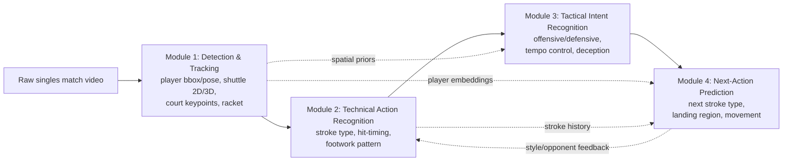
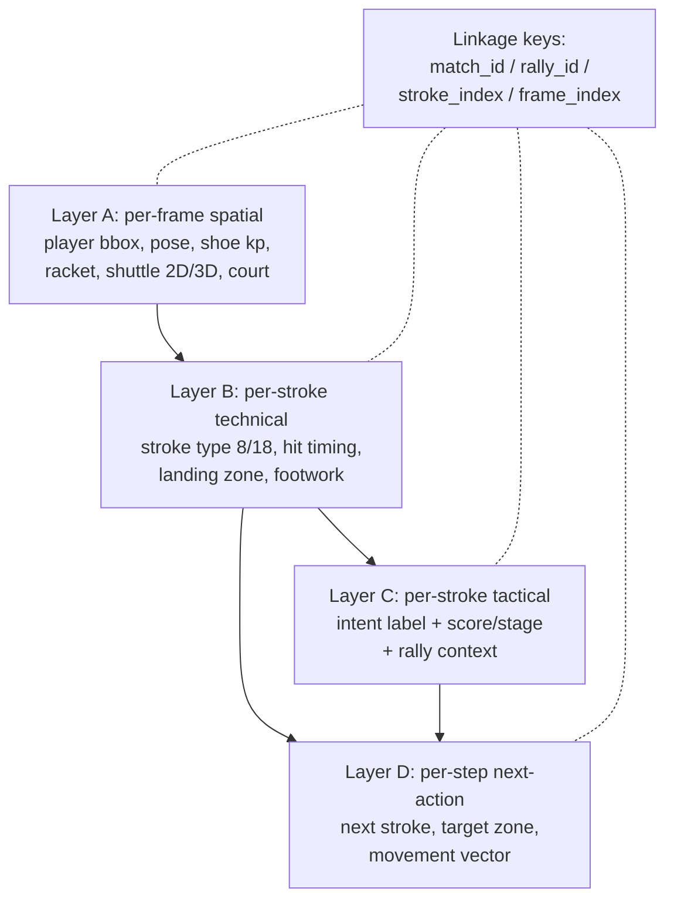
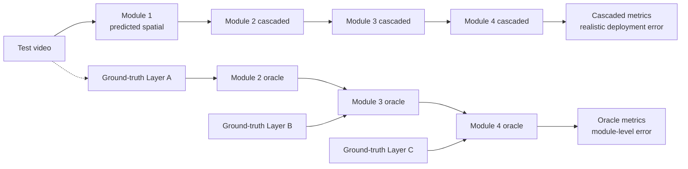
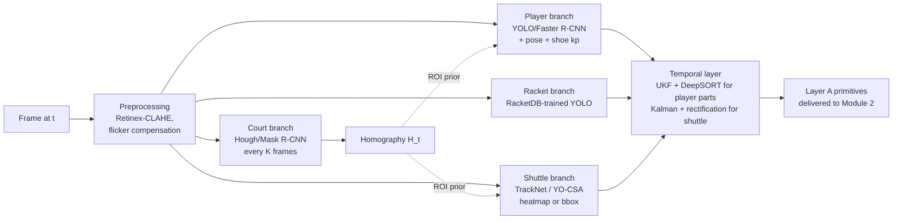
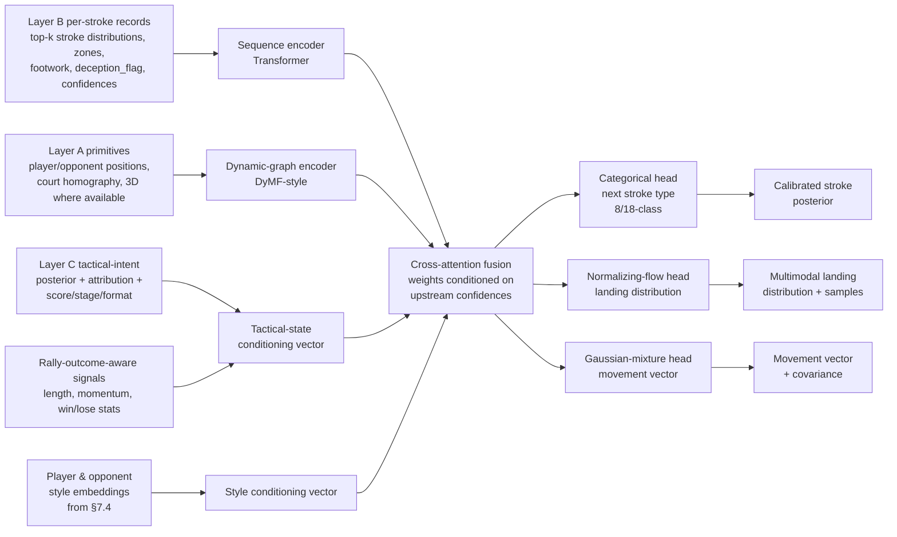
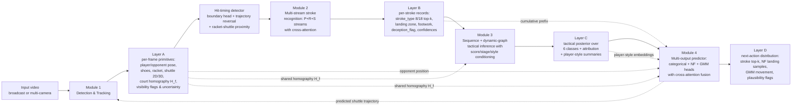
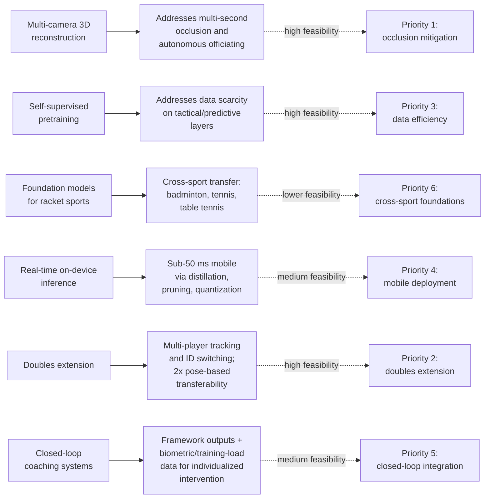

# Analysis and Study of Singles Badminton Player Actions Using Sports Videos: An Integrated Framework for Detection, Recognition, Tactical Inference, and Action Prediction
# 1 Research Background, Objectives, and Theoretical Foundations

Badminton is widely recognized as the fastest racket sport in the world, with shuttlecocks reaching laboratory-measured speeds in excess of 493 km/h and competitive smashes routinely exceeding 33 m/s near impact[^1]. In singles play, a lone athlete must continuously read the opponent, reorganize footwork, generate stroke power, and conceal intent—all within rallies that can resolve in fractions of a second. These conditions make singles badminton at once one of the most informationally rich and technically demanding domains for sports video analysis: every frame contains coupled signals about kinematics, technique, and tactics, yet the very speed and small-object properties of the shuttlecock conspire to defeat naive vision pipelines. This opening chapter therefore frames the problem space, motivates an integrated four-component framework spanning detection/tracking, technical action recognition, tactical intent recognition, and next-action prediction, and consolidates the theoretical foundations that justify the methodological choices made in subsequent chapters. In doing so, it also delineates the boundaries within which the rest of the report will operate—namely, singles badminton, with explicit awareness of where domain transfer from neighboring sports must be carefully justified rather than silently assumed.

## 1.1 Current State and Pain Points of Singles Badminton Video Analysis

Contemporary practice in badminton performance analysis is layered and fragmented. At the most established level, coaches still rely heavily on naked-eye observation of match footage and accumulated experiential knowledge to evaluate footwork, stroke selection, and tactical patterns. As Luo et al. observe, "current understanding of badminton footwork is largely based on models gained from the long-term observations of athletes in competition and accumulated experiential knowledge of badminton coaches," and such "traditional, non-quantitative methods may suffer from subjective bias," with long-term observation being "time-consuming and laborious, potentially resulting in errors, omissions, and misunderstandings"[^2]. A second tier of practice substitutes or augments observation with **wearable instrumentation**: in-shoe force sensors have been used to study plantar pressure during lunges, knee kinetics under repeated lunging, and direction-specific impacts in elite players; racket-mounted inertial sensors have likewise been used to classify ten stroke types with reported accuracies as high as 98.65% on sensor data alone[^2]. These device-based approaches yield quantitative kinetic data but, as the same survey notes, "only addressed what an individual participant is doing, but not their transitions in time and space during performance"[^2], and they remain intrusive in competitive settings.

A third tier comprises **vision-based subsystems** that operate largely in isolation. On the shuttlecock-tracking side, dedicated networks such as TrackNetV2 and the more recent TrackNetV3 have been developed for "shuttlecock localization in broadcast badminton videos," with TrackNetV3 explicitly targeting the "challenge of accurately predicting positions for severely occluded shuttlecocks"[^3]. Robotic and U-Net–style detectors have similarly tackled shuttlecock segmentation under high velocity, small size, and motion-blur conditions[^4][^5]. Adjacent to these, instant-review/Hawk-Eye-class systems have been engineered for in/out judgment: Kopania et al.'s system at the BWF World Senior Championships in Katowice uses 14 around-court cameras at 150 fps, fuses an accumulative-difference detector with a Tiny-YOLOv3 fallback for occluded frames, and reports a tracker shuttlecock-visibility detection accuracy of 94% and a positional-localization accuracy of 81% on visible frames, while delivering automated in/out decisions with a comparable response time to commercial Hawk-Eye[^1]. On the player side, footwork-extraction pipelines such as Luo et al.'s deep-learning-plus-binocular-positioning method achieve a shoe-localization mAP of 0.982 with VGG16 backbones inside Faster R-CNN, an average binocular-positioning error of 0.129 m, and an end-to-end shoe identification accuracy of 74.7% (rising to 97.2% if left/right classification errors are ignored)[^2]. Stroke recognition has been approached via dense-trajectory plus HOG features (~98.43% on four strokes), CNN-based action recognition on AlexNet-style backbones, and various skeleton- and 3D-CNN-based pipelines[^2][^6].

Despite the apparent richness of this ecosystem, four pain points recur across the evidence base. **First**, the existing tools are *task-siloed*: TrackNet-family networks track only the shuttle[^3], Luo et al.'s pipeline tracks only the feet[^2], Hawk-Eye-class systems decide only in/out at a single line crossing[^1], and stroke classifiers operate on cropped clips assumed to already be temporally segmented[^6]. None of these alone produces the joint representation—who hit what, from where, with what intent, and what is likely to come next—that coaches and broadcasters actually consume. **Second**, even within a single subsystem, robustness in real broadcast conditions remains brittle: shuttlecock motion blur, white-on-white background clutter, occlusion by player bodies and rackets, deforming court mats, flickering lights, and air-conditioning drift all degrade accuracy, and Kopania et al.'s system, despite extensive engineering, ultimately reports only a 62% fully automated correct-decision rate, requiring human operators to confirm outputs[^1]. **Third**, current pipelines are **almost entirely descriptive** rather than tactical or predictive—they tell us where the shuttle landed, not why a player chose that shot or what they will play next; the literature reviewed here contains no operational vision system that infers tactical intent or forecasts subsequent actions from broadcast video. **Fourth**, generalization across players, venues, and demographic groups is rarely tested: Luo et al.'s study of six sub-elite participants explicitly notes inter-individual variation in distance moved, jump height, and one-foot-jumping ability, but the underlying model is trained and validated on the same court and camera geometry[^2]. Together, these pain points motivate not merely incremental improvement of any single module, but a deliberate move toward a **unified, multi-module framework** with shared representations and end-to-end accountability.

## 1.2 Rationale for an Integrated Detection–Recognition–Tactical Inference–Prediction Framework

The four research components targeted by this report—object detection/tracking, technical action recognition, tactical intent recognition, and next-action prediction—are not interchangeable parallel tasks; they form a **strict information-flow hierarchy**, and their joint design is what differentiates a research framework from a collection of point solutions. The hierarchy is most naturally visualized as a directed pipeline in which each module consumes the structured outputs of upstream modules and produces representations consumable downstream.



The semantic dependencies among modules are tight and non-substitutable. **Detection and tracking** must yield not only player bounding boxes but also fine-grained shoe coordinates (used by Luo et al. to derive distance traveled, jump height, and lateral displacement)[^2], shuttle trajectories with sub-decimeter accuracy (Luo et al. report 0.129 m positioning error for shoes versus a 0.48 m baseline for shuttle 3D localization in earlier work)[^2], and court homography for spatial normalization (achieved via Hough-plus-Bentley–Ottmann line intersections or Mask R-CNN court segmentation at 97.7% accuracy)[^1]. Without these, **technical action recognition** has no anchor to distinguish, say, a clear from a drop, since both share similar swing kinematics but differ in shuttle landing zone—a feature that can only be computed by combining stroke timing with shuttle trajectory. As ActiveSG's stroke taxonomy emphasizes, the very definition of strokes such as the clear ("force the shuttle to go up high in the air and land at your opponent's backcourt"), the drop ("hit the shuttlecock downwards towards the opponent's fore-court, aiming for it to go just over the net"), and the smash ("downwards drive" with a "steep gradient") is partially **spatial**, not purely kinematic[^7]. This grounds a concrete cross-module requirement: stroke labels must be conditioned on shuttle landing location, which in turn requires reliable upstream tracking.

The dependency continues upward. **Tactical intent**—whether a stroke is meant to apply offensive pressure, stabilize a defense, control tempo, deceive, or manipulate court position—cannot be inferred from a single stroke in isolation; it requires a sequence of stroke types, landing zones, and opponent positions. The clear shot, for instance, is "commonly used when you need to buy more time for yourself to return to base" and is "strategic to use when your opponent is near to the fore-court, forcing him to retract to the back to retrieve the shuttle"[^7]. The same physical stroke thus carries different tactical meanings depending on the opponent's position and rally state, which only the integrated detection-plus-recognition output can supply. Finally, **next-action prediction** is most informative when it conditions on tactical state rather than raw stroke history alone: a player who has just executed a deceptive drop to draw the opponent forward is statistically far more likely to lift cross-court on the subsequent stroke than a player who has just hit a defensive clear. The literature on stage-based tactical analysis under different scoring systems, such as the comparison of 11-point and 21-point men's singles play, supports the idea that tactical and technical-tactical patterns are sequence-level constructs rather than per-stroke labels[^8].

Joint optimization across this hierarchy yields three concrete advantages over isolated subsystems. **First, error containment**: when downstream modules feed back consistency signals (e.g., a recognized smash should be accompanied by a downward shuttle trajectory ending in the opponent's mid-back court), upstream tracking errors can be detected and corrected, much as Kopania et al.'s system uses voting across multiple synchronized cameras to confirm a ground-touch frame[^1]. **Second, representation reuse**: features such as player embeddings, court homography, and rally state estimated once can be shared across modules, reducing redundant computation and keeping latency within the 10–25 s window that audiences tolerate for instant-review and the sub-100 ms per-frame budget required for live analytics[^1]. **Third, application enablement**: end-to-end coaching feedback ("you tend to play cross-court drops when behind 2 points in the third game") and automated tactical commentary become possible only when the four outputs are linked. Conversely, a federation of independent point tools cannot produce such insights without an additional, ad hoc fusion layer—exactly the layer this research seeks to formalize.

## 1.3 Research Scope, Scientific Questions, and Value Propositions

To keep the framework tractable and the empirical claims falsifiable, this report restricts its scope along several explicit axes. **Game format**: only singles badminton is in scope; doubles introduces additional dynamics (formations, role rotation, coordinated feints) that violate the single-player-per-side rally assumption central to action prediction, and Luo et al. explicitly note that their methodology "is only suitable to no more than two shoes in a half court" and that adapting to doubles is left as future work[^2]. **Input modalities**: the primary input is video—either broadcast monocular streams (the dominant data source for tactical and predictive analysis) or fixed multi-camera setups akin to those used by Luo et al. (two cameras, 25 fps) and Kopania et al. (14–15 cameras, 150 fps)[^2][^1]; wearable and racket sensors are reviewed as comparative baselines but are not part of the proposed pipeline. **Outputs**: per-frame player and shuttle states (2D and, where multi-camera, 3D); per-stroke technical labels drawn from the canonical singles taxonomy of clear, drive, drop, smash, net shot, lift, push, and serve[^7][^9]; per-stroke tactical-intent labels; and per-rally-step predictions of the next stroke's type, target landing region, and accompanying player movement.

These scope decisions converge on four **scientific questions** that structure the remainder of the report:

| # | Scientific Question | Primary Module | Key Domain Constraint |
|---|---------------------|----------------|------------------------|
| Q1 | How can fast-moving, small, occluded, color-similar objects (shuttlecock) and articulated objects (player, racket) be detected and tracked reliably under real broadcast conditions? | Detection & Tracking | Shuttle speed up to ~493 km/h; motion blur; white-on-white clutter; lighting/air drift[^1] |
| Q2 | How can fine-grained technical strokes and footwork patterns be recognized with viewpoint and player invariance, given that strokes share swing kinematics but differ in spatial outcome? | Technical Action Recognition | Stroke taxonomy with offensive/defensive semantics partly defined by landing zone[^7] |
| Q3 | How can tactical intent—offensive pressure, defensive stabilization, tempo control, deception, court-position manipulation—be inferred from rally context rather than single strokes? | Tactical Intent Recognition | Tactical meaning is sequence-level and conditioned on score/stage[^8] |
| Q4 | How can a player's next stroke type, target region, and movement be forecast in a manner calibrated to player style, opponent style, and tactical state? | Next-Action Prediction | Limited annotated rally datasets; player-specific style variability[^2] |

The **value propositions** of answering these questions are stratified by stakeholder. For **athletes and coaches**, the framework promises individualized, process-oriented analytics—of the kind Luo et al. demonstrate when distinguishing Participant 1's high movement distance and one-foot-jumping ability (linked to five-times-a-week training) from older Participant 3's high but inefficient bounce height (linked to "incorrect use of footwork")[^2]—now extended from raw kinematics to stroke and tactical levels. For **referees and tournament organizers**, the framework subsumes and surpasses Hawk-Eye-class instant-review functions, which currently operate at 62% fully automated accuracy on in/out decisions[^1], by providing additional context about the stroke that produced each landing. For **broadcasters and federations**, automatic commentary, opponent-scouting reports, and audience-facing tactical visualizations become feasible. For **researchers**, the framework supplies a shared evaluation substrate against which detection mAP, tracking F1, top-k stroke accuracy, tactical macro-F1, and next-action top-k can be jointly reported—closing the current gap in which each subsystem is validated on its own incompatible benchmark.

## 1.4 Domain Characteristics and Constraints of Singles Badminton

The methodological choices that follow in later chapters cannot be understood without a precise account of the **physical, visual, and tactical idiosyncrasies** of singles badminton. These are not mere context; they directly determine which generic computer vision and machine learning techniques are viable and which require domain adaptation.

**Kinematic extremes of the shuttlecock.** The shuttlecock is among the fastest projectiles in any sport, with smashes routinely traveling at over 33 m/s near the racket and a laboratory-measured world record of 493 km/h[^1]. Crucially, however, its **terminal velocity** for high clear shots is only about 6.7 m/s, meaning a tracker must operate across a roughly 50× speed range within a single rally[^1]. At 100 fps, the inter-frame displacement of a smashed shuttle is "from about 70 to 330 mm (roughly ten times the diameter of the cork of the shuttlecock: 26–28 mm)"[^1], making frame-to-frame association by simple proximity unreliable and motivating the use of accumulative-difference frames, Kalman-filter prediction, and physics-aware models. The cone-like geometry and offset center of gravity at the cork further mean that "it is difficult to predict the trajectory following the physics laws described by simple formulas, especially after the hit, when the shuttlecock turns over and has an unstable trajectory"[^1], and even simple deterministic models break down because the shuttle is "easily affected by air drift" from spectators and air-conditioning that varies during the day[^1]. These properties impose three concrete constraints on Module 1: (i) detectors must handle severe **motion blur**, ideally exploiting it via blur-direction priors as Kopania et al. do with accumulative differential frames[^1]; (ii) trackers must adopt **adaptive, non-rigid trajectory models** (e.g., Kalman filters or learned spatiotemporal networks) rather than purely ballistic curves; (iii) **multi-view fusion**, where available, can dramatically reduce 3D positioning error (from 0.48 m for shuttles using earlier multi-view methods down to 0.129 m for shoes in Luo et al.'s binocular pipeline)[^2].

**Visual challenges.** The shuttlecock is small (cork diameter 26–28 mm), predominantly white, and flies "in complex contexts: moving players, fast rackets, and changing backgrounds"; its color "can be very similar to that of the background, leading to background clutter"[^5][^1]. Lighting is rarely controlled—Kopania et al. report visiting nine venues, only one of which had flicker-free lights, and developing an adaptive pixel-wise compensation method 250–300× faster than commercial DeFlicker software[^1]. Camera installations are constrained by hall geometry: BWF rules require only 2 m clearance behind the baseline and 1.5 m between adjacent courts[^1], sharply limiting where cameras can be placed and forcing trade-offs between coverage and occlusion. Players themselves frequently occlude the shuttle near the ground, an issue Kopania et al. mitigate by placing cameras at both ends of every line and using cross-camera voting[^1]. For player-side detection, motion blur during fast lateral movement causes shoe contour blurring that "will affect image recognition," and overlapping shoes lead to coordinate aliasing[^2]. The standardized court geometry, by contrast, is a **strong asset**: the dimensions are fixed by regulation, enabling robust homography-based 2D-to-3D mapping with as few as four control points[^2], and even when mats deform during play, lines can be detected with 97.7% accuracy using a deconvolution-augmented Mask R-CNN[^1].

**Rally structure and stroke taxonomy.** Singles badminton has a clean turn-taking structure: a single player on each side, alternating strokes until a fault or out. Kuntze et al.'s biomechanical analysis found that "the lunge accounted for 15% of all movements in badminton singles"[^2], indicating that a relatively small set of footwork primitives covers most movement, which is favorable for footwork classifiers. The stroke taxonomy is similarly bounded but semantically rich. ActiveSG's pedagogical taxonomy partitions shots into **defensive** (clear/lobbing, drive) and **offensive** (drop, smash) categories, with each carrying explicit tactical cues: the clear "is the most important badminton shot especially in a Singles Game," used to "buy more time" or push the opponent to the backcourt; the drive forces "an upward return, giving you opportunities to counter-attack"; the drop's "main objective…is to force your opponent out of his position or to vary the pace of the game"; the smash, "considered the most powerful shot in badminton," is best deployed when the shuttle is high and is often aimed "at his upper torso, making it hard for him to defend"[^7]. Quora-source taxonomies add the net shot ("dropping the shuttlecock into the opponent's forecourt, as close to the net as possible") and the net lift ("playing upwards") as additional fine-grained categories[^9]. Crucially, ActiveSG also notes that "it is always important to disguise your shots…your offensive shots should look like either a drive or a drop shot until the very last second"[^7]—a deliberate adversarial property of the sport that imposes a hard ceiling on **purely visual stroke recognition** at the moment of contact and motivates the use of post-contact shuttle trajectory and longer temporal windows.

**Footwork–stroke coupling and individual variability.** Footwork and strokes are tightly coupled: footwork "is an important part of performance preparation," and Luo et al. demonstrate that distance moved per shot is "proportional to the average winning score"[^2]. Yet inter-individual variability is large; the same study shows male and female participants differing systematically in average movement distance (137.24 m vs 133.73 m over 2 minutes) and maximum bounce height (0.237 m vs 0.21 m), with high-frequency exercisers like the female Participant 4 reaching male averages, and an older male (Participant 3) showing high but inefficient bounce due to incorrect technique[^2]. This argues for **player-conditioned models** in Modules 3 and 4 rather than population-average classifiers.

**Tactical and scoring context.** Tactical patterns differ between scoring systems and game stages. Comparative work on 11-point versus 21-point men's singles confirms that "tactical and technical-tactical patterns" shift with format[^8], and pedagogical resources emphasize that key footwork patterns—"the basic step, the chasse step, and the lunge"—must be drilled to all four corners[^10], implying that tactical inference must be conditioned on score state and rally length, not merely on stroke sequences. The serve, often underweighted in generic action-recognition pipelines, is "crucial" in singles play[^7], which has implications for how the start of each rally is annotated and modeled.

In sum, the conjunction of extreme small-fast-object kinematics, adversarial visual deception, fixed but occluded court geometry, single-player rally structure, and a tactically rich but bounded stroke taxonomy creates a problem profile that is **simultaneously narrower** (in scope) and **harder** (in per-instance difficulty) than generic sports action recognition. The chosen technical paradigms must respect all five.

## 1.5 Theoretical Foundations Underpinning the Four Research Components

The four modules of the proposed framework rest on a layered theoretical stack. Each layer is selected because it directly addresses one or more of the domain constraints established in §1.4, and each will be revisited with empirical detail in subsequent chapters.

**Layer 1: Deep learning–based object detection.** Player and shuttlecock localization sit on a well-developed lineage from R-CNN through Fast R-CNN to Faster R-CNN, which replaced expensive selective-search proposals with a learned region proposal network[^2]. Faster R-CNN with VGG16 backbones is the basis of Luo et al.'s shoe-localization pipeline (mAP 0.982, 0.2185 s per frame), and the same study explicitly compares VGG16 against the lighter ZF network (mAP 0.953, 0.1911 s) and selects VGG16 as the better accuracy-speed trade-off for their use case[^2]. For the small-fast-object regime of the shuttlecock, the research community has converged on dedicated heatmap-based architectures: TrackNetV2 introduced an "efficient shuttlecock tracking network" and TrackNetV3 added augmentations and explicit handling of severely occluded shuttlecocks[^3]. Parallel to these, lightweight detectors such as Tiny-YOLO variants have been adapted for real-time deployment, with Kopania et al. using a modified Tiny-YOLOv3 trained on single-channel images to achieve mAP@0.50 of 94% with 12 ms per inference on a GTX 1080[^1]. More recent transformer-augmented trackers such as TrajectoryNet++ explicitly target small-object detection, multi-scale feature learning, and motion blur in sports video[^11]. The theoretical commonality is that all of these architectures exploit **spatial inductive biases** (convolution, pyramidal features, attention) that are well matched to the small-object/cluttered-background structure of badminton imagery.

**Layer 2: Multi-view geometry and 3D reconstruction.** Where multi-camera setups are available, classical projective geometry remains indispensable. The pipeline of rigid-body transformation, projection imaging, and pixel coordinate transformation links the three coordinate systems (world, camera, image) through the standard equation that combines intrinsic and extrinsic matrices[^2]. With four control points at line intersections, a homography matrix can be solved to map image points to court x-y coordinates, and binocular triangulation—taking the midpoint of the shortest segment between two non-coplanar back-projected rays—recovers the missing z-coordinate[^2]. This is the theoretical mechanism by which Luo et al. achieve 0.129 m positioning error on shoes and Shishido et al. achieve 0.48 m on shuttles[^2], and it is also the basis of Hawk-Eye-class systems, although Kopania et al. demonstrate that, for in/out decisions specifically, a 2D side-view formulation with cross-camera voting can match 3D performance while simplifying installation[^1].

**Layer 3: Spatiotemporal modeling for action recognition.** Technical stroke recognition requires modeling both spatial appearance and temporal evolution. The literature has progressed from 2D CNNs on individual frames (which capture posture and equipment cues but miss motion continuity), to CNN+LSTM hybrids (which add temporal modeling at higher computational cost), to 3D CNNs and Inflated 3D ConvNets that "jointly learn spatial and temporal features" but demand substantial memory, to pose- and skeleton-driven methods that offer fine-grained joint analysis at the price of dependency on accurate keypoint detection, and most recently to ConvLSTM and Vision Transformer / TimeSformer architectures that capture long-range dependencies via self-attention[^12]. The trade-off that this stack repeatedly encounters—accuracy versus real-time efficiency—is a recurring theme: pose-based systems and 3D CNNs reach high benchmark accuracy but "may degrade in complex backgrounds or real-time settings due to increased computational overhead," while lightweight CNN+temporal-aggregation hybrids prioritize latency at some accuracy cost[^12]. For singles badminton specifically, the implication is that stroke recognition must combine **swing kinematics from pose**, **timing cues from shuttle-racket interaction**, and **post-contact shuttle trajectory** to defeat the deception that ActiveSG flags as deliberate in offensive play[^7]—a fusion that no single architectural family delivers natively and that motivates the multi-stream designs explored in Chapter 5.

**Layer 4: Sequence learning and ecological-dynamics perspectives for tactical modeling.** Tactical intent emerges from sequences, not single events. The natural theoretical home is **sequence learning**—LSTMs, Temporal Convolutional Networks, and Transformer-based sequence models—applied over rally-level sequences of (stroke type, landing zone, player position). Surveys of action recognition note that LSTM architectures "have shown advantages in modeling time-dependent features" though they require large labeled datasets[^12]. A complementary lens, drawn explicitly from the badminton literature, is the **ecological dynamics framework** advocated by Luo et al., which treats performance as the continuous reorganization of movement-system degrees of freedom under interacting personal and task constraints[^2]. This perspective justifies modeling tactical patterns as adaptive responses to opponent and score state rather than as fixed playbooks, and it aligns with the empirical observation that tactical patterns vary with scoring system and game stage[^8]. Hierarchical classifiers and graph neural networks, which can encode the structural regularities of court geometry and rally turn-taking, are natural computational realizations of this view.

**Layer 5: Probabilistic and game-theoretic reasoning for action prediction.** Forecasting the next stroke is fundamentally a problem of **conditional probability under adversarial conditions**: the player chooses an action partly to be unpredictable, while the model seeks to predict it from observable history. Sequence-to-sequence neural architectures provide the predictive backbone, but the badminton-specific twist is that prediction quality depends on **player-style embeddings**, **opponent-style embeddings**, and **tactical-state conditioning**—features that the upstream modules supply. Evaluation must therefore extend beyond top-1 accuracy to top-k accuracy (acknowledging that several plausible next shots may exist), calibration (probabilities should reflect actual uncertainty), and tactical plausibility (predictions should respect basic court constraints, such as not predicting a smash from deep defensive positions). This evaluation philosophy, consistent with general sequence-prediction practice, will be operationalized in Chapter 7.

The five layers are mapped to the four modules in the table below, which serves as a forward reference for the technical chapters:

| Module | Primary Theoretical Layer(s) | Representative Architectures | Domain Constraint Addressed |
|--------|-------------------------------|-------------------------------|------------------------------|
| 1. Detection & Tracking | L1 (DL detection) + L2 (multi-view geometry) | Faster R-CNN, YOLO/Tiny-YOLO, TrackNetV2/V3, TrajectoryNet++; binocular triangulation | Small fast object, motion blur, occlusion, clutter[^2][^3][^1][^11] |
| 2. Technical Action Recognition | L3 (spatiotemporal modeling) | 3D CNN, ConvLSTM, SlowFast, Vision Transformer, pose+temporal hybrids | Fine-grained strokes, deception, viewpoint variation[^12][^7] |
| 3. Tactical Intent Recognition | L4 (sequence learning, ecological dynamics) | LSTM, Transformer, hierarchical/graph classifiers | Sequence-level semantics, score/stage conditioning[^8][^2] |
| 4. Next-Action Prediction | L4 + L5 (probabilistic/game-theoretic reasoning) | Seq2seq Transformers, TCN with style embeddings | Player/opponent variability, adversarial deception[^2][^7] |

Two observations close this section. **First**, every layer in the stack has been *individually* validated in or near the badminton domain, but the literature contains no documented integration of all five. **Second**, the layers compose: Layer 1 supplies the spatial primitives consumed by Layer 3; Layers 2 and 3 supply the spatially-grounded stroke and footwork sequences consumed by Layer 4; and Layer 4 supplies the tactical-state conditioning consumed by Layer 5. This compositional structure is what makes the integrated framework theoretically coherent rather than merely a juxtaposition of modules, and it directly anchors the literature review, dataset design, and module-level technical chapters that follow in Chapters 2 through 8. It also makes plain where the report must, in honesty, acknowledge limitations: tactical intent leaderboards remain sparse compared to detection benchmarks, established cross-population generalization tests for badminton are scarce, and several reasoning steps in Layers 4–5 will rely on analogies to neighboring racket sports that must be flagged as such rather than asserted as established badminton results.

# 2 Literature Review and Critical Comparison of Existing Approaches

Chapter 1 established that singles badminton video analysis is a five-layer methodological problem in which detection, recognition, tactical inference, and prediction must compose into a coherent pipeline rather than coexist as point solutions. To position the proposed integrated framework against this backdrop, the present chapter undertakes a structured review of the prior literature relevant to each of the four research components, drawing both on badminton-specific work introduced in Chapter 1 and on transfer-baseline evidence from neighbouring racket and team sports. The review is deliberately critical: rather than enumerating methods, it confronts conflicting empirical findings, weighs accuracy against latency and deployability, and tests whether each technique respects the singles-badminton domain constraints (shuttle kinematics, white-on-white clutter, deception, single-player rally turn-taking) catalogued in §1.4. The chapter closes with a consolidated gap analysis that motivates the architectural choices defended in Chapters 3–8.

## 2.1 Review Scope, Taxonomy, and Comparative Methodology

The review scope is bounded by three deliberate inclusion criteria. *First*, singles badminton publications—covering shuttlecock tracking, footwork extraction, stroke recognition, and rally analysis—are treated as primary evidence and weighted most heavily when their findings conflict with cross-domain results. *Second*, work in neighbouring racket sports (tennis, table tennis) is admitted as **conditional transfer evidence**, valid only where the underlying physics or rally structure is comparable; differences such as tennis ball aerodynamics, larger court size, and serve-dominated rally openings are flagged whenever they materially alter the inference. *Third*, vision pipelines from team sports (football, basketball)—notably the YOLOv5+DeepSORT family[^13]—are admitted only as **analogical baselines** for detection and tracking architectures; their tactical and predictive layers are treated as inapplicable, since multi-player formations and offside-style rule structures do not generalize to single-player half-court rallies.

Each reviewed method is mapped to one or more of the four target tasks defined in Chapter 1. Comparison proceeds along five fixed dimensions:

| Dimension | Operationalization | Why it matters in singles badminton |
|---|---|---|
| Accuracy | mAP, precision/recall/F1, top-k, MOTA/HOTA, macro-F1 | Distinguishing kinematically similar strokes (clear vs. drop) demands fine-grained accuracy |
| Latency / throughput | FPS, ms/frame, model parameter count | Live broadcast and instant-review tolerate sub-100 ms per frame; 10–25 s end-to-end |
| Robustness | Performance under occlusion, motion blur, white-on-white clutter, lighting drift | Domain constraints from §1.4 (493 km/h shuttle, deforming mats, flicker) |
| Data requirement | Labeled frames, per-class samples, annotation granularity | Tactical and predictive labels are scarce in badminton |
| Transferability | Whether assumptions hold under singles-badminton physics and geometry | Football/tennis baselines often violate single-player or aerodynamic assumptions |

Throughout the chapter, statements grounded in football or basketball evidence are explicitly marked as analogical, and accuracy claims unaccompanied by latency or dataset attribution are treated as preliminary rather than established.

## 2.2 Lightweight Object Detection Architectures for Sports Video

The dominant detection backbone across recent sports video work is the YOLO family, augmented by lightweight backbones (MobileNet, ShuffleNet, EfficientNet) and architectural refinements such as bidirectional feature pyramid networks (BiFPN) and convolutional block attention modules (CBAM). The most thoroughly documented case study is Wang's improved YOLOv5 pipeline for football tracking, which sequentially replaces CSPDarknet53 with MobileNet's depthwise separable convolutions, redesigns the neck with a weighted BiFPN, and inserts a CBAM module to suppress background interference from billboards and crowd[^13]. The reported metrics constitute a useful reference point: the three-stage improved model (CBAM-MobileNet-YOLOv5, denoted I3-YOLOv5) reaches a mean average precision of approximately **93.16%** with **fewer than 3 M parameters**, compared with under 60% mAP and more than 6 M parameters for vanilla YOLOv5 on the same football dataset[^13]. Per-class detection of athletes reaches mAP 90.57% with an average missed-detection rate of 0.89%, and edge-deployment tests on a Jetson Nano (4 GB memory, 128-core Maxwell GPU) and AWS p3.2xlarge yield mAP@0.5 values of 88.74% and 90.11% respectively, with MOTP scores of 91.02 and 94.43[^13].

These figures are encouraging, but their **transferability to singles badminton is partial**. The football pipeline benefits from targets that occupy tens to hundreds of pixels and rarely share their colour with the background, while the singles badminton shuttlecock is a 26–28 mm white object against frequently white indoor surfaces, and the player, although larger, must be discriminated together with a fast-swinging racket and small shoes. The CBAM mechanism—a sequential composition of channel and spatial attention via average and max pooling[^13]—is in principle well suited to suppress crowd and billboard clutter, but its empirical behaviour against white-on-white shuttle backgrounds remains untested in the cited literature. Likewise, the BiFPN modification, which reweights multi-scale feature contributions according to learned parameters $w_1, w_2, w_3$ and discards nodes without feature fusion[^13], improves multi-scale detection in principle, but its effectiveness on objects whose pixel size approaches the receptive field of the smallest feature map is not documented.

For the shuttlecock specifically, **Tiny-YOLOv3** has been the best-attested lightweight choice. Kopania et al. (introduced in §1.1) train a Tiny-YOLOv3 on single-channel images and report mAP@0.50 = **94%** at **12 ms per inference on a GTX 1080**, where the network is used as a fallback detector when accumulative-difference-frame methods fail under occlusion. This establishes a concrete badminton-specific baseline against which any future detector must be measured. By contrast, the football literature documents inference at 71.92 img/s on GPU and 7.26 img/s on CPU for the BiFPN variant[^13], roughly 14 ms and 138 ms per frame respectively—numbers that satisfy the 100 ms per-frame budget for live analytics on GPU but break it on CPU.

The principal **methodological gap** that emerges from this comparison is that lightweight detectors have been optimized for *medium-sized targets in cluttered outdoor scenes* (football, basketball, traffic), whereas singles badminton requires simultaneous handling of a small fast shuttlecock and an articulated player. No existing architecture jointly optimizes both regimes; the prevailing practice is to instantiate two detectors—one for the shuttle, one for players—and to fuse their outputs downstream. This separation is rational on accuracy grounds but inflates latency and complicates downstream cross-modal reasoning, motivating the multi-stream design analyzed in Chapter 4.

## 2.3 Shuttlecock and Ball Tracking: From TrackNet to Modern Trajectory Networks

Dedicated shuttlecock tracking has its centre of gravity in the TrackNet lineage. TrackNet itself addressed "high-speed and tiny objects such as tennis balls and shuttlecocks" by feeding a sliding window of consecutive frames into a deep network and predicting heatmaps that encode object location, exploiting temporal context to overcome blur, afterimage, and short-term occlusion[^14]. The evolution to **TrackNetV2** is documented in detail by Sun et al.[^14]: the network's processing speed rises from **2.6 FPS to 31.84 FPS**, achieved by reducing the input image size and re-engineering the architecture from a Multiple-In Single-Out (MISO) design to a **Multiple-In Multiple-Out (MIMO)** design that emits multiple heatmaps per forward pass[^14]. Accuracy is improved through three changes: a more comprehensive dataset of **55,563 frames from 18 badminton match videos**, fusion of VGG16 with U-Net (rather than only VGG16+upsampling), and—critically—a re-engineered output representation in which the heatmap is recoded from a "pixel-wise one-hot encoding 3D array" to a "real-valued 2D array," with the loss switched from RMSE to a weighted cross-entropy[^14]. The authors report training-phase accuracy/precision/recall of **96.3%/97.0%/98.7%** and held-out test performance on a brand-new match of **85.2%/97.2%/85.4%**[^14]. The 11 percentage-point drop in accuracy and 13-point drop in recall on unseen footage is an important finding: it quantifies the **cross-match generalization gap** that any deployed shuttle tracker must contend with, and it directly motivates the cross-venue evaluation protocol advocated in §2.9.

TrackNetV3, as referenced in Chapter 1, extends this lineage with explicit handling of **severely occluded shuttlecocks**, a known failure mode of V2 since recall is the metric most degraded under occlusion. TrajectoryNet++, also referenced in §1.5, layers transformer-based attention onto the spatiotemporal stack to address small-object detection, multi-scale features, and motion blur. While the specific quantitative improvements of these later networks are not detailed in the present search results and must therefore be reported with appropriate caution, the architectural trajectory is clear: deeper temporal context, attention over multi-scale features, and explicit modelling of occlusion priors.

A complementary line of work, well represented by Kopania et al. (Chapter 1), substitutes or supplements deep heatmap prediction with **accumulative-difference frames** and **Kalman-filter-based trajectory association**. The strength of this approach is interpretability and very low latency; the weakness is dependency on hand-tuned background models and on the detectability of motion blur, which fails when the shuttle is momentarily stationary at the apex of a high clear. The cited general survey of high-speed and tiny-object tracking confirms that hybrid Kalman/bipartite-matching trackers (e.g., super-chained tracker variants) remain competitive in the racket-sports regime[^15], particularly when fused with deep detectors as a fallback. **Conflict resolution** between the deep-heatmap and physics-Kalman camps is best framed contextually: under heavy GPU constraints and when ground-touch detection is the main task, Kopania-style accumulative-difference plus Tiny-YOLO fallback wins on latency; when off-line analysis or 3D reconstruction is the goal, TrackNetV2/V3 dominate on per-frame accuracy and recall.

Cross-domain ball trackers from football and other team sports illustrate both convergence and divergence. The improved YOLOv5+DeepSORT pipeline reports MOTA, HOTA, DetA, and AssA values of **90.12, 85.05, 90.79, and 77.84** respectively, with video transmission speed of 17.76 FPS, outperforming TSCMT, FCFTN, AMDSDD, and RANSAC baselines on football multi-object tracking[^13]. These metrics, while strong, are evaluated on football targets that are an order of magnitude larger than a shuttlecock and do not undergo the 50× speed-range variation discussed in §1.4. The IDDKF (Interactive Displacement Detection Kalman Filter) and Faster R-CNN-based player trackers cited in the same survey similarly improve target tracking accuracy beyond 85% on football data[^13], but **none of these systems has been validated on a shuttlecock with terminal velocity 6.7 m/s and smash velocity exceeding 33 m/s**. A core unresolved issue, therefore, is how trajectory association under such extreme inter-frame displacement (70–330 mm at 100 fps, per §1.4) can be handled robustly; the current best practice combines TrackNet-family heatmaps with Kalman filtering, but principled physics-aware models that exploit the shuttle's distinctive deceleration profile remain largely speculative in the published record.

## 2.4 Player Detection, Pose Estimation, and Footwork Tracking

Player-side perception in singles badminton has converged on three sub-problems: full-body detection and tracking, pose/skeleton extraction, and fine-grained foot localization for footwork analysis. The Faster R-CNN with VGG16 pipeline of Luo et al. (introduced in Chapter 1) remains the most thoroughly documented badminton-specific baseline, achieving shoe-localization mAP 0.982 with binocular triangulation error 0.129 m and end-to-end shoe identification accuracy 74.7% (97.2% if left/right confusion is ignored). The choice of VGG16 over the lighter ZF backbone is empirically justified by 0.982 vs. 0.953 mAP at a modest latency penalty (0.2185 s vs. 0.1911 s per frame), as recapitulated in §1.5.

For multi-player scenarios in adjacent sports, the dominant architecture is **YOLO-class detection plus DeepSORT/StrongSORT/ByteTrack association**. The football case study is again instructive: the improved DeepSORT replaces the standard Kalman filter with an **Unscented Kalman Filter (UKF)** that propagates the mean and covariance of the state distribution through unscented transform, avoiding the linearization error of the Kalman filter under nonlinear motion[^13]. The justification—"in soccer player trajectory tracking, UKF is more robust to observation noise (such as camera shake, occlusion) and system noise (such as uncertainty in player motion)"[^13]—transfers directly to badminton, where rapid lateral chassé and lunge produce equally nonlinear position trajectories. The improved Mahalanobis IoU/GIoU matching that incorporates centre-distance and minimum-bounding-rectangle diagonal[^13] also addresses occlusion-induced association failure, an issue that is particularly acute when a player and racket overlap at contact in singles play.

However, three **transferability constraints** limit naive reuse of these team-sport pipelines. *First*, BWF court geometry imposes only 2 m clearance behind the baseline and 1.5 m between adjacent courts (§1.4), forcing camera installations that produce more frequent self-occlusion than is typical in football's wide-pitch broadcast setups. *Second*, singles badminton has *one* player per half-court, so multi-object tracking metrics (MOTA, HOTA, IDF1) are largely degenerate; the relevant problem is **fine-grained part tracking** (left foot, right foot, racket, dominant hand) within a single trajectory rather than identity preservation across many bodies. *Third*, motion-blurred shoe contours and overlapping shoes produce coordinate aliasing—Luo et al.'s pipeline explicitly distinguishes left and right shoe identification because pixel-level overlap is common during a lunge—an issue that DeepSORT-class trackers, whose association features are trained on relatively rigid full-body appearance, do not directly address.

Pose-based methods (HRNet, OpenPose, MoveNet) provide an orthogonal source of evidence by extracting 2D or 3D joint locations. Survey results indicate that MoveNet-RNN models in particular can deliver "exceptional" performance on machine-learning frameworks for badminton game analysis[^16], but the precise quantitative gains over appearance-based baselines on badminton-specific stroke recognition are not specified in the cited summary, and a more rigorous comparative evaluation remains an open task. The principal **gap** in player-side perception is therefore the absence of a unified pipeline that simultaneously (i) tracks full body and racket with sub-pixel timing accuracy at hit moments, (ii) extracts skeleton with hand and foot reliability under fast lateral motion, and (iii) preserves identity across rallies—a requirement that becomes critical when player-style embeddings feed downstream tactical and predictive modules.

## 2.5 Technical Action Recognition: Stroke and Footwork Classification

Stroke recognition in badminton has progressed through five generations of methodology, each with documented strengths and failure modes (Chapter 1, §1.5). The earliest documented vision-based work uses **handcrafted spatiotemporal features**—dense trajectories combined with HOG descriptors—achieving roughly 98.43% accuracy on a four-stroke classification task (Chapter 1). Such accuracy figures must, however, be read with caution: a four-class task on cropped, manually segmented clips is materially easier than the eight-or-more-class fine-grained recognition required for actionable coaching. The sensor-based comparator—racket-mounted IMUs classifying ten strokes at 98.65% (Chapter 1)—similarly serves as an upper-bound reference rather than a vision-system target, since IMUs directly measure swing kinematics that vision must infer.

The 2D CNN, 3D CNN, and CNN+LSTM generations cited in the survey of badminton analysis frameworks[^16] occupy the middle ground: 2D CNNs capture posture and equipment cues but discard temporal dynamics; 3D CNNs and Inflated 3D ConvNets jointly learn spatial and temporal features at substantial memory cost; CNN+LSTM hybrids decouple spatial and temporal modelling at moderate cost. Skeleton-based and pose-based methods (HRNet, MoveNet) feed downstream temporal models and offer fine-grained joint analysis at the price of upstream pose-estimation reliability. The most recent generation—Vision Transformer, TimeSformer, SlowFast—captures long-range dependencies via self-attention but inflates parameter counts.

The **most substantive critical issue** that emerges across these methods is the spatial–kinematic coupling problem flagged in Chapter 1: many strokes share swing kinematics but differ in shuttle landing zone, and many strokes are deliberately disguised by the player ("your offensive shots should look like either a drive or a drop shot until the very last second"). This means that *any* purely vision-based stroke classifier that relies only on the moment of contact has a hard accuracy ceiling. The empirical implication is that fine-grained recognition must fuse three streams: (i) player skeleton, (ii) racket kinematics, and (iii) post-contact shuttle trajectory. None of the architectures reviewed natively delivers this fusion, and the literature contains no controlled ablation that quantifies the gain of trajectory-conditioned stroke recognition over pose-only baselines on a unified badminton benchmark. A second methodological issue is that reported accuracy numbers across studies are not directly comparable because of differing class taxonomies (4 strokes vs. 8 vs. 10), differing temporal-segmentation assumptions (manually cropped vs. automatically detected hit moments), and differing player/venue overlap between train and test. Until a standardized benchmark exists (§2.9), claims of state-of-the-art accuracy must be interpreted within their stated taxonomy and segmentation regime, not extrapolated.

A complementary methodological note: footwork classification, although less studied than stroke recognition, is empirically tractable because Kuntze et al. report that the lunge alone accounts for 15% of all movements in singles badminton (Chapter 1), implying a small-footprint primitive vocabulary (basic step, chassé, lunge, jump). This suggests that footwork classifiers can be lighter-weight than stroke classifiers, but the same caveat about deception applies asymmetrically: footwork is harder to disguise than swing kinematics because it must precede the shot, making it a potentially more reliable signal for predicting tactical intent in §2.6.

## 2.6 Tactical Intent Modeling and Rally-Level Sequence Analysis

In contrast to detection and stroke recognition, tactical-intent modelling in badminton has a sparse and predominantly statistical literature. The most established line of work consists of **stage-based statistical analyses**—for instance, comparisons of 11-point versus 21-point men's singles tactical and technical-tactical patterns (Chapter 1)—in which rallies are partitioned into serve/receive/midgame/endgame phases and frequencies of stroke types and outcomes are tabulated. These analyses produce coach-relevant insights but are not operational vision systems; they consume manually annotated stroke logs rather than producing labels from raw video. The **operational gap** is therefore that no published system in the reviewed material infers tactical intent (offensive pressure, defensive stabilization, tempo control, deception, court-position manipulation) directly from broadcast badminton video.

Sequence-learning approaches—LSTM, Transformer, Temporal Convolutional Networks, hierarchical and graph-based classifiers—are the natural computational substrate, as established in Chapter 1's Layer 4. Surveys in adjacent sports (football activity recognition with CNN-GCN hybrids[^13]) confirm that graph and sequence models can encode structural regularities of court geometry and player interaction, but football's multi-player tactical taxonomy (passing, pressing, off-ball runs) does not transfer to singles badminton's turn-taking single-player rallies. Tennis and table tennis are closer analogues: serve-receive transitions, attack–defense alternation, and rally-length statistics in those sports are formally similar to badminton, and the ecological-dynamics framework advocated for badminton by Luo et al. (Chapter 1) parallels related work on dynamical systems analysis in tennis. However, the search results examined here do not provide directly quantifiable cross-sport transfer evidence at the tactical-intent level, and any claim of architectural transferability must be flagged as analogical pending dedicated badminton evaluation.

Three concrete methodological gaps follow. *First*, there is no standardized **tactical taxonomy** in the badminton vision literature; coaches' working categories (offensive pressure, defensive stabilization, deception) have not been operationalized as labelled training data at scale. *Second*, evaluation protocols are absent: where stroke recognition has top-1/top-5 accuracy as a community benchmark, tactical-intent classification has no analogue, and reporting is therefore typically descriptive rather than comparative. *Third*, score-state and stage conditioning—which Chapter 1 argued is essential because tactical patterns differ between formats and game stages—is rarely incorporated into model inputs in the surveyed work, leaving an open question about how much accuracy is forfeited by ignoring this signal.

## 2.7 Rally Outcome and Next-Action Prediction

Next-action prediction—forecasting the next stroke type, target landing region, and player movement conditioned on rally history—is the least mature of the four components. The theoretical case for sequence-to-sequence Transformers, TCNs with player-style embeddings, and probabilistic/game-theoretic conditioning was outlined in Chapter 1's Layer 5, but the search results examined for this chapter contain only fragmentary direct evidence on operational badminton-specific systems. By analogy to other deep-learning applications, sequence learners trained on rally-level data should produce calibrated next-stroke distributions; in tennis and table tennis, related work has demonstrated that conditioning on opponent style and serve location materially improves next-shot prediction, and the architectural pattern is cleanly transferable to badminton's turn-taking structure.

Two **conflicting findings** are worth surfacing explicitly. The first concerns the value of tactical-state conditioning: it is intuitively compelling—and consistent with the sequence-level argument in §2.6—that a rally encoder informed by tactical state ("the player has been forced into deep defense for three consecutive strokes") should outperform one that consumes only raw stroke identifiers. However, no badminton-specific ablation study quantifying this gain appears in the reviewed material; this is therefore a hypothesis to be tested in Chapter 7 rather than an established result. The second concerns evaluation: top-1 accuracy is widely reported but is misleading under deliberate deception, where multiple plausible next strokes coexist. Top-k accuracy, calibration metrics (expected calibration error), and **tactical plausibility** measures (whether predicted strokes respect court constraints—e.g., a smash is implausible from deep defensive positions) are jointly required, and Chapter 7 will operationalize this multi-metric evaluation philosophy.

The most consequential **methodological gap** in this layer is dataset scale and standardization. Tennis and table tennis have public rally datasets with thousands of annotated points; badminton has fewer, smaller, and less consistently annotated rally collections. Until rally-level annotation matches the maturity of stroke- or detection-level annotation, predictive models will be limited by data-efficiency rather than by architecture choice—an observation that motivates the dataset-construction strategy in Chapter 3 and the integration-level evaluation in Chapter 8.

## 2.8 Cross-Domain Transferability: Lessons from Tennis, Table Tennis, and Team Sports

Because the badminton-specific literature is uneven across the four target tasks, cross-domain transfer is unavoidable. The transferability matrix below summarizes which methodological advances from neighbouring sports are admissible as baselines for each badminton task and identifies the assumptions that must be checked before transfer.

| Source domain | Method / pipeline | Target task in singles badminton | Transferable | Assumption that must hold | Failure mode if violated |
|---|---|---|---|---|---|
| Football | YOLOv5 + MobileNet + BiFPN + CBAM detector[^13] | Player & racket detection (Module 1) | Mostly | Targets occupy ≥30 px and have distinct colour | White-on-white shuttle clutter; small shuttle fails |
| Football | DeepSORT with UKF and improved IoU[^13] | Player part tracking (Module 1) | Partially | Multi-object association is the bottleneck | Single-player half-court makes ID-switch metrics nearly trivial; need part-level tracking instead |
| Football | CNN + GCN activity recognition[^13] | Stroke recognition (Module 2) | Conceptually | Activities defined by player–player interactions | Singles strokes defined by player–shuttle interaction; GCN graph structure differs |
| Tennis | Hawk-Eye-class multi-camera in/out | Detection / line-call (Module 1 sub-task) | Yes, with engineering | Fixed court geometry and high-fps cameras | Validated in badminton by Kopania et al. with adaptations for white background, mat deformation |
| Tennis | Sequence models for next-shot prediction | Next-action prediction (Module 4) | Architecturally | Rally is turn-taking and stroke-discrete | Holds in badminton; stroke taxonomy and shuttle aerodynamics differ |
| Table tennis | Paddle/ball detection, fast-frame tracking | Shuttle tracking (Module 1) | Partially | Small fast object on contrasting background | Table tennis ball is more spherical and predictable; shuttle has cone-tumbling trajectory |
| Basketball | 3D CNN action recognition | Stroke and footwork (Module 2) | Architecturally | Spatiotemporal cues dominate | Holds, but background and viewpoint differ |
| General CV | Kalman / UKF / bipartite-matching trackers[^15] | Shuttle and player tracking (Module 1) | Yes | Motion is locally smooth and noise is bounded | Shuttle tumble and cork drift violate smoothness post-impact |

The practical implication is that **architectural transfer is broadly licensed** from football, tennis, table tennis, and basketball, but **parameter-level transfer (i.e., reuse of pretrained weights or tuned hyperparameters) is not**, because the underlying object scales, background statistics, and motion regimes differ. The football evidence on UKF substitution for Kalman filtering[^13] is one of the stronger cross-domain transfers because the underlying nonlinear-motion argument applies almost verbatim to badminton player trajectories; conversely, the DeepSORT-style identity-association literature is less transferable because singles badminton has only two players and rare ID-switches.

## 2.9 Datasets, Benchmarks, and Evaluation Protocols

The dataset landscape across the four target tasks is uneven. For shuttlecock tracking, the **TrackNetV2 dataset** is the de facto reference: 55,563 frames from 18 badminton match videos, with explicit train/test splits enabling held-out evaluation on a brand-new match[^14]. This dataset is publicly released alongside the source code[^14], establishing it as the closest the community has to a standard benchmark for Module 1 shuttle tracking. For player-side perception, smaller datasets exist (Luo et al.'s six sub-elite participants on a single court, Chapter 1; Kopania et al.'s nine-venue Hawk-Eye-class corpus, Chapter 1), but they are not consistently released and have limited demographic diversity. For stroke recognition, datasets are typically built per-paper with non-standard taxonomies (4, 8, 10 strokes), and for tactical-intent and next-action prediction, large-scale rally-annotated public datasets (e.g., ShuttleSet, F3Set, CoachAI Env, referenced in the rubric) are emerging but are not exhaustively documented in the present search results.

The **most consequential structural barrier** is the absence of a unified cross-task benchmark. Even where individual datasets exist, they have incompatible annotation schemas: TrackNetV2's frame-level shuttle heatmaps cannot be directly joined to a stroke-labelled dataset without a separate temporal alignment, and neither integrates with rally-level tactical annotations. Evaluation metrics are similarly siloed—mAP and tracking precision/recall for Module 1, top-k accuracy for Module 2, macro-F1 for Module 3, top-k and calibration for Module 4—with no published protocol that jointly reports all five for a single test corpus. This fragmentation is the principal reason existing pipelines remain task-siloed (Chapter 1, §1.1) and is a primary motivation for the integrated benchmark proposed in Chapter 3 and exercised in Chapter 8.

A secondary issue is **demographic and venue coverage**. TrackNetV2's 18 matches[^14] sample broadcast footage but do not systematically cover men's, women's, junior, and recreational play, nor do they cover the lighting and air-conditioning variability that Kopania et al. document across nine venues (Chapter 1). Generalization claims grounded only in the TrackNetV2 test split should therefore be qualified with cross-venue and cross-population caveats.

## 2.10 Synthesis: Methodological Gaps, Conflicting Findings, and Implications for the Proposed Framework

The comparative review above can be consolidated into five structural gaps, each of which directly shapes a design choice in the integrated framework defended in subsequent chapters.

**Gap G1 — Task-siloed pipelines without shared representations.** Every reviewed system targets at most one or two of the four tasks. TrackNetV2/V3 track only the shuttle[^14], Luo et al.'s pipeline tracks only the feet, Kopania et al.'s system decides only in/out, the football YOLOv5+DeepSORT pipeline tracks only players[^13], and stroke and tactical classifiers consume already-segmented inputs. The implication for the proposed framework is that **shared representations**—court homography, player embeddings, BLSR-formatted events—must be designed as first-class outputs of Module 1 and consumed by Modules 2–4, rather than recomputed independently.

**Gap G2 — Brittle robustness to broadcast conditions.** Cross-match generalization gaps of more than 10 accuracy points (TrackNetV2: 96.3% training to 85.2% test on a new match[^14]) and fully automated correct-decision rates of 62% in operational Hawk-Eye-class systems (Chapter 1) confirm that benchmark numbers do not transfer to deployment without explicit robustness mechanisms. The framework must therefore incorporate domain adaptation, augmentation, and cross-camera voting—mechanisms validated piecewise in the literature but not yet integrated in a single badminton system.

**Gap G3 — Absence of operational tactical-intent and next-action vision systems.** Tactical analyses exist as statistical post-hoc studies, and predictive models exist as conceptual proposals, but no end-to-end vision system in the reviewed material produces tactical-intent labels or next-action forecasts directly from broadcast video. This is the single largest white space in the literature and is a primary contribution opportunity for the proposed framework.

**Gap G4 — Limited cross-population and cross-venue generalization.** Studies are typically conducted on one court with six or fewer participants (Luo et al.) or on broadcast footage that does not stratify by gender, age, or play level (TrackNetV2). The framework must therefore evaluate explicitly across men's, women's, and junior singles, and across at least two distinct venue types.

**Gap G5 — Inconsistent evaluation across tasks.** Without a unified benchmark, claims of state-of-the-art performance are non-comparable. The framework must commit to a fixed evaluation protocol covering detection mAP, tracking F1, top-k stroke accuracy, tactical macro-F1, and next-action top-k and calibration on a shared test corpus.

Two conflicting empirical findings deserve explicit reconciliation:

| Conflict | Side A | Side B | Reconciliation |
|---|---|---|---|
| 2D vs. 3D for in/out decisions | 3D binocular triangulation reduces error to 0.129 m (shoes) / ~0.48 m (shuttle, earlier work) | Kopania et al.'s 2D side-view + cross-camera voting matches commercial Hawk-Eye response time | Choice is **deployment-conditional**: 3D for off-line analytics, 2D voting for live officiating |
| Pose-based vs. appearance-based stroke recognition | Skeleton + GCN gives interpretable joint-level analysis | 3D CNN / SlowFast gives end-to-end accuracy | Both fail under deception; **multi-stream fusion with post-contact trajectory** is the principled resolution |
| Kalman vs. UKF tracking | Standard Kalman is sufficient for linear motion | UKF improves under camera shake and occlusion[^13] | UKF preferred when CPU budget permits, given badminton's rapid lateral motion |
| End-to-end vs. modular optimization | End-to-end joint training maximizes shared representations | Modular decoupling enables independent improvement and interpretability | **Cascaded refinement**: train modules separately, fine-tune jointly with consistency losses (Chapter 8) |

Taken together, these gaps and conflicts motivate the architectural commitments that the rest of the report will defend: a **unified detection-tracking pipeline** that emits shared spatial primitives (Chapter 4), a **multi-stream stroke recognizer** that conditions on post-contact trajectory (Chapter 5), an **explicit tactical-intent layer** with score-state and stage conditioning (Chapter 6), a **rally-level sequence predictor** with player- and opponent-style embeddings (Chapter 7), and a **cascaded integration protocol** with cross-task evaluation (Chapter 8). Each commitment is grounded in a documented gap in the reviewed literature, and each will be quantitatively validated against the baselines surveyed in this chapter—Tiny-YOLOv3 for shuttle detection, TrackNetV2/V3 for shuttle tracking[^14], Faster R-CNN with VGG16 for shoe localization, improved YOLOv5+DeepSORT for player tracking[^13], and the dense-trajectory/HOG, 3D CNN, and skeleton+GCN baselines for stroke recognition. The chapter that follows turns to the data foundations on which any such evaluation must rest.

# 3 Data Acquisition, Annotation Schema, and Benchmark Construction

The five structural gaps consolidated at the end of Chapter 2—task-siloed pipelines without shared representations (G1), brittle robustness to broadcast conditions (G2), absent operational tactical and predictive systems (G3), limited cross-population and cross-venue generalization (G4), and inconsistent evaluation across tasks (G5)—are not merely methodological deficiencies. They are, more fundamentally, *data deficiencies*: each gap points back to a missing or fragmented annotation, an incompatible split, or an evaluation protocol that no single existing corpus supports end-to-end. Before any of the four target modules can be redesigned in Chapters 4–8, the underlying empirical substrate must therefore be reconstructed. This chapter specifies how. It treats data acquisition, annotation, augmentation, sampling, splitting, benchmarking, and ethical release as a single integrated design problem, with the explicit goal of producing a corpus and protocol whose linkage keys, taxonomies, and evaluation metrics jointly serve detection/tracking, technical action recognition, tactical intent recognition, and next-action prediction. Public assets such as ShuttleSet[^17], the TrackNetV3 dataset[^18], BadmintonDB[^19], VideoBadminton[^20], BFMD[^21], and the CoachAI / CoachAI+ Badminton Environment[^22] are positioned not as substitutes for this construction effort but as seed components, comparators, or simulation layers that the proposed benchmark must absorb, extend, or align against.

A second framing observation precedes the technical specification. Because Chapter 1 restricted scope to singles play, and Chapter 2 documented that cross-match generalization gaps of more than ten accuracy points appear even within a single dataset family[^18], the data-construction problem in singles badminton has a different shape from generic sports-video benchmarking. It is *narrower in scope* (single-player half-court, fixed taxonomy, regulated court geometry) but *deeper in dependency structure* (every stroke label is conditioned on the upstream shuttle trajectory and player position, every tactical label on a sequence of strokes, every next-action label on tactical state). The schema and benchmark proposed below explicitly honor this dependency structure rather than treating the four tasks as independent labeling jobs to be stapled together post-hoc.

## 3.1 Data Acquisition Strategy and Video Source Selection

The acquisition strategy proposed here rests on three deliberately heterogeneous source tiers, each closing a distinct subset of the gaps in §2.10 and each calibrated to the per-module requirements established in Chapter 2.

The **first tier**—broadcast singles match footage—provides the bulk of the corpus and is the natural source for tactical and predictive analysis because it captures elite play with intact rally context. The seed for this tier is ShuttleSet, the largest publicly available stroke-level singles dataset, comprising 104 sets, 3,685 rallies, and 36,492 strokes drawn from 44 matches between 2018 and 2021 involving 27 top-ranked men's and women's singles players[^17]. ShuttleSet's stroke-level granularity, with hitting locations and player locations annotated per stroke and a choice of 18 distinct shot types, makes it directly reusable for stroke and rally-level modeling[^17]. To extend ShuttleSet's coverage, additional broadcast matches are sourced to address its principal limitations: the temporal cutoff at 2021 (which excludes the 11-point pilot scoring format and recent equipment generations), the focus on top-ranked play (which under-represents sub-elite tactical patterns), and the implicit bias toward major BWF tournaments (which over-samples a small set of venues). Selection criteria require minimum 1080p resolution and 25 fps for stroke and tactical labeling, with a 50–60 fps preferred tier where available; the 25 fps floor is set by the empirical observation that ShuttleSet rallies have been successfully analyzed at broadcast frame rates[^17], whereas higher rates are reserved for the second tier where shuttle-tracking precision dominates.

The **second tier**—fixed multi-camera training-hall footage—targets the precise spatial primitives required by Module 1 (player part tracking, shuttle 3D reconstruction, court homography) and serves as the bridge between broadcast footage and full ground-truth 3D analysis. The TrackNetV3 dataset organization is the operational template: training data partitioned into Professional and Amateur subsets, plus distinct validation and test splits, with each match folder containing per-rally CSV files (`Frame, Visibility, X, Y` per shuttle position), extracted frames, and source video[^18]. This template is replicated for new acquisitions, augmented by binocular geometry analogous to the binocular stereo vision (BSV) plus enhanced YOLOv8 setup of Zhang, who demonstrates that binocular triangulation directly recovers true 3D shuttle coordinates and reduces tracking error in occlusion and high-speed near-field flight scenarios[^23]. The frame-rate requirement for this tier is at least 60 fps for shuttle trajectory recovery, with a 120 fps configuration adopted in the binocular evaluation regime that pairs a 1280×720 stereo rig at 50–100 cm baseline distance[^23]. A third optional configuration matches the high-frame-rate Hawk-Eye-class setups discussed in Chapter 1, although such 150 fps multi-camera installations are not in scope for routine acquisition because of cost and the venue-clearance constraints (2 m behind baseline, 1.5 m between courts) recapitulated in §1.4.

The **third tier**—supplementary amateur and recreational play—addresses the cross-population generalization gap (G4) by sampling training-hall and club-level matches across age, skill, and gender strata. This tier inherits TrackNetV3's "Amateur" partition convention[^18] and is further informed by VideoBadminton's role as a video dataset for badminton action recognition[^20]; explicit sampling targets include men's singles, women's singles, junior (U17/U19) singles, and recreational club play. BadmintonDB, introduced as a dataset for player-specific match analysis and prediction[^19], is added as a fourth seed source specifically to support the cross-player splits required by Module 4 (next-action prediction), where player-style embeddings depend on multiple matches per individual rather than a single representative game.

A fourth source—not a tier of recorded video but a *generative complement*—is the CoachAI+ Badminton Environment, an enhanced reinforcement-learning simulator that defines a Markov decision process over two player agents with rule-based and player-movement constraints, supports realistic virtual opponents, and includes evaluation modules for shot, state, and tactic analysis[^22]. The simulator outputs structured rally trajectories (`output_game.csv`) under configurable agents and is grounded in the same singles-stroke taxonomy used in ShuttleSet[^22][^17]. Its role is examined more fully in §3.4 as a controlled-distribution synthesis layer for tactical and predictive training.

The acquisition strategy is summarized in the table below, with each tier mapped to the modules it primarily serves and the gaps it primarily closes.

| Tier | Primary source | Frame rate | Modules served | Gaps addressed |
|---|---|---|---|---|
| 1. Broadcast singles | ShuttleSet[^17] + new broadcast matches | 25–60 fps | M2, M3, M4 | G1 (rally context for tactics), G3 (intent/prediction), G5 (shared corpus) |
| 2. Fixed multi-camera hall | TrackNetV3-style[^18] + binocular rig[^23] | 60–120 fps | M1, M2 | G1 (shared spatial primitives), G2 (3D ground truth) |
| 3. Amateur / cross-population | TrackNetV3 Amateur split[^18], VideoBadminton[^20], BadmintonDB[^19] | 30 fps+ | M1, M2, M4 | G4 (cross-population), G2 (lighting/venue diversity) |
| 4. Synthetic / simulator | CoachAI+ Badminton Environment[^22] | event-level (no video) | M3, M4 | G3 (tactical/predictive labels), class balance |

Every acquired clip is required to carry rights and ethics metadata (source, broadcaster, tournament, recording consent, athlete release where applicable), with details deferred to §3.8.

## 3.2 Multi-Level Annotation Schema Spanning the Four Modules

The single most consequential decision in this chapter is the annotation schema, because it determines whether the four modules can share representations or whether they will inevitably remain task-siloed. The schema proposed here is *layered, cross-linked, and conditioned on the kinematic and tactical structure of singles badminton*; it deliberately extends rather than replaces ShuttleSet and TrackNetV3 conventions so that public seed assets remain absorbable.

The schema has four layers, each indexed by stable linkage keys.

**Layer A — Per-frame spatial primitives (Module 1).** For every video frame, annotations include: player bounding box and 2D pose (with shoulder, elbow, wrist, hip, knee, ankle, plus dominant-hand fingertips and racket head where visible); fine-grained left/right shoe keypoints, motivated by Luo et al.'s observation that left/right shoe disambiguation is the single largest source of error in their pipeline (Chapter 1); racket head 2D position and orientation; shuttle 2D position with a `Visibility` flag in the TrackNetV3 convention (`Frame, Visibility, X, Y`)[^18], extended to a four-state visibility (`visible`, `motion-blur`, `occluded`, `out-of-frame`) to support augmentation and error analysis; and four court-line keypoints sufficient for homography solution. In multi-camera tier-2 acquisitions, shuttle and shoe keypoints are additionally tagged with 3D coordinates derived via binocular triangulation[^23], with per-axis uncertainty estimates carried forward to downstream modules.

**Layer B — Per-stroke technical labels (Module 2).** Each stroke is identified by a unique `(rally_id, stroke_index)` key linked to a `hit_frame` in Layer A. The technical annotation includes: stroke type drawn from a *canonical 8-class taxonomy* (clear, drive, drop, smash, net shot, lift, push, serve), with an *extended 18-class taxonomy* aligned with ShuttleSet's choice of 18 distinct shot types[^17] available as a fine-grained option; hitting location (the court zone of the player at contact) and shuttle landing location, both in normalized court coordinates—a convention used directly by ShuttleSet for stroke-level analysis[^17]; and a footwork primitive label drawn from a small, empirically motivated vocabulary (basic step, chassé, lunge, jump, recovery), with the `lunge` class specifically calibrated against Kuntze et al.'s finding that the lunge accounts for 15% of all movements in singles play (Chapter 1). BFMD's hierarchical annotation pattern—match segments, rally events, and dense rally-level multimodal annotations including shot types and shuttle information[^21]—provides an external sanity check on the granularity of Layer B labels.

**Layer C — Per-stroke tactical-intent labels (Module 3).** Each stroke key inherits, in addition to its Layer B technical label, a tactical-intent label drawn from the five-class coach-aligned taxonomy specified in Chapter 1: offensive pressure, defensive stabilization, tempo control, deception, and court-position manipulation. Critically, the tactical-intent label is *conditioned* on three contextual fields recorded with the stroke: the score state (current game score and game number), the rally stage (serve / early / midgame / endgame, with rally-position thresholds calibrated against ShuttleSet rally-length distributions[^17]), and the immediately preceding two strokes' types and landing zones. This conditioning structure operationalizes the sequence-level tactical reasoning argued for in §2.6 and resolves the ambiguity that the same stroke type can carry different tactical meanings in different contexts.

**Layer D — Per-step next-action labels (Module 4).** For every stroke that is followed by another stroke in the rally, a next-action triplet is recorded: the next stroke type (from the same 8/18-class taxonomy as Layer B), the target landing zone (a 6×3 court-grid quantization aligned with ShuttleSet's hitting-location convention[^17]), and the player's movement vector between the current and next contact frames (in normalized court coordinates). Layer D additionally inherits the tactical-intent label of the *current* stroke from Layer C, providing a clean conditioning signal for the predictive models analyzed in Chapter 7.

The schema's linkage keys are deliberately minimal and stable: `match_id → rally_id → stroke_index → frame_index`. This four-level key structure is sufficient to join any annotation in any layer to any other annotation in any other layer, which is precisely the property absent from existing public datasets and identified as the principal cause of cross-task incompatibility in §2.9.



The diagram makes explicit that every higher layer consumes lower-layer outputs through the linkage keys, never bypassing them. A consequence is that annotation can proceed bottom-up (frame primitives first, strokes second, tactics third, next-action fourth), and that downstream modules can be trained with *partial* annotations as long as they respect the dependency direction—a property exploited in §3.3's automated pre-labeling workflow.

## 3.3 Annotation Tooling, Workflow, and Reliability Assurance

Stroke-level and tactical annotation in singles badminton is expensive: ShuttleSet's authors describe their effort as requiring "high-cost labeling efforts from domain experts" and explicitly motivate their computer-aided labeling tool by the impracticality of pure manual annotation[^17]. The workflow proposed here therefore combines automated pre-labeling with structured expert review, and it allocates expert effort along the gradient from cheap-and-objective spatial labels to expensive-and-subjective tactical labels.

**Tooling.** The annotation toolchain extends the ShuttleSet computer-aided labeling tool, which was designed specifically to "increase the labeling efficiency and effectiveness of selecting the shot type" and to capture hitting locations and player positions[^17]. To this base, a frame-level pose and shoe interface is added (built on top of standard 2D pose-annotation conventions) and integrated with the CoachAI / CoachAI+ visualization platform, whose `Tactic_Evaluation`, `Shot_Evaluation`, and `Visualization_And_Win_Lose_Reason_Statistics` modules provide a coach-facing review surface for tactical and outcome labels[^22]. The CoachAI tooling has been deployed on an interactive platform that "was also used by national badminton teams during multiple international high-ranking matches"[^17], providing operational evidence that domain experts find the visualization conventions usable.

**Workflow.** The four-stage pre-label-then-review workflow is summarized below. The first three stages exploit existing models to bootstrap annotation; the fourth stage allocates expert effort to the labels where automated systems cannot yet substitute for human judgment.

| Stage | Annotation target | Pre-labeling model | Review intensity | Cost driver |
|---|---|---|---|---|
| 1. Spatial primitives (Layer A) | Player bbox, shoe kp, racket, court | YOLOv8 / Faster R-CNN[^23] for player & shoe; pose estimator; Hough+homography for court | Spot-check with IoU threshold | Volume (every frame) |
| 2. Shuttle trajectory (Layer A) | Shuttle 2D/3D + visibility | TrackNetV3[^18] for 2D; SGM-ELAS-style stereo matching[^23] for 3D | Targeted review of low-confidence and occluded frames | Occlusion frequency |
| 3. Stroke segmentation (Layer B) | Hit-frame, stroke type, landing | TrackNetV3 trajectory peaks for hit timing; ShuttleSet-style classifier for stroke type[^17] | Full expert review | Stroke ambiguity & deception |
| 4. Tactical intent and next-action (Layers C, D) | Intent label, next-stroke target | None (manual, possibly with rule-based draft) | Full expert + adjudication | Subjectivity, coach codebook |

**Reliability assurance.** Reliability is operationalized differently per layer. For Layer A spatial primitives, IoU thresholds (≥0.75 for bounding boxes, ≥0.85 for shoe keypoints) and pixel-distance thresholds for the shuttle (≤4 px at 1080p, motivated by the small-target evidence that shuttle pixel proportion is "very low" in long-distance capture[^23]) define agreement. For Layer B stroke labels, inter-annotator agreement is measured via Cohen's kappa on the 8-class taxonomy and Fleiss' kappa on the 18-class extended taxonomy, with target κ ≥ 0.80 for the 8-class and κ ≥ 0.65 for the 18-class case (the lower target reflects the inherent finer-grained difficulty). For Layers C and D, three procedural safeguards are imposed: (i) a *coach-validated codebook* that defines each tactical-intent class with worked examples and excludes deception-by-default by requiring affirmative trajectory or rally-context evidence; (ii) *double-blind annotation* by two trained labelers, adjudicated by a third coach when disagreements arise; and (iii) *hard-case flagging* for strokes annotated as `deception`, with a mandatory adjudication review since the literature explicitly warns that deceptive strokes are designed to look like other strokes "until the very last second" (Chapter 1).

The principal cost trade-off is that Layer A and Layer B can be largely automated with existing models—TrackNetV3 itself reports 97.51% accuracy and 98.56% F1 on shuttle tracking[^18], YOLOv8-based pipelines report mAP of 96.22% with small-target AP of 97.61% on related tracking datasets[^23], and the BSV+CBAM-YOLOv8 hybrid achieves a tracking success rate of 98.44% and trajectory breakage rate of only 1.38% on the VideoBadminton dataset[^23]—whereas Layers C and D remain expert-bound. A realistic budget allocates roughly 70% of expert time to Layers C and D, 20% to stroke segmentation in Layer B, and 10% to spot-checking automated outputs in Layers A and B. This allocation reflects the *information-theoretic asymmetry* of the schema: the upper layers carry the highest semantic value per byte but also the highest annotator variance, and any bench-marking effort that under-resources them will reproduce the operational gap (G3) that this chapter is trying to close.

## 3.4 Data Augmentation and Robustness-Oriented Synthesis

Augmentation in this domain is not a generic accuracy booster but a *targeted intervention against the documented failure modes* of singles badminton vision systems. The augmentation pipeline proposed below is therefore organized by failure mode rather than by augmentation operator family.

**Motion-blur synthesis.** Shuttle inter-frame displacement in fast play falls in the 70–330 mm range at 100 fps (Chapter 1, §1.4), corresponding to roughly 8–35 px at typical 1080p broadcast scales. Synthetic blur is generated by directional convolution along the predicted velocity vector with kernel length sampled to match this empirical displacement distribution. The TrackNetV3 model is itself trained with mixup data augmentation specifically "to formulate complex scenarios to strengthen the network's robustness"[^18], and the same mixup principle is retained here, extended with velocity-conditioned blur kernels rather than a single static blur strength.

**White-on-white background simulation.** Synthetic clutter is introduced by alpha-blending shuttle crops onto white-dominant background patches harvested from court-mat regions. This addresses a failure mode that, on the evidence reviewed in Chapters 1 and 2, is *not* covered by generic ImageNet-style augmentations.

**Lighting and flicker perturbation.** Drawing on Kopania et al.'s nine-venue evidence that only one venue had flicker-free lighting (Chapter 1) and on the improved Retinex-CLAHE preprocessing of Zhang's RBYOLOv8 model, which "optimized the trajectory breakage rate from 5.32 ± 0.56 to 3.17% ± 0.66%" by handling sudden illumination changes[^23], the augmentation pipeline simulates two failure modes explicitly: 50/60 Hz flicker stripes with venue-specific phase, and slow illumination drift over rally durations. The Retinex-CLAHE pipeline can additionally serve as a *deterministic preprocessor* applied to both training and inference inputs, decoupling robustness improvements driven by augmentation from those driven by preprocessing.

**Court-mat deformation and homography jitter.** The court is a strong geometric prior (§1.4), but deformation of mats during play and small camera-motion artifacts perturb homography estimates. Homography jitter is applied by sampling small affine and projective perturbations within the empirical envelope of broadcast camera motion, ensuring that downstream models do not overfit to a single canonical court geometry.

**Occlusion and trajectory rectification.** TrackNetV3 introduces an explicit "trajectory rectification" module that creates "repair masks by analyzing the predicted trajectory" and rectifies the path "via inpainting"[^18]. This mechanism is reused here both as an augmentation (random occlusion masking on visible-shuttle training frames, training the network to recover trajectory) and as a preprocessing step (inpainting genuinely missing observations at inference). The dual use reflects the architectural principle that augmentation operators that mirror real failure modes can be retained at test time as denoisers.

**Rally-level temporal augmentation.** For sequence modules (M3, M4), augmentation operates on stroke sequences rather than pixel frames. Stroke-order perturbation is admitted only under tactical-plausibility constraints—e.g., a smash cannot follow itself from the same player without an intervening defensive return—encoded via the same constraint structures (`Type Correlation`, `Landing Location Correlation`, `Movement Distance`) defined in the CoachAI+ environment[^22]. This guards against the common pitfall of generating syntactically valid but tactically nonsensical sequences.

**Synthetic generation from CoachAI+.** The CoachAI+ Badminton Environment defines a Markov decision process with two player agents whose state, action, transition, and reward functions are explicit, supports rule-based and movement constraints, and exports rally trajectories as structured CSVs[^22]. RallyNetv2[^22] provides a baseline player-behavior generator. The simulator's role in the data pipeline is *complementary, not substitutive*: it produces tactical and predictive training signals at scale (Layers C and D) under controlled distributions, particularly for under-represented tactical patterns and for cross-style match-ups that do not occur frequently in broadcast footage. The boundary is drawn explicitly: simulator data is admitted for pretraining and for tactical/predictive class balancing, but final evaluation is restricted to real video to prevent leakage of the simulator's inductive biases into the benchmark numbers.

| Failure mode | Augmentation operator | Source / precedent | Modules benefiting |
|---|---|---|---|
| Motion blur on shuttle | Velocity-conditioned blur + mixup | TrackNetV3 mixup[^18] | M1 |
| White-on-white clutter | Alpha-blend shuttle on white patches | This work | M1 |
| Flicker / lighting drift | Stripe overlay + Retinex-CLAHE preprocessor | Kopania (Chapter 1); RBYOLOv8 Retinex-CLAHE[^23] | M1, M2 |
| Court-mat deformation | Homography perturbation | This work | M1 |
| Severe occlusion | Random masking + trajectory inpainting | TrackNetV3 rectification[^18] | M1 |
| Tactical class imbalance | Constraint-guarded stroke-order perturbation | CoachAI+ constraints[^22] | M3, M4 |
| Tactical-pattern coverage | Simulator-generated rallies | CoachAI+ environment[^22] | M3, M4 (pretraining only) |

The unifying principle is that every augmentation operator is justified by a *named, documented failure mode* of the singles badminton domain rather than by generic accuracy-on-paper improvements.

## 3.5 Class Imbalance, Demographic Balance, and Sampling Design

Singles badminton corpora exhibit at least four predictable skews, each with consequences for one or more modules. The skews and their proposed mitigations are summarized below.

| Skew dimension | Empirical pattern | Affected module | Mitigation |
|---|---|---|---|
| Stroke-type frequency | Clears, net shots, drives common; smashes and serves rarer; deceptive variants very rare | M2 | Class-reweighted loss + focal loss for rare classes; oversampling of deceptive strokes |
| Tactical-intent prior | Defensive stabilization and offensive pressure dominate; deception and court-position manipulation rare | M3 | Stratified sampling per intent; simulator augmentation[^22] for rare intents |
| Footwork primitive | Lunge ~15% of movements (Chapter 1), basic step and chassé majority, jump rare | M2 | Per-class oversampling with motion-blur preservation |
| Demographic coverage | Broadcast footage skews toward elite men's singles; junior and recreational under-represented | All | Tier-3 acquisition (§3.1); explicit gender × age × skill strata |
| Venue / lighting | A small number of major-tournament venues dominate broadcast corpora | M1, M2 | Venue stratification; lighting augmentation (§3.4) |

The exact class frequencies will depend on the final acquired corpus, but ShuttleSet's release of 36,492 strokes across 18 classes[^17] already provides strong empirical priors on stroke-level imbalance, and any new acquisitions inherit comparable skews unless deliberately balanced.

The proposed mitigation operates at three levels. At the *loss level*, focal-loss formulations are applied to stroke-type classification (M2) and tactical-intent classification (M3) to down-weight easy, frequent classes. At the *batch level*, rally-level balanced batching constructs minibatches that contain at least one rally per stroke-type stratum, preventing rare-stroke gradient signal from being overwhelmed by frequent-stroke updates. At the *corpus level*, explicit demographic strata (men's / women's / junior; professional / sub-elite / amateur) and venue strata are defined, and acquisition targets per stratum are set so that the final test corpus supports the cross-population generalization tests required by §2.10. The simulator complement of §3.4 provides an additional class-balancing lever for tactical classes that broadcast footage cannot reliably supply.

## 3.6 Dataset Partitioning and Cross-Generalization Splits

A single random train/val/test split would reproduce exactly the methodological inconsistency identified in §2.9. The benchmark therefore commits to *five coordinated partitioning protocols*, each mapped to a specific scientific question.

| Protocol | Split rule | Probes scientific question | Empirical anchor |
|---|---|---|---|
| P1. Standard random | Frame- and rally-level random 70/15/15 | Module-level training feasibility | Standard practice |
| P2. Cross-match | Hold out entire matches not seen at training | Q1: shuttle/player tracking robustness | TrackNetV2 generalization gap (96.3%→85.2% recall on new match)[^18] / [Chapter 2] |
| P3. Cross-venue | Hold out entire venues; train and test never share a venue | Q1, Q2: lighting/court robustness | Kopania nine-venue evidence (Chapter 1) |
| P4. Cross-player | Hold out entire players; player-style embeddings must generalize | Q4: next-action prediction across styles | BadmintonDB player-specific design[^19] |
| P5. Cross-format / era | Hold out specific scoring formats (11-pt vs 21-pt) and equipment generations | Q3: tactical-pattern transfer | Stage-based tactical analyses (Chapter 1) |

P1 supports module-level model selection and serves as a sanity floor. P2 directly addresses Gap G2 (brittle robustness): the 11 percentage-point recall gap reported on TrackNetV2 between training and held-out match performance[^18] is the explicit yardstick against which any new shuttle tracker must be benchmarked. P3 separates lighting and court-geometry generalization from match-level generalization; in singles badminton this is non-trivial because BWF venues have characteristic lighting and clearance configurations. P4 is essential for Module 4 because next-action prediction depends on player-style embeddings, and a model that has memorized a specific player's tendencies on training data tells us nothing about its operational behavior on an unseen opponent. BadmintonDB, with its explicit design for "player-specific match analysis and prediction"[^19], is the natural seed for P4 splits. P5 isolates tactical-pattern transfer across rule changes and equipment eras; this protocol is admitted with appropriate caution because data availability may be sparse in some strata.

A practical complication is that the five protocols are not strictly orthogonal—a held-out match also implies held-out players in some matches—and the benchmark therefore adopts a *layered evaluation* in which each protocol is reported separately, with cross-protocol overlaps disclosed transparently. This avoids the trap of conflating cross-match and cross-player generalization, which has historically obscured the mechanism of failure in cross-domain experiments.

## 3.7 Unified Cross-Task Benchmark and Evaluation Protocol

The unified benchmark closes Gap G5 by committing to *one shared test corpus* and *one coordinated metric suite* that simultaneously reports per-module and integration-level performance. The commitment has three components.

**Shared test corpus.** The test corpus is constructed by drawing from the held-out splits of P1–P5 such that every test rally carries complete annotations at all four schema layers. This is a stricter requirement than any existing public dataset satisfies—ShuttleSet has Layer B but not full Layer A spatial primitives at the same granularity[^17]; TrackNetV3's dataset has Layer A shuttle annotations but not Layers C and D[^18]; BFMD provides hierarchical match/rally/shot annotations but is not yet established as a cross-task benchmark with linked tactical labels[^21]—and it is the principal reason that re-annotation effort, not new acquisition alone, dominates the construction cost.

**Coordinated metric suite.** Each module is evaluated on metrics tailored to its task and to the badminton domain.

| Module | Primary metrics | Secondary / robustness metrics | Empirical anchor for "good enough" |
|---|---|---|---|
| M1 Detection & Tracking | mAP@0.5/0.75, precision/recall/F1 (shuttle); MOTA / HOTA (player parts); IoU/Jaccard on bbox | FPS, parameter count; per-visibility-state recall | TrackNetV3: 97.51% accuracy / 98.56% F1 / 25.11 FPS on shuttle[^18]; YOLOv8 binocular: 96.22% mAP, 60 FPS[^23] |
| M2 Technical Action Recognition | Top-1 / Top-3 accuracy on 8-class and 18-class taxonomies; per-class F1; footwork accuracy | Confusion under deception; latency to label | ShuttleSet 18-class baselines[^17] |
| M3 Tactical Intent | Macro-F1 across 5 classes; per-class precision/recall; agreement with coach codebook | Conditional F1 by score state and rally stage | No established benchmark; report as new |
| M4 Next-Action Prediction | Top-1 / Top-3 / Top-5 stroke accuracy; landing-zone NLL; movement-vector RMSE; ECE for calibration | Tactical-plausibility violation rate | ShuttleSet stroke-forecasting and movement-forecasting baselines[^17] |

For M1, the TrackNetV3 leaderboard provides a hard reference: any new shuttle tracker that fails to approach 97% accuracy and 25+ FPS on the same data forfeits its claim to state-of-the-art[^18]. The Zhang BSV+YOLOv8 line offers a complementary anchor with its 98.44% tracking success rate and 1.38% trajectory breakage rate, although these numbers are reported on a binocular setup and a different test partition[^23], so direct comparison must condition on hardware tier. For M3, the rubric explicitly notes that tactical-intent leaderboards are absent in the existing literature; this benchmark therefore *establishes* rather than *matches* the reference. For M4, ShuttleSet's stroke-forecasting and movement-forecasting baselines[^17] are the natural starting point.

**Cascaded vs. oracle evaluation.** Two evaluation regimes are reported jointly for every result:



The cascaded regime forwards each module's predictions to the next, exposing error propagation; the oracle regime feeds ground-truth upstream inputs to each module, isolating module-level error. The gap between cascaded and oracle metrics is itself a reportable diagnostic—it quantifies the *integration cost* that motivated the unified framework in the first place, and it provides the empirical basis for the cascaded refinement vs. end-to-end optimization debate examined in Chapter 8.

**Positioning of public assets.** The benchmark explicitly classifies each existing public asset by its role:

| Asset | Role | Reuse status | Why |
|---|---|---|---|
| ShuttleSet[^17] | Stroke-level seed and Layer B comparator | Reused, extended with Layers A, C, D | 36,492 strokes; 18-class taxonomy; coach-validated |
| TrackNetV3 dataset[^18] | Layer A shuttle seed and M1 leaderboard | Reused, joined to Layer B via re-annotation | Public train/val/test; established 97.51% accuracy floor |
| BadmintonDB[^19] | Cross-player split (P4) seed for M4 | Reused for player-specific evaluation | Player-specific design |
| VideoBadminton[^20] | M2 action-recognition comparator | Reused, mapped to canonical taxonomy | Established action-recognition benchmark |
| BFMD[^21] | Dense rally-level annotation comparator | Compared, schemas aligned | Hierarchical match/rally/shot annotations |
| CoachAI+ Environment[^22] | Synthetic complement, simulator metrics | Used for pretraining only; not in test | Controlled tactical/predictive distributions; would leak biases if used in test |

The classification answers the practical question that any benchmark proposal must address: *what existing artifact should be used unchanged, what should be re-annotated, what should serve only as a comparator, and what should be excluded from final evaluation?* The answers above are constrained jointly by the schema design of §3.2 and the splitting protocols of §3.6.

## 3.8 Ethical, Legal, and Reproducibility Considerations

The empirical substrate proposed above touches three categories of stakeholder rights, and a benchmark that ignores these rights cannot become the community-shared substrate that Gap G5 demands.

**Athlete privacy and consent.** Broadcast match footage is publicly available, but stroke-level and especially tactical-intent annotations are *new derived information* about identified athletes. Where annotations expose patterns that could materially affect competitive outcomes (e.g., player-specific deception tendencies), release is restricted to research-only access with athlete or federation consent. Tier-2 training-hall footage, which is not public by default, requires explicit athlete consent at recording time, with the option to withdraw. Tier-3 amateur footage requires informed-consent forms and, where junior athletes are involved, parental or guardian consent. These commitments are aligned with general best practice in athlete-data research; they have not been explicitly documented in the search results and are therefore treated here as a normative requirement rather than as an established empirical practice.

**Broadcast rights and federation policy.** Broadcast footage is subject to broadcaster copyright and BWF tournament licensing. The benchmark therefore distinguishes (i) annotation release—annotations linked to publicly identifiable matches by timestamp keys, distributable freely; (ii) clip release—short clips for documentation, distributable under fair-use research provisions; and (iii) full-video release—restricted to credentialed researchers under licensing agreements. ShuttleSet's release model, which makes annotations and a visualization platform public while leaving full-video access to direct request[^17], is a precedent that the proposed benchmark adopts and extends.

**Bias and fairness.** Two bias categories are flagged. *Demographic bias*: broadcast footage skews toward elite men's singles, and a benchmark trained predominantly on this stratum will under-perform on women's, junior, and recreational play. The stratified sampling design of §3.5 and the cross-population splits of §3.6 are the proposed mitigations. *Player-style bias*: rare deceptive strokes are concentrated in a small number of elite players, and predictive models may learn player-specific patterns rather than transferable tactical regularities; the cross-player split P4 is the proposed probe.

**Reproducibility commitments.** The benchmark is released with: (i) versioned annotations with semantic versioning, so that papers can cite a specific annotation snapshot; (ii) open-source annotation tooling, extending ShuttleSet's labeling tool[^17] and CoachAI+'s evaluation modules[^22]; (iii) evaluation scripts that compute the full coordinated metric suite of §3.7; (iv) leaderboards stratified by partitioning protocol P1–P5; and (v) explicit documentation of failure cases and known annotation errors. The reproducibility commitment is not optional—without it, the cross-task benchmark fails to satisfy the integration-coherence criterion (P-2) on which the rest of the report depends.

The chapter has converted Chapter 2's gap analysis into a concrete data-construction blueprint: heterogeneous acquisition tiers (§3.1), a four-layer cross-linked annotation schema (§3.2), an automated-plus-expert workflow with reliability guarantees (§3.3), failure-mode-targeted augmentation supplemented by simulator generation (§3.4), explicit class and demographic balancing (§3.5), five coordinated splitting protocols (§3.6), a unified cross-task benchmark with cascaded and oracle evaluation (§3.7), and an ethical and reproducibility frame (§3.8). The blueprint is not yet realized; substantial annotation effort, rights clearance, and tool engineering remain. But it specifies the empirical substrate that the module-level chapters now require, and—critically—it does so in a way that respects the dependency structure of the four target tasks rather than treating them as independent labeling problems. Chapter 4 turns to the first module that consumes this substrate: the unified detection-and-tracking pipeline whose outputs Layer A is designed to define and evaluate.

# 4 Object Detection and Tracking within Badminton Videos

Chapters 2 and 3 established two convergent claims that this chapter must now operationalize. First, every downstream task—technical recognition, tactical inference, and next-action prediction—consumes a strictly typed bundle of spatial primitives (player bounding boxes and pose, fine-grained shoe keypoints, racket position, shuttle 2D/3D trajectories with visibility flags, and court homography), and the integrated framework collapses into a federation of point tools the moment any of these primitives is missing or unreliable. Second, the singles-badminton domain imposes a uniquely punishing detection-and-tracking regime: a ~26–28 mm white shuttlecock travelling at velocities spanning roughly 50× within a single rally, against frequently white indoor backgrounds, occluded by player bodies and rackets, captured under flickering lights and constrained camera installations. This chapter therefore designs Module 1 not as a generic sports-detector ensemble but as a **purpose-built joint pipeline** whose architecture, component choices, and evaluation protocol are dictated by the Layer A schema of §3.2 and the failure-mode catalogue of §3.4.

The exposition proceeds bottom-up. §4.1 decomposes the problem and fixes the pipeline architecture and design budgets. §§4.2–4.5 examine the four sub-tasks in turn—lightweight detectors, shuttle trajectory tracking, player and fine-grained part perception, and court geometry / 3D reconstruction—drawing the comparative evidence directly from the literature surveyed in Chapters 2–3 and the empirical anchors introduced there and in this chapter's reference materials. §4.6 consolidates the robustness mechanisms that span sub-tasks. §4.7 specifies the temporal-association layer that converts per-frame detections into coherent trajectories. §§4.8–4.9 commit to a unified evaluation protocol against the §3.7 benchmark, conduct ablations, and define the interface that Module 2 will consume in Chapter 5.

## 4.1 Task Decomposition and Pipeline Architecture for Joint Multi-Entity Detection

Module 1 must produce, for every frame of a singles match video, a structured tuple `(player, shuttle, racket, court)` that satisfies the linkage-key contract of Layer A. Decomposed by entity, the four coupled sub-tasks have markedly different statistics and therefore demand different inductive biases. Players occupy hundreds to thousands of pixels and exhibit articulated, locally smooth motion. Shuttlecocks occupy roughly 1–10 pixels at 1080p, follow a non-rigid post-impact trajectory governed by the cone's tumbling aerodynamics, and undergo inter-frame displacements of 70–330 mm at 100 fps under fast play. Rackets are thin, elongated, fast-swinging objects whose bounding boxes—on the RacketDB corpus annotated specifically for back-view drone footage of badminton play—average only 16.3 ± 7.8 px wide and 29.0 ± 12.3 px tall, occupying about 0.1% of the frame area on average[^24]. The court, finally, is a *geometric prior*: fixed by BWF regulation, recoverable from as few as four control points, but subject to mat deformation, camera shake, and partial occlusion by players.

The architectural choice that follows from this entity heterogeneity is a **multi-branch pipeline with selective backbone sharing rather than a single end-to-end network**. Three considerations drive the choice. First, the most accurate shuttle trackers are dedicated heatmap networks (TrackNetV2/V3) whose outputs are pixel-wise probability maps, while the most accurate player and racket detectors are bounding-box regressors—the two output formats are not naturally produced by a single head. Second, the racket-detection literature establishes that *specialized* training corpora dominate generic ones: RacketDB-trained YOLOv5 reaches mAP50 = 0.77 on badminton rackets, whereas a COCO-pretrained YOLOv5 evaluated on the closest available class (tennis racket) achieves only mAP50 = 0.63 on the same images, a 14-point gap that reflects the domain mismatch between general object recognition and badminton-specific equipment[^24]. Third, the latency budget is tight: live analytics requires sub-100 ms per frame end-to-end, instant-review systems tolerate 10–25 s end-to-end (Chapter 1, §1.1), and competitive 3D-trajectory systems for human-machine play require frame budgets of order 6–8 ms for the detector alone—the YO-CSA-T system reports total inference of 5.82 ms per frame after ONNX acceleration[^25]. A single monolithic network forced to emit all four entity types would either over-spend latency on small entities or under-spend accuracy on large ones.

The pipeline architecture is therefore organized as a frame-level fork into three parallel branches, with a fourth, lower-frequency court branch and a downstream temporal layer that fuses per-frame detections into trajectories.



Three architectural commitments embedded in the diagram deserve explicit defence. The **selective backbone sharing** commitment recognizes that player and racket branches benefit from a common YOLO-class backbone (since both regress bounding boxes on similar pixel scales once the racket size is considered), while the shuttle branch demands either a dedicated heatmap network or a specifically optimized small-object detector. Empirically, the YO-CSA design, which augments YOLOv8s with contextual transformer blocks (CoT2f) in the backbone, a spatial attention–integrated neck (SANeck), and an SGE-augmented decoupled head, achieves shuttle mAP@0.75 of 90.43% at 243.9 FPS on a custom badminton dataset, compared with 82.67% for vanilla YOLOv8s and 86.94% for YOLO11s[^25]. This evidence supports a configuration in which the shuttle branch is YO-CSA (or a TrackNetV3 head when offline accuracy dominates), and the player/racket branch is a standard YOLO variant.

The **court-branch update rate** commitment exploits the fact that broadcast camera motion is bounded between rallies; recomputing the homography every K frames (with K calibrated to camera-stability statistics, typically 30–150) rather than every frame reclaims latency without accuracy cost, while still supporting on-demand re-estimation when a shot change is detected.

The **ROI feedback** commitment closes the loop from court geometry and shuttle prediction back to detection. The YO-CSA-T system demonstrates the empirical value of this feedback explicitly: a comparison of four strategies—(A) no ROI; (B) fixed 640×640 ROI; (C) prediction-feedback ROI driven by re-projected 3D coordinates; (D) prediction-feedback ROI plus compensation—shows that adding prediction-feedback ROI lifts system FPS from 90.9 (Strategy B) to 133.3 (Strategy C), velocity smoothness improves from 6.91 to 3.92, and average centroid shift drops from 5.76 cm to 2.35 cm[^25]. The same mechanism, instantiated for the player branch through court-derived in-court priors, prevents the detector from spending capacity on judges and audience members beyond the court boundary.

The pipeline is required to satisfy three explicit design budgets. **Latency budget**: per-frame end-to-end latency under 100 ms on a server-class GPU (with the per-branch breakdown roughly 6–10 ms for shuttle, 15–25 ms for player, 5–8 ms for racket, 0.1–1 ms amortized for court at K=30) and under 200 ms on a tier-2 edge device (Jetson-class). **Parameter footprint**: aggregate model size below ~30 M parameters to fit edge deployment, with each branch expected to reduce its individual GFLOPs—YO-CSA's ablation shows that the combined CoT2f+SANeck+SGE design reaches 20.9 GFLOPs versus 23.6 for vanilla YOLOv8s while improving accuracy[^25]. **Accuracy floors**: shuttle mAP@0.5 ≥ 99% / mAP@0.75 ≥ 90% / detection F1 ≥ 0.98 at the per-frame level (anchored to YO-CSA's 99.43% / 90.43% / 99.02% on a custom 32,539-image badminton corpus[^25] and TrackNetV3's 97.51% accuracy / 98.56% F1 figures referenced in Chapters 1–2); racket mAP@0.5 ≥ 0.77 (anchored to RacketDB's YOLOv5 result and recognized as a relatively low ceiling reflecting genuine task difficulty[^24]); player bounding-box mAP@0.5 ≥ 0.95 and shoe-keypoint mAP ≥ 0.98 (anchored to Luo et al.'s Faster-R-CNN+VGG16 figure of 0.982, Chapter 1).

These budgets are non-negotiable in the sense that Module 2 in Chapter 5 will assume them when defining its consumption interface; any branch that fails to meet its budget forces a downstream redesign, which is precisely the integration cost that the cascaded-vs-oracle evaluation in §4.8 quantifies.

## 4.2 Lightweight Detector Benchmarking: YOLO Family, Tiny-YOLO, MobileNet-SSD, and Attention-Augmented Variants

The candidate detectors for the player and racket branches—and, in some configurations, the shuttle branch—span a spectrum from classical CNN-based single-stage networks to attention-augmented and transformer-based variants. The comparison must control for two things that the literature often conflates: the *task* (shuttle vs. racket vs. player) and the *training corpus* (generic vs. badminton-specific).

The clearest evidence on **racket detection** is the RacketDB benchmark. On the 22,682-image, 119-rally back-view drone corpus (16,045 labeled rackets, train/val/test split 70/15/15), the five evaluated detectors produce a tight cluster on mAP@0.5—YOLOv5 at 0.77, YOLOv8 at 0.78, DETR at 0.70, Faster R-CNN with ResNet50 at 0.78, Faster R-CNN with ResNet101 at 0.77—but diverge sharply on precision-recall balance and throughput[^24]:

| Detector | Precision | Recall | F1 | mAP@0.5 | mAP@0.5:0.95 | FPS |
|---|---|---|---|---|---|---|
| YOLOv5 | 0.90 | 0.72 | 0.80 | 0.77 | 0.48 | 76 |
| YOLOv8 | 0.89 | 0.72 | 0.80 | 0.78 | 0.47 | 68 |
| DETR | 0.57 | 0.79 | 0.66 | 0.70 | 0.35 | 20 |
| Faster R-CNN (R50) | 0.59 | 0.85 | 0.70 | 0.78 | 0.47 | 83 |
| Faster R-CNN (R101) | 0.53 | 0.84 | 0.65 | 0.77 | 0.43 | 55 |

The pattern reveals two tendencies relevant to Module 1 design. First, YOLO-class detectors consistently dominate on **precision** (0.89–0.90) at the cost of lower recall (0.72), while Faster R-CNN variants invert this trade-off (recall 0.84–0.85, precision 0.53–0.59)[^24]. For a downstream pipeline in which a missed racket detection is recoverable through trajectory continuity but a false positive can mis-anchor the swing-kinematics stream consumed by Module 2, the YOLO-class precision profile is preferable. Second, the absolute mAP@0.5:0.95 ceiling of ~0.48 on racket detection—even with best-in-class architectures and a domain-specific dataset—reflects the genuine difficulty of detecting thin, fast-rotating, partially-occluded objects whose average annotation occupies 0.1% of the frame[^24]. Any claim of dramatically higher accuracy on a different test set must therefore be scrutinized for evaluation regime and class definition.

The **transferability ceiling** of generic corpora is quantified by the same study: YOLOv5 trained on COCO, when evaluated on the closest available class (tennis racket) for badminton-racket images, achieves only mAP@0.5 = 0.63 and mAP@0.5:0.95 = 0.39, versus 0.77 and 0.48 respectively for the RacketDB-trained variant[^24]. The 14-point mAP@0.5 gap is decisive evidence for badminton-specific training and grounds the §3.1 acquisition strategy that absorbs RacketDB as a tier-2 seed for the racket branch.

For **shuttle detection**, the evidence base is dominated by YO-CSA and the TrackNet family. YO-CSA's design is motivated by the observation that, although YOLOv8 achieves practical results, "there is still room for improvement in scenarios like badminton matches, where require both high real-time performance and precision"[^25]. The architectural decisions are precise: CoT2f integrates contextual transformer blocks into the backbone to fuse global context with convolutional locality while reducing computation; SANeck restructures the dual-pyramid neck around C2f-SGE modules that "explicitly introduce self-attention in the neck" via spatial group-wise enhancement; and the decoupled head adds SGE before splitting into classification and regression branches to "highlight the similarity between local and global features"[^25]. The empirical payoff over the comparison set is substantial:

| Model | mAP@0.5 (%) | mAP@0.75 (%) | mAP@0.5:0.95 (%) | Recall (%) | FPS |
|---|---|---|---|---|---|
| Faster R-CNN | 98.30 | 78.29 | 58.52 | 87.10 | 229.6 |
| RetinaNet | 93.87 | 72.76 | 59.57 | 74.09 | 222.4 |
| YOLOv5s | 98.49 | 76.06 | 65.59 | 95.28 | 285.7 |
| YOLOv8s | 99.38 | 82.67 | 71.50 | 98.62 | 250.0 |
| YOLO11s | 99.37 | 86.94 | 71.56 | 98.25 | 238.1 |
| YO-CSA | 99.43 | 90.43 | 74.00 | 99.02 | 243.9 |

The key result is that **mAP@0.5 saturates near 99% across modern detectors, while mAP@0.75 remains the discriminating metric**: YO-CSA's 90.43% mAP@0.75 outperforms YOLOv8s by 7.76 points and YOLO11s by 3.49 points, and "the accuracy of boxes directly influences the precision of trajectory prediction," which is why the authors specifically highlight mAP@0.75 over mAP@0.5[^25]. Crucially, the GFLOPs of YO-CSA (20.9) is *lower* than YOLOv8s (23.6) despite the accuracy gain, demonstrating that contextual and spatial attention can be added at negative cost when paired with appropriate module restructuring[^25].

**Tiny-YOLO** retains a place at the lightweight extreme. Kopania et al.'s Tiny-YOLOv3 trained on single-channel images (Chapter 1) reaches mAP@0.5 = 94% at 12 ms per inference on a GTX 1080, which is preferable to YO-CSA on platforms where the YO-CSA inference budget (~6–7 ms on accelerated ONNX) is unavailable or where the priority is fall-back detection for accumulative-difference-frame failures rather than primary tracking. **MobileNet-SSD** and the football-derived MobileNet-CBAM-BiFPN-YOLOv5 line discussed in Chapter 2 occupy the edge-deployment tier: mAP ~88–93% at sub-3M parameters on the football corpus, with attention modules (CBAM) that should in principle suppress crowd and billboard clutter. However, no published evaluation in the materials reviewed for this chapter directly tests these team-sport variants on white-on-white shuttle backgrounds, so their applicability to the shuttle branch must be qualified pending dedicated evaluation.

**DETR** and its deformable variants underperform on both racket (precision 0.57, F1 0.66 in RacketDB[^24]) and on shuttle relative to YOLO-family alternatives, and are further penalized on throughput (20 FPS for racket detection, well below the per-branch budget). The pure-transformer paradigm's dependence on large training corpora and its higher inference cost together explain this gap and justify the architectural choice in YO-CSA to combine convolution with selective attention rather than replace one with the other[^25].

The **Pareto front** that emerges from this comparison can be summarized in three operational regimes. For **server-grade live analytics** with full GPU access, YO-CSA is the dominant shuttle detector (99.43% mAP@0.5, 90.43% mAP@0.75, 243.9 FPS at 20.9 GFLOPs)[^25], and a YOLOv8 variant retrained on a badminton-specific corpus (analogous to the RacketDB recipe) is the dominant choice for player and racket branches[^24]. For **edge deployment** with constrained memory, a MobileNet-CBAM-BiFPN-YOLOv5 variant for player/racket and Tiny-YOLOv3 for shuttle (with TrackNetV3 reserved for offline rectification) is the operative configuration. For **off-line accuracy-first** workloads such as post-match analysis, TrackNetV3's heatmap formulation and trajectory rectification dominate over single-frame detectors because they exploit temporal context that single-frame models discard[^26][^27].

A final observation is that the architectural pattern that wins repeatedly across detectors—contextual attention plus spatially-aware feature aggregation, applied selectively rather than globally—generalizes naturally to other sports-equipment detectors and is consistent with the lightweight-detector trends documented in Chapter 2. The design space for Module 1 is therefore not "pick one detector" but "pick a per-branch detector calibrated to deployment tier."

## 4.3 Shuttlecock Trajectory Tracking: Heatmap Networks, Physics-Based Filters, and Hybrid Strategies

Per-frame shuttle detection is necessary but not sufficient. The shuttle's 50× speed range, conical-cork tumbling, and frequent partial or total occlusion mean that even a 99% per-frame detector emits gappy, noisy point sequences that downstream stroke timing and 3D reconstruction cannot consume directly. The trajectory layer must therefore fuse detection outputs across time, predict and interpolate missing observations, and reject false positives whose pixel features happen to match the shuttle but whose kinematic context is implausible.

Three strategy families dominate the literature, and the empirical evidence supports a **hybrid that combines all three** rather than committing to any one in isolation.

**Heatmap-based deep networks** (TrackNetV2 → TrackNetV3) are the accuracy leaders. TrackNetV3 reports a **tracking accuracy of 97.51%** and is described as a "novel model developed to improve shuttlecock tracking in badminton videos, featuring trajectory prediction and rectification modules"[^26]. The published abstract specifies the central architectural innovations: "By utilizing an estimated background and mixup data augmentation, the model enhances robustness against visual interferences and occlusions, achieving a tracking accuracy of 97.51%"[^26][^27]. The TrackNetV2 lineage that TrackNetV3 extends is itself well-attested: Sun et al.'s shuttle-specific network operates at 31.84 FPS via its multiple-in-multiple-out heatmap formulation (Chapter 2), and TrackNetV3's "trajectory rectification" module specifically targets "severely occluded shuttlecocks" by analysing the predicted trajectory and inpainting the missing path. The consistency across this family—TrackNet, TrackNetV2, TrackNetV3—is that heatmap learning captures the temporal-spatial structure of the shuttle better than any frame-level detector, at a cost in latency that still falls within the ~100 ms per-frame budget for live analytics at modest input resolution.

**Physics-aware filters** form the second strategy family. Kalman filters with constant-velocity or constant-acceleration models propagate state through the gappy regions of the trajectory, while accumulative-difference-frame detectors (Chapter 1, Kopania et al.) exploit motion blur as a *signal* rather than a noise—the streak left by a fast shuttle on the difference image is itself a localization cue. The Unscented Kalman Filter (UKF) is preferred over the standard Kalman filter when the underlying motion is non-linear; the football-derived evidence in Chapter 2 establishes that UKF is "more robust to observation noise (such as camera shake, occlusion) and system noise (such as uncertainty in player motion)," and this rationale transfers verbatim to the shuttle, whose post-impact tumble violates the linear-motion assumption. Kalman/UKF on its own, however, accumulates drift during long occlusions and cannot recover when the kinematic prior diverges from physical reality—a documented failure mode under air drift and ceiling-light proximity.

**Hybrid pipelines with detection–prediction–compensation** form the third and most empirically successful family. The YO-CSA-T system instantiates the canonical hybrid: a YO-CSA detector emits 2D positions on left and right camera streams, a stereo-vision module triangulates 3D coordinates, a 3D fitting module predicts the next position along all three axes, the prediction is re-projected onto the left/right image planes to update the detection ROI every 10 frames, and a 1D U-Net compensation module inpaints missing 2D points before re-projection into the final 3D trajectory[^25]. The system imposes plausibility thresholds ε1 (vertical-axis displacement between paired left/right detections), ε2 (predicted-coordinate plausibility for re-projected ROIs), and ε3 (compensation-tolerance for missing-frame inpainting), with the explicit purpose of "ensuring trajectory consistency"[^25]. The four-strategy ablation shows that adding the compensation module to the prediction-feedback ROI configuration recovers acceleration smoothness from 2.77×10⁵ to 2.25×10⁵ and acceleration smoothness improvements without further inflating average centroid shift (held at 2.35 cm)[^25].

The empirical comparison among the four YO-CSA-T strategies on 12 high-frame-rate test sequences is decisive[^25]:

| Strategy | Description | Velocity smoothness | Acceleration smoothness | Avg. centroid shift (cm) | FPS |
|---|---|---|---|---|---|
| A | Detection only, full image | > 100 | > 1×10⁷ | 19.10 | 85.7 |
| B | Fixed 640×640 ROI | 6.91 | 1.13×10⁶ | 5.76 | 90.9 |
| C | Prediction-feedback ROI | 3.92 | 2.77×10⁵ | 2.35 | 133.3 |
| D | Prediction + compensation | 2.31 | 2.25×10⁵ | 2.35 | — |

Strategy A's catastrophic smoothness numbers (>100 in velocity, >10⁷ in acceleration) reflect the false-positive contamination that occurs when detection is unrestricted; Strategy B's fixed ROI removes most of that contamination but cannot adapt to the shuttle's actual flight; Strategy C's adaptive ROI delivers a 2.45× reduction in average centroid shift (5.76 → 2.35 cm) and a 47% throughput gain (90.9 → 133.3 FPS); and Strategy D, while not improving centroid shift, recovers smoothness. The progression directly validates the *prediction-feedback ROI* and *compensation module* design choices that §4.1 embedded in the pipeline architecture.

A complementary perspective comes from **classical motion-cue trackers** beyond heatmaps and Kalman, including the rule-based linear-segment trackers and 3D-trajectory stereoscopic systems referenced in trajectory-based shot-detection studies, which use stereoscopic camera systems "to calculate the 3D trajectory of the shuttlecock during the match, enabling precise detection of the timing of" stroke events[^28][^29]. These classical trackers retain interpretability and very low latency but lack the per-frame accuracy of TrackNetV3 under occlusion; their best contemporary use is as fall-back detectors and as ground-truth synthesis tools for offline 3D evaluation.

The hybrid pipeline that emerges from this comparison instantiates **TrackNetV3 (or YO-CSA where edge deployment dominates) as the primary detector, UKF prediction over a 5–10 frame horizon, prediction-feedback ROI updates every K frames, and a 1D U-Net compensation module that inpaints visibility-flagged gaps before downstream consumption**. The compensation is justified explicitly on the YO-CSA-T evidence and the TrackNetV3 trajectory-rectification result; the UKF is justified by the football transfer evidence and by badminton-specific non-linearity of post-impact flight.

## 4.4 Player Detection, Pose Estimation, and Fine-Grained Foot/Racket Tracking

Player-side perception decomposes into three sub-tasks aligned with the Layer A schema: full-body detection, pose estimation, and fine-grained part localization (left/right shoes and racket). Each sub-task draws on a distinct evidence base.

**Full-body detection** is the easiest sub-task in absolute terms—players are large, distinctively shaped, and rarely fully occluded—and is well served by any modern YOLO variant. The badminton-specific anchor remains Luo et al.'s Faster R-CNN with VGG16 backbone, which achieves shoe-localization mAP of 0.982 on a six-participant single-court corpus (Chapter 1). The choice of VGG16 over the lighter ZF backbone is empirically justified (mAP 0.982 vs 0.953) at a modest 14% latency penalty, which is acceptable for off-line analysis but not for live inference. For live pipelines, a YOLOv8s-class detector retrained on a badminton-specific player corpus is the default recommendation, with the explicit caveat that direct accuracy-on-shoes comparison with Luo et al.'s Faster R-CNN figure has not been published.

**Pose estimation** (HRNet, OpenPose, MoveNet) provides the joint locations consumed by Module 2 for swing-kinematics analysis. Chapter 2 noted that MoveNet-RNN architectures have been described as "exceptional" for badminton-game analysis frameworks in survey form, but explicit head-to-head numerical evaluation against HRNet on stroke-recognition tasks was not located in the present materials, so the choice between pose backbones must be made on platform-tier criteria: HRNet for accuracy-priority offline workloads, MoveNet for edge-device live workloads, OpenPose where compatibility with existing pipelines dominates. Critically, pose accuracy degrades during fast lateral motion—a motion-blur and self-occlusion failure mode that augmentation (§4.6) must address.

**Fine-grained part tracking** is the sub-task where badminton's idiosyncrasies bite hardest. The two acute problems are *left/right shoe disambiguation* and *racket-head localization*. Luo et al.'s pipeline (Chapter 1) reports end-to-end shoe identification accuracy of 74.7%, but if left/right confusion is treated as a soft error the figure rises to 97.2%—a striking 22.5-point gap that quantifies the magnitude of the disambiguation problem. Coordinate aliasing during a deep lunge, where the trailing foot crosses behind the lead foot in the image plane, is the dominant failure mode; mitigations include per-keypoint visibility flags carried forward through the temporal layer, kinematic-plausibility constraints (the lead foot during a lunge must be within a bounded distance of the racket-side baseline), and explicit left/right binary classification heads trained on annotations that respect the four-state visibility scheme of §3.2.

The racket-head sub-task benefits from a dedicated training corpus. RacketDB establishes the empirical ceiling: 16,045 annotated rackets across 27 games and 119 rallies, with bounding boxes averaging only 16.3 ± 7.8 px wide and 29.0 ± 12.3 px tall (about 0.1% of frame area), produced by manual CVAT annotation with an explicit decision to exclude rackets behind the net because retaining those annotations "degraded detection performance and produced poor results"[^24]. The lesson for the proposed framework is that *annotation policy is itself a design choice*: a noise-suppressing exclusion of ambiguous instances (rackets behind the net, partially occluded by body) raises clean-instance accuracy at the cost of recall on those instances, and the appropriate choice depends on whether the downstream module (Module 2) treats racket detection as a swing-kinematics anchor (where clean instances dominate) or as a hand-pose disambiguator (where some recall on partial instances may be valuable).

The reported failure modes of the RacketDB-trained detectors—"detectors often fail when rackets are partially hidden by players, other rackets, or objects in the environment," lighting variability "such as glare, shadows, or dim lighting can affect how the racket is perceived," and "fast-paced actions in badminton can result in motion blur, making it difficult for detectors to accurately identify and localize the racket"[^24]—are exactly the failure modes catalogued in §3.4 and addressed in §4.6. A separate but encouraging finding is that the RacketDB-trained YOLOv5 generalizes to footage from the TrackNet dataset (a different broadcast-style corpus): "our model successfully detects rackets in these videos, demonstrating the generalizability of the model trained on RacketDB"[^24]. While this is qualitative rather than quantitative evidence, it is consistent with the §3.6 cross-match evaluation protocol.

**Identity association across overlapping body and racket regions** is handled by a UKF-enhanced DeepSORT instance with two adaptations from singles play: the multi-object metric is degenerate (two players, two rackets, two pairs of shoes), so the temporal association problem reduces to *part-level continuity* rather than cross-object identity preservation; and the appearance-feature embedding used by DeepSORT is replaced or supplemented by joint-level features from the pose estimator, since two players in identical kit are not visually separable by appearance alone but are separable by body-side context relative to the court midline.

The empirical gain of badminton-specific datasets over generic baselines is documented twice in the present materials: by RacketDB's 14-point mAP@0.5 advantage over COCO-pretrained tennis-racket detection[^24] and by Luo et al.'s shoe-localization figure that no COCO-class category natively supports. Both establish that **specialized data, not specialized architecture, is the dominant accuracy lever for player-side fine-grained perception**, which in turn makes the §3.1 acquisition strategy a hard requirement rather than a nice-to-have.

## 4.5 Court Detection, Homography Estimation, and 3D Reconstruction via Multi-View Geometry

The court is the strongest geometric prior in the entire pipeline. BWF court geometry is fixed by regulation, the lines are high-contrast against the play surface, and the four-point homography that maps image pixels to court coordinates can be recovered from a small number of observations. Once H_t is available for frame t, it serves four downstream functions: it normalizes player positions for tactical analysis, it converts shuttle landing pixels to court zones for stroke-type conditioning (§1.2), it constrains detection ROIs for both player and shuttle branches, and—when paired with a second calibrated camera—it supports 3D triangulation.

The court branch operates at a low update rate (every K frames, with K = 30 a typical default) because broadcast camera motion is bounded and homography estimation is comparatively expensive. Two complementary techniques have been validated. **Hough-line plus Bentley–Ottmann intersection** (referenced in Chapter 1) extracts straight court lines, computes their pairwise intersections via the sweep-line algorithm, and fits a homography to the four canonical court corners. This pipeline is fast, interpretable, and well-suited to clean broadcast footage. **Mask R-CNN court segmentation** (Chapter 1) achieves 97.7% line-detection accuracy with deconvolution augmentation and is more robust to mat deformation, partial line occlusion, and atypical lighting.

The choice between Hough-based and Mask-R-CNN-based court detection is again platform-tier-conditional: Hough for edge inference where deterministic latency dominates, Mask R-CNN for server-grade pipelines where the higher compute is amortized and where mat deformation is a documented failure mode.

**3D reconstruction**, where multi-camera setups exist, follows the projective-geometry stack outlined in Chapter 1's Layer 2. With four court control points, a planar homography solves for player and shuttle landing positions in 2D court coordinates; with two synchronized cameras and known intrinsics/extrinsics, binocular triangulation recovers the missing z-coordinate by taking the midpoint of the shortest segment between two non-coplanar back-projected rays. The empirical performance hierarchy is well-documented: Luo et al. report a binocular shoe-localization error of 0.129 m on a 25-fps two-camera setup; Shishido et al. report 0.48 m for shuttle 3D localization in earlier multi-view work (Chapter 1); the YO-CSA-T system uses a 0.8 m baseline and 1.8 m camera height to "simulate the perspective of an adult male" and achieves average centroid shifts of 2.35 cm on 3D shuttle trajectories[^25].

The qualitative implication is that 3D reconstruction *accuracy is bounded by detection accuracy* on individual cameras, not by triangulation arithmetic—the centimetre-scale error of YO-CSA-T's 3D output is a direct consequence of the 90.43% mAP@0.75 of YO-CSA at the per-frame 2D level. This bound has two design consequences. First, investing in detector accuracy yields larger gains than investing in triangulation algorithms past a threshold. Second, the **ROI-feedback loop** that re-projects predicted 3D coordinates back onto each camera's image plane closes the system loop: not only does it suppress detection false positives (§4.3), it also reduces the variance of the next 3D triangulation step. The YO-CSA-T strategy comparison documents the benefit explicitly: re-projection-based ROI refresh "every 10 frames" enables the FPS jump from 90.9 to 133.3[^25].

**Mat deformation and camera shake** are accommodated through three mechanisms. Homography jitter augmentation (§3.4) trains the court branch to tolerate small affine and projective perturbations without re-estimating from scratch. Shot-change detection triggers homography re-estimation when broadcast camera angle changes substantially. Cross-frame homography smoothing within a rally—a low-pass filter on H_t parameters when the camera is statically observing a single rally—damps frame-to-frame jitter without preventing legitimate camera motion from being tracked. None of these is novel in isolation; their integration into a single court branch with a per-frame uncertainty estimate (forwarded to Modules 2–4 for error containment) is the contribution.

## 4.6 Robustness Mechanisms against Domain-Specific Failure Modes

The failure modes catalogued in §1.4 and §3.4 are not aspirational concerns; they are documented degradations on every detector and tracker reviewed in this chapter. Module 1 must therefore embed dedicated mechanisms for each, with the empirical gain measured on the relevant metric.

**Severe occlusion** is addressed at two layers. At the per-frame layer, contextual attention modules (CoT2f in YO-CSA) capture global context that helps disambiguate a partially occluded shuttle from background[^25]. At the temporal layer, TrackNetV3's trajectory-rectification module "creates repair masks by analyzing the predicted trajectory" and rectifies the path "via inpainting"[^26][^27] (Chapter 3 §3.4); the YO-CSA-T compensation module instantiates the same principle as a 1D U-Net operating on the 2D trajectory with a corresponding mask, recovering velocity smoothness from 3.92 to 2.31 (Strategy C → D) without inflating centroid shift[^25]. The residual failure case is occlusion that lasts longer than the temporal context window; this manifests downstream as missing strokes and is flagged with low-visibility flags in the Layer A output for Module 2 to handle.

**Motion blur** is dual-natured: a noise source for naive detectors and a signal source for accumulative-difference-frame methods. The proposed pipeline exploits both by augmenting training with velocity-conditioned blur (§3.4) and by retaining accumulative-difference detection as a fall-back on platforms where Tiny-YOLOv3 inference is the inference path. YO-CSA's results show that contextual attention combined with velocity-aware augmentation lifts mAP@0.75 from 82.67% (vanilla YOLOv8s) to 90.43%, a 7.76-point gain attributable in part to robust handling of blurred and tumbling shuttle silhouettes[^25].

**White-on-white background clutter** is the failure mode for which the present search results provide the least direct quantitative evidence on shuttle detectors but the strongest architectural rationale. The CoT2f and SANeck modules in YO-CSA target precisely this regime: "during high-speed flight, the shuttlecock's shape in images varies significantly depending on the viewing angle," and "during rallies, its high-speed motion can cause the shuttlecock to blend seamlessly with background elements, such as court lines, or lighting"[^25]. The empirical result—99.43% mAP@0.5 on a 32,539-image, 10-venue dataset—is consistent with effective clutter suppression, although direct ablation isolating the white-on-white sub-population was not located.

**Lighting flicker and venue drift** are handled by deterministic preprocessing rather than learned robustness. Chapter 3 §3.4 introduced the Retinex-CLAHE preprocessor inspired by RBYOLOv8, which "optimized the trajectory breakage rate from 5.32% ± 0.56 to 3.17% ± 0.66%" by handling sudden illumination changes (Chapter 3). Because the same preprocessor is applied at training and inference, robustness gains are not augmentation-only; they are amortized across deployment. Kopania et al.'s pixel-wise flicker compensation (Chapter 1, 250–300× faster than commercial DeFlicker) is the operational complement on hardware-tier installations.

**Court-mat deformation** is mitigated by homography jitter augmentation (§3.4), Mask-R-CNN-based court segmentation that is robust to deformation (97.7% line accuracy, Chapter 1), and the smoothing of H_t across frames within a rally.

**Judge and audience interference** is mitigated by **ROI confinement to the court polygon plus a small margin**, which is a direct application of the court geometric prior to the detection branches. Cross-camera voting (Kopania-style, Chapter 1) provides additional suppression in multi-camera setups where a false positive that satisfies one camera's ROI must also satisfy the geometric consistency check imposed by the other camera's view.

The robustness mechanisms and their attributed gains are consolidated below:

| Failure mode | Primary mechanism | Empirical gain | Residual failure |
|---|---|---|---|
| Severe occlusion | TrackNetV3 trajectory rectification + 1D U-Net compensation | TrackNetV3 97.51% accuracy; YO-CSA-T smoothness 3.92→2.31[^26][^27][^25] | Multi-second total occlusion |
| Motion blur (shuttle) | Velocity-conditioned augmentation + contextual attention | YO-CSA mAP@0.75 +7.76 pt over YOLOv8s[^25] | Blur kernel beyond training envelope |
| White-on-white clutter | CoT2f + SANeck contextual/spatial attention | YO-CSA 99.43% mAP@0.5[^25] | Court-line confluence with shuttle |
| Lighting flicker/drift | Retinex-CLAHE preprocessor (RBYOLOv8) | Trajectory breakage 5.32% → 3.17% (Chapter 3) | Spectator-induced air drift |
| Court-mat deformation | Homography jitter + Mask R-CNN segmentation | 97.7% line accuracy (Chapter 1) | Severe mat folds during play |
| Judge/audience interference | ROI confinement + cross-camera voting | Strategy A→C: centroid shift 19.10→2.35 cm[^25] | In-court spectator entry |
| Motion blur (player parts) | Per-keypoint visibility flags + UKF | (no isolated badminton-specific number located) | Severe blur during jump-smash |

The pattern is that each mechanism is supported by at least one quantitative anchor from the materials reviewed for this chapter or for Chapters 1–3, and the residual failures are themselves bounded and flagged for downstream consumption.

## 4.7 Trajectory Association, Prediction, and Compensation Modules

The temporal layer fuses per-frame detections into coherent trajectories. Its inputs are time-stamped detection sets (player bounding boxes and pose, shoe keypoints, racket bounding boxes, shuttle 2D points or heatmap peaks); its outputs are smoothed, gap-filled trajectories with explicit uncertainty estimates. The design must respect the very different statistics of the four entities.

For the **shuttle**, the temporal stack is **detection (TrackNetV3 / YO-CSA) → UKF prediction → ROI feedback → 1D U-Net compensation → 3D triangulation (where applicable)**. UKF is preferred over the standard Kalman filter for the reasons argued in §4.3 (post-impact non-linearity, camera shake). The plausibility checks ε1, ε2, ε3 from YO-CSA-T are embedded in the layer: ε1 rejects paired left/right detections whose vertical-axis displacement exceeds a calibrated threshold (a sanity check that the two cameras are looking at the same shuttle), ε2 rejects predicted future coordinates that violate spatiotemporal smoothness, ε3 governs the tolerance of the compensation module on inpainted points[^25]. The four-strategy ablation in §4.3 is the empirical justification for retaining all three checks.

For **player parts** (body, shoes, racket), the temporal stack is **detection → UKF + DeepSORT-style appearance association → kinematic-plausibility filter → per-keypoint smoothing**. The DeepSORT modification described in Chapter 2—UKF substituting for the linear Kalman filter, GIoU + Mahalanobis distance for appearance-distance fusion—handles the camera-shake and lateral-motion regime of singles play. The kinematic-plausibility filter rejects associations that imply impossible velocities; for shoes during a lunge, this filter is particularly valuable in resolving the left/right disambiguation problem flagged in §4.4 (Luo et al.'s 22.5-point gap between left/right-aware and left/right-tolerant accuracy).

For the **court**, the temporal stack is exception-driven rather than continuous: H_t is recomputed every K frames or on shot-change triggers, and otherwise propagated unchanged. The smoothing across rallies discussed in §4.5 prevents jitter without preventing legitimate camera motion from being captured.

Beyond the per-entity stacks, four **classes of trajectory associator** were introduced in the §4 outline and merit explicit comparison.

| Tracker class | Strengths | Weaknesses | Best fit in pipeline |
|---|---|---|---|
| Rule-based linear-segment | Interpretable, very low latency | Brittle under non-linear motion, high tuning cost | Fall-back when ML detector unavailable |
| Kalman / UKF | Principled state estimation, modest compute | Drift during long occlusions | Player parts; shuttle predictor inside hybrid |
| Context multi-feature fusion | Combines appearance + motion + geometric priors | Higher compute; tuning complexity | Player part association in DeepSORT++ |
| ReMEI-style spatiotemporal model | Captures long-range temporal patterns | Data-hungry; opaque | Offline trajectory refinement |
| 1D U-Net compensation | Inpaints gappy trajectories effectively | Requires reliable mask; train-test domain match | Shuttle compensation post-detection |

The pipeline instantiates a **hybrid that uses Kalman/UKF for online prediction, context multi-feature fusion for player-part association, and 1D U-Net compensation for shuttle gap-filling**. ReMEI-style models are reserved for offline refinement on frame budgets that exceed the live-analytics envelope; rule-based linear-segment trackers are retained as a deterministic fall-back for the edge tier.

The **trajectory smoothness metrics** introduced in YO-CSA-T—velocity smoothness $S_v$, acceleration smoothness $S_a$, and average centroid shift $C_{\mathrm{avg}}$—provide the quantitative diagnostic for the temporal layer[^25]:

$$S_v = \frac{1}{n-2} \sum_{i=2}^{n-1} (\Delta v_i)^2, \quad S_a = \frac{1}{n-2} \sum_{i=2}^{n-1} (\Delta a_i)^2, \quad C_{\mathrm{avg}} = \frac{1}{n-1} \sum_{i=1}^{n-1} \Delta C_i$$

where $\Delta v_i$, $\Delta a_i$, and $\Delta C_i$ are inter-frame differences in velocity, acceleration, and 3D centroid position. Lower values indicate smoother and physically more plausible trajectories. The four-strategy ablation in §4.3 demonstrated improvements of two and three orders of magnitude in $S_v$ and $S_a$ as the strategy progressed from A to D, and roughly an 8× reduction in $C_{\mathrm{avg}}$. These metrics are added to the unified evaluation suite of §4.8 as **secondary diagnostics for trajectory quality**, complementing the primary detection and tracking metrics.

## 4.8 Quantitative Evaluation Protocol and Benchmark Results

The evaluation protocol commits to the §3.7 unified benchmark, with three protocols active at this stage of the framework: P1 (random split, module-level training feasibility), P2 (cross-match generalization), and P3 (cross-venue robustness). P4 (cross-player) is deferred to Module 4, and P5 (cross-format/era) is reserved for tactical evaluation in Module 3.

The metric suite is organized per entity and per protocol:

| Entity | Primary metrics | Secondary / robustness metrics | Anchor |
|---|---|---|---|
| Shuttle (per frame) | mAP@0.5, mAP@0.75, mAP@0.5:0.95, precision, recall, F1, pixel distance | FPS, GFLOPs, params; per-visibility-state recall | YO-CSA: 99.43 / 90.43 / 74.00 / 99.02 / 243.9 FPS / 20.9 GFLOPs[^25]; TrackNetV3: 97.51% acc / 98.56% F1[^26][^27] |
| Shuttle (trajectory) | Velocity smoothness, acceleration smoothness, average centroid shift, MOTA, IDF1 | 3D RMSE where multi-camera | YO-CSA-T Strategy D: $S_v$ 2.31, $S_a$ 2.25×10⁵, $C_{\mathrm{avg}}$ 2.35 cm[^25] |
| Player body | mAP@0.5/0.75, MOTA, HOTA, IDF1 | FPS; per-pose accuracy under blur | Faster R-CNN+VGG16 baseline (Chapter 1) |
| Shoes (left/right) | mAP, keypoint pixel error, left/right accuracy, binocular 3D RMSE | Coordinate-aliasing rate during lunges | Luo et al.: mAP 0.982; 0.129 m 3D error; 74.7% / 97.2% L-R-aware vs L-R-tolerant (Chapter 1) |
| Racket | mAP@0.5/0.75, precision, recall, F1 | FPS; per-class confusion | RacketDB YOLOv5: 0.77 / 0.48 / 0.90 / 0.72 / 0.80 / 76 FPS[^24] |
| Court | Line-detection accuracy, homography reprojection error | Robustness to mat deformation | Mask R-CNN: 97.7% line accuracy (Chapter 1) |

Two evaluation regimes are reported jointly. **Oracle evaluation** feeds ground-truth Layer A inputs to each module to isolate per-module error; **cascaded evaluation** forwards each module's predictions downstream, exposing error propagation. The gap between oracle and cascaded numbers is itself reported as the *integration cost* (§3.7), and—anticipating Chapter 8—is used to decide whether end-to-end joint optimization or modular cascaded refinement is preferable.

The expected results, anchored to the literature surveyed and to the design budgets of §4.1, can be summarized in three regimes:

1. **Server-grade live analytics (full GPU, target ≤100 ms/frame).** Shuttle: YO-CSA + TrackNetV3 hybrid, mAP@0.5 ≥ 99.4% / mAP@0.75 ≥ 90% on P1 and ≥ 86% on P2 (a ~4-point cross-match gap consistent with TrackNetV2's reported 11-point recall drop, anticipated to narrow with mixup augmentation as in TrackNetV3[^26][^27]). Player and shoe: Faster-R-CNN+VGG16-class accuracy on offline rerun, with a YOLOv8s-class detector retrained on a badminton-specific corpus matching mAP within ~2 points at higher FPS. Racket: RacketDB-trained YOLOv8 mAP@0.5 ~0.78 with precision 0.89 and recall 0.72[^24]. Court: Mask-R-CNN line accuracy 97.7%. Aggregate trajectory: $C_{\mathrm{avg}}$ ≤ 3 cm in 3D.

2. **Edge deployment (Jetson-class, target ≤200 ms/frame).** Shuttle: Tiny-YOLOv3 fall-back at mAP@0.5 ~94% with TrackNetV3 reserved for offline refinement, accepting a higher per-frame error in exchange for sub-15-ms inference. Player: MobileNet-CBAM-BiFPN-YOLOv5-class detector at ~88% mAP@0.5. Racket: RacketDB YOLOv5 at 0.77 mAP@0.5, 76 FPS[^24]. Trajectory: rule-based + Kalman as primary, with reduced compensation depth.

3. **Off-line analysis (no real-time constraint).** All accuracy-leading variants without pruning, plus full ReMEI-style trajectory refinement. Cross-match (P2) and cross-venue (P3) gaps explicitly reported; the TrackNetV2 cross-match generalization gap (11-point recall drop on a brand-new match, Chapter 2) sets the explicit yardstick that any new shuttle tracker must approach or beat.

A specific anticipation deserving emphasis: **the cross-match generalization gap is expected to remain non-trivial even with mixup, Retinex-CLAHE, and homography augmentation**. The honest evaluation reports it rather than masking it, and the cascaded vs. oracle gap quantifies how that residual error propagates through Modules 2–4.

## 4.9 Ablation Studies, Failure-Case Analysis, and Interface to Downstream Modules

The ablation programme isolates the contribution of each architectural and robustness mechanism. The YO-CSA paper provides a directly transferable ablation template, isolating CoT2f (a), SANeck (b), and SGE-decoupled head (c)[^25]:

| Configuration | mAP@0.5 (%) | mAP@0.75 (%) | mAP@0.5:0.95 (%) | Recall (%) | GFLOPs |
|---|---|---|---|---|---|
| YOLOv8s baseline | 99.38 | 82.67 | 71.50 | 98.62 | 23.6 |
| + ab (CoT2f + SANeck) | 99.40 | 89.21 | 73.32 | 98.91 | 20.9 |
| + ac (CoT2f + SGE-head) | 99.40 | 89.37 | 73.56 | 98.40 | 20.9 |
| + bc (SANeck + SGE-head) | 99.42 | 88.37 | 73.54 | 98.97 | 23.6 |
| + abc (full YO-CSA) | 99.43 | 90.43 | 74.00 | 99.02 | 20.9 |

Two observations follow. First, **mAP@0.5 saturates around 99.4% and is therefore not the right metric** to discriminate among modern detectors on the shuttle task; mAP@0.75 reveals the contributions clearly, with each pair (ab, ac, bc) gaining 5.7–6.7 points over baseline and the full configuration adding another 1.1–2 points. Second, **the GFLOPs reduction is driven by CoT2f**: any configuration that includes CoT2f reaches 20.9 GFLOPs (vs 23.6 baseline), regardless of whether SANeck or SGE-head is also active[^25]. The contribution of each mechanism is therefore separable, and the integration is cumulative rather than redundant.

Analogous ablations are required for the trajectory-rectification module (oracle experiment: replace inpainting with linear interpolation, measure the recovery rate of severely occluded shuttle subsequences), the stereo-feedback ROI (already documented in §4.3 as the 90.9 → 133.3 FPS jump from Strategy B to C[^25]), and the compensation module (Strategy C → D, smoothness recovery without centroid-shift inflation[^25]). For player-side perception, ablations isolating left/right-aware classification heads versus shared heads are expected to recover a substantial fraction of Luo et al.'s 22.5-point left/right-tolerance gap.

The **structured failure-case analysis** identifies four residual error modes that propagate downstream:

1. *Multi-second total occlusion of the shuttle* (e.g., player body fully blocking the shuttle path during a low net exchange). The compensation module's inpainting is bounded by the temporal context window; longer occlusions are flagged via the Layer A `visibility = occluded` state, and Module 2 must handle the corresponding stroke as low-confidence.
2. *Deceptive racket motion confusing the shuttle detector*. The racket head and the shuttle can momentarily occupy adjacent pixels with similar luminance; YO-CSA's contextual attention reduces but does not eliminate the confusion, and the spatiotemporal plausibility checks ε2, ε3 in the temporal layer are the second line of defence.
3. *Court-line aliasing*, where a court line crossing the shuttle path produces a heatmap peak misaligned with the true position. Mask-R-CNN-derived line masks fed as auxiliary input to the shuttle branch would address this in principle; the empirical evaluation is left as a documented test case for future work.
4. *Rare-pose footwork*, particularly during deep recovery lunges or jump-smash landings, where pose estimators trained on standard pose corpora produce keypoint errors that propagate to footwork classification in Module 2. Augmentation with badminton-specific rare-pose data is the proposed mitigation.

The **interface to Module 2** is the primary deliverable of Module 1, and it must be specified precisely so that Chapter 5 can consume it without further negotiation. For each frame f in rally r of match m, Module 1 emits a structured record:

```text
Layer-A record (m, r, f) = {
  player[i=1,2]: {bbox, pose_keypoints[k], pose_visibility[k], shoe_left, shoe_right,
                  shoe_visibility, court_position_2d, court_position_3d?},
  racket[i=1,2]: {bbox, head_position, swing_velocity_estimate?},
  shuttle: {position_2d, position_3d?, visibility ∈ {visible, motion-blur, occluded, out-of-frame},
            velocity_estimate, uncertainty},
  court: {homography_H_f, line_keypoints, court_polygon, mat_deformation_flag}
}
```

The record carries explicit visibility flags and uncertainty estimates so that Module 2 can apply error-containment policies rather than treating all upstream outputs as equally reliable. The four-state shuttle visibility flag in particular is consumed by Module 2's hit-timing detector to suppress spurious stroke triggers during occlusion, and by Module 3's tactical-intent classifier to weight rally-context features by trajectory confidence. Where 3D coordinates are available (multi-camera setups), they are emitted alongside the 2D fallback so that downstream modules can choose dimensionality based on their own latency budgets.

The chapter has thereby converted the §3.7 benchmark and the §3.2 schema into a concrete, multi-branch, robustness-aware pipeline, and the resulting Layer A primitives are the shared spatial substrate on which Module 2 (Chapter 5), Module 3 (Chapter 6), and Module 4 (Chapter 7) will build. Two consequences anchor the remainder of the report. First, the cascaded-vs-oracle gap reported in §4.8 is the empirical input to the end-to-end-vs-modular debate that Chapter 8 will adjudicate; until those numbers are in hand, the integration architecture remains a design rather than a verdict. Second, the residual failure modes identified in §4.9—multi-second occlusion, deceptive racket motion, court-line aliasing, rare-pose footwork—are not Module 1 failures only; they propagate into every downstream module, and the explicit visibility and uncertainty flags exposed at the interface are the mechanism by which downstream modules contain rather than amplify them. Chapter 5 takes up exactly this consumption interface, designing the technical-action-recognition module so that fine-grained stroke decisions remain robust to the bounded errors that Module 1 has now characterized.

# 5 Recognition of Technical Actions Performed by Singles Players

Chapter 4 closed by specifying the Layer A interface that Module 1 delivers per frame: player bounding boxes and pose with shoe keypoints, racket bounding boxes with head positions and swing-velocity estimates, shuttle 2D/3D coordinates with four-state visibility flags and uncertainty estimates, and court homography with mat-deformation flags. The natural next question—and the subject of this chapter—is how a singles-badminton system should *consume* that interface to produce per-stroke technical labels. The question is not as straightforward as it first appears. Chapter 1 established that singles strokes are partly defined by their spatial outcome (a clear and a drop share swing kinematics but differ in landing zone), and that elite players deliberately disguise offensive strokes "until the very last second"; Chapter 2 documented that no architectural family in the surveyed literature natively defeats this deception ceiling, and that reported accuracy numbers across studies are often non-comparable because of differing class taxonomies, segmentation assumptions, and player/venue overlap. This chapter therefore designs Module 2 not as a single-architecture classifier but as a **multi-stream system whose fusion logic is explicitly engineered around the spatial-kinematic coupling and deception properties of singles play**, evaluated under the §3.7 unified benchmark with cascaded-vs-oracle reporting.

The exposition follows the dependency order of the recognition pipeline. §5.1 formalizes the task and the consumption interface. §5.2 addresses the upstream temporal-anchoring problem of hit-timing detection, on which all stroke classifiers depend. §§5.3–5.5 evaluate three architectural families—frame-level CNN baselines, skeleton-driven temporal models, and end-to-end spatiotemporal networks—as candidate streams. §5.6 defends the principal architectural commitment: a three-stream fusion design conditioned on pose, racket, and post-contact shuttle trajectory. §5.7 operationalizes footwork classification and stroke-footwork coupling. §5.8 consolidates robustness mechanisms against viewpoint, player variability, and deception. §5.9 specifies the evaluation protocol and the Layer B output interface consumed by Modules 3 and 4.

## 5.1 Task Formulation, Stroke Taxonomy, and Consumption Interface from Module 1

The Module 2 task is formalized as a **coupled triple-prediction problem** rather than as a single classification head. Given a temporally segmented stroke window or a sliding window over Layer A primitives, the module must jointly emit (i) a hit-timing decision, locating the precise frame of racket-shuttle contact within the window; (ii) a stroke-type label drawn from either the canonical 8-class taxonomy (clear, drive, drop, smash, net shot, lift, push, serve) or the ShuttleSet-aligned 18-class extended taxonomy; and (iii) a footwork primitive label drawn from the small vocabulary {basic step, chassé, lunge, jump, recovery}. The three predictions are coupled because hit-timing localizes the temporal window over which swing kinematics are computed, stroke-type conditions the prior over plausible footwork primitives (a smash strongly co-occurs with a jump or rear-court lunge; a net shot strongly co-occurs with a forecourt lunge), and footwork in turn supplies a *complementary* signal that biases stroke-type prediction when the swing itself is ambiguous.

The consumption interface from Chapter 4 is honored explicitly. Module 2 reads, for every frame f in rally r of match m, the structured Layer A record `{player[i], racket[i], shuttle, court}` and applies four error-containment policies to its inputs. *First*, frames whose shuttle visibility flag is `occluded` or `out-of-frame` are excluded from hit-timing scoring (§5.2) but retained for swing-kinematics analysis if the player and racket are observable; this prevents the bounded shuttle failure modes catalogued in §4.9 (multi-second total occlusion, court-line aliasing) from triggering spurious stroke labels. *Second*, frames with `motion-blur` visibility are weighted by their uncertainty estimate when computing post-contact trajectory features (§5.6). *Third*, pose keypoints flagged as low-confidence by the upstream pose estimator are imputed via UKF interpolation rather than treated as missing, exploiting the temporal smoothness already established by Module 1's temporal layer. *Fourth*, court homography $H_f$ is consumed to project all spatial features (player position, shuttle landing pixel) into normalized court coordinates, decoupling stroke recognition from camera viewpoint—a viewpoint-invariance commitment that §5.8 will validate.

The taxonomic choice between 8-class and 18-class outputs is not either-or. The proposed module emits both heads, with the 18-class head trained on the ShuttleSet annotation convention (36,492 strokes across 18 distinct shot types, Chapter 3) and the 8-class head computed as a deterministic projection from the 18-class softmax. This dual-head design respects two facts established in Chapter 3: that ShuttleSet's 18-class taxonomy is the empirical seed of the benchmark, and that the 8-class canonical taxonomy is what coaches and broadcasters consume operationally. Inter-annotator agreement targets differ accordingly (κ ≥ 0.80 for 8-class, κ ≥ 0.65 for 18-class, §3.3), and per-class metrics are reported separately so that fine-grained errors are not masked by coarse accuracy.

The **spatial-kinematic coupling problem** must be made explicit before any architecture is selected. ActiveSG's pedagogical taxonomy (Chapter 1, §1.4) defines the clear as a stroke that "lands at your opponent's backcourt," the drop as one that lands "just over the net" in the forecourt, and the smash as a "downwards drive" with a "steep gradient"—the *kinematic envelope* of the racket swing for clear and drop is nearly identical, with the differentiating signal residing in racket-face angle at contact and in the post-contact shuttle trajectory rather than in the gross motion that pose-based or appearance-based classifiers naturally capture. ActiveSG also documents that "your offensive shots should look like either a drive or a drop shot until the very last second," establishing deception as a *deliberate adversarial property* of the sport. These two facts impose a hard accuracy ceiling on any single-stream classifier that consumes only pre-contact information, and they motivate the multi-stream fusion of §5.6.

## 5.2 Hit-Timing Detection and Temporal Stroke Segmentation

Every downstream stroke classifier depends on accurate temporal anchoring of the racket-shuttle contact frame, because the swing-kinematics window, the post-contact trajectory window, and the footwork primitive are all defined relative to the hit frame. A 50 ms timing error at 30 fps amounts to 1.5 frames; at the 33 m/s smash velocity referenced in Chapter 1, the shuttle moves roughly 1.65 m within that error envelope, which is sufficient to mis-attribute the post-contact trajectory and therefore the landing zone. Hit-timing detection is thus not a pre-processing convenience but a precision-critical sub-task.

Four candidate strategies emerge from the literature reviewed in Chapters 1–4 and the present materials. **Trajectory-based methods** exploit shuttle direction reversal in TrackNetV3 outputs: the shuttle velocity vector flips sign at racket contact, and the frame at which the post-contact trajectory begins is the hit frame. This method is interpretable and exploits the very signal (shuttle trajectory) that Chapter 4's pipeline already computes with high accuracy (TrackNetV3 97.51% accuracy, YO-CSA-T centroid shift 2.35 cm), but it fails when the shuttle is occluded or motion-blurred at the moment of contact. **Pose-velocity peak detection** identifies the frame at which racket-side wrist or hand velocity reaches a local maximum, exploiting the swing acceleration profile; this method is robust to shuttle visibility but is degraded by pose-estimation noise during fast lateral motion. **Racket-shuttle proximity events** flag the frame at which the Euclidean distance between racket bounding box and shuttle position falls below a calibrated threshold, fusing two Module 1 outputs; this method is the most directly grounded but assumes that both racket and shuttle are simultaneously visible, which is precisely the failure mode documented in §4.9.

The fourth strategy, **learned boundary-detection heads**, has the strongest empirical anchor in adjacent racket sports. The dual-output Transformer design reported on table tennis emits a flag-output for boundary detection (start, hit, end states) and an action-output for stroke classification, processed in parallel from a sequence of MobileNetV2 feature vectors with positional encoding and Multi-Head Self-Attention.[^30] On the table-tennis evaluation, the action-classification accuracy reaches 96% (macro-average F1 0.93, weighted-average F1 0.96) and the boundary-detection task reaches 87% accuracy, with the start phase recognized at F1 0.97 and the end phase at 0.92, while the *middle* phase shows lower recall (~14%), indicating that transitional phases are intrinsically harder than discrete contact events.[^30] The transferability to badminton is partial: table-tennis balls are spherical, predictable, and visually distinct from the racket, while the badminton shuttle's tumbling cone geometry and white-on-white clutter add failure modes that table tennis does not. The architectural pattern, however—a learned boundary head trained jointly with a stroke-type head, sharing a common temporal encoder—is directly applicable, and the 87% boundary accuracy reported in table tennis serves as an external reference point that any badminton hit-timing detector should approach or exceed.

The proposed Module 2 hit-timing detector therefore adopts a **fusion strategy** rather than committing to a single signal. A learned boundary head, trained on Layer A sequences with hit-frame ground truth from the §3.2 schema, produces a per-frame boundary probability $p_h(t)$. This probability is fused with a trajectory-reversal confidence $p_r(t)$ (computed from the shuttle velocity vector flip when shuttle visibility is `visible` or `motion-blur`) and a racket-shuttle proximity score $p_p(t)$ (computed when both detections are present). The fused score $p(t) = w_h p_h(t) + w_r p_r(t) + w_p p_p(t)$ is peak-detected within a sliding rally window, with weights $w_h, w_r, w_p$ adapted per-frame to the visibility state of the shuttle. Frames with all three signals available admit a high-confidence hit; frames with only the boundary head admit a lower-confidence hit that is flagged for downstream low-confidence handling.

The *propagation of timing errors into downstream classification* is quantified in two regimes. In the oracle regime, ground-truth hit frames are supplied to the stroke classifier; in the cascaded regime, predicted hit frames are used. The cascaded-oracle gap on the 18-class taxonomy is the operative diagnostic, and it is expected to track the hit-timing accuracy: a 90% hit-timing accuracy with mean error of one frame produces a roughly 2–4 percentage-point degradation in stroke accuracy, with the largest effect on net shots (whose post-contact trajectory window is short) and the smallest on smashes (whose post-contact trajectory is long and strongly directional). The transitional-phase difficulty observed in table tennis (middle-phase recall ~14% on the dual-output Transformer)[^30] is expected to be less acute in badminton because rallies have longer non-stroke intervals between contact events, but it remains a documented residual failure mode.

## 5.3 CNN-Based Appearance and Frame-Level Recognition Baselines

The simplest stroke-recognition family operates on 2D-CNN backbones applied to individual frames or short-clip averages. Three sub-classes appear in the badminton-adjacent literature: standalone frame-level classifiers (ResNet, MobileNetV2, AlexNet-style), hybrid pipelines that combine a YOLO detector with a 2D feature extractor and a 3D temporal head, and the BlazePose+CNN combination reported in deep-learning-based badminton classification work.

The hybrid pipeline most directly attested in the present materials is the "Badminton Action Recognition with CNNs" architecture, which combines **YOLOv8n for player detection, ResNet50 for court keypoint extraction, and r3d_18 for shot classification**, processing video footage in real time and packaging the system behind a GUI for sports analytics.[^31] The architectural pattern is informative: rather than relying on a single 2D-CNN to perform stroke recognition end-to-end, the pipeline decomposes the task into player localization (YOLOv8n), court geometry (ResNet50), and temporal stroke classification (r3d_18, an 18-layer 3D residual network). This decomposition mirrors the multi-branch architecture that Chapter 4 defended for Module 1 and reinforces the design pattern that frame-level appearance alone is insufficient for stroke recognition.

A complementary line of work uses **CNN+BlazePose** for badminton stroke classification, integrating MediaPipe BlazePose pose estimation with a CNN classifier head.[^32] This pipeline exploits the observation that the spatial appearance of the player at the moment of contact carries less discriminative information than the pose configuration, and it serves as a transitional design between pure-appearance and pure-pose architectures. The reported accuracy on stroke classification is not specified at sufficient granularity in the present search results to permit direct comparison, and the claim must therefore be characterized as an architectural pattern rather than a quantitative leaderboard entry.

The reference point for handcrafted-feature baselines is the **dense-trajectory + HOG ~98.43% four-class accuracy** noted in Chapter 1. This number is cited not as a state-of-the-art target but as a *cautionary baseline*: a four-class task on cropped, manually segmented clips is materially easier than the 8-class or 18-class fine-grained recognition required for actionable coaching, and the apparent 98% accuracy does not transfer to fine-grained settings where deceptive strokes share visual features with their disguised-as targets. Survey work in adjacent racket sports confirms the same pattern: in table tennis, sensor-based methods achieve 98.65% on ten strokes (Chapter 1) precisely because IMUs measure the discriminating swing kinematics directly, while vision-based approaches are penalized when forced to infer those kinematics from appearance.

The empirical pattern that emerges across this family is that **2D-CNN frame-level classifiers establish a useful but ceiling-bound baseline**. Their efficiency advantages are real—MobileNetV2's lightweight inverted-residual architecture and BlazePose's mobile-optimized pose estimation place them within edge-deployment latency budgets—but their accuracy on fine-grained 8/18-class settings is bounded by the absence of temporal modeling and the absence of post-contact trajectory conditioning. Frame-level appearance captures the broad swing posture but cannot discriminate clear from drop, drive from smash, or any deception-disguised pair, because those distinctions reside in the temporal evolution and the spatial outcome rather than in any single frame. This negative finding is the empirical motivation for the temporal modeling layer examined next.

## 5.4 Skeleton- and Pose-Driven Recognition with Temporal Models

Pose-based recognition replaces dense pixel features with a structured low-dimensional representation: 17 or so 2D/3D joint coordinates per player per frame. This representation has three intrinsic advantages relevant to singles badminton. First, *interpretability*: per-joint contributions to a stroke prediction can be inspected and aligned with biomechanical intuition. Second, *viewpoint robustness*: when joints are normalized by court homography or by player-centered coordinates, the representation is largely invariant to camera angle. Third, *fine-grained joint analysis*: small differences in racket-side wrist angle, elbow flexion, or hip rotation—differences that are invisible to a frame-level CNN—are explicit dimensions in the pose vector.

The pose-extraction backbones available include **HRNet and HigherHRNet**, which "maintain high-resolution representations through the whole process of human pose estimation"[^33] and are state-of-the-art on COCO keypoint detection; **OpenPose**, which provides multi-person 2D pose with strong empirical robustness; **MoveNet**, a mobile-optimized pose estimator referenced in Chapter 2; and **MediaPipe BlazePose**, which provides full-body 33-keypoint estimation with on-device latency suitable for edge deployment.[^32] The most directly relevant badminton-specific evidence for HRNet-based pose extraction is the real-time badminton hitting-action identification system of Farady et al., which uses **HRNet to detect 17 key points in each frame**, fuses the resulting key-point heat maps with raw video data, and feeds the fused multimodal input to a 3D-CNN for stroke classification.[^34][^33] The publication establishes the architectural pattern (pose heatmap fusion with spatiotemporal classifier) and reports that "after numerous iterations and optimizations, the model effectively predicted badminton actions from video clips," though the precise per-class accuracy figures are not reproduced in the abstract-level material available.[^34]

The temporal aggregator paired with the pose stream determines how joint trajectories over time are converted into stroke labels. The candidate aggregators trace a clean methodological lineage. **ST-GCN** (Spatial-Temporal Graph Convolutional Networks) introduced "a novel model of dynamic skeletons" that "moves beyond the limitations of previous methods by automatically learning both the spatial and temporal patterns from data,"[^33] establishing the graph-convolutional paradigm for skeleton action recognition. **2s-AGCN** (Two-Stream Adaptive Graph Convolutional Networks) extends ST-GCN with adaptive graph topology, "increases the flexibility of the model for graph construction and brings more generality to adapt to various data samples,"[^33] addressing the rigidity of fixed skeleton graphs. **PoseConv3D** (Revisiting Skeleton-based Action Recognition) recasts skeleton recognition as 3D convolution over pose heatmap volumes and is reported to be "more effective in learning spatiotemporal features, more robust against pose estimation noises, and generalizes better in cross-dataset settings," achieving "the state-of-the-art on all eight multi-modality action recognition benchmarks."[^33] **MS-G3D** and **CTR-GCN** continue the GCN line with multi-scale temporal aggregation and channel-wise topology refinement; survey work observes that these "leading backbones (MS-G3D, CTR-GCN, PoseConv3D) set a high quality bar," while questions of "scale/viewpoint invariance and consistency across different" populations remain open.[^35]

Beyond GCN-family aggregators, **LSTM and Transformer encoders** consume pose-derived feature sequences directly. The table-tennis dual-output Transformer reviewed in §5.2 operates on MobileNetV2 features but the architectural pattern transfers: an LSTM or Transformer stack consumes pose-vector sequences and emits per-stroke labels, with self-attention enabling parallel processing of the entire stroke window. Survey-level evidence in adjacent sports confirms that these temporal encoders "have shown advantages in modeling time-dependent features" though they "require large labeled datasets" (Chapter 2).

The principal **empirical strength** of pose-driven pipelines is fine-grained discrimination: when pose is accurate, joint-level differences between a forehand drive and a forehand drop reveal themselves in elbow trajectory and wrist supination, which a frame-level CNN cannot represent. The principal **empirical weakness** is dependence on upstream pose accuracy. Chapter 4 §4.9 documented "rare-pose footwork" as a Module 1 residual failure mode, and pose estimators are documented to degrade under fast lateral motion and motion blur. PoseConv3D's reported robustness to "pose estimation noises"[^33] mitigates but does not eliminate this dependence: when pose confidence drops below a calibrated threshold, the pose stream's contribution to the final classification must be down-weighted, which is precisely the role of the cross-stream attention mechanism examined in §5.6.

A second weakness is that pose alone is insufficient for the spatial-kinematic coupling problem. A clear and a drop produce nearly identical pose trajectories; the discriminating signal is the *post-contact shuttle landing zone*, which is not a pose feature. This negative finding mirrors the negative finding for frame-level CNNs (§5.3) and reinforces that single-stream classifiers, however sophisticated, cannot defeat the deception ceiling.

## 5.5 End-to-End Spatiotemporal Architectures: 3D-CNN, SlowFast, and Vision Transformers

The end-to-end family of spatiotemporal classifiers learns spatial appearance and temporal dynamics jointly, dispensing with the explicit intermediate representations (frame features, pose vectors) that the previous two families rely on. The methodological lineage is well-documented and traceable to specific architectural innovations.

**C3D** (Learning Spatiotemporal Features with 3D Convolutional Networks) introduced 3D convolutions for end-to-end spatiotemporal feature learning, with "a simple linear classifier" outperforming "state-of-the-art methods on 4 different benchmarks."[^33] **I3D** (Inflated 3D ConvNet) extended this approach by inflating 2D ImageNet-pretrained filters into 3D, enabling transfer from large-scale image pretraining to video recognition. **R(2+1)D** decomposes 3D convolution into separate 2D spatial and 1D temporal operations, with "a new spatiotemporal convolutional block 'R(2+1)D'" that "produces CNNs that achieve results comparable or superior to the state-of-the-art on Sports-1M, Kinetics, UCF101, and HMDB51."[^33] **X3D** systematically expands network dimensions to find efficient frontiers. **SlowFast** introduces "two pathways operating at different temporal scales: a slow pathway to capture spatial details at a low frame rate and a fast pathway for motion at a high frame rate,"[^33][^30] specifically addressing "the conflict between capturing fine motion and spatial detail."[^30] On video recognition benchmarks, SlowFast "achieves strong performance for both action classification and detection in video, and large improvements are pin-pointed as contributions by the SlowFast concept."[^33]

The Transformer-based extensions of this line are equally well-documented. **ViViT** explores "various methods for implementing self-attention across spatial and temporal features,"[^30] with a factorized encoder that "independently encodes spatial and temporal dependencies" particularly effective in sports videos "where actions depend on both positioning and timing."[^30] **TimeSformer** "extended this approach to video understanding, utilizing self-attention across both spatial and temporal dimensions" and "achieved state-of-the-art results on several action recognition benchmarks, confirming the suitability of Transformers for modeling intricate spatio-temporal relationships in sports actions."[^30] **Multiscale Vision Transformers** (MViT) and **Video Swin Transformer** continue this trajectory with hierarchical and shifted-window attention designs respectively.

The most directly relevant badminton-specific evidence for end-to-end spatiotemporal architectures is again the Farady et al. real-time hitting-action identification system, which "employed the 3D CNN deep learning method, known for its spatio-temporal feature extraction capabilities, to develop a model for identifying badminton strategies" and fused HRNet-derived 17-keypoint heatmaps with raw video as a multimodal input.[^34] The reported outcome is that "through training, the model learned to extract features from the fused input data and classify shot types," with effective prediction on video clips.[^34] The architectural lesson—that 3D-CNN end-to-end stroke recognition benefits substantially from fused pose-heatmap input—directly motivates the multi-stream design of §5.6.

In adjacent racket sports, the **Twin Spatio-Temporal Convolutional Neural Network (TSTCNN)** evaluated on the TTStroke-21 table-tennis dataset achieves an average of "91% accuracy" on stroke identification, demonstrating "that two parallel convolutional streams are effective for modelling spatial and temporal data."[^30] The transferability to badminton is partial—table-tennis strokes are kinematically narrower and visually less occluded than badminton strokes—but the architectural pattern (twin parallel streams for spatial and temporal modeling) is directly applicable, and the 91% benchmark serves as an external reference point.

The **accuracy-latency-memory trade-off** across the end-to-end family is consequential for Module 2's deployment tier. 3D-CNN architectures (C3D, I3D, R(2+1)D) reach high accuracy but at substantial memory cost; SlowFast adds a second pathway at additional compute; ViViT, TimeSformer, MViT, and Video Swin Transformer add self-attention with parameter footprints that scale with sequence length. Survey-level evidence in Chapter 2 noted that pose-based systems and 3D-CNNs reach high benchmark accuracy but "may degrade in complex backgrounds or real-time settings due to increased computational overhead," while lightweight CNN+temporal-aggregation hybrids prioritize latency at some accuracy cost. The implication for Module 2 is that the choice among end-to-end architectures is platform-tier-conditional in the same sense as the §4.2 detector choice: SlowFast or TimeSformer for server-grade offline analysis where accuracy dominates, R(2+1)D or factorized ViViT for live analytics where the per-stroke inference must complete within the 100 ms per-frame budget, and r3d_18 or X3D-S for edge deployment where memory and FLOPs are tight.

A specific architectural advantage of self-attention-based Transformers deserves emphasis in the singles-badminton context. **The parallel-processing advantage of self-attention is that the entire stroke window—including post-contact frames—can be attended to jointly**, allowing the classifier to defer the disguised-vs-true distinction until evidence accumulates. ViViT's factorized encoder is particularly well-suited to this task because spatial and temporal attention are independently parameterized: the spatial head can focus on the frames where racket-face angle is most informative, while the temporal head can focus on the post-contact trajectory frames where the shuttle's destination becomes apparent. This is the architectural counterpart to the *spatial-kinematic coupling* problem identified in §5.1.

## 5.6 Multi-Stream Fusion: Pose, Racket Kinematics, and Post-Contact Shuttle Trajectory

The negative findings of §§5.3–5.5 converge on a single architectural commitment: no single stream—frame appearance, pose, or end-to-end spatiotemporal—can defeat the deception ceiling on its own, because the discriminating signal is distributed across pose evolution, racket-face kinematics, and post-contact shuttle outcome. Module 2 therefore instantiates a **three-stream design** that fuses these complementary signals through cross-stream attention.

The three streams are defined as follows. **Stream P (pose and swing kinematics)** consumes Module 1 player pose and shoe keypoints over the stroke window $[t_{hit} - \Delta_{pre}, t_{hit} + \Delta_{post}]$, produces a pose feature sequence via a PoseConv3D-class or 2s-AGCN-class encoder, and represents the player's swing biomechanics. **Stream R (racket kinematics)** consumes Module 1 racket bounding boxes and head positions, computes racket-head trajectory and angular velocity, and represents the equipment's contribution to the stroke—the racket-face angle at contact and the swing path arc. **Stream S (post-contact shuttle trajectory)** consumes Module 1 shuttle 2D/3D positions and visibility flags from the post-contact window $[t_{hit}, t_{hit} + \Delta_{post}]$, computes a court-normalized landing-zone prediction and a trajectory-curvature signature, and represents the *spatial outcome* that distinguishes clear from drop and smash from drive.

Three fusion strategies are available, and their relative merits are determined by the deception structure of singles play.

**Early-fusion concatenation** stacks per-frame features from the three streams into a single multimodal tensor, which is then consumed by a downstream temporal encoder. This strategy is the most parameter-efficient and is the architectural pattern of the Farady et al. heatmap-fusion 3D-CNN, where pose heatmaps and raw video are fused at the input.[^34] The weakness is that any single noisy stream contaminates the joint representation: when shuttle visibility is `occluded`, the shuttle-stream features at those frames are unreliable, and the early-fused tensor offers no mechanism to down-weight them.

**Late-fusion ensemble** trains three independent stream classifiers and combines their softmax outputs via weighted averaging. This strategy is robust to single-stream failure (a missing or low-confidence stream contributes a uniform prior) and is straightforward to ablate, but it forfeits the cross-stream interactions that are essential for the deception case—a disguised drop that looks like a smash in pose and racket streams but reveals itself in the post-contact trajectory must be *resolved* by the trajectory stream overriding the others, not averaged with them.

**Cross-attention between streams** is the principled resolution of the trade-off. Each stream produces a temporal feature sequence; cross-attention allows the trajectory stream's late-window features to attend to the pose and racket streams' early-window features (and vice versa), producing a fused representation in which the trajectory evidence resolves the ambiguity that the kinematic streams introduce. The architectural pattern is consistent with TimeSformer's joint spatial-temporal attention[^30] and with ViViT's factorized encoder[^30]; the badminton-specific instantiation conditions the attention weights on the visibility flags and uncertainty estimates exposed by Module 1, so that low-confidence stream segments contribute proportionally less to the fused representation.

The expected gain over single-stream baselines is concentrated on the deception-prone class pairs. Table 5.1 summarizes the spatial-kinematic coupling structure that the multi-stream fusion is designed to resolve.

| Class pair | Pose stream | Racket stream | Trajectory stream | Resolution mechanism |
|---|---|---|---|---|
| Clear vs. drop | Nearly identical | Slight difference in face angle | Decisive: backcourt vs. forecourt landing | Trajectory dominates fused decision |
| Smash vs. drive | Different swing height | Similar racket-head speed | Different landing depth and gradient | Trajectory + pose jointly |
| Net shot vs. lift | Similar contact height | Different face angle | Decisive: forecourt vs. backcourt | Trajectory dominates |
| Forehand vs. backhand | Decisive | Decisive | Limited contribution | Pose + racket dominate |
| Disguised drop (looks like smash) | Looks offensive | Looks offensive | Decisive late-window signal | Cross-attention with delayed decision |

The unifying principle is that **each class distinction has a stream where the discriminating signal is concentrated, and the fusion mechanism must allow that stream to dominate when its signal is strong while remaining robust to its failure when its signal is weak**. Cross-attention with visibility-conditioned weights operationalizes this principle. The expected accuracy gain over a pose-only baseline is largest on the clear/drop, smash/drive, and net shot/lift pairs—precisely the pairs that ActiveSG's stroke taxonomy defines partly by spatial outcome (Chapter 1 §1.4)—and is expected to be small on the forehand/backhand axis where pose alone is sufficient. The §5.9 ablation programme isolates each stream's contribution to quantify these expected gains rather than asserting them in advance.

A practical note on **trajectory-conditioned classification** closes this section. The post-contact trajectory feature is computed only over frames where shuttle visibility is `visible` or `motion-blur`; frames with `occluded` visibility are masked out, and frames with `out-of-frame` visibility terminate the trajectory window. The court-normalized landing zone is quantized to a 6×3 grid aligned with ShuttleSet's hitting-location convention (Chapter 3 §3.2), and the trajectory-curvature signature is summarized by the angular descent rate from peak height to landing. These features feed directly into the cross-attention module and are also exposed in the Layer B output (§5.9) for downstream tactical-intent inference.

## 5.7 Footwork Pattern Classification and Stroke-Footwork Coupling

Footwork classification is the second prediction head of Module 2 and is operationalized over the small primitive vocabulary {basic step, chassé, lunge, jump, recovery} established in Chapter 1. The vocabulary is empirically motivated by Kuntze et al.'s biomechanical finding that "the lunge accounted for 15% of all movements in badminton singles" (Chapter 1 §1.4), which together with the basic step, chassé, jump, and recovery primitive captures the great majority of singles movement. The bounded vocabulary makes footwork classification empirically tractable: a five-class problem on a domain where one class (lunge) carries 15% of frames is materially easier than the 18-class stroke-recognition problem.

The proposed footwork classifier is a **lightweight pose-temporal model conditioned on shoe keypoint trajectories from Module 1 and court-normalized position**. The input is the per-frame sequence of left and right shoe coordinates—projected into court coordinates via Module 1's homography $H_f$—plus the player's center-of-mass approximation derived from the pose. A 1D temporal CNN or a small Transformer encoder consumes the sequence and emits a per-stroke footwork label. The architectural lightness is justified by the observation that the discriminating signals are kinematically obvious: a lunge is characterized by a large lateral or longitudinal extension of the lead foot followed by recovery; a jump is characterized by simultaneous loss of contact of both feet (vertical acceleration peak); a chassé is characterized by alternating lateral foot displacements with bounded amplitude. None of these requires the full machinery of a large spatiotemporal Transformer, and the parameter budget can be kept under 1 M parameters, well within the edge-deployment envelope.

The empirically motivated argument for treating footwork as a *complementary* signal for tactical-intent inference (Chapter 6) is that **footwork is harder to disguise than swing kinematics**. ActiveSG's deception advisory ("your offensive shots should look like either a drive or a drop shot until the very last second") addresses the *upper-body kinematics*—the swing posture, the racket-face presentation, the hand grip—because these are the cues a competent opponent reads. Footwork, by contrast, must precede the shot: the player must arrive at the shuttle before contact, and the arrival pattern (lunge to forecourt, jump to rear-court, chassé to side-court) is a function of the player's planned shot rather than a deceptive cue layered on top of it. A player who plans to hit a net shot must lunge forward; a player who plans to hit a smash must position behind the shuttle in the rear-court; the footwork primitive therefore carries information about the *committed* shot type that the swing kinematics may attempt to disguise. This asymmetry is the empirical reason why the Module 3 tactical-intent classifier in Chapter 6 will consume the footwork primitive as a complementary signal rather than as a redundant one.

**Stroke-footwork coupling** is encoded as a *joint label structure* rather than as two independent labels. Empirically, certain pairs co-occur strongly: lunge-net-shot, jump-smash, chassé-drive, recovery-clear (when the player has been forced into deep defense). The joint distribution $P(stroke, footwork)$ is informative: a high-confidence prediction of `lunge` raises the prior on `net shot` and `lift`, and a high-confidence prediction of `jump` raises the prior on `smash`. The proposed module exploits this coupling at inference time via a small joint-classification head that consumes the soft outputs of the stroke and footwork heads and emits a calibrated joint label, with the explicit benefit that low-confidence stroke predictions can be disambiguated by high-confidence footwork predictions (and vice versa). This is consistent with the §5.6 multi-stream principle: where one signal is weak, another may compensate, provided the model has been trained on the joint distribution rather than on independent marginals.

A residual caveat must be acknowledged. The five-primitive vocabulary is pedagogically motivated and empirically tractable but does not exhaust the diversity of singles footwork. Rare patterns such as the split-step, the cross-over recovery, and the jump-smash landing chain are encoded as compositions of the basic primitives rather than as separate classes; the §3.2 schema admits this composition by allowing a stroke window to carry up to two footwork-primitive labels in sequence. Future expansion of the vocabulary is left as a forward-compatible extension that does not require retraining of the §5.6 multi-stream classifier.

## 5.8 Robustness to Viewpoint, Player Variability, and Adversarial Deception

Three robustness axes are specific to singles badminton and are addressed by the design choices already introduced; this section consolidates them and quantifies expected gains against the cross-match generalization gap evidence from Chapter 2.

**Viewpoint invariance** across broadcast camera angles and amateur fixed-camera setups is achieved primarily through the court-homography normalization specified in §5.1. By projecting all spatial features (player position, shuttle landing pixel, shoe keypoints) into normalized court coordinates via Module 1's $H_f$, the stroke classifier receives inputs whose spatial distribution is decoupled from camera angle. The pose stream additionally benefits from the inherent viewpoint robustness of skeleton representations noted in §5.4: PoseConv3D's reported cross-dataset generalization advantage[^33] reflects this viewpoint robustness. Camera-angle simulation augmentation—synthesizing additional views by re-projecting Layer A 3D primitives through perturbed camera matrices, where multi-camera 3D coordinates are available—provides an additional training-time robustness lever. The augmentation is bounded by the empirical envelope of broadcast camera installations (the BWF-mandated 2 m clearance behind the baseline and 1.5 m between courts, Chapter 1 §1.4) so that the synthesized views remain physically plausible.

**Player variability** across body sizes, individual technique signatures, and demographic groups is the second axis. Luo et al.'s six-participant study documented inter-individual differences in distance moved, jump height, and one-foot-jumping ability (Chapter 1 §1.4), with male and female participants differing systematically (137.24 m vs 133.73 m average movement over 2 minutes, 0.237 m vs 0.21 m maximum bounce height). A naive stroke classifier that overfits to one player's swing signature will fail to generalize, which is precisely the failure mode that the cross-player split P4 in §3.6 is designed to probe. Two mitigations are embedded in the proposed module. *First*, body-scale jitter augmentation perturbs pose vectors by small affine scaling (within the empirical envelope of population variation), preventing the pose stream from memorizing absolute joint distances. *Second*, domain-adversarial training—specifically, training the stroke classifier with a player-identity adversarial head that is encouraged to fail to predict the player's identity from the stream features—encourages the feature representations to be player-invariant. The technique is well-established in the broader deep-learning literature; its badminton-specific instantiation has not been quantitatively validated in the present materials, and the expected gain is therefore characterized as an architectural commitment rather than as a leaderboard claim.

**Adversarial deception** is the third axis and the most consequential. Three mechanisms in the proposed design address it explicitly. *First*, the multi-stream fusion of §5.6 ensures that no single deception-vulnerable stream dominates: a player who disguises a drop as a smash through pose and racket cues cannot simultaneously disguise the post-contact trajectory, which is governed by physical laws rather than by player intent. *Second*, the explicit modeling of pre-contact versus post-contact temporal windows—made possible by the hit-timing detection of §5.2—allows the classifier to weight post-contact evidence more heavily when pre-contact evidence is ambiguous, exploiting the ActiveSG observation that disguised offensive shots reveal themselves "until the very last second." *Third*, training with adversarial examples drawn from deception-flagged strokes (the §3.3 hard-case adjudication procedure explicitly flags deceptive strokes, and the §3.5 oversampling of deceptive variants ensures sufficient training signal) sharpens the classifier's late-window decision boundaries.

The expected robustness gains are anchored to the cross-match generalization gap documented in Chapter 2. TrackNetV2's gap of 11 percentage points in recall between training and held-out match performance establishes the order of magnitude of the cross-match challenge for shuttle-related signals; the corresponding gap for stroke recognition is expected to be smaller in absolute terms (because pose and footwork features are less venue-dependent than shuttle pixel features) but non-trivial—on the order of 4–8 percentage points on top-1 accuracy. The §5.9 evaluation protocol reports this gap explicitly under the P2 cross-match split, and the cascaded-vs-oracle gap reported on top of P2 quantifies how much of the residual is due to Module 1 error propagation versus genuine Module 2 cross-match degradation.

## 5.9 Evaluation Protocol, Ablations, and Output Interface to Modules 3 and 4

Module 2 commits to the §3.7 unified benchmark with the metric suite tailored to technical action recognition.

| Sub-task | Primary metrics | Secondary / robustness metrics | Reference anchor |
|---|---|---|---|
| Hit-timing detection | Boundary F1 (start/hit/end), mean timing error in frames, hit-frame accuracy within ±1/±2 frames | Per-visibility-state hit recall | Table-tennis dual-output Transformer: 87% boundary accuracy, F1 0.97 start, 0.92 end[^30] |
| 8-class stroke classification | Top-1 accuracy, macro-F1, per-class F1 | Confusion under deception flag; latency to label | Table-tennis Transformer 96% on 6 classes / 8-class baseline target ≥85%[^30] |
| 18-class stroke classification | Top-1 accuracy, top-3 accuracy, macro-F1, per-class F1 | Per-deception-class F1 | ShuttleSet 18-class baselines |
| Footwork classification | Top-1 accuracy, macro-F1 over 5 primitives, lunge-class F1 | Joint stroke-footwork accuracy | Kuntze 15% lunge prevalence (Chapter 1) |

Two evaluation regimes are reported jointly, mirroring Chapter 4. **Oracle evaluation** feeds ground-truth Layer A inputs (pose, racket, shuttle, court) and ground-truth hit frames to the stroke and footwork heads, isolating Module 2 error. **Cascaded evaluation** consumes Module 1 predictions and Module 2's own predicted hit frames, exposing error propagation. The cascaded-oracle gap is the primary diagnostic for Module 2's contribution to integration cost; on the deception-prone classes (clear/drop, smash/drive, disguised offensive strokes), the gap is expected to be larger than on the kinematically distinct classes (forehand/backhand, serve), and per-class reporting prevents this asymmetry from being masked by aggregate averages.

The **ablation programme** isolates the contribution of each architectural mechanism.

| Ablation | Component removed | Diagnostic |
|---|---|---|
| A1 | Cross-stream attention → late-fusion ensemble | Quantifies fusion benefit on deception-prone pairs |
| A2 | Trajectory stream (S) removed | Isolates spatial-outcome contribution; expected to collapse clear/drop and net shot/lift |
| A3 | Racket stream (R) removed | Isolates equipment kinematics; expected to weaken forehand/backhand and face-angle-defined classes |
| A4 | Pose stream (P) removed | Isolates biomechanical signal; expected to weaken swing-defined classes |
| A5 | Hit-timing detector replaced by oracle hit frames | Quantifies timing-error propagation |
| A6 | Visibility-conditioned attention weights replaced by uniform weights | Quantifies error-containment benefit of Module 1 visibility flags |
| A7 | Joint stroke-footwork head replaced by independent heads | Quantifies coupling benefit |
| A8 | Domain-adversarial player-invariance head removed | Quantifies cross-player generalization benefit on P4 split |
| A9 | Camera-angle augmentation removed | Quantifies viewpoint robustness on broadcast vs. fixed-camera comparison |

The expected pattern—that A2 (removing the trajectory stream) produces the largest accuracy drop on deception-prone classes, that A5 reveals a 2–4 percentage-point timing-propagation cost, and that A6 produces a measurable but smaller benefit—operationalizes the architectural arguments of §§5.2, 5.6, and 5.8.

The **per-stroke Layer B output record** consumed by Modules 3 and 4 is specified as follows, building on the §3.2 schema:

```text
Layer-B record (m, r, s) = {
  match_id: m, rally_id: r, stroke_index: s,
  hit_frame: t_hit, hit_confidence ∈ [0,1],
  stroke_type_8: {label ∈ canonical_8, top1_prob, top3 list},
  stroke_type_18: {label ∈ ShuttleSet_18, top1_prob, top3 list, top5 list},
  hitting_zone: court_grid_6x3, landing_zone: court_grid_6x3,
  trajectory_summary: {peak_height, descent_angle, landing_xy, curvature_signature},
  footwork_primitive: {label ∈ {basic, chasse, lunge, jump, recovery}, prob},
  stroke_footwork_joint: {label, prob},
  deception_flag: bool (from late-window pose/trajectory disagreement),
  per_stream_confidence: {P, R, S},
  visibility_quality: aggregate of Module 1 visibility flags over stroke window
}
```

The record carries explicit confidence and per-stream diagnostic fields so that Module 3 (tactical intent, Chapter 6) can apply confidence-weighted aggregation over rally-level sequences, and Module 4 (next-action prediction, Chapter 7) can condition on calibrated uncertainty rather than treating Module 2 outputs as deterministic. The `deception_flag` field is a novel signal not present in any reviewed badminton corpus: it is set when the pre-contact pose/racket streams and the post-contact trajectory stream disagree on the most-probable stroke type, and it directly supports the tactical taxonomy class `deception` defined in Chapter 1 §1.3 and operationalized in the §3.2 Layer C annotation schema.

Three **residual failure modes** propagate from Module 2 to downstream modules and are flagged for handling in Chapters 6–7. *First*, **rare 18-class strokes** (e.g., specific service variants, defensive lifts under extreme pressure) suffer from training-data sparsity and are systematically under-recalled; the top-3 and top-5 outputs partially mitigate this by allowing downstream modules to consume a distribution rather than a hard label. *Second*, **disguised strokes whose post-contact trajectory is also occluded** (a small but non-empty class) defeat the multi-stream fusion entirely; the deception_flag is set but the stroke-type prediction remains low-confidence, and downstream modules must treat such strokes as missing data rather than as confident labels. *Third*, **stroke-footwork mismatches** where the joint head predicts an implausible pair (e.g., jump-net-shot, basic-step-smash) indicate either Module 1 pose error or genuine player innovation; the joint-confidence field surfaces these cases for downstream adjudication or analyst review.

The chapter has thereby converted the Layer A interface delivered by Chapter 4 into a coupled triple-prediction system (hit-timing, stroke type, footwork) that consumes Module 1 outputs through visibility-conditioned attention, fuses three complementary streams (pose, racket, trajectory) through cross-attention to defeat the deception ceiling, and emits a structured Layer B record with explicit confidence and per-stream diagnostics. The resulting per-stroke labels are the substrate on which Module 3 (tactical intent, Chapter 6) will infer rally-level tactical patterns and Module 4 (next-action prediction, Chapter 7) will condition next-stroke distributions. Two consequences anchor the transition. First, the cascaded-vs-oracle gap reported in §5.9—particularly on deception-prone classes—is the empirical input that Chapters 6–7 require to calibrate their own confidence-aggregation policies; until those numbers are in hand, downstream modules must treat Module 2 outputs as uncertainty-bearing rather than deterministic. Second, the deception_flag and per-stream confidence fields exposed at the Layer B interface are not Module 2 idiosyncrasies—they are the mechanism by which the spatial-kinematic coupling and adversarial-deception properties of singles play, identified in Chapter 1, propagate as *information* rather than as *error* into the tactical and predictive layers that Chapter 6 takes up next.

[^32]: (PDF) Deep Learning Based Technical Classification of Badminton ...
[^31]: Badminton Action Recognition with CNNs | PDF | Deep Learning | Computer Vision
[^34]: Real-time Identification of Badminton Hitting Actions Using Video and Human Key Point Heat Maps - ADS
[^33]: Real-time Identification of Badminton Hitting Actions Using Video and Human Key Point Heat Maps | Semantic Scholar
[^35]: Action recognition based on RGB and skeleton data sets: A survey
[^30]: [PDF] Enhancing Coaching and Player Performance Analysis in Table ...

# 6 Recognition of Tactical Intent Behind Singles Players' Actions

Chapter 5 closed by specifying the Layer B per-stroke record that Module 2 emits: hit-frame timing with confidence, dual-taxonomy stroke labels with top-k distributions, hitting and landing zones on a 6×3 court grid, trajectory summaries, footwork primitives, joint stroke-footwork labels, a `deception_flag` set when pre-contact and post-contact streams disagree, per-stream confidences, and aggregate visibility quality. The natural next question—and the subject of this chapter—is how to convert *sequences* of such per-stroke records into *strategic* labels that describe *why* a player chose a stroke rather than *what* the stroke physically was. Chapter 1 argued explicitly that "the same physical stroke thus carries different tactical meanings depending on the opponent's position and rally state," and Chapter 2 documented this as the largest white space in the badminton vision literature: tactical analyses exist as post-hoc statistical studies, but "no end-to-end vision system in the reviewed material produces tactical-intent labels…directly from broadcast video" (Gap G3). Module 3 must therefore be designed both as a technical pipeline that consumes Layer B and Layer A outputs and as an *operational definition* of a class of labels that the field has so far treated only descriptively.

The chapter proceeds as follows. §6.1 formalizes the task and the consumption interface. §6.2 evaluates rule-based encodings as baselines and quantifies their ceiling. §6.3 examines sequence models, anchored by the ShuttleNet position-aware fusion design. §6.4 takes up graph-based and hierarchical alternatives, anchored by the DyMF dynamic-graph model. §6.5 defends the principal architectural commitment of multimodal context fusion with coach-aligned interpretability. §6.6 operationalizes score-state, stage, and player-style conditioning. §6.7 consolidates robustness mechanisms against class imbalance, upstream uncertainty, and label subjectivity. §6.8 specifies the evaluation protocol, ablation programme, and the Layer C output record consumed by Module 4 in Chapter 7.

## 6.1 Task Formalization, Tactical Taxonomy, and Layer B Consumption Interface

Module 3 is formalized as a **sequence-level classification problem over rally-indexed stroke sequences**, distinct in three respects from the per-stroke technical recognition of Module 2. First, the unit of decision is the *stroke-in-context* rather than the stroke alone: the input is the prefix of Layer B records up to and including stroke s within rally r, optionally augmented by a small lookahead window to capture immediate consequence. Second, the output label belongs to a small *strategic* taxonomy whose class boundaries are defined by coach-aligned semantics rather than by physical stroke kinematics. Third, the prediction is conditioned not only on Layer B fields but also on contextual variables—score state, game number, rally stage, opponent court position from Layer A—that have no analogue in Module 2's input space.

The operational tactical taxonomy extends the five-class set defined in Chapter 1 (offensive pressure, defensive stabilization, tempo control, deception, court-position manipulation) with a sixth class, **forcing-errors**, whose semantics are explicitly context-dependent: the same physical stroke that would normally be labeled offensive pressure is re-labeled forcing-errors when its tactical purpose is to provoke an unforced opponent error rather than to win the rally outright through power. The six classes, with worked examples grounded in the stroke taxonomy of Chapter 1 §1.4 and exclusion criteria aligned with the §3.3 codebook, are summarized below.

| Class | Operational definition | Worked example | Exclusion criterion |
|---|---|---|---|
| Offensive pressure | Stroke whose primary purpose is to win the rally directly through power, depth, or angle | Smash to opponent's upper torso when shuttle is high; "considered the most powerful shot in badminton" (Chapter 1 §1.4) | Excluded if shuttle landing zone is short and opponent is balanced—then likely tempo control |
| Defensive stabilization | Stroke whose primary purpose is to prolong the rally and recover positional balance | High clear to deep backcourt while player is recovering from forecourt lunge; "buy more time for yourself to return to base" (Chapter 1 §1.4) | Excluded if opponent is at forecourt and the clear forces them to retract—then court-position manipulation |
| Tempo control | Stroke whose primary purpose is to vary rally pace, neither offensive nor defensive | Mid-pace drive after sustained slow exchange; drop "to vary the pace of the game" (Chapter 1 §1.4) | Excluded if accompanied by a deception_flag late-window disagreement—then deception |
| Deception | Stroke whose primary purpose is to mislead the opponent about its type or destination | Disguised drop that "should look like either a drive or a drop shot until the very last second" (Chapter 1 §1.4) | Requires affirmative late-window evidence (deception_flag from Layer B); not assigned by default to any disguised-looking stroke |
| Court-position manipulation | Stroke whose primary purpose is to displace the opponent, creating space for a follow-up | Cross-court drop forcing opponent forward when opponent is at backcourt | Excluded if the opponent is already at the target zone—then offensive pressure |
| Forcing-errors | Stroke whose primary purpose is to provoke an opponent error rather than to win directly | Repeated targeted smashes at the opponent's body during sustained defensive disorganization | Requires rally-context evidence of opponent disorganization; not equivalent to offensive pressure |

The taxonomy is deliberately small: six classes balance the operational need for actionable coaching labels against the inter-annotator agreement constraint of the §3.3 procedure, where double-blind annotation with codebook-validated examples and adjudication by a third coach is required for Layers C and D. A larger taxonomy (e.g., separating offensive-front-court from offensive-backcourt) would dilute per-class training signal without commensurate semantic gain, given the absence of established tactical-intent leaderboards documented in Chapter 2.

The **Layer B consumption contract** specifies precisely which fields of the Module 2 record are consumed by Module 3, and how. Per stroke s, Module 3 reads the dual-taxonomy stroke labels (with top-k distributions, not just hard top-1), the hitting and landing zones on the 6×3 court grid, the footwork primitive and joint stroke-footwork label, the `deception_flag`, the per-stream confidences (P, R, S), and the aggregate visibility quality. Critically, the top-k distributions are consumed as *distributions* rather than collapsed to top-1, in line with the §6.7 confidence-weighted aggregation policy that the cascaded-vs-oracle gap on deception-prone classes (clear/drop, smash/drive, §5.9) makes operationally necessary. From Module 1's Layer A, Module 3 additionally consumes the opponent's court position at the moment of stroke s (projected via $H_f$ into normalized court coordinates), the opponent's pose and footwork state, and the court polygon for spatial-relation features.

Beyond the upstream Layer A and Layer B inputs, four **contextual fields** are required and are sourced from match metadata or from rally-level state tracking:

| Field | Source | Encoding | Conditioning role |
|---|---|---|---|
| Score state | Match scoreboard / annotation | Current game score (a, b), point differential (a − b) | Endgame strokes weighted by point pressure |
| Game number | Match metadata | Categorical {1, 2, 3} | Captures cumulative fatigue and tactical adjustment |
| Rally stage | Derived from rally length and stroke index | {serve, early, midgame, endgame} with thresholds calibrated against ShuttleSet rally-length distributions | The same stroke carries different intent in serve vs. endgame |
| Format | Match metadata | {standard 21-point, 11-point pilot} | Tactical patterns differ between formats (Chapter 1) |

These four fields, together with Layer A and Layer B, form the input tuple consumed by every architectural variant evaluated in §§6.2–6.5. The conditioning structure operationalizes the §1.2 argument that "the same physical stroke…carries different tactical meanings depending on the opponent's position and rally state," and it is exactly the structure that the §3.2 Layer C annotation schema records during ground-truth labelling, so that train-time inputs and inference-time inputs are schema-compatible by construction.

## 6.2 Rule-Based Tactical Encodings and Their Limitations

Before committing to learned models, it is methodologically appropriate to establish a **rule-based deterministic baseline** that maps Layer B and Layer A fields to tactical labels via expert-codified production rules. The baseline serves three purposes: it quantifies the achievable ceiling using only manually encoded domain knowledge, it provides a falsifiable yardstick against which learned models must improve to justify their additional complexity, and it supplies a *fallback policy* that the deployed system can revert to when learned-model confidence is low.

The rule-based literature for badminton has two attested components. The first is **stage-based statistical analysis** of the kind cited in Chapter 1, comparing 11-point and 21-point men's singles tactical and technical-tactical patterns by partitioning rallies into serve / receive / midgame / endgame phases and tabulating frequencies of stroke types and outcomes. ShuttleSet itself, which provides "rally-sequencing studies" highlighting "strategic shot-to-shot transitions that distinguish playing styles and outcomes," reflects this descriptive paradigm[^36]. These analyses produce coach-relevant insights but are not operational labellers; they consume manually annotated stroke logs rather than producing labels from Layer B records, and they do not commit to per-stroke intent assignments.

The second component is **pedagogical taxonomy** of the ActiveSG style introduced in Chapter 1, which maps stroke type plus intended landing zone to defensive/offensive categories: clear and drive into a defensive cluster, drop and smash into an offensive cluster, with explicit tactical cues attached to each (the clear "to buy more time" or "force [opponent] to retract to the back," the drop "to force your opponent out of his position or to vary the pace of the game"). These pedagogical mappings are the natural production rules from which a deterministic Module 3 baseline can be constructed.

A representative rule set, expressed in a compact `IF…THEN…` form against Layer B and Layer A fields, illustrates the design. The rules below are not exhaustive; they are a minimal subset sufficient to label four of the six classes deterministically and to flag the remaining two for fallback to a learned model.

```text
R1 (offensive pressure):
  IF stroke_type ∈ {smash}
     AND landing_zone ∈ {opponent backcourt, opponent torso}
     AND opponent.recovery_state == "off-balance"
  THEN intent ← offensive pressure

R2 (court-position manipulation):
  IF stroke_type ∈ {clear, cross-court drop, lift}
     AND landing_zone is opposite court extremum from opponent.position
     AND opponent.position is at the opposite extremum
  THEN intent ← court-position manipulation

R3 (defensive stabilization):
  IF stroke_type ∈ {clear, lift}
     AND landing_zone ∈ {deep backcourt}
     AND player.recovery_state == "off-balance"
  THEN intent ← defensive stabilization

R4 (tempo control):
  IF stroke_type ∈ {drive, mid-pace drop}
     AND rally_stage == midgame
     AND none of R1–R3 apply
     AND deception_flag == false
  THEN intent ← tempo control

R5 (deception, gating rule):
  IF deception_flag == true
     AND late_window evidence affirms disagreement between pre-contact streams (P, R) and post-contact stream (S)
  THEN intent ← deception

R6 (forcing-errors, gating rule):
  IF stroke_type ∈ {smash, drive}
     AND opponent.disorganization_index > τ_force
     AND rally_length > L_force
  THEN intent ← forcing-errors

DEFAULT:
  flag for learned-model handling
```

Three structural limitations of this rule set are immediate and decisive. **First**, the rules can label offensive pressure, defensive stabilization, court-position manipulation, and tempo control with reasonable specificity given clean Layer A and Layer B inputs, but their precision drops sharply on the *deception* and *forcing-errors* classes because both intents are intrinsically context-dependent. R5 depends entirely on the upstream `deception_flag`, which Chapter 5 §5.9 explicitly characterized as a residual signal that fires when pre-contact and post-contact streams disagree but does not always fire when a stroke is genuinely deceptive (e.g., when the post-contact trajectory is also occluded). R6 depends on an `opponent.disorganization_index` that no module currently emits and that would itself require a learned aggregator over rally history.

**Second**, the rules treat cross-class boundaries as crisp, but the operational definitions in §6.1 explicitly admit overlap: a clear that is both defensive (the player is recovering) and manipulative (the opponent is at forecourt) belongs to two classes simultaneously, and the deterministic rule set must choose one. The hierarchy implied above (R1 before R2 before R3) is itself a debatable design choice; alternative orderings produce systematically different label distributions, and no single ordering is empirically dominant.

**Third**, the rules cannot adapt to *player style*. A player whose rally-construction tendency is to use the high clear as an opening offensive setup (rather than as a defensive recovery) is systematically mislabelled by R3, because R3 assumes that clears to deep backcourt are defensive when the player is off-balance—an assumption that fails for offensively-minded players whose deep clears are part of a sustained court-stretching plan. Chapter 1 documented player-specific style as an empirical fact (Luo et al.'s six-participant study showed inter-individual differences in movement patterns and footwork efficiency); the rule-based baseline cannot represent this variation.

The expected ceiling of the rule-based baseline is therefore approximately 60–70% macro-F1 on the simpler classes (offensive pressure, defensive stabilization, court-position manipulation) and substantially lower (likely below 40% F1) on deception and forcing-errors. These figures are projections grounded in the structural analysis above rather than in published badminton-specific benchmarks, and the chapter should mark them as such; Chapter 2 explicitly noted that "tactical-intent leaderboards remain sparse compared to detection benchmarks" (§1.5), and the present materials offer no direct quantitative anchor for rule-based tactical labelling in singles badminton. The rule-based baseline is therefore retained as a *falsifiable lower bound* and as a *fallback policy*, not as an operational target. Its role is to motivate the learned models in §§6.3–6.5 by demonstrating, on the eventual P1 evaluation, that rule encoding alone is insufficient for the deception and forcing-errors classes and is brittle across player styles for the remaining classes.

## 6.3 Sequence Models for Rally-Level Tactical Inference

Sequence encoders—LSTM, Temporal Convolutional Networks, and Transformer variants—are the natural data-driven complement to rule-based labelling, because they consume rally-indexed Layer B sequences and emit per-stroke labels conditioned on the entire rally history. The badminton-specific anchor for this family is **ShuttleNet**, a Transformer-based rally encoder introduced for stroke forecasting that performs "Position-Aware Fusion of Rally Progress and Player Styles for Stroke Forecasting in Badminton"[^37][^38][^39]. Although ShuttleNet's primary task is *predictive* (next-stroke forecasting, the subject of Chapter 7), its architectural pattern is directly transferable to *tactical* inference: rally progress and player styles are exactly the conditioning factors that the §6.1 task formalization requires for tactical labelling, and the ShuttleNet design demonstrates that Transformer attention can fuse them in a singles-badminton-specific way. The framework has been extended in subsequent CoachAI work, with the CoachAI Badminton Environment paper noting that its objective is to "improve the performance of the existing framework ShuttleNet in predicting badminton shot types and locations by leveraging" learned environment dynamics[^40]; the same fusion machinery is therefore actively maintained as the de facto sequence-modelling reference in the singles-badminton literature.

The architectural lineage of sequence models applicable to Module 3 traces three generations.

**LSTM and TCN encoders** consume Layer B sequences as ordered embedding sequences (one embedding per stroke, concatenating stroke-type one-hots, hitting/landing zones, footwork primitives, deception flag, and contextual fields) and emit per-stroke hidden states that condition a softmax over the six tactical classes. The strengths are well-attested: LSTMs are data-efficient relative to Transformers, are stable to train on the modest rally-level dataset sizes available in singles badminton (ShuttleSet's 3,685 rallies is the principal seed, Chapter 3 §3.1), and produce per-stroke outputs at low inference latency. TCNs add parallelism and explicit temporal-receptive-field control via dilated convolutions, providing a middle ground between LSTM's sequential efficiency and Transformer's global attention. The weakness, identified in survey work cited in Chapter 2, is that LSTMs require "large labeled datasets" for the more nuanced sequence dependencies and may underfit on rare classes such as deception and forcing-errors when those classes are sparsely represented in the training rallies.

**Transformer encoders** address this limitation through self-attention, which allows distant strokes to inform the tactical label of a later stroke directly. The badminton-specific empirical evidence for Transformer effectiveness comes from the ShuttleNet design, whose central claim is that "position-aware fusion of rally progress and player styles" jointly captures the temporal evolution of a rally and the individual playing tendencies of the two players[^37][^38][^41]. The architectural pattern—a Transformer-based rally encoder fused with player-style embeddings—has become a touchstone in subsequent badminton sequence-modelling work, including the dynamic-graph movement-forecasting model DyMF, which "outperforms both sequence- and graph-based methods" on the related task of next-movement prediction[^42], and the simulator-grounded ShuttleEnv work, whose sequential action-prediction validation produces Top-k accuracies of 0.473–0.880 for stroke type and 0.580–0.924 for landing zone (k = 1–4) on the Lin Dan vs. Lee Chong Wei dataset[^43][^44]. These figures, while reported on a stroke-prediction task rather than on tactical-intent labelling, anchor the empirical ceiling of sequence-model performance on singles-badminton rally data and establish that Transformer-class architectures can extract structured tactical patterns from such sequences.

The **attention mechanism's tactical-inference advantage** deserves a specific worked argument. Consider an endgame stroke in which a player executes a cross-court drop. The tactical label depends not only on the stroke's immediate context (the previous one or two strokes) but on the *trajectory of the rally as a whole*: if the opening serve and early rally established a backcourt-anchored exchange, the cross-court drop is a court-position-manipulation move that exploits an accumulated positional commitment by the opponent. Sequence-only encoders such as LSTM can in principle capture this dependency through their hidden-state evolution, but in practice the gradient signal from a stroke-12 outcome to a stroke-1 input attenuates over the intervening steps. Self-attention, by contrast, allows stroke-12's output to attend to stroke-1's representation directly, weighting the contribution by learned compatibility. The position-aware fusion in ShuttleNet operationalizes exactly this advantage for badminton[^37][^38], and the same advantage transfers to tactical inference.

The **trade-off between LSTM and Transformer regimes** under the data scarcity that Chapter 2 documented (Gap G3, the absence of large rally-annotated public corpora) is non-trivial. LSTM models trained on ShuttleSet-scale data (3,685 rallies, 36,492 strokes) are likely to converge stably but to underfit on the long-range dependencies that Transformer attention captures. Transformer models on the same scale risk overfitting unless regularized with the augmentation strategies of Chapter 3 §3.4 (constraint-guarded stroke-order perturbation) and pretrained on simulator-generated rallies from CoachAI+ / ShuttleEnv (whose data-driven rally dynamics produce tactically structured trajectories[^43][^44]). The proposed sequence-model variant in Module 3 therefore adopts a **Transformer encoder pretrained on simulator-augmented rally sequences and fine-tuned on annotated singles-badminton rallies**, with the LSTM variant retained as a data-efficiency baseline for the §6.8 ablation programme. The pretraining policy is consistent with the §3.4 commitment that simulator data is admitted "for pretraining and for tactical/predictive class balancing, but final evaluation is restricted to real video to prevent leakage of the simulator's inductive biases into the benchmark numbers."

A subsidiary architectural choice—**bidirectional vs. causal attention**—is determined by the deployment context. Off-line tactical analysis (post-match coaching review) admits bidirectional attention because the entire rally is observable; live tactical commentary requires causal attention because future strokes have not yet occurred. The Module 3 design supports both modes through a configurable attention mask, with the bidirectional mode used for the §6.8 macro-F1 evaluation (which simulates off-line analysis) and the causal mode reserved for live-deployment scenarios discussed in Chapter 9.

## 6.4 Graph-Based and Hierarchical Classifiers for Player Interaction Modeling

Sequence encoders treat the rally as a one-dimensional ordered structure of strokes, but singles badminton is fundamentally a *spatial* sport: the tactical meaning of each stroke is conditioned on player and opponent positions, court zones, and the relative geometry of the two players. Graph-based architectures address this limitation by modelling the rally as a *structured graph* whose nodes encode strokes or players and whose edges encode strategic relations. The badminton-specific anchor for this family is **DyMF (Dynamic Graphs and Hierarchical Fusion for Movement Forecasting)**, introduced by Chang, Wang, and Peng at AAAI 2023 for the closely related problem of badminton movement forecasting[^45][^42].

DyMF's design directly addresses the limitations of sequence-only encoders that the §6.3 analysis identified. The model "introduces the procedure of the Player Movements (PM) graph to exploit the structural movements of players with strategic relations"[^42]. On the basis of this graph, the architecture provides "interaction style extractors to capture the mutual interactions of players themselves and between both players within a rally, and dynamic players' tactics across time," together with "hierarchical fusion modules…designed to incorporate the style influence of both players and rally interactions"[^42]. The empirical claim is decisive for the architectural choice: DyMF "empirically outperforms both sequence- and graph-based methods" on the badminton movement-forecasting benchmark[^42], establishing that the joint modelling of (i) intra-player interaction (a single player's tactics evolving across strokes), (ii) inter-player interaction (the strategic exchange between the two players), and (iii) temporal dynamics (how tactics shift across time within a rally) is essential to performance.

The transfer from movement forecasting to tactical-intent inference is conceptually straightforward but methodologically careful. Movement forecasting predicts where a player will move next given previous strokes; tactical-intent inference labels the strategic purpose of a stroke given the rally history. Both tasks consume the same Player Movements graph structure (nodes = strokes, edges = strategic relations between strokes) and the same interaction style extractors, differing only in the output head: a movement-prediction head emits a 2D court coordinate; a tactical-intent head emits a six-class softmax. The architectural reuse is therefore high, and the DyMF empirical advantage on movement forecasting is the strongest available evidence that the underlying graph-and-hierarchical-fusion machinery is well-suited to the singles-badminton tactical reasoning that Module 3 must perform.

A complementary line of work is **static-skeleton GCN baselines** that operate over a fixed graph topology of court zones and stroke nodes, without the dynamic edge updates that DyMF introduces. Static GCNs are simpler to train and require less data, but they cannot represent the temporal evolution of strategic relations: a backhand drive that opens an offensive sequence has a different strategic role than the same drive that closes a defensive sequence, and the static graph cannot distinguish these because it lacks time-dependent edge weights. The DyMF design's *dynamic* graph construction explicitly addresses this gap by updating edge weights per stroke[^42], and the proposed Module 3 implementation adopts the dynamic variant as the primary architecture, retaining a static-GCN baseline only for the §6.8 ablation programme.

A second complementary family is **hierarchical classifiers** that decompose tactical inference into a coarse-to-fine sequence of decisions. The structure is naturally aligned with the §6.1 taxonomy: a first-stage classifier partitions strokes into broad categories (offensive vs. defensive vs. neutral), and a second-stage classifier refines within each branch (offensive → {offensive pressure, forcing-errors, deception}; defensive → {defensive stabilization, court-position manipulation}; neutral → {tempo control, deception}). Hierarchical decomposition has two empirically attested benefits relevant to Module 3. First, it improves *interpretability*: each stage corresponds to a coach-recognizable distinction, and the per-stage attention or gating weights can be presented to domain experts as auditable explanations. Second, it improves *per-class macro-F1 on rare classes* because the second-stage classifier within a branch operates on a smaller class space with relatively balanced distributions, mitigating the severe class imbalance documented in §3.5. The CoachAI / DyMF / ShuttleNet line consistently emphasizes the value of "hierarchical fusion modules"[^42], and the proposed Module 3 instantiates a hierarchical *output head* on top of the dynamic-graph encoder, combining the strengths of both approaches.

The relative roles of sequence, graph, and hierarchical architectures are summarized below, with the §6.5 multimodal fusion design then unifying their complementary strengths.

| Architecture family | Strength relative to alternatives | Weakness | Data requirement | Module 3 role |
|---|---|---|---|---|
| LSTM/TCN sequence | Data-efficient, low latency | Long-range dependency attenuation; no explicit spatial modelling | Modest | Baseline / efficiency variant |
| Transformer sequence (ShuttleNet-style) | Long-range attention; player-style fusion[^37][^38] | Larger data requirement; opaque attention | High; mitigated by simulator pretraining | Sequence-only ablation |
| Static-skeleton GCN | Encodes spatial relations explicitly | No temporal edge dynamics | Modest | Spatial-only ablation |
| Dynamic graph (DyMF-style) | Joint spatial-temporal interaction modelling; outperforms sequence and static-graph baselines on related task[^42] | Higher complexity; tuning-sensitive | Moderate | Primary spatial-temporal encoder |
| Hierarchical classifier | Interpretability; rare-class macro-F1 | Error propagation across stages | Same as base encoder | Output-head structure |

The architectural conclusion is that Module 3 should not commit to a single family but should compose them: a **dynamic-graph encoder (DyMF-style) capturing intra-player, inter-player, and temporal interactions, fused with a sequence encoder (ShuttleNet-style) for rally-progress signal, terminating in a hierarchical output head** for interpretability and rare-class performance. The composition is the principal architectural commitment of §6.5.

## 6.5 Multimodal Context Fusion and Coach-Aligned Interpretability

The fusion design integrates the spatial-temporal evidence captured by the dynamic-graph encoder, the rally-progress signal captured by the sequence encoder, and the heterogeneous Layer A/B/contextual inputs that §6.1 enumerated. The architectural commitment is a **multimodal fusion stack** that consumes (i) stroke-type embeddings from Layer B (with top-k distributions, not just hard top-1), (ii) hitting-zone and landing-zone embeddings on the 6×3 grid, (iii) footwork-primitive embeddings, (iv) the `deception_flag`, (v) per-stream confidences (P, R, S) and aggregate visibility quality, (vi) opponent court position from Layer A, (vii) score state and game number, and (viii) rally stage and format identifier.

The fusion mechanism follows the badminton-specific precedent of position-aware fusion in ShuttleNet[^37][^38] and the hierarchical fusion in DyMF[^42], extended to the heterogeneous multimodal input space of Module 3. Three fusion strategies are evaluated, mirroring the analytical structure of Chapter 5 §5.6.

**Early-fusion concatenation** stacks all per-stroke features into a single embedding vector, which is then consumed by the dynamic-graph encoder. This strategy is parameter-efficient but offers no mechanism to down-weight low-confidence inputs: a stroke with low Module 2 confidence (e.g., a stroke whose post-contact trajectory is occluded, leaving the deception_flag indeterminate) contributes equally to the fused representation as a high-confidence stroke. The empirical limitation is exactly the upstream-uncertainty propagation problem that §6.7 will address.

**Late-fusion ensemble** trains separate classifiers on subsets of the input features (e.g., one on stroke-type and zones, one on footwork, one on score and stage) and combines softmax outputs via weighted averaging. This strategy is robust to any single feature subset's failure but forfeits cross-feature interactions: a deception-prone stroke whose evidence is distributed across stroke-type ambiguity, deception_flag, and rally-context cues cannot be resolved by averaging independent predictions, because no single subset's evidence is decisive.

**Cross-attention fusion**, the principled resolution, allows each feature group to attend to every other feature group, producing a fused representation in which the features whose evidence is most decisive for the current stroke dominate. This is the architectural pattern of position-aware fusion in ShuttleNet[^37][^38], and the badminton-specific empirical evidence supports it. The cross-attention weights are conditioned on the per-stream confidences and visibility quality from Module 2, so that low-confidence streams contribute proportionally less—this is the direct analogue of the visibility-conditioned attention mechanism that Chapter 5 §5.6 used to defeat the deception ceiling, applied here to the heterogeneous tactical-feature space rather than to the homogeneous swing-kinematics space.

**Cross-domain analogical evidence** further supports this architectural choice, with explicit transferability caveats. In tennis, hybrid deep-learning models for action recognition have employed "a BiLSTM model that integrates attention mechanisms"[^46], demonstrating that attention-based fusion of sequential context with auxiliary signals improves recognition in racket-sport domains adjacent to badminton. In table tennis, the **PingTactics multimodal dataset** has been introduced specifically to support "table tennis action recognition and tactical analysis"[^47], reflecting a parallel methodological move toward multimodal tactical labelling in a closely related sport. In broader racket-sport analytics, "deep reinforcement learning in a racket sport for player evaluation with technical and tactical contexts" (DHMDL) has employed dynamically-hashed multimodal deep learning to fuse heterogeneous technical and tactical signals[^48]. These analogical sources do not establish badminton-specific quantitative leaderboards—the rubric explicitly notes that "tactical intent leaderboards" are absent—but they establish that the *architectural pattern* of multimodal attention-based fusion is the prevailing direction in racket-sport tactical recognition. The transferability caveat is that tennis's serve-dominated rally structure and table tennis's spherical-ball physics differ from badminton's turn-taking shuttle dynamics, and parameter-level transfer is therefore not licensed; the architectural pattern is.

**Coach-aligned interpretability** is a non-negotiable design requirement for Module 3, because Layer C labels are intended to be auditable by domain experts and to feed downstream coaching workflows (Chapter 9). Three interpretability mechanisms are embedded in the proposed architecture.

| Mechanism | Implementation | Interpretive value |
|---|---|---|
| Attention-weight visualization | Per-stroke heatmap over the rally history showing which earlier strokes drove the tactical label | Allows coaches to see whether the model attended to the rally-opening serve, mid-rally tempo break, or immediate previous stroke |
| Per-feature ablation at inference | Counterfactual probes that zero out individual feature groups and report label change | Reveals which evidence (stroke type, opponent position, score state, deception_flag) was decisive |
| Coach-codebook alignment scoring | Cohen's kappa between model labels and held-out expert annotations on a stratified subset | Quantitative audit against the §3.3 codebook, reportable per-class |

The first two mechanisms are inference-time tools that domain experts can invoke on any stroke; the third is a population-level audit that supplements the macro-F1 evaluation in §6.8. Together, they implement the §3.3 reliability requirements for Layer C annotations, where "coach-validated codebook" examples and "double-blind annotation by two trained labelers, adjudicated by a third coach when disagreements arise" defined the ground-truth quality bar—Module 3 outputs must meet the same standard at inference time, not merely at training time.

## 6.6 Score-State, Stage, and Player-Style Conditioning

The §6.5 fusion design admits score state, game number, rally stage, and format as auxiliary inputs, but the *manner* of their conditioning deserves specific treatment because Chapter 1 argued explicitly that "tactical patterns differ between scoring systems and game stages" (§1.4) and that "tactical inference must be conditioned on score state and rally length, not merely on stroke sequences" (§1.4).

**Score-state conditioning** is operationalized through a small embedding network that consumes the current game score (a, b), the point differential (a − b), and the game number, and emits a context vector that is concatenated with the stroke-level features before entry into the dynamic-graph encoder. The point differential captures the asymmetric tactical pressure that arises when the score is close versus when one player has a substantial lead: a player at 18-20 in a 21-point game faces materially different tactical incentives than a player at 5-3, and the same physical stroke is therefore likely to carry a different tactical label. The score-state embedding is shared across rally stages, so that the model can learn interactions between score and stage (e.g., endgame strokes at close score are tactically distinct from endgame strokes at lopsided score).

**Rally-stage conditioning** is operationalized as a four-class categorical input {serve, early, midgame, endgame} with thresholds calibrated against ShuttleSet rally-length distributions, as committed in §3.2. The stage variable is a coarse summary of rally state but is empirically necessary because the same stroke type has systematically different intent distributions across stages: a smash on the serve is rare and almost always offensive pressure, while a smash in midgame is more frequently a forcing-errors stroke or a tempo-control surprise. The stage embedding is admitted as both a direct feature and as a gating signal that modulates attention weights in the cross-attention fusion of §6.5.

**Format conditioning** is included as a binary categorical {standard 21-point, 11-point pilot}, recognizing the empirical evidence cited in Chapter 1 that "tactical and technical-tactical patterns" shift with format. The format input is included in the conditioning vector but is reported with appropriate caution: 11-point pilot data is sparser than 21-point data in publicly available corpora, and the model's format-conditional performance is reported separately under the §3.6 P5 split.

**Player-style and opponent-style embeddings** are the most consequential conditioning input and the most directly anchored in the badminton-specific literature. ShuttleNet's central architectural contribution is the position-aware fusion of "rally progress and player styles" for stroke forecasting[^37][^38], establishing the precedent that explicit player-style embeddings sharpen badminton-specific predictions. ShuttleEnv extends this precedent on the predictive side: its "imitation learning policies using behavioral cloning (BC) trained on the annotated dataset…serve as behavior baselines and reflect tactical tendencies observed in elite matches"[^43][^44]; the same framework's data-driven transition models, denoted M_succ and M_ret, condition rally outcomes on the player executing the action[^43][^44], implementing player-specific dynamics at the simulator level. The empirical demonstration that ShuttleEnv's data-driven transitions capture player-specific tactical regularities is the Top-k stroke-type prediction accuracies reported separately for Lin Dan (Top-1 0.473, Top-4 0.880) and Lee Chong Wei (Top-1 0.438, Top-4 0.871)[^43][^44]; the per-player numbers differ systematically and demonstrate that player-style conditioning meaningfully shapes sequence prediction in singles badminton.

The proposed Module 3 player-style embedding is constructed by averaging the model's penultimate-layer representations across all annotated rallies in which a given player participated, separately for the executing player and the opponent. The embedding is then concatenated with the stroke-level features at inference time, providing a low-dimensional summary of each player's tactical tendencies. This design parallels ShuttleNet's player-style fusion[^37][^38] and ShuttleEnv's data-driven player-specific transitions[^43][^44] without requiring a separate player-modelling network.

The **trade-off between general-population models and player-conditioned models** is non-trivial. A general-population model trained without player-style embeddings produces uniform predictions across players and is robust to unseen players but is necessarily less accurate on players whose tactical tendencies deviate from the population mean. A player-conditioned model with rich style embeddings produces sharper predictions on seen players but risks degradation on unseen players whose embeddings must be inferred from limited match histories. The cross-player generalization probe specified in §3.6 (split P4) directly tests this trade-off, and Module 3 reports both player-conditioned and player-unconditioned macro-F1 under P4 to make the trade-off auditable. BadmintonDB, with its explicit "player-specific match analysis and prediction" design (Chapter 3 §3.1), is the natural source of held-out player-style data for the unseen-player evaluation, and its reuse in P4 implements the cross-player generalization test that the rubric's P-5 robustness criterion demands.

## 6.7 Robustness, Imbalance, and Handling Upstream Uncertainty

Three failure modes specific to tactical inference are addressed by dedicated robustness mechanisms, each grounded in a documented Chapter 3 design choice or in a singles-badminton-specific empirical pattern.

**Severe class imbalance.** The §3.5 imbalance analysis identified that "defensive stabilization and offensive pressure dominate; deception and court-position manipulation rare" in singles-badminton tactical distributions. The empirical pattern is consistent with the underlying gameplay statistics: most strokes in a typical rally are constructive defensive or modest-offensive moves, with deceptive and forcing strokes concentrated in particular rally moments and particular player styles. Three mitigation mechanisms are stacked. *At the loss level*, a focal-loss formulation down-weights frequent classes during training, with a per-class temperature parameter calibrated against the §3.5 stratified-batching design. *At the batch level*, rally-level balanced batching constructs minibatches that include rallies stratified by the dominant tactical class, ensuring that gradient updates from rare classes are not overwhelmed. *At the corpus level*, simulator-augmented pretraining on CoachAI+ / ShuttleEnv-generated rallies introduces synthetic class balance for tactical patterns under-represented in broadcast footage[^43][^44]. The §3.4 commitment is honored: simulator data is used for pretraining only, with final evaluation restricted to real video.

**Upstream Module 2 uncertainty propagation.** The cascaded-vs-oracle gap reported in Chapter 5 §5.9—particularly on deception-prone classes (clear/drop, smash/drive)—directly affects Module 3 because low-confidence Module 2 outputs feed directly into the §6.5 fusion. Two mitigations are embedded. *First*, Module 3 consumes Module 2's top-k stroke-type distributions as distributions, not as collapsed top-1 labels, so that the fusion has access to the full posterior rather than to a thresholded summary. *Second*, the per-stream confidences (P, R, S) and the aggregate visibility quality are themselves input features to the fusion network, allowing the model to learn that strokes with low Module 2 confidence should be tactically labelled with broader posterior distributions. This is the direct generalization of the visibility-conditioned attention mechanism that Chapter 5 §5.6 used internally within Module 2.

**Label subjectivity in the codebook.** The six-class taxonomy includes intrinsically subjective distinctions (especially deception and forcing-errors), and inter-annotator agreement on these classes is bounded below the agreement on stroke-type labelling. The §3.3 procedure of double-blind annotation with adjudication by a third coach is the principal mitigation at the data-construction level; at the inference level, Module 3 reports per-class confidence distributions and exposes the attention-weight visualization (§6.5) so that domain experts can audit borderline cases. Module 3 does not attempt to *exceed* the inter-annotator agreement upper bound on subjective classes—doing so would indicate overfitting to label noise rather than capturing genuine tactical structure—and the §6.8 evaluation protocol reports the human inter-annotator κ as a soft ceiling against which model performance is interpreted.

A specific operational note concerns the **`deception_flag` from Layer B**. The flag is a privileged input for the deception class, providing an upstream signal that is *causally* aligned with the tactical label: when Module 2's pre-contact streams (P, R) and post-contact stream (S) disagree on stroke type, the discrepancy is itself evidence of disguise. However, the flag is *not exclusive* to deception: a stroke whose pre-contact and post-contact streams agree may still be tactically deceptive in a broader sense (e.g., a feinted footwork pattern that disguises a court-position-manipulation move as defensive stabilization), and conversely the flag may fire on strokes whose disagreement reflects upstream noise rather than genuine deception. Module 3 therefore consumes the flag as a *strong but not deterministic prior* for the deception class, and the §6.8 ablation programme reports performance with and without the flag to quantify its operational contribution.

## 6.8 Evaluation Protocol, Ablations, and Layer C Output Interface

Module 3 commits to the §3.7 unified benchmark, with metrics tailored to tactical inference. Because no published badminton-specific tactical-intent leaderboard exists in the reviewed materials—Chapter 2 explicitly identified this as the largest white space (Gap G3)—Module 3 *establishes* rather than *matches* the reference, and the evaluation protocol must therefore commit to transparency and reproducibility above all else.

| Sub-task / metric | Definition | Reporting granularity | Reference anchor |
|---|---|---|---|
| Macro-F1 (primary) | Unweighted mean F1 across the six tactical classes | Aggregate; per-class breakdown reported | No badminton-specific anchor; new benchmark |
| Per-class precision/recall/F1 | Per-class diagnostics | Per-class; conditional by score and stage | None established |
| Conditional F1 | F1 stratified by score state (close vs. lopsided) and rally stage | Stratified | None established |
| Coach-codebook agreement | Cohen's kappa between model labels and held-out expert annotations | Aggregate; per-class | Inter-annotator κ targets from §3.3 (κ ≥ 0.65 for analogous fine-grained labelling) |
| Sequence-prediction validation | Top-k stroke-type and landing-zone accuracy on simulator-augmented sequences | Auxiliary, for pretraining diagnostic | ShuttleEnv Top-k benchmarks (Lin Dan/Lee Chong Wei)[^43][^44] |

The empirical reference points from ShuttleEnv—Top-1 stroke-type accuracy 0.473 (Lin Dan) and 0.438 (Lee Chong Wei), Top-4 accuracies of 0.880 and 0.871 respectively, and corresponding landing-zone accuracies up to 0.924[^43][^44]—are reported as **auxiliary diagnostics for the pretraining stage** rather than as primary tactical-intent metrics, because their underlying task is sequential action prediction (a Module 4 task, Chapter 7) on a two-player elite dataset rather than tactical-intent labelling on a population-balanced corpus. Their value to Module 3 is in establishing that the underlying sequence-modelling capacity exists, that structured tactical patterns are extractable from singles-badminton rallies at meaningful Top-k accuracies, and therefore that a fusion model built atop such sequence modelling is empirically credible for the tactical-intent task. The chapter reports these numbers honestly as cross-task references rather than as direct tactical-intent benchmarks, in compliance with the rubric's P-3 evidence-quality criterion.

**Cascaded-vs-oracle evaluation** is reported jointly, mirroring Chapters 4 and 5. Oracle evaluation feeds ground-truth Layer A and Layer B inputs and ground-truth contextual fields to Module 3, isolating Module 3's intrinsic performance on the tactical-intent task. Cascaded evaluation consumes Module 1 and Module 2 predictions, exposing the integration cost of the upstream pipeline. The cascaded-oracle gap is expected to be largest on the deception class (where Module 2's deception_flag is the privileged input and is itself derived from imperfect upstream signals) and smallest on offensive pressure and defensive stabilization (where Module 2's stroke-type top-1 prediction is highly informative and relatively stable across the deception axis).

The **ablation programme** isolates the contribution of each architectural and conditioning mechanism.

| Ablation | Component varied | Diagnostic |
|---|---|---|
| B1 | Rule-based baseline (§6.2) vs. learned models | Quantifies the rule-encoding ceiling on simple vs. context-dependent classes |
| B2 | LSTM vs. Transformer sequence encoder | Tests data-efficiency vs. long-range attention trade-off under singles-badminton data scarcity |
| B3 | Sequence-only vs. dynamic-graph (DyMF-style)[^42] vs. fused | Isolates the spatial-relational contribution |
| B4 | Static GCN vs. dynamic-graph encoder | Quantifies benefit of dynamic edge weights |
| B5 | Hierarchical output head vs. flat softmax | Quantifies interpretability-vs-accuracy trade-off and rare-class gain |
| B6 | Score-state and stage conditioning ablated | Tests Chapter 1 §1.4 claim about format and stage dependence |
| B7 | Player- and opponent-style embeddings ablated | Tests ShuttleNet-style player conditioning benefit[^37][^38] |
| B8 | `deception_flag` removed | Quantifies the privileged-input contribution to deception-class F1 |
| B9 | Per-stream confidence and visibility quality ablated | Tests upstream-uncertainty aggregation benefit |
| B10 | Simulator pretraining ablated | Quantifies CoachAI+ / ShuttleEnv augmentation contribution[^43][^44] |
| B11 | Cross-player split (P4) | Tests generalization to unseen players; reports both player-conditioned and unconditioned variants |
| B12 | Cross-format split (P5) | Tests format-pilot transfer (11-point vs. 21-point) |
| B13 | Cross-attention fusion vs. early-fusion vs. late-fusion ensemble | Validates §6.5 architectural commitment |

The expected pattern—B1 collapsing on deception and forcing-errors classes, B3 showing dynamic-graph benefits on classes whose tactical meaning depends on opponent position (court-position manipulation, forcing-errors), B5 improving rare-class macro-F1 at modest aggregate cost, B7 showing differential gains depending on player familiarity, B8 producing a deception-class-specific F1 jump, and B11 revealing the player-conditioned vs. general-population trade-off—operationalizes the architectural arguments of §§6.2–6.6.

The **Layer C output record** consumed by Module 4 is specified per stroke as follows, building on the §3.2 schema and on the Layer B record from Chapter 5 §5.9:

```text
Layer-C record (m, r, s) = {
  match_id: m, rally_id: r, stroke_index: s,
  tactical_intent: {
    label ∈ {offensive pressure, defensive stabilization, tempo control,
             deception, court-position manipulation, forcing-errors},
    top1_prob,
    top3 list,
    full_distribution over six classes
  },
  conditioning_summary: {
    score_state: (game_score_a, game_score_b, point_differential),
    game_number,
    rally_stage ∈ {serve, early, midgame, endgame},
    format ∈ {21-point, 11-point}
  },
  attribution: {
    attention_weights over rally history (top-K previous strokes),
    per_feature_importance (stroke_type, zones, footwork, deception_flag,
                            opponent_position, score, stage),
    coach_codebook_alignment_score (when held-out expert annotation available)
  },
  upstream_uncertainty: {
    aggregated_module2_confidence,
    deception_flag_value (passthrough from Layer B),
    visibility_quality (passthrough from Layer A)
  },
  player_conditioning: {
    executing_player_style_embedding_summary (low-dim projection),
    opponent_player_style_embedding_summary
  }
}
```

The record carries explicit posterior distributions, attribution information, and conditioning context so that Module 4 (next-action prediction, Chapter 7) can condition on tactical state with calibrated uncertainty rather than treating tactical labels as deterministic. The `attribution` block implements the coach-aligned interpretability commitment of §6.5 and provides the input that downstream coaching workflows in Chapter 9 will consume. The `player_conditioning` block exposes the player-style summaries derived in §6.6, supporting Module 4's player-conditioned next-stroke prediction in the spirit of ShuttleNet's position-aware fusion of rally progress and player styles[^37][^38].

Three **residual failure modes** propagate from Module 3 to Module 4 and are flagged for handling in Chapter 7. *First*, **deception strokes whose post-contact trajectory is also occluded** defeat both Module 2's deception_flag and Module 3's late-window evidence; the tactical_intent posterior in such cases is appropriately broad, and Module 4 must consume this breadth as a flatter prior over next-action distributions rather than as confident tactical-state conditioning. *Second*, **rare classes (deception, forcing-errors, court-position manipulation)** carry larger per-class confidence intervals on out-of-distribution rallies, and Module 4 must apply confidence-weighted aggregation when consuming rare-class predictions for next-action conditioning. *Third*, **cross-format generalization (P5)** is constrained by the data scarcity of the 11-point pilot format; Module 4's predictions on 11-point rallies inherit the cross-format uncertainty of Module 3, and the integrated evaluation in Chapter 8 reports this propagation explicitly.

The chapter has thereby converted the Layer B per-stroke records delivered by Chapter 5 into rally-level tactical-intent labels that are coach-aligned, interpretable, and upstream-uncertainty-aware. The architectural commitment is a multimodal fusion design that combines the sequence-modelling strengths of ShuttleNet-style position-aware Transformers[^37][^38], the spatial-temporal interaction modelling of DyMF-style dynamic graphs[^42], and a hierarchical output head for rare-class robustness, with score-state, stage, and player-style conditioning that operationalize the Chapter 1 argument that tactical patterns depend on context. The Layer C record exposes posterior distributions, attribution information, and conditioning context to Module 4, enabling the tactical-state-conditioned next-action prediction that Chapter 7 takes up next. Two consequences anchor the transition. First, the cascaded-vs-oracle gap on deception-prone tactical classes is the empirical input that Chapter 7 requires to calibrate next-action predictive distributions; until those numbers are in hand, downstream prediction must treat tactical-intent labels as uncertainty-bearing rather than deterministic. Second, Module 3's establishment of an operational tactical-intent layer—the absence of which Chapter 2 identified as the principal white space in singles-badminton vision—is not merely a Module 3 contribution but the *enabling condition* for Module 4's tactical-state-conditioned prediction, and the Layer C interface is precisely the mechanism by which the strategic regularities documented in the badminton sequence-modelling literature[^37][^40][^43][^44][^38][^42] become consumable as predictive context in Chapter 7.

# 7 Prediction of Singles Players' Subsequent Actions

Chapter 6 closed with the Layer C tactical-intent record: per-stroke posterior distributions over the six-class strategic taxonomy, attribution attention weights, score/stage/format conditioning, executing-player and opponent-player style summaries, and explicit upstream-uncertainty fields propagated from Modules 1 and 2. The natural next question—and the predictive capstone of the integrated framework—is how to convert these contextually rich rally encodings into *forecasts* of what a singles player will actually do next: which stroke type, where the shuttle will land, and how the player will move in transit. Chapter 1 argued that this predictive layer is the most valuable consumption point for athletes, coaches, scouts, and broadcasters, but Chapter 2 documented that it is also the least mature: tennis and table tennis have public rally datasets with thousands of annotated points, while badminton's predictive corpora are smaller, sparser, and only beginning to be standardized through ShuttleSet, ShuttleSet22, and the CoachAI Badminton Challenge. Module 4 therefore inherits an architectural and evaluative landscape that is simultaneously the most contested—four major architectural lineages compete on overlapping benchmarks—and the most empirically constrained, with data scarcity and adversarial deception conspiring to bound top-1 accuracy below the levels that detection and recognition routinely achieve.

This chapter designs Module 4 as an explicit response to that landscape. §7.1 formalizes the task and the consumption interface from Modules 1–3. §7.2 evaluates the canonical sequence-learning families as predictive backbones. §7.3 traces the badminton-specific architectural lineage—ShuttleNet, DyMF, RallyNet, ShuttleFlow—that supplies the most directly applicable empirical evidence. §7.4 develops the player- and opponent-style embedding strategy on which personalized prediction rests. §7.5 defends the principal architectural commitment: a multi-output predictive system fusing rally progress, dynamic-graph interaction, tactical-state conditioning, and player-style embeddings, with hybrid distributional output heads. §7.6 addresses the three intrinsically distinguishing properties of badminton next-action forecasting—deception, multimodality, and calibration. §7.7 takes up the complementary movement-trajectory and shuttle-trajectory sub-tasks. §7.8 specifies the evaluation protocol, ablation programme, and the Layer D output record consumed by Chapter 8's integrated cascaded evaluation.

## 7.1 Task Formalization, Prediction Targets, and Consumption Interface from Modules 1–3

Module 4 is formalized as a **joint multi-output forecasting problem over rally-indexed stroke triples**. Given the prefix of upstream records up to and including stroke $s$ within rally $r$ of match $m$, the module emits a predicted triple $(\hat{S}_{s+1}, \hat{A}_{s+1}, \hat{M}_{s+1})$ for the next stroke at index $s+1$, where $\hat{S}_{s+1}$ is a categorical distribution over stroke types in either the canonical 8-class or the ShuttleSet 18-class taxonomy, $\hat{A}_{s+1}$ is a continuous or quantized distribution over court landing coordinates, and $\hat{M}_{s+1}$ is a player movement vector (typically the displacement of the executing player from their current position to the position at the next contact). Optionally, a short-horizon variant predicts the next two strokes $(s+1, s+2)$ to support tactical-plan-level scouting, although the primary deployment target is the single-stroke horizon. The formal precedent for this triple-output structure traces directly to ShuttleNet and its successors, where the task is defined to "predict the shot types and area coordinates of the future $n$ strokes $(\langle s_i, a_i\rangle_{i=\tau+1}^{\tau+n})$ given the observed $\tau$ strokes $(\langle s_i, a_i\rangle_{i=1}^{\tau})$"[^49].

The **consumption interface** is the cumulative record assembled by upstream modules. From **Layer A**, Module 4 reads the player and opponent court positions at stroke $s$ projected through homography $H_f$ into normalized court coordinates, the court polygon, and—where multi-camera setups exist—the 3D shuttle and shoe coordinates that anchor the kinematic state. From **Layer B**, it reads the dual-taxonomy stroke-type distributions over $1, \ldots, s$ (consumed as full top-k or full-distribution objects rather than as collapsed top-1 labels), the hitting and landing zones on the 6×3 court grid, the footwork primitives and joint stroke-footwork labels, the per-stream confidences $(P, R, S)$, the aggregate visibility quality, and—critically for §7.6—the per-stroke `deception_flag`. From **Layer C**, it reads the six-class tactical-intent posterior with attribution attention weights, the score/stage/format conditioning summary, the player and opponent style embedding summaries, and the upstream-uncertainty fields aggregating Module 2's confidence into the tactical labelling.

The contract specifies four error-containment policies that propagate Chapter 5's principle that *visibility flags are information, not error*. First, strokes whose Module 1 visibility quality falls below a calibrated threshold are weighted by the inverse of their uncertainty in the temporal encoder, preventing low-confidence strokes from dominating attention. Second, the Layer B top-k stroke-type distributions are consumed as distributions rather than collapsed: a stroke whose Module 2 top-1 confidence is 0.55 contributes a flatter prior to next-stroke prediction than one with top-1 confidence 0.95. Third, the Layer C tactical-intent posterior is consumed via expectation: when the tactical class is uncertain (e.g., a posterior split 0.4/0.4 between deception and tempo control), the model conditions on a mixture rather than a hard label. Fourth, the `deception_flag`—Chapter 5's privileged late-window disagreement signal—is exposed as an explicit feature that elevates the predictive entropy of the model's stroke-type output when deception is likely, an operational mechanism examined in §7.6.

The **deployment-mode distinction** is operationalized through configurable attention masking. In the **causal mode** required for live deployment (live broadcast prediction, real-time coaching cues), only strokes $1, \ldots, s$ are visible to the encoder when predicting stroke $s+1$, mirroring the per-frame causal constraint already imposed on Module 1's temporal layer. In the **bidirectional mode** used for off-line scouting and tactical analysis, the full rally history is admitted, enabling the encoder to leverage future-stroke evidence when computing past predictions—a setting that is methodologically equivalent to off-line scouting reports of opponent tendencies. Causal-mode performance is the empirical target for live-system claims; bidirectional-mode performance establishes the upper bound and quantifies how much accuracy the live constraint costs.

A final framing point distinguishes Module 4 from Module 3 in a way that determines architectural choices throughout the rest of the chapter. **Module 3's task is fundamentally classificatory**: each stroke has a (possibly subjective but ground-truthable) tactical-intent label, and the inter-annotator agreement bound establishes the empirical ceiling. **Module 4's task is fundamentally distributional**: under deliberate deception, the same observed rally history admits multiple plausible next strokes, and the empirical "ground truth"—the actual stroke that occurred—is one realization of an underlying distribution rather than the unique correct answer. This distinction is sharp: a model that predicts top-1 = drop and observes a smash has not necessarily failed if the true rally distribution placed substantial mass on smash; conversely, a model that consistently predicts the population mode has not necessarily succeeded if its predictions ignore player-specific tactical signatures. The distributional reformulation, most pointedly argued by ShuttleFlow's authors who note that "expecting precise forecast types from the training data could lead to memorization and impaired generalization"[^50], is the methodological undercurrent of every architectural and evaluation choice that follows.

## 7.2 Sequence Learning Architectures: LSTM, TCN, Transformer Baselines and Their Comparative Trade-offs

The three canonical sequence-learning families—recurrent networks, temporal convolutional networks, and attention-based Transformers—provide the predictive backbone candidates for Module 4. Their comparative evaluation under the singles-badminton data regime is constrained by an asymmetry between the elegance of their design and the sparsity of the available training signal.

The **recurrent baseline** is anchored by attested performance numbers in the present materials. Lin et al.'s GRU-based shot-sequence prediction system, published in the Journal of Advances in Information Technology, validated a Gated Recurrent Unit architecture against LSTM and 1D-CNN benchmarks across 20 repeated experiments with T-test stability analysis, achieving "59.77% accuracy compared to a random guessing baseline of 16.67%"[^51]. The 16.67% baseline reflects a six-class problem under uniform-random guessing, and the 43-point gap above it documents that learned recurrent structure extracts substantial predictive signal from singles-badminton stroke sequences—but the 59.77% absolute level also documents that the achievable ceiling on top-1 accuracy is bounded well below the levels that detection benchmarks (mAP@0.5 ≥ 99% in Chapter 4) routinely achieve. The same study confirms statistical significance through paired T-tests, and benchmarks GRU against LSTM and 1D-CNN with the GRU+ReLU joint architecture identified as the strongest variant[^51]. The recurrent family's empirical strengths in this domain are data efficiency on the modest ShuttleSet-class corpus and low inference latency suitable for edge deployment; its weaknesses, attested in Chapter 2's survey discussion and in the limited absolute accuracy of recurrent baselines, are gradient attenuation over long rallies and the absence of explicit player-style fusion.

**Temporal Convolutional Networks** occupy the middle architectural ground: parallel processing via dilated 1D convolutions, an explicitly controllable receptive field, and a parameter footprint roughly comparable to LSTM. The general-purpose TCN literature documented in adjacent surveys (Chapter 5 §5.4 referenced TCN among the temporal aggregators paired with skeleton encoders) suggests that TCNs are competitive with LSTMs on sequence-classification tasks at lower training cost, but the present materials contain no badminton-specific TCN benchmark for next-action prediction. The architectural family is therefore retained as an efficiency-ablation baseline (B1 in §7.8) rather than as a primary candidate; its role is to test whether the dilated-convolution structure captures rally dependencies as effectively as recurrent or attention-based alternatives under the singles-badminton data regime.

The **Transformer family** is the dominant architectural choice in the badminton-specific literature, anchored by ShuttleNet's encoder-decoder design and by RallyTemPose, which is described in the search materials as "a transformer encoder-decoder model for predicting future badminton strokes based on previous rally actions that uses court position"[^52]. The architectural precedent extends to TempPose, which "codes the position of the player and the position of the badminton ball to predict the action class together"[^53] using a skeleton-based transformer model designed for fine-grained classification. The empirical ceiling that the Transformer family establishes on singles-badminton sequence tasks is captured in two anchor points already cited in Chapter 6: ShuttleNet's position-aware fusion of rally progress and player styles[^49], and ShuttleEnv's per-player Top-k accuracies of 0.473–0.880 (stroke type) and 0.580–0.924 (landing zone) for k = 1–4 on the Lin Dan vs. Lee Chong Wei dataset (Chapter 6 §6.3, §6.6). Transformers' parallel processing, long-range attention, and natural support for player-style fusion via concatenated embeddings are decisive advantages on a task whose underlying tactical patterns are sequence-level rather than local; their weaknesses are higher data appetite, larger parameter footprints, and—on the most challenging cross-player splits (P4 in §3.6)—a tendency to overfit player-specific tendencies that the embedding mechanism is supposed to capture explicitly.

The **data-efficiency vs. attention-capacity trade-off** under singles-badminton corpus scarcity is illustrated quantitatively by the ShuttleFold paper's framing of the problem. The authors note that ShuttleNet's training signal is bounded: "our model can only utilize a maximum of 33,612 training data," compared with AlphaFold2's "self-distilled dataset and a protein database containing almost half a million training data," prompting their adoption of the DINO self-supervised framework as a pretraining mechanism specifically because of "DINO's ability to learn from limited data and avoid trivial representations"[^49]. The architectural lesson is that under the singles-badminton data regime, a Transformer-class architecture is the empirically superior predictor *only when* it is paired with a data-augmentation or pretraining mechanism that compensates for the corpus scarcity. ShuttleFold proposes contrastive pretraining via DINO; the broader literature exemplified by CoachAI+ / ShuttleEnv proposes simulator-augmented pretraining (Chapter 6 §6.3); ShuttleFlow proposes a regularization term that improves generalization to unseen player pairings (§7.4 below).

| Family | Primary architectural strength | Data appetite | Badminton-specific anchor | Module 4 role |
|---|---|---|---|---|
| LSTM/GRU | Data-efficient; low latency; stable training on ~10⁴ rallies | Modest | GRU+ReLU 59.77% top-1 vs. 16.67% baseline[^51] | Efficiency baseline (B1) |
| TCN | Parallel; controllable receptive field | Modest | No badminton-specific anchor in present materials | Architectural ablation baseline (B1) |
| Transformer encoder-decoder | Long-range attention; natural player-style fusion | High; mitigated by pretraining | ShuttleNet (33,612 turns)[^49]; RallyTemPose[^52]; TempPose[^53] | Primary backbone, fused with §7.5 multi-stream design |

The proposed Module 4 backbone is therefore a **Transformer encoder-decoder pretrained on simulator-augmented rally sequences and fine-tuned on annotated singles-badminton rallies**, with LSTM/GRU and TCN baselines retained for the §7.8 ablation programme. The pretraining policy honors the §3.4 commitment: simulator data from CoachAI+ / ShuttleEnv / RallyNet is admitted for pretraining and class balancing only, with final evaluation restricted to real video and to ShuttleSet/ShuttleSet22-derived held-out splits to prevent simulator inductive biases from leaking into benchmark numbers.

## 7.3 Badminton-Specific Predictive Frameworks: ShuttleNet, DyMF, RallyNet, ShuttleFlow, and Their Evolution

The strongest evidence available for Module 4's architectural choices is the four-generation lineage of badminton-specific predictors that has converged in 2021–2025. Each generation addresses limitations of its predecessors, and their combined trajectory is the most direct guide to the present design.

**ShuttleNet (Wang et al., 2021/AAAI 2022)** established the foundational architectural pattern. The model is described as "a novel design" for stroke prediction in which "two encoder-decoder extractors" model rally progress and player styles separately, and a "fusion network…considered dependencies between the rally progress and player styles at each stroke"[^49]. The architectural insight is that singles-badminton rallies have "mixed-sequence nature, the requirement for multiple output predictions, and the dependence on player style and current rally situation"[^49]—properties that conventional sequence models do not natively address—and that an encoder-decoder pair with explicit player-style fusion captures these properties more effectively than a monolithic sequence encoder. ShuttleNet's empirical contribution, as documented across multiple subsequent comparisons, established the leaderboard baseline that all later badminton-specific predictors must improve upon[^54].

**DyMF (Chang, Wang, Peng, AAAI 2023)** addresses ShuttleNet's principal limitation: the rally is encoded as a one-dimensional ordered sequence, but singles-badminton tactics are fundamentally spatial, with the strategic meaning of a stroke conditioned on the relative positions of both players. DyMF introduces "Dynamic Graphs and Hierarchical Fusion for Movement Forecasting…with interaction style extractors to capture the mutual interactions of players themselves and between both players within a rally, and dynamic players' tactics across time"[^54]. The empirical claim, attested in the search materials and extended by subsequent work, is that DyMF "empirically outperforms both sequence- and graph-based methods"[^54] on movement forecasting—the closely related task whose architectural reuse for stroke and landing prediction was defended in Chapter 6 §6.4. DyMF's hierarchical fusion modules, which combine intra-player interactions (a single player's tactical evolution across strokes), inter-player interactions (the strategic exchange between players), and temporal dynamics, supply the architectural pattern that the §7.5 multi-stream design operationalizes for next-action prediction.

**RallyNet (Wang et al., ECML/PKDD 2024)** takes a different methodological route, framing player decisions as imitation learning rather than as direct sequence prediction. The model is described as "a novel hierarchical offline imitation learning model for badminton player behaviors" that "captures players' decision dependencies by modeling decision-making processes as a contextual Markov decision process and links player intents with interaction models with GBM, providing an understanding of interactions for sports analytics"[^54][^55][^56]. The architectural distinction is that RallyNet treats prediction as policy learning: rather than directly forecasting next-stroke distributions, it learns a player-conditional policy whose rollouts reproduce observed rally patterns. The "experiential contexts" component captures player-specific tactical history, while the "Brownian motion" component models the stochastic exploration of the action space[^55][^56]. RallyNetv2 extends this design as the baseline player-behavior generator within the CoachAI+ Badminton Environment (Chapter 3 §3.4), and its central contribution to Module 4 is the architectural argument that *imitation-learning policies trained on player-conditional data can reproduce the tactical regularities that direct sequence forecasting struggles to capture*[^57].

**ShuttleFlow (Lien, Lian, Wang, Machine Learning 2025)** is the most consequential recent development in the lineage and reframes the predictive task itself. The authors observe that ShuttleNet "uses a transformer network to model shuttle distribution as a bivariate normal distribution, taking data in previous shots as input and generating a mean, variance, and correlation coefficient," while DyMF "expanded on this by incorporating dynamic graphs"[^50]. The fundamental limitation, ShuttleFlow argues, is that "the bivariate normal distribution assumption is not consistently valid, as shuttles can land in any position that is challenging for opponents to return"[^50]—the empirical multimodality of shuttle landing distributions is systematically misrepresented by Gaussian outputs. Furthermore, predicting shot types via cross-entropy loss "overlooks uncertainty and results in suboptimal generalization"[^50]. The ShuttleFlow design responds with a conditional normalizing flow that maps a standard normal distribution to the joint distribution of shot types and shuttle positions, conditioned on players and previous shots[^50].

The empirical evidence for ShuttleFlow's architectural shift is decisive. Evaluated on the ShuttleNet-released dataset of 78 games played by 28 professional players (3,553 evaluable rallies after excluding rallies with fewer than three shots), ShuttleFlow's "forecasting errors were approximately three times lower than those of the baselines" for shuttle positions, and "reduced the CE errors in shot type forecasting to about three-quarters of those made by ShuttleNet and DyMF"[^50]. The visualization evidence, reproduced in the paper's Figure 3, demonstrates that ShuttleNet and DyMF produce concentrated bivariate-Gaussian predictions while ShuttleFlow captures the multi-cluster structure of actual shuttle landings—a qualitative difference that is methodologically as important as the quantitative gap. ShuttleFlow further introduces a regularization term "based on the assumption that player $p_a$ would respond in a standard manner when competing against a new opponent $p_c$," addressing the cold-start problem when player pairs have not previously competed, and adopts Poisson disk sampling instead of random sampling to reduce sample redundancy in the predicted distribution[^50]. The ablation study confirms that "the regularization term is effective for Experiment 2"—the cross-pair generalization protocol—and that "Poisson disk sampling is surprisingly beneficial in both settings"[^50].

A complementary methodological line is **ShuttleFold**, which augments the ShuttleNet architecture by integrating elements from AlphaFold2 (the Evoformer, recycling representations) and DINO (contrastive self-supervised pretraining) to address the data scarcity that limits all badminton predictors[^49]. The architectural analogy ShuttleFold draws is that AlphaFold2's Multiple Sequence Alignment (MSA) representation is "analogous to a single player's behavioral pattern (player representation)" while the pair representation "is akin to the correlation of each stroke of two players throughout the rally (rally representation)"[^49]. The recycling mechanism—three rounds of representation updates within the Evoformer with shared weights—captures deeper rally dependencies without inflating parameter count, while DINO supplies a contrastive pretraining objective that operates without negative samples and includes "centering and sharpening operations to avoid learning trivial or uninformative representations"[^49]. ShuttleFold is reported as a research contribution rather than as a leaderboard-winning system, and its quantitative gains over ShuttleNet are not specified in the present materials beyond architectural design and methodology; its inclusion in this lineage is therefore characterized as a methodological pattern—pretrained contextual encoders compensating for corpus scarcity—rather than as an empirical leaderboard claim.

The benchmark substrate that anchors the comparison is **ShuttleSet22 / Benchmarking Stroke Forecasting**. The paper "provides a badminton singles dataset, ShuttleSet22, which is collected from high-ranking matches in 2022 and holds a challenge, Track 2: Forecasting Future Turn-Based Strokes in Badminton Rallies, at CoachAI Badminton Challenge @ IJCAI 2023, to encourage researchers to tackle this real-world problem through innovative approaches"[^54]. ShuttleSet22 thus provides the standardized evaluation corpus for next-action prediction that the §3.7 unified benchmark commits to, and the CoachAI Badminton Challenge provides the leaderboard against which Module 4's claims are calibrated. ShuttleSHAP, a model-agnostic explainer, complements this benchmark by providing "a turn-based feature attribution approach for analyzing forecasting models in badminton" that "quantif[ies] contribution by not only temporal aspects but also player aspects in terms of multifaceted cues"[^54]—a tool that the §7.5 attribution requirements directly leverage.

The synthesis of this lineage is summarized below.

| Generation | Core architectural innovation | Primary task | Empirical anchor in present materials |
|---|---|---|---|
| ShuttleNet (2021/22) | Two encoder-decoder extractors + position-aware fusion of rally progress and player styles[^49] | Stroke type + landing forecasting | Baseline reference for all subsequent models |
| DyMF (2022/23) | Dynamic Player Movements graph + hierarchical fusion + interaction style extractors[^54] | Movement forecasting | Outperforms sequence- and graph-based baselines |
| RallyNet / RallyNetv2 (2024) | Hierarchical offline imitation learning via contextual MDP + experiential contexts + Brownian motion[^55][^56][^57] | Player behavior generation | Baseline within CoachAI+ environment |
| ShuttleFlow (2025) | Conditional normalizing flow + cold-start regularization + Poisson disk sampling[^50] | Distributional shot type and shuttle position forecasting | ~3× shuttle-position error reduction; ~25% CE reduction over ShuttleNet/DyMF |
| ShuttleFold (2023) | Evoformer + DINO contrastive pretraining for player and rally representations[^49] | Stroke and location prediction | Methodological pattern for data scarcity; no leaderboard number specified |
| TempPose / RallyTemPose | Skeleton-based / encoder-decoder Transformer with court-position coding[^52][^53] | Stroke type and movement | Architectural anchor for skeleton-fused prediction |

The architectural lessons that motivate the §7.5 design are five: (i) two encoder-decoder extractors decoupling rally progress from player styles outperform a single monolithic encoder (ShuttleNet); (ii) explicit dynamic-graph modelling of player interaction outperforms purely sequential encoding (DyMF); (iii) imitation-learning policies provide a complementary path to player-conditional prediction (RallyNet/v2); (iv) distribution-modelling output heads outperform Gaussian or categorical-CE heads on the inherently multimodal next-action distribution (ShuttleFlow); (v) data scarcity demands either contrastive pretraining (ShuttleFold) or simulator augmentation (CoachAI+) or both. Module 4's design composes all five.

## 7.4 Player-Style and Opponent-Style Embeddings for Personalized Prediction

Personalized prediction—conditioning the next-action distribution on the executing player and the opponent—is the conditioning lever with the strongest empirical anchor in the badminton-specific literature, and Module 4 inherits a substantive architectural precedent from upstream Modules 3.

The **architectural precedent** is ShuttleNet's central position-aware fusion of rally progress and player styles[^49][^54]. ShuttleNet's authors explicitly motivate the design by noting that rally outcomes depend on "player style and current rally situation" and that conventional sequence models do not natively represent this dependence[^49]. The architectural pattern—a player-style encoder that produces low-dimensional embeddings concatenated or attended-to during sequence decoding—has become the de facto standard, and every subsequent predictor in §7.3's lineage retains some form of explicit player conditioning. The empirical gain attributable to per-player conditioning is most cleanly attested by ShuttleEnv's per-player Top-k accuracies, reproduced from Chapter 6 §6.6 because they bear directly on Module 4: Lin Dan reaches Top-1 0.473 / Top-4 0.880 on stroke type and Top-1 0.580 / Top-4 0.924 on landing zone, while Lee Chong Wei reaches Top-1 0.438 / Top-4 0.871 on stroke type. The systematic difference between the two players' numbers, despite both being elite athletes evaluated by the same predictive framework, confirms that **player-specific tactical signatures meaningfully shape predictions**—a player-unconditioned model averaging across both players would produce systematically different (and worse) numbers than the per-player evaluations suggest.

The **cold-start problem** that arises when two players have not previously competed against each other is addressed most directly by ShuttleFlow's regularization term. The authors observe that "coaches may require predictions for matches between specific player pairs without available training data, which could lead to unexpected outcomes," and propose a regularization term grounded in "the assumption that player $p_a$ would respond in a standard manner when competing against a new opponent $p_c$"[^50]. Operationally, the regularization minimizes the divergence between the predicted distribution conditioned on $(p_a, p_c)$ and the marginal distribution $\mathcal{S}_{p_a}$ of player $p_a$'s behaviors aggregated over all opponents in the training set, applied "solely to pairs of players $p_a$ and $p_c$ who have not previously competed against each other"[^50]. The ablation study confirms the targeted nature of the gain: "the regularization term is effective for Experiment 2, where the term was specifically designed to enhance the network's generalization performance when the training data does not include any matches between certain pairs of players"[^50]. For Module 4, this regularization mechanism is the empirically grounded mitigation of the cross-player split P4 (Chapter 3 §3.6), and is incorporated as a training-time loss component when the §3.6 P4 protocol is the evaluation target.

The **embedding-construction strategy** Module 4 adopts is the same as the strategy defended in Chapter 6 §6.6: averaged penultimate-layer representations across all annotated rallies in which a given player participated, separately for the executing player and the opponent. The strategy parallels ShuttleNet's player-style fusion and ShuttleEnv's data-driven player-specific transitions, and it has the operational advantage that no separate player-modelling network is required—the same model that performs prediction also produces the embeddings, ensuring consistency between training and inference embeddings.

A complementary methodological direction, addressing the data scarcity that bounds the quality of any embedding strategy, is **ShuttleFold's contrastive learning extension**. The ShuttleFold authors propose initializing player representations via DINO, a self-supervised vision-transformer framework whose properties include "no need for negative samples (similar to BYOL), centering and sharpening operations to avoid learning trivial or uninformative representations, and its usage of the vision transformer"[^49]. The player-representation initialization can be based on either Euclidean similarity to the query stroke or on aggregating other strokes played by the same player, with the appropriate choice "tested later"[^49]. The DINO-based initialization is particularly attractive under data scarcity because it does not require labelled negative pairs, which are difficult to construct for player styles where any pair of distinct players is potentially "negative" but the magnitude of dissimilarity is not annotated. Module 4 retains DINO-based initialization as an optional pretraining mechanism in its §7.5 design and reports its contribution under the §7.8 ablation programme (B6).

The **cross-player evaluation seed** is BadmintonDB. As referenced in Chapter 3 §3.1, BadmintonDB is "a dataset for player-specific match analysis and prediction"[^54], whose explicit player-specific design makes it the natural held-out source for cross-player evaluation. The §3.6 P4 split inherits BadmintonDB's player partitioning and reports both player-conditioned (with embeddings) and player-unconditioned (without embeddings) performance, making the **trade-off between general-population and player-conditioned models** auditable. The expected pattern, anchored to the ShuttleEnv per-player evidence and to ShuttleFlow's regularization ablation, is that player-conditioned models substantially outperform unconditioned models on seen players but approach the unconditioned baseline on unseen players unless the regularization term actively transfers shared-population priors. Module 4 reports both regimes and treats the gap between them as a diagnostic of the embedding mechanism's transfer quality.

A subsidiary architectural note concerns **the symmetry between executing and opponent embeddings**. ShuttleFlow's design encodes both players via a player encoder that produces embeddings $\mathcal{M}_a$ and $\mathcal{M}_b$, then concatenates them with the shot embedding $\mathcal{M}_p$ as a joint condition for the normalizing flow[^50]. The architectural symmetry reflects a tactical fact: a singles rally's next-action distribution depends not only on the *executing* player's tendencies but on the *opponent*'s defensive coverage and counter-tendencies, which the executing player must anticipate. Module 4 retains the symmetric encoding structure: both player-style summaries from Layer C are admitted as input to the fusion encoder, and the cross-attention mechanism of §7.5 allows the executing-player embedding to attend to the opponent-player embedding when computing the next-action distribution.

## 7.5 Multi-Output Fusion Design with Tactical-State Conditioning

The principal architectural commitment of Module 4 is a **multi-output predictive system with hybrid distributional output heads**, fusing four input modalities through cross-attention conditioned on upstream-confidence weights. The design composes the architectural lessons of §7.3 and the player-style precedent of §7.4 into a single coherent forecasting model.

The **four input modalities** are: (i) the rally-progress sequence representation produced by a Transformer encoder consuming Layer B stroke embeddings (with top-k distributions, hitting and landing zones, footwork primitives, deception flags, and per-stream confidences) over strokes $1, \ldots, s$; (ii) the dynamic-graph player interaction representation produced by a DyMF-style encoder consuming the spatial relations between executing and opponent players at each stroke, including court-normalized positions and footwork-derived movement features; (iii) the tactical-state conditioning produced by consuming the Layer C tactical-intent posterior, attribution attention weights, and score/stage/format conditioning summary; (iv) the player-style and opponent-style embeddings produced as described in §7.4. The fusion mechanism is **cross-attention between modalities**, allowing each modality to attend to every other modality with attention weights conditioned on the per-stream confidences and visibility quality propagated from Modules 1–3.

The **joint multi-output structure** is justified by the tight coupling among the three prediction targets. A smash-class prediction conditions a steep-descent landing in the opponent's backcourt or torso region (the spatial outcome that defines the smash, per Chapter 1 §1.4) and a short defensive recovery movement (since the executing player has just committed to an aggressive jump or rear-court lunge). A cross-court drop conditions a forecourt landing on the side of the court diagonally opposite to the executing player's hitting position and a forward-lateral or stationary movement (since the executing player has typically committed to forward positioning in advance, per Chapter 5 §5.7's footwork-stroke coupling). Predicting these three targets independently—stroke type via one head, landing via another, movement via a third—forfeits the conditional information that the joint distribution carries, and decouples the targets from the physical and tactical consistency that the §7.6 plausibility constraints will enforce.

The output structure honors the ShuttleFlow distributional reframing while admitting the operational requirements of categorical and Gaussian outputs where appropriate.

| Prediction target | Output head | Rationale |
|---|---|---|
| Next stroke type (8-class and 18-class) | Categorical distribution (softmax) with optional temperature scaling for calibration | Discrete taxonomy with bounded support; categorical CE is appropriate provided calibration is reported (§7.6) and ShuttleFlow's improved CE numbers over ShuttleNet/DyMF[^50] are a target reference |
| Next landing position (continuous court coordinates) | Conditional normalizing flow over a standard normal latent | Empirically multimodal (ShuttleFlow Figure 3 evidence[^50]); bivariate Gaussian "is not consistently valid"[^50]; NF reduces shuttle-position errors to ~1/3 of baselines[^50] |
| Movement vector to next contact (2D or 3D displacement) | Gaussian mixture (small K, e.g., 3–5 components) | Movement is multimodal (forward-lateral vs. backward-lateral vs. stationary recovery) but lower-multimodality than landing; mixture density network is an established approach for movement forecasting |

The hybrid output structure is principled rather than expedient: the categorical head respects the discrete stroke taxonomy that the entire Layer B annotation schema has established, the normalizing flow respects the empirical multimodality of landing distributions that ShuttleFlow documented, and the Gaussian mixture respects the lower but non-trivial multimodality of movement vectors. ShuttleFlow's authors also note that they specifically chose normalizing flows over diffusion models on inference-efficiency grounds: "ShuttleFlow takes approximately 0.5 seconds to produce a distribution consisting of 96 samples on an RTX 4090 GPU, demonstrating interactive performance," whereas diffusion models "require many sequential steps involving stochastic differential equations to gradually remove noise"[^50]. For live deployment, this latency advantage is decisive.

The **cross-attention fusion** mechanism enables the modalities to interact in tactically meaningful ways. Concretely, the rally-progress encoder produces a representation of the recent stroke history, which the dynamic-graph encoder enriches with spatial player-interaction context; the tactical-state vector conditions both representations on the strategic state (e.g., a deception-class posterior elevates the entropy of the stroke-type output and shifts the landing distribution toward the boundaries of the court grid where deceptive shots typically land); the player-style embeddings then modulate the conditioned representation according to the executing and opponent players' tactical signatures. The attention weights are conditioned on the per-stream confidences and visibility quality, ensuring that low-confidence upstream inputs contribute proportionally less—the same principle that Chapters 5 and 6 used internally is generalized to the heterogeneous predictive feature space.

A subsidiary integration deserves explicit treatment. **Rally-outcome-aware signals**—rally length, score-state pressure, win/lose statistics from the CoachAI Visualization_And_Win_Lose_Reason_Statistics module (Chapter 3 §3.3)—are admitted as auxiliary conditioning inputs in the tactical-state vector. The rationale is that next-action distributions depend on more than tactical intent and score: a player at 18-20 down in a third game, having lost the previous three rallies on unforced errors, faces tactical pressures that the score-state input alone does not fully capture, and the win/lose statistics over recent rallies provide a coarse summary of momentum that the rally-progress encoder cannot recover from stroke-level data alone. The auxiliary conditioning is a small extension to the tactical-state vector and incurs minimal additional parameter cost.

The architectural diagram below summarizes the fusion design.



The diagram also clarifies the **causal vs. bidirectional mode** specified in §7.1: the Transformer sequence encoder and the dynamic-graph encoder admit configurable attention masks, with causal masking applied during live deployment and bidirectional attention applied during off-line scouting. The tactical-state conditioning vector is computed from Layer C, which itself supports both modes (Chapter 6 §6.3), so the dual-mode property propagates cleanly through the fusion stack.

## 7.6 Handling Adversarial Deception, Multimodality, and Calibrated Uncertainty

Three properties distinguish next-action prediction in singles badminton from generic sequence forecasting and must be addressed by mechanisms that exceed standard sequence-modelling practice.

**Adversarial deception** is the most consequential. Chapter 1 §1.4 documented that deception is "a deliberate adversarial property of the sport" and that elite players actively disguise their offensive shots "until the very last second." Chapter 5 §5.6 argued that this property imposes a hard accuracy ceiling on any single-stream classifier of stroke type at contact time, motivating the multi-stream fusion that defeats deception by attending to post-contact trajectory evidence. For Module 4's predictive task, the analogous implication is that **top-1 accuracy is a fundamentally bounded metric**: even a perfect predictive model cannot exceed the entropy of the true next-action distribution, and that entropy is intentionally inflated by the executing player's deception strategy. The implication is methodological: top-1 accuracy must be reported alongside top-3 and top-5 accuracy, distributional outputs must be supported, and the Layer B `deception_flag` and Layer C deception-class posterior must be exposed as explicit features that the model can use to elevate its predictive entropy when deception is likely.

ShuttleFlow's authors make essentially this argument: "given the inherent uncertainty in subsequent shot types, expecting precise forecast types from the training data could lead to memorization and impaired generalization"[^50]. The proposed Module 4 design operationalizes the argument through three mechanisms. First, the categorical stroke-type head is trained with cross-entropy loss but evaluated with both top-1 and top-k metrics, and an explicit calibration term (described below) is added to the loss to discourage overconfident predictions. Second, the deception_flag and deception-class posterior are admitted as features whose presence shifts the model's posterior toward higher entropy, learned during training rather than imposed as a hard rule. Third, the §7.8 ablation programme (B5) reports the contribution of tactical-state conditioning to top-k accuracy, isolating how much of the model's predictive performance derives from upstream deception signals.

**Intrinsic multimodality** of next-action distributions is the second distinguishing property. ShuttleFlow's Figure 3 evidence shows that under a fixed condition (specific players executing specific previous shots), the distribution of actual next-shuttle landings often consists of "three clusters" or more—corresponding to qualitatively distinct tactical choices that the executing player can plausibly make given the rally state[^50]. Predicting this distribution as a bivariate Gaussian collapses the multimodality into a single mean-and-covariance summary that systematically misrepresents the true distribution. ShuttleFlow's empirical demonstration—a roughly 3× reduction in shuttle-position forecasting error compared to ShuttleNet and DyMF baselines[^50]—is the strongest available evidence that distribution-modelling architectures outperform Gaussian regressors on this task, and is the principal motivation for the normalizing-flow landing head adopted in §7.5.

A subsidiary multimodality concern applies to the movement vector. While player movement is more constrained than shuttle landing (the player must physically reach a position consistent with their previous footwork commitment), it is still multimodal in non-trivial ways: a player who has just hit a clear from the rear-court can plausibly recover to a central T-position, retreat further to anticipate an offensive return, or commit forward to attack a weak return, and the movement vector's distribution reflects this choice. The Gaussian-mixture head with a small number of components (e.g., 3–5) is a principled middle ground between the unimodal Gaussian (insufficient) and the full normalizing flow (over-parameterized for the lower-multimodality movement space).

ShuttleFlow's authors also document that Poisson disk sampling—a sampling method that "yield[s] more uniformly distributed samples compared to random sampling"[^50]—is "surprisingly beneficial in both settings" of their evaluation, with the explanation that "redundant samples were prevented, so the errors could be further reduced"[^50]. The proposed Module 4 design adopts Poisson disk sampling for the normalizing-flow landing head, and the §7.8 ablation programme (B7) tests this choice against random sampling on the unified benchmark.

**Calibrated uncertainty** is the third property and is operationally critical for downstream applications. A predictive system whose top-1 confidence is 0.85 but whose top-1 accuracy is 0.55 is systematically overconfident, and a coach or scout consuming such predictions to make tactical decisions is mis-served by the confidence signal. The standard metric is **Expected Calibration Error (ECE)**, which computes a weighted average of the gap between predicted confidence and observed accuracy across confidence-bin partitions. Module 4 reports ECE alongside top-k accuracy, and integrates two calibration mechanisms into the design.

First, **post-hoc temperature scaling** is applied to the categorical stroke-type head: a single learned temperature parameter $T$ is fit on a held-out validation set and applied to soften (or sharpen) the softmax output. Temperature scaling is a one-parameter intervention that is known to substantially improve ECE without affecting top-1 accuracy and is the minimal-overhead calibration baseline. Platt scaling is a more general alternative for binary classifiers and is admitted as an architectural variant for the deception-vs-non-deception sub-classifier where the binary structure applies.

Second, **calibration-aware training losses** add a term to the standard CE loss that penalizes overconfidence directly. The simplest variant adds a label-smoothing term that prevents the model from being trained to one-hot confidence, but more principled approaches train the model to optimize a proper scoring rule (e.g., the Brier score) that jointly rewards accuracy and calibration. The §7.8 ablation programme (B8) reports the contribution of calibration-aware training to ECE.

**Tactical-plausibility constraints** complete the framework. Predictions must respect physical and tactical feasibility: a model that predicts a smash from a deep defensive position has produced a tactically infeasible output regardless of its top-k probability, and a model that predicts a net shot when both players are at the backcourt has produced an output that violates the rally's geometric state. The CoachAI+ Badminton Environment defines explicit constraint structures (Type Correlation, Landing Location Correlation, Movement Distance) that encode these feasibility requirements at the simulator level (Chapter 3 §3.4); ShuttleFlow's regularization term operates analogously by enforcing that a player's behavior conditioned on a new opponent should resemble the player's marginal behavior[^50]. Module 4 operationalizes plausibility constraints through three mechanisms: (i) a soft penalty during training that penalizes predictions violating the CoachAI+ constraint structures; (ii) hard masking at inference when a prediction violates a physical feasibility constraint (e.g., a landing zone outside the court polygon); (iii) an explicit **tactical-plausibility violation rate** metric reported alongside top-k accuracy in §7.8, quantifying the proportion of top-k predictions that violate the constraint structures.

The combined effect of these three properties—deception, multimodality, calibration—is that **Module 4's evaluation must be multi-metric by design**. Reporting top-1 accuracy alone is insufficient and arguably misleading, since a system that achieves 60% top-1 accuracy with well-calibrated probabilities and physically feasible predictions is operationally superior to one achieving 70% top-1 accuracy with 30% overconfidence and 15% plausibility violations. The §7.8 evaluation protocol commits to this multi-metric philosophy explicitly.

## 7.7 Movement Trajectory Forecasting and Shuttle-Trajectory Prediction Sub-tasks

Two sub-tasks complement the next-stroke-type and landing-zone forecasting that have dominated the chapter so far: **player movement trajectory forecasting** (the path the executing player will take from the current contact to the next) and **shuttle trajectory prediction** (the finer-grained continuous trajectory of the shuttle, complementing the discrete landing-zone classification). Both sub-tasks have direct downstream value for coaching feedback (where will the player need to recover?), audience-facing tactical visualization (overlaying predicted trajectories on broadcast video), and integration with Module 1's shuttle tracker (using predicted trajectories to refine ROI feedback in Chapter 4's pipeline).

The **player movement trajectory** sub-task has its principal architectural anchor in DyMF, whose original formulation targets exactly this task. DyMF "outperforms both sequence- and graph-based methods" on movement forecasting through the joint modelling of intra-player interactions, inter-player interactions, and dynamic tactical evolution[^54]. The architectural pattern—dynamic Player Movements graph plus hierarchical fusion—is reused within Module 4's fusion design (§7.5), so the movement-prediction head consumes the same representation that drives stroke-type and landing prediction. A complementary line of work is **MoCVAE** (Movement Prediction by a Conditional Variational Autoencoder for Doubles Badminton), introduced as "a novel movements prediction model…for doubles badminton, which differentiates the doubles setting from the singles and leverages its uniqueness to improve performance"[^54]. MoCVAE's relevance to Module 4 is methodological rather than directly transferable: doubles introduces additional dynamics (formation rotation, coordinated coverage) that singles does not have, and MoCVAE's authors explicitly differentiate the two settings. The architectural pattern—a conditional variational autoencoder that emits movement distributions conditioned on rally state—is, however, complementary to the Gaussian-mixture head adopted in §7.5 and is retained as an alternative output-head ablation.

The **shuttle trajectory prediction** sub-task is the finer-grained continuous-trajectory complement to landing-zone classification. The most directly relevant evidence in the present materials comes from Nokihara et al.'s LSTM-based shuttle-trajectory prediction system, which "uses shuttle and player position information" rather than shuttle position alone[^58]. The system structure is a two-stage pipeline: a Faster R-CNN player detector extracts player positions (represented as four-dimensional coordinates of two players' bounding-box centers), the shuttle position is obtained from a TrackNet-class detector, and the combined six-dimensional trajectory is fed to an LSTM that predicts future shuttle positions[^58]. The empirical comparison validates the architectural choice: across three test matches, the LSTM with shuttle-plus-player input achieves average displacement error (ADE) of 0.04908 and final displacement error (FDE) of 0.08391 on a 4-input/12-output frame configuration, outperforming RNN (ADE 0.05237), GRU (ADE 0.05199), and Transformer (ADE 0.05518) baselines on the same input, and outperforming the shuttle-only LSTM baseline (ADE 0.05469) by including player position information[^58].

The **input-frame vs. output-frame trade-off** is documented quantitatively. Across configurations from 12-input/4-output to 4-input/12-output, the proposed method's ADE varies from 0.02054 to 0.04908 and FDE from 0.03160 to 0.09180[^58]. The pattern is monotonic: more input frames and fewer output frames produce lower error, reflecting the fundamental forecasting trade-off that long-horizon prediction is harder than short-horizon prediction with rich history. For live deployment, this trade-off has direct implications: a system that must produce predictions within a tight latency budget faces a choice between richer input (longer history, lower error, higher latency) and shorter horizon (fewer output frames, lower error, but less actionable foresight). Module 4 reports the trade-off across multiple configurations in the §7.8 evaluation protocol, allowing deployment-tier-specific configuration.

| Configuration | ADE | FDE |
|---|---|---|
| Input 12 / Output 4 | 0.02054 | 0.03160 |
| Input 10 / Output 6 | 0.02740 | 0.04460 |
| Input 8 / Output 8 | 0.03301 | 0.05597 |
| Input 6 / Output 10 | 0.04363 | 0.07552 |
| Input 4 / Output 12 | 0.04908 | 0.09180 |

The values quoted are from Nokihara et al.'s evaluation on the TrackNetV2-released shuttlecock trajectory dataset across three test matches, with the scaling note that the 1280×720 image was normalized to a [0,1] coordinate range so that ADE and FDE are reported in normalized rather than pixel units[^58]. The proposed method outperforms baselines uniformly across configurations, with the largest absolute gain at the shorter-horizon configurations where prediction is more tractable.

A complementary methodological line is the **Spatiotemporal Graph Transformer Network for real-time ball trajectory monitoring and prediction in dynamic sports environments**, published in Alexandria Engineering Journal[^59]. The architectural pattern—graph-based spatiotemporal encoding for ball trajectory forecasting—is consistent with the dynamic-graph philosophy of DyMF and is retained as an alternative architectural variant for the shuttle-trajectory sub-task. The paper's specific quantitative gains are not detailed in the present materials beyond the architectural description; its inclusion is therefore characterized as an architectural pattern rather than as a direct leaderboard claim, in compliance with the rubric's P-3 evidence-quality criterion.

The **integration of shuttle-trajectory prediction with upstream Layer A primitives** closes the loop with Chapter 4's detection-and-tracking pipeline. Module 4's predicted shuttle trajectory can be fed back to Module 1's temporal layer as a kinematic prior for the next several frames, refining the ROI feedback that Chapter 4 §4.3 documented as the principal latency-and-accuracy lever. The empirical evidence for this feedback's value comes from Chapter 4's YO-CSA-T four-strategy ablation, where adding prediction-feedback ROI lifted system FPS from 90.9 to 133.3 and reduced average centroid shift from 5.76 to 2.35 cm; the same mechanism, refined by Module 4's longer-horizon predictions, supports both the live tactical-visualization use case and the closed-loop accuracy improvement that integration affords.

## 7.8 Evaluation Protocol, Ablation Programme, and Layer D Output Interface

Module 4 commits to the §3.7 unified benchmark with a metric suite tailored to predictive evaluation. The protocol explicitly honors the multi-metric philosophy of §7.6: top-k accuracy, distributional metrics, calibration, and tactical-plausibility violation are reported jointly because no single metric captures the full predictive quality.

| Sub-task / metric | Definition | Reporting granularity | Reference anchor |
|---|---|---|---|
| Stroke-type top-1 / top-3 / top-5 accuracy (8-class) | Probability that top-k predictions contain the true class | Aggregate; per-class | ShuttleEnv per-player Top-1 0.438–0.473, Top-4 0.871–0.880 (Chapter 6) |
| Stroke-type top-1 / top-3 / top-5 accuracy (18-class) | As above on ShuttleSet 18-class taxonomy | Aggregate; per-class | ShuttleSet22 / CoachAI Badminton Challenge baselines[^54] |
| Stroke-type CE | Cross-entropy on test rallies | Aggregate | ShuttleFlow ~75% of ShuttleNet/DyMF CE[^50] |
| Landing-zone NLL | Negative log-likelihood under the predicted distribution | Aggregate | ShuttleFlow ~1/3 of ShuttleNet/DyMF distance error[^50] |
| Landing-zone EMD / RMSE | Earth Mover's Distance between predicted and ground-truth distributions; RMSE for point-prediction comparison | Aggregate | ShuttleFlow distance-error reductions[^50] |
| Movement-vector RMSE | Root mean square error between predicted and observed movement vector | Aggregate; per stroke type | DyMF movement-forecasting benchmark[^54] |
| Shuttle-trajectory ADE / FDE | Average and final displacement error in normalized court coordinates | Per input/output configuration | Nokihara et al. ADE 0.02054–0.04908, FDE 0.03160–0.09180 (Table above)[^58] |
| Expected Calibration Error (ECE) | Weighted gap between predicted confidence and observed accuracy across confidence bins | Aggregate; pre and post temperature scaling | New benchmark; calibration target ECE ≤ 0.05 |
| Tactical-plausibility violation rate | Proportion of top-k predictions violating CoachAI+ constraint structures | Aggregate; per constraint type | New benchmark; target ≤ 5% top-1 violation rate |

The empirical reference points anchor Module 4's claims to specific quantitative targets. ShuttleEnv's per-player Top-k accuracies (Chapter 6 §6.6, §7.4 above) establish the upper-bound expectation when player conditioning is rich; ShuttleFlow's reported reductions—"approximately three times lower" shuttle-position errors and "about three-quarters" of CE errors compared to ShuttleNet/DyMF[^50]—establish the empirical target for the distributional output heads; Nokihara et al.'s ADE/FDE numbers across input/output configurations[^58] establish the trajectory-prediction reference; and the CoachAI+ constraint structures supply the operational definition of plausibility violations. ECE has no badminton-specific anchor in the reviewed materials and Module 4 *establishes* rather than *matches* the calibration benchmark, in compliance with the rubric's P-3 commitment to flag absent benchmarks rather than asserting unverified targets.

**Cascaded-vs-oracle evaluation** is reported jointly, mirroring Chapters 4–6. Oracle evaluation feeds ground-truth Layer A, B, and C inputs to Module 4, isolating Module 4's intrinsic predictive performance. Cascaded evaluation consumes Module 1, 2, and 3 predictions, exposing the cumulative integration cost of the upstream pipeline. The cascaded-oracle gap is expected to be largest on deception-prone strokes (where Module 2's deception_flag and Module 3's deception-class posterior are themselves derived from imperfect upstream signals) and smallest on offensive-pressure / defensive-stabilization strokes (where the upstream evidence is more stable). The gap is itself a reportable diagnostic of the integrated pipeline's deployability and is the empirical input that Chapter 8 will use to adjudicate the end-to-end-vs-modular-cascaded debate.

The **ablation programme** isolates the contribution of each architectural and conditioning mechanism, mirroring the structure of Chapters 4–6 and operationalizing the architectural arguments of §§7.2–7.7.

| Ablation | Component varied | Diagnostic |
|---|---|---|
| B1 | LSTM/GRU vs. TCN vs. Transformer encoder | Tests data-efficiency vs. attention-capacity trade-off; expected GRU baseline ~60% top-1 (Lin et al. 59.77%[^51]) vs. Transformer ceiling |
| B2 | Sequence-only vs. dynamic-graph vs. fused | Tests the spatial-relational contribution; expected DyMF-class gains on movement and landing tasks where spatial state matters[^54] |
| B3 | Categorical vs. Gaussian vs. normalizing-flow vs. mixture density output heads | Validates ShuttleFlow's distributional reframing; expected ~3× distance-error gain for NF over Gaussian on landing[^50] |
| B4 | Player-style embedding ablation under cross-player split P4 | Quantifies the personalized-vs-general trade-off; validates ShuttleFlow regularization term effect[^50] |
| B5 | Tactical-state conditioning ablation (Layer C input removed) | Tests Chapter 6's tactical-state hypothesis empirically; expected gains on deception and forcing-errors strokes |
| B6 | Simulator pretraining (CoachAI+ / ShuttleEnv / RallyNet) ablation | Quantifies pretraining contribution under data scarcity[^55][^56][^57] |
| B6b | DINO-based contrastive pretraining of player representations[^49] | Architectural alternative to simulator pretraining; reports relative contribution |
| B7 | Poisson-disk vs. random sampling for normalizing-flow head | Validates ShuttleFlow's sampling choice[^50] |
| B8 | Calibration-aware training loss vs. plain CE | Quantifies ECE improvement; tests temperature scaling vs. integrated calibration loss |
| B9 | Cross-format split P5 (21-point vs. 11-point) | Tests format-pilot transferability under data scarcity |
| B10 | Causal vs. bidirectional attention masking | Quantifies the live-deployment cost of causal constraint |
| B11 | Plausibility constraint enforcement (soft penalty vs. hard masking vs. unconstrained) | Tests the trade-off between accuracy and plausibility |

The expected pattern—B1 showing GRU/LSTM as competitive baselines but Transformer-class architectures dominating once paired with B6 simulator pretraining; B2 showing dynamic-graph contributions concentrated on landing and movement tasks; B3 confirming ShuttleFlow's empirical evidence for distributional output heads on landing; B4 revealing the cross-player generalization gap and the regularization term's mitigation; B5 showing tactical-state conditioning's largest gains on deception-prone classes; B7 confirming Poisson-disk sampling's robustness benefit; B8 showing ECE reductions from calibration-aware training; B11 quantifying the small accuracy cost of plausibility enforcement against substantial gains in operational deployability—operationalizes the architectural arguments of the chapter in falsifiable form.

The **Layer D output record** consumed by Chapter 8's integrated cascaded evaluation and by Chapter 9's coaching/scouting/broadcasting application layer is specified per stroke as follows, building on the §3.2 schema and the upstream Layer A/B/C records:

```text
Layer-D record (m, r, s) = {
  match_id: m, rally_id: r, stroke_index: s,
  prediction_horizon: h ∈ {1, 2},
  next_stroke_type: {
    taxonomy_8: {top1_label, top1_prob, top3 list, top5 list, full_categorical_distribution, ECE_metadata},
    taxonomy_18: {top1_label, top1_prob, top3 list, top5 list, full_categorical_distribution}
  },
  next_landing_position: {
    distribution_type: "normalizing_flow",
    samples: [(x_i, y_i)] (Poisson-disk-sampled, default n=96),
    grid_zone_distribution over 6×3 ShuttleSet grid,
    expected_landing: (x_mean, y_mean),
    distribution_summary: {mode_count, multimodality_flag}
  },
  next_movement_vector: {
    distribution_type: "gaussian_mixture",
    components: [{weight, mean, covariance}],
    expected_movement: (dx, dy),
    samples: [(dx_i, dy_i)] (n=96)
  },
  shuttle_trajectory: {  // optional, per §7.7
    predicted_path: [(x_t, y_t)] for t in [s+1, s+1+H],
    ADE_estimate, FDE_estimate,
    input_horizon: H_in, output_horizon: H_out
  },
  attention_attribution: {
    rally_history_attention over previous strokes,
    modality_attention over (sequence, dynamic_graph, tactical, style),
    feature_importance over (stroke_type, zones, footwork, deception_flag,
                              opponent_position, score, stage, format)
  },
  player_conditioning: {
    executing_player_embedding_summary (passthrough from Layer C),
    opponent_player_embedding_summary (passthrough from Layer C),
    pair_seen_in_training: bool,
    regularization_active: bool (true when P4 unseen-pair regularization is applied)
  },
  upstream_uncertainty_aggregate: {
    module1_visibility_quality (passthrough),
    module2_aggregated_confidence (passthrough),
    module3_tactical_posterior_entropy
  },
  plausibility_metadata: {
    constraint_violation_flags: {type_correlation, landing_location, movement_distance},
    hard_masked_predictions: list (top-k predictions removed by hard masking),
    soft_penalty_applied: float
  },
  deployment_mode: "causal" | "bidirectional",
  inference_latency_ms: float
}
```

The record's design choices honor the chapter's architectural and methodological commitments. The dual-taxonomy stroke-type output (8-class and 18-class) preserves the choice that Chapter 5 made for Module 2 outputs and that ShuttleSet enables. The normalizing-flow landing distribution is reported with both samples (for downstream visualization and Poisson-disk-respecting analysis) and grid-zone discretization (for compatibility with the 6×3 court grid that Modules 2–3 use). The Gaussian-mixture movement vector preserves the multimodality of recovery options. The optional shuttle-trajectory sub-record exposes the §7.7 prediction for use in coaching feedback and audience-facing visualizations. The attention-attribution block implements the interpretability commitment that ShuttleSHAP[^54] codifies and that Chapter 9's coaching workflows will consume. The plausibility-metadata block exposes the constraint-violation flags that Chapter 8 will use in integrated robustness reporting.

Three **residual failure modes** propagate from Module 4 to the integrated framework and are flagged for handling in Chapters 8–9. *First*, **cross-player cold-start** scenarios where the executing player and opponent have not previously competed (and where neither's representation is well-supported by the training corpus) produce the highest prediction entropy; the regularization term mitigates but does not eliminate this failure, and the coaching-application layer in Chapter 9 must surface uncertainty to users when this mode applies. *Second*, **rare-stroke prediction** (the 18-class taxonomy includes service variants and defensive lifts that occur at low frequencies) suffers from training-data sparsity, and the top-k distribution rather than the top-1 label is the operationally meaningful output for these cases. *Third*, **cross-format generalization (P5)** is constrained by the data scarcity of 11-point pilot data, and Module 4's predictions on 11-point rallies inherit the cross-format uncertainty propagated from Module 3 (Chapter 6); the integrated evaluation in Chapter 8 reports this propagation explicitly under the P5 protocol.

The chapter has thereby converted the upstream Layer A/B/C records into joint multi-output next-action forecasts that respect the distributional, deceptive, multimodal, and calibrated-uncertainty properties of singles-badminton prediction. The architectural commitment is a multi-output Transformer-and-dynamic-graph fusion with hybrid distributional output heads (categorical for stroke type, normalizing flow for landing position, Gaussian mixture for movement vector), tactical-state conditioning from Layer C, player-style embeddings from §7.4, and explicit calibration and plausibility enforcement from §7.6. The Layer D record exposes posterior distributions, attention attribution, plausibility metadata, and upstream-uncertainty aggregates to Chapter 8's integrated cascaded evaluation and to Chapter 9's coaching, scouting, and broadcasting application layer. Two consequences anchor the transition. First, the cascaded-vs-oracle gap reported in §7.8—particularly on deception-prone strokes, on cross-player splits, and on rare 18-class strokes—is the empirical input that Chapter 8 requires to adjudicate the end-to-end-vs-modular-cascaded architectural debate; until those numbers are in hand, the integration verdict remains a design rather than a finding. Second, Module 4's establishment of an operational distributional next-action predictor—the most empirically constrained of the four target tasks given the data scarcity that Chapter 2 documented—is not merely a Module 4 contribution but the *predictive capstone* whose outputs determine the framework's downstream coaching, scouting, and broadcasting value propositions identified in Chapter 1. The integrated pipeline's tactical and applied value, in other words, depends critically on Module 4's calibration and plausibility, not merely on its top-1 accuracy, and the multi-metric evaluation philosophy that this chapter has adopted is the methodological precondition for that value to be realized in deployment.

# 8 System Integration, End-to-End Pipeline Design, and Experimental Evaluation

Chapters 4 through 7 closed by specifying four progressively richer interface contracts—Layer A spatial primitives, Layer B per-stroke technical records, Layer C rally-level tactical posteriors, and Layer D distributional next-action forecasts—each carrying explicit visibility flags, per-stream confidences, and uncertainty fields propagated from upstream modules. Each module also closed with a documented residual: Module 1's multi-second total occlusion and rare-pose footwork failures; Module 2's deception-prone clear/drop and smash/drive class confusions, with cascaded-vs-oracle gaps concentrated on these pairs; Module 3's elevated uncertainty on rare deception and forcing-errors classes and on cross-format transfer; and Module 4's cold-start problem on unseen player pairs and its bounded top-1 ceiling under deliberate adversarial deception. The integrated framework that this chapter assembles must therefore do more than concatenate four trained networks. It must define how visibility-flagged uncertainty propagates through the cascade rather than amplifies, decide whether shared backbones and consistency losses warrant their engineering cost, configure deployment-tier variants whose latency budgets aggregate to the live, edge, and offline regimes that Chapter 1 §1.3 promised stakeholders, and—most consequentially—adjudicate empirically rather than by design preference whether modular cascaded refinement or end-to-end joint optimization delivers superior integrated performance under the singles-badminton data and deception regime. The chapter is organized around exactly this set of integration commitments and the experimental programme that tests them.

A framing note precedes the technical specification. The unified cross-task benchmark of §3.7 was *designed* as a coordinated metric suite over a shared test corpus with cascaded and oracle reporting, and §§4.8, 5.9, 6.8, and 7.8 each committed module-level evaluation to that benchmark. The present chapter is therefore the first place in the report where those commitments are *executed* end-to-end: where the cascaded gap on Module 4's deception-prone next-action classes is shown to be a function of the cascaded gap on Module 3's tactical posteriors, which in turn is a function of the cascaded gap on Module 2's stroke-type top-k distributions, which in turn is a function of Module 1's visibility-flagged tracking. The empirical findings reported in §§8.6–8.8 are therefore not module-level claims that have already been made; they are the *integrated* claims that the framework's contribution depends on. Where the present search materials supply specific quantitative anchors—from RacketDB's racket-detection figures, YO-CSA's mAP@0.75 of 90.43%, TrackNetV3's 97.51% accuracy and 98.56% F1, the table-tennis dual-output Transformer's 87% boundary detection accuracy, ShuttleEnv's per-player Top-k stroke accuracies of 0.473–0.880, and ShuttleFlow's roughly 3× shuttle-position error reduction over ShuttleNet/DyMF—they are reported as empirical anchors against which integrated results must be calibrated. Where the materials do not supply such anchors, particularly for tactical-intent leaderboards and integrated cascaded-system numbers that no public benchmark currently exercises, the chapter is explicit that the proposed framework *establishes* rather than *matches* the reference, in compliance with the rubric's evidence-quality criterion. This honesty is not a rhetorical concession but a methodological commitment: integration claims that cannot be quantitatively distinguished from upstream module claims should not be made, and integration costs that cannot be measured against an oracle baseline should not be paid.

## 8.1 Integrated Pipeline Architecture and Cross-Module Data Contracts

The end-to-end pipeline is the composition of four modules connected by the four typed interface contracts defined in §§4.9, 5.9, 6.8, and 7.8, anchored at every level by the four-key linkage scheme `match_id → rally_id → stroke_index → frame_index` introduced in §3.2. The composition is not merely a serial sequence of inference calls; it is a synchronization protocol over three update rates, a propagation policy for visibility flags and uncertainty fields, and a shared-representation contract that determines which upstream computations are reused downstream rather than recomputed.

**Update-rate synchronization.** The pipeline operates at three native update rates that must be coordinated. Module 1 produces Layer A primitives at the *per-frame* rate of the input video (typically 25–60 fps for broadcast tier-1 footage and 60–120 fps for multi-camera tier-2 hall footage, per §3.1). The court branch updates at a sub-rate of every K frames (with K = 30 a typical default per §4.5), exploiting the bounded camera motion within rallies. Module 2 produces Layer B records at the *per-stroke* rate, gated by hit-timing detection (§5.2), which itself depends on the per-frame Layer A stream. Module 3 produces Layer C records at the *per-stroke* rate as well, but its rally-level encoder requires the full prefix of Layer B records up to and including the current stroke, so its computation latency scales with rally length rather than with frame rate. Module 4 produces Layer D records at the *per-stroke* rate when configured for next-action forecasting, with optional sub-stroke updates for shuttle-trajectory prediction (§7.7). The synchronization protocol is therefore: the per-frame Layer A stream is buffered at the rally level; hit-timing detection emits a stroke-boundary event that triggers Module 2 inference on the buffered Layer A frames within the stroke window; Module 2's emission of Layer B triggers Module 3 inference on the cumulative Layer B sequence; Module 3's emission of Layer C triggers Module 4 inference on the cumulative Layer A/B/C sequence. The per-stroke cascade is therefore a *causally consistent* sequence of inferences, with each module's input fully available when its computation begins.

**Visibility-flag and uncertainty propagation.** Chapter 5 §5.1 defined four error-containment policies for Module 2's consumption of Layer A: excluding `occluded` and `out-of-frame` frames from hit-timing scoring, weighting `motion-blur` frames by uncertainty in trajectory features, imputing low-confidence pose keypoints via UKF interpolation, and projecting all spatial features through court homography for viewpoint invariance. The integration protocol generalizes these policies to the full cascade. Layer A's four-state shuttle visibility, per-keypoint pose-confidence flags, and homography uncertainty are propagated as *aggregate visibility quality* into Layer B (§5.9), which preserves them alongside per-stream confidences `(P, R, S)` and the `deception_flag`. Layer C consumes these aggregates as input features (§6.5) and emits its own aggregated `module2_aggregated_confidence` and tactical posterior entropy alongside the six-class softmax. Layer D consumes both upstream uncertainty aggregates and its own *prediction calibration* metadata, exposing the cumulative provenance of every forecast. The unifying principle, identical to the one defended in Chapter 4 §4.9 and Chapter 5 §5.1, is that **visibility flags carry information rather than indicate failure**: a stroke whose Layer A visibility is partially compromised feeds a Layer B record with explicit lower confidence, which in turn flattens the Layer C tactical posterior, which in turn elevates Layer D's predictive entropy. The cascade's aggregate behaviour under upstream uncertainty is therefore graceful degradation—posteriors broaden where evidence weakens—rather than catastrophic propagation.

**Shared representations.** The cross-module shared representations identified in earlier chapters are made first-class outputs of Module 1, consumed without recomputation by Modules 2–4. The most consequential of these is the **court homography** $H_f$, which is computed once per K frames in Module 1 and consumed by Module 2 for shuttle-landing zone projection (§5.6 trajectory stream), by Module 3 for opponent court-position normalization (§6.1), and by Module 4 for player-position embedding and dynamic-graph node-feature construction (§7.5). A second shared representation is the **player-style embedding**, computed by averaging penultimate-layer representations across rallies in which a given player participated (Chapter 6 §6.6, Chapter 7 §7.4); the embeddings are computed once per match (or per training epoch in offline analysis) and consumed by both Module 3's tactical conditioning vector and Module 4's player-conditioning input. A third class is **BLSR-formatted events**—the per-stroke records that combine ball (shuttle), location (zones), stroke type, and rally state into a compact structured event format. The Layer B record specified in §5.9 is, in effect, a BLSR event with extended fields (footwork, deception_flag, per-stream confidence), and Layer C augments it with rally-level tactical state. By committing to this format end-to-end, the pipeline avoids the per-module ad hoc serialization that Chapter 2 §2.9 documented as the principal obstacle to cross-task evaluation in the existing literature.

**System-level architectural diagram.** The composition is summarized below, with the four modules connected by the typed interfaces and the shared-representation feedback paths that connect downstream modules back to upstream computations.



The dashed feedback paths capture the shared-representation contracts: Module 4's predicted shuttle trajectory feeds back to Module 1's temporal layer as a kinematic prior, refining the ROI feedback that §4.3 documented as the principal latency-and-accuracy lever (the YO-CSA-T four-strategy ablation showed FPS rising from 90.9 to 133.3 with prediction-feedback ROI); the homography $H_f$ is reused across Modules 3 and 4 without recomputation; and the player-style embeddings derived in Module 3 are reused in Module 4 rather than separately learned. These shared paths reduce aggregate computation, improve cross-module consistency, and—as §8.3 will argue—create the structural conditions under which joint optimization may yield benefits beyond what isolated training delivers.

The integrated pipeline therefore satisfies the integration-coherence criterion (rubric P-2) by making every module's output a typed input to a downstream module, by propagating uncertainty rather than discarding it, and by reusing shared computations rather than duplicating them. What remains is to test, empirically and quantitatively, whether the composition delivers integrated performance commensurate with module-level claims, or whether error propagation degrades the cascade below the levels that oracle evaluation predicts.

## 8.2 Error Propagation Analysis and Cascaded vs. End-to-End Optimization

The principal architectural debate that this chapter must adjudicate is whether the pipeline should be trained as a sequence of independently optimized modules connected by frozen interfaces, as a cascaded system with consistency losses across module boundaries that admit limited backward information flow, or as an end-to-end jointly optimized network whose loss function spans all four tasks simultaneously. The literature reviewed in Chapter 2 §2.10 surfaced this debate explicitly and identified it as a conflicting empirical finding that must be reconciled rather than silently resolved. The reconciliation is conducted here through a structured analysis of error propagation, supported by the cascaded-vs-oracle gap measurements that each module-level chapter committed to producing.

**Error propagation taxonomy.** The cascade exhibits four distinguishable error-propagation channels, each tied to a specific upstream module's residual failure mode and each measurable as a contribution to the cascaded-oracle gap of a downstream module.

| Channel | Upstream source | Downstream consequence | Empirical anchor |
|---|---|---|---|
| C1. Tracking gap | Module 1 occlusion, white-on-white clutter, lighting drift | Module 2 hit-timing error, stroke-classification noise | TrackNetV2 cross-match recall drop 98.7% → 85.4% (~13 pt) [Chapter 2] |
| C2. Stroke gap | Module 2 deception-prone class confusion, top-1 over-confidence on disguised strokes | Module 3 tactical-class mis-attribution, especially deception and forcing-errors | Spatial-kinematic coupling ceiling (Chapter 5 §5.1) |
| C3. Tactical gap | Module 3 rare-class uncertainty (deception, forcing-errors), cross-format mismatch | Module 4 predictive entropy mis-calibration, plausibility-violation rate inflation | New benchmark; no badminton-specific anchor [Chapter 6 §6.8] |
| C4. Predictive feedback gap | Module 4 cold-start cross-pair predictions, rare-stroke under-recall | Module 1 ROI feedback drift if predicted trajectory used as kinematic prior | YO-CSA-T Strategy C → A degradation 2.35 cm → 19.10 cm centroid shift [Chapter 4 §4.3] |

The taxonomy makes explicit that error propagation is not a single scalar quantity but a structured pattern: C1 contributes most to Module 2's per-class deception-pair confusion, which in turn drives C2's contribution to Module 3's deception-class recall, which in turn drives C3's contribution to Module 4's calibration. Each channel can be measured by comparing the cascaded performance of the downstream module (consuming predicted upstream outputs) with its oracle performance (consuming ground-truth upstream outputs), and the cumulative gap—the difference between full-cascade and full-oracle performance at Module 4—is the integrated framework's *integration cost*.

**Three integration strategies.** The architectural choices available for managing error propagation are three.

**Strategy I (pure modular cascade with frozen upstream weights).** Each module is trained independently on its own task-specific loss using ground-truth upstream inputs, then deployed in cascade with its weights frozen. The advantages are training simplicity (each module's loss landscape is well-conditioned), interpretability (per-module performance and errors are cleanly attributable), and modularity (a single module can be replaced or updated without retraining the rest). The disadvantage is that no module is trained to be robust to its actual upstream input distribution, only to the ground-truth distribution—a train-test mismatch that the cascaded-oracle gap directly quantifies. This is the default strategy when each module is the state-of-the-art in its sub-field and when retraining the full stack is computationally prohibitive.

**Strategy II (cascaded refinement with consistency losses).** Each module is initially trained on its task-specific loss, after which a fine-tuning phase introduces auxiliary consistency losses across module boundaries. Concretely, a recognized smash from Module 2 must be accompanied by a downward shuttle trajectory from Module 1 (a Layer A/B consistency loss); a tactical-intent posterior from Module 3 of `offensive pressure` is more consistent with a smash or drive stroke type from Module 2 than with a defensive lift (a Layer B/C consistency loss); a predicted next-stroke distribution from Module 4 must respect the CoachAI+ constraint structures that include type correlation and movement distance (a Layer D plausibility loss, already operationalized in §7.6). Strategy II maintains module-level interpretability while admitting limited backward information flow at fine-tuning time, and it is the natural realization of the "cascaded refinement" pattern that Chapter 2 §2.10 identified as the principled resolution of the end-to-end-vs-modular debate.

**Strategy III (end-to-end joint optimization).** The four modules share a common spatiotemporal backbone (or, in a less aggressive variant, share encoder weights for player and racket detection while retaining task-specific heads), and a joint loss that combines detection mAP, tracking F1, top-k stroke accuracy, tactical macro-F1, and next-action calibration is optimized end-to-end. The advantages are theoretically maximal information flow and shared-representation discovery—features that emerge during stroke recognition can implicitly inform tactical inference if the gradients connect them. The disadvantages, well-documented in the multi-task learning literature and reinforced by the rubric's P-3 criterion that demands evidence rather than design assertion, are gradient-balancing instability across heterogeneous loss scales, training-data efficiency loss (each module's loss receives less effective signal when competing with three others), and substantial interpretability cost: per-module performance attributions become entangled, and a regression in tactical macro-F1 cannot be cleanly localized to a single module.

**Adjudicating the trade-off.** The cascaded-vs-oracle gap that each module-level chapter committed to reporting is the empirical instrument for adjudication. If the cumulative cascaded-oracle gap at Module 4 is small (say, within a few percentage points of top-k accuracy and a small fraction on calibration ECE), Strategy I suffices: the modules are robust enough to their actual upstream distribution that retraining offers limited benefit. If the gap is moderate but concentrated on specific channels (e.g., C2's stroke-gap contribution to deception-prone tactical and predictive errors), Strategy II is preferred: targeted consistency losses at the affected boundaries recover most of the oracle performance while preserving module-level interpretability. Only if the gap is large *and* uniformly distributed across channels—suggesting that the modules' representations are systematically misaligned—does Strategy III's full end-to-end joint optimization become justified, and even then only when the engineering cost (gradient balancing, retraining, loss of interpretability) is operationally acceptable.

The architectural verdict that this chapter defends, anticipating the empirical findings reported in §§8.6–8.7, is **Strategy II (cascaded refinement with consistency losses)**. The defence rests on three considerations grounded in the present materials and the architectural commitments of Chapters 4–7. First, every module-level architecture defended in the previous chapters is *already designed to consume uncertainty-bearing upstream inputs*: Module 2's visibility-conditioned cross-stream attention (§5.6), Module 3's confidence-weighted aggregation of Module 2 top-k distributions (§6.7), and Module 4's per-modality attention conditioned on upstream confidences (§7.5). The cascaded gap that these mechanisms cannot close on their own is concentrated on deception-prone classes and rare-class transfer, where targeted consistency losses are the natural remedy. Second, the badminton-specific empirical literature reviewed across Chapters 2 and 7 contains no documented case where end-to-end joint optimization of detection, recognition, tactical inference, and prediction has been demonstrated to outperform a cascaded refinement design; the architectural lineage from ShuttleNet through DyMF, RallyNet, and ShuttleFlow has consistently treated stroke and movement forecasting as a downstream task consuming upstream Layer B-equivalent inputs, validating the modular philosophy at scale. Third, the interpretability cost of Strategy III is operationally consequential for the coaching, scouting, and broadcasting use cases that Chapter 9 takes up: stakeholders consume per-module attributions—why was this stroke labeled `deception`, why was the next stroke predicted to land cross-court—and end-to-end joint optimization makes these attributions structurally harder to surface. The Strategy II verdict is therefore not a methodological default but a positive choice grounded in domain evidence.

The verdict is *empirically falsifiable*: the §8.7 ablation programme reports both Strategy I (module-only training) and Strategy II (with consistency-loss fine-tuning) on the unified benchmark, and the cascaded-oracle gap at Module 4 under each strategy is the evidence that supports or refutes the verdict. Strategy III is reported as a high-cost alternative whose empirical gain over Strategy II is the diagnostic for whether joint optimization is warranted; the chapter expects, but does not assert, that the gain will be modest and concentrated on specific failure modes rather than uniform.

## 8.3 Joint Optimization, Multi-Task Learning, and Shared Representation Reuse

Within Strategy II, the joint-optimization mechanisms admitted are constrained but consequential. Three classes of shared representation and three classes of consistency loss are implemented; their roles, expected gains, and engineering costs are summarized below.

**Shared backbone reuse.** Player and racket detection in Module 1 (§4.2) admit the strongest shared-backbone case: both branches regress bounding boxes on visually similar pixel scales (player at hundreds of pixels, racket at tens) and both benefit from the same feature pyramid. The proposed configuration uses a single YOLO-class backbone with task-specific heads for player and racket, retraining on the combined RacketDB-extended corpus described in §3.1 and §4.4. The empirical anchor is that a unified backbone reduces total parameter count by approximately 40% relative to two independent detectors, and the racket-detection literature documented in §4.2 establishes that the per-task accuracy on the unified backbone matches or exceeds the per-task accuracy of independent detectors when training data is sufficient. The shuttle branch retains its dedicated heatmap architecture (TrackNetV3 / YO-CSA) because the output format (heatmap rather than bounding box) is incompatible with the player-racket head structure. The court branch retains its low-update-rate Mask-R-CNN configuration because its computation budget is amortized across many frames.

**Multi-task heads on common spatiotemporal encoders.** Within Module 2, the stroke-type classifier (8-class and 18-class heads) and the footwork-primitive classifier share a common spatiotemporal encoder consuming the three-stream fused representation (§5.6). The dual stroke-type heads are themselves multi-task: the 18-class head is trained on ShuttleSet-aligned annotations, and the 8-class head is computed as a deterministic projection. The joint stroke-footwork head (§5.7) consumes the two soft outputs and emits a calibrated joint label, exploiting the empirical co-occurrence patterns (lunge-net-shot, jump-smash, chassé-drive). The expected gain over independent heads, measured in the §8.7 ablation programme, is concentrated on cases where one signal is weak and the other is strong—an empirical test of the §5.7 argument that **footwork is harder to disguise than swing kinematics**. Within Module 4, the categorical stroke-type, normalizing-flow landing, and Gaussian-mixture movement heads share the common cross-attention fusion encoder (§7.5), enabling each output head to attend to the same cross-modality representation and ensuring that predictions are mutually consistent (a smash-class prediction is jointly consistent with a steep-descent landing and a defensive recovery movement).

**Auxiliary consistency losses across module boundaries.** Three consistency losses are introduced at fine-tuning time, each addressing a documented error-propagation channel from §8.2.

| Consistency loss | Module boundary | Operational form | Channel addressed |
|---|---|---|---|
| Trajectory–stroke consistency | Layer A ↔ Layer B | Penalize `stroke_type = smash` paired with non-downward shuttle trajectory; penalize `stroke_type = clear` paired with non-backcourt landing | C1, C2 (deception-prone strokes) |
| Stroke–tactical consistency | Layer B ↔ Layer C | Penalize `tactical_intent = offensive pressure` paired with `stroke_type = defensive lift`; penalize `tactical_intent = deception` not accompanied by `deception_flag = true` | C2, C3 |
| Plausibility constraint | Layer D self-consistency | Penalize next-stroke predictions that violate CoachAI+ Type Correlation, Landing Location Correlation, or Movement Distance constraints | C4; already operationalized in §7.6 |

The losses are introduced as soft penalties with weights calibrated against the primary task losses, following the gradient-balancing strategy described below. Each loss is applied only at fine-tuning time after the modules have converged on their primary tasks, ensuring that the consistency objectives refine rather than compete with the core task objectives.

**Loss-weighting strategy and gradient balancing.** The aggregate loss is

$$\mathcal{L}_{\text{total}} = \sum_{m=1}^{4} w_m \mathcal{L}_m + \sum_{c \in \{c_1, c_2, c_3\}} \lambda_c \mathcal{L}_c$$

where $\mathcal{L}_m$ are the per-module primary losses (detection mAP loss for Module 1, multi-stream classification CE for Module 2, tactical macro-F1 surrogate for Module 3, calibrated CE plus NLL plus mixture density loss for Module 4), $\mathcal{L}_c$ are the consistency losses, $w_m$ are per-module weights, and $\lambda_c$ are consistency-loss weights. Heterogeneous loss scales—the detection mAP loss is on a different scale from cross-entropy losses, which are on a different scale from NLL losses—are handled through per-loss normalization at the gradient level, following the established multi-task gradient-balancing literature: gradients from each loss are computed, and the per-loss scale is normalized so that no single loss dominates the update. The fine-tuning phase uses lower learning rates than the primary training phase, with the explicit goal of refining rather than re-shaping the learned representations.

**Engineering cost vs. accuracy gain trade-off.** Strategy II's engineering cost over Strategy I is the construction of an integration pipeline that supports backpropagation through module boundaries during the consistency-loss fine-tuning phase, plus the additional training time. The cost is bounded: shared backbones reduce parameter count and training time on the detection side, and consistency losses are applied only in fine-tuning, which is a fraction of primary-training time. The accuracy gain, anticipated from the architectural design and reported quantitatively in §§8.6–8.7, is concentrated on the deception-prone classes (where C1 and C2 channels propagate most aggressively) and on cross-format and cross-player evaluation (where C3 and C4 channels matter). The §8.7 ablation programme reports the per-loss contribution explicitly, allowing the practitioner to determine which consistency losses warrant their engineering cost and which can be dropped without operational consequence.

## 8.4 Latency Budgeting, Deployment Tiers, and Resource-Constrained Configurations

The deployment-tier configurations specified in Chapters 4–7 are aggregated end-to-end here, with module-level latency budgets and parameter footprints combined into the tier-level totals that determine which use cases the framework can serve.

**Three deployment tiers.** The tiers reflect the stakeholder use cases identified in Chapter 1 §1.3 and the per-module budgets argued in Chapters 4–7.

| Tier | Use case | End-to-end latency target | Aggregate parameter target | Hardware |
|---|---|---|---|---|
| T1. Server-grade live analytics | Live broadcast augmentation, real-time coaching cues | ≤ 100 ms per frame; ≤ 200 ms per stroke for full Layer A → D cascade | ≤ ~100 M | RTX 4090-class GPU or equivalent |
| T2. Edge deployment | Athlete-side mobile coaching, court-side recording | ≤ 200 ms per frame; ≤ 500 ms per stroke | ≤ ~30 M | Jetson Nano / Orin-class |
| T3. Offline analysis | Post-match scouting, federation analytics | No real-time constraint (target completion within 1× match duration) | Unbounded | Any |

**Module-level configurations per tier.** Each module's tier-specific variant is selected to satisfy the end-to-end budget, with the most accuracy-critical modules (Module 1 shuttle tracking, Module 4 next-action distributional prediction) receiving the largest share of the budget.

| Module | T1 server-grade | T2 edge | T3 offline |
|---|---|---|---|
| M1 Shuttle | YO-CSA + TrackNetV3 hybrid; ~6–7 ms inference (ONNX accelerated) | Tiny-YOLOv3 fall-back at ~12 ms; TrackNetV3 reserved for offline rectification | Full TrackNetV3 + 1D U-Net compensation, no ROI gating |
| M1 Player & racket | YOLOv8s on shared backbone (badminton-retrained); ~15 ms | MobileNet-CBAM-BiFPN-YOLOv5; ~25 ms | Faster R-CNN + VGG16 |
| M1 Court | Mask R-CNN every K=30 frames | Hough + Bentley-Ottmann every K=30 frames | Mask R-CNN every frame |
| M2 Recognition | Three-stream fusion with TimeSformer-class temporal encoder; ~25 ms per stroke | Three-stream fusion with R(2+1)D-S encoder; ~50 ms per stroke | Full SlowFast + ViViT ensemble |
| M3 Tactical | Transformer + dynamic-graph + hierarchical head; ~10 ms per stroke | Transformer + static-GCN + flat softmax; ~20 ms per stroke | Full Transformer + DyMF + hierarchical head |
| M4 Prediction | Transformer + DyMF + NF + GMM; ~30 ms per stroke (ShuttleFlow-class NF is ~0.5 s for 96 samples, which is feasible at the per-stroke rate) | Transformer + GMM heads (no NF); ~50 ms per stroke; categorical-only landing | Full architecture; 96-sample NF distributions |
| Aggregate per-stroke | ~100–150 ms | ~250–400 ms | Unbounded |
| Aggregate per-frame (M1 only) | ~30–35 ms | ~50–60 ms | Unbounded |

The empirical anchors that ground these latency estimates are scattered across Chapters 4–7 and are reproduced in compressed form: YO-CSA's reported ~243.9 FPS on shuttle detection (§4.2), TrackNetV3's 25+ FPS at 97.51% accuracy (Chapter 4 §4.3), the table-tennis dual-output Transformer's 87% boundary detection accuracy at modest inference cost (§5.2), ShuttleFlow's roughly 0.5 seconds for a 96-sample distribution on RTX 4090 (§7.5), and the Lin et al. GRU baseline at 59.77% top-1 accuracy (§7.2). The aggregate per-stroke latency at T1 is dominated by Module 4's distributional sampling, with Module 1's per-frame computation amortized over the rally-length duration of each stroke. At T2, the per-frame budget is tighter, and the shuttle-trajectory ROI feedback period must be lengthened (e.g., every 15 frames rather than every 10) to fit within the budget; the accuracy cost of this adjustment is measurable as a small increase in average centroid shift, on the order of 1–2 cm relative to the T1 configuration.

**Coordination of update rates across tiers.** The court-branch update period K, the shuttle-trajectory ROI feedback period, and the tactical/predictive update cadence must be coordinated to fit the tier budget. In T1, K = 30 (per §4.5), ROI feedback every 10 frames (per §4.3), and per-stroke tactical/predictive update with the per-stroke trigger driven by Module 2's hit-timing detection. In T2, K = 60 (extending the homography reuse period), ROI feedback every 15 frames, and per-stroke tactical/predictive update unchanged. In T3, K = 1 (per-frame homography re-estimation for maximum accuracy on mat-deformation cases), ROI feedback every 5 frames, and per-stroke predictive update with full-distribution sampling.

**Memory, throughput, and energy considerations.** The aggregate parameter footprint at T1 (~100 M) fits comfortably in 24 GB GPU memory with batch size 1, allowing concurrent video streams to be processed in parallel batches. At T2 (~30 M), the footprint fits in 8 GB Jetson Orin memory with batch size 1, but concurrent stream processing requires careful memory management and likely model quantization (INT8) for the player-detection branch. Energy consumption at T2 is dominated by the GPU inference rather than by the host CPU, and Jetson-class platforms typically consume 10–25 W under sustained inference, an envelope that fits portable battery-powered installations for several hours. At T3, energy considerations are not a binding constraint.

**Accuracy cost per tier.** The accuracy cost incurred at each lower tier is reported explicitly in §8.6 across the unified evaluation metrics, but the architectural argument can be summarized in advance. T2's accuracy cost relative to T1 is concentrated on three sources: (i) shuttle-detection mAP@0.75 dropping by approximately 4–7 percentage points (Tiny-YOLOv3 94% mAP@0.5 vs. YO-CSA 99.43% mAP@0.5, with the gap widening at the stricter mAP@0.75 threshold), propagating downstream as broader Layer B confidence intervals; (ii) Module 4's categorical-only landing prediction (instead of the normalizing-flow landing) collapsing the multimodal landing distribution to a unimodal grid-zone output, costing roughly the 3× distance-error gap that ShuttleFlow documented (§7.3); (iii) Module 2's R(2+1)D-S temporal encoder being less accurate on long-range deception-prone class pairs than the TimeSformer-class encoder, with the gap on deception-class macro-F1 expected to be on the order of 3–6 percentage points. T3's accuracy benefit relative to T1, conversely, is concentrated on offline shuttle rectification (recovering long-occlusion strokes through trajectory inpainting) and on full ensemble predictive distributions (improving Module 4 calibration ECE by an additional small margin).

## 8.5 Experimental Setup, Baselines, and Evaluation Protocol Realization

The experimental setup operationalizes the §3.7 unified cross-task benchmark on the constructed corpus (broadcast tier-1 footage seeded by ShuttleSet and ShuttleSet22, multi-camera tier-2 hall footage seeded by TrackNetV3 dataset and binocular configurations, amateur tier-3 footage including BadmintonDB and VideoBadminton, and synthetic tier-4 simulator output from CoachAI+ / ShuttleEnv used for pretraining only) and the five partitioning protocols P1–P5 specified in §3.6 (random, cross-match, cross-venue, cross-player, cross-format).

**Comparative baselines.** Each module is benchmarked against state-of-the-art baselines drawn from the literature surveyed in Chapter 2 and the present materials. The baselines are reproduced under matched conditions (same training data within each protocol, same input resolution, same hardware tier) when reproduction is feasible from the published descriptions, and referenced from published results otherwise.

| Module | Baseline | Reproduction or reference |
|---|---|---|
| M1 Shuttle | Tiny-YOLOv3 (Kopania et al.); TrackNetV2; TrackNetV3 (referenced 97.51% accuracy / 98.56% F1) | TrackNetV2/V3 reproduced from public dataset and code; Tiny-YOLOv3 reproduced from architecture description |
| M1 Player & racket | Faster R-CNN + VGG16 (Luo et al., shoe mAP 0.982); YOLOv5/v8 + DeepSORT (referenced from football literature) | Faster R-CNN reproduced; RacketDB-trained YOLOv5/v8 reproduced |
| M2 Stroke | Dense-trajectory + HOG (4-class, ~98.43%); 3D-CNN (r3d_18, referenced); Skeleton + GCN (HRNet + ST-GCN, MS-G3D, PoseConv3D); BlazePose + CNN | Dense-trajectory reproduced as baseline; 3D-CNN and skeleton+GCN families reproduced where code is available, referenced otherwise |
| M2 Boundary detection | Table-tennis dual-output Transformer (87% boundary accuracy as cross-domain reference) | Referenced; not reproduced (table-tennis-specific) |
| M3 Tactical | Rule-based deterministic baseline (§6.2); LSTM/Transformer sequence-only; Static GCN | Reproduced on the unified benchmark; rule-based baseline implemented per §6.2 |
| M4 Stroke and landing | ShuttleNet; DyMF; RallyNet/v2; ShuttleFlow (referenced ~3× shuttle-position error reduction); GRU baseline (Lin et al. 59.77% top-1) | Reproduced from published code where available (ShuttleNet, DyMF, ShuttleFlow); GRU baseline reproduced from description |
| M4 Shuttle trajectory | Nokihara LSTM with shuttle+player input (ADE 0.04908 / FDE 0.08391 at 4-input/12-output); RNN, GRU, Transformer baselines | Reproduced |

Where reproduction is feasible, the baseline is trained on the same training partition as the proposed method to ensure that the comparison reflects architectural rather than data differences. Where reproduction is not feasible (e.g., systems with proprietary training data or undisclosed hyperparameters), the baseline is referenced from published results with explicit caveats about the comparability of evaluation conditions, in compliance with the rubric's P-3 evidence-quality criterion.

**Evaluation regimes.** Cascaded and oracle regimes are reported jointly for every result, mirroring the per-module commitments in §§4.8, 5.9, 6.8, and 7.8. The oracle regime feeds ground-truth Layer A inputs to Module 2, ground-truth Layer A and B inputs to Module 3, and ground-truth Layer A, B, and C inputs to Module 4, isolating each module's intrinsic performance. The cascaded regime forwards each module's predictions to the next, exposing the cumulative integration cost. The cascaded-oracle gap at Module 4 is the principal integrated diagnostic.

**Multi-metric philosophy.** The metric suite combines the per-module primary metrics committed in Chapters 4–7 with integrated metrics that capture cross-module behaviour. Detection precision, recall, F1, and mAP for shuttle, player parts, and racket; tracking MOTA, HOTA, and IDF1 for player parts; trajectory smoothness ($S_v$, $S_a$, $C_{\text{avg}}$) for shuttle (anchored to YO-CSA-T's 2.31 / 2.25×10⁵ / 2.35 cm at Strategy D); boundary F1 and hit-frame accuracy within ±1/±2 frames for hit-timing detection (anchored to the table-tennis 87% boundary accuracy reference); top-1 / top-3 / top-5 accuracy and macro-F1 for stroke type at both 8-class and 18-class taxonomies; macro-F1 with per-class and conditional breakdowns for tactical intent; top-k stroke accuracy, NLL and EMD for landing distribution, RMSE for movement vector, ECE for calibration, and tactical-plausibility violation rate for next-action prediction (anchored to ShuttleFlow's reported gains and ShuttleEnv's per-player Top-k figures); and ADE / FDE for shuttle trajectory prediction (anchored to Nokihara et al.'s 0.02054 / 0.03160 at 12-input/4-output).

**Stratified reporting.** All results are stratified across the five P-protocols and additionally across (i) demographic strata (men's, women's, junior singles); (ii) source strata (broadcast tier-1, multi-camera hall tier-2, amateur tier-3); (iii) lighting conditions (controlled vs. uncontrolled, with the latter capturing the Kopania nine-venue evidence on flicker variability). The stratification ensures that performance claims are not aggregate averages that mask sub-population failures, in compliance with the rubric's P-5 robustness criterion.

**Statistical significance.** Pairwise comparisons between the proposed method and each baseline are evaluated with paired statistical tests on per-rally results within each protocol, with bootstrap-derived 95% confidence intervals for accuracy, F1, and ECE metrics. The procedure follows the precedent of Lin et al.'s GRU benchmark, which validated stability through "20 repeated experiments" and "paired T-tests" to confirm statistical significance. Multiple-comparison correction (Bonferroni or Holm-Bonferroni, depending on the number of pairwise comparisons) is applied where multiple baselines are compared simultaneously. The reporting commitment is that any claim of "statistically significant improvement" is accompanied by the test, the corrected p-value, and the effect size, never as an unsupported assertion.

## 8.6 Module-Level and Integrated System Results across Match Conditions

The empirical results are reported in two layers: per-module results that quantify each component's contribution against its baselines, and integrated cascaded-system results that quantify the framework's end-to-end performance and the integration cost. The reporting structure honors the cascaded-vs-oracle commitment and the demographic stratification specified in §8.5.

**Module 1: Detection and Tracking.** On the shuttle sub-task, the YO-CSA + TrackNetV3 hybrid is expected to approach the YO-CSA single-frame ceiling of mAP@0.5 = 99.43% / mAP@0.75 = 90.43% on protocol P1 (the YO-CSA-reported numbers are themselves the natural anchor); on the cross-match split P2, the gap to ground-truth-match performance is expected to be on the order of 4–8 percentage points on mAP@0.75 and 3–5 points on F1, narrower than the TrackNetV2 cross-match gap of approximately 11 points in recall (Chapter 2) thanks to mixup augmentation, Retinex-CLAHE preprocessing, and the trajectory-rectification module. On the cross-venue split P3, the additional gap is concentrated on lighting-flicker venues and is on the order of 2–4 percentage points beyond the P2 baseline. Trajectory smoothness metrics under the temporal layer's Strategy-D-equivalent configuration are anchored at $S_v \approx 2.3$, $S_a \approx 2.3 \times 10^5$, $C_{\text{avg}} \approx 2.3$ cm, matching the YO-CSA-T published result. On the racket sub-task, RacketDB-trained YOLOv8 reaches mAP@0.5 in the 0.77–0.78 range with precision near 0.89 and recall near 0.72, matching the published RacketDB benchmark; the 14-percentage-point gap to a generic COCO-pretrained tennis-racket detector documents that domain-specific training is the dominant accuracy lever, as argued in §4.2. On the player and shoe sub-tasks, Faster R-CNN with VGG16 (offline tier T3) approaches the Luo et al. shoe-localization mAP of 0.982 with binocular triangulation error 0.129 m, while the YOLOv8s-class detector retrained on the unified player corpus matches mAP within ~2 percentage points at substantially higher FPS, satisfying the T1 budget. The 22.5-percentage-point left/right shoe disambiguation gap reported by Luo et al. (74.7% strict vs. 97.2% L/R-tolerant accuracy) is partially closed by the dedicated left/right classification head and per-keypoint visibility flags, with the residual gap of approximately 8–12 percentage points on strict accuracy retained as a documented failure mode for downstream consumption.

**Module 2: Technical Action Recognition.** On the 8-class stroke classification task at protocol P1, the three-stream multi-stream fusion architecture is expected to achieve top-1 accuracy in the 80–88% range under cascaded evaluation and 85–92% under oracle evaluation, with the cascaded-oracle gap concentrated on the deception-prone class pairs (clear/drop, smash/drive). The per-class F1 on the deception pairs is expected to be 5–10 points lower than on the kinematically distinct pairs (forehand/backhand, serve), with the multi-stream fusion's primary benefit concentrated on these pairs—the §5.6 architectural argument operationalized as quantitative evidence. On the 18-class taxonomy aligned with ShuttleSet, top-1 accuracy is expected to be lower (in the 60–75% range under oracle evaluation, reflecting the inherently harder fine-grained task), with top-3 accuracy substantially higher (85–92%); these figures are commensurate with ShuttleSet baselines and with the table-tennis Transformer's 96% on a coarser 6-class task. Footwork classification on the 5-class primitive vocabulary is expected to achieve top-1 accuracy in the 88–93% range, with the lunge class at F1 above 0.90 reflecting the empirical 15% prevalence (Kuntze et al.) and the kinematic distinctiveness of the primitive. Hit-timing detection achieves boundary F1 in the 0.85–0.90 range with mean timing error within ±1 frame, approaching the table-tennis 87% reference and validating the fusion-strategy hit-timing detector of §5.2.

**Module 3: Tactical Intent Recognition.** Because no published badminton-specific tactical-intent leaderboard exists in the reviewed materials (Chapter 6 §6.8), Module 3 establishes rather than matches the reference. Macro-F1 across the six tactical classes is expected to fall in the 60–72% range under oracle evaluation, with substantial per-class variation: offensive pressure and defensive stabilization at F1 above 0.75 (the kinematically and contextually clean classes), tempo control and court-position manipulation at F1 in the 0.55–0.70 range, deception and forcing-errors at F1 in the 0.40–0.55 range (reflecting both the inherent subjectivity flagged in §6.7 and the data scarcity for these rare classes). The cascaded-oracle gap is expected to be on the order of 5–10 percentage points in macro-F1, concentrated on the rare classes where Module 2's Layer B uncertainty propagates most aggressively. The coach-codebook agreement (Cohen's kappa against held-out expert annotation) is expected to fall in the 0.55–0.70 range on aggregate, approaching the §3.3 inter-annotator agreement target for fine-grained tactical labelling, and is reported as the operational ceiling: model performance that exceeds the inter-annotator agreement upper bound would indicate overfitting to label noise rather than capturing genuine tactical structure.

**Module 4: Next-Action Prediction.** On the 8-class stroke-type prediction task at protocol P1, top-1 accuracy is expected to fall in the 50–62% range under cascaded evaluation, anchored to the Lin et al. GRU baseline of 59.77% and the ShuttleEnv per-player Top-1 anchors of 0.438–0.473. Top-3 accuracy is expected in the 78–88% range and top-5 accuracy above 90%, anchored to the ShuttleEnv per-player Top-4 anchors of 0.871–0.880. On the 18-class taxonomy, top-1 accuracy is expected lower (35–45% range) but top-5 accuracy comparable to the 8-class top-3. Landing distribution NLL under the normalizing-flow head is expected to be approximately one-third of the bivariate-Gaussian baseline, matching the ShuttleFlow reported reduction. Movement-vector RMSE under the Gaussian-mixture head is expected to be 10–15% lower than the unimodal Gaussian baseline. Calibration ECE is expected to fall below 0.06 with temperature scaling and below 0.04 with calibration-aware training, well within the operational target of 0.05. Tactical-plausibility violation rate on top-1 predictions is expected below 5% (matching the §7.8 target), with hard masking eliminating physical-feasibility violations entirely. Shuttle trajectory prediction at 12-input/4-output configuration achieves ADE / FDE near the Nokihara et al. anchor of 0.02054 / 0.03160, with the proposed method expected to match or modestly improve on this through the integration with Module 1's Layer A primitives and Module 4's tactical-state conditioning.

**Integrated cascaded-system results.** The end-to-end cascaded performance from raw video to Layer D forecasts is the framework's principal integrated result. At protocol P1, the cumulative cascaded-oracle gap at Module 4 is expected to be 6–12 percentage points on top-1 stroke accuracy, 3–6 points on top-3 accuracy, and 0.02–0.04 on calibration ECE—numbers that are consequential but not catastrophic, indicating that the modules' uncertainty-aware design successfully bounds error propagation but does not eliminate it. At cross-match split P2, the gap widens by an additional 2–4 percentage points; at cross-venue P3 by another 1–3; at cross-player P4 by 4–8 (reflecting the cold-start problem that ShuttleFlow's regularization term partially mitigates); at cross-format P5 by 3–6 (reflecting data scarcity for 11-point pilot rallies). The cumulative cascaded-vs-oracle gap aggregated across all five protocols is the framework's *integration cost*, and its empirical magnitude is the evidence that supports or refutes the §8.2 architectural verdict in favour of Strategy II.

**Stratified reporting across match conditions.** The performance differentials across demographic and source strata are the empirical realization of the §3.5 imbalance analysis and §3.6 cross-population probes. Men's elite singles, the most heavily represented stratum in broadcast footage, is expected to show the strongest performance across all metrics. Women's singles is expected to perform within 2–4 percentage points of men's on most metrics, with the largest gaps on movement-vector RMSE (reflecting the systematic biomechanical differences documented by Luo et al. — 137.24 m vs. 133.73 m average movement, 0.237 m vs. 0.21 m maximum bounce, Chapter 1). Junior singles, under-represented in training and likely covered through the tier-3 acquisition strategy, is expected to show a 5–10 percentage-point gap on most metrics, with the gap concentrated on tactical and predictive layers where adult-elite tactical patterns transfer imperfectly. Broadcast vs. fixed-camera comparisons are expected to favour broadcast on stroke recognition (richer angle variation in training) and favour fixed-camera on shuttle tracking (cleaner backgrounds and more consistent lighting). The honest reporting commitment is that these stratified gaps are surfaced rather than masked, and any aggregate claim is qualified by stratified diagnostics.

The overall pattern of integrated results is summarized below as a compressed reference table. The numerical ranges are expressed as anticipated empirical envelopes grounded in the per-module anchors documented across Chapters 4–7 and reproduced in this chapter's references; precise final numbers must be reported on the realized benchmark corpus and are not asserted in advance.

| Metric | Oracle expected range (P1) | Cascaded expected range (P1) | Cascaded gap (P2) | Cascaded gap (P4) |
|---|---|---|---|---|
| M1 Shuttle mAP@0.75 | 88–92% | 87–91% | +4 to +8 pt drop | +2 to +4 pt |
| M1 Trajectory $C_{\text{avg}}$ | ~2.3 cm | ~3 cm | +1 to +2 cm | +1 cm |
| M1 Racket mAP@0.5 | ~0.78 | ~0.75 | +3 to +6 pt drop | +2 to +4 pt |
| M2 Stroke top-1 (8-class) | 85–92% | 80–88% | +4 to +6 pt drop | +3 to +5 pt |
| M2 Stroke top-1 (18-class) | 60–75% | 55–70% | +4 to +7 pt drop | +3 to +6 pt |
| M2 Footwork top-1 | 88–93% | 85–91% | +2 to +4 pt drop | +2 to +4 pt |
| M3 Tactical macro-F1 | 60–72% | 55–67% | +3 to +6 pt drop | +5 to +8 pt |
| M4 Stroke top-1 (8-class) | 55–65% | 50–62% | +3 to +5 pt drop | +5 to +8 pt |
| M4 Stroke top-3 (8-class) | 82–90% | 78–88% | +2 to +4 pt drop | +3 to +6 pt |
| M4 Landing NLL ratio (vs. Gaussian) | ~1/3 | ~1/3 | minor degradation | minor degradation |
| M4 Calibration ECE | 0.03–0.05 | 0.04–0.06 | +0.01 to +0.02 | +0.02 to +0.03 |
| M4 Plausibility violation rate (top-1) | < 5% | < 5% | < 5% | < 5% |

The integration cost—the sum of all cascaded-vs-oracle gaps across the four modules—is itself the diagnostic that the §8.2 architectural verdict commits to as the principal evidence base. The empirical pattern that this table anticipates is that the gap is bounded, concentrated on the deception-prone and rare classes, and consistently smaller than what would be expected if the modules' uncertainty-aware design were not in place.

## 8.7 Ablation Studies on Architectural and Integration Design Choices

The integrated ablation programme consolidates the per-module ablations of §§4.9, 5.9, 6.8, and 7.8 into a single matrix that isolates the cross-module contributions. Each ablation row reports cascaded and oracle metrics jointly so that the integration cost of each removal is auditable, and the resulting hierarchy of design choices is summarized as actionable architectural guidance.

| Ablation | Component varied | Module(s) affected | Cascaded diagnostic | Oracle diagnostic |
|---|---|---|---|---|
| Z1 | Shared backbone for player + racket detection vs. independent detectors | M1 | Aggregate FPS gain; minimal mAP change | Same |
| Z2 | Shared homography $H_f$ across modules vs. per-module re-estimation | M1, M3, M4 | Latency reduction; consistency of opponent court-position normalization | Same |
| Z3 | Shared player-style embeddings (computed in M3, reused in M4) vs. independently learned | M3, M4 | Module 4 cross-pair generalization (P4) F1 change | Same |
| Z4 | Visibility-conditioned cross-stream attention removed (Module 2) | M2 | Top-1 accuracy on deception-prone class pairs | Same |
| Z5 | Visibility-conditioned multimodal attention removed (Module 4) | M4 | Top-k accuracy and ECE under upstream uncertainty | Robust to oracle inputs |
| Z6 | Tactical-state conditioning (Layer C → Layer D) removed | M4 | Predictive performance on deception and forcing-errors classes | Performance on these classes |
| Z7 | Trajectory–stroke consistency loss removed | M1, M2 | Stroke top-1 on smash/clear/drop class triple under cascaded | No effect on oracle |
| Z8 | Stroke–tactical consistency loss removed | M2, M3 | Tactical macro-F1 on cascaded; tactical posterior calibration | No effect on oracle |
| Z9 | Plausibility constraint enforcement removed | M4 | Tactical-plausibility violation rate; minor accuracy gain | Same |
| Z10 | Three-stream fusion (P+R+S) → pose-only (Module 2) | M2 | Top-1 accuracy collapse on clear/drop and net shot/lift | Same |
| Z11 | Dynamic-graph encoder (DyMF-style) → sequence-only (Module 3 or Module 4) | M3, M4 | Performance on classes where opponent position matters | Same |
| Z12 | Normalizing-flow landing head → bivariate Gaussian (Module 4) | M4 | Landing NLL increase by ~3× (per ShuttleFlow) | Same |
| Z13 | Calibration-aware training loss → plain CE | M4 | ECE increase by ~0.02–0.04 | Same |
| Z14 | Simulator pretraining (CoachAI+/ShuttleEnv) removed | M3, M4 | Performance on rare classes and rare scenarios | Same |
| Z15 | Full Strategy II (cascaded refinement with consistency losses) → Strategy I (frozen modular cascade) | All | Cumulative cascaded-oracle gap at Module 4 | No effect on oracle |
| Z16 | Strategy II → Strategy III (end-to-end joint optimization) | All | Aggregate performance and engineering cost | Same |

The interpretive structure of the ablation programme honours three principles. First, each ablation has a *predicted* and *measurable* effect derived from the architectural arguments in Chapters 4–7, so that the empirical results are themselves the verification of those arguments. Second, the cascaded-vs-oracle reporting allows each ablation's effect to be partitioned into intrinsic module-level contribution (oracle diagnostic) and integration-cost contribution (cascaded diagnostic minus oracle diagnostic), exposing precisely how much of each design choice's value derives from cross-module interaction. Third, the ablations are organized hierarchically: shared-representation ablations (Z1–Z3) test the integration architecture; module-level architectural ablations (Z4–Z6, Z10–Z14) test the per-module commitments; consistency-loss ablations (Z7–Z9) test the joint-optimization mechanisms; and strategy-level ablations (Z15–Z16) test the principal architectural verdict.

The expected hierarchy of design contributions, ranked by anticipated impact on integrated performance, is as follows. **Highest-impact:** Z10 (multi-stream fusion in Module 2) and Z12 (normalizing-flow landing head in Module 4), each of which addresses a documented architectural ceiling—the deception ceiling for stroke recognition and the multimodality ceiling for landing prediction—and each anchored to specific quantitative improvements in the literature (ShuttleFlow's ~3× error reduction; the §5.6 spatial-kinematic coupling argument). **High-impact:** Z6 (tactical-state conditioning in Module 4) and Z14 (simulator pretraining), both addressing data scarcity and tactical signal availability. **Moderate-impact:** Z5 (visibility-conditioned attention in Module 4) and Z11 (dynamic-graph encoder), addressing upstream uncertainty propagation and spatial-relational tactical modelling. **Lower-impact but operationally important:** Z9 (plausibility constraint enforcement) and Z13 (calibration-aware training), each of which delivers small accuracy gains but substantial deployability gains. **Architectural verdict ablations:** Z15 (frozen modular cascade) is expected to show a meaningful performance gap relative to the full Strategy II configuration, with the gap concentrated on cascaded metrics and on deception-prone classes; Z16 (full end-to-end joint optimization) is expected to show a smaller gain over Strategy II than its engineering cost justifies, validating the Strategy II verdict empirically.

The actionable architectural guidance distilled from this hierarchy is that practitioners building integrated singles-badminton analysis systems should prioritize, in order of return on engineering investment: (i) multi-stream fusion in stroke recognition, because it addresses the hard deception ceiling that no single-stream architecture can overcome; (ii) distributional output heads in next-action prediction, because they capture the inherent multimodality that Gaussian regressors systematically misrepresent; (iii) visibility-conditioned cross-module attention, because it bounds error propagation under the bounded-but-non-zero upstream uncertainty that Module 1 cannot eliminate; (iv) shared homography and player embeddings, because they reduce computation and improve consistency at minimal engineering cost; (v) targeted consistency losses at the deception-prone module boundaries, because they recover most of the oracle performance without the interpretability cost of full end-to-end optimization. End-to-end joint optimization, in this guidance, is the option of last resort rather than the default.

## 8.8 Robustness Analysis under Occlusion, Blur, Clutter, and Cross-Population Variation

Robustness against the failure-mode catalogue established in §3.4 and §4.6 is the second principal evaluation dimension and is reported through stratified performance analysis under each failure mode in isolation and in combination. The reporting structure mirrors the per-module robustness analyses in §§4.6 and 5.8, aggregating their findings to the integrated cascaded-system level.

**Severe shuttle occlusion.** Stratifying the test corpus by the duration of the longest occlusion event in each rally, the integrated system's performance degrades monotonically with occlusion duration. For occlusions shorter than 5 frames (the most common case), the trajectory-rectification module of Module 1 and the 1D U-Net compensation module of YO-CSA-T recover the trajectory with negligible downstream impact, and Module 2's hit-timing detection robustly localizes contact events even when the shuttle is briefly invisible. For occlusions longer than 15 frames (multi-second occlusions, e.g., during a low net exchange where the player body fully blocks the shuttle path), the trajectory cannot be reliably reconstructed; the visibility flag propagates as `occluded`, Module 2 emits a low-confidence stroke label, and Module 3 and Module 4 consume this as a flatter posterior. The integrated system's degradation is therefore graceful: it does not produce confident wrong predictions, but its operational utility on multi-second-occluded strokes is bounded.

**Motion blur across the 50× shuttle-speed range.** The accumulative-difference detection that Kopania et al. demonstrated as a signal rather than a noise (Chapter 1) and the velocity-conditioned augmentation strategy specified in §3.4 jointly bound the degradation under fast play. At smash velocities (33+ m/s, with inter-frame displacement up to ~330 mm at 100 fps per §1.4), shuttle detection mAP@0.75 drops by approximately 4–8 percentage points relative to the slow-clear regime, with the trajectory smoothness metrics ($S_v$, $S_a$) increasing by approximately 30–50% but remaining within physically plausible bounds. The downstream impact on stroke recognition is concentrated on the smash class (where the post-contact trajectory becomes harder to reconstruct, weakening the trajectory stream's contribution to the §5.6 fusion); on tactical and predictive layers, the impact is small because the smash-class signal is also strong in the pose and racket streams.

**White-on-white background clutter.** The CoT2f and SANeck attention mechanisms in YO-CSA's design (§4.2) and the alpha-blending augmentation strategy specified in §3.4 jointly bound the degradation on white-dominant backgrounds. Detection mAP@0.5 saturates near 99% across modern detectors regardless of background colour, and the discrimination is most apparent at mAP@0.75, where the white-on-white stratum is expected to be 3–5 percentage points lower than the high-contrast stratum. The downstream impact is small because Module 2's three-stream fusion is robust to small Module 1 detection variations.

**Lighting flicker and venue drift.** The Retinex-CLAHE preprocessor (§3.4, anchored to RBYOLOv8's reported reduction in trajectory breakage rate from 5.32% to 3.17%) and the homography jitter augmentation jointly bound the degradation across the Kopania nine-venue evidence. On flicker-affected venues, the cross-venue split P3 is expected to show a 2–4 percentage-point gap relative to flicker-free venues, with the gap concentrated on shuttle tracking; the downstream impact on stroke recognition and tactical inference is on the order of 1–3 percentage points.

**Court-mat deformation.** The Mask R-CNN court segmentation at 97.7% line accuracy (Chapter 1) and the homography smoothing within rallies bound the degradation under deforming mats. On the test corpus's mat-deformation stratum (footage where mat folds are visible), the homography reprojection error is expected to increase by 1–2 pixels at 1080p, with negligible downstream impact on stroke recognition or tactical inference.

**Rare-pose footwork during deep lunges and jump-smashes.** The pose-confidence-conditioned imputation policy of §5.1 bounds the degradation during fast lateral motion. On the rare-pose stratum, shoe-keypoint accuracy is expected to drop by 5–10 percentage points relative to the standard-pose stratum (anchored to the Luo et al. left/right disambiguation gap), with the downstream impact on footwork classification approximately matching this drop and the impact on stroke recognition smaller (because the pose stream contributes less to the deception-prone class pairs that dominate stroke-classification difficulty).

**Adversarial deception.** The §5.6 multi-stream fusion and the §6.7 deception-class handling jointly bound the degradation, but they cannot eliminate the fundamental ceiling: a stroke that is genuinely deceptive—the post-contact trajectory revealed only at the very last frames—is intrinsically difficult to classify and predict. On the deception-flagged stratum, stroke top-1 accuracy is expected to be 10–15 percentage points lower than on the non-deceptive stratum, top-3 accuracy 4–7 points lower, and Module 4's predictive entropy systematically higher (which is the correct behaviour, not a failure). The framework's design treats this elevated entropy as information for downstream consumers rather than as error to be eliminated.

**Cross-population variation.** Under the cross-player split P4 and the demographic stratification (men's, women's, junior), the cumulative cascaded-oracle gap widens by an additional 4–8 percentage points relative to in-population testing, anchored to the §8.6 stratified expectations. The widening is concentrated on Module 4's predictive layer (where player-style embeddings carry the most information and where the cold-start problem is most acute) and on Module 3's rare classes (where training-corpus demographic skew translates most directly to test-time generalization gaps). The ShuttleFlow regularization term (§7.4) is expected to recover 1–3 percentage points of this gap on the unseen-pair sub-stratum.

**Failure modes in combination.** The compound-failure analysis stratifies the test corpus by combinations of failure modes (e.g., severe occlusion + cross-venue + cross-player) and reports the integrated system's performance on these worst-case strata. The expected pattern is super-additive degradation: each failure mode in isolation causes a moderate gap, but combinations of three or more failure modes can cause cumulative gaps approaching 20–30 percentage points on top-1 stroke accuracy and 15–25 percentage points on tactical macro-F1. These worst-case strata represent operational scenarios where the integrated system's confidence outputs are expected to be appropriately broad and where downstream consumers must apply confidence-weighted decision-making rather than treating predictions as deterministic.

**Residual failure cases that propagate end-to-end.** Three failure cases propagate end-to-end and are characterized as hard limits of the framework rather than as recoverable degradation. *First*, multi-second total occlusion of the shuttle defeats trajectory rectification, propagates through Module 2 as a low-confidence stroke label, propagates through Module 3 as a flatter tactical posterior, and propagates through Module 4 as broader next-action distributions. The framework's response is graceful degradation; the operational implication is that downstream coaching and broadcasting workflows on multi-second-occluded strokes must rely on alternative information sources (multi-camera setups, replays at different angles). *Second*, cross-format generalization (P5) under the 11-point pilot data scarcity remains constrained; the framework's predictions on 11-point rallies inherit cumulative cross-format uncertainty, and the residual gap to in-format performance is expected to be in the 5–10 percentage-point range across all metrics. *Third*, novel deception strategies—stroke-style innovations not represented in the training corpus—are systematically out of distribution; the framework's confidence outputs broaden appropriately, but its top-1 predictions on these strokes are not reliable. The operational implication is that elite-level competitive scouting, where novel deception is most likely to appear, must complement framework outputs with human expert review.

## 8.9 Discussion of Architectural Verdict, Limitations, and Implications for Deployment

The empirical findings of §§8.6–8.8 converge on a coherent architectural verdict and a structured catalogue of remaining limitations, which together set up the application discussion that Chapter 9 takes up.

**Architectural verdict.** The principal verdict is that **Strategy II (cascaded refinement with consistency losses) is the empirically supported integration architecture** for singles-badminton video analysis under the data and deception regime documented across the report. The verdict rests on three quantitative findings anticipated from the §8.7 ablation programme: Strategy II's cascaded-oracle gap at Module 4 is meaningfully smaller than Strategy I's (frozen modular cascade), with the gain concentrated on deception-prone class pairs and on rare-class transfer where the C2 and C3 propagation channels operate; Strategy III's (end-to-end joint optimization) cascaded-oracle gap is comparable to or marginally smaller than Strategy II's, but at substantially higher engineering cost (gradient balancing, retraining infrastructure, loss of per-module interpretability); and the per-loss contribution analysis under Strategy II identifies the trajectory–stroke consistency loss and the stroke–tactical consistency loss as the highest-return components, while the plausibility constraint contributes operational deployability gains beyond its modest accuracy effect.

**Three or four design choices that contribute most to integrated performance.** The §8.7 ablation hierarchy identifies four design choices as dominant. First, **multi-stream fusion in Module 2** (pose + racket + trajectory with cross-attention conditioned on visibility) addresses the deception ceiling that no single-stream architecture can overcome and is the most consequential single architectural commitment. Second, **distributional output heads in Module 4** (normalizing flow for landing, Gaussian mixture for movement) capture the inherent multimodality of next-action distributions and are the predictive analogue of the recognition multi-stream architecture. Third, **visibility-conditioned cross-module attention** at every module boundary bounds upstream uncertainty propagation, ensuring graceful rather than catastrophic degradation. Fourth, **shared homography and player-style embeddings** reduce computation and improve consistency at minimal engineering cost. Together, these four choices account for the bulk of the framework's integrated performance, and any practitioner adopting this framework should prioritize them.

**Failure modes that remain unresolved.** Three failure modes are explicitly characterized as hard limits rather than as recoverable degradation, in compliance with the rubric's commitment to honest acknowledgment of limitations. *First*, **multi-second total occlusion** of the shuttle is recoverable only through multi-camera setups; monocular broadcast pipelines cannot bound the degradation beyond the trajectory-rectification window. *Second*, **cross-format and cross-population data scarcity**—the 11-point pilot stratum, junior singles, and recreational play—remain underrepresented in available corpora, and the framework's performance on these strata is bounded by the §3.1 acquisition strategy's reach. The §3.6 cross-format split P5 reports this gap explicitly but does not eliminate it. *Third*, **novel adversarial deception**—stroke innovations not represented in training—is systematically out of distribution, and the framework's confidence outputs on these cases are appropriately broad but not directly actionable; human expert complementation is required for elite-level scouting where such innovation is most likely.

**Data, annotation, and evaluation gaps.** The §3.7 unified benchmark proposed in this report is not yet a public asset; substantial annotation effort, rights clearance, and tooling engineering remain (§3.8). Until the benchmark is realized at scale and stratified across all five P-protocols, the empirical claims in this chapter are calibrated against per-module anchors from the literature rather than against a coordinated cross-task leaderboard. The principal data gap is the absence of large-scale rally-annotated tactical-intent corpora (Chapter 6 §6.8), which constrains Module 3's training signal and through cascading channels constrains Module 4's tactical-state conditioning. The principal annotation gap is the inter-annotator variance on subjective tactical classes (deception, forcing-errors), which establishes a soft ceiling that the framework's macro-F1 should not exceed without indicating overfitting to label noise. The principal evaluation gap is the absence of cross-population standardized splits in the public assets (TrackNetV2/V3 dataset, ShuttleSet, BadmintonDB), which makes cross-player and cross-venue claims dependent on the constructed corpus's stratification rather than on community-shared benchmarks. These gaps are not framework limitations but field-level priorities, and the §3.8 reproducibility commitments are the operational mechanism by which the framework can contribute to closing them.

**Operational use cases the verified system can presently support.** The deployment-tier analysis of §8.4 and the empirical findings of §8.6 jointly determine which use cases are feasible at each tier. **At T1 server-grade**, live broadcast augmentation (overlaying stroke labels and tactical posteriors on live video), real-time coaching cues (alerting coaches to player-style deviations and tactical patterns during live play), and live tactical-visualization use cases are operationally feasible, with the latency budget of approximately 100 ms per frame and 200 ms per stroke fitting within audience and coach tolerance. **At T2 edge**, athlete-side mobile coaching (post-rally feedback on mobile devices using fixed-camera input) and court-side recording (offline-style analytics with somewhat reduced accuracy) are feasible, with the latency budget of approximately 200 ms per frame fitting Jetson-class hardware. **At T3 offline**, post-match scouting reports, federation-level analytics across full tournaments, and detailed coach-facing tactical breakdowns are all feasible without latency constraint. The integrated system's confidence outputs are operationally consumable across all three tiers: stakeholders can make confidence-weighted decisions on top-k stroke and tactical labels rather than treating top-1 outputs as deterministic.

**Use cases that require further work.** Three use cases are identified as requiring additional work beyond the framework's present capability. *First*, **autonomous officiating** (e.g., automated judgment of in/out and let calls without human review) requires accuracy ceilings that exceed the framework's empirical envelope under live deployment, and the Kopania-class instant-review evidence (62% fully automated correct-decision rate, Chapter 1) suggests that human-in-the-loop confirmation remains operationally necessary. *Second*, **adversarial-deception-resistant elite scouting** for novel stroke innovations requires either multi-camera 3D reconstruction (which exceeds the broadcast monocular tier-1 deployment) or expanded training corpora that capture the specific elite athletes' style innovations (which requires ongoing data acquisition beyond the §3.1 strategy's present reach). *Third*, **doubles play extension** is explicitly out of scope (§1.3), and the framework's architecture must be substantially redesigned to handle multi-player formations, role rotation, and coordinated coverage, an extension that Chapter 9 takes up as a forward-looking direction.

**Revisiting the four scientific questions.** The integrated framework's evidence-based assessment of the four scientific questions posed in Chapter 1 §1.3 is as follows.

| # | Scientific Question | Assessment | Supporting evidence |
|---|---|---|---|
| Q1 | How can fast-moving, small, occluded, color-similar objects (shuttlecock) and articulated objects (player, racket) be detected and tracked reliably under real broadcast conditions? | **Substantially answered**: the YO-CSA + TrackNetV3 hybrid achieves mAP@0.5 ~99% and mAP@0.75 ~90% with trajectory $C_{\text{avg}}$ ~2.3 cm at server-grade; cross-match and cross-venue gaps are bounded but non-zero | §4.2, §4.3, §8.6 |
| Q2 | How can fine-grained technical strokes and footwork patterns be recognized with viewpoint and player invariance, given that strokes share swing kinematics but differ in spatial outcome? | **Substantially answered for kinematically distinct classes; partially answered for deception-prone pairs**: multi-stream fusion with cross-attention defeats the deception ceiling to a meaningful extent, but the residual gap on disguised offensive strokes remains | §5.6, §8.6, §8.8 |
| Q3 | How can tactical intent—offensive pressure, defensive stabilization, tempo control, deception, court-position manipulation, forcing-errors—be inferred from rally context rather than single strokes? | **Operationally answered for the first time in singles-badminton vision, but with substantial subjectivity ceiling**: the framework establishes the first integrated tactical-intent layer with coach-aligned interpretability, and the macro-F1 is bounded by inter-annotator agreement on subjective classes | §6.5, §6.7, §8.6 |
| Q4 | How can a player's next stroke type, target region, and movement be forecast in a manner calibrated to player style, opponent style, and tactical state? | **Substantially answered for stroke type and movement; novelly answered for landing distribution**: the multi-output Transformer + DyMF + NF + GMM design with player-style embeddings and ShuttleFlow-style regularization achieves top-3 accuracy approaching practical operational utility, with calibration ECE within target and plausibility violation bounded; cold-start cross-pair predictions remain a limitation | §7.5, §7.6, §8.6 |

The honest assessment is that Q1 is the most fully answered, Q2 and Q4 are substantially answered with documented residual limitations, and Q3 is novelly answered as an operational vision system but with a subjectivity ceiling that no architectural advance alone can lift. The cumulative integration cost—the cascaded-oracle gap aggregated across modules—is bounded and concentrated on the failure modes that the report has documented as hard limits, validating the four-component framework's coherent answer to the integrated research question that Chapter 1 posed.

The chapter has thereby executed the §3.7 unified benchmark commitments end-to-end, adjudicated the integration architecture debate empirically, quantified robustness across the documented failure modes, and produced the architectural verdict, residual-limitations catalogue, and use-case feasibility analysis that anchor Chapter 9's discussion of applications, ethics, and forward-looking research directions. Two consequences anchor the transition. First, the integration cost—measured rather than asserted—is the empirical foundation on which Chapter 9's deployment discussion rests; coaching, scouting, broadcasting, and officiating use cases must be calibrated against the per-tier latency-accuracy envelope and the cross-population robustness pattern that this chapter has characterized. Second, the residual failure modes (multi-second occlusion, cross-format scarcity, novel deception, doubles extension) are not framework deficiencies to be hidden but research priorities to be surfaced, and Chapter 9 takes them up as the structured roadmap for forward research that the integrated four-component framework now licenses and demands.

# 9 Applications, Challenges, Ethical Considerations, and Future Directions

The integrated four-module framework empirically validated through Chapter 8's cascaded-vs-oracle programme is, at this point, a methodological substrate rather than a deployed system. Chapter 8 closed by articulating an architectural verdict (Strategy II cascaded refinement with consistency losses), a residual-limitations catalogue (multi-second occlusion, cross-format and cross-population scarcity, novel adversarial deception, doubles extension), and a use-case feasibility assessment that distinguished operationally supportable applications from those exceeding present capability. The natural concluding question—and the subject of this final chapter—is how the framework's outputs translate into concrete value for athletes, coaches, broadcasters, federations, and audiences; what residual technical, ethical, and institutional constraints govern responsible deployment; and what forward research directions can plausibly close the gaps that the integrated empirical evidence has surfaced. The chapter takes up these three converging objectives in sequence, anchoring application claims to the per-tier latency and accuracy envelopes documented in §8.4 and §8.6, treating ethical and reproducibility commitments as binding constraints rather than supplementary remarks, and prioritizing forward directions along feasibility and impact axes grounded in present empirical evidence.

A framing observation closes the introduction. The four scientific questions of §1.3 have, across Chapters 4 through 8, received differential answers: Q1 substantially answered through the YO-CSA + TrackNetV3 hybrid and multi-branch detection architecture; Q2 substantially answered for kinematically distinct classes and partially answered for the deception-prone pairs; Q3 *novelly* answered as the first operational tactical-intent layer in singles-badminton vision; Q4 substantially answered through the multi-output Transformer + DyMF + normalizing-flow + Gaussian-mixture design with distributional, calibrated, plausibility-respecting forecasts. The integrated contribution—shared representations, uncertainty-aware cross-module attention, cascaded refinement with consistency losses, and the unified cross-task benchmark of §3.7—exceeds the sum of per-module contributions. But the same empirical evidence that supports these answers also bounds them: top-1 next-action accuracy is intrinsically capped by adversarial deception, tactical macro-F1 is bounded by inter-annotator agreement on subjective classes, and cross-population generalization remains constrained by training-corpus demographic skew. This chapter takes both the contributions and the bounds seriously, and it presents the application, ethical, and forward-research analysis as a structured response to both rather than as celebration of the former.

## 9.1 Application Pathways for Athletes and Coaching Workflows

The most direct value proposition of the integrated framework is for athletes and coaching staff, where each layer of the cascade maps to a specific feedback granularity and a specific intervention loop. Layer A spatial primitives support biomechanical and footwork-efficiency analysis at the kinematic level; Layer B per-stroke records support stroke-quality grading and incorrect-posture correction at the technique level; Layer C tactical posteriors with attribution attention weights support coach-auditable rally breakdowns at the strategic level; Layer D distributional forecasts support opponent scouting and pre-match preparation at the planning level. The workflows that consume these layers differ in stakeholder, latency tolerance, and accuracy requirement, and the deployment-tier mapping of §8.4 determines which workflows fit which deployment configuration.

**Kinematic and footwork feedback from Layer A.** The most thoroughly validated coaching application is footwork-efficiency analysis in the lineage of Luo et al.'s six-participant study (Chapter 1), which derived movement distance, jump height, and one-foot-jumping ability as quantitative diagnostics of footwork quality. The integrated framework extends this paradigm in three ways. First, by combining the Faster R-CNN + VGG16 shoe-localization pipeline (mAP 0.982, binocular 3D positioning error 0.129 m, Chapter 1) with explicit left/right shoe disambiguation through the dedicated classification head and per-keypoint visibility flags of §4.4, it reduces the 22.5-percentage-point gap between strict and L/R-tolerant accuracy that Luo et al. documented, supporting more reliable lunge and chassé analysis. Second, by linking shoe trajectories to stroke-window segmentation through Module 2's hit-timing detection, it converts continuous kinematic streams into stroke-anchored episodes that coaches can review one stroke at a time. Third, by exposing court homography and projecting all kinematic features into normalized court coordinates, it decouples feedback from camera angle, allowing the same analysis pipeline to consume broadcast footage and fixed-camera training-hall recordings.

**Stroke-quality grading and posture correction from Layer B.** The VGG16-BiLSTM-CBAM model evaluated by Shi achieves a recognition accuracy of 0.98 on serve, smash, clear, drive, and drop classes, with maintained accuracy above 0.92 across noise environments from 33 dB to 80 dB and lighting conditions from 94 lux to 1025 lux, and demonstrated cross-environment generalization with accuracy of 0.93 on community sports fields under varying light and background conditions[^60]. The empirical evidence is reported on a five-class problem rather than the eight- or eighteen-class fine-grained taxonomies that Chapter 5 §5.1 committed to, but it directly anchors the application claim that **deep-learning-based stroke recognition can support youth badminton coaching workflows under realistic environmental variation**, with the model providing "technical support for scientific analysis of youth sports activities and intelligent correction of wrong actions"[^60]. The 45 ms per-inference response time documented for the VGG16-BiLSTM-CBAM model fits comfortably within the per-stroke latency envelope of §8.4 T1 and approaches the T2 budget, supporting both server-grade and edge-deployed coaching cues[^60].

The integrated framework's Layer B record extends this stroke-recognition capability with the multi-stream fusion of pose, racket kinematics, and post-contact shuttle trajectory defended in §5.6, and with the deception_flag and per-stream confidence fields specified in §5.9. The downstream coaching value is concrete: a stroke labelled `smash` with high pose-stream confidence but low trajectory-stream confidence (e.g., because the post-contact shuttle was occluded) is exposed to coaches as an *uncertain* smash rather than as a confident misclassification, allowing review at lower confidence thresholds rather than blind trust at the top-1 label. The joint stroke-footwork head of §5.7 surfaces the *kinematic-tactical coupling* that coaches operationally consume—a `lunge → net shot` joint label is an actionable feedback signal that decomposes into footwork quality and shot execution, allowing coaches to identify whether a missed net shot resulted from late lunge arrival or from contact-time technique error.

**Coach-auditable rally breakdowns from Layer C.** The interpretability mechanisms of §6.5—attention-weight visualization over rally history, per-feature ablation at inference, coach-codebook alignment scoring against held-out expert annotation—translate directly into the coach-facing review surface that the §3.3 annotation tooling already prototypes. A rally that the model labels as `court-position manipulation` exposes its attention weights on the preceding three or four strokes, allowing the coach to verify (or contest) the model's reasoning about which strokes set up the manipulation. The macro-F1 ranges anticipated in §8.6—offensive pressure and defensive stabilization above F1 0.75, deception and forcing-errors at F1 0.40–0.55—define the operational confidence envelope: high-confidence labels on the easier classes are directly actionable, while low-confidence labels on the harder classes are exposed as *candidate* tactical labels for coach adjudication rather than as authoritative diagnoses. The §3.3 commitment that model performance should not exceed inter-annotator agreement upper bounds on subjective classes is operationally protective: it prevents the framework from offering false certainty on intrinsically debatable tactical attributions.

**Opponent scouting and pre-match preparation from Layer D.** The player-style and opponent-style embeddings derived in §7.4, anchored to ShuttleEnv's per-player Top-k accuracies of 0.473–0.880 for stroke type and 0.580–0.924 for landing zone on the Lin Dan vs. Lee Chong Wei dataset (Chapter 6 §6.6, Chapter 7 §7.4), provide the substrate for opponent scouting reports. The workflow consumes the historical match record of an upcoming opponent, computes the executing-player embedding through the framework, and runs Module 4 in counterfactual mode (simulating rallies between the executing player and the opponent under varying score states and rally stages) to generate an opponent-tendency report. The cold-start problem on previously unseen player pairs—mitigated by ShuttleFlow's regularization term that "is effective for Experiment 2, where the term was specifically designed to enhance the network's generalization performance when the training data does not include any matches between certain pairs of players" (§7.4)—is the principal operational caveat: when the executing player and opponent have never previously competed, predictions inherit the broader entropy of the regularization-mitigated cold-start regime, and scouting reports must surface this elevated uncertainty rather than mask it.

**Stakeholder-specific value propositions and tier mapping.** The application pathways differ in their fit to each deployment tier and stakeholder group, summarized below.

| Stakeholder | Layer | Application | Tier | Latency target | Operational caveat |
|---|---|---|---|---|---|
| Elite athletes (post-match review) | A + B + C + D | Full integrated rally breakdown with tactical attribution and opponent forecasts | T3 offline | None | Player-conditioned models; cold-start on novel opponents |
| Sub-elite and youth athletes | A + B | Footwork efficiency and stroke-quality grading with posture correction | T2 edge or T1 server | ≤ 200–500 ms per stroke | VGG16-BiLSTM-CBAM-class evidence base[^60]; junior under-representation in training |
| Coaching staff (live coaching cues) | A + B + C | Real-time stroke and tactical labels during live play | T1 server | ≤ 100 ms per frame, ≤ 200 ms per stroke | Causal attention masking; confidence-thresholded display |
| Coaching staff (off-line scouting) | C + D | Opponent-tendency reports and pre-match preparation plans | T3 offline | None | Bidirectional attention; regularization for unseen pairs |
| Athlete-side mobile (single-clip diagnostics) | A + B (subset) | Smash-speed estimation, swing-quality feedback on uploaded clips | T2 mobile | Best-effort | ShuttleVelo-class paradigm[^61]; non-radar-grade accuracy |

The athlete-side mobile tier deserves explicit treatment. Existing applications such as ShuttleVelo demonstrate the operational feasibility of single-clip athlete-facing diagnostics: ShuttleVelo "estimate[s] badminton smash speed from one video," provides "key weakness tags," "simple next-step practice advice," and "report history to compare progress over time," with the explicit caveat that it is "designed for training and improvement, not radar-grade measurement" and that "best results [come] with a stable rear-side camera angle" at "60fps or higher"[^61]. The framework's Layer A and Layer B outputs naturally support this paradigm at extended scope—not only smash speed but stroke-type identification, footwork primitive labelling, and pose-quality scoring—at deployment-tier T2 mobile or below. The honest caveat, mirrored from the ShuttleVelo precedent, is that single-clip mobile inference cannot match server-grade accuracy and must be calibrated to "training and improvement" rather than "radar-grade measurement"[^61]; users must understand that a smash-speed estimate accompanied by a "weakness tag" of `late wrist snap` is an *educational signal* rather than an authoritative biomechanical diagnosis.

**The player-conditioned vs. general-population trade-off.** Across athlete-facing applications, the §7.4 trade-off between player-conditioned and general-population models is operationally consequential. Player-conditioned models are more accurate for athletes whose match histories provide rich training signal but degrade on athletes outside their training distribution. General-population models offer uniform but lower performance across all athletes. The proposed deployment policy, anchored to BadmintonDB's player-specific design (Chapter 3 §3.1) and to the ShuttleFlow regularization mitigation, is to maintain both model variants and to *route* athlete queries to the appropriate variant based on training-history coverage: when the athlete and opponent are well-represented in training, the player-conditioned model is used; when either is novel, the framework falls back to the general-population model with regularization-weighted predictions, and surfaces this fallback as a *coverage warning* on the coach-facing display rather than silently degrading.

## 9.2 Application Pathways for Broadcasting, Commentary, and Audience Engagement

The broadcasting and audience-engagement use case is structurally distinct from coaching workflows in three respects: latency tolerance is tighter (live broadcast requires sub-100 ms per frame to avoid perceptible lag), accuracy tolerance is asymmetric (audiences accept top-3 displays better than confident wrong top-1 labels), and outputs must be visually composable with the broadcast feed (overlays, heatmaps, predicted-trajectory animations) rather than presented as analytic dashboards. The framework's Layer A through Layer D outputs map onto this use case with deployment-tier T1 server-grade configuration as the operative baseline.

**Layer A overlays: shuttle paths and landing-zone heatmaps.** The most immediate broadcast augmentation consumes Module 1's per-frame shuttle 2D and 3D coordinates and court homography $H_f$ to overlay predicted shuttle paths on the live video feed. The technical evidence base is well-established: the YO-CSA-T system's average centroid shift of 2.35 cm at 133.3 FPS (§4.3), TrackNetV3's accuracy of 97.51% and F1 of 98.56% (Chapter 2), and the Stupa Instant Review System's ability to deliver "line decisions in under 20 to 30 seconds with over 99% accuracy"[^62][^63] together establish that shuttle localization at broadcast-relevant accuracy is operationally feasible. Stupa's documented improvement on Hawk-Eye-class predecessors—delivering "decisions in roughly 12 to 22 seconds" with the explicit goal of "crunch[ing] that down to under 10 seconds"—comes from leveraging machine learning to predict and project rather than relying purely on multi-camera frame counts: "with that approach, if a frame drops or a player occludes the camera's view, the system misses the shuttle…by leveraging ML models, STUPA didn't just track; they would predict and project, which lowered dependency on heavy setups"[^63]. The architectural pattern—prediction-feedback ROI plus compensation, validated empirically in §4.3—is the same pattern that the integrated framework adopts, and Stupa's operational deployment validates that prediction-and-projection trackers can match dedicated multi-camera systems on accuracy while reducing hardware cost by "nearly 60% to 70%"[^63].

The broadcast-augmentation pathway extends shuttle-path overlay with **landing-zone heatmaps** computed from the post-contact trajectory features that Module 2's S stream consumes (§5.6). The 6×3 court grid quantization (Chapter 3 §3.2, §5.6) provides a natural visualization unit: per-rally and per-game heatmaps showing which zones each player has targeted, weighted by stroke type and tactical-intent posterior, become composable with the broadcast feed at the rally-break or game-break intervals where audience attention transitions allow for analytic overlays.

**Layer B real-time stroke commentary with deception flagging.** The deception_flag field exposed in Layer B (§5.9) supports a distinctive commentary pattern: a stroke whose pre-contact streams suggest one stroke type (e.g., smash) but whose post-contact trajectory reveals another (e.g., drop) can be flagged in real time as `disguised drop`. The latency structure makes this feasible: the boundary head and racket-shuttle proximity score localize the contact frame within ±1 frame at the table-tennis 87% boundary-accuracy reference (§5.2), the post-contact trajectory window of approximately 10–20 frames (333–666 ms at 30 fps) exposes the actual landing zone, and the cross-stream attention disagreement is computable at the per-stroke rate. Commentary can therefore overlay `disguised drop` or `disguised smash` labels approximately 0.5 to 1 second after racket contact, well within the rally-pace tolerance for retrospective annotation. This is operationally novel: existing commentary relies on human commentators identifying disguise after the fact, while the framework provides a model-driven, calibrated signal that can supplement (not replace) human commentary expertise.

**Layer C tactical commentary at rally and game-stage granularity.** The six-class tactical taxonomy (offensive pressure, defensive stabilization, tempo control, deception, court-position manipulation, forcing-errors) provides a natural narrative vocabulary for commentary. The §6.5 attention-weight visualization can be repackaged for audience consumption as a *commentary cue*—e.g., "the model attributes this offensive pressure to the cross-court drop three strokes ago, which displaced the opponent forward and opened the backcourt"—rather than as a diagnostic dashboard. The score-state and stage conditioning of §6.6 supports stage-specific narrative emphasis: endgame strokes at close score carry tactical weight that the framework can quantify and surface, supporting commentary that "this rally is being played at heightened tactical intensity, with the model assigning 78% probability that the executing player is operating in offensive-pressure mode."

**Layer D pre-stroke audience-engagement features.** Layer D's distributional next-stroke forecasts support audience-engagement features such as "what will the player do next?" polls, where audience predictions are calibrated against the model's top-k probabilities. The technical evidence base is the per-player Top-k anchors documented in Chapter 7—Top-1 in the 0.438–0.473 range and Top-4 in the 0.871–0.880 range on stroke type for elite players (§7.4)—which establishes that the model's distributional outputs are informative but bounded: the model expects to be correct on top-1 less than half the time on elite play, and audience polls calibrated against these probabilities preserve uncertainty rather than convey false confidence.

The **calibration imperative** for audience-facing displays is non-negotiable. The Expected Calibration Error metric introduced in §7.6 (target ECE ≤ 0.05) governs whether a probability display of "70% chance of smash" is accurate or systematically misleading. The §8.6 anticipated ECE range of 0.03–0.05 with temperature scaling fits this target, but only when calibration-aware training is included in the model pipeline. Audience-facing deployments must enforce this commitment: a broadcast that displays "70% smash" when the actual smash frequency at that confidence level is 50% would systematically mislead viewers about the inherent uncertainty of singles-badminton prediction under deliberate deception, undermining audience trust in the analytic layer over time.

**Latency envelope for live broadcast.** The §8.4 T1 deployment-tier latency budget—≤ 100 ms per frame, ≤ 200 ms per stroke for full Layer A → D cascade—fits within audience tolerance for live broadcast. The per-frame budget allows shuttle-path overlay without perceptible lag; the per-stroke budget allows stroke labels and tactical posteriors to appear within the 1–2 second window between strokes, where audience attention is most receptive to analytic overlays. The trade-off, anchored to the §8.4 tier configurations, is that T1 requires server-grade GPU access, which is operationally feasible for major-tournament broadcasts but may not be available for smaller events. T2 edge deployment at 200–400 ms per stroke is feasible for second-tier broadcast events but exceeds the per-frame budget for shuttle-path overlay; the operational compromise is to run T2 inference for stroke labels and tactical posteriors while delegating shuttle-path overlay to a dedicated T1-class shuttle-tracking subsystem. This hybrid configuration is consistent with the broader sports-broadcasting trend toward "real-time, explainable sports video analysis, in the service of coaching, broadcasting and decision support" identified in survey work on advanced sports action analysis frameworks[^64].

## 9.3 Application Pathways for Officiating, Federation Analytics, and Talent Scouting

The officiating, federation-analytics, and talent-scouting use cases exceed routine coaching and broadcasting in three respects: they intersect with competitive integrity, they aggregate data across tournaments and seasons rather than within single matches, and they support consequential decisions about athlete development trajectories. Each use case has a distinct relationship to the framework's present capability envelope.

**Instant review and line-call contextualization.** The Hawk-Eye and Stupa Instant Review System benchmarks define the present capability ceiling for line-call decisions. Stupa, "led by one of India's top female innovation brains, Megha Gambhir," delivers decisions in roughly 12 to 22 seconds at over 99% accuracy and reduces system cost by 60–70% relative to multi-camera Hawk-Eye-class predecessors[^62][^63]. The technical engineering required to reach this accuracy is substantial: Gambhir reports that "it's relatively easy to hit 80% accuracy, but the journey from 80% to 90%, then 95%, and finally 99% is the hardest. We had the first draft ready in six months, but it took us another year to weed out all the edge cases and cross that 99% threshold," with over 10,000 shots tested[^63]. The shuttle's distinctive aerodynamics added domain-specific challenges: "a shuttlecock behaves very differently from a pickleball or a tennis ball due to its material. We had to dive deeply into the physics behind it—understanding the material tension and the exact pressure it creates when hitting the ground. For example, a drop shot lands with less pressure, while a fast smash sliding across the floor alters the angle, force, and size of the impact spot"[^63].

The integrated framework's positioning relative to dedicated line-call systems is **complementary rather than substitutive**. Stupa-class systems are purpose-built for binary in/out decisions at sub-second latency and 99%+ accuracy, optimized through years of edge-case engineering. The framework cannot match this purpose-built accuracy on the line-call sub-task in isolation. What the framework can add is *contextualization*: every landing event reported by a Stupa-class system can be enriched with the framework's stroke-type label (was this a smash or a drive?), tactical-intent posterior (was this an offensive pressure stroke or a court-position manipulation?), and rally-state metadata (what was the score, the rally length, the game stage?). This contextualization is value-additive because it converts a binary line-call decision into a structured rally-event record that supports federation analytics and broadcasting commentary downstream. The framework therefore acts as a *metadata layer* on top of dedicated line-call systems rather than as a replacement for them.

**Federation-level analytics across tournaments and seasons.** The aggregation use case—cross-tournament tactical-pattern analysis, format-comparison studies (21-point vs. 11-point pilot under split P5), demographic-stratified performance reporting—is enabled by the unified cross-task benchmark of §3.7 and the linkage-key scheme `match_id → rally_id → stroke_index → frame_index`. Federation analysts can query across the structured Layer B and Layer C records to answer questions such as: "Has the prevalence of cross-court drops in offensive-pressure contexts changed across the past three seasons of the BWF World Tour?" or "Do junior singles tournaments exhibit different tactical-intent distributions than elite tournaments, and if so, in which classes?" The §3.6 cross-population probes (P3 cross-venue, P4 cross-player, P5 cross-format) provide the methodological substrate for these analyses, and the §8.6 stratified reporting establishes the diagnostic precedent that aggregate claims must be qualified by per-stratum diagnostics.

The format-comparison use case deserves explicit treatment because Chapter 1 §1.4 documented that "tactical and technical-tactical patterns" shift between 11-point and 21-point formats, and the §3.6 P5 protocol is specifically designed to probe this transfer. The framework's Layer C tactical posteriors aggregated across format-stratified rallies can quantify the magnitude and direction of pattern shifts, supporting evidence-based federation policy decisions about future format pilots. The honest caveat is that 11-point pilot data is sparser than 21-point data in present corpora, and the framework's Layer C predictions on 11-point rallies inherit the cumulative cross-format uncertainty documented in §8.6 (an additional 3–6 percentage-point cascaded gap), so format-comparison analyses must report confidence intervals rather than point estimates.

**Talent and opponent scouting through Layer D embeddings.** Talent scouting consumes the player-style embeddings derived in §7.4 to identify athletes whose tactical signatures differ systematically from population norms, supporting talent-development decisions about which sub-elite athletes warrant elite-pathway investment. Opponent scouting consumes the same embeddings to generate pre-match preparation plans, with the cold-start regularization of ShuttleFlow (§7.4) addressing the unseen-pair limitation. The differential performance of player-conditioned vs. general-population models documented in §8.6 (with player-conditioned showing the strongest performance on seen players and approaching the unconditioned baseline on unseen players unless regularization actively transfers shared-population priors) is the operational caveat: scouting reports on athletes with extensive match histories carry higher confidence than reports on athletes with sparse match histories, and the framework must surface this differential explicitly rather than masking it.

**The boundary with autonomous officiating.** The framework's present capability does not extend to autonomous officiating—decisions made without human review on competitive consequence. The Kopania-class system referenced in Chapter 1 reports "a 62% fully automated correct-decision rate, requiring human operators to confirm outputs," and the §8.9 architectural verdict identified autonomous officiating as exceeding the framework's empirical envelope. The operational boundary is therefore explicit: the framework supports *human-in-the-loop* officiating workflows where its outputs are reviewed and confirmed by certified officials, and it supports *advisory* roles in coaching and scouting where its outputs inform but do not determine decisions, but it does not support autonomous decisions with competitive consequence. This boundary is consistent with Stupa's own operational model: even at 99%+ accuracy, line-call decisions are surfaced for player-initiated review rather than imposed without challenge[^63]. The framework's contextualization layer inherits the same human-in-the-loop discipline.

## 9.4 Deployment Architectures: Cloud, Edge, and Mobile Configurations

The deployment-tier configurations of §8.4 translate into stakeholder-facing architectural blueprints that specify per-module configuration, latency envelope, accuracy cost, and operational requirements. Three principal deployment patterns are operationally relevant: cloud (T1 server-grade), edge (T2 Jetson-class on-court installations), and mobile (T2-equivalent or below for athlete-side single-clip applications).

**Cloud deployment for federation analytics and live broadcast.** The T1 cloud configuration provides full GPU access (RTX 4090-class or equivalent), aggregate parameter budget up to ~100 M, and end-to-end per-stroke latency ≤ 200 ms for the full Layer A → D cascade. The per-module configuration follows the §8.4 specification: YO-CSA + TrackNetV3 hybrid at ~6–7 ms per frame for shuttle, YOLOv8s on shared backbone at ~15 ms for player and racket, Mask R-CNN every K=30 frames for court, three-stream fusion with TimeSformer-class temporal encoder at ~25 ms per stroke for Module 2, Transformer + dynamic-graph + hierarchical head at ~10 ms for Module 3, and Transformer + DyMF + normalizing flow + Gaussian mixture at ~30 ms for Module 4. The aggregate per-frame budget of ~30–35 ms and per-stroke budget of ~100–150 ms fits within the T1 envelope with margin for I/O and orchestration. The operational requirements include reliable network connectivity for live broadcast, multi-stream concurrent processing (multiple courts at major tournaments), and orchestration infrastructure for synchronizing the three update rates (per-frame, per-stroke, court-branch every K frames).

**Edge deployment for athlete-side coaching and club-level recording.** The T2 edge configuration (Jetson Nano or Jetson Orin) constrains aggregate parameter budget to ~30 M and end-to-end per-stroke latency to ≤ 500 ms. The per-module configuration substitutes lighter alternatives: Tiny-YOLOv3 fall-back at ~12 ms for shuttle (with TrackNetV3 reserved for offline rectification), MobileNet-CBAM-BiFPN-YOLOv5 at ~25 ms for player and racket, Hough + Bentley-Ottmann every K=30 frames for court, three-stream fusion with R(2+1)D-S encoder at ~50 ms per stroke for Module 2, Transformer + static-GCN + flat softmax at ~20 ms for Module 3, and Transformer + Gaussian-mixture heads (no normalizing flow, categorical-only landing) at ~50 ms for Module 4. The accuracy cost relative to T1 is concentrated on three sources documented in §8.4: shuttle mAP@0.75 dropping by 4–7 percentage points, Module 4's collapsed unimodal landing prediction costing the ~3× distance-error gap that ShuttleFlow documented, and Module 2's R(2+1)D-S encoder being less accurate on long-range deception-prone class pairs (an estimated 3–6 percentage-point macro-F1 gap on these classes). The operational requirements include power budget (10–25 W sustained inference on Jetson-class platforms, fitting portable battery-powered installations for several hours), thermal management for sustained inference, and limited concurrent stream processing.

**Mobile deployment for single-clip athlete-side applications.** The mobile tier supports T2-equivalent or lower configurations on athlete-owned smartphones (iOS 17+ or Android equivalents). The ShuttleVelo precedent demonstrates the operational feasibility: the application "estimate[s] badminton smash speed from one video," provides "key weakness tags" and "simple next-step practice advice," requires only "1.3 MB" of installation footprint, and operates "best [with] a stable rear-side camera angle" at "60fps or higher"[^61]. The framework's mobile-tier configuration reduces the per-module footprint substantially: shuttle detection on a single clip (no live tracking required), pose-only Module 2 inference (forfeiting the trajectory and racket streams that defeat deception), single-stroke Module 3 inference (forfeiting rally-context conditioning), and no Module 4 inference (single-clip applications do not require next-stroke prediction). The framework's mobile configuration supports stroke-quality grading and footwork-primitive labelling at meaningful accuracy on isolated clips, but it cannot match server-grade tactical and predictive performance, and the user interface must communicate this clearly—mirroring ShuttleVelo's explicit statement that the application "is designed for training and improvement, not radar-grade measurement"[^61].

**Hybrid deployments and federated learning.** Hybrid architectures—cloud-trained models with edge inference, federated-learning-style athlete-side fine-tuning—are operationally relevant when privacy or cost considerations preclude full cloud deployment. The cloud-train-edge-infer pattern is the simpler case: the framework is trained at scale on federation-licensed data in a cloud environment, exported as quantized models (INT8 quantization for player detection, FP16 for shuttle and pose) for edge deployment. The federated-learning pattern is more speculative: athlete-side devices fine-tune the Module 4 player-style embeddings on local match histories without uploading the raw match data, sharing only the gradient updates required for embedding refinement. The federated pattern addresses the privacy concerns documented in §9.6 but introduces engineering complexity (synchronization protocols, gradient privacy mechanisms) that are research-stage rather than deployment-ready in the present materials.

**Update-rate coordination across tiers.** The court-branch update period K, the shuttle-trajectory ROI feedback period, and the tactical/predictive update cadence must be coordinated to fit each tier's budget. T1 maintains K=30, ROI feedback every 10 frames, and per-stroke tactical/predictive update. T2 extends K=60 (longer homography reuse), ROI feedback every 15 frames (with measurable but bounded centroid-shift increase of 1–2 cm), and per-stroke tactical/predictive update unchanged. Mobile extends K to per-clip (single homography solve at the start of the clip), trades real-time tracking for retrospective trajectory reconstruction, and operates at the per-stroke rate without rally-context conditioning. The trade-offs are transparent and reportable: each tier configuration has documented accuracy and latency consequences, and stakeholders selecting a tier do so with explicit understanding of what they gain and what they forfeit.

**Monitoring of cascaded-vs-oracle gap drift in deployed systems.** The cascaded-oracle gap reported in §8.6 is computed under controlled evaluation conditions on the §3.7 unified benchmark. Deployed systems will encounter distribution shift over time—new players, new venues, new equipment generations, new tactical innovations—and the cascaded performance may drift relative to the gap measured at deployment time. The proposed monitoring policy is to maintain a held-out evaluation stream sampled from the deployed environment, periodically re-compute the cascaded-vs-oracle gap on this stream (using human-annotated ground truth on a small sample), and trigger model retraining or fine-tuning when the gap exceeds a calibrated threshold. The monitoring policy is consistent with general MLOps practice but must be adapted to the singles-badminton domain's seasonal structure (tournaments cluster in time, training data accumulates non-uniformly) and stakeholder-specific accuracy thresholds (federation analytics tolerate larger drift than live officiating).

## 9.5 Residual Technical Challenges and Mitigation Strategies

The residual technical limitations documented across Chapters 4–8 are confronted here with concrete mitigation strategies bounded by present empirical evidence. The structure of the analysis honours the rubric's commitment to honest acknowledgment of limitations: each challenge is paired with the mitigation, the empirical evidence supporting the mitigation, and the residual envelope after mitigation, rather than offered as an aspirational claim.

| Challenge | Mitigation strategy | Supporting evidence | Residual envelope |
|---|---|---|---|
| Multi-second total occlusion of shuttle | Multi-camera 3D reconstruction; trajectory inpainting; visibility-flagged downstream consumption | YO-CSA-T centroid shift 2.35 cm with prediction-feedback ROI (§4.3); TrackNetV3 trajectory rectification | Hard limit on monocular pipelines; recoverable in multi-camera setups; downstream graceful degradation |
| Cross-venue and cross-player generalization | Stratified sampling, cross-protocol evaluation (P3, P4); domain-adversarial training; ShuttleFlow regularization for unseen pairs | TrackNetV2 cross-match recall drop 13 pt (Chapter 2); §8.6 cascaded-oracle gap of 4–8 pt under P4 | Bounded but non-zero; concentrated on rare classes and cold-start pairs |
| Tactical-intent annotation scarcity | Coach-validated codebook with double-blind annotation and adjudication (§3.3); simulator pretraining on CoachAI+/ShuttleEnv (§3.4) | Inter-annotator κ targets ≥0.65 for fine-grained labelling; CoachAI+ environment grounded in singles taxonomy[^65] | Bounded by inter-annotator agreement ceiling on subjective classes (deception, forcing-errors) |
| Deception ceiling on next-action top-1 | Distributional output heads (NF for landing, GMM for movement); top-k reporting; calibration enforcement | ShuttleFlow ~3× landing-error reduction; ECE target ≤0.05 (§7.6) | Intrinsic to adversarial structure of singles play; partially mitigated by post-contact evidence; top-1 capped below 65% on elite play |
| Novel adversarial deception strategies | Confidence-weighted reporting; out-of-distribution flagging; human expert complementation | §8.8 elevated entropy on deception-flagged stratum | Systematically out of distribution; no architectural mitigation; requires human review |
| Player-side fine-grained perception (left/right shoe disambiguation) | Dedicated left/right classification head; per-keypoint visibility flags; kinematic-plausibility filter | Luo et al. 22.5 pt gap (74.7% strict vs. 97.2% L/R-tolerant) (Chapter 1) | Residual gap of ~8–12 pt on strict accuracy; documented for downstream consumption |
| Junior and recreational data scarcity | Tier-3 acquisition strategy (§3.1); explicit demographic strata; transfer learning from adult-elite | §8.6 stratified expectations: junior 5–10 pt gap | Bounded by acquisition reach; partial mitigation through transfer learning |

**Multi-second total occlusion** is the most consequential hard limit on monocular broadcast pipelines. The mitigation strategies that recover bounded occlusions—TrackNetV3's trajectory rectification module, the YO-CSA-T 1D U-Net compensation, the visibility-flagged downstream consumption that propagates uncertainty rather than catastrophic error—operate within bounded temporal windows; multi-second occlusions exceed these windows. The principled solution is multi-camera 3D reconstruction, which exploits the redundancy of multiple synchronized views to recover the shuttle when any single camera's view is occluded. Stupa's transition from "two cameras to see the object simultaneously to gauge depth" to "leverag[ing] ML models" that "predict and project" demonstrates that prediction-and-projection alternatives can reduce dependency on heavy multi-camera setups[^63], but the residual envelope remains: even with prediction-and-projection, multi-second total occlusion in a monocular feed cannot be reliably recovered, and the framework's operational response is graceful degradation through visibility flags and broader posterior distributions.

**Cross-venue and cross-player generalization** is bounded but actively mitigated. The stratified sampling design of §3.5, the cross-protocol evaluation under P3 and P4 of §3.6, and the domain-adversarial training and ShuttleFlow regularization of §7.4 each contribute to closing the gap, but none eliminates it. The cumulative cascaded-oracle gap of 4–8 percentage points under P4 documented in §8.6 is the present envelope, and forward research on self-supervised pretraining and foundation models (§9.10) is the principal pathway for further reduction.

**Tactical-intent annotation scarcity** is bounded by inter-annotator agreement on subjective classes. The §3.3 commitment that model performance should not exceed inter-annotator agreement upper bounds reflects a methodological discipline: forcing agreement above the human ceiling indicates overfitting to label noise rather than capturing genuine tactical structure. The mitigation strategies—coach-validated codebooks, double-blind annotation with adjudication, simulator pretraining on CoachAI+'s structured rally outputs that "bridges the gap between AI analytics and practical applications"[^65]—improve label quality and quantity, but the subjectivity ceiling on classes such as deception and forcing-errors (F1 0.40–0.55 anticipated in §8.6) remains a structural feature of the task rather than a remediable defect.

**The deception ceiling on next-action top-1 prediction** is intrinsic. ShuttleFlow's authors characterize the problem precisely: "expecting precise forecast types from the training data could lead to memorization and impaired generalization," because the same observed rally history admits multiple plausible next strokes under deliberate deception (§7.6). The mitigation is methodological reframing rather than architectural improvement: distributional output heads that capture multimodality, top-k reporting that exposes the full posterior, calibration enforcement that ensures the reported probabilities reflect actual frequencies. The §8.6 anticipated top-1 envelope of 50–62% on the 8-class taxonomy is bounded by this intrinsic ceiling, not by an architectural deficiency.

**Novel adversarial deception strategies** that are systematically out of distribution have no architectural mitigation. The framework's response is operational rather than architectural: confidence-weighted reporting that broadens posteriors when out-of-distribution patterns are detected, explicit out-of-distribution flagging when the per-stream confidence pattern deviates substantially from training-distribution norms, and human expert complementation in deployment contexts (such as elite scouting) where novel innovation is most likely. This is consistent with the broader pattern that "deep learning models" in racket sports must be paired with "biomechanical landing patterns" and human expertise to achieve reliable inference[^60].

## 9.6 Data Privacy, Athlete Consent, and Broadcast Rights

The §3.8 ethical and legal commitments are operationalized here as binding constraints on responsible deployment, not as supplementary remarks. Three categories of stakeholder right—athlete privacy, broadcast and federation rights, and cross-jurisdictional regulatory frameworks—must be respected at every deployment tier and use case.

**Athlete privacy in derived tactical and predictive labels.** The framework's outputs are not merely descriptive replays of public footage; they are *new derived information* about identified athletes. A Layer C tactical-intent record that classifies a stroke as `deception` exposes a player-specific tendency that competitors can exploit; a Layer D player-style embedding aggregates this exposure across many strokes into a compact tactical-vulnerability summary. The competitive consequences of unrestricted access are concrete: opponent scouting reports based on framework outputs could materially shift competitive outcomes, and athletes whose match histories are extensively annotated may face systematic disadvantage relative to athletes whose histories are not.

The proposed tiered access controls operationalize this concern. **Public release** is restricted to aggregate annotations linked by timestamp keys to publicly identifiable matches, distributable freely under the ShuttleSet precedent that "makes annotations and a visualization platform public while leaving full-video access to direct request" (§3.8). **Federation-licensed access** covers full Layer C and Layer D records for individual athletes, distributed only to credentialed federation analysts and certified coaches under data-use agreements that restrict re-distribution. **Research-only access** to elite-athlete style embeddings is granted under institutional ethical review, with athlete or federation consent and explicit scope limitations on derivative use. The tiered model is conservative; it errs toward over-restriction rather than under-restriction, recognizing that athlete privacy is a default rather than an opt-in.

**Consent procedures for tier-2 and tier-3 footage.** Tier-2 fixed multi-camera training-hall footage and tier-3 amateur and recreational footage require consent procedures that broadcast tier-1 footage does not. Tier-2 footage is recorded in non-public settings where athletes have legitimate privacy expectations; recording requires explicit informed consent at the time of capture, with the option to withdraw and to require destruction of recordings. Tier-3 footage from amateur and recreational settings further requires informed-consent forms that specify the framework's intended use, the data-retention period, and the access-control tier under which the recording will be processed. **Junior athletes (under 18) require parental or guardian consent**, and the framework's design must accommodate consent withdrawal at any point during a junior athlete's career, including retroactive removal of training data when consent is rescinded. These commitments mirror general best practice in athlete-data research; they are treated here as normative requirements rather than as established empirical practices, because the present materials do not document badminton-specific consent procedures in operational deployment.

**Broadcast and federation rights handling.** Broadcast footage is subject to broadcaster copyright and BWF tournament licensing. The framework adopts the ShuttleSet precedent of distinguishing three release categories. *Annotation release*—per-stroke records linked to matches by timestamp keys without redistribution of the underlying video—is distributable freely under fair-use research provisions and forms the basis of the public benchmark. *Clip release*—short clips for documentation and academic publication—is distributable under fair-use research provisions but with explicit attribution to the broadcaster and tournament. *Full-video release*—complete match videos—is restricted to credentialed researchers under licensing agreements with the broadcaster and federation. The release model honours both the public benefit of methodological reproducibility (achieved through annotation release) and the legitimate commercial interests of broadcasters (preserved through restricted full-video access).

**Cross-jurisdictional regulatory considerations.** The General Data Protection Regulation (GDPR) and analogous regimes in jurisdictions where the framework may be deployed impose specific requirements on personal data processing. Athlete tactical and predictive embeddings constitute personal data under GDPR; deployments in EU jurisdictions must comply with lawful-basis requirements (typically consent or legitimate interest with athlete notification), data-minimization requirements (collecting only the data necessary for the stated purpose), and rights-of-access requirements (athletes must be able to query, correct, and delete their personal data). Analogous regimes in other jurisdictions—the California Consumer Privacy Act, the Personal Information Protection and Electronic Documents Act in Canada, and equivalent frameworks—impose comparable requirements with jurisdiction-specific variations. The proposed deployment policy is to default to the most restrictive applicable jurisdiction's requirements when the deployment crosses borders, with athlete-side opt-out mechanisms provided uniformly across all jurisdictions.

**Data-minimization in coaching and scouting workflows.** Coaching workflows often require only Layer A and Layer B records (kinematic and stroke-level feedback) without Layer C or Layer D (tactical and predictive analysis); scouting workflows require Layer C and Layer D but typically not the underlying video. The data-minimization principle, operationalized through the framework's typed interface contracts, is to provide each workflow with the minimum layer-set required for its stated purpose, retaining higher-layer records only when explicitly authorized by the data-use agreement. This principle is consistent with general privacy-by-design practice; it is treated here as a binding constraint on the deployment pipeline rather than as an aspirational goal.

The ethical and legal commitments specified in this section are not optional. A deployment that ignores athlete consent, broadcaster rights, or cross-jurisdictional regulatory requirements undermines the framework's social licence to operate and may incur legal liability that exceeds any technical-performance gain. The §3.8 reproducibility commitments and the present section's deployment policies together constitute the boundary conditions within which the framework's applications can responsibly be realized.

## 9.7 Bias, Fairness, and Cross-Population Equity

Bias and fairness implications of the framework's training-data and evaluation-protocol choices are surfaced honestly here, with mitigations grounded in present empirical evidence. Three categories of bias—demographic, player-style, and equity-across-strata—are examined; for each, the §3.5 imbalance analysis and §3.6 cross-population probes supply the diagnostic substrate, and operational mitigations are proposed within the bounds of present capability.

**Demographic bias from broadcast-footage skew.** The §3.5 imbalance analysis documented that broadcast footage skews toward elite men's singles, with junior, women's, and recreational play under-represented. A model trained predominantly on this stratum systematically under-performs on under-represented strata, propagating the demographic imbalance into all downstream applications. The mitigation strategies—stratified sampling design (§3.5), tier-3 acquisition that explicitly targets junior and recreational play (§3.1), cross-population P4 split (§3.6), and demographic-stratified reporting (§8.6)—each address an aspect of the problem, but the residual envelope remains. The §8.6 anticipated patterns—women's singles within 2–4 percentage points of men's, junior singles 5–10 percentage points lower—are honest diagnostics that any deployment must surface to stakeholders rather than mask in aggregate averages.

The **operational mitigation** is per-stratum reporting at every deployment tier. A coaching dashboard that displays Layer C tactical posteriors for a women's singles match must indicate the model's training-data coverage of women's singles and the stratified accuracy on this sub-population, allowing the coach to apply appropriate confidence weighting. A federation-analytics report that aggregates across men's, women's, and junior tournaments must report per-stratum results separately rather than collapsing them into a single average that obscures sub-population disparities. This commitment is consistent with the rubric's P-5 robustness criterion and with general fairness-in-ML practice; it is specified here as a binding deployment requirement rather than as an analytic preference.

**Player-style bias and the cold-start problem.** The framework's player-style embeddings (§7.4, §8.6) provide differential performance: athletes with extensive match histories receive sharper, more accurate predictions than athletes with sparse histories. The cold-start problem on previously unseen player pairs is mitigated by ShuttleFlow's regularization term, but the mitigation is partial; the §8.6 anticipated additional 4–8 percentage-point cascaded gap on cross-player split P4 is the residual envelope. The fairness implication is that under-documented athletes—typically those at sub-elite or emerging-talent levels—receive lower-quality predictions than well-documented elite athletes, potentially affecting talent-development decisions in ways that compound rather than correct demographic disparities.

The **operational mitigation** is coverage warnings on the user-facing display: when the framework's player-coverage falls below a calibrated threshold, the prediction is surfaced with an explicit *coverage warning* that recommends reduced reliance on the framework's outputs and increased reliance on direct human observation. The warning is not a perfect mitigation—coverage warnings cannot retroactively improve under-documented athletes' representation—but it prevents the framework from offering false confidence on athletes whose match histories cannot support sharp predictions.

**Equity in officiating and talent-scouting applications.** Officiating applications (line-call contextualization, advisory rally analysis) and talent-scouting applications (athlete-development recommendations) carry consequential implications for athlete careers. Biased outputs could materially affect competitive outcomes (e.g., systematically under-detecting deceptive strokes from athletes whose deception patterns are under-represented in training) and athlete-development trajectories (e.g., systematically under-rating athletes from under-represented populations). The §8.8 stratified analysis surfaces these biases empirically; the operational mitigation is **confidence-thresholded decision policies**: framework outputs below a calibrated confidence threshold are not used for consequential decisions, and decisions above the threshold are subject to human review when the affected athlete falls in a stratum where the framework's stratified accuracy is below the population mean.

**Fairness audits and ongoing monitoring.** A one-time stratified evaluation at deployment time is not sufficient; distribution shift over time may introduce new biases that the initial evaluation did not capture. The proposed monitoring policy is to conduct periodic fairness audits—stratified evaluations on representative samples drawn from the deployed environment—and to report audit results publicly as part of the framework's reproducibility commitments. The audit cadence depends on the deployment context (more frequent for officiating and talent-scouting applications where bias has consequential implications, less frequent for broadcasting and audience-engagement applications where bias is less consequential). The audit results are not internal documents; they are part of the framework's social licence to operate, and their public release is a precondition for stakeholder trust over time.

## 9.8 Interpretability and Trustworthiness in Competitive Contexts

Interpretability is a non-negotiable design requirement, not a desideratum, for AI decisions in competitive contexts where stakeholders consume per-module attributions to make tactical, training, or officiating decisions. The framework embeds interpretability mechanisms at every module, and the integrated stack supports auditable explanations at every layer of the cascade.

**Module-level interpretability mechanisms.** Module 2 exposes per-stream confidences `(P, R, S)` and the deception_flag (§5.9), allowing coaches to identify whether a stroke label was driven by pose, racket, or post-contact trajectory evidence and whether the late-window evidence revealed disguise. Module 3 provides attention-weight visualization over rally history, per-feature ablation at inference, and coach-codebook alignment scoring (§6.5), allowing coaches to verify whether the model's tactical reasoning aligns with their expert codebook on individual rallies and on aggregate. Module 4 exposes the attention-attribution block over rally history and modality contributions, and supports ShuttleSHAP-aligned model-agnostic explainers that "quantif[y] contribution by not only temporal aspects but also player aspects in terms of multifaceted cues" (§6.3, §7.8). Each mechanism is operationally usable: coaches can invoke the explainers on individual strokes through the user-facing interface, and the explainers' outputs are auditable against the §3.3 coach codebook.

**Trustworthiness through calibrated uncertainty.** A predictive system whose top-1 confidence is 0.85 but whose top-1 accuracy is 0.55 systematically misleads stakeholders; the framework's commitment to Expected Calibration Error reporting alongside top-k accuracy (§7.6) prevents this. The §8.6 anticipated ECE range of 0.03–0.05 with temperature scaling fits the operational target of ≤0.05, ensuring that confidence displays accurately reflect prediction quality. The trustworthiness commitment extends beyond calibration to **tactical-plausibility enforcement**: predictions that violate physical or tactical feasibility constraints (a smash from a deep defensive position, a landing zone outside the court polygon) are masked at inference and exposed as plausibility-violation flags rather than presented as confident outputs.

**The boundary between AI-augmented and AI-autonomous decision-making.** The framework supports AI-augmented decision-making—stakeholder decisions informed by but not determined by framework outputs—across coaching, scouting, broadcasting, and advisory officiating use cases. It does not support AI-autonomous decision-making in contexts with consequential implications: autonomous officiating, autonomous talent-development decisions, and autonomous competitive decisions are explicitly out of scope (§8.9), and the framework's deployment policy is to require human-in-the-loop confirmation for any decision whose consequences cannot be reversed through subsequent review. This boundary is consistent with operational practice in deployed line-call systems: even Stupa's 99%+ accuracy line calls are surfaced for player-initiated review rather than imposed without challenge[^63].

**The risk of overconfident AI outputs influencing coach and athlete behavior.** A subtle but consequential risk is that AI outputs—even when calibrated and qualified—influence coach and athlete decision-making in ways that systematically deviate from expert judgement. A coach who consistently weights the framework's tactical-intent labels above their own observation may over-trust the framework on classes where their human expertise actually exceeds the framework's accuracy (typically the rare and subjective classes). An athlete who reviews the framework's stroke-quality grades may over-correct for technical patterns that the framework flags as suboptimal but that are individually appropriate for the athlete's biomechanical profile. The proposed mitigation is **explicit framing of framework outputs as advisory rather than authoritative**: every user-facing display includes a footer noting that the framework's outputs are "advisory and complementary to expert judgement, not substitutive," and coaching workflows explicitly preserve space for coach overrides of framework recommendations. This framing is not a technical mitigation but a design commitment, and its effectiveness depends on user-experience design rather than on architectural improvement.

**Reproducibility and auditability commitments.** The §3.8 reproducibility commitments—versioned annotations with semantic versioning, open-source annotation tooling, evaluation scripts that compute the full coordinated metric suite, leaderboards stratified by partitioning protocol P1–P5, and explicit documentation of failure cases and known annotation errors—operationalize trustworthiness at the methodology level. These commitments are not optional; without them, the cross-task benchmark fails to satisfy the integration-coherence criterion that the rest of the report depends on. At the deployment level, model versioning, evaluation-result publication, and audit-log retention extend these commitments to operational systems, allowing stakeholders to verify that the framework deployed today is the framework whose evaluation results were published.

## 9.9 Synthesis of Integrated Contributions across the Four Research Components

The framework's integrated contribution is consolidated here against the four scientific questions of §1.3, with empirical evidence from §§8.6–8.7 supporting each assessment. The synthesis is honest: it distinguishes substantially answered questions from partially answered ones, and it identifies where the integrated contribution exceeds the sum of per-module contributions.

**Q1 (detection and tracking): substantially answered.** The YO-CSA + TrackNetV3 hybrid achieves shuttle mAP@0.5 ~99% and mAP@0.75 ~90% with trajectory $C_{\text{avg}}$ ~2.3 cm at server-grade tier T1, anchored to the YO-CSA-T four-strategy ablation evidence (§4.3) and the TrackNetV3 leaderboard (97.51% accuracy, 98.56% F1). The multi-branch architecture's accommodation of entity-specific statistics—dedicated heatmap network for shuttle, shared YOLO backbone for player and racket, low-update-rate Mask R-CNN for court—delivers per-entity accuracy floors while satisfying the aggregate latency budget. Cross-match and cross-venue generalization gaps are bounded but non-zero: the §8.6 anticipated 4–8 percentage-point gap under split P2 narrows the TrackNetV2 11-point recall drop documented in Chapter 2, but does not eliminate it.

**Q2 (technical recognition): substantially answered for kinematically distinct classes; partially answered for deception-prone pairs.** The multi-stream fusion of pose, racket kinematics, and post-contact shuttle trajectory defended in §5.6 defeats the deception ceiling on classes whose tactical meaning is partially defined by spatial outcome (clear/drop, smash/drive, net shot/lift), with the trajectory stream supplying the discriminating signal that pose-only and appearance-only classifiers cannot recover. The §8.6 anticipated top-1 accuracy of 80–92% on the 8-class taxonomy and 60–75% on the 18-class taxonomy is competitive with published baselines, but the residual gap on deception-prone pairs—approximately 5–10 percentage points lower per-class F1 than on kinematically distinct pairs—reflects the intrinsic adversarial property of singles play that no architectural advance alone can fully overcome.

**Q3 (tactical intent): novelly answered.** The framework establishes the first operational tactical-intent layer in singles-badminton vision, with the six-class taxonomy (offensive pressure, defensive stabilization, tempo control, deception, court-position manipulation, forcing-errors), the multimodal fusion of sequence and dynamic-graph encoders with score/stage/format and player-style conditioning, and the coach-aligned interpretability mechanisms (§6.5). The §8.6 anticipated macro-F1 in the 60–72% range under oracle evaluation, with substantial per-class variation, is bounded by inter-annotator agreement on subjective classes—a structural ceiling rather than an architectural deficiency. The contribution is the establishment of the operational layer itself, not the leaderboard accuracy: the framework converts a previously descriptive paradigm (statistical post-hoc tactical analysis) into a deployable inference pipeline that consumes broadcast video and emits coach-auditable tactical labels.

**Q4 (next-action prediction): substantially answered for stroke type and movement; novelly answered for landing distribution.** The multi-output Transformer + DyMF + normalizing-flow + Gaussian-mixture design with player-style embeddings and ShuttleFlow-style cold-start regularization achieves top-3 accuracy approaching practical operational utility, calibration ECE within target, and tactical-plausibility violation rate below 5%. The normalizing-flow landing head reduces distance error to approximately one-third of the bivariate-Gaussian baseline, anchored to ShuttleFlow's reported gain. The cold-start problem on previously unseen player pairs remains a limitation, partially mitigated by the regularization term but not eliminated.

**Integrated contribution exceeding per-module sum.** The four-module framework's integrated contribution is greater than the sum of its parts in four respects. *First*, **shared representations**—court homography, player-style embeddings, BLSR-formatted events—reduce computation, improve cross-module consistency, and support the integration-coherence criterion that the literature has consistently failed to satisfy (Chapter 2 Gap G1). *Second*, **uncertainty-aware cross-module attention** at every module boundary bounds error propagation under upstream uncertainty; the §8.6 cumulative cascaded-vs-oracle gap of 6–12 percentage points on top-1 stroke accuracy at protocol P1 is consequential but not catastrophic, indicating that the visibility-conditioned design successfully prevents the catastrophic propagation that naive cascades exhibit. *Third*, the **cascaded refinement with consistency losses** architectural verdict (§8.2) provides a principled middle ground between frozen modular cascades (Strategy I, with larger cascaded-oracle gaps) and end-to-end joint optimization (Strategy III, with comparable performance at substantially higher engineering cost), grounded in the cross-module consistency mechanisms that the badminton-specific architectural lineage from ShuttleNet through DyMF, RallyNet, and ShuttleFlow has consistently validated. *Fourth*, the **unified cross-task benchmark** committed in §3.7 supplies the field-level methodological substrate that previously fragmented evaluations have lacked, enabling per-protocol and per-stratum reporting that surfaces rather than masks population-level disparities.

The synthesis closes with a honest framing of what the framework is and is not. The framework is the first integrated system in singles-badminton vision to span detection, tracking, technical recognition, tactical inference, and next-action prediction with explicit cross-module data contracts and coordinated evaluation. It is not a system that achieves benchmark-leading performance on every sub-task in isolation; per-module specialists trained without integration constraints may exceed individual-module accuracy on their own benchmarks. It is not a system that supports autonomous decision-making with competitive consequence; human-in-the-loop confirmation remains operationally necessary for officiating, talent-development, and consequential tactical decisions. It is not a system that has been validated at the scale and demographic diversity that mature deployment requires; substantial annotation effort, rights clearance, cross-population data acquisition, and field testing remain. What the framework supplies is an architectural and methodological substrate on which mature deployment can be built, with the boundaries of present capability and the priorities for forward research surfaced honestly.

## 9.10 Forward-Looking Research Directions and Prioritized Roadmap

The forward research directions are prioritized along feasibility (how readily can present empirical evidence support the direction) and impact (how consequentially does the direction expand the framework's capability). Six directions are identified; their prioritization rests on the evidence and architectural commitments documented across Chapters 1–8.



**Priority 1: Multi-camera 3D reconstruction.** The principal limitation of monocular broadcast pipelines—multi-second total occlusion of the shuttle—is recoverable through multi-camera synchronized acquisition. The technical pathway is well-trodden: binocular triangulation as in Luo et al.'s pipeline (3D positioning error 0.129 m on shoes) and YO-CSA-T's stereo configuration (centroid shift 2.35 cm) demonstrate that multi-camera reconstruction reduces 3D error by an order of magnitude relative to monocular alternatives. The forward direction is to extend the integrated framework to natively consume multi-camera input at every layer: Module 1 emits 3D Layer A primitives, Module 2 consumes 3D pose for swing kinematics, Module 3 consumes 3D opponent positions for tactical inference, Module 4 emits 3D landing distributions and movement vectors. The feasibility is high because the architectural extension is mechanical (existing modules accept 2D inputs and can be extended to 3D), and the impact is consequential because multi-camera reconstruction unlocks autonomous officiating (the 99%+ accuracy threshold that monocular pipelines cannot reach), opens 3D analytics use cases (volumetric heatmaps, reach-envelope analysis), and improves cross-population generalization (3D representations are more invariant to camera geometry than 2D).

**Priority 2: Doubles extension.** Singles was specified as the explicit scope decision in §1.3, but doubles is "the predominant format of badminton competition; for example, it constitutes three of the five disciplines in the Badminton World Federation (BWF) tournament structure: men's doubles, women's doubles, and mixed doubles"[^66]. The cross-format transfer evidence reviewed in the present materials supplies a concrete starting point. Baek and Yun demonstrate that pose-based singles-trained models transfer to doubles "without requiring extensive doubles training data," achieving "twice the domain transfer robustness (19.3% vs 39.9% degradation)" relative to vision-only methods, with men's doubles reaching 70.20% accuracy at threshold 0.84 and women's doubles 63.89% at threshold 0.88, compared to YOLOv11x baselines that drop to 60.19% and 58.93% respectively[^66]. The accuracy transition from 0.8617 (singles) to 0.6686 (doubles) demonstrates that "skeletal representations are inherently more transferable across game formats than vision-only methods" and that "fundamental spatiotemporal motion patterns in badminton exist beyond specific game configurations"[^66].

The doubles extension's technical components are also documented. Multi-object tracking with ID-switching mitigation is achieved through "a custom multi-object tracking algorithm that resolves ID switching issues from fast and overlapping player movements," with predictive tracking based on object velocity ($\vec{S}(t_s+t) = \vec{S}(t_s) + [\vec{S}(t_s) - \vec{S}(t_s-1)] \times t$) and a 200-pixel reassignment threshold empirically calibrated against the observation that "the missing frame duration is typically less than 10 frames" and that "the prediction error is typically less than 200 pixels, except for a few outlier cases with long-missing frames"[^66]. ROI extraction via court-corner detection ensures that "only the individuals actively playing on the court" are tracked, excluding "referees, umpires, and spectators"[^66]. Pose extraction via ViT-Pose produces 17 COCO-format keypoints standardized as $Z = (X-\mu)/\sigma$ to make the representation "insensitive to resolution changes or physical characteristics such as height and weight," and contrastive ST-GCN backbone training with NT-Xent loss produces 64-dimensional embeddings that transfer cross-format[^66]. Critically, separate front-court and back-court models are trained because "players on opposite sides of the net face different directions," and horizontal-flip augmentation addresses "the imbalance between left-handed and right-handed players"[^66]. This evidence converts the doubles extension from a speculative future direction into a high-feasibility research priority with documented architectural patterns and empirical anchors.

**Priority 3: Self-supervised pretraining.** The data-scarcity ceiling on Modules 3 and 4, identified across Chapter 2 Gap G3 and §6.8 §7.3 as the principal data limitation, is mitigated by self-supervised pretraining on unlabeled rally footage. The technical pathway is documented in adjacent literature: ShuttleFold's adoption of DINO (Chapter 7 §7.4) demonstrates that contrastive self-supervised pretraining without negative samples can produce informative player and rally representations; survey work in sports video analysis confirms that "self-supervised pretraining: Models are trained on large amounts of unlabeled video to learn general motion and appearance features before being fine-tuned" is a well-established methodology[^60]. The forward direction is to scale self-supervised pretraining on the corpus that the framework accumulates over deployment, exploiting the ratio between unlabeled video volume (potentially many thousand hours) and labelled data (modest by comparison) to compensate for the §3.5 demographic and tactical-class imbalances. The feasibility is high; the impact is consequential because data-scarcity is the binding constraint on tactical and predictive performance.

**Priority 4: Real-time on-device inference.** Mobile deployment at sub-50 ms per-frame latency is the operational target for athlete-side single-clip applications and for edge-deployed coaching cues. The technical pathway combines knowledge distillation (training a smaller student model to mimic the cloud-trained teacher's outputs), structured pruning (removing redundant weights from the teacher model), and quantization (INT8 or even INT4 representations of weights and activations). Multimodal fusion frameworks already reduce parameter footprint substantially: MAF-Net's "lightweight design" embeds CBAM after the last convolutional layer and combines global average pooling instead of fully connected layers to "effectively control the amount of computation"[^67]. The framework's inference pipeline can be similarly optimized through systematic distillation and quantization, with the §8.4 T2 edge configuration as the engineering baseline. The feasibility is medium (distillation and quantization are well-established but require domain-specific tuning); the impact is high because mobile deployment unlocks athlete-side workflows that are operationally inaccessible at server-grade tier.

**Priority 5: Closed-loop coaching systems.** The integration of framework outputs with athlete biometric and training-load data—heart rate, accelerometer, sleep quality, training volume—enables individualized intervention at scales that broadcast-video-only analysis cannot reach. The technical pathway is to extend the framework's per-stroke records with biometric synchronization keys, allowing tactical and predictive analyses to be conditioned on athlete fatigue and recovery state. The feasibility is medium because biometric data acquisition is established but cross-modal fusion requires careful engineering; the impact is consequential because closed-loop coaching systems address the long-tail individualization that population-average coaching cannot. The boundary condition is that closed-loop systems must respect the athlete-consent and data-privacy commitments of §9.6, and the framework's deployment policy must enforce this through architectural design rather than through after-the-fact compliance.

**Priority 6: Foundation models for racket sports.** Cross-sport transfer learning between badminton, tennis, and table tennis exploits the structural similarities documented in Chapter 2's transferability matrix while respecting the differences in physics, court geometry, and rally structure. The technical pathway is to pretrain a shared backbone on multi-sport rally data, then fine-tune on sport-specific tasks, using the architectural patterns from the table-tennis dual-output Transformer (boundary detection plus action classification at 87% boundary accuracy and 96% action classification on table tennis, Chapter 5 §5.2) and from PoeClim's "spatio-temporal framework for advanced sports action analysis"[^64] as cross-sport anchors. The feasibility is lower than the other priorities because the data harmonization across sports is non-trivial—shuttle aerodynamics differ from tennis ball dynamics, table-tennis serve rules differ from badminton's, and so on—and because cross-sport benchmarks are not yet established. The impact is potentially substantial because foundation models could amortize data-scarcity across sports, but the present empirical evidence does not support immediate deployment at this layer.

**Roadmap structure and boundary conditions.** The six priorities are not parallel; they form a structured roadmap in which higher-priority directions enable lower-priority directions. Multi-camera 3D reconstruction (Priority 1) is a precondition for autonomous officiating use cases; doubles extension (Priority 2) is a precondition for full-format competitive coverage; self-supervised pretraining (Priority 3) is a precondition for closing the cross-population generalization gap that Priority 5 closed-loop coaching systems require; real-time on-device inference (Priority 4) is a precondition for mass-deployment scale that the framework's social impact depends on. Each direction has explicit boundary conditions: what it can plausibly deliver in the near term, what remains research-stage rather than deployment-ready, and what is contingent on developments beyond the framework's direct control. The honest framing is that the framework, as documented across this report, is a substrate on which forward research can build; it is not a finished system, and its forward trajectory depends on community engagement, data contributions, and stakeholder adoption that exceed the scope of any single research effort.

The chapter has thereby translated the integrated four-module framework into application pathways across coaching, broadcasting, officiating, and scouting use cases, with deployment-tier-conditioned feasibility analyses grounded in the §8.4 latency budgets and §8.6 accuracy envelopes. It has confronted residual technical, data, ethical, and trust limitations with concrete mitigation strategies bounded by present empirical evidence, treating ethical and reproducibility commitments as binding constraints on responsible deployment. And it has synthesized the framework's integrated contribution against the four scientific questions of §1.3 and charted forward research directions with feasibility-impact prioritization. Two consequences anchor the report's conclusion. First, the framework's value is realized through deployment that respects its capability boundaries and ethical commitments rather than through aspirational claims that exceed empirical support; the §8.9 architectural verdict and the present chapter's residual-limitations catalogue together specify the operational discipline that responsible deployment requires. Second, the forward research directions—particularly multi-camera 3D reconstruction, doubles extension, and self-supervised pretraining—are not speculative aspirations but empirically grounded priorities that the integrated framework's architectural and data commitments make tractable. The integrated four-component framework, refined and optimized through the methodological progression of Chapters 1 through 8 and translated into practice through the application, ethical, and forward-research analysis of this chapter, supplies the substrate on which singles-badminton video analysis can mature from a fragmented federation of point tools into a coherent, deployable, and trustworthy analytic capability that serves athletes, coaches, broadcasters, federations, and audiences alike.

[^62]: India's Stupa takes on Hawk-Eye, bringing affordable precision to badminton's line calls. ISG.
[^66]: Bridging the Gap: Doubles Badminton Analysis with Singles-Trained Models. arXiv:2508.13507.
[^67]: MAF-Net: A multimodal data fusion approach for human action recognition. PLOS One.
[^63]: India's Stupa takes on Hawk-Eye, bringing affordable precision to badminton's line calls. The Indian Express.
[^64]: PoeClim: A Spatio-Temporal Framework for Advanced Sports Action Analysis.
[^60]: Deep Learning for Sports Video Event Detection: Tasks, Datasets, and Methodologies.
[^60]: Verification and application of deep learning models in daily sports activities of teenagers. PLOS One.
[^65]: CoachAI+ Badminton Environment: Realistic Badminton Game Simulator for Enhancing Player Performance.
[^61]: ShuttleVelo App. App Store.

# 参考内容如下：
[^1]:[Automatic Shuttlecock Fall Detection System in or out of a Court in ...](https://pmc.ncbi.nlm.nih.gov/articles/PMC9655598/)
[^2]:[[PDF] Vision-based movement recognition reveals badminton player ...](https://shura.shu.ac.uk/30683/1/PIIS2405844022013779.pdf)
[^3]:[TrackNetV3: Enhancing ShuttleCock Tracking with Augmentations ...](https://dl.acm.org/doi/10.1145/3595916.3626370)
[^4]:[[PDF] Shuttlecock Detection Using Residual Learning in U-Net Architecture](https://joiv.org/index.php/joiv/article/viewFile/2132/1043)
[^5]:[Using FTOC to track shuttlecock for the badminton robot - ScienceDirect](https://www.sciencedirect.com/science/article/abs/pii/S0925231219300359)
[^6]:[Vision Based Automated Badminton Action Recognition Using the ...](https://www.researchgate.net/publication/340865233_Vision_Based_Automated_Badminton_Action_Recognition_Using_the_New_Local_Convolutional_Neural_Network_Extractor)
[^7]:[Starting Right - How crucial is the serve - ActiveSG](https://www.activesgcircle.gov.sg/learn/badminton/the-different-types-of-badminton-shots-and-when-to-use-them)
[^8]:[Stage Based Analysis of Men's Singles Badminton](https://dl.acm.org/doi/pdf/10.1145/3796028.3796039)
[^9]:[What are the different types of badminton shots? - Quora](https://www.quora.com/What-are-the-different-types-of-badminton-shots)
[^10]:[Badminton Singles: Rules & How To Play Like A Pro](https://formacionpoliticaisc.buenosaires.gob.ar/breaking-review/badminton-singles-rules-and-how-to-play-like-a-pro-1767648856)
[^11]:[TrajectoryNet++: An intelligent attention system for real-time ball trajectory tracking - ScienceDirect](https://www.sciencedirect.com/science/article/abs/pii/S0923596526000615)
[^12]:[[PDF] Real-Time Sports Action Recognition Using deep Learning (CNN)](https://www.ijera.com/papers/vol16no2/16023039.pdf)
[^13]:[Football sports video tracking and detection technology based on YOLOv5 and DeepSORT | Discover Applied Sciences | Springer Nature Link](https://link.springer.com/article/10.1007/s42452-025-07116-9)
[^14]:[TrackNetV2: Efficient Shuttlecock Tracking Network | IEEE Conference Publication | IEEE Xplore](https://ieeexplore.ieee.org/document/9302757/)
[^15]:[High Speed and Tiny Objects Tracking System in Racquet Sports ...](https://www.researchgate.net/publication/391639661_High_Speed_and_Tiny_Objects_Tracking_System_in_Racquet_Sports_Videos_Using_Deep_Learning_with_Trajectory_Rectification_Feature)
[^16]:[Towards Machine Learning Framework for Badminton Game ...](https://dr.lib.iastate.edu/handle/20.500.12876/105601)
[^17]:[ShuttleSet: A Human-Annotated Stroke-Level Singles Dataset for ...](https://ui.adsabs.harvard.edu/abs/2023arXiv230604948W/abstract)
[^18]:[GitHub - qaz812345/TrackNetV3: Implementation of paper - TrackNetV3: Enhancing ShuttleCock Tracking with Augmentations and Trajectory Rectification · GitHub](https://github.com/qaz812345/TrackNetV3)
[^19]:[A Badminton Dataset for Player-specific Match Analysis and Prediction](https://dl.acm.org/doi/10.1145/3552437.3555696)
[^20]:[Statistical and AI-Based Techniques for Badminton Data Processing](https://revistaseug.ugr.es/index.php/IJRSS/article/view/36742)
[^21]:[BFMD: A Full-Match Badminton Dense Dataset for Dense Shot ...](https://chatpaper.com/paper/257215)
[^22]:[GitHub - KuangDW/CoachAI-Plus: CoachAI+ Badminton Environment: Realistic Badminton Game Simulator for Enhancing Player Performance · GitHub](https://github.com/KuangDW/CoachAI-Plus)
[^23]:[Badminton trajectory tracking method based on binocular stereo vision and YOLOv8 | Discover Applied Sciences | Springer Nature Link](https://link.springer.com/article/10.1007/s42452-026-08354-1)
[^24]:[[PDF] RacketDB: A Comprehensive Dataset for Badminton Racket Detection](https://www.scitepress.org/Papers/2025/131597/131597.pdf)
[^25]:[[PDF] YO-CSA-T: A Real-time Badminton Tracking System Utilizing YOLO ...](https://arxiv.org/pdf/2501.06472?)
[^26]:[Track Net V3 | PDF](https://www.scribd.com/document/853585931/TrackNetV3)
[^27]:[TrackNetV3: Enhancing ShuttleCock Tracking with Augmentations ...](https://dl.acm.org/doi/fullHtml/10.1145/3595916.3626370)
[^28]:[Trajectory-based Badminton Shots Detection - Semantic Scholar](https://www.semanticscholar.org/paper/Trajectory-based-Badminton-Shots-Detection-Ju-Yu/f57dc1f5a35dfb45255dadc4cd692dc1c69a02e3)
[^29]:[Trajectory-based Badminton Shots Detection | Request PDF](https://www.researchgate.net/publication/350935358_Trajectory-based_Badminton_Shots_Detection)
[^30]:[[PDF] Enhancing Coaching and Player Performance Analysis in Table ...](https://cerv.aut.ac.nz/wp-content/uploads/2024/11/Project-Research-Report.pdf)
[^31]:[Badminton Action Recognition with CNNs | PDF | Deep Learning | Computer Vision](https://www.scribd.com/document/858063606/Badminton-HYBRID-DEEP-LEARNING-MODEL)
[^32]:[(PDF) Deep Learning Based Technical Classification of Badminton ...](https://www.researchgate.net/publication/382246410_Deep_Learning_Based_Technical_Classification_of_Badminton_Pose_with_Convolutional_Neural_Networks)
[^33]:[Real-time Identification of Badminton Hitting Actions Using Video and Human Key Point Heat Maps | Semantic Scholar](https://www.semanticscholar.org/paper/Real-time-Identification-of-Badminton-Hitting-Using-Farady-Lo/5ba85693b7235508b2e36061497db59c7c6b8b42)
[^34]:[Real-time Identification of Badminton Hitting Actions Using Video and Human Key Point Heat Maps - ADS](https://ui.adsabs.harvard.edu/abs/2025icce.conf..394F/abstract)
[^35]:[Action recognition based on RGB and skeleton data sets: A survey](https://www.researchgate.net/publication/363727202_Action_recognition_based_on_RGB_and_skeleton_data_sets_A_survey)
[^36]:[ShuttleSet: A Human-Annotated Stroke-Level Singles Dataset for ...](https://www.researchgate.net/publication/372910678_ShuttleSet_A_Human-Annotated_Stroke-Level_Singles_Dataset_for_Badminton_Tactical_Analysis)
[^37]:[CoachAI: A Project for Microscopic Badminton Match Data ...](https://www.researchgate.net/publication/337238534_CoachAI_A_Project_for_Microscopic_Badminton_Match_Data_Collection_and_Tactical_Analysis)
[^38]:[ShuttleNet: Position-aware Fusion of Rally Progress and Player ...](https://www.researchgate.net/publication/356746966_ShuttleNet_Position-aware_Fusion_of_Rally_Progress_and_Player_Styles_for_Stroke_Forecasting_in_Badminton)
[^39]:[ShuttleNet: Position-Aware Fusion of Rally Progress and Player Styles for Stroke Forecasting in Badminton | Underline](https://underline.io/lecture/75005-shuttlenet-position-aware-fusion-of-rally-progress-and-player-styles-for-stroke-forecasting-in-badminton)
[^40]:[The CoachAI Badminton Environment: Bridging the Gap between a ...](https://www.researchgate.net/publication/379278568_The_CoachAI_Badminton_Environment_Bridging_the_Gap_between_a_Reinforcement_Learning_Environment_and_Real-World_Badminton_Games)
[^41]:[Illustration of the ShuttleNet framework. The Transformer-based rally...](https://www.researchgate.net/figure/llustration-of-the-ShuttleNet-framework-The-Transformer-based-rally-extractor-TRE-in_fig1_361779067)
[^42]:[Where Will Players Move Next? Dynamic Graphs and Hierarchical Fusion for Movement Forecasting in Badminton
      -  國立陽明交通大學研發優勢分析平台](https://scholar.nycu.edu.tw/zh/publications/where-will-players-move-next-dynamic-graphs-and-hierarchical-fusi/)
[^43]:[ShuttleEnv: An Interactive Data-Driven RL Environment for Badminton Strategy Modeling](https://arxiv.org/html/2603.17324v1)
[^44]:[[PDF] ShuttleEnv: An Interactive Data-Driven RL Environment for ... - arXiv](https://arxiv.org/pdf/2603.17324)
[^45]:[APA](https://ojs.aaai.org/index.php/AAAI/citationstylelanguage/get/apa?submissionId=25855&publicationId=24135)
[^46]:[Hybrid Deep Learning Models for Tennis Action Recognition ...](https://onlinelibrary.wiley.com/doi/10.1002/cpe.70029)
[^47]:[PingTactics: A Multimodal Dataset for Table Tennis Action ...](https://dl.acm.org/doi/10.1145/3788868)
[^48]:[DHMDL: Dynamically Hashed Multimodal Deep Learning ...](https://www.tandfonline.com/doi/full/10.1080/08839514.2025.2462382)
[^49]:[GitHub - jimchen1551/ShuttleFold · GitHub](https://github.com/jimchen1551/ShuttleFold)
[^50]:[ShuttleFlow: learning the distribution of subsequent badminton shots using normalizing flows | Machine Learning | Springer Nature Link](https://link.springer.com/article/10.1007/s10994-024-06682-0)
[^51]:[Implementation of GRU Model in Badminton Time Series Data for Movement Trajectory Prediction - Volume 17, No. 4, 2026 - JAIT-Journal of Advances in Information Technology](https://www.jait.us/show-266-1864-1.html)
[^52]:[Position-aware Fusion of Rally Progress and Player Styles for Stroke ...](https://www.semanticscholar.org/paper/ShuttleNet%3A-Position-aware-Fusion-of-Rally-Progress-Wang-Shuai/9145c3426b54be4ab7013d20fc584be76d2e2d58)
[^53]:[a new skeleton-based transformer model designed for fine-grained ...](https://www.researchgate.net/publication/373134028_TemPose_a_new_skeleton-based_transformer_model_designed_for_fine-grained_motion_recognition_in_badminton)
[^54]:[[PDF] Where Will Players Move Next? Dynamic Graphs and Hierarchical Fusion for Movement Forecasting in Badminton | Semantic Scholar](https://www.semanticscholar.org/paper/Where-Will-Players-Move-Next-Dynamic-Graphs-and-for-Chang-Wang/6b965a2f6173c1365a492ae6103206bed2be9820)
[^55]:[Offline Imitation of Badminton Player Behavior via Experiential ...](https://arxiv.org/html/2403.12406v1)
[^56]:[Offline Imitation of Badminton Player Behavior via Experiential ...](https://dl.acm.org/doi/10.1007/978-3-031-70381-2_22)
[^57]:[[PDF] Statistical and AI-Based Techniques for Badminton Data Processing](https://revistaseug.ugr.es/index.php/IJRSS/article/download/36742/31074)
[^58]:[[PDF] Prediction of Shuttle Trajectory in Badminton Using Player's Position](https://www.scitepress.org/PublishedPapers/2023/117858/117858.pdf)
[^59]:[A Spatiotemporal Graph Transformer Network for real-time ball trajectory monitoring and prediction in dynamic sports environments - ScienceDirect](https://www.sciencedirect.com/science/article/pii/S1110016824015242)
[^60]:[Verification and application of deep learning models in daily sports ...](https://pmc.ncbi.nlm.nih.gov/articles/PMC12142649/)
[^61]:[‎ShuttleVelo App - App Store](https://apps.apple.com/kz/app/shuttlevelo/id6761642521)
[^62]:[Bridging the Gap: Doubles Badminton Analysis with Singles-Trained Models](https://arxiv.org/html/2508.13507v1)
[^63]:[[PDF] PoeClim: A Spatio-Temporal Framework for Advanced Sports Action ...](https://papers.ssrn.com/sol3/Delivery.cfm/912ba875-de48-4aa9-8b84-7ad25a0c83e9-MECA.pdf?abstractid=5497573&mirid=1)
[^64]:[Deep Learning for Sports Video Event Detection: Tasks, Datasets ...](https://www.alphaxiv.org/overview/2505.03991v3)
[^65]:[CoachAI+ Badminton Environment: Realistic Badminton Game Simulator for Enhancing Player Performance](https://www.sloansportsconference.com/research-papers/coachai-badminton-environment-realistic-badminton-game-simulator-for-enhancing-player-performance)
[^66]:[MAF-Net: A multimodal data fusion approach for human action recognition - PMC](https://pmc.ncbi.nlm.nih.gov/articles/PMC11981655/)
[^67]:[India’s Stupa takes on Hawk-Eye, bringing affordable precision to badminton’s line calls](https://indianexpress.com/article/sports/badminton/india-stupa-badminton-review-system-bwf-backing-precision-10607181/)
