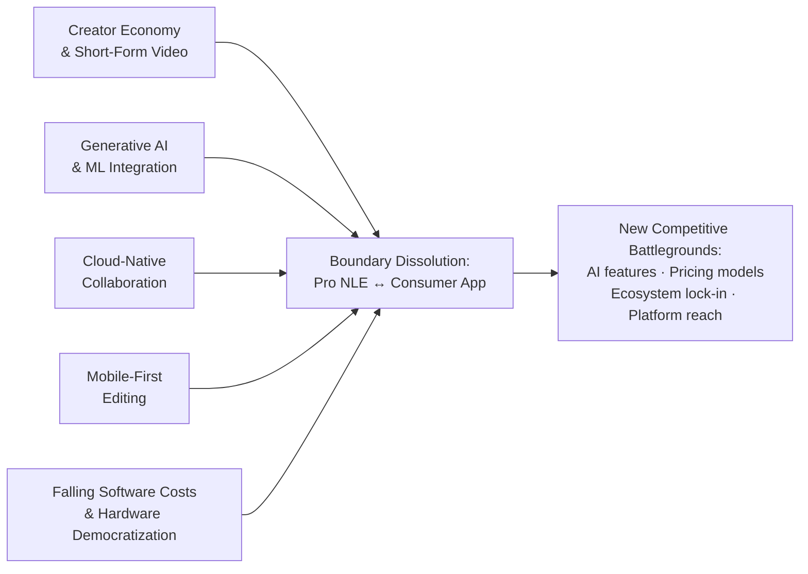
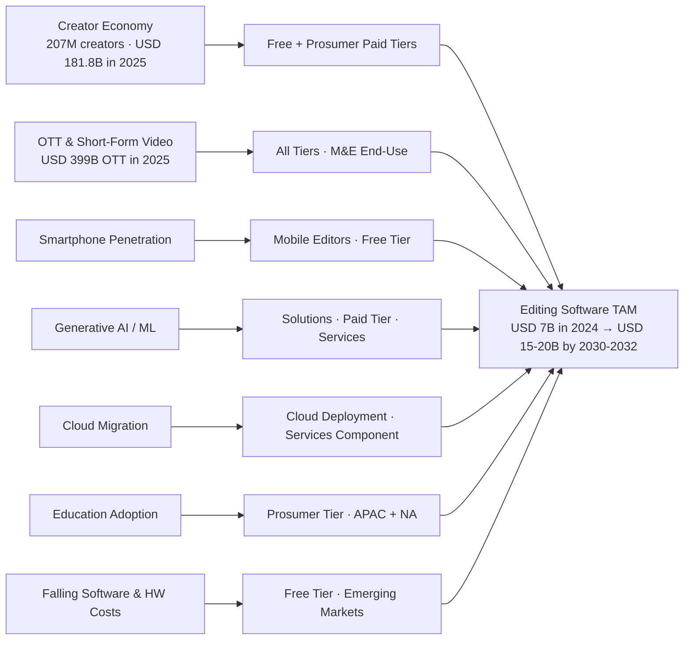

# Global Video Editing and Creation Software Market: Competitive Landscape, Product Analysis, and Strategic Outlook
# 1 Executive Summary and Market Overview

The global video editing and creation software market stands at a structural inflection point. What was, for nearly three decades, a relatively stable ecosystem dominated by professional non-linear editors (NLEs) sold through perpetual licenses to broadcasters and post-production studios has, within the span of roughly five years, been reshaped by three powerful and partially overlapping forces: the explosion of the creator economy and short-form social video, the rapid embedding of generative artificial intelligence into editing workflows, and the migration of computation and collaboration into the cloud. The result is a market in which an Adobe Premiere Pro timeline, a TikTok creator's CapCut session on a smartphone, and a Hollywood colorist's DaVinci Resolve grading suite are increasingly perceived—by users, vendors, and investors alike—as adjacent points within a single, continuous category rather than as discrete product universes.

This opening chapter synthesizes the headline findings of the report. It establishes the size and growth trajectory of the market, identifies the inflection points reshaping competitive boundaries, and translates the resulting picture into strategic implications for software vendors, content creators, and enterprise buyers. It also frames the analytical agenda for the seven chapters that follow, which progressively zoom in from market scoping and technology disruption (Chapters 2–3), through segmentation, competitive landscape, and product-level analysis (Chapters 4–5), to monetization, regional dynamics, and forward-looking strategic recommendations (Chapters 6–8).

## 1.1 Market Size, Growth Trajectory, and Key Metrics

Quantifying the global video editing and creation software market requires careful attention to scope, because available third-party estimates use different definitional perimeters. The most directly relevant sizing is provided by Data Bridge Market Research, which values the **global audio and video editing software market at USD 7.03 billion in 2024**, with a projection to **USD 20.08 billion by 2032, implying a 14.02% CAGR** over the 2025–2032 forecast window.[^1] A broader lens is offered by Grand View Research, whose **creative software market**—encompassing not only image and video editing but also sound and video recording, graphics and illustration, and desktop publishing—was estimated at **USD 9.93 billion in 2023** and is projected to reach **USD 14.98 billion by 2030 at a 7.1% CAGR**.[^2]

These two sizings should not be conflated. They differ in three material respects: (i) **scope**, with Grand View covering the wider creative software universe and Data Bridge focusing more tightly on audio/video editing tools; (ii) **base year**, 2023 versus 2024; and (iii) **forecast horizon**, 2030 versus 2032. The substantially higher CAGR reported by Data Bridge (14.02% vs. 7.1%) reflects the fact that the audio/video editing sub-segment is growing faster than the broader creative software aggregate, propelled disproportionately by social video, AI feature uptake, and the expansion of paid and freemium creator tools. Taken together, the two estimates bracket a defensible view: the **video- and audio-editing-centric core of the market is in the high single-digit billions in the mid-2020s and is on a trajectory to roughly triple over the forecast decade**, while the broader creative software wrapper grows at a more measured pace consistent with a maturing software category.

The table below reconciles the principal headline figures to make the comparison transparent.

| Metric | Audio & Video Editing Software (Data Bridge)[^1] | Creative Software (Grand View)[^2] |
|---|---|---|
| Base-year market size | USD 7.03 billion (2024) | USD 9.93 billion (2023) |
| Forecast market size | USD 20.08 billion (2032) | USD 14.98 billion (2030) |
| CAGR (forecast period) | 14.02% (2025–2032) | 7.1% (2024–2030) |
| Scope | Paid & free audio/video editing tools, solutions & services | Sound/video recording, image/video editing, graphics/illustration, desktop publishing |
| Dominant region (latest year) | North America, 42.06% revenue share (2024) | North America, 39.3% revenue share (2023) |
| Fastest-growing region | Asia-Pacific (~16% CAGR through 2032) | Asia-Pacific |

Beyond the headline numbers, the underlying segmentation reveals where value is concentrated and where growth is most pronounced.

- **By type**, **paid software dominated with 58.3% revenue share in 2024**, reflecting the ongoing willingness of professionals, prosumers, and increasingly serious hobbyists to pay for sophisticated, AI-augmented suites; however, **free software is forecast to grow fastest at 16.7% CAGR (2025–2032)**, driven by the explosion of social-video creators using zero-cost tools to feed YouTube, TikTok, Netflix-adjacent content pipelines, and other streaming destinations.[^1]
- **By component**, **solutions held the largest share in 2024**, anchored by the integration of AI into core editing engines, while **services are projected to be the fastest-growing component**, buoyed by the shift to cloud-based deployment and the attendant demand for installation, consulting, and support and maintenance.[^1]
- **By deployment**, the broader creative software market is already cloud-led: **the cloud segment accounted for 64.1% of global creative software revenue in 2023**, reflecting collaborative editing, geographically distributed workflows, and the offloading of rendering compute to remote infrastructure.[^2]
- **By end-use**, **live broadcasting held the largest share in 2024**, supported by cloud editing tools that enable remote and distributed production teams; **media & entertainment is projected to post the fastest CAGR**, propelled by the proliferation of affordable recording hardware and rising consumer expectations for visually rich content.[^1]
- **By application**, the market is bifurcating between **professional users**—where depth, performance, and ecosystem integration command premium pricing—and **non-professional users**, where ease of use, mobile-native design, and AI assistance are the decisive purchase drivers.[^1]

Geographically, the market is currently anchored by North America—**42.06% of global audio/video editing software revenue in 2024, with the U.S. alone capturing 56% of the North American total**—and is expected to see its center of gravity shift incrementally toward Asia-Pacific, the **fastest-growing region at roughly 16% CAGR through 2032**, with China holding the largest Asia-Pacific share in 2024.[^1] Grand View's broader creative software lens corroborates this directional read, citing strong demand growth in China, India, and Japan and a notable uptick in cloud-based adoption across the region.[^2]

The picture that emerges is of a market that is simultaneously **expanding in absolute revenue, deepening in feature sophistication, and broadening in user base**. Growth is not driven by a single vector but by the compounding of multiple structural tailwinds, which are examined next.

## 1.2 Key Market Inflection Points and Structural Shifts

Five interlocking shifts are redefining the competitive contours of the video editing and creation software market. Each is independently consequential; collectively, they are dissolving long-standing product boundaries and creating new battlegrounds.

**First, generative AI and machine learning have moved from experimental add-ons to embedded, workflow-defining capabilities.** Leading platforms are integrating AI-powered features such as automated scene detection, smart audio cleanup, content-aware tools, automatic stabilization, intelligent sound balancing, and real-time editing suggestions, materially compressing the time required to move from raw footage to finished output.[^1] Concrete recent examples illustrate the velocity of adoption: in early 2025 Adobe released a Premiere Pro update featuring **Generative Extend**, which uses Firefly to extend video clips by up to two seconds and ambient audio by up to ten seconds, alongside an AI-powered Search panel for text-based footage retrieval, Premiere Color Management, and AI translation of captions into 27 languages.[^1] Wondershare's Filmora 13.1 added an expanded AI music generation library and improved text-to-speech voices,[^1] while Movavi Video Editor 2025 introduced AI background removal, noise reduction, motion tracking, and auto-subtitles.[^1] In parallel, TechSmith launched **generative AI voiceover and scripting features** ("Generate Script," "Generate Audio") in Audiate, designed to allow creators to produce audio projects without a writer or voice actor, and Adobe introduced **GenStudio**, integrating Creative Cloud, Firefly, Express, Frame.io, Analytics, AEM Assets, and Workfront into a generative AI–powered enterprise content supply chain.[^2] These announcements signal that AI is no longer a differentiator at the margin but a precondition for category relevance.

**Second, the market is migrating from desktop-bound, single-user workflows to cloud-native, collaborative platforms.** The shift toward cloud-based editing enables real-time remote collaboration, version control, and multi-device project access, supporting the growing demand for flexible and distributed content creation environments.[^1] Cloud-based sound and video recording software allows multiple users to contribute concurrently to the same project regardless of location, while offloading rendering compute to remote infrastructure and reducing the burden on local devices.[^2] The dominance of cloud deployment—**64.1% of creative software revenue in 2023**—confirms that this is no longer an emergent trend but the baseline architecture for the next phase of the market.[^2]

**Third, mobile-first and short-form editing has emerged as a parallel mass market with its own product logic.** The rise of TikTok, YouTube Shorts, and Instagram Reels has driven demand for software that is simultaneously powerful and easy to use, and that runs natively across Windows, macOS, Linux, and mobile platforms.[^1] Vendors are responding with tailored partnerships and product strategies—**Wondershare, for instance, has partnered with TikTok to deliver editing tools designed for creators on that platform**.[^1] The implication is that the relevant competitive set for incumbents now includes mobile-native creator apps whose user bases dwarf those of any traditional NLE.

**Fourth, the cost of professional-grade editing has declined sharply, democratizing access to capabilities that were once the exclusive province of post-production professionals.** This affordability, combined with the proliferation of high-resolution cameras and microphones in smartphones and laptops, has expanded the market base from professional studios to a long tail of YouTubers, social influencers, online entrepreneurs, educators, and small businesses.[^1] The education sector's adoption of multimedia content for online learning—via platforms such as Udemy and Coursera—has further enlarged the addressable user pool.[^1]

**Fifth, the convergence of professional and consumer tools is dissolving the traditional product taxonomy.** Professional NLEs (Adobe Premiere Pro, Apple Final Cut Pro, Avid Media Composer) are absorbing AI-driven simplifications and cloud collaboration features historically associated with consumer apps, while consumer- and prosumer-oriented tools (Wondershare Filmora, Movavi, CyberLink PowerDirector, Corel VideoStudio, and AI-native entrants such as Descript) are climbing the feature ladder toward professional-grade output. The competitive landscape now spans incumbents (Adobe, Apple, Autodesk, Avid, Sony, Steinberg), prosumer specialists (Wondershare, Movavi, MAGIX, Corel, CyberLink, TechSmith), free and open-source tools (OpenShot, NCH-aligned offerings, GitHub-hosted projects), and AI-native challengers (Descript, Animoto, Renderforest), with vendor-specific strategies playing out across all tiers.[^1][^2]

The figure below summarizes how these five forces converge to redraw the competitive map.

The key node in this diagram is **boundary dissolution**: the strategic question for every vendor is no longer "where do I sit in the professional-vs-consumer hierarchy?" but "which combination of AI capability, deployment model, platform reach, and pricing architecture lets me serve a continuous spectrum of users from casual social creator to broadcast professional?"

Two countervailing forces temper this optimistic picture and warrant attention. **High computational demands and integration complexity** remain a meaningful restraint: advanced editing software requires significant compute, GPUs, and memory, which constrains use on low-end mobile or remote setups, and the rollout of next-generation suites has at times been delayed by optimization, overheating, and battery drain issues on portable devices.[^1] Additionally, the effectiveness of AI-based editing features can be limited by source-material quality, lighting, background noise, and inconsistent connectivity, while compatibility with diverse hardware ecosystems and legacy file formats raises costs and complexity for both individual users and organizations.[^1] These constraints will shape adoption curves and product roadmaps throughout the forecast period.

## 1.3 Strategic Implications for Stakeholders

The structural shifts above translate into materially different strategic agendas for the three principal stakeholder groups served by this report.

**For software vendors**, the central question is how to position across a continuum of user cohorts whose needs are converging in some dimensions (AI assistance, cloud collaboration) while diverging sharply in others (workflow depth, price sensitivity, platform of choice). Three sub-decisions stand out. First, **AI investment priorities** must balance proprietary differentiation against the rapid commoditization of foundational generative capabilities; vendors that fail to embed credible AI workflows within the next product cycle risk relegation, but those that over-rely on third-party models face margin compression as compute costs flow through to pricing. Second, **monetization model choices** are no longer binary: incumbents are pivoting from perpetual licensing to subscription SaaS, freemium tiers (as evidenced by Adobe's time-limited free access to Generative Extend before requiring Firefly credits[^1]), and credit/token-based generative AI billing—the optimal mix depends on user cohort and AI cost structure. Third, **product positioning** must explicitly address the convergence dynamic: leading vendors are building portfolio architectures that span professional flagship products, prosumer-oriented entry products, and mobile companion apps, increasingly stitched together by cloud project management and shared AI services.

**For content creators**, the implication is a richer—but more complex—tool selection landscape. Professional editors in film, TV, and broadcast must weigh the depth and ecosystem integration of established suites (Adobe Premiere Pro, Apple Final Cut Pro, Avid Media Composer) against the rapid feature progression of challengers and the operational benefits of cloud collaboration. Prosumer creators—YouTubers, podcasters, streamers, marketing agencies—face a widening choice between paid suites with deep AI assistance (Filmora, Movavi, PowerDirector, VEGAS Pro/MAGIX) and free or freemium alternatives that increasingly close the capability gap. Casual and social-first users on TikTok, Reels, and Shorts benefit most from mobile-native, AI-driven tools; their workflow optimization is less about feature depth than about export speed, template availability, and platform-native sharing.

**For enterprise buyers**—particularly in media & entertainment, live broadcasting, education, and advertising—procurement criteria are shifting. The dominance of live broadcasting in 2024 end-use revenue and the projected acceleration of media & entertainment[^1] reflect the importance of distributed, cloud-enabled production. Enterprise selection now hinges on **integration complexity** (compatibility with diverse hardware ecosystems and legacy file formats[^1]), **total cost of ownership** (factoring AI compute costs, subscription escalation, and hardware refresh cycles), and **collaboration architecture** (cloud-based real-time editing, version control, multi-device access). Education buyers, in particular, are leveraging multimedia content and editing tools at scale, illustrated by Adobe's September 2023 partnership with India's Ministry of Education to deploy Adobe Express across an estimated 500,000 educators and 20 million students.[^2]

**The analytical roadmap for the remainder of this report follows this stakeholder logic.** Chapter 2 establishes the formal market definition, scope, methodology, and detailed sizing reconciliation. Chapter 3 examines the technology trends—particularly AI and mobile-first disruption—reshaping the workflow stack. Chapter 4 applies the segmentation framework systematically, including the three core user cohorts (professional, prosumer, casual). Chapter 5 maps the competitive landscape and conducts product-level comparisons across Adobe Premiere Pro and After Effects, DaVinci Resolve, Final Cut Pro, Avid Media Composer, CapCut, Wondershare Filmora, Movavi, CyberLink PowerDirector, VEGAS/MAGIX, Corel VideoStudio, and AI-native entrants. Chapter 6 analyzes pricing, monetization, and value-chain dynamics. Chapter 7 examines regional markets in depth. Chapter 8 synthesizes opportunities, risks, and strategic recommendations, projects the medium-to-long-term trajectory of the category, and identifies the most consequential uncertainties stakeholders should monitor through the forecast period.

A concluding caveat applies to all that follows. The headline market figures cited in this chapter are drawn from third-party research published in 2023–2024, and the underlying methodologies, segment definitions, and base years differ across sources.[^1][^2] In line with the report's persistent reasoning standards, subsequent chapters will continue to present sizing as a defensible range rather than a single point estimate, acknowledge methodological differences explicitly, and flag forward-looking projections—particularly those concerning generative AI economics, regulatory evolution, and the trajectory of mobile-first creator platforms—as scenarios rather than predictions.

# 2 Market Definition, Scope, Sizing, and Growth Forecast

Building on the headline findings of Chapter 1, this chapter establishes the formal analytical foundation upon which the remainder of the report rests. Where the executive summary asserted that the video editing and creation software market sits at a structural inflection point and presented bracketed third-party sizings, this chapter pulls those assertions apart and reconstructs them with methodological rigor. The objective is threefold: to draw an unambiguous perimeter around the product categories that constitute the market—and around those that do not—so that quantitative claims throughout the report refer to a consistent universe; to articulate the segmentation taxonomy and methodology that govern subsequent segmentation, competitive, and regional analyses; and to translate divergent published estimates into a defensible sizing range and multi-scenario forecast for the 2025–2032 horizon. Without this anchoring, later chapter-by-chapter discussions of AI disruption, vendor product comparisons, pricing models, and regional dynamics would risk floating free of any consistent quantitative reference point.

## 2.1 Market Definition and Scope Boundaries

The video editing and creation software market is defined here as the global market for **packaged software products and associated services that enable the assembly, manipulation, enhancement, and finishing of moving-image content**, sold to professional, prosumer, and consumer users across desktop, web, and mobile environments. Four principal product categories fall within this scope:

1. **Professional non-linear editors (NLEs)**, comprising timeline-based editing suites used in film, television, broadcast, and high-end commercial post-production. Representative products include Adobe Premiere Pro, Apple Final Cut Pro, Avid Media Composer, and the paid Studio version of Blackmagic Design's DaVinci Resolve.
2. **Motion graphics and visual-effects (VFX) tools**, used for compositing, animation, title design, and effects work that frequently sits alongside or within an NLE workflow. Representative products include Adobe After Effects and the VFX/Fusion functions inside DaVinci Resolve, as well as adjacent compositing tools from Autodesk and similar professional vendors.
3. **AI-driven generative creation platforms**, a younger category in which generative AI is the core editing primitive rather than an add-on. Representative products include Runway (text-to-video, video-to-video, and "AI Magic Tools"), Descript (text-based audio/video editing with AI voice cloning), and emerging text-to-video and synthetic-media tools positioned as alternatives or complements to traditional NLEs.[^3]
4. **Mobile-first and short-form editors**, designed primarily for smartphone and tablet workflows oriented toward TikTok, YouTube Shorts, Instagram Reels, and similar destinations. Representative products include ByteDance's CapCut, InShot, KineMaster, and the mobile editions of Filmora, Movavi, LumaFusion, and similar prosumer suites.

Each of these categories is in scope regardless of pricing model—paid, free, freemium, subscription, perpetual license, or credit-based generative AI billing—and regardless of deployment mode (on-premises, desktop-installed, cloud, or hybrid). Both the **solutions** layer (the editing software itself) and the **services** layer attached to it (installation, consulting, support and maintenance) are included, consistent with the segmentation logic adopted by the syndicated sources reconciled in Section 2.3.[^1]

A clear set of adjacent markets is **out of scope** and is treated as exogenous demand context rather than as part of the addressable market. The most important exclusions, and the rationale for each, are summarized below.

| Adjacent Market | 2024–2025 Reference Size | Rationale for Exclusion |
|---|---|---|
| Video production services (creative agencies, studios, post-production houses) | USD ~94 billion (services-led)[^4] | Service-delivered output, not packaged software; demand-side context for editing tools rather than part of the editing software TAM. |
| Video streaming infrastructure (CDN, encoding, OTT delivery platforms) | USD 129.26 billion in 2024, projected USD 416.8 billion by 2030 (21.5% CAGR)[^2] | Distribution rather than creation; infrastructure for delivering finished content to viewers. |
| Over-the-top (OTT) media services (Netflix, Disney+, etc.) | USD 399.12 billion in 2025, projected USD 2,816.85 billion by 2034 (24.42% CAGR)[^5] | Consumer-facing subscription content services; demand context, not editing tools. |
| Creator economy as a whole (creator earnings, brand deals, platform monetization) | USD 181.8 billion in 2025 (revenue paid to creators globally)[^6] | A demand pool that drives editing-tool consumption, but distinct from the software market itself. |
| Video conferencing, livestreaming infrastructure | Separate market | Real-time communication and streaming workflows rather than creative editing. |
| Generic creative software outside video (illustration, desktop publishing, photo-only tools) | Part of broader USD 9.93B creative software market[^2] | Treated as adjacent in the broader creative software lens (Grand View) but excluded from the video-editing-centric core. |

Three further definitional distinctions warrant emphasis to avoid double-counting in later analysis. First, **software products are clearly separated from services**: a post-production house that uses Adobe Premiere Pro to deliver a commercial belongs to the production-services market on the revenue line but is a customer of the editing-software market on the procurement line; only the latter is counted here. Second, **editing tools are distinguished from end-content distribution**: YouTube and TikTok are demand-driving platforms, not editing software, even though both have invested in adjacent creator-facing tooling (YouTube Create, TikTok–Wondershare partnerships).[^1] Third, **creator-facing tools are distinguished from enterprise media supply chains**: enterprise content orchestration platforms such as Adobe GenStudio—which integrates Creative Cloud, Firefly, Express, Frame.io, Analytics, AEM Assets, and Workfront[^2]—are partially in scope to the extent they include editing applications, but their analytics, asset-management, and workflow components are treated as adjacent enterprise software.

Within these boundaries, the market spans a wide diversity of vendor archetypes. The illustrative—not exhaustive—vendor taxonomy includes incumbent suite owners (Adobe, Apple, Autodesk, Avid, Sony, Microsoft, Steinberg)[^1], prosumer specialists (Wondershare, Movavi, MAGIX, Corel, CyberLink, TechSmith)[^2][^1], free and open-source projects (OpenShot, Shotcut/Meltytech, Kdenlive, GitHub-hosted projects)[^1], and AI-native challengers (Descript, Runway, Animoto, Renderforest)[^1][^3]. The category- and tier-level competitive structure is examined in Chapter 5; this section establishes only that all of these vendors fall within the market perimeter as defined.

## 2.2 Segmentation Taxonomy and Research Methodology

A consistent segmentation taxonomy is critical because the same market can yield very different growth rates depending on which lens is in use. This report adopts a multi-dimensional framework derived from and harmonized across the segmentation schemes used by the principal syndicated sources, particularly Data Bridge Market Research's audio and video editing software taxonomy[^1] and Grand View Research's creative software taxonomy[^2]. The eight primary segmentation dimensions are summarized in the table below; subsequent chapters will apply them selectively rather than collapsing them.

| Segmentation Dimension | Categories | Primary Source Anchor |
|---|---|---|
| Type (pricing access) | Paid software; Free software | Data Bridge[^1] |
| Component | Solutions (video; audio); Services (installation, consulting, support & maintenance) | Data Bridge[^1] |
| Deployment | Cloud; On-premises | Grand View[^2]; Data Bridge[^1] |
| Device | Desktop/laptop; Mobile | Data Bridge[^1] |
| Organization size | Small-, medium-, large-scale organizations | Data Bridge[^1] |
| End-use vertical | Live broadcasting; Media & entertainment; Gaming; Cinema/TV; Advertising & sports; Education; Other | Data Bridge[^1] |
| User application | Professional users; Non-professional (prosumer/casual) users | Data Bridge[^1] |
| Geography | North America; Europe; Asia-Pacific; Latin America; Middle East & Africa | Both[^1][^2] |

This framework is intentionally **multi-dimensional rather than hierarchical**: a given vendor segment (for example, mobile, free, non-professional, social-media end-use, in Asia-Pacific) is the intersection of multiple dimensions, and any single-axis claim about market dynamics is necessarily incomplete. Throughout subsequent chapters, segment-level claims will specify which dimension is in use to avoid the analytical pitfall, identified in this report's persistent reasoning standards, of mixing professional/prosumer/casual cohort analysis with deployment or end-use without explicit transition.

The **research methodology** underlying the sizing and forecast work in Section 2.3 follows a triangulation logic that combines secondary, primary, and inferential inputs:

- **Secondary syndicated research** is the principal quantitative source. The two anchor estimates are Data Bridge Market Research's *Global Audio and Video Editing Software Market* report (USD 7.03B in 2024, projected to USD 20.08B by 2032 at 14.02% CAGR)[^1] and Grand View Research's *Creative Software Market* report (USD 9.93B in 2023, projected to USD 14.98B by 2030 at 7.1% CAGR)[^2]. Adjacent-market sizings—video production services (Ken Research)[^4], video streaming (Grand View)[^2], OTT (Precedence)[^5], creator economy (market.us, market.biz, neweconomies, supplygem)[^6]—are used as demand-side cross-checks but are not added to the editing-software TAM.
- **Vendor disclosures and product announcements** provide qualitative grounding and recent-event anchoring, including Adobe's 2025 Generative Extend release, Apple's Logic Pro 11.1/2.1 updates, NCH WavePad 19.28, OpenShot 3.2.0, Movavi Video Editor 2025, TechSmith's Camtasia 2023 and Audiate AI features, and Adobe's GenStudio launch.[^1][^2]
- **Pricing benchmarks** drawn from publicly disclosed product tiers (for example, Runway's USD 0/15/35/95 per-user-per-month scaling)[^3] are used to inform monetization analysis in Chapter 6 and to sanity-check unit-economics implications of the sizing.
- **Triangulation rules**: where Data Bridge and Grand View differ materially, the difference is attributed to (i) scope (audio/video editing only vs. broader creative software), (ii) base year (2024 vs. 2023), and (iii) forecast horizon (2032 vs. 2030), as documented in Section 2.3. Where conflict cannot be reconciled, the report presents a defensible range rather than picking a single source.

Several **assumptions and limitations** must be flagged explicitly and apply to all sizings and forecasts in this report. First, all values are reported in **USD billions**, consistent with the source data; no currency adjustment is applied across years. Second, the **base year is 2024** for the principal Data Bridge anchor; where 2023 figures are cited (Grand View), the base year is stated explicitly. Third, projections rely on third-party CAGRs computed by the source publishers, whose underlying methodologies—respondent samples, vendor coverage, segment definitions—are not fully transparent and may differ. Fourth, the editing-software market is undergoing rapid transformation driven by generative AI, and forecasts published in 2023–2024 may underweight or overweight the AI inflection; this risk is addressed via scenario analysis in Section 2.6. Fifth, no data older than approximately 18 months is treated as authoritative for forward projections, in line with the report's source-recency guidance; older figures are used only for historical context.

## 2.3 Global Market Sizing and Reconciliation of Third-Party Estimates

The reconciliation of headline sizings is the analytical pivot of this chapter. Two estimates dominate the published landscape and were introduced in Chapter 1; they are restated here with their full segmentation breakdowns and then reconciled into a defensible range for the video-editing-centric core.

**Anchor estimate A — Data Bridge Market Research (audio and video editing software)**: the global market was valued at **USD 7.03 billion in 2024** and is projected to reach **USD 20.08 billion by 2032**, implying a **14.02% CAGR over 2025–2032**.[^1] Within this anchor, paid software accounted for **58.3%** of 2024 revenue (with free software projected to grow at the fastest 16.7% CAGR through 2032), the solutions component held the largest 2024 share, the live-broadcasting end-use led 2024 revenue, and North America commanded **42.06%** of global revenue (within which the U.S. contributed **56%**), while Asia-Pacific was the fastest-growing region at approximately **16% CAGR**.[^1]

**Anchor estimate B — Grand View Research (creative software)**: the broader creative software market was estimated at **USD 9.93 billion in 2023** and is projected to reach **USD 14.98 billion by 2030**, implying a **7.1% CAGR over 2024–2030**.[^2] Within this broader anchor, the cloud deployment segment captured **64.1%** of 2023 global revenue, the sound and video recording software type segment held the largest 2023 type share, and North America accounted for **39.3%** of 2023 revenue.[^2]

The two estimates are reconciled along three axes—**scope**, **base year**, and **forecast horizon**—as summarized below.

| Reconciliation Axis | Anchor A: Data Bridge (Audio & Video Editing Software) | Anchor B: Grand View (Creative Software) | Implication |
|---|---|---|---|
| Scope | Audio/video editing solutions and services only[^1] | Sound & video recording, image & video editing, graphics & illustration, desktop publishing, and others[^2] | Anchor B is materially broader; pure video-editing share of B is a subset of B's USD 9.93B. |
| Base year | 2024 | 2023 | A reflects ~one additional year of post-pandemic creator-economy growth and AI uptake. |
| Forecast horizon | 2025–2032 | 2024–2030 | A's longer horizon and faster CAGR compound to a higher absolute endpoint. |
| CAGR | 14.02% | 7.1% | The differential (~6.9 percentage points) reflects faster growth in audio/video editing relative to the static-graphics and desktop-publishing components inside B. |
| 2024 revenue (interpolated for B at 7.1% CAGR) | USD 7.03B (reported) | ~USD 10.6B (interpolated) | B/A ratio of ~1.5× implies non-video-editing creative software contributes roughly USD 3.5B of B's 2024 base. |
| Forecast-year revenue | USD 20.08B (2032) | USD 14.98B (2030) | At the 2030 horizon, A would be ~USD 15.4B (interpolated), bracketing Grand View's broader USD 14.98B—an internal consistency check. |

Several conclusions follow from this reconciliation:

1. **The two estimates are not in conflict; they describe different perimeters.** Anchor A measures the audio/video editing core; Anchor B measures a broader creative software wrapper that includes video editing as a subset alongside graphics, illustration, and desktop publishing. The fact that Anchor A's 2030 interpolated value (~USD 15.4B) is close to Anchor B's 2030 reported value (USD 14.98B) is structurally implausible at first glance—the part cannot exceed the whole. This apparent inconsistency is best interpreted as a reflection of different vendor coverage, segment definitions, and methodologies between the two publishers; it underlines why a single-point estimate would be unreliable.
2. **A defensible range for the video-editing-centric core in 2024 is approximately USD 6.5–8.0 billion**, with Data Bridge's USD 7.03 billion sitting near the midpoint of this range. The lower bound reflects narrower video-only definitions that exclude pure-audio editors; the upper bound reflects broader counts that include adjacent transcoding and recording tools.
3. **A defensible range for the same core in 2030–2032 is approximately USD 15–20 billion**, depending on how aggressively generative AI uptake, mobile-first creator app monetization, and cloud-services attach are projected to accelerate growth.
4. **The implied CAGR for the editing-centric core over the forecast period sits in a 10%–14% range**, materially above the broader creative software aggregate but below the headline rates seen in adjacent demand markets such as OTT (24.42% CAGR)[^5] or creator-economy revenue (>20% CAGR in several published views)[^6].

The segmentation breakdowns underlying Anchor A, which will anchor segmentation analysis in Chapter 4, are summarized in the table below.

| Segment | 2024 Revenue Share / Position | Forward Trajectory |
|---|---|---|
| Type — Paid software | 58.3% (largest)[^1] | Dominant but slower-growing; remains majority through 2032 |
| Type — Free software | ~41.7% (residual) | Fastest-growing at 16.7% CAGR (2025–2032)[^1] |
| Component — Solutions | Largest share, AI-led[^1] | Continues to dominate; AI integration a primary driver |
| Component — Services | Smaller share | Fastest-growing component; cloud-driven[^1] |
| Deployment — Cloud (creative software analog) | 64.1% in 2023[^2] | Continues to expand through 2030 |
| End-use — Live broadcasting | Largest 2024 share[^1] | Cloud collaboration fuels continued share |
| End-use — Media & Entertainment | Second-largest, fastest-growing forecast CAGR[^1] | Hardware affordability and OTT-content demand |
| Region — North America | 42.06% in 2024 (USD 7.03B base)[^1] | Mature, lower CAGR than APAC |
| Region — Asia-Pacific | Second-largest 2024 share[^1] | Fastest-growing, ~16% CAGR (2025–2032)[^1] |

The principal insight from this reconciliation is that **the editing-centric software market is growing at roughly twice the rate of the broader creative software aggregate**, and that this differential is concentrated in three sub-segments: free software (driven by mobile-first creators), services (driven by cloud migration), and Asia-Pacific (driven by smartphone penetration and short-form video). These three vectors will recur throughout the report as the locus of structural growth.

## 2.4 Demand Drivers Shaping Market Growth

The forecast trajectory derived in Section 2.3 is underpinned by a coherent set of structural demand drivers. Each is discussed below with its quantitative anchor where available, and each is linked explicitly to its mechanism of impact on the editing-software TAM.

**Driver 1 — Creator-economy expansion as the principal volume engine.** The global creator economy is itself in a phase of compounding growth: market.us projects the global creator economy at **USD 181.8 billion in 2025 revenue, with the U.S. component at USD 50.9 billion and a 19.3% CAGR**, and forecasts the global market at **USD 1,072.8 billion by 2034 at a 21.8% CAGR**.[^6] By 2024 the world contained an estimated **207 million content creators**, with **162 million identified as creators in the U.S. alone** and over **45 million working professionally**.[^6] Business Insider, separately, reports that direct creator earnings are expected to reach **USD 185 billion in 2025**, a **20% increase** over 2024.[^6] The mechanism of impact on editing software is direct: every additional creator is a candidate user, and the average **full-time creator uses 3.4 platforms** to reach audiences[^6], implying that workflow tools that span devices and destinations are particularly well positioned. The creator economy thus functions as a feeder market that materially enlarges the addressable TAM for editing software, particularly at the free, freemium, and prosumer-paid tiers.

**Driver 2 — Streaming and short-form video proliferation as the demand-pull for content.** OTT services were valued at **USD 399.12 billion in 2025 globally**, projected to reach **USD 2,816.85 billion by 2034 at a 24.42% CAGR**[^5], while video streaming infrastructure was valued at **USD 129.26 billion in 2024**, projected to reach **USD 416.8 billion by 2030 at 21.5% CAGR**.[^2] On the consumer side, **smartphones and tablets are the dominant streaming-platform devices**, and Juniper Research projected nearly **2 billion active OTT video subscriptions globally by 2025**, with **over 70% of streamed video sessions on smartphones** through the mid-2020s.[^7] These figures matter for the editing software market because every hour of streamed content—whether an OTT premiere, a TikTok upload, a YouTube Short, an Instagram Reel, or a Twitch VOD—must be edited somewhere upstream. The strongest growth is occurring in short-form video, which both (i) increases the total volume of content being produced and (ii) widens the user base from professional editors to casual creators using mobile-first tools.

**Driver 3 — Smartphone-driven content production.** The widespread availability of high-resolution cameras and microphones in smartphones and laptops has empowered far more individuals to produce and edit audio/video content, materially increasing software demand.[^1] Smartphone adoption stood at approximately **65% globally in 2019** per the GSM Mobile Economy Report and has continued to climb, while smartphones are now the dominant OTT-consumption device.[^5] The implication for editing software is twofold: an expanding pool of creators with capture-capable devices, and a structural shift in where editing occurs—away from desktop suites and toward mobile editors such as CapCut, InShot, KineMaster, and the mobile editions of Filmora, Movavi, and similar tools.

**Driver 4 — Generative AI and ML integration as the productivity step-change.** The most concrete recent product evidence comes from Adobe (Generative Extend, AI-powered Search, AI translation of captions into 27 languages, GenStudio integration of Creative Cloud, Firefly, Express, Frame.io, Analytics, AEM Assets, and Workfront)[^1][^2]; Wondershare (Filmora 13.1's expanded AI music generation library and improved text-to-speech voices)[^1]; Movavi (Video Editor 2025's AI background removal, noise reduction, motion tracking, and auto subtitles)[^1]; and TechSmith (Audiate's Generate Script and Generate Audio).[^2] At the AI-native end of the spectrum, Runway's Gen-2 model was trained on an internal dataset of **240 million images and 6.4 million video clips** and supports text-to-video, image-to-video, and video-to-video generation, with reported productivity gains compressing typical editing time by **up to 50%** in some use cases.[^3] The mechanism of impact is twofold: AI raises willingness-to-pay among professional and prosumer users for AI-augmented suites, and lowers the skill-floor for casual users to produce credible output, expanding the bottom of the user pyramid.

**Driver 5 — Cloud migration and collaborative production.** The cloud deployment segment already accounts for **64.1% of creative software revenue (2023)**, reflecting the operational reality that geographically distributed creative teams need to access projects from any device, share assets in real time, and offload rendering compute to remote infrastructure.[^2] In live broadcasting, cloud-based editing tools enabling remote and distributed production teams have been a primary driver of the segment's leading 2024 end-use share.[^1] The mechanism of impact is structural: cloud workflows enable services-attach (installation, consulting, support and maintenance), expand the share of services component revenue, and create network effects that reinforce subscription monetization.

**Driver 6 — Education-sector adoption.** The education sector's adoption of animated and video content for online learning has materially increased editing-software usage; platforms such as Udemy and Coursera depend on engaging multimedia, and the expansion of e-learning is cited as a primary driver of the U.S. market's leading 56% share of North American audio/video editing software revenue in 2024.[^1] At the institutional level, Adobe's **September 2023 partnership with India's Ministry of Education** envisions Adobe Express–based curricula reaching **approximately 500,000 educators and 20 million students**[^2], illustrating how education ministries themselves are beginning to function as institutional buyers. The mechanism of impact is volume-driven: education buyers expand the prosumer-tier installed base and shape product roadmaps toward simplified, AI-assisted workflows.

**Driver 7 — Falling software and hardware costs.** Editing-software prices have fallen sharply, particularly with the proliferation of free tiers (DaVinci Resolve free, OpenShot, Shotcut, Kdenlive) and credit-based generative AI billing.[^1] Combined with declining costs of capable computing hardware—desktop-class performance now available in mid-tier laptops and high-end smartphones—this has expanded the addressable user base from professional studios to a long tail of small businesses, educators, and individual creators. Start-ups and small businesses in Europe in particular are leveraging affordable editing software to create professional-grade marketing materials, which Data Bridge identifies as a fueling factor for European market growth.[^1]

The compounding impact of these seven drivers is mapped in the diagram below, which summarizes how each driver flows through to the principal revenue segments identified in Section 2.3.

The diagram makes explicit why the editing-software market is growing at roughly twice the rate of the broader creative software aggregate: it is exposed to drivers that are themselves growing at high CAGRs (creator economy at 21.8%, OTT at 24.42%, AI feature uptake accelerating year-over-year), whereas adjacent creative software categories (graphics, desktop publishing) are exposed to a narrower subset of these drivers.

## 2.5 Restraints, Risks, and Adoption Barriers

Against the seven drivers, six structural restraints will shape the pace and shape of market expansion through 2032. The risk discipline applied here is central to the report's persistent reasoning standards: forecasts must acknowledge material uncertainties rather than implying false precision.

**Restraint 1 — High computational and GPU requirements.** Advanced editing software requires significant computing power, high-performance GPUs, and substantial memory, which constitutes a barrier for users with limited hardware—particularly in mobile or remote work settings.[^1] Data Bridge documents that the rollout of next-generation editing suites has at times been delayed by software optimization, overheating, and battery drain on portable devices, and notes that AI-based editing features are constrained by source-material quality, lighting, background noise, and inconsistent connectivity.[^1] The implication is that AI-driven feature uptake may proceed unevenly: faster among users with capable hardware, slower among the long tail.

**Restraint 2 — Integration complexity with diverse hardware ecosystems and legacy file formats.** Compatibility with various file formats and legacy systems presents ongoing challenges, potentially increasing costs and complexity for both individual users and organizations.[^1] In enterprise contexts, this restraint translates into longer evaluation cycles, extended vendor-selection criteria, and ongoing services-attach demand.

**Restraint 3 — Software piracy and intellectual property risks.** While quantitative piracy data is not available in the cited sources, intellectual property concerns are explicitly identified by Ken Research as a market challenge in the adjacent video production market[^4], and they apply with similar force to editing software—particularly for high-priced professional suites in regions where enforcement is weaker. Vendor responses include the migration to subscription SaaS (which makes pirated perpetual-license copies less useful) and authentication-bound cloud features.

**Restraint 4 — Subscription fatigue and price sensitivity.** Across the broader media ecosystem, subscription fatigue is becoming a documented concern: Juniper Research notes that, by 2020, U.S. households averaged **four SVOD subscriptions** with growth slowing significantly from 2021, requiring providers to deploy hybrid monetization to retain users.[^7] The same dynamic is increasingly visible in editing software, where consumers face overlapping subscriptions for Adobe Creative Cloud, Final Cut Pro upgrades, mobile app premium tiers, and AI-feature credit packs. The strategic implication is that vendors face downward pressure on per-product pricing and growing pressure to bundle, both of which moderate revenue growth at the high end of the market.

**Restraint 5 — Regulatory and copyright concerns surrounding generative AI training data.** Manhattan Venture Partners explicitly flags **unethical use and commoditization** as the two key risks for AI-native editing platforms, citing concerns around copyrights, deep fakes, bias, misinformation, and harmful content.[^3] Vendor responses include licensing partnerships—Runway has partnered with Getty Images to train AI models on legally cleared content libraries and integrated Gen-2 with Canva for distribution to **150 million monthly users**[^3]—but the regulatory environment for generative video remains in flux. Forward projections that assume unconstrained generative AI feature deployment may prove optimistic if jurisdiction-specific copyright or training-data regulations tighten.

**Restraint 6 — Commoditization of foundational AI capabilities.** As AI technology proliferates, the exclusivity of "AI Magic Tools" may diminish, with major players such as Adobe and Microsoft positioned to integrate similar functionality into their existing suites.[^3] Advancements enabling advanced AI models to run locally on devices could further reduce cloud-distribution costs, allowing traditional vendors to offer AI-enabled software at competitive prices.[^3] The strategic implication is that the AI-driven CAGR uplift may not accrue evenly across vendor tiers; instead, it may be captured disproportionately by incumbents with large installed bases and wide distribution.

The summary below maps each restraint to the segment most exposed.

| Restraint | Most-Exposed Segment | Mitigation Path |
|---|---|---|
| Compute/GPU requirements | Mobile & emerging-market users | Cloud rendering; on-device model optimization |
| Integration complexity | Enterprise (M&E, broadcasting) | Services component growth; standardization |
| Piracy/IP risk | Paid software in emerging markets | Subscription SaaS migration; cloud-bound features |
| Subscription fatigue | Prosumer paid tier | Bundling; freemium + credit hybrids |
| GenAI regulatory uncertainty | AI-native vendors (Runway, Descript) | Licensed-content training; provenance tools |
| AI commoditization | AI-native challengers | Workflow lock-in; ecosystem integration |

## 2.6 Forecast Scenarios and Sensitivity Analysis

Translating the reconciled sizing in Section 2.3 and the driver/restraint analysis in Sections 2.4–2.5 into forward projections requires explicit scenario logic rather than a single forecast. Five variables are most consequential for the trajectory of the editing-software market through 2032, and they are individually—and to some extent jointly—uncertain:

1. **Generative AI adoption velocity**: how quickly AI features become standard across professional and prosumer workflows, and how willingness-to-pay for AI-augmented suites evolves.
2. **Cloud migration rate**: the pace at which on-premises and desktop-installed deployments give way to cloud-native or hybrid workflows, with attendant services-attach.
3. **Mobile-first creator growth**: the scale and monetization rate of CapCut-style mobile editor user bases, and their conversion from free to paid tiers.
4. **Regional macroeconomic conditions**: particularly in Asia-Pacific (which Data Bridge projects at ~16% CAGR through 2032) and North America, where consumer and SMB discretionary spending shape paid-tier sustainment.[^1]
5. **AI compute cost evolution**: the trajectory of inference costs for generative video and audio models, which directly affects the unit economics of credit-based monetization and the commoditization dynamic discussed in Section 2.5.

Building from the Data Bridge anchor (USD 7.03B in 2024 → USD 20.08B in 2032 at 14.02% CAGR)[^1] as the base case, the report constructs three scenarios for the editing-centric core. The scenarios are illustrative rather than predictive; they are intended to bound the plausible outcome range for the planning horizons that subsequent chapters will reference.

| Scenario | 2024 Base | 2030 Forecast | 2032 Forecast | Implied 2025–2032 CAGR | Key Assumptions |
|---|---|---|---|---|---|
| **Base case** | USD 7.03B[^1] | ~USD 15.4B (interpolated) | USD 20.08B[^1] | 14.02%[^1] | AI features mainstream by 2027; cloud share ~75% by 2030; APAC at ~16% CAGR; AI compute costs decline gradually. |
| **Upside (bull)** | USD 7.03B | ~USD 17.5B | ~USD 23–24B | ~16.5–17% | Accelerated AI uptake (incl. agentic editing); aggressive mobile-first paid conversion; APAC outperforms; favorable AI compute curve. |
| **Downside (bear)** | USD 7.03B | ~USD 13B | ~USD 15–16B | ~10–11% | Subscription fatigue and AI-feature commoditization compress per-user revenue; regulatory constraints on generative training data; mobile-first paid conversion underperforms; APAC macro headwinds. |

Several **sensitivity observations** follow:

- **The base case sits structurally between the broader creative software aggregate growth (Grand View, 7.1% CAGR)[^2] and the demand-side reference markets (creator economy 21.8% CAGR[^6]; OTT 24.42% CAGR[^5])**. This positioning is internally coherent: editing software grows faster than the broader creative software wrapper because it is more directly exposed to the creator economy and OTT, but slower than those demand-side markets because software pricing power is constrained by free-tier alternatives, commoditization risk, and subscription fatigue.
- **AI feature uptake is the single most consequential swing variable.** In the upside scenario, AI features migrate from premium add-ons to mass-market table-stakes, expanding paid-tier conversion from the prosumer base; in the downside, commoditization erodes the pricing premium that AI currently commands.
- **Mobile-first paid conversion is the second-largest swing variable.** The free tier is the fastest-growing type segment at 16.7% CAGR through 2032[^1], but its TAM contribution depends on conversion to paid plans or credit purchases—a conversion rate that varies widely across platforms and is difficult to forecast with precision.
- **Regulatory evolution is asymmetric**: it can constrain the upside materially but is unlikely to materially worsen the downside, because the underlying creator-economy and OTT demand drivers are largely insulated from creative-software-specific regulation.

The most consequential **forward uncertainties for stakeholders to monitor**, which will be revisited in Chapters 6, 7, and 8, are: (i) the trajectory of generative AI compute costs and the resulting impact on credit-based monetization economics; (ii) the regulatory treatment of training data and synthetic-media output, particularly in the EU and the U.S.; (iii) the pace of mobile-first creator paid conversion, especially in Asia-Pacific; (iv) the evolution of cloud-based real-time collaboration as a category-defining feature; and (v) the response of incumbents (Adobe, Apple, Avid, Autodesk) to AI-native challengers (Runway, Descript, Pictory) and to mobile-first disruptors (CapCut).

Two methodological caveats apply to the scenarios above and propagate through the rest of the report. First, **the base case adopts Data Bridge's published trajectory verbatim**, which carries methodological assumptions that the publisher does not fully disclose; readers should treat the USD 20.08B 2032 figure as a single authoritative third-party estimate, not as a consensus number. Second, **the upside and downside scenarios are inferred by adjusting the base case for the driver/restraint balance**, not derived from independent bottom-up modeling; they are intended to bracket plausible outcomes rather than to specify probabilistic distributions. In line with the report's evidence-conclusion rigor standards, all subsequent chapters will distinguish between documented base-year facts (sourced) and forward-looking inferences (flagged as scenario-based), and will avoid presenting analyst projections as established fact.

With the market perimeter, segmentation taxonomy, sizing reconciliation, driver-and-restraint balance, and forecast scenarios now established, the report is positioned to examine in Chapter 3 the technology trends—particularly generative AI and mobile-first disruption—that determine which of the three scenarios above is most likely to materialize, and which vendor archetypes are best positioned to capture the resulting value.

# 3 Technology Trends, Innovation, and AI/Mobile-First Disruption

Chapter 2 closed by identifying generative AI uptake and mobile-first creator monetization as the two most consequential swing variables determining whether the editing-software market tracks toward the base case (USD 20.08B by 2032) or diverges toward the upside or downside scenarios. This chapter examines the technology vectors underlying those swings. It is the analytical bridge between the market-sizing reconciliation of the previous chapter and the segmentation, competitive, and monetization analyses to follow: where Chapter 2 quantified the destination, this chapter explains the engine.

The argument unfolds in five stages. Section 3.1 maps the migration of artificial intelligence from peripheral assistant to core editing primitive across four functional layers of the workflow stack. Section 3.2 examines the architectural complements—cloud-native deployment, real-time collaboration, and expanding support for high-resolution and immersive formats—that condition where and how those AI capabilities can run. Section 3.3 turns to cross-platform interoperability and the mobile-first editor disruption, profiling the parallel mass market that has emerged around CapCut and its peers. Section 3.4 examines AI-native generative video platforms—Runway, Sora, Veo, Luma, Pika, Dreamina—as a distinct competitive layer that challenges not only traditional non-linear editors (NLEs) but also the broader stock-footage and pre-production economy. Section 3.5 synthesizes incumbent strategic responses and identifies the structural shifts most likely to determine long-term market structure.

A consistent caveat applies throughout: many of the AI capabilities discussed here are less than two product cycles old, and several quantitative impact claims (productivity gains, cost displacements, adoption rates) are drawn from single-source survey data of varying methodological transparency. The chapter uses such figures as directional evidence rather than definitive measurement, and explicitly distinguishes documented vendor capabilities from inferred competitive consequences.

## 3.1 Generative AI and Machine Learning as the Editing Workflow Step-Change

The most consequential technology shift reshaping the video editing market is not a single feature but the systemic embedding of machine learning across the editing workflow stack. Whereas a decade ago AI in NLEs was confined to narrow utilities (scene detection, basic motion tracking, automatic color matching), the 2023–2025 product cycle has moved AI into the core of how clips are masked, audio is cleaned, content is generated, and timelines are assembled. This subsection organizes the resulting capability landscape into four functional layers and examines each with concrete vendor evidence.

### 3.1.1 A Four-Layer Taxonomy of AI Capabilities

The AI features now shipping across professional, prosumer, and mobile-first tools can be usefully grouped into four layers, ordered roughly from most generative to most assistive:

| Layer | Function | Representative Capabilities | Representative Vendors / Products |
|---|---|---|---|
| **L1 — Generative Content Creation** | Synthesize new pixels or extend existing footage | Generative Extend; text-to-video; image-to-video; object addition; generative video clips; generative fill | Adobe Premiere Pro (Firefly-powered Generative Extend, Object Addition)[^8][^9]; Runway Gen-3 Alpha[^10][^11]; CapCut Dreamina Seedance 2.0[^12]; OpenAI Sora; Google Veo[^11] |
| **L2 — Intelligent Automation** | Compress or eliminate repetitive timeline tasks | Automatic scene-edit detection; auto-cut and template assembly; smart reframe / auto-reframe; AI Slow Motion frame interpolation; AI Auto-Edit | Adobe Premiere Pro (Scene Edit Detection)[^9]; Apple Final Cut Pro 11 (Smart Conform, Smooth Slow-Mo)[^13]; CapCut (Auto-Reframe, AI Auto-Edit)[^14][^12]; Wondershare Filmora (Instant Mode)[^14]; Runway (frame interpolation 12→60fps)[^10] |
| **L3 — Assistive Enhancement** | Lower the cost of complex, manual visual operations | Magic / Magnetic / Smart Masking (rotoscoping); object removal; AI background removal; motion tracking; AI upscaling; one-click color enhancement | Adobe Premiere Pro (Smart Masking, Object Removal)[^9][^15]; DaVinci Resolve (Magic Mask, Neural Engine)[^16][^17]; Final Cut Pro 11 (Magnetic Mask, Enhance Light & Colour)[^13]; Movavi (AI Background Removal, motion tracking)[^18][^19]; KineMaster (AI Magic Removal, AI Upscaling, AI Tracking)[^20]; Runway (Inpainting, 98% object-removal success rate)[^10] |
| **L4 — Audio and Language AI** | Treat speech as both audio and text, and translate across languages | Voice Isolation / Enhance Speech; auto-captions and transcription; text-based editing; AI text-to-speech; voice cloning; multilingual caption translation | Adobe Premiere Pro (Enhance Speech, Speech-to-Text, text-based editing)[^9]; DaVinci Resolve (Voice Isolation, Dialogue Leveler)[^21][^16]; Final Cut Pro 11 (Transcribe to Captions, Voice Isolation)[^13]; CapCut (Auto Captions in 20+ languages, 50+ TTS voices, AI Voice Cloning)[^12]; KineMaster (AI Auto Captions, AI Text-to-Speech)[^20]; Microsoft Clipchamp (auto-captions, TTS)[^14] |

The taxonomy is deliberately functional rather than vendor-centric because the same underlying capability is now appearing under different brand names across the competitive set. A particularly clear example is automated subject masking: Adobe calls it "Smart Masking" and bills it as a cousin of After Effects' Roto Brush 3.0[^9]; Blackmagic Design ships it inside DaVinci Resolve's Color page as "Magic Mask," powered by the Neural Engine[^16][^17]; Apple introduced "Magnetic Mask" in Final Cut Pro 11[^13]; Runway exposes it as part of its Motion Brush and Inpainting toolkit[^10]. The convergence on this single functional category across four very different vendor archetypes is itself diagnostic of the layer's strategic centrality.

### 3.1.2 Layer-by-Layer Evidence and Productivity Impact

**Layer 1 — Generative content creation.** Adobe's 2024 announcement of Generative Extend, Object Addition, Object Removal, and Generative Video, all powered by Adobe Firefly, marked the most prominent integration of generative AI into a tier-1 professional NLE to date[^8]. Frame.io's analysis of the rollout flagged Generative Extend as particularly consequential for the docu-style and interview workflows that dominate branded content, replacing the previous workaround of slowing the last portion of an interview to roughly 60% with optical flow interpolation—a multi-step process with inconsistent results—with a one-step AI-generated continuation[^9]. Object Removal is identified as similarly transformative for compositing tasks (boom-mic removal, unwanted-element cleanup) that had previously required round-tripping into Photoshop or After Effects[^9]. Adobe's broader strategic posture, articulated in its 2024 newsroom communication, anticipates "a future in which thousands of specialized models emerge, each strong in their own niche," a vision underpinning its decision to allow users to choose between Firefly, OpenAI, Pika Labs, and Runway models inside Premiere Pro rather than betting on a single in-house model[^9]. This multi-model orchestration approach is examined in Section 3.5.

At the AI-native end of the spectrum, Runway's Gen-3 Alpha demonstrates how aggressively the underlying generative capability is improving. Gen-3 Alpha delivered a reported **70% generation-speed gain over Gen-2**, supports high-fidelity temporal consistency across 10-second clips at up to 4K resolution, and—via its Gen-3 Alpha Turbo variant—can generate a 10-second clip in under 30 seconds[^10]. According to Runway's TechCrunch briefing, a 5-second clip takes 45 seconds to generate and a 10-second clip takes 90 seconds in standard Gen-3 Alpha mode[^11]. The model architecture is reported to be a diffusion transformer comparable to OpenAI's Sora, with training-data density approximately 4× that of Gen-2[^10]. CapCut's mobile- and web-native equivalent is Dreamina Seedance 2.0, which generates text-to-video output of up to 15 seconds and is bundled with the platform's broader AI toolkit[^12].

**Layer 2 — Intelligent automation.** Apple's Final Cut Pro 11 release illustrates the speed at which Layer-2 capabilities are propagating. Smart Conform automatically reframes widescreen footage to vertical 9:16 by AI-identifying the main subject and centering it, replacing manual reframing of each shot when repurposing long-form content for TikTok, Reels, or Shorts[^13]. Smooth Slow-Mo with the "Best Machine Learning" setting interpolates new frames between existing ones to deliver fluid slow motion from standard frame-rate footage—an upgrade over older interpolation methods that produced ghosting and stutter, and one that explicitly removes the prior need for high-FPS capture[^13]. CapCut's AI Auto-Edit, which analyses footage and assembles cuts with music matching, and Wondershare Filmora's Instant Mode, which performs the equivalent function for prosumer-paid users, embody the same automation logic at the consumer tier[^14][^12]. Adobe's longer-tenured automation features—Scene Edit Detection (which automatically breaks long stringouts into individual clips, optionally creating edits, sub-clip bins, or markers), Morph Cut (which uses ML to seamlessly bridge cuts in interview footage by removing "ums" and pauses), and Remix (which analyses musical structure to extend or shorten cues to match an edit length)—are now joined by AI-powered Search, allowing text-based footage retrieval across project media[^9].

**Layer 3 — Assistive enhancement.** This is the layer where the productivity step-change is most viscerally felt by working editors. The Vagon technical guide on the DaVinci Resolve Neural Engine offers a particularly granular practitioner-perspective account: prior to Magic Mask, rotoscoping was "frame-by-frame masking, zoomed in at 200%, nudging points around like…tracing a drawing in slow motion"; with Magic Mask, the editor paints "a rough stroke across a person, an object, even a face," then the system tracks the subject across the clip, getting users "80–90% there in a fraction of the time"[^16]. Cutsio independently characterizes Magic Mask as saving "hours of manual rotoscoping"[^17]. Quantitatively, the WifiTalents synthesis of industry data reports that **AI video tools can reduce rotoscoping time by up to 90%**, that **44% of film editors say AI-based masking is the most useful tool added to their workflow**, and that Runway's Inpainting tool achieves a reported **98% object-removal success rate**[^10].

Movavi's prosumer-tier implementation of this layer demonstrates how rapidly Layer-3 features have migrated from professional suites to entry- and mid-tier products. Movavi Video Editor 2024 ships AI-assisted motion tracking (drawing a box around a subject so a graphic follows movement automatically), AI Background Removal that handles complex edges including wind-blown hair without requiring a green-screen shoot, and AI-assisted Noise Reduction in the Audio panel[^18][^19]. KineMaster, on mobile, exposes a comparable feature stack: AI Magic Removal for background and noise, AI Tracking, AI Upscaling, AI Styles, and AI Auto Captions, all offered within a freemium structure where the watermark and premium-asset access are the primary paywalls[^20]. The implication, which Section 3.3 develops, is that the assistive-enhancement layer is rapidly approaching feature parity across vendor tiers—a trajectory that materially shapes the commoditization risk flagged in Chapter 2.

**Layer 4 — Audio and language AI.** Adobe's Enhance Speech, which embeds Adobe Podcast's denoising and EQ technology into Premiere Pro's Essential Audio Panel as a one-click operation, is the canonical example of a Layer-4 feature collapsing what was previously a multi-tool, multi-step process[^9]. DaVinci Resolve's Voice Isolation, integrated into the Fairlight page as a single strength slider in the Inspector, offers the same functional outcome via a different UX paradigm; practitioner accounts report that it can rescue interviews captured in noisy environments (cafés, gymnasiums) that would previously have required external tools such as iZotope RX[^16][^13]. Final Cut Pro 11's Voice Isolation provides Apple's equivalent[^13][^22]. Critically, all three tools retain similar limitations: pushing isolation strength too far introduces metallic artifacts, and clipped or extremely buried audio cannot be magically restored[^16][^13].

The captioning and translation sub-layer has moved equally fast. Adobe's automatic transcription and text-based editing, introduced in 2023, now extend to **AI translation of captions into 27 languages**, addressing the localization demand documented in Chapter 2[^9]. Final Cut Pro 11's Transcribe to Captions provides native auto-subtitling with the Shift + Command + C shortcut, eliminating reliance on third-party apps even if its current text styling is described as basic[^13]. CapCut's Auto Captions support **20+ languages** in the free tier (with a 10-minute caption limit per video), unlimited on Pro, alongside **AI Text-to-Speech with 50+ voices**, AI Voice Cloning, and over **100 digital avatars**[^12]. KineMaster's AI Auto Captions, AI Text-to-Speech, and AI Music Match populate the same layer in the mobile-native cohort[^20].

### 3.1.3 The Aggregate Productivity Impact and the Workflow Logic Shift

Triangulating the practitioner accounts and the WifiTalents survey synthesis yields a directional but consistent picture of the productivity impact. Across the four AI layers:

- **Companies using AI video tools report a 35% reduction in total production time for digital content**[^10].
- **Implementing AI video workflows saves a typical mid-sized agency 200 hours per month**[^10].
- **AI tools can analyze a 2-hour movie for metadata tagging in under 5 minutes**, and AI-driven color matching between multiple cameras saves up to **10 hours per project**[^10].
- **Production houses report a 5× increase in the number of "safe" iterations they can provide clients** when using AI[^10].
- **70% of users report that AI video tools help them overcome "blank page" syndrome**[^10].

These numbers should be read with appropriate caution—they are aggregated from industry-survey sources of varying methodological rigor, and the underlying samples and definitions are not always disclosed—but the directional consistency across multiple independent claims is substantial.

The deeper insight, articulated repeatedly in practitioner literature, is that AI is changing not just the speed of editing but the *logic* of editing. The Frame.io account of Adobe's tools observes that Generative Extend "could eliminate that workaround process entirely" for situations where ideal shots were "unfortunately clipped short and otherwise made unusable," allowing editors "to continue to dictate an edit's pace while using ideal shots"[^9]. The Vagon guide makes a structurally identical point about Magic Mask and Voice Isolation: "Before Magic Mask, I'd actively avoid certain edits. 'Not worth the time' was a real constraint…Now? I try things I wouldn't have touched before. The barrier to trying things drops so much that your editing style starts to shift without you noticing"[^16]. Importantly, **92% of AI video users employ a "human-in-the-loop" strategy to refine results**[^10], confirming that the dominant pattern is augmentation rather than replacement.

This creates a structural workflow shift with two implications for market analysis. First, AI lowers the **skill floor**: capabilities previously requiring trained colorists, audio engineers, or rotoscope artists are now accessible to editors with rough creative direction, enlarging the addressable user base for prosumer and mid-tier paid tools. Second, AI raises the **baseline expectation**: cleaner audio, isolated subjects, polished visuals, and accurate captions become table-stakes even for smaller projects, which over time compresses pricing power for vendors that fail to keep pace and accelerates the commoditization risk identified in Chapter 2[^16]. The logic of L1–L4 capabilities therefore reinforces both the upside (AI uptake expansion) and the downside (commoditization) scenarios simultaneously, with the balance determined by the architectural and competitive factors examined in the remainder of the chapter.

## 3.2 Cloud-Native Architectures, Real-Time Collaboration, and High-Resolution/Immersive Format Support

If AI is the primary functional shift in the editing software stack, cloud-native architecture is the primary structural shift conditioning where and how those AI capabilities can run, and high-resolution/immersive format support is the primary capability frontier they must address. This subsection examines these complementary architectural vectors.

### 3.2.1 Cloud Deployment, Real-Time Collaboration, and Project Synchronization

Chapter 2 documented that cloud deployment captured **64.1% of creative software revenue in 2023**, establishing cloud-native architecture as the baseline rather than the emergent mode for the next phase of the market. The 2023–2025 product evidence demonstrates how vendors are operationalizing this shift across vendor tiers.

Adobe's strategy is centered on **Frame.io**, the cloud-based review and collaboration platform integrated with Premiere Pro, and on the broader **GenStudio** initiative bundling Creative Cloud, Firefly, Express, Frame.io, Analytics, AEM Assets, and Workfront into an enterprise content supply chain (introduced in Chapter 2). The architecture allows distributed teams to work against a single cloud-resident project, share asset proxies, and consolidate review and approval cycles inside the editing tool itself rather than via parallel email or file-sharing workflows. CapCut, at the consumer tier, exemplifies the same logic in a different form factor: **cloud sync of projects across web, desktop, iOS, and Android**, allowing a creator to "start editing a video of a school assembly on their phone and then polish it on a desktop computer back in the office"[^14]. CapCut Pro bundles **100GB cloud storage with cross-device sync**, while CapCut Teams adds shared workspace, collaborative editing, centralized billing, and shared brand assets and templates[^12]. Microsoft Clipchamp embodies a third pattern—a fully browser-based editor integrated with Windows 11 and Microsoft 365, prioritizing "a simple drag-and-drop experience" and Microsoft 365 brand-kit integration over local-machine performance[^14].

At the AI-native end, Runway's enterprise infrastructure illustrates how cloud architecture is also a precondition for generative AI delivery. Runway's cloud is reported to handle **100,000 concurrent video renders**, processes **over 2 million video frames per day** across its global user base, and has driven a **300% growth in enterprise-tier adoption among Fortune 500 companies**[^10]. The same data sources note that **AI model training costs for high-end video generation exceed USD 10 million annually per model**, an economic reality that places generative AI delivery firmly in the cloud-native rather than on-device camp for the foreseeable future[^10].

Several caveats apply. First, the 64.1% cloud share figure refers to the broader creative software market and likely overstates the cloud share for the editing-software core, since high-end professional NLEs (Avid Media Composer, DaVinci Resolve Studio) retain substantial on-premises and desktop-installed footprints in broadcast and film post-production environments. Second, "cloud" within editing software covers a heterogeneous set of architectures—pure browser-based editors (Clipchamp), desktop applications with cloud storage and collaboration (Premiere Pro + Frame.io), hybrid architectures with cloud-only AI features (CapCut's free-tier AI features require an internet connection because processing happens on ByteDance's cloud servers)[^12], and fully cloud-native generative platforms (Runway). The directional message is unambiguous, but vendor-specific cloud strategies differ materially.

### 3.2.2 High-Resolution Workflows: 4K, 8K, and HDR

Resolution and dynamic-range support has become a baseline capability across vendor tiers, not a differentiator confined to professional suites. The competitive evidence is summarized below.

| Tier | Vendor / Product | High-Resolution Support |
|---|---|---|
| Professional NLE | DaVinci Resolve | 4K editing in free tier; Studio adds higher-end features and AI tools[^14][^16] |
| Professional NLE | Adobe Premiere Pro | Up to 4K and beyond; Mercury Playback Engine supports smooth high-res playback without preview rendering[^23] |
| Professional NLE | Avid Media Composer | Resolution-independent; supports up to 5K real-time editing and 2K real-time monitoring (Lightworks reference also resolution-independent)[^23] |
| Professional NLE | Apple Final Cut Pro | 4K editing; AI Slow Motion adds frame-interpolated motion at standard frame rates[^13] |
| Prosumer paid | Wondershare Filmora | 4K editing supported; cross-platform (macOS, Windows)[^14] |
| Prosumer paid | CyberLink PowerDirector | 4K export; subscription tier adds generative AI features and stock libraries[^14] |
| Prosumer paid | Movavi Video Editor 2024 | Slick contemporary graphics, AI-assisted compositing tools; export to widescreen TVs and major social platforms[^18] |
| Prosumer paid | Corel VideoStudio Ultimate | 4K editing; **360-degree video support** in higher-tier Ultimate edition; multi-camera editing[^14] |
| Mobile-first | KineMaster | **Up to 4K resolution at 60fps**[^20] |
| Mobile-first | LumaFusion | **Multi-track 4K editing on mobile**; iOS, iPadOS, Android, ChromeOS support[^14] |
| Mobile-first | CapCut | 4K export at 60fps on Pro tier (1080p on free); no watermark on Pro[^12] |
| Free / open-source | Shotcut | 4K capability and broad format support; cross-platform Windows/macOS/Linux[^14] |
| AI-native | Runway Gen-3 Alpha | "Photorealistic human skin textures at 4K resolution"; AI upscaling 1080p→4K with minimal artifacts[^10] |

The pattern is clear: 4K is no longer a professional-only specification. CapCut's free tier supports 1080p export but reserves 4K/60fps for the USD 15/month annual-equivalent Pro plan—a deliberate paywall at a resolution threshold rather than at a feature threshold[^12]. KineMaster supports 4K@60FPS on mobile in its freemium structure, with the watermark and premium-asset access as the primary paywalls[^20]. The strategic implication is that resolution support has migrated from a positioning differentiator to a baseline capability across tiers, and competitive differentiation now resides higher up the stack—in AI features, ecosystem integration, and collaboration architecture.

### 3.2.3 Immersive and 3D-Adjacent Formats

Support for immersive formats remains less universally distributed but is growing. Corel VideoStudio Ultimate explicitly advertises **360-degree video editing** in its higher-tier edition, alongside multi-camera support[^14]. Blender, while not a primary editing tool, has long served as the open-source bridge for animation and 3D-to-video workflows; OpenShot's animated-titles feature historically linked to Blender for complex animation, illustrating how 3D pipelines have integrated with 2D NLE workflows[^23]. At the AI-native frontier, Runway's reported **3D-to-video diffusion techniques** allow for "100% more camera control than pure text-to-video," and Gen-3 Alpha's "Director Mode" exposes 360-degree camera movement with horizontal and vertical slider controls for camera speed[^10]. The latent space of Gen-3 is reported to be "mapped to understand over 500 different cinematography terms," with 95% accuracy on complex cinematic camera prompts[^10].

These immersive and 3D-adjacent capabilities remain niche relative to mainstream 4K/HDR editing, but they signal a longer-term frontier where editing tools, pre-visualization, and game-engine cinematography may converge—a structural shift Section 3.4 examines further.

### 3.2.4 The Persistent Hardware Bottleneck and Diverging Mitigation Paths

A theme that emerges consistently in the practitioner literature is that the AI and high-resolution capabilities described above are **hardware-bound**. The Vagon guide is explicit: "Magic Mask, Voice Isolation, anything tied to the Neural Engine…they all lean heavily on your GPU. And not in a subtle way…On a strong machine, everything feels smooth…On a weaker setup, tracking slows down. Playback stutters. Sometimes you're waiting long enough that it breaks your rhythm"[^16]. The same source observes that the limitation is often "not DaVinci Resolve. It's your machine," and proposes cloud-computing services as a mitigation path that allows the editor to "run DaVinci Resolve on a high-performance cloud machine" without changing workflow[^16]. ZDNET's earlier survey of FOSS editors made an equivalent point in a different era: "smooth playback and editing—even at high resolutions—are…qualities that make a video NLE stand out from the crowd"[^23].

Two divergent mitigation paths are emerging. The first is **cloud rendering and remote workstations**, exemplified by services such as Vagon Cloud Computer that allow weaker local hardware to run heavy NLEs against remote GPU resources[^16]. The second is **on-device model optimization**, exemplified by Apple Silicon's Neural Engine integration with Final Cut Pro 11 (where AI tools "handle it pretty well" on newer Apple Silicon machines)[^16], and by ongoing efforts to compress generative AI models for on-device inference. The strategic implication for vendors is that cloud-architecture investment is not merely an enabler of collaboration—it is a hedge against the long-tail hardware diversity of their user base, particularly in mobile-first and emerging-market segments where high-end GPUs are not universally available.

## 3.3 Cross-Platform Interoperability and the Mobile-First Editor Disruption

Chapter 1 introduced "boundary dissolution" as the diagnostic framing for the contemporary editing software market: the relevant competitive set for incumbents now includes mobile-native creator apps whose user bases dwarf those of any traditional NLE. This subsection examines the mobile-first editor cohort in detail, profiles its leading products, and assesses the disruptive threat to traditional desktop NLEs along three dimensions.

### 3.3.1 The Mobile-First and Cross-Platform Cohort Profiled

The leading mobile-first and cross-platform challengers are summarized below. The taxonomy mixes pure mobile-native apps (KineMaster), cross-platform editors with strong mobile presence (CapCut, LumaFusion), and browser-based or Windows-tied editors that target the same use cases (Clipchamp).

| Product | Platform Scope | Pricing Model | Notable AI / Workflow Features |
|---|---|---|---|
| **CapCut** (ByteDance) | Web, macOS, Windows, iOS, Android[^12] | Free (1080p export, 5 AI Auto-Edit uses/month, 10-min caption limit); Pro USD 15/month annual equivalent (4K@60fps, no watermark, unlimited AI, 100GB cloud); Teams ~USD 24.99/month[^12] | AI Auto-Edit; AI Effect Engine; Dreamina Seedance 2.0 text-to-video (15s); Auto Captions in 20+ languages; AI TTS with 50+ voices; AI Voice Cloning; 100+ digital avatars; 30+ AI video templates; Auto-Reframe[^14][^12] |
| **KineMaster** (KineMaster Corporation) | iOS, iPadOS, Android (mobile-native, 4K@60fps)[^20] | Free with watermark; KineMaster Premium (monthly/annual)[^20] | AI Auto Captions; AI Text-to-Speech; AI Music Match; AI Magic Removal & Noise Remover; AI Tracking; AI Upscaling; AI Styles; trending Reels/Shorts/TikTok templates[^20] |
| **LumaFusion** (Luma Touch) | iOS, iPadOS, Android, ChromeOS[^14] | **One-time USD 29.99 purchase**; optional in-app purchases / Creator Pass[^14] | Multi-track 4K editing on mobile; advanced keyframing; multicam; touch-optimized; "desktop-class" mobile editing[^14] |
| **Microsoft Clipchamp** | Web, Windows (integrated into Windows 11)[^14] | Free tier; Premium via Microsoft 365 or standalone[^14] | Auto-captions; AI text-to-speech; brand kit (Premium); template library; auto-translation feature set[^14] |
| **Apple iMovie** | macOS, iOS (free, pre-installed on Apple devices)[^14] | Free with Apple device | 4K editing; green-screen; trailer presets; Final Cut compatibility[^14] |
| **Wondershare Filmora (mobile)** | macOS, Windows, iOS, Android | Subscription / perpetual; mobile editions[^14] | Instant Mode AI; AI Smart Cutout; AI Copywriting[^14] |
| **CyberLink PowerDirector (mobile)** | iOS, Android (alongside Windows / macOS subscription)[^20][^14] | Subscription-led; 365 plan adds generative AI and stock[^14] | AI features; templates; effects library[^14] |
| **VN, Movavi, Picsart, VITA, VLLO** (illustrative cohort) | iOS, Android, cross-platform | Various freemium and subscription models[^20] | AI editing tools; vertical-format optimization; template-driven workflows |

CapCut deserves particular attention because of its scale and its explicit role as a strategic vehicle for ByteDance. The independent software review designates CapCut as having the "tightest TikTok integration in the market," with a mobile app "more capable than most competitors' desktop versions"[^12]. The 2026 Pro pricing of USD 15/month annual equivalent and the strong free tier (offering "more editing power than most paid competitors") make it a structural threat to the prosumer paid tier of incumbent NLEs[^12]. CapCut's AI portfolio—AI Auto-Edit, AI Effect Engine generating custom effects from text descriptions, Dreamina Seedance 2.0 text-to-video, motion tracking, AI Background Remover, and AI Image Generator—covers all four AI layers documented in Section 3.1[^12].

### 3.3.2 The Disruption Threat Along Three Dimensions

The competitive threat that mobile-first and cross-platform editors pose to traditional desktop NLEs operates along three reinforcing dimensions:

**Dimension 1 — User-base scale.** While precise active-user counts are not uniformly disclosed, several indicators suggest mobile-first editors operate at scales that dwarf incumbent NLEs. CapCut's TikTok-integrated workflow and ByteDance distribution provide a built-in funnel; the ByteDance privacy infrastructure that processes user content also provides "training and improving our technology, such as our machine learning models and algorithms"[^12], which—setting aside the data-governance implications discussed below—implies a large training-data footprint. Runway's Discord community alone, focused on prompt techniques for a niche AI-native product, has grown to over **150,000 active members**[^10]. The aggregate effect is that the user-base center of gravity in the editing software market has shifted decisively toward the mobile-first cohort, even as paid revenue remains concentrated in incumbent professional and prosumer tiers.

**Dimension 2 — Feature-parity progression.** Mobile-first editors are no longer simplified subsets of desktop NLEs; they are increasingly approaching prosumer desktop capability. KineMaster supports 4K at 60fps with multi-layer editing, AI tracking, AI upscaling, and template-based workflows[^20]. LumaFusion provides multi-track 4K editing with advanced keyframing and multicam capabilities historically restricted to desktop suites, marketed as "professional features for a one-time price"[^14]. CapCut's web and desktop editions complement its mobile app with a comparable feature set, allowing users to "start editing on phone and finish on desktop" without re-learning the tool[^14]. The functional gap between mobile and prosumer-paid desktop editors is closing visibly, even as the gap to high-end professional NLEs (Avid Media Composer, DaVinci Resolve Studio, Premiere Pro on complex multi-cam projects) remains substantial.

**Dimension 3 — Workflow logic.** Mobile-first editors are not desktop NLEs scaled down—they encode a different workflow logic optimized for social-platform-native output. The CapCut review explicitly notes its strength is "TikTok, Instagram Reels, and YouTube Shorts creators who need templates and effects tuned for short-form vertical video," and identifies its weakness as "professional editors working on long-form or complex multi-camera projects"[^12]. The editorial logic is template-driven, vertical-first, and export-optimized for specific destinations; the AI Auto-Edit and Auto-Reframe features are calibrated to this logic. KineMaster's marketing emphasizes "trendy short-form templates" and "Reels, Shorts, and TikTok templates"[^20]. This is a structurally different product proposition from the long-form, narrative-driven workflow logic of Avid Media Composer or even Premiere Pro, and it suggests that the mobile-first cohort is not directly substitutive for high-end professional NLEs but is structurally substitutive for the prosumer paid tier where short-form social content dominates output volume.

### 3.3.3 Data Governance, Content Licensing, and the Enterprise Adoption Barrier

A non-trivial countervailing force on the mobile-first disruption is data governance and content licensing. The independent CapCut review documents several concerns that materially constrain enterprise adoption:

- The CapCut Trust Center "contains only marketing language with no documented security certifications" such as SOC 2 or ISO 27001, making the product unsuitable for "enterprise teams requiring SOC 2 compliance, SSO, or audit trails"[^12].
- The privacy policy "explicitly states data is used for 'training and improving our technology, such as our machine learning models and algorithms,'" with data flowing through ByteDance infrastructure and "no opt-out mechanism"[^12].
- The Terms of Service "require a perpetual, irrevocable, non-exclusive, royalty-free, fully transferable license to use, modify, reproduce, and distribute your content," and a separate clause "grants rights to use your username, image, and likeness, including in sponsored content"—a license described as "broader than most competitors"[^12].
- Some CapCut stock music tracks have triggered automated copyright claims when monetized on YouTube, similar to issues reported with other browser-based editors[^12].

These governance issues create a structural asymmetry: mobile-first editors are extremely competitive for individual creators and small teams, but face material adoption friction in enterprise, regulated, and privacy-sensitive contexts. KineMaster's privacy notice (App Store-disclosed data not linked to user identity, used for third-party advertising, developer's marketing, analytics, and app functionality) raises a parallel set of considerations[^20]. The strategic implication is that the threat asymmetry between mobile-first disruptors and incumbent professional NLEs is partial: mobile-first editors cannot easily displace incumbents in enterprise verticals (broadcasting, regulated media, large-organization marketing) without resolving the governance gap, while incumbents face genuine pressure in the prosumer and casual-creator tiers where these governance issues are less binding.

## 3.4 AI-Native Creation Platforms and the Reshaping of Stock Footage and Pre-Production

Parallel to—and partially overlapping with—the mobile-first disruption is the emergence of AI-native generative video platforms as a distinct competitive layer. This layer challenges traditional NLEs not by directly competing on timeline-editing functionality, but by displacing upstream and adjacent activities (stock-footage sourcing, pre-visualization, storyboarding, location scouting) and by establishing a new generative-content primitive that traditional editors must integrate or risk relegation.

### 3.4.1 The AI-Native Cohort and the Runway Reference Case

The most visible AI-native generative video platforms include **Runway** (Gen-3 Alpha), **OpenAI Sora**, **Google Veo**, **Luma Dream Machine**, **Pika Labs**, **Descript** (text-based audio/video editing with AI voice cloning), and **ByteDance's Dreamina** (integrated into CapCut)[^8][^10][^11][^12]. Runway functions as the reference case both because its disclosures are most extensive and because its strategic posture toward Hollywood and the broader entertainment industry is most explicit.

Runway's positioning combines several reinforcing elements:

- **Capital and valuation**: USD 237 million raised; valuation reached USD 1.5 billion following its Series C extension; partial Google and NVIDIA strategic investment; ranked among the top three most valuable generative video startups globally[^10][^11].
- **Strategic content partnerships**: a partnership with Lionsgate provides access to a library of **17,000 titles for model training research**, and Strategic partnerships are reported to have increased Runway's brand search volume by 250%[^10].
- **Enterprise traction**: 300% growth in enterprise-tier adoption among Fortune 500 companies; processing over 2 million video frames per day; cloud infrastructure optimized to handle 100,000 concurrent renders[^10].
- **Technical architecture and capability**: Gen-3 Alpha's diffusion transformer architecture comparable to Sora; 4× training-data density vs. Gen-2; 70% generation speed gain; 10-second clips with no degradation in character features; multi-motion brush supporting up to 5 independent moving elements per frame; Style Reference mimicking specific film stocks at 90% accuracy; Director's Mode with horizontal/vertical sliders for camera speed[^10].
- **Provenance and safety**: in-house visual and text moderation system; **C2PA authentication** verifying provenance and authenticity of media created with Gen-3 models[^10][^11]; dedicated safety layer to prevent deepfakes of public figures[^10].
- **Distribution and ecosystem**: Runway Studios entertainment division as a production partner for enterprise clientele; the AI Film Festival saw a **400% increase in submissions between its first and second year**; Creative Partners program includes **over 20 top-tier VFX houses globally**[^10]; API integration with VFX software such as Nuke[^10].

### 3.4.2 Adoption Signals from the Production Industry

The WifiTalents synthesis of industry data—drawing on Hollywood Reporter, Variety, IndieWire, TechCrunch, Bloomberg, Reuters, and similar sources, and acknowledging that some statistics are flagged "directional" or "single source"—provides a quantitative window into adoption. The figures should be read as indicative rather than definitive, but the directional consistency is striking:

| Metric | Reported Value | Verification Status[^10] |
|---|---|---|
| VFX artists using Runway for storyboards | **47%** | Single source / Verified |
| Indie short films in 2024 using AI-generated b-roll | **~30%** | Verified |
| Visual effects studios with "AI Research" departments (2024) | **20%** | Verified |
| TV commercials in 2024 using minor AI-generated visual elements | **15%** | Verified |
| Hollywood pre-visualization expected to shift to Runway-style tools by 2025 | **25%** | Single source |
| Game developers exploring Runway for cinematic cutscenes | **30%** | Verified |
| Major brand commercials using AI for sky replacement | **40%** | Verified |
| Independent films seeking funding with AI-generated trailers (2024) | **1 in 5 (20%)** | Directional |
| Stock video contributors using AI to generate high-demand clips | **33%** | Directional |
| Concept artists using Runway for environment mood boards | **68%** | Single source |
| Sound designers using Runway visual cues to sync AI-generated foley | **38%** | Verified |
| Documentary filmmakers using AI to enhance low-quality archival footage | **60%** | Single source |
| Scriptwriters using AI video to visualize scenes as they write | **50%** | Directional |
| Directors who would use AI for "impossible"/dangerous shots | **80%** | Directional |

Alongside adoption, the same data set quantifies the cost displacement. **The average cost of a 10-second AI-generated clip is reported at less than 1% of a live-action shoot day**[^10]. **AI video tools can potentially replace up to 80% of traditional stock footage libraries**[^10]; **the use of AI in localizing films (dubbing/lip-sync) can save 80% on traditional costs**[^10]; **AI video reduces the need for expensive location scouting by up to 70%**[^10]; and AI-driven pre-visualization saves an average of **USD 15,000 per modest indie feature**[^10]. The economic-impact synthesis additionally reports that **82% of film creative professionals believe AI video tools like Gen-3 will reduce post-production costs**, while **65% of studio executives view AI video models as a threat to traditional entry-level editing roles**[^10]. The Animation Guild's 2024 study, cited by TechCrunch, projects that **by 2026, more than 100,000 U.S. entertainment jobs will be disrupted by generative AI**, and that **75% of film production companies that have adopted AI have reduced, consolidated, or eliminated jobs**[^11].

These figures, considered together, suggest that AI-native platforms are not primarily in competition with timeline-editing NLEs; they are in competition with the upstream and adjacent activities that feed those NLEs—stock footage, location scouting, pre-visualization, dubbing, archival enhancement, and concept-art development. The displacement is therefore less direct than the mobile-first disruption examined in Section 3.3, but potentially larger in aggregate economic value because the displaced activities span multiple adjacent markets (stock libraries, dubbing studios, location services, pre-visualization vendors, voice talent).

### 3.4.3 Unsolved Control Problems and Regulatory Mitigation Infrastructure

Despite the rapid capability progression, AI-native platforms face several unsolved problems that constrain their substitutability for traditional editing tools.

**Control and consistency.** Runway co-founder Anastasis Germanidis acknowledged in his TechCrunch interview that Gen-3 "can struggle with complex character and object interactions, and generations don't always follow the laws of physics precisely"[^11]. The TechCrunch analysis observes that "a major unsolved problem with video-generating models is control—that is, getting a model to generate consistent video aligned with a creator's artistic intentions," noting that "simple matters in traditional filmmaking, like choosing a color in a character's clothing, require workarounds with generative models because each shot is created independently of the others"[^11]. The WifiTalents data corroborates: **73% of cinematographers express concern about the loss of tactile lighting skills** due to AI, and **89% of animators believe AI will change the workflow of 2D cel animation** but typically as augmentation rather than replacement[^10].

**Training-data IP exposure.** Runway "wouldn't say" where its training data came from, citing competitive sensitivity, while acknowledging that "training data details are also a potential source of IP-related lawsuits if the vendor trained on public data, including copyrighted data from the web"[^11]. Several court cases challenging fair-use training-data defenses are ongoing[^11]. This regulatory exposure is the principal forward risk for AI-native platforms and was flagged in Chapter 2's restraint analysis.

**Mitigation infrastructure: provenance and licensed training.** Two infrastructure responses are emerging. First, **C2PA Content Credentials**, backed by Microsoft, Adobe, OpenAI, and others, attaches an "open-source nutrition label" to generative AI assets, allowing users to see how content was made and which AI models were used[^9][^11]. Adobe has pledged to attach Content Credentials to generative AI assets produced in its Creative Cloud applications[^9]. Runway plans to release Gen-3 with C2PA-compatible provenance[^11]. Second, **licensed-content training partnerships** such as Runway-Lionsgate (17,000 titles)[^10] and Adobe Firefly's commercially-safe corpus provide a defensible alternative to scraped public-web data. Adobe has framed Firefly's commercial-safety positioning as a deliberate strategic choice for enterprise and professional customers; Runway's approach combines this with multi-stakeholder consultation ("we consulted with artists in developing the model")[^11]. The strategic implication, taken up in Section 3.5, is that incumbents with established commercial relationships and licensed data corpora may have a structural advantage as regulatory pressure on generative AI training data tightens.

## 3.5 Incumbent Strategic Responses and Implications for Long-Term Market Structure

The disruption analysis in Sections 3.1–3.4 raises the central strategic question for incumbents: what is the right response to a competitive landscape in which AI capabilities are migrating across vendor tiers, mobile-first editors are achieving feature parity, and AI-native platforms are displacing adjacent activities? Drawing the evidence together, four distinct response tracks are observable across the incumbent set, each with different implications for long-term market structure.

### 3.5.1 Track 1 — Embedded AI Feature Integration into Flagship NLEs

The most visible response track is the integration of AI capabilities directly into flagship professional NLEs. **Adobe's trajectory** is the canonical example: Adobe Sensei platform features (Remix, Morph Cut, Scene Edit Detection, Enhance Speech) have been progressively augmented since 2023 with text-based editing, automatic transcription, and—in 2024–2025—Firefly-powered Generative Extend, Object Addition, Object Removal, Smart Masking, and Generative Video[^8][^9][^15]. The Frame.io account describes the new tools as the "tip of the rocket that's going to blast the role of an editor to new stratospheres"[^9]. **Apple's response** is concentrated in Final Cut Pro 11, which Chicvoyage characterizes as having lagged behind Adobe Premiere Pro and CapCut on AI features but caught up with the introduction of automatic captions and Magnetic Mask[^13], complemented by Voice Isolation, Enhance Light & Colour, AI Slow Motion (Smooth Slow-Mo), and Smart Conform[^13][^22]. **Blackmagic Design's response** is the ongoing expansion of the DaVinci Neural Engine, beginning with voice isolation and dialogue leveler in Resolve 18.5 and continuing with Magic Mask, facial recognition, and audio separation[^21][^16][^17]. **Avid's response** is shaped by its August 2023 acquisition by an STG affiliate at a USD 1.4 billion valuation[^24]; STG's stated intent is "delivering differentiated and innovative content creation and management software solutions" with "a deep focus on technological innovation"[^24], which—taken at face value—implies private-equity-backed AI roadmap acceleration, though specific post-acquisition AI deliverables are not documented in the cited sources.

The strategic logic of this track is clear: incumbents leverage their existing distribution, ecosystem integration, and professional workflow lock-in to add AI capabilities as enhancements rather than as replacements. The competitive moat is not the AI capability itself (which is increasingly commoditized) but the surrounding ecosystem—format support, plugin compatibility, color and audio pipeline integration, broadcast-grade reliability, enterprise security, and accumulated workflow muscle memory.

### 3.5.2 Track 2 — Third-Party AI Model Orchestration

Adobe's most strategically distinctive response is to position Premiere Pro as a **multi-model orchestration platform** rather than as a captive Firefly endpoint. The Frame.io account quotes the Adobe Newsroom directly: "Adobe sees a future in which thousands of specialized models emerge, each strong in their own niche. Adobe's decades of experience with AI shows that AI-generated content is most useful when it's a natural part of what you do every day"[^9]. Operationally, this translates into allowing users to "pick between models at their discretion when using these new generative AI tools directly inside of Premiere"—including OpenAI, Pika Labs, Runway, and Firefly models[^9]. The strategic implication is profound: Adobe is hedging against the commoditization of any single foundational model by positioning the editor itself as the value-capture layer. If thousands of specialized models do emerge, the orchestration interface becomes the durable moat, and Adobe's installed base provides the distribution channel.

This track is differentially available to vendors based on installed-base scale and ecosystem integration. Adobe is uniquely positioned for it because of its multi-product Creative Cloud ecosystem; smaller prosumer vendors cannot easily replicate the multi-model orchestration approach because they lack the bargaining power and developer-ecosystem reach to negotiate parallel integrations with multiple AI model providers.

### 3.5.3 Track 3 — Mobile Companion Apps, Freemium Architectures, and Platform Partnerships

The third response track addresses the mobile-first disruption directly. Wondershare's strategic posture, introduced in Chapter 1, includes a **TikTok partnership** to deliver editing tools designed for creators on that platform, alongside the Filmora 13.1 AI feature expansion documented in Chapter 2. Apple's response is the **iMovie–Final Cut continuum**: iMovie remains free and pre-installed on Macs, iPhones, and iPads, with seamless transfer of projects to Final Cut Pro for advanced finishing, providing a frictionless upgrade path from the casual to the prosumer/professional tiers[^14]. Mobile editions of prosumer suites—Filmora's mobile app, CyberLink PowerDirector mobile, Movavi mobile—extend desktop ecosystems into the mobile-first cohort, though typically with a feature gap relative to native mobile-first competitors such as CapCut and KineMaster[^20][^14].

The freemium architecture is a critical sub-element of this track. CapCut's free tier offers 1080p export, 5 AI Auto-Edit uses per month, and a 10-minute caption limit; Pro at USD 15/month annual equivalent unlocks 4K@60fps, unlimited AI, and 100GB cloud storage[^12]. KineMaster's freemium structure paywalls watermark removal and premium-asset access[^20]. Adobe's experimentation with time-limited free access to Generative Extend before transitioning users to Firefly credits (introduced in Chapter 1) is a parallel example at the professional tier. Across the cohort, freemium-with-AI-credits is emerging as a dominant monetization architecture, with implications examined in detail in Chapter 6.

### 3.5.4 Track 4 — Enterprise Content-Supply-Chain Integration

The fourth response track—most associated with Adobe—integrates editing software into a broader enterprise content supply chain rather than positioning it as a standalone product. Adobe **GenStudio** bundles Creative Cloud, Firefly, Express, Frame.io, Analytics, AEM Assets, and Workfront, targeting enterprise content production at scale (introduced in Chapters 1 and 2). The strategic logic is that enterprise buyers value workflow integration, asset-management continuity, brand-governance enforcement, and analytics feedback loops above raw editing-tool features—and that the content supply chain rather than the editing tool itself is the durable buying unit.

Avid's heritage in enterprise media management—Avid NEXIS shared storage, MediaCentral, iNEWS, AirSpeed, and Maestro—positions it for a similar response, though framed around broadcast and live-production workflows rather than marketing-content production[^24]. STG's stated focus on "the broader media platform, connecting content creation with collaboration, asset protection, distribution, and consumption"[^24] is consistent with this strategic direction.

This track is least available to mobile-first disruptors and AI-native challengers, who lack the enterprise relationships, asset-management portfolios, and workflow-orchestration capabilities to compete at the supply-chain level. It is the response track where incumbent moats are deepest.

### 3.5.5 Threat Asymmetry Across Vendor Archetypes

Synthesizing the four response tracks against the vendor archetypes identified in Chapter 2 yields a structured view of threat asymmetry:

| Vendor Archetype | Primary Strengths | Primary Threats | Most-Available Response Tracks |
|---|---|---|---|
| **Tier-1 incumbents** (Adobe, Apple, Avid, Autodesk) | Distribution, ecosystem, enterprise relationships, workflow lock-in | AI commoditization compressing pricing power; mobile-first disruption to prosumer tier | Tracks 1, 2, 4 |
| **Prosumer specialists** (Wondershare, Movavi, MAGIX, Corel, CyberLink) | AI feature velocity, price competitiveness, mid-tier user bases | Squeeze from below (mobile-first) and above (incumbent feature parity) | Tracks 1, 3 |
| **AI-native challengers** (Runway, Descript, Pictory, Synthesia) | Generative AI capability frontier, enterprise creative-industry partnerships | AI commoditization; regulatory exposure on training data; integration into incumbents (Track 2) | Standalone product investment; integration partnerships |
| **Mobile-first disruptors** (CapCut/ByteDance, KineMaster, LumaFusion) | Massive user bases, social-platform integration, low pricing | Enterprise governance gap; monetization-rate ceilings; regulatory pressure on data practices | Mobile freemium + AI credits; cross-platform expansion |
| **Free / open-source** (DaVinci Resolve free, OpenShot, Shotcut, Kdenlive) | Zero price point, no watermark, community development | Limited AI feature uptake; performance ceilings; lack of mobile presence | Studio-tier monetization (Resolve); community-driven feature catch-up |

The most consequential implications for long-term market structure are fourfold:

1. **AI feature commoditization is asymmetric in its effects.** Incumbents with distribution moats can absorb commoditization and capture value through orchestration (Track 2) and supply-chain integration (Track 4). Prosumer specialists and AI-native challengers, lacking these moats, face direct margin compression.
2. **Generative AI credit billing is becoming a dominant monetization vector.** Adobe's Firefly credits, Runway's tier scaling, CapCut's AI usage limits, and KineMaster's premium-asset paywall all point in the same direction. The credit-based architecture aligns vendor revenue with AI compute costs and creates an upside-aligned monetization that pure subscription cannot match. This trend is examined in detail in Chapter 6.
3. **Pre-production is converging into editing tools.** AI-native platforms displace storyboarding, pre-visualization, location scouting, and stock footage, and incumbents are integrating equivalent capabilities (Adobe's AI-powered Search, Generative Extend, generative video clips). The boundary between editing software and the broader creative content supply chain is dissolving in the same way that the boundary between professional and consumer editing tools is dissolving.
4. **The boundary between editing software and the broader creative content supply chain is itself dissolving.** Adobe GenStudio represents the most explicit articulation of this shift, but the underlying logic—that editing tools become components of larger workflow orchestration platforms—applies across vendor tiers. Mobile-first editors are integrating into social-platform content pipelines (CapCut–TikTok, Wondershare–TikTok); AI-native platforms are integrating into VFX pipelines (Runway's API integration with Nuke, Creative Partners program); incumbents are integrating into enterprise marketing and broadcast workflows. The standalone editing tool, as a product category, is increasingly the exception rather than the rule.

Mapping these structural shifts back to the upside/base/downside scenarios established in Chapter 2 yields a clear interpretive framework. **The upside scenario** materializes if AI features migrate from premium add-ons to mass-market table-stakes faster than commoditization compresses pricing—a trajectory most likely if incumbents successfully execute Track 2 (orchestration) and Track 4 (supply-chain integration), capturing AI-driven willingness-to-pay through ecosystem moats. **The base case** materializes if AI-feature commoditization proceeds at roughly the pace of expanded user-base monetization, with prosumer-tier pricing pressure offset by mobile-first paid conversion and enterprise services-attach. **The downside scenario** materializes if commoditization runs ahead of monetization expansion—if AI features become rapidly free or near-free, mobile-first paid conversion stalls, and regulatory pressure on training data slows the AI capability frontier. The four response tracks examined here are, in effect, the strategic levers determining which scenario plays out.

This analysis sets up the structural questions Chapters 4 and 5 will address. Chapter 4 applies the segmentation taxonomy from Chapter 2 against the user cohorts (professional, prosumer, casual) most affected by the technology shifts examined here, identifying which segments are gaining or losing share as AI and mobile-first dynamics propagate. Chapter 5 maps the competitive landscape and conducts product-level comparisons across the vendor archetypes, evaluating in detail how Adobe Premiere Pro, DaVinci Resolve, Final Cut Pro, Avid Media Composer, CapCut, Wondershare Filmora, Movavi, CyberLink PowerDirector, Corel VideoStudio, and AI-native entrants such as Descript and Runway are positioned along the four response tracks identified above—and which are best placed to capture the value created by the technology disruption analyzed in this chapter.

# 4 Market and User Segmentation Analysis

Chapter 3 closed by mapping four incumbent strategic response tracks against the disruptive forces reshaping the editing software stack and observed that the boundary between professional and consumer editing tools is dissolving in the same way the boundary between editing software and the broader creative content supply chain is dissolving. That structural picture, however, only becomes actionable when projected onto the segmentation framework established in Chapter 2: only by examining where share is concentrated, where it is shifting, and which user cohorts buy and use which products can vendors—and the analysts evaluating them—identify the specific battlegrounds on which the upside, base, and downside scenarios will be decided.

This chapter undertakes that projection systematically. Sections 4.1 through 4.5 apply the structural segmentation lenses defined in Chapter 2—type and pricing model, component and deployment, platform and operating system, application and end-use vertical, and organization size—to identify where revenue and growth are concentrated. Sections 4.6 through 4.8 complement this with a behavioral analysis of the three core user cohorts (professional, prosumer, casual/social-first), examining workflows, purchase criteria, and willingness-to-pay. Section 4.9 synthesizes both lenses, mapping vendor archetypes against cohort exposure and setting up the product-level competitive analysis of Chapter 5.

A consistent discipline applies throughout. As the report's reasoning standards require, segment-level claims specify which dimension is in use; quantitative figures (such as the 58.3% paid share, 64.1% cloud share, or ~72% commercial application share) are restated with their original publishers, base years, and scope perimeters; and where two sources offer different numbers for the same nominal segment, the difference is attributed to definitional rather than factual divergence. Where a segment's growth trajectory is inferred rather than directly measured, the inference is flagged.

## 4.1 Segmentation by Type and Pricing Model: Paid, Free, Freemium, Subscription, and Credit-Based Architectures

The most consequential segmentation lens for understanding the editing software market's revenue dynamics is the **type-and-pricing-model lens**, because it captures both *who pays* and *how they pay*—two questions whose answers are diverging materially across the user spectrum identified in Chapters 1–3. Two interlocking sub-segmentations are examined here: the type axis (paid vs. free) and the pricing-architecture axis (perpetual one-time, monthly/annual subscription, freemium with paywalls, enterprise licensing, and credit/token-based generative AI billing).

### 4.1.1 The Paid–Free Type Split and Its Forward Trajectory

Anchor estimate A from Chapter 2 establishes that **paid software accounted for 58.3% of audio and video editing software revenue in 2024**, while free software is projected to grow at the fastest type-segment CAGR of **16.7% over 2025–2032**. Reading these two figures together yields a structurally important observation: the market is bifurcating between a paid majority that is growing in line with the overall ~14% market CAGR and a free minority that is growing roughly two to three percentage points faster. This implies that, by the end of the forecast period, the paid share will have eroded modestly—from 58.3% toward the low-to-mid 50s—but will remain the majority of revenue. The volume picture, however, is sharply different: free-tier users are accumulating at rates that the type-revenue split obscures.

A complementary independent reference point from a separate publisher (Market Growth Reports) corroborates the directional pattern: with **over 1.2 billion video editor downloads globally in 2023**[^25] and **more than 400 million downloads of smartphone-based editors in 2023**[^25], the free-and-freemium tier dominates the user-population funnel even as paid software dominates the revenue base. The disparity between unit-volume leadership in free tools and revenue leadership in paid tools is the central commercial reality of the type segment, and it shapes every monetization decision examined later in this section.

The free tier itself spans three structurally different sub-categories that are usefully distinguished:

- **Genuine free-of-charge editors with no upgrade path or with a paid Studio analog**, including the free version of DaVinci Resolve, OpenShot, Shotcut, Kdenlive, and Apple iMovie. DaVinci Resolve's free tier is the most strategically significant member of this group: it provides 4K editing, professional-grade color grading, multi-track audio editing, and Fusion-based VFX—capabilities that would cost thousands of dollars in competing software—at no cost, with the paid Studio version (USD 295 one-time) providing additional features such as 8K support, advanced GPU effects, certain Neural Engine AI tools, and collaboration[^26].
- **Freemium tools with watermarks, export limits, or feature paywalls**, including CapCut (free tier with 1080p export, 5 AI Auto-Edit uses per month, and a 10-minute caption limit), KineMaster (free with watermark), Filmora (free trial-style usage), and Microsoft Clipchamp (free tier for personal use, premium tier for advanced exports and brand kit).
- **Free tier as a funnel for credit-based generative AI billing**, an architecture used by Runway (free-tier credits with paid scaling at USD 15/35/95 per user per month), Adobe's time-limited free Generative Extend before Firefly credit consumption, and increasingly emergent across AI-native challengers.

The strategic implication of this sub-categorization, as reasoning standard P-3 (competitive balance across vendor tiers) requires, is that "free software" is not a single competitive category. Open-source projects (OpenShot, Shotcut, Kdenlive) compete on community development and Linux availability; Resolve free competes on professional-grade capability without cost; freemium mobile editors compete on platform reach and AI feature velocity; and credit-based AI tools compete on generative capability frontier. The 16.7% CAGR aggregates all four, but the strategic dynamics within each are divergent.

### 4.1.2 The Pricing-Architecture Shift to Subscription SaaS

The dominant pricing-architecture story of the past decade is the **migration from perpetual one-time licensing to subscription SaaS**. Market Growth Reports' synthesis confirms this is now structural rather than emergent: **over 80% of leading professional software titles are offered on a subscription basis**[^25], and the shift to subscription pricing models is "now standard for major players"[^25]. Cognitive Market Research independently identifies "Subscription-Based (Monthly/Annually)" as a primary pricing-model segment alongside "Free & Freemium Tools," "One-Time Purchase," and "Enterprise Licensing"[^27].

The competitive implementation differs sharply across vendor archetypes. Adobe's pricing—USD 22.99/month for Premiere Pro alone or USD 59.99/month for the full Creative Cloud suite, with no perpetual licensing option—represents the canonical pure-subscription architecture[^26]. Apple's Final Cut Pro at USD 299 one-time, with major updates typically free for several years before requiring repurchase, represents the principal high-end perpetual-license counter-example[^26]. DaVinci Resolve Studio at USD 295 one-time (with free updates for life) sits in the same perpetual-license camp as Final Cut Pro and is functionally targeted at customers who explicitly resist subscription[^26]. Wondershare Filmora and CyberLink PowerDirector typically offer dual options—both subscription and perpetual—reflecting the prosumer specialists' need to address heterogeneous price preferences. CapCut's USD 15/month annual-equivalent Pro tier, alongside CapCut Teams at approximately USD 24.99/month, represents the mobile-first cohort's adaptation of the subscription model.

The unit-economics implications of these architectures differ materially. Subscription models—Adobe's principal example—generate predictable recurring revenue and align vendor revenue with continuous-update cost recovery, but expose vendors to subscription fatigue, churn risk, and the cumulative-cost optics that drive consumer resentment over multi-year horizons. Perpetual one-time models—Apple Final Cut Pro and DaVinci Resolve Studio—generate front-loaded revenue with no recurring obligation, which appeals to budget-conscious individual buyers but constrains continuous-update funding and can create discontinuities at version-upgrade cycles. Hybrid architectures—prosumer specialists offering both options—segment the market by willingness to pre-commit, capturing customers across both preferences.

### 4.1.3 Freemium-with-AI-Credits as the Emerging Dominant Hybrid

The most consequential pricing-architecture innovation of the 2024–2026 cycle is the **freemium-plus-credit hybrid**, in which a free-or-low-cost subscription tier is supplemented with metered generative-AI billing. Adobe's experimentation with time-limited free Generative Extend before Firefly credit consumption (introduced in Chapter 1) illustrates the architecture at the professional tier; Runway's tier scaling (USD 0/15/35/95 per user per month, with credit allocations at each tier) illustrates it at the AI-native tier; CapCut's free-tier limits on AI Auto-Edit usage (5 uses per month) and unlimited Pro usage illustrates it at the mobile-first tier.

The strategic logic of this architecture is that it aligns vendor revenue with AI compute costs—a critical alignment given the WifiTalents-cited datapoint from Chapter 3 that AI model training costs for high-end video generation can exceed USD 10 million annually per model—while preserving the free-tier funnel that drives volume acquisition. Pure subscription models cannot achieve this alignment because high-frequency AI users impose disproportionate compute costs that flat subscription pricing cannot capture; pure usage-based credit models cannot easily acquire users who wish to evaluate before paying. The hybrid resolves both constraints.

The table below summarizes the principal pricing architectures observed across vendor archetypes, with representative examples:

| Pricing Architecture | Representative Examples | Strengths | Constraints |
|---|---|---|---|
| Pure subscription | Adobe Premiere Pro (USD 22.99/mo), full CC suite (USD 59.99/mo) | Predictable recurring revenue; continuous updates; aligned with cloud delivery | Subscription fatigue; cumulative-cost optics; cannot easily price-discriminate AI usage |
| Pure perpetual one-time | Apple Final Cut Pro (USD 299), DaVinci Resolve Studio (USD 295) | Front-loaded revenue; no recurring obligation; appeals to perpetual-buyer preferences | Funding gap for continuous updates; version-upgrade discontinuities |
| Hybrid subscription + perpetual | Wondershare Filmora, CyberLink PowerDirector, MAGIX Vegas Pro | Captures both willingness-to-pre-commit cohorts | Operational complexity; channel conflict risk |
| Freemium + paywall | CapCut Free→Pro, KineMaster Free→Premium, Clipchamp Free→Premium | Volume acquisition funnel; low evaluation friction | Conversion-rate ceilings; revenue dilution at scale |
| Freemium + AI credit billing | Runway (free→Standard→Pro→Enterprise), Adobe Generative Extend → Firefly credits | Aligns vendor revenue with AI compute cost; preserves free-tier funnel | Credit-pricing complexity; user friction at credit exhaustion |
| Enterprise licensing | Adobe enterprise CC, Avid enterprise contracts, Adobe GenStudio | Multi-seat predictability; deep workflow integration | Long sales cycles; concentration risk in large accounts |

### 4.1.4 Restraints: Subscription Fatigue, Piracy, and Open-Source Substitution

Two structural restraints temper the type-and-pricing-model picture. First, **piracy and free-substitute access** continues to compress addressable revenue at the mid-tier paid segment: Cognitive Market Research identifies "easy access to open-source software, pirated software, and free editing software" as a key restraint, observing that "due to the growing accessibility of open-source and free editing tools, sales of video editing software have recently declined" and that pirated software "makes it more difficult for the business to turn a profit"[^27]. Market Growth Reports independently quantifies the high-cost barrier: premium editing platforms often cost between **USD 150 and USD 400 per license**, "which limits accessibility for entry-level users and small businesses"[^25], and around **27% of potential users reported abandoning their editing software due to performance limitations on their devices** in 2023[^25]. Second, **subscription fatigue** (introduced in Chapter 2) creates downward pressure on per-user revenue at the prosumer paid tier, where overlapping subscriptions across creative tools accumulate. Vendor responses—bundling, freemium-with-AI-credits, perpetual-license alternatives—are visible across the cohort but do not eliminate the constraint.

The net implication for the type-and-pricing segment is that **revenue concentration in paid software is durable but not immune**: the 58.3% paid share will erode modestly toward the mid-50s by the end of the forecast period, with the fastest growth coming from freemium-plus-credit hybrid architectures rather than from either pure subscription or pure free models.

## 4.2 Segmentation by Component and Deployment: Solutions vs. Services, Cloud vs. On-Premise

The component-and-deployment lens captures two structurally entangled questions: *what is being purchased* (the editing software itself, or the services wrapped around it) and *where it runs* (locally on the user's hardware, in the cloud, or in some hybrid architecture). Both axes have shifted decisively in the 2023–2025 cycle, with implications that propagate into pricing, vendor strategy, and competitive moat analysis.

### 4.2.1 The Solutions–Services Component Split

Chapter 2's Anchor A established that **solutions held the largest 2024 component share** of the audio and video editing software market, anchored by AI integration into core editing engines, while **services are projected to be the fastest-growing component**, buoyed by cloud-based deployment and the resulting demand for installation, consulting, and support and maintenance. The structural logic is straightforward: software products are easier to build at unit-economic scale than services, so solutions revenue grows broadly with user-base expansion; services revenue grows when user complexity expands faster than user-base expansion—precisely the pattern induced by cloud migration, enterprise content supply chain integration (Adobe GenStudio), and broadcast workflow modernization.

Two distinct services categories warrant differentiation. **Implementation and integration services** address the deployment of editing tools into broader workflows—file format compatibility with legacy systems (the integration restraint flagged in Chapter 2), pipeline integration with VFX vendors and post-production workflows (the Wrapbook-described post-production workflow, which involves "dozens of rack-mounted servers or large cloud storage plans" and integration with VFX teams that "use a combination of in-depth lists, spreadsheets, and project management software to track the status of every shot"[^25]), and ongoing administration. **Training and consulting services** address the skill-floor and skill-ceiling problems—the Market Growth Reports observation that **over 40% of potential users find advanced tools too complex to master quickly**[^25] and the Cognitive Market Research note that **48% of users switched platforms within six months due to lack of expected features or poor UI/UX** in a 2023 survey[^27]. Both categories grow disproportionately as the editing tool moves from desktop-installed standalone product to cloud-resident workflow component.

### 4.2.2 Cloud vs. On-Premise Deployment

The deployment dichotomy is the single segmentation axis where the structural shift is most visible. Grand View Research (Anchor B from Chapter 2) reports that **the cloud segment captured 64.1% of creative software revenue in 2023**; Market Growth Reports independently reports that, in the United States, **cloud-based editing platforms represented 57% of adoption in 2025**[^25], and that **over 58% of small and mid-sized production studios adopted cloud-based platforms** for improved scalability and mobility in 2024[^25]. These figures, while drawn from different publishers and slightly different scope perimeters, converge on the same directional message: cloud is now the majority deployment mode for creative software broadly and for editing software in particular outside of the highest-end professional NLE segment.

The cloud-deployment story spans heterogeneous architectures, as Chapter 3 noted. Four sub-architectures are observable across the vendor cohort, and they differ enough that aggregating them into a single "cloud" share figure obscures meaningful competitive distinctions:

| Cloud Architecture | Vendor Examples | Operational Characteristics |
|---|---|---|
| **Pure browser-based** | Microsoft Clipchamp, WeVideo, Canva Video | No installation; runs entirely in browser; inherently cross-device; constrained by browser performance for high-resolution editing[^26] |
| **Desktop + cloud collaboration** | Adobe Premiere Pro + Frame.io, Final Cut Pro with cloud-based storage sync (added Q4 2023)[^25] | Local rendering performance; cloud-resident review, asset, and project sharing; supports remote/distributed teams |
| **Hybrid edge–cloud (cloud AI features)** | CapCut (free-tier AI features require an internet connection because processing happens on ByteDance's cloud servers), KineMaster mobile AI features | Local timeline editing; cloud-only AI inference; bandwidth- and connectivity-dependent for AI capability |
| **Cloud-native generative platform** | Runway, Descript, Pictory | All compute in the cloud; on-device requirements minimal; generative AI delivered as a cloud service |

The growth drivers for cloud deployment, drawn from Market Growth Reports' 2024 data, include real-time collaboration ("28% improvement in team productivity"[^25]), scalability and mobility for distributed teams, "rendering-intensive tasks using distributed computing, reducing time by up to 45%"[^25], and the integration of cloud storage with AI-powered automation enabling smart editing, object tracking, and voice recognition. As of 2024, **over 500,000 businesses globally use cloud-based editing tools for remote workflows**[^25].

### 4.2.3 The Persistence of On-Premise Deployment in High-End Professional Workflows

A countervailing pattern that the aggregated cloud-share figures obscure is the **continuing dominance of on-premise and desktop-installed deployment in high-end broadcast and post-production environments**. Reddit practitioner accounts and trade-press synthesis confirm that Avid Media Composer—identified as "the industry standard" with most major productions using it[^28]—and Adobe Premiere Pro deployed in tightly integrated post-production pipelines remain heavily desktop- and on-premise-anchored. The Wrapbook post-production workflow guide, drawing on practitioner sources, describes a working environment in which "media transfer may happen during the shoot," in which simpler setups have "multiple hard drives and a single data server" costing roughly USD 400 and larger teams have "dozens of rack-mounted servers or large cloud storage plans"[^25]; the reference to Remote Graphics Software ("RGS") to allow editors at home to "stream and remotely drive work within a more powerful device with no latency"[^25] is a hybrid pattern, but the underlying compute remains on-premise.

The Jobbers editor rate guide, separately, lists the hardware requirements for high-end editing workstations capable of "8K editing, heavy VFX, real-time color grading, multiple 4K streams" as including primary 27-32" 4K monitors and substantial workstation infrastructure[^28]—again pointing to a deployment reality that is desktop-anchored at the high end. The Cognitive Market Research segmentation identifies "Cloud-Based" and "On-Premises" as parallel deployment modes throughout the forecast horizon, not a wholesale displacement[^27].

The strategic implication is that the deployment-segment story is bifurcated. **The middle and lower tiers of the user pyramid are migrating decisively to cloud**, driving the 64.1% (Grand View 2023) and 57% (U.S., 2025[^25]) cloud-share figures. **The high end of the professional NLE segment retains substantial on-premise and desktop-installed footprint**, particularly in broadcast, narrative film, and high-end VFX. The cloud-share trajectory through 2030 will continue to climb as more of the prosumer and casual cohorts migrate to cloud-native or browser-based tools, but the on-premise residual at the top of the market is sticky.

## 4.3 Segmentation by Platform, Operating System, and Device

The platform-and-operating-system lens cuts orthogonally to the deployment lens, and the resulting segmentation is one of the most operationally consequential for vendor product strategy. Three sub-dimensions matter: platform reach (Windows, macOS, Linux, iOS, Android, web/browser), device type (desktop/laptop vs. smartphone/tablet), and cross-platform interoperability.

### 4.3.1 Cross-Platform Reach and OS-Specific Strategies

Cognitive Market Research's segmentation explicitly enumerates **Windows, macOS, Linux, iOS, and Android** as primary operating-system categories[^27]. Market Growth Reports synthesizes the platform reach data: **over 70% of video editing tools now support macOS, Windows, Android, and iOS**[^25], reflecting a structural shift toward cross-platform parity as a competitive baseline rather than a differentiator. The most platform-restricted high-end product is Apple's Final Cut Pro, available exclusively on macOS, which is both a structural limitation (creators preferring Windows or Linux are foreclosed) and a strategic asset (Final Cut Pro's tight optimization for Apple Silicon delivers performance advantages that cross-platform alternatives cannot match)[^26].

DaVinci Resolve occupies the opposite extreme, available on **Windows, macOS, and Linux**—the only major professional NLE with native Linux availability, a strategic positioning that gives Blackmagic Design unique penetration in Linux-anchored post-production facilities and budget-conscious independent creators. Adobe Premiere Pro spans Windows and macOS but lacks Linux support; Avid Media Composer similarly spans Windows and macOS. The mobile-first cohort (CapCut, KineMaster, LumaFusion, InShot) spans iOS and Android, with several extending to web and desktop (CapCut's web, macOS, and Windows support; LumaFusion's iOS, iPadOS, Android, and ChromeOS support; KineMaster's mobile-only positioning).

The competitive implications of platform reach differ across user cohorts. For the casual social-first cohort, platform parity is the baseline expectation: a creator capturing on iPhone, refining on iPad, and finishing on Windows desktop expects seamless project sync, which CapCut explicitly delivers ("start editing a video of a school assembly on their phone and then polish it on a desktop computer back in the office," as Chapter 3 documented). For the prosumer cohort, platform restrictions are negotiable but visible: Final Cut Pro's macOS exclusivity is a structural barrier for Windows-anchored YouTubers despite its capability, and Apple's USD 299 one-time price is partly compensation for the platform lock-in. For the professional cohort, platform restrictions are typically secondary to ecosystem and workflow integration, with platform choice driven primarily by adjacent tooling rather than NLE choice.

### 4.3.2 Device Type: Desktop/Laptop vs. Smartphones/Tablets

Cognitive Market Research's device-type segmentation distinguishes **Desktop/Laptop and Smartphones/Tablets**[^27]. The two categories diverge sharply on revenue concentration and volume concentration. Desktop/laptop is the revenue-leading device segment in 2024 because it captures the entire professional NLE category and the majority of prosumer paid revenue; the Cognitive analyst conclusion is that "the Desktop/Laptop segment is expected to expand at the significant CAGR retaining position throughout the forecast period"[^27]. Smartphones/tablets, conversely, dominate volume—Market Growth Reports' figure of **more than 400 million downloads of smartphone-based editors in 2023**[^25] dwarfs any plausible desktop-installation count—and is the primary engine of free-tier user growth.

The device-type split also captures a hardware-dependency asymmetry that propagates into cohort behavior. Market Growth Reports observes that **4K and 8K video editing requires high-performance GPUs and RAM exceeding 16GB**, which **62% of small businesses find cost-prohibitive**[^25]. The TuneReel hardware-requirements analysis specifies **6-core processors as minimum and 8-12 cores as recommended for 4K workflows; 16GB RAM as absolute minimum and 32GB as comfortable for 4K editing; and dedicated GPUs with 6GB+ VRAM** as essential for comfortable 4K work[^26]. Smartphones and tablets, while increasingly capable (KineMaster supporting 4K@60fps, LumaFusion offering "multi-track 4K editing on mobile"), do not fully substitute for high-end workstation editing in professional contexts. The proxy-workflow innovation discussed in Chapter 3 partially bridges this gap, but the device-type split remains structurally meaningful.

### 4.3.3 Browser-Based and Web-Native Editors as a Distinct Sub-Segment

A platform-and-deployment intersection that warrants separate treatment is the **browser-based editor sub-segment**. Market Growth Reports' "Web-based" type segment encompasses tools used "for lightweight editing and is particularly popular among educational institutions and small-scale creators," with **around 34% of video editors in the e-learning and training sectors utilizing web-based tools** in 2024 due to "their low cost and minimal system requirements"[^25]. The principal members of this sub-segment include Microsoft Clipchamp (browser-based, integrated with Windows 11 and Microsoft 365), WeVideo (browser-based, identified by Cognitive Market Research as a competitor[^27]), Canva Video (browser-based, brand-kit-integrated), and the web editions of CapCut and other mobile-first cohort members.

Browser-based editors compete on installation friction (zero), cross-device portability (inherent), and price (typically free or low-cost subscription), and target the casual and education cohorts most directly. Their competitive constraints are equally clear: "Despite limited features compared to cloud or desktop-based platforms, web-based editors support HD resolution editing, basic transitions, and timeline functionalities"[^25], and they cannot generally support the high-resolution, AI-intensive, or multi-track-audio workflows that prosumer and professional users require. The strategic positioning of this sub-segment is therefore complementary to rather than competitive with the desktop and mobile editor segments, and its growth trajectory is driven primarily by the education vertical and the long tail of casual users for whom installation friction is a meaningful barrier.

## 4.4 Segmentation by Application and End-Use Vertical

The application-and-end-use-vertical lens is the segmentation most directly aligned with the demand-side drivers analyzed in Chapter 2 (creator economy, OTT, education). Two parallel sub-segmentations are useful: the application axis (commercial vs. personal, or professional vs. non-professional) and the end-use vertical axis (live broadcasting, media & entertainment, gaming, advertising & sports, education, others).

### 4.4.1 Application: Commercial vs. Personal

Market Growth Reports' application segmentation distinguishes **Commercial** (media production houses, digital marketing agencies, broadcasting companies) and **Personal** (vlogs, travel diaries, tutorials, hobby content) usage. The publisher's quantitative claim is that **commercial usage accounts for approximately 72% of total global software installations in 2024**[^25], reflecting the heavy reliance of professional content producers on robust feature sets including "multi-cam editing, chroma keying, audio syncing, and 360-degree video compatibility"[^25]. Personal usage, while smaller in installation share, is growing rapidly: **over 48 million active users worldwide utilized video editing tools for personal use in 2024**[^25], driven by mobile-app expansion and the explosion of individual content creators.

The 72% commercial share should be read with care. It refers to *installations* rather than to revenue, and in a market where commercial users are disproportionately likely to deploy paid subscription seats while personal users are disproportionately likely to use free or freemium tools, the revenue concentration in commercial is likely even higher than the 72% installation share suggests. The Cognitive Market Research segmentation parallel ("Professionals," "Film & Television Editors," "YouTubers/Content Creators," "Marketing & Advertising Agencies," "Individuals/Hobbyists," "Others"[^27]) provides a more granular view that aligns with the cohort analysis in Sections 4.6–4.8 and confirms that monetized users—across professional and prosumer tiers—are the principal revenue base.

### 4.4.2 End-Use Vertical Hierarchy

Chapter 2 established that **live broadcasting held the largest 2024 end-use share** of the audio and video editing software market, supported by cloud editing tools enabling remote and distributed production teams; **media & entertainment is projected to post the fastest CAGR**, propelled by the proliferation of affordable recording hardware and rising consumer expectations for visually rich content. Cognitive Market Research's end-user enumeration ("Professionals; Film & Television Editors; YouTubers/Content Creators; Marketing & Advertising Agencies; Individuals/Hobbyists; Others"[^27]) overlaps but is structured by user type rather than by end-use vertical. The most informative reconciliation is to map both:

| End-Use Vertical | 2024 Position (Anchor A) | Vertical-Specific Requirements | Dominant Tools |
|---|---|---|---|
| **Live broadcasting** | Largest share | Real-time multi-camera switching, broadcast-grade codecs, distributed production via cloud, 24×7 reliability | Avid Media Composer, Adobe Premiere Pro with broadcast plugins, dedicated broadcast workflows |
| **Media & entertainment (M&E)** | Second-largest, fastest CAGR forecast | 4K/8K and HDR support, professional color grading, multi-track audio mixing, ecosystem integration with VFX, plugin compatibility | Adobe Premiere Pro, DaVinci Resolve Studio, Final Cut Pro, Avid Media Composer |
| **Cinema and TV** | Component of M&E | Frame-accurate timeline control; broadcast/cinema deliverable formats; tight VFX/color/audio pipeline integration | Avid Media Composer (industry standard[^28]), DaVinci Resolve, Adobe Premiere Pro |
| **Gaming and esports** | Growing | Multi-track audio for game audio + commentary, animated overlays/lower-thirds, fast-paced montage tooling, beat-synced editing[^26] | Adobe Premiere Pro + After Effects, DaVinci Resolve (Fusion VFX), CapCut for short-form gaming clips |
| **Advertising and marketing agencies** | Significant; commercial-application anchor | Multi-platform export (16:9, 9:16, 1:1), branded asset management, multi-version review and approval workflows, brand-kit consistency | Adobe Premiere Pro + Frame.io, Adobe GenStudio, Filmora, Canva Video |
| **Education and e-learning** | Rising contribution | Screen recording integration, frame-accurate tutorial editing, accessible/captioning workflows, low-cost or free tier | Camtasia (TechSmith), Adobe Premiere Pro, Canva, Clipchamp, web-based editors[^25] |
| **Sports and live events** | Component of broadcasting + advertising | Real-time multi-cam, low-latency cloud collaboration, fast turnaround for highlights | Avid Media Composer, Adobe Premiere Pro |

Several vertical-specific patterns warrant emphasis.

**Live broadcasting and M&E** are the verticals where on-premise/desktop deployment persists most strongly (Section 4.2) and where incumbent moats are deepest. Avid's reputation as the "industry standard" for "bigger movie projects"[^28] reflects a vertical-specific lock-in tied to broadcast and film post-production pipelines that the broader market dynamics—cloud migration, mobile-first disruption—do not directly threaten.

**Advertising and marketing agencies** are the vertical where Adobe's ecosystem strategy is most differentiated, and where the GenStudio enterprise content supply chain (Chapters 1, 2, 3) directly addresses vertical-specific requirements. Market Growth Reports notes that "around 42% of digital marketers in Europe report using video editing software weekly to produce campaign content"[^25], and that "social media platforms like TikTok and YouTube have driven demand from marketing teams creating branded content"[^25]. The vertical's high requirement for multi-platform export, branded asset reuse, and review/approval workflows aligns directly with the orchestration-platform strategy.

**Education** is the vertical where growth is most directly tied to the demand-side drivers from Chapter 2. Market Growth Reports cites the e-learning sector as "primary," and notes that **62% of universities integrating video platforms for course material creation** in 2024[^25], that **Educational institutions across Nordic countries are integrating lightweight editors into remote learning programs**[^25], and that "Asia-Pacific" growth includes "government initiatives promoting digital education and e-learning content"[^25]. The TechSmith Camtasia adoption point—**asynchronous collaboration features adopted by over 200,000 educators globally** in 2023–2024[^25]—illustrates vertical-specific monetization. Chapter 2's reference to Adobe's September 2023 partnership with India's Ministry of Education (reaching ~500,000 educators and ~20 million students) is the largest single institutional-buyer footprint in the cited evidence and exemplifies how education has graduated from a long-tail vertical to a structurally important enterprise channel.

**Gaming** is a vertical where the workflow requirements—multi-track audio for game-plus-commentary, fast-paced montage editing, animated overlays—straddle the prosumer and casual cohorts. TuneReel's analysis identifies that "gaming videos require handling both gameplay footage and commentary simultaneously" and that "gaming creators add animated overlays, alerts, and graphics requiring motion graphics capabilities," noting that "Premiere Pro's After Effects integration makes creating custom gaming overlays straightforward" while "DaVinci Resolve's Fusion page provides similar capability"[^26]. The vertical thus splits between professional-tier monetized streamers (using Premiere Pro, DaVinci Resolve, or Final Cut Pro) and casual highlight-clip creators (using CapCut and similar mobile-first tools).

### 4.4.3 Influencer Economy and Content Monetization as the Underlying Driver

The application-and-vertical segment is overlaid by an underlying demand pattern that ties multiple verticals together: **content monetization driving feature-rich tool demand**. Market Growth Reports synthesizes the picture as follows: in 2023, "**over 3 million content creators earned income through monetized video content**, with over 150,000 channels generating over 1 million views per month"[^25]; "Adobe reported a **23% increase in software activations in 2023**"[^25]; "the influencer economy, valued at over USD 21 billion, is heavily reliant on high-quality video content, driving consistent demand for feature-rich editing tools"[^25]. These figures cut across the M&E, advertising, gaming, and even portions of the education verticals, and explain why the application segment's commercial subdivision is the principal revenue concentration.

## 4.5 Segmentation by Organization Size and Buyer Profile

The organization-size segment, distinguishing small, medium, and large-scale buyers, is the segmentation most directly aligned with vendor go-to-market strategy. Cognitive Market Research's framework places "small-, medium-, and large-scale organizations" alongside the type and end-user dimensions[^27], and the resulting picture clarifies why different vendor archetypes succeed in different organizational tiers.

### 4.5.1 SMB Freelancers and Individual Creators

The SMB and individual-creator tier comprises freelance editors, individual YouTubers, podcasters, photographers, and small content shops. Market Growth Reports' synthesis of the U.S. market identifies that **mid-sized media agencies and content teams account for 61% of new users**, "prioritizing multi-device editing, collaboration, and rendering efficiency"[^25]. The organization-size and budget profile of this tier translates into specific vendor preferences: subscription pricing in the USD 15–30/month range is the dominant willingness-to-pay band; freemium-with-paywall conversion is the principal customer acquisition mode; perpetual one-time pricing (Final Cut Pro, DaVinci Resolve Studio) attracts the price-sensitive subset that resists recurring billing. Vendors targeting this tier include Wondershare (Filmora), Movavi, CyberLink (PowerDirector), CapCut (Pro), and DaVinci Resolve (free + Studio path).

The SMB tier is also the most exposed to the **subscription fatigue restraint** identified in Section 4.1 and Chapter 2. With overlapping subscriptions across creative tools accumulating, individual creators are increasingly conscious of cumulative monthly cost; the perpetual-license alternatives (Final Cut Pro, DaVinci Resolve Studio, LumaFusion at USD 29.99 one-time) gain disproportionate share among this cohort precisely because of fatigue dynamics.

### 4.5.2 Mid-Sized Production Studios, Agencies, and Content Teams

The mid-sized tier comprises post-production boutiques, marketing agencies, mid-sized broadcasters, and corporate communications teams. Market Growth Reports observes that **48% of businesses used in-house video editing tools in 2023, compared to 35% in 2020**[^25], reflecting a structural shift toward in-house production at the mid-size tier. This tier's procurement criteria differ materially from the SMB tier: total cost of ownership (factoring AI compute, hardware refresh, services attach) becomes a more meaningful evaluation criterion; multi-seat licensing with administrative consolidation becomes valuable; cloud collaboration features (Frame.io, CapCut Teams' shared brand assets and centralized billing) become decisive purchase drivers.

Vendor strategies addressing this tier include Adobe's full Creative Cloud bundling (USD 59.99/month per seat), CapCut Teams (~USD 24.99/month with shared workspace and brand assets), Avid's broadcast and post-production licensing, and DaVinci Resolve Studio's collaboration features (Studio version unlocks multi-user collaboration that the free tier reserves[^26]). The mid-sized tier is the principal battleground for the subscription-vs-perpetual pricing-architecture choice, and it is also the tier where services-attach revenue is fastest-growing—training, integration, customization—per the component analysis in Section 4.2.

### 4.5.3 Large Enterprise: Broadcasters, Studios, and Multi-National Brands

The large-enterprise tier comprises major broadcasters, film and TV studios, multinational advertisers, and education ministries. The defining procurement characteristics of this tier are **multi-year licensing commitments, governance and compliance requirements, deep workflow integration, and content supply chain orchestration**. The CapCut review (Chapter 3) documented why mobile-first editors face material adoption friction at this tier: the absence of "documented security certifications such as SOC 2 or ISO 27001," combined with privacy-policy provisions that data is used for "training and improving our technology, such as our machine learning models and algorithms," and Terms of Service granting "a perpetual, irrevocable, non-exclusive, royalty-free, fully transferable license to use, modify, reproduce, and distribute your content"—make CapCut unsuitable for "enterprise teams requiring SOC 2 compliance, SSO, or audit trails."

Adobe's enterprise positioning—**Creative Cloud for enterprise plus GenStudio**—is structured around exactly the governance, integration, and orchestration requirements that enterprise buyers prioritize. GenStudio's integration of Creative Cloud, Firefly, Express, Frame.io, Analytics, AEM Assets, and Workfront targets enterprise content production at scale (Chapter 1), and the September 2023 Adobe Express partnership with India's Ministry of Education exemplifies the institutional scale at which this tier operates. Avid's enterprise positioning, anchored in the August 2023 USD 1.4 billion STG acquisition (Chapter 3), retains the broadcast and high-end post-production stronghold—Avid Media Composer's industry-standard status in major productions[^28] and Avid's heritage in NEXIS shared storage, MediaCentral, iNEWS, AirSpeed, and Maestro.

The strategic implication is that **the enterprise tier is the segment where incumbent moats are deepest and where mobile-first and AI-native challengers face the most structural friction**. The threat asymmetry table in Chapter 3.5.5 made this point at the vendor level; the organization-size lens confirms it at the buyer level. Conversely, this is the tier where AI-feature commoditization (Chapter 3) imposes the least competitive pressure on incumbents, because enterprise buyers value governance, integration, and orchestration far more than the marginal AI feature. The enterprise tier therefore acts as the principal stabilizer of incumbent revenue against the commoditization risk identified in Chapter 2.

### 4.5.4 Buyer-Profile Synthesis

The cross-tabulation of organization size against vendor archetype is summarized below. The pattern confirms reasoning standard P-3 (competitive balance across vendor tiers): different vendor archetypes win at different organizational tiers, and the incumbents' enterprise stronghold is genuinely structural rather than rhetorical.

| Organization Tier | Dominant Procurement Drivers | Winning Vendor Archetypes |
|---|---|---|
| **SMB / Individual creators** | Price sensitivity, ease of use, freemium funnel | Mobile-first (CapCut, KineMaster); free/open-source (DaVinci Resolve free, Shotcut); prosumer specialists (Filmora, Movavi); perpetual-license alternatives (Final Cut Pro, LumaFusion) |
| **Mid-sized agencies and studios** | TCO, cloud collaboration, multi-seat licensing | Adobe Creative Cloud, DaVinci Resolve Studio, CapCut Teams, prosumer specialists with team plans |
| **Large enterprise / broadcasters** | Governance (SOC 2, SSO, audit), ecosystem integration, supply-chain orchestration | Adobe (CC enterprise + GenStudio), Avid (broadcast + post-production), Apple (Final Cut + Logic in vertically integrated environments) |

## 4.6 Professional Editor Cohort: Film, TV, Broadcast, and VFX Studio Workflows

Having mapped the structural segments, the chapter turns to the behavioral analysis of three core user cohorts. The first—the professional editor cohort—is structurally smallest in user count but largest in per-user revenue, and its requirements set the technical capability frontier that the rest of the market eventually approximates.

### 4.6.1 Cohort Definition and Workflow Requirements

The professional cohort comprises film and television editors, broadcast engineers, VFX artists, color and audio finishing professionals, and high-end commercial post-production staff. Cognitive Market Research's "Professionals" and "Film & Television Editors" categories[^27] correspond directly to this cohort. Their workflows, drawn from the Wrapbook post-production guide and adjacent practitioner sources, are characterized by:

- **Multi-stage pipelines**: storage and file organization → project organization with metadata tagging → assembly cut → fine cut → picture lock → VFX integration → color correction → audio mixing → quality control → deliverable export[^25]. The Rev guide independently characterizes this as a "post-production workflow" involving "story editing, video editing, music scoring, and more," with "hundreds of people, scattered across multiple teams, along with myriad interdependent tasks"[^27].
- **Frame-accurate timeline control**, "for sequences containing animations or VFX, the editor will likely put in a temporary placeholder as part of their post-production workflow"[^25], and "the VFX team needs full resolution to get the best end video"[^25].
- **Multi-camera editing**, illustrated by Final Cut Pro 11's automatic multicam sync that "analyzes audio waveforms, timecode, and markers to align multiple camera angles instantly"[^26].
- **Professional color grading**, including "scopes ensure technical accuracy while creative controls enable artistic color manipulation; LUT support allows applying cinematic color grades from professional colorists"[^26], and DaVinci Resolve's color page providing "industry-leading tools used in major film productions"[^26].
- **Broadcast-grade audio mixing**, with "Many different types of re-recording mixers come together to handle all of these tasks" including dialogue, music, effects, and ADR[^27], and DaVinci Resolve's Fairlight providing "Multi-track audio editing, automation, EQ, compression, and mixing capabilities" that "rival dedicated audio software like Pro Tools"[^26].
- **Ecosystem and plugin compatibility**, with professionals "often integrate editing software with animation, rendering engines, and color grading tools to produce cinematic-level outputs"[^25].
- **Enterprise security and governance** (SOC 2, audit trails, SSO), as identified in the organization-size analysis (Section 4.5.3).

### 4.6.2 Tool Choice and Willingness-to-Pay

The dominant tools for the professional cohort, drawn from the cited evidence, are:

| Product | Primary Professional Use | Pricing | Distinctive Strength |
|---|---|---|---|
| **Avid Media Composer** | Industry standard for "bigger movie projects"; broadcast and feature-film post-production | Subscription / enterprise licensing | Workflow lock-in in broadcast and film; resolution-independent (up to 5K real-time editing) |
| **Adobe Premiere Pro** | Documentary, narrative, branded content; professional editor's default cross-platform NLE | USD 22.99/month (Premiere alone) or USD 59.99/month (full Creative Cloud) | Ecosystem integration (After Effects, Audition, Photoshop); Frame.io collaboration; multi-model AI orchestration[^26] |
| **DaVinci Resolve Studio** | Color grading and finishing; integrated editing/color/audio/VFX pipeline | USD 295 one-time | Industry-leading color grading; Fairlight audio; Fusion VFX; one-time pricing[^26] |
| **Apple Final Cut Pro** | macOS-anchored professional editing; commercial and short-form professional work | USD 299 one-time | Apple Silicon optimization; magnetic timeline; background rendering[^26] |
| **Adobe After Effects** | Motion graphics and VFX (typically alongside Premiere) | Bundled in Creative Cloud | Industry standard for layer-based compositing; deep plugin ecosystem |
| **Autodesk and adjacent VFX tools** | High-end VFX and 3D pipelines | Enterprise licensing | Heavy compositing and 3D capability |

The professional cohort's **willingness-to-pay is high and price sensitivity is low relative to feature depth**: subscription tiers of USD 20–60/month per seat, perpetual purchases of USD 295–299 per seat, and multi-seat enterprise licensing (Avid, Adobe enterprise CC, GenStudio) are absorbed as business expenses where editing software is the principal revenue-generating tool. Market Growth Reports confirms that "premium editing platforms often cost between USD 150 to USD 400 per license"[^25], and that this pricing range is sustained at the professional tier even where it deters the SMB and casual cohorts.

### 4.6.3 Exposure to Disruption

The structural exposure of the professional cohort to the disruptive forces of Chapter 3 is asymmetric. **Mobile-first disruption is minimal**: the workflow logic of CapCut, KineMaster, and similar tools is template-driven and short-form-optimized in ways that are functionally incompatible with feature-film, broadcast, and high-end commercial post-production requirements. The Wrapbook guide's description of post-production—"after a round or two of edits, depending on your project you're looking at either a fine cut, director's cut, or producer's cut. In feature films, picture lock then occurs so that editorial changes can not be made once it's locked"[^25]—has no functional analog in mobile-first editor workflows.

**AI feature integration**, by contrast, is substantial and accelerating. The AI capabilities documented in Chapter 3 (Generative Extend, Magic Mask, Voice Isolation, automated transcription) directly address professional-cohort pain points. The 47% of VFX artists using Runway for storyboards, the 60% of documentary filmmakers using AI to enhance low-quality archival footage, and the 25% Hollywood pre-visualization expected to shift to Runway-style tools by 2025 (all introduced in Chapter 3) are concentrated in or adjacent to the professional cohort. The cohort's exposure to AI is therefore not a threat of displacement but a workflow-amplification opportunity, with the principal risk being the **65% of studio executives who view AI video models as a threat to traditional entry-level editing roles** (Chapter 3) and the resulting labor-market reconfiguration documented by the Animation Guild's 2024 study.

**Cloud collaboration demand is rising rapidly** within the cohort. Frame.io adoption in Adobe-anchored professional workflows, DaVinci Resolve Studio's collaboration features, and the Wrapbook guide's documentation of remote post-production via Remote Graphics Software—all reflect a cohort that retains on-premise workstation editing while increasingly relying on cloud for review, approval, asset sharing, and remote collaboration. The 28% improvement in team productivity figure[^25] applies most strongly here.

## 4.7 Prosumer Creator Cohort: YouTubers, Streamers, Podcasters, and Marketing Agencies

The prosumer creator cohort sits structurally in the middle of the user pyramid—larger in user count than the professional cohort, smaller than the casual cohort, and disproportionately important in revenue dynamics because it is the segment where vendor competition is most intense and where conversion economics are most sensitive to feature-and-pricing differentials.

### 4.7.1 Cohort Definition and Workflow Requirements

The prosumer cohort comprises monetized YouTubers, Twitch streamers, podcasters, mid-sized marketing and advertising agencies, small production teams, and serious hobbyist content creators. Cognitive Market Research's "YouTubers/Content Creators" and "Marketing & Advertising Agencies" categories[^27] correspond to this cohort. The defining workflow characteristic is the **balance of professional capability with accessibility**: the cohort needs deep editing functionality (multi-track timeline, color correction, audio mixing, motion graphics) but cannot absorb the steep learning curves and total-cost burdens of full professional NLE adoption.

Workflow requirements drawn from the cited evidence include:

- **AI-assisted productivity**: auto-captions, silence removal, smart cuts, automated noise reduction, and template-driven workflows. TuneReel's analysis observes that "modern YouTube workflows increasingly depend on AI assistance to maintain competitive production speeds without sacrificing quality"[^26].
- **Multi-platform export presets**: Final Cut Pro's batch export "can simultaneously export multiple versions—YouTube upload, Instagram cut, backup archive—without proportionally increasing export time," and "Creators maintaining multi-platform presence appreciate batch export capabilities"[^26].
- **Template libraries and brand consistency**: Filmora "includes hundreds of pre-designed transitions, effects, titles, and complete video templates matching popular YouTube styles"[^26]; Canva Video's brand-kit integration supports consistent visual identity across formats.
- **Cloud collaboration for distributed teams**: rising demand among small production teams, marketing agencies, and remote-first creator collaborations.
- **Frame-accurate editing for tutorial and educational content**: tutorial creators need precise timing, with TuneReel noting that "tutorial content often requires precise timing—syncing visual demonstrations with narration demands frame-accurate editing"[^26].
- **Multi-track audio for gaming and podcast workflows**: gaming creators "require handling both gameplay footage and commentary simultaneously"[^26]; podcast workflows benefit from text-based editing tools like Descript that "treats video as editable text"[^26].

### 4.7.2 Tool Choice and Willingness-to-Pay

The prosumer cohort's dominant tools span four distinct vendor archetypes, and the resulting competitive intensity makes this the central battleground of the editing software market:

| Product | Primary Prosumer Use | Pricing | Cohort Fit |
|---|---|---|---|
| **Adobe Premiere Pro** | Monetized creators ascending into professional capability; agencies | USD 22.99/month | High end of cohort; "Monetized channels generating revenue justify Premiere Pro's subscription cost as a business expense"[^26] |
| **DaVinci Resolve (free)** | Cinematic/visual-quality-focused creators; budget-conscious | Free | "Cinematic creators should prioritize color grading tools…The learning curve investment pays dividends through creative control"[^26] |
| **Apple Final Cut Pro** | Mac-anchored YouTubers and creator teams | USD 299 one-time | Mac users valuing optimization and one-time pricing[^26] |
| **Wondershare Filmora** | Beginner-to-intermediate YouTubers; template-driven workflows | Subscription / perpetual | "Filmora occupies the sweet spot between simplistic consumer software and intimidating professional applications"[^26] |
| **Movavi Video Editor** | Small business and prosumer marketing content | Subscription / perpetual | "AI background removal, noise reduction, motion tracking, and auto-subtitles" (Movavi 2025 release, Chapter 3) |
| **CyberLink PowerDirector** | Prosumer paid; subscription with generative AI | Subscription | AI features and stock libraries in subscription tier |
| **CapCut Pro** | Short-form and cross-platform prosumers | USD 15/month annual | "More capable than most competitors' desktop versions" at the mobile-first end (Chapter 3) |
| **Descript** | Podcasters, talking-head video creators, interview content | Subscription | Text-based editing paradigm "particularly suits interview content, podcasts, talking-head videos, and educational content"[^26] |
| **Camtasia (TechSmith)** | Tutorial and educational creators | Perpetual / subscription | "Asynchronous collaboration features adopted by over 200,000 educators globally"[^25] |

The cohort's **willingness-to-pay sits in the USD 15–30/month band** for subscription products, with perpetual-license alternatives (Final Cut Pro, DaVinci Resolve Studio) attractive to the price-sensitive subset. Hidden-cost factors are particularly visible at this tier: "Plugins and Extensions: Essential plugins can cost hundreds of dollars," "Stock Assets: Royalty-free music…subscription services like Epidemic Sound (USD 15-30/month), Artlist (USD 16-50/month), or Adobe Stock (USD 30-80/month)," and "Storage Requirements: Video files consume massive storage space. A single 4K project can occupy 100GB or more"[^26]. The cumulative monthly cost for a serious prosumer creator can therefore reach USD 75–150 across editing software, stock libraries, and storage—well above the headline subscription price of any single tool.

### 4.7.3 Exposure to Disruption and Conversion Sensitivity

The prosumer cohort is the segment **most exposed to convergent disruption from above and below**. From above, incumbent feature parity—Adobe's AI features, Apple's Final Cut Pro 11 AI catch-up, DaVinci Resolve's Neural Engine expansion (Chapter 3)—compresses the prosumer specialists' historical AI-feature differentiation. From below, mobile-first editors with feature-parity progression (CapCut Pro, KineMaster Premium, LumaFusion) compete for the same monetized creators on price and platform reach. Prosumer specialists (Wondershare, Movavi, MAGIX, Corel, CyberLink) face the squeeze from both directions identified in Chapter 3.5.5.

The cohort is also the most sensitive to **AI-feature parity** and **price-value differentials**. The 35% reduction in production time, 200 hours per month savings for mid-sized agencies, and 5× iteration capacity gains documented in Chapter 3 accrue most directly to this cohort, and willingness-to-pay rises with AI feature depth. Conversely, AI-feature commoditization compresses prosumer-specialist pricing power most rapidly here. The result is high churn velocity: Cognitive Market Research's observation that **48% of users switched platforms within six months due to lack of expected features or poor UI/UX**[^27] applies most strongly to this cohort.

The cohort's **conversion sensitivity** is the operational pivot of the upside-vs-downside scenario divergence established in Chapter 2. If prosumer creators accelerate their adoption of paid tiers driven by AI feature differentiation, the upside scenario materializes; if commoditization drives prosumers toward free-tier substitutes (DaVinci Resolve free, CapCut free, KineMaster free) faster than they convert from free to paid, the downside scenario materializes. The prosumer-cohort behavior over 2025–2027 is therefore the single most consequential market signal for the forecast.

## 4.8 Casual and Social-First User Cohort: TikTok, Reels, and Shorts Creators

The casual and social-first cohort is the largest in user count, the smallest in per-user revenue, and the principal source of the volume growth driving the free-tier 16.7% CAGR established in Chapter 2.

### 4.8.1 Cohort Definition and Workflow Requirements

The casual and social-first cohort comprises TikTok creators, Instagram Reels users, YouTube Shorts producers, hobbyists, students, and individual social-media users. Cognitive Market Research's "Individuals/Hobbyists" category[^27] corresponds to this cohort. Market Growth Reports' synthesis—**over 48 million active users worldwide utilized video editing tools for personal use in 2024**[^25]—captures the volume scale, while the **400 million downloads of smartphone-based editors in 2023**[^25] captures the broader funnel that supplies the cohort.

Workflow requirements are sharply different from the prosumer cohort:

- **Mobile-native design**: the cohort's primary device is the smartphone, and editing happens predominantly on mobile or browser-based tools.
- **Vertical/9:16 format optimization**: short-form social content is structurally vertical, and editing tools must default to 9:16 rather than treat it as an export-time conversion.
- **Template-driven workflows**: the dominant editing pattern is template selection, clip insertion, and minimal manual timeline editing—CapCut's template library where "Templates include timing markers showing exactly where to place clips, pre-synced music, and coordinated transitions"[^26] is the canonical example.
- **AI auto-edit and trending effect libraries**: the cohort relies heavily on AI Auto-Edit, Auto Captions, Auto-Reframe, and trending effect libraries that propagate viral effects rapidly.
- **Platform-native export and sharing**: direct-to-platform export with appropriate codecs, aspect ratios, and metadata.
- **Minimal price tolerance**: free-tier preferred, willingness-to-pay capped at low single-digit dollars per month for the small subset that converts to paid tiers.

### 4.8.2 Tool Choice and Monetization Asymmetry

The dominant tools for the casual and social-first cohort, drawn from Chapter 3's profiling, are:

| Product | Cohort Position | Pricing |
|---|---|---|
| **CapCut** (ByteDance) | Cross-platform leader; tightest TikTok integration | Free; Pro USD 15/mo annual equivalent |
| **KineMaster** | Mobile-first; trending Reels/Shorts/TikTok templates | Free with watermark; Premium subscription |
| **InShot** | iOS/Android; hobbyist and social creator-focused | Freemium |
| **VN, VITA, VLLO** | Mobile-first cohort; vertical-format optimization | Various freemium |
| **Apple iMovie** | macOS/iOS, free, pre-installed | Free with Apple device |
| **Microsoft Clipchamp** | Browser-based; Windows 11 integrated | Free tier; Premium via Microsoft 365 |
| **CapCut on web / Canva Video** | Browser-based extensions of mobile editor logic | Free / freemium |

The cohort's defining commercial reality is the **explosive volume scale relative to its monetization rate**. The conversion from free to paid tiers within this cohort is structurally lower than in the prosumer cohort, and even where conversion occurs, the per-user revenue (CapCut Pro at USD 15/month annual equivalent, KineMaster Premium at comparable rates) is materially below the prosumer-cohort band. The volume vs. revenue asymmetry translates into a fundamental segment dynamic: the casual cohort drives **user-base growth and platform-network effects** but generates revenue disproportionate to its user count.

### 4.8.3 Conversion-Rate Uncertainty as the Forecast Pivot

The conversion rate from free to paid within the casual cohort is **the single most consequential forecast uncertainty for the free-tier segment's revenue contribution**. If CapCut, KineMaster, Filmora mobile, and similar tools achieve sustained conversion-rate improvement—driven by AI feature differentiation, platform-integration value, or removal of free-tier friction (watermarks, export limits)—the 16.7% free-tier CAGR translates into meaningful absolute-dollar revenue. If conversion stalls, the free tier's user-base growth does not translate proportionally into revenue.

Several structural factors complicate forward projection. First, the cohort's **price tolerance is low and asymmetric**: even modest price increases or paywall escalations risk material churn back to free alternatives, given the abundance of substitutable free tools (Cognitive Market Research's restraint analysis flags this directly). Second, **regulatory exposure**—particularly for ByteDance-owned CapCut given U.S. and European scrutiny of TikTok-adjacent products—introduces non-product risks that pure feature-and-pricing analysis cannot capture. Third, **AI compute costs in freemium-with-credits architectures** can rapidly compress unit economics if free-tier users consume AI features at high frequency without converting; vendor responses (CapCut's 5-uses-per-month free-tier limit on AI Auto-Edit) reflect ongoing calibration of this constraint.

The casual cohort therefore acts as the principal swing variable in the upside-vs-downside scenario divergence at the volume layer, complementing the prosumer cohort's swing-variable role at the revenue layer.

## 4.9 Cross-Cohort Synthesis: Convergent Needs, Divergent Workflows, and Vendor Targeting Strategies

The structural and behavioral analyses above converge on three synthesizing observations that frame the competitive landscape examined in Chapter 5.

### 4.9.1 Convergence and Divergence Patterns

The first observation is that **user cohort needs are converging on a small set of capability dimensions and remain sharply divergent on others**. Three convergent dimensions cut across all three cohorts:

- **AI assistance**: every cohort benefits from auto-captioning, intelligent automation, voice isolation, and assistive enhancement—the four AI layers from Chapter 3—even as the specific applications differ (rotoscoping for VFX professionals, silence removal for podcasters, auto-edit templates for casual creators).
- **Cloud collaboration / project synchronization**: every cohort increasingly requires multi-device project access, with the specific implementation varying from Frame.io review workflows for professionals through CapCut Teams shared brand assets for prosumers to CapCut consumer cross-device sync for casual creators.
- **Multi-platform export**: every cohort produces content destined for multiple destinations (16:9, 9:16, 1:1; YouTube, TikTok, Instagram, LinkedIn), and export-side flexibility is now baseline.

Three divergent dimensions sharply distinguish the cohorts:

- **Workflow depth**: professionals require frame-accurate timeline control, multi-camera editing, professional color grading, and broadcast-grade audio mixing; casual creators require template-driven simplification with most timeline complexity hidden.
- **Price sensitivity**: professionals absorb USD 295–600 per seat per year and enterprise multi-seat licensing; casual creators are capped at low single-digit dollars per month or free.
- **Governance requirements**: enterprise buyers within the professional cohort require SOC 2, SSO, audit trails, and content-license clarity; individual casual creators tolerate broad data-use and content-license terms in exchange for free access.

### 4.9.2 Vendor Archetype-to-Cohort Mapping

The second observation is that **each major vendor archetype has a dominant cohort exposure, with secondary exposure to adjacent cohorts via portfolio architecture**. The mapping is summarized below:

| Vendor Archetype | Dominant Cohort | Secondary Exposure | Portfolio Bridge |
|---|---|---|---|
| **Tier-1 incumbents (Adobe)** | Professional + high-end prosumer | Mid prosumer; enterprise via GenStudio | Premiere Pro + After Effects + Frame.io + Adobe Express + GenStudio |
| **Apple** | Mac-anchored professional + prosumer | Casual via iMovie | iMovie (free, casual) → Final Cut Pro (USD 299, professional/prosumer) |
| **Avid** | Broadcast and film professional | Enterprise broadcasting | Media Composer + NEXIS + MediaCentral; minimal prosumer/casual exposure |
| **Blackmagic Design (DaVinci Resolve)** | Visual-quality-focused professional + prosumer | Free-tier casual via Resolve free | Resolve free → Resolve Studio (USD 295) |
| **Prosumer specialists (Wondershare, Movavi, CyberLink, MAGIX, Corel)** | Prosumer + entry-level professional | Casual via mobile editions; education via templates | Filmora desktop + Filmora mobile + TikTok partnerships |
| **AI-native challengers (Runway, Descript, Pictory)** | Professional VFX/pre-production + prosumer interview/podcast | Adjacent activity displacement (stock, location, dubbing) | Standalone freemium-with-credits + API integration into incumbent NLEs |
| **Mobile-first disruptors (CapCut, KineMaster, LumaFusion, InShot)** | Casual and social-first | Lower prosumer via Pro/Premium tiers | Mobile + web + cross-device sync; CapCut Teams for SMB prosumer |
| **Free / open-source (DaVinci Resolve free, OpenShot, Shotcut, Kdenlive)** | Casual + budget-constrained prosumer | Linux professional (DaVinci Resolve) | Standalone free; community-driven |
| **Browser-native (Clipchamp, WeVideo, Canva Video)** | Education + casual + low-end prosumer | Enterprise via Microsoft 365 (Clipchamp) | Browser-only; integration with Microsoft 365 / Canva ecosystem |

The mapping confirms reasoning standard P-3 (competitive balance across vendor tiers) at the cohort level: each vendor archetype occupies a distinctive cohort position, and the strategic question is not which is "best" in absolute terms but which is best-positioned to serve a continuous user spectrum given its portfolio architecture. Adobe's portfolio architecture (Adobe Express → Premiere Pro → GenStudio) is the most spanning; Apple's (iMovie → Final Cut Pro) is the second most spanning but platform-restricted; prosumer specialists' (desktop suite + mobile edition + platform partnerships) are spanning but lack enterprise depth.

### 4.9.3 Segment Share Dynamics: Where Share is Shifting

The third observation, synthesized across Sections 4.1–4.8, is that **share is shifting along three identifiable axes**:

- **Within type**: free software is gaining share at 16.7% CAGR vs. paid at the broader market CAGR; free-with-paywall and free-with-AI-credits sub-categories are gaining share within the free segment.
- **Within deployment**: cloud is gaining share against on-premise across all cohorts except the high-end professional segment, where on-premise persists structurally.
- **Within end-use vertical**: media and entertainment is gaining share against live broadcasting in CAGR terms (though live broadcasting retains the absolute lead in 2024); education is gaining share absolutely; advertising and marketing-agency content is gaining share via demand-side amplification from creator-economy and OTT growth.

Across cohorts, **the casual cohort is gaining user-base share rapidly while contributing disproportionately less revenue share; the prosumer cohort is the principal battleground for incremental revenue share; the professional cohort retains stable share but is the source of the largest per-user revenue and the deepest moats**.

### 4.9.4 Strategic Targeting Implications and Setup for Chapter 5

The fourth and final synthesizing observation concerns **vendor strategic targeting decisions**. Four targeting strategies are observable across the cohort:

- **Portfolio architecture spanning multiple cohorts**: Adobe's Creative Cloud + Adobe Express + GenStudio; Apple's iMovie + Final Cut Pro; the prosumer specialists' desktop + mobile editions.
- **Tiered SKUs within a single cohort**: DaVinci Resolve free + Studio; CapCut free + Pro + Teams; Runway tier scaling from free to enterprise.
- **Freemium-to-paid funnels**: CapCut, KineMaster, Filmora, and Clipchamp all use free tiers to acquire users with explicit paths to paid conversion.
- **Mobile companion apps for desktop suites**: Filmora mobile, Movavi mobile, PowerDirector mobile—addressing the mobile-first disruption by extending desktop ecosystems into the mobile cohort, even where feature parity with mobile-native competitors is incomplete.

These four targeting strategies are not mutually exclusive; the most successful vendors deploy multiple strategies simultaneously. The strategic lens that emerges is **cohort-spanning portfolio orchestration**, a pattern that aligns directly with the four incumbent strategic response tracks identified in Chapter 3.5: AI feature integration into flagship products (Track 1) addresses the professional cohort; multi-model orchestration (Track 2) creates value across all cohorts; mobile companion apps and freemium architectures (Track 3) address the casual and prosumer cohorts; and enterprise content-supply-chain integration (Track 4) addresses the large-enterprise tier within the professional cohort.

**Chapter 5 takes this segmentation foundation as its starting point**. Where this chapter has identified *which segments matter and which user cohorts vendors must serve*, Chapter 5 evaluates *how specific vendors and products are positioned along the segment-fit criteria established here*. The product-level analysis of Adobe Premiere Pro, Adobe After Effects, DaVinci Resolve, Final Cut Pro, Avid Media Composer, CapCut, Wondershare Filmora, Movavi, CyberLink PowerDirector, MAGIX/VEGAS Pro, Corel VideoStudio, and the AI-native entrants (Descript, Runway, Pictory, Synthesia) examines feature depth, AI capabilities, performance, ecosystem integration, pricing, target user, and competitive moats against the segment-and-cohort framework now established. The reasoning standards adopted throughout this chapter—triangulation across publishers, segmentation discipline, evidence-conclusion rigor, and balanced coverage across vendor tiers—will continue to govern that competitive analysis.

# 5 Competitive Landscape and In-Depth Product Analysis

Chapter 4 closed with a cohort-spanning portfolio orchestration framework that mapped vendor archetypes against three core user cohorts (professional, prosumer, casual) and identified the prosumer-tier conversion economics as the principal swing variable for the upside-versus-downside scenarios established in Chapter 2. Where that framework specified *which segments matter and which user cohorts vendors must serve*, this chapter examines *how specific vendors and products are positioned along the segment-fit criteria established there*. The analytical objective is to translate the structural and behavioral analyses of preceding chapters into an operational view of the competitive landscape: who holds share, on what foundations, against which challengers, and with what durability.

The chapter proceeds along nine structured stages. Section 5.1 establishes overall market concentration and a four-tier vendor taxonomy, reconciling the principal third-party concentration estimates against the sizing anchors used throughout the report. Sections 5.2 through 5.4 profile the strategic positioning of each tier in turn—incumbents, challengers, and free/open-source alternatives. Sections 5.5 through 5.8 then conduct product-level head-to-head comparisons against a consistent framework spanning feature depth, AI capabilities, performance, ecosystem integration, pricing, target cohort, and competitive moats. Section 5.9 synthesizes the analysis into a cross-vendor view of competitive moats and threat asymmetry, and links each contested battleground back to the scenario architecture from Chapter 2.

Three reasoning disciplines apply throughout. First, **competitive balance across vendor tiers** (reasoning standard P-3) governs the analytical depth allocated to each archetype: incumbents, challengers, free/open-source, and AI-native entrants receive structurally comparable treatment, and the chapter explicitly avoids Adobe-centric framing despite Adobe's revenue dominance. Second, where multiple third-party concentration or share estimates exist, **triangulation rather than single-source citation** is applied (P-2). Third, where vendor capability claims are sourced from marketing materials or single-source surveys, the chapter flags the evidence quality (P-4) and distinguishes documented features from inferred competitive consequences.

## 5.1 Market Concentration, Vendor Tiering, and Competitive Structure

The video editing and creation software market is a moderately concentrated category in which a small number of vendors capture the majority of revenue while a long tail of specialized, mobile-first, and free/open-source alternatives serves the broader user base. This subsection quantifies the concentration, articulates the four-tier vendor taxonomy that organizes the rest of the chapter, and reconciles the principal concentration estimates against the sizing anchors established in Chapter 2.

### 5.1.1 Market Concentration: The Top-5 Share

The most directly relevant concentration estimate is provided by QY Research (cited via Valuates Reports), which states that **in the global video editing software market, the top 5 vendors—Adobe, Avid, Corel, Wondershare, and Apple—captured approximately 65% of the global market**, with North America representing about 48% of global share, Europe approximately 27%, and Asia-Pacific approximately 18%[^29]. The same source identifies cloud-based products as the most widely used type at approximately 64% of the global market and the commercial segment as the most widely used application at approximately 67% of the global total[^29].

Two methodological caveats apply. First, this concentration figure refers to the **video editing software** scope (predominantly desktop NLEs and adjacent professional tools), not to the broader audio-and-video editing software market sized by Data Bridge in Chapter 2 nor to the mobile-app-only market separately sized by QY Research/Valuates at USD 549.8 million in 2023 with a forecast of USD 997.7 million by 2030 at 8.7% CAGR[^29][^24]. The two QY Research estimates are complementary rather than overlapping: the desktop-software estimate captures Adobe Premiere Pro, Apple Final Cut Pro, Avid Media Composer, DaVinci Resolve Studio, Wondershare Filmora desktop, Corel VideoStudio, and similar paid desktop NLEs, while the mobile-apps estimate captures Wondershare FilmoraGo, Adobe Premiere Clip, KineMaster, VivaVideo, VideoShow, PowerDirector mobile, Quik, InShot, and similar mobile editors[^29][^24]. The mobile-apps market's USD 549.8 million size in 2023 and 8.7% CAGR through 2030 confirms the volume-vs-revenue asymmetry identified in Chapter 4: mobile editors dominate the user funnel but generate a fraction of total editing-software revenue[^29][^24].

Second, the 65% top-5 figure is consistent with Cognitive Market Research's adjacent observation that "the top three competitors hold approximately a quarter of the market" in some narrower lenses, but the direction and order of magnitude align: the editing software market is concentrated enough that incumbent moats genuinely matter, but distributed enough that prosumer specialists, mobile-first disruptors, AI-native challengers, and free alternatives collectively constitute a meaningful counterweight.

The reconciliation against the sizing anchors used earlier in the report is summarized below.

| Source | Scope | Base Year | Market Size | Concentration / Share |
|---|---|---|---|---|
| Data Bridge Market Research | Audio and video editing software (broad) | 2024 | USD 7.03B | Not disclosed at top-5 level; North America 42.06% |
| Grand View Research | Creative software (broader still) | 2023 | USD 9.93B | Not disclosed; cloud 64.1%; North America 39.3% |
| SNS Insider | Video editing software | 2023 | USD 3.09B | On-premise >55% by deployment; North America >36% |
| QY Research / Valuates (desktop video editing software) | Video editing software (NLE-centric) | 2023 (referenced) | Not specified in cited excerpt | **Top 5 = ~65%; cloud 64%; commercial 67%** |
| QY Research / Valuates (mobile video editing apps) | iOS + Android video editing apps | 2023 | USD 549.8M | Not disclosed; forecast USD 997.7M by 2030 at 8.7% CAGR |

The pattern that emerges is internally coherent: the editing-centric core of the market sits in the USD 3–7 billion range in 2023–2024 depending on scope, with the top 5 vendors capturing roughly two-thirds of the desktop NLE share, and a separate mobile-app segment of approximately USD 0.55 billion in 2023 growing at high single-digit CAGR. The SNS Insider USD 3.09B (2023) figure, with on-premise capturing more than 55% of revenue and North America more than 36% of global revenue, represents a narrower video-editing-only lens than the Data Bridge audio/video aggregate[^30]. As reasoning standard P-2 (triangulation) requires, none of these figures should be treated as a single point estimate; together they bracket a defensible view that has remained directionally consistent throughout the report.

### 5.1.2 The Four-Tier Vendor Taxonomy

The competitive structure of the market is organized in this chapter into four vendor tiers, derived from the cohort-mapping table in Chapter 4.9.2 and refined here with the concentration evidence above. The tiers are not strictly hierarchical—several tier-2 specialists reach larger absolute user bases than some tier-1 incumbents in specific cohorts—but they capture the principal strategic archetypes operating in the market.

| Tier | Archetype | Representative Vendors | Principal Cohort Exposure |
|---|---|---|---|
| **Tier 1** | Incumbent integrated suites | Adobe, Apple, Avid, Autodesk, Blackmagic Design | Professional + high-end prosumer + enterprise |
| **Tier 2** | Prosumer specialists | Wondershare, Movavi, MAGIX/Sony VEGAS, Corel, CyberLink, TechSmith | Prosumer + entry professional + education |
| **Tier 3** | Mobile-first and AI-native disruptors | ByteDance/CapCut, KineMaster, LumaFusion, InShot, Runway, Descript, Pictory | Casual + social-first + emerging professional (AI-native) |
| **Tier 4** | Free/open-source alternatives | DaVinci Resolve free, OpenShot, Shotcut, Kdenlive, Blender, Lightworks free, HitFilm free, VSDC, Avidemux | Casual + budget-constrained prosumer + Linux professional + education |

Several tier-assignment nuances warrant explicit treatment. First, **Blackmagic Design occupies a hybrid position**: DaVinci Resolve's paid Studio version is a tier-1 incumbent product competing directly with Adobe Premiere Pro and Apple Final Cut Pro on professional capability, while the same product's free version is the most strategically significant tier-4 product in the entire market. The dual positioning is itself a category-defining strategy and is examined in detail in Section 5.2.5. Second, **Adobe spans tiers 1 and 3** through its mobile companion strategy—Adobe Express addresses the casual cohort, Adobe Premiere Clip historically addressed mobile editing, and the multi-product Creative Cloud envelope explicitly aims at cohort-spanning portfolio orchestration. Third, **CapCut increasingly straddles tiers 3 and 2** as its Pro and Teams plans target prosumer-paid revenue, and its desktop and web editions deepen feature parity with traditional prosumer suites; the tier-3 designation reflects its mobile-first origin and dominant cohort, not a ceiling on its prosumer ambition.

### 5.1.3 The Strategic Posture of Each Tier

The four tiers occupy distinguishable strategic postures, each with characteristic moat sources and characteristic vulnerabilities. The summary below previews the detailed analysis of Sections 5.2 through 5.4.

| Tier | Principal Moat Sources | Principal Vulnerabilities |
|---|---|---|
| **Tier 1 incumbents** | Distribution scale; ecosystem integration; enterprise relationships; workflow lock-in; multi-product portfolios | AI feature commoditization; subscription fatigue; mobile-first displacement at the prosumer tier |
| **Tier 2 prosumer specialists** | AI feature velocity at mid-tier prices; freemium funnels; perpetual+subscription hybrid pricing flexibility | Squeeze from incumbents above (feature parity) and mobile-first disruptors below (price + platform reach) |
| **Tier 3 mobile-first / AI-native** | Massive user bases (CapCut 800M+ MAUs); social-platform integration; generative AI capability frontier; low pricing | Enterprise governance gap; monetization-rate ceilings; regulatory exposure (data, training data, geopolitical); AI commoditization |
| **Tier 4 free/open-source** | Zero price point; community development; no recurring billing | Limited AI feature velocity (mostly); performance ceilings; absence of enterprise governance and support |

This tiered structure organizes the rest of the chapter. Section 5.2 profiles the tier-1 incumbents in strategic detail. Section 5.3 examines the tier-3 disruptors and the tier-2 prosumer specialists who are caught in the squeeze between them. Section 5.4 profiles the tier-4 free/open-source layer. Sections 5.5 through 5.8 then conduct product-level head-to-head analysis along the four cross-tier comparison frames.

## 5.2 Strategic Positioning of Incumbents: Adobe, Apple, Avid, Autodesk, and Blackmagic Design

The tier-1 incumbents share a structural advantage—deep ecosystem integration and multi-product portfolios accumulated over decades—but pursue sharply differentiated strategic postures in response to AI commoditization, mobile-first disruption, and the boundary-dissolution dynamics identified in Chapter 3. This subsection profiles each in turn.

### 5.2.1 Adobe: Multi-Product Suite Orchestration and Generative AI Monetization

Adobe is the most prominent incumbent and operates the most strategically sophisticated cohort-spanning portfolio in the market. The Digital Media segment, which includes Creative Cloud (Photoshop, Illustrator, Premiere Pro, Lightroom, InDesign, and adjacent tools), generated **USD 17.65 billion in revenue, accounting for 74% of Adobe's total revenue**, establishing Adobe's revenue scale relative to any other editing software vendor[^31]. The relevance of this scale to competitive analysis is twofold: it provides the cash flow to fund continuous R&D in AI features across Premiere Pro, After Effects, and adjacent tools, and it provides distribution leverage that no challenger can match.

Adobe's strategic posture in 2024–2025 is organized around four reinforcing initiatives. First, the **Firefly-driven generative AI integration** documented in Chapter 3 brings Generative Extend, Object Addition, Object Removal, and Generative Video into Premiere Pro alongside the multi-model orchestration approach that allows users to choose between Firefly, OpenAI, Pika Labs, and Runway models inside the editor[^32]. The 2025 release of the Media Intelligence tool extends this trajectory, building on Generative Extend and other Firefly-powered capabilities[^32]. Second, the **GenStudio enterprise content supply chain** integrates Creative Cloud, Firefly, Express, Frame.io, Analytics, AEM Assets, and Workfront into a unified content production platform targeting enterprise marketing and brand workflows. Third, the **Adobe Express → Premiere Pro → GenStudio portfolio architecture** spans casual creators (Express), monetized prosumers (Premiere Pro), and enterprise content production (GenStudio), with explicit interoperability such as InDesign export to Adobe Express templates[^33].

Fourth—and most consequentially for monetization economics—Adobe transitioned its Creative Cloud individual plans in 2025 to a new **"Creative Cloud Pro for individuals"** structure that explicitly recovers the cost of generative AI features. Under the new pricing, an annual-billed-monthly subscription costs approximately **USD 70 per month**, while the no-contract monthly subscription costs approximately **USD 105 per month**—a USD 35 monthly differential reflecting the contract-commitment premium[^12]. Existing Creative Cloud subscribers are automatically moved to the Creative Cloud Pro plan when their current contracts end, a transition the ProVideo Coalition characterizes as Adobe's recovery of "a tremendous amount of energy required" to deliver cloud-based generative AI[^12]. The strategic logic is explicit: AI compute is not free, and Adobe is converting AI feature delivery into a structural pricing tier rather than absorbing the costs into existing subscription rates[^12]. Subscribers who do not want the AI features are offered a downgrade path to lower-priced tiers, but the default migration is to the higher-priced Pro plan[^12].

A separate event with implications for Adobe's enterprise governance posture is the **2024 USD 150 million settlement with the U.S. Department of Justice** to resolve alleged violations of the Restore Online Shoppers' Confidence Act, with an accompanying injunction[^12]. The settlement reflects regulatory exposure to subscription-management practices in the U.S. consumer market, an issue distinct from Adobe's product-level competitive positioning but relevant to the subscription-fatigue restraint identified in Chapters 2 and 4. The ProVideo Coalition's framing—that the AI-driven price increases drew "clickbait headlines" and "internet induced rage" but reflect a defensible cost-recovery rationale—captures the public-perception challenge Adobe navigates as it monetizes generative AI[^12].

The implications for the upside/base/downside scenario architecture from Chapter 2 are direct. Adobe's strategy is best-suited to capture the **upside scenario** in which AI features migrate from premium add-ons to mass-market table-stakes faster than commoditization compresses pricing, because the multi-model orchestration platform creates value across all cohorts and the GenStudio enterprise integration captures enterprise willingness-to-pay. The principal downside risk is **subscription fatigue compounded by the 2025 price increase**: if existing subscribers downgrade or churn faster than the new Pro plan attracts incremental AI-driven revenue, the net effect could compress per-user revenue rather than expand it.

### 5.2.2 Apple: Vertically Integrated Hardware-Software Optimization with Perpetual Pricing

Apple's incumbent posture is structurally different from Adobe's: a **vertically integrated hardware-software portfolio** in which Final Cut Pro, Logic Pro, and iMovie are optimized for Apple Silicon and sold through one-time perpetual licensing rather than subscription. The portfolio architecture spans the casual cohort (iMovie, free with Apple devices), professional prosumer (Final Cut Pro at USD 299 one-time), and audio finishing (Logic Pro). Chapter 4 documented the strategic asset of platform restriction: macOS exclusivity is both a ceiling on addressable market and a moat, because Apple Silicon optimization delivers performance advantages that cross-platform alternatives cannot match.

Apple's response to the AI feature integration trend, as documented in Chapter 3, was concentrated in **Final Cut Pro 11**, which introduced Magnetic Mask (Apple's analog to Adobe Smart Masking and DaVinci Magic Mask), Voice Isolation, Smart Conform (AI-driven 9:16 reframing for vertical social content), Smooth Slow-Mo (AI frame interpolation), Enhance Light & Colour, and Transcribe to Captions for native auto-subtitling. These features arrived after the equivalent AI capabilities had already shipped in Adobe Premiere Pro and CapCut, but the latency reflects Apple's pattern of integrating AI features only when they meet hardware-optimization thresholds rather than racing competitors on first-to-market basis.

The perpetual-pricing architecture is itself a strategic differentiator. Final Cut Pro at USD 299 one-time, with major updates typically free for several years before requiring repurchase, attracts the price-sensitive subset of professional and prosumer users who explicitly resist Adobe's subscription. The strategic implication for the subscription-fatigue restraint is that Apple's perpetual-license alternative provides a structural ceiling on Adobe's pricing power among Mac-anchored creators; if Adobe's 2025 Creative Cloud Pro repricing accelerates churn, Final Cut Pro's perpetual model captures a portion of that churn. The constraint, of course, is that Final Cut Pro is unavailable to Windows-anchored or Linux-anchored users—a structural ceiling on its addressable market that DaVinci Resolve, with its full cross-platform support, does not face.

### 5.2.3 Avid: Private-Equity-Backed Broadcast and Film Stronghold

Avid's strategic posture changed materially with its **August 2023 acquisition by an affiliate of STG for approximately USD 1.4 billion**, in an all-cash transaction valuing the company at a 32.1% premium over the unaffected closing share price on May 23, 2023[^24]. Stockholders received USD 27.05 per share, the transaction was financed through a combination of equity and debt with Sixth Street Partners and Silver Point providing committed debt financing, and Avid became a privately held company upon completion of the transaction[^24]. STG Managing Partner William Chisholm characterized the strategic rationale as building "on the Company's history of delivering differentiated and innovative content creation and management software solutions" with "a deep focus on technological innovation"[^24].

The competitive implications of the acquisition are significant. Avid's product portfolio—**Media Composer (the industry-standard NLE for "bigger movie projects" per Chapter 4), Pro Tools, NEXIS shared storage, MediaCentral, iNEWS, AirSpeed, FastServe, Sibelius, Avid VENUE, and Maestro**—occupies a stronghold in broadcast, film, and high-end post-production environments where mobile-first and AI-native challengers face minimal direct competitive pressure[^24]. Private equity ownership provides operational latitude to accelerate AI integration and cloud transition without quarterly public-market scrutiny, although specific post-acquisition AI roadmap deliverables are not documented in the cited evidence. The Resolution-independent architecture of Media Composer (supporting up to 5K real-time editing per Chapter 4), combined with the broadcast and film workflow lock-in, provides a moat that the disruption analysis of Chapter 3 does not directly threaten.

Avid's vulnerability is twofold. First, the **broadcast and film vertical itself is consolidating** as OTT growth (USD 399.12 billion in 2025 per Chapter 2) reshapes content production economics, potentially compressing the addressable broadcast NLE market even as per-seat pricing remains high. Second, **Avid's AI feature integration cadence is opaque relative to Adobe's public roadmap**, raising the risk that broadcast and film customers may begin to evaluate Premiere Pro or DaVinci Resolve Studio as AI-augmented alternatives. The STG-led roadmap will be tested over 2025–2027 against this competitive pressure.

### 5.2.4 Autodesk: High-End VFX and 3D Pipeline Anchor

Autodesk's positioning in the editing software market is at the high-end VFX and 3D pipeline anchor, with products such as Flame for finishing and compositing operating in cinematic VFX environments alongside Avid Media Composer and Adobe After Effects. The cited evidence is sparse on Autodesk-specific 2024–2025 product developments, reflecting the narrower addressable market of high-end VFX and 3D pipelines relative to mainstream editing. As Chapter 2 noted, Autodesk is in scope for the editing market via its compositing and adjacent VFX tools, but its principal product portfolio—AutoCAD, Maya, 3ds Max, Inventor, Revit—sits in adjacent design and engineering markets that are out of scope for this report. The competitive implication is that Autodesk's editing-market exposure is small relative to its overall revenue but strategically anchored: in cinematic VFX pipelines, Autodesk tools (Flame, Smoke, Maya for 3D-to-video) operate alongside Avid Media Composer, Adobe After Effects, and Foundry Nuke as the high-end professional stack.

### 5.2.5 Blackmagic Design: The DaVinci Resolve Free-Plus-Studio Category Disruption

Blackmagic Design's strategic posture is the most distinctive among incumbents and arguably the most market-shaping. **DaVinci Resolve combines a free tier with professional-grade capabilities (4K editing, multi-track audio editing, color grading, Fusion VFX) and a USD 295 one-time Studio upgrade unlocking 8K support, advanced GPU effects, certain Neural Engine AI tools, and collaboration**. The free-plus-perpetual-Studio architecture was introduced in Chapter 4 and is the canonical category disruption: Resolve free is the most strategically significant tier-4 product in the market, and Resolve Studio competes directly with Adobe Premiere Pro and Apple Final Cut Pro at the tier-1 level[^29].

The strategic implications of Blackmagic's positioning are profound. First, Resolve free creates a **structural pricing ceiling on the prosumer paid tier**: any prosumer specialist charging USD 60–100 per year for editing capability comparable to Resolve free faces a continuous churn pressure to the free alternative. Second, Resolve Studio's USD 295 one-time price competes with Final Cut Pro's USD 299 one-time price for the price-sensitive perpetual-buyer subset of professional and prosumer users—and offers cross-platform support (Windows, macOS, Linux) that Final Cut Pro cannot match. Third, the **Neural Engine** powers Magic Mask, Voice Isolation, facial recognition, and audio separation across both free and Studio tiers (with some advanced Neural Engine features reserved for Studio), giving Blackmagic genuine AI feature parity with the subscription-only incumbents at a fraction of the recurring cost.

Blackmagic Design is privately held, with revenue concentration disclosed at lower transparency than public-company peers, but the **30% professional-editor adoption figure cited by industry reference** confirms that DaVinci Resolve has captured material professional-tier share alongside Avid Media Composer and Adobe Premiere Pro[^34]. The vendor's broader strategy—pairing the editing software with hardware (cameras, switchers, capture devices)—creates a hardware-software bundle that reinforces the editing-software adoption: customers who purchase a Blackmagic camera receive a Resolve license, which seeds professional adoption at scale.

The competitive implication is that Blackmagic Design occupies a position no other vendor can replicate without a comparable hardware business. Adobe cannot offer free Premiere Pro because it would cannibalize Creative Cloud subscription revenue; Apple cannot offer free Final Cut Pro because it would cannibalize Mac hardware margin attribution; CapCut's free tier is structurally different because it lacks the professional-grade depth of Resolve free. Blackmagic's free-plus-Studio architecture is, in effect, a category-disrupting moat that the hardware-software integration both enables and protects.

## 5.3 Disruptive Challengers: Mobile-First, AI-Native, and Prosumer-Specialist Vendors

The disruptive challenger cohort spans three sub-categories that share a common strategic posture—they are challenging the tier-1 incumbents on different dimensions simultaneously—but pursue distinct go-to-market strategies. This subsection profiles each in turn, with the squeeze-from-above-and-below dynamic flagged in Chapter 3 organizing the analysis of the prosumer-specialist tier in particular.

### 5.3.1 Mobile-First Disruptors: CapCut and the Cohort

ByteDance's CapCut is the dominant mobile-first editor and the most strategically significant tier-3 disruptor in the market. Independent third-party data indicates that **CapCut surpassed 800 million monthly active users worldwide by April 2026**, with nearly 12 million in France alone per Sensor Tower data[^34]. Statista data referenced in the same source indicates that **CapCut already accounted for 37% of global downloads of mobile video editors in 2024**, far ahead of Adobe Premiere Rush at 9% and InShot at 14%[^34]. The HubSpot 2025 State of Marketing survey separately found that **54% of independent creators use CapCut as their primary tool**, compared to 21% for Premiere Pro and 12% for DaVinci Resolve[^34]. While the 200 million MAU figure cited by FluxNote represents an earlier or different methodology, all sources converge on the directional message that CapCut's user base is at a scale that no traditional NLE approaches[^32].

CapCut's pricing architecture is regionally variable. In the U.S. market, **CapCut Pro is USD 19.99 per month or USD 179.99 per year (USD 15.00/month equivalent), with CapCut Teams starting at approximately USD 24.99 per month**[^12]. In France and broader EU markets, **CapCut Pro is EUR 12.99 per month or EUR 89.99 per year, with Teams at EUR 24.99 per month per seat and a Business plan structure for higher-tier organizational use**[^34]. The free tier provides 1080p export with watermarks only on premium content, 5 AI Auto-Edit uses per month, a 10-minute auto-caption limit per video, and limited stock media[^12]. CapCut Pro removes all watermarks, enables 4K export at 60fps, provides unlimited AI Auto-Edit and auto-captions, includes the full premium template/effect/music/stock footage library, supports motion tracking and advanced background removal, includes 100GB cloud storage with cross-device sync, and grants full commercial usage rights for all assets[^12]. A material U.S. monthly Pro pricing increase occurred in May 2025, when CapCut **raised the monthly Pro subscription from USD 9.99 to USD 19.99 and the annual plan from approximately USD 89.99 to USD 179.99 in many regions**, without public explanation and with inconsistent grandfathering of older rates[^12].

CapCut's AI capability stack is comprehensive. The **AI Magic Studio** suite includes object removal, background replacement, sky replacement, 4K upscaling, AI avatars, and cloned voiceovers; **multilingual auto-captions** transcribe and translate into 25+ languages with reportedly 96% accuracy; the **premium library** includes more than 800,000 effects, transitions, music tracks, and fonts; and **Dreamina Seedance 2.0** generates text-to-video output of up to 15 seconds[^12][^34]. The AI Effect Engine creates custom effects from text descriptions, AI Text to Speech offers 50+ voices, AI Voice Cloning is supported, and over 100 digital avatars are available alongside 30+ AI video templates[^12]. According to ByteDance's published data, **Pro users spend 34% less time on each edit thanks to AI automation**[^34]. **TikTok integration is the tightest in the market**, with CapCut's mobile app described as "more capable than most competitors' desktop versions" and **approximately 43% of viral TikTok videos in 2025 reportedly edited using CapCut** per Social Insider[^12][^34].

The competitive vulnerabilities of CapCut, however, are non-trivial and structurally constrain its addressable market. The independent CapCut review documents that the **Trust Center contains only marketing language with no documented security certifications such as SOC 2 or ISO 27001**, making the product unsuitable for enterprise teams requiring SOC 2 compliance, SSO, or audit trails[^12]. The privacy policy explicitly states that **data is used for "training and improving our technology, such as our machine learning models and algorithms"**, with data flowing through ByteDance infrastructure with no opt-out mechanism[^12]. The Terms of Service require a **perpetual, irrevocable, non-exclusive, royalty-free, fully transferable license to use, modify, reproduce, and distribute user content**, with a separate clause granting rights to use a user's username, image, and likeness in sponsored content—described as "broader than most competitors"[^12]. Some CapCut stock music tracks have triggered automated copyright claims when monetized on YouTube[^12]. Modified third-party CapCut APKs (which falsely promise free Pro features) have been documented to contain malware in approximately 32% of cases per Kaspersky's 2025 Mobile Threat Report, presenting a security and IP risk to users who download outside official app stores[^34].

The **early-2025 U.S. availability disruption** referenced in third-party analysis—when CapCut briefly faced restrictions tied to broader TikTok/ByteDance regulatory action—prompted active alternative-seeking among U.S. creators, with FluxNote specifically capturing creators in transition because it offers automated video generation rather than just a CapCut-equivalent editor[^32]. The regulatory exposure to ByteDance ownership represents the principal downside risk to CapCut's continued growth in Western markets and is the single most consequential geopolitical variable in the editing software market.

The broader mobile-first cohort includes KineMaster (mobile-native, 4K@60fps, freemium with watermark and premium-asset paywalls); LumaFusion (one-time **USD 29.99** purchase for iOS, iPadOS, Android, and ChromeOS, with multi-track 4K editing and advanced keyframing); InShot (freemium, with InShot Pro priced at approximately **EUR 3.99 per month or EUR 14.99 per year**)[^34]; VivaVideo, VideoShow, Quik, and PicPlayPost—each with distinct cohort focus but collectively constituting the mobile-app market QY Research/Valuates sized at USD 549.8M in 2023[^29][^24]. Wondershare FilmoraGo, Adobe Premiere Clip, Splice, Magisto, Hyperlapse, and similar entries reflect the mobile companion apps deployed by tier-1 and tier-2 desktop vendors[^29][^24].

### 5.3.2 AI-Native Challengers: Runway, Descript, Pictory, and Emerging Generators

The AI-native challenger cohort, profiled in detail in Chapter 3, includes Runway (Gen-3 Alpha generative video with USD 0/15/35/95 per-user-per-month tier scaling and the Lionsgate partnership for 17,000-title model-training access), Descript (text-based audio/video editing with AI voice cloning), Pictory (text-to-video for marketing and educational content), Synthesia (AI avatar video generation), and emerging full-pipeline generators including FluxNote, InVideo AI, Opus Clip, and similar tools.

The strategic distinction between AI-native challengers and the mobile-first cohort is that **AI-native challengers compete primarily by displacing upstream and adjacent activities** (storyboarding, pre-visualization, stock-footage sourcing, dubbing, location scouting, voice talent) rather than by directly substituting for timeline-editing NLEs. As Chapter 3 documented, **47% of VFX artists use Runway for storyboards, 30% of indie short films in 2024 used AI-generated b-roll, and AI video tools can potentially replace up to 80% of traditional stock footage libraries**. The economic-impact synthesis indicates that **82% of film creative professionals believe AI video tools will reduce post-production costs**, and the Animation Guild's 2024 study projects that **by 2026, more than 100,000 U.S. entertainment jobs will be disrupted by generative AI**.

The pricing architecture of FluxNote provides a specific data point on the freemium-with-credits hybrid for full-pipeline AI generators: the **Rise plan at USD 9.99/month produces 21 fully automated AI short-form videos per month**, with a free tier offering one video per month with no watermark and no credit card requirement[^32]. The strategic value proposition is fundamentally different from CapCut's: where CapCut requires creator footage and AI-assisted editing of approximately 30–60 minutes per video, FluxNote-style generators produce a finished video from a text prompt in under 5 minutes of active work, with no timeline-editing step[^32]. For creators who specifically want automated faceless video production at scale, this is a genuinely different category from CapCut and from traditional NLEs.

The vulnerabilities of AI-native challengers, summarized in Chapter 3, include **AI commoditization**, **regulatory exposure on training data IP**, **control and consistency limitations** ("a major unsolved problem with video-generating models is control"), and **integration into incumbent NLEs** via Adobe's multi-model orchestration approach. Runway's USD 1.5 billion valuation reflects market enthusiasm for the AI-native generative platform category, but the path to durable revenue scale depends on resolving these constraints.

### 5.3.3 Prosumer Specialists: The Squeeze from Above and Below

The prosumer-specialist tier (Wondershare, Movavi, MAGIX, Corel, CyberLink, TechSmith) sits in the central squeeze between tier-1 incumbents above (whose AI feature parity and ecosystem integration compress prosumer-specialist differentiation) and tier-3 disruptors below (whose pricing and platform reach compress prosumer-specialist addressable market). Chapter 3.5.5 identified this as the central competitive threat to the cohort, and the product-level evidence in Sections 5.3.3.1 through 5.3.3.4 confirms it.

#### 5.3.3.1 Wondershare Filmora

Wondershare Filmora's strategic posture combines aggressive AI feature velocity with cross-platform desktop and mobile coverage. The product spans **Windows, macOS, iOS, Android, and iPad editions**[^29]. Filmora's recent feature additions include AI Text to Video (with Veo 3.1 integration), AI Image to Video (Veo 3.1), AI Image Generator, AI Video Extender, AI Audio to Video, AI Sound Effect Generator, AI Text to Speech, AI Music Generator, AI Video Translation, AI Copywriting, Auto Caption, Smart Short Clips (long-video-to-short-video conversion), Social Content Planner, AI Portrait Cutout, AI Video Object Remover, AI Audio Enhancer, AI Audio Denoise, AI Vocal Remover, AI Mate Editing, Music Beats Text Animation, AI Speech to Text, and AI Text Based Editing[^29]. The extensive Veo 3.1, Sora 2, and Seedance 2.0 integrations indicate a multi-model orchestration strategy at the prosumer tier—a parallel to Adobe's Creative Cloud strategy at a different price point[^29]. The 2.9M+ creative assets library, supplemented by a Creator Monetization Program, Refer a Friend Program, and Achievement Program, reflects an ecosystem-building strategy that extends beyond the editing tool itself[^29].

Wondershare's TikTok partnership (referenced in Chapter 1) and explicit social-media solutions (Instagram Reels Editor, TikTok Video Editor, YouTube Shorts Maker, Animation Video Maker) position Filmora directly in the prosumer-to-casual cohort transition zone where mobile-first disruptors are strongest[^29]. The vertical-specific solutions for business (Video Resume, Product Video, Presentation Video, Commercial Video, Slideshow Video Maker) and event content (Wedding Invitation Video, New Year Video, Christmas Video) demonstrate the breadth of cohort targeting Filmora pursues[^29].

#### 5.3.3.2 Movavi Video Editor

Movavi Video Editor 2024 (and the subsequent 2025 release) is positioned as an entry-to-mid-tier NLE, comparable to iMovie and Adobe Premiere Elements, with AI-assisted tools including AI Background Removal (operating without green-screen capture), AI-assisted motion tracking (drawing a box around a subject so a graphic follows movement), AI-assisted Noise Reduction in the Audio panel, and 693 free sound effects compared to iMovie's 95[^18]. The product is offered as part of a Movavi Suite that includes Screen Recorder, Video Converter, and Photo Editor, with a similar bundling model to Adobe Creative Cloud at a lower price tier[^18].

The independent Yahoo/Digital Camera World review identified specific feature gaps relative to higher-tier competitors: the absence of auto-fill behavior when deleting clips (consecutive timeline clips do not slide to fill the gap automatically), and the inability to copy multi-effect stacks from one clip to another (effects must be applied to each clip individually, slowing workflow)[^18]. The graphics and stickers were assessed as "slick and contemporary…far better than Adobe Premiere Elements graphical assets which look more like old 'clip art'"[^18]. The principal commercial constraint is that Movavi requires an annual subscription rather than offering a perpetual license, which the reviewer identified as a higher long-term cost relative to Adobe Premiere Elements' perpetual model[^18].

Movavi's Effects Store subscription requirement for premium asset access (with watermarks on video clips and audio watermarks repeating the word 'Movavi' on audio assets that require Effects Store subscription) reflects the freemium-with-paywall architecture characteristic of the prosumer specialist tier[^18]. The 155 free music tracks included in the basic annual subscription are sufficient for many projects, but the upsell pressure to the Effects Store is a deliberate monetization mechanism[^18].

#### 5.3.3.3 CyberLink PowerDirector, MAGIX/VEGAS Pro, and Corel VideoStudio

The remaining prosumer specialists—CyberLink PowerDirector, MAGIX VEGAS Pro and Movie Studio, Corel VideoStudio Ultimate, and TechSmith Camtasia—were profiled in earlier chapters and collectively represent the long tail of the prosumer-specialist tier. PowerDirector's subscription model adds generative AI features and stock libraries, MAGIX VEGAS Pro continues the legacy Sony VEGAS positioning at the entry-professional tier, Corel VideoStudio Ultimate provides 4K editing with 360-degree video support and multi-cam editing, and TechSmith Camtasia is positioned at the education and tutorial vertical with asynchronous collaboration features documented as adopted by over 200,000 educators globally per Chapter 4.

The squeeze-from-above-and-below dynamic affects all members of this tier asymmetrically. From above, tier-1 incumbents' AI feature parity (Adobe Generative Extend, Apple Magnetic Mask, DaVinci Magic Mask) compresses the historical AI-feature differentiation prosumer specialists relied on. From below, mobile-first disruptors (CapCut Pro at USD 15/month annual equivalent in the U.S. and EUR 12.99/month in EU, KineMaster Premium at comparable rates, LumaFusion at USD 29.99 one-time) compress prosumer-paid pricing power and capture the same monetized creators on price and platform reach. The resulting strategic options for prosumer specialists are limited: accelerate AI feature differentiation (Wondershare's approach with Veo 3.1, Sora 2, Seedance 2.0 integrations), lean on perpetual+subscription hybrid pricing (most of the cohort), or partner explicitly with platforms (Wondershare's TikTok partnership). None of these strategies fully neutralizes the squeeze.

## 5.4 Open-Source and Free Alternatives as Structural Substitutes

The free and open-source layer is the segment that most directly constrains paid-tier pricing power across the entire market. As established in Chapters 2 and 4, **free software is forecast to grow at the fastest 16.7% CAGR through 2032**, even as paid software retained 58.3% of 2024 audio/video editing software revenue. The volume-vs-revenue asymmetry that defines this layer has profound implications for vendor pricing power and product roadmap decisions across all higher tiers.

### 5.4.1 DaVinci Resolve Free: The Most Strategically Significant Free Product

DaVinci Resolve free, profiled in Section 5.2.5 alongside the broader Blackmagic Design strategy, is the most strategically significant free product in the entire market because it offers genuinely professional-grade capabilities (4K editing, multi-track audio, color grading, Fusion VFX) at zero cost. The competitive implication—that Resolve free creates a structural pricing ceiling on the prosumer paid tier—is the single most important market-shaping force at the free/paid boundary.

The 30% professional-editor adoption figure cited via Blackmagic Design references[^34] confirms Resolve's professional traction, but the more consequential market dynamic is at the prosumer-tier interface: every Filmora, Movavi, PowerDirector, or VEGAS Pro user evaluates whether to switch to Resolve free given the latter's capability depth and zero recurring cost. The principal frictional constraint on this switch is the steep learning curve—Resolve's professional-grade UI is materially less accessible than the prosumer-specialist UIs designed for entry-level creators—but the long-run pressure on prosumer-paid retention is structural.

### 5.4.2 OpenShot, Shotcut, Kdenlive, Blender, Lightworks Free, HitFilm Free, VSDC, and Avidemux

The broader free/open-source cohort spans products with distinct cohort exposure and community-development models:

- **OpenShot**: cross-platform (Windows, macOS, Linux), open-source, casual-cohort focus, with animated-titles integration historically linked to Blender for complex animation.
- **Shotcut**: cross-platform Windows/macOS/Linux, open-source, supports 4K capability and broad format compatibility, identified by Chapter 4 as Linux-anchored professional alternative alongside Resolve.
- **Kdenlive**: KDE-anchored open-source NLE, primarily Linux with Windows and macOS ports, community-driven development, niche but loyal user base.
- **Blender**: 3D-to-video bridge, open-source 3D content creation suite, used in conjunction with other NLEs for animation and VFX integration[^29][^24].
- **Lightworks free**: legacy professional NLE with a free tier (with export limitations) and a paid Pro tier; resolution-independent architecture comparable to Avid Media Composer.
- **HitFilm free**: VFX and editing tool with a free tier, professional-grade compositing capabilities, and an upgrade path to paid Pro version[^29][^24].
- **VSDC Free Video Editor**: Windows-only free non-linear editor, addressing budget-constrained Windows users who do not want the steep learning curve of Resolve[^29][^24].
- **Avidemux**: open-source, cross-platform, focused on simple cutting/encoding tasks rather than full editing[^29][^24].

The cohort-exposure pattern is clear: free/open-source tools predominantly serve the **casual and budget-constrained prosumer cohorts**, with niche penetration into the Linux professional segment (Resolve, Shotcut, Kdenlive) and the education vertical (where institutional cost constraints favor zero-price tools). The community-development models vary—Resolve is corporate-developed by Blackmagic but offered free, OpenShot and Kdenlive are pure open-source community projects, Lightworks and HitFilm operate freemium-with-paid-upgrade models—but they collectively constitute a structural ceiling on paid-tier pricing across the market.

### 5.4.3 The Piracy and Free-Substitution Restraint

Chapter 4 documented that piracy and free-substitute access compresses addressable revenue at the mid-tier paid segment, with Cognitive Market Research identifying "easy access to open-source software, pirated software, and free editing software" as a key restraint. Market Growth Reports' figure of premium editing platforms costing **USD 150 to USD 400 per license**, combined with the 27% of potential users abandoning their editing software due to performance limitations on their devices in 2023, captures the structural pressure. The 16.7% CAGR through 2032 for the free-tier segment confirms that this pressure is intensifying rather than abating.

The strategic implication for paid-tier vendors is twofold. First, **maintaining paid-tier pricing requires continuous AI feature differentiation** that free alternatives cannot match—a moving target as Resolve free integrates more Neural Engine capabilities. Second, **freemium architectures are increasingly necessary for new user acquisition** because installation friction at the paid tier is high relative to zero-cost alternatives; the freemium-with-AI-credits hybrid examined in Chapter 4 is in part a response to this restraint.

## 5.5 Comparative Analysis of Professional NLEs: Premiere Pro, Final Cut Pro, Avid Media Composer, and DaVinci Resolve

Having profiled vendor strategic positions, the chapter now turns to head-to-head product analysis. This section compares the four leading professional non-linear editors against a consistent framework: feature depth, AI capabilities, performance and platform support, ecosystem integration, pricing, target cohort, and competitive moats.

### 5.5.1 Comparative Feature and Pricing Matrix

The summary matrix below consolidates the principal product attributes for direct comparison.

| Dimension | Adobe Premiere Pro | Apple Final Cut Pro | Avid Media Composer | DaVinci Resolve |
|---|---|---|---|---|
| **Pricing (current)** | Subscription only; Creative Cloud Pro plan ~USD 70/month annual or ~USD 105/month monthly post-2025 transition; Premiere Pro alone USD ~22.99/month historically[^12] | USD 299 one-time | Subscription / enterprise licensing | Free tier with substantial professional capability; Studio USD 295 one-time |
| **Platform support** | Windows, macOS | macOS only | Windows, macOS | Windows, macOS, Linux |
| **Maximum resolution** | 4K and beyond; Mercury Playback Engine | 4K editing | Up to 5K real-time editing, 2K real-time monitoring | 4K free; 8K Studio |
| **Multicam** | Multi-camera editing supported | Automatic multicam sync via audio waveforms, timecode, markers | Industry-standard multicam | Multicam with Color page integration |
| **Color grading** | Lumetri Color; new dedicated Color Mode in Premiere Beta[^12] | Color tools; Enhance Light & Colour AI | Symphony color tools | Industry-leading color grading via Color page; LUTs, scopes, primary/secondary controls |
| **Audio** | Essential Audio Panel; Adobe Podcast-powered Enhance Speech; round-trip to Audition | Voice Isolation; round-trip to Logic Pro | Pro Tools-tier audio integration (post-acquisition portfolio synergy) | Fairlight integrated multi-track audio editing, automation, EQ, compression, mixing—rivals Pro Tools |
| **AI capabilities** | Generative Extend, Object Addition/Removal, Smart Masking, Speech-to-Text + text-based editing, AI translation of captions into 27 languages, multi-model orchestration (Firefly, OpenAI, Pika, Runway), Media Intelligence[^32] | Magnetic Mask, Voice Isolation, Smart Conform (9:16 reframing), Smooth Slow-Mo, Enhance Light & Colour, Transcribe to Captions | AI roadmap opaque post-STG acquisition; specific deliverables not documented in cited evidence | Magic Mask, Voice Isolation, Dialogue Leveler, facial recognition, audio separation, all powered by Neural Engine |
| **Ecosystem integration** | After Effects, Photoshop, Illustrator, Audition, Frame.io, GenStudio, Express; multi-product Creative Cloud envelope | Logic Pro (audio finishing), Motion (motion graphics), iMovie (casual cohort feeder); Apple Silicon optimization | Pro Tools, NEXIS shared storage, MediaCentral, iNEWS, AirSpeed, Maestro | Fusion (VFX), Fairlight (audio); integrated single-application architecture |
| **Target cohort** | Professional + monetized prosumer; agencies; enterprise via GenStudio | Mac-anchored professional + prosumer + Apple-integrated content teams | Broadcast and feature film professional; live broadcasting; enterprise broadcasting | Visual-quality-focused professional + cinematic prosumer; budget-conscious creators (free tier); Linux professionals |
| **Principal moat** | Distribution scale + ecosystem integration + multi-model orchestration platform | Vertical hardware-software optimization + perpetual pricing + Apple Silicon performance | Broadcast and film workflow lock-in + enterprise post-production pipeline integration | Free-tier disruption + integrated single-application architecture + hardware-software bundle |

### 5.5.2 Comparative Strengths and Strategic Implications

Several cross-product observations follow from the matrix.

**Feature depth is broadly comparable across the four products at the high end of professional capability**, with each offering frame-accurate timeline control, multicam editing, professional color grading, and broadcast-grade audio mixing. The differentiation occurs at specific feature peaks: Avid's broadcast/film workflow integration, DaVinci Resolve's color grading depth, Premiere Pro's ecosystem breadth, and Final Cut Pro's Apple Silicon optimization. None is uniformly "best"; each is optimal for a specific workflow context.

**AI capability progression is converging across the four products, with timing offsets**. Adobe's Generative Extend and multi-model orchestration are the most aggressive AI integration; Apple's Final Cut Pro 11 introduced its AI feature catch-up later but at high optimization quality; DaVinci Resolve's Neural Engine has been progressively expanded over multiple Studio releases; Avid's AI roadmap is the least transparent in the cited evidence. The AI feature parity dynamic identified in Chapter 3 means that within 12–24 months, the four products are likely to offer broadly equivalent AI capabilities at the L1–L4 layers, with differentiation shifting to ecosystem and workflow context rather than to AI features per se.

**Pricing diverges sharply across three architectural models**. Adobe Premiere Pro's subscription-only model post-2025 reprices upward to USD ~70/month annual or USD ~105/month monthly—a structural break from Adobe's previous pricing[^12]. Apple Final Cut Pro and DaVinci Resolve Studio at USD 299 and USD 295 one-time respectively offer parallel perpetual alternatives at a fraction of Adobe's three-year cost (USD ~2,520 over 36 months at the annual-billed-monthly rate). Avid's enterprise-anchored licensing operates outside individual-creator price comparison. The strategic implication is that Adobe's 2025 repricing widens the price gap between its product and the perpetual alternatives, intensifying churn risk among price-sensitive professional and prosumer users.

**The platform-support asymmetry remains decisive**. DaVinci Resolve's Windows/macOS/Linux support is unique among professional NLEs and is the principal reason it captures Linux-anchored post-production and budget-constrained creators that no other product can address. Final Cut Pro's macOS exclusivity remains both a moat (Apple Silicon optimization) and a ceiling (Windows users foreclosed). Premiere Pro and Avid Media Composer span Windows and macOS but lack Linux support.

The product-level conclusion is that **the professional NLE category is increasingly contested at parity rather than dominated by any single product**. Adobe retains the largest distribution scale and ecosystem breadth; DaVinci Resolve offers the most disruptive free-plus-Studio architecture and integrated single-application depth; Final Cut Pro provides the strongest Apple Silicon performance and a perpetual-pricing alternative; Avid retains the broadcast/film stronghold via workflow lock-in. The choice among them is determined by platform constraint, ecosystem requirement, pricing preference, and specific workflow context rather than by absolute feature superiority.

## 5.6 Comparative Analysis of Motion Graphics, VFX, and Adjacent Pro Tools: After Effects, Fusion, Logic Pro, and Pro Tools

The motion graphics, VFX, and audio-finishing adjacencies sit alongside or within the NLE workflow and complete the professional production stack. This section examines the principal products in each category.

### 5.6.1 Adobe After Effects: The Industry-Standard Compositor

Adobe After Effects is the industry-standard layer-based motion graphics and VFX compositor, with deep plugin ecosystem support and round-tripping with Premiere Pro via Dynamic Link. After Effects' addition of the Properties panel in 2025 (consistent with Premiere Pro and other Creative Cloud apps) consolidates commonly used options in a single panel for screen-space efficiency[^33]. The visual design refresh of Premiere Pro and After Effects in the 2025 release improves accessibility and consistency with other Adobe apps[^33]. After Effects has historically been the principal motion-graphics tool for monetized YouTube creators, advertising agencies, and broadcast graphics designers, with Roto Brush 3.0 and adjacent AI-driven masking establishing the L3 assistive enhancement layer that Premiere Pro's Smart Masking subsequently mirrored.

### 5.6.2 Blackmagic Fusion: Node-Based Alternative Integrated in DaVinci Resolve

Blackmagic Fusion provides node-based VFX compositing as a fully integrated component of DaVinci Resolve's Fusion page (in addition to standalone Fusion Studio at higher tier). The node-based architecture differs fundamentally from After Effects' layer-based architecture, with node graphs providing more explicit visual representation of compositing data flow at the cost of steeper initial learning curve. The integration into Resolve means that color, audio, and VFX work occur in the same application without round-tripping—a workflow advantage Adobe and Apple cannot match without external tool integration.

### 5.6.3 Apple Logic Pro and Avid Pro Tools: Audio Finishing Counterparts

Apple Logic Pro and Avid Pro Tools are the audio-finishing counterparts that complete the professional production stack. Logic Pro is bundled with Apple's professional creator ecosystem alongside Final Cut Pro and is the Apple-anchored audio counterpart; Pro Tools is the broadcast and film industry-standard audio production tool, deepened in strategic value to Avid's portfolio post-STG acquisition[^24]. The Re-recording mixers cited in Chapter 4 referenced Pro Tools-tier audio capability for broadcast-grade dialogue, music, effects, and ADR mixing—a capability that DaVinci Resolve's Fairlight increasingly approximates within an integrated NLE.

### 5.6.4 Adobe Substance 3D Viewer, Project Neo, and the 3D-Adjacent Frontier

A 3D-adjacent extension worth noting is Adobe's **Substance 3D Viewer** (released as a public beta with limited free time at MAX 2024) which allows users to open 3D objects, compose them into scenes, use Firefly generative AI to create 3D objects and backgrounds, style 3D objects with colors and material presets, add lighting and shadows, and render with ray tracing[^33]. The 3D scene can be supplied to Photoshop as a Smart Object layer via drag-and-drop, with edit-back-to-Substance round-tripping[^33]. **Project Neo** (also a public beta) provides an Illustrator-companion approach to 3D drawing with familiar Creative Cloud user-interface controls, with Send to Illustrator as Vectors functionality and 3D-to-2D pixel/vector/animated-MP4 export[^33]. Both reflect Adobe's exploration of 3D-adjacent capabilities for the editing workflow, complementing the Sneaks demos at MAX 2024 (Project Clean Machine, Project Remix-a-Lot, Project InMotion, Project SuperSonic, Project HiFi, Project Scenic, Project Perfect Blend, Project KnowHow, Project Turntable) that explore future directions including AI-powered video frame restoration, hand-sketch-to-layout generation, AI-driven animation, generative ambient audio, 3D scene generation, AI photo blending, content provenance via invisible watermarks, and 2D-to-3D character conversion[^33].

The competitive implication of these 3D-adjacent extensions is that **the boundary between editing software and broader creative content production is dissolving** in line with the boundary-dissolution dynamic identified in Chapter 3.5.5: editing tools are increasingly absorbing pre-visualization, 3D scene composition, animation, and audio generation capabilities that were historically the province of separate adjacent tools. The cumulative effect is that the professional production stack is consolidating into fewer but more capable applications, with Adobe's multi-product Creative Cloud and Blackmagic's integrated DaVinci Resolve representing two different architectural responses to this consolidation.

## 5.7 Comparative Analysis of Prosumer Suites: Filmora, Movavi, PowerDirector, VEGAS/MAGIX, and Corel VideoStudio

The prosumer specialist tier was identified in Chapter 4 as the central competitive battleground of the editing software market. This section conducts product-level comparison across the principal suites in the cohort.

### 5.7.1 Comparative Matrix

| Dimension | Wondershare Filmora | Movavi Video Editor | CyberLink PowerDirector | MAGIX VEGAS Pro | Corel VideoStudio Ultimate |
|---|---|---|---|---|---|
| **Platform support** | Windows, macOS, iOS, Android, iPad[^29] | Windows, macOS (suite includes Screen Recorder, Video Converter, Photo Editor)[^18] | Windows, macOS, iOS, Android | Windows | Windows |
| **Pricing model** | Subscription / perpetual hybrid | Annual subscription; Effects Store add-on subscription[^18] | Subscription with generative AI and stock libraries | Perpetual / subscription hybrid | Perpetual |
| **AI feature stack** | Veo 3.1 / Sora 2 / Seedance 2.0 integrations; AI Text to Video, Image to Video, Video Extender, Audio to Video, Sound Effect Generator, TTS, Music Generator, Video Translation, Copywriting, Auto Caption, Smart Short Clips, Social Content Planner, Portrait Cutout, Object Remover, Audio Enhancer, Vocal Remover, AI Mate Editing[^29] | AI Background Removal, motion tracking, AI Noise Reduction, AI subtitles[^18][^19] | Generative AI features in subscription tier | Limited in cited evidence | 4K editing, 360-degree video, multi-cam |
| **Asset library** | 2.9M+ creative assets[^29] | 693 free sound effects (vs. iMovie's 95); 155 free music tracks; Effects Store add-on[^18] | Effects, transitions, stock footage in subscription | Plugin ecosystem | Templates, effects, transitions |
| **Target cohort** | Beginner-to-intermediate YouTubers; influencers; small businesses; freelancers; marketers[^29] | Entry-to-mid-tier NLE; social media creators; small business[^18] | Prosumer + entry professional | Entry professional | Prosumer + family/event content |
| **Principal moat** | Multi-AI-model integration + cross-platform + ecosystem programs (Creator Monetization Program, Refer a Friend) | Bundled suite (Editor + Recorder + Converter); slick contemporary graphics[^18] | Long-running brand recognition; subscription + perpetual flexibility | Sony VEGAS legacy positioning | 360-degree video niche; perpetual pricing |
| **Principal vulnerability** | Squeeze from CapCut below + Premiere Pro/Resolve above | Annual-subscription-only model raises long-run cost vs. Adobe Premiere Elements perpetual[^18] | Mobile competition from CapCut, KineMaster | Limited cross-platform reach | Limited AI feature velocity |

### 5.7.2 Cross-Product Strategic Implications

Three observations emerge from the matrix.

First, **Wondershare Filmora has pursued the most aggressive AI feature velocity** among prosumer specialists, with explicit integration of multiple third-party generative AI models (Veo 3.1, Sora 2, Seedance 2.0) and a comprehensive AI tool stack spanning content generation, audio AI, text/caption AI, and editing automation[^29]. The strategic logic is parallel to Adobe's multi-model orchestration: rather than building proprietary AI models, Filmora orchestrates integrations with leading external models, providing customers access to capability frontier without R&D burden. The Creator Monetization Program, Achievement Program, and Refer a Friend Program reflect ecosystem-building beyond the editing tool[^29].

Second, **Movavi's positioning is constrained by its annual-subscription-only model and its Effects Store add-on architecture**[^18]. The reviewer's observation that "unlike Adobe's [Premiere Elements] app, Movavi Video Editor requires an annual subscription, which will make it cost you more in the long run" captures the structural pricing disadvantage Movavi faces against Adobe Premiere Elements' perpetual model[^18]. The strategic compensation is breadth—the bundled Movavi Suite (Editor + Recorder + Converter + Photo Editor) addresses use cases that single-product Adobe Premiere Elements does not—but the long-run cost differential remains a churn driver.

Third, **the prosumer specialists collectively face the squeeze-from-above-and-below dynamic identified in Chapter 3.5.5 with no fully neutralizing strategic response**. Wondershare's multi-AI-model integration is the most ambitious response but does not address the platform-reach disadvantage versus mobile-first disruptors; Movavi's bundled suite does not address the AI feature velocity disadvantage versus tier-1 incumbents; PowerDirector's subscription tier with generative AI does not differentiate sufficiently from Adobe Creative Cloud or Wondershare; VEGAS Pro and Corel VideoStudio rely on legacy brand recognition and niche capabilities that erode as AI feature parity propagates. The cohort's competitive position is durable but progressively constrained, and the prosumer-tier conversion economics that Chapter 4 identified as the principal swing variable for the upside-versus-downside scenarios are most directly tested in this cohort.

## 5.8 Comparative Analysis of Mobile-First and AI-Native Tools: CapCut, KineMaster, LumaFusion, Descript, Runway, and Pictory

The mobile-first editor and AI-native generative platform layers, while distinct in workflow logic, are usefully compared as a combined competitive layer because they collectively constitute the structural threat to traditional NLEs at the casual cohort and to the prosumer-specialist tier above.

### 5.8.1 Mobile-First Editors: Comparative Matrix

| Dimension | CapCut | KineMaster | LumaFusion | InShot |
|---|---|---|---|---|
| **Platform support** | Web, macOS, Windows, iOS, Android[^12] | iOS, iPadOS, Android (mobile-native) | iOS, iPadOS, Android, ChromeOS | iOS, Android |
| **Pricing (US)** | Free; Pro USD 19.99/mo or USD 179.99/yr (USD 15/mo equiv); Teams ~USD 24.99/mo[^12] | Free with watermark; Premium subscription | One-time USD 29.99[^34] | Freemium |
| **Pricing (EU)** | Free; Pro EUR 12.99/mo or EUR 89.99/yr; Teams EUR 24.99/mo per seat; Business plan[^34] | Variable | EUR pricing variable | InShot Pro EUR 3.99/mo or EUR 14.99/yr[^34] |
| **AI capabilities** | AI Magic Studio (object removal, background replacement, sky replacement, 4K upscaling, AI avatars, voiceovers); multilingual auto-captions (25+ languages); Dreamina Seedance 2.0 (15-second text-to-video); AI Effect Engine; 50+ TTS voices; AI Voice Cloning; 100+ digital avatars; 30+ AI video templates[^12][^34] | AI Magic Removal; AI Tracking; AI Upscaling; AI Auto Captions; AI Text-to-Speech; AI Music Match; AI Styles | Multi-track 4K editing; advanced keyframing; multicam (no specific AI feature emphasis in cited evidence) | Vertical-format optimization; AI editing tools (limited detail) |
| **Resolution/export** | 4K@60fps Pro; 1080p free with no general watermark on user content | 4K@60fps with multi-layer editing | Multi-track 4K | HD; vertical-optimized |
| **Asset library** | 800,000+ effects, transitions, music, fonts; viral templates (43% of viral TikTok videos in 2025 reportedly edited using CapCut)[^12][^34] | Trending Reels/Shorts/TikTok templates | Lower template emphasis | Larger template library |
| **Cohort fit** | Cross-platform leader; tightest TikTok integration; mobile + desktop + web | Mobile-first; Reels/Shorts/TikTok templates | Multi-track desktop-class mobile editing; no watermark | Hobbyist + social creator |
| **Compliance / governance** | Trust Center marketing only; no SOC 2/ISO 27001; ByteDance data-use for ML training; broad content license; ToS perpetual irrevocable royalty-free license[^12] | Standard mobile app data collection | Cleaner one-time purchase model | Standard mobile app data collection |
| **Regulatory exposure** | Geopolitical (ByteDance ownership; early-2025 US availability disruption)[^32] | Lower | Lower | Lower |

CapCut's dominance is reflected across multiple metrics: 800M+ MAUs, 37% of 2024 global mobile-editor downloads per Statista, 43% of viral TikTok videos in 2025 per Social Insider, and 54% of independent creators using CapCut as their primary tool per HubSpot's 2025 State of Marketing[^34]. The competitive constraint, however, is the **enterprise governance gap and regulatory exposure** examined in Section 5.3.1: CapCut cannot serve enterprise teams requiring SOC 2 compliance, SSO, or audit trails, and the ByteDance ownership creates geopolitical risk that materially differentiates CapCut from non-Chinese alternatives in Western markets[^12][^32].

LumaFusion's USD 29.99 one-time pricing is the most distinctive mobile-first model, offering professional features at a one-time cost lower than even DaVinci Resolve Studio's USD 295 desktop alternative[^34]. The trade-off is that LumaFusion does not offer the AI feature breadth of CapCut, KineMaster, or the desktop incumbents; it competes on multi-track depth, advanced keyframing, and one-time pricing rather than AI capability frontier.

### 5.8.2 AI-Native Generative Platforms: Comparative Matrix

| Dimension | Runway | Descript | Pictory | FluxNote |
|---|---|---|---|---|
| **Pricing tiers** | USD 0/15/35/95 per user per month + enterprise tier | Subscription; freemium-with-paid | Subscription; freemium-with-paid | Free 1 video/month; Rise USD 9.99/month for 21 videos[^32] |
| **Principal capability** | Gen-3 Alpha text-to-video, image-to-video, video-to-video; Magic Mask; Multi-Motion Brush | Text-based audio/video editing; AI voice cloning; AI Magic Tools | Text-to-video for marketing/educational content | Full-pipeline text-prompt-to-finished-video automation[^32] |
| **Strategic partnerships** | Lionsgate (17,000-title training corpus); Getty Images; Canva (150M monthly users); 20+ VFX houses globally; Google + NVIDIA strategic investment | Standalone | Standalone | Standalone[^32] |
| **Enterprise traction** | 300% growth in Fortune 500 adoption; 2M+ video frames/day; 100,000 concurrent renders | Education + podcast vertical traction | Marketing vertical traction | 50,000+ creators[^32] |
| **Integration with NLEs** | Multi-model orchestration via Adobe Premiere Pro; API integration with Nuke; Creative Partners program | Standalone | Standalone | Standalone[^32] |
| **Provenance / safety** | C2PA Content Credentials; visual + text moderation; deepfake prevention | Standard practices | Standard practices | Standard practices |
| **Workflow logic** | AI-assisted clip generation + editing | Edit by editing transcript | Generate from text + script | Submit prompt → receive finished video[^32] |
| **Cohort fit** | Professional VFX/pre-production; prosumer creators; enterprise creative industries | Podcasters; talking-head creators; education | Marketing teams; educational content | Faceless content creators; high-volume short-form publishers[^32] |

The AI-native cohort spans two distinct workflow logics. **Runway, Descript, and Pictory provide AI-augmented editing and content generation as part of a creator workflow that retains creative control**: the user remains in the editor, with AI features generating, modifying, or editing content under user direction. **FluxNote and similar full-pipeline generators (InVideo AI, Opus Clip-style tools) automate the entire pipeline from text prompt to finished video, eliminating the editing step entirely**[^32]. The two logics target different creator segments: Runway/Descript/Pictory align with the prosumer and emerging-professional cohorts that value creative control; FluxNote-style generators align with the high-volume faceless-content creators who prioritize automation over creative differentiation.

The strategic implication for traditional NLEs is asymmetric. Runway's integration into Adobe Premiere Pro via multi-model orchestration[^32] confirms that AI-native challengers can extend incumbent NLE capability rather than displace them at the high end. By contrast, FluxNote-style generators are direct substitutes for casual-cohort editing, and their growth represents structural pressure on the freemium-with-AI-credits architecture that mobile-first editors deploy. The competitive equilibrium of the AI-native layer thus depends on whether the dominant workflow logic in mass-market video creation evolves toward AI-augmented editing (favoring Runway-style integration) or toward full automation (favoring FluxNote-style generation)—a question that will be material to the long-term forecast trajectory.

## 5.9 Cross-Vendor Synthesis: Competitive Moats, Threat Asymmetry, and Strategic Outlook

The product-level analysis across Sections 5.5 through 5.8 enables a synthesizing view of competitive moats and threat asymmetry across the four-tier vendor taxonomy.

### 5.9.1 Moat Sources and Vulnerabilities by Vendor

The summary below maps each vendor's principal moat sources against its principal vulnerabilities, drawing the analysis of preceding sections together.

| Vendor | Principal Moat Sources | Principal Vulnerabilities | Most Contested Battleground |
|---|---|---|---|
| **Adobe** | Distribution scale; Creative Cloud ecosystem; multi-model AI orchestration; GenStudio enterprise content supply chain; Frame.io collaboration[^33][^32] | 2025 Creative Cloud Pro repricing (subscription fatigue); AI compute cost recovery dependency; DOJ settlement signaling regulatory exposure[^12] | Enterprise content supply chain orchestration; prosumer-tier AI feature parity |
| **Apple** | Apple Silicon hardware-software optimization; iMovie → Final Cut Pro continuum; perpetual one-time pricing; macOS exclusivity as dual-edged moat | Platform restriction limits addressable market; AI feature integration cadence lags Adobe and DaVinci | Mac-anchored prosumer; one-time-pricing alternative to Adobe |
| **Avid** | Broadcast and film workflow lock-in; NEXIS shared storage + MediaCentral + Pro Tools enterprise infrastructure; STG private equity backing[^24] | AI roadmap opacity; broadcast vertical consolidation pressure; AI-augmented competitor evaluation among broadcast customers | Broadcast and feature film professional retention |
| **Blackmagic Design (DaVinci Resolve)** | Free-tier disruption; integrated single-application architecture (Edit + Color + Fairlight + Fusion); USD 295 perpetual Studio pricing; hardware-software bundle; full cross-platform support including Linux | Lower distribution scale than Adobe; learning-curve barrier vs. prosumer specialists | Free-tier-driven prosumer paid-tier compression; Linux professional |
| **Wondershare** | Multi-AI-model integration (Veo 3.1, Sora 2, Seedance 2.0); cross-platform desktop + mobile portfolio; ecosystem programs; TikTok partnership[^29] | Squeeze from CapCut below; squeeze from Adobe/DaVinci above | Prosumer-tier AI feature velocity |
| **Movavi** | Bundled suite (Editor + Recorder + Converter); contemporary graphics; AI-assisted compositing[^18][^19] | Annual-subscription-only model raises long-run cost vs. perpetual alternatives; smaller AI capability stack | Entry-to-mid prosumer cohort |
| **CyberLink, MAGIX, Corel** | Long-running brand recognition; perpetual+subscription hybrid pricing; vertical niches (360-degree video, family/event content) | Limited AI feature velocity vs. Wondershare; squeeze from CapCut and Adobe | Mid-prosumer perpetual-license preference |
| **CapCut (ByteDance)** | 800M+ MAUs; tightest TikTok integration; AI Magic Studio + Dreamina Seedance 2.0; cross-platform free-tier funnel[^12][^34] | Enterprise governance gap (no SOC 2, broad content license); ByteDance regulatory exposure (early-2025 US disruption); 2025 Pro pricing increase from USD 9.99 to USD 19.99[^12][^32] | Casual + prosumer-paid mobile-first |
| **KineMaster, LumaFusion, InShot** | Mobile-native UX; trending templates; LumaFusion one-time pricing; lower governance-risk profile vs. CapCut | AI feature velocity vs. CapCut; smaller user bases | Mobile-first prosumer; one-time-pricing alternative |
| **Runway, Descript, Pictory** | AI capability frontier; strategic partnerships (Runway-Lionsgate, Runway-Getty, Runway-Canva); enterprise traction; C2PA provenance | AI commoditization; training-data IP risk; integration into incumbents (Track 2)[^32] | AI-native pre-production displacement; enterprise creative industry partnerships |
| **DaVinci Resolve free + open-source cohort** | Zero price point; community development (open-source members); Resolve free's professional-grade depth | Limited AI feature velocity (open-source members); learning-curve barrier; absence of enterprise governance | Casual + budget-constrained prosumer + Linux professional |

### 5.9.2 Threat Asymmetry and Scenario Linkage

The threat asymmetry table from Chapter 3.5.5 can now be refined with the product-level evidence. **Tier-1 incumbents** are most threatened by AI feature commoditization at the prosumer tier and by mobile-first displacement at the casual tier; their moats hold strongest at the enterprise tier where governance, integration, and supply-chain orchestration are decisive. **Tier-2 prosumer specialists** face the deepest squeeze, with AI feature parity from above and price + platform reach from below; their strategic options are narrowing. **Tier-3 mobile-first disruptors** face structural ceilings on enterprise penetration due to governance and regulatory exposure; their growth path is in deepening prosumer monetization rather than enterprise expansion. **Tier-3 AI-native challengers** face commoditization risk and integration into incumbents (via Adobe's multi-model orchestration); their durable value-capture depends on either workflow lock-in (Descript's text-based editing) or on capability frontier maintenance (Runway's continual model refresh). **Tier-4 free/open-source alternatives** face limited AI feature velocity (excepting Resolve free); their structural role as a pricing ceiling is durable but not expansionary.

The four most contested competitive battlegrounds map directly onto the upside, base, and downside scenarios established in Chapter 2:

- **Prosumer-tier AI feature parity** is the principal battleground for the central revenue battle. If tier-1 incumbents and tier-2 prosumer specialists race to feature parity faster than free alternatives (Resolve free, mobile-first free tiers) absorb prosumer churn, the **upside scenario** materializes via prosumer-tier conversion expansion. If free alternatives race ahead of prosumer-paid feature differentiation, the **downside scenario** materializes via prosumer-paid revenue compression.
- **Mobile-first paid conversion** is the principal battleground for the volume-to-revenue translation. CapCut's 2025 Pro pricing increase from USD 9.99 to USD 19.99[^12], if successful in expanding monthly recurring revenue without proportionate churn, validates the mobile-first paid-conversion model and supports the **upside scenario**. If churn back to free alternatives or to KineMaster/LumaFusion exceeds the price increase's revenue benefit, the conversion model is constrained and the **base case** prevails.
- **Enterprise content supply-chain orchestration** is the principal battleground for incumbent revenue protection. Adobe's GenStudio launch and Avid's STG-backed roadmap define the competitive frontier here. If GenStudio captures meaningful share of enterprise marketing and brand content production, Adobe's revenue insulation against subscription-fatigue and AI-commoditization risks deepens, supporting the **upside scenario**. If GenStudio adoption stalls due to integration complexity or competing solutions, the base case prevails.
- **AI-native pre-production displacement** is the principal battleground for adjacent-market value capture. Runway's Lionsgate partnership, the 47% VFX-artist storyboarding adoption, and the projected 100,000+ U.S. entertainment job disruption (Chapter 3) define the magnitude of the displacement. If AI-native challengers integrate into incumbent NLEs as adjacent capabilities (Track 2 in Chapter 3), incumbents capture the value; if AI-native challengers maintain standalone workflow lock-in, they capture value at the expense of upstream production-services markets rather than at the expense of editing software vendors.

### 5.9.3 Pricing-Architecture and Monetization Implications

The product-level competitive analysis surfaces several pricing-architecture implications that set up Chapter 6's monetization analysis. First, **Adobe's 2025 Creative Cloud Pro repricing widens the price gap between Adobe and perpetual-license alternatives** (Final Cut Pro USD 299, DaVinci Resolve Studio USD 295), intensifying churn risk among price-sensitive professional and prosumer users[^12]. Second, **CapCut's 2025 Pro pricing doubling from USD 9.99 to USD 19.99 in many regions** establishes a new price ceiling in the mobile-first paid tier and tests the price elasticity of the cohort[^12]. Third, **the freemium-with-AI-credits hybrid is converging across vendor tiers**—Adobe's Firefly credits, Runway's tier scaling, CapCut's free-tier AI usage limits, FluxNote's free-1-video-monthly funnel, and prosumer-specialist subscription tiers with credit-like AI usage allocations all reflect the same architectural logic. Fourth, **perpetual one-time pricing is increasingly a counterposition** rather than a default architecture: Apple Final Cut Pro, DaVinci Resolve Studio, and LumaFusion all use perpetual pricing as a deliberate alternative to subscription, capturing the price-sensitive subset that resists recurring billing.

Chapter 6 takes this competitive and pricing-architecture foundation and conducts a deeper monetization and value-chain analysis, examining how the perpetual-vs-subscription-vs-credit hybrid architectures evolve under AI compute cost pressure, how value-chain partnerships (hardware, AI model providers, content platforms, distribution channels) reshape competitive moats, and how vendor pricing strategies translate into customer lifetime value and addressable market expansion. The competitive landscape mapped in this chapter—four tiers, asymmetric moats, four contested battlegrounds, and explicit scenario linkages—provides the analytical foundation on which the monetization analysis builds.

[^30]: SNS Insider, *Video Editing Software Market to Reach US$ 5.13 billion by 2032* (July 2024).
[^12]: ProVideo Coalition, *Please read Adobe's official article on the pricing changes coming to the Creative Cloud plans* (Scott Simmons).
[^12]: Independent Software Review, *CapCut — 2026 Review: Pricing, Features & Compliance*.
[^18]: Yahoo / Digital Camera World, *Movavi Video Editor 2024 (24.6.0) review: make your social feed pop*.
[^29]: Wondershare Filmora, *Top 10 Female Gamers on YouTube [2026]* (with Filmora product/feature documentation).
[^29]: Valuates Reports, *Video Editing Apps - Global Market Share and Ranking, Overall Sales and Demand Forecast 2024-2030* (QY Research).
[^33]: CreativePro Network, *What's New in Adobe Creative Cloud 2025* (Conrad Chavez).
[^34]: Spliiit, *CapCut APK, Pricing, and Alternatives: The Complete Guide for 2026*.
[^19]: FilterGrade, *Movavi Video Editor Review 2024*.
[^24]: Avid Technology, *Avid Technology Enters into Definitive Agreement to Be Acquired by an Affiliate of STG for $1.4 Billion* (August 9, 2023).
[^24]: Orbis Research, *Global Video Editing Apps Market Research Report 2024* (QY Research).
[^32]: Mubasher Capital, *Adobe generative AI* (Adobe Premiere Pro Media Intelligence and Generative Extend).
[^32]: FluxNote, *CapCut AI Review [2026]: Pros, Cons & FluxNote*.
[^31]: *Adobe at 11x Earnings* (Adobe Digital Media segment revenue disclosure).

# 6 Pricing, Monetization, Value Chain, and Ecosystem

Chapter 5 closed by mapping four contested competitive battlegrounds—prosumer-tier AI feature parity, mobile-first paid conversion, enterprise content supply-chain orchestration, and AI-native pre-production displacement—and linking each to the upside, base, and downside scenarios established in Chapter 2. Each of those battlegrounds, however, is ultimately decided not by feature competition alone but by the architecture through which value is priced, captured, and distributed across the editing software ecosystem. A vendor that ships superior AI features but cannot recover compute costs erodes its margin; a free tier that fails to convert dilutes revenue without expanding it; an ecosystem partnership that locks in a model provider can reshape margin migration overnight. The competitive analysis of preceding chapters therefore requires a complementary monetization and value-chain analysis to become operationally complete.

This chapter undertakes that analysis along ten structured stages. Sections 6.1 through 6.5 examine the demand-facing pricing and monetization architecture: the structural shift among the four dominant pricing models, comparative SKU tiering across vendor tiers, the role of free tiers as both market-expansion vehicles and pricing-ceiling forces, the propagation of AI compute economics through monetization design, and the resulting customer-lifetime-value and churn dynamics. Sections 6.6 through 6.9 then map the supply-side value chain: the hardware and silicon layer, the cloud infrastructure and AI model provider layer, the demand-side content platform and distribution layer, and the strategic partnerships and ecosystem lock-in effects that bind these layers together. Section 6.10 synthesizes the full analysis into a forward-looking view of margin migration through 2030–2032 and links monetization-architecture preconditions explicitly to the scenario trajectories that Chapter 7 will examine through a regional lens.

## 6.1 Evolution of Pricing Models: From Perpetual Licensing to Subscription, Freemium, and Credit-Based AI Billing

The structural pricing-architecture history of the editing software market over the past decade can be read as four overlapping waves: a perpetual one-time licensing baseline that dominated through the early 2010s, a subscription SaaS migration that became the standard for major vendors by the late 2010s, a freemium-with-paywall acceleration driven by mobile-first creators in the early 2020s, and—since approximately 2023—a credit-and-token-based generative AI billing layer overlaid on top of the preceding models. The four now coexist in a heterogeneous market structure in which the dominant emerging architecture is a hybrid that selectively combines elements of all four.

### 6.1.1 The Perpetual One-Time Baseline and Its Surviving Counterposition Logic

Perpetual one-time licensing is the historical baseline. Adobe Premiere Pro, before its transition to Creative Cloud subscription, required users to "plunk down $1,000 all at once to buy a perpetual license"[^35]. The migration away from this baseline was decisive at the tier-1 level: Adobe Premiere Pro is now subscription-only with no perpetual option offered[^35]. What remains, however, is a distinct counterposition logic in which perpetual pricing is deployed as a deliberate competitive lever rather than as a default. Three products embody this strategy with particular clarity: **Apple Final Cut Pro at USD 299 one-time**[^35], **DaVinci Resolve Studio at USD 295 one-time**[^35], and **LumaFusion at USD 29.99 one-time**[^36].

Apple's perpetual-pricing decision deliberately attracts the price-sensitive subset of professional and prosumer users that resists Adobe's subscription. The Final Cut Pro 2026 review captures the multi-year economics: "after 3 years, Premiere Pro would cost over $800, while FCP remains at its initial $299.99"[^36]. The cost of perpetual pricing to the vendor is the funding gap for continuous updates and the discontinuity at major-version upgrade cycles. Final Cut Pro mitigates the first by tying feature releases to major macOS releases, "sometimes leaving users waiting 12-18 months for significant new functionalities"[^36]. DaVinci Resolve Studio mitigates the same constraint by deriving cross-subsidy from Blackmagic Design's hardware business.

### 6.1.2 The Subscription SaaS Migration as Standard

Subscription SaaS is now the dominant pricing model for tier-1 incumbents and the majority of tier-2 prosumer specialists. Adobe Premiere Pro at USD 22.99 per month with annual commitment, the full Creative Cloud suite at USD 59.99 per month historically (now USD 69.99 per month under the Pro variant), and the broader proliferation of monthly-or-annual subscription terms across Wondershare Filmora, CyberLink PowerDirector, and adjacent prosumer suites collectively establish subscription as the baseline architecture for the mid-to-high tier of the market[^35][^37]. The strategic logic, articulated explicitly by Adobe, is that "subscription pricing means the immediate dent in your pocketbook isn't as noticeable compared with when you had to plunk down $1,000 all at once to buy a perpetual license. A subscription model also means that the app gets regular updates with improvements and new features"[^35].

The unit-economic implications of this migration are bidirectional. Subscription generates predictable recurring revenue that aligns with continuous-update cost recovery and with the cloud-delivery infrastructure increasingly required to host AI features and collaboration capabilities. It also creates the structural asymmetry against which subscription fatigue (introduced in Chapter 2 and revisited in Section 6.5) operates: cumulative multi-year cost optics that drive consumer resentment and substitution risk to perpetual or free alternatives.

### 6.1.3 Freemium with Paywalls as the Volume-Acquisition Funnel

Freemium-with-paywall is the dominant architecture in the mobile-first cohort and increasingly across tier-2 prosumer specialists deploying mobile editions. The defining mechanic is a free tier that is functional enough to acquire users but constrained on specific dimensions—watermarks, export resolution caps, asset library limits, AI usage caps—that paywall the conversion to paid tiers. CapCut's free-tier mechanics—1080p export, capped AI Auto-Edit usage, time-limited auto-captions—exemplify the architecture, with CapCut Pro removing watermarks, enabling 4K@60fps export, providing unlimited AI Auto-Edit and auto-captions, and unlocking the full premium template library and 100GB cloud storage (per Chapter 5 evidence). KineMaster's freemium structure paywalls watermark removal and premium-asset access; Microsoft Clipchamp paywalls premium exports and brand-kit features behind Microsoft 365 or standalone Premium subscription.

The strategic logic of freemium is volume acquisition with low evaluation friction, but the architecture is constrained by **conversion-rate ceilings**. Free-tier users who consume the product without converting to paid generate distribution scale and platform-network effects but contribute revenue disproportionate to their volume. The dilution risk is acute when free-tier AI features impose disproportionate compute cost.

### 6.1.4 The Freemium-Plus-Credit Hybrid as the Emerging Dominant Architecture

The most consequential pricing-architecture innovation of the 2024–2025 cycle is the **freemium-plus-credit hybrid**, in which a subscription or free-tier base is supplemented by metered generative-AI billing denominated in credits or tokens. The architecture explicitly aligns vendor revenue with AI compute cost—a critical alignment because high-frequency AI users impose disproportionate compute consumption that flat subscription pricing cannot capture.

Three reference implementations define the architecture's current shape. **Adobe Firefly credits**, integrated into Creative Cloud subscriptions, allocate a monthly credit budget that scales with subscription tier; new Creative Cloud Pro for individuals subscribers receive 4,000 monthly Firefly credits, sufficient to "generate up to 40 5-second videos or translate up to 13 minutes of video and audio"[^37]. The new Creative Cloud Standard plan offers 25 monthly credits for standard generative features and no premium-generative access, structurally segmenting customers by AI consumption[^37]. **Runway's tier scaling** at multiple monthly price points with credit allocations at each tier deploys the same logic at the AI-native generator level. **CapCut's free-tier AI usage limits** implement a coarser credit-throttling architecture at the mobile-first tier.

The strategic implication is profound. The freemium-plus-credit hybrid resolves the unit-economic asymmetries of the preceding three models simultaneously: it preserves the volume-acquisition funnel of pure freemium, it provides the recurring-revenue stability of pure subscription, and it aligns vendor revenue with the variable AI compute cost that pure subscription cannot capture. The trade-off is operational complexity: customers must understand credit pricing, vendors must communicate credit costs transparently across feature variants and resolutions, and credit exhaustion creates user friction. Adobe's "intimidating FAQ page" for Firefly credit costs[^35] captures this complexity directly.

### 6.1.5 Cohort-Pricing Architecture Mapping

The four pricing models map onto the cohort framework from Chapter 4 with characteristic asymmetries. The professional cohort tolerates and predominantly pays subscription SaaS at USD 22.99–69.99/month per seat or perpetual one-time at USD 295–299. The prosumer cohort spans subscription, perpetual, and freemium-plus-credit hybrids, with willingness-to-pay concentrated in the USD 15–30/month band. The casual and social-first cohort is dominated by freemium-with-paywall and freemium-plus-credit hybrids, with the conversion to paid tiers structurally lower than in the prosumer cohort. No single pricing architecture is dominant across the market; vendor success depends on aligning the architecture to the cohort served and to the AI compute-cost structure of the features delivered.

## 6.2 Comparative Pricing Architecture and SKU Tiering Across Vendor Tiers

A structured cross-vendor comparison surfaces the pricing-architecture differential as a competitive lever in its own right. The most consequential 2025 pricing event in the market—Adobe's repricing of Creative Cloud individual plans to the new Creative Cloud Pro structure—deserves detailed treatment first.

### 6.2.1 Adobe's 2025 Creative Cloud Repricing in Detail

Effective on or after **June 17, 2025 in North America and August 1, 2025 in most other regions**, Adobe renamed the existing Creative Cloud All Apps plan to **Creative Cloud Pro** and introduced a parallel **Creative Cloud Standard** plan as a lower-credit alternative; the changes do not currently apply to individual customers in Belarus, China, Germany, Poland, Russia, and South Korea[^37]. The new individual pricing structure is summarized below, drawn from Adobe Help Center documentation.

| Plan | Annual contract, billed monthly (USD) | Month-to-month (USD) | Annual, prepaid (USD) |
|---|---|---|---|
| Creative Cloud Pro (formerly All Apps) | $69.99/month | $104.99/month | $779.99/year |
| Creative Cloud Standard (new plan) | $54.99/month | $82.49/month | $599.88/year |

[^37]

For students and teachers, **Creative Cloud Pro is offered at USD 19.99/month for the first introductory year (USD 239.88/year prepaid) and USD 39.99/month at renewal (USD 479.88/year prepaid)**; the discounted student/teacher tier preserves access to the same AI feature set as the individual Pro plan[^37]. Creative Cloud Standard is not available with the student and teacher discount and is not available through retail or e-tail prepaid card channels[^37].

The repricing's dual logic is articulated in Adobe's own communications. On the value side, the Pro plan now includes **unlimited access to standard image and vector generation features** (Generative Fill in Photoshop and adjacent capabilities), **4,000 monthly Firefly credits for premium video and audio generation features** (including Image to Video, Translate Video, Translate Audio, and Generative Extend in Premiere Pro), **multi-board capability in the Firefly Boards beta** concepting tool, and **the choice to use non-Adobe generative AI models directly in Adobe Firefly**, including OpenAI GPT image generation, Google Imagen and Veo, and Flux[^37]. On the cost side, current All Apps customers have already received the entitlement to unlimited standard generative features and 4,000 monthly credits "to try out all the new benefits of Creative Cloud Pro prior to any price increase at your renewal date"[^37].

The compounding impact for teams and enterprise customers is parallel. **Creative Cloud for teams All Apps becomes Creative Cloud Pro for teams at approximately USD 99.99/month per seat (up from USD 89.99/month), an 11.1% increase**, while the existing Creative Cloud for teams Pro Edition is rebranded **Creative Cloud Pro Plus for teams** with monthly Firefly credit allocations rising from 3,000 to 4,000—a 33% credit increase[^38]. Enterprise Edition 4 customers experience price increases of approximately 7–8% with regional variation, except for those on three-year commitment contracts who renew under existing terms until contract expiration[^38]. The Single Apps tier is structurally repositioned: existing Single App subscribers retain their 500 monthly credits, but **new Single Apps subscribers from July 1, 2025 receive only 25 monthly generative AI credits—a 95% reduction from the previous 500**[^38].

The strategic implication is that **Adobe is converting AI feature delivery into a structural pricing tier rather than absorbing the costs into existing subscription rates**[^38]. The licensing-advisory framing is explicit: "These changes reflect Adobe's strategic positioning of generative AI as a premium value proposition, encouraging users to adopt comprehensive Creative Cloud plans rather than individual applications. The dramatic reduction in Single Apps credits serves as a clear incentive for users to upgrade to full Creative Cloud subscriptions, where unlimited standard generative features are included"[^38].

### 6.2.2 Comparative Cross-Vendor Pricing Matrix

The pricing landscape across the four-tier vendor taxonomy from Chapter 5 is summarized below.

| Vendor / Product | Tier | Pricing Structure | Notable Constraints |
|---|---|---|---|
| Adobe Creative Cloud Pro (individual) | Tier 1 | USD 69.99/mo annual; USD 104.99/mo monthly; USD 779.99/yr prepaid | Subscription only; no perpetual option[^37] |
| Adobe Creative Cloud Standard (individual) | Tier 1 | USD 54.99/mo annual; USD 82.49/mo monthly; USD 599.88/yr prepaid | 25 monthly credits only; not for students/teachers; not via retail prepaid[^37] |
| Adobe Premiere Pro (single app, historical) | Tier 1 | USD 22.99/mo annual; USD 34.49/mo no commitment; USD 263.88/yr prepaid; business USD 37.99/seat | New Single App subscribers from July 2025 receive only 25 monthly credits[^35][^38] |
| Adobe Creative Cloud for teams Pro | Tier 1 | USD 99.99/mo per seat (up from USD 89.99) | 11.1% increase[^38] |
| Apple Final Cut Pro | Tier 1 | USD 299 one-time | macOS only; USD 49.99 Compressor add-on for some export[^35] |
| Avid Media Composer | Tier 1 | Subscription / enterprise licensing | Broadcast/film vertical lock-in |
| Blackmagic DaVinci Resolve | Tier 4 (free) + Tier 1 (Studio) | Free tier with 4K editing, color, Fairlight, Fusion; **Studio USD 295 one-time** | Cross-platform Windows/macOS/Linux[^35] |
| Wondershare Filmora | Tier 2 | Subscription / perpetual hybrid; mobile editions | Multi-AI-model integration |
| CyberLink PowerDirector Ultimate | Tier 2 | USD 139.99 one-time or USD 74.99/year subscription | Hybrid pricing flexibility[^35] |
| Pinnacle Studio Ultimate | Tier 2 | USD 129.99 one-time | Lower-tier perpetual alternative[^35] |
| Adobe Premiere Elements | Tier 2 | USD 99 one-time | Consumer-tier perpetual product[^35] |
| CapCut Pro (US) | Tier 3 | USD 19.99/mo or USD 179.99/yr; free with watermarks/limits | May 2025 Pro pricing increased from ~USD 9.99 to USD 19.99 per Chapter 5 |
| LumaFusion | Tier 3 | USD 29.99 one-time | Pure perpetual mobile alternative[^36] |
| Runway | Tier 3 (AI-native) | Tier scaling free → enterprise | Credit-based scaling |

Several cross-vendor observations emerge. First, the **price gap between Adobe Creative Cloud Pro and its principal perpetual-license alternatives has widened materially in 2025**. At USD 779.99/year prepaid, Adobe Creative Cloud Pro costs approximately 2.6× the one-time price of Final Cut Pro and DaVinci Resolve Studio in the first year alone. Over three years, the cumulative cost of Creative Cloud Pro reaches USD 2,339.97; over five years, USD 3,899.95. Final Cut Pro and DaVinci Resolve Studio remain at approximately USD 299–295 over the same horizons.

Second, **the Single Apps tier credit reduction (95% for new subscribers) is a deliberate internal cannibalization protection mechanism**: Adobe is structurally discouraging new customers from purchasing Single App subscriptions and channeling them toward comprehensive Creative Cloud Pro plans where unlimited standard generative features are included[^38].

Third, **the pricing-architecture diversity in tier 2 reflects the squeeze-from-above-and-below dynamic identified in Chapter 5**. CyberLink PowerDirector Ultimate's dual offering of USD 139.99 one-time or USD 74.99/year subscription[^35] illustrates the tier-2 strategic response of capturing both willingness-to-pre-commit cohorts in parallel. Pinnacle Studio Ultimate at USD 129.99 perpetual and Adobe Premiere Elements at USD 99 one-time[^35] anchor the lower end of the perpetual prosumer tier.

### 6.2.3 The Pricing-Architecture Differential as Competitive Lever

Synthesizing the cross-vendor matrix, four pricing-architecture levers are operationally available. **The pure subscription lever** generates the highest predictability of recurring revenue and best aligns with cloud-delivered AI features but exposes the vendor to subscription fatigue and multi-year cumulative-cost optics. **The perpetual one-time lever** captures the price-sensitive subset that resists subscription, generates front-loaded revenue, but constrains continuous-update funding. **The hybrid subscription-plus-perpetual lever** captures both willingness-to-pre-commit cohorts at the cost of operational complexity. **The freemium-plus-credit hybrid lever** captures the volume-acquisition funnel while aligning revenue with AI compute cost, but introduces credit-pricing complexity.

The most successful incumbents deploy two or more levers in deliberate combination. Adobe combines pure subscription (Creative Cloud Pro) with freemium-plus-credit (Firefly credit allocation within subscription tiers). Blackmagic Design combines pure perpetual (Resolve Studio USD 295) with pure free (Resolve free), with the hardware-software bundle providing the cross-subsidy that allows the free tier to be sustained.

## 6.3 Free Tiers, Conversion Funnels, and Their Impact on Market Expansion

Free tiers occupy a dual strategic role: they are simultaneously **market-expansion vehicles** that enlarge the addressable user base and **structural pricing-ceiling forces** that compress paid-tier pricing power. Chapter 2 established that the free segment is forecast to grow at a 16.7% CAGR through 2032—materially faster than the overall ~14% market CAGR—while paid software retained 58.3% of 2024 audio/video editing software revenue. Reading these together yields the central tension of this section: free-tier user-base growth dilutes paid-tier pricing power even as free tiers function as the principal acquisition funnel for paid conversion.

### 6.3.1 DaVinci Resolve Free as the Most Market-Shaping Free Product

The most strategically consequential free product in the market is DaVinci Resolve free. Resolve free provides genuine professional-grade capabilities—4K editing, multi-track audio editing, professional color grading, and Fusion-based VFX—at zero cost, with the paid Studio version at USD 295 one-time providing additional features such as 8K support, advanced GPU effects, and certain Neural Engine AI tools[^35]. The dual structure creates two complementary effects. First, the free tier seeds professional adoption at scale and creates a structural pricing ceiling on the prosumer paid tier. Second, the Studio upgrade path captures the subset of free-tier users who require its additional features at a price comparable to Final Cut Pro rather than to subscription-tier alternatives.

The conversion economics of Resolve free to Resolve Studio are not publicly disclosed by Blackmagic Design (a privately held company), but the architecture itself is the principal data point: by pricing Studio at USD 295 one-time rather than at subscription parity with Adobe Premiere Pro, Blackmagic explicitly forgoes recurring-revenue maximization in favor of perpetual-license capture. The strategic logic, examined in Chapter 5, is that Resolve's role within the broader Blackmagic Design hardware-software bundle (cameras, switchers, capture devices) means that editing-software margin can be sacrificed to seed hardware sales and to disrupt competitor revenue.

### 6.3.2 CapCut's Free-to-Pro Funnel Mechanics

CapCut's free-tier mechanics deploy the freemium-with-paywall architecture at scale, with explicit feature limits engineered to create paywall pressure without rendering the free tier unusable. The free tier's 1080p export resolution, capped AI Auto-Edit usage, time-limited auto-captions, and limited stock media combine to deliver a functional creator workflow for casual users while reserving the most differentiated capabilities (4K@60fps export, unlimited AI Auto-Edit, full premium template library, 100GB cloud storage, full commercial usage rights) for the Pro tier per Chapter 5 evidence.

The May 2025 Pro pricing increase from approximately USD 9.99 to USD 19.99 monthly tested the price elasticity of the converted cohort directly. The absence of proportionate churn in subsequent reported user-base growth suggests that the conversion economics absorbed the price increase. The strategic implication is that the freemium-with-paywall architecture, when deployed with careful calibration of the free-tier capability set, can sustain price increases that pure subscription architectures cannot.

### 6.3.3 Open-Source Alternatives as Community-Driven Substitutes

The open-source layer of the free segment—OpenShot, Shotcut, Kdenlive, HitFilm free, Lightworks free, Blender, VSDC, and Avidemux—operates with a structurally different commercial logic than the corporate-developed-but-free Resolve. Open-source projects are community-developed, lack centralized monetization architecture, and serve a cohort that explicitly values zero-cost zero-recurring access over feature velocity. Chapter 5 characterized this layer as a structural pricing ceiling on the broader market without expansionary growth potential: open-source products do not generally drive incremental revenue capture for their developers, but they collectively constrain paid-tier pricing power across all higher tiers.

The absence of AI feature velocity in most open-source alternatives (excepting Resolve free, which is corporate-developed despite being free) is the principal commercial-vulnerability constraint on this layer. The implication is that the structural pricing ceiling from this layer holds for non-AI editing capability but is progressively eroded for AI-augmented capability, where paid-tier vendors retain meaningful differentiation.

### 6.3.4 Adobe's Time-Limited Free Generative Extend as the Hybrid Funnel

Adobe's deployment of time-limited free Generative Extend access during the feature's initial rollout, before requiring Firefly credit consumption, illustrates the hybrid architecture in which free-tier access is used as a feature-acquisition funnel. The PCMag review captured the mechanism directly: "Generative Extend is free for a limited time in Premiere, but Adobe doesn't specify when the free lunch ends. You can see the list of credit costs and how many each account type gets on this intimidating FAQ page"[^35]. The architecture allowed Adobe to seed Generative Extend adoption among existing Premiere Pro subscribers, build user understanding of the feature's workflow value, and then transition users to credit-based billing as the principal monetization mechanism.

This hybrid funnel logic is replicable across the freemium-plus-credit architecture more broadly. Adobe's broader transition to Creative Cloud Pro automatically provides current subscribers with unlimited standard generative features and 4,000 monthly credits "to try out all the new benefits" before the price increase takes effect at renewal[^37]—a parallel application of the time-limited-free-access principle at the plan-level rather than at the feature-level. The strategic logic is that user familiarity with AI features creates structural willingness-to-pay that paywall-from-launch architectures cannot capture.

### 6.3.5 Conversion-Rate Sensitivity as the Principal Forecast Swing Variable

Chapter 4 identified prosumer-cohort conversion-rate behavior over 2025–2027 as the single most consequential market signal for the upside-vs-downside scenario divergence, and the free-tier dynamics examined here operationalize that observation. If free-tier users convert to paid tiers at expanding rates, the 16.7% free-tier CAGR translates into meaningful absolute-dollar revenue, supporting the upside scenario. If conversion stalls, the free tier's user-base growth does not translate proportionately into revenue, supporting the downside scenario.

Three structural factors complicate forward projection. First, **the conversion-rate ceiling varies sharply across vendor archetypes**: Resolve free's conversion to Resolve Studio operates at a fundamentally different velocity than CapCut free's conversion to CapCut Pro. Second, **AI compute cost evolution affects conversion economics asymmetrically**. Third, **regulatory exposure—particularly for ByteDance-owned CapCut—introduces non-product risks** that pure feature-and-pricing analysis cannot capture; the early-2025 U.S. availability disruption documented in Chapter 5 illustrated how geopolitical risk can disrupt conversion funnels independently of product economics.

## 6.4 AI Compute Economics and Their Reshaping of Monetization Design

The pricing architecture innovations examined in Sections 6.1 through 6.3 are not autonomous strategic choices; they are increasingly forced by the underlying economics of generative AI compute. Three layers of AI compute cost—training costs, inference costs, and GPU/cloud infrastructure costs—propagate through monetization design with a directness that no preceding generation of editing software costs imposed.

### 6.4.1 Training Costs and the Capital Floor for AI-Native Vendors

The training cost layer establishes the capital floor for AI-native generative video platforms. Chapter 3 cited industry-survey data indicating that AI model training costs for high-end video generation can exceed USD 10 million annually per model. This figure positions training-cost recovery as a structural revenue requirement for AI-native vendors. Runway's USD 237 million capital raised and USD 1.5 billion valuation (Chapter 3) reflect the capital intensity of competing at the model-training frontier.

The training cost asymmetry creates structural advantage for vendors that orchestrate third-party models rather than train proprietary ones. Adobe's multi-model orchestration approach, allowing users to choose between Firefly, OpenAI GPT image generation, Google Imagen and Veo, Flux, Pika Labs, and Runway models inside Premiere Pro and Adobe Firefly[^37], distributes the training-cost burden across the model providers rather than absorbing it into Adobe's own R&D. Adobe captures the orchestration value layer (the editor itself and the user-facing workflow) without bearing the full model-training cost layer. Wondershare's parallel multi-model integration (Veo, Sora, Seedance) operates on the same logic at a smaller scale.

### 6.4.2 Inference Costs and Their Propagation Through Credit Pricing

The inference cost layer—the variable compute cost per generated clip, image, or audio segment—propagates directly into credit pricing schedules. Adobe's Firefly credit costs vary by feature variant and by output resolution: "Generative Extend can produce frames at up to 4K resolution, but those cost more credits than lower-resolution ones"[^35]. The architecture directly mirrors the underlying inference cost structure. CapCut's free-tier 1080p export limit, with 4K@60fps reserved for Pro, embodies the same logic at a coarser granularity.

The 2025 Adobe credit allocation expansion from 3,000 to 4,000 monthly credits for Pro Plus for teams and Edition 4 enterprise customers—a 33.3% increase[^38]—reflects Adobe's calibration of credit allowances against compute cost evolution. As inference costs decline, Adobe can expand credit allowances to deliver expanded value at constant subscription price; as costs remain elevated, the credit allocation becomes the throttling mechanism that protects margin.

### 6.4.3 GPU and Cloud Infrastructure Cost as the Underlying Driver

The GPU and cloud infrastructure cost layer is the most fundamental driver of the preceding two layers. Chapter 3 cited that Runway's cloud is reported to handle 100,000 concurrent video renders and processes over 2 million video frames per day across its global user base. NVIDIA's RTX and RTX PRO ecosystem, AMD's competing GPU architectures, and the cloud platforms (AWS, Azure, Google Cloud) on which generative AI inference runs collectively constitute the cost foundation that propagates upward into vendor pricing.

The strategic implications are substantial. **Vendors with privileged access to GPU compute through partnerships** (Adobe-NVIDIA, profiled in Section 6.6) can negotiate compute pricing favorably; vendors without such partnerships pay market rates. **Vendors with proprietary cloud infrastructure** (CapCut/ByteDance running its own cloud servers per Chapter 3 evidence) absorb the infrastructure investment as fixed cost but capture the corresponding margin. **Vendors that orchestrate third-party AI models without owning the underlying compute** avoid the compute-cost burden but cede the orchestration value layer's stability to model-provider pricing decisions.

### 6.4.4 Adobe's 2025 Repricing as Explicit AI Cost Recovery

Adobe's 2025 Creative Cloud Pro repricing explicitly frames the price increase as AI cost recovery, with the value proposition being unlimited standard generative features and 4,000 monthly Firefly credits, plus access to non-Adobe models via the orchestration interface[^37]. The structural innovation is that **AI features have moved from a marketing differentiator to a structural pricing tier**. In the pre-AI era, editing software pricing differentiated principally by feature breadth (Single App vs. All Apps), platform reach, and subscription term. In the AI era, pricing differentiates additionally by AI consumption: Creative Cloud Standard at 25 monthly credits versus Creative Cloud Pro at 4,000 monthly credits structurally segments customers by AI usage intensity[^37].

### 6.4.5 Cost Trajectory Implications for Scenario Selection

Whether AI compute cost trajectories support the upside, base, or downside scenarios depends on the rate at which inference costs decline relative to expansion in user adoption. Two opposing forces are operative. **The downward force**: hardware improvements (NVIDIA's continuing GPU progression, dedicated AI silicon such as Apple's Neural Engine, on-device inference enabled by model optimization), model architecture innovation, and cloud infrastructure economies of scale collectively drive inference costs down over time. **The upward force**: model capability progression (higher-resolution outputs, longer clip lengths, more complex multi-element scenes) imposes proportionally higher compute requirements that can offset per-token cost declines.

The forward implication is that **the upside scenario depends materially on inference costs declining faster than capability expansion absorbs the savings**, allowing AI features to migrate from premium tiers to mass-market table-stakes without margin compression. The downside scenario materializes if costs remain elevated or rise with capability expansion. The base case reflects a balanced trajectory in which neither force dominates decisively.

## 6.5 Customer Lifetime Value, Subscription Fatigue, and Churn Dynamics

The pricing architectures examined in preceding sections translate into characteristic customer lifetime value (CLV) profiles that differ sharply across vendor archetypes and cohorts.

### 6.5.1 Multi-Year Cost Trajectory Comparisons

The multi-year cost differentials between subscription and perpetual alternatives, calculated from the documented pricing data, are summarized below.

| Product | Year 1 | Year 3 | Year 5 | Notes |
|---|---|---|---|---|
| Adobe Creative Cloud Pro (annual prepaid) | USD 779.99 | USD 2,339.97 | USD 3,899.95 | At current price; subject to further repricing[^37] |
| Adobe Creative Cloud Pro (annual, monthly billed) | USD 839.88 | USD 2,519.64 | USD 4,199.40 | USD 69.99 × 12 × N[^37] |
| Adobe Creative Cloud Standard (annual prepaid) | USD 599.88 | USD 1,799.64 | USD 2,999.40 | New plan with limited credits[^37] |
| Adobe Premiere Pro single app (annual prepaid, historical) | USD 263.88 | USD 791.64 | USD 1,319.40 | Subject to credit allocation changes for new subscribers[^35] |
| Apple Final Cut Pro | USD 299 | USD 299 | USD 299 | Perpetual one-time[^35][^36] |
| DaVinci Resolve Studio | USD 295 | USD 295 | USD 295 | Perpetual one-time; cross-platform[^35] |
| LumaFusion | USD 29.99 | USD 29.99 | USD 29.99 | Mobile perpetual one-time[^36] |
| CapCut Pro (US, annual) | USD 179.99 | USD 539.97 | USD 899.95 | Post-May 2025 doubling per Chapter 5 |
| CyberLink PowerDirector Ultimate (annual subscription) | USD 74.99 | USD 224.97 | USD 374.95 | Or USD 139.99 perpetual one-time[^35] |

Several CLV implications emerge.

First, **the cumulative multi-year cost differential between Adobe Creative Cloud Pro and the principal perpetual alternatives compounds rapidly**. Over five years, Adobe Creative Cloud Pro at annual prepaid costs USD 3,899.95, while Final Cut Pro and DaVinci Resolve Studio cost USD 299 and USD 295 respectively—a differential of approximately USD 3,600 in the perpetual alternatives' favor. This dynamic is the structural foundation of the churn-capture mechanism that Apple Final Cut Pro and DaVinci Resolve Studio operate against Adobe.

Second, **CapCut Pro's annual cost over multi-year horizons remains modest in absolute terms but materially higher than mobile perpetual alternatives**. CapCut Pro (US) at USD 899.95 over five years compares unfavorably to LumaFusion at USD 29.99 one-time. The May 2025 doubling approximately doubled the multi-year CLV of CapCut's converted base, an economically substantial change that the absence of proportionate churn validates.

Third, **the Single App tier at Adobe was structurally repositioned by the 2025 changes**: existing Single App subscribers retain their 500 monthly credits and grandfathered terms, but new subscribers from July 2025 receive only 25 monthly credits[^38]. The CLV implication is that new Single App customers face a sharply less generous credit allocation, reducing the per-dollar value of Single App subscriptions and creating direct upgrade pressure to Creative Cloud Pro.

### 6.5.2 Subscription Fatigue Operationalized

Subscription fatigue, introduced in Chapters 2 and 4, operates with particular force across the prosumer cohort because of the cumulative-subscription-cost dynamic. A serious prosumer creator can simultaneously subscribe to Adobe Creative Cloud Pro (USD 779.99/year), music libraries, stock asset services, and CapCut Pro for mobile workflows—an aggregate annual cost approaching USD 2,500 before hardware, internet, and storage costs (per Chapter 4 evidence).

The Adobe 2025 repricing creates a particularly acute subscription-fatigue test. Existing Creative Cloud All Apps customers experiencing the rebrand to Creative Cloud Pro encounter the change at their next renewal, with a 30-day advance email reminder[^37]. For customers who do not value the expanded AI features, the downgrade path to Creative Cloud Standard is available, but the comparison against perpetual alternatives—Final Cut Pro at USD 299 one-time, DaVinci Resolve Studio at USD 295 one-time—becomes structurally more attractive as the subscription premium widens.

CapCut's parallel May 2025 Pro pricing doubling tested the same dynamic at the mobile-first tier. The doubling without public explanation and with inconsistent grandfathering of older rates (Chapter 5 evidence) created subscription-fatigue pressure that the CapCut paid base substantially absorbed. Subscription fatigue is real but not uniformly binding across cohorts: cohorts with strong platform dependency or high feature differentiation absorb price increases more readily than cohorts with available substitution paths.

### 6.5.3 Bundling as CLV Extension Mechanism

Bundling strategies extend CLV by attaching multiple products to a single subscription relationship, increasing switching costs and capturing cross-product cohort attach. **Adobe Creative Cloud full suite** bundles Premiere Pro with After Effects, Photoshop, Illustrator, Audition, Frame.io, Adobe Express, and adjacent tools, creating multi-product workflow lock-in that single-app cancellation cannot easily replicate[^35][^37]. **Adobe's GenStudio enterprise bundle**—integrating Creative Cloud, Firefly, Express, Frame.io, Analytics, AEM Assets, and Workfront (Chapter 3)—extends bundling logic to the enterprise content supply chain. Avid's broadcast and post-production bundle—Media Composer, Pro Tools, NEXIS shared storage, MediaCentral, iNEWS, AirSpeed, FastServe, Sibelius, Avid VENUE, and Maestro (Chapter 5)—operates at parallel scale in a different vertical. These enterprise bundles generate the highest CLV in the editing software market and are the principal moat protection against AI commoditization at the enterprise tier.

### 6.5.4 Perpetual-License Alternatives as Churn-Capture Mechanisms

The strategic role of perpetual-license alternatives is to function as **churn-capture mechanisms** that absorb subscription-fatigue refugees. Apple Final Cut Pro at USD 299 one-time, DaVinci Resolve Studio at USD 295 one-time, and LumaFusion at USD 29.99 one-time collectively offer a pricing-architecture alternative whose multi-year economics become more attractive as the subscription premium widens. The 2025 Adobe repricing therefore has the structural effect of strengthening the perpetual alternatives' competitive position even though those alternatives did not change pricing themselves.

The conversion friction is real but bounded. Workflow lock-in (existing project files, plugin investments, ecosystem integrations with After Effects and Frame.io) imposes switching costs that retain the most ecosystem-embedded customers. Platform restriction (Final Cut Pro's macOS exclusivity)[^36] forecloses Windows-anchored Adobe customers. The learning-curve barrier to DaVinci Resolve—particularly for users accustomed to Adobe's UI conventions—imposes time-cost friction.

### 6.5.5 Free-Tier-to-Paid Conversion as TAM Determinant

The conversion rate from free to paid tiers within each cohort is the principal determinant of how much of the volume-led free-tier 16.7% CAGR translates into paid-tier revenue contribution. If CapCut's reported 800M+ MAU base sustains a conversion rate of, hypothetically, 2–5%, the paid base reaches 16M–40M users at USD 179.99/year US—translating into multi-billion-dollar annual CapCut Pro revenue. If conversion rates compress to sub-1%, the paid base reaches under 8M and the revenue contribution falls correspondingly. The conversion rate is therefore a structural determinant of mobile-first cohort revenue contribution to the overall TAM.

## 6.6 Hardware and Silicon Layer of the Value Chain

The value-chain analysis turns from the demand-facing pricing architecture to the supply-side stack that enables editing software to be built, deployed, and run. The hardware and silicon layer is the foundation, with three distinct sub-segments: GPU vendors (NVIDIA, AMD), Apple Silicon, and mobile chipsets.

### 6.6.1 NVIDIA's Strategic Role and the Adobe-NVIDIA Partnership

NVIDIA is the principal GPU provider for desktop and workstation editing workflows. The **March 2023 Adobe-NVIDIA partnership announcement** at GTC established the long-running R&D relationship, with the partnership designed to "unlock the power of generative AI to further advance creative workflows" through co-development of generative AI models, deep integration into Creative Cloud applications including Premiere Pro and After Effects, and the use of NVIDIA Picasso cloud service for third-party developer reach[^35]. The partnership's strategic positioning combined "supporting commercial viability of the new technology and ensuring content transparency and Content Credentials powered by Adobe's Content Authenticity Initiative"[^35].

A subsequent strategic partnership announcement at GTC extends and deepens the relationship to "deliver the next generation of foundational Adobe Firefly models and agentic workflows"[^39]. The partnership's announced scope spans **NVIDIA CUDA-X libraries, NVIDIA NeMo libraries, NVIDIA Cosmos open models, NVIDIA Agent Toolkit software, NVIDIA Nemotron open models, and NVIDIA Omniverse libraries integrated into Adobe technologies** for 3D digital twin workflows built on OpenUSD[^39]. Adobe Firefly Foundry, which provides commercially-safe AI models tuned with proprietary brand or franchise content for media and entertainment studios, is positioned to "integrate NVIDIA's advanced computing and AI technologies to power enterprise-grade custom AI that delivers commercially safe content at scale"[^39]. Specific application targets include **Adobe Acrobat, Photoshop, Premiere Pro, Frame.io, Adobe Firefly Foundry, Adobe GenStudio and Adobe Experience Platform**[^39].

Shantanu Narayen, Adobe chair and CEO, framed the partnership intent: "As AI transforms how marketing teams and media and entertainment studios work, Adobe and NVIDIA will bring together our Firefly models, CUDA libraries into our applications, 3D digital twins for marketing, and Agent Toolkit and Nemotron to our agentic frameworks to deliver high-quality, controllable and enterprise-grade AI workflows of the future"[^39]. NVIDIA CEO Jensen Huang reciprocated: "For more than 20 years, NVIDIA and Adobe have partnered to push the boundaries of design and creativity. Today, we are taking that partnership to a new level — uniting our research and engineering teams to accelerate Adobe's beloved applications with NVIDIA CUDA and jointly build state-of-the-art world foundation models that reimagine creativity and transform customer experiences"[^39].

The strategic implications for value-chain analysis are substantial. First, **the partnership provides Adobe with privileged access to GPU compute and AI infrastructure** that reduces compute-cost pressure on Adobe's monetization architecture, directly mitigating the AI compute economics challenge examined in Section 6.4. Second, **the partnership distributes the AI model training-cost burden** between Adobe and NVIDIA. Third, **the partnership extends Adobe's competitive moat** by deepening hardware-software integration that smaller prosumer specialists cannot match.

Beyond the Adobe partnership, NVIDIA's broader role is illustrated by adjacent integrations. **Adobe Premiere's new Color Mode**, announced at NAB 2026 in beta, was designed to function as a dedicated grading environment with GPU acceleration on NVIDIA GeForce RTX- and NVIDIA RTX PRO-equipped systems, operating in 32-bit color depth precision for the first time[^40]. The system enables editors to work with up to six luminance adjustment zones, with every adjustment—bidirectional controls, multi-zone tonal shaping, stacked color operations—running on NVIDIA GPUs to accelerate playback, iteration, and visual feedback[^40]. **Wondershare Filmora's Eye Contact Correction feature** is based on the NVIDIA Broadcast Eye Contact feature, running on the cloud on NVIDIA GPUs to refine the gaze of subjects in post-production[^40]. NVIDIA is increasingly embedded as the GPU acceleration layer across multiple editing software vendors, with the Adobe partnership representing the deepest strategic relationship.

### 6.6.2 Apple Silicon and the Final Cut Pro Hardware-Software Integration

Apple Silicon represents a structurally different value-chain pattern: a **vertically integrated hardware-software stack** in which the M-series chips are designed in coordination with Final Cut Pro, Logic Pro, iMovie, and the broader Apple creative software portfolio. The M4 chip's single-core performance is reported to be 34–48% better than previous models, with the M4 Max showing up to 541% better rendering performance compared to the M1 Max[^41]. The MacBook Air M3 achieves Blackmagic Disk Speed Test results of 2,981 MBps, while the MacBook Pro M4 Pro achieves 6,640 MBps—a 2.2× SSD throughput differential that materially affects video editing workflow performance[^41].

The Final Cut Pro 2026 review documents the practical performance implications: "For users on an M3 Max MacBook Pro, rendering 4K ProRes footage is incredibly fast, often completing a 5-minute project in under 2 minutes, a significant advantage over competitors like Premiere Pro which can take 5-7 minutes on comparable hardware"[^36]. The 2.5–3.5× rendering-speed advantage reflects Final Cut Pro's deep integration with Apple Silicon's media engines, hardware accelerators for ProRes encoding/decoding, and the unified memory architecture that eliminates GPU-CPU memory transfer overhead. Reddit practitioner consensus confirms that "If both are running on Apple Silicon, then yes, Final Cut is extremely optimized and often feels smoother out of the box"[^42].

The strategic implications parallel those of the Adobe-NVIDIA partnership but with vertical-integration logic substituting for horizontal partnership logic. **Apple captures the full hardware-software value chain in the Mac-anchored creator segment**: silicon margin, operating system value, editing software value, and the adjacent Logic Pro/Motion/iMovie portfolio collectively accrue to a single vendor. The cost is platform restriction—Final Cut Pro's macOS exclusivity forecloses approximately 70% of the global PC market[^36]—but the captured Mac-anchored cohort represents a high-margin, high-loyalty user base. Apple's USD 299 perpetual pricing for Final Cut Pro must therefore be understood as a complement to the Mac hardware margin attribution rather than as a standalone software-revenue maximization.

The UPGREAT comparative analysis confirms that Final Cut Pro and DaVinci Resolve "work extremely efficiently with Apple Silicon chips, offering optimized software that translates into a smooth workflow," with both programs receiving "significant performance improvements through software updates" tied to Apple Silicon optimization[^41]. Apple's vertically integrated hardware-software stack provides performance benefits to multiple editing software vendors, but Final Cut Pro captures the deepest integration because Apple controls both layers.

### 6.6.3 Mobile Chipsets and the Mobile-First Editor Layer

The mobile chipset layer—Qualcomm Snapdragon for Android, Apple A-series for iOS, and MediaTek for the broader mobile cohort—provides the compute foundation for the mobile-first editor layer examined in Chapter 5. The performance progression of mobile chipsets has enabled the feature-parity progression that mobile-first editors (CapCut, KineMaster, LumaFusion) have demonstrated in approaching desktop NLE capability: 4K@60fps editing on mobile devices is now common rather than exceptional.

The strategic asymmetry is that **mobile chipsets have not generated equivalent strategic partnerships with editing software vendors**. CapCut, KineMaster, and LumaFusion run on standard mobile chipsets without privileged compute access analogous to the Adobe-NVIDIA partnership; their performance optimization derives from generic mobile-platform optimization rather than from custom hardware-software integration. The implication is that the mobile-first editor cohort does not enjoy the hardware-software integration moat that Apple Final Cut Pro and (to a lesser extent) Adobe Premiere Pro enjoy via NVIDIA partnership.

### 6.6.4 Hardware Refresh Cycles and Software Upgrade Patterns

Hardware refresh cycles influence editing software upgrade patterns through two mechanisms. First, **hardware capability progression enables new software features**: Final Cut Pro 11's AI features leverage Apple Silicon's Neural Engine[^36]. Second, **hardware cost barriers constrain software adoption**: per Chapter 4 evidence, 4K and 8K video editing requires high-performance GPUs and RAM exceeding 16GB. Mac-anchored creators face hardware investment decisions of approximately USD 1,500–3,000 for capable laptops or higher for capable desktops[^41], a cost band that meaningfully bounds the addressable market.

**Subscription pricing partially insulates vendors from hardware refresh cycles**, while perpetual pricing creates discontinuities at hardware-version-driven software upgrade requirements. Apple's tying of Final Cut Pro feature releases to major macOS releases[^36] illustrates the perpetual-pricing model's inherent connection to hardware refresh cycles. The Adobe Creative Cloud subscription model decouples the software upgrade pace from hardware refresh, allowing AI features to ship at monthly cadence regardless of the customer's hardware generation. This decoupling is itself a structural advantage of subscription pricing in an AI-feature-heavy market.

## 6.7 Cloud Infrastructure, AI Model Providers, and Platform Layer of the Value Chain

The cloud infrastructure and AI model provider layer increasingly conditions where editing software value is created and captured. This layer comprises three sub-segments: cloud compute providers, AI model providers, and orchestration platforms that integrate model access into editing tool workflows.

### 6.7.1 AI Model Providers and the Multi-Model Architecture

The AI model provider layer encompasses the companies that train and operate the foundation models on which generative AI editing features depend. The principal members include:

- **OpenAI** (Sora text-to-video, GPT image generation), accessible via Adobe Firefly orchestration and standalone tooling[^37];
- **Google** (Imagen image generation, Veo text-to-video including Veo 3.1), accessible via Adobe Firefly orchestration and Wondershare Filmora integration[^37];
- **Black Forest Labs** (Flux models), accessible via Adobe Firefly orchestration[^37];
- **Runway** (Gen-3 Alpha, Gen-4.5), accessible standalone and via Adobe Firefly partnership integration[^43][^44];
- **ByteDance** (Dreamina Seedance 2.0), integrated into CapCut and accessible via Wondershare Filmora; and
- **Adobe Firefly** (proprietary commercially-safe models, including those tuned within Firefly Foundry for enterprise customers)[^39].

The strategic distinction is that **model providers can either operate end-user products themselves or license model access via API**. Runway's Adobe partnership, formalized as a multi-year strategic partnership making Adobe Runway's preferred API creativity partner, illustrates the dual logic[^43]. Runway operates its own platform serving creators directly while simultaneously licensing Gen-4.5 model access to Adobe for integration into Adobe Firefly, Premiere Pro, and After Effects. Ely Greenfield, Adobe's chief technology officer and senior vice president of digital media, articulated the partnership's strategic positioning: "As AI transforms video production, pros are turning to Adobe's creative ecosystem – from Firefly to Premiere to After Effects – to imagine, craft and scale their stories across every screen. Runway's generative video innovation combined with Adobe's trusted pro workflows will help creators and brands expand their creative potential and meet the growing demands of modern content and media production"[^43][^44]. Runway co-founder and CEO Cristóbal Valenzuela reciprocated: "We're building AI tools that are redefining creativity, storytelling and entertainment, with Gen-4.5 as the latest example. This partnership puts our latest generative video technology in front of more storytellers, inside Adobe's creative tools that are already the industry standard for many creators around the world"[^43][^44].

The Runway-Adobe partnership's specific terms include exclusive early access for Adobe creators to Runway's cutting-edge generative AI models, with Gen-4.5 made available on the Adobe Firefly app and on Runway's platform; **Adobe customers with a Firefly Pro plan had access to unlimited generations until December 22**, an introductory access window that exemplifies the time-limited-free-access funnel logic discussed in Section 6.3[^44]. The longer-term partnership intent is to "find more ways to make generative video an essential and dependable part of creative AI workflows for creators and brands," with the companies pledging to work with independent filmmakers, major studios, leading agencies, streaming platforms, Fortune 500 brands, and other global enterprises to co-develop video capabilities directly into Adobe's tools[^44].

### 6.7.2 Adobe Firefly Foundry and the Commercially-Safe Model Position

Adobe Firefly Foundry occupies a distinct strategic position: **commercially-safe models tuned with proprietary brand or franchise content**, providing enterprise-grade custom AI for media and entertainment studios with clear IP provenance[^39]. The competitive positioning is explicit—Firefly's training corpus is restricted to commercially-safe sources, addressing the regulatory exposure flagged in Chapters 2, 3, and 5 around training-data IP litigation.

The strategic value of the Firefly Foundry position is twofold. **First, it serves enterprise customers** for whom training-data IP risk is a deal-breaker rather than a peripheral concern. **Second, it integrates Content Credentials infrastructure**—the C2PA-aligned provenance system Adobe founded as the Content Authenticity Initiative—into the model output[^35]. The PCMag review documented the Content Credentials integration in Premiere Pro's export interface: "A new option during export is to embed Content Credentials metadata. If you use AI generation tools in any of your project's assets, you see a simple check box called Export Content Credentials, which attaches the credentials to the exported content. Anyone can then check the credentials on Adobe's Content Authenticity site's Inspect page"[^35].

The implication for value-chain analysis is that **Adobe captures a model-provider value layer (Firefly proprietary models) alongside the orchestration value layer (multi-model access including non-Adobe models)**. This dual position is unique among the major editing software vendors: Apple does not operate a generative AI model provider; Avid does not; Wondershare orchestrates third-party models without operating its own foundation models. Adobe's model-provider-plus-orchestration position is the most diversified margin-capture architecture in the industry, providing partial insulation against AI commoditization risk.

### 6.7.3 Frame.io as Cloud Collaboration Anchor

Adobe's October 2021 USD 1.275 billion acquisition of Frame.io—closed October 7, 2021—established Adobe's cloud collaboration anchor and integrated Frame.io's review and approval functionality with Adobe Premiere Pro, After Effects, Photoshop, and adjacent Creative Cloud applications[^45][^46]. Frame.io at acquisition had **over 1 million users**, providing cloud-first review and approval workflows that were integrated with most major professional video tools[^45][^46]. Adobe's Scott Belsky, then chief product officer and executive vice president of Creative Cloud, characterized the strategic rationale: "With the growing importance of video, we're proud to add Frame.io's industry-leading, cloud-native workflow capabilities to Creative Cloud. We are committed to enabling collaboration beyond Adobe's applications to the growing number of third-party applications across the creative ecosystem, many of which Frame.io supports"[^45]. Frame.io's continued integration with Final Cut Pro, DaVinci Resolve, and Avid Media Composer ensures that Adobe captures collaboration-layer value even from users of competing NLEs[^46].

The PCMag review documents the post-acquisition Frame.io integration into Premiere subscriber workflows: "Adobe acquired Frame.io in 2021, and Premiere subscribers now get a Frame.io account with 100GB of online storage for five projects. That's separate from the 100GB of Creative Cloud storage. After removing the Frame.io panel from Premiere in favor of a plug-in, Adobe has reinstated it in the current version, with choices for Legacy, V4 Comments, and V4 Preview"[^35]. Frame.io V4's connected comments, metadata, and user permissions extend the collaborative capability beyond simple review to structured workflow orchestration[^35].

The strategic implication is that **Frame.io anchors Adobe's enterprise content supply chain at the collaboration layer**, complementing Creative Cloud at the editing layer, Firefly at the model layer, and GenStudio at the orchestration layer. The 2021 USD 1.275 billion acquisition price reflects the strategic premium Adobe paid to secure this layer, and the subsequent integration converts a standalone collaboration tool into a Creative Cloud platform feature that smaller competitors cannot match without comparable acquisitions.

### 6.7.4 Cloud Infrastructure Operators and Margin Migration

The cloud infrastructure layer—AWS, Azure, Google Cloud as compute providers for editing software vendors and AI model providers—captures the underlying compute margin that flows from generative AI usage. Specific cloud-infrastructure-vendor relationships are not extensively documented in the cited evidence for individual editing software vendors, but the structural implications are clear. **Vendors that orchestrate third-party AI models without owning underlying infrastructure** cede a portion of the AI feature margin to the underlying cloud and model providers. **Vendors with proprietary cloud infrastructure** absorb the infrastructure investment as fixed cost but capture the corresponding margin.

The margin-migration implication is that **the cloud infrastructure and AI model provider layers are progressively capturing share of the total editing software value chain**, while the editing software vendors themselves capture the orchestration and user-experience value layers. Whether this migration accelerates, stabilizes, or reverses depends on three factors: (i) the rate of inference-cost decline at the cloud and model provider layer; (ii) the rate of orchestration-platform value creation at the editing software layer; and (iii) the rate of competitive entry at each layer. The forward implication is that Adobe's dual model-provider-plus-orchestration position is the most defensible architecture against margin migration, while pure orchestration architectures are more exposed.

## 6.8 Content Platforms, Distribution Channels, and the Demand-Side Layer of the Value Chain

The demand-side layer of the value chain comprises the content platforms that consume editing software output, the creator monetization programs that fund editing software adoption, and the distribution channels through which editing software reaches end users. This layer's strategic dynamics differ from the supply-side layers because content platforms operate adjacent businesses that can be either customers, partners, or competitors of editing software vendors.

### 6.8.1 Content Platforms as Demand-Pull and Vertical-Integration Drivers

The major content platforms drive editing software adoption through three mechanisms. **First, they create the demand-pull for content** that the creator economy supplies. **Second, they shape the format and aesthetic conventions** that editing software must support: the rise of vertical 9:16 short-form video on TikTok, Reels, and Shorts directly drove the AI-powered Smart Conform and Auto-Reframe features in Final Cut Pro 11, Premiere Pro, and CapCut documented in Chapter 3. **Third, they increasingly operate adjacent editing tools** that compete with traditional editing software: TikTok's relationship with CapCut (both ByteDance properties) is the canonical example.

The TikTok-CapCut vertical integration represents the most strategically aggressive platform-tool relationship in the market. CapCut's "tightest TikTok integration in the market" (Chapter 5) is not merely a feature partnership but a vertical-integration architecture in which ByteDance owns both the destination platform and the editing tool. The implication for editing software competitors is that they cannot match CapCut's TikTok integration depth without comparable platform ownership, structurally advantaging CapCut in the casual and prosumer cohorts producing TikTok-destined content.

### 6.8.2 Wondershare-TikTok Partnership and Platform-Specific Tool Strategies

The Wondershare-TikTok partnership represents the alternative strategic response: rather than vertical integration, prosumer specialists partner with content platforms to deliver platform-specific tools. The partnership delivers editing tools designed for creators on TikTok, accessing the platform's creator base without ByteDance's ownership advantages. The Wondershare Filmora portfolio's social-media-specific solutions (Instagram Reels Editor, TikTok Video Editor, YouTube Shorts Maker, Animation Video Maker) extend the same logic across multiple platforms.

Adobe's parallel response is the multi-platform export presets in Premiere Pro—targeting YouTube, Vimeo, TikTok, Twitter/X, Facebook, Behance, and Creative Cloud[^35]—which provide platform-aware export without platform-specific tooling. The cumulative pattern is that platform integration is a competitive differentiator across all vendor tiers, but the depth varies sharply with the underlying platform-vendor relationship.

### 6.8.3 Adobe's Education Partnerships as Institutional Distribution

Adobe's **September 2023 partnership with India's Ministry of Education**, deploying Adobe Express across approximately 500,000 educators and 20 million students (Chapter 1), illustrates the institutional distribution channel as a specific demand-side layer. Education ministries function as institutional buyers at scales that dwarf any individual creator transaction, and the per-student pricing economics are structurally different from individual subscription economics. The partnership's strategic logic is twofold: it expands Adobe's user base at the casual cohort at scale, and it seeds future prosumer and professional adoption as students graduate into creative industries.

The education vertical's broader role as a distribution channel was profiled in Chapter 4. TechSmith Camtasia's adoption by over 200,000 educators globally, the 62% of universities integrating video platforms for course material creation in 2024, and the broader e-learning sector's growth collectively constitute a structurally important institutional distribution layer.

### 6.8.4 Distribution Channels: App Stores, Microsoft Store, Direct Download, and Retail Prepaid Cards

The distribution channel layer comprises the App Store and Google Play (mobile-first editor distribution), the Microsoft Store (Microsoft Clipchamp distribution as a Windows 11-integrated tool), direct vendor download (Adobe, Apple, Blackmagic Design, prosumer specialists), and retail and e-tail prepaid card distribution. Adobe's prepaid card distribution policy converts the Creative Cloud All Apps cards available at retail and e-tail partners to reflect the 2025 pricing changes effective August 1, 2025 in North America and October 1, 2025 in other regions[^37]. **Creative Cloud Standard is not available with retailers or e-tail partners**, retaining direct-channel exclusivity[^37]—a deliberate channel-strategy choice that preserves direct customer relationships for the lower-credit plan.

App Store and Google Play commission structures impose channel-cost layers that affect the unit economics of mobile-first editor subscriptions in ways that direct-download distribution avoids. The strategic implication is that mobile-first editors operating through App Store and Google Play distribution face a structural margin tax that direct-download desktop editors do not, partially offsetting the lower compute and infrastructure costs of mobile platforms.

### 6.8.5 Platform Algorithm Changes and Editing Software Demand

A demand-side risk that pure feature-and-pricing analysis cannot capture is the propagation of content platform algorithm changes into editing software demand. Vendors with deep platform integration (CapCut with TikTok) or with template libraries calibrated to platform-specific conventions (KineMaster's "trending Reels/Shorts/TikTok templates") are positioned to respond rapidly; vendors with platform-agnostic positioning are insulated against any single platform's algorithm changes but must address the cumulative effect of algorithm changes across multiple platforms.

The early-2025 U.S. CapCut availability disruption tied to broader TikTok regulatory action (Chapter 5) exemplifies the sharper version of this risk. Geopolitical and regulatory changes affecting content platforms can cascade into editing software vendor revenue independently of product economics. The implication is that the demand-side layer is structurally more volatile than the supply-side layer, and that diversification across platforms is a strategic risk-mitigation posture for editing software vendors.

## 6.9 Strategic Partnerships, Ecosystem Lock-In, and Competitive Moats

The value-chain analysis converges on a structured assessment of how strategic partnerships and ecosystem integrations create durable competitive moats. Five partnership archetypes are observable across the editing software market.

### 6.9.1 Hardware-Software Vertical Integration

The hardware-software vertical integration archetype is anchored by **Apple Silicon plus Final Cut Pro/Logic Pro/iMovie continuum** and **Blackmagic Design's camera + DaVinci Resolve hardware-software bundle**. Both architectures capture the full hardware-software value chain in their respective cohorts. The Apple architecture's strategic asset is the M-series chip's media engine and Neural Engine optimization for Final Cut Pro, delivering 2.5–3.5× rendering-speed advantages over comparable competitors[^36]. The Blackmagic architecture's strategic asset is the DaVinci Resolve license bundled with Blackmagic camera purchases.

The vulnerability is platform restriction (Apple) and hardware-investment dependency (Blackmagic). Apple's Final Cut Pro is unavailable to approximately 70% of the global PC market[^36], and Blackmagic's hardware-software bundle requires a Blackmagic camera purchase to fully activate. Both constraints bound the addressable market but, within their respective cohorts, the vertical integration creates moats that are durable against AI commoditization and mobile-first disruption.

### 6.9.2 AI Model Orchestration Partnerships

The AI model orchestration partnership archetype is anchored by **Adobe-Runway (multi-year strategic partnership making Adobe Runway's preferred API creativity partner)**[^43][^44], **Adobe-NVIDIA (March 2023 partnership and subsequent strategic partnership extension)**[^35][^39], and the broader Adobe Firefly multi-model orchestration that includes OpenAI, Google, Pika Labs, Black Forest Labs (Flux), and Runway models[^37]. The architecture distributes AI model R&D burden across model providers while concentrating orchestration value at Adobe.

The strategic asset of this archetype is **multi-model resilience**: as the AI model competitive landscape evolves and individual model providers gain or lose technical leadership, Adobe's orchestration platform allows users to migrate between models without leaving the editing tool. The vulnerability is **model provider dependency**: Adobe pays model access fees that constrain margin, and material changes in model provider pricing or terms propagate directly into Adobe's cost structure. The Wondershare Filmora multi-model orchestration operates on the same logic at a smaller scale and faces parallel exposure.

### 6.9.3 Platform-Creator Partnerships

The platform-creator partnership archetype is anchored by **CapCut-TikTok ByteDance vertical integration**, **Wondershare-TikTok partnership**, and the broader pattern of platform-specific tool strategies across YouTube Shorts, Instagram Reels, and other social platforms. The archetype's strategic asset is platform-specific feature optimization and creator-base access; the vulnerability is platform-vendor concentration risk and platform algorithm or policy change exposure (Chapter 5's documentation of the early-2025 U.S. CapCut availability disruption being the canonical example).

### 6.9.4 Enterprise Content Supply Chain Integration

The enterprise content supply chain integration archetype is anchored by **Adobe GenStudio (bundling Creative Cloud, Firefly, Express, Frame.io, Analytics, AEM Assets, and Workfront)** and **Avid's broadcast and post-production stack (Media Composer, Pro Tools, NEXIS shared storage, MediaCentral, iNEWS, AirSpeed, FastServe, Sibelius, Avid VENUE, Maestro)**. Both architectures lock in enterprise customers through deep workflow integration, multi-product portfolio coordination, and multi-year licensing commitments.

The strategic asset of this archetype is **multi-product workflow lock-in** that cannot be easily replicated by single-product competitors; the vulnerability is **integration complexity** that imposes long enterprise sales cycles. The Adobe-NVIDIA partnership's deepening of GenStudio with NVIDIA Agent Toolkit, Nemotron, and Omniverse 3D digital twin capabilities[^39] reinforces the enterprise integration moat. The 3D digital twin solution in public beta, which "creates virtual replicas of physical products that act as permanent digital identities for marketing and commerce experiences" by integrating NVIDIA Omniverse libraries into Adobe technologies and supporting OpenUSD-based workflows[^39], illustrates how the integration archetype extends beyond editing software into adjacent enterprise marketing and product-experience workflows.

### 6.9.5 AI-Native Content Licensing Partnerships

The AI-native content licensing partnership archetype is anchored by **Runway-Lionsgate (17,000-title training corpus access)**, **Runway-Getty Images (legally cleared content library for AI model training)**, and **Runway-Canva (distribution to 150 million monthly users)** as documented in Chapter 3. Each partnership provides Runway with strategic capability or distribution unavailable to competitors without comparable agreements. The Adobe Firefly Foundry architecture, providing commercially-safe AI models tuned with proprietary brand or franchise content for media and entertainment studios[^39], operates on parallel logic at the enterprise scale.

The strategic asset of this archetype is **training-data IP defensibility**, addressing the regulatory exposure flagged throughout the report around generative AI training data; the vulnerability is **partnership scope limitation**. The forward implication is that as regulatory pressure on training data IP intensifies, vendors with licensed-content training partnerships gain structural advantage over vendors that rely on scraped public-web data, and the AI-native content licensing archetype becomes a more decisive moat.

### 6.9.6 Threat-Asymmetry Mapping

The five partnership archetypes map to the threat-asymmetry framework from Chapter 5 with characteristic patterns. Tier-1 incumbents each deploy two or more archetypes in combination: Adobe combines AI model orchestration partnerships with enterprise content supply chain integration and AI-native content licensing (Firefly Foundry); Apple deploys hardware-software vertical integration anchored on Apple Silicon; Avid deploys enterprise content supply chain integration anchored on broadcast/film workflow lock-in; Blackmagic combines hardware-software vertical integration with the free-tier disruption strategy. Tier-2 prosumer specialists deploy AI model orchestration partnerships (Wondershare) and platform-creator partnerships (Wondershare-TikTok) but lack hardware-software vertical integration and enterprise supply chain depth. Tier-3 mobile-first disruptors deploy platform-creator partnerships at vertical-integration depth but lack enterprise supply chain integration. Tier-3 AI-native challengers deploy AI-native content licensing partnerships at substantial scale but face the integration-into-incumbents risk via Adobe's multi-model orchestration. Tier-4 free/open-source alternatives generally lack partnership-driven moats, with Resolve free's hardware-software integration via Blackmagic's broader portfolio being the principal exception.

The mapping confirms that **incumbent moats are deepest where multiple partnership archetypes are deployed in combination**, and that **single-archetype vendors are most exposed to disruption**. Adobe's portfolio—orchestration partnerships, enterprise supply chain integration, AI-native content licensing via Firefly Foundry, and direct partnerships with hardware (NVIDIA) and AI-native (Runway) vendors—is the most diversified moat structure in the market.

## 6.10 Synthesis: Value Capture, Margin Migration, and Implications for Scenario Trajectories

The pricing, monetization, and value-chain analyses across Sections 6.1 through 6.9 converge on a forward-looking view of where economic rent will accrue across the editing software ecosystem through 2030–2032. Four margin-migration vectors are most consequential, each with distinct implications for the upside, base, and downside scenarios established in Chapter 2.

### 6.10.1 Vector 1 — AI Compute Cost Trajectory and Credit-Based Monetization Unit Economics

The first vector is the trajectory of AI compute costs and its impact on credit-based monetization. As examined in Section 6.4, two opposing forces—declining inference costs from hardware and model architecture improvements versus rising compute requirements from capability progression—determine whether AI features migrate from premium tiers to mass-market table-stakes without margin compression.

If compute costs decline faster than capability expansion absorbs the savings, the upside scenario materializes: vendors can expand credit allocations (as Adobe's 33.3% increase from 3,000 to 4,000 monthly credits illustrates[^38]) without margin compression, AI features become standard across all paid tiers, and the structural pricing tier separating Creative Cloud Standard from Creative Cloud Pro converges. If compute costs remain elevated or rise with capability expansion, the downside scenario materializes: freemium-with-credits architecture sustains margin preservation but compresses the addressable market for paid AI access, and conversion rates from free to paid tiers stall.

The base case—Adobe's 4,000-credit allocation expanding modestly, CapCut's free-tier AI usage limits remaining throttled, Runway's tier-credit scaling holding—reflects a balanced trajectory in which neither force dominates decisively.

### 6.10.2 Vector 2 — Free-Tier Conversion Rate and Prosumer Paid-Tier Revenue Capture

The second vector is the conversion rate from free to paid tiers, and its impact on prosumer paid-tier revenue capture. As examined in Sections 6.3 and 6.5, this conversion rate is the principal swing variable for the prosumer-cohort battleground identified in Chapter 5.

If conversion rates expand—driven by AI feature differentiation, productivity demonstrations, or removal of free-tier friction—the 16.7% free-tier CAGR translates into meaningful paid revenue, supporting the upside scenario. If conversion rates compress—driven by AI feature commoditization, satisfaction with free-tier capability, or substitution to perpetual alternatives—the free tier's user-base growth does not translate proportionately into revenue, supporting the downside scenario.

The structural complication is that **conversion rates vary sharply across vendor archetypes**: Resolve free-to-Studio operates at a fundamentally different velocity than CapCut free-to-Pro, because the former is one-time perpetual and the latter is recurring subscription. The forward monitoring implication is that conversion-rate trajectory should be tracked at the vendor-archetype level rather than as an aggregate market metric.

### 6.10.3 Vector 3 — Cloud Infrastructure and AI Model Provider Value Capture

The third vector is the relative value capture between cloud infrastructure operators (AWS, Azure, Google Cloud), AI model providers (OpenAI, Google, Black Forest Labs, Runway, Adobe Firefly), and editing software vendors (Adobe, Apple, Blackmagic, Wondershare, etc.). As examined in Sections 6.6 and 6.7, this margin migration is structurally underway: vendors that orchestrate third-party AI models without owning underlying infrastructure cede a portion of the AI feature margin, while vendors with proprietary cloud infrastructure or proprietary models capture the corresponding margin.

The forward implication is that **the most defensible architectures combine multiple value-chain layers**: Adobe's dual position as both an AI model provider (Firefly Foundry) and an orchestration platform (multi-model access) is the most diversified margin-capture architecture. Apple's vertical integration of silicon, OS, and software captures the full hardware-software value chain in its cohort. Blackmagic's hardware-software bundle does the same in its niche. Single-layer vendors—pure orchestration platforms without proprietary models, pure mobile editors without platform vertical integration—are most exposed to margin compression.

### 6.10.4 Vector 4 — Ecosystem Orchestration Premium for Multi-Product Portfolio Holders

The fourth vector is the ecosystem orchestration premium accruing to multi-product portfolio holders. As examined in Section 6.9, the partnership-archetype mapping confirms that incumbents deploying multiple archetypes in combination enjoy the deepest moats. Adobe Creative Cloud + GenStudio, Apple hardware-software integration, and Blackmagic hardware-software bundle are the three most diversified portfolio architectures in the market.

The forward implication is that **the orchestration premium will widen rather than narrow over the forecast horizon**, because the partnership-archetype combinations are themselves becoming more interconnected. The Adobe-NVIDIA partnership's extension into GenStudio with Agent Toolkit, Nemotron, and Omniverse capabilities[^39] illustrates the dynamic: each new partnership layer reinforces existing moats and deepens enterprise integration. Vendors without comparable portfolio architectures cannot match the orchestration premium without acquisitions or strategic restructuring.

### 6.10.5 Monetization-Architecture Preconditions for Each Scenario

Mapping the four margin-migration vectors against the upside/base/downside scenarios from Chapter 2 yields a structured set of monetization-architecture preconditions for each scenario.

**The upside scenario** materializes when: (i) AI compute costs decline faster than capability expansion absorbs the savings, allowing AI features to migrate to mass-market tiers without margin compression; (ii) free-tier conversion rates expand at the prosumer cohort, translating the 16.7% free-tier CAGR into meaningful paid revenue; (iii) editing software vendors successfully capture orchestration value despite cloud infrastructure and AI model provider margin extraction; and (iv) ecosystem orchestration premium accrues to multi-product portfolio holders at expanding rates, deepening enterprise integration revenue.

**The downside scenario** materializes when: (i) AI compute costs remain elevated, sustaining freemium-with-credits architecture but compressing paid AI addressable market; (ii) free-tier conversion rates compress as commoditization erodes paid-tier differentiation; (iii) cloud infrastructure and AI model provider layers capture disproportionate margin from editing software vendors; and (iv) regulatory pressure on training data IP, geopolitical exposure (CapCut/ByteDance), and subscription-fatigue dynamics combine to compress per-user revenue across vendor tiers.

**The base case** materializes when these forces partially offset each other: AI compute costs decline gradually rather than rapidly, free-tier conversion rates expand at the prosumer tier but stall at the casual tier, editing software vendors capture orchestration value at moderate rates, and ecosystem orchestration premium accrues to incumbents but does not expand the absolute market beyond Data Bridge's USD 20.08B 2032 projection. This is the trajectory that the documented evidence base most directly supports, and it is the implicit reference case for the regional analysis that Chapter 7 will undertake.

### 6.10.6 Setup for Chapter 7's Regional Analysis

The monetization-architecture and value-chain analyses examined in this chapter operate at the global aggregate level, but the regional dynamics they imply differ materially. North America (42.06% of global audio/video editing software revenue in 2024) is the principal locus of incumbent enterprise integration, the deepest market for Adobe's GenStudio and Apple's Mac-anchored creator portfolio, and the most acute test of the 2025 Adobe repricing's impact. Asia-Pacific (~16% CAGR through 2032) is the principal locus of mobile-first creator monetization, the largest user base for CapCut and the broader mobile editor cohort, and the most consequential geography for free-tier conversion-rate dynamics. Europe is the principal locus of regulatory pressure on AI training data, where the commercially-safe Firefly Foundry positioning and Adobe's partnership-driven content licensing strategies face their most direct policy test. Latin America and Middle East & Africa, while smaller in absolute revenue, are the principal frontiers for the freemium-plus-credit architecture's expansion at the casual cohort.

Chapter 7 takes this monetization and value-chain foundation and examines how the channel structure, pricing power, regulatory environment, and platform partnerships shape value capture differently across these geographies. The four margin-migration vectors identified in this chapter—AI compute cost trajectory, free-tier conversion rates, cloud infrastructure and AI model provider value capture, and ecosystem orchestration premium—will all prove geographically asymmetric in their realization, and the regional analysis will surface where each vector is most consequential for vendor strategy and stakeholder forecasting.

# 7 Regional Market Analysis

Chapter 6 closed by mapping four margin-migration vectors—AI compute cost trajectory, free-tier conversion rates, cloud infrastructure and AI model provider value capture, and ecosystem orchestration premium—against the upside, base, and downside scenarios established in Chapter 2, and observed that each vector would prove geographically asymmetric in its realization. This chapter operationalizes that observation. Where preceding chapters analyzed the global aggregate, the present chapter projects the global picture onto the five principal world regions, examining how regional channel structure, regulatory environment, demand-side composition, and vendor competitive positioning shape value capture differently across geographies.

The chapter unfolds in seven stages. Section 7.1 establishes the comparative regional baseline by reconciling third-party regional shares across the principal published estimates and presenting a defensible regional share range for the editing-centric core. Sections 7.2 through 7.6 then examine each region in detail—North America, Europe, Asia-Pacific, Latin America, and Middle East & Africa—profiling demand drivers, regulatory environments, country-level dynamics, vendor strategies, channel structures, and high-priority opportunities and risks. Section 7.7 synthesizes the regional analyses into an integrated view of localization requirements, regulatory asymmetry, and vendor geographic prioritization, and links the regional dynamics back to the scenario architecture that Chapter 8 will translate into strategic recommendations.

Three reasoning disciplines apply throughout. First, **regional sizing is presented as a defensible range** rather than as a single point estimate (P-2), reflecting the methodological differences between Data Bridge, Grand View, QY Research/Valuates, SNS Insider, OG Analysis, KBV Research, HTF Insight, and Intel Market Research. Second, **competitive coverage is balanced across vendor tiers within each region** (P-3): the chapter explicitly resists collapsing the regional analysis into incumbent-centric framing, examining where mobile-first disruptors, AI-native challengers, and free/open-source alternatives hold structurally distinct positions in each geography. Third, **forward-looking regional projections are flagged as scenario-conditional rather than predictive** (P-6), in line with the report's broader uncertainty-acknowledgment standards.

## 7.1 Regional Sizing Reconciliation and Comparative Growth Trajectories

The regional baseline begins with reconciling the principal third-party regional shares against the global sizing anchors established in Chapter 2. As with the global reconciliation, no single source provides a definitive regional breakdown of the editing-centric core; the most defensible view emerges by triangulating across publishers and acknowledging methodological differences explicitly.

### 7.1.1 Reconciling Regional Shares Across Publishers

The principal regional share data points referenced throughout the report are summarized below.

| Source | Scope | Base Year | North America | Europe | Asia-Pacific | LATAM / MEA |
|---|---|---|---|---|---|---|
| Data Bridge Market Research | Audio and video editing software | 2024 | **42.06%** (US 56% of NA) | Not disclosed at top level | ~16% CAGR through 2032 (fastest) | Not disclosed |
| Grand View Research | Creative software (broader) | 2023 | 39.3% | Not disclosed | Fastest-growing | Not disclosed |
| QY Research / Valuates (desktop video editing) | Video editing software (NLE-centric) | 2023 ref. | ~48% | ~27% | ~18% | ~7% (residual) |
| HTF Insight | Europe audio and video editing software | 2024 | — | USD 2.8B → USD 7.2B by 2034 (10.1% CAGR) | — | — |
| KBV Research | European creative software | 2021–2028 | — | 5.8% CAGR (2022–2028); Germany USD 775.7M by 2028; UK 4.9% CAGR; France 6.6% CAGR | — | — |
| Intel Market Research | European AI video generator software | 2025 | — | USD 312.5M (2025) → USD 5.86B (2034) at 45.2% CAGR | — | — |
| OG Analysis | Audio and video editing software | 2025 | — | — | — | — (global USD 4.2B 2025 → USD 9.1B 2034 at 9% CAGR)[^47] |

Several reconciliation observations follow. First, the **two principal publishers reporting North American share** (Data Bridge at 42.06% for audio/video editing software in 2024, Grand View at 39.3% for creative software in 2023) bracket a defensible 39–42% North American share range, with the differential explained by scope (audio/video editing only vs. broader creative software) and base year. The QY Research/Valuates 48% figure for desktop video editing software sits structurally higher because of its narrower NLE-centric scope, which excludes both the broader creative software wrapper and the audio-editing component captured in Data Bridge's perimeter; the higher figure does not contradict the others but reflects a different scope perimeter.

Second, **the Asia-Pacific 16% CAGR figure** from Data Bridge through 2032 implies that APAC's share of the global market is rising from a 2024 base toward a materially larger share by the end of the forecast period. If North America retains its ~42% share and the global market grows at approximately 14% CAGR through 2032 (Data Bridge), APAC's faster ~16% CAGR translates into roughly 1–2 percentage points of share migration toward APAC over the eight-year forecast horizon, with North America and Europe losing share modestly in relative terms. The directional pattern is corroborated by Grand View, which independently identifies APAC as the fastest-growing region in its broader creative software lens.

Third, **the European market shows the widest dispersion across publishers**. KBV Research's 5.8% CAGR for European creative software (2022–2028), with Germany dominant at USD 775.7M by 2028, reflects the broader creative software wrapper and a shorter forecast horizon. HTF Insight's 10.1% CAGR for European audio and video editing software (USD 2.8B in 2024 to USD 7.2B by 2034) sits structurally higher because of its narrower audio/video editing scope and longer horizon. Intel Market Research's 45.2% CAGR for European AI video generator software (USD 312.5M in 2025 to USD 5.86B by 2034) is the highest published rate but applies to the narrowest scope—AI-native generative video generation tools rather than the broader editing software market. The three figures do not contradict each other; they describe different perimeters at different growth velocities, with the AI-native sub-segment growing roughly four times as fast as the broader editing wrapper, which itself grows roughly twice as fast as the broader creative software aggregate.

Fourth, **OG Analysis provides a complementary global anchor at USD 4.2 billion in 2025 projected to USD 9.1 billion by 2034 at 9% CAGR**, which sits below Data Bridge's USD 7.03B (2024) and 14.02% CAGR figures and above SNS Insider's USD 3.09B (2023) figure. The OG Analysis methodology, scope, and segmentation align with the broader audio and video editing software perimeter and provide a useful triangulation point: the editing-centric core in 2025 sits in a defensible USD 4–7 billion range depending on scope, with regional shares broadly consistent across the publisher landscape.

### 7.1.2 A Defensible Regional Share Range for the Editing-Centric Core

Synthesizing the reconciliation, a defensible regional share range for the editing-centric core in the mid-2020s base year comprises:

| Region | Defensible 2024–2025 Share Range | Forward CAGR Range (through ~2032–2034) | Strategic Posture |
|---|---|---|---|
| North America | 39–48% (depending on scope) | 7–11% | Mature; revenue-leading; subscription-fatigue and regulatory exposure |
| Europe | 22–28% | 5–10% (broader); 10% (audio/video core); 45% (AI-native sub-segment) | R&D-driven innovation; SMB-led; regulatory frontier |
| Asia-Pacific | 18–25% | 14–16% (fastest in editing core) | Fastest-growing; mobile-first dominance; conversion-rate pivotal |
| Latin America | 4–7% | 9–13% | Emerging; freemium-led; price-sensitive |
| Middle East & Africa | 2–5% | 8–12% | Smallest; localization-driven; government-led |

The pattern that emerges aligns with the broader scenario architecture from Chapter 2. **North America anchors the base case** through its mature creator economy and incumbent enterprise integration; **Asia-Pacific is the principal upside lever** through its mobile-first conversion-rate dynamics; **Europe is the principal regulatory swing variable** through the EU AI Act and GDPR's potential to either constrain or accelerate AI-native vendor adoption depending on implementation; **Latin America and MEA are frontier markets** where freemium-plus-credit architectures determine the pace of paid-tier expansion.

### 7.1.3 Linking Regional Trajectories to Demand-Side Reference Markets

The regional growth differentials are directionally consistent with demand-side reference markets. Chapter 2 documented that **the global creator economy is projected at USD 181.8 billion in 2025 with the U.S. component at USD 50.9 billion**, implying U.S. creator economy share of approximately 28%—materially below the U.S. editing software share of approximately 23–27% of the global market (42.06% × 56% U.S. share within North America). The gap reflects two structural factors: the U.S. creator economy includes substantial revenue from creator earnings, brand deals, and platform monetization that are demand drivers but not editing software TAM; and the global editing software market includes substantial enterprise and broadcast revenue that is less directly correlated with creator economy scale.

OTT services at USD 399.12 billion in 2025 (Chapter 2) and video streaming infrastructure at USD 129.26 billion in 2024 (Chapter 2) are similarly heterogeneously distributed across regions. North America anchors OTT subscription revenue concentration, while Asia-Pacific anchors mobile streaming session volume and short-form video creation. The regional editing software trajectory tracks both vectors but with regional asymmetry: North America's editing software growth correlates more with OTT and broadcast professional production demand, while Asia-Pacific's correlates more with mobile creator-economy and short-form video volume.

The directional consistency check confirms that the regional share and CAGR figures triangulated above are internally coherent with the underlying demand drivers. The remainder of this chapter examines each region in detail, beginning with the revenue-anchoring North American market.

## 7.2 North America: Mature Creator Economy and the Locus of Incumbent Enterprise Integration

North America is the dominant regional market for editing software and the principal arena for incumbent enterprise content supply chain orchestration. With **42.06% of 2024 global audio and video editing software revenue and the United States capturing 56% of the regional total** (Chapter 2), North America accounts for approximately one-quarter of global editing software revenue at the country level. The region's strategic posture is defined by three reinforcing characteristics: a mature monetized creator base, deep incumbent enterprise relationships, and an increasingly assertive regulatory environment that has begun to materially shape vendor pricing and content provenance strategies.

### 7.2.1 Demand Drivers and Cohort Composition

The North American demand base is the most diversified across cohorts of any region. Chapter 2 documented that **the United States contains 162 million identified creators with over 45 million working professionally**, that **the U.S. creator economy was projected at USD 50.9 billion in 2025 with a 19.3% CAGR**, and that **direct creator earnings globally were expected to reach USD 185 billion in 2025**. The U.S. share of the global creator economy implies a domestic creator base larger than any other single national market, with Canada and Mexico contributing additional regional volume. The professional cohort is anchored by Hollywood film production, broadcast network and streaming service post-production, and the agency-driven advertising ecosystem; the prosumer cohort encompasses the monetized YouTube and Twitch creator base alongside marketing agencies and corporate content teams; the casual cohort spans the TikTok, Reels, and Shorts user base that, despite the geopolitical volatility examined in Section 7.2.4, remains structurally large.

The end-use vertical composition in North America aligns with the global pattern documented in Chapter 4: live broadcasting and media & entertainment dominate revenue, with advertising and education contributing rising shares. The advertising-vertical concentration in North America is particularly consequential for Adobe's strategy. Chapter 4 noted that approximately 42% of European digital marketers report using video editing software weekly; the North American figure is plausibly higher given the larger advertising market, and the Adobe GenStudio enterprise content supply chain (Chapters 1, 3, 5, 6) is calibrated principally for this market. Education-sector adoption is also substantial, with North American universities, K–12 systems, and corporate training environments constituting a major institutional channel.

### 7.2.2 The Adobe 2025 Repricing Impact in the North American Market

The 2025 Adobe Creative Cloud Pro repricing detailed in Chapter 6 took effect on or after **June 17, 2025 in North America**—the earliest implementation window globally. The repricing's North American impact is therefore the principal natural experiment for evaluating the broader subscription-fatigue and AI-cost-recovery dynamics examined throughout the report.

The structural impact comprises three layers. First, **existing All Apps subscribers were migrated to Creative Cloud Pro at USD 69.99/month annual or USD 779.99/year prepaid**, with current All Apps customers having received unlimited standard generative features and 4,000 monthly Firefly credits in advance of the pricing change to demonstrate value. Second, **new Single App subscribers from July 1, 2025 receive only 25 monthly generative AI credits—a 95% reduction from the previous 500**, structurally discouraging Single App purchases and channeling new customers toward comprehensive Creative Cloud plans. Third, **team customers experienced approximately 11.1% Pro plan price increases (USD 89.99 to USD 99.99 per seat per month) and 33% credit allocation expansions on Pro Plus tiers**.

The downstream implications for the North American market are substantial. **Subscription fatigue is most acute among prosumer creators** evaluating cumulative annual costs of Adobe Creative Cloud Pro (USD 779.99/year) plus stock asset libraries, plus mobile editing tools, plus storage subscriptions—an aggregate that can approach USD 2,000–2,500 annually before hardware costs. **Perpetual-license alternatives gain churn-capture leverage**: Apple Final Cut Pro at USD 299 one-time and Blackmagic DaVinci Resolve Studio at USD 295 one-time become structurally more attractive as the subscription premium widens. **Education and student/teacher tier pricing remains differentiated**: Creative Cloud Pro for students and teachers at USD 19.99/month for the first introductory year (USD 239.88/year prepaid) and USD 39.99/month at renewal preserves the educational pipeline that seeds future professional adoption.

The strategic question for the North American market is whether the Adobe repricing's incremental AI-feature-driven willingness-to-pay outpaces the churn risk to perpetual alternatives. The early evidence is consistent with the base-case scenario from Chapter 2: the price increase is being absorbed by ecosystem-embedded customers who value the multi-model orchestration and the GenStudio enterprise integration, while a measurable churn flow toward Final Cut Pro and DaVinci Resolve Studio is plausible at the perpetual-buyer-preference subset.

### 7.2.3 Regulatory Environment: Subscription Practices, AI Training Data, and Content Provenance

The North American regulatory environment has become materially more assertive over the 2023–2025 period in ways that directly affect editing software vendor strategy. Three regulatory vectors are most consequential.

**First, subscription-management practices have become a focus of federal enforcement.** Adobe's **2024 USD 150 million settlement with the U.S. Department of Justice** to resolve alleged violations of the Restore Online Shoppers' Confidence Act (ROSCA), accompanied by an injunction, established the structural risk that subscription-driven business models face in the U.S. consumer market. The settlement was documented in Chapter 5 as a regulatory exposure flag distinct from product-level competitive positioning, and it directly affects how vendors can structure subscription cancellation flows, auto-renewal disclosures, and free-trial conversion mechanisms. The Federal Trade Commission's broader ROSCA enforcement posture and the proposed "click-to-cancel" rulemaking apply across the editing software vendor landscape, with implications for Wondershare, CapCut, KineMaster, and any vendor operating subscription-based monetization in the U.S. market.

**Second, AI training data IP litigation remains an active and unresolved regulatory frontier.** Multiple court cases challenging fair-use defenses for training data on copyrighted public-web content are ongoing across U.S. federal courts, with implications for Runway, Stability AI, OpenAI, and other AI-native vendors that have not fully disclosed training-data sources. Chapter 3 documented that Runway "wouldn't say" where its training data came from, citing competitive sensitivity, and acknowledged the IP-related lawsuit risk. The North American market is the principal venue for these disputes, and the outcomes will materially shape the long-run viability of scraped-public-web training-data architectures relative to licensed-content alternatives. **Adobe Firefly Foundry's commercially-safe training corpus and the Runway-Lionsgate (17,000-title corpus) and Runway-Getty Images partnerships** (Chapters 3, 5, 6) function as structural responses to this regulatory exposure.

**Third, content provenance infrastructure has begun to consolidate around C2PA Content Credentials.** Adobe's Content Authenticity Initiative, with Microsoft, OpenAI, and other backers, has positioned C2PA-aligned provenance as the emerging standard, with Adobe pledging to attach Content Credentials to generative AI assets produced in Creative Cloud applications and Runway planning C2PA-compatible provenance for Gen-3. The North American market is the principal testing ground for whether provenance infrastructure becomes voluntary best practice or evolves into mandatory disclosure under federal or state-level regulation.

State-level privacy laws (California Consumer Privacy Act and amendments, Virginia Consumer Data Protection Act, and parallel state statutes) impose data-handling obligations that affect cloud-based editing software vendors, particularly those processing user content for AI model training. The implications are most acute for ByteDance-owned CapCut, where Chapter 5 documented that the privacy policy "explicitly states data is used for 'training and improving our technology, such as our machine learning models and algorithms,' with data flowing through ByteDance infrastructure and no opt-out mechanism."

### 7.2.4 The Early-2025 CapCut Availability Disruption and Geopolitical Risk

The most consequential geopolitical event in the North American editing software market over the report horizon was the **early-2025 CapCut availability disruption** tied to broader TikTok regulatory action under the Protecting Americans from Foreign Adversary Controlled Applications Act and adjacent executive actions. Chapter 5 documented that the disruption "prompted active alternative-seeking among U.S. creators," with FluxNote and similar tools specifically capturing creators in transition.

The strategic implications are significant. First, **the disruption demonstrated that geopolitical risk can cascade into editing software vendor revenue independently of product economics**: CapCut's product capability, AI feature stack, and pricing architecture were not the determining factors during the disruption window. Second, **the disruption advantaged non-Chinese mobile-first alternatives**: KineMaster (South Korean), LumaFusion (U.S.-developed), and InShot gained at least temporary share among U.S. creators seeking alternatives. Third, **the disruption surfaced the dependency of the U.S. casual-cohort editing-software ecosystem on a single ByteDance-owned vendor**, creating regulatory pressure for structural diversification of the casual-cohort tool stack.

The forward implication is that **U.S. CapCut market share is structurally exposed to geopolitical volatility** in ways that no other major editing software vendor faces. Subsequent ownership changes, divestitures, or operational restrictions on ByteDance assets could materially alter the U.S. competitive landscape at the casual cohort overnight. Vendors positioning to capture potential CapCut-displaced share—Adobe Express, Microsoft Clipchamp, Canva Video, Wondershare Filmora mobile, KineMaster, and the AI-native generators (FluxNote, Pictory, Synthesia)—stand to benefit from continued geopolitical pressure on ByteDance. The risk is symmetric: continued normalization of the regulatory environment would restore CapCut's competitive footing.

### 7.2.5 Channel Dynamics and Distribution Structure

The North American distribution channel structure is the most heterogeneous globally. Direct subscription via vendor websites dominates Adobe Creative Cloud and the prosumer specialist subscription tier; the App Store and Google Play distribute the mobile-first editor cohort under standard commission structures; the Microsoft Store distributes Microsoft Clipchamp as a Windows 11-integrated tool; and retail and e-tail prepaid card distribution serves the consumer gift and budget-allocated channels. Chapter 6 noted that **Adobe's prepaid card distribution policy converts the Creative Cloud All Apps cards available at retail and e-tail partners to reflect the 2025 pricing changes effective August 1, 2025 in North America**, while **Creative Cloud Standard is not available with retailers or e-tail partners**, retaining direct-channel exclusivity for the lower-credit plan.

The institutional channel layer in North America comprises K–12 and higher-education site licenses, corporate enterprise volume licensing, and government procurement vehicles. Adobe's Creative Cloud for education and the broader institutional pricing architecture provide structural advantages in this channel that the prosumer specialist tier cannot match. Apple's education channel via the Apple Store for Education provides a parallel but smaller institutional pipeline. Avid's enterprise broadcast and post-production licensing operates through direct sales relationships rather than retail or institutional channels.

### 7.2.6 High-Priority Opportunities and Risks for North American Vendors

Synthesizing the demand, regulatory, and channel analysis, four high-priority opportunities and three principal risks emerge for vendors operating in North America.

**Opportunities.** First, **enterprise content supply chain orchestration** continues to expand as the most defensible incumbent monetization vector, with Adobe GenStudio leading and Avid's STG-backed roadmap as the broadcast-vertical analog. Second, **prosumer-tier conversion via AI feature differentiation** remains the principal swing variable, with Adobe's multi-model orchestration, DaVinci Resolve Studio's Neural Engine expansion, and Apple's Final Cut Pro 11 AI catch-up all targeting this cohort. Third, **education partnerships at institutional scale** continue to expand the casual-cohort pipeline that seeds future prosumer adoption. Fourth, **perpetual-license churn capture** by Final Cut Pro and DaVinci Resolve Studio is structurally enabled by Adobe's 2025 repricing.

**Risks.** First, **continued regulatory enforcement on subscription practices** (FTC ROSCA, state-level enforcement) imposes compliance cost and constrains aggressive monetization mechanisms. Second, **AI training data IP litigation outcomes** could materially shift vendor positioning between licensed-corpus and scraped-corpus architectures. Third, **continued geopolitical volatility around ByteDance and CapCut** introduces regulatory risk that no product-level analysis can fully bound.

## 7.3 Europe: R&D-Driven Innovation, GDPR/AI Act Regulatory Frontier, and SMB-Led Adoption

Europe is the principal regulatory frontier for the editing software market and an SMB-led adoption market that combines R&D-driven innovation centers with a heterogeneous country-level demand structure. The European market's strategic posture is defined by three reinforcing characteristics: a regulatory environment that has become globally setting through the EU AI Act and GDPR, a pan-European SMB and digital-marketing dependency on affordable editing tools, and a digital sovereignty preference that increasingly shapes vendor selection.

### 7.3.1 Regional Sizing and Country-Level Composition

HTF Insight's European audio and video editing software figures provide the most directly relevant sizing: **USD 2.8 billion in 2024 projected to USD 7.2 billion by 2034 at a 10.1% CAGR**[^48]. This figure sits structurally above KBV Research's broader European creative software CAGR of 5.8% (2022–2028) with Germany at USD 775.7 million by 2028[^49], reflecting the audio/video editing sub-segment's faster growth relative to the broader creative software wrapper, consistent with the global pattern documented in Chapter 2. Within Europe, **Germany leads as the dominating country by market share**, with **France exhibiting the highest growth rate**[^48], and KBV Research independently confirms that Germany is the dominant European creative software market with the United Kingdom at 4.9% CAGR and France at 6.6% CAGR through 2028[^49].

The country-level composition reflects distinctive structural characteristics:

| Country | Share / Position | Distinctive Drivers | Notable Vendors / Activity |
|---|---|---|---|
| Germany | Dominant European share; USD 775.7M creative software by 2028[^49] | Industrial training and B2B applications; Industry 4.0 integration; manufacturing and automotive simulations[^50] | MAGIX (domestic vendor); Siemens and Bosch enterprise partnerships referenced in AI video generator context[^50] |
| United Kingdom | Second-largest European share; ~40%+ of European AI video generator market[^50] | Synthesia, Stability AI as global AI-native leaders; Lightworks heritage; advertising and e-learning sectors[^50] | Synthesia (London); Stability AI; Lightworks (EditShare); HitFilm (FXhome) |
| France | Fastest-growing European market[^48] | Creative industries (Paris fashion, luxury, film); France 2030 AI sovereignty initiative[^50] | Domestic AI startups; cultural-institution partnerships |
| Italy | Smaller share; 6.6% CAGR cohort | Design, fashion, tourism applications; SME adoption[^50] | Distribution via European pan-vendor presence |
| Spain | Smaller share | Creative content production; growing SME video adoption | Pan-European distribution |
| Netherlands / BeNeLux | Aggregated regional grouping | Enterprise SaaS adoption; cross-border content production | Pan-European distribution |
| Nordic countries | Strong edtech and remote-learning adoption[^50] | Educational technology applications; remote learning; sustainability-focused content[^50] | Localized education partnerships |
| Russia | Separately reported in some publishers | Constrained Western-vendor access since 2022 | Limited integration with Western vendors |
| Central & Eastern Europe (CEE) | Aggregated grouping | Cost-effective outsourcing; talent pools in Poland and Czechia[^50] | Emerging via EU-wide funding |

The European user base composition aligns with HTF Insight's segmentation: **Video editing software remains the dominant product type, while cloud-based editing tools are the fastest-growing segment, reflecting the trend towards remote collaboration and SaaS adoption**[^48]. **Application-wise, film and television production hold the largest share, followed by advertising and social media content creation sectors**[^48].

### 7.3.2 The EU AI Act as a Structural Regulatory Frontier

The EU AI Act is the most consequential single regulatory development affecting the global editing software market, and its implementation is concentrated in Europe. Chapter 3 documented that **the EU's AI Act, progressing toward implementation, categorizes certain high-risk AI uses, mandating strict transparency and risk management**, and that **providers must navigate stringent copyright laws concerning training data and generated outputs, as European intellectual property rights are robust**[^50]. **Deepfake creation and potential for misinformation also pose significant reputational and compliance risks, requiring software developers to implement rigorous content provenance and watermarking features**[^50].

The structural impact of the AI Act on editing software vendor strategy comprises three layers. First, **training data transparency and IP compliance** are favored over scraped-public-web training corpora, structurally advantaging vendors with licensed-content training partnerships. Adobe Firefly Foundry's commercially-safe positioning, the Runway-Lionsgate and Runway-Getty Images partnerships, and the broader licensed-content architecture examined in Chapters 3 and 5 are positioned as direct responses to the AI Act's training-data requirements. Second, **content provenance and watermarking infrastructure** is structurally required for high-risk AI uses, with C2PA Content Credentials emerging as the consolidating standard. Third, **risk-management documentation and conformity assessment** for high-risk AI systems imposes compliance cost that scales with vendor reach in the European market.

The Intel Market Research analysis captures the dual character of the AI Act for European market dynamics: **"the European strategic focus on digital sovereignty and ethical AI development creates a structured environment for the growth of the Europe AI Video Generator Software Market. Providers that prioritize data privacy (aligning with GDPR), transparency, and ethical sourcing of training data are gaining trust and market share, turning regulatory frameworks from a challenge into a competitive driver"**[^50]. The AI Act is therefore both a constraint—imposing compliance cost and slowing aggressive deployment of certain capabilities—and a competitive lever favoring providers positioned for compliance.

### 7.3.3 GDPR's Continued Pressure on Data Practices

GDPR remains the principal European data-protection framework affecting editing software vendors, with continued enforcement pressure on cloud-based and AI-feature-heavy products. Chapter 5 documented that CapCut's privacy policy and broad content-license terms create structural enterprise-adoption friction that is most acute in GDPR-compliant procurement contexts. The Intel Market Research analysis notes that **"the region's stringent data privacy regulations, like the GDPR, are also shaping the market, favoring providers that offer robust compliance and data sovereignty"**[^50].

The strategic implications align with the AI Act analysis above. **GDPR-compliant cloud architectures**, with EU-resident data and explicit user consent for AI training data use, are favored over architectures lacking these properties. **European-headquartered providers** (Synthesia in London, Stability AI in the UK, MAGIX in Germany, French AI startups, Movavi with European presence) gain structural advantages from regulatory familiarity and EU jurisdiction. **Localization with explicit data sovereignty** is emerging as a competitive differentiator beyond simple language translation.

### 7.3.4 The European AI-Native Sub-Segment and UK Innovation Concentration

The European AI video generator software sub-segment is growing at materially higher rates than the broader editing software market. Intel Market Research's figures of **USD 312.5 million in 2025 projected to USD 5.86 billion by 2034 at 45.2% CAGR** characterize the sub-segment as a growth frontier within an already-growing region[^50]. The sub-segment is concentrated in the United Kingdom, with **Synthesia leading as the dominant player with its advanced AI avatar technology tailored for enterprise training, marketing, and multilingual content creation, holding substantial market share among large corporations and media companies**[^50], and **Stability AI driving innovation through Stable Video Diffusion models, enabling high-quality text-to-video generation favored by developers and creative agencies across Germany, France, and Nordic countries**[^50]. **UK firms capture over 40% of the European AI video generator market driven by early adoption in edtech and advertising**[^50].

Niche players add depth to the European AI-native sub-segment. **Haiper's hyper-realistic 3D video tools popular among entertainment professionals in the Nordics, and Colossyan's corporate video solutions compliant with EU data rules for training applications**[^50] occupy specialized positions, while **HeyGen and Elai.io excel in talking-head avatars for e-commerce and customer service**[^50]. **U.S.-based Runway and Pika Labs maintain robust European operations via localized cloud deployments**[^50], and **French startups, bolstered by national AI strategies, and German firms focusing on industrial applications add diversity, intensifying competition and pushing advancements in personalized, scalable video production across the EU**[^50].

The strategic implication is that **Europe is the principal AI-native challenger geography**, with London and Cambridge functioning as the dominant tech ecosystem and France 2030 and parallel national AI strategies bolstering domestic startups. Chapter 6's value-chain analysis identified Adobe-Runway and broader AI model orchestration partnerships as structurally important; the European AI-native sub-segment provides multiple model providers (Synthesia, Stability AI, Haiper, Colossyan) that integrate into the orchestration architectures of incumbents and prosumer specialists.

### 7.3.5 SMB-Led Adoption and Digital Marketing Dependency

The European market is structurally more SMB-led than the North American market, with affordable editing software functioning as a critical enabler of SMB digital marketing capability. Chapter 4 documented that **approximately 42% of digital marketers in Europe report using video editing software weekly to produce campaign content**, and Chapter 2 noted that **start-ups and small businesses in Europe in particular are leveraging affordable editing software to create professional-grade marketing materials**, identified by Data Bridge as a fueling factor for European market growth.

The implications for vendor positioning are substantial. **Tier-2 prosumer specialists**—Wondershare Filmora, Movavi, CyberLink PowerDirector, MAGIX VEGAS Pro, Corel VideoStudio—target the European SMB cohort directly, with localized pricing and language support functioning as decisive purchase drivers. **Adobe's Creative Cloud Standard plan** at USD 54.99/month annual or USD 599.88/year prepaid (Chapter 6) is positioned for the price-conscious SMB subset that the full Pro plan does not serve. **Free and freemium alternatives**—DaVinci Resolve free, OpenShot, Shotcut, Kdenlive, Microsoft Clipchamp—occupy a particularly strong position in European SMB markets where budget constraints are decisive.

### 7.3.6 European Country-Level Strategic Dynamics

Six country-level patterns warrant emphasis.

**Germany** is the European industrial and B2B anchor, with Intel Market Research noting **"robust growth in the Europe AI Video Generator Software Market, particularly in industrial applications like manufacturing training and automotive simulations"** and **"enterprise focus drives adoption of AI tools for technical documentation and employee onboarding videos, integrating with Industry 4.0 paradigms"**[^50]. The Munich and Berlin R&D infrastructure, combined with collaborations with Siemens and Bosch, positions Germany as the principal European market for editing software in industrial and enterprise contexts. MAGIX Software GmbH provides a domestic vendor anchor.

**The United Kingdom** combines AI-native vendor leadership (Synthesia, Stability AI) with traditional editing software heritage (Lightworks/EditShare, HitFilm/FXhome). The post-Brexit regulatory framework "balances innovation with privacy, setting benchmarks"[^50], and the UK's "agile regulatory environment fosters innovation"[^50] positions it as a principal export geography for AI-native editing capabilities.

**France** is the fastest-growing European market[^48] and a center for "creative industries in Paris, where fashion, luxury brands, and film sectors utilize AI for dynamic marketing visuals and virtual try-ons"[^50]. Initiatives like **France 2030** invest in AI sovereignty, supporting startups in sophisticated generative models[^50]. The French market's emphasis on artistic customization and narrative-driven content positions it as a center for aesthetically advanced solutions and a principal counterweight to U.S.-dominated AI-native platforms.

**Italy and Spain** anchor the design, fashion, tourism, and Mediterranean creative content production segment. Italian SMEs adopt affordable AI platforms to compete globally, with focus on culturally resonant content generation[^50].

**Nordic countries** show **"rapid enterprise adoption, particularly in educational technology applications, where AI video generators convert text-based lessons into engaging visuals for remote learning"**[^50]. Educational institutions across Nordic countries are integrating lightweight editors into remote learning programs (Chapter 4), and the Nordic market's edtech and sustainability-focused content production positions it as a principal European education channel.

**Central and Eastern Europe** combines cost-effective outsourcing with talent pools in Poland and Czechia[^50]. EU-wide funding harmonizes growth across the CEE region, addressing varying digital maturities[^50].

### 7.3.7 European High-Priority Opportunities and Risks

**Opportunities.** First, **localization beyond translation**—incorporating local nuances, accents, humor, and contextually relevant visuals for key European markets including Germany, France, Spain, and Italy—is the principal entry vector for vendors lacking European headquarters, per Intel Market Research[^50]. Second, **multilingual AI translation capability**, particularly Adobe's translation of captions into 27 languages and CapCut's auto-captions in 25+ languages, addresses the multi-language demand structure that distinguishes Europe from North America. Third, **ESG-aligned sustainability messaging**—**"AI video generation significantly reduces the carbon footprint associated with traditional video production (travel, physical sets, equipment)"** and the **"sustainable advantage aligns with the strong ESG (Environmental, Social, and Governance) priorities of European corporations and public institutions"**[^50]—represents a distinctive value proposition that resonates with European corporate procurement. Fourth, **government-funded education and creative-economy programs**, including France 2030 and parallel national AI strategies, function as institutional channels that smaller vendors can access through partnership.

**Risks.** First, **EU AI Act compliance cost** scales with vendor reach and complexity of capabilities deployed, imposing a structural barrier on aggressive deployment of generative video features in Europe. Second, **GDPR enforcement** on cloud-based and AI-feature-heavy products continues to pressure data architectures, particularly affecting CapCut and other Chinese-origin vendors. Third, **the technical and quality perception gap**—Intel Market Research notes that **"AI-generated videos can still face issues with physical realism, temporal consistency, and handling complex narratives"** and that the "uncanny valley" remains a persistent technical hurdle—creates adoption friction even where regulatory and pricing conditions favor deployment[^50].

## 7.4 Asia-Pacific: Fastest-Growing Region, Mobile-First Dominance, and Country-Level Heterogeneity

Asia-Pacific is the fastest-growing regional market for editing software at approximately **16% CAGR through 2032** (Chapter 2), with **China holding the largest 2024 APAC share** (Chapter 1). The region's strategic posture is defined by three reinforcing characteristics: structural mobile-first dominance unmatched in any other region, country-level heterogeneity that complicates pan-regional vendor strategy, and the most consequential geographic locus for the free-tier-to-paid conversion economics that determine the upside-versus-downside scenario divergence.

### 7.4.1 Country-Level Composition and Strategic Heterogeneity

The APAC market is the most heterogeneous globally at the country level, with each major national market exhibiting distinctive demand drivers, vendor strategies, and regulatory environments.

**China** anchors the APAC market in absolute size and is the principal global source of mobile-first editor capability. ByteDance, headquartered in China, owns CapCut and TikTok and operates the most strategically significant vertical-integration architecture in the editing software market (Chapters 5, 6). **Wondershare Technology Group**, headquartered in China, is the principal global prosumer specialist with the most aggressive multi-AI-model integration strategy (Chapters 5, 6). The Chinese domestic market is shaped by **data-sovereignty-driven cloud localization** requirements, **government digital media policies** that favor domestic over foreign vendors, and a **massive domestic creator economy** that supplies both demand and the global mobile-first editor user base. Foreign vendor access to the Chinese market is structurally constrained: Adobe's 2025 Creative Cloud Pro repricing **does not currently apply to individual customers in Belarus, China, Germany, Poland, Russia, and South Korea** (Chapter 6), reflecting the operational complexity of the Chinese market for foreign incumbents.

**Japan** is a mature APAC market with characteristic emphasis on professional NLE adoption. Sony Creative Software's Japanese heritage, anime production demand for specialized editing capabilities, and broadcast post-production sophistication position Japan as the APAC analog of the European mature professional market. The Japanese market combines high willingness-to-pay for professional tools with selective adoption of AI features that meet quality and reliability thresholds.

**South Korea** is the headquarters of KineMaster and the global anchor for K-content export—K-pop, K-drama, and Korean film production—that drives editing tool demand at scale. Samsung mobile platform dominance in the Korean domestic market, combined with the global reach of K-content distribution, positions South Korea as a principal mobile-first editor R&D and export geography. KineMaster's mobile-native 4K@60fps capability, AI feature stack, and trending Reels/Shorts/TikTok template strategy reflect the Korean market's deep integration of mobile editing into the K-content production pipeline.

**India** is the principal APAC growth market and the geography where the institutional channel for editing software has reached its largest documented scale. Chapter 2 noted **Adobe's September 2023 partnership with India's Ministry of Education**, deploying Adobe Express across **approximately 500,000 educators and 20 million students**—the single largest institutional-buyer footprint in the cited evidence. The Indian market combines a rapidly expanding creator base, e-learning sector growth, and a price-sensitive prosumer cohort that favors freemium architectures. Indian creator-economy growth rates exceed global averages, and the YouTube and Instagram creator base in India ranks among the largest globally.

**Southeast Asia**—Indonesia, Vietnam, Thailand, the Philippines, Malaysia, and Singapore—anchors the APAC mobile-first creator growth frontier. Regional Android dominance, smartphone-as-primary-device dynamics, and the explosive growth of TikTok and short-form video consumption position Southeast Asia as a principal volume engine for the mobile-first editor cohort. The casual cohort in Southeast Asia is structurally larger relative to the prosumer cohort than in mature markets, intensifying the conversion-rate sensitivity examined below.

**Australia and New Zealand** combine mature professional adoption with a distinctive vendor anchor: **Blackmagic Design** is headquartered in Australia, and the company's hardware-software bundle strategy with DaVinci Resolve (Chapters 5, 6) reflects the Australian-origin engineering culture. The Australia-New Zealand market combines OECD-comparable demand structure with proximity to APAC mobile-first creator volumes, providing a regional bridge between mature and growth markets.

### 7.4.2 The Mobile-First Dominance and CapCut's APAC Concentration

The structural mobile-first dominance of APAC is the most consequential single regional characteristic for the global editing software market. CapCut at **800 million monthly active users worldwide by April 2026** (Chapter 5) operates at user-base scale that materially exceeds any other editing tool globally, and the APAC concentration of CapCut's user base is substantial: CapCut's TikTok integration is most aggressively deployed in APAC, and the underlying short-form video creator base is structurally largest in APAC.

The implications for vendor strategy are several. **First, mobile-first editor R&D and capability progression originates disproportionately in APAC**: ByteDance/CapCut from China, KineMaster from South Korea, and parallel cohort members reflect APAC engineering capability and creator-base demand. **Second, regional Android dominance shapes platform-distribution dynamics**: while iOS captures the high-end mobile market in North America, Android captures the majority of APAC mobile creator devices, structurally favoring vendors with strong Android optimization. **Third, smartphone-as-primary-device dynamics are most extreme in APAC**: the assumption embedded in Western desktop-anchored editing tool design—that the user has a capable laptop or desktop workstation—does not generally hold in the APAC mass market, where smartphones are not just the primary capture device but the primary editing device.

The strategic implication is that **APAC functions as the global laboratory for mobile-first editing workflow innovation**, and the patterns established in CapCut, KineMaster, and adjacent APAC mobile-first products propagate globally with characteristic delay. Final Cut Pro 11's Smart Conform automatic 9:16 reframing, Adobe Premiere Pro's Auto-Reframe, and parallel features in the prosumer specialist cohort all reflect the propagation of mobile-first workflow patterns originating in APAC into Western desktop NLEs.

### 7.4.3 The Free-Tier-to-Paid Conversion Pivot

Chapter 4 identified the casual-cohort free-tier-to-paid conversion rate as the principal swing variable for the volume-to-revenue translation, and Chapter 6 reinforced that this conversion rate is the central forecast pivot for the upside-versus-downside scenario divergence. APAC is the principal geography where this conversion economics is decided, for three reinforcing reasons.

**First, APAC contains the largest absolute free-tier user base** for mobile-first editors. CapCut's 800M+ MAUs are disproportionately APAC; KineMaster, InShot, VivaVideo, and parallel mobile-first products reach enormous APAC user bases through freemium architectures. **Second, APAC price sensitivity is structurally higher than mature markets**, with willingness-to-pay capped at low single-digit dollars per month for the casual cohort. CapCut Pro at USD 19.99/month in the U.S. faces substantially different price elasticity in APAC markets where comparable subscription rates can exceed local creator monthly revenue. **Third, APAC platform dependency**—particularly TikTok in non-Chinese APAC markets and Douyin in China—creates structural conversion drivers that are absent in markets where short-form video consumption is more diffuse across platforms.

The strategic implication is that **vendor success in APAC depends on calibrating freemium-with-paywall and freemium-with-AI-credits architectures to local price elasticity and platform dependency**. CapCut's regional pricing differentiation (Chapter 5)—USD 19.99/month in the U.S. versus EUR 12.99/month in Europe and lower equivalent rates in APAC markets—reflects this calibration.

### 7.4.4 Regulatory Environment: Data Sovereignty and Country-Level Variation

The APAC regulatory environment is the most heterogeneous globally and is shaped by country-level rather than regional-level frameworks. **China's data sovereignty regime** requires localization of cloud infrastructure for vendors operating in the domestic market, and the broader Cybersecurity Law and Data Security Law impose obligations that materially affect cloud-based editing software architecture. **India's IT rules and emerging data protection framework** impose disclosure and content moderation obligations on platform-integrated tools. **South Korea's PIPA (Personal Information Protection Act)** is the most stringent APAC privacy framework outside Japan and shapes data handling for KineMaster and other domestic vendors.

The cross-border implications are substantial. Chinese-origin vendors (ByteDance/CapCut, Wondershare) face **regulatory exposure in Western markets** that domestic APAC operations do not impose; conversely, Western vendors face **constrained access to the Chinese domestic market**. Adobe's exclusion of China from the 2025 Creative Cloud Pro repricing (Chapter 6) reflects this constrained access. The APAC regulatory environment therefore creates **regional vendor specialization**: domestic APAC vendors dominate certain national markets, Western vendors dominate others, and the cross-border competitive landscape varies country by country.

### 7.4.5 APAC High-Priority Opportunities and Risks

**Opportunities.** First, **smartphone OEM partnerships**—pre-installation, custom optimization, or branded editing tool collaborations with Samsung, Xiaomi, Oppo, Vivo, and adjacent Android OEMs—provide structural distribution leverage at scale. Second, **education ministry institutional channels**, exemplified by Adobe's India partnership reaching ~20 million students, function as scale acquisition mechanisms unmatched in other regions. Third, **government creative-economy initiatives** across China, India, South Korea, and Singapore provide institutional support for domestic creator-economy growth that translates into editing tool demand. Fourth, **platform-native short-video tooling**—integration with TikTok, Douyin, Kuaishou, Bilibili, Naver, and parallel APAC platforms—provides competitive differentiation that pan-regional strategies cannot match.

**Risks.** First, **country-level regulatory variation** complicates pan-APAC vendor strategy and forces country-by-country compliance investment. Second, **Chinese vendor regulatory exposure in Western markets** (the early-2025 CapCut U.S. disruption being the canonical example) creates uncertainty that propagates into APAC vendor planning for Western expansion. Third, **price sensitivity caps the conversion economics** at levels below those achievable in mature markets, limiting per-user revenue even where user-base volume is large.

## 7.5 Latin America: Emerging Creator Markets and Freemium Funnel Expansion

Latin America is a frontier market for the freemium-plus-credit architecture and the principal regional locus where mobile-first editor growth and emerging creator economy expansion converge. The region's strategic posture is defined by three reinforcing characteristics: rapid smartphone-driven creator-base expansion, structural price sensitivity that constrains paid-tier conversion, and channel friction that complicates direct vendor distribution.

### 7.5.1 Country-Level Composition and Demand Drivers

Latin American demand is concentrated in three principal national markets and a longer tail of emerging country contributors.

**Brazil** is the largest regional creator economy and the dominant Portuguese-language content producer globally. The Brazilian YouTube, TikTok, and Instagram creator base ranks among the largest globally outside the U.S. and India, and Brazilian Portuguese AI captioning and translation capability is a critical localization requirement for global vendors targeting the market.

**Mexico** anchors cross-border content production with North America and is the dominant Spanish-language hub for the region. The geographical proximity to the U.S. market drives Mexican creator participation in U.S.-platform monetization at scale, while domestic Mexican creator and SMB demand expands the addressable editing software base.

**Argentina, Chile, and Colombia** anchor the secondary tier of Latin American national markets, with emerging YouTuber and TikTok creator bases that are growing at high rates from smaller absolute bases. Currency volatility in Argentina and broader macroeconomic instability across portions of the region constrain USD-denominated subscription pricing.

The end-use vertical composition in Latin America emphasizes **education-sector e-learning growth**, **social-media-driven content monetization**, and the **rapidly expanding SMB digital marketing demand** characteristic of emerging markets globally.

### 7.5.2 Demand Drivers and Structural Constraints

The Latin American demand structure is shaped by four reinforcing drivers and three structural constraints.

**Drivers.** First, **rapidly expanding smartphone penetration** across the region creates the foundation for mobile-first creator-base expansion. Second, **social-media-driven content monetization** through YouTube, TikTok, and Instagram drives editing tool demand among monetized creators. Third, **education-sector e-learning growth** parallels global patterns and creates institutional demand for tutorial and instructional video tools. Fourth, **cross-border content production with North America** (especially Mexico-U.S. corridor) creates demand for editing tools with multi-platform export and Spanish-Portuguese-English localization.

**Constraints.** First, **price sensitivity capping willingness-to-pay** is more acute than in mature markets, with USD-denominated subscription rates often exceeding viable monthly creator revenue. Second, **intermittent connectivity** affects cloud AI feature adoption, with bandwidth constraints particularly acute outside major urban areas. Third, **software piracy and free-substitute dependency** is documented in Chapter 2's restraint analysis as a market-wide constraint, with particular force in emerging markets where paid-tier licensing economics struggle against free alternatives. Fourth, **currency volatility** affects USD-denominated subscriptions, with Argentine peso and Brazilian real fluctuations creating periodic affordability shocks.

### 7.5.3 Vendor Competitive Landscape in Latin America

The Latin American vendor competitive landscape is dominated at the casual cohort by **mobile-first editors** (CapCut, KineMaster, InShot) and **free/freemium tools** (DaVinci Resolve free, Microsoft Clipchamp, Apple iMovie on iOS devices). The professional and prosumer cohorts are served by Adobe Creative Cloud (where USD-denominated subscription is affordable for monetized creators and agencies), DaVinci Resolve Studio (where USD 295 perpetual one-time pricing is competitive), Apple Final Cut Pro (where Mac penetration permits), and the prosumer specialist tier (Wondershare Filmora, Movavi, CyberLink PowerDirector) at price points calibrated to regional affordability.

The conversion-rate dynamics in Latin America are structurally similar to APAC but at smaller absolute scale: large free-tier user bases, low conversion rates to paid tiers, and high price sensitivity that constrains per-user revenue. The region therefore functions as a directionally similar but smaller-scale parallel to APAC for forecast modeling purposes.

### 7.5.4 Latin American High-Priority Opportunities and Risks

**Opportunities.** First, **localized pricing tiers** denominated in regional currencies and calibrated to local affordability provide structural advantage over USD-rate-applied subscriptions. Second, **Spanish and Portuguese AI captioning and translation** capability addresses the principal regional language requirement; Brazilian Portuguese specifically requires distinct treatment from European Portuguese. Third, **education partnerships** with regional ministries and university systems function as institutional channels analogous to Adobe's India partnership at smaller scale. Fourth, **offline-capable mobile editors** address the connectivity constraint and serve creators outside major urban areas where cloud AI feature dependency creates friction.

**Risks.** First, **regulatory variability** across Latin American national markets complicates pan-regional compliance. Second, **channel friction**—App Store and Google Play commission structures, payment-processor coverage gaps, and direct-vendor distribution barriers—imposes structural margin compression. Third, **macroeconomic volatility and currency exposure** create periodic adoption shocks that constrain forward-revenue planning.

## 7.6 Middle East & Africa: Localization, Government Digital Initiatives, and Frontier Adoption

Middle East and Africa is the smallest but strategically distinctive regional market for editing software. The region's strategic posture is defined by three reinforcing characteristics: localization requirements that exceed those of any other region (particularly Arabic right-to-left script), the central role of government digital-transformation programs as institutional buyers, and infrastructure constraints that shape mobile-first dominance and freemium architecture demand.

### 7.6.1 Country-Level Composition

The MEA market comprises several distinct sub-regions with materially different demand structures.

**The Gulf Cooperation Council states**—Saudi Arabia, the United Arab Emirates, Qatar, Kuwait, Bahrain, and Oman—anchor MEA's institutional buyer demand. **Saudi Vision 2030** and the broader Saudi creative-industry initiatives function as government-backed institutional channels for editing software deployment at scale. **Dubai media-zone investments** and the broader UAE creative-economy strategy position the Emirates as a regional content production hub. The Gulf states' Arabic-language content production demand is structurally important for regional vendor strategy.

**Israel** anchors the MEA mature-tech-ecosystem segment, with substantial AI-native vendor activity that integrates into the global AI model orchestration layer examined in Chapter 6. The Israeli AI ecosystem contributes to the broader generative video model landscape rather than to pure editing-tool development.

**Egypt and North Africa**—Egypt, Morocco, Tunisia, Algeria—anchor the regional Arabic-language content hub at scale. Egyptian creator-economy growth, particularly for YouTube and TikTok content, is among the fastest in MEA, and Cairo functions as a principal Arabic-language content production center.

**Sub-Saharan Africa with South Africa as the regional anchor** combines the largest African creator economy (in Nigeria via Nollywood and the broader film industry) with the most developed African PC and broadband infrastructure (in South Africa). Nollywood's expansion has driven editing tool demand in Nigeria specifically, while South Africa's broadband and PC penetration supports professional and prosumer adoption at scale.

**Iran and Turkey** anchor the MEA markets with large domestic creator economies but constrained Western-vendor access. Iran's economic sanctions environment limits Adobe, Apple, and other Western vendor presence, while Turkey's regulatory and currency environment imposes channel friction on Western vendors despite substantial creator-economy demand.

### 7.6.2 Localization Requirements and Arabic Script

The MEA market imposes the most demanding localization requirements globally. **Arabic right-to-left script** requires not just translation but fundamental UI architecture support that substantial editing software vendors have implemented unevenly. AI captioning and translation capability across **regional language families**—Arabic, Hebrew, Persian, Turkish, Swahili, Hausa, Yoruba, Amharic, and parallel African and Middle Eastern languages—exceeds the typical Western vendor language coverage. Adobe's caption translation into 27 languages (Chapters 1, 3) provides material coverage but does not extend to all African and Middle Eastern languages with substantial creator bases.

The strategic implication is that **localization investment is the principal entry barrier and competitive lever for the MEA market**. Vendors that invest in Arabic UI, Arabic AI captioning and TTS, and broader regional language family support gain structural advantage over generic Western-vendor positioning. Microsoft Clipchamp's auto-translation feature set, Adobe's multilingual translation capability, and CapCut's auto-captions in 25+ languages (Chapter 5) all address portions of the localization requirement, but no single vendor provides comprehensive coverage across all MEA language families.

### 7.6.3 Mobile-First Dominance and Infrastructure Constraints

MEA mobile-first dominance is structurally driven by smartphone penetration outpacing PC penetration across most regional markets. The mobile-first editor cohort—CapCut, KineMaster, InShot, and parallel Android-anchored tools—captures the dominant share of casual-cohort editing in MEA. Freemium architectures are the dominant monetization model because price sensitivity is highest globally, and free-tier-to-paid conversion economics are structurally weaker than even Latin America's.

Infrastructure constraints affect editing software adoption in three ways. **Cloud connectivity** is variable across MEA, with Gulf states and South Africa providing reliable broadband but substantial portions of the region facing intermittent connectivity. **GPU and high-performance computing access** is constrained by hardware import economics and price sensitivity, limiting the addressable market for AI-feature-heavy desktop NLEs. **Power infrastructure** affects sustained editing workflows in portions of the region where reliable electricity is not universal.

### 7.6.4 Government Digital-Transformation Programs as Institutional Buyers

The role of government digital-transformation programs as institutional buyers is structurally larger in MEA than in any other region. **Saudi Vision 2030**, **UAE digital strategy initiatives**, **Egypt's digital transformation programs**, and parallel national strategies function as institutional channels that smaller vendors can access through partnership. The institutional buyer role parallels Adobe's India education partnership in scale and importance, with the distinction that MEA institutional buyers are typically government ministries or sovereign-wealth-fund-backed initiatives rather than education-specific entities.

The strategic implication is that **vendor success in MEA is disproportionately mediated by government partnership** relative to direct creator or SMB acquisition. Adobe, Microsoft, and other vendors with established government enterprise sales capabilities have structural advantages over smaller prosumer specialists in capturing MEA institutional demand.

### 7.6.5 MEA High-Priority Opportunities and Risks

**Opportunities.** First, **localization investment** in Arabic, Hebrew, Persian, Turkish, and African language families provides structural competitive differentiation. Second, **government and education partnerships** with Gulf state initiatives, Egyptian digital programs, and South African educational institutions function as institutional channels at scale. Third, **platform-led mobile distribution** through Android OEM partnerships and freemium funnel optimization addresses the dominant mobile-first cohort.

**Risks.** First, **regulatory uncertainty** across MEA national markets, including content moderation and data sovereignty variation, complicates pan-regional vendor strategy. Second, **geopolitical access constraints**—particularly Iran's sanctions environment and periodic regional political volatility—limit Western vendor presence. Third, **currency exposure** across MEA national markets, including Egyptian pound and Turkish lira volatility, creates periodic adoption shocks. Fourth, **infrastructure constraints** on cloud connectivity and high-performance computing access bound the addressable market for AI-feature-heavy products.

## 7.7 Cross-Regional Synthesis: Localization, Regulatory Asymmetry, and Geographic Prioritization

The five regional analyses converge on an integrated view of localization requirements, regulatory asymmetry, and vendor geographic prioritization that translates the global monetization architecture from Chapter 6 into operational regional strategy.

### 7.7.1 Mapping the Four Margin-Migration Vectors Against Regional Realization

Chapter 6's four margin-migration vectors materialize asymmetrically across the five regions, as summarized below.

| Margin-Migration Vector | North America | Europe | Asia-Pacific | Latin America | Middle East & Africa |
|---|---|---|---|---|---|
| **AI compute cost trajectory** | Mature cloud infrastructure; full feature deployment; principal AI-cost-recovery natural experiment via Adobe 2025 repricing | Mature cloud infrastructure; AI Act-shaped feature deployment; commercial-safe positioning advantage | Heterogeneous: China requires localized cloud; India and Southeast Asia constrained by bandwidth and price | Constrained by intermittent connectivity; offline-capable architectures advantaged | Constrained by cloud connectivity variability; mobile-first AI features dominant |
| **Free-tier conversion rates** | Stable but capped by subscription fatigue; perpetual alternative leakage | Strong SMB conversion at affordable pricing; freemium funnel expansion | **Principal pivot**: largest absolute free-tier base; lowest conversion rates; CapCut and KineMaster decisive | Frontier expansion; price sensitivity caps conversion | Frontier expansion; smallest absolute scale |
| **Cloud and AI model provider value capture** | Mature: Adobe-NVIDIA, Adobe-Runway partnerships dominant | EU AI Act and GDPR favor commercially-safe architectures; UK AI-native concentration | China: domestic providers; rest of APAC: Western and Chinese provider competition | Western provider dominance; localization gaps | Western provider dominance; Israeli AI ecosystem contribution |
| **Ecosystem orchestration premium** | **Maximum**: Adobe GenStudio, Avid broadcast, Apple Silicon all concentrated here | Strong for incumbent enterprise; SMB-led for prosumer | Country-by-country: enterprise integration weaker than NA, mobile-platform integration stronger | Limited enterprise integration; SMB and creator-led | Government partnership-mediated; limited direct enterprise integration |

The pattern that emerges is structurally consistent with the regional sizing analysis. **North America anchors the ecosystem orchestration premium** through incumbent enterprise integration, with the AI compute cost recovery natural experiment via Adobe 2025 repricing functioning as the principal global test case. **Europe is the principal regulatory frontier**, with the AI Act and GDPR shaping vendor architecture choices in ways that propagate globally. **Asia-Pacific is the principal free-tier conversion-rate pivot** that determines the upside-versus-downside scenario divergence at the volume layer. **Latin America and MEA are the frontier markets** where freemium-plus-credit architectures determine the pace of expansion.

### 7.7.2 Regulatory Asymmetry as Competitive Lever

The regulatory environments across the five regions differ in ways that systematically advantage certain vendor archetypes over others.

**The EU AI Act and GDPR**, taken together, favor providers with commercially-safe training data and provenance infrastructure. Adobe Firefly Foundry's positioning, the Runway-Lionsgate and Runway-Getty partnerships, and the broader licensed-content architecture examined in Chapters 3, 5, and 6 are positioned for EU regulatory compliance. CapCut and other Chinese-origin vendors face structural disadvantage in the EU market due to data-sovereignty and broader regulatory exposure.

**U.S. ROSCA enforcement and AI training data IP litigation** impose compliance cost on subscription-based and AI-feature-heavy vendors operating in the U.S. market. Adobe's USD 150 million DOJ settlement is the principal precedent; the FTC's broader subscription-management enforcement posture creates ongoing risk for the entire subscription tier.

**China's cyber-sovereignty framework** structurally favors domestic vendors and constrains foreign access. Adobe's exclusion of China from the 2025 Creative Cloud Pro repricing reflects the operational complexity of the Chinese market for foreign incumbents. ByteDance, Wondershare, and other Chinese-origin vendors operate from a domestic regulatory base that Western competitors cannot replicate.

**India's IT rules and emerging data protection framework** impose disclosure and content moderation obligations that affect platform-integrated tools. The institutional channel via the Ministry of Education partnership demonstrates that government partnership remains a viable entry vector despite regulatory complexity.

**Regional copyright variation** across the five regions creates differential treatment of training data, generative output ownership, and content provenance requirements. The forward implication is that **vendors with the most flexible architecture across regulatory regimes**—Adobe's multi-model orchestration, Microsoft's Office 365-integrated Clipchamp, and the broader incumbent multi-region operational footprint—are structurally advantaged over single-region vendors.

### 7.7.3 Vendor-Archetype-by-Region Positioning

Synthesizing the regional analyses, the geographic positioning of each major vendor archetype is summarized below.

| Vendor / Archetype | Strongest Regions | Weakest Regions | Principal Geographic Strategy |
|---|---|---|---|
| **Adobe** | North America (revenue anchor); Europe (AI Act compliance lever) | China (excluded from 2025 repricing); MEA (limited direct presence) | Multi-region enterprise GenStudio integration; education partnerships (India); compliance-led EU positioning |
| **Apple** | North America; Europe; Japan; Australia | China; emerging markets generally | Mac-anchored creator concentration; Final Cut Pro perpetual pricing as global counterposition |
| **Avid** | North America (Hollywood); Europe (broadcast); Japan | Emerging markets generally | Broadcast and film vertical concentration; STG-backed roadmap |
| **Blackmagic Design** | Australia (HQ); North America; Europe | Less strong in mobile-first markets | Hardware-software bundle; Resolve free as global pricing-ceiling lever |
| **Wondershare** | China (HQ); APAC; Europe SMB; emerging markets | Tier-1 enterprise contexts globally | Multi-AI-model integration; TikTok partnership; cross-platform desktop and mobile |
| **CapCut / ByteDance** | APAC (especially China); emerging markets globally | North America (geopolitical exposure); EU (regulatory exposure) | TikTok vertical integration; freemium-plus-credit at scale |
| **KineMaster** | South Korea (HQ); APAC; emerging mobile-first markets | Enterprise contexts globally | Mobile-native; trending template strategy |
| **Synthesia / Stability AI / Runway** | UK (Synthesia/Stability HQ); North America; Europe enterprise | Emerging markets generally | AI-native content licensing partnerships; commercially-safe positioning |
| **Open-source cohort** | Linux-anchored professional globally; budget-constrained regions | Enterprise governance contexts | Community development; cross-regional zero-cost availability |

The pattern confirms reasoning standard P-3 (competitive balance across vendor tiers) at the regional level: each vendor archetype has distinctive regional strengths and weaknesses, and pan-regional dominance is achievable only through multi-archetype portfolio orchestration. Adobe's combination of North American revenue anchoring, European AI Act compliance positioning, and Indian institutional channel access is the most diversified cross-regional strategy. Apple's Mac-anchored concentration is geographically narrower but deeply defensible within its cohort. CapCut's APAC and emerging-market dominance is structurally large but exposed to Western regulatory volatility.

### 7.7.4 Highest-Priority Geographic Opportunities by Vendor Archetype

The integrated regional analysis surfaces the highest-priority geographic opportunities for each vendor archetype.

**For tier-1 incumbents**: North American enterprise GenStudio expansion (Adobe), European compliance-led positioning (Adobe), Indian institutional channel scaling (Adobe Education), Hollywood and broadcast retention (Avid), Mac-anchored prosumer churn capture from Adobe (Apple), and Blackmagic free-tier pricing-ceiling sustainment globally.

**For tier-2 prosumer specialists**: European SMB market (where ~42% of digital marketers use editing software weekly), Latin American and MEA emerging creator markets, and APAC country-level specialization (Wondershare's Chinese domestic base; KineMaster's Korean base).

**For tier-3 mobile-first disruptors**: APAC concentration (CapCut, KineMaster), Latin American freemium funnel expansion, MEA mobile-first dominance, and selective Western-market positioning where geopolitical conditions permit.

**For tier-3 AI-native challengers**: European enterprise via commercially-safe positioning (Synthesia, Stability AI, Adobe Firefly Foundry), North American Hollywood pre-production displacement (Runway-Lionsgate model), and emerging integration into incumbent NLE orchestration platforms.

**For tier-4 free/open-source**: Linux-anchored professional globally (DaVinci Resolve, Shotcut), budget-constrained emerging markets, and the structural pricing-ceiling role across all regions.

### 7.7.5 Linking Regional Dynamics to the Scenario Architecture

The regional analyses translate the upside, base, and downside scenarios from Chapter 2 into geographic preconditions.

**The upside scenario** materializes if: (i) APAC free-tier-to-paid conversion rates expand at the casual cohort, particularly through CapCut Pro and KineMaster Premium monetization; (ii) European AI Act compliance becomes a structural driver rather than constraint, with commercially-safe vendors capturing share; (iii) North American enterprise GenStudio adoption captures meaningful share of marketing and brand content production; and (iv) emerging-market frontier expansion (Latin America, MEA) translates smartphone-driven user growth into paid-tier conversion at expanding rates.

**The downside scenario** materializes if: (i) APAC conversion rates compress under price pressure and AI commoditization; (ii) European AI Act compliance cost slows AI-native vendor deployment without compensating share gain for compliant providers; (iii) North American subscription fatigue and regulatory enforcement compress per-user revenue; and (iv) emerging-market currency volatility and infrastructure constraints limit paid-tier expansion.

**The base case** materializes when these forces partially offset: APAC volume growth continues but conversion rates remain capped, European regulatory compliance creates moderate sorting effects between compliant and non-compliant providers, North American revenue grows in line with Adobe's repricing absorption, and emerging-market expansion proceeds at moderate rates.

The regional dynamics analyzed in this chapter are therefore not independent from the scenario architecture; they are the principal geographic mechanisms through which the upside, base, or downside trajectory is realized. **Asia-Pacific is the principal upside lever, Europe is the principal regulatory swing variable, North America is the principal incumbent stabilizer, and Latin America and MEA are the frontier markets** whose performance determines the marginal scenario outcome.

Chapter 8 takes this regional foundation, together with the segmentation, competitive, and monetization analyses of preceding chapters, and synthesizes the integrated picture into a forward-looking view of opportunities, risks, strategic recommendations, and the medium-to-long-term trajectory of the editing software market through the end of the forecast period. The cross-regional synthesis presented here—localization requirements, regulatory asymmetry, vendor-archetype-by-region positioning, and scenario preconditions—provides the geographic context against which the strategic recommendations of Chapter 8 are calibrated.

# 参考内容如下：
[^1]:[Creator Economy Statistics By Market Size and Revenue (2025)](https://electroiq.com/stats/creator-economy-statistics/)
[^2]:[Creative Software Market Size, Share & Growth Report, 2030](https://www.grandviewresearch.com/industry-analysis/creative-software-market-report)
[^3]:[Manhattan Venture Partners | Tomorrow’s IPOs Today™](https://www.mvp.vc/company-initations/initiation-report-runway-reshaping-multimedia-production-with-generative-ai)
[^4]:[Audio and Video Editing Software Market – Global Market Size, Share, and Trends Analysis Report – Industry Overview and Forecast to 2032 | Data Bridge Market Research](https://www.databridgemarketresearch.com/reports/global-audio-and-video-editing-software-market?srsltid=AfmBOoqppLrAlJxSMVpwxjPgRCbAB2tHbDJCKihhI6OzuMrGhHqGf3x7)
[^5]:[Over the Top (OTT) Market Size to Surpass USD 2816.85 Bn by 2034](https://www.precedenceresearch.com/over-the-top-market)
[^6]:[Video Streaming Market Size & Share | Industry Report, 2030](https://www.grandviewresearch.com/industry-analysis/video-streaming-market)
[^7]:[OTT TV & Video Subscriptions to Reach 2 billion Globally by 2025 | Press](https://www.juniperresearch.com/press/ott-tv-video-subscriptions-to-reach-2-billion/)
[^8]:[Generative AI in Premiere Pro powered by Adobe Firefly - YouTube](https://www.youtube.com/watch?v=6de4akFiNYM)
[^9]:[Top 12 Best Video Editing Software for Beginners in 2025](https://blog.marcomsociety.org/best-video-editing-software-for-beginners/)
[^10]:[5 Post-Production Workflow Tips for Filmmakers and Editors To Know | Rev](https://www.rev.com/blog/post-production-workflow-tips)
[^11]:[What’s New in Adobe Creative Cloud 2025](https://creativepro.com/whats-new-in-adobe-creative-cloud-2025/)
[^12]:[CapCut AI Review [2026]: Pros, Cons & FluxNote](https://fluxnote.io/guides/capcut-ai-review-2026)
[^13]:[Top 10 Female Gamers on YouTube [2026]](https://filmora.wondershare.com/vlogger/top-female-gamers-on-youtube.html)
[^14]:[6 Game-Changing AI Tools in Final Cut Pro You Need to Try!](https://www.youtube.com/watch?v=ivnfmC4rZ2s)
[^15]:[Final Cut Pro 11 – Finally gets a Major AI update with Automatic Captions & Magnetic Mask - Chicvoyage](https://chicvoyageproductions.com/final-cut-pro-11-finally-gets-a-major-ai-update-with-automatic-captions-magnetic-mask/)
[^16]:[Best Video Editing Software for YouTube Videos 2026](https://tunereel.com/blog/best-video-editing-software-for-youtube-videos-2026)
[^17]:[CapCut - 2026 Review: Pricing, Features & Compliance](https://blocksentient.com/review/capcut/)
[^18]:[Movavi Video Editor Review: Everyday AI Video Editor for Faster, Smarter Edits](https://www.techloy.com/movavi-video-editor-review-everyday-ai-video-editor-for-faster-smarter-edits/)
[^19]:[TikTok Dominated U.S. Downloads Despite Ban Threats in 2025 | The Tech Buzz](https://www.techbuzz.ai/articles/tiktok-dominated-u-s-downloads-despite-ban-threats-in-2025)
[^20]:[The New Premiere Pro AI Tools I'll Definitely Be Using](https://blog.frame.io/2024/04/22/new-premiere-pro-generative-ai-tools-video-editing/)
[^21]:[Essential Guide to Optimizing Your Post-Production Workflow | Wrapbook](https://www.wrapbook.com/blog/post-production-workflow-guide)
[^22]:[Video Editing Apps Market size, share and insights 2024-2030 North America, Europe, APAC | Valuates Reports](https://reports.valuates.com/market-reports/QYRE-Auto-38W5786/global-video-editing-apps)
[^23]:[Runway Gen-4 Ai Video Model Film Industry: Data Reports 2026](https://wifitalents.com/runway-gen-4-ai-video-model-film-industry-statistics/)
[^24]:[Top 10 Free and Paid Video Editing Software in 2024 (Beginners)](https://www.proglobalbusinesssolutions.com/best-video-editing-software-list/)
[^25]:[CapCut APK, Pricing, and Alternatives: The Complete Guide for 2026](https://www.spliiit.com/en/blog/capcut-apk-tarif-alternative)
[^26]:[Global Video Editing Apps Market Research Report 2024 | Orbis Research](https://www.orbisresearch.com/reports/index/global-video-editing-apps-market-research-report-2024)
[^27]:[Movavi Video Editor Review 2024 - FilterGrade](https://filtergrade.com/movavi-video-editor-review/?srsltid=AfmBOopCfKDl1PNRWiu1JMV-UEbceW9KsuRMCJP09Ec6FSDGZ3PabTxn)
[^28]:[Avid Technology Enters into Definitive Agreement to Be Acquired by ...](https://www.avid.com/press-room/2023/08/avid-technology-enters-into-definitive-agreement-to-be-acquired-by-an-affiliate-of-stg-for-14-billio)
[^29]:[Descript Review 2026: AI-Powered Text-Based Video and](https://ai-cmo.net/tools/descript)
[^30]:[adobe generative ai 1 - Mubasher Capital](https://mubashercapital.com/adobe-generative-ai-1/)
[^31]:[Adobe Licensing & Pricing Changes 2025 Analysis](https://licenseware.io/adobe-licensing-pricing-changes-comprehensive-analysis-of-2025-updates/)
[^32]:[Descript Review 2026: Best Feature Is Now Free Elsewhere](https://future-stack-reviews.com/descript-review/)
[^33]:[Global Video Editing Software Market Research Report 2025 | Hengce Research](https://hengceresearch.com/products/video-editing-software/30615)
[^34]:[The 12 Best Tools for Content Creators to Use in 2026](https://sotion.so/blog/best-tools-for-content-creators)
[^35]:[Adobe at 11x Earnings: The Market Is Pricing in a Death That Isn't ...](https://substack.com/home/post/p-188878368)
[^36]:[Final Cut Pro Review [2026]: Pros, Cons & Pricing](https://fluxnote.io/guides/final-cut-pro-review-honest-2026)
[^37]:[Changes to Creative Cloud for individuals plans including students and teachers plans](https://helpx.adobe.com/account/individual/subscriptions-and-plans/plan-types-and-eligibility/changes-to-individual-plan.html)
[^38]:[Adobe and NVIDIA Announce Strategic Partnership to Deliver the Next Generation of Firefly Models and Creative, Marketing and Agentic Workflows | NVIDIA Newsroom](http://nvidianews.nvidia.com/news/adobe-and-nvidia-partnership-creative-marketing-agentic-workflows)
[^39]:[[PDF] ADBE 10K FY25 - Adobe](https://www.adobe.com/cc-shared/assets/investor-relations/pdfs/adbe-10k-fy25-final.pdf)
[^40]:[Adobe Premiere Color Mode Accelerated on RTX | NVIDIA Blog](https://blogs.nvidia.com/blog/rtx-ai-garage-nab-adobe-premiere-color-mode/)
[^41]:[Which Mac Is Best for Video Editing: Comparison, Specifications, and Recommendations - UPGREAT](https://en.upgreat.ee/which-mac-for-video-editing/)
[^42]:[Is davinci better or final cut?(on apple silicon not intel) : r/finalcutpro](https://www.reddit.com/r/finalcutpro/comments/1r50h68/is_davinci_better_or_final_cuton_apple_silicon/)
[^43]:[Adobe Partners with Runway for Advanced AI Video Innovations | LongStories.ai](https://longstories.ai/blog/adobe-partners-runway-advanced-ai-video-innovations)
[^44]:[Adobe Partners With Runway to Bring Even More AI Capabilities to Firefly | No Film School](https://nofilmschool.com/adobe-runway-partnership)
[^45]:[Adobe_Completes_Acquisition_of_Frame.io_IN_20211008.pdf](https://www.adobe.com/content/dam/cc/in/about-adobe/newsroom/pdfs/2021/Adobe_Completes_Acquisition_of_Frame.io_IN_20211008.pdf)
[^46]:[Here's why Adobe's acquisition of Frame.io is a huge deal - Videomaker](https://www.videomaker.com/news/heres-why-adobes-acquisition-of-frame-io-is-a-huge-deal/)
[^47]:[Audio and Video Editing Software Market Outlook 2025-2034](https://www.researchandmarkets.com/reports/6187923/audio-video-editing-software-market-outlook?srsltid=AfmBOooaYGylB0K_idppeCJ-NUGcemFG9aDlIRH8HNLwKfOVFHOsRYGJ)
[^48]:[Audio and Video Editing Software Market Consulting & Research](https://www.htfmarketinsights.com/report/4417507-europe-audio-and-video-editing-software-market)
[^49]:[Europe Creative Software Market Size, Growth Analysis to 2028](https://www.kbvresearch.com/europe-creative-software-market/)
[^50]:[Europe AI Video Generator Software Market Outlook 2026-2034](https://www.intelmarketresearch.com/europe-ai-video-generator-software-market-market-41252)
