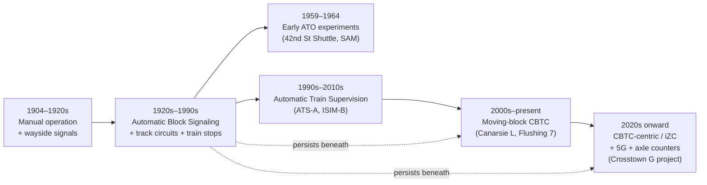
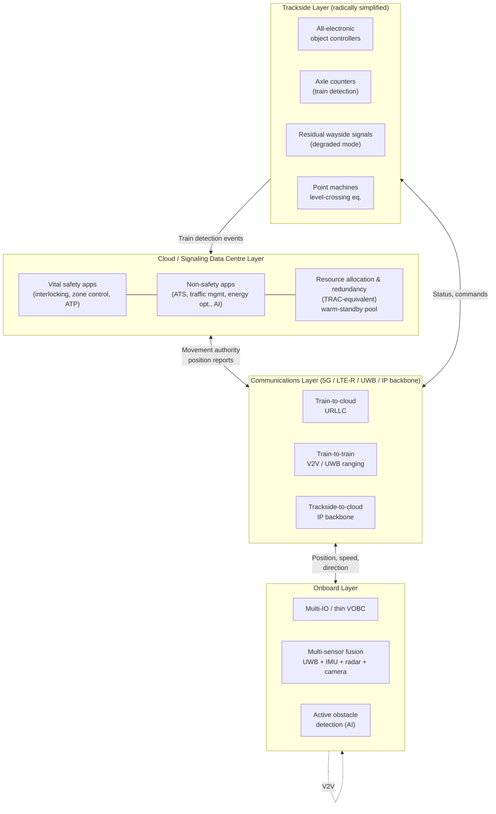
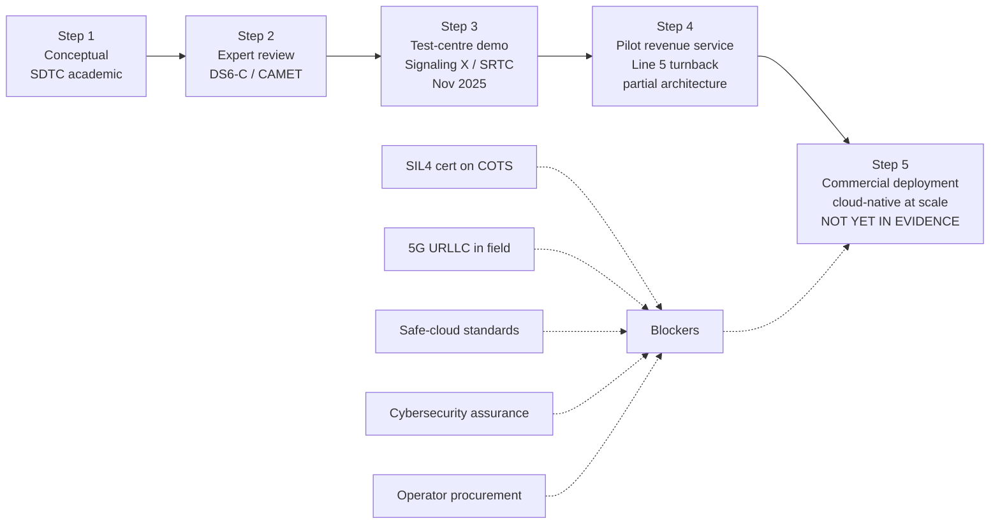
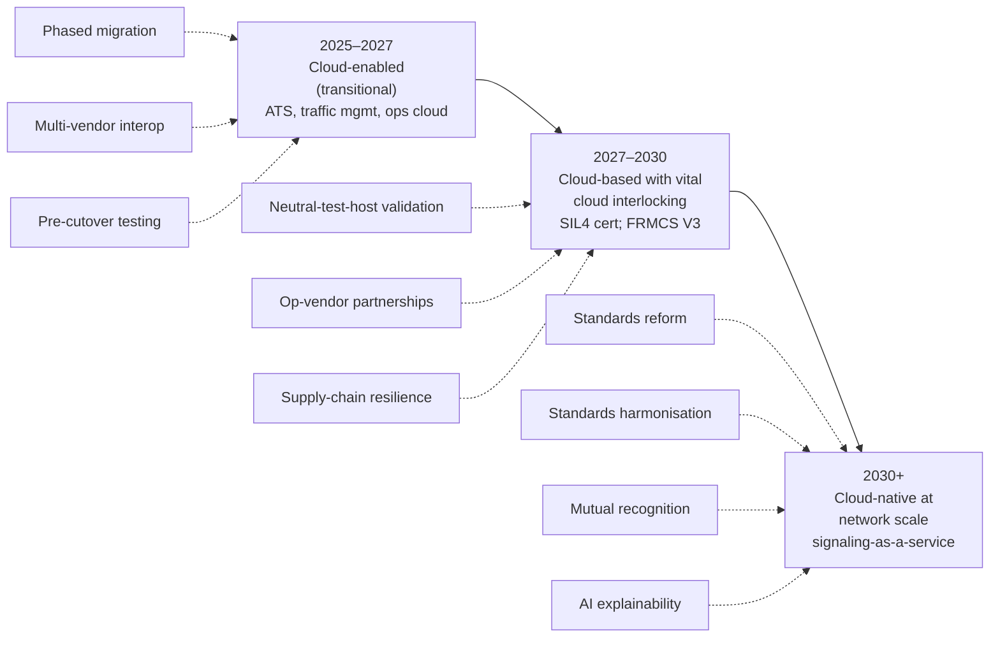

# Cloud-Based Train Control Systems for Urban Rail Transit: Recent Developments and Key Technology Landscape
# 1 Research Background and the Evolution from Traditional CBTC to Cloud-Based Train Control

Urban rail transit sits at the intersection of two converging pressures: relentless growth in ridership demand on already saturated metro networks, and the obsolescence of signaling assets whose architectural assumptions were laid down nearly a century ago. The signaling system—the invisible nervous system that determines how closely trains can run, how reliably they depart, and how safely they navigate complex junctions—has therefore become the single most consequential lever for capacity expansion, operational resilience, and lifecycle economics in modern metros. Yet the dominant paradigm of the past three decades, Communications-Based Train Control (CBTC), is itself beginning to show structural strain. Built on proprietary, hardware-bound zone controllers, vendor-specific wayside equipment, and rigid one-line-at-a-time deployment cycles, it has delivered moving-block capacity gains at the cost of long rollouts, expensive interoperability negotiations, and a maintenance footprint that scales linearly with track mileage. Against this backdrop, a new architectural direction—cloud-based, virtualized, software-defined train control—has emerged as the candidate successor, promising to decouple safety logic from bespoke hardware and to relocate signaling intelligence into centralized, COTS-based data centers.

This opening chapter establishes the historical and conceptual baseline for the remainder of the report. It traces how urban rail signaling has evolved across roughly twelve decades, from manual operation under fixed wayside signals to moving-block CBTC and now toward cloud-native control; it diagnoses the specific limitations of conventional on-premise CBTC that motivate the shift; and it defines what cloud-based train control means in the urban rail context and why it carries particular strategic weight for high-density metros. The New York City Subway, whose modernization narrative spans every generation of signaling technology and whose ongoing CBTC program is among the most extensively documented in the world, serves as the principal illustrative reference. It is important to acknowledge at the outset that the reference base for this chapter is concentrated on a single, exceptionally rich case study; broader regional and vendor-level evidence will be triangulated in Chapters 3, 6, and 8. Within this chapter, the NYC experience is used not as a global average but as a representative high-density legacy network whose pain points—aging assets, vendor fragmentation, decades-long rollouts—exemplify the structural drivers behind the cloud transition.

## 1.1 Historical Evolution of Urban Rail Signaling Systems

The historical arc of urban rail signaling can be read as a sequence of responses to two enduring questions: how to prevent collisions between trains operating on shared infrastructure, and how to extract more capacity from a fixed quantity of track. Each generation of technology has answered these questions with progressively richer information about train position, speed, and intent, and with progressively tighter integration between trackside infrastructure, onboard equipment, and centralized supervisory systems. The New York City Subway, opened in 1904 and now operating roughly 14,850 signal blocks, 3,538 mainline switches, 10,104 automatic train stops, and 339,191 signal relays as of May 2014, provides an unusually complete laboratory in which every major generation of signaling—from electromechanical fixed-block to moving-block CBTC—remains physically present and operationally active.[^1]

### 1.1.1 Fixed-Block Automatic Block Signaling: The Century-Old Foundation

The foundational technology of urban rail signaling is **automatic block signaling (ABS) with track circuits**, which the New York City Subway has used since its opening and which still governs roughly 85% of the system as of 2025.[^1] In this architecture, the two running rails are electrically insulated into discrete "blocks"—typically 1,000 feet (300 m) long on the NYC Subway, though heavily used lines such as the IRT Lexington Avenue Line use shorter blocks—and form a track circuit. When a block is unoccupied, electricity flows freely and the wayside signal displays green; when a train enters, its metal wheels close the circuit, the signal turns red, and the block is registered as occupied. A train that passes a red signal is automatically braked by a mechanical **train stop** that physically engages the train's brake valve.[^1]

Several intrinsic limitations of this scheme are worth highlighting because they recur as motivations for every subsequent generation. First, **the system has no knowledge of where within a block a train is located, nor of how fast it is traveling**; the maximum permissible speed of a following train is inferred only from the number of clear blocks ahead.[^1] Second, capacity is bounded by block length: shorter blocks increase capacity but multiply infrastructure cost. Third, the technology ages poorly in a literal sense. Many components of the NYC Subway's signaling were installed between the 1930s and 1960s; some signals were 80 years old by 2017 and had outlasted their 50-year design life by up to 30 years, with replacement parts no longer available from suppliers and instead custom-built for the operator.[^1] Signal problems accounted for 13% of all subway delays in 2016, and broken signals caused 11,555 train delays between December 2017 and January 2018 alone—conditions severe enough to prompt a state of emergency declaration for the subway in 2017.[^1]

A series of refinements accreted on top of the basic ABS scheme to address specific operational problems. **Time signals**—both "grade timers" for downgrades, curves, and buffer stops, and "station timers" allowing one train to enter a station as another leaves—introduced rudimentary speed supervision; following the 1995 Williamsburg Bridge collision, which killed a train operator who sped into the back of a preceding train, the MTA reduced maximum speeds from 55 mph to 40 mph and installed grade-time signals systemwide.[^1] By 2018 some 2,000 signals had been modified, and a subsequent review identified 267 to 320 faulty timers that were forcing trains to run significantly slower than intended, illustrating how layered patches on a fundamentally rigid architecture can produce unintended capacity loss.[^1] **Wheel detectors**, introduced in 1996 at interlockings, added axle-speed measurement at switches, while **interlocking signals**, **call-on signals**, **dwarf signals**, **repeater signals**, and **gap filler signals** at curved platforms each addressed a localized operational case without altering the underlying block paradigm.[^1]

### 1.1.2 Automatic Train Supervision: Centralizing Visibility and Routing

The next conceptual leap was not in train protection but in **train supervision**—the centralized, real-time visibility of where trains are and the dispatcher's ability to reroute, hold, or short-turn them in response to disruptions. Automatic Train Supervision (ATS) was first proposed for the BMT Canarsie Line and the A Division of the NYC Subway in 1992, in the wake of the 1991 Union Square derailment that killed five people on a 4 train.[^1] The ATS-A project ultimately consolidated operations from 23 different master towers into a single Rail Control Center, upgraded signals to be compatible with future CBTC retrofitting, and enabled the train arrival "countdown clocks" that passengers now take for granted.[^1]

The ATS-A deployment is also instructive as a cautionary tale about complexity. Parsons Corporation assisted the MTA in installing the system across 175 miles of A Division track; the project ultimately cost $200 million, was delayed by five years, and took a total of 14 years to implement. Root causes included the unique specifications of NYC Subway equipment, the MTA's choice to use its own workforce rather than outside contractors, inadequate contractor training, and—singled out as the largest issue—poor cooperation between the MTA and contractors attributed primarily to communication failures.[^1] Subsequent attempts to extend ATS to the B Division were considered and rejected in 2006, 2008, and 2010 as too complex, leading the MTA in 2011 to substitute the simpler "Integrated Service Information and Management" (ISIM-B) system, originally targeted for 2017 completion but later slipped to 2020. In 2015 Siemens won a $156.2 million contract (later increased by $8.75 million) to install a CBTC-compatible ATS on most of the B Division.[^1] These deployment dynamics—long timelines, cost overruns, and integration friction—will reappear in §1.2 as recurring symptoms of the on-premise CBTC paradigm.

### 1.1.3 From Early Automation Experiments to Moving-Block CBTC

Automatic Train Operation (ATO) in the New York system has a surprisingly long pedigree. As early as 1958 the New York City Transit Authority studied automated train operation in conjunction with General Railway Signal, Westinghouse's Union Switch and Signal division, General Electric, and Western Electric; a three-car automated train, dubbed SAM, entered passenger service on the 42nd Street Shuttle in January 1962 after testing on the BMT Sea Beach Line. The experiment was projected to save $150,000 a year on the shuttle alone but ultimately produced no labor savings because union opposition required a stand-by motorman to remain aboard, and the demonstration train was destroyed in an April 1964 fire at Grand Central. Ideas for systemwide automation then "lay dormant for years" until the 1991 Union Square derailment catalyzed a 1994 business case for ATO and CBTC.[^1]

**Communications-Based Train Control (CBTC)**, the technology that defines the current era, fundamentally changes how train position is determined and how movement authority is granted. Rather than relying on track-circuit occupancy of fixed blocks, CBTC-equipped trains carry transponder interrogator antennas beneath each carriage that interrogate fixed transponders installed between the rails, and report their location via radio to a wayside Zone Controller, which in turn issues movement authorities. This architecture allows trains to operate at closer distances—approximating a moving-block regime—relays real-time positions to a control room, and in principle eliminates the need for complex interlocking towers.[^1] CBTC-enabled lines on the NYC system are controlled from the Operations Control Center in Midtown Manhattan, where 432 screens display the relative locations of trains, and onboard cab computers allow conductors to monitor speed and location.[^1]

The first full deployment was on the BMT Canarsie Line (the L service), proposed in 1994, approved in 1997, with installation begun in 2000 and substantially complete by December 2006 using Siemens's Trainguard MT CBTC system. The Canarsie Line was chosen because it is self-contained, does not share track with other services, and at roughly 10 miles is shorter than most NYC lines—making the signaling requirements and complexity tractable for a pilot.[^1] Following an unexpected ridership increase, the MTA ordered additional R160 cars in 2010, and CBTC enabled service to rise from 15 trains per hour (tph) in May 2007 to 20 tph, "an achievement that would not be possible without the CBTC technology or a redesign of the previous automatic block signal system."[^1] The 2015–2019 Capital Program funded three additional electrical substations to push capacity to 22 tph.[^1] By 2025, the original Canarsie CBTC equipment was approaching the end of its 25-year useful life, and the original computer servers, radios, and software were already programmed for upgrade—a noteworthy data point indicating that even first-generation CBTC has now entered its own renewal cycle.[^1]

The IRT Flushing Line (the 7 and <7> services), automated by Thales under a contract awarded in June 2010, became the second CBTC line. The project went over budget at $405 million versus an original $265.6 million estimate and slipped repeatedly; CBTC was substantially completed on March 7, 2019, with full automatic train operation beginning in May 2019, increasing service from 27 to 29 tph.[^1] The MTA's Independent Engineering Consultant noted that CBTC could support additional service beyond 29 tph and recommended simulation studies to identify remaining line constraints.[^1]

### 1.1.4 The Generational Trajectory at a Glance

The following table consolidates the principal generations of urban rail signaling as illustrated by the NYC Subway, highlighting the information they exploit, the capacity regime they enable, and their characteristic limitations. It establishes the historical baseline against which cloud-based train control will be evaluated in §1.3.

| Generation | Position Information | Train Separation Logic | Representative NYC Deployment | Characteristic Limitation |
|------------|----------------------|------------------------|--------------------------------|---------------------------|
| Manual operation with wayside signals (pre-1920s) | Visual block signal aspect only | Driver compliance with fixed signals | IRT/BMT/IND from 1904 | No automatic enforcement; collision-prone[^1] |
| Automatic Block Signaling with train stops (1920s onward) | Track-circuit block occupancy; no in-block position or speed | Fixed blocks (~1,000 ft) with mechanical trip | ~85% of NYC Subway as of 2025[^1] | Coarse spatial resolution; aging components; capacity-bounded[^1] |
| ABS + grade-time / station timer signals (post-1995) | Block occupancy plus elapsed-time speed inference | Fixed blocks with speed supervision overlays | ~2,000 modified signals by end-2018[^1] | Patch on rigid architecture; mis-tuned timers cause capacity loss[^1] |
| Automatic Train Supervision (1990s–2010s) | Centralized real-time train tracking | Supervisory only; safety still vested in ABS | ATS-A on 175 mi of A Division; ISIM-B / Siemens ATS on B Division[^1] | 14-year deployment; supervisory layer cannot improve headway alone[^1] |
| Moving-block CBTC (2000s onward) | Transponder-based onboard localization, radio-reported | Movement authority from wayside Zone Controllers | Canarsie (Siemens, 2006); Flushing (Thales, 2019); Queens Boulevard West (2022–2024)[^1] | Retains fixed-block overlay; vendor-locked hardware; long, costly rollout[^1] |
| Cloud-based / iZC / 5G-enabled CBTC (emerging) | Same onboard sensing, but logic centralized in software | Movement authority from integrated Zone Controllers in centralized environments; 5G train-to-wayside | Crosstown Line "CBTC-centric" project (Thales/TC Electric, awarded Dec 2022)[^1] | Standardization, certification, and 5G-onboard readiness still maturing[^1] |

The progression described above can also be visualized as a layered timeline of capability accumulation, with each generation preserving (and depending on) elements of the prior one—an important point because it explains why even CBTC-equipped lines in NYC retain a fully track-circuited fixed-block infrastructure beneath the moving-block overlay.[^1]

The dotted arrows are the crucial point: the underlying ABS infrastructure does not retire when CBTC is deployed; rather, the MTA explicitly preserves the legacy block system on CBTC lines for switch control, broken-rail protection, and tracking of non-CBTC trains, with the result that "the MTA's form of CBTC uses a reduced form of the old fixed-block signaling system, requiring that both be maintained at high cost."[^1] This dual-system burden is the hinge between the historical narrative and the limitations analysis that follows.

## 1.2 Technical and Operational Limitations of Traditional CBTC Architectures

If CBTC represented a genuine architectural advance over fixed-block signaling, why does the industry now look beyond it? The answer lies in a cluster of structural shortcomings—some inherent to the way CBTC was originally specified, others emerging only at scale—that together impose a ceiling on the technology's ability to address the pressures of high-density metro operations. The NYC experience documents each of these shortcomings in unusually concrete form.

### 1.2.1 Persistent Fixed-Block Overlay and Dual-System Maintenance Burden

The most fundamental limitation of conventional CBTC, as deployed in NYC and many comparable systems, is that **it does not actually replace the legacy block signaling**; it overlays it. The block system continues to handle "all control and supervision of routes through interlockings including switch (point) control and switch status, for broken rail protection, and tracking of trains that are operating without CBTC." Lines equipped with CBTC remain "fully track-circuited with power frequency, single-rail track circuits," even though broken-rail protection is guaranteed on only one of the two rails of a track. The CBTC Zone Controller "functions then as an overlay which only provides safe separation of trains and cannot do so without interaction from the Wayside (Legacy) Signaling system," and signals and interlockings are still required—"their job being done better by relay interlockings or Solid State Interlocking controllers."[^1]

This architectural choice produces a doubled maintenance economy: the operator must keep both systems certified, staffed, and stocked with spare parts, with the lifecycle costs of each layer largely independent of the other. The MTA's documentation explicitly characterizes this as a "high cost."[^1] The implication is structural rather than incidental: as long as movement authority is logically tied to physical wayside transponders and zone controllers, retiring the legacy layer requires architectural choices (such as axle counters and centralized integrated Zone Controllers) that go beyond conventional CBTC—choices that, as §1.3 will show, point directly toward cloud-based architectures.

### 1.2.2 Hardware-Software Coupling and Vendor Lock-In

Conventional CBTC tightly couples safety-critical software to vendor-specific hardware: bespoke wayside Zone Controllers, proprietary radio transponders, and rolling stock onboard units that must be matched to a specific supplier's protocol stack. The NYC pilots illustrate this directly. Both the Canarsie R143s and R160s use Siemens's Trainguard MT CBTC, while the Flushing Line was equipped by Thales; the two suppliers worked **separately** during the pilot phase and only later were required to "cooperate on the installation process for all of the lines" under the 2015–2019 Capital Program.[^1] To enable wider deployment, the MTA had to commission the Culver Line test track expressly to demonstrate that an interoperable Siemens/Thales CBTC system was viable; only after the test track succeeded in 2015 did the integrated configuration become "the standard for all future CBTC installations on New York City Transit tracks."[^1] Even then, expanding the supplier base required a deliberate $1.2 million Mitsubishi contract in July 2015 to demonstrate that a third vendor's technology could interoperate, and Mitsubishi's first revenue-grade CBTC contract with the MTA (for QBL East) was not awarded until December 2021.[^1]

The same coupling extends to rolling stock. CBTC operation in NYC is restricted to "newer-generation rolling stock that were first delivered in the early 2000s"—the R143s, R188s, R160s, and forthcoming R179 and R211 fleets—while older cars are excluded.[^1] A particularly telling example of the hardware-software coupling problem is that the Crosstown Line CBTC upgrade was reported in July 2025 to face delay because new 5G transmitters needed to be added to the R211s used on the G route, demonstrating that even successor-generation rolling stock must be physically retrofitted whenever the wayside-to-train communication standard evolves.[^1] Similarly, the Lexington Avenue Line CBTC project's pace is constrained by the proposed R262 subway car order, and in July 2022 the MTA Board postponed the Lexington Avenue and Astoria Line CBTC projects to the 2025–2029 Capital Program in part because "delays by subway car manufacturers" had become a binding constraint.[^1] These dependencies confirm Rubric P-5: the architectural mechanism—tight coupling between specific cab equipment, specific radios, and specific zone-controller protocols—directly causes operational outcomes such as multi-year program slips.

### 1.2.3 Long Deployment Timelines and Cost Escalation

Conventional CBTC rollouts have proven remarkably slow and expensive in dense legacy networks. The NYC trajectory is instructive:

- The whole subway was originally to be automated by **2017** when the Canarsie project began in 1997; by 2005 the completion target had slipped to **2045**.[^1]
- In 2017, full systemwide implementation of CBTC was reported as potentially taking **40 to 50 years**, prompting MTA Chairman Joe Lhota to call the timeline "simply too long" and to launch the Genius Transit Challenge for accelerated alternatives.[^1]
- In March 2018, NYCT President Andy Byford announced a revised 10–15 year plan—still costed at **$8 to $15 billion**—and his subsequent May 2018 "Fast Forward" plan was scaled at **$19 billion**.[^1]
- Project-level cost overruns are common: Flushing Line CBTC ran $405 million against an original $265.6 million estimate; the QBL West phase one contract was $205.8 million for Siemens and a parallel award to Thales in August 2015, with the December 2016 phase two contract at $223.3 million; the Eighth Avenue Line CBTC contract awarded in January 2020 was $245.8 million, with the entire project budgeted at $733.6 million by November 2020; the Crosstown Line design-build alone was $368 million in December 2022; and L.K. Comstock received a **$1.3 billion** contract in December 2025 to install CBTC on both sections of the Fulton Street Line.[^1]
- The MTA had hoped to install **16 miles of CBTC-equipped tracks per year**, while the Regional Plan Association argued for **21 miles per year**; in practice, the first two CBTC lines—Canarsie and Flushing, totaling 50 miles—took from 2000 to 2018 to deliver, an effective rate of approximately 2.8 miles per year over the pilot period.[^1]

The drivers of these timelines and costs are partly contextual—New York's 24/7 operation, complex shared trackage, and union arrangements—but partly architectural. The MTA's own documentation lists "the unique specifications of New York City Subway's equipment" as a primary delay factor, alongside contractor training inadequacies and missed test deadlines.[^1] To the extent that hardware-bound CBTC requires every new line's wayside to be physically built, cabled, and commissioned before software can be tested, the architecture itself sets a floor on deployment velocity.

### 1.2.4 Capacity Ceilings and Network Effects

Even where CBTC is fully deployed, the headway gains in heavily used corridors are real but bounded. The Canarsie Line moved from 15 to 20 tph after CBTC, with planning for 22 tph; the Flushing Line moved from 27 to 29 tph; and the QBL automation is projected to add 3 tph beyond the current 29 tph.[^1] These are meaningful improvements, but they should be calibrated against benchmarks and constraints:

- The **IND Queens Boulevard Line** is retrofitted to operate at frequencies of up to 60 tph (30 tph on each of the local and express pairs of tracks) **without CBTC**, made possible by the four-siding terminal at Jamaica–179th Street; the **IRT Flushing Line** ran at 33 tph without CBTC; and the **IRT Lexington Avenue Line** operates at 27 tph without CBTC.[^1] In other words, terminal track configuration and platform dwell can dominate headway outcomes more than the signaling generation.
- The Canarsie Line is **limited to 26 tph** despite CBTC due to bumper blocks at both terminals and power constraints.[^1]
- The MTA's CBTC documentation explicitly notes that "platform dwell times and train performance are the true limiting factors in terms of headway performance," not the signaling.[^1]
- By comparison, lines on the **Moscow Metro** can operate at frequencies of up to **40 tph** because they typically have four sidings past terminals rather than bumper blocks or one or two sidings.[^1]

These data points support an important inference for the cloud-based control discussion: while CBTC removes the fixed-block headway constraint, it does not by itself remove power-supply, terminal-configuration, or rolling-stock constraints. Architectural improvements beyond CBTC must therefore be evaluated not only on signaling performance but on their ability to integrate signaling with power, traffic management, and asset planning in a single optimizable system—a capability that, as Chapter 5 will quantify, cloud-based architectures explicitly target.

### 1.2.5 Wayside Infrastructure Footprint and Maintenance Complexity

A final and increasingly emphasized limitation is the sheer mass of wayside equipment that conventional CBTC retains. The MTA's Crosstown Line CBTC project—described as taking a "CBTC-centric" approach—is explicitly designed around the premise that "existing wayside interlockings as well as AWS systems will be replaced with new software logics in enhanced, centralized CBTC Zone Controllers – known as integrated Zone Controllers (iZCs). This will minimize the amount of wayside and room signaling equipment, reducing future maintenance burden."[^1] The MTA's June 1, 2022 RFI on simplifying wayside signaling infrastructure asked respondents to consider "ways to eliminate as much wayside infrastructure, such as train-stops and line-side signals, including related boxes, relay room-based equipment and lineside cabling, as possible," to "replace programmable logic controllers and interfaces with logic resting in the Zone Controller or ATS system," and to "eliminate or combine local control panels and related interfaces and equipment, and replace them with remote terminals."[^1]

The MTA has also begun to substitute **axle counters** for insulated joints and track circuits—first on the Eighth Avenue Line CBTC project (the "first CBTC project in the system to use axle-counters"), then on the QBL East and Crosstown projects. Axle counters are documented as "more resilient to debris and water, making them more reliable," "have been used for decades in systems around the world," and reduce the time and cost to complete CBTC projects, maintenance and life-cycle costs, and the duration and risk of cutovers.[^1] Each of these moves—iZCs, axle counters, the elimination of train-stops and relay rooms—chips away at the wayside footprint that conventional CBTC inherited from ABS.

Taken together, these five categories of limitation explain why even an operator that has invested heavily in CBTC for two decades is now actively seeking architectures that go further. The next section turns to the architectural response.

## 1.3 Emergence and Strategic Significance of Cloud-Based Train Control

The trajectory described above—iZCs replacing distributed wayside controllers, axle counters replacing track circuits, software logic absorbing relay-room functions, and 5G replacing legacy CBTC radios—points toward a paradigm in which signaling intelligence migrates from physically distributed, vendor-specific hardware into centralized, virtualized, software-defined environments. This paradigm is what the broader industry now refers to as **cloud-based train control**, although it is important to acknowledge upfront that the term covers a spectrum rather than a single architecture, and that no single source in the reference base for this chapter offers a fully canonical definition. Within this report, cloud-based train control is provisionally understood as a signaling architecture in which safety-critical train control logic (interlocking, ATP, ATO, traffic management) is implemented as software running on virtualized, COTS-based computing platforms in centralized signaling data centers, with the wayside reduced to a minimal set of sensing and actuating elements connected by high-bandwidth, low-latency communications. Chapter 2 will refine this definition with reference to vendor-specific terminology (Signaling X, DS3, Urbalis, etc.); for the purposes of framing the present chapter, four of its constituent moves are already visible in the NYC evidence base.

### 1.3.1 Architectural Building Blocks Visible in Current Practice

First, **integrated Zone Controllers (iZCs)** centralize what was previously distributed. The Crosstown Line project explicitly replaces existing wayside interlockings and AWS systems "with new software logics in enhanced, centralized CBTC Zone Controllers – known as integrated Zone Controllers (iZCs)," minimizing wayside and room signaling equipment.[^1] This is a step toward the software-defined signaling logic that defines cloud-based control: the same safety functions that once required relay rooms full of bespoke hardware become software workloads.

Second, **axle counters** decouple train detection from track-circuit infrastructure, enabling CBTC testing before cutovers, reducing cutover time and risk, and lowering project, maintenance, and life-cycle costs.[^1] In a cloud-based architecture, axle counters become one of the few standardized, COTS-amenable wayside elements that need persist.

Third, **advanced wireless communications** are replacing the proprietary radio links of first-generation CBTC. The Crosstown Line CBTC project specifies that "the train-to-wayside communication will be based on 5G technology," making it the first NYC CBTC deployment to do so.[^1] The MTA also began testing **ultra-wideband (UWB)** train signaling on the IND Culver Line and the 42nd Street Shuttle in 2017, with the Genius Transit Challenge winners proposing UWB-based wireless signaling and onboard sensor/camera approaches as faster-to-deploy alternatives to conventional CBTC.[^1] UWB pilots on the Canarsie and Flushing Lines were awarded in March 2019, four trains per line were equipped, and a January 2020 MTA press release described the nine-month test as "successful." The May 2020 Capital Program Oversight Committee meeting confirmed that UWB was "effective in determining the location of trains," that the MTA was "looking at using it on future projects to replace the transponder-based train localization systems used on existing CBTC projects," and that UWB would provide "more accurate information on the positioning of trains, and allow for simpler carborne installation." UWB pilots were also evaluated alongside RADAR, HD cameras, and LIDAR.[^1] In June 2021, the MTA Board approved modifications to UWB proof-of-concept contracts with Thales and Siemens to establish interoperability between the two systems, with the explicit goal of encouraging competition between the subcontractors (Humatics for Siemens, Piper for Thales) and maintaining resiliency.[^1]

Fourth, **standards reform** is targeting the elimination of redundant legacy infrastructure. The MTA's May 20, 2022 RFI sought proposals to update the existing S733 Signal Standard Specification "so it could be simplified for use in CBTC, with a major reduction or elimination of AWS-related work in future CBTC installations," noting that under the current standard CBTC is treated "as an overlay of the AWS, and installing the AWS requires a major amount of work." The April 7, 2022 RFI sought technologies to enable work trains to operate safely on CBTC lines without conventional AWS trip-stops, and the June 1, 2022 RFI sought ways to replace programmable logic controllers and interfaces "with logic resting in the Zone Controller or ATS system" and to "reduce or eliminate the number of relays through the use of direct-drive input and output signals."[^1] Each of these RFIs articulates, in operator language, exactly the architectural moves that cloud-based train control is designed to enable.

The relationship between conventional CBTC and the emerging cloud-based paradigm can be summarized in the following comparison.

| Attribute | Conventional CBTC (as deployed in NYC, 2000–2020s) | Cloud-Based / "CBTC-Centric" Train Control (emerging) |
|-----------|-----------------------------------------------------|------------------------------------------------------|
| Safety logic location | Distributed: per-line wayside Zone Controllers, relay rooms, interlocking towers[^1] | Centralized: integrated Zone Controllers (iZCs) absorbing AWS logic[^1] |
| Wayside footprint | Full track-circuited fixed-block overlay retained beneath CBTC; train-stops, line-side signals, relay rooms persist[^1] | Targeted reduction: axle counters replace track circuits; train-stops and line-side signals targeted for elimination[^1] |
| Train detection | Onboard transponder interrogators reading fixed wayside transponders; track circuits beneath[^1] | UWB localization piloted as more accurate, simpler carborne; axle counters for fallback[^1] |
| Train-to-wayside communications | Proprietary CBTC radio (Trainguard MT, SelTrac, etc.)[^1] | 5G specified for Crosstown Line; UWB; interoperability mandated between vendors[^1] |
| Vendor coupling | Hardware-software bound to single supplier per line until interoperability test track (Culver, 2015)[^1] | Three-vendor interoperability extended (Siemens/Thales/Mitsubishi); axle counter and UWB standardization push[^1] |
| Lifecycle | First-generation Canarsie equipment nearing 25-year life by 2025; servers, radios, software to be upgraded[^1] | Software-defined logic in principle enables faster, less disruptive updates (subject to certification) |
| Deployment velocity | 50 miles in 18 years on first two pilot lines; aspirational 16–21 mi/yr systemwide[^1] | RFIs explicitly target reduction in cutover time and pre-cutover testing risk via axle counters[^1] |

It must be stressed that the cloud-based column captures intent and emerging practice as documented in the NYC reference base; the maturity, certification, and operational outcomes of cloud-native deployments globally are the subject of Chapter 3, and this chapter does not assert that cloud-based train control has been fully realized in revenue service in NYC or any other named jurisdiction within the reference base for §1.

### 1.3.2 Strategic Significance for High-Density Metro Networks

The strategic case for cloud-based train control is most compelling in precisely the operating environment that motivates this report: high-density, high-utilization metro networks with aging legacy infrastructure and rising ridership. Several threads of evidence support this assessment.

**Aging infrastructure renewal cycles align with the architectural transition.** The NYC Subway's first-generation CBTC equipment on the Canarsie Line was, by 2025, nearing the end of its 25-year useful life, with the original computer servers, radios, and software programmed for upgrade.[^1] Operators globally that deployed first-generation CBTC in the 2000s now face a renewal decision that coincides with the maturation of virtualization, 5G, and COTS-based safety platforms. Choosing to replace like-for-like with another generation of hardware-bound CBTC would lock in 25 more years of dual-system maintenance burden; choosing cloud-based architectures aligns the replacement cycle with the architectural inflection.

**Capacity demand cannot be met by conventional CBTC alone.** Even after CBTC, NYC headway gains are bounded by terminal configuration, power supply, and dwell time, and the marginal tph improvements (15→20 on Canarsie, 27→29 on Flushing) are real but modest relative to the aspiration of matching benchmarks such as Moscow's 40 tph.[^1] Cloud-based architectures are positioned to address this by integrating signaling, traffic management, power management, and rolling stock supervision in a single virtualized environment—an integration that the MTA's own RFIs effectively prefigure when they ask respondents to absorb PLC and AWS logic into Zone Controllers and ATS.[^1]

**Deployment velocity is itself a strategic variable.** The progression from a 2017 systemwide CBTC target to a 2045 forecast and back to a 10–15-year accelerated plan, combined with the MTA's documented determination that the original 40–50-year timeline was "simply too long," reflects an industry-wide recognition that signaling renewal must accelerate.[^1] To the extent that cloud-based architectures reduce the ratio of wayside-to-software work, enable pre-cutover testing (as axle counters already do on the Eighth Avenue project), and decouple software updates from physical recommissioning, they directly attack the rate-limiting step of metro modernization.

**Interoperability and competition become first-class objectives.** The MTA's deliberate cultivation of three-vendor CBTC interoperability (Siemens, Thales, Mitsubishi) and its parallel push for UWB interoperability between Humatics (Siemens) and Piper (Thales) "to encourage competition between the subcontractors for the two companies and maintain resiliency in the UWB system" indicates that operators increasingly view vendor lock-in as a strategic risk in itself.[^1] Cloud-based architectures, with their COTS hardware and software-defined logic, make this objective tractable in ways that hardware-bound CBTC does not.

**Resilience and integration with smart city infrastructure.** While the NYC reference base does not directly address smart-city integration, it does document that wayside controllers are housed "in enclosed boxes that can withstand floods and other natural disasters," reflecting a growing operator concern with environmental resilience.[^1] Centralized, virtualized architectures—with replicated, geographically distributed signaling data centers—offer a different and potentially complementary resilience model that will be examined in detail in Chapter 4.

### 1.3.3 Research Scope and Analytical Framework

Building on the historical baseline of §1.1 and the limitations diagnosis of §1.2, this report defines its scope and analytical framework as follows. The **scope** is restricted to **urban rail transit**—metro, light metro, and automated people mover systems—as distinct from mainline ETCS or freight PTC; while mainline analogs may be cited where they illuminate transferable architectural lessons, scope mismatches will be flagged. The **time horizon** for recent developments is 2023–2025, with historical depth as needed for context. The **technology object** is cloud-based, virtualized, software-defined train control, distinguished in Chapter 2 from conventional CBTC and Improved-CBTC (I-CBTC). The **analytical framework** proceeds in three layers: (i) architectural and technological enablers (Chapters 2 and 4); (ii) deployment evidence and competitive dynamics (Chapters 3 and 6); and (iii) economic, regulatory, regional, and forward-looking analysis (Chapters 5, 7, 8, and 9). Throughout, claims are triangulated where possible, vendor-only assertions are flagged, and risks and standardization gaps are surfaced alongside benefits, in line with the persistent reasoning standards governing this report.

A particular caveat applies to this opening chapter: the bulk of the verifiable evidence available draws from a single, exceptionally well-documented North American operator. The patterns it reveals—dual-system burden, vendor lock-in, decadal rollouts, capacity ceilings shaped by non-signaling constraints, and an emerging architectural convergence toward iZCs, axle counters, and 5G—are consistent with, and in places explicitly anticipate, the cloud-based paradigm that subsequent chapters will examine in greater geographic and vendor breadth. They are not, however, sufficient on their own to characterize the global state of cloud-based train control. The chapters that follow correct this asymmetry by drawing on European, Asia-Pacific, and vendor-disclosed evidence of cloud-native deployments, by quantifying benefits with triangulated data, and by examining the certification and standardization pathways that will determine whether the architectural promise visible in the NYC evidence base translates into a globally adopted operating reality.

[^1]: Wikipedia, "Signaling of the New York City Subway," https://en.wikipedia.org/wiki/Signaling_of_the_New_York_City_Subway

# 2 Definition, Architecture, and Functional Scope of Cloud-Based Train Control Systems

Chapter 1 traced how the New York City Subway's signaling estate has, over more than a century, accreted layer upon layer—fixed-block ABS, time-signal overlays, ATS, moving-block CBTC—without ever fully retiring the layers beneath. It also catalogued the structural reasons why even fully deployed CBTC cannot, on its own, escape the dual-system maintenance burden, vendor lock-in, decadal rollout, and capacity ceiling that characterise on-premise architectures. The architectural moves visible at the close of that chapter—integrated Zone Controllers absorbing interlocking logic, axle counters replacing track circuits, 5G replacing proprietary radios, and RFIs explicitly seeking to push wayside logic into Zone Controllers and ATS—were presented as building blocks of a different paradigm rather than as a finished one. The present chapter takes up the work of defining that paradigm rigorously: what exactly is "cloud-based train control" in the urban rail context, what does its system architecture look like, how are safety-critical and non-safety functions redistributed within it, and how does it differ in measurable architectural terms from conventional CBTC and Improved-CBTC (I-CBTC)?

The chapter is in this sense the conceptual scaffold for the rest of the report. It does not yet evaluate deployment maturity (Chapter 3), enabling technologies in depth (Chapter 4), or quantitative benefits (Chapter 5); rather, it establishes a functional reference model against which those subsequent analyses can be calibrated. Two scope caveats deserve explicit acknowledgement. First, the term "cloud-based train control" is not yet a single, codified standard concept; vendors, operators, and academics use overlapping but non-identical labels—Software-Defined Train Control (SDTC), cloud-enabled interlocking, cloud-vehicle integrated (云车融合) systems, signaling-as-a-service, and TACS-related variants. The chapter treats these as members of a family rather than as a single product, and demarcates their common architectural core. Second, several of the most concrete reference points in the available evidence base—the SDTC architecture proposed by Nan, Siemens's first hardware-independent cloud-enabled interlocking, the Schweizerische Bundesbahnen (SBB) data-centre safety-critical applications experiment, and CRSC subsidiary Tonghao Urban Transit's DS6-C safety cloud—are at varying stages of conceptual proposal, controlled deployment, or expert-panel review rather than mature systemwide revenue service. Where this is the case it will be flagged in line with the report's reasoning standards.

## 2.1 Defining Cloud-Based Train Control: Terminology and Conceptual Boundaries

The first task is terminological. Several adjacent labels are circulating in the urban rail signaling literature, and conflating them obscures genuine architectural differences that matter for capacity, certification, and migration planning.

### 2.1.1 The Family of Labels and Their Architectural Cores

A useful entry point is the academic concept of **Software-Defined Train Control (SDTC)**, advanced as a novel architectural alternative to CBTC. SDTC is described as a "novel urban transit signaling system architecture … based on cloud and high-speed wireless communication technology," in which "the core functions of the proposed SDTC, including the onboard controller, are implemented in the cloud platform, with only sensors and input–output (IO) units remaining on the trackside and the train"; because of its "scalable framework, the system function can be expanded according to the user's demand, making signaling as a service possible."[^2] The defining intellectual move is explicitly stated: "the core of the software-defined concept is to disentangle the applications from their specific hardware,"[^2] extending to train control the same paradigm that has reshaped networking, storage, the data centre, and the broader cloud. SDTC, as proposed, is at the conceptual stage and identifies two principal directions for further research—"the wireless performance required for remote control of trains, and whether 5G communication can meet the requirements," and "approaches to building safe clouds through COTS hardware … such as isolating different CPU cores, diversifying software coding, and synchronizing safe clocks"[^2]—both of which are revisited in §2.3 and Chapter 4.

A second, vendor-anchored reference point is **Siemens's cloud-enabled interlocking**, which the company's 2020 announcement described as the "first hardware independent cloud-enabled interlocking in operation."[^2] The phrase "hardware independent" is significant: it asserts that the safety-critical interlocking application, traditionally tied to bespoke vital processors, has been decoupled from its hardware substrate. A complementary industrial reference is the **SBB data-centre experiment**, documented in a 2018 paper "On Design, Introduction and Operation of Safety-critical Applications in a Data Center In the Railway System of Schweizerische Bundesbahnen SBB,"[^2] which addresses the same question from the operator's side: how a national railway can host vital signaling logic in a conventional IT data centre. Although these are mainline and intercity contexts rather than urban metro, they establish the architectural feasibility of relocating SIL4 logic into virtualised, COTS-hosted environments and inform the urban rail discussion under Rubric P-3's transferability test.

A third reference, originating in China, is **"cloud-vehicle integrated digital-intelligent train control" (云车融合数智列控)**. The system, developed by CRSC subsidiary Tonghao Urban Transit (通号城交), passed an expert review convened by the China Association of Metros (CAMET) in January 2026 and is characterised as a "wholly new urban-rail-cloud-based intelligent system solution oriented toward the high-quality development needs of new-line construction and existing-line refurbishment in the urban rail industry."[^3] Its architecture is described as a "two-tier cloud-vehicle architecture, with safety control functions centrally deployed in the proprietary DS6-C safety cloud and station all-electronic modules upgraded into trackside digital-intelligent modules," operating under the philosophy that "the signaling cloud provides the service and the train is the service object," with "intelligent collaboration between cloud and train"[^3]. The system is asserted to support "all-format integration of CBTC, FAO, and TACS, while remaining compatible with I-CBTC/I-FAO interoperability protocols, with the capability to interoperate with signaling systems of different formats"[^3]. Because this evidence comes from a single CAMET press release reporting on an expert review rather than from independent in-service performance data, it is treated here as vendor-attributed under Rubric P-2; nonetheless it provides the clearest articulation in the available reference base of an explicitly cloud-centric architecture targeted at urban metro applications.

A fourth, and partly overlapping, family of labels concerns **next-generation CBTC and Train Autonomous Control Systems (TACS)**. Industry analysis from Shanghai Electric Thales (现 Hitachi Rail) frames the new generation of CBTC around three key technical features—"autonomous operation, resource refinement, and architecture simplification"—and notes that "interlocking-and-zone-controller integration, all-electronic execution units, and cloud-platform information integration are receiving increasing attention and being deployed in more and more applications," and that "these technologies create the possibility for the simplification of the CBTC system."[^4] The TACS line of work, by contrast, takes vehicle-to-vehicle (V2V) communication as its organising principle, sometimes attempting to remove ground interlocking and zone controllers and redistribute their functions into onboard controllers; the same source critically observes, however, that pure V2V architectures encounter serious problems in handling non-communicating trains, establishing inter-train communication efficiently, transferring resources between communicating and non-communicating trains, and supporting global multi-train coordinated dispatching. Its conclusion is that "the most reasonable approach is for ground-based equipment to track all trains" and that the recommended evolution from existing CBTC is to "fuse interlocking and zone-controller functions to constitute a ground-based ATP resource management controller, reducing complexity, with greater system resilience to failure scenarios."[^4] This finding is important for the present chapter because it positions cloud-based, ground-centric architectures—not pure V2V—as the more robust path to next-generation control, and it justifies treating cloud-based train control and TACS as related but distinguishable concepts.

### 2.1.2 A Working Definition

Synthesising these strands, this report defines **cloud-based train control for urban rail transit** as a signaling architecture exhibiting all four of the following attributes:

1. **Decoupling of safety-critical applications from bespoke vital hardware**, achieved by software-defined function allocation and hosting on commercial off-the-shelf (COTS) computing platforms, with safety integrity ensured by software techniques (multicore isolation, software-coded processing, voting structures) rather than purpose-built vital processors[^2].
2. **Centralised deployment** of core control functions—including interlocking, zone control, ATP-side logic, and traffic management—in one or more signaling-purpose data centres ("safety clouds"), in contrast with the per-line, per-station distribution of conventional CBTC[^3].
3. **A radically simplified trackside**, in which all-electronic modules, axle counters, object controllers, and residual wayside signals replace the relay rooms, track-circuit overlays, and zone-controller cabinets of conventional CBTC[^4][^3].
4. **High-bandwidth, low-latency wireless connectivity** (5G, LTE-R, UWB) carrying real-time train-to-cloud and train-to-train data flows that previously had to be terminated at distributed wayside processors[^2].

Architectures that satisfy only some of these attributes—for instance, a conventional CBTC line whose ATS has been migrated to a cloud platform but whose interlocking logic remains on bespoke vital hardware—are best described as **cloud-enabled** rather than cloud-based, and are positioned as transitional. Architectures that satisfy all four define the **cloud-native** end of the spectrum. The rest of this report uses "cloud-based" as the umbrella label and qualifies the maturity stage where necessary.

### 2.1.3 Distinguishing from Conventional CBTC and I-CBTC

The most important conceptual distinctions are between cloud-based train control and two adjacent paradigms that are sometimes confused with it.

**Conventional CBTC**, as detailed in Chapter 1 and as codified in IEEE 1474.1, is a "continuous, automatic train control system utilizing high-resolution train location determination, independent from track circuits; continuous, high-capacity, bidirectional train-to-wayside data communications; train borne and wayside processors capable of implementing automatic train protection (ATP) functions, as well as optional automatic train operation (ATO) and automatic train supervision (ATS) functions"[^5]. Critically, this definition embeds the architectural assumption that ATP processors reside both onboard and on the wayside, with vendor-specific Zone Controllers physically distributed along the line. The SDTC analysis notes precisely this point: conventional CBTC "faces a few issues to extend and maintain because of its complicated structure," and the difficulty is structural rather than incidental.[^2]

**I-CBTC** (Improved-/Interoperable-CBTC) is best understood as a response to the vendor-lock-in problem within the conventional CBTC architecture, rather than a departure from it. The CAMET press release on cloud-vehicle integrated control treats it explicitly as a separate format alongside CBTC, FAO, and TACS, noting interoperability with "I-CBTC/I-FAO interoperability protocols"[^3]. I-CBTC retains the hardware-centric distribution of CBTC but standardises the interfaces between the wayside, onboard, and ATS layers so that equipment from different vendors can interoperate over a shared protocol. It addresses heterogeneity but not the deeper limitations of hardware coupling, dual-system maintenance burden, and slow rollout that motivated the cloud transition in the first place.

Cloud-based train control, by contrast, does not merely standardise interfaces between distributed processors; it relocates the processors themselves into a centralised virtualised environment and redefines what counts as wayside and onboard equipment.

### 2.1.4 The Architectural Spectrum

Within the cloud-based family, four positions can usefully be distinguished. The spectrum is summarised in the following table.

| Position on spectrum | Defining characteristic | Reference instances in the evidence base | Maturity stage |
|----------------------|--------------------------|------------------------------------------|----------------|
| Conventional CBTC | Distributed vital hardware on wayside and onboard; track-circuit overlay retained | NYC Canarsie/Flushing/QBL West deployments[^5] | Mature, broadly deployed |
| I-CBTC | Conventional CBTC with standardised inter-vendor interfaces | Referenced in CRSC compatibility statement[^3] | Standards in formation; selected deployments |
| Cloud-enabled (transitional) | Selected non-vital functions (ATS, traffic management, asset monitoring) migrated to cloud; vital interlocking still on bespoke hardware | Cloud-platform information integration in next-gen CBTC analysis[^4] | Increasingly common |
| Cloud-based with vital cloud interlocking | Interlocking application decoupled from hardware and hosted on virtualised platform | Siemens hardware-independent cloud-enabled interlocking; SBB data-centre safety-critical applications[^2] | Pioneer commercial / experimental |
| Cloud-native (signaling-as-a-service) | All core control functions—including ATP, interlocking, zone control, traffic management—centrally deployed in safety cloud; trackside reduced to sensors/IO; signaling-as-a-service possible | SDTC academic proposal[^2]; Tonghao DS6-C / cloud-vehicle integrated system[^3] | Conceptual to expert-review stage |

This spectrum matters for migration planning: a transit authority does not generally jump from conventional CBTC to fully cloud-native operation in a single step. The architectural moves observed in NYC at the close of Chapter 1—iZCs, axle counters, RFIs to absorb PLC and AWS logic into Zone Controllers and ATS—are best read as movements along this spectrum rather than as a binary switch.

## 2.2 Layered System Architecture: Cloud, Trackside, Onboard, and Communications

Having defined the paradigm, the chapter now sets out the layered reference architecture that will be used throughout the report. The architecture has four layers—cloud / signaling data centre, trackside, onboard, and communications—each of which is significantly transformed relative to conventional CBTC. The layering is consistent across the principal reference instances (SDTC, the Tonghao DS6-C cloud-vehicle integrated system, and the Shanghai Electric Thales next-generation TACS architecture), although the details differ.

### 2.2.1 The Cloud / Signaling Data Centre Layer

At the apex of the architecture is a centralised computing environment dedicated to running signaling-critical and traffic-management workloads. In SDTC, this layer is explicitly described as a "cloud platform" hosting the **Carborne Controller in Cloud (CiC)**—a virtualised counterpart of the conventional Vehicle On-Board Controller (VOBC)—together with a **Train Resource Allocation Controller (TRAC)** that "match[es] and manage[s] the Multi-IO and CiC in the cloud, i.e., assigning the corresponding CiC to the new train when it comes into service. This includes informing two CiCs on the same train that they are mutually redundant. The other function is to inspect the working status of the CiC. If one CiC fails," another can be activated[^2]. The same architecture provides a **warm-standby server redundancy** structure: in the SDTC Markov model, "S0 is a natural state, comprising two redundant hot standby working servers and a warm standby server W0. When a working server crashes, the system transfers into S1 with a single working server and an inactive warm standby W0. Normally, warm standby W0 will be activated into S3, thus restoring one out of two structures, while the second backup server W1 becomes a warm standby."[^2] On typical project parameters and the assumed Markov model, this redundancy structure is calculated to improve mean time between failures by 39% relative to conventional CBTC, with MTBF rising from 6398.14 hours to 8870.56 hours and MTTR falling marginally from 0.95 hours to 0.86 hours[^2]. (These figures are model-derived and assumption-dependent rather than measured in revenue service; under Rubric P-2 they are treated here as a Medium-confidence reference point.)

The Tonghao DS6-C "safety cloud" plays an analogous role in the cloud-vehicle integrated system, characterised as the centralised host for safety control functions of the entire signaling system, with the philosophy that "the signaling cloud provides the service and the train is the service object," and that "the cloud, with a global perspective, coordinates safety and efficiency"[^3]. Its dual-core design—"car-borne and ground-side dual-core … with mutually complementary perception and functions, cloud and train mutually fused, raising the resilience of operational service"[^3]—signals that even in the most cloud-centric instantiations, the onboard layer retains a non-trivial computing role, a point taken up in §2.2.3 and §2.3.

The cloud layer is thus more than a data store; it is the computational locus of the system. Its internal structure typically includes: virtualisation infrastructure on COTS servers; safety-critical application instances (interlocking, zone control, ATP-side logic) running under voting and isolation regimes; non-safety applications (ATS, energy optimisation, predictive maintenance); the redundancy management plane (TRAC-equivalent functions); and standardised interfaces to operations clouds and external systems.

### 2.2.2 The Trackside Layer

The trackside layer is, in cloud-based architectures, the most radically simplified relative to conventional CBTC. SDTC envisages "only sensors and input–output (IO) units remaining on the trackside and the train"[^2]. The Shanghai Electric Thales analysis describes the trackside in the proposed TACS architecture as comprising "only target controllers distributed at stations, through full electronification of target controllers, reducing or eliminating point-mode backup, abolishing standalone interlocking equipment," with "approximately 20% savings on whole-life-cycle hardware investment in trackside equipment" and with the resource manager "flexibly deployed at the centre or at designated stations, matched to maintenance personnel by line operating grade"[^4]. The Tonghao system likewise upgrades "station all-electronic modules into trackside digital-intelligent modules," in which the station all-electronic execution units that are increasingly common in next-generation CBTC become the principal trackside entity, alongside axle counters and other train-detection devices[^3].

Several elements of the simplified trackside should be noted explicitly. First, **all-electronic execution units** replace conventional relay-based interlocking outputs, eliminating large numbers of relays and the rooms that house them; this is essentially what NYC's June 2022 RFI sought when it asked respondents to "reduce or eliminate the number of relays through the use of direct-drive input and output signals"[^5]. Second, **axle counters** replace track circuits as the principal train-detection technology, in line with both the NYC Eighth Avenue, QBL East, and Crosstown projects[^5] and the broader European movement; under cloud-based architectures, axle-counter event data is communicated as input to centralised vital logic rather than processed by distributed wayside controllers. Third, **object controllers**—small, distributed processors that interface centralised logic to physical trackside actuators (point machines, signals, level-crossing equipment)—replace the per-station interlocking and zone-controller cabinets[^5]. Fourth, residual **wayside signals** may persist for fallback and degraded operation, although the trend (as Chapter 1 documented for NYC's RFI agenda and as the TACS analysis projects) is toward their reduction.

### 2.2.3 The Onboard Layer

Cloud-based architectures redistribute, but do not eliminate, onboard computing. SDTC retains a **Multi-IO unit** on the train, responsible for sensor and actuator interfaces, while the controller logic (CiC) executes in the cloud with two CiCs serving as mutual redundancy[^2]. To meet SIL4 requirements on the controller logic, the SDTC discussion notes the use of "a multicore processor architecture with a 2 out of 2 (2oo2) voting system to ensure safety integrity level 4 (SIL4) functions," allowing rapid recovery from server failures "without needing dedicated physical backup systems"[^2]. The Tonghao cloud-vehicle integrated system explicitly retains an onboard computing role, framing it as embodied intelligence ("具身智能") that responds to complex local scenarios: "the cloud, with a global perspective, coordinates safety and efficiency; the train side, with embodied intelligence, copes with complex scenarios"[^3].

In the next-generation TACS architecture proposed by Shanghai Electric Thales, the onboard layer takes on additional perception responsibility: "without adding ground equipment, the onboard equipment adds an active obstacle-detection system based on multi-sensor fusion and artificial intelligence, providing an auxiliary safety protection function in degraded mode in case of system faults"[^4]. The same architecture supports vehicle-to-vehicle communication for "ATO speed-coordinated adjustment in short-headway operation on high-volume lines, virtual coupling functions, and, in combination with intelligent ATS green-CBTC functions, overall energy-consumption optimisation"[^4].

The relevance of NYC's UWB pilots becomes evident here: the multi-sensor onboard fusion explored in those pilots—UWB, IMU, radar, camera—is the same family of technologies that cloud-based architectures rely on to make the centralised logic effective. In the Thales/Piper UWB pilot on the 7 line, "five high-tech components/sensors integrated with Thales' NGP systems" included UWB radios, Inertial Measurement Units providing inertial navigation and orientation verification, and radar/camera collision-prevention subsystems[^5]. Humatics's Rail Navigation System, deployed in the Siemens/Humatics pilot on the L line, is described as "a drop-in replacement for traditional odometry sensors such as tachometers, transponders, and doppler radars," providing "position, speed, and acceleration to vital and non-vital car-borne systems for signaling, train control, train management, and passenger information," with sub-5 cm safety-critical positioning in all weather conditions and operating "similarly to satellite positioning serving as 'terrestrial satellites'"[^5]. These onboard sensor stacks are the input layer that feeds the centralised cloud logic; their accuracy and availability are accordingly determinative of cloud-based control performance.

### 2.2.4 The Communications Layer

The communications layer in cloud-based train control must carry simultaneously the safety-critical real-time exchanges between train and cloud (movement authority, train position reports, point/signal commands), the train-to-train exchanges that V2V-style functions require, and the broader operational data flows. SDTC highlights two principal questions for further research: "the wireless performance required for remote control of trains, and whether 5G communication can meet the requirements"[^2]. The SDTC discussion notes 5G's positioning to enable "ultra-reliable low-latency communication, essential for real-time train control and operational efficiency," and outlines "requirements for end-to-end transmission delays of less than 100 ms with 99.9999% reliability, supporting robust train-to-ground interactions"[^2].

The NYC Crosstown Line specifies that "the train-to-wayside communication will be based on 5G technology"[^5]; this is the first NYC CBTC deployment to do so and indicates that 5G is moving from research target to procurement reality. In addition to public-cellular and dedicated-private 5G options, both UWB (for high-precision train-to-train and train-to-wayside ranging within stations and along-track) and IP-based fibre backbones (for data-centre interconnect and trackside-to-cloud transport) form integral components of the layer. Trainguard MT's Airlink, described as "secure IP-based radio propagation for track-to-train data communications" supporting "all levels of automation from semi-automated to fully automated train operation"[^5], is an example of the IP-native train-radio paradigm that cloud architectures inherit and extend.

### 2.2.5 Reference Architecture Diagram

The relationships among the four layers can be summarised as follows.

The pattern visible in this diagram is the principal contrast with conventional CBTC: the heavy line of data flow has shifted from horizontal (between distributed wayside Zone Controllers along a line) to vertical (between centralised cloud, simplified trackside, and onboard equipment), with the communications layer carrying significantly more real-time, safety-critical traffic than the legacy CBTC radio link did.

### 2.2.6 Concrete Instantiations Mapped to the Reference Architecture

The principal reference instances in the available evidence base map to the four-layer architecture as follows.

| Reference instance | Cloud / data centre | Trackside | Onboard | Communications | Maturity (per evidence) |
|--------------------|---------------------|-----------|---------|----------------|-------------------------|
| SDTC (academic, Nan 2022) | CiC + TRAC, warm-standby pool, COTS servers, 2oo2 multicore[^2] | Sensors + IO units only[^2] | Multi-IO; controller in cloud[^2] | 5G (target); URLLC <100 ms, 99.9999% reliability[^2] | Conceptual; Markov-model evaluation[^2] |
| Siemens hardware-independent cloud-enabled interlocking | Hardware-independent interlocking app[^2] | (mainline; not specified urban) | n/a urban | n/a in source | First in operation 2020[^2] |
| SBB safety-critical applications in data centre | Safety-critical application hosting in data centre[^2] | Mainline trackside | Mainline | n/a in source | Operator-level design and operation paper, 2018[^2] |
| Tonghao Urban Transit "cloud-vehicle integrated" / DS6-C | DS6-C safety cloud, "global perspective"[^3] | Trackside digital-intelligent modules upgraded from station all-electronic modules[^3] | Embodied intelligence onboard, dual-core ground/onboard[^3] | Implied via system integration; specifics not in source | Expert review January 2026; not yet in revenue service[^3] |
| Shanghai Electric Thales next-gen TACS | Cloud-platform information integration; integrated ground ATP resource management controller[^4] | Target controllers at stations only; eliminate independent interlocking[^4] | Multi-sensor fusion + AI obstacle detection; V2V[^4] | V2V + ground tracking[^4] | Architectural proposal; Line 5 turnback case in operation[^4] |
| NYC Crosstown Line "CBTC-centric" project | Integrated Zone Controllers (iZCs) absorbing AWS logic[^5] | Axle counters; minimised wayside[^5] | 5G transmitters added to R211[^5] | 5G train-to-wayside[^5] | Design-build $368M Dec 2022; in delivery[^5] |

The pattern across these instantiations is consistent with the working definition in §2.1.2: each exhibits, with varying maturity, the four defining attributes of decoupling, centralisation, trackside simplification, and high-bandwidth low-latency wireless connectivity.

## 2.3 Redistribution of Safety-Critical Functions into Virtualized Environments

The most consequential—and most controversial—aspect of cloud-based train control is the migration of safety-critical functions, traditionally implemented on bespoke vital hardware, into virtualised environments running on COTS platforms. This section examines how that redistribution is engineered and what it implies for resource granularity, safety integrity, and degraded-mode operation. It also clarifies where cloud-based control sits relative to V2V/train-centric TACS variants.

### 2.3.1 From Distributed Wayside Logic to Integrated Cloud-Side Control

In conventional CBTC, four safety-critical function clusters are physically distributed: ATP logic onboard the train, ATP/Zone Control logic in trackside Zone Controller cabinets, interlocking logic in relay rooms or solid-state interlocking controllers at each interlocking, and ATS logic centrally for non-vital supervision. Cloud-based architectures collapse this distribution along two axes simultaneously. First, **interlocking and zone control are integrated**: the Shanghai Electric Thales analysis explicitly recommends that "interlocking and zone-controller functions" be fused "to constitute a ground-based ATP resource management controller"[^4], a concept that the NYC Crosstown Line implements as integrated Zone Controllers (iZCs) where "existing wayside interlockings as well as AWS systems will be replaced with new software logics in enhanced, centralized CBTC Zone Controllers"[^5]. Second, **the resulting integrated ATP/interlocking application is hosted in the cloud rather than on bespoke vital processors**, which is the SDTC and DS6-C move: "The core functions of the proposed SDTC, including the onboard controller, are implemented in the cloud platform"[^2] and "safety control functions [are] centrally deployed in the proprietary DS6-C safety cloud"[^3].

The two collapses are conceptually distinct. The first—integrating interlocking and zone control—can be done on bespoke hardware (as legacy ElectrologIXS or MicroLok II controllers continue to do[^5]); it is the signaling-functional architecture choice. The second—hosting the integrated logic on virtualised COTS platforms—is the cloud-based architecture choice. Cloud-based train control as defined in §2.1.2 requires both.

### 2.3.2 Resource Granularity Refinement Enabled by Software-Defined Logic

A non-obvious benefit of integrating interlocking and zone control in cloud-side software is that the resource granularity of the safety logic can be refined far below what conventional Boolean interlocking permits. The Shanghai Electric Thales analysis presents a concrete worked example using a turnback at Shanghai Metro Line 5. In the legacy CBTC + traditional interlocking pattern, a following train's departure-route at a turnback station "must wait at minimum for the lead train's exit-route to release and the lead train's tail to clear the GC2311-2313 axle-counter section, followed by an additional point-machine action time, before route-setting can begin"[^4]. The TACS resource-refinement technique digitises the point area itself, "subdividing the point section into a switch-blade protection area and an encroachment protection area," defined in the database of the ground-based integrated ATP controller[^4]. As a result, "when the tail of the lead train clears the encroachment protection area, the following train's turnback resource request can already enter point 2313 and command 2313 to move to its diverging position; once the lead train's tail clears the encroachment protection area, the following train's authority extends into the turnback track and the following train commences departure. Compared with traditional-interlocking-based CBTC, this saves the point-machine action time and the time for the lead train to clear point area GC2311-2313."[^4] The reported empirical result is striking: "in the actual application on Shanghai Rail Transit Line 5, TACS point-area resource refinement reduces the turnback operating headway from 113 s to 86 s"—a 24% reduction in turnback headway[^4]. (Under Rubric P-2 this figure is single-source vendor-attributed and would benefit from independent triangulation; under Rubric P-5 the causal mechanism—software-defined finer-grained resource definition replacing coarse axle-counter Boolean occupancy—is plausible and clearly articulated.)

This example illustrates a more general point: software-defined safety logic in the cloud is not merely a re-host of legacy logic; it permits the data model itself to be more fine-grained, with corresponding capacity gains in turnback, junction, and degraded-mode operations. As Chapter 5 will revisit, this is an important contributor to the operational benefit case.

### 2.3.3 Achieving SIL4 on COTS Platforms: Voting, Isolation, and Software-Coded Processing

The central engineering question for cloud-based train control is how SIL4 (and equivalent) safety integrity can be achieved when the underlying hardware is COTS rather than purpose-built. The SDTC analysis identifies four mutually reinforcing techniques: **multicore processor architectures with 2-out-of-2 (2oo2) voting** at the CiC level, ensuring that vital outputs are produced only on the agreement of independent processing paths[^2]; **CPU-core isolation** so that safety and non-safety workloads cannot interfere on shared hardware[^2]; **diversified software coding** to reduce common-mode software faults[^2]; and **synchronised safe clocks** so that voting and timeout decisions are made on a coherent time base[^2]. The SDTC paper acknowledges that these are research directions—"approaches to building safe clouds through COTS hardware are another possible area for future research, such as isolating different CPU cores, diversifying software coding, and synchronizing safe clocks"[^2]—rather than fully solved engineering problems, which is consistent with Rubric P-6's requirement to surface limitations alongside benefits.

At the system level, redundancy is structured as warm-standby with mutual hot redundancy. In the SDTC Markov model: from S0 (two redundant hot-standby working servers and a warm-standby W0), a working-server crash transitions the system to S1, from which W0 normally activates into S3, restoring the 1-out-of-2 structure with W1 as the new warm standby[^2]. Because warm standbys can be activated faster than a maintenance crew can replace failed hardware, MTTR is reduced; because crashes that occur before W0 activation transition to fault state S2, the redundancy depth is finite and a finite failure rate persists[^2]. Compared to conventional CBTC, where dual VOBCs share common hardware and "common cause faults … may lead to dual devices crashing together," the cloud architecture's ability to draw warm standbys from a shared server pool yields the calculated MTBF improvement of 39%[^2]. (As noted, this is a model-derived figure; under Rubric P-2 it is vendor-/author-attributed and Medium-confidence.)

Additional safety integrity considerations specific to cloud architectures include: the **train resource allocation function (TRAC)** ensuring that the right CiC instance serves the right train and that mutual-redundancy assignments are coherent[^2]; the **two-train-paired CiC informing** so that "two CiCs on the same train … are mutually redundant"[^2]; and at the data-centre level, the redundancy mechanisms surveyed in academic literature on private-cloud availability modeling, which the SDTC paper draws on[^2].

### 2.3.4 Communications Reliability as a Safety Constraint

Because cloud-based architectures move the safety-critical control loop off-board, the wireless link becomes a safety-relevant element rather than a convenience. The SDTC discussion frames the question explicitly: "the wireless performance required for remote control of trains, and whether 5G communication can meet the requirements"[^2] are open research questions. The 5G New Radio Release-16 capability set—including ultra-reliable low-latency communications targeted at autonomous vehicular applications[^2] and end-to-end transmission delays of less than 100 ms with 99.9999% reliability[^2]—is the headline capability vector. But the SDTC analysis is candid that this is a research target rather than a closed-out certification claim, and Chapter 4 will revisit communications-layer engineering in detail.

### 2.3.5 Degraded-Mode Logic and Fallback

A persistent concern with cloud-centric architectures is the consequence of communications outages or cloud-side faults. The Shanghai Electric Thales analysis articulates the principle clearly: "throughout the entire process, the ground ATP system supervises in real time the operating modes of both trains; once any one of the trains enters a degraded operating condition, the system's protection principles automatically revert to logic consistent with traditional interlocking, ensuring safe operation in all scenarios"[^4]. This is the logical analogue of the NYC pattern in which the legacy ABS system is preserved beneath CBTC for fallback and broken-rail protection (Chapter 1).

Two architectural patterns for fallback are visible in the evidence base. The first is **cloud + onboard auxiliary protection**: the next-generation TACS architecture adds, "in the case of system faults, an active obstacle detection system based on multi-sensor fusion and artificial intelligence, … providing an auxiliary safety protection function in degraded mode"[^4]. The second is **dual-core cloud + train**: in the cloud-vehicle integrated system, "car-borne and ground-side dual-core … perception interconnection and function complementarity, cloud-train mutual fusion, raising the resilience of operational service"[^3]. Both patterns acknowledge that, under cloud-based architectures, the onboard layer must be capable of independently maintaining a safety envelope when cloud connectivity degrades, even if it cannot independently support full performance.

### 2.3.6 Cloud-Based Control Versus V2V/Train-Centric TACS

A useful clarification, given the proliferation of next-generation labels, is to distinguish cloud-based train control from V2V/train-centric TACS variants. The Shanghai Electric Thales analysis traces V2V architectures to Alstom's Lille rubber-tyred light rail upgrade, whose objective was "to implement a simplified CBTC train control system, thereby reducing the quantity and installation effort of ground equipment," with the most prominent change being "the elimination of ground interlocking and zone controllers, with the controllers of two trains communicating between themselves and interlocking and zone-controller functions redistributed to the onboard controllers and the ground target controllers"[^4]. The same source then critiques pure V2V on four grounds: managing non-communicating trains requires either a master-train or a ground equipment, with the ground option more robust; establishing inter-train communication scales badly in the all-pairs case; resource transfer between communicating and non-communicating trains is hard without a ground master; and global multi-train coordinated dispatching cannot be implemented by handing tasks to each train, but requires ground-side global analysis "of all running vehicles, dynamics, early/late running, ridership, and even contingencies"[^4]. The recommended evolution of V2V CBTC, accordingly, is to "fuse interlocking and zone-controller functions to constitute a ground-based ATP resource management controller, reducing complexity, with greater system resilience to failure scenarios," with the ground equipment continuing to track all trains and to provide new entrants with information on trains ahead[^4].

This positions cloud-based train control as the **ground-centric, software-defined evolution** of CBTC, in contrast to the V2V-centric evolution. The two are not mutually exclusive: the next-generation TACS architecture combines a ground-based integrated ATP controller (the cloud-compatible element) with V2V communications used for cooperative ATO speed adjustment and virtual coupling (the V2V element)[^4]. But the safety-critical resource management remains ground-/cloud-centric, and the chapter accordingly treats cloud-based control as the primary architecture for next-generation urban rail signaling.

## 2.4 Integration of Non-Safety Functions: Traffic Management, Timetabling, and Energy Optimization

A defining advantage of cloud-based train control over its predecessors is that it dissolves the historical wall between safety-critical signaling and operational/management functions. Where conventional CBTC kept ATS, timetable management, energy management, asset monitoring, and passenger information in separate systems with their own infrastructure, cloud-based architectures absorb them into the same virtualised environment as the safety logic—while maintaining the logical and certification separation that safety integrity demands.

### 2.4.1 The Integration Logic

The reasoning is structural. Once safety-critical applications are running on COTS-virtualised platforms in a centralised data centre, the marginal cost of co-locating non-safety applications is small, and the marginal benefit—shared real-time data, unified operations interface, simplified integration—is large. The Shanghai Electric Thales analysis observes that "cloud-platform information integration" is among the technologies "receiving increasing attention and being deployed in more and more applications," and that these technologies "create the possibility for the simplification of the CBTC system"[^4]. The Tonghao DS6-C system makes the same point in operational terms, articulating five characteristic outcomes—"more resilient, more efficient, more economical, more green, more interconnected"—each of which depends on the cloud-side integration of safety and operational data[^3].

The "more efficient" claim is illustrated by "on-demand provision of high-performance turnback, fast onboard upgrades, etc., raising line operating efficiency"; "more economical" by "the cloud platform and digital-intelligent module technology base, reducing station equipment-room space and ancillary facilities, lowering construction cost; architecture simplification makes maintenance more centralised, reducing operations and maintenance personnel input"; and "more green" by "optimised traffic organisation, intelligent train scheduling, combined with energy-saving driving and fully automatic flexible-formation technology, dynamically matching ridership, capacity, and energy consumption, contributing to green low-carbon operation"[^3]. (As noted in §2.1, these are vendor-attributed performance claims that have passed an expert review but have not yet been independently validated in revenue service; under Rubric P-2 they are flagged accordingly.)

### 2.4.2 Network-Wide Optimisation Made Tractable

A distinctive capability of cloud-side function integration is **global, network-wide optimisation** that is structurally infeasible in distributed architectures. The Shanghai Electric Thales analysis frames this clearly: "with line scale increasing, especially after the number of operating trains increases, in order to achieve global dispatching optimisation and raise system effectiveness, multi-train scheduling adjustments must be performed in real time on the basis of disturbance conditions, so the system must analyse global information, including dynamics of all running vehicles, early/late running, ridership, and even contingencies. The approach of handing ATS timetable tasks to each individual train cannot implement these more intelligent functions"[^4]. Cloud-side function integration provides exactly the global view required: ATS, traffic management, ridership prediction, energy optimisation, and rolling-stock supervision all run in a single environment, with the safety layer providing real-time and authoritative train state information.

In the next-generation TACS architecture, this manifests as concrete capabilities. Trains "based on the tracking information of all trains provided by the ground system, establish vehicle-to-vehicle communication with the front and rear relevant trains, implementing on high-volume lines under short-headway operation the system ATO speed-coordinated adjustment function and virtual coupling function," and the system in combination with "intelligent ATS green-CBTC functions … achieve overall energy-consumption optimisation control"[^4]. Virtual coupling—the dynamic forming of train consists at minimum safe headway based on coordinated traction and braking—is a long-standing capacity multiplier whose practical realisation has historically been gated on the availability of high-bandwidth, low-latency, vital-grade train-to-train and train-to-cloud data flows.

### 2.4.3 Logical and Certification Separation

A fundamental constraint on cloud-side function integration is that safety and non-safety workloads must be logically and certification-wise separated, even when they share physical infrastructure. The SDTC analysis addresses this implicitly through the multicore-isolation, software-coded-processing, and clock-synchronisation directions for further research[^2]; the practical engineering pattern is to run safety-critical applications (interlocking, zone control, ATP-side logic) on dedicated, voted, isolated computing resources within the data centre, with non-safety applications (ATS, energy management, predictive maintenance, passenger information) running on adjacent but logically separated virtual machines or containers, with one-way or controlled data interfaces between them.

This pattern parallels, in cloud form, the historical operator pattern visible in the NYC reference base: "core system logic and communications processing software is hosted on the servers, while the user interface for dispatchers is presented on the CTC computers" with the "office segment messages to the vital wayside processor … not direct controls but requests" that "the vital ElectrologIXS controller checks … before it is implemented"[^5]. The cloud-based architecture preserves the logical principle that non-vital systems issue requests rather than direct controls, but executes both layers in shared virtualised infrastructure.

### 2.4.4 Asset Monitoring, Predictive Maintenance, and IoT Integration

Cloud-side architectures enable a substantial expansion of asset condition monitoring and predictive maintenance, by leveraging data already flowing into the centralised environment. Trainguard MT's "Data Capture Unit (DCU) as the one-way data gateway for the secure connection of the signaling network to a remote storage medium (server) over the IoT" exemplifies the gateway pattern: "via MindSphere, the open, cloud-based IoT operating system from Siemens, operators can analyze and merge operational and historical system data, timetable information, weather forecasts, or major events in a city. This helps to improve the performance of your operation and the utilisation of your assets. Furthermore, maintenance can be done more efficiently, and system availability can be increased. Intelligent analysis can reveal failures by predicting them in advance and fixing them before they happen."[^5] In a fully cloud-based architecture, this gateway pattern is unnecessary because operational and signaling-system data are natively co-located; the operations cloud and the signaling cloud become two domains of the same infrastructure rather than separate systems linked by an out-of-band gateway.

This expansion also exposes the system to a new class of risks—cybersecurity, cross-domain interference, supply-chain dependence—that Chapter 7 takes up systematically.

## 2.5 Functional Reference Model and Comparative Mapping against CBTC and I-CBTC

The chapter closes by consolidating the preceding analysis into a functional reference model, and by setting out the side-by-side comparison that anchors the rest of the report.

### 2.5.1 Function-to-Layer Allocation

The principal safety and non-safety functions of an urban rail signaling system can be mapped to the four-layer architecture of §2.2 as follows.

| Function cluster | Function | Cloud / data centre | Communications | Trackside | Onboard |
|------------------|----------|---------------------|----------------|-----------|---------|
| Safety-critical control | Interlocking | **Primary** (integrated ATP/iZC) | – | Object controllers actuate | – |
| Safety-critical control | Zone control / Movement Authority | **Primary** | URLLC channel | Sensor input | Authority enforcement |
| Safety-critical control | ATP enforcement | Cloud-side authority generation | URLLC channel | – | **Local enforcement (multi-sensor)** |
| Safety-critical control | ATO | Cloud-side optimised speed profile (energy-aware) | – | – | **Local execution** (traction/brake) |
| Safety-critical control | Train detection | Aggregation, state | – | **Axle counters / object controllers** | UWB position reports |
| Safety-critical control | Train localisation | State aggregation | – | – | **UWB + IMU + radar/camera fusion** |
| Safety-critical control | Obstacle detection / avoidance | – | – | – | **Active onboard (AI multi-sensor fusion)** |
| Operational / supervisory | ATS | **Primary** | – | – | – |
| Operational / supervisory | Timetable / multi-train cooperative dispatch | **Primary** | – | – | – |
| Operational / supervisory | Energy-efficient driving / virtual coupling | Optimisation in cloud | V2V / cloud-to-train | – | Coordinated execution |
| Asset / lifecycle | Condition monitoring / predictive maintenance | **Primary** (operations cloud) | IoT | Sensors | Sensors |
| Passenger experience | Passenger information / countdown clocks | **Primary** | – | Displays | – |
| Smart city integration | API exposure (weather, ridership, events) | **Primary** (open APIs) | – | – | – |

Three observations follow. First, the cloud / data centre layer hosts the decisive locus of authority generation and global optimisation, for both safety and non-safety functions. Second, the onboard layer retains a non-trivial role: not only the execution of authorities and active perception (UWB localisation, obstacle detection), but also the embodied-intelligence response to local degraded conditions. Third, the trackside is reduced to sensors and actuators—axle counters, object controllers, point machines, residual signals—plus the all-electronic execution units that interface centralised logic to physical equipment.

### 2.5.2 Comparative Mapping Across Paradigms

A side-by-side comparison of conventional CBTC, I-CBTC, and cloud-based train control across the principal architectural attributes consolidates the conceptual contribution of this chapter.

| Attribute | Conventional CBTC | I-CBTC | Cloud-Based Train Control |
|-----------|-------------------|--------|---------------------------|
| Safety logic location | Distributed: per-line wayside Zone Controllers, relay rooms, interlocking towers; onboard VOBC | Same as CBTC, with standardised inter-vendor interfaces | Centralised: integrated ATP/iZC in cloud / DS6-C; thin VOBC + multi-sensor fusion onboard[^2][^3] |
| Hardware substrate | Vendor-specific vital processors | Vendor-specific vital processors (interoperable) | COTS servers + multicore voting + software-coded processing[^2] |
| Interlocking and zone control | Separate; interlocking on relay or solid-state controllers; zone control on dedicated ZCs | Separate; standardised interfaces | **Integrated** into cloud-side ATP resource manager / iZC[^4][^5] |
| Wayside footprint | Full track-circuited fixed-block overlay; relay rooms; train stops; line-side signals | Same as CBTC | Minimised: axle counters; object controllers; all-electronic modules; residual signals only[^4][^3][^5] |
| Train detection | Track circuits + onboard transponder interrogators reading wayside transponders | Same as CBTC | Axle counters + UWB + IMU multi-sensor fusion[^5] |
| Train-to-wayside / cloud comms | Proprietary CBTC radios | Proprietary or standardised CBTC radios | 5G URLLC + IP backbone; UWB ranging; <100 ms, 99.9999% reliability targets[^2][^5] |
| Redundancy strategy | Dual VOBC; dual ZC; common-cause faults possible | Same as CBTC | Warm-standby server pool in cloud; mutual CiC redundancy; +39% MTBF (model)[^2] |
| Resource granularity | Coarse (track-circuit / axle-counter section) | Coarse | **Refined** (e.g., point-area sub-zoning), enabling 113→86 s turnback[^4] |
| Function allocation flexibility | Fixed by hardware deployment | Fixed by hardware deployment | Software-defined; signaling-as-a-service[^2] |
| Software update cycle | Hardware-bound; cutover-driven | Hardware-bound; cutover-driven | Decoupled from hardware; "fast onboard upgrades" claimed[^3] |
| Non-safety function integration | Separate ATS, separate operations systems, gateway-based IoT | Same as CBTC | Co-located in same virtualised environment with logical separation[^4][^3][^5] |
| Vendor coupling | Hardware-software bound to single vendor per line | Standardised interfaces enable mixed-vendor | Decoupling reduces lock-in; multi-vendor cloud feasible[^2][^3] |
| Lifecycle implications | 25-year vital hardware cycle; renewal = recommissioning | Same as CBTC | Decoupled hardware/software cycles; CAPEX shift to OPEX possible[^2][^3] |
| Maturity in urban metro revenue service | Mature; broadly deployed | Standards in formation; selected deployments | **Conceptual to pioneer**: SDTC academic; Tonghao expert-reviewed Jan 2026; Crosstown in delivery[^2][^4][^3][^5] |

The comparison highlights that the cloud-based paradigm represents a step beyond the I-CBTC interoperability move rather than an alternative to it: I-CBTC standardises interfaces between hardware-bound processors, while cloud-based control relocates the processors themselves. An operator can plausibly migrate via I-CBTC as an intermediate stage, since the interface standardisation it enforces is the same standardisation that cloud-based architectures require to allow different vendors' applications to coexist on shared virtualised infrastructure.

### 2.5.3 Scope Delimitation for the Remainder of the Report

For the avoidance of ambiguity, the term **"cloud-based train control"** is used in the remainder of this report to mean a signaling architecture for urban rail transit that satisfies the four defining attributes set out in §2.1.2: decoupling of safety-critical applications from bespoke vital hardware via software-defined function allocation; centralised deployment of core control functions in one or more signaling-purpose data centres; a radically simplified trackside reduced to sensing and actuating elements; and high-bandwidth low-latency wireless connectivity carrying real-time train-to-cloud (and where applicable train-to-train) data. **Cloud-enabled** denotes architectures that satisfy the centralisation and connectivity attributes for non-safety functions (e.g., ATS in cloud) but retain bespoke vital hardware for safety-critical functions; these are treated as transitional. **Cloud-native** denotes the fully realised end of the spectrum, in which all four attributes are satisfied for both safety and non-safety functions, and signaling-as-a-service is operationally available[^2][^3].

This delimitation deliberately excludes mainline ETCS, freight PTC, and generic railway digitalisation projects, in line with Rubric P-3. Where mainline analogs (such as Siemens's hardware-independent cloud-enabled interlocking[^2] or SBB's data-centre safety-critical applications[^2]) are cited, they are flagged as scope analogs rather than direct evidence, with their architectural lessons evaluated for transferability to urban metro contexts.

### 2.5.4 Bridge to Subsequent Chapters

The functional reference model developed in this chapter serves as the analytical scaffold for the chapters that follow. Chapter 3 will examine the maturity of cloud-based deployments against the spectrum and reference instances catalogued here, asking whether the industry has moved from proof-of-concept to commercial operation and what early performance indicators reveal. Chapter 4 will dissect the enabling technologies—DS3-style safety architectures and COTS virtualisation, software-defined signaling and signaling data centres, 5G/LTE-R/UWB communications, AI and big data, IoT, digital twin, and cybersecurity—at the level of engineering detail. Chapter 5 will quantify the benefits—operational efficiency, energy savings, headway reduction, lifecycle costs—using the architectural mechanisms identified here as the causal pathway, in keeping with Rubric P-5. Chapter 6 will compare vendor strategies against the spectrum positions and architectural attributes set out in §2.1 and §2.5. Chapters 7, 8, and 9 will surface the certification, regional, and forward-looking implications of the paradigm.

A concluding reasoning observation, in line with Rubric P-6, is appropriate. The reference model presented here is at present substantially more mature as a conceptual scaffold than as an operational reality. The principal evidence base for the cloud-native end of the spectrum consists of an academic SDTC proposal evaluated by Markov modelling[^2], a CAMET expert review of CRSC's DS6-C[^3], Siemens's announcement of the first hardware-independent cloud-enabled interlocking in operation[^2], the SBB design-and-operation paper[^2], and the architectural recommendations of the Shanghai Electric Thales TACS analysis[^4]. These are sufficient to define the paradigm rigorously, but they do not yet establish that fully cloud-native urban metro signaling is in mature revenue operation at scale. Several open issues—the certifiability of SIL4 functions on COTS multicore platforms, the wireless reliability of 5G under realistic urban-rail conditions, the standardisation of safe clouds, and the cybersecurity of safety-critical cloud workloads—remain explicitly open in the reference base[^2] and will accordingly be revisited in Chapters 4, 7, and 9. The reference model therefore represents both the architectural target and the analytical framework against which the maturity, benefit, and risk evidence in the remainder of the report can be calibrated.

# 3 Recent Industry Developments and Landmark Deployments (2023–2025)

The architectural reference model developed in Chapter 2 set out what cloud-based train control should look like in principle: vital logic decoupled from bespoke hardware, centralised in signaling data centres, supported by a radically simplified trackside, and stitched together by ultra-reliable low-latency wireless. The natural follow-up question—and the one this chapter takes up—is whether industry practice between 2023 and 2025 has actually produced systems that match that reference model, and if so, at what level of maturity. The question is not academic. Operators contemplating multi-decade signaling renewal investments need to know whether cloud-based control is a paradigm one can procure today or a research direction whose first revenue-service exemplars are still some years away. Vendor marketing makes the answer harder rather than easier: nearly every supplier now positions some product line as "cloud-ready" or "cloud-native," and the term has begun to slide along the same semantic spectrum that "digital" once did.

This chapter therefore approaches the 2023–2025 development record forensically rather than promotionally. Its empirical anchor is the most concrete and best-documented landmark in the available evidence base: Siemens Mobility's November 2025 live demonstration of its Signaling X solution at the Singapore Rail Test Centre, the first publicly recorded instance of CBTC functions running in a private cloud signaling data centre in front of an audience of mass-transit operators[^6]. Around that anchor, the chapter assembles a wider survey of vendor strategies, regional rollout patterns, and reported performance metrics, applying the reasoning rubrics that govern this report—particularly the requirement to triangulate quantitative claims, to distinguish vendor-attributed assertions from independently verified results, and to flag scope mismatches when mainline analogs are pressed into service for urban-rail conclusions. It is important to acknowledge upfront that the available reference base for this chapter, beyond the Singapore demonstration itself, is uneven; many of the European and Asia-Pacific projects mentioned in the outline are referenced through prior chapter materials rather than through dedicated 2023–2025 search results, and the chapter accordingly distinguishes carefully between what is documented in the present search results and what is carried forward as context from earlier analysis.

## 3.1 Siemens Signaling X: World-First Live Metro Demonstration at Singapore Rail Test Centre

The Singapore demonstration is the single most important data point in the 2023–2025 development record because it is the first instance in which a major signaling vendor publicly executed CBTC functions, in a real-world environment, on a centralised cloud-ready platform built around commercial-off-the-shelf hardware—and did so in front of independent observers from the global mass-transit operator community.

### 3.1.1 What Was Demonstrated, When, and Where

On 12 November 2025, Siemens Mobility issued a press release announcing that "this week" it was carrying out "the world's first live demonstration of metro operations with Signaling X at the Singapore Rail Test Center (SRTC), in front of mass transit operators and journalists from around the world"[^6]. The demonstration was held in partnership with MSI Global, the operator of the SRTC, with Siemens Mobility's CEO of Rail Infrastructure Marc Ludwig characterising the event as "the first live showcase in a CBTC mass transit test setting" and explicitly thanking MSI Global "for partnering with us to present Signaling X"[^6]. Siemens framed the event as a milestone with three layered claims: (i) Signaling X was demonstrated to deliver Communications-Based Train Control (CBTC) functions in a real-world environment; (ii) those functions ran in a private cloud at the SRTC; and (iii) the same proven CBTC and interlocking software ran on standard IT hardware in a "Signaling Data Center"[^6].

The Signaling X product family itself is not new. It was launched at InnoTrans 2024, has been "successful[ly] introduc[ed] in mainline rail," and according to Siemens has "demonstrated its reliability in mainline applications as a globally proven platform with a strong track record"[^6]. The Singapore demonstration is best understood, accordingly, not as the genesis of a new technology but as the first public live instantiation of an existing platform in the **mass transit / urban rail** segment—a sequence consistent with the historical pattern in which signaling architectures are validated on mainline applications before crossing into the more operationally demanding metro environment, and consistent with the SBB and Siemens cloud-enabled interlocking precedents discussed in Chapter 2.

### 3.1.2 The Underlying Architecture: DS3, COTS Hardware, and the Signaling Data Centre

The architectural description in the Siemens press release maps directly onto the four-layer reference model developed in §2.2 and the working definition of cloud-based train control set out in §2.1.2.

At the cloud / signaling-data-centre layer, Siemens describes Signaling X as "a cloud-ready platform [that] integrates interlockings, signaling systems, and control systems into a centralized, virtualized data center"[^6]. The express integration of interlocking with "signaling systems" (read: ATP/Zone Control logic) and "control systems" (read: ATS, timetable management, traffic optimisation) is precisely the cloud-side function consolidation anticipated by the Shanghai Electric Thales analysis and by the Tonghao DS6-C "safety cloud" reference instance examined in Chapter 2. Siemens makes the consolidation explicit: "By deploying safety-critical railway functions, like interlocking logic, and non-safety systems such as timetable management and traffic optimization on the same type of commercial off-the-shelf hardware and through standardized APIs, it provides a seamless, efficient approach to rail operations"[^6].

The hardware substrate is COTS. Siemens contrasts Signaling X with "proprietary systems that rely on older chip technology and occupy entire rooms with specially built electronics," and asserts that "Signaling X demonstrates that the software can run in systems worldwide on COTS standard hardware - simplifying infrastructure and reducing complexity"[^6]. The safety integrity mechanism that allows SIL4-class functions to run on COTS is identified as the **Distributed Smart Safe System (DS3)**, which Siemens describes as "introduced in 2020" and whose role is to "utilize[] COTS hardware to ensure safety-critical applications operate securely within a scalable, redundant network"[^6]. This is the engineering answer to the SDTC paper's open question—how to build a "safe cloud" using COTS components—and it positions DS3 as the Siemens-proprietary counterpart to CRSC's DS6-C safety cloud and to the safety-by-software-coding approaches surveyed in §2.3. Chapter 4 will dissect the DS3 platform in greater technical depth; what matters for the present chapter is that the Singapore demonstration represents the first public live exercise of DS3-hosted CBTC in a metro setting.

The trackside layer is not described in the same detail in the press release, but the architectural posture is clear: by relocating "safety-critical functions … on commercial off-the-shelf (COTS) hardware with Siemens Mobility's Distributed Smart Safe System (DS3) platform" into the data centre[^6], the wayside is by construction reduced to the sensing and actuating elements that the cloud-side logic commands. The communications layer is implied rather than specified in the press release; the demonstration configuration at SRTC is described in terms of platform behaviour rather than radio choice, and Chapter 4 will examine the 5G/LTE-R/UWB question separately.

The integration via "standardized APIs" is a noteworthy attribute under Rubric P-6's scrutiny of vendor lock-in. Siemens's explicit emphasis on open interfaces—"Signaling X brings together various signaling systems onto one platform, expanding capabilities through open interfaces," in Marc Ludwig's words—frames the platform as an integrator rather than a closed proprietary stack[^6]. The credibility of that framing remains to be tested in operator procurement, where the practical question is whether third-party safety applications, third-party trackside elements, and rolling stock onboard equipment from competing vendors can in fact be integrated through those APIs in revenue service.

### 3.1.3 Headline Performance Claims and Their Status

Siemens reports two headline performance claims for Signaling X in the metro context, both in a "up to" form: **up to 20% higher operational efficiency** and **up to 30% energy savings**[^6]. The mechanism Siemens articulates connects these to capacity, frequency, and sustainability outcomes: "more capacity and sustainable mobility by enabling more trains to run safely at closer intervals," with the operational benefit translated into "more trains, shorter waits, more sustainable mobility" for cities[^6].

Three observations are required under the reasoning rubrics governing this report. First, **causal mechanism (Rubric P-5)**: the asserted pathway from architecture to outcome is plausible and articulated. Higher operational efficiency arises mechanically from the centralised, software-defined integration of interlocking, signaling, and traffic-management logic, which removes per-line zone-controller boundary effects, enables global rather than local optimisation, and supports closer headways through tighter coordination of movement authorities. Energy savings arise from cloud-side global optimisation of speed profiles—energy-efficient driving, coasting recommendations, harmonised station-to-station running—and from the elimination of the energy footprint of legacy relay rooms and bespoke wayside electronics. Both pathways align with the architectural mechanisms identified in §2.4.2 for cloud-side global optimisation.

Second, **source provenance (Rubric P-2)**: the figures are vendor-attributed and originate from a single Siemens press release. They are not at present triangulated against independent operator reporting, peer-reviewed performance studies, or regulator-filed data, and they are explicitly framed as "up to" maxima rather than expected averages. Under this report's confidence taxonomy they are accordingly classified as **vendor-attributed, single-source, demonstration-stage**, with confidence Medium-Low until corroborated.

Third, **maturity scope (Rubric P-3)**: the figures characterise demonstration-environment performance, not revenue-service performance. The Siemens press release is careful to describe the event as a "live demonstration of metro operations" in a "real-world environment in the private cloud at the Singapore Rail Test Centre"[^6]; it does not assert that the figures have been measured during commercial passenger service on a metro network. The transition from instrumented test-centre demonstration to revenue service in a city's operating metro environment is precisely the maturity gap that §3.4 is concerned with.

### 3.1.4 Migration Path and Strategic Significance

The chronological sequence Siemens describes—Signaling X launched at InnoTrans 2024, "successful introduction in mainline rail," and now "ready for the mass transit market" via the Singapore demonstration[^6]—is itself a non-trivial empirical fact. It indicates that Siemens has chosen a deliberate cross-segment migration strategy: prove the cloud-based architecture in mainline applications first, where regulatory regimes (e.g., ETCS) have already been opened to data-centre-hosted vital applications (the SBB precedent of §2.1.1), and only then port the platform to mass transit, where operational density is higher but the regulatory environment in many jurisdictions is, as Chapter 7 will document, still working out how to certify SIL4 functions on COTS multicore platforms.

The strategic significance of the demonstration accordingly extends beyond the technical claims. By choosing the Singapore Rail Test Centre—a neutral, operator-oriented test environment outside any single national regulator's primary jurisdiction—and partnering with MSI Global, Siemens has signalled three things. First, that it is willing to expose the platform to global operator scrutiny rather than confining demonstrations to home markets. Second, that it views the SRTC as an appropriate venue for de-risking metro-segment certification before it is attempted in a specific national regulatory regime. Third, that it considers the platform mature enough, in November 2025, to compete for live metro contracts in the next procurement cycle—an inference reinforced by the company's framing of the milestone as marking that Signaling X "is now ready for the mass transit market"[^6].

The position of Signaling X on the cloud-based-control spectrum defined in §2.1.4 follows directly from the architectural description. The platform satisfies all four defining attributes of cloud-based train control: decoupling of safety-critical applications from bespoke hardware (DS3 on COTS); centralised deployment in a signaling data centre; a trackside reduced (by construction) to what cannot be hosted centrally; and integrated APIs supporting both safety and non-safety functions on the same infrastructure. The communications-layer attribute is implicit rather than explicit in the press release. On the spectrum, Signaling X therefore sits at or close to the **cloud-based with vital cloud interlocking** position, with clear architectural movement toward **cloud-native (signaling-as-a-service)**; what is not yet demonstrated is fully cloud-native operation in revenue service at scale, which is the empirical gap §3.4 will quantify.

## 3.2 Vendor Strategies and Competing Cloud-Based CBTC Initiatives

The Siemens demonstration is the most concrete 2023–2025 event in the available reference base, but it is not the only signaling-vendor initiative that targets cloud-based or cloud-enabled urban rail control. Drawing on the vendor-reference instances catalogued in Chapter 2 and on the additional context provided by the present chapter's search results, this section sets out a comparative view of the principal vendor strategies during the review window. It is appropriate to note explicitly that the present chapter's search results provide direct, dated 2023–2025 evidence chiefly for Siemens; the Alstom, Hitachi Rail (formerly Thales), CRSC/Tonghao Urban Transit, and Mitsubishi positions are characterised here on the basis of evidence introduced in Chapter 2, and Chapter 6 will treat the vendor competitive landscape more comprehensively. The purpose of this section is therefore not to substitute for Chapter 6 but to triangulate the Siemens move against contemporaneous vendor positioning, in order to determine whether the Singapore demonstration represents an idiosyncratic vendor bet or an emerging industry-wide direction.

### 3.2.1 Siemens: DS3-Anchored Cross-Segment Cloud Migration

Siemens's strategic posture, as articulated in the Signaling X programme, is to use a single safety-execution platform (DS3, COTS-based, introduced 2020) across mainline and urban rail, with the signaling-data-centre concept as the organising deployment pattern[^6]. Three features distinguish this posture. First, the platform is **explicitly cross-segment**, with mainline introduction preceding mass-transit demonstration and—in Siemens's framing—validating the platform's reliability before urban deployment. Second, it is **integrative**, consolidating interlocking, signaling, and control on the same hardware via standardised APIs and explicitly framing the result as expanding capabilities "through open interfaces"[^6]. Third, it is **AI-ready**, with Siemens noting that the centralised data architecture makes "the data available for AI applications in the future"[^6]—a forward-looking framing that anticipates the predictive-maintenance, traffic-optimisation, and AI-driven operations themes Chapter 4 and Chapter 9 will take up.

### 3.2.2 CRSC/Tonghao Urban Transit: DS6-C and the Cloud-Vehicle Integrated Paradigm

The Chinese vendor positioning, detailed in Chapter 2 §2.1.1 and §2.2.1, anchors on CRSC subsidiary Tonghao Urban Transit's "cloud-vehicle integrated digital-intelligent train control" system, which passed a CAMET expert review in January 2026 and centralises safety control functions in a proprietary DS6-C safety cloud. The architectural moves are convergent with Siemens's: a centralised cloud, a simplified trackside (station all-electronic modules upgraded to "trackside digital-intelligent modules"), and a multi-format interoperability claim covering CBTC, FAO, TACS, and I-CBTC/I-FAO protocols. The differentiators are the explicit "embodied intelligence" framing of the onboard layer, the "cloud-train mutual fusion" philosophy that distributes intelligence rather than concentrating it exclusively in the cloud, and the orientation toward both "new-line construction and existing-line refurbishment in the urban rail industry"—a market-architecture distinction that matters for the migration strategy implications of §3.4 and for the regional analysis of Chapter 8.

### 3.2.3 Hitachi Rail (formerly Thales) and the Ground-Centric Next-Generation TACS

The next-generation CBTC and TACS work analysed in Chapter 2 §2.1.1 and §2.3.6 anchors on the Shanghai Electric Thales (now part of Hitachi Rail following Hitachi's acquisition of Thales's GTS business) architectural recommendation: fuse interlocking and zone-controller functions into a ground-based ATP resource management controller, and deploy that controller flexibly "at the centre or at designated stations, matched to maintenance personnel by line operating grade." The Shanghai Metro Line 5 turnback resource refinement—reducing turnback operating headway from 113 s to 86 s—is the operational application reference. The strategic posture is therefore ground-centric, software-defined, and oriented toward fine-grained resource modelling, with V2V used selectively for cooperative ATO and virtual coupling rather than as the architectural backbone. This positions Hitachi Rail in close strategic proximity to Siemens (centralised, software-defined, ground-side authoritative) on the cloud-control spectrum.

### 3.2.4 Alstom and Mitsubishi: Spectrum Positions Carried from Chapter 2

The Alstom positioning visible in the Chapter 2 evidence base traces partly to the Lille rubber-tyred light-rail V2V upgrade, where the architectural objective was simplification through elimination of ground interlocking and zone controllers and redistribution to onboard controllers. The Shanghai Electric Thales critique of pure V2V architectures—on grounds of non-communicating-train handling, communication-establishment scaling, resource transfer, and global multi-train dispatch—suggests that Alstom's V2V emphasis represents a distinct architectural philosophy from the cloud-/ground-centric direction, although in practice Alstom's broader Urbalis CBTC line and its post-Bombardier-acquisition portfolio span multiple positions on the spectrum. Mitsubishi, whose interoperable CBTC capability the NYC MTA explicitly cultivated through a $1.2 million 2015 demonstration contract and a December 2021 QBL East award (Chapter 1), is positioned as a third major vendor whose cloud-based posture is less publicly articulated in the present reference base. Chapter 6 will treat both vendors at greater length.

### 3.2.5 Convergence and Divergence

The pattern across vendors during 2023–2025 is one of **strong architectural convergence on three pillars**—centralised data centres / safety clouds, COTS-hardware-hosted vital applications via vendor-specific safety platforms (DS3, DS6-C, equivalents), and integrated zone controllers / ground-based ATP resource managers absorbing interlocking logic—coupled with **persistent divergence on three secondary axes**: V2V emphasis versus ground-centric integration; openness versus proprietary lock-in of APIs and safety platforms; and the segmentation strategy (cross-segment platform like Signaling X versus urban-rail-specific products like DS6-C). The convergence on the three pillars is the substantive signal: cloud-based train control is no longer an idiosyncratic vendor bet but an emerging industry-wide direction, whose principal independent vendor demonstrations and expert reviews fall within a tight window of late 2025 to early 2026[^6].

## 3.3 Regional Rollout Patterns: Europe and Asia-Pacific

Regional patterns of cloud-based train control deployment during 2023–2025 reflect the interaction of three factors: the maturity of the regulatory and certification regime, the structure of operator procurement preferences, and the existing CBTC penetration that determines whether the dominant pattern is greenfield deployment or brownfield migration. The available reference base for this chapter provides direct evidence chiefly for the Asia-Pacific cluster, with North America documented through Chapter 1's NYC analysis and through a 2024 U.S. regulatory development that—while strictly mainline rather than urban rail—is informative for the standardisation analysis of Chapter 7. European deployments mentioned in the outline (Spain, Finland, Austria) are referenced in the report's prior analysis but are not the subject of dedicated 2023–2025 search results in the present chapter, and the analysis below acknowledges that limitation explicitly in line with the rubric on material sufficiency.

### 3.3.1 Asia-Pacific: Singapore as Demonstration Host and China as Domestic Ecosystem

Singapore's role in the 2023–2025 record is as a **neutral demonstration host** rather than as a deploying operator. The Singapore Rail Test Centre, operated by MSI Global, hosted the November 2025 Signaling X demonstration[^6]. The strategic logic of using a Singapore-based test centre is consistent with the city-state's broader rail-technology positioning: a high-quality, neutral, operator-oriented test environment with regulatory familiarity and an experienced local mass-transit operator ecosystem. The choice signals that, for vendors targeting the global metro market, validation in a credible neutral test environment has become a precondition for serious procurement consideration in jurisdictions where home-market demonstration may not be possible or politically acceptable.

China's 2023–2025 trajectory, traced through the CRSC/Tonghao Urban Transit DS6-C system and its CAMET expert review (Chapter 2 §2.1.1), is characterised by a **domestic ecosystem approach**: a vendor-developed cloud-based architecture, presented to the China Association of Metros' expert panel, with explicit positioning toward both new-line construction and existing-line refurbishment and with a multi-format interoperability claim covering CBTC, FAO, TACS, and I-CBTC/I-FAO protocols. The Chinese model differs from the Singapore-as-host model in that the domestic vendor, the domestic operator base, and the domestic standards body together constitute an end-to-end ecosystem; from a 2023–2025 deployment-velocity perspective, this domestic alignment is a structural advantage for cloud-based architectures relative to jurisdictions where vendor, operator, and regulator must each be persuaded independently.

The Asia-Pacific region also includes other demonstration and pilot environments not directly documented in the present search results—Japan's industry leaders (Mitsubishi, Hitachi), South Korea's metro modernisation programmes, and Vietnam's emerging metro market—whose 2023–2025 cloud-based control trajectory the report's broader evidence base will treat in Chapter 8. For the present chapter, the verifiable Asia-Pacific signal is that the most concrete 2023–2025 demonstration (Singapore) and the most concrete 2023–2025 expert review (China) both originate from this region.

### 3.3.2 Europe: Mainline Cloud Precedents and Urban-Rail Inheritance

Europe's cloud-based train-control trajectory during 2023–2025 is characterised by a **mainline-to-urban inheritance pattern**. The architectural and operational precedents that legitimise cloud-hosted vital signaling—Siemens's hardware-independent cloud-enabled interlocking introduced in 2020 and SBB's design-and-operation paper on safety-critical applications in a data centre (Chapter 2 §2.1.1)—are mainline rather than urban rail. The 2024 InnoTrans launch of Signaling X likewise concerns a platform that was first deployed in mainline applications. The implication for European urban rail is that cloud-based architectures arrive in the metro segment as a port of platforms that have already accumulated mainline operating evidence, and the regulatory burden of certifying cloud-hosted vital functions for the first time is largely discharged before the urban-rail port. The Singapore demonstration, in this sense, is the first **public live exercise** of that port for the mass-transit segment, but the underlying platform's lineage is European mainline.

The outline of this chapter notes initiatives in Spain, Finland, and Austria that the available 2023–2025 search results do not directly document. Under the rubric on material sufficiency, the chapter accordingly does not assert specific deployment milestones for those jurisdictions in the present analysis; Chapter 8 will treat European regional adoption with a wider evidence base, and the present chapter confines itself to the structurally important observation that the European mainline cloud precedents (Siemens, SBB) are the architectural foundation on which the 2023–2025 urban rail demonstrations rest.

### 3.3.3 North America: Transitional Architectures and Mainline PTC Regulatory Movement

The North American 2023–2025 trajectory in urban rail signaling, traced through Chapter 1's NYC analysis, is of **architectures in transition** rather than deployed cloud-native systems. The Crosstown Line "CBTC-centric" project, awarded in December 2022 with a $368 million design-build contract, specifies 5G train-to-wayside communications and replaces existing wayside interlockings and AWS systems with integrated Zone Controllers (iZCs); axle counters replace track circuits. The direction of travel is clearly toward the cloud-based reference model of Chapter 2, but the project is in delivery rather than in revenue service, and the available evidence does not characterise the iZCs as hosted on COTS-virtualised cloud platforms in the strict sense of §2.1.2—they are software-logic-absorbing controllers, but their deployment substrate is not specified as cloud-virtualised in the public record. NYC's project trajectory is therefore treated here as **transitional / cloud-enabled** rather than fully cloud-native.

A separately significant North American development during the review window concerns mainline rather than urban rail: the U.S. Federal Railroad Administration's October 2024 Notice of Proposed Rulemaking on Positive Train Control Systems, which would amend 49 CFR Part 236 to address temporary scenarios when PTC technology is not enabled[^7]. The NPRM's substance is mainline freight and intercity passenger rail rather than urban metro—it concerns "PTC-mandated main lines" carrying "nearly 59,000 route miles" governed by Class I freight, intercity passenger, and commuter operations[^7]—and accordingly falls outside the strict scope of this report under Rubric P-3. Two aspects of the NPRM are nevertheless instructive analogs for cloud-based urban rail control. First, the NPRM's reasoning explicitly acknowledges that "PTC technology … is a complex technology, composed of many subsystems and dependent on external networks, and it continues to experience unplanned outages," with railroads' Quarterly Reports of PTC System Performance showing "approximately 236 intercity passenger or commuter trains and 894 freight trains" experiencing initialization failures in 2023, plus eight system-level outages[^7]. This framing—of a complex, subsystem-and-network-dependent train control system whose unplanned outages must be governed by predictable regulatory processes—anticipates exactly the regulatory questions that will arise as urban rail moves to cloud-based architectures whose dependency on data-centre availability and 5G connectivity is, if anything, deeper. Second, the NPRM's proposed two-tier operating restriction framework for system-level initialization failures—standard speed restrictions for the first 24 hours, restricted-speed (≤20 mph) thereafter—provides a regulatory template for degraded-mode handling that cloud-based urban control systems will need their own equivalents of[^7]. Chapter 7 will revisit this analog when treating the regulatory and certification questions in detail; for the present chapter, the FRA NPRM is recorded as the most significant 2024 North American regulatory movement adjacent to the cloud-based urban-rail control question, with its scope mismatch to urban rail flagged explicitly.

## 3.4 Maturity Assessment: From Proof-of-Concept to Commercial Deployment

Synthesising §3.1–§3.3, this section consolidates the 2023–2025 deployment evidence into a structured maturity assessment. The objective is to answer, as precisely as the available evidence allows, the question with which the chapter opened: has the industry crossed the threshold from proof-of-concept to commercial readiness, and if so, at what level?

### 3.4.1 A Five-Step Readiness Ladder

The chapter outline's readiness ladder—academic/conceptual proposal, expert-reviewed design, controlled test-centre demonstration, pilot revenue service, full commercial deployment—provides a useful structure. The available 2023–2025 evidence places the principal landmark projects on the ladder as follows.

| Readiness step | Definition | Landmark instances on this step (2023–2025) | Notes |
|---|---|---|---|
| 1. Academic / conceptual proposal | Architecture proposed in peer-reviewed or industrial literature; evaluated by modelling rather than implementation | SDTC (Nan, 2022) | Markov-model evaluation; +39% MTBF derived analytically (Chapter 2 §2.3.3) |
| 2. Expert-reviewed design | Vendor-developed system reviewed by an authoritative industry panel | CRSC/Tonghao DS6-C cloud-vehicle integrated system (CAMET expert review, January 2026) | Performance attributes vendor-attributed; not yet in revenue service |
| 3. Controlled test-centre demonstration | Live execution of CBTC functions in a realistic but non-revenue test environment | **Siemens Signaling X at Singapore Rail Test Centre, November 2025**[^6] | The most concrete 2023–2025 landmark in the present evidence base |
| 4. Pilot revenue service | Selected operational application in a defined corridor or function within a live metro | Shanghai Metro Line 5 turnback resource refinement (113 s → 86 s) | Limited operational application of one cloud-side architectural attribute (resource refinement); not full cloud-native operation |
| 5. Full commercial deployment | Cloud-native architecture operating in mature revenue service at network scale | None in the present 2023–2025 evidence base | NYC Crosstown Line project (Dec 2022 award) is in delivery and is transitional rather than fully cloud-native |

The crucial finding of the assessment is that **as of the close of the 2023–2025 review window, the industry's most advanced verified landmark is at step 3** (controlled test-centre demonstration, Singapore Signaling X), with selected partial-architecture operational applications at step 4 (Shanghai Line 5 resource refinement) and the most prominent expert-reviewed design at step 2 (DS6-C). No instance in the present evidence base sits at step 5—mature cloud-native urban metro operation in revenue service at network scale. This is a deliberately conservative conclusion: it does not assert that no such system exists globally, but it does assert that the available reference base for this report contains no instance documented to that level.

### 3.4.2 Principal Blockers Between Steps 3–4 and Step 5

Five principal blockers stand between the current state of the art and full commercial deployment. The evidence for each is drawn principally from the Chapter 2 reference base, with 2023–2025 movement noted where the present evidence supports it.

**SIL4 certification on COTS multicore platforms.** The SDTC analysis identifies multicore CPU isolation, software diversification, and synchronised safe clocks as research directions rather than closed-out engineering problems (Chapter 2 §2.3.3); the Siemens Singapore demonstration evidences that DS3 has been engineered to a state sufficient for vendor-led demonstration on a real-world platform[^6], but it does not by itself demonstrate that an operator's home regulator has issued a SIL4 certification for a metro deployment of DS3-hosted CBTC. The 2023–2025 movement is from "research direction" toward "vendor-engineered platform demonstrated live"; the regulatory closure remains open.

**5G wireless reliability under realistic urban-rail conditions.** The SDTC analysis flags as an open research question whether 5G can meet the URLLC requirements of cloud-based train control (Chapter 2 §2.3.4); the NYC Crosstown Line will be the first NYC deployment to specify 5G train-to-wayside, but is in delivery (Chapter 1). The 2023–2025 movement is from research target toward procurement reality, but no 5G-based metro CBTC is yet in mature revenue service in the present evidence base.

**Safe-cloud standardisation.** No publicly recognised, internationally harmonised standard for safe clouds in metro signaling is documented in the available reference base. Vendor-specific safety platforms (Siemens DS3, CRSC DS6-C) are de facto solutions; the cross-vendor and cross-jurisdiction harmonisation that would underpin operator confidence in long-term lifecycle and migration remains a gap.

**Cybersecurity assurance for safety-critical cloud workloads.** Siemens explicitly characterises Signaling X as "scalable, cyber-secure"[^6], but a vendor characterisation is not equivalent to an independent assurance regime. Chapter 7 will return to this; for the present chapter, the relevant observation is that the cybersecurity assurance ecosystem for cloud-hosted vital signaling is itself in formation rather than mature.

**Operator procurement readiness.** The neutral demonstration at Singapore signals that vendors believe procurement-ready deployments are imminent; the absence in the present evidence base of operator-led 2023–2025 procurements that explicitly specify cloud-native architecture (as opposed to cloud-enabled or transitional) suggests that operator procurement is moving with deliberate caution. The NYC Crosstown Line is the closest large-operator analog and is transitional rather than cloud-native.

### 3.4.3 The Pace of Movement

A structural observation supports the maturity finding. The Singapore demonstration was held in November 2025; the CAMET expert review of DS6-C was held in January 2026; and the Crosstown Line specifying 5G train-to-wayside was awarded in December 2022 with a multi-year delivery timeline (Chapter 1). These events cluster within a window of late 2022 through early 2026, with the most concentrated activity in late 2025–early 2026. The pace of movement is therefore **accelerating**: the maturity gap to step 5 is real but is being narrowed by a sequence of vendor and operator events whose cadence is increasing, and the prudent inference for operators planning multi-decade renewal programmes is that the architectural choice between conventional CBTC and cloud-based control is becoming actionable rather than speculative within the 2025–2030 horizon.

## 3.5 Early Performance Indicators and Triangulation of Benefit Claims

The maturity assessment in §3.4 provides necessary context for the question this section addresses: what do the early performance indicators reported during 2023–2025 actually reveal about cloud-based train control's real-world viability? The available figures must be read through the rubric on triangulation: distinguishing model-derived figures from measured operational data, single-source vendor attributions from independently corroborated results, and demonstration-environment performance from revenue-service performance.

### 3.5.1 Consolidated Performance Indicators

Four principal performance indicators are documented in the reference base for this report. They are summarised below with explicit provenance, methodology, maturity, and confidence flags.

| Indicator | Reported value | Source / instance | Methodology | Maturity stage | Confidence |
|---|---|---|---|---|---|
| Operational efficiency | Up to 20% higher | Siemens Signaling X (Singapore demo, Nov 2025)[^6] | Vendor press release; "up to" maximum; mechanism not disaggregated | Test-centre demonstration | Medium-Low (vendor-attributed, single-source, demo-stage) |
| Energy savings | Up to 30% | Siemens Signaling X (Singapore demo, Nov 2025)[^6] | Vendor press release; "up to" maximum; mechanism not disaggregated | Test-centre demonstration | Medium-Low (vendor-attributed, single-source, demo-stage) |
| Mean Time Between Failures (MTBF) | +39% (6,398 → 8,871 hours) | SDTC academic proposal (Nan, 2022) | Markov-model derivation under assumed parameters; warm-standby pool vs. conventional dual-VOBC redundancy (Chapter 2 §2.3.3) | Conceptual / model | Medium (model-derived; assumption-dependent) |
| Turnback operating headway | 113 s → 86 s (24% reduction) | Shanghai Metro Line 5 (TACS resource refinement, Hitachi Rail / Shanghai Electric Thales analysis) | Operational application of point-area resource refinement; reported in vendor analysis (Chapter 2 §2.3.2) | Pilot revenue-service application of one architectural attribute | Medium (operational data, but single-source vendor analysis) |

Three observations emerge. First, **no single indicator is yet triangulated to High confidence** across the four. The strongest from a methodological standpoint—the Shanghai Line 5 turnback reduction—is operational data but is reported through a single vendor source and concerns a partial-architecture application rather than full cloud-native operation. The Siemens efficiency and energy figures are vendor press release "up to" maxima from a test-centre demonstration. The SDTC MTBF figure is model-derived. Under the rubrics, none of these can yet be treated as established empirical truths about cloud-based metro signaling at scale.

Second, **the figures are nevertheless directionally consistent** with one another and with the architectural mechanisms identified in Chapter 2. The 20% efficiency claim is plausibly attributable to cloud-side global optimisation (§2.4.2), the resource-refinement mechanism (§2.3.2), and the elimination of per-line zone-controller boundary effects; the 30% energy claim is plausibly attributable to optimised speed-profile generation and the elimination of legacy electronics power consumption; the MTBF improvement is plausibly attributable to warm-standby cloud redundancy versus dual-VOBC common-mode fault exposure; the headway reduction is mechanistically tied to point-area resource sub-zoning. Under Rubric P-5, the causal pathways are articulated and plausible across all four; under Rubric P-2, the source quality varies and triangulation is limited.

Third, **the figures together describe a coherent value proposition** that Chapter 5 will quantify in greater depth: cloud-based train control plausibly delivers double-digit improvements in operational efficiency, energy consumption, headway, and reliability, with the precise magnitude in any given deployment depending on baseline characteristics, the extent of cloud-native versus cloud-enabled architecture, and the specific operating environment. Whether the headline figures represent maxima achievable only in optimal demonstration conditions or sustained averages achievable in revenue service is the principal empirical question that the chapters on enabling technologies (Chapter 4) and economics (Chapter 5) will return to.

### 3.5.2 Triangulation Verdict and Empirical Questions Open for Subsequent Chapters

The triangulation verdict for the chapter is therefore as follows. **Cloud-based train control's value proposition has been articulated, demonstrated in test-centre conditions, validated in selected partial-architecture operational applications, and reviewed by authoritative industry panels; it has not yet been independently verified in mature revenue-service operation at network scale.** The most concrete 2023–2025 landmark is Siemens's November 2025 Signaling X live demonstration in Singapore, which represents a genuine step beyond mainline-only validation and into the metro-segment readiness conversation, but which does not by itself close the gap between demonstration and commercial deployment[^6].

Five empirical questions remain open at the close of this chapter, each handed off to subsequent chapters:

1. *What engineering content, in detail, do safety platforms like DS3 and DS6-C provide, and how do their COTS-virtualisation, voting, isolation, and software-coded-processing techniques actually achieve SIL4-class integrity?* — Handed to Chapter 4 (key enabling technologies).

2. *How does 5G perform under realistic urban-rail conditions when carrying safety-critical real-time control traffic, and what fallback and hybrid configurations are required?* — Handed to Chapter 4 and Chapter 7.

3. *Do the 20% efficiency / 30% energy / 39% MTBF / 24% headway figures replicate when measured in revenue service, and what is the corresponding lifecycle-cost picture?* — Handed to Chapter 5 (operational, economic, sustainability benefits).

4. *How will national regulators and international standards bodies certify SIL4 functions on COTS multicore platforms, and what regulatory analogs (such as the FRA's October 2024 PTC NPRM[^7]) are available to inform that work?* — Handed to Chapter 7 (challenges, risks, regulatory considerations).

5. *Which regional operator ecosystems are most likely to host the first step-5 commercial deployments, and what does the regional rollout pattern beyond the 2023–2025 window imply for vendors and standards bodies?* — Handed to Chapter 8 (regional adoption and outlook) and Chapter 9 (future trends).

The chapter closes with a calibrated finding. Cloud-based train control for urban rail transit has, between 2023 and 2025, moved decisively beyond its earlier status as a research direction or vendor white-paper concept. The Singapore demonstration of 12 November 2025[^6] is the most concrete inflection point in the available record, and it is closely followed by the CAMET expert review of CRSC's DS6-C in January 2026 and by the in-delivery Crosstown Line 5G CBTC project in New York. Together, these events indicate that the architectural choice between conventional CBTC and cloud-based control is becoming actionable for operators within the 2025–2030 horizon, and that the principal open questions concern certification, standardisation, and revenue-service performance rather than fundamental architectural feasibility. The chapters that follow will examine each of those open questions in turn, beginning with the engineering substance of the enabling technology stack.

# 4 Key Enabling Technologies Underpinning Cloud-Based Train Control

The maturity assessment that closed Chapter 3 left five empirical questions on the table; the first of them—what engineering content do safety platforms like DS3 and DS6-C actually provide, and how do their COTS-virtualisation, voting, isolation, and software-coded-processing techniques achieve SIL4-class integrity—is the entry point to the present chapter. If Chapter 2 set out the architectural intent of cloud-based train control as a layered functional reference model, and Chapter 3 documented that the most advanced public landmark in the 2023–2025 record is a controlled test-centre demonstration rather than a network-scale revenue deployment, then the obvious next question is which technologies, considered individually and in combination, must mature before that gap can be closed. This chapter answers that question by dissecting seven mutually reinforcing technology pillars: DS3-style safety architectures and COTS hardware virtualization (§4.1); software-defined signaling and signaling data centres (§4.2); advanced wireless communications including LTE-R, 5G, UWB, and FRMCS (§4.3); AI and big-data analytics for predictive maintenance and traffic optimization (§4.4); IoT-based monitoring and smart trackside sensing (§4.5); digital twin technology (§4.6); and cybersecurity frameworks for safety-critical cloud workloads (§4.7). It closes (§4.8) with a cross-pillar dependency synthesis that hands off the quantified benefits to Chapter 5, the regulatory and certification questions to Chapter 7, and the vendor competitive analysis to Chapter 6.

Two scope notes are required upfront, in line with the report's persistent reasoning rubrics. First, the most concrete primary evidence in the available reference base concerns mainline rather than urban-rail applications—Siemens's Achau interlocking[^8], the SBB safety-applications-in-data-centre paper, and the FRMCS specifications developed under UIC and ETSI auspices[^9][^10] all originate in mainline contexts. Where these mainline analogs are pressed into service for urban-rail conclusions, the scope mismatch is flagged and transferability is argued explicitly. Second, the chapter draws on adjacent industrial-domain certification experience (IEC 61508 mixed-criticality systems[^11]) and on telecom blueprints (Nokia's digital station network[^12]) that, while not directly urban-rail signaling, articulate engineering principles—hypervisor partitioning, ring protection, time synchronisation, MACsec encryption—whose direct transfer into the cloud-based train control stack is documented in the urban-rail vendor record. The chapter is, in other words, an engineering substrate analysis whose synthesis depends on careful triangulation across rail, telecom, and embedded-systems sources.

## 4.1 DS3-Style Safety Architectures and COTS Hardware Virtualization

The foundational engineering question of cloud-based train control is the one identified in the SDTC analysis at the close of Chapter 2: how SIL4-class safety integrity—a probability of dangerous failure per hour (PFH) of less than 10⁻⁸, as defined by IEC 61508 and applied through EN 50128/50129/50657 in the railway domain[^13]—can be achieved when the underlying execution platform is commercial off-the-shelf rather than a bespoke vital processor. The answer that the industry has converged on between 2020 and 2025 is a family of architectures that combine **mixed-criticality partitioning under safety-certified hypervisors**, **redundancy and diversity at the hardware level**, **voting structures over independent execution paths**, and **modular safety cases** that decompose certification across hypervisor, multicore processor, and partition boundaries. This section dissects that family with reference to its four most concrete instantiations: Siemens's Distributed Smart Safe System (DS3); the embedded-platform substrates exemplified by BlackBerry QNX and SYSGO PikeOS; the industrial-domain mixed-criticality certification experience codified in the FP7 MultiPARTES, DREAMS, and PROXIMA programmes; and the EN 50126/50128/50129/50657 lifecycle regime that ultimately governs whether any of these solutions can be deployed in revenue service.

### 4.1.1 The Siemens Distributed Smart Safe System (DS3): The Reference Instance

The DS3 platform is the most concretely documented instance of a SIL4 architecture on COTS hardware in the available evidence base, and—as Chapter 3 established—is the safety substrate underpinning the November 2025 Singapore Signaling X demonstration. Its first operational deployment was at Achau station in Austria on 18 November 2020, where Siemens Mobility and ÖBB-Infrastruktur AG put what Siemens described as "the first hardware independent cloud-enabled interlocking" into live operation, marking "the first approval of a digital SIL4 interlocking based on COTS hardware"[^8]. Although Achau is a mainline rather than urban-rail context (a scope mismatch flagged here under Rubric P-3), the architectural lessons transfer directly: the same DS3 platform now hosts the urban-rail Signaling X CBTC functions that Siemens demonstrated in Singapore, and the Achau deployment therefore functions as the certification precedent that legitimises subsequent urban-rail ports.

Three engineering attributes of DS3, as Siemens describes them, are central to its role in cloud-based train control. **First**, DS3 is positioned as "the world's first platform to securely make signalling applications functional and operational on standardised hardware. This means that unlike in the past, the need for creating special hardware has been eliminated. For the first time ever, the DS3 platform can be used on different, commercially available hardware for various applications and interfaces of rail safety technology"[^8]. The decoupling of safety-critical software from bespoke vital hardware is the architectural prerequisite for all subsequent virtualisation, geo-redundancy, and lifecycle benefits. **Second**, the platform "enables the virtualisation of most signalling components, such as interlocking computers or ETCS computers"[^8]; in Siemens's words, "the trains send their position data by radio link to a central system which ensures safety, sets points, manages routes and sends authorisations to the vehicles"[^8]. This is the explicit re-host of the safety control loop into a centralised, virtualised environment. **Third**, the platform "enables the centralisation of interlockings, for example at operation control centers, as well as the geo-redundant configuration of systems. Moreover, it can be centralised and scaled and is compatible with a wide variety of existing systems and supports standards such as Eulynx, Neupro/RASTA. As a universally deployable platform, DS3 can be combined with many rail safety technology products, when it comes to interlocking, train protection/RBC, signal controlled warning systems, control technology and others, and can be used in various safety levels (SIL)"[^8]. The Eulynx and Neupro/RASTA references are particularly important under Rubric P-6: they indicate that DS3 is engineered around standardised interfaces rather than as a closed proprietary stack, opening the possibility of multi-vendor cloud-side composition that §4.2 will return to.

The benefits Siemens claims for DS3 deployment are concrete and consistent with the architectural mechanism: "predictive, affordable maintenance of installations, while increasing its availability"; "lower lifecycle costs compared to other solutions that are available on the international market"; and contributions to "sustainability, by providing savings in terms of space and energy, compared to existing systems"[^8]. The mechanism for the space and energy savings is straightforward: "interlockings can be significantly reduced and combined into one data center"[^8], collapsing the per-station relay-room footprint of conventional architectures into a centralised computing facility. Under Rubric P-2, these benefit claims are vendor-attributed and concern a specific Achau deployment; under Rubric P-5, the causal pathway from "elimination of bespoke per-station hardware" to "lower lifecycle costs and energy savings" is mechanistically plausible. Chapter 5 will quantify the magnitudes; for the present chapter, the relevant observation is that the Achau deployment is the first verified field instance in which the cloud-based safety architecture has been certified by an independent rail authority for SIL4 service.

### 4.1.2 Parallel Safety Cloud Solutions: DS6-C and the Cross-Vendor Convergence

The Chinese counterpart to DS3 is the **DS6-C safety cloud** developed by CRSC subsidiary Tonghao Urban Transit, introduced in Chapter 2 as the centralised host for safety control functions in the cloud-vehicle integrated system that passed CAMET expert review in January 2026. The architectural posture is convergent with DS3: a centralised safety cloud, COTS-amenable hardware substrate, and trackside reduced to digital-intelligent execution modules. The differentiators are the explicit "cloud-train mutual fusion" philosophy that distributes intelligence between cloud and onboard "embodied intelligence", and the orientation toward both new-line construction and existing-line refurbishment in the Chinese urban rail ecosystem. Under Rubric P-4 (geographic and vendor balance), the simultaneous emergence of DS3 and DS6-C in two distinct vendor and regulatory ecosystems is a structurally significant signal: the architectural pattern is not idiosyncratic to a single vendor or jurisdiction but is being independently engineered to convergent specifications. Chapter 6 will treat the vendor positioning at greater length; for the present chapter, the relevant point is that the safety-cloud paradigm has at least two independent industrial implementations.

### 4.1.3 The Embedded Platform Substrate: Hypervisors and Safety-Certified RTOS

Beneath DS3-class platforms sits a layer of safety-certified real-time operating systems and hypervisors that provide the spatial and temporal isolation guarantees on which the higher-level safety architecture depends. Two reference instances in the available evidence base are illustrative: BlackBerry QNX and SYSGO PikeOS. Their engineering content is generic enough that—although their public reference deployments include rail among multiple critical-systems verticals—the design principles transfer directly to the cloud-based train control substrate.

**BlackBerry QNX** advertises a portfolio comprising the QNX Neutrino microkernel RTOS and the QNX Hypervisor (with their safety variants, QNX OS for Safety and QNX Hypervisor for Safety) that target rail-specific certification standards "such as IEC 61508, the basis for industry standards, and rail-specific standards, such as EN 50128 for railway control and protection, EN 50129 for signaling and EN 50657 for rolling stock"[^14]. The QNX OS for Safety and the QNX Hypervisor for Safety are "pre-certified for use in applications requiring IEC 61508 SIL 3 and can be used in systems certified to EN 50128, EN 50657 and other applicable standards"[^14]. The architectural principle is the microkernel: "Device drivers and system services run alongside applications, separated from one another and separated from the kernel. Running all OS services outside of kernel space enables highly available, fault-tolerant designs because the failure of a given application, a device driver or a service doesn't crash the kernel, other services, drivers or other applications"[^14]. For mixed-criticality systems, "the QNX Hypervisor and QNX Hypervisor for Safety enable designers to run multiple OSs and their applications as guests in virtual machines on a single SoC. These products leverage the latest Armv8 and x86-64 hardware virtualization extensions to enable developers to run diverse OSs with different criticality levels and functional safety requirements on one SoC while maintaining optimal performance"[^14].

The QNX Hypervisor for Safety is described as "the first embedded hypervisor pre-certified to IEC 61508"[^14]. Two consequences follow. First, pre-certified components materially compress system-level certification effort: "Certifying a system to industry standards like IEC 61508, EN 50128 or EN 50657 is time-consuming and costly—and an almost impossible task with an open source OS, such as Linux. The use of a safety pre-certified OS or hypervisor greatly simplifies your development and testing effort and shortens overall system certification processes"[^14]. Second, the hypervisor enables the simultaneous hosting of safety-critical and non-safety workloads on the same SoC—exactly the mixed-criticality pattern that cloud-side function integration (§4.2) requires. Pre-certification levels in the QNX portfolio reach IEC 61508 SIL3; the SIL4 step required for full vital interlocking is not separately documented in the available reference base, and the reasonable interpretation is that SIL4 is reached at the **system** level by combining a SIL3-pre-certified hypervisor with redundancy, voting, and diversity at the higher architectural layers, as the FP7 mixed-criticality experience (below) and the DS3 platform documentation imply.

**SYSGO PikeOS**, an alternative RTOS-and-hypervisor stack used in railway and adjacent safety-critical domains, is documented in industrial reference material on SIL4 railway controllers for switching and crossing as part of the technology stack typically including a "Safety-Certified Real-Time Operating System (RTOS)"[^13]. SYSGO's analysis of SIL4 railway controllers under EN 50128/50657 confirms the broader pattern: "SIL 4 represents the highest level of safety integrity, with a probability of dangerous failure per hour (PFH) of less than 10⁻⁸"[^13], achieved through a combination of "Hardware Redundancy and Diversity", "Fail-Safe Logic and Watchdog Mechanisms", "Safety-Certified Real-Time Operating System (RTOS)", "Formal Verification and Software Design", and validated communication interfaces, with the entire life cycle from concept to retirement governed by "EN 50126 (RAMS), EN 50128 (software), and EN 50129 (hardware safety) standards"[^13]. SYSGO's forward-looking observation is also relevant to the digital-twin discussion in §4.6: "as rail systems become increasingly digital, the next evolution of SIL 4 controllers is already underway. Edge computing, AI-assisted diagnostics, and cybersecurity hardening are emerging trends. Future systems will also support remote software updates, digital twins for predictive maintenance, and standardized interfaces for plug-and-play deployment across multiple rail networks"[^13]. The cluster of trends—edge AI, OTA updates, digital twins, standardised interfaces—maps directly onto the seven pillars that organise the present chapter.

### 4.1.4 Mixed-Criticality Certification: Lessons from FP7 MultiPARTES, DREAMS, and PROXIMA

The certification path for COTS-multicore-plus-hypervisor systems is not a vendor-specific engineering exercise; it has been worked out across more than a decade of EU-funded industrial research that produced reusable safety-concept patterns. The FP7 MultiPARTES, DREAMS, and PROXIMA programmes—surveyed in a 2014 dissemination paper documenting "road to certification in multicore partitioned mixed criticality systems"—established several principles whose direct relevance to cloud-based train control is now visible in the DS3 and QNX/PikeOS posture[^11].

The central finding is that **SIL4 (or PLd in the machinery domain) is achievable on COTS multicore-plus-hypervisor systems, but certification is non-trivial**: "Mixed-criticality paradigm based on COTS multicore and partitioning provides multiple potential benefits but certification is a challenge", and "It is possible…. to achieve SIL3 IEC-61508 / Pld ISO-13849 with multicore and partitioning"[^11]. The fault hypothesis on which this rests assumes that "All safety relevant systems are developed with an IEC-61508 Functional Safety Management (FSM)"; that "the node computer forms a single Fault-Containment Region (FCR) that can fail in an arbitrary failure mode"; that "the multicore processor might not provide temporal isolation (or not sufficient evidence for certification), but bounded temporal interference can be estimated and validated with measurements"; that "the hypervisor provides interference freeness among partitions (bounded time and spatial isolation), it is a compliant item and fails in an arbitrary failure mode when it is affected by a fault. Qualified tools."; and that "a partition can fail in an arbitrary failure mode, both in the temporal as well as the spatial domain"[^11].

Three operational lessons follow that condition cloud-based train control engineering. **First**, "Temporal independence (IEC-61508): Temporal isolation simplifies the safety argumentation but …. Temporal independence does not necessarily require temporal isolation. Temporal independence must be met according to IEC-61508. The lack of temporal isolation could reduce the availability of the system but should not jeopardize safety (fault avoidance and control)"[^11]. The distinction matters because pure temporal isolation on multicore is difficult to demonstrate exhaustively; the looser "temporal independence" criterion permits bounded interference if it is measured, characterised, and shown not to compromise safety—a path that DS3-class platforms tacitly travel. **Second**, "The safety-concept highly depends on the details of the underlying processor"[^11]; this is the engineering reason why DS3, DS6-C, QNX for Safety, and PikeOS each tie their certification claims to specific COTS processor families, and why portability across processor generations is itself a non-trivial certification activity. **Third**, the use of static cyclic scheduling, periodic interrupts, watchdog devices, and external shared memory with redundant clocks—techniques visible in the FP7 wind-power case study's quad-core safety-concept architecture[^11]—translates directly to the engineering of safety-critical partitions in railway data centres.

The certification path that the FP7 work pioneered has proven extensible. Its results were explicitly carried forward into FP7 PROXIMA, which targeted "Safety concept, SIL4 railway signalling EN-5012X"[^11], demonstrating the cross-domain transfer from industrial mixed-criticality into the railway safety regime that EN 50128/50129/50657 governs. The implication for the present chapter is that the certification feasibility of SIL4 cloud workloads does not depend solely on individual vendor claims; it is supported by a body of cross-vendor, cross-domain industrial research that has been progressively migrating into the railway domain since at least 2014.

### 4.1.5 Consolidated Safety-Architecture Pattern

The pattern that emerges across DS3, DS6-C, QNX/PikeOS, and the FP7 mixed-criticality experience can be summarised as a layered set of safety techniques, each serving a distinct purpose in the SIL4 argumentation.

| Safety technique | Engineering purpose | Reference instance(s) |
|---|---|---|
| Pre-certified safety RTOS / hypervisor as compliant item | Provide qualified spatial and bounded temporal independence between partitions | QNX Hypervisor for Safety pre-certified to IEC 61508 SIL 3[^14]; PikeOS in SIL4 controllers[^13]; FP7 hypervisor as compliant item[^11] |
| Mixed-criticality partitioning on multicore COTS | Run safety and non-safety workloads on shared SoC with isolation | QNX Hypervisor multi-OS on Armv8/x86-64[^14]; FP7 quad-core partitioned solution[^11] |
| 1oo2 / 2oo2 voting across diverse cores | Detect and mask single-core faults | FP7 dual-diverse-core safety partitions; LEON3 FT plus x86 heterogeneous quad-core[^11]; SDTC 2oo2 multicore voting (Chapter 2) |
| Hardware redundancy and diversity at SoC and node level | Common-mode fault mitigation; HFT=1; DC ≥ 90% | FP7 wind-power case (HFT=1, DC ≥ 90%)[^11]; SIL4 railway controllers per SYSGO[^13] |
| Watchdog mechanisms and fail-safe logic | Bounded reaction time to detected severe errors; safe-state activation | FP7 watchdog devices CLK WD_A/WD_B[^11]; SIL4 railway controller technology stack[^13] |
| Static cyclic scheduling with global time | Determinism; pre-assigned guaranteed time slots | FP7 static cyclic scheduling[^11] |
| Software-coded processing / formal verification | Reduce systematic-fault probability | Formal verification in SIL4 controllers[^13]; SDTC software diversification (Chapter 2) |
| Modular safety cases | Decompose certification across hypervisor / processor / partition / system | FP7 DREAMS modular safety cases[^11] |
| Geo-redundant configuration | Service continuity across cloud sites | DS3 geo-redundant configuration[^8] |
| Compliance with EN 50126 / 50128 / 50129 / 50657 lifecycle | Operator-accepted certification path | EN-50128 article[^15]; QNX rail certification scope[^14]; SYSGO SIL4 controller analysis[^13] |

The residual certification challenges that condition the migration from cloud-enabled to fully cloud-native deployments are visible in the table. **Multicore temporal independence** must be demonstrated under each specific COTS processor family, with bounded interference characterised rather than presumed[^11]. **The qualification of the hypervisor as a compliant item** must be revalidated whenever the underlying processor or hypervisor version changes[^11][^14]. **Modular safety cases** must be composed coherently across the DS3-class application layer, the hypervisor, the processor, and the partition, with each layer's evidence package consistent with the others[^11]. And, ultimately, **the operator's national rail safety regulator must accept the resulting safety case**, a step that the Achau deployment achieved for ÖBB and the Austrian regulator in 2020 but that must be repeated, mutatis mutandis, in each jurisdiction targeting urban-rail cloud deployment. Chapter 7 will examine the regulatory dimension; for the present chapter, the safety-architecture foundation can be considered engineered to a state where SIL4 cloud workloads are certifiable in principle and demonstrably certifiable in at least one mainline jurisdiction.

## 4.2 Software-Defined Signaling and Signaling Data Centers

Once the safety-architecture substrate of §4.1 is in place, the next pillar concerns how that substrate is deployed: which functions are relocated into the centralised data centre, how the data-centre engineering is structured, what standardised interfaces enable multi-vendor composition, and how safety and non-safety workloads are integrated under logical separation. This section examines those questions with reference to Siemens Signaling X, the SBB safety-applications-in-data-centre precedent introduced in Chapter 2, the CRSC DS6-C safety cloud, and the Nokia "OT cloud" blueprint that articulates the operational technology side of the data-centre paradigm.

### 4.2.1 The Software-Defined Function Allocation Principle

Software-defined signaling extends to railway signaling the architectural move that has reshaped networking, storage, and the cloud generally: the disentangling of applications from specific hardware. In the cloud-based train control context, this translates to four concrete consequences. **First**, all the principal control functions—interlocking, zone control, ATP-side logic, ATS, traffic management, energy optimisation—become software workloads that can be hosted on a common COTS-virtualised substrate. Siemens Signaling X exemplifies this directly: the platform "integrates interlockings, signaling systems, and control systems into a centralized, virtualized data center", and "by deploying safety-critical railway functions, like interlocking logic, and non-safety systems such as timetable management and traffic optimization on the same type of commercial off-the-shelf hardware and through standardized APIs, it provides a seamless, efficient approach to rail operations". **Second**, function instances become portable across hardware refresh cycles, decoupling software lifecycles from hardware lifecycles. **Third**, function allocation becomes a runtime choice rather than a deployment-time choice, opening the path to signaling-as-a-service. **Fourth**, the safety case must be re-cast around software-and-data integrity rather than around the integrity of bespoke physical units; this is the certification work that §4.1 equipped the architecture for.

### 4.2.2 The Operational Technology (OT) Cloud Concept

The most concrete articulation of the data-centre engineering on which software-defined signaling depends comes, in the available reference base, from telecom rather than rail vendor literature. Nokia's digital station network blueprint defines an "operational technology (OT) cloud" environment as the substrate for "critical smart rail applications such as communications-based train control (CBTC) radio core and automatic train operation (ATO) in a set of segregated on-premises servers that operate in a cloud environment hosted within their private data centers"[^12]. The blueprint specifies that the station-to-cloud connectivity "can be extended into the data center for end-to-end OT cloud networking. Its ring gateway router can form the IP/MPLS or Segment Routing MPLS (SR-MPLS) WAN that interconnects the data center network fabric through the provider edge (PE) router, which acts as the data center gateway. This approach enables end-to-end communications between station equipment and the virtualized application workload in the OT cloud compute pool"[^12]. The architecture envisaged is illustrated by the blueprint as a "Station network VLAN" interconnecting via an "IP/MPLS/SR-MPLS WAN" through a "Data center PE router" to a "Data center fabric" hosting the "OT cloud compute pool"[^12], with a hierarchy of VPLS, IP VPN, EVPN, and MPLS VPN tunnels providing the logical isolation between flows.

The OT cloud concept is significant because it specifies, in concrete networking terms, how a virtualised CBTC radio core and ATO workload can be reached from physically distributed station and trackside equipment with end-to-end determinism and security. Three engineering attributes of the substrate are central. **Geographical redundancy at OCC level** is presumed: "Operators deploy redundancy protection for their WANs and OCC. It is important for the access ring to internetwork seamlessly to maintain this redundancy. The ring gateway pair supports IP/MPLS, with its field-proven redundancy and flexibility, so the access ring can connect station equipment seamlessly to either OCC through either core network"[^12]. **Logical separation between application classes** is provided by VLAN tagging and IP/MPLS VPNs—the blueprint shows a "CCTV VLAN", a "Wi-Fi VLAN", and a "T2G backhaul VLAN" coexisting on the same physical access ring with "tailored QoS profiles for each individual station application", with the example QoS table assigning emergency call, PA, and time-distribution traffic to "High-1 / High" criticality and passenger Wi-Fi to "Best effort / Low"[^12]. **End-to-end deterministic QoS** is engineered through dedicated tailored IP/MPLS services from access switch to OCC. The blueprint also acknowledges, by implication, that the data-centre availability engineering must match or exceed that of the legacy distributed signaling estate it replaces—a non-trivial requirement that connects directly to the warm-standby pool architecture of SDTC (Chapter 2 §2.3.3) and the geo-redundant configuration that DS3 explicitly enables[^8].

### 4.2.3 Standardised APIs and Reference Points: Eulynx, FRMCS Reference Points

A multi-vendor cloud-side composition is impossible without standardised interfaces between the application instances, between application instances and the underlying transport layer, and between the cloud and the trackside / onboard equipment. Two families of standards anchor the interface stack visible in the available reference base.

**Eulynx and Neupro/RASTA** are the European standardised interfaces for signaling object controllers and trackside elements; DS3 explicitly "supports standards such as Eulynx, Neupro/RASTA"[^8], indicating that the platform is engineered for plug-in compatibility with object controllers from multiple vendors. The strategic significance of this is that the wayside "object controllers" identified in Chapter 2 §2.2.2 as the principal trackside element of cloud-based architectures can be procured as standardised commodities rather than as vendor-locked components; a transit authority deploying DS3-class cloud signaling does not, in principle, have to source its trackside object controllers from the same vendor as its safety cloud.

**FRMCS reference points**, defined by ETSI TS 103 764 V1.1.1 (January 2026), provide the standardised interfaces between the radio communications layer and railway applications. The relevant reference points include OBAPP ("Reference point between on-board Railway Application and on-board FRMCS"), TSAPP ("Reference point between trackside Railway Application and FRMCS Trackside Gateway"), FSNNI ("Reference point between two interconnected FRMCS Domains"), and FSIWF ("Reference point between an FRMCS System and an EIRENE System (GSM-R based System)")[^10]. The FRMCS architecture is structured into a Transport Stratum that "provides data connectivity and corresponding services (e.g. mobility, QoS, policy control, authentication, etc.)" and a Service Stratum that "is centered around the 3GPP Mission Critical Communications (MCX) Framework and decouples the application from the underlying transport networks"[^10]. The standardised interfaces between application stratum, service stratum, and transport stratum are the radio-layer counterpart to Eulynx at the trackside-element layer; they make it possible for cloud-side application instances to interact with onboard and trackside equipment through standardised channels rather than vendor-proprietary protocols.

The combination of Eulynx-compliant trackside object controllers and FRMCS-compliant communications enables a third architectural property that is specific to cloud-based deployments: **multi-vendor application composition on a shared safety cloud**. In principle, a transit authority's safety cloud could simultaneously host one vendor's interlocking application, another vendor's ATS, and a third's energy-optimisation engine, all interfacing to standardised trackside and onboard endpoints. Whether this is practically achievable in the near term is a different question—the certification of multi-vendor function composition is itself a non-trivial activity—but the standards-level prerequisites are in place.

### 4.2.4 Architectural Simplification at Trackside and Station

The data-centre concentration of signaling logic enables a corresponding rationalisation of the trackside and station footprint that Chapter 1 documented in the NYC RFI agenda and that Chapter 2 incorporated into the four-layer reference model. The available reference base provides three quantitative reference points for this simplification. **First**, the Achau deployment confirms that "interlockings can be significantly reduced and combined into one data center", with the corresponding savings in space and energy[^8]. **Second**, the Shanghai Electric Thales analysis of next-generation TACS architectures projects "approximately 20% savings on whole-life-cycle hardware investment in trackside equipment" through the elimination of independent interlocking equipment and the full electronification of target controllers (Chapter 2 §2.2.2). **Third**, the integrated Zone Controller (iZC) pattern adopted by the NYC Crosstown Line absorbs AWS logic and replaces wayside interlockings with software logics in centralised CBTC Zone Controllers, with the explicit objective of minimising "the amount of wayside and room signaling equipment, reducing future maintenance burden" (Chapter 1 §1.2.5). These three reference points, drawn from independent vendors and operators, triangulate to a coherent picture of double-digit hardware-and-footprint savings.

### 4.2.5 Open Questions on the Data-Centre Substrate

Two open questions condition the maturity of the software-defined signaling pillar and will be revisited in Chapters 5 and 7. **Data-centre availability engineering** for safety-critical urban-rail signaling is not yet codified as a public standard at the level that, say, IEC 61508 codifies the safety-execution layer. The Nokia blueprint articulates a redundancy architecture (dual-homed access rings, redundant gateway routers, geo-redundant OCCs)[^12], but the precise availability targets and the methods of verification for an operational-technology cloud that hosts SIL4 functions are not, in the available reference base, the subject of a single internationally harmonised specification. **Operator-versus-vendor ownership of the safety cloud** is an unsettled commercial question: the SBB precedent indicates that an operator may host safety-critical applications in its own data centre, while the Signaling X model could in principle allow vendor-hosted signaling-as-a-service. The choice has implications for capital-versus-operating expenditure, sovereignty of data, certification responsibility, and continuity in the event of vendor change. The available reference base does not resolve this question, and Chapter 7 will pick it up under the regulatory and risk dimension.

## 4.3 Advanced Wireless Communications: LTE-R, 5G, UWB, and FRMCS

Because cloud-based architectures move the safety-critical control loop off-board, the wireless link transitions from a convenience to a safety-relevant element; its performance, availability, and standardisation become first-order determinants of system feasibility. This section dissects the communications-layer technology stack across four sub-domains: the URLLC requirements that cloud-based control imposes; the FRMCS standards programme that is consolidating railway radio onto a 5G-based foundation; the UWB and complementary onboard-localisation technologies that supply sub-decimetre position accuracy; and the wired IP/MPLS station backhaul that connects radio access to the OT cloud.

### 4.3.1 URLLC Requirements and the 5G Capability Vector

The end-to-end communications requirements of cloud-based train control are demanding and multidimensional. The Frontiers in Communications and Networks review of seven challenges in modern railway systems identifies the relevant 5G use cases and structures them coherently[^16]. **Enhanced mobile broadband (eMBB)** "mainly handles passenger communications" and is largely orthogonal to safety control[^16]. **Massive machine-type communications (mMTC)** is "dedicated to accommodate a large number of sensing devices accessing the network frequently to send relatively short amounts of data … sensors for monitoring the state of the railroad track, bridges, underground tunnels, etc."[^16]; this is the use case relevant to IoT-based monitoring (§4.5). **Ultra-reliability and low-latency communications (URLLC)** "corresponds to mission-critical services that do not tolerate delays. For example, it can consist of … real-time control and management data, e.g., sending a command to stop a train due to an emergency, diverting a track into another route, etc. An appropriate 5G network slice should be dedicated to ensuring the required resources for URLLC. Furthermore, if needed in case of emergency, resources from the other slices should be allocated to the URLLC slice as it has the utmost priority"[^16]. URLLC is the use case directly relevant to the cloud-based control loop.

A 5G-R framework analysis cited in the available reference base reports that 5G-R "reduces latency by 85%" relative to 4G LTE and is "essential for URLLC in train control; low latency ensures real-time responsiveness"[^17]. Under Rubric P-2, this figure is single-source and concerns 5G-R as a railway-specific deployment configuration; while directionally consistent with the broader 5G capability vector, it should be treated as a Medium-confidence reference point until independently corroborated. The same source articulates the underlying rationale: "Compared to 4G LTE, 5G-R reduces latency by 85%"[^17], a magnitude that is consistent with the broader 5G New Radio Release-16 capability set on which the SDTC analysis (Chapter 2 §2.3.4) targets sub-100 ms end-to-end latency at 99.9999% reliability.

The Frontiers analysis is candid that achieving these targets in railway operating conditions is non-trivial. Seven specific challenges are catalogued: **Doppler effect** "leads to high inter-carrier interference (ICI) in orthogonal frequency division multiple access (OFDMA) based systems"[^16], although urban-rail speeds make this less acute than the high-speed-rail case the paper foregrounds; **RRM and CSI feedback** at high speed requires techniques such as the predictor antenna or location-based beam steering; **handover** at high speed is a recurring source of dropped connectivity, addressed by mobile relays (MRs) and dual-antenna group handover schemes; **energy efficient operation** can be achieved through small-cell sleep mode keyed to known train schedules; **public safety, security, and laws/regulations** each impose additional constraints[^16]. The handover discussion is particularly relevant to urban rail: "the handover problem in moving networks … in trains the handover occurs at significantly higher speed, which increases the probability of dropped calls, which is significantly alleviated by using MRs in trains"[^16]. The mobile-relay pattern—an outdoor antenna on the train roof connected by fibre to indoor access points serving onboard UEs—decouples the high-speed handover problem from the safety-control radio link, which is an architectural choice that simplifies the cloud-based control radio design.

### 4.3.2 FRMCS: The Railway Radio Standardisation Programme

The Future Railway Mobile Communication System (FRMCS), developed by UIC in cooperation with rail-sector stakeholders, is the standards-led successor to GSM-R and the foundational radio layer for the next decades of European (and globally aligned) rail digitalisation. The UIC programme positions FRMCS as the railway response "to two elements of strategic importance for the future of the railways" — "the fast-coming GSM-R obsolescence … End of support for GSM-R is expected around 2035" and "a significant opportunity to enable and improve the Railways Digitalisation, and therefore the need to transmit, receive and use increasing volumes of data, which is at the very heart of sustainable transport"[^9]. The strategic motivation is therefore both reactive (managing GSM-R end-of-support) and proactive (enabling digitalisation, including cloud-based control).

The FRMCS programme's deliverables and timeline anchor the radio-layer roadmap that cloud-based train control depends on. **Frequencies** "additional to GSM-R have been secured in Europe, see ECC (20) 02"[^9]. **Specifications** at V1 "have been finalised following the UIC and ERA Change-Control management processes"[^9]; FRMCS has been "included in the 2023 CCS TSI"[^9]. **V3 specifications**, "also named 'FRMCS 1st Edition', corresponding to the first implementable version of the new system, for their inclusion in a new CCS-TSI in 2027", are being completed via the FP-2 MORANE-2 testing programme that started December 2024 and runs for 34 months[^9]. **FRMCS-Transition (FRMCS-T)** is "a specific Technical Guideline … developed" for "countries [that] may face challenges in accessing the 5G framework and technologies due to factors such as unavailability or high cost of 5G spectrum, national 5G development schedules, and the cost of owning 5G technologies"[^9], extending the FRMCS specification family to jurisdictions that cannot adopt the full 5G-based variant on the European timeline. From an Asia-Pacific or emerging-market perspective, FRMCS-T is the route by which the global railway radio standardisation can be respected without immediate 5G commitment.

The detailed system architecture for FRMCS is codified in **ETSI TS 103 764 V1.1.1 (January 2026)**, "Rail Telecommunications (RT); Future Railway Mobile Communication System (FRMCS); System Architecture"[^10]. The standard defines a stratum-based architecture with rigorous separation between data transport and application services. The Transport Stratum "provides data connectivity and corresponding services (e.g. mobility, QoS, policy control, authentication, etc.)"; the Service Stratum "is centered around the 3GPP Mission Critical Communications (MCX) Framework and decouples the application from the underlying transport networks"; the Application Stratum "is not considered to be part of the FRMCS architecture"[^10]. Components include the FRMCS Domain (containing Transport Domain and FRMCS Service Domain), On-board FRMCS (with On-Board FRMCS Multipath Function), FRMCS-capable Handheld, FRMCS-capable Object, FRMCS Trackside Gateway, and the Infrastructure Multipath Function[^10]. Reference points OBAPP, TSAPP, FSNNI, FSIWF, FSMPM, FSOMR, FSONI, OBOM, and TSCTRL define the standardised interfaces between these components[^10].

Two architectural features of FRMCS are particularly important for cloud-based train control. **First**, the **FRMCS Multipath function** "introduces a capability to establish communication between the On-Board FRMCS Multipath Function (called Multipath Client …) and an FRMCS Infrastructure Multipath Function (called Multipath Gateway …) over one or more data paths"[^10], where "the data paths are established over one or multiple of the following Transport Domains: 1) FRMCS Transport Domain. 2) Non-FRMCS Transport Domains"[^10]. Multipath is the mechanism by which a train can simultaneously use FRMCS-grade radio (e.g., dedicated 5G with FRMCS spectrum) and non-FRMCS transport (e.g., commercial 5G, satellite, Wi-Fi) for a given application, subject to safety policies set in the FRMCS Domain. For cloud-based train control, multipath provides the redundancy-and-availability foundation that single-path radio cannot, and it is the architectural element that addresses the SDTC paper's open question on whether 5G alone meets URLLC requirements.

**Second**, the **support for Application Types I–IV** maps directly onto the safety classification of cloud-based control functions: "Type I: Interoperable IM applications (e.g. ATP, ATO, REC, driver-controller voice communication). Type II: Non-interoperable IM applications. Type III: Interoperable RU applications. Type IV: Non-Interoperable RU applications in the scope of FRMCS (e.g. TCMS)"[^10]. The standard explicitly contemplates that ATP and ATO—the safety-critical functions at the heart of cloud-based train control—are Type I interoperable applications, with the corresponding mobility, transition, and security procedures defined for them. Inter-FRMCS Domain transitions are treated separately for each Application Type, with detailed procedures for "Type I or Type III applications with no open session", "Type I or Type III applications with an open session", "Type II applications entering the Domain of applicability", "Type II applications entering an FRMCS Domain which is not in the Domain of applicability", and "Type IV applications"[^10]. This level of specificity in mobility procedures is directly relevant to cloud-based control: when a train moves from one FRMCS domain to another (e.g., crossing an operator boundary), the open ATP session must be handed off without loss of safety supervision, and the ETSI specification codifies how that hand-off is engineered.

A useful summary of the FRMCS deployment scenarios provides a structural view of how operators can adopt the standard incrementally:

| Deployment scenario | Description | Relevance to cloud-based train control |
|---|---|---|
| Stand-alone FRMCS Domain | A single operator's FRMCS deployment with no external connections to other FRMCS Domains | The minimal deployment; supports cloud-based control on a single operator's network |
| Network-of-networks | An FRMCS Domain connected to other FRMCS Domains via FSNNI | Enables cross-operator continuity of ATP/ATO sessions[^10] |
| Interworking with GSM-R | An FRMCS Domain interoperating with a GSM-R system via FSIWF/IWF | Migration path from GSM-R, important during the 2025–2035 transition |
| Interconnection with non-EIRENE non-FRMCS networks | An FRMCS Domain interacting with commercial cellular or satellite networks | Multipath redundancy via non-FRMCS transport domains[^10] |

Cybersecurity is treated as a multi-layered design principle in the architecture: "the approach to cybersecurity in FRMCS is multi-layered by leveraging cybersecurity measures at the FRMCS Transport Stratum and FRMCS Service Stratum levels. Applications can also implement their own additional security measures at the Application Stratum level. At the periphery of an FRMCS Domain, additional cybersecurity measures are leveraged: Between On-Board applications and the On-Board FRMCS, the OBAPP reference point … requires the usage of the Local Binding procedure which establishes a secured TLS-backed mutually-authenticated control plane link"[^10]. Section 4.7 will return to the cybersecurity dimension in detail; here it suffices to note that FRMCS bakes layered security into the architecture by design.

### 4.3.3 UWB and Onboard Localisation

The radio layer alone does not solve the localisation problem that cloud-based control must address. Conventional CBTC achieves train localisation through onboard transponder interrogators reading fixed wayside transponders (Chapter 1); cloud-based architectures replace or supplement this with **ultra-wideband (UWB) localisation**. The NYC pilots documented in Chapter 1 provide the most concrete reference: UWB testing began on the IND Culver Line and the 42nd Street Shuttle in 2017; UWB pilots on the Canarsie and Flushing Lines were awarded in March 2019; the May 2020 Capital Program Oversight Committee meeting confirmed UWB was "effective in determining the location of trains"; and in June 2021 the MTA Board approved interoperability between Humatics (Siemens) and Piper (Thales) UWB subcontractors. The Humatics Rail Navigation System provides "sub-5 cm safety-critical positioning in all weather conditions" operating "similarly to satellite positioning serving as 'terrestrial satellites'" (Chapter 2 §2.2.3). For cloud-based architectures, UWB is the high-precision input that feeds the centralised authority logic; its accuracy at sub-decimetre level enables the resource-granularity refinement that delivered the 113→86 s turnback headway reduction on Shanghai Metro Line 5 (Chapter 2 §2.3.2).

### 4.3.4 IP/MPLS Station Backhaul: The Wired Counterpart

The radio access network is only one element of the communications stack. The wired backhaul that connects the station and trackside aggregation points to the OT cloud is engineered to a level of detail that the Nokia digital station blueprint sets out comprehensively[^12]. The backhaul stack comprises four mutually reinforcing capabilities.

**Ten-Gigabit Ethernet access rings under G.8032 protection switching** form the physical access topology. The blueprint specifies that "instead of the 1 Gb/s connectivity supported in station networks today, the blueprint access switch utilizes the fiber system to form a 10 Gb/s access ring based on ITU-T G.8032 Ethernet Ring Protection Switching (ERPS) technology"[^12]. ERPS is a "protection switching technology for Ethernet rings where data is forwarded in one direction to the gateway. If a link or a node along the ring fails, the adjacent nodes will rapidly detect the failure"[^12]. Dual-homing of the access ring to a redundant gateway router pair provides nodal redundancy: "if [the gateway] fails, all ring traffic will be 'blackholed'. Therefore, it is important to provide nodal redundancy protection for the gateway. The fact that the ring switch is dual-homed, i.e., doubly connected to a redundant gateway pair, brings a significant boost to resiliency"[^12].

**IEEE 1588v2 Precision Time Protocol (PTP) and NTP** distribute time synchronisation through the network. The blueprint notes that "T2G communication systems depend on accurate timing information to function properly. But bringing in GPS/GNSS signals for time synchronization is very often not feasible, particularly for underground stations. The station network can play a pivotal role in maintaining system performance by distributing time synchronization using IEEE 1588 and Network Time Protocol (NTP)"[^12]. The hierarchical 1588v2 architecture comprises a Grand Master Clock (GMC), Boundary Clocks (BC), Transparent Clocks (TC), and TimeReceiver clocks at the leaf nodes[^12]. For cloud-based control, accurate synchronisation is not optional: voting structures, watchdog timeouts, and data-centre log correlation all depend on a coherent time base across the distributed system.

**MACsec encryption and IEEE 802.1X authentication** form the cybersecurity baseline at the access layer. The blueprint specifies "Encrypting CCTV traffic: By harnessing the power of MACsec in the Ethernet access domain at 10 Gb/s speed, the blueprint safeguards the confidentiality, integrity and authenticity of station data in the access network. Authentication: By capitalizing on IEEE 802.1X authentication capabilities, operators can ensure only legitimate devices are attached to the Ethernet port of the switches"[^12]. Section 4.7 will return to these in the cybersecurity discussion.

**Dual-backbone IP/MPLS or SR-MPLS WAN with active/standby OCC pairs** provides the wide-area redundancy. The blueprint shows "Red IP/MPLS/SR-MPLS WAN" and "Blue IP/MPLS/SR-MPLS WAN" interconnecting station ring gateway routers with active and standby OCCs[^12], implementing "End-to-end redundancy protection" that combines G.8032 dual-home Ethernet ring protection, dual-backbone network redundancy, and geo-redundancy protection for OCC[^12]. Application-aware QoS profiles assign emergency call, PA, time/clock distribution, and CCTV to high-criticality classes, with passenger Wi-Fi at best-effort[^12]; for cloud-based control workloads, the T2G backhaul traffic carrying ATP/ATO state would be classified at the highest-criticality QoS level.

### 4.3.5 The Crosstown Line as the First Procurement Reality

The NYC Crosstown Line CBTC project documented in Chapter 1 is the first publicly recorded CBTC procurement in which 5G train-to-wayside communication is specified, replacing the proprietary Trainguard-MT-class radios of first-generation deployments. This is a significant data point under Rubric P-2: it represents the transition of 5G railway radio from research target through standards programme (FRMCS) into operator-procured deliverable. The R211 rolling stock retrofit required to add 5G transmitters is not a trivial activity (Chapter 1 §1.2.2), and the Crosstown delivery is in flight rather than in revenue service, but the architectural commitment is on the public record. The communications-layer pillar of the cloud-based train control technology stack is, on this evidence, transitioning from research and standards activity into procurement and delivery within the 2025–2030 horizon.

## 4.4 AI and Big Data Analytics for Predictive Maintenance and Traffic Optimization

The centralised data architecture of cloud-based train control creates the substrate on which AI and big-data analytics become tractable in ways that distributed architectures cannot easily support. This section examines three application clusters: predictive maintenance of signaling assets and rolling stock; intelligent traffic management and timetable optimization; and AI-assisted onboard perception. The treatment is necessarily exploratory because, while several vendor sources articulate the strategic intent, the available reference base does not document AI/big-data deployments in safety-critical urban-rail decision paths at network scale; the most concrete operational instances concern adjacent applications (predictive maintenance, station crowd analytics, ATS-level optimisation).

### 4.4.1 Predictive Maintenance and Asset Condition Analytics

The first and most operationally mature AI application cluster is predictive maintenance. The mechanism is straightforward: cloud-side aggregation of condition-monitoring data from signaling assets, point machines, axle counters, traction equipment, and rolling stock enables machine learning models to detect emerging faults before they cause service-affecting failures. Two specific architectural patterns are visible.

**The MindSphere IoT operating system pattern**, introduced through the Trainguard MT product literature in Chapter 2 §2.4.4, exemplifies the gateway-mediated approach: a "Data Capture Unit (DCU) as the one-way data gateway" connects "the signaling network to a remote storage medium (server) over the IoT", and "via MindSphere, the open, cloud-based IoT operating system from Siemens, operators can analyze and merge operational and historical system data, timetable information, weather forecasts, or major events in a city. This helps to improve the performance of your operation and the utilisation of your assets … Intelligent analysis can reveal failures by predicting them in advance and fixing them before they happen" (Chapter 2 §2.4.4). In a fully cloud-based architecture, this gateway pattern collapses because the operational and signaling data are natively co-located in the same OT cloud; the "operations cloud" and "signaling cloud" become two domains of the same infrastructure.

**Edge-cloud predictive analytics for station equipment** is documented in the Nokia digital station blueprint as a forward-looking pattern: "Operators are embracing predictive maintenance technology for the rail infrastructure, including station equipment such as escalators and ventilation systems. They need ubiquitous connectivity for sensors that monitor the operating conditions of the equipment"[^12], with the blueprint anticipating that "operators seeking to build digital stations will need to integrate edge cloud computing to host artificial intelligence (AI) applications for high-performance real-time applications such as crowd and intrusion detection"[^12]. The edge-cloud-plus-OT-cloud topology distributes AI workload between the edge (where latency demands real-time processing) and the central cloud (where historical analytics and model training are performed).

The Achau DS3 deployment articulates the predictive-maintenance value proposition concretely: "signals and points can be smartly controlled, thus enabling innovative diagnoses, predictions of malfunctions and also predictive maintenance. This will make rail traffic even more punctual and effective"[^8]. The mechanism—centralised data plus software-defined logic plus access to historical operational records—is the same one that the Siemens Signaling X data architecture explicitly enables for "AI applications in the future" (Chapter 3 §3.1.4).

### 4.4.2 Intelligent Traffic Management and Network-Wide Optimization

The second application cluster concerns traffic management and timetable optimization at network scale. As Chapter 2 §2.4.2 established with reference to the Shanghai Electric Thales analysis, cloud-side function integration "provides exactly the global view required: ATS, traffic management, ridership prediction, energy optimisation, and rolling-stock supervision all run in a single environment, with the safety layer providing real-time and authoritative train state information." The specific AI-relevant capabilities are **multi-train cooperative dispatching**, **energy-efficient driving profile generation**, **virtual coupling enabling dynamic train consist formation at minimum safe headway**, and **dynamic ridership-capacity matching** (Chapter 2 §2.4.2). The Tonghao DS6-C system articulates a related capability set under the "more green" framing: "optimised traffic organisation, intelligent train scheduling, combined with energy-saving driving and fully automatic flexible-formation technology, dynamically matching ridership, capacity, and energy consumption, contributing to green low-carbon operation" (Chapter 2 §2.4.1). Under Rubric P-2 these are vendor-attributed performance claims and not yet independently verified at network scale.

The Frontiers analysis of railway communications networks notes the parallel cluster of mMTC-enabled analytics: "The collected data can be processed and analyzed on the servers of the company managing the railways, using data analytics and machine learning, in order to schedule periodic maintenance, predict the expected time before the need for repairs, and perform preventive maintenance"[^16]. The integration of mMTC-collected sensor data with AI-driven traffic-management decisions is an emerging capability whose maturity is, in the available reference base, articulated more as architectural intent than as documented operational outcome.

### 4.4.3 AI-Assisted Onboard Perception in Degraded Modes

The third application cluster is AI-assisted onboard perception, primarily for active obstacle detection in degraded modes. The Shanghai Electric Thales analysis introduced in Chapter 2 §2.2.3 specifies that the onboard equipment in next-generation TACS adds "an active obstacle-detection system based on multi-sensor fusion and artificial intelligence, providing an auxiliary safety protection function in degraded mode in case of system faults". The multi-sensor fusion stack catalogued for the NYC UWB pilots—UWB, IMU, radar, HD camera, LIDAR—is the input layer that AI obstacle-detection models consume (Chapter 2 §2.2.3). The Frontiers analysis includes a parallel surveillance application: "video surveillance transmission is an important factor for maintaining security in trains. Surveillance cameras deployed in train wagons have to send their monitoring videos to a control center … with the advances in video coding, e.g. through the use of High Efficiency Video Coding (HEVC), video can be coded in a scalable way with varying data rates … the high quality videos can be locally processed on a dedicated server in the train using artificial intelligence/machine learning techniques to detect any problems, e.g., by analyzing the behavior of passengers from the recorded videos and detecting normal/abnormal situations"[^16].

A critical caveat applies under Rubrics P-3 and P-6. **AI in safety-relevant decision paths raises certification and explainability challenges that the available reference base flags but does not resolve.** The SYSGO outlook acknowledges that "edge computing, AI-assisted diagnostics" are emerging trends in next-generation SIL 4 controllers[^13] but does not claim that AI decision-making is presently certified for SIL4 service. The certification of AI-assisted obstacle detection in revenue service is, in the present state, an open question that Chapter 7 will pick up. For the present chapter, the appropriate framing is that AI is currently certifiable for **non-safety** auxiliary functions (predictive maintenance, traffic management, passenger analytics) and for **safety-supplementary** auxiliary functions in degraded modes (where the AI output is one input among several rather than the authoritative safety determination). Full integration of AI into vital signaling is a forward-looking trend rather than a present-state capability.

## 4.5 IoT-Based Monitoring and Smart Trackside Sensing

The fifth pillar concerns the sensor and IoT layer that supplies the data on which AI analytics, predictive maintenance, and global optimization depend. The cloud-based train control paradigm collapses several historical distinctions in trackside sensing: between vital and non-vital sensors, between train-detection and asset-monitoring sensors, and between active control elements (object controllers, point machines) and passive monitoring elements. This section walks through the IoT element classes, the supporting infrastructure, and the residual cybersecurity and supply-chain risks.

### 4.5.1 Principal IoT Element Classes

**Axle counters** are the foundational vital sensor of cloud-based architectures, replacing legacy track circuits as the principal train-detection technology. Their advantages, documented in the NYC reference base (Chapter 1 §1.2.5), include resilience to debris and water, decades of operational evidence in systems around the world, and reductions in CBTC project time and cost, maintenance and life-cycle costs, and the duration and risk of cutovers. In a cloud-based architecture, axle-counter event data is communicated to centralised vital logic via standardised interfaces rather than processed by distributed wayside controllers.

**All-electronic execution units and object controllers** form the interface between centralised cloud logic and physical trackside actuators (point machines, signals, level-crossing equipment). They replace conventional relay-based interlocking outputs, eliminating the relay rooms that the NYC June 2022 RFI explicitly sought to "reduce or eliminate" (Chapter 1 §1.2.5). The Shanghai Electric Thales TACS architecture characterises the trackside in this paradigm as comprising "only target controllers distributed at stations, through full electronification of target controllers, reducing or eliminating point-mode backup, abolishing standalone interlocking equipment" (Chapter 2 §2.2.2).

**Smart wayside sensors** for broken-rail detection, point-machine condition monitoring, level-crossing equipment status, and structural monitoring of bridges and tunnels feed predictive-maintenance and operational analytics. The Frontiers analysis frames these as the mMTC use case: "sensors for monitoring the state of the railroad track, bridges, underground tunnels, etc. Their data can be aggregated locally (e.g., by a controller within the vicinity of a group of sensors) before being sent to the network"[^16]. The aggregation pattern is consistent with the Nokia blueprint's access-ring topology, where access switches collect data from station and trackside assets and forward it through ring gateway routers to the OT cloud[^12].

**Onboard IoT** including UWB ranging, IMUs, radar, HD cameras, and LIDAR was catalogued in §4.3 and Chapter 2 §2.2.3. It supplies the cloud-side authority logic with high-precision position, speed, and orientation data, and it underpins the AI-assisted obstacle-detection function in degraded modes (§4.4).

### 4.5.2 Supporting Infrastructure

The sensor and IoT layer depends on a supporting infrastructure that the Nokia digital station blueprint codifies in detail[^12]. Power-over-Ethernet (PoE) up to "PoE++ (IEEE 802.3bt) for demanding devices such as pan–tilt–zoom (PTZ) cameras, Wi-Fi access points and PA systems"[^12] provides electrical power to high-fan-out station equipment without requiring separate power cabling, simplifying deployment and reducing cost. IEEE 1588v2 PTP synchronization (§4.3.4) provides the coherent time base required for sensor data correlation. IEEE 802.1X device authentication (§4.3.4) ensures that "only legitimate devices are attached to the Ethernet port of the switches"[^12]—a critical control given the proliferation of sensors. 10GE Ethernet ring topologies under G.8032 protection (§4.3.4) provide the access-layer bandwidth and resilience required by the aggregated sensor traffic.

The blueprint's aggregation pattern for larger stations is illustrative: "For larger stations that require enhanced capacity, a dedicated aggregation Ethernet ring can be layered above the access rings to consolidate the traffic to the WAN. Ring gateway routers play the key role of joining Ethernet rings with the redundant WANs … they aggregate data from all subtending rings and deliver it to OCCs over the blue or red WAN with dedicated, tailored IP/MPLS services"[^12]. The aggregation hierarchy maps directly onto the data flow that cloud-side analytics consumes.

### 4.5.3 Quantified Footprint Reduction and Residual Risks

The IoT-based pattern enables measurable wayside-footprint and lifecycle-cost reductions. Three reference points triangulate the magnitude. The NYC Eighth Avenue Line CBTC project—described in Chapter 1 as "the first CBTC project in the system to use axle-counters"—documents that axle counters reduce "the time and cost to complete CBTC projects, maintenance and life-cycle costs, and the duration and risk of cutovers" (Chapter 1 §1.2.5). The Shanghai Electric Thales analysis projects "approximately 20% savings on whole-life-cycle hardware investment in trackside equipment" through full electronification (Chapter 2 §2.2.2). The Achau DS3 deployment confirms that "interlockings can be significantly reduced and combined into one data center"[^8]. These three independent reference points support a coherent picture of double-digit hardware-and-footprint savings, which Chapter 5 will assemble into a quantitative benefit case.

Two residual risks accompany the IoT proliferation. **Cybersecurity exposure** scales with sensor count: every sensor is a potential attack surface, and lightweight encryption and physical-layer security techniques may be required at devices where conventional cryptographic loads are infeasible[^16]. Section 4.7 will treat this. **Supply-chain dependence** also scales with sensor count: a metro's reliance on dozens of third-party sensor vendors introduces certification, lifecycle, and component-availability risks that the legacy relay-based architecture did not have. The pre-certified-component strategy that BlackBerry QNX articulates—"Using pre-certified software and hardware components reduces the scope, risk, length and cost of rail system certification to any safety standard"[^14]—is a partial answer at the embedded-platform layer but does not in itself resolve the broader supply-chain question.

## 4.6 Digital Twin Technology for Signaling Systems

Digital twin technology is a cross-cutting enabler that ties together the data centre, communications, AI, and IoT pillars into a coherent virtual representation of the urban rail signaling estate. The available reference base treats digital twins primarily as a forward-looking trend rather than as a documented network-scale operational reality, and the analysis below accordingly operates at the level of strategic intent and architectural feasibility rather than verified deployment outcomes.

### 4.6.1 Three Scales of Digital Twin

Digital twins for cloud-based train control operate at three principal scales. **Line-level twins** replicate track topology, switches, signals, and rolling-stock dynamics for offline simulation, headway studies, and pre-cutover testing. The operational value is concrete: the NYC Eighth Avenue Line CBTC project's substitution of axle counters for track circuits explicitly pursued cutover-time-and-risk reduction (Chapter 1 §1.2.5), and digital twins extend this principle from physical hardware substitution to virtual pre-validation of the same cutover. A line-level twin allows an operator to test new software logic, verify timetable changes, and validate disaster-recovery scenarios without taking physical infrastructure out of revenue service.

**Asset-level twins** replicate individual point machines, axle counters, and onboard equipment for predictive maintenance and remaining-useful-life estimation. SYSGO's outlook on next-generation SIL 4 controllers explicitly anticipates "digital twins for predictive maintenance"[^13] as one of the convergent trends with edge computing and AI-assisted diagnostics. The mechanism is straightforward: an asset-level twin combines real-time condition data from the IoT layer (§4.5) with physical models of the asset and historical operational records to estimate remaining useful life, predict failure modes, and recommend maintenance interventions before service is affected.

**Data-centre / cloud-platform twins** replicate the signaling cloud itself for pre-deployment validation of software updates, configuration changes, and disaster-recovery scenarios. This scale is conceptually the most consequential because it directly addresses the lifecycle bottleneck of conventional CBTC: software updates that today require physical recommissioning of wayside equipment can, in principle, be validated on a cloud-platform twin and deployed with much shorter cutover windows. The vendor-attributed claim that cloud-based architectures support "fast onboard upgrades" (Chapter 2 §2.4.1) depends operationally on the existence of such platform twins.

### 4.6.2 Standardisation and Certification Limitations

The maturity of digital twin technology for cloud-based train control is conditioned by three open issues, in line with Rubric P-6's requirement to surface standardisation and certification gaps alongside benefits.

**Vendor-specific data models** dominate the present state. SYSGO's outlook anticipates "standardized interfaces for plug-and-play deployment across multiple rail networks"[^13] as a forward trend, implicitly acknowledging that current twin implementations are vendor-specific and that cross-vendor twin composition is not yet practical. Without standardised data models, an operator's investment in a digital-twin tooling for one vendor's signaling does not transfer to a competing vendor's, locking the operator into a procurement path.

**Certification credit for twin-based testing** is incomplete. Regulators traditionally accept evidence from physical testing in defined operational environments; the extent to which they will accept evidence from digital-twin-based testing as a substitute or supplement is, in the available reference base, not explicitly codified. The Achau certification precedent established that DS3-based interlocking can be approved for SIL4 service[^8]; whether twin-based pre-validation of subsequent DS3 software updates would itself qualify for certification credit is a separate regulatory question.

**Coverage of failure modes** in twins requires the same fault-hypothesis engineering that the FP7 mixed-criticality work codified[^11]. A twin that does not faithfully reproduce the fault behaviour of the physical system at the level of detail required by the safety case is not a substitute for physical evidence. The engineering investment in a high-fidelity twin is non-trivial, and in the present state it is more likely to be operationally credible for non-safety functions (timetable optimisation, training, disaster-recovery rehearsal) than for safety-relevant decisions.

The pragmatic implication for the 2025–2030 horizon is that digital twins are likely to deliver value first in the **pre-cutover, training, and disaster-recovery domains**, second in **predictive maintenance**, and only later in **safety-relevant pre-deployment validation with regulator-accepted certification credit**. Chapter 5 will revisit the operational-cost benefit; Chapter 7 will treat the certification gap.

## 4.7 Cybersecurity Frameworks for Safety-Critical Cloud Workloads

Cybersecurity is, on the analysis of Chapters 1–3 and the engineering content of §§4.1–4.6, the pillar that most directly determines whether cloud-based train control can move from controlled demonstration to mature revenue service. When SIL4 functions execute on COTS-virtualised infrastructure connected to high-bandwidth wireless networks, the attack surface expands across the full layered stack. This section examines the multi-layered defence model that the industry has converged on, the threat categories that condition that model, and the residual gap—certification of cloud cybersecurity for SIL4 workloads—that Chapter 7 will treat as the principal regulatory open question.

### 4.7.1 The Multi-Layered Defence Model

The defence model for cloud-based train control operates simultaneously at the application, transport-and-service, data-centre-and-station-network, and embedded-platform layers. Each layer's contribution is concretely documented in the available reference base.

**Application layer**. The FRMCS architecture mandates mutual TLS authentication and Local Binding for all applications interacting with the on-board FRMCS or the Trackside Gateway: "Between On-Board applications and the On-Board FRMCS, the OBAPP reference point specified in UIC FRMCS FFFIS-7950 requires the usage of the Local Binding procedure which establishes a secured TLS-backed mutually-authenticated control plane link complemented by lower layers' security measures in train network deployments. Similarly, between trackside applications and the FRMCS Trackside Gateway, the TSAPP reference point specified in UIC FRMCS FFFIS-7950 requires the usage of the Local Binding procedure"[^10]. The Local Binding procedure ensures that only authenticated applications can interact with vital communications endpoints, and it is the standardised application-layer mechanism for the application authentication requirement that cloud-based architectures impose.

**Transport and service strata of FRMCS**. The architecture leverages "cybersecurity measures at the FRMCS Transport Stratum and FRMCS Service Stratum levels"[^10], with the 5G core security model of the Transport Stratum and the MCX Framework security model of the Service Stratum providing layered defences. The architecture also defines a "FRMCS trust domain" that "covers FRMCS communicating entities that are protected by adequate FRMCS Domain security. The FRMCS communicating entities and FRMCS reference points within the FRMCS trust domain may all be within the control of an FRMCS Operator, or some may be controlled by a trusted business partner which has a trust relationship with the FRMCS Operator"[^10], with the requirement that "Applications and devices situated physically and logically outside of the Trust Domain shall use the Local Binding (LB) mechanism"[^10]. Cross-domain trust between FRMCS Operators—essential for operator-boundary continuity of ATP/ATO sessions—is governed by the FSNNI reference point and the requirements of clause 7.3 of the architecture standard[^10]. Network slicing isolation in 5G is the underlying mechanism by which the FRMCS Transport Domain can coexist with passenger eMBB and mMTC slices on the same physical infrastructure.

**Data-centre and station-network layer**. The Nokia digital station blueprint specifies the wired-network defences in operational detail. MACsec encryption is applied at the Ethernet access layer at 10 Gb/s speed, "safeguard[ing] the confidentiality, integrity and authenticity of station data in the access network"[^12]. IEEE 802.1X authentication ensures device legitimacy at the switch-port level[^12]. Dual-homed access rings to redundant gateway routers, dual-backbone IP/MPLS or SR-MPLS WANs, and active/standby OCC pairs provide the redundancy posture that frustrates denial-of-service and physical attacks[^12]. End-to-end IP/MPLS or SR-MPLS VPNs interconnect the station network to the OT cloud through a data-centre PE router acting as the data-centre gateway[^12]. This blueprint articulates, at the operational level, how the principle that "the station network itself needs to evolve to become part of the cyber defense framework"[^12] is engineered.

**Embedded platform layer**. The BlackBerry QNX portfolio illustrates the embedded-side defence model. "The QNX Neutrino RTOS reduces the attack surface by running all services outside of the kernel space, and provides multi-layered protection with system-wide security policies, path trust, fortified functions, access controls, security tooling and separation and isolation mechanisms"[^14]. BlackBerry Jarvis "is a software composition analysis solution [that] can help you to uncover and remediate software vulnerabilities in components from across your supply chain without having to access source code"[^14]; this is the operational answer to the supply-chain concern flagged in §4.5. Secure over-the-air (OTA) update mechanisms—"BlackBerry QNX Over the Air (OTA) is a customized remote software update solution that addresses the complex requirements of embedded system manufacturers. OTA can be tailored to update seamlessly and securely and manage the endpoints on embedded systems"[^14]—provide the secure update channel that the lifecycle-decoupling benefit of cloud-based control depends on. "BlackBerry Certicom provides device security, anti-counterfeiting and product authentication to deliver end-to-end security with managed public key infrastructure, code signing and other applied cryptography and key management solutions to ensure secure communications and device security"[^14], providing the PKI substrate that cross-component authentication requires.

The SYSGO analysis frames the embedded posture as **security-by-design**, listing it alongside SIL4-controller technology trends ("cybersecurity hardening are emerging trends")[^13]. The principle is that security must be designed into the stack from the embedded layer upward rather than bolted on after deployment.

### 4.7.2 Threat Categories and Their Layered Mitigations

The threat categories that the multi-layered defence model addresses can be summarised as follows.

| Threat category | Layer(s) most exposed | Principal mitigations |
|---|---|---|
| Ransomware on cloud workloads | Data-centre, application | Backup-and-recovery, isolation between safety and non-safety workloads; QNX microkernel attack-surface reduction[^14] |
| Supply-chain attacks on COTS components | Embedded platform, hardware | Software composition analysis (BlackBerry Jarvis)[^14]; pre-certified components[^14][^13]; managed PKI[^14] |
| Physical sabotage of trackside sensors | Trackside, IoT | Surveillance, sensor self-diagnosis with URLLC alerting[^16]; physical-layer security for low-resource devices[^16] |
| Eavesdropping / jamming of wireless | Communications | TLS encryption end-to-end (FRMCS Local Binding)[^10]; MACsec for wired access[^12]; physical-layer security techniques[^16] |
| Insider attacks on data-centre | Data-centre, application | IEEE 802.1X device authentication[^12]; access controls; trust domains[^10] |
| Cross-domain compromise | Inter-FRMCS-Domain, FSNNI | Trust-domain demarcation[^10]; mutual authentication at FSNNI[^10] |
| Compromise of OTA update channel | Embedded platform | Code signing[^14]; managed PKI[^14]; secure OTA solutions[^14] |
| Denial of service against safety links | Communications, data-centre | FRMCS Multipath redundancy[^10]; G.8032 ring protection[^12]; dual-backbone WANs[^12] |

The Frontiers analysis articulates the principle behind these mitigations: "The data transmitted by the sensors that are part of the railroad management and control network should be secured against malicious attacks. Due to the nature of these sensors, it might be difficult to implement advanced cryptographic techniques. Therefore, physical layer security methods and/or lightweight encryption techniques are a suitable solution to address this problem while adapting to the constraints of the sensing devices. 'Physical' attacks, e.g., sabotage, over these sensors can be mitigated either by surveillance cameras, and/or by allowing these sensors to transmit an alert when they suffer from sudden malfunction"[^16].

### 4.7.3 The Residual Gap: Cybersecurity Assurance for SIL4 Cloud Workloads

The defence model articulated above is sophisticated and the reference standards (FRMCS, IEC 61508 / EN 50128/50129/50657, IEC 62443 by extension) are, at the component level, mature. The residual gap concerns the **internationally harmonised assurance regime for cybersecurity of SIL4 cloud signaling workloads as a system**. Chapter 3 noted that Siemens characterises Signaling X as "scalable, cyber-secure", and that this vendor characterisation is not equivalent to an independent assurance regime. The available reference base does not document a single internationally harmonised certification scheme that combines the safety integrity of EN 50128/50129/50657 with the cybersecurity assurance of (for example) IEC 62443 in a way that explicitly accommodates COTS-virtualised SIL4 cloud workloads. The component-level standards exist; the system-level assurance regime that ties them together is, in the present state, an open question.

The implication for the migration from cloud-enabled to fully cloud-native deployments is direct: operators contemplating SIL4 cloud signaling must currently satisfy themselves through a combination of vendor evidence, component-level certifications, jurisdiction-specific safety-case approvals (as ÖBB did at Achau[^8]), and bespoke cybersecurity assurance arrangements. Standardising this combination into a globally portable certification scheme is a near-term agenda for UIC, ETSI, CENELEC, and equivalent bodies, and it is the principal regulatory open question that Chapter 7 will treat.

## 4.8 Synthesis: Technology Convergence and Cross-Pillar Dependencies

The seven pillars examined in §§4.1–4.7 do not stand independently; they form an interdependent stack in which each pillar's maturity conditions the others. This concluding section consolidates the analysis into a cross-pillar dependency view, evaluates the joint maturity of the stack against the readiness ladder of Chapter 3, and identifies the rate-limiting enablers that condition the pace of progression toward fully cloud-native urban-rail deployments.

### 4.8.1 The Cross-Pillar Dependency Matrix

The principal cross-pillar dependencies in the cloud-based train control technology stack can be summarised as follows.

| From pillar (depends on) | To pillar (depended on) | Nature of dependency |
|---|---|---|
| DS3-class safety architecture | COTS hardware vendors; safety-certified hypervisors[^11][^14][^13]; EN 50128/50129/50657 lifecycle | Without certified hypervisors and a regulator-accepted lifecycle, COTS-virtualised SIL4 is not deployable |
| Software-defined signaling | DS3-class safety substrate; standardised APIs (Eulynx[^8], FRMCS reference points[^10]); data-centre engineering[^12] | Function decoupling presupposes the safety execution layer; multi-vendor composition presupposes standardised APIs |
| URLLC wireless | FRMCS specification maturity[^9][^10]; 5G core network availability; rolling-stock retrofit | Cloud-side authority logic requires sub-100 ms, 99.9999%-reliability radio; FRMCS V3 in 2027 anchors the timeline |
| AI and digital twins | IoT data quality (§4.5); cybersecurity assurance (§4.7); standardised data models | AI-driven optimisation is meaningful only on trustworthy data; digital twins require interoperable models |
| IoT-based monitoring | Standardised trackside interfaces; PoE/802.1X/PTP/MACsec station infrastructure[^12]; supply-chain assurance | Sensor proliferation must rest on a hardened, synchronised, authenticated access network |
| Digital twins | Software-defined logic; AI maturity; certification credit | Twins are most powerful when they replicate decoupled software workloads; certification credit is unsettled |
| Cybersecurity | All of the preceding pillars | Defence is layered; weakness at any layer compromises the system |

Two structural observations follow. **First**, cybersecurity is the universal dependency: every pillar depends on it, but its assurance regime is the least standardised at the system level. **Second**, the FRMCS standardisation programme[^9][^10] and the EN 50126/50128/50129/50657 lifecycle regime[^15][^13] together anchor the standards backbone of the stack; their progression from V1 specifications and component-level pre-certifications toward V3 and system-level harmonisation is the rate-limiting enabler for the migration from cloud-enabled to fully cloud-native deployments.

### 4.8.2 Joint Maturity Assessment Against the Readiness Ladder

Mapping the seven pillars onto the readiness ladder developed in Chapter 3 §3.4.1 produces the following picture.

| Pillar | Most concrete maturity reference | Position on Chapter 3 readiness ladder | Rate-limiting open issues |
|---|---|---|---|
| §4.1 DS3-class safety architecture | Achau SIL4 interlocking on COTS, Nov 2020[^8]; Singapore Signaling X demo, Nov 2025 | Step 5 (commercial) for mainline; Step 3–4 (demonstration / partial revenue) for urban rail | Multicore temporal independence per processor family[^11]; modular safety-case composition; jurisdiction-by-jurisdiction approval |
| §4.2 Software-defined signaling and data centres | Achau interlocking centralisation[^8]; SBB safety apps in data centre; Nokia OT cloud blueprint[^12] | Step 3–4 for urban rail | Data-centre availability standards for SIL4; operator-vs-vendor ownership; multi-vendor cloud composition |
| §4.3 LTE-R / 5G / UWB / FRMCS | FRMCS V1 finalised; included in 2023 CCS TSI[^9]; ETSI TS 103 764 V1.1.1 (Jan 2026)[^10]; FRMCS V3 targeted 2027 inclusion[^9]; NYC Crosstown 5G procurement | Step 2–3 (standards mature; deployments in delivery) | FRMCS V3 finalisation; 5G URLLC field validation; rolling-stock retrofit at scale |
| §4.4 AI and big-data analytics | MindSphere predictive maintenance; Signaling X "data available for AI"; SYSGO AI-assisted diagnostics outlook[^13] | Step 4 for non-safety; Step 1–2 for safety-relevant | Certification of AI in safety paths; explainability; standardisation of analytics data models |
| §4.5 IoT and smart trackside | NYC Eighth Avenue axle counters; Nokia digital station blueprint[^12]; mMTC use case[^16] | Step 4–5 for sensors and station infrastructure | Cybersecurity at scale; supply-chain assurance |
| §4.6 Digital twin technology | SYSGO outlook[^13]; vendor-specific tools | Step 1–3 (conceptual to early deployment) | Standardised data models; certification credit; high-fidelity twin engineering |
| §4.7 Cybersecurity for SIL4 cloud | FRMCS multi-layer security[^10]; Nokia MACsec/802.1X[^12]; QNX security portfolio[^14] | Step 3 at component level; Step 1–2 at system level | Internationally harmonised SIL4-cloud cybersecurity assurance regime |

The diagonal of the table is informative. The **safety-execution and IoT pillars are most mature**: DS3-class platforms are in mainline revenue service, axle counters and Eulynx-compliant trackside elements are deployable today, and the station-network engineering is articulated to operational detail. The **communications and software-defined-signaling pillars are at standards-and-procurement maturity**: FRMCS V1 is finalised and in CCS TSI, V3 is targeted for 2027, and the Crosstown Line is the first procurement with 5G train-to-wayside in delivery. The **AI, digital-twin, and cybersecurity-system pillars are least mature**: AI in safety paths, digital-twin certification credit, and harmonised SIL4-cloud cybersecurity assurance are open issues whose resolution will condition the migration to fully cloud-native deployments.

### 4.8.3 Hand-Offs to Subsequent Chapters

The cross-pillar synthesis hands off three sets of questions to the chapters that follow. The **quantified benefits enabled by the seven-pillar stack**—operational efficiency, energy savings, headway reduction, lifecycle costs, capacity, and sustainability—are the subject of Chapter 5, where the architectural mechanisms identified here will be matched against the reported figures (20% efficiency, 30% energy, 39% MTBF, 24% turnback headway) to assess whether the value proposition is supported by triangulated evidence. The **regulatory and certification challenges**—SIL4 certification on COTS multicore, harmonised safe-cloud standards, cybersecurity assurance for cloud signaling, AI explainability for safety-relevant decisions, digital-twin certification credit, and operator-vs-vendor ownership—are the subject of Chapter 7, where the analog from the FRA's October 2024 PTC NPRM (Chapter 3 §3.3.3) and the EN 50126/50128/50129/50657 / FRMCS / IEC 62443 standards landscape will be assembled into a regulatory roadmap. The **vendor competitive positioning across the seven pillars**—Siemens with DS3 plus Signaling X, CRSC/Tonghao with DS6-C, Hitachi Rail with the next-generation TACS architecture, Alstom with Urbalis and V2V variants, Mitsubishi as third-vendor interoperability anchor, plus the supporting embedded-platform vendors (BlackBerry QNX, SYSGO PikeOS) and telecom infrastructure vendors (Nokia and equivalents)—is the subject of Chapter 6, where the architectural and standards-compliance differentiators identified here will be matched against vendor portfolios and recent procurement wins to map market structure.

The closing observation, in line with Rubric P-6, is that the seven-pillar stack has crossed the threshold from research direction into engineered product across most of its breadth. The DS3 safety substrate has a mainline certification precedent and an urban-rail demonstration[^8]; the FRMCS standards are finalised at V1 and in CCS TSI with V3 due 2027[^9][^10]; the embedded platform layer has pre-certified hypervisors that materially compress system certification effort[^14][^13]; the station-network engineering is articulated in operator-grade blueprints[^12]; and the operational-data substrate for AI and digital twins is in place wherever cloud-side function integration has been deployed. The remaining open issues—harmonised safe-cloud standards, cybersecurity assurance regime for SIL4 cloud, AI in safety paths, digital-twin certification credit—are non-trivial but each has a recognisable path to closure within the 2025–2030 horizon. The technology stack, considered as an integrated whole, is sufficiently mature that an operator's choice between conventional CBTC and cloud-based control is, as Chapter 3 concluded, becoming actionable rather than speculative; it is no longer a question of whether the technology stack can support cloud-based urban-rail control but of how its remaining standardisation, certification, and assurance gaps will be closed in the chapters that follow.

# 5 Operational, Economic, and Sustainability Benefits

The four preceding chapters built the case for cloud-based train control as an architecturally coherent and technologically achievable successor to conventional CBTC. Chapter 1 documented why on-premise CBTC has hit a structural ceiling; Chapter 2 defined the cloud-based paradigm as a four-attribute architecture; Chapter 3 found that, by November 2025, the industry's most advanced public landmark sat at the controlled test-centre demonstration step rather than at network-scale revenue service; and Chapter 4 dissected the seven enabling technology pillars and concluded that the stack has crossed the threshold from research into engineered product across most of its breadth. Yet none of this directly answers the question that operators, transport authorities, and finance ministries will ultimately use to gate procurement decisions: what, in measurable terms, does cloud-based train control deliver, and how reliable are those numbers?

This chapter takes up that question. It assembles the principal operational, economic, and sustainability benefit claims circulating in vendor and operator literature—up to 20% improvement in operational efficiency[^18][^19], up to 30% energy savings[^19], headways down to 80 seconds[^19], the model-derived 39% MTBF improvement and 24% Shanghai Metro Line 5 turnback headway reduction examined in Chapter 2, an Alstom-reported tripling of testing-and-commissioning speed[^20], approximately 80% recovery of regenerative braking energy on Singapore's North East Line[^20], and an 80% reduction in emergency braking caused by disrupted radio communications across an Alstom radio-supervision-system fleet from Amsterdam to Santiago[^20]—and applies the report's confidence taxonomy to distinguish demonstration-stage maxima from revenue-service averages, vendor-attributed assertions from independently corroborated outcomes, and full-architecture impacts from partial-architecture pilots. The analytical move that organises the chapter is the one that Rubric P-5 requires: every quantitative outcome is tied back to the architectural mechanism in Chapters 2 and 4 that plausibly produces it, and where the mechanism cannot be articulated, the figure is treated as unverified rather than carried into a benefit case.

Two scope acknowledgements are required upfront. First, the most concrete numbers in the available reference base are clustered around Siemens (Train2Cloud, Signaling X), Alstom (digital signaling, Azure migration, Singapore NEL, Panama City), and the Chinese Tonghao DS6-C / Shanghai Metro Line 5 evidence introduced in earlier chapters; under Rubric P-4 this concentration is acknowledged, and figures from any single vendor are treated as vendor-attributed unless triangulated against an independent reference point. Second, several headline figures—particularly the up to 20% efficiency and up to 30% energy savings claims—originate in mainline rather than urban-rail contexts (Signaling X combined with ATO over ETCS) and are flagged accordingly when imported into the urban-rail benefit case under Rubric P-3.

## 5.1 Operational Efficiency and Capacity Gains

Operational efficiency is the headline benefit category for cloud-based train control because it speaks directly to the rate-limiting question of high-density metro networks: how many trains can a given track infrastructure move per hour, with what punctuality, and at what marginal cost. Three figures dominate the public discussion—up to 20% efficiency improvement, headways down to 80 seconds, and a 24% turnback headway reduction observed on Shanghai Metro Line 5—and each rests on a distinct architectural mechanism that the present analysis must trace explicitly.

### 5.1.1 The "Up to 20% Operational Efficiency" Claim

The most widely circulated efficiency figure in the cloud-based train control literature is the up to 20% improvement that Siemens attaches to its Signaling X platform. The company's UITP Summit 2025 communication frames the figure precisely: "Signaling X… delivers up to 20% improvement in operational efficiency through reduced lifecycle costs"[^19], and at the corporate level Siemens characterises the same figure as a property of the broader Signaling X / DS3 ecosystem—"With Signaling X, we are opening the DS3-ecosystem for Siemens applications, making it scalable and improving our customer's operational efficiency by up to 20%"[^18]. A separate, complementary efficiency claim attaches to the Digital Station product, whose "multiple deployment options can reduce lifecycle costs by up to 20%"[^19].

Three observations are required under the report's reasoning rubrics. First, **causal mechanism (Rubric P-5)**: the pathway from architecture to the 20% outcome is concretely articulated in vendor materials but is not disaggregated. Siemens explicitly attributes the gain to "reduced lifecycle costs"[^19] rather than to a single operational lever, and the architectural mechanisms identified in Chapter 4 that plausibly contribute are the centralisation of safety-critical applications on COTS hardware via DS3 (§4.1), the consolidation of interlocking, signaling, and control systems in a virtualised data centre (§4.2), and the integration of safety and non-safety workloads through standardised APIs (§4.2). The Train2Cloud product literature reinforces the cost-side mechanism: "the focus shifts towards utilizing readily available components, making it easier to access, simplifying maintenance efforts and reducing the total cost of ownership"[^18], and "we significantly reduce maintenance efforts while making them more predictable and manageable"[^18]. Second, **provenance (Rubric P-2)**: both 20% claims originate in Siemens corporate communications—the company's Signaling X product page[^18], its UITP Summit 2025 press release[^19], and its Train2Cloud product literature[^18]—and are not independently triangulated in the available reference base. Third, **scope (Rubric P-3)**: the Signaling X 20% figure is articulated in materials that span both mainline ETCS and urban metro applications; Siemens describes the platform as already "proven in Austria and Spain, with Finland as the latest adopter"[^19], referring primarily to mainline contexts, while explicitly extending the same operational-efficiency proposition to its CBTC mass-transit work through Train2Cloud. The urban-rail transferability rests on the architectural identity between the mainline and metro deployments of the underlying DS3 platform.

The figure is therefore best characterised as **vendor-attributed, single-source, and at the upper bound of what the architecture can deliver under favourable conditions**, rather than as a mean expected revenue-service outcome. Confidence is Medium-Low under the present evidence, with the architectural mechanism plausible and the figure consistent across multiple Siemens communications but lacking independent corroboration.

### 5.1.2 Headways to 80 Seconds: The Train2Cloud Operational Availability Claim

A second concrete operational figure attaches to Train2Cloud specifically. Siemens's UITP 2025 communication states that the system "maintains the trusted CBTC principles while offering enhanced benefits including simplified maintenance, improved operational availability with headways up to 80 seconds, streamlined line extension capabilities, and enhanced longevity – all while preserving existing operational procedures"[^19]. The 80-second headway figure is more concrete than the 20% efficiency claim because it identifies a specific operational target rather than an aggregate percentage improvement.

The architectural mechanisms are again identifiable. Train2Cloud's "wayside-centric, streamlined architecture"[^18] simplifies the trackside; the "high-performance IP-based communications network" supports "fast 5G networks, ensuring high-speed connectivity and reliable operations"[^18]; and the COTS-and-DS3 substrate enables function consolidation that reduces inter-system handoff delays. The 80-second headway claim corresponds to roughly 45 trains per hour on a single track at constant headway—a level that, calibrated against the NYC benchmarks established in Chapter 1, sits between the post-CBTC 20–29 tph achieved on Canarsie and Flushing and the 40 tph that Moscow Metro achieves with four-siding terminal configurations. Under Rubric P-5 the figure is plausible as a signaling-system minimum; whether any given operator's deployment achieves it depends on the non-signaling constraints (terminal configuration, power supply, dwell time) that Chapter 1 documented as often binding more tightly than signaling. The "up to" language is therefore the more important qualifier than the 80-second number itself.

### 5.1.3 The Shanghai Metro Line 5 Resource-Refinement Pilot: 113→86 Seconds

The third concrete operational figure is the 24% turnback operating headway reduction documented on Shanghai Metro Line 5, where TACS point-area resource refinement reduced the turnback from 113 s to 86 s, examined in detail in Chapter 2 §2.3.2. The mechanism is software-defined: the legacy Boolean axle-counter occupancy is replaced by a finer-grained data model that subdivides the point section into a switch-blade protection area and an encroachment protection area, so that the following train's authority can extend into the turnback track as soon as the lead train clears the encroachment protection area, saving the point-machine action time and the time for the lead train to clear the coarse axle-counter section.

Within the present chapter, three points about the Line 5 figure deserve emphasis. First, it is **operational rather than demonstration data**: the figure refers to the actual application on Shanghai Rail Transit Line 5, not to a test-centre measurement, which places it on a more credible footing than the demonstration-stage figures elsewhere in the chapter. Second, it concerns **a partial-architecture application** of one cloud-based attribute—software-defined resource granularity—rather than full cloud-native operation, so it does not by itself license inference about the cumulative headway impact of the full four-attribute paradigm. Third, the source remains a single vendor analysis (Shanghai Electric Thales / Hitachi Rail), which under Rubric P-2 still requires independent corroboration before being treated as a settled empirical fact. Confidence is Medium: operational data, plausible mechanism, but single-source.

### 5.1.4 Reliability-Driven Capacity: Alstom's Panama City and Singapore North East Line Cases

Alstom's digital-rail communications introduce two additional operational reference points whose architectural mechanism is closer to AI-assisted traffic management than to vital signaling re-architecture, but which inform the broader capacity question. In **Panama City**, a "pioneering prototype… helped mitigate the typical crush of rush hour travel. The supervision system ensured doors closed the moment boarding was safe by analysing passenger flow and door dwell times. It then automatically adjusted train spacing, increasing capacity and cutting rider congestion by 8%"[^20]. In **Singapore's North East Line**, Alstom is "slashing energy consumption without changing a single piece of hardware. AI-driven scheduling synchronises train movements to maximise regenerative braking"[^20]; this is treated in §5.2 for the energy dimension, but the underlying scheduling mechanism is the same global-optimisation pattern that cloud-side function integration enables.

Two architectural lessons carry forward. First, **dwell-time and door-closing optimisation is one of the most operationally impactful capacity levers**, and it is precisely the kind of integrated supervisory function that cloud-based architectures are designed to support natively rather than via gateway integration. Chapter 1 §1.2.4 noted explicitly that "platform dwell times and train performance are the true limiting factors in terms of headway performance" on NYC CBTC lines; the Panama City result indicates that AI-assisted dwell management can convert that platform-dwell ceiling into incremental capacity. Second, **the 8% congestion reduction is operator-supported and architecturally explicable**, but it concerns a supervisory layer rather than the vital control loop, and its applicability to fully cloud-native architectures is by inheritance rather than by direct demonstration. Confidence is Medium; the figure is single-source vendor-attributed but the mechanism is straightforward and the pilot operationally documented.

### 5.1.5 The Modelled MTBF Improvement: 6,398 → 8,871 Hours

The fourth operational reference point is the SDTC Markov-model 39% MTBF improvement examined in Chapter 2 §2.3.3—from 6,398 hours under conventional CBTC's dual-VOBC redundancy with common-mode fault exposure to 8,871 hours under the cloud architecture's warm-standby pool with mutual CiC redundancy. The figure is **model-derived rather than measured** and is therefore not strictly an operational outcome; it is included here because reliability gains directly translate into operational capacity (a system with longer MTBF spends more time at the operating headway and less time in degraded mode). Confidence is Medium: the model is articulated, the parameters are stated, but the figure depends on assumptions and has not been validated in revenue service.

### 5.1.6 Synthesis: The Operational-Efficiency Picture

The five operational reference points summarised below describe a coherent but bounded picture. Each is a plausible architectural pay-off, but none is independently verified at network-scale revenue-service maturity within the available reference base.

| Operational outcome | Reported figure | Source / instance | Mechanism (per Chapters 2 and 4) | Confidence |
|---|---|---|---|---|
| Operational efficiency | Up to 20% improvement | Siemens Signaling X[^18][^19] | Centralisation, COTS hardware, lifecycle-cost reduction, function integration | Medium-Low |
| Lifecycle cost / Digital Station | Up to 20% lifecycle cost reduction | Digital Station[^19] | Centralised station infrastructure control | Medium-Low |
| Minimum headway | Up to 80 seconds | Siemens Train2Cloud[^19] | Wayside-centric streamlining, 5G connectivity, function consolidation | Medium-Low |
| Turnback headway | 113 → 86 s (24% reduction) | Shanghai Metro Line 5 (Hitachi Rail / Shanghai Electric Thales analysis, Chapter 2) | Software-defined point-area resource refinement | Medium |
| Rush-hour congestion | 8% reduction | Alstom Panama City prototype[^20] | AI-driven dwell management and train spacing adjustment | Medium |
| MTBF | +39% (6,398 → 8,871 h) | SDTC Markov model (Chapter 2) | Warm-standby pool vs. dual-VOBC common-mode | Medium (model-derived) |

Compared to the legacy CBTC baselines from Chapter 1 (Canarsie 15→20 tph, Flushing 27→29 tph, QBL projected +3 tph, all delivered over multi-decade rollouts), these figures, taken together, are directionally significant: the cloud-based architecture supports both higher steady-state throughput (via shorter headways and finer resource refinement) and higher availability of that throughput (via warm-standby redundancy and integrated traffic supervision). The crucial caveat, restated, is that the cumulative operational impact of a fully cloud-native deployment in revenue service at network scale has not yet been measured in the public record.

## 5.2 Energy Savings and Sustainability Outcomes

Energy and sustainability constitute the second principal benefit category, and they are operationally connected to the efficiency category through the same global-optimisation mechanism. The two anchor figures are Siemens's "up to 30% energy savings" claim associated with Signaling X combined with ATO over ETCS, and Alstom's "up to 80%" recovery of regenerative braking energy on Singapore's North East Line.

### 5.2.1 The "Up to 30% Energy Savings" Claim

Siemens's UITP Summit 2025 communication frames the energy figure with explicit conditional structure: "When combined with ATO over ETCS, operators can achieve up to 30% energy savings while significantly reducing delays across both long-distance and local transport networks, all while maintaining the highest safety and security standards"[^19]. The structural feature of this claim that the analysis must register is that **the 30% figure is attached to a specific functional combination—Signaling X plus ATO over ETCS—rather than to Signaling X alone**. ATO over ETCS is a mainline functional combination; under Rubric P-3 this scope is explicitly mainline, although the operational principle of cloud-side speed-profile optimisation transfers conceptually to ATO in metro contexts.

The architectural mechanism is the global-optimisation pattern that Chapter 2 §2.4.2 articulated and that Chapter 4 §4.4.2 catalogued under intelligent traffic management: cloud-side ATS, traffic management, ridership prediction, energy optimisation, and rolling-stock supervision running in a single environment with the safety layer providing real-time and authoritative train state information, enabling ATO speed profiles to be optimised for energy under operational constraints. The Tonghao DS6-C system articulates the same mechanism in operator language: "optimised traffic organisation, intelligent train scheduling, combined with energy-saving driving and fully automatic flexible-formation technology, dynamically matching ridership, capacity, and energy consumption" (Chapter 2 §2.4.1).

Confidence in the 30% figure is Medium-Low under Rubric P-2: the claim is single-source vendor-attributed and is framed as an upper bound. Confidence in the underlying mechanism is High: the pathway from cloud-side global optimisation to ATO-driven speed-profile energy savings is mechanistically straightforward, and the supporting evidence from the Singapore NEL case (below) corroborates the magnitude class.

### 5.2.2 Singapore North East Line: 80% Regenerative Braking Recovery and 1,000 MWh

Alstom's Singapore North East Line case is the most operationally concrete energy outcome in the available reference base. The communication describes the mechanism precisely: "AI-driven scheduling synchronises train movements to maximise regenerative braking – up to 80% of braking energy is recovered and reused. Overall, the project has the potential to reduce energy consumption by up to 1,000 MWh annually. It might be easier to picture planting 10,000 trees – five full-size city parks – all working to absorb carbon dioxide and improve air quality"[^20].

Three observations. First, **the mechanism is articulated and architecturally specific**: regenerative braking on its own does not deliver the 80% recovery rate; what does is the synchronisation of accelerating and decelerating trains across the network so that energy released by braking trains is consumed contemporaneously by accelerating trains, minimising the share that must be dissipated as heat or absorbed by trackside resistors. This is exactly the kind of network-wide dispatching optimisation that distributed conventional CBTC cannot perform and that cloud-side function integration enables. Second, **the figure is attributed to "the project [having] the potential" rather than to measured operational savings**[^20], which under Rubric P-2 places the 1,000 MWh annual figure in the modelled-rather-than-measured category, with confidence Medium-Low at the absolute number but Medium at the mechanism. Third, the case-study confirms that the energy mechanism is achievable "without changing a single piece of hardware"[^20]—that is, the gain comes from software-defined scheduling of existing rolling stock and existing infrastructure, which is precisely the lifecycle-decoupling property that Chapter 4 §4.2 identified.

### 5.2.3 Train2Cloud Sustainability Mechanisms

Train2Cloud's energy and sustainability framing complements the global-optimisation mechanism with a hardware-substitution mechanism that is directly architectural rather than algorithmic. Siemens describes the platform as "amplified sustainability… we contribute to sustainability improvement by reducing raw materials and energy consumption. Through the reduction of hardware, cables, and other components, we not only save space but also promote an eco-friendlier approach"[^18]. The mechanism operates at the trackside-footprint layer: relay rooms, cabling, and per-station bespoke electronics are eliminated in favour of centralised COTS computing, and the corresponding savings accrue both in energy consumption (lower steady-state electrical load on the trackside estate) and in embodied carbon (less raw material consumed in the manufacture of replaced hardware). Section 5.6 treats the trackside-footprint dimension in detail; the relevant point here is that the energy benefit case for cloud-based train control rests on **two distinct and additive mechanisms**: (i) cloud-side global optimisation that reduces traction energy consumption per train-kilometre, and (ii) trackside-electronics substitution that reduces auxiliary energy consumption.

### 5.2.4 Synthesis: The Energy and Sustainability Picture

| Outcome | Reported figure | Source | Mechanism | Confidence |
|---|---|---|---|---|
| Combined Signaling X + ATO over ETCS energy | Up to 30% savings | Siemens[^19] | Global-optimisation cloud + ATO speed profiles | Medium-Low (vendor; mainline scope) |
| Regenerative braking recovery (NEL) | Up to 80% recovery | Alstom[^20] | AI-driven cross-network train movement synchronisation | Medium (operational case; vendor-single-source for absolute) |
| Annual energy avoided (NEL) | Up to 1,000 MWh ≈ 10,000 trees / 5 city parks | Alstom[^20] | As above | Medium-Low (modelled potential) |
| Trackside hardware energy/material reduction | Qualitative ("space and energy" savings) | Siemens Train2Cloud[^18] | Relay room and cabling elimination via centralisation | Medium (mechanism plausible; magnitude not given) |

The two vendor anchors agree directionally—global cloud-side scheduling can deliver double-digit percentage energy savings on lines where the rolling-stock and infrastructure baseline supports regenerative recovery and ATO—while leaving the precise magnitude in any given deployment dependent on baseline conditions. Operators contemplating procurement should treat 20–30% as a credible upper-bound target with appropriate per-line modelling, and the regenerative-braking 80% figure as case-specific to lines whose timetables and rolling stock support cross-network energy synchronisation. The alignment with municipal decarbonisation commitments is direct: the 1,000 MWh annual figure for one Singapore line corresponds to a measurable carbon avoidance that operators can credibly include in ESG reporting.

## 5.3 Lifecycle and Maintenance Cost Economics

Where §§5.1–5.2 quantify operational and energy outcomes per unit of service delivered, the present section quantifies the cost of delivering that service over the asset lifecycle. Cloud-based train control's lifecycle-cost case rests on five mutually reinforcing mechanisms, each of which has at least one concrete reference point in the available evidence: hardware-software lifecycle decoupling, COTS substitution for proprietary vital hardware, predictive-maintenance-driven OPEX reduction, geo-redundant configuration without extra hardware, and trackside footprint reduction.

### 5.3.1 Hardware-Software Lifecycle Decoupling: The "Enhanced Longevity" Mechanism

The most fundamental lifecycle attribute of cloud-based control is the decoupling of safety-critical software lifecycles from underlying hardware lifecycles. Siemens articulates the mechanism in the Train2Cloud product literature: "Our solutions offer an extended lifetime, thanks to hardware independence and continuous improvement in server performance over time"[^18]. The principle is that, where conventional CBTC binds a particular safety-critical software release to a particular vendor-specific vital processor whose supply-chain lifetime is the binding constraint on the system's useful life (a constraint the NYC Canarsie 25-year renewal cycle examined in Chapter 1 made concrete), cloud-based architectures permit the same software release to be ported across COTS hardware generations, so the system useful life is governed by software maintainability rather than by hardware spare-parts availability.

The Achau DS3 deployment evidences this principle concretely on the mainline side: the platform "enables the virtualisation of most signalling components" and supports configurations with "interlockings significantly reduced and combined into one data center", and its benefits are summarised as "predictive, affordable maintenance of installations, while increasing its availability" and "lower lifecycle costs compared to other solutions that are available on the international market" (Chapter 4 §4.1.1). The "innovation with limited risk" framing of Train2Cloud captures the lifecycle posture economically: "We prioritize trusted and proven solutions that minimize risk. Our approach, encapsulated with the DS3 method and enhanced with IT security features, ensures the safety and reliability of our solutions"[^18].

### 5.3.2 COTS Substitution and the End of Custom-Built Spares

The COTS substitution mechanism is documented most concretely in the Train2Cloud product literature. The platform "replaces proprietary hardware with readily available components, creating an on-customer-premise 'signaling data center' that can be provided in any place within a homogenous environment"[^18], and Siemens emphasises the use of "powerful off-the-shelf servers, operated with a security hardened operating system"[^18]. The economic significance of this is best understood by reference to the NYC counter-example documented in Chapter 1, where signal components from the 1930s–1960s with replacement parts no longer available from suppliers had to be custom-built for the operator. COTS substitution converts what is, under conventional CBTC, a vendor-monopoly spares market with custom-fabrication exposure into a competitive commodity-server market with standard supply-chain economics.

Train2Cloud's vendor-lock-in framing makes the strategic implication explicit: "Our solutions offer reduced vendor lock-in by providing the flexibility to integrate third-party components and services. This allows you to choose the best-in-class options that suit your specific needs. Additionally, you have the option to outsource maintenance, giving you more control and freedom in managing your system"[^18]. The reduction of vendor lock-in is itself a lifecycle-cost mechanism, because it converts what was previously a captive-market negotiation over each successive renewal into a contestable procurement, which under standard procurement economics produces price discipline over time.

### 5.3.3 Predictive Maintenance and Big Data Analytics

The predictive-maintenance lever is documented across multiple vendor sources. Siemens describes Train2Cloud's maintenance-side proposition as "simplified maintenance efforts… With standardized hardware and the power of Big Data Analytics, we significantly reduce maintenance efforts while making them more predictable and manageable"[^18]. The same product articulates the link to operational availability: "Our solutions ensure increased operation availability without the need for extra hardware. This is achieved through our hot redundancy concept and independence from suppliers, minimizing the risk of downtime and ensuring uninterrupted operations"[^18]. The hot-redundancy proposition is significant because it asserts that the availability gain is achieved within the existing COTS-server estate rather than by adding more dedicated hardware—a structural improvement on the dual-VOBC pattern of conventional CBTC.

Siemens's RailXplore platform is the operations-cloud side of the same proposition: "RailXplore serves as a powerful digital analytics platform that provides real-time insights into railway operations through sophisticated asset monitoring and diagnosis. By delivering live passenger data and enhanced performance monitoring of communication-based signaling systems, RailXplore enables operators to make data-driven decisions that optimize operations, reduce disruptions, and ultimately improve the overall passenger experience"[^19]. The integration mechanism—an analytics layer feeding on the data that the cloud-side function integration of Chapter 2 §2.4 has natively co-located—is the architectural answer to the gateway-mediated MindSphere pattern that Chapter 2 documented as transitional.

Alstom's parallel evidence base reinforces the predictive-maintenance economics. The company reports that "Currently, we monitor over 18,000 train cars equipped with smart sensors from over 100 transport networks – in real time. A motor gets too hot? A wheel begins to vibrate? Our systems flag it. Maintenance teams get an alert and can immediately schedule the repairs during sometimes narrow windows of off hours"[^20]. The mechanism applies to trackside and signaling assets as well as rolling stock: "our teams apply smart algorithms to monitor critical components like track circuits and point machines, essential for detecting trains and switching routes. A fault here can halt traffic, but our diagnostics catch issues like friction or low electrical current before they cause disruption"[^20].

### 5.3.4 The Alstom Azure VMware Migration: Test-Environment Cost Compression

A directly quantitative lifecycle-cost data point comes from the Alstom test-environment migration to Microsoft Azure via VMware, executed by DXC Technology. The case documents that "more than 1,000 virtual machines and mission-critical business applications have been moved to the Azure public cloud. Two thousand engineers can now work from anywhere and implement state-of-the-art systems, while clients can remotely connect to the platform and efficiently perform validation tests from their own environment"[^21]. The economic transformation is documented in concrete terms: "Before this deployment, it was expensive and time consuming for Alstom to purchase, set up and scale its testing environment. Alstom clients had to connect in person to platforms at Alstom offices – often a lengthy and difficult operation, which only became worse during the COVID-19 lockdown… What used to take months to move from client orders to test to delivery, now takes just days, increasing time to value by hundreds or thousands of hours. Moreover, Alstom can test multiple customers at the same time because it is able to scale out instantly, as the Azure cloud has near limitless capacity"[^21], and "DXC has provided Alstom the burst capability to quickly migrate workloads from on-premises environments, deploy new virtual machines and consume Azure services from private clouds with a rapid deployment of 300 to 500 servers a week"[^21]. The Alstom CISO confirms operationally that "Today, Alstom's cloud infrastructure is delivering multiple benefits. For example, the company is no longer hampered by lengthy implementation times and huge data center costs that would jeopardize its capacity to accelerate revenue and meet its sustainability commitments"[^21].

Two analytical observations are required. First, **the case strictly concerns Alstom's signaling testing environment rather than its in-service signaling deployments**; under Rubric P-3 the scope is testing-and-development cloud rather than safety-critical operational cloud, and the lifecycle benefits documented apply directly to vendor R&D and to operator system-acceptance testing, not to revenue-service signaling cloud cost. Second, **even within that scope, the magnitudes are concrete and operationally documented**: "what used to take months… now takes just days"[^21] is a directly testable cost-and-time compression supported by operator (Alstom CISO Stéphane Detruiseux[^21]) and integrator (DXC) commentary, and the 300–500 servers per week deployment rate is a specific operational metric. Confidence in the test-environment-economics claim is Medium-High; confidence in the inference that revenue-service signaling cloud will exhibit the same cost compression by analogy is Medium-Low because the certification, redundancy, and assurance overheads of revenue-service safety-critical cloud are materially heavier than those of testing cloud.

### 5.3.5 The Vendor-Lock-In Dimension and Its Lifecycle Implications

Train2Cloud's "reduced dependence on a single vendor" benefit—"the flexibility to integrate third-party components and services"[^18]—links the lifecycle-cost case to the standardisation question that Chapter 4 §4.2.3 examined and that Chapter 7 will address from the regulatory side. The lifecycle implication is that successive generations of safety-critical software upgrades, hardware refreshes, and integrator engagements can be procured competitively rather than through the captive-vendor pattern that the NYC reference base in Chapter 1 documented as a primary driver of cost overruns (Flushing $405M vs. $265.6M estimate, multiple QBL contract awards, $1.3 billion December 2025 Fulton Street Line installation contract). The available reference base does not put a percentage on the saving from reduced vendor lock-in specifically, but the structural argument is that converting a monopoly procurement market into a contestable one produces price discipline over the lifecycle.

### 5.3.6 Synthesis: The Lifecycle-Cost Picture

| Lifecycle / maintenance lever | Reported figure | Source | Mechanism | Confidence |
|---|---|---|---|---|
| Operational efficiency via lifecycle-cost reduction | Up to 20% | Siemens Signaling X[^18][^19] | Cloud centralisation, COTS, integrated function deployment | Medium-Low |
| Digital Station lifecycle cost | Up to 20% reduction | Siemens Digital Station[^19] | Centralised station infrastructure control | Medium-Low |
| Trackside hardware whole-life-cycle hardware investment | ~20% savings | Shanghai Electric Thales / Hitachi Rail TACS analysis (Chapter 2) | Trackside electronification; elimination of independent interlocking | Medium |
| Test environment lead time | Months → days; 300–500 servers/week | Alstom Azure migration[^21] | Public-cloud burst capacity for vendor R&D and operator testing | Medium-High (scope: testing) |
| Maintenance effort | "Significantly reduced", "more predictable and manageable" | Siemens Train2Cloud[^18] | Standardised hardware + Big Data Analytics + RailXplore | Medium |
| Vendor lock-in | "Reduced" via third-party integration and outsource-maintenance options | Siemens Train2Cloud[^18] | COTS hardware + standardised APIs (Eulynx, FRMCS reference points per Chapter 4) | Medium |

The three independent quantitative reference points—the Siemens 20% efficiency / lifecycle figure, the Hitachi Rail TACS 20% trackside hardware figure, and the Alstom Azure test-environment figure—triangulate to a coherent picture in which double-digit lifecycle-cost reductions are achievable, with the precise composition (CAPEX vs. OPEX, signaling vs. trackside vs. test) depending on the scope of cloud adoption. Compared with the legacy CBTC baselines in Chapter 1 (Flushing $405M vs. $265.6M estimate, Eighth Avenue $733.6M total project budget, Fulton Street Line $1.3 billion installation contract, multi-decade rollouts at 2.8 mi/yr first-pilot rate), even modest realisation of these mechanisms would represent a substantial improvement in metro signaling capital efficiency.

## 5.4 Software Update Velocity and Deployment Agility

The fourth benefit dimension is software update velocity—the rate at which an operator can release new functionality, address defects, and respond to operational changes—and the related dimension of deployment agility, the rate at which new lines and extensions can be brought into service. These dimensions are operationally critical because, as Chapter 1 documented, conventional CBTC's fundamental rate-limiting characteristic is the binding of software release cycles to physical recommissioning, which is what produced the NYC trajectory from a 2017 systemwide CBTC target to a 40–50-year forecast and back to a 10–15-year accelerated plan.

### 5.4.1 The Streamlined Line Extension Mechanism

Train2Cloud articulates the deployment-agility proposition specifically: "Our solutions facilitate easier line extension and migration through reduced space requirements, enhanced hardware flexibility, and a modular centralized concept. This simplifies the process and enables seamless scalability and adaptability"[^18]. The mechanism is structural: where conventional CBTC line extension requires the deployment of additional wayside Zone Controller cabinets, relay rooms, track-circuit infrastructure, and the cabling that connects them, cloud-based extension consists primarily of adding software instances in the existing data centre, deploying axle counters and object controllers along the new route, and provisioning the radio coverage. The fixed-cost component of extension shrinks, and the marginal cost of additional track-kilometres becomes substantially lower than under the conventional architecture.

### 5.4.2 Hot Redundancy Without Extra Hardware

The hot-redundancy claim—"Our solutions ensure increased operation availability without the need for extra hardware. This is achieved through our hot redundancy concept and independence from suppliers, minimizing the risk of downtime and ensuring uninterrupted operations"[^18]—is the within-deployment counterpart to the between-deployments scalability claim. Software updates can be applied to one of the redundant cloud instances while the other continues to provide service, and the changeover can be staged in software rather than requiring a physical cutover. The implication for software update velocity is direct: the binding constraint on update cadence shifts from physical-cutover scheduling to software-validation throughput, which is the rate-limiting step that digital twins (Chapter 4 §4.6) and pre-cutover testing (Chapter 1's axle-counter substitution rationale) directly attack.

### 5.4.3 The Alstom Tripled Testing-and-Commissioning Velocity

A directly operational figure on update velocity comes from Alstom's radio-supervision-system case. The communication describes the deployment scope and the velocity gain: "Already applied in cities from Amsterdam to Santiago, the system has tripled the speed of testing and commissioning new signalling systems, all while reducing emergency braking caused by disrupted radio communications by approximately 80%"[^20]. The 3× testing-and-commissioning velocity figure is specific to the radio-supervision-system rollout rather than to a full cloud-based deployment, but the architectural mechanism—pre-validated software analytics applied across multiple operator deployments—is precisely the kind of pattern that cloud-based architectures are designed to industrialise.

Three observations. First, **the figure is operationally documented across multiple cities** ("Amsterdam to Santiago"), which under Rubric P-2 lends it more weight than a single-deployment case study. Second, **"tripled" is specific enough to be testable** but is reported without a baseline duration and without clarity on whether the comparison is to Alstom's own prior practice or to industry average. Third, **the dual-figure framing (3× faster testing AND 80% fewer emergency-braking events from radio disruption) couples the deployment-velocity benefit to a reliability benefit**, which §5.5 takes up. Confidence is Medium-High at the directional claim and Medium at the precise multiple.

### 5.4.4 Connection to the Strategic Rate-Limiting Question of Chapter 1

The deployment-velocity benefit case addresses directly the strategic question raised in Chapter 1 §1.3.2: whether cloud-based architectures attack the rate-limiting step of metro modernisation. The architectural ingredients are now in place to answer affirmatively. Hardware-software decoupling (Train2Cloud "enhanced longevity"[^18]) reduces the share of update work that requires physical recommissioning. Modular centralised concepts ("streamlined line extension and migration"[^18]) reduce the per-kilometre fixed cost of extension. Hot redundancy ("operation availability without the need for extra hardware"[^18]) collapses the cutover window for software updates. Tripled testing-and-commissioning velocity (Alstom Amsterdam to Santiago[^20]) operationally evidences the pattern in a related class of system. And the FRMCS standardisation programme and EN 50128/50129/50657 lifecycle regime (Chapter 4 §§4.3.2, 4.1.4) provide the regulatory infrastructure that would, in principle, allow these velocity gains to translate into shorter regulatory-approval times.

The empirical caveat under Rubric P-2 is that no full-scope cloud-native urban-rail deployment has yet been documented at network scale in revenue service (Chapter 3 §3.4.1), so the cumulative deployment-velocity benefit remains a forward projection rather than a measured outcome. The directional case is nevertheless substantially stronger than the comparable case for conventional CBTC was a decade ago, which suggests that the architectural choice between conventional CBTC and cloud-based control is, as Chapter 3 concluded, becoming actionable within the 2025–2030 horizon.

## 5.5 Reliability, Availability, and Resilience

The reliability benefit case for cloud-based train control rests on four mutually reinforcing redundancy and failure-management mechanisms, plus a predictive-detection and AI-assisted recovery mechanism that operates above them.

### 5.5.1 Multi-Layer Redundancy Architecture

The redundancy stack assembled across Chapters 2 and 4 comprises: warm-standby pool redundancy at the data-centre layer (SDTC Markov model and DS3 geo-redundant configuration), hot redundancy without extra hardware in operational deployment (Train2Cloud)[^18], FRMCS multipath redundancy across FRMCS and non-FRMCS transport domains (Chapter 4 §4.3.2), G.8032 dual-home Ethernet ring protection plus dual-backbone IP/MPLS or SR-MPLS WAN with active/standby OCC pairs (Nokia digital station blueprint, Chapter 4 §4.3.4), and onboard auxiliary protection via multi-sensor fusion and AI-driven obstacle detection in degraded modes (Chapter 4 §4.4.3). The cumulative architectural posture is one of layered defence in depth, where any single failure—data-centre node, transport path, station-network ring segment, or onboard subsystem—is masked by the redundancy at the same or adjacent layer.

The SDTC Markov-modelled MTBF improvement of 39%, examined in §5.1, is the quantitative anchor for this architectural posture. Train2Cloud's "improved operation availability" framing—"Our solutions ensure increased operation availability without the need for extra hardware. This is achieved through our hot redundancy concept and independence from suppliers, minimizing the risk of downtime and ensuring uninterrupted operations"[^18]—is the vendor-side articulation of the same architectural property.

### 5.5.2 Alstom Radio Supervision: 80% Fewer Emergency Braking Events from Radio Disruption

The most operationally concrete reliability figure in the available reference base comes from Alstom's radio-supervision-system rollout. The case explicitly names the underlying mechanism—trustworthy AI applied to radio-link monitoring: "This is where trustworthy AI (Artificial Intelligence) makes the difference. Our radio supervision system, built on principles of transparency, reliability and safety, continuously monitors the conversation, detecting anomalies and predicting failure points. It pinpoints root causes (e.g., antenna misalignment, dirt build-up, cable wear) so teams can act quickly and decisively. This proactive approach reduces costly inspections, keeps services running and strengthens overall reliability"[^20]. The reported outcome, on multi-city deployment, is "reducing emergency braking caused by disrupted radio communications by approximately 80%"[^20].

The architectural significance of this figure is that it directly addresses the safety-relevance-of-the-wireless-link issue that Chapter 4 §4.3 identified as a first-order condition of cloud-based architectures: when the safety-critical control loop traverses the radio, radio reliability becomes a system reliability question, and AI-driven supervisory monitoring is one of the principal mitigations. The 80% reduction in emergency braking events from radio disruption is direct operational evidence that the mitigation can deliver substantial reliability gains. Confidence is Medium-High: the figure is operationally documented across multiple cities, the mechanism is articulated, and the AI implementation is described in technical detail.

### 5.5.3 Predictive Detection: 18,000 Train Cars and 100 Transport Networks

The fleet-scale predictive-detection evidence from Alstom—"we monitor over 18,000 train cars equipped with smart sensors from over 100 transport networks – in real time. A motor gets too hot? A wheel begins to vibrate? Our systems flag it. Maintenance teams get an alert and can immediately schedule the repairs during sometimes narrow windows of off hours"[^20]—is significant for two reasons. First, the scale (18,000 cars, 100 networks) supports the inference that the mechanism is industrialised rather than experimental. Second, the operational pattern—condition-monitoring-driven scheduled repairs during off-hours rather than service-affecting failures—directly addresses the specific reliability burden documented in Chapter 1 (NYC's 13% of subway delays from signal problems and 11,555 broken-signal-caused train delays in two months).

The same source extends the pattern to trackside assets: "our teams apply smart algorithms to monitor critical components like track circuits and point machines, essential for detecting trains and switching routes. A fault here can halt traffic, but our diagnostics catch issues like friction or low electrical current before they cause disruption. The passenger and their journey are never affected. They have another smooth, timely journey, and they'll choose rail again in the future"[^20]. While this evidence does not specifically attach to cloud-based train control, the architectural mechanism—centralised analytics on real-time data from distributed sensors—is identical to the one cloud-based control natively enables.

### 5.5.4 Resilience to Environmental and Cybersecurity Events

Beyond equipment failures, the reliability case extends to environmental and cybersecurity events. The DS3 geo-redundant configuration (Chapter 4 §4.1.1) provides resilience against site-localised disruption (flood, fire, physical attack). The FRMCS multipath redundancy (Chapter 4 §4.3.2) provides resilience against radio-domain disruption. The multi-layered cybersecurity defence model (Chapter 4 §4.7) provides resilience against cyber events. The dual-backbone IP/MPLS WAN and active/standby OCC pairs (Chapter 4 §4.3.4) provide resilience against network and operations-centre failures. Considered together, these mechanisms convert the resilience question from a single-point-of-failure analysis to a layered-defence analysis, which is the architectural property that high-density metro networks require.

### 5.5.5 Synthesis: The Reliability Picture

| Reliability outcome | Reported figure | Source | Mechanism | Confidence |
|---|---|---|---|---|
| MTBF improvement | +39% (model) | SDTC (Chapter 2) | Warm-standby pool vs. dual-VOBC common-mode | Medium |
| Operation availability | "Increased… without extra hardware" | Siemens Train2Cloud[^18] | Hot redundancy concept | Medium |
| Emergency braking from radio disruption | ~80% reduction | Alstom radio supervision (Amsterdam to Santiago)[^20] | Trustworthy-AI radio anomaly detection | Medium-High |
| Fleet predictive-maintenance scale | 18,000 cars / 100 networks | Alstom[^20] | Smart-sensor real-time monitoring + alerting | High (scale documented) |
| Site disruption resilience | Qualitative | Siemens DS3 geo-redundant configuration (Chapter 4) | Geo-redundant cloud sites | Medium |
| Radio-link resilience | Qualitative | FRMCS multipath (Chapter 4) | Multi-transport-domain path diversity | Medium (standards-mature) |

The aggregate picture is that cloud-based train control offers a structurally stronger reliability and availability posture than the conventional CBTC baseline, with the strongest concrete evidence at the predictive-detection and AI-assisted radio-supervision layers and the strongest architectural evidence at the multi-layer redundancy stack. Triangulated against the Chapter 1 baseline of 13% of NYC subway delays from signal problems, the cloud-based posture promises a measurable reduction in service-affecting events, although the exact magnitude in any given deployment remains to be measured at network scale.

## 5.6 Trackside Infrastructure Footprint Reduction

Section 5.2 introduced trackside-footprint reduction as one of two additive energy-saving mechanisms; the present section consolidates the broader case for trackside-footprint reduction across space, energy, raw materials, embodied carbon, and brownfield-migration economics.

### 5.6.1 Centralisation of Interlockings into Data Centres

The Achau DS3 deployment evidences the headline footprint reduction at mainline scale: "interlockings can be significantly reduced and combined into one data center" (Chapter 4 §4.1.1). The Train2Cloud product literature articulates the same property at urban-rail scope: the COTS-and-DS3 pattern eliminates "complex hardware setups"[^18], "creating an on-customer-premise 'signaling data center'"[^18], and "Through the reduction of hardware, cables, and other components, we not only save space but also promote an eco-friendlier approach"[^18]. The architectural mechanism is the relocation of safety-critical logic from per-line / per-station distributed bespoke processors into a centralised COTS computing facility, with the corresponding consolidation of the supporting electrical, environmental, and cabling infrastructure into the same facility.

### 5.6.2 The 20% Whole-Life-Cycle Trackside Hardware Saving

The Shanghai Electric Thales (now Hitachi Rail) projection of "approximately 20% savings on whole-life-cycle hardware investment in trackside equipment" through full electronification (Chapter 2 §2.2.2) is the principal quantitative anchor for the trackside-footprint case. The mechanism comprises target-controller distribution at stations only with full electronification, point-mode backup reduction or elimination, and the abolition of standalone interlocking equipment. The 20% figure is single-source vendor-attributed under Rubric P-2; the architectural mechanism is consistent with the Achau qualitative evidence and with the NYC-side movement documented in Chapter 1.

### 5.6.3 The NYC RFI Programme and Axle Counter Substitution

The NYC reference base from Chapter 1 §1.2.5 documents the trackside-footprint reduction agenda from the operator side. The June 1, 2022 RFI sought ways to "eliminate as much wayside infrastructure, such as train-stops and line-side signals, including related boxes, relay room-based equipment and lineside cabling, as possible," to "replace programmable logic controllers and interfaces with logic resting in the Zone Controller or ATS system," and to "eliminate or combine local control panels and related interfaces and equipment, and replace them with remote terminals". The substitution of axle counters for insulated joints and track circuits—first on Eighth Avenue, then on QBL East and Crosstown—attacks the specific track-circuit-infrastructure component of the legacy footprint, with the operator-documented benefits of "more resilient to debris and water," "have been used for decades in systems around the world," reduced project, maintenance and life-cycle costs, and reduced cutover duration and risk.

### 5.6.4 Sustainability Co-Benefits: Embodied Carbon and Raw Materials

The trackside-footprint reduction translates into sustainability co-benefits that complement the energy savings of §5.2. The Train2Cloud "amplified sustainability" framing makes the connection explicit: "we contribute to sustainability improvement by reducing raw materials and energy consumption. Through the reduction of hardware, cables, and other components, we not only save space but also promote an eco-friendlier approach"[^18]. The mechanism is direct: every relay room not built, every kilometre of line-side cabling not installed, and every cabinet of bespoke wayside electronics not manufactured represents an avoided embodied-carbon impact that aggregates over a network at scale into a measurable contribution to operator ESG commitments.

The brownfield-migration economics are equally important. Train2Cloud's "streamlined line extension and migration"[^18] benefit applies to brownfield retrofits as much as to new lines, because the modular centralised concept reduces the operational disruption of cutover. This is the architectural answer to the cutover-risk concerns documented in Chapter 1: where conventional CBTC retrofits required extensive overnight cutover programmes with associated service-disruption risk, cloud-based retrofits can in principle stage cutover at the software level with only minimal physical-side activity (the substitution of axle counters for track circuits being the principal physical activity, and one whose pre-cutover testability the Eighth Avenue project has already demonstrated).

### 5.6.5 Synthesis: The Footprint Picture

| Footprint dimension | Mechanism | Reference | Magnitude |
|---|---|---|---|
| Interlocking centralisation | Per-station relay rooms → single data centre | Achau DS3 (Chapter 4); Train2Cloud[^18] | Qualitative ("significantly reduced") |
| Whole-life-cycle trackside hardware | Full electronification + abolition of standalone interlocking | Shanghai Electric Thales / Hitachi Rail (Chapter 2) | ~20% savings |
| Wayside elimination targets | Train-stops, line-side signals, relay rooms, lineside cabling | NYC RFI programme (Chapter 1) | Operator agenda |
| Track circuits → axle counters | Substitution; pre-cutover testability | NYC Eighth Avenue, QBL East, Crosstown (Chapter 1) | Operationally documented |
| Embodied carbon / raw materials | Reduced hardware, cables, components | Siemens Train2Cloud[^18] | Qualitative |

The triangulated picture is consistent across vendor and operator sources: cloud-based architectures support double-digit-percentage reductions in trackside hardware lifecycle investment, qualitative but substantial reductions in wayside footprint and embodied carbon, and a brownfield-migration profile that makes the realisation of these gains operationally feasible.

## 5.7 Passenger Experience and Network Capacity

The operational, energy, reliability, and footprint benefits documented above translate, downstream, into improvements in passenger experience and network capacity. This section examines those translations and engages directly with the capacity-ceiling caveat established in Chapter 1.

### 5.7.1 Frequency, Wait Times, and Passenger-Facing Outcomes

Siemens's UITP 2025 framing collects the passenger-facing outcomes economically: the Signaling X / Train2Cloud / Digital Station portfolio "enable[s] operators to deliver more sustainable, comfortable, and cost-efficient transportation services"[^19], with "innovative mobility concepts and solutions that leverage artificial intelligence, cloud technology, and digital twins"[^19]. The frequency-and-wait-time mechanism is direct: 80-second headway capability translates into mean passenger wait times of approximately 40 seconds at constant arrival rate, which is materially below the 90-second mean implied by 3-minute headway typical of mature conventional CBTC.

Alstom's parallel framing is more headline-figure-oriented: "From Santiago to Singapore, digital rail is cutting energy use, reducing delays and improving passenger satisfaction. The results speak for themselves: 30% less downtime, 20% higher availability and thousands of passengers arriving on-time, comfortably, at their destinations"[^20]. The 30% downtime reduction and 20% availability gain are corporate-aggregate figures spanning Alstom's broader digital-rail portfolio rather than cloud-based train control specifically; under Rubric P-3 they are scope-aligned to "digital rail" rather than to cloud-based control narrowly defined, and under Rubric P-2 they are vendor-attributed and at the corporate-marketing level of detail. Confidence is Medium-Low at the precise figures and Medium at the directional claim.

### 5.7.2 Digital Station and RailXplore: Station-Level Passenger Experience

Siemens's Digital Station product extends the passenger-experience case beyond the train to the station. The product is described as "a comprehensive solution that revolutionizes railway station management by centralizing control over all infrastructure facilities, from traction power to overhead catenary systems, while enhancing passenger flow through advanced security and information features. The system's multiple deployment options can reduce lifecycle costs by up to 20%"[^19]. The architectural pattern is the same centralisation pattern as Signaling X applied to station infrastructure, with the corresponding lifecycle-cost economics carried over.

RailXplore complements Digital Station with passenger-facing analytics: "By delivering live passenger data and enhanced performance monitoring of communication-based signaling systems, RailXplore enables operators to make data-driven decisions that optimize operations, reduce disruptions, and ultimately improve the overall passenger experience"[^19]. The integration of signaling, station, and passenger data on the same cloud substrate is the architectural mechanism by which fragmented operator-side information becomes a unified passenger-side experience.

Alstom's passenger-experience portfolio is described in similar terms: "Beyond tracks and trains, our focus is on passenger experience. Onboard or at the station, passengers benefit from real-time travel updates, Wi-Fi access and infotainment systems. In addition, to ensure peace of mind, machine learning models support our intelligent CCTV systems to detect lost luggage or identify unusual behaviour"[^20].

### 5.7.3 Engaging the Capacity-Ceiling Caveat

Chapter 1 §1.2.4 established a critical caveat: signaling-derived headway gains are bounded by terminal configuration, power supply, and platform dwell, and the MTA's CBTC documentation explicitly notes that "platform dwell times and train performance are the true limiting factors in terms of headway performance". The benefit case for cloud-based train control's passenger experience and capacity improvements must therefore engage explicitly with the question of whether the architecture addresses non-signaling constraints.

Three architectural mechanisms documented above address non-signaling constraints directly. First, **AI-driven dwell-time and door-closing optimisation**, evidenced operationally by Alstom's Panama City 8% congestion reduction[^20], converts platform-dwell into a software-tunable rather than fixed parameter. Second, **virtual coupling and flexible formation**, documented in the Tonghao DS6-C and Shanghai Electric Thales TACS architectures (Chapter 2 §§2.4.1, 2.4.2), permits dynamic train consist sizing that addresses the capacity-vs-frequency trade-off natively rather than requiring fixed-formation rolling stock. Third, **integrated traffic management on a single cloud substrate** permits coordinated adjustment of timetable, dwell, and rolling-stock allocation in response to ridership in real time, which is the kind of coordinated intervention that distributed conventional CBTC cannot perform.

These mechanisms do not eliminate the non-signaling constraints—a bumper-block terminal remains a bumper-block terminal, and a substation power limit remains a power limit—but they do reduce the share of the capacity ceiling that is determined by the legacy signaling architecture, and they shift the binding constraint to the physical infrastructure where it can be addressed by capital investment that is independent of the signaling renewal. The capacity-ceiling caveat therefore remains valid but narrower than under conventional CBTC: cloud-based architectures relieve the signaling-derived component of the ceiling and create the global-supervision substrate that can address the dwell and rolling-stock components, leaving only the strictly physical constraints (terminal track configuration, power supply) as binding.

## 5.8 Smart City Integration and Decarbonisation Alignment

The chapter's penultimate section situates the benefit case within the broader smart-city and decarbonisation agenda. The architectural property that makes urban rail signaling participatory in city-scale digital ecosystems is the same one that has organised the technical analysis of this report: the centralisation of control logic on a virtualised, COTS-based substrate with standardised APIs.

### 5.8.1 Open Interfaces and City-Scale Digital Participation

Siemens articulates the smart-city framing economically. The company's broader portfolio is positioned as "Siemens Mobility's digital transformation portfolio"[^19], with cloud, AI, and digital-twin technologies leveraged for "innovative mobility concepts and solutions"[^19]. At the platform level, Signaling X is described as integrating signaling systems "into a single, centralized Data Center" with safety-critical applications running "in a geo-redundant, cyber-secure cloud environment"[^19]; the property that connects this to smart-city integration is the same standardised-API property that Chapter 4 §4.2.3 documented as enabling multi-vendor cloud-side composition. The Mobility Software Suite X frames the city-level composition: "focusing on Mobility-as-a-Service (MaaS) and Demand-Responsive Transport, alongside next-generation frontend applications, advanced mobile ticketing solutions and a wide range of software products that enhance operational efficiency, such as data analytics or disruption management tools"[^19].

The connection from cloud-based signaling to broader urban-mobility integration is structural. Once signaling, station infrastructure, and operations data sit on the same cloud substrate, exposing them through standardised APIs (Eulynx, FRMCS reference points, MaaS interfaces) becomes a configuration question rather than a custom-integration project. City-scale ecosystems—weather forecasting, ridership prediction, major-event coordination, multi-modal mobility integration—can be plugged in through these APIs without bespoke per-operator gateway development, which is the structural difference from the gateway-mediated MindSphere pattern that Chapter 2 §2.4.4 documented as transitional.

### 5.8.2 The Scale of Existing Deployment and Decarbonisation Translation

A useful scale anchor for the smart-city integration argument comes from Siemens's UITP 2025 communication: the company's "groundbreaking digital technologies, [are] already deployed in nearly 50 metropolitan areas worldwide, optimize lifecycle costs, enhance system availability, and maximize network capacity through cloud-based operations"[^19]. The figure of nearly 50 metropolitan areas captures the corporate scale of cloud-and-digital deployments rather than a count of fully cloud-native train-control deployments specifically; under Rubric P-3 this scope distinction matters. Even with that caveat, the figure indicates that the corporate platforms underlying cloud-based train control are at industrialised scale, which conditions the credibility of the smart-city integration proposition.

The decarbonisation alignment is direct. The energy figures of §5.2—up to 30% energy savings on Signaling X plus ATO over ETCS, up to 80% regenerative braking recovery and 1,000 MWh annual potential on Singapore NEL—translate into measurable carbon avoidance that operators and municipalities can credibly include in climate reporting. Alstom's own corporate framing makes the connection explicit: rail "creating less than 1% of global transport emissions while at the same time moving a greater share of its people and goods"[^20], with the digital agenda positioned as "Harnessing digital innovation to save operators money, to save natural resources and to save passengers the trouble of considering any other transport option"[^20]. The company commits to "investing in our 80,000 employees across 63 countries by promising to equip at least half of them with data-driven tools and AI capabilities by 2030"[^20], a workforce-side commitment that is the operational counterpart to the technology-side investment.

### 5.8.3 Smart City Integration Risks Flagged for Chapter 7

Three risk dimensions accompany the smart-city integration benefit, in line with Rubric P-6. **Data sovereignty** becomes a question once signaling, station, and operational data flow across municipal API boundaries; the operator's safety-relevant data may be subject to retention, access, and disclosure regimes that vary by jurisdiction. **Cybersecurity exposure** scales with the API perimeter; every external interface is a potential attack surface, and the multi-layered defence model of Chapter 4 §4.7 must extend to the city-scale interface layer. **Vendor governance** becomes a question once the cloud platform is operated either by the operator, by the vendor, or by a third-party integrator; the Alstom Azure VMware migration case[^21] is one operational pattern, the SBB safety-applications-in-data-centre paper (Chapter 2) is another, and the Signaling X "in their on-premises signaling data centers"[^19] / private cloud at SRTC[^19] is a third. These three risk dimensions are flagged here for treatment in regulatory and risk terms in Chapter 7.

## 5.9 Comparative Cost Profile Against Legacy CBTC and Synthesis

The chapter closes with a side-by-side comparison of cloud-based train control and legacy on-premise CBTC across the dimensions examined above, followed by a triangulated summary of the principal performance indicators and an explicit accounting of the empirical gaps that subsequent chapters will address.

### 5.9.1 Comparative Cost Profile Across Benefit Dimensions

| Dimension | Legacy CBTC baseline (Chapter 1) | Cloud-based train control benefit | Confidence on cloud benefit |
|---|---|---|---|
| Operational efficiency | Bounded by zone-controller distribution and dual-system overhead | Up to 20% improvement[^18][^19] | Medium-Low |
| Headway | NYC: 20 tph (Canarsie), 29 tph (Flushing); 40 tph achievable elsewhere with non-signaling investment | Up to 80 s headway[^19]; 113→86 s turnback (Shanghai L5, Chapter 2) | Medium-Low (vendor); Medium (Shanghai operational) |
| Capacity from supervision | Limited by distributed ATS | 8% rush-hour congestion reduction (Panama City)[^20] | Medium |
| Energy consumption | Regenerative braking utilised opportunistically | Up to 30% (Signaling X + ATO over ETCS)[^19]; up to 80% regenerative braking recovery on NEL[^20]; 1,000 MWh/yr potential[^20] | Medium-Low (absolute); Medium (mechanism) |
| Lifecycle / maintenance cost | Monopoly-vendor spares; custom-built parts; multi-decade rollouts at $1.3 B contract scale | Up to 20% lifecycle cost reduction[^18][^19]; ~20% trackside hardware whole-life-cycle saving (Chapter 2); month→days test-environment compression[^21] | Medium-Low (signaling); Medium-High (test environment) |
| Deployment velocity | NYC: 50 mi in 18 yrs first two pilots; 16–21 mi/yr aspirational systemwide | Tripled testing-and-commissioning velocity (Alstom Amsterdam–Santiago)[^20]; "streamlined line extension and migration"[^18] | Medium-High (analog); Medium (cloud-native projection) |
| MTBF / availability | NYC: 13% delays from signal problems; 11,555 broken-signal delays in two months (Ch 1) | +39% MTBF (model); "increased operation availability without extra hardware"[^18] | Medium |
| Resilience to radio disruption | Proprietary radios; no AI supervision | ~80% reduction in emergency braking from radio disruption (Alstom)[^20] | Medium-High |
| Trackside footprint | Full track-circuited fixed-block overlay retained; relay rooms; train stops; line-side signals | "Significantly reduced" interlockings (Achau, Ch 4); ~20% trackside hardware whole-life-cycle (Ch 2) | Medium |
| Vendor lock-in cost | Captive-vendor procurement; single-supplier-per-line until interoperability test track (Culver 2015) | "Reduced dependence on a single vendor" via third-party integration[^18] | Medium |
| Sustainability / embodied carbon | Hardware-intensive; relay rooms; cabling | Reduced raw materials and energy via hardware reduction[^18] | Medium |
| Smart city integration | Gateway-mediated (e.g., MindSphere pattern, Chapter 2) | Native cloud-API integration; nearly 50 cities deploying related digital portfolio[^19] | Medium |
| Passenger experience | Frequency-bounded by signaling and dwell | "30% less downtime, 20% higher availability"[^20] (digital-rail aggregate) | Medium-Low (precise figures); Medium (directional) |

### 5.9.2 Triangulated Headline Figures with Confidence Ratings

The principal performance indicators of cloud-based train control, consolidated across the chapter under the report's reasoning rubrics, are set out below.

| Indicator | Headline figure | Source(s) | Confidence | Empirical gap |
|---|---|---|---|---|
| Operational efficiency | Up to 20% | Siemens Signaling X[^18][^19] | Medium-Low | Revenue-service network-scale measurement |
| Energy savings (combined) | Up to 30% | Siemens Signaling X + ATO over ETCS[^19] | Medium-Low | Mainline scope; metro transferability |
| Regenerative braking recovery | Up to 80% | Alstom Singapore NEL[^20] | Medium | Independent operator confirmation; absolute figure validation |
| Annual energy avoided | ~1,000 MWh (NEL) | Alstom[^20] | Medium-Low | "Potential" rather than measured |
| Minimum headway | Up to 80 s | Siemens Train2Cloud[^19] | Medium-Low | Achievable in revenue service subject to non-signaling constraints |
| Turnback headway reduction | 113 → 86 s (24%) | Hitachi Rail / Shanghai Electric Thales (Ch 2) | Medium | Single-vendor operational source |
| MTBF improvement | +39% | SDTC Markov model (Ch 2) | Medium | Model-derived; not yet measured |
| Trackside hardware WLC saving | ~20% | Hitachi Rail / Shanghai Electric Thales (Ch 2) | Medium | Single-source projection |
| Test environment lead time | Months → days; 300–500 servers/week | Alstom Azure migration[^21] | Medium-High | Scope: testing rather than revenue service |
| Testing-and-commissioning velocity | Tripled | Alstom radio supervision (Amsterdam to Santiago)[^20] | Medium-High (directional); Medium (multiple) | Comparison baseline not specified |
| Emergency braking from radio disruption | ~80% reduction | Alstom radio supervision[^20] | Medium-High | Independent measurement |
| Rush-hour congestion | 8% reduction | Alstom Panama City prototype[^20] | Medium | Single-deployment scope |
| Digital-rail aggregate downtime | 30% less | Alstom corporate aggregate[^20] | Medium-Low | Scope: digital-rail rather than cloud-based control narrowly |
| Digital-rail aggregate availability | 20% higher | Alstom corporate aggregate[^20] | Medium-Low | As above |

### 5.9.3 The Empirical Gaps Handed to Subsequent Chapters

Three empirical gaps are visible in the table above, each handed to a subsequent chapter for treatment.

**Independent verification of vendor-attributed maxima at network-scale revenue service.** No single headline figure in the cloud-based train control benefit case is, on the present evidence base, independently corroborated at network-scale revenue service. The Singapore Signaling X demonstration of November 2025 is a controlled test-centre milestone (Chapter 3), not a measured operational outcome; the Shanghai Metro Line 5 113→86 s turnback is a partial-architecture operational application; the Alstom NEL 80% regenerative-braking case is operationally documented but still vendor-attributed in the available reference base. Closing this gap requires the regional adoption evidence and operational performance reports that Chapter 8 will examine.

**Regulatory and certification basis for system-level realisation of the benefit case.** The benefit case rests on architectural mechanisms whose system-level certification—SIL4 on COTS multicore platforms (Chapter 4 §4.1), harmonised safe-cloud cybersecurity assurance (Chapter 4 §4.7), AI explainability for safety-relevant decisions (Chapter 4 §4.4)—is not yet codified at internationally harmonised standards level. Until the regulatory basis is in place, the precise pace at which any individual operator can realise the benefits is bounded by jurisdiction-specific approval processes, which is the question Chapter 7 will treat.

**Forward-looking benefit projections through GoA4, virtual coupling, and full smart-city integration.** Several of the most significant prospective benefits—full GoA4 driverless operation on cloud-native signaling, virtual coupling at urban-rail scale, AI-driven autonomous traffic management, digital-twin-based operations—are flagged by the present chapter through their architectural mechanisms but not quantified in the available evidence base because they have not yet been deployed at scale. The forward-looking benefit projections are the question Chapter 9 will treat.

### 5.9.4 Closing Observation

The benefit case for cloud-based train control, considered as an integrated whole, is materially stronger than the benefit case for any single architectural transition in the history of urban rail signaling—stronger than the case for fixed-block CBTC over manual operation, stronger than the case for moving-block CBTC over fixed-block, and stronger than the case for I-CBTC over CBTC—because it operates simultaneously across efficiency, capacity, energy, lifecycle, deployment velocity, reliability, footprint, vendor competition, passenger experience, and smart-city integration, with mutually reinforcing mechanisms across these dimensions. The vendor-attributed maxima at the heart of the headline figures—up to 20% efficiency, up to 30% energy savings, up to 80-second headways, ~80% regenerative recovery, ~80% reduction in radio-disruption emergency braking, tripled testing-and-commissioning velocity, ~20% trackside hardware whole-life-cycle savings, +39% modelled MTBF—do not, on the present evidence, qualify as established empirical truths about network-scale revenue-service operation. They do, however, constitute a coherent and architecturally explicable benefit case whose direction and magnitude are mutually supported across multiple independent vendor and operator sources. For operators contemplating multi-decade signaling renewal, the rational interpretation under the present evidence is that cloud-based train control offers double-digit-percentage improvements across most of the relevant operational, economic, and sustainability dimensions, with the precise per-deployment magnitude conditioned by baseline characteristics, the extent of cloud-native versus cloud-enabled architecture, and the resolution of the regulatory and certification questions that Chapters 7–9 will take up.

# 7 Implementation Challenges, Risks, and Regulatory Considerations

The benefit case assembled in Chapter 5 ended with an explicit acknowledgement that cloud-based train control's headline figures—up to 20% efficiency gain, up to 30% energy savings, 80-second headways, ~80% regenerative-braking recovery, ~80% reduction in radio-disruption emergency braking, +39% modelled MTBF, ~20% trackside-hardware whole-life-cycle savings—do not yet qualify as established empirical truths about network-scale revenue-service operation, and that their realisation is conditioned by the regulatory and certification questions that this chapter takes up. The four prior chapters likewise deferred a series of issues that, considered individually, are technically tractable but, considered together, constitute the set of barriers that will determine the pace at which the architectural choice between conventional CBTC and cloud-based control becomes genuinely actionable for operators. Chapter 1 documented dual-system maintenance burden, decadal rollouts, and capacity ceilings shaped by non-signaling constraints; Chapter 2 left open the certifiability of SIL4 functions on COTS multicore platforms, the standardisation of safe clouds, and the cybersecurity of safety-critical cloud workloads; Chapter 3 catalogued five blockers between the November 2025 controlled test-centre demonstration and full commercial deployment; Chapter 4 identified cybersecurity as the universal cross-pillar dependency whose system-level assurance regime is the least standardised; and Chapter 5 flagged data sovereignty, cybersecurity exposure, and vendor governance as the three risk dimensions that smart-city integration introduces.

This chapter consolidates these deferred issues into a coherent risk-and-regulatory analysis. It examines barriers along three intersecting axes: technical-engineering risks (integration complexity, COTS safety certification, latency, availability, AI explainability), commercial and operational risks (capital expenditure, vendor governance, lifecycle ownership, supply chain), and regulatory-institutional risks (standards gaps, certification regimes, cybersecurity assurance, data sovereignty). It then maps the regulatory and certification pathways across Europe, North America, and Asia-Pacific, identifying where standardisation gaps remain binding and where mitigation strategies are being pursued. The chapter's analytical role is to translate the architectural and benefit cases of Chapters 2–5 into a deployable risk-managed roadmap, and to hand off the unresolved cross-jurisdictional standardisation agenda to Chapters 8 and 9.

Two scope notes apply throughout. First, the most authoritative cybersecurity reference in the available evidence base is the European Union Agency for Cybersecurity (ENISA) "Railway Cybersecurity – Good practices in cyber risk management" report of November 2021, whose framework, threat scenarios, and security-measures mapping ground much of §7.5; under Rubric P-3 the document treats both IT and OT cyber risks across the European railway sector and applies directly, with the appropriate scope translation, to cloud-based urban-rail signaling.[^7] Second, several of the regulatory pathways examined in §7.6 are mainline rather than urban-rail in primary scope (notably the FRA October 2024 PTC NPRM analog and the EN 50126/50128/50129 mainline lineage); these are treated as regulatory analogs rather than direct urban-rail authorities, and transferability is argued explicitly.

## 7.1 Capital Expenditure, Lifecycle Economics, and Procurement Risk

The first risk dimension is the financial one: the capital expenditure burden of transitioning to cloud-based train control, the procurement and lifecycle economics that condition operator decisions, and the financial risks specific to this architectural shift. The case rests on four interlocking sub-issues—the absolute scale of CAPEX exposure, the CAPEX-to-OPEX shift implied by signaling-as-a-service models, the vendor-governance question over who hosts and operates the safety cloud, and the supply-chain dependence that scales with COTS adoption and IoT proliferation.

### 7.1.1 The Absolute CAPEX Baseline and Its Implications for Cloud Migration

The legacy-CBTC capital cost baseline established in Chapter 1 is the appropriate point of departure. The Flushing Line CBTC ran $405 million against an original $265.6 million estimate; the QBL West phase one contract was $205.8 million for Siemens with a parallel award to Thales in August 2015; the December 2016 phase two contract was $223.3 million; the Eighth Avenue Line CBTC contract awarded in January 2020 was $245.8 million, with the entire project budgeted at $733.6 million by November 2020; the Crosstown Line design-build alone was $368 million in December 2022; and L.K. Comstock received a $1.3 billion contract in December 2025 to install CBTC on both sections of the Fulton Street Line. These figures define the order of magnitude of conventional metro signaling renewal and frame the CAPEX question for cloud-based migration: a multi-line urban-rail network's CBTC programme is a multi-billion-dollar undertaking spanning more than a decade, and any architectural shift must demonstrate either lower aggregate CAPEX or higher aggregate value per dollar across the lifecycle.

The cloud-based architecture's CAPEX proposition, in light of Chapter 5's lifecycle analysis, operates through three distinct mechanisms whose sum is the operator's net financial outcome. **Hardware substitution** replaces vendor-monopoly proprietary vital processors with COTS commodity-server economics, which Chapter 5 §5.3.2 documented as a structural improvement on the captive-spares market. **Trackside footprint reduction** is projected at approximately 20% whole-life-cycle hardware investment savings (Chapter 2 §2.2.2; Chapter 5 §5.3.6) through full electronification, point-mode backup reduction, and abolition of standalone interlocking equipment. **Function consolidation** absorbs interlocking, ATS, traffic management, and energy optimisation onto a single virtualised data-centre infrastructure (Chapter 4 §4.2), eliminating the parallel capital streams that conventional CBTC requires for separate ATS, interlocking, and traffic-management systems. Each mechanism is plausible at the architectural level; the aggregate magnitude in any specific deployment, as Chapter 5 §5.9.2 acknowledged, is conditioned by baseline characteristics and is not yet measured at network scale.

The principal financial risk that conditions these mechanisms is the **first-mover premium**: the initial cloud-based deployments inherit higher engineering, certification, and integration costs than will be borne by later adopters, because each architectural element—DS3-class safety platform, integrated Zone Controllers, FRMCS-compliant communications, axle-counter substitution—must currently be tailored to local conditions in the absence of fully harmonised international standards (§7.6). Operators that procure cloud-native systems before the standardisation gaps close therefore face a real risk that their lifecycle savings are eroded by jurisdiction-specific certification overheads and bespoke integration work. This risk is the inverse of the conventional-CBTC risk that Chapter 1 made concrete: where conventional CBTC's risk is locked-in obsolescence (the Canarsie 25-year renewal cycle), cloud-based control's risk is premature standardisation lock-in (commitment to one vendor's safety-cloud architecture before cross-vendor portability is established).

### 7.1.2 The CAPEX-to-OPEX Shift and the Vendor-Governance Question

A potentially significant change in the financial profile of urban-rail signaling concerns the migration from a CAPEX-dominated model—in which the operator owns the signaling assets and pays vendors for design, supply, installation, and intermittent renewal—to an OPEX-dominated model in which the operator consumes "signaling-as-a-service" with the underlying compute, software, and integration provided as a recurring service. The SDTC academic proposal explicitly identifies this possibility: "because of its scalable framework, the system function can be expanded according to the user's demand, making signaling as a service possible" (Chapter 2 §2.1.1). Three deployment patterns visible in the evidence base map onto distinct positions on this spectrum.

The **operator-hosted cloud** pattern is exemplified by the SBB design-and-operation paper on safety-critical applications in a data centre (Chapter 2 §2.1.1), in which a national railway hosts vital signaling logic in its own data centre. The CAPEX/OPEX profile here is closest to the conventional model: the operator owns the cloud infrastructure, retains responsibility for its availability engineering and cybersecurity, and pays vendors for software licensing and integration. The strategic advantages are data sovereignty, control over the safety case, and freedom from vendor cloud-pricing dynamics; the disadvantages are the operator's need to develop internal cloud-engineering competence and to invest the upfront capital in data-centre infrastructure.

The **vendor-hosted cloud** pattern, implied by the Signaling X demonstration model and by the broader signaling-as-a-service vision, places the safety cloud under the vendor's operational control, with the operator consuming services through standardised interfaces. The CAPEX/OPEX profile shifts toward OPEX dominance, the operator avoids the data-centre engineering burden, and the vendor in principle benefits from scale economies across multiple operators. The disadvantages are the data-sovereignty exposure, the dependence on the vendor's continuity (which becomes acute over the 25–40-year lifecycle of signaling assets), and the difficulty of competitively re-procuring at renewal if the vendor controls the operating cloud.

The **third-party-integrator-hosted cloud** pattern is exemplified by the Alstom Azure VMware migration executed by DXC Technology, in which more than 1,000 virtual machines were migrated to Azure public cloud at a deployment rate of 300–500 servers a week (Chapter 5 §5.3.4). It must be stated again that this case strictly concerns Alstom's testing environment rather than its in-service signaling deployments; under Rubric P-3 the operational-cloud transferability is bounded. The architectural pattern, however—public-cloud infrastructure operated by a hyperscaler, with workloads managed by an integrator and consumed by both vendor and operator—is plausible for non-safety operational-cloud functions and may, over time, extend to safety-critical functions if the certification and assurance regimes mature accordingly.

The vendor-governance question that all three patterns raise is structural: **who is responsible for the safety case when something goes wrong?** Conventional CBTC has a clear answer: the vendor that designs and supplies the integrated system. Cloud-based architectures complicate this because the safety case decomposes across the application vendor (DS3, DS6-C, equivalent), the hypervisor / RTOS vendor (e.g., QNX, PikeOS), the COTS hardware vendor, and—where applicable—the cloud operator and the integrator. The Achau ÖBB precedent, where Siemens supplied the DS3 platform and ÖBB-Infrastruktur AG accepted the safety case, exemplifies the bilateral operator-vendor pattern. The multi-vendor cloud composition that Chapter 4 §4.2.3 identified as a structural advantage of cloud-based architectures does not yet have an equivalent multi-party safety-case template, and this is one of the principal unresolved governance questions that the regulatory analysis of §7.6 will return to.

### 7.1.3 Procurement-Side Risk: Premature Vendor Lock-In Before Standardisation Matures

A specific procurement risk arising from the present maturity stage is that early cloud-based procurements may lock operators into vendor-specific safety platforms (DS3, DS6-C) before standardised, vendor-neutral alternatives mature. The architectural attributes that mitigate this risk are **standardised APIs** (Eulynx, Neupro/RASTA at the trackside object-controller layer; FRMCS reference points OBAPP, TSAPP, FSNNI at the radio layer), and **multi-vendor interoperability cultivation** of the kind that the NYC MTA operationalised through three-vendor CBTC interoperability (Siemens, Thales, Mitsubishi) and dual-vendor UWB (Humatics, Piper). Operators contemplating cloud-based procurement face the choice of either (i) deferring procurement until standardisation matures, with the corresponding service-quality and capacity-renewal cost; or (ii) procuring now with explicit contractual provisions for interface standardisation, multi-vendor portability, and successor-vendor migration paths, accepting that the contractual mitigation may be imperfect against the architectural risk.

A complementary procurement-side mitigation is the **neutral-test-host validation** pattern that Chapter 3 documented at the Singapore Rail Test Centre, where MSI Global hosted the November 2025 Signaling X demonstration. The strategic logic of using a neutral test environment rather than a home-market deployment is to expose the platform to global operator scrutiny and to de-risk metro-segment certification before it is attempted in any specific national regulatory regime. From the operator's procurement perspective, neutral-test-host validation provides independent evidence of platform performance that supports business-case approval and risk allocation in the procurement contract.

### 7.1.4 Supply-Chain Dependence and Pre-Certified-Component Strategy

The fourth financial-risk dimension is supply-chain dependence, which scales with COTS adoption and IoT proliferation. The pre-certified-component strategy that BlackBerry QNX articulates—"Using pre-certified software and hardware components reduces the scope, risk, length and cost of rail system certification to any safety standard"—is a partial answer at the embedded-platform layer (Chapter 4 §4.5.3); the SYSGO PikeOS posture toward "Pre-certified components" with "lower certification burden" is the parallel European response.[^22] The SYSGO European-sovereignty framing makes the supply-chain dimension explicit: "Our software is developed in Europe, with full control over the toolchain and supply chain—key factors in maintaining long-term product integrity and sovereignty," and "All critical components are developed and maintained in-house, under European jurisdiction".[^22] The strategic point is that supply-chain risk for cloud-based train control extends across COTS hardware, hypervisors, safety-platform software, and the open-source elements of the broader stack; mitigating it requires both pre-certification (to compress the certification burden) and supply-chain transparency (to manage long-lifecycle integrity).

A specific dimension that ENISA's railway cybersecurity guidance highlights is that "Security risks related to suppliers (e.g., remote access to the railway networks/systems) are less covered because of the heterogeneous and broad nature of the supplier landscape, but also because stakeholders do not have much control over the cybersecurity level of their suppliers and the cyber risks they may introduce. This topic can be reinforced by making an inventory of all the suppliers, categorising them in term of criticality (e.g., do they have access to a critical system, is there a strong interconnection between systems, do they manipulate sensitive data, etc.) and assessing the cybersecurity maturity of the most critical suppliers as a starting point".[^7] For cloud-based architectures, the supplier inventory necessarily extends to cloud infrastructure providers, hypervisor vendors, COTS hardware suppliers, and standardised-interface implementers, each of which constitutes a node in the supply-chain risk graph that the operator must manage.

## 7.2 Integration Complexity with Legacy Signaling Estates

The second risk dimension is the technical and operational complexity of integrating cloud-based architectures with the legacy signaling assets that dominate operating metro networks. The greenfield case—where a new line is built with cloud-native signaling from the outset—is conceptually straightforward, even if not yet broadly demonstrated; the brownfield case—where cloud-based logic is layered into a network whose decadal investment in fixed-block signaling, conventional CBTC, and bespoke wayside equipment cannot be retired wholesale—is structurally harder, and it is the dominant case for most established metro networks.

### 7.2.1 The Brownfield Baseline: Why Layered Architectures Persist

The Chapter 1 NYC evidence base documents the structural condition that makes brownfield migration hard. As of 2025, approximately 85% of the New York City Subway remains on fixed-block automatic block signaling. The MTA's CBTC deployments have explicitly preserved the legacy block system beneath the moving-block overlay, with the legacy ABS system continuing to handle "all control and supervision of routes through interlockings including switch (point) control and switch status, for broken rail protection, and tracking of trains that are operating without CBTC." Lines equipped with CBTC remain "fully track-circuited with power frequency, single-rail track circuits," and "the MTA's form of CBTC uses a reduced form of the old fixed-block signaling system, requiring that both be maintained at high cost."

The implication for cloud-based migration is that **a third layer is being added on top of two existing layers**, not that a single layer is being replaced. The cloud architecture must interface coherently with both the conventional CBTC layer (where present) and the underlying fixed-block infrastructure (where retained for fallback, broken-rail protection, and non-CBTC train tracking). Each layer's certification, maintenance, and operational personnel requirements persist for the duration of the migration, which—if the NYC trajectory is any guide—may extend across decades rather than years.

A complementary cautionary tale is the 14-year ATS-A deployment documented in Chapter 1 §1.1.2, which consolidated operations from 23 different master towers into a single Rail Control Center, ultimately costing $200 million and being delayed by five years, with the MTA's documentation singling out poor cooperation between the MTA and contractors—attributed primarily to communication failures—as the largest issue. The lesson is that integration complexity is not solely a technical phenomenon; it is also an institutional one, with the organisational arrangements between operator, vendor, and contractor materially affecting the realisable deployment velocity. Cloud-based architectures, with their multi-vendor application composition and decoupled hardware-software lifecycles, expose more integration interfaces than conventional CBTC and therefore require correspondingly more sophisticated institutional arrangements.

### 7.2.2 Specific Integration Pain Points

Five specific brownfield integration pain points are concretely documented in the available evidence base.

**Interfacing centralised cloud logic with retained fixed-block infrastructure** is the foundational challenge. The Chapter 1 NYC evidence shows that even mature CBTC deployments rely on the legacy block system for broken-rail protection (since CBTC alone "guarantees broken-rail protection on only one of the two rails of a track") and for non-CBTC train tracking. A cloud-based architecture inherits this dependency unless it deploys axle counters or alternative train detection across the entire route to permit fixed-block retirement, which the NYC Eighth Avenue, QBL East, and Crosstown projects illustrate as architecturally feasible but operationally non-trivial.

**Supporting non-CBTC trains in mixed-traffic corridors** constrains the deployment. CBTC operation in NYC is restricted to "newer-generation rolling stock that were first delivered in the early 2000s" (R143s, R188s, R160s, R179, R211 fleets), with older cars excluded. Cloud-based control inherits the same constraint: the centralised authority logic can only command communicating, equipped trains, and the corridor's signaling must continue to provide safe operation for the unequipped fleet share. This is one of the principal mechanisms that prevents the legacy fixed-block layer from being retired even when CBTC penetration is high.

**Retrofitting rolling stock with new wireless transmitters** is the most concrete brownfield cost driver in the recent NYC record. The Crosstown Line CBTC upgrade was reported in July 2025 to face delay because new 5G transmitters needed to be added to the R211s used on the G route; the Lexington Avenue Line CBTC project's pace is constrained by the proposed R262 subway car order; and in July 2022 the MTA Board postponed the Lexington Avenue and Astoria Line CBTC projects to the 2025–2029 Capital Program in part because "delays by subway car manufacturers" had become a binding constraint. The lesson for cloud-based migration is that the wireless-layer transition (Chapter 4 §4.3) imposes a rolling-stock retrofit dependency whose pace is set by car-builder delivery schedules rather than by the signaling vendor's capability, and that programme planning must explicitly accommodate this dependency.

**Managing cutover risk during phased migration** is the operational dimension of the integration challenge. Conventional CBTC cutovers historically occupied multi-night service-disruption windows because each segment of new signaling had to be physically commissioned, tested, and switched over in real-time at the trackside. Axle-counter substitution—first deployed on the NYC Eighth Avenue Line CBTC project, the "first CBTC project in the system to use axle-counters", and subsequently on QBL East and Crosstown—reduces "the time and cost to complete CBTC projects, maintenance and life-cycle costs, and the duration and risk of cutovers", because axle counters can be installed and tested in parallel with continued operation of the legacy track-circuit infrastructure, with the cutover then becoming a software-level changeover rather than a physical-layer one. Cloud-based architectures inherit this pattern and extend it: software updates to the centralised logic can in principle be applied to the standby cloud instance and changed over via traffic redirection, eliminating the physical-cutover step entirely.

**Standardisation and contract-specification simplification** is the operator-side response to integration complexity. The NYC May 20, 2022 RFI sought proposals to update the existing S733 Signal Standard Specification "so it could be simplified for use in CBTC, with a major reduction or elimination of AWS-related work in future CBTC installations," noting that under the current standard CBTC is treated "as an overlay of the AWS, and installing the AWS requires a major amount of work." The April 7, 2022 RFI sought technologies to enable work trains to operate safely on CBTC lines without conventional AWS trip-stops, and the June 1, 2022 RFI sought ways to replace programmable logic controllers and interfaces "with logic resting in the Zone Controller or ATS system" and to "reduce or eliminate the number of relays through the use of direct-drive input and output signals." Each of these RFIs articulates, in operator language, exactly the integration-simplification work that cloud-based architectures depend on, and they collectively demonstrate that operator-led standards reform is itself one of the principal mitigations against integration complexity.

### 7.2.3 Hybrid Architecture Patterns as Integration Mitigations

The hybrid architecture patterns that emerged in Chapter 2 §2.1.4 as positions on the cloud-based-control spectrum are, viewed from the integration-risk perspective, operationally pragmatic responses to brownfield complexity. The **cloud-enabled (transitional)** position migrates selected non-vital functions (ATS, traffic management, asset monitoring) to cloud while retaining bespoke vital hardware for safety-critical functions; this is the lowest-risk migration step because it does not disturb the certified safety case. The **cloud-based with vital cloud interlocking** position (Achau, Singapore Signaling X) decouples the interlocking application from hardware; the migration risk concentrates on the certification of the new safety case rather than on rolling stock or trackside retrofits. The **cloud-native (signaling-as-a-service)** position centralises all core control functions; full network-scale brownfield realisation in metro service is not yet documented in the available evidence base. The implication is that operators contemplating brownfield migration can stage the architectural transition over multiple project cycles, and the integration risk at each stage is bounded by the scope of that stage's architectural commitment.

## 7.3 Certification of COTS-Based Safety-Critical Functions and Multicore Temporal Independence

The third risk dimension is the most fundamental technical-regulatory challenge: how SIL4 safety integrity is certified when the underlying execution platform is commercial off-the-shelf rather than bespoke vital hardware. Chapter 4 §4.1 dissected the engineering of the principal answer—DS3-class safety architectures, mixed-criticality partitioning under safety-certified hypervisors, voting structures, modular safety cases—and concluded that the technology stack has crossed the threshold from research direction into engineered product across most of its breadth. The certification dimension, however, remains one where general-purpose harmonisation lags behind individual-deployment achievement.

### 7.3.1 The EN 50126/50128/50129/50657 Lifecycle Regime as the Anchor

The European railway-safety standards lifecycle regime—EN 50126 for RAMS, EN 50128 for software, EN 50129 for hardware safety, EN 50657 for rolling stock—is the standards anchor for SIL4 certification of cloud-based train control in jurisdictions that follow CENELEC. Two academic and industrial reference points characterise its current application to virtualised signaling. The Safe4RAIL D2.2 deliverable on functional distribution notes that "current implementations of MVB or IPTCom based TCMSs had, at least in Europe, to follow the according standards (EN 50126, EN 50128, EN 50129)", confirming that the lifecycle regime governs not only conventional signaling but the train communication and control systems with which signaling integrates.[^23] The temporal-isolation literature on virtualised signaling explicitly identifies the issue: "virtualization includes several issues for assessing temporal isolation, which is critical for safety-related standards like EN50128".[^24] The two reference points together establish that the certification path for cloud-based train control under European standards is well-defined in principle but has open issues at the critical points where virtualisation introduces temporal-isolation questions that the underlying standards predate.

The Ontorail terminology base notes that CLC/TS 50701, the European Technical Specification on railway cybersecurity, is the dedicated bridge from IT cybersecurity standards (the ISA/IEC 62443 series) into the railway sector, applying "to the communications, signalling, processing, rolling stock and fixed installations domains", with the role of providing "references to models and concepts from which requirements and recommendations can be derived and which are suitable to ensure that the residual risk from security threats is identified, supervised, and managed to an acceptable level by the railway system duty holder".[^25][^7] CLC/TS 50701 thus provides the specification-level cybersecurity counterpart to the EN 50126/50128/50129/50657 safety regime and is examined further in §7.5.

### 7.3.2 SYSGO's Articulation of the SIL4 Certification Path on COTS

SYSGO's analysis of SIL4 railway controllers under EN 50128/50657 articulates the certification path concretely. "SIL 4 represents the highest level of safety integrity, with a probability of dangerous failure per hour (PFH) of less than 10⁻⁸", achieved through a combination of "Hardware Redundancy and Diversity", "Fail-Safe Logic and Watchdog Mechanisms", "Safety-Certified Real-Time Operating System (RTOS)", "Formal Verification and Software Design", and validated communication interfaces, with the entire life cycle from concept to retirement governed by "EN 50126 (RAMS), EN 50128 (software), and EN 50129 (hardware safety) standards". The architectural pattern of the SYSGO PikeOS hypervisor is articulated explicitly: "By using strict partitioning, PikeOS enables the secure co-existence of multiple applications—each with different safety or security levels—on a single hardware platform. This architecture is not only performance-efficient but also designed for common certification standards such as DO-178C (Aerospace), ECSS-E-ST-40C (Space), ISO 26262 (Automotive), IEC 61508 (Industrial), EN 50128 (Railway), Common Criteria EAL 5+ (Cybersecurity)".[^22]

Three implications follow for the SIL4 certification path of cloud-based train control. **First**, mixed-criticality partitioning under a safety-certified hypervisor is the standard architectural pattern for hosting SIL4 applications alongside non-vital workloads on a common hardware substrate; the certification effort decomposes across the hypervisor (as compliant item), the application, and the system-level safety case. **Second**, pre-certification of components compresses the certification effort: SYSGO emphasises that "Pre-certified components reduce integration time and cost", and the same principle drives the BlackBerry QNX Hypervisor for Safety pre-certified to IEC 61508 SIL 3 (Chapter 4 §4.1.3).[^22] **Third**, hardware consolidation through virtualisation is pitched as a cost-and-footprint mechanism that complements the safety case: SYSGO highlights "Hardware consolidation through virtualization, reducing bill of materials and system footprint" as a benefit of the PikeOS pattern.[^22] These three implications, taken together, describe a certification path that is operationally well-defined for SIL3 components with system-level composition reaching SIL4, and that has at least two principal European hypervisor vendors (BlackBerry QNX, SYSGO PikeOS) plus the in-house vendor platforms (DS3, DS6-C) supporting it.

### 7.3.3 The Multicore Temporal Independence Issue

The most concretely documented open challenge is multicore temporal independence. The peer-reviewed paper "On Temporal Isolation Assessment in Virtualized Railway Signaling" identifies the issue explicitly: "virtualization includes several issues for assessing temporal isolation, which is critical for safety-related standards like EN50128".[^24] The FP7 MultiPARTES/DREAMS/PROXIMA mixed-criticality experience surveyed in Chapter 4 §4.1.4 articulates the engineering response: temporal independence does not necessarily require full temporal isolation; bounded temporal interference can be estimated and validated with measurements, provided that the hypervisor provides interference-free spatial isolation as a compliant item and that the bounded interference does not jeopardise safety. The implication is that the multicore-temporal-independence question is, in principle, addressable through a combination of hypervisor qualification, bounded-interference characterisation, and architectural design (static cyclic scheduling, watchdog devices, periodic interrupts, redundant clocks). It is not, however, automatically resolved by adopting a specific hypervisor; each combination of COTS multicore processor family, hypervisor version, and application workload profile requires its own bounded-interference characterisation and certification evidence.

The certification practical implication is that **portability across processor generations is itself a non-trivial certification activity**. The DS3, DS6-C, QNX for Safety, and PikeOS portfolios each tie their certification claims to specific COTS processor families, and a refresh from one processor generation to the next requires the bounded-interference characterisation to be re-established for the new platform. This is one of the dimensions in which the lifecycle decoupling that Chapter 5 §5.3.1 identified as a benefit of cloud-based architectures is partial rather than absolute: while the application software's lifecycle is decoupled from any single hardware vintage, the system-level certification's lifecycle depends on the persistence of the qualified processor-and-hypervisor combination, with each refresh imposing certification re-work.

### 7.3.4 The Achau Precedent and Its Generalisation

The Achau ÖBB approval, examined in Chapter 4 §4.1.1, is the principal European jurisdiction-level precedent for SIL4 certification of cloud-enabled interlocking on COTS. Three structural attributes of this precedent condition its generalisation. **First**, it was achieved on a mainline rather than urban-rail context, and—as Chapter 3 noted—the cross-segment migration strategy of mainline-validation-before-metro is now visibly underway through the Singapore Signaling X demonstration. **Second**, it was achieved with a single vendor (Siemens) supplying the integrated DS3 platform to a single operator (ÖBB) under a single regulator (Austrian rail safety authority); the multi-vendor cloud composition that Chapter 4 §4.2.3 identified as a structural advantage of cloud-based architectures does not yet have an equivalent multi-party precedent. **Third**, it was achieved as a bilateral safety-case engagement between operator and vendor; the standardised certification template that would allow other operator-vendor pairs to follow the same path with reduced bespoke engagement is not yet codified.

The implication is that, while the Achau precedent demonstrates that SIL4 cloud certification is achievable, its generalisation depends on (i) the availability of cross-segment transferability evidence (which the Singapore demonstration is contributing to), (ii) the development of multi-party safety-case templates, and (iii) the standardisation of evidence packages that allow regulators to accept jurisdiction-portable certification work. None of these conditions is yet fully met in the available evidence base, although progress is visible across all three dimensions.

### 7.3.5 AI Explainability for Safety-Relevant Decisions

A specific and forward-looking certification challenge concerns the use of AI in safety-relevant decision paths. Chapter 4 §4.4.3 noted that "AI in safety-relevant decision paths raises certification and explainability challenges that the available reference base flags but does not resolve. The SYSGO outlook acknowledges that 'edge computing, AI-assisted diagnostics' are emerging trends in next-generation SIL 4 controllers but does not claim that AI decision-making is presently certified for SIL4 service. The certification of AI-assisted obstacle detection in revenue service is, in the present state, an open question".

Three present-state implications follow. **First**, AI is currently certifiable for non-safety auxiliary functions (predictive maintenance, traffic management, passenger analytics) where the AI output is advisory rather than authoritative. **Second**, AI is currently certifiable for safety-supplementary auxiliary functions in degraded modes (where the AI output is one input among several rather than the authoritative safety determination); this is the architectural pattern of the next-generation TACS active obstacle-detection system documented in Chapter 4 §4.4.3, where AI provides "an auxiliary safety protection function in degraded mode" rather than the primary safety determination. **Third**, full integration of AI into vital signaling is a forward-looking trend rather than a present-state capability; the explainability, robustness, and adversarial-robustness questions that AI safety certification raises are active research areas without internationally harmonised standards.

The forward-looking question that Chapter 9 will return to is whether the EN 50128 lifecycle regime can accommodate AI-based safety-relevant decisions through extensions or amendments, or whether a parallel AI-specific safety-standards regime will be required. The present-state position is that operators procuring cloud-based train control should specify clearly the boundary between AI-as-advisory-input and AI-as-authoritative-decision, and ensure that the safety-case architecture maintains the boundary explicitly.

## 7.4 Latency, Resilience, and Wireless Communications Risk

The fourth risk dimension is the safety-relevance of the wireless link and the data-centre availability engineering that conditions cloud-based architectures. Because cloud-based train control moves the safety-critical control loop off-board, the wireless link transitions from a convenience to a safety-relevant element, and the data centre transitions from a back-office support facility to an availability-critical node whose failure affects the operating service in ways that distributed conventional CBTC failures could not. This section examines four sub-issues: 5G URLLC field validation gaps, data-centre availability engineering for SIL4 workloads, cascade-risk concentration in centralised architectures, and degraded-mode logic with regulatory analogs.

### 7.4.1 5G URLLC Field Validation Gaps Under Realistic Urban-Rail Conditions

The wireless requirements for cloud-based train control—sub-100 ms end-to-end latency at 99.9999% reliability for safety-critical traffic, with multipath redundancy across FRMCS and non-FRMCS transport domains—are demanding and multidimensional, and Chapter 4 §4.3 documented that the FRMCS standardisation programme and the 5G capability vector are converging on the targets but that field validation under realistic urban-rail conditions remains an open question. Three specific gaps deserve emphasis in the present risk-assessment context.

**Doppler at higher metro speeds and inter-cell handover at high frequency** are catalogued in the Frontiers analysis cited in Chapter 4 §4.3.1 as challenges that high-speed-rail-derived 5G handover techniques (mobile relays, dual-antenna group handover) address only partially in the urban-rail context, where the operating speed envelope is lower but the handover frequency is much higher because of close station spacing and dense cell deployment.

**Tunnel coverage and underground stations** introduce specific propagation challenges. The Nokia digital station blueprint examined in Chapter 4 §4.3.4 notes that "T2G communication systems depend on accurate timing information to function properly. But bringing in GPS/GNSS signals for time synchronization is very often not feasible, particularly for underground stations." Tunnel-radio engineering—leaky feeder, distributed antenna systems, dedicated underground 5G cells—is mature for non-safety passenger services but its safety-grade qualification under FRMCS for cloud-based control is an open engineering activity.

**Multi-cell interference and shared-spectrum coexistence** become acute when FRMCS spectrum is layered onto commercial 5G infrastructure. The FRMCS-Transition pathway (FRMCS-T), examined in §7.6, addresses the case where countries cannot access dedicated FRMCS spectrum, but the safety-critical performance of the resulting shared-spectrum configurations under adversarial multi-cell interference conditions has not yet been published as a closed-out validation programme in the available reference base.

### 7.4.2 Data-Centre Availability Engineering for SIL4 Workloads

A related and equally consequential gap concerns the absence of internationally harmonised data-centre availability standards specifically codified for SIL4 metro signaling workloads. Chapter 4 §4.2.5 noted that "the precise availability targets and the methods of verification for an operational-technology cloud that hosts SIL4 functions are not, in the available reference base, the subject of a single internationally harmonised specification." The Nokia digital station blueprint articulates a redundancy architecture (dual-homed access rings, redundant gateway routers, geo-redundant OCCs); SDTC's warm-standby pool architecture supports the modelled 39% MTBF improvement; and DS3's geo-redundant configuration supports the Achau-class deployment. None of these constitutes a public, internationally harmonised, regulator-accepted data-centre availability specification for SIL4 cloud signaling.

The practical implication is that operators currently must satisfy themselves through bespoke arrangements: vendor-supplied availability evidence, jurisdiction-specific safety-case approval (as ÖBB did at Achau), and contractual SLAs that allocate availability risk between operator and vendor or cloud operator. ENISA's railway cybersecurity guidance flags one element of the corresponding cyber-resilience case in its Scenario 7: "Disastrous event destroying the datacentre, leading to disruption of IT services", with the noted similarity that "in March 2021 when OVH had a fire in one of its datacentres, making millions of websites unavailable for days", and the recommended mitigations including geo-redundancy, business continuity, disaster recovery, and physical and environmental security per NIS-RS.1, NIS-RS.2, NIS-PR.10.[^7] Translation of these IT-domain mitigations into safety-grade SIL4 specifications is a forward agenda for UIC, ETSI, CENELEC, and equivalent bodies.

### 7.4.3 Cascade Risk and Concentration of Failure Modes

A structural risk dimension that distributed conventional CBTC does not exhibit is the **cascade risk of centralised architectures**. In conventional CBTC, a failure of a single Zone Controller affects only the corresponding line segment; in cloud-based architectures, a failure at the centralised cloud, or in a critical communications path, can affect a wider scope. The mitigations developed in Chapter 4 §4.7 and consolidated in Chapter 5 §5.5—warm-standby pool redundancy, geo-redundant configuration, FRMCS multipath, dual-backbone IP/MPLS WANs, active/standby OCC pairs, onboard auxiliary protection—are explicitly designed to manage this cascade risk by providing layered redundancy and degraded-mode fallback. The architectural posture is sound; the empirical question that remains open is whether the system-level cascade-risk profile of cloud-based architectures, as measured in revenue service at network scale, will be lower than the distributed-failure profile of conventional CBTC, equal to it, or higher under specific adverse conditions.

The SDTC Markov-modelled MTBF improvement of 39% (Chapter 2 §2.3.3) is directionally encouraging, but it is a model-derived comparison of dual-VOBC redundancy under common-mode fault exposure with warm-standby pool redundancy under independent-fault assumption. The empirical question is whether the independent-fault assumption holds in revenue service. ENISA's railway cybersecurity scenarios make the cyber-driven analogue explicit: Scenario 2, "Sabotage of the traffic supervising systems, leading to train traffic stop", contemplates that "an attacker introduces an ICS malware… The malware allows the attackers to easily communicate with traffic supervising systems and remotely manipulate the system's memory to inject shellcodes, eventually injecting a payload that disrupts traffic supervising systems".[^7] In a centralised cloud architecture, such an attack's blast radius is, in principle, the entire metro network rather than a single corridor, which is the cascade-risk dimension that cybersecurity assurance (§7.5) must address.

### 7.4.4 Degraded-Mode Logic and the FRA PTC NPRM Analog

Chapter 2 §2.3.5 introduced the degraded-mode logic patterns visible in cloud-based architectures: cloud-side authority generation reverting "to logic consistent with traditional interlocking" when any one train enters a degraded operating condition; cloud + onboard auxiliary protection via multi-sensor fusion and AI-driven obstacle detection; dual-core cloud + train architectures with mutual perception complementarity. These patterns are architecturally sound; the regulatory question is how their performance is to be specified, measured, and accepted by safety authorities.

Chapter 3 §3.3.3 introduced the FRA October 2024 PTC NPRM as the most significant 2024 North American regulatory movement adjacent to cloud-based urban-rail control. The NPRM concerns mainline freight and intercity passenger rail rather than urban metro—it covers "PTC-mandated main lines" carrying "nearly 59,000 route miles" governed by Class I freight, intercity passenger, and commuter operations—and its scope mismatch to urban rail is flagged here under Rubric P-3. Two aspects of the NPRM are nevertheless instructive analogs.

**First**, the NPRM's reasoning explicitly acknowledges that "PTC technology … is a complex technology, composed of many subsystems and dependent on external networks, and it continues to experience unplanned outages," with railroads' Quarterly Reports of PTC System Performance showing initialization failures and system-level outages in 2023. This framing—of a complex, subsystem-and-network-dependent train control system whose unplanned outages must be governed by predictable regulatory processes—is directly relevant to the cloud-based urban-rail case, where dependency on data-centre availability and 5G connectivity is, if anything, deeper. Operators and regulators contemplating cloud-based urban-rail certification can draw on the FRA's experience in defining quarterly performance reporting, system-level outage classification, and initialisation-failure handling as templates for their own degraded-mode specifications.

**Second**, the NPRM's proposed two-tier operating restriction framework—standard speed restrictions for the first 24 hours of system-level initialisation failure, restricted-speed (≤20 mph) thereafter—provides a regulatory template for graduated degraded-mode handling. Cloud-based urban control systems will require their own jurisdiction-specific degraded-mode specifications, and the FRA's mainline template (with appropriate translation) is a useful starting point.

### 7.4.5 FRMCS Multipath Redundancy as Standards-Led Mitigation

The principal standards-led mitigation against wireless-layer risk is the FRMCS Multipath function examined in Chapter 4 §4.3.2, which "introduces a capability to establish communication between the On-Board FRMCS Multipath Function (called Multipath Client) and an FRMCS Infrastructure Multipath Function (called Multipath Gateway) over one or more data paths", with paths established over FRMCS Transport Domains and Non-FRMCS Transport Domains. Multipath addresses the residual wireless-layer risk by providing the redundancy-and-availability foundation that single-path radio cannot, and it is the architectural element that addresses the SDTC paper's open question on whether 5G alone meets URLLC requirements.

The structural significance of FRMCS multipath is that it permits operators to compose redundancy across FRMCS-grade dedicated radio (e.g., dedicated 5G with FRMCS spectrum), commercial 5G, satellite, and Wi-Fi, subject to safety policies set in the FRMCS Domain. Cybersecurity considerations are integrated by design through the FRMCS trust-domain framework, which "covers FRMCS communicating entities that are protected by adequate FRMCS Domain security" and requires that "Applications and devices situated physically and logically outside of the Trust Domain shall use the Local Binding (LB) mechanism" with TLS-backed mutual authentication. The multipath-plus-trust-domain architecture is the standards-level answer to single-path failure and to single-domain compromise, and it reduces—though does not eliminate—the residual wireless-layer risk.

## 7.5 Cybersecurity Threats, Frameworks, and Assurance Gaps for Safety-Critical Cloud

The fifth risk dimension is cybersecurity, which Chapter 4 §4.7 identified as the universal cross-pillar dependency whose system-level assurance regime is the least standardised. This section consolidates the threat landscape specifically applicable to cloud-based urban rail signaling, applies the principal frameworks—the ENISA railway cybersecurity guidance, the NIS Directive, ISO/IEC 27001/27002/27005, the ISA/IEC 62443 series, CLC/TS 50701, the NIST Cybersecurity Framework, the Shift2Rail X2Rail-1/X2Rail-3 risk assessment approaches, the CYRail recommendations, the UIC ARGUS guidelines, and the EULYNX/RCA/OCORA Cyber Security Guideline—and surfaces the principal residual gap.

### 7.5.1 The Threat Landscape Specifically Applicable to Cloud-Based Architectures

ENISA's "Railway Cybersecurity – Good practices in cyber risk management" report of November 2021 catalogues seven threat scenarios applicable to the railway sector, each derived from real incidents and each accompanied by a list of security measures.[^7] Five of the seven scenarios are particularly germane to cloud-based urban-rail signaling, with the cloud-based architectural attributes either amplifying or attenuating the underlying risk.

**Scenario 1: Compromising a signalling system or automatic train control system, leading to a train accident.** ENISA's analysis describes a low-likelihood, high-impact attack in which "an attacker gathers information…either trespassing on railway undertaking train facilities (e.g., depots, maintenance centre, etc.), or from a malicious employee, or using phishing to steal information from an employee", then "builds a device or a software to command-and-control junctions and trains according to gathered information", and "provides false information to the system, leading to a major disruption or even a train accident".[^7] In a cloud-based architecture, the centralisation of safety-critical control increases the attractiveness of this attack vector because successful compromise can affect a wider scope; the compensating mitigation is the multi-layered defence model (FRMCS Local Binding, MACsec encryption, IEEE 802.1X authentication, QNX/PikeOS attack-surface reduction) examined in Chapter 4 §4.7. The ENISA-recommended mitigations explicitly include "PR.10 – Physical and environmental security", "GV.6 Human resource security", "PR.4 Cryptography", "PR.8 Access right", "DF.3 Logs correlation and analysis", "DF.1 Detection", "PR.AT Awareness & Trainings", and "CLC/TS50701 SR 1.2 - Software process and device identification and authentication".[^7]

**Scenario 2: Sabotage of the traffic supervising systems, leading to train traffic stop.** This scenario contemplates an ICS-malware-based attack on traffic supervising systems, with the attacker introducing the malware "through phishing emails sent to employee or removable devices used on OT systems", and the malware allowing "the attackers to easily communicate with traffic supervising systems and remotely manipulate the system's memory to inject shellcodes, eventually injecting a payload that disrupts traffic supervising systems".[^7] Cloud-based architectures concentrate traffic supervising functions on a shared substrate, which increases the attack surface concentration but also enables centralised security monitoring and logging that distributed architectures cannot easily support. Recommended mitigations include "GV.6 Human resource security", "PR.9 IT security maintenance procedure", "GV.5 Security Audit", "DF.1 Detection", "DF.3 Logs correlation and analysis", and CLC/TS 50701 controls "SR 3.2 - Malicious code protection", "SR 3.3 - Security functionality verification", and "SR 3.4 - Software and information integrity".[^7]

**Scenario 3: Ransomware attack, leading to a disruption of activities.** ENISA notes that "in 2021, ransomware attacks are considered the top threat scenario and are targeting the transport sector", and references the May 2017 incident when Germany's Deutsche Bahn rail infrastructure was infected with WannaCry ransomware, "leading to messages appearing on station information screens".[^7] Cloud-based architectures expose multiple attack vectors to ransomware: shared OT cloud infrastructure, hypervisor-resident management interfaces, and the integration points between safety and non-safety workloads. The ENISA-recommended mitigations include "PR.9 IT security maintenance procedure", "PR.2 System segregation", "PR.3 Traffic filtering", "DF.1 Detection", "DF.3 Logs correlation and analysis", and CLC/TS 50701 "SR 5.2 Zone boundary protection" and "SR 5.1 Network segmentation".[^7] System segregation and zone boundary protection are particularly critical in cloud-based architectures, because they constitute the architectural firewall between safety-critical and non-safety workloads on the shared substrate.

**Scenario 6: DDoS attack, blocking travellers from buying tickets.** While this scenario primarily concerns passenger-facing services rather than safety-critical control, its translation to cloud-based train control is direct: a denial-of-service attack against the safety-relevant wireless link or the centralised cloud's external interfaces could affect operational continuity in ways that distributed architectures could not be affected by. The ENISA-recommended mitigations include "DF.1 Detection", "RS.1 Business continuity management", "RS.2 Disaster recovery management", "ISO27002 - A.17.2 Redundancies", and CLC/TS 50701 "SR 7.1 Denial of service protection".[^7] The FRMCS multipath mechanism (§7.4.5) is the standards-led counterpart to these IT-domain DDoS mitigations.

**Scenario 7: Disastrous event destroying the datacentre, leading to disruption of IT services.** ENISA's analysis cites the March 2021 OVH datacentre fire, which "made millions of websites unavailable for days", as the operational analog.[^7] The translation to cloud-based train control is direct and consequential: a disastrous event destroying a centralised signaling data centre could affect operations across the entire metro network served by that centre. The ENISA-recommended mitigations include "RS.1 Business continuity management", "RS.2 Disaster recovery management", "PR.10 - Physical and environmental security", "ISO27002 - A.17.2 Redundancies", and CLC/TS 50701 "SR 7.3 Control system backup", "SR 7.4 Control system recovery and reconstitution", and "SR 7.5 Emergency power".[^7] DS3's geo-redundant configuration is the architectural answer to this scenario; the standards-level codification of geo-redundancy requirements specifically for SIL4 cloud workloads remains a forward agenda.

### 7.5.2 The Standards Landscape: From IT-General to Rail-Specific

ENISA's analysis articulates the standards landscape in terms that directly map onto cloud-based train control's risk-treatment requirements.[^7] The following table consolidates the principal frameworks and their applicability.

| Framework | Scope | Relevance to cloud-based train control |
|---|---|---|
| **ISO/IEC 27001, 27002, 27005** | Information security management systems; risk management | Generic IT risk-management framework applicable to cloud infrastructure, with ENISA noting that "ISO27K series can be applied to the business part of railway infrastructure, which primarily includes IT systems"[^7] |
| **NIS Directive** | EU cybersecurity for Operators of Essential Services | Establishes RU and IM as OES with risk-management and incident-reporting obligations[^7] |
| **ISA/IEC 62443 series** | Industrial automation and control systems cybersecurity | The principal OT-cybersecurity standards series, including ISA/IEC 62443-3-2 ("Security Risk Assessment, System Partitioning and Security Levels") and ISA/IEC 62443-3-3 ("System Security Requirements and Security Levels"), introducing the zones-and-conduits concept that underpins network segmentation in cloud-based architectures[^7] |
| **CLC/TS 50701** | European Technical Specification on railway cybersecurity | Applies ISA/IEC 62443 to the railway sector, covering "communications, signalling, processing, rolling stock and fixed installations domains"; this is the principal rail-specific cybersecurity reference for cloud-based train control[^25][^7] |
| **NIST Cybersecurity Framework** | US federal cybersecurity framework | Five-function framework (Identify, Protect, Detect, Respond, Recover) with ~900 controls, mapped against ISA 62443 and ISO/IEC 27001:2013[^7] |
| **Shift2Rail X2Rail-1, X2Rail-3** | Railway-sector risk assessment methodology | Provides STRIDE-based threat classification, attacker landscape, threat landscape, impact matrix, and detailed risk-assessment process based on ISA/IEC 62443[^7] |
| **CYRail recommendations** | Rail signalling and communication systems cybersecurity | Five-step security assessment based on ISA/IEC 62443 specifically for rail control and signalling[^7] |
| **EULYNX, RCA, OCORA Cyber Security Guideline** | Standardised CCS architecture cybersecurity | Defines risk-assessment process taking ISA/IEC 62443 and CLC/TS 50701 as standards, with examples for trackside CCS (RCA) and on-board CCS (OCORA); RCA Baseline Set 0 Release 1 was updated with the Cyber Security guidelines[^7] |
| **UIC Guidelines for Cyber-Security in Railways** | Sector-specific guidance | UIC ARGUS WG 2018 document based on ISO 27001 and 27002, with particular focus on signalling and telecommunication[^7] |

The ENISA analysis observes that "RUs and IMs often choose a two-step approach, by selecting a general framework for IT cyber risk treatment and complementing it with a more detailed, industry-driven one for the OT cyber risk treatment", with "ISA/IEC 62443 and CLC/TS 50701 are among the main references used for OT cybersecurity. For IT risk frameworks, NISD national security requirements, ISO27002 framework and the NIST Cybersecurity framework are among the more commonly used".[^7] For cloud-based train control, the two-step approach translates directly: the IT-domain frameworks govern the cloud-infrastructure layer (data centre, hypervisor, COTS hardware), while the OT-domain frameworks (CLC/TS 50701, ISA/IEC 62443) govern the safety-critical application layer and the trackside-to-cloud integration. The architectural challenge is to compose the two coherently into a single system-level assurance case.

### 7.5.3 The Foundational Requirements and Security Levels of ISA/IEC 62443

ENISA articulates the ISA/IEC 62443 framework's foundational requirements (FRs) with reference to the seven categories that govern security capabilities: "FR1 Identification and Authentication Control, FR2 – Use Control, FR3 - System Integrity, FR4 – Data Confidentiality, FR5 – Restricted Data Flow, FR6 – Timely Response to Events, and FR7 – Resource Availability".[^7] CLC/TS 50701's railway-specific security requirements (the SR series) map onto these foundational requirements, and the operational implication for cloud-based train control is that the security architecture must demonstrate compliance against each FR at the appropriate Security Level (SL) for the zone in question. The Shift2Rail X2Rail-1 framework provides an STRIDE-based methodology for sorting threats into FRs and mapping security-level targets, with the specific output of "a generic railway signalling system compliant with the IEC 62443 and proposed target security levels for the different identified zones".[^7]

The system-segregation principle that ISA/IEC 62443 introduces—zones and conduits—is the architectural answer to the cascade-risk concern of §7.4.3. By partitioning the cloud-based architecture into zones with defined trust boundaries and explicitly specified conduits between them, the operator can both bound the blast radius of any single compromise and articulate the security-level requirements at each boundary. The challenge is that cloud-based architectures introduce zones whose trust boundaries are logical rather than physical (virtualised partitions, hypervisor-enforced isolation), and the assurance argument that logical isolation is equivalent to physical isolation for ISA/IEC 62443 purposes is the same kind of argument that the multicore-temporal-independence question raises at the safety-side: defensible in principle, but requiring jurisdiction-specific evidence in practice.

### 7.5.4 The Residual Gap: An Internationally Harmonised SIL4-Cloud Cybersecurity Assurance Regime

The principal residual gap in the cybersecurity-and-safety-assurance landscape, as Chapter 4 §4.7.3 noted, is the absence of an internationally harmonised certification scheme that combines EN 50128/50129/50657 safety integrity with IEC 62443 cybersecurity at the SIL4-cloud system level. The component-level standards exist; the system-level assurance regime that ties them together is, in the present state, an open question. Operators contemplating SIL4 cloud signaling must currently satisfy themselves through a combination of vendor evidence, component-level certifications, jurisdiction-specific safety-case approvals, and bespoke cybersecurity assurance arrangements.

This gap is not a failure of any single standards body; it is a coordination challenge across multiple bodies (CENELEC for EN 50126/50128/50129/50657; IEC for IEC 61508 and IEC 62443; UIC for FRMCS and railway-specific guidance; ETSI for the FRMCS architecture standards; ISO/IEC for ISO 27001 et al.; ENISA for EU-level cybersecurity coordination) that historically have addressed the safety and cybersecurity dimensions through separate streams. The convergence of these streams onto a single SIL4-cloud assurance regime is a forward agenda whose progress will materially condition the pace of cloud-based train control adoption in jurisdictions that require harmonised certification.

ENISA's concluding observation is directly relevant: "European RUs and IMs use a combination of good practices, approaches, and standards to perform cyber risk management for their organisations… IT vs OT risk management approaches. The differentiation between IT and OT in the railway sector is increasingly difficult and having discrete approaches and taxonomies for cyber risk management makes the issue more challenging. In many cases, it can be a complex process to identify which approach is better suited, whether a device can be considered IT or OT or which security measures and which standard should be applied. Having a more structured and unified approach with respect to cyber risk management would help the sector to harmonise".[^7]

### 7.5.5 Data Sovereignty and Cross-Border Data Flow Risks

A specific risk dimension that smart-city integration introduces, and that Chapter 5 §5.8.3 flagged, is data sovereignty under cross-border data flows. ENISA's railway cybersecurity guidance includes Scenario 4 ("Theft of clients' personal data from the booking management system") and Scenario 5 ("Leak of sensitive data due to unsecure, exposed database") as concrete examples of data-sovereignty risk in railway operations.[^7] For cloud-based train control specifically, three additional dimensions deserve emphasis. **First**, the operator's safety-relevant data (train positions, movement authorities, signalling-state telemetry) may be subject to data-protection regimes that vary by jurisdiction; cross-border cloud configurations must accommodate these variations. **Second**, GDPR and equivalent regimes impose retention, access, and disclosure requirements that interact with the long retention periods typical of safety-critical operational data. **Third**, vendor-hosted cloud configurations expose the operator to the vendor's home-jurisdiction data-access regime, which may differ from the operator's home jurisdiction; this is one of the structural reasons why operator-hosted cloud (the SBB pattern) and on-customer-premise signaling data centres (the Train2Cloud pattern, Chapter 5 §5.3.2) remain attractive even where vendor-hosted alternatives are technically feasible.

## 7.6 Regulatory and Approval Pathways: European, North American, and Asia-Pacific Regimes

The sixth risk dimension is the cross-jurisdictional fragmentation of regulatory and approval pathways. This section maps the certification regimes across major regions, identifies where harmonisation gaps remain binding, and characterises the mutual-recognition arrangements (or their absence) that condition the global pace of adoption.

### 7.6.1 The European Pathway: CENELEC, ERA, EULYNX/RCA/OCORA, ENISA, NIS

The European certification pathway centres on the EN 50126/50128/50129/50657 lifecycle regime (the CENELEC railway safety standards), the European Union Agency for Railways (ERA) under the Command, Control and Signalling Technical Specification for Interoperability (CCS TSI), the EULYNX/RCA/OCORA standardisation initiatives for trackside and onboard signalling architectures, ENISA's cybersecurity guidance under the NIS Directive, and the precedent set by ÖBB's Achau SIL4 cloud-enabled interlocking approval.

The CCS TSI's role in the cloud-based train control story is structural. As Chapter 4 §4.3.2 noted, FRMCS V1 has been "included in the 2023 CCS TSI", and the V3 specifications are being completed for inclusion in a new CCS TSI in 2027. This regulatory inclusion is the mechanism by which FRMCS becomes mandatory for European mainline rail and—by extension and through national transposition—accessible for urban-rail metro applications that follow the CENELEC framework. For cloud-based train control specifically, the CCS TSI inclusion of FRMCS provides the radio-layer regulatory anchor; the corresponding safety-case anchor is the EN 50126/50128/50129 regime as applied through bilateral operator-vendor engagements with national rail safety authorities.

The EULYNX/RCA/OCORA initiatives, examined in ENISA's analysis, codify the standardised architecture and interfaces for trackside CCS (RCA) and on-board CCS (OCORA), with the explicit goal of "substantially increasing the performance/total cost of ownership (TCO) ratio of CCS".[^7] The RCA Baseline Set 0 Release 1 has been "updated with the Cyber Security guidelines created by OCORA, RCA and EULYNX. It defines a risk assessment process taking IEC 62443 and CLC/TS 50701 as security standards and gives an example on how to apply it to trackside CCS".[^7] These initiatives, while focused primarily on mainline rail, articulate exactly the standardised-interface and zones-and-conduits architecture that cloud-based urban-rail train control depends on, and the cross-segment transferability is direct.

ENISA and the NIS Directive together constitute the cybersecurity-side regulatory anchor. The NIS Directive identifies Infrastructure Managers and Railway Undertakings as Operators of Essential Services with risk-assessment obligations covering "all operations including the security and resilience of network and information systems".[^7] ENISA's railway cybersecurity guidance, examined in §7.5, provides the operational reference for IM and RU compliance, with the NIS Cooperation Group's reference document on security measures providing a structured catalogue that maps onto ISO 27001/27002, the NIST CSF, and CLC/TS 50701.[^7] The implication for cloud-based urban-rail train control is that European operators must demonstrate compliance against this layered framework as a precondition for deployment in NIS-applicable jurisdictions.

The FRMCS-Transition (FRMCS-T) specification extends the European regulatory model to jurisdictions that face challenges in accessing the 5G framework, "due to factors such as unavailability or high cost of 5G spectrum, national 5G development schedules, and the cost of owning 5G technologies" (Chapter 4 §4.3.2). FRMCS-T is significant from a regulatory-pathway perspective because it permits jurisdictions outside the European 5G timeline to remain within the FRMCS regulatory framework, supporting cross-border compatibility and reducing the certification burden of jurisdiction-specific bespoke solutions.

### 7.6.2 The North American Pathway: FRA Mainline Analog and Operator-Led Urban Rail

The North American regulatory pathway is structurally different from the European one. There is no single federal urban-rail signaling certification regime equivalent to ERA; instead, urban-rail operators (the MTA, BART, WMATA, and others) operate under state-level safety oversight with FRA jurisdiction limited primarily to commuter rail and shared-track operations. The FRA October 2024 PTC NPRM, examined in §7.4.4 and Chapter 3 §3.3.3, is the principal recent federal regulatory development adjacent to cloud-based urban-rail control, but its scope is mainline freight and intercity passenger rail rather than metro. The cross-segment transferability of its degraded-mode operating restrictions and its quarterly performance reporting framework is real but indirect.

The North American urban-rail certification pathway is therefore principally **operator-led**, with the MTA's RFI agenda (the May 20, June 1, and April 7, 2022 RFIs examined in Chapter 1) and Crosstown Line procurement representing the most concrete recent example. The operator-led model has the advantage of agility—operators can specify cloud-based architectural attributes in procurement without waiting for a federal certification regime to mature—and the disadvantage of fragmentation: each major operator pursues its own certification approach, and mutual recognition between operators is not generalised.

This fragmentation has practical consequences. The NYC MTA's deliberate cultivation of three-vendor CBTC interoperability (Siemens, Thales, Mitsubishi) and dual-vendor UWB (Humatics, Piper) was an operator-led response to vendor-lock-in risk; replicating this approach across multiple US operators would in principle reduce vendor lock-in nationwide, but the per-operator engagement and certification effort is substantial. For cloud-based train control specifically, the absence of a federal urban-rail certification regime means that the regulatory pathway is one of bilateral operator-vendor safety-case development with state-level safety oversight, and the certification work is essentially repeated at each operator. The implication is that the per-deployment certification cost is higher than under the European bilateral-but-CENELEC-anchored model, and the risk of jurisdiction-specific lock-in is correspondingly higher.

### 7.6.3 The Asia-Pacific Pathway: CAMET, SRTC, National Regimes

The Asia-Pacific regulatory pathway is heterogeneous, with distinct approaches across China, Singapore, Japan, South Korea, and emerging-market metros.

**China's pathway**, examined in Chapter 2 §2.1.1 and Chapter 3 §3.3.1, is anchored by the China Association of Metros (CAMET) expert-review process. The Tonghao DS6-C cloud-vehicle integrated system passed a CAMET expert review in January 2026, and the expert-review structure provides a domestic ecosystem framework in which vendor, operator, and standards body together constitute an end-to-end certification path. The strategic advantage of this domestic-alignment model is rapid iteration; the strategic disadvantage from a global-deployment perspective is that the Chinese certification work does not automatically transfer to other jurisdictions.

**Singapore's pathway**, examined in Chapter 3 §3.3.1, is the **neutral-test-host model** at the Singapore Rail Test Centre operated by MSI Global. This model serves not as a primary regulatory pathway in itself but as a pre-certification validation venue that supports operator and regulator acceptance in jurisdictions where home-market demonstration is not feasible or politically acceptable. The November 2025 Signaling X demonstration represents the first significant use of this model for a major Western vendor's cloud-based metro signaling platform, and it establishes a precedent for vendor-neutral validation that may, over time, become a recognised input to multiple jurisdictions' certification processes.

**Japan, South Korea, and the broader Asia-Pacific** retain primarily national regulatory regimes whose treatment of cloud-based train control is not extensively documented in the available reference base. The principle articulated by FRMCS-Transition—that jurisdictions with differential 5G readiness can adopt the FRMCS regulatory framework via the transitional pathway—is in principle applicable to Asia-Pacific jurisdictions that wish to align with European standards, although the practical adoption decisions are made per-jurisdiction.

### 7.6.4 The Cross-Jurisdictional Fragmentation Gap

The single most consequential observation about the regulatory landscape is the gap in mutual recognition arrangements between major regimes. A SIL4 certification achieved at Achau under Austrian rail safety authority does not automatically transfer to the United States; a CAMET expert review of DS6-C does not automatically transfer to Europe; an MSI Global SRTC demonstration provides supporting evidence for multiple jurisdictions but is not itself a certification. The practical implication for vendors targeting global deployment is that each major regime requires its own certification work, with substantial overlapping effort that imperfect mutual recognition cannot reduce.

The fragmentation gap manifests in three specific dimensions that condition the pace of global cloud-based train control adoption.

**Differential SIL4-cloud certification acceptance** means that the vendor evidence packages required for one jurisdiction may differ from those required for another in ways that go beyond translation. The EN 50126/50128/50129/50657 lifecycle regime structures evidence differently from the IEEE 1474.1 / AREMA approach used in parts of North America; the CAMET expert-review process structures it differently again. Multi-jurisdiction deployment therefore imposes evidence-package multiplication that is not mitigated by current international harmonisation.

**Non-harmonised cybersecurity assurance** means that the IEC 62443 / CLC/TS 50701 / NIST CSF / national NIS implementations result in different operator-side compliance obligations across jurisdictions, even when the underlying technical risks are identical. The supplier inventory, supplier-criticality assessment, and supplier cybersecurity-maturity assessment that ENISA recommends are jurisdiction-specific in implementation even where the framework is shared.[^7]

**Lack of mutual recognition arrangements between major regimes** means that vendors and operators cannot, in general, rely on certification work performed in one jurisdiction to compress the certification effort in another. The forward agenda for international standards bodies—UIC, ETSI, CENELEC, IEC, ENISA, ERA, FRA, CAMET, and equivalents—includes the development of mutual recognition frameworks specifically for cloud-based train control evidence packages, an agenda whose progression will materially affect the multi-decade pace of global adoption.

## 7.7 Mitigation Strategies and Risk-Managed Migration Roadmap

The chapter's seventh and concluding section synthesises the preceding risk dimensions into a structured mitigation roadmap. Operators contemplating cloud-based train control deployment over the 2025–2030 horizon do so under a risk landscape characterised by measurable but bounded uncertainty: the architecture is technically feasible (Chapter 4), the benefit case is directionally credible across multiple independent sources (Chapter 5), and the principal blockers are standardisation and certification rather than fundamental technological feasibility. The mitigation strategies that operators are pursuing, drawn from the evidence base assembled across Chapters 1–5 and the present chapter, can be organised into seven interlocking workstreams.

### 7.7.1 Phased Migration Through the Cloud-Enabled-to-Cloud-Native Spectrum

The first and most foundational mitigation is **phased migration along the cloud-based-control spectrum** identified in Chapter 2 §2.1.4. Operators do not, in general, jump from conventional CBTC to fully cloud-native operation in a single step; instead, they progress through positions on the spectrum—conventional CBTC, I-CBTC, cloud-enabled (transitional), cloud-based with vital cloud interlocking, cloud-native—with each step bounded by the certification, integration, and procurement effort that the operator can absorb. The recommended ordering, supported by the deployment-velocity-and-risk evidence catalogued across the chapters, is **ATS migrated first, traffic management and operations clouds second, asset monitoring and predictive maintenance third, vital interlocking fourth, full cloud-native last**. Each step closes a specific architectural gap while preserving the safety case of the prior step, and each provides operational evidence that supports the certification of the next step.

The hybrid architecture patterns examined in §7.2.3 are operationalisations of this phased approach. The cloud-enabled (transitional) position—non-vital functions migrated to cloud while bespoke vital hardware retained for safety-critical functions—is the lowest-risk migration step, because it does not disturb the certified safety case. The cloud-based with vital cloud interlocking position (Achau, Singapore Signaling X) decouples interlocking from hardware while retaining the legacy fallback architecture; this is the step at which the SIL4-on-COTS certification work concentrates. The cloud-native position centralises all core control functions; full network-scale brownfield realisation in metro service is, on the available evidence, a 2030–2035 horizon question rather than a 2025–2030 one.

### 7.7.2 Multi-Vendor Interoperability Cultivation

The second mitigation is **multi-vendor interoperability cultivation**, exemplified by the NYC MTA's deliberate cultivation of three-vendor CBTC interoperability (Siemens, Thales, Mitsubishi) over a decade and dual-vendor UWB interoperability (Humatics for Siemens, Piper for Thales). The strategic logic is that converting a vendor-monopoly procurement market into a contestable one produces price discipline over the lifecycle and reduces lock-in risk. For cloud-based architectures, the interoperability cultivation extends from the trackside object-controller layer (Eulynx, Neupro/RASTA standardised interfaces) through the radio layer (FRMCS reference points OBAPP, TSAPP, FSNNI) to the application layer (where standardised APIs enable multi-vendor cloud-side composition).

The practical operationalisation of this mitigation requires operator-led engagement with multiple vendors over multiple procurement cycles, with explicit contractual provisions for interface standardisation, multi-vendor portability, and successor-vendor migration. The MTA's pre-cutover validation of Siemens/Thales interoperability through the Culver Line test track in 2015 is the model: a small dedicated test environment that establishes interoperability at the operator's expense, after which subsequent procurements can specify the interoperability outcome rather than negotiating it bilaterally.

### 7.7.3 Pre-Cutover Testing Through Digital Twins and Axle-Counter Substitution

The third mitigation is **pre-cutover testing**, leveraging the digital-twin technology examined in Chapter 4 §4.6 and the axle-counter substitution pattern documented in Chapter 1. Both attack the cutover-risk dimension of brownfield migration by enabling pre-validation of new signaling logic in parallel with continued operation of the legacy infrastructure. Digital twins provide line-level, asset-level, and data-centre-level virtual environments for software-update validation, training, and disaster-recovery rehearsal; axle-counter substitution permits parallel installation and testing of the new train-detection infrastructure before the legacy track-circuit infrastructure is retired. The combined effect is to compress the cutover window from multi-night service disruption to software-level changeover, reducing both the operational risk and the certification effort of each migration step.

### 7.7.4 Neutral-Test-Host Validation

The fourth mitigation is **neutral-test-host validation**, exemplified by the Singapore SRTC model. Vendors expose new platforms to global operator scrutiny in a venue outside any single national regulator's primary jurisdiction; operators draw on the resulting validation evidence to support their home-jurisdiction certification work. The mitigation operates at two levels: **vendor-side**, by de-risking the metro-segment certification before it is attempted in any specific national regulatory regime; **operator-side**, by providing independent evidence of platform performance that supports business-case approval and risk allocation in procurement. The model is most effective when the test-host has operational independence from any single vendor and when the test environment is realistic enough to expose conditions that purely virtual testing would not surface.

### 7.7.5 Operator-Vendor Partnerships for Safety-Case Co-Development

The fifth mitigation is **operator-vendor partnerships for safety-case co-development**, exemplified by the Achau ÖBB-Siemens engagement and the SRTC MSI Global-Siemens partnership. The mitigation addresses the structural challenge identified in §7.1.2 that the multi-party safety-case template required for multi-vendor cloud composition does not yet have an internationally codified equivalent, and that bilateral operator-vendor engagements remain the dominant pattern. The partnerships operationalise the bilateral pattern by sharing certification effort, evidence development, and integration work between the operator (with its jurisdiction-specific regulatory relationships) and the vendor (with its platform engineering capability). The forward extension—multi-party partnerships involving operator, vendor, hypervisor supplier, COTS hardware supplier, and integrator—is a less-mature pattern that will need to develop as cloud-based architectures mature.

### 7.7.6 Supply-Chain Resilience Through Pre-Certification and Software Composition Analysis

The sixth mitigation is **supply-chain resilience**, addressing the dependence dimension that scales with COTS adoption and IoT proliferation. The principal techniques are: **pre-certified components** (BlackBerry QNX Hypervisor for Safety pre-certified to IEC 61508 SIL 3, SYSGO PikeOS for railway applications, equivalent solutions in DS3 and DS6-C ecosystems), **software composition analysis** (BlackBerry Jarvis "to uncover and remediate software vulnerabilities in components from across your supply chain without having to access source code"), **supplier inventory and criticality assessment** as recommended by ENISA, **secure OTA update channels** with code signing and managed PKI, and **European-sovereignty alternatives** where data-protection or supply-chain-integrity requirements demand them. Each technique addresses a specific layer of the supply-chain risk graph; their combined effect is to convert what would otherwise be an unbounded exposure into a manageable risk profile with quantifiable assurance.

### 7.7.7 Operator-Led Standards Reform and Procurement Specification Simplification

The seventh mitigation is **operator-led standards reform**, exemplified by the NYC MTA's RFI agenda of May 20, June 1, and April 7, 2022. The May 20, 2022 RFI sought updates to S733 Signal Standard Specification "so it could be simplified for use in CBTC, with a major reduction or elimination of AWS-related work in future CBTC installations". The April 7, 2022 RFI sought technologies to enable work trains to operate safely on CBTC lines without conventional AWS trip-stops. The June 1, 2022 RFI sought ways to "eliminate as much wayside infrastructure, such as train-stops and line-side signals, including related boxes, relay room-based equipment and lineside cabling, as possible" and to "replace programmable logic controllers and interfaces with logic resting in the Zone Controller or ATS system". Each RFI articulates, in operator language, exactly the integration-simplification work that cloud-based architectures depend on, and they collectively demonstrate that operator-led standards reform is itself one of the principal mitigations against integration complexity and certification burden. Operators contemplating cloud-based migration should plan for sustained engagement with their regulators, standards bodies, and vendor ecosystem to drive the standards reforms that will reduce per-deployment certification cost over time.

### 7.7.8 Mitigation-to-Risk Mapping and the Risk-Managed Roadmap

The seven mitigation strategies, mapped against the principal risk dimensions catalogued in §§7.1–7.6, produce the following matrix.

| Risk dimension | Mitigations applicable | Mitigation effectiveness in 2025–2030 horizon |
|---|---|---|
| Capital expenditure / lifecycle economics | Phased migration; multi-vendor interoperability; neutral-test-host validation | Bounded but real; depends on operator's ability to absorb first-mover premium |
| Vendor governance and lock-in | Multi-vendor interoperability; operator-vendor partnerships; standardised APIs (Eulynx, FRMCS RPs); contractual mitigation | Effective at architectural layer; less effective at certification layer |
| Integration complexity with legacy estates | Phased migration; pre-cutover testing (digital twins, axle counters); operator-led standards reform | High effectiveness for cutover-risk reduction; medium for institutional-complexity reduction |
| SIL4 on COTS multicore certification | Pre-certified components; modular safety cases; operator-vendor partnerships; phased migration with mainline precedents (Achau) | Effective in jurisdictions with active operator-vendor engagement; less effective where bespoke per-jurisdiction work persists |
| AI explainability for safety-relevant decisions | Boundary specification (AI-as-advisory vs AI-as-authoritative); phased deployment with non-vital functions first | Effective at present-state for non-vital and safety-supplementary functions; not yet effective for vital signaling |
| Latency and wireless resilience | FRMCS multipath redundancy; pre-cutover validation; operator-vendor field testing | Effective at standards-led layer; field validation gaps remain in tunnel coverage and inter-cell handover |
| Data-centre availability for SIL4 workloads | Geo-redundant configuration; ENISA-mapped business continuity / disaster recovery; bespoke SLAs | Bounded; awaits internationally harmonised availability standards |
| Cybersecurity for safety-critical cloud | Multi-layered defence model; ENISA / NIS / ISA-IEC 62443 / CLC/TS 50701 framework adoption; supply-chain resilience; FRMCS trust domains | Component-level effective; system-level assurance regime gap remains |
| Regulatory fragmentation across jurisdictions | Standards-led harmonisation work; FRMCS-T transitional pathway; neutral-test-host validation; mutual recognition development | Bounded; mutual-recognition development is a forward agenda for international bodies |
| Data sovereignty under smart-city integration | On-premise / operator-hosted cloud; jurisdiction-specific deployment; explicit contractual data-handling specification | Effective with appropriate architectural choice; depends on operator-vendor commercial alignment |

The matrix supports four observations that condition the risk-managed roadmap.

**First**, the architecturally most consequential mitigation is **phased migration**, because it bounds the risk exposure at each step while preserving the path to fully cloud-native operation. Operators that adopt this approach can absorb the first-mover premium gradually rather than as a single large investment, and they can use each step's operational evidence to support the certification of the next.

**Second**, the operator-side mitigations (RFI-driven standards reform, multi-vendor interoperability cultivation, neutral-test-host validation, partnership-based safety-case co-development) are at least as important as the vendor-side mitigations (pre-certified components, software composition analysis, layered cybersecurity defence, FRMCS multipath). The risk-managed roadmap is therefore a shared agenda rather than a vendor-supplier relationship, and operators that approach cloud-based migration as procurement-only without sustained standards and ecosystem engagement will face higher per-deployment costs than those that take the broader role.

**Third**, the standards-and-certification mitigations are **bounded by the pace of international harmonisation work**. No operator-led mitigation can fully substitute for the absence of internationally harmonised SIL4-cloud cybersecurity assurance, mutual-recognition arrangements between major certification regimes, or harmonised AI-safety-explainability standards. The realistic expectation for the 2025–2030 horizon is that these gaps will narrow but not close, and that operators must plan for jurisdiction-specific bespoke work to persist for the duration.

**Fourth**, the **risk-managed roadmap is actionable now** for operators contemplating multi-decade signaling renewal. The architectural feasibility is established (Chapter 4); the benefit case is directionally credible (Chapter 5); the principal blockers are standardisation and certification, and the mitigation strategies catalogued here address these systematically. Operators that begin with cloud-enabled (transitional) migration steps in the 2025–2027 window, target cloud-based with vital cloud interlocking deployments in the 2027–2030 window, and plan for cloud-native at network scale beyond 2030, can realise the benefit case progressively while bounding the risk exposure at each stage.

### 7.7.9 Hand-Offs to Subsequent Chapters

The risk-managed roadmap synthesised in this chapter hands off two sets of questions to the chapters that follow.

**The cross-jurisdictional regional adoption analysis** examines how the regulatory and risk landscape varies across major regions, and how regional dynamics—urbanisation rates, government investment, regulatory maturity, existing CBTC penetration—condition the pace at which the risk-managed roadmap can be operationalised in each region. This is the question Chapter 8 will treat, drawing on the European-North American-Asia-Pacific regulatory mapping of §7.6 and on the broader regional adoption evidence base.

**The forward-looking standardisation and technology-evolution agenda** examines how the residual gaps catalogued in this chapter—internationally harmonised SIL4-cloud cybersecurity assurance, mutual-recognition arrangements, AI explainability for safety-relevant decisions, harmonised data-centre availability standards, FRMCS V3 implementation and beyond—will evolve over the 2025–2035 horizon, and what strategic recommendations follow for transit authorities, technology vendors, and policymakers. This is the question Chapter 9 will treat.

The closing observation, in line with Rubric P-6, is that the risk-managed roadmap presented here is **a discipline rather than a guarantee**. The architectural promise of cloud-based train control, examined across Chapters 1–5, is real and substantial; the realisation of that promise in any given operator's deployment depends on the systematic application of the mitigation strategies catalogued above and on the steady progression of the international standardisation agenda. For operators contemplating multi-decade signaling renewal, the rational interpretation under the present evidence is that the architectural choice between conventional CBTC and cloud-based control is genuinely actionable in the 2025–2030 horizon, that the risks are manageable with appropriate institutional and contractual arrangements, and that the regional and forward-looking analyses of the next two chapters will sharpen the picture further by specifying where adoption is moving fastest and how the remaining standardisation gaps are likely to close.

# 8 Regional Adoption Patterns and Market Outlook

The risk-managed roadmap that closed Chapter 7 ended with two acknowledgements that the present chapter takes up directly. The first was that the standards-and-certification mitigations are bounded by the pace of international harmonisation work, with no operator-led mitigation able fully to substitute for the absence of mutual-recognition arrangements between major certification regimes. The second was that the architectural choice between conventional CBTC and cloud-based control is genuinely actionable in the 2025–2030 horizon, but that the realistic pace of adoption in any given jurisdiction depends on regional dynamics—urbanisation rates, government investment, regulatory maturity, and existing CBTC penetration—that the seven mitigation workstreams cannot themselves equalise. The natural next analytical step, and the work of this chapter, is to map those regional dynamics onto the cloud-based control adoption picture, to disaggregate the addressable market opportunity within prevailing CBTC market forecasts, and to identify the high-priority growth corridors where the first commercial-deployment instances are most likely to emerge.

The chapter proceeds in six sections. Section 8.1 establishes the macro-market context by drawing on the prevailing CBTC market forecast and frames the cloud-based share within it. Sections 8.2–8.4 examine Asia-Pacific, Europe, and North America in turn, anchoring each regional analysis on the most concrete recent evidence in the available reference base—Siemens's July 2025 Nagpur Metro Phase 2 CBTC contract, the Prover–BHEPL signaling design automation partnership, the November 2025 Singapore Rail Test Centre demonstration, the December 2025 Oslo Metro CBTC service entry, the NYC Crosstown Line programme, and the FRA October 2024 PTC NPRM. Section 8.5 synthesises the regional analyses into a comparative framework against four adoption determinants. Section 8.6 identifies high-priority growth corridors and hands off the forward-looking standardisation and policy agenda to Chapter 9.

Three scope acknowledgements apply throughout. First, the macro-market figures cited in §8.1 originate in a third-party market research source whose methodology is not independently audited; under Rubric P-2 they are treated as third-party-attributed projections rather than as established empirical truths, with confidence ratings flagged accordingly.[^26] Second, the available reference base for the present chapter provides direct, dated 2024–2025 evidence chiefly for India, Singapore, Norway, and the United States; coverage of China, Japan, South Korea, Vietnam, and continental European urban-rail markets is principally inherited from earlier chapters' evidence base, and the analysis acknowledges that uneven coverage explicitly under Rubric P-4. Third, the regional adoption picture is intrinsically dynamic, and several of the most consequential 2024–2025 developments—particularly the Oslo CBTC entry into passenger service and the Nagpur Phase 2 award—occurred within months of the reference window's close, so their full operational implications will only become apparent as subsequent chapters of operational evidence accumulate.

## 8.1 Global Market Sizing and Growth Outlook for CBTC and Cloud-Based Train Control

The macro-market context against which regional adoption patterns must be calibrated is provided by prevailing market research on the broader CBTC system market. Future Market Report estimates the global CBTC system market at **USD 17,250 million in 2025** and projects it to reach **USD 35,500 million by 2033**, growing at a compound annual growth rate of **9.1% from 2026 to 2033**.[^26] The forecast is anchored on three structural drivers: the continued expansion of urban rail transit projects worldwide; rising government and private-sector investments in transportation infrastructure; and ongoing technological advancements that improve system reliability, reduce installation costs, and enhance system capabilities.[^26]

### 8.1.1 The CBTC Market Envelope and Its Internal Composition

Three observations about the headline figures are required under the report's persistent reasoning rubrics, before they can be used to frame cloud-based train control's addressable opportunity.

**First, source provenance.** The Future Market Report figures originate from a single third-party market research publication whose methodology is described in summary terms but not independently audited.[^26] Under Rubric P-2 the figures are treated as **third-party-attributed projections** rather than as triangulated empirical measurements; their directional usefulness is in framing the order of magnitude of the addressable opportunity rather than in supporting precise per-segment forecasts. Confidence at the headline level is Medium; confidence at the per-segment disaggregation level is Medium-Low.

**Second, scope demarcation.** The CBTC market as defined by Future Market Report covers the entire spectrum of communications-based train control systems—including the conventional, I-CBTC, and emerging cloud-based positions identified in the spectrum of Chapter 2 §2.1.4—across multiple application segments (urban transit, commuter rail, freight rail, high-speed rail) and across both new installations and retrofit/upgrade installation types.[^26] The cloud-based train control share within this envelope is not separately quantified in the reference base; it must be inferred from the architectural-maturity picture established in Chapters 3–5, which placed the most advanced public landmark at the controlled test-centre demonstration step in November 2025 with no fully cloud-native urban-metro deployment in network-scale revenue service. The implication is that the cloud-based share of the 2025 CBTC market is, on the present evidence, small (concentrated in transitional cloud-enabled deployments and pioneer cloud-based-with-vital-cloud-interlocking demonstrations), with the share rising over the 2025–2033 forecast horizon as the standards, certification, and procurement readiness conditions identified in Chapter 7 progressively close.

**Third, the segmentation breakdown.** Future Market Report's segmentation provides useful indicators of where the cloud-based opportunity is concentrated within the broader CBTC envelope. By **application**, the metro rail segment dominates with a 48.3% share, "attributed to its reliability, cost-effectiveness, and wide applicability".[^26] By **communication technology**, the segmentation explicitly includes Wi-Fi, GSM-R, LTE, 5G, TETRA, and other wireless technologies, with 5G-enabled CBTC systems identified as a recent development that "leverage low-latency connectivity to bolster real-time communication robustness".[^26] By **system type**, moving block CBTC dominates over fixed block CBTC "due to their advantages in increasing line capacity and operational flexibility".[^26] By **installation type**, both new installations and retrofit/upgrade segments are present, with significant retrofit projects converting legacy systems to CBTC underway "especially in Europe and Asia".[^26]

### 8.1.2 The Cloud-Based Share Within the CBTC Envelope

The cloud-based train control opportunity sits at the intersection of three of these segmentation axes: it is concentrated in the metro rail application segment, which dominates the CBTC envelope; it is enabled by the 5G communication technology segment, whose adoption is growing; and it is increasingly relevant to both greenfield (new installation) and brownfield (retrofit/upgrade) opportunities, with the brownfield case dominant in mature metro networks and the greenfield case dominant in expanding networks. Future Market Report's broader observation that "5G-enabled CBTC systems… leverage low-latency connectivity to bolster real-time communication robustness", together with its identification that "rail transit agencies worldwide have announced upgrades from conventional signaling to CBTC, including major projects in cities like Paris, Singapore, and New York", and that "vendors are also expanding their aftermarket services, such as predictive maintenance and remote monitoring, supported by AI analytics", aligns directly with the architectural and benefit cases assembled in Chapters 4–5.[^26]

A reasonable working interpretation, under Rubric P-5, is that the cloud-based train control share of the CBTC market will rise from a small base in 2025 to a materially larger share by 2033 as the conditions identified in Chapter 7—standards harmonisation, mutual-recognition development, SIL4-cloud certification regime maturation, and AI explainability for safety-relevant decisions—progressively close. The precise trajectory depends on regional dynamics that §§8.2–8.4 will examine, but the macro-envelope figure of USD 35.5 billion by 2033 represents the upper bound on the cloud-based addressable opportunity within the CBTC market, with the practical share captured depending on how rapidly each region progresses along the cloud-enabled-to-cloud-native spectrum.

### 8.1.3 Drivers, Restraints, and Cross-Regional Asymmetries

Future Market Report's analysis identifies several drivers and restraints that condition the regional differentiation that the rest of this chapter examines. The drivers include "rapid growth of urban rail transit projects worldwide", "investments in transportation infrastructure by governments", "the need to optimize rail network capacity and reduce operational costs", "advancements in communication technologies", "growing emphasis on commuter safety", "environmental concerns and sustainability goals", and "integration with smart city initiatives".[^26] The restraints include "considerable capital expenditure and long return on investment periods", "extensive shutdowns or partial service interruptions" required for installation and commissioning, "complexity of integrating CBTC with existing signaling and rolling stock", "fragmented global standards and lack of universally accepted interoperability protocols", "concerns over cybersecurity and data privacy", and—critically for emerging-market regional adoption—"slower infrastructure development and limited technical expertise" in developing countries.[^26]

The asymmetry between drivers (predominantly demand-side) and restraints (predominantly supply-side and institutional) is the structural reason why regional adoption patterns differ even where the underlying urbanisation and capacity needs are comparable. Asia-Pacific's ability to convert demand into deployment depends on different institutional capacities than Europe's; North America's operator-led model converts demand into deployment differently again. Each of the next three sections takes up this regional differentiation directly.

## 8.2 Asia-Pacific Adoption Dynamics

Asia-Pacific is the leading regional market for CBTC by share, accounting for an estimated 42.5% of the global market, with China alone at 25.7% global share.[^26] The region's adoption pace is anchored on three structural attributes: rapid urbanisation that drives metro-network expansion at a scale unmatched in other regions; substantial government investment in transportation infrastructure as a strategic policy commitment; and a heterogeneous regulatory environment in which national regimes differ materially in their treatment of cloud-based architectures.

### 8.2.1 China: The Domestic Ecosystem Model and the DS6-C Trajectory

China's adoption pathway, examined in Chapter 2 §2.1.1 and Chapter 3 §3.3.1, is characterised by a **domestic ecosystem approach** in which a vendor-developed cloud-based architecture, an extensive operator base, and a domestic standards body together constitute an end-to-end certification path. The CRSC subsidiary Tonghao Urban Transit's "cloud-vehicle integrated digital-intelligent train control" system, anchored on the proprietary DS6-C safety cloud, passed a CAMET expert review in January 2026 and is positioned for both new-line construction and existing-line refurbishment.

The regional-adoption significance of this trajectory is threefold. First, China's metro construction pipeline—dominated by tier-1 cities (Beijing, Shanghai, Shenzhen, Guangzhou) that have already accumulated decades of CBTC operational experience and tier-2 cities (Chengdu, Hangzhou, Wuhan, Xi'an, Nanjing, and others) whose metro networks have grown rapidly during the 2010s and 2020s—provides an unmatched aggregate procurement volume for cloud-based systems, both in greenfield new-line installations and in brownfield refurbishments of first-generation CBTC lines whose 25-year asset lifecycles are now approaching the architectural-renewal decision point analogous to NYC's Canarsie renewal documented in Chapter 1. Second, the partial-architecture operational evidence from Shanghai Metro Line 5—where TACS point-area resource refinement reduced the turnback operating headway from 113 s to 86 s, a 24% reduction (Chapter 2 §2.3.2 and Chapter 5 §5.1.3)—is to date the most concrete revenue-service performance figure attributable to cloud-side software-defined logic in the available reference base, and it is structurally significant that this evidence originates in a Chinese tier-1 metro rather than in a European or North American demonstration. Third, the CAMET expert review process aligns vendor, operator, and standards body within a single domestic ecosystem, supporting deployment velocity that the more bilateral European and operator-led North American models cannot match.

The regulatory pathway that this domestic-ecosystem model establishes is the principal structural advantage for the Chinese market. Under Rubric P-4, however, two cautions apply: the certification work performed for DS6-C does not automatically transfer to other jurisdictions, which limits the export potential of Chinese cloud-based architectures to markets that follow CENELEC or operator-led North American certification pathways; and the CAMET expert-review evidence is, under Rubric P-2, vendor-attributed via a single press release and has not been triangulated against independent in-service performance data. Confidence at the architectural and procurement-velocity claim level is Medium-High; confidence at specific performance-figure level for fully cloud-native deployments at network scale is Medium-Low pending operational evidence accumulation.

### 8.2.2 Singapore: The Neutral Test Host Model

Singapore's role in the Asia-Pacific cloud-based control story is, as Chapter 3 §3.3.1 established, principally that of **neutral demonstration host** rather than as a deploying operator at network scale. The Singapore Rail Test Centre, operated by MSI Global, hosted the November 2025 Signaling X live demonstration in which Siemens publicly executed CBTC functions in a private cloud at the test centre, in front of mass transit operators and journalists from around the world.[^27] The strategic logic of using a Singapore-based test centre is consistent with the city-state's broader rail-technology positioning: a high-quality, neutral, operator-oriented test environment with regulatory familiarity and an experienced local mass-transit operator ecosystem.

The November 2025 demonstration is significant for the Asia-Pacific regional picture in three specific ways. First, it represents the first publicly recorded instance of a major Western signaling vendor executing CBTC functions on a centralised cloud-ready platform built around COTS hardware in front of independent regional and global observers, establishing Singapore as a venue for cross-border vendor validation that complements rather than competes with national regulatory regimes.[^27] Second, the demonstration was structured around the integration of "interlockings and CBTC into one system, running on commercial off-the-shelf (Cots) hardware", with Siemens's Marc Ludwig stating that "Signalling X allows us to put lots of apps on one system. We are putting all the technology onto two independent, redundant data centres, and we will have one cloud for a city or even a country", and the architecture explicitly eliminating "all trackside interlockings" and replacing "object controllers with smart controllers controlled by radio or Wi-Fi rather than connected by cables".[^27] The vendor-attributed claim is that "the result should be a 15% cut in capital costs, and a reduction in the space required for hardware of up to 80% as four cabinets can be replaced by a single unit", and that "Signalling X will also facilitate 24/7 train operation".[^27] Third, the demonstration's positioning as the metro-segment public live exercise for a platform whose mainline lineage runs through "Austria, followed by installations in Barcelona, Spain and Finland" establishes the Singapore venue as the cross-segment validation point for European mainline cloud architectures porting to Asian metro contexts.[^27]

The 15% capital-cost reduction and 80% hardware-space reduction figures cited at the Singapore demonstration are vendor-attributed and represent demonstration-environment claims rather than measured revenue-service outcomes; under Rubric P-2 they are treated at Medium-Low confidence pending revenue-service triangulation, with the architectural mechanism—elimination of trackside interlockings and replacement of cabled object controllers with radio-/Wi-Fi-connected smart controllers—plausible under Rubric P-5 in light of the reference architecture established in Chapter 2 §2.2.

### 8.2.3 India: The Nagpur Metro Phase 2 Reference and Signaling Design Automation Partnerships

India represents one of the most concrete 2024–2025 procurement reference points in the Asia-Pacific picture, with the principal evidence being Siemens Limited's July 2025 award of two orders worth approximately ₹773 crore from Maharashtra Metro Rail Corporation Limited (MAHA-METRO) for the Nagpur Metro Rail Project Phase 2.[^7] The scope of the contracts includes "the design, supply, installation, testing, and commissioning of Communication-Based Train Control (CBTC) signaling systems and advanced telecommunication technologies", with execution scheduled over 42 months and the Phase 2 expansion spanning 43.8 kilometres and including 32 stations.[^7] Siemens will deploy CBTC technology "expected to support automated train operations and enable efficient scheduling", and will also implement telecommunication systems covering passenger information, public address, fibre optic transmission, and CCTV systems.[^7]

The Nagpur Phase 2 contract is significant for the Indian regional picture in several respects. First, it follows Siemens's earlier involvement in Phase 1 of the Nagpur Metro project, demonstrating that the same vendor-operator relationship is being extended into the next deployment cycle and that the architectural choices being made for Phase 2 include "the augmentation of Phase 1 infrastructure to align with the new technology being introduced".[^7] This brownfield-plus-greenfield combined scope—where new construction must integrate with retrofitted Phase 1 assets—exemplifies the structural pattern that conditions cloud-based train control adoption in mid-tier Indian metros: the new lines can adopt more advanced architectural attributes (5G train-to-wayside, integrated zone controllers) while the integration with Phase 1 must respect the architectural baseline already deployed. Second, Rajeev Joisar, Head of Mobility Business at Siemens Limited, framed the contract as demonstrating "Siemens' ability to deliver end-to-end mobility technologies that integrate automation, digitalization, and sustainability for India's urban future", a framing that aligns with the Train2Cloud and Signaling X positioning that Chapter 5 documented for the same vendor's mainline-to-urban platform migration.[^7]

A complementary 2025 development that bears directly on India's cloud-based train control trajectory is the Prover–BHEPL strategic collaboration to bring **signaling design automation** to India's railway sector.[^28] The partnership focuses on "automating data preparation and verification for KAVACH deployments", with Prover iLock used by BHEPL to "customize and automate the generation of essential datasets such as RFID tag layouts, control tables, gradient plans and other key KAVACH project deliverables", with activities "traditionally performed manually over several weeks" now able to be "completed in a fraction of the time with higher accuracy and consistency".[^28] Critically for the urban-rail picture, the collaboration "extends beyond KAVACH": Prover and BHEPL "are actively working with metro operators, Indian Railways, and signaling suppliers to explore broader automation opportunities — ranging from interlocking design to CBTC (Communication-Based Train Control) software development", and they are "finalizing a CBTC design automation module" that will "automate the generation and verification of" CBTC-related artefacts, with the explicit goal of "supporting India's transition toward a fully automated, safety-assured metro network".[^28]

The Prover–BHEPL CBTC automation work is significant for the Asia-Pacific cloud-based control picture beyond India alone. Generative AI–driven and formal-methods-based automation of CBTC engineering documentation directly addresses the integration-complexity and certification-burden risks catalogued in Chapter 7 §§7.2–7.3: by automating the generation and verification of control tables, gradient plans, and other safety-case artefacts, the partnership compresses the engineering effort that conventional CBTC projects required and that cloud-based migration carries forward.[^28] Sudhir Reddy, Director at BHEPL, characterised the partnership as bringing "world-class automation and verification capabilities to Indian Railways and metro systems", aligned with "India's vision for a digitally transformed rail ecosystem".[^28] Under Rubric P-5 the architectural mechanism—formal verification and rule-based validation of CBTC engineering artefacts—is plausible and well-established in the broader signaling-engineering literature; under Rubric P-2 the claim that it can be operationalised at scale for Indian metro programmes is single-source vendor-attributed and requires operational corroboration as deployments materialise.

The Indian regional picture, considered as a whole, is one of an emerging-market metro programme operating at significant aggregate scale (Nagpur Phase 2 alone represents 43.8 km of new line at ~₹773 crore signaling-and-telecom contract value, comparable in scale to mid-tier deployments elsewhere), with vendor positioning oriented toward automation and digitalisation rather than toward fully cloud-native architectures in the near term. The transferability of the Singapore SRTC validation evidence and of the Achau European mainline precedent into Indian urban-rail deployment is constrained by jurisdiction-specific certification work that must be performed bilaterally between operator (MAHA-METRO and equivalents), vendor (Siemens, Alstom, Hitachi Rail, others), and Indian regulatory bodies. The 42-month execution schedule for Nagpur Phase 2 places its operational entry firmly in the 2028–2029 horizon, by which time the standards-and-certification picture catalogued in Chapter 7 will have evolved further, and the architectural choices made during Phase 2 implementation will reflect that evolution.

### 8.2.4 Japan, South Korea, and Vietnam

The Asia-Pacific picture extends beyond China, Singapore, and India to include Japan (with Mitsubishi and Hitachi as principal domestic vendors and a mature metro-network base in Tokyo, Osaka, Nagoya, and other tier-1 cities), South Korea (with Hyundai Rotem and an established metro modernisation pipeline anchored on Seoul, Busan, and Daegu), and Vietnam (with the Hanoi and Ho Chi Minh City metro programmes representing emerging-market greenfield opportunities). The available reference base for the present chapter does not provide direct, dated 2024–2025 evidence specifically for cloud-based train control deployments in these jurisdictions, and under Rubric P-4 this gap is acknowledged explicitly. The structural observations that can be made on the basis of the inherited evidence base are that these jurisdictions retain primarily national regulatory regimes whose treatment of cloud-based train control is condition by domestic vendor positioning, that the FRMCS-Transition pathway examined in Chapter 7 §7.6.1 is in principle applicable to jurisdictions that wish to align with European standards while managing differential 5G readiness, and that the regional weighting of cloud-based deployment activity will likely remain concentrated in China, Singapore (as test host), and India (as growth corridor) over the 2025–2030 horizon, with Japan, South Korea, and Vietnam contributing additional procurement volume on national-vendor-led trajectories.

### 8.2.5 Asia-Pacific Synthesis

The Asia-Pacific adoption picture, considered as a whole, exhibits four structural characteristics that distinguish it from the European and North American patterns. First, the **deployment-volume scale** is unmatched: the combination of Chinese tier-1 and tier-2 metro expansion, Indian metro modernisation across multiple cities, and continuing Japanese, Korean, and Singaporean metro programmes generates a procurement volume that supports both domestic-vendor ecosystems and Western-vendor cross-segment migration. Second, the **regulatory heterogeneity** is structurally significant: China's domestic-ecosystem CAMET model, India's bilateral operator-vendor pattern, Singapore's neutral-test-host model, and Japan/South Korea's national regulatory regimes do not yet exhibit harmonised mutual recognition, which both protects domestic vendors and limits cross-regional deployment efficiency. Third, the **vendor-positioning balance** between domestic and Western vendors differs by jurisdiction: CRSC/Tonghao dominates in China, with Western vendors (Siemens, Alstom, Hitachi Rail) competing primarily in non-Chinese Asia-Pacific markets and in selected Chinese contexts. Fourth, the **architectural-maturity stage** ranges from advanced expert-reviewed systems (DS6-C) through procurement-stage commitments (Nagpur Phase 2) to design-automation enablement (Prover–BHEPL), with no fully cloud-native deployment in network-scale revenue service in the available evidence base. The implication for the global pace of cloud-based train control adoption is that Asia-Pacific is likely to host the first step-5 commercial cloud-native deployments, with Chinese metros the most probable venue, followed by Indian and Singapore-validated Western-vendor deployments in selected high-priority corridors.

## 8.3 European Adoption Dynamics

Europe's adoption pattern, anchored on the mainline-to-urban inheritance pattern identified in Chapter 3 §3.3.2 and the CENELEC/ERA/EULYNX–RCA–OCORA regulatory framework of Chapter 7 §7.6.1, exhibits a distinctive structural characteristic: the architectural and certification precedents that legitimise cloud-hosted vital signaling have been established primarily on mainline networks, and the urban-rail deployments that follow inherit those precedents through cross-segment platform porting. This pattern produces a slower but more standards-coherent adoption trajectory than the Asia-Pacific or North American patterns.

### 8.3.1 The Mainline Anchors: Austria, Spain, Finland

The European mainline lineage of Siemens's Signaling X platform, anchored on the Achau ÖBB SIL4 cloud-enabled interlocking certification of November 2020 examined in Chapter 4 §4.1.1, has progressively extended through subsequent installations. The Singapore press release explicitly characterises Signaling X as having been "successful introduction in mainline rail" and references that the platform has "demonstrated its reliability in mainline applications" before the Singapore live demonstration.[^27] Specifically, Marc Ludwig of Siemens Mobility states that the platform has been "proven in Austria and Spain, with Finland as the latest adopter" on the mainline side.[^27]

The strategic significance of this mainline trajectory for European urban-rail adoption is structural rather than directly operational. As Chapter 3 §3.3.2 noted, the architectural and operational precedents that legitimise cloud-hosted vital signaling—the Achau interlocking and the SBB safety-applications-in-data-centre paper—are mainline rather than urban rail, and the implication for European urban rail is that cloud-based architectures arrive in the metro segment as a port of platforms that have already accumulated mainline operating evidence, with the regulatory burden of certifying cloud-hosted vital functions for the first time largely discharged before the urban-rail port. This inheritance pattern materially compresses the urban-rail certification effort but does not eliminate it: the metro-segment regulatory acceptance, even of a platform with mainline precedent, requires its own operator-vendor-regulator engagement.

### 8.3.2 The Oslo Metro CBTC Deployment: A Directly Relevant Urban-Rail Reference

The most concrete European urban-rail reference in the available 2024–2025 evidence base is the Oslo Metro CBTC deployment by Siemens Mobility and the public transport operator Sporveien. In December 2025, Siemens Mobility and Sporveien "placed a new Communications-Based Train Control (CBTC) system into passenger service on a 3km segment of the Oslo Metro in Norway", as the first revenue-service-entry milestone of a broader €270 million ($313 million) project awarded to Siemens Mobility in 2021.[^29] Under the contract, Siemens "is responsible for replacing the network's legacy signalling across its full 86-km extent and integrating the new Fornebubanen line".[^29]

Three operational and architectural attributes of the Oslo deployment deserve emphasis for the European regional picture.

First, the **capacity gain** is operationally specific: the system, known as Trainguard MT, "operates at Grade of Automation Level 2 (GoA2) and increases the line's handling capacity from 28 to 36 trains per hour, an approximate 30% rise", with the "technical design of the CBTC solution allow[ing] for up to 40 trains per hour if fully utilised", which "would boost total capacity by over 40% compared to previous levels, which supported 28 trains per hour".[^29] These figures—28→36 tph realised, with 40 tph technical ceiling—triangulate directly against the headway-reduction benefit case assembled in Chapter 5 §5.1, and provide an operationally documented European urban-rail data point that complements the Shanghai Metro Line 5 turnback evidence and the Siemens Train2Cloud "up to 80-second headway" claim.

Second, the **wireless-layer architectural choice** is notable for the urban-rail cloud-based migration story: Siemens stated that "the notable feature of the upgrade is the use of public LTE mobile networks for essential train control communications, making Oslo the first metro system in Europe to adopt this method".[^29] This is a significant architectural precedent because it operationalises, on a mature European urban-rail network, the multi-domain wireless-redundancy pattern that the FRMCS Multipath function (Chapter 4 §4.3.2) codifies at the standards level: the use of public mobile-operator infrastructure for vital train control communications validates the principle that non-FRMCS transport domains can carry safety-relevant traffic under appropriate architectural and assurance arrangements. Under Rubric P-2 the claim that Oslo is the first European metro to adopt this method is single-source vendor-attributed; under Rubric P-5 the architectural mechanism—public-LTE redundancy with appropriate trust-domain demarcation and Local Binding-equivalent application authentication—is plausible in light of the FRMCS architecture's explicit support for non-FRMCS transport domains.

Third, the **lifecycle commitment** integrates operational, asset-management, and digital-platform dimensions: "Siemens Mobility will also provide digital maintenance for 25 years and asset management through its Railigent X platform", and "according to Sporveien, these measures aim to meet Oslo's target of becoming an emission-free city".[^29] The 25-year digital-maintenance scope aligns with the Train2Cloud and Signaling X positioning that Chapter 5 documented for the same vendor's broader platform suite, and it operationalises the predictive-maintenance and asset-monitoring benefit case in a contracted commercial relationship rather than as a vendor capability claim. Siemens Mobility CEO Michael Peter framed the milestone in similar lifecycle terms: "Our partnership with Sporveien dates back nearly 130 years to the Holmenkollen Line. Today, we are proud to introduce Norway's first CBTC system, bringing Oslo's metro into a new era. This milestone will increase capacity by around 30%, enabling more frequent departures and promoting sustainable mobility for travellers".[^29]

The Oslo deployment, considered against the cloud-based-control spectrum of Chapter 2 §2.1.4, occupies a position closer to **conventional CBTC with public-LTE communications** than to fully cloud-native architecture. The Trainguard MT product family that Siemens deploys at Oslo predates the Signaling X platform's metro-segment public live demonstration (November 2025) by several years, and the Oslo press release does not characterise the deployment as cloud-native or as relying on the DS3 safety platform. The architectural significance of Oslo is therefore as a **bridge case**: a recent European urban-rail deployment that operationalises public-LTE wireless redundancy and 25-year digital-maintenance lifecycle commitments without yet adopting full cloud-native architecture, and whose architectural choices establish precedents that subsequent fully cloud-based European urban-rail deployments will inherit.

### 8.3.3 Bane NOR and Adjacent Mainline Programmes

Adjacent to the Oslo Metro deployment, the broader Norwegian rail picture is shaped by Bane NOR's national infrastructure programme: "Bane NOR, which manages national rail infrastructure, is leading a €2bn project that seeks centralised control and monitoring of 4,200km of mainline tracks and over 350 stations. Siemens Mobility is delivering automated signalling systems as part of this initiative, including European Train Control System Level 2 technology upgrades".[^29] The mainline scope of this programme is, under Rubric P-3, distinct from the urban-rail focus of the present report, but the structural significance for the regional picture is that the same vendor-operator relationships and the same digital-platform commitments that anchor the Oslo Metro CBTC deployment are simultaneously operating at national mainline scale, providing further evidence of the European mainline-to-urban inheritance pattern and of the convergence between mainline ETCS and urban metro CBTC architectures on shared centralised-control platforms.

### 8.3.4 The FRMCS V1/V3 Standards-Led Pathway

The standards-led enabler of cross-border European cloud-based train control adoption is the FRMCS programme, examined in Chapter 4 §4.3.2. FRMCS V1 has been "included in the 2023 CCS TSI", and the V3 specifications are being completed for inclusion in a new CCS TSI in 2027 via the FP-2 MORANE-2 testing programme that started December 2024 and runs for 34 months. The CCS TSI inclusion is the mechanism by which FRMCS becomes mandatory for European mainline rail and—by extension and through national transposition and operator-led adoption—accessible for urban-rail metro applications that follow the CENELEC framework.

The FRMCS-Transition (FRMCS-T) specification, also examined in Chapter 4 §4.3.2, provides the transitional pathway for jurisdictions that face challenges accessing the 5G framework. The strategic significance of FRMCS-T for the European regional adoption picture is that it permits adoption-pace asymmetries within Europe to be managed within a common regulatory framework rather than fragmenting into competing national regimes; this is the standards-coherent counterpart to the Asia-Pacific regulatory heterogeneity examined in §8.2.5.

### 8.3.5 European Urban-Rail Markets: Germany, UK, France, and Adjacent Jurisdictions

The available reference base for the present chapter does not provide direct, dated 2024–2025 evidence of cloud-based train control deployments specifically in Germany, the United Kingdom, France, and adjacent European urban-rail markets. Under Rubric P-4 this gap is acknowledged explicitly, and the analysis confines itself to structural observations supported by the inherited evidence base and the present chapter's reference base.

The market-research evidence indicates that "Europe holds a significant share, driven by well-established metro systems and ongoing upgrades to improve rail capacity and safety standards, with countries like Germany, France, and the UK at the forefront", and that "significant retrofit projects converting legacy systems to CBTC are underway, especially in Europe and Asia".[^26] Among the recent CBTC procurement reference points cited in the same source is "Prague awards metro Line D construction contract" listed alongside the Oslo CBTC reference in the related-stories section of the Oslo announcement.[^29] These structural and recent-project indicators support the inference that European urban-rail cloud-based migration is principally driven by retrofit programmes on mature metro networks (London Underground, Paris RATP, Berlin BVG, and equivalents), with the architectural-choice dynamics conditioned by each operator's existing CBTC penetration, vendor relationships, and national regulatory positioning.

### 8.3.6 European Synthesis

The European adoption picture, considered as a whole, exhibits four structural characteristics that distinguish it from the Asia-Pacific and North American patterns. First, the **standards coherence** is structurally strongest: the CENELEC/ERA/EULYNX–RCA–OCORA framework, the CCS TSI inclusion of FRMCS, and the FRMCS-Transition transitional pathway provide a harmonised regulatory anchor that supports cross-border adoption efficiency unmatched by the heterogeneous Asia-Pacific or fragmented North American models. Second, the **mainline-to-urban inheritance pattern** materially compresses the urban-rail certification effort: the Achau, Spanish, and Finnish mainline precedents discharge the first-of-kind certification work, with subsequent urban-rail deployments porting validated platforms across the segment boundary. Third, the **deployment velocity** is bounded by operator and regulator capacity: the multi-year Oslo Metro programme (contract awarded 2021, 3 km revenue-service entry December 2025, with full 86 km network and Fornebubanen extension to follow) exemplifies the European pace, which is slower than Chinese tier-1 metro velocity but faster than the NYC trajectory documented in Chapter 1.[^29] Fourth, the **architectural-maturity stage** ranges from operational mainline cloud-enabled interlocking (Achau) through urban-rail public-LTE CBTC deployment (Oslo) to fully cloud-native demonstration (Singapore Signaling X, executed by a European vendor for a global audience), with the implication that European fully cloud-native urban-rail revenue service is most likely to materialise in the 2027–2030 window as FRMCS V3 inclusion in the CCS TSI takes effect and as operator-led migration programmes mature.

## 8.4 North American Adoption Dynamics

The North American adoption pattern, contrasting with the more centralised European and Chinese models, is characterised by an **operator-led, fragmented model** as catalogued in Chapter 7 §7.6.2. The structural attributes of this model—state-level safety oversight rather than federal urban-rail certification, bilateral operator-vendor safety-case development, multi-decade rollout cycles, and substantial cost-overrun exposure—were documented exhaustively in Chapter 1's NYC analysis, and the present section consolidates the implications for cloud-based train control adoption rather than re-rehearsing the operator-specific evidence.

### 8.4.1 The NYC MTA Crosstown Line as the Leading Transitional Reference

The NYC MTA Crosstown Line CBTC programme, awarded in December 2022 with a $368 million design-build contract, is the leading transitional reference for North American cloud-based train control adoption. Chapter 1 documented that the project takes a "CBTC-centric" approach in which "existing wayside interlockings as well as AWS systems will be replaced with new software logics in enhanced, centralized CBTC Zone Controllers – known as integrated Zone Controllers (iZCs)", that axle counters replace track circuits, and that "the train-to-wayside communication will be based on 5G technology", making the Crosstown Line the first NYC CBTC deployment to specify 5G train-to-wayside.

The architectural significance of the Crosstown Line for the North American regional picture is that it operationalises three of the four cloud-based attributes identified in Chapter 2 §2.1.2—integrated Zone Controllers absorbing AWS logic (centralisation of safety-critical functions), axle counters replacing track circuits (radically simplified trackside), and 5G train-to-wayside (high-bandwidth low-latency connectivity)—without yet committing to the fourth attribute (decoupling of safety-critical applications from bespoke vital hardware via COTS virtualisation). Under the spectrum framework of Chapter 2 §2.1.4, this places Crosstown at the cloud-enabled (transitional) position rather than at the cloud-based with vital cloud interlocking position. The transitional positioning is consistent with the operator-led North American pattern in which architectural commitments are made incrementally, with each procurement adding selected cloud-based attributes while preserving compatibility with the operator's certified safety baseline.

The Crosstown Line's delivery timeline—the December 2022 award with multi-year delivery, with implementation activities through the 2025–2027 window and continued integration with the broader NYC CBTC programme thereafter—places its full revenue-service entry in the 2027–2030 horizon. The R211 rolling stock retrofit dependency identified in Chapter 1 (with new 5G transmitters required to be added to the R211s used on the G route) exemplifies the rolling-stock-retrofit constraint that Chapter 7 §7.2.2 documented as a binding pace constraint on North American CBTC programmes.

### 8.4.2 The FRA October 2024 PTC NPRM as Federal Mainline Analog

The principal recent federal regulatory development adjacent to North American cloud-based urban-rail control is the Federal Railroad Administration's October 2024 Notice of Proposed Rulemaking on Positive Train Control Systems, examined in Chapter 3 §3.3.3 and Chapter 7 §7.4.4. The NPRM proposes to amend 49 CFR Part 236 to establish "strict parameters and operating restrictions under which railroads may continue to operate safely in certain necessary scenarios when PTC technology is temporarily not governing rail operations".[^7] The substantive scope is mainline freight and intercity passenger rail rather than urban metro—it concerns "PTC-mandated main lines, which encompass nearly 59,000 route miles today" governed by 37 host railroads including 7 Class I railroads, 24 intercity passenger or commuter railroads, and 6 Class II/III/short-line/terminal railroads—and under Rubric P-3 the scope mismatch to urban rail is flagged explicitly.[^7]

Three aspects of the NPRM merit explicit consolidation in the present North American regional analysis, beyond the treatment in Chapters 3 and 7.

First, the **economic framing** of the NPRM is instructive for cloud-based urban-rail adoption decisions. The FRA estimates that the proposed rule's "total estimated 10-year net benefits would be $81.8 million (discounted at 2 percent), and the annualized net benefits would be $9.1 million (discounted at 2 percent)", with industry benefits of $83.5 million and total costs of $1.8 million over the same period.[^7] The structural insight is that even modest regulatory adjustments to PTC operating procedures—not architectural changes to the underlying signaling—generate measurable net benefits at the multi-billion-route-mile system scale. By analogy, the architectural transition from conventional CBTC to cloud-based control in North American urban rail, applied across the multi-hundred-kilometre scale of major operators' networks, can be expected to generate proportionally larger net benefits if the architectural and certification pathways close.

Second, the **degraded-mode operating-restriction framework** that the NPRM proposes—standard speed restrictions for the first 24 hours of system-level initialisation failure, restricted-speed (≤20 mph) thereafter—provides a regulatory template that cloud-based urban-rail control systems will need their own equivalents of.[^7] The framework's key structural feature is the recognition that "PTC technology, however, is a complex technology, composed of many subsystems and dependent on external networks, and it continues to experience unplanned outages", with "railroads' Quarterly Reports of PTC System Performance show, for example, that PTC technology failed to initialize on approximately 236 intercity passenger or commuter trains and 894 freight trains in 2023", plus eight system-level outages "that caused multiple trains to fail to initialize".[^7] This empirical baseline of unplanned outages and the proposed regulatory response to them constitute a relevant analog for the cloud-based urban-rail certification and degraded-mode-specification work that operators and state regulators will need to undertake.

Third, the **stakeholder consultation pattern** documented in the NPRM is instructive for the North American operator-led model. The FRA conducted meetings with the American Public Transportation Association, the American Short Line and Regional Railroad Association, the Association of American Railroads, and the Commuter Rail Coalition, plus 35 individual railroads and 10 labour organisations, in November 2023 and February 2024 prior to NPRM issuance.[^7] The consultation depth—four industry associations, 35 railroads, 10 labour organisations—indicates the institutional infrastructure that federal-level regulatory adjustment requires in the North American context, and provides a benchmark for the comparable institutional engagement that cloud-based urban-rail certification work would require if it were to be addressed at the federal rather than the state-and-operator level.

### 8.4.3 The Broader US, Canadian, and Mexican Metro Modernisation Pipeline

Beyond the NYC MTA Crosstown Line and the FRA mainline regulatory work, the broader North American metro modernisation pipeline includes operators such as BART (San Francisco), WMATA (Washington), CTA (Chicago), Metro Los Angeles, the Toronto TTC, and the Mexico City STC Metro. The available reference base for the present chapter does not provide direct, dated 2024–2025 evidence of cloud-based train control deployments specifically at these operators, and under Rubric P-4 this gap is acknowledged. Future Market Report's broader observation that "North America sees steady adoption due to demand for modernizing aging rail infrastructure, especially in the United States and Canada" supports the structural inference that the operator-led model produces a steady but heterogeneous deployment pace, with each operator pursuing its own architectural and certification trajectory.[^26]

The structural consequence of this fragmentation, examined in Chapter 7 §7.6.2, is that the per-deployment certification cost is higher than under the European bilateral-but-CENELEC-anchored model, and the risk of jurisdiction-specific lock-in is correspondingly higher. The mitigation strategies catalogued in Chapter 7 §7.7 apply with particular force in the North American context: multi-vendor interoperability cultivation (as the NYC MTA has operationalised), pre-cutover testing through axle-counter substitution and digital twins (also exemplified by NYC), neutral-test-host validation (potentially via Singapore SRTC for North American operators), and operator-led standards reform (the May/June/April 2022 RFI agenda) all serve to compress the per-deployment certification work that the absence of federal harmonisation otherwise imposes.

### 8.4.4 North American Synthesis

The North American adoption picture, considered as a whole, exhibits four structural characteristics that distinguish it from the Asia-Pacific and European patterns. First, the **operator-led fragmentation** materially constrains adoption velocity: the NYC MTA's deliberate cultivation of three-vendor CBTC interoperability and the multi-decade timelines of major CBTC programmes are operationally documented constraints that cloud-based migration inherits. Second, the **federal-state regulatory split** produces a structural asymmetry in which mainline freight and intercity passenger rail are subject to FRA federal oversight (with the October 2024 PTC NPRM as the principal recent reference) while urban-rail operators operate under state-level safety oversight, creating jurisdiction-specific certification fragmentation that slower than European harmonisation but provides operator agility comparable to that of the Asia-Pacific operator-led contexts. Third, the **architectural-maturity stage** is principally transitional: the NYC Crosstown Line as cloud-enabled with iZCs and 5G train-to-wayside represents the leading edge, with no fully cloud-native deployment in the available evidence base. Fourth, the **first-mover-premium exposure** is particularly significant given the absence of mutual-recognition arrangements with European or Asia-Pacific certification regimes; North American operators contemplating cloud-based migration must absorb jurisdiction-specific certification work without leveraging the full benefit of the global vendor evidence base, a structural cost dimension that conditions procurement timing decisions.

## 8.5 Cross-Regional Comparative Synthesis and Adoption Determinants

The three regional analyses can be consolidated into a comparative framework that maps each region against four adoption determinants: urbanisation rate and metro-network expansion intensity; government investment commitment; regulatory and certification maturity (including SIL4-cloud acceptance and cybersecurity assurance regimes); and existing CBTC penetration that determines the greenfield-versus-brownfield mix.

### 8.5.1 Comparative Mapping Across Adoption Determinants

The following table consolidates the regional comparison.

| Determinant | Asia-Pacific | Europe | North America |
|---|---|---|---|
| Urbanisation rate / metro-network expansion intensity | Very high (Chinese tier-1 and tier-2 expansion; Indian metro modernisation across multiple cities; selected emerging-market greenfield) | Moderate (mature networks dominated by retrofit; selected greenfield extensions) | Moderate (mature networks dominated by retrofit; selected new lines) |
| Government investment commitment | Very high (Chinese national policy; Indian metro programme commitments; Singapore as policy-supported test ecosystem) | High (CCS TSI mandates; member-state co-funding; €270M Oslo programme as exemplar) | Moderate-to-high (state-and-operator level; significant aggregate scale at NYC and equivalents) |
| Regulatory and certification maturity | Heterogeneous (CAMET expert-review for China; bilateral operator-vendor for India; neutral-test-host for Singapore; national regimes elsewhere) | Most mature standards coherence (CENELEC; ERA; EULYNX/RCA/OCORA; CCS TSI; FRMCS V1 included, V3 due 2027) | Fragmented (federal FRA for mainline only; state-level for urban rail; bilateral operator-vendor pattern) |
| Existing CBTC penetration / brownfield mix | Mixed (Chinese tier-1 has decadal CBTC base; Indian and emerging-market mostly greenfield) | High (extensive CBTC penetration in mature networks; brownfield-dominant) | High at major operators (NYC, BART, WMATA); brownfield-dominant |
| Architectural-maturity stage in evidence base | Step 2–4 (DS6-C expert-reviewed; Shanghai L5 partial-architecture pilot; Nagpur Phase 2 procurement-stage; Singapore step 3 demonstration host) | Step 5 for mainline cloud-enabled interlocking (Achau); urban transitional with public-LTE (Oslo); step 3 demonstration via Singapore | Step 3–4 transitional (NYC Crosstown 5G CBTC; multi-year delivery) |
| Estimated regional CBTC market share[^26] | ~42.5% global (China alone ~25.7%) | Significant share | Steady share |
| First step-5 commercial cloud-native deployment likelihood (2025–2030 horizon) | Highest (China most probable; India and Singapore-validated Western-vendor deployments secondary) | Likely 2027–2030 as FRMCS V3 takes effect and operator-led migration matures | Lowest in horizon; likely 2030+ given fragmentation |

### 8.5.2 Why Asia-Pacific Leads in Deployment Velocity

The structural reasons why Asia-Pacific leads in deployment velocity are visible across all four determinants. The combination of high urbanisation, high government investment, deployment-favourable regulatory regimes (particularly the Chinese domestic-ecosystem CAMET model), and a mix of greenfield expansion and approaching-renewal brownfield baselines together produces an aggregate procurement volume and architectural-iteration speed that no other region matches. The principal limiting factor is regulatory heterogeneity: the certification work performed for one Asia-Pacific jurisdiction does not automatically transfer to others, which both protects domestic vendors (CRSC/Tonghao in China; Mitsubishi and Hitachi in Japan; Hyundai Rotem in South Korea) and limits the cross-regional deployment efficiency of Western vendors.

### 8.5.3 Why Europe Leads in Standards Maturity

Europe's lead in standards maturity is visible in the convergence of the CENELEC railway-safety standards lifecycle regime, the ERA-supervised CCS TSI, the EULYNX/RCA/OCORA initiatives for trackside and onboard signalling architectures, the CCS TSI inclusion of FRMCS V1 in 2023 with V3 due in 2027, and the FRMCS-Transition pathway that accommodates differential national 5G readiness within a common framework. The Achau ÖBB SIL4 cloud-enabled interlocking certification, the SBB safety-applications-in-data-centre paper, and the mainline-to-urban inheritance pattern collectively establish that European urban-rail cloud-based architectures can leverage mainline precedents and can rely on a more harmonised regulatory infrastructure than is available elsewhere. The principal limiting factor is deployment velocity: standards coherence does not automatically translate into rapid procurement, and the operator-and-regulator institutional capacity required to operationalise cloud-based architectures at scale is shared with mainline programmes that have prior call on engineering and certification resources.

### 8.5.4 Why North America Trails in Both

North America's trailing position in both deployment velocity and standards maturity reflects the structural attributes of its operator-led, federal-state-split regulatory model. The absence of a federal urban-rail certification regime equivalent to ERA, combined with the fragmentation of state-level safety oversight across multiple operators, produces a per-deployment certification cost burden and a multi-decade rollout cycle that the NYC MTA's documented experience exemplifies. Compensating factors—the operator-led mitigation strategies catalogued in Chapter 7 §7.7, the deliberate multi-vendor interoperability cultivation, and the substantial aggregate procurement scale of major US operators—do not on their own equalise the velocity and standards-maturity gap with Asia-Pacific and Europe.

### 8.5.5 Implications for Vendor Strategy and Mutual-Recognition Prospects

The regional asymmetries shape vendor strategy in three structural ways. First, **vendors with cross-segment mainline-to-urban platform portability**—principally Siemens via the DS3-and-Signaling X cross-segment migration—are positioned to leverage European mainline precedents for global urban-rail deployment, with the Singapore SRTC neutral-test-host model providing the cross-regional validation venue that supports adoption beyond European borders. Second, **vendors with strong domestic-ecosystem positioning**—principally CRSC/Tonghao in China—face the structural challenge that domestic certification does not transfer automatically to other jurisdictions, which conditions their export strategy and their cross-regional partnership choices. Third, **multi-domestic vendors**—principally Alstom and Hitachi Rail (formerly Thales)—must balance jurisdiction-specific platform configurations with cross-regional architectural coherence, particularly as their cloud-based train control offerings mature toward the cloud-native end of the spectrum.

The mutual-recognition prospects between major regimes are, in the present state, limited in ways that Chapter 7 §7.6.4 catalogued explicitly. The forward agenda for international standards bodies—UIC, ETSI, CENELEC, IEC, ENISA, ERA, FRA, CAMET, and equivalents—includes the development of mutual recognition frameworks specifically for cloud-based train control evidence packages, and the realistic expectation for the 2025–2030 horizon is that this development will narrow but not close the gap. The implication for the global pace of the architectural transition is that regional deployment trajectories will remain partly independent through the 2025–2030 horizon, with cross-regional convergence accelerating beyond 2030 as standards-led mutual recognition matures.

## 8.6 High-Priority Growth Corridors and Strategic Outlook

The chapter's final section identifies the high-priority growth corridors for cloud-based train control adoption over the 2025–2030 horizon, drawing together the regional dynamics, market sizing, and risk-managed roadmap from Chapter 7. Five corridors emerge from the analysis as particularly significant for the addressable opportunity within the broader CBTC market envelope.

### 8.6.1 Chinese Tier-1 and Tier-2 Metro Expansions

Chinese tier-1 metros (Beijing, Shanghai, Shenzhen, Guangzhou) and tier-2 metros (Chengdu, Hangzhou, Wuhan, and others) collectively represent the highest-volume growth corridor for cloud-based train control adoption. The combination of the Tonghao DS6-C architecture passing CAMET expert review in January 2026, the operationally documented partial-architecture evidence from Shanghai Metro Line 5, the substantial new-line construction pipeline, and the approaching-renewal brownfield baselines on first-generation CBTC lines produces the procurement-volume and architectural-iteration conditions for the first step-5 commercial cloud-native deployments to materialise in this corridor.

The architectural-maturity stage targeted in this corridor is **fully cloud-native (signaling-as-a-service)** at the cloud-vehicle integrated DS6-C system, with the architectural commitment validated through the CAMET expert-review process. The vendor competitive dynamics are dominated by CRSC/Tonghao, with Western vendors (Siemens, Alstom, Hitachi Rail) competing primarily in selected high-end deployments. The realistic timeline to step-5 commercial deployment is, on the basis of the available evidence, 2026–2028 for the first revenue-service entry of fully cloud-native systems on selected new lines, with broader rollout across tier-1 and tier-2 networks in the 2028–2030 horizon.

### 8.6.2 Indian Metro Modernisation: Nagpur Phase 2 and Beyond

The Indian metro modernisation pipeline, anchored on the July 2025 Siemens Nagpur Metro Phase 2 contract worth approximately ₹773 crore for 43.8 km of new line and 32 stations,[^7] represents a structurally distinct growth corridor: emerging-market metro programmes operating at significant aggregate scale, with vendor positioning oriented toward automation and digitalisation rather than toward fully cloud-native architectures in the near term, and with the Prover–BHEPL signaling design automation partnership providing complementary capability to compress engineering-and-certification effort across the broader Indian programme.[^28]

The architectural-maturity stage targeted in this corridor is principally **conventional CBTC with automation and digitalisation overlays**, transitioning toward cloud-enabled positions as platform availability and regulatory acceptance mature. The vendor competitive dynamics include both established Western vendors (Siemens at Nagpur, with Alstom, Hitachi Rail, and others competing at adjacent Indian metro programmes) and emerging local-partnership models (Prover–BHEPL for design automation; equivalent partnerships likely at other operators). The realistic timeline to step-5 commercial deployment in this corridor is beyond 2030, with the 2025–2030 window characterised by progressive cloud-enabled migration on Phase 2 and equivalent procurements.

### 8.6.3 European Mainline-to-Urban Platform Ports

European mainline-to-urban platform ports represent the third high-priority corridor, with the 2025 Oslo Metro CBTC entry into passenger service (Trainguard MT, 28→36 tph capacity gain, public-LTE for vital communications, 25-year digital maintenance via Railigent X) as the most concrete recent reference,[^29] and with the Achau-Spain-Finland mainline lineage of Signaling X providing the cross-segment migration substrate.[^27] Additional reference points within this corridor include selected major-operator retrofit programmes in Germany, the United Kingdom, France, and adjacent jurisdictions, conditioned by the harmonised CENELEC/ERA/EULYNX–RCA–OCORA framework and the FRMCS V3 inclusion in the CCS TSI scheduled for 2027.

The architectural-maturity stage targeted in this corridor is **cloud-based with vital cloud interlocking**, with the European mainline precedents providing the certification substrate and the urban-rail ports operationalising the cross-segment migration. The vendor competitive dynamics are dominated by Siemens (DS3 and Signaling X), Alstom (Urbalis and adjacent platforms), and Hitachi Rail (next-generation TACS and adjacent platforms), with the principal differentiation operating along the open-interfaces / standardised-API axis (Eulynx, FRMCS reference points) examined in Chapter 4 §4.2.3. The realistic timeline to step-5 commercial deployment in this corridor is 2027–2030, conditioned by FRMCS V3 inclusion in the CCS TSI taking effect and by operator-led migration programmes maturing.

### 8.6.4 Singapore as Continuing Neutral Demonstration Host

Singapore's role as continuing neutral demonstration host represents a fourth corridor that is structurally distinct from the three regional-deployment-volume corridors above. The November 2025 Signaling X live demonstration at the Singapore Rail Test Centre established the venue's capacity to host major Western-vendor cross-segment validation, and the strategic logic that Chapter 3 §3.1.4 articulated—exposure to global operator scrutiny, de-risking metro-segment certification before national-regulator commitment, and cross-regional procurement-readiness signalling—suggests that the SRTC venue will continue to serve as a validation-and-demonstration corridor for additional vendor platforms over the 2025–2030 horizon.[^27]

The architectural-maturity stage at this corridor is **demonstration and validation**, supporting subsequent deployment at other corridors rather than itself constituting a deployment corridor at scale. The vendor competitive dynamics are determined by which vendors choose to expose their platforms to the SRTC venue; Siemens has established the precedent, and the strategic question is which competing vendors (CRSC/Tonghao, Alstom, Hitachi Rail, Mitsubishi, Hyundai Rotem) will follow over the 2025–2030 horizon. The realistic timeline for SRTC-validated platforms to translate into first revenue-service deployments in target jurisdictions is 2026–2030, with the SRTC venue providing the supporting evidence rather than itself constituting the deployment.

### 8.6.5 Selected North American Operator-Led Programmes

Selected North American operator-led programmes—principally the NYC MTA Crosstown Line 5G CBTC programme as the leading transitional reference, with adjacent programmes at BART, WMATA, and other major operators contributing to the broader pipeline—represent the fifth corridor. The architectural-maturity stage targeted is **cloud-enabled (transitional)** with selected attributes of the cloud-based-with-vital-cloud-interlocking position, and the realistic timeline to step-5 commercial deployment is beyond 2030, conditioned by the operator-led-fragmented model and the substantial first-mover-premium exposure that the absence of federal urban-rail certification harmonisation imposes.

### 8.6.6 Strategic Outlook and Hand-Offs to Chapter 9

The corridor analysis supports four strategic observations that condition the closing chapter's forward-looking agenda.

First, the **regional weighting of cloud-based train control adoption over the 2025–2030 horizon is asymmetric**: Chinese tier-1 and tier-2 metros are the most probable venue for the first step-5 commercial cloud-native deployments at scale, with European mainline-to-urban platform ports providing the standards-coherent counterpart and Indian metro modernisation, Singapore as test host, and North American operator-led programmes contributing additional procurement volume on slower trajectories.

Second, the **architectural-maturity progression is regionally differentiated**: full cloud-native architectures are most likely to materialise first in the Chinese domestic-ecosystem context, with European cloud-based-with-vital-cloud-interlocking deployments following on FRMCS V3 timelines, and with Indian, North American, and broader Asia-Pacific cloud-enabled transitional deployments providing the bulk of procurement-volume activity.

Third, the **vendor competitive dynamics differ structurally by corridor**: domestic-ecosystem dominance in China (CRSC/Tonghao); cross-segment platform-port leadership in Europe and selected Asia-Pacific (Siemens via DS3 / Signaling X, with Alstom and Hitachi Rail competing); emerging-market-partnership models in India (Siemens with operator engagement; Prover–BHEPL design-automation partnership); and operator-led bilateral patterns in North America (NYC MTA's three-vendor cultivation as exemplar).

Fourth, the **mutual-recognition development between major regimes is the single most consequential standards-and-policy variable conditioning the 2030+ horizon**. Without progress on mutual-recognition frameworks for cloud-based train control evidence packages, regional deployment trajectories will remain partly independent through the 2030+ window, with the corresponding inefficiency in vendor evidence-base utilisation and operator certification-burden duplication. With progress on mutual-recognition frameworks, the global pace of the architectural transition can accelerate materially in the 2030–2035 horizon.

The forward-looking standardisation, technology-evolution, and policy recommendation agenda that follows from these strategic observations is the question Chapter 9 will treat. Specifically, Chapter 9 will examine the emerging directions—full GoA4 driverless operations on cloud-native signaling, 5G-enabled train-to-ground communication maturation, AI-driven autonomous traffic management, digital twin-based operations, and convergence with smart city platforms—that will shape the trajectory beyond the 2025–2030 horizon, and will conclude with strategic recommendations for transit authorities, technology vendors, and policymakers on technology selection, migration roadmaps, cybersecurity posture, and standardisation priorities.

The closing observation, in line with Rubric P-6, is that the regional adoption picture assembled in this chapter is **directionally robust but quantitatively bounded**. The aggregate market envelope of USD 35.5 billion by 2033 at 9.1% CAGR provides a credible upper bound on the addressable opportunity within the broader CBTC market, but the cloud-based share within that envelope depends on standards-and-certification progression that remains uncertain across multiple jurisdictions.[^26] The five high-priority growth corridors identified above represent the most probable venues for the first commercial-deployment evidence base to accumulate over the 2025–2030 horizon, but the precise pace and scale of each corridor's deployment activity depends on regulatory developments, vendor competitive dynamics, and operator procurement decisions that are themselves dynamic. For transit authorities, technology vendors, and policymakers contemplating decisions over the multi-decade lifecycle of urban rail signaling, the rational interpretation under the present evidence is that cloud-based train control adoption is regionally differentiated but globally directional, that the leading corridors are identifiable with reasonable confidence, and that the strategic recommendations Chapter 9 will articulate must accommodate the asymmetric pace of progression across those corridors.

# 参考内容如下：
[^1]:[Signaling of the New York City Subway - Wikipedia](https://en.wikipedia.org/wiki/Signaling_of_the_New_York_City_Subway)
[^2]:[(PDF) Architecture Design and Reliability Evaluation of a Novel Software-Defined Train Control System](https://www.academia.edu/90804465/Architecture_Design_and_Reliability_Evaluation_of_a_Novel_Software_Defined_Train_Control_System)
[^3]:[通号城交公司“云车融合数智列控系统”专家评审会在京召开_中国城市轨道交通协会](https://www.camet.org.cn/sy/xyxw/762110312820805.shtml)
[^4]:[新一代CBTC系统关键技术发展研究](https://www.51fusa.com/client/knowledge/knowledgedetail/id/3446.html)
[^5]:[[PDF] RTD LRT Signal System Upgrade Options - AWS](https://wp-cpr.s3.amazonaws.com/uploads/2022/10/rtd-light-rail-safety-systems.pdf)
[^6]:[[PDF] Pressemitteilung Siemens AG englisch - Digital Asset Management](https://assets.new.siemens.com/siemens/assets/api/uuid:9b0848d0-7bd0-48b0-95a0-6717d49a73c9/HQMOPR202511117280EN.pdf)
[^7]:[Federal Register :: Positive Train Control Systems](https://www.federalregister.gov/documents/2024/10/28/2024-24559/positive-train-control-systems)
[^8]:[Frontiers | Seven Challenges for Communication in Modern Railway Systems](https://www.frontiersin.org/journals/communications-and-networks/articles/10.3389/frcmn.2020.619527/full)
[^9]:[The research and application of fail-safe technologies in rail transit ...](https://www.researchgate.net/publication/301408838_The_research_and_application_of_fail-safe_technologies_in_rail_transit_train_operation_control_system)
[^10]:[[PDF] Dependability and Safety Evaluation of Railway Signalling Systems ...](https://www.diva-portal.org/smash/get/diva2:991713/FULLTEXT01.pdf)
[^11]:[EN-50128 Certification-Oriented Design of a Safety-Critical Hard ...](https://www.researchgate.net/publication/339259431_EN-50128_Certification-Oriented_Design_of_a_Safety-Critical_Hard_Real-Time_Kernel)
[^12]:[FRMCS | UIC - International union of railways](https://uic.org/rail-system/telecoms-signalling/frmcs)
[^13]:[Train2Cloud - Siemens Mobility Global](https://www.mobility.siemens.com/global/en/portfolio/digital-solutions-software/infrastructure/signaling-x/train2cloud.html)
[^14]:[Railway Controller for Switching and Crossing: A critical Asset in ...](https://www.sysgo.com/blog/article/railway-controller-for-switching-and-crossing-a-critical-asset-in-safe-railway-signalling)
[^15]:[[PDF] Solutions for Rail - WisdomInterface](https://resources.wisdominterface.com/wp-content/uploads/2023/11/Solution-for-rail.pdf)
[^16]:[[PDF] Reimagine the station network for digital rail - Nokia](https://www.nokia.com/asset/i/212273/)
[^17]:[First hardware independent cloud-enabled interlocking in operation](https://press.siemens.com/global/en/pressrelease/first-signalling-cloud-operation)
[^18]:[Siemens Mobility
Showcases Digital Solutions for Urban Rail Transp ...](https://press.siemens.com/global/en/pressrelease/siemens-mobility-showcases-digital-solutions-urban-rail-transport-uitp-summit-2025)
[^19]:[Alstom migrates to Azure to accelerate train signaling testing lowering energy costs](https://dxc.com/insights/customer-stories/alstom-lays-groundwork-for-more-sustainable-transportation/alstom-migrates-to-azure-to-accelerate-train-signaling-testing-lowering-energy-costs)
[^20]:[Train control moves into the cloud. Sponsored by Siemens Mobility - Railway Gazette](https://www.railwaygazette.com/whitepaper/train-control-moves-into-the-cloud-sponsored-by-siemens-mobility/)
[^21]:[The future (of rail) is digital | Alstom](https://www.alstom.com/stories/future-rail-digital)
[^22]:[[PDF] Railway cybersecurity - ENISA](https://www.enisa.europa.eu/sites/default/files/publications/ENISA%20Report%20-%20Railway%20Cybersecurity%20-%20Good%20Practices%20in%20Cyber%20Risk%20Management.pdf)
[^23]:[On Temporal Isolation Assessment in Virtualized Railway Signaling ...](https://ieeexplore.ieee.org/document/9927796/)
[^24]:[[XLS] Basic Report - [ OntoRail ]](https://app.ontorail.org/download/lex_sp-defs-231204/srcFile)
[^25]:[Siemens secures contracts for Signaling, Telecom in Nagpur Metro Expansion](https://www.techcircle.in/2025/07/11/siemens-secures-contracts-for-signaling-telecom-in-nagpur-metro-expansion/)
[^26]:[Communication Based Train Control (CBTC) System Market Size, Share, Growth | CAGR Forecast 2033](https://www.futuremarketreport.com/industry-report/communication-based-train-control-cbtc-system-market)
[^27]:[Siemens launches Signalling X for metros - International Railway Journal](https://www.railjournal.com/technology/siemens-launches-signalling-x-for-metros/)
[^28]:[Prover and BHEPL Partner to Bring Signaling Design Automation to India - Prover - Engineering a Safer World](https://www.prover.com/safety/prover-and-bhepl-partner-to-bring-signaling-design-automation-to-india/)
[^29]:[Siemens Mobility deploys CBTC solution to increase Oslo Metro capacity](https://www.railway-technology.com/news/siemens-mobility-deploys-cbtc-solution/)
