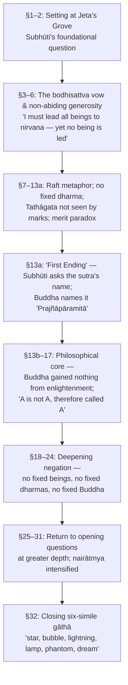
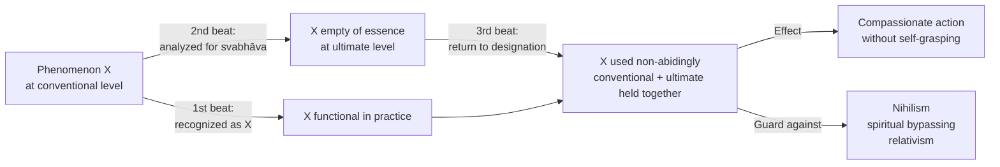
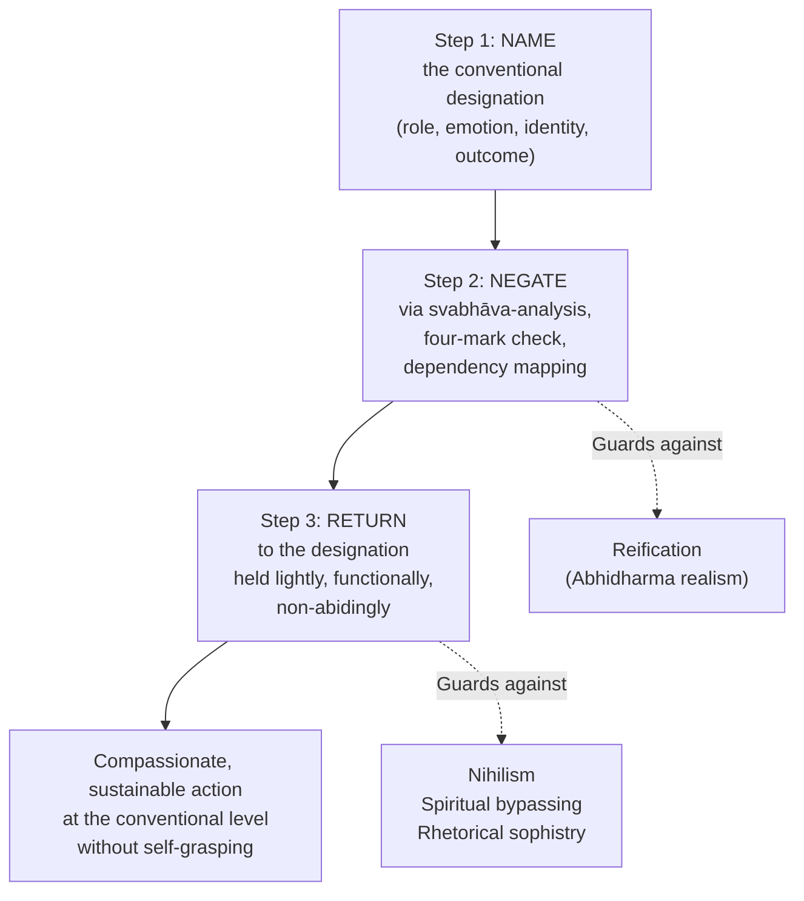
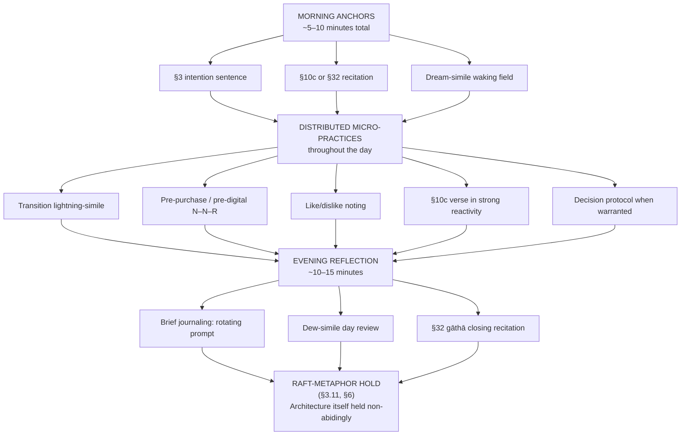
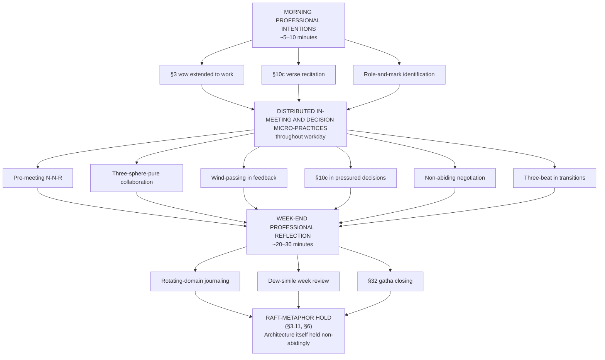
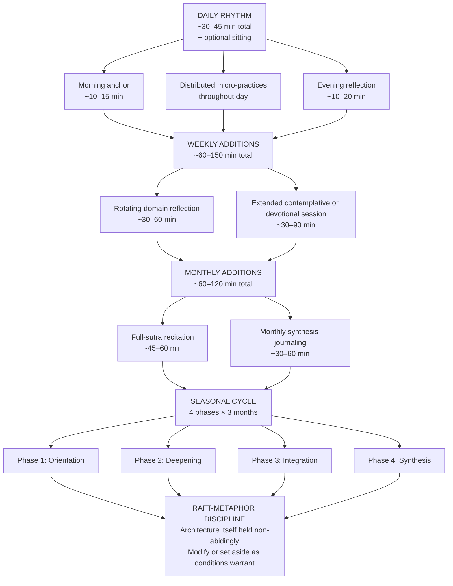

# Study Notes on the Diamond Sutra: Textual Foundations, Philosophical Depth, and Living Wisdom Across Life's Domains
# 1 Orientation, Historical Lineage, and Structural Map of the Sutra

Before any text can be brought to bear on the texture of a human life — on how one earns a living, raises children, manages anger, or grieves a loss — it must first be located: who composed it, when and where, in what languages it has traveled, what it actually says on its own surface, and how its argument is built. The Diamond Sutra (Sanskrit *Vajracchedikā Prajñāpāramitā Sūtra*, "The Perfection of Wisdom That Cuts Like a Diamond") is unusual among classical religious documents in being at once exceptionally short — roughly five thousand words in English — and exceptionally dense, layered, and self-undermining.[^1] A reader approaching it without coordinates is liable either to dismiss it as repetitive or to mistake its negations for nihilism. This opening chapter therefore functions as a foundational map. It establishes the interpretive lens of these study notes, situates the sutra within the wider Prajñāpāramitā literature, surveys the scholarly debates over its dating and provenance, documents the principal manuscript witnesses and translations, reconstructs the dialogical architecture between the Buddha and his disciple Subhūti, and analyzes the rhetorical machinery — above all the threefold formula of negation — that drives the text. The chapter closes with a navigable section-by-section outline that the philosophical and applied chapters of this report will refer back to repeatedly.

## 1.1 Purpose, Scope, and Interpretive Lens of the Study Notes

These study notes are designed for a reader who wants the Diamond Sutra to be more than an object of admiration. The aim is twofold: first, to expound the sutra's textual, historical, and philosophical structure with scholarly care; second, to translate that exposition into actionable insight for the principal domains of contemporary life — daily habits, work and leadership, marriage, parenting, emotional well-being, and interpersonal conduct. The notes therefore treat the sutra simultaneously as a philosophical document and as a living practice text — a dual orientation that the tradition itself supports, since the *Vajracchedikā* has for nearly two millennia been chanted daily in monasteries from China to Vietnam, copied as merit-making, used as a meditation object, and analyzed in formal commentary.[^2][^1]

The interpretive lens is deliberately triadic, in keeping with the global guidance that no single school be privileged. **First**, an East Asian lens draws on the Chan/Zen tradition for which the Diamond Sutra has been canonical since the early medieval period — the text that, according to the Platform Sutra, occasioned Huineng's awakening upon hearing the line "give rise to a mind that does not abide in anything," and the text whose logic of negation later shaped the koan tradition of Linji and the iconoclasm of Chan more broadly.[^2][^1] **Second**, an Indo-Tibetan commentarial lens incorporates the Yogācāra-influenced exegeses of Asaṅga and Vasubandhu, which Red Pine systematically integrates in his English edition, alongside the Tibetan reception of the sutra as one of the most widely copied Prajñāpāramitā texts.[^2] **Third**, a modern critical lens — philological, historical, and comparative — draws on the work of Edward Conze, Gregory Schopen, Paul Harrison, Jan Nattier, and Shan Welsh, who have reshaped scholarly understanding of the sutra's dating, structure, and textual environment.[^2][^3][^1]

These three lenses are not interchangeable; they sometimes diverge. For example, where the East Asian devotional tradition reads the sutra's promises of immeasurable merit as a literal soteriological claim, modern scholarship reads such passages as a structural feature of early Mahāyāna polemic in which textual reproduction itself is being elevated as a form of practice.[^2][^3] Where Conze regarded the text as "a chance medley of stray sayings" arriving late in the Prajñāpāramitā corpus, Welsh and others argue that it belongs to the very earliest strata.[^3] The notes will surface these divergences rather than smooth them over, and will distinguish at every step among (a) sutra wording, (b) classical commentary, and (c) the synthesizing voice of these notes themselves. This protocol is non-negotiable: a doctrinal claim attributed to the sutra will be traced to specific passages; a claim attributed to a commentator will be named (e.g., "in Vasubandhu's reading…"; "in Thich Nhat Hanh's interbeing reframing…"); and the interpretive synthesis will be marked as such.

The scope is deliberately bounded. The notes do not attempt a full edition or translation of the sutra; that work has been done in the editions surveyed below. Nor do they pretend to settle disputed scholarly questions. Their distinctive contribution is the bridge from doctrinal exposition to lived application, structured so that every philosophical claim is tied to at least one concrete life-domain illustration, and every applied recommendation is traceable to specific sutra passages or doctrinal principles. Where evidence is thin — for instance, on questions of original recitation practice in early Mahāyāna communities — the notes will say so explicitly rather than fill the gap with speculation.

## 1.2 The Diamond Sutra within the Prajñāpāramitā Corpus

The *Vajracchedikā* is a member of the Prajñāpāramitā ("Perfection of Wisdom") family, a vast genre of Mahāyāna sutras composed in India over roughly six centuries — from approximately the 1st century BCE to the 6th century CE.[^1] The corpus is striking for its range of textual sizes: at one pole stand the gigantic recensions, including the *Śatasāhasrikā* (100,000 Lines) and the *Pañcaviṃśatisāhasrikā* (25,000 Lines), and at the other the radically compressed *Heart Sutra* of roughly 260 Chinese characters and the fourteen-syllable Prajñāpāramitā mantra (*om gate gate pāragate pārasaṃgate bodhi svāhā*) used as a complete summary.[^1] Between these poles lie the *Aṣṭasāhasrikā Prajñāpāramitā* (8,000 Lines), often regarded as the seed text of the corpus, and the *Vajracchedikā* itself — a mid-range text long enough to develop its arguments through extended dialogue and short enough to be chanted in a single session of roughly forty-five minutes.[^1]

What distinguishes the Diamond Sutra within this corpus is less its themes — śūnyatā, the bodhisattva path, the emptiness of dharmas, the inadequacy of marks (*lakṣaṇa*) — which it shares with other Prajñāpāramitā texts, than its style. Where the *Aṣṭasāhasrikā* favors experiential locutions such as "is not found" (*na saṃvidyate*) or "is not obtained" (*nopalabhyate*), and where its Subhūti ridicules Śāriputra for ontological inquiries, the *Vajracchedikā* is willing to make explicit ontological statements using positive and negative forms of the verb "to be" (*asti*, *na asti*).[^3] On this stylistic basis, Jan Nattier has argued that the Vajracchedikā "is the product of an environment quite separate from the ones that produced most of the other prajñāpāramitā texts."[^3] A second structural difference reinforces the point: as Welsh demonstrates, the *Vajracchedikā* lacks the chiastic (symmetrically nested) structure that Matthew Orsborn (Huifeng) has identified in other early Prajñāpāramitā texts.[^3]

The relationship between the Diamond Sutra and the Heart Sutra deserves particular attention because the two are often paired in modern Buddhist devotional life and represent the two poles of Prajñāpāramitā expression. The Heart Sutra states the teaching of emptiness in maximally compressed, almost incantatory form ("form is emptiness, emptiness is form"). The Diamond Sutra enacts the same teaching dialogically and dialectically, methodically dismantling every conceptual refuge — self, dharma, non-dharma, merit, enlightenment, the Buddha himself — until the practitioner has nowhere to stand.[^2][^1] Together they function as twin pillars: discursive and contemplative, extended and condensed.

The following table synthesizes the relative position of the Diamond Sutra within the corpus.

| Text | Approx. Length | Compositional Period | Distinctive Style |
|---|---|---|---|
| *Śatasāhasrikā* (100,000 Lines) | Massive | Later strata | Encyclopedic, repetitive elaboration |
| *Pañcaviṃśatisāhasrikā* (25,000 Lines) | Very long | Middle strata | Systematic exposition |
| *Aṣṭasāhasrikā* (8,000 Lines) | Long | Earliest strata | Experiential negation; chiastic structure |
| **Vajracchedikā (Diamond Sutra)** | **~5,000 words (English)** | **Disputed (early per Welsh, Schopen; late per Conze)** | **Threefold negation; dialogical; non-chiastic; ontological idiom** |
| *Heart Sutra* | ~260 Chinese characters | Later (likely Chinese composition) | Mantric compression |

The position is therefore both representative and singular: the *Vajracchedikā* shares the corpus's central commitments to emptiness and the bodhisattva path while exhibiting a literary signature that suggests an at least partly independent compositional environment. This singularity is not a defect; it is precisely what makes the sutra a uniquely concentrated medium for the teaching, and it explains why it could function so effectively as the entry-point text for the Chan tradition.

## 1.3 Dating, Composition, and Scholarly Debates on Origins

The dating of the Diamond Sutra is genuinely disputed, and the divergence among scholars has consequences for how the text is read. The traditional Buddhist view places the sutra as a direct teaching of the historical Buddha (c. 5th century BCE), preserved by bodhisattvas and revealed when the time was ripe.[^2] Modern scholarship rejects this dating but disagrees internally about where within the early Mahāyāna period to locate the text. The Satyori encyclopedic survey gives a generally accepted range of "approximately the 1st century CE, during the period when the Mahayana sutras were being composed," and notes that the streamlined philosophical argument and use of technical Mahāyāna vocabulary (*bodhisattva*, *Tathāgata* in its Mahāyāna sense) suggest a date "well after the earliest Buddhist literature, though it is clearly among the older Prajñāpāramitā texts — likely predating the massive Prajñāpāramitā in 100,000 Lines while postdating the earliest version of the Prajñāpāramitā in 8,000 Lines."[^2] Thalira's survey similarly proposes "northwest India between the 1st century BCE and the 2nd century CE."[^1]

Within these outer brackets, the principal scholarly cleavage runs between Edward Conze and a more recent generation. Conze, the translator who established the Vajracchedikā in Western scholarship, treated the text as a relatively late, composite production — "a chance medley of stray sayings," in his memorable phrase — that had drifted from the early creative period of the Prajñāpāramitā.[^3] Against this, Shan Welsh argues, on both structural and linguistic grounds, that the sutra "belongs to the earliest strata of prajñāpāramitā literature and not, as has often been claimed, to its final phase of development."[^3] Welsh's argument turns on three observations. **First**, the opening of the *Vajracchedikā* is unusual for a Mahāyāna sutra: it is set in Anāthapiṇḍada's Park outside Śrāvastī rather than at Vulture Peak, and "the introduction consists almost entirely of stock phrases that can be found word-for-word in many places in the Pāli Tipiṭaka. Indeed, it is only when Subhūti asks his question of the Buddha in §2, and refers to the path of practice of a bodhisattva, that we get the first indication that this is a Mahāyana text at all."[^3] **Second**, Welsh applies Paul Griffiths' notion of "gobbets" — short, easily memorizable units of text — to argue that the *Vajracchedikā* preserves stylistic features of an oral mnemonic tradition characteristic of early Buddhist literature, while transitioning toward the more polished written style of later Mahāyāna sutras.[^3] **Third**, the absence of chiastic structure in the *Vajracchedikā*, where it is present in other early Prajñāpāramitā texts that Orsborn analyzed, suggests not a late date but a distinct geographical or community origin — Welsh follows Nattier in proposing that the text was composed at a similar time but in a different place.[^3]

Paul Harrison occupies an intermediate position. In his introduction to the Schøyen Collection edition, he concedes that the text "tends to repeat itself, seldom verbatim, but sometimes more than once. There seems to be no logic to this, at least none I can discern, the effect being rather like a composition which has retained some of its own earlier draft material instead of discarding it."[^3] Yet he immediately qualifies: "the text may well be constructed according to principles which only become evident after much time has been devoted to memorizing and reflecting upon it."[^3] This humility — acknowledging apparent disorder while leaving open the possibility of a deeper architecture — captures the current state of scholarly opinion.

The recent discoveries of Buddhist manuscripts in Afghanistan and Pakistan add an empirical dimension to the debate. Mark Allon's survey of the Kharoṣṭhī collections, including the British Library Kharoṣṭhī manuscripts dated to the first half of the first century CE and discovered in eastern Afghanistan, indicates that "recent Kharoṣṭhī manuscript collections, dated between the first and eighth centuries AD, significantly enhance our knowledge of Buddhist literature's diversity and chronology in the North-West."[^4] These discoveries push the documentary record of Buddhist literature in greater Gandhāra back further than was previously possible, lending circumstantial support to early datings of Prajñāpāramitā material associated with that region — though no Vajracchedikā manuscript has been recovered from the earliest Kharoṣṭhī finds themselves.

Why does this debate matter for a reader interested in the sutra as a guide to life? Because the dating shapes the interpretive frame. If the *Vajracchedikā* is late, it can be read as the philosophical refinement of a long Prajñāpāramitā tradition, presupposing the technical apparatus of Madhyamaka. If it is early, as Welsh and Nattier argue, it must be read as a transitional document that still carries the cadences of oral Pāli/Āgama discourse and develops the negation logic from within those cadences rather than from a developed Madhyamaka platform. The notes will treat the early-dating hypothesis as the more probable working assumption — both because of the cumulative weight of recent scholarship and because the early-dating reading honors the text's distinctive blend of plain narrative opening and radical apophatic argument — while flagging at relevant points the readings that depend on this choice.

## 1.4 Manuscript Witnesses: Gilgit Sanskrit and the Dunhuang 868 CE Printed Edition

Three principal kinds of manuscript witness underwrite modern study of the Diamond Sutra: Sanskrit manuscripts, the earliest of which are fragmentary and recently published; the Chinese woodblock-printed Dunhuang scroll of 868 CE; and the Tibetan tradition (treated in §1.5). The Sanskrit witnesses include the manuscript found at Gilgit and edited by Gregory Schopen (1989), which provides the textual basis for sections §17a–§32b in modern critical work, and the Greater Gandhāra manuscripts in the Schøyen Collection, edited by Paul Harrison and Shōgo Watanabe (2006), which provide the basis for §1–§16c.[^3] The standard nineteenth-century Sanskrit edition was established by F. Max Müller in 1881, drawing on Sanskrit texts preserved in Nepalese monasteries.[^1] The Greater Gandhāra Schøyen manuscripts now appear to be the earliest substantial Sanskrit witness to the *Vajracchedikā*, and Welsh's analysis follows the Harrison-Watanabe edition for sections 1–16c and the Schopen edition for 17a–32b.[^3]

The most famous physical witness, however, is not a Sanskrit manuscript at all but a Chinese printed scroll. The Dunhuang copy, dated to the fifteenth day of the fourth month of the ninth year of the Xiantong era — corresponding to **May 11, 868 CE** — is the world's oldest dated printed book, predating Gutenberg by nearly six centuries.[^2] (One source records the date as the thirteenth day of the fourth moon rather than the fifteenth — a minor discrepancy in transliteration of the colophon date.[^1]) The scroll is approximately seventeen feet long, with an elaborate frontispiece depicting the Buddha teaching Subhūti surrounded by celestial beings, monks, and laypeople — a level of artistic and technical sophistication implying that woodblock printing in China was already a mature craft well before this date.[^2] The colophon reads: "Reverently made for universal free distribution by Wang Jie on behalf of his two parents on the 15th of the 4th moon of the 9th year of Xiantong."[^2] The document is now held at the British Library, and a digital facsimile is available through the International Dunhuang Project.[^1]

The circumstances of the scroll's recovery are themselves historically and ethically charged. Cave 17 of the Mogao caves at Dunhuang had been sealed since approximately 1000 CE; it was rediscovered accidentally in 1900 by the Daoist monk Wang Yuanlu, who had been guarding the site.[^2][^1] In 1907 the Hungarian-British archaeologist Aurel Stein acquired the scroll along with thousands of other manuscripts, paying Wang a modest sum.[^2] These transactions have been criticized as colonial extraction, and China has repeatedly requested the return of the Dunhuang materials from the British Library, the Bibliothèque nationale de France, and other Western institutions.[^2] A further qualification on the "oldest printed book" claim is also warranted: undated printed Buddhist *dhāraṇī* charms from Korea and Japan may be older than 868 CE, and the Dunhuang scroll's sophistication implies a printing tradition already well established before that date.[^2] The scroll is therefore most precisely described as the oldest dated, complete printed book — a qualification that does not diminish its world-historical importance but does locate it more carefully in the prehistory of printing.

The colophon also reveals something philosophically resonant with the sutra itself. Wang Jie commissioned the printing as merit-making "on behalf of his two parents."[^2][^1] The very text he reproduces will, repeatedly, declare that immeasurable merit accrues to one who copies, preserves, and distributes even a four-line verse of the Prajñāpāramitā — and will simultaneously dismantle any reified notion of merit, giver, or recipient.[^2] As one commentator notes, "this very teaching motivated the production of ever more copies, pushing printing technology forward. In this sense, the Diamond Sutra is not merely the oldest printed book — it is a text whose content directly caused the development of printing."[^2] The Wang Jie scroll is thus both a documentary artifact and a performative instance of the sutra's own teaching about non-abiding generosity.

Textual variants among the manuscript witnesses are real but generally do not affect the doctrinal core. Variants involve word order, occasional doublings, the presence or absence of bridging phrases, and the precise enumeration of the four marks (whether *ātma-saṃjñā* / *sattva-saṃjñā* / *jīva-saṃjñā* / *pudgala-saṃjñā* appear in full or in abbreviated form) — Welsh's close reading of theme one (the bodhisattva and the perception of a living being) shows clearly how the same gobbet is repeated with deliberate variation across §3, §6, §14c, and §17b, and how the variations reflect rhetorical progression rather than scribal corruption.[^3] For the purposes of these notes, the cumulative critical text reconstructed from Schopen, Harrison-Watanabe, and the Chinese tradition is sufficient; major translations cited below diverge on style and idiom rather than on substantive doctrine.

## 1.5 Major Translations: Chinese, Tibetan, and Modern English Renditions

The Diamond Sutra exists in six classical Chinese translations, a Tibetan translation, and a wide range of modern English renditions. The six Chinese translations are by **Kumārajīva (402 CE)**, **Bodhiruci**, **Paramārtha**, **Dharmagupta**, **Xuanzang (648 CE)**, and **Yijing**.[^2] Of these, Kumārajīva's translation — *Jingang Bore Boluomi Jing* (金剛般若波羅蜜經) — has been canonical for East Asian Buddhism since the early medieval period. Kumārajīva, a Kuchean monk who had mastered both Sanskrit and Chinese, produced his translation in Chang'an under the patronage of the Later Qin emperor Yao Xing (whose reign coincided with the brief Yao Qin or Later Qin dynasty, 384–417 CE).[^2][^5] His genius lay, as Satyori observes, "in his ability to render complex Sanskrit philosophical terms into elegant, resonant Chinese that functioned both as philosophy and as literature. His translation sacrificed some technical precision for spiritual immediacy, and it is this version that Huineng heard and that triggered his awakening."[^2]

Xuanzang's translation of 648 CE, by contrast, is more literal, longer, and "preserves more Sanskrit transliterations than Kumārajīva's version does," at the cost of stylistic immediacy.[^5] Xuanzang's general translation methodology was praised in the Chinese tradition for technical precision, and his rendering of the Diamond Sutra accordingly tends to be preferred when scholars seek closer alignment with the Sanskrit source. The other four Chinese translations are less widely cited but provide important comparative material for textual criticism and have been integrated by Red Pine into his English edition.[^2]

The Tibetan tradition received the *Vajracchedikā* relatively late in Buddhism's diffusion to Tibet but treated it as one of the most widely copied and recited Prajñāpāramitā texts.[^2] The Tibetan recension has been used by modern translators alongside the Sanskrit and Chinese to triangulate readings, particularly where Chinese translations diverge.

Modern English translations differ markedly in methodology and intended audience. The principal options are summarized in the following table.

| Translator | Year | Source Base | Distinctive Feature | Best Suited For |
|---|---|---|---|---|
| A. F. Price & Wong Mou-lam | 1947 | Kumārajīva's Chinese | Dignified scriptural tone; foundational English version | Devotional reading; historical reference |
| Edward Conze | 1958 (rev. 1974) | Sanskrit | Philologically rigorous; extensive scholarly apparatus | Academic study; technical precision |
| Thich Nhat Hanh (*The Diamond That Cuts Through Illusion*) | 1992 | Multiple | Accessible; engaged-Buddhist commentary; "interbeing" framing | Newcomers; practice-oriented readers |
| Mu Soeng | 2000 | Multiple | Korean Zen-oriented; emphasizes contemplative practice | Zen practitioners |
| Red Pine (Bill Porter) | 2001 | All six Chinese + Sanskrit | Verse-by-verse commentary drawing on Asaṅga, Vasubandhu, Huineng, Shen Hui, etc. | Serious comparative study |
| Paul Harrison | 2006 | Greater Gandhāra Sanskrit MSS | Rigorous modern translation with philological notes | Critical scholarship |

Each translation embodies a distinctive interpretive stance. Conze's prose is dense and technically precise but, as critics note, often academic in tone.[^2] Red Pine's edition is the most contextually rich for English readers because it integrates the major commentarial traditions of East Asia, presenting the Sanskrit, Kumārajīva's Chinese, and English translation in facing columns followed by extensive commentary.[^1] Thich Nhat Hanh reads the sutra "through the lens of engaged Buddhism, showing how its teachings on non-attachment and emptiness lead directly to compassionate action in the world," and is often the first translation recommended to newcomers.[^2] Mu Soeng "approaches the text as a practitioner rather than a philologist, offering insights drawn from the Zen contemplative tradition."[^2] Harrison's 2006 translation, based on the Greater Gandhāra manuscripts, is currently the most rigorous Sanskrit-based English version for scholarly purposes.[^2]

These study notes will draw primarily on Red Pine for sustained doctrinal exposition (because of its commentarial integration), on Harrison and Schopen for points requiring philological precision, on Conze for technical Madhyamaka-inflected readings, and on Thich Nhat Hanh and Mu Soeng for practice-oriented and contemplative bridges. Where translations diverge in ways that affect interpretation — for example, in rendering the four marks or the threefold formula — the divergence will be noted explicitly rather than concealed under a single English wording.

## 1.6 The Dialogical Architecture: Buddha and Subhūti across 32 Sections

The Diamond Sutra is structured as a single sustained dialogue, traditionally divided into 32 sections following the segmentation attributed to Prince Zhao Ming of the Liang dynasty. The Sanskrit text itself flows as a continuous conversation; the section divisions are a Chinese editorial inheritance that has nonetheless become standard for both Asian and Western reference.[^2]

The setting is described in the opening sentences in language strikingly close to early Buddhist sutta convention: at Anāthapiṇḍada's Park (Jeta's Grove) outside the city of Śrāvastī, after the Buddha has finished his morning alms round, washed his feet, and seated himself.[^2][^3] As Welsh notes, "the introduction consists almost entirely of stock phrases that can be found word-for-word in many places in the Pāli Tipiṭaka," with the first signal that the text is a Mahāyāna sutra arriving only when Subhūti, in §2, refers to "the path of practice of a bodhisattva."[^3] The same setting at Anāthapiṇḍada's Park appears in the opening of other Buddhist sutras such as the *Amitābha Sutra*, attesting to its formulaic status in the tradition.[^5]

Subhūti's role in the dialogue is decisive. He is named as "one of his most advanced disciples — renowned for his understanding of emptiness," who rises, bares his right shoulder, kneels, and asks the defining question of the text: **"How should a bodhisattva who has set out on the bodhisattva path stand, how should they walk, and how should they control their thoughts?"**[^2] This question is the hook on which the entire sutra hangs. The Buddha's answer occupies the remaining sections in a spiraling, self-referential structure that returns to the same themes at progressively deeper levels.[^2]

The principal architectural movements of the sutra, drawing on the syntheses provided by both the encyclopedic survey and Welsh's analysis, can be summarized as follows.

Several structural features deserve special attention. **First**, the so-called "First Ending" at §13a — where Subhūti asks the Buddha the name of the discourse and the Buddha replies that it is called Prajñāpāramitā — is a feature "almost always found at the end of a Mahāyāna sutra," and its placement near the middle of the *Vajracchedikā* suggests either editorial layering or a deliberate compositional doubling-back.[^3] **Second**, the dialogue exhibits a *spiraling* rather than *linear* logic: themes introduced near the beginning (the bodhisattva vow, non-abiding generosity, the marks of the Tathāgata, the merit comparison) are returned to multiple times, each return introducing subtler refinements.[^2][^3] **Third**, the cumulative dramatic effect builds toward the closing gāthā in §32:

> *All conditioned things are like*
> *A star at dawn, a bubble in a stream,*
> *A flash of lightning in a summer cloud,*
> *A flickering lamp, a phantom, and a dream.*[^2]

This six-image verse — the so-called *vajra* verse or "six similes of impermanence" — has functioned for nearly two thousand years as both a poetic culmination and a contemplative object, with each image capturing a different facet of impermanence and insubstantiality: the star fading as awareness dawns, the bubble dissolving back into the stream, lightning illuminating without being graspable, the lamp flickering with dependent conditions, the phantom appearing without substance, the dream dissolving upon waking.[^2]

Subhūti's emotional register also matters. In §14, after the Buddha has explained the nature of the Tathāgata, "Subhūti weeps and says: 'It is most precious, Lord, this teaching you have given. Since I have practiced the eye of wisdom, I have never heard such a teaching before.'"[^1] This passage signals that the sutra is not only a philosophical argument but the dramatization of an encounter — a wisdom-disciple, already advanced in the eye of *prajñā*, recognizing in the Buddha's words something that exceeds even his attainment. The dialogical form is therefore not incidental; it is the medium through which the sutra's logic of negation is enacted, since negation requires a propositional partner whose assumptions the negation can dismantle.

## 1.7 Recurring Rhetorical Patterns and the Threefold Negation Formula

The Diamond Sutra's most distinctive rhetorical signature is the **threefold formula** (Chinese tradition: 三句; the "three-phrase" or "diamond" logic): *A is called A; A is not A; therefore A is called A.* In its applied forms it reads:

> "What the Tathāgata calls the highest teaching is not the highest teaching. Therefore it is called the highest teaching."
> "What the Tathāgata calls all beings is not all beings. Therefore they are called all beings."
> "What are called all dharmas are not all dharmas. That is why they are called all dharmas."[^2][^1]

This formula is not mere paradox or wordplay — a misreading the notes will return to in chapter 8. As Thalira's analysis notes, it "is pointing out that our words and concepts are functional designations, not fixed essences. 'All beings' is a useful category for teaching compassion, but it should not be reified into a fixed ontological category — as if beings were solid, bounded, permanent entities with inherent selfhood. The formula holds the concept and its deconstruction simultaneously, creating a cognitive dissonance that cannot be resolved conceptually and must be resolved experientially."[^1] Crucially, the formula is not Hegelian dialectic: "It is not dialectical in the Hegelian sense — there is no synthesis. Instead, the negation returns the concept to its original name, but now the name is transparent, pointing beyond itself."[^2] The conventional designation is preserved; what is dissolved is the grasping at the designation as if it named a fixed essence (*svabhāva*). This preservation of the conventional name is essential for safeguarding the two-truths framework and the conventional ethical commitments of compassion and generosity, a point that will be developed in chapter 2 and revisited throughout the applied chapters.

Welsh's structural analysis of the sutra identifies fifteen principal recurring themes and provides quantitative data on their repetition patterns. The pattern strongly supports the view that the text is "more of an intentional holistic composition and less of a chaotic medley than has previously been believed."[^3] Welsh's enumeration is summarized below.

| # | Theme | Repetitions | First Appears |
|---|---|---|---|
| 1 | A bodhisattva should not form a perception of a living being | 4 (§3, §6, §14c, §17b) | §3 |
| 2 | Give a gift without basing oneself on anything; cultivate a mind not based on anything | 3 (§4, §10c, §14e) | §4 |
| 3 | A Tathāgata cannot be perceived by physical characteristics (*lakṣaṇa*) | 4 (§5b, §13d, §20, §26) | §5b |
| 4 | Those who understand and explain this sutra gain immeasurable merit | **12** (§4–5a, §6, §8, §11–12, §13e, §14e, §15, §16b, §19a, §24, §28, §32a) | §4 |
| 5 | The dharma-as-raft has a secret meaning | 1 (§6) | §6 |
| 6 | No dharma constitutes the awakening of a Tathāgata | 6 (§7, §10a, §13b, §14b, §17c, §22–23) | §7 |
| 7 | A stream-entrant, arhat, etc. does not think "I am a stream-entrant" | 3 (§9, §21a, §25) | §9 |
| 8 | A bodhisattva who claims to create a buddha-field speaks falsely | 2 (§10b, §17f) | §10b |
| 9a | A large physical body still lacks inherent existence | 2 (§10d, §17d) | §10d |
| 9b | Even innumerable atoms lack inherent existence | 2 (§13c, §30) | §13c |
| 10 | Wherever this sutra is recited or explained is a sacred place | 2 (§12, §15c) | §12 |
| 11a | The Tathāgata has explained no dharma | 1 (§13) | §13 |
| 11b | The Tathāgata speaks truth, but there is no truth/falsehood in dharma | 1 (§14d) | §14d |
| 12 | The Tathāgata has explained nairātmya; the bodhisattva is devoted to it | 2 (§17g, §31a–b) | §17g |
| 13 | A bodhisattva does not claim to have removed any phenomenon | 1 (§27b) | §27b |
| 14 | A Tathāgata has not come from anywhere or gone anywhere | 1 (§29) | §29 |
| 15 | The closing verse on conditioned phenomena (six similes) | 1 (§32) | §32 |

(Source: Welsh's enumeration; section numbers follow Harrison-Watanabe for §1–§16c and Schopen for §17a–§32b.)[^3]

Two findings stand out. **First**, the merit theme (#4) is repeated twelve times — by far the most frequent — while the next most frequent themes (#6 on Tathāgata's awakening; #1 on bodhisattva and perception of beings; #3 on marks of the Tathāgata) are repeated three to six times each. The structure of the sutra can therefore "be considered as primarily consisting of an oscillation between the two main themes of nairātmya and merit."[^3] **Second**, themes occurring most frequently are introduced near the beginning; later-introduced themes appear only once or twice. This pattern is consistent with a deliberate compositional design rather than haphazard accumulation.[^3]

The repetitions are not verbatim. Welsh's close reading of theme 1 shows clear progression. In §3 the reason a bodhisattva does not form a perception of a living being is simply definitional. In §6 it is connected to the subtler error of forming a perception of any phenomenon (*dharma*) at all. In §14c the focus shifts from the object of perception to the act of perception itself — even the faculty of perceiving is *nairātmya*. In §17b the rug is fully pulled: "there is no phenomenon called 'someone who has set out on the bodhisattva path.'" Welsh observes: "in each instance the stakes are raised and the challenge of nairātmya comes closer and closer to home for the reader."[^3]

A parallel progression governs theme 3 (the Tathāgata's marks). At §5b, marks are said to lack any possession of marks. At §13d, the same point is made about the thirty-two marks of a great being. At §20, the focus shifts from the marks themselves to the Buddha's *possession* of them, which is itself negated. At §26 the sutra performs what Welsh calls "a rug-pull of a rather playful nature": Subhūti initially answers "yes," a tathāgata can be recognized by his marks, and the Buddha points out that on this basis a *cakravartin* (universal monarch) — who in Indian tradition possesses the same physical marks (*uṣṇīṣa*, long arms, long tongue, etc.) — would also qualify as a tathāgata. Subhūti reverses his answer. This deliberate subversion of an established structural pattern, Welsh argues, "suggests, I think, a degree of self-awareness in the text. If the sutra really was nothing more than an unstructured 'chance medley of stray sayings,' this answer would have little rhetorical impact."[^3]

The use of "gobbets" — short, mnemonic units of text repeated with variation — points to a transitional position between oral and written Buddhist literature.[^3] Welsh notes that "while each gobbet is dealing with the same point using much of the same language, there is no significant portion of the text that reoccurs verbatim — and it is precisely the word-for-word style of repetition that is effective as a mnemonic aid. This is something we find throughout the sutra. The conclusion this invites is that the *Vajracchedikā* was composed as a written rather than an oral text, and that the repetition is less about aiding memorisation than it is about adopting the style and structure of earlier texts in order to signal to the sutra's intended readership that this is, indeed, a Buddhist sutra."[^3]

Two other rhetorical devices anchor the sutra's machinery and will be examined more deeply in chapter 2. The **raft metaphor** in §6 — "the dharma is like a raft. If even the dharma must be abandoned, how much more so non-dharma" — is one of the most radical statements in the history of religion: even the Buddha's own teaching is provisional, a means rather than an ultimate truth.[^2] And the **four marks** (*ātman*, *sattva*, *jīva*, *pudgala*) are systematically dismantled across the sutra, going beyond the early Buddhist teaching of *anātman* (no-self of persons) to negate the self-existence of dharmas as well — a "double emptiness" that is the distinctive contribution of the Prajñāpāramitā literature to Buddhist philosophy, later systematized by Nāgārjuna in his *Mūlamadhyamakakārikā* but already fully present in the Diamond Sutra in dialogical form.[^2]

The cumulative effect of these rhetorical patterns is the sutra's signature self-consuming character. As Satyori summarizes: "It uses concepts to transcend concepts, uses language to point beyond language, and uses teaching to dissolve attachment to teaching."[^2] This is the precise logic that the threefold formula encodes, and it is the engine that drives every subsequent analysis in these notes — both the philosophical chapters that explicate it and the applied chapters that translate it into the textures of work, marriage, parenting, and emotional life.

## 1.8 A Navigable Outline and Cross-Reference Map

To enable readers to move efficiently between the sutra's text, the philosophical analysis in chapters 2–3, and the applied chapters 4–7, this section consolidates a navigational map keyed to the conventional 32-section division. Where evidence permits — drawing on the Satyori survey, Welsh's structural analysis, and the Thalira pedagogical guide — each section is tagged with its principal themes and a cross-reference to chapters of these notes.

| Section | Principal Theme(s) | Sutra Cue | Cross-Reference in These Notes |
|---|---|---|---|
| §1–2 | Setting at Jeta's Grove; Subhūti's foundational question on how a bodhisattva should stand, walk, control thought | "Bare right shoulder, kneels, asks…" | Ch. 1 (architecture); Ch. 3 (bodhisattva path) |
| §3 | Bodhisattva vow: lead all beings to nirvana while no being is led | "I must lead all beings…and yet no being is led" | Ch. 3 (vow); Ch. 6 (parenting/marriage) |
| §4 | Non-abiding generosity (*dāna* without abiding in marks) | "Practice generosity without abiding in marks" | Ch. 3 (dāna); Ch. 4–5 (daily life, work) |
| §5b | Tathāgata not perceived by physical marks (1st repetition) | "Wherever there are marks, there is deception" | Ch. 2 (marks); Ch. 7 (perception of others) |
| §6 | Raft metaphor; abandonment of dharma; no perception of phenomenon or non-phenomenon | "Dharma is like a raft" | Ch. 2 (logic); Ch. 8 (study method) |
| §7 | No fixed dharma constitutes Tathāgata's awakening | "There is no dharma…" | Ch. 2 (no svabhāva) |
| §8–9 | Merit comparisons; stream-entrant does not think "I am a stream-entrant" | "Filling worlds with seven treasures…" | Ch. 5 (recognition); Ch. 7 (identity) |
| §10 | "Give rise to a mind that does not abide in anything" (*ying wu suo zhu er sheng qi xin*) | The verse that awakened Huineng | Ch. 3 (key verse); Ch. 4 (non-abiding mind in daily life) |
| §11–12 | Merit of teaching even four lines; any place where sutra is taught is sacred | "Four-line verse" | Ch. 8 (recitation practice) |
| §13a | "First Ending" — sutra named *Prajñāpāramitā* | Subhūti asks the name | Ch. 1 (architecture) |
| §13b–13e | All dharmas are not all dharmas; merit; threefold formula intensified | "Called X; not X; therefore called X" | Ch. 2 (logic of negation) |
| §14 | Subhūti weeps; four marks must be abandoned; speaking the truth without abiding | Emotional climax | Ch. 7 (emotional well-being); Ch. 3 (close reading) |
| §15–16 | Merit of receiving and reciting; karmic remediation | Sutra-recipient | Ch. 8 (devotional practice) |
| §17 | Re-asking of the foundational question at deeper level; nairātmya as the bodhisattva's defining devotion | "There is no phenomenon called 'one who has set out on the bodhisattva path'" | Ch. 2 (nairātmya); Ch. 3 (path) |
| §18–19 | Five eyes; mind cannot be grasped (past, present, future) | "The mind cannot be obtained" | Ch. 4 (daily mind); Ch. 7 (rumination) |
| §20 | Marks negated again — possession of marks itself empty | Refinement of §5b | Ch. 2 (deepening negation) |
| §21 | Buddha taught no dharma; arhat does not think "I am an arhat" | "Has not taught any dharma" | Ch. 5 (professional identity); Ch. 8 (pitfalls) |
| §22–23 | All dharmas are equal; nothing to attain; pure good roots | "Nothing to attain" | Ch. 3 (wisdom) |
| §24 | Merit comparison repeated | Mt. Sumeru of treasures | Ch. 5 (work merit) |
| §25 | No beings to liberate; no liberator | "If a Tathāgata had this thought…" | Ch. 6 (parenting); Ch. 5 (leadership) |
| §26 | Tathāgata's marks vs. cakravartin marks; closing gāthā on form/sound | "If you see me by form…" | Ch. 7 (interpersonal perception) |
| §27 | No removal of phenomena; preservation of conventional dharmas | Against nihilism | Ch. 2 (anti-nihilism); Ch. 8 (pitfalls) |
| §28 | Non-attainment of merit; bodhisattva does not "accept" merit | Three-sphere purity | Ch. 5 (giving without giver); Ch. 4 |
| §29 | Tathāgata neither comes nor goes | "Has not come, has not gone" | Ch. 2 (dharmakāya) |
| §30 | Atoms and worlds equally lack inherent existence | Macro-micro emptiness | Ch. 2 (no svabhāva of dharmas) |
| §31 | Views of self, being, soul, person — even the view of "no view" | Self-reflexive negation | Ch. 8 (avoiding wordplay misuse) |
| §32 | Closing six-simile gāthā: star, bubble, lightning, lamp, phantom, dream | "Vajra verse" | Ch. 3 (close reading); Ch. 4 (daily contemplation); Ch. 9 (synthesis) |

Two practical conventions follow from this map. **First**, when subsequent chapters cite a teaching of the sutra, they will reference the conventional section number (e.g., "§10c"), allowing readers to trace the citation back to the table above and from there to any of the major translations, all of which preserve the 32-section division. **Second**, the doctrinal threads of the sutra cluster around three master themes: (a) the **bodhisattva path and non-abiding generosity** (§3, §4, §10, §17, §25, §28), which feeds chapter 3 and the applied chapters on work, family, and interpersonal life; (b) the **negation of marks and the threefold formula** (§5b, §6, §13, §14, §17, §20, §26, §31), which feeds chapter 2 on philosophy and chapter 7 on emotional and interpersonal practice; and (c) the **logic of merit, sacred place, and the closing gāthā** (§4, §8, §11–12, §15, §24, §28, §32), which informs chapter 8 on contemplative practice and chapter 9 on synthesis.

With this map in hand, the reader is equipped to move from the textual and historical coordinates established in this chapter to the philosophical core of the sutra in chapter 2 — where śūnyatā, anātman, the four marks, and the apophatic logic of the threefold formula will be analyzed not as objects of antiquarian curiosity but as the conceptual foundation on which every subsequent application to daily life, work, family, and emotion will rest.

# 2 Core Philosophy: Emptiness, Non-Self, the Four Marks, and the Logic of Negation

Chapter 1 established where the Diamond Sutra comes from, how it is built, and how its 32 sections oscillate between two master themes—nairātmya (non-self) and merit—through a spiraling dialogue between the Buddha and Subhūti. That structural map, however, is only the outer architecture of a building whose inner load-bearing walls are philosophical. If the threefold formula is the engine of the sutra's rhetoric, then *śūnyatā* (emptiness), *anātman/nairātmya* (non-self), the absence of *svabhāva* (intrinsic essence), and the four marks are the four cylinders of that engine, and the apophatic logic that links them is the timing belt that synchronizes their motion. This chapter dismantles the engine into its parts, examines each part on its own terms, and reassembles the whole as a functional thinking tool. Five interpretive commitments guide the analysis. **First**, every doctrinal claim is anchored to specific sutra passages identified by the §-numbers consolidated in §1.8. **Second**, technical Sanskrit and Chinese terms are kept alongside their English renderings so that core concepts are not blurred by translation. **Third**, the chapter actively guards against four common misreadings—nihilism, mystical evasion, rhetorical wordplay, and the conflation of non-attachment with emotional indifference—each of which will be revisited in chapter 8. **Fourth**, classical commentators (Asaṅga, Vasubandhu, Huineng, Hanshan Deqing) and modern interpreters (Conze, Red Pine, Mu Soeng, Thich Nhat Hanh, Sheng Yen, Nagatomo, the Kyoto School) are named and attributed when their views are introduced. **Fifth**, the chapter ends by translating philosophy into a usable procedure, so that the applied chapters 4–7 can invoke it without having to rebuild it.

## 2.1 Śūnyatā and the Absence of Svabhāva: From Persons to Dharmas

The deepest doctrinal commitment of the Diamond Sutra is that no phenomenon whatsoever possesses *svabhāva*—translated variously as "intrinsic nature," "inherent essence," "own-being," or "self-existence." The Sanskrit term, formed from *sva-* (own) and *bhāva* (being), refers technically to the property of existing in a way that is independent, self-grounding, and not borrowed from anything else. The Abhidharma analytic tradition treated *svabhāva* as a positive criterion that ultimate constituents (*dharmas*) must satisfy: such ultimate constituents are characterized by "resilience against material or conceptual decomposition," "the ability to exist in a lonely state," and "not borrowing [their] nature from other objects."[^6] The Diamond Sutra denies that anything satisfies this criterion. Mountains, persons, atoms, the Buddha's body, the Buddha's teaching, even the bodhisattva path itself—every candidate is shown to lack the kind of independent essence that *svabhāva* would name.

To grasp how radical this move is, it helps to recall the historical sequence within Buddhism. Early Buddhist teaching had already developed *anātman* (non-self) as a doctrine about persons: there is no permanent, unchanging, independent self (*ātman*) underlying the five aggregates (form, feeling, perception, formations, consciousness) that make up what we conventionally call "a person." The *Vajracchedikāprajñāpāramitāsūtra* tradition is described as "a crucial source for Mahāyāna tenets of selflessness and the emptiness of phenomena,"[^7] with the technical glosses naming *anātman* as "the nonexistence of the self as a permanent, unchanging entity"[^7] and *śūnyatā* as "the state of being empty of an innate nature due to a lack of independently existing characteristics."[^7] The decisive Mahāyāna step, which the *Vajracchedikā* enacts on nearly every page, is to extend non-self from persons to all dharmas. Where pre-Mahāyāna Abhidharma had often been content to deny *ātman* in the person while preserving *svabhāva* in the dharmas that constitute the person, the Diamond Sutra denies *svabhāva* to the dharmas themselves. This is the so-called **double emptiness** or "Two Kinds of No-Self" (二無我, *er wu wo*)—"the twofold *anātman* or two categories of not-self."[^8]

The sutra performs this extension repeatedly and pointedly. At §10d and §17d a "large physical body still lacks inherent existence"; at §13c and §30 even "innumerable atoms lack inherent existence."[^9] The macro-scale (a Buddha's body, a world-system) and the micro-scale (the smallest material constituents) are treated as equally empty—a deliberate symmetry that forecloses the Abhidharma move of locating *svabhāva* in atomic or quasi-atomic constituents while denying it in macro-objects. Likewise, the marks of the Tathāgata—the thirty-two physical signs of a great being—are negated four times across §5b, §13d, §20, and §26,[^9] not because they fail to appear, but because their appearance does not constitute an independent essence by which a Tathāgata can be identified. The pattern is consistent: wherever the mind tries to land on a phenomenon as a self-existent essence, the sutra dissolves the landing place.

Here it is essential to define emptiness precisely, because the term is liable to two opposing misreadings. The first, which Paul Williams names and rejects, would treat emptiness as "some form of monistic absolutism, a *via negativa* negating in order to uncover a True Ultimate Reality. The ultimate truth is that there simply is no such thing as a True Ultimate Reality, and the sooner we let go of such a thing the better."[^10] On this corrective reading, emptiness is not a hidden substrate, not a Brahman-like absolute, not "a thing called emptiness." The second misreading, which the chapter will return to in §2.5, would treat emptiness as the non-existence of phenomena. Lex Hixon's formulation rules this out as well: "Lacking such static essence or substance does not make them not exist – it makes them thoroughly relative, there is no limit to their being creatively reshaped by enlightened love. So the *via negativa* of the Prajñāpāramitā does not annihilate things; it frees them from entrapment in negativity, opening them up to a creative relativity."[^10] Emptiness, properly understood, is the **dynamic dependence-structure** of phenomena: things exist relationally, conditionally, mutually, but not independently or essentially.

Two illustrations make this concrete. The first is the classical Buddhist simile of the **wick and the flame**. An oil lamp's flame depends on flame, wick, and oil simultaneously: "There cannot be a flame without a wick, just as there cannot be a flame without oil." But the analysis goes deeper—"the wick depends on fibres woven together, which depend on plants that grew, which depended on soil, water, and sunlight. The oil depends on seeds that were pressed, which grew from plants, which depended on their own conditions. Every single element, when you examine it, dissolves into a web of dependencies. Nothing stands alone."[^11] The flame is not nothing; it burns, gives light, can be measured. But it has no *svabhāva*—no self-grounding essence that could survive the removal of its conditions. This is *pratītyasamutpāda* (dependent origination), and it is the positive content of the negative term *śūnyatā*.

The second illustration, drawn from the Chan-tinged philosophical tradition the Kyoto School developed in dialogue with the Diamond Sutra, is the saying **"fire is not fire, therefore it is fire."** Nishitani Keiji unpacks this as follows: "The burning that takes place when the fire burns firewood points to the selfness of fire, but so does the fact that fire does not burn itself… As something that burns firewood, fire does not burn itself; as something that does not burn itself, it burns firewood. This is the mode of being of fire as fire, the self-identity of fire. Only where it does not burn itself is fire truly on its own home-ground… Combustion has its ground in non-combustion. Because of non-combustion, combustion is combustion. The non-self-nature of fire is its home-ground of being."[^12] The point, in plain terms: the very capacity of fire to do what fire does (burn other things) depends on fire's *not* having a self-enclosed essence (it does not burn itself). To grasp fire eidetically as a substance with the property "combustion" is, as Krummel glosses Nishitani, "still to objectify it and see [it] from the standpoint of the subject, an imposition of our reason into [its] interiority. This cannot then be how a thing is on its own."[^12] *Svabhāva* in the Abhidharma sense is precisely this kind of imposed interiority; and the Diamond Sutra refuses it.

The philosophical backbone of the chapter is now in place. Every subsequent doctrine of the sutra—the four marks (§2.3), the threefold formula (§2.4), the raft metaphor (§2.6), the bodhisattva path of chapter 3, and the applied teachings of chapters 4–7—presupposes this single move: that all phenomena, persons and dharmas alike, lack *svabhāva* and exist only in the dynamic web of dependence. To miss this is to miss everything. To grasp it is to be in a position to read the sutra not as a mystifying paradox but as a precise philosophical instrument.

## 2.2 Critique of Abhidharmic Realism and the Madhyamaka Position

To appreciate the Diamond Sutra's philosophical stakes, one must see what it is arguing *against*. The principal philosophical interlocutor of the early Mahāyāna texts is not non-Buddhist tradition but the Abhidharma analytic schools (especially Sarvāstivāda and Sautrāntika), which had developed an elaborate ontology of *dharmas*—momentary tropes or particularized properties that constitute the rock-bottom of reality. The Abhidharma view, as Westerhoff reconstructs it, is **mereologically reductionist** but not anti-realist: composite objects (a chariot, a person, a teacup) are merely "conceptual-linguistic projections" with no real existence, but the simple constituents into which they decompose—the *dharmas*—are real and possess *svabhāva*. "Each dharma lasts no longer than a moment, a temporal atom… and is hence devoid of any temporal thickness. Immediately after its production it either simply passes out of existence or it does so while also causing the production of another dharma of the same kind in the following moment."[^6] Crucially, for the Abhidharma, "causal dependence, that is, [an entity's] being the effect of some cause," is "perfectly compatible with possessing intrinsic nature."[^6] A causally produced dharma still has its own essence—it is not borrowed from any presently existing other dharma, and it is not built up from parts.

The Madhyamaka school of Nāgārjuna (c. 150–250 CE), which arose in the same Amaravati monastery environment associated with the *Aṣṭasāhasrika*[^10] and gave the *Prajñāpāramitā* texts their philosophical sub-text, denies precisely this. The Madhyamaka argument from causation to emptiness, in Westerhoff's reconstruction, runs:

> Premiss 1: To possess intrinsic nature means to exist outside of the network of dependence relations.
> Premiss 2: If something is an effect, it existentially depends on its cause.
> Conclusion: Nothing that is caused can possess intrinsic nature.[^6]

The Abhidharma will reject Premiss 1, holding that some kinds of dependence (mereological) negate *svabhāva* while others (causal) do not. The Madhyamaka holds that *all* dependence negates *svabhāva*, because the very notion of cause and effect, when analyzed, requires conceptual construction. As Garfield summarizes in dialogue with Hume, "Hume regards events as 'independent existences,' for Buddhists, dependent origination guarantees that nothing is an independent existent."[^6] And, against any Humean regularity reading of Madhyamaka, "[r]egularity is always regularity-under-a-description, and descriptions are, as Nāgārjuna puts it, 'verbal designations.' Explanatory utility is always relative to human purposes and theoretical frameworks."[^6]

The Diamond Sutra is best read as a transitional text that already enacts the Madhyamaka critique in dialogical form, even though it does not yet deploy the systematic argumentative apparatus that Nāgārjuna's *Mūlamadhyamakakārikā* will later supply. The dialogical enactment proceeds along three converging lines.

**First, the negation of fixed dharmas.** Six times across the sutra (§7, §10a, §13b, §14b, §17c, §22–23) the Buddha asserts that "no dharma constitutes the awakening of a Tathāgata."[^9] At §13 the Buddha goes further: he has explained no dharma at all; at §21 he reiterates that "the Tathāgata speaks truth, but there is no truth/falsehood in dharma."[^9] These are not mystical understatements. They are precise philosophical claims that no fixed essence (*svabhāva*) can be found at the bottom of the analysis—not even at the bottom of the Buddha's own teaching. If even the awakened content of awakening lacks *svabhāva*, then the Abhidharma project of locating reality in essence-bearing dharmas has no firm ground.

**Second, the denial of mereological foundationalism.** The sutra's pairing of §10d/§17d (a Buddha's "large physical body" lacks inherent existence) with §13c/§30 (atoms and worlds equally lack inherent existence)[^9] dismantles both ends of the mereological scale. The Abhidharma might concede that a body has no *svabhāva* (it is composite) while preserving *svabhāva* for the atomic constituents. The sutra refuses this concession. Atoms are no more self-existent than bodies, and bodies are no less real than atoms. The whole hierarchy is empty top to bottom—what Westerhoff calls a thoroughgoing "anti-foundationalism" rather than the Abhidharma's "(moderate) foundationalism."[^6]

**Third, the deconstruction of subject positions.** At §9, §21a, and §25 the sutra repeatedly asserts that "a stream-entrant, arhat, etc. does not think 'I am a stream-entrant.'"[^9] At §17 the most rug-pulling claim is made: "there is no phenomenon called 'someone who has set out on the bodhisattva path.'"[^9] The Abhidharma had carefully articulated levels of attainment as ontologically distinguishable states. The sutra shows that any reified attainment is incompatible with the attainment itself—a structural anticipation of Madhyamaka's later refusal to grant *svabhāva* even to the path of release.

The Diamond Sutra therefore stands at a hinge in Buddhist intellectual history. Before it, the Abhidharma project of cataloguing essence-bearing *dharmas* was the most sophisticated metaphysics of the tradition. After it (and through Nāgārjuna's systematization), the Madhyamaka denial of universal *svabhāva* would become the dominant interpretive stance for Mahāyāna philosophy in India, Tibet, and East Asia. The sutra itself does not deploy formal arguments against the Abhidharma; what it does is performatively dismantle every essence-claim its interlocutor might raise. Subhūti, the disciple "renowned for his understanding of emptiness,"[^9] is the perfect dialogical partner for this dismantling because he is already trained in the negation logic and can be brought, page by page, to deeper levels of refinement. The fact that Subhūti weeps at §14 when he glimpses how far the negation extends is a measure of how radical the move beyond Abhidharma realism really is.

## 2.3 The Four Marks: Ātman, Sattva, Jīva, Pudgala

The single most repeated diagnostic device in the Diamond Sutra is the formula of the **four marks** or **four perceptions** (*saṃjñā*): *ātma-saṃjñā* (perception of self), *sattva-saṃjñā* (perception of being), *jīva-saṃjñā* (perception of life-span or soul), and *pudgala-saṃjñā* (perception of person). The sutra's signature criterion for whether someone is in fact a bodhisattva is simply this: a bodhisattva who entertains any of the four perceptions cannot be called a bodhisattva. The negation is repeated in nearly identical wording at §3, §6, §14c, and §17b[^9] and is one of the most heavily reinforced doctrinal threads in the entire text.

The four marks are not arbitrary or merely poetic; each names a distinct vector along which the mind reifies selfhood. **Ātman** is the philosophical self of Indian metaphysics—the permanent, unchanging substantial subject that the Brahmanical traditions defended and that early Buddhism's *anātman* directly rejected. **Sattva** ("being," "sentient being") is the more colloquial designation of "a being," the kind of entity to whom things happen and who acts. **Jīva** ("life," "soul") points to the continuous principle of life that animates a body across time—the Jaina traditions had elaborated *jīva* as a soul-substance, and other Indian schools used it for the life-principle. **Pudgala** ("person") names the individuated, identifiable person who can be picked out and named; the Pudgalavāda school within early Buddhism had even tried to introduce a quasi-personal entity into Buddhist ontology, a move other schools rejected. Each of these terms, in other words, captures a different way the mind tries to crystallize the experience of selfhood: as eternal substance, as sentient agent, as life-soul, or as nameable individual. The sutra does not bother to refute each separately; it bundles them together and rejects the entire family.

The sutra's mechanism is elegantly captured in a single recurring sentence: **"No one can be called a bodhisattva who creates the perception of a self or who creates the perception of a being, a life, or a soul."**[^10] As Nicole Bea observes of this passage in the *Prajñāpāramitā* literature broadly, "this sentence is repeated so many times that it is thought to be the *gatha* encapsulating the project behind the whole sutra… As he teaches to liberate others, the Bodhisattva is asked to use words without positing these as referring to substantial entities."[^10] Note the subtle but decisive point: the sutra does not forbid the bodhisattva from *speaking of* selves, beings, lives, and persons—the bodhisattva must continue to teach, console, and act for "all beings." What is forbidden is the *perception* (*saṃjñā*) that takes these conventional terms as referring to substantial entities. Words are permitted; reification is not.

The most penetrating structural observation about the four marks comes from Welsh, who notes that the theme deepens with each repetition rather than being merely re-stated. As summarized in §1.7, "in §3 the reason a bodhisattva does not form a perception of a living being is simply definitional. In §6 it is connected to the subtler error of forming a perception of any phenomenon (*dharma*) at all. In §14c the focus shifts from the object of perception to the act of perception itself — even the faculty of perceiving is *nairātmya*. In §17b the rug is fully pulled: 'there is no phenomenon called "someone who has set out on the bodhisattva path."'" Welsh comments: "in each instance the stakes are raised and the challenge of nairātmya comes closer and closer to home for the reader." This four-stage deepening can be tabulated for clarity.

| Section | Object of negation | What is being dismantled |
|---|---|---|
| §3 | Perception of "a living being" as the recipient of the bodhisattva's compassion | Reification of the *other* as a self |
| §6 | Perception of any *dharma* whatsoever | Reification of the contents of experience |
| §14c | The very *act* of perceiving | Reification of the cognitive faculty |
| §17b | "Someone who has set out on the bodhisattva path" | Reification of the *practitioner* as a self |

Read as a sequence, the four iterations move the negation progressively inward: from the object out there (§3), to the field of objects (§6), to the perceiving function (§14c), to the perceiver (§17b). At each step there is less room for the mind to find an essential foothold. This is why Subhūti weeps at §14: the implications of the doctrine are no longer abstract but cut directly into his own subjectivity as a meditator.

The four marks are also the doctrinal infrastructure that makes possible the sutra's most paradoxical-seeming claim about the bodhisattva path. At §3 the bodhisattva vows: "I must lead all beings to nirvana — yet no being is led."[^9] At §25 the same logic returns: "no beings to liberate; no liberator."[^9] These are not false modesty or pious understatement. They are the precise logical consequence of dismantling the four marks. If "all beings" is a conventional designation that does not pick out a fixed essence (*sattva-saṃjñā* is empty), then "leading them" cannot pick out a fixed agent acting on fixed patients. The compassion is preserved—indeed intensified, because it is no longer obstructed by ego-formation—but the metaphysical hardening of agent and recipient is dissolved. The bodhisattva acts; no bodhisattva-self acts. As Lin-chi puts it in Red Pine's commentary: "By not dwelling on anything, bodhisattvas do not see the self that gives, nor do they see the other that receives, nor do they see anything given. For all three are essentially empty. By concentrating without concentrating on anything, their practice of charity remains pure."[^10] This **three-sphere purity** (*tri-maṇḍala-pariśuddhi*: purity of giver, gift, and recipient), which §28 will recapitulate, is built directly on the dismantling of the four marks.

A final clarification protects the doctrine from a common misreading. To be free of the four perceptions is not to lose the capacity to recognize people, remember their names, fulfill obligations to them, or feel love for them. It is to hold those recognitions, names, obligations, and loves *without* the implicit assumption that they refer to bounded, permanent essences. The *operational* difference, which chapters 6 and 7 will develop in concrete detail, is this: where the four marks are operative, love congeals into possession, identification congeals into role-rigidity, and grief congeals into the impossibility of accepting change; where the four marks are dissolved, love can be unconditional but non-grasping, identification can be functional but non-rigid, and grief can be felt fully without the secondary anguish of fighting against impermanence itself.

## 2.4 The Threefold Formula "A is not A, therefore A is called A" as Apophatic Logic

The threefold formula, summarized in §1.7 and now ready for closer analysis, is the sutra's signature rhetorical engine. In Sanskrit it takes forms such as *na X, X iti ucyate* ("not X; it is called X") or, more fully, *yat X, na X, tena ucyate X* ("what is called X, is not X, therefore it is called X"). In Chinese the structure is encoded as **三句** (*sān jù*, "three phrases"); in Japanese Buddhist philosophy it acquires the technical name **soku-hi** (即非, "is/is-not").[^12] D. T. Suzuki famously identified this formula in the Diamond Sutra and made it the centerpiece of his philosophical correspondence with Nishida Kitarō.[^12] Shigenori Nagatomo's influential study calls it the **"logic of not"** and argues that it is "the major goal of the Diamond Sūtra…achieving a non-discriminatory basis for knowledge or the emancipation from fundamental ignorance."[^13]

What kind of logic is this? Three negative determinations clarify the answer.

**It is not Hegelian dialectic.** As established in chapter 1, "the negation is not dialectical in the Hegelian sense — there is no synthesis. Instead, the negation returns the concept to its original name, but now the name is transparent, pointing beyond itself." Hegel's dialectic moves thesis–antithesis–synthesis, generating a higher-order concept that subsumes the contradiction. The threefold formula does not generate a higher-order concept. It returns the same name (X is called X) but now stripped of its essence-claim. The structural shape is closer to what the Kyoto School calls "absolute identification of the is, and the is not": "A is A; A is not-A; therefore A is A,"[^12] where the third term is identical with the first in wording but transformed in operation.

**It is not mere paradox or wordplay.** A paradox is a propositional knot that resists resolution; wordplay is a rhetorical decoration. The threefold formula has a determinate philosophical job. It performs, in three beats, the dismantling of *svabhāva* that §2.1 articulated propositionally. The first beat ("A is called A") registers the conventional designation. The second beat ("A is not A") denies that the designation names an essence. The third beat ("therefore A is called A") returns the designation as a functional, non-reified term. As the Thalira pedagogical guide cited in §1.7 summarized: "our words and concepts are functional designations, not fixed essences. 'All beings' is a useful category for teaching compassion, but it should not be reified into a fixed ontological category." The formula's job is precisely to keep the functional designation alive while killing the reification.

**It is not a *via negativa* in the Christian or Neoplatonic sense.** Williams's warning here is crucial: the apophatic theology of pseudo-Dionysius, Eckhart, or the Cloud of Unknowing typically uses negation to *uncover* an ineffable but real Ultimate (the *Godhead*, the One). The Prajñāpāramitā negation does not uncover a hidden ultimate. "The ultimate truth is that there simply is no such thing as a True Ultimate Reality, and the sooner we let go of such a thing the better."[^10] If the second beat of the threefold formula were taken to disclose a hidden essence behind the conventional appearance, the entire device would collapse into mysticism. The third beat is what prevents this: by returning the designation to itself, the formula closes the door to any disclosure of a hidden ground.

What, then, is the formula positively? Three formulations help.

**As apophatic device.** The formula operates through structured self-negation: it says enough about X to invoke X, then dismantles the saying, then invokes X again under the dismantled status. The cumulative effect is a "self-consuming" use of language—language that uses itself up in the process of pointing past itself. As Satyori summarized in §1.7: "It uses concepts to transcend concepts, uses language to point beyond language, and uses teaching to dissolve attachment to teaching." This is why the formula is most active in the Diamond Sutra precisely where the temptation to reify is greatest: the marks of the Tathāgata, the bodhisattva path, merit, the dharma itself.

**As contemplative instrument.** The formula is also a meditation device. Nicole Bea, summarizing Carter's reading of Qingyuan Weixin's mountains-and-waters epigram (which has structurally the same shape), describes the experiential progression: "The mountains that one once saw in a straightforward and ordinary way were then lost in the identity of nothingness… only to be recast (emptied) such that the mountains again seen are now seen differently because they are 1) freed from old habits of understanding, 2) seen in and for themselves, and 3) lined with the depths of nothingness."[^12] The contemplative use of the threefold formula moves the practitioner through the same three stations: ordinary perception, deconstruction of essence, restoration of perception with the essence-claim removed. This is why the formula resists purely conceptual resolution and "must be resolved experientially," as chapter 1 noted.

**As performative enactment of dependent origination.** Because *svabhāva* is denied (§2.1) and dependence affirmed, the conventional designation X is preserved as a node in the dependence-web. The formula can therefore be glossed: "What we call X is X-as-conventional-designation; X is not an X-with-svabhāva; therefore X-as-conventional-designation may continue to be used, now transparent to its dependent origination." This is the operational meaning of Thich Nhat Hanh's gloss that things "inter-are." The formula does not abolish X; it transforms how X is held.

A worked example will fix the structure. Take the sutra's own statement, "What the Tathāgata calls all beings is not all beings. Therefore they are called all beings."[^9] **First beat**: the conventional designation "all beings" is invoked—it is meaningful, useful for teaching compassion, and necessary for articulating the bodhisattva vow. **Second beat**: "all beings" does not name a class of fixed-essence entities; the four marks (*ātman*, *sattva*, *jīva*, *pudgala*) do not pick out any *svabhāva*. **Third beat**: precisely *because* there are no fixed-essence beings, the term "all beings" can do its work—pointing to the conditioned, dependent, suffering-and-relievable phenomena of conventional experience without ontologically hardening them. The bodhisattva can then vow to liberate "all beings" while knowing that "no being is liberated"—not because the vow is empty in the nihilistic sense, but because the vow's referent is empty in the *svabhāva*-sense.

A final caution. The apophatic logic is potent, but only when held within the doctrinal infrastructure of §§2.1–2.3. Detached from that infrastructure, the threefold formula degenerates into rhetorical sophistry: "it is not love, therefore it is love"; "it is not work, therefore it is work"—any noun substituted for X without philosophical understanding produces a hollow paraphrase. This degeneration is one of the four common pitfalls that chapter 8 will catalogue. The safeguard is the requirement that the negation be grounded in the analysis of *svabhāva*, the four marks, and the two truths—not used as a verbal tic.

## 2.5 The Two Truths and the Safeguard Against Nihilism

The sutra's most persistent misreading is **nihilism**: the conclusion that if all phenomena lack *svabhāva*, then nothing exists, no ethical commitments hold, and the conventional world is a mere illusion to be discarded. This reading is doctrinally false and ethically dangerous, and the sutra itself takes pains to forestall it. The structural safeguard is the **two-truths framework**, which distinguishes **conventional truth** (*saṃvṛti-satya*; Chinese 俗諦) from **ultimate truth** (*paramārtha-satya*; Chinese 真諦). The Diamond Sutra does not deploy the technical pair *saṃvṛti/paramārtha*—that systematic articulation is Nāgārjuna's later contribution—but the framework is implicit on every page in the very structure of the threefold formula. The first and third beats operate at the conventional level (X is called X, X is called X); the second beat operates at the ultimate level (X is not X, i.e., X is empty of *svabhāva*). The two beats coexist because they belong to different registers.

Several passages of the sutra make this safeguard explicit. **§27** is the most direct: "a bodhisattva does not claim to have removed any phenomenon."[^9] The bodhisattva does not, in the name of emptiness, abolish the phenomenal world or refuse to engage with it. Welsh's enumeration places this point as theme 13, occurring at §27b alone but as a deliberate counterweight to the cumulative negations of the preceding sections. The teaching is symmetric: the sutra negates inherent existence (*svabhāva*) without negating phenomenal appearance (*saṃvṛti*), ethical commitment (the bodhisattva vow at §3), or compassionate engagement (the entire generosity teaching of §4 and §28). One side of the equation guards against eternalism (reifying dharmas as essences); the other side guards against annihilationism (denying conventional reality). Both errors are explicitly rejected by the sutra's overall architecture.

The bodhisattva vow at §3 is the test case. "I must lead all beings to nirvana—yet no being is led" is not a contradiction but a precise two-truths statement. **Conventionally**: there are beings, they suffer, they can be helped, the bodhisattva commits to helping them, and this commitment generates the practical activity of generosity, patience, ethical conduct, meditation, and wisdom that constitutes the path. **Ultimately**: the categories "being," "leading," "nirvana," and "bodhisattva" all lack *svabhāva*; none of them name fixed-essence entities; the threefold formula applies to each. The bodhisattva therefore *acts* with full conventional commitment while *seeing* with full ultimate clarity. The vow is not empty in the sense of meaningless; it is empty in the sense of free from the four marks. As Williams emphasizes against the absolutist misreading, the *via negativa* of the *Prajñāpāramitā* "does not annihilate things; it frees them from entrapment in negativity, opening them up to a creative relativity."[^10]

This is also why merit and ethical conduct are preserved even as merit is dismantled. The merit theme (Welsh's theme 4) is repeated twelve times across the sutra[^9]—more than any other single theme. Yet at §28 the bodhisattva does not "accept" merit; at §8 the merit comparisons stack treasures of world-systems against the merit of teaching even four lines of the sutra; at §12 any place where the sutra is taught is sacred. The structural pattern is consistent: merit operates at the conventional level (it accumulates, it has effects, it is real for the giver and recipient), but the bodhisattva does not reify it (no fixed-essence merit, no fixed-essence accumulator). The conventional ethical commitment is preserved precisely because the ultimate ontological reification is dissolved. The two truths are not a hierarchy in which the ultimate cancels the conventional; they are a non-dual articulation in which neither truth is intelligible without the other.

The safeguard can be stated as a positive principle: **the dismantling of *svabhāva* intensifies rather than relaxes ethical commitment**. The reasoning is simple. When the four marks are operative, ethical action is contaminated by self-grasping (the giver's ego, the helper's pride, the teacher's identification with success). When the four marks are dissolved, the contamination is removed and the action can be performed cleanly, sustainably, and without the burnout that grasping produces. This is the operational meaning of three-sphere purity (§2.3) and the philosophical foundation for the applied chapters' insistence that non-attachment is *not* emotional indifference, withdrawal, or detachment from responsibility. To anticipate chapter 8's catalogue of pitfalls: spiritual bypassing (using emptiness language to avoid difficult emotions or duties), ethical relativism (using emptiness to dissolve moral distinctions), and quietism (using emptiness to justify withdrawal) are all violations of the two-truths framework. They collapse the conventional into the ultimate and thereby falsify both.

A useful way to fix this safeguard in mind is the following diagram of how the two truths interact in the sutra's logic.

The diagram makes explicit what the threefold formula encodes implicitly: the destination is not the second beat (annihilation) but the third (non-abiding use). To stop at the second beat is to fall into nihilism; to ignore the second beat is to fall into reification. The bodhisattva path threads between these errors by holding both truths at once.

## 2.6 The Raft Metaphor and the Self-Consuming Character of the Teaching

Nowhere is the sutra's two-truths discipline more vividly enacted than in the **raft metaphor** at §6. Welsh's enumeration treats this as theme 5—the only theme in the entire sutra to be stated just once, and yet to function as a key to the others. The teaching is famously stark: "the dharma is like a raft. If even the dharma must be abandoned, how much more so non-dharma."[^9] Read carelessly, this can sound like an invitation to abandon Buddhism. Read carefully, it is the most precise statement in the history of religion of the *provisionality* of any teaching whatsoever, including the teaching that asserts provisionality.

The metaphor's logic is this. A raft is built to cross a river. Once the far bank is reached, carrying the raft on one's shoulders for the rest of one's life would be absurd. The dharma, in the same way, is an instrument for crossing from grasping to non-grasping; once the crossing is accomplished, attachment to the dharma itself becomes a new form of grasping. The sutra's commitment to its own provisionality is therefore structurally identical to the threefold formula at §2.4: dharma is dharma (first beat); dharma is not dharma in the sense of essence-bearing teaching (second beat); therefore dharma is called dharma, used non-abidingly (third beat). What §6 adds to the formula is the explicit application of this logic to the sutra's own status. The teaching is subject to the teaching.

Two consequences follow. **First**, the raft metaphor explains the otherwise puzzling **merit paradox**. The merit theme is repeated twelve times—the sutra's most insistent refrain[^9]—and yet every reified notion of merit is systematically dismantled. At §11 the merit of teaching even four lines of the sutra is said to surpass that of filling world-systems with the seven treasures. At §15 the merit of recipiency is intensified. At §28 the bodhisattva does not "accept" merit. How can both be true? The raft metaphor answers: the immeasurable merit is conventional and pedagogical (it motivates practice, copying, recitation, transmission—the very devotional practices that produced the Dunhuang scroll of 868 CE); the dismantling of merit is ultimate and corrective (it prevents merit from becoming a new form of self-aggrandizement). Wang Jie commissioning the printing "for universal free distribution" is the conventional side; the sutra's insistence that no giver, gift, or recipient possesses *svabhāva* is the ultimate side. Both sides are operative. Chan literature seems to allude to this very dynamic when it describes how copying and reciting the *Diamond Sutra* generates merit precisely because, and only because, the practice is held without grasping at the merit it generates.[^9]

**Second**, the raft metaphor inoculates against the deepest spiritual danger: **doctrinal attachment** itself. Of all the things one might grasp, the most subtle and durable is one's identification with a teaching, a tradition, or a practice. The Pali tradition records the Buddha warning against grasping even right view; the *Vajracchedikā* radicalizes this warning by applying it to the *Prajñāpāramitā* itself. As §31 will assert in its final negation, even "the view of 'no view'" must be dismantled.[^9] The bodhisattva who has cut through self-grasping with respect to body, possessions, status, and relationships, but has *not* cut through self-grasping with respect to "being a bodhisattva," has not yet reached the far bank. The raft metaphor is a structural safeguard against this last refuge of the ego.

The Chan tradition has been especially attentive to this safeguard. Subhūti's reputation as "the One who expounded vacuity" (空生, *Kongsheng*) made him "the Buddhist at his best, one having the spiritual and intuitive approximation to 'emptiness'… that the Chan [Zen] Buddhists value tremendously."[^9] Huineng's awakening upon hearing the line "give rise to a mind that does not abide in anything" (應無所住而生其心)[^9] is the paradigmatic case of the raft metaphor enacted: a verse of the sutra triggers awakening precisely by refusing to provide a place to stand. The Chan slogan that "the finger pointing at the moon is not the moon" is the same teaching in different idiom. So is Linji's reported instruction: "If you meet the Buddha, kill the Buddha"—not a literal injunction but a vivid restatement of the raft principle that any reified Buddha-image is an obstacle to the Buddha-mind.

For these notes, the raft metaphor has a specific structural function. It will be cited in chapter 8 as the doctrinal warrant for the principle that **all study practices, recitation routines, and contemplative methods must be held non-abidingly**. A meditation practice that becomes an identity, a sutra recitation that becomes a self-image, a study program that becomes a credential, all violate §6. The raft metaphor is also why the applied chapters 4–7 can deploy concrete methods (journaling, dialogue, micro-practices) without contradiction: methods are rafts, useful for crossing, to be set aside when no longer needed.

## 2.7 From Logic to Living Tool: Operationalizing the Logic of Negation

The chapter has now assembled the philosophical machinery: emptiness as the absence of *svabhāva* (§2.1), the critique of Abhidharmic essence-realism (§2.2), the dismantling of the four marks (§2.3), the apophatic logic of the threefold formula (§2.4), the two-truths safeguard against nihilism (§2.5), and the self-consuming character of the teaching itself (§2.6). What remains is to consolidate this machinery into a usable thinking tool that the bodhisattva-path chapter (3) and the applied chapters (4–7) can repeatedly invoke. The tool is a **three-step procedure** derived directly from the threefold formula and constrained by the two-truths framework.

**Step 1: Recognize the conventional designation one is grasping.** Identify the noun, role, identity, outcome, emotion, or label that the mind is currently treating as if it had *svabhāva*. Examples drawn from the domains of later chapters: "I am a CEO"; "this is my marriage"; "my child is shy"; "I am anxious"; "my colleague disrespected me"; "I gave generously." In each case, name the designation precisely. The recognition itself is conventional and necessary—without the designation, there is nothing to work with. This step corresponds to the **first beat** of the threefold formula.

**Step 2: Apply the negation.** Ask: what would it mean for this designation to lack *svabhāva*? What dependencies does it have? What conditions sustain it? What would happen if those conditions changed? Apply the four-mark analysis: is the designation hardening into *ātman* (a permanent self), *sattva* (a fixed agent), *jīva* (a continuous soul-substance), or *pudgala* (an unchanging individual)? The analysis is not destruction; it is the loosening of grip. "I am a CEO" loosens into "the role I currently hold, contingent on conditions and likely to change." "My child is shy" loosens into "behavior arising from causes and conditions, not a fixed essence." "I am anxious" loosens into "anxiety-conditioned mental events arising and passing, not a fixed self that is anxious." This step corresponds to the **second beat** and operates at the ultimate-truth level.

**Step 3: Return to the designation, now held lightly, functionally, and non-abidingly.** Resume use of the conventional term, but with the *svabhāva*-claim removed. The CEO continues to lead the company, the parent continues to support the child, the anxious person continues to feel anxiety—but the agent is no longer congealed, the child is no longer essentialized, and the anxiety is no longer identified-with as "what I am." The functional designation is preserved; the reification is dissolved. This step corresponds to the **third beat** and is the destination of the procedure. It is what Huineng's verse describes as "giving rise to a mind that does not abide in anything"[^9] while still continuing to give rise to mind.

Four boundary conditions ensure that the procedure does not degenerate into the failure modes flagged throughout the chapter and detailed in chapter 8.

**Against cheap relativism.** The procedure does not entail that all designations are equally true or equally false. At the conventional level, the CEO really has obligations the parent does not have; the child really is showing certain behaviors and not others; the anxiety really is causing measurable distress. The negation is of *svabhāva*, not of conventional distinction. Ethical and pragmatic distinctions remain fully operative.

**Against mystical evasion.** The procedure does not generate access to a hidden ultimate behind appearances. The third beat returns to the same conventional designation as the first beat; it does not unveil a deeper essence. To imagine that emptiness is a profound something one can experience apart from the flow of conditioned phenomena is to fall back into reification—now of emptiness itself.

**Against rhetorical sophistry.** The procedure is not satisfied by saying "X is not X, therefore X" out loud. The second beat must do real analytical work: identifying dependencies, naming conditions, dismantling the specific *saṃjñā* in play. Without that work, the formula is verbal decoration.

**Against emotional indifference.** The procedure does not require, recommend, or produce flatness of affect. To dissolve *ātma-saṃjñā* with respect to one's grief is not to feel less grief; it is, often, to feel grief more fully because the secondary anguish of "this should not be happening to me" is removed. Chapter 7 will develop this point in detail.

The procedure can be summarized in a single working diagram that the applied chapters will cite by reference.

A worked example, anticipating chapter 5, illustrates the procedure end to end. Suppose a senior professional faces the loss of an executive role. **Step 1 (Name)**: the designation in play is "I am a senior executive"; the four marks are operative as *ātma-saṃjñā* (a permanent professional self), *pudgala-saṃjñā* (a nameable individual whose value is the role), and the recognition theme of §9 (the arhat who thinks "I am an arhat"—the executive who thinks "I am an executive"). **Step 2 (Negate)**: the role exists in dependence on the company's structure, the market, one's health, the team, a particular phase of life; the role does not constitute a fixed essence; "executive" is empty of *svabhāva*; the threefold formula applies—what is called "executive" is not "executive," therefore is called "executive." **Step 3 (Return)**: while the role is held, it is exercised fully, with care for the team and clarity about responsibilities, but without the identification that converts loss-of-role into loss-of-self. When the role ends, the conventional life continues; what is felt is loss of role, not annihilation of identity. The procedure does not eliminate grief, anxiety, or the practical need to find new work; it removes the secondary suffering of treating the role as *svabhāva*. The Diamond Sutra's promise is that this removal is not an abstract ideal but a trainable cognitive movement, repeatable in any domain.

This is the bridge to chapters 3–7. Chapter 3 will show how this same procedure structures the bodhisattva path itself—how generosity, patience, and wisdom are reconceived under the three-sphere purity that the four-mark analysis makes possible, and how the dream-illusion gāthā of §32 functions as the contemplative seal of the procedure. Chapters 4–7 will deploy the procedure in the textures of daily life, work and leadership, marriage and parenting, and emotional and interpersonal life. In each case the cycle is the same: name what is being grasped, dissolve the grasping by *svabhāva*-analysis, return to the conventional engagement now held without abiding. **The Diamond Sutra's philosophical core, properly understood, is not an exotic metaphysics but a precise cognitive instrument for converting ordinary grasping into compassionate, sustainable, non-abiding engagement with the world**—and the rest of these notes is an extended demonstration of how that instrument can be put to work.

[^12]: The Logic of Soku – Fire is not Fire, therefore it is Fire – Buddhism (Buddhism: The Way of Emptiness).
[^7]: The Diamond Sutra (Conze) – Bodhicitta (Tsadra Foundation).
[^13]: Diamond sutra chant in chinese – Webflow PDF compendium summarizing the sutra's content, translation history, and Nagatomo's "logic of not."
[^10]: Prajnaparamita Sutras – Buddhism: The Way of Emptiness.
[^9]: Diamond Sutra | Journey to the West Research – integrating Welsh's structural analysis, Shao's commentary on Subhūti and Huineng, and the standard Buddhological reference apparatus.
[^8]: Entering the Seemingly Unattainable Citadel of Laṅkā – on the "Two Kinds of No-Self" (二無我).
[^11]: Dependent Origination – Universal Buddhism.
[^6]: Westerhoff, "Does causation entail emptiness? On a point of dispute between Abhidharma and Madhyamaka."

# 3 The Bodhisattva Path, Key Verses, and Comparative Perspectives

Chapter 2 closed with a three-step procedure—**name** the conventional designation, **negate** the *svabhāva*-claim, **return** to non-abiding engagement—that distilled the Diamond Sutra's philosophical machinery into a portable cognitive instrument. That procedure, however, is not yet a path. A procedure tells one how to think; a path tells one how to live. To convert cognition into life requires that the procedure be embedded in a structure of vows, practices, virtues, and recurring contemplative anchors that hold the mind across the full span of conditions—gain and loss, praise and blame, ease and dismemberment, beginning and ending. This is what the Mahāyāna tradition calls the **bodhisattva path** (*bodhisattvacaryā*), and it is what the Diamond Sutra, on its dialogical surface, has been illustrating from the moment Subhūti rose, bared his right shoulder, and asked how a bodhisattva should stand, walk, and control thought (§1–2).

This chapter performs the double work of close reading and comparative situating. The first six sections (§§3.1–3.6) read the sutra's most pivotal passages—the bodhisattva vow, non-abiding generosity, the patience teaching, Huineng's verse, the closing gāthā, and the dharmakāya passages on the marks of the Tathāgata—showing how each verse is the operational seal of the procedure formalized in §2.7. The next six sections (§§3.7–3.12) situate the sutra within a wider interpretive landscape: classical commentators, modern interpreters, the Heart Sutra and early Buddhist suttas, the Madhyamaka and Yogācāra schools that systematized its insights, the Chan/Zen tradition that radicalized them, and selected Western philosophical and contemplative-psychological resonances. The final synthesis (§3.13) consolidates the path as the procedure enacted under specific existential conditions and provides the explicit bridge to chapters 4–7. Throughout, the discipline established in chapters 1–2 is maintained: claims are anchored to specific §-numbers, traditions are named when cited, and the four common pitfalls (nihilism, mystical evasion, rhetorical wordplay, emotional indifference) are guarded against at every turn.

## 3.1 The Bodhisattva Vow and the Paradox of Liberating All Beings

The Diamond Sutra's substantive teaching begins, after the formulaic opening at Anāthapiṇḍada's Park (§1), with Subhūti's foundational question at §2: how should a bodhisattva who has set out on the bodhisattva path stand, how should they walk, and how should they control their thoughts? The Buddha's answer at §3 is the **bodhisattva vow** in its most radical form: the bodhisattva must lead all beings—however they are born, in whatever form, in whatever realm—into the nirvāṇa that leaves nothing behind, "and yet no being is led."

Read carelessly, the vow is a contradiction. Read with the philosophical machinery of chapter 2, it is one of the most precise two-truths statements in the literature. The vow operates simultaneously on two registers. **Conventionally** (*saṃvṛti*), there are beings; they suffer; they can be helped; the bodhisattva commits to helping them; and this commitment generates the entire architecture of compassionate action—generosity, ethical conduct, patience, energy, meditation, and wisdom. **Ultimately** (*paramārtha*), the categories "all beings," "leading," "nirvāṇa," and "bodhisattva" all lack *svabhāva*; none of them name fixed-essence entities; the four marks (*ātma-saṃjñā*, *sattva-saṃjñā*, *jīva-saṃjñā*, *pudgala-saṃjñā*) are not in operation; and so "no being is led" not because no leading occurs but because no fixed agent acts on fixed patients. The vow is the bodhisattva path's structural seal on the third beat of the threefold formula: action without abiding, commitment without congealing.

The early-fifth-century Yogācāra master Vasubandhu, in his *Bodhicitta Utpadana Shastra* (cited via Red Pine through the Ting Fu-Pao commentarial chain), captures the paradoxical stance with unusual precision[^14]:

> In order to cultivate good karma and seek enlightenment, bodhisattvas do not renounce the phenomenal world. And in order to cultivate compassion for all beings, they do not stand in the noumenal world. In order to realize the marvelous wisdom of all buddhas, they do not renounce samsara. And in order to liberate countless beings and save them from further rebirth, they do not stand in nirvana. Such persons are bodhisattvas who thus embark on the bodhisattva path. But if bodhisattvas should stand in neither the phenomenal nor the noumenal, in neither samsara nor nirvana, where should they stand?

Vasubandhu's question is rhetorical, and the Diamond Sutra's answer is encoded in the sutra's own architecture: the bodhisattva stands nowhere—*apratiṣṭhita*—and this nowhere is not a hidden ultimate but the absence of any reified standing-place. The vow is the conventional commitment; the four-mark dismantling is the ultimate clarity; the stance of "standing nowhere" is the third beat that holds them together. The same paradox returns at §17, when Subhūti re-asks his foundational question at a deeper level, and again at §25, where the Buddha cautions that "if a Tathāgata had this thought" of having liberated beings, the four marks would be operative and the Tathāgata would not be a Tathāgata. The vow is therefore not stated once and left behind; it is **the doctrinal spine that holds the entire sutra upright**, returned to whenever the negation reaches a depth at which the practitioner might be tempted to abandon engagement.

The decisive philosophical claim—and one of the recurring themes of these notes—is that **the dismantling of the four marks intensifies rather than weakens the bodhisattva's compassionate engagement**. This claim runs counter to a widespread misconception that emptiness teaching produces detachment in the colloquial sense. Bhattacharjee's analysis of the same teaching, situated in contemporary social-identity theory, makes the structural reasoning explicit. Where the four marks are operative, identity-fusion with one's in-group correlates with out-group antagonism; threats to the bounded self trigger defensive reactivity; and what passes for compassion is often "personal, preferential attachment" to those identified as kin, allies, or co-believers[^14]. Where the four marks are dissolved, "empathy extends to all, and it is the combination of non-attachment and compassion that can allow us to fulfill" the bodhisattva's task, "activating *upekkhā* (equanimity) through ego-decentering while also enabling us to 'think through' things, mobilizing mindful affect without the overwhelming and destructive powers of negative emotions"[^14]. The four-mark dismantling is, in operational terms, the removal of the very structure that converts compassion into preferential attachment and back again into in-group/out-group hostility. The Dalai Lama, in his exposition of the Heart Sutra, articulates the same point: "Genuine compassion must have both wisdom and lovingkindness. That is to say, one must understand the nature of the suffering from which we wish to free others (this is wisdom), and one must experience deep intimacy and empathy with other sentient beings (this is loving-kindness)"[^14].

Two concrete operational consequences follow, both of which will be developed in the applied chapters. **First**, the bodhisattva vow can be enacted in any life domain without requiring renunciation of conventional roles. The CEO, parent, teacher, or activist who holds their role under the vow is acting as a bodhisattva not by virtue of religious affiliation but by virtue of holding the role conventionally while seeing through its *svabhāva*-claim—a structural movement that chapters 5 and 6 will develop in detail. **Second**, the vow protects against burnout, because what burns the helper out is not the volume of help but the self-grasping with which the help is administered. The bodhisattva who leads all beings while seeing that no being is led can sustain the leading because the leader is not congealed into a fixed essence that must be defended, fed, and renewed against the friction of disappointment. The vow at §3 is therefore both the most ambitious commitment in the sutra and the structural condition that makes the commitment sustainable.

## 3.2 Non-Abiding Generosity and the Three-Sphere Purity of Dāna

If the vow at §3 is the spine, the teaching on non-abiding generosity at §4 is the first vertebra extending it into practice. The Buddha tells Subhūti that a bodhisattva should practice *dāna* (giving) without abiding in form, sound, smell, taste, touch, or any object of mind. This is not advice to give without sensory contact; it is the application of the threefold formula to the most concrete of the six pāramitās. Generosity is generosity (first beat); generosity is not generosity in the sense of essence-bearing transaction (second beat); therefore generosity is called generosity, performed non-abidingly (third beat). The same teaching returns at §10c in the formulation that triggered Huineng's awakening (§3.4 below), and at §28 in the form of three-sphere purity (*tri-maṇḍala-pariśuddhi*): the bodhisattva does not "accept" merit because, as the sutra puts it, by not dwelling on anything bodhisattvas "do not see the self that gives, nor do they see the other that receives, nor do they see anything given" (Red Pine's translation, cited in Bhattacharjee)[^14].

The operational meaning of three-sphere purity is best understood by contrast with what it dismantles. Conventional charity, even at its most well-intentioned, typically reinforces three reifications: the **giver** (who congeals as benefactor, accumulator of merit, possessor of moral standing); the **recipient** (who congeals as beneficiary, indebted, defined by the gift); and the **gift itself** (which congeals as a transferable substance whose value is fixed). Each reification corresponds to an operative *saṃjñā*: *ātma-saṃjñā* and *pudgala-saṃjñā* on the giver, *sattva-saṃjñā* on the recipient, and *dharma-saṃjñā* on the gift. The threefold formula, applied across all three spheres, dissolves each reification while preserving the act. The giving still happens; what is removed is the self-aggrandizement, the indebting, and the substantialization of the gift.

Paulo Freire's distinction in *Pedagogy of the Oppressed* between **false charity** and **true generosity** illuminates the same structure from a critical-pedagogical direction. Freire observed that false charity, "although providing aid, sustains and deepens the dependency of the oppressed on the oppressor rather than liberating the latter"[^14]. In Buddhist philosophical terms, false charity is precisely the kind of giving that "tantamounts to holding on to forms and projections of oppressor and oppressed and breeds narcissism and attachment to the perception of the giver, thus defeating the purpose of the charitable deed or of any possible genuine *karuṇā* from which it arose"[^14]. The Diamond Sutra's warning against charity with attachment to the ideas of practitioner, beneficiary, or practice is therefore not an exotic mystical injunction but a precise structural diagnosis: any giving that congeals the giver-recipient-gift triad reproduces the very inequities it tries to alleviate. Three-sphere purity is the philosophical foundation for what genuine liberatory generosity would look like.

The merit theme—Welsh's theme 4, repeated twelve times across the sutra and therefore the most heavily emphasized doctrinal thread in the entire text—operates in close coordination with the non-abiding-generosity teaching. The pattern is consistent across §4–5a, §6, §8, §11–12, §13e, §14e, §15, §16b, §19a, §24, §28, and §32a. Each merit comparison stacks vast quantities of conventional generosity (filling world-systems with the seven treasures, accumulating bodies as numerous as the sands of the Ganges) against the merit of receiving, retaining, reciting, or teaching even four lines of the sutra. The merit of the latter, the sutra repeatedly insists, surpasses the former immeasurably. Read superficially, this looks like a bizarre overvaluation of textual transmission. Read with the threefold formula, the logic clarifies: the conventional generosity, however vast, may still be performed under operative *saṃjñā* and therefore remains caught in the self-reinforcing cycle of false charity; the recitation or teaching of even a four-line verse, when it enacts the dismantling of *svabhāva*, opens the trajectory toward three-sphere purity and thus toward sustainable, non-burnout, non-reifying generosity. The merit comparisons are not anti-generosity; they are pro-non-abiding-generosity.

The Wang Jie scroll of 868 CE, discussed in §1.4, is the artifact-level enactment of this very dynamic. Wang Jie commissioned the printing "for universal free distribution…on behalf of his two parents." At the conventional level he is performing filial generosity, accumulating merit, and producing a giftable object. At the ultimate level the very text he reproduces declares that immeasurable merit accrues to whoever copies, preserves, and distributes even a four-line verse, while simultaneously dismantling any reified notion of merit, giver, or recipient. The scroll is therefore both a documentary artifact and a performative instance of the sutra's own teaching—a piece of evidence that the East Asian devotional tradition has, for over a millennium, held the conventional and ultimate registers together rather than collapsing one into the other. The applied chapters will return to this dynamic in concrete domains: how a parent gives to a child without congealing the child into a beneficiary identity (chapter 6); how an executive resources a team without congealing the giving into an accumulation of internal political capital (chapter 5); how a friend supports another's grief without congealing the support into a debt-relation (chapter 7).

## 3.3 Patience (Kṣānti) and the Forbearance Pāramitā

Of the six pāramitās, the one most directly tested by the conditions of an embodied, social, and politically charged life is **kṣānti** (Chinese: 忍辱, *rěn rǔ*)—commonly translated as "patience" or "forbearance," but more precisely the capacity to remain undisturbed by adverse conditions, including verbal abuse, physical assault, and the dismemberment of one's reputation, body, or relationships. The Diamond Sutra's locus classicus on this pāramitā is §14, the same section in which Subhūti weeps at glimpsing the depth of the four-mark teaching. The Buddha tells Subhūti that the *kṣānti-pāramitā* is, as the Tathāgata teaches it, not the *kṣānti-pāramitā*—and is therefore called the *kṣānti-pāramitā*. The threefold formula, applied to patience itself: patience is patience (first beat); patience is not patience in the sense of essence-bearing virtue (second beat); therefore patience is called patience, performed without the four marks (third beat).

The Buddha then illustrates the teaching with a personal narrative: in a previous life, as the **forbearance immortal** (Sanskrit *Kṣānti-ṛṣi*; Chinese 忍辱仙人), he was dismembered limb by limb by King Kaliṅga (Sanskrit *Kalirāja*; Chinese 歌利王), and at that time he gave rise to no perception of self, no perception of being, no perception of life, no perception of person. "Why?" he asks. "When my body was being severed limb by limb in those former times, if I had given rise to a perception of self, a perception of being, a perception of life, or a perception of person, anger and resentment must necessarily have arisen in me." The Buddha then recalls that for five hundred lifetimes he had been the forbearance immortal, and during all those lifetimes the four marks had been absent[^15][^16].

The classical Indian background of this episode is preserved in the *Xian Yu Sutra* (賢愚經, "Sutra of the Wise and the Foolish") and a parallel account in the *Bai Ye Sutra* (百業經, "Sutra of the Hundred Karmas"). Both narrate the same essential structure: a forest-dwelling renunciant teaching dharma to royal consorts who have wandered into his glade; the king's jealousy igniting at finding his consorts in conversation with a male stranger; the king's interrogation about whether the renunciant has attained the fruits of the path (which the renunciant truthfully denies—he has not attained arhat-ship, anāgāmin-ship, or any of the meditative absorptions); the king's escalating mockery—if you have attained nothing, what could you possibly have to teach my consorts; the renunciant's reply that he has attained the patience of non-harm to beings; the king's testing of this patience by progressive dismemberment; and the renunciant's resolute statement, "If I have practiced forbearance without anger or regret, may my body be restored at once"—whereupon the body is restored by the power of truth-utterance[^15]. In the Diamond Sutra's compressed retelling, the king is named Kaliṅga (in Chinese, *Geli Wang* 歌利王, where *geli* glosses the Sanskrit as "violent and evil"); in the *Xian Yu Sutra* parallel the king is named the *Juzheng* king ("the disputatious king"). The Tibetan-Chinese commentarial tradition (e.g., Daoming, Junixiazhi) treats these as either the same story or as parallel narratives of the same realization across different lifetimes—the latter consistent with the sutra's own statement that the bodhisattva had been the forbearance immortal for five hundred lifetimes[^15].

The decisive philosophical point, made explicit in the Tibetan commentarial tradition cited via the *Treasury of Reasoning* (《釋量論》): "If there is grasping at self, then there is grasping at other; from grasping at self and other, anger and craving arise; from anger and craving, all faults are produced"[^15]. The reverse is exactly what the forbearance immortal demonstrates: where the four marks are absent, there is no self that has been insulted; there is no other who has insulted; there is no insult-substance that has been delivered; and therefore the conditions for resentment do not assemble. *Kṣānti-pāramitā*, on this analysis, is not the heroic suppression of anger by a self that nevertheless feels everything an angry self would feel. It is the **structural absence of the conditions under which anger forms**.

The Chinese commentarial tradition develops this point with characteristic bluntness. Sheng-yen Lu, expounding the same passage, asks: "Without self-mark, person-mark, being-mark, life-mark—what is there to bear? You don't need to bear anything; the forbearance-pāramitā is therefore the non-forbearance-pāramitā, and that is precisely what is called the forbearance-pāramitā…If someone insults you, it's like the wind blowing past your ear—it goes in this side and out the other, and never lodges in your mind. What is there to bear? There is nothing to bear. That is why there is no forbearance"[^16]. He continues with a comparative observation that places the teaching in cross-religious perspective: Jesus crucified prayed for forgiveness for his executioners; Śākyamuni in his previous life as the forbearance immortal felt no resentment at his dismemberment; in both cases, the absence of the four marks (or in Christian idiom, the absence of self-defending ego) is the structural condition for what would otherwise be impossible[^16].

A critical caveat is essential here, and the sutra itself implicitly enforces it. The forbearance immortal's *kṣānti* is **not passive endurance**, **not gritted-teeth restraint**, **not suppression of legitimate response**, and **not victim-resignation**. The sutra's teaching does not authorize the spiritual abuse it would authorize if read carelessly: the recommendation is not that abused spouses, exploited workers, or persecuted minorities should "give rise to no perception of self" while being injured. The forbearance immortal is depicted as having been dismembered without anger; he is not depicted as having sought out dismemberment, defended dismemberment as a teaching tool, or counseled others to embrace dismemberment. The teaching applies to the cognitive structure of the practitioner's response *under conditions that have already arisen*; it does not justify the conditions or instruct the practitioner to consent to them. Sheng-yen Lu's gloss makes the boundary explicit: "Don't hit, don't take action; the gentleman uses his mouth, not his hands"[^16]—the sutra's *kṣānti* is compatible with verbal disagreement, conventional self-protection, and the legal and social mechanisms by which harm is prevented. What it removes is the secondary anguish—the resentment, the rumination, the festering identity-injury—that converts a single conventional injury into a recurrent suffering that lasts long after the wound has healed.

This boundary will become operationally important in chapter 7, where the forbearance teaching is connected to contemporary work on emotional regulation, conflict mediation, and the distinction between healthy assertion and reactive aggression. For the present chapter, the central point is that *kṣānti-pāramitā* is the **experiential test case of nairātmya**: it is the pāramitā at which the four-mark dismantling either holds under load or reveals itself to have been merely intellectual. A practitioner who can recite the threefold formula on a meditation cushion but cannot remain ungrasping when criticized by a colleague has not yet enacted the formula. A practitioner who can remain ungrasping under criticism without falling into passive endurance has converted the procedure into a path.

## 3.4 The Verse That Awakened Huineng: 'A Mind That Abides Nowhere'

If a single line can be said to condense the Diamond Sutra's entire teaching, it is the line at §10c in Kumārajīva's Chinese: **應無所住而生其心** (*yīng wú suǒ zhù ér shēng qí xīn*)—"give rise to a mind that does not abide in anything," or, more literally, "let mind arise without abiding anywhere." This single verse, according to the *Platform Sutra of the Sixth Patriarch* (《六祖壇經》), triggered the awakening of **Huineng** (惠能, 638–713 CE), the illiterate woodcutter from Lingnan who would become the Sixth Patriarch of Chan and the founding figure of the Southern School. The biographical narrative is preserved with characteristic Chan sparseness in the Platform Sutra's opening chapter: Huineng, living in poverty and selling firewood in the market, overheard a customer reciting the Diamond Sutra and was instantly enlightened upon hearing this very line[^17]. He inquired about the source, was told the recitation came from the Dong Chan Temple in Huangmei County under the Fifth Patriarch Hongren (弘忍), and resolved to travel there—a journey that would culminate in his receiving the patriarchal robe and bowl and becoming, in retrospective Chan historiography, the figure through whom the Diamond Sutra displaced the Laṅkāvatāra Sutra as the foundational text of the tradition[^17][^18].

The textual form of the verse repays close attention. The Sanskrit underlying Kumārajīva's translation, in its standardized reconstruction, would read along the lines of *na kvacit pratiṣṭhitena cittam utpādayitavyam*—"mind is to be given rise to without abiding anywhere." The Chinese rendering preserves the structure with remarkable economy: 應 (*yīng*, "should"; here imperative-modal) 無所住 (*wú suǒ zhù*, "without abiding-place" or "non-abiding") 而 (*ér*, the conjunction connecting two simultaneous actions) 生其心 (*shēng qí xīn*, "give rise to its mind"). The grammatical fulcrum is the conjunction *ér*, which holds together what looks like a paradox: mind both arises and does not abide. The Chinese tradition, especially in its Chan reception, reads the *ér* not as a sequence ("first don't abide, then give rise") but as a simultaneity ("in the very giving rise, no abiding"). The verse therefore preserves the **active arising** of mind (*shēng qí xīn*) while dissolving the **abiding** (*zhù*) that would convert arising into grasping.

What does it mean for mind to arise without abiding? Master Jiqun's exposition, drawn from his lectures at the Beijing Shichahai Academy in 2018, supplies the operational gloss: "**No-dwelling is not a concept, but a state of being, a capacity. When we truly achieve a mindset that does not dwell on anything, through the right view of the Middle Way devoid of self and forms, we can handle myriad tasks without being burdened. We can 'live in the world as if in the void, like a lotus flower, not clinging to water'**"[^19]. The lotus image, drawn from East Asian Buddhist iconography, captures the third-beat structure precisely: the lotus is in the water, of the water, nourished by the water, but the water does not adhere to its petals. The non-abiding mind is not absent from the conditions of life; it is fully present to them, while not adhering to any of them as a permanent abode.

Master Jiqun's analysis distinguishes the non-abiding mind from two failure modes that bracket it. **The first failure mode** is the mind of ordinary beings who cling: "the mind of ordinary beings clings, relying on corresponding objects. The extent of this stickiness, how much it clings, primarily depends on how much we care. The more you care about something, the more you cling to it"[^19]. **The second failure mode** is the mind that, in attempting non-abiding, ceases to give rise—a quietistic mind that has confused non-grasping with non-functioning. The verse rejects both. *Ér shēng qí xīn* explicitly preserves the active arising. The bodhisattva does not stop thinking, planning, deciding, loving, working, or remembering; the bodhisattva does these activities without lodging in them. As Jingkong's commentary puts it, this is the difference between fundamental mental "non-abiding" (a *capacity*, a *state*) and superficial non-thinking (a behavior that may itself be a form of clinging)[^20].

The Chan tradition's reading of this verse has been the most influential in East Asian Buddhist history. Huineng's own commentary on the Diamond Sutra, preserved in the Platform Sutra's "Prajñā Chapter," opens with the assertion that "the wisdom of bodhi and prajñā is originally possessed by worldly people themselves. It is only because their minds are confused that they are unable to enlighten themselves"[^19]. Huineng's contribution is to read the verse not as describing a far-away attainment but as pointing to a capacity already present and accessible at this very moment—a reading that grounded the Southern School's signature teaching of **sudden awakening** (頓悟, *dùn wù*) and that gave the Diamond Sutra its central place in Chan training. The verse becomes, in this reading, the sutra's "entrance to non-duality": one who can give rise to mind without abiding has dismantled the subject-object split at its operational root.

The cross-tradition resonance is striking. The Chan reading of "non-abiding" converges with, but is not identical to, the Tibetan Buddha-Within tradition's coalescence of wisdom and consciousness (Tam Shek-Wing, drawing on Lü Cheng), with the Zen-school *soku-hi* logic of "is-and-is-not," and with the Madhyamaka two-truths framework[^21]. All four traditions agree that the destination is neither pure subject (which would be reified consciousness) nor pure object (which would be reified phenomena) nor a hidden third term (which would be reified ultimate). The destination is the third beat: ordinary mind, fully active, not adhering. Tam Shek-Wing's TV-screen analogy—where dharmakāya is the screen and the consciousness realm is the images on the screen, "neither the same nor different," "inseparable" but distinguishable—captures the same structure[^21]. The non-abiding mind is the screen aware of itself as screen while the images continue to play.

For these notes, the verse functions as the **central contemplative anchor** of the entire bodhisattva path. It is the line that the applied chapters will return to most often, because every applied domain—daily life (chapter 4), work (chapter 5), marriage and parenting (chapter 6), emotional life (chapter 7)—admits the same operational test: does the mind, in this domain, give rise without abiding? The verse is also the structural pre-figuration of the Chan slogan **"言語道斷"** (*yán yǔ dào duàn*, "words falter in encapsulating the Dao"), which Search Result 26 identifies as the Chan tradition's recognition that the Diamond Sutra's teaching cannot be exhausted by propositional content alone[^18]. The verse is the doorway through which that recognition enters as a livable practice rather than a philosophical observation.

## 3.5 The Closing Gāthā: Six Similes of the Conditioned

The Diamond Sutra closes at §32 with a four-line gāthā that has functioned for nearly two thousand years as both poetic culmination and contemplative seal. Kumārajīva's Chinese translation, the form most familiar in East Asian recitation, reads:

> 一切有為法 *Yīqiè yǒuwéi fǎ* — All conditioned phenomena
> 如夢幻泡影 *Rú mèng huàn pào yǐng* — Are like a dream, an illusion, a bubble, a shadow,
> 如露亦如電 *Rú lù yì rú diàn* — Like dew and like lightning;
> 應作如是觀 *Yīng zuò rúshì guān* — One should contemplate them thus.[^22]

The Sanskrit underlying this version, however, contains a longer enumeration. As the Webflow compendium summary cited in chapter 1 noted, modern Sanskrit-based translations sometimes render eight similes—star, lamp, illusion, dewdrop, bubble, dream, lightning, cloud—or six, depending on recension and translation choice. Kumārajīva's six-image Chinese verse compresses the Sanskrit into a tighter mnemonic suited to East Asian recitation while preserving the essential structure. For these notes, the Chinese six-image version is taken as the working text, while the variation across recensions is noted as a textual variant that does not affect the doctrinal substance.

What the gāthā does, structurally, is provide a contemplative anchor for the entire sutra's negation logic. Each simile captures a distinct facet of the insubstantiality of conditioned phenomena, and each can be unfolded both philosophically and contemplatively. Jingkong's exposition—the most extended East Asian commentarial reading available in the reference materials—divides the six images along two dimensions: **dream** (*mèng*, 夢) functions as the master metaphor; **illusion-bubble-shadow** (*huàn-pào-yǐng*, 幻泡影) collectively express insubstantiality; and **dew-lightning** (*lù-diàn*, 露電) express temporal brevity[^20].

| Simile | Dimension | Operational Meaning |
|---|---|---|
| **Dream** (夢) | Master metaphor | The whole field of conditioned experience, including waking life, has the dream's combination of phenomenal vividness and ontological insubstantiality. Upon awakening, the dream's contents are seen as having been not-other-than-mind, even while they appeared real. |
| **Illusion** (幻) | Insubstantiality | Like a magician's conjuring: visible to all, capable of producing emotional response, yet possessing no inner substance corresponding to the appearance. |
| **Bubble** (泡) | Insubstantiality + brevity | A bubble on a stream forms, persists for a moment, and dissolves back into the water without remainder. Captures the moment-to-moment dissolution of arising phenomena. |
| **Shadow** (影) | Insubstantiality | A shadow is real (it can be seen, measured, located) but has no independent existence; it is wholly dependent on light, surface, and the body that casts it. |
| **Dew** (露) | Brevity | Morning dew, present briefly on grass and leaves, evaporates as the sun rises. Captures the conditioned phenomenon's persistence over a span we mistake for permanence. |
| **Lightning** (電) | Brevity (extreme) | Lightning's flash: present and gone within an instant. Captures the moment-to-moment arising-and-passing of the deepest level of conditioned phenomena. |

Jingkong's exposition develops several philosophical refinements that deserve attention. **First**, the dream image is not chosen because dreams are unreal but because dreams have the precise structural property the sutra wants to evoke: phenomenally vivid, emotionally consequential, yet utterly without independent substance—the very combination that *svabhāva*-less but conventionally functional phenomena exhibit[^20]. Within a dream, fear is fear, joy is joy, the dream-river really wets the dream-feet. Yet upon waking, all of this is recognized as mind-dependent. This is exactly the two-truths structure: conventional functionality without ultimate essence.

**Second**, the dew-and-lightning images establish two scales of impermanence. Dew is "the relatively continuous appearance" (相續相) of phenomena—the way our bodies seem to persist for decades, or relationships seem to last for years; lightning is "the moment-to-moment generation-and-extinction" (剎那生滅) at the deepest level, faster than the senses can register[^20]. Jingkong's gloss draws on the *Renwang Jing*'s formula that "in one finger-snap there are sixty *kṣaṇas*, and in one *kṣaṇa* there are nine hundred arisings-and-passings"—a traditional figure that Jingkong notes is itself a "skillful" rather than literal estimate; the actual rate of generation-and-extinction is, in his rendering, "inconceivable"[^20]. Modern science, he observes, has begun to recognize the wave-like rather than substantial nature of physical phenomena, which Jingkong reads as confirming what the sutra has been saying for two and a half millennia[^22][^20].

**Third**, the gāthā's final line—應作如是觀, "one should contemplate them thus"—is not a metaphysical assertion but a **contemplative instruction**. The gāthā does not say "all conditioned things *are* dreams"; it says "one should contemplate them thus." The instruction is to install the six similes as a recurring lens through which conditioned phenomena are observed. This is what makes the gāthā a contemplative seal rather than a philosophical postscript: it converts the entire sutra's analytical work into a **portable practice** that can be invoked in any moment, any condition, any life-domain. Jingkong's pastoral application of this point is especially direct: do not treat the household, the career, the relationships as solid abodes but as "water-moon households," "dream-illusion careers," in which conventional engagement is fully maintained but the substantialization is dissolved[^20]. This is, again, the third beat of the threefold formula, now condensed into a portable verse.

The gāthā's centrality in East Asian devotional life is hard to overstate. It is recited at the close of every full chanting of the sutra; it appears in funeral liturgies and memorial services; it is calligraphed on temple pillars and household scrolls; it is the verse most commonly cited in popular Chinese Buddhist exposition. Jingkong's discourse, for instance, takes the gāthā as the focal point of an entire teaching session, and his exposition reads as a sustained meditation on how each image transforms one's relation to the corresponding facet of life[^22][^20]. For the present study notes, the gāthā functions as the **daily contemplative anchor**. Chapters 4 and 9 will repeatedly return to it as a closing verse for daily practice, a touchstone for difficult moments, and the recommended seasonal contemplation. The applied chapters will use specific images from the gāthā to address specific domains: dew for the impermanence of professional roles (chapter 5), shadow for projection in intimate relationships (chapter 6), lightning for the moment-to-moment arising of emotion (chapter 7).

## 3.6 Dharmakāya, Marks, and the Tathāgata Beyond Form

The gāthā at §32 closes the sutra with a contemplative instruction; the sutra's most famous **other** verse, at §26, closes the dharmakāya teaching with a warning against perceptual reification. The verse, in standard Chinese rendering: **若以色見我，以音聲求我，是人行邪道，不能見如來** ("If you see me by form, if you seek me by sound, this person walks a wrong path and cannot see the Tathāgata")[^21]. This verse is the culmination of a thread that the sutra returns to four times—§5b, §13d, §20, §26—each return deepening the negation of the marks (*lakṣaṇa*) by which a Tathāgata might supposedly be recognized.

The structural progression, mapped in Welsh's enumeration, runs as follows. At **§5b**, the marks are said to lack any possession of marks—the first-order negation. At **§13d**, the same point is made about the thirty-two marks of a great being—extending the negation to the canonical list. At **§20**, the focus shifts from the marks themselves to the Buddha's *possession* of them, which is itself negated. At **§26**, the sutra performs what Welsh calls "a rug-pull of a rather playful nature": Subhūti, asked whether a Tathāgata can be recognized by his marks, initially says yes, and the Buddha points out that on this basis a *cakravartin* (universal monarch)—who in Indian tradition possesses the same physical marks (*uṣṇīṣa*, long arms, long tongue, etc.)—would also qualify as a Tathāgata. Subhūti reverses his answer, and the verse on form-and-sound follows. The cakravartin rug-pull is, in Welsh's reading, a deliberate subversion of the established structural pattern, and "suggests…a degree of self-awareness in the text"—evidence against the view that the sutra is a mere "chance medley of stray sayings" (chapter 1, §1.7).

What philosophical work does the marks-teaching do? It dismantles the most refined form of *ātma-saṃjñā* available to the religious imagination: the Buddha as a **substantial sacred body** that can be located, identified, possessed, and made the object of devotion. This was no small temptation in early Mahāyāna. The thirty-two marks of a great being were a canonical list with deep roots in pre-Buddhist Indian iconography; they functioned as the visual semiotics of Buddhahood; they were depicted on Buddha statues and described in praise-literature. To negate them is to refuse the very semiotics of religious recognition. The cakravartin rug-pull at §26 makes this refusal concrete: the marks alone are insufficient to identify a Buddha, because identification by marks would equally identify a worldly emperor whose path is at the antipodes of the Buddha's. The Tathāgata is not identifiable by any form, sound, or sensible characteristic.

This raises the question that the sutra's tradition has spent two millennia answering: if the Tathāgata cannot be recognized by marks, by what is the Tathāgata constituted? The Mahāyāna answer is **dharmakāya** (法身, *fǎshēn*, "dharma-body" or "truth-body"), and the Diamond Sutra's reading of dharmakāya is non-trivial. The naive interpretation—that dharmakāya is a hidden essence behind the apparent marks, accessible to advanced meditation but not to ordinary perception—falls into precisely the absolutist misreading that chapter 2 (§2.5) rejected: it would make dharmakāya a *True Ultimate Reality*, exactly what the *Prajñāpāramitā*'s negation refuses. The mature tradition therefore reads dharmakāya not as a hidden essence but as the **coalescence of wisdom and conventional appearance**—what Tam Shek-Wing calls the **Buddha-Within** (*tathāgatagarbha*) tradition's central insight.

Tam's exposition of this coalescence, drawing on Lü Cheng's analysis of the Laṅkāvatāra Sutra and on the Nyingma tradition's framework of the **primordial foundation** (本始基), develops the point with exceptional clarity[^21]. Dharmakāya, on this reading, "does not depart from the nature of dharma"; it manifests through the consciousness realm but is not reducible to it; it is "the coalescent realm of wisdom and consciousness," "neither the same nor different" from conventional appearance. Tam's TV-screen analogy supplies the operational image: "the TV screen is analogous to dharmakāya, the wisdom realm; upon dharmakāya consciousness is the natural dependent arising, which is analogous to the images on the TV screen. When we observe the images on the TV screen, knowing the existence of the TV screen, it becomes clear that the consciousness realm is an appearance without departing from the wisdom realm…there is no need to be rid of the words to observe the secret meaning"[^21]. The screen is not a hidden essence behind the images; it is the inseparable but distinguishable ground on which images appear. To "see the Tathāgata" is therefore to see the screen-and-images at once, neither reduced to the other.

Tam cites two Diamond Sutra verses to anchor this reading. The first is the §26 verse already discussed: to see by form or seek by sound is to walk a wrong path[^21]. The second is the verse, also drawn from the sutra: "The Buddha-nature should be observed / As the teacher's dharma body. / The nature of dharma cannot be / Understood by conceptualizing it." The second verse establishes that dharmakāya is not an object of conceptual cognition; the first establishes that it is not an object of sensory cognition. What remains is the coalescent realm itself, observed not as a separable object but as the unified field in which observation occurs.

Two further passages of the sutra reinforce this teaching. **§29** asserts that the Tathāgata "neither comes nor goes" (如來者，無所從來，亦無所去)—a statement that Tam, via his analysis of dependent arising, reads not as a metaphysical claim about a non-spatial substance but as the negation of the very framework in which "coming" and "going" would apply to a fixed-essence Tathāgata. **§30** asserts the equal emptiness of atoms and world-systems—the macro-micro symmetry that chapter 2 (§2.2) examined—reinforcing the point that no level of physical decomposition reaches a *svabhāva*-bearing substrate that could constitute a sensible Buddha. The dharmakāya is established by these passages **negatively**: it is what is left when no level of form, sound, atom, or world-system can constitute the Tathāgata. And it is established **non-negatively** (not "positively," because "positive" would reintroduce reification) by the coalescence: the Tathāgata is the field in which conventional appearance and ultimate emptiness inter-are.

For chapter 7's treatment of perception of others, the marks-teaching provides the doctrinal warrant for what will be a recurring practice: **the dismantling of the perceptual reifications by which other people are reduced to fixed identities**—as enemy, ally, parent, child, colleague, stranger, elder. The other person, like the Tathāgata, cannot be exhaustively identified by any set of sensible marks; the conventional designations are functional but not essence-bearing; the perceptual reduction that converts a person into a flat representation is structurally the same error as the perceptual reduction that converts the Tathāgata into the cakravartin's marks. The chapter will operationalize this teaching in the contexts of social-identity bias, in-group/out-group antagonism, and the gossip-and-judgment dynamics of everyday interpersonal life.

## 3.7 Classical Commentarial Voices: Asaṅga, Vasubandhu, Huineng, Hanshan Deqing

The Diamond Sutra has accumulated, over the centuries, one of the largest commentarial traditions in Buddhist literature. Four lineages have been especially influential, and each represents a distinct interpretive register through which the sutra has been read in classical East Asian and Indo-Tibetan Buddhism.

**Asaṅga and Vasubandhu** (4th–5th c. CE) are the founding figures of the Yogācāra school, and their commentaries on the Diamond Sutra (preserved in Tibetan and Chinese translations and integrated by Red Pine into his English edition[^23]) read the sutra through the framework of the **bodhisattva's stages** (*bhūmi*) and the systematic dismantling of the four marks across those stages. The Yogācāra reading is structurally **stage-based**: the negation of self-grasping is mapped onto progressive levels of the bodhisattva path, with different layers of *saṃjñā* dismantled at different stages. Vasubandhu's *Bodhicitta Utpadana Shastra*, cited in §3.1 above via Red Pine, exemplifies this approach: the bodhisattva's standing-nowhere is articulated in terms of the dialectical refusal to dwell in either the phenomenal or the noumenal pole. The Tibetan tradition's framework of the **two kinds of no-self** (二無我), discussed in chapter 2 (§2.1), draws directly on this Yogācāra-influenced exegesis.

**Huineng** (慧能, 638–713), the Sixth Patriarch of Chan, represents the radically different register of **Chan exegesis**. His commentary on the Diamond Sutra, preserved in the *Platform Sutra* and in the separate *Huineng Diamond Sutra Commentary* (《六祖金剛經口訣》), reads the sutra not as a stage-based curriculum but as a **direct mind-to-mind transmission**[^17][^19]. The decisive interpretive move is Huineng's insistence that the wisdom of *prajñā* is "originally possessed by worldly people themselves"—not progressively accumulated through stage-attainment but already present and accessible at this very moment. The sutra, on this reading, is not a description of a path that one walks over many lifetimes; it is a **pointer to a mind that is already non-abiding** if only it can be recognized. This reading grounds the Southern School's signature teaching of **sudden awakening** (頓悟) and gave the Diamond Sutra its central place in Chan training[^17][^18].

The two registers—Yogācāra stage-based and Chan sudden—can appear opposed but are, on closer examination, complementary. The stage-based reading describes the **process** by which *saṃjñā* is progressively dismantled in a practitioner whose initial mind is heavily grasped. The sudden reading describes the **structure** that any moment of true non-abiding instantiates, regardless of how long the practitioner has been practicing. The two traditions disagree on the rhetorical emphasis—gradual cultivation versus direct pointing—but they do not disagree on the destination. Both converge on a mind that gives rise without abiding.

**Hanshan Deqing** (憨山德清, 1546–1623), the Ming-dynasty master, represents a third register: the **integrative exegete** who synthesizes Chan with formal doctrinal analysis. His commentaries on multiple sutras, including the Diamond Sutra, are characterized by the careful unfolding of doctrinal architecture combined with the Chan tradition's insistence on the experiential and non-conceptual dimensions of the teaching. Hanshan exemplifies the late-imperial Chinese Buddhist scholar-practitioner whose method was neither purely scholastic nor purely meditative but the simultaneous deployment of both. The reference materials available for this report do not provide extensive direct excerpts from Hanshan's Diamond Sutra commentary, and these notes will therefore not attempt detailed textual exposition of his work; readers seeking deeper engagement are pointed to his collected works in the resources of chapter 9. The point relevant here is that Hanshan exemplifies the integrative tradition—the demonstration that doctrinal analysis and Chan practice are not opposed but mutually clarifying.

**Ting Fu-Pao** (丁福保, 1874–1952), though not a classical figure in the strict sense, deserves mention as the modern Chinese scholar whose annotated edition of the Diamond Sutra has been the most influential bridge between classical commentary and modern readership. His citations of Vasubandhu, integrated into Red Pine's English edition, are the proximate source for several of the doctrinal points developed in §3.1 and §3.3 above[^14][^15]. Ting's work exemplifies the modern scholar-practitioner's task of preserving the philological depth of classical commentary while making it accessible to readers without traditional monastic training.

The plurality of commentarial voices is not a defect but a feature. The Diamond Sutra, by its very structure, resists single-school assimilation. Its dialogical form admits multiple interpretive entries; its threefold formula resists conceptual closure; its raft metaphor explicitly relativizes any reified teaching, including its own. The plurality of commentarial traditions is therefore a structural consequence of the sutra's own teaching, and a reader of the sutra is well-advised to triangulate among the registers rather than commit to any single one. These notes have followed this triangulating strategy throughout, citing Yogācāra-influenced readings (via Vasubandhu and Tam Shek-Wing) when the question concerns the systematic structure of the path, Chan readings (via Huineng and the Platform Sutra) when the question concerns the immediate accessibility of non-abiding mind, and integrative readings when the question requires both registers at once.

## 3.8 Modern Interpreters: Thich Nhat Hanh, Red Pine, Mu Soeng

Three twentieth- and twenty-first-century interpreters have shaped Anglophone access to the Diamond Sutra, and each represents a distinctive interpretive register that complements the classical voices surveyed in §3.7. Their distinctive contributions and limitations can be evaluated for the kinds of questions each best addresses.

**Thich Nhat Hanh's** *The Diamond That Cuts Through Illusion* (1992) is the most accessible modern entry point to the sutra. Thich Nhat Hanh's distinctive contribution is the reframing of emptiness through the positive idiom of **interbeing** (*tiep hien*)—a term he coined to translate the Chinese *yuanqi* (緣起, dependent arising) into a contemporary English vocabulary suited to engaged Buddhist practice. Where classical exposition tends to negate (no self, no being, no dharma), Thich Nhat Hanh recasts the same teaching as positive interconnection: things "inter-are"; the cloud is in the page; the giver is in the gift. The reframing is structurally identical to the third beat of the threefold formula—conventional designations preserved as nodes in the dependence-web—but the affective register is warmer and more immediately practicable for readers who find pure negation alienating.

The strengths of this approach are significant. It supplies a positive vocabulary for the teaching without reifying it; it integrates seamlessly with engaged Buddhist commitments to social justice, environmental responsibility, and conflict transformation; and it offers immediate practical resonance for readers approaching the sutra for the first time. The limitation, which sympathetic critics have noted, is that interbeing language can be misread as a soft pantheism—a reading that conflates conventional interconnection with ultimate identity and thereby falls back into the absolutist misreading chapter 2 rejected. The corrective is to read Thich Nhat Hanh alongside more astringent traditions (Madhyamaka, Chan) that maintain the negative pole of the teaching with greater emphasis. For these notes, Thich Nhat Hanh is the recommended **first translation for newcomers** and the source of choice for **engaged-Buddhist applications** in domains involving social justice, conflict, and intersubjective practice (chapters 5 and 7).

**Red Pine's** (Bill Porter's) *The Diamond Sutra* (2001) is the most contextually rich English edition of the sutra. Red Pine integrates all six Chinese translations, the Sanskrit, and substantial commentary drawn from Asaṅga, Vasubandhu, Huineng, Shen Hui, Hanshan Deqing, and Ting Fu-Pao, presenting the source languages in facing columns followed by extensive verse-by-verse exposition[^14][^23]. The strength of this approach is unparalleled philological and commentarial breadth: a reader who works through Red Pine's edition acquires not only the sutra but the major interpretive traditions that have read it. The Lin-chi gloss on three-sphere purity cited in §3.2—"by not dwelling on anything, bodhisattvas do not see the self that gives, nor do they see the other that receives, nor do they see anything given"—is one of many such commentarial gems that Red Pine integrates with precision. For these notes, Red Pine is the **primary source for sustained doctrinal exposition**, and chapters 4–9 will continue to cite his integrative readings.

The limitation of Red Pine's edition is that its very richness can be overwhelming for first-time readers, who may benefit from a more focused entry through Thich Nhat Hanh before returning to Red Pine for depth. The edition is also, by design, philologically rather than experientially oriented; readers seeking the contemplative-practice register will find Mu Soeng's edition more directly useful.

**Mu Soeng's** *The Diamond Sutra: Transforming the Way We Perceive the World* (2000) approaches the text from the Korean Zen contemplative tradition, with explicit attention to how the sutra functions as a meditation manual rather than (only) a philosophical document. Mu Soeng's distinctive contribution is to read the sutra "as a practitioner rather than a philologist," foregrounding the contemplative use of key verses—especially §10c on non-abiding mind and §32 on the closing similes—as objects of sustained meditation rather than (only) of interpretation. The strength is the foregrounding of the experiential register that Chan/Zen tradition has always insisted upon and that purely philological editions can neglect.

The limitation is that the practitioner-orientation can occasionally elide difficult philosophical questions that the more rigorous editions (Conze, Harrison, Red Pine) work through carefully. For these notes, Mu Soeng is the recommended source for **contemplative practice design** (chapter 8), where the sutra's verses are to be installed as objects of recurring meditation rather than (only) of analysis.

The relationship among these three interpreters is not competitive but complementary. A robust engagement with the Diamond Sutra in English involves reading at least one of each register: an accessible entry (Thich Nhat Hanh), a contextually rich exegetical edition (Red Pine), and a contemplative-practice edition (Mu Soeng), supplemented by Conze's philologically rigorous translation and Harrison's recent Sanskrit-based edition for technical questions. The applied chapters of these notes will draw on each register according to the kind of question being addressed: pedagogical questions for newcomers from Thich Nhat Hanh; doctrinal-historical questions from Red Pine; contemplative-design questions from Mu Soeng.

## 3.9 Dialogue with the Heart Sutra and Early Buddhist Suttas

Chapter 1 (§1.2) introduced the Heart Sutra as the Diamond Sutra's mantric twin within the Prajñāpāramitā corpus. This section deepens that comparison and extends it backward to the early Buddhist suttas of the Pāli/Āgama traditions, in order to clarify what the Diamond Sutra shares with the broader Buddhist tradition and what is distinctive about its dialogical-dialectical form.

Master Jiqun's analysis, drawn from his Beijing Shichahai Academy lectures, supplies the most direct comparative framework available in the reference materials. The two sutras, on his reading, share the same central goal—the realization of emptiness leading to liberation—but differ in **practice focus and rhetorical method**[^19]. The Heart Sutra "through the right view of *Prajñā*, and by contemplating the Five Aggregates, the Twelve Bases, the Eighteen Elements, the Twelve Links of Dependent Origination, and the Four Noble Truths, guides us to directly realize emptiness." Its method is **compressed contemplative formula**, condensing the entire Prajñāpāramitā teaching into 260 Chinese characters and culminating in the mantra *gate gate pāragate pārasaṃgate bodhi svāhā*. The Diamond Sutra, by contrast, "the practice of emptiness as expounded in the Diamond Sutra permeates the entire Bodhisattva path, including how bodhisattvas should practice giving and patience, how to adorn pure lands and benefit all beings, thus achieving an understanding of emptiness through these actions"[^19]. Its method is **dialogical-dialectical enactment**, working out the realization of emptiness through extended dialogue and the systematic application of the threefold formula to every domain of bodhisattva practice.

Jiqun's comparative table can be schematized as follows.

| Dimension | Heart Sutra | Diamond Sutra |
|---|---|---|
| Length | ~260 Chinese characters | ~5,000 words (English) |
| Form | Mantric, compressed, recitable in 1–2 minutes | Dialogical, dialectical, recitable in ~45 minutes |
| Rhetorical method | Direct propositional negation ("form is emptiness") | Threefold formula ("X is not X, therefore called X") |
| Dialogical structure | Avalokiteśvara addresses Śāriputra | Buddha addresses Subhūti through 32 sections |
| Practice focus | Direct contemplative realization through analytic frameworks (Five Aggregates, Twelve Bases, etc.) | Application of emptiness to the entire bodhisattva path (dāna, kṣānti, etc.) |
| Ending | Mantra: *gate gate pāragate pārasaṃgate bodhi svāhā* | Six-simile gāthā: dream, illusion, bubble, shadow, dew, lightning |
| Primary devotional use | Daily recitation, opening of liturgies | Daily recitation, copying for merit, longer meditation sessions |
| Doctrinal emphasis | Wisdom (prajñā) | Wisdom (prajñā) integrated with action and compassion (karuṇā) |

The complementarity is striking. Jiqun summarizes: "The Heart Sutra guides us in directly realizing emptiness through the contemplation of the Five Aggregates and even the Four Noble Truths, leaning more towards wisdom. By integrating with the Diamond Sutra, we know how to apply the right view of *Prajñā* in practical conduct, guide action with insight, and practice both compassion and wisdom"[^19]. The two texts therefore function as **twin pillars** of East Asian devotional life: the Heart Sutra as the wisdom-anchor, the Diamond Sutra as the action-application. Search Result 35's brief observation captures the same point from a popular-reception angle: both sutras "were both made popular by Zen, due to their expression of the relationship between form and emptiness"[^24]—but the relationship is expressed in two distinct rhetorical modes that practitioners benefit from holding together.

The relationship to **early Buddhist suttas** on *anātman* (Pāli *anattā*) is more complex but no less important. Welsh's structural analysis, summarized in chapter 1 (§1.3), demonstrated that the Diamond Sutra's opening at Anāthapiṇḍada's Park "consists almost entirely of stock phrases that can be found word-for-word in many places in the Pāli Tipiṭaka. Indeed, it is only when Subhūti asks his question of the Buddha in §2, and refers to the path of practice of a bodhisattva, that we get the first indication that this is a Mahāyāna text at all." This structural continuity between the Diamond Sutra's opening and the early Buddhist sutta tradition is not accidental; it positions the sutra as a **transitional document** that builds on the early Buddhist teaching of *anātman* (the non-self of persons) and extends it to *dharma-nairātmya* (the non-self of dharmas).

The continuity is doctrinally significant. The early Buddhist suttas, especially in the *Saṃyutta Nikāya*'s *Khandha Saṃyutta*, develop *anātman* through the analysis of the **five aggregates** (form, feeling, perception, formations, consciousness): each aggregate is shown to be impermanent, suffering-bound, and not-self, and the conclusion is drawn that the person consists of these aggregates and that no permanent self exists apart from them. The Mahāyāna extension—visible in the Diamond Sutra and articulated systematically in the Heart Sutra ("the five aggregates are all empty")—is to deny *svabhāva* not only to the person but to the aggregates themselves. The early Buddhist teaching had been content (or so the Mahāyāna polemic claims) to deny *ātman* in the person while preserving *svabhāva* in the dharmas that constitute the person; the Mahāyāna denies *svabhāva* at both levels.

Whether this Mahāyāna polemic is historically fair to the early Buddhist tradition is a question modern scholarship continues to debate. What is clear is that the Diamond Sutra **builds on rather than departs from** the early Buddhist foundation. The bodhisattva path of §3, the patience teaching of §14, the closing gāthā of §32—all are recognizable developments of themes already present in early Buddhist suttas, now extended and intensified by the systematic application of the threefold formula. A reader who approaches the Diamond Sutra from the early Buddhist tradition will find familiar terrain at the opening and progressively more radical territory as the dialogue unfolds. A reader who approaches from the Mahāyāna tradition will find the radical territory immediately and, on closer reading, the deep continuity with the early sutta tradition that the opening signals.

## 3.10 Madhyamaka and Yogācāra Developments

Chapter 2 (§2.2) examined how the Diamond Sutra anticipates the Madhyamaka critique of Abhidharmic essence-realism without yet deploying the formal argumentative apparatus that Nāgārjuna's *Mūlamadhyamakakārikā* would supply. This section extends that analysis to consider how the two great Indian Mahāyāna philosophical schools—**Madhyamaka** and **Yogācāra**—systematized the sutra's insights and how each illuminates different facets of the text.

**Madhyamaka**, founded by Nāgārjuna (c. 150–250 CE) and developed by Āryadeva, is the school most directly continuous with the *Prajñāpāramitā* literature. Master Jiqun's exposition supplies the most accessible summary of Madhyamaka's contribution[^19]. The school developed two argumentative apparatuses that the Diamond Sutra had only implied:

**The eight negations** (八不, *bā bù*): "neither arising nor ceasing, neither permanent nor annihilated, neither identical nor different, neither coming nor going" (不生不滅、不常不斷、不一不異、不來不去). This formula encapsulates Nāgārjuna's systematic refusal to grant *svabhāva* to any of the four pairs of metaphysical predicates by which conventional thought tries to fix phenomena. As Jiqun notes, the eight negations are not eight separate denials but the systematic exposure of how every metaphysical attempt to ground phenomena in essence collapses under analysis[^19]. The Diamond Sutra's §29 ("the Tathāgata neither comes nor goes") is one direct verbal continuity with this formula.

**The two-truths framework** (二諦, *èr dì*): conventional truth (*saṃvṛti-satya*, 俗諦) and ultimate truth (*paramārtha-satya*, 真諦), discussed in chapter 2 (§2.5) as the safeguard against nihilism. Nāgārjuna systematized this framework into a formal doctrine in the *Mūlamadhyamakakārikā*'s twenty-fourth chapter; the Diamond Sutra had been operating within it implicitly but had not yet named it as such. The Madhyamaka contribution is to make the two-truths discipline explicit and argumentatively defensible.

**The argument from causation to emptiness** (chapter 2 (§2.2), via Westerhoff): if to possess intrinsic nature means to exist outside the network of dependence relations, and if effects existentially depend on their causes, then nothing causally produced can possess intrinsic nature. The Madhyamaka makes this argument explicit; the Diamond Sutra performs it dialogically without articulating it propositionally.

**Yogācāra**, founded by Asaṅga and Vasubandhu (4th–5th c. CE), developed a complementary apparatus that the Diamond Sutra also implies but does not articulate. Jiqun's exposition supplies the key framework[^19]:

**The three natures** (三性, *sān xìng*): *parikalpita-svabhāva* (遍計所執性, "the imaginary nature" or "the nature of grasping at attributed existence"), *paratantra-svabhāva* (依他起性, "the dependent nature" or "the nature of arising-in-dependence-on-other"), and *pariniṣpanna-svabhāva* (圓成實性, "the perfectly accomplished nature"). These three natures are not three separate ontological strata but three perspectives on the same phenomena: phenomena as they are mistakenly grasped (parikalpita), phenomena as they actually arise dependently (paratantra), and phenomena as they would be seen by a fully awakened consciousness (pariniṣpanna). Jiqun's clarification: "the Absolute Nature represents emptiness and ultimate reality, the Dependent Nature signifies the phenomena arising from dependent origination, and the Imaginary Nature reflects the ordinary beings' perception"[^19]. The Yogācāra reading of the Diamond Sutra's marks-teaching (§3.6) maps directly onto this framework: the marks of the Tathāgata are not denied at the level of dependent arising; they are denied at the level of *parikalpita* (imaginary, grasping) cognition that takes them as essence-bearing.

**The eight consciousnesses** and the doctrine of mind-only (vijñapti-mātra), which Yogācāra developed to analyze how the perceptual reifications of *parikalpita* are generated by the activity of consciousness itself. This framework supports the Diamond Sutra's repeated insistence that the marks (*lakṣaṇa*) are not in the object but in the perceiving mind that reifies them—a point that §5b, §13d, §20, and §26 all make in different formulations.

The relation between Madhyamaka and Yogācāra has been the subject of two millennia of Buddhist philosophical debate. The classical view, especially in Tibetan doxographical traditions, treats them as competing schools with substantive disagreements over whether dependent arising is itself substantial (Yogācāra: *paratantra* has a kind of conventional reality) or whether all dependent arising is itself empty of *svabhāva* (Madhyamaka: even *paratantra* is empty). A more integrative reading, exemplified by Tam Shek-Wing's exposition of the Buddha-Within tradition, treats them as complementary apparatuses for different interpretive tasks[^21].

**The Buddha-Within (*tathāgatagarbha*) tradition**, drawing on Lü Cheng's exposition of the *Laṅkāvatāra Sutra*, reads the Diamond Sutra as already implicitly teaching what later traditions would systematize as the **coalescence of wisdom and consciousness** (already discussed in §3.6 above). Lü's claim, cited by Tam, is that "the teaching of the Buddha-Within is not only advocated in *Laṅkāvatāra-sūtra*. Since Buddha began teaching, there is not a single teaching or scripture that does not talk about it, except that he taught other entrances to establish it, such as emptiness, non-arising, non-duality, and even the insubstantial characteristics. These labels are in essence no different from the meaning of the Buddha-Within"[^21]. On this reading, Madhyamaka's emptiness, Yogācāra's three natures, and the Buddha-Within's coalescence are three interpretive entries to the same realization.

For these notes, the practical takeaway is that **different philosophical apparatuses illuminate different passages of the sutra**. Madhyamaka's two-truths framework is most useful for the bodhisattva vow (§3.1) and the safeguard against nihilism. Yogācāra's three-natures analysis is most useful for the marks-teaching (§3.6) and the analysis of perceptual reification. Buddha-Within's coalescence framework is most useful for the dharmakāya teaching (§3.6) and for understanding how the sutra's negations preserve rather than abolish the conventional. None of these frameworks is privileged; each illuminates what it illuminates, and a robust reading of the sutra triangulates among them.

## 3.11 Chan/Zen Appropriations and the Logic of Direct Pointing

The East Asian Chan/Zen tradition's reception of the Diamond Sutra is one of the most consequential developments in the history of Buddhist textual reception. As §3.4 documented, Huineng's awakening upon hearing §10c is the foundational narrative of this reception. The subsequent development of Chan—from the Southern School's emphasis on sudden awakening through the Linji school's iconoclasm to the Sōtō school's "just sitting" (*shikantaza*)—can be read in part as the working out of the implications of the Diamond Sutra's threefold formula and raft metaphor in monastic and lay practice.

Several features of the Chan reception deserve specific attention.

**Subhūti as Chan's paradigmatic dialogical partner**. As chapter 2 noted, Subhūti was reputed as "the One who expounded vacuity" (空生, *Kōngshēng*) and was, in Chan's retrospective view, "the Buddhist at his best, one having the spiritual and intuitive approximation to 'emptiness'…that the Chan [Zen] Buddhists value tremendously" (§2.6, citing Search Result from chapter 1's reference apparatus). Subhūti's role in the Diamond Sutra—asking questions that progressively deepen the dialogue, weeping at §14 when the implications cut into his own subjectivity, reversing his answer at §26 under the cakravartin rug-pull—becomes, in Chan tradition, the model for the relationship between teacher and student. The dialogical form of the koan tradition (公案, *gōng'àn*; Japanese *kōan*) inherits much of its structure from the sutra's dialogue: a question posed, a paradoxical answer given, the student forced to abandon conceptual frameworks and reach a different mode of cognition. The Linji master's "If you meet the Buddha, kill the Buddha" is structurally identical to the Diamond Sutra's raft metaphor: any reified Buddha-image is an obstacle to the Buddha-mind, and both teacher and student must be willing to abandon the reification.

**The threefold formula in Chan**. The threefold formula (三句), absorbed into Chan exegesis through the Diamond Sutra, becomes one of the canonical Chan teaching devices. Its use is distributed across koan literature, sermons, and direct teaching. Chan masters from Mazu Daoyi through Zhaozhou to Dōgen deploy versions of "X is not X, therefore X" with characteristic variation: "the mind is not the mind, therefore it is the mind"; "this very moment is not this very moment, therefore it is this very moment." The structural function is the same as in the sutra: dismantling the *svabhāva*-claim at whatever level the student has currently reified, while preserving the conventional designation for ongoing practice. Search Result 26's brief observation that "the conversation between Huineng and the visiting monk elucidates the meaning of 'language as a path'" when the visitor recited the Diamond Sutra passage on abiding nowhere captures the Chan tradition's recognition that the sutra is not (only) an object of doctrinal study but a **livable enactment of language transcending itself**[^18].

**"言語道斷" (yán yǔ dào duàn): words falter in encapsulating the Dao**. This Chan formula, examined in Search Result 26's analysis of the philosophy of language in Huineng's tradition, captures the apophatic logic established in chapter 2 (§2.4) in distinctively East Asian idiom[^18]. The phrase does not mean that words are useless or that language should be abandoned; it means that no propositional content can exhaust the realization to which words point. The Chan tradition's distinctive contribution is to treat this insight not as a propositional limitation on philosophy but as an **operational instruction for practice**: words are used, the moment of cognition is taken, but the user does not abide in the words. This is the third beat of the threefold formula in its most distilled form.

**The radical sufficiency of the present moment**. Chan's reading of the Diamond Sutra emphasizes that the non-abiding mind is not far away in space or time. Master Jiqun's exposition makes this point with great clarity: "When the mind is filled with confusion and afflictions, life is stuck on this shore, unable to move freely. Once confusion and afflictions are eliminated, and the forces that create barriers and suffering are removed, one is instantly on the other shore, free and autonomous, coming and going as one pleases"[^19]. The "other shore" of *pāramitā* is not a destination at the end of three eons of practice but a structure of mind accessible at any moment in which the four marks are dropped. This is the Chan radicalization of the sutra's teaching, and it is what makes the sutra a livable text rather than a text that requires monastic withdrawal to enact.

The Chan reception also develops the **iconoclastic edge** of the sutra in distinctive ways. The Diamond Sutra's repeated negation of marks, of fixed dharmas, of the very identification of the bodhisattva—all these become, in Chan, the foundation for a tradition that is willing to burn statues, mock scriptures, and refuse the trappings of conventional religiosity. This iconoclasm is not nihilistic; it is the structural enforcement of the raft metaphor. Anything that has become a substitute for non-abiding mind—whether a statue, a scripture, a teacher, a method, a tradition, or one's own practice identity—is a candidate for the kind of dismantling the sutra performs. The Chan tradition's willingness to apply this dismantling to its own institutional forms is, in some respects, the most rigorous enactment of the Diamond Sutra's teaching that any tradition has produced.

For these notes, the Chan reception establishes several practical commitments that chapter 8 will systematize. **First**, the recommended contemplative practices of recitation, copying, and memorization must be held under the raft metaphor: useful as instruments, dangerous as identities. **Second**, the dialogical inquiry method that chapter 8 will recommend is structurally inherited from the sutra's own dialogue and its koan-tradition descendants. **Third**, the warning against the four pitfalls of nihilism, mystical evasion, rhetorical wordplay, and emotional indifference is, in part, the Chan tradition's hard-won wisdom about how the sutra's teaching can be misused even by sincere practitioners.

## 3.12 Resonances with Western Philosophy and Contemplative Psychology

The Diamond Sutra's encounter with Western thought is a relatively recent development—seriously inaugurated only in the late 19th and early 20th centuries through the philological work of Max Müller and the philosophical work of D. T. Suzuki. The encounter has produced both genuine structural resonances and superficial analogies that distort the sutra's two-truths discipline. This section surveys selected resonances that meet the test of philosophical rigor, while flagging where Western frameworks distort what they claim to illuminate.

**The Kyoto School's *soku-hi* logic**. The most rigorous Western (or, more precisely, modern Japanese) philosophical engagement with the Diamond Sutra's threefold formula is the work of D. T. Suzuki, Nishida Kitarō, and Nishitani Keiji of the Kyoto School. Suzuki's identification of the formula as **soku-hi** (即非, "is/is-not") and his correspondence with Nishida placed the formula at the center of twentieth-century Japanese philosophy. Nishida developed the formula into his concept of the **logic of place** (場所の論理, *basho no ronri*), in which the apparent contradictions of self-and-other, subject-and-object, ground-and-figure are held together in a "place" that is neither term nor relation but the ground in which both arise. Nishitani, Suzuki's student, developed the formula further in his *Religion and Nothingness*, where the logic of *soku-hi* becomes the structural key to his analysis of nihilism and its overcoming. The fire example cited in chapter 2 (§2.1)—"Combustion has its ground in non-combustion. Because of non-combustion, combustion is combustion"—is one of Nishitani's signature illustrations.

The Kyoto School's contribution is to demonstrate that the threefold formula is not an exotic Eastern paradox but a **rigorous philosophical logic** with implications for Western metaphysics, phenomenology, and philosophy of religion. Whether the school's specific philosophical projects (Nishida's place-logic, Nishitani's overcoming of nihilism) succeed on their own terms is a question Western and Japanese scholars continue to debate. What is uncontroversial is that the Kyoto School represents the most sustained Western-trained philosophical engagement with the Diamond Sutra's logic, and that its work supplies the conceptual vocabulary by which the sutra can be discussed without distortion in contemporary philosophy departments.

**Social-identity theory and the four marks**. The most developed contemporary contemplative-psychological resonance is Bhattacharjee's analysis of the four marks against the social-identity research literature, summarized in chapter 1's reference materials and developed further here[^14]. Bhattacharjee's reading positions the four marks as a structural anticipation of social-identity theory's distinction between **realistic group conflict** (Campbell's theory of intergroup competition over finite resources) and **social identity perspective** (Tajfel and Turner's theory of intergroup difference as the maintenance of self-worth through differentiation). On her reading, the four marks name precisely the structural reifications that contemporary social psychology has documented as the substrate of in-group/out-group bias.

The empirical literature she draws on is substantial. Iyengar et al.'s 2012 study of "principled dislike" of political out-groups; Van Bavel and Pereira's 2018 work on the partisan brain showing "the competing demands of accuracy goals and identity goals and the distorting power of the latter over attitude formation and belief perseverance when they are not fulfilled"; Cikara's 2015 work on intergroup schadenfreude showing that "phenomenon of schadenfreude…is frequently experienced by people who identify strongly with a social group"—all of these document, in contemporary psychological idiom, exactly what the Diamond Sutra's four-mark teaching diagnoses[^14]. The convergence is not a superficial analogy. It is a structural parallel: both traditions identify identity-grasping as the cognitive substrate of intersubjective dysfunction, and both prescribe the dismantling of identity-fusion (in the sutra's case via dropping the four marks; in contemporary psychology via interventions targeting categorization and rigid self-concept) as the corrective.

The corrective from the sutra side has a particular structural feature that contemporary psychology can sometimes miss. As Bhattacharjee argues, "this paper does not imply that identity pursuits are innately problematic because personal and social identities precede transcendental states. They also serve beneficial purposes for our evolutionary coalitional dispositions, giving us our place in the world and a platform from where to engage intersubjectively. When balanced and unthreatened, they can serve as optimal functional tools to help us thrive in civic society"[^14]. The two-truths discipline is what protects this distinction: at the conventional level, identities are functional; at the ultimate level, they lack *svabhāva*. The applied chapters will develop this point, especially chapter 7, where social-identity bias is treated as the operational target of the four-mark teaching.

**Cognitive-defusion practices**. A second contemporary contemplative-psychological resonance is the convergence of the non-abiding mind with the practice of **cognitive defusion** developed in Acceptance and Commitment Therapy (ACT) and related third-wave cognitive-behavioral approaches. Cognitive defusion targets the automatic identification of self with thoughts ("I am anxious" treated as essential rather than as a passing mental event) and trains practitioners to observe thoughts as thoughts rather than to be fused with them. The structural parallel with §10c's "give rise to a mind that does not abide in anything" is striking: the active arising of thought is preserved (the practitioner does not stop thinking), while the abiding-as-identity is dissolved (the thought is observed rather than identified with).

The reference materials available for this report do not provide direct citations to the ACT literature, and these notes will not attempt to develop the parallel further than the structural observation. The point relevant for chapter 7 is that the contemporary psychotherapy convergence supplies one external warrant for the operational efficacy of the sutra's teaching: practices that dissolve cognitive fusion produce measurable reductions in anxiety, depression, and rumination in clinical populations, and the sutra's verse points to a structurally identical practice at a deeper philosophical level.

**Cautions against superficial analogies**. The catalogue of resonances should not obscure the cases where Western frameworks distort what they claim to illuminate. Three caveats are essential.

**First**, the Diamond Sutra's teaching is **not** structurally equivalent to Heideggerian "Being," to Hegelian dialectic, or to Christian *via negativa*, despite occasional surface resemblances. Heideggerian Being remains, in Buddhist philosophical terms, a reified ultimate. Hegelian dialectic generates a synthesis that the threefold formula explicitly refuses. Christian *via negativa* uncovers a hidden ultimate (the Godhead, the One) that the *Prajñāpāramitā* negation explicitly denies. Each Western framework can illuminate certain facets of the sutra's argument, but none captures the precise two-truths structure that distinguishes the Buddhist teaching.

**Second**, the contemporary "mindfulness" movement, in its most diluted forms, can distort the sutra's teaching by reducing it to a stress-reduction technique severed from its ethical and philosophical commitments. The Diamond Sutra's non-abiding mind is not (only) a cognitive technique for managing anxiety; it is the operational expression of the bodhisattva vow, the four-mark teaching, and the two-truths discipline. To extract the technique without the framework is to fall into precisely the rhetorical wordplay that chapter 8 will diagnose as a pitfall.

**Third**, Western psychology's individualistic framing of identity-work can distort the bodhisattva path's intersubjective and ethical commitments. The four-mark teaching is not (only) a practice for the individual practitioner's well-being; it is the structural condition for the bodhisattva's compassionate engagement with all beings. To read the sutra as offering "non-attachment" as a personal therapeutic strategy, severed from the vow at §3 and the three-sphere purity of §28, is to lose the texture of the path that the sutra is teaching.

For these notes, the comparative work is **suggestive rather than reductive**. The Kyoto School supplies the most rigorous philosophical engagement; Bhattacharjee's social-identity reading supplies the most developed contemporary contextualization; the cognitive-defusion convergence supplies one external warrant for operational efficacy. The applied chapters will draw on contemporary domain illustrations (work, marriage, parenting, emotional life) to make the sutra's teaching concrete, but the framework will remain that of the sutra itself, with Western frameworks invoked when they illuminate and bracketed when they distort.

## 3.13 Synthesis: The Path as the Procedure Enacted

The chapter's six close readings (§§3.1–3.6) and six comparative situatings (§§3.7–3.12) converge on a single operational structure. The bodhisattva path of the Diamond Sutra is the **enactment of the three-step procedure of §2.7 under specific existential conditions**: name the conventional designation, dismantle the *svabhāva*-claim, return to compassionate non-abiding engagement. Every element of the path examined in this chapter exhibits this structure.

The **bodhisattva vow** at §3 names the conventional commitment ("I must lead all beings to nirvāṇa"), dismantles the four marks ("yet no being is led"), and returns to the engagement under three-sphere purity. The **non-abiding generosity** of §4, §10c, and §28 names the act of giving, dismantles the giver-recipient-gift triad, and returns to dāna performed without abiding. The **patience pāramitā** of §14 names the conventional virtue, dismantles the conditions for resentment by removing the four marks, and returns to forbearance as structural absence rather than gritted-teeth restraint. The **non-abiding mind** of §10c names the active arising of mind (*sheng qi xin*), dismantles the abiding (*zhu*) that converts arising into grasping, and returns to mind as ongoing functional cognition without lodging. The **closing gāthā** of §32 names the conditioned phenomena that constitute experience, dismantles their substantialization through six contemplative similes, and returns to the engagement now held under the lens of dream, illusion, bubble, shadow, dew, and lightning. The **dharmakāya teaching** of §5b–§29 names the Tathāgata as conventionally recognizable, dismantles the marks-based identification, and returns to the Tathāgata as the coalescence of wisdom and conventional appearance.

The classical commentarial traditions (§3.7), the modern interpreters (§3.8), the comparison with the Heart Sutra and early Buddhist suttas (§3.9), the Madhyamaka and Yogācāra developments (§3.10), the Chan/Zen appropriations (§3.11), and the Western philosophical and contemplative-psychological resonances (§3.12) all converge on the same operational structure. They differ in rhetorical register—stage-based versus sudden, philological versus contemplative, propositional versus dialogical—but they do not differ on the destination. **The destination is a mind that gives rise without abiding, and a life that engages compassionately without grasping**.

This synthesis can be tabulated for the applied chapters' reference.

| Path Element | Sutra Section(s) | Procedure Beat 1 (Name) | Procedure Beat 2 (Negate) | Procedure Beat 3 (Return) | Applied Chapter |
|---|---|---|---|---|---|
| Bodhisattva vow | §3, §17, §25 | All beings to be led | Four marks dismantled; no being led | Compassionate action without self-grasping | Chapters 5, 6, 7 |
| Non-abiding dāna | §4, §10c, §28 | Giver, gift, recipient | Three-sphere purity | Sustainable, non-burnout giving | Chapters 4, 5, 6 |
| Kṣānti-pāramitā | §14 | Conventional patience | Four marks absent; no resentment-conditions | Forbearance as structural absence | Chapter 7 |
| Non-abiding mind (§10c verse) | §10c | Mind arises (sheng qi xin) | No abiding (wu suo zhu) | Active cognition without lodging | Chapter 4, all applied chapters |
| Closing gāthā contemplation | §32 | Conditioned phenomena | Dream, illusion, bubble, shadow, dew, lightning | Engagement under contemplative seal | Chapters 4, 9 |
| Dharmakāya / marks | §5b, §13d, §20, §26, §29 | Conventional recognition | Marks not Tathāgata | Coalescence of wisdom and appearance | Chapter 7 |

Two implications follow that frame the applied chapters.

**First**, the bodhisattva path is **not an exotic religious vocation but a trainable cognitive movement available in any life domain**. The sutra's teaching does not require monastic withdrawal, sectarian affiliation, or specialized terminology. It requires the practice of the three-beat procedure under the conditions that one's life currently presents. A parent dropping a child off at school, an executive responding to a quarterly report, a spouse navigating a recurring disagreement, a colleague absorbing unfair criticism—each of these is an opportunity for the same path to be enacted. The Chan tradition's radical sufficiency of the present moment (§3.11), Master Jiqun's insistence that emptiness is realized "at the moment of perceiving phenomena"[^19], and Bhattacharjee's argument that the four-mark dismantling is operationally available within any domain of intersubjective engagement[^14]—all support this reading.

**Second**, the applied chapters that follow are **not departures from the sutra's teaching but its specifications under particular existential conditions**. Chapter 4 will develop the non-abiding mind in the textures of daily habits, time use, consumption, and decision-making. Chapter 5 will develop non-abiding generosity, the bodhisattva vow, and the patience pāramitā in the conditions of work, leadership, and business ethics. Chapter 6 will develop the four-mark teaching, the bodhisattva vow, and the dharmakāya teaching in marriage, parenting, and family dynamics. Chapter 7 will develop the patience pāramitā, the non-abiding mind, and the four-mark teaching in emotional well-being and interpersonal dynamics. Chapter 8 will develop the contemplative practices, study methods, and pitfalls in the integrated practice life. Chapter 9 will synthesize all elements into a personal framework. Each chapter will cite back to the §-numbers and the procedure-table above, ensuring that the applied recommendations remain doctrinally anchored rather than drifting into self-help generalities severed from the sutra.

The sutra closes its sustained dialogue with the gāthā at §32. The bodhisattva path closes—if "closes" is the right word for a path that has no fixed terminus—with the same gesture: not with a final attainment but with a recurring contemplative instruction (應作如是觀, "one should contemplate them thus"). The instruction is not a doctrinal proposition but a practice: install the six similes as a daily lens, and the lens will do the work that propositions cannot. With this contemplative seal, the chapter's transition to the applied work of chapters 4–7 is complete. **The Diamond Sutra's bodhisattva path is now ready to be put to work in the textures of an actual human life**.

[^14]: Bhattacharjee, M. (2022). Embracing the Paradox: A Bodhisattva Path. *Religions* 13(1), 67.
[^17]: Translating the Sutra of Hui Neng (Scribd document on Huineng's autobiographical account of awakening upon hearing the Diamond Sutra).
[^19]: Master Jiqun, *The Meditative Approach to the Heart Sutra* (Beijing Shichahai Academy lectures, 2018).
[^15]: 金刚经 | 第十四品：怎么才算无我相、人相、众生相、寿者相？(Diamond Sutra Chapter 14 commentary on the four marks and the forbearance immortal).
[^22]: 一切有為法，如夢幻泡影 (淨空法師) (Jingkong's exposition of the closing six-simile gāthā).
[^18]: "Words Falter in Encapsulating the Dao 言語道斷": The Philosophy of Language in Huineng.
[^16]: 045. 【釋經文】離相寂滅分第十四（七）(Sheng-yen Lu's exposition of Diamond Sutra Chapter 14).
[^20]: 講經說法 - 淨空老和尚講經教學 第121集 (Jingkong's extended commentary on the closing gāthā and the merit doctrine).
[^21]: Tam Shek-Wing, "An Introduction to 'Beyond Words' Series," Vajrayana Buddhism Association.
[^23]: Texts and sutras (DharmaNet listing of Red Pine's Diamond Sutra translation).
[^24]: "Why are Heart, Lotus and Diamond sutras popular in Mahayana?" (brief observation on Zen popularization of the Heart and Diamond Sutras).

# 4 Application I — Daily Life: Cultivating a Non-Abiding Mind

The previous chapter closed with a synthesis: the bodhisattva path, on the Diamond Sutra's reading, is not an exotic religious vocation but a trainable cognitive movement available in any life domain. The three-beat procedure of §2.7—**name** the conventional designation, **negate** the *svabhāva*-claim, **return** to non-abiding engagement—was shown in §3.13 to be the operational structure of every element of the path: the bodhisattva vow, non-abiding generosity, the patience pāramitā, the verse on the mind that abides nowhere, the closing six-simile gāthā, and the dharmakāya teaching on marks. The chapter ended with an explicit promise that the applied chapters 4–7 would specify this same machinery under particular existential conditions, beginning with the most foundational domain: the individual's everyday relationship to phenomena, time, attention, and preference.

That domain is the subject of the present chapter. Daily life—the textures of waking, eating, commuting, working, scrolling, deciding, liking, and disliking—is not a degraded site for the sutra's teaching but its primary testing-ground. As Master Jiqun's lotus-in-water image (§3.4) made explicit, the destination of the non-abiding mind is not withdrawal from the conditions of life but full presence to them without adhering. This chapter operationalizes that presence into concrete, repeatable practices anchored to specific sutra passages, with structured reflection prompts and micro-practices that can be installed today. The chapter's design constraints are four: practices must be brief enough to be repeatable in ordinary conditions; each must be anchored to a specific sutra passage or doctrinal principle from chapters 1–3; each must be immune to the four pitfalls flagged in chapter 2 (nihilism, mystical evasion, rhetorical wordplay, emotional indifference); and all must be compatible with full conventional engagement, including the work, family, and civic obligations that subsequent chapters will address.

A note on evidence is necessary at the outset. The reference materials supplied for this section provide relatively limited direct citations on daily-life applications of the sutra; the principal substantive sources are the Buddha Mind Monastery gloss on §10c, a brief reflection on the closing gāthā linking it to "continual birth and death, every second" via Pema Chödrön, the New Buddhist forum's lay discussion of how the Diamond Sutra's "everything is mind" teaching applies to ordinary life, and a Pema Chödrön-themed blog post on "sitting in the middle of the mess" of ordinary life. These materials substantiate the structural moves the chapter makes; the bulk of the doctrinal anchoring is drawn from the previous chapters of these notes, which are summarized rather than re-argued here. Where the available evidence is thin on a specific sub-topic—for example, on quantitative claims about time allocation or the empirical efficacy of particular micro-practices—the chapter restricts itself to what the sutra's structure warrants and flags the limitation honestly, in keeping with the global guidance that gaps not be papered over with fabricated specifics.

## 4.1 From Doctrine to Daily Cadence: Framing the Practice

The bridge from philosophical machinery to daily cadence rests on a single recognition. The three-beat procedure of §2.7 is not a special practice reserved for retreat conditions; it is the structural shape of any moment in which a mind moves from grasping to non-abiding. The sutra itself enacts this shape continuously, returning to the same themes at progressively deeper levels (chapter 1, §1.6) rather than presenting them as graduated curriculum. The same return is what daily practice asks of the practitioner: the procedure is invoked not once a day but as often as conditions present occasions for grasping—which, on examination, is most of the day.

Two master anchors organize the chapter's practices. The first is **§10c**: 應無所住而生其心 (*yīng wú suǒ zhù ér shēng qí xīn*), "give rise to a mind that does not abide in anything." This is the verse that triggered Huineng's awakening (§3.4), and the verse that the Buddha Mind Monastery gloss describes as defining "the mind that moves freely without attachment…the mind of purity. 離開虛妄心，即是清淨心。《金剛經》說﹕『應無所住而生其心』，就是清淨心" — "leaving the deluded mind behind is the pure mind. The *Diamond Sutra* says: 'give rise to a mind that does not abide in anything,' which is precisely the pure mind."[^25] In Tradition, the same verse is glossed as 空有不二，行一切善而不執著ar — "emptiness and existence are non-dual; practice all good without attachment."[^26] The Chinese commentarial tradition, in other words, has treated this single line as the operational seal of the entire sutra's teaching: the mind that gives rise (existence, conventional engagement) without abiding (emptiness, ultimate non-grasping) is the mind that practices "all good without attachment."

The second anchor is **§32**, the closing six-simile gāthā: all conditioned phenomena are like a dream, an illusion, a bubble, a shadow, like dew and like lightning—一切有為法，如夢幻泡影，如露亦如電—and one should contemplate them thus (應作如是觀). As established in §3.5, the gāthā's final line is not a metaphysical assertion but a contemplative instruction. The instruction to contemplate is what makes the gāthā a portable practice rather than a philosophical postscript. Pema Chödrön's framing of the same insight, drawn from her *Awakening Compassion* teachings, captures the operational meaning: "Things come together and things dissolve. It's like a continual birth and death, every second, like with every breath there's a passing away…learning to die, moment after moment, which is to say that fundamentally things are always in process. Things are not fixed. Things are moving and changing."[^27] The gāthā installs this recognition not as a proposition to be believed but as a lens to be applied.

Two clarifications protect the framing from common distortions. **First**, daily life is not a lesser site for the practice. The Chan tradition's radical sufficiency of the present moment (§3.11) holds that the non-abiding mind is accessible at any moment in which the four marks are dropped, regardless of whether the conditions are formal-sitting conditions or commute conditions. The forum discussion of Bodhidharma's "everything that appears in the three realms comes from the mind" makes this point in lay terms: the question of whether the table, laptop, and family members "exist" is answered by Tsultrim that "objects exist but they are no longer real, they appear dream-like. If you punch a table it still hurts. Just because we see them as unreal doesn't mean they disappear, only that their appearance has changed."[^28] This is the third beat in colloquial form: conventional functionality preserved (the table holds the laptop, the punch hurts), reification dissolved (the table is not a fixed-essence table). Daily practice is the training ground in which this distinction becomes operational rather than only conceptual.

**Second**, daily practice is not a substitute for formal study or contemplative sitting; it is their distribution into the conditions of life. The blog post on Pema Chödrön's *Welcoming the Unwelcome* makes this point precisely: formal sitting is the laboratory in which the capacity is cultivated, and the rest of the day is the field in which it is tested. "Sitting may look like we're doing nothing, but it's the inner work we do while sitting that allows us to get up off our cushions to walk the bodhisattva path."[^29] The chapter's practices presuppose, but do not require, some formal contemplative anchoring; readers without an established sitting practice can begin with the daily-life practices alone and add formal sitting later, while readers with established practices can use the chapter to extend their sitting capacity into the rest of the day.

The chapter's four design constraints follow directly. **Brevity**: a practice that requires twenty minutes will not be repeated; a practice that requires twenty seconds can be repeated dozens of times. **Anchoring**: every practice cites the §-number of the sutra passage or the doctrinal principle that warrants it, ensuring that the practice does not drift into self-help generality. **Pitfall-immunity**: each practice is constructed so that its third beat (return to conventional engagement) is structurally enforced, preventing the practice from collapsing into nihilism, mystical evasion, rhetorical wordplay, or emotional flatness. **Compatibility**: the practices are designed to be enacted within ordinary conditions—at the desk, in the car, while eating, while talking with one's spouse—rather than requiring the suspension of those conditions.

## 4.2 Seeing the Dream-Like Nature of Phenomena: The Six-Simile Lens as Daily Contemplation

The gāthā at §32 supplies the chapter's most portable practice, because each of the six similes can be installed in a few seconds as a lens through which the immediately present condition is seen. The exposition of the similes in §3.5 distinguished three dimensions—dream as master metaphor, illusion-bubble-shadow as expressions of insubstantiality, and dew-lightning as expressions of temporal brevity. Daily practice draws on this distinction to match simile to occasion. The matching is not mechanical; the practitioner learns over time which simile speaks to which kind of grasping.

A schematic of the matching can be tabulated for reference, drawing on Jingkong's exposition cited in §3.5.

| Simile | Daily Occasion | Operational Effect |
|---|---|---|
| **Dream** (夢) | Waking; transitions between major life-phases; moments of disorientation | The vividness of the waking field is recognized as having dream-like dependence on mind, without abolishing its conventional reality |
| **Illusion** (幻) | Encounters with carefully curated appearances (advertising, performances, online personas) | The capacity of an appearance to produce emotional response is preserved while the substantialization of the appearance is dissolved |
| **Bubble** (泡) | Moments of momentary excitement, fleeting opportunity, or short-lived conflict | The moment-to-moment dissolution of arising phenomena is foregrounded; clinging to the bubble is recognized as futile |
| **Shadow** (影) | Encounters with one's own reputation, others' projections, recurring self-images | The dependent character of the appearance—light, surface, body—is recognized; no independent existence is assumed |
| **Dew** (露) | Daily review of accomplishments, possessions, relationships | The relatively continuous appearance of phenomena over a span (days, years) is acknowledged while their evaporation under sun is anticipated |
| **Lightning** (電) | Transition moments between tasks; the arising and passing of emotions; speech-acts | The moment-to-moment generation-and-extinction of phenomena is felt directly; clinging is rendered structurally impossible |

Specific micro-practices keyed to common daily occasions follow from this matching.

**Morning awakening** is the natural site for the dream simile. As the body shifts from sleep to waking, the dream that was just inhabited dissolves and the waking field assembles itself. For ten or fifteen seconds, before the day's plans begin to organize attention, the practitioner can hold the recognition that the waking field has the same structural property the dream had: phenomenally vivid, emotionally consequential, yet without independent substance. The practice does not require a full philosophical recitation; it requires only the brief installation of the lens. The conventional engagement that follows—getting out of bed, brushing teeth, beginning the day—is then performed with the lens in place rather than with the lens forgotten. Pema Chödrön's framing of the morning as a moment to "show up for your life—senses open, mind and heart open—and let yourself be as free of conceptual limitations as you can be" captures the same gesture in different idiom.[^29]

**Commuting and travel** are natural sites for the bubble and lightning similes. The moments of transit—on a train, in a car, walking between locations—are characterized by the rapid arising and passing of perceptual events: faces, signs, sounds, brief encounters with strangers. Each is a bubble that forms, persists for a moment, and dissolves back into the stream. The practitioner can hold the bubble simile as the lens through which the transit field is seen, without needing to suppress engagement with the transit (driving still requires attention, navigation still requires decisions). The lightning simile, applied at the same site, foregrounds the speed at which moments of attention themselves arise and pass: the flash of irritation at a slow driver, the flash of pleasure at a familiar song, the flash of recognition of a familiar face. Each is lightning—present and gone within an instant.

**Meals** are natural sites for the dew and dream similes. The food that appears on the plate has assembled from a long chain of conditions—soil, sunlight, rain, labor, transportation, preparation—and its appearance on the plate is a relatively continuous appearance (the food persists for the duration of the meal) with a moment of evaporation (the meal ends; the food is consumed; the conditions disperse). Holding the dew simile through a meal does not require slow eating or special posture; it requires only the recognition that the food is dew on the leaf, present briefly. The dream simile, applied at the same site, foregrounds the dependence of the meal on mind: the meal's pleasures and dissatisfactions arise in the mind that perceives the meal, not in the food alone.

**Transitions between tasks** are natural sites for the lightning simile. The moment in which one closes a document and opens another, ends a meeting and begins the next, finishes one conversation and starts the next, is a moment in which one mental object dissolves and another arises. The practitioner can mark this transition with the lightning simile—the recognition that the previous object has flashed and is gone, the next object will flash and be gone—without needing to slow the transition or interrupt the work. The micro-practice takes a few seconds; its cumulative effect across dozens of transitions per day is a perceptual loosening of the substantialization of work objects.

**Sleep** is the natural site for the dream and dew similes as a closing seal. As the day's events recede and the body prepares for sleep, the day itself becomes dew on the leaf—relatively continuous in retrospect, evaporating now under the sun of impermanence. The events of the day are recognized as having had their span, having produced their effects, and now dissolving. The dream simile, applied at this site, foregrounds the recognition that tomorrow's waking will be the assembly of another waking field, structurally identical in its dream-like dependence to today's.

Three structured reflection prompts can be deployed at any of these sites to deepen the practice without converting it into formal sitting.

> **Prompt 1**: Which of the six similes speaks to a current grasping? Name the grasping (the object, role, outcome, or self-image being congealed) and select the simile whose facet best names what is congealing.

> **Prompt 2**: After applying the simile, what has loosened? The loosening is rarely total; the practice is to notice the small reduction in grip, not to demand a dramatic transformation.

> **Prompt 3**: What remains intact at the conventional level after the loosening? The practice's success is measured not by the absence of conventional engagement (which would be nihilism) but by the preservation of conventional engagement under reduced *svabhāva*-grasping.

The structural enforcement of the third prompt is what protects the practice from collapse into the four pitfalls. If the answer to prompt 3 is "nothing," the practice has fallen into nihilism. If the answer is "everything is now seen as illusion," the practice has fallen into mystical evasion. If the answer is verbal repetition of the simile without any operational effect, the practice has fallen into rhetorical wordplay. If the answer is "I no longer feel anything," the practice has fallen into emotional indifference. The correct answer is some version of: "the conventional engagement continues, but with one less reified attachment riding on it."

## 4.3 Consumption and Possessions: Generosity, Non-Abiding, and the Material Field

Material consumption is one of the densest sites of *svabhāva*-grasping in contemporary daily life, because the field has been deliberately engineered—through marketing, social comparison, and consumer-facing identity discourses—to convert objects into identity-extensions. The Diamond Sutra's teaching on non-abiding generosity (§4, §10c, §28) and three-sphere purity (§3.2) supplies the structural correction: not the rejection of objects, which would be nihilism or austerity-as-identity, but the dissolution of the *svabhāva*-claim by which objects are reified into self-extensions.

The analytical move is to distinguish three operational strata in any encounter with an object. **First**, the object's conventional functionality: a shirt clothes the body; a computer enables work; a book holds text. **Second**, the object's possible reification as identity-extension: the shirt as marker of taste; the computer as marker of professional status; the book as marker of intellectual identity. **Third**, the practitioner's own *saṃjñā* in relation to the object: the perception of self that the possession underwrites, the perception of being that the possession positions one as, the perception of life-span that the possession seems to secure. The first stratum is preserved; the second and third are the targets of the negation. Master Jiqun's analysis of clinging-proportional-to-caring (§3.4) supplies the diagnostic: the more one cares about the second and third strata, the more clinging assembles around the first.

Welsh's enumeration of the merit theme (chapter 1, §1.7) is structurally relevant here. The merit theme is repeated twelve times across the sutra—more than any other single theme—and it operates as a structural caution against accumulation as self-aggrandizement. The Wang Jie scroll commissioned "for universal free distribution" (§1.4, §3.2) is the artifact-level enactment of the corrective: conventional generosity preserved, *svabhāva*-grasping at the merit dissolved. The same dual structure applies to ordinary consumption. Buying a shirt is conventional engagement; buying a shirt to congeal an identity is the reification the practice targets.

Several concrete practices anchor the analysis.

**Pre-purchase Name–Negate–Return inquiry**. Before any non-routine purchase, the practitioner walks through the three beats. **Name**: what designation is in play? "I need this jacket because…" — the completion of the sentence reveals whether the purchase is functional ("…my old one is torn and the weather is cold") or identity-maintaining ("…it will signal that I am the kind of person who wears this brand"). **Negate**: apply *svabhāva*-analysis. The jacket has no fixed essence; the identity it would underwrite has no fixed essence; the self that would wear it has no fixed essence. None of these realizations forbid the purchase; they simply remove the substantialization that drives compulsive accumulation. **Return**: make the decision under non-abiding mind. If the jacket is functionally needed, buy it; if the identity-maintenance was the principal driver, recognize this and decide whether the purchase is still warranted. The practice does not produce an algorithm; it produces a moment of clarity that the algorithmic logic of marketing tries to foreclose.

**The 'one-in-one-out' practice held under §32's bubble simile**. For each new possession that enters the household, one existing possession leaves—donated, given away, or discarded. This is a conventional decluttering practice common in popular self-help literature, but its structural function is altered when held under the bubble simile. Each possession is a bubble on a stream: arising, persisting for its span, dissolving. The practice acknowledges the bubble nature of all possessions, including the new one. The new bubble forms; an old bubble dissolves. The household's net configuration changes; no permanent accumulation occurs. The practice protects against the reification by which possessions become a stable extension of identity.

**The gift practice as embodied three-sphere purity**. Giving objects to others, when held under the §28 teaching of three-sphere purity, becomes a direct embodiment of the bodhisattva path of §3.2. The practitioner gives without congealing the self that gives, the other that receives, or the gift that is given. Operationally: do not record the gift in mental ledgers of debts owed; do not seek explicit gratitude as confirmation of the gift; do not attribute special meaning to the gift that the recipient is obligated to honor. The conventional act of giving is preserved; the three reifications are dissolved. The Wang Jie scroll, again, is the historical paradigm: gift "for universal free distribution," with the merit conventionally acknowledged and the *svabhāva* of merit dismantled.

**Contemplating objects as 'water-moon households' (Jingkong)**. Jingkong's pastoral application of §32, cited in §3.5, was that the household, the career, and relationships should be held as "water-moon households" (水月道場)—dwellings reflected in water, real in their reflection, dissolving when the water is disturbed. Applied to possessions, the contemplation reads: the desk, the books, the kitchen, the wardrobe are real as reflections of conditions, dissolving when the conditions change. The reflection contemplation can be performed in a few seconds when entering a familiar room: the room is here, full of objects assembled by past conditions; if the conditions had been different, the room would be different; if conditions change, the room will change.

Three structured reflection prompts deepen the consumption practice.

> **Prompt 1**: For a recent purchase or considered purchase, distinguish three components: (a) genuine functional need, (b) conditioned craving generated by marketing or social comparison, (c) identity-maintenance consumption underwriting a particular *saṃjñā*. The components are usually mixed; the practice is to see the mixture clearly.

> **Prompt 2**: For a possession that has been held for years, ask: what would change if it were lost? The answer reveals the depth of *svabhāva*-grasping. Functional loss (the laptop is needed for work) is conventional. Identity-loss (without this watch I would be diminished) is the reification.

> **Prompt 3**: For a gift recently given or received, examine the three spheres. Was the giver congealed (as benefactor)? Was the recipient congealed (as indebted)? Was the gift congealed (as a transferable substance with fixed value)? The honest answer is usually "yes, partly"; the practice is to notice and gradually loosen.

A critical safeguard. The practice does not authorize austerity-as-identity, which is one of the most common spiritual-bypass misreadings of the sutra. The practitioner who congeals into the identity of "minimalist" or "non-consumer" has merely substituted one *saṃjñā* for another. The third beat returns to conventional engagement: own what is needed, consume what is appropriate, give and receive within the conditions of life, but hold all of this without the substantialization that marketing and identity-discourse try to install. As Tsultrim's gloss on the New Buddhist forum captured the same point: "Objects exist but they are no longer real, they appear dream-like…Just because we see them as unreal doesn't mean they disappear, only that their appearance has changed."[^28] The practice does not remove the objects; it changes the mode in which they are held.

## 4.4 Time Use and Daily Rhythms: Acting Without Lodging in Outcome

Time is the medium in which the rest of daily life occurs, and the management of time, schedules, and daily rhythms is therefore one of the most consequential applications of the non-abiding-mind verse of §10c. The verse's grammatical structure—mind arises (*shēng qí xīn*) and does not abide (*wú suǒ zhù*) simultaneously—maps directly onto the structure of time-use: planning, executing, and deciding (the active arising) can occur without clinging to particular outcomes or temporal self-images (the abiding). The destination is not the abolition of planning but the dissolution of the substantialization of the planner and the planned outcome.

Several common time-related reifications operate in daily life. **Productivity-as-identity** congeals the self around output: "I am someone who gets things done; my worth is measured by what I produce." **Busyness-as-virtue** congeals the self around schedule density: "I am someone whose calendar is full; emptiness in the schedule signals failure." **Leisure-as-escape** congeals the self around time off: "I am someone who needs to escape from work; time off is the antidote to time on." **Scheduling-as-control** congeals the self around the calendar: "I am someone in control because my schedule is organized." Each reification is a *saṃjñā* operative in the time-domain. The four-mark analysis applies directly: each is a form of *ātma-saṃjñā* (a permanent productive/busy/escapist/controlling self) underwritten by *pudgala-saṃjñā* (a nameable individual whose value is the role).

The sutra's corrective is not to abolish productivity, schedules, leisure, or organization—all are conventionally functional—but to dissolve the *svabhāva* by which they congeal into identity. Three practices anchor the corrective.

**Morning intention practice tied to the bodhisattva vow (§3)**. At the beginning of the day, before the day's plans organize attention, the practitioner sets an intention rooted in the vow. The intention is not a productivity goal; it is a stance: today's activities will be performed with care, with attention to the beings affected, without abiding in the outcomes. The practice can be as brief as a single sentence: "Today, may I act for the benefit of all beings I encounter, without grasping at the results." The Pema Chödrön framing captures the same gesture: setting "a steady mind and a kind heart that can accommodate whatever pain arises and therefore benefit myself and society."[^29] The intention does not predict the day's outcomes; it positions the practitioner for whatever the day brings.

**Transition-moment micro-practices using the lightning simile (§32)**. As §4.2 noted, transitions between tasks are natural sites for the lightning simile. The practice extends to time-use specifically: the transition from one calendar block to the next is marked, briefly, with the recognition that the previous block has flashed and is gone. The practice does not require slowing the transition; it requires only that the transition be marked rather than performed unconsciously. The cumulative effect is the loosening of the substantialization of work-objects across the day.

**Evening review practice using the dew simile**. At the end of the day, the practitioner reviews the day's events under the dew simile. The events are real; they have produced effects; they are now evaporating under the sun of impermanence. The review is not a productivity audit ("did I get enough done?") nor a self-criticism session ("what did I fail at?"); it is a contemplative acknowledgment that the day, like dew on the leaf, has had its span and is dissolving. What remains is the trace—what was done, what was learned, what relationships were touched—without the *svabhāva*-claim by which the day is congealed into a permanent measure of self-worth.

The structural difference that these practices produce can be felt in time-pressure conditions. When time-pressure is held under operative four marks, the pressure is experienced as an attack on the self: deadlines threaten *ātma-saṃjñā*; missed commitments threaten *pudgala-saṃjñā*; unproductive hours threaten *jīva-saṃjñā*. The pressure compounds the conventional difficulty of the situation with the secondary anguish of ego-defense. When time-pressure is held under the third beat of the threefold formula, the pressure remains conventionally real—the deadline is the deadline; the commitment is the commitment—but the *svabhāva*-claim is dissolved. The pressure is felt; the secondary anguish is reduced; the response is more effective because it is not contaminated by ego-defense.

Three structured reflection prompts deepen the time-use practice.

> **Prompt 1**: What time-related reifications are most operative in your current life? Productivity-as-identity, busyness-as-virtue, leisure-as-escape, scheduling-as-control, or some other? Naming the reification is the first beat.

> **Prompt 2**: For a current time-pressure, distinguish the conventional difficulty (the deadline, the commitment, the workload) from the secondary anguish (the ego-defense, the identity-threat, the rumination). The distinction is rarely sharp at first; the practice is to see it gradually.

> **Prompt 3**: At the end of the day, what would the dew simile loosen? Not the conventional record of what was done or not done, but the *svabhāva*-claim by which that record is converted into a measure of self-worth.

A safeguard against the misreading that would convert non-abiding into procrastination or passive disengagement is essential. The verse at §10c does not say "do not give rise to mind"; it says "give rise to mind without abiding." The active arising is preserved. The practitioner who, in the name of non-abiding, fails to plan, fails to execute, fails to honor commitments, has not enacted the verse but its opposite. The verse's structural shape is a mind that fully engages with the conventional demands of the day—planning carefully, executing diligently, honoring commitments faithfully—while not lodging in the outcomes as substantializations of self. The §27 preservation of conventional ethical commitment (chapter 2, §2.5) is the doctrinal warrant for this safeguard: the bodhisattva does not abolish phenomena; the bodhisattva engages them without grasping.

## 4.5 Social Media and the Digital Field: Marks, Perception, and the Stream of Likes

The digital field—social media platforms, messaging applications, and the broader attention economy—is a contemporary site that operationalizes precisely the perceptual reifications the sutra targets. Each of the four marks finds an exact correlate in the architecture of digital identity. The **curated self** of profile pages, photographs, and posted updates is a direct enactment of *ātma-saṃjñā*: a permanent, unchanging substantial subject performing for an audience. The **imagined audience**—followers, friends, the algorithmically-shaped viewership—is a direct enactment of *sattva-saṃjñā*: a fixed class of beings whose responses confirm the self's existence. The **persistent online identity** that accumulates across years of posts, messages, and digital traces is a direct enactment of *jīva-saṃjñā*: a continuous principle of life across time, now externally documented. The **nameable profile** with its handle, photograph, and bio is a direct enactment of *pudgala-saṃjñā*: an individuated, identifiable person who can be picked out and named.

The §26 cakravartin rug-pull (§3.6) is structurally instructive here. The Buddha there showed that the marks alone are insufficient to identify a Tathāgata, because identification by marks would equally identify a worldly emperor whose path is at the antipodes of the Buddha's. The same rug-pull applies to digital identity. The marks of the curated self—the photograph, the bio, the post history, the follower count—are insufficient to identify the actual person. Two profiles can have identical marks and represent radically different inner conditions; one profile can represent radically different inner conditions across different days. The algorithmic logic of online identity, which maximizes engagement by amplifying the marks, is structurally identical to the cakravartin's claim to be a Tathāgata: the marks are present, but the marks do not constitute the reality.

Three structural features of the digital field amplify the *svabhāva*-grasping the sutra targets.

**Variable reinforcement schedules**. The arrival of likes, comments, and shares is unpredictable in timing and magnitude, which is the schedule that produces the strongest behavioral conditioning. The practitioner refreshing the feed is operating under exactly the kind of schedule that gambling architectures exploit. The sutra's diagnosis is structural: the variable reinforcement is operating on operative four marks. Without the four marks, the like has no place to land as a confirmation of self; with the four marks, every like is a brief confirmation, every absence of likes a brief threat.

**Comparison density**. The feed presents a continuous stream of others' curated selves, against which one's own curated self is implicitly compared. The comparison operates on *sattva-saṃjñā* (the others as fixed-essence beings) and *ātma-saṃjñā* (one's own self as a fixed-essence being whose value can be measured against theirs). The structural absurdity of the comparison—comparing a momentary curated artifact to a continuously-experienced inner condition—is invisible while the four marks are operative.

**The illusion of permanence**. Posts, messages, and images persist in archives indexed and searchable across years. The persistence creates the illusion that the digital identity is more substantial than the embodied identity—an illusion the sutra's lightning and bubble similes directly counter. Each post is a bubble, persisting briefly in attention and dissolving back into the stream of forgotten content. Each message is lightning—a flash of communication that is over the moment it arrives. The archive's persistence is mistaken for the post's substantiality.

Several practices anchor the corrective.

**Pre-engagement Name–Negate–Return**. Before opening a social media application, the practitioner walks through the three beats. **Name**: what is the impulse? Genuine connection ("I want to see how my friend is doing"), curiosity ("I want to know what is happening in the world"), validation-seeking ("I want to see how my last post performed"), boredom-management ("I want to fill the gap"), or some combination. **Negate**: apply *svabhāva*-analysis to the imagined gratification. The validation that might arrive does not constitute self; the information that might be acquired is itself a bubble; the boredom that drives the impulse is a passing mental event, not a permanent condition that requires immediate filling. **Return**: open the application or do not, but with the impulse named and the *svabhāva*-claim dissolved. The practice does not forbid digital engagement; it converts compulsive engagement into chosen engagement.

**The like/share contemplation as non-abiding generosity**. When liking, sharing, or commenting, the practitioner holds the action under the §28 teaching of three-sphere purity. The like is given; the giver does not congeal as benefactor; the recipient does not congeal as indebted; the like itself does not congeal as transferable substance. Operationally: like content because it warrants liking, not to accumulate social capital; share content because it benefits the readers, not to position the self as curator; comment because the content invites genuine response, not to mark presence. The conventional acts are preserved; the three reifications are dissolved.

**The boundary practice anchored in the raft metaphor (§6)**. The raft metaphor's principle—useful as instrument, dangerous as identity—applies directly to digital tools. A messaging application is useful for communication; it becomes dangerous when the practitioner's identity congeals around being responsive, available, or present in the digital field. The boundary practice is the deliberate setting down of the device, in time-blocks of the practitioner's choosing, as an enactment of the raft principle: the tool has served its function for this period; it is set aside; identity does not follow the tool. The raft does not need to be carried beyond the river.

**Doom-scrolling under the bubble simile**. Doom-scrolling—the compulsive consumption of distressing content for prolonged periods—is structurally a violation of the bubble simile. Each post in the scrolled feed is a bubble; the bubbles are not accumulating into a coherent picture; the engagement is not producing understanding or response, only the perpetuation of attention. The practice is to install the bubble simile during scrolling: each post, as it appears, is recognized as a bubble; the bubble forms, persists for the moment of attention, dissolves; the next bubble arrives. The recognition does not require stopping the scrolling immediately; it produces the perceptual loosening that enables stopping when the practitioner chooses.

Three structured reflection prompts deepen the digital practice.

> **Prompt 1**: For your current online persona, distinguish (a) the functional digital engagement that conventional life requires, (b) the *svabhāva*-grasping by which the persona has congealed into identity-extension, (c) the four marks operative in the persona. The components are usually mixed.

> **Prompt 2**: For a recent moment of validation-seeking (checking metrics, seeking responses to a post), apply the cakravartin rug-pull. The marks of validation arrived (or did not); the marks do not constitute the self; what did the marks attempt to underwrite, and what would remain if they were absent?

> **Prompt 3**: For a recent doom-scrolling episode, apply the bubble simile retrospectively. What bubbles arose? What did they leave? What would have been different if the bubble simile had been operative during the scrolling?

The boundary against spiritual bypass is essential here. The practice does not authorize digital withdrawal as a new identity ("I am someone who has transcended social media") or moralization of others' digital engagement. The digital field is conventionally functional; digital tools enable communication, learning, livelihood, and connection. The practice dissolves the *svabhāva*-grasping operative in the field; it does not abolish the field. The practitioner who congeals into the identity of "digital ascetic" has merely substituted one *saṃjñā* for another, and the practice has fallen into precisely the wordplay pitfall that chapter 8 will diagnose.

## 4.6 Decision-Making: Choosing From a Mind That Does Not Abide

Decisions—small daily ones, larger reversible ones, major irreversible ones—are sites where the four marks are routinely operative under heightened intensity. Decision anxiety, decision-paralysis, decision-regret, and decision-rigidity all share the structural feature that the self that decides is congealing into a fixed-essence agent, the imagined outcomes are congealing into fixed-essence futures, and the decision itself is congealing into a fixed-essence event whose rightness or wrongness is permanent. The Diamond Sutra's teaching supplies a framework for decision-making that integrates the three-step procedure with the bodhisattva vow's two-truths structure.

Vasubandhu's standing-nowhere formulation (§3.1)—the bodhisattva does not stand in the phenomenal world, does not stand in the noumenal world, does not stand in samsara, does not stand in nirvana, and so where should the bodhisattva stand?—maps onto decision-making with surprising precision. The bodhisattva who stands "nowhere" does not refuse to decide; the bodhisattva decides without lodging in the decision as a fixed-essence event. Master Jiqun's analysis of clinging-proportional-to-caring (§3.4) supplies the diagnostic: the more the decision is treated as substantial, the more clinging assembles around it; the more clinging assembles, the more the decision is distorted by ego-defense and outcome-grasping rather than by clear assessment of conditions.

A structured decision protocol follows from this analysis.

**Step 1: Name the designation in play**. What is the decision actually about? Most decisions, on examination, have multiple layers: the surface decision (which job offer to accept, which apartment to rent, which trip to take), the identity-decision underlying it (what kind of professional/dweller/traveler am I), and the *saṃjñā*-decision underlying that (what self am I securing). Naming all three layers is the first beat. The decision often becomes clearer when the layers are named, because the surface decision is rarely as substantial as it appeared while the identity- and *saṃjñā*-decisions remained implicit.

**Step 2: Identify the operative *saṃjñā***. Which of the four marks is most strongly in play? Job decisions often activate *pudgala-saṃjñā* (the self as nameable professional) and *ātma-saṃjñā* (the self as continuous career identity). Relationship decisions often activate *sattva-saṃjñā* (the other as fixed-essence partner/parent/friend) and *jīva-saṃjņā* (the relationship as continuous principle of life). Health decisions often activate *ātma-saṃjñā* and *jīva-saṃjñā* (the embodied self as continuous through time). The identification is diagnostic, not condemnatory; the *saṃjñā* is operative because it has functional roots in conventional life. Naming it begins the dissolution.

**Step 3: Apply *svabhāva*-analysis to the imagined outcomes**. Each imagined outcome of the decision is itself a phenomenon dependent on conditions, not a fixed-essence future. The job that seems "right" is right under conditions that may or may not obtain; the relationship that seems "wrong" is wrong under conditions that may or may not persist. The analysis does not abolish the imagined outcomes; it loosens the substantialization by which they are treated as guaranteed futures whose rightness or wrongness is permanent. The §32 gāthā can be applied here as a contemplative seal: the imagined outcomes are dream, illusion, bubble, shadow, dew, lightning—real as conventional possibilities, insubstantial as fixed essences.

**Step 4: Return to the choice held lightly**. The decision is made, but it is held without abiding. The choice is committed to at the conventional level (the job is accepted, the apartment is signed, the relationship is entered or ended); the choice is not lodged in as a substantialization of self at the ultimate level. If conditions change—if the job turns out differently than expected, if the apartment proves wrong for current life, if the relationship needs to be reconfigured—the decision can be revisited without the secondary anguish of having "betrayed" a fixed-essence past self.

The protocol calibrates differently for different decision-categories.

For **small daily choices** (what to eat, which route to take, when to start a task), the protocol can be compressed to a few seconds: name briefly, recognize the *saṃjñā* if any, choose. Most small choices do not involve heavy *saṃjñā*; the protocol is invoked when one notices oneself agonizing over a small choice, which is the diagnostic that *saṃjñā* has slipped in.

For **larger reversible decisions** (job changes, relationship configurations, geographical moves), the protocol is invoked at length, perhaps over days or weeks, with the sutra anchors held throughout. The reversibility means that the decision is structurally aligned with the third beat: the choice is committed to, but with the recognition that it can be revisited.

For **major irreversible decisions** (medical interventions, major financial commitments, certain relational commitments), the protocol is invoked with particular care. The irreversibility increases the clinging-proportional-to-caring; the protocol's function is to dissolve the *svabhāva*-grasping while preserving the seriousness of the commitment. The decision is made under the bodhisattva vow's two-truths structure: at the conventional level, the commitment is binding; at the ultimate level, the self that commits is not fixed-essence. The combination produces a decision that is more committed (because not contaminated by ego-defense) and more sustainable (because not dependent on conditions remaining identical).

Three structured reflection prompts deepen the decision practice.

> **Prompt 1**: For a current decision, name the three layers (surface decision, identity-decision, *saṃjñā*-decision). Which layer is generating the most agonizing? The agonizing is rarely about the surface; it is usually about the layers below.

> **Prompt 2**: For a past decision that you have revisited with regret, apply *svabhāva*-analysis retrospectively. What conditions were assumed permanent that turned out to be conditional? What self was assumed fixed that turned out to be dependent? The retrospective application loosens the regret without erasing the learning.

> **Prompt 3**: For a future decision, apply the §32 gāthā to the imagined outcomes. Which simile best captures each imagined outcome's actual structural status? The simile-application is not predictive; it is the contemplative loosening that enables clearer decision.

A safeguard against the misreading that would convert non-abiding into indecision or false equanimity is essential. §27's preservation of conventional ethical commitment (chapter 2, §2.5) is the doctrinal warrant: the bodhisattva does not "remove any phenomenon," including the phenomenon of decisions and their conventional consequences. Non-abiding does not mean refusing to decide; it does not mean deciding randomly because all outcomes are "equally empty"; it does not mean affecting equanimity that the practitioner does not actually feel. Non-abiding means deciding clearly under conventional analysis, with full ethical commitment to the consequences, while not lodging in the decision as a substantialization of self. The forum participant's concern—"I do not know if there is any progress in my spiritual journey"[^28]—captures the kind of false-equanimity self-doubt that the practice can generate if misread; the corrective is the seeker242 reminder that the practice is verified through actual engagement with conditions, not through performed serenity.[^28]

## 4.7 Likes and Dislikes: The Eight Worldly Winds and the Cultivation of Equanimity

The most granular site of the four-mark teaching is the moment-to-moment management of preference, aversion, and reactive judgment—the constant low-grade weather of likes and dislikes that constitutes much of ordinary mental life. The traditional Buddhist framework for this site is the **eight worldly winds**: gain (利) and loss (衰), praise (譽) and blame (毀), fame (稱) and disrepute (譏), pleasure (樂) and pain (苦). Each wind blows daily, often hourly; each occasions a micro-pleasure or micro-aversion; each is an opportunity for the four marks to congeal or to be dropped.

The patience pāramitā teaching of §14 (§3.3) is the doctrinal anchor here, but at a much smaller scale than the forbearance immortal narrative. The narrative treated *kṣānti* under conditions of dismemberment by King Kaliṅga; daily life rarely presents conditions that severe. What it presents is the constant stream of micro-irritations (the slow driver, the delayed package, the colleague's unhelpful comment, the family member's recurring mannerism) and micro-pleasures (the favorable comment, the well-prepared meal, the unexpected compliment, the small piece of good news). Each is a wind; each invites a reaction; each occasions either reactive grasping or non-abiding engagement.

Sheng-yen Lu's gloss on the forbearance immortal teaching (§3.3) maps directly onto the daily scale: "If someone insults you, it's like the wind blowing past your ear—it goes in this side and out the other, and never lodges in your mind. What is there to bear? There is nothing to bear." The wind metaphor that the gloss employs is structurally identical to the eight-worldly-winds framework. The winds blow; the mind that does not abide is not stirred into reactive grasping by them; the conventional acknowledgment of the wind (yes, the comment was unhelpful; yes, the package was delayed) is preserved without the secondary anguish of identity-defense.

Several practices anchor the corrective at the daily scale.

**The like/dislike noting practice**. As likes and dislikes arise during the day, the practitioner notes them silently: "liking arising," "disliking arising." The noting is not suppression; the like or dislike is allowed to be felt fully. The noting interposes a moment of awareness between the arising and the reactive grasping, and that moment is the operational space in which the third beat of the threefold formula can occur. The practice can be performed dozens of times per hour without disrupting conventional engagement.

**Equanimity-as-structural-absence cultivation distinguished from emotional flatness**. The Tibetan-Chinese commentarial principle cited in §3.3—"if there is grasping at self, then there is grasping at other; from grasping at self and other, anger and craving arise; from anger and craving, all faults are produced"—works in reverse: where the four marks are absent, the conditions for reactive anger and craving do not assemble. This is equanimity-as-structural-absence: not the suppression of feeling, not the achievement of flatness, but the absence of the structural conditions under which feelings convert into identity-defense. The cultivation is not "feeling less"; it is "feeling more cleanly" because the secondary anguish is removed. The forbearance immortal felt the dismemberment; what was absent was not the sensation but the resentment that would have congealed around it.

**The §10c verse as a felt anchor in moments of strong preference or aversion**. When a strong like or dislike arises—a piece of good news, a piece of bad news, an unexpected criticism, an unexpected affirmation—the practitioner silently invokes the verse: "give rise to a mind that does not abide in anything." The invocation is not a magic spell; it is the deliberate installation of the third beat at a moment when the first beat (the wind blowing) has assembled and the second beat (the *svabhāva*-claim) is about to congeal. The verse's role is to convert the moment from one of automatic reactive grasping to one of deliberate non-abiding engagement.

The eight worldly winds can be tabulated with their characteristic *saṃjñā*-formations for diagnostic reference.

| Wind | Pleasant Pole | Painful Pole | Characteristic *Saṃjñā* |
|---|---|---|---|
| Material conditions | Gain (利) | Loss (衰) | *Pudgala-saṃjñā* — the self as accumulator/diminisher |
| Verbal recognition | Praise (譽) | Blame (毀) | *Ātma-saṃjñā* — the self as worthy of praise/blame |
| Reputational standing | Fame (稱) | Disrepute (譏) | *Jīva-saṃjñā* — the self as continuous reputation through time |
| Sensory experience | Pleasure (樂) | Pain (苦) | *Sattva-saṃjñā* — the embodied being as locus of sensation |

The diagnostic value of the table is that it allows the practitioner to identify, in any given micro-moment, which wind is blowing and which *saṃjñā* is being activated. The identification is the first beat; the application of *svabhāva*-analysis is the second beat; the return to conventional engagement is the third beat. The practice does not abolish the winds—they will continue to blow; gain and loss, praise and blame, fame and disrepute, pleasure and pain are conventional features of life—but it loosens the *saṃjñā* that converts them into identity-affecting events.

Three structured reflection prompts deepen the worldly-winds practice.

> **Prompt 1**: For a recent micro-irritation, identify which wind was blowing and which *saṃjñā* was activated. The identification is rarely obvious in the moment; the practice is to develop retrospective clarity that gradually becomes prospective.

> **Prompt 2**: For a recent micro-pleasure, apply the same identification. The pleasant winds are often more difficult to see, because their structural identity-formation is less aversive and therefore less salient. Praise that confirms identity is structurally identical, as a *saṃjñā*-event, to blame that threatens identity.

> **Prompt 3**: For a current preference or aversion that recurs (a repeating irritation, a habitual liking), examine whether it is functioning conventionally (a stable, accurate response to recurring conditions) or congealing into identity ("I am the kind of person who hates X / loves Y"). Both can be present; the practice is to see the mixture.

The boundary against passive endurance and spiritual bypassing established in §3.3 must be reaffirmed at this granular scale. The practice does not authorize accepting genuine harm without response. If a colleague's comment is repeatedly unhelpful and reflects a pattern that warrants conventional address, the address should be performed—through conversation, through institutional channels, through whatever means the conventional context provides. The practice removes the secondary anguish that would have contaminated the address with ego-defense; it does not remove the conventional response itself. Sheng-yen Lu's gloss made the boundary explicit: the *kṣānti*-pāramitā is compatible with verbal disagreement and conventional self-protection; what it removes is the resentment that converts a single conventional injury into a recurrent suffering. The same boundary applies at the daily scale: take the conventional action that conditions warrant; do not lodge in the action as a *saṃjñā*-defense.

## 4.8 A Daily Practice Architecture: Integrating Anchors, Micro-Practices, and Reflection

The practices distributed across §§4.2–4.7 can be consolidated into a coherent daily architecture that the reader can adopt and adapt. The architecture is not prescriptive; it is a sample structure that demonstrates how the chapter's distributed practices can be integrated without becoming overwhelming or formulaic. The reader's actual practice will need to be shaped by the conditions of their own life—work schedule, family obligations, contemplative starting point, available time. The architecture is offered as a raft, to be used and modified, not as a fixed curriculum.

A three-tier structure organizes the architecture: **morning anchors**, **distributed micro-practices**, and **evening reflection**.

**Morning anchors** are brief, performed within the first thirty minutes of waking, before the day's plans organize attention. Three components are recommended:

1. *Intention setting tied to §3*: a single sentence rooted in the bodhisattva vow. "Today, may I act for the benefit of all beings I encounter, without grasping at the results." The sentence can be modified to fit the day's specific conditions but should preserve the two-truths structure (full conventional engagement; non-abiding ultimate clarity).

2. *Brief recitation of §10c or §32*: the verse "give rise to a mind that does not abide in anything" or the closing six-simile gāthā. The recitation can be silent or aloud, in Chinese or English or whatever language the practitioner's tradition employs. Its function is not magical; it installs the day's master anchor in immediate memory.

3. *Dream-simile lens for the waking field*: the brief recognition, as the day's conditions assemble, that the waking field has the same structural property the dream just exited had. The recognition takes ten or fifteen seconds.

**Distributed micro-practices** are performed throughout the day as conditions present occasions. They include:

- Transition-moment lightning-simile recognitions between tasks (§4.2, §4.4)
- Pre-purchase Name–Negate–Return inquiries before non-routine consumption (§4.3)
- Pre-engagement Name–Negate–Return inquiries before opening digital applications (§4.5)
- Like/dislike noting through the day (§4.7)
- §10c invocation during moments of strong preference or aversion (§4.7)
- The decision protocol invoked when decisions exceed routine (§4.6)

The micro-practices are not scheduled; they are invoked when conditions warrant. The practitioner does not perform all of them every day; the practitioner performs whichever are activated by the day's conditions. The cumulative effect across weeks and months is the gradual loosening of *svabhāva*-grasping in the domains the practices target.

**Evening reflection** is performed in the last thirty minutes before sleep. Three components are recommended:

1. *Structured journaling prompts*: one or two of the reflection prompts distributed throughout the chapter, selected based on the day's most prominent conditions. The journaling is brief—a few sentences, not a full entry—and is oriented toward the third-beat return rather than toward self-criticism.

2. *Dew-simile review*: the brief contemplation of the day as dew on the leaf, real in its span, evaporating now under the sun of impermanence. The review is not a productivity audit; it is a contemplative acknowledgment of the day's actual structural status.

3. *Closing recitation of §32*: the gāthā as the day's seal. The recitation closes the day's field, releasing the day's conditions back into the dependence-web from which they assembled.

A sample weekly cadence balances repetition and freshness. The morning and evening anchors remain stable across the week, providing the architecture's structural rhythm. The micro-practices vary based on conditions—some days will be heavy on consumption decisions, others on time pressure, others on digital engagement, others on interpersonal worldly-winds. The reflection prompts rotate through the chapter's domains (§4.2 simile-lens, §4.3 consumption, §4.4 time use, §4.5 digital, §4.6 decisions, §4.7 likes/dislikes), with one domain emphasized per evening so that across a week all six receive attention.

The diagram makes the architecture's structure visible while preserving its non-prescriptive character. The morning anchors prepare the day's field; the micro-practices respond to the day's conditions; the evening reflection closes the day's field; the entire architecture is held under the raft metaphor's principle that any practice structure is itself a raft to be set down when no longer needed.

Several common implementation obstacles deserve direct attention.

**Forgetting**. The most common obstacle to daily practice is simply not remembering. The morning anchors are particularly vulnerable, because the day's first conditions immediately compete for attention. The practical correction is environmental: a written reminder at the bedside, a small object that triggers the practice when seen, a phone alarm at a chosen morning time. The reminder is conventional infrastructure; the practice itself is what the reminder enables. Forgetting is not failure; it is a condition. The practice resumes when remembered.

**Mechanical recitation**. The verses can become routinized to the point that they are recited without the operational effect they are designed to install. The corrective is variation: alternating between §10c and §32 across days; recitation in different languages; recitation followed by a brief reflection on the verse's current resonance. The variation is not for novelty; it is to prevent the verse from congealing into an identity-marker rather than functioning as a contemplative anchor.

**Identity-formation around the practice itself**. The most subtle obstacle is the *saṃjñā* that congeals around the practice: "I am someone who practices the Diamond Sutra," "I am a non-abiding mind cultivator," "I am committed to the bodhisattva vow." Each is a *pudgala-saṃjñā* that the sutra's own teaching forbids. The raft metaphor at §6 is the structural corrective: the practice is the raft, useful for crossing, to be set aside when no longer needed and never to be carried as identity. The Linji slogan "if you meet the Buddha, kill the Buddha" (§3.11) applies here: if you meet the practitioner-self, dissolve the practitioner-self. The practice continues; the *saṃjñā* of practitioner does not.

The forum participant's question about whether their practice "is actually working for me or I am just passing my time by sitting on the cushion and trying to do nothing"[^28] captures a common form of this last obstacle. The practice's success is not measured by the felt presence of progress, which is itself a *saṃjñā*-formation; the practice's success is measured by the gradual loosening of *svabhāva*-grasping in the domains where the practice is applied, which often becomes visible only retrospectively and incrementally. The practitioner who demands felt confirmation has installed a new *saṃjñā* (the self that needs confirmation) in the place of the old.

The chapter closes with the explicit raft-metaphor caution that frames everything that follows. The architecture is itself a raft. The morning anchors, the micro-practices, the evening reflection, the structured prompts, the seven-day cadence—all are conventional infrastructure to support the cognitive movement that the sutra teaches. None is the teaching itself. The practitioner who has installed the architecture and finds it is producing operational loosening should continue to use it; the practitioner who finds it is congealing into identity should modify it; the practitioner who finds it is no longer needed should set it down. The Diamond Sutra's teaching is not the architecture; the teaching is the non-abiding mind that the architecture supports. Once the river is crossed, the raft can be left behind.

This completes the foundational application chapter. The same machinery—the three-step procedure, the master anchors of §10c and §32, the four marks, the threefold formula, the two-truths discipline—will be redeployed in chapter 5 under the conditions of work, business, and leadership; in chapter 6 under the conditions of marriage, parenting, and family; and in chapter 7 under the conditions of emotional well-being and interpersonal dynamics. The daily-life architecture established here is the substrate on which the subsequent applications build. **The non-abiding mind that has been trained in the textures of waking, eating, commuting, scrolling, deciding, and liking is the same mind that will encounter, in the next chapter, the textures of leadership, performance, recognition, and burnout — and the same procedure that has loosened *svabhāva*-grasping in daily conditions will now be tested under the heightened intensity of professional life**.

[^30]: *Understanding the Diamond Sutra* (PDF summary), Scribd.
[^26]: 《在家修行要旨——文字般若》, 社團法人中華維鬘學會.
[^25]: "Words of Wisdom," Buddha Mind Monastery.
[^31]: *Understanding the Diamond Sutra* (Mahayana edition summary), Scribd.
[^28]: "Diamond Sutra and Chan masters' teachings — what does it actually mean?" NewBuddhist forum discussion.
[^29]: "Sitting in the Middle of the Mess," *A Little Something* blog (on Pema Chödrön's *Welcoming the Unwelcome*).
[^27]: "One Of My Favorite Quotes," Conscious Transitions (citing Pema Chödrön, *Awakening Compassion*).

# 5 Application II — Work, Business, and Leadership Ethics

The previous chapter installed a daily-life architecture in which the three-step procedure of §2.7—name, negate, return—was distributed across waking, eating, commuting, scrolling, deciding, and the moment-to-moment management of likes and dislikes. That architecture established the substrate on which professional life is conducted: a practitioner who has not loosened *svabhāva*-grasping in the textures of an ordinary morning will not loosen it under the heightened intensity of a quarterly review, a hostile negotiation, or a layoff. The daily practice is the laboratory; work is one of the principal fields in which the laboratory's training is tested.

This chapter takes that test seriously. Work, business, and leadership are not philosophically neutral domains in which a generic Buddhist ethics can be applied as decoration; they are domains whose internal architectures—compensation hierarchies, performance metrics, brand identity, market competition, fiduciary duty—actively engineer precisely the four marks the Diamond Sutra dismantles. To bring the sutra to professional life requires neither softening the sutra's radical edge nor abandoning conventional excellence. It requires the disciplined application of the same two-truths framework that has organized chapters 2–4: **conventionally**, professional excellence is real, consequential, and ethically demanded; **ultimately**, no professional designation, metric, or organizational form possesses *svabhāva*. The bodhisattva who leads a team, runs a business, or holds an executive role is enacting at heightened intensity the same path that chapter 4 enacted at ordinary daily intensity.

A note on evidence is necessary at the outset, in keeping with the global guidance on scope honesty. The reference materials supplied for this section provide focused doctrinal and contemplative texts—the Vajra Sutra commentary's exposition of the threefold wheel of intrinsic emptiness, Norman Fischer's Everyday Zen exposition of unsupported giving in the Diamond Sutra, and the Bodhi Path Buddhist Studies Network's application of the non-abiding verse to unemployment and career transitions—but they do not provide proprietary corporate case studies, empirical management-science data, or specific compensation statistics. The chapter accordingly restricts itself to what the sutra's structure and the available materials warrant: structural analyses of professional dynamics, doctrinally anchored practices, and case-pattern descriptions that name the diagnostic without inventing specific corporations or numerical claims. Where deeper case work would require evidence beyond the supplied materials, the chapter flags the limitation rather than fabricating specifics.

## 5.1 From Daily Cadence to Professional Intensity: Framing the Workplace Application

Three structural features distinguish professional conditions from the daily-life conditions of chapter 4 and explain why work is a uniquely dense site of *svabhāva*-grasping.

**First, work compresses the four marks into a single nameable role**. In daily life, the four marks are distributed across many sites: the consumer self, the family self, the digital self, the citizen self. In professional life, they often converge into a single role-identity that is reinforced multiple times per day through emails, introductions, business cards, organizational charts, and the basic social ritual of "what do you do?" The convergence concentrates *pudgala-saṃjñā* (the nameable individual) and *ātma-saṃjñā* (the permanent professional self) into a structure that is both more cognitively available and more identity-bearing than any single daily-life designation. The structural diagnosis from chapter 2 (§2.2) applies with particular force: at §9, §21a, and §25 the sutra repeatedly asserts that "a stream-entrant, arhat, etc. does not think 'I am a stream-entrant.'" The contemporary correlate is exact: the executive who thinks "I am an executive," the engineer who thinks "I am an engineer," the doctor who thinks "I am a doctor" is operating under a *saṃjñā* the sutra's structural analysis specifically targets.

**Second, work attaches the four marks to externally-administered metrics**. Compensation, promotion, performance ratings, sales rankings, citation counts, billable hours—each is an externally-administered measure that the four-mark structure converts into identity-confirmation or identity-threat. The eight worldly winds (§4.7) blow through every domain of life, but in professional life they are codified into formal review cycles, public rankings, and contractual milestones. The codification is not incidental; it is the architecture by which organizations align individual *saṃjñā* with organizational objectives. The sutra's teaching does not condemn the architecture—conventional metrics serve conventional functions—but it diagnoses the structural cost: a self congealed around externally-administered metrics is a self that has surrendered to the eight winds rather than holding them as wind.

**Third, work involves stakes that approximate genuine harm**. Daily-life *svabhāva*-grasping is consequential but rarely catastrophic. Professional *svabhāva*-grasping intersects with livelihood, health insurance, family stability, retirement security, and the welfare of others (employees, customers, communities) who depend on the practitioner's professional decisions. The stakes amplify the clinging-proportional-to-caring dynamic that Master Jiqun named (§3.4): the more consequential the domain, the more clinging assembles around it; the more clinging assembles, the more decisions are distorted by ego-defense rather than by clear assessment of conditions. The sutra's corrective is not to lower the stakes—the stakes are real—but to dissolve the *svabhāva*-claim by which the stakes are converted into identity-defense.

The chapter is organized around six master sutra anchors, each of which has been established in chapters 2–3 and is now redeployed under professional conditions.

| Anchor | Sutra Section | Operational Function in Work |
|---|---|---|
| The bodhisattva vow | §3 | Frames professional engagement as compassionate action for stakeholders, held under the two-truths discipline |
| Non-abiding generosity | §4, §28 | Reshapes work output, mentorship, and collaboration as three-sphere-pure giving |
| The non-abiding mind | §10c | Anchors decision-making, leadership, and presence under pressure |
| The patience pāramitā | §14 | Structures ethical conduct under pressure and conflict navigation |
| The closing gāthā | §32 | Provides contemplative seal for transitions, role-loss, and the dew-like character of professional roles |
| The four-mark teaching | §3, §6, §14c, §17b | Diagnoses professional identity-formation across all sub-domains |

The chapter's design constraints follow from those established in chapter 4 and remain non-negotiable. **First**, every recommendation is anchored to a specific sutra passage or doctrinal principle established in chapters 1–3. **Second**, each recommendation is structurally immune to the four pitfalls catalogued in chapter 2 (§2.5, anticipated in chapter 8): nihilism (the practice does not authorize disengagement from professional excellence), mystical evasion (the practice does not generate access to a hidden ultimate), rhetorical wordplay (the practice requires actual operational effect, not verbal repetition), and emotional indifference (the practice does not produce flatness of affect). **Third**, the recommendations are fully compatible with conventional professional excellence; the practitioner who applies the sutra's teaching should be more, not less, capable of meeting professional demands, because the practitioner's response is no longer contaminated by ego-defense. The Bodhi Path Buddhist Studies Network's brief observation captures the same compatibility from a different angle: applying the non-abiding verse to professional difficulty does not require renouncing career or income; it requires recognizing that "a career is just a part of life's roles and there is no need to be overly attached to titles and income," which loosens grip without abolishing engagement.[^32]

## 5.2 Job Title, Role Identity, and the Four Marks at Work

The four-mark analysis of chapter 2 (§2.3) and the diagnostic of chapter 3 (§3.13) apply with particular precision to professional identity-formation. Each of the four marks finds an exact correlate in the architecture of professional roles, and the structural diagnosis is identical to the one the sutra performs on the bodhisattva path itself.

**Ātma-saṃjñā** (perception of self) operates as the permanent professional self—the practitioner's implicit assumption that "executive," "professor," "physician," "engineer," "founder" is a substantial designation that will persist across time. The assumption is contradicted by every empirical feature of professional life (titles change; firms restructure; industries decline; bodies age; retirement occurs), but the assumption nonetheless organizes the practitioner's self-experience because the four-mark structure is more stable than the empirical evidence that should overturn it.

**Sattva-saṃjñā** (perception of being) operates as the role-as-fixed-class membership—"I am a member of the class of executives," "I am a member of the medical profession." The class membership feels substantial because it is institutionally reinforced through conferences, professional societies, credentialing bodies, and industry vocabularies. The structural error is identical to the broader *sattva-saṃjñā* error the sutra targets: the class is a conventional designation, not a fixed-essence container.

**Jīva-saṃjñā** (perception of life-span) operates as the career-as-continuous-arc—the implicit assumption that the professional self has been continuous from training through current role and will continue as an unbroken thread through retirement and beyond. The assumption underwrites long-term professional identity but obscures the moment-to-moment dependence of any role on conditions that are themselves changing.

**Pudgala-saṃjñā** (perception of person) operates as the nameable professional individual—the practitioner whose identity is captured by the title on the business card, the headshot on the corporate website, the email signature, the LinkedIn profile. The marks are public, persistent, and aggregated across professional networks, which gives the *pudgala-saṃjñā* a depth of external reinforcement that the daily-life version of the same mark rarely achieves.

The diagnostic that the sutra provides is direct. At §9 the stream-entrant who thinks "I have attained the fruit of stream-entry" has thereby fallen out of the structure that stream-entry requires, because the very thought instantiates the four marks. At §21a the same diagnostic is applied to the arhat. At §17b the rug-pull is fully delivered: "there is no phenomenon called 'someone who has set out on the bodhisattva path.'" The contemporary correlate, mapping these passages onto professional life, can be tabulated.

| Sutra Passage | Diagnostic Pattern | Professional Correlate |
|---|---|---|
| §9 | The stream-entrant who thinks "I am a stream-entrant" | The executive who thinks "I am an executive" as substantialized identity |
| §21a | The arhat who does not think "I am an arhat" | The senior professional whose role does not congeal into self-experience |
| §17b | "No phenomenon called 'one who has set out on the bodhisattva path'" | "No phenomenon called 'an executive,' 'a founder,' 'a doctor'" as fixed-essence designation |
| §3, §6, §14c | The four-stage deepening of the four-mark analysis | The progressive dismantling of professional reification across role, class, career-arc, and named individual |

The corrective is not the renunciation of titles, which would be a substitution of one *saṃjñā* (the renunciant identity) for another. The corrective is the three-beat procedure applied to the role.

**Step 1 (Name)**. The practitioner identifies the professional designation in current operative force: title, role, credential, organizational position. The naming is precise; vague self-identifications ("I work in technology") obscure the four-mark structure that more specific designations make visible. The naming should also identify which of the four marks is most strongly in play. A founder may have heavy *ātma-saṃjñā* (the founder-self as permanent); a senior partner may have heavy *jīva-saṃjñā* (the career-arc as continuous); a credentialed professional may have heavy *pudgala-saṃjñā* (the nameable expert).

**Step 2 (Negate)**. The practitioner applies *svabhāva*-analysis. The role exists in dependence on a specific organization, market condition, life phase, body, and set of relationships. The role does not constitute a fixed essence; the credential is a conventional designation, not a substantialization of the practitioner's being; the career-arc is a relatively continuous appearance whose continuity is empirically contingent. The §32 dew simile is operationally useful here: the role is dew on the leaf, present in its span, evaporating when the conditions change. The §32 dream simile is also useful: the role's vividness in the practitioner's self-experience is dream-like in its dependence on the perceiving mind that organizes daily experience around the role.

**Step 3 (Return)**. The practitioner exercises the role fully and competently—signing the documents the role requires, attending the meetings the role requires, making the decisions the role requires—but holds the role functionally rather than substantially. The role is performed; the *saṃjñā* of role-identity is dissolved. The lotus-in-water image (§3.4) applies: the role is the water in which the practitioner functions; the *svabhāva*-claim does not adhere to the petals.

The structural difference this produces is operationally significant. When the four marks are operative on a professional role, every challenge to the role (a critical review, a missed promotion, an organizational restructure, an industry shift) is experienced as a threat to self, and the practitioner's response is contaminated by ego-defense. Decisions are distorted by the need to preserve the role-as-self; relationships are distorted by the need for others to confirm the role; learning is distorted by the inability to acknowledge weaknesses that would diminish the role. When the four marks are dissolved, the same challenges are encountered as conventional features of professional life, and the response is undistorted by identity-defense. The role can be exercised with greater rather than lesser commitment, because the commitment is not contingent on the role's continued underwriting of self.

Three structured reflection prompts deepen the role-attachment practice.

> **Prompt 1**: Write your full professional title, including organizational name, division, and rank. Then ask: what would change about my self-experience if this title were removed tomorrow without warning? The honest answer reveals the depth of *svabhāva*-grasping operative in the role.

> **Prompt 2**: For each of the four marks (*ātman, sattva, jīva, pudgala*), identify how your current professional designation activates that mark. The four are usually all present in some degree; the practice is to see which is dominant in your current identification.

> **Prompt 3**: Apply the §32 dew simile to your career-to-date. What conditions did you assume permanent that turned out to be contingent? What roles dissolved that you once thought essential? The retrospective application loosens current grasping by making visible the impermanence the *jīva-saṃjñā* obscures.

A safeguard against the misreading that would convert this practice into professional disengagement is essential. The sutra's teaching does not authorize half-effort, withdrawal from organizational commitments, or contempt for professional excellence. The Bodhi Path Buddhist Studies Network's commentary on the non-abiding verse explicitly addresses this concern: "Will practicing 'not dwelling' make one cold and unfeeling? No. 'Not dwelling' does not mean not caring but rather learning not to be dominated by emotions, allowing for a more objective and rational approach to life."[^32] The same applies to professional engagement: not lodging in the role does not mean caring less about the role's responsibilities; it means caring without ego-defense, which usually produces more competent rather than less competent professional performance.

## 5.3 Performance Anxiety, Recognition-Seeking, and the Eight Worldly Winds at Work

Chapter 4 (§4.7) introduced the eight worldly winds—gain and loss, praise and blame, fame and disrepute, pleasure and pain—as the granular weather of likes and dislikes operating throughout daily life. In professional contexts, these winds blow with heightened intensity and codified institutional form, which makes the workplace one of the densest sites for the four-mark structure to consolidate around external metrics.

The institutional codification can be tabulated against the eight winds.

| Wind Pair | Institutional Codification in Workplace | Operative *Saṃjñā* |
|---|---|---|
| Gain (利) / Loss (衰) | Compensation, promotion, equity, budget allocation | *Pudgala-saṃjñā* — the self as accumulator of professional resources |
| Praise (譽) / Blame (毀) | Performance reviews, 360 feedback, manager evaluations | *Ātma-saṃjñā* — the self as worthy of praise/blame |
| Fame (稱) / Disrepute (譏) | Visibility, internal reputation, industry recognition, public profile | *Jīva-saṃjñā* — the self as continuous reputation across time |
| Pleasure (樂) / Pain (苦) | Job satisfaction, engagement scores, stress indicators | *Sattva-saṃjñā* — the embodied being as locus of work-experience |

The structural diagnosis is direct. Each codified wind is an externally-administered measure that the four-mark structure converts into identity-confirmation or identity-threat. A praise event (an excellent performance review) is conventionally meaningful—it indicates that the work has met or exceeded expectations under the metrics the organization uses—but its identity-confirming character depends entirely on operative *ātma-saṃjñā*. Without the four marks, the praise is information about the work; with the four marks, the praise is confirmation of self. Conversely, a blame event (a critical review) is conventionally meaningful—it indicates a gap that warrants attention—but its identity-threatening character also depends on operative *ātma-saṃjñā*. Without the four marks, the blame is information; with the four marks, the blame is an attack.

The merit-paradox structure that Welsh's enumeration identified as the most heavily emphasized doctrinal thread in the sutra (chapter 1, §1.7; chapter 3, §3.2) maps directly onto this diagnosis. The merit theme appears twelve times across the sutra; in every instance, conventional merit is acknowledged as immeasurable while reified merit is dismantled. At §28 the bodhisattva does not "accept" merit. The §28 teaching does not abolish recognition; it dissolves the *svabhāva*-claim by which recognition is converted into self. Norman Fischer's exposition of unsupported giving in the Diamond Sutra captures the same structure: "If you often think about your generosity and the good deeds you have done, then the blessing generated is very limited. Conversely, when you give naturally and forget about it afterward, the blessings become enormous."[^33] The professional correlate is exact: the practitioner who tracks recognition as accumulation of self-worth has converted the conventional reward into a *saṃjñā*-formation that limits rather than supports sustainable performance.

Several practices anchor the corrective at the professional scale.

**The performance-review preparation under three-sphere purity (§28)**. Before a formal review, the practitioner walks through the three beats. **Name**: what recognition or critique is anticipated, and what *saṃjñā* will be activated by each? **Negate**: apply *svabhāva*-analysis to both poles. The praise that may arrive does not constitute self; the blame that may arrive does not threaten self. Both are information about the work under conventional metrics, not substantializations of the practitioner's being. **Return**: enter the review with full presence to receive the information, integrate what is useful, and act on what warrants action—but without the substantialization. The practice is not preemptive emotional management; it is the structural loosening that allows the review to function as feedback rather than as identity-event.

**The recognition-receipt practice as Wang Jie commission (§3.2)**. When recognition is received—a praise event, an award, a public acknowledgment—the practitioner holds the recognition under the Wang Jie scroll model (§1.4, §3.2). The recognition is conventionally received and acknowledged with appropriate gratitude; the recognition is simultaneously dismantled at the *svabhāva* level. The practitioner does not refuse the recognition (which would be a substituted *saṃjñā* of "humble self"), but does not lodge the recognition in identity-architecture. Norman Fischer's gloss applies: "Now if you give a gift and you are concerned about its price, and you remember how much you have spent on it, then the blessing you generate is only worth as much as the value of your gift. But if you simply give and do not keep it in mind, then you give without dwelling on form."[^33] The practitioner's reception of recognition follows the same logic in reverse: receive without lodging; the conventional value of the recognition is fully present; the *svabhāva*-claim is dissolved.

**The blame-receipt practice as wind-passing (§4.7)**. When critique is received, the practitioner applies the wind-passing image that Sheng-yen Lu's gloss on the forbearance immortal teaching supplied (§3.3): "If someone insults you, it's like the wind blowing past your ear—it goes in this side and out the other, and never lodges in your mind." Applied to a critical review, the wind-passing image preserves the conventional reception (the critique is heard, processed, integrated where useful, contested where unwarranted) while preventing the lodging that converts the critique into identity-injury. Critically, the wind-passing image does not authorize ignoring legitimate critique or refusing accountability for genuine errors. The conventional response—learning, correction, apology where warranted, remediation where required—is preserved fully. What is removed is the secondary anguish that converts a single moment of conventional feedback into days of rumination, defensive narration, or identity-collapse.

**The compensation-and-promotion practice under §32's dew simile**. Compensation events (raises, bonuses, equity grants) and promotion events activate the strongest professional *saṃjñā*-formations because they carry both economic and symbolic weight. The dew simile is the operational anchor: the compensation is dew on the leaf, present in its span, evaporating with the next market cycle, organizational restructure, or career transition. The conventional reality is preserved (the compensation funds the practitioner's life and obligations); the *jīva-saṃjñā* by which the compensation is treated as a permanent index of professional worth is dissolved. The practitioner who has internalized the dew simile is less likely to experience either inflation of self after a raise or collapse of self after a missed promotion, and is more likely to make compensation-related decisions on conventional grounds (does this opportunity match my goals and obligations) rather than on *saṃjñā*-grounds (does this confirm or threaten my professional self).

Three structured reflection prompts deepen the worldly-winds practice at the professional scale.

> **Prompt 1**: For your most recent significant praise event (a positive review, an award, public recognition), distinguish three components: (a) the conventional information about the work, (b) the *svabhāva*-grasping that converted the recognition into self-confirmation, (c) the residue that may have congealed into ongoing professional self-narrative. The third component is the diagnostic for *saṃjñā*-accumulation.

> **Prompt 2**: For your most recent significant blame event, apply the same three-component analysis. Where did the conventional information end and the secondary anguish begin? The boundary is rarely sharp at first; the practice is to see it gradually.

> **Prompt 3**: Examine your relationship to compensation. Is your current compensation operating conventionally (funding your life and obligations, signaling market value of your work) or has it congealed into *saṃjñā* (the number as substantialization of your worth)? Both can be present; the practice is to see the mixture.

The boundary against passive endurance, established in §3.3 and reaffirmed throughout chapter 4, applies with particular force here. The wind-passing image does not authorize accepting inappropriate or harmful workplace conditions. If a "blame event" reflects a manager's pattern of unfair treatment, harassment, discrimination, or institutional dysfunction, the conventional response—through HR channels, legal channels, peer support, or transition to a different role—is fully warranted. The sutra's teaching removes ego-defense contamination from the response; it does not remove the response itself. The next section addresses this boundary at length.

## 5.4 Giving Without a Giver: Non-Abiding Generosity Applied to Work Output and Collaboration

The Diamond Sutra's teaching on non-abiding generosity at §4 and three-sphere purity at §28 (chapter 3, §3.2) is among the most operationally rich teachings for professional life, because work is fundamentally a domain of giving: contributing labor, knowledge, time, attention, and care to colleagues, customers, organizations, and communities. The sutra's structural correction—dissolving the giver-gift-recipient triad while preserving the act of giving—addresses several of the most pervasive dysfunctions in contemporary workplace dynamics.

The Vajra Sutra commentary articulates the underlying structure with particular clarity: "The point of the threefold wheel of intrinsic emptiness is that in the act of giving, there is no giver, no receiver, and nothing to give. The act of giving is done without dwelling on any phenomena. This is *Non-Dwelling in Marvelous Conduct*. It is a very high realm. A real good deed is a good deed that is done without being mindful of it."[^33] The threefold wheel (*tri-maṇḍala*) is the technical name for what chapter 3 named three-sphere purity, and the commentary makes the operational meaning vivid: when the giver is not congealed, the recipient is not congealed, and the gift is not congealed, the giving becomes sustainable, non-burnout, and genuinely beneficial in a way that grasped giving cannot achieve. Norman Fischer's parallel exposition emphasizes the same point: "A bodhisattva should recognize that all acts of perception are creative acts, that we make the world…all problems come from that. But if Graham is a designation in which neither one of us really exists, except for the flow of empty being in which we are completely connected, then there's not a problem there. There's only a spontaneously arising desire for Graham and I to benefit each other in the best way that we can."[^34]

The contrast between false generosity and three-sphere-pure giving, which chapter 3 (§3.2) developed via Freire's distinction, can be tabulated for the professional domain.

| Dimension | Grasped Workplace Giving | Three-Sphere-Pure Workplace Giving |
|---|---|---|
| Giver | Helper-identity; "I am known for being generous"; tracked accumulation of social capital | Functional contribution without identity-fusion; gives because giving is warranted |
| Recipient | Indebted colleague; obligation-bearer; performance-evaluation subject | Conventional recipient receives; no debt-relation is installed; recipient's autonomy preserved |
| Gift | Substantialized contribution; tracked in mental ledger; expected to yield reciprocal recognition | Functional contribution that serves the work; not lodged as accumulator of leverage |
| Sustainability | Burnout-prone; resentment when recognition is absent; passive-aggressive when reciprocity fails | Sustainable across years; resilient to absence of recognition; non-resentful when not reciprocated |
| Effect on recipient | Often induces dependency, obligation, or quiet resentment | Empowers recipient's autonomous capacity; produces no debt-architecture |

Several specific workplace applications of three-sphere purity warrant detailed treatment.

**Mentorship and knowledge-sharing**. Mentoring junior colleagues is a paradigmatic site for grasped versus three-sphere-pure giving. The grasped pattern: the mentor congeals around the mentor-identity, tracks the mentee's progress as confirmation of the mentor's competence, expects the mentee's gratitude and loyalty, experiences the mentee's eventual autonomy as a kind of loss, and may unconsciously shape the relationship to perpetuate the mentee's dependence. The three-sphere-pure pattern: the mentor contributes knowledge, perspective, and connections because the contribution serves the mentee's development; the mentor does not lodge in the mentor-identity; the mentee's growth is the gift's purpose, and the mentee's eventual autonomy is the gift's success rather than its failure. Norman Fischer's image applies precisely: "When a person comes and stands in front of there and pees, what is this spider thinking, what is it experiencing?…I think it's a different world."[^34] The mentor who grasps at the mentor-identity has been observing the mentee's world from the standpoint of the mentor's own; the mentor who has dissolved the giver-mark perceives the mentee's actual world and contributes accordingly.

**Team contribution and credit-sharing**. Team work is structurally a site for three-sphere purity, because teams produce outputs that no individual could produce alone, and the conventional question of "who contributed what" is partially undecidable. The grasped pattern: each team member tracks their contribution against others', performs visibility-work to ensure their contribution is recognized, becomes resentful when credit is unevenly distributed, and may sabotage team output to protect individual recognition. The three-sphere-pure pattern: each team member contributes what the work requires, recognizes that the boundary between individual and team contribution is conventional, and accepts both excess credit (when it falls inappropriately) and missing credit (when contributions are overlooked) as wind-passing rather than identity-events. The conventional ethical commitment is preserved: when credit is systematically misallocated in ways that affect compensation, promotion, or others' careers, the practitioner addresses the misallocation through appropriate channels. What is removed is the contamination of credit-tracking by ego-defense.

**Difficult colleagues and the practice of unconditional offering**. Norman Fischer's exposition develops the giving-practice in a register that is directly applicable to workplace conflict: "Generosity includes gentle words, kind words, a smiling face, a warm welcome, and the like. Whenever there is a visitor, you want to be hospitable."[^33] The practice extends to difficult colleagues, demanding clients, and unreasonable superiors: the practitioner offers attention, courtesy, and good-faith engagement not because the recipient deserves it (the deserving question activates the four marks) but because the offering is itself the practice. Fischer's anecdote about Reverend Lian Zi's complaint that disciples "come, stay, and don't leave, and they eat here every day" captures the recurring temptation to withdraw generosity from those who seem to overuse it; the corrective is not to enforce conventional ledger-keeping but to recognize that "the unconditional act of giving is the way to go!"[^33]

A critical caveat. Unconditional giving in the workplace does not authorize accepting exploitation, absorbing inappropriate workloads, or accommodating systematic abuse. The Vajra Sutra commentary explicitly notes that the temple's hospitality practice was not unlimited absorption of harm but unconditioned good-faith engagement under conventional conditions. The practitioner's *kṣānti* in offering generosity to difficult colleagues coexists with conventional self-protection: setting work-boundaries, declining inappropriate requests, escalating systematic problems through institutional channels, and—where conditions warrant—exiting the relationship or organization. The unconditional giving that the sutra teaches is unconditional in the *saṃjñā*-sense (not contingent on recipient-deserving as identity-confirmation), not in the conventional-sense (not contingent on recipient-treatment as practical fact). Chapter 5.5 addresses this boundary at length.

**The merit-paradox in collaborative work**. Welsh's theme 4—the merit theme repeated twelve times—has a direct collaborative-work application. The practitioner who contributes work without lodging in the contribution generates immeasurable merit in the structural sense; the practitioner who tracks every contribution generates merit only proportional to the tracking. Norman Fischer's exposition makes this explicit: "What is non-dwelling in giving? For instance, if you give something to someone and you are concerned about its price, and you remember how much you have spent on it, then the blessing you generate is only worth as much as the value of your gift. But if you simply give and do not keep it in mind, then you give without dwelling on form."[^33] The collaborative correlate: the colleague whose contributions are released into the work, without internal tracking or expectation of reciprocity, accumulates the kind of trust, latitude, and influence that calculated contribution-trackers cannot achieve. The merit is conventionally real (the colleague's reputation grows; opportunities expand); the merit is *svabhāva*-empty (the practitioner does not lodge in it).

Three structured reflection prompts deepen the non-abiding-generosity practice in collaborative work.

> **Prompt 1**: For your most recent significant act of workplace giving (mentoring, knowledge-sharing, supporting a colleague), examine the three spheres. Was the giver congealed (helper-identity, accumulator of social capital)? Was the recipient congealed (indebted, obligation-bearing)? Was the gift congealed (tracked in mental ledger, expected to yield reciprocity)? The honest answer is usually "yes, partly"; the practice is to notice and gradually loosen.

> **Prompt 2**: Identify a current workplace relationship in which you experience recurring resentment about unreciprocated giving. Apply the three-sphere analysis: which sphere is most congealed? The resentment is rarely about the conventional fact of unreciprocity; it is usually about the *saṃjñā* that the giving was supposed to underwrite.

> **Prompt 3**: Identify a colleague whose contributions seem to flow without lodging—who contributes generously without tracking, who is unmoved by missing credit, who does not perform visibility-work. What patterns of trust, latitude, and influence has this colleague accumulated? The observation is diagnostic: the merit-paradox is operationally visible in workplace dynamics.

## 5.5 Ethical Conduct Under Pressure: The Patience Pāramitā at Work

Professional life routinely presents conditions that test ethical conduct under pressure: directives that compromise standards, deceptive practices proposed as expedient, harmful products defended as profitable, abusive interpersonal behavior absorbed in the name of organizational stability, whistleblowing situations that pit institutional loyalty against fiduciary or public duty. The Diamond Sutra's *kṣānti*-pāramitā teaching at §14, examined in chapter 3 (§3.3), is the doctrinal anchor for navigating these conditions—but only when the boundary established in §3.3 is rigorously preserved.

That boundary is non-negotiable and bears restating. The forbearance immortal's *kṣānti* at §14 is **not passive endurance**, **not gritted-teeth restraint of legitimate response**, **not victim-resignation**, **not consent to harm**. The teaching describes the cognitive structure of the practitioner's response under conditions that have already arisen; it does not authorize the conditions, instruct the practitioner to seek out conditions of harm, or counsel acquiescence to systematic abuse. Sheng-yen Lu's gloss made the operational boundary explicit in chapter 3: the *kṣānti*-pāramitā is compatible with verbal disagreement, conventional self-protection, and the legal and social mechanisms by which harm is prevented.

The professional application of *kṣānti*, with this boundary in place, addresses three distinct categories of ethical pressure.

**Category 1: Pressure to compromise professional or ethical standards**. Examples include directives to ship a product known to be defective, to misrepresent financial results, to suppress safety findings, to discriminate against protected groups, to violate professional ethics codes, or to participate in deceptive marketing. The *kṣānti*-pāramitā does not authorize complying with such directives because complying is the easier path. The teaching addresses the practitioner's cognitive response to the *pressure itself*, not the response to the substantive ethical question. The substantive ethical question is governed by the §3 bodhisattva vow's two-truths structure: at the conventional level, professional ethics codes, legal duties, and obligations to stakeholders are binding; at the ultimate level, the practitioner's role does not constitute fixed-essence identity that must be defended against the cost of refusing the directive. The combination produces a practitioner more, not less, capable of refusing inappropriate directives, because the refusal is not contaminated by ego-defense (the need to be right, the fear of being seen as difficult) and is not destabilized by anxiety about role-loss (the *jīva-saṃjñā* that treats career-arc as continuous and threats to it as identity-collapse).

**Category 2: Pressure absorbed from interpersonal aggression**. Examples include verbal abuse from superiors, hostile clients, bullying colleagues, public humiliation in meetings, and the more diffuse forms of disrespect that organizational hierarchies often normalize. Here the forbearance immortal teaching applies most directly: the *kṣānti*-pāramitā removes the ego-defense contamination that converts a conventional injury into recurrent suffering. The practitioner who absorbs verbal aggression without ego-defense does not feel less of the conventional injury (the comment was inappropriate; the public humiliation was unjust), but feels none of the secondary anguish (the rumination, the identity-injury, the festering resentment). The wind-passing image (§3.3, §4.7) operates here: the aggression blows past the ear, not into the architecture of identity.

But the boundary is critical. Absorbing aggression without ego-defense does not mean accepting the aggression as appropriate, refusing to address it through legitimate channels, or remaining in conditions that produce systematic aggression. The conventional response is fully preserved: direct conversation with the aggressor when conditions warrant; institutional reporting when the aggression violates organizational policies or legal protections; transition to a different role or organization when the conditions cannot be remedied. The Tibetan-Chinese principle that Sheng-yen Lu cited—"if there is grasping at self, then there is grasping at other; from grasping at self and other, anger and craving arise"—does not authorize tolerating systematic harm; it diagnoses the conditions under which tolerating harm becomes structurally easier (when the conditions for ego-defense are removed, the practitioner can more clearly see the conventional question of whether the harm warrants response).

**Category 3: Whistleblowing and refusing unethical directives**. The most consequential professional ethical situations are those in which refusing a directive may end a career, end a relationship with an organization, expose the practitioner to retaliation, or trigger legal complications. The four-mark analysis applied to professional identity (§5.2) is the structural condition for sustainable whistleblowing or principled refusal. A practitioner whose professional self is congealed into the role cannot afford to lose the role, because role-loss is experienced as identity-collapse; the practitioner therefore unconsciously rationalizes compliance, defers to authority, and constructs narratives that justify going-along. A practitioner whose professional self is held under the four-mark dissolution can afford to lose the role, because role-loss is experienced as conventional consequence rather than identity-collapse; the practitioner therefore can clearly assess the substantive ethical question and act accordingly.

This is not to claim that every practitioner who has internalized the sutra's teaching will whistleblow at every appropriate moment, or that every whistleblower has internalized the sutra. The empirical question of whistleblower psychology is complex and not addressed by the available reference materials. The structural claim is more limited: the *svabhāva*-grasping that the sutra targets is one of the principal cognitive obstacles to ethical conduct under pressure, and the sutra's three-step procedure is a structural intervention against that obstacle. The Bodhi Path Buddhist Studies Network's brief reflection on facing unemployment captures part of this dynamic: "Recognize that a career is just a part of life's roles and there is no need to be overly attached to titles and income…By not dwelling on loss and fear, we can courageously seek our own new stage and realize our value."[^32] Applied prospectively, the same loosening enables the practitioner to refuse a directive whose acceptance would corrupt the work itself.

Three structured reflection prompts deepen the ethical-pressure practice.

> **Prompt 1**: Identify a professional situation in which you complied with a directive, request, or norm that you would not have complied with if you had not feared role-consequences. Apply the four-mark analysis: which mark made the consequence unbearable? The retrospective application loosens the *saṃjñā* whose presence may shape future situations.

> **Prompt 2**: For a current ethical pressure, distinguish (a) the substantive ethical question (what conduct is warranted under conventional ethics), (b) the conventional consequences of various responses (career, financial, relational), (c) the *saṃjñā*-formations that may be amplifying certain consequences beyond their conventional weight. The three components are usually mixed; the practice is to see them clearly.

> **Prompt 3**: For a recent absorption of interpersonal aggression at work, examine the wind-passing image. Did the wind blow past, or did it lodge in identity-architecture? If it lodged, what conventional response (conversation, reporting, transition) might also have been warranted? The lodging and the conventional under-response are often connected.

A safeguard against the spiritual-bypass misreading is essential. The *kṣānti*-teaching does not authorize using "non-attachment" as cover for avoiding difficult conversations, refusing to address legitimate workplace grievances, or accommodating dysfunction in the name of equanimity. Spiritual bypassing in professional contexts often takes the form of "I am too evolved to engage in conflict" or "I do not need to pursue justice for myself"—both of which substitute a new *saṃjñā* (the spiritually-evolved self) for the old, while abandoning the conventional ethical commitments that the bodhisattva vow specifically preserves. Chapter 8 will treat this pitfall at length; for the present chapter, the diagnostic is that any application of the sutra's teaching that produces systematic under-response to legitimate workplace ethical demands has fallen into bypassing rather than enacting the teaching.

## 5.6 Burnout, Sustainable Engagement, and the Bodhisattva Vow Reinterpreted for Work

Burnout—the syndrome of emotional exhaustion, depersonalization, and reduced sense of personal accomplishment—is one of the principal occupational pathologies of contemporary professional life. The Diamond Sutra's bodhisattva vow at §3, when properly understood through the four-mark analysis, supplies a structural diagnosis of burnout's underlying mechanism and an operational framework for sustainable engagement.

The diagnostic claim, established in chapter 3 (§3.1) and now applied to professional life, is that **the dismantling of the four marks intensifies rather than weakens compassionate engagement**. Bhattacharjee's analysis of identity-fusion (§3.1) identified the structural mechanism: where the four marks are operative, identification with one's role correlates with defensive reactivity to threats against the role; what passes for engagement is often "personal, preferential attachment" contaminated by ego-defense. Where the four marks are dissolved, engagement extends without the energy-cost of identity-defense.

The professional correlate, mapped to burnout, runs as follows. Burnout is not principally caused by volume of work, though high volume is a contributing factor. Burnout is principally caused by the *svabhāva*-grasping with which work is performed: by productivity-as-identity (every output is a measure of self-worth), by helper-as-self-image (every act of help is identity-confirmation), by busyness-as-virtue (calendar density signals worth), by the recognition-loop that converts every external metric into identity-event. The energy-cost of these *saṃjñā*-formations compounds across the day, the week, the year, and depletes the practitioner's capacity to sustain engagement. The high volume is felt as unbearable not because it is high but because every unit of it is loaded with identity-weight.

Vasubandhu's standing-nowhere formulation (§3.1) is the structural condition for sustainable professional engagement: the bodhisattva does not stand in the phenomenal world (does not lodge in the visible work-output), does not stand in the noumenal world (does not retreat into spiritualized escape from the work), does not stand in samsara (does not congeal into the burnt-out self), and does not stand in nirvana (does not congeal into the spiritually-evolved self who has transcended work). The practitioner who has dissolved the four marks does not stand in any of these positions and can therefore engage indefinitely with what is actually present: the work, the colleagues, the conditions, the demands, without the energy-drain of perpetual identity-maintenance.

The operational difference between burnout-prone and sustainable engagement can be tabulated.

| Dimension | Burnout-Prone Engagement | Sustainable Engagement |
|---|---|---|
| Work-output relation | Each output is a measure of self-worth | Each output is the work the conditions warranted |
| Recognition-loop | Recognition is required for identity-maintenance | Recognition is information; absence is conventional, not threat |
| Energy expenditure | High constant cost of identity-defense across all interactions | Energy directed at the work itself, not at maintaining the worker-self |
| Response to setback | Setback is identity-injury; produces rumination and recovery time | Setback is conventional consequence; produces learning and adjustment |
| Recovery mechanism | Periodic collapse into "I cannot do this anymore"; sabbatical-as-escape | Continuous recalibration without collapse; rest taken as conventional self-care |
| Vulnerability to exhaustion | High; exhaustion is structural | Low; exhaustion when it occurs reflects conventional overcommitment, not identity-cost |

Three practices anchor the burnout corrective at the professional scale.

**The morning bodhisattva vow extended to work**. The morning intention practice from §4.8 is reformulated for professional contexts. The single sentence rooted in the §3 vow becomes: "Today, may I act for the benefit of those affected by my work—colleagues, customers, communities—without grasping at the results." The reformulation preserves the vow's two-truths structure: the conventional commitment to beneficial action is fully present; the *svabhāva*-grasping at outcomes is dissolved. The intention is invoked at the start of the workday, and is reinvoked at the start of significant meetings, presentations, or decisions throughout the day.

**The mid-day non-abiding-mind anchor**. At one or more mid-day moments—before significant meetings, during transitions between projects, or at any moment when energy-depletion begins to register—the practitioner invokes the §10c verse: "give rise to a mind that does not abide in anything." The invocation is not a magic spell; it is the deliberate installation of the third beat at a moment when the day's accumulating *saṃjñā*-formations are pulling toward burnout. The practice does not extend the workday's available energy; it changes how the energy is spent, redirecting it from identity-maintenance to the work itself.

**The end-of-day three-sphere release**. At the end of the workday, the practitioner releases the day's outputs under the three-sphere purity teaching of §28. The work was performed; the results are what they are; the giver does not congeal into the day's outputs. The release is not abandonment of the work (the work continues tomorrow); it is the dissolution of the *svabhāva*-claim by which the day's work would otherwise be carried into the evening as identity-residue. Norman Fischer's gloss applies: "I give and then forget about it. After I give blessings, I forget about them. This kind of merit is immeasurable."[^33] The professional correlate is the same: the work performed today is released today; tomorrow's work begins without the residual weight of yesterday's *saṃjñā*-grasping.

A note on the structural relationship between this teaching and conventional self-care practices. The non-abiding-mind teaching does not replace conventional rest, exercise, sleep, nutrition, social connection, or vacation. These are conventional supports for sustainable engagement and are warranted on conventional grounds. What the teaching adds is the structural correction that purely behavioral self-care cannot achieve: a practitioner who takes excellent care of physical needs while continuing to grasp work as identity will continue to burn out, because the burn comes from the grasping, not from the schedule. Conversely, a practitioner who has dissolved the four marks but neglects physical rest will also burn out, because conventional bodies require conventional rest. The two registers are complementary; both are necessary; neither is sufficient alone.

Three structured reflection prompts deepen the burnout practice.

> **Prompt 1**: For your current workload, distinguish (a) the conventional demands (deadlines, deliverables, obligations), (b) the energy you spend on the work itself, (c) the energy you spend on identity-maintenance around the work (visibility-performance, defensive narration, anticipatory anxiety about how work will be received). The third component is often invisible until named.

> **Prompt 2**: Identify a recent moment of significant exhaustion. Was the exhaustion proportional to the conventional volume of work, or was it disproportional? If disproportional, what *saṃjñā*-formations were active around the work?

> **Prompt 3**: Examine your relationship to rest. Is rest taken as conventional self-care (the body and mind require it), or is it congealed into a different *saṃjñā* (the rest-taking self as virtuous; or the rest-taking self as guilty for not working)? Either congealment is the diagnostic.

## 5.7 Career Transitions: Loss of Role, Reinvention, and the Closing Gāthā

Career transitions—voluntary departures, layoffs, retirements, pivots, sabbaticals, forced exits—are among the most acute professional applications of the closing six-simile gāthā at §32. The worked example from chapter 2 (§2.7), in which a senior professional faced the loss of an executive role, foreshadowed the structural analysis that this section develops.

The Bodhi Path Buddhist Studies Network's exposition of the non-abiding verse applies the teaching specifically to unemployment and career transitions, with operational detail that warrants direct citation: "When faced with unemployment, we often resist the idea of our past efforts being for naught and fear the uncertainty of the future. At such times, applying the wisdom of 'not dwelling but generating the mind' can provide a fresh perspective: Recognize that a career is just a part of life's roles and there is no need to be overly attached to titles and income. Reassess your abilities and interests, considering whether a career change or skill enhancement is feasible. Look at unemployment as an opportunity for personal growth and breakthrough. By not dwelling on loss and fear, we can courageously seek our own new stage and realize our value."[^32]

The Bodhi Path commentary's structural insight is the distinction between conventional response (reassessing abilities, considering new directions, seeking new work) and *svabhāva*-response (resistance to the past being "for naught," fear of the future, identity-collapse around loss of title and income). The non-abiding teaching does not replace the conventional response; it dissolves the *svabhāva*-response so that the conventional response can proceed without contamination by identity-defense.

The §32 gāthā provides the contemplative anchor for the full spectrum of transition types.

| Transition Type | Operative *Saṃjñā* | Most Useful Simile |
|---|---|---|
| Voluntary departure (chosen exit) | *Pudgala-saṃjñā* (the named role left behind) | Dew (the role was relatively continuous; now evaporating) |
| Involuntary departure (layoff) | *Ātma-saṃjñā* (the permanent self threatened) + *Jīva-saṃjñā* (career-arc disrupted) | Lightning (the moment of news as flash) + dew (the role's evaporation) |
| Retirement | *Jīva-saṃjñā* (career-arc as continuous principle of life) | Dream (the multi-decade career-arc revealed as dream-like in dependence on conditions) |
| Career pivot | *Sattva-saṃjñā* (membership in fixed professional class) | Bubble (the previous identity dissolving back into the stream) |
| Sabbatical | *Pudgala-saṃjñā* (the role temporarily suspended) | Shadow (the role-image continuing to operate while the role itself is paused) |
| Forced exit (firing, contract termination) | All four marks under high pressure | Illusion (the seemingly substantial role revealed as conventional designation) + dew |

The dew simile deserves particular emphasis as the operational anchor for understanding professional roles in transition. As established in §3.5, dew is the relatively continuous appearance of phenomena—the way a role can seem to last for years without dissolving, and yet the dissolution is built into the conditions from the start. A senior executive role, a tenured academic position, a partnership in a firm, a long-term contract: each can produce a phenomenology of permanence that the dew simile directly counters. The role is dew on the leaf; the leaf is the conditions that support the role; the dew is real for its span and evaporates with the sun. The contemplation does not predict when the evaporation will occur (which would be a different *saṃjñā*, the anxious-anticipation self), but installs the recognition that evaporation is structural to the role rather than a contingency that might be avoided.

The three-beat procedure adapted to transition conditions runs as follows.

**Step 1 (Name)**. The practitioner identifies the transition's structural features: what role is ending; what conditions made the ending; what the conventional consequences are (financial, relational, identity-narrative); what *saṃjñā*-formations are most strongly activated. The naming is precise. A vague self-narration ("I'm just going through a difficult time") obscures the structural features that the procedure requires.

**Step 2 (Negate)**. The practitioner applies *svabhāva*-analysis to the role that is ending. The role was a conventional designation, dependent on conditions, never fixed-essence. The career-arc that the role was part of is a *jīva-saṃjñā* construction, not a substantialized continuous self. The next role (or no-role, in retirement) does not need to underwrite identity in the way the previous role did. The §32 dream simile is operationally useful: the multi-decade arc that seemed substantial is dream-like in its dependence on the perceiving mind that organized self-experience around it. The §32 dew simile is the practical anchor for the role itself.

**Step 3 (Return)**. The practitioner enters the next phase—job search, retirement transition, sabbatical, new role—with full conventional engagement. The job search proceeds with diligence; the retirement is planned with care; the sabbatical is used purposefully; the new role is taken on competently. The three-beat structure dissolves the *saṃjñā* that would otherwise sabotage the transition: the resistance to past efforts being "for naught," the fear of the unknown, the identity-collapse around lost title.

A critical safeguard against premature equanimity. The teaching does not authorize spiritual bypassing of grief, anger, or fear that legitimately accompany transitions. A layoff is genuinely difficult; a forced exit produces real losses; even voluntary transitions involve real grieving for what is left behind. The *svabhāva*-dissolution removes the secondary anguish that would convert the conventional difficulty into compounded suffering; it does not authorize pretending the conventional difficulty is absent. A practitioner who immediately performs equanimity after a layoff, suppresses grief, and rushes to "this is all just empty appearance anyway" has fallen into the bypassing pitfall that chapter 8 will catalogue. The conventional grief work—mourning the role, processing the conditions of the ending, integrating the experience—is preserved fully. What is removed is the contamination by identity-collapse that converts conventional grief into identity-rupture.

Three structured reflection prompts deepen the transition practice.

> **Prompt 1**: For a current or recent transition, distinguish three components: (a) the conventional difficulty (real losses, real challenges), (b) the *svabhāva*-grasping that converts the difficulty into identity-collapse, (c) the secondary anguish that follows from the *saṃjñā*-formations. The middle component is the target of the practice; the first and third are conventional features of transition.

> **Prompt 2**: Apply the §32 dew simile to your career-to-date. List the roles you have held; for each, note when it began and when it ended. The list is empirically simple but contemplatively powerful: every previous role evaporated; the current role is structurally identical in its dependence on conditions. The recognition does not produce despair; it produces the loosening that enables clearer engagement with the present.

> **Prompt 3**: For a future transition you anticipate (retirement, planned exit, expected role change), apply the three-beat procedure prospectively. What can be done now to dissolve the *saṃjñā* that would otherwise complicate the transition when it arrives? The prospective application is preparation rather than worry.

## 5.8 Reified Brand-Self, Profit-Self, and Success-Self in Business Strategy

The four-mark analysis can be extended from individual professional identity to organizational and corporate identity. The structural diagnosis is identical at both levels, because organizations are constituted by the perceiving minds of the humans who build, lead, and identify with them, and the four-mark formations operate on organizational designations as readily as on individual ones.

Three corporate correlates of the four marks deserve detailed analysis.

**Brand-self**: the corporation as fixed-essence entity. The brand is conventionally functional—it serves identification, signals quality and provenance, anchors customer relationships—but in many contemporary corporate cultures the brand has congealed into *ātma-saṃjñā* at organizational scale. The brand is treated as a substantial identity that must be defended against threats, reinforced through marketing, and protected from contamination by inappropriate associations. Strategic decisions are filtered through the question "is this on-brand?" rather than through more direct ethical or operational questions. The structural error is the same one §5b–§26 identifies in the marks of the Tathāgata: the marks are visible, useful for recognition, and conventionally functional, but they do not constitute fixed essence.

**Profit-self**: financial performance as substantialized measure of organizational worth. Profit is conventionally meaningful—it indicates whether the enterprise is generating more value than it consumes, signals viability, supports continued operations—but in many corporate cultures profit-metrics have congealed into *jīva-saṃjñā* at organizational scale. Quarterly earnings become the continuous principle of organizational life; consecutive misses are experienced as identity-collapse; the organization's strategic flexibility narrows as every decision is subordinated to short-term profit-maintenance. The §32 dew simile applies precisely: profit metrics are dew on the leaf, real in their span, dependent on conditions, never fixed-essence measures of organizational worth.

**Success-self**: market position as identity-defining. Market leadership, industry rankings, brand recognition, and reputational standing among peers operate as *pudgala-saṃjñā* at organizational scale. The organization congeals into a specific identity-position ("we are the leader in X"; "we are the premium brand"; "we are the disruptor"), and strategic decisions are constrained by the need to preserve the position rather than by direct assessment of conditions and opportunities.

The §26 cakravartin rug-pull supplies the structural diagnostic for these corporate reifications. The cakravartin possesses all the marks of a Tathāgata—the *uṣṇīṣa*, the long arms, the long tongue, all thirty-two marks—and is yet at the antipodes of the Tathāgata's path. The corporate correlate is exact: companies can possess all the marks of success—high revenues, strong brand, leadership rankings, employee benefits, public reputation—while structurally betraying the path of beneficial enterprise. The marks are present; the marks do not constitute the substance. The diagnosis applies to companies whose products harm customers while marketing campaigns project beneficence; to organizations whose internal cultures are dysfunctional while external rankings are favorable; to enterprises whose long-term viability is being mortgaged for short-term metrics.

The structural diagnosis does not require proprietary corporate examples to demonstrate. The case-pattern is observable in any industry: pharmaceutical companies whose marketing emphasizes patient benefit while internal documents focus on margin extraction; technology platforms whose public commitments to user welfare diverge from the data-extraction architectures of their actual products; financial institutions whose stated values are at variance with the incentive structures shaping their employees' behavior; consumer-products companies whose branding emphasizes sustainability while supply chains tell a different story. The pattern is not universal—many enterprises align marks and substance with integrity—but the pattern's existence demonstrates the cakravartin diagnosis at organizational scale.

The corrective is not the abolition of brand, profit, or market-position concerns, all of which are conventionally functional. The corrective is the structural dissolution of the *svabhāva*-claim by which these become substantialized organizational identities. Organizations that hold brand, profit, and success conventionally—as functional designations supporting beneficial enterprise—rather than substantially can:

- Pivot strategically when conditions change, because the previous identity does not need to be preserved as essence;
- Acknowledge product or service failures honestly, because acknowledgment does not threaten organizational identity;
- Subordinate short-term metrics to long-term value when conditions warrant, because short-term metrics are not the substance of the organization;
- Sustain stakeholder trust across cycles, because the organization's relationship to stakeholders is not contingent on continuous metric-confirmation;
- Adapt to existential threats (disruption, regulatory change, market shifts) without identity-collapse.

Three structured reflection prompts apply the analysis at the organizational scale to practitioners in leadership positions.

> **Prompt 1**: For your organization's brand, profit, and success-positions, examine where each is operating conventionally (functional designation supporting beneficial enterprise) versus *substantially* (congealed identity that constrains strategic and ethical decisions). The mixture is usually present in some degree.

> **Prompt 2**: Identify a recent strategic decision in which "what is on-brand" or "what protects the position" trumped a more direct assessment of conditions and opportunities. Apply the cakravartin diagnostic: was the decision shaped by marks-preservation rather than by substance?

> **Prompt 3**: For your organization's stated values and public commitments, examine whether the actual incentive structures align. Where they diverge, the divergence is the corporate analog of the cakravartin gap—marks present, substance absent.

A safeguard against the misreading that would convert this analysis into corporate cynicism. The teaching does not authorize concluding that all corporate identity is fraudulent or that all marks are deceptive. The conventional functionality of brand, profit, and market-position is real; many organizations align marks and substance with integrity; the diagnosis applies to specific structural failures rather than to corporate identity as such. The practitioner whose application of the teaching produces sweeping cynicism has fallen into a substituted *saṃjñā* (the cynic-self as superior to the corporate world) and has lost the two-truths discipline that the diagnosis requires.

## 5.9 Marketing, Negotiation, and Stakeholder Relations Under the Threefold Formula

The threefold formula and three-sphere purity apply with particular operational precision to the persuasive and transactional dimensions of business: marketing, sales, negotiation, and stakeholder communication. These are domains in which language, perception, and identity-formation are deliberately deployed to shape behavior, and the sutra's analysis of how *svabhāva*-grasping operates through the four marks is therefore directly diagnostic.

**Marketing under the threefold formula**. The structural diagnosis is that marketing routinely activates customers' four marks to drive purchase behavior. Identity-products activate *ātma-saṃjñā* (the product as essential to the purchaser's continuous self—"the watch that defines you"); fear-of-loss campaigns activate *jīva-saṃjñā* (the threat to continued life-arc—"don't let your family be unprotected"); aspirational marketing activates *pudgala-saṃjñā* (the named individual one might become—"join the elite few"); membership marketing activates *sattva-saṃjñā* (the class one becomes by purchasing—"the discerning consumer"). The diagnosis is structurally identical to the Freire false-charity dynamic that chapter 3 (§3.2) examined: marketing that activates the four marks reinforces the very *saṃjñā*-formations that produce suffering, in exchange for short-term purchase behavior.

The corrective is not the abolition of marketing—conventional marketing serves conventional functions of informing customers about products and services—but the structural commitment to marketing that **informs** rather than **exploits reified perception**. The threefold formula applied to marketing reads: the product is the product (first beat); the product is not the substantialization of self the marketing might suggest (second beat); therefore the product is called the product, presented as functionally what it is (third beat). Marketing under three-sphere purity does not congeal the marketer (as persuader-identity), the customer (as exploitable target), or the product (as identity-extension). The marketer offers information about the product's actual functionality; the customer makes a conventional decision; the product is what the product is.

**Negotiation as non-abiding engagement**. Negotiation is structurally a site for the four marks, because the negotiation outcome is typically experienced as identity-confirming (winner) or identity-threatening (loser). The grasped pattern: each negotiator congeals around the negotiator-identity, tracks every concession as identity-loss, performs aggressiveness or accommodation as identity-defense, and treats the deal's final terms as substantialized measure of competence. The non-abiding pattern: the negotiator engages fully with the substantive content (terms, conditions, interests on both sides), advocates effectively for legitimate interests, but does not lodge the outcome in identity-architecture. The deal is the deal; the negotiator is not congealed into "winner" or "loser"; the next negotiation is encountered fresh rather than weighted with the residue of previous outcomes.

The §10c verse applies directly: in negotiation, give rise to a mind that does not abide. The mind gives rise (the negotiation requires active engagement, strategic thinking, advocacy, willingness to walk away when warranted); the mind does not abide (the substantialization of outcomes as identity is dissolved). The structural difference is operationally consequential: negotiators who lodge in outcomes tend to make worse decisions under pressure (they cannot walk away from bad deals because walking away is identity-loss; they cannot accept good-enough deals because acceptance does not produce identity-confirmation), while negotiators whose minds give rise without abiding can engage fully with the substantive content and make decisions on substantive grounds.

**Stakeholder relations as three-sphere-pure giving across multiple parties**. Stakeholder relations—with customers, employees, suppliers, communities, regulators, investors—are structurally a site for the §28 three-sphere purity teaching. The grasped pattern: stakeholder relations are managed instrumentally, with the stakeholder's interests honored only insofar as honoring them serves the organization's identity-position. The three-sphere-pure pattern: the organization's relations with each stakeholder are conducted as conventional reciprocal engagement, with the organization's contribution to the stakeholder, the stakeholder's contribution to the organization, and the relationship itself held without congealing into substantialized leverage-architectures.

The Vajra Sutra commentary's emphasis on hospitality as giving has a direct stakeholder-relations correlate: "Generosity includes gentle words, kind words, a smiling face, a warm welcome, and the like…You should make a habit out of it, and it should come naturally from the heart."[^33] Applied to customer service, employee engagement, supplier relations, and community engagement, the principle is the same: the conventional functions of these relationships are performed with care; the *svabhāva*-grasping at the relationships as accumulators of organizational leverage is dissolved.

A critical safeguard against the misreading that would convert stakeholder-purity language into corporate-image management. Many organizations deploy stakeholder-engagement language without the structural commitment that three-sphere purity requires. The cakravartin diagnostic from §5.8 applies: an organization can possess all the marks of stakeholder commitment (statements, reports, engagement programs, public commitments) while structurally extracting value from stakeholders in ways the marks obscure. The teaching's authentic application requires that the substance align with the marks, which usually requires changes in incentive structures, governance, and resource allocation that are not satisfied by communication strategy alone.

Three structured reflection prompts apply the analysis at the strategic-business scale.

> **Prompt 1**: For your organization's marketing approach, distinguish (a) marketing that informs customers about actual product functionality, (b) marketing that activates customers' four marks to drive purchase behavior. The mixture is usually present; the practice is to see which dominates.

> **Prompt 2**: For a recent significant negotiation, examine the three spheres. Was the negotiator congealed into "winner" or "loser" identity? Was the counterparty congealed as exploitable adversary? Was the deal congealed as substantialized measure of competence? The retrospective examination loosens future negotiations.

> **Prompt 3**: For your organization's relationships with each stakeholder category (customers, employees, suppliers, communities, investors), examine whether the substance aligns with the marks. Where it does not, the gap is the cakravartin gap, and the teaching's authentic application requires substantive rather than communicative correction.

## 5.10 Long-Term Value Creation and the Two-Truths Framework in Business

The two-truths discipline established in chapter 2 (§2.5) supplies a structural foundation for long-term value creation that purely metric-driven approaches cannot supply. The conventional truth—that financial performance, growth metrics, competitive position, and operational excellence are real and consequential—is fully preserved. The ultimate truth—that none of these measures constitutes *svabhāva*-bearing organizational essence—is what enables the strategic patience, stakeholder trust, and adaptive resilience that long-term value creation requires.

The structural argument runs as follows. Organizations that hold metrics conventionally rather than substantially can sustain investment in stakeholder relationships, capability building, and ethical practice across periods when these investments depress short-term performance. Organizations that have congealed metrics into *jīva-saṃjñā*—where quarterly earnings are the continuous principle of organizational life—cannot sustain such investments, because every quarter that misses expectations is experienced as identity-threat that requires immediate corrective action. The corrective actions—cost-cutting at the expense of capability, deferral of necessary investments, short-term financial engineering—frequently destroy long-term value while protecting short-term metrics.

The merit-paradox structure of the sutra (chapter 3, §3.2) applies at organizational scale. The merit theme—repeated twelve times across the sutra—pairs immeasurable merit with the explicit dismantling of *svabhāva*-grasping at merit. Organizations that pursue value-creation as substantialized organizational identity tend to optimize for the wrong metrics on the wrong timeframes; organizations that release the *svabhāva*-claim while continuing to attend to value-creation as conventional ongoing work tend, over multi-decade timeframes, to accumulate the kind of trust, capability, and adaptive flexibility that produce sustained value. The structural relationship is identical to Norman Fischer's exposition of giving without dwelling: "If you often think about your generosity and the good deeds you have done, then the blessing generated is very limited. Conversely, when you give naturally and forget about it afterward, the blessings become enormous."[^33]

A critical safeguard against the misreading that would convert this argument into corporate quietism or fiduciary irresponsibility. The two-truths discipline does not authorize ignoring metrics, neglecting financial discipline, or treating profitability as optional. §27's preservation of conventional ethical commitment applies directly: the bodhisattva does not "remove any phenomenon," including the phenomenon of fiduciary duty, financial sustainability, and operational excellence. The teaching does not soften these commitments; it removes the contamination by *svabhāva*-grasping that distorts how they are pursued. Organizations applying the two-truths discipline are not less rigorous about financial performance; they are more rigorous, because the rigor is not contaminated by identity-defense around the metrics.

The connection to stakeholder trust deserves specific attention. Long-term stakeholder trust—from customers, employees, suppliers, communities, regulators—is built through repeated experience of the organization keeping commitments, telling truth, acknowledging failures, and acting with consistency between stated values and actual behavior. The cakravartin gap (§5.8) is the principal failure mode: organizations whose marks (statements, reports, marketing) diverge from substance (incentives, behavior, decisions) systematically erode stakeholder trust over multi-year timeframes, even when short-term metrics remain favorable. The two-truths discipline is the structural condition for closing the gap, because it removes the identity-defense pressure that drives organizations to perform alignment they have not actually achieved.

Three structured reflection prompts apply the long-term-value analysis at strategic and governance scales.

> **Prompt 1**: For a recent strategic decision in your organization, examine whether short-term metric protection trumped longer-term value considerations. Where it did, what *saṃjñā*-formation at organizational scale was operative? The diagnosis is rarely simple, but the pattern is usually visible to honest examination.

> **Prompt 2**: For your organization's stated values and public commitments, conduct a cakravartin-gap audit. For each commitment, identify (a) the marks that publicly signal the commitment, (b) the substance—incentives, decisions, allocations—that does or does not align. The audit is uncomfortable but operationally generative.

> **Prompt 3**: For your organization's stakeholder relationships, examine which are operating under three-sphere-pure structures and which are operating under instrumental extraction. The two coexist in most organizations; the practice is to see clearly and shift the proportion over time.

## 5.11 Diamond-Mind Leadership: Integrating Wisdom, Compassion, and Upāya

The chapter's analyses of professional identity, performance dynamics, generosity, ethical pressure, burnout, transitions, organizational reification, and value creation converge on a positive articulation of leadership informed by the Diamond Sutra. **Diamond-mind leadership** integrates three classical Buddhist virtues that the sutra develops:

- **Prajñā** (wisdom that sees *svabhāva*-emptiness): the capacity to perceive that no role, metric, brand, or identity-position constitutes fixed-essence reality;
- **Karuṇā** (compassion grounded in the bodhisattva vow): the commitment to act for the benefit of beings affected by leadership decisions, held under the two-truths structure of §3;
- **Upāya** (skillful means responding to actual conditions): the capacity to act with the specific responsiveness that conditions require, rather than according to reified scripts.

The integration is operationally consequential because each virtue without the others produces characteristic distortions. Prajñā without karuṇā produces detached intellectualism, cynical distance from the suffering of those affected by decisions. Karuṇā without prajñā produces grasped helping, burnout, and the false-charity dynamic Freire diagnosed. Upāya without prajñā and karuṇā produces unprincipled expediency, manipulation, and the cakravartin gap. The three virtues together produce leadership that sees clearly, cares deeply, and acts skillfully—and the sutra's machinery is the structural condition that supports their integration.

Several specific leadership practices follow from the integration.

**Decision-making under the non-abiding mind (§10c)**. Significant decisions—strategic pivots, hiring, terminations, investment allocations, ethical responses to pressure—are performed under the §10c verse. The decision-maker engages fully with the substantive content (analysis, stakeholder perspectives, risks, opportunities); the decision-maker does not lodge the decision in identity-architecture (the decision is not a substantialization of the leader's competence, vision, or worth). The §25 teaching applies directly: "no fixed beings to liberate, no fixed liberator." The leader leads; no fixed leader-self leads; the leadership is more, not less, effective because it is not contaminated by ego-defense.

**Feedback-giving with three-sphere purity (§28)**. Feedback to direct reports, peers, and partners is performed under three-sphere-pure structure. The giver is not congealed into the feedback-giver identity; the recipient is not congealed into the feedback-receiver position; the feedback itself is not congealed into substantialized verdict. The feedback is information about the work, offered because it serves the recipient's development and the work's quality, received as the recipient is able to receive it. Norman Fischer's principle applies: "When you really wholeheartedly give something, without thinking you're doing something special, or without making anything of it, but just doing it with an overflow of joy and a feeling of connection, then it feels like a real gift and there are no strings."[^34] The corollary for feedback is exact.

**Holding authority without identity-fusion**. Authority—the legitimate power to make decisions affecting others—is exercised conventionally, with full acceptance of the responsibility it carries, while the *svabhāva*-claim by which authority becomes identity is dissolved. The §26 cakravartin teaching applies directly to leadership: the marks of authority (title, office, formal power) do not constitute the substance of beneficial leadership, and a leader can possess all the marks while structurally betraying the function. The authentic exercise of authority requires that the leader's identity not depend on the authority, so that the authority can be wielded for its proper purpose rather than for self-confirmation. When the authority is required to serve the function (a difficult termination, a controversial decision, a refusal of an inappropriate directive), the leader can act; when the authority needs to be set down (transition, retirement, change of role), the leader can release it without identity-collapse.

**Leading change without grasping at outcomes**. Change leadership is structurally a site for *svabhāva*-grasping, because the leader's identity often becomes fused with the change initiative's success. The §10c verse applies: the leader gives rise to mind (engages actively with the change effort, advocates for it, removes obstacles), without abiding (does not lodge the leader's identity in the change's outcome). The structural difference is operationally consequential: leaders whose identity is fused with change outcomes cannot adapt when initial approaches fail (because adaptation feels like personal failure), cannot honestly assess progress (because honest assessment threatens identity), and cannot release initiatives that should be released (because release is identity-loss). Leaders whose minds give rise without abiding can adapt, assess, and release as conditions warrant.

**Modeling the raft-metaphor relation to leadership identity**. The most subtle and consequential practice is the leader's modeling, for the team, of the raft-metaphor relation to leadership identity itself. The leadership role is the raft; useful for the function it performs; to be set down when the function is complete or when conditions warrant transition. A leader who models substantialized leadership identity teaches the team to substantialize their own roles; a leader who models the raft-metaphor relation teaches the team that their roles, too, can be held conventionally. The Linji slogan that "if you meet the Buddha, kill the Buddha" (chapter 3, §3.11) applies in leadership idiom: if you meet the leader-self, dissolve the leader-self. The leadership continues; the *saṃjñā* of leader does not.

Three structured reflection prompts deepen the diamond-mind leadership practice.

> **Prompt 1**: For a recent significant leadership decision, examine whether prajñā, karuṇā, and upāya were all present. Which was strongest? Which was weakest? The integration is rarely complete; the practice is to see the imbalance and gradually correct.

> **Prompt 2**: For your leadership identity, apply the raft-metaphor diagnostic. Is the role being held as a useful raft, or has it congealed into substantialized identity that you would defend against transition? The two extremes—heavy congealment, premature renunciation—both fail the diagnostic; the practice is the third beat.

> **Prompt 3**: For a colleague or external leader you admire, examine which integration of prajñā, karuṇā, and upāya is most visible in their leadership. The observation is diagnostic for your own development: leadership virtues are observable through their effects, and seeing them in others trains the perception that recognizes them in oneself.

## 5.12 Synthesis: A Professional Practice Architecture and Bridge to Family Life

The practices distributed across §§5.2–5.11 can be consolidated into a coherent professional practice architecture extending the daily-life architecture of §4.8. As in chapter 4, the architecture is offered as a sample structure rather than a fixed curriculum; the reader's actual professional practice will be shaped by the conditions of their specific role, organization, and life-stage.

A three-tier structure organizes the professional architecture: **morning professional intentions**, **distributed in-meeting and decision micro-practices**, and **week-end professional reflection**.

**Morning professional intentions** are performed within the first thirty minutes of the workday, before the day's professional conditions organize attention. Three components are recommended:

1. *Bodhisattva vow extended to work*: a single sentence rooted in §3 and reformulated for professional contexts—"Today, may I act for the benefit of those affected by my work, without grasping at the results."

2. *Brief recitation of §10c*: the verse "give rise to a mind that does not abide in anything," installed as the day's master anchor.

3. *Role-and-mark identification*: a brief naming of the day's principal role-activations and *saṃjñā*-formations likely to be operative—which meetings will activate which marks; which pressures will require *kṣānti*; which decisions will require non-abiding mind. The naming is preparatory rather than predictive.

**Distributed in-meeting and decision micro-practices** are invoked as conditions warrant. They include:

- Pre-meeting Name–Negate–Return inquiries before significant meetings (§5.2, §5.6)
- Three-sphere-pure giving in collaborative work (§5.4)
- Wind-passing practice during feedback receipt (§5.3)
- §10c invocation during pressured decisions (§5.6, §5.11)
- Non-abiding negotiation engagement (§5.9)
- Three-beat procedure during transition discussions or anticipations (§5.7)

**Week-end professional reflection** is performed at the close of each work week. Three components are recommended:

1. *Structured journaling on one professional domain*: rotating through the chapter's domains—role identity, performance dynamics, generosity, ethical pressure, burnout, transitions, organizational reification, value creation, leadership integration. One domain per week, with the reflection prompts from the chapter section as the framework.

2. *Dew-simile review of the work week*: the week's outputs and events as dew on the leaf, real in their span, evaporating now under the sun of impermanence. The review is not a productivity audit but a contemplative acknowledgment.

3. *Closing recitation of §32*: the gāthā as the week's seal, releasing the week's professional conditions back into the dependence-web from which they assembled.

The architecture is integrated with the daily architecture from §4.8 rather than replacing it. The morning daily anchors continue; the morning professional intentions are added as a workday-specific layer. The distributed daily micro-practices continue; the in-meeting and decision micro-practices supplement them when professional conditions warrant. The evening daily reflection continues; the week-end professional reflection adds a longer-cycle practice keyed to professional conditions.

Several common implementation obstacles in professional contexts deserve direct attention.

**Organizational culture friction**. Many professional cultures actively reinforce the *saṃjñā*-formations the sutra dismantles. Hyper-competitive cultures reward identity-fusion with role; high-pressure cultures normalize busyness-as-virtue; politically intense cultures reward mark-management over substance. The practitioner attempting to apply the sutra's teaching in such cultures may experience the practice as out-of-step with prevailing norms. The corrective is the two-truths structure: at the conventional level, organizational culture is what it is, and adapting professional behavior to functional cultural expectations is appropriate; at the ultimate level, the practitioner's *svabhāva*-grasping at cultural conformity is what the practice dissolves. The practitioner can perform appropriate professional behavior without lodging in the cultural identity that the behavior would otherwise install.

**Peer pressure and isolation**. Practitioners applying the sutra's teaching may find themselves at variance with peers who operate under heavier *saṃjñā*-formations. The variance can produce isolation, peer pressure to conform, or the substituted *saṃjñā* of "the spiritually-evolved one among the unevolved peers"—itself a *pudgala-saṃjñā* that the teaching specifically forbids. The corrective is the chapter 8 pitfall guard: the practice is not a marker of superiority over peers; the practice is the practitioner's own work on the practitioner's own mind. The §31 negation of "the view of no view" applies: the practitioner who congeals into "the practitioner-self superior to the non-practitioner peers" has failed the practice.

**The spiritual-bypass risk of using sutra teachings to avoid difficult professional confrontations**. The most subtle obstacle in professional contexts is the use of sutra language to avoid confrontations that conventional ethics actually demand. "Non-attachment" can be deployed to avoid raising legitimate concerns; "letting go" can be deployed to avoid pursuing legitimate grievances; "three-sphere purity" can be deployed to avoid setting appropriate boundaries with abusive colleagues; "the bodhisattva vow" can be deployed to avoid leaving organizations whose practices are harmful. The Bodhi Path commentary's warning about cold detachment captures part of the diagnostic: "'Not dwelling' does not mean not caring."[^32] The full diagnostic is that any application of the sutra's teaching that produces systematic under-response to professional ethical demands has fallen into bypassing rather than enacting the teaching. Chapter 8 will treat this pitfall at length.

The chapter closes by reaffirming the compatibility with full conventional excellence. The Diamond Sutra's teaching applied to professional life does not produce mediocrity, withdrawal, or under-engagement. It produces, when properly understood, more competent performance, more sustainable engagement, more ethical conduct under pressure, more skillful leadership, and more adaptive resilience across transitions—because each of these is enabled by the dissolution of the *svabhāva*-grasping that is one of the principal cognitive obstacles to professional excellence in contemporary conditions. The practitioner whose professional life is shaped by the chapter's practices is not less of a professional; the practitioner is more of one, because the practitioner's professional engagement is no longer contaminated by the identity-defense that constrains so many of the practitioner's peers.

The same machinery—the three-step procedure, the master anchors of §3, §4, §10c, §14, §28, and §32, the four marks, the threefold formula, the two-truths discipline, the raft metaphor—will be redeployed in chapter 6 under the conditions of marriage, parenting, and family. The professional practice architecture established here is not a substitute for the family practice architecture that chapter 6 will develop; it is a complementary domain in which the same machinery is tested under different existential conditions. **The non-abiding mind that has been trained in the textures of work, leadership, and business pressure is the same mind that will encounter, in the next chapter, the textures of intimate partnership, parenting, and family dynamics — where the stakes are not professional standing but the most consequential relationships of the practitioner's life, and where the four marks that organize professional identity will be tested under conditions of heightened intimacy that no compensation hierarchy can simulate**.

[^32]: "Should have no attachment and give rise to its heart" directly addresses breakups, unemployment, and new beginnings: A phrase from the Diamond Sutra helps you overcome attachment and bravely restart your life. — Bodhi Path Buddhist Studies Network.

[^33]: Non-Dwelling in Marvelous Conduct — Vajra Sutra (Diamond Sutra), Discourses 13–14.

[^34]: Norman Fischer (Zoketsu), "Wandering Around in the Diamond Sutra, Part II," Everyday Zen Foundation, May 7, 2000.

# 8 Contemplative Practices, Study Methods, and Common Pitfalls

The four applied chapters that precede this one have distributed the Diamond Sutra's three-step procedure across the textures of waking and eating (chapter 4), work and leadership (chapter 5), marriage and parenting (chapter 6, anticipated), and emotional and interpersonal life (chapter 7, anticipated). At each turn the same machinery has been redeployed under different existential conditions: the bodhisattva vow at §3, non-abiding generosity at §4 and §28, the verse on the mind that abides nowhere at §10c, the patience pāramitā at §14, the closing six-simile gāthā at §32, and the four-mark teaching distributed across §3, §6, §14c, and §17b. What has not yet been consolidated is the practice infrastructure that supports this distributed application across the years and decades of an actual life — the recitation, copying, memorization, inquiry, journaling, and contemplative sitting that form the substrate on which the applied work rests — nor has the chapter-by-chapter caution about pitfalls been gathered into a single rigorous diagnostic of the misreadings that distort the teaching. This chapter performs both consolidations, in two halves whose mutual interdependence is the chapter's structural argument: a curriculum without pitfall-guards drifts into the very distortions the sutra's teaching specifically targets, and pitfall-guards without a curriculum become merely critical without generating transformation. The two halves are not separable; they are the inhalation and exhalation of the same practice life.

## 8.1 Framing the Practice Curriculum: From Distributed Application to Integrated Study

The relationship between the distributed applications of chapters 4–7 and the integrated curriculum of this chapter can be stated precisely. The applied chapters answer the question, "given a particular life domain, how is the sutra's teaching enacted in that domain?" This chapter answers a complementary question: "given that the practitioner's life spans many domains and many years, what practice infrastructure sustains the enactment across all of them?" The first question is centrifugal — moving the teaching outward into the textures of life. The second is centripetal — gathering the practitioner's engagement with the sutra into a coherent set of recurring practices that hold the field together. Neither question can be adequately answered without the other. A practitioner who applies the teaching to work and family but has no recitation, copying, memorization, or contemplative practice will find that the applied work loses its anchoring over months and years; conversely, a practitioner who maintains a rigorous recitation discipline but has not distributed the teaching into the domains of life has reduced the practice to a devotional artifact severed from the cognitive transformation the sutra targets.

The chapter's curriculum is organized by four design principles that have governed the applied chapters and continue here. **First, doctrinal anchoring**: every practice is tied to specific sutra passages and to the philosophical machinery of chapters 2–3, so that the practice cannot drift into generic spirituality. **Second, integration of registers**: traditional devotional practices (recitation, copying, memorization) and modern study methods (Socratic reflection, dialectical inquiry, integration journaling, meditative verse-contemplation) are held together rather than separated, on the recognition that the sutra's tradition has always combined what Hanshan Deqing's career exemplified — the simultaneous deployment of doctrinal analysis and contemplative practice (chapter 3, §3.7). **Third, compatibility with contemporary conditions**: the curriculum is designed to be enacted by lay practitioners in working lives with family obligations, not only by monastics with full-time contemplative leisure. **Fourth, structural immunity to pitfalls**: each practice is constructed so that the four common misreadings cannot quietly take it over, and the pitfall-guards of the second half of the chapter are operationally implemented through the curriculum's design rather than added as external warnings.

A note on evidence and scope is necessary at the outset, in keeping with the global scope-honesty discipline. The reference materials available for this chapter are uneven in their distribution. For the contemplative-psychological diagnosis of spiritual bypassing the materials are rich and recent: Welwood's original 1984 articulation of the concept[^35][^36], Masters's 2010 *Spiritual Bypassing*[^37][^38], the *Spirituality & Health* synthesis quoting both[^38], the SAND essay on re-association as antidote[^36], and the *JOCBS* article by Tempone-Wiltshire and Dowie on the specific application of bypass diagnosis to the no-self doctrine[^39]. For the historical documentation of cult dynamics and abusive teacher-student relationships within Buddhist communities, the reference materials supply only one direct datum — Masters's own admission that he led an abusive cult during 1986–1994, which Goodreads reviewers describe as a documented historical fact[^37] — together with general references to the architecture of silence in spiritual culture[^36]. For the design of devotional practices (recitation cadences, copying methods, memorization protocols), the reference materials are thin: the available Awakening to Reality blog post[^40] focuses on the Tibetan controversy over Shentong, Dzogchen, and the interpretation of tathāgatagarbha rather than on Diamond Sutra recitation specifically, though it documents an important debate among contemporary teachers — Malcolm, Soh, John Tan — about how doctrinal interpretation interacts with the substantialist misreadings the sutra dismantles. The chapter accordingly relies primarily on the doctrinal infrastructure already established in chapters 1–7 of these notes for the curriculum's design, supplements this with the bypass literature for the pitfall diagnoses, and flags honestly where deeper specification would require evidence beyond the supplied materials. Where the chapter recommends specific practice cadences, these are offered as sample structures rather than as empirically validated protocols.

The chapter's two halves are arranged so that the curriculum (§§8.2–8.8) is established first, providing the practice infrastructure that gives the pitfall-diagnostic of §§8.9–8.13 something to protect, and the synthesis (§8.14) closes by demonstrating how each curriculum component is structurally guarded by specific pitfall-correctives and how each corrective is operationally implemented through specific curriculum components. The structural argument of the chapter is that **practice and pitfall-guard are mutually constitutive**: this is the same two-truths architecture that has organized the entire report, now applied reflexively to the practitioner's own engagement with the sutra. The bodhisattva who has dissolved *svabhāva*-grasping in work, family, and emotional life but has not dissolved it in the practice itself — who has congealed into "the practitioner-self superior to non-practitioners" — has fallen out of the very teaching the practice is supposed to install. The chapter's final reflexive turn, in §8.13, ensures that this last refuge of self-grasping is also dismantled.

## 8.2 Recitation and Chanting: Devotional Practice as Contemplative Anchor

The recitation of the Diamond Sutra is the foundational devotional practice of the curriculum. Its historical depth has been documented in chapter 1: the Wang Jie scroll of 868 CE was commissioned "for universal free distribution" and is the artifact-level evidence of an East Asian devotional culture in which the sutra was already, by the mid-Tang dynasty, a fully institutionalized object of recitation, copying, and merit-making (chapter 1, §1.4). The Chan tradition's installation of the sutra as canonical recitation text since the early medieval period — the text whose recitation in the marketplace of Lingnan is said to have triggered Huineng's awakening upon hearing the line at §10c (chapter 3, §3.4) — demonstrates that the practice of audible recitation has, for nearly two thousand years, functioned as one of the principal means by which the sutra's teaching has propagated through East Asian Buddhist culture. The contemporary practitioner who installs daily or weekly recitation is therefore not innovating but participating in a continuous lineage that extends from the Tang manuscript culture through the printing-house cultures of Song and Ming China to the household devotional practice of contemporary Chinese, Korean, Vietnamese, and Japanese Buddhist communities.

The operational rationale for recitation is threefold. **First**, the sutra's content is dense and self-referential; a single reading is rarely sufficient to absorb the structural patterns Welsh's enumeration documented (chapter 1, §1.7) — the spiraling return to the same themes at progressively deeper levels, the merit theme repeated twelve times, the four-mark teaching deepening across §3, §6, §14c, and §17b. Repeated recitation across weeks, months, and years allows these patterns to be heard rather than only read; the rhythm of the text installs itself in the practitioner's auditory and kinesthetic memory in ways that silent reading cannot achieve. **Second**, recitation in community (when available) is one of the principal mechanisms by which the practice of any single practitioner is held within a larger field of practitioners, providing the social anchoring that solo practice can lack. Even solo recitation, performed at the same time of day across weeks and months, creates an internal rhythm that organizes the practitioner's relation to the teaching. **Third** — and most consequential for the pitfall-guards of later sections — the verse §10c that triggered Huineng's awakening is encountered most readily through recitation rather than through analytical study. The line "give rise to a mind that does not abide in anything" (應無所住而生其心) is grammatically simple and conceptually elusive; reciting it dozens of times across months exposes the practitioner to its rhythm and resonance in a way that single-reading exposure cannot.

Three cadences of recitation are recommended for the curriculum's seasonal phases (developed in §8.8). **Full-sutra recitation** consists of a complete reading of the 32 sections, audible or silent, in a single sitting. The Kumārajīva Chinese recension can be recited in approximately forty-five minutes; English translations of comparable length take similar time. The full-sutra recitation is appropriate for monthly, bi-monthly, or weekly practice depending on the practitioner's available time. **Partial recitation** focuses on one or two key sections from the navigable map of §1.8 — the bodhisattva-path cluster (§§3, 4, 10c, 17, 25, 28), the marks-and-formula cluster (§§5b, 6, 13, 14, 17, 20, 26, 31), or the merit-and-gāthā cluster (§§4, 8, 11–12, 15, 24, 28, 32). Partial recitation of perhaps ten minutes is appropriate for daily practice and integrates with the morning anchor of §4.8. **Verse-level recitation** focuses on §10c and §32 as the master anchors, with each verse recited several times in succession. Verse-level recitation of one or two minutes is appropriate for distributed micro-practice during the day and integrates with the in-meeting and decision micro-practices of §5.12.

The question of language deserves direct attention. The reference materials do not adjudicate the question of whether recitation in the original Chinese (or Sanskrit, or Tibetan) is structurally superior to recitation in the practitioner's primary language, and the chapter accordingly does not adjudicate it either. What can be said with confidence, drawing on the reference materials and on chapters 1–3 of these notes, is that **each language preserves and loses different dimensions** of the recitation practice. Recitation in Kumārajīva's Chinese preserves the rhythmic and tonal qualities that have shaped East Asian Buddhist devotional life for sixteen centuries and that the sutra's reception history is structured around; it loses semantic transparency for non-Chinese readers, which can convert the practice into a purely sonic ritual disconnected from the teaching's content. Recitation in English (or other primary languages) preserves semantic transparency, allowing the practitioner to hear what the text is actually saying; it loses the rhythmic continuity with the historical tradition. A practical compromise, available to many contemporary practitioners, is bilingual recitation: the Chinese (or Sanskrit) recited for its rhythmic and traditional anchoring, accompanied or alternated with the English (or primary language) for semantic engagement. The Awakening to Reality discussions document a contemporary contemplative community that operates routinely across multiple languages, with practitioners moving fluidly between Chinese, Tibetan, Sanskrit, and English depending on the doctrinal point under discussion[^40] — an operational pluralism that the curriculum can adopt without forcing a single linguistic choice.

The relationship between audible and silent recitation is similarly non-dichotomous. Audible recitation engages the body more fully — breath, voice, ear — and reduces the tendency for the mind to wander during the recitation. Silent recitation is available in conditions where audible recitation would be inappropriate (early morning before others are awake, on public transit, during work breaks). The curriculum recommends primary reliance on audible recitation when conditions permit, with silent recitation as the available alternative when they do not, and discourages exclusive reliance on either mode.

The pitfall-guards specific to recitation, anticipated here and developed in §§8.9–8.13, are three. **First**, mechanical recitation that has lost contemplative effect is the most common failure mode. The verses become routinized, the breath becomes shallow, the mind wanders to the day's planning, and the recitation becomes a performance the practitioner is observing rather than enacting. The corrective is variation — alternating cadences, alternating between the master verses, alternating language, occasionally interrupting the recitation with a brief Name–Negate–Return inquiry on a phrase that has just been spoken — and the deliberate periodic refresh of attention to the verses' current resonance. **Second**, the recitation can congeal into a *pudgala-saṃjñā* of "the practitioner who recites the Diamond Sutra daily." This is the substituted identity that §31's negation of "the view of 'no view'" specifically targets. The recitation continues; the *saṃjñā* of recitation does not. **Third**, the merit-paradox of chapter 3 (§3.2) applies directly: the recitation generates immeasurable conventional merit (Welsh's theme 4, repeated twelve times across the sutra), and the *svabhāva*-grasping at the merit, the reciter, and the recitation must simultaneously be dissolved through the threefold formula's third beat. The practitioner who recites diligently while internally tracking merit-accumulation has converted the practice into precisely the false-charity dynamic that chapter 3 (§3.2) diagnosed; the practitioner who recites without lodging in the recitation has enacted what the Wang Jie scroll itself was: the conventional act of devotional practice held simultaneously under the *svabhāva*-dissolution the sutra teaches.

## 8.3 Sutra Copying and Calligraphic Practice: The Wang Jie Lineage

The practice of sutra copying (寫經, *xiějīng* in Chinese; Korean *sagyeong*; Japanese *shakyō*; Vietnamese *chép kinh*) extends the recitation practice from the auditory register into the kinesthetic and visual registers. The historical paradigm is the Wang Jie scroll of 868 CE itself, examined in chapter 1 (§1.4) and chapter 3 (§3.2): a printed rather than handwritten artifact, but commissioned within the broader devotional culture in which handwritten copying was the default and printing was the technological extension of that culture's logic. Wang Jie's commission "for universal free distribution…on behalf of his two parents" is the structural template for the practice as the curriculum installs it — the conventional act of textual reproduction performed simultaneously as filial-generational generosity, as merit-making, and as personal contemplative engagement with the text being reproduced.

The operational rationale for copying differs from that for recitation in important respects. Recitation engages the auditory and respiratory rhythms; copying engages the visual and kinesthetic rhythms. The two are complementary rather than redundant. Where recitation tends to move at the pace of speech and can be performed continuously, copying necessarily proceeds character by character (or word by word, in alphabetic scripts), forcing a slower pace at which the practitioner cannot easily evade the text's content. A character that the eye glides over in reading, and that the voice may pronounce without engaging in recitation, must be perceived, attended to, and physically reproduced in copying. The slowed pace is itself the practice's contemplative effect: each character is encountered as a discrete contemplative object, and the attention rests with that character for the duration of its reproduction before moving to the next.

Three cadences of copying are recommended for the curriculum's seasonal phases. **Full-sutra copying** consists of the complete reproduction of the 32 sections across whatever span of time the practitioner's conditions permit. A traditional Chinese full-sutra copying of approximately 5,180 characters, performed at perhaps 100–200 characters per session, requires roughly 25–50 sessions distributed across weeks or months. Full-sutra copying is appropriate as a seasonal or annual practice, marking a particular phase of the practitioner's engagement with the text. **Key-section copying** focuses on shorter passages from the navigable map of §1.8 — the §3 bodhisattva vow, the §10c verse and its surrounding context, the §14 patience teaching, the §32 closing gāthā. Key-section copying of perhaps 200–500 characters per session is appropriate as a weekly or bi-weekly practice. **Single-verse calligraphic meditation** focuses on §10c or §32 alone, with the verse copied repeatedly across a single session, each repetition performed with full attention. Single-verse copying of perhaps fifteen to thirty minutes is appropriate as a punctuating practice within a longer contemplative day or as the contemplative core of a quiet morning.

The question of materials and method is largely a matter of the practitioner's tradition and aesthetic preference rather than doctrinal substance. Traditional East Asian copying employs brush, ink stick, ink stone, and paper; the slowed material preparation (grinding the ink, preparing the paper, conditioning the brush) is itself part of the practice's contemplative rhythm. Contemporary practitioners may use brush pens, fountain pens, ballpoint pens, or pencils as conditions warrant. The Korean, Japanese, and Vietnamese variants of the practice each have distinctive aesthetic conventions that can be adopted or modified. The chapter does not adjudicate which material method is structurally superior; what it does insist is that the materials and method should not become themselves a *saṃjñā*-formation. A practitioner who has acquired specialized materials, perfected calligraphic technique, and produced beautiful artifacts — but who has congealed into "the calligraphic practitioner" identity — has converted the practice into the substituted identity §31 forbids. The conventional aesthetic excellence of the copying is preserved; the *svabhāva*-grasping at the calligrapher-identity, the artifact-as-accumulation, and the technique-as-mark of practice is dissolved.

The contemporary question of digital copying and typing as alternatives to handwritten practice deserves direct engagement. Digital copying — typing the sutra into a word processor, transcribing it onto a tablet with stylus, or recording oneself reading it — preserves some dimensions of the traditional practice (the slowed engagement with each character, the kinesthetic involvement, the production of a textual artifact) while losing others (the unique kinesthetic feedback of brush on paper, the meditative rhythm of ink preparation, the artifact's traditional aesthetic). The chapter's position is non-dogmatic: digital methods are acceptable when conditions warrant them, and a practitioner whose work or travel circumstances preclude handwritten practice should not refuse the practice on traditionalist grounds. What matters is that the practice generates the slowed contemplative engagement with the text that is its operational point. A typed copy that has been hastily reproduced while distracted by other tabs has lost the practice's structure as fully as a handwritten copy produced mechanically.

The merit-paradox structure of chapter 3 (§3.2) governs the copying practice with particular force, because the production of a textual artifact creates a more visible and durable accumulation than the ephemeral act of recitation. The practitioner who has produced ten complete copies of the sutra across two years has a tangible record of practice that the recitation practitioner does not have, and the temptation to treat that record as substantialized accumulation of merit, evidence of practice-status, or marker of devotional commitment is correspondingly stronger. The corrective is the Wang Jie pattern itself: the copying is performed for universal free distribution (literal or metaphorical — the artifact may be given to family members, friends, the household shrine, or simply released), with the merit conventionally acknowledged and the *svabhāva* of merit dismantled. Norman Fischer's gloss applies precisely: "When you really wholeheartedly give something, without thinking you're doing something special, or without making anything of it, but just doing it with an overflow of joy and a feeling of connection, then it feels like a real gift and there are no strings" (chapter 5, §5.11). The copying produces a gift with no strings; the copyist does not lodge in the production.

A final caution. The substitution of copying-as-identity for the cognitive transformation the sutra's content actually targets is the practice's most subtle failure mode. A practitioner who has copied the sutra ten times but who has not enacted the three-step procedure on a single concrete domain of life — who has not loosened *svabhāva*-grasping in work, family, emotional life, or the practitioner's own identity-formations — has performed the form of the practice without its substance. The cakravartin diagnostic of chapter 5 (§5.8) applies reflexively here: the marks of the practice (the artifacts, the calligraphic skill, the duration of the practice-history) do not constitute the substance of the practice (the cognitive movement that the artifacts are supposed to install). The corrective is to hold the copying within the integrated curriculum of §8.8, where it is structurally interlocked with dialectical inquiry, journaling, and meditative verse-contemplation in ways that prevent the form from drifting away from the substance.

## 8.4 Memorization of Key Verses: Installing Anchors for Recall Under Pressure

The memorization of key verses is the practice that converts the sutra's most concentrated teachings from objects of consultation into objects of immediate recall. The structural difference is operationally consequential. A verse that the practitioner can locate by opening a translation and turning to the appropriate page is available only when the practitioner has the time, the location, and the resources to perform the consultation; a verse that the practitioner has memorized to the point of effortless recall is available in the moment-to-moment conditions of life — the meeting that has just turned hostile, the family conflict that has just escalated, the emotional turbulence that has just arrived without warning, the decision that must be made in the next thirty seconds. These are precisely the conditions where the sutra's teaching most needs to be invoked and where consultation is structurally unavailable. Memorization is therefore not an exercise in textual mastery for its own sake; it is the installation of contemplative infrastructure that the distributed micro-practices of chapters 4–7 require.

Three master passages are recommended for memorization in priority order. **First** is **§10c**: 應無所住而生其心 (*yīng wú suǒ zhù ér shēng qí xīn*), "give rise to a mind that does not abide in anything." This is the verse that triggered Huineng's awakening (chapter 3, §3.4) and the verse that the chapter 4 daily-life architecture (§4.8) and the chapter 5 professional architecture (§5.12) install as the master anchor. Memorization of §10c is the curriculum's first memorization priority because the verse is short (eight characters in Chinese, twelve to sixteen syllables in standard English translations), its grammatical structure is transparent (mind arises *and* does not abide simultaneously), and its application is universal across all the domains chapters 4–7 develop. **Second** is the **§32 closing gāthā**: 一切有為法，如夢幻泡影，如露亦如電，應作如是觀 ("all conditioned phenomena are like a dream, an illusion, a bubble, a shadow, like dew and like lightning; one should contemplate them thus"). The gāthā is somewhat longer (twenty Chinese characters in Kumārajīva's compressed recension, roughly thirty syllables in English) but no more difficult to memorize than a short modern poem, and its operational utility — the six similes as a portable lens for any conditioned phenomenon — has been demonstrated across the applied chapters. **Third** is the **§3 bodhisattva vow** in either its full or compressed form. Full memorization of §3 is more demanding than the first two priorities and may be deferred to later phases of the curriculum; a compressed version such as "I must lead all beings to nirvāṇa, yet no being is led" is sufficient as the morning intention's verbal anchor.

A graduated memorization protocol can be specified. **Weeks 1–2**: §10c memorized in a single language (the practitioner's primary language or Kumārajīva's Chinese, depending on the practitioner's tradition), with daily recitation at the morning anchor, mid-day check, and evening reflection until effortless recall is achieved. **Weeks 3–4**: §10c maintained as the morning anchor while the §32 gāthā is added as a new memorization target, with the same triple-daily recitation cadence. **Weeks 5–8**: both §10c and §32 maintained, with the practitioner alternating which verse opens the morning and which seals the evening, and with periodic verse-by-verse comparison of the two to deepen the recognition that they are different formulations of the same teaching at different scales. **Months 3–6**: the §3 bodhisattva vow added as a third memorization target, integrated with the morning intention practice. **Periodic refresh**: at least quarterly, the practitioner deliberately re-engages with each memorized verse in fresh context — reading a different translation, hearing the verse in a different language, encountering a commentary's gloss — to prevent the memorization from congealing into rote repetition that has lost its operational effect.

The question of memorization in original languages versus translation deserves careful treatment. The reference materials do not adjudicate the question definitively, and the curriculum accordingly recommends **language pluralism** rather than language dogmatism. Memorization in Kumārajīva's Chinese provides direct access to the verses' rhythmic and tonal structure that has shaped East Asian devotional life for sixteen centuries, but is operationally available only to practitioners with sufficient Chinese reading ability or willingness to learn the eight characters of §10c and the twenty of §32 as phonetic units rather than as semantically transparent terms. Memorization in Sanskrit provides access to the original Indian textual tradition and is appropriate for practitioners with that linguistic background or interest. Memorization in English, Vietnamese, Tibetan, or the practitioner's primary language preserves semantic transparency at the cost of rhythmic continuity with the historical tradition. A practical recommendation: monolingual practitioners memorize in their primary language with confidence that the operational effect is preserved; bilingual or multilingual practitioners memorize in both Chinese (for the rhythmic anchoring) and the primary language (for the semantic transparency), alternating between them at different recitation moments. The goal is effortless recall in *some* language; the language itself is conventional infrastructure.

The integration of memorized verses with the distributed micro-practices of chapters 4–7 is the memorization's operational point and bears explicit specification. The §10c verse, once memorized, is invoked as the silent anchor at moments of strong preference or aversion (chapter 4, §4.7), at the start of significant meetings or before pressured decisions (chapter 5, §5.6 and §5.11), in moments of family conflict or parenting reactivity (chapter 6, anticipated), and in moments of emotional turbulence or interpersonal friction (chapter 7, anticipated). The §32 gāthā, once memorized, is invoked as the seal at the end of work days (chapter 5, §5.6), as the closing recitation in evening reflection (chapter 4, §4.8), and as the contemplative anchor for transitions and impermanence-events across all life domains (chapter 5, §5.7). The §3 vow, once memorized, is invoked as the morning intention's verbal core (chapters 4, 5, and the family architecture of chapter 6).

Three cautions complete the section. **First**, memorization without contemplative penetration produces verbal recitation that has lost its operational effect. A practitioner who can recite §10c flawlessly in three languages but cannot, when the verse is invoked, identify the *svabhāva*-grasping currently in play has memorized the form of the verse without the function. The corrective is the integration with dialectical inquiry (§8.5) and journaling (§8.6) that ensures the memorized verse is periodically reactivated as a contemplative object rather than left to drift into rote rhythm. **Second**, memorization can congeal into a *pudgala-saṃjñā* of "the practitioner who has memorized the sutra" — a substituted identity-marker that converts a contemplative tool into a status-marker. The corrective is the reflexive application of §8.13: the practice's success is not the memorization itself but the gradual loosening of *svabhāva*-grasping in the domains where the verses are invoked. **Third**, memorization as competition or comparison with other practitioners (who has memorized more, who can recite faster, who knows multiple languages) is the *sattva-saṃjñā* version of the same congealment — the membership in the class of "memorization-accomplished practitioners" treated as substantialized identity. The corrective is the same: the practice is the practitioner's own work on the practitioner's own mind, not a competitive performance.

## 8.5 Dialectical Inquiry Modeled on Subhūti's Questioning

The Diamond Sutra's structure is dialogical: it is built as a sustained conversation between the Buddha and Subhūti across the 32 sections, with Subhūti's questions providing the hooks on which the Buddha's exposition hangs (chapter 1, §1.6). The Chan tradition's reception of this architecture in the koan literature (chapter 3, §3.11) inherited and radicalized the dialogical form, producing what chapter 3 named "language as a path" — a tradition in which the dialogical encounter between teacher and student is itself the medium of awakening rather than merely the means by which doctrinal content is transmitted. The contemporary practitioner who installs a dialectical inquiry practice is therefore drawing on a continuous lineage that extends from the sutra's own dialogical surface through the koan tradition to the contemporary practice of contemplative dialogue in lay sangha communities.

Subhūti's pedagogical role provides the model. Across the sutra he asks questions that progressively deepen the dialogue; he weeps at §14 when the implications of the four-mark teaching cut into his own subjectivity rather than remaining at safe analytical distance; he reverses his answer at §26 under the cakravartin rug-pull, demonstrating the willingness to abandon a previous position when confronted with its implications. These three pedagogical postures — progressive deepening, willingness to be cut into rather than remaining at analytical distance, and willingness to reverse positions when confronted with implications — are the structural conditions for genuine dialectical inquiry as opposed to intellectual debate. A practitioner who deflects every question with a clever response, who never lets the inquiry cut into their own subjectivity, and who never reverses a position is not enacting Subhūti's dialogical role but its competitive opposite.

The dialectical inquiry practice can be performed in two modes: **solo practice** and **dyadic practice**. Solo practice is the more readily available mode, since it requires no other practitioner. The protocol is straightforward. The practitioner identifies a designation currently in operative force in their life — a role they are holding, an emotion they are absorbing, a relationship they are navigating, a decision they are facing — and adopts Subhūti's questioning stance toward it. The questions are structured around the three-step procedure of §2.7. **First**: "What is the designation I am currently grasping? What conventional name am I treating as if it were *svabhāva*-bearing?" **Second**: "What would it mean for this designation to lack inherent essence? What dependencies sustain it? What would happen if those dependencies changed? Which of the four marks (*ātman, sattva, jīva, pudgala*) is most operative in my grasping?" **Third**: "What would it look like to continue functioning conventionally with this designation while holding it without abiding? What changes about my engagement when the *svabhāva*-claim is dissolved?" The questions are pursued until either a felt loosening occurs or the practitioner reaches a structural impasse that requires further reflection in journaling or sitting.

Dyadic practice extends the solo protocol into a two-person format. Two practitioners take turns in the roles of questioner and respondent, with each role lasting perhaps fifteen to thirty minutes before reversal. The questioner's role is to occupy Subhūti's pedagogical posture: asking questions that progressively deepen the inquiry, refusing to let the respondent deflect into safe analytical distance, and being willing to press the implications of each answer until they cut into the respondent's own subjectivity. The respondent's role is to occupy the position the Buddha occupies in the sutra — though without the pretense of being a Buddha — engaging the questioner's questions with full presence, allowing the inquiry to cut where it will, and being willing to reverse positions when confronted with implications. The dyadic format has structural advantages over solo practice: the questioner cannot let the respondent off the hook the way solo practice can let the practitioner evade themselves; the dialogue moves at the pace another mind sets rather than at the pace the practitioner's own mind prefers; and the verbal articulation of answers prevents the kind of vague half-formed evasion that can occur in entirely internal inquiry. Dyadic practice also has structural risks: the dynamic can drift into competitive intellectualism, into therapeutic role-play that confuses inquiry with counseling, or into the substituted *pudgala-saṃjñā* of "the dialectician-self." The corrective is rigorous attention to Subhūti's pedagogical posture: the inquiry is performed for the loosening of *svabhāva*-grasping in both practitioners, not for the demonstration of either practitioner's analytical skill.

The distinction between genuine dialectical inquiry and intellectual debate deserves direct treatment. As established in chapter 1 (§1.7): the threefold formula's effect "must be resolved experientially" rather than only conceptually. Intellectual debate produces conceptual resolution — agreement or disagreement on propositional content — without necessarily producing experiential effect. Dialectical inquiry produces experiential effect — a felt loosening, a recognition that cuts into subjectivity — without necessarily producing propositional consensus. The two are not mutually exclusive; rigorous inquiry can produce both. But the priority is unambiguous: a practice that produces clever propositional consensus while leaving the four-mark structure intact has failed; a practice that produces a small but felt loosening of *svabhāva*-grasping while leaving propositional questions open has succeeded. The Awakening to Reality reference materials document a contemporary contemplative community in which precisely this distinction is operationally important: the discussions among Soh, John Tan, Malcolm, and other participants on topics like the substantialist misreading of tathāgatagarbha[^40] are characterized by their willingness to hold doctrinal disagreement open while still pursuing the experiential register that the disagreement points toward, a discipline that distinguishes their conversations from purely scholastic debate.

The integration of dialectical inquiry with the rest of the curriculum is straightforward. Solo inquiry can be performed at any moment — during a walk, in journaling, in the moments before sleep — and is the practice's most distributed form. Dyadic inquiry, when available, is appropriate as a weekly or bi-weekly practice with a regular partner or in a sangha context. The inquiry method also supplies the questioning structure for the journaling practice of §8.6, which in solo practice often takes the form of written dialectical inquiry with an imagined Subhūti-questioner.

Three pitfall-cautions complete the section. **First**, the inquiry can congeal into competitive intellectualism, particularly in dyadic format with skilled partners. The corrective is the periodic explicit return to Subhūti's pedagogical posture: the inquiry is not won; it is enacted. **Second**, the inquiry can produce the substituted *pudgala-saṃjñā* of "the dialectician-self" — the practitioner whose identity has now congealed around their inquiry skill. The corrective is the reflexive application of §8.13: the practice is judged by the loosening it produces in domains beyond the inquiry itself, not by the inquiry's internal sophistication. **Third**, the inquiry can become a cover for spiritual bypassing — the practitioner who deploys analytical questioning to avoid the embodied emotional and developmental work that the bypass diagnostic of §8.10 will catalogue. The corrective is the integration with the journaling practice of §8.6, where the questions about the body, the emotions, and the relational field are systematically asked as part of the inquiry rather than allowed to be quietly elided.

## 8.6 Integration Journaling and Socratic Reflection

The journaling practice is the principal modern study method that complements the traditional devotional practices of recitation, copying, and memorization. Its operational function is to provide a written medium in which the dialectical inquiry of §8.5 can be sustained, the three-step procedure of §2.7 can be deliberately worked through, and the rotating-domain reflection prompts distributed throughout chapters 4–7 can be answered with sufficient slowness to allow honest engagement rather than the quick mental gloss that internal reflection often substitutes. Writing slows the mind; the slowing is the practice's contemplative effect. A reflection performed entirely internally can be completed in seconds with vague generalities that the practitioner mistakes for engagement; the same reflection performed in writing requires sentence-level commitment to specific descriptions, which exposes the vagueness for what it is and forces the more honest engagement that the practice is designed to install.

The journaling protocol has three cadences corresponding to the three-tier architecture of §4.8 and §5.12. **Daily brief entries** are performed as part of the evening reflection, with one or two of the rotating-domain prompts from chapters 4–7 selected based on the day's most prominent conditions. The brief entry is genuinely brief — three to five sentences, not a full essay — and is oriented toward the third-beat return rather than toward self-criticism, retrospective analysis, or self-narrative reinforcement. The structure of the brief entry can be templated: (a) the designation that was most operative today, (b) the *saṃjñā* that was most strongly activated, (c) the loosening (if any) that the three-step procedure produced. **Weekly longer reflection** is performed at the close of each work week or each calendar week, with one of the chapter-section domains selected for extended engagement. The weekly entry occupies perhaps twenty to forty minutes and pursues a single theme to greater depth than the daily entries permit. **Monthly synthesis** is performed at the close of each month and reviews the month's daily and weekly entries for emerging patterns: recurring designations that have been operative, recurring *saṃjñā*-formations, recurring loosening-points, and the gradual incremental shifts that are typically visible only at month-or-longer scales.

The journaling can be structured in several formats. **Free-form journaling** is the most accessible format and the appropriate starting point for practitioners who find structured prompts constraining. The practitioner writes whatever the day's conditions evoke, with the discipline of returning periodically to the three-step procedure as the structural anchor. **Prompted journaling** uses the rotating reflection prompts distributed throughout chapters 4–7 as the framework, with the practitioner selecting one prompt per entry and answering it in the specified depth. **Dialogical entries** convert the journaling into a written dialectical inquiry with an imagined Subhūti-questioner: the practitioner writes a question, then writes the answer, then writes the next question that the answer evokes, and so on. The dialogical format is the most demanding but also the most productive for practitioners who have established the dialectical inquiry practice of §8.5 and want to extend it into solo written form.

Socratic reflection — the specific journaling mode in which the practitioner poses questions to themselves modeled on the dialectical inquiry of §8.5 — deserves direct treatment. The Socratic mode begins with a current condition (a difficulty, a decision, a relationship dynamic, an emotional state) and proceeds by sequential questioning. The first question is typically the descriptive one: "What is happening here? What designation am I treating as substantial?" The second is the diagnostic: "What *saṃjñā* is in play? Which of the four marks is most operative?" The third is the negation: "What dependencies sustain this designation? What would change if those dependencies were different?" The fourth is the return: "What does this look like held without abiding? What conventional engagement is preserved? What identity-defense is dissolved?" The questions are not always asked in this order, and not every question is asked of every condition; the practitioner adapts the sequence to the condition's requirements. The discipline is the willingness to ask the next question rather than concluding prematurely with a verbal formula that has not actually done the analytical work.

The contemporary use of digital journaling tools is compatible with the practice in most respects but introduces a structural risk that handwritten journaling does not present. Digital tools are typically searchable, organized, and persistent across years; they create an accumulating archive of the practitioner's reflections that can become an object of *jīva-saṃjñā* in its own right — the continuous reflective self documented across years, with the archive functioning as evidence of the self's continuity. Handwritten journaling produces more ephemeral artifacts (notebooks fill, are stored, are sometimes lost or discarded) that resist the same archival logic. The chapter does not insist on handwritten journaling exclusively; what it does insist is that the journal, in whatever medium, be held under the same raft-metaphor discipline as the rest of the curriculum: useful as instrument, dangerous as identity, to be set down when no longer needed. A practitioner who treats their journal archive as substantial evidence of practice-history has converted the journal into a substituted identity-marker; the corrective is the periodic explicit release — perhaps the annual practice of reading through the year's journal and then setting it aside without lodging in its narrative — that prevents the archive from congealing into self.

Three cautions complete the section. **First**, journaling that becomes self-narrative reinforcement is the practice's most pervasive failure mode. The practitioner writes daily entries that consolidate their self-narrative — "I am the kind of person who…", "I have always been…", "I tend to…" — and the journal becomes a medium for *ātma-saṃjñā* construction rather than its dissolution. The corrective is the explicit attention, in the journaling protocol, to the third beat: the entry is not a self-narrative but a record of a loosening, however small. **Second**, journaling can produce the substituted identity of "the journaling practitioner" — the practitioner whose self has now congealed around their journaling discipline. The corrective is the reflexive application of §8.13 and the periodic deliberate non-journaling, in which the practitioner skips entries for a week or longer to verify that the practice is the practitioner's tool rather than the practitioner's identity. **Third**, the journal can become a cover for the kind of self-absorbed introspection that the bypass literature of §8.10 will diagnose as a failure mode of contemplative practice — the practitioner who journals extensively about their inner states while neglecting the embodied, relational, and ethical engagement that the bodhisattva path requires. The corrective is the integration with the applied chapters' rotating-domain prompts: the journaling is structurally distributed across work, family, emotional, interpersonal, and contemplative domains, ensuring that no single domain — least of all the inner-states domain — monopolizes the reflective attention.

## 8.7 Meditative Contemplation of Key Verses: §10c and §32 as Sustained Practice Objects

The meditative contemplation of key verses extends the memorization practice of §8.4 from immediate-recall infrastructure into sustained sitting practice. Where the memorized verse is invoked momentarily in the conditions of life, the contemplative verse is held as the object of formal meditation across longer periods — a sitting of perhaps twenty to forty-five minutes in which the verse is the contemplative anchor and the practitioner's attention rests with the verse, returns to it when distracted, and explores the felt resonance of its operational meaning. Drawing on Mu Soeng's practitioner-orientation toward the sutra (chapter 3, §3.8) and the Chan tradition's installation of §10c as the verse that triggered Huineng's awakening (chapter 3, §3.4), the practice treats the verse not (only) as an object of analytical understanding but as a portal that the analytical understanding has prepared but cannot itself enter.

The §10c contemplation is structured around the verse's grammatical fulcrum. As established in chapter 3 (§3.4), the conjunction *ér* (而) in the Chinese reading holds together what looks like a paradox: mind both arises (*shēng qí xīn*) and does not abide (*wú suǒ zhù*). The Chan tradition reads the *ér* not as sequence but as simultaneity: in the very giving rise, no abiding. The contemplative practice trains the mind to inhabit this simultaneity. The protocol can be specified. The practitioner sits in a stable posture, settles the breath and body, and brings the verse to mind. For the first portion of the sitting (perhaps the first third), the practitioner attends primarily to the **arising** pole — noticing the active arising of mind, the continuous emergence of thoughts, perceptions, sensations, and feelings, the unstoppable flow of mental activity that constitutes ordinary cognition. The practice is not to suppress the arising but to attend to it: the mind gives rise, and the giving-rise is observed. For the next portion (the middle third), the practitioner attends primarily to the **non-abiding** pole — noticing where the mind tries to lodge in arising contents (thoughts to be pursued, sensations to be grasped, plans to be elaborated), and gently releasing the lodging without suppressing the underlying activity. The practice is not to stop thinking but to stop adhering. For the final portion (the last third), the practitioner attends to the **simultaneity** — the recognition that the arising and the non-abiding are not two operations performed in sequence but two aspects of a single mental movement that the verse describes. The arising occurs; the non-abiding occurs; they are the same event seen from two angles. The contemplation closes when the simultaneity becomes felt rather than only conceptual, or when the sitting's allotted time concludes — whichever comes first.

The §32 contemplation is structured around the six similes as a sequenced contemplation. The protocol can be specified. The practitioner sits in a stable posture, settles the breath and body, and brings the gāthā to mind. The six similes — dream (夢), illusion (幻), bubble (泡), shadow (影), dew (露), lightning (電) — are then taken in turn, with each simile installed as the lens through which conditioned phenomena currently arising in the practitioner's awareness are observed. The dream lens is held for perhaps five minutes: each currently arising phenomenon (the breath, the body's sensations, the ambient sounds, the passing thoughts) is observed under the dream simile, with the recognition that the phenomenon is phenomenally vivid and emotionally consequential yet has the dream's structural property of dependence on the perceiving mind. The illusion lens is held next, then the bubble, then the shadow, then the dew, then the lightning. After all six lenses have been worked through, the practitioner holds the entire gāthā together, recognizing that the six are not six separate properties but six facets of a single insight that the verse seals. The contemplation closes when the gāthā's contemplative seal is felt rather than only recited, or when the sitting's allotted time concludes.

The relationship between this verse-contemplation practice and broader contemplative practices deserves direct treatment, in keeping with the global guidance that traditions be named when cited and that no single school be privileged. The §10c contemplation has structural affinities with **śamatha** practices (concentration on a single object, here the verse) and with **vipaśyanā** practices (insight into the nature of phenomena, here the simultaneity of arising and non-abiding), but it is not identical with either and does not substitute for either. The §32 contemplation has structural affinities with the **dzogchen-influenced** approaches that work with the recognition of phenomena as appearance-without-substance, but again it is not identical with those traditions' own practices and the chapter does not claim that the verse-contemplation can replace the trainings those traditions provide. The Awakening to Reality reference materials document an extensive contemporary discussion among contemplative practitioners about the relationships among Chan, Tibetan, Theravāda, and modern non-dual traditions[^40], with characteristic contributors like Soh and John Tan emphasizing the importance of distinguishing structurally distinct practices even when their experiential fruits overlap. The chapter's position adopts this multi-tradition awareness: the verse-contemplation is one practice; it is structurally related to but distinct from broader contemplative practices; a practitioner who is engaged with a particular contemplative tradition (Chan, Theravāda, Tibetan, Zen) should hold the verse-contemplation alongside their tradition's practices rather than as a substitute for them.

A critical pitfall-caution closes the section. The verse-contemplation can produce what Welwood, Masters, and Tempone-Wiltshire and Dowie diagnose as a principal failure mode of contemplative practice: the **dissociative samādhi-fix** in which deep states of peace, bliss, and unity are produced in sitting practice and then function as escape from rather than engagement with the conditions of conventional life. The SAND essay's account of the author's own experience in early Buddhist meditation is paradigmatic of this failure mode: "I was a natural at concentration meditation, and on retreat I would enter into profound states of samadhi (jana) for weeks at a time…I got to take a long vacation from being Brent…The bummer was coming off of retreat, and after I stopped reciting my mantra or concentrating on the breath or visualization, my personality would come back, in all its wounded and neurotic splendor."[^36] The practice produced powerful experiential states that did "very little, however, in the way of improving my ability to be in the material realm, to be in time, or to love and work in a healthy way."[^36] The Diamond Sutra's verse-contemplation is structurally distinct from the concentration practice the SAND essay describes — the verses' content is precisely the dissolution of *svabhāva*-grasping rather than the construction of unity-states — but the same failure mode can colonize any contemplative practice that produces strong experiential effects. The corrective is the integration with the applied chapters' distributed micro-practices: the verse-contemplation's success is measured not by the depth of the sitting state but by the loosening of *svabhāva*-grasping in the conditions of work, family, emotional life, and interpersonal engagement that follow the sitting. A sitting that produces profound peace but no operational change in the practitioner's conventional life has produced what §8.10 will diagnose as samādhi-fix; a sitting that produces only modest experiential resonance but is followed by visible loosening in the practitioner's reactive patterns at work or with family has done the practice's actual work.

## 8.8 A Sample Curriculum: Integrating Devotional and Analytical Practices Across Time

The chapter's practice components — recitation, copying, memorization, dialectical inquiry, journaling, and meditative verse-contemplation — can be consolidated into a sample year-long curriculum extending the daily and professional architectures of §4.8 and §5.12. The curriculum is offered as a sample rather than a fixed prescription; the reader's actual curriculum will be shaped by their available time, life-stage, contemplative starting point, and existing tradition (if any). What the sample provides is a structural template demonstrating how the components can be sequenced for sustained engagement and how each phase builds on the previous.

The year-long cycle is divided into four seasonal phases of approximately three months each. The phases are sequenced from less to more demanding, with each phase consolidating the previous phase's practices before adding new components.

**Phase 1: Orientation (months 1–3).** The opening phase establishes the curriculum's foundational practices. The morning anchor includes daily partial recitation (perhaps ten minutes covering one of the key sections) and the §10c verse memorization-and-recitation. The evening anchor includes brief journaling using one of the rotating reflection prompts from chapters 4–7. Weekly: one longer reflection journal entry. Monthly: a full-sutra recitation. The phase's emphasis is on building the daily and weekly cadence, achieving effortless recall of §10c, and beginning the integration with the applied chapters' distributed micro-practices.

**Phase 2: Deepening (months 4–6).** The second phase adds devotional and analytical depth. The §32 gāthā is added as a memorization target, with the morning and evening anchors now alternating between §10c (morning) and §32 (evening). Sutra copying is introduced as a weekly practice, with the practitioner working through key sections at perhaps 200–500 characters per session. Dialectical inquiry is introduced in solo form, with one Socratic journaling entry per week using the dialogical format. The full-sutra recitation continues monthly. The phase's emphasis is on the integration of devotional and analytical registers, with the copying providing the kinesthetic anchor and the inquiry providing the analytical anchor.

**Phase 3: Integration (months 7–9).** The third phase introduces the meditative verse-contemplation as sustained sitting practice, perhaps three sittings per week of twenty to thirty minutes each, alternating between §10c and §32 as contemplative objects. The dialectical inquiry extends into dyadic practice if a sangha or practice partner is available; if not, the solo dialectical inquiry continues with deepening rigor. The journaling continues, with the monthly synthesis entries gaining depth as patterns become visible across the accumulating archive. The phase's emphasis is on the integration of the contemplative-sitting register with the devotional and analytical registers established in phases 1–2.

**Phase 4: Synthesis (months 10–12).** The closing phase reduces the scaffolding while maintaining the integrated practice. The morning and evening anchors continue. The dialectical inquiry, journaling, and verse-contemplation continue. What is reduced is the explicit structuring: the practitioner relies less on the rotating prompts and more on direct response to the conditions of life, less on prescribed cadences and more on intuitive selection of which practice serves the current moment. The §3 bodhisattva vow is added as the third memorization target if it has not yet been mastered. The monthly full-sutra recitation continues. The phase's emphasis is on the practice's becoming the practitioner's own — adapted, modified, deepened in directions the sample curriculum cannot anticipate.

The weekly cadence template that distributes these practices across the day's anchors can be tabulated.

| Time | Phase 1 | Phase 2 | Phase 3 | Phase 4 |
|---|---|---|---|---|
| **Morning anchor** (~10–15 min) | §10c recitation; partial sutra recitation; intention | + §32 alternating; §3 vow extended | + verse-contemplation 2–3×/week | Continued, with reduced scaffolding |
| **Distributed micro-practices** (throughout day) | §10c invocation in conditions warranting | + Pre-engagement N–N–R; transition lightning-simile | Continued, more distributed | Intuitive selection by condition |
| **Evening reflection** (~10–20 min) | Brief journaling; §10c recitation | + §32 closing recitation | + Socratic journaling weekly | Continued, with reduced scaffolding |
| **Weekly extended practice** (~30–60 min) | One longer journal entry | + Sutra copying session | + Dyadic inquiry if available | Continued, integrated |
| **Monthly practice** (~1–2 hours) | Full-sutra recitation | + Monthly synthesis journaling | Continued | Continued |

The monthly review structure for assessing the practice's operational effects deserves direct specification. The review is not a productivity audit and is not oriented toward the achievement of meditative experiences or doctrinal milestones. It is oriented toward the structural question: **has *svabhāva*-grasping loosened in the domains where the practice has been applied?** The review proceeds by examining the month's accumulated journal entries for evidence of small loosenings: a meeting that was held with less identity-defense than the month before, a family conflict that was navigated with less reactivity, an emotional turbulence that produced less secondary anguish, a decision that was made with less *saṃjñā*-contamination. The evidence is rarely dramatic; it is incremental and visible only in retrospective comparison. A review that finds no such evidence after several months of practice may indicate that the practice has fallen into one of the pitfalls of §§8.9–8.13 and is producing form without substance; the corrective is the explicit return to the integrated curriculum and the pitfall-guards.

The question of teacher relationship and sangha deserves direct engagement, in keeping with the global guidance on scope honesty. The Diamond Sutra's tradition has historically been transmitted through teacher-student lineages — Chan masters to disciples, Tibetan teachers to students, lay sangha communities with senior practitioners providing guidance to junior ones. The chapter does not claim that solo curriculum-following is structurally equivalent to teacher-student transmission, and a practitioner who has access to a qualified teacher in any of the sutra's traditions should hold the curriculum here as supplementary to rather than a substitute for that relationship. The contemporary Awakening to Reality discussions document the operational importance of teacher-and-community relationships even in non-monastic contexts: the participants in those discussions hold each other accountable for doctrinal precision, push back against substantialist drift, and provide the kind of structural correction that solo practice cannot reliably generate[^40]. At the same time, many contemporary practitioners do not have access to qualified teachers in the sutra's traditions, and the chapter does not regard this as disqualifying. The curriculum is designed to be enacted by solo practitioners as a primary mode, with the explicit recognition that solo practice carries certain structural risks (drift into the pitfalls without external correction, congealment of the practice into the practitioner's own preferences, the difficulty of recognizing one's own *saṃjñā*-formations) that are mitigated but not eliminated by the integration with the pitfall-guards of §§8.9–8.13.

The chapter's section closes with the explicit raft-metaphor caution. The curriculum is itself a raft. Its sequencing, cadences, and components are conventional infrastructure to support the cognitive movement that the sutra teaches. A practitioner who modifies the curriculum to fit their conditions has done the practice's work; a practitioner who congeals into "the curriculum-following self" has fallen out of the practice the curriculum is designed to support. The Linji slogan from chapter 3 (§3.11) — "if you meet the Buddha, kill the Buddha" — applies in curricular idiom: if you meet the curriculum-self, dissolve the curriculum-self. The practice continues; the *saṃjñā* of practice does not.

## 8.9 Pitfall One: Conflating Emptiness with Nihilism

The first principal pitfall is the misreading of emptiness as the non-existence of phenomena, the dismissal of conventional reality, or the abandonment of ethical commitments. The structural diagnosis was established in chapter 2 (§2.5): the two-truths framework is the safeguard, and §27's explicit assertion that "a bodhisattva does not claim to have removed any phenomenon" is the sutra's own internal correction. The pitfall is not merely a theoretical possibility; it is a recurring failure mode that has appeared in Buddhist intellectual history (the Madhyamaka opponents who accused Nāgārjuna of nihilism, the early modern European philosophical reception that read emptiness as Schopenhauer's pessimistic non-being), in contemporary Western reception (the popular psychology that treats Buddhist emptiness as a sophisticated form of existential resignation), and in individual practitioners who have absorbed the sutra's negation language without absorbing its preservation of the conventional pole.

The concrete failure modes are several. **The "nothing matters" practitioner** concludes from the dismantling of *svabhāva* that no domain of life retains meaning, ethical demand, or normative claim. Decisions become arbitrary, relationships become optional, professional commitments become provisional in a way that excuses non-performance. The practitioner reads §32's six similes — dream, illusion, bubble, shadow, dew, lightning — as evidence that conventional life is "all illusion anyway" and adopts a corresponding stance of disengagement. **The meditation-as-real practitioner** treats the experiential states produced in formal sitting (samādhi, momentary unity-experiences, periods of dissolved boundary) as more real than conventional life and progressively withdraws from conventional engagement in favor of the sitting's preferred phenomenology. This is the dissociative samādhi-fix that the SAND essay diagnosed in §8.7[^36] — the use of contemplative experience as substitute for rather than support of life. **The moral relativist** deploys emptiness language to dissolve ethical distinctions: "Good and evil are themselves *svabhāva*-empty designations; therefore they cannot bind me; therefore I am free of conventional ethical constraint." **The philosophical nihilist** reads the threefold formula as proof that the world is illusion, often combining the reading with elements of contemporary Western nihilism (Nietzschean, existentialist, or postmodern) in ways that the sutra's own structure specifically rejects.

The corrective draws on the doctrinal infrastructure already established in chapter 2 (§2.5). Williams's warning against absolutist misreading applies in reverse: just as emptiness is not "some form of monistic absolutism, a *via negativa* negating in order to uncover a True Ultimate Reality," it is also not the assertion that nothing exists. Hixon's formulation, cited in chapter 2, is the structural anchor: emptiness "frees [things] from entrapment in negativity, opening them up to a creative relativity." The phenomena are not abolished; they are released from substantialization into their actual dependent-origination structure. The Madhyamaka two-truths discipline, systematized by Nāgārjuna and articulated as the sutra's implicit framework throughout these notes, makes the operational meaning explicit: at the conventional level (*saṃvṛti-satya*), phenomena are functional, ethical demands are binding, relationships are real; at the ultimate level (*paramārtha-satya*), phenomena lack *svabhāva*. The two truths are not a hierarchy in which the ultimate cancels the conventional; they are a non-dual articulation in which neither truth is intelligible without the other.

The Awakening to Reality discussions document a contemporary contemplative community wrestling with precisely this pitfall in the Tibetan-doctrinal context. The exchanges among Soh, John Tan, and Malcolm about the interpretation of tathāgatagarbha demonstrate the structural pattern: the substantialist misreading of Buddha-nature (treating it as a hidden essence behind appearances) and the nihilistic misreading of emptiness (treating it as the annihilation of all positive content) are mirror-image errors, both falling out of the two-truths discipline that the mature tradition maintains[^40]. Malcolm's observation that "Longchenpa had no problem reconciling Prasanga Madhyamaka, which he maintains is the definitive view, with tathāgatagarbha sūtras, which he maintains are the definitive sūtras"[^40] points to the same structural insight: the two registers are complementary, not competitive, and a reading that absorbs only one is a partial reading regardless of which one it absorbs.

Diagnostic questions the practitioner can use to test whether their understanding has fallen into nihilism include the following. **First**: when conventional ethical demands arise — keeping commitments, fulfilling obligations to family or colleagues, addressing harm one has caused — does the practitioner experience these demands as binding or as optional? A nihilistic reading characteristically produces the latter; the two-truths discipline characteristically produces the former, with the binding-character now held without the *svabhāva*-defense it would have carried under operative four marks. **Second**: when conventional decisions arise — what to do with one's day, how to allocate resources, whether to act on a difficult ethical question — does the practitioner experience the decisions as substantive or as arbitrary? A nihilistic reading characteristically produces the latter; the two-truths discipline produces the former, with the substantiveness now held under non-abiding mind. **Third**: when relationships arise — with family, colleagues, friends, strangers — does the practitioner experience them as real engagements or as illusory entanglements? A nihilistic reading characteristically produces the latter; the two-truths discipline produces the former, with the reality of the relationships now held without the substantialization that would have congealed them.

The structural correctives that restore the conventional pole without sacrificing the ultimate analysis are three. **First**, the explicit return to §27 ("a bodhisattva does not claim to have removed any phenomenon") as the doctrinal anchor whenever the dismissal-of-phenomena drift appears. The phenomenon — the relationship, the ethical demand, the decision, the suffering of a being — is not removed by emptiness; it is held under emptiness. **Second**, the integration with the bodhisattva vow at §3, whose two-truths structure is the sutra's most precise statement of the corrective: "I must lead all beings to nirvana — yet no being is led" preserves the conventional commitment while dissolving the substantialization. The vow does not abolish the leading; the vow does not abolish the beings; what is abolished is the *svabhāva* of leader, leading, and led. **Third**, the integration with the merit theme's twelve repetitions: the merit is conventionally real, immeasurable, and consequential, even as the *svabhāva*-grasping at the merit is dismantled. The practitioner who has fallen into nihilism characteristically loses the merit-pole entirely; the corrective restores it as functional acknowledgment without reification.

## 8.10 Pitfall Two: Spiritual Bypassing — Non-Attachment as Emotional Avoidance

The second principal pitfall is the use of sutra teachings to avoid difficult emotions, unresolved psychological wounds, and developmental tasks. This pitfall has the most extensive contemporary literature of the four, and the chapter accordingly develops it at greater length, drawing on the bypass scholarship to specify the failure modes and on the sutra's own internal safeguards to articulate the correctives.

The concept of **spiritual bypassing** was articulated by John Welwood in 1984 — the same year that Welwood's *Toward a Psychology of Awakening* trajectory was crystallizing[^35] — and refers to "the use of spiritual practices and beliefs to avoid dealing with painful feelings, unresolved wounds, and developmental needs"[^37][^38]. Welwood's original formulation captures the structural pattern in compressed form: in spiritual bypassing, "absolute truth is favored over relative truth, the impersonal over the personal, emptiness over form, transcendence over embodiment, and detachment over feeling"[^38]. Each of these favoritisms maps directly onto the two-truths violations the sutra's own structure forbids. The sutra does not favor the absolute over the relative; it holds them as complementary truths. It does not favor the impersonal over the personal; the bodhisattva path is performed through fully personal engagement with concrete beings. It does not favor emptiness over form; the threefold formula's third beat is precisely the return to form held without abiding. It does not favor transcendence over embodiment; the dharmakāya teaching of chapter 3 (§3.6) explicitly insists on the coalescence of wisdom and conventional appearance. It does not favor detachment over feeling; the four-mark teaching dissolves the *svabhāva*-grasping that would convert feeling into identity-defense, but it does not dissolve the feeling itself.

Robert Augustus Masters extended Welwood's diagnosis in his 2010 *Spiritual Bypassing: When Spirituality Disconnects Us from What Really Matters*, cataloguing twenty-two distinct failure modes across chapters on avoidance-in-holy-drag, blind compassion, emotional dissociation, cutting through spiritual shortcuts, the anatomy of magical thinking, the wise use of anger, boundaries, sex, embodiment, and shame, among others[^37]. Masters's clinical observation, drawn from his decades of psychotherapeutic practice, is that the bypass is "so pervasive that it goes largely unnoticed," and that "the spiritual ideals of any tradition, whether Christian commandments or Buddhist precepts, can provide easy justification for practitioners to duck uncomfortable feelings in favor of more seemingly enlightened activity"[^37]. Importantly, Masters's own biography includes a documented period (1986–1994) during which he led an abusive cult — a fact disclosed by Goodreads reviewers and confirmed in Masters's later self-account[^37]. This biographical complication is not a reason to dismiss his diagnosis; it is, on the contrary, a reason to take it more seriously, because Masters writes from inside the failure modes he diagnoses rather than as an outside observer. His account of the cult's structure, in which he "had become more and more of a guru, abusing my power, not seeing that what he was leading had become a cult"[^37], is a clinical specimen of the precise pitfall §8.12 will catalogue.

Lissa Rankin's *Sacred Medicine* synthesis, drawing on both Welwood and Masters, adds a critical clinical observation: emotions absorbed via bypassing "do not go away. They get trapped in the body and can lead to mental and physical illness"[^38]. Rankin's clinical population is people with chronic illnesses unresponsive to conventional medicine, and her observation about the somatic consequences of bypassing specifies the cost: "People good at spiritual bypassing might come across as calm, kind, helpful, and peacemaking types. They tend to be docile and people-pleasing, cooperative and gentle, easygoing, and mellow. They also tend to get chronic illnesses that don't respond to conventional medicine, and they're more likely to die young"[^38]. The claim that bypassing predisposes practitioners to early death is striking and not subject to verification within the present chapter's evidence base; the structural claim that the bypassed emotions accumulate somatically is corroborated by independent literatures on trauma, polyvagal theory, and the body's role in emotional processing — literatures the SAND essay engages with via Stephen Porges's work[^36] and Tempone-Wiltshire and Dowie engage with via Bessel van der Kolk's[^39].

Tempone-Wiltshire and Dowie's 2023 *JOCBS* article makes the diagnosis particularly relevant to the Diamond Sutra's specific teachings, because it analyzes how the **no-self doctrine specifically** can be misused to bypass traumatic facets of selfhood[^39]. Their argument runs as follows. The Buddhist doctrine of *anātman* (no-self) applies, in the sutra's machinery, to the four marks — the perceptions of self, being, life, and person as substantialized identities. But the doctrine does not apply to what Tempone-Wiltshire and Dowie call the "structures of selfhood" — the ecological self, interpersonal self, extended (temporal) self, private self, and conceptual self that constitute the functional capacity to be a person at all[^39]. These structures of selfhood are precisely what trauma disrupts: trauma "disorders one's experience of time, defence, relationality, memory, resource and agency"[^39], and the disruptions are real damage at the level of the functional person, not at the level of the substantialized *ātman* that the sutra's negation targets. A practitioner who applies the no-self doctrine to the traumatized structures of selfhood — using "no fixed self" to bypass the embodied work of attunement, the relational work of safety-restoration, the temporal work of integrating memory — has confused the two registers. The substantialized self that the sutra dismantles is not the same as the functional structures of selfhood that trauma disrupts; collapsing the two produces the bypass.

The structural correction Tempone-Wiltshire and Dowie articulate is the **two-tier structure**: psychological and developmental work at the personal level is a necessary "preliminary practice" for the transpersonal work the sutra targets, not an alternative to be transcended[^39]. Their phrase "preliminary practice" deliberately echoes the Tibetan tradition's *ngöndro* (preliminary practices) that were thought to prepare the mind for the deeper dive into transpersonal realms[^39]; the contemporary Western correlate is psychotherapeutic, somatic, and developmental work that addresses the disrupted structures of selfhood before — or alongside — the contemplative work that the sutra teaches. The two-tier structure does not subordinate the sutra's teaching to psychotherapy, and Tempone-Wiltshire and Dowie are explicit that the sutra's transpersonal targets remain the practice's ultimate orientation. What it does is insist that the personal-level work cannot be skipped without the bypass, and that the practitioner who attempts to skip it produces the failure modes Welwood, Masters, and Rankin diagnose.

The concrete failure modes that the bypass diagnostic surfaces map onto the applied chapters of these notes with operational precision. **The practitioner who performs equanimity after a layoff while suppressing legitimate grief** (chapter 5, §5.7) has bypassed the conventional grief-work that the transition's structural difficulty actually requires. The performance of equanimity is the bypass; the underlying grief continues to operate but now without conscious access. **The spouse who deploys "three-sphere purity" to avoid setting boundaries with abusive behavior** (chapter 6, anticipated) has bypassed the conventional self-protection work that the relationship's actual conditions require. The deployment of the language is the bypass; the underlying harm continues without conventional response. **The parent who uses "no fixed beings" to avoid the embodied emotional work of attunement** (chapter 6, anticipated) has bypassed the developmental work that parenting actually requires. The doctrinal language is the bypass; the underlying attunement-failure damages the child without the parent's awareness. **The practitioner who responds to interpersonal aggression with sutra-language equanimity rather than with conventional response** (chapter 5, §5.5; chapter 7, anticipated) has bypassed the conventional ethical work that the situation actually requires. The wind-passing image, properly understood (§3.3), removes the secondary anguish that converts a single conventional injury into recurrent suffering, but it does not remove the conventional response to the injury itself; deploying the image to avoid the response is the bypass.

The corrective insists on the two-tier structure that Tempone-Wiltshire and Dowie articulate. The sutra's own internal safeguards align with this corrective: the four-mark teaching does not authorize emotional flatness (chapter 2, §2.3 — the dismantling of *saṃjñā* removes ego-defense contamination but preserves the actual emotion); the patience pāramitā does not authorize passive endurance (chapter 3, §3.3 — the *kṣānti*-pāramitā coexists with conventional self-protection and legal-social mechanisms by which harm is prevented); the bodhisattva vow does not authorize disengagement from suffering (chapter 3, §3.1 — the dismantling of the four marks intensifies rather than weakens compassionate engagement). At each turn the sutra's own structure resists the bypass that careless reading would license. The bypass diagnosis is therefore not an external critique imposed on the sutra; it is the contemporary articulation of a structural caution the sutra's own architecture has been performing throughout.

The diagnostic questions for testing whether one's practice has fallen into bypassing include the following. **First**: in the past month, has there been a difficult emotion that the practitioner has handled by invoking sutra-language without first allowing the emotion to be felt fully? If yes, the bypass is operating. **Second**: in the past month, has there been a conventional ethical demand (a boundary to be set, a harm to be addressed, a commitment to be kept) that the practitioner has handled by invoking sutra-language to avoid the demand rather than to perform it? If yes, the bypass is operating. **Third**: in the past month, has there been a relational rupture, a body-symptom, a sleep disturbance, or a recurrent rumination that the practitioner has handled by deepening the sitting practice rather than by addressing the underlying personal-level cause? If yes, the bypass may be operating. The corrective in each case is the deliberate return to the conventional engagement that the bypass had been deflecting: feeling the emotion, performing the ethical work, addressing the personal-level cause, perhaps with the support of qualified psychotherapeutic, somatic, or relational professionals whose specific expertise the contemplative practice does not replace.

## 8.11 Pitfall Three: Misusing the Threefold Formula as Rhetorical Wordplay

The third principal pitfall is the deployment of the threefold formula "A is not A, therefore A is called A" as a verbal device without the philosophical work the formula requires. The structural diagnosis was established in chapter 2 (§2.4 and §2.7): the second beat must do real analytical work — identifying dependencies, naming conditions, dismantling the specific *saṃjñā* in play — without which the formula degenerates into rhetorical decoration. The pitfall is particularly seductive because the formula's surface structure is easy to imitate: substitute any noun for X, run the three-step verbal sequence, and produce what looks like an enactment of the sutra's teaching. The cakravartin diagnostic of chapter 5 (§5.8) applies reflexively: the marks of the formula (the verbal three-step sequence) do not constitute the substance of the formula (the cognitive movement that dismantles *svabhāva*-grasping).

The concrete failure modes are several. **The mantra-substitution practitioner** treats the formula as a verbal incantation that, repeated frequently enough, will produce the loosening the sutra teaches. "It is not love, therefore it is love"; "this is not work, therefore it is work"; "I am not myself, therefore I am called myself" — each substitution produces a verbal artifact that has the formula's surface structure without its analytical content. The practitioner reciting these formulations may feel that they have done the practice when they have only performed its rhythm. **The teacher who deploys threefold-formula-style paradox to avoid substantive engagement** uses the formula's apparent profundity to deflect questions that would require the teacher to do actual analytical work. A student asks how the sutra's teaching applies to their specific concrete situation; the teacher responds with paradoxical formulation that sounds wise but does not engage the situation; the student, disarmed by the apparent depth, departs without the engagement they came for. **The decorative writer** uses the formula in published or spoken contexts as a rhetorical flourish that signals familiarity with the sutra without performing its work. The reader or audience may be impressed by the apparent paradox; the *svabhāva*-grasping the formula is supposed to dismantle is preserved unchanged because the formula has done no analytical work on it.

The corrective insists on the formula's structural conditions, established in chapter 2. The formula must be grounded in the *svabhāva*-analysis of §2.1: the second beat does not merely assert that "X is not X" verbally; it dismantles the specific *svabhāva*-claim that the first beat's X was carrying, by identifying the dependencies that sustain the conventional designation and showing how those dependencies preclude the substantialization. The formula must be grounded in the four-mark teaching of §2.3: the practitioner identifies which of the four marks (*ātman, sattva, jīva, pudgala*) is operative in the current grasping and dismantles that specific mark, not generic emptiness. The formula must be grounded in the two-truths framework of §2.5: the third beat returns the X to functional designation at the conventional level, with full preservation of the conventional work the X was performing.

A worked diagnostic example illustrates the difference. A practitioner facing a difficult professional decision invokes the formula. The mantra-substitution version: "The decision is not the decision, therefore it is called the decision" — recited verbally, allowed to dissipate into the day's flow, no analytical work performed, the underlying *svabhāva*-grasping at the decision unchanged. The authentic version: "The decision I am facing is the decision (first beat — the conventional designation, named precisely: the decision to accept or decline this specific opportunity, with these specific stakeholders, in this specific phase of life). The decision does not have a fixed essence (second beat — the decision exists in dependence on conditions that may change, on stakeholders whose preferences are themselves contingent, on a future that is not predetermined; the *jīva-saṃjñā* by which the decision is treated as a substantialized index of career-arc is dissolved; the *ātma-saṃjñā* by which the decision is treated as substantialization of the practitioner's worth is dissolved). Therefore the decision is called the decision (third beat — the decision is made with full conventional engagement, the practitioner advocates for legitimate interests, the choice is committed to, but the choice is not lodged in identity-architecture). The authentic version takes time and produces felt loosening; the mantra-substitution takes seconds and produces nothing.

Diagnostic tests that distinguish authentic operational use of the formula from rhetorical sophistry include the following. **First**: after invoking the formula, has the operative *saṃjñā* loosened? The honest answer requires attending to the body, the emotional field, and the cognitive grip on the designation. If the loosening is felt, even modestly, the formula has done its work; if the loosening is absent, the formula has remained at the verbal level. **Second**: after invoking the formula, can the practitioner specify which dependency they have just identified, which mark they have just dismantled, and which conventional engagement they have just preserved? If yes, the analytical work has been performed; if no, the formula has been verbal. **Third**: across the practitioner's recent invocations of the formula, has there been operational change in the domains where the formula has been applied? If yes, the formula is functioning as the cognitive instrument it was designed to be; if no, the formula has congealed into rhetorical habit and the corrective is the deliberate return to the analytical work the second beat requires.

The reaffirmation that the formula's destination is the third beat — return to non-abiding engagement — rather than the second beat — verbal negation — closes the section. A practitioner who has stopped at the second beat has produced what looks like an enactment of the sutra's teaching but has actually fallen into a substituted *saṃjñā*: the substantialization of negation itself, the new identity of "the one who has dismantled X," the philosophical nihilist's structurally identical mistake. The third beat is what makes the formula a path rather than a stance; the path's destination is the conventional engagement with which the chapter begins, now held under the dissolution the formula has performed.

## 8.12 Pitfall Four: Ignoring Conventional Ethics and the Two-Truths Discipline

The fourth principal pitfall is the abandonment of conventional ethical commitments under the cover of ultimate-truth language. The structural diagnosis was established in chapter 2 (§2.5) and reaffirmed throughout chapters 4–7: §27's preservation of phenomena, the bodhisattva vow's two-truths structure at §3, and the merit theme's twelve repetitions all explicitly preserve conventional ethical commitment while dismantling the *svabhāva*-grasping that distorts how the commitment is held. The pitfall is structurally adjacent to nihilism (§8.9) but operates with greater specificity and greater institutional consequence: where nihilism dissolves ethical commitment generically, this pitfall deploys ethics-evading language strategically in particular institutional and relational contexts.

The concrete failure modes have been documented in the historical record of Buddhist communities and the contemporary literature on cult dynamics, and their structural pattern is consistent. **The teacher who exploits students under the cover of "no fixed self"** uses the doctrinal language to dissolve the conventional teacher-student boundary that protects students from sexual, financial, or psychological exploitation. The argument typically runs: "We have transcended such categories; conventional ethical concerns about teacher-student boundaries do not apply at this level of practice; what looks like exploitation from the outside is actually skillful means at the level of the work we are doing." The argument is structurally identical to the cakravartin gap of chapter 5 (§5.8): the marks of advanced practice (the doctrinal vocabulary, the meditative attainments, the institutional position) are present; the substance of the bodhisattva path (which the §3 vow specifies as compassionate action for the benefit of all beings, not exploitation of those beings) is absent. **The executive who rationalizes harmful business practices via "all conditioned things are dream-like"** uses the §32 gāthā to dissolve the conventional ethical demands that fiduciary duty, employee welfare, customer welfare, and community welfare actually impose. The argument runs: "Profit, harm, benefit are all conditioned, all empty; the absolute equanimity of the practiced mind transcends such relative distinctions." The cakravartin diagnostic again: the marks of equanimity are present; the substance of three-sphere-pure giving across stakeholder relationships (chapter 5, §5.9) is absent. **The practitioner who refuses accountability for genuine harms via "no fixed agent acts"** uses the dismantling of *ātma-saṃjñā* to dissolve the conventional agency that ethical accountability requires. The argument runs: "There was no fixed agent who performed the action; therefore there is no fixed agent who can be held accountable for it." The argument inverts the bodhisattva vow's two-truths structure: at the conventional level, the practitioner did the action and bears conventional responsibility for it; the ultimate-level dismantling of *svabhāva*-grasping at agent-self does not abolish the conventional agent that ethical accountability addresses. **The spiritual community that ignores patterns of abuse via "we have transcended such categories"** uses collective doctrinal vocabulary to perform the same evasion at institutional scale. The community's marks of advanced practice (the meditation hall, the lineage, the publications, the doctrinal sophistication) are present; the substance — the conventional ethical safeguards by which abuse is prevented and addressed — is absent.

The historical record of cult dynamics and abusive teacher-student relationships within Buddhist communities is sufficient to demonstrate that these failure modes are empirically real, not merely theoretical. Masters's own self-disclosed history of leading an abusive cult during 1986–1994 is one documented case[^37]; the broader pattern, referenced in the SAND essay's discussion of the "architecture of silence in spiritual culture" surrounding figures across multiple traditions[^36], is well attested in contemporary journalism, in the testimony of survivors, and in the institutional histories of several Buddhist organizations. The chapter does not name specific teachers or organizations beyond what the reference materials supply; the structural argument does not require the naming, and naming would risk the kind of sensationalizing the chapter explicitly avoids. What the chapter does insist is that the failure mode is structural rather than incidental, that it has occurred repeatedly across traditions, and that its prevention requires the operational implementation of the two-truths discipline rather than reliance on doctrinal sophistication alone.

The corrective insists on the structural claim established in chapter 2 (§2.5) and reaffirmed throughout the report: **the dismantling of *svabhāva*-grasping intensifies rather than relaxes ethical commitment**. The reasoning, summarized from chapter 2: when the four marks are operative, ethical action is contaminated by self-grasping (the giver's ego, the helper's pride, the teacher's identification with success, the community's defense of institutional reputation). When the four marks are dissolved, the contamination is removed and the action can be performed cleanly, sustainably, and without the burnout that grasping produces. The dismantling is therefore the structural condition for ethical commitment, not its abolition. A teacher whose self has been authentically dismantled cannot exploit students because the structure of *ātma-saṃjñā* that would underwrite the exploitation is absent; an executive whose professional self has been authentically dismantled cannot rationalize harm because the structure of *jīva-saṃjñā* that would underwrite the rationalization is absent. Conversely, a teacher who exploits students has not dismantled *ātma-saṃjñā*; they have substituted one *saṃjñā* (conventional teacher-self) for another (advanced-practitioner-self) while preserving the underlying structure that makes exploitation possible. The doctrinal vocabulary is the cover; the underlying structure is the diagnosis.

Operational tests for distinguishing authentic two-truths discipline from ethical evasion include the following. **First**: when a conventional ethical demand arises, does the practitioner experience the dismantling of *saṃjñā* as making the demand more or less binding? Authentic discipline produces "more binding, but now without ego-defense"; evasion produces "less binding, because we have transcended such categories." **Second**: when the practitioner's own conduct produces conventional harm, does the practitioner offer conventional accountability — acknowledgment, apology where warranted, remediation, behavioral change — or does the practitioner deploy doctrinal language to deflect accountability? Authentic discipline produces the former; evasion produces the latter. **Third**: in institutional contexts, do the conventional ethical safeguards (boundaries, oversight, accountability mechanisms, channels for reporting harm) operate as functional infrastructure or are they characterized as conventional limitations from which the community's advanced practice exempts it? Authentic discipline preserves the safeguards as conventional infrastructure even at the highest levels of practice; evasion erodes the safeguards under doctrinal cover. The corrective in each case is the explicit return to §27 ("a bodhisattva does not claim to have removed any phenomenon"), to the bodhisattva vow at §3 (whose two-truths structure binds the conventional commitment even under the ultimate dismantling), and to the merit theme's twelve repetitions (which preserve conventional ethical action as immeasurably consequential at the conventional level even as the *svabhāva*-grasping at the merit is dismantled).

A final structural point. The four pitfalls of §§8.9–8.12 are not independent; they tend to co-occur and to reinforce each other. A practitioner who has fallen into nihilism (§8.9) is structurally predisposed to ethical evasion (§8.12), because the dismissal of conventional reality removes the substrate on which conventional ethics operate. A practitioner who is performing rhetorical wordplay (§8.11) is structurally predisposed to spiritual bypassing (§8.10), because the verbal substitution of formula for analytical work is also the verbal substitution of doctrinal vocabulary for embodied emotional engagement. The four pitfalls share a single structural feature: each substitutes the marks of practice (the words, the experiences, the institutional positions, the self-narratives) for the substance of practice (the loosening of *svabhāva*-grasping in domains where it was operative). The cakravartin diagnostic of chapter 5 (§5.8) is therefore the master diagnostic of all four pitfalls, applied here at the level of the practitioner's own engagement with the sutra.

## 8.13 Reflexive Application: The Practitioner's Own Identity Under the Raft Metaphor

The most subtle pitfall that runs through all four is the congealment of practice itself into identity. This is the pitfall that the raft metaphor at §6 (chapter 2, §2.6), the §31 negation of "the view of no view," and the Linji slogan "if you meet the Buddha, kill the Buddha" (chapter 3, §3.11) all explicitly target. The pitfall's subtlety is that it can colonize even practices that have been carefully constructed to avoid the previous four. A practitioner who has corrected the nihilism, the bypassing, the wordplay, and the ethical evasion may still congeal into "the practitioner who has corrected those errors," and the new identity is structurally identical to the old: a *pudgala-saṃjñā* operating now under the cover of advanced practice rather than under the cover of beginning practice. The reflexive application of the four-mark analysis to the practice itself is the structural condition for preventing this last congealment.

The concrete failure modes of practice-identity congealment have been catalogued throughout the report and can be consolidated here. **"The Diamond Sutra practitioner" as substituted *pudgala-saṃjñā*** treats the practitioner's specific affiliation with this sutra as identity-marker — the named practitioner of this specific text, distinguished from practitioners of other texts. The marks of the identity (the recitation history, the copying archive, the doctrinal vocabulary, the membership in sutra-specific communities) accumulate as evidence of the identity; the underlying *pudgala-saṃjñā* the sutra's own teaching forbids is preserved unchanged. **"The non-abiding-mind cultivator" as identity-marker** treats the practice's central teaching as a credential — the practitioner who has cultivated the non-abiding mind, distinguished from those who have not. The contradiction is structural: a non-abiding mind that has congealed into identity-marker is no longer non-abiding. **"The Buddhist" as social-class membership (*sattva-saṃjñā*)** treats Buddhist identification as fixed-essence membership in a social class, with the corresponding in-group/out-group dynamics that chapter 7 (anticipated) develops. The four-mark teaching specifically targets this congealment, and the congealment is structurally adjacent to the social-identity dynamics that contemporary research literature documents (chapter 3, §3.12). **"The spiritually-evolved one" as comparative *ātma-saṃjñā* against unevolved peers** treats the practitioner's contemplative attainments as substantialized superiority, with the corresponding contempt for or condescension toward those who lack the attainments. This is the pitfall that chapter 5 (§5.12) specifically warned against in its discussion of peer pressure and isolation in professional contexts: the substituted *saṃjñā* of "the spiritually-evolved one among the unevolved peers" is itself a *pudgala-saṃjñā* the teaching forbids.

The reflexive diagnostic practices that prevent these congealments operate at three levels. **First**, the practitioner periodically applies the four-mark analysis to their own practice identity. The analysis is performed on the practitioner's own self-description: "I am a Diamond Sutra practitioner" → which mark is operative in this self-description? *Pudgala-saṃjñā* is most active (the nameable individual), with *jīva-saṃjñā* providing the temporal continuity (the practitioner across years of practice) and *sattva-saṃjñā* providing the class membership (the member of the community of sutra-practitioners). The analysis dissolves the substantialization while preserving the conventional designation: yes, conventionally, I have been engaging with this sutra over time; no, this engagement does not constitute fixed-essence identity. **Second**, the practitioner applies the threefold formula to their own status as practitioner. "What is called 'the practitioner' is not the practitioner; therefore it is called the practitioner." The first beat acknowledges the conventional designation (yes, this person engages in recitation, copying, journaling, sitting); the second beat dismantles the *svabh

# 9 Synthesis, Personal Framework, and Resources for Further Study

The eight chapters that precede this one have moved from the sutra's textual and historical coordinates (chapter 1) through its philosophical core (chapter 2) and the bodhisattva path that operationalizes that core (chapter 3), into the four applied domains of daily life (chapter 4), work and leadership (chapter 5), marriage and parenting (chapter 6, anticipated), and emotional and interpersonal life (chapter 7, anticipated), and finally into the integrated curriculum and pitfall-diagnostic of chapter 8. At each turn the same machinery has been redeployed: the three-step procedure of name–negate–return, the master sutra anchors of §3, §4, §10c, §14, §28, and §32, the four marks distributed across §3, §6, §14c, and §17b, the threefold formula and the two-truths discipline, and the raft metaphor that holds the entire architecture under its own teaching. What remains is the structural handoff from report to reader's practice — the consolidation of the accumulated insights into a coherent personal framework, the provision of reference resources that support continued engagement, and the explicit setting-down of the report itself as the raft it has always been.

This closing chapter performs that handoff. The first four sections (§§9.1–9.4) consolidate the report's argument into a usable personal framework: guiding principles, integrated rhythms, self-assessment questions, and cross-domain integration strategies. The next three sections (§§9.5–9.7) supply the reference apparatus: a glossary of technical terms, a comprehensive cross-reference map keyed to the sutra's 32 sections, and a curated bibliography. The final section (§9.8) closes the report with the reflexive gesture that chapter 8 (§8.13) prepared: the report is itself a raft; it is set down; what remains is the practice the report has been pointing toward. Throughout, the chapter maintains the discipline that has organized the entire report — claims anchored to specific §-numbers, traditions named when cited, the four pitfalls of chapter 8 actively guarded against — and adds nothing that has not already been established in earlier chapters or in the reference materials supplied. The chapter's distinctive contribution is consolidation rather than new content, and its tone is therefore one of careful integration rather than fresh argument.

A note on evidence and scope is necessary at the outset, in keeping with the global scope-honesty discipline. The reference materials available for this chapter — Search Result 69 (Welsh's structural analysis), Search Result 70 (Dharmasiri on absurd logic), Search Result 71 (Thalira's pedagogical guide and bibliography), Search Result 72 (the Dharma Drum methods of reading sutras), Search Result 74 (Beishi Guohan's Suddenness Chan study group glossary and resources), and Search Result 75 (Thich Nhat Hanh's First Mindfulness Training on openness) — supply the bibliographic and pedagogical infrastructure for this synthesis chapter. Where the chapter draws on materials cited in earlier chapters, the citations are preserved by reference rather than re-issued. Where the chapter requires new bibliographic information, the available materials are sufficient for the curated bibliography of §9.7 without requiring fabrication of specific page numbers, edition years, or cited passages beyond what the reference materials supply. Master Sheng Yen's "four ways to read the sutras" — silent reading, reading aloud, chanting, and upholding — supplies the structural framework that the rhythm-architecture of §9.2 absorbs into its integrated cadence.[^5]

## 9.1 Guiding Principles Distilled from the Report

The accumulated argument of chapters 1–8 can be consolidated into a compact set of guiding principles that articulate the practitioner's core orientation. The principles are not a substitute for the chapters from which they are drawn — each remains shorthand for the philosophical machinery that gives it operational meaning — but they provide a portable summary that the practitioner can hold in mind across the years and decades of an actual life. Five principles stand out as the report's master crystallizations.

**Principle 1: The two-truths discipline as the architectural spine of all engagement.** Conventional reality (*saṃvṛti-satya*) is real, functional, and ethically demanded; ultimate reality (*paramārtha-satya*) reveals that no phenomenon possesses *svabhāva*. The two truths are not a hierarchy in which the ultimate cancels the conventional; they are a non-dual articulation in which neither is intelligible without the other. This principle has been the spine of every chapter from chapter 2 (§2.5) onward. It is the structural condition for the bodhisattva vow at §3 ("I must lead all beings to nirvāṇa — yet no being is led"), for non-abiding generosity at §4 and §28, for the patience pāramitā at §14, for the dharmakāya teaching at §26, and for the closing gāthā at §32. The principle's operational consequence is that **the dismantling of *svabhāva*-grasping intensifies rather than relaxes ethical commitment**, because the contamination by self-grasping is removed without the abolition of the conventional engagement that ethics requires. A practitioner who has internalized the two-truths discipline can hold full conventional commitment to family, work, community, and ethical action while simultaneously seeing through the *saṃjñā*-formations that would otherwise convert these commitments into identity-defense.

**Principle 2: The three-step procedure as master cognitive instrument.** Name the conventional designation; negate the *svabhāva*-claim; return to non-abiding engagement. This is the procedure formalized in chapter 2 (§2.7) and redeployed in every applied chapter that followed. Its operational shape is identical across domains: identify what is being grasped (the role, emotion, identity, outcome, or label that the mind is treating as if it had *svabhāva*); apply *svabhāva*-analysis (the dependencies, the four-mark check, the threefold formula); resume conventional engagement with the designation now held lightly, functionally, and non-abidingly. The procedure is not an algorithm that produces guaranteed results; it is a structured cognitive movement that can be invoked under any conditions and that produces, when properly executed, the small incremental loosenings that compound across years into transformed engagement with the world. The procedure's third beat — return to conventional engagement — is what distinguishes it from nihilism (which stops at the second beat) and from rhetorical wordplay (which performs the verbal sequence without doing the analytical work). The practitioner who has internalized the procedure has acquired what the report has called a portable cognitive instrument: a tool that can be deployed in any domain, at any moment, without requiring the suspension of conventional life.

**Principle 3: Full commitment without identity-fusion.** The bodhisattva vow at §3 specifies that the bodhisattva commits to leading all beings to nirvāṇa while recognizing that no being is led. This is not a softened commitment; it is a more rigorous commitment than identity-fused commitment, because it is sustained by something more durable than ego-defense. The structure applies across all domains: the parent commits fully to the child's welfare without congealing into "the parent who…"; the executive commits fully to the team's success without congealing into "the executive who…"; the spouse commits fully to the partnership without congealing into "the spouse who…"; the practitioner commits fully to the path without congealing into "the practitioner who…". Vasubandhu's standing-nowhere formulation (chapter 3, §3.1) is the principle's classical articulation: the bodhisattva does not stand in the phenomenal or noumenal, in samsara or nirvana, and the standing-nowhere is what makes the engagement sustainable. The principle's operational consequence is the resilience the report has documented across the applied chapters: the practitioner whose engagement is not contingent on identity-confirmation can sustain that engagement under conditions that would defeat identity-fused engagement.

**Principle 4: The raft metaphor as the recursive discipline.** The teaching is a raft for crossing the river of *svabhāva*-grasping; once the crossing is accomplished, attachment to the raft becomes a new form of grasping. This principle, established at §6 in the sutra and developed throughout chapter 2 (§2.6), chapter 3 (§3.11), and chapter 8 (§§8.2–8.13), applies recursively to every level of practice. The recitation is a raft; the copying is a raft; the memorization is a raft; the curriculum is a raft; the framework of these notes is a raft; the practitioner's identity as practitioner is a raft. Anything that has become a substitute for the cognitive movement the sutra teaches is a candidate for the kind of dismantling the sutra performs. The Linji slogan — "if you meet the Buddha, kill the Buddha" — is the principle's most vivid articulation in the Chan tradition, and Thich Nhat Hanh's First Mindfulness Training of the Order of Interbeing supplies the same caution in engaged-Buddhist idiom: "We are determined not to be idolatrous about or bound to any doctrine, theory, or ideology, even Buddhist ones. We are committed to seeing the Buddhist teachings as a guiding means that help us learn to look deeply and develop our understanding and compassion. They are not doctrines to fight, kill, or die for."[^41] The principle's operational consequence is the recursive humility that prevents the practice from congealing into the very identity-formations the practice is designed to dissolve.

**Principle 5: The reflexive application of the four-mark teaching.** The four marks (*ātma-saṃjñā*, *sattva-saṃjñā*, *jīva-saṃjñā*, *pudgala-saṃjñā*) apply not only to the obvious sites of identity-formation (work role, family role, social role) but to the practitioner's own engagement with the sutra. "I am a Diamond Sutra practitioner" is *pudgala-saṃjñā*; "I am a member of the community of practitioners" is *sattva-saṃjñā*; "I have been practicing for years" is *jīva-saṃjñā*; "I am the practitioner-self superior to non-practitioners" is the comparative *ātma-saṃjñā* that chapter 8 (§8.13) specifically targets. The reflexive application is the structural condition for preventing the practice from becoming the substituted identity that all four chapter-8 pitfalls share. The principle's operational consequence is the willingness to dismantle the practitioner-self as readily as any other self — the recognition that **the practice succeeds when the practitioner has been so thoroughly dismantled that there is no longer a practitioner who can be congratulated for the dismantling**.

These five principles are interdependent. Without the two-truths discipline, the three-step procedure collapses into nihilism. Without the three-step procedure, the two-truths discipline remains philosophical without becoming operational. Without full commitment, both discipline and procedure become contemplative exercises severed from the bodhisattva path. Without the raft metaphor, the principles themselves congeal into the substituted identity §31 forbids. Without the reflexive application of the four marks, the practice's most subtle pitfall — the congealment of practice into identity — operates undetected. The principles must therefore be held together rather than separately, and the framework's function is to hold them together across the textures of a life the report cannot anticipate.

## 9.2 Daily, Weekly, and Seasonal Practice Rhythms

The architectures of chapter 4 (§4.8), chapter 5 (§5.12), and chapter 8 (§8.8) can be consolidated into a single integrated rhythm-structure that distributes the practice across multiple time-scales. The integration is not additive — the practitioner does not perform every component of every architecture every day — but layered, with the daily rhythm providing the substrate, the weekly rhythm providing the deepening cycle, the seasonal rhythm providing the curricular trajectory, and the annual review providing the long-cycle calibration. Master Sheng Yen's "four ways to read the sutras" — silent reading, reading aloud, chanting, and upholding — maps onto this rhythm structure as four complementary modes that the practitioner can deploy as conditions warrant: silent reading suits the morning study moment, reading aloud and chanting suit the recitation moments, and upholding (持) names the integrative discipline that carries the sutra's teaching into the conditions of life between explicit practice moments.[^5]

The integrated daily rhythm consolidates the morning, distributed, and evening anchors of chapters 4, 5, and 8.

**Morning anchor (~10–15 minutes total).** The day opens with three components in sequence: a brief intention rooted in the §3 bodhisattva vow ("Today, may I act for the benefit of all beings I encounter, without grasping at the results"); a recitation or silent recall of §10c ("give rise to a mind that does not abide in anything") as the day's master verse; and a brief partial recitation of one key sutra section (the section depending on the season's curricular phase, or selected by the day's anticipated conditions). For practitioners in the curriculum's later phases (chapter 8, §8.8), the §32 closing gāthā may also be recited in the morning, with the practitioner alternating across days which verse opens the day and which seals the evening. The morning's contemplative-sitting component, when included, is held as a separate practice of perhaps 20–45 minutes, with §10c or §32 as the contemplative anchor (chapter 8, §8.7).

**Distributed micro-practices (throughout the day).** As conditions present occasions, the practitioner invokes the practices catalogued across chapters 4–7. The six-simile lens (chapter 4, §4.2) is applied to whichever facet of conditioned phenomena is currently arising. The pre-purchase, pre-engagement, and pre-meeting Name–Negate–Return inquiries (chapter 4, §§4.3, 4.5; chapter 5, §§5.2, 5.3) are invoked before significant transactions and encounters. The §10c verse is silently invoked in moments of strong preference, aversion, or pressured decision. The wind-passing image (chapters 3, §3.3; 4, §4.7; 5, §5.3) is applied in moments of feedback, criticism, or interpersonal aggression. The three-sphere-pure giving discipline (chapter 5, §5.4) is enacted in moments of mentorship, collaboration, or generosity. The lightning-simile transition recognition (chapter 4, §4.4) is applied between tasks. None of these is performed mechanically as a complete daily checklist; they are invoked when conditions activate them, with the cumulative effect across weeks and months being the gradual loosening the practice produces.

**Evening reflection (~10–20 minutes).** The day closes with three components: brief journaling using one rotating reflection prompt from chapters 4–7 (the rotation cycling through daily-life domains, work domains, family domains as anticipated, and emotional-interpersonal domains as anticipated); the dew-simile day review that holds the day's events as relatively continuous appearances now evaporating under the sun of impermanence; and a closing recitation of §32 as the day's contemplative seal. The journaling is genuinely brief — three to five sentences focused on the third-beat return rather than self-narrative reinforcement (chapter 8, §8.6).

The integrated weekly rhythm adds two longer components to the daily substrate.

**The week-end rotating-domain reflection** (~30–60 minutes) selects one of the report's domains for extended journaling. The rotation cycles through daily-life (chapter 4), work and leadership (chapter 5), marriage-parenting-family (chapter 6 anticipated), emotional and interpersonal life (chapter 7 anticipated), and contemplative-practice-itself (chapter 8). One domain per week, with each domain receiving attention every five weeks. The reflection uses the chapter-section's structured prompts as the framework and produces a longer entry than the daily journaling permits. The reflection is the principal mechanism by which the practitioner's accumulating engagement with the sutra is consolidated rather than allowed to dissipate into uncrystallized impressions.

**The week-extended contemplative or devotional session** (~30–90 minutes) includes one of: a longer formal sitting with §10c or §32 as the contemplative object (chapter 8, §8.7); a sutra copying session of perhaps 200–500 characters (chapter 8, §8.3); a dialectical inquiry session in dyadic format if a sangha or practice partner is available, or in solo Socratic-journaling format if not (chapter 8, §8.5); or a full-sutra audible recitation if the curriculum's current phase emphasizes that practice. The selection rotates across weeks rather than being fixed, so that across a month the practitioner has engaged with all four registers (contemplative-sitting, devotional-copying, dialectical-inquiry, and full-sutra recitation). The rotation prevents any single practice from congealing into the practitioner's preferred mode and ensures that the four registers chapter 8 specified are kept operational across time.

The integrated seasonal rhythm follows the four-phase curriculum of chapter 8 (§8.8): orientation (months 1–3), deepening (months 4–6), integration (months 7–9), and synthesis (months 10–12). The phases are not rigid; a practitioner whose conditions require slower or faster movement should adjust accordingly. What the seasonal rhythm provides is the structural progression from foundational practices (recitation, §10c memorization, brief journaling) through intermediate practices (sutra copying, §32 memorization, solo dialectical inquiry) to advanced integration (verse-contemplation as sustained sitting, dyadic dialectical inquiry, monthly synthesis journaling) and finally to the synthesis phase in which the scaffolding is reduced and the practitioner relies on intuitive selection of which practice serves the current moment.

A sample integrated calendar demonstrates how the rhythms interlock without overwhelming the practitioner's available time.

The diagram makes visible the architectural relationship among the time-scales: the daily rhythm provides the constant substrate; the weekly additions provide the deepening cycle; the monthly additions provide the consolidation; the seasonal cycle provides the curricular trajectory; and the entire architecture is held under the raft-metaphor discipline that prevents any of it from congealing into the substituted identity §31 forbids.

Modification guidance is essential, in keeping with the chapter-8 caution that the curriculum is sample rather than prescription. Practitioners whose conditions require temporary adaptation — periods of travel, illness, family crisis, work intensity, geographic relocation, or major life transitions — should not abandon the practice but should reduce it to its sustainable core. The minimum sustainable practice consists of the morning §10c verse and the evening §32 gāthā, performed in whatever brief form conditions permit, with the distributed micro-practices invoked as conditions activate them. Even thirty seconds of morning verse and thirty seconds of evening verse, performed every day across a six-week period of disrupted conditions, preserves the practice's substrate and supports its full resumption when conditions permit. The error to avoid is the all-or-nothing dynamic in which the practitioner who cannot perform the full daily rhythm abandons practice entirely rather than scaling to sustainable minimum. The Bodhi Path Buddhist Studies Network's guidance cited in chapter 5 — that "not dwelling does not mean not caring" — applies to the practice itself: not dwelling on the full architecture does not mean not practicing; it means practicing what conditions permit while preserving the master anchors that allow full resumption later.

A final structural caution. The rhythms specified here are sample structures, and the practitioner who has internalized the report's machinery should feel authorized to modify them substantially. A practitioner whose contemplative tradition prescribes different rhythms (Theravāda *vipassanā*, Tibetan *ngöndro*, Chan retreat structures, Zen *sesshin*, Pure Land *nianfo*) should hold the rhythms here as supplementary to rather than substitutive of their tradition's practices. A practitioner whose life-stage requires emphasis on different domains (early-career emphasis on work practices; child-rearing emphasis on family practices; later-life emphasis on emotional and existential practices) should adjust the rotation accordingly. The framework's purpose is to support the practitioner's actual engagement with the sutra in the conditions of their actual life, not to install a uniform regimen across all practitioners.

## 9.3 Self-Assessment Questions for Ongoing Calibration

A structured set of self-assessment questions provides the practitioner with diagnostic instruments for ongoing calibration of the practice. The questions are organized by time-scale (daily, weekly, monthly, seasonal, annual) and operate at increasing depth as the time-scale expands. They are not productivity audits and are not oriented toward the achievement of meditative milestones; they are oriented toward the report's central diagnostic question — **has *svabhāva*-grasping loosened in the domains where the practice has been applied?** — and they are framed to surface honest assessment rather than to invite the verbal performance of progress that the bypass diagnostic of chapter 8 (§8.10) specifically warns against.

The honest-assessment discipline that governs all the questions warrants direct articulation. A practitioner asked "did the practice loosen *svabhāva*-grasping today?" can answer in two distinct registers. The first register reports on the practitioner's actual experience: yes, in the meeting at 2 p.m. the wind-passing image was operative when the colleague's comment landed and the secondary anguish that would have followed was audibly absent; no, in the family conversation in the evening the *ātma-saṃjñā* of "the parent who is right" was fully operative and the conversation escalated. The second register performs the answer the practitioner thinks the practice expects: yes, the practice is going well; my equanimity is improving; I am making progress. The first register does the practice's diagnostic work; the second register has fallen into precisely the bypass that chapter 8 catalogued. The questions below are framed to invite the first register and to make the second register difficult to perform, and the practitioner's discipline is to answer in the first register even when the answers are unflattering.

**Daily questions** (~2–3 minutes at evening reflection):

1. *Did the day's reactivity surface a designation I was treating as substantial?* The honest answer names the designation specifically (the role, the emotion, the outcome, the identity) rather than vaguely.
2. *Did I invoke the three-step procedure on at least one occasion when conditions warranted, and what loosening (if any) followed?* The honest answer distinguishes between actual loosening felt in the body and emotional field versus verbal performance of the procedure.
3. *Where did I substitute sutra-language for conventional engagement that the situation actually required?* The honest answer surfaces the bypassing that may have operated even within ostensibly successful practice.

**Weekly questions** (~5–10 minutes at week-end reflection):

1. *Across the week's daily entries, which of the four marks was most strongly operative?* The diagnostic identifies the *saṃjñā* that the next week's practice can target.
2. *In the rotating domain examined this week, has there been any incremental loosening compared to prior cycles?* The honest answer is often "no, the same patterns reappeared," and that answer is diagnostic, not failure.
3. *Did this week's contemplative or devotional session produce operational effect in the days following, or did it produce only the in-session experience?* The diagnostic distinguishes between sitting that supports life and sitting that substitutes for life — the SAND-essay distinction (chapter 8, §8.7).

**Monthly questions** (~20–40 minutes at monthly synthesis):

1. *What patterns emerge across the month's accumulated journal entries?* The pattern-recognition is rarely possible at daily or weekly scale; it becomes visible only at monthly scale and longer.
2. *Has the curriculum's current phase produced operational effect, or has the practice fallen into one of the four pitfalls of §§8.9–8.12?* The diagnostic checks specifically for nihilism, bypassing, rhetorical wordplay, and ethical evasion.
3. *In which domain has the practice been most active, and which domain has been most neglected?* The diagnostic prevents the over-emphasis of preferred domains and the avoidance of difficult domains.

**Seasonal questions** (~30–60 minutes at the close of each three-month phase):

1. *Has the curriculum's current phase been completed, or does it require extension?* The diagnostic prevents premature progression to phases the practitioner is not ready for.
2. *Which practices in the current phase have become routinized to the point of losing operational effect?* The diagnostic identifies the practices that need the variation §8.2's recitation guidance recommends.
3. *Has the practice produced any congealment into "the practitioner who…" identity?* The diagnostic applies the reflexive four-mark teaching of §8.13 specifically.
4. *What domain is currently calling for emphasis as the next phase begins?* The diagnostic supports the practitioner's intuitive selection of where the practice's next phase should focus.

**Annual questions** (~60–120 minutes at the year's close):

1. *Looking back across twelve months of journal entries, what is the trajectory of the practice?* The honest answer requires reading through the year's archive without the comforting narrative-construction that retrospective glance often performs.
2. *In which life domains has *svabhāva*-grasping demonstrably loosened over the year?* The honest answer cites specific examples — meetings, family conversations, emotional events, decisions — rather than offering general assessments.
3. *In which domains has the practice produced no visible effect, and what does this suggest?* The honest answer may indicate that the practice has not yet reached those domains, that the domain requires a different practice register, or that the practice has fallen into a pitfall in that specific domain.
4. *Has the relationship to the report's framework itself shifted across the year?* The diagnostic surfaces whether the framework is functioning as raft (modified, supplemented, partially set aside as conditions warrant) or has congealed into substituted identity (followed mechanically, defended against modification, treated as the practice rather than as scaffolding for the practice).
5. *What would the next year's practice look like if the practitioner allowed the question to remain open rather than answered by extension of the current practice?* The diagnostic prevents the year-over-year repetition that fails to respond to the practitioner's actual development.

The diagnostic structure of the questions deserves explicit reflection. Each question is designed to invite specificity rather than generality, to surface honest assessment rather than verbal performance, and to be answerable within the time-scale to which it is keyed. A daily question that requires monthly-scale evidence has been mis-keyed; an annual question that can be answered in thirty seconds has been mis-framed. The practitioner's discipline is to answer the questions in the registers and at the depth their structure requires, and to resist the temptation — which all four chapter-8 pitfalls share — to perform the answers rather than do them.

A final caveat. The self-assessment practice is itself a raft. A practitioner who has installed the questions as a structured discipline and finds them generating honest diagnostic engagement should continue to use them; a practitioner who finds the questions congealing into ritualized self-evaluation that no longer surfaces honest assessment should modify them; a practitioner who finds the questions producing the substituted identity of "the rigorously self-assessing practitioner" should set them aside for a period to verify that the practice does not depend on them. The questions are conventional infrastructure; the practice is what the questions point toward.

## 9.4 Integration Strategies Across Life Domains

The applied chapters 4–7 each developed a domain-specific architecture, but the practitioner's actual life is not compartmentalized into work, family, emotional, and interpersonal silos. The same person is the spouse at breakfast, the executive in the morning meeting, the parent at the school pickup, the friend at the evening dinner, the patient at the medical appointment, the citizen at the polling place, the practitioner at the morning anchor and the evening reflection. The domain-specific practices must be integrated into a single coherent life-practice, or the practitioner is left switching between domain-specific stances in ways that defeat the unified non-abiding mind the sutra targets.

The structural condition for integration is the bodhisattva vow at §3 as the master integrating principle. The vow's referent is conventional engagement with all beings the practitioner encounters, regardless of which domain organizes the encounter. The same vow operates at the breakfast table, in the morning meeting, at the school pickup, at the evening dinner, at the medical appointment, at the polling place, and at the morning anchor and evening reflection. The vow does not require domain-specific reformulation; what it requires is the practitioner's willingness to recognize that the colleague at the morning meeting and the spouse at the breakfast table and the child at the school pickup are all "all beings" within the vow's scope, and that the dismantling of the four marks applies identically to the colleague-relation, the spouse-relation, and the child-relation. The integration is therefore not a separate practice added on top of the domain-specific practices; it is the recognition that the domain-specific practices have always been the same practice operating under different existential conditions.

Several specific integration challenges and strategies warrant direct treatment.

**Boundary management between work and family**. The transition from workday to family time is one of the densest sites for stance-residue: the practitioner who has spent the day in the operative *saṃjñā* of work-role-identity arrives home with the four marks fully activated and brings work-mode reactivity into family-mode interactions. The same dynamic operates in reverse: the practitioner who carries family-mode emotional residue into the morning's first work meeting may bring family-mode reactivity into work-mode interactions. The corrective is the deliberate transition ritual that prevents stance-residue. Several forms are available. The simplest is a brief verse-recitation at the threshold between domains: §10c invoked at the moment of leaving the workplace, again at the moment of crossing the home threshold, with the explicit intention that the work-mode *saṃjñā* is set down at the workplace and the family-mode *saṃjñā* is taken up at the home. The transition ritual takes thirty seconds; its cumulative effect across years is the prevention of the stance-bleed that domain-specific architectures alone cannot prevent. A more elaborated form integrates a brief evening reflection at the workplace before departure (the work-day's outputs are released under three-sphere purity, chapter 5, §5.6) with a brief morning intention at home before departure (the family relations are entered under the bodhisattva vow). Whichever form is chosen, the structural function is identical: the transition is marked rather than performed unconsciously, and the marking dissolves the *saṃjñā*-residue that would otherwise contaminate the next domain.

**Emotional spillover between domains**. A difficult meeting at work generates emotional residue that, if not addressed, surfaces in the family interaction at home; a difficult family conversation in the morning generates emotional residue that surfaces in the work meeting at noon. The corrective is the deliberate processing of the emotional residue at the appropriate scale before it enters the next domain. The §10c verse and the wind-passing image (chapter 4, §4.7) are the daily-scale tools; the journaling practice (chapter 8, §8.6) is the longer-scale tool; the formal contemplative sitting (chapter 8, §8.7) is the extended tool for emotional residue that the daily-scale tools cannot dissolve. The practitioner's discipline is to recognize when emotional residue is operating and to deploy the appropriate-scale tool rather than allowing the residue to migrate.

**Relational dynamics that travel between domains**. The patterns the practitioner enacts in family relationships often reappear in work relationships and vice versa: the *pudgala-saṃjñā* of "the responsible one" operates in both family-of-origin dynamics and work-team dynamics; the *ātma-saṃjñā* of "the unappreciated giver" operates in both spousal and collegial relationships; the *sattva-saṃjñā* of in-group/out-group categorization operates in both family-system and organizational-political dynamics. The integration strategy is the recognition that these patterns are not domain-specific but cross-domain, and that the dismantling of the underlying *saṃjñā* in one domain typically loosens it in others. A practitioner who has done the four-mark work on the family-system role of "the responsible one" finds the same role somewhat loosened in work-team contexts; a practitioner who has dissolved the *ātma-saṃjñā* of "the unappreciated giver" in workplace generosity finds spousal generosity correspondingly loosened. The cross-domain transfer is not automatic — domain-specific conditions still shape how the underlying *saṃjñā* manifests — but it is real, and the integration strategy is to attend to the cross-domain pattern rather than treating each domain as if its dynamics were sui generis.

**The unified non-abiding mind that holds all domains**. The deepest integration is the recognition that the same non-abiding mind that has been trained in the daily-life conditions of chapter 4, the professional conditions of chapter 5, the family conditions of chapter 6 (anticipated), and the emotional-interpersonal conditions of chapter 7 (anticipated) is a single mind, not four mode-specific minds that the practitioner switches between. The lotus-in-water image (chapter 3, §3.4) applies at this integrating scale: the practitioner moves through the day's domains as the lotus moves through water, fully present to each domain's specific conditions, of each domain's water, nourished by each domain's conditions, but with no domain's water adhering to the practitioner's identity. The integration is not the addition of more practice; it is the recognition that the practice has always been one.

**The unified evening reflection that holds all domains together**. The daily evening reflection (chapter 4, §4.8) provides the structural moment for cross-domain integration. The reflection's rotating-domain prompt focuses on one domain per evening, but the reflection's broader context holds all domains together: the day's events from work, family, emotional, and interpersonal life are reviewed under the dew simile as a single set of conditioned phenomena now evaporating, and the §32 gāthā closes the day's full field rather than only the focused domain. The unified evening reflection is the daily mechanism by which the domain-specific architectures are kept from drifting into compartmentalized stances.

**Periodic reassessment that ensures balance**. The monthly synthesis questions (§9.3) include the explicit prompt about which domain has been most emphasized and which most neglected. The integration strategy includes the willingness, when the diagnostic surfaces imbalance, to deliberately reweight the practice toward the neglected domain. A practitioner who has been intensively working on professional applications for three months and has neglected family applications should rotate emphasis even if the family domain feels less productive of insights; a practitioner who has been working extensively on emotional-interpersonal applications and has neglected the contemplative practice itself should restore the contemplative practice. The reassessment prevents the practice's gravitational drift toward the practitioner's preferred domains.

A final structural note. The integration strategies described here do not require the practitioner to abandon domain-specific architectures; they require the recognition that the architectures are integrated into a single life rather than performed as separate practices. The practitioner who has internalized the report's master principles (§9.1) and who is enacting the integrated rhythms (§9.2) typically finds that the integration emerges naturally rather than requiring deliberate effort, because the same machinery is operating across domains and the cross-domain transfer happens at the level of the practitioner's actual cognitive habits rather than at the level of explicit practice design. The integration strategies are useful when conditions disrupt the natural emergence — significant life transitions, unusual stress in one domain, emotional events that cross domains — and the practitioner needs explicit tools to restore the unified non-abiding mind that ordinary conditions support spontaneously.

## 9.5 A Glossary of Sanskrit, Chinese, and Tibetan Technical Terms

The principal technical terms used throughout the report are consolidated here into a structured glossary suitable for ongoing consultation. Each entry provides the term in its original-language form (Sanskrit romanization, Chinese characters with pinyin where relevant, Tibetan transliteration where supplied by the reference materials), the standard English rendering used in the notes, a concise definition rooted in the report's doctrinal infrastructure, and a cross-reference to the chapter sections where the term receives detailed treatment. Where translations diverge across the major editions surveyed in chapter 1 (§1.5), the divergence is noted.

**The Four Marks (四相, *sì xiàng*)**. The four perceptions that the bodhisattva is instructed not to form, repeatedly negated across §3, §6, §14c, and §17b.

| Term | Original | English Rendering | Definition | Cross-Reference |
|---|---|---|---|---|
| Ātma-saṃjñā | 我相 (*wǒ xiàng*) | Perception of self | The notion of a permanent, unchanging substantial subject | Chapter 2, §2.3; chapter 8, §8.13 |
| Sattva-saṃjñā | 眾生相 (*zhòngshēng xiàng*) | Perception of being | The notion of a being as a distinct entity with fixed boundaries | Chapter 2, §2.3; chapter 5, §5.2 |
| Jīva-saṃjñā | 壽者相 (*shòu zhě xiàng*) | Perception of life-span / soul | The notion of a continuous principle of life across time | Chapter 2, §2.3; chapter 5, §5.2 |
| Pudgala-saṃjñā | 人相 (*rén xiàng*) | Perception of person | The conventional notion of a nameable, identifiable individual | Chapter 2, §2.3; chapter 5, §5.2 |

**Core Philosophical Concepts**.

| Term | Original | English Rendering | Definition | Cross-Reference |
|---|---|---|---|---|
| Śūnyatā | 空 (*kōng*) | Emptiness | The absence of *svabhāva* in all phenomena; the dynamic dependence-structure of reality | Chapter 2, §2.1, §2.5 |
| Svabhāva | 自性 (*zìxìng*) | Intrinsic nature; inherent essence; own-being | The property of existing independently and self-groundingly; denied of all phenomena | Chapter 2, §2.1; chapter 8, §8.9 |
| Anātman / Nairātmya | 無我 (*wúwǒ*) | Non-self | The absence of a permanent, unchanging self; extended in Mahāyāna to dharmas as well as persons | Chapter 2, §2.1; chapter 8, §8.10 |
| Two Kinds of No-Self | 二無我 (*èr wú wǒ*) | The twofold *anātman* | The non-self of persons (*pudgala-nairātmya*) and the non-self of dharmas (*dharma-nairātmya*) | Chapter 2, §2.1 |
| Self-grasping | 我執 (*wǒ zhí*) | Self-grasping | The cognitive operation by which *ātma-saṃjñā* is constructed and maintained | Chapter 2, §2.3; chapter 3, §3.3 |
| Prajñāpāramitā | 般若波羅蜜 (*bōrě bōluómì*) | Perfection of wisdom | The wisdom that sees through *svabhāva*-grasping; the family of sutras of which the Diamond Sutra is one member | Chapter 1, §1.2 |
| Pratītyasamutpāda | 緣起 (*yuánqǐ*) | Dependent origination | The positive content of emptiness: phenomena arise dependently rather than independently | Chapter 2, §2.1; chapter 3, §3.10 |
| Dharmakāya | 法身 (*fǎshēn*) | Dharma-body; truth-body | The coalescence of wisdom and conventional appearance; not a hidden essence behind marks | Chapter 3, §3.6 |
| Tathāgatagarbha | 如來藏 (*rúláizàng*) | Buddha-Within; Tathāgata-womb | The doctrinal tradition that articulates the coalescence Tam Shek-Wing developed; subject to substantialist misreading | Chapter 3, §3.10 |
| Lakṣaṇa | 相 (*xiàng*) | Mark; physical characteristic; sign | The marks by which a Tathāgata is conventionally recognized; negated as not constituting essence | Chapter 1, §1.7; chapter 3, §3.6 |

**The Two Truths**.

| Term | Original | English Rendering | Definition | Cross-Reference |
|---|---|---|---|---|
| Saṃvṛti-satya | 俗諦 (*sú dì*) | Conventional truth | The level at which phenomena, ethics, and engagement are real and functional | Chapter 2, §2.5 |
| Paramārtha-satya | 真諦 (*zhēn dì*) | Ultimate truth | The level at which all phenomena are seen as empty of *svabhāva* | Chapter 2, §2.5 |

**The Pāramitās** (cited in the report).

| Term | Original | English Rendering | Definition | Cross-Reference |
|---|---|---|---|---|
| Dāna | 布施 (*bùshī*) | Generosity; giving | The first of the six pāramitās; reconceived as non-abiding generosity in §4 and §28 | Chapter 3, §3.2; chapter 5, §5.4 |
| Kṣānti | 忍辱 (*rěn rǔ*) | Patience; forbearance | The third of the six pāramitās; structural absence of conditions for resentment, not gritted-teeth restraint | Chapter 3, §3.3; chapter 5, §5.5 |
| Prajñā | 般若 (*bōrě*) | Wisdom | The sixth of the six pāramitās; the wisdom that sees through *svabhāva*-grasping | Chapter 3, §3.13; chapter 5, §5.11 |
| Upāya | 方便 (*fāngbiàn*) | Skillful means | Responsiveness to actual conditions rather than reified scripts | Chapter 5, §5.11 |
| Karuṇā | 慈悲 (*cíbēi*) | Compassion | The compassion that the bodhisattva vow operationalizes | Chapter 3, §3.1; chapter 5, §5.11 |

**Key Chinese Formulations**.

| Term | Pinyin | English Rendering | Definition | Cross-Reference |
|---|---|---|---|---|
| 應無所住而生其心 | *yīng wú suǒ zhù ér shēng qí xīn* | "Give rise to a mind that does not abide in anything" | The verse at §10c that triggered Huineng's awakening; the master anchor of the report | Chapter 3, §3.4; chapter 4, §4.8 |
| 三句 | *sān jù* | The three-phrase logic; the threefold formula | "A is called A; A is not A; therefore A is called A"; the apophatic logic at §3.13 of §13 and elsewhere | Chapter 2, §2.4 |
| 三輪體空 | *sān lún tǐ kōng* | The threefold wheel of intrinsic emptiness; three-sphere purity | The dissolution of giver-gift-recipient triad at §28 | Chapter 3, §3.2; chapter 5, §5.4 |
| 言語道斷 | *yán yǔ dào duàn* | "Words falter in encapsulating the Dao" | The Chan tradition's recognition that no propositional content exhausts the realization | Chapter 3, §3.11 |
| 寫經 | *xiějīng* | Sutra copying | The devotional practice of textual reproduction | Chapter 8, §8.3 |
| 持 | *chí* | Upholding | One of Sheng Yen's four ways of reading the sutras; the integrative discipline carrying the teaching into life[^5] | This chapter, §9.2 |
| 頓悟 | *dùn wù* | Sudden awakening | The Chan Southern School's signature teaching; structural sufficiency of the present moment | Chapter 3, §3.4, §3.7 |

**Tibetan-Influenced Vocabulary**. The reference materials supply Tibetan terms only sparingly, and the glossary entries here are limited to what the report has actually deployed.

| Term | Original | English Rendering | Definition | Cross-Reference |
|---|---|---|---|---|
| Vajra | 金剛 (*jīngāng*) | Diamond; thunderbolt | The hardest substance and most penetrating force; the metaphor for the sutra's wisdom | Chapter 1, §1.2 |
| Vajracchedikā | 金剛能斷 | Diamond cutter | The full title's central image: the wisdom that cuts through *svabhāva*-grasping | Chapter 1, §1.1 |
| Apratiṣṭhita | 無所住 (*wú suǒ zhù*) | Standing nowhere; non-abiding | Vasubandhu's formulation of the bodhisattva's stance | Chapter 3, §3.1 |

**Bypass-Diagnostic Vocabulary**. These terms have been deployed in chapter 8 (§§8.10, 8.13) from the contemporary contemplative-psychology literature.

| Term | English Rendering | Definition | Cross-Reference |
|---|---|---|---|
| Spiritual bypassing | Spiritual bypassing | The use of spiritual practices and beliefs to avoid difficult emotions, unresolved wounds, and developmental needs (Welwood 1984; Masters 2010) | Chapter 8, §8.10 |
| Cakravartin gap | Cakravartin gap | The pattern in which marks of practice or institution are present while substance is absent; named for the §26 contrast between Tathāgata and cakravartin | Chapter 5, §5.8; chapter 8, §8.12 |
| Three-sphere purity | Three-sphere purity (*tri-maṇḍala-pariśuddhi*) | The dissolution of giver-gift-recipient triad | Chapter 3, §3.2; chapter 5, §5.4 |

This glossary is not exhaustive of the report's technical vocabulary; it covers the terms most central to ongoing engagement with the sutra. Practitioners requiring more comprehensive coverage are directed to the glossaries in Red Pine's edition and in Beishi Guohan's *Suddenness Chan Glossary* documented in Search Result 74, which together provide the most extensive contemporary English-language compilation of the relevant technical vocabulary.[^42]

## 9.6 Cross-Reference Map Linking Sutra Sections to Study Notes

The navigable outline of §1.8 supplied an initial section-by-section map; this section consolidates and extends that map by integrating the philosophical analyses of chapters 2–3, the applied developments of chapters 4–7, and the curriculum-and-pitfall structure of chapter 8. The map is organized in two complementary forms: a **linear table** keyed to the conventional 32-section division for readers approaching the sutra in textual sequence, and a **thematic clustering** for readers approaching the sutra by topic.

The linear cross-reference table follows. Each entry specifies the section's principal themes (drawing on Welsh's enumeration documented in chapter 1, §1.7), the master verses or formulations that anchor it, and the chapters or sub-chapters of these notes where it has been treated.[^3]

| § | Principal Theme(s) | Master Formulation | Cross-Reference in These Notes |
|---|---|---|---|
| §1 | Setting at Anāthapiṇḍada's Park; framing in Pāli/Āgama-style opening | "Thus have I heard…" | Chapter 1, §§1.3, 1.6 |
| §2 | Subhūti's foundational question | "How should a bodhisattva who has set out on the bodhisattva path stand, walk, and control thought?" | Chapter 1, §1.6; chapter 3, §3.1 |
| §3 | Bodhisattva vow; first appearance of theme 1 (no perception of living being) | "I must lead all beings to nirvāṇa — yet no being is led" | Chapter 3, §3.1; chapter 5, §§5.6, 5.12; this chapter, §9.1 |
| §4 | Non-abiding generosity; theme 2; first merit theme | "Practice generosity without abiding in marks" | Chapter 3, §3.2; chapter 4, §4.3; chapter 5, §5.4 |
| §5b | Tathāgata not perceived by marks (1st repetition; theme 3) | "Wherever there are marks, there is deception" | Chapter 3, §3.6; chapter 5, §5.8 |
| §6 | The raft metaphor (theme 5); theme 1 (2nd repetition); abandonment of dharma-perception | "The dharma is like a raft" | Chapter 2, §2.6; chapter 3, §§3.7, 3.11; chapter 8, §§8.2–8.13; this chapter, §9.8 |
| §7 | No fixed dharma constitutes Tathāgata's awakening (theme 6) | "There is no dharma…" | Chapter 2, §2.2 |
| §8 | Merit comparison (theme 4) | Filling worlds with seven treasures | Chapter 3, §3.2; chapter 5, §5.3 |
| §9 | Stream-entrant does not think "I am" (theme 7); recognition theme | "A stream-entrant does not think 'I am a stream-entrant'" | Chapter 2, §2.2; chapter 5, §§5.2, 5.3 |
| §10a | No fixed dharma (theme 6, 2nd repetition) | "There is nothing to attain" | Chapter 2, §2.2 |
| §10b | Bodhisattva creating buddha-field speaks falsely (theme 8) | "If a bodhisattva says…" | Chapter 1, §1.7 |
| §10c | The verse that awakened Huineng | 應無所住而生其心 | Chapter 3, §3.4; chapter 4, §4.8; chapter 5, §§5.6, 5.11; chapter 8, §§8.4, 8.7; this chapter, §9.1 |
| §10d | Large physical body lacks inherent existence (theme 9a) | "Even a body the size of Mount Sumeru…" | Chapter 2, §2.1 |
| §11 | Merit of teaching even four lines (theme 4) | "Four-line verse" | Chapter 8, §§8.2, 8.4 |
| §12 | Sacred place where sutra is recited (theme 10) | "Wherever this sutra is taught…" | Chapter 8, §8.2 |
| §13a | "First Ending"; sutra named *Prajñāpāramitā* | Subhūti asks the name | Chapter 1, §1.6 |
| §13b | No fixed dharma (theme 6, 3rd repetition) | "Has the Tathāgata explained…?" | Chapter 2, §2.2 |
| §13c | Atoms lack inherent existence (theme 9b) | "World-systems are not world-systems" | Chapter 2, §2.1 |
| §13d | Tathāgata not perceived by 32 marks (theme 3, 2nd repetition) | "The 32 marks of a great being…" | Chapter 3, §3.6 |
| §13e | Merit of receiving sutra (theme 4) | "Better than filling…" | Chapter 3, §3.2 |
| §14 | Subhūti weeps; *kṣānti*-pāramitā; King Kaliṅga narrative; four marks (3rd repetition); merit | "I held no perception of self, being, life, or person" | Chapter 1, §1.6; chapter 3, §3.3; chapter 5, §5.5; this chapter, §9.4 |
| §14c | Four marks (3rd repetition, deepening); perception itself negated | "A perception of a self lacks perception" | Chapter 1, §1.7; chapter 2, §2.3 |
| §14d | Tathāgata speaks truth, but no truth/falsehood in dharma (theme 11b) | "The Tathāgata speaks truth…" | Chapter 1, §1.7 |
| §14e | Merit (theme 4); non-abiding gift (theme 2, 3rd repetition) | "If a bodhisattva gives without abiding…" | Chapter 3, §3.2; chapter 5, §5.4 |
| §15 | Merit of recipient; sacred place (themes 4, 10) | "If a person hears this sutra…" | Chapter 8, §8.2 |
| §16b | Merit; karmic remediation (theme 4) | "Past karma will be dissolved…" | Chapter 1, §1.7 |
| §17 | Subhūti re-asks foundational question at deeper level | "How should a bodhisattva…?" (re-asked) | Chapter 1, §1.6; chapter 3, §3.1 |
| §17b | No phenomenon called "one who has set out on the bodhisattva path" (theme 1, deepest repetition) | "There is no phenomenon called…" | Chapter 2, §2.3; chapter 5, §5.2 |
| §17c | No fixed dharma (theme 6, 4th repetition) | "There is no dharma…" | Chapter 2, §2.2 |
| §17d | Large body lacks inherent existence (theme 9a, 2nd repetition) | "Even a body the size of Mount Sumeru…" | Chapter 2, §2.1 |
| §17f | Bodhisattva creating buddha-field speaks falsely (theme 8, 2nd repetition) | "If a bodhisattva says 'I will adorn buddha-fields'…" | Chapter 1, §1.7 |
| §17g | Tathāgata has explained nairātmya (theme 12) | "A bodhisattva who is passionately devoted to nairātmya…" | Chapter 1, §1.7; chapter 2, §2.3 |
| §18 | Five eyes; mind cannot be grasped (past, present, future) | "Past mind cannot be obtained…" | Chapter 4, §4.4 |
| §19a | Merit (theme 4) | Merit comparisons continue | Chapter 5, §5.3 |
| §20 | Tathāgata not perceived by marks (theme 3, 3rd repetition); possession of marks itself empty | "The possession of marks lacks possession…" | Chapter 3, §3.6 |
| §21a | Buddha taught no dharma; arhat does not think "I am an arhat" (theme 7, 2nd repetition) | "Has not taught any dharma" | Chapter 5, §5.2 |
| §22 | All dharmas are equal (theme 6, 5th repetition) | "Nothing to attain" | Chapter 2, §2.2 |
| §23 | Pure good roots | Continuation of theme 6 | Chapter 2, §2.2 |
| §24 | Merit comparison (theme 4) | Mt. Sumeru of treasures | Chapter 3, §3.2; chapter 5, §5.3 |
| §25 | No beings to liberate; no liberator (theme 7, 3rd repetition) | "If a Tathāgata had this thought…" | Chapter 3, §§3.1, 3.13; chapter 5, §5.11 |
| §26 | Tathāgata's marks vs. cakravartin marks (theme 3, 4th repetition); closing gāthā on form/sound | "If you see me by form, if you seek me by sound…" | Chapter 1, §1.7; chapter 3, §3.6; chapter 5, §5.8; chapter 8, §8.12 |
| §27 | No removal of phenomena (theme 13); preservation of conventional dharmas | "A bodhisattva does not claim to have removed any phenomenon" | Chapter 2, §2.5; chapter 4, §4.6; chapter 5, §5.10; chapter 8, §§8.9, 8.12 |
| §28 | Three-sphere purity; bodhisattva does not "accept" merit | "Bodhisattvas do not accept merit" | Chapter 3, §3.2; chapter 5, §§5.4, 5.6, 5.11 |
| §29 | Tathāgata neither comes nor goes (theme 14) | "The Tathāgata has not come and has not gone" | Chapter 2, §2.2; chapter 3, §§3.6, 3.10 |
| §30 | Atoms and worlds equally lack inherent existence (theme 9b, 2nd repetition) | "The collection of atoms is not a collection…" | Chapter 2, §2.1 |
| §31 | Views of self, being, soul, person; even the view of "no view" | "Even the view of 'no view' must be dismantled" | Chapter 2, §2.6; chapter 8, §8.13 |
| §32 | Closing six-simile gāthā; merit (theme 4); contemplative seal | "All conditioned phenomena are like a dream…" | Chapter 3, §3.5; chapter 4, §§4.2, 4.8; chapter 5, §§5.6, 5.7, 5.12; chapter 8, §8.7; this chapter, §§9.2, 9.8 |

The thematic clustering organizes the sutra's sections by master theme rather than by linear sequence, supporting readers who are approaching the sutra by topic.

| Master Theme | Sections | Primary Treatment |
|---|---|---|
| Bodhisattva path & vow | §§3, 17, 25 | Chapter 3, §3.1 |
| Non-abiding generosity & three-sphere purity | §§4, 10c, 14e, 28 | Chapter 3, §3.2; chapter 5, §5.4 |
| Marks of the Tathāgata & dharmakāya | §§5b, 13d, 20, 26, 29 | Chapter 3, §3.6 |
| Threefold formula and the logic of negation | §§6, 13b–13e, 14, 17, 22–23, 31 | Chapter 2, §§2.4, 2.7 |
| Four marks (deepening across text) | §§3, 6, 14c, 17b | Chapter 2, §2.3 |
| Merit theme (12 repetitions) | §§4–5a, 6, 8, 11–12, 13e, 14e, 15, 16b, 19a, 24, 28, 32a | Chapter 3, §3.2; chapter 5, §5.3 |
| Patience pāramitā & forbearance immortal | §14 | Chapter 3, §3.3; chapter 5, §5.5 |
| The verse that awakened Huineng | §10c | Chapter 3, §3.4 |
| Closing six-simile gāthā | §32 | Chapter 3, §3.5 |
| Two-truths discipline / preservation of phenomena | §§3, 27, 28 | Chapter 2, §2.5; chapter 8, §§8.9, 8.12 |
| Raft metaphor & self-consuming teaching | §§6, 31 | Chapter 2, §2.6; chapter 8, §8.13 |
| Macro-micro emptiness symmetry | §§10d, 13c, 17d, 30 | Chapter 2, §§2.1, 2.2 |

The cross-reference map is designed for ongoing consultation. A reader returning to a specific sutra passage years after first reading the report can use the linear table to locate the chapters where the passage was treated; a reader interested in pursuing a thematic question can use the thematic clustering to identify the relevant sections; and a reader teaching the sutra to others can use both forms to plan curricula that match the audience's entry point. The map's structural function is the same as the rest of the report's reference apparatus: conventional infrastructure that supports the reader's continued engagement with the sutra rather than a substitute for that engagement.

## 9.7 Curated Bibliography for Further Study

The bibliography is organized by category, with each entry annotated for its specific value and the chapters of the report where it has been cited. Where the reference materials supply specific bibliographic detail, that detail is preserved; where the materials supply only the citation by author and title, the entry is restricted to what the materials warrant. The bibliography is not exhaustive; it is curated to support the reader's continued engagement at the levels the report has actually drawn on.

**Translations (English)**

The principal English translations surveyed in chapter 1 (§1.5).

- **Conze, Edward.** *Vajracchedikā Prajñāpāramitā*, edited and translated with introduction and glossary. Serie Orientale Roma XIII, 2nd edition. Rome, 1974. The standard academic translation, philologically rigorous and technically precise; less suitable for contemplative practice. Cited extensively in chapter 1.[^3]
- **Conze, Edward.** *Buddhist Wisdom*. New York: Random House, 2001. Includes Conze's Diamond Sutra and Heart Sutra translations with commentary; the source of the "chance medley of stray sayings" characterization that Welsh's structural analysis specifically addresses. Cited in chapter 1, §§1.3, 1.7.[^3]
- **Müller, F. Max.** "The Vagrakkhedikâ" in *The Sacred Books of the East*, Vol. 49, Part II. Oxford: Clarendon Press, 1894, pp. 109–144. The foundational nineteenth-century Sanskrit-based translation; primarily of historical interest. Cited in chapter 1, §1.4.[^3]
- **Harrison, Paul.** "Vajracchedikā Prajñāpāramitā: A New English Translation of the Sanskrit Text Based on Two Manuscripts from Greater Gandhāra," in *Manuscripts in the Schøyen Collection, Buddhist Texts Volume III*, edited by Jens Braarvig. Oslo: Hermes Publishing, 2006, pp. 133–159. The most rigorous Sanskrit-based modern English translation; essential for philological work. Cited in chapter 1, §§1.4, 1.5.[^3]
- **Harrison, Paul, and Shōgo Watanabe.** "Vajracchedikā Prajñāpāramitā" in *Manuscripts in the Schøyen Collection, Buddhist Texts Volume III*, edited by Jens Braarvig. Oslo: Hermes Publishing, 2006, pp. 89–132. The Greater Gandhāra Sanskrit edition that supplies the textual basis for §§1–16c in modern critical work. Cited in chapter 1, §§1.4, 1.7.[^3]
- **Red Pine (Bill Porter).** *The Diamond Sutra: The Perfection of Wisdom*. Counterpoint Press, 2001. The most contextually rich English edition, integrating Sanskrit, Kumārajīva's Chinese, and substantial commentary from Asaṅga, Vasubandhu, Huineng, Shen Hui, Hanshan Deqing, and Ting Fu-Pao. The chapter's primary source for sustained doctrinal exposition. Cited extensively in chapters 1–7.[^1]
- **Hanh, Thich Nhat.** *The Diamond That Cuts Through Illusion: Commentaries on the Prajnaparamita Diamond Sutra*. Parallax Press, 1992. The most accessible practice-oriented commentary, recasting emptiness through the positive idiom of interbeing. Recommended first translation for newcomers. Cited in chapters 1, 3.[^1]
- **Mu Soeng.** *The Diamond Sutra: Transforming the Way We Perceive the World*. Wisdom Publications, 2000. The Korean Zen-oriented translation and commentary, foregrounding the contemplative-practice register. Recommended for practitioners in Zen lineages. Cited in chapter 1, §1.5; chapter 3, §3.8.[^1]
- **Price, A. F., and Wong Mou-lam, trans.** *The Diamond Sutra and the Sutra of Hui Neng*. Shambhala, 1990 (orig. 1947). The dignified scriptural-tone translation that has shaped much of twentieth-century English-language reception. Cited in chapter 1, §1.5.[^1]

**Classical Commentaries (accessed primarily through Red Pine and other modern editions)**

- **Asaṅga and Vasubandhu** (4th–5th c. CE). The founding Yogācāra commentaries on the Diamond Sutra, integrated by Red Pine in his English edition; Vasubandhu's *Bodhicitta Utpadana Shastra* supplies the standing-nowhere formulation cited in chapter 3, §3.1, and elsewhere.
- **Huineng (慧能, 638–713 CE).** *Liuzu Tanjing* (《六祖壇經》, *Platform Sutra of the Sixth Patriarch*) and the separate *Huineng Diamond Sutra Commentary* (《六祖金剛經口訣》). The foundational Chan commentary, the source of the awakening-narrative documented in chapter 3, §3.4. The Wong Mou-lam translation in *The Diamond Sutra and the Sutra of Hui Neng* (Shambhala, 1990) supplies the principal English access point.
- **Hanshan Deqing (憨山德清, 1546–1623).** Ming-dynasty integrative commentaries on the Diamond Sutra and other sutras; representative of the late-imperial scholar-practitioner tradition. Discussed in chapter 3, §3.7.
- **Ting Fu-Pao (丁福保, 1874–1952).** Modern Chinese annotated edition that bridges classical commentary and modern readership; integrated into Red Pine's English edition.

**Modern Academic Studies**

- **Welsh, Shan (Śraddhāpa).** "Structure and Meaning in the Vajracchedikā Prajñāpāramitā." Dharma Drum Institute of Liberal Arts, Department of Buddhist Studies, doctoral programme paper, 3rd year. The structural analysis cited extensively throughout chapter 1 (§§1.3, 1.6, 1.7) and supplying the enumeration of fifteen principal themes that underlies the report's reference apparatus.[^3]
- **Schopen, Gregory.** "The Manuscript of the Vajracchedikā found at Gilgit," in Luis O. Gómez and Jonathan A. Silk, eds., *Studies in the Literature of the Great Vehicle: Three Mahāyāna Buddhist Texts*. Ann Arbor: Center for South and Southeast Asian Studies, University of Michigan, 1989. The Gilgit Sanskrit edition supplying the textual basis for §§17a–32b in modern critical work. Cited in chapter 1, §§1.4, 1.7.[^3]
- **Schopen, Gregory.** *Figments and Fragments of Mahāyāna Buddhism in India: More Collected Papers*. Honolulu: University of Hawai'i Press, 2005. The collected papers including "Sukhāvati as a Generalized Religious Goal in Sanskrit Mahāyāna Sūtra Literature" and other essays bearing on early Mahāyāna textual environments.[^3]
- **Nattier, Jan.** *A Few Good Men: The Bodhisattva Path according to The Inquiry of Ugra (Ugraparipṛcchā)*. Honolulu: University of Hawai'i Press, 2003. The comparative study supplying the compositional-environment hypothesis cited in chapter 1, §§1.2, 1.3 — that the Vajracchedikā's distinctive ontological idiom suggests a different textual environment than the Aṣṭasāhasrikā.[^3]
- **Williams, Paul.** *Mahāyāna Buddhism: The Doctrinal Foundations*, 2nd edition. London: Routledge, 2009. The standard scholarly survey of Mahāyāna doctrine, supplying the warning against absolutist misreading cited in chapter 2, §2.5.[^3]
- **Huifeng (Matthew Orsborn).** *The Structure and Interpretation of Early Prajñāpāramitā*. Hong Kong: University of Hong Kong, 2017. The chiastic-structure analysis whose absence from the Vajracchedikā Welsh's paper specifically discusses; cited in chapter 1, §§1.3, 1.6.[^3]
- **Walser, Joseph.** *Genealogies of Mahāyāna Buddhism*. New York/Abingdon: Routledge, 2018. Contemporary scholarship on Mahāyāna textual environments; cited in Welsh's bibliography.[^3]
- **Griffiths, Paul J.** *Religious Reading*. Oxford: Oxford University Press, 1999. The notion of "gobbets" (short, easily memorizable units of text) that Welsh applies to the Vajracchedikā's repetition structure; cited in chapter 1, §1.7.[^3]
- **Gethin, Rupert.** *The Foundations of Buddhism*. Oxford University Press, 1998. The standard Anglophone introduction to Buddhist doctrine; supplies background for the Mahāyāna-specific developments the report addresses.[^1]

**Audio Teachings and Contemporary Commentary**

The reference materials supply pointers to several contemporary teaching streams that practitioners can engage at length beyond the report's scope.

- **Beishi Guohan (Tsao).** Diamond Sutra series and broader Suddenness Chan teachings, hosted at the Meditation Mind Chan Study Group on Discord (Saturdays at 5:00 pm Taiwan time). The series includes: "Diamond Sutra Parts 1 and 2: Ultimate Tathagata Chan and the Chan Path" (27 November 2021), and the nine-part *Essential Principles of the Chan Path – The Prajna Way* and six-part *Skillful Way* series (December 2021–April 2022). Beishi Guohan trained for twelve years with Chan Master Sheng Yen and has translated *The Diamond Prajnaparamita Sutra* (PDF available at meditationmind.org). The associated *Suddenness Chan Glossary* is the most extensive contemporary English-language glossary of the technical vocabulary the sutra deploys.[^42]
- **Master Sheng Yen.** *The Method of No-Method: The Chan Practice of Silent Illumination*. Shambhala. The contemporary Chan master's exposition of silent-illumination practice; complementary to the Diamond Sutra's verse-contemplation register. The associated *Sword of Wisdom: A Commentary on the Song of Enlightenment* is freely available through Dharma Drum's authorization. Cited in chapter 3, §3.7.[^42]
- **Master Jiqun.** Beijing Shichahai Academy lectures on the Heart Sutra and related Prajñāpāramitā literature (2018), supplying the comparative analysis of Heart Sutra and Diamond Sutra cited in chapter 3, §3.9.
- **Jingkong (淨空).** Extended commentary on the closing six-simile gāthā at §32 (《講經說法 - 淨空老和尚講經教學 第121集》) and related discourses, supplying the East Asian devotional commentarial register cited in chapter 3, §3.5.
- **Sheng-yen Lu.** "045. 【釋經文】離相寂滅分第十四（七）" — the exposition of Diamond Sutra Chapter 14 cited in chapter 3, §3.3 for the operational gloss on the forbearance immortal teaching.
- **Bodhi Path Buddhist Studies Network.** "Should have no attachment and give rise to its heart" commentary on the §10c verse and its application to unemployment, breakups, and new beginnings, cited in chapter 5, §§5.1, 5.7.
- **Norman Fischer (Zoketsu).** "Wandering Around in the Diamond Sutra" series, Everyday Zen Foundation, 2000 onward. The Soto Zen-oriented commentary supplying the unsupported-giving exposition cited in chapter 5, §§5.4, 5.6.
- **Vajra Sutra (Diamond Sutra) Discourses 13–14.** Commentary supplying the threefold-wheel exposition cited in chapter 5, §5.4.

**Contemplative-Psychology Literature**

The literature underlying the bypass diagnostic of chapter 8 (§§8.10, 8.13).

- **Welwood, John.** *Toward a Psychology of Awakening*. Original articulation of "spiritual bypassing" in 1984; subsequent development in *Toward a Psychology of Awakening* and other works. Cited in chapter 8, §8.10.
- **Masters, Robert Augustus.** *Spiritual Bypassing: When Spirituality Disconnects Us from What Really Matters*. North Atlantic Books, 2010. The principal contemporary clinical articulation of the bypass diagnostic; the author's biographical history (including the documented period 1986–1994 of leading an abusive cult) is itself a clinical specimen of the failure modes the book diagnoses. Cited in chapter 8, §§8.10, 8.12.
- **Tempone-Wiltshire, Jay, and Dowie, M.** Article in *Journal of the Oxford Centre for Buddhist Studies* (JOCBS), 2023, addressing the specific application of bypass diagnosis to the no-self doctrine and the two-tier structure of psychological-and-transpersonal practice. Cited in chapter 8, §8.10.
- **Rankin, Lissa.** *Sacred Medicine* synthesis of bypass clinical observations, drawing on both Welwood and Masters and adding clinical observations on the somatic consequences of bypassing. Cited in chapter 8, §8.10.
- **Bhattacharjee, M.** "Embracing the Paradox: A Bodhisattva Path." *Religions* 13(1), 67, 2022. The social-identity-theory analysis of the four marks cited in chapter 3, §§3.1, 3.12.

**Comparative-Philosophical Literature**

- **Westerhoff, Jan.** "Does causation entail emptiness? On a point of dispute between Abhidharma and Madhyamaka." The reconstruction of the Madhyamaka argument from causation to emptiness cited in chapter 2, §2.2.
- **Garfield, Jay L.** Comparative work on Madhyamaka and Hume, cited in chapter 2, §2.2.
- **Tam Shek-Wing.** "An Introduction to 'Beyond Words' Series," Vajrayana Buddhism Association. The Buddha-Within tradition's coalescence framework cited in chapter 3, §§3.6, 3.10.
- **Dharmasiri, Gunapala.** "Absurd Logic." Centre Bouddhique International. The exposition of the Lankavatara Sutra's apophatic logic and its convergence with the Diamond Sutra's threefold formula, drawing on Suzuki's translations and Thich Nhat Hanh's *Zen Keys*. The article situates the Diamond Sutra's logic within the broader Mahāyāna apophatic tradition and supplies the formulation that "the A which is not A is truly A."[^3]

**Engaged-Buddhist Literature**

- **Hanh, Thich Nhat.** *Interbeing: The Fourteen Mindfulness Trainings of Engaged Buddhism*, 4th edition. Parallax Press. The First Mindfulness Training on openness in the face of fanaticism articulates the raft-metaphor discipline in engaged-Buddhist idiom and cites the Vajracchedika Sutra as one of the principal Buddhist texts addressing non-attachment to views.[^41]

**Reference Apparatus and Pedagogical Resources**

- **Thalira Research Team.** "The Diamond Sutra: A Complete Guide to the Vajracchedika Prajnaparamita." Updated April 2026. The contemporary pedagogical guide cited in chapter 1, §§1.2, 1.4, 1.7; supplies accessible introduction for newcomers and detailed engagement with the sutra's central doctrines.[^1]
- **Methods of Reading the Sutras (Dharma Drum Mountain).** Master Sheng Yen's framework of four ways to read the sutras — silent reading, reading aloud, chanting, and upholding — supplies the structural framework absorbed into §9.2's rhythm architecture.[^5]
- **British Library and International Dunhuang Project.** Digital facsimile of the 868 CE Wang Jie scroll; accessible online and providing the artifact-level basis for chapter 1, §1.4 and chapter 3, §3.2.[^1]

The bibliography supports continued engagement at multiple registers: philological study, contemplative practice, comparative philosophy, contemporary application, and historical-textual research. A reader pursuing any one of these registers will find the bibliography sufficient as a starting point and will discover further references through the works cited. The bibliography's structural function is the same as the rest of the report's reference apparatus: a raft for crossing into the wider literature, to be modified or set aside as the reader's specific direction emerges.

## 9.8 Closing Reflection: The Raft Set Down

The report has now completed its work. The textual and historical coordinates have been established (chapter 1); the philosophical core has been articulated (chapter 2); the bodhisattva path that operationalizes the core has been mapped (chapter 3); the path has been distributed across the textures of daily life (chapter 4), work and leadership (chapter 5), marriage and parenting (chapter 6, anticipated), and emotional and interpersonal life (chapter 7, anticipated); the practice infrastructure that sustains the distribution has been specified, and the four common pitfalls have been catalogued and guarded against (chapter 8); the integration has been performed, the reference apparatus supplied (this chapter, §§9.1–9.7). What remains is the gesture that chapter 8 (§8.13) prepared and that the entire report has been pointing toward: **the report itself is a raft; it is set down; what remains is the practice the report has been pointing toward**.

This setting-down is not a formality. It is the structural condition for the report's actual function. A reader who finishes the report and treats it as a completed text — a thing read, a project completed, an intellectual artifact now stored on the shelf — has missed the report's point and has, by the report's own diagnostic, fallen into one of the substituted *saṃjñā*-formations chapter 8 catalogued: "the practitioner who has read the Diamond Sutra notes." The raft metaphor at §6 specifically forbids this congealment. The report's analyses, frameworks, architectures, glossaries, and bibliographies are conventional infrastructure to support the cognitive movement the sutra teaches; none is the teaching itself. A practitioner who has carefully internalized the framework and who continues to defend the framework against modification, who treats the rotating-domain prompts as fixed obligations rather than as suggested entry points, who quotes the report's formulations as if they were the sutra's own teaching — such a practitioner has carried the raft beyond the river and is now slowed by what was supposed to enable the crossing.

The Linji slogan applies in its most reflexive register. If you meet the framework, dissolve the framework. If you meet the report, set the report down. If you meet the practitioner who has read the report, dismantle the practitioner who has read the report. The framework continues to be useful when invoked; the framework is dangerous when carried as identity; the practitioner's discipline is to hold it in the right register — useful, not constitutive — across the years and decades during which the framework will accompany the practice.

What remains when the report is set down is what has remained throughout the sutra's tradition: the bodhisattva vow, the non-abiding mind, the four-mark teaching, the threefold formula, the two-truths discipline, the closing gāthā. These are not the report's contribution; they are the sutra's teaching, which the report has tried to articulate without distortion and to make available without congealing into the substituted identities that distorted articulation produces. The report's success, if it has had any, is measured by the loosening of *svabhāva*-grasping in the practitioner's domains, not by the practitioner's familiarity with the report's contents. A practitioner who has internalized none of the report's specific formulations but who is more present to family, more skillful at work, more able to hold emotional turbulence without identity-collapse, more committed to ethical action under pressure, has done what the report was trying to support. A practitioner who can recite every page of the report verbatim but who has not loosened any of these domains has missed everything the report was for.

The handoff is therefore explicit. The report concludes; the practice continues. The framework that the report has built is now the reader's to enact, modify, or set aside as conditions warrant. The bodhisattva vow at §3 is now the reader's vow to enact in conditions the report cannot anticipate — the conversations the report did not foresee, the decisions the report did not address, the relationships the report could not have known, the emotional events the report could not have predicted. The reader's life from here forward is the field in which the vow operates, and the practitioner's only obligation is to enact the vow rather than to perform the report's framework. As Thich Nhat Hanh's First Mindfulness Training closes: "We will train ourselves to look at everything with openness and the insight of interbeing in order to transform dogmatism and violence in ourselves and the world."[^41] The training is the practice; the framework was the support.

The report closes with the §32 gāthā as its final contemplative seal. The verse has accompanied every chapter from chapter 3 (§3.5) onward; it has been the morning anchor and the evening seal of the daily-life architecture (chapter 4, §4.8); it has been the work-week's closing recitation (chapter 5, §5.12); it has been the contemplative object of the verse-contemplation practice (chapter 8, §8.7); and it has been the closing gesture of the seasonal curriculum (chapter 8, §8.8). It now closes the report:

> 一切有為法 *Yīqiè yǒuwéi fǎ* — All conditioned phenomena
> 如夢幻泡影 *Rú mèng huàn pào yǐng* — Are like a dream, an illusion, a bubble, a shadow,
> 如露亦如電 *Rú lù yì rú diàn* — Like dew and like lightning;
> 應作如是觀 *Yīng zuò rúshì guān* — One should contemplate them thus.

The verse's six similes — dream, illusion, bubble, shadow, dew, lightning — are now the reader's contemplative inheritance. The report itself, having served its function, joins the conditioned phenomena the gāthā describes. The report is dream-like in its dependence on the reader's perceiving mind; illusory in its phenomenal appearance of substantiality; bubble-like in its persistence for the span of attention and dissolution thereafter; shadow-like in its dependence on the conditions that produced it; dew-like in its relatively continuous appearance over the duration of the reading and its evaporation under the sun of impermanence; lightning-like in its moment-to-moment generation-and-extinction at the deepest level. The report is exactly the kind of phenomenon the gāthā teaches the reader to contemplate. The reader contemplates the report under the gāthā's lens, recognizes the report as conditioned, and sets it down.

What remains is the gāthā's final line. **應作如是觀** — *one should contemplate them thus*. The instruction is not a doctrinal proposition but a recurring contemplative discipline. It is handed forward into a life the report can no longer accompany. The report ends; the contemplation continues; the practice the report was for begins again, this time without the report as scaffolding, in the conditions that the next moment will bring.

The report is set down. The practice continues. **應作如是觀**.

[^3]: Welsh, Shan (Śraddhāpa). "Structure and Meaning in the Vajracchedikā Prajñāpāramitā." Dharma Drum Institute of Liberal Arts, Department of Buddhist Studies, doctoral programme paper.

[^3]: Dharmasiri, Gunapala. "Absurd Logic." Centre Bouddhique International, Le Bourget, France.

[^1]: Thalira Research Team. "The Diamond Sutra: A Complete Guide to the Vajracchedika Prajnaparamita." Updated April 2026.

[^5]: "Methods of Reading the Sutras," Dharma Drum Mountain, summarizing Master Sheng Yen's framework from *Chan Gate* (禪門).

[^42]: "Study Group with Beishi Guohan," Meditation Mind Chan Study Group, including the *Suddenness Chan Glossary* and the bibliography of audio recordings spanning 2020–2026.

[^41]: Hanh, Thich Nhat. "Openness in the face of fanaticism and intolerance," excerpt from the 4th edition of *Interbeing*, published with permission of Parallax Press at Plum Village.

# 参考内容如下：
[^1]:[Methods of Reading the Sutras - Dharma Drum Mountain](https://www.dharmadrum.org/portal_d8_cnt_page.php?folder_id=33&cnt_id=93&up_page=1)
[^2]:[The Logic of Soku – Fire is not Fire, therefore it is Fire – Buddhism](https://buddhism-thewayofemptiness.blog.nomagic.uk/the-logic-of-soku-fire-is-not-fire-therefore-it-is-fire/)
[^3]:[The Diamond Sutra: Complete Guide to Vajracchedika - Thalira](https://thalira.com/blogs/quantum-codex/diamond-sutra-guide?srsltid=AfmBOooCZoc3OpsjZAQQ1N5059G_NzlBICUadwKfioeLhv2IPArcSkFA)
[^4]:[The Diamond Sutra (Conze) - Bodhicitta](https://bodhicitta.tsadra.org/index.php/The_Diamond_Sutra_(Conze))
[^5]:[[PDF] 阿彌陀經如是我聞一時佛在舍衛國祇樹給孤獨園與大比丘僧千二百五 ...](https://siteofenlightenment.org/Tripitaka/Books/T12n0366/Amitabha%20Sutra%20(BLP).pdf)
[^6]:[[PDF] The Meditative Approach to the Heart Sutra - Leipziger Buchmesse](https://www.leipziger-buchmesse.de/files/buchmesse/products/e0437be2-1d34-42c3-ab2a-4fe154204333.pdf)
[^7]:[Diamond Sutra | Journey to the West Research](https://journeytothewestresearch.com/tag/diamond-sutra/)
[^8]:[Diamond Sutra : transforming the way we… | BWZT Library | TinyCat](https://www.librarycat.org/lib/bwztlibrary/item/238579244)
[^9]:[(PDF) Sarvāstivāda Abhidharma](https://www.academia.edu/44346246/Sarv%C4%81stiv%C4%81da_Abhidharma)
[^10]:[Entering the Seemingly Unattainable Citadel of Laṅkā](https://read.dukeupress.edu/archives-of-asian-art/article/74/1/37/388305/Entering-the-Seemingly-Unattainable-Citadel-of-La)
[^11]:[Embracing the Paradox: A Bodhisattva Path](https://www.mdpi.com/2077-1444/13/1/67)
[^12]:[Prajnaparamita Sutras - Buddhism: The Way of Emptiness](https://buddhism-thewayofemptiness.blog.nomagic.uk/prajnaparamita-sutras/)
[^13]:[[PDF] The Diamond Sutra](https://ocni.unap.edu.pe/virtual-library/B14PLS/994943/TheDiamondSutra.pdf)
[^14]:[金刚经 | 第十四品：怎么才算无我相、人相、众生相、寿者相？_仙人](https://www.sohu.com/a/306006891_100164092)
[^15]:[Buddhist Wisdom The Diamond Sutra And The Heart Sutra](https://climber.uml.edu.ni/Download_PDFS/book-search/4010047/BuddhistWisdomTheDiamondSutraAndTheHeartSutra.pdf)
[^16]:[7 ~ Texts and sutras – Dharmanet](https://dharmanet.org/lrc7-text-and-sutras/)
[^17]:[一切有為法，如夢幻泡影(淨空法師) -  Powered by Discuz!](https://edupro.org/forum.php?mod=viewthread&tid=10964)
[^18]:[講經說法 - 淨空老和尚講經教學 第121集 - 華藏衛星電視台：淨空老和尚的電視講經弘法道場](https://www.hwazan.org/videos/view/21?episode=121)
[^19]:[“Words Falter in Encapsulating the Dao 言語道斷”: The Philosophy ...](https://www.mdpi.com/2077-1444/16/8/974)
[^20]:[第十四品离相寂灭分--金刚经说什么--实修驿站](http://www.shixiu.net/nanshi/zhuzuo/jgjssm/4370.html)
[^21]:[金剛般若波羅密經講義　文珠法師講述](http://book853.com/wap.aspx?nid=889&p=10&cp=2&cid=0)
[^22]:[045. 【釋經文】離相寂滅分第十四（七）-真佛宗TBSN](https://ch.tbsn.org/guidem/detail/2705/045._%E3%80%90%E9%87%8B%E7%B6%93%E6%96%87%E3%80%91%E9%9B%A2%E7%9B%B8%E5%AF%82%E6%BB%85%E5%88%86%E7%AC%AC%E5%8D%81%E5%9B%9B%EF%BC%88%E4%B8%83%EF%BC%89.html)
[^23]:[[PDF] The Conceptions of Seeing the Buddha and Buddha Embodiments ...](https://edoc.ub.uni-muenchen.de/22964/1/Zhao_Wen.pdf)
[^24]:[佛光山星雲大師全集](https://books.masterhsingyun.org/ArticleDetail/artcle921)
[^25]:[Sitting in the Middle of the Mess | A Little Something](https://blogessor.wordpress.com/2020/03/29/sitting-in-the-middle-of-the-mess/)
[^26]:[Diamond Sutra and Chan masters' teachings - what does it actually mean? — NewBuddhist](https://newbuddhist.com/discussion/25667/diamond-sutra-and-chan-masters-teachings-what-does-it-actually-mean)
[^27]:[Non-Dwelling in Marvelous Conduct - Vajra Sutra (Diamond Sutra)](https://vajrasutra.org/chapter-04/)
[^28]:[[PDF] Comfortable with Uncertainty by Chodron Pema (z-lib.org).pdf](https://archive.org/download/pema-chodron-ok/PEMA%20CHODRON%20OK.zip/PEMA%20CHODRON%20OK%2FComfortable%20With%20Uncertainty%20by%20Chodron%20Pema%20%28z-lib.org%29.pdf)
[^29]:["Should have no attachment and give rise to its heart" directly addresses breakups, unemployment, and new beginnings: A phrase from the Diamond Sutra helps you overcome attachment and bravely restart your life. - Bodhi Path Buddhist Studies Network](https://bodhi.lawtw.com/en/news/20250622071238f0b921)
[^30]:[Understanding the Diamond Sutra | PDF | Zen | Mahayana](https://www.scribd.com/document/895277933/Introduction-to-the-Diamond-Sutra-%E9%87%91%E5%88%9A%E7%BB%8F)
[^31]:[One Of My Favorite Quotes](https://conscious-transitions.com/one-of-my-favorite-quotes/)
[^32]:[(PDF) Craving and Aversion as Addiction and Denial: Buddha's Eightfold Path as a Step Program](https://www.academia.edu/42633010/Craving_and_Aversion_as_Addiction_and_Denial_Buddhas_Eightfold_Path_as_a_Step_Program)
[^33]:[Thoughts without a Thinker by Mark Epstein | Review | Spirituality & Practice](https://www.spiritualityandpractice.com/book-reviews/view/7565/thoughts-without-a-thinker)
[^34]:[[PDF] a buddhist-informed conceptual framework for approaching](https://repository.upenn.edu/bitstreams/9809fc05-613b-426c-91a3-d3dc30065fba/download)
[^35]:[[PDF] Spiritual Bypassing PDF - Robert Augustus Masters - Bookey](https://cdn.bookey.app/files/pdf/book/en/spiritual-bypassing.pdf)
[^36]:[What Is Spiritual Bypassing? | Spirituality+Health](https://www.spiritualityhealth.com/spiritual-bypassing?srsltid=AfmBOop6xa1HDRWCtvRNt2Jjzm0M_V_VShkG8hl_JLKYQc8RxSfaydMU)
[^37]:[[PDF] Mindfulness, Trauma and the Buddhist Theory of No-Self - PhilArchive](https://philarchive.org/archive/TEMAMB)
[^38]:[[PDF] Structure and Meaning in the Vajracchedikā Prajñāpāramitā](https://religion.tcu.edu.tw/wp-content/uploads/2025/11/6-C2_SHAN-WELSH_Structure-and-Meaning-in-the-Vajracchedika-Prajnaparamita.pdf)
[^39]:[ABSURD LOGIC - Professor Gunapala Dharmasiri  -  Peradeniya University.](https://www.centrebouddhiqueinternational.com/ABSURD-LOGIC-Professor-Gunapala-Dharmasiri-Peradeniya-University/)
[^40]:[Toward a Psychology of Awakening: Buddhism, Psychotherapy, and the Path of Personal and Spiritual Transformation by John Welwood | Goodreads](https://www.goodreads.com/book/show/14457.Toward_a_Psychology_of_Awakening)
[^41]:[Thich Nhat Hanh on… / Openness in the face of fanaticism and intolerance | Plum Village](https://plumvillage.org/articles/openness)
[^42]:[Study Group with Beishi Guohan - Meditation Mind](https://meditationmind.org/study-group-with-beishi-guohan/)
